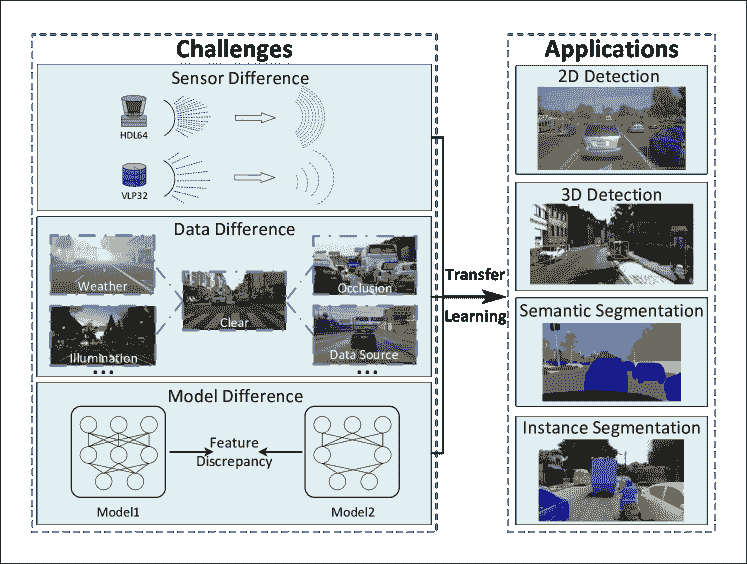
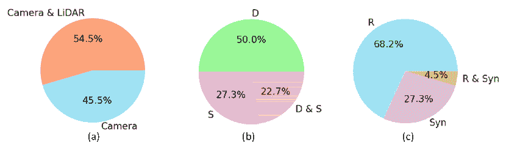
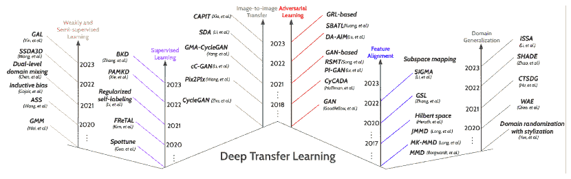

<!--yml

类别：未分类

日期：2024-09-06 19:38:41

-->

# [2306.15110] 智能车辆感知的深度迁移学习：一项综述

> 来源：[`ar5iv.labs.arxiv.org/html/2306.15110`](https://ar5iv.labs.arxiv.org/html/2306.15110)

# 智能车辆感知的深度迁移学习：一项综述

刘欣宇¹，李金龙¹，马进¹，孙辉明¹，许志刚²，

张天云¹，余宏凯¹ ¹ 电子工程与计算机科学系，克利夫兰州立大学，克利夫兰，OH 44115，美国

² 信息工程学院，长安大学，西安 710064，中国

###### 摘要

基于深度学习的智能车辆感知近年来得到了显著的发展，为自动驾驶中的运动规划和决策提供了可靠的来源。大量强大的深度学习方法可以在解决自动驾驶的各种感知问题上取得优异的表现。然而，这些深度学习方法仍然存在一些局限性，例如，实验室训练（源领域）和实际测试（目标领域）数据假设遵循相同的特征分布在实际中可能并不切实际。在许多实际案例中，它们之间通常存在显著的领域差距。作为应对这一挑战的解决方案，深度迁移学习通过将知识从一个领域转移到另一个领域来处理这些情况。深度迁移学习旨在通过利用在另一个领域之前学习到的类似任务的知识来提高新领域中的任务表现。然而，目前尚无关于智能车辆感知的深度迁移学习的综述论文。根据我们所知，这篇论文代表了关于智能车辆感知的深度迁移学习的首个全面综述。本文讨论了与智能车辆感知相关的传感器、数据和模型的领域差距，还探讨了智能车辆感知的最新应用、挑战和未来研究。

###### 关键词：

深度迁移学习，领域差距，智能车辆感知，自动驾驶^†^†期刊：绿色能源与智能交通

## 1 引言

近年来，感知被视为智能车辆在精确定位、安全运动规划和强健控制中的关键组成部分，Li 等人（2020a），Yurtsever 等人（2020），Huang 和 Chen（2020）。感知系统为智能车辆提供关于周围行人、车辆、交通标志及其他物品的即时环境信息，并帮助避免可能的碰撞。本文中的“感知”一词主要关注检测和分割任务，而忽略了跟踪和轨迹预测任务。这种关注的原因有两个：（1）一些之前的智能车辆研究工作主要使用检测和/或分割任务来描述“感知”这一术语，Van Brummelen 等人（2018），Xu 等人（2022b）；（2）许多下游任务，如跟踪、轨迹预测和行为预测，首先依赖于准确的检测和/或分割。

感知任务在智能车辆和自动驾驶中发挥着不可或缺的作用，Arnold 等人（2019）。最近，深度学习方法在智能车辆感知中获得了显著关注，并取得了巨大成功，Grigorescu 等人（2020），Wen 和 Jo（2022），Chen 等人（2022）。例如，如图 1 所示，四个重要应用已被积极研究，并在近年来取得了显著进展。（1）2D 目标检测是一项显著的任务，旨在识别和定位图像或视频中的物体。主要目标是开发能够自动检测物体并准确勾画其边界的算法或模型。（2）3D 目标检测是一项关键任务，重点在于辨别和精确定位三维空间中的物体。3D 检测包括估计物体的位置和在全面的 3D 坐标系统中的方向。（3）语义分割是一个像素级的图像分析任务，其中图像中的每个像素都被分配一个语义标签。目标是根据物体或类别将图像划分为一致的区域或分段。（4）实例分割结合了目标检测和语义分割任务。目标是在图像中检测和分割单个物体，为每个实例提供独特的标签和像素级的掩码。

然而，如图 1 所示，在现实世界中存在许多复杂情况，深度学习方法可能会失败。例如，一个基于深度学习的车辆检测模型在清晰天气数据上进行预训练后，可能会在雾霾天气、低光照（如夜晚）、遮挡或不同数据源（如仿真）条件下进行测试，导致性能大幅下降。这种性能下降受到多种驾驶环境之间的领域差距（偏移）的影响，Hnewa 和 Radha（2020）、Mirza 等（2022）、Mohammed 等（2020）等研究指出，例如不同的天气、光照、遮挡和数据源条件。此外，车辆上安装的不同类型和设置的传感器（Rist 等，2019）以及各种深度学习模型结构（Xu 等，2023a）Khalil 和 Mouftah（2022）在车辆间（V2V）协同感知过程中，也可能导致领域差距。

图 1：智能车辆感知的挑战和应用的示意图。迁移学习（TL）方法可以应用于减少传感器差异、数据差异和模型差异带来的领域差距。

由于领域差距导致的智能车辆感知性能下降可以通过迁移学习（TL）方法（Zhuang 等，2020）得到缓解。TL 技术包括两个目标：（1）充分利用从源领域获得的先验知识来指导在相关目标领域的推断，（2）大幅减少因领域差距造成的特征分布差异。由于这两个目标，基于深度学习的智能车辆感知系统在相关但不同领域的性能可以得到提升。深度学习模型的泛化能力可以在不同挑战性场景下得到改善，如图 1 所示。

本文重点关注深度学习时代智能车辆感知的迁移学习方法。本文首先回顾了智能车辆感知的相关任务和基准数据集，然后将领域差距分为传感器、数据和模型三种差异。接下来，我们仔细回顾了约 150 篇深度迁移学习相关的发表论文，并将基于深度学习的迁移学习方法分类为四种类型：（1）有监督迁移学习，（2）无监督迁移学习，（3）弱监督和半监督迁移学习，以及（4）领域泛化。前面三种类型的迁移学习是从一个源领域到一个目标领域进行，我们的分类取决于目标领域是否有标注数据。最后一种类型的迁移学习是从一个源领域到多个目标领域，以实现许多已知或未知驾驶场景的泛化。此外，本文还对每种迁移学习方法的若干子分类进行了回顾和分析。

本文的贡献可以概括如下。

+   1.

    据我们所知，本文是关于智能车辆感知的深度迁移学习主题的首个深入调查。

+   2.

    本文将智能车辆感知领域的差距总结为三种类型（传感器差异、数据差异、模型差异），并对相关任务和基准数据集进行了详细解释。

+   3.

    在回顾了约 150 篇相关的发表论文后，我们将智能车辆感知的深度迁移学习方法分类为四种类型，并详细解释了每一种方法。

本文的后续章节结构如下。第二部分提供了关于智能车辆感知相关任务和基准数据集的一般概述。第三部分介绍了领域分布差异和三种领域差距。第四部分详细描述了深度迁移学习技术的不同方法。第五部分解释了挑战和未来研究，最后在第六部分中做出总结。

## 2 智能车辆感知

对于智能车辆或自动驾驶，感知在从传感器接收数据并提取周围环境中的有意义信息中发挥了至关重要的作用，从而通过识别障碍物、交通标志/标记和可用驾驶区域来做出有意义的决策，以进行精确的运动规划 Li et al. (2023e)。两种主流传感器（相机、激光雷达）在自动驾驶或智能驾驶车辆中得到广泛使用 Cao et al. (2019) Fadadu et al. (2022) Liu et al. (2021b) Liu et al. (2022b) Gholamhosseinian and Seitz (2021), Yu et al. (2022)。这些安装在车辆上的传感器用于智能车辆的感知任务。

智能车辆感知任务包括发现周围的车辆和行人，识别交通标志和标记，寻找驾驶区域（例如，道路区域）等。在现实世界中，有时物体可能与彼此或背景相似，并且挑战性的场景（例如，多样的天气、黑暗的照明）可能会影响传感器的性能，使得感知任务更加困难 Hnewa and Radha (2020), Li et al. (2023c)。本文将这些智能车辆感知任务分为两个类别（物体检测、语义/实例分割），并进一步讨论了这些挑战。

### 2.1 物体检测

为了安全和成功地实现自动驾驶，必须拥有一个可靠的物体检测系统。考虑到复杂的道路条件，检测（定位和识别）其他车辆、行人和障碍物对于防止潜在事故至关重要。然而，由于物体种类繁多和道路情况未知，在城市地区进行物体检测是具有挑战性的 Arnold et al. (2019), Feng et al. (2020)。

2D 物体检测：仅使用相对便宜的相机传感器，深度学习模型可以被轻松应用于高效地检测（定位和识别）来自 2D 图像数据的周围物体 Yeong et al. (2021)。输出将是每个相机图像上识别的 2D 边界框（2D 坐标）和识别的物体类别，具有实时或接近实时的推理速度。然而，单独的 2D 物体检测只能提供物体在 2D 平面上的位置，这并不提供足够的信息 Wang et al. (2019b)，例如物体深度、物体 3D 尺寸。

3D 目标检测：考虑到 2D 目标检测的局限性，物体的 3D 信息可能使智能车辆更稳健、准确地感知和识别周围物体。输出将是识别的 3D 边界框（3D 坐标）和识别的物体类别，具有合理的推理时间。由于摄像头图像和激光雷达点云可以提供深度线索，3D 目标检测任务可以通过以下三种传感器设置来实现：（1）仅摄像头 Wang et al. (2023a)，（2）仅激光雷达 Xu et al. (2023b) Xu et al. (2022b) Li et al. (2023a)，（3）摄像头 + 激光雷达 Zhao et al. (2020)。

### 2.2 语义/实例分割

与目标检测任务不同，分割任务不仅发现物体区域，还为驾驶场景中的所有内容（包括物体和背景）提供像素级标签（掩码）。对于智能车辆感知，分割任务可以分为两种类型：**语义分割**和**实例分割**。

语义分割：语义分割涉及为图像中的每个像素分配语义标签，如“道路”、“车辆”或“行人”、“交通标志”等。这项技术使智能车辆能够感知周围环境并更全面地理解场景 Feng et al. (2020)，Mo et al. (2022)。识别图像中特定区域可以帮助自动驾驶车辆做出明智的决策，例如确定行驶道路区域的位置。

实例分割：实例分割输出每个物体的边界（像素级掩码），并为每个发现的物体分配一个唯一标签 Zhou et al. (2020a)，这似乎是目标检测和语义分割的结合。它特别有助于识别自动驾驶中周围物体的形状、位置和数量 Rashed et al. (2021)，Ko et al. (2021)。

语义分割捕捉整体场景结构，而实例分割则实现了对物体及其边界的更细粒度理解。不同于只将图像分类为有意义语义区域的语义分割，实例分割通过为每个物体实例提供单独的语义掩码（带有身份）来提供更精确的分析。

### 2.3 基准数据集

智能车辆上可能安装了许多不同的传感器，如摄像头、激光雷达、雷达、近红外传感器、超声波传感器等。为了清晰描述，本文重点介绍两种广泛使用的主要传感器（摄像头和激光雷达），即智能车辆上的摄像头图像数据和激光雷达点云数据。

相机数据：绿色、红色、蓝色三通道颜色图像（即 RGB 图像）通常由单目或多目相机获取，这些相机是简单而可靠的传感器，类似于人眼 Feng 等 (2020)。RGB 相机的主要优点之一是其高分辨率和相对较低的成本。然而，在具有挑战性的天气和光照条件下，它们的性能可能会显著下降 Feng 等 (2021)。

LiDAR 数据：与相机不同，激光传感器提供直接且精确的 3D 信息，使得提取物体候选区域更加容易，并通过提供 3D 形状信息来帮助分类任务。LiDAR，也称为光探测和测距，是一种能够在所有光照条件下探测目标并创建具有高空间覆盖的目标距离图的传感器技术 Li 和 Ibanez-Guzman (2020)，Li 等 (2020b)。LiDAR 可以在一些具有挑战性的天气和低光照环境下工作，但其成本较高。高成本是其更广泛应用的主要障碍 Li 等 (2020b)，Pham 等 (2020)。

2D 物体检测基准：KITTI Geiger 等 (2013)，Cityscapes Cordts 等 (2016)，SIM10k Johnson-Roberson 等 (2017)，Foggy Cityscapes Sakaridis 等 (2018)，Syn2Real-D Peng 等 (2018)，BDD100k Yu 等 (2018)，GTA5 Richter 等 (2016)，nuScenes Caesar 等 (2020)，Waymo Open Sun 等 (2020)，A*3D Pham 等 (2020)，ApolloScape Huang 等 (2018)，Ford Agarwal 等 (2020)，A2D2 Geyer 等 (2020)，ONCE Mao 等 (2021)，以及 Automine Li 等 (2022c)。举两个例子：（1）KITTI Geiger 等 (2013) 是一个广泛使用的自动驾驶数据集，包括相机图像、LiDAR 点云和真实 3D 边界框。它包含 7,481 个训练帧和 7,518 个测试帧，附带传感器校准数据和围绕感兴趣物体的标注 3D 边界框。（2）SIM10k Johnson-Roberson 等 (2017) 是从《侠盗猎车手 V》（GTA-V）计算机游戏中生成的合成数据集。它包含 10,000 张捕捉驾驶街景的图像，并附有专门针对汽车的边界框标注。

3D 目标检测基准：KITTI Geiger 等 (2013)，Cityscapes Cordts 等 (2016)，Foggy Cityscapes Sakaridis 等 (2018)，GTA5-LiDAR Wu 等 (2019)，nuScenes Caesar 等 (2020)，Waymo Open Sun 等 (2020)，A*3D Pham 等 (2020)，ApolloScape Huang 等 (2018)，Ford Agarwal 等 (2020)，A2D2 Geyer 等 (2020)，ONCE Mao 等 (2021)，Automine Li 等 (2022c)，OPV2V Xu 等 (2022b) 和 V2V4Real Xu 等 (2023b)。以下是两个例子：(1) Waymo Open Dataset Sun 等 (2020) 是一个 Camera+LiDAR 数据集，包含 1,000 个驾驶序列，其中 798 个场景用于训练，202 个场景用于验证。使用的评估指标是平均精度(AP)和带有朝向信息的平均精度(APH)，分别考虑加权平均精度和朝向准确性。指标的计算基于车辆的 3D 交集并集(IoU)阈值为 0.7，其他对象为 0.5。(2) V2V4Real 数据集 Xu 等 (2023b) 旨在通过 V2V（车辆对车辆）通信实现自动驾驶的协作感知，涵盖了 410 公里的驾驶区域。它包括大量的真实世界数据，如 20,000 个 LiDAR 帧，40,000 个 RGB 帧，240,000 个特定类别的标注 3D 边界框，以及包含所有驾驶路线的全面高清(HD)地图。

语义分割基准：KITTI Geiger 等 (2013)，Cityscapes Cordts 等 (2016)，ApolloScape Huang 等 (2018)，BDD100k Yu 等 (2018) 和 A2D2 Geyer 等 (2020)。这里给出两个例子：(1) Cityscapes Cordts 等 (2016) 是一个针对驾驶场景的语义城市场景数据集。它包括语义和实例分割注释。数据集包含 2,975 张分辨率为 2048 × 1024 的训练图像，以及另外 500 张验证图像。(2) ApolloScape Huang 等 (2018) 包含了大量按顺序记录的 14 万张摄像头图像，并在不同驾驶条件下具有像素级语义注释。它包括 40,960 张训练图像和 8,327 张验证图像。除了语义注释，数据集还包括相对于静态背景点云的姿态信息。

实例分割的基准：Cityscapes Cordts 等人 (2016)、nuScenes Caesar 等人 (2020)、BDD100k Yu 等人 (2018) 和 KITTI-360 Liao 等人 (2022)。让我们举两个例子：（1）BDD100k Yu 等人 (2018) 包含 100,000 张分辨率为 1280 × 720 的图像，其中包含训练集、测试集和验证集。其中特注释的 70,000 张图像用于训练，10,000 张图像用于验证。该数据集包含六种不同的天气条件、六种不同的场景、一天中的三个不同时间段以及十个带有边界框注释的物体类别。（2）nuScenes Caesar 等人 (2020) 是一个包含 1,000 个驾驶场景的自动驾驶数据集。除了场景注释外，nuScenes 还提供高清 (HD) 语义地图，提供对 11 种不同语义类别的见解。该数据集包括 700 个训练场景、150 个验证场景和另外 150 个测试场景。数据收集过程中使用了六个摄像头和一个 32 梁激光雷达系统，注释覆盖了一个完整 360 度视场内的 10 个物体。

表格 1 总结了目前广泛使用的智能车辆感知任务基准数据集的详细信息，包括图像分辨率、图像数量、激光雷达帧数量、任务类型、每个基准数据集的真实或合成信息。

表 1：智能车辆感知的基准数据集。D：2D 或 3D 目标检测，S：语义或实例分割，Syn：合成数据，R：真实数据。

基准图像分辨率 图像数量 LiDAR 帧 数量 任务 真实/合成 KITTI Geiger et al. (2013) 1,392×512 15K 1.3M D, S R Cityscapes Cordts et al. (2016) 2,048×1,024 25K - D, S R SIM10k Johnson-Roberson et al. (2017) 1,914×1,052 10K - D 合成 Foggy Cityscapes Sakaridis et al. (2018) 2,048×1,024 3,475 - D, S 合成 Syn2Real-D Peng et al. (2018) - 248K - D 合成, R BDD100K Yu et al. (2018) 1,280×720 8K - D, S R GTA Richter et al. (2016) 1,914×1,052 24,966 - S 合成 GTA-LiDAR Wu et al. (2019) 64×512 100K - S 合成 H3D Patil et al. (2019) 1,920×1,200 27,721 - D R nuScenes Caesar et al. (2020) 1,600×900 40K - D R Waymo Open Sun et al. (2020) 1,920×1,280 200K - D R ApolloCar3D Song et al. (2019b) 3,384×2,710 5,277 - S R A*3D Pham et al. (2020) 2,048×1,536 39K 39,179 D R ApolloScape Huang et al. (2018) 3,384×2,710 143,906 - S R SYNTHIA Ros et al. (2016) 960×720 13.4K - S 合成 Lyft Level 5 Houston et al. (2021) - 55K - S R Ford Agarwal et al. (2020) - 200K - D R A2D2 Geyer et al. (2020) 1,928×1,208 12K D, S R ONCE Mao et al. (2021) 1,920×1,020 1M - D R AutoMine Li et al. (2022c) 2,048×1,536 18K - D R OPV2V Xu et al. (2022b) 800×600 44K 11K D 合成 V2V4Real Xu et al. (2023b) 2,064×1,544 40K 20K D R 

图 2: 智能车辆感知基准数据集的分布饼图： (a) 传感器类型，(b) 任务，(c) 数据来源。 注：D：2D 或 3D 物体检测，S：语义或实例分割，合成：合成数据，R：真实数据。

## 3 域分布差异

尽管智能车辆感知算法在基准数据集上取得了显著成就，但由于传感器类型和设置、数据风格、环境、天气和光照的巨大差异、训练周期和架构 Li et al. (2022b)，Feng et al. (2021)，Schutera et al. (2020)，Song et al. (2023)，现实世界中仍面临重大挑战。 基于这些观察，我们将智能车辆感知的域分布差异分为三种类型：传感器差异、数据差异和模型差异，如表 2 所示。

### 3.1 传感器差异

首先，如 Chen et al. (2023)、Wang et al. (2023a)、Li et al. (2022d)所述，当传感器在类型和设置上存在差异时，领域间的差距会显现。让我们分别解释相机和激光雷达的传感器差异。相机传感器便宜，但对于不同类型和设置的适应性较差，例如，水平到倾斜角度的差异 Rist et al. (2019)、从前视到后视的放置差异 Alonso et al. (2020)、图像分辨率的多样性 Carranza-García et al. (2020)，等等。激光雷达传感器也可能具有不同的类型和设置，例如，激光束数量的差异 Yi et al. (2021)、来自不同公司的各种激光雷达设备 Xu et al. (2023a)、激光雷达的放置差异 Hu et al. (2022a)，等等。这一问题与其他传感器类型的设置类似。以雷达为例，雷达分辨率、视场和噪声特性等的变化可能导致数据分布的多样化。这些由于传感器差异而产生的现实挑战可能导致不同领域间的特征分布异质性 Triess et al. (2021)、Zhou et al. (2022b)、Chakeri et al. (2021)。

### 3.2 数据差异

此外，当数据本身在风格和格式上存在差异时，领域间的差距也会存在，如 Gao et al. (2021)、Triess et al. (2021)所解释的。不同情况传感器收集的数据可能导致不同领域间的数据分布异质性。以下是智能车辆的四个常见例子。 (1) 多样的天气：雾天、雨天、雪天、晴天等 Miglani and Kumar (2019)、Xu et al. (2021)、Mirza et al. (2022)、Bogdoll et al. (2022)、Li et al. (2023c)。 (2) 不同的光照：白天、夜晚、隧道等 Wu et al. (2021)。 (3) 遮挡：由于障碍物、其他车辆或环境条件，物体或物体部分被传感器视野遮挡或隐藏 Qian et al. (2022)、Ruan et al. (2023)。 (4) 不同的数据来源：合成数据（计算机游戏数据：SYNTHIA Ros et al. (2016)、GTA5 Richter et al. (2016))和真实世界数据 Li et al. (2023a)之间的差异，以及在不同城市或高速公路环境中收集的数据的变化 Shenaj et al. (2023)。

### 3.3 模型差异

最终，模型差异虽然不常见，但它也是智能车辆感知中领域差距的一个可能原因。当感知体系结构多样时，模型明显不同 Xu et al. (2023a)，例如，从 PointPillar 体系结构 Lang et al. (2019) 到 SECOND 体系结构 Yan et al. (2018)。当感知体系结构相同时，领域差距仍可能存在，因为配置异质，如训练周期、分辨率、卷积层数量和超参数 Xu et al. (2023a)。由于这些不同的情况，从中提取的特征可能会出现领域迁移，正如 Xu et al. (2023a) 中所述，导致不同领域之间特征分布的异质性。

表 2：智能车辆感知的三种差异类型的领域分布差异：传感器、数据和模型。“$\rightarrow$” 表示模型在左侧数据上训练并在右侧数据上测试。

类型 差异 示例 传感器差异 设置 64-beam LiDAR $\rightarrow$ 32-beam LiDAR  Yi et al. (2021) 放置 前 $\rightarrow$ 后 Feng et al. (2020) 角度 水平 $\rightarrow$ 倾斜 Rist et al. (2019) 数据差异 数据来源 GTA5 $\rightarrow$ Cityscapes Murez et al. (2018) 遮挡 OPV2V $\rightarrow$ V2V4Real Xu et al. (2023b) 天气 Cityscapes $\rightarrow$ Foggy Cityscapes Li et al. (2023c) 照明 Cityscapes $\rightarrow$ Dark Zurich Wu et al. (2021) 模型差异 配置 超参数 1 $\rightarrow$ 超参数 2  Xu et al. (2023a) 体系结构 PointPillars $\rightarrow$ SECOND Xu et al. (2023a)

## 4 深度迁移学习方法论

随着自动驾驶技术的快速发展，现在有大量的驾驶场景图像可用。深度学习方法在自动驾驶应用中表现出色，感知性能高。本论文重点介绍深度学习时代智能车辆感知的迁移学习方法。

迁移学习（TL）是一种机器学习方法，旨在将从一个任务或领域获得的知识大规模应用到另一个相关任务或领域 Zhuang et al. (2020)。本文将深度迁移学习分为几种主要类型：有监督迁移学习、无监督迁移学习、弱监督和半监督迁移学习、领域泛化。深度学习时代迁移学习研究的发展时间顺序概述见图 3。

图 3：深度学习时代迁移学习研究的时间顺序概述。

### 4.1 监督迁移学习

在迁移学习研究中，源领域通常有手动标注的真实值。如果目标领域也有手动标注的真实值，则将知识从标记的源领域迁移到标记的目标领域的机器学习技术称为监督迁移学习，Drews 等人 (2017)，Yu 等人 (2018)，Zhou 等人 (2019) 有相关研究。收集这些手动标注的数据需要大量的人力，劳动密集且耗时，Carvalho 等人 (2015) 指出。

本文将监督迁移学习方法分为微调和通过教师-学生网络的知识蒸馏。

#### 4.1.1 微调

微调是一种常见的迁移学习技术，Guo 等人 (2019b)，Li 和 Zhang (2021)，Hu 等人 (2022a) 提出了该技术，它已被广泛应用于智能车辆感知领域，Wang 等人 (2019b)，Luo 等人 (2021)，Liang 等人 (2022)，Xu 等人 (2019)，Doan 等人 (2019) 也有相关研究。微调利用在源领域数据集上预训练的现有神经网络模型，并在新的目标领域数据集上进一步训练。通过微调，可以利用源领域学习到的知识来提高目标领域的表现。值得一提的是，微调一个预训练的神经网络模型通常能获得比从头开始训练更好的性能。通常，预训练的神经网络模型是在大规模数据集上训练的，能够从广泛的范围中获取知识。目标领域的微调学习率相对较小，作为对在源领域上预训练的神经网络模型的微调。微调方法大致可以分为两类：(1) 整体微调：训练整个神经网络模型的所有层。(2) 部分微调：只训练预训练神经网络模型中的某些感兴趣的层，同时保持某些层冻结。

整体微调：对整个神经网络模型的所有层进行微调，以获得自主车辆之间的时空交互，Ye 等人 (2021)，以及在自主驾驶中的 3D 感知，Sautier 等人 (2022)。

部分微调：Guo 等人 (2018) 仅对基于编码器-解码器的语义分割模型进行微调，通过固定预训练的子网络来确保多类别边界约束。

深入讨论：（1）基于微调的迁移学习是一种简单但有效的方法，将从源领域的预训练中获得的知识转移到目标领域，以提高在目标领域上的性能，所需的数据和计算资源少于从头开始训练。当我们微调一个预训练模型时，训练迭代通常比从头开始训练机器学习模型要少。因为预训练模型已经拥有预训练数据集的先验知识（通常很大），所以微调过程需要较少的标记数据来继续训练模型以实现优异的性能。当预训练模型在源领域的类似数据上进行训练时，微调将在目标领域上生成改进的性能。（2）然而，作为一种监督方法，微调需要在目标领域上进行人工标注的真实数据，这在一些实际应用中可能不可用。此外，微调可能会遭遇模型遗忘问题，即模型在适应目标领域的新任务时，可能会丢失一些关于源领域预训练任务的知识。此外，小的目标领域数据集可能导致模型在微调过程中出现过拟合。

#### 4.1.2 知识蒸馏

知识蒸馏 Hinton et al. (2015), Gou et al. (2021), Wang and Yoon (2021), Chen et al. (2021a), Xie and Du (2022), Beyer et al. (2022) 是深度学习中的一种先进技术，也称为教师-学生学习，其中一个学生神经网络在目标领域上进行训练，以模仿在源领域上训练的教师神经网络的知识。知识蒸馏已广泛应用于智能车辆感知 Kothandaraman et al. (2021), Gao et al. (2022), Hou et al. (2022), Yang et al. (2022), Sautier et al. (2022)。

知识蒸馏有助于模型泛化、模型压缩和模型迁移能力。它改善了模型的泛化能力，使学生网络能够在未见过的样本上表现更好，特别是在训练数据有限的情况下。它允许将一个大型教师模型压缩成一个较小的学生模型。即使在不同的深度学习架构下，它也能够实现从教师模型（源领域）到学生模型（目标领域）的知识迁移。教师网络通常在大规模数据集上进行训练，以便将知识迁移到学生网络，但在某些智能车辆感知任务的源领域中，可能没有大规模数据集。受到 Lan and Tian (2022) 的启发，知识蒸馏方法大致可以分为以下两类。

响应知识蒸馏：它专注于教师模型的最终输出层，以教会学生模型模仿其预测。核心概念是使用一种叫做蒸馏损失的损失函数，来衡量学生模型和教师模型输出激活之间的差异。通过在训练过程中最小化这种损失，学生模型逐渐提高其生成与教师模型预测结果相似的预测的能力。Gao 等人（2022）提出了跨域相关蒸馏损失，以将知识从白天域转移到夜晚域，从而提高夜晚语义分割性能。

中间知识蒸馏：它专注于对齐教师模型和学生模型的中间表示。中间层学习识别和区分数据中的特定特征，而这些在教师网络中提取的知识可以用来有效地训练学生模型。Hou 等人（2022）提出了一种将从较大源教师模型中提取的知识转移到较小目标学生网络以进行 LiDAR 语义分割的方法。具体而言，使用中间点对体素知识蒸馏方法将点级和体素级的潜在知识转移，以补充稀疏的监督信号。

深入讨论：（1）通过将知识从教师模型转移到学生模型，知识蒸馏可以实现模型压缩、提高泛化能力、防止过拟合的正则化效果以及模仿集成效果。一个较小的学生模型可以被训练来近似较大、计算开销较大的教师模型的性能，从而实现对学生模型的模型压缩。通过从教师模型提供的指导中学习，学生模型将继承教师模型对未见示例的泛化能力，确保学生模型的更好泛化。教师模型的指导能够作为一种正则化形式，防止学生模型的过拟合。知识蒸馏还可以与传统模型训练相结合，以模仿多个模型的集成效果。（2）然而，知识蒸馏的成功首先依赖于经过良好训练的高性能教师模型。训练一个较大的教师模型可能计算开销很大，并且在某些智能车辆感知任务的源领域中，可能没有大规模的数据集。如果教师模型缺乏足够的识别能力（未经过良好优化），那么转移到学生模型的知识可能不够强。对于某些复杂的智能车辆感知任务，当源领域和目标领域之间的数据分布差异很大时，知识蒸馏可能难以提高学生模型的性能。

### 4.2 无监督迁移学习

在智能车辆感知中，数据标注是现实世界场景下耗时且劳动密集的过程。一般而言，当源领域中标记数据稀缺时，监督算法会遇到困难 Niu et al. (2020), Pan and Yang (2010)。为了解决这些挑战，无监督迁移学习（TL）作为一种有前途的方法出现，以应对智能车辆感知任务中的具体情况。无监督 TL 指的是除了源领域中有标记数据外，还有未标记的目标数据的情境。无监督 TL 方法为克服标记数据有限性的限制提供了有前途的解决方案，从而实现更高效和有效的智能车辆感知。

#### 4.2.1 图像到图像迁移

图像到图像迁移，也称为图像到图像翻译，是一种计算机视觉任务，涉及将输入图像转换到不同的领域。它旨在建立两个视觉领域之间的学习对应关系，其中输入图像来自源领域，而所需的输出图像类似于目标领域。目标是生成一个与目标领域风格相似的对应图像，同时保持输入图像的相关特征和语义内容。它在自动驾驶和智能交通系统领域有广泛的应用，包括语义分割 Murez et al. (2018), Pizzati et al. (2020), 车道识别 Hou et al. (2019), Liu et al. (2021a), 数据增强 Zhang et al. (2022), Yang et al. (2020) Mușat et al. (2021) 和目标检测 Schutera et al. (2020), Li et al. (2021, 2022b), Shan et al. (2019)。

图像到图像的迁移神经网络通常有两种不同的实现方式：（1）配对图像到图像迁移和（2）非配对图像到图像迁移。第一种方法利用了在配对图像上训练的生成对抗网络 Wang et al. (2018)。这种类型的网络学习一种映射，将输入图像从其原始领域转换到所需的输出领域 Isola et al. (2017)。第二种方法处理那些使用非配对图像来建立更一般框架的情境 Zhu et al. (2017), Park et al. (2020)，这激发了无监督的图像到图像翻译方法 Liu et al. (2017), Baek et al. (2021)。

配对图像到图像的转换：Isola 等人 (2017) 研究了条件生成对抗网络（GAN）的应用，即 pix2pix，用于配对图像到图像的转换任务 Hao 等人 (2019)。带条件的 GAN 学习数据的生成模型，但附加了输入图像的条件以生成相应的输出图像。这种方法力求在目标领域生成逼真的图像。对抗损失用于训练生成器网络，该网络通过 $l_{1}$ 损失进行更新，$l_{1}$ 损失量化生成图像与预测输出之间的差异。通过结合额外的损失，生成器网络能够生成源图像的逼真翻译。相反，判别器网络则被设计用于执行生成图像分类。通过配对训练数据，这些方法可以在不同领域中翻译相似风格的图像。

无配对图像到图像的转换：Cycle-consistency GAN（CycleGAN）Zhu 等人 (2017) 是一种允许在无配对数据集之间进行图像翻译的 GAN 模型 Mușat 等人 (2021)、Uricar 等人 (2021)、Shan 等人 (2019)、Liu 等人 (2022a)。CycleGAN 的训练过程涉及同时优化两个生成器和两个判别器。一个生成器负责学习从领域 $X$ 到 $Y$ 的映射函数 $G$，而另一个生成器 $F$ 学习从领域 $Y$ 到 $X$ 的映射。$G$ 和 $F$ 是同时训练的，通过一个循环一致性损失来强制循环一致性，确保 $F(G(x))\approx x$ 和 $G(F(y))\approx y$。这个损失结合了领域 $X$ 和 $Y$ 上的对抗损失，得出了无配对图像到图像转换的目标。无配对图像到图像的转换释放了对配对训练数据的要求，这在智能车辆感知的实际应用中更为通用。通过结合领域 $X$ 和 $Y$ 上的对抗损失，得到了无配对图像到图像转换的目标。无配对图像到图像的转换消除了对配对训练数据的需求，使其在智能车辆感知的现实应用中更加普遍。

深入讨论：（1）图像到图像的转换可以用作数据增强、数据分布风格转换。由于源域或目标域的数据有限，图像到图像的转换方法可以生成多样化的假例作为数据增强，从而提高机器学习模型训练过程中的鲁棒性和泛化能力。此外，图像到图像的转换还能够在源域和目标域之间进行转换，以减少智能车辆感知中的数据分布风格差异。（2）然而，将图像到图像的转换方法应用于实际智能车辆感知时存在一些局限性。当转换涉及自动驾驶中的复杂或模糊模式时，图像到图像的转换模型可能会产生低现实性或低逼真的转换。对于配对图像到图像的转换方法，在智能车辆感知的实际应用中，对配对训练数据的需求带来了缺点。对于非配对图像到图像的转换方法，它们依赖于任务特定的和预定义的输入与输出之间的相似性函数，并且没有考虑转换框架的可靠性和鲁棒性，这可能会受到添加到输入和目标图像中的扰动的干扰。这一问题对于自动驾驶尤其重要。

#### 4.2.2 对抗学习

敌对学习是一种机器学习技术，涉及以竞争方式训练两个神经网络，在生成对抗网络（GAN）上首次由 Goodfellow 等人（2020）引入，并在梯度反转层（GRL）框架 Ganin 和 Lempitsky（2015）中提到。它提供了一种有希望的方法，通过训练稳健的深度神经网络，在像素级别生成目标相似样本或在特征级别生成目标相似表示。通过最小化对抗目标，例如欺骗域鉴别器/分类器，它已经成为解决迁移学习挑战的热门方法之一。在训练过程中，特征提取器和域鉴别器参与一种对抗性博弈。特征提取器试图生成使域鉴别器混淆的表示，使得鉴别器很难区分不同的域。同时，域鉴别器的目标是将样本正确分类到它们各自的域中。这种对抗过程通过特征提取器学习域不变特征，从而最小化域之间的差异。通过对抗学习来最小化域的差异，模型学习到了捕捉跨域共享的底层域不变信息的表示。这种方法有助于通过有效降低两个不同域之间的差异来解决迁移学习挑战，从而提高模型在不同域上的泛化能力。基于对抗学习的智能车辆感知的迁移学习方法包括两种类型：基于 GRl 的方法和基于 GAN 的方法。

基于 GRL 的方法：在不同的车辆感知领域中，可以通过在深度学习架构中添加一个梯度反转层（GRL）来实现领域适应（Xu et al. (2023a)，Li et al. (2023c)）。领域对抗嵌入的机制涉及使用带有 GRL 的鉴别器来区分来自两个领域的样本。鉴别器是一个二分类器，而 GRL 可以在特征提取的反向传播中反转训练梯度。鉴别器和 GRL 共同作用以对齐不同领域的特征分布。值得一提的是，GRL 仅在反向传播阶段生效，不影响前向传播过程（Ganin and Lempitsky (2015)）。为了更好地理解，我们给出一个详细的示例。Li et al. (2023c) 介绍了一个用于在挑战性的雾霾天气中进行领域自适应物体检测的新框架。该方法通过结合图像级和对象级的适应技术，解决了车辆驾驶中的晴天和雾霾天气之间的领域差距，旨在最小化对象外观和图像风格的差异。此外，提出了一种新型的对抗梯度反转层（AdvGRL），以便在进行领域适应的同时进行对抗性挖掘，以处理困难的样本。

基于 GAN 的方法：GAN（Goodfellow et al. (2020)，Song et al. (2020)）是一种流行的深度学习框架，可以用于训练模型捕捉训练数据中存在的分布模式，从而生成来自相同分布的新数据。GAN 包括两个独立的模型，即生成器$G$和判别器$D$。生成器$G$的任务是创建“伪造”图像，使其类似于训练图像，以混淆判别器$D$。由于生成逼真图像的显著进展，GAN 在自动驾驶中的应用最近得到了探索。具体来说，GAN 被用于生成未被领域分类器基于判别器区分的图像或子空间特征，例如，GAN 可以生成晴天与雾天之间对齐/相似的特征 Li et al. (2023c，2022a)，合成游戏数据与现实世界数据之间的特征 Biasetton et al. (2019)，Zhang et al. (2021b)，白天数据与夜晚数据之间的特征 Wang et al. (2022a)，Li et al. (2022a)。我们给出一个详细的例子以便更好地理解。Hoffman et al. (2018)提出了一种领域适应模型，该模型结合了生成图像空间对齐、潜在特征空间对齐和车辆感知任务。通过考虑车辆感知任务（城市驾驶场景的语义分割），图像级特征、潜在特征和与任务相关的语义特征通过基于 GAN 的框架在不同领域间对齐。

深入讨论：（1）基于 GRL 的方法依赖于通过在特征提取的反向传播中进行梯度反转来最小化领域分布差异，以混淆领域判别器。相比之下，基于 GAN 的方法则专注于交替训练生成器网络和判别器网络，使用最小-最大对抗损失函数，以获得领域不变特征。通过这两种方式，可以对齐源领域和目标领域之间的特征分布，以减少迁移学习中的领域差距。（2）然而，训练对抗学习模型有时是困难的。对于基于 GRL 的方法，简单的梯度反转可能不足以在复杂的驾驶场景中有效地最小化领域分布差异，从而导致局部最优解。对于基于 GAN 的方法，由于其超参数敏感性、数据质量和数据多样性，找到生成器$G$和判别器$D$之间的优化平衡可能很困难，并且在训练 GAN 模型时，收敛性可能无法始终得到保证。

#### 4.2.3 特征对齐

为了最小化领域分布的差异，迁移学习中的特征对齐目标是从多个领域中发现一个对齐的特征表示。通常，领域之间的特征分布差异可以在深度神经网络训练过程中定义为损失函数，因此最小化跨多个领域的特征分布差异的损失函数将缩小领域间的差距。

基于特征对齐的迁移学习可以分为两大类：子空间特征对齐和基于注意力的特征对齐。

子空间特征对齐：通过将来自不同领域的特征投影到低维子空间中，可以在深度学习框架中将描述源领域和目标领域之间特征分布距离的几个度量定义为损失函数。最小化这些度量距离（损失函数）将使不同领域的特征在子空间中对齐。常用的描述特征分布距离的度量包括主成分分析（PCA）投影子空间特征距离 Song et al. (2019a)、最大均值差异（MMD） Borgwardt et al. (2006)、Kullback–Leibler 散度 Zhang et al. (2018)、Gram 矩阵 Guo et al. (2019a)、多核 MMD Gretton et al. (2012)、Long et al. (2015)、联合 MMD Long et al. (2017)、Wasserstein 距离 Arjovsky et al. (2017) 等。例如，我们可以详细看看 MMD 度量的定义，其公式为

|  | $MMD(\mathcal{X}_{s},\mathcal{X}_{t})=\lVert\frac{1}{n_{s}}\sum_{i=1}^{n_{s}}k(\mathbf{x}_{i}^{s})-\frac{1}{n_{t}}\sum_{j=1}^{n_{t}}k(\mathbf{x}_{j}^{t})\rVert_{H},$ |  | (1) |
| --- | --- | --- | --- |

其中，$\mathcal{X}_{s}$ 和 $\mathcal{X}_{t}$ 表示从源领域和目标领域获得的样本集合，$\mathbf{x}_{i}^{s}$ 和 $\mathbf{x}_{j}^{t}$ 是来自各自领域的个体样本，$n_{s}$ 和 $n_{t}$ 分别表示源领域和目标领域的样本大小，$k$ 表示核函数，$H$ 表示再生核希尔伯特空间（RKHS）。

注意引导特征对齐：受注意力机制的启发 Zhou et al. (2016)，Vaswani et al. (2017)，可以将特定重要性的最具信息成分集中用于智能车辆感知。深度学习框架首先可以提取注意力图，然后定义两个领域之间注意力图的距离作为损失函数，在神经网络训练过程中最小化 Zhou et al. (2020b)，Zagoruyko 和 Komodakis (2016)。通过采用这种方法，可以通过注意力图一致性约束对源领域和目标领域的特征分布进行对齐。例如，在 Cho et al. (2023)中，多个检测头捕捉的关系感知知识可以通过专门设计的注意力头损失进行转移，以改进自动驾驶背景下基于 LiDAR 的 3D 目标检测。

深入讨论： (1) 子空间特征对齐方法专注于通过使用不同的分布距离度量来对齐低维子空间表示中的特征分布。注意引导特征对齐方法首先使用注意力机制提取注意力图，然后强制来自多个领域的注意力图保持一致。这两种方法通过特征对齐有助于模型将从源领域学习到的知识适应到目标领域，从而使模型能够更好地推广到目标领域。 (2) 然而，特征对齐方法中的几个重要设置仍然是开放问题。举几个例子。如何发现最具代表性的特征子空间或注意力图，在多样的深度神经网络架构中没有广泛接受的常识。特征分布距离度量（如 MMD）很好，但可能仍然忽略一些重要的领域信息。在智能车辆感知的模型训练过程中，如何平衡特征对齐损失和原始任务相关损失的权重仍然具有挑战性。

#### 4.2.4 自我学习

自动驾驶车辆在操作过程中持续收集未标记数据，为自我学习创造了机会 Liu et al. (2021c)，Zhang et al. (2021a)，Kumar et al. (2021)，Luo et al. (2021)，Ziegler 和 Asano (2022)，这为减少对标记数据的依赖和增强模型灵活性提供了有前途的方法。由于目标领域缺乏标记数据，使用无监督迁移学习，自我学习方法利用额外线索在无监督环境中评估神经网络预测，因此一些高置信度的预测结果被用作进一步训练或测试中的伪标签。

以下展示了一些代表性的自学习方法，用于基于无监督迁移学习的智能车辆感知。基于熵的不确定性可以用来定义特定训练样本的难度，从而实现一种由易到难的课程学习方法用于语义分割 Pan 等人（2020）。Wang 等人（2021a）利用自监督学习，通过使用深度估计作为指导，增强语义分割性能，以克服源领域和目标领域之间的领域差距。他们明确捕捉任务特征之间的相关性，并使用目标深度估计来增强目标语义预测。随后，从深度信息中推断出的适应难度被用来提高目标语义分割的伪标签质量。Shin 等人（2022）提出了一种在 3D 语义分割背景下测试时间适应的多模态扩展。为了改善模型在测试时的不稳定性能，他们设计了内模态和跨模态模块，以获得更可靠的伪标签自学习信号。Zhang 等人（2021a）利用多个带有注意力头的分类器来评估与伪标签相关的不确定性。然后使用高置信度的全景伪标签以迭代的方式来改进全景语义分割预测。

深入讨论：（1）自学习弥补了监督学习和无监督学习之间的差距，通过使用带标签的数据进行训练以及使用未标记的数据进行进一步的优化，结合了两种方法的优点。通过在自动驾驶中利用自学习，减少了大量手动标注数据的需求，使模型训练更加成本有效和高效。利用高置信度识别样本和生成伪标签的迭代过程促进了在目标领域使用未标记数据的有前景的方法。（2）然而，自学习方法的鲁棒性和收敛性仍然是可靠智能车辆感知中的一个悬而未决的问题。如果初始模型不够自信，并且对未标记数据做出错误预测，这些错误可能会通过迭代传播，导致性能下降或困难的收敛。

### 4.3 弱监督和半监督迁移学习

尽管无监督迁移学习方法取得了令人印象深刻的结果，但由于缺乏目标领域的监督，领域间的差距无法完全消除。与监督迁移学习方法相比，仍然存在相对的性能差距。解决领域差距的另一种方法是使用弱监督和半监督学习方法，这些方法利用了目标领域中的弱标记数据和一些标记/未标记数据。根据可用的监督，弱监督和半监督迁移学习方法大致可以分为两类：弱监督迁移学习（Weakly-Supervised TL）：目标领域中只有弱监督标签。半监督迁移学习（Semi-Supervised TL）：目标领域中只有半监督标签，包括一些标记数据和剩余的未标记数据。

弱监督迁移学习（Weakly-Supervised TL）：弱监督学习理论已应用于自动驾驶，如 Barnes 等（2017）、Gojcic 等（2021），例如目标检测、语义分割和实例分割。迁移学习技术可以与弱监督学习同时应用。例如，当实例级任务在目标领域只有图像级标注而在源领域有实例级标注时，可以预测伪标注，如 Inoue 等（2018）用于目标检测任务。给定一个具有像素/对象级标签的源领域（合成数据），目标领域（现实场景）可能只有对象级标签，此时可以在迁移学习中使用像素级和对象级领域分类器，以学习领域不变特征，用于驾驶场景中的语义分割任务，如 Wang 等（2019a）。

半监督 TL：半监督 TL 设置中有三种类型的训练数据（标记源数据，标记目标数据和未标记目标数据）（Wang et al. 2020，Chen et al. 2021b，Wang et al. 2023b）。改进半监督 TL 的关键点是有效利用目标领域的可用未标记数据和不同领域的有限标记数据。例如，Wang et al. 2020 通过引入额外的语义级适应模块，在两个领域之间对特征分布进行对齐，这个模块利用了目标域的少量标记图像来监督分割和特征适应任务。其他作品则侧重于使用标记的源数据和标记的目标数据为未标记的目标数据生成伪标签。例如，Wang et al. 2023b 通过两阶段学习解决了这个问题，包括域间适应阶段和域内泛化阶段。而 Chen et al. 2021b 则使用了域混合的教师模型和知识蒸馏来训练一个良好的学生模型，然后良好的学生模型将为下一轮的教师模型训练生成伪标签。

深入讨论：（1）通过在目标领域中加入一些监督，弱监督和半监督学习方法可以比无监督 TL 方法取得更好的性能。弱监督 TL 可以更加节约数据，因为它利用了通常更容易和更便宜获得的弱标记数据，减少了对大量手动标注的需求。半监督 TL 可以提高模型对未知数据的泛化能力，并减少对有限标记数据的过拟合。半监督方法通过未标记数据增加了标记数据集，为模型提供了更多的训练示例，增加了数据的多样性。与弱监督方法类似，半监督方法对于域适应任务时有限标记数据在目标域中可用时非常有价值。（2）尽管已经提出了各种方法用于弱监督和半监督迁移学习，但在不同复杂情况下如何利用可用的标记数据来利用未标记的目标数据仍然具有挑战性。弱监督和半监督迁移学习方法的性能仍然低于监督迁移学习方法，这表明只实现了一些局部最优解。如何进一步改进以克服算法性能边界是一个现在的开放问题。也许可以利用人类驾驶的一些先验知识来提升算法的性能。

### 4.4 领域通用化

用于智能车辆感知的域泛化（DG）提供了增强深度神经网络对任意未见驾驶场景的鲁棒性的解决方案 Zhou 等（2022a）。与领域适应（DA）不同，DG 方法通常专注于在多个源领域之间学习共享表示。这种方法旨在提高模型在各种领域间的泛化能力，使其能够在未知的驾驶目标领域中表现良好。然而，收集多领域数据集是一项费时且昂贵的工作，并且 DG 方法的效果受到源数据集数量的显著影响 Wang 等（2022b）。

域泛化（DG）的概念已经成为解决领域间差距中缺乏目标数据问题的一个方案 Blanchard 等（2011）Wang 等（2022b）。DA 和 DG 之间的主要区别在于 DG 在训练阶段不需要访问目标领域。DG 旨在通过使用一个或多个相关但不同的源领域的数据来开发一个模型，以生成任何分布外的目标领域数据 Shen 等（2021）。现有的 DG 方法可以根据源领域的数量分为两个主要组：多源 DG 和单源 DG。

多源 DG：其主要动机是利用来自多个来源的数据来学习对不同边际分布不变的表示 Wilson 和 Cook（2020）Luo 等（2022）Zhao 等（2022）。由于缺乏目标数据，单一来源训练的模型很难有效地实现泛化。通过利用多个领域，模型可以发现源领域之间的稳定模式，从而在未见领域上取得更好的泛化结果。这一类别的基本概念是最小化不同源领域表示之间的差异，从而学习领域不变的表示 Yue 等（2019），Hu 等（2022b），Xu 等（2022a），Li 等（2022b），Choi 等（2021），Lin 等（2021），Acuna 等（2021）。

单源领域泛化（DG）：它假设训练数据是同质的，样本来自单一领域 Qiao 等人（2020），Wang 等人（2021b）。单源领域泛化方法围绕数据增强展开，旨在创建超出领域的样本，并将这些样本与源样本一起用于训练网络，从而提高泛化能力 Li 等人（2023d），Lehner 等人（2022），Hu 等人（2022b），Khosravian 等人（2021），Chuah 等人（2022），Sanchez 等人（2022），Zhang 等人（2020），Wu 和 Deng（2022）。虽然单源领域泛化方法由于源领域信息有限而不如多源领域方法鲁棒，但它们不依赖于领域身份标签进行学习，使其适用于单源和多源场景。

深入讨论：（1）通过学习领域不变特征加上数据增强或随机特征泛化，领域泛化旨在提高模型对新未见数据的泛化能力。这对智能车辆感知有益，因为现实世界中的许多复杂驾驶场景之前未曾见过。通过结合多源领域泛化和单源领域泛化，可以减少现有训练数据中的数据偏差，从而使感知模型对新未见的驾驶场景更为鲁棒。由于无法收集现实世界中的所有驾驶数据，领域泛化有可能节省时间和劳动成本，同时提高模型鲁棒性。（2）然而，训练具备领域泛化能力的感知模型比传统的领域特定迁移学习方法更复杂，因为它需要处理单源或多源的领域不变特征的泛化。在多个源领域进行训练时，模型可能会遭遇不同领域之间的数据不平衡问题，导致对一些主导领域的学习偏向。这一问题与单源领域中的类别不平衡问题类似，对领域泛化方法提出了挑战。

表 3：智能车辆感知中深度迁移学习（TL）方法的独特性。

类型 方法论 独特性 监督迁移学习 微调 从预训练模型中持续学习 知识蒸馏 从教师模型到学生模型的知识迁移 无监督迁移学习 图像到图像迁移 像素级映射或翻译 对抗学习 训练两个对抗的模型 特征对齐 对齐不同领域的特征 自学习 使用伪标签进行学习和优化 弱监督和半监督迁移学习 弱监督迁移学习 使用弱标记数据进行学习 半监督迁移学习 使用部分标记数据进行学习 领域泛化 多源领域泛化 通过多个源领域对未知数据进行泛化 单源领域泛化 通过单一源领域对未知数据进行泛化

### 4.5 方法论的独特性

表 3 总结了上述分类的智能车辆感知深度迁移学习方法的独特性，包括监督迁移学习（Supervise TL）、无监督迁移学习（Unsupervised TL）、弱监督和半监督迁移学习（Weakly-and-semi Supervised TL）以及领域泛化（Domain Generalization）的方法。

## 5 挑战与未来研究

本节概述了当前智能车辆感知领域深度迁移学习面临的主要挑战以及相关的未来研究方向。

+   1.

    传感器鲁棒性：当前的摄像头和激光雷达传感器在极端驾驶场景中，如多变的天气、低光照、各种环境下，鲁棒性不足。此外，对于 V2V 协作感知，V2V 通信传感器可能因高速、障碍物等原因出现丢包通信问题 Li et al. (2023b)，Schlager et al. (2022a)。未来研究：可以更多地关注提高传感器鲁棒性，例如，在多变天气、低光照、各种环境中的摄像头和激光雷达传感器，以及 V2V 系统中的通信传感器 Tahir et al. (2021)。例如，可以研究具有坚固镜头涂层、自清洁机制、更佳激光雷达反射的高级传感器，以补偿恶劣天气下的失真。还可以研究具有更少通信延迟的先进 V2V 通信系统，以应对未来自动驾驶连接车辆的增长。

+   2.

    方法论局限性：目前的无监督迁移学习方法相较于有监督迁移学习方法表现较差，存在相对性能不足的问题。此外，如何充分利用源领域的知识以及人类的先验认知和经验仍然是一个待解答的问题。如何有效利用弱标记和部分标记的数据仍然是一个未解之谜。未来研究：研究人员可以努力在未来开发更先进的深度迁移学习方法，例如，大幅减少无监督和有监督方法之间的性能差距，将车对一切（V2X）技术应用于与联网车辆和智能基础设施的通信，以克服遮挡挑战，引入大型语言模型，如 ChatGPT Gao et al.（2023），以更好地模拟人类认知和知识，从而指导迁移学习方法，准确自我学习未标记的数据，及有效利用弱标记和部分监督的数据。

+   3.

    合成数据的现实性：通过消除手动标注的需求，由计算机游戏引擎生成的合成数据在提高训练数据量方面非常有帮助，但与真实世界数据在风格、光照条件、视角和车辆行为等方面仍存在显著差异。未来研究：未来可以通过更先进的计算机游戏引擎来提升合成数据的现实性。通过数字双胞胎模拟系统 Wang et al.（2023c）可以更好地模拟定制的合成数据。例如，研究人员可以参与开发游戏引擎中的动态和互动虚拟环境。通过模拟真实的光照、天气条件和物体交互，合成数据将能够模仿现实世界场景的复杂性。这一过程可能会创造出更强大且可转移的机器学习模型。此外，基于真实世界数据构建数字双胞胎模型提供了生成高度个性化和精确合成数据的机会。

+   4.

    复杂场景中标注基准数据的稀缺：现实世界驾驶中存在无限复杂的场景，但目前复杂驾驶场景中的基准数据集仍然有限。例如，Foggy Cityscapes 数据集 Sakaridis 等人（2018）仅在雾天时包含 2,975 张训练图像，其小规模对智能车辆在雾天中的准确感知构成明显障碍。未来研究：我们期望未来能够收集并公开更多高质量的复杂驾驶场景基准数据集。我们还鼓励在未来使用更先进的物理模型来模拟复杂驾驶场景中的基准数据（相机、LiDAR），例如模拟雾、雨、雪、光照变化等。例如，未来的研究可能会集中于收集覆盖各种复杂驾驶场景的大规模真实世界基准数据集（相机、LiDAR），包括具有挑战性的城市或高速公路环境、密集的交通、行人过路、各种交通模式和不同的道路几何。

+   5.

    硬件传感器的国际标准：硬件传感器可能来自多个不同国家的公司，但智能车辆感知的硬件传感器尚无统一的国际标准。例如，不同的硬件传感器类型和设置将扩大不同环境中的领域差距。未来研究：我们希望未来不同国家的多家公司能够共同合作，推动硬件传感器的国际标准，包括不同驾驶环境中的硬件传感器的类型、设置和参数 Schlager 等人（2022b），Masmoudi 等人（2021）。兼容的硬件传感器标准将使不同智能车辆平台之间的数据交换和共享成为可能，从而提高道路上的决策和安全。

+   6.

    软件包的国际标准：软件包可能来自多个不同国家的公司，但智能车辆感知的软件包尚未有统一的国际标准。例如，不同公司在不同训练时期的模型特征共享，将导致 V2V 协同感知的性能下降 Xu 等人（2023a）。未来研究：预计未来不同国家的多家公司将共同合作，推动软件包的国际标准，包括深度学习模型架构和框架、超参数、隐私和安全保护等。例如，接受的软件包标准可以减少不同公司之间的连接智能车辆 V2V 数据共享中的问题，并提供指导。

## 6 结论

在这篇综述论文中，我们对智能车辆感知的深度迁移学习进行了全面的回顾。我们回顾了感知任务及相关的基准数据集，然后将智能车辆感知在现实世界中的领域分布差异划分为传感器、数据和模型差异。接着，我们对许多代表性的深度迁移学习方法及其在智能车辆感知中的相关工作进行了清晰的分类和总结。通过我们的深入分析和回顾，我们确定了几个潜在的挑战和未来研究的方向。总体而言，这篇综述论文旨在介绍和解释智能车辆感知的深度迁移学习技术，为未来的研究提供宝贵的见解和方向。

## 7 CRediT 作者贡献

Xinyu Liu: 概念化，方法论，原稿准备。Jinlong Li: 方法论，原稿准备。Jin Ma: 方法论，调查。Huiming Sun: 方法论，调查。Zhigang Xu: 审阅与编辑。Tianyun Zhang: 审阅与编辑。Hongkai Yu: 方法论指导，监督，审阅与编辑。

## 8 竞争利益声明

作者声明他们没有已知的竞争财务利益或个人关系，这些可能会影响本文所报告的工作。

## 9 致谢

这项工作得到了 NSF 2215388 和 CSU FRD 资助的支持。

## 参考文献

+   Acuna 等人 (2021) D. Acuna, J. Philion, 和 S. Fidler. 朝着最佳策略训练自驾驶感知模型的模拟。*神经信息处理系统进展*, 34:1686–1699, 2021。

+   Agarwal 等人 (2020) S. Agarwal, A. Vora, G. Pandey, W. Williams, H. Kourous, 和 J. McBride. 福特多季节数据集。*国际机器人研究杂志*, 39(12):1367–1376, 2020。

+   Alonso 等人 (2020) I. Alonso, L. Riazuelo, L. Montesano, 和 A. C. Murillo. 通过对齐类分布进行激光雷达语义分割的领域适应。*arXiv 预印本 arXiv:2010.12239*, 2020。

+   Arjovsky 等人 (2017) M. Arjovsky, S. Chintala, 和 L. Bottou. Wasserstein 生成对抗网络。在 *国际机器学习大会*，页码 214–223\. PMLR, 2017。

+   Arnold 等人 (2019) E. Arnold, O. Y. Al-Jarrah, M. Dianati, S. Fallah, D. Oxtoby, 和 A. Mouzakitis. 关于自动驾驶应用的 3D 对象检测方法的调查。*IEEE 智能交通系统汇刊*, 20(10):3782–3795, 2019。

+   Baek 等人 (2021) K. Baek, Y. Choi, Y. Uh, J. Yoo, 和 H. Shim. 重新思考真正的无监督图像到图像翻译。在 *IEEE/CVF 国际计算机视觉会议*，页码 14154–14163, 2021。

+   Barnes 等（2017）D. Barnes, W. Maddern 和 I. Posner。找到自己的道路：城市自治路径提议的弱监督分割。见 *IEEE 国际机器人与自动化会议*，第 203–210 页，2017 年。

+   Beyer 等（2022）L. Beyer, X. Zhai, A. Royer, L. Markeeva, R. Anil 和 A. Kolesnikov。知识蒸馏：一个好的教师是耐心和一致的。见 *IEEE/CVF 计算机视觉与模式识别会议*，第 10925–10934 页，2022 年。

+   Biasetton 等（2019）M. Biasetton, U. Michieli, G. Agresti 和 P. Zanuttigh。城市场景的语义分割的无监督领域适应。见 *IEEE/CVF 计算机视觉与模式识别会议工作坊*，第 0–0 页，2019 年。

+   Blanchard 等（2011）G. Blanchard, G. Lee 和 C. Scott。从多个相关分类任务推广到新的未标记样本。*神经信息处理系统进展*，24，2011 年。

+   Bogdoll 等（2022）D. Bogdoll, M. Nitsche 和 J. M. Zöllner。在自动驾驶中的异常检测：综述。见 *IEEE/CVF 计算机视觉与模式识别会议*，第 4488–4499 页，2022 年。

+   Borgwardt 等（2006）K. M. Borgwardt, A. Gretton, M. J. Rasch, H.-P. Kriegel, B. Schölkopf 和 A. J. Smola。通过核最大均值差异整合结构化生物数据。*生物信息学*，22(14):e49–e57，2006 年。

+   Caesar 等（2020）H. Caesar, V. Bankiti, A. H. Lang, S. Vora, V. E. Liong, Q. Xu, A. Krishnan, Y. Pan, G. Baldan 和 O. Beijbom。nuscenes：一个用于自动驾驶的多模态数据集。见 *IEEE/CVF 计算机视觉与模式识别会议*，第 11621–11631 页，2020 年。

+   Cao 等（2019）Y. Cao, C. Xiao, B. Cyr, Y. Zhou, W. Park, S. Rampazzi, Q. A. Chen, K. Fu 和 Z. M. Mao。在自动驾驶中的基于 lidar 的感知的对抗性传感器攻击。见 *ACM SIGSAC 计算机与通信安全会议*，第 2267–2281 页，2019 年。

+   Carranza-García 等（2020）M. Carranza-García, J. Torres-Mateo, P. Lara-Benítez 和 J. García-Gutiérrez。在使用摄像头数据的自动驾驶中单阶段和双阶段目标检测器的性能。*遥感*，13(1):89，2020 年。

+   Carvalho 等（2015）A. Carvalho, S. Lefévre, G. Schildbach, J. Kong 和 F. Borrelli。自动驾驶：预测和不确定性的作用——控制视角。*欧洲控制杂志*，24:14–32，2015 年。

+   Chakeri 等（2021）A. Chakeri, X. Wang, Q. Goss, M. I. Akbas 和 L. G. Jaimes。一个基于平台的自主车辆众测激励机制。*IEEE 智能交通系统开放期刊*，2:13–23，2021 年。

+   Chen 等（2022）L. Chen, Y. Li, C. Huang, B. Li, Y. Xing, D. Tian, L. Li, Z. Hu, X. Na, Z. Li 等。自动驾驶和智能车辆的里程碑：综述的综述。*IEEE 智能车辆学报*，8(2):1046–1056，2022 年。

+   Chen 等（2023）L. Chen, Y. Li, C. Huang, Y. Xing, D. Tian, L. Li, Z. Hu, S. Teng, C. Lv, J. Wang 等. 自主驾驶和智能车辆的里程碑—第一部分：控制、计算系统设计、通信、高精度地图、测试和人类行为。*IEEE 系统、人类与控制系统汇刊*，2023。

+   Chen 等（2021a）P. Chen, S. Liu, H. Zhao, 和 J. Jia. 通过知识回顾提取知识。在 *IEEE/CVF 计算机视觉与模式识别会议* 上，页码 5008–5017，2021a。

+   Chen 等（2021b）S. Chen, X. Jia, J. He, Y. Shi, 和 J. Liu. 基于双层领域混合的半监督领域适应用于语义分割。在 *IEEE/CVF 计算机视觉与模式识别会议* 上，页码 11018–11027，2021b。

+   Cho 等（2023）H. Cho, J. Choi, G. Baek, 和 W. Hwang. itkd：基于交换传输的知识蒸馏用于 3D 物体检测。在 *IEEE/CVF 计算机视觉与模式识别会议* 上，页码 13540–13549，2023。

+   Choi 等（2021）S. Choi, S. Jung, H. Yun, J. T. Kim, S. Kim, 和 J. Choo. Robustnet：通过实例选择性白化提高城市场景分割中的领域泛化能力。在 *IEEE/CVF 计算机视觉与模式识别会议* 上，页码 11580–11590，2021。

+   Chuah 等（2022）W. Chuah, R. Tennakoon, R. Hoseinnezhad, A. Bab-Hadiashar, 和 D. Suter. ITSA：一种信息论方法用于自动规避捷径和立体匹配网络中的领域泛化。在 *IEEE/CVF 计算机视觉与模式识别会议* 上，页码 13022–13032，2022。

+   Cordts 等（2016）M. Cordts, M. Omran, S. Ramos, T. Rehfeld, M. Enzweiler, R. Benenson, U. Franke, S. Roth, 和 B. Schiele. 城市景观数据集用于语义城市场景理解。在 *IEEE 计算机视觉与模式识别会议* 上，页码 3213–3223，2016。

+   Doan 等（2019）A.-D. Doan, Y. Latif, T.-J. Chin, Y. Liu, T.-T. Do, 和 I. Reid. 可扩展的自适应驾驶场景下的外观变化下的地标识别。在 *IEEE/CVF 国际计算机视觉会议* 上，页码 9319–9328，2019。

+   Drews 等（2017）P. Drews, G. Williams, B. Goldfain, E. A. Theodorou, 和 J. M. Rehg. 激进深度驾驶：结合卷积神经网络和模型预测控制。在 *机器人学习会议* 上，页码 133–142。PMLR，2017。

+   Fadadu 等（2022）S. Fadadu, S. Pandey, D. Hegde, Y. Shi, F.-C. Chou, N. Djuric, 和 C. Vallespi-Gonzalez. 多视角传感器数据融合以改进自主驾驶中的感知和预测。在 *IEEE/CVF 冬季计算机视觉应用会议* 上，页码 2349–2357，2022。

+   Feng 等（2020）D. Feng, C. Haase-Schütz, L. Rosenbaum, H. Hertlein, C. Glaeser, F. Timm, W. Wiesbeck, 和 K. Dietmayer. 深度多模态物体检测和语义分割用于自主驾驶：数据集、方法和挑战。*IEEE 智能交通系统汇刊*，22(3)：1341–1360，2020。

+   Feng 等人 (2021) D. Feng, A. Harakeh, S. L. Waslander, 和 K. Dietmayer. 自动驾驶中概率性物体检测的综述与比较研究。*IEEE 智能交通系统汇刊*, 23(8):9961–9980, 2021。

+   Ganin 和 Lempitsky (2015) Y. Ganin 和 V. Lempitsky. 通过反向传播进行无监督领域适应。*国际机器学习会议*, 页码 1180–1189。PMLR, 2015。

+   Gao 等人 (2021) B. Gao, Y. Pan, C. Li, S. Geng, 和 H. Zhao. 我们是否渴望用于语义分割的 3D 激光雷达数据？数据集和方法的综述。*IEEE 智能交通系统汇刊*, 23(7):6063–6081, 2021。

+   Gao 等人 (2022) H. Gao, J. Guo, G. Wang, 和 Q. Zhang. 用于夜间语义分割的跨域相关蒸馏。*IEEE/CVF 计算机视觉与模式识别会议*, 页码 9913–9923, 2022。

+   Gao 等人 (2023) Y. Gao, W. Tong, E. Q. Wu, W. Chen, G. Zhu, 和 F.-Y. Wang. 与 ChatGPT 讨论智能驾驶的互动引擎。*IEEE 智能车辆汇刊*, 2023。

+   Geiger 等人 (2013) A. Geiger, P. Lenz, C. Stiller, 和 R. Urtasun. 视觉遇见机器人：KITTI 数据集。*国际机器人研究期刊*, 32(11):1231–1237, 2013。

+   Geyer 等人 (2020) J. Geyer, Y. Kassahun, M. Mahmudi, X. Ricou, R. Durgesh, A. S. Chung, L. Hauswald, V. H. Pham, M. Mühlegg, S. Dorn, 等人. A2D2：奥迪自动驾驶数据集。*arXiv 预印本 arXiv:2004.06320*, 2020。

+   Gholamhosseinian 和 Seitz (2021) A. Gholamhosseinian 和 J. Seitz. 智能交通系统中的车辆分类：概述、方法和软件视角。*IEEE 智能交通系统开放期刊*, 2:173–194, 2021。

+   Gojcic 等人 (2021) Z. Gojcic, O. Litany, A. Wieser, L. J. Guibas, 和 T. Birdal. 强监督学习的刚性 3D 场景流。*IEEE/CVF 计算机视觉与模式识别会议*, 页码 5692–5703, 2021。

+   Goodfellow 等人 (2020) I. Goodfellow, J. Pouget-Abadie, M. Mirza, B. Xu, D. Warde-Farley, S. Ozair, A. Courville, 和 Y. Bengio. 生成对抗网络。*ACM 通讯*, 63(11):139–144, 2020。

+   Gou 等人 (2021) J. Gou, B. Yu, S. J. Maybank, 和 D. Tao. 知识蒸馏：综述。*计算机视觉国际期刊*, 129:1789–1819, 2021。

+   Gretton 等人 (2012) A. Gretton, D. Sejdinovic, H. Strathmann, S. Balakrishnan, M. Pontil, K. Fukumizu, 和 B. K. Sriperumbudur. 大规模两样本测试的最佳核选择。*神经信息处理系统进展*, 25, 2012。

+   Grigorescu 等人 (2020) S. Grigorescu, B. Trasnea, T. Cocias, 和 G. Macesanu. 自动驾驶的深度学习技术综述。*领域机器人学期刊*, 37(3):362–386, 2020。

+   Guo 等人（2018）D. Guo, L. Zhu, Y. Lu, H. Yu, 和 S. Wang。城市街景中小物体的敏感分割与物体类别之间的空间邻接。*IEEE 图像处理汇刊*，28(6):2643–2653，2018。

+   Guo 等人（2019a）D. Guo, Y. Pei, K. Zheng, H. Yu, Y. Lu, 和 S. Wang。使用密集-gram 网络进行退化图像语义分割。*IEEE 图像处理汇刊*，29:782–795，2019a。

+   Guo 等人（2019b）Y. Guo, H. Shi, A. Kumar, K. Grauman, T. Rosing, 和 R. Feris。Spottune：通过自适应微调进行迁移学习。见*IEEE/CVF 计算机视觉与模式识别会议*，第 4805–4814 页，2019b。

+   Hao 等人（2019）Z. Hao, S. You, Y. Li, K. Li, 和 F. Lu。学习合成光现实雨滴用于单幅图像雨滴去除。见*IEEE/CVF 国际计算机视觉大会研讨会*，第 0–0 页，2019。

+   Hinton 等人（2015）G. Hinton, O. Vinyals, 和 J. Dean。提取神经网络中的知识。*arXiv 预印本 arXiv:1503.02531*，2015。

+   Hnewa 和 Radha（2020）M. Hnewa 和 H. Radha。雨天条件下的物体检测：最新技术与新兴技术的综述。*IEEE 信号处理杂志*，38(1):53–67，2020。

+   Hoffman 等人（2018）J. Hoffman, E. Tzeng, T. Park, J.-Y. Zhu, P. Isola, K. Saenko, A. Efros, 和 T. Darrell。Cycada：循环一致的对抗性领域适应。见*国际机器学习大会*，第 1989–1998 页。Pmlr，2018。

+   Hou 等人（2019）Y. Hou, Z. Ma, C. Liu, 和 C. C. Loy。通过自注意力蒸馏学习轻量级车道检测 CNN。见*IEEE/CVF 国际计算机视觉大会*，第 1013–1021 页，2019。

+   Hou 等人（2022）Y. Hou, X. Zhu, Y. Ma, C. C. Loy, 和 Y. Li。点到体素知识蒸馏用于激光雷达语义分割。见*IEEE/CVF 计算机视觉与模式识别会议*，第 8479–8488 页，2022。

+   Houston 等人（2021）J. Houston, G. Zuidhof, L. Bergamini, Y. Ye, L. Chen, A. Jain, S. Omari, V. Iglovikov, 和 P. Ondruska。一千零一小时：自驾驶运动预测数据集。见*机器人学习会议*，第 409–418 页。PMLR，2021。

+   Hu 等人（2022a）H. Hu, Z. Liu, S. Chitlangia, A. Agnihotri, 和 D. Zhao。研究多激光雷达布置对自动驾驶物体检测的影响。见*IEEE/CVF 计算机视觉与模式识别会议*，第 2550–2559 页，2022a。

+   Hu 等人（2022b）Y. Hu, X. Jia, M. Tomizuka, 和 W. Zhan。基于因果的时间序列领域泛化用于车辆意图预测。见*国际机器人与自动化大会*，第 7806–7813 页。IEEE，2022b。

+   Huang 等人（2018）X. Huang, X. Cheng, Q. Geng, B. Cao, D. Zhou, P. Wang, Y. Lin, 和 R. Yang。ApolloScape 数据集用于自动驾驶。见*IEEE 计算机视觉与模式识别研讨会*，第 954–960 页，2018。

+   Huang 和 Chen (2020) Y. Huang 和 Y. Chen. 深度学习下的自动驾驶：最前沿技术的综述。*arXiv 预印本 arXiv:2006.06091*，2020 年。

+   Inoue 等 (2018) N. Inoue, R. Furuta, T. Yamasaki 和 K. Aizawa. 通过渐进领域适应的跨域弱监督目标检测。见于 *IEEE 计算机视觉与模式识别会议*，第 5001–5009 页，2018 年。

+   Isola 等 (2017) P. Isola, J.-Y. Zhu, T. Zhou 和 A. A. Efros. 基于条件对抗网络的图像到图像翻译。见于 *IEEE 计算机视觉与模式识别会议*，第 1125–1134 页，2017 年。

+   Johnson-Roberson 等 (2017) M. Johnson-Roberson, C. Barto, R. Mehta, S. N. Sridhar, K. Rosaen 和 R. Vasudevan. 在矩阵中驾驶：虚拟世界能否替代人为生成的实际任务标注？见于 *IEEE 国际机器人与自动化会议*，第 746–753 页，IEEE，2017 年。

+   Khalil 和 Mouftah (2022) Y. H. Khalil 和 H. T. Mouftah. Licanet：基于多模态融合的联合感知和运动预测的进一步增强。*IEEE 智能交通系统开放期刊*，3:222–235，2022 年。

+   Khosravian 等 (2021) A. Khosravian, A. Amirkhani, H. Kashiani 和 M. Masih-Tehrani. 将最前沿目标检测器推广到未知环境中的自动驾驶。*应用专家系统*，183:115417，2021 年。

+   Ko 等 (2021) Y. Ko, Y. Lee, S. Azam, F. Munir, M. Jeon 和 W. Pedrycz. 用于车道检测的关键点估计和点实例分割方法。*IEEE 智能交通系统汇刊*，23(7):8949–8958，2021 年。

+   Kothandaraman 等 (2021) D. Kothandaraman, A. Nambiar 和 A. Mittal. 领域自适应知识蒸馏用于驾驶场景语义分割。见于 *IEEE/CVF 冬季计算机视觉应用会议*，第 134–143 页，2021 年。

+   Kumar 等 (2021) V. R. Kumar, M. Klingner, S. Yogamani, S. Milz, T. Fingscheidt 和 P. Mader. Syndistnet：自监督单目鱼眼相机距离估计与语义分割协同用于自动驾驶。见于 *IEEE/CVF 冬季计算机视觉应用会议*，第 61–71 页，2021 年。

+   Lan 和 Tian (2022) Q. Lan 和 Q. Tian. 针对自动驾驶视觉检测的实例、尺度和教师自适应知识蒸馏。*IEEE 智能车辆汇刊*，8(3):2358–2370，2022 年。

+   Lang 等 (2019) A. H. Lang, S. Vora, H. Caesar, L. Zhou, J. Yang 和 O. Beijbom. Pointpillars：用于从点云中进行目标检测的快速编码器。见于 *IEEE/CVF 计算机视觉与模式识别会议*，第 12697–12705 页，2019 年。

+   Lehner 等 (2022) A. Lehner, S. Gasperini, A. Marcos-Ramiro, M. Schmidt, M.-A. N. Mahani, N. Navab, B. Busam 和 F. Tombari. 3d-vfield：用于 3d 物体检测的点云对抗性增强。见于 *IEEE/CVF 计算机视觉与模式识别会议*，第 17295–17304 页，2022 年。

+   Li 和 Zhang（2021）D. Li 和 H. Zhang。用于神经网络微调的改进正则化和鲁棒性。*神经信息处理系统进展*，34：27249–27262，2021。

+   Li 等人（2020a）D. Li, L. Deng, 和 Z. Cai。基于遗传算法和图像感知的智能车辆网络系统与智慧城市管理。*机械系统与信号处理*，141：106623，2020a。

+   Li 等人（2022a）G. Li, Z. Ji, 和 X. Qu。使用自适应 CenterNet 的逐步领域适配（sda）用于自动驾驶中的目标检测。*IEEE 智能交通系统汇刊*，23(10)：17729–17743，2022a。

+   Li 等人（2022b）G. Li, Z. Ji, X. Qu, R. Zhou, 和 D. Cao。自动驾驶的跨领域目标检测：一种逐步领域适应的 YOLO 方法。*IEEE 智能车辆汇刊*，7(3)：603–615，2022b。

+   Li 等人（2021）J. Li, Z. Xu, L. Fu, X. Zhou, 和 H. Yu。从白天到夜晚的领域适配：一个情境敏感的车辆检测和交通流量参数估计框架。*交通研究 C 部分：新兴技术*，124：102946，2021。

+   Li 等人（2023a）J. Li, R. Xu, X. Liu, B. Li, Q. Zou, J. Ma, 和 H. Yu。用于多智能体协同感知的 S2R-ViT：从模拟到现实的桥梁。*arXiv 预印本 arXiv:2307.07935*，2023a。

+   Li 等人（2023b）J. Li, R. Xu, X. Liu, J. Ma, Z. Chi, J. Ma, 和 H. Yu。在丢包通信下的车辆对车辆协同感知学习。*IEEE 智能车辆汇刊*，2023b。

+   Li 等人（2023c）J. Li, R. Xu, J. Ma, Q. Zou, J. Ma, 和 H. Yu。在雾天条件下用于自动驾驶的领域适配目标检测。在 *IEEE/CVF 计算机视觉应用冬季会议*，页码 612–622，2023c。

+   Li 和 Ibanez-Guzman（2020）Y. Li 和 J. Ibanez-Guzman。用于自动驾驶的激光雷达：汽车激光雷达和感知系统的原理、挑战和趋势。*IEEE 信号处理杂志*，37(4)：50–61，2020。

+   Li 等人（2020b）Y. Li, L. Ma, Z. Zhong, F. Liu, M. A. Chapman, D. Cao, 和 J. Li。用于自动驾驶的激光雷达点云深度学习：综述。*IEEE 神经网络与学习系统汇刊*，32(8)：3412–3432，2020b。

+   Li 等人（2022c）Y. Li, Z. Li, S. Teng, Y. Zhang, Y. Zhou, Y. Zhu, D. Cao, B. Tian, Y. Ai, Z. Xuanyuan 等人。Automine：一个无人矿山数据集。在 *IEEE/CVF 计算机视觉与模式识别大会*，页码 21308–21317，2022c。

+   Li 等人（2023d）Y. Li, D. Zhang, M. Keuper, 和 A. Khoreva。用于改善领域泛化的源内风格增强。在 *IEEE/CVF 计算机视觉应用冬季会议*，页码 509–519，2023d。

+   Li 等人（2022d）Z. Li, Y. Du, M. Zhu, S. Zhou, 和 L. Zhang。智能车辆开发中 3D 目标检测算法的综述。*人工生命与机器人*，页码 1–8，2022d。

+   Li et al. (2023e) Z. Li, C. Gong, Y. Lin, G. Li, X. Wang, C. Lu, M. Wang, S. Chen, 和 J. Gong. 连续驾驶行为学习用于联网车辆和智能交通系统：框架、调查与挑战。*绿色能源与智能交通*，第 100103 页，2023e。

+   Liang et al. (2022) X. Liang, Y. Liu, T. Chen, M. Liu, 和 Q. Yang. 联邦迁移强化学习用于自动驾驶。在 *联邦与迁移学习*，第 357–371 页。Springer，2022。

+   Liao et al. (2022) Y. Liao, J. Xie, 和 A. Geiger. Kitti-360：用于城市场景理解的 2D 和 3D 新数据集及基准。*IEEE 模式分析与机器智能汇刊*，2022。

+   Lin et al. (2021) C. Lin, Z. Yuan, S. Zhao, P. Sun, C. Wang, 和 J. Cai. 域不变解耦网络用于通用目标检测。在 *IEEE/CVF 国际计算机视觉大会*，第 8771–8780 页，2021。

+   Liu et al. (2021a) L. Liu, X. Chen, S. Zhu, 和 P. Tan. Condlanenet：基于条件卷积的自顶向下车道检测框架。在 *IEEE/CVF 国际计算机视觉大会*，第 3773–3782 页，2021a。

+   Liu et al. (2017) M.-Y. Liu, T. Breuel, 和 J. Kautz. 无监督图像到图像翻译网络。*神经信息处理系统进展*，30，2017。

+   Liu et al. (2022a) P. Liu, C. Zhang, H. Qi, G. Wang, 和 H. Zheng. 多注意力密集网络：用于自动驾驶系统视觉数据预处理的散射介质成像优化框架。*IEEE 智能交通系统汇刊*，23(12):25396–25407，2022a。

+   Liu et al. (2021b) W. Liu, X. Xia, L. Xiong, Y. Lu, L. Gao, 和 Z. Yu. 考虑信号测量特性的自动化车辆侧滑角估计。*IEEE 传感器期刊*，21(19):21675–21687，2021b。

+   Liu et al. (2022b) W. Liu, K. Quijano, 和 M. M. Crawford. Yolov5-tassel：基于迁移学习的改进 yolov5 检测 RGB 无人机图像中的穗子。*IEEE 应用地球观测与遥感精选主题*，15:8085–8094，2022b。

+   Liu et al. (2021c) Y. Liu, W. Zhang, 和 J. Wang. 无源域适应用于语义分割。在 *IEEE/CVF 计算机视觉与模式识别会议*，第 1215–1224 页，2021c。

+   Long et al. (2015) M. Long, Y. Cao, J. Wang, 和 M. Jordan. 使用深度适应网络学习可迁移特征。在 *国际机器学习大会*，第 97–105 页。PMLR，2015。

+   Long et al. (2017) M. Long, H. Zhu, J. Wang, 和 M. I. Jordan. 具有联合适应网络的深度迁移学习。在 *国际机器学习大会*，第 2208–2217 页。PMLR，2017。

+   Luo et al. (2021) C. Luo, X. Yang, 和 A. Yuille. 自监督柱状运动学习用于自动驾驶。在 *IEEE/CVF 计算机视觉与模式识别会议*，第 3183–3192 页，2021。

+   Luo 等人（2022）X. Luo, J. Zhang, K. Yang, A. Roitberg, K. Peng, 和 R. Stiefelhagen. 通过多源混合采样和元学习实现事故场景的鲁棒语义分割。发表于*IEEE/CVF 计算机视觉与模式识别会议*，第 4429–4439 页，2022 年。

+   Mao 等人（2021）J. Mao, M. Niu, C. Jiang, H. Liang, J. Chen, X. Liang, Y. Li, C. Ye, W. Zhang, Z. Li, 等人. 一百万个用于自动驾驶的场景：一次数据集。*arXiv 预印本 arXiv:2106.11037*，2021 年。

+   Masmoudi 等人（2021）M. Masmoudi, H. Friji, H. Ghazzai, 和 Y. Massoud. 基于视频帧的自动驾驶跟车的强化学习框架。*IEEE 智能交通系统开放期刊*，2:111–127，2021 年。

+   Miglani 和 Kumar（2019）A. Miglani 和 N. Kumar. 自动驾驶车辆的交通流预测深度学习模型：综述、解决方案与挑战。*车辆通信*，20:100184，2019 年。

+   Mirza 等人（2022）M. J. Mirza, M. Masana, H. Possegger, 和 H. Bischof. 一种高效的领域增量学习方法，适用于所有天气条件下的驾驶。发表于*IEEE/CVF 计算机视觉与模式识别会议*，第 3001–3011 页，2022 年。

+   Mo 等人（2022）Y. Mo, Y. Wu, X. Yang, F. Liu, 和 Y. Liao. 基于深度学习的语义分割前沿技术综述。*神经计算*，493:626–646，2022 年。

+   Mohammed 等人（2020）A. S. Mohammed, A. Amamou, F. K. Ayevide, S. Kelouwani, K. Agbossou, 和 N. Zioui. 智能地面车辆在所有天气条件下的感知系统：系统文献综述。*传感器*，20(22):6532，2020 年。

+   Murez 等人（2018）Z. Murez, S. Kolouri, D. Kriegman, R. Ramamoorthi, 和 K. Kim. 领域适应的图像到图像翻译。发表于*IEEE 计算机视觉与模式识别会议*，第 4500–4509 页，2018 年。

+   Mușat 等人（2021）V. Mușat, I. Fursa, P. Newman, F. Cuzzolin, 和 A. Bradley. 多天气城市：用于自动驾驶的恶劣天气堆叠。发表于*IEEE/CVF 国际计算机视觉会议*，第 2906–2915 页，2021 年。

+   Niu 等人（2020）S. Niu, Y. Liu, J. Wang, 和 H. Song. 迁移学习的十年综述（2010–2020）。*IEEE 人工智能学报*，1(2):151–166，2020 年。

+   Pan 等人（2020）F. Pan, I. Shin, F. Rameau, S. Lee, 和 I. S. Kweon. 通过自监督进行语义分割的无监督域内适应。发表于*IEEE/CVF 计算机视觉与模式识别会议*，第 3764–3773 页，2020 年。

+   Pan 和 Yang（2010）S. J. Pan 和 Q. Yang. 迁移学习综述。*IEEE 知识与数据工程学报*，22(10):1345–1359，2010 年。

+   Park 等人（2020）T. Park, A. A. Efros, R. Zhang, 和 J.-Y. Zhu. 无配对图像到图像翻译的对比学习。发表于*计算机视觉–第 16 届欧洲会议，英国格拉斯哥，2020 年 8 月 23–28 日，论文集，第九部分 16*，第 319–345 页。Springer，2020 年。

+   Patil 等人 (2019) A. Patil, S. Malla, H. Gang, 和 Y.-T. Chen. 用于拥挤城市场景中全环绕 3D 多目标检测和跟踪的 H3D 数据集。见 *国际机器人与自动化会议*，页码 9552–9557。IEEE，2019。

+   Peng 等人 (2018) X. Peng, B. Usman, K. Saito, N. Kaushik, J. Hoffman, 和 K. Saenko. Syn2real：一个新的合成到真实视觉领域适应基准。*arXiv 预印本 arXiv:1806.09755*，2018。

+   Pham 等人 (2020) Q.-H. Pham, P. Sevestre, R. S. Pahwa, H. Zhan, C. H. Pang, Y. Chen, A. Mustafa, V. Chandrasekhar, 和 J. Lin. 一个 3D 数据集：面向挑战环境中的自动驾驶。见 *IEEE 国际机器人与自动化会议*，页码 2267–2273。IEEE，2020。

+   Pizzati 等人 (2020) F. Pizzati, R. d. Charette, M. Zaccaria, 和 P. Cerri. 用于未配对图像到图像翻译和无监督领域适应的领域桥。见 *IEEE/CVF 冬季计算机视觉应用会议*，页码 2990–2998，2020。

+   Qian 等人 (2022) R. Qian, X. Lai, 和 X. Li. 自动驾驶中的 3D 目标检测：综述。*模式识别*，130:108796，2022。

+   Qiao 等人 (2020) F. Qiao, L. Zhao, 和 X. Peng. 学习学习单一领域泛化。见 *IEEE/CVF 计算机视觉与模式识别大会*，页码 12556–12565，2020。

+   Rashed 等人 (2021) H. Rashed, E. Mohamed, G. Sistu, V. R. Kumar, C. Eising, A. El-Sallab, 和 S. Yogamani. 在鱼眼相机上的广义目标检测用于自动驾驶：数据集、表示和基线。见 *IEEE/CVF 冬季计算机视觉应用会议*，页码 2272–2280，2021。

+   Richter 等人 (2016) S. R. Richter, V. Vineet, S. Roth, 和 V. Koltun. 为数据而玩：来自计算机游戏的真实数据。见 *计算机视觉—第 14 届欧洲会议，荷兰阿姆斯特丹，2016 年 10 月 11-14 日，论文集，第二部分 14*，页码 102–118。Springer，2016。

+   Rist 等人 (2019) C. B. Rist, M. Enzweiler, 和 D. M. Gavrila. 用于激光雷达检测和分割的跨传感器深度领域适应。见 *IEEE 智能车辆研讨会*，页码 1535–1542。IEEE，2019。

+   Ros 等人 (2016) G. Ros, L. Sellart, J. Materzynska, D. Vazquez, 和 A. M. Lopez. SynthIA 数据集：一个用于城市场景语义分割的大型合成图像集合。见 *IEEE 计算机视觉与模式识别会议*，页码 3234–3243，2016。

+   Ruan 等人 (2023) J. Ruan, H. Cui, Y. Huang, T. Li, C. Wu, 和 K. Zhang. 关于自动驾驶中真实复杂场景下遮挡物体检测的综述。*绿色能源与智能交通*，页码 100092，2023。

+   Sakaridis 等人 (2018) C. Sakaridis, D. Dai, 和 L. Van Gool. 使用合成数据进行语义雾景理解。*国际计算机视觉杂志*，126:973–992，2018。

+   Sanchez 等人 (2022) J. Sanchez, J.-E. Deschaud, 和 F. Goulette. 自动驾驶中 3D 语义分割的领域泛化。*arXiv 预印本 arXiv:2212.04245*，2022。

+   Sautier 等人（2022）C. Sautier, G. Puy, S. Gidaris, A. Boulch, A. Bursuc 和 R. Marlet. 图像到激光雷达的自监督蒸馏用于自主驾驶数据。在 *IEEE/CVF 计算机视觉与模式识别大会*，页码 9891–9901，2022。

+   Schlager 等人（2022a）B. Schlager, T. Goelles, M. Behmer, S. Muckenhuber, J. Payer 和 D. Watzenig. 汽车激光雷达和振动：共振、惯性测量单元及其对点云的影响。*IEEE 开放智能交通系统期刊*，3:426–434，2022a。

+   Schlager 等人（2022b）B. Schlager, T. Goelles, S. Muckenhuber 和 D. Watzenig. 激光雷达传感器覆盖物上的污染：性能退化，包括故障检测和建模作为潜在应用。*IEEE 开放智能交通系统期刊*，3:738–747，2022b。

+   Schutera 等人（2020）M. Schutera, M. Hussein, J. Abhau, R. Mikut 和 M. Reischl. 从夜晚到白天：夜间自主驾驶中的物体检测的在线图像到图像翻译。*IEEE 智能车辆学报*，6(3):480–489，2020。

+   Shan 等人（2019）Y. Shan, W. F. Lu 和 C. M. Chew. 基于像素和特征级的领域适应用于自主驾驶中的目标检测。*神经计算*，367:31–38，2019。

+   Shen 等人（2021）Z. Shen, J. Liu, Y. He, X. Zhang, R. Xu, H. Yu 和 P. Cui. 面向分布外泛化：综述。*arXiv 预印本 arXiv:2108.13624*，2021。

+   Shenaj 等人（2023）D. Shenaj, E. Fanì, M. Toldo, D. Caldarola, A. Tavera, U. Michieli, M. Ciccone, P. Zanuttigh 和 B. Caputo. 跨领域和设备的学习：集群联邦学习中的风格驱动的无源领域适应。在 *IEEE/CVF 计算机视觉应用冬季会议*，页码 444–454，2023。

+   Shin 等人（2022）I. Shin, Y.-H. Tsai, B. Zhuang, S. Schulter, B. Liu, S. Garg, I. S. Kweon 和 K.-J. Yoon. Mm-tta：用于 3d 语义分割的多模态测试时间适应。在 *IEEE/CVF 计算机视觉与模式识别大会*，页码 16928–16937，2022。

+   Song 等人（2019a）S. Song, H. Yu, Z. Miao, Q. Zhang, Y. Lin 和 S. Wang. 基于卷积神经网络的遥感场景分类的领域适应。*IEEE 地球科学与遥感快报*，16(8):1324–1328，2019a。

+   Song 等人（2020）S. Song, H. Yu, Z. Miao, J. Fang, K. Zheng, C. Ma 和 S. Wang. 通过对抗性领域适应进行多光谱显著目标检测。在 *AAAI 人工智能会议*，第 34 卷，页码 12023–12030，2020。

+   Song 等人（2019b）X. Song, P. Wang, D. Zhou, R. Zhu, C. Guan, Y. Dai, H. Su, H. Li 和 R. Yang. Apollocar3d：一个用于自主驾驶的大型 3d 车辆实例理解基准。在 *IEEE/CVF 计算机视觉与模式识别大会*，页码 5452–5462，2019b。

+   Song 等人（2023）Z. Song, Z. He, X. Li, Q. Ma, R. Ming, Z. Mao, H. Pei, L. Peng, J. Hu, D. Yao 等人. 自主驾驶的合成数据集：综述。*arXiv 预印本 arXiv:2304.12205*，2023。

+   Sun et al. (2020) P. Sun, H. Kretzschmar, X. Dotiwalla, A. Chouard, V. Patnaik, P. Tsui, J. Guo, Y. Zhou, Y. Chai, B. Caine, 等. 自主驾驶中的感知可扩展性：Waymo 开放数据集。在 *IEEE/CVF 计算机视觉与模式识别会议*，第 2446–2454 页，2020。

+   Tahir et al. (2021) M. N. Tahir, K. Mäenpää, T. Sukuvaara, 和 P. Leviäkangas. 在真实环境中部署和分析协作智能交通系统试点服务警报。*IEEE 智能交通系统开放期刊*，2:140–148，2021。

+   Triess et al. (2021) L. T. Triess, M. Dreissig, C. B. Rist, 和 J. M. Zöllner. 关于激光雷达感知的深度领域适应调查。在 *IEEE 智能车辆研讨会工作坊*，第 350–357 页，2021。

+   Uricar et al. (2021) M. Uricar, G. Sistu, H. Rashed, A. Vobecky, V. R. Kumar, P. Krizek, F. Burger, 和 S. Yogamani. 让我们变脏吧：基于 GAN 的数据增强用于自主驾驶中的摄像头镜头污垢检测。在 *IEEE/CVF 计算机视觉应用冬季会议*，第 766–775 页，2021。

+   Van Brummelen et al. (2018) J. Van Brummelen, M. O’Brien, D. Gruyer, 和 H. Najjaran. 自主车辆感知：当今和未来的技术。*交通研究 C 部分：新兴技术*，89:384–406，2018。

+   Vaswani et al. (2017) A. Vaswani, N. Shazeer, N. Parmar, J. Uszkoreit, L. Jones, A. N. Gomez, Ł. Kaiser, 和 I. Polosukhin. 注意力机制即你所需的一切。*神经信息处理系统进展*，30，2017。

+   Wang et al. (2022a) H. Wang, Y. Chen, Y. Cai, L. Chen, Y. Li, M. A. Sotelo, 和 Z. Li. Sfnet-n：一种改进的 sfnet 算法用于低光自主驾驶道路场景的语义分割。*IEEE 智能交通系统汇刊*，23(11):21405–21417，2022a。

+   Wang et al. (2022b) J. Wang, C. Lan, C. Liu, Y. Ouyang, T. Qin, W. Lu, Y. Chen, W. Zeng, 和 P. Yu. 泛化到未见领域：领域泛化的调查。*IEEE 知识与数据工程汇刊*，2022b。

+   Wang and Yoon (2021) L. Wang 和 K.-J. Yoon. 知识蒸馏和学生-教师学习在视觉智能中的应用：回顾与新展望。*IEEE 模式分析与机器智能汇刊*，2021。

+   Wang et al. (2019a) Q. Wang, J. Gao, 和 X. Li. 用于城市场景语义分割的弱监督对抗性领域适应。*IEEE 图像处理汇刊*，28(9):4376–4386，2019a。

+   Wang et al. (2021a) Q. Wang, D. Dai, L. Hoyer, L. Van Gool, 和 O. Fink. 具有自监督深度估计的领域自适应语义分割。在 *IEEE/CVF 国际计算机视觉大会*，第 8515–8525 页，2021a。

+   Wang et al. (2018) T.-C. Wang, M.-Y. Liu, J.-Y. Zhu, A. Tao, J. Kautz, 和 B. Catanzaro. 使用条件 GAN 的高分辨率图像合成与语义操作。在 *IEEE 计算机视觉与模式识别会议*，第 8798–8807 页，2018。

+   Wang et al. (2019b) Y. Wang, W.-L. Chao, D. Garg, B. Hariharan, M. Campbell, and K. Q. Weinberger. 从视觉深度估计中生成伪激光雷达：弥合自动驾驶 3D 目标检测的差距。发表于*IEEE/CVF 计算机视觉与模式识别会议*，页码 8445–8453，2019b 年。

+   Wang et al. (2023a) Y. Wang, Q. Mao, H. Zhu, J. Deng, Y. Zhang, J. Ji, H. Li, and Y. Zhang. 自动驾驶中的多模态 3D 目标检测：综述。*计算机视觉国际期刊*，页码 1–31，2023a 年。

+   Wang et al. (2023b) Y. Wang, J. Yin, W. Li, P. Frossard, R. Yang, and J. Shen. Ssda3d：用于点云的 3D 目标检测的半监督领域适应。发表于*AAAI 人工智能会议*，第 37 卷，页码 2707–2715，2023b 年。

+   Wang et al. (2020) Z. Wang, Y. Wei, R. Feris, J. Xiong, W.-M. Hwu, T. S. Huang, and H. Shi. 缓解语义级别的偏移：一种用于语义分割的半监督领域适应方法。发表于*IEEE/CVF 计算机视觉与模式识别会议研讨会*，页码 936–937，2020 年。

+   Wang et al. (2021b) Z. Wang, Y. Luo, R. Qiu, Z. Huang, and M. Baktashmotlagh. 学习多样化以实现单领域泛化。发表于*IEEE/CVF 国际计算机视觉会议*，页码 834–843，2021b 年。

+   Wang et al. (2023c) Z. Wang, C. Lv, and F.-Y. Wang. 智能车辆与智能交通系统的新时代：数字双胞胎与并行智能。*IEEE 智能车辆汇刊*，2023c 年。

+   Wen and Jo (2022) L.-H. Wen and K.-H. Jo. 基于深度学习的自动驾驶感知系统：全面综述。*神经计算*，2022 年。

+   Wilson and Cook (2020) G. Wilson and D. J. Cook. 无监督深度领域适应的综述。*ACM 智能系统与技术汇刊*，第 11 卷第 5 期：1–46，2020 年。

+   Wu and Deng (2022) A. Wu and C. Deng. 通过循环解缠自蒸馏进行城市场景中的单领域广义目标检测。发表于*IEEE/CVF 计算机视觉与模式识别会议*，页码 847–856，2022 年。

+   Wu et al. (2019) B. Wu, X. Zhou, S. Zhao, X. Yue, and K. Keutzer. Squeezesegv2：改进的模型结构和无监督领域适应用于从激光雷达点云中进行道路目标分割。发表于*国际机器人与自动化会议*，页码 4376–4382。IEEE，2019 年。

+   Wu et al. (2021) X. Wu, Z. Wu, H. Guo, L. Ju, and S. Wang. Dannet：一种用于无监督夜间语义分割的单阶段领域适应网络。发表于*IEEE/CVF 计算机视觉与模式识别会议*，页码 15769–15778，2021 年。

+   Xie and Du (2022) P. Xie and X. Du. 性能感知的互知识蒸馏以改进神经结构搜索。发表于*IEEE/CVF 计算机视觉与模式识别会议*，页码 11922–11932，2022 年。

+   Xu et al. (2019) J. Xu, Y. Nie, P. Wang, 和 A. M. López. 通过知识转移训练二进制权重目标检测器用于自动驾驶。收录于 *国际机器人与自动化会议*，页码 2379–2384\. IEEE，2019。

+   Xu et al. (2021) Q. Xu, Y. Zhou, W. Wang, C. R. Qi, 和 D. Anguelov. Spg: 通过语义点生成进行 3D 目标检测的无监督领域适配。收录于 *IEEE/CVF 国际计算机视觉会议*，页码 15446–15456，2021。

+   Xu et al. (2022a) Q. Xu, L. Yao, Z. Jiang, G. Jiang, W. Chu, W. Han, W. Zhang, C. Wang, 和 Y. Tai. Dirl: 用于可泛化语义分割的领域不变表示学习。收录于 *AAAI 人工智能会议*，卷 36，页码 2884–2892，2022a。

+   Xu et al. (2022b) R. Xu, H. Xiang, X. Xia, X. Han, J. Li, 和 J. Ma. Opv2v: 一个用于车与车通信感知的开放基准数据集和融合管道。收录于 *国际机器人与自动化会议*，页码 2583–2589\. IEEE，2022b。

+   Xu et al. (2023a) R. Xu, J. Li, X. Dong, H. Yu, 和 J. Ma. 为多智能体感知弥合领域差距。*IEEE 国际机器人与自动化会议*，2023a。

+   Xu et al. (2023b) R. Xu, X. Xia, J. Li, H. Li, S. Zhang, Z. Tu, Z. Meng, H. Xiang, X. Dong, R. Song, 等. V2v4real: 一个用于车与车协作感知的真实大规模数据集。收录于 *IEEE/CVF 计算机视觉与模式识别会议*，页码 13712–13722，2023b。

+   Yan et al. (2018) Y. Yan, Y. Mao, 和 B. Li. Second: 稀疏嵌入卷积检测。*传感器*，18(10):3337，2018。

+   Yang et al. (2022) C. Yang, H. Zhou, Z. An, X. Jiang, Y. Xu, 和 Q. Zhang. 跨图像关系知识蒸馏用于语义分割。收录于 *IEEE/CVF 计算机视觉与模式识别会议*，页码 12319–12328，2022。

+   Yang et al. (2020) Z. Yang, Y. Chai, D. Anguelov, Y. Zhou, P. Sun, D. Erhan, S. Rafferty, 和 H. Kretzschmar. Surfelgan: 为自动驾驶合成真实感传感器数据。收录于 *IEEE/CVF 计算机视觉与模式识别会议*，页码 11118–11127，2020。

+   Ye et al. (2021) L. Ye, Z. Wang, X. Chen, J. Wang, K. Wu, 和 K. Lu. Gsan: 用于学习自动驾驶中的空间–时间交互表示的图自注意网络。*IEEE 物联网期刊*，9(12):9190–9204，2021。

+   Yeong et al. (2021) D. J. Yeong, G. Velasco-Hernandez, J. Barry, 和 J. Walsh. 自动驾驶中的传感器与传感器融合技术：综述。*传感器*，21(6):2140，2021。

+   Yi et al. (2021) L. Yi, B. Gong, 和 T. Funkhouser. Complete & label: 一种用于激光雷达点云语义分割的领域适配方法。收录于 *IEEE/CVF 计算机视觉与模式识别会议*，页码 15363–15373，2021。

+   Yu et al. (2018) F. Yu, W. Xian, Y. Chen, F. Liu, M. Liao, V. Madhavan, 和 T. Darrell. Bdd100k: 一个具有可扩展注释工具的多样化驾驶视频数据库。*arXiv 预印本 arXiv:1805.04687*，2(5):6，2018。

+   Yu et al. (2022) G. Yu, H. Li, Y. Wang, P. Chen, 和 B. Zhou. 支持基础设施-车辆系统的协同感知与控制综述。*绿色能源与智能交通*，页码 100023，2022。

+   Yue et al. (2019) X. Yue, Y. Zhang, S. Zhao, A. Sangiovanni-Vincentelli, K. Keutzer, 和 B. Gong. 域随机化与金字塔一致性：无需访问目标领域数据的模拟到现实泛化。在*IEEE/CVF 国际计算机视觉会议*上，页码 2100–2110，2019。

+   Yurtsever et al. (2020) E. Yurtsever, J. Lambert, A. Carballo, 和 K. Takeda. 自动驾驶的调查：常见实践与新兴技术。*IEEE Access*，8:58443–58469，2020。

+   Zagoruyko 和 Komodakis (2016) S. Zagoruyko 和 N. Komodakis. 关注更多的关注：通过注意力转移提高卷积神经网络的性能。在*国际学习表征会议*，2016。

+   Zhang et al. (2021a) J. Zhang, C. Ma, K. Yang, A. Roitberg, K. Peng, 和 R. Stiefelhagen. 超越视野范围的转移：通过无监督领域适应实现密集全景语义分割。*IEEE 智能交通系统汇刊*，23(7):9478–9491，2021a。

+   Zhang et al. (2020) W. Zhang, Z. Wang, 和 C. C. Loy. 探索多模态 3D 物体检测的数据增强。*arXiv 预印本 arXiv:2012.12741*，2020。

+   Zhang et al. (2021b) X. Zhang, H. Zhang, J. Lu, L. Shao, 和 J. Yang. 针对目标的无监督语义分割领域适应。在*IEEE 国际机器人与自动化会议*上，页码 13560–13566。IEEE，2021b。

+   Zhang et al. (2022) X. Zhang, N. Tseng, A. Syed, R. Bhasin, 和 N. Jaipuria. Simbar：基于单图像的场景重光照，用于自动驾驶视觉任务的有效数据增强。在*IEEE/CVF 计算机视觉与模式识别会议*上，页码 3718–3728，2022。

+   Zhang et al. (2018) Y. Zhang, T. Xiang, T. M. Hospedales, 和 H. Lu. 深度互学习。在*IEEE 计算机视觉与模式识别会议*上，页码 4320–4328，2018。

+   Zhao et al. (2020) X. Zhao, P. Sun, Z. Xu, H. Min, 和 H. Yu. 3D 激光雷达与相机数据的融合，用于自动驾驶应用中的物体检测。*IEEE 传感器杂志*，20(9):4901–4913，2020。

+   Zhao et al. (2022) Y. Zhao, Z. Zhong, N. Zhao, N. Sebe, 和 G. H. Lee. 风格幻觉双一致性学习用于领域泛化语义分割。在*计算机视觉–第 17 届欧洲会议，特拉维夫，以色列，2022 年 10 月 23 日至 27 日，论文集，第 XXVIII 部分*，页码 535–552。Springer，2022。

+   Zhou et al. (2016) B. Zhou, A. Khosla, A. Lapedriza, A. Oliva, 和 A. Torralba. 学习深度特征用于判别定位。在*IEEE 计算机视觉与模式识别会议*上，页码 2921–2929，2016。

+   Zhou 等（2019）D. Zhou, Z. Ma, 和 J. Sun. 自动驾驶车辆在混合流量交叉口冲突区域的转向运动规划。*IEEE 智能车辆学报*，5(2)：204–216，2019。

+   Zhou 等（2020a）D. Zhou, J. Fang, X. Song, L. Liu, J. Yin, Y. Dai, H. Li, 和 R. Yang. 联合 3D 实例分割与目标检测用于自动驾驶。见于 *IEEE/CVF 计算机视觉与模式识别大会*，第 1839–1849 页，2020a。

+   Zhou 等（2022a）K. Zhou, Z. Liu, Y. Qiao, T. Xiang, 和 C. C. Loy. 领域泛化：综述。*IEEE 模式分析与机器智能学报*，2022a。

+   Zhou 等（2022b）Y. Zhou, L. Liu, H. Zhao, M. López-Benítez, L. Yu, 和 Y. Yue. 面向自动驾驶的深度雷达感知：数据集、方法与挑战。*传感器*，22(11)：4208，2022b。

+   Zhou 等（2020b）Z. Zhou, Z. Wang, H. Lu, S. Wang, 和 M. Sun. 多类型自注意力引导的退化显著性检测。见于 *AAAI 人工智能大会*，第 34 卷，第 13082–13089 页，2020b。

+   Zhu 等（2017）J.-Y. Zhu, T. Park, P. Isola, 和 A. A. Efros. 使用循环一致对抗网络的无配对图像到图像转换。见于 *IEEE 国际计算机视觉大会*，第 2223–2232 页，2017。

+   Zhuang 等（2020）F. Zhuang, Z. Qi, K. Duan, D. Xi, Y. Zhu, H. Zhu, H. Xiong, 和 Q. He. 转移学习的综合综述。*IEEE*，109(1)：43–76，2020。

+   Ziegler 和 Asano（2022）A. Ziegler 和 Y. M. Asano. 自监督学习的对象部分用于语义分割。见于 *IEEE/CVF 计算机视觉与模式识别大会*，第 14502–14511 页，2022。
