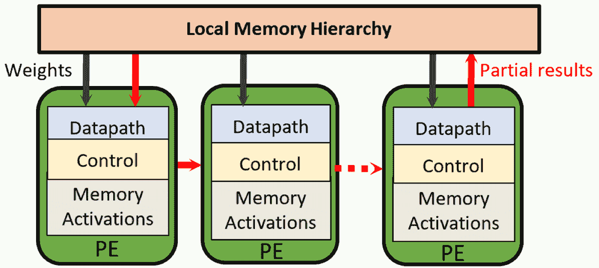

<!--yml

分类: 未分类

日期: 2024-09-06 19:38:38

-->

# [2306.15552] 《异构 HPC 平台上深度学习硬件加速器的调研》

> 来源：[`ar5iv.labs.arxiv.org/html/2306.15552`](https://ar5iv.labs.arxiv.org/html/2306.15552)

\SetWatermarkText

预印本版本 \SetWatermarkScale0.6 \SetWatermarkColor[gray]0.8 \forestsetqtree/.style=for tree=parent anchor=south, child anchor=north,align=center,inner sep=0pt

# 《异构 HPC 平台上深度学习硬件加速器的调研》

Cristina Silvano cristina.silvano@polimi.it ,  Daniele Ielmini daniele.ielmini@polimi.it ,  Fabrizio Ferrandi fabrizio.ferrandi@polimi.it ,  Leandro Fiorin leandro.fiorin@polimi.it ,  Serena Curzel serena.curzel@polimi.it Politecnico di MilanoItaly ,  Luca Benini luca.benini@unibo.it ,  Francesco Conti f.conti@unibo.it ,  Angelo Garofalo angelo.garofalo@unibo.it Università di BolognaItaly ,  Cristian Zambelli cristian.zambelli@unife.it ,  Enrico Calore enrico.calore@fe.infn.it ,  Sebastiano Fabio Schifano sebastiano.fabio.schifano@unife.it Università degli Studi di FerraraItaly ,  Maurizio Palesi maurizio.palesi@unict.it ,  Giuseppe Ascia giuseppe.ascia@unict.it ,  Davide Patti davide.patti@unict.it Università degli Studi di CataniaItaly ,  Stefania Perri s.perri@unical.it Università degli Studi della CalabriaItaly ,  Nicola Petra nicola.petra@unina.it ,  Davide De Caro dadecaro@unina.it Università degli Studi di Napoli Federico IIItaly ,  Luciano Lavagno luciano.lavagno@polito.it ,  Teodoro Urso teodoro.urso@polito.it Politecnico di TorinoItaly ,  Valeria Cardellini cardellini@ing.uniroma2.it ,  Gian Carlo Cardarilli g.cardarilli@uniroma2.it Università di Roma “Tor Vergata”Italy  和  Robert Birke robert.birke@unito.it Università degli Studi di TorinoItaly (2023)

###### 摘要。

深度学习（DL）的最新趋势将硬件加速器视为多类高性能计算（HPC）应用的最可行解决方案，例如图像分类、计算机视觉和语音识别。本文综述并分类了设计适合满足 HPC 应用性能要求的 DL 加速器的最新进展。特别是，它强调了支持深度学习加速的最先进方法，包括不仅是基于 GPU 和 TPU 的加速器，还包括设计专用的硬件加速器，如基于 FPGA 和 ASIC 的加速器、神经处理单元、开放硬件 RISC-V 基加速器和协处理器。该综述还描述了基于新兴存储技术和计算范式的加速器，如 3D 堆叠的处理器内存、非易失性存储器（主要是电阻 RAM 和相变存储器）以实现内存计算、类脑处理单元以及基于多芯片模块的加速器。该综述对近年来提出的最具影响力的架构和技术进行了分类，旨在为读者提供一个关于快速发展的深度学习领域的全面视角。最后，它还对深度学习加速器未来的挑战提供了一些见解，如量子加速器和光子学。

硬件加速器、高性能计算、深度学习、深度神经网络、新兴存储技术。^†^†版权：acmcopyright^†^†期刊年份：2023^†^†doi：XXXXXXX.XXXXXXX^†^†期刊：CSUR^†^†ccs：计算机系统组织 架构^†^†ccs：硬件 可重构逻辑和 FPGA^†^†ccs：硬件 新兴技术^†^†ccs：硬件 超大规模集成设计^†^†ccs：硬件 电力和能源^†^†ccs：计算方法 机器学习

## 1\. 引言

自从 Exascale 时代的到来，我们见证了高性能计算（HPC）与人工智能（AI）之间的融合。HPC 系统计算能力的不断增强及其管理大量数据的能力使得越来越复杂的机器学习（ML）技术的开发成为可能。深度学习（DL）是 ML 的一个子集，它使用具有多层人工神经元的人工深度神经网络（DNNs）试图通过从大量数据中学习来模拟人脑行为。由于技术和架构的改进，不仅越来越多的高端处理器并行集成，还包括图形处理单元（GPUs）和向量/张量计算单元等协处理器已集成到 HPC 系统的节点中。这种超级计算能力加速了 DNN 模型的自动训练阶段以及在目标应用场景中的后续推理阶段。2012 年在 ImageNet 挑战赛上，开创性的 AlexNet (Krizhevsky2012,) 的出现得益于 GPU 计算，凸显了在训练和推理阶段加速的价值。此后，开发了大量用于图像识别和分类、自然语言处理（NLP）以及生成式 AI 等各种任务的 DNN 模型。这些应用需要专业的*硬件加速器*，以高效处理 DNN 算法的重计算需求。目前，DL 加速器已在从超低功耗和资源受限的边缘设备到服务器、高性能计算基础设施和数据中心等各种计算系统中使用。

调查范围。本调查尝试提供对加速深度学习（DL）在高性能应用中最具影响力的架构的广泛概述。调查重点介绍了支持 DL 加速的各种方法，包括基于 GPU 的加速器、张量处理单元、基于 FPGA 的加速器和基于 ASIC 的加速器，如神经处理单元和开源硬件 RISC-V 架构上的协处理器。调查还包括基于新兴技术和计算范式的加速器，如 3D 堆叠 PIM、新兴的非易失性存储器如电阻式随机存取存储器（RRAM）和相变存储器（PCM）、神经形态处理单元以及多芯片模块。

总体而言，我们回顾了过去二十年中关于深度学习加速器的研究，涵盖了该领域文献中的一个重要时间跨度。我们描述并引用了大约 230 项深度学习加速工作。由于深度学习加速是一个丰富且迅速发展的领域，我们并不声称全面覆盖所有迄今为止出现的研究工作，但我们专注于最具影响力的贡献。此外，本调查可以作为某些先前关于人工智能和深度学习领域加速器的调查（chen2020engineering, ; Hassanpour2022, ; gao2023acm, ; rathi2023acm, ）和其他专注于深度学习的更具体方面的调查的连接点，如稀疏矩阵的架构优化（reuther_hpec22, ）和神经架构搜索（Chitty2022ACMSUR, ）。

调查的组织。该调查按计算机架构和硬件设计领域中的不同类别和子类别进行结构化。如图 1 所示，提出的分类基于加速器的几个代表性特征，以突出它们的相似性和差异。为此，我们以一种方式组织材料，使得所有对应于多种分类类型的研究论文都在每个分类下进行引用。例如，假设我们考虑工作$W$，它主要属于子类别$X$，并在其中做出主要贡献。根据我们的分类政策，该工作也可以在另一个子类别$Y$中被引用，其中它做出次要贡献。此外，在每个分类下，我们选择了最具代表性和影响力的工作，对于每项工作，我们重点关注其创新贡献。

主要论文的结构如下：第二部分提供了关于主流 DL 拓扑的简要背景，第三部分回顾了基于 GPU 和 TPU 的最重要的加速解决方案。第四部分介绍了三种类型的基于硬件的加速器：基于 FPGA 的、基于 ASIC 的以及基于开源硬件 RISC-V 指令集架构（ISA）的加速器。第五部分描述了基于新兴计算范式和技术的 DL 加速器。第$6$节对 DL 加速器的未来趋势进行了最终讨论。该调研还附有一个补充文档（参见附录 A），包括一些基本定义和深入的技术方面。最后，我们希望这项调研对包括计算机架构师、硬件开发人员、HPC 工程师、研究人员和技术专家在内的广泛读者有所帮助。我们投入了大量精力以清晰简洁的技术写作风格进行撰写：我们希望这一努力对年轻的硕士和博士生特别有用。为了方便阅读，缩略语列表已在表 1 中列出。

\forestset

dir tree/.style= 用于树形结构的样式：parent anchor=south west, child anchor=west, anchor=mid west, inner ysep=-3.5pt, grow’=0, align=left, edge path= [draw, \forestoptionedge] (!u.parent anchor) ++(1em,0) —- (.child anchor)\forestoptionedge label; , if n children=0 delay= prepend=[,phantom, calign with current] , fit=rectangle, before computing xy= l=2em ,

{forest}

dir tree 调查组织 [§ [2 深度学习背景 ] § [3 基于 GPU 和 TPU 的加速器 [基于 GPU 的加速器 ] [基于 TPU 的加速器 ] ] § [4 硬件加速器 [可重构硬件加速器 ] [基于 ASIC 的加速器 [加速算术数据通路] [神经处理单元] [单芯片 NPU] ] [基于 RISC-V 的加速器 [（深度）学习的 ISA 扩展] [向量协处理器] [与内存耦合的神经处理单元（NPU）] ] ] ]

(a)

{forest}

目录树  [§ [5 新兴范式和技术 [稀疏矩阵加速器] [3D 堆叠内存处理 [3-D 堆叠 PIM 解决方案] ] [内存计算][全数字神经形态加速器] [多芯片模块] ] § [6 结论与挑战] ]

(b)

图 1\. 调查组织结构

表 1. 缩略语列表

| 缩略语 | 缩略语 | 缩略语 |
| --- | --- | --- |
| AI: 人工智能 | ASIC: 专用集成电路 | BRAM: 块随机存取内存 |
| CMOS: 互补金属氧化物半导体 | CNN: 卷积神经网络 | CPU: 中央处理单元 |
| DL: 深度学习 | DP: 双精度 | DNN: 深度神经网络 |
| DRAM: 动态随机存取内存 | EDA: 电子设计自动化 | FLOPS: 每秒浮点运算次数 |
| FMA: 融合乘加 | FPGA: 现场可编程门阵列 | GEMM: 广义矩阵乘法 |
| GP-GPU: 通用图形处理单元 | GPU: 图形处理单元 | HBM: 高带宽内存 |
| HDL: 硬件描述语言 | HLS: 高级综合 | HMC: 混合内存立方体 |
| HPC: 高性能计算 | MLP: 多层感知机 | NPU: 神经处理单元 |
| IMC: 内存计算 | IoT: 物联网 | ISA: 指令集架构 |
| MCM: 多芯片模块 | ML: 机器学习 | NDP: 接近数据处理 |
| NN: 神经网络 | NoC: 芯片网络 | PCM: 相变内存 |
| PCU: 可编程计算单元 | PIM: 内存中处理 | PULP: 并行超低功耗 |
| QC: 量子计算 | QML: 量子机器学习 | QNN: 量化神经网络 |
| QPU: 量子处理单元 | RAM: 随机存取内存 | RRAM: 阻变内存 |
| RISC: 精简指令集计算机 | RNN: 循环神经网络 | SoC: 系统单芯片 |
| SP: 单精度 | SIMD: 单指令多数据 | SIMT: 单指令多线程 |
| SNN: 脉冲神经网络 | SRAM: 静态随机存取内存 | TPU: 张量处理单元 |
| TNN: 三值神经网络 | VPU: 向量处理单元 | VRAM: 视频随机存取内存 |

## 2\. 深度学习背景

深度学习 (lecun2015, ; Schmidhuber_2015, ) 是一种机器学习方法的子集，能够自动发现从大数据集中进行特征检测或分类所需的表示，通过使用多个处理层来逐步提取更高层次的特征。文献中最新的研究清楚地表明，两个主要的深度学习拓扑结构已成为主流：深度神经网络和变换器。

关于 DNN，目前主要使用三种类型的 DNN：多层感知器（MLPs）、卷积神经网络（CNNs）和递归神经网络（RNNs）。MLPs (Rosenblatt1957, ) 是前馈人工神经网络（ANNs），由一系列完全连接的层组成，每一层都是前一层所有输出的加权和的非线性函数。相反，在 CNN (Lecun1998, ) 中，卷积层通过执行卷积操作从输入中提取简单特征。每一层都是前一层不同子集的加权和的非线性函数，其中每个子集共享相同的权重。模型中的每个卷积层可以捕获输入数据的不同高级表示，使系统能够自动提取输入的特征以完成特定任务，例如图像分类、人脸认证和图像语义分割。最后，RNNs (Schmidhuber_2015, ) 解决了序列输入数据的时间序列问题。每个 RNN 层是前一层和前一状态的加权和的非线性函数的集合，这些函数在处理前一样本时计算并存储在 RNN 的内部记忆中。RNN 模型广泛应用于自然语言处理（NLP）中的自然语言建模、词嵌入和机器翻译。有关 DNN 的概念和术语的更多详细信息，请参见附录 A 的第 A.1 节。

每种类型的深度神经网络（DNN）在特定的认知应用子集上都特别有效。根据目标应用和计算系统的资源限制，已经部署了不同的 DNN 模型。除了 DNN 之外，基于 Transformer 的模型 (vaswaniAttentionAllYou2017, ) 最近引起了广泛关注。Transformers 最初是为自然语言处理（NLP） (vaswaniAttentionAllYou2017, ) 提出的，旨在通过*注意力层*来识别数据之间的长距离依赖关系，其中用于线性变换输入数据的权重是根据输入数据本身动态计算的。虽然 DNN 使用卷积层对输入的局部区域执行“局部”操作，但 Transformers 使用注意力层对整个输入执行“全局”操作。虽然两者差异很大，但 DNN 和 Transformers 共享许多基本原理（如梯度下降训练和对线性代数的依赖），并且本调查中描述的许多专门用于深度学习（DL）的架构都涉及这两种拓扑结构。

## 3. GPU 和 TPU 基于的加速器

### 3.1. 基于 GPU 的加速器

在设计深度学习架构时，是否包括 GPU 取决于内存带宽、数据集大小以及长时间运行任务的优化预期效益。可以通过不同方式比较 GPU 加速器的性能。作为初步估计，可以使用它们的理论峰值性能和内存带宽。不过，其他一些架构特征也可能影响实际算法实现的最终性能。为了更好地了解它们的预期性能，运行特定的工作负载时，使用参考基准测试可能更为合适，这些基准测试通常由代表性算法实现集合构成。因此，已经开发了不同的基准测试，每个基准测试都能测试特定工作负载特征或特定应用内核集的可获得性能。在 ML 的背景下，最常用的基准测试之一是 MLPerf (mlperf )，它有一组特定的训练阶段任务 (mlperf-training )。它在两种不同系统上的结果（分别嵌入了最新 GPU 架构和其前身，即 NVIDIA Hopper 和 Ampere）显示在表 2 中，平均突出显示了大约 $2\times$ 的性能提升因素。不同的供应商，如 AMD 和 Intel，也开发了主要面向 HPC 和最近面向 AI 计算的 GP-GPU 架构。尽管不同供应商使用的术语不同，但它们共享大多数硬件细节。例如，AMD 称之为计算单元，而 NVIDIA 称之为流式多处理器，Intel 称之为计算片段或执行单元（EU）。此外，NVIDIA 称每个周期调度和执行的指令集合为 Warp，而 AMD 使用术语 Wavefront，Intel 使用术语 EU-Thread。关于执行模型，NVIDIA 使用单指令多线程（SIMT），而 AMD 和 Intel 使用单指令多数据（SIMD） (khairy2019 )。在表 3 中，我们报告了 NVIDIA H100 (h100 )、AMD (mi250x ) 和 Intel (arc770 ) 开发的三种最新 GP-GPU 架构的主要硬件特征。我们比较了与 32 位单精度和 64 位双精度相关的峰值性能，以及使用半精度时实现的峰值性能。

表 2. MLPerf Training v2.1 基准测试结果（分钟）

|  | ImageNet | KiTS19 | OpenImages | COCO | LibriSpeech | Wikipedia | Go |
| --- | --- | --- | --- | --- | --- | --- | --- |
|  | ResNet | 3D U-Net | RetinaNet | Mask R-CNN | RNN-T | BERT | Minigo |
| 8 $\times$ A100 | 30.8 | 25.6 | 89.1 | 43.1 | 32.5 | 24.2 | 161.6 |
| 8 $\times$ H100 | 14.7 | 13.1 | 38.0 | 20.3 | 18.2 | 6.4 | 174.6 |

表 3. 最近开发的 NVIDIA、AMD 和 Intel GP-GPU 系统的选定硬件特性

| 型号 (厂商) | H100 (NVIDIA) | Instinct MI250X (AMD) | Arc 770 (Intel) |
| --- | --- | --- | --- |
| 物理核心数 | 132 | 220 | 32 |
| 逻辑核心数 | 16896 | 14080 | 4096 |
| 时钟 (GHz) | 1.6 | 1.7 | 2.4 |
| 峰值性能 DP (TF) | 30 | 47.9 | 4.9 |
| 峰值性能 SP (TF) | 60 | 95.8 | 19.7 |
| 峰值性能 FP16 (TF) | 120 | 383 | 39.3 |
| 最大内存 (GB) | 80 HBM2e | 128GB HBM2e | 16GB GDDR6 |
| 内存带宽 (TB/s) | 2.0 | 3.2 | 0.56 |
| TDP 功耗 (瓦特) | 350 | 560 | 225 |

在过去几年中，NVIDIA 推出了 DGX (dgx, ) 服务器和工作站平台系列，专门使用 GPU 来加速深度学习应用。DGX 系统基于高性能的商用 CPU 和一组通过主板集成网络互联的 GPU，该网络基于 NVIDIA 开发的高速 NVLink (nvlink, ) 技术。此类架构的硬件特性在附录 A 的第 A.2 节中有详细描述。

### 3.2\. 基于 TPU 的加速器

专用于训练和推理的张量处理单元（TPU）在首批大型 CNN 应用出现后不久就被提出。这是因为观察到这些工作负载由可以重构为矩阵乘法的线性代数内核主导（特别是在批处理时），并且它们的加速对于数据中心的高利润应用特别有利。最近，每年出现的模型规模不断扩大（例如，基于 Transformer 的大型语言模型 GPT-2、GPT-3、GPT-4）需要持续投资于更高性能的训练架构。

Google 在 2017 年 ISCA 大会上展示了首款 TPU (Jouppi_2017, ; jouppiMotivationEvaluationFirst2018, )，但根据原始论文，首个部署发生在 2015 年——就在“AlexNet 革命”之后的三年。他们的最新 TPU v4 实现性能比之前的 TPU v3 高出 2.1 倍，并且每瓦性能提升了 2.7 倍 (jouppi2023isca, )。2019 年，Habana Labs 和 Intel 提出了 Goya 和 Gaudi 作为推理加速的微架构 (medina2019hotchips, )。虽然 Google 和 Intel 依赖于自家设计和 GPU 的混合，其他主要数据中心提供商通常依赖于 NVIDIA GPU 来处理深度学习工作负载。从 Volta 架构 (choquetteVoltaPerformanceProgrammability2018, ) 到 Ampere (choquetteA100DatacenterGPU2021, ) 和 Hopper (choquetteNVIDIAHopperH1002023, ; elsterNvidiaHopperGPU2022, )，NVIDIA 在 GPU 流式多处理器内部嵌入了小型 TPU 的对应物，即 TensorCores。

GraphCore Colossus Mk1 和 Mk2 IPU（knowlesGraphcore2021；jiaDissectingGraphcoreIPU2019）针对 GNNs、DNNs 和 Transformers 训练，采用了相对简单处理器的平铺多核架构。GraphCore 专注于高功率和成本效率的内存层次结构，不依赖于高带宽的离芯 HBM，而是使用更便宜的 DRAM 芯片，并结合大量的片上 SRAM（每个芯片约 1 GiB）。根据 GraphCore 的说法，这种设计在持续工作负载下能实现大约 2 倍于 NVIDIA Ampere GPU 的能效和大约 3 倍于 Google TPUv3 的能效。

关于学术和研究提出的架构，IBM Research 专注于引入技术以降低用于训练的数据格式的精度（agrawal20219；venkataramaniRaPiDAIAccelerator2021），在训练 ASIC 和张量处理器中引入了 Hybrid-FP8 格式。Cambricon-Q 的作者也进行类似的工作（zhaoCambriconQHybridArchitecture2021），同样引入了进一步改进，以利用张量的统计特性来最小化带宽消耗并最大化效率。最后，Gemmini（gonzalez16mm106GOPS2021；gencGemminiEnablingSystematic2021）和 RedMulE（tortorellaRedMulECompactFP162022a；tortorellaRedMuleMixedPrecisionMatrixMatrix2023）是旨在引入张量处理器硬件 IP（分别是从模板生成和手动调优）的努力，这些 IP 可以集成在片上系统中，类似于 NVIDIA 对 TensorCores 的做法。

## 硬件加速器

典型的 HPC 工作负载，如基因组学、天体物理学、金融和网络安全，需要处理大量数据，并且可以利用 DL 方法，其结果可以超越人类能力（Bengio_2009, ; Schmidhuber_2015, ; Goodfellow_2016, ; SPAGNOLO20201, ）。然而，计算能力的不断提升、数据分析方法的快速变化以及新计算范式的引入是必需的。 DL 模型依赖于显著的计算复杂性，这些复杂性可以通过优化的硬件平台高效支持，这些平台能够提供高水平的并行性和大量的内存资源，同时不牺牲速度、能效、设计努力和成本之间的良好平衡。这些平台可以通过使用 CPUs、GPUs、FPGAs、CGRAs 和 ASICs 开发（Goodfellow_2016, ; DHILLESWARARAO_2022, ; Sze_2017, ; Machupalli_2022, ; Du_2018, ; Wang_2019, ; Leibo2019ACMSUR, ）。CPU 可能具有比 GPU 和可重构架构更高的缓存大小和更高的片上带宽，但它们在并行处理大量数据方面的能力有限。另一方面，凭借其高吞吐量和并行性，GPU 在性能方面极为高效，但作为一个缺点，它们消耗大量电力，并且比其对应物更贵。基于现代 FPGA 的异构计算平台实现了适中的速度，并且与 GPU 相比，能耗更低，尽管计算和内存资源有限（Qadeer2015, ; Sze_2017, ; DHILLESWARARAO_2022, ）。相反，ASIC 需要更长的设计时间，需要更高的设计努力，并且不提供灵活性，但它们提供了最佳的计算速度和功耗。CGRAs 提供了速度、功耗和设计努力之间的良好平衡，它们展现了接近 ASIC 的能效和性能，并且具有接近 FPGA 的可重构性水平。

(a)

(b)

(c)

图 2. DL 加速器中的数据流： (a) 权重固定； (b) 输出固定； (c) 输入固定。

无论技术如何，设计加速器时一个常见的问题是访问外部 DRAM 存储器的能量和延迟成本，尤其是考虑到目标 HPC 应用需要处理的大量数据。如图 2 所示，可以利用不同的数据重用和静态策略来减少访问次数，每种策略都有其特定的好处（Park2015,；Peemen2013,；Sankaradas2009,；Sriam2011,；Cavigelli2017,；Gupta2015,）。在权重静态数据流中，卷积权重固定并存储在处理单元（PEs）的本地内存中，并在从外部 DRAM 上传的输入激活上逐步重用。相反，在输出静态数据流中，来自 PEs 的部分输出被本地存储并逐步重用，直到计算完成。然后，只有最终结果会被移动到外部 DRAM。一个有效的替代方案是输入静态数据流：在这种情况下，输入激活存储在 PEs 的本地内存中，而权重则从外部 DRAM 上传并发送到 PEs。另一种许多加速器常用的方法是引入*量化*以减少数据类型宽度。量化在设计 DL 模型中代表了一个开放挑战，许多近期研究已经涉及这一话题（quant2021,；Liu2022,）。通常，整数或定点数据格式较浮点数据格式更受青睐，因为后者计算复杂度更高。这可以保证更好的内存占用、更低的计算成本和更高的模型鲁棒性（jin2022fnet,）。极端量化技术仅使用一位数据存储（如二值神经网络（BNN2020,））在非常大的网络中被广泛使用，但为了获得相当的准确性，它们需要 2-11 倍的参数和操作数量（Umuroglu2017,），使其不适合复杂问题。

### 4.1. 可重构硬件加速器

FPGA 和 CGRA 是高度需求的解决方案，用于硬件加速广泛的应用，包括 DL。这些可重构平台的主要特性是能够通过在部署时和运行时重新利用底层硬件加速器来支持不同的计算需求。有关 FPGA 技术和相关 EDA 框架的更多细节分别提供在附录 A 的 A.3 和 A.4 节中。几种基于 FPGA 的 DL 硬件加速器被构建为异构嵌入式系统（Ma2018, ; Yazdanbakhsh2018, ; Aimar2019, ; Perri2020, ; Li2021,），主要包括一个通用处理器，用于运行软件负载；一个计算模块，设计用于加速常见的 DL 操作，如卷积（Qiu2016, ; Venieris2019,），反卷积（Chang2020, ; Sestito2021,），池化，完全连接操作，激活和 softmax 函数（Spagnolo2022_1, ; Spagnolo2022_2,）；以及一个内存层次结构，以优化数据在外部 DRAM 和计算结果之间的移动。加速卷积的典型方法包括一种纵向阵列架构 (SA)，这是一种可以轻松复制的规则模式 (Xuechao2017,)。阵列中的每个 PE 是一个 SIMD 向量累加模块，其中输入和权重通过水平和垂直相邻的 PEs 在每个周期提供（图 3(a)）。使用具有短局部通信和规则架构的流水线组 PEs 可以实现高时钟频率和有限的全局数据传输（图 3(b)）。

(a)

(b)

图 3. FPGA 加速器: (a) 纵向阵列加速器; (b) 流水线数据流加速器。

尽管传统上 FPGA 被提议作为边缘应用的加速器，但它们开始在数据中心中得到采用。微软的 Project Brainwave（Brainwave,）使用多个 FPGA 板来加速在云中执行 RNNs，利用可重新配置性来适应不同的 DL 模型平台。面对 FPGA 有效地映射非常大的 DL 模型的能力所施加的限制之一是使用深度流水线化的多 FPGA 设计。最近的研究集中于优化这种类型的架构，并最大化整体吞吐量（Zhang2016,；Rahman2017,；Junnan2019,）。在这些应用上下文中，CGRAs 是 FPGA 的替代方案，提供了与更粗粒度的功能单元重新配置。它们基于一组 PE，执行单词级别的基本算术、逻辑和内存操作，并使用小的寄存器文件作为临时数据存储。相邻的 PE 通过可重构路由连接，允许将计算的中间结果传输到适当的邻居，用于下一步计算。CGRAs 可以提供强大的解决方案，加速密集的线性代数应用，如 ML、图像处理和计算机视觉（amber2022vlsi,；tangram,）。由于并行计算和时间复用，CGRAs 可以有效支持和结合空间和时间计算模型。此外，它们对于特定领域足够灵活，它们的互连，因为不像 FPGA 上存在的那样复杂，提供了速度、能量效率和资源利用方面的显著优势。

### 4.2\. 基于 ASIC 的加速器

#### 4.2.1\. 加速算术数据通路

使用 ASIC 加速器进行深度学习模型推理时的性能主要取决于算术数据路径的结构。深度学习系统核心上执行多个有限脉冲响应操作，对大量数据进行处理。因此，加速器可以通过利用高效实现底层算术操作的技术来进行优化。如图 4 所示，可以对算术数据路径进行三种主要类型的优化。第一种优化方法考虑到卷积是深度学习系统中执行的主要操作之一。如 (Cheng_2004, ; Tsao_2012, ) 所示，单维卷积可以通过减少乘法次数来高效计算，从而改善电路吞吐量和实现所需硬件资源之间的权衡。这种技术在 (Wang_2018, ; Cheng_2020, ; Wang_2022, ) 中得到了进一步发展，应用于多维卷积。

乘法本身可以通过优化电路来实现。在 (MinJou_1999, ; Petra_2011, ; Frustaci2020, ) 中，通过丢弃计算结果所需的部分部分积来减少乘法器电路的面积和功耗。这些电路在提高速度和功耗方面权衡了精度和电路复杂性。这种方法通常被称为*近似计算范式*，提供了一种在可接受的精度损失代价下近似设计的方法。 (Kulkarni_2011, ; Zervakis_2016, ) 中提出的近似计算技术通过修改部分积的计算方式提供了一个降低复杂性的乘法器。在 (Zacharelos_2022, ) 中，提出了一种递归方法，将乘法器分解为小的近似单元。在 (Esposito_2017, ) 中提出的方法中，近似是通过部分积求和的方式实现的。最后，近似计算范式也可以在 4-2 压缩器中实现 (Ahmadinejad_2019, ; Yang_2015, ; Ha_2018, ; Strollo_2020, ; Park_2021, ; Kong_2021, )，这些压缩器代表了用于部分积压缩的原子块。

与以往的工作不同，分段方法旨在减少乘数的位宽。(Hashemi_2015, ; Vahdat_2019, ) 中描述了一种动态分段方法，其中分段是从乘数二进制表示的领先位开始选择的。相反，(Narayanamoorthy_2015, ) 中的论文提出了一种静态分段方法，通过在两个具有固定位数的分段之间选择来减少选择机制的复杂性。(Strollo_2022, ) 中的论文通过减少最大近似误差来提高静态分段方法乘法器的准确性，而 (Li_2021, ) 中的作者提出了一种混合方法，其中静态阶段级联到动态阶段。

{forest}

rounded/.style=ellipse,draw, squared/.style=rectangle,draw, qtree, 算术数据路径 [卷积优化 [ Cheng ([Cheng_2004, )

Tsao (Tsao_2012, )

Wang (Wang_2018, )

Cheng (Cheng_2020, )

Wang (Wang_2022, )

] ], 近似计算 [乘法 [ Jou ([MinJou_1999, ), Petra (Petra_2011, )

Kulkarni (Kulkarni_2011, ), Zervakis (Zervakis_2016, )

Zacharelos (Zacharelos_2022, ), Esposito (Esposito_2017, )

] ], 4-2 压缩器 [ Ahmadinejad ([Ahmadinejad_2019, ), Yang (Yang_2015, )

Ha (Ha_2018, ), Strollo (Strollo_2020, )

Park (Park_2021, ), Kong (Kong_2021, )

] ] ], 分段方法 [ Hashemi ([Hashemi_2015, )

Vahdat (Vahdat_2019, )

Narayanamoorthy (Narayanamoorthy_2015, )

Strollo (Strollo_2022, )

Li (Li_2021, )

] ] ]

图 4. 第 4.2.1 节中描述的数据路径架构分类

#### 4.2.2\. 神经处理单元 (NPUs)

NPU 的目的是加速性能并提高从 CPU (song2019isscc, ) (hung2021jsscc, ) 转移过来的特定任务的能效。特别是，NPU 设计用于容纳合理数量的乘法/累加 (MAC) 单元，这些单元是 DNN 中卷积和全连接层中的 PEs (Chen_2017, ; desoli17isscc, )。

表 4. NPU 加速器总结。

| NPU | 制程 | 面积 [mm²] | 供电电压 [V] | 最大频率 [MHz] | PP [TOPS] | 最大能效 [TOPS/W] | 最大面积效能 [TOPS/mm²] |
| --- | --- | --- | --- | --- | --- | --- | --- |
| Samsung (song2019isscc, ) | 8 nm | 5.5 | 0.8 | 933 | 6.9 | 3.4 | 1.25 |
| UM+NVIDIA (zhang2019vlsi, ) | 16 nm | 2.4 | 0.8 | 480 | - | 3.6 | - |
| MediaTek (lin2020isscc, ) | 7 nm | 3.04 | 0.825 | 880 | 3.6 | 6.55 | 1.18 |
| Alibaba (jiao2020isscc, ) | 12 nm | 709 | - | 700 | 825 | 499 | 1.16 |
| Samsung (park2021isscc, ) | 5 nm | 5.46 | 0.9 | 1196 | 29.4 | 13.6 | 2.69 |
| Samsung (park2022isscc, ) | 4 nm | 4.74 | 1 | 1197 | 39.3 | 11.59 | 6.9 |

每个 PE 包含一个突触权重缓冲区和用于执行神经元计算的 MAC 单元，即乘法、累加和激活函数（例如，sigmoid）。一个 PE 可以完全通过全 CMOS 设计实现，或使用新兴的非易失性存储器如 RRAM 和 PCM 在现场执行矩阵-向量乘法，例如 RENO 芯片（liu2015dac,）或在（xue2019isscc, ; narayanan2021ted,）中提出的 MAC 单元。这些架构的优点在于只有输入和最终输出是数字的；中间结果都是模拟的，并由模拟路由器协调。数据转换器（DACs 和 ADCs）仅在 NPU 和 CPU 之间传输数据时需要，这在能源效率方面具有优势（xue2019isscc,中的研究报告了 53.17 TOPS/W 的能源效率），尽管与全数字 NPU 相比，支持这一证据的实验数据不足。在表 4 ‣ 4.2\. ASIC-based Accelerators ‣ 4\. Hardware Accelerators ‣ A Survey on Deep Learning Hardware Accelerators for Heterogeneous HPC Platforms")中，我们报告了几种全数字 NPU 设计的主要特性，同时突出了它们的峰值性能（PP）、能源效率（EE）和面积效率（AE）。

#### 4.2.3\. 单芯片 NPU

在 DNN 领域，单芯片领域特定加速器在云端和边缘场景中取得了巨大成功。这些定制架构提供了比 CPU/GPUs 更好的性能和能效，得益于优化的数据流（或数据重用模式），这减少了芯片外内存访问，同时提高了系统效率（chen2020engineering）。DianNao 系列代表了一种全数字独立 DNN 加速器，它引入了定制设计以最小化内存传输延迟并提高系统效率。DaDianNao（chen2016commacm）面向数据中心场景，并集成了大量片上嵌入式动态随机访问内存（eDRAM），以避免长时间的主内存访问。相同的原则也适用于嵌入式场景。ShiDianNao（chen2016commacm）是一个专门用于 CNN 应用的 DNN 加速器。通过使用权重共享策略，它的占用空间比之前的设计小得多。当 CNN 模型较小时，可以将所有 CNN 参数映射到一个小的片上静态随机访问内存（SRAM）中。这样，ShiDianNao 避免了昂贵的芯片外 DRAM 访问时间，并实现了比 DianNao 高 60 倍的能效。此外，已经提出了领域特定的指令集架构（ISA）以支持广泛的 NN 应用。Cambricon（zhang2016micro）和 EIE（han2016isca）是集成了标量、向量、矩阵、逻辑、数据传输和控制指令的架构示例。它们的 ISA 考虑了数据并行性以及自定义向量/矩阵指令的使用。

Eyeriss 是另一个值得注意的加速器（Chen_2017），它可以支持高吞吐量的推理并优化系统级能效，还包括芯片外 DRAM。Eyeriss 的主要特点是基于 168 个 PE 阵列的空间架构，创建了四级内存层次结构，重新配置空间架构的数据流以映射给定 CNN 的计算并优化到最佳能效，采用多播和点对点单周期数据传输的网络芯片（NoC）架构，以及利用 CNN 中零数据统计的运行长度压缩（RLC）和 PE 数据门控进一步提高能效。

在 (desoli17isscc, ) 中，意法半导体公司介绍了 Orlando 系统芯片，这是一种基于 28nm FDSOI 的 CNN 加速器，集成了具有低功耗特性的 SRAM 架构和自适应电路，以支持广泛的电压范围。这样的 DNN 处理器提供了一组高效能的卷积加速器，支持内核压缩、片上可重构数据传输结构、功耗高效的 DSP 阵列以支持完整的现实世界计算机视觉应用、基于 ARM 的主机子系统及外设、一系列高速 I/O 接口，以及用于将多个加速器配对的芯片间多链路。

表 5. 单芯片数字 DNN 加速器的总结

| 加速器 | 技术 | 应用 | 面积 [mm²] | 功耗 [mW] | 性能 [GOPS] | 能效 [GOPS/W] |
| --- | --- | --- | --- | --- | --- | --- |
| DaDianNao (chen2016commacm, ) | 28 nm | DNN | 67.7 | 15970 | 5585 | - |
| ShiDianNao (chen2016commacm, ) | 65 nm | CNN | 4.86 | 320 | 194 | - |
| Cambricon (zhang2016micro, ) | 65 nm | CNN | 6.38 | 954 | 1111.92 | - |
| EIE (han2016isca, ) | 28 nm | CNN+LSTM | 63.8 | 2360 | 1.6 | 177.78 |
| Eyeriss (Chen_2017, ) | 65 nm | CNN | 16 | 450 | 33.6 | 74.7 |
| STM (desoli17isscc, ) | 28 nm | CNN | 34.8 | 39 | 750 | 2900 |
| IBM (oh2020vlsic, ) | 14 nm | CNN+LSTM+RNN | 9.84 | - | 3000 | 1100 |
| IBM (lee2022jsscc, ) | 7 nm | CNN+RNN | 19.6 | - | 16300 | 3580 |

IBM 在 (oh2020vlsic, ) 中展示了一个用于 AI 训练和推理任务的处理器核心，适用于广泛的神经网络（如 CNN、LSTM 和 RNN）。通过利用 DLFloat16 FPUs 的高效异构 2D 系统阵列-SIMD 计算引擎，实现了对稳健 FP16 训练的高计算效率。一个模块化双核架构，配有共享的临时存储器和软件控制的网络/内存接口，支持多核 SoC 的可扩展性以适应扩展范式。2022 年，IBM 还展示了一款 7nm 四核混合精度 AI 芯片 (lee2022jsscc, )，在低精度训练和推理中展示了领先的功耗效率，且没有模型准确性降级。该芯片基于高带宽环形互连，以实现高效的数据传输，同时，工作负载感知的功耗管理和时钟频率限制最大限度地提高了给定功率范围内的应用性能。

高通展示了一个 AI 核心，这是一个标量 4 路 VLIW 架构，包括向量/张量单元和较低精度以实现高性能推理 (karam2021hotchip, )。该设计采用 7nm 技术，旨在集成到 AI 100 SoC 中，达到高达 149 TOPS 的性能，功耗效率为 12.37 TOPS/W。

### 4.3\. 基于开源硬件 RISC-V 的加速器

RISC-V 是一种开源的、模块化的指令集架构（ISA），由于其灵活性和适合与深度学习加速能力集成的特性，正在计算机架构研究中获得越来越多的关注。RISC-V ISA 设计有一个小而简单的核心，可以通过可选的指令集扩展（ISEs）进行扩展，以支持各种应用领域。RISC-V 为深度学习加速研究提供了若干优势。首先，ISA 的模块化特性使研究人员可以轻松地将加速能力集成到 ISEs 中，这些加速能力可以根据不同深度学习模型的特定需求进行定制。其次，RISC-V 支持一组标准接口，如 AXI4，可以用于与集成在同一芯片上的外部加速单元进行接口，支持各种耦合级别。这使得将专用的深度学习硬件加速器集成到基于 RISC-V 的系统中变得非常容易。此外，RISC-V ISA 的定义特征是其开放性，这意味着任何人都可以设计 RISC-V 实现，而无需支付版权费用或特定许可。由于这一非技术性优势，相比其他 ISA（如 ARM、x86），RISC-V 获得了学术界和新兴创业公司的显著关注。

{forest}

rounded/.style=ellipse,draw, squared/.style=rectangle,draw, qtree, RISC-V for Deep Learning [Specialized ISA & SIMD [ Dustin ([ottaviDustin16CoresParallel2023, ), Marsellus (conti22124TOPS2023, )

Kraken (dimauroKrakenDirectEvent2022, ), Manticore (zarubaManticore4096CoreRISCV2021, )

Celerity (davidsonCelerityOpenSource511Core2018, ), Tenstorrent (vasiljevicComputeSubstrateSoftware2021, )

exSDOTP (bertacciniMiniFloatNNExSdotpISA2022, ), Esperanto (ditzelAcceleratingMLRecommendation2022, )

CNC (chenEightCoreRISCVProcessor2022, ), Cococcioni et al. (cococcioniLightweightPositPorcessing2021, )

PERCIVAL (mallasenPERCIVAL2022, ), Wang et al. (wangWinogradBasedConvolution2021, )

Tang et al. (tangGeneralPurposeGraphConvolutionNeuralAccelerator2022, ), RISC-VTF (JiaoRISCVExtensionTransformer2021, )

Paulin et al. (paulinRNNBasedRadioResource2021, )

] ], Vector Co-Processor [ Lee et al. ([lee201445nm, ), AVA (lazoAdaptableRegisterFile2022, )

Spatz (cavalcanteSpatzCompactVector2022, ), Vitruvius+ (minerviniVitruviusAreaEfficientRISCV2023, )

Ara (cavalcanteAra1GHzScalable2020, ), Perotti et al. (perottiNewAraVector2022, )

Xuantie (chenXuantie910CommercialMultiCore2020, ), Arrow (assirArrowRISCVVector2021, )

Ventana (ventanaProduct, )

] ], 内存耦合的 NPU [L1-耦合 [ Darkside ([garofaloDARKSIDEHeterogeneousRISCV2022, )，Marsellus (conti22124TOPS2023, )

Garofalo 等 (garofaloHeterogeneousInMemoryComputing2022, )，Vega (rossiVegaTenCoreSoC2022, )

RedMulE (tortorellaRedMuleMixedPrecisionMatrixMatrix2023, ; tortorellaRedMulECompactFP162022a, )，Archimedes (prasadSpecializationMeetsFlexibility, )

Bruschi 等 (bruschiEndtoEndDNNInference2022, )，GAP9 (gap9Product, )

] ], L2-耦合 [ SNCPU ([juSystolicNeuralCPU2023, )，SamurAI (miro-panadesSamurAIVersatileIoT2022, )

Gemmini (gencGemminiEnablingSystematic2021, )，DIANA (houshmandDIANAEndtoEndHybrid2023, )

TinyVers (jainTinyVersTinyVersatile2023, )，Kraken (dimauroKrakenDirectEvent2022, )

Simba (shao_micro19, )，Lee 等 (lee64TOPSEnergyEfficientTensor2022, )

Tambe 等 (tambe2212nm182023, )

] ], L3-耦合 [ Gonzalez 等 ([gonzalez16mm106GOPS2021, )

ESP (jia12nmAgileDesignedSoC2022, )

] ], ] ]

图 5. 讨论于第 4.3 节的 RISC-V 基础加速单元分类

图 5 展示了本调查中讨论的基于 RISC-V 的 DL 加速架构的综合分类。

#### 4.3.1\. RISC-V ISA 扩展用于（深度）学习

（深度）神经网络常常受到其大量权重所占用的计算和内存资源的限制。通过替代或量化数字表示进行权重压缩常被采用，以加快和优化神经网络模型的性能。(cococcioniLightweightPositPorcessing2021, ; mallasenPERCIVAL2022, )的工作提出了针对*posit* 数字的 ISA 扩展，可用于进行权重压缩。Posit 是一种替代标准 IEEE 浮点格式的实数表示方法。Posit 数字需要更少的位数来获得与 IEEE 浮点相同的精度或动态范围，从而使它们能在相同大小的内存中存储更多的权重。例如，(cococcioniLightweightPositPorcessing2021, )的工作提供了在 8 位或 16 位 posit 和 32 位 IEEE 浮点或定点格式之间的高效转换，几乎没有精度损失，从而实现了推理时间的 10 倍加速。其他工作直接解决了不同神经网络中的计算密集型部分，特别是 CNN、GCN 和变换器。(wangWinogradBasedConvolution2021, ) 提出了一个基于 Winograd 的卷积指令，以加快 CNN 中时间消耗大的卷积层。CNN 核心与输入数据之间的矩阵卷积不能使用标准 RISC-V 指令高效执行。所提出的扩展使得在 19 个时钟周期内通过单条指令在 $4\times 4$ 输入上使用 $3\times 3$ 核心计算 $2\times 2$ 输出，而不是使用标准 RISC-V ISA 需要总计 140 个周期的多条指令。(tangGeneralPurposeGraphConvolutionNeuralAccelerator2022, ) 通过设计一组通用指令来应对 GCN 的计算瓶颈，这些指令缓解了在聚合和组合特征向量时的计算低效。因此，作者将 RISC-V ISA 提供的软件可编程性与 GCN 加速器的计算效率相结合。类似地，(JiaoRISCVExtensionTransformer2021, ) 关注于变换器模型。值得注意的是，该扩展包括加速著名的 ReLU 激活函数和 softmax 函数的指令。Paulin 等人 (paulinRNNBasedRadioResource2021, ) 执行了类似的任务，但重点关注 RNN。

随着使用激进量化方案加速 DNN 推理的趋势，许多 ISA 扩展专注于低位宽算术操作以实现量化神经网络（QNNs），通常结合多核并行执行以进一步提升性能和效率。几项发展增强了用于 Vega (rossiVegaTenCoreSoC2022,) 的 PULP RI5CY 核心，以提高其在 QNNs 上的能源效率。Marsellus (conti22124TOPS2023,)（16 核）和 Kraken (dimauroKrakenDirectEvent2022,)（8 核）使用 Xpulpnn，这是一种用于加速对称精度 QNNs 的低位宽（2/4 位）整数点积的 ISA 扩展。Dustin (ottaviDustin16CoresParallel2023,)（16 核）也利用了类似的概念，但它还引入了一种锁步机制，以 SIMD 方式操作所有核心，进一步提高其效率。Manticore (zarubaManticore4096CoreRISCV2021,)、Celerity (davidsonCelerityOpenSource511Core2018,)、Esperanto (ditzelAcceleratingMLRecommendation2022,) 和 Tenstorrent (vasiljevicComputeSubstrateSoftware2021,) 利用 ISA 扩展，在多核架构的上下文中加速 RISC-V 基于 DL 的工作负载，其中大量非常简单的核心协作。由于这些架构旨在用于基于服务器的训练和推理，因此它们通常专注于浮点乘加和点积操作，如 exSDOTP (bertacciniMiniFloatNNExSdotpISA2022,)。

#### 4.3.2\. RISC-V 矢量协处理器

矢量协处理器代表了一种自然的架构目标，用于深度学习导向的 RISC-V 加速。商业 RISC-V 矢量处理器主要针对 HPC 市场，例如 Xuantie (chenXuantie910CommercialMultiCore2020,) 和 Ventana (ventanaProduct,)，最近开始出现。此外，专门针对 DL 的矢量协处理器，如 Spatz (cavalcanteSpatzCompactVector2022,) 和 Arrow (assirArrowRISCVVector2021,)，也已开发。其中，前者特别专注于 V 扩展的一个子集和 32 位数据，捕捉到更好的能源效率机会。

#### 4.3.3\. RISC-V 内存耦合神经处理单元（NPUs）

关于最紧密的内存耦合，在 L1 层，大多数最先进的提案基于 Parallel Ultra-Low Power (PULP)模板，并投入大量精力以实现 RISC-V 核心与加速器之间的快速通信。Vega (rossiVegaTenCoreSoC2022,) 是一个原型系统，将 9 个 RI5CY 核心与一个量化的 DNN 卷积 NPU 耦合在一起，NPU 直接与核心共享 L1 片内存。GreenWaves Technologies GAP9 (gap9Product,) 是一款针对可穿戴设备市场的商业产品，它遵循相同的思路，并进行了许多架构改进和重新设计的 AI NPU 用于 QNNs——使得该产品在撰写本文时在公共 TinyMLPerf Tiny 1.0 挑战中实现了最佳性能和能效(tinyMLPerf2023,)。Archimedes (prasadSpecializationMeetsFlexibility,) 提出了一个大型 AI 硬件加速器，针对对性能要求高的扩展现实应用。RedMulE (tortorellaRedMulECompactFP162022a,; tortorellaRedMuleMixedPrecisionMatrixMatrix2023,)，集成在 Darkside 原型中 (garofaloDARKSIDEHeterogeneousRISCV2022,)，遵循相同的原则，但重点关注浮点计算，以支持训练和推理。Garofalo 等 (garofaloHeterogeneousInMemoryComputing2022,) 和 Bruschi 等 (bruschiEndtoEndDNNInference2022,) 集成了基于 PCM 的内存计算 NPU，后者模拟了一个扩大到匹配服务器级硬件规模的系统。

<svg height="604.86" overflow="visible" version="1.1" width="1746.04"><g transform="translate(0,604.86) matrix(1 0 0 -1 0 0) translate(236.2,0) translate(0,4.86)" fill="#000000" stroke="#000000" stroke-width="0.4pt"><g clip-path="url(#pgfcp1)"><g stroke="#262626" fill="#262626" transform="matrix(1.0 0.0 0.0 1.0 99.52 40.47)"><foreignobject width="17.71" height="11.41" transform="matrix(1 0 0 -1 0 16.6)" overflow="visible">$\displaystyle{10^{1}}$</foreignobject></g><g stroke="#262626" fill="#262626" transform="matrix(1.0 0.0 0.0 1.0 369.08 40.47)"><foreignobject width="17.71" height="11.41" transform="matrix(1 0 0 -1 0 16.6)" overflow="visible">$\displaystyle{10^{2}}$</foreignobject></g><g stroke="#262626" fill="#262626" transform="matrix(1.0 0.0 0.0 1.0 638.64 40.47)"><foreignobject width="17.71" height="11.41" transform="matrix(1 0 0 -1 0 16.6)" overflow="visible">$\displaystyle{10^{3}}$</foreignobject></g><g stroke="#262626" fill="#262626" transform="matrix(1.0 0.0 0.0 1.0 908.2 40.47)"><foreignobject width="17.71" height="11.41" transform="matrix(1 0 0 -1 0 16.6)" overflow="visible">$\displaystyle{10^{4}}$</foreignobject></g><g stroke="#262626" fill="#262626" transform="matrix(1.0 0.0 0.0 1.0 1177.76 40.47)"><foreignobject width="17.71" height="11.41" transform="matrix(1 0 0 -1 0 16.6)" overflow="visible">$\displaystyle{10^{5}}$</foreignobject></g><g stroke="#262626" fill="#262626" transform="matrix(1.0 0.0 0.0 1.0 610.1 22.44)"><foreignobject width="75.18" height="13.84" transform="matrix(1 0 0 -1 0 16.6)" overflow="visible">功率 [mW]</foreignobject></g><g stroke="#262626" fill="#262626" transform="matrix(1.0 0.0 0.0 1.0 73.37 71.19)"><foreignobject width="17.71" height="11.41" transform="matrix(1 0 0 -1 0 16.6)" overflow="visible">$\displaystyle{10^{1}}$</foreignobject></g><g stroke="#262626" fill="#262626" transform="matrix(1.0 0.0 0.0 1.0 73.37 188.73)"><foreignobject width="17.71" height="11.41" transform="matrix(1 0 0 -1 0 16.6)" overflow="visible">$\displaystyle{10^{2}}$</foreignobject></g><g stroke="#262626" fill="#262626" transform="matrix(1.0 0.0 0.0 1.0 73.37 306.27)"><foreignobject width="17.71" height="11.41" transform="matrix(1 0 0 -1 0 16.6)" overflow="visible">$\displaystyle{10^{3}}$</foreignobject></g><g stroke="#262626" fill="#262626" transform="matrix(1.0 0.0 0.0 1.0 73.37 423.8)"><foreignobject width="17.71" height="11.41" transform="matrix(1 0 0 -1 0 16.6)" overflow="visible">$\displaystyle{10^{4}}$</foreignobject></g><g stroke="#262626" fill="#262626" transform="matrix(1.0 0.0 0.0 1.0 73.37 541.34)"><foreignobject width="17.71" height="11.41" transform="matrix(1 0 0 -1 0 16.6)" overflow="visible">$\displaystyle{10^{5}}$</foreignobject></g><g stroke="#262626" fill="#262626" transform="matrix(0.0 1.0 -1.0 0.0 64.36 285.61)"><foreignobject width="75.85" height="13.84" transform="matrix(1 0 0 -1 0 16.6)" overflow="visible">性能 [GOPS]</foreignobject></g><g stroke="#262626" fill="#262626" transform="matrix(1.0 0.0 0.0 1.0 24.6 188.26)"><foreignobject width="381.86" height="13.84" transform="matrix(1 0 0 -1 0 16.6)" overflow="visible">SNCPU (juSystolicNeuralCPU2023,)</foreignobject></g><g stroke="#262626" fill="#262626" transform="matrix(1.0 0.0 0.0 1.0 441.15 146.66)"><foreignobject width="415.69" height="13.84" transform="matrix(1 0 0 -1 0 16.6)" overflow="visible">Dustin (ottaviDustin16CoresParallel2023,)</foreignobject></g><g stroke="#262626" fill="#262626" transform="matrix(1.0 0.0 0.0 1.0 375.58 96.6)"><foreignobject width="511.55" height="13.84" transform="matrix(1 0 0 -1 0 16.6)" overflow="visible">Darkside (garofaloDARKSIDEHeterogeneousRISCV2022,)</foreignobject></g><g stroke="#262626" fill="#262626" transform="matrix(1.0 0.0 0.0 1.0 -86.21 150.18)"><foreignobject width="469.31" height="13.84" transform="matrix(1 0 0 -1 0 16.6)" overflow="visible">SamurAI (miro-panadesSamurAIVersatileIoT2022,)</foreignobject></g><g stroke="#262626" fill="#262626" transform="matrix(1.0 0.0 0.0 1.0 413.33 283.01)"><foreignobject width="364.84" height="13.84" transform="matrix(1 0 0 -1 0 16.6)" overflow="visible">Marsellus (conti22124TOPS2023,)</foreignobject></g><g stroke="#262626" fill="#262626" transform="matrix(1.0 0.0 0.0 1.0 436.56 317.68)"><foreignobject width="558.5" height="13.84" transform="matrix(1 0 0 -1 0 16.6)" overflow="visible">Garofalo et al. (garofaloHeterogeneousInMemoryComputing2022,)</foreignobject></g><g stroke="#262626" fill="#262626" transform="matrix(1.0 0.0 0.0 1.0 421.59 244.85)"><foreignobject width="472.19" height="13.84" transform="matrix(1 0 0 -1 0 16.6)" overflow="visible">DIANA (houshmandDIANAEndtoEndHybrid2023,)</foreignobject></g><g stroke="#262626" fill="#262626" transform="matrix(1.0 0.0 0.0 1.0 200.68 113.65)"><foreignobject width="418.22" height="13.84" transform="matrix(1 0 0 -1 0 16.6)" overflow="visible">TinyVers (jainTinyVersTinyVersatile2023,)</foreignobject></g><g stroke="#262626" fill="#262626" transform="matrix(1.0 0.0 0.0 1.0 309.84 187.65)

图 6. 讨论的几种最先进深度学习加速架构的性能和功耗，详见第 4.3 节

表 6. RISC-V 深度学习加速架构汇总

| 类别 | 加速器 | 技术 [nm] | 面积 [mm2] | 频率 [MHz] | 电压 [V] | 功耗 [mW] | 性能 [GOPS] | 效率 [GOPS/W] | # MAC 单元 | 数据类型 | 成熟度 |
| --- | --- | --- | --- | --- | --- | --- | --- | --- | --- | --- | --- |
| ISA | Dustin (ottaviDustin16CoresParallel2023, ) | 65nm | 10 | 205 | 1.2 | 156 | 33.6 | 215 | 128 | INT2 x INT4 | 硅 |
| Kraken (RISC-V 核心) (dimauroKrakenDirectEvent2022, ) | 22nm | 9 | 330 | 0.8 | 300 | 75 | 750 | 128 | INT2 | 硅 |
| Manticore (zarubaManticore4096CoreRISCV2021, ) | 22nm | 888 | 500 | 0.6 | 200 | 25 | 188 | 24 | FP64 | 硅 |
| Celerity (davidsonCelerityOpenSource511Core2018, ) | 16nm | 25 | 1050 | - | 1900 | - | - | 496 | INT32 | 硅 |
| Tenstorrent (vasiljevicComputeSubstrateSoftware2021, ) | 12nm | 477 | - | - | - | 92000 | - | - | FP16 | 硅 |
| exSDOTP (bertacciniMiniFloatNNExSdotpISA2022, ) | 12nm | 0.52 | 1260 | 0.8 | 278 | 160 | 575 | 16 | FP8 | 前硅 |
| 世界语 (ditzelAcceleratingMLRecommendation2022, ) | 7nm | 570 | 1000 | - | 20000 | 139000 | 6.95 | 69632 | INT8 | 硅 |
| CNC (chenEightCoreRISCVProcessor2022, ) | 4nm | 1.92 | 1150 | 0.85 | 510 | 75.8 | 149 | 512 | INT8 | 硅 |
| Vector | Lee 等 (lee64TOPSEnergyEfficientTensor2022, ) | 14nm | 181 | 2000 | 0.8 | 60000 | 64000 | 1450 | 16384 | INT8 | 硅 |
| AVA (lazoAdaptableRegisterFile2022, ) | 22nm | 3.9 | - | - | - | - | - | - | FP64 | 前硅 |
| Spatz (cavalcanteSpatzCompactVector2022, ) | 22nm | 20 | 594 | 0.8 | 1070 | 285 | 266 | 256 | INT32 | 前硅 |
| Vitruvius+ (minerviniVitruviusAreaEfficientRISCV2023, ) | 22nm | 1.3 | 1400 | 0.8 | 459 | 21.7 | 47.3 | 8 | FP64 | 前硅 |
| Ara (cavalcanteAra1GHzScalable2020, ) | 22nm | 10735 kGE | 1040 | 0.8 | 794 | 32.4 | 40.8 | 16 | FP64 | 前硅 |
| Perotti 等 (perottiNewAraVector2022, ) | 22nm | 0.81 | 1340 | 0.8 | 280 | 10.4 | 37.1 | 4 | FP64 | 前硅 |
| L1 NPU | Darkside (garofaloDARKSIDEHeterogeneousRISCV2022, ) | 65nm | 3.85 | 200 | 1.2 | 89.1 | 12.6 | 152 | 32 | FP16 | 硅 |
| Marsellus (NPU) (conti22124TOPS2023, ) | 22nm | 18.7 | 420 | 0.8 | 123 | 637 | 7600 | 10368 1–bit | INT2 | 硅 |
| Garofalo 等 (garofaloHeterogeneousInMemoryComputing2022, ) | 22nm | 30 | 500 | 0.8 | 150 | 958 | 6390 | 36 (DW) | INT8 | 前硅 |
| Vega (rossiVegaTenCoreSoC2022, ) | 22nm | 12 | 450 | 0.8 | 49.4 | 32.2 | 651 | 27 | INT8 | 硅 |
| RedMulE (tortorellaRedMuleMixedPrecisionMatrixMatrix2023, ; tortorellaRedMulECompactFP162022a, ) | 22nm | 0.73 | 613 | 0.8 | 193 | 117 | 608 | 96 | FP16 | 预硅 |
| Archimedes (prasadSpecializationMeetsFlexibility, ) | 22nm | 3.38 | 270 | 0.65 | 112 | 1198 | 10.6 | 5184 | INT2 x INT8 | 预硅 |
| Bruschi 等 (bruschiEndtoEndDNNInference2022, ) | 5nm | 480 | - | - | 3070 | 20000 | 6500 | 3.35$\times$10⁷ | 模拟 | 模拟 |
| L2 NPU | SNCPU (juSystolicNeuralCPU2023, ) | 65nm | 4.47 | 400 | 1 | 116 | 75.9 | 655 | 100 | INT8 | 硅 |
| SamurAI (miro-panadesSamurAIVersatileIoT2022, ) | 28nm | 4.52 | 350 | 0.9 | 94.7 | 36 | 380 | 64 | INT8 | 硅 |
| Gemmini (gencGemminiEnablingSystematic2021, ) | 22nm | 1.03 | 1000 | - | - | - | - | 256 | INT8 | 预硅 |
| DIANA (数字) (houshmandDIANAEndtoEndHybrid2023, ) | 22nm | 10.24 | 280 | 0.8 | 132 | 230 | 1740 | 256 | INT8 | 硅 |
| DIANA (模拟) (houshmandDIANAEndtoEndHybrid2023, ) | 22nm | 10.24 | 350 | 0.8 | 132 | 18100 | 176000 | 256 | INT8 | 硅 |
| TinyVers (jainTinyVersTinyVersatile2023, ) | 22nm | 6.25 | 150 | 0.8 | 20 | 17.6 | 863 | 64 | INT8 | 硅 |
| Simba (shao_micro19, ) | 16nm | 6 | 161 | 0.42 | - | - | 9100 | 1024 | INT8 | 硅 |
| Axelera AI (ward-foxtonAxeleraDemosAI, ) | 12nm | 9 | 800 | - | 2787 | 39300 | 14100 | - | INT8 | 硅 |
| Tambe 等 (tambe2212nm182023, ) | 12nm | 4.59 | 717 | 1 | 111 | 734 | 6612 | - | FP4 | 硅 |
| L3 NPU | Gonzalez 等 (gonzalez16mm106GOPS2021, ) | 22nm | 16 | 961 | - | - | - | 106.1 | 256 | INT8 | 硅 |
| ESP (jia12nmAgileDesignedSoC2022, ) | 12nm | 21.6 | 1520 | 1 | 1830 | - | - | 3x NVDLA | INT8 | 硅 |

将共享内存从 L1 移动到 L2/L3，当前最先进的 NPU 解决方案还有其他选择。在这些架构中，RISC-V 开源核心具有灵活性，易于集成。例如，SNCPU (juSystolicNeuralCPU2023, )构建了一个混合系统，可以作为 10 个 RISC-V 核心的集合使用，或者重新配置为一个流脉动 NPU。Gonzalez 等 (gonzalez16mm106GOPS2021, )和 Genc 等 (gencGemminiEnablingSystematic2021, )利用流脉动阵列生成工具 Gemmini 生成流脉动阵列，以加速 DNN，并通过分别利用共享的 L3 或 L2 内存与 RISC-V 核心耦合。Simba (shao_micro19, )遵循类似的模板，也旨在通过在多芯片模块上集成芯片来实现服务器级别的性能。ESP (giriESP4MLPlatformBasedDesign2020, ; giriAcceleratorIntegrationOpenSource2021, )和 Tambe 等 (tambe2212nm182023, )也专注于在大型网络芯片中集成硬件加速器和 NPU，使用 RISC-V 核心作为计算引擎。另一方面，SamurAI (miro-panadesSamurAIVersatileIoT2022, )、TinyVers (jainTinyVersTinyVersatile2023, )和 DIANA (houshmandDIANAEndtoEndHybrid2023, )构建了由微控制器和 L2 耦合 NPU（DIANA 的情况下既有基于模拟 SRAM-IMC 的加速器，也有传统数字加速器）组成的 AI-IoT 系统。Kraken (dimauroKrakenDirectEvent2022, )将上述 RISC-V ISA 扩展集群与专门的 L2 耦合尖峰神经网络（SNN）和三元神经网络（TNN）加速器配对。

图 6 ‣ 4.3\. 基于开放硬件 RISC-V 的加速器 ‣ 4\. 硬件加速器 ‣ 深度学习硬件加速器在异构 HPC 平台上的调查") 总结了本节讨论的架构在性能、功耗、技术成熟度和数据类型方面的信息。基于 RISC-V 的解决方案几乎覆盖了 DL 架构的整个范围，从 10 mW 的微控制器到 100 W 的系统级芯片（SoCs），这些 SoCs 旨在作为 HPC 系统的一部分进行集成。到目前为止，大多数研究集中在该范围的低端，力求最佳能效。我们可以观察到效率与架构技术（如数据位宽减少和量化）对准确性的强相关性。表 6 ‣ 4.3\. 基于开放硬件 RISC-V 的加速器 ‣ 4\. 硬件加速器 ‣ 深度学习硬件加速器在异构 HPC 平台上的调查") 总结了讨论的架构中的所有定量信息；每当报告了单个架构的多个操作点时，表格总是报告最高性能（为了一致性，这适用于性能和能效值）。

## 5\. 基于新兴范式和技术的加速器

### 5.1\. 稀疏矩阵加速器

本节概述了专门设计以利用适合稀疏矩阵计算的加速器架构。稀疏矩阵的定义、适用的存储格式以及它们对 DL 模型计算复杂度的影响在附录 A.5 中讨论。

一些加速器（例如，Cnvlutin、Cambricon-X、Eyeriss）仅处理单边稀疏性，这种稀疏性源自零值激活或网络剪枝，因此仅实现了计算和数据减少的部分效果。另一方面，其他加速器（例如，SCNN、SparTen、Eyeriss v2）针对双边稀疏性，这种稀疏性源自网络剪枝和零值激活。除了利用稀疏性的不同方法外，这些架构还采用了不同的数据流来执行 DNN 层。由于逻辑的复杂性，现有的稀疏处理硬件加速器通常限于特定层类型（例如，全连接层、卷积层）。

Eyeriss (Chen_2017,) 通过仅在 DRAM 中以压缩稀疏列（CSC）格式存储非零值激活，并跳过零值激活（通过控制数据路径切换和内存访问）来节省能源，从而针对 CNN 加速。Eyeriss v2 (eyerissv2:2019,)，针对移动设备上的 DNN，也支持稀疏网络模型。它利用 CSC 格式来存储权重和激活，这些数据在内存中和处理过程中都保持压缩。为了提高灵活性，它使用了层次化的网格结构来连接处理元素（PEs）。通过这些优化，Eyeriss v2 比原始的 Eyeriss 更加快速和节能。

Cnvlutin (cnvlutin:isca2016, )，同样针对 CNN 加速，使用了分层的数据并行单元，跳过零值激活的计算周期，并采用了基于压缩稀疏行（CSR）的协同设计数据存储格式来压缩 DRAM 中的激活。然而，它没有考虑权重的稀疏性。相反，Cambricon-X 架构 (zhang2016micro, ) 通过使处理单元（PEs）能够以 CSR 格式存储压缩权重来利用 CNN 的稀疏性，从而实现异步计算。然而，它没有利用激活的稀疏性。EIE (han2016isca, ) 除了通过 CSC 稀疏矩阵表示的变体压缩权重并跳过零值激活外，还采用了一个可扩展的 PE 阵列，每个 PE 在 SRAM 中存储 DNN 的一部分，这样可以相较于 DRAM 获得显著的能源节省。NullHop (Aimar2019, ) 是一种 CNN 加速器架构，应用了压缩图像大小（CIS）格式于权重，并跳过空激活，类似于 EIE。稀疏 CNN（SCNN） (SCNN:isca2017, ) 是一种用于 CNN 推理的加速器架构。它采用了一个异步 PE 集群，包含多个乘法器和累加器。SCNN 利用权重和激活的稀疏性，这些数据以经典的 CSR 表示方式存储。它采用了基于笛卡尔积的计算架构，最大化了 PE 集群内权重和激活的重用；这些值被传送到一个乘法器阵列，最终通过专用的互连网格将散布的乘积求和。通过利用双侧稀疏性，SCNN 在性能和能源方面优于密集架构。SparTen (sparten:micro2019, ) 基于 SCNN (SCNN:isca2017, )。它通过改进操作分配到乘法器上，解决了 SCNN 在执行稀疏向量-向量点积时的一些显著开销，并允许使用任何卷积步幅（不再局限于 SCNN 的单位步幅卷积）。它还通过采用离线软件方案解决了 PE 之间稀疏性分布不均的问题。PermDNN 架构 (perm:micro2018, ) 通过使用置换对角矩阵解决了生成和执行硬件友好的结构化稀疏 DNN 模型的问题。这样，它不会因为不规则的非结构化稀疏 DNN 模型而导致负载不平衡。

SqueezeFlow (squeezeflow:2019, ) 是一种利用 CNN 模型稀疏性的加速器架构。为了减少硬件复杂性，它利用简洁的卷积规则，以减少计算和内存访问，并加速现有的密集型 CNN 架构，而无需侵入性的 PE 修改。Run Length Compression (RLC) 格式用于压缩激活值和权重。Unique Weight CNN (UCNN) 加速器 (ucnn:isca2018, ) 采用了稀疏性问题的一般化策略。UCNN 不仅考虑零值权重的重复，而是通过重用 CNN 子计算和减少内存中的模型大小，利用任意值的重复权重。SIGMA (sigma:2020, ) 是一种用于 DNN 训练的加速器，具有灵活且可扩展的架构，无论核的形状（即任意维度的矩阵）和稀疏性模式如何，都能提供高效的 PE 利用率。它旨在加速具有非结构化稀疏性的 GEMM。Bit-Tactical (bittactical:2019, ) 是一种 DNN 加速器，其中利用权重稀疏性的责任由静态调度中间件和共同设计的硬件前端共享，后者具有一个轻量级的稀疏洗牌网络，每个激活输入包含两个多路复用器。与 SIGMA 和其他加速器不同，Bit-Tactical 利用软件中的调度来对齐输入和权重。

Flexagon (flexagon:aplos2023, ) 是一种可重配置的加速器，能够通过使用最匹配每种情况的数据流来执行稀疏-稀疏矩阵乘法计算。

除了设计专用的硬件加速器来利用模型稀疏性外，另一个并行趋势是使用 GPU 架构。具有非结构化稀疏模式的修剪稀疏模型引入了不适合通用 GPU 架构的不规则内存访问。解决这一问题的第一个方向是在软件层面，使用强制特定稀疏模式的修剪算法，例如瓦片稀疏性（guo:sc2020,），在模型上进行处理，以便利用现有的 GEMM 加速器。第二个方向是在 GPU 上利用 DNN 模型的稀疏性是引入新的架构支持，例如稀疏张量核心（sparsetensorcore:2021,）。NVIDIA Ampere 架构引入了这一稀疏张量核心设计，设定了 50%的权重修剪目标，并实现了更好的准确性和性能折衷。然而，来自激活的稀疏性（动态且不可预测）在 GPU 上利用起来具有挑战性。实际上，目前的稀疏张量核心只能利用权重稀疏性，而不能利用激活稀疏性。可重构性似乎是新型稀疏加速器设计的关键词，因为一些网络模型表现出动态稀疏性（fedus:jmlr2022,），即非零元素的位置随时间变化。

### 5.2\. 新兴的 3D 堆叠处理内存技术

最近提出了两种主要的 3D 堆叠存储标准：混合内存立方体（**HMC**）和高带宽内存（**HBM**），它们提供了对内存的高度并行访问，非常适合深度神经网络加速器的高度并行架构。3D 堆叠深度神经网络加速器的处理单元可以嵌入在逻辑芯片或存储芯片中，这大大减少了访问主存数据的延迟，并提高了系统的能源效率。然而，如附录 A 的第 A.6 节所述，在使用这一技术时需要考虑一些挑战和限制（Kim2022,）。

（a）

（b）

图 7。 （a）神经立方体架构。 （b）HBM-PIM 架构。

#### 5.2.1\. 3D 堆叠处理内存解决方案的最新技术

表 7。3D 堆叠处理内存 DNN 加速器的总结。

| PIM | 年份 | 集成等级 | 3D 存储技术 | 功能 | 数据类型 | 技术节点 | 性能 [GOPs/s] | 功耗 [W] | 成熟度 |
| --- | --- | --- | --- | --- | --- | --- | --- | --- | --- |
| 神经立方体(Kim2016, ) | 2016 | 逻辑芯片 | HMC | MAC | 16 位定点 | 15nm | 132 | 3.4 + HMC | 布局 |
| Tetris(Gao2017, ) | 2017 | 逻辑芯片 | HMC | ALU/MAC | 16 位定点 | 45nm | - | 8.42 | 仿真 |
| NeuralHMC(Min2019, ) | 2019 | 逻辑芯片 | HMC | MAC | 32 位浮点 | - | - | - | 仿真 |
| VIMA(Cordeiro2021, ) | 2021 | 逻辑芯片 | HMC | ALU/MULT/DIV | 32 位整数/浮点数 | - | - | 3.2 + HMC | 仿真 |
| Newton(He2020, ) | 2020 | 银行 | HBM | MAC | bfloat16 | - | - | - | 仿真 |
| HBM-PIM(Kwon2021, ) | 2020 | 银行 | HBM | ALU/MAC | 16 位浮点数 | 20nm | 1200 | - | 硅 |

从表 7 中，我们可以区分在 3D 堆叠内存架构中集成数字 PE 的两种不同方法 (Kim2022, )。第一种方法，在文献中最为常见，是将计算嵌入到内存块的逻辑芯片中（逻辑芯片级 PIM）。第二种方法（银行级 PIM）则是在每个 DRAM 芯片的内存银行级别集成处理逻辑，位于列解码器和选择块之后。

一个 3D PIM 实现的初步示例是 Neurocube (Kim2016, )，如图 7(a)所示，它嵌入在 HMC 的逻辑芯片中，并由通过 2D 网格网络连接的 PE 集群组成。每个 PE 由一排乘法累加器（MAC）单元、一个缓存存储器、一个临时缓冲区和一个用于存储共享突触权重的内存模块组成。每个 PE 与单个内存金库关联，可以独立操作并通过 TSV 和金库控制器进行通信。主机通过 HMC 的外部链接与 Neurocube 进行通信，以配置 Neurocube 以适应不同的神经网络架构。HMC 中的每个金库控制器都有一个相关的可编程神经序列生成器（PNG），即一个可编程状态机，用于控制神经计算所需的数据移动。Neurocube 实现了一种输出静态数据流，意味着每个 PE 的 MAC 负责一次计算一个不同的输出神经元。

与 Neurocube 类似，Tetris (Gao2017,) 使用了一个组织成 16 个金库的 HMC 内存栈。每个金库都与一个 PE 相关联，连接到金库控制器，并由一个 14 $\times$ 14 PEs 的膨胀阵列和一个小型 SRAM 缓冲区组成，该缓冲区在 PE 之间共享。一个 2D 网格 NoC 连接所有 PE。与之前的加速器方法不同，逻辑层中的缓冲区尺寸已被减少和优化，以考虑到访问 DRAM 层的较低成本以及 3D 封装的面积限制。每个 PE 都有一个寄存器文件和一个 MAC，用于本地存储输入/权重并执行计算。Tetris 实现了一个行固定数据流，将 1D 卷积映射到单个 PE，并利用 PE 寄存器文件进行本地数据重用。一个 2D 卷积在 2D 阵列互连上协调，以使 PE 之间的数据传播保持本地化。在 (Gao2017,) 中，讨论了一个最佳调度方案，以最大化芯片内权重和/或激活的重用，以及资源利用。然而，并未提出编程模型。

NeuralHMC (Min2019,) 采用了与 Tetris 中讨论的相同的膨胀体系结构和行固定数据流。然而，作者引入了权重共享流水线 MAC 设计，以通过将原始 32 位浮点权重减少为 5 位或 8 位的簇索引，从而降低访问权重数据的成本，节省内存消耗。此外，他们讨论了一系列机制，以减少和优化多 HMC 体系结构中的数据包调度和芯片内通信。

作者在（Cordeiro2021,）的研究中探讨了将机器学习内核迁移到支持大向量操作的近数据处理（NDP）架构的好处。该工作源自同一作者的早期工作（Alves2016,），他们介绍了 HIVE 架构，该架构扩展了 HMC ISA，以直接在 HMC 内部执行常见的向量操作，从而避免了互连争用以及缓存污染。新引入的 Vector-In-Memory Architecture（VIMA）支持所有 ARM NEON 整数和浮点指令，并通过并行从 HMC 的 32 个通道（vaults）中提取数据，处理 8 KB 数据的向量。作者扩展并使用了一个 NDP 内建库，该库支持基于大向量的 NDP 架构的验证，提供了见解，并展示了将机器学习算法迁移到基于向量的 NDP 架构的好处。他们的模拟结果显示，与 x86 基准相比，速度显著提升且能耗降低。在文献中可以找到几种采用第二种 PIM 方法的加速器。Newton（He2020,）提出了一种固定数据流加速器，能够有效地计算矩阵-向量乘法。它仅使用 MAC 单元、缓冲区和类似 DRAM 的命令接口来使主 CPU 向 PIM 计算发出命令，从而避免了基于离线加速器的开销和粒度问题，例如内核启动延迟和 PIM/非 PIM 操作模式之间的切换。为了减少输出向量写入流量并最小化输出缓冲，Newton 采用了异常宽的交错布局（DRAM 行宽）。在 Newton 中，输入/输出向量具有高重用性，而矩阵没有重用。

HBM-PIM (Kwon2021,) 实现了一种功能内存 DRAM（FIMDRAM），在内存银行中集成了一个 16 宽的 SIMD 引擎，利用银行级并行性提供了比离芯片内存解决方案高 4 倍的处理带宽（图 7(b)）。在其设计中，每个 HBM 银行中的一半单元阵列被移除，并替换为一个可编程计算单元（PCU），该单元被放置在靠近单元阵列的位置，以利用银行级并行性。每个 PCU 在两个银行之间共享，每个伪通道有 8 个 PCU。PCU 被划分为一个寄存器组、一个执行单元、一个用于解析执行所需指令的解码单元，以及控制数据流的接口单元。寄存器组包括一个指令存储器的命令寄存器文件（CRF）、一个用于权重和累加的通用寄存器文件（GRF）以及一个用于存储 MAC 操作常量的标量寄存器文件（SRF）。PIM 控制器集成以支持 PCU 的可编程性，并类似于 Newton，通过确定 PIM/非 PIM 操作模式之间的切换实现与主机的无缝集成。如果 PIM 模式被启用，PCU 将执行预先存储在 CRF 中的指令，每次发出 DRAM 的读取命令时递增程序计数器。3D 堆叠 PIM 也被提出用于加速与 DNN 松散相关的应用。我们在附录 A 的第 A.6 节中简要概述了这些加速器。

### 5.3\. 基于新兴存储器的内存计算加速器

内存计算（IMC）已被提出用来突破数据驱动 AI 工作负载中的内存和计算壁垒，使用 SRAM 或新兴的存储技术（如附录 A 中的第 A.7 节所述的 PCM 和 RRAM），这些技术在作为系统级集成计算设备时提供了不同的权衡。全数字 IMC 设计为下一代神经处理系统（如 NPUs）的集成提供了快速路径。STMicroelectronics 最近在(desoli2023isscc,)中提出了 IMC 架构的一个示例，其中一个可扩展且设计时参数化的边缘 AI NPU 依赖于数字 SRAM IMC，在 18 nm FDSOI 技术下制造，达到了 77 TOPS/W 的端到端系统级能效和 13.6 TOPS/mm²的面积效率。这个 IMC-NPU 是(desoli17isscc,)中提出的 Orlando 系统单芯片的演变。另一个数字 IMC 设计是 NeuroCIM (kim2022vlsi,)，这是一种节能处理器，具有四个关键特性，达到 310.4 TOPS/W：最显著位（MSB）字跳过以减少 BL 活动；早期停止以降低位线活动；混合模式发射以进行多宏聚合；电压折叠以扩展动态范围。RRAM 基础的加速器的第一个示例是 ISAAC (shafiee2016isca,)，这是一种基于瓦片的架构，提出了一种用于 CNN 处理的流水线设计，将数据编码和处理步骤结合在原位乘法和累加单元（IMA）中。在第一个流水线步骤中，数据从芯片 eDRAM 获取到计算瓦片中。ISAAC 中的数据格式为固定的 16 位。在计算中，每个周期输入 1 位到 IMA 中，IMA 的计算结果被转换为数字格式，因此需要 16 个时钟周期来处理输入。然后应用非线性激活，将结果写回 eDRAM。瓦片计算在从 RRAM 中广泛使用以提高吞吐量。PipeLayer (song2017hpca,)架构引入了层内并行性和用于瓦片架构的层间流水线，使用相同权重的处理单元副本以并行处理多个数据。RRAM 基础的加速器也已被设计用于 RNNs。在(wan2022nature,)中，所有分解的操作都被形式化为原位 MACs 以提供高吞吐量。此外，像 PRIME (chi2016isca,)这样的设计利用部分 RRAM 存储阵列作为加速器，而不是添加额外的处理单元进行计算。这可以视为 NPUs 和独立加速器之间的边界架构。然而，（cao2022tcomp,）指出现有的 PIM RRAM 加速器存在频繁且能耗高的模拟到数字（A/D）转换，严重限制了它们的性能。为此，他们提出了一种新架构，通过最小化所需的 A/D 转换，结合模拟累积和神经逼近外围电路来高效加速 DL 任务。使用一种新的数据流，他们显著减少了矩阵-向量乘法所需的 A/D 转换，通过将移位加法（S+A）操作扩展到模拟域中，直到最终量化。在(smagulova2023pieee,)中可以找到主要 RRAM 加速器的技术特性总结。

首个基于 PCM 的硅演示器用于 DNN 推理的是 Hermes，该设备于 2021 年出现（khaddam2022hermes,）。IMC 加速器包含一个 256x256 PCM 交叉开关和优化的 ADC 电路，以减少读出延迟和能量损失。该 SoC 采用 14nm 技术实现，展示了 10.5 TOPS/W 的能效和 1.59 TOPS/mm²的性能密度，用于 MNIST 和 CIFAR-10 数据集上训练的多层感知机和 ResNet-9 模型的推理任务，其准确度与软件基准相当。相同的 256x256 PCM 交叉开关已集成到一个扩展的混合信号架构中，目标是推理长短期记忆（LSTM）和基于 ResNet 的神经网络（gallo202264,）。该芯片采用相同的 14nm 技术实现，由 64 个模拟核心通过片上通信网络互联，并辅以数字逻辑以执行激活函数、归一化以及其他矩阵-向量乘法（MVM）以外的内核。该加速器实现了 63.1 TOPS 的峰值吞吐量，对于 8 位输入/8 位输出的 MVM 操作，其能效为 9.76 TOPS。

除了硅单独演示器外，PCM 技术还从更广泛的角度在异构架构中进行了评估，目标是不同类别的设备，从物联网终端节点到多核高性能计算系统。这些研究旨在突出并克服 PCM 技术集成到更复杂的混合信号系统中时出现的系统级挑战。例如，Garofalo 等人（garofaloHeterogeneousInMemoryComputing2022,）分析了 AIMC 核心的有限灵活性，这些核心只能支持以 MVM 为导向的工作负载，但在执行低重用内核和其他辅助功能（如批量归一化和激活函数）时效率较低。为了更好地平衡在端到端 DNN 推理工作负载执行中出现的 Amdahl 效应，他们提出了一种模拟-数字边缘系统的解决方案，该系统通过通用核心的灵活性来补充基于 PCM 的加速器的计算能力。该架构在真实世界的 MobileNetV2 模型上进行了基准测试，显示出相较于纯数字解决方案的显著优势。Bruschi 等人（bruschiEndtoEndDNNInference2022,）离开边缘领域，研究 PCM 基于 AIMC 在更强大的 HPC 多核系统中的潜力。该研究展示了一种面向通用芯片的 512 个处理集群的架构，每个集群由用于数字计算的 RISC-V 核心和用于模拟适应操作（如 2D 卷积）的 nvAIMC 核心组成。该系统在 ResNet18 DNN 模型上进行了基准测试，实现了 20.2 TOPS 和 6.5 TOPS/W。

表 8. 基于 RRAM 和 PCM 存储器的 IMC 加速器总结

| 加速器 | 技术 | 过程 | 应用 | 面积 [mm²] | 功率 [mW] | 性能 [GOPS] | 能效 [GOPS/W] | 面积效率 [GOPS/mm²] |
| --- | --- | --- | --- | --- | --- | --- | --- | --- |
| ISAAC (shafiee2016isca, ) | RRAM+CMOS | 32 nm | CNN | 85.4 | 65800 | - | 380.7 | 466.8 |
| PipeLayer (song2017hpca, ) | RRAM+CMOS | - | CNN | 82.63 | - | - | 140 | 1485 |
| NeuralPIM (cao2022tcomp, ) | RRAM+CMOS | 32 nm | CNN+RNN | 86.4 | 67700 | - | 2040.6 | 1904 |
| PRIME (chi2016isca, ) | RRAM+CMOS | 65 nm | MLP+CNN | - | - | - | 2100 | 1230 |
| NeuRRAM (wan2022nature, ) | RRAM+CMOS | 130 nm | CNN+RNN+RBN | 159 | 49.7 | 2135 | 43000 | - |
| Hermes (khaddam2022hermes, ) | PCM+CMOS | 14 nm | MLP+CNN+LSTM | - | - | - | 10500 | 1590 |

### 5.4\. 完全数字化的神经形态加速器

神经形态计算旨在将范诺依曼架构转变为分布式和协同集成的存储器与处理单元（PEs），这一范式转变在数字实现中的粒度在分布式范诺依曼或全定制方法之间差异很大，从高到低处理和存储分离（frenkel2021arxiv,）。神经形态芯片架构使得脉冲神经网络（SNNs）（rathi2023acm,）和先进的生物启发计算系统的硬件实现成为可能，这些系统有潜力在与当前所描述的深度神经网络（DNN）独立加速器相比，达到更高的能效（akopyan2015tcad,）。

一个数字架构的首个例子，用于 SNN 和神经科学仿真加速是 SpiNNaker 芯片（painkras2013jsscc,）。它采用了分布式的范诺依曼方法，使用全局异步局部同步（GALS）设计来高效处理异步脉冲数据，并基于 130 nm 技术。SpiNNaker 已针对大规模 SNN 实验进行优化，同时保持了较高的灵活性。计划在最终的 SpiNNaker 2 系统中使用 22 nm 技术，嵌入 152 个 ARM Cortex M4F 核心中的 4 个（liu2018frontiers,）。目标是每个芯片模拟比（painkras2013jsscc,）多两个数量级的神经元。然而，已有证明表明，与大规模 SNN 和皮层尺度仿真相比，基于 GPU 的加速器在性能上优于 SpiNNaker 系统（knight2018frontiers,）。

全定制数字硬件比前面描述的两个加速器 (frenkel2021arxiv,) 更能实现高密度和更节能的神经元及突触集成，用于尖峰神经网络（SNN）。本文报告的所有加速器都通过将内存（通常是 SRAM 元件）移近计算来获益。(seo2011cicc,) 中的 45 纳米设计是一个小规模的 SNN 加速架构，嵌入 256 个泄漏积分放电（LIF）神经元和高达 64k 个基于随机突触时间依赖性塑性（S-STDP）概念的突触。尽管使用了定制 SRAM，并且考虑到其能效数据，它仍然是一种理想的选择，特别是对于边缘计算场景。在相同的集成规模下，ODIN 芯片在 28 纳米 CMOS 工艺中嵌入 256 个神经元和 64k 个基于尖峰驱动突触塑性的 4 位突触 (frenkel2018tbiocas,)。65 纳米的 MorphIC 芯片代表了将 NPU 扩展到 SNN 应用的第一次尝试，它基于 ODIN 核心集成到四核设计中 (frenkel2019tbiocas,)。

关于认知计算应用所需的大规模神经形态平台，目前有两种设计方案：28 纳米的 IBM TrueNorth (akopyan2015tcad,) 和 14 纳米的 Intel Loihi (davies2018micro,) 神经形态芯片。TrueNorth 是一种 GALS 设计，每个芯片嵌入高达 1M 个神经元和 256M 个二进制非塑性突触，神经元依赖于一种定制模型，该模型允许通过结合多达三个神经元来修改其行为 (cassidy2013ijcnn,)。Loihi 是一种完全异步的设计，每个芯片嵌入高达 180k 个神经元和 114k（9 位）到 1M（二进制）突触。神经元依赖于具有可配置数量的隔室的 LIF 模型，并添加了轴突和折返延迟、尖峰延迟和阈值适应等多个功能。用于突触的尖峰基塑性规则是可编程的。

在神经形态芯片的数字设计中，可以通过联合优化功耗和面积效率来获得多样性。这种在数字设计中优化多样性和效率的灵活性通过从以多样性为驱动（例如 SpiNNaker）到以效率为驱动（例如 ODIN 和 MorphIC）的平台，以及旨在两者之间实现良好平衡的平台（例如 Loihi）得到了突出展示。表 9 总结了迄今为止描述的神经形态芯片的主要特征，特别是尖峰操作能量（SOP），这是这些架构的主要基准因素。

表 9. 基于 (frenkel2021arxiv, ) 的神经形态芯片特性总结

| 芯片名称 | 技术 | 核心数量 | 核心面积 [mm²] | 每核心神经元数量 | 每核心突触数量 | 权重存储 | 供电电压 [V] | 每次操作能量 [J] |
| --- | --- | --- | --- | --- | --- | --- | --- | --- |
| SpiNNaker (painkras2013jsscc, ) | 0.13 $\mu$m | 18 | 3.75 | 1000 | - | 离芯片 | 1.2 | $>$11.3n/26.6n |
| (seo2011cicc, ) | 45 nm SOI | 1 | 0.8 | 256 | 64k | 1-bit SRAM | 0.53 - 1.0 | - |
| ODIN (frenkel2018tbiocas, ) | 28 nm FDSOI | 1 | 0.086 | 256 | 64k | (3+1)-bits (SRAM) | 0.55 - 1.0 | 8.4p/12.7p |
| MorphIC (frenkel2019tbiocas, ) | 65 nm LP | 4 | 0.715 | 512 | 528k | 1-bit (SRAM) | 0.8 - 1.2 | 30p/51p |
| TrueNorth (akopyan2015tcad, ) | 28 nm | 4096 | 0.095 | 256 | 64k | 1-bit (SRAM) | 0.7 - 1.05 | 26p |

| Loihi (davies2018micro, ) | 14 nm FinFET | 128 | 0.4 | 1024 | 1M | 1-到 9 位 (SRAM) | 0.5 - 1.25 | $>$23.6p | {forest}

rounded/.style=ellipse,draw, squared/.style=rectangle,draw, qtree, NPU and Neuromorphic computing accelerators [MAC acceleration [Full-digital [Samsung ([song2019isscc, ), UM+NVIDIA (zhang2019vlsi, )

MediaTek (lin2020isscc, ), Alibaba (jiao2020isscc, )

Samsung (park2021isscc, ), Samsung (park2022isscc, )

] ] RRAM/PCM-based [ RENO ([liu2015dac, )

NTHU (xue2019isscc, )

IBM (narayanan2021ted, )

] ] ], 单芯片 NPU [全数字 [DaDianNao ([chen2016commacm, ), ShiDianNao (chen2016commacm, )

Cambricon (zhang2016micro, ), EIE (han2016isca, )

STM (desoli17isscc, ), IBM (oh2020vlsic, )

IBM (lee2022jsscc, )

] ] 内存计算 [STM ([desoli2023isscc, ), ISAAC (shafiee2016isca, )

PipeLayer (song2017hpca, ), NeuralPIM (cao2022tcomp, )

PRIME (chi2016isca, ), NeuRRAM (wan2022nature, )

Hermes (khaddam2022hermes, )

] ] ], 神经形态芯片 [SpiNNaker ([painkras2013jsscc, ), Seo 等 (seo2011cicc, )

ODIN (frenkel2018tbiocas, ), MorphIC (frenkel2019tbiocas, )

TrueNorth (akopyan2015tcad, ), Loihi (davies2018micro, )

] ], ]

图 8. 神经加速器的分类，如第 4.2.2 ‣ 4.2. 基于 ASIC 的加速器 ‣ 4. 硬件加速器 ‣ 关于异构 HPC 平台深度学习硬件加速器的调查")、4.2.3、5.3、5.4

### 5.5. 基于多芯片模块的加速器

附录 A 的第 A.8 节中描述的替代多芯片模块 (MCM) 硅互连集成技术相较于单芯片设计提供了若干优势。这些优势包括功能增加、功耗减少、性能提升、可靠性提高和成本节省。

通过利用 MCM，设计师可以将多个芯片和功能集成到一个包中，从而减少整体体积和成本。基于 MCM 的设计还可以针对不同的功率需求进行优化，与单芯片设计相比，实现更高的功率效率。此外，基于 MCM 的设计可以针对不同任务进行微调，提供优于单芯片设计的性能。

MCM 设计中使用的冗余提高了容错能力，从而提升了相较于单芯片设计的可靠性。此外，MCM 设计可以利用现成的组件和现有的制造工艺和技术，降低整体制造成本。

图 9 说明了本调查中探讨的基于 MCM 的设计的全面分类法。具体而言，附录 A 的第 A.8.2 节讨论了一系列具有代表性的通用 MCM 设计，而本节则集中在基于 MCM 的 DNN 加速器上。

{forest}

rounded/.style=ellipse,draw, squared/.style=rectangle,draw, qtree，基于多芯片模块的加速器 [通用 [被动互连 [ Mounce 等人（[mounce_ac16）

Vijayaraghavan 等人（vijayaraghavan_hpca17）

Arunkumar 等人（arunkumar_isca17），Lin 等人（lin_vlsi19），Active Interposer [ Vivet 等人（[vivet_jssc21）

Martinez 等 (martinez_vlsi20, ) ] ] ], 领域特定 [ Kwon 等 ([kwon_iceic23, ), Nurvitadhi 等 (nurvitadhi_fccm19, )

Verhelst 等 (verhelst2022ml, ), Centaur (hwang_isca20, )

Lan 等 (lan_eptc21, ), Lego (xuan_isocc22, )

Chimera (prabhu2022chimera, ), SWAP (sharma2022swap, )

SPRINT (li2021sprint, ), Simba (zimmer_jssc20, ; shao_micro19, ) ] ] ]

图 9. 在第 5.5 节中讨论的基于 MCM 的加速器分类。

在深度学习领域，chiplet 基设计被用于创建既高效又可扩展的硬件加速器平台。由于半导体的物理限制和高成本，设计用于数据爆炸计算的 AI 处理器是具有挑战性的。在 (kwon_iceic23, )中，作者提出 chiplet 基设计作为解决此问题的可行方案。他们概述了设计 chiplet AI 处理器的各个方面，包括集成 NPU chiplets、HBM chiplets 和 2.5D 中介层，确保高速度互连的信号完整性、chiplets 的电源供应网络、粘合可靠性、热稳定性和异构集成架构上的 chiplet 数据传输。他们总结道，chiplet 基设计在成本更低的情况下提供了更高的性能，相较于基于 IP 的设计。

数据密集型深度学习算法具有严格的延迟要求，需要平衡数据移动和计算能力。因此，保持整个深度学习模型在芯片上的持久方法正在成为实时服务的新常态，以避免昂贵的离芯片内存访问。在 (nurvitadhi_fccm19, )中展示了如何通过提升芯片内存容量和带宽，使集成 FPGA 与 ASIC chiplets 在延迟方面超越 GPU 平台（NVIDIA Volta），并提供与所需带宽匹配的计算吞吐量。具体来说，据报告 GPU 和 chiplet 基 FPGA 计算能力分别为其峰值的 6% 和 57%。在延迟和能效方面，FPGA 在延迟上优于 GPU，延迟为 GPU 的 1/16，能效是 GPU 峰值性能的 34 倍。

在(verhelst2022ml, )中，作者研究了深度学习加速器演化中的近期多核趋势，以解决提高吞吐量和匹配不断增长的计算需求。Chiplet 集成被认为是一种有前途的实现策略，适用于同质和异质多核加速器。在(hwang_isca20, )中，作者提出了一种新的基于 Chiplet 的混合稀疏-密集加速器，称为 Centaur，旨在解决内存密集型的嵌入层和计算密集型的多层感知机层。与传统的整体化方法相比，所提加速器在性能加速和能源效率方面显示了显著的提升。由于神经网络算法的复杂性和维度的增长，开发高吞吐量和能源高效的神经网络硬件加速器的趋势在(lan_eptc21, )中进行了分析。作者提出了一种基于 Chiplet 的多核神经形态处理器架构，采用了芯片封装协同设计流程。展示了如何通过扩展封装中的芯片数量和使用不同技术节点的现有 IP，利用 2.5D 集成技术使所提设计适用于不同的神经形态计算应用。(xuan_isocc22, )中研究了在多租户 DNN 数据中心使用现代 DNN 加速器的挑战。MCM 架构被提议作为一种有前途的方法来解决这一问题，但突出了在 Chiplet 之间分配具有不同参数的 DNN 模型层的挑战。因此，作者提出了 Lego MCM 架构，配有适应 DNN 模型层大小的动态调度器，以提高 Chiplet 的利用率。结果表明，Lego MCM 相较于整体化 DNN 加速器实现了 1.51 倍的加速。Chimera (prabhu2022chimera, )是一个用于 DNN 训练和推理的非易失性芯片，不需要外部内存。多个 Chimera 加速器 Chiplet 可以组合成一个多芯片系统，从而在单芯片内存之外的模型上进行推理，能耗增加仅为$5\%$。也有基于 Chiplet 的 PIM DNN 硬件加速器被提出。SWAP (sharma2022swap, )是一个基于多个电阻 RAM Chiplet 的 2.5D 集成的 DNN 推理加速器，允许降低制造成本。作者还提出了一种设计空间探索流程，以优化封装上的互连网络，最小化芯片间通信，并实现链路裁剪。芯片间通信仍然是多 Chiplet 架构的主要挑战之一。在(li2021sprint, )中，作者研究了光子基互连作为金属基芯片间网络的替代方案，并提出了名为 SPRINT 的 DNN 推理加速器。

图 10. Simba 架构 (shao_micro19, ) 从左到右：包含 36 个芯片小块的封装、芯片小块和处理单元。

最后，作为一种代表性的基于芯片小块的 DNN 硬件加速器，我们报告了 Simba (zimmer_jssc20, ; shao_micro19, )。Simba 是一个可扩展的 DNN 加速器，由 36 个芯片小块组成，这些小块通过基于地参考信号的网格网络连接在一个多芯片模块上。Simba 使得在从移动设备到数据中心领域的广泛 DNN 上进行高效推理的灵活扩展成为可能。该原型在单芯片小块和 36 芯片小块系统中都实现了高区域效率、能源效率和峰值性能。Simba 架构如图 10 所示。它实现了基于块的架构，并采用了分层互连来高效连接不同的处理单元（PE）。这种分层互连包括一个连接同一芯片小块上 PE 的片上网络（NoC）和一个连接同一封装上芯片小块的封装网络（NoP）。每个 Simba 芯片小块包含一个 PE 阵列、一个全球 PE、一个 NoP 路由器和一个控制器，所有这些都通过芯片小块级互连连接。表 10 总结了早前审查的代表性芯片小块 DNN 加速器的关键特性。

表 10. 基于芯片小块的 DNN 加速器总结。

|  | Simba (shao_micro19, ) | Centaur (hwang_isca20, ) | Lego (xuan_isocc22, ) | Chimera (prabhu2022chimera, ) | SWAP (sharma2022swap, ) | SPRINT (li2021sprint, ) |
| --- | --- | --- | --- | --- | --- | --- |
| 技术 | 16nm | FPGA | FPGA | 40nm | - | 28nm |
| 面积 | 6 mm²* | - | 19016 LUT, 16916 FF 0.5 BRAM, 28 DSP† | 29.2 mm² | - | - |
| 能效 | 9.1 TOPS/W** | - | - | 2.2 TOPS/W | - | - |
| 吞吐量 | 4–128 TOPS | 0.313 TOPS | - | 0.92 TOPS | - | - |
| 频率 | 161 MHz–1.8 GHz | 200 MHz | - | 200 MHz | - | - |
| 精度 | int8 | - | - | int8, fp16 | - | - |
| 片上内存 | 752 KiB* | - | - | 2.5 MB‡ | - | 128 KiB* |
| 芯片小块带宽 | 100 GB/s | - | - | 1.9 Gbps | - | 180 Gbps |
| 处理类型 | 内存附近 | 内存附近 | 内存附近 | 内存附近 | 内存中 | 内存附近 |
| 稀疏性 | ✗ | ✓ | ✗ | ✗ | ✗ | ✗ |
| 互连 | 有线网格（GRS） | - | - | 有线应用特定‡‡ | 有线剪枝 | 光学§ |
| 应用 | CNN 推理 | 推荐推理 | 多租户推理 | 推理训练 | 多种应用 | CNN 推理 |
| *一个芯片，小于 0.42 V 的最低电压下运行，161 MHz 的 PE 频率 |
| †16$\times$16 芯片，小型 2 MB RRAM，0.5 MB SRAM，C2C 链路（77 pJ/bit，1.9 Gbits/s），0.77 pJ/bit |

## 6. 结论与开放挑战

基于先进计算架构和内存技术的深度学习生态系统涵盖了从边缘计算解决方案到高性能服务器、超级计算机以及大型数据中心的数据分析。在这种背景下，本调查的主要目标是提供一个关于加速高性能深度学习应用执行和提高效率的领先计算平台的概述。更详细地说，本调查包括基于 GPU 的加速器、张量处理单元、基于 FPGA 的加速器、神经处理单元，以及基于开放硬件 RISC-V 架构的协处理器。调查还描述了基于新兴计算范式和技术的加速器，例如 3D 堆叠 PIM、新兴非易失性存储器、NPU 和多芯片模块。

在结束本次调查之前，我们想介绍两项有前景的技术上的一些开放挑战，以进一步加快 DL 工作负载的速度：量子计算和光子计算。普遍认为，量子计算机不会取代经典计算系统，但它们将与超级计算机结合使用，以加速一些难以计算的问题。量子计算机将作为非常规加速器，目标是超越传统超级计算机，这得益于改进的并行性，从而实现所谓的*量子加速*。各国政府、超级计算中心和公司也开始研究量子处理单元（QPU）如何适应高性能计算（HPC）基础设施，以加速一些繁重的任务，如深度学习工作负载。有关*混合*量子-经典超级计算机的新兴趋势和商业解决方案描述见 (HPCWIRE2022, )。为应对这一挑战趋势，2022 年 10 月，EuroHPC 联合实施机构选择了欧盟内的六个超级计算中心来部署量子计算机和模拟器。IBM Research 是首个提供基于云的量子计算服务的供应商。IBM Qiskit (QISKIT2023, )是一个基于量子门/电路库的开源 SDK：远程用户可以开发量子程序，并在量子模拟器和基于云的量子处理器上执行这些程序。云服务提供商也纷纷加入了量子竞赛。例如，Amazon Braket (BRAKET2023, )是一个基于不同类型的量子系统和模拟器的量子计算服务，包括来自 D-Wave 的量子退火器。在这一趋势下，普遍认为 GPU 将在混合量子-经典计算系统中发挥关键作用。GPU 公司 NVIDIA 提供了 CuQuantum DGX 硬件设备，集成了一个全栈量子电路模拟器的软件容器：该系统使用 NVIDIA 的 A100 GPU 来加速量子模拟工作负载。

最近，一项关于 QC 技术的调查出现在(GYONGYOSI201951,)，而另一项关于 QC 框架的调查则出现在(upama2022,)。更具体地说，有一个有前景的研究趋势，即*量子机器学习*(Biamonte2017,)，旨在开发在机器学习任务（如推荐系统）中超越经典计算算法的量子算法。更详细地说，经典深度神经网络启发了*深度量子学习*方法的发展。这些方法的主要优势是它们不需要大型通用量子计算机。量子退火器，如 D-Wave 商业解决方案(D-WAVE2023,)，非常适合用于实现深度量子学习器。量子退火器是特殊用途的量子处理器，比通用量子计算机更容易构建和扩展。继这一研究趋势之后，谷歌提出了 TensorFlow Quantum（TFQ）(broughton2021,），这是一个用于原型设计混合量子-经典机器学习模型的开源量子机器学习库。

第二个具有挑战性且前景广阔的研究方向是利用光子计算进一步加速高性能计算（HPC）基础设施上的深度学习（DL）任务。光子计算依赖于电磁波的计算，通常通过非线性调制和干涉效应实现。它最早在 1980 年代被引入，旨在解决光学模式识别和光学傅里叶变换处理（ambs_2010,）。尽管光学计算在处理并行性和速度方面具有潜在优势，但它从未转化为商业技术。直到最近，由于数据密集型计算任务（如人工智能）的出现，光学计算才重新引起关注。光学计算主要有两个优势，即（i）信号传输的固有速度，其中光脉冲可以在没有电气互连典型 RC 延迟和 IR 降落的情况下传输，以及（ii）固有的并行性，其中多个波长、偏振和模式可以由同一硬件（例如，光波导、干涉仪等）处理，而不会相互干扰。这些特性可以为数据密集型计算任务（如深度学习）提供强大的好处。光子计算代表了加速人工智能的一个有前景的平台。例如，估计光子乘加运算在能效（$>10^{2}$）、速度（$>10^{3}$）和计算密度（$>10^{2}$）方面比数字电子器件具有显著改进（nahmias_2020,）。然而，开发工业可行的光子系统仍面临许多挑战。主要挑战是光电混合领域的面积/能量低效。光电转换及其反向过程在面积和功耗方面产生了相当大的开销。为了解决这一问题，趋势是开发具有更高鲁棒性、可制造性和可扩展性的硅光子集成电路（PICs）。光子计算本质上在模拟领域中运行，因此准确性受到光学器件（如电光和相变调制器）的噪声和不精确度的严重影响。这些挑战，类似于模拟 IMC 中出现的挑战，可能通过硬件感知训练和系统级校准技术得到缓解。

## 附录 A 附录

### A.1\. 深度学习背景：概念与术语

深度学习（Schmidhuber14, ; lecun2015, ）是机器学习方法中的一个子集，它使用人工 DNN 自动发现从大数据集中进行特征检测或分类所需的表示，通过采用多层处理来逐步提取更高层次的特征。DNN 模仿人脑的功能，其中神经元相互连接以接收信息、处理信息并将其传递给其他神经元。如图 11(a) 所示，类似于大脑的神经元，感知器（人工神经元）的简单模型从一组输入中接收信息，并在输入（X）的加权（W）总和上应用一个非线性函数 F（激活函数）（Rosenblatt1957, ）。DNN 由多个人工神经元层（隐藏层）组成，这些层在输入层（将初始数据输入系统）和输出层（获得所需预测）之间组织（参见图 11(b)）。在前馈网络中，一个层的输出成为模型中下一个层的输入，而在递归网络中，一个神经元的输出可以是同一层或前面层中神经元的输入。“深度”一词指的是 DNN 中使用的大量层，这导致更准确的模型，可以捕捉复杂的模式和概念。

(a)

(b)

图 11. 感知器（人工神经元）的模型（a）和多层 DNN 的模型（b）。

DNN 的操作分为两个阶段：训练和推理。在*训练*阶段，神经网络模型会接受一个精心准备的数据集，以便“学习”它将要分析的数据类型的一切。在*监督*学习的情况下，大量的示例及其对应的正确分类标签会作为输入传递给 DNN。执行前向传递，并测量与正确标签的误差。然后，误差用于 DNN 的反向传递中更新权重。这个过程会重复进行，直到 DNN 模型达到期望的准确性。在*无监督*学习中，DNN 使用未标记的数据创建一个编码的自组织权重和激活的结构，以捕捉作为概率密度的模式。在*半监督*学习中，训练期间将少量标记数据与大量未标记数据结合起来。在*推理*阶段，训练好的 DNN 模型用于对未见过的数据进行预测。对于部署，训练好的模型通常会被修改和简化，以满足实际的功耗和性能要求。这两个阶段具有不同的计算特性。一方面，模型的训练阶段计算开销大，但通常只执行一次。另一方面，训练好的模型会在多个输入数据上进行预测，通常要满足严格的延迟和/或能量约束。

目前主要使用三种类型的深度神经网络（DNN）：多层感知机（MLPs）、卷积神经网络（CNNs）和递归神经网络（RNNs）。MLPs（Rosenblatt1957, ）是前馈人工神经网络（ANNs），由一系列全连接层组成，其中每一层都是前一层所有输出的加权和的非线性函数集合。相反，在 CNN（Lecun1998, ）中，卷积层通过执行卷积操作从输入中提取简单特征。每一层都是前一层输出的不同子集的加权和的非线性函数集合，其中每个子集共享相同的权重。模型中的每个卷积层可以捕捉输入数据的不同高级表示，从而使系统能够自动提取输入特征以完成特定任务，例如图像分类、人脸认证和图像语义分割。最后，RNNs（Schmidhuber14, ）解决了序列输入数据的时间序列问题。每个 RNN 层是前一层输出和前一状态加权和的非线性函数的集合，这些函数在处理前一个样本时计算，并存储在 RNN 的内部记忆中。RNN 模型广泛应用于自然语言处理（NLP），用于自然语言建模、词嵌入和机器翻译。

一方面，像 AlexNet (Krizhevsky2012,) 和更近期的 GoogLeNet (Szegedy2015,) 等 DNNs 由数十层组成，每个预测中都需要训练和使用数百万个权重，这要求存储几十到几百兆字节（甚至是吉字节）的内存。加权和的计算需要在内存层次结构的不同级别和处理单元之间进行大量的数据移动，这往往对计算架构的可用能源、内存带宽和内存存储构成挑战。另一方面，Tiny 机器学习 (TinyML) DNN 模型 (Warden2019,) 已被研究用于运行在小型电池驱动设备如微控制器上，以低延迟、低功耗和低带宽的模型推理来权衡预测准确性。

除了 DNNs 之外，深度学习算法的另一个主要类别是基于 Transformer 的模型 (vaswaniAttentionAllYou2017,)，这些模型最近引起了极大的关注。Transformers 最初是为自然语言处理 (NLP) 提出的 (vaswaniAttentionAllYou2017,)，设计目的是通过 *注意力* 层来识别数据之间的长距离依赖。在注意力层中，用于线性转换输入数据的权重是基于输入数据本身动态计算的。Transformer 模型具有灵活性（例如，它们也可以用于视觉任务 (dosovitskiyImageWorth16x162021,)），最重要的是，经验性的扩展规律 (kaplanScalingLawsNeural2020,) 统治了它们的表现力：训练时间更长、数据集更大的大型 Transformers 提供了更好的一致性和可预测的性能。这使得可以构建和预训练越来越大的模型（例如 GPT-4 (openaiGPT4TechnicalReport2023,)、PaLM (anilPaLMTechnicalReport2023,)、LLaMA (touvronLLaMAOpenEfficient2023,）），这些模型具有数百亿至万亿个参数，然后可以作为 *基础模型* (bommasaniOpportunitiesRisksFoundation2022,) 进行微调以适应更专注的应用。

### A.2\. GPU 和 TPU 架构的技术

在本小节中，我们回顾了 NVIDIA GPU 架构的基本特性，以提升 HPC 和深度学习应用的性能。GPU 是专用处理器，用于高效计算图形相关任务，如 3D 渲染。自 90 年代起，GPU 作为协处理器与 CPU 一起工作，以减轻图形相关计算的负担，变得广泛使用。可编程着色器的引入增加了 GPU 架构的灵活性，为其执行通用计算铺平了道路。尽管 GPU 专门设计用于计算机图形，其高度并行的架构非常适合处理各种应用。因此，在 2000 年代初，GPU 开始被用来加速与图形不直接相关的数据并行计算，这也可以从其架构中获益。这种做法通常被称为 GPU 上的通用计算（GP-GPU），并在 2010 年代初随着 CUDA 语言的出现变得越来越流行。在过去十年的技术发展显著提高了 GPU 设备的计算能力，这些设备由于其高度并行的特性，意外地非常适合加速神经网络训练算法。这种计算能力的可用性使得更复杂的神经网络模型变得实用，促进了 DNN 的发展。

在人工智能领域，使用深度神经网络（DNN）可以取得显著的结果，加上对该市场领域的重大投资，促使硬件制造商修改 GPU 架构，以便更好地计算这些工作负载，例如实现对低精度计算的支持。这导致了 GPU 架构与神经网络算法实现的实际协同设计，如今显著提升了 AI 应用的性能、准确性和能效。GPU 的硬件架构基于一个多核设计的处理单元，称为流处理多处理器（SM）。每个 SM 包含多个计算单元，即 NVIDIA 行话中的 CUDA 核心，用于在每个时钟周期执行多个 warps，即 32 个操作组，称为 CUDA 线程，由单指令多线程（SIMT）方式处理。SIMT 执行使得一个组的不同线程可以选择不同的分支（带来性能惩罚）。通过调整 CPU 线程，活跃的 CUDA 线程之间的上下文切换非常快速。通常，一个 CUDA 线程处理一个目标数据集的元素。这有助于利用算法的并行性，并通过在等待来自内存的数据和准备运行的线程之间交换来隐藏延迟。这种结构在各代之间保持稳定，最近的架构中实现了若干增强，使每个 CUDA 线程可寻址的寄存器更多。考虑到 NVIDIA 架构的每一代，存在一些小的差异。基于 Fermi 处理器架构的 C2050 和 C2070 显卡在可用的全局内存量上有所不同。这两款显卡在单精度（SP）下的峰值性能为 $\approx 1$ Tflops，在双精度（DP）下为 $\approx 500$ Gflops，峰值内存带宽为 $144$ GB/s。

K20、K40 和 K80 是基于 Kepler 架构的显卡。K40 处理器的全局内存比 K20 更多，并且略微提高了内存带宽和浮点运算吞吐量，而 K80 具有两个增强的 Kepler GPU，相较于 K20/K40 具有更多的寄存器和共享内存，并扩展了 GPUBoost 功能。在 Kepler K20 和 K40 上，峰值 SP (DP) 性能为 $\approx 5$ Tflops ($\approx 1.5$ Tflops)，而在 K80 上，两个 GPU 的总和提供了峰值 SP (DP) 性能为 $\approx 5.6$ Tflops ($\approx 1.9$ Tflops)。K20X 和 K40 的峰值内存带宽分别为 $250$ 和 $288$ GB/s，而 K80 的总峰值为 $480$ GB/s。

P100 板卡基于 Pascal 架构，旨在通过堆叠内存解决内存挑战，这是一种将多个 DRAM 层垂直集成到封装内与 GPU 一起使用的技术。P100 是首款使用高带宽内存 2（HBM2）的 GPU 加速器，提供比前几代使用的离封装 GDDR5 更高的带宽、更大的容量和更高的能效。P100 板卡的 SXM-2 版本还集成了 NVLinks，NVIDIA 新的高速互连技术，大幅提升了 GPU 与 GPU 之间以及 GPU 访问系统内存的性能。P100 提供约 10.5 Tflops SP 和约 5.3 Tflops DP 的峰值性能，同时峰值内存带宽提升至 732 GB/s。

Volta 架构旨在推动 HPC 和 AI 的融合。Tesla V100 的关键计算特性包括优化深度学习的新 SM 架构，集成了专门为深度学习设计的 Tensor Cores。同时，Tesla V100 板卡集成了第二代 NVLink，支持最多 6 条链接，每条 25 GB/s，总带宽达到 300 GB/s，及 6GB 的 HBM2 内存子系统，提供 900 GB/sec 的峰值内存带宽，相比 Pascal GP100 提升了 1.5 倍。Volta 将计算吞吐量提高至 7.5 Tflops DP，内存带宽提升至 900 GB/s，相较于 Pascal 架构分别增加了 1.4 倍和 1.2 倍。

Ampere 架构引入了一代强大的 Tensor Core，这使得深度学习应用的吞吐量比 V100 提升了 10 倍。DP 的峰值性能提升至 9.7 TFlops，使用 Tensor Core 或单精度 FP32 操作时为 19.5 TFlops。A100 配备了 40GB 高速 HBM2 内存，峰值带宽为 1555 GB/sec，相较于 Tesla V100 提升了 73%。它还支持第三代 NVIDIA NVLink，每对信号的传输速率为 50 Gbit/sec，几乎是 V100 中 25.78 Gbits/sec 速率的两倍。

Hopper 是由 NVidia 开发的最新架构，提供了新一代流处理器，具有多个新特性。Tensor 核心在芯片间的速度比 A100 快最多 6 倍，内存子系统基于 HBM3 模块，带宽比上一代提高了近 2 倍，并且集成了第四代 NVlinks，带宽提升了 3 倍。峰值性能在 DP 下提高到 24 TFlops，而使用 FP64 tensor 核心和 FP32 操作时可达 48 TFlops。H100 SXM5 GPU 显著提高了标准，支持 80 GB（五个堆栈）的快速 HBM3 内存，提供超过 3 TB/sec 的内存带宽，相较于仅两年前发布的 A100 的内存带宽有效提高了 2 倍。PCIe H100 提供了 80 GB 的快速 HBM2e 和超过 2 TB/sec 的内存带宽。H100 还引入了 DPX 指令，以加速动态编程算法的性能。这些新指令支持高级融合操作数，用于许多动态编程算法的内部循环。这在疾病诊断、物流路线优化甚至图形分析中大幅度加快了解决方案的时间。有关更完整的描述，可以参考 (fermi, ; kepler, ; pascal, ; volta, ; Ampere, ; h100, )，而 Table 11 中的工作总结了 NVIDIA GPU 架构的一些相关参数。

表 11. NVIDIA GPU 架构硬件特性总结。

| 架构 | Fermi | Kepler | Kepler | Kepler |  | Pascal | Volta | Ampere | Hopper |
| --- | --- | --- | --- | --- | --- | --- | --- | --- | --- |
| GPU | GF100 | GK110 | GK110B | GK210 | $\times$ 2 | P100 | V100 | A100 | H100 |
| 年份 | 2011 | 2012 | 2013 | 2014 |  | 2016 | 2017 | 2021 | 2022 |
| #SMs | 16 | 14 | 15 | 13 | $\times$ 2 | 56 | 80 | 108 | 132 |
| #CUDA 核心 | 448 | 2688 | 2880 | 2496 | $\times$ 2 | 3584 | 5120 | 6912 | 16896 |
| 基础时钟 (MHz) | 1.15 | 735 | 745 | 562 |  | 1328 | 1370 | 1700 | 1600 |
| 基础 DP (Gflops) | 515 | 1310 | 1430 | 935 | $\times$ 2 | 4755 | 7000 | 9700 | 30000 |
| 总可用内存 (GB) | 3 | 6 | 12 | 12 | $\times$ 2 | 16 | 16 | 40 | 80 |
| 内存总线宽度 (位) | 384 | 384 | 384 | 384 | $\times$ 2 | 4096 | 4096 | 5120 | 5120 |
| 峰值内存带宽 (GB/s) | 144 | 250 | 288 | 240 | $\times$ 2 | 732 | 900 | 1555 | 3072 |

在 DGX（dgx,）系列的服务器和工作站平台中，可用的 GPU 模块数量从 4 到 16 个特斯拉子卡不等，这些模块通过高带宽的 SMX（smx,）插槽解决方案集成到系统中。DGX-1 服务器是 DGX 系列的首款产品，于 2016 年发布，最初基于 8 张 Pascal 卡，后来升级到 Volta，通过 NVLink 网状网络互联。基于 Pascal 的 DGX-1 在使用 FP16 半精度处理时提供了 170 TFlops 的计算性能，而升级到 Volta 后，这一性能提升至 960 TFlops，使用 FP16 张量计算。DGX-2 是 DGX-1 的继任者，于 2018 年发布；它基于一个单元内的 16 张 V100 32 GB GPU 卡，通过 NVSwitch（nvlink,）实现高带宽 GPU 间通信，并提供近 2 PFlops 的 FP16 张量处理性能，并配备总计 512 GB 的 HBM2 内存。DGX Station 是一种设计为桌边 AI 系统的工作站，可以在没有数据中心典型基础设施的情况下完全独立运行。DGX Station 是一个塔式机箱，首款产品包括四张每张 16 GB HBM2 内存的 Testa V100 加速卡，提供近 500 TFops 的 FP16 张量计算性能。Ampere 版本的 DGX Station 包括四张 A100 加速卡，每张配置 40 GB 或 80 GB 内存，分别提供 160 GB 或 320 GB 的变体，并具有约 1 PFlops 的 FP16 张量计算性能。DGX A100 服务器是 2002 年发布的第三代 DGX 服务器。它包括 8 张 A100 加速卡，并且是第一款将 Intel Xeon CPUs 替换为 AMD EPYC CPUs 的 DGX 服务器，提供约 2.5 PFlops 的 FP16 张量计算性能。DGX H100 服务器于 2022 年发布，是第四代 DGX 服务器。它包括 8 张 Hopper H100 卡，提供总计 16 PFlops 的 FP16 张量 AI 计算，并配备总计 640 GB 的 HBM3 内存。DGX SuperPod 是一种基于 DGX 硬件的高性能交钥匙超级计算机解决方案，将高性能 DGX 计算节点与快速存储和高带宽网络结合在一起，可以作为组装大型超级计算机系统的构建块。位于阿贡国家实验室的 Selene 超级计算机是基于 DGX SuperPod 的系统的一个例子，由 280 个 DGX A100 节点构建。基于 H100 DGX 的新版本 SuperPod 可以扩展到 32 个节点，总计 256 个 H100 GPU 和 64 个 x86 CPU。这使得整个 SuperPod 拥有总共 20TB 的 HBM3 内存，70.4 TB/s 的分段带宽，以及高达 1 EFlop 的 FP8 和 500 PFlops 的 FP16 张量 AI 计算性能。Eos（eos,）超级计算机于 2022 年 3 月宣布，由 Nvidia 设计、构建和运营，基于 18 个 H100 SuperPods，总计 576 个 DGX H100 系统。这使得 Eos 能够提供约 18 EFlops 的 FP8 和 9 EFLOPs 的 FP16 计算，使其成为世界上最快的 AI 超级计算机。表 Table 12 总结了一些 DGX 系统的计算性能。我们报告了针对 AI 应用的张量 FP16 操作的峰值计算性能，以及许多科学应用相关的标准 FP32 和 FP64 性能。

表 12. DGX 平台的 TFlops 性能；对于 H100 平台，使用了稀疏性特征。

| 平台 | #GPUs | FP16 张量 | F32 | FP64 |
| --- | --- | --- | --- | --- |
| DGX1-P100 | 8x P100 | – | 85 | 42 |
| DGX1-V100 | 8x V100 | 1000 | 124 | 62 |
| DGX2 | 16x V100 | 2000 | 248 | 124 |
| DGX-A100 服务器 | 8x A100 | 2496 | 154 | 77 |
| DGX-H100 服务器 | 8x H100 | 16000 | 544 | 272 |
| 超级计算机 |  |  |  |  |
| Selene | 2240x A100 | 698880 | 43120 | 21560 |
| Eos | 4608x H100 | 9216000 | 313344 | 156672 |

TPU（见 TPU (Jouppi_2017, ; jouppiMotivationEvaluationFirst2018, )）的设计集中在一个大型（256$\times$256）系统阵列上，该阵列操作有符号或无符号 8 位整数，专门针对数据中心推理应用；并且配备了大量的片上 SRAM 用于激活（24 MiB），以及一个高带宽（30 GiB/s）的专用通道连接到片外的 L3 DRAM 用于权重。后续设计迭代（TPUv2, TPUv3）(jouppiDomainspecificSupercomputerTraining2020, ) 强调从推理导向设计转向一个更通用的引擎，针对推理和训练进行优化，采用 16 位 BF16 浮点格式，增加了更多核心（每芯片 2 个），每个核心或两个 4$\times$ 更小的阵列（128$\times$128），以减少低使用效率。TPUv2/v3 还引入了高带宽内存支持，使片外内存带宽增加了 20$\times$ 以上。相比之下，Goya (medina2019hotchips, ) 依靠 PCIe 4.0 接口连接主处理器，并利用了异构设计，包括一个大型通用矩阵乘法（GMM）引擎、TPUs 和一个大型共享 DDR4 内存池。每个 TPU 还包括自己的本地内存，这些内存可以是硬件管理的或完全软件管理的，允许编译器优化数据的驻留并减少移动。每个 TPU 是一个 VLIW 设计，针对 AI 应用进行了优化。TPU 支持混合精度操作，包括 8 位、16 位和 32 位 SIMD 向量操作，用于整数和浮点。Gaudi 是 TPU 的增强版本，使用 HBM 全局内存而不是 Goya 使用的 DDR，增加了对 bfloat16 数据类型的支持，并包括更多专门用于训练操作的功能。作为较小 TPU 的对照，NVIDIA TensorCores 是小型单元，设计用于每个周期在 Volta 中执行 4$\times$4$\times$4 FP16 GEMM 操作（在 Ampere 中加倍，在 Hopper 中四倍增加，同时支持其他数据类型）。性能通过并行化获得：每个流处理器包括八个 TensorCores，由 32 个线程控制；并且，根据具体芯片的不同，GPU 可以包含数十个流处理器。

### A.3\. FPGA 技术

FPGA 是半导体器件，凭借其基础构建模块，即可配置逻辑块（CLBs）或简单逻辑元素（LEs），提供了独特的灵活性和性能组合。它们由查找表（LUTs）和触发器组成，可以用于实施任意组合和顺序位级操作，基于用户定义的任务。可编程互连提供了必要的路由资源，以建立设备内不同元素之间的连接，并促进数据和控制信号的无缝流动。FPGA 提供了各种类型的内存资源，可用于不同的目的：

+   •

    块 RAM（BRAM）：专用的片上内存资源，提供数据或程序代码的专用存储。BRAM 的特点是双端口或真正的双端口设计，提供高带宽和低延迟。组织为固定大小的块，BRAM 用于数据缓冲、缓存内存、FIFO 实现以及数字信号处理应用中使用的系数或表的存储。BRAM 在优化 FPGA 设计中的数据访问和操作中起着至关重要的作用。

+   •

    分布式 RAM：分布在 FPGA 逻辑结构中的内存元素。与专用内存 BRAM 不同，分布式 RAM 使用 CLBs 中的 LUTs 实现。这些基于 LUT 的内存相比 BRAM 存储容量较小，但更灵活，可用于较小的数据集或 FPGA 中的临时存储。

+   •

    配置内存：一种专门用于存储定义 FPGA 期望行为所需配置数据的内存。此内存包含比特流或配置文件，在启动时加载到 FPGA 中。配置内存可以通过多种技术实现，例如基于 SRAM 或基于闪存的配置，提供了灵活的 FPGA 编程和初始化方式。

此外，为了满足新兴技术和应用的需求，FPGA 为设计人员提供了专用宏，例如数字信号处理器（DSPs）和嵌入式乘法器，这些可以用来增强处理能力，提高功率效率，并增加硬件加速器的灵活性以适应 DL。后者主要利用 FPGA 加速推理，而训练则交给 GPU：这反映了两者阶段之间的差异，因为训练仅执行一次且需要高吞吐量，而推理，尤其是在边缘设备上，延迟和功耗变得至关重要（guo2019dl,；blaiech2019survey,）。FPGA 还常用于作为原型平台，以探索不同架构后再决定是否生产 ASIC（Spagnolo2022_3,）。

### A.4. EDA 框架

为机器学习算法，特别是深度神经网络（DNNs）实现硬件加速器是一项复杂的任务，这通常不会通过在低级硬件描述语言（HDL）中手动编码来解决。当需要寄存器传输级（RTL）设计以实现高性能时，可以使用模板化组件（Suda2016,）。相反，有几个电子设计自动化（EDA）工具可以弥合机器学习模型与 FPGA/ASIC 之间的差距，使研究人员能够专注于在更高抽象层次上开发算法（venieris2018toolflows,）。

Vitis AI，赛灵思用于 AI 推理的开发环境（VitisAI,），支持在主要框架中开发的模型，如 PyTorch（torch,）、TensorFlow（TF,）和 Caffe（Caffe,），并将它们映射到现代赛灵思板上的深度学习处理单元（DPU）核心以及标准 FPGA 逻辑中。 (Ajili2022, )的工作描述了 DeepSense 框架的实现，该框架包括 CNN 和 RNN，并关注定义 Vitis AI 使用的 DPU 的参数选择；(Vandendriessche2022, )对 Vitis AI 使用的 DPU 架构进行了参数研究，考察了所用资源与时钟频率之间的权衡及其对功耗的影响；(Wang2021, )将 Vitis AI 提供的 YOLOv3 的 FPGA 实现与其 GPU 版本进行了比较，显示了更高的吞吐量和更低的功耗；(Ushiroyama2022, )评估了三种不同 CNN 的实现，考虑了精度、功耗、吞吐量和设计工时，并将这些数据与其 GPU 版本进行了比较。

高层次综合（HLS）在自动化设计 ML 加速器中扮演着至关重要的角色。HLS 工具如 Vitis HLS（vitishls,）、Bambu（Bambu,）、Intel HLS 编译器（IntelHLS2022,）、Catapult（CatapultHLS2022,）、Stratus HLS（StratusHLS2022,）或 LegUp（LegUpHLS2013,）为用户提供了一个高抽象级别的平台，在这里，他们可以用软件编程语言（C/C++/SystemC）描述所需功能，并自动获得相应的高性能 HDL 实现。HLS 因此提高了硬件设计师的生产力，他们可以从更快的设计更改和功能验证中受益。实际上，HLS 允许为不同平台（例如更大或更小的 FPGA）生成加速器，而无需修改 C/C++源代码，只需少量设计指令。这使得探索设计空间并找到最佳实现的速度比 HDL 设计快得多。需要注意的是，代码必须考虑硬件知识，以满足给定的性能和资源使用结果。任意为 CPU 目标编写的软件代码可能会实现非常低的性能，因为它通常未能充分暴露可用于 FPGA 或 ASIC 的空间并发。

也有一些学术开放源代码的 HLS 工具，如 Bambu（Bambu,）。Bambu 帮助设计师进行复杂应用的高层次综合。它支持各种 C/C++构造，并遵循类似软件编译的流程。该工具包括三个阶段：前端、中端和后端。在前端，输入代码被解析并转换为中间表示。中端进行与目标无关的分析和优化。最后，后端合成 Verilog/VHDL 代码，用于仿真、逻辑综合和使用外部工具进行实现。Bambu 提供了命令行界面，特别适用于寻求 HLS 帮助并高效优化硬件设计的设计师。

为了探讨 DNN 推理在 FPGAs 上的加速，基于 HLS 开发了若干框架和包。这些工具可以分为两类：基于 HLS 模板库的工具，例如 FINN (FINN,) 和 hls4ml (hls4ml,)，以及使用编译器基础方法的工具，例如 SODA (sodaMICRO,) 和 ScaleHLS (scalehls2022dac,)。在 (Machura2022,) 中，比较了用 SystemVerilog 编写的两个 DNN 的定制实现与使用 Xilinx 工具 FINN 和 Vitis AI 的实现；在 (Hamanaka2023,) 中报告了 FINN 和 Vitis AI 的比较，其中使用了 FINN 和 Vitis AI 广泛使用的配置集实现了一个 ResNet 模型。FINN 和 hls4ml 都使用 Vitis HLS 作为后端；它们解析从高级 ML 框架导出的模型，并用从包含 Vitis 优化指令的模板库中提取的 C/C++函数替换操作符。HLS 工具处理 C/C++代码并生成相应的加速器设计。模板库必然与特定 HLS 工具绑定，并且需要专家 HLS 开发人员预先实现所有必要 ML 操作符的最佳版本以适应预定的后端工具。另一方面，SODA 和 ScaleHLS 使用编译器基础设施（MLIR，来自 LLVM 项目的多级中间表示 (lattner2021mlir, )）来逐步将输入模型转换为不同抽象级别的表示，直到可以将其作为 C++表示或 LLVM IR 传递给 HLS 工具。这第二种方法利用了现有的 MLIR 机器学习基础设施，无需创建和维护操作符库。(Guan2017,) 中提出了一种混合 RTL-HLS 方法，以提高各种 DL 算法的性能和开发时间。

### A.5\. 稀疏矩阵

*稀疏矩阵*的最著名定义归功于詹姆斯·威尔金森，距今已有 50 多年历史 (davis2007,)：任何有足够多零元素的矩阵，都值得利用这些零元素。Filippone 等人提出了一个更近期的定量定义 (filippone2017sparse,)，如果一个矩阵的非零系数数量是$O(n)$，其中$n$是矩阵的行（列）数，那么这个矩阵就是*稀疏的*。

稀疏矩阵通常以压缩格式存储，以避免冗余存储以及大量无用计算。也就是说，存储格式尝试利用零值，避免它们的显式存储。相对的，传统的矩阵系数索引对与系数在内存中位置的简单映射被破坏。因此，所有稀疏矩阵存储格式都是围绕使用一些辅助索引信息来重建这种映射而设计的。这种重建具有不可忽视的成本和对矩阵操作的影响。因此，稀疏矩阵计算的性能取决于所选的存储格式。

广泛使用的稀疏矩阵存储格式包括 COOrdinate (COO)、Compressed Sparse Rows (CSR) 和 Compressed Sparse Columns (CSC) (filippone2017sparse, )。CSR 可能是最流行的稀疏矩阵表示形式：它将稀疏矩阵压缩成三个不同的数组。第一个数组表示非零值，第二个包含列索引，第三个标记矩阵中每一行的边界。上述格式可以被视为通用的，这意味着它们可以在大多数硬件上使用，几乎无需更改。然而，当转向特殊计算架构如加速器时，面向硬件的格式变得有吸引力。许多存储格式，如 ELLPACK，专门为矢量计算机开发，以在数据结构中引入一定程度的规律性，从而有效利用矢量指令。

驱动存储格式选择的一个因素是矩阵的稀疏性模式，即矩阵中非零条目的模式。常见的稀疏性模式包括无结构的（非零值随机且不规则地分布）、对角的（非零值限制在少量矩阵对角线）和块稀疏的（粗粒度或细粒度）。每种稀疏性模式最适合使用不同的格式。例如，对角格式 (DIA) 是对角矩阵的适当表示。

DNN 模型由大而密集的矩阵组成，这些矩阵通常用于矩阵乘法和卷积。在过去几年中，最先进的深度学习（DL）模型的规模显著增加，拥有数百亿个参数（例如，大型语言模型如 GPT-3 需要 175B 参数 (brown:2020, )）以及每个输入样本的万亿次计算操作。为了减少 DNN 模型的规模和计算需求（包括能源消耗），剪枝（即将权重设为零）已经成为一种特别有效且有前景的技术。剪枝包括识别 DNN 训练模型权重中的不必要冗余，并将这些非必要的权重置为零 (han:nips2015, ; srinivas:2015, )，从而可以将零值从存储和计算中丢弃。因此，剪枝在 DL 模型中引入了稀疏性，其中大比例（通常在 50%(park:arxiv2016, )至 90% (hao:arxiv2015, )）的权重为零。剪枝方法能够保持模型的准确性，模型质量损失很小，从而实现与密集模型相同的表达能力，同时使得模型在计算和存储资源需求方面更高效。

促使 DNN 模型稀疏性的第二个因素是 ReLU（修正线性单元）运算符，它常作为激活函数使用。事实上，ReLU 将激活矩阵中的所有负值重置为零¹¹1 激活值是个别层的输出值，这些值被传递到下一层。

由于网络剪枝和零值激活，稀疏性已经成为深度神经网络（DNN）模型中的一个活跃研究领域。这两种技术不仅能减少内存大小，还能减少内存访问，后者通过移除无用操作（即，乘以零）来实现，这也节省了处理能力和能耗。关于内存大小，结果稀疏矩阵中非零项的数量可以减少到 20-80%（权重）和 50-70%（激活值），例如 (han:nips2015, ; SCNN:isca2017, )。因此，稀疏矩阵可以使用压缩表示来存储，从而至少实现 2-3 倍的内存大小缩减。然而，稀疏矩阵的主要缺点是索引变得相对，这增加了额外的间接层次，增加了复杂性，需要仔细管理以避免低效。

关于深度神经网络（DNN）模型的稀疏模式，它可以从由于细粒度剪枝而产生的非结构化（这保持了模型准确性），到应用粗粒度剪枝以提高执行效率但会降低模型准确性的结构化模式（han:nips2015, ; wen:nisp2016,）。随机分布的非零元素可能导致不规则的内存访问，这对商品架构（如 GPU）不友好，也会导致引入条件分支以利用稀疏性的不规则计算。这些对于专为细粒度数据或线程并行设计的加速器几乎不适用，而不是灵活的数据路径控制。另一方面，硬件友好的结构化稀疏性可以在模型准确性降低的代价下有效加速 DNN 评估。

此外，由于将深度学习应用于图形（用于建模关系，如社交网络、蛋白质等），并使用高度稀疏的矩阵（例如图神经网络（GNNs）），稀疏性在现代深度学习工作负载中变得越来越普遍（不仅仅是因为应用了压缩技术，如网络剪枝和零值激活）。

大多数深度学习（DL）工作负载中的关键计算核心是通用矩阵-矩阵乘法（GEMM）（gao2023acm,）。它在前向传播（推理和训练）和反向传播（训练）中经常出现；例如，在（sigma:2020,）报告的实验中，GEMM 占据了 Transformer 和 Google 神经机器翻译工作负载训练期间约 70%的计算周期。因此，GEMM 是硬件加速的主要目标，以加快训练和推理。然而，DL 中的 GEMM 的特点是矩阵的稀疏性，这种稀疏性来源于上述剪枝，和非方阵尺寸，这些来自于小批量和权重因式分解（park-facebook:arxiv2018,）。卷积神经网络（CNNs）中一个流行的计算核心是稀疏向量-向量点积。稀疏-密集矩阵乘法（SpMM）和采样-密集矩阵乘法（SDDMM）是图神经网络（GNNs）中最通用的两个核心。

利用稀疏性的基于空间架构的硬件加速器具有不同的架构，可以使计算适应稀疏矩阵。接下来，我们将深入探讨它们的主要特征。

### A.6. 新兴的 3D 堆叠内存处理技术

3D 集成技术 (Kada2015, ) 使得可以将多达 16 个或更多的 2D 集成电路堆叠起来，并使用例如硅通孔（TSV）、微凸点或 Cu-Cu 连接进行垂直互连。通过这种方式，3D 电路表现得像一个单一设备，具有比传统 2D 电路更小的占地面积，同时减少数据传输中的功耗和延迟。一般而言，3D 集成是一个涵盖诸如 3D 晶圆级封装（3DWLP） (Soussan2008, ), 2.5D 和 3D 中介基板集成 (Lau2011, ), 3D 堆叠 IC（3D-SICs）、3D 异构集成和 3D 系统集成等技术的术语，以及真正的单片 3D IC (Knechtel2017, ; Mathur2021, )。

这些技术已被用于开发新型内存设备，这些设备堆叠了传统的 2D DRAM 或其他内存类型（例如基于 ReRAM 的非易失性内存（NVM） (Clarke2015, )），以及一个或多个可选的逻辑电路层。这些逻辑层通常采用不同的工艺技术实现，可以包括缓冲电路、测试逻辑和处理元素。与 2D 内存相比，3D 堆叠提高了内存容量和带宽，减少了由于更短的芯片内布线互连和使用更宽的总线而导致的访问延迟，并可能提高系统的性能和能效。实际上，DRAM 内存的 3D 堆叠提供了比传统 2D 解决方案高一个数量级的带宽和高达$5\times$的能效提升，使这项技术成为满足 DNN 加速器在高吞吐量和低能耗方面要求的优良选择 (Hassanpour2022, )。

最近提出了两个主要的 3D 堆叠内存标准：混合内存立方体（HMC）和高带宽内存（HBM）。3D 堆叠的处理内存加速器方案通过在内存元素附近插入处理逻辑来修改 3D 内存块的架构。通常可以找到两种方法。第一种方法是将计算逻辑嵌入到逻辑芯片中（逻辑芯片级处理内存）；第二种方法是在每个 DRAM 芯片的内存银行级别集成处理逻辑，在列解码器和选择器块之后（银行级处理内存）。我们在接下来的子节中介绍这两种 3D 堆叠内存标准的主要特征，并概述采用它们的现有加速器。

#### A.6.1\. 混合内存立方体

混合内存立方体（Hybrid Memory Cube）是一个单一封装，其中包含四到八个 DRAM 芯片和一个逻辑芯片，这些芯片通过数千个 TSV（穿透硅通孔）堆叠在一起，达到非常期望的高内存带宽（Jeddeloh2012, ; HMC2014,）。如图 12(a)所示，在 HMC 中，内存是垂直组织的，每个内存芯片的部分区域与其他内存芯片和逻辑芯片的相应部分结合在一起。这创造了一个垂直分区的二维网格，称为保险库（Pawlowski2011,）。每个保险库在功能和操作上都是独立的，并且在逻辑层中包含一个内存控制器，该控制器管理该保险库内的所有内存引用操作，同时确定时序要求并处理刷新操作，将这些功能从主内存控制器中剥离。每个保险库的独立性使得可以利用内存级别的并行性，因为 DRAM 芯片中的多个分区可以同时访问。

命令和数据通过外部 I/O 链路从主机传输到主机，每个链路由最多四个串行链路组成，每个链路默认具有 16 个输入通道和 16 个输出通道，以实现全双工操作（HMC2 规格（HMC2014,））。所有链路中的带内通信都被分组。根据规格，通过考虑 30 Gb/s SerDes I/O 接口，可以实现高达 320 GB/s 的有效带宽，存储容量则取决于堆叠层数，分别为 4GB 和 8GB（Micron2018, ; HMC2014,）。

(a)

(b)

图 12. (a) 混合内存立方体的高层架构。 (b) 具有 HBM 的计算系统的截面图。

#### A.6.2\. 高带宽内存

高带宽内存是一种用于 3D 堆叠同步动态随机存取内存（SDRAM）的高速计算机内存接口 (Joonyoung2014, ; Sohn2017, )。每个内存模块由最多八个 DRAM 芯片和一个可选的基础芯片（包括缓冲电路和测试逻辑）堆叠组成。芯片通过 TSV 和微凸点垂直互连，方式类似于 HMC。如图 12(b) 所示，内存堆叠通常通过专用硅芯片（称为中介层）连接到主机（例如 GPU 或 CPU）的内存控制器 (Lau2011, )，这实际上是一个迷你 PCB，安装在封装内部，通过使主机和内存物理上接近来减少内存路径。然而，由于半导体器件制造的成本显著高于印刷电路板制造，这增加了最终产品的成本。另一种选择是将内存芯片直接堆叠在主处理器芯片上。

HBM DRAM 通过分布式接口紧密耦合到主计算机，该接口被分为独立的通道。HBM DRAM 使用宽接口架构实现高速、低功耗操作。每个通道接口维护一个 128 位（HMB2）或 64 位（HMB3）数据总线，以双数据速率（DDR）运行。最新版本（2022 年）的 HBM（HBM3）支持最多 16 个 64 位通道，总数据引脚数为 1024，整体封装带宽为 600 GB/s (JEDEC2023, ; Prickett2022, )。根据生产商的不同，HBM 堆叠由 8 或 12 个 16Gb DRAM 组成，总最大内存容量为 24 GB (Robinson2022, )。

#### A.6.3\. 3D 堆叠 PIM：加速与 DNN 松散相关的应用

除了第 5.2 节中描述的 DNN 加速器外，我们简要概述了用于与 DNN 松散相关应用的 3D 堆叠加速器。在 (Oliveira2017, ) 中讨论了 HMC 逻辑层中 PE 的使用，以支持大规模神经网络的模拟。提出的 Neuron In-Memory（NIM）架构由 2,048 个功能单元组成，处理整数和浮点数据，以及一个小型寄存器文件，每个保险库中有 8 × 16 个 32 位寄存器。还支持快速向量元素操作。与传统的多核环境相比，NIM 提供了整体系统加速并降低了整体能耗，利用了 3D 堆叠内存设备中广泛的带宽。

Millipede（Nitin2018,）是一种用于大数据机器学习分析（BMLA）的 NDP 架构，将其处理器实现于 3D 堆叠内存的逻辑层中。这些处理器具有本地内存、寄存器文件、流水线、缓存和预取缓冲区。

（Mathur2021,）中的作者探讨了在不同配置的 SRAM 缓冲区和由 MAC 元素组成的流线型加速器中的 3D 堆叠的设计权衡和热影响，同时针对深度学习应用。主内存（DRAM）与系统的其余部分不一定堆叠。他们的模拟表明，将 PE 数组堆叠在 SRAM 堆栈顶部，采用逻辑覆盖内存的方式，不仅可以实现低能耗，还可以减轻 3D 的热影响。

iPIM（Gu2020,）采用近银行架构进行图像处理。控制和执行解耦，以获得更高的银行级带宽，并最大化内存芯片上处理引擎的并行执行。每个金库包含一个逻辑芯片中的控制核心，而执行逻辑则放置在每个金库的内存芯片中。每个控制核心管理内/跨金库的数据通信，并在单指令多银行（SIMB）指令集架构（ISA）的支持下执行指令解码。

Neurosensor（Amir2018,）是一个集成卷积神经网络计算的 3D CMOS 图像传感器系统。图像传感器、读出电路、内存和神经计算逻辑层集成在一个堆叠中。DNN 计算平台是从 Neurocube（Kim2016,）改编而来的，包括一个全局控制器、处理元素、连接 PEs 的 2D 网格 NoC 和一个用于 DRAM 的可编程神经序列生成器。DNN 计算在传感器和主机之间分配，最佳任务分配取决于传感器的处理能力、用于存储突触权重的传感器内存量，以及传感器和主机之间的带宽。

#### A.6.4\. 3D 堆叠 PIM：一些考虑因素

首先，能够集成到 3D 堆叠内存中的处理元素数量受到封装尺寸的限制。此外，这些元素的整体功耗受限于 3D 堆叠的热问题，因为操作温度的升高会导致过热从而性能下降（Heyman2022,）。其次，多个 IC 层的堆叠具有较高的制造复杂性，这导致了较低的良率和测试难度。因此，为了支持这一技术的应用，需要适当的冷却方法和更好的制造解决方案。

除了上述提到的技术挑战之外，将处理单元嵌入内存并将计算移动到更靠近内存的位置需要重新思考系统设计的优化，以考虑处理逻辑与主内存的接近性。根据使用情况，这可能涉及重新设计逻辑芯片中的片上缓冲区，以支持更低延迟和能量成本的主内存访问，以及采用新的方法来表示、划分和映射应用的数据流，以利用由多个通道支持的高度并行系统 (Hassanpour2022, )。

### A.7\. RRAM 和 PCM 技术用于 IMC

除了传统的 CMOS 设计之外，诸如 RRAM 和 PCM 之类的新兴非易失性存储器最近已被探索用于独立的 DNN 加速器中。RRAM 器件结构（见图 13a）是一种金属-绝缘体-金属 (MIM) 结构，由上电极 (TE)、下电极 (BE) 和夹在它们之间的金属-氧化物层组成。通过在电极间施加适当的电压并设置 MIM 堆叠中的最大电流（通过串联晶体管），RRAM 单元可以调节金属-氧化物层中导电丝的形状。在 PCM 中，活动材料是硫化物相变材料，它可以在中等高温下保持晶体或非晶态的长时间稳定。从非晶态开始，施加相对低幅度的电压脉冲会导致由于焦耳加热而引起的结晶，而施加更高幅度的脉冲会导致局部熔化和随后的非晶化。典型的 PCM 单元具有图 13a 所示的蘑菇状结构，其中类似柱状的下电极限制了热量和电流，从而形成熔融材料的半球形状。在这两种技术中，其电阻状态不仅可以调节为数字存储器，还可以作为具有多个状态的连续模拟存储器进行内存计算 (ielmini2018nature, )。这种特性允许在 RRAM 和 PCM 布置在交叉条形结构中时高效地进行矩阵-向量乘法（见图 13b）。

图 13. (a) RRAM 和 PCM 设备的结构，以及 (b) 它们在交叉条结构中的排列，用于矩阵-向量乘法。 (c) 一个独立的 DNN 加速器示例（即，PRIME (chi2016isca, )）使用 RRAM 交叉条进行原位 MAC 操作。转载自 (lepri2023jeds, ) 和 (chen2020engineering, )，并依据创作共享许可证发布。

### A.8\. 替代集成技术

半导体行业由于集成复杂性的增加而显著增长，从而提高了晶体管的性能和成本效益。不幸的是，增加每片晶圆晶体管数量的趋势正在减缓，进入了一个以*黑硅*（esmaeilzadeh_isca11,）为驱动的功率效率设计时代。尽管每片晶圆的晶体管数量持续增加，但许多铸造厂仍在努力实现每个晶体管的目标面积缩放，并且预计新工艺技术将放缓。每个晶体管的成本可能不再稳定，导致产量挑战和额外的晶圆成本。电路设计师和计算机架构师不再可以依赖每个新工艺节点提供的额外晶体管和集成机会，并且由于制造和系统复杂性挑战，非重复工程成本也有所增加（shalf_ptrs19,）。

替代集成技术可以降低成本并增加每个电路的晶体管数量。这些技术包括通过微凸点或硅通孔（TSV）进行连接的 3D 芯片堆叠等晶圆级集成（hu_micro18,），或通过基板互连的 2.5D 集成（zhang_apr15,）。通过将单片 SoC 分割成多个小芯片，即*芯片组*（参见图 14(a)），可以提高每片芯片的产量并减少金属层数，从而降低整体 IC 成本（stow_iccad16,）。事实上，由于两个主要因素：几何形状和制造缺陷，较大的芯片成本更高。较少的大芯片能够适应一个晶圆，而较大的芯片中的缺陷浪费的硅比小芯片中的缺陷更多（ajaykumar_micro15,）。较小的芯片可以更紧密地排列，从而实现更多的工作芯片。一般来说，制造较小的芯片可以提高功能芯片的产量（参见图 14(b)）。

(a)

(b)

图 14. 通过基于 TSV 的 3D 和基于中介层的 2.5D 技术进行的芯片级集成 14(a) (stow_iccad16, ) 和两个不同芯片尺寸的示例缺陷分布对芯片数量和良品率的整体影响 (ajaykumar_micro15, )

芯片级集成提供了创新的集成策略，如芯片之间的异质工艺集成，这可以提高性能并降低成本 (zhang_apr15, )。此外，这项技术可以用于重用知识产权，以配置具有不同芯片组合的 SoC，并减少一次性开支。

在基于硅中介层的多芯片模块（MCM）集成中，中介层使用微凸点连接较小的芯片，这些微凸点的密度高于传统的 C4 凸点。中介层的阻抗与传统的芯片内部互连相同。唯一的缺点是中介层的额外成本。垂直 3D 芯片堆叠涉及将多个芯片通过硅通孔（TSV）进行垂直互连。这种技术具有提供最高带宽的潜力，但需要显著的成本和整体工艺复杂性，因为每个芯片必须进行减薄和 TSV 处理。总体而言，由于 3D 堆叠更昂贵且复杂，同时可能引发热问题，我们在接下来的内容中将重点关注基于 MCM 硅中介层的设计。

#### A.8.1\. 基于 MCM 硅中介层的设计

在 2.5D 集成技术中，中介层是连接多个芯片（芯片块）的基板。有两种类型的中介层：被动中介层和主动中介层 (stow_iccad17, )。被动中介层是简单的基板，仅用于连接多个芯片，而不增加任何主动组件。它们主要提供芯片之间的电气连接、信号路由和热管理。另一方面，主动中介层除了提供电气连接和信号路由外，还包含晶体管、电容器和电感器等主动组件。主动中介层可以在芯片之间执行一些处理和信号调理功能。

#### A.8.2\. 通用芯片块架构

基于芯片片段的设计正在广泛应用于各种平台，以支持不同的应用场景。在（mounce_ac16）中，报告了为航空航天平台创建集成 SoC 的挑战，作者强调了创建异构芯片片段混合体的可能性，包括不同形式的处理器、超密集内存服务器、现场可编程门阵列集群以及可配置的模拟和射频功能模块。此外，还概述了一些支持可扩展性和异质性的特性，这些特性涉及到多领域、混合架构，结合了多种半导体技术和先进封装方法。在（vijayaraghavan_hpca17）中，提出了一种用于气候预测的基于芯片片段的计算系统。该系统集成了一个高吞吐量和高能效的 GPU 芯片片段、高性能的多核 CPU 芯片片段和大容量的 3D 内存。该系统能够在 1 GHz 时实现 3 TB/s 的带宽和 160 W 的功耗。

GPU 平台也从基于芯片片段的集成中获益。在（arunkumar_isca17）中，一个单芯片多核 GPU 被拆分成多个 GPU 芯片片段，以提高性能和能源效率，通过增加 GPU 和 DRAM 芯片片段的硬件资源利用率，同时减轻暗硅效应。此外，将较大的 GPU 拆分为多个较小的芯片片段也改善了晶圆的良率。

双芯片封装的设计与实现见于（lin_vlsi19），其中每个芯片片段配备了四个工作频率为 4 GHz 的 ARM Cortex-A72 处理器。芯片内部互连网格总线在 2 毫米距离下的工作频率超过 4 GHz，而芯片片段间的连接则具备一个可扩展、节能、高带宽的接口，实现了 8 Gb/s/引脚和 320 GB/s 的带宽。

上述工作使用了基于被动中介层的 2.5D 集成技术。在（vivet_jssc21）中，作者观察到当前的被动中介层解决方案在长距离通信、不兼容接口的芯片片段的平滑集成以及不易扩展的模拟功能（如电源管理和系统输入/输出信号(IOs)）的集成方面仍然缺乏灵活性和效率。因此，他们提出了一种 CMOS 主动中介层，集成了电源管理和分布式互连，实现了可扩展的缓存一致性内存层级。所提平台将六个芯片片段集成到主动中介层上，提供总共 96 个核心。

在高性能计算（HPC）中利用主动中介层作为解决能源效率和计算密度问题的方法在 (martinez_vlsi20, )中进行了讨论。作者建议集成芯片、小型中介层和 FPGA 可以形成紧凑、高效且模块化的计算节点。他们详细描述了 ExaNoDe 多芯片模块，展示了多级集成如何实现异构 HPC 计算节点中硬件加速器的紧密集成。

###### 致谢。

本研究得到了意大利高性能计算、大数据和量子计算研究中心（ICSC）Spoke 1 on *Future HPC*的资助，该中心由 MUR Mission 4 - Next Generation EU 资助。

## 参考文献

+   (1) Abadi, M., Agarwal, A., Barham, P., Brevdo, E., Chen, Z., Citro, C., Corrado, G. S., Davis, A., Dean, J., Devin, M., Ghemawat, S., Goodfellow, I., Harp, A., Irving, G., Isard, M., Jia, Y., Jozefowicz, R., Kaiser, L., Kudlur, M., Levenberg, J., Mané, D., Monga, R., Moore, S., Murray, D., Olah, C., Schuster, M., Shlens, J., Steiner, B., Sutskever, I., Talwar, K., Tucker, P., Vanhoucke, V., Vasudevan, V., Viégas, F., Vinyals, O., Warden, P., Wattenberg, M., Wicke, M., Yu, Y., 和 Zheng, X. TensorFlow: 在异构系统上的大规模机器学习，2015。软件可从 tensorflow.org 获取。

+   (2) Agrawal, A., Lee, S. K., Silberman, J., Ziegler, M., Kang, M., Venkataramani, S., Cao, N., Fleischer, B., Guillorn, M., Cohen, M., 等人。9.1 一款 7nm 4 核 AI 芯片，具有 25.6 TFLOPS 混合 FP8 训练、102.4 TOPS INT4 推理和工作负载感知的节流功能。见 2021 IEEE 国际固态电路会议（ISSCC） (2021 年 2 月)，第 64 卷，IEEE，第 144–146 页。

+   (3) Ahmadinejad, M., Moaiyeri, M. H., 和 Sabetzadeh, F. 能量和面积高效的近似压缩器用于纳米尺度近似乘法。AEU - 国际电子与通信杂志 110 (2019), 152859。

+   (4) Aimar, A., Mostafa, H., Calabrese, E., Rios-Navarro, A., Tapiador-Morales, R., Lungu, I.-A., Milde, M. B., Corradi, F., Linares-Barranco, A., Liu, S.-C., 和 Delbruck, T. NullHop: 基于特征图稀疏表示的灵活卷积神经网络加速器。IEEE 神经网络与学习系统汇刊 30, 3 (2019), 644–656。

+   (5) Akopyan, F., Sawada, J., Cassidy, A., Alvarez-Icaza, R., Arthur, J., Merolla, P., Imam, N., Nakamura, Y., Datta, P., Nam, G.-J., Taba, B., Beakes, M., Brezzo, B., Kuang, J. B., Manohar, R., Risk, W. P., Jackson, B., 和 Modha, D. S. TrueNorth: 设计与工具流程的 65 mW 100 万神经元可编程神经突触芯片。IEEE 集成电路与系统计算机辅助设计汇刊 34, 10 (2015), 1537–1557。

+   (6) Albericio, J., Judd, P., Hetherington, T., Aamodt, T., Jerger, N. E., 和 Moshovos, A. Cnvlutin：无效神经元的深度神经网络计算. 见于第 43 届国际计算机架构研讨会论文集 (2016), ISCA’16。

+   (7) Alves, M. A. Z., Diener, M., Santos, P. C., 和 Carro, L. HMC 内的大型向量扩展. 见于 2016 年设计、自动化与欧洲测试会议与展览会 (DATE) (2016), 第 1249–1254 页。

+   (8) Ambs, P. 光学计算：60 年的冒险. 光学技术进展 2010, 372652 (2010 年 5 月)。

+   (9) AMD. AMD Instinct MI200 系列加速器, 2021 年 1 月。

+   (10) AMD-Xilinx. VitisAI 开发环境, 2023 年。

+   (11) Amir, M. F., Ko, J. H., Na, T., Kim, D., 和 Mukhopadhyay, S. 3-D 堆叠图像传感器与深度神经网络计算. IEEE 传感器期刊 18, 10 (2018), 4187–4199。

+   (12) Andersch, M., Palmer, G., Krashinsky, R., Stam, N., Mehta, V., Brito, G., 和 Ramaswamy, S. NVIDIA Hopper 架构深入分析, 2022 年 3 月。

+   (13) Anil, R., Dai, A. M., Firat, O., Johnson, M., Lepikhin, D., Passos, A., Shakeri, S., Taropa, E., Bailey, P., Chen, Z., Chu, E., Clark, J. H., Shafey, L. E., Huang, Y., Meier-Hellstern, K., Mishra, G., Moreira, E., Omernick, M., Robinson, K., Ruder, S., Tay, Y., Xiao, K., Xu, Y., Zhang, Y., Abrego, G. H., Ahn, J., Austin, J., Barham, P., Botha, J., Bradbury, J., Brahma, S., Brooks, K., Catasta, M., Cheng, Y., Cherry, C., Choquette-Choo, C. A., Chowdhery, A., Crepy, C., Dave, S., Dehghani, M., Dev, S., Devlin, J., Díaz, M., Du, N., Dyer, E., Feinberg, V., Feng, F., Fienber, V., Freitag, M., Garcia, X., Gehrmann, S., Gonzalez, L., Gur-Ari, G., Hand, S., Hashemi, H., Hou, L., Howland, J., Hu, A., Hui, J., Hurwitz, J., Isard, M., Ittycheriah, A., Jagielski, M., Jia, W., Kenealy, K., Krikun, M., Kudugunta, S., Lan, C., Lee, K., Lee, B., Li, E., Li, M., Li, W., Li, Y., Li, J., Lim, H., Lin, H., Liu, Z., Liu, F., Maggioni, M., Mahendru, A., Maynez, J., Misra, V., Moussalem, M., Nado, Z., Nham, J., Ni, E., Nystrom, A., Parrish, A., Pellat, M., Polacek, M., Polozov, A., Pope, R., Qiao, S., Reif, E., Richter, B., Riley, P., Ros, A. C., Roy, A., Saeta, B., Samuel, R., Shelby, R., Slone, A., Smilkov, D., So, D. R., Sohn, D., Tokumine, S., Valter, D., Vasudevan, V., Vodrahalli, K., Wang, X., Wang, P., Wang, Z., Wang, T., Wieting, J., Wu, Y., Xu, K., Xu, Y., Xue, L., Yin, P., Yu, J., Zhang, Q., Zheng, S., Zheng, C., Zhou, W., Zhou, D., Petrov, S., 和 Wu, Y. PaLM 2 技术报告, 2023 年 5 月。

+   (14) Arunkumar, A., Bolotin, E., Cho, B., Milic, U., Ebrahimi, E., Villa, O., Jaleel, A., Wu, C.-J., 和 Nellans, D. MCM-GPU：用于持续性能扩展的多芯片模块 GPU. 见于 2017 年 ACM/IEEE 第 44 届国际计算机架构年会 (ISCA) (2017), 第 320–332 页。

+   (15) Assir, I. A., Iskandarani, M. E., Sandid, H. R. A., 和 Saghir, M. A. R. Arrow：一种用于机器学习推理的 RISC-V 向量加速器. CoRR abs/2107.07169, arXiv:2107.07169 (2021 年 7 月)。

+   (16) Bengio, Y. 深度架构学习的基础。机器学习基础与趋势 2, 1 (2009), 1–127。

+   (17) Bertaccini, L., Paulin, G., Fischer, T., Mach, S., and Benini, L. MiniFloat-NN 和 ExSdotp: 用于 RISC-V 核心低精度训练的 ISA 扩展和模块化开放硬件单元。在 2022 年 IEEE 第 29 届计算机算术研讨会（ARITH）（2022 年 9 月），第 1–8 页。

+   (18) Biamonte, J., Wittek, P., Pancotti, N., Rebentrost, P., Wiebe, N., and Lloyd, S. 量子机器学习。自然 549, 7671 (2017 年 9 月), 195–202。

+   (19) Blaiech, A. G., Khalifa, K. B., Valderrama, C., Fernandes, M. A., and Bedoui, M. H. 基于 FPGA 的深度学习加速器的调查与分类。系统架构期刊 98 (2019), 331–345。

+   (20) Blott, M., Preußer, T. B., Fraser, N. J., Gambardella, G., O’brien, K., Umuroglu, Y., 等。FINN-R: 一种端到端的深度学习框架，用于快速探索量化神经网络。ACM 可重构技术与系统期刊 11, 3 (2018), 1–23。

+   (21) Bohm Agostini, N., Curzel, S., Zhang, J. J., Limaye, A., Tan, C., Amatya, V., Minutoli, M., Castellana, V. G., Manzano, J., Brooks, D., Wei, G.-Y., and Tumeo, A. 将 Python 与硅连接起来：SODA 工具链。IEEE 微型计算机 42, 5 (2022), 78–88。

+   (22) Bommasani, R., Hudson, D. A., Adeli, E., Altman, R., Arora, S., von Arx, S., Bernstein, M. S., Bohg, J., Bosselut, A., Brunskill, E., Brynjolfsson, E., Buch, S., Card, D., Castellon, R., Chatterji, N., Chen, A., Creel, K., Davis, J. Q., Demszky, D., Donahue, C., Doumbouya, M., Durmus, E., Ermon, S., Etchemendy, J., Ethayarajh, K., Fei-Fei, L., Finn, C., Gale, T., Gillespie, L., Goel, K., Goodman, N., Grossman, S., Guha, N., Hashimoto, T., Henderson, P., Hewitt, J., Ho, D. E., Hong, J., Hsu, K., Huang, J., Icard, T., Jain, S., Jurafsky, D., Kalluri, P., Karamcheti, S., Keeling, G., Khani, F., Khattab, O., Koh, P. W., Krass, M., Krishna, R., Kuditipudi, R., Kumar, A., Ladhak, F., Lee, M., Lee, T., Leskovec, J., Levent, I., Li, X. L., Li, X., Ma, T., Malik, A., Manning, C. D., Mirchandani, S., Mitchell, E., Munyikwa, Z., Nair, S., Narayan, A., Narayanan, D., Newman, B., Nie, A., Niebles, J. C., Nilforoshan, H., Nyarko, J., Ogut, G., Orr, L., Papadimitriou, I., Park, J. S., Piech, C., Portelance, E., Potts, C., Raghunathan, A., Reich, R., Ren, H., Rong, F., Roohani, Y., Ruiz, C., Ryan, J., Ré, C., Sadigh, D., Sagawa, S., Santhanam, K., Shih, A., Srinivasan, K., Tamkin, A., Taori, R., Thomas, A. W., Tramèr, F., Wang, R. E., Wang, W., Wu, B., Wu, J., Wu, Y., Xie, S. M., Yasunaga, M., You, J., Zaharia, M., Zhang, M., Zhang, T., Zhang, X., Zhang, Y., Zheng, L., Zhou, K., and Liang, P. 基础模型的机遇与风险, 2022 年 7 月。

+   (23) 量子计算服务 - 亚马逊 Braket - AWS, 2023。

+   (24) Broughton, M., Verdon, G., McCourt, T., Martinez, A. J., Yoo, J. H., Isakov, S. V., Massey, P., Halavati, R., Niu, M. Y., Zlokapa, A., Peters, E., Lockwood, O., Skolik, A., Jerbi, S., Dunjko, V., Leib, M., Streif, M., Dollen, D. V., Chen, H., Cao, S., Wiersema, R., Huang, H.-Y., McClean, J. R., Babbush, R., Boixo, S., Bacon, D., Ho, A. K., Neven, H., and Mohseni, M. TensorFlow Quantum: 一种用于量子机器学习的软件框架，2021。

+   (25) Brown, T. B., Mann, B., Ryder, N., Subbiah, M., Kaplan, J., Dhariwal, P., Neelakantan, A., Shyam, P., Sastry, G., Askell, A., Agarwal, S., Herbert-Voss, A., Krueger, G., Henighan, T., Child, R., Ramesh, A., Ziegler, D. M., Wu, J., Winter, C., Hesse, C., Chen, M., Sigler, E., Litwin, M., Gray, S., Chess, B., Clark, J., Berner, C., McCandlish, S., Radford, A., Sutskever, I., and Amodei, D. 语言模型是少样本学习者。CoRR abs/2005.14165（2020）。

+   (26) Bruschi, N., Tagliavini, G., Garofalo, A., Conti, F., Boybat, I., Benini, L., and Rossi, D. 在大规模并行模拟内存计算架构上的端到端 DNN 推理。在 2023 年欧洲设计、自动化与测试会议（DATE），IEEE，第 1–6 页。

+   (27) Cadence. Stratus 高级综合，2022。

+   (28) Canis, A., Choi, J., Aldham, M., Zhang, V., Kammoona, A., Czajkowski, T. S., Brown, S. D., and Anderson, J. H. LegUp: 一款用于 FPGA 处理器/加速器系统的开源高级综合工具。ACM 嵌入式计算系统学报 13, 2（2013），24:1–24:27。

+   (29) Cao, W., Zhao, Y., Boloor, A., Han, Y., Zhang, X., and Jiang, L. Neural-PIM: 高效的内存处理，通过神经网络近似外围设备。IEEE 计算机学报 71, 9（2022），2142–2155。

+   (30) Carsello, A., Feng, K., Kong, T., Koul, K., Liu, Q., Melchert, J., Nyengele, G., Strange, M., Zhang, K., Nayak, A., Setter, J., Thomas, J., Sreedhar, K., Chen, P.-H., Bhagdikar, N., Myers, Z., D’Agostino, B., Joshi, P., Richardson, S., Bahr, R., Torng, C., Horowitz, M., and Raina, P. Amber: 一款 367 GOPS, 538 GOPS/W 16nm SoC，具有用于灵活加速稠密线性代数的粗粒度可重构阵列。在 2022 年 IEEE VLSI 技术与电路研讨会（VLSI Technology and Circuits）上（2022），第 70–71 页。

+   (31) Cassidy, A. S., Merolla, P., Arthur, J. V., Esser, S. K., Jackson, B., Alvarez-Icaza, R., Datta, P., Sawada, J., Wong, T. M., Feldman, V., Amir, A., Rubin, D. B.-D., Akopyan, F., McQuinn, E., Risk, W. P., and Modha, D. S. 认知计算构建模块：用于神经突触核心的多功能高效数字神经元模型。在 2013 年国际神经网络联合会议（IJCNN）（2013），第 1–10 页。

+   (32) Cavalcante, M., Schuiki, F., Zaruba, F., Schaffner, M., and Benini, L. Ara: 一款 1-GHz+ 可扩展且节能的 RISC-V 向量处理器，支持 22-Nm FD-SOI 中的多精度浮点运算。IEEE 超大规模集成（VLSI）系统学报 28, 2（2020 年 2 月），530–543。

+   (33) Cavalcante, M., Wüthrich, D., Perotti, M., Riedel, S., 和 Benini, L. Spatz: 一种紧凑型向量处理单元，适用于高性能和节能共享 L1 集群。在第 41 届 IEEE/ACM 计算机辅助设计国际会议（加利福尼亚州圣地亚哥，2022 年 10 月），ACM，第 1–9 页。

+   (34) Cavigelli, L., 和 Benini, L. Origami: 一种 803-GOp/s/W 的卷积网络加速器。IEEE Transactions on Circuits and Systems for Video Technology 27, 11 (2017), 2461–2475。

+   (35) Chang, J.-W., Kang, K.-W., 和 Kang, S.-J. 一种节能的基于 FPGA 的去卷积神经网络加速器，用于单幅图像超分辨率。IEEE Transactions on Circuits and Systems for Video Technology 30, 1 (2020), 281–295。

+   (36) Chatha, K. Qualcomm® Cloud AI 100: 12TOPS/W 可扩展的高性能低延迟深度学习推理加速器。在 2021 IEEE Hot Chips 33 研讨会（HCS）（2021 年），第 1–19 页。

+   (37) Chen, C., Xiang, X., Liu, C., Shang, Y., Guo, R., Liu, D., Lu, Y., Hao, Z., Luo, J., Chen, Z., Li, C., Pu, Y., Meng, J., Yan, X., Xie, Y., 和 Qi, X. Xuantie-910: 一款商业化的多核 12 阶段流水线乱序 64 位高性能 RISC-V 处理器，具有向量扩展：工业产品。在 2020 ACM/IEEE 第 47 届年度计算机架构国际研讨会（ISCA）（2020 年 5 月），第 52–64 页。

+   (38) Chen, G. K., Knag, P. C., Tokunaga, C., 和 Krishnamurthy, R. K. 一种八核 RISC-V 处理器，计算接近最后一级缓存，采用 Intel 4 CMOS。IEEE Journal of Solid-State Circuits (2022), 1–12。

+   (39) Chen, Y., Chen, T., Xu, Z., Sun, N., 和 Temam, O. DianNao 家族：用于机器学习的节能硬件加速器。Commun. ACM 59, 11 (2016 年 10 月), 105–112。

+   (40) Chen, Y., Xie, Y., Song, L., Chen, F., 和 Tang, T. 深度神经网络加速器架构综述。Engineering 6, 3 (2020), 264–274。

+   (41) Chen, Y.-H., Krishna, T., Emer, J. S., 和 Sze, V. Eyeriss: 一种节能的可重构加速器用于深度卷积神经网络。IEEE Journal of Solid-State Circuits 52, 1 (2017 年 1 月), 127–138。

+   (42) Chen, Y.-H., Yang, T.-J., Emer, J., 和 Sze, V. Eyeriss v2: 一种灵活的加速器，适用于移动设备上的新兴深度神经网络。IEEE Journal on Emerging and Selected Topics in Circuits and Systems 9, 2 (2019), 292–308。

+   (43) Cheng, C., 和 Parhi, K. 基于迭代短卷积的硬件高效快速并行 FIR 滤波器结构。IEEE Transactions on Circuits and Systems I: Regular Papers 51, 8 (2004), 1492–1500。

+   (44) Cheng, C., 和 Parhi, K. K. 快速 2D 卷积算法用于卷积神经网络。IEEE Circuits and Systems I: Regular Papers 67, 5 (2020), 1678–1691。

+   (45) Chi, P., Li, S., Xu, C., Zhang, T., Zhao, J., Liu, Y., Wang, Y., 和 Xie, Y. PRIME: 一种新型处理内存架构，用于 ReRAM 基主存中的神经网络计算。在 2016 ACM/IEEE 第 43 届年度计算机架构国际研讨会（ISCA）（2016 年），第 27–39 页。

+   (46) Chitty-Venkata, K. T., 和 Somani, A. K. 神经架构搜索调查：硬件视角。ACM Comput. Surv. 55, 4 (2022 年 11 月)。

+   (47) Choquette, J. NVIDIA Hopper H100 GPU：性能扩展。IEEE Micro (2023), 1–13。

+   (48) Choquette, J., Giroux, O., 和 Foley, D. Volta：性能与可编程性。IEEE Micro 38, 2 (2018 年 3 月), 42–52。

+   (49) Choquette, J., Lee, E., Krashinsky, R., Balan, V., 和 Khailany, B. 3.2 A100 数据中心 GPU 和 Ampere 架构。在 2021 IEEE 国际固态电路会议（ISSCC） (2021 年 2 月), 第 64 卷，第 48–50 页。

+   (50) Clarke, P. 英特尔、美光推出“批量切换”ReRAM。 [`www.eetimes.com/intel-micron-launch-bulk-switching-reram/`](https://www.eetimes.com/intel-micron-launch-bulk-switching-reram/), 2015 年 7 月。访问日期：2023 年 4 月 18 日。

+   (51) Cococcioni, M., Rossi, F., Ruffaldi, E., 和 Saponara, S. 用于深度神经网络应用的 RISC-V 处理器轻量级 Posit 处理单元。IEEE Transactions on Emerging Topics in Computing 10, 4 (2022), 1898–1908。

+   (52) Conference, A. . P. R. T., 关于电子、光子系统的封装（E.）、集成电路（I.）、和 1, N. V., 主编。3D IC 集成系统封装内（SiP）的最具成本效益的集成器（TSV Interposer） (07 2011), 国际电子封装技术会议暨展览。

+   (53) Conti, F., Rossi, D., Paulin, G., Garofalo, A., Di Mauro, A., Rutishauer, G., marco Ottavi, G., Eggimann, M., Okuhara, H., Huard, V., Montfort, O., Jure, L., Exibard, N., Gouedo, P., Louvat, M., Botte, E., 和 Benini, L. 22.1 一种 12.4TOPS/W @ 136GOPS AI-IoT 系统芯片，具有 16 个 RISC-V、2 到 8 位精度可扩展 DNN 加速和 30% 提升的自适应体偏置。在 2023 IEEE 国际固态电路会议（ISSCC） (2023 年 2 月), 第 21–23 页。

+   (54) Cordeiro, A. S., Santos, S. R. d., Moreira, F. B., Santos, P. C., Carro, L., 和 Alves, M. A. Z. 高效近数据处理的机器学习迁移。在 2021 第 29 届欧盟微处理器国际会议（PDP） (2021 年), 第 212–219 页。

+   (55) D-Wave Systems - 实用量子计算公司，2023 年。

+   (56) Davidson, S., Xie, S., Torng, C., Al-Hawai, K., Rovinski, A., Ajayi, T., Vega, L., Zhao, C., Zhao, R., Dai, S., Amarnath, A., Veluri, B., Gao, P., Rao, A., Liu, G., Gupta, R. K., Zhang, Z., Dreslinski, R., Batten, C., 和 Taylor, M. B. Celerity 开源 511 核心 RISC-V 分级加速器结构：用于快速芯片的快速架构和设计方法。IEEE Micro 38, 2 (2018 年 3 月), 30–41。

+   (57) Davies, M., Srinivasa, N., Lin, T.-H., Chinya, G., Cao, Y., Choday, S. H., Dimou, G., Joshi, P., Imam, N., Jain, S., Liao, Y., Lin, C.-K., Lines, A., Liu, R., Mathaikutty, D., McCoy, S., Paul, A., Tse, J., Venkataramanan, G., Weng, Y.-H., Wild, A., Yang, Y., 和 Wang, H. Loihi：一种带有片上学习的神经形态多核处理器。IEEE Micro 38, 1 (2018), 82–99。

+   (58) Davis, T. Wilkinson 的稀疏矩阵定义。NA Digest 7, 12 (2007), 379–401。

+   (59) Delmas Lascorz, A., Judd, P., Stuart, D. M., Poulos, Z., Mahmoud, M., Sharify, S., Nikolic, M., Siu, K., 和 Moshovos, A. Bit-Tactical: 一种利用神经网络中的值和位稀疏性的软硬件方法。载于第二十四届编程语言与操作系统架构支持国际会议（2019），ASPLos ’19，第 749–763 页。

+   (60) Deng, C., Liao, S., Xie, Y., Parhi, K. K., Qian, X., 和 Yuan, B. PermDNN: 一种具有置换对角矩阵的高效压缩 DNN 架构。载于第 51 届 IEEE/ACM 国际微架构研讨会（2018），MICRO-51，第 189–202 页。

+   (61) Desoli, G., Chawla, N., Boesch, T., Avodhyawasi, M., Rawat, H., Chawla, H., Abhijith, V., Zambotti, P., Sharma, A., Cappetta, C., Rossi, M., De Vita, A., 和 Girardi, F. 一款在 FD-SOI 18nm 工艺下用于深度学习边缘应用的 40-310TOPS/W 基于 SRAM 的全数字多核 NN 加速器。载于 2023 年 IEEE 国际固态电路会议（ISSCC）（2023），第 260–262 页。

+   (62) Desoli, G., Chawla, N., Boesch, T., Singh, S.-p., Guidetti, E., De Ambroggi, F., Majo, T., Zambotti, P., Ayodhyawasi, M., Singh, H., 和 Aggarwal, N. 一款在 FD-SOI 28nm 工艺下用于智能嵌入式系统的 2.9TOPS/W 深度卷积神经网络 SoC。载于 2017 年 IEEE 国际固态电路会议（ISSCC）（2017），第 238–239 页。

+   (63) Dhilleswararao, P., Boppu, S., Manikandan, M. S., 和 Cenkeramaddi, L. R. 加速深度神经网络的高效硬件架构：综述。IEEE Access 10 (2022), 131788–131828。

+   (64) Di Mauro, A., Scherer, M., Rossi, D., 和 Benini, L. Kraken: 一款用于超高效视觉处理的直接事件/帧多传感器融合 SoC，用于 Nano-UAVs，2022 年 8 月。

+   (65) Ditzel, D. R., 和团队 t. E. 通过 Esperanto 的 ET-SoC-1 芯片加速超过 1000 个 RISC-V/Tensor 处理器的机器学习推荐。IEEE Micro 42, 3 (2022 年 5 月), 31–38。

+   (66) Dosovitskiy, A., Beyer, L., Kolesnikov, A., Weissenborn, D., Zhai, X., Unterthiner, T., Dehghani, M., Minderer, M., Heigold, G., Gelly, S., Uszkoreit, J., 和 Houlsby, N. 一张图片胜过 16x16 个单词：大规模图像识别的变换器，2021 年 6 月。

+   (67) Du, L., Du, Y., Li, Y., 和 Chang, M.-C. F. 一款面向物联网的可重构流式深度卷积神经网络加速器。IEEE 电路与系统学报 I: 常规论文 PP (2017 年 7 月)。

+   (68) Duarte, J., 等. 在 FPGA 上快速推理深度神经网络用于粒子物理学。JINST 13, 07 (2018), P07027。

+   (69) Durant, L., Giroux, O., Harris, M., 和 Stam, N. 探索 Volta：全球最先进的数据中心 GPU，2017 年 5 月。

+   (70) Elster, A. C., 和 Haugdahl, T. A. Nvidia Hopper GPU 和 Grace CPU 亮点。计算机科学与工程 24, 2 (2022 年 3 月), 95–100。

+   (71) Esmaeilzadeh, H., Blem, E., Amant, R. S., Sankaralingam, K., 和 Burger, D. 黑暗硅和多核扩展的终结。在 2011 年第 38 届国际计算机体系结构年会（ISCA）（2011 年），第 365–376 页。

+   (72) Esposito, D., Strollo, A. G. M., 和 Alioto, M. 低功耗近似 MAC 单元。在 2017 年第 13 届博士研究微电子与电子会议（PRIME）（2017 年），第 81–84 页。

+   (73) Fedus, W., Zoph, B., 和 Shazeer, N. Switch Transformers：通过简单高效的稀疏性扩展至万亿参数模型。机器学习研究期刊 23，第 120 期（2022 年），第 1–39 页。

+   (74) Ferrandi, F., Castellana, V. G., Curzel, S., Fezzardi, P., Fiorito, M., Lattuada, M., Minutoli, M., Pilato, C., 和 Tumeo, A. 邀请：Bambu：一个开源研究框架，用于复杂应用的高级综合。在 2021 年第 58 届 ACM/IEEE 设计自动化会议（DAC）（2021 年），第 1327–1330 页。

+   (75) Filippone, S., Cardellini, V., Barbieri, D., 和 Fanfarillo, A. 在 GPGPUs 上的稀疏矩阵-向量乘法。ACM 数学软件汇刊 43，第 4 期（2017 年）。

+   (76) Fowers, J., Ovtcharov, K., Papamichael, M., Massengill, T., Liu, M., Lo, D., Alkalay, S., Haselman, M., Adams, L., Ghandi, M., Heil, S., Patel, P., Sapek, A., Weisz, G., Woods, L., Lanka, S., Reinhardt, S. K., Caulfield, A. M., Chung, E. S., 和 Burger, D. 一个可配置的云规模 DNN 处理器，用于实时 AI。在 ACM/IEEE 第 45 届国际计算机体系结构年会（ISCA）（2018 年），第 1–14 页。

+   (77) Frenkel, C., Bol, D., 和 Indiveri, G. 自下而上与自上而下的神经处理系统设计：神经形态智能作为自然与人工智能的融合。CoRR abs/2106.01288（2021 年）。

+   (78) Frenkel, C., Lefebvre, M., Legat, J.-D., 和 Bol, D. 一个 0.086-mm² 12.7-pJ/SOP 64k-突触 256-神经元 在线学习数字脉冲神经形态处理器，采用 28-nm CMOS 技术。IEEE 生物医学电路与系统汇刊 13，第 1 期（2019 年），第 145–158 页。

+   (79) Frenkel, C., Legat, J.-D., 和 Bol, D. MorphIC：一个 65-nm 738k-突触/mm² 四核二进制权重数字神经形态处理器，具有随机脉冲驱动的在线学习。IEEE 生物医学电路与系统汇刊 13，第 5 期（2019 年），第 999–1010 页。

+   (80) Frustaci, F., Perri, S., Corsonello, P., 和 Alioto, M. 通过优雅的质量退化来减少能量的近似乘法器和动态截断。IEEE 电路与系统 II：简报 67，第 12 期（2020 年），第 3427–3431 页。

+   (81) Gallo, M. L., Khaddam-Aljameh, R., Stanisavljevic, M., Vasilopoulos, A., Kersting, B., Dazzi, M., Karunaratne, G., Braendli, M., Singh, A., Mueller, S. M., 等。基于相变存储器的 64 核混合信号内存计算芯片，用于深度神经网络推理。arXiv 预印本 arXiv:2212.02872（2022 年）。

+   (82) Gao, J., Ji, W., Chang, F., Han, S., Wei, B., Liu, Z., 和 Wang, Y. 关于一般稀疏矩阵-矩阵乘法的系统性调查。ACM 计算机调查 55，第 12 期（2023 年）。

+   (83) Gao, M., Pu, J., Yang, X., Horowitz, M., 和 Kozyrakis, C. TETRIS: 具有 3D 内存的可扩展和高效的神经网络加速。《SIGARCH 计算机架构新闻》45 卷，第 1 期（2017 年），第 751–764 页。

+   (84) Gao, M., Yang, X., Pu, J., Horowitz, M., 和 Kozyrakis, C. TANGRAM: 为可扩展的神经网络加速器优化的粗粒度数据流。发表于第二十四届程序语言与操作系统架构支持国际会议（纽约，纽约，美国，2019 年），ASPLOS ’19, 计算机协会，第 807–820 页。

+   (85) Garofalo, A., Ottavi, G., Conti, F., Karunaratne, G., Boybat, I., Benini, L., 和 Rossi, D. 一个用于灵活端到端推理的异构内存计算集群。 《IEEE Journal on Emerging and Selected Topics in Circuits and Systems》12 卷，第 2 期（2022 年 6 月），第 422–435 页。

+   (86) Garofalo, A., Tortorella, Y., Perotti, M., Valente, L., Nadalini, A., Benini, L., Rossi, D., 和 Conti, F. DARKSIDE: 一个用于极端边缘芯片 DNN 推理和训练的异构 RISC-V 计算集群。《IEEE Open Journal of the Solid-State Circuits Society》2 卷（2022 年），第 231–243 页。

+   (87) Genc, H., Kim, S., Amid, A., Haj-Ali, A., Iyer, V., Prakash, P., Zhao, J., Grubb, D., Liew, H., Mao, H., Ou, A., Schmidt, C., Steffl, S., Wright, J., Stoica, I., Ragan-Kelley, J., Asanovic, K., Nikolic, B., 和 Shao, Y. S. Gemmini: 通过全栈集成实现系统化的深度学习架构评估。发表于 2021 年第 58 届 ACM/IEEE 设计自动化会议（DAC）（2021 年 12 月），第 769–774 页。

+   (88) Gholami, A., Kim, S., Dong, Z., Yao, Z., Mahoney, M. W., 和 Keutzer, K. 关于高效神经网络推理的量化方法调查，2021 年。

+   (89) Giri, D., Chiu, K.-L., Di Guglielmo, G., Mantovani, P., 和 Carloni, L. P. ESP4ML: 基于平台的系统级芯片设计用于嵌入式机器学习。发表于 2020 年设计、自动化与测试欧洲会议暨展览（DATE）（2020 年 3 月），第 1049–1054 页。

+   (90) Giri, D., Chiu, K.-L., Eichler, G., Mantovani, P., 和 Carloni, L. P. 加速器集成用于开源 SoC 设计。《IEEE Micro》41 卷，第 4 期（2021 年 7 月），第 8–14 页。

+   (91) Gondimalla, A., Chesnut, N., Thottethodi, M., 和 Vijaykumar, T. N. SparTen: 一个用于卷积神经网络的稀疏张量加速器。发表于第 52 届年度 IEEE/ACM 国际微架构研讨会（2019 年），MICRO’52，第 151–165 页。

+   (92) Gonzalez, A., Zhao, J., Korpan, B., Genc, H., Schmidt, C., Wright, J., Biswas, A., Amid, A., Sheikh, F., Sorokin, A., Kale, S., Yalamanchi, M., Yarlagadda, R., Flannigan, M., Abramowitz, L., Alon, E., Shao, Y. S., Asanovic, K., 和 Nikolic, B. 一个 16mm² 106.1 GOPS/W 的异构 RISC-V 多核多加速器 SoC，采用低功耗 22nm FinFET 技术。发表于 2021 年 ESSCIRC - IEEE 第 47 届欧洲固态电路会议（ESSCIRC）（法国格勒诺布尔，2021 年 9 月），IEEE，第 259–262 页。

+   (93) Goodfellow, I., Bengio, Y., 和 Courville, A. 《深度学习》。麻省理工学院出版社，2016 年。 [`www.deeplearningbook.org`](http://www.deeplearningbook.org)。

+   (94) GreenWaves Technologies GAP9 处理器。 [`greenwaves-technologies.com/gap9_processor/`](https://greenwaves-technologies.com/gap9_processor/)，2023。访问日期：2023-04-18。

+   (95) Gu, P., Xie, X., Ding, Y., Chen, G., Zhang, W., Niu, D., 和 Xie, Y. iPIM：使用近银行架构的可编程内存图像处理加速器。在 2020 ACM/IEEE 第 47 届年度国际计算机架构研讨会（ISCA）（2020），第 804–817 页。

+   (96) Guan, Y., Liang, H., Xu, N., Wang, W., Shi, S., Chen, X., Sun, G., Zhang, W., 和 Cong, J. FP-DNN：一种将深度神经网络映射到 FPGA 的自动化框架，使用 RTL-HLS 混合模板。2017 IEEE 第 25 届年度国际现场可编程定制计算机会议（FCCM）（2017），第 152–159 页。

+   (97) Guo, C., Hsueh, B. Y., Leng, J., Qiu, Y., Guan, Y., Wang, Z., Jia, X., Li, X., Guo, M., 和 Zhu, Y. 通过平铺稀疏性加速无硬件支持的稀疏 DNN 模型。国际高性能计算、网络、存储与分析会议（2020），SC’20。

+   (98) Guo, K., Zeng, S., Yu, J., Wang, Y., 和 Yang, H. [DL] 基于 FPGA 的神经网络推理加速器综述。ACM 可重构技术与系统（TRETS）12, 1 (2019), 1–26。

+   (99) Gupta, S., Agrawal, A., Gopalakrishnan, K., 和 Narayanan, P. 限定数值精度的深度学习。第 32 届国际机器学习会议（07-09 Jul 2015），第 37 卷，机器学习研究会议记录，第 1737–1746 页。

+   (100) Gyongyosi, L., 和 Imre, S. 量子计算技术综述。计算机科学评论 31 (2019), 51–71。

+   (101) Ha, M. 和 Lee, S. 使用近似 4–2 压缩器和误差恢复模块的乘法器。IEEE 嵌入式系统快报 10, 1 (2018), 6–9。

+   (102) Hamanaka, F., Odan, T., Kise, K., 和 Chu, T. V. 对基于 FPGA 的 DNN 加速的最先进自动化框架的探索。IEEE Access 11 (2023), 5701–5713。

+   (103) Han, S., Liu, X., Mao, H., Pu, J., Pedram, A., Horowitz, M. A., 和 Dally, W. J. EIE：压缩深度神经网络上的高效推理引擎。第 43 届计算机架构国际研讨会（2016），ISCA’16，第 243–254 页。

+   (104) Han, S., Mao, H., 和 Dally, W. J. 深度压缩：通过剪枝、训练量化和霍夫曼编码压缩深度神经网络。CoRR abs/1510.00149 (2015)。

+   (105) Han, S., Pool, J., Tran, J., 和 Dally, W. 学习权重和连接以提高神经网络的效率。神经信息处理系统进展（2015），第 28 卷，Curran Associates, Inc.

+   (106) Harris, M. Pascal 内部：NVIDIA 最新的计算平台，2016 年 4 月。

+   (107) Hashemi, S., Bahar, R. I., 和 Reda, S. DRUM：一种用于近似应用的动态范围无偏乘法器。2015 IEEE/ACM 国际计算机辅助设计会议（ICCAD）（2015），第 418–425 页。

+   (108) Hassanpour, M., Riera, M., 和 González, A. 神经网络近数据处理架构综述。机器学习与知识提取 4, 1（2022），第 66–102 页。

+   (109) He, M., Song, C., Kim, I., Jeong, C., Kim, S., Park, I., Thottethodi, M., 和 Vijaykumar, T. N. Newton: 一种 DRAM 制造商的内存加速器（AiM）架构，用于机器学习。在 2020 年第 53 届 IEEE/ACM 国际微架构研讨会（MICRO）（2020），第 372–385 页。

+   (110) Hegde, K., Yu, J., Agrawal, R., Yan, M., Pellauer, M., 和 Fletcher, C. W. UCNN: 通过权重重复在深度神经网络中利用计算重用。在第 45 届国际计算机架构年会（2018 年），ISCA’18，第 674–687 页。

+   (111) Heyman, K. DRAM 热问题达到危机点。 [`semiengineering.com/dram-thermal-issues-reach-crisis-point/`](https://semiengineering.com/dram-thermal-issues-reach-crisis-point/)，2022 年 6 月。访问日期：2023 年 4 月 18 日。

+   (112) Houshmand, P., Sarda, G. M., Jain, V., Ueyoshi, K., Papistas, I. A., Shi, M., Zheng, Q., Bhattacharjee, D., Mallik, A., Debacker, P., Verkest, D., 和 Verhelst, M. DIANA: 一种端到端混合数字与模拟神经网络 SoC，用于边缘计算。IEEE 固态电路期刊 58, 1（2023 年 1 月），第 203–215 页。

+   (113) 量子计算机成为高性能计算的加速器，2022 年。

+   (114) Hu, X., Stow, D., 和 Xie, Y. 芯片堆叠正在发生。IEEE Micro 38, 1（2018），第 22–28 页。

+   (115) Hung, J.-M., Jhang, C.-J., Wu, P.-C., Chiu, Y.-C., 和 Chang, M.-F. AI 边缘设备非易失性内存计算电路的挑战与趋势。IEEE 固态电路学会开放期刊 1（2021），第 171–183 页。

+   (116) Hwang, R., Kim, T., Kwon, Y., 和 Rhu, M. Centaur: 一种基于芯片的小型混合稀疏-密集加速器，用于个性化推荐。在 2020 年 ACM/IEEE 第 47 届国际计算机架构年会（ISCA）（洛杉矶，CA，美国，2020 年 6 月），IEEE 计算机学会，第 968–981 页。

+   (117) 混合内存立方体联盟。混合内存立方体规范 2.1，2014 年 11 月。

+   (118) Ielmini, D., 和 Wong, H.-S. P. 采用电阻开关设备的内存计算。自然电子学 1, 6（2018 年 6 月），第 333–343 页。

+   (119) Intel. Intel Arc A770 图形卡 16GB，2022 年 7 月。

+   (120) Intel. Intel 高级综合编译器参考手册，2022 年。

+   (121) Jain, V., Giraldo, S., Roose, J. D., Mei, L., Boons, B., 和 Verhelst, M. TinyVers: 一种小型多功能芯片系统，具有状态保持的 eMRAM，用于极端边缘的机器学习推断。IEEE 固态电路期刊（2023），第 1–12 页。

+   (122) Jeddeloh, J., 和 Keeth, B. 混合内存立方体新的 DRAM 架构提高了密度和性能。在 2012 年 VLSI 技术研讨会（VLSIT）（2012），第 87–88 页。

+   (123) JEDEC 固态技术协会。高带宽内存 DRAM (HBM3)，JESD238A，2023 年 1 月。

+   (124) Jia, T., Mantovani, P., Dos Santos, M. C., Giri, D., Zuckerman, J., Loscalzo, E. J., Cochet, M., Swaminathan, K., Tombesi, G., Zhang, J. J., Chandramoorthy, N., Wellman, J.-D., Tien, K., Carloni, L., Shepard, K., Brooks, D., Wei, G.-Y., 和 Bose, P. 一款 12 纳米敏捷设计的 SoC，适用于基于蜂群的感知，具有异构 IP 块、可重构内存层次结构和 800MHz 多平面 NoC。发表于 ESSCIRC 2022- IEEE 第 48 届欧洲固态电路会议 (ESSCIRC) (2022 年 9 月)，第 269–272 页。

+   (125) Jia, Y., Shelhamer, E., Donahue, J., Karayev, S., Long, J., Girshick, R., Guadarrama, S., 和 Darrell, T. Caffe：快速特征嵌入的卷积架构。arXiv 预印本 arXiv:1408.5093 (2014)。

+   (126) Jia, Z., Tillman, B., Maggioni, M., 和 Scarpazza, D. P. 通过微基准测试解剖 Graphcore IPU 架构，2019 年 12 月。

+   (127) Jiao, Q., Hu, W., Liu, F., 和 Dong, Y. RISC-VTF：基于 RISC-V 的扩展指令集，用于变压器。发表于 2021 年 IEEE 系统、人与控制论国际会议 (SMC) (2021)，第 1565–1570 页。

+   (128) Jiao, Y., Han, L., Jin, R., Su, Y.-J., Ho, C., Yin, L., Li, Y., Chen, L., Chen, Z., Liu, L., He, Z., Yan, Y., He, J., Mao, J., Zai, X., Wu, X., Zhou, Y., Gu, M., Zhu, G., Zhong, R., Lee, W., Chen, P., Chen, Y., Li, W., Xiao, D., Yan, Q., Zhuang, M., Chen, J., Tian, Y., Lin, Y., Wu, W., Li, H., and Dou, Z. 一款 12 纳米可编程卷积高效神经处理单元芯片，实现了 825TOPS。发表于 2020 年 IEEE 国际固态电路会议 - (ISSCC) (2020)，第 136–140 页。

+   (129) Jin, Q., Ren, J., Zhuang, R., Hanumante, S., Li, Z., Chen, Z., Wang, Y., Yang, K., 和 Tulyakov, S. F8Net：仅 8 位固定点乘法用于网络量化。发表于国际学习表征会议 (2022)。

+   (130) John, S. 超越摩尔定律的计算未来。哲学会报 R. Soc. (2020)。

+   (131) Jou, J. M., Kuang, S. R., 和 Chen, R. D. 低误差固定宽度乘法器的设计，用于 DSP 应用。IEEE 电路与系统二类：模拟和数字信号处理 46, 6 (1999)，第 836–842 页。

+   (132) Jouppi, N., Borchers, A., Boyle, R., Cantin, P.-l., Chao, C., Clark, C., Coriell, J., Daley, M., Dau, M., Dean, J., Gelb, B., Young, C., Ghaemmaghami, T., Gottipati, R., Gulland, W., Hagmann, R., Ho, C., Hogberg, D., Hu, J., 和 Boden, N. 数据中心内的张量处理单元性能分析。发表于第 44 届国际计算机架构年会 (06 2017)，计算机协会，第 1–12 页。

+   (133) Jouppi, N., Kurian, G., Li, S., Ma, P., Nagarajan, R., Nai, L., Patil, N., Subramanian, S., Swing, A., Towles, B., Young, C., Zhou, X., Zhou, Z., 和 Patterson, D. A. TPU v4：一种光学可重配置超级计算机，支持机器学习的硬件嵌入。发表于第 50 届国际计算机架构年会 (2023)。

+   (134) Jouppi, N., Young, C., Patil, N., 和 Patterson, D. 首个张量处理单元的动机与评估。IEEE 微处理器 38, 3 (2018 年 5 月), 10–19。

+   (135) Jouppi, N. P., Yoon, D. H., Kurian, G., Li, S., Patil, N., Laudon, J., Young, C., 和 Patterson, D. 专门用于训练深度神经网络的领域特定超级计算机。ACM 通讯 63, 7 (2020 年 6 月), 67–78。

+   (136) Ju, Y., 和 Gu, J. 一种结合深度学习和通用计算的脉动神经 CPU 处理器，具有增强的数据局部性和端到端性能。IEEE 固态电路期刊 58, 1 (2023 年 1 月), 216–226。

+   (137) Kada, M. 三维集成技术的研究与开发历史。Springer International Publishing, Cham, 2015, pp. 1–23。

+   (138) Kannan, A., Jerger, N. E., 和 Loh, G. H. 实现基于介质的多核处理器解耦。在 2015 年 IEEE/ACM 第 48 届国际微架构研讨会 (MICRO) (2015), pp. 546–558。

+   (139) Kaplan, J., McCandlish, S., Henighan, T., Brown, T. B., Chess, B., Child, R., Gray, S., Radford, A., Wu, J., 和 Amodei, D. 神经语言模型的尺度规律，2020 年 1 月。

+   (140) Khaddam-Aljameh, R., Stanisavljevic, M., Mas, J. F., Karunaratne, G., Brändli, M., Liu, F., Singh, A., Müller, S. M., Egger, U., Petropoulos, A., 等. HERMES-core—一种 1.59-TOPS/mm² PCM 的 14 纳米 CMOS 内存计算核心，使用 300-ps/LSB 线性化 CCO 基 ADC。IEEE 固态电路期刊 57, 4 (2022), 1027–1038。

+   (141) Khairy, M., Wassal, A. G., 和 Zahran, M. 改进 GPGPU 性能、可编程性和异质性的架构方法综述。并行与分布式计算期刊 127 (2019), 65–88。

+   (142) Kim, D., Kung, J., Chai, S., Yalamanchili, S., 和 Mukhopadhyay, S. Neurocube：一种具有高密度 3D 内存的可编程数字神经形态架构。在 2016 年 ACM/IEEE 第 43 届国际计算机架构研讨会 (ISCA) (2016), pp. 380–392。

+   (143) Kim, D., Yu, C., Xie, S., Chen, Y., Kim, J.-Y., Kim, B., Kulkarni, J. P., 和 Kim, T. T.-H. 人工智能和机器学习中的内存处理电路概述。IEEE 电子与选择主题电路与系统期刊 12, 2 (2022), 338–353。

+   (144) Kim, J., 和 Kim, Y. HBM：带宽需求高处理器的内存解决方案。在 2014 年 IEEE Hot Chips 26 研讨会 (HCS) (2014), pp. 1–24。

+   (145) Kim, S., Kim, S., Um, S., Kim, S., Kim, K., 和 Yoo, H.-J. Neuro-CIM：一种 310.4 TOPS/W 的神经形态内存计算处理器，具有低 WL/BL 活动和数字-模拟混合模式神经元放电。在 2022 年 IEEE VLSI 技术与电路研讨会 (VLSI 技术与电路) (2022), pp. 38–39。

+   (146) Knechtel, J., Sinanoglu, O., Elfadel, I. A. M., Lienig, J., 和 Sze, C. C. N. 大规模 3D 芯片：设计自动化、测试和可信集成的挑战与解决方案。IPSJ 系统与 LSI 设计方法期刊 10 (2017), 45–62。

+   (147) Knight, J. C., 和 Nowotny, T. GPU 在模拟高度连接的皮层模型时，在速度和能效方面优于当前的 HPC 和神经形态解决方案。发表于《前沿神经科学》12（2018 年）。

+   (148) Knowles, S. Graphcore。发表于 2021 IEEE 热芯片 33 研讨会（HCS）（2021 年 8 月），第 1–25 页。

+   (149) Kong, T., 和 Li, S. 高精度乘法器的近似 4–2 压缩器设计与分析。发表于 IEEE 超大规模集成（VLSI）系统汇刊 29, 10（2021 年），第 1771–1781 页。

+   (150) Krashinsky, R., Giroux, O., Jones, S., Stam, N., 和 Ramaswamy, S. NVIDIA Ampere 架构深入分析，2020 年 5 月。

+   (151) Krizhevsky, A., Sutskever, I., 和 Hinton, G. E. 使用深度卷积神经网络进行 ImageNet 分类。发表于《神经信息处理系统进展》25 卷，F. Pereira, C. J. C. Burges, L. Bottou, 和 K. Q. Weinberger 编，Curran Associates, Inc., 2012 年，第 1097–1105 页。

+   (152) Kulkarni, P., Gupta, P., 和 Ercegovac, M. 用欠设计的乘法器架构在精度和功耗之间进行权衡。发表于 2011 年第 24 届国际 VLSI 设计会议（2011 年），第 346–351 页。

+   (153) Kwon, Y., Han, J., Cho, Y. P., Kim, J., Chung, J., Choi, J., Park, S., Kim, I., Kwon, H., Kim, J., Kim, H., Jeon, W., Jeon, Y., Cho, M., 和 Choi, M. Chiplet 异质集成 AI 处理器。发表于 2023 国际电子、信息与通信会议（ICEIC）（2023 年）。

+   (154) Kwon, Y.-C., Lee, S. H., Lee, J., Kwon, S.-H., Ryu, J. M., Son, J.-P., Seongil, O., Yu, H.-S., Lee, H., Kim, S. Y., Cho, Y., Kim, J. G., Choi, J., Shin, H.-S., Kim, J., Phuah, B., Kim, H., Song, M. J., Choi, A., Kim, D., Kim, S., Kim, E.-B., Wang, D., Kang, S., Ro, Y., Seo, S., Song, J., Youn, J., Sohn, K., 和 Kim, N. S. 25.4 一款基于 HBM2 的 20nm 6GB 内存计算 DRAM，配备 1.2TFLOPS 可编程计算单元，利用银行级并行处理，适用于机器学习应用。发表于 2021 IEEE 国际固态电路会议（ISSCC）（2021 年），第 64 卷，第 350–352 页。

+   (155) Lan, J., Nambiar, V. P., Sabapathy, R., Rotaru, M. D., 和 Do, A. T. 基于 Chiplet 的多核神经形态处理器架构设计。发表于 2021 IEEE 第 23 届电子封装技术会议（EPTC）（2021 年），第 410–412 页。

+   (156) Lattner, C., Amini, M., Bondhugula, U., Cohen, A., Davis, A., Pienaar, J., Riddle, R., Shpeisman, T., Vasilache, N., 和 Zinenko, O. MLIR：为特定领域计算扩展编译器基础设施。发表于 IEEE/ACM 国际代码生成与优化研讨会（CGO）（2021 年），第 2–14 页。

+   (157) Lazo, C. R., Reggiani, E., Morales, C. R., Figueras Bagué, R., Villa Vargas, L. A., Ramírez Salinas, M. A., Cortés, M. V., Sabri Ünsal, O., 和 Cristal, A. 向量处理器的可适应寄存器文件组织。发表于 2022 IEEE 国际高性能计算机架构研讨会（HPCA）（2022 年 4 月），第 786–799 页。

+   (158) LeCun, Y., Bengio, Y., 和 Hinton, G. 深度学习。《自然》521, 7553（2015 年），第 436 页。

+   (159) Lecun，Y.，Bottou，L.，Bengio，Y.，和 Haffner，P. 基于梯度的学习应用于文档识别。IEEE 汇刊 86，11（1998），2278–2324。

+   (160) 李，S. K.，Agrawal，A.，Silberman，J.，Ziegler，M.，Kang，M.，Venkataramani，S.，曹，N.，Fleischer，B.，Guillorn，M.，Cohen，M.，Mueller，S. M.，Oh，J.，Lutz，M.，Jung，J.，Koswatta，S.，周，C.，Zalani，V.，Kar，M.，Bonanno，J.，Casatuta，R.，Chen，C.-Y.，Choi，J.，Haynie，H.，Herbert，A.，Jain，R.，Kim，K.-H.，李，Y.，Ren，Z.，Rider，S.，Schaal，M.，Schelm，K.，Scheuermann，M. R.，Sun，X.，Tran，H.，Wang，N.，Wang，W.，Zhang，X.，Shah，V.，Curran，B.，Srinivasan，V.，Lu，P.-F.，Shukla，S.，Gopalakrishnan，K.，和 Chang，L. 一款 7nm 四核混合精度 AI 芯片，具备 26.2-TFLOPS 混合 FP8 训练、104.9-TOPS INT4 推理以及工作负载感知节流。IEEE 固态电路学会汇刊 57，1（2022），182–197。

+   (161) 李，S. M.，金，H.，Yeon，J.，李，J.，Choi，Y.，Kim，M.，Park，C.，张，K.，金，Y.，金，Y.，李，C.，Han，H.，金，W. E.，Tang，R.，和 Baek，J. H. 一款 14nm 64-TOPS 高效能张量加速器，具有可重构取数网络和处理融合，以实现最大数据重用。IEEE 开放固态电路学会汇刊 2（2022），219–230。

+   (162) 李，Y.，Waterman，A.，Avizienis，R.，Cook，H.，Sun，C.，Stojanović，V.，和 Asanović，K. 一款 45nm 1.3 GHz 16.7 双精度 GFLOPS/W RISC-V 处理器，配有向量加速器。见于 ESSCIRC 2014-第 40 届欧洲固态电路会议（ESSCIRC）（2014），IEEE，第 199–202 页。

+   (163) Lepri，N.，Glukhov，A.，Cattaneo，L.，Farronato，M.，Mannocci，P.，和 Ielmini，D. 面向机器学习和深度学习的内存计算。IEEE 电子器件学会汇刊（2023），1–1。

+   (164) 李，G.，刘，Z.，李，F.，和 郑，J. 块卷积：实现大规模 CNN 在 FPGA 上内存高效推理。CoRR abs/2105.08937（2021）。

+   (165) 李，J.，姜，S.，龚，S.，吴，J.，闫，J.，闫，G.，和 李，X. SqueezeFlow：利用简洁卷积规则的稀疏 CNN 加速器。IEEE 计算机汇刊 68，11（2019），1663–1677。

+   (166) 李，L.，Hammad，I.，和 El-Sankary，K. 双分段近似乘法器。电子通讯信函 57，19（2021），718–720。

+   (167) 李，Y.，Louri，A.，和 Karanth，A. SPRINT：一种高性能、节能且可扩展的基于芯片的加速器，具有用于 CNN 推理的光子互连。IEEE 并行与分布式系统汇刊 33，10（2021），2332–2345。

+   (168) 林，C.-H.，郑，C.-C.，蔡，Y.-M.，洪，S.-J.，郭，Y.-T.，王，P. H.，Tsung，P.-K.，许，J.-Y.，赖，W.-C.，刘，C.-H.，王，S.-Y.，郭，C.-H.，张，C.-Y.，李，M.-H.，林，T.-Y.，和 陈，C.-C. 一款 3.4 至 13.3TOPS/W 3.6TOPS 双核深度学习加速器，用于 7nm 5G 智能手机 SoC 中的多功能 AI 应用。见于 2020 年 IEEE 国际固态电路会议（ISSCC）（2020），第 134–136 页。

+   (169) Lin, M.-S., Huang, T.-C., Tsai, C.-C., Tam, K.-H., Hsieh, C.-H., Chen, T., Huang, W.-H., Hu, J., Chen, Y.-C., Goel, S. K., Fu, C.-M., Rusu, S., Li, C.-C., Yang, S.-Y., Wong, M., Yang, S.-C., 和 Lee, F. 基于 7nm 4GHz Arm 核心的 CoWoS 芯片设计用于高性能计算。在 2019 年 VLSI 电路研讨会（2019 年）。

+   (170) Liu, C., Bellec, G., Vogginger, B., Kappel, D., Partzsch, J., Neumärker, F., Höppner, S., Maass, W., Furber, S. B., Legenstein, R., 和 Mayr, C. G. 在 SpiNNaker 2 原型上进行内存高效的深度学习。前沿神经科学 12（2018 年）。

+   (171) Liu, L., Zhu, J., Li, Z., Lu, Y., Deng, Y., Han, J., Yin, S., 和 Wei, S. 粗粒度可重构架构与设计的调查：分类、挑战与应用。ACM 计算机调查 52，6（2019 年）。

+   (172) Liu, X., Mao, M., Liu, B., Li, H., Chen, Y., Li, B., Wang, Y., Jiang, H., Barnell, M., Wu, Q., 和 Yang, J. RENO：一种高效的可重构神经形态计算加速器设计。在 2015 年第 52 届 ACM/EDAC/IEEE 设计自动化会议（DAC）（2015 年），第 1–6 页。

+   (173) Liu, Z., Cheng, K.-T., Huang, D., Xing, E., 和 Shen, Z. 非均匀到均匀量化：通过广义直通估计实现精确量化。在 2022 年 IEEE/CVF 计算机视觉与模式识别会议（CVPR）（2022 年），第 4932–4942 页。

+   (174) Ma, Y., Cao, Y., Vrudhula, S., 和 Seo, J.-s. 优化卷积操作以加速 FPGA 上的深度神经网络。IEEE 大规模集成（VLSI）系统交易 26，7（2018 年），1354–1367。

+   (175) Ma, Y., Suda, N., Cao, Y., Seo, J.-s., 和 Vrudhula, S. 可扩展和模块化的 RTL 编译将卷积神经网络映射到 FPGA。在 2016 年第 26 届国际现场可编程逻辑与应用大会（FPL）（2016 年），第 1–8 页。

+   (176) Machupalli, R., Hossain, M., 和 Mandal, M. 对深度神经网络 ASIC 加速器的回顾。微处理器与微系统 89（2022 年），104441。

+   (177) Machura, M., Danilowicz, M., 和 Kryjak, T. 使用自定义 LittleNet、FINN 和 Vitis AI DCNN 加速器进行嵌入式对象检测。低功耗电子与应用期刊 12，2（2022 年）。

+   (178) Mallasén, D., Murillo, R., Barrio, A. A. D., Botella, G., Piñuel, L., 和 Prieto-Matias, M. PERCIVAL：具有 Quire 功能的开源 Posit RISC-V 核心。IEEE 新兴计算主题交易 10，3（2022 年），1241–1252。

+   (179) Martinez, P. Y., Beilliard, Y., Godard, M., Danovitch, D., Drouin, D., Charbonnier, J., Coudrain, P., Garnier, A., Lattard, D., Vivet, P., Cheramy, S., Guthmuller, E., Tortolero, C. F., Mengue, V., Durupt, J., Philippe, A., 和 Dutoit, D. ExaNoDe：在多芯片模块中将芯片片段与裸片结合集成以实现异构和可扩展的高性能计算节点。在 2020 年 IEEE VLSI 技术研讨会（2020 年）。

+   (180) Mathur, R., Kumar, A. K. A., John, L., 和 Kulkarni, J. P. 热感知设计空间探索的 3-D 流线型机器学习加速器。IEEE 探索性固态计算器与电路杂志 7, 1（2021），第 70–78 页。

+   (181) Mattson, P., Cheng, C., Diamos, G., Coleman, C., Micikevicius, P., Patterson, D., Tang, H., Wei, G.-Y., Bailis, P., Bittorf, V., 等。Mlperf 训练基准测试。机器学习与系统会议论文集 2（2020），第 336–349 页。

+   (182) Mattson, P., Reddi, V. J., Cheng, C., Coleman, C., Diamos, G., Kanter, D., Micikevicius, P., Patterson, D., Schmuelling, G., Tang, H., Wei, G.-Y., 和 Wu, C.-J. MLPerf: 一种机器学习性能的行业标准基准套件。IEEE Micro 40, 2（2020），第 8–16 页。

+   (183) Medina, E. [Habana Labs 演讲]。发表于 2019 年 IEEE Hot Chips 31 研讨会（HCS）（2019），第 1–29 页。

+   (184) Micron. 混合内存立方体 – HMC Gen2 HMC 内存特性，2018 年。

+   (185) Min, C., Mao, J., Li, H., 和 Chen, Y. NeuralHMC: 一种高效的基于 HMC 的深度神经网络加速器。发表于第 24 届亚太设计自动化会议（2019），ACM，第 394–399 页。

+   (186) Minervini, F., Palomar, O., Unsal, O., Reggiani, E., Quiroga, J., Marimon, J., Rojas, C., Figueras, R., Ruiz, A., Gonzalez, A., Mendoza, J., Vargas, I., Hernandez, C., Cabre, J., Khoirunisya, L., Bouhali, M., Pavon, J., Moll, F., Olivieri, M., Kovac, M., Kovac, M., Dragic, L., Valero, M., 和 Cristal, A. Vitruvius+: 一种高性能计算应用的面积高效 RISC-V 解耦向量协处理器。ACM 建筑与代码优化杂志 20, 2（2023 年 3 月），第 28:1–28:25 页。

+   (187) Miro-Panades, I., Tain, B., Christmann, J.-F., Coriat, D., Lemaire, R., Jany, C., Martineau, B., Chaix, F., Waltener, G., Pluchart, E., Noel, J.-P., Makosiej, A., Montoya, M., Bacles-Min, S., Briand, D., Philippe, J.-M., Thonnart, Y., Valentian, A., Heitzmann, F., 和 Clermidy, F. SamurAI: 一种具有事件驱动唤醒和嵌入式机器学习加速的多功能物联网节点。IEEE 固态电路杂志（2022），1–0。

+   (188) Mishra, A. K., Latorre, J. A., Pool, J., Stosic, D., Stosic, D., Venkatesh, G., Yu, C., 和 Micikevicius, P. 加速稀疏深度神经网络。CoRR abs/2104.08378 (2021)。

+   (189) MLPerf Inference Tiny v1.0 结果。 [`mlcommons.org/en/inference-tiny-10/`](https://mlcommons.org/en/inference-tiny-10/)，2023 年。访问时间：2023-04-18。

+   (190) Mounce, G., Lyke, J., Horan, S., Powell, W., Doyle, R., 和 Some, R. 基于芯片单元的方法用于异构处理和封装架构。发表于 2016 年 IEEE 航空航天会议（2016），第 1–12 页。

+   (191) Muñoz Martínez, F., Garg, R., Pellauer, M., Abellán, J. L., Acacio, M. E., 和 Krishna, T. Flexagon: 一种多数据流稀疏-稀疏矩阵乘法加速器，用于高效的深度神经网络处理。发表于第 28 届 ACM 国际程序语言与操作系统架构支持会议，第 3 卷（2023），ASPLos 2023，第 252–265 页。

+   (192) Nahmias, M. A., de Lima, T. F., Tait, A. N., Peng, H.-T., Shastri, B. J., 和 Prucnal, P. R. 光子乘加操作用于神经网络。IEEE 量子电子学选定主题学报 26, 1 (2020)，第 1–18 页。

+   (193) Narayanamoorthy, S., Moghaddam, H. A., Liu, Z., Park, T., 和 Kim, N. S. 节能的近似乘法，用于数字信号处理和分类应用。IEEE 超大规模集成（VLSI）系统学报 23, 6 (2015)，第 1180–1184 页。

+   (194) Narayanan, P., Ambrogio, S., Okazaki, A., Hosokawa, K., Tsai, H., Nomura, A., Yasuda, T., Mackin, C., Lewis, S. C., Friz, A., Ishii, M., Kohda, Y., Mori, H., Spoon, K., Khaddam-Aljameh, R., Saulnier, N., Bergendahl, M., Demarest, J., Brew, K. W., Chan, V., Choi, S., Ok, I., Ahsan, I., Lie, F. L., Haensch, W., Narayanan, V., 和 Burr, G. W. 14 nm 完全片上 MAC 由 PCM 基础权重的准确行级编程和持续格式的并行矢量传输实现。IEEE 电子器件学报 68, 12 (2021)，第 6629–6636 页。

+   (195) Nitin, ., Thottethodi, M., 和 Vijaykumar, T. N. Millipede：用于大数据机器学习分析的堆叠式内存优化。发表于 2018 IEEE 国际并行和分布处理研讨会（IPDPS）（2018），第 160–171 页。

+   (196) Nurvitadhi, E., Kwon, D., Jafari, A., Boutros, A., Sim, J., Tomson, P., Sumbul, H., Chen, G., Knag, P., Kumar, R., Krishnamurthy, R., Gribok, S., Pasca, B., Langhammer, M., Marr, D., 和 Dasu, A. 为什么要竞争，而不是合作：FPGA-ASIC 集成用于持久性 RNN。发表于 2019 IEEE 第 27 届年度国际现场可编程定制计算机器研讨会（FCCM）（2019），第 199–207 页。

+   (197) NVIDIA. Fermi，2009 年。

+   (198) NVIDIA. Kepler GK110，2012 年。

+   (199) NVidia. NVIDIA 宣布 DGX H100 系统——全球最先进的企业 AI 基础设施，2022 年 3 月。

+   (200) NVidia. NVIDIA DGX 平台 NVIDIA AI 的最佳之选——一站式解决方案，2023 年 5 月。

+   (201) NVidia. NVLink 和 NVSwitch，2023 年 5 月。

+   (202) Oh, J., Lee, S. K., Kang, M., Ziegler, M., Silberman, J., Agrawal, A., Venkataramani, S., Fleischer, B., Guillorn, M., Choi, J., Wang, W., Mueller, S., Ben-Yehuda, S., Bonanno, J., Cao, N., Casatuta, R., Chen, C.-Y., Cohen, M., Erez, O., Fox, T., Gristede, G., Haynie, H., Ivanov, V., Koswatta, S., Lo, S.-H., Lutz, M., Maier, G., Mesh, A., Nustov, Y., Rider, S., Schaal, M., Scheuermann, M., Sun, X., Wang, N., Yee, F., Zhou, C., Shah, V., Curran, B., Srinivasan, V., Lu, P.-F., Shukla, S., Gopalakrishnan, K., 和 Chang, L. 一个 3.0 TFLOPS 0.62V 可扩展处理器核心，用于高计算利用率的 AI 训练和推理。发表于 2020 IEEE VLSI Circuits 研讨会（2020），第 1–2 页。

+   (203) Oliveira, G. F., Santos, P. C., Alves, M. A. Z., 和 Carro, L. NIM：一种基于 HMC 的神经元计算机。发表于 可重构计算应用（Cham, 2017），S. Wong, A. C. Beck, K. Bertels 和 L. Carro 编辑，Springer 国际出版公司，第 28–35 页。

+   (204) OpenAI. GPT-4 技术报告，2023 年 3 月。

+   (205) Ottavi, G., Garofalo, A., Tagliavini, G., Conti, F., Mauro, A. D., Benini, L., 和 Rossi, D. Dustin: 一种 16 核并行超低功耗集群，具有 2b 至 32b 完全灵活的位精度和矢量锁步执行模式。IEEE 电路与系统 I：常规论文 (2023), 1–14。

+   (206) Painkras, E., Plana, L. A., Garside, J., Temple, S., Galluppi, F., Patterson, C., Lester, D. R., Brown, A. D., 和 Furber, S. B. SpiNNaker: 一种 1 瓦 18 核系统芯片，用于大规模并行神经网络仿真。IEEE 固态电路学报 48, 8 (2013), 1943–1953。

+   (207) Parashar, A., Rhu, M., Mukkara, A., Puglielli, A., Venkatesan, R., Khailany, B., Emer, J., Keckler, S. W., 和 Dally, W. J. SCNN: 一种用于压缩稀疏卷积神经网络的加速器。发表于 2017 年 ACM/IEEE 第 44 届国际计算机架构研讨会 (ISCA’17) (2017), 第 27–40 页。

+   (208) Park, G., Kung, J., 和 Lee, Y. 近似压缩器的设计与分析，用于 MAC 运算符中的平衡误差累积。IEEE 电路与系统 I：常规论文 68, 7 (2021), 2950–2961。

+   (209) Park, J., Li, S. R., Wen, W., Li, H., Chen, Y., 和 Dubey, P. Holistic SparseCNN: 锻造准确性、速度和规模的三叉戟。CoRR abs/1608.01409 (2016)。

+   (210) Park, J., Naumov, M., Basu, P., Deng, S., Kalaiah, A., Khudia, D. S., Law, J., Malani, P., Malevich, A., Satish, N., Pino, J. M., Schatz, M., Sidorov, A., Sivakumar, V., Tulloch, A., Wang, X., Wu, Y., Yuen, H., Diril, U., Dzhulgakov, D., Hazelwood, K. M., Jia, B., Jia, Y., Qiao, L., Rao, V., Rotem, N., Yoo, S., 和 Smelyanskiy, M. Facebook 数据中心中的深度学习推理：特征、性能优化和硬件影响。CoRR abs/1811.09886 (2018)。

+   (211) Park, J.-S., Jang, J.-W., Lee, H., Lee, D., Lee, S., Jung, H., Lee, S., Kwon, S., Jeong, K., Song, J.-H., Lim, S., 和 Kang, I. 一种 6K-MAC 特征图稀疏感知神经处理单元，采用 5nm 主力移动 SoC。发表于 2021 IEEE 国际固态电路会议 (ISSCC) (2021), 第 64 卷，第 152–154 页。

+   (212) Park, J.-S., Park, C., Kwon, S., Kim, H.-S., Jeon, T., Kang, Y., Lee, H., Lee, D., Kim, J., Lee, Y., Park, S., Jang, J.-W., Ha, S., Kim, M., Bang, J., Lim, S. H., 和 Kang, I. 一种多模式 8K-MAC 硬件利用感知神经处理单元，具有 4nm 主力移动 SoC 中统一的多精度数据通路。发表于 2022 IEEE 国际固态电路会议 (ISSCC) (2022), 第 65 卷，第 246–248 页。

+   (213) Park, S.-W., Park, J., Bong, K., Shin, D., Lee, J., Choi, S., 和 Yoo, H.-J. 一种节能且可扩展的深度学习/推理处理器，具有四倍并行 MIMD 架构，适用于大数据应用。IEEE 生物医学电路与系统学报 9, 6 (2015), 838–848。

+   (214) Paszke, A., Gross, S., Massa, F., Lerer, A., Bradbury, J., Chanan, G., Killeen, T., Lin, Z., Gimelshein, N., Antiga, L., Desmaison, A., Kopf, A., Yang, E., DeVito, Z., Raison, M., Tejani, A., Chilamkurthy, S., Steiner, B., Fang, L., Bai, J., 和 Chintala, S. PyTorch：一种命令式风格的高性能深度学习库。载于《神经信息处理系统进展》第 32 卷。Curran Associates, Inc., 2019，第 8024–8035 页。

+   (215) Paulin, G., Andri, R., Conti, F., 和 Benini, L. 基于 RNN 的多核 RISC-V 加速器架构上的无线电资源管理。IEEE 大规模集成 (VLSI) 系统期刊 29, 9 (2021 年 9 月)，第 1624–1637 页。

+   (216) Pawlowski, J. T. 混合内存立方体 (HMC)。载于 2011 IEEE 热芯片 23 号研讨会 (HCS)（2011 年），第 1–24 页。

+   (217) Peemen, M., Setio, A. A. A., Mesman, B., 和 Corporaal, H. 面向卷积神经网络的内存中心加速器设计。载于 2013 IEEE 第 31 届计算机设计国际会议 (ICCD)（2013 年），第 13–19 页。

+   (218) Perotti, M., Cavalcante, M., Wistoff, N., Andri, R., Cavigelli, L., 和 Benini, L. “新纪元”的向量计算：一个开源的高效 RISC-V V 1.0 向量处理器设计。载于 2022 IEEE 第 33 届应用系统、架构和处理器国际会议 (ASAP)（2022 年 7 月），第 43–51 页。

+   (219) Perri, S., Sestito, C., Spagnolo, F., 和 Corsonello, P. 面向异构系统芯片的高效去卷积架构。成像期刊 6, 9 (2020)。

+   (220) Petra, N., De Caro, D., Garofalo, V., Napoli, E., 和 Strollo, A. G. M. 具有线性补偿功能的固定宽度乘法器设计。IEEE 电路与系统 I：常规论文 58, 5 (2011)，第 947–960 页。

+   (221) Prabhu, K., Gural, A., Khan, Z. F., Radway, R. M., Giordano, M., Koul, K., Doshi, R., Kustin, J. W., Liu, T., Lopes, G. B., 等。CHIMERA：一款 0.92-TOPS，2.2-TOPS/W 的边缘 AI 加速器，配备 2-MByte 的片上工艺电阻 RAM，支持高效训练和推理。IEEE 固态电路期刊 57, 4 (2022)，第 1013–1026 页。

+   (222) Prasad, A., Benini, L., 和 Conti, F. 专门化与灵活性的结合：一种用于高效、高灵活性 AR/VR 处理的异构架构。载于 2023 年设计自动化会议 (DAC 2023) 论文集，待出现（2023 年）。

+   (223) Prickett, M. HBM3 路线图刚刚起步。[`www.nextplatform.com/2022/04/06/the-hbm3-roadmap-is-just-getting-started/`](https://www.nextplatform.com/2022/04/06/the-hbm3-roadmap-is-just-getting-started/)，2022 年 4 月。访问日期：2023 年 4 月 18 日。

+   (224) Proud, M. 实现最大计算吞吐量：PCIE 与 SXM2，2018 年 5 月。

+   (225) Qadeer, W., Hameed, R., Shacham, O., Venkatesan, P., Kozyrakis, C., 和 Horowitz, M. 卷积引擎：在专用计算中平衡效率和灵活性。ACM 通讯 58, 4 (2015)，第 85–93 页。

+   (226) Qin, E., Samajdar, A., Kwon, H., Nadella, V., Srinivasan, S., Das, D., Kaul, B., 和 Krishna, T. SIGMA：一种具有灵活互连的稀疏和不规则 GEMM 加速器，用于 DNN 训练。见于 2020 IEEE 高性能计算架构国际研讨会（2020），HPCA’20，第 58–70 页。

+   (227) Qin, H., Gong, R., Liu, X., Bai, X., Song, J., 和 Sebe, N. 二值神经网络：综述。模式识别 105 (2020)，107281。

+   (228) IBM Qiskit 模拟器，2023。

+   (229) Qiu, J., Wang, J., Yao, S., Guo, K., Li, B., Zhou, E., Yu, J., Tang, T., Xu, N., Song, S., Wang, Y., 和 Yang, H. 使用嵌入式 FPGA 平台深入研究卷积神经网络。2016 ACM/SIGDA 国际现场可编程门阵列研讨会（2016）。

+   (230) Rahman, A., Oh, S., Lee, J., 和 Choi, K. 卷积神经网络的 FPGA 加速器设计空间探索。见于设计、自动化与欧洲会议与展览（DATE）（2017），第 1147–1152 页。

+   (231) Rathi, N., Chakraborty, I., Kosta, A., Sengupta, A., Ankit, A., Panda, P., 和 Roy, K. 探索基于尖峰神经网络的神经形态计算：从算法到硬件。ACM 计算机调查 55, 12 (2023)。

+   (232) Reuther, A., Michaleas, P., Jones, M., Gadepally, V., Samsi, S., 和 Kepner, J. AI 和 ML 加速器调查与趋势。见于 2022 IEEE 高性能极限计算会议（HPEC）（2022），第 1–10 页。

+   (233) Robinson, C. NVIDIA H100 Hopper 在 HC34 的详细信息，等待下一代 CPU。[`www.servethehome.com/nvidia-h100-hopper-details-at-hc34-as-it-waits-for-next-gen-cpus/`](https://www.servethehome.com/nvidia-h100-hopper-details-at-hc34-as-it-waits-for-next-gen-cpus/)，2022 年 8 月。访问日期：2023 年 4 月 18 日。

+   (234) Rosenblatt, F. 感知机 - 一种感知和识别自动机。技术报告 85-460-1，康奈尔航空实验室，伊萨卡，纽约，1957 年 1 月。

+   (235) Rossi, D., Conti, F., Eggiman, M., Mauro, A. D., Tagliavini, G., Mach, S., Guermandi, M., Pullini, A., Loi, I., Chen, J., Flamand, E., 和 Benini, L. Vega：一款用于物联网终端节点的十核 SoC，具备 DNN 加速和 MRAM 基础的状态保持睡眠模式的认知唤醒功能。IEEE 固态电路学报 57, 1 (2022 年 1 月)，第 127–139 页。

+   (236) Sankaradas, M., Jakkula, V., Cadambi, S., Chakradhar, S., Durdanovic, I., Cosatto, E., 和 Graf, H. P. 一种大规模并行的卷积神经网络协处理器。见于第 20 届 IEEE 应用特定系统、架构和处理器国际会议（USA, 2009），IEEE 计算机学会，第 53–60 页。

+   (237) Schmidhuber, J. 神经网络中的深度学习：概述。CoRR abs/1404.7828 (2014)。

+   (238) Schmidhuber, J. 神经网络中的深度学习：概述。神经网络 61 (2015)，85–117。

+   (239) Seo, J.-s., Brezzo, B., Liu, Y., Parker, B. D., Esser, S. K., Montoye, R. K., Rajendran, B., Tierno, J. A., Chang, L., Modha, D. S. 和 Friedman, D. J. 一款 45nm CMOS 神经形态芯片，具有可扩展的架构，用于脉冲神经网络的学习。在 2011 年 IEEE 定制集成电路会议（CICC）（2011），第 1–4 页。

+   (240) Sestito, C.、Spagnolo, F. 和 Perri, S. 设计用于图像卷积和转置卷积的灵活硬件加速器。《成像期刊》7, 10 (2021)。

+   (241) Shafiee, A., Nag, A., Muralimanohar, N., Balasubramonian, R., Strachan, J. P., Hu, M., Williams, R. S. 和 Srikumar, V. ISAAC：一种具有现场模拟算术功能的卷积神经网络加速器。在第 43 届国际计算机架构研讨会（2016），第 14–26 页。

+   (242) Shan, J., Casu, M. R., Cortadella, J., Lavagno, L. 和 Lazarescu, M. T. 精确和启发式分配多核应用于多 FPGA 平台。在 2019 年第 56 届 ACM/IEEE 设计自动化会议（DAC）（2019），第 1–6 页。

+   (243) Shao, Y. S., Clemons, J., Venkatesan, R., Zimmer, B., Fojtik, M., Jiang, N., Keller, B., Klinefelter, A., Pinckney, N., Raina, P., Tell, S. G., Zhang, Y., Dally, W. J., Emer, J., Gray, C. T., Khailany, B. 和 Keckler, S. W. Simba：通过多芯片模块架构扩展深度学习推断。在第 52 届年 IEEE/ACM 国际微体系结构研讨会（2019 年 10 月），计算机协会，第 14–27 页。

+   (244) Sharma, H., Mandal, S. K., Doppa, J. R., Ogras, U. Y. 和 Pande, P. P. SWAP：一种服务器级通信感知芯片化多核 PIM 加速器。《IEEE 计算机辅助设计集成电路与系统学报》41, 11 (2022)，第 4145–4156 页。

+   (245) Siemens. Catapult C++/Systemc 综合，2022。

+   (246) Smagulova, K., Fouda, M. E., Kurdahi, F., Salama, K. N. 和 Eltawil, A. 电阻性神经硬件加速器。《IEEE 学报》111, 5 (2023)，第 500–527 页。

+   (247) Sohn, K., Yun, W.-J., Oh, R., Oh, C.-S., Seo, S.-Y., Park, M.-S., Shin, D.-H., Jung, W.-C., Shin, S.-H., Ryu, J.-M., Yu, H.-S., Jung, J.-H., Lee, H., Kang, S.-Y., Sohn, Y.-S., Choi, J.-H., Bae, Y.-C., Jang, S.-J. 和 Jin, G. 一款 1.2 V 20 nm 307 GB/s HBM DRAM，具有高速晶圆级 IO 测试方案和考虑温度分布的自适应刷新功能。《IEEE 固态电路期刊》52, 1 (2017)，第 250–260 页。

+   (248) Song, J., Cho, Y., Park, J.-S., Jang, J.-W., Lee, S., Song, J.-H., Lee, J.-G. 和 Kang, I. 一款 11.5TOPS/W 1024-MAC 蝶形结构双核稀疏感知神经处理单元，采用 8nm 旗舰移动 SoC。在 2019 年 IEEE 国际固态电路会议（ISSCC）（2019），第 130–132 页。

+   (249) Song, L., Qian, X., Li, H. 和 Chen, Y. PipeLayer：一种基于 ReRAM 的深度学习流水线加速器。在 2017 年 IEEE 国际高性能计算架构研讨会（HPCA）（2017），第 541–552 页。

+   (250) Soussan, P., Sabuncuoglu Tezcan, D., Iker, F., Ruythooren, W., Swinnen, B., Majeed, B., 和 Beyne, E. 3D 晶圆级封装：硅通孔和薄芯片嵌入的工艺与材料。在 MRS 在线会议文献库 (01 2008)，第 1112 卷。

+   (251) Spagnolo, F., Corsonello, P., Frustaci, F., 和 Perri, S. 低功耗超分辨率架构设计用于虚拟现实可穿戴设备。《IEEE Sensors Journal》23，第 8 期 (2023)，9009–9016。

+   (252) Spagnolo, F., Perri, S., 和 Corsonello, P. 针对异构系统芯片的实时人脸检测架构设计。《Integration》74 (2020)，1–10。

+   (253) Spagnolo, F., Perri, S., 和 Corsonello, P. 针对功效高效硬件实现的 SoftMax 函数的激进近似。《IEEE Transactions on Circuits and Systems II: Express Briefs》69，第 3 期 (2022)，1652–1656。

+   (254) Spagnolo, F., Perri, S., 和 Corsonello, P. 针对功耗受限智能系统的近似降采样策略。《IEEE Access》10 (2022)，7073–7081。

+   (255) Srinivas, S., 和 Babu, R. V. 深度神经网络的数据无关参数剪枝。CoRR abs/1507.06149 (2015)。

+   (256) Sriram, V., Cox, D., Tsoi, K., 和 Luk, W. 朝着嵌入式生物启发式机器视觉处理器的方向发展。在 2010 年国际现场可编程技术会议 (01 2011)，第 273–278 页。

+   (257) Stow, D., Akgun, I., Barnes, R., Gu, P., 和 Xie, Y. 基于 2.5D/3D 集成的 SoC 设计的成本分析与成本驱动 IP 重用方法。在 2016 IEEE/ACM 国际计算机辅助设计会议 (ICCAD) (2016)。

+   (258) Stow, D., Xie, Y., Siddiqua, T., 和 Loh, G. H. 使用主动和被动插层的可扩展高性能系统的成本效益设计。在 2017 IEEE/ACM 国际计算机辅助设计会议 (ICCAD) (2017)，第 728–735 页。

+   (259) Strollo, A. G. M., Napoli, E., De Caro, D., Petra, N., 和 Di Meo, G. 低功耗近似乘法器的近似 4-2 压缩器的比较与扩展。《IEEE Transactions on Circuits and Systems I: Regular Papers》67，第 9 期 (2020)，3021–3034。

+   (260) Strollo, A. G. M., Napoli, E., De Caro, D., Petra, N., Saggese, G., 和 Di Meo, G. 使用静态分段的近似乘法器：误差分析与改进。《IEEE Transactions on Circuits and Systems I: Regular Papers》69，第 6 期 (2022)，2449–2462。

+   (261) Sze, V., Chen, Y. H., Yang, T. J., 和 Emer, J. S. 深度神经网络的高效处理：教程与调查。《IEEE》105，第 12 期 (2017)，2295–2329。

+   (262) Szegedy, C., Liu, W., Jia, Y., Sermanet, P., Reed, S., Anguelov, D., Erhan, D., Vanhoucke, V., 和 Rabinovich, A. 深入卷积研究。在 2015 IEEE 计算机视觉与模式识别会议 (CVPR) (2015)，第 1–9 页。

+   (263) Tambe, T., Zhang, J., Hooper, C., Jia, T., Whatmough, P. N., Zuckerman, J., Santos, M. C. D., Loscalzo, E. J., Giri, D., Shepard, K., Carloni, L., Rush, A., Brooks, D., 和 Wei, G.-Y. 22.9 一款 12nm 18.1TFLOPs/W 稀疏 Transformer 处理器，具有基于熵的早期退出、混合精度预测和细粒度功率管理。在 2023 年 IEEE 国际固态电路会议（ISSCC）（美国旧金山，2023 年 2 月），IEEE，页 342–344。

+   (264) Tang, W., 和 Zhang, P. GPGCN：一种基于 RISC-V ISA 扩展的通用图卷积神经网络加速器。Electronics 11, 22 (2022)。

+   (265) Tortorella, Y., Bertaccini, L., Benini, L., Rossi, D., 和 Conti, F. RedMule：一种混合精度的矩阵-矩阵运算引擎，用于灵活且节能的片上线性代数和 TinyML 训练加速。CoRR abs/2301.03904, arXiv:2301.03904（2023 年 1 月）。

+   (266) Tortorella, Y., Bertaccini, L., Rossi, D., Benini, L., 和 Conti, F. RedMulE：一种紧凑的 FP16 矩阵乘法加速器，用于基于 RISC-V 的超低功耗 SoC 上的自适应深度学习。2022 年欧洲设计、自动化与测试会议暨展览（2022 年 5 月），欧洲设计与自动化协会，页 1099–1102。

+   (267) Touvron, H., Lavril, T., Izacard, G., Martinet, X., Lachaux, M.-A., Lacroix, T., Rozière, B., Goyal, N., Hambro, E., Azhar, F., Rodriguez, A., Joulin, A., Grave, E., 和 Lample, G. LLaMA：开源高效的基础语言模型，2023 年 2 月。

+   (268) Trabelsi Ajili, M., 和 Hara-Azumi, Y. 基于混合 CPU-FPGA 架构的多模态神经网络加速：一个案例研究。IEEE Access 10 (2022), 9603–9617。

+   (269) Tsao, Y.-C., 和 Choi, K. 面积高效的基于快速 FIR 算法的奇数长度并行线性相位 FIR 数字滤波器的 VLSI 实现。IEEE《电路与系统 II：快速通讯》59, 6 (2012), 371–375。

+   (270) Umuroglu, Y., Fraser, N. J., Gambardella, G., Blott, M., Leong, P., Jahre, M., 和 Vissers, K. FINN：一个快速、可扩展的二值神经网络推理框架。在 2017 年 ACM/SIGDA 现场可编程门阵列国际研讨会（2017 年），ACM，页 65–74。

+   (271) Upama, P. B., Faruk, M. J. H., Nazim, M., Masum, M., Shahriar, H., Uddin, G., Barzanjeh, S., Ahamed, S. I., 和 Rahman, A. 量子计算的发展：对量子计算工具使用的系统调查，2022 年。

+   (272) Ushiroyama, A., Watanabe, M., Watanabe, N., 和 Nagoya, A. 使用 Vitis AI 的卷积神经网络实现。在 2022 年 IEEE 第 12 届年度计算与通信研讨会暨会议（CCWC）（2022 年），页 0365–0371。

+   (273) Vahdat, S., Kamal, M., Afzali-Kusha, A., 和 Pedram, M. TOSAM：一种节能的基于截断和四舍五入的可扩展近似乘法器。IEEE《大规模集成（VLSI）系统学报》27, 5 (2019), 1161–1173。

+   (274) Vandendriessche, J., Da Silva, B., 和 Touhafi, A. Xilinx DPU 频率评估以实现能效。在 IECON 2022 – IEEE 工业电子学会第 48 届年会（2022 年），第 1–6 页。

+   (275) Vasiljevic, J., Bajic, L., Capalija, D., Sokorac, S., Ignjatovic, D., Bajic, L., Trajkovic, M., Hamer, I., Matosevic, I., Cejkov, A., Aydonat, U., Zhou, T., Gilani, S. Z., Paiva, A., Chu, J., Maksimovic, D., Chin, S. A., Moudallal, Z., Rakhmati, A., Nijjar, S., Bhullar, A., Drazic, B., Lee, C., Sun, J., Kwong, K.-M., Connolly, J., Dooley, M., Farooq, H., Chen, J. Y. T., Walker, M., Dabiri, K., Mabee, K., Lal, R. S., Rajatheva, N., Retnamma, R., Karodi, S., Rosen, D., Munoz, E., Lewycky, A., Knezevic, A., Kim, R., Rui, A., Drouillard, A., 和 Thompson, D. 软件 2.0 的计算基板。《IEEE Micro》41 卷，2 期（2021 年 3 月），50–55 页。

+   (276) Vaswani, A., Shazeer, N., Parmar, N., Uszkoreit, J., Jones, L., Gomez, A. N., Kaiser, Ł., 和 Polosukhin, I. 注意力机制是你所需要的一切。在《神经信息处理系统进展 30》，I. Guyon, U. V. Luxburg, S. Bengio, H. Wallach, R. Fergus, S. Vishwanathan 和 R. Garnett 编。Curran Associates, Inc., 2017 年，第 5998–6008 页。

+   (277) Venieris, S. I., 和 Bouganis, C.-S. fpgaConvNet：在 FPGAs 上映射规则和不规则卷积神经网络。《IEEE 神经网络与学习系统汇刊》30 卷，2 期（2019 年），326–342 页。

+   (278) Venieris, S. I., Kouris, A., 和 Bouganis, C.-S. 在 FPGAs 上映射卷积神经网络的工具流：综述与未来方向。《ACM 计算调查（CSUR）》51 卷，3 期（2018 年），1–39 页。

+   (279) Venkataramani, S., Srinivasan, V., Wang, W., Sen, S., Zhang, J., Agrawal, A., Kar, M., Jain, S., Mannari, A., Tran, H., Li, Y., Ogawa, E., Ishizaki, K., Inoue, H., Schaal, M., Serrano, M., Choi, J., Sun, X., Wang, N., Chen, C.-Y., Allain, A., Bonano, J., Cao, N., Casatuta, R., Cohen, M., Fleischer, B., Guillorn, M., Haynie, H., Jung, J., Kang, M., Kim, K.-h., Koswatta, S., Lee, S., Lutz, M., Mueller, S., Oh, J., Ranjan, A., Ren, Z., Rider, S., Schelm, K., Scheuermann, M., Silberman, J., Yang, J., Zalani, V., Zhang, X., Zhou, C., Ziegler, M., Shah, V., Ohara, M., Lu, P.-F., Curran, B., Shukla, S., Chang, L., 和 Gopalakrishnan, K. RaPiD：超低精度训练和推理的 AI 加速器。在 2021 年 ACM/IEEE 第 48 届国际计算机体系结构年会（ISCA）（2021 年 6 月），第 153–166 页。

+   (280) Ventana Micro. [`www.ventanamicro.com/`](https://www.ventanamicro.com/)，2023 年。访问时间：2023 年 4 月 18 日。

+   (281) Verhelst, M., Shi, M., 和 Mei, L. ML 处理器正在走向多核：性能梦还是调度噩梦？《IEEE 固态电路杂志》14 卷，4 期（2022 年），18–27 页。

+   (282) Vijayaraghavan, T., Eckert, Y., Loh, G. H., Schulte, M. J., Ignatowski, M., Beckmann, B. M., Brantley, W. C., Greathouse, J. L., Huang, W., Karunanithi, A., Kayiran, O., Meswani, M., Paul, I., Poremba, M., Raasch, S., Reinhardt, S. K., Sadowski, G., and Sridharan, V. 设计与分析用于极大规模计算的 APU。载于 2017 IEEE 国际高性能计算机架构研讨会（HPCA）（2017 年），第 85–96 页。

+   (283) Vivet, P., Guthmuller, E., Thonnart, Y., Pillonnet, G., Fuguet, C., Miro-Panades, I., Moritz, G., Durupt, J., Bernard, C., Varreau, D., Pontes, J., Thuries, S., Coriat, D., Harrand, M., Dutoit, D., Lattard, D., Arnaud, L., Charbonnier, J., Coudrain, P., Garnier, A., Berger, F., Gueugnot, A., Greiner, A., Meunier, Q. L., Farcy, A., Arriordaz, A., Chéramy, S., and Clermidy, F. IntAct: 一种带有六个芯片集成在有源中介板上的 96 核处理器，具有分布式互连和集成电源管理功能。IEEE 固态电路期刊 56, 1（2021 年），79–97 页。

+   (284) Wan, W., Kubendran, R., Schaefer, C., Eryilmaz, S. B., Zhang, W., Wu, D., Deiss, S., Raina, P., Qian, H., Gao, B., Joshi, S., Wu, H., Wong, H.-S. P., and Cauwenberghs, G. 一种基于电阻随机存取存储器的计算内存芯片。自然 608, 7923（2022 年 8 月），504–512 页。

+   (285) Wang, H., Xu, W., Zhang, Z., You, X., and Zhang, C. 基于快速 FIR 算法的高效随机卷积架构。IEEE 电路与系统 II 期刊：快速简报 69, 3（2022 年），984–988 页。

+   (286) Wang, J., and Gu, S. 基于 Vitis-AI 的对象检测加速器的 FPGA 实现。载于 2021 年第 11 届信息科学与技术国际会议（ICIST）（2021 年），第 571–577 页。

+   (287) Wang, J., Lin, J., and Wang, Z. 深度卷积神经网络的高效硬件架构。IEEE 电路与系统 I 期刊：常规论文 65, 6（2018 年），1941–1953 页。

+   (288) Wang, S., Zhu, J., Wang, Q., He, C., and Ye, T. T. 针对 Winograd 卷积加速的 RISC-V 定制指令。载于 2021 年 IEEE 第 32 届应用特定系统、架构和处理器国际会议（ASAP）（2021 年），第 65–68 页。

+   (289) Wang, Y., Lin, J., and Wang, Z. FPAP: 一种用于能源-质量可扩展卷积神经网络的折叠架构。IEEE 电路与系统 I 期刊：常规论文 66（2019 年），288–301 页。

+   (290) Ward-Foxton, S. Axelera 在四个月内完成 AI 测试芯片的演示，2022 年。

+   (291) Warden, P., and Situnayake, D. TinyML。O'Reilly Media, Inc., 2019 年。

+   (292) Wei, X., Yu, C. H., Zhang, P., Chen, Y., Wang, Y., Hu, H., Liang, Y., and Cong, J. 针对 FPGA 的高吞吐量 CNN 推理的自动化系统阵列架构综合。载于 2017 年第 54 届 ACM/EDAC/IEEE 设计自动化会议（DAC）（2017 年），第 1–6 页。

+   (293) Wen, W., Wu, C., Wang, Y., Chen, Y., 和 Li, H. 深度神经网络中的结构稀疏学习。发表于第 30 届国际神经信息处理系统大会（Red Hook, NY, USA, 2016），NIPS’16，Curran Associates Inc.，第 2082–2090 页。

+   (294) Xilinx Inc. Vitis 高级合成用户指南，2022 年。

+   (295) Xuan, Z. Y., Lee, C.-J., 和 Yeh, T. T. Lego: 动态张量拆分多租户 DNN 模型在多芯片模块架构上。发表于 2022 第 19 届国际 SoC 设计会议（ISOCC）（2022），第 173–174 页。

+   (296) Xue, C.-X., Chen, W.-H., Liu, J.-S., Li, J.-F., Lin, W.-Y., Lin, W.-E., Wang, J.-H., Wei, W.-C., Chang, T.-W., Chang, T.-C., Huang, T.-Y., Kao, H.-Y., Wei, S.-Y., Chiu, Y.-C., Lee, C.-Y., Lo, C.-C., King, Y.-C., Lin, C.-J., Liu, R.-S., Hsieh, C.-C., Tang, K.-T., 和 Chang, M.-F. 一个 1Mb 多位 ReRAM 内存计算宏，具有 14.6ns 的 CNN 基于 AI 边缘处理器的并行 MAC 计算时间。发表于 2019 IEEE 国际固态电路会议 - (ISSCC)（2019），第 388–390 页。

+   (297) Yang, Z., Han, J., 和 Lombardi, F. 面向错误恢复的乘法器设计的近似压缩器。发表于 2015 年 IEEE 国际 VLSI 与纳米技术系统缺陷与故障容忍研讨会（DFTS）（2015），第 183–186 页。

+   (298) Yazdanbakhsh, A., Samadi, K., Kim, N. S., Esmaeilzadeh, H., Falahati, H., 和 Wolfe, P. J. GANAX: 生成对抗网络的统一 MIMD-SIMD 加速。发表于 2018 ACM/IEEE 第 45 届国际计算机架构研讨会（ISCA）（2018），第 650–661 页。

+   (299) Ye, H., Jun, H., Jeong, H., Neuendorffer, S., 和 Chen, D. ScaleHLS: 一个可扩展的高级合成框架，具有多级变换和优化。发表于第 59 届 ACM/IEEE 设计自动化会议（DAC）（2022），第 1355–1358 页。

+   (300) Zacharelos, E., Nunziata, I., Saggese, G., Strollo, A. G., 和 Napoli, E. 使用低功耗构建块的近似递归乘法器。IEEE 计算新兴主题交易 10, 3 (2022), 第 1315–1330 页。

+   (301) Zaruba, F., Schuiki, F., 和 Benini, L. Manticore: 一个 4096 核 RISC-V 芯片架构，用于超高效浮点计算。IEEE Micro 41, 2 (2021 年 3 月), 第 36–42 页。

+   (302) Zervakis, G., Tsoumanis, K., Xydis, S., Soudris, D., 和 Pekmestzi, K. 通过部分乘积穿孔设计高效近似乘法电路。IEEE 大规模集成 (VLSI) 系统交易 24, 10 (2016), 第 3105–3117 页。

+   (303) Zhang, C., Wu, D., Sun, J., Sun, G., Luo, G., 和 Cong, J. 在深度流水线 FPGA 集群上的节能 CNN 实现。发表于 2016 国际低功耗电子与设计研讨会（2016），ACM，第 326–331 页。

+   (304) Zhang, J.-F., Lee, C.-E., Liu, C., Shao, Y. S., Keckler, S. W., 和 Zhang, Z. SNAP: 一个 1.67 — 21.55TOPS/W 稀疏神经加速处理器，用于 16nm CMOS 的非结构化稀疏深度神经网络推理。发表于 2019 VLSI 电路研讨会（2019），第 C306–C307 页。

+   (305) Zhang, S., Du, Z., Zhang, L., Lan, H., Liu, S., Li, L., Guo, Q., Chen, T., 和 Chen, Y. Cambricon-X: 一种用于稀疏神经网络的加速器。发表于 2016 年第 49 届 IEEE/ACM 国际微架构研讨会（MICRO）（2016），MICRO-49，页码 1–12。

+   (306) Zhang, X., Lin, J. K., Wickramanayaka, S., Zhang, S., Weerasekera, R., Dutta, R., Chang, K. F., Chui, K.-J., Li, H. Y., Wee Ho, D. S., Ding, L., Katti, G., Bhattacharya, S., 和 Kwong, D.-L. 通过硅插层的异构 2.5D 集成。应用物理评论 2, 2 (2015)。

+   (307) Zhao, Y., Liu, C., Du, Z., Guo, Q., Hu, X., Zhuang, Y., Zhang, Z., Song, X., Li, W., Zhang, X., Li, L., Xu, Z., 和 Chen, T. Cambricon-Q: 一种高效训练的混合架构。发表于 2021 年 ACM/IEEE 第 48 届国际计算机架构研讨会（ISCA）（2021 年 6 月），页码 706–719。

+   (308) Zimmer, B., Venkatesan, R., Shao, Y. S., Clemons, J., Fojtik, M., Jiang, N., Keller, B., Klinefelter, A., Pinckney, N., Raina, P., Tell, S. G., Zhang, Y., Dally, W. J., Emer, J. S., Gray, C. T., Keckler, S. W., 和 Khailany, B. 一个 0.32–128 TOPS 的可扩展多芯片模块深度神经网络推理加速器，采用 16 nm 地面参考信号。IEEE 固态电路期刊 55, 4 (2020)，920–932。
