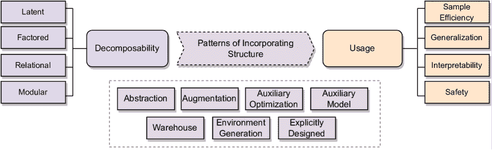
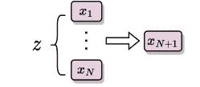

<!--yml

category: 未分类

date: 2024-09-06 19:38:33

-->

# [2306.16021] 强化学习中的结构：调查与开放问题

> 来源：[`ar5iv.labs.arxiv.org/html/2306.16021`](https://ar5iv.labs.arxiv.org/html/2306.16021)

\pdfcolInitStack

tcb@breakable

# 强化学习中的结构：

调查与开放问题

\name 阿迪亚·莫汉 \emaila.mohan@ai.uni-hannover.de

\addr 人工智能研究所

莱布尼茨大学汉诺威

\name 艾米·张 \emailamy.zhang@austin.utexas.edu

\addr 德克萨斯大学奥斯汀分校，Meta AI

\name 马里乌斯·林道尔 \emailm.lindauer@ai.uni-hannover.de

\addr 人工智能研究所

莱布尼茨大学汉诺威

###### 摘要

强化学习（RL）借助深度神经网络（DNNs）在函数逼近中的表现能力，在许多应用中取得了显著成功。然而，它在处理各种现实世界场景时的实用性仍然有限，这些场景具有多样和不可预测的动态、噪声信号以及大型状态和动作空间。这些限制源于数据效率差、泛化能力有限、安全保障不足以及缺乏可解释性等问题。为克服这些挑战并在这些关键指标上提高性能，一个有前途的方向是将问题的额外结构信息纳入 RL 学习过程。RL 的各种子领域已经提出了将这种归纳偏置纳入的方法。我们将这些不同的方法整合到一个统一的框架下，阐明结构在学习问题中的作用，并将这些方法分类为不同的结构纳入模式。通过利用这个全面的框架，我们提供了有关结构化 RL 挑战的宝贵见解，并为 RL 研究的设计模式视角奠定了基础。这一新颖的视角为未来的进展铺平了道路，并有助于开发能够更好应对现实世界场景的更有效和高效的 RL 算法。

## 1 介绍

强化学习（RL）在一系列顺序决策和控制问题中做出了贡献，如游戏（？）、机器人操作（？）、化学反应优化（？）和 RNA 折叠（？）。大多数传统的 RL 研究集中于设计能够学习解决由任务固有动态引发的顺序决策问题的智能体，例如，经典控制套件中的推车摆杆任务的微分方程（？，？）。然而，当环境的即使是微小方面发生变化时，它们的性能会显著下降（？，？）。此外，将 RL 智能体用于现实世界学习优化还面临额外挑战，如复杂的动态、难以处理和计算成本高昂的状态和动作空间以及噪声奖励信号。

因此，RL 研究已经开始通过可以大致归类为两种学说的方法来解决这些问题：(i) 泛化：开发用于解决更广泛问题的方法，其中代理在各种任务和环境中进行训练。 (ii) 可部署性：专门针对具体实际问题进行工程化的方法，通过加入额外方面如特征工程、计算预算优化、安全性等。泛化与可部署性的交集特别有趣，因为它涵盖了一类问题，我们需要方法处理任务中的足够多样性，同时又能针对具体应用进行部署。为了促进这一领域的研究，? 认为采用设计模式导向的方法，其中方法可以抽象成专门针对特定类型问题的模式。

然而，RL 设计模式的道路受到我们对 RL 方法设计决策与这些方法可能适用问题属性之间关系理解的限制。虽然使用状态抽象来处理高维空间的决策似乎很明显，但像使用关系神经网络架构解决问题的决策对设计师来说并不那么明显。将额外的领域知识融入学习流程是一种为这一过程增添原则的方法。这样领域知识的一个强大来源是学习问题本身的结构，包括有关状态空间、动作空间、奖励函数或环境动态的先验信息。虽然这些方法一直是 RL 研究的主题，但在深度 RL 中处理这些问题的方法散布在现代 RL 研究广阔而不同的子领域中。

图 1: 我们框架的概述。领域知识通常可以作为附加信息并用于在诸如*样本效率*、*泛化*、*可解释性*和*安全性*等指标上实现改进的性能。我们在第三部分中讨论了这个过程。附加信息的一个特定来源是学习问题中的可分解性，它可以被分类为沿着光谱的四个典型 - *潜在*、*因子*、*关联*和*模块化* - 在第 4.1 节中有更详细的解释。将可分解性的附加信息并入到学习流程中相当于为学习流程添加结构，这个过程可以被分类为七种不同的模式 - *抽象*、*增强*、*辅助优化*、*辅助模型*、*仓库*、*环境生成*和*明确设计* - 在第五部分中有进一步的讨论。

论文的贡献与结构。在这项工作中，我们在我们的模式中心框架下，将这些方法进行整合，首次迈出了将结构融入 RL 的第一步。图 1 展示了我们在这项工作中涵盖的将结构融入学习问题的三个要素的总体概览。在第二部分中，我们描述了形式化 RL 问题相关方面所需的背景和符号。在第三部分中，我们引入了侧信息的概念，并定义了通过将侧信息纳入 RL 流程可以解决的不同附加度量。然后，在第四部分中，我们将结构形式化为关于问题可分解性的特定类型的侧信息，并将文献中的分解分类为四种主要类型。在第五部分中，我们提出了将结构融入 RL 学习过程的七种模式，并通过将其与相关文献联系起来，概述了每种模式。本研究中开发的框架为研究开辟了新的途径，同时提供了一个共同的参考点，以了解在不同情况下哪些设计决策有效。我们在第六部分中进一步讨论这些方面，以便为研究人员和从业者提供更具体的收获。

## 2 前言

以下部分总结了我们研究结构分解及相关模式所需的主要背景。在第 2.1 节中，我们将序贯决策问题形式化为 MDP。第 2.2 节随后介绍了解决 MDP 的 RL 框架，并引入了 RL 流程。

### 2.1 马尔可夫决策过程

序列决策问题通常通过马尔可夫决策过程（MDP）的概念来形式化（？，？），其可以写作一个 5 元组$\mathcal{M}=\langle\mathcal{S},\mathcal{A},R,P,\rho\rangle$。在任何时间步，环境处于状态$s\in\mathcal{S}$，其中$\rho$是初始状态分布。智能体采取一个动作$a\in\mathcal{A}$，这会*使*环境转移到一个新的状态$s^{\prime}\in\mathcal{S}$。随机转移函数控制这种转移的动态$P:\mathcal{S}\times\mathcal{A}\to\Delta(\mathcal{S})$，它将状态$s$和动作$a$作为输入，并输出一个在下一状态$s^{\prime}$上取样的概率分布$\Delta(.)$。对于每一次转移，智能体会获得一个奖励$R:\mathcal{S}\times\mathcal{A}\to\mathbb{R}$，其中$R\in\mathcal{R}$。序列$(s,a,r,s^{\prime})$称为一次经历。

智能体根据策略$\pi:\mathcal{S}\to\Delta(\mathcal{A})$行动，策略空间为$\Pi$，该策略在给定状态下生成一个动作的概率分布。对于确定性策略，这个分布是一个 delta 分布，这导致策略输出一个单一动作。使用当前策略，智能体可以重复生成经历，这些经历的序列也称为*轨迹*（$\tau$）。在 episodic RL 中，轨迹由在多个环境重置的回合中收集的经历组成，而在持续设置中，轨迹包括在单个回合中的某个时间范围内收集的经历。$\tau$中的奖励可以累计成一个期望和，称为回报$G$，可以为任何起始状态$s$计算如下：

|  | $G(\pi,s)=\mathbb{E}_{(s_{0}=s,a_{1},r_{1},\dots)\sim\mathcal{M}}\bigg{[}\sum_{t=0}^{\infty}r_{t}\bigg{]}.$ |  | (1) |
| --- | --- | --- | --- |

为了使方程 1 中的求和是可处理的，我们要么假设问题的时间范围是固定长度$T$（有限时间范围回报），即轨迹在$T$步后终止，要么通过折扣因子$\gamma$对未来的回报进行折扣（无限时间范围回报）。然而，折扣也可以应用于有限时间范围。解决 MDP 的问题在于确定一个策略$\pi^{*}\in\Pi$，该策略最大化其轨迹回报的期望。这个期望可以通过（状态-动作）价值函数$Q\in\mathcal{Q}$来捕捉。给定策略$\pi$，期望可以递归地表示：

|  | $Q^{\pi}(s,a)=\mathbb{E}_{s\sim\rho}\big{[}G_{t}\mid s,a\big{]}=\mathbb{E}_{s^{\prime}\sim\tau}\big{[}R(s,a)+\gamma\mathbb{E}_{a^{\prime}\sim\pi(\cdot\mid s^{\prime})}[Q^{\pi}(s^{\prime},a^{\prime})]\big{]}.$ |  | (2) |
| --- | --- | --- | --- |

因此，目标现在可以被表述为找到一个最优策略，以最大化 $Q^{\pi}(s,a)$：

|  | $\pi^{*}\in\operatorname*{arg\,max}_{\pi\in\Pi}Q^{\pi}(s,a).$ |  | (3) |
| --- | --- | --- | --- |

我们还考虑了部分可观测的马尔可夫决策过程（POMDP），它们建模了状态不能完全观察的情况。POMDP 被定义为 7 元组 $\mathcal{M}=\langle\mathcal{S},\mathcal{A},\mathcal{O},R,P,\xi,\rho\rangle$，其中 $\mathcal{S},\mathcal{A},R,P,\rho$ 与上述定义相同。代理现在不再观察状态 $s\in\mathcal{S}$，而是通过一个发射函数 $\xi:\mathcal{S}\to\mathcal{O}$ 从真实状态生成观察值 $o\in\mathcal{O}$。因此，观察值在经验生成过程中承担了状态的角色，学习过程的其余部分现在可以以 $o$ 作为条件，而不是 $s$。

### 2.2 强化学习

RL 算法的任务是通过模拟其转移动态 $P(s^{\prime}\mid s,a)$ 和奖励函数 $R(s,a)$ 来与 MDP 进行交互，并学习公式 3 中提到的最优策略。在深度 RL 中，策略是一个深度神经网络 (?)，用于生成 $\tau$。我们可以通过最小化一个适当的目标 $J\in\mathcal{J}$ 来优化这种策略。

图 2：RL 流水线的结构图。

MDP 的模型 $\hat{\mathcal{M}}$ 允许代理通过模拟来*规划*轨迹，从而生成经验。使用这种模型的 RL 方法被归类为 *基于模型的 RL*（?）。另一方面，没有这种模型就需要直接从经验中学习策略，这些方法属于 *无模型 RL* 类别。

RL 方法还可以根据目标 $J$ 的类型进行分类。使用价值函数及相应的时间差分误差 (?) 来学习策略的方法属于 *基于价值的 RL* 类别。这些方法中的一个关键思想是 *自举*，即它们使用学习到的价值估计来改进其前置状态的估计。*在策略* 方法直接更新生成经验的策略，而 *离策略* 方法使用单独的策略来生成经验。*基于策略* 方法直接对策略进行参数化，并使用策略梯度 (?, ?) 来创建 $J$。

实际 RL 方法中的一个核心研究主题集中于通过迭代学习一个或多个上述量来逼近全局解，这些量使用监督学习和函数逼近技术。我们使用“管道”这一概念来讨论不同的 RL 方法。图 2 展示了 RL 管道的结构。管道可以定义为数学元组$\Omega=\langle\mathcal{S},\mathcal{A},R,P,Q,\pi,\hat{\mathcal{M}},J,\mathcal{E}\rangle$，其中所有定义保持不变。为了解决 MDP，管道在给定环境$\mathcal{E}$的情况下，通过将状态$s\in\mathcal{S}$作为输入并生成动作$a\in\mathcal{A}$作为输出来操作。环境通过动态$P$和奖励函数$R$进行操作。管道可能通过直接与$\mathcal{E}$交互，即*从经验中学习*，或通过模拟环境的学习模型$\hat{\mathcal{M}}$来生成经验。优化过程涵盖了当前策略$\pi$、其价值函数$Q$、奖励$R$和学习目标$J$之间的相互作用。稍有滥用符号，我们将管道的任何组件称为$X$，并假设其存在的空间为$\mathcal{X}$。

## 3 辅助信息及其使用

除了通过 MDP 对问题进行表征外，仍然可能存在额外的信息，这些信息可能会改善在*样本效率*、*泛化*、*可解释性*和*安全性*等附加指标上的性能。我们称这些为*辅助信息*（也称为特权信息）。对于（半）监督和无监督设置，辅助信息是任何额外的信息$z\in\mathcal{Z}$，虽然它既不是输入也不是输出空间的一部分，但可能对学习过程有贡献（？）。

转化为 RL 设置，这可以理解为原始 MDP 定义$\mathcal{M}$中未提供的额外信息$z$。这种信息可以通过函数$\beta:\mathcal{Z}\to\mathcal{X}$纳入学习过程，其中$\mathcal{X}\in\Omega$。因此，辅助信息可以通过偏置图 2 中所示的一个或多个组件来纳入 RL 管道。

自然接下来的问题是将辅助信息纳入学习管道的影响。因此，本研究特别关注辅助信息可以使用的四种方式，并在以下章节中正式定义它们。

### 3.1 样本效率

样本效率与强化学习的样本复杂性概念密切相关。为了正式定义它，我们使用*探索的样本复杂性*（？）的概念：给定固定的参数 $\epsilon,\delta>0$，如果学习到的策略 $\pi$ 和最优策略 $\pi^{*}$ 的价值函数之间的差异为 $||Q^{\pi}(s,a)-Q^{\star}(s,a)||_{\infty}>\epsilon$，则称之为一个错误。如果在时间步 $t$ 时，错误的总数为 $\zeta(\epsilon,\delta)$，且概率为 $1-\delta$，则 $\zeta$ 称为探索的样本复杂性。

纳入旁侧信息会减少 $\zeta$，从而提高样本效率。直观上，如果一个管道在相同时间步数下表现出的奖励高于基线，则我们认为它更具样本效率。然而，方法还可以通过利用对问题本身的某些假设来对 $\zeta$ 做出具体声明 (？，？，？)。

#### 探索。

提高样本复杂性的一个具体方法是直接使用旁侧信息影响探索机制。? (?) 将探索方法根据代理使用的信息类型分为以下几类：（i）*无奖励探索*方法，其中外部奖励不会影响行动选择。相反，它们依赖于内部形式的探索。（ii）*随机行动选择*方法使用估计的价值函数、策略或奖励来引发探索行为。（iii）*乐观/奖金基础探索*方法使用*面对不确定性的乐观*范式来偏好具有更高不确定值的行动。（iv）*深思熟虑的探索*方法利用动态的后验分布（贝叶斯设置）或元学习技术来优化解决探索问题。（v）*概率匹配*方法使用启发式来选择下一个行动。将旁侧信息纳入这些方法中的任何一种通常会提高样本效率，特别是通过改善探索机制的状态空间覆盖。

### 3.2 迁移和泛化

迁移和泛化包括衡量强化学习代理在不同 MDP 集上表现的性能指标：迁移评估一个在某些 MDP $\mathcal{M}_{i}$ 上训练的代理在其他 MDP $\mathcal{M}_{j}$ 上的表现。这可以是零样本方式，即代理不在$\mathcal{M}_{j}$ 上进行微调，或是少样本方式，即代理对$\mathcal{M}_{j}$ 进行一些策略更新以尽可能快地学习。通常，两个 MDP 之间的性能差距决定了迁移性能。

|  | $J_{\text{transfer}}(\pi):=\bm{G}(\pi,\mathcal{M}_{i})-\bm{G}(\pi,\mathcal{M}_{j}).$ |  | (4) |
| --- | --- | --- | --- |

泛化将这一思想扩展到在一组训练 MDP $\bm{\mathcal{M}}_{train}$ 上训练代理，然后在一组单独的 MDP $\bm{\mathcal{M}}_{test}$ 上评估其性能。因此，泛化（?）可以通过该指标来衡量。

|  | $\text{Gen}(\pi):=\bm{G}(\pi,\bm{\mathcal{M}}_{train})-\bm{G}(\pi,\bm{\mathcal{M}}_{test}).$ |  | (5) |
| --- | --- | --- | --- |

当训练和测试 MDP 从相同的分布中抽样时，即 $\bm{\mathcal{M}}_{train},\bm{\mathcal{M}}_{test}\sim p(\bm{\mathcal{M}})$，可以评估更严格的泛化形式。根据转移的方式（零-shot、少-shot 等），该概念涵盖了 MDP 的任何分布形式，包括多任务设置。将侧信息融入学习可以通过以多种方式捕捉 $\bm{\mathcal{M}}_{train}$ 和 $\bm{\mathcal{M}}_{test}$ 之间的相似性来最小化 $\text{Gen}(\pi)$。

### 3.3 可解释性

可解释性指的是对系统进行机制性理解，以使其更加透明。 ?（?）列举了模型可解释性的三个基本属性：（i）可模拟性指人类能够模拟系统的内部工作，（ii）可分解性指对系统的各个工作部分增加直观理解，（iii）透明性指改善对系统功能的理解（例如，量化其收敛特性）。

考虑到 RL 管道中各个部分的耦合特性，增加可解释性意味着能够学习一个符合多个此类属性的 MDP 策略。结合侧信息可以帮助在这三项指标上改进性能，具体取决于侧信息的性质及其涵盖内容。我们基于是否有额外处理至少这两个指标来考虑关于可解释性的声明。

### 3.4 安全性

安全性是学习策略以最大化回报期望的概念，在这些问题中，确保系统性能合理并在学习和/或部署过程中尊重安全约束是重要的。

尽管 RL 中的安全性是一个广泛的领域（?），我们在本研究中考虑了两个具体的类别：*带约束的安全学习*和*安全探索*。前者通过修改预期回报来考虑一个或多个约束 $c_{i}\in C$，其一般形式可以写成

|  | $\max_{\pi\in\Pi}\mathbb{E}_{\pi}(G)\,\,\,s.t.\,\,\,c_{i}=\{h_{i}\leq\alpha\}$ |  | (6) |
| --- | --- | --- | --- |

其中 $h_{i}$ 是与回报相关的函数，$\alpha$ 是限制该函数值的阈值。因此，可以在这些约束的制定中使用侧信息。

另一方面，安全探索修改了受外部知识影响的探索过程，在我们的案例中，这转化为将附加信息纳入探索过程。虽然直观上，这与用于有目的探索的附加信息的使用重叠，但这项工作的一个显著特征是这种有目的探索的最终目标是安全，这可能会以样本效率和/或泛化能力的损失为代价。

## 4 结构作为附加信息

结构可以被视为对学习主体提供的一种特定类型的附加信息。为了建立对这一点的直观理解，可以考虑管理一个有多个生产单元的大型工厂的任务¹¹1 例子取自？（？）。如果生产线早期的一个单元产生了缺陷部件，整个工厂可能会受到影响。然而，一个单元所生成部件的质量直接取决于该单元的状态和它从邻近单元接收到的部件质量。此外，工厂运营的成本还取决于维护每个本地单元的成本总和。最后，虽然负责阳极化的单元可能会直接从工厂中的任何其他单元接收部件，但针对圆柱形部件的工作订单可能会将这一依赖关系限制在具有车床的单元中。在生产圆柱形部件的背景下，阳极化部件的质量仅直接取决于具有车床的单元的状态。因此，通过结合关于生产的附加性质、成本和需要生产的部件的背景的信息，学习流程可以赋予更好的目标，如提高样本效率或对变化的工厂条件的学习策略的鲁棒性。

传统的 MDP 框架不要求将这种附加信息纳入学习流程。因此，偏向于该流程就是引入附加信息。然而，这种信息特别有助于将复杂的学习问题分解成可以独立学习且潜在地更高效的附加子部分。因此，结构是一种特定类型的附加信息，它为学习流程提供了关于学习问题可分解性的知识。

在这一部分，我们讨论结构与可分解性之间的关系。在第 4.1 节中，我们通过解释结构附加信息的影响来解释它如何分解复杂系统，并将这些分解分类为四种原型。在第 4.2 节 - 第 4.5 节中，我们进一步讨论这些原型，并将其与现有文献联系起来。

### 4.1 可分解性与结构原型

可分解性是指系统允许将其分解为更小的组件或子系统的属性，这些组件或子系统可以被分析、理解，并可能比较大的系统更高效地学习。在一个可分解的系统中，每个子系统的短期行为大致独立于其他子系统的短期行为。从长远来看，任何一个子系统的行为仅以汇总的方式依赖于其他子系统的行为。

关于图 2 中的 RL 管道，我们可以看到沿两个轴的可分解性：(i) *问题分解*，即环境参数化、状态、动作、转换和奖励；(ii) *解决方案分解*，即学习到的策略、价值函数、模型和训练过程。可分解性的光谱（?）提供了一种直观的方法来理解系统在这方面的位置。在光谱的一端，问题是不可分解的，而在另一端，问题可以分解为弱相互作用的子问题。类似地，前者的解决方案是整体的，而后者的解决方案是模块化的。我们通过标记四种不同的可分解性原型来捕捉这一问题-解决方案的互动，如图 3 所示。

图 3：可分解性谱和结构原型。在谱的左端存在整体结构分解，其中关于$\mathcal{X}$的*潜在*子空间的知识可以被学习并作为归纳偏置融入。向右移动，我们可以学习多个独立的子空间，尽管是在整体解决方案中。这些是*因式分解*。进一步前进，我们看到互动复杂的分解的出现，其中关于因式分解及其相互关系的知识可以融入学习过程。我们称这些为*关系分解*。最后，我们看到完全分布的子系统，这些子系统可以通过个体策略进行整合和学习。我们称这些为*模块化分解*。

### 4.2 潜在分解

潜在分解是整体性的，并且在基础结构不明确或非平稳的复杂环境中可能非常有用。从这个角度来看，管道组件$\mathcal{X}$可以通过潜在表示$\kappa$进行近似，然后可以将其集成到学习过程中。现在，依赖于$\mathcal{X}$的更新量可以重新条件化在$\kappa$上，这有助于通过减少$\mathcal{X}$的维度来提高性能。

#### 潜在状态和动作。

潜在状态空间经典上通过潜在 MDP 文献 (?) 进行了探索，其目标是发现足够学习最优策略的状态空间的潜在表示。潜在状态用于解决丰富的观察空间，其中 Block MDPs (?) 和 Contextual MDPs (?) 在泛化问题上表现成功。潜在动作在具有随机动作集 (?) 的设置中也得到了类似的探索。

给定一个编码器$\phi:\mathcal{S}\times\mathcal{A}\to\mathcal{\kappa}$和一个解码器$\beta:\mathcal{\kappa}\to\mathcal{S}$，潜在状态-动作表述允许将转移动态分解为低秩近似，

|  | $P(s^{\prime}\mid s,a)=\langle\phi(\kappa\mid s,a)\beta(s^{\prime}\mid\kappa)\rangle.$ |  |
| --- | --- | --- |

#### 潜在转移和奖励。

虽然潜在状态允许将转移矩阵分解，另一种直接解决问题的方法是将转移矩阵分解为低秩近似：

|  | $P(s^{\prime}\mid s,a)=\phi(s^{\prime}\mid s,a)\beta(s^{\prime}\mid s,a).$ |  |
| --- | --- | --- |

线性 MDPs (?) 和相应的模型基 RL 应用 (?) 已研究这种直接分解形式。

类似的分解也可以应用于奖励。? (?) 主要在噪声奖励设置中探索了这一点，其中奖励信号被假定为从一个可以作为辅助学习目标进行学习的潜在函数生成的。

### 4.3 因式分解

分解的分解略微偏离了整体性质，通过将$\mathcal{X}$分解为（潜在的）因子$\kappa_{1},\dots,\kappa_{n}$。因此，这些空间变成了各个因子空间的内积。分解的一个关键方面是，这些因子可能会在对学习动态的影响中施加条件独立性。

#### 事实状态和行动。

在分解马尔可夫决策过程（MDP）中，已经探索了分解状态和行动空间（?，?，?）。在这种情况下的方法传统上使用动态贝叶斯网络（?）等机制来捕捉下一个状态的分布。

在行动空间中的分解也已被用于解决高维行动（?）。这些方法要么对高维行动集的子集施加分解结构（?），要么通过导致最终行动的 Q 值施加这一结构（?）。关键是，这些方法可能利用因分解而产生的某种形式的独立性，无论是在状态表示还是过渡中。

#### 分解过渡和奖励。

结合分解状态或独立建模，分解奖励已被用于建模扰动奖励和多目标设置（?）。虽然分解马尔可夫决策过程（MDP）自然不会导致分解策略，但结合状态和奖励分解可以导致 Q 值的分解（?，?）。

### 4.4 关系分解

关系分解增加了进一步的可分离性概念，除了分解子集外，捕捉它们之间不可变的关系也变得重要。通常，这些关系存在于场景中的实体之间，并用于基于归纳逻辑（?）的学习方法的制定。传统上，这些关系限于一阶逻辑，但关系结构也通过图捕捉到了。

关系假设认为，谓词空间$\beta$可以为这些实体提供基础，它可以被建模为一组规则（如归纳逻辑），定义$z_{i},z_{j}\in Z$之间的相互作用。其扩展是通过捕捉$\beta$作为图$G=\langle V,E\rangle$，其中顶点是$z_{i}\in Z$，边表示它们之间的关系。

使用这样的表示允许我们讨论实体$\kappa_{i},\kappa_{j}$和$\beta$的形式上的泛化。这有助于我们绕过枚举空间的维度。

#### 关系状态和行动

传统上，关系表示被用来建模关系型 MDP（?）和面向对象 MDP（?，?）中的状态空间。它们通过一阶表示来表示分解的状态空间，这些表示由对象、谓词及其上的函数组成，以描述一组基础 MDP。这种表示方式可以更高效地捕捉实体之间的互动复杂结构。此外，实体之间互动的排列可以帮助定义在动态上有所不同的新 MDP，从而有助于泛化工作的推进。

状态也可以更一般地表示为图（?，?），或通过使用符号归纳偏差（?）输入到学习模块中，作为原始状态的补充。

动作关系有助于解决代理有多个可能的动作可用，且动作集非常大的实例。这些方法通过注意机制（?，?）或图（?）来捕捉关系，从而提供对高维动作空间的可扩展性。此外，状态和动作之间的关系帮助定义了诸如意图和可用性（?，?）的概念。

#### 关系值函数和策略

传统的关系型 MDP 工作也探索了表示和构建价值函数和/或策略的一阶表示的方法，以便对新实例进行泛化。这些方法包括回归树（?），决策列表（?），代数决策图（?），和线性基函数（?，?）。最近的方法开始关注深度神经网络表示（?，?），以及在关系方式中对机器人任务中的形态学等问题方面的建模扩展（?），或使用图-拉普拉斯（?）表示来进行内在奖励（?）。

#### 关系任务

另一项工作线条关注于在多任务设置中捕捉关系，其中任务扰动可以是目标和相应奖励（?，?，?）的形式。大多数工作旨在将这些关系整合到优化过程中和/或作为模型进行捕捉。我们将在后续部分深入探讨细节。

### 4.5 模块化分解

模块化分解存在于可分解性的另一端，其中可以为每个分解的实体 $X$ 学习个别的价值函数和/或政策。具体来说，一个任务可以被分解为若干个子系统 $\kappa_{1},\dots,\kappa_{N}$，随后可以为这些子系统学习模型、价值函数和政策。这种模块化可以沿以下轴线存在：(i) *空间模块化* 允许学习特定于状态空间部分的量，从而有效地减少状态的维度；(ii) *时间模块化* 允许将任务分解为学习范围内的序列，从而在序列中学习模块化的量；(iii) *功能模块化* 允许将策略架构分解为功能上模块化的部分，即使问题在空间和时间上是整体的。

这种分解的一个潜在结果是层级的出现，当学习问题利用这种层级关系时，这些问题就属于层次化强化学习（HRL）的范畴（?）。学习到的策略也可以表现出层级结构，其中每个策略可以选择低层次的策略来执行子任务。每一层都可以被视为一个规划问题（?）或学习问题（?），从而允许解决方案通过层级结合规划和学习。然而，层级并不是模块化的必要条件。

#### 状态和目标中的模块化

状态空间的模块化分解主要在高层次规划和 HRL 方法的状态抽象中进行研究（?）。此外，关于技能的文献也探讨了针对状态空间各个部分的策略训练方向（?）。类似地，部分模型仅在基于模型的设置中对观察-行动空间的特定部分进行预测（?，?）。目标在那些使用目标作为层级间接口的策略中（?，?，?），或作为任务规范方法的输出（?，?）中被特别考虑。

#### 行动中的模块化

行动空间中的模块化指的是将策略条件化为学习到的行动抽象。此类方法的经典例子属于选项框架的领域，其中策略与行动的时间抽象相关联 (?)。在层次化强化学习（HRL）方法中，高层次的学习和规划基于低层次的政策和其执行的终止条件。

#### 组合策略

持续设置通过将已学习的策略视为原语来利用策略的组合。这些方法要么将这些原语输入到离散优化问题中以进行选择机制，要么输入到涉及集成 (?) 和蒸馏 (?) 的连续优化设置中。在这种设置中，模块化通过构建体现出来，并且是构建解决方案的核心因素。尽管在这种范式中，通过集成、选择和/或蒸馏获得的最终策略可以是整体的，但获得这些策略的方法是纯粹的分布式体制。

## 5 种结构整合模式

在定义了不同形式的可分解性和侧信息可以实现的不同目标之后，我们现在通过理解将结构纳入学习过程的方式来连接这两者。我们假设问题和/或解决方案空间中存在某种形式的结构，这些结构可以作为归纳偏置纳入学习流程。为了了解如何将可分解性纳入 RL 流程，我们在考虑一个非常具体的问题时调查了文献：*现有方法是否以可重复的方式使用结构？* 这个问题的答案，受监督学习案例的分类的启发，带我们进入了*结构整合模式*。

(a) 抽象

(b) 增强

(c) 辅助优化

(d) 辅助模型

(e) 仓库

(f) 环境生成

(g) 明确设计

图 4：结构信息整合的模式。我们将将结构作为归纳偏置纳入学习流程的方法分为几种可以应用于不同用法的模式。

模式是 RL 流程 $\Omega$ 中的原则性变化，使得流程能够实现一个或多个附加目标：*样本效率*、*泛化*、*安全性* 和 *可解释性*。我们将文献分为七种模式，其中的概述已显示在图 4 中。我们提出的模式来自我们的文献调查，旨在为这种分类提供初步方向。我们不认为这份列表是详尽的，而是作为进一步构建的起点。我们展示了我们对图 5 中四个使用案例的模式的元分析概述。

图 5：倾向。对每种模式在附加目标上的倾向的元分析。x 轴是本文讨论的模式，而 y 轴是每个附加目标中使用特定模式解决问题的出版物百分比。

在以下小节中，我们将深入探讨每种模式，解释不同的文献线如何将每种模式应用于不同的使用案例。为了进一步提供对这种分类的直观理解，我们将考虑一个出租车服务的运行示例，其中 RL 代理（出租车）的任务是从城市网格中的各种地点接载乘客并将其送到他们期望的目的地。当乘客成功被送到目的地时，代理会获得积极的奖励，并且每个时间步都会产生小的惩罚以鼓励效率。

对于以下每个部分，我们呈现了一个调查方法的表格，按照以下方式对工作进行分类：(i) 结构化空间的相关信息作为附加信息；(ii) 该结构化空间的分解类型。我们特别分类了通过目标和/或奖励使用结构化任务分布的工作；(iii) 分解被利用的附加目标。除了展示我们的分类外，我们表格格式的理由是突出进一步研究可能有利的领域。这些是表格中我们尚未找到文献的地方，和/或我们认为额外工作可能很重要的地方。

### 5.1 抽象模式

![[无标题图片]](img/2531d347621afdf37764a85c6bb7a88f.png)

抽象模式利用结构信息在 RL 流程中创建抽象实体。对于任何实体$X$，一种抽象利用结构信息创建$X_{abs}$，它在学习过程中取代$X$的角色。在出租车示例中，状态空间可以被抽象为出租车的当前网格单元、当前乘客的目的地网格单元以及出租车是否正在载客。这显著简化了状态空间，相比于表示城市网格的全部细节。动作空间也可以被抽象为在四个主要方向上移动，加上接送乘客。找到适当的抽象本身就是一个具有挑战性的任务。过多的抽象可能导致关键信息丧失，而过少的抽象可能无法显著降低复杂性（？）。因此，基于学习的方法将这种粒度因素纳入学习过程。

抽象在文献中得到了彻底探讨，早期工作涉及了状态抽象的形式理论（？）。最近的工作主要使用抽象来处理泛化问题。因此，在图 5 中，我们看到泛化是抽象最常用的案例。然而，前述的抽象优势通常与样本效率和安全性交织在一起。鉴于文献中抽象的广泛使用，我们将在接下来的段落中探讨不同形式的抽象如何影响每个用例。

| 空间 | 类型 | 效率 | 泛化 | 可解释性 | 安全 |
| --- | --- | --- | --- | --- | --- |
| 目标 | 潜在 | ? (?) | ? (?), ? (?) |  |  |
| 关系型 |  |  | ? (?) |  |
| 模块化 | ? (?) | ? (?) | ? (?), ? (?) |  |
| 状态 | 潜在 | ? (?), ? (?), ? (?), ? (?), ? (?), ? (?), ? (?), ? (?) | ? (?), ? (?), ? (?), ? (?), ? (?) | ? (?) | ? (?), ? (?) |
| 分解 | ? (?) | ? (?), ? (?), ? (?), ? (?) | ? (?), ? (?), ? (?) |  |
| 关系型 | ? (?), ? (?), ? (?), ? (?), ? (?) | ? (?), ? (?), ? (?), ? (?), ? (?), ? (?), ? (?) | ? (?), ? (?) |  |
| 模块化 | ? (?), ? (?), ? (?) | ? (?), ? (?), ? (?), ? (?) | ? (?), ? (?) |  |
| 动作 | 潜在 | ? (?), ? (?) |  |  |  |
| 分解 |  | ? (?) | ? (?) |  |
| 关系型 | ? (?) | ? (?) |  |  |
| 模块化 | ? (?) | ? (?), ? (?) | ? (?) |  |
| 奖励 | 潜在 |  | ? (?), ? (?), ? (?), ? (?) |  |  |
| 分解 | ? (?) | ? (?), ? (?), ? (?) | ? (?) | ? (?) |
| 动态 | 潜在 | ? (?) | ? (?), ? (?), ? (?), ? (?) |  |  |
| 分解 | ? (?) | ? (?) |  |  |
| 模块化 | ? (?) | ? (?) |  |  |

#### 泛化。

状态抽象是通过使用如不变因果预测、相似性度量、自由能最小化和解缠结等方法，将 MDP 中的共享动态捕捉到抽象状态空间中，从而提高泛化性能的标准选择。

在多任务设置中，价值函数可以作为共享动态的时间抽象。后继特征（SF）通过使用价值函数作为抽象，利用潜在奖励和动态分解。后续工作将其与广义策略迭代和通用价值函数逼近器相结合。另一方面，价值函数的因式分解可以提高样本效率和泛化能力。

关系抽象通过将符号空间纳入 RL 流程来促进泛化。这些可以帮助将规划方法纳入层次框架中。此外，关系抽象可以帮助抽象出一组 MDP 的通用方面，从而允许方法在抽象状态和动作上学习可泛化的 Q 值，这些 Q 值可以转移到新任务中，或为图结构空间专门开发方法。

抽象还可以通过压缩状态空间、抽象自动机、任务间动态模板，或甚至与选项结合以保留最佳值，在层次设置中实现泛化。

#### 样本效率。

潜在变量模型提高了 RL 流程中的样本效率。潜在状态抽象可以提高基于模型的 RL 中的样本效率，并有助于提高在 HRL 中选项上的策略学习的可处理性。在无模型任务中，这些也可以作为视觉特征或潜在空间中的控制的逆模型进行学习。潜在转移模型通过在噪声环境中捕捉任务相关信息、保持原始状态之间的双模拟距离或利用因式分解抽象来展示效率提升。学习到的潜在抽象也可以有助于 Go-Explore 机制中的探索。

潜在动作模型可以通过缩短在随机场景（如对话生成）中的学习范围，加快策略梯度方法（如 REINFORCE）的收敛速度。另一方面，动作嵌入可以帮助减少大型动作空间的维度。

#### 安全性和可解释性。

关系抽象是实现可解释性的非常好的选择，因为它们捕捉了交互复杂的分解。对象中心表示与学习到的抽象的结合可以帮助增加透明度，同时，诸如跟踪对象之间关系距离的符号插入可以帮助提高性能。

状态和奖励的抽象可以帮助提升安全性。潜在状态可以通过嵌入混杂因素来帮助学习安全的因果推断模型。另一方面，网格（?, ?）可以帮助基准测试学习策略中的鲁棒性等指标。

### 5.2 扩展模式

![[无标题图片]](img/bdb5799491df297ffdd8623d2326f85c.png)

扩展模式将 $X$ 和 $z$ 视为动作选择机制的独立输入实体。组合可以从简单的结构信息与状态或动作的串联，到更复杂的根据附加信息调整策略或价值函数的方法。关键是，结构信息既不会直接影响优化过程，也不会改变 $X$ 的性质。它仅仅是对已存在实体的扩展。从这个角度看，以辅助方式学习并串联到状态、动作或模型的抽象也可以被视为扩展，因为原始实体保持不变。

对于出租车示例，一种应用扩展模式的方法是根据附加信息（如时间或星期几）来调整策略。这些信息可能有用，因为交通状况和乘客需求可能会因这些因素而有所不同。然而，扩展可能会增加策略的复杂性，需要谨慎以确保策略不会过拟合附加信息。因此，这种模式通常没有被充分探讨。尽管我们在图 5 中看到扩展的应用在大多数用例中是公平的，但使用这种模式的论文数量仍然不如像抽象等更成熟的技术。在接下来的段落中，我们将阐述调查中提到的三种扩展。

| 空间 | 类型 | 效率 | 泛化 | 可解释性 | 安全性 |
| --- | --- | --- | --- | --- | --- |
| 目标 | 潜在 |  | ? (?), ? (?) |  |  |
| 分解 | ? (?) | ? (?) |  |  |
| 关系型 | ? (?) | ? (?), ? (?) |  |  |
| 模块化 | ? (?), ? (?) | ? (?), ? (?) | ? (?) |  |
| 状态 | 潜在 | ? (?), ? (?), ? (?) | ? (?), ? (?), ? (?) |  |  |
| 分解 | ? (?) |  |  |  |
| 关系型 | ? (?) | ? (?) |  |  |
| 模块化 |  |  |  |  |
| 行动 | 潜在 | ? (?) | ? (?), ? (?) |  |  |
| 关系型 |  | ? (?) |  |  |
| 模块化 | ? (?) | ? (?), ? (?) |  |  |
| 奖励 | 分解 | ? (?) | ? (?) |  |  |
| 动态 | 潜在 | ? (?) | ? (?), ? (?), ? (?) |  |  |
| 分解 |  | ? (?) |  |  |
| 策略 | 模块化 | ? (?), ? (?), ? (?) | ? (?) | ? (?) |  |

#### 基于上下文的扩展。

动态的上下文表示(?, ?)和与目标相关的信息(?, ?)可以通过向代理暴露必要的最优信息来帮助泛化和样本效率。目标增强还允许对目标(?)的可解释机制进行指定。另一方面，元学习潜在空间的增强到正常状态可以促进任务之间的时间一致探索(?). 行动历史(?)可以直接帮助样本效率，而行动关系(?, ?)则有助于在大型行动集上进行泛化。

#### 语言增强。

语言可以明确地捕捉世界中的关系元数据。潜在的语言解释模型(?)可以利用语言的组合性来实现更好的探索和对不同关系设置的泛化，如其语言描述所示。另一方面，目标描述(?)可以通过利用不同子任务之间的语义关系并为低层策略生成更好的目标，来帮助层级设置。增强还可以通过如? (?)等方法使现有方法更具可解释性，指导对以人类可读格式编写的近似策略的搜索。

#### 控制增强。

增强还可以帮助原始控制，例如层级设置中的多级控制。基于原始技能(?, ?, ?) 条件的内部潜在变量的增强可以帮助解决层级设置中的样本效率问题。增强还可以通过如? (?)等方法帮助形态控制，这些方法将不同的肢体建模为需要学会结合在一起解决任务的单独代理。

### 5.3 辅助优化模式

这个模式使用结构侧信息来修改优化过程。这包括涉及对比损失、奖励塑造、并行优化、掩蔽策略、正则化、基线等的方法。然而，由于优化中的变化可能与其他组件的修改同步进行，因此这个模式与许多其他模式共享方法。例如，对比损失可以用来学习状态抽象。同样，学习到的模型也可以用于奖励塑造。因此，属于这一类别的方法同时利用这两种模式。

![[未标注图像]](img/9e72ee1dc309034fab511d6985c6523e.png)

在出租车的案例中，奖励塑造可以帮助策略在城市网格中的轻微扰动下重复使用，其中塑造的奖励鼓励出租车在没有乘客时待在乘客经常出现的区域。确保修改后的优化过程与原始目标保持一致至关重要，即需要存在某种形式的正则化来控制优化过程的修改如何尊重原始目标。对于奖励塑造技术，这相当于在塑造的奖励下保持最优策略的不变性 (?)。对于辅助目标，这表现为某种形式的熵 (?) 或发散正则化 (?)。约束通过递归 (?) 确保这一点，而基线控制更新的方差 (?)。约束的最强用法是在安全文献中，其中约束要么通过某种安全标准帮助控制更新，要么约束探索。因此，在图 5 中，我们看到辅助优化模式在解决安全问题上的倾向达到顶峰。在接下来的段落中，我们将讨论优化优化过程的个别方面的方法，即奖励、学习目标、约束和并行优化。

| 空间 | 类型 | 效率 | 泛化 | 可解释性 | 安全 |
| --- | --- | --- | --- | --- | --- |
| 目标 | 潜在 |  | ? (?) |  |  |
| 关系型 |  | ? (?) |  |  |
| 分解型 |  |  | ? (?) |  |
|  | 模块化 | ? (?), ? (?), ? (?), ? (?) |  |  |  |
| 状态 | 潜在 | ? (?), ? (?), ? (?), ? (?), ? (?), ? (?), ? (?), ? (?), ? (?) |  | ? (?) | ? (?), ? (?) |
| 分解型 | ? (?), ? (?), ? (?), ? (?) |  |  | ? (?) |
| 关系型 | ? (?) |  |  |  |
| 模块化 | ? (?), ? (?) |  | ? (?) |  |
| 动作 | 潜在 | ? (?), ? (?), ? (?), ? (?) | ? (?) | ? (?) | ? (?), ? (?), ? (?) |
| 分解型 | ? (?), ? (?), ? (?), ? (?), ? (?), ? (?), ? (?), ? (?) |  |  |  |
| 模块化 | ? (?), ? (?) |  | ? (?) | ? (?) |
| 奖励 | 分解型 | ? (?), ? (?), ? (?) | ? (?), ? (?), ? (?), ? (?) |  | ? (?), ? (?) |
| 动态 | 潜在 | ? (?), ? (?) | ? (?) |  |  |
| 分解型 | ? (?) | ? (?), ? (?) |  |  |
| 关系型 | ? (?), ? (?) |  |  |  |
| 策略空间 | 潜在 | ? (?) | ? (?), ? (?) |  |  |

#### 奖励修改。

奖励塑造是将额外信息纳入优化过程的常用方式。通过任务描述(?)利用模块化和关系分解，或从更高层次策略获得的目标信息与对较低层次过渡的离策略修改（?），方法可以提高样本效率。奖励历史(?)可以帮助学习状态之间的对称关系，从而改善优化中迷你批次状态的选择过程。另一方面，将状态和奖励分解为内生和外生因素(?)有助于通过奖励修正提高安全性和样本效率。

外部奖励也可以用于指导探索过程。符号规划与关系表示可以用于通过外部奖励与原始学习策略进行交互，从而在层次化设置中增加可解释性，同时通过外部奖励直接影响探索(?). 另一种方法是，额外的奖励来源可以帮助确定反事实轨迹的质量，这有助于解释代理为何采取某些行动(?). 此外，运行平均奖励可以用于自适应调整异质动作空间的探索参数(?).

另一方面，内在奖励可以特别帮助在稀疏奖励环境中进行探索。潜在分解可以通过直接影响探索来改善这种方法。语言抽象可以作为潜在分解，单独用于探索(?)。另外，几何结构可以提供比较状态嵌入并提供情节奖励(?)的方法。

#### 辅助学习目标。

基于技能的方法通过学习不变子空间并利用这些子空间创建转移辅助目标（通过奖励信号）(?)，或用于策略正则化的基于熵的项（?），在形态不同的代理之间转移技能。在层次化设置中，发现适当的子任务(?)可能是一个高度样本低效的过程。? (?) 通过在当前策略下组合子轨迹的值来解决这个问题，然后利用这些值进行行为克隆。潜在分解在用于某种形式的策略正则化(?)时可以帮助提高鲁棒性和安全性。辅助损失通常有助于泛化，也可以是引入类人归纳偏见(?)的一个很好的切入点。受到潜在分解几何学启发的度量可以帮助在多任务设置中学习最优值(?).

#### 约束与基线。

约束优化在安全强化学习中很常见，融入结构可以帮助提高这些方法的样本效率，同时使其更具可解释性。将状态因子化为安全状态和不安全状态可以帮助开发持久的安全条件（？），或语言抽象（？）。递归约束（？）可以通过因子状态明确条件化优化，专注于潜在的安全动作子集。将选项的探索限制在非风险状态中，也可以帮助在层次设置中融入安全性（？）。因子化的动作还可以通过基准化（？，？）来提高策略梯度方法的样本效率，通过直接值条件（？）提高离线方法的样本效率，并通过矩阵估计（？）提高基于值的规划效率。

方法也可以直接将专家领域知识纳入动作选择机制，以提高安全性和可解释性（？），或用于定向探索以提高样本效率（？）。层次设置可以通过修改终止条件来受益于潜在状态分解（？）。此外，状态-动作等价性可以通过因子化帮助将 Q 学习扩展到大空间（？）。

#### 并发优化。

使用结构分解来并行优化可以特别帮助提高样本效率。因子化 MDP（马尔可夫决策过程）是建模影响用户内容呈现的因素的一个非常好的方法，并且可以用于并行方法中的集成（？）。类似地，分解的奖励在层次设置中可以帮助将多任务问题分解为个别任务 MDP 的线性组合（？）。或者，在多维动作空间中离散化连续子动作可以帮助将每个子动作的 MDP 扩展为非折扣的低层次 MDP，通过分解来修改 Q 值的备份（？）。关系分解还可以帮助为因子化神经网络提供掩蔽策略（？）。

### 5.4 辅助模型模式

![[未标注图片]](img/d8c2f7605a30170a927e830b99f065ec.png)

这一模式代表了使用模型中的结构信息。在使用“模型”这一术语时，我们特别指的是那些利用世界模型生成体验的方法，无论是完全还是部分。这一概念使我们能够涵盖从使用全尺度世界模型生成奖励和下一状态转移的方法，到使用这些方法生成完整体验序列的方法。在我们的分类中，我们特别关注结构是如何融入这些模型中的，以帮助生成学习体验的某些部分。

我们的出租车代理可以根据过去的经验学习城市交通的潜在模型。这个模型可以用来规划避开交通的路线，从而更快地到达目的地。或者，代理可以学习一种集成技术来结合多个模型，每个模型都针对交通动态的特定组件。使用模型时，通常在模型复杂性和准确性之间存在权衡，必须仔细管理，以避免过拟合并保持鲁棒性。为此，纳入结构有助于使模型学习阶段更加高效，同时允许重用以进行泛化。因此，在 图 5 中，我们看到辅助模型模式表现出强烈的利用结构以提高样本效率的倾向。在接下来的段落中，我们将明确讨论利用分解的模型和用于创建分解的模型。

| 空间 | 类型 | 效率 | 泛化 | 可解释性 | 安全性 |
| --- | --- | --- | --- | --- | --- |
| 目标 | 分解型 |  | ? (?) |  |  |
| 关系型 |  | ? (?), ? (?) |  |  |
| 模块化 | ? (?) | ? (?) | ? (?) |  |
| 状态 | 潜在 | ? (?), ? (?), ? (?), ? (?), ? (?), ? (?), ? (?) | ? (?), ? (?), ? (?), ? (?), ? (?), ? (?) |  | ? (?) |
| 分解型 | ? (?), ? (?), ? (?), ? (?), ? (?), ? (?) | ? (?), ? (?) |  |  |
| 关系型 | ? (?), ? (?), ? (?), ? (?), ? (?), ? (?), ? (?) | ? (?), ? (?), ? (?), ? (?), ? (?) | ? (?) |  |
| 模块化 | ? (?), ? (?), ? (?), ? (?) | ? (?), ? (?) | ? (?), ? (?) |  |
| 动作 | 潜在 | ? (?) | ? (?) |  |  |
| 分解型 | ? (?), ? (?), ? (?), ? (?) | ? (?) |  |  |
| 关系型 | ? (?), ? (?) | ? (?) |  |  |
|  | 模块化 | ? (?), ? (?) | ? (?) | ? (?) |  |
| 奖励 | 潜在 | ? (?) | ? (?), ? (?), ? (?), ? (?), ? (?) |  |  |
| 分解型 |  | ? (?) |  | ? (?), ? (?) |
| 动态 | 潜在 | ? (?), ? (?), ? (?), ? (?) | ? (?), ? (?), ? (?), ? (?), ? (?), ? (?) | ? (?) |  |
| 分解型 | ? (?), ? (?) | ? (?), ? (?) | ? (?), ? (?) |  |
|  | 关系型 | ? (?) |  |  |  |
|  | 模块化 | ? (?), ? (?), ? (?) | ? (?) |  |  |

#### 具有结构化表示的模型。

? (?) 利用分解型状态空间来展示基于模型的方法在组合复杂环境中的优势。同样，dreamer 模型 (?,?,?) 利用基于像素的环境的潜在表示。

状态的面向对象表示可以帮助绕过在 MBRL (?) 中使用 CNN 学习潜在因素的需求，或者作为可以通过 NNs (?) 改进的随机变量。图（卷积）网络 (?) 可以捕捉丰富的高阶交互数据，如人群导航 ? (?)，或不变性 (?)。动作等效性可以帮助学习潜在模型（抽象 MDPs） (?) 以进行规划和价值迭代。

#### 特定任务分解的模型。

利用模型中的分解的另一种方法是捕捉任务特定的分解。捕捉某种形式的相关性，如因果强化学习中的观察性和干预性数据(?)，或任务相关与不相关数据(?)的模型可以帮助泛化和样本效率提升。潜在表示帮助模型捕捉控制相关信息(?)或子任务依赖关系(?)。

安全模型通常会包含一些成本度量，以抽象安全状态(?)，或通过潜在因果分解(?)和状态子空间(?)直接指导探索机制，从而提高样本效率。生成方法，如 CycleGAN(?)，也是使用 MDP 不同组件的潜在模型生成反事实轨迹(?)的很好的方法。

### 5.5 仓储模式

该模式利用结构信息创建一个可以组合以实现特定目标的实体数据库。这些可以是学习到的策略和价值函数，甚至是模型。鉴于这种方法的在线特性，它们通常针对持续和终身学习问题。这些方法固有的模块化通常使它们关注知识重用作为核心主题。

我们运行示例中的出租车可以维护一个关于城市不同部分或一天不同时间的价值函数或政策的数据库。这些可以在出租车穿行城市时被重用，使学习更高效。虽然仓储通常可以提高效率，但它主要通过技能和选项框架探索以针对泛化。在仓储中一个重要的考虑因素是管理仓库的大小和多样性，以避免将学习过程过度偏向过去的经验。

![[未标注图像]](img/8d8ac2908ee567ea073ef1c5320e3b6e.png)

到目前为止，仓储模式似乎被应用于样本效率和泛化。然而，仓储也与可解释性重叠，因为存储的数据可以很容易地用于分析代理的行为并理解新情境下的策略。因此，这些目标在图 5 中公平地分布。

| 空间 | 类型 | 效率 | 泛化 | 可解释性 | 安全 |
| --- | --- | --- | --- | --- | --- |
| 目标 | 分解 |  | ? (?), ? (?) |  |  |
| 关系 |  |  | ? (?) |  |
| 模块化 | ? (?) | ? (?) | ? (?) |  |
| 状态 | 潜在 |  | ? (?), ? (?) |  |  |
| 分解 | ? (?), ? (?) | ? (?), ? (?), ? (?) |  |  |
| 模块化 | ? (?) | ? (?), ? (?), ? (?) | ? (?) |  |
| 行动 | 潜在 |  | ? (?) |  |  |
| 模块化 | ? (?), ? (?), ? (?) | ? (?), ? (?), ? (?), ? (?), ? (?), ? (?), ? (?) | ? (?) |  |
| 奖励 | 分解 |  | ? (?), ? (?), ? (?), ? (?) |  |  |
| 动态 | 潜在 |  | ? (?) |  |  |
| 分解 | ? (?), ? (?) | ? (?), ? (?) | ? (?) |  |
|  | 模块化 | ? (?) | ? (?), ? (?), ? (?), ? (?) |  |  |
| 策略 | 潜在 |  | ? (?) | ? (?) |  |
| 模块化 | ? (?), ? (?), ? (?), ? (?), ? (?), ? (?), ? (?), ? (?) | ? (?), ? (?), ? (?), ? (?), ? (?) | ? (?) |  |

#### 策略仓储。

策略子空间 (?) 是一个相对较新的概念，它利用策略中的共享潜在参数学习一个子空间，这个子空间可以随后线性组合以创建新的策略。通过仓储额外策略扩展这些子空间自然地扩展到持续设置 (?).

通过使用目标和奖励，任务分解在多任务终身设置中赋予了策略和 Q 值仓储功能。多任务终身问题也可以被视为从潜在空间生成的现有任务之间的关系图 (?). 另一方面，方法如 ? (?) 将 MDPs 分解为特定于代理和特定于任务的变化度，这些个别模块可以进行训练。使用变分编码器-解码器模型 (?) 的解缠绕可以通过将动态分解为共享和特定于代理的因素来帮助控制形态上不同的代理。此外，方法如 ? (?) 将代理的问题划分为互相连接的子代理，学习局部控制策略。

有效利用技能框架的方法将学到的原语进行仓储，这类似于选项在 HRL 中仓储关联策略。这些可以随后用于在较低层次上最大化互信息 (?), 组合策略 (?), 在持续设置中寻求多样性先验 (?), 或用于分区状态空间 (?). 类似地，? (?) 将仓储模式应用于使用辅助优化学习的潜在嵌入空间。

#### 分解模型。

模型中固有的分解会导致采用多模型集成的方法，这些模型各自反映问题的不同方面。集成方法如 ? (?) 捕捉在个别模块中稀疏互动的动态，并使用注意机制 (?). 集成动态也有助于在少量样本下适应未见过的 MDPs (?). 分解模型也可以与关系分解相结合，将动作绑定到以对象为中心的表示 ? (?). 在层次设置中的潜在表示 (?) 还可以改善 Deep Option Critic 的样本低效性 (?).

### 5.6 环境生成模式

![[未标注的图片]](img/6ce2b26e0b664f491124867ac8de0f54.png)

该模式利用结构信息创建任务、目标或动态分布，从中可以抽样 MDPs。这包括了程序生成环境的理念，同时还结合了使用辅助模型来引入环境生成过程中结构的方法。该分解体现在受生成过程影响的环境生成方面，如动态、奖励结构、状态空间等。鉴于该模式的在线特性，这一模式中的方法最终以某种方式处理课程学习。

在出租车示例中，可以生成任务的课程，从简单任务（如在空网格中导航）开始，逐渐引入复杂性（如增加交通和不同目的地的乘客）。确保生成的 MDPs 能够良好覆盖问题空间对避免过拟合特定任务子集至关重要。这需要在环境生成过程中加入额外的多样性约束。结构至关重要，它为环境生成过程提供了额外的可解释性和可控性，从而使得基准测试比使用无监督技术的方法更为简单 (?).

| 空间 | 类型 | 效率 | 泛化 | 可解释性 | 安全 |
| --- | --- | --- | --- | --- | --- |
| 目标 | 关系型 | ? (?), ? (?) | ? (?) | ? (?) |  |
| 模块化 | ? (?), ? (?) | ? (?), ? (?) |  |  |
| 状态 | 潜在 |  | ? (?), ? (?) |  |  |
| 因式分解 | ? (?), ? (?) | ? (?) | ? (?), ? (?) |  |
| 关系型 | ? (?), ? (?) | ? (?) | ? (?) |  |
| 奖励 | 潜在 |  | ? (?), ? (?) |  |  |
| 因式分解 | ? (?) | ? (?) |  |  |
| 动态 | 潜在 |  | ? (?), ? (?) |  |  |
| 因式分解 | ? (?), ? (?) | ? (?), ? (?), ? (?) | ? (?) |  |
| 关系型 | ? (?), ? (?) | ? (?), ? (?) | ? (?), ? (?) |  |
| 模块化 | ? (?), ? (?) | ? (?) | ? (?) |  |

学习问题的组合性质可以使用基于规则的语法来建模。? (?)特别利用这一点来影响转移动态并生成环境。这使得它们能够用隐式组合课程训练智能体。这进一步被? (?)在其辅助优化程序中使用。另一种捕捉任务依赖性的方法是通过潜在图形模型，这可以用来生成状态空间、奖励函数和转移动态 (?, ?)。

潜在动态模型允许模拟任务分布，这有助于泛化 (?). 聚类方法如(?)，则通过探索策略的元学习来探索任务相似性。某种程度上，它们在任务空间上恢复了因式分解，其中单独的簇可以进一步用于策略调整。

### 5.7 明确设计

这种模式涵盖了所有归纳偏置在特定架构或设置中显现的方法，这些架构或设置反映了它们旨在利用的问题的可分解性。这自然包括了高度特定的神经架构，但它也很容易扩展到其他方法，如顺序架构以捕捉层次结构、关系等。关键是，结构信息的使用仅限于架构的特异性，而不是管道的其他部分。在出租车的情况下，可以设计一个神经架构来将城市网格处理为图像并输出策略。可以使用卷积层等技术来捕捉城市网格的空间结构。不同的网络部分可以专门用于不同的子任务，如识别乘客位置和规划路线。然而，这种模式涉及大量的手动调优和实验，并且必须确保这些设计在不同任务中能够很好地泛化。设计特定的神经架构可以提供更好的可解释性，使得能够分解不同的组件并独立模拟它们。因此，这种模式表现出对可解释性的最高倾向，泛化则紧随其后，见图 5。

| 空间 | 类型 | 效率 | 泛化 | 可解释性 | 安全性 |
| --- | --- | --- | --- | --- | --- |
| 目标 | 分解 | ? (?) | ? (?) | ? (?) |  |
| 关系型 | ? (?) | ? (?) |  |  |
| 状态 | 潜在 | ? (?) | ? (?) |  |  |
| 分解 | ? (?) | ? (?) |  |  |
| 关系型 | ? (?),? (?),? (?),? (?) | ? (?),? (?),? (?),? (?),? (?), ? (?) | ? (?), ? (?) |  |
| 模块化 |  |  |  |  |
| 动作 | 潜在 | ? (?) |  |  |  |
| 分解 | ? (?) |  | ? (?) |  |
| 关系型 | ? (?) |  | ? (?) |  |
| 奖励 | 潜在 |  | ? (?) |  |  |
|  | 分解 |  |  |  | ? (?) |
| 动态 | 潜在 | ? (?) | ? (?), ? (?) |  |  |
| 分解 | ? (?),? (?) |  |  |  |
|  | 关系型 |  | ? (?) |  |  |
| 策略 | 关系型 | ? (?), ? (?) | ? (?) | ? (?) |  |
|  | 模块化 |  | ? (?) | ? (?),? (?) |  |

#### 拆分功能性。

偏置架构的一种方式是将其功能分为不同的部分。大多数实现这种消歧的作品要么是分解的，要么是关系的。结构化控制网络（?）分别对动态的线性和非线性方面进行建模，并将它们以加法的方式结合起来，以获得样本效率和泛化性。另一种方法是使用双线性价值网络（?）将动态体系架构分解为状态和目标条件组件，以生成目标条件 Q 功能。行动分支架构（?）使用一个共享表示，然后将其分解为单独的行动分支，以实现个别功能。这种方法类似于使用瓶颈捕获多任务表示。

关系和模块化偏见表现在分层架构中。这也使它们能够为架构增加更多的可解释性。举例来说，两步混合策略（?），通过将行动分为修剪器和选择器模块，明确展示了使政策更具解释性的方法。另一方面，路由层次结构可以明确地利用子模块捕捉模块化，这些模块可以由另一个政策用于它们的路由（?, ?）。

#### 在架构中捕获不变性。

专门的架构也可以帮助捕捉问题中的不变性。符号网络（?, ?）通过首先将其转换为图形，然后使用神经网络捕捉节点嵌入来为关系 MDPs 训练一组共享参数。同态网络（?）将对称性捕捉到专门的 MLP 和 CNN 架构中。将对称性纳入的另一种方法是通过基函数（?）。

注意机制可以明确地捕捉实体因子化的情景（?, ?, ?）。关系和图网络可以明确地捕捉额外的关系归纳偏见。线性关系网络（?）提供了一种随着对象数量线性增长的架构。图网络还被用来明确地对具体行为进行建模代理人形态（?, ?）。

#### 专门的模块。

一类方法结合了两种世界的优势，通过专门的模块来捕获不变性。这些模块可以捕捉语义意义中的关系结构（?），辅助模型的关系编码器（?），或者用于合并领域知识的专门架构（?）。

## 结构化强化学习中的 6 个开放问题

在讨论了我们面向模式的框架来理解如何将结构纳入 RL 管线之后，我们现在转向将我们的框架与现有的 RL 子领域连接起来。我们从可扩展性和鲁棒性这两个主要角度审视这些子领域中的现有范式。这些维度可以被视为一个画布，我们可以在上面定位和理解 RL 子领域中不同的 RL 范式，如离线 RL，无监督 RL，RL 基础模型，部分可观察性，大世界，自动化 RL 和元 RL。

稀疏数据场景需要更智能的方法来利用有限的经验，而丰富数据场景可能会受到数据质量的影响，因为数据可能来自噪声大且经常不可靠的来源。

#### 可扩展性

衡量方法如何随着问题复杂性的增加在状态空间和动作空间的大小、复杂动态、噪声奖励信号和较长任务时间等方面进行扩展。一方面，方法可能特别需要低维空间，并且在这些空间的大小增加时扩展性可能较差；另一方面，一些方法可能对简单问题来说过于复杂，但更适合于大空间。

#### 鲁棒性

衡量方法对环境变化的响应。虽然这一概念与泛化重叠，但在我们的目的下，鲁棒性更全面地考虑了数据分布的核心属性，如初始状态分布和多模态评估回报。在这一概念下，本质上不同的学习动态可能对环境中的不同变化具有鲁棒性。

#### 本节结构

在以下小节中，我们涵盖了在可扩展性和鲁棒性的二维空间中处于不同点的 RL 子领域。我们介绍了每个子领域的现有范式和当前挑战。然后，我们展示了一些示例，说明我们的框架如何推动这些领域的进一步研究和实践。最后，我们将讨论内容整理成可结合的设计模式，以利用我们的框架。

### 6.1 离线 RL

离线强化学习（也称为批量 RL） (?) 涉及从固定数据集中学习，而不与环境进一步互动。这种方法在主动探索成本高、风险大或不可行时尤其有用。因此，由于依赖于收集的数据集，这些方法对数据高度依赖，并且由于预先收集数据的局限性，它们的泛化能力较差。离线 RL 中的三种主要范式——行为克隆 (?)、Q 学习 (?) 和序列建模 (?)——在状态空间增加时普遍表现出性能下降的趋势 (?)。离线 RL 还面临自身的挑战，包括克服分布变化和有效利用可用数据集。结构分解在解决这些挑战中可以发挥关键作用，具体包括以下方面：

#### 数据集的更有效利用。

任务分解允许学习不同子任务的单独策略或值函数，可以更有效地利用可用数据。例如，通过仓储分解，使用数据的相应子集为各个模块单独建立策略可能比为整个任务学习单一策略更具样本效率。因此，任务分解为开发有效学习不同子任务效果平衡的专门算法开辟了新途径。从业者可以利用这样的分解来通过训练能有效处理特定子任务的模型，最大限度地提高可用数据集的效用，潜在地改善整个系统在相同数据集下的性能。

#### 缓解分布偏移。

结构信息可能有助于缓解分布偏移的影响。例如，如果在分解中某些因素不太容易受到分布偏移的影响，我们可以在学习过程中更加关注这些因素。这为我们获得有关结构分解、任务分布和策略表现之间复杂相互作用的理论洞见打开了机会。另一方面，在分布偏移普遍的环境中，实用方法可以利用结构分解来创建更加健壮的强化学习系统。

#### 探索的辅助任务。

结构分解可用于定义辅助任务，以便从数据集中更好地学习。例如，在关系分解中，我们可以定义涉及预测不同实体之间关系的辅助任务，这有助于学习数据的有用表示。利用所提出的框架，研究人员可以探索如何定义有助于代理人更好地学习环境表示的有意义的辅助任务。这可能会导致新方法，通过学习这些辅助任务有效利用可用数据。从业者可以根据问题的特定分解设计辅助任务。例如，如果任务具有清晰的关系结构，那么可以预测不同实体之间的关系的辅助任务可能会改善代理人对环境的理解和整体性能。

<svg height="89.38" overflow="visible" version="1.1" width="600"><g transform="translate(0,89.38) matrix(1 0 0 -1 0 0)" fill="#000000" stroke="#000000" stroke-width="0.4pt"><g fill-opacity="1.0" transform="matrix(1.0 0.0 0.0 1.0 22.05 14.17)"><foreignobject width="555.91" height="61.04" transform="matrix(1 0 0 -1 0 16.6)" overflow="visible" color="#000000">离线强化学习模式 • 使用因式分解或关系分解来创建能够帮助应对分布偏移和辅助解释性的抽象。 • 实施模块化设计，每个模块针对特定的子问题，从而提高**可扩展性**。 • 通过为子问题存储学习到的策略来利用策略重用。 • 如果有足够的交互数据，使用潜在模型的策略进行反事实场景的数据增强。

### 6.2 无监督强化学习

无监督强化学习（？）指的是强化学习中的一个子领域，其中代理在没有明确反馈或奖励指导的情况下学习与环境交互。该领域的方法可以根据用于评估性能的指标的性质进行特征化（？）。*基于知识*的方法通过对环境某些方面进行预测来定义自监督任务（？，？，？，），*基于数据*的方法通过最大化状态访问熵来探索环境（？，？，？，？，？），而*基于能力*的方法则最大化轨迹与学习技能空间之间的互信息（？，？，？，？，？）。预训练阶段使这些方法能够学习数据的潜在结构。然而，这一阶段也需要大量的数据，因此影响了这些方法在学习表示不太有用的问题上的可扩展性。因此，目前这些方法处理的是中等复杂性的问题，而更好的可扩展性仍然是进一步研究的主题。

结构性分解可以通过提高预训练阶段的可处理性和微调阶段的通用性来帮助这些方法。潜在分解可以帮助利用未标记数据中的结构，而关系分解可以为学习到的表示增加可解释性。通过增强，将策略条件化于状态空间的特定部分可以减少微调所需的数据量。此外，理解问题分解可以将复杂问题简化为更易于管理的子问题，有效减少感知问题的复杂性，同时在外部课程中纳入这种分解以进行微调。结合分解引导的仓储可以提升学习技能的微调过程。

<svg height="105.99" overflow="visible" version="1.1" width="600"><g transform="translate(0,105.99) matrix(1 0 0 -1 0 0)" fill="#000000" stroke="#000000" stroke-width="0.4pt"><g fill-opacity="1.0" transform="matrix(1.0 0.0 0.0 1.0 22.05 14.17)"><foreignobject width="555.91" height="77.64" transform="matrix(1 0 0 -1 0 16.6)" overflow="visible" color="#000000">无监督强化学习模式 • 使用潜在分解从未标记的数据中提取结构，减少数据依赖性。 • 采用分解和模块化的抽象来管理可扩展性，通过将学习集中在问题的不同部分上独立进行。 • 在不同的模块子问题中储存技能，以便重用解决方案并提高通用性。 • 通过利用问题分解简化学习任务，并使用分解进行微调以实现课程学习，来管理问题复杂性。

### 6.3 大数据与强化学习中的基础模型

基础模型（?, ?, ?）指的是一种范式，其中一个大型模型在大量异质数据集上进行预训练，并针对特定任务进行微调。这些模型被称为“基础性”的，因为它们可以作为广泛任务的基础，减少为每个任务从头训练单独模型的需求。

强化学习的基础模型越来越接近现实。这类强化学习模型会遵循类似的概念，即在各种任务、环境和行为上训练一个大型模型，然后针对特定的下游任务进行微调。SMART（?），目前这些模型中的一个有力竞争者，遵循这一范式，通过使用自监督和以控制为中心的目标，鼓励基于变换器的模型捕捉与控制相关的表示，并在用于微调时表现出优越的性能。AdA（?）在一个庞大的任务分布上训练一个上下文学习代理，其中任务因素是从潜在规则集中生成的。

鉴于预训练范式，这些方法原则上高度依赖数据。然而，结合大量数据可以通过减少分布式应用的微调成本来展示可扩展性优势。一个自然的问题是结构化强化学习在端到端学习和大数据领域中的作用。即便这些方法遵循端到端范式，结构性分解也可以以不同的方式使其受益。

#### 微调过程中的可解释性和选择。

研究人员可以通过根据方法如何融入结构来对预训练模型中的可分解性进行分类，从而更好地理解这些模型。因此，这可以指导根据实际任务选择微调方法。对预训练模型的被动学习可以从关于微调任务空间的哪些部分适合什么样的预热策略的更好解释中受益。此外，融入以可解释性为导向的分解，例如关系表示，可以帮助设计更具可解释性的微调方法。

#### 特定任务的架构和算法。

结构信息可以指导新架构的开发。通过更好地理解不同架构和算法如何融入结构信息，从业者可以更有效地调整现有方法或贡献于设计针对其特定任务的创新解决方案。例如，行动分支架构可能在下游任务中提供模块化功能，尤其适合多任务设置。另一方面，表示瓶颈可能适合那些在上下文特征上有细微变化的设置。

#### 改进的微调和迁移学习。

通过理解如何分解任务和融入结构信息，基础模型可以更有效地进行特定任务的微调或迁移到新任务。对分解的理解可以指导如何构建微调过程或如何将基础模型适应到新任务中。通过理解在微调过程中如何融入结构信息，它们可能会实现更好的性能。

#### 基准测试和评估。

通过理解可分解性的范围以及各种方法如何融入结构，我们可以为基础模型创建更好的基准测试和评估协议。例如，我们可以评估基础模型在处理不同分解任务和微调模式方面的表现。研究人员可以利用这一框架设计更好的评估协议和基准测试，以适用于基础模型。对于从业者而言，这些基准测试和评估协议可以指导他们为特定任务选择模型和算法。

<svg   height="155.8" overflow="visible" version="1.1" width="600"><g transform="translate(0,155.8) matrix(1 0 0 -1 0 0)" fill="#000000" stroke="#000000" stroke-width="0.4pt"><g fill-opacity="1.0" transform="matrix(1.0 0.0 0.0 1.0 22.05 14.17)"><foreignobject width="555.91" height="127.45" transform="matrix(1 0 0 -1 0 16.6)" overflow="visible" color="#000000">基础模型模式 • 在预训练的基础模型上使用因子化或关系抽象进行状态抽象，以管理高维状态空间，从而减少数据依赖性。 • 根据额外的任务特定信息（例如目标信息、特定微调指令的表示或控制先验）对策略进行条件化，以提高可扩展性。 • 对微调过程进行正则化，以防止在预训练过程中学到的有用特征的灾难性遗忘。 • 维护一个微调策略和价值函数的仓库，以帮助重用以前学到的技能，并将其适应新任务，从而提高学习效率和泛化能力。 • 根据代理的表现，结合一系列逐渐复杂的微调环境，以帮助代理逐步将基础模型的知识适应特定的强化学习任务。 • 使用明确的架构来微调不同的强化学习问题方面，例如感知、策略学习和价值估计。

### 6.4 部分可观测性与大世界

在许多现实世界的情况下，马尔可夫性质可能无法完全捕捉环境的动态（？，？）。这种情况可能发生在环境的状态或奖励不仅依赖于最近的状态和动作，或者如果代理无法在每个时间步骤完全观察环境状态时。在这种情况下，方法必须处理非马尔可夫动态和部分可观测性。

#### 抽象。

在这种情况下，抽象可以发挥关键作用，结构分解利用抽象模式可以使方法更加样本高效。通常用于选项中的时间抽象允许智能体在较长时间内做出决策，从而将这些扩展动作中的潜在时间依赖性封装起来。这可以有效地将非马尔可夫问题转换为选项级别的马尔可夫问题。状态抽象抽象掉了状态中的无关方面，因此，有时可以忽略某些时间依赖性，从而在抽象状态级别使过程变为马尔可夫。因此，研究抽象中的分解角色为理解非马尔可夫模型之间的依赖关系及其解决不完整信息问题时使用的抽象类型打开了可能性。抽象还可以简化 POMDP 中的观测空间，从而减少信念更新过程的复杂性。抽象可能涉及将相似观测分组、识别更高级的特征或其他简化。抽象还可以使我们将部分可观测性分解为不同类型，而不是总是假设最坏情况。利用这种对部分可观测性的限制假设可以帮助我们构建更具体的算法，并为这些场景推导收敛性和最优性保证。

#### 增强。

任何额外需要的信息，如信念状态或过去观察的记忆，都可以用作抽象或补充。这也可以帮助更高效地学习用于规划的转移模型。利用在不同时间尺度上进行优化的分层技术可以将仓储纳入其中，以便在各种抽象层次之间重用学习到的策略。环境生成模式也可以用来为智能体生成一系列越来越复杂的任务，从简单的 MDP 开始，逐步引入部分可观测性或其他非马尔可夫特性。

#### 大世界。

当我们将环境的信息内容扩展到其极限时，我们*深入*到 RL 中的大世界假设领域，其中智能体的环境比智能体大多个数量级，甚至在无限数据的极限下，智能体也无法表示最优价值函数和策略。在这种情况下，智能体必须在重大不确定性下做出决策，这带来了包括探索、泛化和高效学习等几个挑战。尽管该假设表明在这种情况下整合边际信息可能对学习最优策略和价值没有帮助，但以不同方式对大环境进行结构分解可以允许在不同轴上进行基准测试，同时深入研究智能体尚未体验过的环境部分上的算法性能。

模块化分解可以通过帮助代理独立探索环境的不同部分来指导代理的探索过程。引入模块化为任务分解、探索和在大环境中学习效率之间关系提供了新方法和理论见解。关系分解可以帮助代理学习不同实体之间的关系，从而增强其对未见部分环境的泛化能力。最后，结构信息可以用于促进更高效的学习。例如，在辅助优化模式中，代理可以通过优化更容易学习或提供有关环境结构有用信息的辅助任务来加速学习。

<svg   height="138.9" overflow="visible" version="1.1" width="600"><g transform="translate(0,138.9) matrix(1 0 0 -1 0 0)" fill="#000000" stroke="#000000" stroke-width="0.4pt"><g fill-opacity="1.0" transform="matrix(1.0 0.0 0.0 1.0 22.05 14.17)"><foreignobject width="555.91" height="110.56" transform="matrix(1 0 0 -1 0 16.6)" overflow="visible" color="#000000">部分可观测性和大世界的模式 • 使用时间和状态抽象来抽象掉时间依赖性和非马尔可夫状态的方面。利用**模块化**将这些抽象与已学习的基本元素（如技能或选项）联系起来。 • 更有效地利用**记忆**作为学习过渡模型的抽象或增强。 • 管理策略并利用它们进行跨时间尺度的优化，例如在**层次方法**中，以使其更易处理。 • 利用模块化分解来指导不同状态空间部分的独立和并行探索机制。利用**关系抽象**使这些知识更具可解释性。 • 利用**结构**进行任务因式分解，以指导沿不同任务复杂性轴的基准方法。

### 6.5 自动化强化学习

自动化强化学习（AutoRL）是一个专注于自动化设计和优化强化学习算法过程的子领域，包括代理的架构、奖励函数以及其他超参数（？）。AutoRL 中的方法可以被放置在一个自动化的范围上，一端是选择管道的方法，而另一端则是尝试从头开始以数据驱动的方式发现新算法的方法（？）。自动化机器学习文献中的技术（？）随后转移到强化学习的设置中，包括算法选择（？）、超参数优化（？，？，？）、动态配置（？）、学习优化器（？）和神经架构搜索（？）。类似地，进化优化和元学习文献中的技术自然转移到这种设置中，方法旨在元学习强化学习管道的部分，例如更新规则（？）、损失函数（？，？）、算法的符号表示（？，？，？）或概念漂移（？）。然而，AutoRL 中仍存在许多未解之谜，例如强化学习中超参数景观的特性（？）、合理的评估协议（？）、由于非平稳学习任务和非确定性数据收集导致的训练稳定性。因此，大多数这些方法都存在可扩展性不足的问题。

#### 算法选择与配置。

根据手头问题的可分解性，不同的强化学习方法可能更为合适。结构性分解可以通过根据问题特征建议适当的分解类型来指导 AutoRL 中的选择过程。了解不同分解类型如何影响强化学习方法的性能，可以弥合选择与配置之间的差距，帮助研究人员理解在特定任务下所需的抽象级别，从而有助于开发更高效和有针对性的搜索算法。可分解性也可以指导排名程序，其中根据问题的不同分解性，方法可以被不同地排名。

#### 超参数优化。

与结构分解相关的参数（例如，模块化分解中的子任务数量）可能是 AutoRL 中超参数优化过程的一部分。研究人员可以探讨超参数配置空间与各种结构分解相关参数之间的相互作用。例如，高可分解性可能需要不同的探索率或学习率，而低可分解性问题可能需要不同的设置。这可能会带来对 AutoRL 中更有效的超参数优化的新见解和方法。实践者可以利用这一理解来指导其 AutoRL 系统中的超参数优化过程。通过调整与分解相关的参数，他们可能会改善其强化学习代理的性能。

<svg height="105.99" overflow="visible" version="1.1" width="600"><g transform="translate(0,105.99) matrix(1 0 0 -1 0 0)" fill="#000000" stroke="#000000" stroke-width="0.4pt"><g fill-opacity="1.0" transform="matrix(1.0 0.0 0.0 1.0 22.05 14.17)"><foreignobject width="555.91" height="77.64" transform="matrix(1 0 0 -1 0 16.6)" overflow="visible" color="#000000">AutoRL 模式 • 使用方法对问题进行可分解性评估。这可以帮助指导选择不同类型可分解性的问题的算法。 • 通过抽象掉与任务无关的方面来加速超参数搜索。 • 仓库中重用学习到的策略和价值函数，用于标记类似于正在优化的算法的性能。 • 在搜索过程中结合以目标和任务层级形式的模块化信息。 • 使用问题中的可分解性来结构化神经架构搜索空间。

### 6.6 元强化学习

元强化学习，尽管与 AutoRL 有重叠，但它本身是一个独立的领域（？），专注于训练代理快速适应和学习新任务或环境。一般的 Meta-RL 设置涉及一个双层优化过程，其中代理通过在任务或环境的分布上进行训练来学习一组参数，这些任务或环境帮助它适应并在与训练任务共享某种形式重叠的新任务上表现良好。？（？）根据提供给代理的反馈类型（监督、无监督、奖励）概述了 Meta-RL 中的不同问题设置。我们特别参考了标准设置，其中外部奖励在训练和适应阶段作为反馈。然而，分解也可能对其他类似于其他部分讨论的设置有用。

#### 任务分解。

根据元任务的可分解性，可以采用不同的任务分解方法来指导元学习过程。因此，理解任务分解如何影响 Meta-RL 可以指导更有效的元学习算法的开发。这也可能导致在不同子任务之间平衡学习的新见解。通过识别合适的分解，实践者可以设置他们的系统，以一种与任务结构更为一致的方式进行学习，从而可能提高性能。

#### 适应策略。

分解可以指引 Meta-RL 代理如何适应新任务。例如，如果新任务高度可分解，那么模块化适应策略可能更为合适，通过引导代理到新任务的适当潜在空间。因此，我们的可分解性框架可以激发关于任务分解如何在 Meta-RL 中指导适应策略的新研究。这可能会导致基于任务结构更有效地适应新任务的新方法或理论。

<svg   height="105.99" overflow="visible" version="1.1" width="600"><g transform="translate(0,105.99) matrix(1 0 0 -1 0 0)" fill="#000000" stroke="#000000" stroke-width="0.4pt"><g fill-opacity="1.0" transform="matrix(1.0 0.0 0.0 1.0 22.05 14.17)"><foreignobject width="555.91" height="77.64" transform="matrix(1 0 0 -1 0 16.6)" overflow="visible" color="#000000">Meta-RL 模式 • 使用分解来抽象任务分布，这可以集成到适应过程当中。 • 将学习过程划分为模块以应对高度可分解的问题。这些模块可以作为元层次的抽象配置，从而使外循环更加易于处理。 • 学习和存储针对特定任务集群的模型，以应对不同的可分解性类型，从而指导在适应阶段的数据增强。 • 利用可分解性设计基于任务抽象类型的学习课程，以训练预热配置

## 7 结论与未来工作

理解强化学习（RL）复杂性的细节是具有挑战性的，不同问题领域中采用的各种方法加剧了这一复杂性。这种碎片化阻碍了 RL 中统一原则和一致实践的发展。为了解决这一关键问题，我们提出了一个创新框架，以理解将学习问题固有结构有效地融入 RL 算法的不同方法。我们的工作是整合 RL 多方面特征的重要一步，为这一领域带来了设计模式的视角。

我们首先将结构概念化为关于学习问题及其对应解决方案的可分解性旁注。我们将可分解性分为四种不同的原型——潜在型、因子型、关系型和模块型。这种分类描绘了一个谱系，建立了与现有文献的深刻联系，阐明了结构在强化学习（RL）中的多样影响。

随后，我们在对 RL 领域进行深入分析后，提出了七种关键模式——抽象、增强、辅助优化、辅助模型、仓储、环境生成和明确设计模式。这些模式代表了将结构性知识融入 RL 的战略方法。尽管我们的框架提供了一个全面的起点，但我们承认这些模式并非详尽无遗。我们期望这能激励研究人员进一步完善和开发新模式，从而扩展 RL 中的设计模式库。

总之，我们的工作提供了一个以模式为中心的强化学习视角，强调结构分解在塑造当前和未来范式中的关键作用。通过推动这一视角，我们旨在激发强化学习领域的一波新研究，丰富对该领域的深入和结构化理解。虽然我们提出的框架是一个新颖的贡献，但应视为持续过程中的初步步骤。我们期待并鼓励进一步发展和完善我们的框架，并热切期待那些无疑将塑造强化学习未来的新颖模式的出现。

致谢

作者感谢 Robert Kirk 和 Rohan Chitnis 对本工作的草稿所提出的讨论和意见。我们还要感谢 Vincent François-Lavet、Khimya Khetrapal 和 Rishabh Aggarwal 提供的额外相关文献。

## 参考文献

+   Abdulhai 等人 Abdulhai, M., Kim, D., Riemer, M., Liu, M., Tesauro, G., 和 How, J. (2022). 针对深度选项学习的上下文特定表示抽象. 见 Sycara 等人（?）。

+   Abel, Hershkowitz, Barth-Maron, Brawner, O’Farrell, MacGlashan 和 Tellex Abel, D., Hershkowitz, D., Barth-Maron, G., Brawner, S., O’Farrell, K., MacGlashan, J., 和 Tellex, S. (2015). 基于目标的行动先验. 见第二十五届自动规划与调度国际会议论文集（ICAPS’15）。

+   Abel, Umbanhowar, Khetarpal, Arumugam, Precup 和 Littman Abel, D., Umbanhowar, N., Khetarpal, K., Arumugam, D., Precup, D., 和 Littman, M. (2020). 价值保持的状态-动作抽象. 见第 23 届人工智能与统计国际会议论文集（AISTATS’20），第 1639–1650 页。

+   Adjodah, Klinger 和 Joseph Adjodah, D., Klinger, T., 和 Joseph, J. (2018). 强化学习的符号关系网络. 见神经信息处理系统会议（NeurIPS）关系表示学习研讨会论文集。

+   Adriaensen, Biedenkapp, Shala, Awad, Eimer, Lindauer 和 Hutter Adriaensen, S., Biedenkapp, A., Shala, G., Awad, N., Eimer, T., Lindauer, M., 和 Hutter, F. (2022). 自动动态算法配置. 人工智能研究期刊（JAIR），75，1633–1699。

+   Agarwal, Machado, Castro 和 Bellemare Agarwal, R., Machado, M., Castro, P., 和 Bellemare, M. (2021). 用于强化学习中泛化的对比行为相似性嵌入. 见第九届学习表示国际会议论文集（ICLR’21）。

+   Alabdulkarim 和 Riedl Alabdulkarim, A., 和 Riedl, M. (2022). 强化学习的经验性解释. CoRR, abs/2210.04723。

+   Alet, Schneider, Lozano-Pérez 和 Kaelbling Alet, F., Schneider, M., Lozano-Pérez, T., 和 Kaelbling, L. (2020). 元学习好奇算法. 见第八届学习表示国际会议论文集（ICLR’20）。OpenReview.net。

+   Allen, Parikh, Gottesman, 和 Konidaris Allen, C., Parikh, N., Gottesman, O., 和 Konidaris, G. (2021). 深度强化学习中的马尔可夫状态抽象学习。见 Ranzato 等（？）。

+   Amin, Gomrokchi, Aboutalebi, Satija, 和 Precup Amin, S., Gomrokchi, M., Aboutalebi, H., Satija, H., 和 Precup, D. (2021a). 连续控制任务中的局部持续探索与稀疏奖励。见 Meila 和 Zhang（？）。

+   Amin, Gomrokchi, Satija, van Hoof, 和 Precup Amin, S., Gomrokchi, M., Satija, H., van Hoof, H., 和 Precup, D. (2021b). 强化学习中的探索方法综述。CoRR，abs/2109.00157。

+   Andersen 和 Konidaris Andersen, G., 和 Konidaris, G. (2017). 用于学习符号表示的主动探索。见 Guyon 等（？）。

+   Andreas, Klein, 和 Levine Andreas, J., Klein, D., 和 Levine, S. (2018). 通过潜在语言进行学习。见《2018 年北美计算语言学协会：人类语言技术会议论文集》。

+   Azizzadenesheli, Lazaric, 和 Anandkumar Azizzadenesheli, K., Lazaric, A., 和 Anandkumar, A. (2016). 使用谱方法的富观测 MDP 中的强化学习。CoRR，abs/1611.03907。

+   Bacon, Harb, 和 Precup Bacon, P., Harb, J., 和 Precup, D. (2017). 选项-批评架构。见 S. Singh 和 Markovitch, S. (编)，《第三十一届人工智能会议论文集》（AAAI’17）。AAAI 出版社。

+   Baheri Baheri, A. (2020). 结合混合密度网络的安全强化学习：自动高速公路驾驶的案例研究。CoRR，abs/2007.01698。

+   Bain 和 Sammut Bain, M., 和 Sammut, C. (1995). 行为克隆框架。见 Furukawa, K., Michie, D., 和 Muggleton, S. (编)，《机器智能 15，智能代理》（圣凯瑟琳学院，牛津，英国，1995 年 7 月），第 103–129 页。牛津大学出版社。

+   Balaji, Christodoulou, Jeon, 和 Bell-Masterson Balaji, B., Christodoulou, P., Jeon, B., 和 Bell-Masterson, J. (2020). Factoredrl：利用分解图进行深度强化学习。见 NeurIPS 深度强化学习研讨会。

+   Bapst, Sanchez-Gonzalez, Doersch, Stachenfeld, Kohli, Battaglia, 和 Hamrick Bapst, V., Sanchez-Gonzalez, A., Doersch, C., Stachenfeld, K., Kohli, P., Battaglia, P., 和 Hamrick, J. (2019). 用于物理构建的结构化代理。见 Chaudhuri 和 Salakhutdinov（？）。

+   Barreto, Borsa, Hou, Comanici, Aygün, Hamel, Toyama, Hunt, Mourad, Silver, 和 Precup Barreto, A., Borsa, D., Hou, S., Comanici, G., Aygün, E., Hamel, P., Toyama, D., Hunt, J., Mourad, S., Silver, D., 和 Precup, D. (2019). 选项键盘：在强化学习中结合技能。见 Wallach 等（？）。

+   Barreto, Borsa, Quan, Schaul, Silver, Hessel, Mankowitz, Zidek, 和 Munos Barreto, A., Borsa, D., Quan, J., Schaul, T., Silver, D., Hessel, M., Mankowitz, D., Zidek, A., 和 Munos, R. (2018). 使用后继特征和广义策略改进的深度强化学习中的迁移。在 Dy 和 Krause (?)。

+   Barreto, Dabney, Munos, Hunt, Schaul, van Hasselt, 和 Silver Barreto, A., Dabney, W., Munos, R., Hunt, J., Schaul, T., van Hasselt, H., 和 Silver, D. (2017). 强化学习中的后继特征迁移。在 Guyon 等 (?)。

+   Bauer, Baumli, Baveja, Behbahani, Bhoopchand, Bradley-Schmieg, Chang, Clay, Collister, Dasagi, Gonzalez, Gregor, Hughes, Kashem, Loks-Thompson, Openshaw, Parker-Holder, Pathak, Nieves, Rakicevic, Rocktäschel, Schroecker, Sygnowski, Tuyls, York, Zacherl, 和 Zhang Bauer, J., Baumli, K., Baveja, S., Behbahani, F., Bhoopchand, A., Bradley-Schmieg, N., Chang, M., Clay, N., Collister, A., Dasagi, V., Gonzalez, L., Gregor, K., Hughes, E., Kashem, S., Loks-Thompson, M., Openshaw, H., Parker-Holder, J., Pathak, S., Nieves, N., Rakicevic, N., Rocktäschel, T., Schroecker, Y., Sygnowski, J., Tuyls, K., York, S., Zacherl, A., 和 Zhang, L. (2023). 人类时间尺度适应在开放式任务空间中的应用。CoRR, abs/2301.07608.

+   Baumli, Warde-Farley, Hansen, 和 Mnih Baumli, K., Warde-Farley, D., Hansen, S., 和 Mnih, V. (2021). 相对变分内在控制。在 Yang 等 (?)。

+   Beck, Vuorio, Liu, Xiong, Zintgraf, Finn, 和 Whiteson Beck, J., Vuorio, R., Liu, E., Xiong, Z., Zintgraf, L., Finn, C., 和 Whiteson, S. (2023). 元强化学习的综述。CoRR, abs/2301.08028.

+   Bellman Bellman, R. (1954). 动态规划理论的一些应用 - 综述。运筹学, 2(3), 275–288.

+   Belogolovsky, Korsunsky, Mannor, Tessler, 和 Zahavy Belogolovsky, S., Korsunsky, P., Mannor, S., Tessler, C., 和 Zahavy, T. (2021). 上下文 mdps 中的逆强化学习。机器学习, 110(9), 2295–2334.

+   Bengio, Wallach, Larochelle, Grauman, Cesa-Bianchi, 和 Garnett Bengio, S., Wallach, H., Larochelle, H., Grauman, K., Cesa-Bianchi, N., 和 Garnett, R. (编). (2018). 第 31 届国际神经信息处理系统大会（NeurIPS’18）论文集。Curran Associates.

+   Benjamins, Eimer, Schubert, Mohan, Döhler, Biedenkapp, Rosenhahn, Hutter, 和 Lindauer Benjamins, C., Eimer, T., Schubert, F., Mohan, A., Döhler, S., Biedenkapp, A., Rosenhahn, B., Hutter, F., 和 Lindauer, M. (2023). 语境化我 - 强化学习中的语境案例。机器学习研究论文集, 2835-8856.

+   Bewley 和 Lecune Bewley, T., 和 Lecune, F. (2022). 具有树结构奖励函数的可解释的基于偏好的强化学习。在第 21 届国际自主代理与多代理系统会议（AAMAS 2022），新西兰奥克兰，2022 年 5 月 9-13 日。国际自主代理与多代理系统基金会（IFAAMAS）。

+   Beyret, Shafti, 和 Faisal Beyret, B., Shafti, A., 和 Faisal, A. (2019). 点对点：用于机器人操作的可解释层次强化学习。在国际智能机器人与系统会议（IROS’19）中，第 5014–5019 页。IEEE。

+   Bhargava, Chitnis, Geramifard, Sodhani, 和 Zhang Bhargava, P., Chitnis, R., Geramifard, A., Sodhani, S., 和 Zhang, A. (2023). 序列建模是离线强化学习的有力竞争者。CoRR, abs/2305.14550。

+   Bhatt, Tjanaka, Fontaine, 和 Nikolaidis Bhatt, V., Tjanaka, B., Fontaine, M., 和 Nikolaidis, S. (2022). 深度代理辅助环境生成。在第 35 届神经信息处理系统国际会议（NeurIPS’22）论文集中。

+   Biza, Kipf, Klee, Platt, van de Meent, 和 Wong Biza, O., Kipf, T., Klee, D., Platt, R., van de Meent, J., 和 Wong, L. (2022a). 用于零-shot 泛化的分解世界模型。在 arXiv 预印本 arXiv:2202.05333 中。

+   Biza, Platt, van de Meent, Wong, 和 Kipf Biza, O., Platt, R., van de Meent, J., Wong, L., 和 Kipf, T. (2022b). 在世界模型中将动作绑定到对象上。在 arXiv 预印本 arXiv:2204.13022 中。

+   Borsa, Barreto, Quan, Mankowitz, van Hasselt, Munos, Silver, 和 Schaul Borsa, D., Barreto, A., Quan, J., Mankowitz, D., van Hasselt, H., Munos, R., Silver, D., 和 Schaul, T. (2019). 通用后继特征近似器。在第七届国际学习表征会议（ICLR’19）论文集中。

+   Borsa, Graepel, 和 Shawe-Taylor Borsa, D., Graepel, T., 和 Shawe-Taylor, J. (2016). 在多任务强化学习中学习共享表示。CoRR, abs/1603.02041。

+   Boutilier, Cohen, Hassidim, Mansour, Meshi, Mladenov, 和 Schuurmans Boutilier, C., Cohen, A., Hassidim, A., Mansour, Y., Meshi, O., Mladenov, M., 和 Schuurmans, D. (2018). 使用随机动作集的规划和学习。在 Lang (?)中。

+   Boutilier, Dearden, 和 Goldszmidt Boutilier, C., Dearden, R., 和 Goldszmidt, M. (2000). 带有分解表示的随机动态规划。人工智能，121(1-2)，49–107。

+   Brockman, Cheung, Pettersson, Schneider, Schulman, Tang, 和 Zaremba Brockman, G., Cheung, V., Pettersson, L., Schneider, J., Schulman, J., Tang, J., 和 Zaremba, W. (2016). OpenAI gym。在 arxiv 预印本 arXiv:1606.01540 中。

+   Brown, Mann, Ryder, Subbiah, Kaplan, Dhariwal, Neelakantan, Shyam, Sastry, Askell, Agarwal, Herbert-Voss, Krueger, Henighan, Child, Ramesh, Ziegler, Wu, Winter, Hesse, Chen, Sigler, Litwin, Gray, Chess, Clark, Berner, McCandlish, Radford, Sutskever, and Amodei Brown, T., Mann, B., Ryder, N., Subbiah, M., Kaplan, J., Dhariwal, P., Neelakantan, A., Shyam, P., Sastry, G., Askell, A., Agarwal, S., Herbert-Voss, A., Krueger, G., Henighan, T., Child, R., Ramesh, A., Ziegler, D., Wu, J., Winter, C., Hesse, C., Chen, M., Sigler, E., Litwin, M., Gray, S., Chess, B., Clark, J., Berner, C., McCandlish, S., Radford, A., Sutskever, I., and Amodei, D. (2020). 语言模型是少样本学习者。在 Larochelle 等人（？），页 1877-1901。

+   Brunskill and Li Brunskill, E.,  and Li, L. (2013). 多任务强化学习的样本复杂度。在尼克尔森，A.，和 Smyth，P（编），第 29 届不确定性人工智能大会（UAI'13）论文集。AUAI 出版社。

+   Buchholz and Scheftelowitsch Buchholz, P.,  and Scheftelowitsch, D. (2019). 加权奖励并发 mdp 的计算。数学方法运筹研究，89（1），1-42。

+   Buesing, Weber, Zwols, Heess, Racanière, Guez, and Lespiau Buesing, L., Weber, T., Zwols, Y., Heess, N., Racanière, S., Guez, A., and Lespiau, J. (2019). 应该，能够，应该：反事实导向的策略搜索。在第七届国际学习表示学术会议（ICLR'19）论文集中。OpenReview.net。

+   Burgess, Matthey, Watters, Kabra, Higgins, Botvinick, and Lerchner Burgess, C., Matthey, L., Watters, N., Kabra, R., Higgins, I., Botvinick, M., and Lerchner, A. (2019). Monet: 无监督场景分解和表示。CoRR，abs/1901.11390。

+   Castro, Kastner, Panangaden, and Rowland Castro, P., Kastner, T., Panangaden, P., and Rowland, M. (2021). Mico: 通过基于采样的状态相似性改善表示方法的马尔科夫决策过程。在 Ranzato 等人（？）中。

+   Castro, Kastner, Panangaden, and Rowland Castro, P., Kastner, T., Panangaden, P., and Rowland, M. (2023). 马尔科夫决策过程的行为度量的内核视角。在机器学习研究交易。 

+   Chandak, Theocharous, Kostas, Jordan, and Thomas Chandak, Y., Theocharous, G., Kostas, J., Jordan, S., and Thomas, P. (2019). 为强化学习学习动作表示方式。在 Chaudhuri，and Salakhutdinov（？）。

+   Chaudhuri, Jegelka, Song, Szepesvári, Niu, and Sabato Chaudhuri, K., Jegelka, S., Song, L., Szepesvári, C., Niu, G., and Sabato, S.（编）。 （2022）。第 39 届国际机器学习会议(ICML'22)论文集，机器学习研究论文集第 162 卷。PMLR。

+   Chaudhuri and Salakhutdinov Chaudhuri, K.,  and Salakhutdinov, R.（编）。 （2019）。第 36 届国际机器学习会议(ICML'19)论文集，机器学习研究论文集第 97 卷。PMLR。

+   陈，高，徐，杨，李，丁，冯，以及王 陈，C.，高，Z.，徐，K.，杨，S.，李，Y.，丁，B.，冯，D.，和王，H.（2022）。基于核范数最大化的好奇驱动学习。CoRR，abs/2205.10484。

+   陈，胡，尼克德尔，森，以及萨瓦 陈，C.，胡，S.，尼克德尔，P.，森，G.，和萨瓦，M.（2020）。用于人群导航的关系图学习。在 2020 IEEE/RSJ 国际智能机器人与系统会议（IROS）。IEEE。

+   陈，万，石，丁，高，以及冯 陈，C.，万，T.，石，P.，丁，B.，高，Z.，和冯，D.（2022）。基于不确定性估计的内在奖励以提高强化学习效率。在 2022 IEEE 国际联合云计算会议（JCC），第 1–8 页。

+   陈，陆，拉杰斯瓦兰，李，格罗弗，拉斯金，阿贝尔，斯里尼瓦斯，以及莫达奇 陈，L.，陆，K.，拉杰斯瓦兰，A.，李，K.，格罗弗，A.，拉斯金，M.，阿贝尔，P.，斯里尼瓦斯，A.，和莫达奇，I.（2021）。决策变换器：通过序列建模进行强化学习。在 Ranzato 等（？）。

+   Cheung 等 Cheung，W.，Simchi-Levi，D.，和 Zhu，R.（2020）。用于非平稳马尔科夫决策过程的强化学习：更多乐观的福音。在 icml20。

+   Christodoulou 等 Christodoulou，P.，Lange，R.，Shafti，A.，和 Faisal，A.（2019）。带有结构化层次语法动作表示的强化学习。CoRR，abs/1910.02876。

+   Chu 和 Wang Chu，Z.，和 Wang，H.（2023）。通过探索性任务聚类进行元强化学习。在 arXiv 预印本 arXiv:2302.07958。

+   Co-Reyes 等 Co-Reyes，J.，苗，Y.，彭，D.，Real，E.，Le，Q.，Levine，S.，Lee，H.，和 Faust，A.（2021）。进化强化学习算法。在第九届国际学习表征会议（ICLR’20）论文集中。OpenReview.net。

+   Dayan Dayan，P.（1993）。提高时间差分学习的泛化能力：继任者表示。Neural Comput.，5（4），613–624。

+   der Pol 等 der Pol，E. V.，沃勒，D.，范胡夫，H.，奥利赫克，F.，和韦林，M.（2020）。Mdp 同态网络：强化学习中的群对称性。在 Larochelle 等（？）。

+   D’Eramo，Tateo，博纳里尼，雷斯特利，以及 J.彼得斯 D’Eramo，C.，Tateo，D.，博纳里尼，A.，雷斯特利，M.，和 J.彼得斯，J.（2020）。多任务深度强化学习中的知识共享。在第八届国际学习表征会议（ICLR’20）论文集中。

+   Devin，耿，Abbeel，Darrell，以及 Levine Devin，C.，耿，D.，Abbeel，P.，Darrell，T.，和 Levine，S.（2019）。计划算术：用于多任务控制的组合计划向量。CoRR，abs/1910.14033。

+   Devin，Gupta，Darrell，Abbeel，以及 Levine Devin，C.，Gupta，A.，Darrell，T.，Abbeel，P.，和 Levine，S.（2017）。为多任务和多机器人转移学习模块化神经网络策略。在 IEEE 国际机器人与自动化会议（ICRA）上。

+   Ding, Lin, Li 和 Zhao Ding, W., Lin, H., Li, B., 和 Zhao, D. (2022). 使用变分因果推理推广目标条件强化学习。发表于第 35 届神经信息处理系统国际会议（NeurIPS’22）论文集。

+   Diuk, Cohen 和 Littman Diuk, C., Cohen, A., 和 Littman, M. (2008). 高效强化学习的面向对象表示。发表于 Cohen, W., McCallum, A., 和 Roweis, S. (Eds.), 第 25 届国际机器学习会议（ICML’08）论文集。Omnipress。

+   Du, Krishnamurthy, Jiang, Agarwal, Dudík 和 Langford Du, S., Krishnamurthy, A., Jiang, N., Agarwal, A., Dudík, M., 和 Langford, J. (2019). 通过潜在状态解码的可证明高效 RL。发表于 Chaudhuri 和 Salakhutdinov (?)。

+   Dy 和 Krause Dy, J., 和 Krause, A. (Eds.). (2018). 第 35 届国际机器学习会议（ICML’18）论文集，第 80 卷。机器学习研究论文集。

+   Dzeroski 等人 Dzeroski, S., Raedt, L. D., 和 Driessens, K. (2001). 关系型强化学习。《机器学习杂志》，43(1/2), 7–52。

+   Ecoffet 等人 Ecoffet, A., Huizinga, J., Lehman, J., Stanley, K., 和 Clune, J. (2021). 先返回，再探索。《自然》，590(7847), 580–586。

+   Eimer 等人 Eimer, T., Lindauer, M., 和 Raileanu, R. (2023). 强化学习中的超参数及其调优方法。发表于国际机器学习会议（ICML’23）论文集。

+   Eysenbach 等人 Eysenbach, B., Gupta, A., Ibarz, J., 和 Levine, S. (2019). 多样性即是全部：无奖励函数的技能学习。发表于第七届国际学习表征会议（ICLR’19）论文集。

+   Fern 等人 Fern, A., Yoon, S., 和 Givan, R. (2006). 带有策略语言偏差的近似策略迭代：解决关系型马尔可夫决策过程。《人工智能研究杂志》，25, 75–118。

+   Florensa 等人 Florensa, C., Duan, Y., 和 Abbeel, P. (2017). 用于层次强化学习的随机神经网络。发表于第五届国际学习表征会议（ICLR’17）论文集。

+   Fox 等人 Fox, R., Pakman, A., 和 Tishby, N. (2016). 通过软更新驯服强化学习中的噪声。发表于 Ihler, A., 和 Janzing, D. (Eds.), 第 32 届人工智能不确定性会议（UAI’16）论文集。AUAI 出版社。

+   Fu 等人 Fu, X., Yang, G., Agrawal, P., 和 Jaakkola, T. (2021). 学习任务信息化抽象。发表于 Meila 和 Zhang (?)。

+   Furelos-Blanco, Law, Jonsson, Broda 和 Russo Furelos-Blanco, D., Law, M., Jonsson, A., Broda, K., 和 Russo, A. (2021). 强化学习中的子目标自动机的归纳与利用。《人工智能研究杂志》，70, 1031–1116。

+   Gallouedec 和 Dellandrea Gallouedec, Q., 和 Dellandrea, E. (2023). 无细胞潜在 Go-Explore。发表于第 40 届国际机器学习会议（ICML’23）论文集。

+   Garcia 和 Fernandez Garcia, J., 和 Fernandez, F. (2015). 关于安全强化学习的综合调查。机器学习研究期刊, 16, 1437–1480.

+   Garg, Bajpai 和 Mausam Garg, S., Bajpai, A., 和 Mausam (2020). 符号网络：面向关系 MDP 的广义神经策略。在 III 和 Singh (?).

+   Garnelo, Arulkumaran 和 Shanahan Garnelo, M., Arulkumaran, K., 和 Shanahan, M. (2016). 朝着深度符号强化学习的方向发展。在 arXiv 预印本 arXiv:1609.05518.

+   Gasse, Grasset, Gaudron 和 Oudeyer Gasse, M., Grasset, D., Gaudron, G., 和 Oudeyer, P. (2021). 使用观察和干预数据的因果强化学习。在 arXiv 预印本 arXiv:2106.14421.

+   Gaya, Doan, Caccia, Soulier, Denoyer 和 Raileanu Gaya, J., Doan, T., Caccia, L., Soulier, L., Denoyer, L., 和 Raileanu, R. (2022a). 为可扩展的持续学习构建策略子空间。在 arXiv 预印本 arXiv:2211.10445.

+   Gaya, Soulier 和 Denoyer Gaya, J., Soulier, L., 和 Denoyer, L. (2022b). 在强化学习中学习策略子空间以进行在线适应。在第十届国际学习表征会议 (ICLR’22) 的会议记录中.

+   Gehring, Synnaeve, Krause 和 Usunier Gehring, J., Synnaeve, G., Krause, A., 和 Usunier, N. (2021). 高效探索的层次技能。在 Ranzato 等 (?).

+   Geißer 等 Geißer, F., Speck, D., 和 Keller, T. (2020). 基于试验的启发式树搜索用于具有因子化动作空间的 MDP。在国际组合搜索研讨会的会议记录中.

+   Gelada 等 Gelada, C., Kumar, S., Buckman, J., Nachum, O., 和 Bellemare, M. (2019). DeepMDP：学习用于表征学习的连续潜在空间模型。在 Chaudhuri 和 Salakhutdinov (?).

+   Ghorbani 等 Ghorbani, M., Hosseini, R., Shariatpanahi, S., 和 Ahmadabadi, M. (2020). 使用自由能范式的子空间强化学习。在 arXiv 预印本 arXiv:2012.07091.

+   Gillen 和 Byl Gillen, S., 和 Byl, K. (2021). 通过强化学习显式地鼓励低分数维度轨迹。在机器人学习会议上，pp. 2137–2147\. PMLR.

+   Goodfellow 等 Goodfellow, I., Bengio, Y., 和 Courville, A. (2016). 深度学习。MIT Press.

+   Goyal 等 Goyal, A., Lamb, A., Hoffmann, J., Sodhani, S., Levine, S., Bengio, Y., 和 Schölkopf, B. (2021). 递归独立机制。在第九届国际学习表征会议 (ICLR’21) 的会议记录中.

+   Goyal 等 Goyal, A., Sodhani, S., Binas, J., Peng, X., Levine, S., 和 Bengio, Y. (2020). 使用信息受限原语的竞争集成进行强化学习。在第八届国际学习表征会议 (ICLR’20) 的会议记录中.

+   Gregor 等 Gregor, K., Rezende, D., 和 Wierstra, D. (2016). 变分内在控制。CoRR, abs/1611.07507.

+   Guestrin 等人 Guestrin, C., Koller, D., Gearhart, C., 和 Kanodia, N. (2003a)。在关系 MDP 中将计划推广到新环境。在 Gottlob, G. 和 Walsh, T.（编），第 18 届国际人工智能联合会议（IJCAI’03）论文集。

+   Guestrin 等人 Guestrin, C., Koller, D., Parr, R., 和 Venkataraman, S. (2003b)。针对分解 MDP 的高效解决算法。《人工智能研究杂志》，19，399–468。

+   Guo 等人 Guo, J., Gong, M., 和 Tao, D. (2022)。一种用于模型基础强化学习中无监督动态泛化的关系干预方法。在第九届国际学习表征会议（ICLR’21）论文集。OpenReview.net。

+   Guo 等人 Guo, Z., Azar, M. G., Saade, A., Thakoor, S., Piot, B., Pires, B. Á., Valko, M., Mesnard, T., Lattimore, T., 和 Munos, R. (2021)。几何熵探索。CoRR, abs/2101.02055。

+   Gupta 等人 Gupta, A., Devin, C., Liu, Y., Abbeel, P., 和 Levine, S. (2017)。学习不变特征空间以通过强化学习转移技能。在第五届国际学习表征会议（ICLR’17）论文集。

+   Gupta 等人 Gupta, A., Mendonca, R., Liu, Y., Abbeel, P., 和 Levine, S. (2018)。结构化探索策略的元强化学习。在 Bengio 等人（?）中。

+   Gur 等人 Gur, I., Jaques, N., Miao, Y., Choi, J., Tiwari, M., Lee, H., 和 Faust, A. (2021)。用于零样本组合强化学习的环境生成。在 Ranzato 等人（?）中。

+   Guyon 等人 Guyon, I., von Luxburg, U., Bengio, S., Wallach, H., Fergus, R., Vishwanathan, S., 和 Garnett, R.（编）。(2017)。第 30 届神经信息处理系统国际会议（NeurIPS’17）论文集。Curran Associates。

+   Haarnoja 等人 Haarnoja, T., Hartikainen, K., Abbeel, P., 和 Levine, S. (2018a)。用于层次强化学习的潜在空间策略。在 Dy 和 Krause（?）中。

+   Haarnoja, Pong, Zhou, Dalal, Abbeel 和 Levine Haarnoja, T., Pong, V., Zhou, A., Dalal, M., Abbeel, P., 和 Levine, S. (2018b)。用于机器人操控的可组合深度强化学习。在 2018 年 IEEE 国际机器人与自动化会议（ICRA’18）上。

+   Hafner, Lillicrap, Ba 和 Norouzi Hafner, D., Lillicrap, T., Ba, J., 和 Norouzi, M. (2020)。通过潜在想象控制：学习行为。在 III 和 Singh（?）中。

+   Hafner, Pasukonis, Ba 和 Lillicrap Hafner, D., Pasukonis, J., Ba, J., 和 Lillicrap, T. (2023)。通过世界模型掌握多样化领域。在 arXiv 预印本 arXiv:2301.04104 中。

+   Hallak, Castro 和 Mannor Hallak, A., Castro, D. D., 和 Mannor, S. (2015)。上下文马尔可夫决策过程。CoRR, abs/1502.02259。

+   Hansen-Estruch, Zhang, Nair, Yin 和 Levine Hansen-Estruch, P., Zhang, A., Nair, A., Yin, P., 和 Levine, S. (2022)。双模拟在目标条件强化学习中的类比作用。在 Chaudhuri 等人（?）中。

+   Harutyunyan, Dabney, Borsa, Heess, Munos 和 Precup Harutyunyan, A., Dabney, W., Borsa, D., Heess, N., Munos, R., 和 Precup, D. (2019). 终止评论家。见 Chaudhuri, K., 和 Sugiyama, M. (编), 第 22 届人工智能与统计国际会议，AISTATS 2019，2019 年 4 月 16-18 日，冲绳县那霸市，日本，机器学习研究会议录第 89 卷，第 2231–2240 页。PMLR。

+   Hausman, Springenberg, Wang, Heess 和 Riedmiller Hausman, K., Springenberg, J., Wang, Z., Heess, N., 和 Riedmiller, M. (2018). 学习可转移机器人技能的嵌入空间。见第六届国际学习表示会议（ICLR’18）论文集。

+   Hazan, Kakade, Singh 和 van Soest Hazan, E., Kakade, S., Singh, K., 和 van Soest, A. (2019). 可证明的高效最大熵探索。见 Chaudhuri 和 Salakhutdinov (?).

+   Heess 等人。Heess, N., Wayne, G., Tassa, Y., Lillicrap, T., Riedmiller, M., 和 Silver, D. (2016). 学习和转移调制的运动控制器。见 arXiv 预印本 arXiv:1610.05182。

+   Henaff 等人。Henaff, M., Raileanu, R., Jiang, M., 和 Rocktäschel, T. (2022). 通过椭圆形情节奖励进行探索。见 neurips22。

+   Higgins 等人。Higgins, I., Pal, A., Rusu, A., Matthey, L., Burgess, C., Pritzel, A., Botvinick, M., Blundell, C., 和 Lerchner, A. (2017). Darla: 改进强化学习中的零-shot 转移。见 Precup 和 Teh (?).

+   Hofer Hofer, S. (2017). 关于机器人强化学习中的可分解性。柏林工业大学（德国）。

+   Hong 等人。Hong, Z., Yang, G., 和 Agrawal, P. (2022). 双线性值网络。CoRR, abs/2204.13695.

+   Hu 和 Montana Hu, Y., 和 Montana, G. (2019). 在形态异质性下的深度强化学习技能转移。见 arXiv 预印本 arXiv:1908.05265。

+   Huang 等人。Huang, W., Mordatch, I., 和 Pathak, D. (2020). 一种策略控制所有：用于代理无关控制的共享模块化策略。见 III 和 Singh (?).

+   Hutter 等人。Hutter, F., Kotthoff, L., 和 Vanschoren, J. (编). (2019). 自动化机器学习：方法、系统、挑战。Springer。可免费获取：http://automl.org/book。

+   Icarte 等人。Icarte, R., Klassen, T., Valenzano, R., 和 McIlraith, S. (2022). 奖励机器：利用奖励函数结构进行强化学习。J. Artif. Intell. Res., 73, 173–208.

+   III 和 Singh III, H. D., 和 Singh, A. (编). (2020). 第 37 届国际机器学习会议（ICML’20）论文集，第 98 卷。机器学习研究会议录。

+   Illanes 等人。Illanes, L., Yan, X., Icarte, R., 和 McIlraith, S. (2020). 符号计划作为强化学习的高级指令。见国际自动规划与调度会议论文集。

+   Innes 和 Lascarides Innes, C., 和 Lascarides, A. (2020). 带有无意识的因子马尔可夫决策过程学习。载于 Peters, J., 和 Sontag, D. (编)，第 36 届人工智能不确定性会议 (UAI’20) 论文集。PMLR。

+   Islam 等 Islam, R., Zang, H., Goyal, A., Lamb, A., Kawaguchi, K., Li, X., Laroche, R., Bengio, Y., 和 Combes, R. (2022). 离散因子表示作为目标条件强化学习的抽象。载于 arXiv 预印本 arXiv:2211.00247。

+   Jain 等 Jain, A., Khetarpal, K., 和 Precup, D. (2021a). 安全选项-评论者：在选项-评论者架构中学习安全性。知识工程评论，36，e4。

+   Jain 等 Jain, A., Kosaka, N., Kim, K., 和 Lim, J. (2021b). 了解你的动作集：学习强化学习的动作关系。载于 Meila 和 Zhang (?).

+   Jain 等 Jain, A., Szot, A., 和 Lim, J. (2020). 强化学习中新动作的泛化。载于 III 和 Singh (?).

+   Janisch 等 Janisch, J., Pevnỳ, T., 和 Lisỳ, V. (2020). 基于图神经网络的符号关系深度强化学习。载于 arXiv 预印本 arXiv:2009.12462。

+   Javed Javed, K. (2023). 大世界假说及其对强化学习的影响。

+   Jiang Jiang, N. (2018). 状态抽象的笔记。

+   Jiang 等 Jiang, Y., Shane, S. G., Murphy, K., 和 Finn, C. (2019). 语言作为层次化深度强化学习的抽象。载于 Wallach 等 (?).

+   Jiang, Gao 和 Chen Jiang, Z., Gao, J., 和 Chen, J. (2022). 通过递归技能训练的无监督技能发现。载于 neurips22。

+   Jonschkowski, Höfer 和 Brock Jonschkowski, R., Höfer, S., 和 Brock, O. (2015). 带有边信息的学习模式。载于 arXiv 预印本 arXiv:1511.06429。

+   Joshi 和 Khardon Joshi, S., 和 Khardon, R. (2011). 使用一阶决策图的概率关系规划。人工智能研究期刊，41，231–266。

+   Kaiser, Otte, Runkler 和 Ek Kaiser, M., Otte, C., Runkler, T., 和 Ek, C. (2019). 用于数据高效强化学习的可解释动态模型。载于第 27 届欧洲人工神经网络研讨会 (ESANN’19) 论文集。

+   Kakade Kakade, S. (2003). 强化学习的样本复杂性。伦敦大学，伦敦大学学院（英国）。

+   Kaplanis, Shanahan 和 Clopath Kaplanis, C., Shanahan, M., 和 Clopath, C. (2019). 连续强化学习中的策略整合。载于 Chaudhuri 和 Salakhutdinov (?).

+   Karia 和 Srivastava Karia, R., 和 Srivastava, S. (2022). 用于符号问题的广义强化学习的关系抽象。载于 arXiv 预印本 arXiv:2204.12665。

+   Kearns 和 Koller Kearns, M., 和 Koller, D. (1999). 在分解马尔可夫决策过程中高效的强化学习。载于 Dean, T. (编)，第 16 届国际人工智能联合会议论文集 (IJCAI’99)。摩根考夫曼出版社。

+   Khamassi et al. Khamassi, M., Velentzas, G., Tsitsimis, T., 和 Tzafestas, C. (2017). 应用于模拟人类-机器人交互任务的主动探索和参数化强化学习。在第一届 IEEE 国际机器人计算会议（IRC’17）上，pp. 28–35. IEEE 计算机学会.

+   Khetarpal et al. Khetarpal, K., Ahmed, Z., Comanici, G., Abel, D., 和 Precup, D. (2020). 我可以在这里做什么？强化学习中的可用性理论。在 III 和 Singh (?).

+   Khetarpal et al. Khetarpal, K., Ahmed, Z., Comanici, G., 和 Precup, D. (2021). 时间抽象部分模型。在 Ranzato 等人 (?).

+   Khetarpal et al. Khetarpal, K., Klissarov, M., Chevalier-Boisvert, M., Bacon, P., 和 Precup, D. (2020). 关注的选项：具有兴趣函数的时间抽象。在 Rossi 等人 (?).

+   Kim 和 Dean Kim, K., 和 Dean, T. (2002). 使用代数决策图解决大动作空间的因子化 MDP。在人工智能趋势中.

+   Kipf et al. Kipf, T., van der Pol, E., 和 Welling, M. (2020). 结构化世界模型的对比学习。在第八届国际学习表示会议（ICLR’20）上.

+   Kirillov et al. Kirillov, A., Mintun, E., Ravi, N., Mao, H., Rolland, C., Gustafson, L., Xiao, T., Whitehead, S., Berg, A., Lo, W., Dollár, P., 和 Girshick, R. (2023). 分割一切。CoRR, abs/2304.02643.

+   Kirk et al. Kirk, R., Zhang, A., Grefenstette, E., 和 Rocktäschel, T. (2023). 深度强化学习中的零样本泛化调查。人工智能研究杂志, 76, 201–264.

+   Kirsch et al. Kirsch, L., van Steenkiste, S., 和 Schmidhuber, J. (2020). 使用学习目标改进元强化学习中的泛化。在第八届国际学习表示会议（ICLR’20）论文集中。OpenReview.net.

+   Klissarov 和 Machado Klissarov, M., 和 Machado, M. (2023). 基于深度拉普拉斯的时间扩展探索选项。在第 40 届国际机器学习大会（ICML’23）论文集中.

+   Kokel et al. Kokel, H., Manoharan, A., Natarajan, S., Ravindran, B., 和 Tadepalli, P. (2021). Reprel：将关系规划与强化学习集成以实现有效抽象。在国际自动化规划与调度会议论文集中.

+   Koller 和 Parr Koller, D., 和 Parr, R. (1999). 计算结构化 MDP 中策略的因子化值函数。在 IJCAI 上.

+   Kooi et al. Kooi, J., Hoogendoorn, M., 和 François-Lavet, V. (2022). 解耦（不）可控特征。CoRR, abs/2211.00086.

+   Kulkarni 等人 Kulkarni, T., Narasimhan, K., Saeedi, A., 和 Tenenbaum, J.（2016）. 分层深度强化学习：整合时间抽象和内在动机。在 Lee, D., Sugiyama, M., von Luxburg, U., Guyon, I., 和 Garnett, R.（Eds.）所著的第 29 届国际神经信息处理系统大会（NeurIPS’16）论文集中。Curran Associates。

+   Kumar 等人 Kumar, A., Zhou, A., Tucker, G., 和 Levine, S.（2020）. 用于离线强化学习的保守 Q 学习。在 Larochelle 等人（？）中。

+   Kumar 等人 Kumar, S., Correa, C., Dasgupta, I., Marjieh, R., Hu, M., Hawkins, R., Daw, N., Cohen, J., Narasimhan, K., 和 Griffiths, T.（2022）. 用自然语言和程序抽象来灌输机器中人类归纳偏见。在第 35 届国际神经信息处理系统大会（NeurIPS’22）论文集中。

+   Kumar 等人 Kumar, S., Dasgupta, I., Cohen, J., Daw, N., 和 Griffiths, T.（2021）. 人类和机器中结构化任务分布的元学习。在第九届国际学习表示会议（ICLR’21）论文集中。

+   Kwon 等人 Kwon, J., Efroni, Y., Caramanis, C., 和 Mannor, S.（2021）. 用于潜在 MDP 的强化学习：后悔保证和一个下限。在 Ranzato 等人（？）中。

+   Lampinen 等人 Lampinen, A., Roy, N., Dasgupta, I., Chan, S., Tam, A., Mcclelland, J., Yan, C., Santoro, A., Rabinowitz, N., J. Wang, J., 和 Hill, F.（2022）. 告诉我为什么！解释支持学习关系和因果结构。在 Chaudhuri 等人（？）中。

+   Lan 和 Agarwal Lan, C.，和 Agarwal, R.（2023）. 重新审视双模拟：基于抽样的状态相似度伪度量。在 2023 年 ICLR Tiny Papers @ ICLR 第一届迷你论文赛特等论文，卢旺达基加利，5 月 5 日。

+   Lan, Bellemare, 和 Castro Lan, C., Bellemare, M., 和 Castro, P.（2021）. 强化学习中的度量和连续性。在 Yang 等人（？）中。

+   Lan, Mahmood, Yan, 和 Xu Lan, Q., Mahmood, A., Yan, S., 和 Xu, Z.（2023）. 为强化学习优化学习。CoRR, abs/2302.01470。

+   Lang Lang, J.（Ed.）（2018）. 第 27 届国际人工智能联合会议（IJCAI’18）论文集中。

+   Laroche 和 Feraud Laroche, R.，和 Feraud, R.（2022）. 强化学习算法选择。在第六届国际学习表示会议（ICLR’22）论文集中。

+   Larochelle, Ranzato, Hadsell, Balcan, 和 Lin Larochelle, H., Ranzato, M., Hadsell, R., Balcan, M.-F., 和 Lin, H.（Eds.）（2020）. 第 33 届国际神经信息处理系统大会（NeurIPS’20）论文集中。Curran Associates。

+   Laskin, Yarats, Liu, Lee, Zhan, Lu, Cang, Pinto 和 Abbeel Laskin, M., Yarats, D., Liu, H., Lee, K., Zhan, A., Lu, K., Cang, C., Pinto, L., 和 Abbeel, P. (2021). URLB: 无监督强化学习基准。见 Vanschoren, J., 和 Yeung, S. (编辑), 神经信息处理系统数据集和基准轨道论文集 1, NeurIPS 数据集和基准 2021, 2021 年 12 月, 虚拟.

+   Lee, Nagabandi, Abbeel 和 Levine Lee, A., Nagabandi, A., Abbeel, P., 和 Levine, S. (2020a). 随机潜在演员-评论家：带有潜在变量模型的深度强化学习。见 Larochelle 等人 (?).

+   Lee 等人 Lee, J., Hwangbo, J., Wellhausen, L., Koltun, V., 和 Hutter, M. (2020b). 在具有挑战性的地形上学习四足动物运动。科学机器人, 5.

+   Lee 等人 Lee, J., Sedwards, S., 和 Czarnecki, K. (2022). 递归约束以防止受限强化学习中的不稳定性。见 arXiv 预印本 arXiv:2201.07958.

+   Lee 和 Chung Lee, S., 和 Chung, S. (2021). 通过潜在动态混合中的虚拟任务改善元强化学习中的泛化能力。见 Ranzato 等人 (?).

+   Li 等人 Li, A., Spyra, O., Perel, S., Dalibard, V., Jaderberg, M., Gu, C., Budden, D., Harley, T., 和 Gupta, P. (2019). 一种通用的基于人群的训练框架。见 Teredesai, A., Kumar, V., Li, Y., Rosales, R., Terzi, E., 和 Karypis, G. (编辑), 第 25 届 ACM SIGKDD 国际知识发现与数据挖掘会议 (KDD’19) 论文集, 页码 1791–1799\. ACM Press.

+   Li 等人 Li, L., Walsh, T., 和 Littman, M. (2006). 朝着 MDP 状态抽象的统一理论迈进。见 AI&M.

+   Li 等人 Li, T., Pan, J., Zhu, D., 和 Meng, M. (2018). 学习中断：一种高效探索的层次化深度强化学习框架。见 2018 IEEE 国际机器人与仿生学会议 (ROBIO), 页码 648–653\. IEEE.

+   Li 等人 Li, Y., Wu, Y., Xu, H., Wang, X., 和 Wu, Y. (2021). 通过任务缩减解决组合强化学习问题。见第九届国际学习表征会议 (ICLR’21) 论文集.

+   Liao 等人 Liao, L., Fu, Z., Yang, Z., Wang, Y., Kolar, M., 和 Wang, Z. (2021). 用于因果离线强化学习的工具变量价值迭代。CoRR, abs/2102.09907.

+   Lipton Lipton, Z. (2018). 模型可解释性的神话。Commun. ACM, 61(10), 36–43.

+   Lu 等人 Lu, C., Kuba, J., Letcher, A., Metz, L., de Witt, C., 和 Foerster, J. (2022). 发现策略优化。见 neurips22.

+   Lu 等人 Lu, K., Zhang, S., Stone, P., 和 Chen, X. (2018). 利用强化学习中的知识进行机器人表征和推理。CoRR, abs/1809.11074.

+   Lu 等人 Lu, M., Shahn, Z., Sow, D., Doshi-Velez, F., 和 Lehman, L. H. (2020). 深度强化学习是否为医疗实际应用做好了准备？对二重深度 Q 网络在脓毒症患者血流动力学管理中的敏感性分析。在 AMIA 2020，美国医学信息学协会年会，虚拟活动，美国，2020 年 11 月 14-18 日。AMIA。

+   Luis 等人 Luis, J., Miao, Y., Co-Reyes, J., Parisi, A., Tan, J., Real, E., 和 Faust, A. (2022). 用于通用策略梯度算法的多目标进化。CoRR, abs/2204.04292。

+   Lyu 等人 Lyu, D., Yang, F., Liu, B., 和 Gustafson, S. (2019). Sdrl：利用符号规划的可解释和数据高效的深度强化学习。在 Hentenryck, P. V., 和 Zhou, Z. (编辑)，第三十三届人工智能会议（AAAI’19）论文集。AAAI Press。

+   lyu 等人 lyu, Y., Côme, A., Zhang, Y., 和 Talebi, M. (2023). 通过利用状态-动作等价性来扩展 Q 学习。熵, 25(4), 584。

+   Mahadevan 和 Maggioni Mahadevan, S., 和 Maggioni, M. (2007). 原型值函数：一种用于马尔可夫决策过程中的学习表示和控制的拉普拉斯框架。J. Mach. Learn. Res., 8, 2169–2231。

+   Mahajan 等人 Mahajan, A., Samvelyan, M., Mao, L., Makoviychuk, V., Garg, A., Kossaifi, J., Whiteson, S., Zhu, Y., 和 Anandkumar, A. (2021). 使用张量分解的分解动作空间中的强化学习。发表于 arXiv 预印本 arXiv:2110.14538。

+   Mahajan 和 Tulabandhula Mahajan, A., 和 Tulabandhula, T. (2017). 强化学习中的函数逼近对称性学习。发表于 arXiv 预印本 arXiv:1706.02999。

+   Mambelli 等人 Mambelli, D., Träuble, F., Bauer, S., Schölkopf, B., 和 Locatello, F. (2022). 具有线性关系网络的组合性多目标强化学习。发表于 arXiv 预印本 arXiv:2201.13388。

+   Mankowitz 等人 Mankowitz, D., Mann, T., 和 Mannor, S. (2015). 引导技能。发表于 arXiv 预印本 arXiv:1506.03624。

+   Mannor 和 Tamar Mannor, S., 和 Tamar, A. (2023). 迈向可部署的强化学习——强化学习研究中的问题及潜在解决方案。发表于 arXiv 预印本 arXiv:2301.01320。

+   Martinez 等人 Martinez, D., Alenya, G., 和 Torras, C. (2017). 带有引导演示的关系型强化学习。人工智能, 247, 295–312。

+   Marzi 等人 Marzi, T., Khehra, A., Cini, A., 和 Alippi, C. (2023). 封建图强化学习。CoRR, abs/2304.05099。

+   Mausam 和 Weld Mausam, D., 和 Weld, D. (2003). 通过一阶机器学习解决关系型马尔可夫决策过程。在 ICAPS 规划不确定性和信息不完整研讨会的论文集中。

+   Meila 和 Zhang Meila, M., 和 Zhang, T. (编辑). (2021). 第 38 届国际机器学习大会（ICML’21）论文集，第 139 卷，机器学习研究论文集。PMLR。

+   Mendez 等（Mendez, J., Hussing, M., Gummadi, M., 和 Eaton, E.（2022a））。Composuite：一个组成性的强化学习基准。见 Chandar, S., Pascanu, R., 和 Precup, D.（编），《第一届终身学习代理会议论文集（CoLLAs’22）》，第 199 卷，第 982–1003 页。PMLR。

+   Mendez 等（Mendez, J., van Seijen, H., 和 Eaton, E.（2022b））。通过神经组成实现模块化终身强化学习。见第十届国际学习表示大会（ICLR’22）论文集。

+   Mendez 等（Mendez, J., Wang, B., 和 Eaton, E.（2020））。终身策略梯度学习因子化策略以加速训练且不遗忘。见 Larochelle 等（？）。

+   Meng 和 Khushi（Meng, T., 和 Khushi, M.（2019））。金融市场中的强化学习。《数据》，4（3），110。

+   Metz 等（Metz, L., Ibarz, J., Jaitly, N., 和 Davidson, J.（2017））。连续动作的离散序列预测用于深度强化学习。见 arXiv 预印本 arXiv:1705.05035。

+   Mihajlovic 和 Petkovic（Mihajlovic, V., 和 Petkovic, M.（2001））。动态贝叶斯网络：最新进展。见特温特大学文献库。

+   Mirsky 等（Mirsky, R., Shperberg, S., Zhang, Y., Xu, Z., Jiang, Y., Cui, J., 和 Stone, P.（2022））。课程学习中的任务因子分解。见 ICML 2022 的强化学习决策意识研讨会。

+   Misra 等（Misra, D., Henaff, M., Krishnamurthy, A., 和 Langford, J.（2020））。运动状态抽象和可证明高效的丰富观测强化学习。见 III 和 Singh（？）。

+   Modi 等（Modi, A., Jiang, N., Singh, S., 和 Tewari, A.（2018））。带有连续侧面信息的马尔可夫决策过程。见 Janoos, F., Mohri, M., 和 Sridharan, K.（编），《算法学习理论，ALT 2018，2018 年 4 月 7-9 日，西班牙加纳利群岛兰萨罗特》，第 83 卷，机器学习研究论文集，第 597–618 页。PMLR。

+   Moerland 等（Moerland, T., Broekens, J., Plaat, A., 和 Jonker, C.（2023））。基于模型的强化学习：综述。《机器学习趋势基础》，16（1），1–118。

+   Mohamed 和 Rezende（Mohamed, S., 和 Rezende, D.（2015））。用于内在激励的强化学习的变分信息最大化。见 Cortes, C., Lawrence, N., Lee, D., Sugiyama, M., 和 Garnett, R.（编），《第 28 届神经信息处理系统国际会议论文集（NeurIPS’15）》。Curran Associates。

+   Mohan 等（Mohan, A., Benjamins, C., Wienecke, K., Dockhorn, A., 和 Lindauer, M.（2023））。Autorl 超参数景观。见 Faust, A., White, C., Hutter, F., Garnett, R., 和 Gardner, J.（编），《第二届自动化机器学习国际会议论文集》。机器学习研究论文集。

+   Mu 等 Mu, J., Zhong, V., Raileanu, R., Jiang, M., Goodman, N., Rocktäschel, T., 和 Grefenstette, E. (2022a). 利用语言抽象提升内在探索。收录于第 35 届神经信息处理系统国际会议论文集 (NeurIPS’22).

+   Mu 等 Mu, T., Lin, K., Niu, F., 和 Thattai, G. (2022b). 学习两步混合策略用于基于图的可解释强化学习。Trans. Mach. Learn. Res., 2022.

+   Mutti 等 Mutti, M., Mancassola, M., 和 Restelli, M. (2022). 多环境中的无监督强化学习。收录于 Sycara 等 (?).

+   Mutti, Pratissoli, 和 Restelli Mutti, M., Pratissoli, L., 和 Restelli, M. (2021). 通过非参数状态熵估计的策略梯度进行任务无关探索。收录于 Yang 等 (?).

+   Nachum 等 Nachum, O., Shane, S. G., Lee, H., 和 Levine, S. (2018). 数据高效的层次化强化学习。收录于 Bengio 等 (?).

+   Nam, Sun, Pertsch, Hwang, 和 Lim Nam, T., Sun, S., Pertsch, K., Hwang, S. J., 和 Lim, J. (2022). 基于技能的元强化学习。收录于《第十届学习表征国际会议论文集 (ICLR’22)》。OpenReview.net.

+   Narvekar, Sinapov, Leonetti, 和 Stone Narvekar, S., Sinapov, J., Leonetti, M., 和 Stone, P. (2016). 用于课程学习的源任务创建。收录于 Jonker, C., Marsella, S., Thangarajah, J., 和 Tuyls, K. (编), 《国际自主代理与多智能体系统会议论文集 (AAMAS’16)》，第 566–574 页. ACM.

+   Ng, Harada, 和 Russell Ng, A., Harada, D., 和 Russell, S. (1999). 奖励变换下的策略不变性：理论及其在奖励塑造中的应用。收录于 Bratko, I. (编), 《第十六届国际机器学习会议论文集 (ICML’99)》。Morgan Kaufmann Publishers.

+   Oh, Hessel, Czarnecki, Xu, van Hasselt, Singh, 和 Silver Oh, J., Hessel, M., Czarnecki, W., Xu, Z., van Hasselt, H., Singh, S., 和 Silver, D. (2020). 发现强化学习算法。收录于 Larochelle 等 (?).

+   Ok 等 Ok, J., Proutière, A., 和 Tranos, D. (2018). 结构化强化学习中的探索。收录于 Bengio 等 (?).

+   Oliva 等 Oliva, M., Banik, S., Josifovski, J., 和 Knoll, A. (2022). 用于视觉深度强化学习中机器控制的图神经网络。收录于 2022 年神经网络国际联合会议 (IJCNN 2022), 意大利帕多瓦, 2022 年 7 月 18-23 日，第 1–9 页. IEEE.

+   OpenAI OpenAI (2023). GPT-4 技术报告。CoRR, abs/2303.08774.

+   Papini 等 Papini, M., Tirinzoni, A., Pacchiano, A., Restelli, M., Lazaric, A., 和 Pirotta, M. (2021). 在线性马尔可夫决策过程中的强化学习：常量遗憾和表示选择。收录于 Ranzato 等 (?).

+   Parker-Holder 等 Parker-Holder, J., Nguyen, V., 和 Roberts, S. J. (2020). 具有基于人群的赌徒的可证明高效在线超参数优化。收录于 Larochelle 等 (?).

+   Parker-Holder 等人：Parker-Holder, J., Rajan, R., Song, X., Biedenkapp, A., Miao, Y., Eimer, T., Zhang, B., Nguyen, V., Calandra, R., Faust, A., Hutter, F., 和 Lindauer, M. (2022)。自动化强化学习（AutoRL）：调查与开放问题。《人工智能研究杂志（JAIR）》，74，517–568.

+   Parr 和 Russell：Parr, R., 和 Russell, S. (1997)。具有机器层次的强化学习。见第十届神经信息处理系统国际会议论文集（NeurIPS’97）。

+   Pateria 等人：Pateria, S., Subagdja, B., Tan, A., 和 Quek, C. (2022)。层次强化学习：综合调查。ACM 计算调查，54(5)，109:1–109:35.

+   Pathak 等人：Pathak, D., Agrawal, P., Efros, A., 和 Darrell, T. (2017)。由自监督预测驱动的好奇探索.. 见 Precup 和 Teh (?).

+   Pathak, Lu, Darrell, Isola 和 Efros：Pathak, D., Lu, C., Darrell, T., Isola, P., 和 Efros, A. (2019)。学习控制自组装形态：通过模块化研究泛化.. 见 Wallach 等人 (?).

+   Payani 和 Fekri：Payani, A., 和 Fekri, F. (2020)。通过可微分的归纳逻辑编程将关系背景知识融入强化学习。CoRR, abs/2003.10386.

+   Peng 等人：Peng, X., Chang, M., Zhang, G., Abbeel, P., 和 Levine, S. (2019)。MCP：通过乘法组合策略学习可组合的层次控制.. 见 Wallach 等人 (?).

+   Perez 等人：Perez, C., Such, F., 和 Karaletsos, T. (2020)。广义隐藏参数 MDPS 可迁移的基于模型的 RL 只需少量试验.. 见 Rossi 等人 (?).

+   Peters, Buhlmann 和 Meinshausen：Peters, J., Buhlmann, P., 和 Meinshausen, N. (2016)。通过使用不变预测进行因果推断：识别和置信区间。《皇家统计学会杂志：B 系列（统计方法学）》，78(5)，947–1012.

+   Pitis, Creager 和 Garg：Pitis, S., Creager, E., 和 Garg, A. (2020)。利用局部因子化动力学的反事实数据增强.. 见 Larochelle 等人 (?).

+   Prakash 等人：Prakash, B., Waytowich, N., Ganesan, A., Oates, T., 和 Mohsenin, T. (2020)。通过结构化语言约束引导安全强化学习策略。见 Espinoza, H., Hernández-Orallo, J., Chen, X. C., ÓhÉigeartaigh, S. S., Huang, X., Castillo-Effen, M., Mallah, R., 和 McDermid, J. A. (编辑)，《人工智能安全研讨会论文集》，与第 34 届 AAAI 人工智能会议同期举办，SafeAI@AAAI 2020，纽约市，美国，2020 年 2 月 7 日，CEUR Workshop Proceedings 第 2560 卷，第 153–161 页。CEUR-WS.org.

+   Prakash 等人：Prakash, B., Waytowich, N., Oates, T., 和 Mohsenin, T. (2022)。朝着一个可解释的层次代理框架使用语义目标。CoRR, abs/2210.08412.

+   Precup 和 Teh Precup, D., 和 Teh, Y. (编). (2017). 第三十四届机器学习国际会议论文集（ICML’17），第 70 卷。机器学习研究论文集。

+   Prudencio 等人 Prudencio, R., Máximo, M., 和 Colombini, E. (2022). 离线强化学习调查：分类、综述及开放问题。CoRR, abs/2203.01387。

+   Puterman Puterman, M. (2014). 马尔可夫决策过程：离散随机动态规划。John Wiley & Sons。

+   Ranzato 等人 Ranzato, M., Beygelzimer, A., Nguyen, K., Liang, P., Vaughan, J., 和 Dauphin, Y. (编). (2021). 第三十四届神经信息处理系统国际会议论文集（NeurIPS’21）。Curran Associates。

+   Raza 和 Lin Raza, S., 和 Lin, M. (2019). 模块化代理的强化学习中的政策重用。在 IEEE 第二届国际信息与计算机技术会议（ICICT）。IEEE。

+   Ross 和 Pineau Ross, S., 和 Pineau, J. (2008). 大型结构化领域中的基于模型的贝叶斯强化学习。在 McAllester, D. A., 和 Myllymäki, P. (编), UAI 2008，第 24 届不确定性人工智能会议论文集，赫尔辛基，芬兰，2008 年 7 月 9-12 日，页 476–483。AUAI Press。

+   Rossi 等人 Rossi, F., Conitzer, V., 和 Sha, F. (编). (2020). 第三十四届人工智能会议论文集（AAAI’20）。人工智能进步协会，AAAI Press。

+   Rusu 等人 Rusu, A., Colmenarejo, S., Gülçehre, C., Desjardins, G., Kirkpatrick, J., Pascanu, R., Mnih, V., Kavukcuoglu, K., 和 Hadsell, R. (2016). 策略蒸馏。在第四届国际学习表征会议论文集（ICLR’16）。

+   Salimans 等人 Salimans, T., Ho, J., Chen, X., 和 Sutskever, I. (2017). 演化策略作为一种可扩展的强化学习替代方法。CoRR, abs/1703.03864。

+   Sanner 和 Boutilier Sanner, S., 和 Boutilier, C. (2012). 针对一阶马尔可夫决策过程的近似线性规划。在 arXiv 预印本 arXiv:1207.1415。

+   Saxe 等人 Saxe, A., Earle, A., 和 Rosman, B. (2017). 通过组合实现的层次结构与多任务 LMDPs。在 Precup 和 Teh (？)。

+   Schaul 等人 Schaul, T., Horgan, D., Gregor, K., 和 Silver, D. (2015). 通用价值函数逼近器。在 Bach, F., 和 Blei, D. (编), 国际机器学习会议, 第 37 卷。Omnipress。

+   Schiewer 和 Wiskott Schiewer, R., 和 Wiskott, L. (2021). 模块化网络在基于模型的多任务强化学习中防止灾难性干扰。在第七届机器学习、优化与数据科学国际会议论文集（LOD’21），第 13164 卷计算机科学讲义笔记，页 299–313。Springer。

+   Seitzer 等人 Seitzer, M., Schölkopf, B., 和 Martius, G. (2021). 用于提升强化学习效率的因果影响检测。在 Ranzato 等人 (？)。

+   Shanahan 等人 Shanahan, M., Nikiforou, K., Creswell, A., Kaplanis, C., Barrett, D., 和 Garnelo, M. (2020). 一种明确的关系神经网络架构。发表于 icml20。

+   Sharma 等人 Sharma, A., Gu, S., Levine, S., Kumar, V., 和 Hausman, K. (2020). 动态感知的无监督技能发现。发表于第八届国际学习表征会议（ICLR’20）会议论文集。OpenReview.net。

+   Sharma 等人 Sharma, V., Arora, D., Geisser, F., Mausam, A., 和 Singla, P. (2022). Symnet 2.0：在 RDDL 关系 MDPS 中有效处理非流动性和动作。发表于人工智能中的不确定性，第 1771–1781 页。PMLR。

+   Shu 等人 Shu, T., Xiong, C., 和 Socher, R. (2018). 多任务强化学习中的层次化和可解释的技能获取。发表于第六届国际学习表征会议（ICLR’18）会议论文集。

+   Shyam 等人 Shyam, P., Jaskowski, W., 和 Gomez, F. (2019). 基于模型的主动探索。发表于 Chaudhuri 和 Salakhutdinov (?)。

+   Silver 等人 Silver, D., Huang, A., Maddison, C., Guez, A., Sifre, L., Driessche, G., Schrittwieser, J., Antonoglou, I., Panneershelvam, V., Lanctot, M., Dieleman, S., Grewe, D., Nham, J., Kalchbrenner, N., Sutskever, I., Lillicrap, T., Leach, M., Kavukcuoglu, K., Graepel, T., 和 Hassabis, D. (2016). 利用深度神经网络和树搜索掌握围棋。自然，529(7587)，484–489。

+   Simao 等人 Simao, T., Jansen, N., 和 Spaan, M. (2021). Alwayssafe：在训练过程中无安全约束违反的强化学习。发表于第 20 届国际自主代理和多代理系统会议。

+   Singh 等人 Singh, G., Peri, S. V., Kim, J., Kim, H., 和 Ahn, S. (2021). POMDP 中的结构化世界信念用于强化学习。发表于 Meila 和 Zhang (?)。

+   Sodhani 等人 Sodhani, S., Levine, S., 和 Zhang, A. (2022a). 通过近似分解值函数改善泛化能力。发表于 ICLR2022 工作坊：推理的元素：对象、结构和因果关系。

+   Sodhani 等人 Sodhani, S., Meier, F., Pineau, J., 和 Zhang, A. (2022b). 用于持续学习的块上下文 MDPS。发表于动态和控制学习会议。

+   Sodhani 等人 Sodhani, S., Zhang, A., 和 Pineau, J. (2021). 基于上下文的多任务强化学习。发表于 Meila 和 Zhang (?)。

+   Sohn 等人 Sohn, S., Oh, J., 和 Lee, H. (2018). 用于零样本泛化的层次化强化学习及其子任务依赖性。发表于 Bengio 等人 (?)。

+   Sohn 等人 Sohn, S., Woo, H., Choi, J., 和 Lee, H. (2020). 具有自主推断子任务依赖的元强化学习。发表于第八届国际学习表征会议（ICLR’20）会议论文集。OpenReview.net。

+   Solway 等人 Solway, A., Diuk, C., Córdova, N., Yee, D., Barto, A., Niv, Y., 和 Botvinick, M. (2014). 最优行为层级。PLoS 计算生物学，10(8)。

+   Song 等 Song, Y., Suganthan, P., Pedrycz, W., Ou, J., He, Y., 和 Chen, Y. (2023). 集成强化学习：综述。CoRR, abs/2303.02618。

+   Spooner 等 Spooner, T., Vadori, N., 和 Ganesh, S. (2021). 分解策略梯度：利用结构进行高效学习。在 Ranzato 等（？）。

+   Srinivas 和 Abbeel Srinivas, A., 和 Abbeel, P. (2021). 用于强化学习的无监督学习。

+   Srouji 等 Srouji, M., Zhang, J., 和 Salakhutdinov, R. (2018). 用于深度强化学习的结构化控制网络。在 Dy 和 Krause（？）。

+   Steccanella 等 Steccanella, L., Totaro, S., 和 Jonsson, A. (2021). 马尔可夫决策过程的层次表示学习。在 arXiv 预印本 arXiv:2106.01655。

+   Sun 等 Sun, Y., Ma, S., Madaan, R., Bonatti, R., Huang, F., 和 Kapoor, A. (2023). SMART: 自监督多任务预训练与控制变换器。在第十一届国际学习表征会议（ICLR’23）论文集。

+   Sun 等 Sun, Y., Yin, X., 和 Huang, F. (2021). Temple: 学习过渡模板以提高样本效率的多任务 rl。在 Yang 等（？）。

+   Sutton Sutton, R. (1988). 通过时间差分的方法学习预测。Mach. Learn., 3, 9–44。

+   Sutton 等 Sutton, R., McAllester, D., Singh, S., 和 Mansour, Y. (1999a). 使用函数逼近的强化学习策略梯度方法。在 Solla, S., Leen, T., 和 Müller, K. (编者), 第 12 届国际神经信息处理系统大会（NeurIPS’99）论文集。MIT 出版社。

+   Sutton 等 Sutton, R., Precup, D., 和 Singh, S. (1999b). 在 mdps 和半 mdps 之间：强化学习中的时间抽象框架。人工智能, 112(1-2), 181–211。

+   Sutton 和 Barto Sutton, R. S., 和 Barto, A. G. (2018). 强化学习：导论（第 2 版）。自适应计算与机器学习。MIT 出版社。

+   Sycara 等 Sycara, K., Honavar, V., 和 Spaan, M. (编者). (2022). 第三十六届人工智能会议（AAAI’22）论文集。人工智能进步协会，AAAI 出版社。

+   Talele 和 Byl Talele, N., 和 Byl, K. (2019). 基于网格的工具分析针对欠驱动双足运动的深度强化学习策略。在 arXiv 预印本 arXiv:1903.12311。

+   Talvitie 和 Singh Talvitie, E., 和 Singh, S. (2008). 复杂动态系统的简单局部模型。在第 21 届国际神经信息处理系统大会（NeurIPS’08）论文集。

+   Tang 等 Tang, S., Makar, M., Sjoding, M., Doshi-Velez, F., 和 Wiens, J. (2022a). 利用分解动作空间进行医疗保健中的高效离线强化学习。在 ICML 2022 的决策意识强化学习研讨会。

+   Tang 等人 Tang, S., Makar, M., Sjoding, M., Doshi-Velez, F., 和 Wiens, J. (2022b). 利用分解的动作空间实现医疗保健中的高效离线强化学习. 在 ICML 2022 会议的强化学习决策意识研讨会.

+   Tavakol 和 Brefeld Tavakol, M., 和 Brefeld, U. (2014). 用于检测用户会话主题的分解 mdps. 在第 8 届 ACM 推荐系统会议论文集.

+   Tavakoli 等人 Tavakoli, A., Pardo, F., 和 Kormushev, P. (2018). 深度强化学习的动作分支架构. 在 McIlraith, S., 和 Weinberger, K. (编辑), 第三十二届人工智能会议论文集 (AAAI’18). AAAI Press.

+   Tennenholtz 和 Mannor Tennenholtz, G., 和 Mannor, S. (2019). 行动的自然语言.. 在 Chaudhuri 和 Salakhutdinov (?).

+   Trimponias 和 Dietterich Trimponias, G., 和 Dietterich, T. (2023). 具有外源状态和奖励的强化学习. 在 arXiv 预印本 arXiv:2303.12957.

+   Tsividis 等人 Tsividis, P., Loula, J., Burga, J., Foss, N., Campero, A., Pouncy, T., Gershman, S., 和 Tenenbaum, J. (2021). 通过基于理论的建模、探索和规划实现人类水平的强化学习. CoRR, abs/2107.12544.

+   van der Pol 等人 van der Pol, E., Kipf, T., Oliehoek, F., 和 Welling, M. (2020). 可规划的 mdp 同态近似: 动作下的等变性. 在第 19 届国际自主代理和多智能体系统会议论文集.

+   van Rossum 等人 van Rossum, C., Feinberg, C., Shumays, A. A., Baxter, K., 和 Bartha, B. (2021). 通过可解释的子目标对好奇心和可解释的强化学习的新方法. CoRR, abs/2104.06630.

+   Vaswani 等人 Vaswani, A., Shazeer, N., Parmar, N., Uszkoreit, J., Jones, L., Gomez, A., Kaiser, L., 和 Polosukhin, I. (2017). 注意力就是你需要的一切.. 在 Guyon 等人 (?).

+   Veerapaneni 等人 Veerapaneni, R., Co-Reyes, J., Chang, M., Janner, M., Finn, C., Wu, J., Tenenbaum, J., 和 Levine, S. (2020). 视觉模型基础的强化学习中的实体抽象. 在机器人学习会议. PMLR.

+   Verma 等人 Verma, A., Murali, V., Singh, R., Kohli, P., 和 Chaudhuri, S. (2018). 可程序化解释的强化学习. 在 icml18.

+   Wallach 等人 Wallach, H., Larochelle, H., Beygelzimer, A., d’Alche Buc, F., Fox, E., 和 Garnett, R. (编辑). (2019). 第 32 届国际神经信息处理系统会议论文集 (NeurIPS’19). Curran Associates.

+   Wan 等人 Wan, X., Lu, C., Parker-Holder, J., Ball, P., Nguyen, V., Ru, B., 和 Osborne, M. (2022). 贝叶斯生成型种群训练. 在 Guyon, I., Lindauer, M., van der Schaar, M., Hutter, F., 和 Garnett, R. (编辑), 第一届自动化机器学习国际会议论文集. 机器学习研究论文集.

+   Wang 等人 Wang, G., Fang, Z., Li, B., 和 Li, P. (2016). 通过设计特殊基函数在强化学习中整合环境对称性。见第十四届控制、自动化、机器人和视觉国际会议论文集。

+   Wang 等人 Wang, H., Dong, S., 和 Shao, L. (2019). 测量有限 Markov 决策过程中的结构相似性。见 Kraus, S.（编），第 28 届国际人工智能联合会议（IJCAI’19）论文集。

+   Wang 等人 Wang, J., King, M., Porcel, N., Kurth-Nelson, Z., Zhu, T., Deck, C., Choy, P., Cassin, M., Reynolds, M., Song, H., Buttimore, G., Reichert, D., Rabinowitz, N., Matthey, L., Hassabis, D., Lerchner, A., 和 Botvinick, M. (2021). Alchemy: 元强化学习代理的基准和分析工具包。见 Ranzato 等（？）。

+   Wang 等人 Wang, J., Liu, Y., 和 Li, B. (2020). 使用扰动奖励的强化学习。见 Rossi 等（？）。

+   Wang 和 van Hoof Wang, Q., 和 van Hoof, H. (2022). 基于模型的元强化学习，使用图结构代理模型和摊销策略搜索。见 Chaudhuri 等（？）。

+   Wang 等人 Wang, T., Du, S., Torralba, A., Isola, P., Zhang, A., 和 Tian, Y. (2022). 去噪 Markov 决策过程: 学习比世界本身更好的世界模型。见 arXiv 预印本 arXiv:2206.15477。

+   Wang 等人 Wang, T., Liao, R., Ba, J., 和 Fidler, S. (2018). Nervenet: 使用图神经网络学习结构化策略。见第六届国际学习表征会议（ICLR’18）论文集。

+   Wang 等人 Wang, T., Torralba, A., Isola, P., 和 Zhang, A. (2023). 通过准度量学习实现最优目标达成强化学习。CoRR, abs/2304.01203。

+   Wen 等人 Wen, Z., Precup, D., Ibrahimi, M., Barreto, A., Roy, B. V., 和 Singh, S. (2020). 关于层次强化学习中的效率。见 Larochelle 等（？）。

+   Whatley 等人 Whatley, A., Luo, Z., 和 Tang, X. (2021). 使用深度强化学习改进 RNA 二级结构设计。CoRR, abs/2111.04504。

+   Whitehead 和 Lin Whitehead, S., 和 Lin, L. (1995). 非 Markov 决策过程的强化学习。人工智能, 73(1-2), 271–306。

+   Williams Williams, R. (1992a). 用于连接主义强化学习的简单统计梯度跟踪算法。机器学习, 8, 229–256。

+   Williams Williams, R. (1992b). 用于连接主义强化学习的简单统计梯度跟踪算法。机器学习, 8, 229–256。

+   Wolf 和 Musolesi Wolf, L., 和 Musolesi, M. (2023). 基于异质知识的增强模块化强化学习。CoRR, abs/2306.01158。

+   Woo 等人 Woo, H., Yoo, G., 和 Yoo, M. (2022). 基于结构学习的任务分解，用于非平稳环境中的强化学习。见 Sycara 等（？）。

+   吴等，B., 古普塔, J., 和 科钦德费尔, M. (2019). 模型原始层次终身强化学习。发表于埃尔金德, E., 维洛索, M., 阿格蒙, N., 和 泰勒, M.（编辑），第十八届自主代理和多代理系统国际会议 (AAMAS’19) 论文集，第 34–42 页。国际自主代理和多代理系统基金会。

+   吴等，C., 拉杰斯瓦兰, A., 段, Y., 库马尔, V., 贝延, A., 卡卡德, S., 莫达奇, I., 和 阿比尔, P. (2018). 基于动作依赖因子的方差减少用于策略梯度。发表于第六届国际学习表征会议 (ICLR’18)。

+   许和费克里，D., 和 费克里, F. (2021). 使用归纳逻辑编程的可解释模型基础层次强化学习。CoRR, abs/2106.11417。

+   许等，K., 瓦尔玛, S., 芬恩, C., 和 莱文, S. (2020). 控制原型的持续学习：通过重置游戏发现技能。发表于拉罗谢尔等 (?)。

+   杨等，C., 洪, I., 欧阳, Y., 和 陈, P. (2022). 训练一个对观测干扰具有弹性的 Q 网络。发表于斯卡拉等 (?)。

+   杨等，F., 吕, D., 刘, B., 和 古斯塔夫森, S. (2018). Peorl: 将符号规划与层次强化学习整合以实现鲁棒决策制定。发表于 Lang (?)。

+   杨、莱顿-布朗和毛萨姆杨, Q., 莱顿-布朗, K., 和 毛萨姆（编辑）。 (2021). 第三十五届人工智能会议论文集 (AAAI’21)。人工智能促进协会，AAAI 出版社。

+   杨、许、吴和王，R., 许, H., 吴, Y., 和 王, X. (2020a). 软模块化的多任务强化学习。发表于拉罗谢尔等 (?)。

+   杨等，Y., 张, G., 许, Z., 和 卡塔比, D. (2020b). 利用结构进行基于价值的规划和强化学习。发表于第八届国际学习表征会议 (ICLR’20) 论文集。OpenReview.net。

+   雅拉茨等，D., 费格斯, R., 拉齐克, A., 和 品托, L. (2021). 使用原型表示的强化学习。发表于梅拉, M., 和 张, T.（编辑），icml21。

+   银等，D., 蒂亚加拉扬, S., 拉齐克, N., 拉贾拉曼, N., 郝, B., 和 斯泽佩斯瓦里, C. (2023). 通过局部规划实现样本高效的深度强化学习。CoRR, abs/2301.12579。

+   杨等，K., 拉梅什, A., 基尔施, L., 和 施密德胡伯, J. (2022). 基于模型的泛化在强化学习中的好处。发表于 arXiv 预印本 arXiv:2211.02222。

+   于等，D., 马, H., 李, S., 和 陈, J. (2022). 可达性约束强化学习。发表于查乌德赫里等 (?)。

+   贾姆巴尔迪等人，贾姆巴尔迪，V.，拉波索，D.，圣托罗，A.，巴普斯特，V.，李，Y.，巴布什金，I.，图伊尔斯，K.，赖希特，D.，利利克拉普，T.，洛克哈特，E.，香农，M.，朗斯顿，V.，帕斯卡努，R.，博特维尼克，M.，维尼亚尔斯，O.，和巴塔利亚，P.（2019）。具有关系归纳偏差的深度强化学习。发表于第七届国际学习表征会议论文集，ICLR 2019。OpenReview.net。

+   曾等人，曾，K.，张，Q.，陈，B.，梁，B.，和杨，J.（2022）。APD：通过无监督主动预训练学习多样行为的强化学习。IEEE 机器人自动化信函，7（4），12251-12258。

+   张等人，张，A.，莱尔，C.，索达尼，S.，费洛斯，A.，克维亚科夫斯卡，M.，皮诺，J.，加尔，Y.，和普雷库普，D.（2020）。用于块 MDP 的恒定因果预测。在 III 和辛格（？）。

+   张等人，张，A.，麦卡利斯特，R.，卡兰德拉，R.，加尔，Y.，和莱文，S.（2021）。学习用于强化学习的不变表征而无需重建。发表于第九届国际学习表征会议（ICLR’21）论文集。

+   张等人，张，A.，索达尼，S.，凯塔尔帕尔，K.，和皮诺，J.（2020）。作为隐藏参数块 MDP 的多任务强化学习。发表于 arXiv 预印本 arXiv:2007.07206。

+   张等人，张，A.，索达尼，S.，凯塔尔帕尔，K.，和皮诺，J.（2021a）。为隐藏参数块 MDP 学习稳健的状态抽象。发表于第九届国际学习表征会议（ICLR’21）论文集。

+   张等人，张，C.，蔡，Y.，黄，L.，和李，J.（2021b）。通过最大化 Renyi 熵进行无奖励 RL 框架的探索。在杨等人（？）。

+   张等人，张，D.，库维尔，A.，本吉奥，Y.，郑，Q.，张，A.，和陈，R.（2022）。作为提高探索的低成本方法的潜在状态边际化。CoRR，abs/2210.00999。

+   张等人，张，H.，陈，H.，肖，C.，李，B.，刘，M.，博宁，D.，和谢，C.（2020）。针对状态观察的对抗性扰动的鲁棒深度强化学习。在拉罗谢尔等人（？）。

+   张等人，张，H.，高，Z.，周，Y.，张，H.，吴，K.，和林，F.（2019a）。通过将高级知识嵌入深度强化学习实现更快、更安全的训练。CoRR，abs/1910.09986。

+   张等人，张，H.，高，Z.，周，Y.，张，H.，吴，K.，和林，F.（2019b）。通过将高级知识嵌入深度强化学习实现更快、更安全的训练。CoRR，abs/1910.09986。

+   张等人，张，S.，童，H.，徐，J.，和马切耶夫斯基，R.（2019c）。图卷积网络：综合综述。《计算社会网络》，6（1），1-23。

+   张和余，张，X.，和余，S. Z. Y.（2021）。领域知识指导的离线 Q 学习。在 Neurips 2021 的第二届离线强化学习研讨会。

+   Zhao 等人，赵婷、谢凯和埃斯克纳兹（2019）。重新思考端到端对话代理中的强化学习动作空间，使用潜变量模型。发表于 2019 年北美计算语言学协会会议：人类语言技术论文集。

+   Zhou 等人，周安、库马尔、芬恩和拉杰斯瓦兰（2022）。控制中的组合泛化策略架构。发表于 arXiv 预印本 arXiv:2203.05960。

+   Zhou 等人，周泽、李鑫和扎雷（2017）。使用深度强化学习优化化学反应。ACS 中央科学，3(12)，1337–1344。

+   Zhu 等人，朱俊、朴泰、伊索拉和埃弗罗斯（2017）。使用循环一致对抗网络进行未配对的图像到图像翻译。发表于 IEEE 国际计算机视觉会议论文集，pp. 2223–2232。
