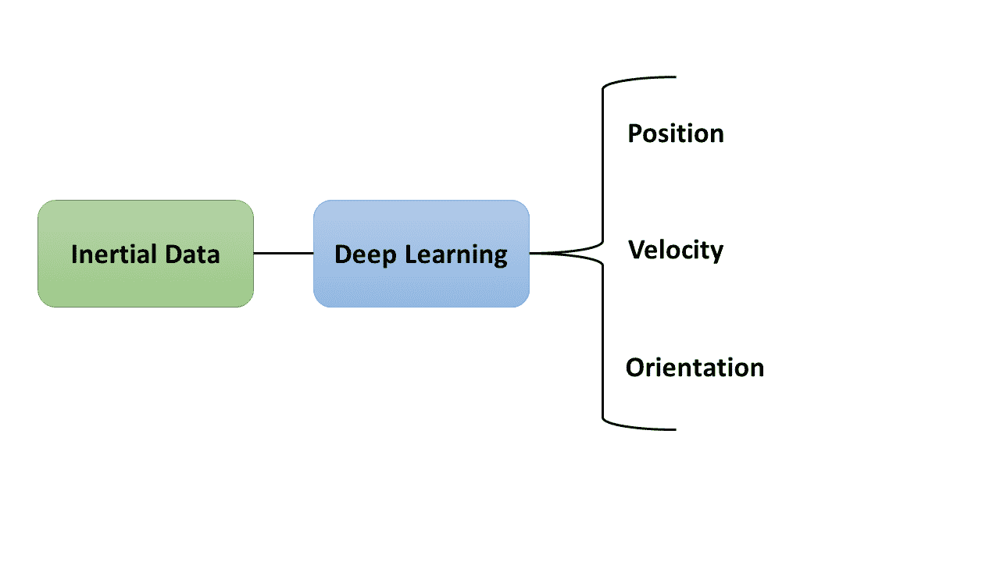

<!--yml

类别：未分类

日期：2024-09-06 19:38:29

-->

# [2307.00014] 惯性导航与深度学习的结合：当前趋势与未来方向的调查

> 来源：[`ar5iv.labs.arxiv.org/html/2307.00014`](https://ar5iv.labs.arxiv.org/html/2307.00014)

# 惯性导航与深度学习的结合：当前趋势与未来方向的调查

Nadav Cohen0 和 Itzik Klein0 0The Hatter Department of Marine Technologies, Charney School of Marine Sciences,

海法大学，海法，以色列

###### 摘要

惯性传感在许多应用和平台中得到了使用，从日常设备如智能手机到非常复杂的设备如自动驾驶汽车。近年来，惯性传感领域中的机器学习和深度学习技术发展显著。这得益于高效计算硬件的发展和公开传感器数据的可获取性。这些数据驱动的方法被用来增强基于模型的导航和传感器融合算法。本文提供了对这些深度学习方法的深入评审。我们分别检查了每个车辆操作领域，包括陆地、空中和海洋。每个领域都分为纯惯性进展和基于滤波器参数学习的改进。此外，我们回顾了用于标定和去噪惯性传感器的深度学习方法。在整个论文中，我们讨论了这些趋势和未来方向。我们还提供了常用方法的统计数据，以展示它们的效率，并激发进一步在深度学习与惯性导航和融合中的研究。

###### 关键词：

惯性传感，导航，深度学习，数据驱动，传感器融合，自动化平台，机器人技术。

## I 引言

对惯性传感概念的研究已经进行了几十年，并在上世纪的各种平台的导航过程中得到了应用 [1]。截至目前，大多数惯性传感依赖于加速度计，提供特定的力测量，以及陀螺仪，提供角速度测量 [2]。惯性测量单元（IMU）是由三个正交加速度计和三个正交陀螺仪组成的单元，这些加速度计和陀螺仪在性能和成本上有所不同 [3, 4]。

IMU 读数被实时处理以提供导航解决方案。这样一个执行固定惯性导航算法的系统被称为惯性导航系统（INS） [5]。INS 提供的导航解决方案包括位置、速度和方向，如图 1(a)所示。

(a)

(b)

图 1：（a）带有固定平台的惯性导航算法。对于给定的初始条件，陀螺仪的角速度和加速度计的特定力测量值会随时间积分，以便在所需的参考框架中获得导航解决方案（局部、地理等）。 （b）通过使用非线性滤波器和辅助传感器来校正导航解决方案的过程。通过查看输出，黑色发散曲线显示了导航解决方案如何积累误差，红色曲线则说明了辅助传感器如何校正这些误差，从而产生类似链锯的信号。

需要注意的是，导航解决方案的准确性和效率受到任务持续时间、平台动态以及 IMU 质量的影响。使用高端传感器可以在较长时间内获得更准确的导航解决方案，而使用低成本 INS 则会导致错误的快速积累。然而，对于这两种情况，都有一种常见的方法来处理误差积累，即使用准确的辅助传感器来确保解决方案是有界的或误差被减轻[6]。例如，全球导航卫星系统（GNSS）可以准确测量位置，或者多普勒速度计（DVL）提供准确的速度测量，这些都是辅助传感器的例子。此外，可以在特定应用和场景中使用额外的信息来替代或补充物理传感器，如零速度更新（ZUPT）、零角速率（ZAR）等，以防止惯性导航解决方案中的误差积累[7]。INS 和辅助传感器通常在非线性滤波器中融合，例如扩展卡尔曼滤波器（EKF）和无中心卡尔曼滤波器（UKF）。这类滤波器可以在考虑过程噪声协方差的同时传播模型的不确定性，从而提供额外的有用信息，同时防止惯性导航算法中的误差积累[8]。传感器融合的示意图见图 1(b)。

在过去的十年中，由于神经网络架构、大型数据集和创新训练方法的进步，深度学习取得了显著的进展。在计算机视觉领域，卷积神经网络（CNNs）彻底改变了图像分类、物体检测和语义分割等任务[9]。已经证明，递归神经网络（RNNs），包括长短期记忆（LSTM）网络，在建模序列和处理语言相关任务（如翻译和情感分析）时特别有效[10]。此外，生成对抗网络（GANs）和迁移学习等技术扩展了深度学习模型的能力，使图像合成和使用预训练模型等任务成为可能[11, 12]。鉴于这些进展，深度学习得到了显著提升，推动其在人工智能领域迈向新的前沿。

最近在硬件和计算效率方面的进步已证明深度学习（DL）方法对处理实时应用程序非常有用，从图像处理和信号处理到自然语言处理，利用其解决非线性问题的能力[13, 14, 15, 16]。因此，DL 方法开始被整合到惯性导航算法中。2003 年，Chiang *等人*[17] 撰写了第一篇使用神经网络（NNs）进行惯性导航的论文。该论文提出了一种使用多层前馈神经网络和反向传播学习算法进行多传感器融合的方案，以回归准确的陆地车辆位置，展示了神经网络在解决导航问题中的有效性。

受到成功和影响的启发，发表了一些建议使用更深层神经网络的论文。Noureldin *等人* [18] 设计了一个多层感知机（MLP）网络，用于预测 GNSS 中断期间的 INS 位置误差，使用 INS 位置分量和瞬时时间 $t$。这项工作在[19]中得到了延续和修改，作者将 MLP 网络替换为径向基函数（RBF）神经网络，以解决相同的情境，并成功减少了位置误差。在[20]中，描述了进一步的改进，利用多层前馈神经网络回归车辆的位置和速度，通过使用低成本 IMU 进行 INS/DGNSS 集成。有关 GNSS 中断和 INS/GNSS 融合的进一步研究可以在[21]中找到，采用了输入延迟神经网络，通过完全连接的层回归速度和位置。此外，在[22]中，提出了构建隐藏层为小波基函数的完全连接神经网络，以开发 INS/GNSS 集成，从而消除与卡尔曼滤波（KF）相关的复杂性，在 GNSS 信号不可用时提供可靠的定位解决方案。除了位置回归，Chiang *等人* 在[23, 24, 25] 中引入了基于完全连接层的神经网络，用于增强 INS/GNSS 融合提供的方向测量，尤其是在使用低成本 MEMS IMU 或 GNSS 信号不可用时。另一个概念是改进 KF 中的特定模块，在[26]中提出了一种在集成 INS/GNSS 系统中使用三层完全连接网络的自适应 KF 创新过程的建议。

这些研究人员是使用惯性数据在深度神经网络（DNNs）中改进导航的先驱之一。上述网络的性能分析在[27]中进行了 INS/GNSS 融合的研究。

除了本文，还有几篇其他文献对数据驱动导航的总体话题进行了调查。它们大多关注特定平台或深度学习方法。在[28, 29]中，除了其他概念如动力学和控制，还对航天器的导航进行了回顾。此外，在[30, 31, 32]中回顾了仅深度强化学习的方法用于不同平台。鉴于深度学习在图像处理和计算机视觉领域的重大进展，针对不同平台和一般性的基于视觉的导航调查也已进行[33, 34, 35, 36, 37]。一些文献仅关注基于机器学习的导航，这主要依赖于通过数据预处理分析确定特征[38, 39, 40]。在[41]中讨论了应用于自主导航的端到端深度学习方法，包括导航以外的课题，如障碍物检测、场景感知、路径规划和控制。在[42]中进行了调查，以检查使用最新深度学习方法的惯性定位，涉及任务如步行死算和人类活动识别。所有调查文献的概述见表 I。

表 I: 综述了不同导航方面使用的深度学习方法的调查文献概览，共十五篇论文。

论文主题 28 深度学习方法用于航天器动力学、导航和控制 29 航天器相对导航的深度学习方法 30, 31 移动机器人导航的深度强化学习 32 无人机使用强化学习的自主导航 33 视觉室内导航的深度学习方法 34, 36 使用强化学习的视觉导航 35 在非结构化环境中的感知和导航的深度学习方法 37 自主系统中的感知和导航的深度学习 38 海洋车辆导航的机器学习 39 惯性传感和机器学习的综述 40 室内导航的机器学习 41 自主车辆的深度学习应用和方法 42 包括步行死算和人类活动识别的定位深度学习方法

与上述所有内容相反，本文专门研究了文献中定义的仅用于惯性导航算法的深度学习方法，完全关注车辆，无论其操作环境如何。本文的贡献如下：

1.  1.

    提供对应用于陆地、空中和海洋车辆的惯性导航任务的深度学习方法的深入回顾。

1.  2.

    研究适用于任何车辆和任何惯性传感器的惯性传感器数据的校准和去噪深度学习方法。

1.  3.

    提供关于该主题的当前趋势的见解，并描述惯性导航任务的常见深度学习架构。

1.  4.

    讨论了利用深度学习方法改进惯性导航算法的潜在未来方向。

本论文的其余部分组织如下：第 II、III 和 IV 分别讨论了改进陆地、空中和海洋惯性传感的深度学习方法，并进一步细分为纯惯性导航和辅助惯性导航的子章节。第 V 节讨论了使用深度学习方法改进惯性数据的校准和去噪的方法。第 VI 节讨论了这项调查，第 VII 节得出结论。

## II 陆地车辆惯性传感

### II-A 纯惯性导航

一些研究探讨了在 GNSS 信号不可用时的惯性深度学习补偿。Shen *等人* 在[43]中提出了一种在 GNSS 中断期间改进 MEMS-INS/GNSS 导航的方法。该文章提出了两个神经网络用于双重优化过程，其中第一个 NN 补偿 INS 误差，而第二个 NN 补偿使用 RBF 网络生成的滤波器误差，以获得准确的位置数据。

考虑到对 GNSS 中断场景的极大兴趣，许多论文已发表，建议使用更复杂的 DNN。在 GNSS 中断的情况下，Lu *等人* 在[44]中引入了一种多任务学习方法。在第一阶段，使用卷积自编码器对惯性数据进行去噪，然后使用时序卷积网络（TCN）弥补 GNSS 缺口，并使用一维-CNN（1DCNN）检测零速度场景。随后在 KF 中从这些辅助数据中得出准确的导航解。另一篇论文提出了一种 CNN 模型，用于在没有辅助传感器如 GNSS 或内部车轮速度的情况下，使用惯性数据进行准确的速度估计[45]。

GNSS 信号在所有场景下并不适用，例如室内导航或隧道导航，不仅需要弥补信号缺口，还要考虑整个过程。例如，在 [46, 47] 中，Tong *等* 使用 TCN 架构回归了 GNSS 阻断环境（如隧道）中车辆的速度和航向变化，该架构利用了智能手机提供的低成本 IMU 数据。此外，介绍了基于 LSTM 的架构 ”DeepVIP” 用于室内车辆定位，并在来自智能手机的低成本惯性数据上进行了训练。”DeepVIP” 有两个变体，第一个实现了更高的定位精度，适用于需要最高定位精度的场景，而另一个更适合需要计算效率的情况，因此其精度略低 [48]。在惯性车辆导航中使用数据驱动方法还具有提高惯性传感器输出的好处，而不依赖于其他辅助传感器。Zhao *等* 在 [49] 中检查了高端传感器，并提出了基于双 LSTM 的 ”GyroNet” 和 ”FoGNet”。第一个估计陀螺仪的偏差和噪声，以改善角速度测量，而第二个则校正光纤陀螺仪（FOG）的漂移，以改善车辆定位。类似的方法在 [50] 中进行，作者提出了一种新颖的方法，从 GNSS 数据中生成类似 IMU 的数据，以训练基于全连接的网络回归角速度和加速度，以便根据 MEMS IMU 数据实现更好的定位。Gao *等* [51] 提出了 ”VeTorch”，一种惯性跟踪系统，通过从智能手机获得的惯性数据实时跟踪车辆的位置。为了进行加速度和方向序列学习以及姿态估计，作者使用了 TCN。作为测量车辆速度的手段，Freydin & Or 使用了基于 LSTM 的模型，该模型以智能手机提供的低成本 IMU 读数为输入 [52]。除了增强惯性读取能力以提供更准确的导航解决方案外，DL 方法还对改进传感器融合非常有用。Li *等* [53] 介绍了一种新颖的、递归的、卷积神经网络（RCNN）架构，用于扫描到扫描激光/惯性数据融合进行姿态估计。在研究了自主赛车的极端动态之后，[54] 提出了基于 RNN 的端到端方法，该方法利用 IMU 数据以及车轮里程传感器和电机电流数据来估计速度。在 ”GALNet” 框架中，作者利用惯性、运动学和车轮速度数据训练了基于 LSTM 的网络，该网络回归了车辆的相对姿态 [55]。在 [56] 中，集成了智能手机的加速度计、陀螺仪、磁力计和重力传感器来训练 ”XDRNet” 架构。使用 1DCNN，该网络回归了车辆速度和航向变化，从而减少了惯性定位误差漂移。此外，Liu *等* 提出了基于混合 CNN-LSTM 的网络，该网络集成了双天线卫星接收器和 MEMS IMU，以预测每个时间步的位置信息、速度和方向的残差 [57]。

### II-B 辅助惯性导航

已经证明，使用如 KF 这样的滤波器是一种实现高精度和可靠性的传感器融合常见方法。除了提供导航解，滤波器还为我们提供有关导航不确定性随时间传播的信息。因此，建议使用 DL 方法来考虑滤波器中对解有较大影响的不同模块。Hosseinyalamdary 提出了深度 KF [58]。在 EKF 的预测和更新步骤之外，深度 KF 增加了一个建模步骤，以修正 IMU 定位和建模 IMU 错误。GNSS 测量用于利用 RNN 和 LSTM 方法学习 IMU 错误模型，在缺少 GNSS 观测的情况下，训练模型预测 IMU 错误。此外，SL-SRCKF（自学习平方根立方滤波器）通过使用基于 LSTM 的网络来学习观测向量与内部滤波器参数之间的关系，从而在 GNSS 中断期间实现对连续观测向量的观察，提高了集成 MEMS-INS/GNSS 导航系统的准确性 [59]。此外，DL 方法识别了惯性数据中的特定场景，这些场景可能会阻止导航解累积错误。使用 RNN，可以识别零速度情况或无横向滑移，并将其纳入 KF 中用于定位过程 [60]。

文献表明，协方差噪声矩阵在卡尔曼滤波器（KF）中发挥了重要作用，因此采用了深度学习方法来持续适应它。根据 Brossard、Barrau 和 Bonnabel 的研究，使用基于 CNN 的方法动态调整协方差噪声矩阵，以适应使用中等成本 IMU 测量的变不变 EKF [61]。作者们在[62]中开发了一种将高斯过程与 RBF 神经网络和随机变分推断相结合的程序，试图通过学习物理预测与真实情况之间的残差误差来改进状态空间动态模型的传播和测量函数。研究还表明，这些修正可以用于设计 EKF。另一种估计过程噪声协方差的方法是基于强化学习，如[63]中所述，它使用自适应 KF 来确定位置、速度和定向。在[64]中，不仅回归了测量噪声协方差的参数，还回归了过程噪声协方差的参数。这些参数可以通过多任务 TCN 更准确地估计，结果是比传统的 GNSS/INS 集成导航系统具有更高的位置精度。在[65]中，作者引入了一种包含注意机制的残差网络，以预测噪声协方差矩阵的各个速度元素。实证研究表明，在大动态车辆运动中调整非完整约束不确定性，而不是严格将横向和纵向速度设为零，可以提高大动态运动下的定位精度。

表 II：讨论地面车辆的深度学习和惯性传感的文献，按其改进目标分类，共三十三篇文献。

改进目标 文献位置 17, 18, 19, 20, 23, 24, 25 21, 22, 27, 43, 50, 51, 48 57 速度 20, 21, 49, 54, 46, 47, 45 56, 57, 52 定向 23, 24, 25, 49, 55, 46, 47 50, 51, 53, 56, 57 滤波器参数 26, 58, 43, 60, 62, 63, 44 64, 65, 59

## III 空中飞行器惯性传感

### III-A 纯惯性导航

许多论文研究了视觉惯性里程计作为空中惯性导航工具的应用。Clark *等* [66] 开发了“VINet”架构。它包括处理相机输出的 LSTM 块和处理 IMU 数据的 IMU LSTM 块。这项研究首次使用深度学习来确定微型飞行器（MAV）的姿态。在[67]中，采用了类似的方法；不过，平台不是 MAV，而是无人驾驶飞行器（UAV）。另一项视觉惯性融合研究在[68]中进行，其中使用了一种相机和 IMU 传感器融合方法来估计无人机系统（UAS）的定位，该方法使用了基于 CNN-LSTM 的网络，称为“HVIOnet”，即混合视觉惯性里程计网络。Yusefi *等* 提出了一个更复杂的方法，其中利用端到端、多模型、基于深度学习的单目视觉惯性定位系统来解决无人机在室内环境中的全局姿态回归问题。使用所提议的深度 RCNN，实验结果显示出令人印象深刻的时间效率和高精度的无人机室内定位 [69]。

为了仅凭惯性传感器评估车辆的姿态，刘*等人*利用了基于 IMU 数据的 LSTM 网络[70]。而在[71]中，作者们使用了更复杂的混合网络，该网络结合了 CNN 和 LSTM 模块，以利用当前的位置和单位四元数估计 MAV 的姿态。Esfahani*等人*开发了一种名为“AbolDeepIO”的惯性里程计网络[72]。一种基于 IMU 读数的深度惯性里程计 LSTM 网络架构被提出并在 MAV 数据上进行了测试，结果优于“VINet”[66]。七个子架构（AbolDeepIO1-AbolDeepIO7）也进行了测试和评估。作为“AbolDeepIO”的后续，作者们提出了“OriNet”，这也是基于 LSTM 的，能够在四元数坐标系中使用单个特定 IMU 估计飞行机器人的完整 3D 方向[73]。还提出了一种名为“RIANN”的稳健惯性姿态估计器，这一网络的名称代表了稳健 IMU 基础姿态神经网络。使用门控递归单元（GRUs）网络回归了包括 MAV 运动在内的几种运动。除了提出了三种领域特定的神经网络进展用于惯性姿态估计外，他们还提出了两种方法，使神经网络能够处理各种采样率[74]。Chumuang*等人*[75]建议 CNN 和 LSTM 都对预测 MAV 的方向有效，前者使用从 IMU 数据中通过 Madgwick 自适应算法预测的四元数[76]，后者则使用原始陀螺仪测量。为了改善 MAV 导航，与其使用两个独立的网络，[77]中的作者建议使用包括 CNN、RNN 和 CNN 与 LSTM 混合模型在内的三种模型，并对它们进行了比较。

在航空导航中，像其他领域一样，GNSS 信号在与 INS 集成时可以非常有用，而在缺乏这些信号时，困难会出现。为了实现比传统 GNSS/INS 融合更好的性能，[78]中提出了一种基于 LSTM 的网络来估计航空器的 3D 位置。当航空器遇到 GNSS 信号缺失的环境时，深度学习方法被用来进行补偿。在[70]中，Liu *等* 继续了上述研究，提出了一种 1D CNN/GRU 混合深度学习模型，用于在 GNSS 信号中断的情况下预测 GNSS 位置增量，以实现集成的 INS/GNSS 导航[79, 80, 81]。类似的处理 GNSS 信号缺失环境的方法由[82]实施，其中使用了基于 GRU 的网络来估计位置和速度。Shurin & Klein 在[83]中提出了一种新方法，称为“QuadNet”，他们利用四旋翼无人机的周期性运动及其惯性读数，开发了一种 1D CNN 和 LSTM 方法，用于回归四旋翼的距离和高度变化。

### III-B 辅助惯性导航

为了提高卡尔曼姿态估计的质量，Al-Sharman *等* 在[84]中提出了一个简单的完全连接网络。该网络利用惯性读数和控制向量提供的卡尔曼状态估计作为输入，并回归无人机的姿态。一个反复出现的方面是使用深度学习预测噪声协方差信息。在[85]中，作者提出了一种基于卷积神经网络（CNN）的自适应卡尔曼滤波器，以增强使用低成本 IMU 的高速导航。该论文提出了一种 1D CNN 方法，通过利用窗口化的惯性测量来预测 3D 加速度和角速度的噪声协方差信息，试图在高动态条件下超越经典的卡尔曼滤波器和 Sage-Husa 自适应滤波器。在随后的论文中，Or & Klein [86] 开发了一种数据驱动的自适应噪声协方差方法，用于 INS/GNSS 融合中的误差状态扩展卡尔曼滤波器（EKF）。使用 1D CNN，他们能够估计噪声协方差矩阵，也称为$Q$矩阵，并利用这些信息为四旋翼无人机提供更好的导航解决方案。

表 III：讨论深度学习与航空器惯性传感的论文，按其改进目标分类，共二十篇论文。

改进目标 论文 位置 68, 77, 78, 79, 80, 81, 82, 83 速度 77, 82 姿态 66, 67, 69, 70, 71, 72, 73 74, 75, 77, 83 滤波器参数 84, 85, 86

## IV 海洋车辆惯性传感

### IV-A 纯惯性导航

张*等人*[87, 88]是首批将深度学习技术应用于自主水下航行器（AUV）导航的研究者。为了回归 AUV 的位置位移，作者使用了基于 LSTM 的网络，该网络以 GNSS 数据作为位置位移训练目标进行训练。该网络的输出被纳入 EKF 中，以使位置直接可观察。随后，作者开发了一个名为“Navnet”的系统，该系统通过使用 LSTM 和注意力机制的深度学习框架利用 IMU 和多普勒速度计（DVL）传感器的数据来回归 AUV 的位置位移，并将其与 EKF 和 UKF 进行比较[89]。在[90]中进行了进一步的改进和修订，使用了 TCN 块代替 LSTM 块。作为纠正导航系统误差积累的一种方法，马*等人*提出了一种类似的程序，并开发了一种用于 AUV 导航的自适应导航算法，该算法使用深度学习生成低频位置数据。基于 LSTM 块，网络接收来自 DVL 的速度测量和来自姿态与航向参考系统（AHRS）的欧拉角[91]。

在水面上或水下的导航任务可能会遇到由于环境动态或援助信号（如 GNSS 信号）无法获取而导致的困难。在[92]中，作者使用了混合 TCN-LSTM 网络来预测船舶在不同挑战场景下的俯仰和纵摇运动。[93]建议使用全连接网络来改善 AUV 在快速变化环境中的导航，例如在水面附近的波浪中。该网络基于加速度计的数据，并用于预测俯仰角。然后，将卡尔曼滤波器、神经网络和速度补偿结合在“NN-DR”方法中，以提供更准确的导航解决方案。

DVL 在水下应用中作为传感器用于辅助导航，类似于在水面应用中使用的 GNSS 数据。一些论文探讨了 DVL 故障的情况。例如，[94]中提出了一个方案，旨在为传感器能力有限的 AUV 提供辅助航迹推算导航。使用 RNN 架构，该算法基于 IMU、压力传感器和 AUV 执行器的控制动作获得的数据预测相对速度。在[95]中，非线性自回归外部输入（NARX）方法用于 DVL 故障的情况，通过 INS 数据确定速度测量。为了获得导航解决方案，网络的输出被集成到一个强大的卡尔曼滤波器（RKF）中。Cohen & Klein 提出了”BeamsNet”，它替代了基于模型的方法，通过 1DCNN 从 DVL 原始波束测量中推导 AUV 速度测量，该 1DCNN 使用惯性读数[96]。作者继续研究了部分 DVL 测量的情况，并成功地通过一个名为”LiBeamsNet”的类似架构恢复了速度[97]。在完全 DVL 中断的情况下，[98]中的作者引入了”ST-BeamsNet”，这是一个基于集合变换器的网络，利用惯性读数和过去的 DVL 测量来回归当前速度。

最近，Topini *等人* [99] 对于在无 DVL 环境中的 AUV 导航数据驱动策略进行了实验比较，他们比较了 MLP、CNN、LSTM 和混合 CNN-LSTM 网络来预测 AUV 的速度。

### IV-B 辅助惯性导航

根据[100]的作者，RBF 网络可以通过误差状态卡尔曼滤波（KF）来增强，以提高水下车辆的状态估计。通过应用 RBF 神经网络，所提出的算法通过增强创新误差项来补偿误差状态 KF 性能的不足。Or & Klein [86, 101, 102] 开发了用于 INS/DVL 融合中速度更新的自适应 EKF。最初，他们展示了通过使用 1DCNN 来修正噪声协方差矩阵，以分类问题预测每个样本时间的方差，从而显著改善导航结果。在最近的工作中，作者引入了”ProNet”，它使用回归而不是分类来完成相同的任务。

表 IV：描述海洋车辆深度学习和惯性传感的论文，按其改进目标分类，共有十六篇论文。

改进目标 论文位置 87、88、89、90、91、92、93 速度 93、94、96、97、98、99 定向 92、93 滤波器参数 100、86、101、102

## V 校准与去噪

由于 INS 是基于对惯性数据随时间的积分，它会因传感器中的结构性误差而积累错误。校准和去噪对最小化这些误差至关重要。在陈*等人*[103]的研究中，首次使用深度学习来减少 IMU 误差。IMU 数据包含确定性和随机误差，作为输入提供给 CNN 进行数据滤波。根据 Engelsman & Klein[104、105]的研究，LSTM 网络可以用于去噪加速度计信号，而 CNN 网络可以用来消除低成本陀螺仪的偏差。

除了上述提到的论文外，大多数研究集中在陀螺仪的去噪和校准上。一系列论文[106, 107, 108] 研究了利用各种变体的 RNN 进行陀螺仪数据去噪。一篇论文展示了简单 RNN 结构的性能，而其他论文则利用了 LSTM。在[109]中，对 LSTM、GRU 和混合 LSTM-GRU 方法进行了一次陀螺仪去噪的比较。还进行了 GRU、LSTM 和混合 GRU-LSTM 的额外比较。然而，性能测试不仅在静态条件下进行，还包括动态条件[110]。在 Brossard *et al.* [111]中，提出了一种深度学习方法，以减少 IMU 陀螺仪的噪声，从而利用低成本 IMU 实现准确的姿态估计。用于特征提取的网络是一个膨胀卷积网络，而在方向增量的训练中，则使用了适当的损失函数。更多不同类型的基于 CNN 的架构也解决了陀螺仪的校正问题。一项研究展示了一个去噪自编码器架构，该架构基于深度卷积模型，旨在从损坏的数据中恢复干净、未失真的输出。发现这种情况下的 LKF 角度预测得到了提升[112]。此外，在[113]中，TCN 和 1DCNN 被集成用于 MEMS 陀螺仪的校准，而 Liu *et al.* 提出了“LGC-Net”作为从 IMU 测量中提取局部和全局特征的方法，以动态方式回归陀螺仪补偿组件。为了创建“LGC-Net”，采用了特殊的卷积层和注意力机制[114]。最后，Yuan et al. 引入了“IMUDB”，即 IMU 去噪 BERT。该模型受自然语言处理领域的启发。除了获得良好的结果外，自监督 IMU 去噪方法还解决了获得足够且准确的标注用于监督学习的难题[115]。

## VI 讨论

通过分析上述研究的过程，本节对使用 DL 方法进行惯性导航的当前趋势进行了深入分析。

通过更详细地观察最常见的行动方案，似乎有四种重复的基线方法，如图 2 所示。第一种方法涉及将惯性数据插入深度学习架构，并回归完整的导航解决方案，如图 2(a) 所示。然而，其他论文则研究了需要添加到当前测量中的所需残差/增量，以更新数据，而不是回归导航组件的完整状态。观察残差被证明能产生正态分布的输出，这使得网络处理问题变得更容易。图 2(b) 中展示了一个例子。

与仅依赖惯性数据不同，如前所述，大多数导航解决方案将惯性数据与其他传感器数据整合，以提供更准确的结果。图 2(c) 和图 2(d) 展示了深度学习如何融入传感器融合操作。前者将惯性数据和辅助测量作为输入传递给网络，以提供导航解决方案。后者则针对非线性滤波器的参数，该滤波器负责传感器融合，如噪声协方差矩阵估计。

上述方法适用于所有三个领域：陆地、航空和海洋。

（a）使用深度学习回归车辆的完整状态。

（b）使用深度学习回归当前残差。

车辆的状态和之前的状态。

（c）实现传感器融合与深度学习模块，以回归。

完整状态或所需增量。

（d）在传感器融合场景中，深度学习（DL）方法被应用。

以获得一个或多个滤波器参数。

图 2：利用深度学习改进惯性导航的不同技术。

通过审查调查细节，我们确定了当前研究重点改进的最常见目标，并将其呈现在饼图中，见图 3。根据图表，81% 的论文关注于改进位置、速度和方向，而 19% 的论文涉及滤波器参数的改进。后者大多数论文是在过去三年内发表的。

图 3: 深度学习在提升导航性能方面的目标。

除了初步分析外，我们还研究了已使用的一般深度学习架构。我们识别了四种不同的架构流：MLP、CNN、RNN 和其他。MLP 包括所有全连接网络，CNN 包括 1DCNN 和 TCN 等网络，RNN 包括 LSTM 和 GRU，而“其他”则包括变压器、强化学习等。正如图 4 所示，这些网络还被分为单一网络和组合网络，其中组合网络指的是包含多种方法的架构，如 CNN-RNN。条形图显示主要架构是 RNN 及其衍生物，这是有意义的，因为该架构专门设计用于时间序列问题。然而，CNN 方法在惯性导航中也有显著影响，在某些情况下比 RNN 更准确。MLP 是更基础的架构，并且是最早被引入惯性导航的架构之一。由于自然语言处理领域的进步，变压器和 BERT 等其他架构开始出现在近期论文中，展示了很大的前景。

图 4: 用于提升导航任务的常见深度学习架构，分为单一架构和组合架构。

## VII 结论

由于惯性传感器可以在任何平台上操作而不受环境影响，惯性导航在过去十年中一直是一个主要研究主题。随着数据驱动方法的日益流行，深度学习方法被集成到这一依赖模型算法的领域。本文对应用于惯性导航的深度学习方法进行了综述。本文回顾了在三个不同领域——陆地、空中和海洋——以及校准和去噪方法的研究。它还基于统计分析提供了研究进展的洞察。

大部分研究集中在陆地车辆上，而非空中或海上车辆，甚至校准和去噪技术。然而，一些论文提到尽管存在不同的力学、机动等，这些技术可以适应不同的平台。大多数审阅的论文涉及改进惯性导航算法的一个或多个方面以寻求更好的解决方案。然而，近年来的研究重点已转向改进滤波器参数，以增强传感器融合过程。虽然主要的深度学习架构基于 RNNs 和 CNNs，但近期的研究似乎受到自然语言处理方法的启发，因为它引入并调整了其领先架构。

总结而言，自 2018 年以来，惯性导航应用中使用深度学习方法显著增加。研究发现这些方法优于已知的基于模型的技术，并且在惯性传感领域的未来研究中展现出巨大潜力。最初的研究集中于改进文献中定义的导航方面，即位置、速度和方向。近年来，更多的关注已转向利用更先进的网络来改进滤波器参数。

## 致谢

N.C. 得到了莫里斯·哈特基金会和海法大学总统奖学金的支持，适用于直接博士生项目。

## 参考文献

+   [1] D. MacKenzie, *发明准确性：核导弹制导的历史社会学*。 MIT press, 1993 年。

+   [2] D. Titterton, J. L. Weston, 和 J. Weston, *绑带式惯性导航技术*。 IET, 2004 年，第 17 卷。

+   [3] A. Noureldin, T. B. Karamat, 和 J. Georgy, *惯性导航、卫星定位及其集成基础*。 Springer Science & Business Media, 2012 年。

+   [4] N. El-Sheimy 和 A. Youssef, “导航应用的惯性传感器技术：现状与未来趋势，” *卫星导航*，第 1 卷，第 1 期，页 1–21，2020 年。

+   [5] K. R. Britting, *惯性导航系统分析*。 Artech House, 2010 年。

+   [6] J. Farrell, *辅助导航：配备高频传感器的 GPS*。 McGraw-Hill, Inc., 2008 年。

+   [7] D. Engelsman 和 I. Klein, “信息辅助导航：综述，” *arXiv 预印本 arXiv:2301.01114*，2023 年。

+   [8] P. Groves, *GNSS、惯性和多传感器集成导航系统原理（第二版）*。 Artech house，2013 年。

+   [9] S. S. A. Zaidi, M. S. Ansari, A. Aslam, N. Kanwal, M. Asghar, 和 B. Lee, “现代深度学习基础的目标检测模型调研，” *数字信号处理*，页 103514，2022 年。

+   [10] D. W. Otter, J. R. Medina, 和 J. K. Kalita， “深度学习在自然语言处理中的应用调研，” *IEEE 神经网络与学习系统汇刊*，第 32 卷，第 2 期，页 604–624，2020 年。

+   [11] M. Durgadevi *等*，“生成对抗网络（GAN）：关于 GAN 不同变体及应用的一般综述，” 收录于 *2021 年第六届通信与电子系统国际会议（ICCES）*。IEEE，2021 年，第 1–8 页。

+   [12] F. Zhuang, Z. Qi, K. Duan, D. Xi, Y. Zhu, H. Zhu, H. Xiong, 和 Q. He, “关于迁移学习的综合调查，” *IEEE 汇刊*，第 109 卷，第 1 期，第 43–76 页，2020 年。

+   [13] Y. LeCun, Y. Bengio, 和 G. Hinton, “深度学习，” *自然*，第 521 卷，第 7553 期，第 436–444 页，2015 年。

+   [14] I. Goodfellow, Y. Bengio, 和 A. Courville, *深度学习*。MIT press，2016 年。

+   [15] P. P. Shinde 和 S. Shah, “机器学习与深度学习应用综述，” 收录于 *2018 年第四届国际计算通信控制与自动化会议（ICCUBEA）*。IEEE，2018 年，第 1–6 页。

+   [16] M. Mahrishi, K. K. Hiran, G. Meena, 和 P. Sharma, *机器学习与深度学习在实时应用中的应用*。IGI global，2020 年。

+   [17] K.-W. Chiang, A. Noureldin, 和 N. El-Sheimy, “利用神经计算进行多传感器融合以进行陆地车辆导航，” *GPS 解决方案*，第 6 卷，第 4 期，第 209–218 页，2003 年。

+   [18] A. Noureldin, A. Osman, 和 N. El-Sheimy, “用于车辆导航的多传感器系统集成的神经小波方法，” *测量科学与技术*，第 15 卷，第 2 期，第 404 页，2003 年。

+   [19] R. Sharaf, A. Noureldin, A. Osman, 和 N. El-Sheimy, “使用径向基函数神经网络进行在线 INS/GPS 集成，” *IEEE 航空航天与电子系统杂志*，第 20 卷，第 3 期，第 8–14 页，2005 年。

+   [20] N. El-Sheimy, K.-W. Chiang, 和 A. Noureldin, “人工神经网络在导航和定位仪器中的多传感器系统集成的应用，” *IEEE 仪器与测量汇刊*，第 55 卷，第 5 期，第 1606–1615 页，2006 年。

+   [21] A. Noureldin, A. El-Shafie, 和 M. Bayoumi, “利用动态神经网络进行 GPS/INS 集成以实现车辆导航，” *信息融合*，第 12 卷，第 1 期，第 48–57 页，2011 年。

+   [22] X. Chen, C. Shen, W.-b. Zhang, M. Tomizuka, Y. Xu, 和 K. Chiu, “强跟踪卡尔曼滤波器与小波神经网络的混合方法用于 GPS/INS 在 GPS 中断期间，” *测量*，第 46 卷，第 10 期，第 3847–3854 页，2013 年。

+   [23] K.-W. Chiang, A. Noureldin, 和 N. El-Sheimy, “基于构建神经网络的 MEMS/GPS 集成方案，” *IEEE 航空航天与电子系统汇刊*，第 44 卷，第 2 期，第 582–594 页，2008 年。

+   [24] K.-W. Chiang, H.-W. Chang, C.-Y. Li, 和 Y.-W. Huang, “一种嵌入人工神经网络的低成本 MEMS INS/GPS 集成传感器的定位与定向算法，” *传感器*，第 9 卷，第 4 期，第 2586–2610 页，2009 年。

+   [25] K.-W. Chiang 和 H.-W. Chang, “通过构建神经网络嵌入的 INS/GPS 集成算法进行智能传感器定位和定向，” *传感器*，第 10 卷，第 10 期，第 9252–9285 页，2010 年。

+   [26] J. J. Wang, W. Ding, 和 J. Wang，“利用神经网络改进 GPS/SDINS 集成中的自适应卡尔曼滤波器，” 在 *第 20 届卫星导航学院国际技术会议（ION GNSS 2007）* 中，2007 年，页 571–578。

+   [27] M. Malleswaran, V. Vaidehi, A. Saravanaselvan, 和 M. Mohankumar，“不同人工智能神经网络在 GPS/INS 集成中的性能分析，” *应用人工智能*，第 27 卷，第 5 期，页 367–407，2013 年。

+   [28] S. Silvestrini 和 M. Lavagna，“深度学习与人工神经网络在航天器动态、导航和控制中的应用，” *无人机*，第 6 卷，第 10 期，页 270，2022 年。

+   [29] J. Song, D. Rondao, 和 N. Aouf，“基于深度学习的航天器相对导航方法：综述，” *航天学报*，第 191 卷，页 22–40，2022 年。

+   [30] H. Jiang, H. Wang, W.-Y. Yau, 和 K.-W. Wan，“简要综述：移动机器人导航中的深度强化学习，” 在 *2020 年第 15 届 IEEE 工业电子与应用会议（ICIEA）* 中。IEEE，2020 年，页 592–597。

+   [31] K. Zhu 和 T. Zhang，“基于深度强化学习的移动机器人导航：综述，” *清华科学技术*，第 26 卷，第 5 期，页 674–691，2021 年。

+   [32] F. AlMahamid 和 K. Grolinger，“使用强化学习的自主无人机导航：系统评价，” *人工智能工程应用*，第 115 卷，页 105321，2022 年。

+   [33] X. Ye 和 Y. Yang，“从视觉到运动：关于视觉室内导航（VIN）的学习综述，” *arXiv 预印本 arXiv:2002.11310*，2020 年。

+   [34] F. Zeng, C. Wang, 和 S. S. Ge，“基于深度强化学习的人工智能视觉导航综述，” *IEEE Access*，第 8 卷，页 135 426–135 442，2020 年。

+   [35] D. C. Guastella 和 G. Muscato，“基于学习的地面车辆在非结构化环境中的感知与导航方法：综述，” *传感器*，第 21 卷，第 1 期，页 73，2020 年。

+   [36] F. Zhu, Y. Zhu, V. Lee, X. Liang, 和 X. Chang，“用于具身视觉导航的深度学习：综述，” *arXiv 预印本 arXiv:2108.04097*，2021 年。

+   [37] Y. Tang, C. Zhao, J. Wang, C. Zhang, Q. Sun, W. X. Zheng, W. Du, F. Qian, 和 J. Kurths，“学习时代的自主系统中的感知与导航：综述，” *IEEE 神经网络与学习系统汇刊*，2022 年。

+   [38] S. Azimi, J. Salokannel, S. Lafond, J. Lilius, M. Salokorpi, 和 I. Porres，“海洋表面导航机器学习方法综述，” 在 *海洋运输 VIII：第 8 届国际海洋运输会议论文集：技术、创新与研究：海洋运输’20* 中。巴塞罗那，2020 年，页 103–117。

+   [39] Y. Li, R. Chen, X. Niu, Y. Zhuang, Z. Gao, X. Hu, 和 N. El-Sheimy，“惯性传感遇上机器学习：机遇还是挑战？” *IEEE 智能交通系统汇刊*，2021 年。

+   [40] P. Roy 和 C. Chowdhury, “室内定位和导航系统的机器学习技术综述，” *智能与机器人系统杂志*，第 101 卷，第 3 期，页码 63，2021 年。

+   [41] A. A. Golroudbari 和 M. H. Sabour, “自主导航中的深度学习应用和方法的最新进展–综合评述，” *arXiv 预印本 arXiv:2302.11089*，2023 年。

+   [42] C. Chen, “惯性定位的深度学习：综述，” *arXiv 预印本 arXiv:2303.03757*，2023 年。

+   [43] C. Shen, Y. Zhang, J. Tang, H. Cao, 和 J. Liu, “基于立方体卡尔曼滤波器和神经网络的 GPS 信号中断期间 MEMS-INS/GPS 系统的双重优化，” *机械系统与信号处理*，第 133 卷，页码 106222，2019 年。

+   [44] S. Lu, Y. Gong, H. Luo, F. Zhao, Z. Li, 和 J. Jiang, “异构多任务学习用于多个伪测量估计以弥补 GPS 信号中断，” *IEEE 仪器与测量学报*，第 70 卷，页码 1–16，2020 年。

+   [45] R. Karlsson 和 G. Hendeby, “使用深度学习 CNN 方法进行振动速度估计，” *IEEE 传感器快报*，第 5 卷，第 3 期，页码 1–4，2021 年。

+   [46] Y. Tong, S. Zhu, Q. Zhong, R. Gao, C. Li, 和 L. Liu, “基于智能手机的车辆追踪，无需 GPS：经验与改进，” 载于 *2021 IEEE 第 27 届并行与分布式系统国际会议（ICPADS）*。 IEEE，2021 年，页码 209–216。

+   [47] Y. Tong, S. Zhu, X. Ren, Q. Zhong, D. Tao, C. Li, L. Liu, 和 R. Gao, “通过移动众测实现车辆惯性追踪：经验与增强，” *IEEE 仪器与测量学报*，第 71 卷，页码 1–13，2022 年。

+   [48] B. Zhou, Z. Gu, F. Gu, P. Wu, C. Yang, X. Liu, L. Li, Y. Li, 和 Q. Li, “DeepVIP：基于深度学习的智能手机车辆室内定位，” *IEEE 车辆技术学报*，第 71 卷，第 12 期，页码 13,299–13,309，2022 年。

+   [49] X. Zhao, C. Deng, X. Kong, J. Xu, 和 Y. Liu, “学习补偿车辆定位中陀螺仪的漂移和误差，” 载于 *2020 IEEE 智能车辆研讨会（IV）*。 IEEE，2020 年，页码 852–857。

+   [50] Z. Fei, S. Jia, 和 Q. Li, “基于 B 样条和优化 BP 神经网络的 GNSS/DR 方法研究，” 载于 *2021 IEEE 第 33 届人工智能工具国际会议（ICTAI）*。 IEEE，2021 年，页码 161–168。

+   [51] R. Gao, X. Xiao, S. Zhu, W. Xing, C. Li, L. Liu, L. Ma, 和 H. Chai, “黑暗中的光辉：智能手机惯性里程计用于 GPS 信号被阻塞环境中的车辆追踪，” *IEEE 物联网杂志*，第 8 卷，第 16 期，页码 12,955–12,967，2021 年。

+   [52] M. Freydin 和 B. Or, “使用惯性传感器学习汽车速度以进行航位推算导航，” *IEEE 传感器快报*，第 6 卷，第 9 期，页码 1–4，2022 年。

+   [53] C. Li, S. Wang, Y. Zhuang, 和 F. Yan, “移动机器人定位中二维激光扫描仪与 IMU 的深度传感器融合，” *IEEE 传感器杂志*，第 21 卷，第 6 期，页码 8501–8509，2019 年。

+   [54] S. Srinivasan, I. Sa, A. Zyner, V. Reijgwart, M. I. Valls, 和 R. Siegwart, “用于自主赛车的端到端速度估计”，*IEEE 机器人与自动化通讯*，第 5 卷，第 4 期，第 6869–6875 页，2020 年。

+   [55] R. C. Mendoza, B. Cao, D. Goehring, 和 R. Rojas, “GALNet: 一种用于自主车辆地面定位的端到端深度神经网络。” 发表在 *ROBOVIS*，2020 年，第 39–50 页。

+   [56] B. Zhou, P. Wu, Z. Gu, Z. Wu, 和 C. Yang, “XDRNet: 基于深度学习的使用智能手机的行人和车辆死区推算”，发表于 *2022 IEEE 第 12 届室内定位与室内导航国际会议 (IPIN)*。IEEE，2022 年，第 1–8 页。

+   [57] N. Liu, Z. Hui, Z. Su, L. Qiao, 和 Y. Dong, “基于低成本 SINS/GNSS 的车辆集成导航使用深度学习”，*无线个人通信*，第 126 卷，第 3 期，第 2043–2064 页，2022 年。

+   [58] S. Hosseinyalamdary, “深度卡尔曼滤波器：同时多传感器集成与建模；GNSS/IMU 案例研究”，*传感器*，第 18 卷，第 5 期，第 1316 页，2018 年。

+   [59] C. Shen, Y. Zhang, X. Guo, X. Chen, H. Cao, J. Tang, J. Li, 和 J. Liu, “基于自学习平方根立方卡尔曼滤波器的无缝 GPS/惯性导航系统”，*IEEE 工业电子学报*，第 68 卷，第 1 期，第 499–508 页，2020 年。

+   [60] M. Brossard, A. Barrau, 和 S. Bonnabel, “RINS-W: 基于轮子的鲁棒惯性导航系统”，发表于 *2019 IEEE/RSJ 智能机器人与系统国际会议 (IROS)*。IEEE，2019 年，第 2068–2075 页。

+   [61] ——, “AI-IMU 死区推算”，*IEEE 智能车辆学报*，第 5 卷，第 4 期，第 585–595 页，2020 年。

+   [62] M. Brossard 和 S. Bonnabel, “学习轮式里程计和 IMU 误差以进行定位”，发表于 *2019 年国际机器人与自动化会议 (ICRA)*。IEEE，2019 年，第 291–297 页。

+   [63] X. Gao, H. Luo, B. Ning, F. Zhao, L. Bao, Y. Gong, Y. Xiao, 和 J. Jiang, “RL-AKF: 基于强化学习的自适应卡尔曼滤波导航算法用于地面车辆”，*遥感*，第 12 卷，第 11 期，第 1704 页，2020 年。

+   [64] F. Wu, H. Luo, H. Jia, F. Zhao, Y. Xiao, 和 X. Gao, “使用多任务学习模型预测噪声协方差用于基于卡尔曼滤波的 GNSS/INS 集成导航”，*IEEE 测量与仪器学报*，第 70 卷，第 1–13 页，2020 年。

+   [65] Y. Xiao, H. Luo, F. Zhao, F. Wu, X. Gao, Q. Wang, 和 L. Cui, “基于残差注意网络的 GNSS/INS 集成导航系统中的非完整约束置信度估计算法”，*IEEE 车辆技术学报*，第 70 卷，第 11 期，第 11 404–11 418 页，2021 年。

+   [66] R. Clark, S. Wang, H. Wen, A. Markham, 和 N. Trigoni, “Vinet: 将视觉惯性里程计视为序列到序列学习问题”，发表于 *AAAI 人工智能会议论文集*，第 31 卷，第 1 期，2017 年。

+   [67] F. Baldini, A. Anandkumar, 和 R. M. Murray, “利用视觉-惯性传感器数据学习无人机自主导航和着陆的姿态估计，” 在 *2020 年美国控制会议 (ACC)*。IEEE, 2020, pp. 2961–2966。

+   [68] M. F. Aslan, A. Durdu, A. Yusefi, 和 A. Yilmaz, “HVIOnet：一种基于深度学习的混合视觉-惯性里程计方法，用于无人机系统位置估计，” *神经网络*，第 155 卷，pp. 461–474, 2022。

+   [69] A. Yusefi, A. Durdu, M. F. Aslan, 和 C. Sungur, “LSTM 和滤波器在无人机室内全球定位的比较分析，” *IEEE Access*，第 9 卷，pp. 10 054–10 069, 2021。

+   [70] Y. Liu, Y. Zhou, 和 X. Li, “基于 LSTM 神经网络的无人机姿态估计，” 在 *2018 年国际联合神经网络会议 (IJCNN)*。IEEE, 2018, pp. 1–6。

+   [71] J. P. Silva do Monte Lima, H. Uchiyama, 和 R.-i. Taniguchi, “基于 IMU 的 6-DOF 里程计端到端学习框架，” *传感器*，第 19 卷，第 17 期，p. 3777, 2019。

+   [72] M. A. Esfahani, H. Wang, K. Wu, 和 S. Yuan, “AbolDeepIO：一种新型深度惯性里程计网络用于自动驾驶车辆，” *IEEE 智能交通系统汇刊*，第 21 卷，第 5 期，pp. 1941–1950, 2019。

+   [73] ——, “OriNet：基于单个特定 IMU 的鲁棒三维方向估计，” *IEEE 机器人与自动化快报*，第 5 卷，第 2 期，pp. 399–406, 2019。

+   [74] D. Weber, C. Gühmann, 和 T. Seel, “RIANN——一种鲁棒的神经网络超越了姿态估计滤波器，” *Ai*，第 2 卷，第 3 期，pp. 444–463, 2021。

+   [75] N. Chumuang, A. Farooq, M. Irfan, S. Aziz, 和 M. Qureshi, “微型无人机姿态估计的特征匹配与深度学习模型，” 在 *2022 年国际控制论与创新会议 (ICCI)*。IEEE, 2022, pp. 1–6。

+   [76] S. O. Madgwick, A. J. Harrison, 和 R. Vaidyanathan, “使用梯度下降算法估计 IMU 和 MARG 方向，” 在 *2011 IEEE 国际康复机器人会议*。IEEE, 2011, pp. 1–7。

+   [77] A. A. Golroudbari 和 M. H. Sabour, “基于 6DOF IMU 的实时惯性姿态估计端到端深度学习框架，” *arXiv 预印本 arXiv:2302.06037*，2023。

+   [78] P. Narkhede, A. Mishra, K. Hamshita, A. K. Shubham, 和 A. Chauhan, “使用 LSTM 融合惯性传感器和 GPS 进行无人机位置估计，” 在 *2022 第四届智能系统与创新技术国际会议 (ICSSIT)*。IEEE, 2022, pp. 671–675。

+   [79] Y. Liu, Q. Luo, W. Liang, 和 Y. Zhou, “基于 LSTM 神经网络的 GPS/INS 集成导航，” 在 *2021 第四届智能自主系统国际会议 (ICoIAS)*。IEEE, 2021, pp. 345–350。

+   [80] Y. Liu, Y. Zhou, 和 Y. Zhang, “一种基于 LSTM 神经网络的无人机新型混合姿态融合方法，” 在 *2021 IEEE 国际机器人与生物仿真会议 (ROBIO)*。IEEE, 2021, pp. 1630–1635。

+   [81] Y. Liu, Q. Luo, 和 Y. Zhou, “深度学习驱动的融合以弥补 GPS 中断的 INS/GPS 集成导航，” *IEEE 传感器期刊*，第 22 卷，第 9 期，页码 8974–8985，2022 年。

+   [82] P. Geragersian, I. Petrunin, W. Guo, 和 R. Grech, “在 GNSS 丧失环境中使用门控递归单元的 INS/GNSS 融合架构，” 见 *AIAA SCITECH 2022 论坛*，2022 年，页码 1759。

+   [83] A. Shurin 和 I. Klein, “QuadNet：一种用于四旋翼死计算的混合框架，” *传感器*，第 22 卷，第 4 期，页码 1426，2022 年。

+   [84] M. K. Al-Sharman, Y. Zweiri, M. A. K. Jaradat, R. Al-Husari, D. Gan, 和 L. D. Seneviratne, “基于深度学习的神经网络训练用于状态估计增强：应用于姿态估计，” *IEEE 仪器与测量学报*，第 69 卷，第 1 期，页码 24–34，2019 年。

+   [85] Z. Zou, T. Huang, L. Ye, 和 K. Song, “基于 CNN 的自适应 Kalman 滤波器用于高速 UAV 的低成本导航系统，” 见 *2020 年第五届亚太智能机器人系统会议（ACIRS）*。   IEEE，2020 年，页码 103–108。

+   [86] B. Or 和 I. Klein, “一种基于混合模型和学习的自适应导航滤波器，” *IEEE 仪器与测量学报*，第 71 卷，页码 1–11，2022 年。

+   [87] X. Zhang, X. Mu, H. Liu, B. He, 和 T. Yan, “基于智能数据融合的修改 EKF 在 AUV 导航中的应用，” 见 *2019 IEEE 水下技术（UT）*。   IEEE，2019 年，页码 1–4。

+   [88] X. Mu, B. He, X. Zhang, Y. Song, Y. Shen, 和 C. Feng, “基于混合递归神经网络的自主水下车辆端到端导航，” *海洋工程*，第 194 卷，页码 106602，2019 年。

+   [89] X. Zhang, B. He, G. Li, X. Mu, Y. Zhou, 和 T. Mang, “NavNet：通过深度顺序学习的 AUV 导航，” *IEEE 访问*，第 8 卷，页码 59 845–59 861，2020 年。

+   [90] X. Zhang, B. He, S. Gao, L. Zhou, 和 R. Huang, “自主水下车辆的顺序学习导航方法和通用修正模型，” *海洋工程*，第 278 卷，页码 114347，2023 年。

+   [91] H. Ma, X. Mu, 和 B. He, “基于深度学习的自适应导航算法用于自主水下车辆，” *传感器*，第 21 卷，第 19 期，页码 6406，2021 年。

+   [92] G. He, Y. Chaobang, D. Guohua, 和 S. Xiaoshuai, “用于实时预测船舶运动的 TCN-LSTM 深度学习模型，” *可在 SSRN 4405121 查阅*。

+   [93] S. Song, J. Liu, J. Guo, J. Wang, Y. Xie, 和 J.-H. Cui, “基于神经网络的 AUV 导航用于快速变化的环境，” *IEEE 物联网期刊*，第 7 卷，第 10 期，页码 9773–9783，2020 年。

+   [94] I. B. Saksvik, A. Alcocer, 和 V. Hassani, “一种深度学习方法用于具有有限传感器载荷的自主水下车辆的死算导航，” 见 *OCEANS 2021: 圣地亚哥–波尔图*。   IEEE，2021 年，页码 1–9。

+   [95] D. Li, J. Xu, H. He, 和 M. Wu, “一种处理 DVL 故障的水下集成导航算法，基于深度学习，” *IEEE 访问*，第 9 卷，页码 82 010–82 020，2021 年。

+   [96] N. Cohen 和 I. Klein, “BeamsNet: 一种数据驱动的方法，增强了用于自主水下车辆导航的多普勒速度计测量，” *人工智能的工程应用*，第 114 卷，第 105216 页，2022 年。

+   [97] ——, “Libeamsnet: 在 DVL 束测量受限情况下的 AUV 速度矢量估计，” 见 *OCEANS 2022, Hampton Roads*。 IEEE，2022 年，第 1–5 页。

+   [98] N. Cohen, Z. Yampolsky, 和 I. Klein, “用于 AUV 速度预测的 BeamsNet 集合变换器，在完全 DVL 停用场景中，” 见 *2023 IEEE 水下技术（UT）*，2023 年，第 1–6 页。

+   [99] E. Topini, F. Fanelli, A. Topini, M. Pebody, A. Ridolfi, A. B. Phillips, 和 B. Allotta, “在 DVL 信号受限环境中对 AUV 导航的深度学习策略进行实验比较，” *海洋工程*，第 274 卷，第 114034 页，2023 年。

+   [100] N. Shaukat, A. Ali, M. Javed Iqbal, M. Moinuddin, 和 P. Otero, “通过增强 RBF 神经网络和误差状态卡尔曼滤波器进行多传感器融合以定位水下车辆，” *传感器*，第 21 卷，第 4 期，第 1149 页，2021 年。

+   [101] B. Or 和 I. Klein, “自适应步长学习及其在速度辅助惯性导航系统中的应用，” *IEEE Access*，第 10 卷，第 85 818–85 830 页，2022 年。

+   [102] ——, “ProNet: INS/DVL 融合的自适应过程噪声估计，” 见 *2023 IEEE 水下技术（UT）*，2023 年，第 1–5 页。

+   [103] H. Chen, P. Aggarwal, T. M. Taha, 和 V. P. Chodavarapu, “通过深度学习方法减少误差以改善惯性传感器，” 见 *NAECON 2018-IEEE 国家航空航天与电子会议*。 IEEE，2018 年，第 197–202 页。

+   [104] D. Engelsman, “加速度计信号的数据驱动去噪，” 博士学位论文，海法大学（以色列），2022 年。

+   [105] D. Engelsman 和 I. Klein, “一种基于学习的方法用于低成本陀螺仪的偏差消除，” 见 *2022 IEEE 国际机器人与传感器环境研讨会（ROSE）*。 IEEE，2022 年，第 01–05 页。

+   [106] C. Jiang, S. Chen, Y. Chen, Y. Bo, L. Han, J. Guo, Z. Feng, 和 H. Zhou, “深度简单递归单元递归神经网络（SRU-RNN）在 MEMS 陀螺仪去噪中的性能分析，” *传感器*，第 18 卷，第 12 期，第 4471 页，2018 年。

+   [107] C. Jiang, S. Chen, Y. Chen, B. Zhang, Z. Feng, H. Zhou, 和 Y. Bo, “一种使用长短期记忆递归神经网络（LSTM-RNN）的 MEMS IMU 去噪方法，” *传感器*，第 18 卷，第 10 期，第 3470 页，2018 年。

+   [108] Z. Zhu, Y. Bo, 和 C. Jiang, “一种使用神经结构搜索神经网络的 MEMS 陀螺仪噪声抑制方法，” *工程中的数学问题*，第 2019 卷，第 1–9 页，2019 年。

+   [109] C. Jiang, Y. Chen, S. Chen, Y. Bo, W. Li, W. Tian, 和 J. Guo, “一种用于 MEMS 陀螺仪噪声抑制的混合深度递归神经网络，” *电子学*，第 8 卷，第 2 期，第 181 页，2019 年。

+   [110] S. Han, Z. Meng, X. Zhang, 和 Y. Yan, “用于 MEMS-IMU 的静态和动态条件下的噪声减少的混合深度递归神经网络，” *微型机械*，第 12 卷，第 2 期，第 214 页，2021 年。

+   [111] M. Brossard, S. Bonnabel, 和 A. Barrau, “利用深度学习去噪 IMU 陀螺仪以进行开环姿态估计，” *IEEE 机器人与自动化快报*，第 5 卷，第 3 期，第 4796–4803 页，2020 年。

+   [112] P. Russo, F. Di Ciaccio, 和 S. Troisi, “DANAE：用于水下姿态估计的去噪自编码器，” *arXiv 预印本 arXiv:2011.06853*，2020 年。

+   [113] F. Huang, Z. Wang, L. Xing, 和 C. Gao, “基于深度学习的 MEMS IMU 陀螺仪标定方法，” *IEEE 计量与仪器学报*，第 71 卷，第 1–9 页，2022 年。

+   [114] Y. Liu, W. Liang, 和 J. Cui, “LGC-Net：一种轻量级的陀螺仪标定网络用于高效姿态估计，” *arXiv 预印本 arXiv:2209.08816*，2022 年。

+   [115] K. Yuan 和 Z. J. Wang, “一种简单的自监督 IMU 去噪方法用于惯性辅助导航，” *IEEE 机器人与自动化快报*，2023 年。

| ![[未标注的图片]](img/ab71791a010bf5fa3213cf2731c4faf6.png) | Nadav Cohen 于 2021 年在贝尔谢巴的本-古里安大学获得电气与计算机工程学士学位。他目前在海法大学 Charney 海洋科学学院 Hatter 海洋技术系攻读博士学位（直轨道）。他的研究兴趣包括惯性传感、数据驱动导航、传感器融合、信号处理和估计理论。 |
| --- | --- |
| ![[未标注的图片]](img/c58c55bf7513e6747d8add2b3af5c2f8.png) | Itzik Klein 于 2004 年和 2007 年分别在以色列理工学院（Technion）获得航空航天工程学士和硕士学位，并于 2011 年获得以色列理工学院的地理信息工程博士学位。他目前是海法大学海洋科学学院 Hatter 海洋技术系的助理教授，领导自主导航与传感器融合实验室。他是 IEEE 高级会员，并且是 IEEE 室内与无缝定位与导航期刊（J-ISPIN）编辑委员会成员。他的研究兴趣在于人工智能、惯性传感和传感器融合的交叉领域。 |
