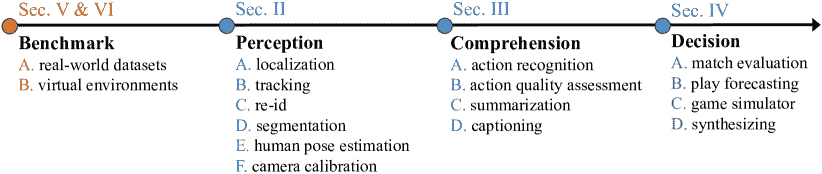

<!--yml

类别：未分类

日期：2024-09-06 19:38:19

-->

# [2307.03353] 深度学习在体育应用中的调研：感知、理解与决策

> 来源：[`ar5iv.labs.arxiv.org/html/2307.03353`](https://ar5iv.labs.arxiv.org/html/2307.03353)

# 深度学习在体育应用中的调研：感知、理解与决策

Zhonghan Zhao^∗, Wenhao Chai^∗, Shengyu Hao, Wenhao Hu, Guanhong Wang, Shidong Cao,

Mingli Song, Jenq-Neng Hwang, Gaoang Wang^† ^∗ 共同贡献。^† 通讯作者：Gaoang Wang。Zhonghan Zhao、Shengyu Hao、Wenhao Hu、Guanhong Wang、Mingli Song 隶属于浙江大学计算机科学与技术学院。Shidong Cao 隶属于浙江大学-伊利诺伊大学香槟分校研究所，浙江大学。Gaoang Wang 隶属于浙江大学-伊利诺伊大学香槟分校研究所和浙江大学计算机科学与技术学院。Wenhao Chai 和 Jenq-Neng Hwang 隶属于华盛顿大学。

###### 摘要

深度学习有可能彻底改变体育表现，其应用范围从感知和理解到决策。本文呈现了深度学习在体育表现中的全面调研，重点关注三个主要方面：算法、数据集和虚拟环境，以及挑战。首先，我们讨论了体育表现中深度学习算法的层级结构，包括感知、理解和决策，并比较了它们的优缺点。其次，我们列出了体育领域广泛使用的现有数据集，并突出其特性和局限性。最后，我们总结了当前挑战，并指出深度学习在体育领域的未来趋势。我们的调研为对深度学习在体育应用中感兴趣的研究人员提供了宝贵的参考资料。

###### 索引词：

体育表现、物联网、计算机视觉、深度学习、调研

## I 引言

人工智能（AI）在体育领域得到了广泛应用，并且未来充满光明。它日益增长的参与将以各种方式彻底改变这一行业，实现效率和精度的新高度。

人工智能（AI）在体育中的一个重要应用是深度学习技术的使用。具体而言，这些先进的算法被应用于球员表现分析、伤害预测和比赛策略制定等领域[1]。通过捕获和处理大量数据，深度学习模型能够预测结果、发现模式，并制定可能对人眼不明显的策略。这种深度学习与体育产业的无缝整合[2, 3]展示了技术如何提升我们优化运动表现和决策的能力。

图 1：在感知、理解和决策中的运动表现应用实例。

尽管预测和优化运动表现具有诸多优点，但这仍然是一个复杂的问题。传统上，教练、经理、 scouts 和运动健康专业人士等运动专家依赖于传统的分析方法来解决这些挑战。然而，收集统计数据和手动分析决策是一项费力且耗时的工作[4]。因此，由机器学习驱动的自动化系统作为一种有前景的解决方案，可以通过自动化处理大规模数据来彻底改变体育行业。

近年来，关于机器学习和深度学习在运动表现中的应用的综合调查显著增加。这些调查涵盖了广泛的话题，包括运动特定动作的识别[5]、运动数据挖掘[6]，以及在团队运动中应用 AI 技术[7]。一些调查专注于特定运动，如足球[7]和羽毛球[8]，而其他则集中于计算机视觉中的特定任务，如视频动作识别[9]、视频动作质量评估[10]和球类跟踪[11]。此外，一些研究探讨了可穿戴技术[12, 13]和运动捕捉系统[14]在运动中的使用，特别是物联网（IoT）的重点。

先前的研究[15, 16]采用了分层方法来分析运动表现，从低层次的方面开始，逐步过渡到高层次的组件，同时提供了训练建议。为了理解深度学习在运动中的应用，我们将其分为三个层级：感知、理解和决策。此外，我们还根据特定的运动学科对不同的数据集进行了分类，并概述了深度学习方法和数据集的主要挑战。进一步地，我们基于目前在基础模型上建立的工作，突出了深度学习在运动中的未来方向。

这项关于深度学习在运动表现中的综合调查的贡献可以总结为三个关键方面。

+   •

    我们提出了一种分层结构，将深度学习任务系统地分为三个类别：感知、理解和决策，涵盖了从低层次到高层次的任务。

+   •

    我们提供了运动数据集和虚拟环境的总结。同时，本文涵盖了几十种运动场景，处理了视觉信息和物联网传感器数据。

+   •

    我们总结了当前深度学习在各个运动领域面临的挑战和未来可行的研究方向。

本文结构如下：第 II、III 和 IV 部分介绍了不同的感知、理解和决策任务的方法。第 V 和 VI 部分讨论了与体育相关的数据集和虚拟环境。在第 VII 和 VIII 部分，我们强调了深度学习在体育领域中的当前挑战和未来趋势。最后，在第 IX 部分我们总结了论文。

图 2：分类。一个包含感知、理解和决策三个类别任务以及基准的层次结构。

## II 感知

图 3：感知任务的分类和描述。

感知涉及对获取数据的基本解释。本节介绍了针对特定体育任务的不同深度学习方法，如图 3 所示。随后的感知部分将包括如球员追踪、球员姿态识别、球员实例分割、球定位、相机标定等任务。

### II-A 球员和球的定位

球员和球的定位旨在识别和确定球员和球的空间位置，这是体育视频分析中的一项重要任务。精确识别这些实体可以提供关于团队表现的宝贵洞察，帮助教练利用数据做出明智的决策。近年来，许多基于深度学习的技术相继出现，专门设计用于在各种体育项目中准确定位球员和球，如足球、篮球和板球。

#### II-A1 球员定位

球员定位或检测[17, 18, 19]为体育分析领域中的各种下游应用奠定了基础。这些应用包括识别球员的球衣号码[20, 21, 22]和球队[23, 24]，预测动作和意图[25, 26, 27]。一些研究[28]利用通用物体检测的进展来增强对足球广播的理解。其他研究[24]则专注于无监督方法来区分球队，并采用多模态和多视角蒸馏方法进行业余体育中的球员检测[29]。Vandeghen 等人[30]引入了一种半监督学习的蒸馏方法，显著减少了对标注数据的依赖。此外，一些研究[31, 32]利用球员定位进行动作识别和检测。物体跟踪[33]对于球员的时间定位也至关重要。

#### II-A2 球的定位

球的定位提供了关于球的关键 3D 位置信息，这为其运动状态提供了全面的见解[11]。该任务涉及估计图像块中心的球直径（以像素为单位），并在游戏分析的各个方面有应用[34]。这些应用包括足球中的自动越位检测[35]，篮球中的发球点定位[36]，以及乒乓球中的事件检测[37]。

现有的解决方案通常依赖于多视角[38, 39, 40]来三角定位在单个帧中检测到的球的 2D 位置，提供了对篮球或美式足球等团队运动中常见遮挡的鲁棒性。

然而，在单视角球的 3D 定位中，遮挡成为了一个重要的挑战。大多数方法通过基于 2D 检测拟合 3D 弹道轨迹[41, 40]，在球自由落体时跟踪球的效果有限，尤其是在弹道路径上。然而，在许多游戏情况下，球在自由落体过程中可能部分可见或完全被遮挡。Van 等人[36, 42]通过偏离弹道轨迹、时间一致性和清晰可见性的假设来解决这些限制。他们提出了一种基于图像的方法，检测球的中心并估计其在图像空间中的大小，弥补了弹道方法提供的轨迹预测之间的差距。此外，还有一些关于羽毛球中 3D 羽毛球轨迹重建的研究[43]。

### II-B 球员和球的跟踪

玩家和球的追踪是一个在连续帧之间持续跟踪和识别物体位置与运动的过程。这一追踪操作对于实现对体育活动的自动化理解至关重要。

#### II-B1 玩家追踪

在时间维度上追踪玩家对于收集特定玩家的统计数据极为宝贵。最近的工作[44, 45] 利用 SORT 算法[46]，该算法将卡尔曼滤波与匈牙利算法结合，以关联重叠的边界框。此外，Hurault 等人[47]采用自监督方法，对在通用物体上训练的物体检测模型进行微调，专门用于足球玩家的检测和追踪。

在玩家追踪中，一个常见的挑战是相似的外观使得关联检测和保持身份一致变得困难。从直观上讲，整合其他任务的信息可以帮助追踪。一些工作[48] 探索了球衣号码、团队分类和姿态引导的局部特征，以处理玩家身份切换并使用 K 最短路径算法关联玩家 ID。在舞蹈场景中，结合来自人体姿态估计的骨架特征显著提升了在统一服装和多样动作的挑战性场景中的追踪性能[49]。

为解决遮挡期间的身份不匹配，Naik 等人[44] 利用足球比赛中队伍和裁判的球衣颜色差异。他们在追踪器模块中逐帧更新颜色掩码，根据球衣颜色分配追踪器 ID。此外，其他工作[45, 50] 使用 DeepSort[51] 处理遮挡问题。

#### II-B2 球追踪

准确识别和追踪高速的小球从原始视频中面临重大挑战。Huang 等人[52] 提出了一种基于热图的深度学习网络[53, 54]，用于在单帧中识别球的图像，并学习其在连续帧中的飞行模式。此外，精确的球追踪对于辅助其他任务至关重要，比如通过结合球追踪信息识别乒乓球的旋转动作[55]。

### II-C 玩家再识别

球员重新识别（ReID）是一个在不同时间和视角下匹配和识别个体的任务。在技术术语中，这涉及将一个人的图像（称为查询）与大数据库中的其他图像（称为库）进行比较，这些图像来自不同的摄像头视角。在体育中，ReID 任务旨在在从移动摄像头连续捕捉的图像中重新识别球员、教练和裁判。相似的外观、遮挡和广播视频中球员细节的低分辨率等挑战使得球员重新识别成为一项具有挑战性的任务。

针对这些挑战，许多方法集中在识别球衣号码以识别球员[22, 57]，或采用基于部件的分类技术[58]。最近，Teket 等人[59]提出了一种实时能力的管道，使用 Siamese 网络和三元组损失来区分球员，而无需依赖固定类别或球衣号码。An 等人[60]引入了一种具有注意机制的多粒度网络用于球员 ReID，而 Habel 等人[61]利用 CLIP 和 InfoNCE 损失作为目标，专注于与类别无关的方法。

为了解决多视角足球比赛广播视频中球员细节低分辨率的问题，Comandur 等人[56]提出了一种模型，通过基于与给定动作帧的距离对回放帧进行排序来重新识别球员，结合了质心损失、三元组损失和交叉熵损失，以增加聚类之间的间距。

此外，一些研究者探索了半监督或弱监督方法。Maglo 等人[62]开发了一种基于变换器架构的半互动系统，用于球员重新识别（ReID）。类似地，在冰球中，Vats 等人[63]采用了弱监督训练方法，使用交叉熵损失来预测球衣号码，作为分类的一种形式。

### II-D 球员实例分割

球员实例分割的目标是为每个球员分配像素级标签。在球员实例分割中，遮挡是关键问题，尤其是在拥挤的区域，如篮球场[36]。一些研究[64, 65]利用在线特定的复制粘贴方法[66]来解决遮挡问题。

此外，实例分割特征可以用于区分团队运动中不同动作的不同球员[24, 67]。在冰球中，Koshkina 等人[24]使用 Mask R-CNN[68]检测并分割场地上的每个人。Zhang 等人[67]利用分割任务来增强投掷动作识别[67]和事件检测[37]。

### 二-E 球员姿势估计

球员姿势估计有助于预测身体关节位置及其空间关系。它通常作为各种任务的基础组件[69]，但目前对体育场景的独特特点，如长时间处理、依赖外观模型以及对校准误差和噪声检测的敏感性，还没有特别研究的工作。

近期的研究采用了 OpenPose [70]进行动作检测或不同元素在体育实践中的位置预测[71, 72, 73]。对于像乒乓球这样球员运动迅速变化的体育项目，一些工作[74]利用了长短期姿势预测网络[75]以确保实时性能。在对体育视频的具体动作分析中，某些工作[76]使用了姿势估计技术。此外，Thilakarathne 等人[77]使用跟踪到的姿势作为输入来提高排球中的群体活动识别。在动作较少或运动不频繁而姿势复杂度较高的体育项目中，研究人员致力于为从业者提供验证其姿势正确性的工具，以实现更有效的学习，如太极[78]和瑜伽[79]。

### 二-F 相机校准

体育镜头校准，也被称为场地注册，旨在估计相机的内外参数。单应性提供了平面场地与图像中相应可见区域之间的映射关系。场地校准在那些受益于体育场馆内球员位置信息的任务中起着至关重要的作用，例如场上的 3D 球员跟踪。不同的方法已经被用于解决不同体育领域的体育场地注册问题，包括网球、排球和足球[80, 81]，通常依靠关键点检索方法。

随着深度学习的出现，最近的方法聚焦于通过各种形式的语义分割学习可见体育场地的表示[82, 83, 84, 32]。这些方法要么直接预测或回归一个初始单应性矩阵[85, 86, 87]，要么在参考数据库[84, 88]中搜索最佳匹配的单应性矩阵，该数据库包含具有已知单应性矩阵或相机参数的合成图像。在其他情况下[83, 84]，利用一个相机视图字典，将合成参考场地模型的图像投影与单应性联系起来。然后将分割结果与字典中最接近的合成视图关联起来，提供一个近似的相机参数估计，进一步进行最终预测的精炼。

## 三 理解

图 4：理解任务的分类和描述。

理解可以定义为理解和分析数据的过程。它涉及比感知阶段更高级的任务，这在第 II 节中有讨论。为了全面理解体育，实施可以利用原始数据，并直接或间接地纳入感知层的任务。也就是说，它可以利用从感知网络获得的输出，例如人体骨架、深度图像等。

在这一部分，我们深入探讨了与理解和分析体育相关的具体任务，如图 4 所示。这些任务包括个体和群体动作识别、动作质量评估、动作检测、体育视频总结和字幕生成。

表 I：体育理解的深度学习模型。 “IAR”、“GAR”、“AQA”分别代表个体动作识别、群体动作识别和动作质量评估。

| 任务 | 方法 | 会议 | 基准 | 链接 |
| --- | --- | --- | --- | --- |
| IAR | TSM [89] | ICCV-2019 | FineGym, P²A | [$\usym{2713}$](https://github.com/mit-han-lab/temporal-shift-module) |
| CSN [90] | ICCV-2019 | Sports 1M | [$\usym{2713}$](https://github.com/facebookresearch/VMZ) |
| SlowFast [91] | ICCV-2019 | P²A, Diving48 | [$\usym{2713}$](https://github.com/facebookresearch/SlowFast) |
| G-Blend [92] | CVPR-2020 | Sports 1M | [$\usym{2713}$](https://github.com/facebookresearch/VMZ) |
| AGCN [93] | TIP-2020 | FSD-10 | [$\usym{2713}$](https://github.com/lshiwjx/2s-AGCN) |
| ResGCN [94] | MM-2020 | FSD-10 | [$\usym{2713}$](https://github.com/Thomas-yx/ResGCNv1) |
| MoViNet [95] | CVPR-2021 | P²A | [$\usym{2713}$](https://github.com/Atze00/MoViNet-pytorch) |
| TimeSformer [96] | ICML-2021 | P²A, Diving48 | [$\usym{2713}$](https://github.com/facebookresearch/TimeSformer) |
| ViSwin [97] | arXiv-2021 | P²A | [$\usym{2713}$](https://github.com/SwinTransformer/Video-Swin-Transformer) |
| ORViT [98] | arXiv-2021 | Diving48 | [$\usym{2713}$](https://github.com/eladb3/ORViT) |
| BEVT [99] | arXiv-2021 | Diving48 | [$\usym{2713}$](https://github.com/xyzforever/BEVT) |
| VIMPAC [100] | arXiv-2021 | Diving48 | [$\usym{2713}$](https://github.com/airsplay/vimpac) |
| CTR-GCN [101] | ICCV-2021 | FSD-10 | [$\usym{2713}$](https://github.com/Uason-Chen/CTR-GCN) |
| GAR | DIN [102] | ICCV-2021 | Diving48, HierVolleyball-v2 | [$\usym{2713}$](https://github.com/JacobYuan7/DIN-Group-Activity-Recognition-Benchmark) |
| PoseC3D [103] | CVPR-2022 | FineGym, FSD-10, HierVolleyball-v2 | [$\usym{2713}$](https://github.com/kennymckormick/pyskl) |
| AQA | S3D [104] | ICIP-2018 | AQA-7 | [$\usym{2713}$](https://github.com/YeTianJHU/diving-score) |
| C3D-LSTM [105] | WACV-2019 | AQA-7 | [$\usym{2713}$](http://rtis.oit.unlv.edu/datasets.html) |
| C3D-AVG-MTL [106] | CVPR-2019 | MTL-AQA | [$\usym{2713}$](https://github.com/ParitoshParmar/MTL-AQA) |
| C3D-MSLSTM [107] | TCSVT-2020 | FisV, MIT-Skate | [$\usym{2713}$](https://github.com/loadder/MS_LSTM.git) |
| I3D-USDL [108] | CVPR-2020 | AQA-7, MTL-AQA | [$\usym{2713}$](https://github.com/nzl-thu/MUSDL) |
| TSA [109] | ACM MM 2021 | FR-FS, AQA-7, MTL-AQA | [$\usym{2713}$](https://github.com/Shunli-Wang/TSA-Net) |

### III-A 个人动作识别

玩家动作识别旨在对特定的人类动作进行分类和检测。个人动作识别常用于自动统计分析个别运动，例如计数特定动作的发生次数。此外，它在分析战术、识别比赛中的关键时刻以及跟踪玩家活动（包括跑动距离和表现等指标）中发挥了重要作用。这种分析可以帮助玩家和教练识别实现更好结果所需的关键技术因素。在团队运动中，教练需要监控场上所有球员及其各自的动作，特别是他们如何执行这些动作。因此，一个能够跟踪所有这些元素的自动化系统可能对球员的成功有很大贡献。然而，这对计算机提出了重大挑战，因为多个球员在运动场上同时进行不同的动作，导致遮挡和混乱场景等问题。

尽管在视频动作识别的文献中，端到端模型 [96, 97, 110] 常被采用，但它们通常更适合于粗粒度分类任务 [111, 112, 113]，这些任务关注如拳击或踢腿等更广泛的类别。相比之下，大多数运动需要更细粒度的方法，能够区分这些更广泛类别中的具体技术 [114, 115]。

单一运动中的细粒度动作识别有助于减轻粗粒度任务中存在的上下文偏差，使其成为一个越来越重要的研究领域[114, 116, 117]。基于骨架的方法[118, 119, 120]在以身体为中心的运动中获得了广泛的关注。这些方法利用 2D 或 3D 人体姿态作为输入来识别人体动作。通过将人体骨架表示为一个图，关节位置作为节点，并将运动建模为这些图坐标随时间变化，可以捕捉动作的空间和时间方面。此外，一些研究[121, 122, 123]专注于不涉及身体中心动作的运动中的细粒度动作识别。

### III-B 群体动作识别

群体活动识别涉及识别由多个个体或物体执行的活动。在运动、医疗保健和监控等多个领域中，它在自动化人类行为分析中扮演着重要角色。与多玩家活动识别不同，群体/团队动作识别专注于识别从群体内每个玩家的集体动作和交互中产生的单一群体动作。这比个体动作识别面临更大的挑战，需要整合多种计算机视觉技术。

由于涉及多个参与者，建模参与者交互关系在群体行为分析中变得至关重要。一般而言，演员交互关系可以使用图卷积网络（GCN）或变换器进行建模。基于变换器的方法[124, 125, 126, 127, 128, 129]通常明确表示时空关系，并采用基于注意力的技术来建模个体关系以推断群体活动。基于 GCN 的方法[130, 102]构建演员的关系图，并同时使用图卷积网络探索空间和时间的演员交互。

其中，Yan 等人[126]构建了独立的空间和时间关系图来建模演员关系。Gavrilyuk 等人[124]使用 I3D [111]对时间信息进行编码，并使用普通变换器建立演员之间的空间关系。Li 等人[129]引入了一个集群注意机制。Dual-AI [131]提出了一种双路径角色交互框架用于群体行为识别，将演员的时间编码纳入变换器架构。此外，在群体活动分析中使用简单的多层感知器（MLP）进行特征提取[132]是一种具有巨大潜力的新兴方法。

此外，其他一些工作更关注通过时间定位进行特定动作识别，而非分类。已经提出了几种自动化方法，通过分析摄像机镜头或语义信息来识别游戏中的重要动作。研究[133, 134, 135]探索了体育视频中的人类活动定位，显著游戏动作识别[136, 137]，以及游戏亮点的自动识别和总结[138, 139, 140]。近期的方法更多集中在足球上。例如，Giancola 等[141]引入了在未剪辑的足球广播视频中准确识别和定位特定动作的概念。最近，该领域出现了创新的方法，旨在自动化该过程。Cioppa 等[142]提出应用上下文感知损失函数以增强模型性能。他们后来展示了如何通过整合摄像机校准和球员定位特征来提高发现能力[32]。Hong 等[143]提出了一种高效的端到端训练方法，而 Darwish 等[144]利用了时空编码器。图形基技术[145]和基于变换器的方法[146]等替代策略提供了新视角，特别是在处理关系数据和解决长程依赖性方面。最后，Soares 等[147, 148]强调了基于锚点的方法在精确动作定位和分类中的潜力。

### III-C 行动质量评估

行动质量评估（AQA）是一种用于评估和量化基于视频或运动数据分析的人类动作总体表现或熟练度的方法。AQA 考虑了技术、速度和控制等标准来评估动作并赋予分数，这些分数可用于指导训练和康复计划。AQA 已被证明在评估各种体育运动的动作质量方面可靠有效。该领域的研究主要集中在分析奥运会运动员的动作，如跳水、体操以及第 V 节提到的其他运动。现有的方法通常将 AQA 视为回归任务，使用各种视频表示通过分数进行监督。

一些研究集中于增强网络结构以提取更明显的特征。例如，Xu 等人[107] 提出了自注意力 LSTM 和多尺度卷积跳跃 LSTM 模型，通过捕捉长期视频中的局部和全局序列信息来预测花样滑冰中的总元素得分 (TES) 和总程序组件得分 (PCS)。Xiang 等人[104] 将跳水过程分为四个阶段，并采用四个独立的 P3D 模型进行特征提取。Pan 等人[149] 开发了一种基于图的联合关系模型，该模型通过关节共性模块和关节差异模块分析人体关节运动。Parisi 等人[150] 提出了一个具有自组织结构的递归神经网络，以学习身体运动序列并促进匹配。Kim 等人[151] 将动作建模为一个结构化过程，并使用 LSTM 网络编码动作单元。Wang 等人[109] 引入了一个管道自注意力模块用于特征聚合，通过稀疏特征交互高效生成时空上下文信息。Yu 等人[152] 构建了一个基于视频级特征的对比回归框架，以对视频进行排序并预测准确的得分。

其他研究则专注于通过设计网络损失函数来提高动作质量评估的性能。Li 等人[153] 提出了一个端到端的框架，该框架采用 C3D 作为特征提取器，并将排名损失与均方误差 (MSE) 损失相结合。Parmar 等人[106] 通过引入三个并行预测任务：动作识别、评论生成和 AQA 得分回归，探索了多任务学习场景下的 AQA 模型。Tang 等人[108] 提出了一种不确定性感知得分分布学习方法，该方法在建模过程中考虑了难度水平，从而更真实地模拟了评分过程。

此外，一些研究集中于比较配对动作的质量。Bertasius 等人[154] 提出了一个基于第一人称视角视频的篮球比赛模型，利用卷积-LSTM 网络检测事件并评估任意两个动作的质量。

### III-D 体育视频摘要

体育视频摘要的目的是生成简明而连贯的总结，以捕捉关键信息。它通常优先识别球员动作[155]。这一研究领域旨在生成广播体育视频的亮点，因为这些视频通常过于冗长，观众无法完整观看。考虑到许多体育比赛的持续时间可能为 90-180 分钟，创建一个仅包含最有趣和令人兴奋事件的摘要成为一项具有挑战性的任务。

Agyeman 等人[155]采用了 3D ResNet CNN 和基于 LSTM 的深度模型来检测五种不同的足球运动动作类别。Rafiq 等人[156]提出了一种基于迁移学习的分类框架，用于将板球比赛片段[157]分类为五个类别，利用预训练的 AlexNet CNN 和数据增强。Shingrakhia 等人[158]提出了一种多模态混合方法来分类体育视频片段，利用混合旋转森林深度置信网络和带有深度注意力的堆叠 RNN 来识别关键事件。Li 等人[159]提出了一种监督性动作提议指导的 Q 学习基于层次细化的方法，用于足球视频的结构自适应摘要。尽管当前体育视频摘要研究关注于特定运动，但仍需要进一步努力开发可以支持不同类型体育视频的通用框架。

### III-E 字幕生成

体育视频字幕生成涉及生成描述性和连贯的文本描述。体育视频字幕生成模型旨在生成提供与特定运动相关的详细信息的句子，这是一项多模态[160]任务。例如，在篮球中，Yu 等人[161]提出了一种结构，该结构包含一个用于将像素分类为球、球队和背景等类别的 CNN 模型，一个利用光流特征捕捉球员动作的模型，以及一个建模球员关系的组件。这些组件在层次结构中结合，以生成 NBA 篮球视频的字幕。同样，注意力机制和层次递归神经网络已被用于生成排球视频的字幕[162]。

此外，利用多种模态可以扩展到探索创建体育视频的详细字幕或叙述。Qi 等人[163]和 Yu 等人[164]通过结合考虑运动建模和与群体及关系相关的上下文信息的注意力机制，成功生成了体育视频的细粒度文本描述。

## IV 决策

图 5：决策任务的分类和描述。

体育中的决策或决策过程涉及到最高级别的任务，其中在生成更抽象的决策之前，体育的部署或隐含感知与理解至关重要。本节包括各种任务，如比赛评估、比赛预测、游戏模拟、球员动作生成和比赛生成，如图 5 所示。

### IV-A 比赛评估

比赛评估涉及分析和评估体育比赛的各个方面，例如球员表现、团队策略和比赛动态。这个任务需要比赛建模，通常采用深度强化学习方法。例如，王等人[165]开发了一个深度强化学习模型来研究 NBA 比赛，目的是最小化进攻得分。罗等人[166]结合了 Q-函数学习和逆向强化学习，设计了一种独特的排名方法和一个用于多智能体冰球马尔可夫游戏的交替学习框架。刘等人[167]在不同的游戏背景下使用 Q-函数学习来评估球员行为，并引入了一种新的球员评估指标，称为游戏影响指标。矢内等人[168]通过扩展 DDPG[169]架构来建模篮球比赛，以评估球员和球队的表现。

### IV-B 比赛预测

比赛预测旨在预测游戏或比赛的未来动作、策略或结果，利用机器学习模型来预判球员动作、团队战术和潜在的游戏变化事件。在职业体育场馆中准确的球员和球的追踪数据的可用性引起了对利用数据驱动的预测模型来帮助教练和分析师的兴趣[170, 171]。一些研究利用了多年的比赛数据来预测各种方面，如预测网球中的球位置[172, 173]和赢得一个分数的可能性[174]。乐等人[175]专注于预测 NBA 防守如何应对不同的进攻战术，而 Power 等人[176]分析了足球中传球的风险与回报。在最近的一项工作中，王等人[177]深入分析了羽毛球中应该返回的位置和击球类型。

### IV-C 游戏模拟器

游戏模拟器通常旨在创建模拟真实体育比赛的虚拟环境，以便进行逼真的模拟和生成训练数据 [178, 179, 180, 181]。这些虚拟环境在第 VI 部分中有详细讨论，允许代理根据特定算法自由移动，从而模拟现实世界的体育场景。在这种环境中，深度强化学习（DRL）算法在与体育相关的任务中表现出色。赵等人 [182] 在多代理强化框架中提出了一种分层学习方法，以模拟体育比赛中的人类表现。贾等人 [183] 解决了篮球体育环境中异步实时场景的挑战，支持单代理和多代理训练。

足球虚拟环境 GFootball 近年来受到广泛关注 [181]。在 2020 年谷歌研究足球竞赛中，获胜团队 WeKick [184] 开发了一种强大的代理，使用了模仿学习和分布式联赛训练。然而，WeKick 专门设计用于单代理 AI，无法扩展到多代理控制。为了解决这一限制，黄等人 [185] 提出了 TiKick，一种离线多代理算法，利用 WeKick 生成的重播数据完成 GFootball 中的完整比赛 [185]。另一种方法，Tizero [186]，从零开始训练代理，未使用预先收集的数据，并采用自我改进过程开发高质量的多代理控制 AI [186]。

尽管 DRL 系统取得了显著进展，但在多个领域仍面临挑战，包括多代理协调、长期规划和非传递性 [187, 188, 189]。这些挑战突显了开发能够有效协调多个代理、在较长时间内做出战略决策并考虑动态环境中的非传递性关系的 AI 系统的复杂性。进一步的研究和进展对于提升 DRL 系统的能力至关重要。

### IV-D 玩家运动合成

利用基于视频的序列来捕捉和分析运动员的动作，代表了一种增强体育数据多样性的强大方法。这一创新举措有潜力对体育学科的发展产生积极影响。通过对运动员动作的详细分析和重现，我们可以获得有价值的见解，这些见解有可能改善技术、提升运动表现，并推动体育领域的进步。这一开创性工作对推进该领域并造福运动员和体育爱好者都具有巨大潜力。

#### IV-D1 自动编舞师

创建编舞涉及到舞蹈动作的创意设计。然而，自动化编舞过程是一个具有挑战性的任务。它需要生成连续且复杂的动作，以捕捉与伴随音乐的微妙关系。

音乐到舞蹈动作生成可以从 2D 和 3D 两个角度来探讨。2D 方法 [190, 191, 192] 依赖于准确的 2D 姿态检测器 [193]，但在表现力和后续应用方面存在限制。另一方面，3D 舞蹈生成方法利用 LSTMs [194, 195, 196, 197, 198], GANs [199, 200], 带有 RNN 解码器的 transformer 编码器 [201] 或 transformer 解码器 [202]，以及卷积序列到序列模型 [203, 204] 来从音频生成动作。

早期工作 [191, 198, 204] 可能从音频中确定性地预测未来动作，但当相同音频对应多个动作时会遇到困难。然而，近期的进展，如 Li 等人的工作 [202]，通过将问题公式化为种子动作，解决了这一限制。这使得即使在确定性模型下，也能从相同音频生成多个动作。Li 等人 [202] 提出了一个新颖的基于跨模态 transformer 的模型，该模型更好地保留了音乐与 3D 动作之间的关联。这种方法产生了更现实且全球翻译的长人类动作。

### IV-E 体育视频合成

人工合成体育视频的目标是生成逼真和沉浸的内容，如球员动作或比赛场景。早期的研究使用标注视频训练模型，其中每个时间步骤都标记了对应的动作。然而，这些方法使用离散的动作表示，使得在实际环境中定义先验知识变得困难。此外，为环境设计适当的连续动作表示也是复杂的。为了应对网球中动作表示的复杂性，Menapace 等人[205]提出了离散动作表示。在此基础上，Huang 等人[206]将动作建模为一组学习得到的几何变换。Davtyan 等人[207]通过将动作分为全局位移组件和局部离散动作组件采取了不同的方法。网球中的最新研究利用了基于 NeRF 的渲染器[208]，允许表示复杂的 3D 场景。在这些研究中，Menapace 等人[209]采用了基于文本的动作表示，提供了关于执行的具体击球动作和球的目标的详细信息。

## V 数据集与基准

在深度学习时代，有效的数据对于训练和评估模型至关重要。为了便利这一点，我们整理了一份常用的公共体育数据集列表及其对应的详细信息，如表格 II 所示。下面，我们提供了每个数据集的更详细描述。

表 II：在已发表的论文中使用的视频基础体育相关数据集列表。注意其中一些数据集并未公开，且“multiple”表示数据集中包含多种体育项目，而不仅仅是一种特定的体育类型。“det.”、“cls.”、“tra.”、“ass.”、“seg.”、“loc.”、“cal.”、“cap.” 分别代表球员/球检测、动作分类、球员/球追踪、动作质量评估、物体分割、时间动作定位、相机标定和字幕生成。

| Sport | 数据集 | 年份 | 任务 | 视频数量 | 平均时长 | 链接 |
| --- | --- | --- | --- | --- | --- | --- |
| Soccer | SoccerNet [141] | 2018 | loc.& cls. | 500 | 5,400 | [$\usym{2713}$](https://silviogiancola.github.io/SoccerNet/) |
| SSET [210] | 2020 | det.&tra. | 350 | 0.8h | [$\usym{2713}$](http://media.hust.edu.cn/dataset.htm) |
| SoccerDB [211] | 2020 | cls.& loc. | 346 | 1.5h | [$\usym{2713}$](https://github.com/newsdata/SoccerDB) |
| SoccerNet-v2 [212] | 2021 | cls.&loc. | 500 | 1.5h1.5h | [$\usym{2713}$](https://www.soccer-net.org/data) |
| SoccerKicks [213] | 2021 | pos. | 38 | - | [$\usym{2713}$](https://github.com/larocs/SoccerKicks) |
| SoccerNet-v3 [34] | 2022 | cls.&tra. | 346 | 1.5h | [$\usym{2713}$](https://www.soccer-net.org/data) |
| SoccerNet-Tracking [33] | 2022 | cls.&tra. | 21 | 45.5m | [$\usym{2713}$](https://www.soccer-net.org/data) |
| 足球轨迹 [214] | 2022 | tra.&loc. | 20 | 30s | [$\usym{2713}$](https://github.com/AtomScott/SoccerTrack) |
| 篮球 | BPAD [215] | 2017 | ass. | 48 | 13m | [$\usym{2713}$](https://www.kaggle.com/datasets/gabrielvanzandycke/spiroudome-dataset) |
| NBA [126] | 2020 | cls. | 181 | - | [$\usym{2713}$](https://ruiyan1995.github.io/SAM.html) |
| NPUBasketball [216] | 2021 | cls. | 2,169 | - | [$\usym{2713}$](https://github.com/Medjed46/NPU-RGBD-Basketball-Dataset) |
| DeepSportradar-v1 [36] | 2022 | seq.&cal. | - | - | [$\usym{2713}$](https://github.com/DeepSportRadar) |
| NSVA [217] | 2022 | cls.&cap. | 32,019 | 9.5s | [$\usym{2713}$](https://github.com/jackwu502/NSVA) |
| 网球 | PE-Tennis [218] | 2022 | det.&cal. | 14,053 | 3s | [$\usym{2713}$](https://github.com/willi-menapace/PlayableEnvironments) |
| LGEs-Tennis [209] | 2023 | cal.&tra.&cap. | 7,112 | 7.8s | [$\usym{2713}$](https://learnable-game-engines.github.io/lge-website/) |
| 花样滑冰 | FisV-5 [219] | 2020 | ass.& cls. | 500 | 2m50s | [$\usym{2713}$](https://github.com/loadder/MS_LSTM) |
| FR-FS [220] | 2021 | ass.& cls. | 417 | - | [$\usym{2713}$](https://github.com/Shunli-Wang/TSA-Net) |
| 跳水 | MTL-AQA [221] | 2019 | ass. | 1,412 | - | [$\usym{2713}$](http://rtis.oit.unlv.edu/datasets.html) |
| FineDiving [222] | 2022 | ass.& cls. | 3,000 | 52s | [$\usym{2713}$](https://github.com/xujinglin/FineDiving) |
| 舞蹈 | GrooveNet [194] | 2017 | pos. | 2 | 11.5m | [$\usym{2713}$](https://omid.al/groovenet-material-ml4c/) |
| 与旋律共舞 [195] | 2018 | pos. | 61 | 92s | [$\usym{2713}$](https://github.com/Music-to-dance-motion-synthesis/dataset) |
| EA-MUD [200] | 2020 | pos. | 17 | 74s | [$\usym{2713}$](https://github.com/computer-animation-perception-group/DeepDance) |
| AIST++ [202] | 2021 | det&pos. | 1,408 | 13s | [$\usym{2713}$](https://google.github.io/aistplusplus_dataset/factsfigures.html) |
| DanceTrack [49] | 2022 | tra. | 100 | 52.9s | [$\usym{2713}$](https://github.com/DanceTrack/DanceTrack) |
| 高尔夫 | GolfDB [223] | 2019 | cls. | 1,400 | - | [$\usym{2713}$](https://github.com/wmcnally/GolfDB) |
| 体操 | FineGym [114] | 2020 | cls.& loc. | - | - | [$\usym{2713}$](https://sdolivia.github.io/FineGym/) |
| 橄榄球 | Rugby sevens [119] | 2022 | tra. | 346 | 40s | [$\usym{2713}$](https://kalisteo.cea.fr/index.php/free-resources/) |
| Baseball | MLB-YouTube[224] | 2018 | cls. | 5,111 | - | [$\usym{2713}$](https://github.com/piergiaj/mlb-youtube/) |
| General | Sports 1M [225] | 2014 | cls. | 1M | 36s | [$\usym{2713}$](https://code.google.com/archive/p/sports-1m-dataset/) |
| OlympicSports [226] | 2014 | ass. | 309 | - | [$\usym{2713}$](https://redirect.cs.umbc.edu/~hpirsiav/quality.html) |
| SVW [227] | 2015 | det.& cls. | 4,100 | 11.6s | [$\usym{2713}$](http://cvlab.cse.msu.edu/project-svw.html) |
| OlympicScoring [228] | 2017 | ass. | 716 | - | [$\usym{2713}$](http://rtis.oit.unlv.edu/datasets.html) |
| MADS [229] | 2017 | ass. | 30 | - | [$\usym{2713}$](http://visal.cs.cityu.edu.hk/research/mads/) |
| MultiTHUMOS [230] | 2017 | cls. | 400 | 4.5m | [$\usym{2713}$](http://ai.stanford.edu/~syyeung/everymoment.html) |
| AQA-7 [231] | 2019 | ass. | 1,189 | - | [$\usym{2713}$](http://rtis.oit.unlv.edu/datasets.html) |
| C-Sports [232] | 2020 | cls.&loc. | 2,187 | - | [$\usym{2713}$](https://cemilzalluhoglu.github.io/csports) |
| MultiSports [233] | 2021 | cls.&loc. | 3,200 | 20.9s | [$\usym{2713}$](https://github.com/MCG-NJU/MultiSports/) |
| ASPset-510 [234] | 2021 | pos. | 510 | - | [$\usym{2713}$](https://github.com/anibali/aspset-510) |
| HAA-500 [235] | 2021 | cls. | 10,000 | 2.12s | [$\usym{2713}$](https://www.cse.ust.hk/haa/) |
| SMART [236] | 2021 | cls. | 5,000 | - | [$\usym{2713}$](https://chenxin.tech/files/Paper/IJCV2020_Sport/project_page_SportsCap/index.htm) |
| Win-Fail [237] | 2022 | cls. | 817 | 3.3s | [$\usym{2713}$](https://github.com/ParitoshParmar/Win-Fail-Action-Recognition) |
| SportsPose [238] | 2023 | pos. | 25 | 11m | [$\usym{2713}$](https://github.com/ChristianIngwersen/SportsPose) |
|  | SportsMOT [239] | 2023 | tra. | 240 | 25s | [$\usym{2713}$](https://deeperaction.github.io/datasets/sportsmot.html) |

### V-A 足球

在足球领域，大多数基于视频的数据集受益于球员跟踪和动作识别等主动任务，而一些数据集则关注场地定位和注册或球员深度图和网格。

一些数据集更专注于球员检测和跟踪。Soccer-ISSIA [240] 是一项早期工作，数据集相对较小，并提供球员边界框注释。SVPP [241] 提供了包括身体传感器数据和视频数据的多传感器数据集。Soccer Player [242] 专门用于球员检测和跟踪，而 SoccerTrack [214] 是一个具有多视角和超高分辨率的新数据集。

像 Football Action [137] 和 SoccerDB [211] 这样的数据集对动作识别有帮助，而 ComprehensiveSoccer [243] 和 SSET [210] 可用于各种视频分析任务，如动作分类、定位和球员检测。SoccerKicks [212] 提供球员姿态估计。GOAL [244] 支持知识驱动的视频字幕生成。

SoccerNet 系列 [141, 212, 34, 33] 是最大的数据集之一，包含各种空间注释和跨视角对应关系的注释。它涵盖了多种基于视觉的任务，包括球员理解（如球员跟踪、重新识别）、广播视频理解（如动作检测、视频字幕生成）和场地理解（如相机校准）。

最近几年，大规模数据集和深度学习模型的结合在足球任务领域越来越受欢迎，这提高了 SoccerNet 系列数据集 [141, 212, 34] 的受欢迎程度。同时，SoccerDB [211], SSET [210] 和 ComprehensiveSoccer [243] 更适合需要球员检测的任务。然而，像 SoccerKick [213] 这样用于足球球员姿态估计的数据集较少。希望未来能更多关注球员骨骼运动的识别和理解。

### V-B 篮球

篮球数据集已经被开发用于各种任务，例如球员和球的检测、动作识别和姿态估计。APIDIS [245, 40] 是一个具有球员和球位置注释的挑战性数据集，并且标注了时钟和非时钟动作。Basket-1,2 [38] 包含了用于动作识别和球检测的两个帧序列。NCAA [246] 是一个大型数据集，具有动作类别和球员检测的边界框。SPIROUDOME [215] 关注于球员检测和定位。BPAD [154] 是一个第一人称视角的数据集，标注了篮球事件。SpaceJam [247] 用于动作识别，并估计了球员的姿态。FineBasketball [248] 是一个细粒度的数据集，具有 3 个广泛类别和 26 个细粒度类别。NBA [126] 是一个用于群体活动识别的数据集，其中每个片段属于九种群体活动之一，没有提供单独的注释，例如分开的动作标签和边界框。NPUBasketball [216] 包含了 RGB 帧、深度图和骨架信息，适用于各种类型的动作识别模型。DeepSportradar-v1 [36] 是一个多标签数据集，用于 3D 定位、校准和实例分割任务。在图像描述任务中，NSVA [217] 是篮球领域最大的开源数据集。与 SVN [249] 和 SVCDV [162] 相比，NSVA 是公开可访问的，并且在三个数据集中拥有最多的句子，其视频数量是 SVN 和 SVCDV 的五倍。此外，还有一些特殊的数据集专注于重建球员。NBA2K 数据集 [250] 包含了几位 NBA 球员的身体网格和纹理数据。

### V-C 排球

尽管排球是一项受欢迎的运动，但现有的排球数据集数量不多，大多数数据集规模较小。Volleyball-1,2 [38] 包含了两个具有人工标注球位置的序列。HierVolleyball [251] 及其扩展版本 HierVolleyball-v2 [252] 是为团队活动识别开发的，具有标注的球员动作和位置。Sports Video Captioning Dataset-Volleyball (SVCDV) [162] 是一个用于图像描述任务的数据集，包含 55 个来自 YouTube 的视频，每个视频平均包含 9.2 个句子。然而，这个数据集不可供下载。

### V-D 冰球

冰球打斗数据集 [253] 包含了来自国家冰球联盟（NHL）比赛的 1,000 个视频片段，用于打斗与非打斗的二分类。Player Tracklet 数据集 [254] 包含了 84 个来自 NHL 比赛的视频片段，具有标注的边界框和球员及裁判的身份标签，适用于球员追踪和识别。

### V-E 网球

各种数据集已被构建用于网球视频分析。ACASVA [255]旨在进行网球动作识别，由六个广播网球比赛视频组成，标注了玩家位置和动作的时间边界。THETIS [256]包括 1,980 个自录制的视频，涵盖 12 种网球动作，带有 RGB、深度、2D 骨架和 3D 骨架视频，可用于多种类型的动作识别模型。TenniSet [257]包含五个奥运网球比赛视频，具有六个标注的事件类别和纹理描述，适用于识别、定位和动作检索任务。

应当注意的是，一些近期的工作更多关注生成任务，如 PVG [258]，它通过 YouTube 视频获得了一个网球数据集。PE-Tennis [218]在 PVG 的基础上进行了扩展，引入了重建后的相机标定，使得编辑视角成为可能。LGEs-Tennis [209]使得从文本编辑生成玩家动作、击球类型和位置成为可能。

### V-F 乒乓球

各种数据集已被开发用于乒乓球击球动作识别，如 TTStroke-21 [259]，它包含 129 个自录制的 21 类视频，以及 SPIN [55]，它包括 53 小时的自录制视频，带有球的位置和玩家关节的注释。OpenTTGames [37]由 12 个高清乒乓球比赛视频组成，标注了球的坐标和事件。Stroke Recognition [260]类似于 TTStroke-21，但规模更大，而 P²A [261]是最大的乒乓球分析数据集之一，包含 2,721 个广播视频中每个击球的注释。

### V-G 体操

FineGym [114]是最近开发的用于体操动作识别和定位的工作。它包含 303 个视频，总时长约 708 小时，并且具有分层注释，使其适用于细粒度动作识别和定位。另一方面，AFG-Olympics [262]提供了具有挑战性的场景，背景、视角和尺度变化广泛，样本持续时间最长可达 2 分钟。此外，还提出了一种判别性注意模块，以嵌入长距离空间和时间相关语义。

### V-H 羽毛球

Badminton Olympic [263]提供了用于玩家检测、点位定位、动作识别和定位任务的注释。它包含 10 个 YouTube 羽毛球单打比赛视频，每个视频大约一个小时。数据集包括玩家位置、点赢得的时间位置，以及击球的时间边界和标签的注释。与此同时，Stroke Forecasting [177]包含 43,191 个修剪过的羽毛球击球视频片段，分类为 10 种类型，可用于动作识别和击球预测。

### V-I 花样滑冰

近年来，提出了 5 个用于花样滑冰动作识别的数据集。FineSkating [264] 是一个分层标注的数据集，包含 46 个花样滑冰比赛视频，用于动作识别和动作质量评估。FSD-10 [265] 包含十类花样滑冰动作，并提供动作质量评估的分数。FisV-5 [107] 是一个包含 500 个花样滑冰比赛视频的数据集，由 9 位专业评委打分。FR-FS [109] 旨在识别花样滑冰中的跌倒动作，包含 417 个视频，涵盖起跳、旋转和落地动作。MCFS [266] 提供了花样滑冰动作的三层级注释及其时间边界，支持动作识别和定位。

### V-J 潜水

有三个潜水数据集可用于动作识别和动作质量评估。Diving48 [267] 包含 18,404 个视频片段，涵盖 48 个细粒度的潜水动作类别，是一个相对低偏倚的数据集，适合模型评估。相比之下，MTL-AQA [221] 由 1,412 个样本组成，这些样本标注了动作质量评分、类别标签和文本评论，适用于多任务处理。此外，FineDiving [222] 是一个最新的数据集，包含 3,000 个视频样本，涵盖 52 种动作、29 种子动作类型和 23 个难度级别，提供细粒度的注释，包括动作类型、子动作类型、粗略和精确的时间边界，以及动作评分。它是 AQA 任务中第一个细粒度动作视频数据集，填补了 AQA 中细粒度注释的空白，适合用于设计竞赛策略和更好地展示运动员的优势。

### V-K 舞蹈

深度学习领域有多个舞蹈研究任务，包括音乐导向的编舞、舞蹈动作合成和多物体跟踪。研究人员提出了几个数据集以推动该领域的研究。GrooveNet [194] 包含约 23 分钟的动作捕捉数据，记录了 60 帧每秒的四场舞蹈表演。Dance with Melody [195] 包括四种舞蹈类型的 40 个完整舞蹈编排，总计 907,200 帧，通过光学动作捕捉设备收集。EA-MUD [200] 包含 104 个视频序列，涵盖 12 种舞蹈风格，而 AIST++ [202] 是一个大规模的 3D 人体舞蹈动作数据集，具有帧级注释，包括 9 种相机内外参数视角、17 个 COCO 格式的人体关节位置（2D 和 3D），以及 24 个 SMPL 姿态参数。这些数据集可用于舞蹈动作识别、跟踪和质量评估。

### V-L 一般目的的运动相关数据集

有多个数据集用于体育动作识别和评估任务，包括 UCF sports [268]、MSR Action3D [269]、Olympic [270]、Sports 1M [225]、SVW [227]、MultiSports [233]、OlympicSports [226]、OlympicScoring [228] 和 AQA [231]。这些数据集覆盖了不同的体育项目，包括团队运动和个人运动，并提供了各种注释，如动作标签、质量评分和边界框。

此外，Win-Fail [237] 是一个专门设计用于识别动作结果的数据集，而 SportsPose [238] 是最大规模的无标记数据集，用于体育中的 3D 人体姿态估计，包含 7 台摄像机记录的 5 个短体育相关活动，总计 150 万帧。SportsMOT [239] 是一个大规模且高质量的多目标跟踪数据集，包含不同体育场景中每个球员的详细注释。这些数据集为研究人员开发和评估各种体育相关任务的算法提供了宝贵资源。

### V-M 其他

CVBASE Handball [271] 和 CVBASE Squash [271] 分别用于手球和壁球动作识别，附有球员的注释轨迹和动作类别。GolfDB [223] 促进了高尔夫挥杆的分析，提供了 1,400 个高质量的高尔夫挥杆视频片段、动作标签和球员的边界框。最后，FenceNet [119] 包含 652 个专家级击剑运动员执行六类动作的视频，提供 RGB 帧、3D 骨架数据和深度数据。Rugby sevens [62] 是一个公共体育跟踪数据集，包含跟踪真实情况和生成的轨迹。MLB-YouTube [224] 用于细粒度的棒球视频动作识别。

## VI 虚拟环境

研究人员可以利用虚拟环境进行模拟。在一个为代理提供模拟运动任务的虚拟环境中，可以不断生成和保留多种数据。例如，Fever Basketball [183] 是一个异步环境，支持多角色、多位置，以及单代理和多代理控制模式。

目前有许多虚拟足球游戏，例如 rSoccer [178]、RoboCup 足球模拟器 [272]、DeepMind MuJoCo 多智能体足球环境 [179, 180] 和 JiDi 奥林匹克足球 [273]。rSoccer [178] 和 JiDi 奥林匹克足球 [273] 是两款玩具足球游戏，其中球员仅仅是刚体，能够移动和推球。然而，GFootball [181] 中的球员具有更复杂的动作，例如带球、滑行和冲刺。此外，像 RoboCup 足球模拟器 [272] 和 DeepMind MuJoCo 多智能体足球环境 [179, 180] 更注重机器人的物理仿真中的低级控制，而 GFootball 更侧重于开发高级战术。为了提高对环境动态的灵活性和控制，提出了 SCENIC [274]，旨在通过编程的方式建模和生成实时策略环境中的多样化场景。

## VII 挑战

近年来，深度学习已成为分析和提升运动表现的强大工具。这些先进技术的应用彻底改变了运动员、教练和团队在训练、战略和决策制定方面的方式。通过利用体育中生成的大量数据，深度学习模型有潜力揭示隐藏的模式、优化表现，并提供有价值的见解，从而为决策过程提供信息。然而，尽管其潜力很有希望，但深度学习在运动表现中的实施面临着几个挑战，需要解决这些挑战以充分发挥其优势。

##### 任务挑战

体育活动的复杂性和动态特性为计算机视觉任务中追踪和识别运动员及其动作带来了独特的挑战。诸如由于相似外观造成的身份不匹配 [49, 48]、快速运动引起的模糊 [52] 和来自其他球员或场景中的物体造成的遮挡 [44, 45] 等问题可能导致追踪和分析中的不准确性和不一致性。开发能够有效应对这些挑战的强大且适应性强的算法对于提高深度学习模型在体育应用中的性能和可靠性至关重要。

##### 数据集标准化

对各种运动标准化数据集是一项艰巨的任务，因为每项运动都有其独特的技术方面和规则，使得为特定任务创建统一基准变得困难。例如，以动作识别任务为例，在跳水中[222]，只需关注运动员的动作，关注角色动作的细节。然而，在排球等团队运动中[251]，需要更多关注目标的区分和识别，并在识别后对相同动作进行聚类。鉴于任务的不同侧重点，数据集需求存在显著差异。进一步来说，同一运动类型的动作识别涉及标签分类的细微差别，使得开发一个通用解决方案或基准变得具有挑战性。创建标准化、用户友好、开源、高质量和大规模的数据集对于推动研究进展并在体育表现分析中实现不同模型和方法之间的公平比较至关重要。

##### 数据利用

体育领域通过传感器和物联网设备生成大量细粒度数据。然而，目前的数据处理方法主要集中于计算机视觉，并没有充分利用端到端深度学习方法的潜力。为了充分发挥这些丰富数据源的作用，研究人员必须开发将细粒度传感器数据与视觉信息结合的方法。这种多样化数据流的融合可以实现更全面和深入的分析，推动体育表现领域的显著进展。一些研究表明，引入多模态数据可以有利于运动表现分析。例如，在乒乓球中，视觉和物联网信号可以同时用于分析运动员的表现[275]。在舞蹈中，视觉和音频信号都很重要[202]。需要更多关注如何利用多样化数据，以实现更好的融合。同时，多模态算法和数据集[202]都是必要的。

## VIII 未来趋势

深度学习方法在体育分析中的整合可以为运动员、教练和团队提供前所未有的洞察力，提升表现、决策和伤害预防。这项未来的工作旨在探索深度学习技术在体育表现中的变革性影响，重点关注数据生成方法、多模态与多任务模型、基础模型、应用和可行性。

##### 多模态性与多任务

通过利用多模态数据和多任务学习的力量，可以实现处理多样且复杂的体育相关挑战的强大而多功能的模型。此外，我们将探讨大型模型在提升预测和分析能力方面的潜力。它包括能够改善运动员表现和整体团队动态的实际应用和现实世界实施。*最终*，这项工作旨在为深度学习在体育表现研究中做出贡献，为创新的策略和技术铺平道路，从而彻底改变体育分析领域。

##### 基础模型

ChatGPT 的普及展示了大型语言模型的强大[276]，而最近的 segment-anything 项目展示了大型模型在视觉任务中的出色表现[277]。基于提示的范式在自然语言处理甚至图像分割中都具有极高的能力和灵活性，提供了前所未有的丰富功能。例如，一些近期工作利用 segment-anything 在医学图像中[278, 279, 280]，通过提供点或边界框提示进行初步的零样本能力评估，取得了有前景的结果，展示了 segment anything 模型（SAM）在医学成像中的良好泛化性能。因此，体育领域的大型模型开发应考虑如何结合现有的大型模型以探索应用，以及如何为体育领域专门创建大型模型。

结合大型模型需要考虑任务的适应性。与医学领域相比，体育涉及高度的人类参与，自然适应不同水平和方法的数据。我们相信，在体育领域，自然语言处理的大型语言模型和计算机视觉的大型图像分割模型应该具有强大的兼容性。简而言之，我们认为可以探索下游任务，例如使用 ChatGPT 进行表现评估和反馈：利用 ChatGPT 生成关于球员或团队表现的自然语言总结，并提供个性化反馈和改进建议。

与运动领域直接相关的基础模型需要大量与特定任务对应的数据。例如，对于视觉任务，确保良好的可扩展性、采用基于提示的范式，并在保持强大能力的同时具有灵活性和丰富功能至关重要。需要注意的是，大型模型不一定意味着参数数量多，而是解决任务的强大能力。近期关于 segment-anything 的研究证明，即使是相对简单的模型，当数据量足够大时也能实现优异的性能。因此，在运动领域创建大规模、高质量的数据集仍然是一个关键任务。

##### 数据生成

高质量生成的数据可以显著降低人工劳动成本，同时展示生成模型所带来的多样性。许多研究[202, 281]集中于生成运动视频，提供了易于编辑的高质量生成方法，这些方法在相关章节 IV-D 和 IV-E 中有详细阐述。同时，通过结合大型模型，可以在此阶段进行额外的注释工作，并在可能的情况下生成新的可用数据。

##### 应用

尽管在运动领域有许多优秀的自动算法用于不同任务，但在特定任务的部署上仍显不足。在普通人的日常锻炼中，通常缺乏专业指导，应该有更多的应用利用这些深度学习算法，并使用更友好和智能的方法来推广全民运动。已经有一些研究[282, 283, 284]集中于运动表现分析、数据记录可视化、能量消耗估计等多个方面。同时，在职业体育中，也有一些研究[275, 16]关注于结合各种数据和方法来帮助提高运动表现。广泛来说，无论是日常生活还是专业领域，都需要更多与健康和健身评估相关的应用。

##### 实用性

在更具挑战性的高层次任务中，实际应用的可行性变得越来越重要。许多实际挑战在将深度学习应用于体育表现中仍未被探索或尚未充分探索。例如，在决策制定中，目前的解决方案通常依赖于基于模拟的方法。然而，多智能体决策技术在提升现实世界体育决策中具有巨大的潜力。任务如多智能体系统中的临时团队合作[285]和零样本人机交互对实现有效且实际的现实世界应用至关重要。需要进一步研究以弥合理论进展与体育表现分析和决策制定实际影响之间的差距。例如，RoboCup[272]旨在到 2050 年战胜世界杯上的人类选手。这一复杂任务要求机器人感知其环境、收集信息、理解信息，并执行特定的动作。这些代理必须展示足够的泛化能力，进行广泛的人机交互，并实时响应表现和环境变化。

## IX 结论

在本文中，我们对体育领域的深度学习进行了全面调查，重点关注四个主要方面：算法、数据集、挑战和未来工作。我们创新性地总结了分类法，并将方法从低级任务到高级任务分为感知、理解和决策。在挑战和未来工作部分，我们提供了前沿方法，并对深度学习在体育中的未来趋势和挑战进行了洞察。

## 致谢

本工作得到中国国家重点研发计划（资助编号 2022ZD0162000）和国家自然科学基金（编号 62106219）的支持。

## 参考文献

+   [1] N. Chmait 和 H. Westerbeek，“体育研究中的人工智能和机器学习：非数据科学家的介绍，” *体育与活跃生活前沿*，363 页，2021 年。

+   [2] “Smt，” [`www.smt.com/`](https://www.smt.com/)。

+   [3] “vizrt，” [`www.vizrt.com/`](https://www.vizrt.com/)。

+   [4] A. Duarte, C. Micael, S. Ludovic, S. Hugo, 和 D. Keith, *体育表现分析中的人工智能*，2021 年。

+   [5] E. E. Cust, A. J. Sweeting, K. Ball, 和 S. Robertson，“针对特定运动的机器学习和深度学习：模型发展与性能的系统评述，” *运动科学期刊*，第 37 卷，第 5 期，568–600 页，2019 年。

+   [6] R. P. Bonidia, L. A. Rodrigues, A. P. Avila-Santos, D. S. Sanches, J. D. Brancher *等*，“体育中的计算智能：系统文献综述，” *人机交互进展*，第 2018 卷，2018 年。

+   [7] R. Beal, T. J. Norman, 和 S. D. Ramchurn，“团队运动中的人工智能：调查，” *知识工程评论*，第 34 卷，e28 页，2019 年。

+   [8] D. Tan, H. Ting, 和 S. Lau，“羽毛球运动分析综述”，在 *2016 年国际机器人、自动化与科学会议（ICORAS）* 中。IEEE, 2016, pp. 1–4.

+   [9] F. Wu, Q. Wang, J. Bian, N. Ding, F. Lu, J. Cheng, D. Dou, 和 H. Xiong，“关于体育视频动作识别的调查：数据集、方法与应用”，*IEEE 多媒体汇刊*，2022.

+   [10] S. Wang, D. Yang, P. Zhai, Q. Yu, T. Suo, Z. Sun, K. Li, 和 L. Zhang，“基于视频的动作质量评估综述”，在 *2021 年国际人工智能网络系统会议（INSAI）* 中。IEEE, 2021, pp. 1–9.

+   [11] P. R. Kamble, A. G. Keskar, 和 K. M. Bhurchandi，“体育中的球跟踪：综述”，*人工智能评论*，第 52 卷，第 3 期，pp. 1655–1705, 2019.

+   [12] Y. Adesida, E. Papi, 和 A. H. McGregor，“探索可穿戴技术在运动运动学和动力学中的作用：系统综述”，*传感器*，第 19 卷，第 7 期，p. 1597, 2019.

+   [13] M. Rana 和 V. Mittal，“用于实时运动学分析的可穿戴传感器：综述”，*IEEE 传感器期刊*，第 21 卷，第 2 期，pp. 1187–1207, 2020.

+   [14] E. Van der Kruk 和 M. M. Reijne，“运动应用中的人类运动捕捉系统的准确性；最前沿综述”，*欧洲运动科学杂志*，第 18 卷，第 6 期，pp. 806–819, 2018.

+   [15] A. M. Turing, *计算机械与智能*。Springer, 2009.

+   [16] J. Wang, K. Qiu, H. Peng, J. Fu, 和 J. Zhu，“AI 教练：深度人体姿态估计与分析用于个性化运动训练辅助”，在 *第 27 届 ACM 国际多媒体会议论文集* 中，2019, pp. 374–382.

+   [17] U. Rao 和 U. C. Pati，“一种新颖的足球和运动员检测算法”，在 *2015 年国际通信与信号处理会议（ICCSP）* 中。IEEE, 2015, pp. 0344–0348.

+   [18] Y. Yang, M. Xu, W. Wu, R. Zhang, 和 Y. Peng，“基于概率占用的 3D 多视角篮球运动员检测与定位”，在 *2018 年数字图像计算：技术与应用（DICTA）* 中。IEEE, 2018, pp. 1–8.

+   [19] M. Şah 和 C. Direkoğlu，“使用卷积神经网络对场地运动中球员检测的图像表示进行评估”，在 *第 13 届模糊系统与软计算理论与应用国际会议——ICAFS-2018 13* 中。Springer, 2019, pp. 107–115.

+   [20] S. Gerke, A. Linnemann, 和 K. Müller，“利用空间星座特征和球衣号码识别的足球运动员识别”，*计算机视觉与图像理解*，第 159 卷，pp. 105–115, 2017.

+   [21] G. Li, S. Xu, X. Liu, L. Li, 和 C. Wang，“基于半监督空间变换网络的球衣号码识别”，在 *IEEE 计算机视觉与模式识别会议论文集* 中，2018, pp. 1783–1790.

+   [22] H. Liu 和 B. Bhanu，“基于姿态的 r-cnn 用于体育中的球衣号码识别”，在*IEEE/CVF 计算机视觉与模式识别会议研讨会*，2019 年，第 0–0 页。

+   [23] M. Istasse, J. Moreau, 和 C. De Vleeschouwer，“用于团队区分的关联嵌入”，在*IEEE/CVF 计算机视觉与模式识别会议研讨会*，2019 年，第 0–0 页。

+   [24] M. Koshkina, H. Pidaparthy, 和 J. H. Elder，“用于体育视频的对比学习：无监督球员分类”，在*IEEE/CVF 计算机视觉与模式识别会议论文集*，2021 年，第 4528–4536 页。

+   [25] M. Manafifard, H. Ebadi, 和 H. A. Moghaddam，“关于足球视频中球员追踪的调查”，*计算机视觉与图像理解*，第 159 卷，第 19–46 页，2017 年。

+   [26] R. Theagarajan, F. Pala, X. Zhang, 和 B. Bhanu，“足球：谁在控球？生成视觉分析和球员统计”，在*IEEE 计算机视觉与模式识别会议研讨会*，2018 年，第 1749–1757 页。

+   [27] A. Arbues-Sanguesa, A. Martín, J. Fernández, C. Ballester, 和 G. Haro，“使用球员身体方向建模足球传球可行性”，在*IEEE/CVF 计算机视觉与模式识别会议研讨会*，2020 年，第 886–887 页。

+   [28] S. Ren, K. He, R. Girshick, 和 J. Sun，“Faster r-cnn：通过区域提议网络实现实时物体检测”，在*神经信息处理系统进展（NeurIPS）*，第 28 卷，2015 年，第 91–99 页。

+   [29] A. Cioppa, A. Deliege, M. Istasse, C. De Vleeschouwer, 和 M. Van Droogenbroeck，“Arthus：通过在线蒸馏在体育中实现自适应实时人体分割”，在*IEEE/CVF 计算机视觉与模式识别会议研讨会*，2019 年，第 0–0 页。

+   [30] R. Vandeghen, A. Cioppa, 和 M. Van Droogenbroeck，“半监督训练以提高足球中球员和球的检测”，在*IEEE/CVF 计算机视觉与模式识别会议论文集*，2022 年，第 3481–3490 页。

+   [31] R. Sanford, S. Gorji, L. G. Hafemann, B. Pourbabaee, 和 M. Javan，“基于轨迹和视频数据的群体活动检测”，在*IEEE/CVF 计算机视觉与模式识别会议研讨会*，2020 年，第 898–899 页。

+   [32] A. Cioppa, A. Deliege, F. Magera, S. Giancola, O. Barnich, B. Ghanem, 和 M. Van Droogenbroeck，“Soccernet-v2 中的相机标定与球员定位及其在动作检测中的表示调查”，在*IEEE/CVF 计算机视觉与模式识别会议论文集*，2021 年，第 4537–4546 页。

+   [33] A. Cioppa, S. Giancola, A. Deliege, L. Kang, X. Zhou, Z. Cheng, B. Ghanem, 和 M. Van Droogenbroeck，“Soccernet-tracking：足球视频中的多目标追踪数据集和基准”，在*IEEE/CVF 计算机视觉与模式识别会议论文集*，2022 年，第 3491–3502 页。

+   [34] A. Cioppa、A. Deliège、S. Giancola、B. Ghanem 和 M. Van Droogenbroeck，"多视图空间定位和重新识别扩展 Soccernet"，《科学数据》，第 9 卷，第 1 期，2022 年，页码 355。

+   [35] I. Uchida、A. Scott、H. Shishido 和 Y. Kameda，"通过对足球视频的时空分析实现自动越位检测"，第 4 届国际多媒体内容分析工作坊录稿集，2021 年，页码 17-24。

+   [36] G. Van Zandycke、V. Somers、M. Istasse、C. D. Don 和 D. Zambrano，"Deepsportradar-v1: 计算机视觉数据集，用于高质量注释的体育理解"，第 5 届国际 ACM 多媒体内容分析工作坊论文集，2022 年，页码 1-8。

+   [37] R. Voeikov、N. Falaleev 和 R. Baikulov，"Ttnet：实时且时空的乒乓球视频分析"，《IEEE/CVF 计算机视觉与模式识别会议录稿集》，2020 年，页码 884-885。

+   [38] A. Maksai、X. Wang 和 P. Fua，"球员如何使用球：物理约束交互建模"，《IEEE 计算机视觉和模式识别会议录稿集》，2016 年，页码 972-981。

+   [39] X. Cheng、N. Ikoma、M. Honda 和 T. Ikenaga，"排球比赛分析中的物理和概念球状态同时估计"，2017 年 IEEE 视觉通信和图像处理大会（VCIP）论文集，IEEE，2017 年，页码 1-4。

+   [40] P. Parisot 和 C. De Vleeschouwer，"Consensus-based trajectory estimation for ball detection in calibrated cameras systems"，《实时图像处理杂志》，第 16 卷，第 5 期，2019 年，页码 1335-1350。

+   [41] J. Sköld，"从单目视频序列中估计三维轨迹"，2015 年。

+   [42] G. Van Zandycke 和 C. De Vleeschouwer，"从单个校准图像定位 3D 球"，《IEEE/CVF 计算机视觉与模式识别会议录稿集》，2022 年，页码 3472-3480。

+   [43] P. Liu 和 J.-H. Wang，"Monotrack：单目羽毛球视频中航天飞机轨迹重建"，《IEEE/CVF 计算机视觉与模式识别会议录稿集》，2022 年，页码 3513-3522。

+   [44] B. T. Naik、M. F. Hashmi、Z. W. Geem 和 N. D. Bokde，"Deepplayer-track：具有球衣颜色识别的足球运动员和裁判跟踪"，《IEEE Access》，第 10 卷，页码 32 494-32 509，2022 年。

+   [45] B. T. Naik 和 M. F. Hashmi，"Yolov3-sort：检测和跟踪足球运动中的球员/球"，《电子成像杂志》，第 32 卷，第 1 期，页码 011 003-011 003，2023 年。

+   [46] A. Bewley、Z. Ge、L. Ott、F. Ramos 和 B. Upcroft，"Simple online and realtime tracking"，《2016 IEEE 国际图像处理会议（ICIP）论文集》，IEEE，2016 年，页码 3464-3468。

+   [47] S. Hurault、C. Ballester 和 G. Haro，"自我监督的小型足球运动员检测和跟踪"，第 3 届国际多媒体内容分析工作坊录稿集，2020 年，页码 9-18。

+   [48] R. Zhang, L. Wu, Y. Yang, W. Wu, Y. Chen 和 M. Xu，“多摄像头多运动员跟踪与深度运动员识别在体育视频中的应用，” *模式识别*，第 102 卷，第 107260 页，2020。

+   [49] P. Sun, J. Cao, Y. Jiang, Z. Yuan, S. Bai, K. Kitani 和 P. Luo，“Dancetrack：均匀外观和多样运动中的多目标跟踪，” *arXiv 预印本 arXiv:2111.14690*，2021。

+   [50] M. Buric, M. Ivasic-Kos 和 M. Pobar，“运动视频中的运动员跟踪，” 在 *2019 年 IEEE 国际云计算技术与科学会议 (CloudCom)* 中，2019，pp. 334–340。

+   [51] N. Wojke, A. Bewley 和 D. Paulus，“基于深度关联度量的简单在线和实时跟踪，” 在 *2017 年 IEEE 国际图像处理会议 (ICIP)* 中。IEEE，2017，pp. 3645–3649。

+   [52] Y.-C. Huang, I.-N. Liao, C.-H. Chen, T.-U. İk 和 W.-C. Peng，“Tracknet：用于体育应用中跟踪高速和微小物体的深度学习网络，” 在 *2019 年第 16 届 IEEE 国际高级视频与信号基监测会议 (AVSS)* 中，2019，pp. 1–8。

+   [53] V. Belagiannis 和 A. Zisserman，“递归人体姿态估计，” 在 *2017 年第 12 届 IEEE 国际面部与手势识别会议 (FG 2017)* 中。IEEE，2017，pp. 468–475。

+   [54] T. Pfister, J. Charles 和 A. Zisserman，“流动卷积网络在视频中的人体姿态估计，” 在 *IEEE 国际计算机视觉会议论文集* 中，2015，pp. 1913–1921。

+   [55] S. Schwarcz, P. Xu, D. D’Ambrosio, J. Kangaspunta, A. Angelova, H. Phan 和 N. Jaitly，“Spin：用于乒乓球跟踪和动作识别的高速、高分辨率视觉数据集，” *arXiv 预印本 arXiv:1912.06640*，2019。

+   [56] B. Comandur，“运动员重新识别：改进团队运动广播视频中运动员的重新识别，” *arXiv 预印本 arXiv:2206.02373*，2022。

+   [57] A. Nady 和 E. E. Hemayed，“不同运动中的运动员识别，” 在 *VISIGRAPP* 中，2021。

+   [58] A. Senocak, T.-H. Oh, J. Kim 和 I. S. Kweon，“基于部件的运动员识别，使用深度卷积表示和多尺度池化，” 在 *2018 IEEE/CVF 计算机视觉与模式识别研讨会 (CVPRW)* 中，2018，pp. 1813–18 137。

+   [59] O. M. Teket 和 I. S. Yetik，“一种快速的基于深度学习的篮球视频分析方法，” 在 *2020 年第四届国际视觉、图像和信号处理会议论文集* 中，ICVISP 2020。纽约，NY，美国：计算机协会，2020 年。[在线]. 可用：[`doi.org/10.1145/3448823.3448882`](https://doi.org/10.1145/3448823.3448882)

+   [60] Q. An, K. Cui, R. Liu, C. Wang, M. Qi 和 H. Ma，“关注感知的多粒度网络用于运动员重新识别，” 在 *第 5 届国际 ACM 运动多媒体内容分析研讨会论文集* 中，2022，pp. 137–144。

+   [61] K. Habel，F.Deuser 和 N.Oswald，“Clip-reident：针对运动员重新识别的对比式训练”，收录于《第五届国际多媒体内容分析工作坊论文集》，2022 年，第 129-135 页。

+   [62] A.Maglo，A.Orcesi 和 Q.-C.Pham，“用少量特定于游戏的注释高效跟踪团队体育运动员”，收录于《IEEE/CVF 计算机视觉与模式识别会议论文集》，2022 年，第 3461-3471 页。

+   [63] K.Vats，W.McNally，P.Walters，D.A.Clausi 和 J.S.Zelek，“通过变压器进行冰球球员识别”，《arXiv 预印本 arXiv:2111.11535》，2021 年。

+   [64] B.Yan，Y.Li，X.Zhao 和 H.Wang，“双重数据增强方法用于数据不足和遮挡的实例分割”，收录于《第五届国际多媒体内容分析工作坊论文集》，2022 年，第 117-120 页。

+   [65] B.Yan，F.Qi，Z.Li，Y.Li 和 H.Wang，“Mmsports 挑战的强大实例分割管道”，《arXiv 预印本 arXiv:2209.13899》，2022 年。

+   [66] G.Ghiasi，Y.Cui，A.Srinivas，R.Qian，T.-Y.Lin，E.D.Cubuk，Q.V.Le 和 B.Zoph，“简单的复制粘贴是一种强大的实例分割数据增强方法”，收录于《计算机视觉和模式识别的 IEEE/CVF 会议论文集》，2021 年，第 2918-2928 页。

+   [67] C. Zhang，M.Wang 和 L.Zhou，“基于图像分割的篮球运动员投篮动作识别方法”，《国际生物识别学杂志》，第 15 卷，第 2 期，第 121-133 页，2023 年。

+   [68] K.He，G.Gkioxari，P.Dollár 和 R.Girshick，“Mask r-cnn”，收录于《2017 年 IEEE 计算机视觉国际会议（ICCV）》 ，2017 年，第 2980-2988 页。

+   [69] W. Chai，Z.Jiang，J.-N.Hwang 和 G.Wang，“全局适应性遇到局部概括：针对 3D 人体姿势估计的无监督领域适应”，《arXiv 预印本 arXiv:2303.16456》，2023 年。

+   [70] Z. Cao，G. Hidalgo，T. Simon，S.-E.Wei 和 Y.Sheikh，“Openpose：基于部分亲和场的实时多人二维姿势估计”，《IEEE 模式分析与机器智能交易》，第 43 卷，第 1 期，第 172-186 页，2021 年。

+   [71] N. Promrit 和 S.Waijanya，“基于视频姿态嵌入和单次学习技术的羽毛球基本技能训练模型”，收录于《2019 年第二届人工智能与云计算会议论文集》，2019 年，第 117-124 页。

+   [72] S. Suda，Y.Makino 和 H.Shinoda，“利用接球人员骨骼动作预测排球轨迹”，收录于《第十届增强人类国际会议 2019 论文集》，2019 年，第 1-8 页。

+   [73] T. Shimizu，R.Hachiuma，H.Saito，T.Yoshikawa 和 C.Lee，“利用网球运动员的姿势和位置预测未来的投篮方向”，收录于《第二届国际多媒体内容分析工作坊论文集》，2019 年，第 59-66 页。

+   [74] E. Wu 和 H. Koike，“Futurepong：使用姿态预测网络的实时乒乓球轨迹预测”，发表于*2020 年 CHI 计算机系统人因会议扩展摘要*，2020 年，第 1–8 页。

+   [75] H. Sak, A. W. Senior, 和 F. Beaufays，“大规模声学建模的长短期记忆递归神经网络架构”，2014 年。

+   [76] M. Einfalt, C. Dampeyrou, D. Zecha, 和 R. Lienhart，“基于姿态的卷积序列网络在田径视频中的帧级事件检测”，发表于*第二届国际运动内容分析研讨会论文集*，2019 年，第 42–50 页。

+   [77] H. Thilakarathne, A. Nibali, Z. He, 和 S. Morgan，“姿态就是你所需要的：仅基于姿态的群体活动识别系统（pogars）”，*机器视觉与应用*，第 33 卷，第 6 期，第 95 页，2022 年。

+   [78] A. Tharatipyakul, K. T. Choo, 和 S. T. Perrault，“通过在线视频促进运动学习的姿态估计”，发表于*国际先进视觉接口会议论文集*，2020 年，第 1–5 页。

+   [79] E. W. Trejo 和 P. Yuan，“通过基于置信度的 Kinect 交互系统识别瑜伽姿势”，发表于*2018 年第 3 届国际先进机器人与机电一体化会议（ICARM）*。IEEE，2018 年，第 606–611 页。

+   [80] D. Farin, S. Krabbe, W. Effelsberg *等*，“使用场地模型的运动视频稳健相机标定”，发表于*多媒体存储与检索方法与应用*，第 5307 卷。SPIE，2003 年，第 80–91 页。

+   [81] Q. Yao, A. Kubota, K. Kawakita, K. Nonaka, H. Sankoh, 和 S. Naito，“用于合成自由视角足球视频的快速相机自标定”，发表于*2017 年 IEEE 国际声学、语音与信号处理会议（ICASSP）*。IEEE，2017 年，第 1612–1616 页。

+   [82] N. Homayounfar, S. Fidler, 和 R. Urtasun，“通过深度结构模型进行运动场定位”，发表于*IEEE CVPR 会议论文集*，2017 年，第 5212–5220 页。

+   [83] J. Chen 和 J. J. Little，“通过合成数据进行运动相机标定”，发表于*IEEE/CVF CVPR 会议论文集*，2019 年，第 0–0 页。

+   [84] L. Sha, J. Hobbs, P. Felsen, X. Wei, P. Lucey, 和 S. Ganguly，“面向广播视频的端到端相机标定”，发表于*IEEE/CVF CVPR 会议论文集*，2020 年，第 13,627–13,636 页。

+   [85] X. Nie, S. Chen, 和 R. Hamid，“用于运动场登记的稳健高效框架”，发表于*冬季计算机视觉应用会议（WACV）*。IEEE，2021 年，第 1935–1943 页。[在线]。可用: [`doi.org/10.1109/WACV48630.2021.00198`](https://doi.org/10.1109/WACV48630.2021.00198)

+   [86] F. Shi, P. Marchwica, J. C. G. Higuera, M. Jamieson, M. Javan, 和 P. Siva，“用于运动场地注册的自监督形状对齐，” *冬季计算机视觉应用会议，WACV*。IEEE，2022 年，第 3768–3777 页。[在线]。可用: [`doi.org/10.1109/WACV51458.2022.00382`](https://doi.org/10.1109/WACV51458.2022.00382)

+   [87] Y.-J. Chu, J.-W. Su, K.-W. Hsiao, C.-Y. Lien, S.-H. Fan, M.-C. Hu, R.-R. Lee, C.-Y. Yao, 和 H.-K. Chu，“通过关键点感知标签条件进行运动场地注册，” *计算机视觉与模式识别研讨会，CVPRW*。IEEE/CVF，2022 年，第 3523–3530 页。[在线]。可用: [`doi.org/10.1109/CVPRW56347.2022.00396`](https://doi.org/10.1109/CVPRW56347.2022.00396)

+   [88] N. Zhang 和 E. Izquierdo，“用于运动视频的高精度相机标定方法，” *国际视觉通信与图像处理会议，VCIP*。IEEE，2021 年，第 1–5 页。[在线]。可用: [`doi.org/10.1109/VCIP53242.2021.9675379`](https://doi.org/10.1109/VCIP53242.2021.9675379)

+   [89] J. Lin, C. Gan, 和 S. Han，“TSM：高效视频理解的时间移位模块，” *IEEE/CVF 国际计算机视觉会议论文集*，2019 年，第 7083–7093 页。

+   [90] D. Tran, H. Wang, L. Torresani, 和 M. Feiszli，“使用通道分离卷积网络进行视频分类，” *IEEE/CVF 国际计算机视觉会议论文集*，2019 年，第 5552–5561 页。

+   [91] C. Feichtenhofer, H. Fan, J. Malik, 和 K. He，“用于视频识别的 Slowfast 网络，” *IEEE/CVF 国际计算机视觉会议论文集*，2019 年，第 6202–6211 页。

+   [92] W. Wang, D. Tran, 和 M. Feiszli，“是什么使得训练多模态分类网络变得困难？” *IEEE/CVF 计算机视觉与模式识别会议论文集*，2020 年，第 12 695–12 705 页。

+   [93] L. Shi, Y. Zhang, J. Cheng, 和 H. Lu，“基于骨架的动作识别与多流自适应图卷积网络，” *IEEE 图像处理学报*，第 29 卷，第 9532–9545 页，2020 年。

+   [94] Y.-F. Song, Z. Zhang, C. Shan, 和 L. Wang，“更强、更快且更具解释性的：一种用于骨架基础动作识别的图卷积基线，” *第 28 届 ACM 国际多媒体会议论文集*，2020 年，第 1625–1633 页。

+   [95] D. Kondratyuk, L. Yuan, Y. Li, L. Zhang, M. Tan, M. Brown, 和 B. Gong，“Movinets：高效视频识别的移动视频网络，” *IEEE/CVF 计算机视觉与模式识别会议论文集*，2021 年，第 16 020–16 030 页。

+   [96] G. Bertasius, H. Wang, 和 L. Torresani，“空间时间注意力是否足够进行视频理解，” *arXiv 预印本 arXiv:2102.05095*，第 2 卷，第 3 期，第 4 页，2021 年。

+   [97] Z. Liu, J. Ning, Y. Cao, Y. Wei, Z. Zhang, S. Lin, 和 H. Hu，“视频 swin transformer，” *arXiv 预印本 arXiv:2106.13230*，2021 年。

+   [98] R. Herzig, E. Ben-Avraham, K. Mangalam, A. Bar, G. Chechik, A. Rohrbach, T. Darrell, 和 A. Globerson，“对象区域视频变换器”，*arXiv 预印本 arXiv:2110.06915*，2021 年。

+   [99] R. Wang, D. Chen, Z. Wu, Y. Chen, X. Dai, M. Liu, Y.-G. Jiang, L. Zhou, 和 L. Yuan，“Bevt: 视频变换器的 Bert 预训练”，*arXiv 预印本 arXiv:2112.01529*，2021 年。

+   [100] H. Tan, J. Lei, T. Wolf, 和 M. Bansal，“Vimpac: 通过掩码令牌预测和对比学习进行视频预训练”，*arXiv 预印本 arXiv:2106.11250*，2021 年。

+   [101] Y. Chen, Z. Zhang, C. Yuan, B. Li, Y. Deng, 和 W. Hu，“用于基于骨架的动作识别的通道级拓扑优化图卷积”，发表于 *IEEE/CVF 国际计算机视觉会议论文集*，2021 年，第 13 359–13 368 页。

+   [102] H. Yuan, D. Ni, 和 M. Wang，“用于群体活动识别的时空动态推理网络”，发表于 *IEEE/CVF 国际计算机视觉会议论文集*，2021 年，第 7476–7485 页。

+   [103] H. Duan, Y. Zhao, K. Chen, D. Shao, D. Lin, 和 B. Dai，“重新审视基于骨架的动作识别”，*arXiv 预印本 arXiv:2104.13586*，2021 年。

+   [104] X. Xiang, Y. Tian, A. Reiter, G. D. Hager, 和 T. D. Tran，“S3d: 堆叠分段 p3d 用于动作质量评估”，发表于 *ICIP*，2018 年，第 928–932 页。

+   [105] P. Parmar 和 B. T. Morris，“跨多动作的动作质量评估”，发表于 *WACV*，2018 年。

+   [106] ——，“你表现得如何？一种多任务学习方法用于动作质量评估”，发表于 *CVPR*，2019 年。

+   [107] C. Xu, Y. Fu, B. Zhang, Z. Chen, 和 X. Xue，“学习对花样滑冰运动视频进行评分”，*IEEE 电路与系统视频技术汇刊 (TCSVT)*，第 PP 卷，第 99 期，第 1–1 页，2019 年。

+   [108] Y. Tang, Z. Ni, J. Zhou, D. Zhang, 和 J. Zhou，“面向动作质量评估的关注不确定性评分分布学习”，发表于 *CVPR*，2020 年。

+   [109] S. Wang, Y. D., Z. P., C. C., 和 Z. L.，“Tsa-net: 管状自注意网络用于动作质量评估”，发表于 *ACM MM*，2021 年。

+   [110] Z. Qi, R. Zhu, Z. Fu, W. Chai, 和 V. Kindratenko，“针对深度视频战斗检测模型的弱监督两阶段训练方案”，*arXiv 预印本 arXiv:2209.11477*，2022 年。

+   [111] J. Carreira 和 A. Zisserman，“动作识别的未来？一种新模型及其动力学数据集”，发表于 *IEEE 计算机视觉与模式识别会议论文集*，2017 年，第 6299–6308 页。

+   [112] M. Monfort, A. Andonian, B. Zhou, K. Ramakrishnan, S. A. Bargal, T. Yan, L. Brown, Q. Fan, D. Gutfreund, C. Vondrick *等*，“Moments in Time 数据集：用于事件理解的一百万个视频”，*IEEE 模式分析与机器智能汇刊*，第 42 卷，第 2 期，第 502–508 页，2019 年。

+   [113] G. Wang, K. Lu, Y. Zhou, Z. He, 和 G. Wang，“以人为中心的先验引导和任务依赖的多任务表示学习用于动作识别预训练”，发表于 *2022 IEEE 国际多媒体与博览会（ICME）*。IEEE，2022 年，第 1–6 页。

+   [114] D. Shao, Y. Zhao, B. Dai, 和 D. Lin, “Finegym：用于细粒度动作理解的层次视频数据集，”发表于*IEEE/CVF 计算机视觉与模式识别会议论文集*，2020 年，页码 2616–2625。

+   [115] S. Sun, F. Wang, Q. Liang, 和 L. He, “Taichi：一个细粒度动作识别数据集，”发表于*2017 ACM 国际多媒体检索会议论文集*，2017 年，页码 429–433。

+   [116] J. Choi, C. Gao, J. C. Messou, 和 J.-B. Huang, “为什么我不能在商场里跳舞？学习减轻动作识别中的场景偏差，”*神经信息处理系统进展*，第 32 卷，2019 年。

+   [117] P. Weinzaepfel 和 G. Rogez, “Mimetics：致力于理解脱离背景的人类动作，”*国际计算机视觉期刊*，第 129 卷，第 5 期，页码 1675–1690，2021 年。

+   [118] Z. Liu, H. Zhang, Z. Chen, Z. Wang, 和 W. Ouyang, “解开和统一图卷积用于骨架动作识别，”发表于*IEEE/CVF 计算机视觉与模式识别会议论文集*，2020 年，页码 143–152。

+   [119] K. Zhu, A. Wong, 和 J. McPhee, “Fencenet：击剑中的细粒度脚法识别，”发表于*IEEE/CVF 计算机视觉与模式识别会议论文集*，2022 年，页码 3589–3598。

+   [120] J. Hong, M. Fisher, M. Gharbi, 和 K. Fatahalian, “视频姿态蒸馏用于少样本、细粒度的运动动作识别，”发表于*IEEE/CVF 国际计算机视觉会议论文集*，2021 年，页码 9254–9263。

+   [121] Y. Ben-Shabat, X. Yu, F. Saleh, D. Campbell, C. Rodriguez-Opazo, H. Li, 和 S. Gould, “IKEA ASM 数据集：通过动作、物体和姿态理解人们组装家具的过程，”发表于*IEEE/CVF 计算机视觉应用冬季会议论文集*，2021 年，页码 847–859。

+   [122] D. Damen, H. Doughty, G. M. Farinella, S. Fidler, A. Furnari, E. Kazakos, D. Moltisanti, J. Munro, T. Perrett, W. Price *等*，“扩展自我中心视觉：EPIC-KITCHENS 数据集，”发表于*欧洲计算机视觉会议（ECCV）论文集*，2018 年，页码 720–736。

+   [123] R. Goyal, S. Ebrahimi Kahou, V. Michalski, J. Materzynska, S. Westphal, H. Kim, V. Haenel, I. Fruend, P. Yianilos, M. Mueller-Freitag *等*，“用于学习和评估视觉常识的‘某某’视频数据库，”发表于*IEEE 国际计算机视觉会议论文集*，2017 年，页码 5842–5850。

+   [124] K. Gavrilyuk, R. Sanford, M. Javan, 和 C. G. Snoek, “用于群体活动识别的演员-变换器，”发表于*CVPR*，2020 年，页码 839–848。

+   [125] G. Hu, B. Cui, Y. He, 和 S. Yu, “渐进关系学习用于群体活动识别，”发表于*CVPR*，2020 年，页码 980–989。

+   [126] R. Yan, L. Xie, J. Tang, X. Shu, 和 Q. Tian, “用于弱监督群体活动识别的社交自适应模块，”发表于*计算机视觉–ECCV 2020：第 16 届欧洲会议，英国格拉斯哥，2020 年 8 月 23–28 日，论文集，第 VIII 卷第 16 篇*，Springer，2020 年，页码 208–224。

+   [127] M. Ehsanpour, A. Abedin, F. Saleh, J. Shi, I. Reid, 和 H. Rezatofighi，“视频中社交群体、个体动作和子群体活动的联合学习”，载于*ECCV*。Springer，2020，第 177–195 页。

+   [128] R. R. A. Pramono, Y. T. Chen, 和 W. H. Fang，“通过自注意力增强的条件随机场提升关系网络用于群体活动识别”，载于*ECCV*。Springer，2020，第 71–90 页。

+   [129] S. Li, Q. Cao, L. Liu, K. Yang, S. Liu, J. Hou, 和 S. Yi，“Groupformer：使用聚类空间-时间变换器的群体活动识别”，*ICCV*，2021。

+   [130] J. Wu, L. Wang, L. Wang, J. Guo, 和 G. Wu，“学习演员关系图用于群体活动识别”，载于*CVPR*，2019，第 9964–9974 页。

+   [131] M. Han, D. J. Zhang, Y. Wang, R. Yan, L. Yao, X. Chang, 和 Y. Qiao，“Dual-ai：双路径演员交互学习用于群体活动识别”，载于*IEEE/CVF 计算机视觉与模式识别会议论文集*，2022，第 2990–2999 页。

+   [132] G. Xu 和 J. Yin，“Mlp-air：一种高效的基于 MLP 的方法用于群体活动识别中的演员交互关系学习”，*arXiv 预印本 arXiv:2304.08803*，2023。

+   [133] V. Bettadapura, C. Pantofaru, 和 I. Essa，“利用上下文线索生成篮球精彩片段”，载于*第 24 届 ACM 国际多媒体会议论文集*，2016，第 908–917 页。

+   [134] F. C. Heilbron, W. Barrios, V. Escorcia, 和 B. Ghanem，“SCC：用于高效动作检测的语义上下文级联”，载于*2017 年 IEEE 计算机视觉与模式识别会议（CVPR）*。IEEE，2017，第 3175–3184 页。

+   [135] P. Felsen, P. Agrawal, 和 J. Malik，“接下来会发生什么？预测体育视频中的玩家动作”，载于*IEEE 国际计算机视觉会议论文集*，2017，第 3342–3351 页。

+   [136] A. Cioppa, A. Deliege, 和 M. Van Droogenbroeck，“基于语义的自下而上方法用于足球比赛主摄像头流的解释”，载于*IEEE 计算机视觉与模式识别会议研讨会论文集*，2018，第 1765–1774 页。

+   [137] T. Tsunoda, Y. Komori, M. Matsugu, 和 T. Harada，“使用分层 LSTM 的足球动作识别”，载于*IEEE 计算机视觉与模式识别会议研讨会论文集*，2017，第 99–107 页。

+   [138] Z. Cai, H. Neher, K. Vats, D. A. Clausi, 和 J. Zelek，“通过姿态和光流的时间性冰球动作识别”，载于*IEEE 计算机视觉与模式识别会议研讨会论文集*，2019，第 0–0 页。

+   [139] M. Sanabria, F. Precioso, 和 T. Menguy，“一种用于足球比赛多模态总结的深度架构”，载于*第 2 届国际体育多媒体内容分析研讨会论文集*，2019，第 16–24 页。

+   [140] F. Turchini, L. Seidenari, L. Galteri, A. Ferracani, G. Becchi, 和 A. Del Bimbo, “灵活的自动足球拍摄和总结，” 发表在*第 2 届国际运动多媒体内容分析研讨会论文集*，2019，第 108–114 页。

+   [141] S. Giancola, M. Amine, T. Dghaily, 和 B. Ghanem, “Soccernet: 一个可扩展的数据集用于足球视频中的动作检测，” 发表在*IEEE 计算机视觉与模式识别研讨会论文集*，2018，第 1711–1721 页。

+   [142] A. Cioppa, A. Deliege, S. Giancola, B. Ghanem, M. V. Droogenbroeck, R. Gade, 和 T. B. Moeslund, “一种用于足球视频动作检测的上下文感知损失函数，” 发表在*IEEE/CVF 计算机视觉与模式识别大会论文集*，2020，第 13 126–13 136 页。

+   [143] J. Hong, H. Zhang, M. Gharbi, M. Fisher, 和 K. Fatahalian, “在视频中检测时间精确的细粒度事件，” 发表在*计算机视觉–ECCV 2022: 第 17 届欧洲会议，特拉维夫，以色列，2022 年 10 月 23-27 日，论文集，第三十五部分*。Springer, 2022，第 33–51 页。

+   [144] A. Darwish 和 T. El-Shabrway, “Ste: 用于足球视频动作检测的时空编码器，” 发表在*第 5 届国际 ACM 运动多媒体内容分析研讨会论文集*，2022，第 87–92 页。

+   [145] A. Cartas, C. Ballester, 和 G. Haro, “一种基于图的方法用于足球动作检测，采用无监督球员分类，” 发表在*第 5 届国际 ACM 运动多媒体内容分析研讨会论文集*，2022，第 93–102 页。

+   [146] H. Zhu, J. Liang, C. Lin, J. Zhang, 和 J. Hu, “基于 Transformer 的足球视频动作检测系统，” 发表在*第 5 届国际 ACM 运动多媒体内容分析研讨会论文集*，2022，第 103–109 页。

+   [147] J. V. Soares 和 A. Shah, “重新审视使用密集检测锚点进行动作检测：提交至 Soccernet 挑战赛 2022，” *arXiv 预印本 arXiv:2206.07846*，2022。

+   [148] J. V. Soares, A. Shah, 和 T. Biswas, “在足球视频中使用密集检测锚点进行时间精确的动作检测，” 发表在*2022 IEEE 国际图像处理会议（ICIP）*。IEEE, 2022, 第 2796–2800 页。

+   [149] J. H. Pan, J. Gao, 和 W. S. Zheng, “通过联合关系图进行动作评估，” 发表在*ICCV*，2019。

+   [150] G. I. Parisi, S. Magg, 和 S. Wermter, “使用递归自组织进行实时人体运动评估，” 发表在*IEEE 国际机器人与人机交互会议（RO-MAN）*，2016。

+   [151] S. T. Kim 和 M. R. Yong, “Evaluationnet: 人类技能能否通过深度网络评估？” *arXiv:1705.11077*，2017。

+   [152] X. Yu, Y. Rao, W. Zhao, J. Lu, 和 J. Zhou, “面向群体的对比回归用于动作质量评估，” 发表在*IEEE/CVF 国际计算机视觉大会论文集*，2021，第 7919–7928 页。

+   [153] Y. Li, X. Chai, 和 X. Chen, “端到端学习用于动作质量评估，” 发表在*多媒体信息处理进展 – PCM*，2018。

+   [154] G. Bertasius, H. S. Park, S. X. Yu, 和 J. Shi，“我算不算球员？从第一人称视频评估篮球表现，” 在 *ICCV*，2019 年。

+   [155] R. Agyeman, R. Muhammad, 和 G. S. Choi，“利用深度学习进行足球视频总结，” 在 *2019 IEEE 多媒体信息处理与检索会议 (MIPR)*，2019 年，第 270–273 页。

+   [156] M. Rafiq, G. Rafiq, R. Agyeman, G. S. Choi, 和 S.-I. Jin，“利用迁移学习进行体育视频场景分类，” *传感器*，第 20 卷，第 6 期，第 1702 页，2020 年 3 月。[在线]. 可用：[`dx.doi.org/10.3390/s20061702`](http://dx.doi.org/10.3390/s20061702)

+   [157] A. A. Khan, J. Shao, W. Ali, 和 S. Tumrani，“面向内容的广播体育视频总结：一种音频-视觉特征提取方法，” *神经处理信函*，第 1–24 页，2020 年。

+   [158] H. Shingrakhia 和 H. Patel，“Sgrnn-am 和 hrf-dbn：一种用于板球视频总结的混合机器学习模型，” *视觉计算*，第 38 卷，第 7 期，第 2285–2301 页，2022 年 7 月。[在线]. 可用：[`doi.org/10.1007/s00371-021-02111-8`](https://doi.org/10.1007/s00371-021-02111-8)

+   [159] W. Li, G. Pan, C. Wang, Z. Xing, 和 Z. Han，“从粗到细：层次结构感知的视频总结，” *ACM 多媒体计算、通信与应用汇刊*，第 18 卷，第 1s 期，2022 年 1 月。[在线]. 可用：[`doi.org/10.1145/3485472`](https://doi.org/10.1145/3485472)

+   [160] W. Chai 和 G. Wang，“深度视觉多模态学习：方法论、基准和趋势，” *应用科学*，第 12 卷，第 13 期，第 6588 页，2022 年。

+   [161] H. Yu, S. Cheng, B. Ni, M. Wang, J. Zhang, 和 X. Yang，“体育叙事的细粒度视频字幕生成，” 在 *IEEE 计算机视觉与模式识别会议论文集*，2018 年，第 6006–6015 页。

+   [162] M. Qi, Y. Wang, A. Li, 和 J. Luo，“通过注意力运动表示和群体关系建模进行体育视频字幕生成，” *IEEE 视频技术电路与系统汇刊*，第 30 卷，第 8 期，第 2617–2633 页，2019 年。

+   [163] ——，“通过注意力运动表示和群体关系建模进行体育视频字幕生成，” *IEEE 视频技术电路与系统汇刊*，第 30 卷，第 8 期，第 2617–2633 页，2020 年。

+   [164] H. Yu, S. Cheng, B. Ni, M. Wang, J. Zhang, 和 X. Yang，“体育叙事的细粒度视频字幕生成，” 在 *2018 IEEE/CVF 计算机视觉与模式识别会议*，2018 年，第 6006–6015 页。

+   [165] J. Wang, I. Fox, J. Skaza, N. Linck, S. Singh, 和 J. Wiens，“双倍的优势：一种深度强化学习方法来研究 NBA 中的双人防守，” *arXiv 预印本 arXiv:1803.02940*，2018 年。

+   [166] Y. Luo，“团队运动中的逆向强化学习：评估动作和球员，” 2020 年。

+   [167] G. Liu 和 O. Schulte，“冰球中的深度强化学习用于情境感知的球员评估，” *arXiv 预印本 arXiv:1805.11088*，2018 年。

+   [168] C. Yanai, A. Solomon, G. Katz, B. Shapira, 和 L. Rokach, “Q-ball: 利用深度强化学习建模篮球比赛，” *人工智能学会会议录*，第 36 卷，第 8 期，2022 年，页码 8806–8813。

+   [169] T. P. Lillicrap, J. J. Hunt, A. Pritzel, N. Heess, T. Erez, Y. Tassa, D. Silver, 和 D. Wierstra, “通过深度强化学习进行连续控制，” *arXiv 预印本 arXiv:1509.02971*，2015 年。

+   [170] “statsperform-optical-tracking，” [`www.statsperform.com/team-performance/football/optical-tracking`](https://www.statsperform.com/team-performance/football/optical-tracking)。

+   [171] “secondspectrum，” [`www.secondspectrum.com`](https://www.secondspectrum.com)。

+   [172] X. Wei, P. Lucey, S. Morgan, 和 S. Sridharan, “利用细粒度时空跟踪数据预测网球下一个击球位置，” *IEEE 知识与数据工程汇刊*，第 28 卷，第 11 期，页码 2988–2997，2016 年。

+   [173] T. Fernando, S. Denman, S. Sridharan, 和 C. Fookes, “用于预测网球下一个击球位置的记忆增强深度生成模型，” *IEEE 知识与数据工程汇刊*，第 32 卷，第 9 期，页码 1785–1797，2019 年。

+   [174] X. Wei, P. Lucey, S. Morgan, M. Reid, 和 S. Sridharan, “薄薄的切入点：利用风格和背景先验准确预测网球击球结果，” *第 10 届麻省理工学院斯隆体育分析年会录*，波士顿，马萨诸塞州，美国，2016 年，页码 1–11。

+   [175] H. M. Le, P. Carr, Y. Yue, 和 P. Lucey, “利用深度模仿学习进行数据驱动的虚拟演练，” 2017 年。

+   [176] P. Power, H. Ruiz, X. Wei, 和 P. Lucey, “并非所有传球都是相同的：从跟踪数据中客观衡量足球传球的风险和回报，” *第 23 届 ACM SIGKDD 国际知识发现与数据挖掘会议录*，2017 年，页码 1605–1613。

+   [177] W.-Y. Wang, H.-H. Shuai, K.-S. Chang, 和 W.-C. Peng, “Shuttlenet: 基于位置的羽毛球比赛进展和球员风格融合以预测击球，” *人工智能学会会议录*，2022 年。

+   [178] F. B. Martins, M. G. Machado, H. F. Bassani, P. H. M. Braga, 和 E. S. Barros, “rsoccer: 一个用于研究小型和非常小型机器人足球中的强化学习的框架，” 2021 年。

+   [179] S. Liu, G. Lever, J. Merel, S. Tunyasuvunakool, N. Heess, 和 T. Graepel, “通过竞争实现自发协调，” *arXiv 预印本 arXiv:1902.07151*，2019 年。

+   [180] S. Liu, G. Lever, Z. Wang, J. Merel, S. Eslami, D. Hennes, W. M. Czarnecki, Y. Tassa, S. Omidshafiei, A. Abdolmaleki *等*，“从运动控制到模拟人形足球中的团队配合，” *arXiv 预印本 arXiv:2105.12196*，2021 年。

+   [181] K. Kurach, A. Raichuk, P. Stańczyk, M. Zając, O. Bachem, L. Espeholt, C. Riquelme, D. Vincent, M. Michalski, O. Bousquet *等*，“Google research football：一种新型的强化学习环境，” 收录于 *AAAI 人工智能会议论文集*，第 34 卷，第 04 期，2020 年，第 4501–4510 页。

+   [182] Y. Zhao, I. Borovikov, J. Rupert, C. Somers, 和 A. Beirami，“关于团队体育游戏中的多智能体学习，” *arXiv 预印本 arXiv:1906.10124*，2019。

+   [183] H. Jia, Y. Hu, Y. Chen, C. Ren, T. Lv, C. Fan, 和 C. Zhang，“Fever 篮球：一个复杂、灵活且不同步的多智能体强化学习体育游戏环境，” *arXiv 预印本 arXiv:2012.03204*，2020。

+   [184] F. Z. Ziyang Li, Kaiwen Zhu，“Wekick，” [`www.kaggle.com/c/google-football/discussion/202232`](https://www.kaggle.com/c/google-football/discussion/202232)，2020。

+   [185] S. Huang, W. Chen, L. Zhang, Z. Li, F. Zhu, D. Ye, T. Chen, 和 J. Zhu，“Tikick：从单智能体演示中进行多智能体足球完整游戏的探索，” *arXiv 预印本 arXiv:2110.04507*，2021。

+   [186] F. Lin, S. Huang, T. Pearce, W. Chen, 和 W.-W. Tu，“Tizero：通过课程学习和自我博弈掌握多智能体足球，” *arXiv 预印本 arXiv:2302.07515*，2023。

+   [187] C. Yu, A. Velu, E. Vinitsky, Y. Wang, A. Bayen, 和 Y. Wu，“mappo 在合作型多智能体游戏中的惊人有效性，” *arXiv 预印本 arXiv:2103.01955*，2021。

+   [188] M. Wen, J. G. Kuba, R. Lin, W. Zhang, Y. Wen, J. Wang, 和 Y. Yang，“多智能体强化学习是一种序列建模问题，” *arXiv 预印本 arXiv:2205.14953*，2022。

+   [189] A. Ecoffet, J. Huizinga, J. Lehman, K. O. Stanley, 和 J. Clune，“先返回，再探索，” *Nature*，第 590 卷，第 7847 期，第 580–586 页，2021。

+   [190] P. Tendulkar, A. Das, A. Kembhavi, 和 D. Parikh，“感受音乐：为输入歌曲自动生成舞蹈，” *arXiv 预印本 arXiv:2006.11905*，2020。

+   [191] X. Ren, H. Li, Z. Huang, 和 Q. Chen，“基于音乐的自监督舞蹈视频合成，” 收录于 *第 28 届 ACM 国际多媒体会议论文集*，2020 年，第 46–54 页。

+   [192] J. P. Ferreira, T. M. Coutinho, T. L. Gomes, J. F. Neto, R. Azevedo, R. Martins, 和 E. R. Nascimento，“学习跳舞：一种图卷积对抗网络从音频生成逼真的舞蹈动作，” *Computers & Graphics*，第 94 卷，第 11–21 页，2021。

+   [193] Z. Cao, T. Simon, S.-E. Wei, 和 Y. Sheikh，“使用部件亲和场的实时多人 2D 姿态估计，” 收录于 *IEEE 计算机视觉与模式识别会议论文集*，2017 年，第 7291–7299 页。

+   [194] O. Alemi, J. Françoise, 和 P. Pasquier，“Groovenet：使用人工神经网络进行实时音乐驱动的舞蹈动作生成，” *networks*，第 8 卷，第 17 期，第 26 页，2017。

+   [195] T. Tang, J. Jia, 和 H. Mao, “伴旋律舞蹈：一种基于 LSTM 自编码器的音乐导向舞蹈合成方法，” 收录于 *第 26 届 ACM 国际多媒体会议论文集*，2018 年，第 1598–1606 页。

+   [196] N. Yalta, S. Watanabe, K. Nakadai, 和 T. Ogata, “用于基础舞步生成的弱监督深度递归神经网络，” 收录于 *2019 年国际神经网络联合会议（IJCNN）*，IEEE，2019 年，第 1–8 页。

+   [197] W. Zhuang, Y. Wang, J. Robinson, C. Wang, M. Shao, Y. Fu, 和 S. Xia, “面向 3D 舞蹈动作合成与控制，” *arXiv 预印本 arXiv:2006.05743*，2020 年。

+   [198] H.-K. Kao 和 L. Su, “时间指导的音乐到身体运动生成，” 收录于 *第 28 届 ACM 国际多媒体会议论文集*，2020 年，第 147–155 页。

+   [199] H.-Y. Lee, X. Yang, M.-Y. Liu, T.-C. Wang, Y.-D. Lu, M.-H. Yang, 和 J. Kautz, “随音乐舞蹈，” *神经信息处理系统进展*，第 32 卷，2019 年。

+   [200] G. Sun, Y. Wong, Z. Cheng, M. S. Kankanhalli, W. Geng, 和 X. Li, “Deepdance: 基于对抗学习的音乐到舞蹈动作编排，” *IEEE 多媒体汇刊*，第 23 卷，第 497–509 页，2020 年。

+   [201] R. Huang, H. Hu, W. Wu, K. Sawada, M. Zhang, 和 D. Jiang, “舞蹈革命：通过课程学习的长期舞蹈生成与音乐结合，” *arXiv 预印本 arXiv:2006.06119*，2020 年。

+   [202] R. Li, S. Yang, D. A. Ross, 和 A. Kanazawa, “AI 编舞师：基于 AIST++的音乐条件 3D 舞蹈生成，” 2021 年。

+   [203] H. Ahn, J. Kim, K. Kim, 和 S. Oh, “用于从音乐生成 3D 舞蹈动作的生成自回归网络，” *IEEE 机器人与自动化快报*，第 5 卷，第 2 期，第 3501–3508 页，2020 年。

+   [204] Z. Ye, H. Wu, J. Jia, Y. Bu, W. Chen, F. Meng, 和 Y. Wang, “Choreonet：面向音乐到舞蹈合成的编排动作单元，” 收录于 *第 28 届 ACM 国际多媒体会议论文集*，2020 年，第 744–752 页。

+   [205] W. Menapace, S. Lathuiliere, S. Tulyakov, A. Siarohin, 和 E. Ricci, “可播放的视频生成，” 收录于 *IEEE 计算机视觉与模式识别会议（CVPR）论文集*，2021 年，第 10,061–10,070 页。

+   [206] J. Huang, Y. Jin, K. M. Yi, 和 L. Sigal, “可控的分层视频生成，” 收录于 *“欧洲计算机视觉会议（ECCV）论文集”*，由 S. Avidan, G. Brostow, M. Cissé, G. M. Farinella 和 T. Hassner 主编，2022 年。

+   [207] A. Davtyan 和 P. Favaro, “通过全局和局部运动动态的可控视频生成，” 收录于 *欧洲计算机视觉会议（ECCV）论文集*，2022 年。

+   [208] B. Mildenhall, P. P. Srinivasan, M. Tancik, J. T. Barron, R. Ramamoorthi, 和 R. Ng, “Nerf：将场景表示为神经辐射场用于视图合成，” 收录于 *欧洲计算机视觉会议（ECCV）论文集*，2020 年。

+   [209] W. Menapace, A. Siarohin, S. Lathuilière, P. Achlioptas, V. Golyanik, E. Ricci, 和 S. Tulyakov，“幕后绘图：朝向可学习的游戏引擎”，*arXiv 预印本 arXiv:2303.13472*，2023 年。

+   [210] N. Feng, Z. Song, J. Yu, Y.-P. P. Chen, Y. Zhao, Y. He, 和 T. Guan，“Sset：一个用于足球视频的镜头分割、事件检测和球员跟踪的数据集”，*多媒体工具与应用*，第 79 卷，第 28,971–28,992 页，2020 年。

+   [211] Y. Jiang, K. Cui, L. Chen, C. Wang, 和 C. Xu，“Soccerdb：用于全面视频理解的大规模数据库”，在*第 3 届国际体育多媒体内容分析研讨会论文集*，2020 年，第 1–8 页。

+   [212] A. Deliege, A. Cioppa, S. Giancola, M. J. Seikavandi, J. V. Dueholm, K. Nasrollahi, B. Ghanem, T. B. Moeslund, 和 M. Van Droogenbroeck，“Soccernet-v2：用于全面理解广播足球视频的数据集和基准”，在*IEEE/CVF 计算机视觉与模式识别会议论文集*，2021 年，第 4508–4519 页。

+   [213] N. M. Lessa, E. L. Colombini, 和 A. D. S. Simões，“Soccerkicks：用于类人机器人 3D 死球踢击参考动作的数据集”，在*2021 IEEE 国际系统、人类与控制会议 (SMC)*，IEEE，2021 年，第 3472–3478 页。

+   [214] A. Scott, I. Uchida, M. Onishi, Y. Kameda, K. Fukui, 和 K. Fujii，“Soccertrack：用于足球的鱼眼和无人机视频数据集及跟踪算法”，在*IEEE/CVF 计算机视觉与模式识别会议论文集*，2022 年，第 3569–3579 页。

+   [215] P. Parisot 和 C. De Vleeschouwer，“针对有效和高效的团队运动员检测的场景特定分类器，基于单台校准相机”，*计算机视觉与图像理解*，第 159 卷，第 74–88 页，2017 年。

+   [216] C. Ma, J. Fan, J. Yao, 和 T. Zhang，“Npu rgb+ d 数据集和一种特征增强的 lstm-dgcn 方法用于篮球运动员的动作识别”，*应用科学*，第 11 卷，第 10 期，第 4426 页，2021 年。

+   [217] D. Wu, H. Zhao, X. Bao, 和 R. P. Wildes，“大规模数据上的体育视频分析”，在*ECCV*，2022 年 10 月。

+   [218] W. Menapace, S. Lathuiliere, A. Siarohin, C. Theobalt, S. Tulyakov, V. Golyanik, 和 E. Ricci，“可玩环境：时空视频操控”，在*IEEE/CVF 计算机视觉与模式识别会议论文集*，2022 年，第 3584–3593 页。

+   [219] C. Xu, Y. Fu, B. Zhang, Z. Chen, Y.-G. Jiang, 和 X. Xue，“学习评分花样滑冰运动视频”，*IEEE 电路与系统视频技术学报*，第 30 卷，第 12 期，第 4578–4590 页，2019 年。

+   [220] S. Wang, D. Yang, P. Zhai, C. Chen, 和 L. Zhang，“Tsa-net：用于动作质量评估的管道自注意力网络”，在*第 29 届 ACM 国际多媒体会议论文集*，2021 年，第 4902–4910 页。

+   [221] P. Parmar 和 B. T. Morris，“你表现如何？一种多任务学习方法用于动作质量评估”，发表于 *IEEE/CVF 计算机视觉与模式识别会议论文集*，2019 年，第 304–313 页。

+   [222] J. Xu, Y. Rao, X. Yu, G. Chen, J. Zhou 和 J. Lu，“Finediving：一个用于过程感知动作质量评估的细粒度数据集”，发表于 *IEEE/CVF 计算机视觉与模式识别会议论文集*，2022 年，第 2949–2958 页。

+   [223] W. McNally, K. Vats, T. Pinto, C. Dulhanty, J. McPhee 和 A. Wong，“Golfdb：用于高尔夫挥杆序列的视频数据库”，发表于 *IEEE/CVF 计算机视觉与模式识别会议论文集（研讨会）*，2019 年，第 0–0 页。

+   [224] A. Piergiovanni 和 M. S. Ryoo，“棒球视频中的细粒度活动识别”，发表于 *IEEE 计算机视觉与模式识别会议论文集（研讨会）*，2018 年，第 1740–1748 页。

+   [225] A. Karpathy, G. Toderici, S. Shetty, T. Leung, R. Sukthankar 和 L. Fei-Fei，“大规模视频分类与卷积神经网络”，发表于 *IEEE 计算机视觉与模式识别会议论文集*，2014 年，第 1725–1732 页。

+   [226] H. Pirsiavash, C. Vondrick 和 A. Torralba，“评估动作质量”，发表于 *计算机视觉–ECCV 2014：第 13 届欧洲会议，瑞士苏黎世，2014 年 9 月 6-12 日，论文集，第 VI 部分*。Springer，2014 年，第 556–571 页。

+   [227] S. M. Safdarnejad, X. Liu, L. Udpa, B. Andrus, J. Wood 和 D. Craven，“野外运动视频（svw）：用于运动分析的视频数据集”，发表于 *2015 年第 11 届 IEEE 国际自动面部与姿态识别会议（FG）*，第 1 卷。IEEE，2015 年，第 1–7 页。

+   [228] P. Parmar 和 B. Tran Morris，“学习评分奥运项目”，发表于 *IEEE 计算机视觉与模式识别会议论文集（研讨会）*，2017 年，第 20–28 页。

+   [229] W. Zhang, Z. Liu, L. Zhou, H. Leung 和 A. B. Chan，“武术、舞蹈与运动数据集：一个具有挑战性的立体和多视角数据集，用于 3D 人体姿势估计”，*图像与视觉计算*，第 61 卷，第 22–39 页，2017 年。

+   [230] S. Yeung, O. Russakovsky, N. Jin, M. Andriluka, G. Mori 和 L. Fei-Fei，“每一刻都很重要：复杂视频中的详细动作密集标注”，*国际计算机视觉期刊*，第 126 卷，第 375–389 页，2018 年。

+   [231] P. Parmar 和 B. Morris，“多动作的动作质量评估”，发表于 *2019 年 IEEE 冬季计算机视觉应用会议（WACV）*。IEEE，2019 年，第 1468–1476 页。

+   [232] C. Zalluhoglu 和 N. Ikizler-Cinbis，“集体运动：一个用于集体活动识别的多任务数据集”，*图像与视觉计算*，第 94 卷，第 103870 页，2020 年。

+   [233] Y. Li, L. Chen, R. He, Z. Wang, G. Wu 和 L. Wang，“Multisports：一个多人物视频数据集，用于时空定位的运动动作”，发表于 *IEEE/CVF 国际计算机视觉会议论文集*，2021 年，第 13 536–13 545 页。

+   [234] A. Nibali, J. Millward, Z. He 和 S. Morgan，“Aspset: 一个户外体育姿势视频数据集，具有 3D 关键点注释，”*图像与视觉计算*，第 111 卷，页码 104196，2021 年。

+   [235] J. Chung, C.-h. Wuu, H.-r. Yang, Y.-W. Tai 和 C.-K. Tang，“Haa500: 以人为本的原子动作数据集及其策划视频，”在 *IEEE/CVF 国际计算机视觉会议论文集*，2021 年，页码 13 465–13 474。

+   [236] X. Chen, A. Pang, W. Yang, Y. Ma, L. Xu 和 J. Yu，“Sportscap: 单目 3D 人体运动捕捉和在挑战性体育视频中的细粒度理解，”*计算机视觉国际期刊*，2021 年 8 月。[在线] 可用: [`doi.org/10.1007/s11263-021-01486-4`](https://doi.org/10.1007/s11263-021-01486-4)

+   [237] P. Parmar 和 B. Morris，“胜负动作识别，”在 *IEEE/CVF 冬季计算机视觉应用会议论文集*，2022 年，页码 161–171。

+   [238] C. K. Ingwersen, C. Mikkelstrup, J. N. Jensen, M. R. Hannemose 和 A. B. Dahl，“Sportspose: 一个动态 3D 体育姿势数据集，”在 *IEEE/CVF 国际体育计算机视觉研讨会论文集*，2023 年。

+   [239] Y. Cui, C. Zeng, X. Zhao, Y. Yang, G. Wu 和 L. Wang，“Sportsmot: 一个大型多目标跟踪数据集，涵盖多种运动场景，”*arXiv 预印本 arXiv:2304.05170*，2023 年。

+   [240] T. D’Orazio, M. Leo, N. Mosca, P. Spagnolo 和 P. L. Mazzeo，“用于足球视频序列地面真实生成的半自动系统，”在 *2009 年第六届 IEEE 国际先进视频和信号基监控会议*。IEEE，2009 年，页码 559–564。

+   [241] S. A. Pettersen, D. Johansen, H. Johansen, V. Berg-Johansen, V. R. Gaddam, A. Mortensen, R. Langseth, C. Griwodz, H. K. Stensland 和 P. Halvorsen，“足球视频和球员位置数据集，”在 *第 5 届 ACM 多媒体系统会议论文集*，2014 年，页码 18–23。

+   [242] K. Lu, J. Chen, J. J. Little 和 H. He，“用于准确玩家检测的轻量级级联卷积神经网络，”*arXiv 预印本 arXiv:1709.10230*，2017 年。

+   [243] J. Yu, A. Lei, Z. Song, T. Wang, H. Cai 和 N. Feng，“广播足球视频的综合数据集，”在 *2018 IEEE 多媒体信息处理与检索会议（MIPR）*。IEEE，2018 年，页码 418–423。

+   [244] J. Qi, J. Yu, T. Tu, K. Gao, Y. Xu, X. Guan, X. Wang, Y. Dong, B. Xu, L. Hou *等*，“Goal: 一个具有挑战性的基于知识的视频字幕基准，用于实时足球评论生成，”*arXiv 预印本 arXiv:2303.14655*，2023 年。

+   [245] C. De Vleeschouwer, F. Chen, D. Delannay, C. Parisot, C. Chaudy, E. Martrou, A. Cavallaro *等*，“运动事件总结的分布式视频采集和标注，”*NEM 峰会*，第 8 卷，第 10.1016 号，2008 年。

+   [246] V. Ramanathan, J. Huang, S. Abu-El-Haija, A. Gorban, K. Murphy 和 L. Fei-Fei，“在多人视频中检测事件和关键参与者，”在 *IEEE 计算机视觉与模式识别会议论文集*，2016 年，页码 3043–3053。

+   [247] S. Francia, S. Calderara 和 D. F. Lanzi, “通过深度学习技术进行篮球动作分类，” *网址: https://www. researchgate. net/publication/330534530_Classificazione_di_Azioni_ Cestistiche_mediante_Tecniche_di_Deep_Learning*，2018 年。

+   [248] X. Gu, X. Xue 和 F. Wang, “在一个新型篮球数据集上进行细粒度动作识别，” 见 *ICASSP 2020-2020 IEEE 国际声学、语音与信号处理会议（ICASSP）*。IEEE，2020 年，第 2563–2567 页。

+   [249] Y. Yan, N. Zhuang, B. Ni, J. Zhang, M. Xu, Q. Zhang, Z. Zhang, S. Cheng, Q. Tian, Y. Xu *等*，“通过基于图的多粒度交互学习进行细粒度视频字幕生成，” *IEEE 模式分析与机器智能学报*，第 44 卷，第 2 期，第 666–683 页，2019 年。

+   [250] L. Zhu, K. Rematas, B. Curless, S. Seitz 和 I. Kemelmacher-Shlizerman, “重建 NBA 球员，” 见 *欧洲计算机视觉会议（ECCV）论文集*，2020 年 8 月。

+   [251] M. S. Ibrahim, S. Muralidharan, Z. Deng, A. Vahdat 和 G. Mori, “用于群体活动识别的层次深度时间模型，” 见 *IEEE 计算机视觉与模式识别会议论文集*，2016 年，第 1971–1980 页。

+   [252] Ibrahim, Mostafa S 和 Muralidharan, Srikanth 和 Deng, Zhiwei 和 Vahdat, Arash 和 Mori, Greg, “用于群体活动识别的层次深度时间模型，” *CoRR*，第 abs/1607.02643 卷，2016 年。[在线]. 可用: [`arxiv.org/abs/1607.02643`](http://arxiv.org/abs/1607.02643)

+   [253] E. Bermejo Nievas, O. Deniz Suarez, G. Bueno García 和 R. Sukthankar, “使用计算机视觉技术检测视频中的暴力行为，” 见 *计算机图像与模式分析: 第 14 届国际会议，CAIP 2011，西班牙塞维利亚，2011 年 8 月 29-31 日，论文集，第 II 部分*。Springer，2011 年，第 332–339 页。

+   [254] K. Vats, P. Walters, M. Fani, D. A. Clausi 和 J. Zelek, “冰球中的球员跟踪与识别，” *arXiv 预印本 arXiv:2110.03090*，2021 年。

+   [255] T. De Campos, M. Barnard, K. Mikolajczyk, J. Kittler, F. Yan, W. Christmas 和 D. Windridge, “对动作识别中的词袋模型和时空形状进行评估，” 见 *2011 IEEE 计算机视觉应用研讨会（WACV）*。IEEE，2011 年，第 344–351 页。

+   [256] S. Gourgari, G. Goudelis, K. Karpouzis 和 S. Kollias, “Thetis: 三维网球击球动作数据集，” 见 *IEEE 计算机视觉与模式识别研讨会论文集*，2013 年，第 676–681 页。

+   [257] H. Faulkner 和 A. Dick, “Tenniset: 一个用于密集细粒度事件识别、定位和描述的数据集，” 见 *2017 国际数字图像计算会议（DICTA）*。IEEE，2017 年，第 1–8 页。

+   [258] W. Menapace, S. Lathuiliere, S. Tulyakov, A. Siarohin 和 E. Ricci, “可播放视频生成，” 见 *IEEE/CVF 计算机视觉与模式识别会议论文集*，2021 年，第 10 061–10 070 页。

+   [259] P.-E. Martin, J. Benois-Pineau, R. Péteri, 和 J. Morlier, “使用孪生时空 CNN 进行体育动作识别：应用于乒乓球，” *2018 国际基于内容的多媒体索引会议（CBMI）*。 IEEE，2018，第 1–6 页。

+   [260] K. M. Kulkarni 和 S. Shenoy, “使用二维人体姿态估计进行乒乓球击球动作识别，” *IEEE/CVF 计算机视觉与模式识别会议论文集*，2021 年，第 4576–4584 页。

+   [261] J. Bian, Q. Wang, H. Xiong, J. Huang, C. Liu, X. Li, J. Cheng, J. Zhao, F. Lu, 和 D. Dou, “P2a：一个用于从乒乓球比赛广播视频中进行密集动作检测的数据集和基准，” *arXiv 预印本 arXiv:2207.12730*，2022 年。

+   [262] S. Zahan, G. M. Hassan, 和 A. Mian, “学习稀疏时间视频映射以评估地面体操中的动作质量，” *arXiv 预印本 arXiv:2301.06103*，2023 年。

+   [263] A. Ghosh, S. Singh, 和 C. Jawahar, “迈向广播羽毛球视频的结构化分析，” *2018 IEEE 冬季计算机视觉应用会议（WACV）*。 IEEE，2018，第 296–304 页。

+   [264] Z. T. L. Shan, “Fineskating：一个高质量花样滑冰数据集和多任务运动方法，” *彭城实验室通讯*，第 1 卷，第 3 期，第 107 页，2020 年。

+   [265] S. Liu, X. Liu, G. Huang, L. Feng, L. Hu, D. Jiang, A. Zhang, Y. Liu, 和 H. Qiao, “Fsd-10：一个用于竞技体育内容分析的数据集，” *arXiv 预印本 arXiv:2002.03312*，2020 年。

+   [266] S. Liu, A. Zhang, Y. Li, J. Zhou, L. Xu, Z. Dong, 和 R. Zhang, “细粒度语义动作的时间分割：一个以动作为中心的花样滑冰数据集，” *AAAI 人工智能会议论文集*，第 35 卷，第 3 期，2021 年，第 2163–2171 页。

+   [267] Y. Li, Y. Li, 和 N. Vasconcelos, “Resound：迈向无表示偏差的动作识别，” *欧洲计算机视觉会议（ECCV）论文集*，2018 年，第 513–528 页。

+   [268] M. D. Rodriguez, J. Ahmed, 和 M. Shah, “Action mach：一种用于动作识别的时空最大平均相关高度滤波器，” *2008 IEEE 计算机视觉与模式识别会议*。 IEEE，2008，第 1–8 页。

+   [269] W. Li, Z. Zhang, 和 Z. Liu, “基于 3D 点袋的动作识别，” *2010 IEEE 计算机协会计算机视觉与模式识别会议-研讨会*。 IEEE，2010，第 9–14 页。

+   [270] J. C. Niebles, C.-W. Chen, 和 L. Fei-Fei, “用于活动分类的可分解运动片段的时间结构建模，” *计算机视觉–ECCV 2010：第 11 届欧洲计算机视觉会议，希腊克里特岛赫拉克利翁，2010 年 9 月 5-11 日，会议录，第 II 部分 11*。 Springer，2010，第 392–405 页。

+   [271] J. Pers, “Cvbase 06 数据集：用于运动环境中基于计算机视觉的方法开发和测试的数据集，” *SN，卢布尔雅那*，2005 年。

+   [272] H. Kitano, M. Asada, Y. Kuniyoshi, I. Noda, 和 E. Osawa， “机器人世界杯倡议（Robocup），” 收录于 *第一届国际自主代理人会议论文集*，1997 年，第 340–347 页。

+   [273] JiDi， “Jidi 奥林匹克足球，” [`github.com/jidiai/ai_lib/blob/master/env/olympics_football.py`](https://github.com/jidiai/ai_lib/blob/master/env/olympics_football.py)，2022 年。

+   [274] A. S. Azad, E. Kim, Q. Wu, K. Lee, I. Stoica, P. Abbeel, A. Sangiovanni-Vincentelli, 和 S. A. Seshia， “实时战略足球环境的程序化建模与生成，用于强化学习，” 收录于 *AAAI 人工智能会议论文集*，第 36 卷，第 6 期，2022 年，第 6028–6036 页。

+   [275] J. Wang, J. Ma, K. Hu, Z. Zhou, H. Zhang, X. Xie, 和 Y. Wu， “Tac-trainer：用于基于物联网的球拍运动训练的可视分析系统，” *IEEE 可视化与计算机图形学学报*，第 29 卷，第 1 期，第 951–961 页，2022 年。

+   [276] Y. Liu, T. Han, S. Ma, J. Zhang, Y. Yang, J. Tian, H. He, A. Li, M. He, Z. Liu, Z. Wu, D. Zhu, X. Li, N. Qiang, D. Shen, T. Liu, 和 B. Ge， “ChatGPT/GPT-4 研究总结及对大型语言模型未来的展望，” 2023 年。

+   [277] A. Kirillov, E. Mintun, N. Ravi, H. Mao, C. Rolland, L. Gustafson, T. Xiao, S. Whitehead, A. C. Berg, W.-Y. Lo *等*， “段落模型，” *arXiv 预印本 arXiv:2304.02643*，2023 年。

+   [278] R. Deng, C. Cui, Q. Liu, T. Yao, L. W. Remedios, S. Bao, B. A. Landman, L. E. Wheless, L. A. Coburn, K. T. Wilson *等*， “数字病理学的段落模型（sam）：评估全幻灯片成像的零样本分割，” *arXiv 预印本 arXiv:2304.04155*，2023 年。

+   [279] S. Roy, T. Wald, G. Koehler, M. R. Rokuss, N. Disch, J. Holzschuh, D. Zimmerer, 和 K. H. Maier-Hein， “Sam.md：段落模型的零样本医学图像分割能力，” 2023 年。

+   [280] Y. Liu, J. Zhang, Z. She, A. Kheradmand, 和 M. Armand， “Samm（段落任何医学模型）：与 sam 的 3D slicer 集成，” 2023 年。

+   [281] J. Z. Wu, Y. Ge, X. Wang, W. Lei, Y. Gu, W. Hsu, Y. Shan, X. Qie, 和 M. Z. Shou， “Tune-a-video：用于文本到视频生成的图像扩散模型的单次调整，” *arXiv 预印本 arXiv:2212.11565*，2022 年。

+   [282] J. Liu, N. Saquib, Z. Chen, R. H. Kazi, L.-Y. Wei, H. Fu, 和 C.-L. Tai， “Posecoach：一个可定制的视频跑步教练分析与可视化系统，” *IEEE 可视化与计算机图形学学报*，2022 年。

+   [283] Z. Zhao, S. Lan, 和 S. Zhang， “基于人体姿态估计的跑步速度检测系统，” 收录于 *2020 年国际文化导向科学与技术大会（ICCST）*，IEEE，2020 年，第 524–528 页。

+   [284] T. Perrett, A. Masullo, D. Damen, T. Burghardt, I. Craddock, M. Mirmehdi *等*， “个性化能量消耗估计：基于深度学习的视觉传感方法，” *JMIR 形成研究*，第 6 卷，第 9 期，第 e33606 页，2022 年。

+   [285] D. Radke 和 A. Orchard, “在团队运动分析中展示多智能体挑战，” *arXiv 预印本 arXiv:2303.13660*, 2023.

| ![[未标注图片]](img/e3e35a4dc251244cb834c132cc3d44c3.png) | Zhonghan Zhao 获得了中国传媒大学的工程学学士学位。他目前在浙江大学 - 伊利诺伊大学厄本那-香槟分校研究所攻读博士学位。他的研究兴趣包括机器学习、强化学习和计算机视觉。 |
| --- | --- |
| ![[未标注图片]](img/a8962ea6e37107d6452d0a4eeb074573.png) | Wenhao Chai 获得了中国浙江大学的工程学学士学位。他目前在华盛顿大学攻读硕士学位。他的研究兴趣包括 3D 人体姿态估计、生成模型和多模态学习。 |
| ![[未标注图片]](img/1e030cae72b5aa1134fc41705d7cc71d.png) | Shengyu Hao 获得了中国北京邮电大学的硕士学位。他目前在浙江大学 - 伊利诺伊大学厄本那-香槟分校研究所攻读博士学位。他的研究兴趣包括机器学习和计算机视觉。 |
| ![[未标注图片]](img/af15d2a48b892b899b4ca4d7ace2733d.png) | Wenhao Hu 获得了中国浙江大学的学士学位。他目前在浙江大学 - 伊利诺伊大学厄本那-香槟分校研究所攻读博士学位。他的研究兴趣包括生成模型和 3D 重建。 |
| ![[未标注图片]](img/e726629c3d345296e8f25fba6b8e280e.png) | Guanhong Wang 获得了中国华侨大学的硕士学位。他目前在浙江大学 - 伊利诺伊大学厄本那-香槟分校研究所攻读博士学位。他的研究兴趣包括深度学习和计算机视觉。 |
| ![[未标注图片]](img/c1fd100fca92a70ef43352d191aeb8ca.png) | Shidong Cao 获得了中国北京邮电大学的工程学学士学位。他目前在浙江大学 - 伊利诺伊大学厄本那-香槟分校研究所攻读硕士学位。他的研究兴趣包括机器学习和计算机视觉。 |
| ![[未标注图片]](img/a2bc393c22001d189efb41dfc9216792.png) | Dr. Mingli Song 获得了 2006 年浙江大学计算机科学博士学位。他目前是浙江大学微软视觉感知实验室的教授。他的研究兴趣包括面部建模和面部表情分析。他于 2004 年获得了微软研究院奖学金。 |
| ![[未标注图像]](img/92bf0a7ae7ba6d334e70570b31bf8cbe.png) | **黄正能**于 1981 年和 1983 年分别获得国立台湾大学电机工程学士和硕士学位。随后，他在南加州大学获得博士学位。1989 年夏季，**黄正能**加入了华盛顿大学西雅图分校电气与计算机工程系（ECE），自 1999 年起被晋升为正教授。他是信息处理实验室（IPL）的主任，该实验室在过去几年中赢得了多个 AI 城市挑战和 BMTT 跟踪奖。**黄正能**曾担任 IEEE T-SP、T-NN 和 T-CSVT、T-IP 及信号处理杂志（SPM）的副主编。他曾担任 2021 IEEE 世界人工智能物联网大会的总主席，以及 IEEE ICME 2016、ICASSP 1998 和 ISCAS 2009 的程序主席。**黄正能**自 2001 年起成为 IEEE 会士。 |
| ![[未标注图像]](img/41ee22a3181a375e14cf1fe7a3b16c84.png) | **高昂·王**于 2020 年 9 月加入浙江大学国际校区担任助理教授。他也是 UIUC 的兼职助理教授。**高昂·王**于 2013 年在复旦大学获得学士学位，2015 年在威斯康星大学麦迪逊分校获得硕士学位，2019 年在华盛顿大学电气与计算机工程系的信息处理实验室获得博士学位。之后，他于 2019 年 7 月加入 Megvii 美国办公室，担任研究科学家，主要研究多帧融合技术。随后，他于 2019 年 11 月加入 Wyze Labs，致力于边缘云协作的深度神经网络设计。他的研究兴趣包括计算机视觉、机器学习和人工智能，涉及多目标跟踪、表征学习和主动学习等领域。**高昂·王**在许多著名期刊和会议上发表了论文，包括 IEEE T-IP、IEEE T-MM、IEEE T-CSVT、IEEE T-VT、CVPR、ICCV、ECCV、ACM MM、IJCAI。 |
