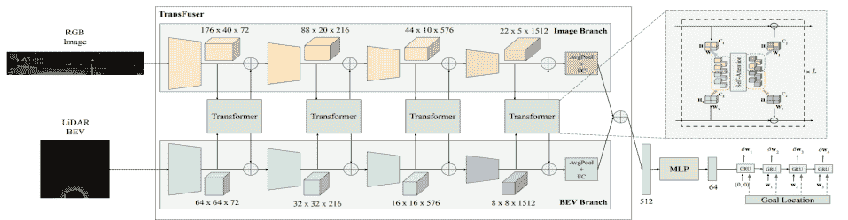

<!--yml

类别：未分类

日期：2024-09-06 19:38:11

-->

# [2307.04370] 使用深度学习的端到端自动驾驶的最新进展：一项综述

> 来源：[`ar5iv.labs.arxiv.org/html/2307.04370`](https://ar5iv.labs.arxiv.org/html/2307.04370)

[type=editor, auid=000,bioid=1, prefix=, orcid=0000-0003-4930-3937]

1]组织=印度理工学院鲁尔基计算机科学与工程系，城市=鲁尔基，州=乌塔拉坎德，国家=印度

[type=editor, auid=000,bioid=1, prefix=, orcid=0000-0003-1001-2219]

\cormark

[1]

\cortext

[cor1]通讯作者：Pravendra Singh

# 使用深度学习的端到端自动驾驶的最新进展：一项综述

Pranav Singh Chib [    Pravendra Singh pravendra.singh@cs.iitr.ac.in

###### 摘要

端到端驾驶是一种有前景的范式，因为它绕过了模块化系统所固有的缺陷，如其复杂性和错误传播的倾向。自动驾驶超越了传统的交通模式，通过主动提前识别关键事件，确保乘客安全，并在高度随机和多变的交通环境中提供舒适的运输。本论文对端到端自动驾驶系统进行了全面的综述。它提供了一个自动化驾驶任务的分类法，其中神经网络以端到端的方式应用，涵盖了从感知到控制的整个驾驶过程。分析了端到端自动驾驶的最新发展，并根据基本原理、方法论和核心功能对研究进行了分类。这些类别包括感知输入、主要和辅助输出、从模仿到强化学习的学习方法以及模型评估技术。调查中详细讨论了可解释性和安全性方面。此外，还评估了最新的进展，识别了挑战，并探索了未来的可能性。我们在此[链接](https://github.com/Pranav-chib/End-to-End-Autonomous-Driving)维护最新的进展及其开源实现。

###### 关键词：

自动驾驶 \sep 端到端驾驶 \sep 深度学习 \sep 深度神经网络

## 1 引言

自动驾驶是指车辆在部分或完全没有人工干预的情况下驾驶的能力。模块化架构[1, 2, 3, 4, 5] 是自动驾驶系统中广泛使用的一种方法，它将驾驶流程划分为离散的子任务。这种架构依赖于各个传感器和算法来处理数据并生成控制输出。它包括相互关联的模块，如感知、规划和控制。然而，模块化架构存在一些缺陷，阻碍了自动驾驶（AD）的进一步发展。其中一个主要的限制是其易受错误传播的影响。例如，自驾车感知模块中的错误，如误分类，可能会传播到随后的规划和控制模块，从而导致不安全的行为。此外，管理互连模块的复杂性和每个阶段数据处理的计算效率低下，也带来了与模块化方法相关的额外挑战。为了解决这些问题，出现了一种称为端到端驾驶的替代方法[6, 7, 8, 9, 10, 11]。这种方法旨在克服模块化架构的局限性。

图 1：Web of Science 数据库中包含关键词“End-to-End”和“Autonomous Driving”的文章数量，从 2014 年到 2022 年，显示了研究界不断增长的趋势。

端到端方法通过将感官输入直接映射到控制输出，简化了系统，提高了效率和鲁棒性。端到端自动驾驶的好处在研究界引起了显著关注，如图 1 所示。首先，端到端驾驶解决了误差传播的问题，因为它涉及一个单一的学习任务管道[12, 13]，该管道学习任务特定的特征，从而减少了误差传播的可能性。其次，端到端驾驶提供了计算优势。模块化管道通常涉及冗余计算，因为每个模块都是针对任务特定的输出进行训练的[4, 5]。这导致了不必要和延长的计算。相比之下，端到端驾驶专注于生成控制信号的特定任务，减少了不必要的计算，并简化了整体过程。端到端模型以前被认为是“黑箱”，缺乏透明性。然而，近期的方法通过生成辅助输出[7, 13]、注意力图[14, 15, 16, 9, 17, 18]和可解释的图[18, 19, 8, 20, 12, 21]，提高了端到端模型的可解释性。这种增强的可解释性提供了对错误根本原因和模型决策的洞察。此外，端到端驾驶展示了对对抗攻击的抵抗力。对抗攻击[22]涉及操控传感器输入，以欺骗或混淆自动驾驶系统。在端到端模型中，识别和操控特定驾驶行为触发点是具有挑战性的，因为具体的驾驶模式的触发原因是不明确的。最后，端到端驾驶具有训练的便利性。模块化管道需要对每个任务驱动模块进行单独的训练和优化，这需要领域特定的知识和专业技能。相比之下，端到端模型可以直接从原始传感器数据中学习相关特征和模式[23, 24]，减少了对广泛工程和专业知识的需求。

图 2：这些图表展示了本调查中论文的统计数据，按学习方法（第六部分）、用于训练的环境（第十部分、第十一部分）、输入模态（第四部分）和输出模态（第五部分）进行分类。

相关调查：虽然有许多相关调查，但它们的重点与我们的不同。作者 Yurtsever 等人[25]主要关注于模块化方法的自动驾驶领域。一些早期的调查集中在特定的学习技术上，例如模仿学习[26]和强化学习[27]。一些端到端的调查，包括 Tampuu 等人的工作[28]，提供了完整端到端驾驶管线的架构概述。最近，Chen 等人[29]在他们的调查中讨论了端到端自动驾驶的方法论和挑战。然而，我们的重点是最新的进展，包括模态、学习原理、安全性、可解释性和评估（见表格 LABEL:literature）。

动机与贡献：端到端架构显著提升了自动驾驶系统的性能。如前所述，这些架构克服了模块化方法的局限。受到这些发展的激励，我们呈现了一项关于端到端自动驾驶最新进展的调查。本文的主要贡献有三方面。首先，本调查专门探讨了使用深度学习的端到端自动驾驶。我们提供了对基础原理、方法论和功能的全面分析，深入探讨了该领域最新的前沿进展。第二，我们在模态、学习、安全性、可解释性和结果方面进行了详细调查，并在表格 LABEL:literature 中提供了定量总结。第三，我们基于开放和闭环评估提出了评估框架，并编制了可用数据集和模拟器的总结列表。

论文组织：本调查按基础原则和方法组织（参见图 2）。在第二部分中，我们介绍了模块化系统的背景。第三部分提供了端到端自动驾驶管道架构的概述。接下来是第 4 和 5 节，讨论了端到端系统的输入和输出模式。第六部分全面涵盖了端到端学习方法，从模仿学习到强化学习。领域适应在第七部分中进行了解释。接下来，我们在第八部分中探讨端到端方法的安全性方面。第九部分讨论了解释性和可解释性的重要性。端到端系统的评估包括开放和闭环评估，这些内容在第十部分中进行了讨论。相关数据集和模拟器在第十一部分中进行了介绍。最后，第 12 和 13 节分别提供了未来研究方向和结论。

## 2 模块化系统架构

模块化管道[30, 31, 32, 2, 3, 33, 34]首先将原始传感数据输入感知模块，以进行障碍物检测和通过定位模块定位，然后进行规划和预测，以获得车辆的最佳和安全轨迹。最后，电机控制器输出控制信号。模块化驾驶管道的标准模块如下：

### 2.1 模块化管道的组件

##### 感知：

感知模块力求更好地理解场景[32]。它建立在物体检测和车道检测等算法之上。感知模块负责传感器融合、信息提取，并充当低级传感器输入与高级决策模块之间的中介。它融合异质传感器以捕捉和概括环境。感知模块的主要任务包括：（i）物体检测 （ii）物体跟踪 （iii）道路和车道检测

图 3：感知模块接收并处理各种原始传感器输入，然后由定位和映射模块使用。

##### 定位与映射：

定位是下一个重要模块，它负责确定自我车辆的位置以及相应的道路代理[35]。这对准确定位车辆并在各种交通场景中实现安全操作至关重要。定位模块的最终产品是准确的地图。一些定位技术包括高清地图（HD map）和同时定位与地图构建（SLAM），它们作为在线地图并在不同时间戳本地化交通代理。定位映射还可以进一步用于驾驶策略和控制命令。

##### 规划与驾驶策略：

规划与驾驶策略模块[36]负责计算运动级命令，根据前一模块提供的定位地图确定控制信号。它根据过去的交通模式预测最佳未来轨迹[37]。轨迹预测技术的分类如下：

+   •

    基于物理的方法：这些方法适用于可以通过运动学或动力学模型准确描述的车辆运动。它们可以快速模拟各种场景，计算成本低。

+   •

    经典机器学习方法：与基于物理的方法相比，这类方法能够考虑更多变量，提供合理的准确性，并具有更长的预测跨度，但计算成本更高。大多数这些技术使用历史运动数据来估计未来轨迹。

+   •

    基于深度学习的方法：深度学习算法在更广泛的预测范围内能够提供可靠的预测。相比之下，标准的轨迹预测方法仅适用于基本场景和短期预测。深度学习系统能够在更广的时间范围内做出准确预测。如表 2 所示，深度学习利用 RNN、CNN、GNN 等网络进行特征提取、计算交互强度，并整合地图信息。

+   •

    基于强化学习的方法：这些方法旨在模拟人们如何做出决策，通过研究专家示范来学习奖励函数，从而生成最佳驾驶策略。然而，大多数这些技术计算成本较高。

表 1: 不同驾驶策略方法的性能：PB（基于物理）、CML（经典机器学习）、DL（深度学习）、RL（强化学习）。

| 技术 | 准确性 | 计算成本 | 预测距离 |
| --- | --- | --- | --- |
| PB | 中等 | 低 | 短 |
| CML | 低 | 中等 | 中等 |
| DL | 高精度 | 高 | 广 |
| RL | 高精度 | 高 | 广 |

表 2: 利用不同主干网络进行运动预测的深度学习方法总结。

| 方法 | 细节 | 分类 |
| --- | --- | --- |

&#124; 代理和上下文 &#124;

&#124; 编码器 &#124;

| 上下文编码器 | 解码器 |
| --- | --- |
| CoverNet [38] |

&#124; 公式化 &#124;

&#124; 分类问题 &#124;

&#124; 在多样化轨迹集上 &#124;

| CNN | CNN | CNN |
| --- | --- | --- |

&#124; 轨迹集 &#124;

&#124; 生成器 &#124;

|

| HOME [39] |
| --- |

&#124; 输出 &#124;

&#124; 2D 顶视图表示 &#124;

&#124; 代理可能的未来 &#124;

| CNN | CNN,GRU | CNN | CNN |
| --- | --- | --- | --- |
| TPCN [40] |

&#124; 轨迹预测的分割 &#124;

&#124; 在时间和 &#124;

&#124; 空间维度 &#124;

| CNN | PointNET ++ | PointNET++ |
| --- | --- | --- |

&#124; 位移 &#124;

&#124; 预测 &#124;

|

|

&#124; MHA-JAM &#124;

&#124; [41] &#124;

|

&#124; 使用注意力头 &#124;

&#124; 生成不同的 &#124;

&#124; 未来轨迹 &#124;

&#124; 同时处理多模态性 &#124;

| 注意力 | LSTM | CNN | LSTM |
| --- | --- | --- | --- |

|

&#124; MMTransformer &#124;

&#124; [42] &#124;

|

&#124; 网络架构 &#124;

&#124; 基于堆叠 &#124;

&#124; transformer 建模 &#124;

&#124; 特征多模态性 &#124;

| Attention | Transformer | VectorNet | MLP |
| --- | --- | --- | --- |
| DenseTNT [43] |

&#124; 这是一个无锚点模型，其 &#124;

&#124; 直接输出自 &#124;

&#124; 密集目标候选 &#124;

| GNN | VectorNet | VectorNet |
| --- | --- | --- |

&#124; 目标基础 &#124;

&#124; 多轨迹 &#124;

&#124; 预测 &#124;

|

| TS-GAN [44] |
| --- |

&#124; 协作学习 &#124;

&#124; 和 GAN 用于建模 &#124;

&#124; 运动行为 &#124;

|

&#124; 生成式 &#124;

&#124; 模型 &#124;

| LSTM | - | LSTM |
| --- | --- | --- |
| PRIME [44] |

&#124; 利用模型生成器和 &#124;

&#124; 基于学习的评估器 &#124;

|

&#124; 生成式 &#124;

&#124; 模型 &#124;

| CNN,LSTM | LSTM |
| --- | --- |

&#124; 基于模型的 &#124;

&#124; 生成器 &#124;

|

|

&#124; MotionDiff &#124;

&#124; [45] &#124;

|

&#124; 基于扩散概率的 &#124;

&#124; 运动学模型以扩散 &#124;

&#124; 原始状态到 &#124;

&#124; 噪声分布 &#124;

| CNN |
| --- |

&#124; 空间 &#124;

&#124; transformer, &#124;

&#124; GRU &#124;

|

&#124; 空间 &#124;

&#124; transformer, &#124;

&#124; GRU &#124;

| MLP |
| --- |
| ScePT [10] |

&#124; 策略规划 &#124;

&#124; 基于轨迹预测的 &#124;

&#124; 精确的运动规划。&#124;

| GNN | LSTM | CNN | GRU, PonitNET |
| --- | --- | --- | --- |

##### 控制：

运动规划器生成轨迹，随后由障碍物子系统更新，并发送到控制器子系统。计算出的命令被发送到驱动组件的执行器，包括油门、刹车和方向盘，以跟随所需的轨迹，这些轨迹在实际场景中经过优化，更加安全。比例积分微分（PID）[5] 和模型预测控制（MPC）[4] 是用于生成上述控制信号的一些控制器。

### 2.2 模块化管道的输入和输出模式

每个模块的输出模式被设计为与管道中后续模块的输入模式兼容，以确保信息在模块化系统中正确传播。

##### 感知数据：

在这个层级（图 3），从嵌入式多传感器阵列中提取原始数据，对其进行过滤和处理，以进行语义映射。LiDAR、RADAR、相机、GPS 和里程表是感知堆栈的一些传感器输入。LiDAR 和 RADAR 用于深度分析，而相机用于检测。INU、GPS 和里程表传感器捕捉并映射车辆的位置、状态和相应环境，这些数据可以在决策级别阶段进一步利用。

##### 输入到映射和定位：

定位旨在估计每个时间戳下车辆的位置。利用感知模块的信息，基于位置、方向、姿态、速度和加速度等参数来映射车辆的位置和环境。定位技术 [3] 允许整合多个对象并识别其关系，从而获得更全面、增强和丰富的表示。

如图 4 所示，我们定义 $X_{t}$ 为时间 $t$ 下的车辆位置估计值，$M$ 为环境地图。这些变量可以使用控制输入 $C_{t}$ 来估计，这些控制输入通常来自轮编码器或能够估计车辆位移的传感器。传感器读取的测量值用 $S_{t}$ 表示，用于辅助估计车辆的姿态。

图 4：定位中时间相关性的可视化，这些相关性可以用于识别特定行为并预测未来位置。

##### 路径规划和决策模块的输入：

路径规划通常分为局部路径规划器和全局路径规划器。局部规划器的目的是执行全局路径规划器设定的目标。它负责寻找避开障碍物并满足优化要求的轨迹，且这些轨迹位于车辆的操作空间内。

局部轨迹预测问题可以表述为在给定情境下，根据各种交通参与者（$R^{t}$）的当前和过去状态（$t_{h}$）来估计未来状态（$t_{f}$）。交通参与者的状态包括在不同时间戳的历史轨迹的车辆或行人。

|  | $Input=\{R^{1},R^{2},R^{3},R^{3}.\;.\;.\;.\;.\;.,R^{t_{h}}\}$ |  | (1) |
| --- | --- | --- | --- |

其中，$R^{t}$ 包含每个时间戳 $t$ 下不同交通参与者的坐标（最多到 $h$ 个过去的时间戳）。

|  | $R^{t}=\{x_{0}^{t},y_{0}^{t},x_{1}^{t},y_{1}^{t}\;.\;.\;.\;x_{n}^{t},y_{n}^{t}\}$ |  | (2) |
| --- | --- | --- | --- |

其中，$n$ 表示由自车检测到的所有交通车辆；($x_{i}^{t},y_{i}^{t}$) 是车辆在 $t$ 时间戳下的坐标。$X$ 是路径规划模块的输入，而车辆轨迹 $Y$ 是从模型中预测出的未来时间戳 $t_{f}$ 下的轨迹。

|  | $Y=\left\{R^{t_{h}+1},R^{t_{h}+2},R^{t_{h}+3}\cdot\cdot\cdot R^{t_{h}+t_{f}}\right\}$ |  | (3) |
| --- | --- | --- | --- |

##### 控制模块的输入：

控制器接收的轨迹命令主要有两种形式：（i）作为一系列命令（$T_{c}$）和（ii）作为一系列状态（$T_{s}$）。接收$T_{s}$轨迹的控制器子系统可以归类为路径跟踪技术，而接收$T_{c}$轨迹的则可以归类为直接硬件驱动控制方法。

+   •

    直接硬件驱动控制方法：比例积分微分（PID）[5] 控制系统是一种常用的自驾车硬件驱动技术。它涉及确定所需的硬件输入以及一个误差测量值，以衡量输出与期望结果的偏差程度。

+   •

    路径跟踪方法：模型预测控制（MPC）[4] 是一种路径跟踪方法，它涉及选择控制命令输入，以获得期望的硬件输出，然后使用汽车的运动模型在未来预测范围内对这些输出进行模拟和优化。

## 3 端到端系统架构

通常，模块化系统被称为中介范式，并构建为离散组件的管道（图 5")，这些组件连接感知输入和运动输出。模块化系统的核心过程包括感知、定位、映射、规划和车辆控制[1]。模块化管道首先将原始传感数据输入到感知模块中进行障碍物检测[46] 和通过定位模块进行定位[3]。接下来是规划和预测[44]，以确定车辆的最佳安全轨迹。最后，电动机控制器生成安全操控的指令。

另一方面，直接感知或端到端驾驶直接从传感器输入生成自我运动。它通过绕过与感知和规划相关的子任务来优化驾驶管道（图 5），实现类似于人类的持续学习以感知和行动。端到端驾驶的首次尝试由 Pomerleau Alvinn [47]进行，它训练了一个 3 层的传感器运动完全连接网络来输出汽车的方向。端到端驾驶基于传感器输入生成自我运动，输入可以是各种模态。然而，主要的输入包括摄像头 [48, 49, 50]，激光雷达（LiDAR） [6, 10, 7]，导航命令 [51, 49, 23]，以及车辆动态，如速度 [52, 53, 50]。这些传感器信息被用作骨干模型的输入，骨干模型负责生成控制信号。自我运动可以涉及不同类型的运动，如加速、转向、操控和踏板。此外，许多模型还输出额外的信息，如安全机动的代价图、可解释的输出和其他辅助输出。

图 5：端到端与模块化管道的比较。端到端是一个单一的管道，直接从感知输入生成控制信号，而模块化管道由各种子模块组成，每个子模块具有特定任务的功能。

端到端驾驶有两种主要方法：一种是通过强化学习（RL）[54, 53, 55, 56, 21, 57] 探索和改进驾驶模型，另一种是使用模仿学习（IL）[18, 6, 19, 15, 17, 58, 7] 以监督的方式训练模型，使其模拟人类驾驶行为。监督学习范式旨在通过专家示范来学习驾驶风格，这些示范作为模型的训练示例。然而，基于 IL [23] 扩展自动驾驶系统具有挑战性，因为在学习阶段不可能覆盖所有实例。另一方面，RL 通过与环境互动来最大化累积奖励 [59, 55]，网络根据其行为做出驾驶决策以获取奖励或处罚。虽然 RL 模型训练是在在线进行的，并且允许在训练期间探索环境，但与模仿学习相比，它在数据利用方面的效果较差。表格 LABEL:literature 总结了端到端驾驶中的最新方法。

## 4 输入方式在端到端系统中的应用

以下部分探讨了实现端到端自动驾驶所必需的输入方式。这些方式包括用于视觉洞察的摄像头、用于精确 3D 点云的激光雷达、多模态输入以及导航输入。图 6 说明了一些输入和输出方式。

### 4.1 摄像头

基于相机的方法 [14, 9, 6, 23, 49, 60, 50, 53, 12, 13] 在端到端驾驶中显示出良好的前景。例如，Toromanoff 等人 [53] 通过使用基于视觉的方法在城市环境中赢得了 CARLA 2019 自动驾驶挑战赛，展示了他们的能力。使用单目 [13, 11, 61, 53] 和立体视觉 [58, 17, 15] 相机视图是图像到控制的端到端驾驶的自然输入方式。Xiao 等人 [62] 采用了来自前视相机的单目 RGB 图像和车辆速度作为输入。Chen 等人 LAV [10] 仅使用相机图像输入，如图 6(d) 所示。Wu 等人 [15]、Xiao 等人 [17] 和 Zhang 等人 [58] 采用仅相机的模式，通过模仿学习生成车道跟随、转弯、停车和直行的高级指令。

### 4.2 LiDAR

自驾车中另一个重要的输入来源是光学雷达（LiDAR）传感器。LiDAR [63, 64, 65, 20] 对光照条件具有很强的抵抗力，并提供准确的距离估算。与其他感知传感器相比，LiDAR 数据是最丰富的，提供了最全面的空间信息。它利用激光光线检测距离并生成点云（PointClouds），这是空间的三维表示，每个点包括反射传感器激光束的表面的 $(x,y,z)$ 坐标。在定位车辆时，生成里程测量是至关重要的。许多技术利用 LiDAR 进行鸟瞰视图（BEV） [9, 19, 16]、高清地图（HD map） [20, 66] 和同时定位与地图构建（SLAM） [67]。Shenoi 等人 [68] 证明通过 LiDAR 添加深度和语义有潜力提升驾驶性能。Liang 等人 [69, 70] 采用点流（point flow）以端到端的方式学习驾驶策略。

### 4.3 多模态

多模态 [8, 18, 10, 16, 71] 在关键感知任务中优于单一模态，尤其适合于自动驾驶应用，因为它结合了多传感器数据。根据何时组合多传感器信息，有三种广泛的分类。在早期融合中，传感器数据在输入到可学习的端到端系统之前被结合。正如图 6(d)所示，Chen 等人[10] 使用了一个接受 (RGB + Depth) 通道输入的网络，Xiao 等人[62] 的模型也输入了相同的模态。该网络仅修改了第一个卷积层以适应额外的输入通道，而其余网络保持不变。Renz 等人[18] 使用变压器编码器融合对象级输入表示。作者将一组对象合并表示为车辆和路线段。

在中期融合中，信息融合是在某些预处理阶段之后或在某些特征提取之后进行的。Zhou 等人[72] 通过利用鸟瞰图（BEV）和激光雷达点云的透视视图提供的互补信息，在中级别执行信息融合。正如图 6(a)所示，Transfuser [7] 解决了使用自注意力层集成图像和激光雷达模态的问题。他们利用了多个变压器模块在多个分辨率下融合中间特征。得到的特征向量形成了一个简明的表示，然后由一个 MLP 处理，再传递给自回归路线点预测网络。在晚期融合中，输入分别处理，然后其输出被融合并由另一层进一步处理。一些作者[73, 69, 70, 62] 使用了晚期融合架构来处理激光雷达和视觉模态，其中每个输入流被单独编码并进行拼接。

### 4.4 导航输入

End-to-End 导航输入可以来源于路线规划器[8, 14, 74]和导航命令[48, 75, 76, 77]。路线由全局规划器[14]提供的 GPS 坐标中的一系列离散终点位置定义。TCP 模型[13]如图 c 所示，提供了相关的导航指令，如车道保持、左/右转和目的地。这些信息用于生成控制动作。

Shao 等人[8]提出了一种技术，该技术通过这些稀疏的目的地位置来指导驾驶，而不是明确地定义离散的导航指令。PlanT[18]利用基于目标位置输入的点对点导航。FlowDriveNet[78]考虑了全局规划器的离散导航指令和导航目标的坐标。Hubschneider 等人[75]在驾驶模型中包括了一个转向指示器命令，而 Codevilla 等人[76]则利用 CNN 块处理特定的导航任务，另一个块处理子集导航。除了上述输入外，End-to-End 模型还整合了车辆动态，例如自车速度[52, 49, 53, 12]。

## 5 End-to-End 系统中的输出模式

通常，End-to-End 自动驾驶系统输出控制命令、航点或轨迹。此外，它还可能生成额外的表示，例如成本地图和辅助输出。

### 5.1 航点

预测未来的航点是一种更高级的输出模式。一些作者[10, 6, 7, 79]使用自回归航点网络来预测差分航点。轨迹[8, 74, 80, 13, 19]也可以表示坐标框架中的航点序列。网络输出的航点通过模型预测控制（MPC）[4]和比例积分微分（PID）[5]转换为低级别的转向和加速。纵向控制器考虑了连续时间步航点之间向量的加权平均值的大小，而横向控制器考虑它们的方向。理想的航点[53]依赖于期望的速度、位置和旋转。

|  |
| --- |
| (a) 融合变换器 |
|  |
| b) NEAT |
|  |
| (c) TCP |
|  |
| (d) LAV |
|  |
| (e) UniAD |
|  |
| (f) ST-P3 |

图 6：各种端到端模型的输入输出表示：（a）考虑 RGB 图像和 LiDAR BEV 表示作为多模态融合变换器[7]的输入，并预测差分自车路标。（b）NEAT[12]输入图像块和速度特征，以获得由 PID 控制器用于驾驶的每个时间步的路标。（c）TCP[13]接收输入图像 i、导航信息 g、当前速度 v，生成由轨迹分支和控制分支指导的控制动作。（d）LAV[10]使用仅图像输入并预测用于刹车和处理交通标志和障碍物的多模态未来轨迹。（e）UniAD[9]生成注意力掩码可视化，显示对目标车道以及让行给自车的关键代理的关注程度。（f）ST-P3[20]从预测模块输出子成本图（颜色越深表示成本值越小）。通过结合占用概率场和利用已有知识，成本函数有效平衡了最终轨迹的安全考虑。

需要最小化横向距离和角度以最大化奖励（或最小化偏差）。使用路标作为输出的好处在于它们不受车辆几何形状的影响。此外，路标更容易被控制器分析以生成控制命令，如转向。连续形式的路标可以转化为特定的轨迹。Zhang et al.[54]和 Zhou et al.[74]利用运动规划器生成一系列描述未来轨迹的路标。LAV[10]预测所有检测到的车辆（包括自车）的多模态未来轨迹（图 6(d)）。他们使用未来的路标来表示运动计划。

### 5.2 成本函数

车辆的安全操控可能有许多轨迹和路径点。成本 [20, 81, 56, 21, 80, 82] 用于在这些可能性中选择最佳方案。它根据最终用户定义的参数（如安全性、行驶距离、舒适度等）给每个轨迹分配一个权重（正分或负分）。Rhinehart 等 [83] 和 Chen 等 [10] 使用预测一致性图更新测试时的知识，并通过集成专家似然模型评估轨迹。Prakash 等 [14] 利用对象级别表示分析无碰撞路径。Zeng 等 [84] 使用神经运动规划器，通过成本体积预测未来轨迹。Hu 等 [20] 使用图 6(f) 所示的成本函数，利用学习到的占用概率场（由分割图表示）和交通规则等先验知识，选择成本最低的轨迹。关于安全成本函数，赵等 [50], 陈等 [85] 和邵等 [8] 使用安全图分析安全集内的操作，提供有关危险驾驶情况的因果洞察。

|  |
| --- |

图 7：车辆操控由转向角度、油门和刹车三元组表示，这取决于高级路线导航命令（例如，左转、右转、直行、继续）以及感知数据（例如，RGB 图像）和车辆状态测量（例如，速度）。这些输入指导车辆采取具体的操作，使其通过条件模仿学习 [62] 有效地导航环境。

### 5.3 直接控制与加速

大多数端到端模型 [83, 74, 53, 48, 23, 75, 76, 77, 48] 在特定时间戳提供转向角度和速度作为输出。输出控制需要根据车辆的动态进行校准，以确定适当的转向角度和为在可测量距离内停车所需的刹车。

### 5.4 辅助输出

辅助输出可以为模型的操作和驾驶动作的确定提供额外的信息。几种类型的辅助输出包括分割图 [9, 7]（图 6(e)），BEV 图 [12, 9, 19, 16]，未来占用情况 [18, 9, 84, 82]（图 6(e)），以及可解释的特征图 [18, 8, 7, 20, 12, 81]（图 6(b)(f)）。这些输出为端到端管道提供了额外的功能，帮助模型学习更好的表示。辅助输出还便利了对模型行为的解释 [7, 82]，因为可以理解信息并推断模型决策背后的原因。

## 6 端到端系统的学习方法

接下来的章节讨论了端到端驾驶中的各种学习方法，包括模仿学习和强化学习。

### 6.1 模仿学习

模仿学习（IL）[10, 18, 13, 14, 86] 基于从专家演示中学习的原理。这些演示训练系统在各种驾驶场景中模仿专家的行为。大规模的专家驾驶数据集随时可用，模仿学习 [62] 可以利用这些数据集训练出达到类似人类标准的模型。

主要目标是训练一个策略 $\pi_{\theta}(s)$，使其尽可能接近给定的专家策略 $\pi^{*}$，将每个给定状态映射到相应的动作（图 7），前提是有一个包含状态动作对 $\left(s,a\right)$ 的专家数据集。

|  | $\arg\min_{\theta}E_{s}\sim_{P(s\mid\theta)}L(\pi^{*}(s),\pi_{\theta}(s))$ |  | (4) |
| --- | --- | --- | --- |

其中 $P(s\mid\theta)$ 表示训练策略 $\pi_{\theta}$ 的状态分布。

行为克隆（BC）、直接策略学习（DPL）和逆向强化学习（IRL）是自主驾驶领域模仿学习的扩展。

#### 6.1.1 行为克隆

行为克隆 [87, 7, 13, 12, 49, 23, 88] 是一种监督模仿学习任务，目标是将专家分布中的每个状态-动作组合视为独立同分布（I.I.D）示例，并最小化训练策略的模仿损失：

|  | $\arg\min_{\theta}E_{(s,a^{*})}\sim_{P^{*}}L(a^{*},\pi_{\theta}(s))$ |  | (5) |
| --- | --- | --- | --- |

其中 $p^{*}(s\mid\pi^{*})$ 是专家策略状态分布，(状态 s，动作 $a^{*}$) 由专家策略 $p^{*}$ 提供。

图 8：行为克隆 [49] 是一种从感知到动作的驾驶模型，用于学习各种驾驶场景的行为反射。该智能体能够以上下文相关和任务优化的方式整合专家策略，从而自信地进行驾驶。

Prakash 等人 [14]、Chitta 等人 [7]、NEAT [12]、Ohn 等人 [49] 使用了一种将输入帧映射到低级控制信号（例如路标点）的策略。这些路标点随后被输入到 PID 控制器中，以根据预测的路标点获得转向、油门和刹车命令。行为克隆 [49] 假设专家的动作可以通过观察完全解释，因为它训练了一个模型，以便直接从输入映射到输出，基于训练数据集（图 8）。然而，这会导致分布漂移问题，即实际观察与训练观察之间的差异。许多潜在变量影响并支配现实世界场景中的驾驶智能体的行为。因此，有效学习这些变量至关重要。

#### 6.1.2 直接策略学习

在行为克隆（BC）的背景下，它将传感器输入映射到控制命令，并受到训练数据集的限制，DLP 旨在直接学习一个最优策略 [48]，将输入映射到驾驶动作。DLP 算法在运行时获取专家评估 [56] 以收集更多训练数据，特别是对于初始策略不足的场景。它结合了专家数据集和模仿学习进行初步训练，并通过训练策略收集的额外轨迹迭代增加数据集。该智能体可以探索周围环境，发现新颖且高效的驾驶策略。

在线模仿学习算法 DAGGER [89] 提供了对级联错误的鲁棒性，并积累了额外的训练实例。陈等人 [10] 引入了自动化的 dagger-like 监控，其中通过在线学习收集特权代理的监督，并转化为提供在政策监督的代理。然而，直接政策学习的主要缺点是训练过程中持续需要专家的访问，这既昂贵又低效。

#### 6.1.3 逆强化学习

逆强化学习（IRL）[90, 48] 旨在通过奖励函数推断潜在的具体行为。专家演示 $D=\left\{\zeta_{1},\zeta_{2},\zeta_{3},......,\zeta_{n}\right\}$ 被输入到 IRL 中。每个 $\zeta_{i}=\left\{(s_{1},a_{2}),(s_{2},a_{2}),.....(s_{n},a_{n})\right\}$ 由状态-行动对组成。主要目标是获得潜在的奖励，这些奖励可以用来复制专家行为。基于特征的 IRL [91] 在高速公路场景中教授不同的驾驶风格。人类提供的示例被用来学习不同的奖励函数以及与道路用户互动的能力。最大熵（MaxEnt）逆强化学习 [92] 是基于最大熵原理的基于特征的 IRL 的扩展。这一范式稳健地解决了奖励模糊性并处理了次优化。主要缺点是 IRL 算法运行成本高。它们计算要求高，训练过程中不稳定，并且在较小数据集上可能需要更长时间才能收敛。

|  |
| --- |
| (a) Roach 专家监督 |
|  |
| (b) 人工副驾驶学习 |

图 9：基于 RL 的学习方法用于训练代理以最佳方式驾驶：（a）展示了将 BEV 映射到低级驾驶动作的强化学习专家 [54]；专家还可以为模仿学习代理提供监督。（b）人机互动学习 [55] 允许代理探索环境，在危险场景中，人类专家接管控制并提供安全演示。

### 6.2 强化学习

强化学习（RL）[93, 57, 56, 53] 是解决分布偏移问题的一个有前景的方法。它旨在通过与环境互动来最大化累计奖励[94]，网络根据其行动做出驾驶决策以获得奖励或惩罚。与训练数据集显著不同的新情况，IL 处理起来较为困难，而 RL 对这一问题具有鲁棒性，因为它在给定环境下探索场景。强化学习包括多种模型，包括基于价值的模型如深度 Q 网络（DQN）[95]，基于演员-评论员的模型如深度确定性策略梯度（DDPG）和异步优势演员评论员（A3C）[95]，最大熵模型[92]如软演员评论员（SAC）[96]，以及基于策略的优化方法如信赖域策略优化（TRPO）和近端策略优化（PPO）[97]。

梁等人 [98] 展示了首个有效的用于基于视觉的驾驶管道的 RL 方法，该方法超越了当时的模块化管道。他们的方法基于深度确定性策略梯度（DDPG），这是演员-评论员算法的扩展版本。陈等人 [99] 使用表格 RL 首先学习专家策略，然后使用策略蒸馏在模仿学习方法中学习学生策略。

最近，文献中对人机协作（HITL）方法[100, 55, 56, 54, 14]的关注增加。这些方法基于专家演示提供宝贵指导以实现高奖励策略的前提。几项研究集中于将人类专业知识融入传统 RL 或 IL 模型的训练过程。一个例子是 EGPO [56]，其目标是开发一种由专家指导的策略优化技术，其中专家策略监督学习代理。

HACO [55] 允许代理在确保训练安全的同时探索危险环境。在这种方法中，专家可以介入并指导代理，避免潜在的有害情况或不相关的动作（参见图 9(b)）。另一位强化学习专家 Roach [54] 将鸟瞰图像转换为连续的低级动作（参见图 9(a)）。专家可以为模仿学习或强化学习提供高层次的监督。策略可以通过模仿学习初步教授，然后通过强化学习进行优化，这有助于减少强化学习所需的长时间训练。Jia 等人 [19] 利用从 Roach 中提取的特征来学习真实的动作/轨迹，为他们的研究提供监督。因此，强化学习通过使代理能够主动探索和从环境中学习，提供了应对模仿学习挑战的解决方案。同时也存在相关挑战，如样本低效、探索困难导致的次优行为，以及将学到的策略推广到新场景中的困难。

## 7 从模拟器到现实的学习领域适应

大规模虚拟场景可以在虚拟引擎中构建，从而更容易收集大量数据。然而，虚拟数据和真实世界数据之间仍然存在显著的领域差异，这给创建和实施虚拟数据集带来了挑战。通过利用领域适应原理，我们可以直接从模拟器中提取关键特征，并将从源领域学到的知识转移到目标领域，即准确的真实世界数据。

H-Divergence 框架 [101] 通过对抗性地同时学习领域分类器和检测器来解决视觉和实例层面的领域差距。 Zhang 等人 [102] 提出了一个模拟器-真实交互策略，该策略利用源领域和目标领域之间的差异。作者创建了两个组件以对齐全局和局部差异，并确保它们之间的整体一致性。现实感合成图像随后可用于训练端到端模型。一些技术依赖于引入当前环境障碍物的开放管道。 PlaceNet [103] 将物体放置到图像空间以进行检测和分割操作。 GeoSim [104] 是一种几何感知方法，通过 LiDAR 和高清地图动态插入物体。 DummyNet [105] 是一个基于 GAN 架构的行人增强框架，它以背景图像为输入，并插入对齐一致的行人。一些工作利用虚拟 LiDAR 数据 [106, 107, 108]。Sallab 等人 [106] 在来自 CARLA [109] 的虚拟 LiDAR 点云上进行学习，并利用 CycleGAN 将虚拟领域的风格转移到真实的 KITTI [110] 数据集。Fang 等人 [107] 提出了一个 LiDAR 模拟器，该模拟器

表 3: 端到端自动驾驶中的近期方法

| 论文, 年份 | 环境 | 输入模态 | 输出模态 | 学习 | 评估 | 可解释性 | 安全性 | 结果 | 数据 |
| --- | --- | --- | --- | --- | --- | --- | --- | --- | --- |

|

&#124; PAD [9], &#124;

&#124; 2023 &#124;

| NuScenes |
| --- |

&#124; 6 多摄像头 &#124;

&#124; 图像 &#124;

|

&#124; 分割图, &#124;

&#124; 代理未来轨迹, &#124;

&#124; 未来 &#124;

&#124; 占用 &#124;

|

&#124; 多任务 &#124;

&#124; 学习。 &#124;

|

&#124; 最小 ADE, &#124;

&#124; 最小 FDE, IoU, L2 &#124;

&#124; 误差 &#124;

|

&#124; 通过注意力掩码的实验 &#124;

&#124; 在规划模块中 &#124;

|

&#124; 最低碰撞率, &#124;

&#124; 最低 L2 误差, 安全性 &#124;

&#124; 通过目标规划器提升。 &#124;

|

&#124; L2: 1.65 &#124;

&#124; CR: 0.71 &#124;

|

&#124; 感知训练: 6 轮次 &#124;

&#124; 联合训练: 20 轮次 &#124;

|

|

&#124; ReasonNet [16], &#124;

&#124; 2023 &#124;

| CARLA |
| --- |

&#124; 车辆测量 &#124;

&#124; 导航, &#124;

&#124; LiDAR, RGB &#124;

|

&#124; 转向, 速度, BEV, &#124;

&#124; 刹车 &#124;

| 多任务学习 |
| --- |

&#124; DOS 和 &#124;

&#124; 排行榜 &#124;

| 注意力图 | - |
| --- | --- |

&#124; DS: 79.95 &#124;

&#124; RC: 89.89 &#124;

&#124; IS: 0.89 &#124;

|

&#124; 训练: 2M 帧（八个城镇） &#124;

&#124; 测试: Town05 &#124;

|

|

&#124; 策略预训练 [111], &#124;

&#124; 2023 &#124;

|

&#124; NuScenes, &#124;

&#124; CARLA &#124;

| 摄像头和内参 | 转向, 油门 | 模仿学习 |
| --- | --- | --- |

&#124; 最长 6, &#124;

&#124; 碰撞率 &#124;

|

&#124; 注意力 &#124;

&#124; 激活图 &#124;

|

&#124; 处理情况的 &#124;

&#124; 代理需要停止 &#124;

|

&#124; DS: 47.4$\pm$5.6 &#124;

&#124; RC: 65.05$\pm$5.1 &#124;

&#124; IS: 0.79$\pm$0.08 &#124;

&#124; L2: 3.01, &#124;

&#124; CR: 0.94 &#124;

|

&#124; 列车: 40K &#124;

&#124; (Town01, 03, 04, 06) &#124;

&#124; 测试: 50 条路线 &#124;

|

|

&#124; 深思熟虑 [19], &#124;

&#124; 2023 &#124;

| CARLA | RGB 摄像头, LiDAR |
| --- | --- |

&#124; BEV 特征图, &#124;

&#124; 代理未来轨迹, &#124;

&#124; 控制动作 &#124;

|

&#124; 开环模仿 &#124;

&#124; 学习 &#124;

| 最长 6 |
| --- |

&#124; 通过 &#124;

&#124; 专家 BEV 特征图 &#124;

|

&#124; 安全关键区域, &#124;

&#124; 预测 &#124;

&#124; 未来运动 &#124;

&#124; 避免碰撞 &#124;

|

&#124; DS: 70.9$\pm$3.4 &#124;

&#124; RC: 95.5$\pm$2.6 &#124;

&#124; IS: 0.75$\pm$0.05 &#124;

|

&#124; 训练: 189K 数据在四个城镇, &#124;

&#124; Roach 基础教学 &#124;

|

|

&#124; 扩展基于视觉的 [17], &#124;

&#124; 2023 &#124;

| CARLA | 三个摄像头 (视图) |
| --- | --- |

&#124; 自车的 &#124;

&#124; 转向角度和 &#124;

&#124; 加速度 &#124;

|

&#124; 自监督 &#124;

&#124; 模仿学习 &#124;

|

&#124; NoCrash, &#124;

&#124; 排行榜 &#124;

| 注意力图 |
| --- |

&#124; 行人导致强烈 &#124;

&#124; 刹车 (0.794), &#124;

&#124; 尽管 &#124;

&#124; 绿灯 &#124;

|

&#124; DS: 98$\pm$1.7 &#124;

&#124; RC: 68$\pm$2.7 &#124;

|

&#124; 列车: 15 小时 (540K 帧) &#124;

&#124; 测试: 25 小时 ( 900k 帧) &#124;

|

|

&#124; 教练可教的 [58], &#124;

&#124; 2023 &#124;

| CARLA |
| --- |

&#124; 导航, &#124;

&#124; 3 个 RGB 摄像头 &#124;

|

&#124; 路点, &#124;

&#124; 控制命令 &#124;

|

&#124; 知识 &#124;

&#124; 蒸馏, &#124;

&#124; 模仿学习 &#124;

|

&#124; 最长 6, &#124;

&#124; ADE, FDE &#124;

| - |
| --- |

&#124; 注意安全关键 &#124;

&#124; 实体 &#124;

|

&#124; DS: 73.30$\pm$1.07 &#124;

&#124; RC: 87.44$\pm$0.28 &#124;

&#124; ADE: 0.41 &#124;

&#124; FDE: 0.36 &#124;

| 列车: Town01 - Town06 |
| --- |

|

&#124; 隐藏偏差 [71], &#124;

&#124; 2023 &#124;

| CARLA |
| --- |

&#124; 速度, &#124;

&#124; 摄像头和 &#124;

&#124; LiDAR &#124;

|

&#124; 转向, 油门和刹车, &#124;

&#124; 路点, 路径 &#124;

| 模仿学习 | 最长 6 | - |
| --- | --- | --- |

&#124; 更大的安全距离, &#124;

&#124; 安全区域 &#124;

|

&#124; DS: 72 $\pm$3 &#124;

&#124; RC: 95 $\pm$ 2 &#124;

| 列车: 可变大小 185k 和 555k |
| --- |

|

&#124; KING [6], &#124;

&#124; 2022 &#124;

| CARLA |
| --- |

&#124; 前向 &#124;

&#124; 摄像头和 &#124;

&#124; LiDAR &#124;

| 油门和转向 | 行为克隆 |
| --- | --- |

&#124; 闭环 (CR), &#124;

&#124; (RC), (IS), (DS) &#124;

| - |
| --- |

&#124; 安全关键 &#124;

&#124; 驾驶 &#124;

&#124; 场景和 &#124;

&#124; 压力测试. &#124;

|

&#124; DS: 90.20$\pm$0.00 &#124;

&#124; RC: 94.42$\pm$0.36 &#124;

&#124; IS: 0.96$\pm$0.36 &#124;

|

&#124; 训练: 4 GPU &#124;

&#124; 小时 80 路径 &#124;

&#124; 在 Town 3,4,5,6. &#124;

|

|

&#124; LAV [10], &#124;

&#124; 2022 &#124;

| CARLA |
| --- |

&#124; 前向相机, &#124;

&#124; LiDAR &#124;

|

&#124; 单一转向和 &#124;

&#124; 加速命令 &#124;

|

&#124; 知识 &#124;

&#124; 蒸馏, &#124;

&#124; 模仿学习 &#124;

|

&#124; Longest6 (DS), &#124;

&#124; (RC),(IS), &#124;

&#124; (CR), (PC), &#124;

&#124; (LC), (RV) &#124;

| 空间特征 2D 地图 |
| --- |

&#124; 场景如 &#124;

&#124; 如行人过马路, &#124;

&#124; 车道变化 &#124;

&#124; 被建模 &#124;

|

&#124; DS: 61.85 &#124;

&#124; RC: 94.46 &#124;

&#124; IS: 0.64 &#124;

|

&#124; 训练: 四个城镇, 186K 帧 &#124;

&#124; 测试: Town02 和 Town05 &#124;

|

|

&#124; TransFuse [7], &#124;

&#124; 2022 &#124;

| CARLA |
| --- |

&#124; RGB, &#124;

&#124; LiDAR &#124;

|

&#124; 路径点, 转向, 油门, &#124;

&#124; 和刹车 &#124;

| 行为克隆 |
| --- |

&#124; Longest 6 (DS), &#124;

&#124; (RC), (IPK), (IS) &#124;

|

&#124; 可通过辅助解释 &#124;

&#124; 输出如深度, &#124;

&#124; 语义, HD 地图, &#124;

&#124; 规划 A* &#124;

| 全局安全启发式 |
| --- |

&#124; DS: 61.18 &#124;

&#124; RC: 86.69 &#124;

&#124; IS: 0.71 &#124;

|

&#124; 训练: 2500 路径在八个 &#124;

&#124; 城镇, 228k 帧 &#124;

&#124; 测试: 36 路径 &#124;

|

|

&#124; 学习驾驶 [11], &#124;

&#124; 2022 &#124;

|

&#124; NuScenes, &#124;

&#124; youtube &#124;

| 前向相机 |
| --- |

&#124; 转向, 油门, &#124;

&#124; 刹车, &#124;

&#124; 和速度 &#124;

|

&#124; 条件性 &#124;

&#124; 行为克隆 &#124;

|

&#124; CARLA 基准, &#124;

&#124; F1 指标 &#124;

| - | - |
| --- | --- |

&#124; F1 : 75.0 &#124;

&#124; RC 增加 7% &#124;

|

&#124; 训练: 120 小时 YouTube, &#124;

&#124; 测试: Town01 和 &#124;

&#124; Town02 与 &#124;

&#124; 40K 过渡 &#124;

|

|

&#124; HACO [55], &#124;

&#124; 2022 &#124;

| CARLA |
| --- |

&#124; 当前状态, &#124;

&#124; 导航 &#124;

&#124; 信息 &#124;

|

&#124; 加速, 刹车 &#124;

&#124; 和转向 &#124;

|

&#124; 强化学习 &#124;

&#124; 学习 &#124;

|

&#124; 安全违规 &#124;

&#124; 数据使用, &#124;

&#124; 成功率 &#124;

| - |
| --- |

&#124; 安全违规 &#124;

&#124; 成本为每集 &#124;

|

&#124; SV: 11.84 &#124;

&#124; SR: 0.35 &#124;

|

&#124; 训练: 50 分钟 &#124;

&#124; HACO 训练. &#124;

&#124; 35k 过渡 &#124;

|

|

&#124; PlanT [18], &#124;

&#124; 2022 &#124;

| CARLA |
| --- |

&#124; 相机 , &#124;

&#124; LiDAR, &#124;

&#124; 路径, 物体 &#124;

|

&#124; 路径点, 预测 &#124;

&#124; 未来属性的 &#124;

&#124; 其他车辆 &#124;

|

&#124; 模仿 &#124;

&#124; 学习 &#124;

|

&#124; 最长 6 CARLA &#124;

&#124; (DS)、(RC)，&#124;

&#124; (IS)、(IPK)，&#124;

&#124; (IT) &#124;

|

&#124; 事后解释，&#124;

&#124; 注意力权重用于 &#124;

&#124; 识别相关对象。 &#124;

|

&#124; 碰撞识别 &#124;

&#124; 自由路线，&#124;

&#124; RFDS 算法 &#124;

&#124; 用于碰撞避免 &#124;

|

&#124; DS: 81.36$\pm$6.54 &#124;

&#124; RC: 93.55$\pm$2.62 &#124;

&#124; IS: 0.87$\pm$0.05 &#124;

|

&#124; 训练：在 PlanT 上 3.2 小时，&#124;

&#124; 95 小时的 &#124;

&#124; 驾驶。 &#124;

|

|

&#124; 轨迹引导 [13]，&#124;

&#124; 2022 &#124;

| CARLA |
| --- |

&#124; 单目 &#124;

&#124; 摄像头 &#124;

|

&#124; 转向，&#124;

&#124; 油门和刹车 &#124;

|

&#124; 行为 &#124;

&#124; 克隆 &#124;

|

&#124; CARLA（DS），&#124;

&#124; (RC)，(IS) &#124;

|

&#124; 辅助任务 &#124;

&#124; 包含价值 &#124;

&#124; 和速度头 &#124;

|

&#124; 通过长时间减少碰撞 &#124;

&#124; 预测，&#124;

&#124; 更少的违规，&#124;

&#124; 控制模型表现良好 &#124;

|

&#124; DS: 75.14 &#124;

&#124; RC: 85.63 &#124;

&#124; IS: 0.87 &#124;

|

&#124; 训练：Town01，03，04，06 &#124;

&#124; 测试：Town02，05 &#124;

|

|

&#124; 安全增强 &#124;

&#124; 自动驾驶 &#124;

&#124; 驾驶 [8]，&#124;

&#124; 2022 &#124;

| CARLA |
| --- |

&#124; 3 RGB，&#124;

&#124; 1 个 LiDAR &#124;

|

&#124; 10 个航点，&#124;

&#124; 转向，&#124;

&#124; 加速度 &#124;

| InterFuser |
| --- |

&#124; CARLA 排行榜，&#124;

&#124; CARLA 42 路径 &#124;

&#124; 基准测试，&#124;

&#124; (RC)、(IS)、(DS) &#124;

|

&#124; 中间可解释的 &#124;

&#124; 特征输出来自 &#124;

&#124; 转换器解码器 &#124;

&#124; (安全地图，物体密度) &#124;

|

&#124; 安全集仅包含 &#124;

&#124; 安全动作，安全敏感 &#124;

&#124; 通过 InterFuser 输出 &#124;

|

&#124; DS: 76.18 &#124;

&#124; RC: 88.23 &#124;

&#124; IS: 0.84 &#124;

|

&#124; 训练：3M 帧或 &#124;

&#124; 410 小时（八个城镇） &#124;

|

|

&#124; ST-P3 [20]，&#124;

&#124; 2022 &#124;

|

&#124; NuScenes，&#124;

&#124; CARLA &#124;

|

&#124; 6 个摄像头 (NuScenes)，&#124;

&#124; 4 个摄像头 (CARLA)，&#124;

&#124; 导航命令 &#124;

|

&#124; 转向，&#124;

&#124; 油门和刹车 &#124;

| ST-P3 |
| --- |

&#124; 开放循环：IOU，PQ，&#124;

&#124; RQ，SQ，&#124;

&#124; L2 错误 &#124;

&#124; 关闭：（DS）、（RC） &#124;

|

&#124; 可解释的地图 &#124;

&#124; 车道和 &#124;

&#124; 可驾驶区域 &#124;

|

&#124; 安全成本函数 &#124;

&#124; 对于加速度动作 &#124;

&#124; 惩罚 &#124;

|

&#124; DS: 55.14 &#124;

&#124; RC: 86.74 &#124;

&#124; L2: 2.90，CR: 1.27 &#124;

|

&#124; 训练：26124 个样本 &#124;

&#124; 验证：5719 个样本 &#124;

|

|

&#124; 通过 &#124;

&#124; 专家引导 &#124;

&#124; 策略优化 [56]，&#124;

&#124; 2022 &#124;

| MetaDrive | 摄像头 | 控制信号 |
| --- | --- | --- |

&#124; 专家参与的循环 &#124;

&#124; 强化 &#124;

&#124; 学习 &#124;

| MetaDrive 基准 | - |
| --- | --- |

&#124; 监护人确保 &#124;

&#124; 训练安全性 &#124;

|

&#124; 错误率: 388.37 $\pm$10.01 &#124;

&#124; 误差率: 0.56 $\pm$0.35 &#124;

&#124; 成功率: 0.85 $\pm$0.05 &#124;

|

&#124; 训练: 100 场景 &#124;

&#124; 测试: 50 场景 &#124;

|

|

&#124; COOPERNAUT [88] , &#124;

&#124; 2022 &#124;

| CARLA |
| --- |

&#124; 前视摄像头, &#124;

&#124; 激光雷达 &#124;

| 控制信号 |
| --- |

&#124; 行为 &#124;

&#124; 克隆 &#124;

| AUTOCASTSIM | - |
| --- | --- |

&#124; 减少安全性 &#124;

&#124; 危险 &#124;

&#124; 用于线条检测的 &#124;

&#124; 视觉感知。 &#124;

|

&#124; 成功率: 90.5$\pm$1.2 &#124;

&#124; 复杂度评分: 4.5$\pm$3.1 &#124;

|

&#124; 训练: 12 条轨迹 + 84 条轨迹 &#124;

&#124; 测试: 27 次事故 &#124;

&#124; 容易发生的轨迹 &#124;

|

|

&#124; 人工智能共享 &#124;

&#124; 基于策略的控制 [21], &#124;

&#124; 2022 &#124;

| MetaDrive |
| --- |

&#124; 当前状态, &#124;

&#124; 目标状态 &#124;

| 控制信号 |
| --- |

&#124; 强化学习 &#124;

&#124; 学习 &#124;

|

&#124; MetaDrive 和 &#124;

&#124; Pybullet-A1 &#124;

|

&#124; 可解释的控制 &#124;

&#124; 界面 &#124;

|

&#124; 人工智能, &#124;

&#124; 安全保障 &#124;

&#124; 95 百分比 &#124;

&#124; 成功率 &#124;

|

&#124; 误差率: 0.05 $\pm$0.08 &#124;

&#124; 成功率: 0.95 $\pm$ 0.02 &#124;

|

&#124; 训练: 50 个训练场景 &#124;

&#124; 测试: 20 个测试场景 &#124;

|

|

&#124; MMFN: 多模态 &#124;

&#124; Fusion-Net 参考 [66], &#124;

&#124; 2022 &#124;

| CARLA |
| --- |

&#124; 高清地图和 &#124;

&#124; 雷达安装在 &#124;

&#124; 激光雷达和 &#124;

&#124; 摄像头 &#124;

|

&#124; 转向, &#124;

&#124; 油门和刹车 &#124;

|

&#124; 模仿 &#124;

&#124; 学习 &#124;

|

&#124; CARLA &#124;

&#124; 排行榜 &#124;

| - |
| --- |

&#124; 专家有更多 &#124;

&#124; 对安全的认知 &#124;

&#124; 驾驶 &#124;

|

&#124; 数据集: 22.8 &#124;

&#124; RC: 47.22 &#124;

|

&#124; 训练: 207K 帧 &#124;

&#124; 测试: 20 路线 &#124;

|

|

&#124; CADRE: 一个级联 &#124;

&#124; 深度强化学习 [57], &#124;

&#124; 2022 &#124;

| CARLA |
| --- |

&#124; 前视摄像头, &#124;

&#124; 位置, &#124;

&#124; 定向 &#124;

&#124; 和速度 &#124;

| 控制信号 |
| --- |

&#124; 模仿 &#124;

&#124; 学习 &#124;

|

&#124; CARLA &#124;

&#124; 无碰撞 &#124;

| - | - |
| --- | --- |

&#124; 验证准确率: 81/81 &#124;

&#124; 性能: 76/78 &#124;

|

&#124; 训练: 25 个训练路线 &#124;

&#124; 测试: Town02 &#124;

|

|

&#124; 基于模型的模仿 &#124;

&#124; 学习参考 [112], &#124;

&#124; 2022 &#124;

| CARLA | RGB 图像, 路线 |
| --- | --- |

&#124; 车辆控制, &#124;

&#124; BEV 分割 &#124;

|

&#124; 基于模型的 &#124;

&#124; 模仿学习 &#124;

|

&#124; CARLA &#124;

&#124; 排行榜 &#124;

|

&#124; BEV 语义 &#124;

&#124; 分割用于 &#124;

&#124; 可解释性 &#124;

| - |
| --- |

&#124; 数据集: 61.1 $\pm$ 3.2 &#124;

&#124; RC: 97.4$\pm$ 0.8 &#124;

&#124; 输入分数: 63.0 $\pm$ 3.0 &#124;

|

&#124; 测试: Town05, 路线 &#124;

&#124; 训练：四种不同的训练 &#124;

&#124; 城镇总计 &#124;

&#124; 2.9M 帧。 &#124;

|

|

&#124; LookOut：多样 &#124;

&#124; 多未来 &#124;

&#124; 预测和规划 [80]， &#124;

&#124; 2021 &#124;

|

&#124; ATG4D， &#124;

&#124; Lidarsim &#124;

|

&#124; LiDAR， &#124;

&#124; 导航。 &#124;

|

&#124; 轨迹， &#124;

&#124; 车辆控制 &#124;

| 成本学习 |
| --- |

&#124; 开环：mAP， &#124;

&#124; mSADE， &#124;

&#124; mSADE，PlanASD &#124;

&#124; 闭环：Lidarsim &#124;

| - |
| --- |

&#124; 成本函数包括 &#124;

&#124; 驾驶包括 &#124;

&#124; 安全，舒适， &#124;

&#124; 交通规则。 &#124;

|

&#124; CR: 7.93 &#124;

&#124; 进展：62.65 &#124;

&#124; Jerk: 4.69 &#124;

|

&#124; 训练：一百万帧 &#124;

&#124; 测试：Lidarsim &#124;

|

|

&#124; MP3：统一模型 &#124;

&#124; 到映射、感知， &#124;

&#124; 预测和规划 [82]， &#124;

&#124; 2021 &#124;

| URBANEXPERT |
| --- |

&#124; 原始传感器数据 &#124;

&#124; 以及高级 &#124;

&#124; 命令 &#124;

|

&#124; 控制命令， &#124;

&#124; 动态占用 &#124;

&#124; 场 &#124;

| MP3 |
| --- |

&#124; 闭环：Lidarsim &#124;

&#124; 开环：L2 &#124;

|

&#124; 可解释的成本 &#124;

&#124; 函数，动态 &#124;

&#124; 占用场， &#124;

&#124; 可解释的场景表示 &#124;

|

&#124; 惩罚轨迹 &#124;

&#124; SDV 重叠处 &#124;

&#124; 占用区域，惩罚 &#124;

&#124; Jerk，横向加速度 &#124;

|

&#124; L2：12.95 &#124;

&#124; 碰撞：1037.08 &#124;

&#124; Jerk: 1.64 &#124;

&#124; 成功前：74.39 &#124;

|

&#124; 训练：5000 个场景 &#124;

&#124; 测试：1000 &#124;

|

|

&#124; 对象感知 &#124;

&#124; 正则化 &#124;

&#124; 用于处理因果关系 [113]， &#124;

&#124; 2021 &#124;

| CARLA | RGB 图像 | 控制信号 |
| --- | --- | --- |

&#124; 行为 &#124;

&#124; 克隆 &#124;

|

&#124; Atari 环境， &#124;

&#124; CARLA。 &#124;

| - | 策略安全适应。 |
| --- | --- |

&#124; 直线：87$\pm$4.4 &#124;

&#124; 转向：70.0$\pm$ 7.2 &#124;

&#124; Nav: 35.7$\pm$10.2 &#124;

|

&#124; 训练：150 个演示 &#124;

&#124; 测试：25 条路线 &#124;

|

|

&#124; GRI：通用强化 &#124;

&#124; 模仿及其 &#124;

&#124; 应用于基于视觉的 [100]， &#124;

&#124; 2021 &#124;

| CARLA | 3 RGB 摄像头视角 | 控制信号 |
| --- | --- | --- |

&#124; 离策略 &#124;

&#124; 强化学习 &#124;

&#124; 学习 &#124;

|

&#124; CARLA 排行榜， &#124;

&#124; NoCrash， &#124;

&#124; Mujoco 基准 &#124;

| - | - |
| --- | --- |

&#124; DS: 36.79 &#124;

&#124; RC: 61.85 &#124;

&#124; IS: 0.60 &#124;

|

&#124; 训练：60M 步骤 &#124;

&#124; 测试：12M 和 16M 步骤 &#124;

|

|

&#124; 多模态 &#124;

&#124; 融合 [14]， &#124;

&#124; 2021 &#124;

| CARLA |
| --- |

&#124; 面向前方 &#124;

&#124; 摄像头和 &#124;

&#124; LiDAR &#124;

|

&#124; 4 个航点， &#124;

&#124; 转向，油门， &#124;

&#124; 和刹车 &#124;

|

&#124; 模仿 &#124;

&#124; 学习 &#124;

|

&#124; CARLA &#124;

&#124; 排行榜 &#124;

|

&#124; 注意力图 &#124;

&#124; 可视化 &#124;

|

&#124; 处理对抗性 &#124;

&#124; 城市场景 &#124;

&#124; 驾驶, &#124;

&#124; 例如，困难的转弯。 &#124;

|

&#124; DS: 33.15 $\pm$ 4.04 &#124;

&#124; RC: 56.36 $\pm$ 7.14 &#124;

|

&#124; 训练: 7 个城镇 &#124;

&#124; 测试: Twon05 &#124;

|

|

&#124; 通过学习 &#124;

&#124; 观看 [51], &#124;

&#124; 2021 &#124;

| CARLA |
| --- |

&#124; 速度, &#124;

&#124; 高级 &#124;

&#124; 导航 &#124;

|

&#124; 路径点, &#124;

&#124; 转向, 油门, &#124;

&#124; 和刹车 &#124;

|

&#124; 模仿 &#124;

&#124; 学习 &#124;

|

&#124; CARLA &#124;

&#124; NoCrash &#124;

&#124; 基准 &#124;

| BEV 可视化图 |
| --- |

&#124; 避免不安全的 &#124;

&#124; 操作。 &#124;

|

&#124; NC-R: 92 &#124;

&#124; NC-D: 24 &#124;

&#124; OB: 92 &#124;

|

&#124; 训练: Town 1 &#124;

&#124; 测试: Town 2 &#124;

|

|

&#124; NEAT [12], &#124;

&#124; 2021 &#124;

| CARLA |
| --- |

&#124; RGB 摄像头, &#124;

&#124; 和内在, &#124;

&#124; 位置, 速度 &#124;

|

&#124; 路径点, &#124;

&#124; BEV 作为 &#124;

&#124; 辅助输出 &#124;

|

&#124; 行为 &#124;

&#124; 克隆 &#124;

|

&#124; CARLA &#124;

&#124; 排行榜。 &#124;

&#124; (RC), (IS), (DS) &#124;

|

&#124; NEAT 中间 &#124;

&#124; 表示提供了 &#124;

&#124; 可解释的注意力图 &#124;

|

&#124; 当时最高安全性 &#124;

&#124; 以及其他 &#124;

&#124; CARLA 上的方法。 &#124;

|

&#124; DS: 24.08$\pm$3.30 &#124;

&#124; RC: 59.94$\pm$0.50 &#124;

&#124; IS: 0.49$\pm$0.02 &#124;

|

&#124; 训练: 8 个城镇 &#124;

&#124; 测试: (Town01- &#124;

&#124; Town 06) &#124;

&#124; 100 个秘密路线 &#124;

|

|

&#124; 端到端城市 &#124;

&#124; 驾驶 [54], &#124;

&#124; 2021 &#124;

| CARLA |
| --- |

&#124; 广角相机 &#124;

&#124; 带有 &#124;

&#124; 100 度 &#124;

&#124; 水平视场 &#124;

|

&#124; 转向, &#124;

&#124; 油门和刹车 &#124;

|

&#124; 强化学习 &#124;

&#124; 学习专家, &#124;

&#124; 模仿学习 &#124;

|

&#124; CARLA &#124;

&#124; NoCrash 和 &#124;

&#124; 排行榜 &#124;

| - | - |
| --- | --- |

&#124; DS: 55.27$\pm$1.43 &#124;

&#124; RC: 88.16$\pm$1.52 &#124;

&#124; IS: 0.62$\pm$0.02 &#124;

|

&#124; 离线策略 &#124;

&#124; 数据集 80 轮, &#124;

&#124; 训练: 50 路线 &#124;

&#124; 测试: 26 路线 &#124;

|

|

&#124; 学习驾驶 &#124;

&#124; 来源 [52], &#124;

&#124; 2021 &#124;

| CARLA |
| --- |

&#124; RGB 图像 &#124;

&#124; 和 &#124;

&#124; 速度读数 &#124;

|

&#124; 转向, &#124;

&#124; 油门和 &#124;

&#124; 刹车 &#124;

|

&#124; 强化学习 &#124;

&#124; 学习, 策略 &#124;

&#124; 蒸馏 &#124;

|

&#124; CARLA &#124;

&#124; 排行榜 &#124;

| - |
| --- |

&#124; 动作值 &#124;

&#124; 基于 &#124;

&#124; 当前自车 &#124;

&#124; 状态 &#124;

|

&#124; DS: 17.36$\pm$2.95 &#124;

&#124; RC: 43.46$\pm$2.99 &#124;

&#124; IS: 0.54$\pm$0.06 &#124;

|

&#124; 训练：69 小时 &#124;

&#124; 约 1m 帧 &#124;

&#124; 测试：270K 帧 &#124;

|

|

&#124; 安全局部运动 &#124;

&#124; 规划 &#124;

&#124; 自监督 [63], &#124;

&#124; 2021 &#124;

|

&#124; NuScenes, &#124;

&#124; CARLA &#124;

| LiDAR |
| --- |

&#124; 控制信号, &#124;

&#124; BEV &#124;

|

&#124; 行为 &#124;

&#124; 克隆 &#124;

| CARLA NoCrash |
| --- |

&#124; 以对象为中心 &#124;

&#124; 表示 &#124;

|

&#124; 安全规划器，维持 &#124;

&#124; 广泛的安全边际，避免 &#124;

&#124; 安全关键情境 &#124;

|

&#124; （成功率）&#124;

&#124; NC-E:66 $\pm$ 3 &#124;

&#124; NC-R: 73$\pm$ 1 &#124;

&#124; NC-D: 44 $\pm$ 5 &#124;

|

&#124; 训练：Town 1 &#124;

&#124; 测试：Town 2 &#124;

&#124; 训练：850 场景（NuScenes） &#124;

&#124; 测试：150 场景 &#124;

|

|

&#124; Carl-Lead: 基于激光雷达 &#124;

&#124; 端到端 &#124;

&#124; 自主 [64], &#124;

&#124; 2021 &#124;

| CARLA | LiDAR |
| --- | --- |

&#124; 转向, &#124;

&#124; 油门, 刹车, &#124;

&#124; HD 地图 &#124;

|

&#124; 强化学习 &#124;

&#124; 学习 &#124;

| CARLA NoCrash |
| --- |

&#124; 重要性图 &#124;

&#124; 可视化 &#124;

&#124; 模型预测 &#124;

|

&#124; 碰撞奖励 &#124;

&#124; 对不安全情况的惩罚 &#124;

&#124; 驾驶 &#124;

|

&#124; （成功率）&#124;

&#124; NC-R: 93.50 &#124;

&#124; NC-D: 93.00 &#124;

|

&#124; 训练：677.7K 互动步骤 &#124;

&#124; 测试：14,400 集 &#124;

|

|

&#124; 多功能和 &#124;

&#124; 高效 &#124;

&#124; 强化学习 [93], &#124;

&#124; 2021 &#124;

|

&#124; CARLA, &#124;

&#124; BDD100k &#124;

| RGB 图像 | 控制信号 |
| --- | --- |

&#124; 强化学习 &#124;

&#124; 学习, &#124;

&#124; 模仿学习 &#124;

| CARLA 无缝 |
| --- |

&#124; 可解释 &#124;

&#124; 分割 &#124;

&#124; 地图 &#124;

|

&#124; 移动车辆 &#124;

&#124; 到安全状态 &#124;

|

&#124; MPI (m): 转弯: 7.2, &#124;

&#124; 直线：4.1 &#124;

&#124; SR: 转弯: 53.2 &#124;

&#124; 直线：16.7 &#124;

&#124; 闭环：MPI: &#124;

&#124; RL: 332.6, IL:180.9 &#124;

|

&#124; 训练：28 小时驾驶 &#124;

&#124; 以及 2.5M RL 步骤 &#124;

|

|

&#124; 多任务学习 &#124;

&#124; 带注意力机制 &#124;

&#124; 端到端 [61], &#124;

&#124; 2021 &#124;

| CARLA |
| --- |

&#124; 单目 RGB, &#124;

&#124; 速度 &#124;

|

&#124; 转向, &#124;

&#124; 油门和 &#124;

&#124; 刹车 &#124;

|

&#124; 条件式 &#124;

&#124; 模仿学习, &#124;

&#124; 多任务学习 &#124;

|

&#124; CARLA NoCrash, &#124;

&#124; CoRL2017 &#124;

&#124; 基准 &#124;

| - | - |
| --- | --- |

&#124; 直线：99 $\pm$ 1 &#124;

&#124; 一次转弯：99 $\pm$ 1 &#124;

&#124; NC-E: 81$\pm$ 11 &#124;

&#124; NC-R :67 $\pm$ 9 &#124;

&#124; NC-D:23 $\pm$ 5 &#124;

|

&#124; 训练：Town01 &#124;

&#124; （466,000 帧）&#124;

&#124; 测试：Town02 &#124;

|

|

&#124; 端到端模型- &#124;

&#124; 自由强化学习 [53], &#124;

&#124; 2020 &#124;

| CARLA |
| --- |

&#124; 前向摄像头 &#124;

&#124; 相机, &#124;

&#124; 速度 &#124;

|

&#124; 5 个转向动作, &#124;

&#124; 3 个值用于 &#124;

&#124; 油门, &#124;

&#124; 刹车 &#124;

|

&#124; 强化学习 &#124;

&#124; 学习 &#124;

|

&#124; CARLA &#124;

&#124; NoCrash, &#124;

&#124; LeaderBoard &#124;

|

&#124; 隐式奖赏 &#124;

&#124; 可用性 &#124;

| - |
| --- |

&#124; NC-R: 96 &#124;

&#124; NC-D:70 &#124;

&#124; NC-E: 100 &#124;

|

&#124; 训练: 20M &#124;

&#124; 迭代 Town05 &#124;

&#124; 测试: Town02 &#124;

|

|

&#124; 学习通过 &#124;

&#124; 作弊 [48], &#124;

&#124; 2020 &#124;

| CARLA |
| --- |

&#124; 前向摄像头 &#124;

&#124; 相机, 速度, &#124;

&#124; 导航 &#124;

&#124; 命令 &#124;

|

&#124; 转向, &#124;

&#124; 油门和 &#124;

&#124; 刹车 &#124;

|

&#124; 在线策略 &#124;

&#124; 模仿 &#124;

&#124; 学习 &#124;

|

&#124; CARLA &#124;

&#124; NoCrash &#124;

&#124; 和 &#124;

&#124; LeaderBoard &#124;

| 地图表示 |
| --- |

&#124; 进行一个 &#124;

&#124; 分离 &#124;

&#124; 违规分析 &#124;

|

&#124; NC-E: 100 &#124;

&#124; NC-R: 94$\pm$4 &#124;

&#124; NC-D: 85$\pm$1 &#124;

|

&#124; DAgger 训练. &#124;

&#124; 训练: 157K 帧, &#124;

&#124; 4 小时驾驶 Town1, &#124;

&#124; 测试: Town2 &#124;

|

|

&#124; 学习情境 &#124;

&#124; 驾驶 [49], &#124;

&#124; 2020 &#124;

| CARLA |
| --- |

&#124; 前向摄像头, &#124;

&#124; 速度, 导航 &#124;

&#124; 命令 &#124;

|

&#124; 纵向 &#124;

&#124; 和横向 &#124;

&#124; 控制值 &#124;

|

&#124; 行为 &#124;

&#124; 克隆 &#124;

|

&#124; CARLA &#124;

&#124; NoCrash, &#124;

&#124; LeaderBoard &#124;

|

&#124; 情境特定 &#124;

&#124; 预测可以是 &#124;

&#124; 检查 &#124;

&#124; 在测试时 &#124;

|

&#124; 学习代理以遵守 &#124;

&#124; 对交通规则的 &#124;

&#124; 安全 &#124;

|

&#124; NC-R: 64 &#124;

&#124; NC-D: 32 &#124;

|

&#124; 训练: Town1 &#124;

&#124; 测试: Town2 &#124;

|

|

&#124; SAM [50], &#124;

&#124; 2020 &#124;

| CARLA |
| --- |

&#124; 图像, &#124;

&#124; 自速, &#124;

&#124; 转向命令 &#124;

|

&#124; 刹车, &#124;

&#124; 油门, 和 &#124;

&#124; 转向角度 &#124;

|

&#124; 条件 &#124;

&#124; 模仿 &#124;

&#124; 学习 &#124;

|

&#124; 交通学校 &#124;

&#124; 基准, &#124;

&#124; CARLA NoCrash &#124;

| - |
| --- |

&#124; 停车意图有助于 &#124;

&#124; 避免 &#124;

&#124; 危险交通 &#124;

&#124; 情境 &#124;

|

&#124; NC-E: 83$\pm$1 &#124;

&#124; NC-R: 68$\pm$7 &#124;

&#124; NC-D: 29$\pm$2 &#124;

|

&#124; 训练: 10 小时 &#124;

&#124; (360K 帧) Town01. &#124;

|

|

&#124; 多任务学习与 &#124;

&#124; 未来状态 &#124;

&#124; 对视觉 [86], &#124;

&#124; 2020 &#124;

| CARLA |
| --- |

&#124; 三个 RGB &#124;

&#124; 摄像头 &#124;

| 控制信号 |
| --- |

&#124; 多任务学习, &#124;

&#124; 条件性 &#124;

&#124; 模仿学习 &#124;

|

&#124; NoCrash, &#124;

&#124; AnyWeather &#124;

| - |
| --- |

&#124; 定位任务是 &#124;

&#124; 对安全有用的 &#124;

&#124; 驾驶。 &#124;

|

&#124; NC-E: 92, &#124;

&#124; NC-R 66, &#124;

&#124; NC-D: 32, &#124;

&#124; SR: 93.2 &#124;

| 训练: 100 小时 |
| --- |

|

&#124; DSDNet [65], &#124;

&#124; 2020 &#124;

|

&#124; NuScenes, &#124;

&#124; ATG4D, &#124;

&#124; CARLA &#124;

|

&#124; LiDAR, &#124;

&#124; HD 地图 &#124;

| 转向，速度 |
| --- |

&#124; 模仿 &#124;

&#124; 学习 &#124;

|

&#124; CR, L2, &#124;

&#124; CARLA &#124;

|

&#124; 学习可解释的 &#124;

&#124; 中级 &#124;

&#124; 结果 &#124;

|

&#124; 通过 &#124;

&#124; 成本函数 &#124;

|

&#124; L2: 1.22, &#124;

&#124; 车道违规: 1.55 &#124;

&#124; IOU: 55.4 &#124;

&#124; 最小 MSD: 0.213 &#124;

|

&#124; 训练: 60K, 1000, 5000 样本 &#124;

&#124; 测试: 17K, 500 样本 &#124;

|

|

&#124; 感知、预测，并 &#124;

&#124; 计划: 安全运动 [90], &#124;

&#124; 2020 &#124;

| 真实场景 |  &#124; 原始传感器数据, &#124; &#124; HD 地图, &#124;

&#124; 高级路线 &#124;  | 控制动作 |

&#124; 模仿学习， &#124;

&#124; 逆向强化学习 &#124;

|

&#124; L2, CR, &#124;

&#124; 刹车和 &#124;

&#124; 侧向加速度 &#124;

|

&#124; 可解释的 &#124;

&#124; 语义 &#124;

&#124; 表示 &#124;

&#124; （占用图） &#124;

|

&#124; 规划器学习 &#124;

&#124; 安全成本， &#124;

&#124; 安全缓冲区 &#124;

|

&#124; CR: 1.78 &#124;

&#124; L2:3.34 &#124;

&#124; 刹车: 1.27 &#124;

&#124; 经度加速度: 2.89 &#124;

|

&#124; 训练: 6100 个场景 &#124;

&#124; 测试: 1500 个场景。 &#124;

|

|

&#124; 城市驾驶 &#124;

&#124; 带条件的 &#124;

&#124; 模仿学习 [24], &#124;

&#124; 2020 &#124;

| 真实场景 |
| --- |

&#124; 相机 , &#124;

&#124; 导航 &#124;

&#124; 命令 &#124;

| 转向，速度 |
| --- |

&#124; 模仿 &#124;

&#124; 学习 &#124;

|

&#124; 成功的转弯， &#124;

&#124; CR,TV &#124;

|

&#124; 使用预训练的 &#124;

&#124; 感知 &#124;

| 安全驾驶员循环 | MAE: 0.0715 |
| --- | --- |

&#124; 训练: 30h &#124;

&#124; 测试: 26 条路线 &#124;

|

|

&#124; 探索 &#124;

&#124; 行为的局限性 [23], &#124;

&#124; 2019 &#124;

| CARLA |
| --- |

&#124; 图像， &#124;

&#124; 自速度， &#124;

&#124; 转向命令 &#124;

|

&#124; 路径点， &#124;

&#124; 转向，油门, &#124;

&#124; 和刹车 &#124;

|

&#124; 行为 &#124;

&#124; 克隆 &#124;

|

&#124; CARLA &#124;

&#124; NoCrash, &#124;

&#124; 排行榜 &#124;

| - |
| --- |

&#124; 可能不一致 &#124;

&#124; 放置 &#124;

&#124; 车辆后方 &#124;

&#124; 到安全状态 &#124;

|

&#124; NC-E: 90$\pm$2 &#124;

&#124; NC-R: 56$\pm$2 &#124;

&#124; NC-D: 24$\pm$8 &#124;

|

&#124; 训练: 100 小时数据集 &#124;

&#124; 测试: 80 小时数据集 &#124;

|

|

&#124; 学习 &#124;

&#124; 从 &#124;

&#124; 从仿真中 [114], &#124;

&#124; 2019 &#124;

|

&#124; 仿真 &#124;

&#124; + 实际 &#124;

&#124; 场景 &#124;

|

&#124; 单一前视 &#124;

&#124; 相机 &#124;

| 转向 |
| --- |

&#124; 模仿 &#124;

&#124; 学习 &#124;

|

&#124; 平均距离 &#124;

&#124; 每次干预 &#124;

|

&#124; 双向 &#124;

&#124; 图像翻译器 &#124;

| - |
| --- |

&#124; 仿真 MAE：0.017 &#124;

&#124; 实际 MAE：0.081 &#124;

|

&#124; 训练和测试：&#124;

&#124; 60K 帧 &#124;

|

|

&#124; 学习准确的，&#124;

&#124; 舒适的 &#124;

&#124; 以及类人的驾驶[115]，&#124;

&#124; 2019 &#124;

| 实际场景 |
| --- |

&#124; 单一前视 &#124;

&#124; 相机 &#124;

| 转向，速度 |
| --- |

&#124; 模仿 &#124;

&#124; 学习 &#124;

|

&#124; L1，舒适度测量，&#124;

&#124; 驾驶准确性，&#124;

&#124; 类人度 &#124;

&#124; 分数 &#124;

| HERE 地图 | - |
| --- | --- |

&#124; AS：7.96 &#124;

&#124; HL：29.3 &#124;

|

&#124; 训练：60 小时，&#124;

&#124; 测试：10 小时 &#124;

|

|

&#124; 学习 &#124;

&#124; 一天内驾驶[59]，&#124;

&#124; 2019 &#124;

|

&#124; 实际 + &#124;

&#124; 虚幻引擎 4 &#124;

|

&#124; 单一前视 &#124;

&#124; 相机 &#124;

|

&#124; 转向，&#124;

&#124; 油门和 &#124;

&#124; 刹车 &#124;

|

&#124; 强化学习 &#124;

&#124; 学习 &#124;

|

&#124; 距离旅行 &#124;

&#124; 奖励 &#124;

| - | 更安全的奖励函数 |
| --- | --- |

&#124; 米/脱离 &#124;

&#124; (250 米)：0 &#124;

|

&#124; 训练：10 集 &#124;

&#124; 测试：250 米 &#124;

|

|

&#124; 多模态 &#124;

&#124; 端到端 &#124;

&#124; 自动驾驶 [62]，&#124;

&#124; 2019 &#124;

| CARLA |
| --- |

&#124; 前视 &#124;

&#124; 相机和 &#124;

&#124; LiDAR &#124;

|

&#124; 转向，&#124;

&#124; 油门和 &#124;

&#124; 刹车 &#124;

|

&#124; 条件 &#124;

&#124; 模仿 &#124;

&#124; 学习 &#124;

| CARLA | - | - | SR：94 |
| --- | --- | --- | --- |

&#124; 训练：25 小时 &#124;

&#124; 测试：城镇 1 和 2 &#124;

|

|

&#124; 端到端 &#124;

&#124; 可解释的神经网络 &#124;

&#124; 动作规划器[81]，&#124;

&#124; 2019 &#124;

| 实际场景 |
| --- |

&#124; 前视 &#124;

&#124; 相机，&#124;

&#124; 速度。 &#124;

|

&#124; 成本体积，&#124;

&#124; 未来轨迹，&#124;

&#124; 物体位置 &#124;

|

&#124; 模仿 &#124;

&#124; 学习 &#124;

|

&#124; 碰撞率，&#124;

&#124; 交通违规率 &#124;

|

&#124; 可解释的 &#124;

&#124; 中间表示 &#124;

|

&#124; 成本体积可以 &#124;

&#124; 生成更安全的规划 &#124;

|

&#124; L2(3 秒)：2.353 &#124;

&#124; 碰撞率：0.78 &#124;

|

&#124; 训练：50000 场景 &#124;

&#124; 验证：500 场景 &#124;

&#124; 测试：1000 场景 &#124;

|

+   •

    路线完成（RC），违规/罚分（IS），驾驶评分（DS），碰撞行人（CP）/（PC），碰撞车辆（CV），碰撞布局（CL）/（LC），红灯违规（RLI），红灯违章（RV），停车标志违规（SSI），越野违规（OI），路线偏差（RD），代理阻塞（AB）。

+   •

    平均位移误差（ADE），最终位移误差（FDE），交并比（IOU），全景质量（PQ），识别质量（RQ），分割质量（SQ），实例对比对（ICP），动作对比对（ACP），遮挡模拟驾驶（DOS），阶段成本（EC），成功率（SR）。

+   •

    碰撞率（CR），安全违规（SV），阶段回报（ER），阶段成本（EC），车辆避让（VA），行人避让（PA），每次干预的米数（MPI），强化学习（RL），模仿学习（IL），无碰撞常规交通（NC-R），无碰撞密集交通（NC-D），无碰撞空旷（NC-E）。

通过将真实点云与人工障碍物混合并适当地融入周围环境来增强真实点云。关于规划和决策差异，Pan 等人[116] 提出在模拟环境中学习驾驶策略，然后将其应用于现实世界。Osinski 等人[117] 提出了使用模拟器的驾驶策略，其中通过注释的真实数据开发了分割网络，而驾驶控制器则使用合成图像及其语义进行学习。Mitchell 等人[118] 和 Stocco 等人[119] 通过混合现实安排实现了强大的在线策略学习适应，其中包括一辆实际车辆和其他虚拟车辆及障碍物，使得真实车辆可以从模拟碰撞和测试场景中学习。

|  |
| --- |
| (a) InterFuser |
|  |
| (b) KING 车道合并场景 |
|  |
| (c) KING 碰撞避免 |

图 10：安全驾驶方法的演示：（a）InterFuser [8] 处理多传感器信息以检测对抗事件，然后由控制器使用这些信息将驾驶行为限制在安全集合中。（b）KING [6] 通过场景生成改进碰撞避免。图像显示了在对抗代理（显示为蓝色）存在的情况下，自车（显示为红色）在车道合并过程中保持安全距离。（c）在相同背景下，图像展示了车辆减速以避免碰撞。

## 8 安全

表 4：端到端驾驶测试以确保安全

| 方法 | 总结 | 文献 |
| --- | --- | --- |
|  |

&#124; 生成神经元覆盖率以&#124;

&#124; 识别错误动作&#124;

| [120] |
| --- |
|  |

&#124; 设计多样化和关键的&#124;

&#124; 不安全测试案例&#124;

| [6] |
| --- |
| 基于搜索的测试 |

&#124; 目标函数以搜索安全 &#124;

&#124; 敏感输出 &#124;

| [84] |
| --- |
|  |

&#124; 用 &#124; 的原始物体

&#124; 对抗性的一种 &#124;

| [103] |
| --- |
| 基于优化的攻击 |

&#124; 生成虚拟障碍物 &#124;

&#124; 自然环境中的对抗攻击 &#124;

| [22] |
| --- |
|  |

&#124; 生成对抗性逼真的 &#124;

&#124; 基于图像的表示 &#124;

| [121] |
| --- |
|  |

&#124; 从 &#124; 生成行人增强数据

&#124; 在图像中插入行人 &#124;

| [122] |
| --- |
| 基于 GAN 的攻击 |

&#124; 设计一个目标函数以搜索 &#124;

&#124; 针对各种不安全测试案例 &#124;

| [8] |
| --- |

表 5: 端到端测试预言机在不同场景下的正确控制决策

| 测试预言机 | 详细信息 | 文献 |
| --- | --- | --- |

|

&#124; 变形 &#124;

&#124; 测试 &#124;

|

&#124; 控制信号不应被更改 &#124;

&#124; 在不同条件下 &#124;

| [6] |
| --- |

|

&#124; 微分 &#124;

&#124; 测试 &#124;

|

&#124; 端到端系统必须给出相同的 &#124;

&#124; 对于相同场景的安全控制 &#124;

| [50] |
| --- |

|

&#124; 基于模型 &#124;

&#124; 预言机 &#124;

|

&#124; 预测 &#124; 的关键场景

&#124; 造成系统故障 &#124;

| [23] |
| --- |

表 6: 驾驶系统安全评估中使用的流行安全指标

| 分类 | 关键指标 | 文献 | 描述 |
| --- | --- | --- | --- |
|  | 碰撞时间 (TTC) | [123] |

&#124; 它定义了两个代理 &#124; 的最小时间间隔

&#124; 将发生碰撞 &#124;

|

|  | 最差碰撞时间 (WTTC) | [124] |
| --- | --- | --- |

&#124; WTTC 指标是传统 TTC 的扩展，&#124;

&#124; 考虑到多个演员的痕迹 &#124;

|

|  | 驾驶时间 (TTM) | [123] |
| --- | --- | --- |

&#124; TTM 给出的是范围 [0, TTC] 内的最新时间点，其中 &#124;

&#124; 专家演员可能会进行避免碰撞的动作 &#124;

|

|  | 反应时间 (TTR) | [120] |
| --- | --- | --- |

&#124; TTR 指标提供对 &#124; 的最新时间的近似

&#124; 反应是必要的 &#124;

|

| 时间指标 | 时间间隔 (THW) | [123] |
| --- | --- | --- |

&#124; THW 测量确定需要的时间量 &#124;

&#124; 演员到达其他车辆的位置 &#124;

|

|  | 减速度安全时间 (DST) | [125] |
| --- | --- | --- |

&#124; 它计算保持 &#124; 所需的减速度

&#124; 安全距离 &#124;

|

|  | 停车距离 (SD) | [126] |
| --- | --- | --- |

&#124; 在 &#124; 的最小停车距离

&#124; 减速度 &#124;

|

|  | 碰撞潜力指数 (CPI) | [127] |
| --- | --- | --- |

&#124; 测量车辆无法避免 &#124;

&#124; 通过减速度发生碰撞 &#124;

|

| 非时间度量 | 冲突指数 (CI) | [127] |
| --- | --- | --- |

&#124; 它估计碰撞概率及其严重性 &#124;

&#124; 因素 &#124;

|

确保端到端自动驾驶系统的安全是一个复杂的挑战。虽然这些系统提供了高性能的潜力，但在整个流程中保持安全需要多个考虑和方法。首先，需用涵盖广泛场景的数据对系统进行训练，包括稀有和关键情况。Hanselmann 等人 [6]、Chen 等人 [10]、Chitta 等人 [7]、Xiao 等人 [14] 和 Ohn-Bar 等人 [49] 证明，在关键场景下的训练有助于系统学习稳健和安全的行为，并为环境条件和潜在危险做好准备。这些场景包括交叉口的无保护转弯、从遮挡区域出现的行人、激进的变道和其他安全启发式方法，如图 10(b) 和图 10(c)所示。Hanselmann 等人 [6] 通过引入对抗场景（碰撞场景）和使用专家收集观察点数据集，集中于提高鲁棒性，然后用这些数据集来微调策略。

将安全约束和规则整合到端到端系统中是另一个重要方面。通过在学习过程中或后处理系统输出时纳入安全考虑，系统可以优先考虑安全行为。安全约束包括安全成本函数 [80, 82, 65, 90]、避免不安全的操作 [11, 19] 和碰撞避免策略 [58, 13, 50]。Zeng 等 [84] 定义了负责安全规划的成本体积；Kendall 等 [59] 提出了一个实用的安全奖励函数，用于安全敏感的输出。Li 等 [55] 和 Hu 等 [20] 通过利用安全成本函数来演示安全性，该函数对颠簸、显著加速和安全违规进行惩罚。为了避免不安全的操作，Zhang 等 [51] 消除了不安全的路径点，Shao 等 [8] 引入了 InterFuser（图 10(a)），该方法仅在安全集合内约束动作，并引导系统选择最安全的动作。上述约束确保系统在预定义的安全边界内运行。

实施额外的安全模块和测试机制（表 4, 5）提升了系统的安全性。对系统行为的实时监控可以检测到异常或偏离安全操作的情况。Hu 等 [9]、Renz 等 [18]、Wu 等 [13] 和 Hawke 等 [24] 实施了一个规划器，用于识别无碰撞的路线、减少可能的违规行为，并补偿潜在的故障或不准确性。Renz 等 [18] 为他们的规划器使用了基于规则的专家算法，而 Wu 等 [13] 提出了一个轨迹 + 控制模型，该模型预测了长期的安全轨迹。Hu 等 [9] 还使用了目标规划器以确保安全。Codevilla 等 [23] 演示了系统在遇到潜在不一致时能够适当地响应并将车辆恢复到安全状态的能力。类似地，Zhao 等 [50] 纳入了停车意图，以帮助避免危险的交通状况并做出适当响应。这些机制确保系统能够检测和响应异常或意外情况，从而减少事故或不安全行为的风险。

对抗攻击[22]方法，如表 4 所示，在驾驶测试中用于评估输出控制信号的正确性。这些测试方法旨在识别系统漏洞，并评估对抗者的鲁棒性。端到端测试 oracle（表 5）在给定场景中确定正确的控制决策。变形测试通过验证在各种天气和光照条件下的转向角度[6]的一致性来解决 oracle 问题。它提供了一种可靠的方法，以确保转向角度在这些因素下保持稳定且不受影响。差分测试[50]通过比较不同 DNN 模型在相同场景下的推理结果，暴露出模型之间的不一致性。如果模型产生不同的结果，则表明系统中可能存在意外行为和潜在问题。基于模型的 oracle 利用训练的概率模型来评估和预测现实场景中的潜在风险[23]。通过监控环境，它可以识别系统可能无法充分处理的情况。

安全指标提供了量化措施，用于评估自动驾驶系统的性能，并评估系统在安全性方面的功能。碰撞时间（TTC）、冲突指数（CI）、碰撞潜力指数（CPI）、反应时间（TTR）等是一些可以提供额外客观比较不同方法安全性能的指标，并识别需要改进的领域。这些指标的描述见表 6。

## 9 可解释性

可解释性 [128] 指的是理解代理逻辑的能力，重点是用户如何解读模型的输入和输出之间的关系。它包括两个主要概念：解释性，即解释的可理解性；以及完整性，即通过解释全面定义模型行为。Choi 等人 [129] 区分了自动驾驶车辆中的三种信心类型：透明性，即预测和理解车辆操作的能力；技术能力，即理解车辆性能；以及情况管理，即用户能够随时重新控制车辆的概念。Haspiel 等人 [130] 表示，当涉及人类时，解释发挥着关键作用，因为解释自动驾驶车辆行动的能力对消费者信任有显著影响，而这种信任对技术的广泛接受至关重要。

图 11：可解释性方法的分类。

在端到端自动驾驶系统的可解释性背景下，我们可以将解释方法分为两种主要类型（见图 11")）：局部解释和全局解释。局部解释旨在描述模型预测背后的理由。另一方面，全局解释旨在通过描述基础知识来全面理解模型的行为。目前，在端到端自动驾驶的背景下尚无关于全局解释的研究 [131]。因此，未来的研究应集中在解决这一空白上。

|  |
| --- |
| (a) PlanT 代理的注意力 |
|  |
| (b) InterFuser 失败解释 |

图 12：可解释性方法：（a）PlanT [18] 可视化展示了在各种场景中给予代理的注意力。（b）通过使用 InterFuser [8]，可以通过集成三种 RGB 视图和预测的对象密度图来可视化失败案例。橙色框表示对自车有碰撞风险的对象。对象密度图提供了当前交通场景（$t_{0}$）以及 1 秒（$t_{1}$）和 2 秒（$t_{2}$）间隔后的未来交通场景的预测。

### 9.1 局部解释

局部解释描述了为什么模型 $f$ 在给定输入 $x$ 时会产生其预测 $y=f(x)$。有两种方法：在 9.1.1 中，我们确定哪个视觉区域具有最大的影响，而在 9.1.2 中，我们确定导致模型预测 $f(x)$ 的因素。

#### 9.1.1 后验显著性方法

后验显著性技术试图解释输入空间的哪些部分对模型输出产生了最大的影响。这些方法提供了一个显著性图，展示了模型做出最重要决策的位置。

后验显著性方法主要关注驾驶架构的感知组件。Bojarski 等人 [132] 介绍了第一个后验显著性方法，用于可视化输入在自动驾驶中的影响。Renz 等人 [18] 提出了 PlanT 方法（图 12(a)），该方法利用注意力机制进行后验显著性可视化，通过变换器的注意力权重提供对象级表示，以识别最相关的对象。Mori 等人 [133] 提出了利用模型的转向角度和油门预测的注意力机制。这些局部预测作为视觉注意力图使用，并通过线性组合与学习到的参数结合，以做出最终决策。虽然基于注意力的方法常被认为能提高神经网络的透明性，但需要注意的是，学习到的注意力权重可能与多个特征的相关性较弱。注意力权重可以在驾驶过程中测量不同输入特征时提供准确的预测。总体而言，评估注意力机制的后验有效性具有挑战性，通常依赖于主观的人类评估。

#### 9.1.2 反事实解释

重要性方法专注于回答“哪里”这个问题，识别对模型决策有影响的输入位置。与此不同的是，反事实解释通过寻求输入中能够改变模型预测的小变化来解决“什么”这个问题。反事实分析旨在通过创建一个新的输入实例 $x^{\prime}$，其中 $X$ 被修改，从而导致不同的结果 $y^{\prime}$，来识别输入 $x$ 中的特征 $X$，这些特征导致了结果 $y=f(x)$。修改后的输入实例 $x^{\prime}$ 作为反事实示例，而 $y^{\prime}$ 代表对比类别，例如“交通场景的哪些变化会导致车辆停止移动？”这可能是红灯。

由于输入空间由语义维度构成且可修改，因此评估输入组件的因果关系很简单。Li 等人[125] 提出了一种用于识别风险对象的因果推断技术。Steex [134] 开发了一种反事实方法，通过修改区域的风格来解释视觉模型。语义输入提供了高层次的对象表示，使其比像素级表示更易于解释。

Bansal 等人[135] 通过检查 ChauffeurNet 模型，使用手动创建的输入（涉及省略特定对象），探索特定结果的潜在原因。

在端到端驾驶中，方向盘、油门和刹车的驾驶输出可以通过辅助输出（如占用率和可解释语义）来补充，以展示特定程度的反事实可解释性。Chitta 等人[7] 引入了一个辅助输出（语义图），使用 A*规划器来处理“在不刹车的情况下碰撞的可能性”这一反事实问题。Shao 等人[8] 设计了一个系统，如图 12(b) 所示，利用中间对象密度图推断潜在失败的反事实推理。Sadat 等人[90] 生成了一个跨空间和时间的概率语义占用图，捕捉各种道路代理的位置。占用图提供了反事实解释，因为它们作为运动规划系统的中介表示，较高的占用概率会阻碍操作，而较低的占用概率会鼓励操作。

### 9.2 全球解释

全局解释旨在通过描述模型所具备的知识来提供对模型行为的整体理解。它们被分类为模型翻译（9.2.1）和表示解释技术（9.2.2）来分析全局解释。

#### 9.2.1 模型翻译

模型翻译的目标是将原始模型中的信息转移到一个本质上可解释的不同模型中。这涉及到训练一个可解释模型来模拟输入输出关系。近期的研究探讨了将深度学习模型转化为决策树[136]、基于规则的模型[137]或因果模型[138]。然而，这种方法的一个局限是可解释翻译模型与原始自动驾驶模型之间可能存在的差异。

#### 9.2.2 解释表示

解释表示旨在解释模型在不同尺度下结构捕捉的信息。张等人[139]和 Bau 等人[140]努力深入了解神经元捕捉到的内容。通过检查能够最大化其活动的输入模式，可以理解一个神经元的激活。例如，可以使用梯度上升[141]或生成网络[142]对输入进行采样。Tian 等人[120]运用神经元覆盖的概念来识别可能导致致命错误的虚假动作。他们基于神经元覆盖对输入空间进行划分，假设具有相同神经元覆盖的输入会导致相同的模型决策。他们的目标是通过图像强度的线性变化和旋转、卷积等仿射变换来增加神经元覆盖。

表 7：CARLA 自动驾驶排行榜 1.0 截止至 2023 年 8 月的提交情况

| 排名 | 提交 | DS | RC | IP | CP | CV | CL | RLI | SSI | OI | RD | AB | 类型 |
| --- | --- | --- | --- | --- | --- | --- | --- | --- | --- | --- | --- | --- | --- |
|  |  | % | % | [0,1] | 违规/km | E/M |
| 1 | ReasonNet [16] | 79.95 | 89.89 | 0.89 | 0.02 | 0.13 | 0.01 | 0.08 | 0.00 | 0.04 | 0.00 | 0.33 | E |
| 1 | InterFuser [8] | 76.18 | 88.23 | 0.84 | 0.04 | 0.37 | 0.14 | 0.22 | 0.00 | 0.13 | 0.00 | 0.43 | E |
| 2 | TCP [13] | 75.14 | 85.63 | 0.87 | 0.00 | 0.32 | 0.00 | 0.09 | 0.00 | 0.04 | 0.00 | 0.54 | E |
| 3 | TF++ [71] | 66.32 | 78.57 | 0.84 | 0.00 | 0.50 | 0.00 | 0.01 | 0.00 | 0.12 | 0.00 | 0.71 | E |
| 3 | LAV [10] | 61.85 | 94.46 | 0.64 | 0.04 | 0.70 | 0.02 | 0.17 | 0.00 | 0.25 | 0.09 | 0.10 | E |
| 4 | TransFuser [7] | 61.18 | 86.69 | 0.71 | 0.04 | 0.81 | 0.01 | 0.05 | 0.00 | 0.23 | 0.00 | 0.43 | E |
| 5 | Latent TransFuser [7] | 45.20 | 66.31 | 0.72 | 0.02 | 1.11 | 0.02 | 0.05 | 0.00 | 0.16 | 0.00 | 1.82 | E |
| 6 | GRIAD [100] | 36.79 | 61.85 | 0.60 | 0.00 | 2.77 | 0.41 | 0.48 | 0.00 | 1.39 | 1.11 | 0.84 | E |
| 7 | TransFuser+ [7] | 34.58 | 69.84 | 0.56 | 0.04 | 0.70 | 0.03 | 0.75 | 0.00 | 0.18 | 0.00 | 2.41 | E |
| 8 | World on Rails [99] | 31.37 | 57.65 | 0.56 | 0.61 | 1.35 | 1.02 | 0.79 | 0.00 | 0.96 | 1.69 | 0.47 | E |
| 9 | MaRLn [53] | 24.98 | 46.97 | 0.52 | 0.00 | 2.33 | 2.47 | 0.55 | 0.00 | 1.82 | 1.44 | 0.94 | E |
| 10 | NEAT [12] | 21.83 | 41.71 | 0.65 | 0.04 | 0.74 | 0.62 | 0.70 | 0.00 | 2.68 | 0.00 | 5.22 | E |
| 11 | AIM-MT [12] | 19.38 | 67.02 | 0.39 | 0.18 | 1.53 | 0.12 | 1.55 | 0.00 | 0.35 | 0.00 | 2.11 | E |
| 12 | TransFuser [14] | 16.93 | 51.82 | 0.42 | 0.91 | 1.09 | 0.19 | 1.26 | 0.00 | 0.57 | 0.00 | 1.96 | E |
| 13 | CNN-Planner [143] | 15.40 | 50.05 | 0.41 | 0.08 | 4.67 | 0.42 | 0.35 | 0.00 | 2.78 | 0.12 | 4.63 | M |
| 14 | Learning by [48] | 8.94 | 17.54 | 0.73 | 0.00 | 0.40 | 1.16 | 0.71 | 0.00 | 1.52 | 0.03 | 4.69 | E |
| 15 | MaRLn [53] | 5.56 | 24.72 | 0.36 | 0.77 | 3.25 | 13.23 | 0.85 | 0.00 | 10.73 | 2.97 | 11.41 | E |
| 16 | CILRS [12] | 5.37 | 14.40 | 0.55 | 2.69 | 1.48 | 2.35 | 1.62 | 0.00 | 4.55 | 4.14 | 4.28 | E |
| 17 | CaRINA [144] | 4.56 | 23.80 | 0.41 | 0.01 | 7.56 | 51.52 | 20.64 | 0.00 | 14.32 | 0.00 | 10055.99 | M |

+   •

    路径完成（RC）、违规评分/处罚（IS）、驾驶评分（DS）、碰撞行人（CP）/（PC）、碰撞车辆（CV）、碰撞布局（CL）/（LC）、红灯违规（RLI）、红灯违章（RV）、停车标志违规（SSI）、越野违规（OI）、路径偏差（RD）、代理被阻塞（AB）、端到端架构（E）、模块化架构（M）。

## 10 评估

端到端系统的评估包括开放环评估和闭环评估。开放环评估使用真实世界的基准数据集，例如 KITTI [110] 和 nuScenes [145]。它比较系统的驾驶行为与专家操作，并测量偏差。最小 ADE、最小 FDE [9]、L2 误差 [20] 和碰撞率 [84] 等测量指标是表 LABEL:literature 中呈现的一些评估指标。相比之下，闭环评估通过允许系统独立驾驶并学习安全驾驶操作，直接在受控的真实世界或模拟环境中评估系统。

在端到端驾驶系统的开环评估中，系统的输入，例如相机图像或激光雷达数据，被提供给系统。生成的输出，例如转向指令和车辆速度，会与预定义的驾驶行为进行对比评估。开环评估中常用的评估指标包括系统跟随期望轨迹或驾驶行为的能力测量，如均方误差 [50]、预测轨迹与实际轨迹之间的 L2 [9, 82] 距离，或系统保持在期望轨迹一定距离内的时间百分比 [13]。还可以使用其他评估指标来评估系统在特定驾驶场景中的表现 [14, 6]，如系统在交叉路口导航、处理障碍物或执行变道的能力。开环提供了基于功能的更快初步评估，并且对于测试特定组件或行为是有帮助的。然而，它们继承了基准数据集的缺点，因为它们无法推广到更广泛的地理分布。

最近的大多数端到端系统在闭环环境中进行评估，如 LEADERBOARD 和 NOCRASH [109]。表 7 比较了 CARLA 公共排行榜上的所有先进方法。CARLA 排行榜分析了在意外环境中的自动驾驶系统。车辆需要完成一系列指定的路线，涉及诸如意外出现的行人或突然的车道变更等风险场景。排行榜衡量了车辆在规定时间内成功行驶的距离，以及它发生违章的次数。几个指标提供了对驾驶系统的全面理解，具体如下：

+   •

    路线完成率（RC）：[7, 10, 18, 13, 8] 衡量代理能够完成的距离百分比。

+   •

    违章得分/处罚（IS）：[14, 51, 12] 是一个几何级数，用于跟踪违章并汇总违章处罚。它衡量了代理在不造成违章的情况下驾驶的频率。

+   •

    驾驶得分（DS）：[54, 52, 49] 是一个主要指标，通过将路线完成率与违章处罚相乘来计算。它衡量了每条路线的违章加权后的完成率。

有特定的指标来评估违规行为；每个指标在每次违规发生时都会应用罚款系数。与行人发生碰撞、与其他车辆发生碰撞、与静态元素发生碰撞、碰撞布局、红灯违规、停车标志违规和离道路违规是一些使用的指标 [143]。闭环评估提供了动态测试的适应性，可以提供自定义配置和传感器设置。闭环中的反馈环允许进行迭代改进，使系统能够从错误和经验中学习和改进。然而，闭环也面临一些挑战，包括初始设置的复杂性和领域差距，可能需要额外的微调。

## 11 数据集和模拟器

### 11.1 数据集

在端到端模型中，数据的质量和丰富性是模型训练的关键方面。与使用不同的超参数相比，训练数据是影响模型性能的最重要因素。输入到模型中的信息量决定了它产生的结果。我们根据传感器模式总结了自动驾驶数据集，包括摄像头、LiDAR、GNSS 和动态数据。数据集的内容包括城市驾驶、交通和不同的道路条件。天气条件也会影响模型的性能。一些数据集，如 ApolloScape [146]，捕捉了从晴天到雪天的所有天气条件。详细信息请参见表 8。

### 11.2 模拟器和工具集

对于端到端驾驶和学习管道的标准测试，需要先进的软件模拟器来处理信息并对其各种功能做出结论。实验这种驾驶系统的成本很高，而在公共道路上进行测试受到严格限制。模拟环境有助于在道路测试之前训练特定的算法/模块。像 Carla [109] 这样的模拟器提供了根据实验要求模拟环境的灵活性，包括天气条件、交通流量、道路代理等。模拟器在生成安全关键场景方面发挥了至关重要的作用，并有助于模型的泛化，以检测和预防此类场景。

常用的端到端驾驶管道训练平台在 9 表中进行了比较。MATLAB/Simulink [147]用于各种设置；它包含高效的绘图函数，并且能够与其他软件进行协同仿真，如 CarSim [148]，简化了不同设置的创建。PreScan [149]能够模拟现实世界的环境，包括天气条件，而 MATLAB 和 CarSim 则不具备这一功能。它还支持 MATLAB Simulink 接口，使建模更加有效。Gazebo [150]以其高兼容性和与 ROS 的便捷连接而闻名。与 CARLA 和 LGSVL [151]模拟器相比，使用 Gazebo 创建模拟环境需要更多的机械工作。CARLA 和 LGSVL 提供了高质量的模拟框架，需要 GPU 处理单元才能以适当的速度和帧率运行。CARLA 基于虚幻引擎，而 LGSVL 则基于 Unity 游戏引擎。API 允许用户在 CARLA 和 LGSVL 中访问各种功能，从开发可定制的传感器到地图生成。LGSVL 通常通过各种桥接与驾驶系统连接，而 CARLA 则允许通过 ROS 和 Autoware 进行内置桥接连接。

## 12 未来研究方向

本节将从学习原理、安全性、解释性等角度突显推动该领域未来发展的可能研究方向。

### 12.1 学习鲁棒性

当前关于端到端自动驾驶的研究主要集中在强化学习（见 6.2 节）和模仿学习（见 6.1 节）方法上。强化学习通过与模拟环境的互动来训练代理，而模仿学习则通过专家代理的学习而无需广泛的环境互动。然而，模仿学习中的分布转移和强化学习中的计算不稳定性等挑战突显了进一步改进的必要性。

### 12.2 提升安全性

确保车辆行为安全和准确预测不确定行为是安全研究中的关键方面，如 8 节所讨论的。一个有效的系统应能处理各种驾驶情况，从而实现舒适和可靠的交通。为了促进端到端方法的广泛采用，有必要优化安全约束并提高其有效性。

### 12.3 提升模型可解释性

可解释性的缺乏对端到端驾驶的进步提出了新的挑战。然而，目前正在进行的努力（第九部分）致力于通过设计和生成可解释的特征来解决这一问题。这些努力在性能和可解释性方面都显示出了有希望的改进。然而，在全球解释策略方面仍需进一步探索，包括设计新的方法来解释模型在失败时的动作，并提出潜在的解决方案。未来的研究还可以探索改进反馈机制的方法，让用户理解决策过程，并增强对端到端驾驶系统可靠性的信心。

### 12.4 协作感知系统

车辆可以通过协作感知直接通信，从而观察超出其视线和视野范围的环境。这种方法解决了遮挡和有限感受字段的问题。合作或协作感知使得在同一地区的车辆能够通信并共同评估场景。

表 8: 数据集累计清单及其动态，用于端到端训练

| 数据集 | 年份 | 传感器模态 | 内容 | 天气 | 尺寸 | 位置 | 许可证 |
| --- | --- | --- | --- | --- | --- | --- | --- |

|  |  | 相机 | LiDAR | GNSS | 转向 | 速度

加速度 | 导航

指令 | 路线规划器 | 障碍物 | 交通 | 道路 | 晴天 | 雨天 | 雪天或雾天 |  |  |  |

| Udacity [152] | 2016 | ✓ | ✓ | ✓ | ✓ | ✓ |  |  | ✓ | ✓ |  | ✓ |  |  | 5h | 山景城 | MIT |
| --- | --- | --- | --- | --- | --- | --- | --- | --- | --- | --- | --- | --- | --- | --- | --- | --- | --- |
| Drive360 [153] | 2019 | ✓ |  | ✓ | ✓ | ✓ |  | ✓ | ✓ |  |  | ✓ | ✓ |  | 55h | 瑞士 | Academic |
| Comma.ai 2016 [154] | 2016 | ✓ |  | ✓ | ✓ | ✓ |  |  |  |  |  | ✓ |  |  | 7h 15min | 旧金山 | CC BY-NC-SA 3.0 |
| Comma.ai 2019 [155] | 2019 | ✓ |  | ✓ | ✓ | ✓ |  |  |  |  |  | ✓ |  |  | 30h | 加州圣荷西 | MIT |
| BDD 100 [156] | 2018 | ✓ |  | ✓ |  |  |  |  | ✓ | ✓ |  | ✓ | ✓ |  | 1100h | 美国 | 伯克利 |
| Oxford RobotCar [2] | 2019 | ✓ | ✓ | ✓ |  |  |  |  | ✓ | ✓ |  | ✓ | ✓ | ✓ | 214h | 牛津 | CC BY-NC-SA 4.0 |
| HDD [157] | 2018 | ✓ | ✓ | ✓ | ✓ | ✓ | ✓ |  | ✓ | ✓ | ✓ |  |  |  | 104h | 旧金山 | Academic |
| Brain4Cars [158] | 2016 | ✓ |  | ✓ |  | ✓ |  |  | ✓ | ✓ |  |  |  |  | 1180 miles | 美国 | Academic |
| Li-Vi [159, 160] | 2018 | ✓ | ✓ | ✓ | ✓ | ✓ |  |  |  |  |  |  |  |  | 10h | 中国 | Academic |
| DDD17 [161] | 2017 | ✓ |  | ✓ | ✓ | ✓ |  |  | ✓ | ✓ |  | ✓ | ✓ |  | 12h | 瑞士，德国 | CC-BY-NC-SA-4.0 |
| A2D2 [162] | 2020 | ✓ | ✓ | ✓ | ✓ | ✓ |  |  | ✓ | ✓ |  | ✓ |  |  | 390k 帧 | 德国南部 | CC BY-ND 4.0 |
| nuScenes [145] | 2019 | ✓ | ✓ | ✓ |  |  |  |  | ✓ |  |  | ✓ | ✓ |  | 5.5 小时 | 波士顿、新加坡 | 非商业 |
| Waymo [163] | 2019 | ✓ | ✓ | ✓ | ✓ | ✓ |  |  | ✓ |  |  | ✓ |  |  | 5.5 小时 | 加利福尼亚 | 非商业 |
| H3D [46] | 2019 | ✓ | ✓ | ✓ | ✓ | ✓ |  |  |  |  |  | ✓ |  |  | N/A | 日本 | 学术 |
| HAD [164] | 2019 | ✓ |  | ✓ | ✓ | ✓ | ✓ |  |  | ✓ |  |  |  |  | 30 小时 | 旧金山 | 学术 |
| BIT [165] | 2015 | ✓ |  |  |  |  |  |  | ✓ |  |  | ✓ |  |  | 9850 帧 | 北京 | 学术 |
| UA-DETRAC [166] | 2015 | ✓ |  |  |  |  |  |  | ✓ |  |  | ✓ |  |  | 140 千帧 | 北京、天津 | CC BY-NC-SA 3.0 |
| DFG [167] | 2019 | ✓ |  |  |  |  |  |  |  | ✓ |  | ✓ | ✓ |  | 7 千+8 千 | 斯洛文尼亚 | CC BY-NC-SA 4.0 |
| Bosch [168] | 2017 | ✓ |  |  |  |  |  |  |  | ✓ |  | ✓ |  |  | 8334 帧 | 德国 | 仅用于研究 |
| Tencent 100k [169] | 2016 | ✓ |  |  |  |  |  |  |  | ✓ |  | ✓ |  |  | 30 千 | 中国 | CC-BY-NC |
| LISA [170] | 2012 | ✓ |  |  |  |  |  |  |  | ✓ |  | ✓ |  |  | 20 千 | 加利福尼亚 | 仅用于研究 |
| STSD [171] | 2011 | ✓ |  |  |  |  |  |  |  | ✓ |  | ✓ |  |  | 2503 帧 | 瑞典 | CC BY-SA 4.0 |
| GTSRB [172] | 2013 | ✓ |  |  |  |  |  |  |  | ✓ |  | ✓ | ✓ |  | 50 千 | 德国 | CC0 1.0 |
| KUL [173] | 2013 | ✓ |  |  |  |  |  |  |  | ✓ |  | ✓ |  |  | 16 千 | 弗拉芒大区 | CC0 1.0 |
| Caltech [174] | 2009 | ✓ |  |  |  |  |  |  | ✓ |  |  | ✓ |  |  | 10 小时 | 加利福尼亚 | CC4.0 |
| CamVid [175] | 2009 | ✓ |  |  |  |  |  |  | ✓ | ✓ | ✓ | ✓ |  |  | 22 分钟 14 秒 | 剑桥 | 学术 |
| Ford[176] | 2018 | ✓ | ✓ |  |  |  |  |  | ✓ |  |  | ✓ |  |  | 66 公里 | 密歇根 | CC-BY-NC-SA 4.0 |
| KITTI [110] | 2013 | ✓ | ✓ | ✓ |  |  |  |  | ✓ | ✓ | ✓ | ✓ |  |  | 43 千 | 卡尔斯鲁厄 | Apache 许可证 2.0 |
| CityScapes [177] | 2016 | ✓ |  | ✓ |  |  |  |  | ✓ | ✓ |  | ✓ |  |  | 20+5 千帧 | 德国、法国、苏格兰 | Apache 许可证 2.0 |
| Mapillary [178] | 2017 | ✓ |  |  |  |  |  |  | ✓ |  |  | ✓ | ✓ | ✓ | 25000 帧 | 德国 | 仅用于研究 |
| ApolloScape [146] | 2018 | ✓ | ✓ |  |  |  |  |  | ✓ | ✓ |  | ✓ | ✓ | ✓ | 147 千帧 | 中国 | 非商业 |
| VERI-Wild [179] | 2019 | ✓ |  |  |  |  |  |  | ✓ |  |  | ✓ | ✓ |  | 125, 280 小时 | 中国 | 仅用于研究 |
| D2 -City [180] | 2019 | ✓ |  |  |  |  |  |  | ✓ |  | ✓ | ✓ | ✓ |  | 10000 视频 | 中国 | 仅用于研究 |
| DriveSeg [181] | 2020 | ✓ |  |  |  |  |  |  | ✓ | ✓ | ✓ | ✓ |  |  | 500 分钟 | 马萨诸塞州 | CC BY-NC 4.0 |

表 9: 用于创建端到端系统虚拟环境的主要模拟器

|

&#124; Simulators &#124;

|

&#124; MATLAB &#124;

&#124; [147] &#124;

|

&#124; CarSim &#124;

&#124; [148] &#124;

|

&#124; PreScan &#124;

&#124; [149] &#124;

|

&#124; CARLA &#124;

&#124; [109] &#124;

|

&#124; LGSVL &#124;

&#124; [151] &#124;

|

|

&#124; 传感器 &#124;

&#124; 支持 &#124;

| ✓ | ✓ | ✓ | ✓ | ✓ |
| --- | --- | --- | --- | --- |

|

&#124; 天气 &#124;

&#124; 条件 &#124;

|  |  | ✓ | ✓ | ✓ |
| --- | --- | --- | --- | --- |

|

&#124; 相机 &#124;

&#124; 校准 &#124;

| ✓ |  | ✓ | ✓ |  |
| --- | --- | --- | --- | --- |

|

&#124; 路径 &#124;

&#124; 规划 &#124;

| ✓ | ✓ | ✓ | ✓ | ✓ |
| --- | --- | --- | --- | --- |

|

&#124; 车辆 &#124;

&#124; 动态 &#124;

| ✓ | ✓ | ✓ | ✓ | ✓ |
| --- | --- | --- | --- | --- |

|

&#124; 虚拟 &#124;

&#124; 环境 &#124;

|  | ✓ | ✓ | ✓ | ✓ |
| --- | --- | --- | --- | --- |

|

&#124; 基础设施 &#124;

&#124; 制造 &#124;

| ✓ | ✓ | ✓ | ✓ | ✓ |
| --- | --- | --- | --- | --- |

|

&#124; 场景 &#124;

&#124; 模拟器 &#124;

| ✓ | ✓ | ✓ | ✓ | ✓ |
| --- | --- | --- | --- | --- |

|

&#124; 地面 &#124;

&#124; 真实性 &#124;

| ✓ |  |  | ✓ | ✓ |
| --- | --- | --- | --- | --- |

|

&#124; 模拟器 &#124;

&#124; 连接性 &#124;

| ✓ | ✓ | ✓ | ✓ | ✓ |
| --- | --- | --- | --- | --- |

|

&#124; 系统 &#124;

&#124; 可扩展性 &#124;

|  |  |  | ✓ | ✓ |
| --- | --- | --- | --- | --- |

|

&#124; 开放 &#124;

&#124; 来源 &#124;

|  |  |  | ✓ | ✓ |
| --- | --- | --- | --- | --- |

|

&#124; 系统 &#124;

&#124; 稳定性 &#124;

| ✓ | ✓ | ✓ | ✓ | ✓ |
| --- | --- | --- | --- | --- |

|

&#124; 系统 &#124;

&#124; 便携 &#124;

| ✓ | ✓ | ✓ | ✓ | ✓ |
| --- | --- | --- | --- | --- |

|

&#124; API &#124;

&#124; 灵活性 &#124;

| ✓ | ✓ |  | ✓ | ✓ |
| --- | --- | --- | --- | --- |

合作感知方法 [182, 183, 184] 包括 V2V（车与车之间）、V2I（车与基础设施之间）和 V2X（车与一切之间）模式。未来的工作应关注提升协作系统中的传输效率，同时保护数据隐私。

### 12.5 大型语言和视觉模型

大型视觉模型已成为人工智能的一个突出趋势。通过利用这些模型的进步，各个领域都可以从其集成中受益。视觉提示已成为理解各种领域视觉信息和提升模型解释视觉数据能力的关键工具。目前，SAM-Track [185] 用于物体跟踪，VIMA [186] 用于机器人动作操控，展示了其潜力，暗示这些大型模型可以优化视觉识别系统。此外，我们可以通过迁移学习、领域适应和微调有效地利用大型语言和视觉模型。我们可以将较大模型的见解转移到较小模型上，强调紧凑知识转移的重要性，并将其应用于新任务，同时保持性能和适应性，特别是在自动驾驶等领域。未来的努力必须专注于设计专门针对自动驾驶的大型视觉模型，并进行及时微调以指导感知和控制相关任务。

## 13 结论

在过去几年中，由于相较于传统的模块化自主驾驶设计更为简单，端到端自主驾驶引起了显著的关注。我们基于模态、学习和训练方法开发了一个分类体系，并研究了利用领域适应方法来优化训练过程的潜力。此外，本文探讨了一个评估框架，该框架涵盖了开放和闭环评估，能够对系统性能进行全面分析。为了促进该领域的进一步研究和发展，我们汇总了技术进展、公开可用的数据集和模拟器的总结清单。本文还探讨了不同文献提出的关于安全性和可解释性的潜在解决方案。尽管端到端方法表现出色，但仍需要继续探索和改进安全性和可解释性，以实现更广泛的技术接受。

## 参考文献

+   [1] C. Chen, A. Seff, A. Kornhauser, J. Xiao, Deepdriving：学习自主驾驶中的直接感知能力，发表于：IEEE 计算机视觉国际会议论文集，2015，pp. 2722–2730。

+   [2] W. Maddern, G. Pascoe, C. Linegar, P. Newman, 1 年，1000 公里：牛津机器人车数据集，《国际机器人研究杂志》36 (1) (2017) 3–15。

+   [3] N. Akai, L. Y. Morales, T. Yamaguchi, E. Takeuchi, Y. Yoshihara, H. Okuda, T. Suzuki, Y. Ninomiya, 基于多层激光雷达和航位推算的精准定位自主驾驶，发表于：2017 IEEE 第 20 届智能交通系统国际会议（ITSC），IEEE，2017，pp. 1–6。

+   [4] J. Kong, M. Pfeiffer, G. Schildbach, F. Borrelli, 自主驾驶控制设计中的运动学和动力学车辆模型，发表于：2015 IEEE 智能车辆研讨会（IV），IEEE，2015，pp. 1094–1099。

+   [5] P. Zhao, J. Chen, Y. Song, X. Tao, T. Xu, T. Mei, 基于自适应 PID 的自主车辆控制系统设计，《先进机器人系统国际期刊》9 (2) (2012) 44。

+   [6] N. Hanselmann, K. Renz, K. Chitta, A. Bhattacharyya, A. Geiger, King：通过运动学梯度生成安全关键驾驶场景用于稳健的模仿，发表于：计算机视觉–ECCV 2022：第 17 届欧洲会议，特拉维夫，以色列，2022 年 10 月 23–27 日，论文集，第三十八部分，Springer，2022，pp. 335–352。

+   [7] K. Chitta, A. Prakash, B. Jaeger, Z. Yu, K. Renz, A. Geiger, Transfuser：基于变换器的传感器融合用于自主驾驶，《IEEE 模式分析与机器智能学报》（2022）。

+   [8] H. Shao, L. Wang, R. Chen, H. Li, Y. Liu, 安全增强型自主驾驶使用可解释的传感器融合变换器，发表于：机器人学习会议，PMLR，2023，pp. 726–737。

+   [9] Y. Hu, J. Yang, L. Chen, K. Li, C. Sima, X. Zhu, S. Chai, S. Du, T. Lin, W. Wang, L. Lu, X. Jia, Q. Liu, J. Dai, Y. Qiao, H. Li, 面向规划的自动驾驶，收录于《IEEE/CVF 计算机视觉与模式识别会议论文集》，2023 年。

+   [10] D. Chen, P. Krähenbühl, 从所有车辆中学习，收录于《IEEE/CVF 计算机视觉与模式识别会议论文集》，2022 年，第 17222–17231 页。

+   [11] Q. Zhang, Z. Peng, B. Zhou, 通过观看 YouTube 视频学习驾驶：基于动作的对比策略预训练，收录于《计算机视觉–ECCV 2022: 第 17 届欧洲会议》，以色列特拉维夫，2022 年 10 月 23 日至 27 日，会议录，第二十六部分，Springer 出版社，2022 年，第 111–128 页。

+   [12] K. Chitta, A. Prakash, A. Geiger, Neat: 用于端到端自动驾驶的神经注意力场，收录于《IEEE/CVF 国际计算机视觉会议论文集》，2021 年，第 15793–15803 页。

+   [13] P. Wu, X. Jia, L. Chen, J. Yan, H. Li, Y. Qiao, 端到端自动驾驶的轨迹引导控制预测：一种简单却强大的基线，收录于 NeurIPS，2022 年。

+   [14] A. Prakash, K. Chitta, A. Geiger, 用于端到端自动驾驶的多模态融合变换器，收录于《IEEE/CVF 计算机视觉与模式识别会议论文集》，2021 年，第 7077–7087 页。

+   [15] P. Wu, L. Chen, H. Li, X. Jia, J. Yan, Y. Qiao, 通过自监督几何建模进行端到端自动驾驶的策略预训练，arXiv 预印本 arXiv:2301.01006（2023 年）。

+   [16] H. Shao, L. Wang, R. Chen, S. L. Waslander, H. Li, Y. Liu, Reasonnet: 具有时间和全局推理的端到端驾驶，收录于《IEEE/CVF 计算机视觉与模式识别会议论文集》，2023 年，第 13723–13733 页。

+   [17] Y. Xiao, F. Codevilla, D. P. Bustamante, A. M. Lopez, 通过多视角注意力学习扩展自监督端到端驾驶，arXiv 预印本 arXiv:2302.03198（2023 年）。

+   [18] K. Renz, K. Chitta, O.-B. Mercea, A. S. Koepke, Z. Akata, A. Geiger, Plant: 通过对象级表示实现可解释的规划变换器，收录于 CoRL 2022 学习、感知与抽象长远规划研讨会。

+   [19] X. Jia, P. Wu, L. Chen, J. Xie, C. He, J. Yan, H. Li, 驾驶前三思：面向端到端自动驾驶的可扩展解码器，收录于《IEEE/CVF 计算机视觉与模式识别会议论文集》，2023 年，第 21983–21994 页。

+   [20] S. Hu, L. Chen, P. Wu, H. Li, J. Yan, D. Tao, St-p3: 通过时空特征学习实现端到端的基于视觉的自动驾驶，收录于《计算机视觉–ECCV 2022: 第 17 届欧洲会议》，以色列特拉维夫，2022 年 10 月 23 日至 27 日，会议录，第三十八部分，Springer 出版社，2022 年，第 533–549 页。

+   [21] Q. Li, Z. Peng, H. Wu, L. Feng, B. Zhou, 通过策略分解实现人机共享控制，《神经信息处理系统进展》第 35 卷（2022 年）第 8853–8867 页。

+   [22] H. Wu, S. Yunas, S. Rowlands, W. Ruan, J. Wahlstrom，“对抗性驾驶：攻击端到端自动驾驶”，在 IEEE 智能车辆研讨会（IV）（2023）。

+   [23] F. Codevilla, E. Santana, A. M. López, A. Gaidon，探索行为克隆在自动驾驶中的局限性，见：IEEE/CVF 国际计算机视觉大会论文集，2019，pp. 9329–9338。

+   [24] J. Hawke, R. Shen, C. Gurau, S. Sharma, D. Reda, N. Nikolov, P. Mazur, S. Micklethwaite, N. Griffiths, A. Shah 等，具有条件模仿学习的城市驾驶，见：2020 IEEE 国际机器人与自动化会议（ICRA），IEEE，2020，pp. 251–257。

+   [25] E. Yurtsever, J. Lambert, A. Carballo, K. Takeda，自动驾驶综述：常见实践与新兴技术，《IEEE Access》8 (2020) 58443–58469。

+   [26] L. Le Mero, D. Yi, M. Dianati, A. Mouzakitis，关于端到端自动驾驶车辆的模仿学习技术的综述，《IEEE 智能交通系统期刊》23 (9) (2022) 14128–14147。

+   [27] Z. Zhu, H. Zhao，深度强化学习和模仿学习在自动驾驶策略学习中的综述，《IEEE 智能交通系统期刊》23 (9) (2021) 14043–14065。

+   [28] A. Tampuu, T. Matiisen, M. Semikin, D. Fishman, N. Muhammad，端到端驾驶的综述：架构和训练方法，《IEEE 神经网络与学习系统期刊》33 (4) (2020) 1364–1384。

+   [29] L. Chen, P. Wu, K. Chitta, B. Jaeger, A. Geiger, H. Li，端到端自动驾驶：挑战与前沿，arXiv 2306.16927 (2023)。

+   [30] J. Levinson, J. Askeland, J. Becker, J. Dolson, D. Held, S. Kammel, J. Z. Kolter, D. Langer, O. Pink, V. Pratt 等，迈向完全自动驾驶：系统和算法，见：2011 IEEE 智能车辆研讨会（IV），IEEE，2011，pp. 163–168。

+   [31] C. Urmson, J. Anhalt, D. Bagnell, C. Baker, R. Bittner, M. Clark, J. Dolan, D. Duggins, T. Galatali, C. Geyer 等，城市环境中的自动驾驶：Boss 和城市挑战，《野外机器人学期刊》25 (8) (2008) 425–466。

+   [32] J. Wei, J. M. Snider, J. Kim, J. M. Dolan, R. Rajkumar, B. Litkouhi，迈向可行的自动驾驶研究平台，见：2013 IEEE 智能车辆研讨会（IV），IEEE，2013，pp. 763–770。

+   [33] H. Somerville, P. Lienert, A. Sage，Uber 减少安全传感器的使用引发亚利桑那州撞车事件后的质疑，《商业新闻》，路透社（2018）。

+   [34] J. Ziegler, P. Bender, M. Schreiber, H. Lategahn, T. Strauss, C. Stiller, T. Dang, U. Franke, N. Appenrodt, C. G. Keller 等，制作 Bertha 进行驾驶——在历史路线上的一次自动驾驶之旅，《IEEE 智能交通系统杂志》6 (2) (2014) 8–20。

+   [35] S. Kuutti, S. Fallah, K. Katsaros, M. Dianati, F. Mccullough, A. Mouzakitis，最先进的定位技术及其在自动驾驶应用中的潜力的综述，《IEEE 物联网期刊》5 (2) (2018) 829–846。

+   [36] L. Bergamini, Y. Ye, O. Scheel, L. Chen, C. Hu, L. Del Pero, B. Osiński, H. Grimmett, P. Ondruska, Simnet: 从真实世界观察中学习反应性自动驾驶模拟，见：2021 IEEE 国际机器人与自动化会议（ICRA），IEEE，2021，第 5119–5125 页。

+   [37] C.-F. Lin, A. G. Ulsoy, D. J. LeBlanc, 车辆动力学与外部干扰估计用于车辆路径预测，IEEE 控制系统技术汇刊 8 (3) (2000) 508–518。

+   [38] T. Phan-Minh, E. C. Grigore, F. A. Boulton, O. Beijbom, E. M. Wolff, Covernet: 使用轨迹集合的多模态行为预测，见：IEEE/CVF 计算机视觉与模式识别会议论文集，2020，第 14074–14083 页。

+   [39] T. Gilles, S. Sabatini, D. Tsishkou, B. Stanciulescu, F. Moutarde, Home: 未来运动估计的热图输出，见：2021 IEEE 国际智能交通系统会议（ITSC），IEEE，2021，第 500–507 页。

+   [40] M. Ye, T. Cao, Q. Chen, Tpcn: 时序点云网络用于运动预测，见：IEEE/CVF 计算机视觉与模式识别会议（CVPR）论文集，2021，第 11318–11327 页。

+   [41] M. Ye, T. Cao, Q. Chen, Tpcn: 时序点云网络用于运动预测，见：IEEE/CVF 计算机视觉与模式识别会议论文集，2021，第 11318–11327 页。

+   [42] Y. Liu, J. Zhang, L. Fang, Q. Jiang, B. Zhou, 使用堆叠变换器的多模态运动预测，见：IEEE/CVF 计算机视觉与模式识别会议论文集，2021，第 7577–7586 页。

+   [43] J. Gu, C. Sun, H. Zhao, Densetnt: 从密集目标集合中进行端到端轨迹预测，见：IEEE/CVF 国际计算机视觉会议论文集，2021，第 15303–15312 页。

+   [44] H. Song, D. Luan, W. Ding, M. Y. Wang, Q. Chen, 学习通过基于模型的规划预测车辆轨迹，见：机器人学习会议，PMLR，2022，第 1035–1045 页。

+   [45] D. Wei, H. Sun, B. Li, J. Lu, W. Li, X. Sun, S. Hu, 人体关节运动学扩散-细化用于随机运动预测，arXiv 预印本 arXiv:2210.05976 (2022)。

+   [46] A. Patil, S. Malla, H. Gang, Y.-T. Chen, h3d 数据集用于拥挤城市场景中的全方位 3D 多物体检测与跟踪，见：2019 国际机器人与自动化会议（ICRA），IEEE，2019，第 9552–9557 页。

+   [47] D. A. Pomerleau, Alvinn: 神经网络中的自主地面车辆，神经信息处理系统进展 1 (1988)。

+   [48] D. Chen, B. Zhou, V. Koltun, P. Krähenbühl, 通过作弊进行学习，见：机器人学习会议，PMLR，2020，第 66–75 页。

+   [49] E. Ohn-Bar, A. Prakash, A. Behl, K. Chitta, A. Geiger, 学习情境驾驶，见：IEEE/CVF 计算机视觉与模式识别会议论文集，2020，第 11296–11305 页。

+   [50] A. Zhao, T. He, Y. Liang, H. Huang, G. Van den Broeck, S. Soatto, Sam: 用于条件视觉驾驶政策学习的挤压与模仿网络，发表于：机器人学习会议，PMLR，2021，第 156–175 页。

+   [51] J. Zhang, E. Ohn-Bar, 通过观察学习，发表于：IEEE/CVF 计算机视觉与模式识别会议论文集，2021，第 12711–12721 页。

+   [52] D. Chen, V. Koltun, P. Krähenbühl, 从铁轨上的世界学习驾驶，发表于：IEEE/CVF 国际计算机视觉会议论文集，2021，第 15590–15599 页。

+   [53] M. Toromanoff, E. Wirbel, F. Moutarde, 使用隐式便利性进行城市驾驶的端到端无模型强化学习，发表于：IEEE/CVF 计算机视觉与模式识别会议论文集，2020，第 7153–7162 页。

+   [54] Z. Zhang, A. Liniger, D. Dai, F. Yu, L. Van Gool, 通过模仿强化学习教练进行端到端城市驾驶，发表于：IEEE/CVF 国际计算机视觉会议论文集，2021，第 15222–15232 页。

+   [55] Q. Li, Z. Peng, B. Zhou, 通过人类-AI 副驾驶优化实现安全驾驶政策的高效学习，发表于：学习表征国际会议。

+   [56] Z. Peng, Q. Li, C. Liu, B. Zhou, 通过专家指导的策略优化实现安全驾驶，发表于：机器人学习会议，PMLR，2022，第 1554–1563 页。

+   [57] Y. Zhao, K. Wu, Z. Xu, Z. Che, Q. Lu, J. Tang, C. H. Liu, Cadre: 一个用于基于视觉的城市自主驾驶的级联深度强化学习框架，发表于：AAAI 人工智能会议论文集，第 36 卷，2022，第 3481–3489 页。

+   [58] J. Zhang, Z. Huang, E. Ohn-Bar, 培训可教学生，发表于：IEEE/CVF 计算机视觉与模式识别会议论文集，2023，第 7805–7815 页。

+   [59] A. Kendall, J. Hawke, D. Janz, P. Mazur, D. Reda, J.-M. Allen, V.-D. Lam, A. Bewley, A. Shah, 一天内学习驾驶，发表于：2019 年国际机器人与自动化会议（ICRA），2019，第 8248–8254 页。 [doi:10.1109/ICRA.2019.8793742](https://doi.org/10.1109/ICRA.2019.8793742)。

+   [60] A. Prakash, A. Behl, E. Ohn-Bar, K. Chitta, A. Geiger, 探索政策学习中的数据聚合用于基于视觉的城市自主驾驶，发表于：IEEE/CVF 计算机视觉与模式识别会议论文集，2020，第 11763–11773 页。

+   [61] K. Ishihara, A. Kanervisto, J. Miura, V. Hautamaki, 使用注意力机制的多任务学习进行端到端自主驾驶，发表于：IEEE/CVF 计算机视觉与模式识别会议论文集，2021，第 2902–2911 页。

+   [62] Y. Xiao, F. Codevilla, A. Gurram, O. Urfalioglu, A. M. López, 多模态端到端自主驾驶，IEEE 智能交通系统汇刊，第 23 卷（1）（2020）第 537–547 页。

+   [63] P. Hu, A. Huang, J. Dolan, D. Held, D. Ramanan, 通过自监督的自由空间预测进行安全的局部运动规划，发表于：IEEE/CVF 计算机视觉与模式识别会议（CVPR）论文集，2021，第 12732–12741 页。

+   [64] P. Cai, S. Wang, H. Wang, M. Liu, [Carl-lead: 基于激光雷达的端到端自主驾驶与对比深度强化学习](https://api.semanticscholar.org/CorpusID:237563170), ArXiv abs/2109.08473 (2021)。

    URL [`api.semanticscholar.org/CorpusID:237563170`](https://api.semanticscholar.org/CorpusID:237563170)

+   [65] W. Zeng, S. Wang, R. Liao, Y. Chen, B. Yang, R. Urtasun, [Dsdnet: 深度结构化自动驾驶网络](https://api.semanticscholar.org/CorpusID:221112477)，发表于：欧洲计算机视觉会议，2020。

    URL [`api.semanticscholar.org/CorpusID:221112477`](https://api.semanticscholar.org/CorpusID:221112477)

+   [66] Q. Zhang, M. Tang, R. Geng, F. Chen, R. Xin, L. Wang, Mmfn: 多模态融合网络用于端到端驾驶，发表于：2022 IEEE/RSJ 国际智能机器人与系统会议 (IROS)，IEEE，2022，第 8638–8643 页。

+   [67] T. Bailey, H. Durrant-Whyte, 同时定位与地图构建 (slam): 第二部分，IEEE 机器人与自动化杂志 13 (3) (2006) 108–117。

+   [68] A. Shenoi, M. Patel, J. Gwak, P. Goebel, A. Sadeghian, H. Rezatofighi, R. Martin-Martin, Jrmot: 一个实时 3D 多目标跟踪器和一个新的大规模数据集，发表于：2020 IEEE/RSJ 国际智能机器人与系统会议 (IROS)，IEEE，2020，第 10335–10342 页。

+   [69] M. Liang, B. Yang, Y. Chen, R. Hu, R. Urtasun, 多任务多传感器融合用于 3D 目标检测，发表于：IEEE/CVF 计算机视觉与模式识别会议论文集，2019，第 7345–7353 页。

+   [70] M. Liang, B. Yang, S. Wang, R. Urtasun, 深度连续融合用于多传感器 3D 目标检测，发表于：欧洲计算机视觉会议 (ECCV) 论文集，2018，第 641–656 页。

+   [71] B. Jaeger, K. Chitta, A. Geiger, 端到端驾驶模型的隐藏偏差 (2023)。

+   [72] Y. Zhou, P. Sun, Y. Zhang, D. Anguelov, J. Gao, T. Ouyang, J. Guo, J. Ngiam, V. Vasudevan, 用于激光雷达点云中 3D 目标检测的端到端多视角融合，发表于：机器人学习会议，PMLR，2020，第 923–932 页。

+   [73] I. Sobh, L. Amin, S. Abdelkarim, K. Elmadawy, M. Saeed, O. Abdeltawab, M. Gamal, A. El Sallab, 面向城市自动驾驶的端到端多模态传感器融合系统 (2018)。

+   [74] B. Zhou, P. Krähenbühl, V. Koltun, 计算机视觉对动作的重要性？《科学机器人》4 (30) (2019) eaaw6661。

+   [75] C. Hubschneider, A. Bauer, M. Weber, J. M. Zöllner, 将导航添加到方程中：端到端车辆控制的决策转换，发表于：2017 IEEE 第 20 届国际智能交通系统会议 (ITSC)，IEEE，2017，第 1–8 页。

+   [76] F. Codevilla, M. Müller, A. López, V. Koltun, A. Dosovitskiy, 通过条件模仿学习实现端到端驾驶，发表于：2018 IEEE 国际机器人与自动化会议 (ICRA)，IEEE，2018，第 4693–4700 页。

+   [77] X. Liang, T. Wang, L. Yang, E. Xing, Cirl：用于基于视觉的自驾车的可控模仿强化学习，载于：欧洲计算机视觉会议（ECCV）论文集，2018 年，第 584–599 页。

+   [78] S. Wang, J. Qin, M. Li, Y. Wang, Flowdrivenet：一个用于从图像光流和激光雷达点流学习驾驶策略的端到端网络，载于：2021 年 IEEE 国际机器人与自动化会议（ICRA），IEEE，2021 年，第 1861–1867 页。

+   [79] R. Fong, M. Patrick, A. Vedaldi, 通过极端扰动和光滑掩模理解深度网络，载于：IEEE/CVF 国际计算机视觉会议论文集，2019 年，第 2950–2958 页。

+   [80] A. Cui, S. Casas, A. Sadat, R. Liao, R. Urtasun, Lookout：多样化的未来预测与自驾规划，载于：IEEE/CVF 国际计算机视觉会议论文集，2021 年，第 16107–16116 页。

+   [81] W. Zeng, W. Luo, S. Suo, A. Sadat, B. Yang, S. Casas, R. Urtasun, 端到端可解释的神经运动规划器，载于：IEEE/CVF 计算机视觉与模式识别会议论文集，2019 年，第 8660–8669 页。

+   [82] S. Casas, A. Sadat, R. Urtasun, Mp3：一个统一模型用于映射、感知、预测和规划，载于：IEEE/CVF 计算机视觉与模式识别会议论文集，2021 年，第 14403–14412 页。

+   [83] N. Rhinehart, R. McAllister, S. Levine, 用于灵活推理、规划和控制的深度模仿模型，载于：国际学习表征会议。

+   [84] W. Zeng, W. Luo, S. Suo, A. Sadat, B. Yang, S. Casas, R. Urtasun, 端到端可解释的神经运动规划器，载于：IEEE/CVF 计算机视觉与模式识别会议论文集，2019 年，第 8660–8669 页。

+   [85] X. Chen, H. Ma, J. Wan, B. Li, T. Xia, 多视角 3D 物体检测网络用于自主驾驶，载于：IEEE 计算机视觉与模式识别会议论文集，2017 年，第 1907–1915 页。

+   [86] I. Kim, H. Lee, J. Lee, E. Lee, D. Kim, 具有未来状态的多任务学习用于基于视觉的自主驾驶，载于：亚洲计算机视觉会议论文集，2020 年。

+   [87] M. Bain, C. Sammut, 行为克隆框架，载于：机器智能 15，1995 年，第 103–129 页。

+   [88] J. Cui, H. Qiu, D. Chen, P. Stone, Y. Zhu, Coopernaut：具有协作感知的网络车辆端到端驾驶，载于：IEEE/CVF 计算机视觉与模式识别会议论文集，2022 年，第 17252–17262 页。

+   [89] S. Ross, G. Gordon, D. Bagnell, 将模仿学习和结构化预测简化为无悔在线学习，载于：第十四届国际人工智能与统计会议论文集，JMLR 研讨会与会议论文集，2011 年，第 627–635 页。

+   [90] A. Sadat, S. Casas, M. Ren, X. Wu, P. Dhawan, R. Urtasun, 识别、预测与规划：通过可解释的语义表示实现安全运动规划，载于：计算机视觉–ECCV 2020：第 16 届欧洲会议，英国格拉斯哥，2020 年 8 月 23–28 日，会议论文集，第 XXIII 部分，斯普林格出版社，2020 年，页 414–430。

+   [91] D. Sadigh, S. Sastry, S. A. Seshia, A. D. Dragan, 利用对人类行为影响的规划方法用于自主汽车，载于：机器人学：科学与系统，第 2 卷，美国安娜堡，2016 年，页 1–9。

+   [92] B. D. Ziebart, A. L. Maas, J. A. Bagnell, A. K. Dey, 等，最大熵逆强化学习，载于：Aaai，第 8 卷，美国芝加哥，2008 年，页 1433–1438。

+   [93] G. Wang, H. Niu, D. Zhu, J. Hu, X. Zhan, G. Zhou, 一个多功能高效的强化学习框架用于自动驾驶，[arXiv 预印本](https://arxiv.org/abs/2110.11573) arXiv:2110.11573 (2021)。

+   [94] R. S. Sutton, A. G. Barto, 强化学习：导论，MIT 出版社，2018 年。

+   [95] L. Chen, X. Hu, B. Tang, Y. Cheng, 基于条件 DQN 的模糊逻辑运动规划用于自动驾驶，IEEE 智能交通系统汇刊 23 (4) (2020) 2966–2977。

+   [96] J. Chen, S. E. Li, M. Tomizuka, 可解释的端到端城市自动驾驶与潜在深度强化学习，IEEE 智能交通系统汇刊 23 (6) (2021) 5068–5078。

+   [97] X. Zhang, Y. Jiang, Y. Lu, X. Xu, 面向自主车辆的递归地平线强化学习运动规划方法，IEEE 智能车辆汇刊 7 (3) (2022) 556–568。

+   [98] X. Liang, T. Wang, L. Yang, E. Xing, Cirl：基于视觉的自驾车可控模仿强化学习，载于：欧洲计算机视觉会议（ECCV）论文集，2018 年，页 584–599。

+   [99] D. Chen, V. Koltun, P. Krähenbühl, 从轨道世界中学习驾驶，载于：IEEE/CVF 国际计算机视觉会议论文集，2021 年，页 15590–15599。

+   [100] R. Chekroun, M. Toromanoff, S. Hornauer, F. Moutarde, Gri：通用强化模仿及其在基于视觉的自动驾驶中的应用，载于：NeurIPS 2021，自动驾驶机器学习研讨会，2021 年。

+   [101] Y. Chen, W. Li, C. Sakaridis, D. Dai, L. V. Gool, 面向真实环境的领域自适应 Faster R-CNN 目标检测（2018）。 [arXiv:1803.03243](http://arxiv.org/abs/1803.03243)。

+   [102] H. Zhang, G. Luo, Y. Tian, K. Wang, H. He, F.-Y. Wang, 一种虚拟-现实交互方法用于交通场景中的目标实例分割，IEEE 智能交通系统汇刊 22 (2) (2021) 863–875。 [doi:10.1109/TITS.2019.2961145](https://doi.org/10.1109/TITS.2019.2961145)。

+   [103] L. Zhang, T. Wen, J. Min, J. Wang, D. Han, J. Shi, [通过修复学习物体放置以进行组合数据增强](https://doi.org/10.1007/978-3-030-58601-0_34)，载于：A. Vedaldi, H. Bischof, T. Brox, J.-M. Frahm（编），计算机视觉 - ECCV 2020 - 第 16 届欧洲会议，英国格拉斯哥，2020 年 8 月 23-28 日，会议录，第 XIII 部分，计算机科学讲义笔记第 12358 卷，Springer，2020 年，第 566–581 页。[doi:10.1007/978-3-030-58601-0_34](https://doi.org/10.1007/978-3-030-58601-0_34)。

    URL [`doi.org/10.1007/978-3-030-58601-0_34`](https://doi.org/10.1007/978-3-030-58601-0_34)

+   [104] Y. Chen, F. Rong, S. Duggal, S. Wang, X. Yan, S. Manivasagam, S. Xue, E. Yumer, R. Urtasun, Geosim：通过几何感知组合实现真实的视频模拟以用于自动驾驶，载于：IEEE/CVF 计算机视觉与模式识别会议论文集，2021 年，第 7230–7240 页。

+   [105] A. Vobeckỳ, D. Hurych, M. Uřičář, P. Pérez, J. Sivic, 人工假人用于城市数据集增强，载于：AAAI 人工智能会议论文集，第 35 卷，2021 年，第 2692–2700 页。

+   [106] A. E. Sallab, I. Sobh, M. Zahran, M. Shawky, 无监督神经传感器模型用于合成激光雷达数据增强（2019 年）。[arXiv:1911.10575](http://arxiv.org/abs/1911.10575)。

+   [107] J. Fang, D. Zhou, F. Yan, T. Zhao, F. Zhang, Y. Ma, L. Wang, R. Yang, 增强的激光雷达模拟器用于自主驾驶，《IEEE 机器人与自动化快报》第 5 卷（2）（2020 年）1931–1938。[doi:10.1109/LRA.2020.2969927](https://doi.org/10.1109/LRA.2020.2969927)。

+   [108] S. Manivasagam, S. Wang, K. Wong, W. Zeng, M. Sazanovich, S. Tan, B. Yang, W.-C. Ma, R. Urtasun, Lidarsim：通过利用现实世界进行真实的激光雷达模拟（2020 年）。[arXiv:2006.09348](http://arxiv.org/abs/2006.09348)。

+   [109] A. Dosovitskiy, G. Ros, F. Codevilla, A. Lopez, V. Koltun, Carla: 一种开放的城市驾驶模拟器，载于：机器人学习会议，PMLR，2017 年，第 1–16 页。

+   [110] A. Geiger, P. Lenz, C. Stiller, R. Urtasun, 视觉遇见机器人：KITTI 数据集，《国际机器人研究杂志》第 32 卷（11）（2013 年）1231–1237。

+   [111] P. Wu, L. Chen, H. Li, X. Jia, J. Yan, Y. Qiao, 自监督几何建模的自主驾驶策略预训练，载于：国际学习表示会议，2023 年。

+   [112] A. Hu, G. Corrado, N. Griffiths, Z. Murez, C. Gurau, H. Yeo, A. Kendall, R. Cipolla, J. Shotton, 基于模型的城市驾驶模仿学习，《神经信息处理系统进展》第 35 卷（2022 年）20703–20716。

+   [113] J. Park, Y. Seo, C. Liu, L. Zhao, T. Qin, J. Shin, T.-Y. Liu, 面向对象的正则化用于解决模仿学习中的因果混淆，《神经信息处理系统进展》第 34 卷（2021 年）3029–3042。

+   [114] A. Bewley, J. Rigley, Y. Liu, J. Hawke, R. Shen, V.-D. Lam, A. Kendall, 从模拟中学习驾驶而无需真实世界标签，载于：2019 年国际机器人与自动化会议（ICRA），IEEE，2019 年，第 4818–4824 页。

+   [115] S. Hecker, D. Dai, L. Van Gool, 学习准确、舒适且类似人类的驾驶，arXiv 预印本 arXiv:1903.10995 (2019)。

+   [116] X. Pan, Y. You, Z. Wang, C. Lu, 从虚拟到真实的强化学习用于自动驾驶 (2017). [arXiv:1704.03952](http://arxiv.org/abs/1704.03952)。

+   [117] B. Osiński, A. Jakubowski, P. Miłoś, P. Zięcina, C. Galias, S. Homoceanu, H. Michalewski, 基于仿真的强化学习用于真实世界的自动驾驶 (2020). [arXiv:1911.12905](http://arxiv.org/abs/1911.12905)。

+   [118] R. Mitchell, J. Fletcher, J. Panerati, A. Prorok, 多车混合现实强化学习用于自主多车道驾驶，见：第 19 届国际自主代理与多代理系统会议论文集，2020，第 1928–1930 页。

+   [119] A. Stocco, B. Pulfer, P. Tonella, [注意差距！关于虚拟与物理世界测试自动驾驶系统的可转移性的研究](https://doi.org/10.1109.2Ftse.2022.3202311)，《IEEE 软件工程汇刊》 49 (4) (2023) 1928–1940。 [doi:10.1109/tse.2022.3202311](https://doi.org/10.1109/tse.2022.3202311)。

    URL [`doi.org/10.1109.2Ftse.2022.3202311`](https://doi.org/10.1109.2Ftse.2022.3202311)

+   [120] Y. Tian, K. Pei, S. Jana, B. Ray, Deeptest: 自动化测试深度神经网络驱动的自动驾驶汽车，见：第 40 届国际软件工程会议论文集，2018，第 303–314 页。

+   [121] I. Goodfellow, J. Pouget-Abadie, M. Mirza, B. Xu, D. Warde-Farley, S. Ozair, A. Courville, Y. Bengio, 生成对抗网络，《ACM 通讯》 63 (11) (2020) 139–144。

+   [122] X. Ouyang, Y. Cheng, Y. Jiang, C.-L. Li, P. Zhou, Pedestrian-synthesis-gan: 在真实场景及其之外生成行人数据 (2018). [arXiv:1804.02047](http://arxiv.org/abs/1804.02047)。

+   [123] B. Weng, S. J. Rao, E. Deosthale, S. Schnelle, F. Barickman, 用于自动驾驶系统评估的模型预测即时安全指标，见：2020 IEEE 智能车辆研讨会 (IV)，IEEE，2020，第 1899–1906 页。

+   [124] W. Wachenfeld, P. Junietz, R. Wenzel, H. Winner, 用于情境识别的最差碰撞时间度量，见：2016 IEEE 智能车辆研讨会 (IV)，IEEE，2016，第 729–734 页。

+   [125] C. Li, S. H. Chan, Y.-T. Chen, 谁让司机停下？面向司机的风险评估：通过因果推断识别风险对象，见：2020 IEEE/RSJ 国际智能机器人与系统会议 (IROS)，IEEE，2020，第 10711–10718 页。

+   [126] G. Li, Y. Li, S. Jha, T. Tsai, M. Sullivan, S. K. S. Hari, Z. Kalbarczyk, R. Iyer, Av-fuzzer: 在自动驾驶系统中发现安全违规，见：2020 IEEE 第 31 届软件可靠性工程国际研讨会 (ISSRE)，IEEE，2020，第 25–36 页。

+   [127] W. K. Alhajyaseen, 交叉口安全评估中的冲突概率与严重性整合，《阿拉伯科学与工程期刊》 40 (2015) 421–430。

+   [128] A. Rosenfeld, A. Richardson, 人机系统中的可解释性，《自主代理与多代理系统》33（2019）673–705。

+   [129] J. K. Choi, Y. G. Ji, 研究信任对采纳自动驾驶汽车的重要性，《国际人机交互杂志》31（10）（2015）692–702。

+   [130] J. Haspiel, N. Du, J. Meyerson, L. P. Robert Jr, D. Tilbury, X. J. Yang, A. K. Pradhan, 解释与期望：自动驾驶汽车中的信任建立，收录于：2018 年 ACM/IEEE 国际人机交互会议附录，2018 年，第 119–120 页。

+   [131] Y. Tian, K. Pei, S. Jana, B. Ray, Deeptest：自动测试深度神经网络驱动的自动驾驶汽车。2017 年，arXiv 预印本 arXiv:1708.08559（2017）。

+   [132] M. Bojarski, A. Choromanska, K. Choromanski, B. Firner, L. J. Ackel, U. Muller, P. Yeres, K. Zieba, Visualbackprop：高效可视化 CNN 用于自动驾驶，收录于：2018 年 IEEE 国际机器人与自动化会议（ICRA），IEEE，2018 年，第 4701–4708 页。

+   [133] K. Mori, H. Fukui, T. Murase, T. Hirakawa, T. Yamashita, H. Fujiyoshi, 通过注意力分支网络进行视觉解释，用于端到端学习的自动驾驶，收录于：2019 年 IEEE 智能车辆研讨会（IV），IEEE，2019 年，第 1577–1582 页。

+   [134] P. Jacob, É. Zablocki, H. Ben-Younes, M. Chen, P. Pérez, M. Cord, Steex：通过语义引导反事实解释，收录于：计算机视觉–ECCV 2022：第 17 届欧洲会议，特拉维夫，以色列，2022 年 10 月 23–27 日，论文集，第十二部分，施普林格，2022 年，第 387–403 页。

+   [135] M. Bansal, A. Krizhevsky, A. Ogale, Chauffeurnet：通过模仿最佳并合成最差来学习驾驶，arXiv 预印本 arXiv:1812.03079（2018）。

+   [136] N. Frosst, G. Hinton, 将神经网络蒸馏成软决策树，arXiv 预印本 arXiv:1711.09784（2017）。

+   [137] J. R. Zilke, E. Loza Mencía, F. Janssen, Deepred–从深度神经网络中提取规则，收录于：发现科学：第 19 届国际会议，DS 2016，意大利巴里，2016 年 10 月 19–21 日，论文集 19，施普林格，2016 年，第 457–473 页。

+   [138] M. Harradon, J. Druce, B. Ruttenberg, 通过自编码激活对深度神经网络进行因果学习和解释，arXiv 预印本 arXiv:1802.00541（2018）。

+   [139] Q.-s. Zhang, S.-C. Zhu, 深度学习的视觉可解释性：综述，《信息技术与电子工程前沿》19（1）（2018）27–39。

+   [140] D. Bau, B. Zhou, A. Khosla, A. Oliva, A. Torralba, 网络解剖：量化深度视觉表征的可解释性，收录于：IEEE 计算机视觉与模式识别会议论文集，2017 年，第 6541–6549 页。

+   [141] K. Simonyan, A. Vedaldi, A. Zisserman, 深入卷积网络：可视化图像分类模型和显著性图，收录于：国际学习表征会议（ICLR）论文集，ICLR，2014。

+   [142] A. Nguyen, A. Dosovitskiy, J. Yosinski, T. Brox, J. Clune, 通过深度生成网络合成神经网络中神经元的优选输入，神经信息处理系统进展 29 (2016)。

+   [143] L. Rosero, J. Silva, D. Wolf, F. Osório, Cnn-planner: 基于鸟瞰图表示空间的传感器融合的神经路径规划器，用于无地图的自动驾驶，发表于 2022 年拉丁美洲机器人学研讨会 (LARS)、2022 年巴西机器人学研讨会 (SBR) 和 2022 年教育机器人研讨会 (WRE) 论文集，2022 年，页码 181–186。[doi:10.1109/LARS/SBR/WRE56824.2022.9995888](https://doi.org/10.1109/LARS/SBR/WRE56824.2022.9995888)。

+   [144] L. A. Rosero, I. P. Gomes, J. A. R. da Silva, T. C. dos Santos, A. T. M. Nakamura, J. Amaro, D. F. Wolf, F. S. Osório, 自动驾驶车辆的软件架构：团队 LRM-B 在首届 CARLA 自动驾驶挑战中的参赛作品 (2020)。[arXiv:2010.12598](http://arxiv.org/abs/2010.12598)。

+   [145] H. Caesar, V. Bankiti, A. H. Lang, S. Vora, V. E. Liong, Q. Xu, A. Krishnan, Y. Pan, G. Baldan, O. Beijbom, nuscenes：一个用于自动驾驶的多模态数据集，发表于 IEEE/CVF 计算机视觉与模式识别会议论文集，2020 年，页码 11621–11631。

+   [146] X. Huang, P. Wang, X. Cheng, D. Zhou, Q. Geng, R. Yang, Apolloscape 开放数据集用于自动驾驶及其应用，IEEE 模式分析与机器智能汇刊 42 (10) (2019) 2702–2719。

+   [147] [Automated Driving Toolbox](https://in.mathworks.com/products/automated-driving.html)。

    URL [`in.mathworks.com/products/automated-driving.html`](https://in.mathworks.com/products/automated-driving.html)

+   [148] [Mechanical Simulation](https://www.carsim.com/)。

    URL [`www.carsim.com/`](https://www.carsim.com/)

+   [149] [PreScan](https://in.mathworks.com/products/connections/product_detail/prescan.html)。

    URL [`in.mathworks.com/products/connections/product_detail/prescan.html`](https://in.mathworks.com/products/connections/product_detail/prescan.html)

+   [150] [Gazebo](https://classic.gazebosim.org/)。

    URL [`classic.gazebosim.org/`](https://classic.gazebosim.org/)

+   [151] [SVL Simulator by LG - 自动化和机器人实时传感器仿真，LiDAR，摄像头仿真用于 ROS1、ROS2、Autoware、百度 Apollo。感知、规划、定位、SIL 和 HIL 仿真，开源和免费。](https://www.svlsimulator.com/)

    URL [`www.svlsimulator.com/`](https://www.svlsimulator.com/)

+   [152] Udacity: 公开驾驶数据集，[`github.com/udacity/self-driving-car/tree/master/datasets`](https://github.com/udacity/self-driving-car/tree/master/datasets) (2017)。

+   [153] S. Hecker, D. Dai, L. Van Gool, 基于环视摄像头和路径规划器的端到端驾驶模型学习，发表于欧洲计算机视觉会议 (ECCV) 论文集，2018 年，页码 435–453。

+   [154] E. Santana, G. Hotz, 学习驾驶模拟器，arXiv 预印本 arXiv:1608.01230 (2016)。

+   [155] H. Schafer, E. Santana, A. Haden, R. Biasini, 数据中的通勤：Comma2k19 数据集，arXiv 预印本 arXiv:1812.05752（2018）。

+   [156] F. Yu, H. Chen, X. Wang, W. Xian, Y. Chen, F. Liu, V. Madhavan, T. Darrell, Bdd100k: 一个多样化的驾驶数据集，用于异构多任务学习，见：《IEEE/CVF 计算机视觉与模式识别会议论文集》，2020 年，页 2636–2645。

+   [157] V. Ramanishka, Y.-T. Chen, T. Misu, K. Saenko, 驾驶场景理解：用于学习驾驶员行为和因果推理的数据集，见：《IEEE 计算机视觉与模式识别会议论文集》，2018 年，页 7699–7707。

+   [158] A. Jain, H. S. Koppula, B. Raghavan, S. Soh, A. Saxena, 车在你之前知道：通过学习时间驾驶模型预测驾驶动作，见：《IEEE 国际计算机视觉会议论文集》，2015 年，页 3182–3190。

+   [159] Y. Chen, J. Wang, J. Li, C. Lu, Z. Luo, H. Xue, C. Wang, 激光雷达视频驾驶数据集：有效学习驾驶策略，见：《IEEE 计算机视觉与模式识别会议论文集》，2018 年，页 5870–5878。

+   [160] 大规模驾驶行为数据集，[`www.dbehavior.net/index.html`](http://www.dbehavior.net/index.html)。

+   [161] Y. Hu, J. Binas, D. Neil, S.-C. Liu, T. Delbruck, Ddd20 端到端事件相机驾驶数据集：利用深度学习融合帧和事件以提高转向预测，见：2020 年 IEEE 第 23 届智能交通系统国际会议（ITSC），IEEE，2020 年，页 1–6。

+   [162] J. Geyer, Y. Kassahun, M. Mahmudi, X. Ricou, R. Durgesh, A. S. Chung, L. Hauswald, V. H. Pham, M. Mhlegg, S. Dorn, 等，A2d2: AEV 自动驾驶数据集，[`www.audi-electronics-venture.com/aev/web/en/driving-dataset.html`](https://www.audi-electronics-venture.com/aev/web/en/driving-dataset.html)（2019）。

+   [163] P. Sun, H. Kretzschmar, X. Dotiwalla, A. Chouard, V. Patnaik, P. Tsui, J. Guo, Y. Zhou, Y. Chai, B. Caine, 等，自动驾驶中的感知可扩展性：Waymo 开放数据集，arXiv（2019）arXiv–1912。

+   [164] J. Kim, T. Misu, Y.-T. Chen, A. Tawari, J. Canny, 为自驾车提供人机建议的基础，见：《IEEE 计算机视觉与模式识别会议论文集》，2019 年，页 10591–10599。

+   [165] J. Sang, Z. Wu, P. Guo, H. Hu, H. Xiang, Q. Zhang, B. Cai, 改进的 yolov2 用于车辆检测，《传感器》18（2018）4272。[doi:10.3390/s18124272](https://doi.org/10.3390/s18124272)。

+   [166] L. Wen, D. Du, Z. Cai, Z. Lei, M.-C. Chang, H. Qi, J. Lim, M.-H. Yang, S. Lyu, Ua-detrac: 一个新的多目标检测和跟踪基准及协议，《计算机视觉与图像理解》193 (2020) 102907。

+   [167] D. Tabernik, D. Skočaj, 大规模交通标志检测与识别的深度学习，《IEEE 智能交通系统汇刊》（2019）。[doi:10.1109/TITS.2019.2913588](https://doi.org/10.1109/TITS.2019.2913588)。

+   [168] K. Behrendt, L. Novak, 深度学习方法用于交通信号灯：检测、跟踪和分类，发表于：2017 年 IEEE 国际机器人与自动化会议（ICRA），IEEE。

+   [169] Z. Zhu, D. Liang, S. Zhang, X. Huang, B. Li, S. Hu, 野外交通标志检测与分类，发表于：2016 年 IEEE 计算机视觉与模式识别会议（CVPR）。

+   [170] M. B. Jensen, M. P. Philipsen, A. Møgelmose, T. B. Moeslund, M. M. Trivedi, 交通信号灯的视觉：问题、调查和观点，IEEE 智能交通系统学报 17 (7) (2016) 1800–1815。 [doi:10.1109/TITS.2015.2509509](https://doi.org/10.1109/TITS.2015.2509509)。

+   [171] F. Larsson, M. Felsberg, 使用傅里叶描述符和空间模型进行交通标志识别，2011 年，第 238–249 页。 [doi:10.1007/978-3-642-21227-7_23](https://doi.org/10.1007/978-3-642-21227-7_23).

+   [172] J. Stallkamp, M. Schlipsing, J. Salmen, C. Igel, 德国交通标志识别基准：一个多类别分类竞赛，发表于：2011 年国际神经网络联合会议，IEEE，第 1453–1460 页。

+   [173] M. Mathias, R. Timofte, R. Benenson, L. Van Gool, 交通标志识别——我们离解决方案还有多远？，发表于：2013 年国际神经网络联合会议（IJCNN），IEEE，第 1–8 页。

+   [174] P. Dollár, C. Wojek, B. Schiele, P. Perona, 行人检测：一个基准，发表于：2009 年 IEEE 计算机视觉与模式识别会议，IEEE，第 304–311 页。

+   [175] G. J. Brostow, J. Fauqueur, R. Cipolla, 视频中的语义对象类别：一个高清地面实况数据库，模式识别快报 30 (2) (2009) 88–97。

+   [176] S. Agarwal, A. Vora, G. Pandey, W. Williams, H. Kourous, J. McBride, [Ford multi-AV seasonal dataset](https://doi.org/10.1177%2F0278364920961451)，国际机器人研究杂志 39 (12) (2020) 1367–1376。 [doi:10.1177/0278364920961451](https://doi.org/10.1177/0278364920961451)。

    URL [`doi.org/10.1177%2F0278364920961451`](https://doi.org/10.1177%2F0278364920961451)

+   [177] M. Cordts, M. Omran, S. Ramos, T. Rehfeld, M. Enzweiler, R. Benenson, U. Franke, S. Roth, B. Schiele, cityscapes 数据集用于城市场景的语义理解，发表于：2016 年 IEEE 计算机视觉与模式识别会议论文集，第 3213–3223 页。

+   [178] G. Neuhold, T. Ollmann, S. Rota Bulo, P. Kontschieder, mapillary vistas 数据集用于街景的语义理解，发表于：2017 年 IEEE 国际计算机视觉会议论文集，第 4990–4999 页。

+   [179] Y. Lou, Y. Bai, J. Liu, S. Wang, L. Duan, Veri-wild：一个大型数据集和用于野外车辆重新识别的新方法，发表于：2019 年 IEEE/CVF 计算机视觉与模式识别会议论文集，第 3235–3243 页。

+   [180] Z. Che, G. Li, T. Li, B. Jiang, X. Shi, X. Zhang, Y. Lu, G. Wu, Y. Liu, J. Ye, “D²-city：大规模行车记录视频数据集中的多样交通场景”（2019）。 [arXiv:1904.01975](http://arxiv.org/abs/1904.01975)

+   [181] L. Ding, J. Terwilliger, R. Sherony, B. Reimer, L. Fridman, [Mit driveseg (manual) 数据集](https://dx.doi.org/10.21227/mmke-dv03) (2020)。 [doi:10.21227/mmke-dv03](https://doi.org/10.21227/mmke-dv03)。

    URL [`dx.doi.org/10.21227/mmke-dv03`](https://dx.doi.org/10.21227/mmke-dv03)

+   [182] Y. L. Yue Hu, R. Xu, W. Xie, Y. W. Siheng Chen, “合作帮助相机超越激光雷达进行 3D 检测”，在：IEEE/CVF 计算机视觉与模式识别会议 (CVPR)，2023。

+   [183] H. Xiang, R. Xu, J. Ma, “Hm-vit：使用视觉变换器的异模态车与车合作感知”，arXiv 预印本 arXiv:2304.10628 (2023)。

+   [184] B. Wang, L. Zhang, Z. Wang, Y. Zhao, T. Zhou, “核心：多智能体感知的合作重建”，arXiv 预印本 arXiv:2307.11514 (2023)。

+   [185] Y. Cheng, L. Li, Y. Xu, X. Li, Z. Yang, W. Wang, Y. Yang, “分割和跟踪一切”，arXiv 预印本 arXiv:2305.06558 (2023)。

+   [186] Y. Jiang, A. Gupta, Z. Zhang, G. Wang, Y. Dou, Y. Chen, L. Fei-Fei, A. Anandkumar, Y. Zhu, L. Fan, “Vima：具有多模态提示的通用机器人操作”，arXiv 预印本 arXiv:2210.03094 (2022)。

\bio

pranav_photo.jpeg Pranav Singh Chib 是印度理工学院鲁尔基分校计算机科学与工程系的博士候选人。他拥有贾瓦哈拉尔·尼赫鲁大学（新德里）计算机科学与技术专业的研究生学位。Pranav 的研究兴趣包括机器学习、计算机视觉和自动驾驶。他目前的博士研究致力于推进自动驾驶和深度学习领域的进展。 \endbio

\bio

psingh.jpg Pravendra Singh 获得了 IIT Kanpur 的博士学位。他目前是印度 IIT Roorkee 计算机科学与工程系的助理教授。他的研究兴趣包括深度学习、机器学习、计算机视觉和人工智能。他在国际知名的会议和期刊上发表了论文，包括 IEEE TPAMI、IJCV、CVPR、ECCV、NeurIPS、AAAI、IJCAI、IJCV、模式识别、神经网络、知识系统、神经计算等。 \endbio
