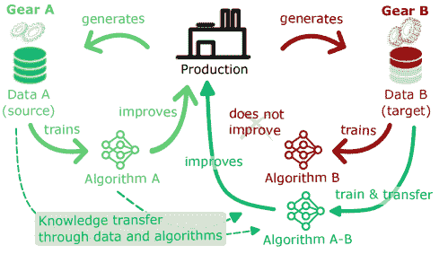
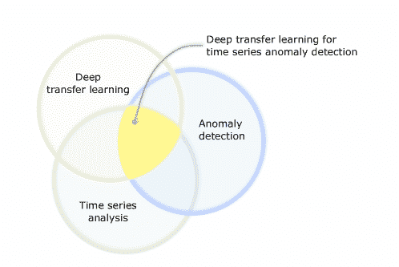
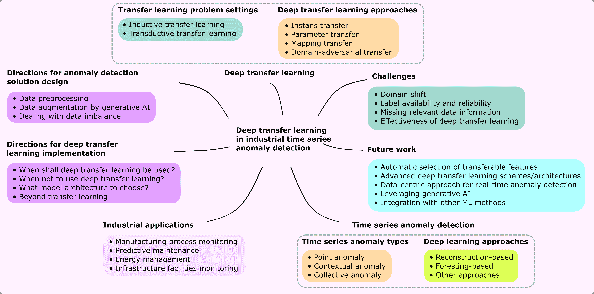
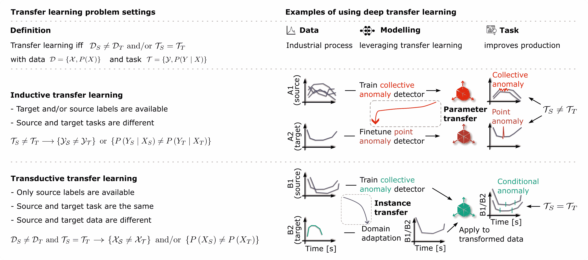
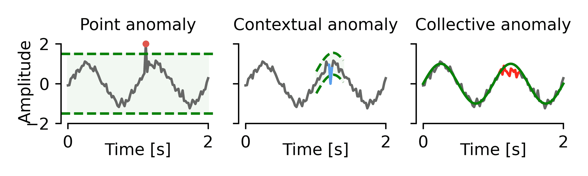
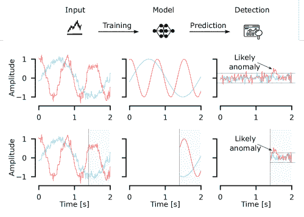
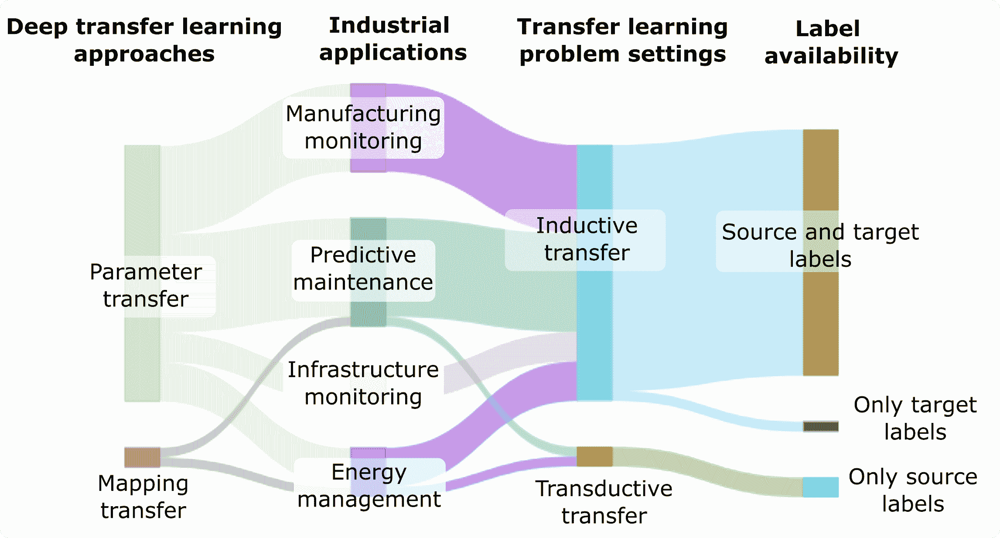

<!--yml

类别：未分类

日期：2024-09-06 19:38:05

-->

# [2307.05638] 工业时间序列异常检测的深度迁移学习综合调查：方法、应用与方向

> 来源：[`ar5iv.labs.arxiv.org/html/2307.05638`](https://ar5iv.labs.arxiv.org/html/2307.05638)

# 工业时间序列异常检测的深度迁移学习综合调查：方法、应用与方向

[![[未标注的图片]](img/7a09d23cafced365573573ca376a29c3.png) 彭彦](https://orcid.org/0009-0006-0236-4707)

人工智能中心

ZHAW 工程学院

温特图尔，ZH，瑞士

yanp@zhaw.ch

&[![[未标注的图片]](img/7a09d23cafced365573573ca376a29c3.png) Ahmed Abdulkadir](https://orcid.org/0000-0003-4679-8081)

人工智能中心

ZHAW 工程学院

温特图尔，ZH，瑞士

abdk@zhaw.ch

&[![[未标注的图片]](img/7a09d23cafced365573573ca376a29c3.png) Paul-Philipp Luley](https://orcid.org/0009-0007-0851-665X)

人工智能中心

ZHAW 工程学院

温特图尔，ZH，瑞士

lule@zhaw.ch

&[![[未标注的图片]](img/7a09d23cafced365573573ca376a29c3.png) Matthias Rosenthal](https://orcid.org/0000-0002-7577-783X)

嵌入系统研究所

ZHAW 工程学院

温特图尔，ZH，瑞士

rosn@zhaw.ch

&[![[未标注的图片]](img/7a09d23cafced365573573ca376a29c3.png) Gerrit A. Schatte](https://orcid.org/0009-0002-5760-9346)

创新实验室

Kistler Instrumente AG

温特图尔，ZH，瑞士

gerrit.schatte@kistler.com

&[![[未标注的图片]](img/7a09d23cafced365573573ca376a29c3.png) Benjamin F. Grewe](https://orcid.org/0000-0001-8560-2120)

神经信息学研究所

ETH & 苏黎世大学

苏黎世，ZH，瑞士

benjamin.grewe@uzh.ch

&[![[未标注的图片]](img/7a09d23cafced365573573ca376a29c3.png) Thilo Stadelmann](https://orcid.org/0000-0002-3784-0420)

ZHAW 人工智能中心 & 欧洲生活技术中心（ECLT）

温特图尔，ZH，瑞士 & 威尼斯，威尼托，意大利

stdm@zhaw.ch

###### 摘要

自动化监控工业过程具有提高效率和优化质量的潜力，通过及时检测异常事件来促进及时干预。深度学习由于能够识别大数据集中的非平凡模式，在这一过程中发挥了关键作用。标准的深度学习方法适用于特定类型数据下的特定任务。在训练过程中，深度学习需要大量标记数据。然而，由于工业过程和环境的动态性质，为每一个稍有不同的案例重新获取大规模标记数据对于标准深度学习训练来说是不切实际的。深度迁移学习提供了这一问题的解决方案。通过利用相关任务的知识并考虑数据分布的变化，迁移学习框架可以用很少甚至没有额外的标记数据解决新任务。这种方法绕过了每次新设置都需要从头开始重新训练模型的需求，并大幅减少了对标记数据的需求。本调查首先对深度迁移学习进行深入审查，探讨迁移学习的问题设置并分类现有的深度迁移学习方法。此外，我们*深入探讨*了深度迁移学习在各种时间序列异常检测任务中的应用，这些任务在主要工业领域中普遍存在，例如制造过程监控、预测性维护、能源管理和基础设施设施监控。我们讨论了深度迁移学习在工业环境中的挑战和局限性，并在调查的最后提出了实际方向和可操作的建议，以应对在日益动态的生产环境中利用多样化时间序列数据进行异常检测的需求。

## 1 引言

### 1.1 动机与贡献

第四次工业革命——工业 4.0 [1]，其特点是通过生产的数字化、自动化以及公司之间的横向集成来提高效率 [2]，以及互联的网络物理系统的出现——即物联网 [3, 4, 5]，增加了对自主和智能过程监控的需求。这可以通过智能工厂的用例来举例说明，其中工业过程被转变为更灵活、智能和动态 [6]，或者通过风能和太阳能的分散能源生产的用例 [7]。在这些示例中，基于 AI 的异常检测将时间序列数据的分析集成起来，以检测记录数据中的异常模式。为实现这一点，构建了深度学习架构来捕捉正常和异常操作的指标。学习过程涉及对正常和可能异常操作的历史时间序列传感器数据的分析。这些数据例如用于基于表示或重建的学习。训练后，深度学习模型以某种方式表示或重建正常数据。模型的设计使得异常数据——因为它不同——与正常数据的表示方式不同，或重建效果差，因此被识别为异常。通过识别超出正常区间窗口的操作参数，操作员可以触发干预和调整，以确保高产品质量和安全操作。为实现这一点，实时应用中监控和分析压力或温度等物理属性。这些变量的变化捕捉到由于过程故障或故障引起的漂移和突发故障 [8]。生产过程必须迅速适应生产和环境的变化，以满足灵活性和动态性的要求。还存在各种领域的进一步应用实例，例如包括自动质量控制的制造监控 [9, 10]，商品和服务的预测性维护 [11, 12, 13, 14, 15, 16]，建筑系统 [17, 18] 和电厂 [19] 的基础设施监控，数字农业 [20]，石油化工过程优化 [21]，计算机网络入侵检测 [22]，或飞机飞行监控 [23]，仅举几例。

人工智能，特别是深度学习，提供了基于深度神经网络的高效框架，用于自动化智能监控并为操作员和高级控制系统提供宝贵的帮助。通过深度学习的力量，数据的有用特征——在技术上称为表示[24]——可以被捕获在机器学习模型中，从而实现对标准操作变化的详细理解。

然而，在非平稳和非平凡条件下，任务或底层数据可能会发生变化。例如，在某种情况下，铣床的监控系统可能会被指派通过振动识别钝化工具，而在不同的情况下，它可能会利用相同的振动测量来检测冷却润滑剂不足。为了在另一种设置中解决相同或类似的任务，使用不同的工具、加工零件或机器类型的知识可能会被转移。在这些情况下，深度学习模型可能需要进行调整，以适应缓慢变化的条件（漂移）、突然的模式变化（例如，由于工具更换）和新任务（如检测其他故障模式）。在这些情况下，最好调整分析模型而不是从头开始重新训练，因为获取足够的训练数据以学习完整的流形是昂贵或不切实际的[25]。

迁移学习是实现这一目标的机器学习框架[26, 27, 28, 29, 30]。如图 1 所示，来自一个任务的数据和算法可以在新的相关任务中利用。通过考虑数据分布和任务的变化或利用现有模型，学习到的知识可以用来改善新任务的表现，而无需为每个应用从头开始重新训练模型。这种迁移学习增强的建模基础用于识别在非平凡方式下偏离既定模式的异常，而无需完全重新训练。

图 1：当生产过程中发生变化且没有足够数据进行全面再训练时，迁移学习是有用的，如图所示为假设的两种齿轮生产。在齿轮 A 的生产中，有大量数据可用于训练深度学习模型，从而帮助改善生产。在齿轮 B 的生产中，数据较为有限，传统训练的深度学习模型未能改善生产。然而，通过合适的迁移学习方法，可以利用在齿轮 A 生产过程中获得的数据和算法来支持改善齿轮 B 的生产，因为两种齿轮的生产数据和任务是相关的。

深度迁移学习 [29, 31] 通过利用深度学习扩展了迁移学习范式。在工业背景下，即使生产条件发生变化，它也能确保最佳生产。这种动态适应性是保持异常检测系统在动态工业环境中有效性的关键，工业应用包括制造过程监控、预测性维护、能源管理和基础设施设施监控等广泛类别，详见第四部分。

本综述是一篇非系统性的但以应用为导向的评述，重点关注工业中时间序列异常检测的深度迁移学习。我们的主要贡献如下：

+   •

    我们将迁移学习问题设置进行分类，并系统地将深度迁移学习方法总结为四类。在深度迁移学习的基础上，我们使读者掌握主要原理和直觉的实用知识。

+   •

    我们分析了最新文献，并对深度迁移学习方法在时间序列异常检测中的现状进行了全面概述，特别是针对主要工业应用。

+   •

    我们讨论了潜在的挑战和局限性，然后为未来的工作提供了方向，并提出了针对 AI 从业人员和决策者的可操作性建议。

据我们所知，这是第一篇在狭义的工业时间序列异常检测背景下的深度迁移学习综述。该综述描述了通用分类法中的基本方法论原则和方法，并讨论了对 AI 从业人员做出明智决策的实际意义。我们涵盖了多个应用领域，包括制造监控、维护预测和基础设施监控。

论文的其余部分组织如下。首先，我们通过介绍转移学习问题设置的分类法并进一步对深度转移学习方法进行分类，提供转移学习的概述（第二部分）。接着，我们描述时间序列中的异常检测任务（第三部分）以及在选定工业应用中的应用（第四部分）。最后，我们讨论该领域的当前挑战、局限性和未来研究方向（第 5–6 节）。

### 1.2 调查方法

我们旨在识别转移学习作为学习框架、时间序列作为数据领域以及异常检测作为任务交集中的应用导向的同行评审文献（图 2）。为了执行文献选择过程，我们在 Google Scholar、Scopus、Elsevier 和 IEEE 数据库中搜索相关术语。根据标题，我们将那些可能符合狭窄主题的论文挑选入预选列表。最终，我们根据摘要和内容筛选，纳入了与主题匹配的出版物。

在审查的专题论文中，我们包括了与数据类型和任务无关的深度学习方法。对于一般的深度迁移学习，我们搜索了“迁移学习”和“深度迁移学习”的关键词。具体来说，我们更关注深度迁移学习方法。然后，我们转向以应用为导向的案例，其中深度迁移学习应用于解决主要工业应用中的时间序列异常检测。为此，我们搜索了类似“时间序列异常检测的深度迁移学习”和“预测性维护的深度迁移学习”的查询。在数据库中搜索后，我们根据以下纳入/排除标准仔细检查并筛选出最相关的文献：(1) 我们只包括利用深度迁移学习方法的应用，而不是传统的迁移学习；(2) 我们只包括 2013 年之后的出版物；(3) 我们涵盖图 2 中的所有三个主要主题（用圆圈突出显示），但我们特别关注上述三个领域的交集。经过仔细筛选，我们选择了 45 篇关于深度迁移学习的一般论文和 37 篇关于工业时间序列异常检测的深度迁移学习论文。

图 3 展示了本调查中的分类法，用于根据不同方面对审查的研究进行分类，包括深度迁移学习、时间序列异常检测、工业应用、当前挑战和未来方向。

图 2：本调查关注迁移学习、异常检测和时间序列分析的交集的维恩图。

图 3：本文中用于分析工业时间序列异常检测的深度迁移学习的一般分类法。

## 2 深度迁移学习

### 2.1 领域概述

\change

在深度学习环境下，**迁移学习**旨在通过将知识从一个数据集和任务转移到新的数据集和任务，从而提高深度学习模型的效率、性能和泛化能力。在工业时间序列异常检测的背景下，迁移学习是一种提高自主过程监控灵活性的工具。它解决了将算法及其决策过程适应于一个相关但之前未见过的环境的挑战，其中训练数据有限。迁移学习消除了从头开始训练深度学习模型的需要，这反过来减少了为解决新任务或适应新数据领域所需的数据和计算量。在这两种情况下，知识从源领域转移到目标领域，如下文所述。迁移学习问题设置可以根据数据和任务条件分为**归纳性迁移**或**传导性迁移**。同时，我们将基于深度学习的迁移学习方法分类为实例迁移、参数迁移、映射迁移和领域对抗迁移。我们通过图 4 中的两个直观示例来说明这些方法，更多细节将在后续章节中详细介绍。

图 4：迁移学习问题设置的分类（左；见 2.2 中术语的定义）以及使用深度迁移学习方法的相应示例（右）。在左侧，我们将迁移学习问题分类为归纳迁移或传导迁移设置。相应地，我们提供了两个使用深度迁移学习方法的示例：在归纳迁移设置中，我们收集了来自螺丝生产和扳手生产的时间序列数据。标记的螺丝数据（A1）用于检测集体异常（与整个时间序列相比行为不同的一组数据点[32, 33]，进一步解释见 3）。然后，应用参数迁移（2.3.2）通过微调从标记的螺丝数据预训练模型来检测点异常（在 3 中进一步解释），在标记的扳手数据（A2）上进行。对于下面板中的传导迁移设置，我们展示了一个不同的背景异常检测情况（在 3 中进一步解释）。在这种情况下，我们有两个数据集 B1 和 B2，使用相同的模型进行分析。然而，B2 中的数据在外观上与 B1 中的数据显著不同。为了解决这个问题，使用实例迁移（在 2.3.1 中进一步解释）。通过这个学习过程，B2 中的数据被转化为与仅在 B1 数据上训练的模型兼容的方式。因此，这种情况下的迁移学习是通过领域适应将数据调整以适应模型，而不是调整模型以适应新数据。

### 2.2 深度迁移学习的形式描述

领域$\mathcal{D}$包括领域特征空间$\mathcal{X}$和边际数据分布$P(X)$，即$\mathcal{D}=\{\mathcal{X},P(X)\}$，其中$X$是领域数据，$X=\left\{x_{1},\ldots,x_{n}\right\}\in\mathcal{X}$。类似地，学习任务定义为$\mathcal{T}=\{\mathcal{Y},f_{\mathcal{T}}(\cdot)\}$，其中$\mathcal{Y}$表示任务空间，通常表示类别标签。对于异常检测任务，$\mathcal{Y}$是“正常”和“异常”这两个类别的集合。函数$f_{\mathcal{T}}(\cdot)$可用于预测新实例$x_{i}$的相应标签。从领域数据中学习到的目标预测函数$f_{\mathcal{T}}(\cdot)$可以解释为条件概率的一种形式。因此，学习任务可以重写为$\mathcal{T}=\{\mathcal{Y},P(Y|X)\}$，其中$P(Y|X)$用作可能性度量，以确定给定数据集$X$与相应类别标签集$Y$的拟合程度。

在对工业应用中异常检测的迁移学习文献调查中，采用了来自其他领域如计算机视觉和自然语言处理的迁移学习方法。因此，我们使用通用的迁移学习方法分类方案。我们大致遵循文献中的迁移学习定义[27, 28]。给定源领域$\mathcal{D}_{S}$和学习任务$\mathcal{T}_{S}$，以及目标领域$\mathcal{D}_{T}$和学习任务$\mathcal{T}_{T}$，迁移学习旨在通过从$\mathcal{D}_{S}$和$\mathcal{T}_{S}$转移知识，提升目标领域$\mathcal{D}_{T}$中预测函数$f_{\mathcal{T}}(\cdot)$的性能，其中$\mathcal{D}_{S}\neq\mathcal{D}_{T}$和/或$\mathcal{T}_{S}\neq\mathcal{T}_{T}$。通常，源数据集的规模远小于目标数据集。

这种迁移学习的定义可以扩展，即目标任务可以受益于多个源领域。因此，迁移学习的理念是充分利用相关的源领域来解决新任务。相比之下，传统的机器学习（ML）方法将每个任务单独从头学习，每个模型仅能应用于对应的任务。

我们定义了迁移学习问题设置的分类，如图 4 所示，主要依赖于两个领域中的标签可用性，以便于满足具体案例的要求（对比文献中的其他定义[27] – [29]）。

我们将其分为归纳性和传导性迁移学习 [28]。归纳性迁移学习应用于目标任务与源任务不同的情况，即 $\mathcal{T}_{S}\neq\mathcal{T}_{T}$（意味着 $\{\mathcal{Y_{S}}\neq\mathcal{Y_{T}}\}$ 或 $\{P(Y_{S}|X_{S})\neq P(Y_{T}|X_{T})\}$）。条件概率分布通过目标领域中的标记训练数据进行推断 [34]。图 4 中的场景 A 是一个对应的例子，其中学习任务不同，迁移学习的目标是从集体异常任务中识别点异常。归纳性迁移学习的相关领域包括多任务学习 [35, 36] 和顺序学习，具体取决于任务是同时学习还是顺序学习。

传导性迁移学习应用于源任务和目标任务相同，但源领域和目标领域不同的情况，即 $\mathcal{T}_{S}=\mathcal{T}_{T}$ 和 $\mathcal{D}_{S}\neq\mathcal{D}_{T}$（意味着 $\{\mathcal{X_{S}}\neq\mathcal{X_{T}}\}$ 或 $\{P(X_{S})\neq P(X_{T})\}$）。当源数据和目标数据的特征空间相同但边际分布不同时（即 $\{\mathcal{X_{S}=X_{T}}\}$ 和 $\{P(X_{S})\neq P(X_{T})\}$），它是一种领域适应 [37]。图 4 中的场景 B 是传导性迁移学习的一个例子，其中学习任务相同，迁移学习的目标是在未标记的数据集中识别上下文异常。

### 2.3 深度迁移学习方法

由于深度神经网络（DNNs）能够通过反向传播从大量数据中学习有用的特征表示 [24]，因此它们已被广泛应用于解决实际中的复杂问题 [38, 39, 40, 41]，这些问题涉及大规模和高维数据。深度迁移学习方法在 DNN 中实现迁移学习原理，并且，除了其他功能外，还使得基于深度学习的分析管道能够应用于新的数据集。

基于调查文献中的迁移技术，我们探讨了知识如何在不同领域间共享，并帮助提高目标任务或领域的性能。我们进一步将深度迁移学习方法分为 $4$ 类：实例迁移、参数迁移、映射迁移和领域对抗迁移，如表 1 所示。此外，实例迁移、映射迁移和领域对抗迁移可以被描述为数据驱动的方法。它们通过利用大量数据来转移知识。通常涉及通过特征对齐、特征映射等方式转化和调整数据实例或操控来自不同领域的数据。另一方面，参数迁移是一种模型驱动的方法，更强调理解数据的潜在结构和动态。通常涉及将预训练模型的参数从源领域迁移到目标领域。

表 1: 深度迁移学习方法概述及参考文献。

| 深度迁移学习方法 | 简短描述 | 参考文献 |
| --- | --- | --- |
| 实例迁移 | 通过将源领域的数据实例转换到目标领域来扩充目标数据 | [42, 43, 44] |
| 参数迁移 | 迁移源领域的预训练模型的学习参数并调整模型以适应目标领域 | [45, 46, 47, 48, 49, 50, 17, 51, 52, 53] |
| 映射迁移 | 通过最小化映射特征在潜在空间中的距离来减少源领域和目标领域之间的特征差异 | [27, 54, 55, 56, 57, 58, 59] |
| 领域对抗迁移 | 通过对抗训练提取源领域和目标领域之间的不可区分特征表示 | [60, 61, 62, 63, 64, 65] |

#### 2.3.1 实例迁移

实例转移的直观概念是，尽管源领域和目标领域不同，但仍然可以通过少量标记的目标样本来转换和重用源数据。一个典型的方法是从源领域重新创建一些标记的数据。例如，He 等人提出了一种基于实例的深度转移学习模型，该模型结合了注意力机制来预测股票走势[42]。他们首先利用注意力网络从源数据集中创建出与目标样本相似的新样本，然后在这些创建的样本和目标训练样本上训练另一个网络以进行预测任务。由于两个网络分别针对不同的任务进行训练，因此需要进一步研究生成样本在预测任务中的贡献程度。Amirain 等人提出了一种创新的实例转移方法用于领域适应[43]。他们提出了一种有效的自编码器模型，配合伪标签分类器来重建新的数据实例，以获取跨不同数据集的一般特征，用于医学图像分析。另一种方法是，Wang 等人排除了对训练目标数据产生负面影响的源数据。具体来说，他们选择了一个来自源领域的预训练模型，评估了目标领域中所有训练样本的影响，并移除那些降低模型性能的样本。然后，优化后的训练数据用于微调。这些实验在大型图像数据集上进行[44]。与其转移数据，这种方法根据预训练模型的预测排除某些样本。在工业环境中需要额外的验证，尤其是在某些工业设置中只有少量数据的情况下。

#### 2.3.2 参数转移

参数转移将预训练模型的学习参数适配到新模型中。这假设深度神经网络（DNNs）可以从相似的领域中获取类似的特征表示。因此，通过转移部分 DNN 层及预训练的参数和/或超参数，预训练模型作为基础模型用于进一步在目标领域数据上训练，并解决不同的学习任务。特别地，参数转移在计算机视觉和自然语言处理领域越来越受欢迎，其中大规模模型在大数据集上预训练[45]。在自然语言处理领域，例如，BERT [46]和 GPT-3 [53]基于可以针对各种下游任务进行微调的 Transformer 架构[48]，这些任务包括内容生成[49]、语言翻译[66]、问答[67]和摘要[50]。在计算机视觉中，Yosinski 等人研究了卷积神经网络（CNNs）在图像识别中的通用转移性[30]。他们通过微调或冻结网络中的一定层数来分析转移效果。实验结果表明，与仅在目标数据集上训练的网络相比，将特征从源领域转移到目标领域可以提高网络的泛化能力。此外，他们通过评估在什么层次上从一个任务转移到另一个任务的特征来量化模型性能。令人惊讶的是，从任意层次的预训练网络进行转移可以为新数据集上的微调带来提升。然而，实验仅在某些图像数据集上进行，Tuggener *et al.* 表示[68] 当所选择的架构在某些大规模数据集的特性上过拟合时，参数转移的限制。

与典型的微调预训练模型的方法不同，Guo 等人提出了一种自适应微调方法 SpotTune，以寻找目标任务的最佳微调策略[51]。具体来说，使用一个策略网络来决定是否将目标实例通过预训练模型进行处理。结果表明，SpotTune 在大多数情况下通过使用参数和实例转移的混合方法是有效的。Sager 等人提出了一种无监督领域适应方法，用于在 3D CT 体积中进行椎骨检测，通过在训练过程中跨领域转移知识[52]。

#### 2.3.3 映射转移

映射迁移是指通过特征变换学习目标领域的相关特征表示，包括特征对齐、特征映射和特征编码[27]。其目标是通过最小化潜在特征表示分布之间的距离，减少源领域和目标领域之间的特征差异。有多种标准来衡量分布差异，包括 Wasserstein 距离[69]、Kullback-Leibler 散度[70]等。其中，最大均值差异（MMD）[55]在调查的文献中被最频繁地采用。MMD 计算的是与选定的核函数相关的再生核希尔伯特空间中样本均值嵌入之间的差异。将其添加到目标损失函数中，它作为一种强大的工具，利用多种核函数比较复杂的高维数据集的相似性。

以往的工作主要集中在使用 MMD 进行迁移特征提取/降维。Wang 等人更关注于同一子类别的子域，而不是源领域和目标领域之间全局分布的对齐[54]。具体而言，他们首先使用注意力机制提取与故障信号最相关的区分特征。然后，应用局部 MMD 进行知识迁移，以调整同一类别下相关子域的分布。Long 等人提出了基于 MMD 的联合适应网络[56]，在该网络中，多个领域特定层的联合分布在不同领域之间对齐。此外，采用了对抗训练版本，使源领域和目标领域的分布更具可区分性。类似地，Long 等人采用了多层适应，并提出了深度适应网络（DAN）[57]。DAN 模型中的前三个卷积层用于提取一般特征。对于最后三层，多核 MMD 弥合了跨领域差异并学习可迁移特征。Zhang 等人提出了一种深度迁移网络，其中使用了两种类型的层，通过添加 MMD 损失来获得跨领域的领域不变特征。共享特征提取层学习源样本和目标样本之间的共享特征子空间，然后使用判别层通过分类器传递来匹配条件分布[58]。Venkateswara 等人提出了深度适应哈希网络[59]，该网络是从 VGG-F[71]网络微调而来的。多核 MMD 损失被用于训练深度适应哈希网络，以学习对齐源领域和目标领域的特征表示。

#### 2.3.4 域对抗迁移

受到生成对抗网络（GANs）[72, 73]的启发，领域对抗迁移的目标是通过对抗训练提取一个在源领域和目标领域之间不可区分的可迁移特征表示。对抗迁移主要关注于解决领域适应问题。

Soleimani 和 Nazerfard 利用 GANs 框架进行跨主题迁移学习 [60]。生成器用于生成与目标数据相似的样本。与此同时，判别器区分假样本和目标样本。分类器被训练以区分标记的源数据和假样本，从而学习对源领域和目标领域不变的特征。需要注意的是，在实际应用中，由于模式崩溃，GANs 的训练可能不稳定，尤其是当源数据和目标数据不平衡时，生成器可能无法生成足以混淆判别器的假样本。Tzeng 等人采用领域混淆损失来学习领域不变表示 [61]。Ganin 等人通过在特征提取层之后添加领域分类器来提出一种新的领域适应架构 [63]。使用梯度反转层来确保源领域和目标领域之间特征分布的相似性。同样，Ozyurt 等人通过使用对比学习和领域对抗迁移学习来开发了一种用于时间序列数据的无监督领域适应的新框架 [62]。应用领域分类损失来提取领域不变特征。其缺点是实验设计时源数据和目标数据的规模相似，而在实际应用中，目标数据通常远少于源数据。Ajakan 等人提出了一种领域对抗深度神经网络（DNN），其中应用了领域回归器以学习领域不变的特征表示 [64]。Tzeng 等人使用了一种将对抗学习与判别特征学习相结合的无监督领域适应方法 [65]。

### 2.4 相关学习范式

除了上述讨论的专用迁移学习方法，还有一些方法代表了跨领域解决任务的替代方式或与本地迁移学习方法互补的方式。

+   •

    多任务学习是一种机器学习技术，其中一个模型同时在多个任务上进行训练。其理念是通过学习一个共享的表示来捕捉所有任务之间的特征，从而提高模型的性能。由于网络学习解决多个任务，它可能会更好地推广到新的数据和任务上。

+   •

    连续学习[74]是一种学习过程，其中模型随着时间的推移不断从以前的任务中学习新任务，同时不忘记如何解决以前的任务。在某种程度上，连续学习可以被视为一种顺序转移学习过程，其约束是保持之前任务的性能，从而导致知识的积累。

+   •

    少样本学习[75]是一种机器学习类型，其中模型可以仅通过有限数量的标记样本来学习并在新任务上表现良好。在极端情况下，模型可以通过一个标签[76]甚至没有标签[77]来学习。而转移学习通常涉及重新使用相关任务中的模型，并继续在目标数据集上进行训练。

+   •

    域泛化[78, 79]专注于从一个或多个不同领域开发一个泛化模型，以检测未见的目标领域数据。主要目标是克服领域转移问题。域泛化和转移学习都用于将知识从源领域转移到目标领域。转移学习和域泛化的主要区别在于目标领域数据的利用。转移学习利用来自源领域和目标领域的知识。相比之下，域泛化仅从源领域学习，而不接触目标数据。

+   •

    元学习[80, 81]被称为“学习如何学习”。在元学习中，模型是在一组不同的任务上进行训练，而不是传统机器学习中的数据集。从这个意义上说，元学习可以被视为一种转移学习，因为它涉及将知识从任务转移到任务。

+   •

    知识蒸馏[82]有效地学习一个小模型，以模仿较大、更复杂模型的行为。较大模型学到的知识可以转移到较小模型中，从而可以用于目标任务。

+   •

    自监督学习[83, 84]涉及训练一个模型以预测输入数据的某些方面，而无需任何外部监督。所学的表示可以用于各种下游任务，包括涉及将知识从一个领域转移到另一个领域的任务。

## 3 工业中的时间序列异常检测

时间序列异常检测涵盖了用于分析和解释顺序时间数据的统计技术。在工业过程中，时间序列异常检测在自动化监控、有效安排维护以及控制这些过程的效率、质量和性能方面发挥了至关重要的作用。例如，在检测到异常后，可以利用另一个模型，该模型捕捉时间过程与不同故障模式或漂移之间的关系，用于预测性维护。例如，在注塑过程监控中，异常检测模型用于分析来自注塑机的记录传感器数据，以检测不良零件并识别异常的根本原因[85]。检测异常有两种基本方法：对于有监督的异常检测，需要每个时间序列的标签（正常/异常）来建立一个二分类器[86]。对于无监督的异常检测，可以使用基于正常数据的异常评分或置信值来区分异常与正常实例[87] –[88]。

### 3.1 异常类型

根据文献[89]，离群点是指那些显著偏离其他观测值的观测结果，这种偏离方式表明其可能是由不同机制生成的。在本调查中，我们重点关注在工业应用环境中从机器传感器读取的数据时间序列，这些数据可以是单变量（只记录一个变量的时间变化）或多变量（同时记录多个测量值）。时间序列异常可能由于各种原因发生，包括内部因素（例如，临时传感器错误、机械故障）和外部因素（例如，人为错误、环境温度）。这些异常可以分为三类[32]、[33]：点异常、上下文异常和集合异常。点异常是指那些明显偏离该时间序列正常行为的孤立样本，可以在图 5 的左侧看到，例如，制造机传感器中的压力读数突然激增。这些点异常可能由临时传感器错误、人为错误或机械操作异常引起。上下文异常表示在当前上下文中偏离正常数据点的数据点，示例可以在图 5 的中间部分看到。集合异常是一组数据点，在整体上（而非单独）相对于整个时间序列是不正常的，如图 5 的右侧所示。

图 5：三种时间序列异常类型。灰色线条表示记录的时间序列信号，绿色虚线是预先设定的正常操作阈值。红点和红线表示异常。点异常是落在预设范围之外的单个值（左侧面板）。上下文异常是指偏离当前上下文的样本（中间面板）。集合异常被定义为一系列数据点，这些数据点都落在操作范围内，但整体上不符合预期（右侧面板）。

### 3.2 挑战

检测时间序列异常面临的挑战源于两个特定的属性：（1）时间序列数据的复杂性。随着工业过程的自动化水平和工业系统的复杂性增加，单变量时间序列数据在整体上表示任何工业过程变得不足和低效。因此，需要安装更多传感器以监测整个过程，使得从多变量时间序列中检测异常成为必要，这带来了特别的挑战，因为这需要考虑时间依赖性和变量及模态之间的关系。许多研究者致力于从空间和时间相关的多变量时间序列数据中发现泛化模式。张等人提出了一种深度卷积自编码记忆网络[87]，他们构建了一个自编码器，利用 MMD 捕捉多变量数据的空间依赖性，以区分噪声、正常和异常数据。朱等人提出了一种可解释的模型无关多变量时间序列异常检测方法，应用于网络物理系统[90]。该新方法通过基于自适应掩码的系列显著性模块考虑时间和特征维度，以生成准确的异常检测结果和以掩码矩阵形式呈现的合理解释。（2）工业过程中的动态变异性。工业过程通常具有高动态变异性，并且可能受到温度、压力和湿度等多种条件的影响。这些条件可能导致过程输出的波动，从而导致数据偏移和领域偏移。这使得检测异常和维持工业过程控制变得具有挑战性。

### 3.3 异常检测方法

时间序列异常检测已经研究了几十年，提出了各种方法[91]。本文专门讨论了使用深度学习进行时间序列异常检测的技术，利用其强大的表示学习能力。当前的深度学习方法主要可以分为基于重建的方法、基于预测的方法和其他方法。图 6 说明了这两种主要方法。在深度重建异常检测中，重建序列用于与实际序列进行比较。而在深度预测异常检测中，仅使用预测序列来评估与真实值的相似度。

图 6：深度学习基础的异常检测（顶行）的示意图，包括基于重建的方法（中行）和基于预测的方法（底行）在时间序列中的异常检测。第一列表示两个时间序列。第二列显示了重建的（顶部）和预测的（底部）时间序列。第三列显示了重建/预测时间序列之间的差异。从重建或预测时间序列中的偏差指示异常。在深度重建基础的异常检测中，整个序列在解码器-编码器结构中被重建，重建序列用于与实际序列进行比较。在深度预测基础的异常检测中，序列的末端是通过序列的开始进行预测的，只有预测序列用于评估与实际情况的相似性。在这个例子中，红色时间序列在大约 1.5 秒处有可能的异常。（最佳效果请使用彩色显示。）

##### 基于重建的方法

基于重建的方法旨在学习正常时间序列的数据分布，并通过计算重建误差来区分异常和正常情况。Audibert 等人提出了一种快速而稳定的方法——针对多变量时间序列的无监督异常检测 [92]，基于对抗训练的自编码器。对抗训练框架中的编码器-解码器架构结合了自编码器和对抗训练的优点，同时弥补了每种技术的局限性。经过训练两个自编码器后，异常评分通过平衡两个自编码器的重建误差以及两个超参数来定义。然而，当测试数据集不可用时，选择这些异常评分的两个超参数是一个挑战。

Malhotra 等人还基于重建误差制定了一种异常分数 [93]。他们首先训练 LSTM 编码器-解码器模型来重建正常时间序列。随后，他们利用重建误差通过最大似然估计计算概率，以检测时间序列中的特定点是否为异常。他们设置了一个窗口来检测异常。如果概率超过阈值，窗口将被标记为异常。同样，Wei 等人也提出了一种基于 LSTM 的编码器-解码器模型，通过重建误差检测多变量时间序列序列 [94]。主要区别在于异常检测标准。他们假设训练/测试数据的重建误差遵循正态分布，并通过使用正态分布的 2-sigma 规则作为阈值来检测异常。Zeng 等人提出了一种对抗性变换器结构来有效地检测多变量时间序列异常 [95]。这里，对变换器应用了两阶段的对抗训练。在第一阶段，通过最小化重建误差来训练两个变换器，以捕捉时间序列中的时间趋势。在第二阶段，重建误差作为对抗训练过程中的先验知识，使模型能够区分异常与正常时间序列。然后，通过将异常概率和重建误差结合来定义异常分数。再次选择一个阈值来区分异常和正常情况。

作为有效的无监督学习方法，GAN 已被应用于时间序列异常检测。基于 GAN 的异常检测方法侧重于通过对正常样本进行对抗性训练来提取特征。因此，异常样本的特征与正常样本的特征发生偏离，体现在重建误差和判别值上。Li 等人使用 LSTM-RNN 作为 GAN 中生成器和判别器的基础模型[96]。提出的框架考虑了多个变量，以捕捉多时间序列分布的时间相关性。此外，他们提出了一种新颖的异常分数，通过判别和重建来检测异常。更具体地说，该分数是生成数据与原始数据之间的重建差异与来自判别器的判别结果的组合。同样，Niu 等人和 Bashar 等人也提出了基于 LSTM 的 VAE-GAN 用于时间序列异常检测，其中 LSTM 网络作为生成器和判别器[97, 98]。在异常分数方面，设置最佳阈值通常是关键步骤。然而，在实际场景中，使用测试集的一小部分来确定最佳阈值可能不太现实[97]。此外，值得注意的是，该方法仅在点异常检测中进行了测试，当用于检测其他类型的异常时，需要进一步研究。

##### 基于预测的方法

基于预测的方法预测后续时间戳的值，并根据预测误差预测时间异常。Kim 等人提出了一种基于预测的无监督时间序列异常检测方法，该方法使用 transformer 架构[99]。其思想是通过基于之前的时间戳预测固定长度的时间序列来训练类似 transformer 的模型。训练好的模型用于预测时间序列，并计算异常分数，当异常分数大于静态阈值时，定义为异常。文中还提到了动态阈值技术，但没有明确讨论。

邓和胡提出了一种新颖的基于注意力机制的图神经网络方法[100]，该方法通过基于过去的时间序列预测行为来学习多变时间序列信号之间的依赖关系图。然后，为每个传感器定义了一个图偏差评分，以检测和解释异常。唐等人提出了一种基于图神经网络和门控递归单元的可解释多变量时间序列异常检测方法[101]。通过预测未来时间序列段来学习特征表示。为每个时间序列设置一个异常评分以检测异常。然后，利用特征嵌入通过 t-SNE 图进行二维可视化，以解释来自不同传感器的时间序列中的簇。

##### 其他方法

丁等人提出了一种联合网络，以整合重建和预测/预报的优势[102]。首先，他们提出了一种多模态图注意力网络，以解决多模态时间序列的时空依赖关系。进一步地，他们同时优化重建和预测模块，以预测异常。希穆尔等人利用标注数据，并直接使用深度神经网络作为分类器来分类正常和异常的能耗类型[103]。实际异常模式的巨大不平衡是该方法的一大担忧。因此，应用了一种规范化的能耗数据技术来解决这个问题。规范化数据表示每个当前时间样本和前一个时间样本的能耗率差异。它可以提供有关能耗如何迅速响应时间演变的信息。然而，关于这种技术的进一步评估尚未讨论，且对于其他数据集的异常检测仍然是一个未解的问题。杨等人提出了一种对比学习结构与双重注意力机制，以学习具有优越区分特性的排列不变数据表示[104]。与大多数基于重建的模型不同，他们的模型是一个基于表示学习的自监督框架。该新方法在六个多变量和一个单变量时间序列异常检测基准数据集上取得了与现有最先进技术相当的表现。然而，具有两个多头注意力块的广泛框架可能容易过拟合。由于缺乏训练细节，这一担忧得到进一步放大，仅披露了评估细节。

原则上，这些异常检测方法适用于所有类型的异常。基于重建的方法通常应用于整个或部分时间序列。长时间序列通常使用预定义的滑动窗口进行分段。在检测上下文/集体异常的情况下，时间序列序列的重建损失在预定义的滑动窗口内进行评估，如果重建损失大于可接受的阈值，则该时间序列序列被分类为异常。在点异常的情况下，重建在每个单独的时间戳上进行，类似于回归问题，然后评估每个单独时间戳的重建损失，以确定该时间戳是否异常。它也适用于基于预测的异常检测方法，基于预测的方法预测下一个时间戳的值用于点异常，或预测下一个时间序列序列用于上下文/集体异常。异常将基于预测值与正常值之间的偏差来检测。其他异常检测方法通常将基于重建和基于预测的方法结合起来。

总之，这些方法适用于每种类型的异常。然而，这些异常检测方法的有效性可能会因具体的异常检测任务而异，这些任务的特征在于观察和分析时间序列数据的粒度。

## 4 工业应用

### 4.1 概述

深度迁移学习技术在计算机视觉和自然语言处理领域已获得显著关注，主要由于可用数据集的丰富。然而，它们在工业时间序列数据中的应用相对有限。这种犹豫可以归因于此类数据集的公共可用性有限以及其特有的领域特征，这些特征使得通用进展变得复杂。令人鼓舞的是，最近在工业领域的异常检测中，如故障诊断[105]、质量管理[106]、制造过程监控[85]、网络/软件安全[107]和基础设施监控[108]，应用深度迁移学习的情况有所增加。这些可以映射到制造过程和基础设施监控、预测性维护和能源管理的核心工业领域。表 2 展示了使用深度迁移学习方法解决这些任务的相关工作的简洁比较。

图 7 展示了基于我们文献调查的工业应用与深度迁移学习方法之间联系的桑基图。该图显示了调查文献中方法论-问题-背景四个维度之间的每一条连接路径。路径越宽，相关的论文越多。目的是提供一个深度迁移学习如何应用于工业问题的概述，并具体展示这四个维度：（1）实际使用了哪些深度迁移学习方法；（2）时间序列异常检测的主要工业领域是什么；（3）这些领域属于深度迁移学习的哪个类别；（4）源领域和目标领域中有哪些标签可用。

图 7 的关键观察结果是：（1）参数迁移在所有调查的工业应用中比任何其他深度迁移学习方法使用得要频繁得多，因为在目标数据上对预训练模型进行微调比利用源数据集上的预训练模型进行实现更为直接，通常无需对模型架构进行根本性修改。值得注意的是，实例迁移和对抗迁移在图中没有出现。显然，这两种深度迁移学习方法在工业时间序列异常检测任务中被认为效果不佳。这些鲜有研究的迁移学习方法在工业领域实施和训练的难度较大，这是研究结果所表明的。（2）在预测维护中可以看到参数迁移和映射迁移的混合方法。（3）大多数工业应用使用归纳迁移学习，表明它们侧重于利用标记的源数据和目标数据来解决目标任务，即使用监督学习。

图 7：调查的工业领域中迁移学习问题设置、深度迁移学习方法类别和标签可用性的桑基图概述。

表 2：使用深度迁移学习进行时间序列异常检测的工业应用的简要概述。

| 参考文献 | 工业任务 | 工业领域 | 深度迁移学习方法 | 迁移学习问题设置 | 深度学习框架 | 源类型 | 源标签 | 目标标签 |
| --- | --- | --- | --- | --- | --- | --- | --- | --- |
| [11] | 工业金属成形异常检测 | 预测性维护 | 参数转移 | 归纳 | CNN | 多重 | ✓ | ✓ |
| [12] | 监控系统异常检测 | 预测性维护 | 参数转移 | 归纳 | U-Net | 多重 | ✓ | ✓ |
| [13] | 汽车车身侧生产线故障诊断 | 预测性维护 | 参数转移 | 归纳 | SAE | 多重 | ✓ | ✓ |
| [14] | 旋转轴承故障检测 | 预测性维护 | 映射转移 | 迁移性 | 自编码器 | 多重 | ✓ | ✗ |
| [15] | 工业控制系统异常检测 | 预测性维护 | 参数转移 | 归纳 | ResNet8 | 单一 | ✓ | ✓ |
| [16] | 服务电梯故障检测 | 预测性维护 | 参数转移 | 归纳 | CNN, RNN | 多重 | ✓ | ✓ |
| [19] | 核电站故障检测 | 预测性维护 | 参数转移 | 归纳 | CNN | 多重 | ✓ | ✓ |
| [109] | 建筑能源系统故障诊断 | 预测性维护 | 参数转移 | 归纳 | CNN | 多重 | ✓ | ✓ |
| [110] | 压力机生产预测 | 预测性维护 | 参数转移 | 归纳 | CNN | 单一 | ✓ | ✓ |
| [111] | 风力涡轮机故障检测 | 预测性维护 | 参数转移 | 归纳 | CNN | 单一 | ✓ | ✓ |
| [112] | 工业机器操作故障检测 | 预测性维护 | 参数转移 | 归纳 | CNN, LSTM | 单一 | ✓ | ✓ |
| [9] | 机器车削操作分类 | 制造过程监控 | 参数转移 | 归纳 | VGG, ResNet | 单一 | ✓ | ✓ |
| [10] | 注塑成型过程质量控制 | 制造过程监控 | 参数转移 | 归纳 | FCN | 多重 | ✓ | ✓ |
| [85] | 注塑成型过程质量控制 | 制造过程监控 | 参数转移 | 归纳 | FCN | 单一 | ✓ | ✓ |
| [113] | 注塑成型过程异常检测 | 制造过程监控 | 参数转移 | 归纳 | FCN | 多重 | ✓ | ✓ |
| [114] | 注塑成型过程异常检测 | 制造过程监控 | 参数转移 | 归纳 | FCN | 多重 | ✓ | ✓ |
| [115] | 铝合金重力铸造质量预测 | 制造过程监控 | 参数转移 | 归纳 | FCN | 单一 | ✓ | ✓ |
| [20] | 农业/制造系统异常检测 | 制造过程监控 | 参数转移 | 归纳 | LSTM | 单一 | ✓ | ✓ |
| [116] | 制造测试床异常检测 | 制造过程监控 | 参数转移 | 归纳 | LSTM, RNN | 单一 | ✓ | ✓ |
| [117] | 工业金属（泵）成型异常检测 | 生产过程监测 | 参数传递 | 归纳法 | LSTM | 单一 | ✓ | ✓ |
| [118] | 工业控制系统异常检测 | 生产过程监测 | 参数传递 | 归纳法 | 自编码器 | 单一 | ✓ | ✓ |
| [21] | 石化生产过程异常检测 | 节能 | 参数传递 | 归纳法 | LSTM, CNN | 单一 | ✓ | ✓ |
| [119] | 电力消耗异常检测 | 节能 | 参数传递 | 归纳法 | FCN | 单一 | ✗ | ✓ |
| [120] | 建筑物能源消耗异常检测 | 节能 | 参数传递 | 归纳法 | AlexNet-40 | 单一 | ✓ | ✓ |
| [121] | 电力消耗异常检测 | 节能 | 映射传递 | 传导法 | DAN | 单一 | ✓ | ✗ |
| [122] | 建筑物电力消耗异常检测 | 节能 | 参数传递 | 归纳法 | LSTM | 单一 | ✓ | ✓ |
| [23] | 飞机飞行异常检测 | 基础设施监测 | 参数传递 | 归纳法 | LSTM | 单一 | ✓ | ✓ |
| [108] | 桥梁组异常识别 | 基础设施监测 | 参数传递 | 归纳法 | CNN | 单一 | ✓ | ✓ |
| [22] | 网络入侵检测 | 基础设施监测 | 参数传递 | 归纳法 | CNN, LSTM | 单一 | ✓ | ✓ |
| [17] | 建筑物占用检测 | 基础设施监测 | 参数传递 | 归纳法 | CNN | 单一 | ✓ | ✓ |
| [18] | 建筑物占用检测 | 基础设施监测 | 参数传递 | 归纳法 | CNN | 单一 | ✓ | ✓ |

### 4.2 生产过程监测

生产过程监测对于确保高质量产品和低拒绝率至关重要。例如，在注塑机中，安装传感器以检测模具腔体中的成型条件，如腔体压力和温度。这些信号用于分析每个生产部件的模具填充和固化过程。这种循环处理数据也可以在金属加工（切削力信号）或部件连接（连接力信号）中看到。目前，制造过程主要使用参数传递[10, 85, 113, 114, 11, 20, 116, 123, 117]。

Park 等人提出了一种迁移学习技术，用于检测不同工业控制系统中的时间序列异常 [118]。首先，他们应用主成分分析来减少源数据和目标数据的维度。然后在压缩后的源数据上训练 DNN 模型，采用合理的映射算法将源领域的特征映射到目标领域，之后在目标数据上进一步训练预训练模型。即使模型只用一部分目标数据进行重新训练，模型仍能取得良好的性能。在实验中，他们仅在两个较大的数据集上进行测试，并未证明迁移模型比未重新训练的模型在一个数据集上表现更好。需要进一步调查以解释负迁移。此外，即使他们仅使用小部分目标数据进行迁移学习，样本量仍超过 $5000$，这超出了大多数工业应用的范围。Abdallah 等人应用参数迁移监控制造测试台的运行状态，使用振动传感器数据 [20, 116]。Hsieh 等人将知识迁移到生产线的三个工位，以检测异常的时间序列数据 [123]。结果显示，通过迁移学习减少了训练时间并提高了检测准确性。在注塑成型中，应用参数迁移将知识从一个或多个源领域转移到目标领域，以解决目标领域中的任务 [10, 113, 114]。具体来说，他们采用简单的全连接神经网络，通过冻结前几层并仅对最后几层进行微调，将知识从一个产品转移到另一个产品。与直接从传感器评估时间序列数据不同，他们通过机器设置的参数来表示工业过程。然而，他们仍然可以为时间序列数据的案例提供有用的见解。Tercan 等人使用参数迁移在注塑成型中建立了模拟数据与真实数据之间的桥梁 [85]。在这里，首先在模拟数据上训练全连接神经网络，然后部分或完全重用该网络以进一步训练真实数据。结果显示，迁移模型比从头开始训练的真实实验数据网络表现更好。在制造过程中，仿真模型/过程可以发挥关键作用，但需要更深入的分析以进一步理解和减少仿真数据与真实数据之间的差距。此外，Lockner 等人探讨了不同来源数据量的迁移学习对性能的影响，并评估了不同冻结层配置对性能的影响 [114]。Maschler 等人比较了不同 DNN 在金属成型数据集上的异常检测任务 [11]。此外，他们提出了一个深度迁移学习框架，旨在任务之间转移知识。然而，所提出的架构尚未通过实验验证。后来，Maschler 等人通过将来自几个源任务的知识迁移到目标任务，在相同数据集上应用了持续学习，以训练一种能够解决源任务和目标任务的深度学习算法 [117]。具体来说，他们使用了通过调整损失函数的正则化方法来解决最适合的相关任务。

### 4.3 预测性维护

预测性维护的目标是预测在生产受到故障负面影响之前的维护需求。任务包括监控设备，以预测维护需求（即预测可能的未来故障），以优化维护计划[124]。时间序列异常检测通常在相应系统中使用，以识别操作中的异常行为，这些行为可能表明需要维护，例如噪声、振动等增加。

毛等人使用稀疏自编码器（SAE）进行映射迁移，以检测电机振动异常[14]。通过 MMD 损失学习源数据和目标数据到一个共同的潜在特征空间的变换，以使两个领域的特征分布尽可能相同。类似地，文等人也使用 SAE 架构进行旋转轴承的故障检测，使用 MMD 正则化器提取共同的特征表示[125]。随后，他们提出了一种新的 MU-Net 架构，用于检测多变量时间序列异常[12]。首先，他们在大规模时间序列数据集上预训练了一个 U-Net[126]，用于异常检测任务。然后，他们提出了一种新的 MU-Net 模型，该模型基于 U-Net 构建。在 MU-Net 中，每个通道可以通过微调利用预训练的 U-Net，将知识转移到多变量时间序列异常检测中。

在另一种应用中，参数转移用于预测制造工具的剩余使用寿命[127]。首先，在离线过程中使用回顾性获得的数据训练 SAE 网络，以预测切削工具的剩余使用寿命。然后，将训练好的网络转移到生产中，利用新工具进行在线剩余使用寿命预测。结果表明，基于迁移学习的混合深度学习显著减少了训练时间，并且非常适合于各种环境下的实时工业故障诊断/预测。类似地，参数转移也被用于缩小不同工业环境之间的差距[112, 13]。徐等人使用堆叠的 SAE 从源数据中提取通用特征，并提出了一种数字双胞胎辅助的故障诊断方法，将知识从虚拟空间转移到物理空间以实现实时使用[13]。在这里，DNN 模型首先在虚拟空间中完全训练，然后使用参数转移迁移到物理空间以进行实时使用。

上述文献证明，深度迁移学习是一个研究领域，它可以简化预测性维护系统的生命周期，并通过减少所需的数据和训练时间来促进 DNN 模型的重用，帮助使其适应解决类似任务。

### 4.4 能源管理

能源管理涉及那些能够检测由于终端用户异常行为或设备、系统故障导致的过度消耗的系统 [120]。其目标是开发自动化、快速响应、准确可靠的故障检测系统，以节约能源并建立环保系统。能源异常检测系统监控能源生成、传输和利用过程中的数据，以确保正常的能源消耗。

Xu 等人设计了一种基于集群的深度适应层，以改进深度适应网络，有效减少旋转功耗异常检测中的迁移学习不匹配[121]。基本架构由五层卷积层和三层全连接层组成。卷积层的权重参数在源域和目标域之间共享。集群基深度适应层设计跨越两个网络的特征层，以分别对源域和目标域的特征表示进行集群。该方法优于微调和 DAN，因为适应层可以最小化源域和目标域之间最近邻集群的距离，以匹配最相似的特征表示分布。需要注意的是，异常由人工专家定义并标记为不同类型，因此问题变成了分类任务。然而，在现实工业应用中，由于环境高度动态，几乎不可能列举未知异常类型。Liang 等人成功构建了一种用于铝挤压中的电力消耗时间序列异常检测方法[119]。应用参数转移将领域知识从另一个数据充足的领域转移过来。他们首先在充足的挤压机数据上进行无监督训练，然后仅使用少量来自不同挤压机的数据样本，通过迁移学习来调整模型。需要注意的是，当目标数据已经足够时，转移知识可能会有害，因为这可能会降低最终任务的预测准确性。Copiaco 等人旨在通过从预训练 CNN 模型迁移学习来检测建筑能耗异常[128]。首先，他们将 1D 时间序列信号转换为 2D 图像表示。这些图像作为预训练视觉模型的输入，以捕捉固有的空间不变特征。最后，应用 SVM 对异常类型进行分类。当在预训练的 ALexNet 模型上使用标准化的灰度图像表示时，SVM 分类器获得了最佳结果。然而，对于不同预训练模型的效果没有进行更深入的讨论。此外，将 1D 时间序列转换为 2D 图像，创建传感器读数的矩阵表示，可能在转换过程中导致信息丢失，这需要进一步研究。

### 4.5 基础设施设施监控

基础设施设施监测是指监测和维护基础设施设施的条件，例如桥梁、建筑物[129]和网络。这可以包括检测潜在的问题或故障。其目标是最小化故障对公众或环境的影响。这种应用通常使用参数转移，将知识从一个设施转移到另一个设施，以利用相似的数据和任务。

Dhillon 等人提出了一种基于 CNN 和 LSTM 的网络入侵检测系统的参数转移方法[22]。具体来说，他们通过卷积层将输入数据映射到低维表示，从而提取和学习模式。然后，他们利用 LSTM 层来增强时间序列中的模式学习和识别。最后，使用全连接层作为分类器来预测正常数据和恶意数据。为了进行参数转移，他们重用模型架构，并冻结目标领域的大部分权重参数，这样就不需要大量的训练数据集来重新训练模型。然而，他们没有提及实现细节，例如在迁移学习阶段冻结了哪些层。观察不同冻结层下迁移学习的表现将会很有趣。Pan 等人将参数转移应用于充分利用不同桥梁之间异常模式的相似性[108]。他们在一个桥梁的数据上训练 CNN 模型，然后将 CNN 模型获得的知识转移到目标数据的一个小部分。他们更新了最后三层全连接层，同时保持卷积层不变。实验结果表明，迁移学习在不同桥梁之间的异常检测中取得了更高的准确率。Weber 等人通过在合成环境数据上进行训练，利用模拟数据，然后对预训练模型进行微调，并将模拟数据中的知识转移到实时在线建筑物占用检测中[17]。尽管结果显示了迁移学习的有效性，但模拟数据在其他工业应用中的可用性和可靠性仍然是一个未解的问题。Sayed 等人通过使用预训练的 CNN 模型（如 AlexNet 和 GoogLeNet），在 ImageNet 上进行预训练，来适应参数转移[18]。然后，进一步使用预训练模型来完成下游任务。结果表明，预训练模型优于他们定制的未经过预训练的 CNN 模型。然而，需要注意的是，由于客户的 CNN 模型没有在相同的数据集上进行预训练，迁移效果可能并不完全令人信服。

### 4.6 应用无关的考虑

\add

数据稀缺以及领域迁移，作为两个主要的共性问题，与工业应用领域无关。这些问题最初促使了转移学习的使用，通常在各个领域广泛应用通用技术。关于数据稀缺，这通常涉及利用预训练模型作为进一步训练的起点。关于领域迁移，映射转移和参数转移是最常用的方法。与参数转移不同，映射转移在训练过程中包含源数据和目标数据。实例转移和领域对抗转移学习在调查的文献中未被采用——研究人员似乎认为这些方法在调查的领域中价值不大。

在时间序列异常检测应用中，一个常见的方面是模型架构的选择，这有助于通过捕捉时间依赖关系和识别不同时间尺度上的模式来促进训练过程：常见的架构包括 CNN、LSTM 和自编码器，它们对分析的数据有一定的假设（归纳偏置），使它们在理解时间序列数据的序列特性方面表现出色。CNN 假设局部（在时间上）连接、平稳统计和层次结构，并引入某种平移不变性。LSTM 在许多应用中仍然比现代的序列学习深度学习架构——变换器更受青睐。原因在于它们更强的归纳偏置，导致对数据（和计算）的需求较少。CNN 和 LSTM 网络可以构建为分类器，也可以作为自编码器。这些后者的架构有一个优点，即以无监督的方式学习高维时间序列的低维表示，并且信号损失最小。数据在低维潜在空间中的分析有助于异常检测。具体的架构选择不依赖于应用领域，而是取决于数据和任务，因此最适合的归纳偏置。

作为一个过渡结论，最引人注目的应用独立发现是，在调查的文献中，主要使用简单、经过验证的转移学习设计模式。深度转移学习领域将提供更多样化的方法。

## 5 讨论

### 5.1 潜力

工业过程监控的自动化是提升效率和优化质量的变革性步骤。虽然标准的深度学习训练足以从庞大的数据集中识别复杂的模式，但其在动态工业环境中的应用并非没有挑战。其中最主要的问题是难以持续获得大规模的标记数据，以便为每个工艺的细微变化重新训练模型。深度迁移学习凭借其适应能力展现了前景，通过减少对大量标记数据的需求，并消除了为每个不同设置从头开始训练模型的必要性。然而，超越简单参数迁移的深度迁移学习仍然面临挑战。

### 5.2 挑战

##### 领域转移

与大多数机器学习问题设置中的独立同分布假设不同，许多工业过程由于工业环境中的动态变化而遭受显著的领域转移，例如，产品或测量传感器的变化。领域转移是深度迁移学习问题的核心。特别是，许多工业过程中的动态变化，直到源数据和目标数据的显著差异，使得迁移学习任务特别具有挑战性。以下是与领域转移相关的主要挑战：

+   •

    协变量转移发生在特征的边际分布从源领域变化到目标领域时。这种分布不匹配给从源领域到目标领域的知识转移带来了挑战。

+   •

    概念转移指的是特征与标签之间关系的变化。关系可以从源领域变化到目标领域，从而导致模型中的偏差和错误。

+   •

    标签转移指的是目标领域的标签分布可能与源领域不同，无论边际分布是否发生变化。

##### 标签的可用性和可靠性

深度迁移学习建立在深度学习基础上，通常需要大量的标记数据，模型可用的训练数据越多，越能对新示例进行更好的泛化。在现实世界的工业时间序列异常检测任务中，数据的收集可能比较容易，但收集标签则要昂贵得多且耗时，有时甚至禁止，导致没有足够的标记数据。自监督学习可以用于重新标记大量未标记的数据，因此异常检测模型通常需要以无监督或半监督模式进行学习[130]。在工业案例中，另一个重要问题是确保数据质量。由于获取可靠和准确标签的高成本，通常应用自监督学习来创建伪标签或重新标记未标记数据，从而促进迁移学习过程。此外，可以通过人类参与的数据中心过程来提高标签的可靠性。然而，不可靠的标签仍然可能影响迁移学习的训练过程。

##### 缺失相关数据

缺失相关数据对迁移学习构成了重大挑战，因为它可能影响模型从源领域到目标领域的知识迁移和泛化能力。

+   •

    不平衡数据：即使标签可以被收集，由于设计上的原因，异常情况可能非常稀少，这就带来了用极其不平衡的数据进行训练的风险。工业中异常检测的一个实际问题是数据分布极度不平衡，其中正常样本占据主导地位，而异常样本在整个数据集中只占很小的比例。先前的研究已经证明，使用深度学习时类别不平衡对分类性能的影响是有害的[131]。然而，大多数研究仍然忽视了这些问题，这可能导致对少数类的性能差，即异常数据被误分类为正常。

+   •

    信息丢失：缺失的数据可能导致重要特征的丧失。例如，一些对案例过程有显著影响的信息甚至没有被记录或过于复杂以至于无法记录（即部件几何形状、机器几何形状或注塑过程中的环境条件）。

为了应对这些挑战，已经开发了各种方法，以减少源领域和目标领域之间的领域差距，旨在缓解领域漂移。这些技术包括领域泛化、对比学习和对抗性示例。领域漂移问题远未解决。为了应对这一问题，迁移学习需要深入理解目标数据的特征，并采用适当的可迁移策略，以有效弥合源领域和目标领域之间的差距。

##### 深度迁移学习的有效性

深度迁移学习的一般有效性受到确定从源任务到目标任务应该转移哪些知识或转移到何种程度的困难的限制。与自然语言处理不同，预训练一个大规模语料库上的语言模型可以帮助模型学习单词和句子的统计模式以及语义和句法表示，这些可以用于新的自然语言处理任务，甚至在没有数据的情况下。由于数据隐私，工业时间序列通常没有大型的公共数据集可用，或者由于不同数据集和任务之间的大领域差距，这些数据集无法使用。在这种情况下，转移所有知识可能不会带来好处，因为它可能无关紧要。在最坏的情况下，这可能会导致负迁移[28, 132]，其中提取的知识对新任务学习造成伤害。这要求评估源任务和目标任务之间的关系，仔细选择要转移的知识，并选择适当的方法来实现这种转移。Glorot 等人尝试分析和量化从源领域到目标领域获得的知识[133]。例如，他们定义了转移误差、转移损失、转移比例和领域内比例，这些指标提供了解释转移性能的度量标准。

### 5.3 异常检测解决方案设计方向

##### 数据预处理

数据预处理应该如何进行仍然是一个悬而未决的问题。对于工业应用，一些研究人员认为直接使用原始时间序列数据作为训练输入可能不是最有效的。因此，他们建议通过统计方法或人工经验从时间序列数据中提取或选择特征。这可以显著减少数据集的复杂性。另一方面，这会裁剪掉大量潜在有用的信息，例如时间序列趋势。为了降低维度，一些研究人员使用机器参数作为制造过程中的特征，而不是传感器收集的处理数据[85, 10, 113, 114]。其他人尝试对原始时间序列数据进行不同的变换，常见的方法是将 1D 时间序列数据转化为 2D 图像数据[9, 15, 112]，或将时间域信号转化为频域[39]。然而，随着大规模计算能力和存储变得更便宜和更易获取，直接使用深度学习技术处理时间序列数据变得越来越普遍[13, 11]。

##### 通过生成式人工智能进行数据增强

数据增强对深度学习模型非常有用，因为它可以帮助防止过拟合。对于深度迁移学习，当模型过于贴合源领域的具体特征时，它可能无法很好地推广到任务领域中的一些示例。一个重要的技术是获取有效的合成数据，例如，使用模拟过程或模型通过在现实世界中尚未经历的参数下模拟工业过程来探索潜在的异常条件。高保真度和可靠的模拟数据可以以低成本提供训练数据，并缓解深度迁移学习中的样本不足问题[13]。另一种生成有效合成数据的方法是使用生成模型，如 GANs。GANs 仅在正常数据上进行训练，以生成不可区分的正常样本，从而在整体异常检测系统的测试阶段中能够区分异常样本，因为它们偏离了正常数据分布[134]。为了增加异常样本的数量，从而提高异常检测模型的鲁棒性，可以使用计算机视觉中已知的对抗扰动技术[135]。

##### 处理数据不平衡

DNN 在平衡数据集上表现良好。然而，在实践中，很难获得足够的异常数据用于异常检测任务。例如，由于预先设计和优化的操作，制造过程通常处于健康状态。有几种方法可以解决时间序列异常检测中的不平衡数据集问题。一种方法是过采样少数类，例如，通过随机复制少数类样本来平衡每个批次中每个类的样本数量。合成少数类过采样技术是一种高级方法，它创建合成样本以使少数类的决策区域变得更加通用[136]。这种技术在工业中的异常检测任务中被广泛使用[137, 138]。除了过采样，重采样策略也常用于赋予异常样本更高的概率，并在每个批次中均匀选择来自两个类别的相同数量的样本。此外，可以实现加权损失以平衡监督异常检测中的异常类和正常类之间的损失[131]。

### 5.4 深度迁移学习实施的方向

##### 什么时候应该使用深度迁移学习？

(1) \change[]有限的数据可用性：如果某个特定任务的数据有限，通过在相关源数据上进行预训练，可以学习到一般特征，这些特征可以迁移到目标领域的特定学习任务中。有限的数据可用性：这是机器学习中的一个重大挑战，尤其是在为特定任务训练模型时。即便是与当前任务无关的更大或更多样化的数据集上的预训练，也能使模型获得可泛化的特征和表示。这些从更广泛背景中学习到的特征，可以有效迁移到目标领域，以应对数据稀缺带来的挑战，从而提供切实的解决方案。 (2) 相似领域：当源领域和目标领域具有高度相似性时，深度迁移学习特别适用。 \add[]在这种情况下，知识可以来源于在类似数据集上预训练的模型，或者同时在源数据和目标数据上训练的模型。在这两种情况下，模型都能有效地迁移领域内的相关特征和表示，促进对目标数据集的更稳健的适应，并最终优化模型在目标领域内识别和检测模式的能力。 (3) \change[]有限的资源（时间和计算）：当资源受限时，建议使用参数迁移，特别是当已有预训练模型时。有限的资源（包括时间和计算能力）：当面临资源限制时，建议使用参数迁移，特别是当已有预训练模型时。如 [34] 所述，\add[]这种迁移可能以三种不同方式提高学习效果：（a）学习初期的高性能，（b）学习曲线的陡峭度，或（c）较高的渐近性能。参数迁移利用了预训练模型的学习参数和权重，这些模型通常是在更大的数据集上训练的。通过这样做，可以避免从头开始训练模型的资源密集型过程，从而显著减轻计算负担。

##### 什么时候不使用深度迁移学习？

(1) 不相关的数据：如果目标数据与源数据差异极大，深度迁移学习可能不适用，有时甚至会导致负迁移。例如，如果要在新的数据集上训练一个自然语言处理模型，使用一个在图像数据上训练的预训练模型可能不会产生有意义的结果。这是由于图像和文本之间的数据模态和特征的巨大差异。 \add 高领域转移：如果源领域和目标领域之间存在较大差异，深度迁移学习可能无效。这种情况可能发生在数据分布、特征或标签差异极大的情况下。 (4) 目标任务有大量标注数据可用：如果新任务有足够的数据，可能从头开始训练一个模型会更有效 [119]。

##### 选择什么模型架构？

我们建议主要根据数据大小和标签可用性选择模型架构，从相对较小的网络开始，逐渐过渡到更复杂的深度神经网络。卷积神经网络（CNN）也能有效提取时间序列特征 [19, 111]。对于半监督设置，基于 CNN 的自编码器被训练来重建原始数据 [110]。有效捕捉时间依赖性并提取时间序列数据特征是非常重要的。长短期记忆网络（LSTM）被广泛应用于此目的，因为它们在检测时间序列数据中的时间依赖性方面表现出色 [112, 21, 23]。

\add

[] 探索结合 CNN、RNN 和 LSTM 优势的混合架构，对涉及空间和时间依赖性的任务可能会有所帮助。Cao 等人 \add[] 提出了一个用于多时间序列异常检测的多头 CNN–RNN 架构 [16]。 \add[] CNN 用于从原始数据中提取有意义的特征，然后应用 RNN 同时学习时间模式。同样，Dhillon 等人利用 LSTM 层在从 CNN 获得特征后对时间序列信号进行建模。利用不同模型的另一种方法是使用集成方法，将不同模型架构的优势结合起来以提升性能，特别是在目标任务需要捕捉多样特征的情况下。未来，我们期望随着预训练模型的出现和公共数据集的开源，更多应用将采用基于变换器的方法。

##### 超越迁移学习

像 SAM [139] 这样的基础模型，或者使用例如变换器架构[48] 或扩散模型[140]，展现了诸如上下文学习[53] 和复杂的跨模态条件等新兴特性。这是通过用大量数据训练复杂且通常是自回归的模型来实现的，尽管导致这些特性的具体机制尚不完全明了。部分模型能够推广到新的设置和任务中，而无需显式的迁移学习元素。因此，基础模型在工业时间序列分析中的应用有可能减少并最终消除在建模过程中显式考虑领域变化的需要，而是让基础模型提供迁移能力（见第六部分-b）。为了不仅检测异常，还要识别故障模式、分析根本原因并采取适当的干预，AI 系统必须隐式或显式地建模因果关系。反事实推理结合了观察与干预之间的因果关系，这允许预测在训练过程中从未见过的结果[141]。

深度学习实施的另一个方面是硬件平台的计算能力有限，例如工业中的嵌入式系统。传感器数据通常通过资源受限的边缘处理设备获取，这些设备在进行计算密集型任务时尤其吃力，特别是在训练 DNN 模型时。联邦学习作为一种领先的解决方案脱颖而出，因为它能够在保护隐私的同时利用数据[142, 143]。该技术通过将数据分散存储在分布式设备上，而不是集中在中央服务器上，来实现更具协作性的机器学习方法，同时保护用户隐私。将深度迁移学习与联邦学习结合起来，在上述工业应用中是一个有前景且强大的组合。

## 6 结论

在这项调查中，我们通过定义迁移学习问题设置并基于调研文献对最先进的深度迁移学习方法进行分类，提供了深度迁移学习的全面概述。然后，我们回顾并强调了在不同工业环境下对时间序列异常检测的深度迁移学习方法进行研究。以此为基础，我们选择了代表性的实际应用案例，以便为从业者提供有关该领域及工业时间序列异常检测的指南和可能性。

本调查的主要发现是，工业时间序列分析中的异常检测中只采用了有限种类的深度迁移学习方法——主要是简单的方法。几乎所有应用都采用了参数迁移，这无疑是最简单的迁移方法。在最简单的实现中，它只涉及微调一个预训练模型。因此，所采用的网络架构都很简单，审查的研究论文中没有使用诸如 Transformer 这样的高级 DNN 构建模块，这些模块在计算机视觉和语言建模中很常见。我们预计这种架构在经过适当修改和/或预训练参数后，将扩展到更多专业领域。尽管如此，调查表明，深度迁移学习方法在解决更复杂和动态的工业异常检测任务方面具有巨大的潜力和前景。由于该领域仍处于早期阶段，预计更多的研发将全面实现深度迁移学习在日益复杂环境中的潜力。

最后，我们强调在设计时间序列异常检测的迁移学习系统时，考虑可行性、可靠性、解释性和实时数据流的重要性。在详细讨论了开放挑战后，我们为时间序列异常检测解决方案设计和深度迁移学习实现提供了实际方向。我们认为，以下方向具有最大的未来工作潜力：

##### 自动选择可转移特征 [57]

这指的是从基础模型中选择和转移仅与新任务相关的知识的方法。这可能涉及使用诸如选择性微调和蒸馏等技术，以识别从源领域学习到的最重要特征 [30, 144]。

##### 投资于先进的深度迁移学习方案和 DNN 模型

概念上最简单的参数迁移方法的优势在于可以被没有机器学习研究经验的跨学科团队直接应用。然而，投资于根据不同用例测试更复杂的深度迁移学习方法，如映射迁移、对抗迁移等，看起来是有前景的。同样，测试除了直接模型之外的多种深度神经网络模型也适用。 \add[]最近，大型模型已被用于时间序列异常检测。 \add[]例如，Xu 等人提出了具有新异常注意机制的异常变换器来计算关联差异[145]。 \add[]制定了一种极小极大策略来放大关联差异的正常-异常区分性。另一方面，Pintilie 等人利用扩散模型进行多变量时间序列异常检测[146]。 \add[]他们训练的两种基于扩散的模型在合成数据集上优于强大的变换器方法，并在实际数据中具有竞争力。此外，他们的 DiffusionAE 模型对不同的异常水平和类型数量更为鲁棒。鉴于某些数据和任务，这些大型模型已被证明有效且具有优势。需要注意的是，它们的有效性也取决于时间序列数据的特征和异常检测任务的要求。此外，模型的计算效率和可解释性也应考虑，特别是在实时或资源受限的工业应用中。

##### 实时异常检测的数据驱动方法

数据驱动的方法专注于通过确保高质量标注数据[147]来改进机器学习模型，采用的技术包括重新标注、重新加权或数据增强[148]。目前，仍然需要人类参与的解决方案。已经提出了框架来辅助标注员，使用图形算法如最近邻图[84]、决策树[149]或因子图[150]。尽管这些方法已被证明有效，但更自动化的过程仍是未来研究的最终目标。

##### 利用生成式人工智能

生成模型如 GANs 和扩散模型可以生成合成时间序列数据，使其在数据增强中非常有价值。用合成样本增强原始数据可以提升深度学习模型的鲁棒性，尤其是在目标数据有限的实际应用中。这些模型还可以被用来检查异常和生成异常，帮助缓解数据中的不平衡问题[151]。

##### 与其他机器学习方法的集成

为了在工业中开发强健的时间序列异常检测 AI 解决方案，单靠迁移学习是不够的。未来的策略应整合其他机器学习方法，包括持续学习、元学习和联邦学习。

## 参考文献

+   [1] Henning Kagermann、Wolf-Dieter Lukas 和 Wolfgang Wahlster. 工业 4.0：通过物联网迈向第四次工业革命。VDI Nachrichten, 13(1):2–3，2011 年。

+   [2] Vasja Roblek、Maja Meško 和 Alojz Krapež. 对工业 4.0 的复杂视角。SAGE Open, 6(2)，2016 年 4 月。

+   [3] Lihui Wang、Martin Törngren 和 Mauro Onori. 制造中网络物理系统的现状和进展。J. Manuf. Syst., 37:517–527，2015 年 10 月。

+   [4] Sabina Jeschke、Christian Brecher、Tobias Meisen、Denis Özdemir 和 Tim Eschert. 工业物联网与网络制造系统。发表于《工业物联网：网络制造系统》，页码 3–19。Springer，2017 年。

+   [5] Lucas Santos Dalenogare、Guilherme Brittes Benitez、Néstor Fabián Ayala 和 Alejandro Germán Frank. 工业 4.0 技术对工业绩效的预期贡献。Int. J. Prod. Econ., 204:383–394，2018 年 10 月。

+   [6] Henning Kagermann. 利用工业 4.0 的机会。发表于《工业 4.0 手册 第 4 卷：一般基础》，页码 237–248。Springer，柏林，海德堡，2017 年。

+   [7] S. M. Abu Adnan Abir、Adnan Anwar、Jinho Choi 和 A. S. M. Kayes. 基于物联网的智能能源网：应用与挑战。IEEE Access, 9:50961–50981，2021 年。

+   [8] You-Jin Park、Shu-Kai S. Fan 和 Chia-Yu Hsu. 关于工业过程中的故障检测和过程诊断的综述。Processes, 8(9):1123，2020 年 9 月。

+   [9] Yabin Liao、Ihab Ragai、Ziyun Huang 和 Scott Kerner. 使用时间频率表示和深度神经网络迁移学习进行制造过程监控。J. Manuf. Processes, 68:231–248，2021 年 8 月。

+   [10] Yannik Lockner 和 Christian Hopmann. 注射成型中基于网络的迁移学习用于过程建模和优化，采用人工神经网络。IJAMT, 112(11):3501–3513，2021 年 2 月。

+   [11] Benjamin Maschler、Tim Knodel 和 Michael Weyrich. 针对时间序列数据的异常检测的深度工业迁移学习。发表于第 26 届 IEEE ETFA 会议，页码 01–08，2021 年 9 月。

+   [12] Tailai Wen 和 Roy Keyes. 使用卷积神经网络和迁移学习进行时间序列异常检测，2019 年 5 月。arXiv:1905.13628。

+   [13] Yan Xu、Yanming Sun、Xiaolong Liu 和 Yonghua Zheng. 基于深度迁移学习的数字双胞胎辅助故障诊断。IEEE Access, 7:19990–19999，2019 年。

+   [14] Wentao Mao、Di Zhang、Siyu Tian 和 Jiamei Tang. 基于深度迁移学习的轴承早期故障鲁棒检测。Electronics, 9(2):323，2020 年 2 月。

+   [15] Weiping Wang、Zhaorong Wang、Zhanfan Zhou、Haixia Deng、Weiliang Zhao、Chunyang Wang 和 Yongzhen Guo. 基于迁移学习的工业控制系统异常检测。清华科学技术, 26(6):821–832，2021 年 12 月。

+   [16] Mikel Canizo、Isaac Triguero、Angel Conde 和 Enrique Onieva. 多头 CNN–RNN 用于多时间序列异常检测：一个工业案例研究。Neurocomputing, 363:246–260，2019 年 10 月。

+   [17] Manuel Weber、Christoph Doblander 和 Peter Mandl. 利用合成环境数据进行建筑物占用检测的探索，2020 年 10 月。arXiv:2010.04209。

+   [18] Aya Nabil Sayed、Yassine Himeur 和 Faycal Bensaali. 利用深度迁移学习将时间序列转换为二维图像进行建筑物占用预测。EAAI, 119:105786, 2023 年 3 月。

+   [19] Y Yao、D Ge、J Yu 和 M Xie. 基于模型的深度迁移学习方法用于核电站故障检测和诊断。Front. Energy Res., 10, 2022 年。

+   [20] Mustafa Abdallah、Wo Jae Lee、Nithin Raghunathan、Charilaos Mousoulis、John W. Sutherland 和 Saurabh Bagchi. 农业和制造业物联网系统中的异常检测通过迁移学习，2021 年 2 月。arXiv:2102.05814。

+   [21] Chanin Panjapornpon、Santi Bardeeniz、Mohamed Azlan Hussain 和 Patamawadee Chomchai. 基于不确定性检测和识别的可解释深度迁移学习用于能源效率预测。Energy and AI, 12:100224, 2023 年 4 月。

+   [22] Harsh Dhillon 和 Anwar Haque. 通过深度迁移学习进行网络流量监控的探索。在 Proc. IEEE 19th TrustCom，页码 1089–1096，2020 年 12 月。

+   [23] Peng Xiong、Yonxin Zhu、Zhanrui Sun、Zihao Cao、Menglin Wang 和 Yu Zheng. 迁移学习在连续时间序列中的应用，用于商业飞机飞行数据的异常检测。在 Proc. IEEE SmartCloud，页码 13–18，2018 年 9 月。

+   [24] Yoshua Bengio、Aaron Courville 和 Pascal Vincent. 表示学习：综述与新视角。IEEE TPAMI, 35(8):1798–1828, 2013 年 8 月。

+   [25] Benjamin Maschler、Hannes Vietz、Hasan Tercan、Christian Bitter、Tobias Meisen 和 Michael Weyrich. 工业迁移学习的见解与示例应用案例。Procedia CIRP, 107:511–516, 2022 年。

+   [26] Benjamin Maschler 和 Michael Weyrich. 工业自动化中的深度迁移学习：数据驱动机器学习新技术的综述与讨论。IEEE Ind. Electron. Mag., 15(2):65–75, 2021 年。

+   [27] Fuzhen Zhuang、Zhiyuan Qi、Keyu Duan、Dongbo Xi、Yongchun Zhu、Hengshu Zhu、Hui Xiong 和 Qing He. 迁移学习的综合调查。Proc. IEEE, 109(1):43–76, 2021 年 1 月。

+   [28] Sinno Jialin Pan 和 Qiang Yang. 迁移学习的调查。IEEE Trans. Knowl. Data Eng., 22(10):1345–1359, 2010 年 10 月。

+   [29] Chuanqi Tan、Fuchun Sun、Tao Kong、Wenchang Zhang、Chao Yang 和 Chunfang Liu. 深度迁移学习的调查。在 Proc. ICANN 2018，页码 270–279，2018 年。

+   [30] Jason Yosinski、Jeff Clune、Yoshua Bengio 和 Hod Lipson. 深度神经网络中的特征可迁移性如何？在 Proc. NeurIPS, volume 27, 2014 年。

+   [31] Fuchao Yu、Xianchao Xiu 和 Yunhui Li. 深度迁移学习及其扩展的调查。Mathematics, 10(19):3619, 2022 年 1 月。

+   [32] Kukjin Choi、Jihun Yi、Changhwa Park 和 Sungroh Yoon. 针对时间序列数据的异常检测的深度学习：综述、分析与指导。IEEE Access, 9:120043–120065, 2021 年。

+   [33] Raghavendra Chalapathy 和 Sanjay Chawla. 异常检测的深度学习：综述，2019 年 1 月。arXiv:1901.03407。

+   [34] L. Torrey 和 J. Shavlik. 迁移学习。机器学习应用研究手册，2009 年 1 月。

+   [35] Rich Caruana. 多任务学习。机器学习，28(1):41–75，1997 年。

+   [36] Sebastian Ruder. 深度神经网络中的多任务学习概述，2017 年 6 月。arXiv:1706.05098。

+   [37] Wouter M. Kouw 和 Marco Loog. 域适应和迁移学习简介，2019 年 1 月。arXiv:1812.11806。

+   [38] Jürgen Schmidhuber. 神经网络中的深度学习：概述。神经网络，61:85–117，2015 年 1 月。

+   [39] Yanick Lukic, Carlo Vogt, Oliver Dürr 和 Thilo Stadelmann. 使用卷积神经网络进行说话人识别和聚类。发表于第 26 届 IEEE MLSP 会议，页码 1–6，2016 年 9 月。

+   [40] Thilo Stadelmann, Mohammadreza Amirian, Ismail Arabaci, Marek Arnold, Gilbert François Duivesteijn, Ismail Elezi, Melanie Geiger, Stefan Lörwald, Benjamin Bruno Meier, Katharina Rombach 和 Lukas Tuggener. 实际环境中的深度学习。发表于第 8 届 ANNPR 会议，页码 17–38，2018 年。

+   [41] Juergen Schmidhuber. 现代 AI 和深度学习的注释历史，2022 年 12 月。arXiv:2212.11279。

+   [42] Qi-Qiao He, Shirley Weng In Siu 和 Yain-Whar Si. 带有注意力机制的基于实例的深度迁移学习用于股票运动预测。应用智能，53(6):6887–6908，2022 年 7 月。

+   [43] Mohammadreza Amirian, Javier A. Montoya-Zegarra, Jonathan Gruss, Yves D. Stebler, Ahmet Selman Bozkir, Marco Calandri, Friedhelm Schwenker 和 Thilo Stadelmann. PrepNet：一种卷积自编码器，用于跨数据集医学图像分析的 CT 扫描均化。发表于第 14 届 CISP-BMEI 会议，页码 1–7，2021 年 10 月。

+   [44] Tianyang Wang, Jun Huan 和 Michelle Zhu. 基于实例的深度迁移学习。发表于 IEEE WACV 会议，页码 367–375，2019 年 1 月。

+   [45] Rishi Bommasani, Drew A. Hudson, Ehsan Adeli, Russ Altman, Simran Arora, Sydney von Arx, Michael S. Bernstein, Jeannette Bohg, Antoine Bosselut, Emma Brunskill, Erik Brynjolfsson, Shyamal Buch, Dallas Card, Rodrigo Castellon, Niladri Chatterji, Annie Chen, Kathleen Creel, Jared Quincy Davis, Dora Demszky, Chris Donahue, Moussa Doumbouya, Esin Durmus, Stefano Ermon, John Etchemendy, Kawin Ethayarajh, Li Fei-Fei, Chelsea Finn, Trevor Gale, Lauren Gillespie, Karan Goel, Noah Goodman, Shelby Grossman, Neel Guha, Tatsunori Hashimoto, Peter Henderson, John Hewitt, Daniel E. Ho, Jenny Hong, Kyle Hsu, Jing Huang, Thomas Icard, Saahil Jain, Dan Jurafsky, Pratyusha Kalluri, Siddharth Karamcheti, Geoff Keeling, Fereshte Khani, Omar Khattab, Pang Wei Koh, Mark Krass, Ranjay Krishna, Rohith Kuditipudi, Ananya Kumar, Faisal Ladhak, Mina Lee, Tony Lee, Jure Leskovec, Isabelle Levent, Xiang Lisa Li, Xuechen Li, Tengyu Ma, Ali Malik, Christopher D. Manning, Suvir Mirchandani, Eric Mitchell, Zanele Munyikwa, Suraj Nair, Avanika Narayan, Deepak Narayanan, Ben Newman, Allen Nie, Juan Carlos Niebles, Hamed Nilforoshan, Julian Nyarko, Giray Ogut, Laurel Orr, Isabel Papadimitriou, Joon Sung Park, Chris Piech, Eva Portelance, Christopher Potts, Aditi Raghunathan, Rob Reich, Hongyu Ren, Frieda Rong, Yusuf Roohani, Camilo Ruiz, Jack Ryan, Christopher Ré, Dorsa Sadigh, Shiori Sagawa, Keshav Santhanam, Andy Shih, Krishnan Srinivasan, Alex Tamkin, Rohan Taori, Armin W. Thomas, Florian Tramèr, Rose E. Wang, William Wang, Bohan Wu, Jiajun Wu, Yuhuai Wu, Sang Michael Xie, Michihiro Yasunaga, Jiaxuan You, Matei Zaharia, Michael Zhang, Tianyi Zhang, Xikun Zhang, Yuhui Zhang, Lucia Zheng, Kaitlyn Zhou, 和 Percy Liang。关于基础模型的机遇与风险，2022 年 7 月。arXiv:2108.07258。

+   [46] Jacob Devlin, Ming-Wei Chang, Kenton Lee, 和 Kristina Toutanova。BERT: 深度双向变换器的预训练用于语言理解。在 Proc. NAACL-HLT 2019, 第 4171–4186 页, 2019 年 6 月。

+   [47] Kuan Zhang, Shuchen Wang, Saijin Wang, 和 Qizhi Xu。基于工作条件分类和迁移学习的控制力矩陀螺仪异常检测。《应用科学》，13(7):4259, 2023 年 1 月。

+   [48] Ashish Vaswani, Noam Shazeer, Niki Parmar, Jakob Uszkoreit, Llion Jones, Aidan N Gomez, Lukasz Kaiser, 和 Illia Polosukhin。注意力机制就是你所需要的。在 Proc. NeurIPS, 第 30 卷, 2017 年。

+   [49] Yao Dou, Maxwell Forbes, Rik Koncel-Kedziorski, Noah A. Smith, 和 Yejin Choi。GPT-3 的文本是否无法与人类文本区分？Scarecrow: 一种审查机器文本的框架。在 Proc. 60th Annu. Meeting. ACL, 第 7250–7274 页, 2022 年 5 月。

+   [50] Nikolich Alexandr, Osliakova Irina, Kudinova Tatyana, Kappusheva Inessa, 和 Puchkova Arina。针对俄语文本总结的 GPT-3 微调。在 Proc. Data Science and Intelligent Systems, 第 748–757 页, 2021 年。

+   [51] Yunhui Guo, Honghui Shi, Abhishek Kumar, Kristen Grauman, Tajana Rosing, 和 Rogerio Feris。SpotTune：通过自适应微调进行迁移学习。发表于 CVPR，页 4800–4809，2019 年 6 月。

+   [52] Pascal Sager, Sebastian Salzmann, Felice Burn, 和 Thilo Stadelmann。使用领域理智损失进行脊椎检测和识别的无监督领域适应。J. Imaging，8(8)，2022 年。

+   [53] Tom Brown, Benjamin Mann, Nick Ryder, Melanie Subbiah, Jared D Kaplan, Prafulla Dhariwal, Arvind Neelakantan, Pranav Shyam, Girish Sastry, Amanda Askell, Sandhini Agarwal, Ariel Herbert-Voss, Gretchen Krueger, Tom Henighan, Rewon Child, Aditya Ramesh, Daniel Ziegler, Jeffrey Wu, Clemens Winter, Chris Hesse, Mark Chen, Eric Sigler, Mateusz Litwin, Scott Gray, Benjamin Chess, Jack Clark, Christopher Berner, Sam McCandlish, Alec Radford, Ilya Sutskever, 和 Dario Amodei。语言模型是少样本学习者。发表于 NeurIPS，卷 33，页 1877–1901，2020 年。

+   [54] Yanxin Wang, Jing Yan, Xinyu Ye, Qianzhen Jing, Jianhua Wang, 和 Yingsan Geng。用于高压断路器故障诊断的关注机制少样本迁移学习。IEEE Trans. Ind. Appl., 58(3):3353–3360，2022 年 5 月。

+   [55] Eric Tzeng, Judy Hoffman, Ning Zhang, Kate Saenko, 和 Trevor Darrell。深度领域混淆：最大化领域不变性，2014 年 12 月。arXiv:1412.3474。

+   [56] Mingsheng Long, Han Zhu, Jianmin Wang, 和 Michael I Jordan。带有联合适应网络的深度迁移学习。发表于 ICML，页 2208–2217，2017 年 7 月。

+   [57] Mingsheng Long, Yue Cao, Jianmin Wang, 和 Michael Jordan。通过深度适应网络学习可迁移特征。发表于 ICML，卷 37，页 97–105，2015 年 7 月。

+   [58] Xu Zhang, Felix Xinnan Yu, Shih-Fu Chang, 和 Shengjin Wang。深度迁移网络：无监督领域适应，2015 年 3 月。arXiv:1503.00591。

+   [59] Hemanth Venkateswara, Jose Eusebio, Shayok Chakraborty, 和 Sethuraman Panchanathan。用于无监督领域适应的深度哈希网络。发表于 CVPR，页 5385–5394，2017 年 7 月。

+   [60] Elnaz Soleimani 和 Ehsan Nazerfard。利用生成对抗网络进行人体活动识别系统中的跨主体迁移学习。神经计算，426:26–34，2021 年 2 月。

+   [61] Eric Tzeng, Judy Hoffman, Trevor Darrell, 和 Kate Saenko。跨领域和任务的同时深度迁移。发表于 ICCV，页 4068–4076，2015 年 12 月。

+   [62] Yilmazcan Ozyurt, Stefan Feuerriegel, 和 Ce Zhang。时间序列的无监督领域适应对比学习，2023 年 2 月。arXiv:2206.06243。

+   [63] Yaroslav Ganin, Evgeniya Ustinova, Hana Ajakan, Pascal Germain, Hugo Larochelle, François Laviolette, Mario Marchand, 和 Victor Lempitsky。神经网络的领域对抗训练。发表于《计算机视觉应用中的领域适应》，页 189–209。Springer，2017 年。

+   [64] Hana Ajakan, Pascal Germain, Hugo Larochelle, François Laviolette, 和 Mario Marchand. 域对抗神经网络, 2015 年 2 月。arXiv:1412.4446。

+   [65] Eric Tzeng, Judy Hoffman, Kate Saenko, 和 Trevor Darrell. 对抗性判别域适应。在 Proc. CVPR, 页码 7167–7176, 2017 年 7 月。

+   [66] Zewei Sun, Mingxuan Wang, 和 Lei Li. 通过移植预训练语言模型进行多语言翻译。在 Proc. EMNLP 2021, 页码 2735–2747, 2021 年 11 月。

+   [67] Michael Glass, Alfio Gliozzo, Rishav Chakravarti, Anthony Ferritto, Lin Pan, G P Shrivatsa Bhargav, Dinesh Garg, 和 Avi Sil. 问答的跨度选择预训练。在 Proc. 第 58 届年会 ACL, 页码 2773–2782, 2020 年 7 月。

+   [68] Lukas Tuggener, Jürgen Schmidhuber, 和 Thilo Stadelmann. 在 ImageNet 上优化 CNN 架构是否足够？计算机科学前沿, 4, 2022。

+   [69] Jian Shen, Yanru Qu, Weinan Zhang, 和 Yong Yu. 基于 Wasserstein 距离的表征学习用于领域适应。在 Proc. AAAI, 页码 4058–4065, 2018 年 2 月。

+   [70] Wenyuan Dai, Gui-Rong Xue, Qiang Yang, 和 Yong Yu. 基于共聚类的外域文档分类。在 Proc. 第 13 届 ACM SIGKDD, KDD ’07, 页码 210–219, 2007 年 8 月。

+   [71] Ken Chatfield, Karen Simonyan, Andrea Vedaldi, 和 Andrew Zisserman. 细节中的魔鬼归来：深入卷积网络。在 Proc. BMVC 2014, 页码 6.1–6.12, 2014 年。

+   [72] Ian Goodfellow, Jean Pouget-Abadie, Mehdi Mirza, Bing Xu, David Warde-Farley, Sherjil Ozair, Aaron Courville, 和 Yoshua Bengio. 生成对抗网络。在 Proc. NeurIPS, 第 27 卷, 2014。

+   [73] Jürgen Schmidhuber. 生成对抗网络是人工好奇心（1990 年）和预测最小化（1991 年）的特殊情况，并且与之密切相关。神经网络, 127:58–66, 2020 年。

+   [74] German I. Parisi, Ronald Kemker, Jose L. Part, Christopher Kanan, 和 Stefan Wermter. 通过神经网络进行持续的终身学习：综述。神经网络, 113:54–71, 2019 年 5 月。

+   [75] Yaqing Wang, Quanming Yao, James T Kwok, 和 Lionel M Ni. 从少量示例中推广：少样本学习的综述。ACM Comput. Surv., 53(3):63:1–63:34, 2020 年 6 月。

+   [76] Li Fei-Fei, R. Fergus, 和 P. Perona. 对象类别的单次学习。IEEE TPAMI, 28(4):594–611, 2006 年 4 月。

+   [77] Christoph H Lampert, Hannes Nickisch, 和 Stefan Harmeling. 通过类别间属性转移学习检测未见物体类别。在 Proc. CVPR, 页码 951–958, 2009 年 6 月。

+   [78] Kaiyang Zhou, Ziwei Liu, Yu Qiao, Tao Xiang, 和 Chen Change Loy. 域泛化：综述。IEEE TPAMI, 45(4):4396–4415, 2023 年 4 月。

+   [79] Gilles Blanchard, Gyemin Lee, 和 Clayton Scott. 从多个相关分类任务推广到新的未标记样本。在 Proc. NeurIPS, 第 24 卷, 2011。

+   [80] Chelsea Finn, Pieter Abbeel, 和 Sergey Levine. 面向深度网络快速适应的模型无关元学习。在 Proc. 第 34 届 ICML, 页码 1126–1135, PMLR, 2017 年 7 月。

+   [81] Timothy Hospedales、Antreas Antoniou、Paul Micaelli 和 Amos Storkey. 神经网络中的元学习：综述。《IEEE TPAMI》, 44(09):5149–5169, 2022 年 9 月。

+   [82] Jianping Gou、Baosheng Yu、Stephen J. Maybank 和 Dacheng Tao. 知识蒸馏：综述。《计算机视觉国际期刊》, 129(6):1789–1819, 2021 年 6 月。

+   [83] Xiao Liu、Fanjin Zhang、Zhenyu Hou、Li Mian、Zhaoyu Wang、Jing Zhang 和 Jie Tang. 自监督学习：生成性还是对比性。《IEEE 知识与数据工程汇刊》, 35(1):857–876, 2023 年 1 月。

+   [84] Haoping Bai、Meng Cao、Ping Huang 和 Jiulong Shan. 用于数据标注和质量评估的自监督半监督学习。 在《NeuIPS》. 研讨会, 2021 年 11 月。

+   [85] Hasan Tercan、Alexandro Guajardo、Julian Heinisch、Thomas Thiele、Christian Hopmann 和 Tobias Meisen. 转移学习：弥合注塑机中真实数据和模拟数据的差距。《CIRP 程序》, 72:185–190, 2018 年 1 月。

+   [86] Nico Görnitz、Marius Kloft、Konrad Rieck 和 Ulf Brefeld. 朝着监督式异常检测迈进。《JAIR》, 46:235–262, 2013 年 2 月。

+   [87] Yuxin Zhang、Yiqiang Chen、Jindong Wang 和 Zhiwen Pan. 无监督深度异常检测用于多传感器时间序列信号。《IEEE 知识与数据工程汇刊》, 35(2):2118–2132, 2023 年 2 月。

+   [88] Thilo Stadelmann、Vasily Tolkachev、Beate Sick、Jan Stampfli 和 Oliver Dürr. 超越 ImageNet：工业实践中的深度学习。在《应用数据科学：数据驱动业务的经验教训》, 页 205–232。Springer, 2019 年。

+   [89] Douglas M Hawkins. 异常值识别，第 11 卷。Springer 荷兰, 多德雷赫特, 1980 年。

+   [90] Haiqi Zhu、Chunzhi Yi、Seungmin Rho、Shaohui Liu 和 Feng Jiang. 基于自适应掩膜的网络物理系统中可解释的多变量时间序列异常检测方法。《IEEE 互联网事物期刊》, 页 1–1, 2023 年。

+   [91] Sebastian Schmidl、Phillip Wenig 和 Thorsten Papenbrock. 时间序列中的异常检测：全面评估。《VLDB 期刊》, 15(9):1779–1797, 2022 年 5 月。

+   [92] Julien Audibert、Pietro Michiardi、Frédéric Guyard、Sébastien Marti 和 Maria A. Zuluaga. USAD：多变量时间序列的无监督异常检测。 在《第 26 届 ACM SIGKDD 会议论文集》, KDD ’20, 页 3395–3404, 2020 年。

+   [93] Pankaj Malhotra、Anusha Ramakrishnan、Gaurangi Anand、Lovekesh Vig、Puneet Agarwal 和 Gautam Shroff. 基于 LSTM 的编码器-解码器用于多传感器异常检测, 2016 年 7 月。arXiv:1607.00148。

+   [94] Yuanyuan Wei、Julian Jang-Jaccard、Wen Xu、Fariza Sabrina、Seyit Camtepe 和 Mikael Boulic. 基于 LSTM 自编码器的室内空气质量时间序列数据异常检测。《IEEE 传感器期刊》, 23(4):3787–3800, 2023 年 2 月。

+   [95] Fanyu Zeng、Mengdong Chen、Cheng Qian、Yanyang Wang、Yijun Zhou 和 Wenzhong Tang. 在物联网中使用对抗性变换器架构的多变量时间序列异常检测。《未来计算系统》, 144:244–255, 2023 年 7 月。

+   [96] Dan Li, Dacheng Chen, Baihong Jin, Lei Shi, Jonathan Goh 和 See-Kiong Ng. MAD-GAN: 使用生成对抗网络进行多变量时间序列数据的异常检测。见于 ICANN 2019 会议论文集，第 703–716 页，2019 年。

+   [97] Zijian Niu, Ke Yu 和 Xiaofei Wu. 基于 LSTM 的 VAE-GAN 用于时间序列异常检测。Sensors, 20(13):3738, 2020 年 1 月。

+   [98] Md Abul Bashar 和 Richi Nayak. TAnoGAN: 使用生成对抗网络进行时间序列异常检测。见于 IEEE SSCI 会议论文集，第 1778–1785 页，2020 年 12 月。

+   [99] Jina Kim, Hyeongwon Kang 和 Pilsung Kang. 基于堆叠 Transformer 表示和 1D 卷积网络的时间序列异常检测。EAAI, 120:105964, 2023 年 4 月。

+   [100] Ailin Deng 和 Bryan Hooi. 基于图神经网络的多变量时间序列异常检测。Proc. AAAI, 35(5):4027–4035, 2021 年 5 月。

+   [101] Chaofan Tang, Lijuan Xu, Bo Yang, Yongwei Tang 和 Dawei Zhao. 基于 GRU 的可解释多变量时间序列异常检测在工业控制系统中的应用。Comput. Secur., 127:103094, 2023 年 4 月。

+   [102] Chaoyue Ding, Shiliang Sun 和 Jing Zhao. MST-GAT: 一种用于时间序列异常检测的多模态时空图注意网络。Inf. Fusion, 89:527–536, 2023 年 1 月。

+   [103] Yassine Himeur, Abdullah Alsalemi, Faycal Bensaali 和 Abbes Amira. 一种基于微时刻和深度神经网络的异常能耗检测新方法。Cognit. Comput., 12(6):1381–1401, 2020 年 11 月。

+   [104] Yiyuan Yang, Chaoli Zhang, Tian Zhou, Qingsong Wen 和 Liang Sun. DCdetector: 双重注意力对比表示学习用于时间序列异常检测。见于第 29 届 ACM SIGKDD 会议，KDD ’23，第 3033–3045 页，2023 年 8 月。

+   [105] Weihua Li, Ruyi Huang, Jipu Li, Yixiao Liao, Zhuyun Chen, Guolin He, Ruqiang Yan 和 Konstantinos Gryllias. 关于工业场景中故障诊断的深度迁移学习的视角调查：理论、应用与挑战。Mech. Syst. Signal Process., 167:108487, 2022 年 3 月。

+   [106] Jun Ma, Jack CP Cheng, Changqing Lin, Yi Tan 和 Jingcheng Zhang. 使用深度学习和迁移学习技术提高大时间分辨率下的空气质量预测准确性。Atmos. Environ., 214:116885, 2019 年 10 月。

+   [107] Ishai Rosenberg, Guillaume Sicard 和 Eli David. 端到端深度神经网络和迁移学习用于国家级恶意软件的自动分析。Entropy, 20(5):390, 2018 年 5 月。

+   [108] Qiuyue Pan, Yuequan Bao 和 Hui Li. 基于迁移学习的数据异常检测用于结构健康监测。Struct. Health Monit., 22(5):3077–3091, 2023 年 1 月。

+   [109] Guannan Li, Liang Chen, Jiangyan Liu 和 Xi Fang. 深度迁移学习策略在跨系统和跨操作条件建筑能量系统故障诊断中的比较研究。Energy, 263:125943, 2023 年 1 月。

+   [110] Oscar Serradilla, Ekhi Zugasti, Julian Ramirez de Okariz, Jon Rodriguez 和 Urko Zurutuza。可适应且可解释的预测性维护：用于压机数据的半监督深度学习进行异常检测和诊断。Applied Sciences, 11(16):7376, 2021 年 1 月。

+   [111] Jannik Zgraggen, Markus Ulmer, Eskil Jarlskog, Gianmarco Pizza 和 Lilach Goren Huber。使用深度学习的风力涡轮机故障检测的迁移学习方法。PHME 2021, 6(1):12–12, 2021 年 6 月。

+   [112] Mahe Zabin, Ho-Jin Choi 和 Jia Uddin。用于工业故障诊断的混合深度迁移学习架构，结合 Hilbert 变换和 DCNN–LSTM。J. Supercomput., 79(5):5181–5200, 2023 年 3 月。

+   [113] Hasan Tercan, Alexandro Guajardo 和 Tobias Meisen。工业迁移学习：提升生产中的机器学习。在 Proc. IEEE 17th INDIN, volume 1, 页码 274–279, 2019 年 7 月。

+   [114] Yannik Lockner, Christian Hopmann 和 Weibo Zhao。使用人工神经网络在注塑工艺和不同聚合物材料之间进行迁移学习。J. Manuf. Processes, 73:395–408, 2022 年 1 月。

+   [115] Sebastian Gellrich, Marc-André Filz, Anna-Sophia Wilde, Thomas Beganovic, Alexander Mattheus, Tim Abraham 和 Christoph Herrmann。用于改进产品质量预测的深度迁移学习：以铝合金重力铸造为例。Procedia CIRP, 104:912–917, 2021 年 1 月。

+   [116] Mustafa Abdallah, Byung-Gun Joung, Wo Jae Lee, Charilaos Mousoulis, Nithin Raghunathan, Ali Shakouri, John W. Sutherland 和 Saurabh Bagchi。智能制造数据集上的异常检测和传感器间迁移学习。Sensors, 23(1):486, 2023 年 1 月。

+   [117] Benjamin Maschler, Thi Thu Huong Pham 和 Michael Weyrich。基于正则化的持续学习用于离散制造中的异常检测。Procedia CIRP, 104:452–457, 2021 年 1 月。

+   [118] Jeongyong Park, Bedeuro Kim 和 Hyoungshick Kim。MENDEL：使用迁移学习进行工业控制系统的时间序列异常检测。在 Proc. IEEE BigComp, 页码 261–268, 2023 年 2 月。

+   [119] Peng Liang, Hai-Dong Yang, Wen-Si Chen, Si-Yuan Xiao 和 Zhao-Ze Lan。通过深度神经网络进行铝挤压电力消耗异常检测的迁移学习。Int. J. Comput. Integr. Manuf., 31(4-5):396–405, 2018 年 4 月。

+   [120] Abigail Copiaco, Yassine Himeur, Abbes Amira, Wathiq Mansoor, Fodil Fadli, Shadi Atalla 和 Shahab Saquib Sohail。使用能源时间序列图像进行建筑能源消费的创新深度异常检测。EAAI, 119:105775, 2023 年 3 月。

+   [121] Chuqiao Xu, Junliang Wang, Jie Zhang 和 Xiaoou Li。使用迁移学习对纱线纺纱中的电力消耗进行异常检测。Comput. Ind. Eng., 152:107015, 2021 年 2 月。

+   [122] Francesco Di Simone 和 Francesco Amigoni. 用于建筑物电力消耗异常检测的机器学习方法分析。硕士论文，米兰理工大学，2021 年。可用: [`www.politesi.polimi.it/handle/10589/183344`](https://www.politesi.polimi.it/handle/10589/183344)。

+   [123] Ruei-Jie Hsieh, Jerry Chou 和 Chih-Hsiang Ho. 基于多变量传感时间序列数据的无监督在线异常检测用于智能制造。见 Proc. IEEE 12th SOCA, 页码 90–97, 2019 年 11 月。

+   [124] Oscar Serradilla, Ekhi Zugasti, Jon Rodriguez 和 Urko Zurutuza. 用于预测维护的深度学习模型：综述、比较、挑战与前景。Appl. Intell., 52(10):10934–10964, 2022 年 8 月。

+   [125] Long Wen, Liang Gao 和 Xinyu Li. 一种基于稀疏自编码器的新深度迁移学习方法用于故障诊断。IEEE Trans. Syst. Man Cybern. Syst., 49(1):136–144, 2019 年 1 月。

+   [126] Olaf Ronneberger, Philipp Fischer 和 Thomas Brox. U-net: 用于生物医学图像分割的卷积网络。见 Proc. MICCAI, 页码 234–241, 2015 年。

+   [127] Chuang Sun 等。基于稀疏自编码器的深度迁移学习用于制造业工具的剩余使用寿命预测。IEEE Trans. Ind. Inf., 15(4):2416–2425, 2019 年 4 月。

+   [128] Abigail Copiaco, Yassine Himeur, Abbes Amira, Wathiq Mansoor, Fodil Fadli 和 Shadi Atalla. 探索用于建筑能源消耗异常检测的深度时间序列成像。见 Proc. IEEE CSDE, 页码 1–5, 2022 年 12 月。

+   [129] Aya Nabil Sayed, Yassine Himeur 和 Faycal Bensaali. 用于建筑占用检测的深度学习和迁移学习：综述与比较分析。EAAI, 115:105254, 2022 年 10 月。

+   [130] Markus Goldstein 和 Seiichi Uchida. 对多变量数据的无监督异常检测算法的比较评估。PloS one, 11(4):1–31, 2016 年 4 月。

+   [131] Mateusz Buda, Atsuto Maki 和 Maciej A. Mazurowski. 卷积神经网络中的类别不平衡问题的系统研究。Neural Networks, 106:249–259, 2018 年 10 月。

+   [132] Kimberly A Smith-Jentsch, Eduardo Salas 和 Michael T Brannick. 转移还是不转移？研究受训者特征、团队领导支持和团队气候的综合影响。J. Appl. Psychol, 86:279–92, 2001 年 5 月。

+   [133] Xavier Glorot, Antoine Bordes 和 Yoshua Bengio. 大规模情感分类的领域适应：一种深度学习方法。见 Proc. 28th ICML, 页码 513–520, 2011 年 6 月。

+   [134] Wenqian Jiang, Yang Hong, Beitong Zhou, Xin He 和 Cheng Cheng. 一种基于 GAN 的用于不平衡工业时间序列的异常检测方法。IEEE Access, 7:143608–143619, 2019 年。

+   [135] Ian J. Goodfellow, Jonathon Shlens 和 Christian Szegedy. 解释和利用对抗样本。见 Proc. ICLR, 2015 年。

+   [136] N. V. Chawla, K. W. Bowyer, L. O. Hall 和 W. P. Kegelmeyer. SMOTE: 合成少数过采样技术。JAIR, 16:321–357, 2002 年 6 月。

+   [137] 穆罕默德·法扎尔·伊贾兹、甘贾尔·阿尔菲安、穆罕默德·谢夫鲁丁 和 钟泰·李。使用基于 DBSCAN 的异常检测、合成少数类过采样技术（SMOTE）和随机森林的 2 型糖尿病和高血压混合预测模型。《应用科学》，8(8):1325，2018 年 8 月。

+   [138] 索赫拉布·莫赫塔里、阿里雷扎·阿巴斯普尔、康·K·燕 和 阿尔曼·萨戈尔扎伊。基于测量数据的工业控制系统异常检测的机器学习方法。《电子学》，10(4):407，2021 年 1 月。

+   [139] 亚历山大·基里洛夫、埃里克·敏顿、尼基拉·拉维、汉子·毛、克洛伊·罗朗、劳拉·古斯塔夫森、特特·肖、斯宾塞·怀特黑德、亚历山大·C·伯格、罗万·洛、皮奥特·美元 和 罗斯·吉尔希克。随便分割。在 ICCV 会议论文集中，页码 4015–4026，2023 年。

+   [140] 罗宾·隆巴赫、安德烈亚斯·布拉特曼、多米尼克·洛伦茨、帕特里克·埃瑟 和 比约恩·奥默。使用潜在扩散模型进行高分辨率图像合成。在 CVPR 会议论文集中，页码 10684–10695，2022 年 6 月。

+   [141] 阿塔纳西奥斯·弗隆佐斯、伯恩哈德·凯因茨 和 西阿兰·M·吉利根-李。通过深度双胞胎网络估计类别反事实。《自然·机器智能》，5(2):159–168，2023 年 2 月。

+   [142] 王世强、蒂芙尼·图尔、泰奥多罗斯·萨隆尼斯、金·K·梁、克里斯蒂安·马克雅、廷·赫 和 凯文·陈。当边缘遇上学习：资源受限的分布式机器学习的自适应控制。在 IEEE INFOCOM 2018 会议论文集中，页码 63–71，2018 年 4 月。

+   [143] 穆罕默德·穆罕默迪·阿米里 和 丹尼斯·君杜兹。无线边缘的机器学习：空中分布式随机梯度下降。在 IEEE ISIT 会议论文集中，页码 1432–1436，2019 年 7 月。

+   [144] 魏峰·格 和 余轶舟。从富人那里借来宝贵资源：通过选择性联合微调进行深度迁移学习。在 IEEE CVPR 会议论文集中，页码 10–19，2017 年 7 月。

+   [145] 谢辉、吴海旭、王建民 和 龙铭生。异常变换器：具有关联差异的时间序列异常检测。在 ICLR 会议上，2021 年 10 月。

+   [146] 伊欧娜·平提利、安德烈·马诺拉切 和 弗洛林·布拉德。使用基于扩散的模型进行时间序列异常检测，2023 年 11 月。arXiv:2311.01452。

+   [147] 提洛·斯塔德尔曼、蒂诺·克拉姆特 和 菲利普·H·梅尔克特。数据中心主义与数据科学核心作为科学学科。《数据科学档案》，系列 A，8(2)，2022 年 3 月。

+   [148] 保罗·菲利普·卢雷、扬·米兰·德里乌、彭岩、杰里特·A·沙特 和 提洛·斯塔德尔曼。从概念到实施：行业中 AI 的数据中心开发过程。在第十届 IEEE SDS 会议论文集中，2023 年。

+   [149] 扎克·永春·刘、肖米克·罗伊乔杜里、斯科特·塔洛、阿卡什·奈尔、什韦塔·巴德 和 提贾斯·沙。AutoDC：自动化数据中心处理。在 NeuIPS 研讨会，2021 年 11 月。可用网址： https://nips.cc/virtual/2021/38244。

+   [150] 丹尼尔·康、尼科斯·阿雷希加、苏迪普·皮莱、彼得·D·贝利斯 和 马特伊·扎哈里亚。在感知数据中通过学习观察断言来发现标签和模型错误。在 ACM SIGMOD 会议论文集中，页码 496–505，2022 年 6 月。

+   [151] Milad Salem, Shayan Taheri 和 Jiann Shiun Yuan。使用生成对抗网络进行基于主机的入侵检测中的异常生成。发表于 IEEE UEMCON 会议，页面 683–687，2018 年 11 月。
