<!--yml

类别：未分类

日期：2024-09-06 19:37:59

-->

# [2307.05826] 基于深度学习的天文调查中的检测、实例分割和分类（DeepDISC）：Detectron2 实现及 Hyper Suprime-Cam 数据演示

> 来源：[`ar5iv.labs.arxiv.org/html/2307.05826`](https://ar5iv.labs.arxiv.org/html/2307.05826)

# 基于深度学习的天文调查中的检测、实例分割和分类（DeepDISC）：Detectron2 实现及 Hyper Suprime-Cam 数据演示

Grant Merz,¹ Yichen Liu,¹ Colin J. Burke,¹ Patrick D. Aleo,¹ Xin Liu,^(1,2,3) Matias Carrasco Kind,^(1,2) Volodymyr Kindratenko,^(2,3,4,5) Yufeng Liu⁶

¹天文学系，伊利诺伊大学厄本那-香槟分校，1002 West Green Street, Urbana, IL 61801, USA

²国家超级计算应用中心，伊利诺伊大学厄本那-香槟分校，1205 West Clark Street, Urbana, IL 61801, USA

³人工智能创新中心，伊利诺伊大学厄本那-香槟分校，1205 West Clark Street, Urbana, IL 61801, USA

⁴计算机科学系，伊利诺伊大学厄本那-香槟分校，201 North Goodwin Avenue, Urbana, IL 61801, USA

⁵电气与计算机工程系，伊利诺伊大学厄本那-香槟分校，306 North Wright Street, Urbana, IL 61801, USA

⁶物理学系，伊利诺伊大学厄本那-香槟分校，1110 West Green Street, Urbana, IL 61801, USA 电子邮件：gmerz3@illinois.edu（接受时间 XXX。收到时间 YYY；原稿形式 ZZZ）

###### 摘要

下一代广视场深空天文调查将在 2020 年代及以后提供前所未有的图像数据。随着观察的灵敏度和深度的提高，将会检测到更多的混合源。这种现象可能导致测量偏差，从而污染关键的天文推断。我们采用 Facebook AI Research 的 Detectron2 库中的新深度学习模型，在 Hyper Suprime-Cam (HSC)的大规模多波段合成图像上执行物体识别、去混叠和分类这三个任务。我们使用现有的检测/去混叠代码和分类方法来训练一系列深度神经网络，包括最先进的 transformers。训练后，我们发现 transformers 在不同对比度缩放下的表现优于传统的卷积神经网络，并且更为稳健。Transformers 能够检测并去混叠与实际情况紧密匹配的物体，实现了 0.99 的中位数边界框交并比（Intersection over Union）。利用来自哈勃太空望远镜的高质量类别标签，我们发现表现最好的网络能够以接近 100%的完整性和纯度对整个测试样本进行星系分类，并且在 HSC i 带幅度达到 25 mag 的情况下，星星分类的完整性超过 60%，纯度超过 80%。这个框架可以扩展到其他即将进行的深空调查，例如 Legacy Survey of Space and Time 和罗马太空望远镜的数据，以实现快速的源检测和测量。我们的代码 DeepDISC 可以在[`github.com/grantmerz/deepdisc`](https://github.com/grantmerz/deepdisc)上公开获取。

###### 关键词：

技术：图像处理 – 方法：数据分析 – 星系：一般 – 天空调查^†^†出版年份：2023^†^†页码范围：利用深度学习（DeepDISC）进行天文调查的检测、实例分割和分类：Detectron2 在 Hyper Suprime-Cam 数据上的实现和演示–6

## 1 引言

机器学习/人工智能的崛起使得许多图像分析任务得以快速发展，这对希望处理大量成像数据的研究人员来说大有裨益。这个活跃的研究领域被称为计算机视觉，已在许多学科中取得了进展，包括医学成像（Zhou et al., 2021）、城市规划（Ibrahim et al., 2020）、自主系统（Pavel et al., 2022）等。

图像压缩、修复、物体分类与检测等任务已经得到了广泛研究。天文学也不例外，许多利用深度学习的方法已被应用于模拟和实际观测数据中，进行如物体检测、星体/星系分类、光度红移估计、图像生成、去混叠等任务（详见 Huertas-Company & Lanusse 2023）。机器学习方法已经在处理每天在调查管道中处理的大量数据方面发挥了重要作用（例如，Bosch et al., 2018; Russeil et al., 2022; Tachibana & Miller, 2018; Malanchev et al., 2021; Mahabal et al., 2019）。

下一代天文调查，如即将开展的太空与时间遗产调查（LSST；Ivezić et al., 2019）于 Vera C. Rubin 天文台、Nancy Grace Roman 太空望远镜的广域成像调查（Roman；Spergel et al., 2013）以及欧几里得（Amiaux et al., 2012），将在 2020 年代及以后产生前所未有的成像数据。LSST 将提供极为深度的地基观测，揭示一个包括暗弱天体（如$\sim$25-27 mag，5$\sigma$ 检测限）的宇宙地图，为期 10 年的观测运行。地基调查，如 Hyper Suprime-Cam Subaru 战略计划（HSC SSP；Aihara et al., 2018a）和暗能量调查（DES；暗能量调查合作组 et al., 2016）已经绘制了大面积的天空图，并产生了数千万个天体的目录，HSC 深度与 LSST 相当。天文学研究界正处于一个需要强大而高效技术来检测和分析图像中天体的时代。

目前的调查，如 HSC，已经报告了大量的混叠（重叠）对象。例如，HSC 调查中最浅的区域（宽场）的 58%对象是混叠的，即，在包含多个显著表面亮度峰值的天空区域中被检测到，超出了 5$\sigma$阈值（26.2 mag）。随着深度的增加，视线投影和物理合并导致混叠对象的总数增加。这一比例在 Deep 层上升至 66%，在 UltraDeep 层上升至 74%，这与 LSST 的深度相当（Bosch et al., 2018）。如果混叠对象未被识别，它们将使假设对象孤立的管道结果产生偏差。例如，Boucaud et al. (2020) 显示，传统的检测/去混叠方法可能会导致来自宇宙组装近红外深外星系遗产调查（CANDELS Grogin et al., 2011; Koekemoer et al., 2011）的人工混叠星系样本中约 12%的光度误差超过 0.75 mag。未识别的混叠可能导致深度观测中星系剪切测量的噪声增加约 14%（Dawson et al., 2016）。去混叠或源分离已被认定为调查科学中的高优先级任务，特别是当 LSST 开始准备首次观测时。

尽管经过严格的去混叠对象的努力，去混叠问题仍然存在，在某种意义上，它在天文学研究中将始终存在。去混叠涉及分离混合的信号，以独立测量每个单独对象的属性。这是一个成像问题，类似于“鸡尾酒会问题”，即尝试从混合的对话中隔离出个体声音。然而，由于无法追踪光子回到单一来源，天文学中的去混叠被称为一个约束不足的逆问题。去混叠方法必须依赖于关于源属性的假设和信号混合的模型（Melchior et al., 2021）。

去混叠的第一步是目标检测。已经开发了许多源检测和分类的代码，包括 FOCAS（Jarvis & Tyson, 1981）、NEXT（Andreon et al., 2000）和 SExtractor（Bertin & Arnouts, 1996）。SExtractor 在包括 HSC（Bosch et al., 2018）和 DES（Morganson et al., 2018）的调查管道中被广泛使用，但可能对配置参数敏感。虽然 SExtractor 通过分割或识别属于唯一源的像素来去混叠，但现代去混叠器如 Morpheus（Hausen & Robertson, 2020）和 Scarlet（Melchior et al., 2018）已经开发，其中后者已在 HSC 和 LSST 管道中实施。随着对 LSST 等调查中实时目标检测和去混叠算法的期望，机器学习在拥挤领域的应用提供了一个有前途的方向。深度神经网络或深度学习在图像处理方面取得了特别成功。除了效率和灵活性，神经网络还可能克服传统峰值查找算法的局限性，因为它们具有根本不同的检测机制。

天文学中深度学习去混叠方法的研究不断增加。Reiman & Göhre (2019) 使用生成对抗网络（GAN）从银河动物园（Lintott et al., 2011）中去混叠斯隆数字天空调查（SDSS Alam et al., 2015）的银河系小切片。Arcelin et al. (2021) 使用变分自编码器去混叠模拟的 LSST 银河系小切片。Hemmati et al. (2022) 使用 GAN 去混叠 HSC 分辨率的图像并恢复哈勃太空望远镜分辨率。在更大尺度上，Bretonnière et al. (2021) 使用概率 U-net 模型去混叠大型模拟银河系场景。

除了混叠问题，深度样本中许多未解决的银河系问题也是一个紧迫问题，尤其是对于较小和较暗的物体。这将对依赖形态特征来区分点源星星和点源银河系的星银河分类方案构成挑战，尽管机器学习方法已被用于应对这一问题（Tachibana & Miller, 2018; Miller & Hall, 2021）。Muyskens et al. (2022) 使用高斯过程分类器对 HSC 图像进行星星/银河系分类。这是一个重要的研究领域，因为错误分类可能会在需要仔细测量银河系特性的研究中引入偏差。例如，已显示恒星污染可能是银河系聚类测量中的一个重要偏差来源（Ross et al., 2011）。精确的宇宙学模型约束需要在高光度红移的聚类测量中纠正这种系统性偏差。

计算机视觉的更广泛领域在目标检测、分类和语义分割模型方面取得了巨大增长。目标检测和分类包括识别图像中物体的存在并将其从可能的类别列表中进行分类。语义分割涉及识别图像中属于特定类别的部分，即去混叠。综合来看，这些任务构成了实例分割。这种像素级的掩膜可以用于通过选择与每个单独对象类别相关的像素来去混叠对象。深度学习实例分割模型中的基准领导者一直是 Mask-RCNN 框架（He 等人，2017）。

Mask R-CNN 架构在 Burke 等人（2019）的研究中被实现，用于检测、去混叠和分类模拟星星和星系的大场景。在天文学背景下，其他架构也被测试过，包括 You Only Look Once (YOLO Bochkovskiy 等人，2020)。He 等人（2021）使用了实例分割模型 YOLOv4 和一个独立的分类网络来在 SDSS 图像上进行源检测和分类，而 González 等人（2018）使用 YOLO 模型来检测和形态学分类 SDSS 星系。然而，这些模型并不执行分割。

研究的快速进展导致了许多新变体和方法，这些方法可以超越基准架构。为了有利于计算机视觉研究人员，Facebook AI Research (FAIR) 编制了一个下一代目标检测和分割模型的库，框架名为 Detectron2（Wu 等人，2019）。这个模块化、快速且文档齐全的库为天文调查数据提供了肥沃的测试场地。除了各种架构，库中还提供了预训练模型。通过利用迁移学习，即从一个领域到另一个领域的神经网络知识转移，我们可以减少这些预训练模型的训练时间和成本。此外，也可以将新模型与 Detectron2 接口，例如 Li 等人（2022）；Cheng 等人（2022），利用其模块化特性和灵活性¹¹1 查看 https://github.com/facebookresearch/detectron2/tree/main/projects 获取项目的全面列表..

在这项工作中，我们利用了 detectron2 库的资源，通过在包含数百个物体的大场景上测试最新的实例分割模型。我们在大规模多波段 HSC 拼接图像上同时执行物体检测、分割和分类。许多深度学习应用已在模拟图像上进行测试，但应用于真实数据的方法通常受限于缺乏真实标注。这里，我们构建了一种在真实天文数据上使用实例分割模型的方法，并展示了该框架在应用于深度图像时的潜力和挑战。HSC 数据非常适合测试这一框架，因为它代表了广域/深度调查中的最新技术，并且质量最接近即将发布的 LSST 数据。通过与 detectron2 接口，我们能够在库更新时测试新模型。我们比较了不同性能指标的模型，并测试它们在对比度缩放影响数据动态范围的情况下的稳健性，这在应用于其他数据集时将需要考虑。

本研究的主要贡献可以总结为：1) 使用实例分割模型对 HSC 的真实图像中的物体进行去混合和分类。这表明了未来与广域/深度调查管道集成的可行性。我们将展示这些模型能够学习数据中的固有特征，从而在分类性能上超越传统的形态学方法。2) 比较不同模型在输入数据经过不同对比度缩放时的表现。天文研究中使用深度神经网络的图像数据缩放没有标准方法，因此我们对每个模型的数据应用了各种预处理缩放。动态范围在数据集中可能有显著差异，原始数据可能不适合特征提取。我们测试了对比度缩放的敏感性，以识别那些更容易适应不同数据集的模型。3) 将我们的管道与 detectron2 框架接口，以测试最新的模型。特别值得注意的是我们使用基于变换器的架构进行的测试，这是计算机视觉研究中的新兴框架。我们将展示这些架构在大场景中的去混合和分类物体方面比传统的卷积神经网络更强大和准确。

本文组织如下。在 §2: Detectron2 Implementation and Demonstration with Hyper Suprime-Cam Data")，我们展示了 detectron2 的概述，其中突出其模块化特性的灵活性，并描述了我们实现的部分深度学习模型。在 §3: Detectron2 Implementation and Demonstration with Hyper Suprime-Cam Data")，我们描述了数据集的整理、地面真值标签的生成、数据准备和我们的训练过程。在 §4: Detectron2 Implementation and Demonstration with Hyper Suprime-Cam Data") 中，我们展示了训练模型集的结果，并通过不同的指标评估性能。在 §5: Detectron2 Implementation and Demonstration with Hyper Suprime-Cam Data")，我们讨论了模型能力的差异，将我们的方法与现有结果进行比较，并讨论了我们方法的优缺点。在 §6: Detectron2 Implementation and Demonstration with Hyper Suprime-Cam Data")，我们将我们的发现置于背景中并得出结论。

## 2 Detectron2 框架

我们通过实现具有不同架构的模型来利用 Detectron2 的模块化能力。我们在 Detectron2 的模型库中测试的预训练模型遵循代码库提供的 GeneralizedRCNN 元架构。这个架构是一个灵活的总体结构，允许各种更改，只要这些更改支持以下组件：（1）每图像特征提取骨干网络，（2）区域提议生成，（3）每区域特征提取/预测。该元架构的示意图见图 1: Detectron2 Implementation and Demonstration with Hyper Suprime-Cam Data")。

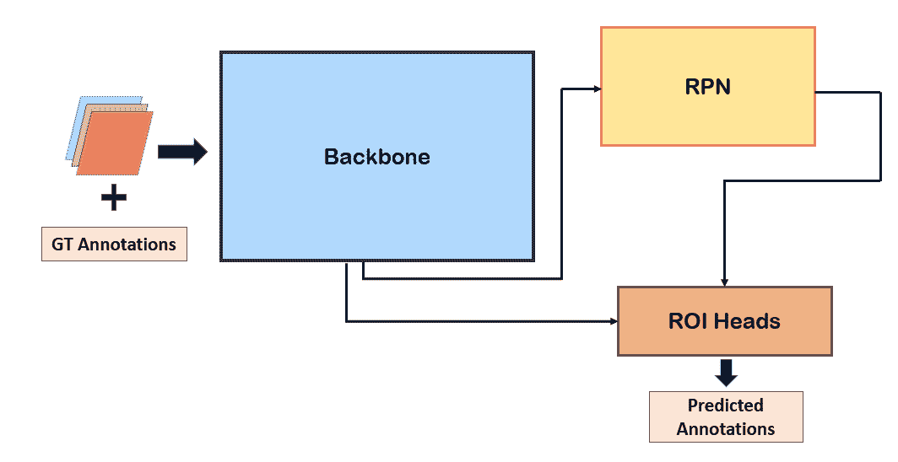

图 1：广义 RCNN 元架构。将多通道图像以及地面真值对象注释输入骨干特征提取器。这些特征被传递给 RPN 和 ROI 头，以预测对象位置和注释。

特征提取主干接收输入图像，并通过神经网络（通常由卷积层组成）输出“特征图”。在我们的测试中，我们使用 ResNet 主干和基于 Transformer 的主干。ResNet 是利用跳跃连接的卷积神经网络，这允许拥有许多层的深层架构，而不会遭遇困扰深层神经网络的准确性下降问题（He et al., 2016）。在本文中，我们探讨了几种不同的 ResNet 主干：ResNet50、ResNet101 和 ResNeXt。ResNet50 网络由总共 50 层组成，其中有两层位于网络的头部或“茎部”，然后四个阶段分别包含 3、4、6 和 3 层卷积层。每个阶段都包括一个跳跃连接。ResNet101 网络类似于 ResNet50 设置，但每个阶段分别包含 3、4、23 和 3 层卷积层。后续层经过池化操作，以减少输入分辨率。有关这些层的详细信息，请参阅 He et al. (2016)。ResNeXt 层与 ResNet 层类似，但包含分组卷积，增加了一组额外的并行变换（Xie et al., 2017）。我们还测试了一种具有可变形卷积的网络，其中规则间隔的卷积核通过网络学习到的逐像素偏移进行变形（Dai et al., 2017）。

ResNet 主干的各个阶段生成特征图，代表图像的高层次特征，如边缘和角落。虽然可以直接使用主干最后一层输出的特征图，但这在检测不同尺度的物体时可能会带来挑战。这促使我们在不同的主干阶段（从而不同的尺度）提取特征。一个被称为特征金字塔网络（FPN Lin et al., 2017）的层次特征提取器在物体检测基准测试中取得了巨大成功。FPN 允许由 ResNet 阶段提取的每个特征图与其他不同尺度的特征图共享信息，然后最终传递给区域提议网络（RPN）。

在图像特征提取完成后，广义-RCNN 网络的下一阶段涉及区域提议。此阶段包括在特征图上的点处放置边界框，并从提议的框中进行采样，以策划可能的对象选择。在完成此采样后，边界框将再次被提议并发送到感兴趣区域（ROI）头部，在那里与真实标注进行比较。标注包括边界框坐标、分割掩膜以及其他信息，如类别标签。最终，可以对这些感兴趣区域中的对象执行许多任务，包括分类，并且随着 Mask-RCNN 框架的出现，还包括语义分割。我们不包括 RPN 和 ROI 头部的详细信息，因为这些结构在我们的测试中大致保持不变。我们确实测试了具有级联结构的架构（Cai & Vasconcelos, 2018），该结构涉及在逐渐更高的检测阈值下迭代 RPN，以产生对对象位置的更好猜测。有关详细信息，我们参考 Girshick（2015）、He 等人（2017）以及 detectron2 代码库。

我们训练了一套网络以便进行多方面的比较。我们使用简写来表示网络配置，如下所示。

+   •

    R101c4：一个使用来自最后一个残差阶段特征的 ResNet50 骨干网络

+   •

    R101fpn：一个使用 FPN 的 ResNet101 骨干网络

+   •

    R101dc5：一个使用 FPN 的 ResNet101 骨干网络，其中最后一个块层的步幅减少了两倍，膨胀系数增加了两倍

+   •

    R50def：一个使用 FPN 和可变形卷积的 ResNet50 骨干网络

+   •

    R50cas：一个使用级联 FPN 的 ResNet50 骨干网络

+   •

    X101fpn：一个使用 FPN 的 ResNeXt101 骨干网络

除了这些基于 ResNet 的模型，我们还测试了基于变换器的架构。变换器是一个采用自注意力机制的编码器-解码器模型。简而言之，自注意力机制包括对编码序列应用线性操作，以生成中间的“查询、键和值”张量。对这些中间张量进行一系列线性操作和缩放，以生成输出序列，然后对整个输出序列进行最终的线性操作。由于其在序列上的可扩展性和通用性，变换器模型在自然语言处理领域迅速流行，这与语言结构的契合度很好。近年来，变换器已被用于计算机视觉任务，如图像分类和目标检测。这些模型已被证明与主流卷积神经网络竞争，并在性能指标上迅速取得进展（Dosovitskiy 等，2020；Caron 等，2021；Oquab 等，2023；Liu 等，2021；Li 等，2022）。例如，MViTv2 使用多头池化注意力（MHPA Fan 等，2021）在不同的图像尺度上应用自注意力，从而允许检测不同大小的特征。为了获得输入的编码序列，首先将图像划分为多个块，这些块被展平并通过一个线性层。将 MHPA 应用于这些序列以生成图像特征。在目标检测的背景下，这些特征以与从 RCNN 模型中的 ResNet 获得的特征相同的方式输入到 FPN 中。另一种现代变换器模型 Swin Transformer（Liu 等，2021）对图像块应用多头注意力，但采用了块合并而不是池化操作来结合不同图像块的特征。Swin 模型还使用了移动窗口注意力，以实现高效的计算和信息传播。我们在实现中测试了 MViTv2 和 Swin 背景模型。

## 3 实现

### 3.1 HSC 合成

在这项工作中，我们使用的数据包括来自 Hyper Suprime Cam (HSC) Subaru Strategic Program (SSP; Aihara et al., 2018b) 数据发布 3 (Aihara et al., 2022) 的大约 4000 像素² 的多波段图像合成。HSC SSP 是一个三级成像调查，使用广视场成像相机 HSC。HSC 仪器 (Miyazaki et al., 2017) 由一个 1.77 度² 的相机组成，像素尺度为 0.168”，附加在位于 Mauna Kea 的 Subaru 8.2 m 望远镜的主焦点上。HSC 调查的 Deep+UltraDeep 部分覆盖了$\sim$36 度² 的天空，涵盖五个宽光谱带 ($grizy$; (Kawanomoto et al., 2018))，达到约 27 mag 的完整 5$\sigma$ 深度（取决于滤镜）。尽管存在一些限制（例如，天空减法和拥挤的场景问题），HSC DR3 数据在所有当前可用的深宽调查中提供了最接近 LSST 宽场期望数据质量的匹配。Deep/Ultra-Deep 场的属性列在表 1: Detectron2 Implementation and Demonstration with Hyper Suprime-Cam Data") 中。我们使用 g、r 和 i 波段。

|  | 中位曝光（分钟） | 视见（”） | 深度（mag） |
| --- | --- | --- | --- |
| g | 70 | 0.83 | 27.4 |
| r | 66 | 0.77 | 27.1 |
| i | 98 | 0.66 | 26.9 |

表 1: HSC Deep/UltraDeep 图像的属性

由于调查的深度较大，与其他地面调查如暗能量调查（Dark Energy Survey Collaboration 等，2016）相比，许多对象被混合在一起。作为参考，HSC 调查中最浅的领域（Wide）中有 58%的对象被混合。虽然这是一个重大挑战，但这使得 HSC 领域成为测试去混合算法的优秀数据集，特别是适用于拥挤领域的算法。生成图像合成的管道在 Bosch 等人（2018）中有详细描述。有两组天空减除的合成图像。第一组包括全球天空减除的合成图像。第二组也使用全球天空减除图像，但应用了额外的局部天空减除算法。这是为了去除明亮对象的边缘，这些伪影可能会在对象检测算法中造成问题。然而，这一过程也会在去除扩展对象的光通量方面造成折衷，Aihara 等人（2018a）经验发现局部天空减除尺度为 21.5 角秒是一个良好的平衡。最终，我们使用这些局部天空减除图像，因为明亮的边缘和伪影可能会引入过度去混合或“撕裂”的问题，我们希望我们的“基准真相”检测尽可能干净和准确。为了进一步确保训练集的清洁，我们对样本应用了一些质量筛选。一些图像在一个或多个波段上缺少数据，尤其是在成像领域的边缘。我们使用合成 FITS 文件中提供的位掩码来排除像素标记为 NO$\_$DATA 标志的图像。如果 g、r 或 i 波段中的任何一个图像被标记为这种方式，我们也排除其他波段。仍然存在一些成像伪影和问题，如明亮恒星周围的饱和区域，我们将在第 4.2 节中讨论这些如何影响网络性能。

### 3.2 基准真相生成

我们必须提供真实的物体位置和掩膜给网络，以执行像素级分割。我们利用多波段去混叠代码 scarlet（Melchior et al., 2018）为每个单独的源生成模型，并从中创建物体掩膜。scarlet 利用受限矩阵分解生成物体的光谱分解。这是一个非参数模型，已被证明在单独的星系和混合场景上效果良好。在运行 scarlet 之前，我们使用 sep 提取物体目录，sep 是 SExtractor 的 Python 封装器。然后，每个识别出的源都被建模，“混合”或源的组合被拟合到合成图像数据中。一旦最终的混合模型计算完成，掩膜通过在每个单独的模型源上运行 sep 并设置 5$\sigma$的掩膜阈值来确定。scarlet 建模和掩膜阈值处理都是在检测图像上进行的，即所有波段的总和。这个过程的运行时间随着图像中物体数量的增加而增加。为了减少运行时间，我们将 4k 拼接的合成图像分成 16 张大约 1000$\times$1000 像素²的图像。尽管 scarlet 本身是一个强大的去混叠工具，但根据图像中的物体数量，拟合可能需要长达 30 分钟，这促使我们使用高效的神经网络。在这个过程完成后，我们编制了 1000 张 1k$\times$1k 像素²图像的训练集。每张图像中的源数量分布如图 2 所示。

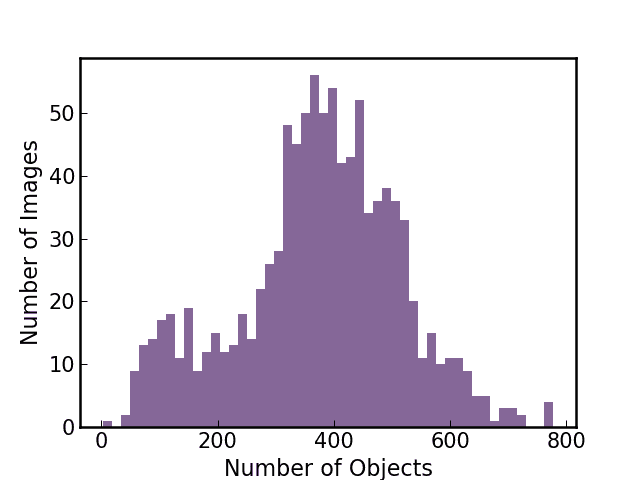

图 2：训练集中 HSC 图像中>5$\sigma$背景的物体数量直方图。这些图像来自 Deep 和 UltraDeep 领域。

使用真实数据而非模拟数据的权衡在于，在监督任务中缺乏预先确定的标签。对于分类任务，我们通过与 HSC DR3 目录的匹配来生成物体标签。我们将每个检测到的源中心转换为 RA 和 DEC 坐标，然后在 astropy 中运行 match_to_catalog_sky 算法，以找到 HSC 目录中 1 角秒内的物体。接着，我们将去混叠源的 i 波段星等与目录物体的“cmodel”星等进行比较，并选择星等差异最小的物体。如果 1 角秒内没有物体或没有物体的星等差异小于 1，我们将该物体从标记集中丢弃。一旦物体匹配成功，我们使用 HSC 目录中的“扩展值”来确定类别，该值基于 PSF 星等和扩展模型星等之间的差异。虽然在亮星等下能获得高精度，但对于 i 波段接近 24 等限星等的恒星分类，这个指标变得不可靠（Bosch 等，2018）。我们还会丢弃 DR3 目录中 NaN 值的物体，因为其类别不确定。我们在图 3: Detectron2 Implementation and Demonstration with Hyper Suprime-Cam Data")中展示了一个示例图像及我们的标记方法的结果，并标注了颜色编码的类别。

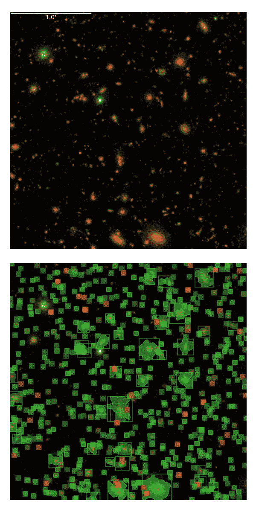

图 3：测试集中一个示例图像的真实掩膜和边界框。在这个数据集上，由于类别无关，我们对每个物体使用白色标记。为了清晰起见，下面展示了未叠加掩膜/框的图像。该可视化使用了 Lupton 对比度缩放。星系被标记为绿色，而恒星被标记为红色。

### 3.3 数据准备

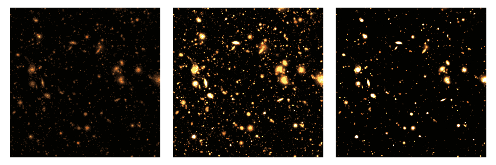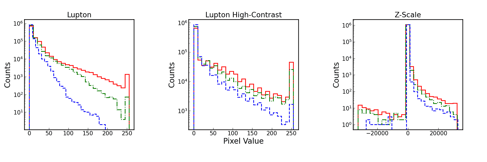

图 4：顶行：HSC DR3 数据集中不同对比度缩放的 RGB 图像。缩放方式，从左到右为：Lupton、Lupton 高对比度和 z-scale。底行：对应顶行图像的像素值直方图。红色、绿色和蓝色分别表示 i、r 和 g 滤光片中的值。

我们使用三种常见方法将 coadd FITS 文件中的原始数据缩放到 RGB 值。这些方法是：z-scale、Lupton 缩放和高对比度 Lupton 缩放。z-scale 变换在计算机视觉任务中常用，其公式为

|  | $\displaystyle R=A(i-\bar{I})/\sigma_{I}$ |  | (1) |
| --- | --- | --- | --- |
|  | $\displaystyle G=A(r-\bar{I})/\sigma_{I}$ |  |
|  | $\displaystyle B=A(g-\bar{I})/\sigma_{I}$ |  |

其中 $I=(i+r+g)/3$，具有均值 $\bar{I}$ 和标准差 $\sigma_{I}$，$R$ 是红色通道的像素值（绿色 $G$ 和蓝色 $B$ 通道分别使用 $r$ 和 $g$ 波段）。我们将 $A=10^{3}$ 用于训练，并将图像转换为 16 位整数。除了 z 缩放，我们还应用了 Lupton et al.（2004）的 Lupton 缩放。这是一种 asinh 缩放方法。

|  | $\displaystyle R=i(\textrm{asinh}(Q(I-\textrm{minimum})/\textrm{stretch})/Q$ |  | (2) |
| --- | --- | --- | --- |
|  | $\displaystyle G=r(\textrm{asinh}(Q(I-\textrm{minimum})/\textrm{stretch})/Q$ |  |
|  | $\displaystyle B=g(\textrm{asinh}(Q(I-\textrm{minimum})/\textrm{stretch})/Q.$ |  |

我们使用 0.5 的拉伸比例和 $Q=10$，将最小值设置为零，并将图像转换为无符号 8 位整数。Lupton 缩放可以突显星系中较暗的延展部分，同时避免在明亮的中央区域饱和。这些增强保持了物体的颜色信息，以帮助分类。最后，我们还使用了高对比度的 Lupton 缩放，其中图像的亮度和对比度在应用 Lupton 缩放后翻倍。我们测试了每种网络架构的所有这些缩放。在图 4: Detectron2 Implementation and Demonstration with Hyper Suprime-Cam Data") 中，我们展示了一个示例图像和 i、r 和 g 波段的像素值直方图（对应于 RGB 颜色）

我们对训练集和测试集应用了数据增强。数据增强已成为许多深度学习方法的基础。它使网络能够“看到”更多的信息，而无需在内存中存储额外的图像。我们采用了随机翻转和 90^∘ 旋转的空间增强方法。我们没有使用模糊或噪声添加，因为我们训练的数据已经被 PSF 卷积且包含噪声。对于将来将该框架推广到不同数据集的工作，模糊/噪声增强可能会有用，但对于在与训练数据相同条件下获得的测试数据的推理目的，空间增强已经足够。我们还在训练期间对每张图像进行随机 50% 裁剪，以便数据能够适应 GPU 内存。我们考虑了将所有对比度缩放作为数据增强，但没有发现网络性能有显著提升。然而，这可能在未来的工作中用来减少训练成本，因为结果与只用一个对比度缩放训练的网络表现相当。

### 3.4 训练

训练是通过随机梯度下降来更新网络权重，目标是最小化损失函数。这些 Mask-RCNN 模型的损失函数是

|  | $L=L_{\text{cls}}+L_{\text{box}}+L_{\text{mask}}$ |  | (3) |
| --- | --- | --- | --- |

其中分类损失 $L_{\text{cls}}$ 是 $-\log p_{u}$ 或对象属于其真实类别 $u$ 的估计概率的对数。离散概率分布是每个 ROI 中每个类别（加上一个背景类别）计算的。$L_{\text{box}}$ 是一个平滑的 L1 损失，计算预测的和真实的边界框坐标，如 Girshick (2015) 所给出。最后，掩码损失 $L_{\text{mask}}$ 是真实掩码和预测掩码之间每像素的平均二元交叉熵损失。

所有网络都是在 MS-COCO (Lin et al., 2014) 或 ImageNet-1k (Deng et al., 2009) 数据集上的地球图像上进行预训练的，因此我们使用迁移学习将这些模型应用于我们的天文数据集。迁移学习是一种深度学习技术，其中网络可以将一个任务的知识泛化到完成一个不同但相关的任务（参见 Tan et al. 2018 以了解深度迁移学习的概述）。当将预训练的深度学习模型应用于与训练期间不同的领域时，它通常会被使用。通过使用预训练的权重作为初始条件，训练可能会更快收敛，并且不易过拟合。我们使用 Detectron2 提供的权重作为我们训练过程的起点。然后，我们将网络训练 50 个完整的 epoch，即整个训练集被网络看到 50 次。为了促进知识的迁移，我们首先冻结模型的特征提取骨干，仅训练 ROI 和 RPN 网络中的头部层 15 个 epoch。我们为这一步使用 0.001 的学习率。然后，我们解冻特征提取骨干，并训练整个网络 35 个 epoch。我们以 0.0001 的学习率开始这一步，并在每 10 个 epoch 下降一个 10 倍的因子。

我们在 HAL 系统 (Kindratenko et al., 2020) 中使用两块 NVIDIA Tesla V100 GPU 对 1,000 张 500 像素² 的图像及其对象注释进行训练。当在每个 GPU 上并行训练时，我们的模型大约需要 $\sim$3 小时完成。Transformer 架构通常使用更多的内存，因此在 4 块 GPU 上训练大约需要 4 小时。

## 4 HSC 结果

训练后，我们在 HSC 图像的测试集上评估网络性能。测试集来自 UltraDeep COSMOS (Scoville et al., 2007) 领域中的补丁，并由 95 张 1000 像素² 的图像组成。测试集图像在训练期间没有见过。该工作的实例分割模型的一个优点是它们能够对大小可变的图像进行推断。因此，尽管在训练期间需要裁剪图像，我们仍然能够利用测试集中图像的全部大小。

我们使用精度和召回率来评估分类性能，计算公式为

|  | $p=\frac{\text{TP}}{\text{TP}+\text{FP}},$ |  | (4) |
| --- | --- | --- | --- |
|  | $r=\frac{\text{TP}}{\text{TP}+\text{FN}}.$ |  | (5) |

真实正例（TP）指的是网络输出的置信度分数超过某个阈值的检测，并且可以通过交并比（IOU）匹配到真实对象。假负例（FN）是指没有对应检测的真实对象。假正例（FP）是指具有高置信度分数但没有匹配真实对象的检测。IOU 定义为

|  | $\text{IOU}=\frac{\text{\emph{area}}(\text{box}_{\text{predicted}}\cap\text{box}_{\text{truth}})}{\text{\emph{area}}(\text{box}_{\text{predicted}}\cup\text{box}_{\text{truth}})}.$ |  | (6) |
| --- | --- | --- | --- |

或预测框与真实框的交集面积与并集面积之比。精度和召回率通常按类别分解，或者合并为一个值，即 AP 分数，

|  | $\text{AP}=\frac{1}{51}\sum_{r\in\{0,0.02,...,1.0\}}p(r)$ |  | (7) |
| --- | --- | --- | --- |

where $p(r)$ is maximum the precision in a recall bin of width $\Delta r$. AP scores are computed for IOU thresholds of {0.5,0.55…0.95} and averaged.

|  | ResNets | Transformers |
| --- | --- | --- |
|  |  | R101C4 | R101dc5 | R101fpn | R50cas | R50def | X101fpn | MViTv2 | Swin |
| --- | --- | --- | --- | --- | --- | --- | --- | --- | --- |
| Galaxies | Lupton | 23.7 | 24.6 | 40.9 | 46.3 | 41.7 | 41.4 | 51.7 | 50.8 |
| LuptonHC | 26.1 | 28.0 | 43.6 | 46.0 | 43.2 | 43.1 | 50.9 | 50.3 |
| zscale | 22.9 | 30.7 | 40.2 | 39.6 | 21.8 | 34.1 | 52.7 | 52.5 |
| Stars | Lupton | 10.3 | 9.6 | 7.3 | 7.4 | 4.3 | 2.5 | 34.1 | 33.9 |
| LuptonHC | 2.4 | 5.1 | 6.1 | 8.1 | 5.5 | 8.3 | 28.0 | 25.0 |
| zscale | 15.6 | 10.5 | 17.9 | 25.5 | 12.7 | 17.2 | 35.8 | 33.9 |
| Small | Lupton | 17.6 | 18.0 | 26.1 | 28.0 | 24.6 | 23.7 | 43.7 | 43.1 |
| LuptonHC | 14.8 | 17.2 | 25.9 | 27.7 | 25.4 | 26.9 | 40.1 | 38.4 |
| zscale | 19.7 | 21.5 | 30.2 | 33.2 | 18.1 | 26.8 | 44.8 | 43.8 |
| Medium | Lupton | 8.7 | 11.9 | 14.4 | 11.5 | 13.7 | 11.7 | 17.4 | 16.1 |
| LuptonHC | 7.8 | 11.1 | 13.4 | 12.7 | 10.3 | 12.6 | 16.3 | 15.5 |
| zscale | 3.8 | 9.0 | 7.2 | 7.3 | 1.6 | 3.6 | 15.1 | 14.9 |
| Large | Lupton | 16.4 | 30.9 | 18.9 | 14.3 | 19.6 | 9.3 | 43.1 | 41.5 |
| LuptonHC | 15.3 | 22.8 | 14.9 | 15.0 | 11.6 | 13.0 | 38.6 | 39.7 |
| zscale | 0.7 | 3.6 | 3.8 | 5.2 | 0.1 | 0.9 | 37.8 | 37.0 |

表 2：所有网络配置在 COSMOS HSC 数据集上的 AP 分数（分数越大越好）。银河系和恒星的 AP 分数是分别计算的，而小物体（0-32 像素²）、中等物体（32-96 像素²）和大物体（>96 像素²）的 AP 分数则是两个类别的平均值。每行的最佳结果以**粗体**显示。除了一个例外，MViTv2 骨干网在所有情况下都提供了最佳结果。

HSC COSMOS 测试集上的 AP 分数在表 2: Detectron2 Implementation and Demonstration with Hyper Suprime-Cam Data")中报告了所有网络配置。我们分别报告了星星和星系的每类 AP 分数，以及小型、中型和大型 AP 分数，分别由 0-32 像素²、32-96 像素²和>96 像素²的对象边界框大小定义。对于星系和星星，AP 分数在不同的网络配置中可能会有显著变化。对于基于 ResNet 的架构，星系的 AP 始终高于星星，这可能是由于星系的样本量较大，且形态特征使得星系比紧凑的星星更容易区分。在基于 ResNet 的网络中，Lupton 高对比度缩放通常会给出最高的星系 AP 分数，而 z 缩放总是会给出最高的星星 AP 分数。看起来这些网络对所使用的对比度缩放非常敏感，这对应用于具有不同动态范围的其他数据集并不理想。但是，基于 transformer 的架构在使用不同对比度缩放时表现更加鲁棒，并在几乎所有情况下都优于 ResNet 架构。对于这些网络，星系 AP 分数都在$\sim$50-52 之间，比最佳的 ResNet 配置提高了约 5 个百分点。Lupton 和 z 缩放的星体 AP 分数在$\sim$33-35 之间，高对比度的 Lupton 缩放表现更差，AP 约为$\sim$8。在小型、中型和大型 AP 指标中，transformer-based 网络在某些情况下也优于 ResNet-based 网络，在 AP 分数上取得了巨大的增长。这些网络通常在小型和大型对象类别上表现更好，这很可能是由于样本量造成的。

许多实例分割模型的研究使用 MS-COCO 或 ImageNet-1k 数据集作为基准，通过 AP 分数评估性能。这些数据集包含了多种物体类别的地面图像，因此不能直接用于与我们在仅有 2 类的天文调查图像上计算的 AP 分数进行比较。然而，为了让读者了解典型值的范围，训练于地面数据的模型的 AP 分数通常在 $\sim$35-45 之间，对于卷积主干网络，Transformer 主干网络则推高到 $\sim$55（参见 detectron2 仓库中的结果）。为了更公平的比较，我们参考了 Burke 等人（2019），他们在 Dark Energy Camera（DECam Flaugher 等，2015）的模拟观测数据上测试了实例分割模型。作者报告了一个星系的 AP 分数为 49.6，星星的分数为 48.6，平均得到一个 49.0 的综合分数。我们也在 DECam 数据集上训练了我们的模型，并在附录 A: Detectron2 Implementation and Demonstration with Hyper Suprime-Cam Data") 中报告了结果。最近，He 等人（2021）结合了实例分割模型 YOLOv4（Bochkovskiy 等，2020）和一个独立的分类网络，在 SDSS 图像上进行源检测和分类。他们报告了单类检测网络的 AP 分数为 52.81。

### 4.1 错误标签偏差缓解

由于对象类别标签的不正确，我们的 AP 分数测量存在固有偏差。在上述测量中，我们测试了网络根据 HSC 目录生成的标签推断类别的能力。然而，这些标签已知在 i 带星等约为$\sim$24 mag 时变得不可靠（Bosch et al., 2018）。我们使用 COSMOS 领域的 HSC 共加数据集，并尝试通过利用该领域与使用哈勃空间望远镜（HST）上的高级相机（ACS）的空间观测的重叠来减轻这种错误标记偏差。由于缺乏大气视差，使用 HST COSMOS 目录数据对星星/星系的形态分类在微弱对象中要精确得多，可以作为地面真相而不是 HSC 标签。这将测试较差的分类行为是由于标签生成还是模型的局限性。我们通过将检测到的源与 Leauthaud et al. (2007) 的目录在 1 角秒内交叉匹配来生成 HST 标签。如果在 1 角秒内没有对象，我们将丢弃该对象。HSC 与 HST 标签之间不一定存在一对一的匹配，因为我们正在与不同的目录交叉匹配，但每个图像中的对象数量对于任何标记方案基本保持不变。我们将其称为 HST COSMOS 测试集。

这个小数据集不足以训练网络，因此我们不在 HST 标记的数据上进行训练，而是使用在 HSC 标记的数据上训练的模型，并在 HST COSMOS 测试集上测试它们的评估性能。为了突出类别标签生成的差异，在图 5: Detectron2 Implementation and Demonstration with Hyper Suprime-Cam Data") 中，我们展示了 COSMOS 数据集中 HSC 和 HST 类别标签的 HSC i 带星等函数的星星和星系数量。HSC 标签在微弱星等下的不可靠质量体现在星星的计数增加上，尤其是 i$\sim$25 mag 开始的星星计数峰值。另一个值得注意的是，在 HSC COSMOS 数据集中，明亮星等的星星计数较少。这可能是由于我们在 HSC 目录中生成标签时丢弃了 NaN 值的对象。明亮的星星很可能在其中心有饱和像素，导致这些错误标志的出现。使用 HST 标签，我们可以用更天体物理学上准确的基线进行测试。

使用这个新的测试集，我们在表 3: Detectron2 Implementation and Demonstration with Hyper Suprime-Cam Data") 中展示了 AP 分数。

|  | ResNets | Transformers |
| --- | --- | --- |
|  |  | R101C4 | R101dc5 | R101fpn | R50cas | R50def | X101fpn | MViTv2 | Swin |
| --- | --- | --- | --- | --- | --- | --- | --- | --- | --- |
| 银河系 | Lupton | 25.9 | 26.8 | 42.9 | 49.4 | 43.5 | 42.8 | 51.8 | 52.4 |
| LuptonHC | 27.4 | 30.0 | 46.2 | 50.2 | 46.7 | 44.3 | 51.5 | 51.6 |
| zscale | 25.5 | 32.5 | 42.7 | 41.5 | 23.0 | 35.6 | 52.2 | 52.9 |
| 星体 | Lupton | 16.2 | 15.0 | 10.9 | 10.9 | 7.1 | 3.8 | 52.9 | 53.7 |
| LuptonHC | 4.2 | 7.9 | 11.2 | 14.2 | 9.4 | 13.9 | 42.1 | 37.7 |
| zscale | 28.3 | 19.1 | 29.3 | 41.6 | 23.8 | 29.0 | 53.9 | 52.6 |
| 小型 | Lupton | 22.0 | 22.1 | 29.3 | 31.4 | 27.0 | 25.2 | 54.0 | 54.7 |
| LuptonHC | 16.4 | 19.9 | 30.0 | 33.3 | 29.4 | 30.7 | 48.2 | 46.0 |
| zscale | 28.0 | 27.1 | 37.8 | 42.9 | 24.8 | 34.1 | 54.7 | 54.3 |
| 中型 | Lupton | 8.3 | 11.7 | 13.8 | 11.0 | 13.1 | 11.1 | 16.3 | 15.2 |
| LuptonHC | 7.5 | 10.8 | 12.7 | 12.2 | 9.9 | 12.0 | 15.4 | 14.6 |
| zscale | 3.7 | 8.5 | 7.3 | 7.4 | 1.7 | 3.6 | 14.1 | 14.1 |
| 大型 | Lupton | 6.2 | 11.1 | 7.2 | 5.9 | 7.2 | 3.6 | 15.1 | 15.0 |
| LuptonHC | 5.4 | 7.9 | 5.3 | 4.8 | 4.4 | 4.8 | 13.7 | 14.0 |
| zscale | 0.3 | 1.2 | 1.3 | 1.9 | 0.1 | 0.2 | 13.6 | 13.5 |

表 3: 与表 2 相同，但使用了 COSMOS HST 测试集。

对于银河系/星体 AP 分数的结果与之前在 HSC COSMOS 测试集上的结果一致。在所有情况下，Transformer 架构的表现优于 ResNet 架构，并且对不同的对比度缩放具有更好的鲁棒性。小型边界框对象的 AP 分数在所有网络配置中都有所改善，中型边界框的 AP 分数大致保持不变，而大型边界框的 AP 分数则变差。大型边界框 AP 分数的下降可能是由于初始标签生成步骤中使用的 sep 过度融合或“撕裂”了大型扩展的银河系和星体周围的饱和区域。通过我们的 HSC 标签生成，我们通过强制 i 带 $\Delta$1 mag 标准并丢弃与饱和目录对象（NaN 值）匹配的标签来排除许多被撕裂的区域。然而，我们的 HST 标签生成完全基于距离匹配标准，因此这些撕裂的区域在 HST COSMOS 测试集中被包含在实际标签中。如果网络在推断时避免撕裂这些区域，这些虚假的额外标签可能会导致更低的 AP 分数。在下一节中，我们将考察其他不易受此影响的指标。

### 4.2 缺失和额外标签偏差的缓解

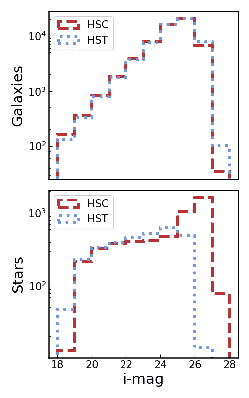

图 5：我们的 COSMOS 数据集中星系和恒星的计数，标签来源于 HSC 和 HST 目录。HSC 在微弱星等处的额外恒星计数是由于当分类基于扩展度指标时星系的污染。亮恒星样本的不足是由于我们的目录匹配程序中排除了 NaN 值的对象。

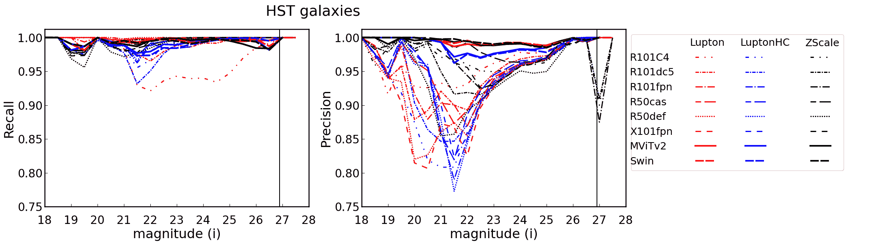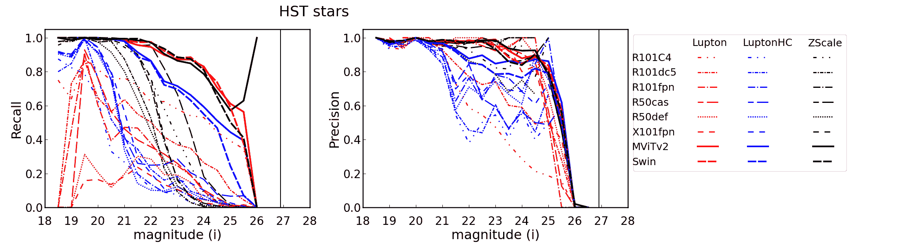

图 6：顶部：HST i 波段中星系的精确度/召回率指标随对象星等的变化。颜色对应于各个主干网络架构，并在图例中显示。线型表示不同的网络架构，颜色则指示使用了哪种对比度缩放（红色为 Lupton，蓝色为 LuptonHC，黑色为 z-scale）。黑色垂直线表示 Deep/UltraDeep i 波段 5$\sigma$ 星等为 26.9 mag。y 轴被截断以更好地显示模型之间的差异。底部：HST i 波段中恒星的精确度/召回率指标随对象星等的变化。

|  | ResNets | Transformers |
| --- | --- | --- |
|  |  | R101C4 | R101dc5 | R101fpn | R50cas | R50def | X101fpn | MViTv2 | Swin |
| --- | --- | --- | --- | --- | --- | --- | --- | --- | --- |
| 星系 | Lupton | 0.96 | 0.98 | 0.98 | 0.98 | 0.98 | 0.98 | 0.99 | 0.99 |
| LuptonHC | 0.97 | 0.98 | 0.98 | 0.98 | 0.98 | 0.98 | 0.99 | 0.99 |
| zscale | 0.98 | 0.98 | 0.98 | 0.99 | 0.97 | 0.98 | 0.99 | 0.99 |
| 恒星 | Lupton | 0.46 | 0.47 | 0.33 | 0.33 | 0.21 | 0.15 | 0.88 | 0.88 |
| LuptonHC | 0.23 | 0.33 | 0.32 | 0.40 | 0.29 | 0.37 | 0.80 | 0.75 |
| zscale | 0.69 | 0.57 | 0.61 | 0.76 | 0.60 | 0.64 | 0.87 | 0.87 |

表 4：在 HST COSMOS 测试集中针对所有网络配置计算的恒星和星系类别的 F1 分数。Transformer 网络在所有情况下都优于卷积网络，尤其是在恒星检测方面。

由于我们使用 sep、scarlet 和目录匹配自己标记了地面真实检测、掩模和类别，传统的网络性能指标可能不是表征效能的最佳选择。考虑精确度/召回率和 AP 指标。这些指标的一个隐含假设是地面真实标签的完整性和纯度。这个假设适用于大型标注的地面图像数据集，例如 MS-COCO 数据集（Lin et al., 2014），该数据集通常用作目标检测/分割研究的基准。它也适用于天文图像的模拟数据集（Burke et al., 2019），因为在构建训练和测试集标签时，地面真实对象的位置、掩模和类别都是已知的。然而，真实的大型天文场景数据提出了挑战。由于我们必须在没有已知真实情况的情况下生成标签，与这一“地面真实”进行的任何比较实际上是与生成这些标签的方法的比较。标签生成过程中的问题将会传递到性能指标中。

首先，使用检测阈值为背景以上 5$\sigma$的 sep 运行生成地面真实检测。这会导致标签不完整，因为一些对象会被遗漏。我们可以降低这个阈值，但这样会有进一步过度融合扩展/饱和对象的风险。这导致第二个问题，即仍然会存在一些撕裂现象，这会导致地面真实集出现虚假的额外对象，即标签的不纯。 如果网络没有像 sep 那样撕裂扩展/饱和对象（这是网络的一个理想特征），那么 AP 指标将会较低，因为网络检测到的虚假对象较少。最后，本文中使用的神经网络的目标检测机制与 sep 中使用的峰值检测方法从根本上不同。

这些问题导致神经网络检测到我们地面真值目录中未标记的对象，尽管它们是真实存在的对象，或者神经网络未检测到地面真值中存在的非物理对象。任何考虑真假检测的指标都受到这种影响。我们不希望计算这些虚假的真假正例，因为这会导致性能指标下降，这并不反映网络的分类/检测准确性，而是我们标签生成的局限性。因此，我们构建了一组类似于经典精确率和召回率的指标，但稍微调整了我们对正例和负例的定义。我们使用方程 4 和 5，但我们将我们的指标限制在与地面真值检测匹配的对象集合 D 上。匹配检测集合 D 是通过选择与地面真值边界框的 IOU 最高的推断边界框来确定的，阈值为 0.5。然后，对于给定的类别 C，真正例是集合 D 中正确分类的对象，假正例是被错误分配为类别 C 的对象，假负例是与地面真值类别 C 匹配的对象，但网络将其分配为其他类别。通过这些指标，精确率和召回率纯粹测量网络的分类能力，不受丢失标签或额外虚假标签的偏倚。如果我们假设网络对匹配集外的对象的分类能力保持一致，我们可以将这些指标推广到整体分类性能。

我们将精确率和召回率结合成一个指标来评估分类能力，即 F1 分数，它是精确率和召回率之间的调和平均数，

|  | $\textrm{F}1=2\times\frac{p*r}{p+r}.$ |  | (8) |
| --- | --- | --- | --- |

F1 分数在精度和召回率之间平衡权衡，接近 1 的值是理想的。我们在表 4: Detectron2 Implementation and Demonstration with Hyper Suprime-Cam Data")中报告了 HST COSMOS 测试集上的网络 F1 分数。ResNet 架构中表现最佳的配置是具有 z-scale 缩放的 R50cas 网络。采用 Lupton 缩放的 Swin 网络在整体星系和恒星 F1 分数上取得了最高成绩，尽管 MViTv2 架构仍然具有竞争力。几乎所有的 transformer 网络配置在星系/恒星分类上表现优于基于 ResNet 的网络。基于 transformer 的网络在对比度缩放的鲁棒性方面再次优于基于 ResNet 的网络。

为了检查在微弱物体上的网络性能，我们展示了 HST COSMOS 测试集在 i 带光度下的精度和召回率，如图 6: Detectron2 Implementation and Demonstration with Hyper Suprime-Cam Data")所示。无论光度如何，星系的召回率对所有物体保持接近 1 的值，虽然对于某些模型会有几个百分点的波动。对于某些模型，星系的精度在明亮的光度下会下降，这可能是由于紧凑的星系的亮核心类似于恒星。然而，这些下降更可能是模型固有限制的结果，而非标签生成问题，因为与 ResNet 架构相比，transformer 架构在所有光度区间内产生了高的星系精度和召回率。大多数 ResNet 架构在恒星召回率上表现较差，许多在明亮的光度下表现不佳。对于所有架构，恒星精度在明亮的光度下接近 1，但许多网络配置在 i 带光度为 21 mag 左右时开始出现性能下降。表现最佳的网络在 i 带光度为$\sim$25 mag 时保持恒星精度在 0.8 以上。我们训练的 transformer 模型在 HST COSMOS 测试集中能够实现 99.6%的星系召回率、99.2%的星系精度、85.4%的恒星召回率和 91.5%的恒星精度，这些指标是对整个光度范围的平均值。相比之下，He 等人（2021）在大型 SDSS 图像中进行深度神经网络对象检测和分类，包括恒星、星系和类星体。他们的样本覆盖了 14-25 mag 的 r 带光度范围，报告了 95.1%的星系召回率、95.8%的星系精度、84.6%的恒星召回率和 94.5%的恒星精度。

### 4.3 去混叠

为了量化网络的去混叠性能，我们计算了匹配对象的 IOU 分数。这个过程类似于计算分类精度/召回率时的匹配。我们首先设置检测置信度阈值为 0.5，然后计算所有检测到的和真实对象的边界框 IOU。对于每个真实对象，我们取 IOU 高于 0.5 阈值的对应检测对象。我们采用这个阈值以避免第 4.2: Detectron2 Implementation and Demonstration with Hyper Suprime-Cam Data")节讨论的偏差。IOU 为一表示真实框与推测框的完美匹配。除了边界框 IOU 外，我们还计算了分割掩码 IOU，这从 6: Detectron2 Implementation and Demonstration with Hyper Suprime-Cam Data")方程得出，但使用了真实和预测分割掩码的面积。我们在 5: Detectron2 Implementation and Demonstration with Hyper Suprime-Cam Data")表中报告了所有匹配对象的中位数 IOU，并在图 7: Detectron2 Implementation and Demonstration with Hyper Suprime-Cam Data")中展示了分布。基于变压器的网络通常产生比基于 ResNet 的网络更高的边界框 IOU，尽管 R50cas、R101fpn 和 X101fpn 网络仍然具有竞争力。分割掩码 IOU 在所有情况下都低于边界框 IOU。这表明，虽然网络能够较好地识别整体对象尺寸，但在边界框内对象形状的细节推断较差。

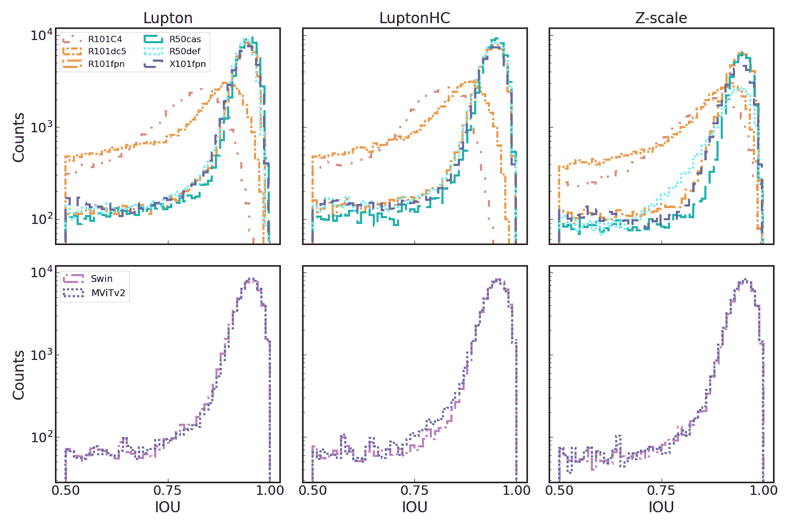

图 7：每个检测到的对象与真实对象匹配的边界框 IOU。行显示了不同变压器骨干网络的结果。顶部：ResNet 骨干网络的结果。底部：变压器骨干网络的结果。左列表示 Lupton 缩放，中间列为 Lupton 高对比度，右列为 z 缩放。

|  | ResNets | Transformers |
| --- | --- | --- |
|  | R101C4 | R101dc5 | R101fpn | R50cas | R50def | X101fpn | MViTv2 | Swin |
| --- | --- | --- | --- | --- | --- | --- | --- | --- |
| Lup | 0.75 (0.61) | 0.78 (0.57) | 0.93 (0.63) | 0.94 (0.62) | 0.93 (0.64) | 0.93 (0.64) | 0.94 (0.64) | 0.94 (0.64) |
| LupHC | 0.76 (0.61) | 0.79 (0.58) | 0.93 (0.64) | 0.94 (0.64) | 0.93 (0.64) | 0.93 (0.64) | 0.94 (0.64) | 0.94 (0.64) |
| Zscale | 0.78 (0.61) | 0.81 (0.59) | 0.92 (0.62) | 0.93 (0.63) | 0.82 (0.65) | 0.91 (0.64) | 0.94 (0.65) | 0.94 (0.65) |

表 5：COSMOS HST 测试中匹配物体的中位数边界框 IOU。每行中最佳的边界框 IOU 用**粗体**突出显示。括号中还显示了中位数分割掩码 IOU。IOU 值高于 0.5 被认为是匹配良好，1.0 的得分表示真实值与推断的完美重叠。

中位数 IOU 衡量了网络检测和分割物体的能力，但并未完全捕捉网络的去混叠能力。我们检查了几个紧密混合的案例，以了解网络区分大范围重叠物体的能力。我们在图 8: Detectron2 Implementation and Demonstration with Hyper Suprime-Cam Data") 中展示了不同网络的去混叠能力。在非常拥挤的场景中，网络能够区分单独的来源，甚至识别出标签集中不存在的物体，这可能对低表面亮度星系的研究具有优势。如在第 4.2: Detectron2 Implementation and Demonstration with Hyper Suprime-Cam Data") 节中讨论的，这可能是由于区域提议网络与峰值检测方法在物体检测能力上的差异，突出了模型并不受训练数据的限制，而是能够进行超出训练数据的推断。还可以改变推断超参数，例如 IOU 或检测置信度阈值，这可能会允许更多或更少的检测或检测之间的重叠。在图 9: Detectron2 Implementation and Demonstration with Hyper Suprime-Cam Data") 中，我们展示了降低置信度阈值超参数的效果，从而允许更多低置信度的检测。虽然不完全等同，但这类似于在峰值检测算法中降低检测阈值。有些情况下去混叠效果较差，这通常是非常大的星系与一个或多个非常大且非常接近的伴星。在这种情况下，使用不同的对比度缩放可能更好。在图 10: Detectron2 Implementation and Demonstration with Hyper Suprime-Cam Data") 中，Lupton 对比度缩放防止了网络去混叠多个大型源。使用相同的 IOU/置信度评分阈值，z-scaling 更好地隔离了这两个来源。这可能是由于我们 z-scaling 的动态范围更大，这减少了源的模糊，并在这种情况下提供了更多的区分能力。总体而言，对于非常大且非常接近的混合情况，似乎没有一种通用的网络配置。使用更多的数据进行训练可能会提高检测和分割这些物体的能力。

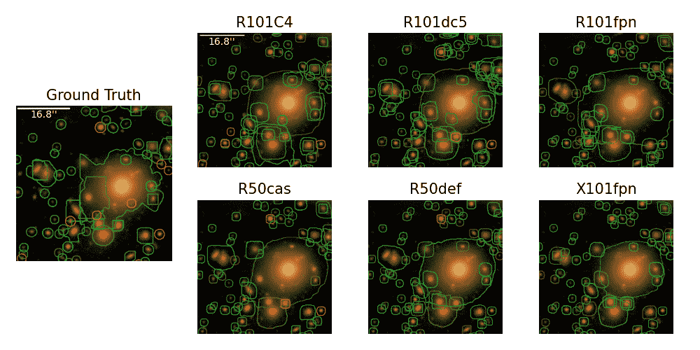

图 8：对近距离混合的推断。地面真相显示在左侧。RGB 图像使用 Lupton 对比度缩放创建。其他面板展示了模型的分割图和类别推断。顶行，从左到右：R101C4、R101dc5、R101fpn。底行，从左到右：R50cas、R50def、X101fpn。颜色表示类别，绿色表示星系，红色表示恒星。检测差异完全由于不同的骨干网络。虽然网络未能识别所有地面真相物体，但它们也能够检测到地面真相标注遗漏的真实物体。

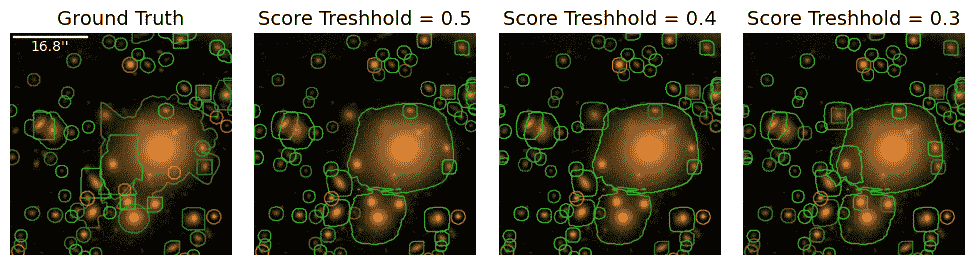

图 9：与图 8: Detectron2 Implementation and Demonstration with Hyper Suprime-Cam Data") 中的相同近距离混合进行的推断，但仅使用了 Swin 架构。地面真相显示在最左侧面板中，将检测置信度阈值降低到 0.5、0.4 和 0.3 的效果分别从左到右显示。随着阈值的降低，能够检测到更大区域内的物体。

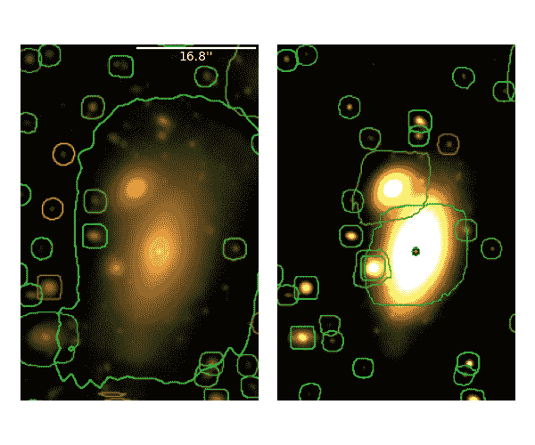

图 10：使用不同对比度缩放对近距离混合的影响。我们展示了 R50cas 网络在 Lupton 缩放图像（左）和 z 缩放图像（右）上训练时的推断。通过 z 缩放，物体更容易被区分。

## 5 讨论

实例分割模型的有效性已在许多领域得到证实，这得益于网络能够“开箱即用”且无需进行大量微调的能力。据显示，基于 Mask R-CNN 框架的目标检测模型在模拟天文调查图像的分类和检测/分割方面表现良好（Burke et al.，2019）。在这项工作中，我们对来自 HSC SSP 数据第 3 版发布的真实数据进行了广泛的最新实例分割模型的训练和测试，以推动基于深度学习的星系检测、分类和去混合的方向朝着真实应用。网络的训练和评估性能受我们的标签生成方法的有效性限制，这是一项任务，在地面真实情况并非完全已知时不容易制定。这一限制还影响了我们用来衡量网络性能的指标选择。通常，分类和检测能力被合并为 AP 得分，这在实例分割文献中被广泛使用。然而，这可能不是用于比较的最佳指标，因为它暗含了地面真相标签的完整性和正确性。为了试图减轻不正确标签对性能指标的影响，我们构建了一个测试集，其中的对象的类别标签是根据更准确的空间观测到的 HST 观测确定的。然而，由于 AP 指标在“假阳性”检测方面人为受到影响，这些真实目标仅仅是缺失于标记集的，或者存在虚假的地面真实检测存在的情况，我们进一步尝试通过限制性能指标来缓解这种偏差，以检测到具有匹配地面真实标签的对象。

我们发现所有网络在对星系进行分类时表现良好，即使是对样本中最微弱的星系也能进行有效分类。尽管真实成像数据中颜色、大小和形态的种类繁多，我们的模型仍能识别这些对象。恒星分类的效果较差，可能是由于训练和测试集中样本量较小。基于 Transformer 的网络在星星和星系的分类能力上通常优于基于 ResNet 的网络。随着星等变得更暗，Transformer 基于的模型似乎也更为稳健。Transformer 基于的模型在整个样本中保持了近 100% 的星系选择完整性（召回率）和纯度（准确率），以及在 i 带星等 25 mag 时超过 60% 的恒星完整性和 80% 的纯度。这些模型能够超越 HSC 目录中使用的扩展性分类器，后者根据切割条件产生接近 100% 的星系纯度、约 90% 的星系完整性、略高于 50% 的恒星完整性和略高于 40% 的恒星纯度，i 带星等为 25 mag（Bosch et al., 2018）。我们模型性能的提升尤其值得注意，因为它们能够超越 HSC 类别标注，尽管它们是在 HSC 数据上进行训练的。与传统卷积神经网络相比，Transformer 模型对不同对比度缩放的鲁棒性更强，这表明它们可能更适用于具有不同动态范围的广泛图像。

检测/去混叠能力通过网络的中位数边界框 IOU 进行测量。同样，基于 Transformer 的网络通常优于基于卷积 ResNet 的网络。Transformer 网络相对于基于卷积的网络性能提升，可能归因于不同注意力头能够在不同图像尺度上编码信息（Dosovitskiy et al., 2020），从而比 CNN 允许更多的全局信息传播。虽然卷积神经网络能够通过在图像上滑动内核来学习空间特征，但 Transformer 一次性学习整个输入的特征，从而消除了内核大小带来的限制。可能 Transformer 主干隐含地利用了图像中的大尺度特征，如对象的空间聚类、背景噪声或视场，并利用这些整体属性来为网络提供信息。

我们检查了一些近距离混合的案例，以定性地观察网络如何区分对象。在一些情况下，网络未能检测到近距离的对象，但这些问题有时可以通过调整置信度和 NMS IOU 阈值超参数（可以在训练后进行调整）来缓解。在其他情况下，使用不同的对比度缩放有助于隔离紧密混合的对象。

在未来的工作中，这些模型的分类和分割仍有改进的空间。一种可能性是构建一个包含更准确标签的更大训练集。通过更好和更多的星星/星系样本，网络可能在分类上表现得更好。在训练过程中看到的大型星系的更多近距离混合场景，网络将更有可能区分这些场景。在训练之前，对架构进行更多超参数的微调可能会有所帮助，而不是直接使用默认设置。此外，使用更多光度信息可能有助于所有任务。我们在这项工作中使用了 HSC 仪器上的 i、r 和 g 波段，相当于 RGB 彩色图像，但如果我们加入 z 和 y 波段，可能会进一步调查性能。

这些网络可能需要更长时间的训练，或者由于天文图像与地面图像在基本属性上的差异，限制了这些架构在提取用于分类的有用特征的能力。尽管我们尝试减轻由标签生成引起的测量偏差，但在微弱亮度下，分类仍然是这些模型面临的挑战。已经有一种机器学习模型被用来利用光度信息对 HSC 数据进行分类，其准确性优于形态学方法，但依赖于上游的检测任务（Bosch 等人，2018）。本文展示的实例分割模型能够在训练后仅使用图像作为输入来识别和分配类别。

## 6 结论

目前的天文研究时代已使得机器学习算法解析大规模图像集成为必然结果。目录构建的第一步是从成像数据中检测这些对象。计算机视觉领域的进展催生了一个庞大的模型生态系统，这些模型可以同时执行许多必要的任务，包括检测、分割和分类。虽然这些方法在地球数据上经过测试并在模拟天文数据中显示有效，但在真实调查图像中的应用仍在进行中。许多方法依赖于对象检测阶段来生成单个对象的测量。在这项工作中，我们利用 Detectron2 提供的各种实例分割模型来同时进行检测任务、去混叠和对象分类，图像取自 HSC-SSP 数据发布 3。我们通过现有框架和目录匹配精心构建真实标签，并警告说真实数据没有简单的方式来生成标签。我们发现，最佳网络在分类样本中最微弱的星系时表现良好，比传统方法在分类高达 i-band $ \sim $25 mag 的恒星时表现更好。即使在训练时使用不准确的类别标签，神经网络仍能捕捉到有用的特征，从而推断真实的基础类别。我们预计，更多准确标签的数据将改善性能。表现最好的模型能够通过匹配真实对象位置和边界框来检测和去混叠。Transformer 网络在进一步研究中似乎是一个有前途的探索方向。

未来还有许多其他研究领域。虽然我们测试了各种模型，但在 Detectron2 中还有许多模型未被实现。一些架构非常庞大，需要大量资源进行训练。例如，我们尝试在我们的变换器架构集合中实现 ViT 骨干（Dosovitskiy 等，2020），但受到可用 GPU 内存的限制。许多模型，尤其是变换器，使用 FAIR 或其他组织的最先进计算资源进行训练，随后的重新训练需要大量资源。可以在其他真实数据集上进行测试，考虑其他下游任务。例如，González 等人（2018）研究了在 SDSS 数据上应用实例分割模型以分类星系形态。使用 Detectron2 的模块化特性，添加额外类别或实现红移估计网络将变得简单。在未来的工作中，我们计划在 Mask R-CNN/变换器网络中添加一个 photo-z 估计器分支，并与 LSST 软件 RAIL（红移评估基础设施层）²²2https://github.com/LSSTDESC/RAIL 接口。可用的逼真 LSST-like 模拟（LSST Dark Energy Science Collaboration (LSST DESC)等，2021）将使我们能够避免标签生成中的偏差。神经网络的效率和一次执行多项任务的能力现在是应对大量调查数据涌入管道的必要条件。

随着调查深入天空，它们将产生前所未有的大量对象，这些对象需要处理。LSST 将提供最深的地基观测，每晚调查数 TB 的数据，突显了对准确和精确的对象检测和分类的需求，可能还需要实时进行。正确分类和分离源将对广泛的研究至关重要，深度实例分割模型将在处理这些任务中发挥重要作用。

## 致谢

我们感谢国家超级计算应用中心（NCSA）的 S. Luo 博士和 D. Mu 博士对本工作中使用的 GPU 集群的支持。我们感谢 Y. Shen 对 COSMOS 领域 HST 观测的有益讨论。G.M.、Y.L.、Y.L.和 X.L.感谢 NCSA 教师奖学金和 NCSA SPIN 项目的支持。

本工作利用了由国家科学基金会重大研究仪器项目（拨款号#1725729）以及伊利诺伊大学厄本那-香槟分校支持的资源。

我们确认使用了 Matplotlib（Hunter, 2007），这是一个由社区开发的 Python 绘图库。本研究使用了 Astropy，³³3http://www.astropy.org，这是一个由社区开发的核心 Python 天文学包（Astropy Collaboration et al., 2013; Price-Whelan et al., 2018）。本研究还利用了 NASA 的天体物理数据系统。

Hyper Suprime-Cam（HSC）合作项目包括日本和台湾的天文学社区以及普林斯顿大学。HSC 的仪器和软件由日本国家天文台（NAOJ）、宇宙物理与数学研究所（Kavli IPMU）、东京大学、高能加速器研究组织（KEK）、台湾中央研究院天文学与天体物理学研究所（ASIAA）以及普林斯顿大学开发。资助来自日本内阁府的 FIRST 计划、日本文部科学省（MEXT）、日本学术振兴会（JSPS）、日本科学技术振兴机构（JST）、东丽科学基金会、NAOJ、Kavli IPMU、KEK、ASIAA 和普林斯顿大学。

本论文使用了为大型广域巡天望远镜开发的软件。我们感谢 LSST 项目将其代码作为免费软件提供，网址为 http://dm.lsst.org

Pan-STARRS1 调查（PS1）得以实现，得益于天文学研究所、夏威夷大学、Pan-STARRS 项目办公室、马克斯·普朗克学会及其参与机构、海德堡的马克斯·普朗克天文学研究所、加尔兴的马克斯·普朗克外星物理研究所、约翰斯·霍普金斯大学、达勒姆大学、爱丁堡大学、贝尔法斯特女王大学、哈佛-史密松天体物理中心、全球望远镜网络 Las Cumbres 观察台、台湾中央大学、空间望远镜科学研究所、国家航空航天局（NASA）根据 NNX08AR22G 资助的计划科学部门、国家科学基金会（NSF）资助的 AST-1238877 计划、马里兰大学、厄尔特大学（ELTE）以及洛斯阿拉莫斯国家实验室。

[部分]基于在 Subaru Telescope 收集的数据，并从由 Subaru Telescope 和日本国家天文台的天文学数据中心操作的 HSC 数据存档系统中检索的数据。

本研究使用了 NASA/IPAC 红外科学档案馆，该档案馆由国家航空航天局资助，并由加州理工学院运营。

## 参考文献

+   Aihara 等（2018a）Aihara H., et al., 2018a, [日本天文学会出版物](http://dx.doi.org/10.1093/pasj/psx066), 70, S4

+   Aihara 等人 (2018b) Aihara H., 等人, 2018b, [PASJ](http://dx.doi.org/10.1093/pasj/psx081), [70, S8](https://ui.adsabs.harvard.edu/abs/2018PASJ...70S...8A)

+   Aihara 等人 (2022) Aihara H., 等人, 2022, [日本天文学会出版物](http://dx.doi.org/10.1093/pasj/psab122), 74, 247

+   Alam 等人 (2015) Alam S., 等人, 2015, [ApJS](http://dx.doi.org/10.1088/0067-0049/219/1/12), [219, 12](https://ui.adsabs.harvard.edu/abs/2015ApJS..219...12A)

+   Amiaux 等人 (2012) Amiaux J., 等人, 2012, 欧几里得任务：参考调查的建立, [doi:10.1117/12.926513](http://dx.doi.org/10.1117/12.926513), [`doi.org/10.1117/12.926513`](https://doi.org/10.1117/12.926513)

+   Andreon 等人 (2000) Andreon S., Gargiulo G., Longo G., Tagliaferri R., Capuano N., 2000, [MNRAS](http://dx.doi.org/10.1046/j.1365-8711.2000.03700.x), [319, 700](https://ui.adsabs.harvard.edu/abs/2000MNRAS.319..700A)

+   Arcelin 等人 (2021) Arcelin B., Doux C., Aubourg E., Roucelle C., LSST Dark Energy Science Collaboration 2021, [皇家天文学会月刊](http://dx.doi.org/10.1093/mnras/staa3062), 500, 531

+   Astropy Collaboration 等人 (2013) Astropy Collaboration 等人, 2013, [A&A](http://dx.doi.org/10.1051/0004-6361/201322068), [558, A33](http://adsabs.harvard.edu/abs/2013A%26A...558A..33A)

+   Bertin & Arnouts (1996) Bertin E., Arnouts S., 1996, [A&AS](http://dx.doi.org/10.1051/aas:1996164), [117, 393](https://ui.adsabs.harvard.edu/abs/1996A&AS..117..393B)

+   Bochkovskiy 等人 (2020) Bochkovskiy A., Wang C.-Y., Liao H.-Y. M., 2020, [arXiv 预印本](http://dx.doi.org/10.48550/arXiv.2004.10934), [p. arXiv:2004.10934](https://ui.adsabs.harvard.edu/abs/2020arXiv200410934B)

+   Bosch 等人 (2018) Bosch J., 等人, 2018, [日本天文学会出版物](http://dx.doi.org/10.1093/pasj/psx080), 70, S5

+   Boucaud 等人 (2020) Boucaud A., 等人, 2020, [MNRAS](http://dx.doi.org/10.1093/mnras/stz3056), [491, 2481](https://ui.adsabs.harvard.edu/abs/2020MNRAS.491.2481B)

+   Bretonnière 等人 (2021) Bretonnière H., Boucaud A., Huertas-Company M., 2021, 大规模宇宙学调查中重叠星系的概率分割, [doi:10.48550/arXiv.2111.15455](http://dx.doi.org/10.48550/arXiv.2111.15455), [`arxiv.org/abs/2111.15455`](http://arxiv.org/abs/2111.15455)

+   Burke 等人 (2019) Burke C. J., Aleo P. D., Chen Y.-C., Liu X., Peterson J. R., Sembroski G. H., Lin J. Y.-Y., 2019, [MNRAS](http://dx.doi.org/10.1093/mnras/stz2845), [490, 3952](https://ui.adsabs.harvard.edu/abs/2019MNRAS.490.3952B)

+   Cai & Vasconcelos (2018) Cai Z., Vasconcelos N., 2018, 见于 IEEE 计算机视觉与模式识别会议论文集. pp 6154–6162

+   Caron 等人 (2021) Caron M., Touvron H., Misra I., Jégou H., Mairal J., Bojanowski P., Joulin A., 2021, 见于 IEEE/CVF 国际计算机视觉会议论文集. pp 9650–9660

+   Cheng (2017) Cheng J., 2017, 博士学位论文, 普渡大学

+   Cheng 等（2022）Cheng B.，Parkhi O.，Kirillov A.，2022，在 IEEE/CVF 计算机视觉与模式识别会议论文集中，页 2617–2626

+   Dai 等（2017）Dai J.，Qi H.，Xiong Y.，Li Y.，Zhang G.，Hu H.，Wei Y.，2017，[arXiv 预印本](http://dx.doi.org/10.48550/arXiv.1703.06211)，[p. arXiv:1703.06211](https://ui.adsabs.harvard.edu/abs/2017arXiv170306211D)

+   Dark Energy Survey Collaboration 等（2016）Dark Energy Survey Collaboration 等，2016，[MNRAS](http://dx.doi.org/10.1093/mnras/stw641)，[460, 1270](https://ui.adsabs.harvard.edu/abs/2016MNRAS.460.1270D)

+   Dawson 等（2016）Dawson W. A.，Schneider M. D.，Tyson J. A.，Jee M. J.，2016，[ApJ](http://dx.doi.org/10.3847/0004-637X/816/1/11)，[816, 11](http://adsabs.harvard.edu/abs/2016ApJ...816...11D)

+   Deng 等（2009）Deng J.，Dong W.，Socher R.，Li L.-J.，Li K.，Fei-Fei L.，2009，在 2009 年 IEEE 计算机视觉与模式识别大会上，页 248–255，[doi:10.1109/CVPR.2009.5206848](http://dx.doi.org/10.1109/CVPR.2009.5206848)

+   Dey 等（2019）Dey A. 等，2019，[AJ](http://dx.doi.org/10.3847/1538-3881/ab089d)，[157, 168](https://ui.adsabs.harvard.edu/abs/2019AJ....157..168D)

+   Dosovitskiy 等（2020）Dosovitskiy A. 等，2020，[arXiv 预印本](http://dx.doi.org/10.48550/arXiv.2010.11929)，[p. arXiv:2010.11929](https://ui.adsabs.harvard.edu/abs/2020arXiv201011929D)

+   Fan 等（2021）Fan H.，Xiong B.，Mangalam K.，Li Y.，Yan Z.，Malik J.，Feichtenhofer C.，2021，在 IEEE/CVF 国际计算机视觉大会论文集中，页 6824–6835

+   Flaugher 等（2015）Flaugher B. 等，2015，[AJ](http://dx.doi.org/10.1088/0004-6256/150/5/150)，[150, 150](https://ui.adsabs.harvard.edu/abs/2015AJ....150..150F)

+   Girshick（2015）Girshick R.，2015，在 2015 年 IEEE 国际计算机视觉大会（ICCV）上，页 1440–1448，[doi:10.1109/ICCV.2015.169](http://dx.doi.org/10.1109/ICCV.2015.169)

+   González 等（2018）González R. E.，Muñoz R. P.，Hernández C. A.，2018，[天文学与计算](http://dx.doi.org/10.1016/j.ascom.2018.09.004)，[25, 103](https://ui.adsabs.harvard.edu/abs/2018A&C....25..103G)

+   Grogin 等（2011）Grogin N. A. 等，2011，[ApJS](http://dx.doi.org/10.1088/0067-0049/197/2/35)，[197, 35](https://ui.adsabs.harvard.edu/abs/2011ApJS..197...35G)

+   Hausen & Robertson（2020）Hausen R.，Robertson B.，2020，[ApJS](http://dx.doi.org/10.3847/1538-4365/ab8868)，248，20

+   He 等（2016）He K.，Zhang X.，Ren S.，Sun J.，2016，2016 年 IEEE 计算机视觉与模式识别大会（CVPR），页 770–778

+   He 等（2017）He K.，Gkioxari G.，Dollár P.，Girshick R.，2017，在 IEEE 国际计算机视觉大会论文集中，页 2961–2969

+   He 等（2021）He Z.，Qiu B.，Luo A.-L.，Shi J.，Kong X.，Jiang X.，2021，[皇家天文学会月刊](http://dx.doi.org/10.1093/mnras/stab2243)，508，2039

+   Hemmati 等（2022）Hemmati S.等，2022 年，[ApJ](http://dx.doi.org/10.3847/1538-4357/aca1b8)，[941, 141](https://ui.adsabs.harvard.edu/abs/2022ApJ...941..141H)

+   Huertas-Company & Lanusse（2023）Huertas-Company M.，Lanusse F.，2023 年，[Publ. Astron. Soc. Australia](http://dx.doi.org/10.1017/pasa.2022.55)，[40, e001](https://ui.adsabs.harvard.edu/abs/2023PASA...40....1H)

+   Hunter（2007）Hunter J. D.，2007 年，[Computing in Science & Engineering](http://dx.doi.org/10.1109/MCSE.2007.55)，9，90

+   Ibrahim 等（2020）Ibrahim M. R.，Haworth J.，Cheng T.，2020 年，[Cities](http://dx.doi.org/https://doi.org/10.1016/j.cities.2019.102481)，96，102481

+   Ivezić等（2019）Ivezić Ž.等，2019 年，[ApJ](http://dx.doi.org/10.3847/1538-4357/ab042c)，[873, 111](https://ui.adsabs.harvard.edu/abs/2019ApJ...873..111I)

+   Jarvis & Tyson（1981）Jarvis J. F.，Tyson J. A.，1981 年，[AJ](http://dx.doi.org/10.1086/112907)，[86, 476](https://ui.adsabs.harvard.edu/abs/1981AJ.....86..476J)

+   Kawanomoto 等（2018）Kawanomoto S.等，2018 年，[PASJ](http://dx.doi.org/10.1093/pasj/psy056)，70，66

+   Kindratenko 等（2020）Kindratenko V.等，2020 年，在《高级研究计算实践与经验》中，PEARC ’20，计算机协会，纽约，NY，美国，第 41–48 页，[doi:10.1145/3311790.3396649](http://dx.doi.org/10.1145/3311790.3396649)

+   Koekemoer 等（2011）Koekemoer A. M.等，2011 年，[ApJS](http://dx.doi.org/10.1088/0067-0049/197/2/36)，[197, 36](https://ui.adsabs.harvard.edu/abs/2011ApJS..197...36K)

+   Kroupa（2001）Kroupa P.，2001 年，[MNRAS](http://dx.doi.org/10.1046/j.1365-8711.2001.04022.x)，[322, 231](https://ui.adsabs.harvard.edu/abs/2001MNRAS.322..231K)

+   LSST 暗能量科学合作组（LSST DESC）等（2021）LSST 暗能量科学合作组（LSST DESC）等，2021 年，[ApJS](http://dx.doi.org/10.3847/1538-4365/abd62c)，[253, 31](https://ui.adsabs.harvard.edu/abs/2021ApJS..253...31L)

+   Leauthaud 等（2007）Leauthaud A.等，2007 年，[ApJS](http://dx.doi.org/10.1086/516598)，[172, 219](https://ui.adsabs.harvard.edu/abs/2007ApJS..172..219L)

+   Li 等（2022）Li Y.，Wu C.-Y.，Fan H.，Mangalam K.，Xiong B.，Malik J.，Feichtenhofer C.，2022 年，在 IEEE/CVF 计算机视觉与模式识别会议论文集中，第 4804–4814 页

+   Lin 等（2014）Lin T.-Y.，Maire M.，Belongie S.，Hays J.，Perona P.，Ramanan D.，Dollár P.，Zitnick C. L.，2014 年，在欧洲计算机视觉会议（ECCV）中。苏黎世

+   Lin 等（2017）Lin T.-Y.，Dollár P.，Girshick R. B.，He K.，Hariharan B.，Belongie S. J.，2017 年，2017 IEEE 计算机视觉与模式识别会议（CVPR），第 936–944 页

+   Lintott 等（2011）Lintott C.等，2011 年，[MNRAS](http://dx.doi.org/10.1111/j.1365-2966.2010.17432.x)，[410, 166](https://ui.adsabs.harvard.edu/abs/2011MNRAS.410..166L)

+   Liu 等（2021）Liu Z.，Lin Y.，Cao Y.，Hu H.，Wei Y.，Zhang Z.，Lin S.，Guo B.，2021 年，在 IEEE/CVF 国际计算机视觉会议论文集中，第 10012–10022 页

+   Lupton et al. (2004) Lupton R., Blanton M. R., Fekete G., Hogg D. W., O’Mullane W., Szalay A., Wherry N., 2004, [PASP](http://dx.doi.org/10.1086/382245), [116, 133](https://ui.adsabs.harvard.edu/abs/2004PASP..116..133L)

+   Madau & Dickinson (2014) Madau P., Dickinson M., 2014, [ARA&A](http://dx.doi.org/10.1146/annurev-astro-081811-125615), [52, 415](https://ui.adsabs.harvard.edu/abs/2014ARA&A..52..415M)

+   Mahabal et al. (2019) Mahabal A., et al., 2019, [PASP](http://dx.doi.org/10.1088/1538-3873/aaf3fa), [131, 038002](https://ui.adsabs.harvard.edu/abs/2019PASP..131c8002M)

+   Malanchev et al. (2021) Malanchev K. L., et al., 2021, [MNRAS](http://dx.doi.org/10.1093/mnras/stab316), [502, 5147](https://ui.adsabs.harvard.edu/abs/2021MNRAS.502.5147M)

+   Melchior et al. (2018) Melchior P., Moolekamp F., Jerdee M., Armstrong R., Sun A.-L., Bosch J., Lupton R., 2018, [天文学与计算](http://dx.doi.org/10.1016/j.ascom.2018.07.001), 24, 129

+   Melchior et al. (2021) Melchior P., Joseph R., Sanchez J., MacCrann N., Gruen D., 2021, [自然综述物理](http://dx.doi.org/10.1038/s42254-021-00353-y), 3, 712

+   Miller & Hall (2021) Miller A. A., Hall X. J., 2021, [PASP](http://dx.doi.org/10.1088/1538-3873/abf038), [133, 054502](https://ui.adsabs.harvard.edu/abs/2021PASP..133e4502M)

+   Miyazaki et al. (2017) Miyazaki S., et al., 2017, [日本天文学会出版物](http://dx.doi.org/10.1093/pasj/psx063), 70

+   Morganson et al. (2018) Morganson E., et al., 2018, [PASP](http://dx.doi.org/10.1088/1538-3873/aab4ef), [130, 074501](https://ui.adsabs.harvard.edu/abs/2018PASP..130g4501M)

+   Muyskens et al. (2022) Muyskens A. L., Goumiri I. R., Priest B. W., Schneider M. D., Armstrong R. E., Bernstein J., Dana R., 2022, [AJ](http://dx.doi.org/10.3847/1538-3881/ac4e93), [163, 148](https://ui.adsabs.harvard.edu/abs/2022AJ....163..148M)

+   Oquab et al. (2023) Oquab M., et al., 2023, [arXiv e-prints](http://dx.doi.org/10.48550/arXiv.2304.07193), [p. arXiv:2304.07193](https://ui.adsabs.harvard.edu/abs/2023arXiv230407193O)

+   Pavel et al. (2022) Pavel M. I., Tan S. Y., Abdullah A., 2022, [应用科学](http://dx.doi.org/10.3390/app12146831), 12

+   Peterson et al. (2015) Peterson J. R., et al., 2015, [ApJS](http://dx.doi.org/10.1088/0067-0049/218/1/14), [218, 14](https://ui.adsabs.harvard.edu/abs/2015ApJS..218...14P)

+   Price-Whelan et al. (2018) Price-Whelan A. M., et al., 2018, [AJ](http://dx.doi.org/10.3847/1538-3881/aabc4f), [156, 123](https://ui.adsabs.harvard.edu/#abs/2018AJ....156..123T)

+   Reiman & Göhre (2019) Reiman D. M., Göhre B. E., 2019, [皇家天文学会月报](http://dx.doi.org/10.1093/mnras/stz575), 485, 2617

+   Ross et al. (2011) Ross A. J., et al., 2011, [MNRAS](http://dx.doi.org/10.1111/j.1365-2966.2011.19351.x), [417, 1350](https://ui.adsabs.harvard.edu/abs/2011MNRAS.417.1350R)

+   Russeil et al. (2022) Russeil E., Ishida E. E. O., Le Montagner R., Peloton J., Moller A., 2022, [arXiv 电子预印本](http://dx.doi.org/10.48550/arXiv.2211.10987), [p. arXiv:2211.10987](https://ui.adsabs.harvard.edu/abs/2022arXiv221110987R)

+   Scoville et al. (2007) Scoville N., et al., 2007, [ApJS](http://dx.doi.org/10.1086/516585), [172, 1](https://ui.adsabs.harvard.edu/abs/2007ApJS..172....1S)

+   Spergel et al. (2013) Spergel D., et al., 2013, arXiv 电子预印本, [p. arXiv:1305.5422](https://ui.adsabs.harvard.edu/abs/2013arXiv1305.5422S)

+   Tachibana & Miller (2018) Tachibana Y., Miller A. A., 2018, [PASP](http://dx.doi.org/10.1088/1538-3873/aae3d9), [130, 128001](https://ui.adsabs.harvard.edu/abs/2018PASP..130l8001T)

+   Tan et al. (2018) Tan C., Sun F., Kong T., Zhang W., Yang C., Liu C., 2018, 深度迁移学习综述: 第 27 届国际人工神经网络会议, 希腊罗德岛, 2018 年 10 月 4-7 日, 会议录, 第三部分, 页 270–279, [doi:10.1007/978-3-030-01424-7_27](http://dx.doi.org/10.1007/978-3-030-01424-7_27)

+   Wu et al. (2019) Wu Y., Kirillov A., Massa F., Lo W.-Y., Girshick R., 2019, Detectron2, [`github.com/facebookresearch/detectron2`](https://github.com/facebookresearch/detectron2)

+   Xie et al. (2017) Xie S., Girshick R., Dollár P., Tu Z., He K., 2017, 在 IEEE 计算机视觉与模式识别会议录中, 页 1492–1500

+   Zhou et al. (2021) Zhou S. K., et al., 2021, IEEE 会议录, 109, 820

## 附录 A DECam 结果

为了对网络性能进行基准比较，我们利用了 Burke 等人创建和使用的 PhoSim 数据集（2019）。我们参考了早期的工作以获得完整描述，但在此提供简要总结。使用 Photon Simulator 代码（Peterson 等，2015）生成了由 DECam 拍摄的拥挤场景。模拟考虑了设备光学（Cheng，2017）、望远镜选项（Flaugher 等，2015）和大气条件。螺旋、椭圆和不规则星系通过采样三维 Sersic 模型，并添加额外参数以展示更多形态特征来生成。恒星被建模为点源，并按照（Kroupa，2001）的初始质量函数生成。对于恒星和星系，SEDs 和金属丰度基于物理模型分配。使用宇宙星形成历史（Madau & Dickinson，2014）来分配星系的数量密度和种群，而恒星的分布则基于银河纬度。为了模拟拥挤的场景，银河超密度被提高了 4 倍。生成了一个 512x512 像素²的图像，包含 g、r 和 z DECam 波段。积分时间和亮度范围大致对应于 DECaLs DR7 合成图（Dey 等，2019）。为了分配对象掩码，为场中的每个对象生成了一张没有背景的 g 波段图像。PSF 配置为$\sim$1 角秒。总共生成了 1000 张图像作为我们的训练集，另外 250 张用于验证，还有 50 张作为测试集进行评估。每张图像包含大约 150 个对象。

在这里，我们展示了使用 R101fpn 和 MViTv2 主干网络对模拟 DECam 数据的两次运行结果。这些主干网络的选择是为了比较卷积架构与基于变换器的架构的性能。我们使用了与 HSC 数据相同的对比度缩放，但将伸缩参数更改为 100，并将 Q 更改为 10 以适用于 Lupton 和 Lupton 高对比度缩放。模拟数据的动态范围与 HSC 数据不同，因此进行了调整以使星系特征更具辨识度。每个配置的 AP 分数见表格 6 的天文调查检测、实例分割和分类：Detectron2 实现和 Hyper Suprime-Cam 数据演示")。我们将 Small、Medium 和 Large 边界框大小的范围调整为与 Burke 等人 (2019) 使用的范围匹配。总体而言，我们发现使用 ResNet 主干网络的 Lupton 缩放对这个数据集效果最佳，几乎所有类别的 AP 分数都最高。这与 HSC 数据的结果形成对比，然而我们注意到变换器主干网络对对比度缩放的鲁棒性更强。虽然 Burke 等人 (2019) 使用了带有 R101fpn 主干网络的 z-scale，我们的结果有所不同，因为我们使用了稍微修改的 z-scale 公式，即通过常数 $\sigma_{I}$ 重新缩放每个波段，而不是每波段缩放因子。这种改变使得星系分类性能变差（AP=29.80 对比 AP=49.6），但星类分类性能提升（AP=54.32 对比 AP=48.6）。星系 AP 的大幅下降表明 R101fpn 主干网络对对比度缩放非常敏感。所有其他配置的星系和星类 AP 分数均优于 Burke 等人 (2019) 的结果。我们对 Small 物体的 AP 分数较低，但 Medium 和 Large 的分数则高得多。对于尺寸类别，我们使用与 Burke 等人 (2019) 相同的尺寸定义，但计算所有 IOU 阈值的平均 AP，而不是仅计算最低阈值 IOU=0.5 的 AP。因此，我们的结果可以视为一种下限，因为 AP 分数通常随着 IOU 阈值的降低而增加。

|  |  | R101fpn | MViTv2 |
| --- | --- | --- | --- |
| Galaxies | Lupton | 65.8 | 62.5 |
| LuptonHC | 58.3 | 62.2 |
| zscale | 29.8 | 60.4 |
| Stars | Lupton | 70.1 | 68.0 |
| LuptonHC | 64.3 | 68.6 |
| zscale | 54.3 | 66.4 |
| Small | Lupton | 68.3 | 65.7 |
| LuptonHC | 61.8 | 65.7 |
| zscale | 42.3 | 63.8 |
| Medium | Lupton | 36.1 | 31.6 |
| LuptonHC | 29.0 | 46.7 |
| zscale | 16.3 | 31.7 |
| Large | Lupton | 72.6 | 54.9 |
| LuptonHC | 49.1 | 65.2 |
| zscale | 38.0 | 68.0 |

表 6：DECam 运行的 AP 分数。当应用不同的对比度缩放和骨干网络时，星系和恒星的 AP 分数相较于 Burke 等人（2019）的结果有所提升。基于 Transformer 的模型对对比度缩放更具鲁棒性，这与真实 HSC 数据上的结果一致。
