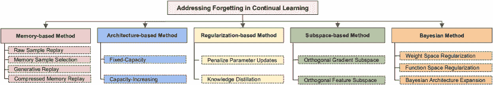

<!--yml

类别: 未分类

日期: 2024-09-06 19:37:54

-->

# [2307.09218] 深度学习中遗忘的全面调查：超越持续学习

> 来源：[`ar5iv.labs.arxiv.org/html/2307.09218`](https://ar5iv.labs.arxiv.org/html/2307.09218)

# 深度学习中的全面调查

深度学习超越持续学习

王振毅、恩能·杨、李申、黄恒。王振毅和黄恒在美国马里兰大学计算机科学系工作，邮政地址：MD 20742，大学公园，马里兰州，美国。

电子邮件：wangzhenyineu@gmail.com; heng@umd.edu。恩能·杨在中国东北大学工作。电子邮件：ennengyang@stumail.neu.edu.cn。李申在中国京东探索学院工作。电子邮件：mathshenli@gmail.com。稿件接收于 2023 年 7 月 15 日；修订于 2023 年 7 月 15 日。

###### 摘要

遗忘指的是以前获得的信息或知识的丧失或退化。虽然现有的遗忘调查主要集中在持续学习上，但遗忘在深度学习的其他研究领域中也是一种普遍现象。遗忘在生成模型（由于生成器变化）和联邦学习（由于客户端之间的异质数据分布）等研究领域表现出来。应对遗忘面临多个挑战，包括平衡旧任务知识的保留与新任务的快速学习、管理具有冲突目标的任务干扰以及防止隐私泄露等。此外，大多数现有的持续学习调查隐含地认为遗忘总是有害的。相反，我们的调查认为遗忘是把双刃剑，在某些情况下（如隐私保护场景）可以是有益和可取的。通过在更广泛的背景下探索遗忘，我们旨在呈现对这一现象更为细致的理解，并突出其潜在优势。通过这项全面调查，我们希望借鉴各个领域对遗忘的处理，揭示潜在解决方案。通过超越传统界限检查遗忘，我们期望在未来的工作中鼓励开发新策略，以减轻、利用或甚至拥抱现实应用中的遗忘。关于各种研究领域遗忘的文献全面列表可在 [`github.com/EnnengYang/Awesome-Forgetting-in-Deep-Learning`](https://github.com/EnnengYang/Awesome-Forgetting-in-Deep-Learning) 查阅。

###### 关键词：

有益遗忘、害处遗忘、记忆化、分布变化、跨学科研究

## 1 引言

遗忘[1] 指的是在机器学习系统中，先前获得的信息或知识随时间退化的现象。在神经网络的早期，重点主要是对静态数据集进行模型训练。在这些设置中，遗忘并不是一个显著的问题，因为模型是在固定数据集上进行训练和评估的。灾难性遗忘的概念首先由 McCloskey 和 Cohen 正式引入[1]。他们展示了当神经网络在不同任务上进行顺序训练时，新任务的学习会使其忘记先前学习的任务。这一观察突显了在顺序学习场景中解决遗忘问题的必要性。后来，解决遗忘问题被正式化为持续学习（CL）。如今，遗忘不仅在 CL 领域引起了广泛关注，也在更广泛的机器学习社区中，成为了整个机器学习领域的一个根本性问题。

现有关于遗忘的调查主要集中于 CL[2, 3, 4, 5, 6, 7, 8, 9]。然而，这些调查往往仅关注遗忘的有害影响，缺乏对该主题的全面讨论。相比之下，我们的调查旨在提供对遗忘的更全面理解。我们突出了其作为双刃剑的双重性质，强调其益处和危害。此外，我们的调查超越了 CL 的范围，涵盖了在其他各种领域中的遗忘问题，包括基础模型、领域适应、元学习、测试时适应、生成模型、强化学习和联邦学习。通过这样做，我们提供了一个涵盖更广泛背景和应用的遗忘问题的全面审视。

表 I: 有害遗忘：不同问题设置的比较。

问题设定 目标 忘记源 连续学习 在不遗忘以前知识的情况下学习非静态数据分布 训练过程中的数据分布变化 基础模型 在大规模无标签数据上进行无监督学习 预训练和微调中的数据分布变化 领域适应 在保持源领域性能的同时适应目标领域 目标领域随时间逐渐变化 测试时间适应 缓解训练与测试之间的分布差异 在测试期间适应测试数据分布 元学习 学习可适应新任务的知识 逐步元学习新类别 / 任务分布变化 生成模型 学习生成器以逼近真实数据分布 生成器变化 / 数据分布变化 强化学习 最大化累积奖励 状态、动作、奖励和状态转移动态变化 联邦学习 去中心化训练，无需共享数据 模型平均；非独立同分布数据；数据分布变化

表 II：有益的遗忘：不同问题设置的比较。

问题设定 目标 缓解过拟合 通过选择性遗忘来减少对训练数据的记忆 去偏见和遗忘无关信息 遗忘有偏见的信息以获得更好的性能或移除无关信息以学习新任务 机器遗忘 遗忘某些特定的训练数据以保护用户隐私

在这项调查中，我们将机器学习中的遗忘分为两个类别：有害的遗忘和有益的遗忘，基于具体的应用场景。有害的遗忘发生在我们希望机器学习模型在适应新任务、领域或环境的同时保留以前学到的知识时。在这种情况下，防止和减轻知识遗忘是至关重要的。相反，有许多情况下有益的遗忘变得必要。例如：（1）过拟合训练数据会阻碍泛化。（2）无关和噪声信息妨碍模型有效学习新任务和知识。（3）预训练模型包含的私人信息可能导致隐私泄露。在这些情况下，遗忘变得有利，因为它服务于几个重要的目的。首先，遗忘可以缓解过拟合，因为它允许模型忘记无关的细节，专注于训练数据中最相关的模式。此外，通过丢弃不必要的信息，遗忘有助于学习新知识，因为模型可以更好地利用其能力来获取和适应新信息。最后，遗忘有助于保护隐私，通过丢弃敏感的用户信息，确保这些数据不会保留在模型的记忆中。

### 1.1 有害的遗忘

有害遗忘不仅在 CL 中被观察到，还在其他各种研究领域中出现，包括基础模型、领域适应、元学习、测试时适应、生成模型、强化学习和联邦学习。虽然现有的调查主要集中在 CL 背景下的遗忘，但它们常常忽视了对这些其他相关研究领域的全面检查。本次调查旨在填补这一空白，通过概述不同学习场景中的遗忘，包括上述研究领域。

在这些研究领域，遗忘可以归因于各种因素。在持续学习的背景下，遗忘发生是由于不同任务间数据分布的变化。在元学习中，遗忘是任务分布变化的结果。在联邦学习中，遗忘是由不同客户端之间数据分布的异质性引起的，通常称为客户端漂移。在领域适应中，遗忘发生是因为领域转移。在测试时适应中，遗忘是由于在测试期间适应测试数据分布的结果。在生成模型中，遗忘发生是由于生成器随时间的变化或学习非平稳数据分布。在强化学习中，遗忘可能由于状态、行动、奖励和状态转移动态随时间变化的结果。这些环境中潜在因素的变化可能导致在强化学习过程中已学知识的丧失或改变。在基础模型的情况下，遗忘可以归因于三种不同的原因：微调遗忘、增量流数据预训练以及利用基础模型进行下游 CL 任务。

为了便于清晰和比较与遗忘相关的各种设置，我们在表格 I 中呈现了有害遗忘的综合分析，突出了不同设置之间的区别。

### 1.2 有益的遗忘

尽管大多数现有工作的主流观点认为遗忘是有害的，但我们已经认识到遗忘是一把双刃剑。在某些情况下，遗忘已学习神经网络中的特定知识是有利的。故意遗忘在几种场景中证明是有益的：（1）选择性遗忘可以帮助减轻过拟合；（2）为了增强模型的泛化能力或促进新任务/知识的学习，必须消除先前学习知识中的偏见或无关信息；（3）机器遗忘，防止数据隐私泄露。

首先，过拟合仍然是机器学习中的一个基本挑战，因为它发生在模型过度记忆训练数据但难以有效地对新、未见过的测试数据进行泛化时。为了提高泛化能力，模型必须避免仅仅记忆训练数据，而应该优先学习输入数据与对应标签之间的真实潜在关系。增强泛化能力的一项重要技术是选择性遗忘，它在移除从训练数据中学到的无关或噪声信息方面发挥了重要作用。通过有选择地丢弃这些无关细节，模型可以专注于最相关的模式和特征，从而提高在未见过的数据上的泛化性能。

其次，当目标是学习新任务或知识时，先前获得的知识可能并不总是对提高对新信息的未来学习有用或有益。当模型保留过时或不相关的知识时，它可能会阻碍其有效学习和从新数据中泛化的能力。在这种情况下，必须丢弃模型记忆中仍保留的无关信息。通过释放模型内的容量，模型将更易于接收和适应新知识。丢弃无关信息的过程对于防止旧知识与新知识之间的干扰至关重要。

最后，机器学习模型的用户可能会要求从数据库中删除他们的训练数据，以及在预训练模型本身中的任何痕迹，行使他们的“被遗忘权”[10]。为了解决这个问题，研究人员探讨了机器“遗忘”的概念，这允许有意地忘记不需要的私有训练数据。此外，某些隐私攻击利用机器学习模型的记忆效应从预训练模型中提取私人信息。例如，成员推断攻击[11]可以确定数据点是否属于与预训练模型相关的训练数据。这些隐私攻击在实践中可能成功，因为神经网络的记忆效应。在这种情况下，有意遗忘私人知识对保护隐私和防止信息泄漏变得尤为重要。

为了便于比较，我们还在表格 II 中提供了有关有益遗忘的比较分析，涵盖了上述提到的各种设置供参考。

### 1.3 解决遗忘问题的挑战

解决遗忘问题面临着众多挑战，这些挑战在不同的研究领域中各不相同。这些挑战包括：

数据可用性：数据可用性是各种场景中的一个重大挑战，并极大地复杂化了解决遗忘问题的任务。一方面，由于存储限制或数据隐私问题，学习新任务时，先前任务的数据可能有限。这种挑战在持续学习、元学习、领域适应、生成模型和强化学习中普遍存在，其中获取过去任务数据对于减轻遗忘和利用先前知识至关重要。另一方面，一些场景禁止使用原始数据。例如，在联邦学习中，只有预训练模型的参数会传输到中央服务器，而不会共享底层训练数据。

资源限制：资源有限的环境，如内存和计算受限的环境，给有效解决遗忘问题带来了挑战。在在线持续学习和元学习中，由于数据或任务通常只处理一次，这些挑战尤为突出。此外，学习智能体对过去数据和经验的访问有限，这限制了强化之前学习任务的机会。对过去数据的有限接触使得保留知识和有效减轻遗忘变得困难。此外，在线学习通常在资源受限的环境中进行，内存或计算能力有限。这些限制为在线环境中的遗忘问题增加了额外的障碍。

新环境/分布适应：在各种领域，如持续学习、基础模型、强化学习、领域适应、测试时间适应、元学习和生成模型中，目标环境或数据分布可能会随时间变化。因此，学习智能体需要适应这些新环境或场景。这种适应可以发生在训练阶段或测试阶段。然而，当学习智能体适应新场景和环境时，会出现遗忘挑战。由于数据分布的变化，智能体往往会丧失先前获得的知识或在早期任务上的表现。

任务干扰/不一致性：不同任务之间的目标冲突和不兼容可能导致任务干扰，给防止遗忘带来挑战。这一问题在各种背景中都可以观察到，包括持续学习和联邦学习。在持续学习中，连续观察到的任务可能具有冲突的目标，使得网络在多个任务之间平衡其性能变得困难。随着网络学习新任务，这些冲突目标的干扰可能会加剧遗忘问题。同样，在联邦学习中，由于客户端之间的数据分布异质性[12]，在不同客户端上训练的模型可能表现出不一致性。这些不一致性可能导致任务或客户端干扰，进一步加重遗忘问题。

隐私泄露预防：在某些情况下，保留旧知识可能会引发隐私问题，因为这可能无意中暴露私人信息。因此，必须解决这些隐私风险，并防止敏感数据的意外泄露。在这种情况下，目标转向遗忘或抹去训练数据的痕迹，而不是记住它们，从而保护用户隐私。这一特定挑战出现在机器遗忘领域[13]，该领域专注于开发有效遗忘或去除机器学习模型中训练数据痕迹的技术。

### 1.4 调查范围、贡献与组织

调查范围 我们的主要目标是对上述领域中的主要研究方向中的遗忘现象提供全面概述。这些领域被选择为代表性研究方向，其中遗忘扮演着重要角色。通过覆盖这些领域，我们旨在揭示这些研究领域中遗忘的存在及其影响。

我们的贡献可以总结为三点：

+   •

    相比现有的调查，我们提供了更系统的持续学习调查。我们的调查包括对持续学习问题设置和方法的更系统分类，提供了该领域的更全面概述。

+   •

    除了持续学习，我们的调查还将范围扩展到其他研究领域，如基础模型、元学习、领域适应、测试时适应、生成模型、联邦学习、强化学习和机器遗忘。这一更广泛的覆盖范围提供了对不同研究领域中遗忘现象的全面理解。

+   •

    我们的调查与现有的关于持续学习（CL）和遗忘的调查相比，揭示了遗忘可以被视为一把双刃剑。尽管它通常被视为一种挑战，我们强调遗忘在隐私保护场景中也具有积极的影响。

组织 本文的结构如下。在章节 2-9 中，我们提供了有关各种机器学习领域中有害遗忘现象的综合调查。这些领域包括持续学习、基础模型、领域适应、测试时适应、元学习、生成模型、强化学习和联邦学习。每一章探讨了这些特定领域内遗忘的发生和影响。在章节 10 中，我们深入探讨了有益遗忘的概念及其在提升模型泛化性能和促进机器遗忘中的作用。本章强调了遗忘在特定学习场景中的积极方面。在章节 11 中，我们展示了当前的研究趋势，并提供了对该领域潜在未来发展的见解。

## 2 持续学习中的遗忘

表 III：CL 中的内容大纲。根据不同的问题设置分类标准，CL 设置可以分为各种场景，如下表所示：

问题设置分类标准章节 2.1 任务感知和任务无关 CL 是否在训练过程中提供了明确的任务拆分/信息 章节 2.2 在线 CL 模型以单次或多次传递处理数据 章节 2.3 半监督、少样本和无监督 CL CL 中使用的标记数据量

持续学习（CL）的目标是在一系列任务${\mathcal{T}}_{1},{\mathcal{T}}_{2},\cdots,{\mathcal{T}}_{N}$中进行学习，而不会遗忘之前任务的知识。它可以通过以下优化目标进行表述。假设在学习任务$t$时，目标是最小化到目前为止所有已见任务的风险，即：

|  | $\small{\mathcal{L}}({\bm{\theta}}_{t})=\sum_{t=1}^{N}{\mathbb{E}}_{({\bm{x}},y)\sim{\mathcal{D}}_{{\mathcal{T}}_{t}}}{\mathcal{L}}_{{\bm{\theta}}_{t}}({\bm{x}},y),$ |  | (1) |
| --- | --- | --- | --- |

其中 ${\bm{\theta}}_{t}$ 是在学习任务 $t$ 时的参数，${\mathcal{D}}_{{\mathcal{T}}_{t}}$ 表示与任务 $t$ 相关的训练数据。

CL 问题可以以几种不同的方式进行分类。首先，根据在训练过程中是否提供了明确的任务拆分/信息，CL 可以分为任务感知和无任务感知场景。任务感知可以进一步分为任务/领域/类别增量学习。由于有任务信息可用，解决任务感知 CL 中的遗忘相对简单。可以利用这些任务信息来设计和实施各种策略，以减轻遗忘。了解具体的任务后，CL 学习者可以利用任务特定的提示或标签来指导其学习过程并管理遗忘。然而，解决无任务感知 CL 中的遗忘则更具挑战性。在无任务感知 CL 中，学习系统没有明确的任务拆分或任务特定信息。因此，学习系统必须自主识别和适应数据分布中的变化或偏移，而没有任何任务特定的提示或标签。这需要开发能够检测和响应数据分布变化的强大而自适应的机制，在没有明确任务信息的情况下有效管理遗忘。

其次，根据模型是以单次还是多次处理数据，CL 可以分为在线 CL 和离线 CL。由于离线 CL 拥有丰富的计算和存储资源，它已经得到了广泛研究。然而，在线 CL 面临着独特的挑战。在在线 CL 中，代理对过去数据和经验的访问有限，这限制了重新访问和强化之前学习任务的机会。这种对过去数据的有限接触使得知识保留和有效减少遗忘变得具有挑战性。此外，在线学习通常在资源受限的环境中进行，内存或处理能力有限。这些资源限制对解决在线 CL 中的遗忘问题提出了额外的难题。由于资源受限，存储和处理大量数据变得更加困难，从而阻碍了有效策略的开发和实施，以减轻遗忘。

最后，根据 CL 中使用的标记数据量，它们可以分为监督、半监督、少样本和无监督 CL。监督 CL 通常被认为是最简单的情况，因为标记数据的可用性提供了明确的任务边界和评估信号。然而，其他形式的 CL 也面临挑战。对于半监督 CL：挑战在于从未标记数据中选择有用的知识以减轻遗忘。并非所有未标记的数据都可能对解决遗忘有帮助，这使得选择过程充满挑战。在少样本 CL 中：由于只有有限数量的标记数据点可用于学习，少样本 CL 造成了额外的挑战。标记数据的稀缺要求学习代理有效利用现有信息，以最小化遗忘并适应新任务。在无监督 CL 的情况下：由于缺乏明确的任务边界，无监督 CL 是最具挑战性的。定义何时开始新任务并与先前任务区分开来变得困难。任务边界的缺乏使得遗忘的识别和管理变得复杂，因为学习代理需要适应没有明确任务过渡的新数据流。此外，缺乏标记数据导致无监督 CL 中缺乏反馈和评估信号来衡量遗忘。缺乏明确的任务标签或真实信息使得量化遗忘的程度和评估无监督 CL 算法的性能变得具有挑战性。

下面，我们展示每个问题设置的详细信息及其相关工作。为了使内容组织清晰，我们提供了一个表格 III 来总结以下章节中的问题设置分类。

### 2.1 任务感知与任务自由的 CL

#### 2.1.1 任务感知 CL

任务感知 CL 侧重于解决在 CL 过程中有明确任务定义（例如任务 ID 或标签）时的场景。在任务感知设置中，最常见的三种 CL 场景是任务递增学习、领域递增学习和类别递增学习 [3]。在领域递增学习中，任务按顺序到来，具有相同的标签空间但不同的输入数据分布。这意味着任务共享一组标签或类别，但输入数据的分布可能在任务之间有所不同。任务递增学习指的是任务按顺序到来，每个任务具有自己的不重叠标签空间。在测试期间，考虑到明确的任务识别，使模型能够识别当前任务。类别递增学习类似于任务递增学习，但在测试期间没有明确的任务识别。相反，模型需要逐步学习新类别，而不忘记之前学到的类别。

问题设置：我们考虑标准的 CL 问题，即学习一个由 $N$ 个任务组成的序列，记作 ${\mathcal{D}}^{tr}=\{{\mathcal{D}}_{1}^{tr},{\mathcal{D}}_{2}^{tr},\cdots,{\mathcal{D}}_{N}^{tr}\}$。第 $k$ 个任务 ${\mathcal{D}}_{k}^{tr}$ 的训练数据由一组三元组 $\{({\bm{x}}_{i}^{k},y_{i}^{k},{\mathcal{T}}_{k})_{i=1}^{n_{k}}\}$ 组成，其中 ${\bm{x}}_{i}^{k}$ 是第 $i$ 个任务数据样本，$y_{i}^{k}$ 是与 ${\bm{x}}_{i}^{k}$ 相关的数据标签，而 ${\mathcal{T}}_{k}$ 是任务标识符。目标是学习一个具有参数 ${\bm{\theta}}$ 的神经网络，即 $f_{{\bm{\theta}}}$，在训练任务序列 ${\mathcal{D}}^{tr}$ 上，以便它在所有学习任务的测试集 ${\mathcal{D}}^{te}=\{{\mathcal{D}}_{1}^{te},{\mathcal{D}}_{2}^{te},\cdots,{\mathcal{D}}_{N}^{te}\}$ 上表现良好，而不会忘记先前任务的知识。

图 1: 现有持续学习方法的分类。

现有的任务感知 CL 方法探索了五个主要分支：基于记忆的、基于架构的、基于正则化的、基于子空间的和基于贝叶斯的。图 1 提供了这些分支的总体框架。有关每个类别方法的更全面了解，请参阅附录 A.1，其中提供了详细描述。下面，我们简要概述每种方法。

##### 基于记忆的方法

基于记忆的方法保留一个*记忆缓冲区*，用于存储来自先前任务的数据示例，并在学习新任务时重放这些示例。它可以进一步细分为：原始记忆重放；记忆样本选择；生成重放；和压缩记忆重放。接下来，我们将详细讨论每个方向。 (1) 原始样本重放：这些方法随机保存少量来自先前任务的原始数据，并将模型与新任务数据一起训练。当新任务更新模型时，旧任务数据作为约束[14, 15]或直接与新数据混合形成一个批次[16]以更新模型，从而减轻遗忘。 (2) 记忆样本选择：随机选择样本进行重放忽略了每个样本的信息量，这可能导致性能不佳[17, 18]。因此，启发式选择根据特定规则选择要存储的样本。例如，选择最接近簇中心的代表性样本[19]，具有更高多样性的样本[20, 21]，或接近决策边界的困难样本[22, 23]。 (3) 生成重放：当隐私问题限制原始记忆数据的存储时，生成重放提供了一种在 CL 中重放先前任务数据的替代方法。生成重放的主要概念是训练一个生成模型，能够捕捉和记住先前任务的数据分布。这方面的代表性工作包括使用不同的生成模型，包括基于 GAN 的[24, 25]、基于自编码器的[26]、基于扩散的[27]和模型反演的[28]。 (4) 压缩记忆重放：在边缘设备存储限制严格的场景中，记忆效率成为一个关键考虑因素。已经提出了不同的策略来提高 CL 学习中的记忆效率。例如，存储特征表示[29, 30]或低保真度图像[31, 32]，而不是原始图像，或者使用数据集蒸馏[35]学习一组压缩图像[33, 34]。

##### 基于架构的方法

CL 中的基于架构的方法[36, 37, 38]涉及在学习过程中更新网络架构，以保留以前获得的知识。这些方法旨在调整模型的架构，以在保留先前任务的知识的同时获取新任务。根据模型参数是否随任务数量增加，基于架构的方法可以分为两种类型：固定容量和容量增加的方法。(1) 固定容量：在这些方法中，CL 模型的参数量不会随着任务数量的增加而增加，每个任务从 CL 模型中选择一个子网络以实现知识转移，并减少由于子网络更新而造成的遗忘。常见的子网络选择技术包括掩蔽[39, 40, 41]和剪枝[42, 43, 44]。(2) 容量增加：随着任务数量的增加，固定容量的 CL 模型可能面临无法容纳新任务的限制。为克服这一挑战，提出了动态容量方法[36, 38, 45, 46]。这些方法通过为每个新任务引入新的任务特定参数，同时冻结与旧任务相关的参数，确保旧任务不会被遗忘，并适应新任务。

##### 基于正则化的方法

这些方法在**CL**中涉及在训练目标中添加正则化损失项，以防止遗忘之前学到的知识[47, 48, 49]。这可以进一步分为两个子类别：惩罚重要参数更新和使用先前模型进行知识蒸馏。 (1) 惩罚参数更新：这些方法使用**Fisher 信息矩阵**[47]、参数的累计更新量[50]等作为旧任务参数重要性的衡量标准。一方面，当新任务更新重要参数时，施加较大的惩罚，以防止旧任务的知识被遗忘。另一方面，对不重要的参数更新施加较小的惩罚，以便学习新任务的知识[48, 51, 22]。 (2) 基于知识蒸馏：受知识蒸馏的启发[52]，**CL**中的一些方法在先前任务的网络（称为教师）和当前任务的网络（称为学生）之间引入了蒸馏损失，以减轻遗忘[53, 54, 55]。值得一提的是，理想的情况是使用旧任务的原始数据提取教师模型的知识，并将其精炼为学生模型。然而，由于数据隐私问题，获取旧任务的原始数据通常不可行。因此，现有方法使用代理数据，如新任务数据[53]或大规模未标记数据[56]，作为蒸馏的替代品。

##### 子空间方法

**CL**中的子空间方法旨在通过在独立且不相交的子空间中进行学习来解决多个任务之间的干扰问题，从而减少旧任务的遗忘。子空间方法可以根据子空间的构建方式分为两种类型：正交梯度子空间方法和正交特征子空间方法。 (1) 正交梯度子空间：这些方法要求新任务的参数更新方向与旧任务的梯度子空间正交[57, 58, 59]，以确保任务之间的干扰最小化。 (2) 正交特征子空间：类似地，这些方法要求新任务的参数更新方向与旧任务输入（特征）所张成的子空间正交[60, 61, 62, 63]。

##### 贝叶斯方法

这些贝叶斯方法通过引入不确定性估计和正则化技术，提供了有效的策略来减轻遗忘，从而增强学习过程的适应性。贝叶斯方法可以分为三类：（1）权重空间正则化：这些方法建模参数更新的不确定性，并在学习新任务时强制模型参数（权重空间）分布接近于所有先前学习任务的分布，包括[64, 65, 66, 67, 68, 69]。 （2）函数空间正则化：不同于权重空间正则化约束权重更新，函数空间正则化调节 CL 函数在函数空间中的更新。它们通过强制函数空间上的后验分布[70]、约束神经网络预测[71]、建模跨任务协方差[72] 或顺序函数空间变分推断[73]来实现这一目标。 （3）贝叶斯架构扩展：贝叶斯架构扩展方法采用概率和贝叶斯方法动态扩展 CL 模型。通过利用贝叶斯原理，这些方法使 CL 模型能够逐步增长和适应新任务或数据，同时保留先前学习的知识。这种概率框架促进了模型架构的灵活和原则性扩展，使其能够容纳学习过程中的复杂性和变异性，包括[74, 75]。

#### 2.1.2 无任务 CL

无任务 CL（Task-free CL）指的是在学习系统无法获取任何明确任务信息的特定场景。与任务感知 CL 设置（在这种设置中定义了一系列任务）不同，无任务 CL 旨在在没有明确任务边界或标签的情况下进行适应。系统需要随时间适应和概括其知识，持续更新其模型或表示，以容纳新信息，同时保留之前学到的知识。在无任务 CL 中，缺乏明确的任务信息带来了更大的挑战，因为学习系统必须自主识别和适应数据分布中的变化或转变，而没有任何任务特定的提示或标签。现有的无任务 CL 方法可以分为两类：基于记忆的方法和网络扩展的方法。

##### 基于记忆的方法

基于记忆的方法 [20, 23, 76, 15] 涉及存储先前数据的一个小子集，并在新的小批量数据中重播它们。MIR [23] 选择并重播最容易干扰的样本。这种选择性重播旨在优先考虑对保留先前学到的知识最相关的样本。在 MIR 的基础上，GEN-MIR [23] 结合生成模型在重播过程中合成记忆示例。GSS [20]专注于存储多样化的示例。GMED [77] 提出了一种编辑记忆示例以促进遗忘和阻止记忆化的方法。虽然 GMED 专注于编辑记忆示例，但王等人 [78]提出了一个考虑人口和分布演变的分布鲁棒最优化框架来解决记忆过拟合问题。

##### 基于扩展的方法

在基于架构扩展的方法的背景下，有几种方法被提出来解决遗忘问题并促进持续适应。CN-DPM [79]介绍了一种基于狄利克雷过程混合模型扩展网络结构的方法。这种方法允许网络自动扩展以适应新的数据分布或概念，同时保留先前学到的知识。VariGrow [80]提出了一种基于贝叶斯新颖性的变分架构增长方法来减轻遗忘问题。这种方法利用贝叶斯技术来识别新颖信息，并动态地扩展网络架构以适应新知识。ODDL [81]提出了一种基于估计内存缓冲数据的概率表示和累积知识之间差异的动态架构扩展方法。

### 2.2 在线持续学习

#### 2.2.1 在线持续学习的方法

在线 CL 设置相比于离线 CL 面临额外的挑战。在在线 CL 中，学习者仅被允许对每个任务的数据进行一次处理[5]。现有的解决在线 CL 中遗忘问题的工作主要基于重演回放[23, 20, 82, 83]。MIR [23]建议重演损失最大增加的样本。OCS [84]提出选择与旧任务具有高度关联的样本。DVC [85]引入了一种选择与新来的样本干扰梯度最大样本的方法，将其存储在内存缓冲区中。ASER [82]引入了一种对抗 Shapley 值评分方法，为内存数据样本分配评分。这些评分用于评估内存样本对遗忘表现的贡献。La-MAML [86]利用元学习算法通过利用小型情景记忆来解决在线 CL 问题。GPS [87]将经验回放中的内存构建问题公式化为组合优化问题，并通过创建未来伪任务来模拟当前任务的遗忘模式。然而，在内存约束严格的情况下，基于回放的在线 CL 方法效果有限。一些研究提出利用基于正则化的策略来防止遗忘[88, 89]。

#### 2.2.2 在线 CL 中的类别不平衡问题

在线 CL 中类别不平衡数据流的存在引起了显著关注，这主要由于其在现实世界应用场景中的普遍性[90, 91, 92, 93]。解决类别不平衡问题可以通过两种主要策略： (1) 训练阶段学习一个有效平衡新旧类别的模型，或 (2) 采用后处理技术来校准模型中固有的偏差。

##### 新旧类别之间的平衡学习

训练阶段的平衡涉及启发式地选择一个平衡的记忆来调整模型[90, 91, 94, 95]。Chrysakis 等人[94]提出了类别平衡的蓄水池抽样（CBRS）来解决这个问题。PRS [95]建议采用分区蓄水池抽样策略来解决这个问题。Kim 等人[96]介绍了一种随机信息理论的蓄水池采样器，从不平衡的数据流中选择记忆点。E2E [90]建议通过在每个增量阶段末尾采用平衡微调策略来缓解不平衡问题。GDumb [91]发现下采样策略可以很好地解决新旧类别之间的不平衡问题。

##### 后处理校准技术

后处理校准方法在推理阶段对模型的分类器进行偏差校准[92, 97, 98]。BiC[92]引入了两阶段训练，在第一阶段进行主要训练，然后在第二阶段进行线性变换以减轻偏差。WA[98]通过对齐模型在旧类和新类上的 logits 输出，减少旧类和新类之间的不平衡。OBC[99]提供了回放如何引入对最近观察到的数据流的偏见的理论和实证解释。他们通过修改模型的输出层来解决这个问题，旨在减轻这种在线偏差的影响。

### 2.3 半监督、Few-shot 和无监督 CL

#### 2.3.1 半监督 CL

半监督 CL 是传统 CL 的扩展，它允许每个任务同时结合未标记的数据。

现有的半监督 CL 研究主要包括生成重放[100, 101]和蒸馏[56, 102]以避免遗忘。具体来说，ORDisCo[101]维持一个相对固定大小的网络，同时训练分类器和条件 GAN，并通过在线方式重放从 GAN 中采样的数据来训练分类器。SDSL[100]也是基于生成重放框架的。GD[56]和 DistillMatch[102]是基于蒸馏的方法。DistillMatch 通过为未标记数据分配伪标签和数据增强来进行知识蒸馏，以减少遗忘。

#### 2.3.2 Few-shot CL

Few-shot CL 指的是模型需要在每个任务只有有限数量的标记样本的情况下学习新任务，同时保留之前遇到的任务中的知识。挑战在于有效利用有限的标记数据和以前学到的知识以适应新任务，同时避免遗忘。

与传统的 CL 相比，少样本 CL 面临着由于每个任务可用示例数量有限而导致的过拟合问题[103, 104]。为了应对少样本 CL 中的遗忘问题，现有的方法采用了各种技术，包括度量学习、元学习和参数正则化。由于页数有限，我们在附录中提供了这些方法的详细信息。A.2。以下是对每种方法的简要说明：（1）基于度量学习：这些方法通过类别原型进行分类。为了避免遗忘，新类别的原型应与旧类别的原型可分隔[105, 106, 107]，且旧类别的原型在调整新类别的过程中不应发生剧烈变化[107, 103]。（2）基于元学习：这些方法在训练过程中模拟推理阶段，以便 CL 模型能够迅速适应未见过的新类别，从而解决少样本 CL 问题。例如，LIMIT[108]和 MetaFSCIL[109]将基础任务拆分为多个“伪”增量任务，使模型具备少样本 CL 任务的学习能力。通过减少与元目标相关的损失，它们最小化了旧任务的遗忘。（3）基于参数正则化：这些方法通过惩罚对旧任务重要的参数更新，采用各种策略来解决遗忘问题[110, 111]。

#### 2.3.3 无监督 CL

无监督 CL[112, 113]是一个快速发展的研究领域，强调仅从未标记数据中学习。与依赖于标记数据的传统监督 CL 不同，无监督 CL 探索了仅使用未标记数据进行学习和适应的技术。

现有的无监督 CL 方法主要依赖于基于表示的对比学习技术[112, 114, 113, 115]。CURL[112]是第一个离线持续无监督表示学习框架，处理未知任务标签和边界。Co2l[114]发现自监督损失通常比交叉熵损失对 CL 中的遗忘更具鲁棒性。LUMP[113]观察到无监督 CL 模型的损失景观比监督 CL 模型更平坦，并且，它在旧任务样本和新任务样本之间执行 Mixup[116]以减少遗忘。Prob[115]重新审视了在监督和无监督 CL 设置中表示遗忘的现象，并显示使用观测准确性来衡量遗忘是一种误导性指标。

### 2.4 理论分析

关于 CL 的理论分析相对较少。Pentina 等人 [117] 在 PAC-Bayesian 框架中提供了 CL 的一般化界限。Karakida 等人 [118] 对 CL 的可解情况中的一般化性能进行了理论分析。他们利用核岭回归的统计力学分析来提供对 CL 场景中一般化能力的理解。Kim 等人 [119] 研究了类别增量学习，并为将问题分解为任务 ID 预测和任务内预测提供了理论依据。Evron 等人 [120] 在一系列可分线性分类任务中理论研究了 CL。Peng 等人 [121] 提出了理想连续学习者（ICL），该模型统一了多个现有的成熟 CL 解决方案，并给出了 ICL 的一般化界限。

## 3 遗忘在基础模型中的表现

基础模型中的遗忘表现出几个不同的方向。首先，在微调基础模型时，往往会遗忘预训练知识，从而导致下游任务的表现不佳。这意味着模型可能无法有效利用在预训练过程中获得的一般知识，从而导致整体性能的下降。

其次，基础模型通常在单次通过的数据集上进行训练 [122, 123]，导致两种类型的遗忘。首先，在流数据的情况下，挑战在于随着未标记数据按顺序到达，如何保留之前的预训练知识 [124]。这种类型的遗忘是不理想的，因为它可能会阻碍模型有效利用先前知识的能力。相反，预训练期间遇到的早期示例可能会被更快地覆盖或遗忘。虽然这种遗忘的特征在某些情况下可能被视为劣势，但在隐私保护场景中，它可能具有优势。通过丢弃或减弱初始训练示例中的敏感信息，模型可以增强隐私保护。因此，基础模型在遗忘方面表现出既有挑战也有潜在的好处。

最后，基础模型具有强大的特征提取能力，这使得基础模型在 CL 方法中越来越受欢迎，旨在实现多个任务上的出色性能，同时避免遗忘之前学到的知识。通过利用基础模型强大的特征提取能力，研究人员探索了推动 CL 技术的新途径。

接下来，我们将更详细地探讨每个研究方向，考察它们在基础模型背景下所呈现的挑战和机遇。

### 3.1 微调基础模型中的遗忘

对基础模型进行微调可以在下游任务中实现令人印象深刻的表现。然而，微调基础模型可能导致预训练知识的遗忘，从而可能导致下游任务的表现不佳。遗忘发生在目标模型在微调过程中与预训练模型显著偏离时[125]。这种偏离增加了对小型微调集过拟合的可能性[126]，这可能促成遗忘。

有几种简单有效的策略可以减轻微调过程中的遗忘，包括学习率下降[126]、权重衰减[127, 128]和 Mixout 正则化[125]。此外，Fatemi 等人[129]发现，在缓解预训练语言模型的性别偏见研究中，当对少量中立数据进行微调时，预训练知识会被遗忘，这会影响下游任务的表现。Dong 等人[130]观察到，预训练语言模型的对抗性微调容易导致严重的灾难性遗忘，从而丧失先前捕获的通用且稳健的语言特征。为了解决这些问题，他们从信息理论的角度提出了一种鲁棒信息微调方法。此外，Chen 等人[131]提出了一种称为“回忆与学习”的方法，通过利用预训练模拟和目标转移来解决遗忘问题。这种方法使得多任务微调无需依赖预训练任务的数据。

### 3.2 一轮预训练中的遗忘

#### 3.2.1 预训练中的遗忘旧知识

基础模型通常使用自监督学习进行训练，而自监督学习与流数据结合已成为一个重要的研究领域，因为存储和训练大量未标记数据的存储和时间成本。在这种背景下，Hu 等人[132]提出了一种自监督学习的顺序训练方法，证明自监督学习相比于其监督学习对遗忘的表现较少。类似地，Purushwalkam 等人[133]在连续的非独立同分布数据流上进行自监督学习，并引入了一种最小冗余（MinRed）缓冲区方法来缓解灾难性遗忘。此外，Lin 等人[134]开发了一种基于回放的框架，结合了他们提出的采样策略和自监督知识蒸馏，以解决流式自监督学习中的遗忘问题。

#### 3.2.2 预训练中的有益遗忘

大型基础模型的记忆和遗忘问题引起了广泛关注，一些新兴的研究[124]探讨了训练数据的记忆与不同类型遗忘之间的关系。基础模型表现出两种看似矛盾的现象：训练数据的记忆和不同类型的遗忘。记忆指的是模型过度拟合特定训练示例，使其容易受到隐私泄露的影响，例如推断某数据点是否属于与预训练模型相关的训练数据。一些研究显示了语言模型中泄露个人身份信息的现象[135, 136]，这种现象在实践中是不可接受的。另一方面，遗忘涉及到在训练早期遇到的示例信息的逐渐丧失。[124]的研究建立了这些现象之间的联系，并引入了一种方法来量化模型“遗忘”训练示例的特定细节的程度。这导致了对那些最近没有遇到的示例的隐私攻击的减少。与 CL 不同，CL 测量的是遗忘而不是保留之前学习的知识。相反，[124]的研究考察了特定任务模型，并调查了对特定训练示例的遗忘程度。

### 3.3 基础模型中的 CL

最近，研究人员探索了利用基础模型解决持续学习（CL）问题的方法。基于基础或预训练模型的 CL 显示出了前景，特别是在自然语言处理（NLP）领域。诸如[137, 138]的研究深入探讨了预训练模型在 NLP 任务中的 CL 的有效应用。此外，[139]展示了微调的预训练语言模型作为持续学习者的能力。

考虑到 Transformer 模型[140]在计算机视觉任务中的显著成功[141]，许多领域的研究开始探索使用基础模型进行 CL 的应用。Ostapenko 等[142]研究了预训练视觉模型作为下游 CL 任务的基础的有效性。Mehta 等[143]解释了为什么预训练模型在减轻遗忘方面从损失景观的角度更具帮助。他们发现，预训练模型使权重收敛到更宽的最小值，这通常表示更好的泛化能力。Ramasesh 等[144]观察到，预训练模型比随机初始化的模型更能抵御遗忘，这种能力随着预训练模型和数据的规模增加而增加。

除了上述研究，许多研究人员还探索了微调预训练模型以增强其在 CL 下游任务中的适应性。这些努力主要围绕参数高效的微调技术，如 Adapters [145, 146] 和 Prompts [147, 148, 149, 150]。 (1) 基于适配器的方法：ADAM [145] 证明了利用冻结的基础模型生成通用嵌入并将分类器权重设为原型特征，可以超越最先进的 CL 方法。此外，在下游任务上进行模型适配进一步提高了性能。ADA [146] 则采用了不同的方法，通过为每个新任务学习一个单独的适配器，而不是调整整个 CL 模型。然后将新的适配器与现有适配器融合，以保持固定的容量。 (2) 基于提示的方法：L2P [147] 介绍了一种动态实例级学习方法，以确定每个新任务的匹配专家提示，同时冻结预训练模型。DualPrompt [148] 在 L2P 的基础上，通过在预训练骨干网络上附加补充提示（共享的通用提示和匹配的专家提示）进行扩展。S-Prompt [149] 专注于无示例的领域增量学习。它独立地为每个领域学习提示，并将它们存储在池中以防止遗忘。Progressive Prompts [150] 也为每个新任务学习一个提示，但冻结旧任务的提示，并将它们纳入新任务中，以鼓励知识的前向转移。

## 4 域适应中的遗忘

域适应的目标是将知识从源域转移到目标域。一个域表示输入空间${\mathcal{X}}$和输出空间${\mathcal{Y}}$的联合分布。具体来说，源域定义为${\mathcal{P}}^{S}({\bm{x}},y)$，其中${\bm{x}}$属于输入空间${\mathcal{X}}^{S}$，$y$属于输出空间${\mathcal{Y}}^{S}$。同样，目标域定义为${\mathcal{P}}^{T}({\bm{x}},y)$，其中${\bm{x}}$属于输入空间${\mathcal{X}}^{T}$，$y$属于输出空间${\mathcal{Y}}^{T}$。

在持续域适应（CDA） [151] 的背景下，重点主要是协变量移位设置。协变量移位指的是输入数据${\mathcal{X}}$的分布在源域和目标域之间不同，而输出的条件分布${\mathcal{Y}}$保持不变。这种设置假设输入和输出之间的关系在各个域中保持一致，但输入数据的分布有所不同。其正式定义如下：

|  | $\small{\mathcal{P}}^{S}(X={\bm{x}})\neq{\mathcal{P}}^{T}(X={\bm{x}}),{\mathcal{P}}^{S}(y&#124;X={\bm{x}})={\mathcal{P}}^{T}(y&#124;X={\bm{x}}).$ |  | (2) |
| --- | --- | --- | --- |

CDA 和传统的 CL 具有不同的特征和目标。一方面，CDA 在跨目标领域序列转移知识的源领域数据的可用性方面与传统 CL 不同。在 CDA 中，源领域数据是可获取的，目标是将模型从源领域适应到目标领域，利用可用的源领域数据。然而，目标领域可能只提供未标记的数据，这要求模型在没有明确监督的情况下适应新领域。另一方面，传统的 CL 旨在学习和调整模型以应对一系列任务，而不访问以前任务的标签数据。在传统 CL 中，通常会为每个任务提供标记数据。

问题设置：假设我们有一个经过预训练的模型 $f_{{\bm{\theta}}}$，它在一组源领域数据 ${\mathcal{P}}^{S}({\bm{x}},y)$ 上进行训练，其中 ${\bm{x}}$ 属于源领域输入空间 ${\mathcal{X}}^{S}$，$y$ 属于源领域标签空间 ${\mathcal{Y}}^{S}$。此外，我们还有一系列不断演变的目标分布 ${\mathcal{P}}_{t}^{T}({\bm{x}},y)$，其中 ${\bm{x}}$ 属于目标领域 $t$ 的输入空间 ${\mathcal{X}}^{T}_{t}$。$y$ 属于目标领域 $t$ 的标签空间 ${\mathcal{Y}}^{T}_{t}$。$t$ 代表领域索引，范围从 1 到 $N$。CDA 的目标，如 [151] 所提出的，是以这样的方式训练 $f_{{\bm{\theta}}}$，使其在不断演变的目标领域序列中的所有领域 ${\mathcal{P}}_{t}^{T}({\bm{x}},y)$ 上表现良好，定义如下：

|  | $\small\min_{{\bm{\theta}}}\mathbb{E}_{t\in[1,\ldots,N]}\mathbb{E}_{{\bm{x}}^{T}\sim P^{T}_{t},{\bm{x}}^{S}\sim P^{S}}\mathcal{L}\left(f_{{\bm{\theta}}}({\bm{x}}^{T}),f_{{\bm{\theta}}}({\bm{x}}^{S})\right).$ |  | (3) |
| --- | --- | --- | --- |

在处理新目标领域时，需要注意的是它们的数据分布与源领域不同。因此，将模型适应这些新领域可能会无意中导致忘记从以前领域获得的知识。为了解决这个问题，已经开发了各种方法来应对领域适应中的灾难性遗忘问题。

当源领域数据可用时，大多数工作通过重放源领域数据来避免遗忘[152, 153, 154]，而少数工作则基于正则化[155]或元学习[156]。首先，基于重放的方法通过结合来自先前领域的数据或知识来有效地防止遗忘。一种方法，CUA[152]，通过随机选择来自先前领域的样本并将其存储在记忆缓冲区中来解决这一问题。另一种方法叫做 UCL-GV[157]，利用先进先出（FIFO）缓冲区来重放情景记忆。AuCID[153] 通过巩固学习到的内部分布来解决持续无监督领域适应的问题。它通过为每个类别每个领域存储固定数量的自信样本来实现这一点，这些样本随后在适应过程中被重放。然后，GRCL[155] 利用来自先前领域样本的梯度方向作为正则化项。这一约束确保了模型可以使用新的目标领域数据进行更新而不会对先前领域的性能产生负面影响。最后，Meta-DR[156] 提出了元学习和领域随机化的方法，以减轻遗忘并在 CDA 过程中保留来自先前领域的知识。

最近，一些工作开始关注无源领域的方法[158]，这些方法旨在保护源领域数据的隐私，而源领域数据在许多情况下往往无法获取[159, 160]。CoSDA[159] 引入了一种知识蒸馏方法，该方法采用双速教师-学生结构。更新较慢的教师保留了先前领域的长期知识，而更新较快的学生则迅速适应目标领域。C-SUDA[160] 通过合成源领域风格的图像实现持续适应，以避免遗忘源领域。

## 5 测试时间适应中的遗忘

测试时间适应（TTA）指的是在推理或测试过程中将预训练模型即时适应于未标记测试数据的过程[161, 162, 163, 164, 165]。与领域适应不同，测试时间适应发生在部署阶段而非训练阶段。这种方法允许模型在测试时适应遇到的特定实例或条件，从而提高模型的泛化性能。TTA 可能涉及根据推理过程中获得的额外信息或反馈更新模型的某些参数或特征。

在传统的机器学习场景中，通常假设测试数据${\mathcal{D}}_{test}$与训练数据遵循相同的分布。然而，在实际应用中，测试数据分布常常与训练数据分布有所偏离。为了解决训练和测试阶段之间的分布偏移，采用了 TTA。TTA 涉及使用无监督适配损失函数在未标记的测试数据${\bm{x}}$上适配预训练模型。这种适配旨在最小化关于参数${\bm{\theta}}$的损失函数${\mathcal{L}}({\bm{x}},{\bm{\theta}})$。需要注意的是，${\bm{x}}$是从测试数据集${\mathcal{D}}_{test}$中抽样得到的。随后，适配后的模型利用更新后的参数对测试输入${\bm{x}}$进行预测。这使得模型能够考虑训练和测试阶段之间的分布偏移，并有望提高其在测试数据上的表现。

现有方法：Tent 方法[161]提出了一种在测试时最小化熵的方法，以增强模型的泛化能力。该方法专注于最小化模型在测试数据上的预测熵，从而提高模型对未见示例的泛化能力。另一种方法，称为 MECTA[166]，旨在提高测试时适配的记忆效率。MECTA 提出了在测试过程中调整模型的技术，同时优化内存使用，确保高效且有效地适应测试数据分布。另一种方法，MEMO[167]，提出了一种对测试数据点应用各种数据增强的方法。随后，通过最小化模型输出分布在增强样本上的熵来调整所有模型参数。

当一个预训练模型被适配到新的未标记测试数据时，该模型会转向新数据，这可能导致其忘记之前从源域数据中学到的关键信息。这种现象可能导致知识的大量丧失，并对模型的整体性能产生不利影响[162, 168]。为了解决这个问题，现有方法主要采用两种策略。

首先，防止模型遗忘从源领域获得知识的一种直观方法是采用两步过程。最初，冻结在源数据上训练的模型。随后，引入新的可学习参数，以使模型适应测试时数据 [169, 170]。例如，VDP [169] 通过冻结源领域模型参数来防止遗忘，而是学习一组针对测试数据的视觉提示。这些提示有助于模型有效地适应目标领域。类似地，EcoTTA [170] 冻结源领域的预训练网络，并引入一个轻量级的元网络，以便在保留有价值的源领域知识的同时，促进对目标领域的适应。

其次，TTA 中防止遗忘的另一种常见方法是通过限制重要参数的更新，从而避免引入新的参数。Tent [161] 主要通过仅更新网络中的 BatchNorm 层来保持以前的知识。另一方面，CoTTA [168] 提出了不同的策略。在适应过程的每次迭代中，CoTTA 随机恢复某些神经元的权重到原始在源领域中训练的权重。这种恢复机制有助于保留从源领域获得的知识，防止在适应目标领域过程中被遗忘。TTA 中的其他方法采用类似于传统 CL 中常用的正则化方法的技术。这些方法在适应过程中对被认为对源数据重要的参数更新施加惩罚 [171, 162, 172]。例如，EATA [162] 通过计算 Fisher 信息矩阵来评估重要性，并利用这一度量在适应过程中更新参数时作为惩罚。

## 6 元学习中的遗忘

元学习，也称为学习如何学习，专注于开发能够从先前的学习经验中学习，以提高其学习新任务或适应新领域的能力的算法和模型。在元学习中，目标是使学习系统（通常称为元学习者或元模型）从一组相关的学习任务或领域中获取通用知识或“元知识”。然后，利用这些元知识来促进更快的学习、更好的泛化和对新任务或领域的更好适应。

从形式上讲，考虑一个任务分布，记作 $P({\mathcal{T}})$。对于特定任务 ${\mathcal{T}}_{t}$，它由从任务分布 $P({\mathcal{T}})$ 中抽样的训练数据集 ${\mathcal{D}}_{\text{train}}$ 和验证数据集 ${\mathcal{D}}_{\text{val}}$ 组成。任务 ${\mathcal{T}}_{t}$ 的损失函数与元参数 ${\bm{\theta}}$ 定义如下：

|  | $\small{\mathcal{L}}({\mathcal{T}}_{t})=\log P({\mathcal{D}}_{\text{val}} | {\mathcal{D}}_{\text{train}};{\bm{\theta}}).$ |  | (4) |
| --- | --- | --- | --- | --- |

元学习的目标是优化元损失函数，定义如下：

|  | $\small\min_{{\bm{\theta}}}\mathbb{E}_{{\mathcal{T}}_{t}\sim P({\mathcal{T}})}{\mathcal{L}}({\mathcal{T}}_{t}).$ |  | (5) |
| --- | --- | --- | --- |

换句话说，目标是找到最优的元参数 ${\bm{\theta}}$，以最小化在任务间的期望损失，其中任务是从任务分布 $P({\mathcal{T}})$ 中抽样的。

然而，在元学习的背景下，仍然可能发生遗忘，这可以被分为两个不同的研究方向。第一个研究方向集中于增量式少样本学习（IFSL），其目标是除了预训练的基础类别外，还要元学习新类别。在这种情况下，遗忘来源于与预训练基础类别相关的信息丧失。挑战在于在学习过程中保留基础类别和新引入类别的知识。第二个研究方向处理持续性元学习，其中代理在学习新任务的同时遇到非平稳的任务分布。与 IFSL 不同，此处的目标不是记住特定的基础类别，而是保留从以前任务分布中获得的元知识。我们将在下面详细介绍每个方向。

### 6.1 增量式少样本学习

增量式少样本学习（IFSL）[173, 174] 专注于在保留对先前学习类别的知识的同时，用有限的标记数据学习新类别。在这种情况下，标准分类网络已经经过训练，以识别预定义的一组基础类别。之后，重点是纳入额外的新类别，每个类别仅附带少量标记示例。随后，模型会在基础类别和新类别上进行分类性能测试。

现有研究：Gidaris 等人 [173] 提出了 IFSL 问题以及一种基于注意力的解决方案，以减轻 IFSL 中的遗忘。Ren 等人 [174] 提出的注意力吸引网络是一种替代方法，其中在增量元学习阶段，每个训练目标通过注意力机制进行调整，以关注基础类别的集合。与之前的方法不同，XtarNet [175] 强调通过结合新颖特征和基础特征来提取任务自适应表示，从而增强表示的适应性。Shi 等人 [176] 建议在基础分类器的预训练阶段投入更多精力，而不是在后续的少样本学习阶段。因此，他们建议在面对新任务时，寻找基础分类器训练目标函数的平坦局部最小值，并在该平坦区域内微调模型参数。此外，C-FSCIL [106] 结合了一个可训练的固定大小全连接层和一个可重写的动态增长记忆缓冲区，以减轻遗忘。这个记忆缓冲区可以存储学习过程中遇到的每个类别的向量。

### 6.2 持续元学习

持续元学习（CML）的目标是解决在非静态任务分布中遗忘的问题。传统的元学习方法通常集中于单一任务分布。然而，CML 扩展了这一概念，以处理任务分布的序列，表示为 $P_{1}({\mathcal{T}}),P_{2}({\mathcal{T}}),\cdots,P_{N}({\mathcal{T}})$。在 CML 中，目标是开发能够有效适应和推广到新任务分布的元学习算法。这些任务分布可以代表不同的环境、领域或上下文。其目的是在有效适应新任务的同时，减轻对先前学习的任务分布的遗忘。

现有工作：在线元学习（OML） [177] 是一个假设任务按顺序到达并旨在提高未来任务性能的框架。Jerfel 等人 [178] 扩展了模型无关元学习 [179] 方法，并利用 Dirichlet 过程混合来将相似的训练任务分组。然而，由于每个组件需要独立的参数，这种方法在大规模非平稳分布中不可扩展。Yap 等人 [180] 提出了使用拉普拉斯近似 [64] 建模元参数后验分布的方法。Zhang 等人 [181] 通过采用动态混合模型进一步扩展了该框架，以学习元参数的分布，而不是单一分布。此外，他们还使用结构变分推断技术来推断模型中的潜在变量。Wang 等人 [182, 183, 184] 引入了一个大规模的顺序领域元学习基准。他们提出了包括监督学习、不平衡领域和半监督设置在内的不同设置，以评估各种方法在顺序领域元学习中的性能。

## 7 生成模型中的遗忘

生成模型的目标是学习一个可以从目标分布中生成样本的生成器。在生成模型的背景下，与遗忘相关的研究可以分为两个主要类别：（1）GAN 训练本身可以被视为 CL；（2）在非平稳分布上进行终身学习的生成模型。

### 7.1 GAN 训练是一个持续学习问题

Thanh-Tung 等人 [185] 将 GAN 训练视为 CL 问题。他们认为判别器在学习一系列任务，每个任务代表由特定生成器生成的数据分布。为了应对灾难性遗忘的问题，他们建议在判别器上使用动量或梯度惩罚。通过结合这些技术，他们旨在防止遗忘以前学习的任务，从而改善收敛性并减少 GAN 训练中的模式崩溃。类似地，Liang 等人 [186] 采用弹性权重巩固（EWC） [47] 或突触智能（SI） [48] 来缓解 GAN 训练过程中判别器的遗忘。

视 GAN 训练为 CL 的一种应用是在无数据知识蒸馏（DFKD）的背景下[187]。DFKD 旨在从预训练的教师模型中提取一个紧凑的学生模型，当教师模型的原始训练数据不可用时。DFKD 的基本方法涉及使用生成模型重建或生成难例作为预训练模型的输入，从而从教师模型中蒸馏知识。然而，遗忘在 DFKD 中构成了一个重大挑战。由于伪数据生成器生成的伪样本的非平稳分布，遗忘在 DFKD 中发生，因为生成器随时间演变。为缓解这个遗忘问题，Binici 等人[188]提出使用一个内存缓冲区，动态收集生成的样本。通过保存过去的样本，内存缓冲区有助于减轻 DFKD 中的遗忘。Binici 等人[189]利用生成重放，通过记住先前的数据分布，进一步减轻 DFKD 中的遗忘。另一种解决 DFKD 中遗忘问题的方法是 Do 等人提出的 MAD [190]，它维护生成器的指数移动平均，防止生成的数据分布发生剧烈变化，保留以前的知识。Patel 等人[191]提出了一种受元学习启发的框架，以解决 DFKD 中的遗忘问题。

### 7.2 生成模型的终身学习

生成模型的终身学习旨在使生成模型能够为新任务生成数据，同时保留生成以前学过的任务数据的能力，避免遗忘。目标是开发能够持续生成高质量样本的生成模型，适用于新任务和以前遇到的任务。终身学习生成模型的方法包括基于生成对抗网络（GAN）和基于变分自编码器（VAE）的方法。

在基于 GAN 的方法领域，Zhai 等人[192, 193]提出了终身 GAN，它允许条件图像生成，同时避免遗忘以前获得的知识。在基于 VAE 的方法中，Ramapuram 等人[194]引入了教师-学生架构。此外，Ye 等人提出了网络扩展[195]和动态最优传输公式[196]来解决持续的 VAE。

扩散模型中的有意遗忘：文本到图像扩散模型的进展[197, 198]引发了对数据隐私、版权侵犯以及与生成模型相关的安全性的重大关注，主要是由于在大型生成模型中观察到的记忆效应。这种效应导致了对未经授权和潜在有害内容的学习和生成，从而促进了不受监管材料的创建和传播。为了解决这些问题，提出了“遗忘我”方法[199]和选择性遗忘（SA）[200]，旨在减少潜在有害或未经授权内容的存在。这些方法通过利用遗忘机制来消除不需要的信息，从而促进生成输出的多样性，并保护数据隐私。

## 8 强化学习中的遗忘

虽然大多数现有的持续学习（CL）方法主要解决图像分类中的遗忘问题，但值得注意的是，遗忘在强化学习（RL）中也广泛发生，这被称为持续强化学习。解决 RL 中的灾难性遗忘对于智能体能够持续学习并适应新任务和环境至关重要[201]。

标准的强化学习公式可以定义如下。我们将${\mathcal{S}}$表示为状态空间，将${\mathcal{A}}$表示为动作空间，奖励函数为$r:{\mathcal{S}}\times{\mathcal{A}}\rightarrow R$。在每个时间步骤$t$，智能体从策略函数中采样动作，该函数输出最佳动作或动作空间的分布。确定性策略以当前状态$s$作为输入，并根据$a_{t}=\mu(s_{t})$输出动作。随机策略以状态$s_{t}$作为输入，根据$a_{t}\sim\pi(\cdot|s_{t})$输出最佳动作分布。然后，状态转换函数将状态$s_{t}$和$a_{t}$作为输入，并以确定性$s_{t+1}=f(s_{t},a_{t})$或随机性$s_{t+1}\sim p(\cdot|s_{t},a_{t})$输出下一个状态。RL 智能体的目标是尽可能多地累积奖励。

根据[201]，一般的持续强化学习可以被表述为以下形式：

###### 定义 8.1

（一般的持续强化学习）：给定一个状态空间${\mathcal{S}}$、动作空间${\mathcal{A}}$和观察空间${\mathcal{O}}$。一个奖励函数是$r:{\mathcal{S}}\times{\mathcal{A}}\rightarrow R$；一个转换函数是$p:{\mathcal{S}}\times{\mathcal{A}}\rightarrow{\mathcal{S}}$；一个观察函数是$x:{\mathcal{S}}\rightarrow{\mathcal{O}}$。一般的持续强化学习可以被表述为

|  | $\small{\mathcal{M}}\overset{def}{=}\langle{\mathcal{S}}(t),{\mathcal{A}}(t),r(t),p(t),x(t),{\mathcal{O}}(t)\rangle.$ |  | (6) |
| --- | --- | --- | --- |

定义 8.1 强调了在持续强化学习（RL）中，状态、行动、奖励、观察等各种组件随时间发生变化。这强调了持续设置中 RL 过程的动态性质。

持续强化学习方法。现有的持续强化学习方法可以分为四大类：（1）基于正则化的方法。这些方法采用诸如知识蒸馏等技术来减轻遗忘[202]，（2）基于重演的方法。这些方法利用重演或经验回放来缓解遗忘[203]，（3）基于架构的方法。这些方法专注于学习共享结构，如网络模块化或组合，以促进持续学习[204]，（4）基于元学习的方法[179]。

## 9 联邦学习中的遗忘问题

联邦学习（FL）是一种去中心化的机器学习方法，其中训练过程发生在本地设备或边缘服务器上，而不是中心化服务器。在联邦学习中，模型被分发到多个客户端设备或服务器，而不是将原始数据发送到中心服务器。每个客户端设备在其本地数据上进行训练，仅将模型更新发送回中心服务器。中心服务器将这些来自多个客户端的更新聚合，以更新全球模型。这种协作学习过程可以保护隐私，因为原始数据保持在本地设备上，从而减少了数据共享相关的风险。

我们可以将联邦学习（FL）中的遗忘问题分为两个分支。第一个分支涉及由于参与 FL 的不同客户端之间固有的非 IID（非独立同分布）数据导致的遗忘问题。在这种情况下，每个客户端的数据分布可能会显著不同，从而在从多个客户端聚合模型更新时面临保留先前学习知识的挑战。第二个分支则解决了联邦学习过程中每个客户端的持续学习问题，这导致了整体 FL 水平上的遗忘。这个分支被称为联邦持续学习（FCL）[205]。FCL 涉及在参与联邦学习的过程中对每个客户端的模型进行持续学习和适应，可能导致在全球 FL 水平上遗忘先前学习的知识。我们将在接下来的内容中对每个研究方向进行详细解释。

### 9.1 由于非 IID 数据引起的遗忘问题

联邦学习中的客户端漂移问题[206]涉及数据分布在各个客户端之间存在显著差异的情况。在联邦学习中，每个客户端使用自己的数据进行本地训练，随后将模型更新聚合以构建全球模型。然而，当客户端之间的数据分布存在显著差异时，会导致每个客户端以不同的方向更新其模型，最终导致客户端模型之间的漂移。这种漂移可能导致全球模型性能下降或不稳定。换句话说，联邦学习中的遗忘发生在服务器端的模型平均过程中，并主要由客户端模型之间的不一致性驱动[12]。这种不一致性源于客户端之间存在异质数据分布。

Shoham 等人[207]通过将客户端漂移问题与持续学习中的遗忘概念相关联，提供了对 FL 中客户端漂移问题的解释。他们提出了一种基于正则化的方法，专门设计用于解决联邦学习设置中的客户端漂移问题，特别是在非 IID 数据设置中。他们的方法旨在减轻遗忘的影响，并在联邦学习的训练过程中保持先前学习的知识。随后，提出了多种方法，通过整合惩罚或正则化项来缓解遗忘问题，这些方法考虑了客户端模型的偏移[208、209、210]。FCCL [208]利用两个教师，即在客户端私有数据上预训练的最优模型和服务器协作更新后的模型，并应用知识蒸馏来约束客户端模型的更新，从而减轻遗忘。FedReg [209]通过使用生成的伪数据来正则化客户端训练中的参数更新来解决遗忘问题，指出解决联邦学习中的遗忘可以提高算法的收敛速度。FedNTD [210]采用知识蒸馏来减轻知识遗忘，但仅关注于蒸馏错误预测的类别，而忽略了预测准确的类别。此外，受 GEM [14] 和 OGD [57]的启发，GradMA [211]利用来自先前本地模型和集中式模型的梯度信息来限制本地模型更新的梯度方向。通过重新思考联邦学习中使用的模型设计，Qu 等人[212]提出了建筑策略，以减轻遗忘并提高联邦学习系统的整体性能和稳定性。

### 9.2 联邦持续学习

在传统的联邦学习中，重点主要放在从不同客户端聚合模型更新，而没有考虑跨多个训练轮次的长期知识保留。然而，在客户端遇到非平稳分布的情况下，有必要结合持续学习技术，以避免灾难性遗忘并保留以前训练轮次的知识。在标准的 CL 中，代理学习一系列任务，表示为${{\mathcal{T}}_{1},\cdots,{\mathcal{T}}_{N}}$。然而，在联邦持续学习（FCL）中，每个客户端学习自己的私有任务序列。

FCL 比传统的 FL 或 CL 更复杂，因为需要同时解决非独立同分布和灾难性遗忘问题。FedWeIT [205]首次从 CL 的角度正式介绍了 FCL 设置。解决 FCL 中的遗忘问题非常具有挑战性，原因有二：（1）每个客户端的数据分布非平稳；（2）服务器中的模型平均。现有的解决遗忘问题的方法可以分为三类：（1）参数隔离方法 [205]：FedWeIT [205]将每个客户端的参数分解为全局和稀疏的本地任务适应参数，以减少客户端之间的干扰，从而缓解遗忘。（2）基于重放的方法 [213, 214]：受传统基于记忆的 CL 启发，一些方法通过重放客户端的旧数据来解决遗忘问题。（3）知识蒸馏方法 [215]：CFeD [215]假设客户端和服务器中存在一个未标记的野外数据集。它提出了一种基于蒸馏的方法，利用未标记的代理数据集来聚合客户端，并通过复习旧数据来避免遗忘。

## 10 有益的遗忘

遗忘并不总是有害的；事实上，有意的遗忘在许多情况下可以证明是有益的。在本节中，我们探讨了在各种学习场景中有益遗忘的概念。我们首先讨论选择性遗忘及其在减轻过拟合方面的积极影响，如 10.1 节中所述。接下来，我们强调在获取新知识时丢弃旧的、不相关的知识的重要性，这在 10.2 节中探讨。此外，我们在 10.3 节中深入探讨了机器遗忘领域，该领域专注于从预训练模型中删除私人用户数据。该研究领域旨在通过有效去除从用户数据中训练的模型中的敏感信息来解决隐私问题。通过讨论机器遗忘，我们揭示了实现安全且保护隐私的机器学习模型所采用的技术和策略。

### 10.1 通过遗忘来应对过拟合

神经网络中的过拟合发生在模型过度记忆训练数据，从而导致泛化性能差。为了解决过拟合问题，需要选择性地遗忘不相关或噪声信息 [216]。一种减轻过拟合的策略是选择性遗忘，如 Shibata 等人 [217] 提出的。这种方法涉及识别并丢弃训练数据中不太相关或带有噪声的信息，使模型能够集中于最重要的模式，从而提高其对未见数据的泛化能力。当前的方法，包括如 $l_{1}$ 归一化、特征选择和早停等技术，都可以视为选择性遗忘的形式。这些方法在从模型记忆中删除不太有信息量的组件方面发挥了重要作用。通过应用 $l_{1}$ 归一化，模型的参数被鼓励变得稀疏，从而有效地遗忘不相关的特征。特征选择技术则侧重于识别并保留最有信息量的特征，同时丢弃其余部分。此外，早停在模型在验证集上的性能开始恶化时停止训练，从而防止进一步记忆噪声或不相关的模式。此外，Nikishin 等人 [218] 通过重置 RL 代理的最后几层，克服了强化学习中对早期经验的过拟合。所有这些方法都有助于选择性遗忘，通过丢弃不太有信息量的组件并促进在模型记忆中保留更相关的信息。

在从带噪声标签数据中学习的背景下，对带噪声标签数据的记忆和过拟合可能会对模型的泛化性能产生不利影响。SIGUA [219] 提出了一种选择性遗忘不需要的噪声标签数据记忆的方法，以增强所需的记忆并改善模型的整体性能。

对抗遗忘，如 Jaiswal 等人 [220] 的研究所述，提供了一种机制来减轻对训练数据中存在的不必要和干扰因素的过拟合。这种方法涉及选择性遗忘不相关的信息，以促进对不变表示的学习，从而减少不相关因素对模型性能的影响。

### 10.2 通过遗忘先前知识学习新知识

心理学和神经科学的众多研究揭示了遗忘与学习之间的相互关联[221]。在机器学习领域，Baik 等人提出的“学习遗忘”方法[222]强调，并非所有通过元学习获得的先前知识对学习新任务都是有益的。他们建议选择性地遗忘某些先前知识的方面，以促进新任务的更快学习。在另一条研究路线中，Zhou 等人[223]引入了遗忘与重新学习的范式。他们展示了添加遗忘步骤可以提高模型重新学习的泛化性和有效性。另一种方法，学习不学习（LNL）[224]，集中于遗忘偏倚信息。LNL 旨在最小化特征嵌入与偏倚之间的互信息，从而通过减少偏倚或无关信息的影响来提高测试时的表现。Bevan 等人[225]利用遗忘偏倚信息的概念进行黑色素瘤分类。他们探讨了选择性遗忘数据集中可能存在的某些偏倚信息的想法，以提高黑色素瘤分类模型的准确性和有效性。Chen 等人[226]深入研究了在元学习的最佳任务选择背景下的学习-遗忘范式。他们的研究调查了任务的选择性学习和遗忘如何有助于在元学习情境中实现最佳任务选择。此外，在持续学习的背景下，Wang 等人[227]发现，当旧知识干扰新任务的学习时，准确保留旧知识可能会加剧这种干扰。为了解决这个问题，他们提出了一种主动遗忘机制，该机制选择性地丢弃阻碍新任务学习的旧知识。通过这样做，他们展示了主动遗忘在持续学习中的潜在好处。

### 10.3 机器遗忘

#### 10.3.1 问题概述

机器遗忘[13, 228, 229]是一个近期的研究领域，旨在忘记先前学习的训练数据，以保护用户数据隐私，并符合如欧盟通用数据保护条例[230]和被遗忘权[10]等隐私法规。这些法规要求公司和组织在特定情况下为用户提供删除其数据的能力。

有趣的是，机器遗忘展示了与遗忘相关的两种不同现象。一方面，它涉及到预训练模型记忆的特定训练数据的遗忘。机器遗忘问题可以分为两大类：精确遗忘和近似遗忘。在 10.3.2 部分，我们将详细探讨精确遗忘的细节，而在 10.3.3 部分，我们将重点讨论近似遗忘的概念。另一方面，机器遗忘可能导致对目标遗忘训练集以外的数据知识的灾难性遗忘。逐步更新预训练模型以实现遗忘是导致这种第二种遗忘的原因。在 10.3.4 部分，我们将全面探讨机器遗忘中的灾难性遗忘及其影响。

#### 10.3.2 精确遗忘

精确遗忘指的是这样一种情形：通过在剩余数据集上训练得到的模型分布与未遗忘模型的分布完全相同。令 $P({\mathbb{A}}({\mathcal{D}}))$ 表示使用算法 ${\mathbb{A}}$ 在数据集 ${\mathcal{D}}$ 上训练得到的模型分布。令 ${\mathcal{F}}$ 表示在预训练模型中需要移除的数据集。$P({\mathbb{A}}({\mathcal{D}}\backslash{\mathcal{F}}))$ 表示在剩余数据集 ${\mathcal{D}}\backslash{\mathcal{F}}$ 上训练得到的模型分布。$P({\mathcal{U}}({\mathcal{D}},{\mathcal{F}},{\mathbb{A}}({\mathcal{D}})))$ 表示遗忘后的模型分布。这个概念可以定义如下。

###### 定义 10.1（精确遗忘）

对于学习算法 ${\mathbb{A}}$、数据集 ${\mathcal{D}}$ 和要遗忘的数据集 ${\mathcal{F}}$，精确遗忘 ${\mathcal{U}}$ 可以定义如下：

|  | $\small P({\mathbb{A}}({\mathcal{D}}\backslash{\mathcal{F}}))=P({\mathcal{U}}({\mathcal{D}},{\mathcal{F}},{\mathbb{A}}({\mathcal{D}}))).$ |  | (7) |
| --- | --- | --- | --- |

实现从机器学习模型中精确遗忘目标训练数据的一种直接方法是使用之前定义的剩余数据集重新训练模型。这种方法有效地移除与删除集相关的所有信息。然而，这种方法在计算上可能会非常昂贵，特别是在大规模预训练模型和数据集的情况下。

现有工作。为了应对上述挑战，DeltaGrad [231] 在学习过程中缓存模型参数和梯度，以加速对剩余数据集的重新训练。SISA [228] 涉及将数据集分割成不同的片段或子集，并通过在每个子集上训练模型来维护多个独立模型。在推理过程中，这些单独模型的预测结果会被结合或聚合。在接收到删除请求时，SISA 方法的重新训练过程仅关注最初在包含该数据点的子集上训练的模型。这一方法确保了所有与移除的数据点相关的信息被清除。Sekhari 等人 [232] 探讨了机器遗忘，重点关注人口风险最小化，而不是之前工作的经验风险最小化。Ullah 等人 [233] 进一步提出了一种基于总变差 (TV) 稳定性的精确遗忘方法。ARCANE [234] 是一种利用集成学习来应对与遗忘相关的重新训练成本的方法。ARCANE 将完全重新训练过程转化为多个单类分类任务，从而减少计算和资源需求，同时保持所需的模型性能。

#### 10.3.3 近似遗忘

如上所述，精确遗忘在计算和内存方面可能非常消耗资源，尤其是在大规模预训练模型和数据集的情况下。此外，验证遗忘后的模型分布是否与使用剩余数据集完全重新训练的模型分布匹配也是一个挑战。因此，最近的研究接受了近似遗忘的概念 [235]。这一概念允许更高效、可行的遗忘方法，提供了计算资源和所需遗忘水平之间的平衡。"近似遗忘" 的概念定义如下：

###### 定义 10.2（近似遗忘 [235]）

给定一个 $\epsilon$，对于一个学习算法 ${\mathbb{A}}$、一个数据集 ${\mathcal{D}}$ 和一个需要遗忘的数据集 ${\mathcal{F}}$，遗忘算法 ${\mathcal{U}}$ 执行 $\epsilon$ 认证移除操作以去除 ${\bm{z}}$ 的影响，如下所定义：

|  | $\small log\|\|P({\mathbb{A}}({\mathcal{D}}\backslash{\bm{z}}))-P({\mathcal{U}}({\mathcal{D}},{\bm{z}},{\mathbb{A}}({\mathcal{D}})))\|\|\leq\epsilon.$ |  | (8) |
| --- | --- | --- | --- |

直观上，近似遗忘的定义力求最小化未学习模型的参数分布与通过在剩余数据集上完全重新训练获得的模型之间的差距。近似遗忘并不强求完全匹配，而是通过将它们的分布拉得更近来放宽要求。这种放宽允许更实用的遗忘方法，承认在剩余数据集上实现完全训练模型的精确复制可能并不总是可行或必要的。

现有工作。**Certified Removal** [235] 引入了一个理论框架用于近似遗忘。它提供了一个有力的保证，表明从中删除了特定数据的模型与从未遇到过这些数据的模型无法区分。这一理论保证为遗忘过程的有效性提供了坚实的基础。通过确保模型的行为与缺乏已删除数据知识的模型保持一致，**Certified Removal** 提供了对遗忘程序隐私和安全性的高度信心。**Scrubbing Procedure** [236] 提供了另一种机器遗忘的框架，通过利用更一般化且较弱形式的**差分隐私**。它修改神经网络权重以消除或“清除”与特定训练数据相关的信息。**Variational Bayesian Unlearning (VBU)** [237] 是一个用于近似遗忘的概率框架。它旨在最小化通过直接遗忘获得的模型参数的近似后验与通过使用完整数据重新训练模型获得的精确后验之间的**KL 散度**。**VBU** 在完全遗忘擦除的数据和保留在完整数据上训练的模型的后验信念捕获的核心知识之间取得平衡。在随后的研究中，**L-CODEC** [238] 是一种近似遗忘方法，识别在个体样本级别上具有最高语义重叠的特定模型参数子集。然后在机器遗忘的背景下利用这个参数子集，以实现更高效和更有针对性的遗忘。

#### 10.3.4 灾难性遗忘其他正常示例

在机器遗忘中的灾难性遗忘指的是由于遗忘[239]所导致的剩余数据集的对数后验概率（记作 $\small P({\bm{\theta}}\mid{\mathcal{D}}\backslash{\mathcal{F}})$）的无意减少。这种现象会导致遗忘模型在目标样本以外的数据上的性能下降，这是不希望出现的。灾难性遗忘的重要性随着遗忘数据量的增加而增加。需要注意的是，这一概念与机器遗忘的目标不同，后者仅关注于遗忘特定样本。在[239]提出的 UNLEARN 方法中，新参数值与旧值的更新幅度受到限制，并且维护了一个存储先前示例的内存缓冲区。Forsaken 方法[240]引入了动态梯度惩罚项，以限制对正常数据的参数变化，有效缓解了灾难性遗忘的问题。[237]提出的贝叶斯遗忘框架提供了一个自然的权衡解释，介于从已删除数据中完全遗忘与通过在整个数据集上学习保持后验信念之间。此外，清理过程[236]通过向模型权重引入随机噪声来最小化剩余数据上的损失，同时最大化目标遗忘数据集上的遗忘，从而允许在指定数据集上遗忘，同时保留对剩余数据的知识。此外，PUMA[241]旨在减轻删除目标训练数据可能造成的负面影响。PUMA 通过对剩余数据进行最佳加权来实现这一点，确保在遗忘特定样本时模型的性能不会受到过度影响。

最后，显而易见的是，我们不能简单地删除过多的数据点，因为这样做最终会导致测试集性能下降。在 Sekhari 等人[232]的研究中，作者进行了理论分析，以确定可以从预训练模型中删除的最大样本数量，而不会影响测试集的性能。这项分析提供了有关特定训练集子集的机器遗忘与保持测试集上泛化性能之间权衡的见解。

#### 10.3.5 机器遗忘的应用

机器遗忘技术在多个领域找到应用，包括后门攻击防御和防御成员推断攻击。在后门攻击防御的背景下 [242]，机器遗忘可以用来擦除已注入训练模型中的后门触发器。通过有选择地遗忘与后门触发器相关的特定信息，模型可以去除其恶意行为。类似地，机器遗忘也可以作为对抗成员推断攻击的防御机制 [241, 235]。通过从预训练模型中移除特定训练数据，这些数据的痕迹或特征被消除，使攻击者更难推断成员资格或提取敏感信息。

## 11 讨论与未来展望

### 11.1 总结与研究趋势

关于遗忘的跨学科研究：跨学科研究对推动机器学习领域至关重要。通过跨学科研究，各领域提供了宝贵的见解和创新。这些探索包括从 CL（常见学习）领域应用技术解决其他研究领域中的挑战，以及将各领域的技术应用于 CL 中的问题。这些跨学科研究努力为不同研究领域的进展铺平了道路。在未来的工作中，我们预期积极推动合作和促进各研究领域之间的思想交流将是克服学科障碍的关键。

机器学习中的有意遗忘：有意遗忘在近期研究中已成为提升模型性能和解决数据隐私问题的有前景的方法。一方面，有意遗忘在模型训练过程中消除偏见和无关信息，减少过拟合，提高泛化能力。另一方面，在机器遗忘的背景下，遗忘在移除私人数据以保护数据隐私方面发挥了关键作用。

理论分析的增长趋势：最近，进行理论分析的趋势日益明显，以深入理解和分析各研究领域中的遗忘现象。这些理论分析旨在提供更有价值的见解，并揭示支配遗忘的基本原则。

解决遗忘问题的基础模型：基础模型在应对各研究领域的遗忘问题上展现了良好的潜力，成为一个活跃且有前景的研究领域。

### 11.2 开放的研究问题与未来展望

以下，我们展望了未来研究的几个潜在方向。

对忘记的深入理论分析：现有的大多数方法本质上是经验性的，缺乏理论保障和全面分析。因此，迫切需要在不同学习领域进行更为彻底的理论分析。未来的研究应着力于通过严格的理论分析来弥补这一空白。

忘记的可信度：大多数现有的关于忘记的研究主要集中在其对模型性能的影响上，而忽略了其他重要方面，例如鲁棒性、公平性、透明度等。为了填补这一研究空白，未来的研究应更多地致力于分析和理解忘记对这些可信度属性的影响。

记忆与遗忘之间的适当权衡：在记住以前的知识和保护隐私之间取得平衡是一个关键的研究问题。记住更多的以前的知识可能会增加记忆私人信息的风险，可能会损害隐私。相反，优先考虑隐私保护可能会导致在以前任务上的表现下降。实现记忆与遗忘之间的适当平衡对有效应对这一挑战至关重要。未来的研究应关注开发能够有效管理知识保留同时确保隐私保护的方法和技术，从而在两者之间找到最佳平衡点。

## 12 结论

忘记是各种机器学习领域中普遍存在的现象，由不同因素驱动。此调查旨在对不同机器学习领域中的忘记问题进行全面审查，例如持续学习、基础模型、元学习、领域适应、测试时间适应、生成模型、联邦学习、强化学习和机器学习去忘记。我们的调查旨在提供对忘记研究进展的全面概述和理解，意在激发未来对有趣且创新的研究方向和方法的探索。虽然现有的关于持续学习的调查通常强调忘记的有害方面，但我们的调查认为，忘记也可以是有益的。我们展示了选择性忘记改善泛化性能和学习新任务的应用场景，并且故意忘记记忆中的示例有助于保护机器学习系统的隐私。

## 参考文献

+   [1] M. McCloskey 和 N. J. Cohen， “连接主义网络中的灾难性干扰：序列学习问题，” *学习与动机心理学*，1989 年。

+   [2] G. I. Parisi, R. Kemker, J. L. Part, C. Kanan, 和 S. Wermter，“使用神经网络的持续终身学习：综述，” *神经网络*，2019 年。

+   [3] G. M. van de Ven 和 A. S. Tolias，“持续学习的三种情境，”2019 年。

+   [4] M. De Lange, R. Aljundi, M. Masana, S. Parisot, X. Jia, A. Leonardis, G. Slabaugh, 和 T. Tuytelaars，“持续学习调查：在分类任务中挑战遗忘”，*TPAMI*，2022 年。

+   [5] Z. Mai, R. Li, J. Jeong, D. Quispe, H. Kim, 和 S. Sanner，“图像分类中的在线持续学习：一项实证调查”，*Neurocomputing*，2022 年。

+   [6] M. Masana, X. Liu, B. Twardowski, M. Menta, A. D. Bagdanov, 和 J. van de Weijer，“类别增量学习：调查与图像分类性能评估”，*TPAMI*，2022 年。

+   [7] D.-W. Zhou, Q.-W. Wang, Z.-H. Qi, H.-J. Ye, D.-C. Zhan, 和 Z. Liu，“深度类别增量学习：一项调查”，2023 年。

+   [8] J. A. Mendez 和 E. Eaton，“如何重用和组合知识以完成终身任务：关于持续学习和功能组合的调查”，*Transactions on Machine Learning Research*，2023 年。

+   [9] L. Wang, X. Zhang, H. Su, 和 J. Zhu，“持续学习的全面调查：理论、方法与应用”，2023 年。

+   [10] A. Ginart, M. Guan, G. Valiant, 和 J. Y. Zou，“让 AI 忘记你：机器学习中的数据删除”，*NeurIPS*，2019 年。

+   [11] R. Shokri, M. Stronati, C. Song, 和 V. Shmatikov，“针对机器学习模型的成员身份推断攻击”，在*SP*，2017 年。

+   [12] Y. Shi, L. Shen, K. Wei, Y. Sun, B. Yuan, X. Wang, 和 D. Tao，“提高去中心化联邦学习的模型一致性”，*ICML*，2023 年。

+   [13] Y. Cao 和 J. Yang，“通过机器遗忘实现系统遗忘”，在*2015 IEEE 安全与隐私研讨会*，2015 年。

+   [14] D. Lopez-Paz 和 M. Ranzato，“用于持续学习的梯度记忆”，*NeurIPS*，2017 年。

+   [15] A. Chaudhry, M. Ranzato, M. Rohrbach, 和 M. Elhoseiny，“使用 A-GEM 的高效终身学习”，*ICLR*，2019 年。

+   [16] P. Buzzega, M. Boschini, A. Porrello, D. Abati, 和 S. Calderara，“用于一般持续学习的黑暗经验：一个强大且简单的基准”，*NeurIPS*，2020 年。

+   [17] R. Tiwari, K. Killamsetty, R. Iyer, 和 P. Shenoy，“GCR：基于梯度的核心集重放缓冲区选择用于持续学习”，在*CVPR*，2022 年。

+   [18] Z. Sun, Y. Mu, 和 G. Hua，“为持续学习正则化二阶影响”，在*CVPR*，2023 年。

+   [19] S.-A. Rebuffi, A. Kolesnikov, G. Sperl, 和 C. H. Lampert，“iCarl：增量分类器和表征学习”，在*CVPR*，2017 年。

+   [20] R. Aljundi, M. Lin, B. Goujaud, 和 Y. Bengio，“基于梯度的样本选择用于在线持续学习”，在*NeurIPS*，2019 年。

+   [21] J. Bang, H. Kim, Y. Yoo, J.-W. Ha, 和 J. Choi，“彩虹记忆：具有多样样本记忆的持续学习”，在*CVPR*，2021 年。

+   [22] A. Chaudhry, P. K. Dokania, T. Ajanthan, 和 P. H. Torr，“增量学习的黎曼步态：理解遗忘与顽固性”，在*ECCV*，2018 年。

+   [23] R. Aljundi, E. Belilovsky, T. Tuytelaars, L. Charlin, M. Caccia, M. Lin, 和 L. Page-Caccia，“具有最大干扰检索的在线持续学习”，*NeurIPS*，2019 年。

+   [24] W. Chenshen, L. Herranz, L. Xialei *等*，“Memory replay gans：学习从新类别生成图像而不遗忘”，发表于*NeurIPS*，2018 年。

+   [25] Y. Xiang, Y. Fu, P. Ji 和 H. Huang，“使用条件对抗网络的增量学习”，发表于*ICCV*，2019 年。

+   [26] R. Kemker 和 C. Kanan，“Fearnet：用于增量学习的脑启发模型”，发表于*ICLR*，2018 年。

+   [27] Q. Jodelet, X. Liu, Y. J. Phua 和 T. Murata，“使用扩散模型进行蒸馏和重放的类增量学习”，*CoRR*，2023 年。

+   [28] J. Smith, Y.-C. Hsu, J. Balloch, Y. Shen, H. Jin 和 Z. Kira，“Always be dreaming：一种新的数据无关增量学习方法”，发表于*ICCV*，2021 年。

+   [29] G. M. Van de Ven, H. T. Siegelmann 和 A. S. Tolias，“用于持续学习的脑启发重放与人工神经网络”，*Nature communications*，2020 年。

+   [30] K. Jeeveswaran, P. Bhat, B. Zonooz 和 E. Arani，“Birt：在视觉变换器中进行生物启发的重放以支持持续学习”，*ICML*，2023 年。

+   [31] L. Wang, X. Zhang, K. Yang, L. Yu, C. Li, L. HONG, S. Zhang, Z. Li, Y. Zhong 和 J. Zhu，“带有数据压缩的记忆重放用于持续学习”，发表于*ICLR*，2022 年。

+   [32] Z. Luo, Y. Liu, B. Schiele 和 Q. Sun，“用于类增量学习的类增量样本压缩”，发表于*CVPR*，2023 年。

+   [33] Y. Liu, Y. Su, A. Liu, B. Schiele 和 Q. Sun，“Mnemonics training：无需遗忘的多类增量学习”，发表于*CVPR*，2020 年。

+   [34] Z. Deng 和 O. Russakovsky，“Remember the past：将数据集蒸馏为神经网络的可寻址记忆”，发表于*NeurIPS*，2022 年。

+   [35] G. Cazenavette, T. Wang, A. Torralba, A. A. Efros 和 J.-Y. Zhu，“通过匹配训练轨迹进行数据集蒸馏”，发表于*CVPR*，2022 年。

+   [36] A. A. Rusu, N. C. Rabinowitz, G. Desjardins, H. Soyer, J. Kirkpatrick, K. Kavukcuoglu, R. Pascanu 和 R. Hadsell，“Progressive neural networks”，2016 年。

+   [37] C. Fernando, D. Banarse, C. Blundell, Y. Zwols, D. Ha, A. A. Rusu, A. Pritzel 和 D. Wierstra，“Pathnet：在超神经网络中进化梯度下降”，*arXiv preprint arXiv:1701.08734*，2017 年。

+   [38] J. Yoon, E. Yang, J. Lee 和 S. J. Hwang，“使用动态可扩展网络进行终身学习”，*ICLR*，2018 年。

+   [39] J. Serrá, D. Surís, M. Miron 和 A. Karatzoglou，“通过对任务的强注意力克服灾难性遗忘”，发表于*ICML*，2018 年。

+   [40] G. Bellec, D. Kappel, W. Maass 和 R. Legenstein，“Deep rewiring：训练非常稀疏的深度网络”，发表于*ICLR*，2018 年。

+   [41] Z. Wang, Z. Zhan, Y. Gong, G. Yuan, W. Niu, T. Jian, B. Ren, S. Ioannidis, Y. Wang 和 J. Dy，“Sparcl：边缘稀疏持续学习”，发表于*NeurIPS*，2022 年。

+   [42] A. Mallya, D. Davis 和 S. Lazebnik，“Piggyback：通过学习掩蔽权重将单个网络适应多个任务”，发表于*ECCV*，2018 年。

+   [43] A. Mallya 和 S. Lazebnik，“Packnet：通过迭代剪枝将多个任务添加到单个网络中”，发表于*CVPR*，2018 年。

+   [44] C.-Y. Hung, C.-H. Tu, C.-E. Wu, C.-H. Chen, Y.-M. Chan 和 C.-S. Chen，“压缩、挑选和增长以实现无遗忘持续学习”，*NeurIPS*，2019 年。

+   [45] X. Li, Y. Zhou, T. Wu, R. Socher 和 C. Xiong，“学会增长：克服灾难性遗忘的持续结构学习框架”，发表于 *ICML*，2019 年。

+   [46] S. Yan, J. Xie 和 X. He，“Der：用于类增量学习的动态可扩展表示”，发表于 *CVPR*，2021 年。

+   [47] J. Kirkpatrick, R. Pascanu, N. Rabinowitz, J. Veness, G. Desjardins, A. A. Rusu, K. Milan, J. Quan, T. Ramalho, A. Grabska-Barwinska, D. Hassabis, C. Clopath, D. Kumaran 和 R. Hadsell，“克服神经网络中的灾难性遗忘”，*Proceedings of the national academy of sciences*，2017 年。

+   [48] F. Zenke, B. Poole 和 S. Ganguli，“通过突触智能实现持续学习”，发表于 *ICML*，2017 年。

+   [49] J. von Oswald, C. Henning, J. Sacramento 和 B. F. Grewe，“利用超网络进行持续学习”，2019 年。

+   [50] R. Aljundi, F. Babiloni, M. Elhoseiny, M. Rohrbach 和 T. Tuytelaars，“记忆感知突触：学习忘记什么（不该忘记的东西）”，发表于 *ECCV*，2018 年。

+   [51] H. Ahn, S. Cha, D. Lee 和 T. Moon，“基于不确定性的持续学习与自适应正则化”，*NeurIPS*，2019 年。

+   [52] G. Hinton, O. Vinyals 和 J. Dean，“提炼神经网络中的知识”，*arXiv preprint arXiv:1503.02531*，2015 年。

+   [53] Z. Li 和 D. Hoiem，“无遗忘学习”，*TPAMI*，2018 年。

+   [54] P. Dhar, R. V. Singh, K.-C. Peng, Z. Wu 和 R. Chellappa，“无记忆学习”，发表于 *CVPR*，2019 年。

+   [55] I. Fostiropoulos, J. Zhu 和 L. Itti，“批量模型整合：一个多任务模型整合框架”，发表于 *CVPR*，2023 年。

+   [56] K. Lee, K. Lee, J. Shin 和 H. Lee，“利用野外未标记数据克服灾难性遗忘”，发表于 *ICCV*，2019 年。

+   [57] M. Farajtabar, N. Azizan, A. Mott 和 A. Li，“用于持续学习的正交梯度下降”，2020 年。

+   [58] T. Doan, M. A. Bennani, B. Mazoure, G. Rabusseau 和 P. Alquier，“通过 NTK 重叠矩阵对灾难性遗忘的理论分析”，发表于 *AISTATS*，2021 年。

+   [59] A. Chaudhry, N. Khan, P. K. Dokania 和 P. H. Torr，“低秩正交子空间中的持续学习”，发表于 *NeurIPS*，2020 年。

+   [60] G. Zeng, Y. Chen, B. Cui 和 S. Yu，“神经网络中上下文依赖处理的持续学习”，*Nature Machine Intelligence*，2019 年。

+   [61] G. Saha, I. Garg 和 K. Roy，“用于持续学习的梯度投影记忆”，*ICLR*，2021 年。

+   [62] D. DENG, G. Chen, J. HAO, Q. Wang 和 P.-A. Heng，“通过动态梯度投影记忆的平滑化来促进持续学习”，发表于 *NeurIPS*，2021 年。

+   [63] S. Lin, L. Yang, D. Fan 和 J. Zhang，“TRGP：用于持续学习的信任区域梯度投影”，发表于 *ICLR*，2022 年。

+   [64] C. V. Nguyen, Y. Li, T. D. Bui 和 R. E. Turner，“变分持续学习”，*ICLR*，2018 年。

+   [65] S.-W. Lee, J.-H. Kim, J. Jun, J.-W. Ha, 和 B.-T. Zhang，“通过增量矩匹配克服灾难性遗忘”，*NeurIPS*，2017。

+   [66] T. Adel, H. Zhao, 和 R. E. Turner，“使用自适应权重（claw）的持续学习”，发表于 *ICLR*，2020。

+   [67] R. Kurle, B. Cseke, A. Klushyn, P. van der Smagt, 和 S. Günnemann，“使用贝叶斯神经网络进行非平稳数据的持续学习”，发表于 *ICLR*，2020。

+   [68] C. Henning, M. Cervera, F. D’Angelo, J. V. Oswald, R. Traber, B. Ehret, S. Kobayashi, B. F. Grewe, 和 J. Sacramento，“用于持续学习的后验元重放”，发表于 *NeurIPS*，2021。

+   [69] T.-C. Kao, K. Jensen, G. van de Ven, A. Bernacchia, 和 G. Hennequin，“自然持续学习：成功是一个旅程，而不仅仅是一个目的地”，*NeurIPS*，2021。

+   [70] P. Pan, S. Swaroop, A. Immer, R. Eschenhagen, R. Turner, 和 M. E. E. Khan，“通过对可记忆的过去进行功能正则化实现持续深度学习”，*NeurIPS*，2020。

+   [71] M. K. Titsias, J. Schwarz, A. G. d. G. Matthews, R. Pascanu, 和 Y. W. Teh，“用于持续学习的高斯过程功能正则化”，发表于 *ICLR*，2020。

+   [72] S. Kapoor, T. Karaletsos, 和 T. D. Bui，“用于持续学习的变分自回归高斯过程”，发表于 *ICML*，2021。

+   [73] T. G. Rudner, F. B. Smith, Q. Feng, Y. W. Teh, 和 Y. Gal，“通过序列函数空间变分推断进行持续学习”，发表于 *ICML*，2022。

+   [74] A. Kumar, S. Chatterjee, 和 P. Rai，“用于持续学习的贝叶斯结构适应”，发表于 *ICML*，2021。

+   [75] N. Mehta, K. Liang, V. K. Verma, 和 L. Carin，“使用贝叶斯非参数字典的权重因子进行持续学习”，发表于 *AISTATS*，2021。

+   [76] A. Chaudhry, M. Rohrbach, M. Elhoseiny, T. Ajanthan, P. K. Dokania, P. H. S. Torr, 和 M. Ranzato，“带有微小情节记忆的持续学习”，2019。

+   [77] X. Jin, A. Sadhu, J. Du, 和 X. Ren，“基于梯度的记忆示例编辑用于在线无任务持续学习”，*NeurIPS*，2021。

+   [78] Z. Wang, L. Shen, L. Fang, Q. Suo, T. Duan, 和 M. Gao，“通过分布鲁棒记忆演化改进无任务持续学习”，发表于 *ICML*，2022。

+   [79] S. Lee, J. Ha, D. Zhang, 和 G. Kim，“用于无任务持续学习的神经狄利克雷过程混合模型”，发表于 *ICLR*，2020。

+   [80] R. Ardywibowo, Z. Huo, Z. Wang, B. J. Mortazavi, S. Huang, 和 X. Qian，“VariGrow：基于贝叶斯新颖性的任务无关持续学习的变分架构生长”，发表于 *ICML*，2022。

+   [81] F. Ye 和 A. G. Bors，“通过在线差异距离学习实现无任务持续学习”，发表于 *NeurIPS*，2022。

+   [82] D. Shim, Z. Mai, J. Jeong, S. Sanner, H. Kim, 和 J. Jang，“带有对抗 Shapley 值的在线类增量持续学习”，发表于 *AAAI*，2021。

+   [83] Y. Guo, B. Liu, 和 D. Zhao，“通过互信息最大化进行在线持续学习”，发表于 *ICML*，2022。

+   [84] J. Yoon, D. Madaan, E. Yang, 和 S. J. Hwang，“用于基于重演的持续学习的在线核心集选择，”发表于 *ICLR*，2022。

+   [85] Y. Gu, X. Yang, K. Wei, 和 C. Deng，“不仅仅是选择，而是探索：通过双视图一致性进行在线类别增量持续学习，”发表于 *CVPR*，2022。

+   [86] G. Gupta, K. Yadav, 和 L. Paull，“La-maml：面向持续学习的前瞻性元学习，”发表于 *NeurIPS*，2020。

+   [87] Y. Liu, W. Zhu, 和 S. Ren，“通过全球伪任务模拟来导航记忆构建以进行持续学习，”发表于 *NeurIPS*，2022。

+   [88] E. Fini, S. Lathuiliere, E. Sangineto, M. Nabi, 和 E. Ricci，“在极端内存限制下的在线持续学习，”发表于 *ECCV*，2020。

+   [89] J. Schwarz, J. Luketina, W. M. Czarnecki, A. Grabska-Barwinska, Y. W. Teh, R. Pascanu, 和 R. Hadsell，“进步与压缩：一种可扩展的持续学习框架，”发表于 *ICML*，2018。

+   [90] F. M. Castro, M. J. Marín-Jiménez, N. Guil, C. Schmid, 和 K. Alahari，“端到端增量学习，”发表于 *ECCV*，2018。

+   [91] A. Prabhu, P. H. Torr, 和 P. K. Dokania，“GDumb：一种质疑我们持续学习进展的简单方法，”发表于 *ECCV*，2020。

+   [92] Y. Wu, Y. Chen, L. Wang, Y. Ye, Z. Liu, Y. Guo, 和 Y. Fu，“大规模增量学习，”发表于 *CVPR*，2019。

+   [93] H. Ahn, J. Kwak, S. Lim, H. Bang, H. Kim, 和 T. Moon，“SS-IL：用于增量学习的分离软最大值，”发表于 *ICCV*，2021。

+   [94] A. Chrysakis 和 M.-F. Moens，“来自不平衡数据的在线持续学习，”发表于 *ICML*，2020。

+   [95] C. D. Kim, J. Jeong, 和 G. Kim，“带有分区的池化抽样的不平衡持续学习，”发表于 *ECCV*，2020。

+   [96] S. Sun, D. Calandriello, H. Hu, A. Li, 和 M. Titsias，“用于持续学习的信息论在线记忆选择，”发表于 *ICLR*，2022。

+   [97] E. Belouadah 和 A. Popescu，“IL2M：具有双重记忆的类别增量学习，”发表于 *ICCV*，2019。

+   [98] B. Zhao, X. Xiao, G. Gan, B. Zhang, 和 S.-T. Xia，“在类别增量学习中维护辨别性和公平性，”发表于 *CVPR*，2020。

+   [99] A. Chrysakis 和 M.-F. Moens，“任务无关持续学习的在线偏差校正，”发表于 *ICLR*，2023。

+   [100] W. Ren, P. Wang, X. Li, C. E. Hughes, 和 Y. Fu，“带短回顾的半监督漂移流学习，”发表于 *SIGKDD*，2022。

+   [101] L. Wang, K. Yang, C. Li, L. Hong, Z. Li, 和 J. Zhu，“Ordisco：半监督持续学习中增量未标记数据的有效与高效使用，”发表于 *CVPR*，2021。

+   [102] J. Smith, J. Balloch, Y.-C. Hsu, 和 Z. Kira，“记忆高效的半监督持续学习：世界是它自己的重播缓冲区，”发表于 *IJCNN*，2021。

+   [103] B. Yang, M. Lin, Y. Zhang, B. Liu, X. Liang, R. Ji, 和 Q. Ye，“用于少样本类别增量学习的动态支持网络，”*TPAMI*，2022。

+   [104] X. Tao, X. Hong, X. Chang, S. Dong, X. Wei, 和 Y. Gong，“少样本类别增量学习，”发表于 *CVPR*，2020。

+   [105] K. Zhu, Y. Cao, W. Zhai, J. Cheng, 和 Z.-J. Zha，“自我促进的原型精炼用于少样本类增量学习”，发表于 *CVPR*，2021 年。

+   [106] M. Hersche, G. Karunaratne, G. Cherubini, L. Benini, A. Sebastian, 和 A. Rahimi，“受限的少样本类增量学习”，发表于 *CVPR*，2022 年。

+   [107] Y. Yang, H. Yuan, X. Li, Z. Lin, P. Torr, 和 D. Tao，“神经崩溃启发的特征-分类器对齐用于少样本类增量学习”，发表于 *ICLR*，2023 年。

+   [108] D.-W. Zhou, H.-J. Ye, L. Ma, D. Xie, S. Pu, 和 D.-C. Zhan，“通过采样多阶段任务进行少样本类增量学习”，*TPAMI*，2022 年。

+   [109] Z. Chi, L. Gu, H. Liu, Y. Wang, Y. Yu, 和 J. Tang，“Metafscil：一种用于少样本类增量学习的元学习方法”，发表于 *CVPR*，2022 年。

+   [110] P. Mazumder, P. Singh, 和 P. Rai，“少样本终身学习”，发表于 *AAAI*，2021 年。

+   [111] D.-Y. Kim, D.-J. Han, J. Seo, 和 J. Moon，“扭曲空间：用于类增量少样本学习的权重空间旋转”，发表于 *ICLR*，2023 年。

+   [112] D. Rao, F. Visin, A. A. Rusu, Y. W. Teh, R. Pascanu, 和 R. Hadsell，“持续的无监督表示学习”，发表于 *NeurIPS*，2019 年。

+   [113] D. Madaan, J. Yoon, Y. Li, Y. Liu, 和 S. J. Hwang，“无监督持续学习的表征连续性”，发表于 *ICLR*，2022 年。

+   [114] H. Cha, J. Lee, 和 J. Shin，“Co2l：对比持续学习”，发表于 *ICCV*，2021 年。

+   [115] M. Davari, N. Asadi, S. Mudur, R. Aljundi, 和 E. Belilovsky，“探测监督和无监督持续学习中的表征遗忘”，发表于 *CVPR*，2022 年。

+   [116] H. Zhang, M. Cissé, Y. N. Dauphin, 和 D. Lopez-Paz，“mixup：超越经验风险最小化”，发表于 *ICLR*，2018 年。

+   [117] A. Pentina 和 C. Lampert，“终身学习的 pac-bayesian 界限”，发表于 *ICML*，2014 年。

+   [118] R. Karakida 和 S. Akaho，“神经网络中持续学习的学习曲线：自我知识转移与遗忘”，发表于 *ICLR*，2022 年。

+   [119] G. Kim, C. Xiao, T. Konishi, Z. Ke, 和 B. Liu，“关于解决持续学习的理论研究”，发表于 *NeurIPS*，2022 年。

+   [120] I. Evron, E. Moroshko, G. Buzaglo, M. Khriesh, B. Marjieh, N. Srebro, 和 D. Soudry，“可分数据上的线性分类中的持续学习”，发表于 *ICML*，2023 年。

+   [121] L. Peng, P. V. Giampouras, 和 R. Vidal，“理想的持续学习者：一个永远不会遗忘的智能体”，发表于 *ICML*，2023 年。

+   [122] A. Chowdhery, S. Narang, J. Devlin, M. Bosma, G. Mishra, A. Roberts, P. Barham, H. W. Chung, C. Sutton, S. Gehrmann *等*，“Palm：通过路径扩展语言建模”，*arXiv 预印本 arXiv:2204.02311*，2022 年。

+   [123] H. Touvron, T. Lavril, G. Izacard, X. Martinet, M.-A. Lachaux, T. Lacroix, B. Rozière, N. Goyal, E. Hambro, F. Azhar *等*，“Llama：开放而高效的基础语言模型”，*arXiv 预印本 arXiv:2302.13971*，2023 年。

+   [124] M. Jagielski, O. Thakkar, F. Tramer, D. Ippolito, K. Lee, N. Carlini, E. Wallace, S. Song, A. G. Thakurta, N. Papernot, 和 C. Zhang，“测量记忆化训练样本的遗忘，”发表于 *ICLR*，2023 年。

+   [125] C. Lee, K. Cho, 和 W. Kang，“Mixout：有效的正则化方法以微调大规模预训练语言模型，”发表于 *ICLR*，2020 年。

+   [126] J. Howard 和 S. Ruder，“通用语言模型微调用于文本分类，”发表于 *ACL*，2018 年。

+   [127] C. Chelba 和 A. Acero，“最大熵资本化器的适应：少量数据可以有很大帮助，” *计算机语音与语言*，2006 年。

+   [128] T. Zhang, F. Wu, A. Katiyar, K. Q. Weinberger, 和 Y. Artzi，“重新审视少样本 BERT 微调，”发表于 *ICLR*，2020 年。

+   [129] Z. Fatemi, C. Xing, W. Liu, 和 C. Xiong，“在不发生灾难性遗忘的情况下提高预训练语言模型的性别公平性，”发表于 *ACL*，2023 年。

+   [130] X. Dong, A. T. Luu, M. Lin, S. Yan, 和 H. Zhang，“如何将预训练语言模型微调至对抗鲁棒性？” *NeurIPS*，2021 年。

+   [131] S. Chen, Y. Hou, Y. Cui, W. Che, T. Liu, 和 X. Yu，“回忆与学习：通过减少遗忘来微调深度预训练语言模型，”发表于 *EMNLP*，2020 年。

+   [132] D. Hu, S. Yan, Q. Lu, L. HONG, H. Hu, Y. Zhang, Z. Li, X. Wang, 和 J. Feng，“自监督预训练在流数据上的表现如何？”发表于 *ICLR*，2022 年。

+   [133] S. Purushwalkam, P. Morgado, 和 A. Gupta，“持续自监督学习的挑战，”发表于 *ECCV*，2022 年。

+   [134] Z. Lin, Y. Wang, 和 H. Lin，“用于图像分类的持续对比学习，”发表于 *ICME*，2022 年。

+   [135] N. Lukas, A. Salem, R. Sim, S. Tople, L. Wutschitz, 和 S. Zanella-Béguelin，“分析语言模型中的个人身份信息泄露，” *S&P*，2023 年。

+   [136] N. Carlini, D. Ippolito, M. Jagielski, K. Lee, F. Tramer, 和 C. Zhang，“量化神经语言模型的记忆，”发表于 *ICLR*，2023 年。

+   [137] Z. Ke, B. Liu, N. Ma, H. Xu, 和 L. Shu，“在持续学习中实现遗忘预防和知识转移，” *NeurIPS*，2021 年。

+   [138] T. Wu, M. Caccia, Z. Li, Y.-F. Li, G. Qi, 和 G. Haffari，“持续学习中的预训练语言模型：比较研究，”发表于 *ICLR*，2022 年。

+   [139] T. Scialom, T. Chakrabarty, 和 S. Muresan，“微调后的语言模型是持续学习者，”发表于 *EMNLP*，2022 年。

+   [140] A. Vaswani, N. Shazeer, N. Parmar, J. Uszkoreit, L. Jones, A. N. Gomez, Ł. Kaiser, 和 I. Polosukhin，“注意力即一切，” *NeurIPS*，2017 年。

+   [141] A. Dosovitskiy, L. Beyer, A. Kolesnikov, D. Weissenborn, X. Zhai, T. Unterthiner, M. Dehghani, M. Minderer, G. Heigold, S. Gelly *等*，“图像的价值相当于 16x16 个词：大规模图像识别的变换器，”发表于 *ICLR*，2021 年。

+   [142] O. Ostapenko, T. Lesort, P. Rodríguez, M. R. Arefin, A. Douillard, I. Rish, 和 L. Charlin，“使用基础模型进行持续学习：潜在回放的实证研究，”发表于 *终身学习代理大会*，2022 年。

+   [143] S. V. Mehta, D. Patil, S. Chandar, 和 E. Strubell, “预训练在终身学习中的作用的实证研究，” *ICML*，2021。

+   [144] V. V. Ramasesh, A. Lewkowycz, 和 E. Dyer, “规模对神经网络灾难性遗忘的影响，” 发表在 *ICLR*，2022。

+   [145] D.-W. Zhou, H.-J. Ye, D.-C. Zhan, 和 Z. Liu, “重新审视使用预训练模型的类增量学习：你只需要泛化能力和适应性，” *arXiv 预印本 arXiv:2303.07338*，2023。

+   [146] B. Ermis, G. Zappella, M. Wistuba, A. Rawal, 和 C. Archambeau, “基于变换器的记忆高效持续学习，” 发表在 *NeurIPS*，2022。

+   [147] Z. Wang, Z. Zhang, C.-Y. Lee, H. Zhang, R. Sun, X. Ren, G. Su, V. Perot, J. Dy, 和 T. Pfister, “学习提示以支持持续学习，” 发表在 *CVPR*，2022。

+   [148] Z. Wang, Z. Zhang, S. Ebrahimi, R. Sun, H. Zhang, C. Lee, X. Ren, G. Su, V. Perot, J. G. Dy, 和 T. Pfister, “Dualprompt：无需复习的补充提示持续学习，” 发表在 *ECCV*，2022。

+   [149] Y. Wang, Z. Huang, 和 X. Hong, “基于预训练变换器的 S-prompts 学习：领域增量学习的奥卡姆剃刀，” 发表在 *NeurIPS*，2022。

+   [150] A. Razdaibiedina, Y. Mao, R. Hou, M. Khabsa, M. Lewis, 和 A. Almahairi, “渐进提示：语言模型的持续学习，” 发表在 *ICLR*，2023。

+   [151] H. Liu, M. Long, J. Wang, 和 Y. Wang, “学习适应不断演变的领域，” *NeurIPS*，2020。

+   [152] A. Bobu, E. Tzeng, J. Hoffman, 和 T. Darrell, “适应不断变化的领域，” 2018。

+   [153] M. Rostami, “通过合并内部分布进行终身领域适应，” 发表在 *NeurIPS*，2021。

+   [154] T. Panagiotakopoulos, P. L. Dovesi, L. Härenstam-Nielsen, 和 M. Poggi, “在不断变化的条件下进行语义分割的在线领域适应，” 发表在 *ECCV*，2022。

+   [155] S. Tang, P. Su, D. Chen, 和 W. Ouyang, “用于持续领域适应的梯度正则化对比学习，” 发表在 *AAAI*，2021。

+   [156] R. Volpi, D. Larlus, 和 G. Rogez, “通过领域随机化和元学习进行视觉表征的持续适应，” 发表在 *CVPR*，2021。

+   [157] A. M. N. Taufique, C. S. Jahan, 和 A. Savakis, “针对逐渐变化领域的无监督持续学习，” 发表在 *CVPR Workshops*，2022。

+   [158] S. Yang, Y. Wang, J. Van De Weijer, L. Herranz, 和 S. Jui, “广义源无关领域适应，” 发表在 *ICCV*，2021。

+   [159] H. Feng, Z. Yang, H. Chen, T. Pang, C. Du, M. Zhu, W. Chen, 和 S. Yan, “Cosda: 连续源无关领域适应，” *arXiv 预印本 arXiv:2304.06627*，2023。

+   [160] W. Ahmed, P. Morerio, 和 V. Murino, “持续源无关无监督领域适应，” *arXiv 预印本 arXiv:2304.07374*，2023。

+   [161] D. Wang, E. Shelhamer, S. Liu, B. Olshausen, 和 T. Darrell, “Tent：通过熵最小化进行完全测试时间适应，” 发表在 *ICLR*，2021。

+   [162] S. Niu, J. Wu, Y. Zhang, Y. Chen, S. Zheng, P. Zhao, 和 M. Tan, “高效的测试时间模型适应而不遗忘，” 发表在 *ICML*，2022。

+   [163] T. Gong, J. Jeong, T. Kim, Y. Kim, J. Shin, 和 S.-J. Lee，“注：对抗时间相关的鲁棒连续测试时间适应，” *NeurIPS*，2022 年。

+   [164] S. Niu, J. Wu, Y. Zhang, Z. Wen, Y. Chen, P. Zhao, 和 M. Tan，“在动态野外世界中实现稳定的测试时间适应，”发表于 *ICLR*，2023 年。

+   [165] J. Liang, R. He, 和 T. Tan，“关于分布变化下的测试时间适应的综合调查，”2023 年。

+   [166] J. Hong, L. Lyu, J. Zhou, 和 M. Spranger，“MECTA: 记忆经济连续测试时间模型适应，”发表于 *ICLR*，2023 年。

+   [167] M. M. Zhang, S. Levine, 和 C. Finn，“MEMO：通过适应和增强实现测试时间鲁棒性，”发表于 *NeurIPS*，2022 年。

+   [168] Q. Wang, O. Fink, L. Van Gool, 和 D. Dai，“连续测试时间领域适应，”发表于 *CVPR*，2022 年。

+   [169] Y. Gan, X. Ma, Y. Lou, Y. Bai, R. Zhang, N. Shi, 和 L. Luo，“装饰新来者：用于连续测试时间适应的视觉领域提示，” *AAAI*，2023 年。

+   [170] J. Song, J. Lee, I. S. Kweon, 和 S. Choi，“Ecotta：通过自我蒸馏正则化实现记忆高效的连续测试时间适应，”发表于 *CVPR*，2023 年，第 11 920–11 929 页。

+   [171] S. Choi, S. Yang, S. Choi, 和 S. Yun，“通过无关转移的权重正则化和最近源原型改进测试时间适应，”发表于 *ECCV*，2022 年。

+   [172] D. Brahma 和 P. Rai，“用于终身测试时间适应的概率框架，”发表于 *CVPR*，2023 年。

+   [173] S. Gidaris 和 N. Komodakis，“无遗忘的动态少样本视觉学习，” *CVPR*，2018 年。

+   [174] M. Ren, R. Liao, E. Fetaya, 和 R. S. Zemel，“通过注意力吸引子网络进行增量式少样本学习，” *NeurIPS*，2019 年。

+   [175] S. W. Yoon, D.-Y. Kim, J. Seo, 和 J. Moon，“Xtarnet：学习提取任务适应表示以进行增量式少样本学习，” *ICML*，2020 年。

+   [176] G. SHI, J. Chen, W. Zhang, L.-M. Zhan, 和 X.-M. Wu，“通过寻找平坦极小值克服增量式少样本学习中的灾难性遗忘，”发表于 *NeurIPS*，2021 年。

+   [177] C. Finn, A. Rajeswaran, S. Kakade, 和 S. Levine，“在线元学习，”发表于 *ICML*，2019 年。

+   [178] G. Jerfel, E. Grant, T. L. Griffiths, 和 K. Heller，“通过在线任务混合调和元学习和持续学习，” *NeurIPS*，2019 年。

+   [179] C. Finn, P. Abbeel, 和 S. Levine，“面向深度网络快速适应的模型无关元学习，” *ICML*，2017 年。

+   [180] P. Yap, H. Ritter, 和 D. Barber，“解决少样本问题中的灾难性遗忘，”发表于 *ICML*，2020 年。

+   [181] Q. Zhang, J. Fang, Z. Meng, S. Liang, 和 E. Yilmaz，“变分连续贝叶斯元学习，”发表于 *NeurIPS*，2021 年。

+   [182] Z. Wang, L. Shen, T. Duan, D. Zhan, L. Fang, 和 M. Gao，“学习学习和记忆超级长多领域任务序列，”发表于 *CVPR*，2022 年。

+   [183] Z. Wang, T. Duan, L. Fang, Q. Suo, 和 M. Gao，“在具有困难感知的失衡领域序列上进行元学习，”发表于 *ICCV*，2021 年。

+   [184] Z. Wang, L. Shen, L. Fang, Q. Suo, D. Zhan, T. Duan, 和 M. Gao，“在大规模非平稳任务分布中进行元学习，减少遗忘”，发表于 *ECCV*，2022 年。

+   [185] H. Thanh-Tung 和 T. Tran，“关于生成对抗网络中的灾难性遗忘和模式崩溃”，发表于 *IJCNN*，2020 年。

+   [186] K. J. Liang, C. Li, G. Wang, 和 L. Carin，“生成对抗网络训练是一个持续学习问题”，*arXiv 预印本 arXiv:1811.11083*，2018 年。

+   [187] H. Chen, Y. Wang, C. Xu, Z. Yang, C. Liu, B. Shi, C. Xu, C. Xu, 和 Q. Tian，“学生网络的无数据学习”，发表于 *ICCV*，2019 年。

+   [188] K. Binici, N. T. Pham, T. Mitra, 和 K. Leman，“通过合成数据防止知识蒸馏中的灾难性遗忘和分布不匹配”，发表于 *WACV*，2022 年。

+   [189] K. Binici, S. Aggarwal, N. T. Pham, K. Leman, 和 T. Mitra，“通过生成伪重放实现鲁棒且资源高效的数据无知识蒸馏”，发表于 *AAAI*，2022 年。

+   [190] K. Do, T. H. Le, D. Nguyen, D. Nguyen, H. Harikumar, T. Tran, S. Rana, 和 S. Venkatesh，“动量对抗蒸馏：处理数据无知识蒸馏中的大规模分布偏移”，*NeurIPS*，2022 年。

+   [191] G. Patel, K. R. Mopuri, 和 Q. Qiu，“在获取的同时学习保留：应对对抗数据无知识蒸馏中的分布偏移”，发表于 *CVPR*，2023 年。

+   [192] M. Zhai, L. Chen, F. Tung, J. He, M. Nawhal, 和 G. Mori，“终身生成对抗网络：条件图像生成的持续学习”，发表于 *ICCV*，2019 年。

+   [193] M. Zhai, L. Chen, 和 G. Mori，“超终身生成对抗网络：可扩展的终身学习用于图像条件生成”，发表于 *CVPR*，2021 年。

+   [194] J. Ramapuram, M. Gregorova, 和 A. Kalousis，“终身生成建模”，*神经计算*，2020 年。

+   [195] F. Ye 和 A. G. Bors，“终身变分自编码器的混合”，*TNNLS*，2021 年。

+   [196] ——，“通过在线合作记忆进行持续变分自编码器学习”，发表于 *ECCV*，2022 年。

+   [197] J. Ho, A. Jain, 和 P. Abbeel，“去噪扩散概率模型”，发表于 *NeurIPS*，2020 年。

+   [198] C. Saharia, W. Chan, S. Saxena, L. Li, J. Whang, E. L. Denton, K. Ghasemipour, R. Gontijo Lopes, B. Karagol Ayan, T. Salimans *等*，“具备深度语言理解的真实感文本到图像扩散模型”，*NeurIPS*，2022 年。

+   [199] E. Zhang, K. Wang, X. Xu, Z. Wang, 和 H. Shi，“不要忘记我：在文本到图像扩散模型中学习遗忘”，*arXiv 预印本 arXiv:2303.17591*，2023 年。

+   [200] A. Heng 和 H. Soh，“选择性遗忘：一种在深度生成模型中进行遗忘的持续学习方法”，*arXiv 预印本 arXiv:2305.10120*，2023 年。

+   [201] K. Khetarpal, M. Riemer, I. Rish, 和 D. Precup，“迈向持续强化学习：综述与展望”，*人工智能研究杂志*，第 75 卷，2022 年。

+   [202] M. Igl, G. Farquhar, J. Luketina, W. Boehmer, 和 S. Whiteson， “深度强化学习中的瞬态非平稳性和泛化”，发表于 *ICLR*，2021 年。

+   [203] Z. Daniels, A. Raghavan, J. Hostetler, A. Rahman, I. Sur, M. Piacentino, 和 A. Divakaran, “无模型生成重放用于终身强化学习：应用于星际争霸 2，”2022 年。

+   [204] J.-B. Gaya, T. Doan, L. Caccia, L. Soulier, L. Denoyer, 和 R. Raileanu, “为可扩展持续学习构建策略子空间，”发表于*ICLR*，2023 年。

+   [205] J. Yoon, W. Jeong, G. Lee, E. Yang, 和 S. J. Hwang, “具有加权客户端间转移的联邦持续学习，”发表于*ICML*，2021 年。

+   [206] S. P. Karimireddy, S. Kale, M. Mohri, S. Reddi, S. Stich, 和 A. T. Suresh, “Scaffold: 用于联邦学习的随机控制平均，”发表于*ICML*，2020 年。

+   [207] N. Shoham, T. Avidor, A. Keren, N. Israel, D. Benditkis, L. Mor-Yosef, 和 I. Zeitak, “克服非独立同分布数据中的联邦学习遗忘，”*NeurIPS Workshop*，2019 年。

+   [208] W. Huang, M. Ye, 和 B. Du, “在异构联邦学习中从他人身上学习并做自己，”发表于*CVPR*，2022 年。

+   [209] C. Xu, Z. Hong, M. Huang, 和 T. Jiang, “通过减轻本地训练中的遗忘加速联邦学习，”发表于*ICLR*，2022 年。

+   [210] G. Lee, M. Jeong, Y. Shin, S. Bae, 和 S.-Y. Yun, “通过非真实蒸馏保护联邦学习中的全球知识，”*NeurIPS*，2022 年。

+   [211] K. Luo, X. Li, Y. Lan, 和 M. Gao, “Gradma: 基于梯度记忆的加速联邦学习，减轻灾难性遗忘，”发表于*CVPR*，2023 年。

+   [212] L. Qu, Y. Zhou, P. P. Liang, Y. Xia, F. Wang, E. Adeli, L. Fei-Fei, 和 D. Rubin, “重新思考应对联邦学习中数据异质性的架构设计，”发表于*CVPR*，2022 年。

+   [213] J. Dong, L. Wang, Z. Fang, G. Sun, S. Xu, X. Wang, 和 Q. Zhu, “联邦类别增量学习，”发表于*CVPR*，2022 年。

+   [214] D. Qi, H. Zhao, 和 S. Li, “更好的生成重放以支持持续联邦学习，”发表于*ICLR*，2023 年。

+   [215] Y. Ma, Z. Xie, J. Wang, K. Chen, 和 L. Shou, “基于知识蒸馏的持续联邦学习，”发表于*IJCAI*，2022 年。

+   [216] K. Audhkhasi, G. Saon, Z. Tüske, B. Kingsbury, 和 M. Picheny, “忘记一点以更好地学习：用于基于 CTC 的自动语音识别的软遗忘。”发表于*Interspeech*，2019 年。

+   [217] T. Shibata, G. Irie, D. Ikami, 和 Y. Mitsuzumi, “带有选择性遗忘的学习。”发表于*IJCAI*，2021 年。

+   [218] E. Nikishin, M. Schwarzer, P. D’Oro, P.-L. Bacon, 和 A. Courville, “深度强化学习中的首因偏差，”发表于*ICML*，2022 年。

+   [219] B. Han, G. Niu, X. Yu, Q. Yao, M. Xu, I. Tsang, 和 M. Sugiyama, “Sigua: 遗忘可能使带噪标签的学习更具鲁棒性，”发表于*ICML*，2020 年。

+   [220] A. Jaiswal, D. Moyer, G. Ver Steeg, W. AbdAlmageed, 和 P. Natarajan, “通过对抗性遗忘获得不变表示，”发表于*AAAI*，2020 年。

+   [221] L. Gravitz, “遗忘的重要性，”*自然*，2019 年。

+   [222] S. Baik, S. Hong, 和 K. M. Lee, “为元学习学习遗忘，”发表于*CVPR*，2020 年。

+   [223] H. Zhou, A. Vani, H. Larochelle, 和 A. Courville, “连接主义网络中的偶然遗忘，” 在 *ICLR*，2022。

+   [224] B. Kim, H. Kim, K. Kim, S. Kim, 和 J. Kim, “学习如何不学习：用偏倚数据训练深度神经网络，” 在 *CVPR*，2019。

+   [225] P. J. Bevan 和 A. Atapour-Abarghouei, “肤浅去学习：在黑色素瘤分类背景下的伪影和工具去偏倚，” 在 *ICML*，2022。

+   [226] Y. Chen, S. Zhang, 和 B. K. H. Low, “通过互信息和在线变分贝叶斯去学习进行近优任务选择，” 在 *AISTATS*，2022。

+   [227] L. Wang, M. Zhang, Z. Jia, Q. Li, C. Bao, K. Ma, J. Zhu, 和 Y. Zhong, “Afec: 持续学习中负迁移的主动遗忘，” *NeurIPS*，2021。

+   [228] L. Bourtoule, V. Chandrasekaran, C. A. Choquette-Choo, H. Jia, A. Travers, B. Zhang, D. Lie, 和 N. Papernot, “机器去学习，” 在 *SSP*，2021。

+   [229] T. T. Nguyen, T. T. Huynh, P. L. Nguyen, A. W.-C. Liew, H. Yin, 和 Q. V. H. Nguyen, “机器去学习综述，” 2022。

+   [230] A. Mantelero, “欧盟关于一般数据保护条例的提案及‘被遗忘权’的根源，” *计算机法律与安全评论*，2013。

+   [231] Y. Wu, E. Dobriban, 和 S. Davidson, “DeltaGrad：机器学习模型的快速再训练，” 在 *ICML*，2020。

+   [232] A. Sekhari, J. Acharya, G. Kamath, 和 A. T. Suresh, “记住你想忘记的：机器去学习的算法，” *NeurIPS*，2021。

+   [233] E. Ullah, T. Mai, A. Rao, R. A. Rossi, 和 R. Arora, “通过算法稳定性进行机器去学习，” 在 *COLT*，2021。

+   [234] H. Yan, X. Li, Z. Guo, H. Li, F. Li, 和 X. Lin, “Arcane：一种高效的确切机器去学习架构，” 在 *IJCAI*，2022。

+   [235] C. Guo, T. Goldstein, A. Hannun, 和 L. van der Maaten, “从机器学习模型中认证数据移除，” 在 *ICML*，2020。

+   [236] A. Golatkar, A. Achille, 和 S. Soatto, “洁净网络的永恒阳光：深度网络中的选择性遗忘，” 在 *CVPR*，2020。

+   [237] Q. P. Nguyen, B. K. H. Low, 和 P. Jaillet, “变分贝叶斯去学习，” *NeurIPS*，2020。

+   [238] R. Mehta, S. Pal, V. Singh, 和 S. N. Ravi, “通过随机条件独立的 Hessians 进行深度去学习，” 在 *CVPR*，2022。

+   [239] M. Du, Z. Chen, C. Liu, R. Oak, 和 D. Song, “通过去学习进行终身异常检测，” 在 *SIGSAC*，2019。

+   [240] Z. Ma, Y. Liu, X. Liu, J. Liu, J. Ma, 和 K. Ren, “学会忘记：通过神经元屏蔽进行机器去学习，” *IEEE 可靠性与安全计算学报*，2022。

+   [241] G. Wu, M. Hashemi, 和 C. Srinivasa, “Puma：用于训练数据移除的性能不变模型增强，” 在 *AAAI*，2022。

+   [242] Y. Liu, M. Fan, C. Chen, X. Liu, Z. Ma, L. Wang, 和 J. Ma, “利用机器去学习进行后门防御，” 在 *IEEE INFOCOM 2022*，2022。

+   [243] H. Shin, J. K. Lee, J. Kim, 和 J. Kim, “通过深度生成重放进行持续学习，” *NeurIPS*，第 30 卷，2017。

+   [244] M. Riemer, I. Cases, R. Ajemian, M. Liu, I. Rish, Y. Tu, 和 G. Tesauro， “通过最大化迁移和最小化干扰来学习如何学习而不遗忘，” *ICLR*，2019 年。

+   [245] Y. Liu, B. Schiele, 和 Q. Sun， “Rmm: 用于类增量学习的强化记忆管理，” *NeurIPS*，2021 年。

+   [246] F.-K. Sun, C.-H. Ho, 和 H.-Y. Lee， “Lamol: 终身语言学习的语言建模，” 见于 *ICLR*，2020 年。

+   [247] A. Iscen, J. Zhang, S. Lazebnik, 和 C. Schmid， “通过特征适配进行内存高效的增量学习，” 见于 *ECCV*，2020 年。

+   [248] F. Zhu, X.-Y. Zhang, C. Wang, F. Yin, 和 C.-L. Liu， “原型增强和自监督用于增量学习，” 见于 *CVPR*，2021 年。

+   [249] K. Zhu, W. Zhai, Y. Cao, J. Luo, 和 Z. Zha， “自我维持的表示扩展用于非样本类增量学习，” 见于 *CVPR*，2022 年。

+   [250] B. Zhao, K. R. Mopuri, 和 H. Bilen， “通过梯度匹配进行数据集浓缩，” 见于 *ICLR*，2021 年。

+   [251] M. Wortsman, V. Ramanujan, R. Liu, A. Kembhavi, M. Rastegari, J. Yosinski, 和 A. Farhadi， “超面具的超叠加，” *NeurIPS*，2020 年。

+   [252] T. Konishi, M. Kurokawa, C. Ono, Z. Ke, G. Kim, 和 B. Liu， “用于终身学习的参数级软掩蔽，” *ICML*，2023 年。

+   [253] H. Kang, R. J. L. Mina, S. R. H. Madjid, J. Yoon, M. Hasegawa-Johnson, S. J. Hwang, 和 C. D. Yoo， “无遗忘的终身学习与胜出的子网络，” 见于 *ICML*，2022 年。

+   [254] J. Frankle 和 M. Carbin， “彩票票据假设：寻找稀疏的可训练神经网络，” 见于 *ICLR*，2019 年。

+   [255] M. B. Gurbuz 和 C. Dovrolis， “Nispa: 神经启发的稳定性-可塑性适应用于稀疏网络中的终身学习，” 见于 *ICML*，2022 年。

+   [256] R. Aljundi, P. Chakravarty, 和 T. Tuytelaars， “专家门控：利用专家网络进行终身学习，” 见于 *CVPR*，2017 年。

+   [257] D.-W. Zhou, Q.-W. Wang, H.-J. Ye, 和 D.-C. Zhan， “一个模型还是 603 个样本：走向内存高效的类增量学习，” 见于 *ICLR*，2023 年。

+   [258] Z. Hu, Y. Li, J. Lyu, D. Gao, 和 N. Vasconcelos， “用于类增量学习的稠密网络扩展，” 见于 *CVPR*，2023 年，第 11 858–11 867 页。

+   [259] Y. Wen, D. Tran, 和 J. Ba， “Batchensemble: 高效集成和终身学习的另一种方法，” 见于 *ICLR*，2023 年。

+   [260] S. Jung, H. Ahn, S. Cha, 和 T. Moon， “基于节点重要性的自适应组稀疏正则化的终身学习，” *NeurIPS*，2020 年。

+   [261] Y. Guo, W. Hu, D. Zhao, 和 B. Liu， “自适应正交投影用于批量和在线终身学习，” 见于 *AAAI*，2022 年。

+   [262] A. F. Akyürek, E. Akyürek, D. Wijaya, 和 J. Andreas， “用于少量样本类增量学习的子空间正则化，” 见于 *ICLR*，2022 年。

## 附录 A 终身学习

### A.1 任务感知的终身学习

为解决任务感知的连续学习，现有工作提出了五个主要的研究分支：基于记忆的、基于架构的、基于正则化的、基于子空间的和基于贝叶斯的连续学习方法。我们在图 1 中给出了整体框架。我们将在以下内容中详细介绍每类方法。

##### 基于记忆的方法

基于记忆的方法保持一个*记忆缓冲区*，该缓冲区存储来自先前任务的数据示例，并在学习新任务时重放这些示例，代表性的工作包括[243, 15, 244, 76, 23]。它可以进一步分为：(1) 原始记忆重放；(2) 记忆样本选择；(3) 生成重放；(4) 压缩记忆重放。接下来，我们详细讨论每个方向。

原始样本重放：这些方法保存少量来自先前任务的数据，并用新任务训练模型。这种方法的关键问题在于如何选择要存储在记忆缓冲区中的原始样本。目前的研究工作包括随机选择[76]和基于启发式规则的选择[22, 23]。随机选择方法将一些原始样本随机保存到记忆中，并在学习新任务时进行重放[76]或约束[14, 15]。例如，GEM[14]和 A-GEM[15]将记忆缓冲区的数据损失作为不等式约束，限制其增加但允许其减少以减轻遗忘。Meta Experience Replay (MER) [244]利用元学习来鼓励从先前任务中传递信息并最小化干扰。DER++ [16]发现，使用软标签重放旧数据显著优于使用独热标签。

记忆样本选择：最简单的减轻遗忘的方法是随机存储一些示例以便重放。然而，这可能导致次优性能，因为随机选择忽略了每个样本的信息量。启发式选择根据某些规则选择存储的样本。例如，iCaRL[19]选择最接近每个类别簇中心的样本。一些工作选择最接近每个类别决策边界的样本[22, 23]，或使记忆中的样本多样性最高[20, 21]。GCR[17]选择最能代表过去数据产生的梯度的样本。Sun 等人[18]对每个选定示例对未来的影响进行建模和正则化。此外，上述静态记忆分配方案（固定总容量或每类存储特定数量的样本）也可能导致次优性能。RMM[245]提出了一种基于强化学习的策略，以自动分配旧类别和新类别的容量。

生成回放：当隐私问题限制了原始记忆数据的存储时，生成回放提供了一种在 CL 中重放以前任务数据的替代方法。生成回放的主要概念是训练一个生成模型，能够捕捉和记住来自以前任务的数据分布。与其存储原始样本，不如使用生成模型生成代表旧任务的合成样本[246]。该领域的代表性工作涉及使用不同的生成模型，包括基于 GAN 的方法[24, 25]，基于 AutoEncoder 的方法[26]，基于扩散模型的方法[27]，以及模型反演[28]。

压缩记忆回放：在边缘设备存储限制严格的情况下，记忆效率成为一个关键考虑因素。几个研究工作旨在通过采用不同策略来提高 CL 中的记忆效率。例如，与其直接存储高分辨率图像，不如存储特征表示[29, 247, 30]或从图像中提取的特征原型[248, 249]，或者将高保真图像压缩成低保真图像（JPEG）以便存储[31, 32]。最近，数据集浓缩作为压缩和浓缩数据集的一种有前途的方法出现了，如[250, 35]所示。受到数据蒸馏技术的启发，许多 CL 方法采用了将来自旧任务的浓缩样本存储在记忆中以便重放的策略[33, 34]。

##### 基于架构的方法

CL 中的基于架构的方法[36, 37, 38]涉及在学习过程中更新网络架构，以保留之前获得的知识。这些方法旨在调整模型的架构以适应新任务，同时保留先前任务的知识。根据模型参数是否随着任务数量的增加而扩展，基于架构的方法可以分为两种类型：固定容量和容量增长方法。

固定容量：在这些方法中，CL 模型的参数数量不会随着任务数量的增加而增加，每个任务从 CL 模型中选择一个子网络来实现知识迁移，并减少由子网络更新引起的遗忘。常见的子网络选择技术包括掩码[39, 40, 41]和剪枝[42, 43, 44]。一方面，基于掩码的方法在新任务的反向传播过程中隔离了旧任务的重要神经元或参数的更新，从而减轻了旧任务的遗忘。一个代表性的方法，HAT[39]提出了一种基于任务的二进制/硬注意力掩码机制作用于神经元而不是参数。与 HAT 需要在测试期间进行任务识别不同，SupSup[251]提出了一种基于梯度的优化策略，可以在测试期间自动推断任务并找到学习到的最优掩码。此外，不同于上述垄断子网络的硬掩码方法，这会阻碍知识迁移并导致旧任务过度消耗网络容量，SPG[252]提出了一种软掩码机制，利用旧任务参数的重要性作为掩码来约束反向传播梯度流更新到重要参数。另一方面，类似于掩码机制，基于剪枝的方法冻结重要参数以避免在学习旧任务后遗忘，并重新初始化不重要的参数以学习新任务。PackNet[43]迭代执行对训练良好的基础网络进行剪枝，并保持二进制稀疏掩码。类似地，WSN[253]基于彩票票假设[254]为每个任务选择一个最佳子网络（获胜票）。最后，不同于所有上述方法从密集连接网络开始掩码或剪枝，尽管 NISPA[255]也固定了神经元的总数，但它仅从稀疏连接网络开始学习任务，然后不断增加神经元之间的连接以学习新任务。

增加容量：固定容量的 CL 模型可能会面临在任务数量增加时难以容纳新任务的限制。这可能会由于剩余网络容量不足而限制新任务的可塑性。为克服这一挑战，已经提出了动态容量方法。这些方法通过为每个新任务引入特定任务的新参数，同时冻结与旧任务相关的参数，从而增强 CL 模型。通过这种方式，动态容量方法旨在防止遗忘，同时使模型能够有效地适应和学习新任务 [36, 38, 45, 46]。例如，PNN [36] 为每个任务采用独立的网络分支，其中新任务分支的输入是旧任务分支的输出，从而实现任务之间的知识转移。ExpertGate [256]、MEMO [257] 和 DNE [258] 还分别为每个新任务添加了特定任务的专家/模块/层。BatchEnsemble [259] 在学习第一个任务后冻结了骨干网络，并为每个新任务学习两个独立的秩一矩阵。然而，它也限制了从第二个任务开始的任务间知识转移。

##### 基于正则化的方法

基于正则化的方法涉及在训练目标中添加正则化损失项，以防止之前学习的知识被遗忘 [47, 48, 49]。这些方法旨在在学习过程中约束模型的参数更新，以确保保留过去任务中的有价值信息。基于正则化的方法可以进一步分为两个子类别：惩罚重要的参数更新和使用先前模型作为教师的知识蒸馏。

惩罚参数更新：一些研究通过惩罚对旧任务重要的参数更新来缓解遗忘。例如，EWC [47] 通过近似费舍尔信息矩阵 (FIM) 来计算正则化项。MAS [50] 将参数的累积更新作为惩罚项。SI [48] 通过在参数更新过程中计算梯度向量场的路径积分来评估参数的重要性。Rwalk [22] 可以被视为 SI 和 EWC++ 的一种推广版本。UCL [51] 提出了基于贝叶斯在线学习框架的不确定正则化。AGS-CL [260] 提出了两种基于节点重要性的组稀疏惩罚作为正则化项。

基于知识蒸馏的方法：受知识蒸馏[52]的启发，CL 中的几种方法在前一个任务的网络（称为教师网络）和当前任务的网络（称为学生网络）之间引入了蒸馏损失，以减轻遗忘。其中一种方法是**无遗忘学习**（LwF）[53]，它将教师网络生成的软目标视为学生模型的额外学习目标。通过将软目标视为有价值的信息，LwF 使当前模型能够从前一个模型的知识中学习，从而降低遗忘的风险。在 LwF 的基础上，**LwM**[54]利用前一个网络的注意机制来指导当前网络的训练。教师网络的注意力帮助学生模型关注相关特征并保留过去任务中的重要知识。另一种方法，**BMC**[55]，则采取不同的方法，通过在不同任务集合上同时训练多个专家模型，然后通过知识蒸馏将这些专家模型的知识转移到单一的学生模型上。然而，在基于蒸馏的 CL 方法中，理想的情况是使用旧任务的原始数据来提取教师模型的知识并蒸馏到学生模型中。然而，由于数据隐私问题，访问旧任务的原始数据通常不可行。因此，现有的方法使用代理数据作为蒸馏的替代品。**LwF**[53]就是一种方法，它使用当前任务数据作为蒸馏的代理。另一种方法，**GD**[56]，则利用来自外部的大规模无标签数据作为蒸馏的代理。

##### 子空间方法

CL 中的子空间方法旨在通过在分开的子空间中进行学习来解决多个任务之间的干扰问题。子空间方法可以根据子空间的构建方式分为两种类型：正交梯度子空间方法和正交特征子空间方法。

正交梯度子空间：这些方法要求新任务的参数更新方向与旧任务的梯度子空间正交，从而确保任务之间的干扰最小化。**OGD**[57]提出在一个正交于旧任务子空间的梯度子空间中更新 CL 模型。**PCAOGD**[58]是 OGD 的扩展，它只存储每个任务的梯度的前几个主成分。**ORTHOG-SUBSPACE**[59]在不同的正交（低秩）子空间中学习不同的任务，以最小化干扰。

正交特征子空间：这些方法要求新任务的参数更新方向与旧任务输入（特征）所跨越的子空间正交。OWM[60]提出在学习新任务时，网络参数仅在与所有先前任务的输入所构成的子空间正交的方向上更新。AOP[261]解决了 OWM 中输入空间估计不准确的问题。GPM[61]提出为过去的任务构造子空间，网络在对过去学习任务重要的梯度子空间的正交方向上进行梯度更新。Deng 等人[62]在 GPM 的基础上提出了一种动态梯度投影记忆（FS-DGPM）方法，通过软权重来改进新任务学习。TRGP[63]引入了 GPM 的信任区域变体，以应对平衡新任务学习与保持旧任务知识的挑战。

##### 贝叶斯方法

贝叶斯方法提供了一个有原则的概率框架来解决 CF 问题，可以分为三类：（1）限制权重参数分布更新的方法，（2）限制函数空间更新的方法，以及（3）以自适应和贝叶斯方式动态扩展 CL 模型架构的方法。这些贝叶斯方法通过结合不确定性估计和正则化技术，提供了有效的策略来缓解 CF，从而增强学习过程的适应性。在接下来的段落中，我们将详细讨论每个研究方向。

权重空间正则化：权重空间正则化基于方法通过建模参数更新的不确定性，并强制学习新任务时的模型参数（权重空间）分布接近于所有先前学习任务的分布，包括[64, 65, 66]。高斯残差评分（GRS）[67]将贝叶斯神经网络扩展到非平稳流数据中。与之前的方法不同，后验元重放[68]通过一个共享的元模型学习任务特定的后验，从而提高了表示当前任务和先前任务的灵活性。自然持续学习（NCL）[69]将贝叶斯推断与梯度投影方法相结合。

函数空间正则化：不同于限制权重更新的权重空间正则化，函数空间正则化在函数空间中调节 CL 函数更新。记忆过去功能的函数正则化（FROMP）[70]强制新的任务在函数空间中的后验分布（而不是权重空间）接近所有先前学习任务的高斯过程。与以前主要强调参数或函数空间正则化的研究相比，功能正则化持续学习（FRCL）[71]采取了不同的方法，专注于限制神经网络预测，以防止与先前任务解决方案的显著偏差。变分自回归高斯过程（VAR-GPs）[72]进一步提出了一种通过有原则的后验更新机制来自然建模跨任务协方差的框架。序列函数空间变分推断（S-FSVI）[73]提出了一种将 CL 作为序列函数空间变分推断来解决的框架。这种方法提供了几个优点，包括能够使用更灵活的变分分布和更有效的正则化技术。

贝叶斯架构扩展：贝叶斯架构扩展方法采用概率和贝叶斯方法来动态扩展 CL 模型。通过利用贝叶斯原理，这些方法使 CL 模型能够逐步增长并适应新任务或数据，同时保留先前学习的知识。这种概率框架促进了模型架构的灵活而有原则的扩展，使其能够适应学习过程中不断增加的复杂性和变异性。Kumar 等人[74]引入了一种结合变分贝叶斯和非参数贝叶斯建模范式的 CL 原则框架。他们的方法使神经网络结构能够持续学习，提供了一种系统的方法来随时间调整和扩展网络架构。此外，Mehta 等人[75]的研究引入了 IBP-WF，这是一种利用有原则的贝叶斯非参数方法来动态扩展网络架构的方法。该方法使模型能够扩展以适应学习任务不断增加的需求和复杂性，确保在整个 CL 过程中高效而有效的适应。

### A.2 少样本 CL

为了解决少样本 CL 中的遗忘问题，现有的方法采用了各种技术，包括度量学习、元学习和参数正则化。这些技术将在下面详细介绍。

##### 基于度量学习

这些方法通过类别原型进行分类。为了避免遗忘，新类别的原型应与旧类别的原型可分 [105]，并且旧类别的原型在调整新类别的过程中不应发生剧烈变化 [107]。TOPIC [104] 首先定义了少样本类别增量学习（FSCIL）的基准设置，这表示特征空间中不同类别的拓扑结构，并通过保持拓扑结构的稳定来减轻旧类别的遗忘。为了减轻遗忘，DSN [103] 估计当前任务中类别的分布。在新任务中，从旧类别的分布中采样特征向量进行重放。还有两种方法，C-FSCIL [106]和 FSCIL [107]，尝试减少原型之间的干扰。C-FSCIL 将输入图像映射到准正交原型，以最小化任务干扰。此外，FSCIL 预先分配并固定特征原型分类器，并训练一个投影层，将每个类别的样本特征投影到分配的原型上，从而避免类别之间的干扰和遗忘问题。

##### 基于元学习

这些方法在训练期间模拟推断阶段，以便 CL 模型能够快速适应未见的新类别，从而解决少样本 CL 问题。LIMIT [108]和 MetaFSCIL [109]将基本任务拆分为多个“伪”增量任务，使模型具备 FSCIL 任务的学习能力。具体而言，MetaFSCIL 直接将新任务的适应性和旧任务的稳定性作为其元学习的主要目标。当 MetaFSCIL 在新类别上进行训练时，它将评估所有遇到的类别的表现作为元目标。通过减少与元目标相关的损失，MetaFSCIL 最大限度地减少旧任务的遗忘。

##### 基于参数正则化

这些方法采用了各种策略来解决遗忘问题，通过惩罚对旧任务重要的参数更新。例如，FSLL [110]和 WaRP [111]采用了一种方法，在训练过程中冻结某些关键参数，同时针对少样本任务对其余参数进行微调。另一种方法，子空间正则化 [262]，引入了一种子空间正则化，鼓励新类别的权重接近由现有类别权重所张成的子空间。
