<!--yml

分类：未分类

日期：2024-09-06 19:37:50

-->

# [2307.10275] 深度学习中的可控图像合成调查

> 来源：[`ar5iv.labs.arxiv.org/html/2307.10275`](https://ar5iv.labs.arxiv.org/html/2307.10275)

# 深度学习中的可控图像合成调查

Shixiong Zhang Shixiong Zhang 在中国电子科技大学自动化工程学院工作，位于中国四川成都（电子邮件：202221060818@std.uestc.edu.cn）。    Jiao Li Jiao Li 在四川农业大学信息工程学院工作，位于中国四川成都（电子邮件：202005852@stu.sicau.edu.cn）。    Lu Yang Lu Yang 在中国电子科技大学自动化工程学院工作，位于中国四川成都（电子邮件：yanglu@uestc.edu.cn）。 通讯作者。 IEEE 会员。

###### 摘要

图像合成在学术界和工业界引起了新兴的研究兴趣。深度学习技术，特别是生成模型，极大地激发了可控图像合成方法和应用，这些方法旨在通过潜在提示生成特定的视觉内容。为了进一步探讨低级可控图像合成问题，这对精细图像渲染和编辑任务至关重要，我们介绍了一些关于使用深度学习进行 3D 可控图像合成的最新工作。我们首先介绍了 3D 可控图像合成的数据集和评估指标。然后，我们从两个方面回顾了几何可控图像合成的最前沿研究：1）视角/姿态可控图像合成；2）结构/形状可控图像合成。此外，还回顾了光度可控图像合成方法，用于 3D 重光照研究。虽然重点是 3D 可控图像合成算法，但也简要总结了相关应用、产品和资源，以供从业者参考。

###### 关键词：

图像合成，3D 可控，NeRF，GAN，扩散模型。

## I 引言

人工智能生成内容（AIGC）是指由机器学习方法生成的数字媒体，如 ChatGPT 和稳定扩散[1]，这些方法目前很受欢迎[2]。AIGC 在娱乐、教育、营销和研究等领域有各种应用[3]。图像合成是 AIGC 的一个子类别，涉及从文本输入、草图或其他图像生成逼真或风格化的图像[4]。图像合成还可以执行各种任务，如修补、语义场景合成、超分辨率和无条件图像生成[1, 5, 6, 7]。

图像合成可以根据可控性分为两种类型：无条件和有条件[8]。有条件图像合成可以进一步分为三种控制级别：高、中和低。高层次控制指图像内容，如类别，中层次控制指图像背景和其他方面，而低层次控制指基于传统计算机视觉的原理操控图像[9, 10, 11]。

常规的 3D 图像合成技术在处理复杂细节和不同对象间的变化模式方面面临挑战[12]。深度学习方法能够更好地建模 3D 对象在形状、纹理和光照方面的变化[13]。近年来，基于深度学习的图像合成领域取得了显著进展，这得益于更多开放源数据集的出现[14, 15, 16]。各种图像合成方法已相继出现，如生成对抗网络（GAN）[7]、扩散模型（DM）[6]和神经辐射场（NeRF）[17]。这些方法在可控性方面有所不同：GAN 和 DM 适用于高层次或中层次可控的图像合成，而 NeRF 适用于低层次可控的图像合成。

低层次可控图像合成可以分为几何控制和光照控制。几何控制涉及场景的姿态和结构，其中姿态可以指相机或对象，而结构可以指全球形状（使用深度图、点云或其他 3D 表示）或对象的局部属性（如大小、形状、颜色等）。光照控制涉及操控光源和对象的材料属性。请参见图 2、3 和 4 以获取示例图。

几个调研试图涵盖图像合成领域的最先进技术和应用。然而，由于该领域的快速发展，这些调研中的大多数已经变得过时[8]，或者专注于图像合成的高级和中级方面，而忽视了低级方面[18]。此外，这些调研大多采取了方法论视角，这对希望理解图像合成的基本原理和算法的研究人员有用，但对希望将图像合成技术应用于解决各种领域中特定问题的实践者则不适用[18, 19]。本文提供了面向任务的低级可控图像合成的综述，不包括人类主题[20, 21, 22, 23]。

本综述提供了关于最先进的深度学习方法用于 3D 可控图像合成的综合概述。在 II 节中，我们首先介绍了该任务的常用数据集和评价指标。在数据集部分，我们按其内容进行划分。在 III 至 V 节中，我们调研了基于姿态、结构和光照的控制方法，并将每部分分为全局控制和局部控制。在 VI 节中，我们讨论了一些基于深度学习的 3D 可控图像合成的当前应用。最后，VII 节总结了本文。调研的 3D 可控图像合成概述见图 1。在接下来的章节中，我们将详细回顾常用的数据集和评价指标。

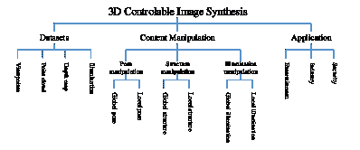

图 1：本文的结构图

## II 数据集和评价指标用于 3D 可控图像合成

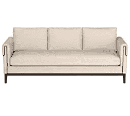

(a) 原始图像

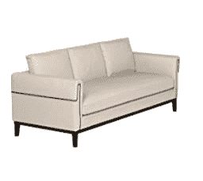

(b) 视角改变后的图像

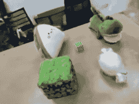

(c) 原始图像

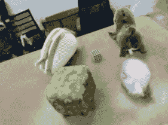

(d) 物体旋转后的图像

图 2：姿态操控示例。子图 (a) 和 (b) 对应于第 III 节中的全局姿态实现内容，来自 [24]。子图 (c) 和 (d) 对应于第 III 节中的局部姿态实现内容，来自 [25]。

3D 可控图像合成的一个关键挑战是评估生成图像的质量和多样性。已经提出了不同的数据集和指标来测量 3D 可控图像合成的各个方面，如真实感、一致性、保真度和可控性。在本节中，我们将介绍一些常用的 3D 可控图像合成数据集和指标，并讨论它们的优缺点。

### II-A 数据集

3D 图像合成是从不同视角生成 3D 物体逼真图像的任务。这个任务需要大量的训练数据，以捕捉 3D 物体的形状、纹理、光照和姿态变化。为此，已提出了几个数据集，每个数据集都有其自身的优缺点。一些数据集包括：

+   •

    ABO 是一个合成数据集，包含通过组装基本对象（ABOs）如立方体、球体、圆柱体和圆锥体生成的 3D 形状。它有 10 类，每类 1000 个形状。ABO 对于形状抽象、分解和生成等任务非常有用。然而，ABO 也受到其合成特性、类别和实例数量较少以及缺乏真实光照和遮挡的限制[24]。

+   •

    Clevr3D 是一个合成数据集，包含由简单几何形状组成的 3D 场景，具有颜色、大小和材质等各种属性。它还提供了每个场景的自然语言描述和问题。Clevr3D 对于场景理解、推理和描述等任务非常有用。然而，Clevr3D 也受到其合成特性、简单场景构成以及缺乏真实纹理和背景的限制[26]。

+   •

    ScanNet 是一个 RGB-D 视频数据集，包含超过 1500 次扫描的室内场景，共 250 万个视图。它提供了相机姿态、表面重建和实例级语义分割等注释。ScanNet 对于语义分割、目标检测和姿态估计等任务非常有用。ScanNet 也受到其覆盖不完全（由于扫描困难）、标签不一致（由于人工错误）以及缺乏细粒度细节（如物体部件）的限制[27]。

+   •

    RealEstate10K 是一个用于视图合成的数据集，包含与 1 千万帧相机姿势对应的相机数据，这些帧来自大约 80,000 个从 YouTube 视频收集的视频片段。该数据集还提供了下载原始视频的链接。RealEstate10K 是一个大规模且多样化的数据集，覆盖了各种类型的场景，如房屋、公寓、办公室和风景。RealEstate10K 对立体放大、光场渲染和新视图合成等任务很有用。然而，RealEstate10K 也面临一些挑战，如视频质量较低、相机姿势不一致以及缺乏深度信息[28]。

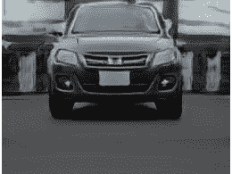

(a) 原始图像

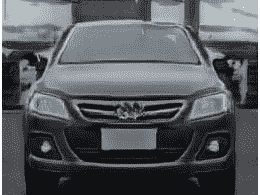

(b) 更改汽车深度后的图像

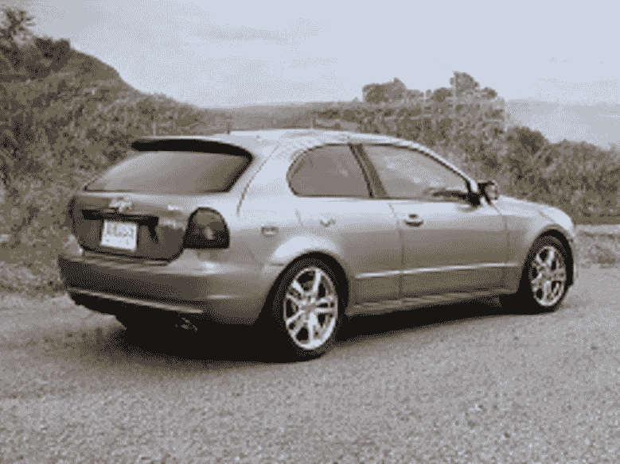

(c) 原始图像

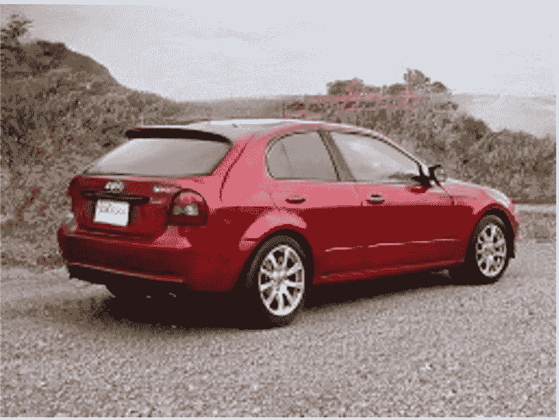

(d) 更改汽车颜色后的图像

图 3：结构操作示例。子图（a）和（b）对应于第 IV 节中的全局结构实现内容，来源于[29]。子图（c）和（d）对应于第 IV 节中的局部结构实现内容，来源于[30]。

点云数据集是表示 3D 对象或场景形状和外观的点的集合。这些数据通常来自传感器，如激光雷达、雷达或相机。一些数据集包括：

+   •

    ShapeNet 是一个大规模的 3D CAD 模型库，涵盖了 55 种常见对象类别和 400 万个模型。它提供了丰富的注释，如类别标签、部件标签、对齐和对应关系。ShapeNet 对形状分类、分割、检索和补全等任务非常有用。ShapeNet 的一些局限性包括不包含真实的纹理或材料，未能捕捉自然场景的变化和多样性，以及不提供用于渲染的真实姿态或相机参数[31]。

+   •

    KITTI 是一个用于自动驾驶的数据集，包含由 Velodyne HDL-64E LIDAR 传感器捕捉的 3D 点云，以及 RGB 图像、GPS/IMU 数据、对象注释和语义标签。KITTI 是最受欢迎且具有挑战性的数据集之一，适用于 3D 对象检测和语义分割，因为它覆盖了各种场景、天气条件和遮挡。然而，KITTI 也有一些限制，例如每个序列的帧数有限（约 200 帧）、传感器配置固定以及缺乏动态对象[32]。

+   •

    nuScenes 是另一个用于自动驾驶的数据集，包含由 32 光束激光雷达传感器捕捉的 3D 点云，以及 RGB 图像、雷达数据、GPS/IMU 数据、对象注释和语义标签。nuScenes 比 KITTI 更全面、多样，因为它覆盖了来自六个国家的 1000 个场景，具有不同的交通规则和驾驶行为。nuScenes 还提供了更多的时间信息，每个场景提供 20 秒的连续数据。然而，nuScenes 也面临一些挑战，如点云分辨率较低、场景复杂度较高，以及需要传感器融合[33]。

+   •

    Matterport3D 是一个用于室内场景理解的数据集，包含由 Matterport 相机捕捉的 RGB-D 图像重建的 3D 点云。数据集还提供了表面重建、相机姿态以及 2D 和 3D 语义分割。Matterport3D 是一个大规模且高质量的数据集，涵盖了来自 90 种建筑类型的 10,800 个全景视图，包含 194,400 张 RGB-D 图像。Matterport3D 对于关键点匹配、视图重叠预测和场景补全等任务非常有用。然而，Matterport3D 也有一些局限性，如缺乏动态物体、依赖 RGB-D 传感器以及获取真实注释的难度[34]。

深度图数据集是图像及其对应深度值的集合，可用于各种计算机视觉任务，如深度估计、3D 重建、场景理解等。常用的深度图数据集如下：

+   •

    Middlebury Stereo 是一个立体图像数据集，带有使用结构光或机器人臂获取的真实视差图。它包含从 2001 年到 2021 年收集的几个版本的数据集，具有不同的场景、分辨率和难度等级。该数据集广泛用于评估立体匹配算法，并提供在线基准和排行榜。该数据集的优点是高精度、多样性和可用性，缺点是相对较小的规模、仅限室内场景以及缺乏语义标签[35, 36, 37, 38, 39]。

+   •

    NYU Depth Data set V2 是一个由微软 Kinect 捕捉的 RGB-D 图像数据集，包含多个室内场景。它包含 1449 对对齐的 RGB 和深度图像的密集标注对，以及 407024 帧未标注图像。数据集还提供了每个像素的表面法线、3D 点云和语义标签。该数据集广泛用于评估单目深度估计算法，并提供在线数据处理和可视化工具。该数据集的优点是规模大、注释丰富、场景真实，缺点是分辨率低、深度值噪声大且仅限室内场景[40]。

+   •

    KITTI 还包括深度图，但其深度图受限于稀疏和噪声较多的 LiDAR 深度图。某些场景中还缺乏实际的地面深度图，以及城市设置的限制[32]。

照明数据集是关于人工或自然光源的强度、分布和特征的信息集合。常见的照明数据集的一些例子包括：

+   •

    Multi-PIE 是一个大规模数据集，包含 337 名受试者的超过 750,000 张图像，这些图像在 15 个视角和 19 种照明条件下拍摄。每个受试者还进行了不同的面部表情，如中性、微笑、惊讶和眯眼。该数据集对于研究人脸识别、人脸对齐、人脸合成和在不同条件下的人脸编辑非常有用。然而，Multi-PIE 仅包含白种人受试者的图像，这限制了其多样性和泛化能力[41]。

+   •

    Relightables 是一个高质量的 3D 扫描数据集，涵盖了不同照明条件下的人体受试者。该数据集允许在任何照明和视点下进行真实感渲染，并可以集成到任何计算机图形场景中。然而，这个数据集也存在一些缺点，例如受试者、姿势和表情的多样性较低，以及处理数据的高计算开销[42]。

总结来说，数据集对于基于深度学习的 3D 可控图像合成至关重要，因为它们提供了训练和评估深度生成模型所需的信息。这些数据集为不同类型的控制提供了丰富的注释和变化，例如视点、照明、姿势、点云和深度。然而，每个数据集都有其自身的优缺点，并且在这一领域仍有改进和创新的空间。

### II-B 评估指标

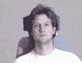

(a) 原始图像

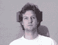

(b) 更改光源后的图像

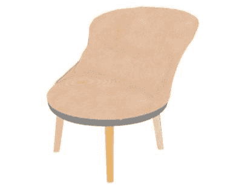

(c) 原始图像

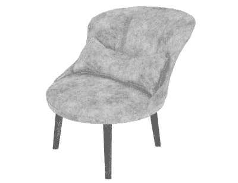

(d) 更改粗糙度后的图像

图 4：照明操作示例。子图 (a) 和 (b) 对应于第 V 节中的全局照明实现内容，来源于 [41]。子图 (c) 和 (d) 对应于第 V 节中的局部照明实现内容，来源于 [43]。

为了评估合成图像的质量和多样性，通常使用几个性能指标。其中一些包括：

- 峰值信噪比（PSNR）[44]：这衡量合成图像和参考图像在像素值上的相似性。它定义为信号最大可能功率与影响其表现的噪声功率的比率。较高的 PSNR 表示图像质量更好。

- 结构相似性指数（SSIM）[45]：这衡量合成图像和参考图像在亮度、对比度和结构上的相似性。它基于人类视觉系统高度适应于从图像中提取结构信息的假设。较高的 SSIM 表示图像质量更好。

- 学习感知图像块相似度（LPIPS）[46]：这衡量合成图像和参考图像在深度特征上的相似性。它定义为预训练网络中两个图像块激活之间的距离。较低的 LPIPS 表示图像质量更好。

- Inception 分数（IS）[47]：这衡量合成图像的质量和多样性，使用预训练分类器，如 Inception-v3。它基于这样一个理念：优质图像应具有高类别多样性（即它们可以被分类到不同的类别中）和低类别歧义（即它们可以被高度自信地分类）。较高的 IS 表示图像合成质量更好。

- Fréchet inception 距离（FID）[48]：这衡量合成图像和真实图像特征分布之间的距离，使用预训练分类器，如 Inception-v3。它基于这样一个理念：优质图像应具有与真实图像相似的特征统计。较低的 FID 表示图像合成质量更好。

- 核 Inception 距离（KID）[49]：这衡量合成图像和真实图像特征分布之间的平方最大均值差异，使用预训练分类器，如 Inception-v3。它基于这样一个理念：优质图像应具有与真实图像相似的特征统计。较低的 KID 表示图像合成质量更好。

## III 姿态操作

### III-A 全球姿态

#### III-A1 GAN

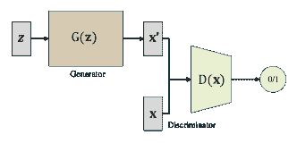

图 5：GAN 示意图，来自[50]

生成对抗网络（GAN）[7]可以从潜在空间生成真实且多样化的数据。GAN 由两个神经网络组成：一个生成器和一个判别器。生成器尝试生成能够欺骗判别器的数据，而判别器则试图区分真实数据和虚假数据。GAN 的损失函数衡量生成器和判别器执行任务的效果。损失函数通常由两个部分组成：一个是生成器的($\mathcal{L}_{G}$)，另一个是判别器的($\mathcal{L}_{D}$)。$\mathcal{L}_{G}$基于判别器将生成的数据分类为真实的频率，而$\mathcal{L}_{D}$则基于判别器正确分类真实和虚假数据的频率。GAN 的目标是最小化$\mathcal{L}_{G}$并最大化$\mathcal{L}_{D}$。

|  | $\mathcal{L}_{D}=\mathbb{E}_{\mathbf{x}\sim p_{\mathbf{data}}\mathbf{(x)}}[\log(D(\mathbf{x}))]+\mathbb{E}_{\mathbf{z}\sim p_{\mathbf{z}}\mathbf{(z)}}[\log(1-D(G(\mathbf{z})))],$ |  |
| --- | --- | --- |
|  | $\mathcal{L}_{G}=-\mathbb{E}_{\mathbf{z}\sim p_{\mathbf{z}}\mathbf{(z)}}[\log(D(G(\mathbf{z})))],$ |  |
|  | $\mathcal{L}_{GAN}=\mathcal{L}_{D}+\mathcal{L}_{G}.$ |  |

a)跨视图图像合成。视点操作指的是操控合成图像中物体或场景的透视或方向的能力。最早的视图合成通常只能合成特定视图，例如鸟瞰图、正面人脸图等。黄等人介绍了 TP-GAN，这是一种集成全球结构和局部细节以生成逼真的正面人脸图的技术[51]。类似地，赵等人提出了 VariGAN，它结合了变分推理和生成对抗网络用于逐步优化合成目标图像[52]。为了应对从不同视点和分辨率生成场景的挑战，克里希纳和阿里开发了两种方法：Crossview Fork (X-Fork) 和 Crossview Sequential (X-Seq) [53]。这些方法利用语义分割图来帮助条件 GAN (cGANs) 生成更清晰的图像。此外，克里希纳和阿里还利用几何引导的 cGANs 进行图像合成，将地面图像转换为空中视角[54]。穆赫耶里等人提出了一种跨领域的人脸合成方法，使用可控 GAN (C-GAN)。这种方法通过在对抗游戏中优化 3D 人脸模型生成的模拟图像来生成各种姿态的逼真的人脸图像[55]。朱等人开发了 BridgeGAN，这是一种从单一正面视图图像合成鸟瞰图像的技术。他们使用单应性视图作为中间表示来完成这一任务[56]。丁等人通过利用基于可变形卷积和注意机制的生成对抗网络 (GANs) 解决了跨视图图像合成的问题[57]。最后，任等人提出了 MLP-Mixer GANs 用于跨视图图像转换。这种方法包含两个阶段，以缓解生成完全不同视图时的严重变形[58]。

b) 自由视角图像合成。通过向 GAN 网络添加条件输入，例如相机姿态或相机流形，可以从任何视角输出图像。Zhu 等人引入了 CycleGAN，这是一种能够从单个侧面姿势面部图像中恢复前脸的方法，即使源域与目标域不匹配[59]。该方法基于条件变分自编码器和生成对抗网络（cVAE-GAN）框架，不需要配对数据，使其成为一种通用的视角转换方法[60]。Shen 等人提出了 Pairwise-GAN，采用两个并行的 U-Net 作为生成器，并使用 PatchGAN 作为判别器来合成正面面部图像[61]。类似地，Chan 等人提出了 pi-GAN，这是一种利用周期性隐式生成对抗网络进行高质量 3D 感知图像合成的方法[62]。Cai 等人进一步扩展了这一方法，提出了 Pix2NeRF，这是一种无监督方法，利用 pi-GAN 在单张图像上进行训练，而无需依赖 3D 或多视图监督[63]。Leimkuhler 等人引入了 FreeStyleGAN，它将预训练的 StyleGAN 集成到标准的 3D 渲染管道中，实现了立体渲染或在合成的 3D 环境中一致地插入面部[64]。Medin 等人提出了 MOST GAN，明确地将物理面部特征作为先验知识，以实现逼真的肖像图像操控[65]。另一方面，Or-El 等人开发了 StyleSDF，这是一种基于 StyleGAN2 生成图像的新方法，通过利用签名距离场（SDFs）来准确建模 3D 表面，实现了体积渲染的一致结果[66]。此外，Zheng 等人提出了 SDF-StyleGAN，这是一种深度学习方法，用于基于 StyleGAN2 生成 3D 形状，采用两个新的形状判别器在全局和局部层面上比较真实和合成的 SDF 值及梯度，显著提升了形状几何和视觉质量[67]。此外，Deng 等人提出了 GRAM，这是一种调节点采样和辐射场学习的创新方法，体现为 3D 体积中的一组学习的隐式表面，从而改善了合成结果[68]。Xiang 等人基于此工作开发了 GRAM-HD，能够生成具有严格 3D 一致性的高分辨率图像，分辨率高达 1024x1024[69]。在另一项研究中，Chan 等人开发了一个高效的框架，通过生成对抗网络（GANs）从 2D 图像生成逼真的 3D 形状，该框架包括一个几何感知模块，用于预测 3D 形状及其投影参数，以及一个增强形状质量和细节的细化模块[70]。类似地，Zhao 等人提出了一种从 2D 输入生成高质量 3D 图像的方法，利用 GAN 实现不同视角间的一致性，并提供具有新颖光照效果的渲染[71]。最后，Alhaija 等人引入了 XDGAN，这是一种从 2D 图像合成逼真多样的 3D 形状的方法，将 3D 形状转换为紧凑的单通道几何图像，并利用 StyleGAN3 和图像到图像转换网络在 2D 空间中生成 3D 物体[72]。这些图像合成技术的进展显著丰富了从 2D 输入生成 3D 图像的领域。

#### III-A2 NeRF

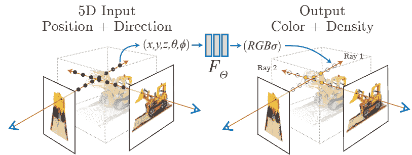

图 6：NeRF 的示意图，来源于[17]

神经辐射场（NeRF）[17]是一种新颖的复杂 3D 场景表示方法，可以从任何视角进行逼真渲染。NeRF 将场景建模为一个连续的函数，该函数将 5D 坐标（3D 位置和 2D 视角方向，表示为（$x$，$y$，$z$，$\theta$，$\varphi$））映射到 4D 输出（RGB 颜色和不透明度）。这个函数是通过深度神经网络从一组已定姿态的场景图像中学习到的。在将（$x$，$y$，$z$，$\theta$，$\varphi$）输入传递给网络之前，NeRF 使用高频函数将输入映射到更高维的空间，以更好地拟合包含高频变化的数据。高频编码函数是：

|  | $\left(\sin\left(2^{0}\pi p\right),\cos\left(2^{0}\pi p\right),\ldots,\sin\left(2^{L-1}\pi p\right),\cos\left(2^{L-1}\pi p\right)\right)$ |  |
| --- | --- | --- |

其中$p$是输入（$x$，$y$，$z$，$\theta$，$\varphi$）。

表 I：NeRF 的改进

|  | 方法 | 发表 | 图像分辨率 | 数据集 |
| --- | --- | --- | --- | --- |
| 无相机姿态 | NeRF–[73] | arXiv2022 | 756x1008/1080x1920/520x780 | [74]/[28]/[73] |
| GNeRF[75] | ICCV2021 | 400x400/500x400 | [17]/[76] |
| SCNeRF[77] | ICCV2021 |  | [74]/[78] |
| NoPe-NeRF[79] | CVPR2023 |  | [76]/[74]/[80] |
| SPARF[81] | CVPR2023 | 960x540/648x484 | [78]/[27] |
| sparse data | NeRS[82] | NIPS2021 |  | [82] |
| MixNeRF[83] | CVPR2023 |  | [76]/[74]/[17] |
| SceneRF[84] | arXiv2023 | 1220x370 | [85] |
| GM-NeRF[86] | CVPR2023 | 224x224 | [87]/[88]/[89]/[90] |
| SPARF[81] | CVPR2023 | 960x540/648x484 | [78]/[27] |
| noisy data | RawNeRF[91] | CVPR2022 |  | [91] |
| Deblur-NeRF[92] | CVPR2022 |  | [92] |
| HDR-NeRF[93] | CVPR2022 | 400x400/804x534 | [93] |
| NAN[94] | CVPR2022 |  | [94] |
| 大规模图像合成 | Mip-NeRF 360[95] | CVPR2022 |  | [78] |
| BungeeNeRF[96] | ECCV2022 |  | [97] |
| Block-NeRF[98] | arXiv2022 |  | [98] |
| GridNeRF[99] | CVPR2023 |  | [100]/[99] |
| EgoNeRF[101] | CVPR2023 |  | [101] |
| 图像合成速度 | PlenOctrees[102] | ICCV2021 | 800x800/1920x1080 | [17]/[78] |
| DirectVoxGO[103] | CVPR2022 | 800x800/800x800/768x576/1920x1080/512x512 | [17]/[104]/[105]/[78]/[106] |
| R2L[107] | ECCV2022 |  | [17]/[108] |
| SqueezeNeRF[109] | CVPR2022 |  | [17]/[74] |
| MobileNeRF[110] | CVPR2023 | 800x800/1008x756/1256x828 | [17]/[74]/[95] |
| L2G-NeRF[111] | CVPR2023 |  | [74] |

张等人介绍了 NeRF++，这是一个通过自适应采样、分层体积渲染和多尺度特征编码技术来增强 NeRF（神经辐射场）的框架 [112]。这种方法使得在静态和动态场景中都能实现高质量渲染，同时提高了效率和鲁棒性。Rebain 等人提出了一种通过空间分解来提高神经渲染效率和质量的方法 [113]。Park 等人开发了一种使用单个 RGB 相机捕捉和渲染高质量 3D 自拍的新技术。他们的方法利用了一个变形的神经辐射场（NeRF）模型，该模型能够表示动态场景的几何和外观 [114]。Li 等人介绍了 MINE，一种从单张图像中进行新视角合成和深度估计的方法。这种方法利用神经辐射场（NeRF）来推广多平面图像（MPI）和连续深度 [115]。Park 等人提出了 HyperNeRF，一种使用神经辐射场（NeRF）表示和渲染具有不同拓扑的复杂 3D 场景的方法。与依赖于固定 3D 坐标系统的先前 NeRF 方法不同，HyperNeRF 采用了更高维的连续嵌入空间来捕捉任意场景变化 [116]。Chen 等人提出了 Aug-NeRF，一种在场景、相机和像素等不同层次上使用物理基础增强的训练神经辐射场（NeRF）的方法 [117]。Kaneko 提出了 AR-NeRF，一种无需监督地学习自然图像 3D 表示的方法。这种方法利用神经辐射场（NeRF）模型渲染具有各种视角和光圈尺寸的图像，捕捉深度和散焦效果 [118]。Li 等人介绍了 SymmNeRF，一个利用神经辐射场（NeRF）从单张图像合成新视角的框架。该方法利用对称先验来恢复细微的外观细节，特别是在自遮挡区域 [119]。Zhou 等人提出了 NeRFLiX，这是一个使用神经辐射场（NeRF）提高新视角合成质量的新框架。这种方法通过采用一个视角间聚合框架来融合高质量训练图像，从而生成更逼真的合成视角，并解决渲染伪影如噪声和模糊 [120]。

此外，一些研究人员提出了对原始 NeRF 模型的改进，以解决其在无相机姿态、稀疏数据、噪声数据、大规模图像合成以及图像合成速度等场景中的局限性。见表格 I。

#### III-A3 扩散模型

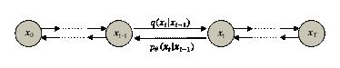

图 7：扩散模型示意图，来源于 [50]

深度学习中最广泛使用的模型之一是扩散模型，这是一种生成模型，能够从随机噪声中生成现实且多样的图像。扩散模型基于逆转向图像添加高斯噪声直到完全损坏的过程的理念。扩散过程从一个数据样本开始，逐渐添加噪声，直到达到预定义的噪声水平，即图中的 $q\left(\mathbf{x}_{t}\mid\mathbf{x}_{t-1}\right)$ 7。然后，生成模型通过在每一步去噪样本来学习逆转这一过程，即图中的 $p_{\mathbf{\theta}}\left(\mathbf{x}_{t-1}\mid\mathbf{x}_{t}\right)$ 7。

|  | $q\left(\mathbf{x}_{t}\mid\mathbf{x}_{t-1}\right)=\mathcal{N}\left(\mathbf{x}_{t};\sqrt{1-\beta_{t}}\mathbf{x}_{t-1},\beta_{t}\mathbf{I}\right)$ |  |
| --- | --- | --- |

Sbrolli 等人提出了 IC3D，一种新颖的方法来解决形状生成中的各种挑战。该方法能够从单一视角重建 3D 形状、从多个视角合成 3D 形状，以及从部分输入完成 3D 形状 [121]。该领域的另一项重要贡献是 Gu 等人的工作，他们开发了 Control3Diff，这是一种具有 3D 认知和可控性的生成模型。通过将扩散模型和 3D GAN 结合，Control3Diff 可以合成多样且真实的图像，而无需依赖 3D 实测数据，并且可以仅通过单视图图像数据集进行训练 [122]。此外，Anciukevicius 等人提出了 RenderDiffusion，这是一种用于 3D 生成和推断的创新扩散模型。值得注意的是，该模型可以仅使用单眼 2D 监督进行训练，并在每个去噪步骤中引入场景的中间三维表示，有效地将一个强大的归纳结构融入到扩散过程中 [123]。Xiang 等人提出了一种使用 2D 扩散模型生成 3D 认知图像的新方法。他们的方法涉及从不同视角生成多视图 2D 图像的顺序过程，最终实现 3D 认知图像的合成 [124]。此外，Liu 等人提出了一种框架，通过仅使用单个 RGB 图像来改变物体的相机视角。利用大规模扩散模型对自然图像学到的几何先验，他们的框架采用合成数据集来学习调整相机视角的控制 [125]。最后，Chan 等人开发了一种基于单个输入图像生成多样且真实的场景新视图的方法。他们的方法利用了一种基于扩散的模型，该模型通过潜在特征体积结合 3D 几何先验。这个特征体积捕捉了潜在场景表示的分布，并能渲染视角一致的图像 [126]。

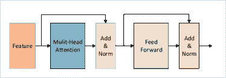

图 8：Transformer 的示意图，来源于 [128]

#### III-A4 Transformer

Transformers 是一种广泛用于自然语言处理的神经网络架构。它们基于自注意力的思想，允许网络学习输入和输出序列中不同部分之间的关系。Transformers 被引入计算机视觉领域的论文 ViT [127]。其核心是图 8 中的 Attention 部分，其公式如下：

|  | $Attention(Q,K,V)=softmax(\frac{QK^{T}}{\sqrt{d_{k}}})V$ |  |
| --- | --- | --- |

利用 Transformer 架构在视觉应用中的潜力，已有几项研究探讨了其合成 3D 视图的可能性。Nguyen-Ha 和同事提出了一种开创性的方法，通过给定的一组输入视图合成场景的新视图。他们的方法采用了基于 Transformer 的架构，有效捕捉了输入视图之间的长距离依赖关系。通过使用顺序处理，这种方法生成了高质量的新视图。这项研究贡献在 [129] 中有所记录。类似地，Yang 和同事提出了一种创新方法，用于从单幅图像生成视角不变的 3D 形状。他们的方法基于解缠学习和参数化 NURBS 表面生成。该方法采用了增强了解缠 Transformer 模块的编码器-解码器网络。这种配置使得形状语义和相机视角能够独立学习。该综合网络的输出包括代表 3D 形状的 NURBS 表面的几何参数，以及涉及旋转、平移和缩放的相机视角参数。该方法的进一步细节可以在 [130] 中找到。此外，Kulhánek 和同事提出了 ViewFormer，这是一种令人印象深刻的神经渲染方法，未依赖于 NeRF，而是利用了 Transformer 的强大功能。ViewFormer 旨在仅使用少量图像来学习场景的潜在表示，这种学习到的表示能够合成新视图。值得注意的是，ViewFormer 能够处理具有不同光照和几何特征的复杂场景，而无需任何 3D 信息或光线行进。ViewFormer 的具体方法和发现详见 [131]。

#### III-A5 混合 NeRF

a) 基于 GAN 的 NeRF。神经辐射场（NeRF）是一种从任意视角渲染图像的新颖方法，但由于其像素级优化，计算成本较高。生成对抗网络（GANs）可以在一次前向传播中合成逼真的图像，但可能无法保持不同视角之间的视图一致性。因此，越来越多的研究关注 NeRF 和 GAN 的集成，以实现高效且一致的图像合成。Meng 等人提出了 GNeRF 框架，它结合了 GANs 和 NeRF 重建，用于生成具有未知或随机相机姿态的场景[75]。类似地，Zhou 等人介绍了 CIPS-3D，这是一种生成模型，利用风格迁移、浅层 NeRF 网络和深层 INR 网络来表示 3D 场景，并提供对相机姿态的精确控制[132]。Xu 等人的另一种方法是 GRAF，这是一种用于辐射场的生成模型，它能够在考虑 3D 形状的同时实现高分辨率图像合成。GRAF 将相机和场景属性从未定位的 2D 图像中分离，允许合成新的视图并对形状和外观进行修改[133]。Lan 等人提出了一种自监督几何感知编码器，用于基于风格的 3D GAN 反演。他们的编码器恢复给定 3D 形状的潜在代码，并允许操作其风格和几何属性[134]。Li 等人开发了一种基于 NeRF 的 3D 感知多类图像到图像转换的两步方法。他们训练了一种具有条件架构和创新训练策略的多类 3D 感知 GAN。基于该 GAN，他们构建了一个 3D 感知的图像到图像转换系统[135]。Shahbazi 等人专注于知识蒸馏，提出了一种将基于 NeRF 表示训练的 GAN 的知识转移到卷积神经网络（CNN）中的方法。这使得高效的 3D 感知图像合成成为可能[136]。Kania 等人介绍了一种基于 NeRF 的 3D 对象生成模型，该模型通过超网络渲染成 2D 新视图。该模型通过 2D 鉴别器进行对抗性训练[137]。最后，Bhattarai 等人提出了 TriPlaneNet，这是一种专门设计用于 EG3D 反演的编码器。EG3D 反演任务涉及从 2D 边缘图像中重建 3D 形状[138]。

b) 基于扩散模型的 NeRF。同样，扩散模型单独无法生成在不同视角下保持一致的图像。因此，许多研究人员将其与 NeRF 结合以合成高质量和视角一致的图像。Muller 等人提出了 DiffRF，该方法通过使用 3D 去噪模型和渲染损失从一组已标定的图像中直接生成体积辐射场[139]。类似地，Xu 等人提出了 NeuralLift-360，一个框架，它使用深度感知 NeRF 和去噪扩散模型从单张 2D 照片中生成一个具有 360° 视角的 3D 对象[140]。Chan 等人提出了一种使用 NeRF 和扩散模型的 3D 感知图像合成框架，该框架联合优化 NeRF 自编码器和潜在扩散模型，以实现从多视角图像中对各种对象进行同时 3D 重建和先验学习[141]。最后，Gu 等人提出了 NerfDiff，一种从单张输入图像生成逼真且 3D 一致的新视角的方法。该方法通过在测试时合成和精炼一组虚拟视角，将条件扩散模型（CDM）的知识提炼到 NeRF 中，使用 NeRF 指导的提炼算法[142]。这些方法展示了使用 NeRF 和扩散模型进行 3D 场景合成的潜力，预计在这一领域的进一步研究将带来更加激动人心的成果。

c) 基于 Transformer 的 NeRF。在将生成对抗网络（GANs）和神经辐射场（NeRFs）进行整合的前期工作基础上，一些研究人员探索了使用 Transformer 模型和 NeRFs 来生成在不同视角下保持一致的 3D 图像的可能性。Wang 等人提出了一种方法，可以处理具有动态物体和遮挡的复杂场景，并且能够在不进行微调的情况下泛化到未见过的场景。关键思想是使用 Transformer 学习场景的全局潜在表示，然后用这个表示来条件化一个 NeRF 模型，从而渲染新视角[143]。类似地，Lin 等人提出了一种从单张未摆姿态图像生成新视角的 NeRF 和视觉 Transformer（ViT）方法。该方法利用全局和局部图像特征形成场景的 3D 表示，然后通过一个多层感知机（MLP）网络渲染新视角[144]。最后，Liu 等人提出了一种使用条件 NeRF 模型进行视觉定位的方法。该方法可以根据一组稀疏的参考图像及其姿态来估计查询图像的 6-DoF 姿态[145]。这些方法展示了 NeRFs 和 Transformers 在解决计算机视觉中挑战性问题方面的潜力。

### III-B 本地姿态

#### III-B1 GAN

Liao 等人提出了一个新颖的框架，该框架由两个组件组成，用于学习生成模型以实现这一目标。第一个组件是一个 3D 生成器，它学习从单张图像重建物体的 3D 形状和外观，而第二个组件是一个 2D 生成器，它学习将 3D 物体渲染成 2D 图像。该框架可以生成高质量的图像，并具有可控的因素，如姿势、形状和外观 [146]。Nguyen-Phuoc 等人提出了 BlockGAN，这是一种新颖的图像生成模型，可以创建由多个物体组成的场景的真实图像。BlockGAN 学习为每个物体生成 3D 特征，并将它们组合成 3D 场景表示。该模型然后将 3D 场景渲染成 2D 图像，考虑物体之间的遮挡和互动，如阴影和光照。BlockGAN 可以独立操控每个物体的姿势和身份，同时保持图像质量 [147]。Pan 等人提出了一个新颖的框架，该框架可以从 2D 图像 GANs 中重建 3D 形状，而无需任何监督或先验知识。该方法可以为各种物体类别生成真实且多样的 3D 形状，且重建的形状与 GANs 生成的 2D 图像一致。恢复的 3D 形状允许高质量的图像编辑，如重新照明和物体旋转 [148]。Tewari 等人提出了一个新颖的 3D 生成模型，该模型可以从单目图像的数据集中学习分离物体的几何和外观因素。该模型使用非刚性可变形场景公式，其中每个物体实例由一个变形的标准 3D 体积表示。该模型还可以计算图像之间的密集对应关系，并将真实图像嵌入其潜在空间，从而实现对真实图像的编辑 [149]。

#### III-B2 NeRF

Niemeyer 和 Geiger 介绍了 GIRAFFE，这是一种深度生成模型，可以合成逼真且可控的 3D 场景图像。该模型将场景表示为组合神经特征场，这些特征场编码了个体物体的形状和外观以及背景。该模型能够在没有任何额外监督的情况下，从无结构和非姿态图像集合中解开这些因素。使用 GIRAFFE，可以通过平移、旋转或更改外观来操控场景中的个体物体，还可以更改相机姿态[29]。Yang 等人提出了一种名为 OC-Nerf 的神经场景渲染系统，该系统学习了一个对象组合的神经辐射场，用于可编辑的场景渲染。OC-Nerf 由一个场景分支和一个对象分支组成，分别编码场景和对象的几何形状和外观。对象分支基于可学习的对象激活代码，从而实现对象级别的编辑，例如移动、添加或旋转对象[25]。Kobayashi 等人提出了一种方法，使得对由神经辐射场（NeRFs）表示的 3D 场景进行语义编辑成为可能。作者引入了精炼特征场（DFFs），这些是通过迁移预训练的 2D 图像特征提取器（如 CLIP-LSeg 或 DINO）的知识来学习的 3D 特征描述符。DFFs 允许用户使用文本、图像补丁或点击输入在 3D 空间中查询和选择特定区域或物体。选定的区域随后可以以各种方式进行编辑，如旋转、平移、缩放、变形、上色或删除[150]。Zhang 等人介绍了 Nerflets，这是一种新的方法，用于从 2D 图像中表示 3D 场景，使用局部辐射场。与依赖于全局隐式函数的先前方法不同，Nerflets 将场景分割为一组局部坐标系，这些坐标系编码了场景的结构和外观。这使得高保真度和细节的复杂场景的渲染和编辑变得高效。Nerflets 可以操控物体的方向、位置和大小等[151]。最后，Zheng 等人提出了 EditableNeRF，这是一种允许用户用关键点编辑由神经辐射场（NeRF）建模的动态场景的方法。该方法可以处理拓扑变化，并从单一相机输入生成新视角。关键点由网络自动检测和优化，用户可以拖动这些关键点以修改场景。这些方法提供了多种 3D 场景合成和编辑手段，包括操控物体、更改相机姿态、选择和编辑特定区域或物体，以及处理拓扑变化[152]。

## IV 结构操控

### IV-A 全局结构

#### IV-A1 点云编辑

深度图是一种表示场景与参考点（如摄像机）之间距离的图像。它可以用来创建真实感效果，如景深、遮挡和视差[153]。陈等人提出了一种新颖的方法，称为 SPIDR，利用神经点场（NPFs）和有符号距离函数（SDFs）来表示和操作 3D 对象[154]。该方法结合了显式点云和隐式神经表示，以实现高质量的网格和表面重建，用于对象变形和光照估计。借助训练好的 SPIDR 模型，可以对点云表示进行各种几何编辑，这些编辑可用于图像编辑。张等人介绍了一种新的点云渲染方法，采用频率调制技术，便于对形状和外观进行编辑[155]。该方法将点云转换为一组频率调制信号，通过傅里叶分析可以高效渲染。这些信号还可以在频域中进行操作，以实现各种编辑效果，如变形、平滑、锐化和颜色调整。陈等人还提出了 NeuralEditor，这是一种用于形状编辑任务的神经辐射场（NeRFs）编辑新方法[156]。该方法利用点云作为基础结构来构建 NeRFs，并通过基于 K-D 树指导的体素方案进行渲染。NeuralEditor 可以通过在点云之间映射点来实现形状变形和场景变换。

#### IV-A2 编辑深度图

陈等人介绍了 Visual Object Networks（VON）框架，它使得从 2D 图像中解耦学习 3D 物体表示成为可能。该框架包括三个模块，即形状生成器、外观生成器和渲染网络。通过操作生成器，VON 可以执行一系列任务，包括形状操控、外观转移和新视图合成 [157]。Mirzaei 等人提出了一种参考指导的可控修复方法，用于神经辐射场（NeRFs），该方法允许合成具有缺失区域的场景的新视图。该方法使用参考图像来指导修复过程，并提供一个用户界面，使用户可以调整参考图像与原始 NeRF 之间的混合程度 [158]。Yin 等人介绍了 OR-NeRF，这是一种新颖的管道，可以使用单视图中的点或文本提示从 3D 场景中移除对象。该管道利用点投影策略、2D 分割模型、2D 修复方法以及深度监督和感知损失，实现了比以往工作更好的编辑质量和效率 [159]。陈等人提出了一种视觉舒适感增强的强化学习（VCARL）方法，用于立体 3D 图像的深度调整。该方法通过从人工反馈中学习深度调整策略，旨在提高 3D 图像的视觉质量和舒适感 [160]。这些进展提供了多种操控物体、调整深度和生成新视图的手段，*最终*提高了 3D 场景合成和编辑的质量与真实感。

### IV-B 本地结构

#### IV-B1 GAN

近年来，使用生成对抗网络（GAN）在 3D 场景修补和编辑领域取得了显著进展。Jheng 等人提出了一种用于自由形式 3D 场景修补的双流 GAN。该网络由深度流和颜色流两个部分组成，这两个部分共同训练，以修补 3D 场景的缺失区域。深度流预测场景的深度图，而颜色流合成颜色图像。这种方法使得通过现有的 3D 编辑工具可以移除对象[161]。另一个最近的 GAN 训练发展是 LinkGAN 的引入，这是一种由 Zhu 等人提出的正则化器，它将一些潜在轴与图像区域或语义类别联系起来。通过重新采样部分潜在编码，这种方法使 GAN 生成的局部控制成为可能[30]。Wang 等人提出了一种新颖的方法，用于合成具有明确相机姿态控制和对象级编辑能力的室内场景的逼真图像。该方法基于 BlobGAN，这是一个 2D GAN，它使用 2D blob 作为潜在编码来解开场景中的个体对象。为了将这种方法扩展到 3D 场景，作者引入了 3D blob，它们捕捉了对象的 3D 特性，并允许灵活地操控其位置和外观[162]。这些基于 GAN 的 3D 场景修补和编辑的最新进展具有显著提升合成场景质量和真实感的潜力。

#### IV-B2 NeRF

刘等人 [104] 引入了神经稀疏体素场（NSVF），该方法将神经隐式函数与稀疏体素八叉树相结合，以实现从稀疏输入图像集中生成高质量的新视图合成，无需显式几何重建或网格生成。谷等人 [163] 提出了 StyleNeRF，这是一种允许相机姿态操作的方法，用于合成具有强多视图一致性和光真实感的高分辨率图像。王等人 [164] 提出了 CLIP-NeRF，这是一种使用文本或图像输入操作由神经辐射场（NeRF）表示的 3D 对象的方法。卡尼亚等人 [165] 提出了一种新方法，通过允许用户使用训练图像中的掩模注释指定他们想要控制的场景部分，从而在新视图渲染之外操控神经 3D 场景表示。拉佐娃等人 [166] 提出了一种新方法，通过将场景特定的特征体积与通用神经渲染网络相结合，实现灵活的、具有 3D 感知的图像内容操控，同时实现高质量的新视图合成。袁等人 [167] 提出了一种用户控制的场景形状变形方法，特别是神经辐射场（NeRF）表示的场景。孙等人 [168] 提出了 NeRFEditor，这是一种用于 3D 场景编辑的学习框架，使用预训练的 StyleGAN 模型和 NeRF 模型从 360 度视频输入中生成风格化图像。王等人 [169] 提出了一种用于拓扑变化对象图像合成的新方法，使用生成变形辐射场（GDRFs）。特提卡斯等人 [170] 提出了 PartNeRF，这是一种新型部件感知生成模型，用于可编辑的 3D 形状合成，无需任何显式的 3D 监督。包等人 [171] 提出了 SINE，这是一种使用单张图像或文本提示编辑神经辐射场（NeRF）的新方法。科恩-巴尔等人 [172] 提出了一个新框架，用于从文本提示和对象代理合成和操控 3D 场景。最后，米尔扎埃伊等人 [173] 提出了一种通过利用神经辐射场（NeRF）建模场景的几何和外观，并引入分割网络和感知修复网络来处理遮挡和缺失区域的多视图图像重建的新方法。这些方法代表了朝着实现高质量、用户驱动的 3D 场景合成和编辑目标的重要进展。

#### IV-B3 扩散模型

Avrahami 等人 [174] 提出了一种基于自然语言描述和感兴趣区域掩膜的本地图像编辑方法。该方法使用预训练的语言-图像模型（CLIP）和去噪扩散概率模型（DDPM），生成符合文本输入的真实结果。它可以执行各种编辑任务，如对象添加、移除、替换或修改、背景替换以及图像外推。Nichol 等人 [175] 提出了 GLIDE，这是一种基于扩散的文本条件图像合成和编辑模型。该方法使用指导技术在多样性和保真度之间进行权衡，生成与文本提示匹配的照片级真实图像。Couairon 等人 [176] 提出了 DiffEdit，这是一种使用文本条件扩散模型根据文本查询编辑图像的方法。它可以自动生成一个掩膜，突出显示需要根据文本查询更改的图像区域。它还使用潜在推断来保留这些区域的内容。DiffEdit 可以为各种文本提示和图像来源生成真实且多样的语义图像编辑。Sella 等人 [177] 提出了 Vox-E，这是一种使用潜在扩散模型根据文本提示编辑 3D 对象的新框架。它将 3D 对象的 2D 图像作为输入，学习其体素网格表示。然后，它优化一个分数蒸馏损失，以使体素网格与文本提示对齐，同时在 3D 空间中对其进行正则化，以保留原始对象的整体结构。Vox-E 可以创建多样且真实的编辑。Haque 等人 [178] 提出了用于自然语言指令编辑 3D 场景的新方法。该方法利用场景的神经辐射场（NeRF）表示和一种基于变换器的模型，该模型可以解析指令并相应地修改 NeRF。该方法可以执行各种编辑任务，如更改对象的颜色、形状、位置和方向，以及添加和移除对象，具有高保真度和现实感。Lin 等人 [179] 提出了 CompoNeRF，这是一种新颖的文本引导的多对象组合 NeRF 方法，具有可编辑的 3D 场景布局。CompoNeRF 可以从自然语言描述和用户指定的相机姿势合成复杂场景的照片级真实图像。它还可以通过操纵对象的位置、方向和尺度来编辑场景的 3D 布局。这些方法在利用自然语言描述推动图像和 3D 对象编辑领域方面显示了有前景的结果，并且具有在各种应用中应用的潜力。

## V 照明操作

可控图像生成指的是利用技术生成图像，并限制和调整生成过程，以使生成的图像符合特定要求。通过引导外部条件或操控和调整代码，可以修整图像的某个区域或属性，同时保持其他区域或属性不变。为了解决低层次的图像生成问题，我们分析了在不同条件下的图像生成，其中光照是其中之一，并总结了在不同光照条件下的算法解决方案。

逆向渲染。目前，神经渲染被应用于场景重建。一种方法是捕捉在自然数据中的光度外观变化，将场景分解为图像依赖的共享组件[180]。

另一个非常重要的渲染类型是逆向渲染。在完全未知的捕捉条件下进行物体的逆向渲染是计算机视觉和图形学中的一个基本挑战。当输入图像在复杂且变化的环境中捕捉时，这一挑战尤其严峻。在不使用 nerf 方法的情况下，Mark Boss 等人提出了一种联合优化框架来估计形状、BRDF、每图像相机姿态和光照[181]。

Changwoon Choi 等人提出的 IBL-NeRF 也基于渲染。这种方法的逆向渲染将原始的 NeRF 公式扩展到捕捉场景体积内的空间光照变化，除了表面属性外。具体来说，将不同材料的场景分解为图像基础渲染的内在组件，即反射率、粗糙度、表面法线、辐射度和预过滤辐射。所有这些组件都作为来自 MLP 的神经图像进行推断，并建模大规模通用场景[182]。

然而，基于 NeRF 的方法隐式地编码了形状、反射率和光照，这使得用户在渲染图像中显式操控这些属性变得具有挑战性。因此，生成了一种新的混合 SDF 基于 3D 神经表示的方法，能够更准确地渲染场景变形和光照。该神经表示还增加了新的 SDF 正则化。这种方法的缺点是牺牲了渲染质量。在反向渲染中，高渲染质量通常与准确的光照分解相矛盾，因为阴影和光照很容易被误解为纹理。因此，渲染质量仍需表面重建和反向渲染的共同努力[154]。动态神经辐射场（NeRF）是一个强大的算法，能够从动态场景的单目 RGB 视频中渲染出照片级真实感的新视图图像。但动态 NeRF 并不建模在变形过程中反射颜色的变化。这是其缺点之一。为了解决这一问题，Zhiwen Yan 等人通过将神经辐射场函数重新公式化为依赖于观测空间中表面的位置信息和方向来解决渲染问题，使不同姿态的镜面反射表面在映射到公共规范空间时保持不同的反射颜色。这种方法更准确地重建和渲染动态镜面场景[183]。

该方法的逆向渲染目标函数如下：

|  | $\mathcal{L}=\mathcal{L}_{\text{render }}+\mathcal{L}_{\text{pref }}+\mathcal{L}_{\text{prior }}+\lambda_{I,\text{ reg }}\mathcal{L}_{I,\text{ reg }}$ |  |
| --- | --- | --- |

$\mathcal{L}_{\text{render }}$ 和 $\mathcal{L}_{\text{pref }}$ 是渲染损失，用于将渲染图像与输入图像匹配。

接下来，我们将解释这些参数。

|  | $\mathcal{L}_{\text{render }}=\left\|L_{o}(r)-\hat{L}_{o}(r)\right\|_{2}^{2},$ |  |
| --- | --- | --- |

这是相机光的每个像素。 $r$ 代表单个像素，其中 $L_{o}$ 是我们的原始辐射，而 $\hat{L}_{o}$ 是真实辐射。

|  | $\mathcal{L}_{\text{pref}}=\sum_{j}\left\|L_{\text{pref }}^{j}(r)-L_{\mathrm{G}}^{j}(r)\right\|_{2}^{2}.$ |  |
| --- | --- | --- |

这是预过滤辐射的渲染损失。$L_{\text{pref }}^{j}(r)$ 是第 $j^{(}th)$ 层的推断预过滤辐射，而 $L_{\mathrm{G}}^{j}(r)$ 是与第 $j$ 层高斯卷积卷积后的辐射，其中 $L_{\mathrm{G}}^{0}$ = L。

|  | $\mathcal{L}_{\text{prior }}=\|a(r)-\hat{a}(r)\|_{2}^{2}.$ |  |
| --- | --- | --- |

该方程鼓励我们推断的反射率 $a$ 与伪反射率匹配。

|  | $\mathcal{L}_{I,\text{ reg }}=\|I(r)-\mathbb{E}[\hat{I}]\|_{2}^{2},$ |  |
| --- | --- | --- |

这是辐射正则化损失，其中 $\mathbb{E}[\hat{I}]$ 是训练集中图像的辐射（阴影）值的均值。

### V-A 全局光照

理想光的缺失以及所研究对象处于不利环境（如偏转、运动、黑暗和高干扰）可能导致光照不足、单一照射光源以及获取图像的复杂照明，这些都可能降低最终图像生成的性能。接下来，我们将回顾应对这些方面的各种方法。

#### V-A1 亮度水平

使用光照归一化生成对抗网络 - IN-GAN 可以很好地推广到光照变化较少的图像。这种方法结合了深度卷积神经网络和生成对抗网络来归一化彩色或灰度面部图像的光照，然后训练特征提取器和分类器，并处理正面和非正面面部图像的光照。该方法可以扩展到其他领域，不仅限于面部图像生成。然而，它不能保留更多的纹理细节，并且存在一些限制。同时，训练模型是在控制良好的光照变化下进行的，这可以在一定程度上处理光照变化控制不佳的情况，但在现实和复杂环境中的其他特征和几何结构研究上仍然存在局限性。是否可以在复杂光照变化下训练模型以获得更好的效果，还需进一步探讨[184]。

当数据集不足时，可以使用无监督的方法。例如，对于低光照场景，使用无监督的 Aleth-NeRF 方法直接从暗图像中学习。该算法主要是一种多视图合成方法，它以低光照场景为输入，并渲染出正常光照的场景。然而，模型需要专门为不同场景进行训练，并且对于非均匀光照条件的处理效果也不好[185]。

就结果而言，低光照场景拍摄的图像受到了模糊和噪声等干扰因素的影响。针对这种问题，可以使用基于 Retinex 理论和生成对抗网络（GAN）的混合架构来处理。对于黑暗或低光照条件下的图像视觉任务，首先将图像分解为光照图像和反射图像，然后使用增强部分生成高质量清晰图像，从而最小化模糊或噪声生成的影响。该方法引入了结构相似性损失以避免模糊的副作用。但实际可用的低级和高级图像可能不易获得，并且输入数据存在不足。为了最大限度地提高算法性能，还需要足够大小的数据集。训练后获得的数据还存在实时性问题，不能满足实际需求。总体而言，该算法仅从解决图像模糊和噪声的角度出发，将这两者的影响降到最低，其他方面的问题仍然存在，需要进一步优化网络结构。[186]这类问题也可以通过探索多个扩散空间来估计光照成分，从而作为亮度像素来增强基于最大扩散值的闪烁图像。生成高保真图像而无显著失真，最小化噪声放大问题[187]。后来，在 DiFaReli 的方法（DDIM）中利用了条件扩散隐式模型来解码分解的光照编码。Puntawat Ponglertnapakorn 等人提出了一种新颖的条件技术，通过使用渲染阴影参考来在空间上调制 DDIM，从而简化了光照与几何之间复杂交互的建模。这种方法允许在野外进行单视角面部重新照明。然而，该方法在消除外部物体投射的阴影方面存在局限性，并且容易受到图像模糊的影响[188]。

总结而言，该方法的完整目标如下：

|  | $\displaystyle L(G,D)=$ | $\displaystyle L_{\text{对抗损失}}(G,D)+\lambda_{1}\times L_{\text{内容损失}}(\mathrm{G})+\lambda_{2}$ |  |
| --- | --- | --- | --- |
|  |  | $\displaystyle\times L_{l1}(\mathrm{G})$ |  |

其中 $\lambda_{1},\lambda_{2}$ 分别是权重参数。

$L_{\text{对抗损失}}$, $L_{\text{内容损失}}$ 和 $L_{l1}$ 如下：

|  |  | $\displaystyle L_{\text{对抗损失}}(G,D)=E_{x}[\log D(x)]+E_{G(x)}[\log(1-D(G(x)))]$ |  |
| --- | --- | --- | --- |
|  |  | $\displaystyle L_{\text{内容损失}}(G)=\|F(y)-F(G(x))\|_{1}$ |  |
|  |  | $\displaystyle L_{l1}(G)=\|y-G(x)\|_{1}$ |  |

其中 $\mathrm{x}$ 表示输入图像，而 $\mathrm{y}$ 是目标图像，$\mathrm{F}$ 表示特征提取器。

#### V-A2 光源运动

当光线移动时，可以使用从捕获的物体图像生成具有现实感的场景的方法。在神经辐射场（NeRFs）的基础上，模拟场景的体积密度和定向发射的辐射。使用与光照和视角相关的神经网络隐式模拟每个物体的光传输。这种方法可以应对光线移动的问题，而无需重新训练模型[189]。

#### V-A3 不均匀光照

对于环境中光照不均的特征，可以使用光线校正网络框架 UDoc-GAN 来解决。主要是将不确定的法线图像平移转换为具有不同级别环境光的确定性图像平移作为学习指导。相比之下，Aleth-NeRF 无法处理非均匀光照或阴影图像。同时，UDoc-GAN 算法在推理阶段的计算效率更高，更接近实际要求[190]。

#### V-A4 阴影光线

Jingwang Ling 等人监测了场景与多视角图像平面之间的相机光照，并注意到阴影光线，这引出了一个新的阴影光线监督方案。该方案优化了光线沿线的样本和光线位置。通过监督阴影光线以实现可控的光照，最终构建了一个在多光照条件下用于单视角场景重建的神经 SDF 网络。然而，该方法仅适用于点光源和平行光源，并且对光源的位置有明显要求。该方法的实现也基于一个简单的环境，其中场景没有被照明[191]。

#### V-A5 复杂光照变化

此外，对于从未控制的复杂环境设置中获取的图像，NeRF-OSR 算法能够生成新的视图和新的照明。这是复杂环境中图像生成的一种解决方案。从优化该算法的角度解决一些模糊性能可能是一个有趣的未来研究方向。例如，解决几何估计的不准确性，结合更多的户外场景先验知识等[192]。之后，Higuera C 等人提出了一种通过减少视觉感知差异并使用概率扩散模型捕捉光线来解决光线变化复杂问题的方法。该方法基于模拟数据实施，可以解决大规模数据的限制。当然，该方法存在计算时间的问题，尤其是在去噪过程中耗时较多[193]。对于复杂环境中的反射，特别是玻璃和镜子，这一点尤为明显。YuanChen Guo 等人引入了 NeRFReN 用于模拟具有反射的场景，主要通过将场景划分为传输和反射成分，并用独立的神经辐射场对这两个成分进行建模。这种方法对场景理解和神经编辑的进一步研究具有深远的意义。然而，该方法未考虑建模弯曲的反射表面和多个非共面的反射表面[194]。

### V-B 局部照明

#### V-B1 反射率

一般来说，反射光可以分为三种成分，即环境反射、漫反射和镜面反射。引起反射光的不同介质材料在曝光中会显示出不同的光照提示。全方位照明方法通过在具有自动曝光和白平衡的视频上训练深度神经网络，以基于图像重新照明的真实图像与预测照明匹配，然后从背景回归[195]。

该方法侧重于最小化重建照明损失函数，并添加对抗损失。重建照明损失和对抗损失如下所示：

|  | $L_{\mathrm{rec}}=\sum_{b=0}^{2}\lambda_{b}\left\&#124;\hat{M}\odot\left(\Lambda\left(\hat{I}_{b}\right)^{\frac{1}{\gamma}}-\Lambda\left(I_{b}\right)\right)\right\&#124;_{1}.$ |  |
| --- | --- | --- |

在这个公式中，剪切的线性渲染用$\gamma$-编码与$\gamma$匹配$I$。$\hat{M}$表示二进制掩模。$\lambda_{b}$表示可选的权重。

|  | $\displaystyle L_{\mathrm{adv}}=$ | $\displaystyle\log D\left(\Lambda\left(I_{c}\right)\right)$ |  |
| --- | --- | --- | --- |
|  |  | $\displaystyle+\log\left(1-D\left(\Lambda\left(\sum_{\theta,\phi}R(\theta,\phi)e^{G(x;\theta,\phi)}\right)^{\frac{1}{\gamma}}\right)\right)$ |  |

在此公式中，$D$ 代表辅助判别网络，$G$ 代表生成器，$x$ 代表输入图像。

因此，将两者结合起来会产生以下共同目标：

|  | $G^{*}=\arg\min_{G}\max_{D}\left(1-\lambda_{\mathrm{rec}}\right)\mathbf{E}\left[L_{\mathrm{adv}}\right]+\lambda_{\mathrm{rec}}\mathbf{E}\left[L_{\mathrm{rec}}\right]$ |  |
| --- | --- | --- |

当然，现实生活中确实存在反射率相似的情况。

在光照变化方面，还有一种基于神经反射场的聚类优化方法，该方法使用反射迭代从层次聚类的角度解决不同实例的相似反射问题。然而，仍然存在面临不符合无监督固有先验的复杂场景的挑战，需要提出针对这些问题的解决方案[196]。

#### V-B2 辐射

不同介质对光的辐射不同，使用基于网络的光查询集成网络进行反射分解。该算法捕捉到光照变化，实现了更准确的新视图合成和重新照明。最后，实现了快速且实用的可区分渲染区域。该算法还可以估计图像中物体的形状和 BRDF，这一点相较于其他算法具有优势。然而，该方法在相互反射的研究中存在一些局限性。特别是，对所有效应之间的相互作用的有效处理可能是未来的研究方向[197]。

## VI 应用

3D 可控图像合成在娱乐、工业和安全等各个领域具有许多潜在应用。

### VI-A 娱乐应用

a) 视频游戏。3D 图像合成可以为玩家创建身临其境和互动的虚拟世界。它还可以增强游戏中角色、物体和环境的真实感和多样性[198, 199]。

b) 电影和电视节目。3D 图像合成可以为电影和电视节目制作令人惊叹的视觉效果和动画。它还可以实现数字演员、生物和场景的创建，这些在现实生活中拍摄是不可能或不切实际的[200, 201]。

c) 虚拟现实和增强现实。3D 图像合成可以为佩戴 VR 或 AR 设备的用户生成逼真而沉浸的虚拟体验。它还可以通过数字信息和图形增强现实世界，从而提高用户的感知和互动[202]。

d) 艺术和设计。3D 图像合成可以使艺术家和设计师以新的方式表达他们的创造力和愿景。它还可以促进 3D 艺术品、模型和原型的创作和展示[203]。

### VI-B 娱乐行业

a)产品设计和原型制作。通过使用 3D 图像合成，设计师可以在生产前可视化和测试产品的不同方面，如形状、颜色、纹理、功能和性能。这可以节省时间和成本，并提高产品的质量和创新[204]。

b)培训和模拟。通过使用 3D 图像合成，培训师可以创建逼真且沉浸的场景，让工人练习技能并学习新程序。例如，3D 图像合成可以用于模拟危险环境，如石油平台、矿井或核电站，工人可以在安全有效的环境中进行培训。

c)检查和质量控制。通过使用 3D 图像合成，检查员可以检测和分析产品或过程中的缺陷和错误，如裂纹、泄漏或错位。例如，3D 图像合成可以用于检查复杂结构，如桥梁、管道或飞机，这些地方的人工检查可能困难或危险[205, 206]。

### VI-C 娱乐安全

a)生物识别认证。3D 图像合成可以用于从 3D 面部扫描或面部标记生成逼真的面部图像，这些图像可以用于身份验证或访问控制。例如，iPhone 上的 Face ID 使用 3D 图像合成在用户的面部投射红外点，并将其与存储的 3D 面部模型进行匹配[207, 208]。

b)法医分析。3D 图像合成可以用于从部分或噪声数据（如监控视频、证人素描或 DNA 样本）重建犯罪现场或证据。例如，Snapshot DNA Phenotyping 使用 3D 图像合成根据 DNA 预测一个人的面部特征[209]。

c)反恐。3D 图像合成可以通过根据情报数据或风险评估生成逼真的场景或模拟，来检测和预防潜在威胁。例如，美国国防部使用 3D 图像合成创建虚拟环境用于培训和测试目的。

d)网络安全。3D 图像合成可以用于保护敏感数据或系统免受未经授权的访问或操控，通过生成假图像或失真的图像来迷惑攻击者或恶意软件。例如，Adversarial Robustness Toolbox 使用 3D 图像合成生成对抗样本，从而规避或误导深度学习模型[210]。

## VII 结论

在本文中，我们对 3D 可控图像合成的新兴进展进行了全面调查。我们根据其低层次视觉线索讨论了各种 3D 可控图像合成方面。这项调查回顾了在 3D 数据集、几何可控图像合成、光度可控图像合成及相关应用方面取得的重要进展。此外，我们分别总结了全球和局部合成方法，以进一步区分不同的合成任务。我们的最终目标是为那些对从低层次 3D 提示中合成和编辑图像感兴趣的研究人员和开发者提供有用的指南。我们主要根据可控的 3D 线索对文献进行分类，因为这些线索直接决定了我们的合成任务和能力。然而，仍有其他非刚性 3D 线索，如身体运动关节和弹性形状变形，这些在本次调查中没有涵盖。未来，我们期望通过先进的潜在分解或逆向渲染技术，从当前的扩散模型和神经辐射场模型中探索更多可解释的可控线索。结合语义层次的可控图像合成，低层次的 3D 可控图像合成和编辑能够在我们的生活中生成更加惊人和可靠的图像。

## 参考文献

+   [1] R. Rombach, A. Blattmann, D. Lorenz, P. Esser, 和 B. Ommer, “使用潜在扩散模型进行高分辨率图像合成，” 载于 *IEEE/CVF 计算机视觉与模式识别会议 (CVPR) 论文集*，2022 年 6 月，第 10 684–10 695 页。

+   [2] Y. Cao, S. Li, Y. Liu, Z. Yan, Y. Dai, P. S. Yu, 和 L. Sun, “关于 AI 生成内容 (AIGC) 的全面调查：从 GAN 到 ChatGPT 的生成 AI 历史，” 2023 年。

+   [3] R. Bommasani, D. A. Hudson, E. Adeli, R. Altman, S. Arora, S. von Arx, M. S. Bernstein, J. Bohg, A. Bosselut, E. Brunskill, E. Brynjolfsson, S. Buch, D. Card, R. Castellon, N. S. Chatterji, A. S. Chen, K. A. Creel, J. Davis, D. Demszky, C. Donahue, M. Doumbouya, E. Durmus, S. Ermon, J. Etchemendy, K. Ethayarajh, L. Fei-Fei, C. Finn, T. Gale, L. E. Gillespie, K. Goel, N. D. Goodman, S. Grossman, N. Guha, T. Hashimoto, P. Henderson, J. Hewitt, D. E. Ho, J. Hong, K. Hsu, J. Huang, T. F. Icard, S. Jain, D. Jurafsky, P. Kalluri, S. Karamcheti, G. Keeling, F. Khani, O. Khattab, P. W. Koh, M. S. Krass, R. Krishna, R. Kuditipudi, A. Kumar, F. Ladhak, M. Lee, T. Lee, J. Leskovec, I. Levent, X. L. Li, X. Li, T. Ma, A. Malik, C. D. Manning, S. P. Mirchandani, E. Mitchell, Z. Munyikwa, S. Nair, A. Narayan, D. Narayanan, B. Newman, A. Nie, J. C. Niebles, H. Nilforoshan, J. F. Nyarko, G. Ogut, L. Orr, I. Papadimitriou, J. S. Park, C. Piech, E. Portelance, C. Potts, A. Raghunathan, R. Reich, H. Ren, F. Rong, Y. H. Roohani, C. Ruiz, J. Ryan, C. R’e, D. Sadigh, S. Sagawa, K. Santhanam, A. Shih, K. P. Srinivasan, A. Tamkin, R. Taori, A. W. Thomas, F. Tramèr, R. E. Wang, W. Wang, B. Wu, J. Wu, Y. Wu, S. M. Xie, M. Yasunaga, J. You, M. A. Zaharia, M. Zhang, T. Zhang, X. Zhang, Y. Zhang, L. Zheng, K. Zhou 和 P. Liang，“基础模型的机会与风险”， *ArXiv*，2021 年。[在线] 可用: https://crfm.stanford.edu/assets/report.pdf

+   [4] L. Zhang 和 M. Agrawala，“在文本到图像扩散模型中添加条件控制”，2023 年。

+   [5] X. Wang, L. Xie, C. Dong 和 Y. Shan，“Real-esrgan: 使用纯合成数据训练现实世界的盲超分辨率”，见于 *国际计算机视觉研讨会（ICCVW）*。

+   [6] J. Ho, A. Jain 和 P. Abbeel，“去噪扩散概率模型”，见于 *神经信息处理系统进展*，H. Larochelle, M. Ranzato, R. Hadsell, M. Balcan 和 H. Lin 编，卷 33。Curran Associates, Inc.，2020 年，第 6840–6851 页。[在线] 可用: https://proceedings.neurips.cc/paper_files/paper/2020/file/4c5bcfec8584af0d967f1ab10179ca4b-Paper.pdf

+   [7] I. J. Goodfellow, J. Pouget-Abadie, M. Mirza, B. Xu, D. Warde-Farley, S. Ozair, A. C. Courville 和 Y. Bengio，“生成对抗网络”，见于 *NIPS*，2014 年。

+   [8] H. Huang, P. S. Yu 和 C. Wang，“生成对抗网络图像合成简介”，2018 年。

+   [9] M. Mirza 和 S. Osindero，“条件生成对抗网络”，2014 年。

+   [10] L. A. Gatys, A. S. Ecker 和 M. Bethge，“使用卷积神经网络进行图像风格迁移”，见于 *2016 IEEE 计算机视觉与模式识别大会（CVPR）*，2016 年，第 2414–2423 页。

+   [11] S. Agarwal, N. Snavely, I. Simon, S. M. Seitz 和 R. Szeliski，“一天建罗马”，见于 *2009 IEEE 第 12 届计算机视觉国际会议*，2009 年，第 72–79 页。

+   [12] L. Yang, T. Yendo, M. Panahpour Tehrani, T. Fujii 和 M. Tanimoto，“基于概率可靠性的视图合成用于 ftv”，见于*2010 IEEE 国际图像处理会议*，2010 年，第 1785–1788 页。

+   [13] Y. Zheng, G. Zeng, H. Li, Q. Cai 和 J. Du，“使用多视图表示的高分辨率彩色 3d 重建”，*视觉通信与图像表示杂志*，第 85 卷，第 103486 页，2022 年。[在线]。可用链接： https://www.sciencedirect.com/science/article/pii/S1047320322000402

+   [14] J. Deng, W. Dong, R. Socher, L.-J. Li, K. Li 和 L. Fei-Fei，“Imagenet：一个大规模层次化图像数据库”，见于*2009 年 IEEE 计算机视觉与模式识别会议*，2009 年，第 248–255 页。

+   [15] C. Schuhmann, R. Beaumont, R. Vencu, C. Gordon, R. Wightman, M. Cherti, T. Coombes, A. Katta, C. Mullis, M. Wortsman, P. Schramowski, S. Kundurthy, K. Crowson, L. Schmidt, R. Kaczmarczyk 和 J. Jitsev，“Laion-5b：用于训练下一代图像-文本模型的开放大规模数据集”，*ArXiv*，第 abs/2210.08402 卷，2022 年。

+   [16] S. M. Mohammad 和 S. Kiritchenko，“由艺术引发的情感注释数据集”，见于*第 11 届语言资源与评估会议（LREC-2018）*，日本宫崎，2018 年。

+   [17] B. Mildenhall, P. P. Srinivasan, M. Tancik, J. T. Barron, R. Ramamoorthi 和 R. Ng，“Nerf：将场景表示为神经辐射场以进行视图合成”，见于*ECCV*，2020 年。

+   [18] S. Huang, Q. Li, J. Liao, L. Liu 和 L. Li，“可控图像合成概述：当前挑战与未来趋势”，*SSRN 电子期刊*，2022 年。[在线]。可用链接： https://ssrn.com/abstract=4187269

+   [19] A. Tsirikoglou, G. Eilertsen 和 J. Unger，“用于视觉机器学习的图像合成方法综述”，*计算机图形论坛*，第 39 卷，2020 年。

+   [20] R. Haas, S. Graßhof 和 S. S. Brandt，“使用非刚性运动结构进行可控 gan 合成”，2022 年。

+   [21] J. Zhang, A. Siarohin, Y. Liu, H. Tang, N. Sebe 和 W. Wang，“训练和调整生成神经辐射场以进行属性条件的 3d 感知面部生成”，2022 年。

+   [22] J. Ko, K. Cho, D. Choi, K. Ryoo 和 S. Kim，“带姿态优化的 3d gan 反演”，*WACV*，2023 年。

+   [23] S. Yang, W. Wang, B. Peng 和 J. Dong，“为面部编辑设计一个 3d 感知 stylenerf 编码器”，见于*ICASSP 2023 - 2023 IEEE 国际声学、语音和信号处理会议（ICASSP）*，2023 年，第 1–5 页。

+   [24] J. Collins, S. Goel, K. Deng, A. Luthra, L. Xu, E. Gundogdu, X. Zhang, T. F. Y. Vicente, T. Dideriksen, H. Arora, M. Guillaumin 和 J. Malik，“Abo：真实世界 3d 对象理解的数据集和基准”，见于*CVPR 2022*，2022 年。[在线]。可用链接： https://www.amazon.science/publications/abo-dataset-and-benchmarks-for-real-world-3d-object-understanding

+   [25] B. Yang, Y. Zhang, Y. Xu, Y. Li, H. Zhou, H. Bao, G. Zhang, 和 Z. Cui, “学习对象组成神经辐射场用于可编辑场景渲染，”在*国际计算机视觉大会（ICCV）*，2021 年 10 月。

+   [26] X. Yan, Z. Yuan, Y. Du, Y. Liao, Y. Guo, Z. Li, 和 S. Cui, “Clevr3d: 用于 3D 真实世界场景问题回答的组成语言和基础视觉推理，”2021 年。

+   [27] A. Dai, A. X. Chang, M. Savva, M. Halber, T. Funkhouser, 和 M. Nießner, “Scannet: 丰富标注的室内场景 3D 重建，”在*计算机视觉与模式识别会议（CVPR）论文集，IEEE*，2017 年。

+   [28] Google, “Realestate10k: 来自视频片段的大规模相机轨迹数据集，”2018 年。[在线]. 可用链接: https://google.github.io/realestate10k/

+   [29] M. Niemeyer 和 A. Geiger, “Giraffe: 将场景表示为组成生成神经特征场，”在*IEEE 计算机视觉与模式识别大会（CVPR）论文集*，2021 年。

+   [30] J. Zhu, C. Yang, Y. Shen, Z. Shi, D. Zhao, 和 Q. Chen, “Linkgan: 将 GAN 隐变量与像素关联进行可控图像合成，”2023 年。

+   [31] A. X. Chang, T. A. Funkhouser, L. J. Guibas, P. Hanrahan, Q. Huang, Z. Li, S. Savarese, M. Savva, S. Song, H. Su, J. Xiao, L. Yi, 和 F. Yu, “Shapenet: 一个信息丰富的 3D 模型库，”*ArXiv*，第 abs/1512.03012 卷，2015 年。

+   [32] A. Geiger, P. Lenz, 和 R. Urtasun, “我们准备好自动驾驶了吗？KITTI 视觉基准套件，”在*2012 IEEE 计算机视觉与模式识别大会*，2012 年，第 3354–3361 页。

+   [33] H. Caesar, V. Bankiti, A. H. Lang, S. Vora, V. E. Liong, Q. Xu, A. Krishnan, Y. Pan, G. Baldan, 和 O. Beijbom, “nuscenes: 一个用于自动驾驶的多模态数据集，”在*IEEE/CVF 计算机视觉与模式识别会议（CVPR）论文集*，2020 年 6 月。

+   [34] S. K. Ramakrishnan, A. Gokaslan, E. Wijmans, O. Maksymets, A. Clegg, J. M. Turner, E. Undersander, W. Galuba, A. Westbury, A. X. Chang, M. Savva, Y. Zhao, 和 D. Batra, “Habitat-matterport 3d 数据集（HM3d）：1000 个大型 3D 环境用于具身 AI，”在*第三十五届神经信息处理系统大会数据集与基准跟踪（第二轮）*，2021 年。[在线]. 可用链接: https://openreview.net/forum?id=-v4OuqNs5P

+   [35] D. Scharstein 和 R. Szeliski, “密集双帧立体对应算法的分类与评估，”*国际计算机视觉期刊*，第 47 卷，第 1-3 期，第 7–42 页，2002 年 4 月。[在线]. 可用链接: https://doi.org/10.1023/A:1014573219977

+   [36] ——, “使用结构光进行高精度立体深度图，”系列：CVPR’03。美国：IEEE 计算机学会，2003 年，第 195–202 页。

+   [37] D. Scharstein 和 C. Pal, “学习条件随机场用于立体匹配，”在*2007 IEEE 计算机视觉与模式识别大会*，2007 年，第 1–8 页。

+   [38] H. Hirschmuller 和 D. Scharstein, “立体匹配的代价函数评估，”在*2007 IEEE 计算机视觉与模式识别大会*，2007 年，第 1–8 页。

+   [39] D. Scharstein, H. Hirschmüller, Y. Kitajima, G. Krathwohl, N. Nesic, X. Wang, 和 P. Westling, “具有亚像素精确地面真值的高分辨率立体数据集，”发表于*德国模式识别大会*，2014 年。

+   [40] P. K. Nathan Silberman, Derek Hoiem 和 R. Fergus, “基于 RGBD 图像的室内分割与支持推断，”发表于*ECCV*，2012 年。

+   [41] R. Gross, I. Matthews, J. Cohn, T. Kanade, 和 S. Baker, “Multi-pie，”发表于*2008 年第 8 届 IEEE 国际自动面部和姿态识别会议*，2008 年，第 1–8 页。

+   [42] K. Guo, P. Lincoln, P. Davidson, J. Busch, X. Yu, M. Whalen, G. Harvey, S. O. Escolano, R. K. Pandey, J. Dourgarian, D. Tang, A. Tkach, A. Kowdle, E. Cooper, M. Dou, S. Fanello, G. Fyffe, C. Rhemann, J. Taylor, P. Debevec, 和 S. Izadi, “Relightables：具有现实重光照的体积性能捕捉人类，”2019 年。[在线]。可用链接：https://dl.acm.org/citation.cfm?id=3356571

+   [43] M. Boss, R. Braun, V. Jampani, J. T. Barron, C. Liu, 和 H. P. Lensch, “Nerd：从图像集合中进行神经反射分解，”发表于*IEEE 国际计算机视觉大会（ICCV）*，2021 年。

+   [44] Z. Wang, A. C. Bovik, H. R. Sheikh, 和 E. P. Simoncelli, “图像质量度量：PSNR 与 SSIM，”发表于*2010 年第 20 届国际模式识别会议*。IEEE，2010 年，第 2366–2369 页。

+   [45] ——, “图像质量评估：从误差可见性到结构相似性，”*IEEE 图像处理交易*，第 13 卷，第 4 期，第 600–612 页，2004 年。

+   [46] R. Zhang, P. Isola, A. A. Efros, E. Shechtman, 和 O. Wang, “深度特征作为感知度量的非凡有效性，”发表于*IEEE 计算机视觉与模式识别会议论文集*，2018 年，第 586–595 页。

+   [47] T. Salimans, I. Goodfellow, W. Zaremba, V. Cheung, A. Radford, 和 X. Chen, “改进的生成对抗网络训练技术，”发表于*神经信息处理系统进展*，2016 年，第 2234–2242 页。

+   [48] M. Heusel, H. Ramsauer, T. Unterthiner, B. Nessler, 和 S. Hochreiter, “通过双时间尺度更新规则训练的生成对抗网络收敛到局部纳什均衡，”发表于*第 31 届国际神经信息处理系统会议论文集*，NIPS’17 系列。红钩，纽约，美国：Curran Associates Inc.，2017 年，第 6629–6640 页。

+   [49] M. Bińkowski, D. J. Sutherland, M. Arbel, 和 A. Gretton, “揭示 MMD GANs 的奥秘，”发表于*国际学习表征会议*，2018 年。[在线]。可用链接：https://openreview.net/forum?id=r1lUOzWCW

+   [50] Z. Shi, S. Peng, Y. Xu, Y. Liao, 和 Y. Shen, “3D 表示的深度生成模型：综述，”2022 年。

+   [51] R. Huang, S. Zhang, T. Li, 和 R. He, “超越面部旋转：用于逼真且保持身份的正面视图合成的全局和局部感知生成对抗网络，”发表于*IEEE 国际计算机视觉大会（ICCV）论文集*，2017 年 10 月。

+   [52] B. Zhao, X. Wu, Z.-Q. Cheng, H. Liu, Z. Jie 和 J. Feng，“从单视图生成多视图图像”，发表于 *第 26 届 ACM 国际多媒体会议论文集*，MM ’18 系列。   纽约, NY, USA: 计算机协会, 2018 年，第 383–391 页。 [在线]. 可用: https://doi.org/10.1145/3240508.3240536

+   [53] K. Regmi 和 A. Borji，“使用条件 GAN 进行跨视角图像合成”，发表于 *2018 IEEE/CVF 计算机视觉与模式识别大会*，2018 年，第 3501–3510 页。

+   [54] ——，“使用几何引导的条件 GAN 进行跨视角图像合成”，*计算机视觉与图像理解*，第 187 卷，第 102788 页，2019 年 10 月。 [在线]. 可用: https://doi.org/10.1016%2Fj.cviu.2019.07.008

+   [55] F. Mokhayeri, K. Kamali 和 E. Granger，“使用可控 GAN 进行跨领域面部合成”，发表于 *2020 IEEE 冬季计算机视觉应用大会 (WACV)*，2020 年，第 241–249 页。

+   [56] X. Zhu, Z. Yin, J. Shi, H. Li 和 D. Lin，“生成对抗的正视图到鸟瞰图合成”，发表于 *2018 国际 3D 视觉大会 (3DV)*。   IEEE, 2018 年，第 454–463 页。

+   [57] H. Ding, S. Wu, H. Tang, F. Wu, G. Gao 和 X.-Y. Jing，“具有可变形卷积和注意力机制的跨视角图像合成”，发表于 *模式识别与计算机视觉：第三届中国会议, PRCV 2020, 南京, 中国, 2020 年 10 月 16–18 日, 论文集, 第一部分*。   Berlin, Heidelberg: Springer-Verlag, 2020 年，第 386–397 页。 [在线]. 可用: https://doi.org/10.1007/978-3-030-60633-6_32

+   [58] B. Ren, H. Tang 和 N. Sebe，“级联交叉 MLP-Mixer GANs 用于跨视角图像转换”，发表于 *英国机器视觉会议*，2021 年。

+   [59] J.-Y. Zhu, T. Park, P. Isola 和 A. A. Efros，“使用循环一致性对抗网络的无配对图像到图像转换”，发表于 *2017 IEEE 国际计算机视觉大会 (ICCV)*，2017 年，第 2242–2251 页。

+   [60] M. Yin, L. Sun 和 Q. Li，“通过条件可变形变分自编码器在无配对数据上进行新视图合成”，发表于 *计算机视觉 – ECCV 2020: 第 16 届欧洲会议, 格拉斯哥, 英国, 2020 年 8 月 23–28 日, 论文集, 第 XXVIII 部分*。   Berlin, Heidelberg: Springer-Verlag, 2020 年，第 87–103 页。 [在线]. 可用: https://doi.org/10.1007/978-3-030-58604-1_6

+   [61] X. Shen, J. Plested, Y. Yao 和 T. Gedeon，“Pairwise-gan: 通过配对训练的基于姿态的视角合成”，发表于 *神经信息处理*，H. Yang, K. Pasupa, A. C.-S. Leung, J. T. Kwok, J. H. Chan 和 I. King 编辑。   Cham: Springer International Publishing, 2020 年，第 507–515 页。

+   [62] E. R. Chan, M. Monteiro, P. Kellnhofer, J. Wu 和 G. Wetzstein，“pi-gan: 周期性隐式生成对抗网络用于 3D 感知图像合成”，发表于 *2021 IEEE/CVF 计算机视觉与模式识别大会 (CVPR)*，2021 年，第 5795–5805 页。

+   [63] S. Cai, A. Obukhov, D. Dai, 和 L. Van Gool，“Pix2nerf: 无监督条件 $\pi$-gan 用于单幅图像到神经辐射场的转换”，在*2022 IEEE/CVF 计算机视觉与模式识别会议 (CVPR)*，2022 年，第 3971-3980 页。

+   [64] T. Leimkühler 和 G. Drettakis，“FreeStyleGAN”，*ACM 图形学汇刊*，第 40 卷，第 6 期，第 1-15 页，2021 年 12 月。[在线]. 可用: https://doi.org/10.1145%2F3478513.3480538

+   [65] S. C. Medin, B. Egger, A. Cherian, Y. Wang, J. B. Tenenbaum, X. Liu, 和 T. K. Marks，“Most-gan: 用于解耦面部图像操作的 3D 可变形 StyleGAN”，*AAAI 人工智能会议论文集*，第 36 卷，第 2 期，第 1962-1971 页，2022 年 6 月。[在线]. 可用: https://ojs.aaai.org/index.php/AAAI/article/view/20091

+   [66] R. Or-El, X. Luo, M. Shan, E. Shechtman, J. J. Park, 和 I. Kemelmacher-Shlizerman，“StyleSDF: 高分辨率 3D 一致图像与几何生成”，在*IEEE/CVF 计算机视觉与模式识别会议 (CVPR) 论文集*，2022 年 6 月，第 13,503-13,513 页。

+   [67] X.-Y. Zheng, Y. Liu, P.-S. Wang, 和 X. Tong，“Sdf-stylegan: 基于隐式 SDF 的 StyleGAN 用于 3D 形状生成”，在*计算机图形学论坛 (SGP)*，2022 年。

+   [68] Y. Deng, J. Yang, J. Xiang, 和 X. Tong，“Gram: 用于 3D 生成的生成辐射流形”，在*IEEE/CVF 计算机视觉与模式识别会议*，2022 年。

+   [69] J. Xiang, J. Yang, Y. Deng, 和 X. Tong，“Gram-hd: 使用生成辐射流形在高分辨率下进行 3D 一致图像生成”，2022 年。

+   [70] E. R. Chan, C. Z. Lin, M. A. Chan, K. Nagano, B. Pan, S. De Mello, O. Gallo, L. J. Guibas, J. Tremblay, S. Khamis, T. Karras, 和 G. Wetzstein，“高效几何感知 3D 生成对抗网络”，在*IEEE/CVF 计算机视觉与模式识别会议 (CVPR) 论文集*，2022 年 6 月，第 16,123-16,133 页。

+   [71] X. Zhao, F. Ma, D. Güera, Z. Ren, A. G. Schwing, 和 A. Colburn，“生成的多平面图像：使 2D GAN 具备 3D 感知”，在*欧洲计算机视觉会议论文集 (ECCV)*，2022 年。

+   [72] H. A. Alhaija, A. Dirik, A. Knörig, S. Fidler, 和 M. Shugrina，“Xdgan: 在 2D 空间中的多模态 3D 形状生成”，在*第 33 届英国机器视觉会议 2022，BMVC 2022，伦敦，英国，2022 年 11 月 21-24 日*。BMVA Press, 2022。 [在线]. 可用: https://bmvc2022.mpi-inf.mpg.de/0782.pdf

+   [73] Z. Wang, S. Wu, W. Xie, M. Chen, 和 V. A. Prisacariu，“Nerf–: 无需已知相机参数的神经辐射场”，2022 年。

+   [74] B. Mildenhall, P. P. Srinivasan, R. Ortiz-Cayon, N. K. Kalantari, R. Ramamoorthi, R. Ng, 和 A. Kar，“局部光场融合：具有规定采样指南的实用视图合成”，*ACM 图形学汇刊*，第 38 卷，第 4 期，2019 年 7 月。[在线]. 可用: https://doi.org/10.1145/3306346.3322980

+   [75] Q. Meng, A. Chen, H. Luo, M. Wu, H. Su, L. Xu, X. He, 和 J. Yu，“GNeRF：基于 GAN 的神经辐射场，无需姿态相机，”发表于*IEEE/CVF 国际计算机视觉会议（ICCV）*，2021 年。

+   [76] R. Jensen, A. Dahl, G. Vogiatzis, E. Tola, 和 H. Aanæs，“大规模多视角立体视觉评估，”发表于*2014 年 IEEE 计算机视觉与模式识别会议*，CVPR ’14 系列。美国：IEEE 计算机协会，2014 年，第 406–413 页。[在线] 可用: https://doi.org/10.1109/CVPR.2014.59

+   [77] C. C. A. A. M. C. Yoonwoo Jeong, Seokjun Ahn 和 J. Park，“自校准神经辐射场，”发表于*ICCV*，2021 年。

+   [78] A. Knapitsch, J. Park, Q.-Y. Zhou, 和 V. Koltun，“坦克与神庙：大规模场景重建基准测试，”*ACM 图形学会会刊*，第 36 卷，第 4 期，2017 年 7 月。[在线] 可用: https://doi.org/10.1145/3072959.3073599

+   [79] W. Bian, Z. Wang, K. Li, J.-W. Bian, 和 V. A. Prisacariu，“Nope-nerf: 无姿态先验的神经辐射场优化，”发表于*IEEE/CVF 计算机视觉与模式识别会议（CVPR）*，2023 年 6 月，第 4160–4169 页。

+   [80] J. Straub, T. Whelan, L. Ma, Y. Chen, E. Wijmans, S. Green, J. J. Engel, R. Mur-Artal, C. Ren, S. Verma, A. Clarkson, M. Yan, B. Budge, Y. Yan, X. Pan, J. Yon, Y. Zou, K. Leon, N. Carter, J. Briales, T. Gillingham, E. Mueggler, L. Pesqueira, M. Savva, D. Batra, H. M. Strasdat, R. D. Nardi, M. Goesele, S. Lovegrove, 和 R. A. Newcombe，“Replica 数据集：室内空间的数字副本，”*CoRR*，第 abs/1906.05797 卷，2019 年。[在线] 可用: http://arxiv.org/abs/1906.05797

+   [81] P. Truong, M.-J. Rakotosaona, F. Manhardt, 和 F. Tombari，“Sparf：来自稀疏和噪声姿态的神经辐射场。” IEEE/CVF 计算机视觉与模式识别会议，CVPR，2023 年。

+   [82] J. Y. Zhang, G. Yang, S. Tulsiani, 和 D. Ramanan，“NeRS：用于稀疏视角 3D 重建的神经反射表面，”发表于*神经信息处理系统会议*，2021 年。

+   [83] S. Seo, D. Han, Y. Chang, 和 N. Kwak，“Mixnerf: 基于混合密度建模的稀疏输入下的新视角合成，”发表于*IEEE/CVF 计算机视觉与模式识别会议（CVPR）*，2023 年 6 月，第 20,659–20,668 页。

+   [84] A.-Q. Cao 和 R. de Charette，“Scenerf：具有辐射场的自监督单目 3D 场景重建，”2023 年。

+   [85] J. Behley, M. Garbade, A. Milioto, J. Quenzel, S. Behnke, C. Stachniss, 和 J. Gall，“SemanticKITTI：用于 LiDAR 序列的语义场景理解数据集，”发表于*IEEE/CVF 国际计算机视觉会议（ICCV）*，2019 年。

+   [86] J. Chen, W. Yi, L. Ma, X. Jia, 和 H. Lu，“Gm-nerf：从多视角图像中学习可泛化的基于模型的神经辐射场，”2023 年。

+   [87] T. Yu, Z. Zheng, K. Guo, P. Liu, Q. Dai, 和 Y. Liu，“Function4d: 从非常稀疏的消费级 RGBD 传感器实时捕捉人体体积，”在*IEEE 计算机视觉与模式识别会议（CVPR2021）*，2021 年 6 月。

+   [88] B. Bhatnagar, G. Tiwari, C. Theobalt, 和 G. Pons-Moll，“Multi-garment net: 从图像中学习为 3D 人物穿衣，”在*2019 IEEE/CVF 国际计算机视觉会议（ICCV）*，2019 年，第 5419–5429 页。

+   [89] W. Cheng, S. Xu, J. Piao, C. Qian, W. Wu, K.-Y. Lin, 和 H. Li，“通用神经表现者: 学习用于人类新视角合成的鲁棒辐射场，”*arXiv 预印本 arXiv:2204.11798*，2022 年。

+   [90] S. Peng, Y. Zhang, Y. Xu, Q. Wang, Q. Shuai, H. Bao, 和 X. Zhou，“Neural body: 用于动态人类新视角合成的隐式神经表示与结构化潜变量码，”在*CVPR*，2021 年。

+   [91] B. Mildenhall, P. Hedman, R. Martin-Brualla, P. P. Srinivasan, 和 J. T. Barron，“NeRF in the dark: 从噪声原始图像中进行高动态范围视角合成，”*CVPR*，2022 年。

+   [92] L. Ma, X. Li, J. Liao, Q. Zhang, X. Wang, J. Wang, 和 P. V. Sander，“Deblur-nerf: 从模糊图像中恢复神经辐射场，”在*IEEE/CVF 计算机视觉与模式识别会议（CVPR）*，2022 年 6 月，第 12,861–12,870 页。

+   [93] X. Huang, Q. Zhang, Y. Feng, H. Li, X. Wang, 和 Q. Wang，“Hdr-nerf: 高动态范围神经辐射场，”在*IEEE/CVF 计算机视觉与模式识别会议*，2022 年，第 18,398–18,408 页。

+   [94] N. Pearl, T. Treibitz, 和 S. Korman，“Nan: 噪声感知神经辐射场用于爆炸去噪，”在*IEEE/CVF 计算机视觉与模式识别会议（CVPR）*，2022 年 6 月，第 12,672–12,681 页。

+   [95] J. T. Barron, B. Mildenhall, D. Verbin, P. P. Srinivasan, 和 P. Hedman，“Mip-nerf 360: 无界反走样神经辐射场，”*CVPR*，2022 年。

+   [96] Y. Xiangli, L. Xu, X. Pan, N. Zhao, A. Rao, C. Theobalt, B. Dai, 和 D. Lin，“Bungeenerf: 极端多尺度场景渲染的渐进神经辐射场，”在*欧洲计算机视觉会议（ECCV）*，2022 年。

+   [97] “Google earth studio，” https://earth.google.com/studio/.

+   [98] M. Tancik, V. Casser, X. Yan, S. Pradhan, B. Mildenhall, P. P. Srinivasan, J. T. Barron, 和 H. Kretzschmar，“Block-nerf: 可扩展的大场景神经视角合成，”2022 年。

+   [99] L. Xu, Y. Xiangli, S. Peng, X. Pan, N. Zhao, C. Theobalt, B. Dai, 和 D. Lin，“用于大型城市场景的网格引导神经辐射场，”2023 年。

+   [100] H. Turki, D. Ramanan, 和 M. Satyanarayanan，“Mega-nerf: 可扩展的大规模神经辐射场构建用于虚拟飞行，”在*IEEE/CVF 计算机视觉与模式识别会议（CVPR）*，2022 年 6 月，第 12,922–12,931 页。

+   [101] C. Choi, S. M. Kim, 和 Y. M. Kim, “平衡球形网格用于自我中心视图合成,” 见于 *IEEE/CVF 计算机视觉与模式识别会议（CVPR）*，2023 年 6 月，pp. 16 590–16 599。

+   [102] A. Yu, R. Li, M. Tancik, H. Li, R. Ng, 和 A. Kanazawa, “PlenOctrees 用于实时渲染神经辐射场,” 见于 *ICCV*，2021 年。

+   [103] C. Sun, M. Sun, 和 H. Chen, “直接体素网格优化: 对辐射场重建的超快收敛,” 见于 *CVPR*，2022 年。

+   [104] L. Liu, J. Gu, K. Z. Lin, T.-S. Chua, 和 C. Theobalt, “神经稀疏体素场,” *NeurIPS*，2020 年。

+   [105] Y. Yao, Z. Luo, S. Li, J. Zhang, Y. Ren, L. Zhou, T. Fang, 和 L. Quan, “Blendedmvs: 用于广义多视图立体网络的大规模数据集,” *计算机视觉与模式识别会议（CVPR）*，2020 年。

+   [106] V. Sitzmann, J. Thies, F. Heide, M. Nießner, G. Wetzstein, 和 M. Zollhöfer, “Deepvoxels: 学习持久的 3D 特征嵌入,” 见于 *计算机视觉与模式识别会议（CVPR），IEEE*，2019 年。

+   [107] H. Wang, J. Ren, Z. Huang, K. Olszewski, M. Chai, Y. Fu, 和 S. Tulyakov, “R2l: 将神经辐射场蒸馏为神经光场以实现高效的新视图合成,” 见于 *ECCV*，2022 年。

+   [108] T. Neff, P. Stadlbauer, M. Parger, A. Kurz, J. H. Mueller, C. R. A. Chaitanya, A. Kaplanyan, 和 M. Steinberger, “Donerf: 通过深度预言网络实现紧凑神经辐射场的实时渲染,” *计算机图形学论坛*, vol. 40, no. 4, pp. 45–59, 2021 年。 [在线]. 可用: https://onlinelibrary.wiley.com/doi/abs/10.1111/cgf.14340

+   [109] K. Wadhwani 和 T. Kojima, “SqueezeNeRF: 进一步因式分解的 FastNeRF 用于内存高效推理,” 见于 *2022 IEEE/CVF 计算机视觉与模式识别会议研讨会（CVPRW）*，IEEE，2022 年 6 月。 [在线]. 可用: https://doi.org/10.1109%2Fcvprw56347.2022.00307

+   [110] Z. Chen, T. Funkhouser, P. Hedman, 和 A. Tagliasacchi, “Mobilenerf: 利用多边形光栅化管线在移动架构上高效渲染神经场,” 见于 *计算机视觉与模式识别会议（CVPR）*，2023 年。

+   [111] Y. Chen, X. Chen, X. Wang, Q. Zhang, Y. Guo, Y. Shan, 和 F. Wang, “从局部到全球的配准用于束调整神经辐射场,” 见于 *IEEE/CVF 计算机视觉与模式识别会议论文集*，2023 年，pp. 8264–8273。

+   [112] K. Zhang, G. Riegler, N. Snavely, 和 V. Koltun, “Nerf++: 分析与改进神经辐射场,” 2020 年。

+   [113] D. Rebain, W. Jiang, S. Yazdani, K. Li, K. M. Yi, 和 A. Tagliasacchi, “Derf: 分解的辐射场,” 见于 *2021 IEEE/CVF 计算机视觉与模式识别会议（CVPR）*，2021 年，pp. 14 148–14 156。

+   [114] K. Park, U. Sinha, J. T. Barron, S. Bouaziz, D. B. Goldman, S. M. Seitz, 和 R. Martin-Brualla, “Nerfies: 可变形的神经辐射场,” 见于 *2021 IEEE/CVF 国际计算机视觉会议（ICCV）*，2021 年，pp. 5845–5854。

+   [115] J. Li, Z. Feng, Q. She, H. Ding, C. Wang, 和 G. H. Lee，“Mine: 迈向使用 NeRF 的连续深度 MPI 进行新视角合成”，在 *2021 IEEE/CVF 国际计算机视觉会议（ICCV）*，2021，第 12 558–12 568 页。

+   [116] K. Park, U. Sinha, P. Hedman, J. T. Barron, S. Bouaziz, D. B. Goldman, R. Martin-Brualla, 和 S. M. Seitz，“Hypernerf：用于拓扑变化的神经辐射场的高维表示”，*ACM Trans. Graph.*，第 40 卷，第 6 期，2021 年 12 月。

+   [117] T. Chen, P. Wang, Z. Fan, 和 Z. Wang，“Aug-nerf：通过三层物理基础增强训练更强大的神经辐射场”，在 *2022 IEEE/CVF 计算机视觉与模式识别会议（CVPR）*，2022 年，第 15 170–15 181 页。

+   [118] T. Kaneko，“Ar-nerf：从自然图像中无监督学习深度和散焦效果的孔径渲染神经辐射场”，在 *IEEE/CVF 计算机视觉与模式识别会议（CVPR）*，2022 年 6 月，第 18 387–18 397 页。

+   [119] X. Li, C. Hong, Y. Wang, Z. Cao, K. Xian, 和 G. Lin，“Symmnerf：学习探索对称先验用于单视图视角合成”，在 *亚洲计算机视觉会议（ACCV）*，2022 年 12 月，第 1726–1742 页。

+   [120] K. Zhou, W. Li, Y. Wang, T. Hu, N. Jiang, X. Han, 和 J. Lu，“Nerflix：通过学习退化驱动的视点混合器进行高质量神经视图合成”，在 *IEEE/CVF 计算机视觉与模式识别会议（CVPR）*，2023 年 6 月，第 12 363–12 374 页。

+   [121] C. Sbrolli, P. Cudrano, M. Frosi, 和 M. Matteucci，“Ic3d：用于形状生成的图像条件 3D 扩散”，2023 年。

+   [122] J. Gu, Q. Gao, S. Zhai, B. Chen, L. Liu, 和 J. Susskind，“从单视图图像中学习可控的 3D 扩散模型”，2023 年。

+   [123] T. Anciukevičius, Z. Xu, M. Fisher, P. Henderson, H. Bilen, N. J. Mitra, 和 P. Guerrero，“Renderdiffusion：用于 3D 重建、修补和生成的图像扩散”，在 *IEEE/CVF 计算机视觉与模式识别会议（CVPR）*，2023 年 6 月，第 12 608–12 618 页。

+   [124] J. Xiang, J. Yang, B. Huang, 和 X. Tong，“使用 2D 扩散模型的 3D 感知图像生成”，2023 年。

+   [125] R. Liu, R. Wu, B. V. Hoorick, P. Tokmakov, S. Zakharov, 和 C. Vondrick，“Zero-1-to-3：零样本一张图像到 3D 物体”，2023 年。

+   [126] E. R. Chan, K. Nagano, M. A. Chan, A. W. Bergman, J. J. Park, A. Levy, M. Aittala, S. D. Mello, T. Karras, 和 G. Wetzstein，“使用 3D 感知扩散模型生成新视角合成”，2023 年。

+   [127] A. Dosovitskiy, L. Beyer, A. Kolesnikov, D. Weissenborn, X. Zhai, T. Unterthiner, M. Dehghani, M. Minderer, G. Heigold, S. Gelly, J. Uszkoreit, 和 N. Houlsby，“一张图像价值 16x16 个词：用于大规模图像识别的 Transformer”，*ICLR*，2021 年。

+   [128] A. Vaswani, N. Shazeer, N. Parmar, J. Uszkoreit, L. Jones, A. N. Gomez, L. Kaiser, 和 I. Polosukhin，“注意力机制是你所需要的一切”，2017 年。[在线]. 可用链接：https://arxiv.org/pdf/1706.03762.pdf

+   [129] P. Nguyen-Ha, L. Huynh, E. Rahtu, 和 J. Heikkila，“使用变换器的序列视图合成”，发表于*亚洲计算机视觉会议（ACCV）*，2020 年 11 月。

+   [130] J. Yang, Y. Li, 和 L. Yang，“形状变换器网络：从单张图像生成视角不变的 3D 形状”，*视觉通信与图像表示期刊*，第 81 卷，第 103345 页，2021 年。[在线]. 可用链接：https://www.sciencedirect.com/science/article/pii/S1047320321002285

+   [131] J. Kulhánek, E. Derner, T. Sattler, 和 R. Babuška，“Viewformer：使用变换器从少量图像进行 NeRF-free 神经渲染”，发表于*欧洲计算机视觉会议（ECCV）*，2022 年。

+   [132] P. Zhou, L. Xie, B. Ni, 和 Q. Tian，“CIPS-3D：基于条件独立像素合成的 3D 感知 GAN 生成器”，2021 年。

+   [133] X. Xu, X. Pan, D. Lin, 和 B. Dai，“生成占用场用于 3D 表面感知图像合成”，发表于*神经信息处理系统进展（NeurIPS）*，2021 年。

+   [134] Y. Lan, X. Meng, S. Yang, C. C. Loy, 和 B. Dai，“用于风格基础 3D GAN 反演的自监督几何感知编码器”，发表于*IEEE/CVF 计算机视觉与模式识别会议（CVPR）*，2023 年 6 月，页码 20,940–20,949。

+   [135] S. Li, J. van de Weijer, Y. Wang, F. S. Khan, M. Liu, 和 J. Yang，“具有 NeRF 的 3D 感知多类别图像到图像翻译”，发表于*IEEE/CVF 计算机视觉与模式识别会议（CVPR）*，2023 年 6 月，页码 12,652–12,662。

+   [136] M. Shahbazi, E. Ntavelis, A. Tonioni, E. Collins, D. P. Paudel, M. Danelljan, 和 L. V. Gool，“用于高效 3D 感知生成的 NeRF-GAN 蒸馏”，2023 年。

+   [137] A. Kania, A. Kasymov, M. Zięba, 和 P. Spurek，“HyperNeRF-GAN：3D NeRF GAN 的超网络方法”，2023 年。

+   [138] A. R. Bhattarai, M. Nießner, 和 A. Sevastopolsky，“TriPlaneNet：用于 EG3D 反演的编码器”，2023 年。

+   [139] N. Müller, Y. Siddiqui, L. Porzi, S. R. Bulo, P. Kontschieder, 和 M. Nießner，“Diffrf: 渲染指导的 3D 辐射场扩散”，发表于*IEEE/CVF 计算机视觉与模式识别会议*，2023 年，页码 4328–4338。

+   [140] D. Xu, Y. Jiang, P. Wang, Z. Fan, Y. Wang, 和 Z. Wang，“Neurallift-360：将野外 2D 照片提升为具有 360 度视角的 3D 对象”，发表于*IEEE/CVF 计算机视觉与模式识别会议（CVPR）*，2023 年 6 月，页码 4479–4489。

+   [141] H. Chen, J. Gu, A. Chen, W. Tian, Z. Tu, L. Liu, 和 H. Su，“单阶段扩散 NeRF：一种统一的 3D 生成与重建方法”，2023 年。

+   [142] J. Gu, A. Trevithick, K.-E. Lin, J. Susskind, C. Theobalt, L. Liu 和 R. Ramamoorthi，“NeRFDiff：通过 NeRF 引导的蒸馏进行单图像视图合成”，发表于*国际机器学习大会*，2023 年。

+   [143] D. Wang, X. Cui, S. Salcudean 和 Z. J. Wang，“具有变压器的可泛化神经辐射场用于新视角合成”，2022 年。

+   [144] K.-E. Lin, L. Yen-Chen, W.-S. Lai, T.-Y. Lin, Y.-C. Shih 和 R. Ramamoorthi，“用于基于 NeRF 的视图合成的视觉变换器，从单一输入图像”，发表于*2023 IEEE/CVF 计算机视觉应用冬季会议（WACV）*，2023 年，页码 806–815。

+   [145] J. Liu, Q. Nie, Y. Liu 和 C. Wang，“NeRF-LOC：基于条件神经辐射场的视觉定位”，2023 年。

+   [146] Y. Liao, K. Schwarz, L. Mescheder 和 A. Geiger，“朝着无监督学习 3D 可控图像合成的生成模型迈进”，发表于*IEEE 计算机视觉与模式识别会议（CVPR）*，2020 年。

+   [147] T. Nguyen-Phuoc, C. Richardt, L. Mai, Y.-L. Yang 和 N. Mitra，“Blockgan：从无标签图像中学习 3D 对象感知场景表示”，发表于*神经信息处理系统大会第 33 届*，2020 年 11 月。

+   [148] X. Pan, B. Dai, Z. Liu, C. C. Loy 和 P. Luo，“二维 GAN 是否了解三维形状？基于二维图像 GAN 的无监督三维形状重建”，发表于*国际学习表征会议*，2021 年。

+   [149] A. Tewari, M. B. R, X. Pan, O. Fried, M. Agrawala 和 C. Theobalt，“Disentangled3d：从单目图像中学习一个具有解耦几何和外观的 3D 生成模型”，发表于*2022 IEEE/CVF 计算机视觉与模式识别会议（CVPR）*，2022 年，页码 1506–1515。

+   [150] S. Kobayashi, E. Matsumoto 和 V. Sitzmann，“通过特征场蒸馏分解 NeRF 以进行编辑”，发表于*神经信息处理系统进展*，第 35 卷，2022 年。[在线]. 可用链接: https://arxiv.org/pdf/2205.15585.pdf

+   [151] X. Zhang, A. Kundu, T. Funkhouser, L. Guibas, H. Su 和 K. Genova，“NeRFlets：用于高效结构感知的 2D 监督下的局部辐射场 3D 场景表示”，*CVPR*，2023 年。

+   [152] C. Zheng, W. Lin 和 F. Xu，“Editablenerf：通过关键点编辑拓扑变化的神经辐射场”，2023 年。

+   [153] J. Zhang 和 L. Yang，“MonodepthPlus：使用软注意力和可学习的异常值掩蔽进行自监督单目深度估计”，*电子成像杂志*，第 30 卷，第 2 期，页码 023017，2021 年。[在线]. 可用链接: https://doi.org/10.1117/1.JEI.30.2.023017

+   [154] R. Liang, J. Zhang, H. Li, C. Yang, Y. Guan 和 N. Vijaykumar，“Spidr：基于 SDF 的神经点场用于照明和变形”，*arXiv 预印本 arXiv:2210.08398*，2022 年。

+   [155] Y. Zhang, X. Huang, B. Ni, T. Li 和 W. Zhang，“频率调制点云渲染及简便编辑”，*arXiv 预印本 arXiv:2303.07596*，2023 年。

+   [156] J.-K. Chen, J. Lyu, 和 Y.-X. Wang， “NeuralEditor: 通过操控点云编辑神经辐射场，” 载于 *CVPR*，2023 年。

+   [157] J.-Y. Zhu, Z. Zhang, C. Zhang, J. Wu, A. Torralba, J. B. Tenenbaum, 和 W. T. Freeman， “视觉对象网络：通过解耦 3D 表示生成图像，” 载于 *神经信息处理系统进展（NeurIPS）*，2018 年。

+   [158] A. Mirzaei, T. Aumentado-Armstrong, M. A. Brubaker, J. Kelly, A. Levinshtein, K. G. Derpanis, 和 I. Gilitschenski， “参考引导的可控神经辐射场修补，” 2023 年。

+   [159] Y. Yin, Z. Fu, F. Yang, 和 G. Lin， “Or-nerf: 由多视图分割引导的 3D 场景对象去除，” 2023 年。

+   [160] H. G. Kim, M. Park, S. Lee, S. Kim, 和 Y. M. Ro， “视觉舒适感感知强化学习用于立体 3D 图像的深度调整，” *AAAI 人工智能会议论文集*，第 35 卷，第 2 期，页 1762–1770，2021 年 5 月。 [在线]. 可用: https://ojs.aaai.org/index.php/AAAI/article/view/16270

+   [161] R.-F. Jheng, T.-H. Wu, J.-F. Yeh, 和 W. H. Hsu， “具有双流 GAN 的自由形式 3D 场景修补，” 载于 *英国机器视觉会议*，2022 年。

+   [162] Q. Wang, Y. Wang, M. Birsak, 和 P. Wonka， “Blobgan-3d: 一种空间解耦的 3D 感知生成模型用于室内场景，” 2023 年。

+   [163] J. Gu, L. Liu, P. Wang, 和 C. Theobalt， “Stylenerf: 一种基于风格的 3D 感知生成器用于高分辨率图像合成，” 载于 *国际学习表示会议*，2022 年。

+   [164] C. Wang, M. Chai, M. He, D. Chen, 和 J. Liao， “Clip-nerf: 由文本和图像驱动的神经辐射场操控，” 载于 *2022 IEEE/CVF 计算机视觉与模式识别会议（CVPR）*，2022 年，页 3825–3834。

+   [165] K. Kania, K. M. Yi, M. Kowalski, T. Trzciński, 和 A. Tagliasacchi， “CoNeRF: 可控神经辐射场，” 载于 *IEEE 计算机视觉与模式识别会议论文集*，2022 年。

+   [166] V. Lazova, V. Guzov, K. Olszewski, S. Tulyakov, 和 G. Pons-Moll， “Control-nerf: 可编辑特征体用于场景渲染和操控，” 载于 *2023 IEEE/CVF 计算机视觉应用冬季会议（WACV）*，2023 年，页 4329–4339。

+   [167] Y.-J. Yuan, Y.-T. Sun, Y.-K. Lai, Y. Ma, R. Jia, 和 L. Gao， “Nerf-editing: 神经辐射场的几何编辑，” 载于 *2022 IEEE/CVF 计算机视觉与模式识别会议（CVPR）*，2022 年，页 18 332–18 343。

+   [168] C. Sun, Y. Liu, J. Han, 和 S. Gould， “Nerfeditor: 可微分风格分解用于完整 3D 场景编辑，” *arXiv 预印本 arXiv:2212.03848*，2022 年。

+   [169] Z. Wang, Y. Deng, J. Yang, J. Yu, 和 X. Tong， “生成可变形辐射场用于拓扑变化对象的解耦图像合成，” *计算机图形学论坛*，2022 年。

+   [170] K. Tertikas, D. Paschalidou, B. Pan, J. J. Park, M. A. Uy, I. Emiris, Y. Avrithis 和 L. Guibas，“Partnerf：生成无 3D 监督的部分感知可编辑 3D 形状，”发表于 *IEEE 计算机视觉与模式识别会议（CVPR）*，2023 年。

+   [171] C. Bao, Y. Zhang, B. Yang, T. Fan, Z. Yang, H. Bao, G. Zhang 和 Z. Cui，“Sine：基于语义驱动的图像基础 NeRF 编辑与先验引导的编辑场，”发表于 *IEEE/CVF 计算机视觉与模式识别会议（CVPR）*，2023 年。

+   [172] D. Cohen-Bar, E. Richardson, G. Metzer, R. Giryes 和 D. Cohen-Or，“Set-the-scene：生成可控 NeRF 场景的全局-局部训练，”2023 年。

+   [173] A. Mirzaei, T. Aumentado-Armstrong, K. G. Derpanis, J. Kelly, M. A. Brubaker, I. Gilitschenski 和 A. Levinshtein，“SPIn-NeRF：基于神经辐射场的多视角分割与感知修复，”发表于 *CVPR*，2023 年。

+   [174] O. Avrahami, D. Lischinski 和 O. Fried，“基于文本驱动的自然图像混合扩散编辑，”发表于 *IEEE/CVF 计算机视觉与模式识别会议（CVPR）*，2022 年 6 月，第 18,208–18,218 页。

+   [175] A. Nichol, P. Dhariwal, A. Ramesh, P. Shyam, P. Mishkin, B. McGrew, I. Sutskever 和 M. Chen，“Glide：基于文本引导的逼真图像生成与编辑的扩散模型，”2022 年。

+   [176] G. Couairon, J. Verbeek, H. Schwenk 和 M. Cord，“Diffedit：基于扩散的语义图像编辑与掩码指导，”2022 年。

+   [177] E. Sella, G. Fiebelman, P. Hedman 和 H. Averbuch-Elor，“Vox-e：基于文本引导的 3D 对象体素编辑，”2023 年。

+   [178] A. Haque, M. Tancik, A. Efros, A. Holynski 和 A. Kanazawa，“Instruct-nerf2nerf：用指令编辑 3D 场景，”2023 年。

+   [179] Y. Lin, H. Bai, S. Li, H. Lu, X. Lin, H. Xiong 和 L. Wang，“Componerf：基于文本引导的多对象组成 NeRF 与可编辑的 3D 场景布局，”2023 年。

+   [180] R. Martin-Brualla, N. Radwan, M. S. M. Sajjadi, J. T. Barron, A. Dosovitskiy 和 D. Duckworth，“NeRF 在野外：用于无约束照片集合的神经辐射场，”发表于 *CVPR*，2021 年。

+   [181] M. Boss, A. Engelhardt, A. Kar, Y. Li, D. Sun, J. T. Barron, H. P. Lensch 和 V. Jampani，“SAMURAI：从不受限的真实世界任意图像集合中提取形状和材料，”发表于 *神经信息处理系统进展（NeurIPS）*，2022 年。

+   [182] C. Choi, J. Kim 和 Y. M. Kim，“Ibl-nerf：神经辐射场的图像基础光照公式，” *arXiv 预印本 arXiv:2210.08202*，2022 年。

+   [183] Z. Yan, C. Li 和 G. H. Lee，“Nerf-ds：动态高光物体的神经辐射场，” *CVPR*，2023 年。

+   [184] D. Guo, L. Zhu, S. Ling, T. Li, G. Zhang, Q. Yang, P. Wang, S. Jiang, S. Wu 和 J. Liu，“基于生成对抗网络的面部照明归一化，” *自然计算：国际期刊*，第 22 卷，第 1 期，第 105–117 页，2022 年 7 月。[在线]. 可用链接：https://doi.org/10.1007/s11047-022-09892-4

+   [185] Z. Cui、L. Gu、X. Sun、Y. Qiao 和 T. Harada，"Aleth-nerf: 低光条件视图合成与隐匿场"，2023。

+   [186] N. Abirami R. 和 D. R. Vincent P. M.，"基于生成对抗网络的低光图像增强"，*遗传学前沿*，第 12 卷，2021 年。[在线]. 可用: https://www.frontiersin.org/articles/10.3389/fgene.2021.799777

+   [187] W. Kim、R. Lee、M. Park 和 S.-H. Lee，"基于最大扩散值的低光图像增强"，*IEEE Access*，第 7 卷，第 129,150–129,163 页，2019。

+   [188] P. Ponglertnapakorn、N. Tritrong 和 S. Suwajanakorn，"Difareli: 扩散面部重光照"，*arXiv 预印本 arXiv:2304.09479*，2023。

+   [189] M. Guo、A. Fathi、J. Wu 和 T. Funkhouser，"以对象为中心的神经场景渲染"，*arXiv 预印本 arXiv:2012.08503*，2020。

+   [190] Y. Wang、W. gang Zhou、Z. Lu 和 H. Li，"Udoc-gan: 无配对文档光照校正与背景光先验"，*第 30 届 ACM 国际多媒体会议论文集*，2022。

+   [191] J. Ling、Z. Wang 和 F. Xu，"Shadowneus: 通过阴影射线监督的神经 sdf 重建"，*ArXiv*，卷 abs/2211.14086，2022。

+   [192] V. Rudnev、M. Elgharib、W. Smith、L. Liu、V. Golyanik 和 C. Theobalt，"户外场景重光照的 Nerf"，见于*欧洲计算机视觉会议（ECCV）*，2022。

+   [193] C. Higuera、B. Boots 和 M. Mukadam，"学习阅读盲文: 通过扩散模型弥合触觉现实差距"，*CoRR*，卷 abs/2304.01182，2023 年。[在线]. 可用: https://doi.org/10.48550/arXiv.2304.01182

+   [194] Y.-C. Guo、D. Kang、L. Bao、Y. He 和 S.-H. Zhang，"Nerfren: 带有反射的神经辐射场"，见于*IEEE/CVF 计算机视觉与模式识别会议（CVPR）*，2022 年 6 月，第 18,409–18,418 页。

+   [195] C. LeGendre、W.-C. Ma、G. Fyffe、J. Flynn、L. Charbonnel、J. Busch 和 P. Debevec，"Deeplight: 用于无约束移动混合现实的光照学习"，见于*2019 IEEE/CVF 计算机视觉与模式识别会议（CVPR）*，2019，第 5911–5921 页。

+   [196] W. Ye、S. Chen、C. Bao、H. Bao、M. Pollefeys、Z. Cui 和 G. Zhang，"Intrinsicnerf: 学习可编辑的新颖视图合成的内在神经辐射场"，2022。

+   [197] M. Boss、V. Jampani、R. Braun、C. Liu、J. T. Barr 和 H. P. Lensch，"Neural-pil: 反射分解的神经预积分光照"，见于*神经信息处理系统进展（NeurIPS）*，2021。

+   [198] S. Saito、T. Simon、J. Saragih 和 H. Joo，"Pifuhd: 高分辨率 3D 人体数字化的多级像素对齐隐式函数"，见于*2020 IEEE/CVF 计算机视觉与模式识别会议（CVPR）*，2020，第 81–90 页。

+   [199] H. Tang、S. Bai、L. Zhang、P. H. S. Torr 和 N. Sebe，"Xinggan 用于人物图像生成"，见于*计算机视觉 – ECCV 2020*，A. Vedaldi、H. Bischof、T. Brox 和 J.-M. Frahm 编，Cham: Springer International Publishing，2020，第 717–734 页。

+   [200] Y. Ren, X. Yu, J. Chen, T. H. Li, 和 G. Li，“用于人物图像生成的深度图像空间变换，” 见 *2020 IEEE/CVF 计算机视觉与模式识别大会 (CVPR)*，2020 年，第 7687–7696 页。

+   [201] Y. Liu, Z. Qin, T. Wan, 和 Z. Luo，“自动画家：通过条件 Wasserstein 生成对抗网络从草图生成卡通图像，” *神经计算*，第 311 卷，第 78–87 页，2018 年。 [在线]. 可用: https://www.sciencedirect.com/science/article/pii/S0925231218306209

+   [202] H. Li，“元宇宙中的 AI 合成：从虚拟角色到 3D 场景，” 2022 年。 [在线]. 可用: https://talks.stanford.edu/hao-li-pinscreen-on-ai-synthesis-for-the-metaverse-from-avatars-to-3d-scenes/

+   [203] “哥特式法国地图，” https://mcid.mcah.columbia.edu/art-atlas/mapping-gothic，访问日期：2023-06-03。 [在线]. 可用: https://mcid.mcah.columbia.edu/art-atlas/mapping-gothic

+   [204] X. Yuejia, L. Chuanhao, L. Qingdazhu, Y. Xiaocui, L. Bo, 和 J. Meizhi，“基于字幕的创意产业图像生成数据集，” 2022 年。

+   [205] C. Tatsch, J. A. B. Jnr, D. Covell, I. B. Tulu, 和 Y. Gu，“犀牛：一种用于绘制地下矿环境的自主机器人，” 2023 年。

+   [206] Y. Tian, L. Li, A. Fumagalli, Y. Tadesse, 和 B. Prabhakaran，“具触觉功能的混合现实系统用于混合主动式远程机器人控制，” 2021 年。

+   [207] G. Pu, Y. Men, Y. Mao, Y. Jiang, W.-Y. Ma, 和 Z. Lian，“具有属性分解 GAN 的可控图像合成，” *IEEE 模式分析与机器智能学报*，第 45 卷，第 2 期，第 1514–1532 页，2023 年。

+   [208] X. Wu, Y. Zhang, Q. Li, Y. Qi, J. Wang, 和 Y. Guo，“通过像素级对齐 GAN 进行面部衰老，” *应用智能*，第 52 卷，第 11 期，第 14665–14678 页，2022 年。

+   [209] D. Sero, A. Zaidi, J. Li, J. D. White, T. B. Gonz’alez Zarzar, M. L. Marazita, S. M. Weinberg, P. Suetens, D. Vandermeulen, J. K. Wagner *等人*，“通过面部到 DNA 分类器进行面部识别，” *自然通讯*，第 10 卷，第 1 期，第 1–12 页，2019 年。

+   [210] M.-I. Nicolae, M. Sinn, M. N. Tran, B. Buesser, A. Rawat, M. Wistuba, V. Zantedeschi, N. Baracaldo, B. Chen, H. Ludwig, I. Molloy, 和 B. Edwards，“对抗鲁棒性工具箱 v1.0.0，” https://github.com/Trusted-AI/adversarial-robustness-toolbox，2018 年。
