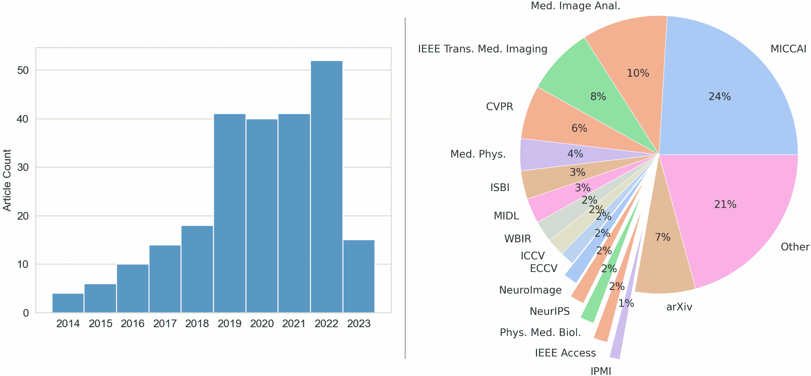
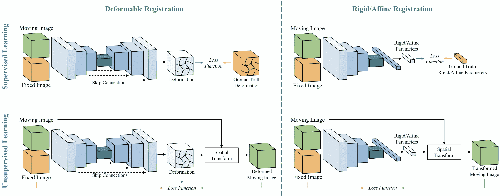
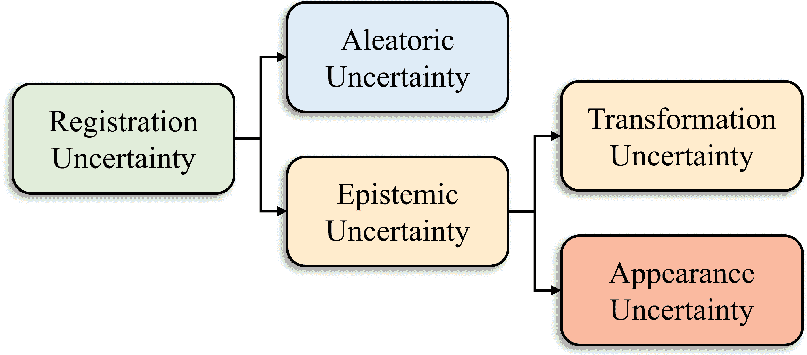
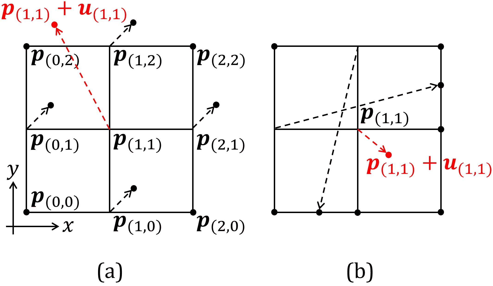
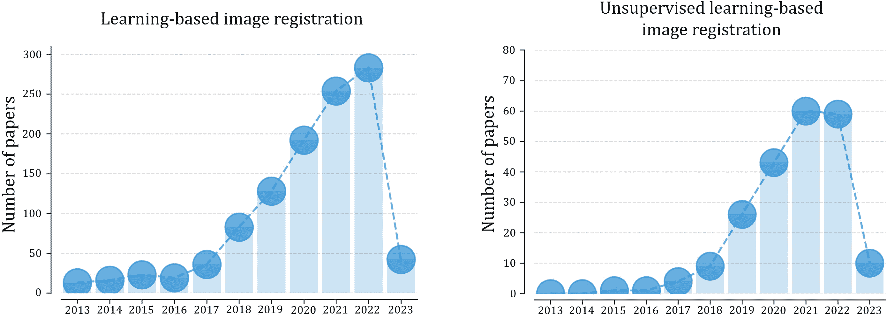

<!--yml

分类：未分类

日期：2024-09-06 19:37:46

-->

# [2307.15615] 深度学习在医学图像配准中的调查：新技术、不确定性、评估指标及其他

> 来源：[`ar5iv.labs.arxiv.org/html/2307.15615`](https://ar5iv.labs.arxiv.org/html/2307.15615)

# 深度学习在医学图像配准中的调查：新技术、不确定性、评估指标及其他

陈俊宇¹¹1 对本文贡献相同。刘一豪²²2 对本文贡献相同。魏书文³³3 对本文贡献相同。边章兴 Shalini Subramanian Aaron Carass Jerry L. Prince Yong Du 约翰斯·霍普金斯医学院放射学与放射科学系，美国马里兰州 约翰斯·霍普金斯大学电气与计算机工程系，美国马里兰州

###### 摘要

过去十年中，深度学习技术已经彻底改变了医学图像配准领域。最初的进展，如基于 ResNet 和 U-Net 的网络，为深度学习在图像配准中的应用奠定了基础。随后的进展涉及深度学习基础的配准的各个方面，包括相似性度量、变形正则化和不确定性估计。这些进展不仅丰富了图像配准的领域，还促进了其在多种任务中的应用，包括图谱构建、多图谱分割、运动估计和 2D-3D 配准。本文全面概述了深度学习基础的图像配准中的最新进展。我们首先简要介绍了深度学习基础的图像配准的核心概念。然后，我们深入探讨了创新的网络架构、特定于配准的损失函数以及估计配准不确定性的方法。此外，本文还探讨了评估深度学习模型在配准任务中表现的适当评估指标。最后，我们强调了这些新技术在医学影像中的实际应用，并讨论了深度学习基础的图像配准的未来前景。

###### 关键词：

\KWD 图像配准、深度神经网络、医学影像\DeclareMathOperator

*\argmaxarg max \DeclareMathOperator*\argminarg min

## 1 引言

医学图像配准涉及估计最佳的空间变换，以对齐一对固定图像和移动图像中的感兴趣结构。空间变换的选择取决于具体应用，可以分为刚性/仿射或非刚性/可变形。对于刚性/仿射配准，所有空间坐标都使用相同的刚性/仿射矩阵进行变换。另一方面，非刚性/可变形配准则为空间坐标的每个局部区域采用独立的变换。这两种配准类型对于许多医学成像任务都非常重要。刚性配准通常在刚体假设成立时使用。例如，它用于将结构扫描—*例如*，磁共振成像（MRI）或计算机断层扫描（CT）—与功能扫描—*例如*，功能性磁共振成像（fMRI）或正电子发射断层扫描（PET）—对齐，以进行衰减校正[139]或功能活动的解释[309]。另一方面，当需要更复杂、空间变化的变形时，通常使用可变形图像配准（DIR）。这类应用的示例包括为患者队列构建可变形模板[51, 100]或将图谱配准到患者图像以进行多图谱分割[270, 30, 2]。

图 1：本调查论文中所研究文章的统计数据。左侧面板显示了按年份划分的论文数量直方图；绝大多数被调查的论文是在过去五年内提出的。右侧面板展示了所调查文章的来源，表明我们的调查来源于与医学图像分析领域相关的资源。

传统上，图像配准通过迭代求解优化问题来实现（*例如*，demons [323 所示，重点主要集中在过去五年内提出的最新进展。我们的搜索覆盖了知名的医学影像期刊，如《医学图像分析》、《IEEE 医学影像学报》、《医学物理》和《神经影像》，以及与医学影像和图像配准相关的会议论文集，如 MICCAI、IPMI、WBIR、CVPR、ECCV、ICCV 和 NeurIPS。本文其余部分的组织如下：第二部分简要概述了基于学习的图像配准的基础知识。第三部分探讨了广泛使用的基于学习的配准方法的损失函数，这些函数类似于传统方法中的目标函数，并讨论了深度学习所启用的其他新颖损失函数。第四部分调查了为医学图像配准开发的网络架构，重点关注近期的发展。第五部分深入探讨了在基于学习的配准中估计配准不确定性的方法。第六部分考虑了基于学习的方法的适当评价指标，并研究了量化生成变形场规律性的方法。第七部分总结了基于学习的配准在医学影像中的近期应用。最后，第八部分讨论了当前的挑战，并提供了深度学习在医学图像配准中的未来展望。

## 2 基于学习的图像配准基础

图像配准旨在估计最优坐标变换，以最小化如下形式的能量函数：

|  | $\hat{\phi}=\operatorname*{\argmin}_{\phi}E(I_{f},I_{m}\circ\phi)+\lambda R(\phi),$ |  | (1) |
| --- | --- | --- | --- |

其中 $I_{f}$ 和 $I_{m}$ 分别表示固定图像和移动图像，$\phi$ 表示将 $I_{m}$ 映射到 $I_{f}$ 的变形场，$R$ 是 $\phi$ 的一个函数。能量函数中的第一项测量了固定图像与变换后的移动图像之间的图像相似度。第二项对变形场施加正则化，$\lambda$ 是一个超参数，用于确定图像相似度与变形场正则化之间的权衡。图像相似度测量的目的是量化固定图像与变换后的移动图像之间的差异。正则化项通常用于 DIR，因为它允许结合关于变形场所需特性的先验知识，如空间平滑性。此外，正则化可以防止变形场出现物理上不合理的行为，例如“折叠”或体素的重新排列[276]。这对医学图像尤为重要，因为这种不现实的行为不能准确反映器官在现实中的变形方式，可能导致配准结果的误解。刚性/仿射配准通常不需要正则化，因为变形场保证是空间均匀的。

图 2：基于学习的图像配准概述。上方面板展示了医学图像配准中有监督学习的常见流程，这需要真实的变换数据。下方面板展示了无监督学习流程，其中网络仅使用输入图像来执行配准。左侧面板展示了基于学习的 DIR 流程，通常采用编码器-解码器风格的网络架构。右侧面板展示了基于学习的刚性/仿射配准，通常仅涉及编码器。

### 2.1 有监督学习与无监督学习

基于学习的配准方法可以大致分为有监督和无监督。在机器学习范式中，有监督学习通常指在学习过程中使用外部信息（如标签），而无监督方法则关注发现数据本身的固有属性。有监督和无监督的学习-based 配准方法都需要一个训练阶段，使用输入对及其对应的目标输出。有监督配准方法在训练过程中使用真实变换作为目标输出。无监督方法则是指那些不需要真实变换的方法。然而，使用标记对应或解剖标签图进行训练的那些方法仍被归类为有监督学习。这是因为标记对应是对真实变换的稀疏表示，而匹配标签图则作为评估配准性能的替代品。当这种外部信息与图像数据一起用于学习时，这些方法被称为半监督。在某些背景下，“无监督”这一术语可能会产生误导。一个更精确的术语可能是“自监督”，以强调深度学习的训练方面。然而，为了讨论的清晰性和一致性，我们将使用传统术语，并将不需要外部信息监督的方法称为无监督。

在开发的早期阶段，大多数基于学习的配准方法都是有监督的。训练过程中所需的真实变换通常是使用传统配准方法生成的，例如[362, 275, 31, 148, 85]。然而，以这种方式生成真实变换是一个耗时的过程，这是这些方法的一个显著缺点。此外，由于这些网络被训练来模仿传统方法的功能，它们的配准性能可能不超过其所基于的方法。在某些情况下，可能需要对变形场进行后处理以进一步提高配准准确性[362]。另外，在某些情况下，人工变形也可以用作真实变换[226, 178, 303, 82, 79]。

最近，空间变换网络 [156] 的引入促使了向无监督方法的开发转变，这些方法不依赖于真实的变换 [330，188，59，14，56，229，230，232，172，37，38]。这些方法利用变形的移动图像与固定图像之间的差异来更新网络，实现端到端的训练。通过去除对真实变换的依赖，这些方法在建模不同的变形场特性上提供了更大的灵活性（*例如*，平滑性、可逆性）。

### 2.2 基于学习的配准范式

最近，在基于学习的医学图像配准领域的进展集中于探索提高配准准确性的方法，例如通过对网络架构、损失函数和训练方法的修改，这些将在后续章节中详细讨论。尽管有这些努力，基于学习的配准的基本原理仍未改变。图 2 展示了基于学习的刚性/仿射和 DIR 的传统范式。通常，这些范式包括以下组件：

1.  1.

    移动图像和固定图像作为输入

1.  2.

    深度神经网络

1.  3.

    空间变换器（对于无监督方法）

1.  4.

    损失函数

移动图像和固定图像输入到深度神经网络（DNNs）的方式根据网络架构有所不同。它们可以被连接在一起作为单一输入（*例如*，VoxelMorph [14]），或者每个图像可以由 DNN 单独处理，特征图在更深的阶段进行结合（*例如*，Quicksilver [362]）。

DNN 的架构可以根据其设计执行的特定任务和将采用的学习方法而有所不同。对于仿射/刚性配准方法，DNN 编码器用于特征提取，全连接层用于输出预测变换的参数。DIR 方法使用具有编码器和解码器的 DNN，结果是与输入图像大小相等的变形场。在监督设置中，网络输出与真实变换（由合成变换或传统图像配准方法生成）或地标对应关系使用损失函数进行比较。在无监督设置中，空间变换器[156]使用预测的变换来扭曲移动图像，然后使用包含图像相似性度量的损失函数将变换后的图像与固定图像进行评估。当固定图像和移动图像的解剖标签图可用时，还可以使用预测的变换和空间变换器生成扭曲的移动标签图。可以使用扭曲的移动标签图和固定标签图计算**解剖损失**，以在网络训练期间提供额外的指导。

根据学习模式的不同，有各种各样的损失函数可供选择。这些在 3 节中进行了详细讨论。网络通过在训练阶段使用训练数据集全局优化损失函数进行训练。训练后的网络随后应用于未见过的测试图像进行推断。

由于图像配准的自监督性质，在测试时可以进一步减少变换后的移动图像与固定图像之间的差异。这通常被称为实例特定优化[14, 294, 234, 127, 39]。具体来说，可以在测试时优化网络权重，以减少测试数据集中每对固定图像和移动图像的差异，从而进一步提升性能。配准网络还可以特别设计为产生**光滑的变换**，这在 DIR 方法中非常受欢迎，下一小节将对此进行进一步讨论。

### 2.3 **光滑的图像配准**

许多基于学习的 DIR 方法遵循小变形模型[14, 172, 59, 303, 232, 124, 148]。在该模型中，方程 1 中的$\phi$由位移场$v$表示，表达式为$\phi=id+v$，其中位移添加到单位变换$id$中。由于$\phi$可能不是一一映射，这种模型不能保证变形的可逆性。在某些情况下，“逆”变换通过减去位移粗略近似[6]。在许多应用中（*例如*，Avants et al. [9], Oishi et al. [244], Christensen et al. [50]），可微分图像配准是非常理想的，因为它提供了变换的可逆性和拓扑保留。可微分变换被定义为具有光滑且连续的逆（*即*，正雅可比行列式）的光滑且连续的一一映射。它们主要通过两种方法实现：时间依赖速度场[18, 9]或时间驻留速度场[5, 6, 323, 134]方法。

时间依赖速度场方法涉及积分随时间变化的足够平滑的速度场。通过在时间$t$使用速度场$v^{(t)}$并通过[18]演变来建立可微分变换：

|  | $\frac{d\phi^{(t)}}{dt}=v^{(t)}(\phi^{(t)}).$ |  | (2) |
| --- | --- | --- | --- |

通过从单位变换开始，即*即* $\phi^{(0)}=id$，并在单位时间周期内进行积分来实现可微分变换：

|  | $\phi^{(1)}=\phi^{(0)}+\int^{1}_{0}v^{(t)}(\phi^{(t)})dt.$ |  | (3) |
| --- | --- | --- | --- |

然而，涉及时间变化设置的微分方程的复杂性导致当前基于学习的配准模型中这种方法的使用有限。只有少数几项研究，如[268, 253, 290, 362, 361, 117, 334]，将其集成到 DNN 框架中。这些研究主要涉及使用 DNN 预测初始动量场，然后通过测地射击[228, 371]更新动量场以推导速度场。因此，除非重新实现现代 DNN 库中的测地射击框架，否则无法进行端到端训练。迄今为止，只有一项先前的工作实现了这一点用于医学图像配准[290]。

时间平稳速度场方法考虑了速度场在整个时间内保持不变的情况。利用这种设置，可以将公式 2 的变形演变重写为：

|  | $\frac{d\phi^{(t)}}{dt}=v(\phi^{(t)}),$ |  | (4) |
| --- | --- | --- | --- |

其中速度场$v$现在与时间无关。Dalca 等人 [56] 是首批在 DNN 模型中使用这种设置的，他们采用了缩放与平方的方法 [5, 6]。这一方法随后在基于学习的可变形配准模型中成为主流 [229, 37, 230, 115, 374, 266, 375, 177]。缩放与平方的方法将速度场视为李代数的成员，将变形场视为李群的成员。速度场位于李群单位元素的切空间中，并且其与变形场的关系由指数映射描述：

|  | $\phi=\exp{(v)},$ |  | (5) |
| --- | --- | --- | --- |

这等同于在单位时间内沿速度场进行积分。另一种观点是，结果中由于速度场指数化而产生的变形的雅可比行列式总是正的，类似于实数的指数导数总是正的 [6]。有关这种方法实现的更多信息，请参考所引用的文献 [6, 5, 56]。需要注意的是，缩放与平方的方法无法保证在数字领域进行有限差分近似的雅可比行列式测量时的无折叠变换。这是因为缩放与平方的方法涉及的双线性或三线性插值与有限差分基于雅可比行列式计算所假设的分段线性变换不一致 [198]。

## 3 损失函数

表 1: 无监督可变形图像配准模型的汇总（模型按字母顺序列出）。表格总结了模型对相似性和辅助损失函数、正则化技术、准确性度量和正则性度量的选择。

|       | 相似性损失     | 辅助损失     | 正则化项     | 准确性度量     | 正则性度量 |
| --- | --- | --- | --- | --- | --- |
|     | MSE  | NCC  | 相关性  | NGF  | MI  | MIND-SSC     | 解剖学  | 标志性点     | 扩散  | 曲率  | 弯曲  | 雅可比  | 一致性     | TRE  | MSE  | SSIM  | Dice  | HdD     | $\%\text{of}&#124;J_{\phi}\leq 0$  | $\#\text{of}&#124;J_{\phi}&#124;\leq 0$  | std.$(&#124;J_{\phi}&#124;)$  |  $&#124;\nabla J_{\phi}&#124;$  |
|   ADMIR [312] |  | $\mathbin{\vbox{\hbox{\scalebox{1.5}{$\bullet$}}}}$ |  |  |  |     |  |     | $\mathbin{\vbox{\hbox{\scalebox{1.5}{$\bullet$}}}}$ |  |  |  |     | $\mathbin{\vbox{\hbox{\scalebox{1.5}{$\bullet$}}}}$ |  |  | $\mathbin{\vbox{\hbox{\scalebox{1.5}{$\bullet$}}}}$ | $\mathbin{\vbox{\hbox{\scalebox{1.5}{$\bullet$}}}}$  |  |  |  |  |
| Attention-Reg [305]     |  |  |  |  |  |     | $\mathbin{\vbox{\hbox{\scalebox{1.5}{$\bullet$}}}}$ |     | $\mathbin{\vbox{\hbox{\scalebox{1.5}{$\bullet$}}}}$ |  |  |  |     | $\mathbin{\vbox{\hbox{\scalebox{1.5}{$\bullet$}}}}$ |  |  | $\mathbin{\vbox{\hbox{\scalebox{1.5}{$\bullet$}}}}$ |     |  |  | $\mathbin{\vbox{\hbox{\scalebox{1.5}{$\bullet$}}}}$ |  |
| BIRNet [85]     | $\mathbin{\vbox{\hbox{\scalebox{1.5}{$\bullet$}}}}$ |  |  |  |  |     |  |     |  |  |  |  |     |  |  |  | $\mathbin{\vbox{\hbox{\scalebox{1.5}{$\bullet$}}}}$ |     |  |  |  |  |
| CondLapIRN [232]     |  | $\mathbin{\vbox{\hbox{\scalebox{1.5}{$\bullet$}}}}$ |  |  |  |     |  |     | $\mathbin{\vbox{\hbox{\scalebox{1.5}{$\bullet$}}}}$ |  |  |  |     |  |  |  | $\mathbin{\vbox{\hbox{\scalebox{1.5}{$\bullet$}}}}$ |     | $\mathbin{\vbox{\hbox{\scalebox{1.5}{$\bullet$}}}}$ |  | $\mathbin{\vbox{\hbox{\scalebox{1.5}{$\bullet$}}}}$ |  |
| CycleMorph [172]     | $\mathbin{\vbox{\hbox{\scalebox{1.5}{$\bullet$}}}}$ | $\mathbin{\vbox{\hbox{\scalebox{1.5}{$\bullet$}}}}$ |  |  |  |     |  |     | $\mathbin{\vbox{\hbox{\scalebox{1.5}{$\bullet$}}}}$ |  |  |  | $\mathbin{\vbox{\hbox{\scalebox{1.5}{$\bullet$}}}}$  |  | $\mathbin{\vbox{\hbox{\scalebox{1.5}{$\bullet$}}}}$ | $\mathbin{\vbox{\hbox{\scalebox{1.5}{$\bullet$}}}}$ | $\mathbin{\vbox{\hbox{\scalebox{1.5}{$\bullet$}}}}$ |     | $\mathbin{\vbox{\hbox{\scalebox{1.5}{$\bullet$}}}}$ |  |  |  |
| de Vos *et al.* [329]     |  |  |  |  | $\mathbin{\vbox{\hbox{\scalebox{1.5}{$\bullet$}}}}$ |     |  |     |  |  | $\mathbin{\vbox{\hbox{\scalebox{1.5}{$\bullet$}}}}$ |  |     |  |  |  | $\mathbin{\vbox{\hbox{\scalebox{1.5}{$\bullet$}}}}$ | $\mathbin{\vbox{\hbox{\scalebox{1.5}{$\bullet$}}}}$     | $\mathbin{\vbox{\hbox{\scalebox{1.5}{$\bullet$}}}}$ |  |  |  |
| Deformer [42]     |  | $\mathbin{\vbox{\hbox{\scalebox{1.5}{$\bullet$}}}}$ |  |  |  |     |  |     | $\mathbin{\vbox{\hbox{\scalebox{1.5}{$\bullet$}}}}$ |  |  |  |     |  |  |  | $\mathbin{\vbox{\hbox{\scalebox{1.5}{$\bullet$}}}}$ |     | $\mathbin{\vbox{\hbox{\scalebox{1.5}{$\bullet$}}}}$ |  | $\mathbin{\vbox{\hbox{\scalebox{1.5}{$\bullet$}}}}$ |  |
| DiffuseMorph [171]     |  | $\mathbin{\vbox{\hbox{\scalebox{1.5}{$\bullet$}}}}$ |  |  |  |     |  |     | $\mathbin{\vbox{\hbox{\scalebox{1.5}{$\bullet$}}}}$ |  |  |  |     |  | $\mathbin{\vbox{\hbox{\scalebox{1.5}{$\bullet$}}}}$ | $\mathbin{\vbox{\hbox{\scalebox{1.5}{$\bullet$}}}}$ | $\mathbin{\vbox{\hbox{\scalebox{1.5}{$\bullet$}}}}$ |     | $\mathbin{\vbox{\hbox{\scalebox{1.5}{$\bullet$}}}}$ |  |  |  |
| DIRNet [60]     |  | $\mathbin{\vbox{\hbox{\scalebox{1.5}{$\bullet$}}}}$ |  |  |  |     |  |     |  |  |  |  |     |  |  |  | $\mathbin{\vbox{\hbox{\scalebox{1.5}{$\bullet$}}}}$ |     |  |  |  |  |
| DLIR [59]     |  | $\mathbin{\vbox{\hbox{\scalebox{1.5}{$\bullet$}}}}$ |  |  |  |     |  |     |  |  | $\mathbin{\vbox{\hbox{\scalebox{1.5}{$\bullet$}}}}$ |  |     |  |  |  | $\mathbin{\vbox{\hbox{\scalebox{1.5}{$\bullet$}}}}$ | $\mathbin{\vbox{\hbox{\scalebox{1.5}{$\bullet$}}}}$     | $\mathbin{\vbox{\hbox{\scalebox{1.5}{$\bullet$}}}}$ |  | $\mathbin{\vbox{\hbox{\scalebox{1.5}{$\bullet$}}}}$ |  |
| DNVF [115]     |  | $\mathbin{\vbox{\hbox{\scalebox{1.5}{$\bullet$}}}}$ |  |  |  |     |  |     | $\mathbin{\vbox{\hbox{\scalebox{1.5}{$\bullet$}}}}$ |  |  | $\mathbin{\vbox{\hbox{\scalebox{1.5}{$\bullet$}}}}$ |     |  |  | $\mathbin{\vbox{\hbox{\scalebox{1.5}{$\bullet$}}}}$ | $\mathbin{\vbox{\hbox{\scalebox{1.5}{$\bullet$}}}}$ |     | $\mathbin{\vbox{\hbox{\scalebox{1.5}{$\bullet$}}}}$ |  |  |  |
| DTN [374]     | $\mathbin{\vbox{\hbox{\scalebox{1.5}{$\bullet$}}}}$ |  |  |  |  |     |  |     | $\mathbin{\vbox{\hbox{\scalebox{1.5}{$\bullet$}}}}$ |  |  |  |     |  |  |  | $\mathbin{\vbox{\hbox{\scalebox{1.5}{$\bullet$}}}}$ |     |  |  | $\mathbin{\vbox{\hbox{\scalebox{1.5}{$\bullet$}}}}$ |  |
| Dual-PRNet [146]     |  | $\mathbin{\vbox{\hbox{\scalebox{1.5}{$\bullet$}}}}$ |  |  |  |     |  |     | $\mathbin{\vbox{\hbox{\scalebox{1.5}{$\bullet$}}}}$ |  |  |  |     |  |  |  | $\mathbin{\vbox{\hbox{\scalebox{1.5}{$\bullet$}}}}$ |     |  |  |  |  |
| Dual-PRNet++ [167]     |  | $\mathbin{\vbox{\hbox{\scalebox{1.5}{$\bullet$}}}}$ |  |  |  |     |  |     | $\mathbin{\vbox{\hbox{\scalebox{1.5}{$\bullet$}}}}$ |  |  |  |     |  |  |  | $\mathbin{\vbox{\hbox{\scalebox{1.5}{$\bullet$}}}}$ | $\mathbin{\vbox{\hbox{\scalebox{1.5}{$\bullet$}}}}$     | $\mathbin{\vbox{\hbox{\scalebox{1.5}{$\bullet$}}}}$ |  |  |  |
| FAIM [180]     |  | $\mathbin{\vbox{\hbox{\scalebox{1.5}{$\bullet$}}}}$ |  |  |  |     |  |     | $\mathbin{\vbox{\hbox{\scalebox{1.5}{$\bullet$}}}}$ |  |  | $\mathbin{\vbox{\hbox{\scalebox{1.5}{$\bullet$}}}}$ |     |  |  |  | $\mathbin{\vbox{\hbox{\scalebox{1.5}{$\bullet$}}}}$ |     |  | $\mathbin{\vbox{\hbox{\scalebox{1.5}{$\bullet$}}}}$ |  |  |
| Fan *et al.* [83]     |  |  |  |  |  |     |  |     | $\mathbin{\vbox{\hbox{\scalebox{1.5}{$\bullet$}}}}$ |  |  |  |     |  |  |  |  | $\mathbin{\vbox{\hbox{\scalebox{1.5}{$\bullet$}}}}$     |  | $\mathbin{\vbox{\hbox{\scalebox{1.5}{$\bullet$}}}}$ |  |  |
| Fourier-Net [159]     | $\mathbin{\vbox{\hbox{\scalebox{1.5}{$\bullet$}}}}$ | $\mathbin{\vbox{\hbox{\scalebox{1.5}{$\bullet$}}}}$ |  |  |  |     |  |     | $\mathbin{\vbox{\hbox{\scalebox{1.5}{$\bullet$}}}}$ |  |  |  |     |  |  |  | $\mathbin{\vbox{\hbox{\scalebox{1.5}{$\bullet$}}}}$ | $\mathbin{\vbox{\hbox{\scalebox{1.5}{$\bullet$}}}}$  | $\mathbin{\vbox{\hbox{\scalebox{1.5}{$\bullet$}}}}$ |  |  |  |
| GraformerDIR [360]     |  | $\mathbin{\vbox{\hbox{\scalebox{1.5}{$\bullet$}}}}$ |  |  |  |     |  |     | $\mathbin{\vbox{\hbox{\scalebox{1.5}{$\bullet$}}}}$ |  |  | $\mathbin{\vbox{\hbox{\scalebox{1.5}{$\bullet$}}}}$ |     |  |  |  | $\mathbin{\vbox{\hbox{\scalebox{1.5}{$\bullet$}}}}$ |     | $\mathbin{\vbox{\hbox{\scalebox{1.5}{$\bullet$}}}}$ |  |  |  |
| Han *et al.* [116]     |  | $\mathbin{\vbox{\hbox{\scalebox{1.5}{$\bullet$}}}}$ |  |  |  |     |  |     | $\mathbin{\vbox{\hbox{\scalebox{1.5}{$\bullet$}}}}$ |  |  |  |     | $\mathbin{\vbox{\hbox{\scalebox{1.5}{$\bullet$}}}}$ |  |  | $\mathbin{\vbox{\hbox{\scalebox{1.5}{$\bullet$}}}}$ |     | $\mathbin{\vbox{\hbox{\scalebox{1.5}{$\bullet$}}}}$ |  |  |  |
| Hering *et al.* [132]     |  |  |  | $\mathbin{\vbox{\hbox{\scalebox{1.5}{$\bullet$}}}}$ |  |     |  | $\mathbin{\vbox{\hbox{\scalebox{1.5}{$\bullet$}}}}$     |  | $\mathbin{\vbox{\hbox{\scalebox{1.5}{$\bullet$}}}}$ |  |  |     |  |  |  | $\mathbin{\vbox{\hbox{\scalebox{1.5}{$\bullet$}}}}$ | $\mathbin{\vbox{\hbox{\scalebox{1.5}{$\bullet$}}}}$     | $\mathbin{\vbox{\hbox{\scalebox{1.5}{$\bullet$}}}}$ |  |  |  |
| HyperMorph [142]     | $\mathbin{\vbox{\hbox{\scalebox{1.5}{$\bullet$}}}}$ | $\mathbin{\vbox{\hbox{\scalebox{1.5}{$\bullet$}}}}$ |  |  |  |     | $\mathbin{\vbox{\hbox{\scalebox{1.5}{$\bullet$}}}}$ |     | $\mathbin{\vbox{\hbox{\scalebox{1.5}{$\bullet$}}}}$ |  |  |  |     |  | $\mathbin{\vbox{\hbox{\scalebox{1.5}{$\bullet$}}}}$ |  | $\mathbin{\vbox{\hbox{\scalebox{1.5}{$\bullet$}}}}$ |     |  |  |  |  |
| im2grid [199]     | $\mathbin{\vbox{\hbox{\scalebox{1.5}{$\bullet$}}}}$ |  |  |  |  |     |  |     | $\mathbin{\vbox{\hbox{\scalebox{1.5}{$\bullet$}}}}$ |  |  |  |     |  |  |  | $\mathbin{\vbox{\hbox{\scalebox{1.5}{$\bullet$}}}}$ |     | $\mathbin{\vbox{\hbox{\scalebox{1.5}{$\bullet$}}}}$ | $\mathbin{\vbox{\hbox{\scalebox{1.5}{$\bullet$}}}}$ |  |  |
| Krebs *et al.* [177]     |  | $\mathbin{\vbox{\hbox{\scalebox{1.5}{$\bullet$}}}}$ |  |  |  |     |  |     | $\mathbin{\vbox{\hbox{\scalebox{1.5}{$\bullet$}}}}$ |  |  |  |     |  | $\mathbin{\vbox{\hbox{\scalebox{1.5}{$\bullet$}}}}$ |  | $\mathbin{\vbox{\hbox{\scalebox{1.5}{$\bullet$}}}}$ | $\mathbin{\vbox{\hbox{\scalebox{1.5}{$\bullet$}}}}$  |  |  |  | $\mathbin{\vbox{\hbox{\scalebox{1.5}{$\bullet$}}}}$ |
| LapIRN [230]     |  | $\mathbin{\vbox{\hbox{\scalebox{1.5}{$\bullet$}}}}$ |  |  |  |     |  |     | $\mathbin{\vbox{\hbox{\scalebox{1.5}{$\bullet$}}}}$ |  |  |  |     |  |  |  | $\mathbin{\vbox{\hbox{\scalebox{1.5}{$\bullet$}}}}$ |     |  | $\mathbin{\vbox{\hbox{\scalebox{1.5}{$\bullet$}}}}$ | $\mathbin{\vbox{\hbox{\scalebox{1.5}{$\bullet$}}}}$ |  |
| LKU-Net [160]     |  | $\mathbin{\vbox{\hbox{\scalebox{1.5}{$\bullet$}}}}$ |  |  |  |     | $\mathbin{\vbox{\hbox{\scalebox{1.5}{$\bullet$}}}}$ |     | $\mathbin{\vbox{\hbox{\scalebox{1.5}{$\bullet$}}}}$ |  |  |  |     |  |  |  | $\mathbin{\vbox{\hbox{\scalebox{1.5}{$\bullet$}}}}$ | $\mathbin{\vbox{\hbox{\scalebox{1.5}{$\bullet$}}}}$  | $\mathbin{\vbox{\hbox{\scalebox{1.5}{$\bullet$}}}}$ |  | $\mathbin{\vbox{\hbox{\scalebox{1.5}{$\bullet$}}}}$ |  |
| Li *et al.* [188]     |  | $\mathbin{\vbox{\hbox{\scalebox{1.5}{$\bullet$}}}}$ |  |  |  |     |  |     | $\mathbin{\vbox{\hbox{\scalebox{1.5}{$\bullet$}}}}$ |  |  |  |     |  |  |  | $\mathbin{\vbox{\hbox{\scalebox{1.5}{$\bullet$}}}}$ |     |  |  |  |  |
| Liu *et al.* [195]     | $\mathbin{\vbox{\hbox{\scalebox{1.5}{$\bullet$}}}}$ |  |  |  |  |     |  |     |  |  |  |  |     |  |  |  | $\mathbin{\vbox{\hbox{\scalebox{1.5}{$\bullet$}}}}$ |     |  |  |  |  |
| MIDIR [266]     |  |  |  |  | $\mathbin{\vbox{\hbox{\scalebox{1.5}{$\bullet$}}}}$ |     |  |     | $\mathbin{\vbox{\hbox{\scalebox{1.5}{$\bullet$}}}}$ |  |  |  |     |  |  |  | $\mathbin{\vbox{\hbox{\scalebox{1.5}{$\bullet$}}}}$ |     | $\mathbin{\vbox{\hbox{\scalebox{1.5}{$\bullet$}}}}$ |  |  | $\mathbin{\vbox{\hbox{\scalebox{1.5}{$\bullet$}}}}$ |
| MS-DIRNet [186]     |  | $\mathbin{\vbox{\hbox{\scalebox{1.5}{$\bullet$}}}}$ |  | $\mathbin{\vbox{\hbox{\scalebox{1.5}{$\bullet$}}}}$ |  |     |  |     | $\mathbin{\vbox{\hbox{\scalebox{1.5}{$\bullet$}}}}$ |  | $\mathbin{\vbox{\hbox{\scalebox{1.5}{$\bullet$}}}}$ |  |     | $\mathbin{\vbox{\hbox{\scalebox{1.5}{$\bullet$}}}}$ | $\mathbin{\vbox{\hbox{\scalebox{1.5}{$\bullet$}}}}$ |  |  |     |  |  |  |  |
| MS-ODENet [352]     | $\mathbin{\vbox{\hbox{\scalebox{1.5}{$\bullet$}}}}$ |  |  |  |  |     |  |     | $\mathbin{\vbox{\hbox{\scalebox{1.5}{$\bullet$}}}}$ |  |  |  |     |  | $\mathbin{\vbox{\hbox{\scalebox{1.5}{$\bullet$}}}}$ |  | $\mathbin{\vbox{\hbox{\scalebox{1.5}{$\bullet$}}}}$ |     |  |  |  |  |
| NODEO [347]     |  | $\mathbin{\vbox{\hbox{\scalebox{1.5}{$\bullet$}}}}$ |  |  |  |     |  |     | $\mathbin{\vbox{\hbox{\scalebox{1.5}{$\bullet$}}}}$ |  |  | $\mathbin{\vbox{\hbox{\scalebox{1.5}{$\bullet$}}}}$ |     |  |  |  | $\mathbin{\vbox{\hbox{\scalebox{1.5}{$\bullet$}}}}$ |     | $\mathbin{\vbox{\hbox{\scalebox{1.5}{$\bullet$}}}}$ |  |  |  |
| PDD-Net 2.5D [126]     |  |  |  |  |  | $\mathbin{\vbox{\hbox{\scalebox{1.5}{$\bullet$}}}}$     | $\mathbin{\vbox{\hbox{\scalebox{1.5}{$\bullet$}}}}$ |     | $\mathbin{\vbox{\hbox{\scalebox{1.5}{$\bullet$}}}}$ |  |  |  |     |  |  |  | $\mathbin{\vbox{\hbox{\scalebox{1.5}{$\bullet$}}}}$ |     |  |  | $\mathbin{\vbox{\hbox{\scalebox{1.5}{$\bullet$}}}}$ |  |
| PDD-Net 3D [124]     |  |  |  |  |  | $\mathbin{\vbox{\hbox{\scalebox{1.5}{$\bullet$}}}}$  | $\mathbin{\vbox{\hbox{\scalebox{1.5}{$\bullet$}}}}$ |     | $\mathbin{\vbox{\hbox{\scalebox{1.5}{$\bullet$}}}}$ |  |  |  |     |  |  |  | $\mathbin{\vbox{\hbox{\scalebox{1.5}{$\bullet$}}}}$ |     |  |  | $\mathbin{\vbox{\hbox{\scalebox{1.5}{$\bullet$}}}}$ |  |
| PC-SwinMorph [196]     |  | $\mathbin{\vbox{\hbox{\scalebox{1.5}{$\bullet$}}}}$ |  |  |  |     |  |     | $\mathbin{\vbox{\hbox{\scalebox{1.5}{$\bullet$}}}}$ |  |  |  | $\mathbin{\vbox{\hbox{\scalebox{1.5}{$\bullet$}}}}$     |  |  |  | $\mathbin{\vbox{\hbox{\scalebox{1.5}{$\bullet$}}}}$ |     |  |  |  |  |
| SDHNet [379]     |  | $\mathbin{\vbox{\hbox{\scalebox{1.5}{$\bullet$}}}}$ |  |  |  |     |  |     | $\mathbin{\vbox{\hbox{\scalebox{1.5}{$\bullet$}}}}$ |  |  |  |     |  |  |  | $\mathbin{\vbox{\hbox{\scalebox{1.5}{$\bullet$}}}}$ | $\mathbin{\vbox{\hbox{\scalebox{1.5}{$\bullet$}}}}$  | $\mathbin{\vbox{\hbox{\scalebox{1.5}{$\bullet$}}}}$ |  |  |  |
| Shao *et al.* [289]     | $\mathbin{\vbox{\hbox{\scalebox{1.5}{$\bullet$}}}}$ |  |  |  |  |     |  |     | $\mathbin{\vbox{\hbox{\scalebox{1.5}{$\bullet$}}}}$ |  |  |  |     |  | $\mathbin{\vbox{\hbox{\scalebox{1.5}{$\bullet$}}}}$ |  |  |     |  | $\mathbin{\vbox{\hbox{\scalebox{1.5}{$\bullet$}}}}$ | $\mathbin{\vbox{\hbox{\scalebox{1.5}{$\bullet$}}}}$ |  |
| SVF-R2Net [165]     | $\mathbin{\vbox{\hbox{\scalebox{1.5}{$\bullet$}}}}$ |  |  |  |  |     |  |     |  |  |  | $\mathbin{\vbox{\hbox{\scalebox{1.5}{$\bullet$}}}}$ |     |  | $\mathbin{\vbox{\hbox{\scalebox{1.5}{$\bullet$}}}}$ |  | $\mathbin{\vbox{\hbox{\scalebox{1.5}{$\bullet$}}}}$ |     |  | $\mathbin{\vbox{\hbox{\scalebox{1.5}{$\bullet$}}}}$ |  |  |
| SYMNet [229]     |  | $\mathbin{\vbox{\hbox{\scalebox{1.5}{$\bullet$}}}}$ |  |  |  |     |  |     | $\mathbin{\vbox{\hbox{\scalebox{1.5}{$\bullet$}}}}$ |  |  | $\mathbin{\vbox{\hbox{\scalebox{1.5}{$\bullet$}}}}$ | $\mathbin{\vbox{\hbox{\scalebox{1.5}{$\bullet$}}}}$     |  |  |  | $\mathbin{\vbox{\hbox{\scalebox{1.5}{$\bullet$}}}}$ |     |  | $\mathbin{\vbox{\hbox{\scalebox{1.5}{$\bullet$}}}}$ |  |  |
| SymTrans [212]     | $\mathbin{\vbox{\hbox{\scalebox{1.5}{$\bullet$}}}}$ |  |  |  |  |     |  |     | $\mathbin{\vbox{\hbox{\scalebox{1.5}{$\bullet$}}}}$ |  |  |  |     |  |  |  | $\mathbin{\vbox{\hbox{\scalebox{1.5}{$\bullet$}}}}$ |     |  | $\mathbin{\vbox{\hbox{\scalebox{1.5}{$\bullet$}}}}$ |  |  |
| SynthMorph [138]     |  |  |  |  |  |     | $\mathbin{\vbox{\hbox{\scalebox{1.5}{$\bullet$}}}}$ |     | $\mathbin{\vbox{\hbox{\scalebox{1.5}{$\bullet$}}}}$ |  |  |  |     |  |  |  | $\mathbin{\vbox{\hbox{\scalebox{1.5}{$\bullet$}}}}$ |     | $\mathbin{\vbox{\hbox{\scalebox{1.5}{$\bullet$}}}}$ |  |  |  |
| TM-DCA [40]     |  | $\mathbin{\vbox{\hbox{\scalebox{1.5}{$\bullet$}}}}$ |  |  |  |     | $\mathbin{\vbox{\hbox{\scalebox{1.5}{$\bullet$}}}}$ |     | $\mathbin{\vbox{\hbox{\scalebox{1.5}{$\bullet$}}}}$ |  |  |  |     |  |  |  | $\mathbin{\vbox{\hbox{\scalebox{1.5}{$\bullet$}}}}$ |     | $\mathbin{\vbox{\hbox{\scalebox{1.5}{$\bullet$}}}}$ |  | $\mathbin{\vbox{\hbox{\scalebox{1.5}{$\bullet$}}}}$ |  |
| TM-TVF [36]     | $\mathbin{\vbox{\hbox{\scalebox{1.5}{$\bullet$}}}}$ | $\mathbin{\vbox{\hbox{\scalebox{1.5}{$\bullet$}}}}$ |  |  |  |     | $\mathbin{\vbox{\hbox{\scalebox{1.5}{$\bullet$}}}}$ |     | $\mathbin{\vbox{\hbox{\scalebox{1.5}{$\bullet$}}}}$ |  |  |  |     |  |  | $\mathbin{\vbox{\hbox{\scalebox{1.5}{$\bullet$}}}}$ | $\mathbin{\vbox{\hbox{\scalebox{1.5}{$\bullet$}}}}$ | $\mathbin{\vbox{\hbox{\scalebox{1.5}{$\bullet$}}}}$     | $\mathbin{\vbox{\hbox{\scalebox{1.5}{$\bullet$}}}}$ |  | $\mathbin{\vbox{\hbox{\scalebox{1.5}{$\bullet$}}}}$ |  |
| TransMorph [37]     | $\mathbin{\vbox{\hbox{\scalebox{1.5}{$\bullet$}}}}$ | $\mathbin{\vbox{\hbox{\scalebox{1.5}{$\bullet$}}}}$ |  |  |  |     | $\mathbin{\vbox{\hbox{\scalebox{1.5}{$\bullet$}}}}$ |     | $\mathbin{\vbox{\hbox{\scalebox{1.5}{$\bullet$}}}}$ |  | $\mathbin{\vbox{\hbox{\scalebox{1.5}{$\bullet$}}}}$ |  |     |  |  | $\mathbin{\vbox{\hbox{\scalebox{1.5}{$\bullet$}}}}$ | $\mathbin{\vbox{\hbox{\scalebox{1.5}{$\bullet$}}}}$ |     | $\mathbin{\vbox{\hbox{\scalebox{1.5}{$\bullet$}}}}$ |  |  |  |
| ViT-V-Net [38]     | $\mathbin{\vbox{\hbox{\scalebox{1.5}{$\bullet$}}}}$ |  |  |  |  |     |  |     | $\mathbin{\vbox{\hbox{\scalebox{1.5}{$\bullet$}}}}$ |  |  |  |     |  |  |  | $\mathbin{\vbox{\hbox{\scalebox{1.5}{$\bullet$}}}}$ |     | $\mathbin{\vbox{\hbox{\scalebox{1.5}{$\bullet$}}}}$ |  |  |  |
| VoxelMorph [14]     | $\mathbin{\vbox{\hbox{\scalebox{1.5}{$\bullet$}}}}$ | $\mathbin{\vbox{\hbox{\scalebox{1.5}{$\bullet$}}}}$ |  |  |  |     | $\mathbin{\vbox{\hbox{\scalebox{1.5}{$\bullet$}}}}$ |     | $\mathbin{\vbox{\hbox{\scalebox{1.5}{$\bullet$}}}}$ |  |  |  |     |  |  |  | $\mathbin{\vbox{\hbox{\scalebox{1.5}{$\bullet$}}}}$ |     | $\mathbin{\vbox{\hbox{\scalebox{1.5}{$\bullet$}}}}$ | $\mathbin{\vbox{\hbox{\scalebox{1.5}{$\bullet$}}}}$ |  |  |
| VoxelMorph-diff [56]     | $\mathbin{\vbox{\hbox{\scalebox{1.5}{$\bullet$}}}}$ |  |  |  |  |     | $\mathbin{\vbox{\hbox{\scalebox{1.5}{$\bullet$}}}}$ |     | $\mathbin{\vbox{\hbox{\scalebox{1.5}{$\bullet$}}}}$ |  |  |  |     |  |  |  | $\mathbin{\vbox{\hbox{\scalebox{1.5}{$\bullet$}}}}$ |     | $\mathbin{\vbox{\hbox{\scalebox{1.5}{$\bullet$}}}}$ | $\mathbin{\vbox{\hbox{\scalebox{1.5}{$\bullet$}}}}$ |  |  |
| VoxelMorph++ [127]     |  |  |  |  |  | $\mathbin{\vbox{\hbox{\scalebox{1.5}{$\bullet$}}}}$  |  | $\mathbin{\vbox{\hbox{\scalebox{1.5}{$\bullet$}}}}$  | $\mathbin{\vbox{\hbox{\scalebox{1.5}{$\bullet$}}}}$ |  |  |  |     | $\mathbin{\vbox{\hbox{\scalebox{1.5}{$\bullet$}}}}$ |  |  |  |     |  | $\mathbin{\vbox{\hbox{\scalebox{1.5}{$\bullet$}}}}$ | $\mathbin{\vbox{\hbox{\scalebox{1.5}{$\bullet$}}}}$ |  |
| VR-Net [161]     | $\mathbin{\vbox{\hbox{\scalebox{1.5}{$\bullet$}}}}$ |  |  |  |  |     |  |     | $\mathbin{\vbox{\hbox{\scalebox{1.5}{$\bullet$}}}}$ |  |  |  |     |  |  |  | $\mathbin{\vbox{\hbox{\scalebox{1.5}{$\bullet$}}}}$ | $\mathbin{\vbox{\hbox{\scalebox{1.5}{$\bullet$}}}}$     | $\mathbin{\vbox{\hbox{\scalebox{1.5}{$\bullet$}}}}$ |  |  | $\mathbin{\vbox{\hbox{\scalebox{1.5}{$\bullet$}}}}$ |
| VTN [377]     |  |  | $\mathbin{\vbox{\hbox{\scalebox{1.5}{$\bullet$}}}}$ |  |  |     |  |     | $\mathbin{\vbox{\hbox{\scalebox{1.5}{$\bullet$}}}}$ |  |  | $\mathbin{\vbox{\hbox{\scalebox{1.5}{$\bullet$}}}}$ | $\mathbin{\vbox{\hbox{\scalebox{1.5}{$\bullet$}}}}$  |  |  |  | $\mathbin{\vbox{\hbox{\scalebox{1.5}{$\bullet$}}}}$ |     | $\mathbin{\vbox{\hbox{\scalebox{1.5}{$\bullet$}}}}$ |  | $\mathbin{\vbox{\hbox{\scalebox{1.5}{$\bullet$}}}}$ |  |
| XMorpher [291]     |  | $\mathbin{\vbox{\hbox{\scalebox{1.5}{$\bullet$}}}}$ |  |  |  |     | $\mathbin{\vbox{\hbox{\scalebox{1.5}{$\bullet$}}}}$ |     | $\mathbin{\vbox{\hbox{\scalebox{1.5}{$\bullet$}}}}$ |  |  |  | $\mathbin{\vbox{\hbox{\scalebox{1.5}{$\bullet$}}}}$     |  |  |  | $\mathbin{\vbox{\hbox{\scalebox{1.5}{$\bullet$}}}}$ |     | $\mathbin{\vbox{\hbox{\scalebox{1.5}{$\bullet$}}}}$ |  |  |  |
| Zhang *et al.* [372]     | $\mathbin{\vbox{\hbox{\scalebox{1.5}{$\bullet$}}}}$ |  |  |  |  |     |  |     | $\mathbin{\vbox{\hbox{\scalebox{1.5}{$\bullet$}}}}$ |  |  | $\mathbin{\vbox{\hbox{\scalebox{1.5}{$\bullet$}}}}$ |     |  |  |  | $\mathbin{\vbox{\hbox{\scalebox{1.5}{$\bullet$}}}}$ |     | $\mathbin{\vbox{\hbox{\scalebox{1.5}{$\bullet$}}}}$ |  |  |  |
|       |  |  |  |  |  |  |  |  |  |  |  |  |  |  |  |  |  |  |  |  |  |  |

表 1 提供了一份无监督 DIR 模型的汇编，概述了相似性和辅助损失函数，以及其他细节。有关详细信息和讨论，请参见文本。

### 3.1 监督学习

在有监督学习中，使用真实的转换时，损失函数通常容易定义，均方误差 (MSE) [226, 178, 79, 275, 31, 85]、等效终点误差 (EPE) 和平均绝对误差 (MAE) [362, 303] 是最常见的选择。

### 3.2 无监督与半监督学习

在无监督学习中，由于没有真实的转换参考，通常使用正则化来强制转换的平滑性。因此，损失函数通常类似于传统方法中使用的能量函数（*即*，方程 1），其中包括图像相似度度量和转换正则化项。以下小节总结了用于图像配准的常用和最近提出的损失函数。

### 3.3 相似度度量

单模态。图像相似性度量的选择可以根据具体应用而有所不同。对于单模态配准，均方误差（MSE）仍然是一个受欢迎的选择，并且具有简单的高斯似然近似的概率解释 [56, 37, 172, 14, 223, 161, 199]。然而，MSE 的一个缺点是它对图像中所有体素的差异进行平均，这使得它对图像中的局部强度变化敏感。归一化互相关（NCC）被认为对局部强度变化更为鲁棒，并且在脑部 MR 配准应用中表现优越 [9]。NCC 已被扩展为训练学习模型的损失函数，其中局部窗口的计算通常通过卷积操作完成 [180, 37, 172, 14, 370, 229, 230, 232]。NCC 的一个缺点是与 MSE 相比计算成本较高，这主要归因于相对较大的卷积核尺寸（通常选择在 $5\times 5\times 5$ 和 $9\times 9\times 9$ 体素之间 [9, 14, 229]）。结构相似性指数（SSIM） [336] 也被证明是单模态图像配准的有效损失函数 [39, 216, 282]。SSIM 考虑了亮度、对比度和结构。它可以被视为 NCC 的扩展，其中 SSIM 中的结构项是 NCC 的平方根。这使得 SSIM 能够捕捉到关于两幅图像的相似性的信息，超越了它们之间的相关程度。

多模态性。在多模态应用中，传统方法通常使用互信息（MI）[326]、相关比率[274]、自相似性上下文（SSC）[129]或归一化梯度场（NGF）[114]作为相似性度量。MI 和相关比率通过计算强度统计量（如强度直方图）来评估两个图像之间的关系，从而测量统计依赖性。然而，计算强度直方图的标准方法（即计数）是不可微的，因此通常使用 Parzen 窗口公式[316]来允许在网络训练过程中进行反向传播。基于 Parzen 窗口的 MI 已被作为损失函数应用于许多多模态应用中[266、329、238、111、138]，但其实现相对困难，并且对强度区间数和高斯函数的平滑度等因素较为敏感。据我们了解，相关比率在基于学习的医学图像配准中尚未使用。需要注意的是，这些基于强度统计量的度量不考虑局部结构信息，使其更适合刚性/仿射配准，而不适合变形配准应用[259、129]。SSC 是另一种常用于多模态应用的损失函数，它是对模态独立邻域描述符（MIND）[128]的改进。SSC 和 MIND 通过计算体素及其邻近体素之间的描述符来操作，将任何模态的图像转化为这些描述符的特征表示。相似性通过对两个图像描述符之间的绝对差异进行求和来确定。由于 SSC 和 MIND 考虑了局部结构信息，因此它们不像 MI 或相关比率那样受限，使其在多模态变形配准[119、231、357、354、24]中更为有用。NGF 通过关注图像中的强度变化或边缘来比较图像。两个图像之间的相似性由相同位置的强度变化的存在决定，而不考虑被比较图像的模态。NGF 最初是为多模态应用如脑部 MR T1 到 T2 和 PET 到 CT[114]开发的，但现在主要用于基于学习的配准模型，如肺 CT 配准[131、132、231]。这是因为肺部的复杂结构，包括支气管、裂缝和血管，会影响准确配准[132]。NGF 关注边缘而不是强度值，使其更适合于这一目的。

最近的进展。由于之前提到的相似性度量存在一些局限性，很多努力致力于改进或提出新的损失函数。Terpstra 等人 [314] 证明了 $\ell^{2}$ 损失（等同于 MSE）在 MRI 应用中并非最佳，因为它没有充分利用 MRI 复杂数据中的幅度和相位信息。作者介绍了 $\bot$-loss，一种基于复数极坐标表示并促进整体损失景观对称性的损失函数。他们展示了，使用 $\bot$-loss 和 $\ell^{2}$ 损失组合训练的网络在配准性能上优于仅使用 $\ell^{2}$ 损失训练的网络。Czolbe 等人 [54] 利用 ConvNet 特征提取器从变形图像和固定图像中提取特征，然后计算这些特征之间的 NCC 作为相似性度量。这种方法的好处在于 ConvNet 特征提取器产生的特征噪声更少，从而在噪声区域得到更一致的相似性度量，导致更平滑的变换。Haskins 等人 [121] 首次提出使用 ConvNet 学习图像配准的相似性度量。然而，这种方法依赖于拥有地面真实目标配准误差的数据集来学习这种相似性度量。Grzech 等人 [108] 更进一步，介绍了一种使用变分贝叶斯方法学习相似性度量的技术。该方法包括初始化网络架构中的卷积核以建模 MSE 和 NCC，然后使用变分推断来学习优化数据集中图像对齐到图谱的似然性的相似性度量。基于对抗网络在计算机视觉中的成功 [221, 106]，研究人员开发了多种利用对抗训练的图像配准技术 [83, 217, 208]。这些方法可以单独使用或与传统相似性度量结合使用。

### 3.4 变形正则化器

形变正则化器，顾名思义，用于 DIR（可变形图像注册），而对刚性/仿射变换并非必需。对于 DIR 算法，生成平滑的形变不仅是一个理想特性，更是一个必要要求：虽然某些应用中可能不需要 diffeomorphic 变换，但在几乎所有情况下，平滑性仍然是至关重要的，以避免诸如重新排列体素[276]等简单解决方案，虽然可以获得几乎完美的相似性度量，但会导致不现实的变换（另见第六部分）。正则化器可以视为最大后验（MAP）框架中的先验，而相似性度量则充当数据的可能性（*例如*，在 MSE 的情况下，数据的可能性变为高斯可能性）。扩散正则化器是一种常用的形变正则化器，如在表 1 中频繁出现的情况所示。该正则化计算位移场梯度的平方 $\ell^{2}$-范数，有效地惩罚相邻位移之间的差异。其他正则化选择包括使用 $\ell^{1}$-范数代替 $\ell^{2}$-范数，以对邻近差异施加相等的惩罚，或惩罚位移的二阶导数，通常称为弯曲能量[280]。值得注意的是，由于弯曲能量和基于曲率的正则化器惩罚二阶导数，从而消除任何仿射贡献，因此在变形配准步骤之前进行仿射预对齐可能不是必要的，如[68, 89]所示。这些传统正则化器对位移场施加各向同性的正则化[248]。因此，它们在可能发生滑动运动的应用中，如肺部的呼气和吸气 CT 扫描的配准，抑制位移中的不连续性。历史上，已经做出了各种改进以解决此问题，包括各向同性总变差（TV）正则化[327]、各向异性扩散正则化[248]和基于自适应双边滤波的正则化[250]。然而，这些正则化技术在基于学习的图像配准中并未被广泛采用。

最新进展。仅仅强制施加空间平滑不足以确保变换的规则性。一种不同的策略是，在训练期间直接惩罚体素的“折叠”，除了应用上述正则化器以强制变形的平滑。这些折叠可以使用局部雅可比行列式来评估，其中雅可比行列式的大小指示体素位置附近的体积是否在扩张或收缩。非正雅可比行列式代表局部不可逆变换。已经提出了几种基于局部雅可比行列式的正则化方法来惩罚此类变换 [180, 229]。同时，随着深度学习的出现，利用数据中的变形正则化进行深度学习的新方法也应运而生。Niethammer 等人提出了一种方法，通过训练数据学习空间变化的变形正则化[242]。空间变化正则化具有适应图像中不同区域变形变化的优势，例如肺部相对于其他器官（*例如*，胸廓）的运动，由于呼吸过程引起。Niethammer *et al.*提出的技术包括训练一个配准网络，不仅生成变形场，还生成一组权重图，每个权重图对应于多高斯核配置中的高斯平滑核的权重。然后，通过卷积将加权的多高斯核应用于变形场。为了进一步施加空间平滑，提出了一种最优质量传输（OMT）损失函数，以鼓励网络为具有较大方差的高斯核分配更大的权重。虽然该方法是为时间静态速度场设置开发的，Shen 等人后来通过将其扩展到时间变化速度场设置来进行了扩展[290]。在这种设置中，为每个时间点生成一组不同的权重图。最近，Chen 等人引入了一种加权扩散正则化器，将空间变化正则化应用于变形场[41]。神经网络生成一个权重体积，为每个体素分配唯一的正则化权重，从而允许空间变化的正则化强度。由于扩散正则化器与高斯平滑相关，使用空间变化的扩散正则化强度可以被认为等同于使用多高斯核，正如最初由 Niethammer 等人提出的那样[242]。这是因为多个高斯核的卷积仍然会产生一个高斯核。为了促进变形的整体平滑，他们进一步对权重体积应用了对数损失，鼓励在可能的情况下最大化正则化强度。在另一种方法中，Wang 等人使用回归网络学习优化基方法的最优正则化参数，特别是 Flash[371]。Flash 是一种傅里叶空间中的测地线发射方法，仅需初始速度场即可计算时间相关的变换。Wang *et al.*通过假设给定正则化参数的初始速度场的先验为多元高斯分布，生成了真实的最优正则化参数。通过梯度下降，他们通过 MAP 估计获得了每对图像的最优正则化参数。然后，ConvNet 回归编码器根据图像对估计最优正则化参数。这种方法在提高运行时间和内存效率的同时，实现了与 Flash 相当的配准性能。另一种方法，Laves 等人受到深度图像先验[320]的启发。他们使用一个随机初始化的 ConvNet 作为正则化先验。然后，他们输入随机图像（*即*，噪声图像），网络通过迭代优化将其逐渐转化为平滑的变形场。ConvNet 提供的深度图像先验使网络能够在早期迭代中生成平滑的变形，然后逐渐添加不平滑的高频变形。因此，早期停止用于生成平滑的变形场，而无需在损失函数中明确鼓励平滑。

变换也可以通过施加可逆性约束来隐式正则化。这是通过使用对称一致性损失或循环一致性损失来实现的。对称一致性通常使用一个单一的深度神经网络（DNN）来输出前向和反向变形场，分别将移动图像转换为固定图像，反之亦然。然后计算变形图像与目标图像之间的相似性，并通过反向传播更新网络 [229, 196]。或者，也可以通过将网络生成的前向和反向变形场进行组合来计算一致性损失，然后将结果与恒等变换进行比较 [107, 317]。其基本概念是，理论上，可逆映射在与其逆映射组合时应该会互相抵消。这样的做法本身施加了可逆性，但并未显式强制变形场的空间平滑。Greer 等人 [107] 证明了在 DNN 框架中引入这样的损失隐式地对变形场施加了空间正则性，而无需额外的正则化器来强制平滑。作者展示了 DNN 在计算逆变换时的误差，加上 DNN 隐式偏向更规则输出的偏差，使得这种一致性损失能够实现$H^{1}-$或 Sobolev 类型的正则化，从而隐式地强制空间平滑。随后，Tian 等人 [317] 扩展了这种正则化器，提出对组合的 Jacobian 偏离恒等矩阵进行正则化。这种改进的正则化器在保持近似同胚变换的同时，提高了收敛速度并提供了更大的灵活性。

另一方面，循环一致性使用两个相同的网络，其中第一个网络生成一个前向变形场，对移动图像进行变形，而第二个网络生成一个反向变形场，旨在将变形后的图像扭曲回原始移动图像 [377, 179, 172]。这两种一致性损失已被证明可以改善配准性能，并为变形场提供正则化。然而，由于这种正则化并未显式应用于变形场，通常需要一个单独的变形正则化器，此外还有一致性损失。

### 3.5 辅助解剖信息

固定图像和变换运动图像的解剖标签图的重叠是图像配准中广泛使用的评估指标。因此，为了提高这一指标上的配准性能，基于学习的方法通常在其网络训练中融入了解剖学损失。各种用于图像分割任务的损失函数，如 Dice 损失、交叉熵和焦点损失（有关这些损失函数的全面回顾，请参见 Ma 等人 [210]），可以作为解剖学损失的选择。尽管有多种损失函数可供选择，Dice 损失仍然是基于学习的图像配准中最常用的损失函数，这一点在表 1 中得到了证实。这可能是因为 Dice 损失和 NCC 一样，限制在 $[0,1]$ 范围内，这使得在与 NCC 结合使用时更容易调整超参数。

当运动图像和固定图像中都存在解剖标志时，可以将 DNN 生成的变换应用于运动图像的标志。然后，可以将生成的变换标志与固定图像的标志进行比较，以创建损失。这种标志监督已被应用于基于优化的配准方法中，以提高性能，如多个研究所示  [77, 261, 281, 125, 88]。Hering 等人 [132] 是首个通过比较变换后的标志与目标标志之间的均方误差（MSE）将标志监督纳入 DNN 框架的人，这大大改善了标志的目标配准误差。随后，[127] 在他们的工作中确认了标志监督在多个基准数据集上的优越性。值得一提的是，标志可以在训练阶段之前或期间自动生成，而无需手动标注，使用自动标志检测算法 [125, 281, 261]，这使得它容易集成到大多数基于学习的配准框架中。

结合解剖学损失和形变正则化而没有基于强度的相似性度量也很常见，在这些情况下，解剖学损失作为模态无关的相似性度量[148, 305, 23]。然而，使用解剖学损失而没有相似性度量的缺点是显而易见的：它不会惩罚解剖标签缺失或模糊的区域的形变。因此，为了实现准确且真实的形变，解剖标签应尽可能详细，理想情况下每个器官或结构都有唯一的标签。然而，获取如此详细的标签通常具有挑战性，因为医学影像中的解剖标签图通常是手动描绘的，这是一项耗时且昂贵的过程。

## 4 网络架构

ConvNets 的应用自其诞生以来一直是基于学习的图像配准中的主导趋势。在不同的 ConvNets 架构中，最初设计用于图像分割任务的 U-Net 类架构[279]，发挥了重要作用。许多值得注意的基于 ConvNet 的配准模型，包括 RegNet [303]、DIRNet [60]、QuickSilver [362]、VoxelMorph [14, 56]、VTN [377]、DeepFlash [334] 和 CycleMorph [172]，在各种配准应用中表现出色。最近，由于计算机视觉中 DNN 架构的进展以及专门为配准任务量身定制的架构的发展，配准神经网络经历了显著的进展。值得注意的是，诸如 Transformers、扩散模型和神经 ODEs 的模型在图像配准领域获得了越来越多的关注。本节提供了这些近期进展的全面概述。

### 4.1 对抗学习

应用于图像配准的大多数对抗学习依赖于生成对抗网络（GANs）的基础原理。GANs 的概念源自涉及生成器和判别器的双人零和博弈[106]。生成器的目标是通过学习数据分布生成新样本，而判别器作为二分类器，旨在准确区分真实样本和生成样本。在图像配准的背景下，配准网络作为生成器，产生一个形变场，并随后扭曲移动图像。同时，判别器作为图像相似性度量，区分扭曲图像和固定图像。这种方法的优点是缓解了对显式相似性度量的需求，使得该方法适用于单模态和多模态应用。

在早期对抗学习应用于图像配准的研究中，Fan 等人[84]和 Yan 等人[356]遵循了上述方法。前者利用生成器产生变形场，而后者使用了 ConvNet 编码器生成仿射变换参数。随后，二分类鉴别器作为变换后图像和固定图像之间的相似性度量。类似地，Mahapatra *等人*[216, 218, 217]将对抗学习应用于多模态图像配准，并额外实现了 CycleGAN[382, 264]以进一步确保生成的变形场的逆一致性。Elmahdy 等人[78]提出将解剖标签图纳入 Wasserstein-GAN（WGAN）以提高配准网络的分割性能。他们的生成器是基于 U-Net 的网络，生成一个变形场，这个变形场会同时扭曲移动图像和相关的解剖标签图。鉴别器的角色是评估扭曲后的图像与固定图像之间的对齐，以及扭曲后的标签图与固定标签图之间的对齐。在他们的方法中，图像和解剖相似性度量仍然被使用，而鉴别器则作为对齐的额外度量。类似的方法可以在 Duan 等人[75]、Li 和 Ogino[192]以及 Luo 等人[208]的研究中找到，作者们在图像相似性度量的基础上使用了鉴别器作为额外的对齐指标。在另一项研究中，Fan 等人[83]提出了一种基于 GAN 的配准框架，适用于单模态和多模态配准。他们的生成器同样是基于 U-Net 的配准网络，鉴别器作为图像对齐的唯一度量。然而，送入鉴别器的正样本对的定义偏离了之前的方法。理想情况下，在单模态配准中，正样本对应由相同的图像组成，但这一严格要求并不实际。鉴于这一观察，作者们提出正样本对由固定图像和从固定图像与移动图像合成的 alpha 混合图像组成。对于多模态配准，正样本对由来自同一患者的预对齐的多模态图像组成。该方法在单模态脑 MRI 配准和多模态盆腔 MR 与 CT 配准任务上进行了评估，相较于当时的最先进技术表现出良好的性能。

鉴于生成对抗网络（GAN）在图像翻译中的良好表现，即将一种图像模态合成到另一种图像模态，研究人员致力于利用其能力来解决多模态图像配准问题。这种方法首先将多模态图像合成到相同的模态中，然后应用配准网络来执行图像配准任务。Xu 等人 [354] 使用基于 CycleGAN 的方法来将 CT 图像翻译成 MR 图像，从而应对 CT 和 MR 图像的多模态配准挑战。为了确保翻译后的图像与原始图像在解剖学上保持一致，作者引入了包括 MIND 和身份损失在内的附加损失函数，以及标准的 CycleGAN 损失。然后，他们采用了三阶段的配准框架来对齐原始图像和翻译后的图像。在第一阶段，基于 U-Net 的配准网络学习 CT 和 MR 图像之间的多模态配准。在第二阶段，具有相同架构的网络学习翻译后的 CT 图像和目标 MR 图像之间的单模态配准。最后，两个配准网络创建的变形场通过卷积层融合，以生成最终的变形场。Wei 等人 [339] 提出了类似的概念，在该方法中，使用互信息代替 MIND 来强制执行结构一致性。Zheng 等人 [378] 在基于 GAN 的图像配准框架中集成了图像翻译网络，其中移动图像的模态首先被翻译成目标图像的模态，然后应用配准网络对两幅图像进行配准。在这种方法中，判别器作为图像相似性度量，应用于配准和图像翻译网络。此外，该方法采用了一个对称的流水线，逆转了移动图像和固定图像的顺序，以确保合成图像和变形图像在结果中的对称一致性。最近，Han 等人 [116] 提出了使用双通道框架处理 CT 和 MR 图像之间的多模态配准。在每个通道中，使用概率 CycleGAN 将成像模态转换为目标模态，然后由配准网络预测目标模态中的变形。然后，将两个通道中的变形场进行融合，利用合成网络生成的不确定性加权。该双通道框架可以端到端训练，与基线方法相比，具有更高的配准准确性和更快的运行时间。

对抗学习也被用于知识蒸馏，允许将信息从较大的教师网络转移到较小的学生网络（*即*，在参数数量方面）。Tran 等人[318]旨在通过将信息从计算成本高昂的 VTN[377]转移到只有其十分之一参数的较小配准网络来压缩配准网络的规模。学生网络的训练过程涉及计算学生网络生成的变形图像与固定图像之间的基于相关性的图像相似度度量[377]。同时，使用判别器来区分学生网络和预训练教师网络创建的变形场。训练后，教师网络被丢弃，仅使用轻量级的学生网络进行推理。尽管仅有十分之一的网络参数，轻量级配准网络在解剖重叠和变形平滑度方面表现出与参数规模更大的基准学习方法相当的性能。

### 4.2 对比学习

对比学习的原理使得深度神经网络（DNN）通过比较各种示例来进行学习，而不是独立地关注单个数据点。这一比较过程通常涉及检查相似输入的正样本对和不相似输入的负样本对。为了全面理解这一概念并详细了解对比学习的演变，我们建议感兴趣的读者参考 Le-Khac 等人的文献[185]。在图像配准的背景下，对比学习作为使用明确图像相似度度量的替代方法可能特别有益，因为后者由于任务特定的性质往往难以优化。例如，不同的相似度度量可能在肺部 CT 配准与脑部 MRI 配准，或多模态与单模态配准任务中有所不同。而对比学习使得 DNN 能够判断两张图像是否配准，而无需依赖于特定的图像相似度度量，使其成为处理不同配准任务的更具通用性的方法。

Hu 等人 [145] 是将对比学习应用于多模态仿射配准的先驱，专注于鼻咽癌患者 2D CT 和 MR 扫描的患者间对齐。他们的方法包括使用自动关键点检测算法来识别 CT 和 MR 扫描中的关键点。随后，他们提取了以每个关键点为中心的补丁，并使用 Siamese 网络来最小化对比损失，这样可以最小化对应关键点之间的距离，并最大化非对应关键点之间的距离。在测试阶段，在 CT 和 MR 扫描中建立了所有关键点之间的对应关系后，通过最小二乘拟合确定了最佳仿射变换参数。在另一项研究中，Pielawski 等人 [257] 将对比学习应用于将多模态图像转化为具有等变性质的相似对比表示。他们的方法使用了两个独立的 U-Net 来学习每种模态的表示，从而最小化学习表示之间基于 InfoNCE 的 [246] 损失。这种最小化可以理解为最大化两个学习表示之间的互信息。最后，使用传统的仿射配准方法对学习到的表示进行对齐，就像它们经历了单模态配准任务一样。Wetzer 等人 [342] 后来研究了 Pielawski 等人 [257] 提出的对比学习方法，以确定将对比学习监督应用于 U-Net 的中间层是否可以改善多模态图像配准性能。然而，他们得出结论，评估的配准任务中最佳的表示是在对比损失仅应用于最终层的特征时实现的。Casamitjana 等人 [33] 提出了一个基于对比学习的多模态可变形配准方法。他们引入了一种合成配准方法，其中他们首先在目标模态域上训练了一个用于单模态配准的网络，然后冻结该网络的权重以训练一个图像合成网络，使用利用配准网络的损失函数。图像合成网络准确地将移动图像翻译为目标模态的能力直接影响了配准网络的性能。为了提高合成性能并确保几何一致性，使用了基于 PatchNCE [252] 的对比损失，在补丁级别最大化合成前后图像之间的互信息。这种方法在多模态脑 MRI 配准应用中表现出良好的结果，优于基于 MI 的配准和其他基于图像合成的配准方法。Dey 等人 [62] 也使用对比损失解决了多模态配准任务。在他们的方法中，首先为每种模态预训练了特征提取自编码器，以提取模态特定的特征。这些自编码器随后用于变形的移动图像和固定图像，以提取用于基于 PatchNCE [252] 的对比损失的特征。为了优化对比学习，采样了一个正样本对，对应于两个模态中的相同空间位置的多尺度特征补丁，同时采样了多个负样本对，对应于不同空间位置的特征补丁。

直到现在，基于对比学习的方法主要集中在多模态图像配准上。然而，刘等人[194]提出了在单模态脑 MRI 配准的网络结构中集成对比学习的方法。在他们的方法中，对移动图像和固定图像应用了两个相同权重的 ConvNet 编码器，每个编码器后面跟着一个全连接层，将 ConvNet 提取的特征投影到一个潜在空间，在该空间中应用对比损失。计算对比损失的正样本对由未配准的移动图像和固定图像对组成，而除了当前配准图像对之外的任何其他图像对被视为负样本对。在他们工作的扩展中，刘等人[196]提出了以类似的方式计算对比损失，但在移动图像和固定图像的补丁之间进行。然而，需要注意的是，这两种方法中使用的正样本对包含了结构上的不相似性，因为它们是未配准的图像对，而不是之前提到的方法中使用的已配准图像。作者认为这是因为脑注册中的图像内容，包括脑结构的数量，是一致的。然而，仍需进一步研究以充分揭示这些方法的潜力。

### 4.3 Transformers

设计 ConvNets 的关键因素之一是感受野的大小。虽然通过加入连续的卷积层和池化操作可以增加 ConvNets 的理论感受野，但其有效感受野仍然有限[207]。这使得它们在捕捉长程空间对应关系方面不够有效，而这对于图像配准至关重要，因为它旨在识别图像不同部分之间的对应关系。相比之下，Transformers 因其卓越的长程依赖捕捉能力而广受认可，并且在大型数据集上训练时表现出色[189]。Transformers 与 ConvNets 的不同之处在于它们采用了自注意力机制，其中图像的每个局部部分与其他部分进行比较，从而指导网络关注重点。Transformers 最初是为自然语言处理任务开发的[322]，但最近在各种计算机视觉应用中变得广泛应用[72, 200, 202, 35, 369, 71, 32]。受到其成功的启发，许多基于 Transformers 的模型被提出，并在医学成像应用中展示了良好的性能。有关当前基于 Transformer 的医学成像模型的全面综述，读者可参考 Li 等人撰写的综述论文[189]。尽管 Transformers 具有潜力，但与 ConvNets 相比，它们也有某些缺点，如计算复杂度较高和缺乏归纳偏差，这阻碍了训练过程。为了解决这些缺点，Transformers 通常与 ConvNets 结合使用于医学图像配准应用中。Chen 等人[38]率先将 Transformers 用于基于配准的任务。他们提出了 ViT-V-Net，该模型采用 ConvNet 提取高层特征，然后使用 Vision Transformer（ViT）[73]和 ConvNet 解码器生成密集的位移场。随后，他们提出了 TransMorph[37]，该模型在编码器中采用了 Swin Transformer[200]，替换了 ConvNet 特征提取器和 ViT。TransMorph 能够进行仿射配准和可变形配准。研究提供了实证证据，表明基于 Transformer 的模型比基线 ConvNets 具有更大的有效感受野。在被试间和图谱到被试脑 MRI 配准以及 XCAT 到 CT 腹部配准应用中，与顶级传统和 ConvNet-based 配准模型相比，TransMorph 取得了显著改善的配准性能。Zhang 等人[374]提出了 DTN，该模型包括两个具有相同架构的编码器分支。每个分支包含一个 ConvNet 特征提取器和一个 ViT。在 DTN 中，移动图像和固定图像首先依次输入到一个编码器分支中，然后连接并发送到另一个分支。编码器输出然后连接并发送到 ConvNet 解码器以生成变形场。Mok 和 Chung[233]引入了一个 Transformer 编码器 C2FViT，专门设计用于解决仿射配准问题。他们的 Transformer 架构受 ViT 启发，但通过增强的补丁嵌入和前馈层将局部性引入模型。C2FViT 采用了自粗到细的策略，使用图像金字塔进行仿射配准。配准过程在多个具有相同架构的 ViT 阶段中进行，每个阶段对应固定图像和移动图像的不同分辨率。在每个阶段中估计仿射参数，并使用前一阶段的参数对移动图像进行仿射变换，以逐步精炼配准。C2FViT 在多个基准数据集上进行了评估，并在与多个 ConvNet-based 和传统仿射配准方法的比较中表现出色。Chen 等人[42]提出了 Deformer 模块，该模块利用注意力机制在由 ConvNet 编码器生成的特征图上。作者认为，Deformer 模块通过将位移向量预测估计为多个基的加权和，从而促进了图像到空间变换映射过程。采用自粗到细策略，所提模型在比较分析中优于 ConvNet 和 Transformer 模型。Song 等人[305]介绍了 Attention-Reg，一个采用交叉注意力来关联 ConvNet 编码器提取的多模态输入图像特征的模型。为了加快训练过程，他们对 ConvNet 特征提取器应用了对比预训练策略，从不同模态图像中提取相似特征。Dice 损失被用作多模态相似性度量，他们开发了模型的刚性和可变形变体。结果表明，Attention-Reg 在与多个学习基础的刚性和可变形配准模型的比较中表现良好。同样，Shi 等人[291]介绍了 XMorpher，这是一种全 Transformer 架构，具有双并行特征提取器，通过交叉注意力机制交换信息。他们研究中开发的交叉注意力模块基于 Swin Transformer，其中计算了一个图像的基本窗口与另一个图像的搜索窗口之间的注意力，窗口大小不同。该交叉注意力机制在性能上优于基于自注意力的 Transformers 和 ConvNet 模型。Chen 等人[40]进一步改进了 XMorpher 中使用的交叉注意力技术。他们提出了一种新型的可变形交叉注意力模块，允许从常规矩形窗口之外的区域采样标记，同时减少计算复杂性。引入了一个轻量级 ConvNet 来在参考中变形采样窗口。然后计算从参考中变形窗口采样的标记与从基准中的矩形窗口采样的标记之间的注意力。这使得从更大参考区域采样的标记能够指导网络在基准中的每个局部窗口中关注的位置。所提网络包括两个编码路径。在一个路径中，移动和固定图像分别用作基准和参考。在另一个路径中，基准和参考的角色交换，移动图像用作参考，固定图像用作基准。然后，ConvNet 解码器融合从两个编码器提取的特征，以生成变形场。他们的方法在脑 MRI 配准任务中进行了评估，并在自注意力、交叉注意力和 ConvNet-based 模型的比较中表现良好。Liu 等人[199]提出了 im2grid，一个模型使用交叉注意力明确指导神经网络理解图像配准的坐标系统，这通常从数据中隐式学习。他们的方法使用 ConvNet 编码器独立提取固定和移动图像的层次特征。随后，他们提出的坐标转换块通过比较在体素位置提取的固定图像特征与移动图像内的搜索窗口中的特征，计算 softmax 分数函数。通过将所有体素位置的坐标线性组合，并由分数函数加权，建立了固定图像和移动图像中体素位置之间的空间对应关系。他们的方法实现为交叉注意力，其中坐标作为输入之一。该模型在使用公开数据集进行的患者间脑 MRI 配准任务中进行了评估，并在与比较的 ConvNets 和基于 Transformer 的模型的比较中表现优异。

Transformer 的机制激发了计算机视觉领域各种卷积网络（ConvNet）设计的产生，这引发了关于 Transformer 是否能够取代卷积网络在图像相关任务中的争论 [189]。例如，ConvNeXt [201] 和 RepLKNet [64] 等卷积网络模型基于 Transformer 的概念，并展示了与 Transformer 相当的性能。受到这些模型的启发，贾等人 [160] 提出了一个增加了卷积核大小的 U-Net，以扩展 U-Net 的有效感受野。他们的方法在与几种基于 Transformer 的配准方法比较时表现良好。目前，卷积网络仍然具有比 Transformer 更固有的优势，例如对输入图像尺寸的不变性和由于卷积操作的特性而引入的归纳偏置。因此，计算机视觉领域对利用 Transformer 概念改进卷积网络的兴趣日益增长。预计这一领域的进一步研究将推动卷积网络在医学图像配准应用中的架构改进。

### 4.4 扩散模型

近年来，扩散模型 [301, 136] 在计算机视觉领域引起了显著的研究兴趣。最初设计用于生成任务，如图像合成、修补和超分辨率，扩散模型现在已在医学图像分析领域的各种应用中得到了广泛探索（参见 Kazerouni 等人 [168] 的综述）。与 GANs 和 VAEs 等其他生成模型相比，这些模型要么局限于数据的变异性较小，要么生成低质量样本 [136, 168]，扩散模型没有这些限制，使其成为一种有吸引力的替代选择。扩散模型的目标是利用已知的由噪声引起的信息逐渐扩散的正向过程来学习从噪声中恢复信息的反向过程。正向过程类似于热力学中粒子的行为，粒子从高浓度区域扩散到低浓度区域 [175, 301]。现有的扩散模型使用多达数千步的扩散迭代步骤来进行扩散过程。因此，使用这些模型进行推理（需要反向扩散过程）是耗时的。迄今为止，只有 Kim 等人 [171] 在医学图像配准中使用了扩散模型。他们提出了 DiffuseMorph，其中包括一个扩散网络和一个变形网络。扩散网络学习一个条件得分函数（*即*，添加的噪声），而变形网络在反向扩散过程中使用潜在特征来估计变形场。DiffuseMorph 的配准过程是一个一步程序，因为固定图像是反向扩散过程结束时的目标图像（*即*，$t=0$），且已给出。因此，无需耗时的反向扩散步骤来从移动图像合成目标图像。此外，DiffuseMorph 还提供了通过学习的潜在空间的插值生成连续变形的附加能力。该方法在与多个基于 ConvNet 的方法在公开的心脏 MRI 数据集和人脸表情数据集上的比较中表现出了良好的结果。然而，由于其正向过程采用了向固定图像添加高斯噪声的策略，因此其扩散网络学习了固定图像的条件得分函数，而不是固定图像与移动图像之间的变形。因此，需要进一步探索以获得对扩散模型的更多全面的理解。

### 4.5 神经常微分方程

受欧拉法将常微分方程（ODEs）的导数离散化为离散时间步更新的启发，陈等人[44]提出了一类新的 DNN 模型，称为 Neural ODEs。在他们的方法中，逐步更新其输入的 DNN 元素 (*例如*，残差连接或递归网络) 被解释为欧拉法中的时间步更新。因此，神经网络中的这些元素链本质上是 ODE 的欧拉法形式的解：

|  | $\frac{dh(t)}{dt}=f_{\theta}(h(t),t),$ |  | (6) |
| --- | --- | --- | --- |

和

|  | $h(t+1)=h(t)+f_{\theta}(h(t),t),$ |  | (7) |
| --- | --- | --- | --- |

其中$h(t)$表示第$t$个元素，可以是一个残差块或网络。最终输出在$t=T$时可以通过对时间区间$[0,T]$上的$f$进行积分来计算，这个积分由数值求解器进行，数值求解器采取许多小的时间步，从而近似一个无限深度的神经网络。

神经 ODE 框架在医学图像配准中的首次应用由徐等人提出[352]。他们提出了 MS-ODENet，该方法将最终时间点$T$处的$h$ (*即*，$h(T)$) 参数化为将移动图像变形到固定图像的变形场，并将$\frac{dh(t)}{dt}$ 视为在状态$t$下由网络从前一个状态$h(t-1)$产生的小变形增量。为了减轻数值求解器的计算负担并加速运行时间，他们提出了以粗到细的方式在不同分辨率下求解 ODE。然而，损失函数仅应用于最终变形场$h(T)$，该损失函数由相似度度量和变形正则化器组成。类似地，吴等人[347]提出了 NODEO，将$h(t)$公式化为时间$t$处的体素移动，并将移动轨迹表示为 ODE 的解。受到动态系统的启发，他们将 ODE 表达为$\frac{dh(t)}{dt}=\mathcal{K}v_{\theta}(h(t),t)$，其中$\mathcal{K}$是高斯平滑核，$v_{\theta}$表示由神经网络产生的体素移动速度，初始条件$h(0)$为单位矩阵。值得注意的是，这种公式化与 LDDMM [18]有相似之处，后者是一种有影响力的基于优化的方法，将图像配准视为随时间变化的粒子能量最小化流。与 MS-ODENet [352]仅在$t=T$时应用损失不同，NODEO 在每个$t$时优化图像相似度，同时最小化流的能量，并通过高斯核、扩散正则化器和雅可比行列式损失鼓励速度场的空间平滑性和规律性。作者将 NODEO 与各种广泛使用的传统方法以及用于脑 MRI 配准任务的 ConvNet 模型进行了比较。结果表明，NODEO 在 Dice 测量中表现出优越的配准性能，同时实现了同胚配准。

### 4.6 隐式神经表示

图像配准可以被表述为一种隐式问题，形式为：

|  | $\mathcal{C}(\pmb{x},\psi)=0,\ \ \psi:\pmb{x}\rightarrow\psi(\pmb{x}),$ |  | (8) |
| --- | --- | --- | --- |

其中 $\pmb{x}\in\mathbb{R}^{2,3}$ 是 2D 或 3D 空间坐标（*即*，来自整数网格），而 $\psi$ 代表一个神经网络，该网络将每个坐标 $\pmb{x}$ 映射到一个感兴趣的值，受制于约束 $\mathcal{C}$。在图像配准的背景下，$\psi$ 通常将坐标 $\pmb{x}$ 映射到其变形 $\psi(\pmb{x})$，而 $\mathcal{C}$ 包括相似性度量和变形正则化项。神经网络 $\psi$ 可以被视为 $\pmb{x}$ 的一个隐式函数，由 $\mathcal{C}$ 模拟的关系定义（参见 Eqn. 8）。这个概念在计算机视觉中通常被称为隐式神经表示 [299, 225, 240, 227]。尽管训练过程中使用的 $\pmb{x}$ 是离散的，但由神经网络参数化的隐式函数 $\psi(\pmb{x})$ 是一个连续且可微的函数。因此，隐式神经表示提供了一个更紧凑的连续函数表示，并促进了该函数的平滑操作。

Han 等人[115]提出了利用多层感知器（MLP）对连续变形场进行参数化的方法，该 MLP 在[299]中被介绍，给定一个表示体素空间坐标的整数网格。这样，MLP 充当了整数网格的隐式函数。由于 MLP 不以图像为条件，唯一输入的是对所有相同分辨率图像的确定性坐标，因此 MLP 的优化是迭代进行的，并且是逐对进行的（类似于传统配准方法的操作方式）。为了进一步提高配准性能，作者提出了一种级联框架，将基于学习的配准 DNN 的优点与 MLP 提供的基于优化的隐式神经表示相结合。在这个框架内，基于学习的 DNN 预测初始变形场，而 MLP 生成残余变形，进一步优化初始变形场，从而提升整体配准性能。然而，该方法与传统方法一样存在相同的限制，即优化是逐对进行的，而没有从数据集中学习。因此，如果在推理过程中没有解剖标签图，这种方法无法受益于提供的监督。与此同时，Sun 等人[310]将隐式神经表示应用于器官形状配准任务。他们的方法基于 DeepSDF 的思想[251]，其中一个自编码器将表示唯一器官形状的潜在代码和一个采样点的 3D 坐标映射到带符号距离函数（SDF）。SDF 的值决定了点是否位于形状内部（$<0$）、外部（$>0$）或表面（$=0$），从而提供了器官形状的隐式描述。结果 SDF 是一个连续函数，自编码器充当离散坐标的隐式神经表示。为了配准不同器官形状的点，作者将点在空间中的运动轨迹建模为一个 ODE 的解，类似于 NODEO[347]中提出的公式。在这个公式中，时间导数对应于点在时间$t$的运动速度。作者使用 NeuralODE 求解器解决了这个 ODE（在 4.5 中简要讨论），得到了形状之间的差分同胚映射。

### 4.7 超参数条件化

受 HyperNetworks [113] 和超参数优化 [92] 的启发，近期研究引入了将超参数直接集成到配准 DNNs 架构中的方法。这允许在单次训练过程中捕获广泛的超参数，从而加速超参数调整过程，而不需要为每个超参数值从头训练多个网络。在这些方法的训练过程中，随机选择一个特定的超参数值，网络生成与该值相关的变形场。随后，使用相同的超参数值计算配准损失，然后用于更新网络参数。被调节的超参数通常与变形正则化器的权重相关，这影响网络生成的变形的平滑度。

Hoopes 等人 [142] 引入了 HyperMorph，该方法基于 HyperNetworks 的概念 [113]。HyperMorph 包含两个 ConvNet：一个超网络和一个类似于 U-Net 的配准网络（即 VoxelMorph [14]）。超网络根据提供的扩散正则化器的超参数值估计 U-Net 的权重，而 U-Net 生成一个变形场来扭曲移动图像。在每个训练步骤中，超参数值是从均匀分布中随机采样的，损失使用相同的采样值进行计算。训练后，通过梯度下降获取最佳性能的超参数值。在此过程中，网络权重保持固定，优化器根据应用于验证数据集的目标函数（通常是 Dice 分数）迭代更新超参数。相关工作中，Mok 和 Chung [232] 提出了通过条件实例归一化 [76] 来调节正则化超参数。在这种方法中，正则化网络中的特征图统计数据根据两个仿射参数进行归一化和偏移。这些仿射参数由一个轻量级映射网络生成，该网络以采样的超参数值作为输入。后来，Chen 等人 [41] 将条件实例归一化扩展到条件层归一化，以应用于基于 Transformer 的配准模型。[232] 和 [41] 的训练过程类似于 HyperMorph，其中超参数值从均匀分布中采样，然后用于损失计算。然而，值得注意的是，Mok 和 Chung [232] 以及 Chen 等人 [41] 通过网格搜索获得最佳性能的超参数值，而 HyperMorph 则通过梯度下降获得。

### 4.8 允许不连续性的网络

为了实现空间上不连续的变形，这对于许多配准应用非常重要，如第三部分中所述，Chen 等人[47]提出了一种替代方法。与第三部分中简要提到的允许不连续变形的正则化不同，作者提出使用解剖标签图将移动图像和固定图像分隔成不同的感兴趣区域，并随后为每个区域生成变形场，这些变形场通过多个配准网络生成。然后将这些变形场结合起来，通过加法得到最终的变形。然而，该方法的一个直接缺点是需要在训练和推断阶段都使用解剖标签图。当标签图不可用时，该方法就变得不可行。

### 4.9 相关性层

光流是计算机视觉社区对图像配准的称谓。在基于学习的光流中，通常会使用相关性层[74]来帮助神经网络准确确定图像中点之间的对应关系。这涉及计算移动图像中空间位置的邻近特征与固定图像中一系列空间位置的邻近特征之间的相关性。相关性是通过以下方程计算的，涉及在移动图像和固定图像中分别以 $\pmb{x}_{m}$ 和 $\pmb{x}_{f}$ 为中心的两个特征块之间的相关性：

|  | $c(\pmb{x}_{m},\pmb{x}_{f})=\sum_{\pmb{o}\in[-k,k]}\langle F_{m}(\pmb{x}_{m}+\pmb{o}),F_{f}(\pmb{x}_{f}+\pmb{o})\rangle,$ |  | (9) |
| --- | --- | --- | --- |

其中 $F_{m}$ 和 $F_{f}$ 分别表示移动图像和固定图像的特征块，而 $k$ 定义了块的大小。位置 $\pmb{x}_{m}$ 和 $\pmb{x}_{f}$ 的选择基于最大位移 $d$，这意味着对于每个 $\pmb{x}_{m}$，$\pmb{x}_{f}$ 的范围仅限于距离最多为 $d$ 的位置。相关性层的输出是一组相关值，表示移动图像中一个特征块与固定图像中另一个特征块之间的相关性。输出的大小为 $H\times W\times D\times d$，其中 $H\times W\times D$ 代表特征图的大小。

尽管自 2015 年以来，计算机视觉中已经采用了带有体素或补丁之间显式对应关系的网络结构，但这一方法直到最近才在医学图像配准中被采纳。这一延迟可以归因于由公式 9 引入的潜在计算挑战。由于医学图像通常是体积数据，因此每个体素位置的搜索空间会在一个 3D 体积中，随着搜索距离$d$的增长，迅速变得难以管理。[124]是第一个通过引入 PDD-net 在其网络设计中实现相关层的研究者。PDD-net 并没有像公式 9 中那样计算两个特征之间的标量积，而是将相关性计算为移动图像和固定图像中每个控制点处的特征补丁之间的均方误差：

|  | $c(\pmb{x}_{m},\pmb{x}_{f})=\sum_{\pmb{o}\in[-k,k]}\&#124;F_{m}(\pmb{x}_{m}+\pmb{o})-F_{f}(\pmb{x}_{f}+\pmb{o})\&#124;^{2}.$ |  | (10) |
| --- | --- | --- | --- |

此外，在它们的相关层中，搜索距离由一个 3D 矩阵$\pmb{d}^{3}$表示，向量$\pmb{d}$中的每个元素定义了从当前特征补丁中心的离散位移距离。这个相关层生成一个 6D 矩阵，其中前三维描绘特征图的形状，最后三维描述搜索空间的形状。由于控制点的稀疏性与图像大小相比，该相关层的计算负担相对较低。该相关层独立应用于从移动图像和固定图像中提取的特征，使用了包含可变形卷积层的 ConvNet，如 Heinrich 等人所述[130]。随后，使用最小卷积和均场推理来空间平滑相关层产生的差异。接着，对 6D 矩阵应用 softmax 操作，将差异转换为伪概率。然后，通过将这些概率与$\pmb{d}^{3}$中的位移距离相乘，生成位移场，从而得到 3D 位移场的加权平均。这一变形场随后通过三线性插值对齐到图像分辨率。Heinrich 和 Hansen [126] 后来通过提出量化 3D 位移的 2.5D 近似来扩展这种方法，显著减少了原始 Pdd-net 的内存负担。他们没有创建 6D 差异矩阵，而是生成了三个 5D 矩阵（即 2.5D 差异矩阵），每个矩阵表示在三个维度中的两个维度的差异。网络末端生成的 2.5D 概率通过 B 样条插值到 3D。为了最小化从 2.5D 到 3D 转换过程中的误差，应用了逐步实例归一化，并使用梯度下降方法对每对测试扫描进行归一化。最近，Heinrich 和 Hansen [127] 进一步扩展了概率位移的概念，并将关键点监督引入 VoxelMorph [14]，通过引入 VoxelMorph++。他们在两个方面推进了 VoxelMorph：通过热图预测实现概率位移，以及使用由分割网络生成的解剖标签图的 one-hot 嵌入进行多通道实例优化。在他们的模型中，高层特征最初从 VoxelMorph 解码器中提取，然后在给定的关键点位置对特征向量进行采样。这些特征向量通过卷积块和 softmax 操作转换成较大的热图补丁。因此，每个热图代表了相应关键点的概率位移。最终的位移场作为热图加权位移的总和生成。在每对图像的测试阶段，实例优化策略[293] 使用分割网络生成的解剖标签提供的监督来优化位移场。本节讨论的方法在腹部和肺部 CT 数据集上进行了评估，在这些数据集中，大变形对于准确配准是必要的。这些方法中提出的架构被证明是高效的，并且在性能上优于传统方法和仅生成稠密位移场的学习网络。

### 4.10 渐进式和金字塔配准

最近的研究还表明，采用网络逐步将移动图像扭曲到固定图像，或通过使用从粗到细的多尺度图像金字塔进行配准，可能会显著提高配准性能。赵等人[377]引入了 VTN，这种方法利用级联配准网络将移动图像与固定图像对齐。受到 FlowNet2.0[153]的启发，每个子网络负责将当前的移动图像与固定图像对齐，并将结果扭曲后的图像作为新的移动图像传递给下一个子网络。最终的变形场是由子网络生成的中间变形场的组合。这种方法已被证明在处理大位移时有效。类似地，陈等人[36]提出了一种在单个网络中进行渐进图像对齐的方法。他们的方法在解码阶段使用了多个卷积块，每个卷积块负责将当前的移动图像对齐到固定图像上。

同时，已经有一些努力在使用多尺度图像金字塔方法来应用渐进式配准。鉴于钟形网络架构在图像配准中的广泛采用，解码器中的卷积块以粗到细的方式生成多个分辨率的变形场。这些不同分辨率的变形场随后被上采样和合成形成最终的变形场。采用这一方案的著名方法包括[163、167、199、209]。除了网络架构外，粗到细的训练方案也被应用于基于学习的图像配准。受到传统配准方法的启发，这些方法通常使用具有不同分辨率的多个阶段，De Vos 等人[59] 开创了一种多尺度训练策略用于可变形图像配准。他们的方法涉及通过优化图像相似性度量在每个阶段按顺序训练 ConvNet 以处理特定的图像分辨率。值得注意的是，采用了 B-spline 框架，从而减轻了对变形正则化器的需求。在训练过程中，前面 ConvNet 的权重保持固定，训练后，通过一次输入图像到多阶段 ConvNet 来执行配准。Eppenhof 等人[80] 提出了用于基于学习的图像配准的新型渐进式和多尺度训练方案。他们没有一次性训练一个大型网络来完成配准任务，而是首先在低分辨率图像上训练网络的小型版本。然后，逐渐增加训练图像的分辨率，并增加额外的卷积层以扩大网络规模。同样，Mok 和 Chung[230] 提出了 LapIRN，采用了类似的金字塔训练方案。然而，与之前的训练方法不同，LapIRN 使用三个不同的网络，每个网络产生特定分辨率的变形场。每个网络配备了跳跃连接，将低分辨率网络的特征嵌入传播到高分辨率网络。这些网络以粗到细的方式进行训练，每个网络生成一个变形场，精炼来自前一分辨率的上采样变形场。然而，使用多个网络生成一系列变形场可能在计算上效率低下，并增加网络规模，从而影响训练。为了解决这一问题，Hu 等人[144] 提出了一个自递归上下文网络，使用单一特征提取器在不同分辨率下生成特征。然后，使用权重共享的变形生成器和感受模块以粗到细的方式递归生成和精炼变形场。由于网络权重在分辨率之间共享，这种方法减少了计算负担和网络规模，从而提高了训练效率。Zhou 等人[379] 提出了一个新型网络架构，以在单尺度和多尺度分辨率下利用渐进式配准。所提出的方法逐步精炼从前一次迭代生成的变形场，每次迭代将不同分辨率的变形场组合成新的变形场。

本小节讨论的配准方法已经展示了将配准过程分解为多个步骤的有效性，每个步骤都从前一个步骤中优化变形场。这些方法通常在执行图像配准任务时，相比于一次性生成变形场的单一网络，能显著提高性能，同时使变形场更加平滑。

## 5 基于学习的配准中的不确定性

DNNs 能够学习复杂的表示。然而，它们的预测通常是确定性的，并假设是准确的，但实际情况通常并非如此。估计不确定性对于评估模型从数据中学到的内容以及帮助减少基于模型预测的决策风险是非常重要的。在医学图像分析中，不确定性估计被广泛应用于图像分割、图像分类和图像配准等任务。例如，配准不确定性使外科医生能够评估与配准模型预测相关的手术风险，从而避免不良后果。在基于深度学习的配准之前，传统的配准不确定性是基于概率配准框架，其中估计变换参数的概率分布。

在本节中，我们专注于使用深度学习方法进行配准不确定性估计，尽管许多概念都源自传统的配准不确定性估计方法。我们从使用深度学习方法估计不确定性的通用框架开始。接下来，我们正式定义不同类型的配准不确定性，并详细说明不确定性估计方法在基于学习的配准中的应用。最后，我们总结了评估不确定性估计质量的方法。

### 5.1 贝叶斯深度学习

图 3：各种类型的配准不确定性可以使用深度神经网络（DNNs）进行估计。

如图 3 所示，一般来说，不确定性可以分为两类：aleatoric 不确定性和 epistemic 不确定性 [169]。Aleatoric 不确定性，也称为数据不确定性或固有不确定性，指的是观察数据中存在的固有随机性或变异性。它可以被认为是给定潜在真实数据生成模型的数据变异性，这种变异性由于测量误差、传感器噪声或数据生成过程的固有随机性等因素而产生。Epistemic 不确定性，也称为模型不确定性或知识不确定性，指的是模型结构、模型参数和模型假设中存在的变异性。它源于我们对潜在模型知识或理解的有限性。Aleatoric 不确定性可以通过提高数据质量来减少，而 epistemic 不确定性则可以通过改进模型选择、精炼参数估计或获取额外的相关信息来减轻。

为了使用深度学习预测 aleatoric 和 epistemic 不确定性，我们使用数据集 $D$ 训练模型 $W$，该模型接收输入 $x$ 生成输出 $y(x,W)$ 和方差预测 $\sigma^{2}(x,W)$。Aleatoric 不确定性描述了训练数据 $D$ 中固有的不确定性。它表示如下：

|  | $u_{a}=E_{p(W\|D)}\left[\sigma^{2}(x,W)\right],$ |  | (11) |
| --- | --- | --- | --- |

其中 $E$ 代表对分布 $p(W|D)$ 下的 $\sigma^{2}(x,W)$ 取平均。Epistemic 不确定性描述了模型 $W$ 的不确定性。它表示如下：

|  | $u_{e}=V_{p(W\|D)}\left[y(x,W)\right],$ |  | (12) |
| --- | --- | --- | --- |

其中 $V$ 代表在分布 $p(W|D)$ 下对 $y(x,W)$ 取方差。直接使用方程 11 计算 aleatoric 不确定性和使用方程 12 计算 epistemic 不确定性通常是不切实际的，因为这需要高维数值函数的积分。相反，这些不确定性是通过使用从后验分布 $p(W|D)$ 中采样的模型权重 $W$ 从一组输出中进行近似的。

理论上，后验分布 $p(W|D)$ 可以通过贝叶斯规则获得，

|  | $p(W\|D)=\frac{p(D\|W)p(W)}{p(D)},$ |  | (13) |
| --- | --- | --- | --- |

其中 $p(W)$ 是一个假设的先验。然而，由于难以处理的积分，无法获得分母中的 $p(D)$。作为替代方案，使用变分推断将 $p(W|D)$ 近似为一个具有参数 $\theta$ 的分布 $q_{\theta}(W)$，通过最小化它们之间的 Kullback-Leibler (KL) 散度来实现。这个过程可以简化如下：

|  | $\hat{\theta}=\argmin_{\theta}D_{KL}\Big{[}q_{\theta}(W)\&#124;p(W)\Big{]}-E_{q_{\theta}}\Big{[}\log{p(D&#124;W)}\Big{]},$ |  | (14) |
| --- | --- | --- | --- |

其中 $D_{KL}$ 代表 KL 散度，$E_{q_{\theta}}$ 代表对分布 $q_{\theta}(W)$ 进行取平均。通过这种方法，可以通过从 $q_{\hat{\theta}}(W)$ 中采样 $W$ 来近似 Eqn. 11 中的偶然不确定性和 Eqn. 12 中的知识不确定性。

许多采样方法可以用于不确定性估计，包括蒙特卡洛 dropout、bootstrap 和 snapshot 技术。蒙特卡洛 dropout 采样方法的操作基于 $q_{\theta}(W)$ 遵循伯努利分布的假设[99]。它利用测试阶段的 dropout 层执行多次前向推理。由于其实现简单，这种方法在基于学习的配准模型中被广泛使用[361, 362, 214, 37, 353]。传统的 bootstrap 采样方法涉及在独立训练集上多次训练配准模型以产生多个推理[181]。snapshot 采样使用一个训练过程中的周期学习率来扰动模型，使其收敛到多个不同的局部最小值[150]。研究表明，对于医学图像配准任务，snapshot 采样在不确定性估计方面优于其他方法[105]。

### 5.2 DNN 的配准不确定性估计

图像配准中存在**随机不确定性**和**知识性不确定性**。图像配准中的**随机不确定性**可能来自图像噪声、图像伪影、图像特征或图像对比度的缺乏，以及图像之间的自然解剖变异。图像配准中可能存在两种类型的**随机不确定性**。一种是给定真实的变形场时，由于不同的图像噪声、图像伪影或图像之间的自然解剖变异，两幅对齐的图像可能不会完全相同。另一种是由于图像特征或图像对比度的缺乏，多个变形场可能以相似的表现对齐两幅图像。另一方面，**知识性不确定性**代表了建模过程中的固有限制。在图像配准中，这与模型准确捕捉复杂变形场的能力有限有关。这种形式的不确定性可以归因于数据不足、模型架构选择或估计变形场的逆问题所带来的固有复杂性等因素。以下小节详细介绍了每种类型的不确定性。

#### 5.2.1 **随机不确定性**

在医学图像配准中，网络的输出通常是一个变形场 $\phi(I_{f},I_{m},W)$，它是固定图像 $I_{f}$、移动图像 $I_{m}$ 和模型 $W$ 的函数。为了帮助模型估计数据中固有的**随机不确定性**，模型需要预测输出的方差 $\sigma(I_{f},I_{m},W)$。假设变形场 $\phi$ 遵循体素级的高斯分布，模型 $W$ 可以通过最小化损失函数来进行训练。

|  | $\mathcal{L}=\sum_{p}\frac{(\phi(p)-\phi^{*}(p))^{2}}{\sigma^{2}(p)}+\log{\sigma^{2}(p)},$ |  | (15) |
| --- | --- | --- | --- |

其中 $\phi^{*}$ 是变形场的真实值。然而，在基于无监督学习的图像配准中，真实的变形 $\phi^{*}$ 是不可用的，损失可能在图像域中计算（*即*，以图像相似性度量的形式）而不是直接比较变形场，如公式 15 所示。为了解决这个问题，图像配准的偶然不确定性通常使用变分推断策略进行估计，该策略优化一个全局神经网络以生成变形场的分布 [56, 108, 338, 300, 52, 177]。这种方法通过引入一个近似后验 $q_{\theta}(\phi)$，避免了对难以处理的后验 $p(\phi|I_{f};I_{m})$ 的直接计算，其中参数 $\theta$ 可以通过基于输入 $I_{f}$ 和 $I_{m}$ 的网络进行预测。然后最小化两个后验之间的 KL 散度，从而最大化证据下界（ELBO）：

|  | $\hat{\theta}=\argmin_{\theta}D_{KL}\Big{[}q_{\theta}(\phi)\&#124;p(\phi)\Big{]}-E_{q_{\theta}}\Big{[}\log p(I_{f}&#124;\phi;I_{m})\Big{]},$ |  | (16) |
| --- | --- | --- | --- |

其中 $D_{KL}$ 表示 KL 散度，$E_{q_{\theta}}$ 表示对分布 $q_{\theta}(\phi)$ 取平均。在这里，近似后验 $q_{\theta}(\phi)$ 通常建模为多元正态分布（*即*，$\phi\sim\mathcal{N}(\mu_{\phi},\sigma_{\phi}^{2})$）。此外，条件概率 $p(I_{f}|\phi;I_{m})$ 通常呈高斯形式（*即*，$I_{f}\sim\mathcal{N}(I_{m}\circ\phi,\sigma_{I}^{2})$）。在实际应用中，变形场的均值 $\mu_{\phi}$ 和标准差 $\sigma_{\phi}$ 可以由配准网络预测，类似于变分自编码器。在这种情况下，方差 $\sigma^{2}_{\phi}$ 表示与输入图像 $I_{f}$ 和 $I_{m}$ 相关的变形场的偶然不确定性。

#### 5.2.2 知识不确定性

如图 3 所示，配准中的知识不确定性可以分为两种不同的度量[206, 353, 37]：变换不确定性和外观不确定性。这些度量分别指生成变换的过程中的不确定性和变换的合理性[22]。前者量化了形变空间中的不确定性，当模型对建立特定的对应关系不确定时，如在配准具有分段常数强度的区域时，这种不确定性往往较大。相反，后者通常基于这样的假设：高图像相似度表明对齐正确。因此，当扭曲图像和固定图像之间的外观差异较大时，这种不确定性也会较大。

变换不确定性可以描述为采样的形变场的方差，这源自方程 12 通过随机采样：

|  | $u_{e,trans}=\frac{1}{N}\sum_{i=1}^{N}(\phi_{i}-\frac{1}{N}\sum_{j=1}^{N}\phi_{j})^{2},$ |  | (17) |
| --- | --- | --- | --- |

其中 $\phi_{i}$ 是使用从估计变分分布 $q_{\hat{\theta}}(W)$ 中采样的模型权重 $W_{i}$ 生成的，参数 $\hat{\theta}$ 通过方程 14 优化得到，$N$ 是总采样数。外观不确定性表示为扭曲图像的方差，这些图像是使用采样的形变场创建的[206, 353]：

|  | $u_{e,appea}=\frac{1}{N}\sum_{i=1}^{N}(I_{m}\circ\phi_{i}-\frac{1}{N}\sum_{j=1}^{N}I_{m}\circ\phi_{j})^{2},$ |  | (18) |
| --- | --- | --- | --- |

其中 $\phi_{i}$ 是使用采样的 $W_{i}$ 作为模型生成的，$N$ 是总采样数，$I_{m}$ 是移动图像。然而，需要注意的是，使用此方程估计的外观不确定性可能会由于过拟合而产生偏差，如 Chen 等人所示[37]。为纠正这一点，作者建议使用以下公式：

|  | $u_{e,appea}=\frac{1}{N}\sum_{i=1}^{N}(I_{m}\circ\phi_{i}-I_{f})^{2},$ |  | (19) |
| --- | --- | --- | --- |

其中预测均值被固定图像 $I_{f}$ 替代。

### 5.3 配准中的不确定性评估

不确定性估计中的一个重要挑战在于评估，因为缺乏真实的基准，特别是在基于无监督学习的配准中。为了评估不确定性的质量，通常使用稀疏化图来进行体素级不确定性评估 [213, 337, 152]。

稀疏化图展示了通过逐渐移除按不确定性测量排名的体素，配准误差是如何变化的。预计移除具有较高不确定性的体素将导致配准误差的显著减少，反之亦然。如果所有体素按不确定性降序排列，并且不确定性排名与实际配准误差排名匹配，则稀疏化图下的累积配准误差将很小。因此，稀疏化图下的面积也作为评估指标来衡量不确定性估计的质量。

## 6 配准评估指标

手动标志点对应通常被视为评估配准算法性能的金标准 [255]。标志点对应是最常用的类型，虽然表面或线条也可以作为手动对应。使用标志点对应评估配准性能对于刚性和仿射变换相对简单，因为这些变换可以表示为矩阵乘法，并且可以通过若干对手动标志点对应来确定真实的变换。相比之下，确定可变形变换的参数需要密集的手动标志点对应，这通常是不可获得的。即使在手动标志点对应可用的情况下，它们通常仅限于高度选择性的强度特征 [34]，并忽略了具有均匀强度的区域。因此，验证可变形配准算法仍然被认为是一个复杂的任务 [325]。在当前文献中，可变形配准算法的性能通常以准确性和规律性来评估。

### 6.1 准确性度量

当手动标志点对应可用时，可以通过目标配准误差 (TRE) 来评估变换的准确性。

|  | $\text{TRE}_{\text{forward}}=\sum_{i=1}^{N}&#124;&#124;T_{\text{forward}}(l_{m}^{i})-l_{f}^{i}&#124;&#124;_{k},$ |  | (20) |
| --- | --- | --- | --- |

其中 $T_{\text{forward}}$ 是估计的前向变换，将移动图像转换为固定图像；$l_{m}^{i}$ 和 $l_{f}^{i}$ 是移动图像和固定图像中的第 $i^{\,\text{th}}$ 对地标，$k\in\{1,2\}$ 表示 $\ell^{1}$-范数或 $\ell^{2}$-范数。$l_{m}^{i}$ 和 $l_{f}^{i}$ 以及变形后的移动地标 $T(l_{m}^{i})$ 可以是非整数位置。注意，我们在方程 20 中使用了前向变换 $T_{\text{forward}}$，但在实践中，更常见的是估计将固定图像映射到移动图像的变换 $T_{\text{backward}}$。为了生成变形图像，可以用 $T_{\text{backward}}^{-1}$ 替代 $T_{\text{forward}}$。$T_{\text{forward}}$ 和 $T_{\text{backward}}$ 都是从整数位置映射到非整数位置。这两种方案的区别体现在渲染变形图像时。当 $T_{\text{forward}}$ 应用于 $I_{m}$ 时，整数位置被映射到非整数位置，这需要对散乱数据进行插值[53, 383]。另一方面，$T_{\text{backward}}^{-1}$ 将非整数位置映射回整数位置。因此，渲染变形图像只需对移动图像进行插值，该图像定义在规则网格上。对于仅输出 $T_{\text{backward}}$ 的算法，TRE 可以计算为

|  | $\text{TRE}_{\text{backward}}=\sum_{i=1}^{N}&#124;&#124;l_{m}^{i}-T_{\text{backward}}(l_{f}^{i})&#124;&#124;_{k}.$ |  | (21) |
| --- | --- | --- | --- |

地标对应关系也可以通过人工变形生成[17, 286, 103]。与手动地标对应关系不同，人工变形可以生成密集的对应关系，这些对应关系不局限于具有高度选择性强度特征的区域。然而，由于人工变形和实际变形之间的差异，算法在人工变形上的表现可能无法准确反映其实际性能[243, 260]。为了克服这一问题，许多研究集中在生成更接近实际应用中观察到的变形。例如，Lobachev 等人[203]提出了一个模拟切割引起的变形场的管道。Vlachopoulos 等人[328]使用薄板样条模型模拟由呼吸引起的肺变形。生物力学模拟[98, 315]和模型[346, 13]是生成人工变形的其他技术。

在无法获得手动标记对应的情况下，使用替代度量来评估准确性。这类度量中最直接的包括变形图像和固定图像之间的绝对强度差异以及均方根强度差异。其他相似度量如互信息、结构相似性指数（SSIM）也可以使用。当有解剖标签时，评估变形标签图像与固定标签图像之间的重叠是一种常见的技术。Dice 系数和 Jaccard 指数是这类度量的例子。然而，Rohlfing[276]证明，通过仅根据强度值排序重新排列移动图像中的体素，在没有任何几何约束的情况下，可以在大多数替代度量中实现比最先进的配准算法显著更好的性能。他们得出结论，替代度量可能仍然对检测不准确的配准有用，但很多时候它们没有提供足够的积极证据来确认准确的配准。他们的实验发现，只有在替代度量中充分局部的标签重叠才能区分合理的和较差的配准。

从分割图中标记表面距离提供了与重叠度量的另一种替代方法。Dalca 等人[56]将分割图转换为带符号的距离函数，以近似固定表面与变形表面之间的距离。他们还展示了在网络训练过程中引入类似的表面距离损失能够提高解剖结构的表面对齐。Cheng 等人[48]使用了均值最小距离（MMD），计算为手动定义的解剖结构表面点与其对应的变形表面上最近点之间的平均欧氏距离，以衡量表面之间的差异。此外，Hausdorff 距离也被广泛使用[133]。

以往的研究 [205, 302] 探讨了使用机器学习算法量化配准误差的方法。与手动标记点对应关系相比，这些方法提供了可以轻松可视化的密集误差估计。最近，几种深度学习技术被采用，相较于传统机器学习算法，尤其是在有图形处理单元（GPU）可用时，具有速度优势 [304]。这些方法大多被训练来预测固定图像和变形图像之间的配准误差。在训练过程中，使用人工变形来生成变形图像，这些方法的准确性通过手动标记点对应关系进行了验证 [81, 304]。此外，这些技术还可以通过引入额外的图像合成步骤应用于不同模态的配准任务 [21]。

### 6.2 正则性度量

由于获取密集的手动标记点对应关系的挑战以及上述代理度量的限制，变换的正则性通常与准确度量一起使用，以获得对变换的更全面理解。基本假设是，准确的变换应当在空间上平滑。特别是，折叠空间的变换会导致物理上不真实的解剖结构，这通常表明存在错误。对于连续变换，其雅可比行列式 $|J|$ 必须在所有地方为正，以避免空间的折叠。这个概念扩展到了数字变换中，其中报告了具有非正雅可比行列式 $|J|\leq 0$ 的体素的数量或百分比，以测量不规则性 [223, 199, 235, 62, 42, 229, 161, 347]。对于一个 3D 变换 $T(x,y,z)=[T_{x},T_{y},T_{z}]$，雅可比行列式定义为

|  | <math alttext="J=\vmatrix\frac{\partial T_{x}}{\partial x}&amp;\frac{\partial T_{x}}{\partial y}\frac{\partial T_{x}}{\partial z}\\ \frac{\partial T_{y}}{\partial x}\frac{\partial T_{y}}{\partial y}\frac{\partial T_{y}}{\partial z}\\

\frac{\partial T_{z}}{\partial x}\frac{\partial T_{z}}{\partial y}\frac{\partial T_{z}}{\partial z}\\

\( J = \begin{vmatrix}

图 4：中心差分近似的雅可比行列式 $|J|$ 在 $3\times 3$ 网格上的棋盘格问题 (a) 和自交问题 (b) 的示例。变换被可视化为位移场，中心像素的位移用红色突出显示。在 (a) 中，中心像素的中心差分近似 $|J|$ 等于 1，但中心像素的位移 *未* 参与计算。即使中心像素移出了视野，中心差分近似的 $|J|$ 仍然等于 1。在 (b) 中，中心像素周围的变换已经引入了空间的折叠，而不管中心像素的位移如何，但中心差分近似的 $|J|$ 是正的。

Ashburner 等人 [7] 认为这些变换在局部是仿射的，并且雅可比行列式可以通过奇异值分解来计算。更一般地，密集非线性变换的雅可比矩阵是通过使用有限差分方法的数值近似来估算的。在最近的一项研究中，Liu 等人 [198] 表明，当使用前向或后向差分来近似雅可比矩阵时，隐含假设数字变换在四面体网格上是线性插值的。重要的是，他们展示了当使用中心差分近似时，雅可比行列式会导致棋盘格和自交问题。因此，它一贯低估了非微分同胚空间。图 4 显示了 2D 中棋盘格问题和自交问题的示例。在这两种情况下，中心差分近似的雅可比行列式都是正的，但基础变换引入了空间的折叠（假设数字变换是分段线性的）。他们得出结论，对于 2D 变换，必须有四个唯一的有限差分近似 $|J|$ 为正，以确保整个领域是可逆的且没有折叠；在 3D 中，需要十个唯一的有限差分近似 $|J|$ 为正。请注意，他们的方法与用于基于形变的体积变化估计的单纯形计数 [140] 密切相关。由于与 $|J|$ 的中心差分近似相关的问题，Liu 等人 [198] 推荐使用非微分同胚体积来准确反映变换引入的非微分同胚性。

雅可比行列式的对数也是一个重要的衡量标准，特别是在需要保持基础解剖结构体积的应用中[277, 162]。对数用于对局部扩展和压缩进行对称加权[277, 183]。在近期的研究中，如[133, 37, 62, 42, 305]，雅可比行列式对数的标准差被用于量化位移场的平滑度。此外，雅可比行列式对数的统计分布可以作为可视化工具，揭示注册算法之间的差异[187, 183]。

与许多替代度量类似，变换的规律性可以检测不准确的变换，但仅凭此不足以提供准确变换的充分正面证据。例如，身份变换将被视为完全规则化的变换，但它不会提供有意义的注册。

## 7 医学图像配准的应用

### 7.1 图谱构建

在计算解剖学中，图谱是研究人类器官在不同人群中变异性以及促进个体患者器官分割的关键工具。通常，图谱是通过迭代平均过程（*即*，普罗克鲁斯特平均[211]）来构建的，使用患者图像的集合[3, 58, 110, 166, 211, 10]。该过程从图像的注册开始，接着计算基于已注册图像的平均值，该平均值作为当前迭代的图谱。迭代周期持续直到收敛，得到最终图谱。然而，这些传统方法往往会模糊显示高频变形的区域[61]。这一缺陷源于构建图谱时对强度的平均，这不可避免地导致了捕捉解剖细节所需的高频信息的丢失。

最近在基于学习的配准技术方面的进展显示，构建的图谱质量有了显著提高，同时加快了图谱构建过程。Dalca 等人[55] 开创了在深度学习框架内开发脑图谱的方法，其中图谱的初步近似是通过研究中的脑图像均值获得的。然后，这个图谱与配准网络共同优化，使用 VoxelMorph 架构将图谱与单个患者图像对齐。在训练过程中，图谱和配准网络的权重都会更新。为了促进图谱的公正性并增强结果变形场的空间平滑性，作者引入了一种受高斯启发的先验。该先验旨在惩罚尖锐的变形变化，同时鼓励整个数据集的平均变形最小化。此外，患者的人口统计信息被纳入网络架构中，促进了条件图谱的生成，这些图谱根据不同个体的特定属性而有所变化。这项工作激发了各种应用。例如，Cheng 等人[49] 为新生儿大脑建立了连续的时空皮层表面图谱。类似地，Zhao 等人[376] 和 Bastiaansen 等人[16] 为胎儿和婴儿大脑构建了连续的时空图谱。Zhao *et al.* 开发了一个多尺度球形配准网络，具有组间配准功能，而 Bastiaansen *et al.* 将组间配准应用于体积超声图像。或者，Yu 等人[366] 在构建无条件和通用图谱时，将人口统计信息融入位移场生成中。这种方法明确地将与属性相关的形态变化建模为一个 diffeomorphic 变形，从而捕捉形状和大小的变化。认识到[55]中建议的图像在预处理步骤中需要仿射对齐这一必要条件无法充分捕捉胎儿大脑结构的动态大小和形状发展，Chen 等人[43] 提出了将以患者人口统计数据为条件的仿射网络纳入到图谱配准中，以将构建的图谱注册到单个患者图像中。这种方法保留了不同年龄患者的动态大小和形状变化。Li 等人[190] 提出了将由分割网络生成的分割结果整合到[55] 提出的图谱构建方法中。这种方法允许在同时构建图像和分割图谱的同时联合训练分割和配准网络。类似地，Sinclair 等人[298] 采用了联合训练分割和配准网络的概念。他们受到分割网络常常产生虚假体素级预测的观察启发。通过基于学习的 diffeomorphic 配准将构建的图谱的标签图像扭曲以匹配分割预测，可以保留原始解剖结构的拓扑，从而避免分割网络产生的潜在分割错误。受到 Dalca 等人[55] 和 Shu 等人[292] 的启发，Siebert 等人[295] 提出了使用共享编码器从输入图像中提取特征，然后使用两个解码器。一个解码器生成无条件图谱，而另一个生成将图谱扭曲到单个图像的变形场。为了提高配准性能并强制公正的图谱构建，他们引入了反向一致性和偏差减少损失，此外还包括常见的相似性度量和变形正则化器。在一项相关研究中，Wu 等人[345] 提出了利用预训练配准网络作为变形场先验知识来构建图谱的闭式更新方法。他们的方法涉及变形场（扭曲图谱）和图谱本身的交替更新过程。这种方法产生了一个独立于配准模型选择的图谱构建框架，提供了应用的灵活性。

研究人员探索了各种策略来提升构建图谱的质量。Dey 等人 [61] 通过引入对抗性学习改进了构建的图谱，这不仅提高了图谱的清晰度，还提升了其中心性。类似地，He 和 Chung [123] 通过对抗性学习和整合来自解剖标签图的边缘信息来提高图谱的清晰度。此外，Pei 等人 [254] 通过应用解剖一致性监督利用解剖标签图提升了构建图谱的质量。然而，Ding 和 Niethammer [68] 认为图谱清晰度的重要性次于注册模型在图谱空间中对齐图像间对应点的能力。因此，他们关注于图谱构建所依赖的注册模型，并提出使用构建的图谱作为桥梁。在他们的方法中，首先将图像变形以对齐图谱，然后使用注册网络进一步变形以匹配目标图像。这个过程使得变形后的图像与目标图像之间的直接比较成为可能，同时在不需要对图谱进行分割的情况下构建和评估图谱。受到隐式神经形状表示 [225] 的启发，Yang 等人 [359] 提出了使用连续占据网格来构建解剖形状的图谱，而不是采用基于体素的方式。考虑到形状的潜在表示，这种替代方法基于学习的模板矩阵的线性组合来构建图谱。他们的方法为图谱表示提供了一种新颖的视角，偏离了传统的基于体素的表示。

基于学习的图谱构建方法的进步促进了高质量图谱的快速构建。以下小节探讨了图谱和基于学习的图像配准在实现图像分割目标中的应用。

### 7.2 多图谱分割

多图谱分割是一种基于配准的分割技术，已经存在了几十年[278, 151]。典型的方法包括将图谱图像或其片段与目标图像进行配准，并融合传播的图谱标签。对于基于可变形配准的多图谱方法，图谱图像与目标图像之间的成对配准过程可能计算量大且耗时。然而，最近在基于深度学习的可变形配准算法方面的进展提供了一个有希望的解决方案，可以解决速度问题，并有可能提高配准的准确性，从而提高多图谱分割的准确性。虽然许多研究已经探索了使用深度网络来改善多个注册图谱图像的融合[381, 86, 349, 350, 358]，但相对较少的研究将基于深度学习的可变形配准算法纳入其流程中。

Ding *et al.* [65, 66] 提出了 VoteNet，该方法预测注册图谱图像与分割目标图像之间的体素一致性概率。他们采用了 Quicksilver [362] 作为配准算法，以加快成对配准过程。他们的后续工作[67] 通过引入配准精细化步骤，实验了改进 Quicksilver 的初始配准结果。结果显示，配准准确性是实现准确多图谱分割的关键因素。在 Ding et al. [63] 的研究中，作者解决了跨模态多图谱分割的挑战性问题。他们提出了一个深度网络，学习图谱图像与目标图像之间的双向配准，以及一个第二个网络来估计标签融合的权重。为了考虑图谱和目标图像之间的模态差异，他们使用 Dice 损失作为相似性度量来训练其配准网络，并使用条件熵来训练融合网络。为了配准 3D 第一孕期超声图像，Bastiaansen et al. [15] 提出了一个两阶段网络来学习仿射变换。然后，他们应用 VoxelMorph 架构对仿射对齐的图像进行可变形配准。通过传播图谱图像的标签并使用多数投票将其结合，达到了目标图像的分割。

监督训练在图像分割中的良好表现可能是多图谱分割中基于深度学习的配准研究相对不足的原因。深度神经网络在监督图像分割任务中展示了令人印象深刻的结果，使其成为许多研究者的热门选择。然而，单图谱分割的表现常用于评估配准算法的准确性，如第 3.5 节所述。由于配准与分割之间的紧密关系，越来越多的研究者对探索分割与配准学习整合的可能性表示兴趣[298, 170, 355]。总体而言，基于深度学习的多图谱分割中的配准仍处于初期阶段，还有很大的进一步研究机会。

### 7.3 不确定性

精确的配准对许多医学图像分析应用至关重要，例如图像引导手术、放射治疗和纵向研究。然而，配准不确定性可能由于训练数据伪影或预测模型变异等因素而出现。为了解决这一问题，将配准不确定性纳入医学图像分析中可以帮助指导配准结果的解释，并提高各种分析任务的可靠性。

在临床决策中，了解配准不确定性对于图像引导手术和放射治疗至关重要。缺乏对配准不确定性的正确认识可能导致外科医生根据某一位置的大误差假设整个区域存在显著的配准误差，从而完全忽视配准。此外，配准不确定性的缺乏还可能使外科医生对配准不准确的区域过度自信，从而导致潜在的严重后果。

对于图像引导手术，Risholm 等人[272]展示了使用神经外科脑肿瘤切除的临床数据，配准不确定性在切除部位增加，这展示了配准不确定性在识别手术区域和引导手术中的潜在实用性。对于放射治疗，Risholm 等人[271] 之前提出了一种概率框架来估计积累的辐射剂量及其对应的不确定性，涵盖了在放射治疗期间施加于主要肿瘤和健康周围器官的显著解剖结构的剂量。不确定性在估计剂量中直接来源于用于将每日锥束 CT 图像与规划 CT 对齐的变形中的配准不确定性。积累的辐射剂量是治疗期间需要监控的重要指标，可能需要调整治疗计划以适应当前患者的解剖结构。

Nenoff 等人[239]采用六种不同的可变形配准算法分析了质子治疗中的剂量不确定性，并调查了它们对非小细胞肺癌患者因间隙解剖变化而剂量积累的影响。结果表明，解剖变化导致的剂量退化比使用不同的可变形图像配准算法进行剂量积累所产生的不确定性更为明显。然而，这些算法之间积累的剂量变化仍然可能很大，导致额外的剂量不确定性。

在纵向医学图像分析中，配准是一个关键步骤，因为它使得可以比较在不同时间点采集的测量数据，这对于纠正解剖变化和跟踪时间变化是必要的。估计配准不确定性对纵向图像处理任务，如图像平滑、分割先验传播、联合标签融合等，有益。Simpson 等人[297]提出了一种使用概率配准框架计算可变形配准不确定性的方法，将不确定性集成到空间标准化统计中以实现自适应图像平滑。与不进行平滑或使用简单的高斯滤波器核相比，该方法在阿尔茨海默病神经影像学倡议中获得的纵向 MR 脑图像中显示出改进的分类结果。

总之，将注册不确定性纳入医学图像配准可以帮助解读配准结果，并提高各种医学图像分析任务的可靠性。临床医生理解注册不确定性及其在临床决策中的潜在应用至关重要。进一步的研究需要探索注册不确定性的其他潜在应用。

### 7.4 运动估计

在医学图像的背景下，基于深度学习的运动估计与计算机视觉领域中的无监督光流[164、308、19]和点跟踪[182、120、269、19]技术密切相关。然而，运动估计在医学成像中的应用面临独特挑战，包括训练数据有限、用于测试的异质患者数据以及运动场的特殊期望特性，如微分同胚性（以保留解剖关系）和不可压缩性（以保留解剖完整性）。基于深度学习的配准在估计各种器官的运动方面表现出了成功的结果，例如人类的心脏、大脑、肺和舌头。基于配准的运动估计在评估器官随时间的位移、形状和大小变化方面发挥了重要作用。多种动态成像模式被用于医学成像中的运动估计，包括但不限于运动影像、标记 MRI[11、12]和超声心动图。

运动影像是快速连续捕捉的 MR 图像的时间序列，允许监测器官的运动和变形。近期研究[263、236、224、368、265、204、367] 已成功将基于深度学习的配准技术应用于运动影像。例如，FOAL [368] 提出了在线优化方法，以减轻训练和测试数据集之间的分布不匹配，使用元学习技术实现更高效的在线优化，减少梯度下降步骤和样本量，这与实例特定优化[14]不同。Yu *等* [367] 将相似性和光滑性损失应用于运动场的多个尺度（金字塔），使用深度监督策略。

运动影像中组织内信号相对均匀以及缺乏可靠、可识别的标志物激发了对额外正则化方法的探索，以估计生物学上合理和临床上可靠的运动。例如，Qin *等* [265] 训练了一种基于变分自编码器的生成模型，通过使用有限元模型重建模拟变形来捕捉生物力学上合理的变形先验。这个先验随后被用作训练配准网络时的正则化。Lopez *等* [204] 将超弹性正则化项纳入物理信息神经网络[267]的框架中，以估计不可压缩的运动场。

另一方面，标记 MRI 采用空间调制的周期性模式来暂时磁化组织，在图像序列中产生随组织移动的瞬态标签并捕捉运动信息。它允许跟踪内层组织的运动，即使该区域在 Cine 图像上没有对比度。DeepTag [364] 以原始 2D 标记图像作为输入，并使用双向配准网络估计两个连续帧之间的增量运动。然后，它将增量运动场组合起来，以估计任意两个时间帧之间的运动。与原始标记图像相比，谐波相位图像 [247] 在运动跟踪过程中对标签褪色和成像伪影更具鲁棒性。DRIMET [20] 提出了对谐波相位图像进行简单的正弦变换，使得从标记 MRI 中估计 3D 密集运动场的端到端训练成为可能。它还结合了基于雅可比行列式的损失，针对收缩和膨胀对称惩罚，以估计生物学上合理的不可压缩运动场。DRIMET 在注册精度、不可压缩性程度和速度方面显示出优于传统迭代方法的有希望的结果 [351, 222]。

许多基于深度学习的技术已经被开发出来用于估计 2D 运动，尽管这对于某些应用可能足够，但在估计生物结构运动时，跟踪密集的 3D 运动通常是必要的或非常期望的。为了解决这个问题，孟*等人* [224] 整合了从短轴和长轴平面捕获的多视角 2D Cine CMR 图像中提取的特征，以学习心脏的 3D 运动场。心肌壁的边缘图被用作估计运动场的形状正则化。或者，DRIMET [20] 使用稀疏获取的标记图像，并将它们插值到基于平面分辨率的各向同性网格上。这种方法基于观察到标记模式在穿平面方向上变化缓慢，因此在采样过程中不会造成混叠问题。通过这样做，DRIMET 能够跟踪密集的 3D 运动。

近期研究表明，分割与运动估计的联合学习可以互相促进 [263, 311, 1]。例如，秦*等人* [263] 采用了一个由分割分支和运动估计分支组成的双分支框架，以同时从一系列心脏电影图像中估计运动和分割。在训练过程中，在联合特征能够互补这两个任务的前提下，学习一个共享特征编码器。相比之下，塔*等人* [311] 和安*[1] 采取了一种任务级的方法，在估计心脏运动的回声心动图的背景下，联合处理运动估计和分割。具体而言，他们使用估计的运动场来扭曲（一个时间帧的）分割，并通过结合从分割中获得的形状信息来对运动场进行正则化。这种方法不同于之前在特征级别上耦合运动估计和分割的研究，可能为这两项任务的联合学习提供了新的视角。

除了 MRI 和回声心动图之外，已经开发了众多基于深度学习的算法用于 4D-CT 的运动估计 [96, 137, 343, 87, 132, 158]。4D-CT 成像在呼吸或心脏周期的不同阶段捕获图像，为肺部成像应用提供了宝贵的见解，包括放射治疗规划和肺功能评估。DIR-LAB [34] 是一个广泛使用的数据集，包含十位患者的 4D CT 图像，用于评估 4D-CT 配准技术，目标是将吸气图像配准到呼气图像。由于心脏和肺部的运动叠加，超出了正在研究的小肺结构的规模，这一任务具有挑战性。

LungRegNet [96] 训练了两个独立的网络以处理大范围的肺部运动。一个网络在粗略尺度上预测大范围运动，另一个网络则将粗略变形的图像和固定图像作为输入来预测细微运动。除了相似性和光滑度损失外，还应用了对抗损失作为额外的正则化，以防止不现实的变形图像。Hering *et al.* [132] 采用了粗到细的多级优化策略。粗糙级别的变形提供了后续更精细级别的初步猜测。网络是逐级训练的，每个网络处理一个级别，并以来自前一级别的参数初始化。它包含了体积变化的惩罚，并利用 $l2$ 损失函数来匹配自动检测到的相应关键点。Ho *et al.* [137] 应用了循环一致性训练 [179] 以减少折叠问题，使用两个网络。经过第一个网络的前向传播后，变形的和移动的图像被发送到第二个网络，以预测逆变形，并应用相似性损失以最大化移动图像与逆变形移动图像之间的相似性。IDIR [343] 使用多层感知器来表示坐标的变换函数，并展示了将雅可比正则化器、超弹性正则化器 [29] 和弯曲能量 [280] 纳入框架的能力。最终的变形没有折叠，并在 DIR-LAB 数据集上实现了 1.07 毫米的平均目标配准误差（TRE）。然而，与基于 CNN 的方法相比，这种方法需要更多的时间，这促使研究人员考虑加速作为未来的潜在方向。

为了准确配准训练数据集之外的先前未见过的图像，应用了一次性学习方法来估计肺部运动 [87, 158]。Fechter *et al.* [87] 将不同阶段捕获的图像在通道维度上进行拼接，以利用时间信息。为了减少内存需求，他们将图像划分为不重叠的块，并在块之间的过渡上施加了边界光滑性约束。此外，他们通过构建图像金字塔采用了粗到细的方法，其中较细尺度的估计矢量场被添加到较粗尺度的上采样矢量场中。该方法在无需提前训练的情况下表现出了竞争力。

### 7.5 2D-3D 配准

在侵入性治疗方案的介入程序领域的最新进展与在合理成本下进行的高精度手术相关[256, 69]。在这些程序中，2D-3D 配准在确定 3D 解剖结构与 2D 图像（例如 X 光荧光图像、超声图像帧或内窥镜图像）之间的空间关系方面发挥了重要作用。2D-3D 医学图像配准主要涉及将 2D 介入图像配准到 3D 术前 CT/MR 图像，即获取与可用 2D 视图对齐的 3D 几何变换。传统的 2D-3D 配准方法涉及基于图像强度的相似性度量的迭代优化方法[215]，这些方法以图像强度作为目标函数。由于从 2D 图像中获得的空间信息稀疏，这个问题是非凸的，如果初始估计离正确答案不够接近，可能会导致在局部最小值处收敛。2D-3D 配准是一个至少具有六自由度的问题，这也可能导致配准模糊，因为沿每个投影线的空间信息被压缩到 2D 平面上的一个点。这种高维优化问题增加了确定与 3D 体积中解剖特征深度相关的参数的难度。作为替代，基于深度学习的方法在这方面变得越来越受欢迎，因为它们不需要显式的函数映射[321]。在这次讨论中，我们简要介绍了 2D-3D 配准的最新进展，同时建议感兴趣的读者参考[321]，以全面了解各种学习方法在这一领域的影响。

常见的 2D-3D 配准应用和实例包括将 2D 荧光镜/血管造影图像配准到骨盆、肺部或脑部区域的 3D CT/MR 图像[109, 193, 102, 101, 157, 149]，将内窥镜图像配准到 CT/MR 图像[197, 25]，以及将 2D 超声（US）帧配准到 3D MR 图像，以便于介入操作，例如肝脏肿瘤消融[340]或前列腺癌活检[112]。

在[109，340，149]中，2D-3D 配准问题被建模为回归学习问题，其中网络被训练以直接预测所需的几何参数。这些模型完全依赖于数据进行训练，*即*，与实际图像形成物理过程几乎没有联系。具体而言，在[109]中，使用 ConvNet 将 2D X 射线图像配准到 3D CT 体积中，ConvNet 以 X 射线图像和 CT 体积中某些已知姿态的数字重建射线照片（DRR）作为输入。ConvNet 在几何参数空间上回归地理损失函数，以估计固定 X 射线图像与 CT 体积中 DRR 之间的相对姿态，而无需准确的姿态初始化。

在[340]中，魏*等人*提出了一个两步配准过程，以确定超声平面在 3D MR 体积数据中的位置和方向。第一步使用 ResNet-18 网络来确定超声探头的方向。接着，使用 U-Net 回归加权骰子损失函数，从而帮助确定与超声帧相关的重采样 3D MR 体积中相应 XY 平面的方向和位置。在[149]中，黄*等人*也实现了一个两步配准过程，用于将 3D MR 血管壁图像（VWI）与 2D 数字减影血管造影（DSA）图像对齐。这种方法包括一个 ConvNet 回归器[226]，用于估计初始姿态，随后进行基于实例的质心对齐，以进一步减少图像之间的参数估计误差。

作为将配准问题公式化为回归问题的替代方案，若干近期研究[193, 102, 101, 157, 112]探讨了将其作为无监督优化问题的框架。在这种公式化中，成本函数由转换后图像与固定图像之间的相似性度量确定。*Liao et al.* [193] 训练了一个网络，以跟踪在 2D DRR 和多视角透视 2D 图像（用作固定图像）中提取的兴趣点（POIs），使网络能够学习 POIs 之间的空间对应关系。在这种方法中，采用了 Siamese U-Net 架构来从 DRR 和固定图像中提取特征，随后在提取的特征中追踪 POIs。加入了一个三角测量层，以确定 3D 空间中固定图像中 POIs 的跟踪位置。最后，通过解析方法确定从固定图像中估算的 POIs 位置与其真实位置之间的几何变换。在[102]中，*Gao et al.* 提出了一个新颖的差分体积渲染变换器网络，结合了特征提取编码器，以一种将几何参数估计呈现为相对于姿态参数的凸问题的方式近似图像相似性度量。

到目前为止讨论的示例和应用主要集中在刚性 2D-3D 配准上。然而，非刚性 2D-3D 配准在某些应用中至关重要，如头部测量[191]和放射治疗中的肺部肿瘤追踪[91, 70]。例如，头部测量涉及将问题制定为变形的 2D-3D 配准，目标是利用 3D 头骨图谱从 2D X 光图像生成 3D 体积图像。*Li et al.* [191] 开发了一种卷积编码器，将头部 X 光图像独特地编码为体积图像。该网络通过最小化源自体积图像的合成 DRR 与 2D 头部 X 光图像之间的 NCC 来进行训练。

尽管已有众多基于深度学习的模型和度量标准被开发出来以提高特定应用中 2D-3D 配准的性能，但这些方法具有专业性，并不如传统优化方法那样通用。尽管如此，机器学习/深度学习在应对与算法方法相关的持久挑战方面发挥了重要作用。这些技术处理了参数的狭窄最优范围，同时减少了配准歧义。基于 CNN 的方法也相对较快。这些因素鼓励用户进一步改进基于学习的 2D-3D 配准管道。

## 8 挑战与未来展望

在过去十年中，基于学习的配准模型越来越受到研究者的关注。如图 5 左侧面板所示，自 2013 年以来，开发和应用这些模型的趋势不断增长。与其他医学图像分析任务（如分割或分类）不同，这些任务通常需要耗费大量时间和精力的手动标注来开发高性能模型，而配准本质上是一个自监督任务。传统的配准模型主要是无监督的，只需要移动和固定图像来执行配准。虽然传统的配准模型通常是无监督的，但基于学习的配准模型最初开始是一个有监督的过程，通过使用传统配准方法生成真实的变形场。然而，这些有监督的模型通常无法超越传统方法的性能。相反，它们通常作为加速传统方法（如大地测量射击[290]，FLASH[334]等）的中间步骤。尽管传统方法提供了令人满意的变形特性，如时间依赖的 diffeomorphic 变换，但研究人员最近开始探索基于学习的配准的无监督特性（如图 5 左侧面板所示）。通过使用从传统方法的目标函数中调整的损失函数来训练 DNN，这些方法旨在提高配准的准确性和速度。在训练过程中加入分割和地标对应关系可以进一步提升配准的准确性，提供传统方法无法实现的能力。鉴于深度学习的快速进展及其在医学应用中的日益普及，我们预计对基于学习的医学图像配准的关注将会增加。

在本节中，我们提供未来的展望，并讨论推动基于学习的医学图像配准的潜在途径。我们的讨论将集中在配准模型的开发、配准不确定性的评估以及未来的应用上。

图 5：论文数量的统计数据来自 PubMed（截至 2023 年 2 月 13 日），分为两个图。第一个图展示了通过计算标题或摘要中包含关键词“图像配准”和“神经网络”的论文数量所获得的统计数据。第二个图呈现了通过计算标题或摘要中包含关键词“图像配准”和“无监督”或“端到端”的论文数量所获得的统计数据。

### 8.1 基于深度学习的配准模型

#### 8.1.1 网络架构

图像配准中使用的网络架构有时会借鉴其他图像分析任务的灵感，例如分割。例如，VoxelMorph [14]、CycleMorph [172]、SYMNet [229] 和 DiffuseMorph [171] 都借用了最初为图像分割开发的 U-Net 类似架构。在这种情况下，它们通常在单一分辨率下生成变形场。相比之下，传统的配准算法展示了采用多分辨率配准策略的好处，这种策略在多个尺度上分解变形。这种方法不仅提高了配准性能，还赋予了有益的变形属性，例如强制施加较大变形的能力。这一方面在肺部或腹部器官配准中尤其有利，因为扫描之间的器官位移可能很大。如第 4.10 节所述，近年来将多分辨率策略融入网络架构的兴趣日益增加，这些方法在性能提升方面相较于仅使用单一分辨率的方法表现出显著的改进。值得注意的是，这一发现与其他图像分析领域的观察相似，在这些领域，采用深度监督可以显著提升性能 [380, 154]。

此外，配准任务本质上不同于其他任务，因为它要求网络捕捉图像之间的对应关系，而不是理解图像本身包含的上下文。这一概念在近期的工作 SynthMorph [138]中得到了体现，作者们展示了训练一个有效的医学图像配准网络并不严格需要医学图像。相反，随机形状或合成图像也可以作为配准网络的训练数据集。因此，在设计图像配准的网络架构时，主要关注点应放在其捕捉图像之间空间对应关系的能力上。诸如 Transformers（特别是跨注意力 Transformers）、对比学习、Siamese 网络和相关层等架构，通过比较移动图像和固定图像，对于图像配准具有特别的兴趣。我们预计未来会有越来越多的研究将这些设计纳入其中，并结合其他深度学习在图像配准中的应用进展。

#### 8.1.2 损失函数

在无监督

关于学习型可变形注册中正则化的使用，目前对空间变化正则化的开发和应用的重视不够。尽管这是一个历史上重要的研究领域 [284, 283, 324, 307, 313, 258, 104, 296, 248, 237, 250, 97, 273, 249], 空间变化正则化在学习型注册的兴起中被很大程度上忽视，只有少数研究在深度学习框架中对其进行了探讨 [242, 290, 41, 47]。如表 1 所示，大多数方法选择简单的空间不变正则化，主要使用扩散正则化器。然而，如第 3.4 节所述，空间变化正则化具有适应空间变化变形、保持不连续性和促进滑动运动的优势，这些对于各种应用都是至关重要的。未来对在深度学习框架中建模空间变化正则化的进展充满期待。

### 8.2 注册不确定性

医学图像分析中的注册不确定性是一个持续的挑战和机遇。一方面，深度学习的进步有可能通过提取对噪声和其他伪影具有鲁棒性的特征，来提高注册精度并减少注册不确定性。另一方面，可以估计不确定性以用于解释注册结果，并为临床决策提供宝贵信息。

然而，有几个限制因素限制了不确定性估计在各种应用中的进一步使用。一个重要的限制是缺乏用于评估不确定性估计质量的真实值。没有真实值，就难以直接验证不确定性估计的准确性。相反，大多数现有的评估方法依赖于间接证明，如稀疏化分析。这不仅影响了不确定性估计的可靠性，还限制了进一步开发更好不确定性估计的可能性。另一个限制是估计不确定性的计算复杂性，这可能非常耗时，并且可能限制其在实时临床应用中的使用。此外，解释不确定性估计对临床医生来说可能是具有挑战性的，因为一些统计测量方法并不总是直接明了。这可能限制了不确定性估计在临床决策中的应用，而明确且简洁的信息对于做出明智的决策至关重要。

为了克服这些局限性，开发依赖于直接验证而非间接证明的改进评估方法可能会有所帮助，例如创建合成数据或使用已知真实值的模拟框架。这可以提高不确定性估计的准确性和可靠性。此外，新的计算技术和算法，如将马尔可夫链蒙特卡罗方法纳入多层框架[285]以及基于几何变形的低维表示来量化图像配准不确定性[332]，可以减少计算工作量。最后，应努力为临床医生提供更易于访问和直观的方式来解释不确定性估计，例如视觉辅助工具或更简单的统计测量方法。

除了医疗图像分析中不确定性估计的局限性外，还有许多未探索的配准不确定性的潜在应用。其中一个有前景的应用领域是基于图谱的分割，在这种情况下，配准通常用于将图谱图像对齐到目标图像，以便分割解剖结构。在这种背景下，配准不确定性可以作为生成软分割掩模的标准，其中每个体素属于特定解剖结构的概率由不确定性估计加权。另一个潜在的应用是多图谱分割，其中多个图谱被配准到目标图像并组合生成最终的分割结果。在这种情况下，配准不确定性可以用来加权不同的分割结果，从而生成更可靠的分割。这种方法在一些图谱对特定图像比其他图谱更合适的情况下可能特别有用。

总体而言，这些医疗图像分析中配准不确定性的限制和潜在应用提供了一系列令人兴奋的未来研究机会，未来在这一领域的持续进展很可能对医疗图像分析及其他相关领域产生深远的影响。

### 8.3 零样本配准的进展

经典的配准算法虽然可能较慢，但通常可以立即使用，并且为终端用户提供了选择相似性度量和正则化项加权的灵活性，以最好地满足他们的需求。相比之下，深度学习算法容易受到领域转移问题的影响，这种问题发生在训练过的网络在处理来自与训练数据分布不同的输入图像时表现不佳。学习型配准算法中可能出现的领域转移来源包括输入图像模态的变化、不同的受试者群体或配准方向的变化。为了应对这一挑战，研究人员探索了几种方法来提高配准网络的泛化能力。例如，SynthMorph [138] 使用合成图像来迫使网络学习对比度不变特征，而 HyperMorph [143] 使用超网络在测试时调整正则化项。尽管这些方法显示出了有希望的结果，但尚未被广泛采用，进一步的研究和验证仍然必要，以确定它们在实际场景中的有效性。

最近零样本学习的发展为进一步提高基于学习的配准算法的泛化能力提供了一个有前景的途径。特别是，在广泛数据上预训练的基础模型在各种任务中表现出了竞争力甚至优于先前监督模型的零样本性能 [174, 28]，而不需要针对每个新任务的特定训练数据。利用这些技术可以潜在地减少开发深度学习配准算法在临床流程中的时间和资源需求，使现有的配准算法对更广泛的用户群体变得更加可及和有用。

### 8.4 变形图像配准

如第 2.3 节所述， diffeomorphic 配准是一种保留拓扑的双射映射。然而，在临床场景中，配准通常涉及将健康对照或图谱变形以适应可能包含肿瘤或其他异常的患者图像。例如，同一患者的肿瘤的纵向扫描可能需要互相映射，以便研究肿瘤的进展或反应。这些情况由于扫描之间的拓扑变化而违反了 diffeomorphisms 的一对一映射假设。为了应对这一挑战，提出了诸如 metamorphic 配准模型[27, 287, 241, 141, 93]等替代配准方法，这些方法可以适应拓扑和外观的变化。有关 metamorphosis 的数学定义，读者可以参考[319, 365]。然而，这些方法通常需要手动分割异常区域，并且基于优化，这可能既耗时又计算密集，从而限制了它们的实际应用。

最近提出的基于学习的变形配准方法[333, 118, 26, 219] 基于变形框架[319, 365]，该框架在流形变换的基础上增加了时间变化的强度变化，从而实现了随时间的拓扑变化。配准网络学习解开几何和外观变化，有时利用现有的分割来约束变化在期望的位置（例如肿瘤）内。随着基于学习的图像分割的成功，以前由经典方法所需的耗时手动分割现在可以通过分割网络解决。最近的一些方法通过联合训练[333]或将分割能力直接集成到配准网络中[118]来利用分割网络。或者，一些研究直接从数据中学习解开外观和形状变化，而不需要明确定义区域[26, 219]。尽管有这些最新进展，基于学习的变形配准仍处于初期阶段。成功捕捉拓扑变化仍然在很大程度上依赖于分割网络的准确性。同时，使用深度神经网络有效建模时间变化的流形变换仍然是一个持续研究的领域。考虑到变形配准的实际潜力，变形配准代表了未来基于学习的配准研究的一个有吸引力的方向。

#### 8.4.1 时空图像配准

基于学习的图像配准方法主要集中在对齐单对图像。然而，在医学成像应用中存在一个关键但尚未充分探索的需求：跟踪多帧中的组织运动。这在标记/动态 MRI、4D CT 和超声心动图等成像方式中尤为相关。

解决运动跟踪的挑战涉及克服多个困难，并考虑需要仔细思考的关键问题。例如，如何确保在时间跨度较长的跟踪过程中保持所需的属性，如平滑性、微分同胚性和不可压缩性？在保持合理的计算负担的同时实现准确的 4D 跟踪，既要考虑时间复杂度，也要考虑空间复杂度，这是另一个挑战。此外，如何有效管理变化的输入帧长度？这些问题需要进一步探索和研究，以推进我们对运动跟踪的理解和能力。令人鼓舞的是，计算机视觉的最新进展，特别是在自然视频的背景下，已经显示出令人期待的成果。诸如对应学习[155, 19, 373, 4]和时空表示学习[173, 363, 331, 262, 57]等方法可能为应对我们面临的挑战提供宝贵的见解。通过在这些最新进展的基础上进行研究，我们可能为医疗成像应用开发更有效、更高效的运动跟踪方法铺平道路。

#### 8.4.2 空间标准化

空间归一化是将医学图像与共同图谱对齐以减少解剖差异的过程[8, 94]。这个过程有助于基于像素的分析，允许对个体患者以及患者与较大人群进行比较。此外，它对于缓解同一患者在不同图像模态之间的运动导致的解剖差异也非常有用。然而，这种方法的一个主要挑战是实现准确的配准，往往受到患者之间显著的解剖差异的阻碍。此外，传统构建的图谱往往质量较差，主要是因为传统的图谱构建方法通常涉及平均化，导致解剖特征显著模糊。然而，正如在第 7.1 节中讨论的那样，深度学习目前正在发挥变革的作用。它不仅加速了图谱构建过程，还在对比度和清晰度等方面显著提高了图谱的质量。在历史上，由于患者之间的解剖差异相对较小，图谱主要用于脑研究。但是，随着深度学习引入的进展以及基于学习的配准模型的结合，有潜力将其应用扩展到除了脑部以外的其他身体部位。这种扩展对于各种医学影像应用非常有价值，从癌症治疗计划和监测肿瘤发展或治疗反应，到创建个体化的患者数字模型。

## 9 结论

在本调查中，我们对医学图像配准的深度学习进行了深入研究。与现有的综述文章相比，这些文章可能无法完全捕捉到最新的进展，并且往往以系统性为特点，对技术方面的关注有限。我们的综合调查分析了超过 250 篇文章，并重点关注最新的技术进展。从基于学习的图像配准的基本原理开始，我们的研究还涉及了广泛使用和新颖的损失函数，以及图像配准的网络架构。我们还对配准不确定性的估计方法和配准精度和规律性的适当度量进行了仔细研究。此外，我们还提供了对潜在临床应用、未来展望和挑战的见解，旨在指导对这一快速发展领域的未来研究。

## 致谢

Junyu Chen 和 Yong Du 得到了美国国立卫生研究院（NIH）资助，U01-CA140204（PI: Y. Du），R01-EB031023（PI: Y. Du），以及 U01-EB031798（PI: G. Sgouros）。Yihao Liu, Shuwen Wei, Zhangxing Bian, Aaron Carass 和 Jerry L. Prince 得到了 NIH 的资助，包括国家眼科研究所资助 R01-EY024655（PI: J.L. Prince）和 R01-EY032284（PI: J.L. Prince），以及国家科学基金会资助 1819326（Co-PI: S. Scott, Co-PI: A. Carass）。在书面会议材料或出版物以及演讲者和主持人所表达的观点不一定反映 NIH 的官方政策；提及商标、商业实践或组织并不意味着美国政府的认可。

## 参考文献

+   Ahn 等 [2020] Ahn, S.S., Ta, K., Lu, A., Stendahl, J.C., Sinusas, A.J., Duncan, J.S., 2020. 在超声心动图中对左心室进行无监督运动追踪，见：医学成像 2020：超声成像和断层扫描，SPIE. 第 196–202 页.

+   Aljabar 等 [2009] Aljabar, P., Heckemann, R.A., Hammers, A., Hajnal, J.V., Rueckert, D., 2009. 基于多图谱的大脑图像分割：图谱选择及其对准确性的影响。NeuroImage 46, 726–738.

+   Allassonnière 等 [2007] Allassonnière, S., Amit, Y., Trouvé, A., 2007. 朝着一致的统计框架进行密集可变形模板估计。皇家统计学会杂志：B 系列（统计方法）69, 3–29.

+   Araslanov 等 [2021] Araslanov, N., Schaub-Meyer, S., Roth, S., 2021. 用于视频分割的密集无监督学习。神经信息处理系统进展 34, 25308–25319.

+   Arsigny 等 [2006] Arsigny, V., Commowick, O., Pennec, X., Ayache, N., 2006. 用于可微分变换的对数欧几里得框架，见：第 9 届医学图像计算与计算机辅助干预国际会议（MICCAI 2006），Springer. 第 924–931 页.

+   Ashburner [2007] Ashburner, J., 2007. 一种快速的可微分图像配准算法。NeuroImage 38, 95–113.

+   Ashburner 等 [1999] Ashburner, J., Andersson, J.L., Friston, K.J., 1999. 使用对称先验的高维图像配准。NeuroImage 9, 619–628.

+   Ashburner 和 Friston [1999] Ashburner, J., Friston, K.J., 1999. 使用基函数的非线性空间归一化。人脑成像 7, 254–266.

+   Avants 等 [2008] Avants, B.B., Epstein, C.L., Grossman, M., Gee, J.C., 2008. 通过交叉相关的对称可微分图像配准：评估老年和神经退行性大脑的自动标记。医学图像分析 12, 26–41.

+   Avants 等 [2010] Avants, B.B., Yushkevich, P., Pluta, J., Minkoff, D., Korczykowski, M., Detre, J., Gee, J.C., 2010. 在患病人群的海马体研究中的最佳模板效应。NeuroImage 49, 2457–2466.

+   Axel 和 Dougherty [1989a] Axel, L., Dougherty, L., 1989a. 心脏壁运动：用于 MR 成像的空间磁化调制改进方法。放射学 172, 349–350。

+   Axel 和 Dougherty [1989b] Axel, L., Dougherty, L., 1989b. 具有空间磁化调制的运动 MR 成像。放射学 171, 841–845。

+   Ayyalusamy 等 [2021] Ayyalusamy, A., Vellaiyan, S., Subramanian, S., Satpathy, S., 2021. 针对 CT 和锥形束 CT 的可变形图像配准算法性能研究，使用物理多密度几何和数字解剖模型。医学放射学 126, 106–116。

+   Balakrishnan 等 [2019] Balakrishnan, G., Zhao, A., Sabuncu, M.R., Guttag, J., Dalca, A.V., 2019. Voxelmorph：一种用于可变形医学图像配准的学习框架。IEEE 医学成像汇刊 38, 1788–1800。

+   Bastiaansen 等 [2022a] Bastiaansen, W.A., Rousian, M., Steegers-Theunissen, R.P., Niessen, W.J., Koning, A.H., Klein, S., 2022a. 第一孕期三维超声下人胚的多图谱分割和空间对齐。arXiv 预印本 arXiv:2202.06599。

+   Bastiaansen 等 [2022b] Bastiaansen, W.A., Rousian, M., Steegers-Theunissen, R.P., Niessen, W.J., Koning, A.H., Klein, S., 2022b. 基于深度学习方法进行组间图像配准的胚胎和胎儿大脑 4D 时空图谱的研究，见：生物医学图像配准：第十届国际研讨会，WBIR 2022，德国慕尼黑，2022 年 7 月 10–12 日，会议录，Springer。第 29–34 页。

+   Bauer 等 [2021] Bauer, D.F., Russ, T., Waldkirch, B.I., Tönnes, C., Segars, W.P., Schad, L.R., Zöllner, F.G., Golla, A.K., 2021. 生成标注的多模态地面真实数据集用于腹部医学图像配准。国际计算机辅助放射学与外科杂志 16, 1277–1285。

+   Beg 等 [2005] Beg, M.F., Miller, M.I., Trouvé, A., Younes, L., 2005. 通过流形的测地流计算大变形度量映射。国际计算机视觉杂志 61, 139–157。

+   Bian 等 [2022] Bian, Z., Jabri, A., Efros, A.A., Owens, A., 2022. 使用多尺度对比随机游走学习像素轨迹，见：IEEE/CVF 计算机视觉与模式识别会议论文集，第 6508–6519 页。

+   Bian 等 [2023] Bian, Z., Xing, F., Yu, J., Shao, M., Liu, Y., Carass, A., Woo, J., Prince, J.L., 2023. 深度无监督基于相位的 3D 不可压缩运动估计在标记 MRI 中的应用。arXiv 预印本 arXiv:2301.07234。

+   Bierbrier 等 [2023] Bierbrier, J., Eskandari, M., Di Giovanni, D.A., Collins, D.L., 2023. 针对图像引导神经外科的 MRI-超声配准误差估计。IEEE 超声、电介质和频率控制汇刊。

+   Bierbrier 等 [2022] Bierbrier, J., Gueziri, H.E., Collins, D.L., 2022. 估计医学图像配准误差和置信度：一种分类和范围审查。医学图像分析，102531。

+   Blendowski 等人 [2020] Blendowski, M., Bouteldja, N., Heinrich, M.P., 2020. 由形状编码器-解码器网络引导的多模态 3D 医学图像配准。国际计算机辅助放射学与外科杂志 15, 269–276。

+   Blendowski 等人 [2021] Blendowski, M., Hansen, L., Heinrich, M.P., 2021. 弱监督学习用于 3D 图像配准中的正则化迭代下降的多模态特征。医学图像分析 67, 101822。

+   Bobrow 等人 [2022] Bobrow, T.L., Golhar, M., Vijayan, R., Akshintala, V.S., Garcia, J.R., Durr, N.J., 2022. 具有 2D-3D 配准的配对深度的结肠镜 3D 视频数据集。arXiv 预印本 arXiv:2206.08903。

+   Bône 等人 [2020] Bône, A., Vernhet, P., Colliot, O., Durrleman, S., 2020. 使用变形自编码器学习联合形状和外观表示，在：第 23${}^{\mbox{\tiny{届}}}$医学图像计算与计算机辅助干预国际会议 (MICCAI 2020)，Springer. pp. 202–211。

+   Brett 等人 [2001] Brett, M., Leff, A.P., Rorden, C., Ashburner, J., 2001. 使用代价函数遮蔽进行脑部图像的空间标准化。NeuroImage 14, 486–500。

+   Brown 等人 [2020] Brown, T., Mann, B., Ryder, N., Subbiah, M., Kaplan, J.D., Dhariwal, P., Neelakantan, A., Shyam, P., Sastry, G., Askell, A., 等，2020. 语言模型是少样本学习者。神经信息处理系统进展 33, 1877–1901。

+   Burger 等人 [2013] Burger, M., Modersitzki, J., Ruthotto, L., 2013. 用于图像配准的超弹性正则化能量。SIAM 科学计算期刊 35, B132–B148。

+   Cabezas 等人 [2011] Cabezas, M., Oliver, A., Lladó, X., Freixenet, J., Cuadra, M.B., 2011. 基于图谱的磁共振脑部图像分割综述。生物医学计算方法与程序 104, e158–e177。

+   Cao 等人 [2017] Cao, X., Yang, J., Zhang, J., Nie, D., Kim, M., Wang, Q., Shen, D., 2017. 基于相似性引导的 cnn 回归的可变形图像配准，在：第 20${}^{\mbox{\tiny{届}}}$医学图像计算与计算机辅助干预国际会议 (MICCAI 2017)，Springer. pp. 300–308。

+   Carion 等人 [2020] Carion, N., Massa, F., Synnaeve, G., Usunier, N., Kirillov, A., Zagoruyko, S., 2020. 基于变换器的端到端目标检测，在：计算机视觉–ECCV 2020: 第 16 届欧洲会议，英国格拉斯哥，2020 年 8 月 23-28 日，会议录，第 I 部分 16, Springer. pp. 213–229。

+   Casamitjana 等人 [2021] Casamitjana, A., Mancini, M., Iglesias, J.E., 2021. Synth-by-reg (sbr): 基于合成的图像配对对比学习，在：医学成像中的模拟与合成：第 6 届国际研讨会，SASHIMI 2021，MICCAI 2021 附属，法国斯特拉斯堡，2021 年 9 月 27 日，会议录 6, Springer. pp. 44–54。

+   Castillo 等人 [2009] Castillo, R., Castillo, E., Guerra, R., Johnson, V.E., McPhail, T., Garg, A.K., Guerrero, T., 2009. 使用大规模标志点集评估可变形图像配准空间准确性的框架。医学与生物学物理学 54, 1849。

+   Chen 等人 [2021a] Chen, C.F.R., Fan, Q., Panda, R., 2021a. Crossvit: 用于图像分类的交叉注意力多尺度视觉变换器，载于：IEEE/CVF 计算机视觉与模式识别会议论文集，第 357–366 页。

+   Chen 等人 [2022a] Chen, J., Frey, E.C., Du, Y., 2022a. 通过 Transmorph 进行的无监督流形图像配准，载于：生物医学图像配准：第 10 届国际研讨会，WBIR 2022，德国慕尼黑，2022 年 7 月 10–12 日，会议论文集，Springer。第 96–102 页。

+   Chen 等人 [2022b] Chen, J., Frey, E.C., He, Y., Segars, W.P., Li, Y., Du, Y., 2022b. Transmorph: 用于无监督医学图像配准的变换器。医学图像分析 82, 102615。

+   Chen 等人 [2021b] Chen, J., He, Y., Frey, E., Li, Y., Du, Y., 2021b. Vit-v-net: 用于无监督体积医学图像配准的视觉变换器，载于：深度学习医学成像。

+   Chen 等人 [2020] Chen, J., Li, Y., Du, Y., Frey, E.C., 2020. 使用完全无监督的可变形图像配准与卷积神经网络生成拟人化幻影。医学物理 47, 6366–6380。

+   Chen 等人 [2023a] Chen, J., Liu, Y., He, Y., Du, Y., 2023a. 用于医学图像配准的可变形交叉注意力变换器。arXiv 预印本 arXiv:2303.06179。

+   Chen 等人 [2023b] Chen, J., Liu, Y., He, Y., Du, Y., 2023b. 使用条件变换器进行无监督图像配准的空间变异正则化。arXiv 预印本 arXiv:2303.06168。

+   Chen 等人 [2022c] Chen, J., Lu, D., Zhang, Y., Wei, D., Ning, M., Shi, X., Xu, Z., Zheng, Y., 2022c. Deformer: 旨在为无监督医学图像配准学习位移场，载于：第 25 届医学图像计算与计算机辅助手术国际会议（MICCAI 2022），Springer。第 141–151 页。

+   Chen 等人 [2021c] Chen, L., Wu, Z., Hu, D., Pei, Y., Zhao, F., Sun, Y., Wang, Y., Lin, W., Wang, L., Li, G., 等, 2021c. 基于深度学习的纵向一致 4D 婴儿小脑图谱构建，载于：第 24 届医学图像计算与计算机辅助手术国际会议（MICCAI 2021），Springer。第 139–149 页。

+   Chen 等人 [2018] Chen, R.T., Rubanova, Y., Bettencourt, J., Duvenaud, D.K., 2018. 神经常微分方程。神经信息处理系统进展 31。

+   Chen 等人 [2021d] Chen, X., Diaz-Pinto, A., Ravikumar, N., Frangi, A.F., 2021d. 医学图像配准中的深度学习。生物医学工程进展 3, 012003。

+   Chen 等人 [2021e] Chen, X., Meng, Y., Zhao, Y., Williams, R., Vallabhaneni, S.R., Zheng, Y., 2021e. 学习无监督参数特定的仿射变换用于医学图像配准，见：第 24 届医学图像计算与计算机辅助手术国际会议 (MICCAI 2021)，Springer. 页 24–34。

+   Chen 等人 [2021f] Chen, X., Xia, Y., Ravikumar, N., Frangi, A.F., 2021f. 一种深度断点保持图像配准网络，见：第 24 届医学图像计算与计算机辅助手术国际会议 (MICCAI 2021)，Springer. 页 46–55。

+   Cheng 等人 [2020a] Cheng, J., Dalca, A.V., Fischl, B., Zöllei, L., 阿尔茨海默病神经影像学倡议等, 2020a. 使用无监督学习的皮层表面配准。神经影像 221, 117161。

+   Cheng 等人 [2020b] Cheng, J., Dalca, A.V., Zöllei, L., 2020b. 通过无监督学习构建新生儿皮层表面的无偏图谱，见：医学超声以及早产、围产期和儿科图像分析：第一届国际研讨会，ASMUS 2020，以及第五届国际研讨会，PIPPI 2020，与 MICCAI 2020 联合举办，秘鲁利马，2020 年 10 月 4-8 日，会议录 1, Springer. 页 334–342。

+   Christensen 等人 [1997] Christensen, G.E., Joshi, S.C., Miller, M.I., 1997. 大脑解剖的体积变换。IEEE 医学成像交易 16, 864–877。

+   Christensen 等人 [1996] Christensen, G.E., Rabbitt, R.D., Miller, M.I., 1996. 使用大变形运动学的可变形模板。IEEE 图像处理交易 5, 1435–1447。

+   Croquet 等人 [2021] Croquet, B., Christiaens, D., Weinberg, S.M., Bronstein, M., Vandermeulen, D., Claes, P., 2021. 无监督同胚表面配准与非线性建模，见：医学图像计算与计算机辅助手术–MICCAI 2021: 第 24 届国际会议，法国斯特拉斯堡，2021 年 9 月 27 日–10 月 1 日，会议录，第 IV 部分 24, Springer. 页 118–128。

+   Crum 等人 [2007] Crum, W.R., Camara, O., Hawkes, D.J., 2007. 反转稠密位移场的方法：在脑图像配准中的评估，见：第 10 届医学图像计算与计算机辅助手术国际会议 (MICCAI 2007)，Springer. 页 900–907。

+   Czolbe 等人 [2021] Czolbe, S., Krause, O., Feragen, A., 2021. 用于学习图像配准的语义相似性度量，见：深度学习医学成像，PMLR. 页 105–118。

+   Dalca 等人 [2019a] Dalca, A., Rakic, M., Guttag, J., Sabuncu, M., 2019a. 使用卷积网络学习条件可变形模板。神经信息处理系统进展 32。

+   Dalca 等人 [2019b] Dalca, A.V., Balakrishnan, G., Guttag, J., Sabuncu, M.R., 2019b. 无监督学习图像和表面的概率同胚配准。医学图像分析 57, 226–236。

+   Dave et al. [2022] Dave, I., Gupta, R., Rizve, M.N., Shah, M., 2022. Tclr：用于视频表示的时间对比学习。计算机视觉与图像理解 219, 103406。

+   Davis et al. [2004] Davis, B., Lorenzen, P., Joshi, S.C., 2004. 大变形最小均方差模板估计用于计算解剖学，见：第 2 届生物医学成像国际研讨会（ISBI 2004），页码 173–176。

+   De Vos et al. [2019] De Vos, B.D., Berendsen, F.F., Viergever, M.A., Sokooti, H., Staring, M., Išgum, I., 2019. 一种用于无监督仿射和变形图像配准的深度学习框架。医学图像分析 52, 128–143。

+   De Vos et al. [2017] De Vos, B.D., Berendsen, F.F., Viergever, M.A., Staring, M., Išgum, I., 2017. 基于卷积神经网络的端到端无监督变形图像配准，见：医学图像分析中的深度学习与临床决策支持的多模态学习：第三届国际研讨会，DLMIA 2017，以及第七届国际研讨会，ML-CDS 2017，MICCAI 2017 期间举办，魁北克市，加拿大，9 月 14 日，Proceedings 3，Springer 出版社。页码 204–212。

+   Dey et al. [2021] Dey, N., Ren, M., Dalca, A.V., Gerig, G., 2021. 生成对抗配准以改进条件变形模板，见：IEEE/CVF 计算机视觉与模式识别大会论文集，页码 3929–3941。

+   Dey et al. [2022] Dey, N., Schlemper, J., Salehi, S.S.M., Zhou, B., Gerig, G., Sofka, M., 2022. Contrareg：多模态无监督变形图像配准的对比学习，见：第 25 届医学图像计算与计算机辅助干预国际会议（MICCAI 2022），Springer 出版社。页码 66–77。

+   Ding et al. [2022a] Ding, W., Li, L., Zhuang, X., Huang, L., 2022a. 通过深度配准和标签融合进行跨模态多图谱分割。IEEE 生物医学与健康信息学杂志 26, 3104–3115。

+   Ding et al. [2022b] Ding, X., Zhang, X., Han, J., Ding, G., 2022b. 将你的核扩展到 31x31：重新审视 CNN 中的大核设计，见：IEEE/CVF 计算机视觉与模式识别大会论文集，页码 11963–11975。

+   Ding et al. [2019] Ding, Z., Han, X., Niethammer, M., 2019. Votenet：一种用于多图谱分割的深度学习标签融合方法，见：第 22 届医学图像计算与计算机辅助干预国际会议（MICCAI 2019），Springer 出版社。页码 202–210。

+   Ding et al. [2020] Ding, Z., Han, X., Niethammer, M., 2020. Votenet+：一种改进的深度学习标签融合方法用于多图谱分割，见：第 17 届生物医学成像国际研讨会（ISBI 2020），IEEE 出版社。页码 363–367。

+   Ding and Niethammer [2021] Ding, Z., Niethammer, M., 2021. Votenet++：多图谱分割的配准精化，见：第 18 届生物医学成像国际研讨会（ISBI 2021），IEEE 出版社。页码 275–279。

+   Ding 和 Niethammer [2022] Ding, Z., Niethammer, M., 2022. Aladdin：使用成对对齐进行联合图谱构建和光滑配准学习，见：IEEE/CVF 计算机视觉与模式识别会议论文集，pp. 20784–20793。

+   Dlouhy 等人 [2014] Dlouhy, B.J., Rao, R.C., Page, P., Julià, D., Gómez, N., Codina-Cazador, A., 2014. 胃肠手术后的手术技能和并发症发生率。《新英格兰医学杂志》370, 285–285。

+   Dong 等人 [2023] Dong, G., Dai, J., Li, N., Zhang, C., He, W., Liu, L., Chan, Y., Li, Y., Xie, Y., Liang, X., 2023. 通过两张正交 X 射线投影图像进行 2D/3D 非刚性图像配准以跟踪肺肿瘤。《生物工程》10, 144。

+   Dong 等人 [2022] Dong, X., Bao, J., Chen, D., Zhang, W., Yu, N., Yuan, L., Chen, D., Guo, B., 2022. Cswin transformer：一种具有交叉形窗口的通用视觉变换器主干，见：IEEE/CVF 计算机视觉与模式识别会议论文集，pp. 12124–12134。

+   Dosovitskiy 等人 [2021] Dosovitskiy, A., Beyer, L., Kolesnikov, A., Weissenborn, D., Zhai, X., Unterthiner, T., Dehghani, M., Minderer, M., Heigold, G., Gelly, S., Uszkoreit, J., Houlsby, N., 2021. 一张图胜过 16x16 个词：用于大规模图像识别的变换器，见：国际学习表征会议。

+   Dosovitskiy 等人 [2020] Dosovitskiy, A., Beyer, L., Kolesnikov, A., Weissenborn, D., Zhai, X., Unterthiner, T., Dehghani, M., Minderer, M., Heigold, G., Gelly, S., 等人, 2020. 一张图胜过 16x16 个词：用于大规模图像识别的变换器。arXiv 预印本 arXiv:2010.11929。

+   Dosovitskiy 等人 [2015] Dosovitskiy, A., Fischer, P., Ilg, E., Hausser, P., Hazirbas, C., Golkov, V., Van Der Smagt, P., Cremers, D., Brox, T., 2015. Flownet：使用卷积网络学习光流，见：IEEE/CVF 计算机视觉与模式识别会议论文集，pp. 2758–2766。

+   Duan 等人 [2019] Duan, L., Yuan, G., Gong, L., Fu, T., Yang, X., Chen, X., Zheng, J., 2019. 用于脑部 MR 图像的多尺度全卷积网络的对抗性学习。生物医学信号处理与控制 53, 101562。

+   Dumoulin 等人 [2017] Dumoulin, V., Shlens, J., Kudlur, M., 2017. 艺术风格的学习表征，见：国际学习表征会议。

+   Ehrhardt 等人 [2010] Ehrhardt, J., Werner, R., Schmidt-Richberg, A., Handels, H., 2010. 肺 CT 图像的自动标志物检测和非线性标志物与表面配准。《医学图像分析的临床应用-重大挑战》，MICCAI 2010, 165–174。

+   Elmahdy 等人 [2019] Elmahdy, M.S., Wolterink, J.M., Sokooti, H., Išgum, I., Staring, M., 2019. 前列腺 CT 放射治疗中联合配准和分割的对抗优化，见：第 22 届国际医学图像计算与计算机辅助手术会议（MICCAI 2019），Springer，pp. 366–374。

+   Eppenhof et al. [2018] Eppenhof, K.A., Lafarge, M.W., Moeskops, P., Veta, M., Pluim, J.P., 2018. 使用卷积神经网络的可变形图像配准，发表于：医学影像 2018：图像处理，SPIE 出版社。第 192–197 页。

+   Eppenhof et al. [2019] Eppenhof, K.A., Lafarge, M.W., Veta, M., Pluim, J.P., 2019. 用于可变形图像配准的渐进训练卷积神经网络。《IEEE 医学影像学杂志》39, 1594–1604。

+   Eppenhof and Pluim [2018a] Eppenhof, K.A., Pluim, J.P., 2018a. 使用卷积神经网络对肺部 CT 扫描的可变形图像配准进行误差估计。《医学影像学杂志》5, 024003–024003。

+   Eppenhof and Pluim [2018b] Eppenhof, K.A., Pluim, J.P., 2018b. 通过卷积神经网络的监督学习进行肺部 CT 配准。《IEEE 医学影像学杂志》38, 1097–1105。

+   Fan et al. [2019a] Fan, J., Cao, X., Wang, Q., Yap, P.T., Shen, D., 2019a. 单模态或多模态配准的对抗学习。《医学图像分析》58, 101545。

+   Fan et al. [2018] Fan, J., Cao, X., Xue, Z., Yap, P.T., Shen, D., 2018. 用于评估深度学习基础配准中的图像对齐的对抗相似性网络，发表于：第 21 届医学图像计算与计算机辅助手术国际会议（MICCAI 2018），Springer 出版社。第 739–746 页。

+   Fan et al. [2019b] Fan, J., Cao, X., Yap, P.T., Shen, D., 2019b. Birnet：使用双重监督全卷积网络的脑部图像配准。《医学图像分析》54, 193–206。

+   Fang et al. [2019] Fang, L., Zhang, L., Nie, D., Cao, X., Rekik, I., Lee, S.W., He, H., Shen, D., 2019. 通过多图谱引导全卷积网络进行自动脑部标注。《医学图像分析》51, 157–168。

+   Fechter and Baltas [2020] Fechter, T., Baltas, D., 2020. 用于可变形医学图像配准和周期性运动跟踪的一次性学习。《IEEE 医学影像学杂志》39, 2506–2517。

+   Fischer and Modersitzki [2003a] Fischer, B., Modersitzki, J., 2003a. 结合自动非刚性配准和基于标志的配准：两者的最佳结合，发表于：医学影像 2003：图像处理，SPIE 出版社。第 1037–1048 页。

+   Fischer and Modersitzki [2003b] Fischer, B., Modersitzki, J., 2003b. 基于曲率的图像配准。《数学成像与视觉杂志》18, 81–85。

+   Fluck et al. [2011] Fluck, O., Vetter, C., Wein, W., Kamen, A., Preim, B., Westermann, R., 2011. 基于图形硬件的医学图像配准调查。《生物医学计算方法与程序》104, e45–e57。

+   Foote et al. [2019] Foote, M.D., Zimmerman, B.E., Sawant, A., Joshi, S.C., 2019. 实时 2D-3D 可变形配准与深度学习及其在肺部放射治疗靶向中的应用，发表于：医学影像信息处理：第 26 届国际会议，IPMI 2019，香港，中国，2019 年 6 月 2 日至 7 日，会议录 26，Springer 出版社。第 265–276 页。

+   Franceschi 等人 [2018] Franceschi, L., Frasconi, P., Salzo, S., Grazzi, R., Pontil, M., 2018. 超参数优化和元学习的双层规划，见：第 35${}^{\mbox{\tiny{届}}}$ 国际机器学习大会 (ICML 2016)，PMLR。第 1568–1577 页。

+   François 等人 [2022] François, A., Maillard, M., Oppenheim, C., Pallud, J., Bloch, I., Gori, P., Glaunès, J., 2022. 用于不同拓扑图像配准的加权变形，见：生物医学图像配准：第 10 届国际研讨会，WBIR 2022，德国慕尼黑，2022 年 7 月 10–12 日，会议录，Springer。第 8–17 页。

+   Friston 等人 [1995] Friston, K.J., Ashburner, J., Frith, C.D., Poline, J.B., Heather, J.D., Frackowiak, R.S., 1995. 图像的空间配准和标准化。人脑映射 3, 165–189。

+   Fu 等人 [2020a] Fu, Y., Lei, Y., Wang, T., Curran, W.J., Liu, T., Yang, X., 2020a. 医学图像配准中的深度学习：综述。医学与生物学物理学 65, 20TR01。

+   Fu 等人 [2020b] Fu, Y., Lei, Y., Wang, T., Higgins, K., Bradley, J.D., Curran, W.J., Liu, T., Yang, X., 2020b. LungRegNet：一种用于 4D-CT 肺部的无监督可变形图像配准方法。医学物理学 47, 1763–1774。

+   Fu 等人 [2018] Fu, Y., Liu, S., Li, H.H., Li, H., Yang, D., 2018. 一种自适应运动正则化技术以支持可变形图像配准中的滑动运动。医学物理学 45, 735–747。

+   Fu 等人 [2021] Fu, Y., Wang, T., Lei, Y., Patel, P., Jani, A.B., Curran, W.J., Liu, T., Yang, X., 2021. 使用生物力学约束的深度学习网络进行可变形 MR-CBCT 前列腺配准。医学物理学 48, 253–263。

+   Gal 和 Ghahramani [2016] Gal, Y., Ghahramani, Z., 2016. Dropout 作为贝叶斯近似：在深度学习中表示模型不确定性，见：第 33${}^{\mbox{\tiny{届}}}$ 国际机器学习大会 (ICML 2016)，PMLR。第 1050–1059 页。

+   Ganser 等人 [2004] Ganser, K.A., Dickhaus, H., Metzner, R., Wirtz, C.R., 2004. 一种根据 Talairach 和 Tournoux 的可变形数字脑图谱系统。医学图像分析 8, 3–22。

+   Gao 等人 [2020a] Gao, C., Grupp, R.B., Unberath, M., Taylor, R.H., Armand, M., 2020a. 无需标记的 2D/3D 近端股骨配准用于机器人辅助股骨成形术，见：医学成像 2020：图像引导程序、机器人干预和建模，SPIE。第 350–355 页。

+   Gao 等人 [2020b] Gao, C., Liu, X., Gu, W., Killeen, B., Armand, M., Taylor, R., Unberath, M., 2020b. 将空间变换器推广到投影几何及其在 2D/3D 配准中的应用，见：第 23${}^{\mbox{\tiny{届}}}$ 国际医学图像计算与计算机辅助干预会议 (MICCAI 2020)，Springer。第 329–339 页。

+   Ger 等人 [2017] Ger, R.B., Yang, J., Ding, Y., Jacobsen, M.C., Fuller, C.D., Howell, R.M., Li, H., Jason Stafford, R., Zhou, S., Court, L.E., 2017. 在数字和物理幻影中的磁共振图像上变形图像配准的准确性。医学物理学 44, 第 5153–5161 页。

+   Gerig 等人 [2014] Gerig, T., Shahim, K., Reyes, M., Vetter, T., Lüthi, M., 2014. 使用高斯过程的空间变异配准, in: 第 17 届医学图像计算与计算机辅助干预国际会议 (MICCAI 2014), Springer. 第 413–420 页。

+   Gong 等人 [2022] Gong, X., Khaidem, L., Zhu, W., Zhang, B., Doermann, D., 2022. 走向无监督变形医学图像配准的不确定性学习, in: IEEE/CVF 冬季计算机视觉应用会议论文集, 第 2484–2493 页。

+   Goodfellow 等人 [2020] Goodfellow, I., Pouget-Abadie, J., Mirza, M., Xu, B., Warde-Farley, D., Ozair, S., Courville, A., Bengio, Y., 2020. 生成对抗网络。ACM 通讯 63, 第 139–144 页。

+   Greer 等人 [2021] Greer, H., Kwitt, R., Vialard, F.X., Niethammer, M., 2021. Icon: 通过逆一致性学习常规映射, in: IEEE/CVF 计算机视觉与模式识别会议论文集, 第 3396–3405 页。

+   Grzech 等人 [2022] Grzech, D., Azampour, M.F., Glocker, B., Schnabel, J., Navab, N., Kainz, B., Le Folgoc, L., 2022. 用于非刚性图像配准的变分贝叶斯方法, in: IEEE/CVF 计算机视觉与模式识别会议论文集, 第 119–128 页。

+   Gu 等人 [2020] Gu, W., Gao, C., Grupp, R., Fotouhi, J., Unberath, M., 2020. 通过估计黎曼位姿梯度扩展的刚性 2D/3D 配准范围。医学影像中的机器学习。MLMI 12436, 第 281–291 页。

+   Guimond 等人 [2000] Guimond, A., Meunier, J., Thirion, J.P., 2000. 平均脑模型：收敛性研究。计算机视觉与图像理解 77, 第 192–210 页。

+   Guo [2019] Guo, C.K., 2019. 使用无监督深度学习进行多模态图像配准。博士论文。麻省理工学院。

+   Guo 等人 [2022] Guo, H., Xu, X., Song, X., Xu, S., Chao, H., Myers, J., Turkbey, B., Pinto, P.A., Wood, B.J., Yan, P., 2022. 通过深度学习进行超声帧到体积的配准用于干预指导。IEEE 超声波、电介质与频率控制汇刊。

+   Ha 等人 [2017] Ha, D., Dai, A.M., Le, Q.V., 2017. Hypernetworks, in: 国际学习表征会议。

+   Haber 和 Modersitzki [2006] Haber, E., Modersitzki, J., 2006. 基于强度梯度的配准和多模态图像融合, in: 第 9 届医学图像计算与计算机辅助干预国际会议 (MICCAI 2006), Springer. 第 726–733 页。

+   Han 等 [2023] Han, K., Sun, S., Yan, X., You, C., Tang, H., Naushad, J., Ma, H., Kong, D., Xie, X., 2023. 基于神经速度场的微分同胚图像配准，发表于 IEEE/CVF 冬季计算机视觉应用会议论文集，第 1869–1879 页。

+   Han 等 [2022] Han, R., Jones, C.K., Lee, J., Wu, P., Vagdargi, P., Uneri, A., Helm, P.A., Luciano, M., Anderson, W.S., Siewerdsen, J.H., 2022. 使用无监督的双通道网络进行可变形 MR-CT 图像配准以用于神经外科引导。医学图像分析 75, 102292。

+   Han 等 [2021] Han, X., Hong, J., Reyngold, M., Crane, C., Cuaron, J., Hajj, C., Mann, J., Zinovoy, M., Greer, H., Yorke, E., 等，2021. 基于深度学习的图像配准和在高剂量辐射治疗胰腺癌的圆锥束 CT 扫描中自动分割风险器官。医学物理 48, 3084–3095。

+   Han 等 [2020] Han, X., Shen, Z., Xu, Z., Bakas, S., Akbari, H., Bilello, M., Davatzikos, C., Niethammer, M., 2020. 用于病理图像的联合配准与重建的深度网络，发表于医学影像中的机器学习：第 11 届国际研讨会，MLMI 2020，与 MICCAI 2020 同时举行，秘鲁利马，2020 年 10 月 4 日，会议论文集 11，Springer. 第 342–352 页。

+   Hansen 和 Heinrich [2021] Hansen, L., Heinrich, M.P., 2021. GraphRegNet: 基于稀疏关键点的深度图正则化网络，用于 3D 肺 CT 的密集配准。IEEE Trans. Med. Imag. 40, 2246–2257。

+   Harley 等 [2022] Harley, A.W., Fang, Z., Fragkiadaki, K., 2022. 粒子视频再探：使用点轨迹跟踪遮挡，发表于计算机视觉–ECCV 2022：第 17 届欧洲会议，特拉维夫，以色列，2022 年 10 月 23–27 日，会议论文集，第 XXII 部分，Springer. 第 59–75 页。

+   Haskins 等 [2019] Haskins, G., Kruecker, J., Kruger, U., Xu, S., Pinto, P.A., Wood, B.J., Yan, P., 2019. 学习深度相似性度量进行 3D MR-TRUS 图像配准。计算机辅助放射学与手术国际期刊 14, 417–425。

+   He 等 [2016] He, K., Zhang, X., Ren, S., Sun, J., 2016. 图像识别的深度残差学习，发表于 IEEE/CVF 计算机视觉与模式识别会议论文集，第 770–778 页。

+   He 和 Chung [2021] He, Z., Chung, A.C., 2021. 基于学习的模板合成用于组图像配准，发表于医学影像中的仿真与合成：第 6 届国际研讨会，SASHIMI 2021，与 MICCAI 2021 同时举行，法国斯特拉斯堡，2021 年 9 月 27 日，会议论文集 6，Springer. 第 55–66 页。

+   Heinrich [2019] Heinrich, M.P., 2019. 利用概率密集位移网络缩小深度图像配准与传统图像配准之间的差距，发表于第 22${}^{\mbox{\tiny{nd}}}$届医学图像计算与计算机辅助干预国际会议 (MICCAI 2019)，Springer. 第 50–58 页。

+   Heinrich 等 [2015] Heinrich, M.P., Handels, H., Simpson, I.J., 2015. 通过对称正则化对应场估计 COPD 患者的大范围肺部运动，见于：第 18 届国际医学图像计算与计算机辅助手术会议 (MICCAI 2015)，Springer。第 338-345 页。

+   Heinrich 和 Hansen [2020] Heinrich, M.P., Hansen, L., 2020. 高精度且内存高效的无监督学习离散 CT 配准，使用 2.5 D 位移搜索，见于：第 23 届国际医学图像计算与计算机辅助手术会议 (MICCAI 2020)，Springer。第 190-200 页。

+   Heinrich 和 Hansen [2022] Heinrich, M.P., Hansen, L., 2022. Voxelmorph++ 超越颅骨的关键点监督和多通道实例优化，见于：生物医学图像配准：第 10 届国际研讨会，WBIR 2022，德国慕尼黑，2022 年 7 月 10-12 日，会议论文集，Springer。第 85-95 页。

+   Heinrich 等 [2012] Heinrich, M.P., Jenkinson, M., Bhushan, M., Matin, T., Gleeson, F.V., Brady, M., Schnabel, J.A., 2012. Mind: 模态独立邻域描述符用于多模态可变形配准。医学图像分析 16, 1423–1435。

+   Heinrich 等 [2013] Heinrich, M.P., Jenkinson, M., Papież, B.W., Brady, S.M., Schnabel, J.A., 2013. 向实时多模态融合迈进，用于图像引导干预，使用自相似性，见于：第 16 届国际医学图像计算与计算机辅助手术会议 (MICCAI 2013)，Springer。第 187-194 页。

+   Heinrich 等 [2019] Heinrich, M.P., Oktay, O., Bouteldja, N., 2019. OBELISK-Net: 更少的层解决 3D 多脏器分割问题，采用稀疏可变形卷积。医学图像分析 54, 1–9。

+   Hering 等 [2019] Hering, A., Ginneken, B.v., Heldmann, S., 2019. mlvirnet: 多级变分图像配准网络，见于：第 22 届国际医学图像计算与计算机辅助手术会议 (MICCAI 2019)，Springer。第 257-265 页。

+   Hering 等 [2021] Hering, A., Häger, S., Moltz, J., Lessmann, N., Heldmann, S., van Ginneken, B., 2021. 基于 CNN 的肺部 CT 配准与多重解剖约束。医学图像分析 72, 102139。

+   Hering 等 [2022] Hering, A., Hansen, L., Mok, T.C., Chung, A.C., Siebert, H., Häger, S., Lange, A., Kuckertz, S., Heldmann, S., Shao, W., 等，2022. Learn2reg: 全面的多任务医学图像配准挑战，数据集和评估在深度学习时代。IEEE 医学影像学期刊。

+   Hernandez 等 [2009] Hernandez, M., Bossa, M.N., Olmos, S., 2009. 使用流形路径的解剖图像配准，流形参数化为静态向量场流。计算机视觉国际期刊 85, 291–306。

+   Hill 等 [2001] Hill, D.L., Batchelor, P.G., Holden, M., Hawkes, D.J., 2001. 医学图像配准。医学与生物学物理学 46, R1。

+   Ho et al. [2020] Ho, J., Jain, A., Abbeel, P., 2020. 去噪扩散概率模型。Advances in Neural Information Processing Systems 33, 6840–6851.

+   Ho et al. [2023] Ho, T.T., Kim, W.J., Lee, C.H., Jin, G.Y., Chae, K.J., Choi, S., 2023. 一种利用胸部计算机断层扫描图像和深度神经网络的无监督图像配准方法。Computers in Biology and Medicine 154, 106612.

+   Hoffmann et al. [2021] Hoffmann, M., Billot, B., Greve, D.N., Iglesias, J.E., Fischl, B., Dalca, A.V., 2021. Synthmorph: 在没有获取图像的情况下学习对比不变性配准。IEEE Trans. Med. Imag. 41, 543–558.

+   Hofmann et al. [2008] Hofmann, M., Steinke, F., Scheel, V., Charpiat, G., Farquhar, J., Aschoff, P., Brady, M., Schölkopf, B., Pichler, B.J., 2008. 基于 MRI 的 PET/MRI 衰减校正：一种结合模式识别和图谱配准的新方法。Journal of nuclear medicine 49, 1875–1883.

+   Holland et al. [2011] Holland, D., Dale, A.M., Alzheimer’s Disease Neuroimaging Initiative, et al., 2011. 非线性配准纵向图像及感兴趣区域变化的测量。Medical Image Analysis 15, 489–497.

+   Hong et al. [2012] Hong, Y., Joshi, S., Sanchez, M., Styner, M., Niethammer, M., 2012. 变形几何回归，见：第 15 届医学图像计算与计算机辅助干预国际会议（MICCAI 2012），Springer。pp. 197–205.

+   Hoopes et al. [2022] Hoopes, A., Hoffman, M., Greve, D.N., Fischl, B., Guttag, J., Dalca, A.V., 2022. 通过 hypermorph 学习配准超参数的影响。机器学习在生物医学影像中的应用 1, 1–30.

+   Hoopes et al. [2021] Hoopes, A., Hoffmann, M., Fischl, B., Guttag, J., Dalca, A.V., 2021. Hypermorph：用于图像配准的摊销超参数学习，见：医学影像处理信息：第 27 届国际会议，IPMI 2021，虚拟会议，2021 年 6 月 28 日至 6 月 30 日，会议论文集 27，Springer。pp. 3–17.

+   Hu et al. [2020] Hu, B., Zhou, S., Xiong, Z., Wu, F., 2020. 用于无监督 3D 医学图像配准的自递归上下文网络，见：机器学习在医学影像中的应用：第 11 届国际研讨会，MLMI 2020，与 MICCAI 2020 联合举办，2020 年 10 月 4 日，秘鲁利马，会议论文集 11，Springer。pp. 60–69.

+   Hu et al. [2019a] Hu, J., Sun, S., Yang, X., Zhou, S., Wang, X., Fu, Y., Zhou, J., Yin, Y., Cao, K., Song, Q., et al., 2019a. 通过对比度度量学习实现准确且稳健的多模态医学图像配准。IEEE Access 7, 132816–132827.

+   Hu et al. [2019b] Hu, X., Kang, M., Huang, W., Scott, M.R., Wiest, R., Reyes, M., 2019b. 双流金字塔配准网络，见：第 22 届医学图像计算与计算机辅助干预国际会议（MICCAI 2019），Springer。pp. 382–390.

+   Hu 等 [2018a] Hu, Y., Modat, M., Gibson, E., Ghavami, N., Bonmati, E., Moore, C.M., Emberton, M., Noble, J.A., Barratt, D.C., Vercauteren, T., 2018a. 基于标签的弱监督学习用于多模态变形图像配准，见：第 15 届国际生物医学成像研讨会（ISBI 2018），IEEE. pp. 1070–1074。

+   Hu 等 [2018b] Hu, Y., Modat, M., Gibson, E., Li, W., Ghavami, N., Bonmati, E., Wang, G., Bandula, S., Moore, C.M., Emberton, M., 等，2018b. 弱监督卷积神经网络用于多模态图像配准。医学图像分析 49, 1–13。

+   Huang 等 [2022] Huang, D.X., Zhou, X.H., Xie, X.L., Liu, S.Q., Feng, Z.Q., Hao, J.L., Hou, Z.G., Ma, N., Yan, L., 2022. 一种新型的两阶段框架用于神经学干预中的 2D/3D 配准，见：2022 IEEE 国际机器人与仿生学会议（ROBIO），IEEE. pp. 266–271。

+   Huang 等 [2017] Huang, G., Li, Y., Pleiss, G., Liu, Z., Hopcroft, J.E., Weinberger, K.Q., 2017. 快照集成：训练 1 个，免费获得 m 个，见：国际学习表征会议。

+   Iglesias 和 Sabuncu [2015] Iglesias, J.E., Sabuncu, M.R., 2015. 生物医学图像的多图谱分割：综述。医学图像分析 24, 205–219。

+   Ilg 等 [2018] Ilg, E., Cicek, O., Galesso, S., Klein, A., Makansi, O., Hutter, F., Brox, T., 2018. 光流的误差估计和多假设网络，见：欧洲计算机视觉会议（ECCV）论文集，pp. 652–667。

+   Ilg 等 [2017] Ilg, E., Mayer, N., Saikia, T., Keuper, M., Dosovitskiy, A., Brox, T., 2017. Flownet 2.0：基于深度网络的光流估计演变，见：IEEE/CVF 计算机视觉与模式识别会议论文集，pp. 2462–2470。

+   Isensee 等 [2021] Isensee, F., Jaeger, P.F., Kohl, S.A., Petersen, J., Maier-Hein, K.H., 2021. nnU-Net：一种自配置的深度学习生物医学图像分割方法。自然方法 18, 203–211。

+   Jabri 等 [2020] Jabri, A., Owens, A., Efros, A., 2020. 时空对应作为对比随机游走。神经信息处理系统进展 33, 19545–19560。

+   Jaderberg 等 [2015] Jaderberg, M., Simonyan, K., Zisserman, A., 等，2015. 空间变换网络。神经信息处理系统进展 28。

+   Jaganathan 等 [2023] Jaganathan, S., Kukla, M., Wang, J., Shetty, K., Maier, A., 2023. 自监督 2D/3D 配准用于 X 射线与 CT 图像融合，见：IEEE/CVF 计算机视觉应用冬季会议论文集，pp. 2788–2798。

+   Ji 等 [2022] Ji, Y., Zhu, Z., Wei, Y., 2022. 一种基于时间空间特征的一次性肺部 4D-CT 图像配准方法，见：2022 IEEE 生物医学电路与系统会议（BioCAS），IEEE. pp. 203–207。

+   Jia 等 [2022a] Jia, X., Bartlett, J., Chen, W., Song, S., Zhang, T., Cheng, X., Lu, W., Qiu, Z., Duan, J., 2022a. Fourier-net: 带带限变形的快速图像配准。arXiv 预印本 arXiv:2211.16342。

+   Jia 等 [2022b] Jia, X., Bartlett, J., Zhang, T., Lu, W., Qiu, Z., Duan, J., 2022b. U-net vs transformer: U-net 在医学图像配准中是否已过时?, 见: 医学影像中的机器学习: 第 13 届国际研讨会, MLMI 2022, 与 MICCAI 2022 联合举行, 新加坡, 2022 年 9 月 18 日, 论文集, Springer. 第 151–160 页。

+   Jia 等 [2021] Jia, X., Thorley, A., Chen, W., Qiu, H., Shen, L., Styles, I.B., Chang, H.J., Leonardis, A., De Marvao, A., O’Regan, D.P., 等, 2021. 学习模型驱动的变分网络用于可变形图像配准。IEEE 医学影像学报 41, 199–212。

+   Jian 等 [2022] Jian, B., Azampour, M.F., De Benetti, F., Oberreuter, J., Bukas, C., Gersing, A.S., Foreman, S.C., Dietrich, A.S., Rischewski, J., Kirschke, J.S., 等, 2022. 弱监督的生物力学约束 CT/MRI 脊柱配准, 见: 第 25${}^{\mbox{\tiny{th}}}$ 届国际医学图像计算与计算机辅助手术会议 (MICCAI 2022), Springer. 第 227–236 页。

+   Jiang 等 [2020] Jiang, Z., Yin, F.F., Ge, Y., Ren, L., 2020. 一种多尺度框架与卷积神经网络的无监督联合训练用于肺部可变形图像配准。医学物理与生物学 65, 015011。

+   Jonschkowski 等 [2020] Jonschkowski, R., Stone, A., Barron, J.T., Gordon, A., Konolige, K., Angelova, A., 2020. 无监督光流中的关键因素, 见: 计算机视觉–ECCV 2020: 第 16 届欧洲会议, 格拉斯哥, 英国, 2020 年 8 月 23–28 日, 论文集, 第 II 部分 16, Springer. 第 557–572 页。

+   Joshi 和 Hong [2022] Joshi, A., Hong, Y., 2022. 使用 Lipschitz 连续残差网络的 diffeomorphic 图像配准, 见: 国际医学影像与深度学习会议, PMLR. 第 605–617 页。

+   Joshi 等 [2004] Joshi, S., Davis, B., Jomier, M., Gerig, G., 2004. 用于计算解剖学的无偏差 diffeomorphic 图谱构建。神经影像 23, S151–S160。

+   Kang 等 [2022] Kang, M., Hu, X., Huang, W., Scott, M.R., Reyes, M., 2022. 双流金字塔配准网络。医学图像分析 78, 102379。

+   Kazerouni 等 [2022] Kazerouni, A., Aghdam, E.K., Heidari, M., Azad, R., Fayyaz, M., Hacihaliloglu, I., Merhof, D., 2022. 医学图像分析中的扩散模型: 综合调查。arXiv 预印本 arXiv:2211.07804。

+   Kendall 和 Gal [2017] Kendall, A., Gal, Y., 2017. 我们在计算机视觉的贝叶斯深度学习中需要哪些不确定性? 神经信息处理系统进展 30。

+   Khor 等 [2023] Khor, H.G., Ning, G., Sun, Y., Lu, X., Zhang, X., Liao, H., 2023. 解剖约束和注意力引导的深度特征融合用于联合分割和可变形医学图像配准。医学图像分析, 102811。

+   Kim et al. [2022] Kim, B., Han, I., Ye, J.C., 2022. Diffusemorph：使用扩散模型的无监督可变形图像配准，见：欧洲计算机视觉会议（ECCV）论文集，Springer. pp. 347–364。

+   Kim et al. [2021] Kim, B., Kim, D.H., Park, S.H., Kim, J., Lee, J.G., Ye, J.C., 2021. Cyclemorph：循环一致的无监督可变形图像配准。Medical Image Analysis 71, 102036。

+   Kim et al. [2019] Kim, D., Cho, D., Kweon, I.S., 2019. 自监督视频表示学习与时空立方体谜题，见：AAAI 人工智能会议论文集，pp. 8545–8552。

+   Kirillov et al. [2023] Kirillov, A., Mintun, E., Ravi, N., Mao, H., Rolland, C., Gustafson, L., Xiao, T., Whitehead, S., Berg, A.C., Lo, W.Y., 等，2023. Segment anything。arXiv 预印本 arXiv:2304.02643。

+   Kirkwood et al. [1960] Kirkwood, J.G., Baldwin, R.L., Dunlop, P.J., Gosting, L.J., Kegeles, G., 1960. 等温扩散的流动方程和参考框架。The Journal of Chemical Physics 33, 1505–1513。

+   Klein et al. [2009] Klein, S., Staring, M., Murphy, K., Viergever, M.A., Pluim, J.P., 2009. Elastix：一个基于强度的医学图像配准工具箱。IEEE Trans. Med. Imag. 29, 196–205。

+   Krebs et al. [2019] Krebs, J., Delingette, H., Mailhé, B., Ayache, N., Mansi, T., 2019. 学习用于微分同胚配准的概率模型。IEEE Trans. Med. Imag. 38, 2165–2176。

+   Krebs et al. [2017] Krebs, J., Mansi, T., Delingette, H., Zhang, L., Ghesu, F.C., Miao, S., Maier, A.K., Ayache, N., Liao, R., Kamen, A., 2017. 通过基于代理的动作学习进行鲁棒非刚性配准，见：第 20 届医学图像计算与计算机辅助干预国际会议（MICCAI 2017），Springer. pp. 344–352。

+   Kuang [2019] Kuang, D., 2019. 循环一致训练用于减少深度配准网络中的负雅可比行列式，见：医学成像中的模拟与合成：第 4 届国际研讨会，SASHIMI 2019，MICCAI 2019 附带会议，深圳，中国，2019 年 10 月 13 日，论文集 4，Springer. pp. 120–129。

+   Kuang and Schmah [2019] Kuang, D., Schmah, T., 2019. Faim–一种用于无监督 3D 医学图像配准的卷积网络方法，见：医学影像中的机器学习国际研讨会，Springer. pp. 646–654。

+   Kybic [2009] Kybic, J., 2009. 自助重采样用于图像配准不确定性估计，无需真实数据。IEEE Transactions on Image Processing 19, 64–73。

+   Lai and Xie [2019] Lai, Z., Xie, W., 2019. 视频对应流的自监督学习。arXiv 预印本 arXiv:1905.00875。

+   Lange et al. [2020] Lange, F.J., Ashburner, J., Smith, S.M., Andersson, J.L., 2020. 用于弹性变形的对称先验：改进非线性图像配准中的解剖学合理性。NeuroImage 219, 116962。

+   Laves 等人 [2019] Laves, M.H., Ihler, S., Ortmaier, T., 2019. 使用随机初始化 CNN 作为正则化先验的可变形医学图像配准，见于：深度学习医学影像学。

+   Le-Khac 等人 [2020] Le-Khac, P.H., Healy, G., Smeaton, A.F., 2020. 对比表示学习：一个框架与综述。IEEE Access 8，193907–193934。

+   Lei 等人 [2020] Lei, Y., Fu, Y., Wang, T., Liu, Y., Patel, P., Curran, W.J., Liu, T., Yang, X., 2020. 使用多尺度无监督深度学习的 4D-CT 变形图像配准。医学与生物学物理学 65，085003。

+   Leow 等人 [2007] Leow, A.D., Yanovsky, I., Chiang, M.C., Lee, A.D., Klunder, A.D., Lu, A., Becker, J.T., Davis, S.W., Toga, A.W., Thompson, P.M., 2007. 雅可比图的统计特性与无偏大变形非线性图像配准的实现。IEEE 医学影像学杂志 26，822–832。

+   Li 和 Fan [2018] Li, H., Fan, Y., 2018. 使用自监督全卷积网络进行非刚性图像配准，无需训练数据，见于：第 15${}^{\mbox{\tiny{th}}}$ 届生物医学影像国际研讨会（ISBI 2018），IEEE，第 1075–1078 页。

+   Li 等人 [2023] Li, J., Chen, J., Tang, Y., Wang, C., Landman, B.A., Zhou, S.K., 2023. 用变换器变革医学影像？关键特性、当前进展和未来展望的比较综述。医学图像分析，102762。

+   Li 等人 [2021] Li, L., Sinclair, M., Makropoulos, A., Hajnal, J.V., David Edwards, A., Kainz, B., Rueckert, D., Alansary, A., 2021. CAS-Net：用于胎儿 MRI 的条件 atlas 生成和脑部分割，见于：医学影像中机器学习的不确定性与安全利用，以及围产期影像、胎盘和早产图像分析：第三届国际研讨会，UNSURE 2021 和第六届国际研讨会，PIPPI 2021，与 MICCAI 2021 一同举办，法国斯特拉斯堡，2021 年 10 月 1 日，会议录第 3 卷，Springer，第 221–230 页。

+   Li 等人 [2020] Li, P., Pei, Y., Guo, Y., Ma, G., Xu, T., Zha, H., 2020. 使用卷积自编码器的非刚性 2D-3D 配准，见于：第 17${}^{\mbox{\tiny{th}}}$ 届生物医学影像国际研讨会（ISBI 2020），第 700–704 页。doi：[10.1109/ISBI45749.2020.9098602](http://dx.doi.org/10.1109/ISBI45749.2020.9098602)。

+   Li 和 Ogino [2019] Li, Z., Ogino, M., 2019. 用于变形图像配准的对抗学习：应用于 3D 超声图像融合，见于：智能超声影像与围产期、早产及儿科图像分析：首届国际研讨会，SUSI 2019 和第四届国际研讨会，PIPPI 2019，与 MICCAI 2019 一同举办，中国深圳，2019 年 10 月 13 和 17 日，会议录第 4 卷，Springer，第 56–64 页。

+   Liao 等人 [2019] Liao, H., Lin, W.A., Zhang, J., Zhang, J., Luo, J., Zhou, S.K., 2019. 通过兴趣点网络进行多视角 2D/3D 刚性配准，用于跟踪和三角测量，见于：IEEE/CVF 计算机视觉与模式识别会议论文集，第 12638–12647 页。

+   刘等 [2020a] 刘磊、阿维莱斯-里维罗、施恩利布，2020a。无监督医学图像分割的对比配准。arXiv 预印本 arXiv:2011.08894。

+   刘等 [2019] 刘磊、胡晓、朱琳、横鹏安，2019。用于无监督 3D 脑图像配准的概率多层正则化网络，见：第 22 届医学图像计算与计算机辅助干预国际会议（MICCAI 2019），Springer。pp. 346–354。

+   刘等 [2022a] 刘磊、黄正、利奥、施恩利布，2022a。Pc-swinmorph：用于无监督医学图像配准和分割的补丁表示。arXiv 预印本 arXiv:2203.05684。

+   刘等 [2020b] 刘轩、郑亚、基林、石井美、哈格、泰勒、安贝拉赫，2020b。使用学习的特征描述符的极度密集点对应，见：IEEE/CVF 计算机视觉与模式识别会议论文集，pp. 4847–4856。

+   刘等 [2022b] 刘洋、陈建、魏生、卡拉斯、普林斯，2022b。在可变形图像配准中的有限差分雅可比计算。arXiv 预印本 arXiv:2212.06060。

+   刘等 [2022c] 刘洋、左磊、韩松、薛云、普林斯，2022c。用于学习可变形医学图像配准的坐标转换器，见：国际多尺度多模态医学成像研讨会，Springer。pp. 98–109。

+   刘等 [2021] 刘震、林一、曹阳、胡辉、魏洋、张志、林森、郭博，2021。Swin Transformer：使用位移窗口的层次化视觉变换器，见：IEEE/CVF 计算机视觉与模式识别会议论文集，pp. 10012–10022。

+   刘等 [2022d] 刘震、毛浩、吴崇宇、费希腾霍费、达雷尔、谢思，2022d。2020 年代的卷积网络，见：IEEE/CVF 计算机视觉与模式识别会议论文集，pp. 11976–11986。

+   刘等 [2022e] 刘震、宁杰、曹阳、魏洋、张志、林森、胡辉，2022e。视频 Swin 变换器，见：IEEE/CVF 计算机视觉与模式识别会议论文集，pp. 3202–3211。

+   洛巴切夫等 [2021] 洛巴切夫、藤原、法芬罗特、福斯特、克努森、弗雷德、古特、哈贝图尔、赫鲁什楚克、萨拉茨等，2021。评估具有地面真实扭曲的序列切片配准。IEEE Access 9, 152514–152535。

+   洛佩斯等 [2022] 洛佩斯、梅拉、乌里贝、乌尔塔多、科斯塔巴尔，2022。WarpPINN：具有物理知识的神经网络的 Cine-MR 图像配准。arXiv 预印本 arXiv:2211.12549。

+   Lotfi 等人 [2013] Lotfi, T., Tang, L., Andrews, S., Hamarneh, G., 2013. 通过强化学习和不确定性评估提高概率图像配准, 见: 医学影像中的机器学习: 第 4 届国际研讨会, MLMI 2013, 与 MICCAI 2013 联合举办, 日本名古屋, 2013 年 9 月 22 日. 论文集 4, Springer. 第 187–194 页。

+   Luo 等人 [2019] Luo, J., Sedghi, A., Popuri, K., Cobzas, D., Zhang, M., Preiswerk, F., Toews, M., Golby, A., Sugiyama, M., Wells, W.M., 等人, 2019. 关于配准不确定性的适用性, 见: MICCAI19, Springer. 第 410–419 页。

+   Luo 等人 [2016] Luo, W., Li, Y., Urtasun, R., Zemel, R., 2016. 理解深度卷积神经网络中的有效感受野. 神经信息处理系统进展 29。

+   Luo 等人 [2021] Luo, Y., Cao, W., He, Z., Zou, W., He, Z., 2021. 具有多重损失约束的可变形对抗配准网络. 计算机医学成像与图形 91, 101931。

+   Lv 等人 [2022] Lv, J., Wang, Z., Shi, H., Zhang, H., Wang, S., Wang, Y., Li, Q., 2022. 通过变形场融合和非刚性特征融合进行脑 MRI 的联合渐进和粗到细配准. IEEE 医学影像学报 41, 2788–2802。

+   Ma 等人 [2021] Ma, J., Chen, J., Ng, M., Huang, R., Li, Y., Li, C., Yang, X., Martel, A.L., 2021. 医学图像分割中的损失历程. 医学图像分析 71, 102035。

+   Ma 等人 [2008] Ma, J., Miller, M.I., Trouvé, A., Younes, L., 2008. 计算解剖学中的贝叶斯模板估计. 神经影像 42, 252–261。

+   Ma 等人 [2022] Ma, M., Xu, Y., Song, L., Liu, G., 2022. 基于对称变换器的无监督图像配准网络. 知识型系统 257, 109959。

+   Mac Aodha 等人 [2012] Mac Aodha, O., Humayun, A., Pollefeys, M., Brostow, G.J., 2012. 学习光流的置信度度量. IEEE 模式分析与机器智能事务 35, 1107–1120。

+   Madsen 等人 [2020] Madsen, D., Morel-Forster, A., Kahr, P., Rahbani, D., Vetter, T., Lüthi, M., 2020. 基于 mcmc 的概率表面配准的最近点提议, 见: 计算机视觉–ECCV 2020: 第 16 届欧洲会议, 英国格拉斯哥, 2020 年 8 月 23–28 日, 论文集, 第 XVII 部分 16, Springer. 第 281–296 页。

+   Maes 等人 [1997] Maes, F., Collignon, A., Vandermeulen, D., Marchal, G., Suetens, P., 1997. 通过最大化互信息进行多模态图像配准. IEEE 医学影像学报 16, 187–198。

+   Mahapatra 等人 [2018a] Mahapatra, D., Antony, B., Sedai, S., Garnavi, R., 2018a. 使用生成对抗网络的可变形医学图像配准, 见: 第 15 届国际生物医学成像研讨会 (ISBI 2018), IEEE. 第 1449–1453 页。

+   Mahapatra 和 Ge [2020] Mahapatra, D., Ge, Z., 2020. 使用生成对抗网络和领域适应的训练数据独立图像配准. 模式识别 100, 107109。

+   Mahapatra 等 [2018b] Mahapatra, D., Ge, Z., Sedai, S., Chakravorty, R., 2018b. 使用生成对抗网络的 X 射线图像的联合配准和分割，发表于医学影像中的机器学习：第 9 届国际研讨会，MLMI 2018，MICCAI 2018 附属会议，西班牙格拉纳达，2018 年 9 月 16 日，论文集 9，Springer，第 73–80 页。

+   Maillard 等 [2022] Maillard, M., François, A., Glaunès, J., Bloch, I., Gori, P., 2022. 元变形的深度残差学习实现，发表于第 19 届国际生物医学成像研讨会 (ISBI 2022)，IEEE，第 1–4 页。

+   Maintz 和 Viergever [1998] Maintz, J.A., Viergever, M.A., 1998. 医学图像配准综述。医学图像分析 2, 1–36。

+   Makhzani 等 [2015] Makhzani, A., Shlens, J., Jaitly, N., Goodfellow, I., Frey, B., 2015. 对抗自编码器。arXiv 预印本 arXiv:1511.05644。

+   Mansi 等 [2011] Mansi, T., Pennec, X., Sermesant, M., Delingette, H., Ayache, N., 2011. iLogDemons：一种基于 Demons 的配准算法，用于追踪不可压缩弹性生物组织。计算机视觉国际杂志 92, 92–111。

+   Meng 等 [2022a] Meng, M., Bi, L., Fulham, M., Feng, D.D., Kim, J., 2022a. 通过外观调整网络增强医学图像配准。NeuroImage 259, 119444。

+   Meng 等 [2022b] Meng, Q., Qin, C., Bai, W., Liu, T., de Marvao, A., O’Regan, D.P., Rueckert, D., 2022b. MulViMotion：基于形状的 3D 心肌运动追踪来自多视角心脏 MRI。IEEE 医学影像学报 41, 1961–1974。

+   Mescheder 等 [2019] Mescheder, L., Oechsle, M., Niemeyer, M., Nowozin, S., Geiger, A., 2019. 占用网络：在函数空间中学习 3D 重建，发表于 IEEE/CVF 计算机视觉与模式识别会议论文集，第 4460–4470 页。

+   Miao 等 [2016] Miao, S., Wang, Z.J., Liao, R., 2016. 一种用于实时 2D/3D 配准的 CNN 回归方法。IEEE 医学影像学报 35, 1352–1363。

+   Mildenhall 等 [2021] Mildenhall, B., Srinivasan, P.P., Tancik, M., Barron, J.T., Ramamoorthi, R., Ng, R., 2021. Nerf：将场景表示为神经辐射场以进行视图合成。ACM 通讯 65, 99–106。

+   Miller 等 [2006] Miller, M.I., Trouvé, A., Younes, L., 2006. 用于计算解剖学的测地线射击。数学成像与视觉杂志 24, 209–228。

+   Mok 和 Chung [2020a] Mok, T.C., Chung, A., 2020a. 使用卷积神经网络的快速对称微分同胚图像配准，发表于 IEEE/CVF 计算机视觉与模式识别会议论文集，第 4644–4653 页。

+   Mok 和 Chung [2020b] Mok, T.C., Chung, A., 2020b. 使用拉普拉斯金字塔网络的大变形微分同胚图像配准，发表于第 23 届国际医学图像计算与计算机辅助干预会议 (MICCAI 2020)，Springer，第 211–221 页。

+   Mok 和 Chung [2021a] Mok, T.C., Chung, A., 2021a. 在 learn2reg 挑战中的条件深度拉普拉斯金字塔图像配准网络，收录于：第 24${}^{\mbox{\tiny{th}}}$届国际医学图像计算与计算机辅助干预会议（MICCAI 2021），Springer。第 161–167 页。

+   Mok 和 Chung [2021b] Mok, T.C., Chung, A., 2021b. 使用卷积神经网络的条件可变形图像配准，收录于：第 24${}^{\mbox{\tiny{th}}}$届国际医学图像计算与计算机辅助干预会议（MICCAI 2021），Springer。第 35–45 页。

+   Mok 和 Chung [2022a] Mok, T.C., Chung, A., 2022a. 使用粗到细视觉变换器的仿射医学图像配准，收录于：IEEE/CVF 计算机视觉与模式识别会议论文集，第 20835–20844 页。

+   Mok 和 Chung [2022b] Mok, T.C., Chung, A., 2022b. 在弥漫性胶质瘤患者的术前和随访脑 MRI 扫描中，具有缺失对应点的鲁棒图像配准。arXiv 预印本 arXiv:2210.11045。

+   Mok 和 Chung [2022c] Mok, T.C., Chung, A.C., 2022c. 在术前和复发后脑肿瘤 MRI 扫描中具有缺失对应点的无监督可变形图像配准，收录于：第 25${}^{\mbox{\tiny{th}}}$届国际医学图像计算与计算机辅助干预会议（MICCAI 2022），Springer。第 25–35 页。

+   Morales 等人 [2019] Morales, M.A., Izquierdo-Garcia, D., Aganj, I., Kalpathy-Cramer, J., Rosen, B.R., Catana, C., 2019. 三维心脏运动估计网络的实现和验证。放射学：人工智能 1, e180080。

+   Myronenko 和 Song [2010] Myronenko, A., Song, X., 2010. 通过最小化残差复杂度进行基于强度的图像配准。IEEE 医学成像汇刊 29, 1882–1891。

+   Nan 等人 [2020] Nan, A., Tennant, M., Rubin, U., Ray, N., 2020. Drmime: 用于多分辨率图像配准的可微分互信息和矩阵指数，收录于：深度学习医学成像，PMLR。第 527–543 页。

+   Nenoff 等人 [2020] Nenoff, L., Ribeiro, C.O., Matter, M., Hafner, L., Josipovic, M., Langendijk, J.A., Persson, G.F., Walser, M., Weber, D.C., Lomax, A.J., 等人, 2020. 肺癌质子治疗的可变形图像配准不确定性用于分次剂量累积。放射治疗与肿瘤学 147, 178–185。

+   Niemeyer 等人 [2019] Niemeyer, M., Mescheder, L., Oechsle, M., Geiger, A., 2019. 占用流：通过学习粒子动力学进行 4D 重建，收录于：IEEE/CVF 计算机视觉与模式识别会议论文集，第 5379–5389 页。

+   Niethammer 等人 [2011] Niethammer, M., Hart, G.L., Pace, D.F., Vespa, P.M., Irimia, A., Van Horn, J.D., Aylward, S.R., 2011. 几何变形，收录于：第 14${}^{\mbox{\tiny{th}}}$届国际医学图像计算与计算机辅助干预会议（MICCAI 2011），NIH 公共访问。第 639 页。

+   Niethammer 等人[2019] Niethammer, M., Kwitt, R., Vialard, F.X., 2019. 图像配准的度量学习，见：IEEE/CVF 计算机视觉与模式识别会议论文集，pp. 8463–8472。

+   Obeidat 等人[2016] Obeidat, M., Narayanasamy, G., Cline, K., Stathakis, S., Pouliot, J., Kim, H., Kirby, N., 2016. 不同 QA 方法对已知前列腺和头颈部虚拟模型图像配准的误差比较。生物医学物理与工程快报 2, 067002。

+   Oishi 等人[2009] Oishi, K., Faria, A., Jiang, H., Li, X., Akhter, K., Zhang, J., Hsu, J.T., Miller, M.I., van Zijl, P.C., Albert, M., 等人，2009. 基于图谱的全脑白质分析，使用大变形同胚度量映射：应用于正常老年人和阿尔茨海默病参与者。NeuroImage 46, 486–499。

+   Oliveira 和 Tavares [2014] Oliveira, F.P., Tavares, J.M.R., 2014. 医学图像配准：综述。计算机方法在生物力学和生物医学工程中的应用 17, 73–93。

+   Oord 等人[2018] Oord, A.v.d., Li, Y., Vinyals, O., 2018. 使用对比预测编码的表征学习。arXiv 预印本 arXiv:1807.03748 。

+   Osman 等人[1999] Osman, N.F., Kerwin, W.S., McVeigh, E.R., Prince, J.L., 1999. 使用 CINE 谐波相位（HARP）磁共振成像跟踪心脏运动。Mag. Reson. Med. 42, 1048–1060。

+   Pace 等人[2013] Pace, D.F., Aylward, S.R., Niethammer, M., 2013. 基于各向异性扩散的局部自适应正则化，用于滑动器官的可变形图像配准。IEEE Trans. Med. Imag. 32, 2114–2126。

+   Papież等人[2015] Papież, B.W., Franklin, J., Heinrich, M.P., Gleeson, F.V., Schnabel, J.A., 2015. 通过局部自适应过度分割正则化估计肝脏运动，见：第 18${}^{\mbox{\tiny{th}}}$届医学图像计算与计算机辅助手术国际会议(MICCAI 2015)，Springer. pp. 427–434。

+   Papież等人[2014] Papież, B.W., Heinrich, M.P., Fehrenbach, J., Risser, L., Schnabel, J.A., 2014. 通过双边滤波进行隐式滑动运动保持正则化，用于可变形图像配准。医学图像分析 18, 1299–1311。

+   Park 等人[2019] Park, J.J., Florence, P., Straub, J., Newcombe, R., Lovegrove, S., 2019. Deepsdf：学习用于形状表示的连续符号距离函数，见：IEEE/CVF 计算机视觉与模式识别会议论文集，pp. 165–174。

+   Park 等人[2020] Park, T., Efros, A.A., Zhang, R., Zhu, J.Y., 2020. 用于非配对图像到图像翻译的对比学习，见：计算机视觉–ECCV 2020：第 16 届欧洲会议，英国格拉斯哥，2020 年 8 月 23–28 日，会议论文集，第 IX 部分 16，Springer. pp. 319–345。

+   Pathan 和 Hong [2018] Pathan, S., Hong, Y., 2018. 针对缺失数据的纵向研究的预测图像回归，见：医学影像与深度学习。

+   Pei et al. [2021] Pei, Y., Chen, L., Zhao, F., Wu, Z., Zhong, T., Wang, Y., Chen, C., Wang, L., Zhang, H., Wang, L., 等，2021. 使用解剖约束配准网络学习胎儿大脑的时空概率图谱，见：第 24${}^{\mbox{\tiny{届}}}$国际医学图像计算与计算机辅助干预会议 (MICCAI 2021)，Springer. 页 239–248。

+   Peter et al. [2021] Peter, L., Alexander, D.C., Magnain, C., Iglesias, J.E., 2021. 评估可变形配准算法的带有不确定性意识的注释协议。IEEE 医学影像学报 40，2053–2065。

+   Pfandler et al. [2019] Pfandler, M., Stefan, P., Mehren, C., Lazarovici, M., Weigl, M., 2019. 外科手术中的技术与非技术技能：一个模拟手术室环境研究。脊柱 44，E1396–E1400。

+   Pielawski et al. [2020] Pielawski, N., Wetzer, E., Öfverstedt, J., Lu, J., Wählby, C., Lindblad, J., Sladoje, N., 2020. Comir：用于配准的对比多模态图像表示。神经信息处理系统进展 33，18433–18444。

+   Pitiot and Guimond [2008] Pitiot, A., Guimond, A., 2008. 用于组织学图像配准的位移场几何正则化。医学图像分析 12，16–25。

+   Pluim et al. [2000] Pluim, J., Maintz, J., Viergever, M., 2000. 通过最大化联合互信息和梯度信息进行图像配准。IEEE 医学影像学报 19，809–814。

+   Pluim et al. [2016] Pluim, J.P., Muenzing, S.E., Eppenhof, K.A., Murphy, K., 2016. 真相难以确认：医学图像配准的验证，见：2016 年第 23 届国际模式识别大会 (ICPR)，IEEE. 页 2294–2300。

+   Polzin et al. [2013] Polzin, T., Rühaak, J., Werner, R., Strehlow, J., Heldmann, S., Handels, H., Modersitzki, J., 2013. 结合自动地标检测和变分方法进行肺 CT 配准，见：第五届国际肺部图像分析研讨会，页 85–96。

+   Qian et al. [2021] Qian, R., Meng, T., Gong, B., Yang, M.H., Wang, H., Belongie, S., Cui, Y., 2021. 时空对比视频表示学习，见：IEEE/CVF 计算机视觉与模式识别会议论文集，页 6964–6974。

+   Qin et al. [2018] Qin, C., Bai, W., Schlemper, J., Petersen, S.E., Piechnik, S.K., Neubauer, S., Rueckert, D., 2018. 运动估计与心脏 MR 图像序列分割的联合学习，见：第 21${}^{\mbox{\tiny{届}}}$国际医学图像计算与计算机辅助干预会议 (MICCAI 2018)，Springer. 页 472–480。

+   Qin et al. [2019] Qin, C., Shi, B., Liao, R., Mansi, T., Rueckert, D., Kamen, A., 2019. 通过解耦表示进行多模态图像的无监督可变形配准，见：医学影像处理信息：第 26 届国际会议，IPMI 2019，中国香港，2019 年 6 月 2–7 日，论文集 26，Springer. 页 249–261。

+   Qin 等人 [2023] Qin, C., Wang, S., Chen, C., Bai, W., Rueckert, D., 2023. 通过潜在空间探索和生物力学信息先验进行生成性心肌运动跟踪。医学图像分析 83，102682。

+   Qiu 等人 [2021] Qiu, H., Qin, C., Schuh, A., Hammernik, K., Rueckert, D., 2021. 使用 b-splines 学习可微分和模态不变的配准，发表于：医学成像与深度学习。

+   Raissi 等人 [2019] Raissi, M., Perdikaris, P., Karniadakis, G.E., 2019. 物理信息神经网络：一个用于解决涉及非线性偏微分方程的正向和反向问题的深度学习框架。计算物理学杂志 378，686–707。

+   Ramon 等人 [2022] Ramon, U., Hernandez, M., Mayordomo, E., 2022. Lddmm 遇上 gans：用于可微分配准的生成对抗网络，发表于：生物医学图像配准：第 10 届国际研讨会，WBIR 2022，德国慕尼黑，2022 年 7 月 10–12 日，论文集，Springer，第 18–28 页。

+   Ranjan 等人 [2019] Ranjan, A., Jampani, V., Balles, L., Kim, K., Sun, D., Wulff, J., Black, M.J., 2019. 竞争性协作：深度、相机运动、光流和运动分割的联合无监督学习，发表于：IEEE/CVF 计算机视觉与模式识别大会论文集，第 12240–12249 页。

+   Reed 等人 [2009] Reed, V.K., Woodward, W.A., Zhang, L., Strom, E.A., Perkins, G.H., Tereffe, W., Oh, J.L., Yu, T.K., Bedrosian, I., Whitman, G.J., 等，2009. 使用图谱方法和可变形图像配准的全乳自动分割。国际放射肿瘤*生物学*物理学杂志 73，1493–1500。

+   Risholm 等人 [2011] Risholm, P., Balter, J., Wells, W.M., 2011. 放射治疗中剂量估计：配准不确定性的影响，发表于：第 14 届医学图像计算与计算机辅助干预国际会议 (MICCAI 2011)，Springer，第 548–555 页。

+   Risholm 等人 [2013] Risholm, P., Janoos, F., Norton, I., Golby, A.J., Wells III, W.M., 2013. 内主观非刚性配准中的贝叶斯不确定性表征。医学图像分析 17，538–555。

+   Risser 等人 [2013] Risser, L., Vialard, F.X., Baluwala, H.Y., Schnabel, J.A., 2013. 分段可微分图像配准：应用于具有滑动条件的 3D CT 肺部图像之间的运动估计。医学图像分析 17，182–193。

+   Roche 等人 [1998] Roche, A., Malandain, G., Pennec, X., Ayache, N., 1998. 相关比作为多模态图像配准的新相似性度量，发表于：第 1 届医学图像计算与计算机辅助干预国际会议 (MICCAI 1998)，Springer，第 1115–1124 页。

+   Rohé 等人 [2017] Rohé, M.M., Datar, M., Heimann, T., Sermesant, M., Pennec, X., 2017. Svf-net：使用形状匹配学习可变形图像配准，见：第 20${}^{\mbox{\tiny{th}}}$ 医学图像计算与计算机辅助干预国际会议（MICCAI 2017），Springer。第 266–274 页。

+   Rohlfing [2011] Rohlfing, T., 2011. 图像相似性和组织重叠作为图像配准准确性的替代指标：广泛使用但不可靠。IEEE Trans. Med. Imag. 31, 153–163。

+   Rohlfing 等人 [2003a] Rohlfing, T., Maurer, C.R., Bluemke, D.A., Jacobs, M.A., 2003a. 使用自由形状变形和不可压缩性约束的 MR 乳腺图像体积保持非刚性配准。IEEE Trans. Med. Imag. 22, 730–741。

+   Rohlfing 等人 [2003b] Rohlfing, T., Russakoff, D.B., Maurer, C.R., 2003b. 多图谱多标签分割的期望最大化策略，见：第 18${}^{\mbox{\tiny{th}}}$ 医学影像信息处理会议（IPMI 2003），Springer。第 210–221 页。

+   Ronneberger 等人 [2015] Ronneberger, O., Fischer, P., Brox, T., 2015. U-net：用于生物医学图像分割的卷积网络，见：第 18${}^{\mbox{\tiny{th}}}$ 医学图像计算与计算机辅助干预国际会议（MICCAI 2015），Springer。第 234–241 页。

+   Rueckert 等人 [1999] Rueckert, D., Sonoda, L.I., Hayes, C., Hill, D.L., Leach, M.O., Hawkes, D.J., 1999. 使用自由形状变形进行非刚性配准：应用于乳腺 MR 图像。IEEE Trans. Med. Imag. 18, 712–721。

+   Rühaak 等人 [2017] Rühaak, J., Polzin, T., Heldmann, S., Simpson, I.J., Handels, H., Modersitzki, J., Heinrich, M.P., 2017. 通过将正则化关键点对应关系集成到密集变形配准中来估计肺 CT 中的大范围运动。IEEE Trans. Med. Imag. 36, 1746–1757。

+   Sandkühler 等人 [2018] Sandkühler, R., Jud, C., Andermatt, S., Cattin, P.C., 2018. Airlab：自动梯度图像配准实验室。arXiv 预印本 arXiv:1806.09907。

+   Schmah 等人 [2013] Schmah, T., Risser, L., Vialard, F.X., 2013. 用于具有空间变化正则化的同胚图像配准的左不变度量，见：第 16${}^{\mbox{\tiny{th}}}$ 医学图像计算与计算机辅助干预国际会议（MICCAI 2013），Springer。第 203–210 页。

+   Schnabel 等人 [2016] Schnabel, J.A., Heinrich, M.P., Papież, B.W., Brady, J.M., 2016. 变形图像配准的进展与挑战：从图像融合到复杂运动建模。

+   Schultz 等人 [2018] Schultz, S., Handels, H., Ehrhardt, J., 2018. 一种用于变形配准不确定性量化的多级马尔可夫链蒙特卡罗方法，见：医学影像 2018：图像处理，SPIE。第 162–169 页。

+   Sdika [2008] Sdika, M., 2008. 一种快速的非刚性图像配准方法，通过大规模约束优化对雅可比矩阵施加约束。IEEE Trans. Med. Imag. 27, 271–281。

+   Sdika 和 Pelletier [2009] Sdika, M., Pelletier, D., 2009. 使用病灶修复的多发性硬化脑图像的非刚性配准，用于形态测量或病灶映射。技术报告。Wiley 在线图书馆。

+   Shams 等 [2010] Shams, R., Sadeghi, P., Kennedy, R.A., Hartley, R.I., 2010. 多核和 GPU 上的医学图像配准调查。IEEE 信号处理杂志 27，50–60 页。

+   Shao 等 [2022] Shao, S., Pei, Z., Chen, W., Zhu, W., Wu, X., Zhang, B., 2022. 一种用于变形图像配准的多尺度无监督学习。计算机辅助放射学与手术国际期刊，1–10 页。

+   Shen 等 [2019] Shen, Z., Vialard, F.X., Niethammer, M., 2019. 区域特定的微分同胚度量映射。神经信息处理系统进展 32。

+   Shi 等 [2022] Shi, J., He, Y., Kong, Y., Coatrieux, J.L., Shu, H., Yang, G., Li, S., 2022. Xmorpher：用于变形医学图像配准的全变换器，通过交叉注意力，见于：第 25 届医学图像计算与计算机辅助干预国际会议（MICCAI 2022），Springer 出版社，第 217–226 页。

+   Shu 等 [2018] Shu, Z., Sahasrabudhe, M., Guler, R.A., Samaras, D., Paragios, N., Kokkinos, I., 2018. 变形自编码器：形状与外观的无监督解缠，见于：欧洲计算机视觉会议（ECCV）论文集，第 650–665 页。

+   Siebert 等 [2022] Siebert, H., Hansen, L., Heinrich, M.P., 2022. 快速 3D 配准，具有精确优化和少量学习，见于：生物医学图像配准、领域泛化和分布外分析：MICCAI 2021 挑战：MIDOG 2021、MOOD 2021 和 Learn2Reg 2021，MICCAI 2021 会议附属，法国斯特拉斯堡，2021 年 9 月 27 日–10 月 1 日，会议录，Springer 出版社，第 174–179 页。

+   Siebert 和 Heinrich [2022] Siebert, H., Heinrich, M.P., 2022. 学习融合输入特征用于大变形配准，采用可微分凸离散优化，见于：生物医学图像配准：第十届国际研讨会，WBIR 2022，德国慕尼黑，2022 年 7 月 10–12 日，会议录，Springer 出版社，第 119–123 页。

+   Siebert 等 [2021] Siebert, H., Rajamani, K.T., Heinrich, M.P., 2021. 学习反向一致的 3D 组配准，采用变形自编码器，见于：医学成像 2021：图像处理，SPIE 出版社，第 89–95 页。

+   Simpson 等 [2015] Simpson, I.J., Cardoso, M.J., Modat, M., Cash, D.M., Woolrich, M.W., Andersson, J.L., Schnabel, J.A., Ourselin, S., Initiative, A.D.N., 等，2015. 带有空间自适应正则化的概率非线性配准。医学图像分析 26，203–216 页。

+   Simpson 等 [2011] Simpson, I.J., Woolrich, M., Groves, A.R., Schnabel, J.A., 2011. 不确定配准的纵向脑 MRI 分析，见于：第 14 届医学图像计算与计算机辅助干预国际会议（MICCAI 2011），Springer 出版社，第 647–654 页。

+   Sinclair 等人 [2022] Sinclair, M., Schuh, A., Hahn, K., Petersen, K., Bai, Y., Batten, J., Schaap, M., Glocker, B., 2022. Atlas-istn：结合图像和空间变换网络的联合分割、配准和图谱构建。医学图像分析 78, 102383。

+   Sitzmann 等人 [2020] Sitzmann, V., Martel, J., Bergman, A., Lindell, D., Wetzstein, G., 2020. 带有周期性激活函数的隐式神经表示。神经信息处理系统进展 33, 7462–7473。

+   Smolders 等人 [2022] Smolders, A., Lomax, T., Weber, D., Albertini, F., 2022. 使用深度学习进行变形图像配准不确定性量化，用于适应性质子治疗中的剂量积累，发表于：生物医学图像配准：第 10 届国际研讨会，WBIR 2022，德国慕尼黑，2022 年 7 月 10–12 日，会议论文集，Springer，页码 57–66。

+   Sohl-Dickstein 等人 [2015] Sohl-Dickstein, J., Weiss, E., Maheswaranathan, N., Ganguli, S., 2015. 使用非平衡热力学的深度无监督学习，发表于：第 32 届机器学习国际会议（ICML 2016），PMLR，页码 2256–2265。

+   Sokooti 等人 [2016] Sokooti, H., Saygili, G., Glocker, B., Lelieveldt, B.P., Staring, M., 2016. 使用回归森林进行医学图像配准的精度估计，发表于：第 19 届医学图像计算与计算机辅助手术国际会议（MICCAI 2016），Springer，页码 107–115。

+   Sokooti 等人 [2017] Sokooti, H., Vos, B.d., Berendsen, F., Lelieveldt, B.P., Išgum, I., Staring, M., 2017. 使用多尺度 3D 卷积神经网络进行非刚性图像配准，发表于：第 20 届医学图像计算与计算机辅助手术国际会议（MICCAI 2017），Springer，页码 232–239。

+   Sokooti 等人 [2021] Sokooti, H., Yousefi, S., Elmahdy, M.S., Lelieveldt, B.P., Staring, M., 2021. 使用卷积 LSTM 进行配准误差的分层预测：应用于胸部 CT 扫描。IEEE Access 9, 62008–62020。

+   Song 等人 [2022] Song, X., Chao, H., Xu, X., Guo, H., Xu, S., Turkbey, B., Wood, B.J., Sanford, T., Wang, G., Yan, P., 2022. 跨模态注意力用于多模态图像配准。医学图像分析 82, 102612。

+   Sotiras 等人 [2013] Sotiras, A., Davatzikos, C., Paragios, N., 2013. 变形医学图像配准：综述。IEEE 医学影像学会期刊 32, 1153–1190。

+   Stefanescu 等人 [2004] Stefanescu, R., Pennec, X., Ayache, N., 2004. 基于网格的非线性图像配准与局部自适应正则化。医学图像分析 8, 325–342。

+   Stone 等人 [2021] Stone, A., Maurer, D., Ayvaci, A., Angelova, A., Jonschkowski, R., 2021. Smurf: 自我教学的多帧无监督 RAFT 结合全图像变形，发表于：IEEE/CVF 计算机视觉与模式识别会议论文集，页码 3887–3896。

+   Studholme 等人 [2000] Studholme, C., Constable, R.T., Duncan, J.S., 2000. 使用基于物理的畸变模型对功能性 EPI 数据与解剖 MRI 进行准确对齐。IEEE Trans. Med. Imag. 19, 1115–1127。

+   Sun 等人 [2022] Sun, S., Han, K., Kong, D., Tang, H., Yan, X., Xie, X., 2022. 通过神经微分流保持拓扑形状重建和配准，见：IEEE/CVF 计算机视觉与模式识别会议论文集，页 20845–20855。

+   Ta 等人 [2020] Ta, K., Ahn, S.S., Stendahl, J.C., Sinusas, A.J., Duncan, J.S., 2020. 一种半监督联合网络，用于 4D 超声心动图中左心室运动跟踪和分割的同步，见：第 23${}^{\mbox{\tiny{rd}}}$ 届医学图像计算与计算机辅助干预国际会议 (MICCAI 2020)，Springer. 页 468–477。

+   Tang 等人 [2020] Tang, K., Li, Z., Tian, L., Wang, L., Zhu, Y., 2020. 针对药物成瘾大脑图像的 Admir–affine 和可变形医学图像配准。IEEE Access 8, 70960–70968。

+   Tang 等人 [2010] Tang, L., Hamarneh, G., Abugharbieh, R., 2010. 以可靠性驱动的空间自适应正则化用于可变形配准，见：生物医学图像配准：第 4 届国际研讨会，WBIR 2010，德国吕贝克，2010 年 7 月 11-13 日。会议论文集 4, Springer. 页 173–185。

+   Terpstra 等人 [2022] Terpstra, M.L., Maspero, M., Sbrizzi, A., van den Berg, C.A., 2022. $\bot$-损失：用于磁共振成像重建和图像配准的对称损失函数，结合深度学习。医学图像分析 , 102509。

+   Teske 等人 [2017] Teske, H., Bartelheimer, K., Meis, J., Bendl, R., Stoiber, E.M., Giske, K., 2017. 生物力学头颈运动模型的构建，作为可变形图像配准评估的指导。医学与生物学物理 62, N271。

+   Thévenaz 和 Unser [2000] Thévenaz, P., Unser, M., 2000. 用于多分辨率图像配准的互信息优化。IEEE transactions on image processing 9, 2083–2099。

+   Tian 等人 [2022] Tian, L., Greer, H., Vialard, F.X., Kwitt, R., Estépar, R.S.J., Niethammer, M., 2022. Gradicon: 通过梯度逆一致性获得近似的微分同胚。arXiv 预印本 arXiv:2206.05897。

+   Tran 等人 [2022] Tran, M.Q., Do, T., Tran, H., Tjiputra, E., Tran, Q.D., Nguyen, A., 2022. 使用对抗学习和知识蒸馏的轻量级可变形配准。IEEE Trans. Med. Imag. 41, 1443–1453。

+   Trouvé 和 Younes [2005] Trouvé, A., Younes, L., 2005. 通过 Lie 群动作的变形。计算数学基础 5, 173–198。

+   Ulyanov 等人 [2018] Ulyanov, D., Vedaldi, A., Lempitsky, V., 2018. 深度图像先验，见：IEEE/CVF 计算机视觉与模式识别会议论文集，页 9446–9454。

+   Unberath et al. [2021] Unberath, M., Gao, C., Hu, Y., Judish, M., Taylor, R.H., Armand, M., Grupp, R., 2021. 机器学习对图像引导干预的 2D/3D 配准的影响：系统综述与展望。机器人与人工智能前沿 8, 716007。

+   Vaswani et al. [2017] Vaswani, A., Shazeer, N., Parmar, N., Uszkoreit, J., Jones, L., Gomez, A.N., Kaiser, Ł., Polosukhin, I., 2017. 注意力即一切。神经信息处理系统进展 30。

+   Vercauteren et al. [2009] Vercauteren, T., Pennec, X., Perchant, A., Ayache, N., 2009. 微分同胚恶魔：高效的非参数图像配准。神经影像 45, S61–S72。

+   Vialard and Risser [2014] Vialard, F.X., Risser, L., 2014. 用于微分图像配准的空间变化度量学习：一种变分框架，见于：第 17${}^{\mbox{\tiny{th}}}$届医学图像计算与计算机辅助干预国际会议（MICCAI 2014），Springer。第 227–234 页。

+   Viergever et al. [2016] Viergever, M.A., Maintz, J.A., Klein, S., Murphy, K., Staring, M., Pluim, J.P., 2016. 医学图像配准综述–正在审阅中。

+   Viola and Wells III [1997] Viola, P., Wells III, W.M., 1997. 通过最大化互信息进行对齐。计算机视觉国际杂志 24, 137–154。

+   Vishnevskiy et al. [2016] Vishnevskiy, V., Gass, T., Szekely, G., Tanner, C., Goksel, O., 2016. 参数图像配准中位移的各向同性全变分正则化。IEEE 医学影像学报 36, 385–395。

+   Vlachopoulos et al. [2015] Vlachopoulos, G., Korfiatis, P., Skiadopoulos, S., Kazantzi, A., Kalogeropoulou, C., Pratikakis, I., Costaridou, L., 2015. CT 中间质肺病随访的配准方案选择。医学物理 42, 4511–4525。

+   de Vos et al. [2020] de Vos, B.D., van der Velden, B.H., Sander, J., Gilhuijs, K.G., Staring, M., Išgum, I., 2020. 用于无监督深度学习图像配准的互信息，见于: 医学影像 2020：图像处理，SPIE。第 155–161 页。

+   Vos et al. [2017] Vos, B.D.d., Berendsen, F.F., Viergever, M.A., Staring, M., Išgum, I., 2017. 使用卷积神经网络的端到端无监督变形图像配准，见于: 医学图像分析中的深度学习与临床决策支持的多模态学习。Springer，第 204–212 页。

+   Wang et al. [2019a] Wang, J., Jiao, J., Bao, L., He, S., Liu, Y., Liu, W., 2019a. 通过预测运动和外观统计进行视频的自监督时空表示学习，见于：IEEE/CVF 计算机视觉与模式识别会议论文集，第 4006–4015 页。

+   Wang et al. [2019b] Wang, J., Wells III, W.M., Golland, P., Zhang, M., 2019b. 通过低维几何变形特征化量化配准不确定性。磁共振成像 64, 122–131。

+   王等[2023] 王, J., 邢, J., 德鲁兹加尔, J., 韦尔斯 III, W.M., 张, M., 2023. Metamorph: 学习形态变化的图像变换，arXiv 预印本 arXiv:2303.04849。

+   王及张[2020] 王, J., 张, M., 2020. Deepflash: 一种高效的基于学习的医学图像配准网络，发表于：IEEE/CVF 计算机视觉与模式识别会议论文集，第 4444–4452 页。

+   王等[2022] 王, J., 张, M., 等, 2022. 深度学习用于 diffeomorphic 图像配准中的正则化预测。生物医学成像的机器学习 1, 1–10。

+   王等[2004] 王, Z., 博维克, A.C., 谢赫, H.R., 西蒙切利, E.P., 2004. 图像质量评估：从错误可见性到结构相似性。IEEE 图像处理学报 13, 600–612。

+   万嫩维特施等[2017] 万嫩维特施, A.S., 克佩尔, M., 罗思, S., 2017. Probflow: 联合光流和不确定性估计，发表于：IEEE/CVF 计算机视觉与模式识别会议论文集，第 1173–1182 页。

+   魏等[2021a] 魏, D., 阿赫迈德, S., 郭, Y., 陈, L., 黄, Y., 马, L., 吴, Z., 李, G., 王, L., 林, W., 等, 2021a. 递归组织感知网络用于婴儿脑 MR 图像的变形配准。IEEE 医学成像学报 41, 1219–1229。

+   魏等[2019] 魏, D., 阿赫迈德, S., 霍, J., 彭, W., 葛, Y., 薛, Z., 叶, P.T., 李, W., 沈, D., 王, Q., 2019. 基于合成与修补的 MR-CT 配准用于图像引导的肝肿瘤热消融，发表于：第 22${}^{\mbox{\tiny{nd}}}$届医学图像计算与计算机辅助干预国际会议（MICCAI 2019），Springer，第 512–520 页。

+   魏等[2021b] 魏, W., 海山, X., 阿尔珀斯, J., 拉克, M., 汉森, C., 2021b. 一种深度学习方法用于肝肿瘤消融中的 2D 超声和 3D CT/MR 图像配准。生物医学计算方法与程序 206, 106117. doi:[10.1016/j.cmpb.2021.106117](http://dx.doi.org/10.1016/j.cmpb.2021.106117)。

+   韦尔斯 III 等[1996] 韦尔斯 III, W.M., 维奥拉, P., 厚志, H., 中岛, S., 基基尼斯, R., 1996. 通过最大化互信息进行多模态体积配准。医学图像分析 1, 35–51。

+   韦策尔等[2023] 韦策尔, E., 林德布拉德, J., 斯拉多耶, N., 2023. 多模态图像配准的表征学习是否可以通过中间层的监督来改进？arXiv 预印本 arXiv:2303.00403。

+   沃尔特林克等[2022] 沃尔特林克, J.M., 兹维嫩伯格, J.C., 布鲁恩, C., 2022. 用于变形图像配准的隐式神经表示，发表于：医学成像与深度学习国际会议，PMLR，第 1349–1359 页。

+   吴等[2013] 吴, G., 金, M., 王, Q., 高, Y., 廖, S., 沈, D., 2013. 无监督深度特征学习用于 MR 脑图像的变形配准，发表于：第 16${}^{\mbox{\tiny{th}}}$届医学图像计算与计算机辅助干预国际会议（MICCAI 2013），Springer，第 649–656 页。

+   Wu 等人[2022a] Wu, N., Wang, J., Zhang, M., Zhang, G., Peng, Y., Shen, C., 2022a. 结合深度配准先验的混合图谱构建，在：第 19 届国际生物医学成像研讨会 (ISBI 2022)，IEEE。第 1–5 页。

+   Wu 等人[2019] Wu, R.Y., Liu, A.Y., Wisdom, P., Zhu, X.R., Frank, S.J., Fuller, C.D., Gunn, G.B., Palmer, M.B., Wages, C.A., Gillin, M.T., 等人, 2019. 新型物理模拟体的特征用于测试刚性和可变形图像配准。应用临床医学物理学杂志 20, 145–153。

+   Wu 等人[2022b] Wu, Y., Jiahao, T.Z., Wang, J., Yushkevich, P.A., Hsieh, M.A., Gee, J.C., 2022b. Nodeo：一种基于神经常微分方程的变形图像配准优化框架，在：IEEE/CVF 计算机视觉与模式识别会议论文集，第 20804–20813 页。

+   Xiao 等人[2021] Xiao, H., Teng, X., Liu, C., Li, T., Ren, G., Yang, R., Shen, D., Cai, J., 2021. 基于深度学习的三维医学图像配准方法综述。医学与手术定量成像 11, 4895。

+   Xie 等人[2019] Xie, L., Wang, J., Dong, M., Wolk, D.A., Yushkevich, P.A., 2019. 通过基于卷积神经网络的补丁误差估计改进多图谱分割，在：第 22 届医学图像计算与计算机辅助干预国际会议 (MICCAI 2019)，Springer。第 347–355 页。

+   Xie 等人[2023] Xie, L., Wisse, L.E., Wang, J., Ravikumar, S., Khandelwal, P., Glenn, T., Luther, A., Lim, S., Wolk, D.A., Yushkevich, P.A., 2023. 深度标签融合：一种通用的混合多图谱和深度卷积神经网络用于医学图像分割。医学图像分析 83, 102683。

+   Xing 等人[2017] Xing, F., Woo, J., Gomez, A.D., Pham, D.L., Bayly, P.V., Stone, M., Prince, J.L., 2017. 相位矢量不可压缩配准算法用于从标记磁共振图像中估计运动。IEEE 医学成像汇刊 36, 2116–2128。

+   Xu 等人[2021] Xu, J., Chen, E.Z., Chen, X., Chen, T., Sun, S., 2021. 用于 3D 医学图像配准的多尺度神经常微分方程，在：第 24 届医学图像计算与计算机辅助干预国际会议 (MICCAI 2021)，Springer。第 213–223 页。

+   Xu 等人[2022] Xu, Z., Luo, J., Lu, D., Yan, J., Frisken, S., Jagadeesan, J., Wells III, W.M., Li, X., Zheng, Y., Tong, R.K.y., 2022. 双重不确定性引导的空间和时间一致性正则化加权用于基于学习的腹部配准，在：MICCAI22，Springer。第 14–24 页。

+   Xu 等人[2020] Xu, Z., Luo, J., Yan, J., Pulya, R., Li, X., Wells, W., Jagadeesan, J., 2020. 对抗性单模态和多模态流网络用于多模态图像配准，在：第 23 届医学图像计算与计算机辅助干预国际会议 (MICCAI 2020)，Springer。第 222–232 页。

+   Xu 和 Niethammer [2019] Xu, Z., Niethammer, M., 2019. Deepatlas：图像配准和分割的联合半监督学习，收录于《第 22 届医学图像计算与计算机辅助手术国际会议 (MICCAI 2019)》，Springer。页码 420–429。

+   Yan 等人 [2018] Yan, P., Xu, S., Rastinehad, A.R., Wood, B.J., 2018. 对抗性图像配准及其在 MR 和 TRUS 图像融合中的应用，收录于《医学影像中的机器学习：第九届国际研讨会，MLMI 2018，与 MICCAI 2018 同期举办，西班牙格拉纳达，2018 年 9 月 16 日，论文集 9》，Springer。页码 197–204。

+   Yang 等人 [2020] Yang, H., Sun, J., Carass, A., Zhao, C., Lee, J., Prince, J.L., Xu, Z., 2020. 使用结构约束的 CycleGAN 进行无监督 MR-to-CT 合成。IEEE 医学影像学报 39, 4249–4261。

+   Yang 等人 [2018] Yang, H., Sun, J., Li, H., Wang, L., Xu, Z., 2018. 神经多图谱标签融合：应用于心脏 MR 图像。医学图像分析 49, 60–75。

+   Yang 等人 [2022a] Yang, J., Wickramasinghe, U., Ni, B., Fua, P., 2022a. Implicitatlas：在医学影像中学习可变形形状模板，收录于《IEEE/CVF 计算机视觉与模式识别会议论文集》，页码 15861–15871。

+   Yang 等人 [2022b] Yang, T., Bai, X., Cui, X., Gong, Y., Li, L., 2022b. Graformerdir：用于可变形图像配准的图卷积变换器。计算机与生物医学 147, 105799。

+   Yang 等人 [2016] Yang, X., Kwitt, R., Niethammer, M., 2016. 快速预测图像配准，收录于《医学应用中的深度学习与数据标注：第一次国际研讨会 LABELS 2016 和第二次国际研讨会 DLMIA 2016，与 MICCAI 2016 同期举办，希腊雅典，2016 年 10 月 21 日，论文集 1》，Springer。页码 48–57。

+   Yang 等人 [2017] Yang, X., Kwitt, R., Styner, M., Niethammer, M., 2017. Quicksilver：快速预测图像配准——一种深度学习方法。NeuroImage 158, 378–396。

+   Yao 等人 [2020] Yao, Y., Liu, C., Luo, D., Zhou, Y., Ye, Q., 2020. 自监督时空表示学习的视频回放速率感知，收录于《IEEE/CVF 计算机视觉与模式识别会议论文集》，页码 6548–6557。

+   Ye 等人 [2021] Ye, M., Kanski, M., Yang, D., Chang, Q., Yan, Z., Huang, Q., Axel, L., Metaxas, D., 2021. DeepTag：一种用于心脏标记磁共振图像运动追踪的无监督深度学习方法，收录于《2021 IEEE 计算机视觉与模式识别会议 (CVPR)》，页码 7261–7271。

+   Younes [2010] Younes, L., 2010. 形状与微分同胚。卷 171。Springer。

+   Yu 等人 [2020a] Yu, E.M., Dalca, A.V., Sabuncu, M.R., 2020a. 为脑部解剖学学习条件性可变形形状模板，收录于《医学影像中的机器学习：第十一届国际研讨会，MLMI 2020，与 MICCAI 2020 同期举办，秘鲁利马，2020 年 10 月 4 日，论文集 11》，Springer。页码 353–362。

+   Yu 等 [2020b] Yu, H., Chen, X., Shi, H., Chen, T., Huang, T.S., Sun, S., 2020b. 动作金字塔网络用于准确且高效的心脏运动估计，见于：23${}^{\mbox{\tiny{rd}}}$ 国际医学图像计算与计算机辅助手术会议（MICCAI 2020），Springer. pp. 436–446.

+   Yu 等 [2020c] Yu, H., Sun, S., Yu, H., Chen, X., Shi, H., Huang, T.S., Chen, T., 2020c. FOAL: 快速在线自适应学习用于心脏运动估计，见于：IEEE/CVF 计算机视觉与模式识别会议论文集，pp. 4313–4323.

+   Yuan 等 [2021] Yuan, L., Chen, Y., Wang, T., Yu, W., Shi, Y., Jiang, Z.H., Tay, F.E., Feng, J., Yan, S., 2021. Tokens-to-token vit: 从头开始在 imagenet 上训练视觉变换器，见于：IEEE/CVF 计算机视觉与模式识别会议论文集，pp. 558–567.

+   Zhang [2018] Zhang, J., 2018. 反向一致深度网络用于无监督可变形图像配准. arXiv 预印本 arXiv:1809.03443.

+   Zhang 和 Fletcher [2019] Zhang, M., Fletcher, P.T., 2019. 通过傅里叶近似李代数实现快速微分同胚图像配准. International Journal of Computer Vision 127, 61–73.

+   Zhang 等 [2020] Zhang, S., Liu, P.X., Zheng, M., Shi, W., 2020. 一种用于可变形软组织图像配准的微分同胚无监督方法. Computers in Biology and Medicine 120, 103708.

+   Zhang 等 [2023] Zhang, Y., Li, L., Wang, W., Xie, R., Song, L., Zhang, W., 2023. 通过时空对应学习提升视频对象分割. arXiv 预印本 arXiv:2304.06211.

+   Zhang 等 [2021] Zhang, Y., Pei, Y., Zha, H., 2021. 学习双重变换网络用于微分同胚配准，见于：24${}^{\mbox{\tiny{th}}}$ 国际医学图像计算与计算机辅助手术会议（MICCAI 2021），Springer. pp. 129–138.

+   Zhao 等 [2021a] Zhao, F., Wu, Z., Wang, F., Lin, W., Xia, S., Shen, D., Wang, L., Li, G., 2021a. S3reg: 基于深度学习的超快速球面表面配准. IEEE Trans. Med. Imag. 40, 1964–1976.

+   Zhao 等 [2021b] Zhao, F., Wu, Z., Wang, L., Lin, W., Xia, S., Li, G., Consortium, U.B.C.P., 2021b. 使用无监督球面网络学习 4d 婴儿皮质表面图谱，见于：24${}^{\mbox{\tiny{th}}}$ 国际医学图像计算与计算机辅助手术会议（MICCAI 2021），Springer. pp. 262–272.

+   Zhao 等 [2019] Zhao, S., Lau, T., Luo, J., Eric, I., Chang, C., Xu, Y., 2019. 使用体积过渡网络进行无监督 3D 端到端医学图像配准. IEEE Journal of Biomedical and Health Informatics 24, 1394–1404.

+   Zheng 等 [2021] Zheng, Y., Sui, X., Jiang, Y., Che, T., Zhang, S., Yang, J., Li, H., 2021. Symreg-gan: 使用生成对抗网络进行对称图像配准. IEEE transactions on pattern analysis and machine intelligence 44, 5631–5646.

+   周等人 [2023] 周思，胡斌，熊志，吴飞，2023 年。用于无监督变形图像配准的自我蒸馏层次网络。IEEE 医学影像学报。

+   周等人 [2019] 周震，席迪克，塔杰巴赫什，梁静，2019 年。Unet++：重新设计跳跃连接以利用图像分割中的多尺度特征。IEEE 医学影像学报 39，第 1856–1867 页。

+   朱等人 [2020] 朱宏，阿德里，石飞，沈磊，阿尔茨海默病倡议，2020 年。基于 FCN 的标签校正用于多图谱指导的器官分割。神经影像 18，第 319–331 页。

+   朱等人 [2017] 朱俊义，朴宰熙，伊索拉，艾弗罗斯，2017 年。使用循环一致对抗网络的无配对图像到图像翻译，见：IEEE/CVF 计算机视觉与模式识别会议论文集，第 2223–2232 页。

+   庄等人 [2008] 庄晓伟，罗德，阿里奇，拉扎维，希尔，霍克斯，欧尔斯林，2008 年。基于图谱的分割传播框架使用局部仿射注册——应用于自动全心脏分割，见：第 11${}^{\mbox{\tiny{th}}}$届医学图像计算与计算机辅助手术国际会议（MICCAI 2008），施普林格。第 425–433 页。

+   邹等人 [2022] 邹杰，高斌，宋毅，秦骏，2022 年。基于深度学习的变形医学图像配准综述。肿瘤学前沿 12。
