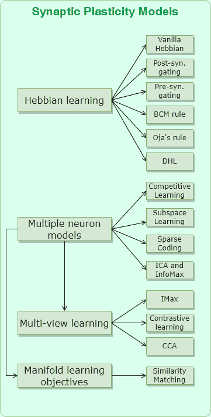

<!--yml

分类：未分类

日期：2024-09-06 19:37:40

-->

# [2307.16236] 突触可塑性模型与生物启发的无监督深度学习：综述

> 来源：[`ar5iv.labs.arxiv.org/html/2307.16236`](https://ar5iv.labs.arxiv.org/html/2307.16236)

# 突触可塑性模型与生物启发的无监督深度学习：综述

Gabriele Lagani gabriele.lagani@isti.cnr.it, Fabrizio Falchi fabrizio.falchi@isti.cnr.it, Claudio Gennaro claudio.gennaro@isti.cnr.it 和 Giuseppe Amato giuseppe.amato@isti.cnr.it ISTI-CNR Pisa Italy 56124 (2018)

###### 摘要。

最近出现的基于深度学习（DL）技术在人工智能（AI）领域的各种任务中取得了卓越的成果。然而，这些技术面临着诸如对抗性输入的鲁棒性、生态影响以及大量训练数据的需求等若干挑战。作为回应，研究人员越来越关注基于生物机制的研究，这些机制因生物大脑展现的令人印象深刻的能力而具有吸引力。本综述探讨了这些生物启发的突触可塑性模型的范围，它们在深度学习场景中的应用，以及与尖峰神经网络（SNNs）中可塑性模型的联系。总体而言，生物启发的深度学习（BIDL）代表了一个令人兴奋的研究方向，旨在推动我们当前技术的发展以及对智能的理解。

生物启发的，赫布学习的，深度学习的，神经网络的，尖峰^†^†版权：acm 版权^†^†期刊年份：2018^†^†doi：XXXXXXX.XXXXXXX^†^†ccs：计算方法论 生物启发的方法^†^†ccs：计算方法论 生物启发的方法

## 1\. 引言

在过去十年中，深度学习（DL）技术在许多人工智能（AI）应用中，如计算机视觉（He et al., 2016）、强化学习（Silver et al., 2016）或语言处理（Devlin et al., 2019），达到了相当于甚至超越人类能力的性能水平。尽管深度神经网络（DNN）模型最初受到生物机制的启发，但当前技术已经与其生物对应物显著偏离。例如，神经科学家对错误反向传播算法（backprop）——深度学习的核心——的生物学合理性提出了质疑（O’Reilly and Munakata, 2000; Marblestone et al., 2016; Hassabis et al., 2017; Lake et al., 2017; Richards et al., 2019）。

在本次调查中，我们强调了生物学上的合理性与当前深度学习解决方案仍需克服的其他挑战之间的联系，例如传统深度神经网络架构对对抗性扰动输入的**鲁棒性不足**（Goodfellow et al., 2014），对大量标注数据的**需求**（Roh et al., 2019），以及神经网络训练的**生态影响**（Badar et al., 2021）。例如，在（Badar et al., 2021）中，展示了更复杂和大规模的模型如何提高基准测试结果，但代价是更高的**能量消耗**，而这通常在与其他模型比较时未被考虑。另一方面，生物智能可以在各种任务中展现出**高效**和**鲁棒**的行为（Mainen and Sejnowski, 1995；Gerstner et al., 1996），同时能从少量经验中进行**泛化**（Lake and Piantadosi, 2020），且**能量消耗异常低**（Javed et al., 2010）。因此，似乎从生物学中汲取灵感可能再次为解决上述挑战提供宝贵的见解。事实上，近年来，**生物启发的深度学习**解决方案的开发已投入了大量研究努力。

为了更好地理解生物智能背后的原则和机制，科学研究从两个不同的视角出发。一方面，神经科学家揭示生物智能系统的低级工作原理，并试图以自下而上的方式将其与高级智能行为联系起来。另一方面，计算机科学家从高级抽象开始，建模 AI 问题，然后解决这些问题所需的结构和架构细节。不幸的是，找到高级与低级方面之间的联系往往是困难的。

图 1. 本工作中探讨的生物启发深度学习（BIDL）主题的示意图。我们对生物学基础的突触可塑性模型进行了全面讨论，从单一神经元的 Hebbian 学习模型开始，到多神经元群体的更复杂模型，如竞争学习、子空间学习等。这些方法与模式发现机制如聚类、主成分分析（PCA）、流形学习等相关联，从而提供了神经科学模型与计算机科学/工程 AI 方面之间的有趣联系。本次调查的一个目标是突出这两个领域之间的关系，展示如何从生物启发的原则中产生复杂的智能行为。

本调查的目标是提供关于生物启发深度学习（BIDL）的全面回顾，突出神经科学与计算机科学观点之间的联系。我们旨在呈现该领域中各种观点、方法和解决方案的完整图景，从突触可塑性模型到生物学上真实的脉冲神经网络（SNN）模型。图 1 提供了本文档涵盖的各种子主题的示意性总结。

本调查既适合作为新读者对该领域的初步了解，也作为经验丰富的读者的简明参考。文档内容应易于计算机科学家访问，因为不需要先验的神经科学知识，但对于那些对人工智能背后的工程学方面感兴趣的神经科学家来说，也可能是一个有趣的阅读材料。

本文档的结构如下：

+   •

    部分 2 讨论了 BIDL 领域的相关调查。

+   •

    部分 3 描述了基于赫布原理的单神经元生物突触可塑性模型。

+   •

    部分 4 说明了将可塑性机制扩展到多个神经元群体的情况。观察某些生物学方面如何与无监督模式发现方法相关，将是非常有趣的，这显示了计算机科学与神经科学之间的意外联系。

+   •

    部分 5 介绍了一些关于突触可塑性模型在深度学习（DL）背景下应用的实验结果，以及传统的反向传播学习与生物启发突触可塑性的整合。

+   •

    部分 6 介绍了基于脉冲神经网络（SNN）的生物详细神经计算模型，并强调了它们在节能神经形态计算中的技术潜力。

+   •

    最后，我们在部分 7 中呈现我们的结论，概述了开放挑战和可能的未来研究方向。

此外，在我们的配套论文（Amato et al., 2023）中，我们更详细地讨论了脉冲编码和计算的生物模型，并强调了使用传统反向传播优化训练这些模型的挑战。因此，我们讨论了最近提出的训练算法，这些算法被视为反向传播的替代方案，适用于脉冲和传统架构。这些新颖的观点有望通过生物学的洞察和灵感来增强当前深度学习系统的学习能力。

## 2. 相关调查

过去的贡献中回顾了 BIDL 的若干方面，每个贡献集中于特定领域或方法集。这些贡献有的根植于神经科学视角，而有的则探讨了深度学习系统工程的更实际的视角。我们的贡献旨在全面展示 BIDL 领域涉及的各种领域及其相互作用，展示神经科学方面与工程抽象之间的联系。

关于神经科学与人工智能之间关系的有趣讨论可以在（Marblestone et al., 2016）中找到，作者概述了深度学习各方面的成功贡献，并基于计算机科学家设计的高级计算抽象提供的洞察，提出了神经科学领域的研究方向。类似地，作者也建议了可能来自神经科学的灵感方向，旨在开发新的深度学习解决方案。类似的讨论在（Hassabis et al., 2017）中也有呈现，作者回顾了计算机科学与神经科学之间的历史互动，展示了这些互动如何导致这些领域的新成果，并强调了未来发展的可能共享主题。相反，（Richards et al., 2019）中概述了为人工学习系统开发的架构、目标函数和学习规则如何激发系统神经科学的进一步发展。关注生物学和心理学灵感的另一项工作（Lake et al., 2017）建议了朝向构建更具人类特征的深度学习系统的具体探索领域，从因果推理到组合学习和程序诱导，以及学习如何学习的方法。

关于生物学基础的神经系统建模，Gerstner 和 Kistler 在他们的书中（Gerstner 和 Kistler, 2002）提供了对尖峰神经网络（SNN）模型的全面介绍，以及 Hebbian 可塑性和尖峰时间依赖可塑性（STDP）模型。各种 Hebbian 可塑性模型也在（Gorchetchnikov 等, 2011; Vasilkoski 等, 2011）中进行了回顾，而最近的 SNN 发展和应用则在（Pfeiffer 和 Pfeil, 2018; Tavanaei 等, 2019; Nunes 等, 2022）中进行了综述。

相比于之前的调查，我们在以下几个方向上提供了重要的贡献：

+   •

    相比于更关注神经科学和计算机科学之间相互作用作为生物学灵感来源的高层视角的研究（Marblestone 等, 2016; Hassabis 等, 2017; Richards 等, 2019; Lake 等, 2017），我们的工作更深入地探讨了神经科学模型与新兴计算属性之间出现的具体方面；

+   •

    我们对生物启发的突触可塑性模型进行了全面的描述，展示了与学习原理的联系，这些学习原理导致了作为结果行为的自主模式发现，而其他研究则仅关注突触可塑性的生物学模型（Gerstner 和 Kistler, 2002; Gorchetchnikov 等, 2011; Vasilkoski 等, 2011）。

+   •

    我们提供了对比生物启发方法在传统网络和基于尖峰模型网络中的并行视角，相比于仅专注于低级尖峰方法的研究（Pfeiffer 和 Pfeil, 2018; Tavanaei 等, 2019; Nunes 等, 2022）。

## 3\. 单神经元中的突触可塑性模型和 Hebbian 学习

在整个人生中，我们的大脑不断经历修改，以纳入环境中的知识并适应新任务。这一适应过程称为可塑性。最显著的可塑性形式发生在突触中，包括突触效能的增强，即长期增强（LTP），或减弱，即长期抑制（LTD）（Bear, 1996; Gerstner 和 Kistler, 2002）。鉴于突触可塑性在神经系统中所发挥的关键作用，我们在本综述的开头讨论了突触可塑性模型，从最简单的 Hebbian 可塑性模型开始，然后转向更复杂的模型，这些模型也最近在深度神经网络（DNN）训练中找到了应用。制定生物学上可信的突触可塑性模型的挑战之一是必须定义局部学习规则，即仅使用在神经元位置上局部可用的信息来计算突触更新。

图 2. 神经元模型的表示，该模型将向量 $\mathbf{x}$ 作为输入。输入由突触权重 $\mathbf{w}$ 调节，然后相加，最后应用非线性函数 $f(\cdot)$。得到的输出是 $y=f(\sum_{i}w_{i}\,x_{i})$（其中下标 $i$ 索引特定的向量条目）。

让我们考虑一个神经元模型，其突触权重由向量 $\mathbf{w}$ 描述。神经元输入一个向量 $\mathbf{x}$，并生成输出 $y(\mathbf{x},\mathbf{w})=f(\mathbf{x}^{T}\,\mathbf{w})$（图 2），其中 $f$ 是激活函数（可选择性地，偏置项可以隐式建模为连接到恒定输入的突触）。接下来，我们使用粗体字体来表示向量，正常字体来表示标量。在神经科学术语中，输入值 $\mathbf{x}$ 也称为前突触激活，而输出 $y$ 称为后突触激活。

为了建模突触可塑性，神经科学家提出了赫布原则（Haykin，2009；Gerstner 和 Kistler，2002）：“共同激活，共同连接”。根据这一原则，当两个神经元同时激活时，它们之间的突触耦合会得到强化（Haykin，2009；Gerstner 和 Kistler，2002）。在数学上，这一学习规则在其最简单的“香草”形式中可以表示为：

| (1) |  | $\Delta w_{i}=\eta\,y\,x_{i}$ |  |
| --- | --- | --- | --- |

其中 $\eta$ 是学习率，下标 $i$ 指第 $i$ 个输入/突触。这个学习规则的效果本质上是通过强化突触耦合来巩固神经输入和输出之间的相关激活，因此，如果未来再次观察到类似的输入，神经元可能会产生类似的响应。我们可以初步勾画出神经科学中的赫布学习理论与数据科学之间的联系，特别是主成分分析（PCA）：如果多个输入呈现给神经元，假设激活函数是线性的，并且输入均值为零，可以证明（Gerstner 和 Kistler，2002；Oja，1982），方程 1 会使权重向量与数据分布的主成分对齐。

(a) 权重向量在更新过程中。点表示输入（组织成一个簇），绿色点是当前正在处理的输入。蓝色箭头表示将影响权重向量 $w$ 的更新方向，而红色箭头是实际更新。

(b) 训练后的权重向量最终位置。

图 3. 赫布更新对权重向量的影响。

等式 1 的问题在于没有机制来防止权重无限增长，从而可能导致不稳定性。这个问题可以通过在学习规则中加入权重衰减项 $\gamma(\mathbf{w},\mathbf{x})$ 来解决：

| (2) |  | $\Delta w_{i}=\eta\,y\,x_{i}-\gamma(\mathbf{w},\mathbf{x})$ |  |
| --- | --- | --- | --- |

特别地，通过对该项选择合适的值，即 $\gamma(\mathbf{w},\mathbf{x})=\eta\,y(\mathbf{w},\mathbf{x})\,w_{i}$，我们得到一个已广泛应用于竞争学习的学习规则（稍后将更详细讨论）（Grossberg, 1976; Rumelhart 和 Zipser, 1985; Kohonen, 1982）：

| (3) |  | $\Delta w_{i}=\eta\,y\,x_{i}-\eta\,y\,w_{i}=\eta\,y\,(x_{i}-w_{i})$ |  |
| --- | --- | --- | --- |

这个规则有一个简单的直观解释，如图 3 所示：当一组输入呈现给神经元时，权重向量会朝着由输入形成的簇的质心演变。本质上，神经元在其突触中存储了训练过程中观察到的模式的典型表示。当类似的模式再次出现时，神经元将产生更强的响应，从而成为一种模式匹配单元。

上述学习规则是突触后门控的特例（Gerstner 和 Kistler, 2002）：

| (4) |  | $\Delta w_{i}=\eta\,y\,(x_{i}-\theta)$ |  |
| --- | --- | --- | --- |

其中更新步骤 $x_{i}-\theta$ 被突触后激活 $y$ “门控”。参数 $\theta$ 是一个阈值参数，决定了更新的行为：如果前突触刺激强于阈值，将引发 LTP，否则我们有 LTD。相反，也可以定义一个前突触门控规则（Gerstner 和 Kistler, 2002），通过反转 $x_{i}$ 和 $y$ 的角色：

| (5) |  | $\Delta w_{i}=\eta\,x_{i}\,(y-\theta)$ |  |
| --- | --- | --- | --- |

阈值参数可以是固定的，或者可以依赖于权重、当前的前/后突触激活，甚至是过去激活的历史。

协方差规则（Sejnowski 和 Tesauro, 1989）采取了一种混合方法，对预突触和后突触信号施加了阈值：

| (6) |  | $\Delta w_{i}=\eta\,(y-\theta_{y})\,(x_{i}-\theta_{x})$ |  |
| --- | --- | --- | --- |

具体而言，$\theta_{x}$ 和 $\theta_{y}$ 是预突触和后突触活动随时间变化的滑动平均值，这在生物学上由突触痕迹的概念（Izhikevich, 2007; Yagishita et al., 2014; Shindou et al., 2019; Gerstner et al., 2018）支持。协方差规则将普通的 Hebbian 学习调整到具有非零均值的数据情况，在线跟踪统计数据，具有与批量归一化相同的精神（Ioffe 和 Szegedy, 2015）。

<svg   height="95.47" overflow="visible" version="1.1" width="141.35"><g transform="translate(0,95.47) matrix(1 0 0 -1 0 0) translate(23.34,0) translate(0,2.21) matrix(1.0 0.0 0.0 1.0 -23.34 -2.21)" fill="#000000" stroke="#000000" stroke-width="0.4pt"><g transform="matrix(1 0 0 1 0 0) translate(23.34,0) translate(0,2.21)" fill="#000000" stroke="#000000" stroke-width="0.4pt"><g clip-path="url(#pgfcp1)"><g transform="matrix(1.0 0.0 0.0 1.0 58.56 37.04)" fill="#000000" stroke="#000000"><foreignobject width="6.5" height="9.61" transform="matrix(1 0 0 -1 0 16.6)" overflow="visible">$\theta$</foreignobject></g><g transform="matrix(1.0 0.0 0.0 1.0 15.4 32.47)" fill="#000000" stroke="#000000"><foreignobject width="28.06" height="9.46" transform="matrix(1 0 0 -1 0 16.6)" overflow="visible">LTD</foreignobject></g><g transform="matrix(1.0 0.0 0.0 1.0 74.85 51.06)" fill="#000000" stroke="#000000"><foreignobject width="26.91" height="9.46" transform="matrix(1 0 0 -1 0 16.6)" overflow="visible">LTP</foreignobject></g></g><g transform="matrix(1.0 0.0 0.0 1.0 105.56 54.07)" fill="#000000" stroke="#000000"><foreignobject width="7.28" height="8.65" transform="matrix(1 0 0 -1 0 16.6)" overflow="visible">$y$</foreignobject></g><g transform="matrix(0.0 1.0 -1.0 0.0 -8.35 24.72)" fill="#000000" stroke="#000000"><foreignobject width="43.54" height="13.84" transform="matrix(1 0 0 -1 0 16.6)" overflow="visible">$\phi(y-\theta)$</foreignobject></g></g></g></svg>

图 4. BCM 规则中的非线性。

Bienenstock-Cooper-Munro (BCM) 规则（Bienenstock et al., 1982）在学习过程中引入了非线性函数 $\phi$：

| (7) |  | $\Delta w_{i}=\eta\,x_{i}\,\phi(y-\theta)$ |  |
| --- | --- | --- | --- |

图 4 显示了非线性的典型形状。阈值仍然应用于突触后活动，因此当神经元活动高于阈值时发生 LTP，否则发生 LTD。然而，当活动变得过大、过小或接近阈值时，可塑性被抑制。其想法是，当神经活动过大（或过小）时，LTP 导致活动进一步增加（反之，LTD 导致活动进一步减少），但非线性提供了稳定化效果。

另一种设置突触权重界限的方法是采用权重的软阈值，即在更新方程中添加显式项，当接近给定阈值时自动限制权重更新（Gerstner 和 Kistler， 2002）。

| (8) |  | $\Delta w_{i}=\eta\,\Delta w_{i}^{(base)}\,(w_{i}-\theta_{LB})\,(\theta_{UB}-w_{i})$ |  |
| --- | --- | --- | --- |

其中 $\theta_{LB}$ 和 $\theta_{UB}$ 作为权重的软下限和上限阈值，其中 $\theta_{LB}<\theta_{UB}$，$\Delta w_{i}^{(base)}$ 是在软阈值化之前给定的权重更新值。类似的概念也出现在双稳态突触模型中（Fusi 等， 2000；Gerstner 和 Kistler， 2002）。在这些模型中，突触权重仅能在两个可能的稳定状态中的一个中稳定（例如，0 和 1）。学习规则分为两个部分：

| (9) |  | $\Delta w_{i}=H+R$ |  |
| --- | --- | --- | --- |

其中 $H$ 是驱动可塑性的通用赫布项，而 $R$ 是用于突触稳定化的刷新项：

| (10) |  | $R=\gamma\,w_{i}\,(1-w_{i})\,(w_{i}-\theta)$ |  |
| --- | --- | --- | --- |

其中 $\gamma$ 是一个常数。该项将权重值驱动到 1，当当前权重值高于阈值 $\theta$ 时，否则驱动到 0。由于这个规则，权重值从 0 到 1 的过渡只能在驱动赫布项提供足够强的刺激使权重值超越阈值时发生，反之亦然，从 1 到 0 的过渡。

(Oja, 1982) 提出了一个不同的权重不稳定性问题的解决方法：即在每次更新后对权重向量进行重新归一化，以保持其长度恒定，尽管方向随时间变化，趋向数据主成分（在与普通情况下相同的假设下）。可以证明，在小学习率下，带有重新归一化步骤的学习规则可以通过在 $\eta=0$ 处的一级泰勒展开近似，得到名为 Oja 规则的权重更新：

| (11) |  | $\Delta w_{i}=\eta\,y\,(x_{i}-y\,w_{i})$ |  |
| --- | --- | --- | --- |

注意，这种更新也属于希博更新与权重衰减的范畴，在这种情况下，$\gamma(\mathbf{w},\mathbf{x})=\eta\,y(\mathbf{w},\mathbf{x})^{2}\,w_{i}$。

值得注意的是，上述学习规则可以解释为更一般的局部突触更新方程的实例，对于一般的突触连接$i$，可以表示为(Gerstner and Kistler，2002)：

| (12) |  | $\Delta w_{i}=a_{0}+a_{1}x_{i}+a_{2}y+a_{3}x_{i}y+a_{4}x_{i}^{2}+a_{5}y^{2}+...$ |  |
| --- | --- | --- | --- |

其中，系数$a_{i}$可能依赖于权重。

微分希博学习（DHL）(Kosko，1986)代表了传统希博模型的一种离开。该模型不仅考虑给定时刻的前后突触活动，还提议考虑这些活动随时间的变化率：

| (13) |  | $\Delta w_{i}=\eta\,\frac{dy}{dt}\,x_{i}$ |  |
| --- | --- | --- | --- |

这个学习规则具有与数据去相关（Choi，1998），时间差分学习（Kolodziejski et al.，2009a，b）以及 STDP 神经元中错误信号的编码相关的有趣性质（Roberts，1999），为脉冲神经元网络中的对比性希博学习（CHL）（Movellan，1991）提供了生物学基础机制（Bengio et al.，2015）（我们将在下面的部分再回顾这些主题）。

到目前为止，所呈现的学习规则仅涉及单个神经元。在下一小节中，我们将考虑涉及多个神经元的更复杂的学习场景。

## 4. 用于多神经元无监督模式发现的可塑性模型

到目前为止，我们已经考虑了单神经元的可塑性模型。当我们处理具有多个神经元的群体时，简单地应用前一小节中的突触更新规则并不能保证对于学习任务是有效的。实际上，如果多个神经元遵循相同的学习动态，它们很容易会收敛到类似的配置。相反，希望能够实现一定形式的神经活动去相关，即确保不同神经元学会为给定的输入编码不同的信息片段(Földiak，1990; Olshausen 和 Field，1996a)，以最大化表征能力。本小节探讨了如何在具有局部突触可塑性的神经元群体中实现这种去相关的策略。

### 4.1 背景关于神经元

让我们介绍一些关于各种类型神经元及其功能的生物背景知识，从中我们将能够建立计算学习机制与支持此类机制的生物基础之间的关系。

神经元可以分为两大类：金字塔形细胞和非金字塔形细胞（White and Keller，1989）。

锥体细胞是生物神经网络的基本计算单元。它们通常呈现锥体状，并且具有两种类型的树突（即输入连接）：顶端树突，从锥体的尖端延伸，和多个基底树突，起源于基部。顶端树突穿过皮层层次，而基底树突主要向同一区域的邻近细胞延伸。锥体细胞的轴突（即输出连接）起源于锥体的基部，并立即分支成一个投射轴突和几个轴突侧支。投射轴突向更深层延伸。轴突侧支可以是局部的，即向邻近神经元延伸短距离，或者它们可以延伸更长的距离，无论是在同一层还是向其他层。

关于非锥体细胞，它们可以进一步分为多种类别（Stefanis，2020），但共同特点是其中央体积较小，相较于锥体细胞，拥有从中央体起源的多个树突，以及一个趋向于分支成多个分支的轴突。树突和连接主要是局部的，因此这些细胞倾向于与邻近神经元（如锥体细胞）连接，从而传递关于邻域活动的信息。由于这一角色，这些细胞通常被称为中间神经元。非锥体细胞的轴突主要与其他神经元形成抑制性连接，在神经元之间的抑制性交互和分流抑制（Kubota 等，2016）中发挥重要作用。

接下来，我们将强调人工神经元（即锥体细胞）所扮演的角色，以及由非锥体细胞介导的抑制性侧向交互机制，这对于实现神经活动的必要去相关性至关重要，从而展示了生物电路与人工学习系统之间的有趣映射。

### 4.2\. 竞争学习

(a) 更新步骤

(b) 收敛后的最终位置

图 5. 赫布更新与赢家通吃竞争。

当多个神经元参与一个复杂的网络时，可以采用竞争学习来强制不同的神经元学习不同的模式。一种可能的策略是胜者通吃（WTA）（Grossberg，1976；Rumelhart 和 Zipser，1985）：当输入呈现给 WTA 层时，权重向量最接近当前输入的神经元（例如，在角度或欧几里得距离方面）被选为赢家。只有赢家被允许进行权重更新，依据公式 3，从而将其权重向量向当前输入靠拢（图 5）。如果未来将再次呈现类似的输入，相同的神经元更有可能再次获胜。神经元之间的竞争互动在生物上受到我们之前提到的侧抑制机制（Gabbott 和 Somogyi，1986）的激励。这一策略使一组神经元能够将它们的权重向量对齐到数据点形成的不同簇的质心上（图 5），展示了神经科学启发的学习理论与数据分析操作（即聚类）之间的另一种联系。

以下方程给出了赫布式 WTA 学习的数学描述：

| (14) |  | $\Delta w_{i,j}=\eta\,r_{j}\,(x_{i}-w_{i,j})$ |  |
| --- | --- | --- | --- |

其中，下标 $i$ 和 $j$ 分别指代第 i 个输入/突触和第 j 个神经元，$r_{j}$ 是在竞争非线性之后的神经元激活值：对于获胜的神经元，其值为 $1$，否则为 $0$。WTA 的一个变体是 k-WTA（Majani 等，1989），其中最接近输入的前 k 个神经元是赢家，这意味着这些神经元的 $r_{j}=1$，而其他神经元的 $r_{j}=0$。

与 WTA 提供的锐利竞争相比，也可能出现软形式的竞争。在这些情况下，除了具有明确的获胜神经元，即 $r_{j}$ 为 $0$ 或 $1$，我们还可以为每个神经元分配中间值的 $r_{j}$。例如，soft-WTA（Nowlan，1990）允许所有神经元根据其激活接收一个分数，因此激活较高的神经元会收到更高的分数。在原始工作中，分数简单地计算为神经元激活的 $L_{1}$ 归一化。在（Lagani 等，2021c；Moraitis 等，2021），介绍了其他 soft-WTA 变体，其中分数计算为 $L_{p}$ 归一化或作为神经激活的 softmax，即：

| (15) |  | $r_{j}=\frac{y_{j}^{p}}{\sum_{k}y_{k}^{p}}$ |  |
| --- | --- | --- | --- |
| (16) |  | $r_{j}=\frac{e^{y_{j}/T}}{\sum_{k}e^{y_{k}/T}}$ |  |

分别。在后一方程中，T 是 softmax 的温度参数（Gao 和 Pavel，2017），用于应对激活值的变化。请注意，$r$ 可以视为步长调制系数：神经元活动越高，更新步长越大。

(a) 一维格子。

(b) 二维格子。

图 6. 自组织映射的神经元在不同拓扑结构中的排列。一些横向反馈连接以绿色突出显示。

(a) 二维格子，其中半径以绿色突出显示，神经元 $j$ 和神经元 $i$ 之间的距离 $d_{j,i}$ 以蓝色突出显示。

<svg   height="455.79" overflow="visible" version="1.1" width="538.29"><g transform="translate(0,455.79) matrix(1 0 0 -1 0 0) translate(0.28,0) translate(0,0.28) matrix(1.0 0.0 0.0 1.0 -0.28 -0.28)" fill="#000000" stroke="#000000" stroke-width="0.4pt"><g transform="matrix(1 0 0 1 0 0) translate(0.28,0) translate(0,0.28)" fill="#000000" stroke="#000000" stroke-width="0.4pt"><g transform="matrix(1.0 0.0 0.0 1.0 517.62 122.76)" fill="#000000" stroke="#000000"><foreignobject width="15.23" height="13.67" transform="matrix(1 0 0 -1 0 16.6)" overflow="visible">$d_{j,i}$</foreignobject></g><g transform="matrix(1.0 0.0 0.0 1.0 273.76 439.97)" fill="#000000" stroke="#000000"><foreignobject width="33.96" height="14.44" transform="matrix(1 0 0 -1 0 16.6)" overflow="visible">$h(d_{j,i})$</foreignobject></g></g></g></svg>

(b) 高斯邻域函数。

<svg   height="455.79" overflow="visible" version="1.1" width="538.29"><g transform="translate(0,455.79) matrix(1 0 0 -1 0 0) translate(0.28,0) translate(0,0.28) matrix(1.0 0.0 0.0 1.0 -0.28 -0.28)" fill="#000000" stroke="#000000" stroke-width="0.4pt"><g transform="matrix(1 0 0 1 0 0) translate(0.28,0) translate(0,0.28)" fill="#000000" stroke="#000000" stroke-width="0.4pt"><g transform="matrix(1.0 0.0 0.0 1.0 517.62 122.76)" fill="#000000" stroke="#000000"><foreignobject width="15.23" height="13.67" transform="matrix(1 0 0 -1 0 16.6)" overflow="visible">$d_{j,i}$</foreignobject></g><g transform="matrix(1.0 0.0 0.0 1.0 273.76 439.97)" fill="#000000" stroke="#000000"><foreignobject width="33.96" height="14.44" transform="matrix(1 0 0 -1 0 16.6)" overflow="visible">$h(d_{j,i})$</foreignobject></g></g></g></svg>

(c) 墨西哥帽邻域函数。

图 7. 具有某些邻域函数轮廓的侧向交互。

在（Kohonen, 1982）中，竞争学习的工作通过引入自组织映射（SOMs）得到了进一步扩展。SOM 是一个神经元层，排列在一个 n 维晶格中（通常是 1 维或 2 维，后者更为常见）。在竞争阶段之后，但在权重更新之前，训练会扩展到一个新的合作阶段，其中通过一个由获胜神经元向其在晶格拓扑中的邻居提供的横向反馈信号来进行横向互动（图 6）。该信号的强度随离获胜神经元的距离增加而减小。具体地，设 $i(x)$ 为输入 $x$ 上的获胜神经元，则传递给任何神经元 $j$ 的信号强度，其在晶格拓扑中与 $i(x)$ 的距离为 $d_{j,i(x)}$，由邻域函数 $h(d_{j,i(x)})$ 决定。该函数应在 $d_{j,i(x)}$ 为 $0$ 时等于 $1$，并随距离增加而减小。例如，邻域函数的一个可能选择是高斯函数或以零为中心的墨西哥帽函数（图 7）（Haykin, 2009; Kohonen, 1993）。关于邻域函数的其他可能选择以及有关 SOM 的进一步理论细节，可以参考（Lo et al., 1991, 1993; Erwin et al., 1991, 1992a, 1992b; Cottrell et al., 2018）。邻域函数的特点是一个半径（在高斯情况下是标准差），通常初始化为与晶格半径相等，然后随时间缩小。合作阶段完成后，通过应用方程 14 进行权重更新，其中 $r$ 设置为 $h(d_{j,i(x)})$。请注意，WTA 方法可以看作是 SOM 的一个特殊情况，其中邻域函数的半径为零。

### 4.3\. 子空间学习

根据上述定义，WTA 强制在神经网络层中进行一种量化的信息编码。只有一个或少数神经元激活以编码输入中某个给定模式的存在。另一方面，使用反向传播训练的神经网络呈现出分布式表示（Agrawal 等人，2014），其中多个神经元以组合方式激活以编码输入的不同属性，从而提高编码能力。类似的分布式编码方案也观察到在生物神经元群体中（Averbeck 等人，2006；Wohrer 等人，2013）。分布式表示的重要性也在（Földiak，1989；Olshausen 和 Field，1996a）中得到强调。

可以通过将数据表示为某些正交基上的线性组合来获得更分布式的编码方案。通过将数据投影到权重向量的正交基上可以轻松实现作为神经映射的神经网络。为了尽可能从数据中捕获信息，此基应跨越主子空间，即捕获大多数数据方差的子空间，其数据主成分形成正交基（Haykin，2009）。

基于主成分分析（PCA）的神经网络，即 PCANet，是由（Chan 等人，2015）提出的。网络滤波器通过在训练数据集上离线运行 PCA 并使用提取的主成分作为权重来获得。通过以自下而上的方式在前一层提取的特征表示中叠加来自 PCA 滤波器得到的 PCA 滤波器，可以得到多个处理层。该方法在相对较浅的网络上实现了对 CIFAR-10（Krizhevsky 和 Hinton，2009）数据集的 78% 的准确率。不幸的是，离线 PCA 运算非常昂贵，当应用于更大的输入或更深层的网络时，计算成本变得非常高。然而，存在一种扩展到 Oja 规则的方法，可以以在线方式执行 PCA，此方法在效率和生物合理性方面更具吸引力。

我们已经观察到 Oja 规则如何为提取第一个主成分提供了一种稳定的 Hebbian 机制。还存在针对多个神经元的此类机制的进一步扩展，可以提取构成主子空间的连续方向（Sanger，1989；Becker 和 Plumbley，1996）。为了执行 Hebbian PCA，必须确定一组权重向量，用于各个神经元，以最小化表示误差，即定义为：

| (17) |  | $\mathcal{L}_{R}(\mathbf{w_{i}})=E[(\mathbf{x}-\sum_{j=1}^{i}y_{j}\,\mathbf{w_{j}})^{2}]$ |  |
| --- | --- | --- | --- |

其中下标$i$表示给定层中的第$i^{th}$个神经元，$E[\cdot]$是均值运算符。可以指出的是，在线性神经元和零中心数据的情况下，这就简化为最大化输出方差的经典 PCA 目标，权重向量受到正交约束（Sanger，1989；Becker 和 Plumbley，1996；Karhunen 和 Joutsensalo，1995）。从现在开始，我们假设输入数据以零为中心。如果不是这样，我们只需事先从输入中减去平均值。

可以证明，Sanger 的规则最小化了方程 17 中的目标（Sanger，1989）：

| (18) |  | $\Delta\mathbf{w_{i}}=\eta y_{i}(\mathbf{x}-\sum_{j=1}^{i}y_{j}\mathbf{w_{j}})$ |  |
| --- | --- | --- | --- |

这种学习规则的直觉是：1）对于第一个神经元，它简单地对应于 Oja 的规则，从而提取第一个主成分；2）对于一个通用的后续神经元$i$，学习规则从输入中减去由前面的神经元重建的部分表示$\sum_{j=1}^{i-1}y_{j}\mathbf{w_{j}}$，从而取消由前$i-1$个主成分生成的子空间；3）神经元$i$然后对输入的残差部分应用 Oja 的规则，这导致提取第$i$-th 主成分。在非线性神经元的情况下，仍然可以找到问题的解决方案（Karhunen 和 Joutsensalo，1995）。称$f()$为神经元激活函数，在包括$f$单调增加的温和条件下，表示误差

| (19) |  | $\mathcal{L}_{R}(w_{i})=E[(\mathbf{x}-\sum_{j=1}^{i}f(y_{j})\,\mathbf{w_{j}})^{2}]$ |  |
| --- | --- | --- | --- |

可以通过以下非线性版本的先前学习规则来最小化非线性 Hebbian PCA：

| (20) |  | $\Delta\mathbf{w_{i}}=\eta f(y_{i})(\mathbf{x}-\sum_{j=1}^{i}f(y_{j})\mathbf{w_{j}})$ |  |
| --- | --- | --- | --- |

还有其他变体的 Hebbian PCA 学习规则。子空间学习规则，也是 Oja 提出的（Oja，1989，1992），与 Sanger 的规则不同的是，每个神经元从输入中减去相同的重建向量：$\sum_{j=1}^{N}y_{j}w_{j}$（注意求和索引从 1 到 N，其中 N 是层中的神经元数量）。得到的学习规则是：

| (21) |  | $\Delta w_{i}=\eta y_{i}(x-\sum_{j=1}^{N}y_{j}w_{j})$ |  |
| --- | --- | --- | --- |

通过这种学习方案的变体，网络能够提取主要子空间，即由 PCA 方向生成的相同空间，但以其他正交基的形式表示（这将是 PCA 基的旋转版本）。

严格来说，Sanger 规则（以及 Oja 的子空间规则）在生物学上并不完全可信，因为突触的权重更新是基于其他突触的权重和其他神经元的输出（即求和中的项）。尽管如此，可以设计出在功能上等同于 Sanger（或 Oja）的网络模型，并且这些模型也符合生物学可信性的要求，只使用局部信息进行更新。其中之一在（Földiak, 1989）中提出，类似地在（Plumbley, 1993）中也有提出，该模型由一个具有前馈和侧向连接的线性单层网络组成。前馈连接使用 Oja 的规则进行训练，而侧向连接使用反 Hebbian 规则（即前面带有负号）进行训练，这种更新方案被称为 Hebbian/anti-Hebbian（HaH）。由于侧向相互作用，神经元能够解相关它们的活动，将数据投影到主要子空间，同时规范化神经激活的方差。在数据分析中，这种网络配置执行的操作对应于白化变换（Krizhevsky 和 Hinton, 2009）。

（Rubner 和 Tavan, 1989）中采取了类似的方法，其中前馈连接使用纯 Hebbian 更新，侧向连接使用 anti-Hebbian 更新，并在每次更新后进行显式规范化。侧向连接是分层的，即神经元 i 从神经元 1…i-1 接收侧向连接。这种组织使得网络等同于 Sanger 的模型，因此能够从数据中提取主要成分。 (Kung 和 Diamantaras, 1990) 中提出的模型也使用了分层侧向连接，并且进行了 Hebbian/anti-Hebbian 更新。虽然没有显式进行规范化，但通过类似 Oja 的权重衰减项实现了规范化。结果模型能够执行 PCA。相反，将这种更新方案应用于具有对称侧向连接的网络（如（Leen, 1991）中）而非分层的，则提供了一个提取主要子空间的网络。关于 HaH 的一个有趣视角在（Seung 和 Zung, 2017）中提出，该视角将 Hebbian 和 anti-Hebbian 学习部分视为博弈论中的竞争者。在 HaH 网络中引入非线性，利用局部学习规则，进一步能够提取最大化数据分布某些广义非线性矩的方向（Karhunen 和 Joutsensalo, 1995）。如 BCM（Bienenstock 等人, 1982）或后续变体（Intrator 和 Cooper, 1992；Law 和 Cooper, 1994；Brito 和 Gerstner, 2016），已经被证明在这些情况下有效地模拟了感受野的形成。

对上述方法的综述可以参考（Becker 和 Plumbley，1996）。尽管这些方法提供了生物学基础的子空间学习机制，但它们的缺点是，由于横向连接的递归性质，模拟这些网络需要展开递归动态。这与纯粹的前馈模型如 Sanger 的或 Oja 的相比，要求更多的开销。然而，我们认为前馈子空间学习模型与 HaH 配置之间的关系有一个重要的结论，即前者更适合软件模拟，而与 HaH 模型的对应关系也提供了生物学支持。还可以构建能够从数据中提取小成分的神经网络，即与数据协方差矩阵的最小特征值相关的特征向量。例如，当我们需要恢复被白噪声掩盖的信号时，这一点非常有用。通过反转 Oja 更新规则的符号，可以实现小成分提取，从而使其成为反 Hebbian 的（Oja，1992；Luo 和 Unbehauen，1997）。HaH 网络也源于与经典多维尺度缩放（CMDS - 又名应变损失或相似性匹配）（Pehlevan 等，2015；Pehlevan 和 Chklovskii，2015a，b）相关的学习目标，这些目标也与子空间学习和主成分提取有关。这些方法也与流形学习有关，因此将在下一小节中详细讨论。

### 4.4\. 流形学习模型

流形学习模型旨在通过约束输出以保持数据几何结构的某些属性，将样本映射到低维空间，这超出了如 PCA 这类方法所捕捉的简单线性关系。流行的流形学习方法包括 Isomap 嵌入（Tenenbaum 等，2000）、局部线性嵌入（LLE）（Roweis 和 Saul，2000）或拉普拉斯特征映射（Belkin 和 Niyogi，2003）。

一种有趣的流形学习方法是经典的多维尺度缩放（CMDS）（Cox 和 Cox，2008）。原因在于最近的研究推导出了能够优化 CDMS 目标的 HaH 神经网络（Pehlevan 等，2015；Pehlevan 和 Chklovskii，2015a，b）。这种目标的特定形式，被称为相似性匹配或应变损失，具体如下：

| (22) |  | $Y^{*}=\underset{Y}{arg\ min}\ \&#124;X^{T}X-Y^{T}Y\&#124;^{2}_{F}$ |  |
| --- | --- | --- | --- |

其中 $X$ 是通过连接一组输入向量得到的矩阵，$Y$ 是输出向量的矩阵，而 $\|\cdot\|_{F}$ 是 Frobenius 范数。对于线性映射，这一目标等同于标准的子空间学习（Pehlevan 等，2015）。我们给出一个直观的解释：$X^{T}X$ 是一个矩阵，其元素是输入向量对的点积，因此它们表示了输入向量与其他输入向量的相似度，$Y^{T}Y$ 同样适用。因此，这种差异表示了在从输入空间到输出空间的过程中，相似度度量的扭曲程度，而这正是需要最小化的。作者们展示了通过应用以下基于生物学的神经动力学和学习规则可以解决这个问题：

| (23) |  | <math alttext="\begin{split}&amp;y=W\,x-M\,y\\ &amp;\Delta W_{i,j}=\frac{y_{i}\,(x_{j}-W_{i,j}\,y_{i})}{D_{i}}\\

&amp;\Delta M_{i,j\neq i}=\frac{y_{i}\,(y_{j}-M_{i,j}\,y_{i})}{D_{i}},\ M_{i,i}=0\\

&amp;\Delta D_{i}=y_{i}^{2}\end{split}" display="block"><semantics ><mtable columnspacing="0pt" displaystyle="true" rowspacing="0pt" ><mtr ><mtd  columnalign="left" ><mrow ><mi  >y</mi><mo >=</mo><mrow ><mrow ><mi  >W</mi><mo lspace="0.170em" rspace="0em"  >​</mo><mi >x</mi></mrow><mo >−</mo><mrow ><mi >M</mi><mo lspace="0.170em" rspace="0em"  >​</mo><mi >y</mi></mrow></mrow></mrow></mtd></mtr><mtr ><mtd  columnalign="left" ><mrow ><mrow ><mi mathvariant="normal" >Δ</mi><mo lspace="0em" rspace="0em"  >​</mo><msub ><mi  >W</mi><mrow ><mi >i</mi><mo >,</mo><mi >j</mi></mrow></msub></mrow><mo >=</mo><mfrac ><mrow ><msub ><mi >y</mi><mi >i</mi></msub><mo lspace="0.170em" rspace="0em" >​</mo><mrow ><mo stretchy="false"  >(</mo><mrow ><msub ><mi >x</mi><mi >j</mi></msub><mo >−</mo><mrow ><msub ><mi >W</mi><mrow ><mi >i</mi><mo >,</mo><mi >j</mi></mrow></msub><mo lspace="0em" rspace="0em"  >​</mo><msub ><mi >y</mi><mi >i</mi></msub></mrow></mrow><mo stretchy="false"  >)</mo></mrow></mrow><msub ><mi >D</mi><mi >i</mi></msub></mfrac></mrow></mtd></mtr><mtr ><mtd  columnalign="left" ><mrow ><mrow ><mrow ><mi mathvariant="normal" >Δ</mi><mo lspace="0em" rspace="0em" >​</mo><msub ><mi >M</mi><mrow ><mrow ><mi >i</mi><mo >,</mo><mi >j</mi></mrow><mo >≠</mo><mi >i</mi></mrow></msub></mrow><mo >=</mo><mfrac ><mrow  ><msub ><mi >y</mi><mi >i</mi></msub><mo lspace="0.170em" rspace="0em"  >​</mo><mrow ><mo stretchy="false"  >(</mo><mrow ><msub ><mi >y</mi><mi >j</mi></msub><mo >−</mo><mrow ><msub ><mi >M</mi><mrow ><mi >i</mi><mo >,</mo><mi >j</mi></mrow></msub><mo lspace="0em" rspace="0em"  >​</mo><msub ><mi >y</mi><mi >i</mi></msub></mrow></mrow><mo stretchy="false"  >)</mo></mrow></mrow><msub ><mi >D</mi><mi >i</mi></msub></mfrac></mrow><mo rspace="0.667em" >,</mo><mrow ><msub ><mi  >M</mi><mrow ><mi >i</mi><mo >,</mo><mi >i</mi></mrow></msub><mo >=</mo><mn >0</mn></mrow></mrow></mtd></mtr><mtr ><mtd columnalign="left" ><mrow ><mrow ><mi mathvariant="normal" >Δ</mi><mo lspace="0em" rspace="0em" >​</mo><msub ><mi >D</mi><mi >i</mi></msub></mrow><mo >=</mo><msubsup ><mi >y</mi><mi >i</mi><mn >2</mn></msubsup></mrow></mtd></mtr></mtable><annotation-xml encoding="MathML-Content" ><apply ><csymbol cd="ambiguous" >formulae-sequence</csymbol><apply ><apply  ><ci >𝑦</ci><apply ><apply  ><ci >𝑊</ci><ci >𝑥</ci></apply><apply ><ci  >𝑀</ci><ci >𝑦</ci><ci >Δ</ci><apply ><csymbol cd="ambiguous" >subscript</csymbol><ci >𝑊</ci><list ><ci >𝑖</ci><ci >𝑗</ci></list></apply></apply></apply></apply><apply ><apply ><apply  ><apply ><apply ><csymbol cd="ambiguous"  >subscript</csymbol><ci >𝑦</ci><ci >𝑖</ci></apply><apply ><apply ><csymbol cd="ambiguous"  >subscript</csymbol><ci >𝑥</ci><ci >𝑗</ci></apply><apply ><apply ><csymbol cd="ambiguous"  >subscript</csymbol><ci >𝑊</ci><list ><ci >𝑖</ci><ci >𝑗</ci></list></apply><apply ><csymbol cd="ambiguous"  >subscript</csymbol><ci >𝑦</ci><ci >𝑖</ci></apply></apply></apply></apply><apply ><csymbol cd="ambiguous"  >subscript</csymbol><ci >𝐷</ci><ci >𝑖</ci></apply></apply><ci >Δ</ci><apply ><csymbol cd="ambiguous" >subscript</csymbol><ci >𝑀</ci><apply ><list ><ci >𝑖</ci><ci >𝑗</ci></list><ci >𝑖</ci></apply></apply></apply></apply><apply ><apply ><apply  ><apply ><csymbol cd="ambiguous"  >subscript</csymbol><ci >𝑦</ci><ci >𝑖</ci></apply><apply ><apply ><csymbol cd="ambiguous"  >subscript</csymbol><ci >𝑦</ci><ci >𝑗</ci></apply><apply ><apply ><csymbol cd="ambiguous"  >subscript</csymbol><ci >𝑀</ci><list ><ci >𝑖</ci><ci >𝑗</ci></list></apply><apply ><csymbol cd="ambiguous"  >subscript</csymbol><ci >𝑦</ci><ci >𝑖</ci></apply></apply></apply></apply><apply ><csymbol cd="ambiguous"  >subscript</csymbol><ci >𝐷</ci><ci >𝑖</ci></apply></apply></apply></apply><apply ><apply ><apply  ><csymbol cd="ambiguous"  >subscript</csymbol><ci >𝑀</ci><list ><ci >𝑖</ci><ci >𝑖</ci></list></apply><apply ><cn type="integer" >0</cn><ci >Δ</ci><apply ><csymbol cd="ambiguous" >subscript</csymbol><ci >𝐷</ci><ci >𝑖</ci></apply></apply></apply><apply ><apply  ><csymbol cd="ambiguous"  >superscript</csymbol><apply ><csymbol cd="ambiguous" >subscript</csymbol><ci >𝑦</ci><ci >𝑖</ci></apply><cn type="integer" >2</cn></apply></apply></apply></apply></annotation-xml><annotation encoding="application/x-tex" >\begin{split}&y=W\,x-M\,y\\ &\Delta W_{i,j}=\frac{y_{i}\,(x_{j}-W_{i,j}\,y_{i})}{D_{i}}\\ &\Delta M_{i,j\neq i}=\frac{y_{i}\,(y_{j}-M_{i,j}\,y_{i})}{D_{i}},\ M_{i,i}=0\\ &\Delta D_{i}=y_{i}^{2}\end{split}</annotation></semantics></math> |  |

其中矩阵 $W$ 和 $M$ 分别表示与前馈和侧向交互相关的权重，而 $D$ 是一个包含神经元累计平方激活的向量，这些激活在方程中作为动态学习率作用。

与 CMDS 的情况一样，流形学习目标似乎是推导数据变换的有效原则，这些变换可以适当地映射到神经层，具有神经形态计算的潜在应用，因此代表了一个有趣的开放研究领域。

### 4.5\. 稀疏编码 (SC)

在生物网络中观察到的另一个有趣特征是神经激活的稀疏性，即只有小部分神经元（约 1%）同时激活以编码给定的刺激（Lennie，2003）。这一特性可能只是来源于代谢/能量约束，但稀疏性也可能在支持有效的信息编码策略方面发挥重要作用（Földiak，1990；Olshausen 和 Field，1996a）。实际上，在使用反向传播训练的网络中也观察到类似的编码策略（Agrawal 等，2014）。

稀疏编码 (SC) 原则在学习框架中明确引入了稀疏性约束。设 $\mathcal{X}$ 为输入向量的数据集。SC 假设 $\mathcal{X}$ 的元素可以表示为少数基向量 $\mathbf{d}_{1},\mathbf{d}_{2},...\mathbf{d}_{N}$ 的线性组合，这些向量也称为字典。为了实现紧凑表示，设 $D$ 为一个其列为字典向量的矩阵，称为字典矩阵。目标是为每个输入 $\mathbf{x}\in\mathcal{X}$ 找到一种基于字典向量线性组合的编码。

| (24) |  | $\mathbf{\hat{x}}=\mathbf{\hat{x}}(\mathbf{y},D)=\sum_{i}y_{i}\mathbf{d}_{i}=D\,\mathbf{y}$ |  |
| --- | --- | --- | --- |

其最小化表示误差，即原始输入和重建输入之间的距离度量。线性组合系数的向量 $\mathbf{y}=(y_{1},y_{2},...y_{N})^{T}$ 也称为编码向量。SC 施加的额外约束是表示 $\mathbf{y}$ 的稀疏性。例如，使用欧几里得距离作为误差度量，SC 目标可以表示为：

| (25) |  | $\mathcal{L}_{SC}(\mathbf{y},D)=\sum_{\frac{1}{2}\mathbf{x}\in\mathcal{X}}(\mathbf{x}-\mathbf{\hat{x}}(\mathbf{y},D))^{2}+\lambda\mathbf{C}(\mathbf{y}(\mathbf{x}))$ |  |
| --- | --- | --- | --- |

其中 $\mathbf{C}(\mathbf{y})=(C(y_{1}),...,C(y_{N}))^{T}$ 是一个惩罚稠密编码的代价函数，而 $\lambda$ 是一个超参数。原则上，我们可以选择函数 $C$ 来简单地计算 $y$ 的非零元素的数量，但这种定义不适合基于梯度的优化。可以考虑更平滑的替代方案，例如对 $\mathbf{y}$ 的 $L_{1}$ 或 $L_{2}$ 惩罚，但其他形式也是可能的（Olshausen 和 Field，1996a，b）。

(a) 稀疏编码层具有误差反馈。

(b) 稀疏编码层具有前馈和侧向连接，并且一个收缩阈值非线性实现了局部竞争算法 (LCA)。

图 8. 稀疏编码层的神经网络结构。

图 9. 收缩阈值非线性。

给定字典，可以使用各种算法来找到稀疏编码，例如正交匹配追踪 (OMP) (Pati 等人，1993)，或快速迭代收缩阈值算法 (FISTA) (Beck 和 Teboulle，2009)。如果字典事先未给出，可以使用其他算法来找到字典向量，例如基于聚类 (Li 等人，2003; He 和 Cichocki，2006b) 或特征值分解 (He 和 Cichocki，2006a; Aharon 等人，2006)。然而，通过将稀疏编码视为两个嵌套的优化问题，可以推导出一种神经基础的方法 (Olshausen 和 Field，1996a)：首先为固定的字典找到最优编码系数，然后在给定之前找到的编码系数的情况下优化字典编码向量。在这种情况下，第一个优化阶段对应于展开神经动态，而第二个阶段则产生突触动态。具体来说，从一个代码 $\mathbf{y}$ 开始，我们可以通过对 $\mathbf{y}$ 进行梯度下降步骤迭代来最小化等式 25 ‣ 4\. Plasticity Models for Unsupervised Pattern Discovery with Multiple Neurons ‣ Synaptic Plasticity Models and Bio-Inspired Unsupervised Deep Learning: A Survey") 中的目标。这会导致 $\mathbf{y}$ 的以下更新：

| (26) |  | $\Delta\mathbf{y}\propto D^{T}\,(\mathbf{x}-\mathbf{\hat{x}})-\mathbf{C}^{\prime}(\mathbf{y})$ |  |
| --- | --- | --- | --- |

其中 $\mathbf{C}^{\prime}(\mathbf{y})=(C^{\prime}(y_{1}),...,C^{\prime}(y_{N}))^{T}$ 表示稀疏性诱导成本函数的导数。这个公式对应于一个神经层（见图 8(a) ‣ 4\. 多神经元无监督模式发现的可塑性模型 ‣ 突触可塑性模型和生物启发的无监督深度学习：综述")），其中激活值 $\mathbf{y}$ 代表稀疏编码。字典 $D$ 对应于反馈连接，将编码映射回重建 $\mathbf{\hat{x}}=D\,\mathbf{y}$，并计算残差误差 $(\mathbf{x}-\mathbf{\hat{x}})$。转置字典 $D^{T}$ 表示前馈连接，根据先前的误差调整激活值 $\mathbf{y}$，使更新遵循梯度下降方向。残差误差会在若干次迭代中循环，直到收敛，而 $-C^{\prime}(\mathbf{y})$ 促使激活值的稀疏性衰减。一旦达到收敛，优化的第二阶段涉及字典向量。将收敛后的稀疏编码称为 $\mathbf{y}^{*}$，字典可以通过另一轮梯度下降步骤来优化，针对 $D$：

| (27) |  | $\Delta D=\eta\,(\mathbf{x}-D\,\mathbf{y}^{*})\,(\mathbf{y}^{*})^{T}$ |  |
| --- | --- | --- | --- |

请注意，Hebbian PCA 算法可以被视为 SC 的特例，其中只有一次递归过程（在假设字典正交的情况下，足以达到收敛）且没有稀疏性约束。

尽管没有明确的神经电路支持误差递归过程，但可以证明稀疏编码也可以通过再次使用前馈和侧向连接来实现，从而支持生物学上合理的局部处理和可塑性（见图 8(b) ‣ 4\. 多神经元无监督模式发现的可塑性模型 ‣ 突触可塑性模型和生物启发的无监督深度学习：综述")）。通过将公式 26 ‣ 4\. 多神经元无监督模式发现的可塑性模型 ‣ 突触可塑性模型和生物启发的无监督深度学习：综述") 重写为

| (28) |  | $\Delta\mathbf{y}\propto D^{T}\,\mathbf{x}-D^{T}D\,\mathbf{y}-C^{\prime}(\mathbf{y})$ |  |
| --- | --- | --- | --- |

我们可以特别观察到两个贡献：$D^{T}\,\mathbf{x}$，对应于前馈项，以及 $-D^{T}D\,\mathbf{y}$，对应于侧向交互项，其中 $D^{T}$ 和 $-D^{T}D$ 分别是前馈和侧向连接权重，取代了误差再循环过程。SC 神经层也可以用能量基模型（EBM）（Hopfield， 1982; Haykin， 2009）来表述，正如在局部竞争算法（LCA）（Rozell 等， 2008）中所做的那样。EBM 是一种动态系统，其状态根据某些方程演变，以使某个能量函数逐渐减少。在 SC 的情况下，神经元维持一个内部状态 $\mathbf{u}$，由其膜电位表示，其中刺激随着时间的推移被整合。输出 $\mathbf{y}$ 通过稀疏化的单调非线性与 $\mathbf{u}$ 连接：$\mathbf{y}=T(\mathbf{u})$。系统的演变由以下方程描述：

| (29) |  | $\begin{split}\Delta\mathbf{u}&amp;\propto D^{T}\,\mathbf{x}-u-(D^{T}D-I)\,\mathbf{y}\\ \mathbf{y}&amp;=T(\mathbf{u})\end{split}$ |  |
| --- | --- | --- | --- |

可以证明，这最小化了方程 25 ‣ 4\. 无监督模式发现的可塑性模型 ‣ 突触可塑性模型和生物启发的无监督深度学习：综述")，因此这是该 EBM 的能量函数。在这种情况下，系统也由前馈交互 $D^{T}\,\mathbf{x}$ 和侧向交互 $-(D^{T}D-I)\,\mathbf{y}$ 特征，其中 $D^{T}$ 和 $-(D^{T}D-I)$ 分别是前馈和侧向连接权重。非线性 $T(\cdot)$ 的具体形式与方程 25 ‣ 4\. 无监督模式发现的可塑性模型 ‣ 突触可塑性模型和生物启发的无监督深度学习：综述") 中稀疏性诱导成本项 $C(\mathbf{y})$ 的选择有关（Rozell 等， 2008）。

| (30) |  | $\lambda T^{-1}(y_{i})=C^{\prime}(y_{i})+y_{i}\qquad i=1,...,N$ |  |
| --- | --- | --- | --- |

一个常见的选择是收缩阈值函数（图 9 ‣ 4\. 无监督模式发现的可塑性模型 ‣ 突触可塑性模型和生物启发的无监督深度学习：综述")），它对应于 $L_{1}$ 稀疏性惩罚。这构成了 SC 的 LCA 表述（Rozell 等， 2008）。正如算法的名称所暗示的那样，神经元之间发生了某种形式的局部竞争。实际上，可以注意到，非线性以及侧向连接引发了竞争互动，其中低于阈值的激活被抑制，而高于阈值的激活则抑制其他激活。

### 4.6\. 独立成分分析（ICA）

图 10. 盲源分离（BSS）问题。一个混合过程 $M$ 从源变量 $s_{1},...,s_{N}$ 生成样本 $\mathbf{x}$。一个解混器 $W$ 将样本 $\mathbf{x}$ 映射到输出 $y_{1},...,y_{N}$。目标是找到一个能够在不使用源本身信息的情况下重构原始源的解混器。

PCA 寻找数据空间中的方向，这些方向具有最大方差，同时尽可能地解相关。这个想法也可以推广到更高阶的统计矩。特别地，独立性比解相关性更强的条件。独立成分分析（ICA） (Hyvarinen et al., 2002) 解决了将数据表示转换为一组最大独立变量的问题。ICA 与盲源分离（BSS）问题 (Jutten and Herault, 1991) 有着密切的关系。在 BSS 中，数据被假设由混合过程生成，如图 10 ‣ 4\. Plasticity Models for Unsupervised Pattern Discovery with Multiple Neurons ‣ Synaptic Plasticity Models and Bio-Inspired Unsupervised Deep Learning: A Survey") 所示。一个混合器通过混合矩阵 $M$ 从源变量 $\mathbf{s}=(s_{1},...,s_{N})^{T}$（从问题相关分布中采样）生成数据样本 $\mathbf{x}$: $\mathbf{x}=M\,\mathbf{s}$。一个解混器通过解混矩阵 $W$ 将样本 $\mathbf{x}$ 映射到输出 $\mathbf{y}=(y_{1},...,y_{N})^{T}$: $\mathbf{y}=W\,\mathbf{x}$。目标是找到一个能够仅利用样本信息来重构原始源的解混器。这个任务具有挑战性，因为没有关于源本身的信息来指导对所需解混器的搜索。然而，理论结果表明这个问题可以解决 (Jutten and Herault, 1991; Comon et al., 1991; Comon, 1994; Cardoso and Laheld, 1996; Cardoso, 1997, 2001, 2003; Hyvarinen et al., 2002)，并且原始源可以正确识别（最多有一个排列），前提是源分布是非高斯的。另一种无法在没有额外信息的情况下识别源的情况是非线性混合过程。此外，根据源的数量是否大于或小于样本维度（分别是过完备或欠完备混合），可识别性可能会受到影响。具体来说，欠完备混合是可识别的，而过完备混合需要对源的稀疏性施加额外约束。这个条件让人联想到 SC 问题，确实，已证明 ICA 和 SC 实际上是相关的 (Olshausen, 1996)。

ICA 方法依赖于信息理论方法来识别正确的去混合器。一种流行的方法是自然梯度方法（Amari et al., 1996），该方法通过最小化去混合器输出的互信息（MI）来强制独立性要求。这可以通过考虑去混合器输出的分布 $\mathbf{q}_{\mathbf{Y}}(\mathbf{y})$，并观察到仅当输出变量的分布是因子分布时它们才是独立的，即具有形式 $\mathbf{p}_{\mathbf{Y}}(\mathbf{y})=\prod_{i=1}^{N}p_{Y_{i}}(y_{i})$（我们稍后将回到具体的 $p$ 形式选择）。因此，可以定义一个目标，即最小化联合分布 $\mathbf{q_{Y}}$ 和目标因子分布 $\mathbf{p_{Y}}$ 之间的 Kullback-Leibler (KL) 散度：

| (31) |  | $\mathcal{L}_{ICA}=D_{KL}(\mathbf{q_{Y}}(\mathbf{y})&#124;&#124;\mathbf{p_{Y}}(\mathbf{y}))$ |  |
| --- | --- | --- | --- |

对于目标函数相对于去混合矩阵 $W$ 的梯度下降步骤，可以得到以下权重更新方程：

| (32) |  | $\delta W=\eta\,(W^{-T}-\mathbf{f}(\mathbf{y})\,x^{T})$ |  |
| --- | --- | --- | --- |

其中 $W^{-T}$ 表示 $W$ 的逆转置，而 $\mathbf{f}(\mathbf{y})=(f(y_{1}),...,f(y_{N}))^{T}$ 是一个非线性函数，其形式与目标分布 $p$ 的选择相关，如下所示：

| (33) |  | $f(y)=\frac{d}{dy}\log p(y)=\frac{p^{\prime}(y)}{p(y)}$ |  |
| --- | --- | --- | --- |

这个学习规则的缺点在于每一步都需要计算矩阵的逆 $W^{-T}$，这非常昂贵。然而，（Amari et al., 1996）提出的方法建议改用自然梯度，这是一种通过考虑问题的几何结构对普通梯度的修正。在我们的情况下，自然梯度通过将普通梯度乘以 $W^{T}\,W$ 获得。请注意，结果方向仍然是目标函数上的下降方向，因为我们将梯度乘以一个正半定矩阵（这样结果向量将与梯度的标量积为正，或与梯度的夹角小于 90°）。幸运的是，这种乘法去除了不需要的逆，得到了 ICA 的以下更新方程。

| (34) |  | $\delta W=\eta\,(I-\mathbf{f}(\mathbf{y})\,y^{T})\,W$ |  |
| --- | --- | --- | --- |

<svg   height="455.79" overflow="visible" version="1.1" width="538.29"><g transform="translate(0,455.79) matrix(1 0 0 -1 0 0) translate(0.28,0) translate(0,0.28) matrix(1.0 0.0 0.0 1.0 -0.28 -0.28)" fill="#000000" stroke="#000000" stroke-width="0.4pt"><g transform="matrix(1 0 0 1 0 0) translate(0.28,0) translate(0,0.28)" fill="#000000" stroke="#000000" stroke-width="0.4pt"><g transform="matrix(1.0 0.0 0.0 1.0 525.57 121.39)" fill="#000000" stroke="#000000"><foreignobject width="7.28" height="8.65" transform="matrix(1 0 0 -1 0 16.6)" overflow="visible">$y$</foreignobject></g><g transform="matrix(1.0 0.0 0.0 1.0 273.76 439.97)" fill="#000000" stroke="#000000"><foreignobject width="31.22" height="13.84" transform="matrix(1 0 0 -1 0 16.6)" overflow="visible">$p_{Y}(y)$</foreignobject></g></g></g></svg>

(a) 超高斯分布（实线）与高斯分布（虚线）进行比较。

<svg   height="455.79" overflow="visible" version="1.1" width="538.29"><g transform="translate(0,455.79) matrix(1 0 0 -1 0 0) translate(0.28,0) translate(0,0.28) matrix(1.0 0.0 0.0 1.0 -0.28 -0.28)" fill="#000000" stroke="#000000" stroke-width="0.4pt"><g transform="matrix(1 0 0 1 0 0) translate(0.28,0) translate(0,0.28)" fill="#000000" stroke="#000000" stroke-width="0.4pt"><g transform="matrix(1.0 0.0 0.0 1.0 525.57 121.39)" fill="#000000" stroke="#000000"><foreignobject width="7.28" height="8.65" transform="matrix(1 0 0 -1 0 16.6)" overflow="visible">$y$</foreignobject></g><g transform="matrix(1.0 0.0 0.0 1.0 273.76 439.97)" fill="#000000" stroke="#000000"><foreignobject width="31.22" height="13.84" transform="matrix(1 0 0 -1 0 16.6)" overflow="visible">$p_{Y}(y)$</foreignobject></g></g></g></svg>

(b) 次高斯分布（实线）与高斯分布（虚线）进行比较。

<svg   height="455.79" overflow="visible" version="1.1" width="538.29"><g transform="translate(0,455.79) matrix(1 0 0 -1 0 0) translate(0.28,0) translate(0,0.28) matrix(1.0 0.0 0.0 1.0 -0.28 -0.28)" fill="#000000" stroke="#000000" stroke-width="0.4pt"><g transform="matrix(1 0 0 1 0 0) translate(0.28,0) translate(0,0.28)" fill="#000000" stroke="#000000" stroke-width="0.4pt"><g transform="matrix(1.0 0.0 0.0 1.0 525.57 235.2)" fill="#000000" stroke="#000000"><foreignobject width="7.28" height="8.65" transform="matrix(1 0 0 -1 0 16.6)" overflow="visible">$y$</foreignobject></g><g transform="matrix(1.0 0.0 0.0 1.0 273.76 439.97)" fill="#000000" stroke="#000000"><foreignobject width="26.31" height="13.84" transform="matrix(1 0 0 -1 0 16.6)" overflow="visible">$f(y)$</foreignobject></g></g></g></svg>

(c) 超高斯分布的激活函数。

<svg height="455.79" overflow="visible" version="1.1" width="538.28"><g transform="translate(0,455.79) matrix(1 0 0 -1 0 0) translate(0.28,0) translate(0,0.28) matrix(1.0 0.0 0.0 1.0 -0.28 -0.28)" fill="#000000" stroke="#000000" stroke-width="0.4pt"><g transform="matrix(1 0 0 1 0 0) translate(-57.34,0) translate(0,-76.35)" fill="#000000" stroke="#000000" stroke-width="0.4pt"><g transform="matrix(1.0 0.0 0.0 1.0 583.17 311.82)" fill="#000000" stroke="#000000"><foreignobject width="7.28" height="8.65" transform="matrix(1 0 0 -1 0 16.6)" overflow="visible">$y$</foreignobject></g><g transform="matrix(1.0 0.0 0.0 1.0 331.37 516.59)" fill="#000000" stroke="#000000"><foreignobject width="26.31" height="13.84" transform="matrix(1 0 0 -1 0 16.6)" overflow="visible">$f(y)$</foreignobject></g></g></g></svg>

(d) 子高斯分布的激活函数。

图 11. ICA 中的分布类型及相应的非线性。

让我们回到对$p$的分布模型选择上。理想情况下，目标边际分布$p$的形式应该与源分布对应，但在实际中这通常是未知的。然而，领域专业知识可以帮助专家对源分布做出假设，并据此选择$q$。分布可以分为两类：超高斯分布和子高斯分布。超高斯分布的特点是中央峰值尖锐，相比高斯分布具有更重的尾部。超高斯分布的例子包括拉普拉斯分布，其对数密度为$\log p_{Y}(y)=\alpha-|y|$（其中$\alpha$是归一化常数），或者对数密度为$\log p_{Y}(y)=\alpha-2\log\cosh(y)$的分布。子高斯分布在中心部位比较胖，尾部比高斯分布轻，一些例子包括均匀分布，或对数密度为$\log p_{Y}(y)=\alpha-(\frac{1}{2}y^{2}-\log\cosh(y))$的分布。理论结果（Hyvärinen, 1997; Hyvärinen and Oja, 1998; Hyvarinen et al., 2002; Haykin, 2009）表明，只要假设的分布属于与真实分布相同的正确类别，优化就会成功。测试所选非线性是否适合给定数据集的源分布的一个简单条件是：

| (35) |  | $\xi_{i}=\mathbb{E}[y_{i}\,f(y_{i})-f^{\prime}(y_{i})]>0\qquad i=1,...,N$ |  |
| --- | --- | --- | --- |

注意，如果对于给定的$f(y_{i})$，$\xi_{i}$是负的，那么对于$g(y_{i})=y_{i}-f(y_{i})$（假设数据已归一化为零均值和单位方差），它将是正的。例如，分布$\log p_{Y}(y)=\alpha-2\log\cosh(y)$和$\log p_{Y}(y)=\alpha-(\frac{1}{2}y^{2}-\log\cosh(y))$分别导致函数$f(y)=\tanh(y)$和$f(y)=y-\tanh(y)$。超高斯和亚高斯分布及相关非线性函数的图示见图 11 ‣ 4\. Plasticity Models for Unsupervised Pattern Discovery with Multiple Neurons ‣ Synaptic Plasticity Models and Bio-Inspired Unsupervised Deep Learning: A Survey")。

ICA 方法可以很容易地映射到一个前馈神经网络层中（其架构见图 10 ‣ 4\. Plasticity Models for Unsupervised Pattern Discovery with Multiple Neurons ‣ Synaptic Plasticity Models and Bio-Inspired Unsupervised Deep Learning: A Survey")），但其他公式也可以映射到具有前馈和侧向连接的层中（Jutten 和 Herault，1991；Fyfe 和 Baddeley，1995；Oja 等，1996；Karhunen，1996；Amari 和 Cichocki，1998；Hyvärinen 和 Oja，1998）。ICA 还与非线性 PCA 方法相关（Karhunen 和 Joutsensalo，1995；Becker 和 Plumbley，1996）。后者旨在消除输出之间的一些广义高阶交叉矩（具体形式取决于非线性的选择）。独立性表示一种更强的条件，因为它意味着所有阶矩的消除。然而，非线性 PCA 方法在实践中也可以有效，因为高阶矩的最小化通常是独立性最大化的良好替代指标。

文献中提出了其他 ICA 的方法，例如 InfoMax（Bell 和 Sejnowski，1995），即最大化经过非线性函数$f$（图 10 ‣ 4\. Plasticity Models for Unsupervised Pattern Discovery with Multiple Neurons ‣ Synaptic Plasticity Models and Bio-Inspired Unsupervised Deep Learning: A Survey")）过滤的解混器输出之间的互信息，其形状取决于源分布，以及样本$\mathbf{x}$，或者最大似然方法（Pham 和 Garat，1997）。实际上，这些不同的公式可以证明是等价的（Pham 和 Garat，1997；Cardoso，1997）。另一个有趣的方面是 ICA 与 SC 之间的联系（Olshausen，1996）。SC 问题可以通过将 SC 目标函数$\mathcal{L}_{SC}$（公式 25 ‣ 4\. Plasticity Models for Unsupervised Pattern Discovery with Multiple Neurons ‣ Synaptic Plasticity Models and Bio-Inspired Unsupervised Deep Learning: A Survey")）视为概率密度函数的对数似然来映射到最大似然公式：

| (36) |  | $\ell_{\mathbf{Y}}(\mathbf{y},D)=\frac{1}{Z}\,e^{-\mathcal{L}_{SC}(\mathbf{y},D)}=\frac{1}{Z}\,e^{-\sum_{\frac{1}{2}\mathbf{x}\in\mathcal{X}}(\mathbf{x}-\mathbf{\hat{x}}(\mathbf{y},D))^{2}-\lambda\mathbf{C}(\mathbf{y}(\mathbf{x}))}$ |  |
| --- | --- | --- | --- |

其中$Z$是归一化常数。如果没有与稀疏性相关的项$\mathbf{C}$，这将只是一个高斯密度，将较低的重建误差$(\mathbf{x}-\mathbf{\hat{x}})^{2}$分配更高的概率密度。稀疏性项表示一个先验，通过减少相应的概率进一步惩罚密集编码。实际上，SC 中的稀疏性条件与 ICA 中的边际分布形式有关。特别地，超高斯分布会引起稀疏表示，其特点是样本要么接近零（通常），要么非常大（很少）。

如果样本来源于时间过程，还有另一类 BSS 方法可以基于信号的时间结构识别源（Matsuoka et al., 1995; Belouchrani et al., 1997; Meyer-Base et al., 2001; Choi et al., 2002a, b）。最后，最近的发展提供了一种有原则的方法来克服以前理论上对非线性混合物可识别性的限制（Hyvarinen and Morioka, 2016, 2017; Hyvarinen et al., 2019）。这些方法能够通过增加额外的信息，如时间信息或任何其他可用的辅助变量，来实现非线性 ICA，然后训练模型以区分真实的增强数据和带有随机辅助变量的一些负数据。通过对比数据的正视图和负视图来提取信息的想法也在各种其他领域中出现（Lai and Fyfe, 2001; Sun et al., 2008; Andrew et al., 2013; Elmadany et al., 2016; Dorfer et al., 2016; Gatto and dos Santos, 2017; Li et al., 2004; Dorfer et al., 2015; Koch et al., 2015; Hoffer and Ailon, 2015; Ramachandran et al., 2017; Baltrušaitis et al., 2018; Hossain et al., 2019; Stefanini et al., 2022; Kaur et al., 2021; Oord et al., 2018; Löwe et al., 2019; Chen et al., 2020）。这是多视图或对比学习的主题，将在下一小节中讨论。

### 4.7. 多视图学习模型

图 12. 多视图学习模块的示意图。该模块为一对输入生成表示，使正对样本靠近，而负对样本远离。

在机器学习领域，存在多种方法，它们基于从多个视角处理数据的理念。视角的概念依赖于具体问题，但例如，它可以指数据呈现的多种模态（视觉、听觉、文本等）、通过不同变换获得的相同样本的多个副本、在不同时间点的多个帧、来自特征向量的多个特征。另一个例子可以简单地是一个样本及其对应的标签信息。总体思路是将不同的相关视角（正样本）映射到一个共同的表示上，同时确保无关的视角（负样本），通常是通过随机配对来自不同样本的视角获得的，被映射到不同的表示上（见图 12）。

典型相关分析（CCA）（Lai 和 Fyfe, 2001; Sun 等, 2008; Andrew 等, 2013; Elmadany 等, 2016; Dorfer 等, 2016; Gatto 和 dos Santos, 2017）、最大边际方法（Mao 和 Jain, 1993; Pang 等, 2005; Demir 和 Ozmehmet, 2005; Li 等, 2004; Dorfer 等, 2015; Koch 等, 2015; Hoffer 和 Ailon, 2015）、多模态学习（Ramachandran 等, 2017; Baltrušaitis 等, 2018; Hossain 等, 2019; Stefanini 等, 2022; Kaur 等, 2021）、对比表示学习（Oord 等, 2018; Saunshi 等, 2019; Hénaff 等, 2019; Löwe 等, 2019; Chen 等, 2020; Bardes 等, 2021），都可以被视为多视角学习方法。

CCA（Lai 和 Fyfe，2001；Sun 等，2008；Gatto 和 dos Santos，2017）旨在寻找不同数据模式的线性投影，使得相关视图的表示最大化相关，而不同视图之间不相关。IMax 方法（Becker，1996）类似，但它考虑的是不同视图之间的互信息（MI），而不是简单的相关性。判别性 CCA 是一种特定的实例，其中考虑的视图是数据视图和待预测的目标（Kim 等，2007；Sun 等，2007；Elmadany 等，2016；Dorfer 等，2016），这已被证明等同于线性回归方法（Shin 和 Park，2011）。最近也探索了通过深度映射对 CCA 的非线性扩展（Andrew 等，2013；Elmadany 等，2016；Dorfer 等，2016）。此外，Hebbian 神经网络实现的 CCA 方法也存在（Lai 和 Fyfe，2001；Gatto 和 dos Santos，2017）。

最大间隔方法（Mao 和 Jain, 1993；Pang 等， 2005；Demir 和 Ozmehmet, 2005；Li 等， 2004；Dorfer 等， 2015；Koch 等， 2015；Hoffer 和 Ailon, 2015）是监督方法，其中利用标签信息来推导样本到特征空间的映射，以优化类别的可分离性。线性判别分析（LDA）（Mao 和 Jain, 1993；Pang 等， 2005；Demir 和 Ozmehmet, 2005）是一种经典方法，它最小化同类别样本在特征空间中与类别中心的距离（类内距离），并最大化不同类别中心之间的距离（类间距离）。LDA 与最小二乘分类的等价性已被证明（Ye, 2007）。虽然 LDA 关注于线性映射，但最大间隔方法也扩展到了非线性情况（Santa Cruz 和 Dorronsoro, 1998；Mika 等， 1999；Kim 和 Kittler, 2005；Sugiyama, 2006；Dorfer 等， 2015）。在度量学习中也追求类似的原则，包括使用孪生网络（Koch 等， 2015）和三元组损失学习（Hoffer 和 Ailon, 2015），其中同一类别的样本（正样本）被映射到特征空间中的邻近位置，而负样本则远离。此外，还提出了基于生物启发的最大间隔方法在局部学习中的扩展（Mao 和 Jain, 1993；Demir 和 Ozmehmet, 2005；Duan 等， 2021）。值得一提的是，已探索通过标签信息增强无监督方法的想法，包括判别聚类（Kaski 等， 2005；Krause 等， 2010）、判别子空间学习（Bair 等， 2006；Barshan 等， 2011；Li 和 Fu, 2015；Ritchie 等， 2019）、判别稀疏编码（Mairal 等， 2008， 2009；Yang 等， 2011）、判别 ICA（Akaho, 2002；Bressan 和 Vitrià, 2002；Dhir 和 Lee, 2011）和判别流形学习（De Ridder 等， 2003；Geng 等， 2005；Zhang 等， 2008；Wang 和 Chen, 2009；Raducanu 和 Dornaika, 2012；Chien 和 Chen, 2016；Liu 等， 2019）。

多模态学习（Ramachandran 等，2017；Baltrušaitis 等，2018；Hossain 等，2019；Stefanini 等，2022）旨在创建对齐不同信息模态的深度神经网络（DNN）表示，例如图像和文本。应用包括图像标注（Xu 等，2015；Sarto 等，2023），文本到图像合成（Reed 等，2016；Carrara 等，2018；Zhang 等，2017，2018），以及跨模态检索（Messina 等，2021；Wang 等，2016）。Hebbian 学习在强化大脑中不同感官通路之间的观察到的相关性方面可能发挥相关作用（Kaur 等，2021）。实际上，Hebbian 方法已经被应用于跨模态检索应用（Kaur 等，2021）。

对比表示学习（Oord 等，2018；Saunshi 等，2019；Hénaff 等，2019；Löwe 等，2019；Chen 等，2020；Bardes 等，2021）是一种流行的自监督学习方法，在 DNN 中取得了良好的结果。对比学习方法旨在为出现在相似上下文中的元素创建相似的表示。这一原则已成功应用于语言嵌入模型的开发，例如流行的 Word2Vec（Mikolov 等，2013），其中出现在相似上下文中的单词被映射到相似的向量。对比学习方法从这一原则中汲取灵感，并在图像处理领域也得到推广。在这种情况下，任何两个相邻的图像补丁——同一输入的两个视图——都要求具有一致的表示，而无关的补丁应具有不同的表示。SimCLR（Chen 等，2020）方法使用的是相同图像的不同增强版本，对相应的表示施加一致性条件。当数据还有时间维度时，邻近帧之间的一致性也可以是一种有效的方法，并且已被证明能够产生类似于生物大脑的特征表示（Watanabe 等，2018；Zhuang 等，2021）。

## 5. 深度学习中的突触可塑性模型

图 13. 通过在图像的不同位置以补丁方式应用给定的学习规则，可以将其扩展到卷积层的情况。

突触可塑性学习规则可以通过在图像的不同位置以补丁方式应用它们来扩展到卷积层的情况，如图 13 所示。

基于模式发现机制如 SC 或聚类开发 CNN 特征提取器的思想，已经在 Coates 等人的研究中使用过（Coates et al., 2011; Coates and Ng, 2011b, a, 2012）。在多个卷积层（最多 3 层）上叠加 SVM 分类器，能够在 cifar-10 上达到 82%的准确率（Krizhevsky and Hinton, 2009）、在 NORB 上达到 97%（LeCun et al., 2004）、在 Caltech-101 上达到 72%（Fei-Fei et al., 2004）、在 STL-10 上达到 60%（Coates et al., 2011）。然而，为了实现这些结果，这些架构需要比传统的基于反向传播的架构显著更多的卷积核（在提出的实验中范围从 1600 到 6000）。例如，使用基于 k-means 的学习和 100 个卷积滤波器时，CIFAR-10 上的准确率降至大约 65%（Coates et al., 2011）。在这些研究中，已显示出第一层神经元倾向于开发简单的滤波器，例如具有各种方向的边缘。这在使用反向传播训练的网络和生物大脑中也会发生。然而，使用竞争机制训练的 Hebbian 神经网络的计算能力会因不同的神经元倾向于学习相同滤波器的移位版本而减少。这在特征图的高度和宽度维度上创建了编码方案中的相关性，而不是在通道维度上检测到。为了克服这个问题，Dundar 等人（2015）在通道维度之外，还引入了神经元之间在高度和宽度维度上的竞争。最终得到的 3 层网络在 STL-10（Coates et al., 2011）数据集上达到 74.1%的准确率，在 MNIST 上达到 0.5%的错误率。

在（Wadhwa 和 Madhow，2016b）中，作者提出了一种由三层卷积层组成的 CNN 架构，后接一个 SVM 分类器。这些卷积层在没有监督的情况下进行训练，以从输入中提取相关特征。提出的训练算法名为自适应赫布学习（AHL），结合了赫布权重更新与 k-WTA、突触前竞争（给定两个获胜的神经元 $j$ 和 $k$，一个突触前神经元 $i$ 以及连接的突触权重 $w_{i,j}$ 和 $w_{i,k}$，仅更新 $w_{i,j}$ 和 $w_{i,k}$ 中的最高值）以及神经元的动态招募/修剪。此外，还采用了一种用于学习偏置项的规则，这也在之前的工作中使用过（Földiak，1989）：偏置项对平衡不同神经元的激活很重要；因此，想法是保持神经元激活的滚动平均值为 $r$，选择一个目标激活值 $A_{bias}$ 并增加或减少偏置，以使 $r$ 接近 $A_{bias}$。这一规则是受到生物学上由稳态机制（Turrigiano，2012）对神经活动稳定化的启发，其规则如下：

| (37) |  | $\Delta b=\eta\,(r-A_{bias})$ |  |
| --- | --- | --- | --- |

作者将这些思想应用于不同的图像数据集，并在 MNIST（LeCun 等，1998）上获得了 0.65% 的错误率，在 CIFAR-10 上获得了 75.87% 的准确率，在 NORB 上获得了 3.48% 的错误率。

其他工作在全连接网络上应用了类似的 WTA 方法。在（Krotov 和 Hopfield, 2019）中，作者在 MNIST 上达到了 98%的准确率，在 CIFAR-10 上达到了 50%的准确率，使用了两个全连接层。在（Illing 等, 2019）中，比较了各种用于稀疏编码、主成分分析和独立成分分析的 Hebbian 模型，与（Krotov 和 Hopfield, 2019）中的设置类似。ICA 模型取得了最佳结果，在 CIFAR-10 上准确率为 53.9%，在 MNIST 上为 98.8%。PCA 模型在 CIFAR-10 上准确率为 50.8%，在 MNIST 上为 98.2%，而 SC 在 CIFAR-10 上准确率为 50.2%，在 MNIST 上为 98.4%。从相似性匹配准则（Pehlevan 等, 2015; Pehlevan 和 Chklovskii, 2015b）中衍生出的 HaH 模型被应用于（Bahroun 和 Soltoggio, 2017）的图像分类任务，再次使用 CIFAR-10 数据集，利用单个卷积层和 SVM 分类器达到了 80%的准确率。Hebbian 学习方法在（Miconi, 2021）中得到了进一步的研究，结果显示更深的网络层在没有监督的情况下无法发展出更抽象的特征。为了实现更复杂的特征表示，该研究建议通过修剪一些选定的权重来引入权重配置的稀疏性。使用 3 层 CNN 的实验显示在 CIFAR-10 上的准确率为 64%。该研究还引入了一种学习规则的损失函数公式，使其能够更直接地与现代深度学习框架集成。（Moraitis 等, 2021）和（Journé 等, 2022）中的方法使用了 soft-WTA 训练方法。特别是，后者首次展示了在层数增加时性能提升，通过非常宽的架构，其中每层神经元数量增加四倍。结果表明，只要有足够的神经元，网络能够解开描述输入的潜在因子，包括那些提供分类信息的因子。这项工作还在 ImageNet 上进行了实验，但仅限于单次训练周期。一项非常近期的工作（Gupta 等, 2022）对 Hebbian 学习算法与反向传播进行了有趣的比较，显示出在单次训练周期和数据稀缺背景下，前者具有更优的表现。

上述方法仅将突触可塑性模型应用于相对较浅的网络结构（通常具有 2-3 层）。在 (Amato 等，2019；Lagani，2019；Lagani 等，2021c，2022b；Lagani，2023）中，进一步研究了 Hebbian WTA 和 PCA 学习规则用于训练 6 层卷积神经网络（CNN）。此外，还提出了一种监督式 Hebbian 学习变体，用于训练最终分类层。还考虑了混合网络模型，其中一些层使用反向传播训练，而其他层使用 Hebbian 学习。结果表明，Hebbian 学习适用于训练早期特征检测器以及较高的网络层，但对训练中间网络层效果不佳。此外，Hebbian 学习成功用于重新训练预训练网络的较高层，取得了与反向传播相当的结果，但所需训练轮次较少，提示其在迁移学习中的潜在应用（参见 (Magotra 和 kim，2019；Magotra 和 Kim，2020；Canto，2020））。一些贡献（Lagani 等，2022a，c）显示了无监督 Hebbian 算法在半监督网络训练中的前景，特别是在数据稀缺的学习场景中，取得了比其他基于反向传播的无监督方法（如变分自编码器（VAE）（Kingma 和 Welling，2013））更好的结果。在进一步发展中（Lagani 等，2022a，c），还提出了一种更高效的 Hebbian 学习公式，使实验能够扩展到复杂的图像识别数据集，如 ImageNet（Deng 等，2009），大规模图像检索和复杂的网络结构，提高了训练速度，最高可提升 50 倍。该解决方案名为 FastHebb，利用了一些观察结果，使我们能够将 Hebbian 更新方程重写为矩阵乘法形式，从而更好地利用 GPU 加速。

表 1. 在 CIFAR-10 数据集上用于深度学习应用的生物启发学习方法的实验结果。

| 方法 | 描述 | CIFAR-10 准确率 (%) |
| --- | --- | --- |
| K-means 特征 | 3 个卷积层，具有数千个滤波器。 | 82%（Coates 和 Ng，2012） |
| DHL | 使用带有 2 个卷积层的竞争学习方法，随后是 SVM 分类器，利用标签信息指导训练。 | 75.87%（Wadhwa 和 Madhow，2016a） |
| 相似性匹配 | 基于相似性匹配标准的 HaH 网络（Pehlevan 等，2015），具有多尺度滤波器，随后是 SVM 分类器 | 80%（Bahroun 和 Soltoggio，2017） |
| Krotov 和 Hopfield | 具有 2 个全连接层的竞争学习方法。 | 50% (Krotov 和 Hopfield, 2019) |
| 浅层 PCA | 对浅层网络中生物启发方法的分析：单一全连接层上的 PCA + 最终分类器。 | 50.80% (Illing et al., 2019) |
| 浅层 SC | 对浅层网络中生物启发方法的分析：单一全连接层上的 PCA + 最终分类器。 | 50.20% (Illing et al., 2019) |
| 浅层 ICA | 对浅层网络中生物启发方法的分析：单一全连接层上的 PCA + 最终分类器。 | 53.90% (Illing et al., 2019) |
| Hebbian 学习与修剪 | Hebbian 方法的目标函数形式，用于基于梯度的更新计算。Hebbian 模块（3 层 CNN）的分层组织，连接修剪和稀疏化以引入更抽象的特征。 | 64% (Miconi, 2021) |
| SoftHebb | 在深度 CNN（3 个卷积层 + 最终分类器）中的 Soft-WTA 方法。过滤器的数量从每一层到下一层增加了 4 倍，导致非常宽的深层。 | 80.31% (Journé et al., 2022) |
| FastHebb | 基于 Hebbian WTA/PCA 的半监督 Hebbian 反向传播训练。 | 85% (Lagani et al., 2021b, a, 2022c) |

表 1 总结了上述 CIFAR-10 数据集上的主要实验结果。

我们通过提及一些与生物启发模型在对抗扰动下的鲁棒性特性相关的结果来结束本节（Szegedy et al., 2013; Akhtar 和 Mian, 2018; Yuan et al., 2019）。早期关于对抗攻击和防御的研究（Goodfellow et al., 2014）已经注意到，径向基函数（RBF）网络在对抗设置下表现出强大的鲁棒性（Vidnerová 和 Neruda, 2018; Zadeh et al., 2018; Goodfellow, 2017）。例如，高斯 RBF 激活函数的形式是：

| (38) |  | $y(\mathbf{x},\mathbf{w})=e^{-\frac{ | \mathbf{x}-\mathbf{w} | ^{2}}{2\sigma^{2}}}$ |
| --- | --- | --- | --- | --- |

其中参数 $\sigma$ 决定了高斯的宽度，单位只有在输入 $\mathbf{x}$ 距离参考权重向量 $\mathbf{w}$ 在一定范围内时才会强烈响应。类似 RBF 的激活可能通过频率依赖的突触响应得到生物学支持（Collingridge et al., 1988；Markram et al., 1998）。尽管由于梯度消失问题（Goodfellow et al., 2014），RBF 网络难以训练，但无梯度生物启发的训练方法可以提供有效利用这些类型模型的机制，即使在复杂场景中也能如此（Grossberg, 1976；Kohonen, 1982）。横向互动和 WTA 类型的非线性也被证明有助于提高 DNN 模型的对抗鲁棒性（Kim et al., 2019；Xiao et al., 2019；Panousis et al., 2021a, b）。

## 6\. 突触神经网络

本节介绍基于突触神经网络（SNNs）（Gerstner 和 Kistler, 2002）的神经计算模型，这些模型比传统的人工神经网络（ANN）模型更真实地模拟了实际神经元。我们首先介绍用于 SNN 模拟的各种神经元模型。我们强调与生物计算和神经形态计算相关的应用，这些应用因其底层计算范式的能效而具有强烈的实际兴趣，并讨论了与 SNN 训练相关的挑战。我们描述了突触神经元的生物学可塑性模型以及与赫布突触可塑性的联系。

### 6.1\. 突触神经元模型

突触神经网络（SNNs）是生物网络的现实模型（Gerstner 和 Kistler, 2002；Maass, 1997）。在传统的人工神经网络（ANNs）中，神经元通过实值信号进行通信，而在 SNNs 中，它们发出称为突触的短脉冲。所有突触都相等，值通过脉冲的时序或发射频率进行编码。

文献中提出了各种突触神经元模型（Gerstner 和 Kistler, 2002）：从 Hodgkin 和 Huxley（HH）（Hodgkin 和 Huxley, 1952）的经典神经元描述，到更抽象但也计算高效的模型，如 Izhikevich 的模型（Izhikevich, 2003）、突触响应模型（SRM）（Gerstner, 1995）和漏积分与发射（LIF）（Abbott 和 van Vreeswijk, 1993）。特别是，LIF 模型可能是突触神经元的最高级描述，也是模拟计算最有效的，这使得该模型在实际中被广泛使用。

LIF 神经元表现得像积分器，汇总所有接收到的脉冲（由突触系数加权），直到超过阈值。在这一点上，输出脉冲被发射。实际上，这种积分逻辑是通过每次接收到输入脉冲时在神经膜上累积电位来实现的；当达到阈值并释放输出脉冲时，神经膜会释放累积的电位，过程重新开始。在放电之后，神经元进入其不应期，这是一个时间间隔，在此期间它不能产生脉冲，无论其输入如何。这些单元在没有接收到脉冲的情况下，膜电位会以指数方式衰减。

### 6.2\. 类脑计算

由于基于脉冲的通信范式，生物神经元在能源需求方面非常高效（Javed et al., 2010）。能源效率是现代深度学习中的一个重要问题（Badar et al., 2021）；因此，研究朝向不同的计算范式，以支持神经计算。

脉冲神经元模型代表了一种有前景的计算范式，因为它可以用于实现能够在计算硬件中重现生物神经元行为的应用，这种设备被称为类脑硬件（Roy et al., 2019; Zhu et al., 2020; Schuman et al., 2022; Huynh et al., 2022; Shrestha et al., 2022）。通过在硬件中重现基于脉冲的计算，研究人员能够开发出极其高效的类脑芯片（Gamrat et al., 2015; Wu et al., 2015），如 Neurogrid（Benjamin et al., 2014）、TrueNorth（Merolla et al., 2014）、BrainScales（Schemmel et al., 2010; Billaudelle et al., 2020）、Loihi（Davies et al., 2018）。尽管这种能源高效的计算范式存在，SNN 模型仍需面对相对于传统 DNN 的新挑战，这些挑战涉及学习和优化范式。实际上，基于反向传播的传统学习方法并不适用于 SNN，因为脉冲非线性不适合梯度优化。因此，以下小节专门描述了 SNN 的 Hebbian 可塑性对应模型：脉冲时间依赖可塑性（STDP）。

### 6.3\. SNN 中的可塑性

在生物脉冲神经元中，学习以脉冲时间依赖可塑性（STDP）的形式发生（Bi and Poo, 1998; Song et al., 2000; Gerstner and Kistler, 2002）：当输入脉冲在突触上被接收，并且随后立即发生输出脉冲时，那么该突触上的权重会增加。具体来说，一个可能的 STDP 规则可以表达如下：

| (39) |  | $\Delta w=\begin{cases}\eta^{+}\,e^{-&#124;\Delta t&#124;/\tau^{+}}&amp;\text{如果 $\Delta t>0$}\\ \eta^{-}\,e^{-&#124;\Delta t&#124;/\tau^{-}}&amp;\text{否则}\end{cases}$ |  |
| --- | --- | --- | --- |

其中 $w$ 是权重，$\Delta t$ 是突触后和突触前脉冲之间的时间差，$\eta^{+}$ 和 $\eta^{-}$ 是学习率参数（$\eta^{+}>0$ 和 $\eta^{-}<0$），$\tau^{+}$ 和 $\tau^{-}$ 是时间常数。当突触前脉冲很可能导致突触后脉冲时，会发生权重增强，因此突触前和突触后的激活是相关的。如果突触前脉冲紧接在突触后脉冲之后出现，那么这两种激活是反相关的，权重就会下降。从这个角度来看，STDP（时序依赖性突触可塑性）在脉冲神经元的背景下实现了希比安原则。根据方程 39，$\Delta w$ 和 $\Delta t$ 之间的依赖关系根据 STDP 权重更新规则遵循双指数曲线。

## 7\. 结论

我们希望通过一些关于目前介绍的生物启发方法的限制和潜力的最终评论，为这项调查提供结论。

希比安（Hebbian）和脉冲神经网络（spiking）模型的主要限制在于它们的性能尚无法与传统深度学习（DL）方法在任务性能方面相比。然而，存在若干令人信服的因素，证明了生物学上可行的学习模型的研究是有必要的。基于反向传播的模型研究已见证了广泛的努力，包括高度专业化的硬件和针对这种优化方法的解决方案的开发。类似地，我们预计未来对生物学上可行的解决方案的努力将会增长，并且对神经形态计算技术的兴趣也会增加（Roy et al., 2019; Zhu et al., 2020; Schuman et al., 2022; Huynh et al., 2022; Shrestha et al., 2022）。与此同时，额外的努力可能会在生物启发算法的优化和对更复杂网络架构的应用方面取得令人鼓舞的结果，本研究希望能激发对此方面的进一步兴趣。生物学基础模型的另一个缺点与模拟某些突触动态或展开复杂神经电路的时间演变的计算成本有关。最近的研究（Lagani et al., 2022c）部分解决了这一问题，通过更加仔细地利用 GPU 并行计算。

生物启发的可塑性规则的一个可能优势是局部性，即每一层神经元可以在不必等待整个网络处理输入的情况下进行更新（每一层独立于后续层）。这非常适合高度并行的逐层训练。此外，本地可塑性规则不需要梯度计算，这可能使得训练更深层次的架构变得更加容易，而无需担心梯度消失问题；一个可能的应用是，例如，高效训练深度径向基函数（RBF）网络，这些网络因其对抗鲁棒性而备受关注（Goodfellow et al., 2014），其计算模型是生物学上有依据的（Collingridge et al., 1988; Markram et al., 1998）。使用反向传播训练 RBF 网络具有挑战性，因为当远离 RBF 核心时梯度迅速消失。因此，在这些情况下，一个有效的无梯度替代训练方法将是有帮助的。

SNN 和 STDP 模型的一个关键方面是能够在神经形态硬件中实现节能的神经网络，这也可能在嵌入式设备中找到应用。在 SNN 训练方面，由于反向传播算法无法直接应用，因此探索替代反向传播训练的方法，例如受生物可塑性机制启发，代表了一条有前途的方向。

最后，神经科学和工程领域可以相互影响，因为神经科学可以为工程师提供有价值的 AI 解决方案设计灵感，而技术进步则可以为神经科学家提供关于生物系统观察内容的见解。确实，专注于大脑算法理论的制定和生物学上可行的学习模型的进一步研究，对于最终实现对人脑工作原理的深入理解是重要的，这可能为技术和医疗领域的进一步进展打开了可能性（Lagani et al., 2021d; Markram et al., 2012）。

###### 致谢。

本工作部分得到以下支持：

- 托斯卡纳健康生态系统（THE）项目（CUP I53C22000780001），由国家复苏与韧性计划（NRRP）资助，属于 NextGeneration Europe（NGEU）计划；

- Horizon Europe 研究与创新计划资助，资助协议号 101092612（社会和以人为本的 XR - SUN 项目）；

- AI4Media 项目，由欧洲委员会资助（H2020 - 合同号 951911）；

- INAROS（用于监测和支持老年人的人工智能）项目由托斯卡纳地区 POR FSE CUP B53D21008060008 共同资助。

## 参考文献

+   (1)

+   Abbott 和 van Vreeswijk（1993）LF Abbott 和 Carl van Vreeswijk。1993 年。《Asynchronous states in networks of pulse-coupled oscillators》。*Physical Review E* 48, 2（1993），1483。

+   Agrawal 等（2014）Pulkit Agrawal, Ross Girshick 和 Jitendra Malik。2014 年。《Analyzing the performance of multilayer neural networks for object recognition》。发表于 *Computer Vision–ECCV 2014: 13th European Conference, Zurich, Switzerland, September 6-12, 2014, Proceedings, Part VII 13*。Springer，329–344。

+   Aharon 等（2006）Michal Aharon, Michael Elad 和 Alfred Bruckstein。2006 年。《K-SVD: An algorithm for designing overcomplete dictionaries for sparse representation》。*IEEE Transactions on signal processing* 54, 11（2006），4311–4322。

+   Akaho（2002）Shotaro Akaho。2002 年。《Conditionally independent component analysis for supervised feature extraction》。*Neurocomputing* 49, 1-4（2002），139–150。

+   Akhtar 和 Mian（2018）Naveed Akhtar 和 Ajmal Mian。2018 年。《Threat of adversarial attacks on deep learning in computer vision: A survey》。*IEEE Access* 6（2018），14410–14430。

+   Amari 和 Cichocki（1998）Shun-ichi Amari 和 Andrzej Cichocki。1998 年。《Adaptive blind signal processing-neural network approaches》。*Proc. IEEE* 86, 10（1998），2026–2048。

+   Amari 等（1996）Shun-ichi Amari, Andrzej Cichocki 和 Howard Hua Yang。1996 年。《A new learning algorithm for blind signal separation》。发表于 *Advances in neural information processing systems*。757–763。

+   Amato 等（2019）Giuseppe Amato, Fabio Carrara, Fabrizio Falchi, Claudio Gennaro 和 Gabriele Lagani。2019 年。《Hebbian Learning Meets Deep Convolutional Neural Networks》。发表于 *International Conference on Image Analysis and Processing*。Springer，324–334。

+   Amato 等（2023）Giuseppe Amato, Fabio Carrara, Fabrizio Falchi, Claudio Gennaro 和 Gabriele Lagani。2023 年。《Spiking Neural Networks and Bio-Inspired Supervised Deep Learning: A Survey》。

+   Andrew 等（2013）Galen Andrew, Raman Arora, Jeff Bilmes 和 Karen Livescu。2013 年。《Deep canonical correlation analysis》。发表于 *International conference on machine learning*。PMLR，1247–1255。

+   Averbeck 等（2006）Bruno B Averbeck, Peter E Latham 和 Alexandre Pouget。2006 年。《Neural correlations, population coding and computation》。*Nature reviews neuroscience* 7, 5（2006），358–366。

+   Badar 等（2021）Ahmed Badar, Arnav Varma, Adrian Staniec, Mahmoud Gamal, Omar Magdy, Haris Iqbal, Elahe Arani 和 Bahram Zonooz。2021 年。《Highlighting the importance of reducing research bias and carbon emissions in cnns》。发表于 *International Conference of the Italian Association for Artificial Intelligence*。Springer，515–531。

+   Bahroun 和 Soltoggio（2017）Yanis Bahroun 和 Andrea Soltoggio。2017 年。《Online representation learning with single and multi-layer Hebbian networks for image classification》。发表于 *International Conference on Artificial Neural Networks*。Springer，354–363。

+   Bair 等 (2006) Eric Bair, Trevor Hastie, Debashis Paul, 和 Robert Tibshirani. 2006. 通过有监督主成分进行预测。*美国统计学会杂志* 101, 473 (2006), 119–137。

+   Baltrušaitis 等 (2018) Tadas Baltrušaitis, Chaitanya Ahuja, 和 Louis-Philippe Morency. 2018. 多模态机器学习：综述与分类。*IEEE 模式分析与机器智能汇刊* 41, 2 (2018), 423–443。

+   Bardes 等 (2021) Adrien Bardes, Jean Ponce, 和 Yann LeCun. 2021. VICReg：用于自监督学习的方差-不变性-协方差正则化。在 *国际学习表征会议* 上发表。

+   Barshan 等 (2011) Elnaz Barshan, Ali Ghodsi, Zohreh Azimifar, 和 Mansoor Zolghadri Jahromi. 2011. 有监督主成分分析：子空间和子流形上的可视化、分类和回归。*模式识别* 44, 7 (2011), 1357–1371。

+   Bear (1996) Mark F Bear. 1996. 大脑皮层中记忆存储的突触基础。*美国国家科学院院刊* 93, 24 (1996), 13453–13459。

+   Beck 和 Teboulle (2009) Amir Beck 和 Marc Teboulle. 2009. 一种用于线性逆问题的快速迭代收缩阈值算法。*SIAM 成像科学期刊* 2, 1 (2009), 183–202。

+   Becker (1996) Suzanna Becker. 1996. 互信息最大化：皮层自组织模型。*神经系统中的网络计算* 7, 1 (1996), 7–31。

+   Becker 和 Plumbley (1996) Suzanna Becker 和 Mark Plumbley. 1996. 无监督神经网络学习过程用于特征提取和分类。*应用智能* 6, 3 (1996), 185–203。

+   Belkin 和 Niyogi (2003) Mikhail Belkin 和 Partha Niyogi. 2003. 用于降维和数据表示的拉普拉斯特征映射。*神经计算* 15, 6 (2003), 1373–1396。

+   Bell 和 Sejnowski (1995) Anthony J Bell 和 Terrence J Sejnowski. 1995. 信息最大化方法在盲源分离和盲去卷积中的应用。*神经计算* 7, 6 (1995), 1129–1159。

+   Belouchrani 等 (1997) Adel Belouchrani, Karim Abed-Meraim, J-F Cardoso, 和 Eric Moulines. 1997. 一种使用二阶统计量的盲源分离技术。*IEEE 信号处理汇刊* 45, 2 (1997), 434–444。

+   Bengio 等 (2015) Yoshua Bengio, Dong-Hyun Lee, Jorg Bornschein, Thomas Mesnard, 和 Zhouhan Lin. 2015. 朝着生物学上合理的深度学习方向发展。*arXiv 预印本 arXiv:1502.04156* (2015)。

+   Benjamin 等 (2014) Ben Varkey Benjamin, Peiran Gao, Emmett McQuinn, Swadesh Choudhary, Anand R Chandrasekaran, Jean-Marie Bussat, Rodrigo Alvarez-Icaza, John V Arthur, Paul A Merolla, 和 Kwabena Boahen. 2014. Neurogrid：一种用于大规模神经模拟的混合模拟-数字多芯片系统。*IEEE 会议录* 102, 5 (2014), 699–716。

+   Bi 和 Poo (1998) Guo-qiang Bi 和 Mu-ming Poo. 1998. 培养的海马神经元中的突触修饰：对尖峰时序、突触强度和突触后细胞类型的依赖。*神经科学杂志* 18, 24 (1998), 10464–10472。

+   Bienenstock 等 (1982) Elie L Bienenstock, Leon N Cooper, 和 Paul W Munro. 1982. 神经元选择性发展的理论：视觉皮层中的方向特异性和双眼交互。*神经科学杂志* 2, 1 (1982), 32–48。

+   Billaudelle 等 (2020) Sebastian Billaudelle, Yannik Stradmann, Korbinian Schreiber, Benjamin Cramer, Andreas Baumbach, Dominik Dold, Julian Göltz, Akos F Kungl, Timo C Wunderlich, Andreas Hartel, 等. 2020. 在加速神经形态基底上多功能仿真尖峰神经网络。在*2020 IEEE 国际电路与系统研讨会 (ISCAS)*。IEEE，1–5。

+   Bressan 和 Vitrià (2002) Marco Bressan 和 Jordi Vitrià. 2002. 使用类条件 ICA 改进朴素贝叶斯。在*伊比利亚美洲人工智能会议*。Springer，1–10。

+   Brito 和 Gerstner (2016) Carlos SN Brito 和 Wulfram Gerstner. 2016. 非线性 Hebbian 学习作为接收场形成中的统一原则。*PLoS 计算生物学* 12, 9 (2016), e1005070。

+   Canto (2020) Fernando Javier Aguilar Canto. 2020. 基于 Hebbian 规则的卷积神经网络在在线迁移学习中的应用。在*墨西哥国际人工智能会议*。Springer，35–49。

+   Cardoso (1997) J-F Cardoso. 1997. Infomax 和最大似然用于盲源分离。*IEEE 信号处理信函* 4, 4 (1997), 112–114。

+   Cardoso (2001) Jean-François Cardoso. 2001. 进入独立成分分析的三条简单途径；对比和几何。 在*Proc. ICA*，Vol. 2001. 1–6。

+   Cardoso (2003) Jean-François Cardoso. 2003. 独立成分分析中的依赖、相关性和高斯性。*机器学习研究杂志* 4, Dec (2003), 1177–1203。

+   Cardoso 和 Laheld (1996) J-F Cardoso 和 Beate H Laheld. 1996. 等变自适应源分离。*IEEE 信号处理交易* 44, 12 (1996), 3017–3030。

+   Carrara 等 (2018) Fabio Carrara, Andrea Esuli, Tiziano Fagni, Fabrizio Falchi, 和 Alejandro Moreo Fernández. 2018. 在脑海中描绘：从文本描述生成高级视觉表示。*信息检索杂志* 21 (2018), 208–229。

+   Chan 等 (2015) Tsung-Han Chan, Kui Jia, Shenghua Gao, Jiwen Lu, Zinan Zeng, 和 Yi Ma. 2015. PCANet: 图像分类的简单深度学习基线？*IEEE 图像处理交易* 24, 12 (2015), 5017–5032。

+   Chen 等 (2020) Ting Chen, Simon Kornblith, Mohammad Norouzi, 和 Geoffrey Hinton. 2020. 一种简单的对比学习视觉表示的框架。在*国际机器学习会议*。PMLR，1597–1607。

+   Chien 和 Chen（2016）Jen-Tzung Chien 和 Ching-Huai Chen. 2016. 深度判别流形学习。在*2016 IEEE 国际声学、语音与信号处理会议（ICASSP）*中。IEEE, 2672–2676。

+   Choi（1998）Seungjin Choi. 1998. 用于去相关和独立成分分析的微分 Hebbian 类型学习算法。*电子快讯* 34, 9 (1998), 900–900。

+   Choi 等（2002a）Seungjin Choi, Andrzej Cichocki 和 Shunichi Amari. 2002a. 等变非平稳源分离。*神经网络* 15, 1 (2002), 121–130。

+   Choi 等（2002b）Seungjin Choi, Andrzej Cichocki 和 Adel Beloucharni. 2002b. 二阶非平稳源分离。*VLSI 信号处理系统期刊：信号、图像和视频技术* 32, 1-2 (2002), 93–104。

+   Coates 和 Ng（2011a）Adam Coates 和 Andrew Ng. 2011a. 深度网络中的感受野选择。*神经信息处理系统进展* 24 (2011)。

+   Coates 等（2011）Adam Coates, Andrew Ng 和 Honglak Lee. 2011. 单层网络在无监督特征学习中的分析。在*第十四届人工智能与统计国际会议*的会议记录中。215–223。

+   Coates 和 Ng（2011b）Adam Coates 和 Andrew Y Ng. 2011b. 稀疏编码与向量量化中编码与训练的重要性。在*第 28 届国际机器学习会议（ICML-11）*的会议记录中。921–928。

+   Coates 和 Ng（2012）Adam Coates 和 Andrew Y Ng. 2012. 使用 k 均值学习特征表示。在*神经网络：交易技巧（第二版）*中。Springer, 561–580。

+   Collingridge 等（1988）GL Collingridge, CE Herron 和 RA Lester. 1988. 大鼠海马体中频率依赖性 N-甲基-D-天冬氨酸受体介导的突触传递。*生理学杂志* 399, 1 (1988), 301–312。

+   Comon（1994）Pierre Comon. 1994. 独立成分分析，新概念？*信号处理* 36, 3 (1994), 287–314。

+   Comon 等（1991）Pierre Comon, Christian Jutten 和 Jeanny Herault. 1991. 源的盲分离，第二部分：问题陈述。*信号处理* 24, 1 (1991), 11–20。

+   Cottrell 等（2018）Marie Cottrell, Madalina Olteanu, Fabrice Rossi 和 Nathalie Villa-Vialaneix. 2018. 自组织映射，理论与应用。*运筹学研究杂志* 39, 1 (2018), 1–22。

+   Cox 和 Cox（2008）Michael AA Cox 和 Trevor F Cox. 2008. 多维尺度分析。在*数据可视化手册*中。Springer, 315–347。

+   Davies 等（2018）Mike Davies, Narayan Srinivasa, Tsung-Han Lin, Gautham Chinya, Yongqiang Cao, Sri Harsha Choday, Georgios Dimou, Prasad Joshi, Nabil Imam, Shweta Jain 等. 2018. Loihi：一种具有芯片学习功能的类脑多核处理器。*IEEE 微型计算机* 38, 1 (2018), 82–99。

+   De Ridder 等 (2003) Dick De Ridder、Olga Kouropteva、Oleg Okun、Matti Pietikäinen 和 Robert PW Duin. 2003. 监督式局部线性嵌入。见 *人工神经网络与神经信息处理—ICANN/ICONIP 2003*. Springer, 333–341.

+   Demir 和 Ozmehmet (2005) Güleser Kalayci Demir 和 Kemal Ozmehmet. 2005. 用于线性判别分析的在线局部学习算法。*模式识别通讯* 26, 4 (2005), 421–431.

+   Deng 等 (2009) Jia Deng、Wei Dong、Richard Socher、Li-Jia Li、Kai Li 和 Li Fei-Fei. 2009. Imagenet：一个大规模分层图像数据库。见 *2009 IEEE 计算机视觉与模式识别会议*. IEEE, 248–255.

+   Devlin 等 (2019) Jacob Devlin、Ming-Wei Chang、Kenton Lee 和 Kristina Toutanova. 2019. BERT：用于语言理解的深度双向变换器预训练。见 *2019 年北美计算语言学协会会议论文集：人类语言技术，第 1 卷（长篇和短篇论文）*。计算语言学协会, 4171–4186.

+   Dhir 和 Lee (2011) Chandra Shekhar Dhir 和 Soo-Young Lee. 2011. 判别独立成分分析。*IEEE 神经网络交易* 22, 6 (2011), 845–857.

+   Dorfer 等 (2015) Matthias Dorfer、Rainer Kelz 和 Gerhard Widmer. 2015. 深度线性判别分析。*arXiv 预印本 arXiv:1511.04707* (2015).

+   Dorfer 等 (2016) Matthias Dorfer、Gerhard Widmer 和 Gerhard Widmerajku At. 2016. 朝向深度和判别典型相关分析。见 *ICML 多视角表示学习研讨会论文集*.

+   Duan 等 (2021) Shiyu Duan、Shujian Yu 和 José C Príncipe. 2021. 通过配对学习与核函数模块化深度学习。*IEEE 神经网络与学习系统交易* 33, 4 (2021), 1441–1451.

+   Dundar 等 (2015) Aysegul Dundar、Jonghoon Jin 和 Eugenio Culurciello. 2015. 用于无监督学习的卷积聚类。*arXiv 预印本 arXiv:1511.06241* (2015).

+   Elmadany 等 (2016) Nour El Din Elmadany、Yifeng He 和 Ling Guan. 2016. 通过深度判别典型相关分析的多视角学习。见 *2016 IEEE 国际声学、语音和信号处理会议 (ICASSP)*. IEEE, 2409–2413.

+   Erwin 等 (1991) Ed Erwin、Klaus Obermayer 和 Klaus Schulten. 1991. 自组织映射的收敛特性。

+   Erwin 等 (1992a) Ed Erwin、Klaus Obermayer 和 Klaus Schulten. 1992a. 自组织映射：排序、收敛特性和能量函数。*生物网络学* 67, 1 (1992), 47–55.

+   Erwin 等 (1992b) Ed Erwin、Klaus Obermayer 和 Klaus Schulten. 1992b. 自组织映射：静态状态、亚稳定性和收敛速度。*生物网络学* 67, 1 (1992), 35–45.

+   Fei-Fei 等 (2004) Li Fei-Fei, Rob Fergus, 和 Pietro Perona. 2004. 从少量训练样本中学习生成视觉模型：一种在 101 个对象类别上测试的增量贝叶斯方法。见于*2004 计算机视觉与模式识别研讨会*。IEEE, 178–178。

+   Földiak (1989) Peter Földiak. 1989. 自适应网络用于最优线性特征提取。见于*IEEE/INNS 国际联合神经网络会议论文集*，第 1 卷，401–405。

+   Földiak (1990) Peter Földiak. 1990. 通过局部反 Hebbian 学习形成稀疏表示。*生物控制论* 64, 2 (1990), 165–170。

+   Fusi 等 (2000) Stefano Fusi, Mario Annunziato, Davide Badoni, Andrea Salamon, 和 Daniel J Amit. 2000. 脉冲驱动的突触可塑性：理论、仿真、VLSI 实现。*神经计算* 12, 10 (2000), 2227–2258。

+   Fyfe 和 Baddeley (1995) Colin Fyfe 和 Roland Baddeley. 1995. 使用简单 Hebbian 网络的非线性数据结构提取。*生物控制论* 72, 6 (1995), 533–541。

+   Gabbott 和 Somogyi (1986) PLA Gabbott 和 P Somogyi. 1986. 猫视觉皮层 (17 区) 中 GABA 免疫反应神经元的定量分布。*实验脑研究* 61, 2 (1986), 323–331。

+   Gamrat 等 (2015) C Gamrat, O Bichler, 和 D Roclin. 2015. 基于忆阻器的器件阵列与基于脉冲的编码相结合可以实现嵌入式神经形态电路的高效实现。*2015 IEEE 国际电子器件会议 (IEDM)* 2016 (2015), 4–5。

+   Gao 和 Pavel (2017) Bolin Gao 和 Lacra Pavel. 2017. 软最大函数的性质及其在博弈论和强化学习中的应用。*arXiv 预印本 arXiv:1704.00805* (2017)。

+   Gatto 和 dos Santos (2017) Bernardo B Gatto 和 Eulanda M dos Santos. 2017. 用于图像分类的判别典型相关分析网络。见于*2017 IEEE 国际图像处理会议 (ICIP)*。IEEE, 4487–4491。

+   Geng 等 (2005) Xin Geng, De-Chuan Zhan, 和 Zhi-Hua Zhou. 2005. 用于可视化和分类的监督非线性降维。*IEEE 系统、管理和控制学报 B 部分 (控制论)* 35, 6 (2005), 1098–1107。

+   Gerstner (1995) Wulfram Gerstner. 1995. 神经网络模型中活动的时间结构。*物理评论 E* 51, 1 (1995), 738。

+   Gerstner 等 (1996) Wulfram Gerstner, Richard Kempter, J Leo Van Hemmen, 和 Hermann Wagner. 1996. 用于亚毫秒时间编码的神经学习规则。*自然* 383, 6595 (1996), 76–78。

+   Gerstner 和 Kistler (2002) Wulfram Gerstner 和 Werner M Kistler. 2002. *脉冲神经元模型：单神经元、群体、可塑性*。剑桥大学出版社。

+   Gerstner 等 (2018) Wulfram Gerstner, Marco Lehmann, Vasiliki Liakoni, Dane Corneil, 和 Johanni Brea. 2018. 行为时间尺度上的合格迹和可塑性：对新 Hebbian 三因素学习规则的实验支持。*神经回路前沿* 12 (2018), 53。

+   Goodfellow (2017) I. Goodfellow. 2017. CS231n 第 16 讲 - 对抗样本与对抗训练。 [`youtu.be/CIfsB_EYsVI?list=PLC1qU-LWwrF64f4QKQT-Vg5Wr4qEE1Zxk&t=2765`](https://youtu.be/CIfsB_EYsVI?list=PLC1qU-LWwrF64f4QKQT-Vg5Wr4qEE1Zxk&t=2765)

+   Goodfellow et al. (2014) Ian J Goodfellow, Jonathon Shlens, 和 Christian Szegedy. 2014. 解释和利用对抗样本。*arXiv 预印本 arXiv:1412.6572* (2014)。

+   Gorchetchnikov et al. (2011) Anatoli Gorchetchnikov, Massimiliano Versace, Heather Ames, Ben Chandler, Jasmin Léveillé, Gennady Livitz, Ennio Mingolla, Greg Snider, Rick Amerson, Dick Carter, 等. 2011. 认知机器平台中学习框架的综述与统一，用于记忆电阻神经形态硬件。见 *2011 年国际神经网络联合会议*。IEEE, 2601–2608。

+   Grossberg (1976) Stephen Grossberg. 1976. 自适应模式分类与通用编码：I. 神经特征检测器的并行发展与编码。*生物控制学* 23, 3 (1976), 121–134。

+   Gupta et al. (2022) Manas Gupta, Sarthak Ketanbhai Modi, Hang Zhang, Joon Hei Lee, 和 Joo Hwee Lim. 2022. 生物启发学习是否优于反向传播？生物学习与反向传播的基准测试。*arXiv 预印本 arXiv:2212.04614* (2022)。

+   Hassabis et al. (2017) Demis Hassabis, Dharshan Kumaran, Christopher Summerfield, 和 Matthew Botvinick. 2017. 神经科学启发的人工智能。*Neuron* 95, 2 (2017), 245–258。

+   Haykin (2009) Simon Haykin. 2009. *神经网络与学习机器*（第 3 版）。Pearson。

+   He et al. (2016) Kaiming He, Xiangyu Zhang, Shaoqing Ren, 和 Jian Sun. 2016. 用于图像识别的深度残差学习。见 *IEEE 计算机视觉与模式识别会议论文集*，770–778。

+   He 和 Cichocki (2006a) Zhaoshui He 和 Andrzej Cichocki. 2006a. K-EVD 聚类及其在稀疏成分分析中的应用。见 *国际独立成分分析与信号分离会议*。Springer, 90–97。

+   He 和 Cichocki (2006b) Zhaoshui He 和 Andrzej Cichocki. 2006b. K-子空间聚类及其在稀疏成分分析中的应用。见 *Proc. ESANN 2006*。Citeseer。

+   Hénaff et al. (2019) Olivier J Hénaff, Aravind Srinivas, Jeffrey De Fauw, Ali Razavi, Carl Doersch, SM Eslami, 和 Aaron van den Oord. 2019. 使用对比预测编码的数据高效图像识别。*arXiv 预印本 arXiv:1905.09272* (2019)。

+   Hodgkin 和 Huxley (1952) Alan L Hodgkin 和 Andrew F Huxley. 1952. 膜电流的定量描述及其在神经导电和兴奋中的应用。*生理学杂志* 117, 4 (1952), 500。

+   Hoffer 和 Ailon (2015) Elad Hoffer 和 Nir Ailon. 2015. 使用三元组网络的深度度量学习。见 *基于相似性的模式识别国际研讨会*。Springer, 84–92。

+   Hopfield (1982) John J Hopfield. 1982. 神经网络和具有新兴集体计算能力的物理系统。*国家科学院学报* 79, 8 (1982), 2554–2558。

+   Hossain 等 (2019) MD Zakir Hossain, Ferdous Sohel, Mohd Fairuz Shiratuddin, 和 Hamid Laga. 2019. 深度学习在图像字幕生成中的综合调查。*ACM 计算机调查 (CsUR)* 51, 6 (2019), 1–36。

+   Huynh 等 (2022) Phu Khanh Huynh, M Lakshmi Varshika, Ankita Paul, Murat Isik, Adarsha Balaji, 和 Anup Das. 2022. 在类脑架构上实现尖峰神经网络：综述。*arXiv 预印本 arXiv:2202.08897* (2022)。

+   Hyvärinen (1997) Aapo Hyvärinen. 1997. 通过最小化互信息进行独立成分分析。

+   Hyvarinen 等 (2002) Aapo Hyvarinen, Juha Karhunen, 和 Erkki Oja. 2002. 独立成分分析。*信息与控制研究* 11, 2 (2002), 205–207。

+   Hyvarinen 和 Morioka (2016) Aapo Hyvarinen 和 Hiroshi Morioka. 2016. 通过时间对比学习和非线性 ICA 进行无监督特征提取。在 *神经信息处理系统进展*。3765–3773。

+   Hyvarinen 和 Morioka (2017) AJ Hyvarinen 和 Hiroshi Morioka. 2017. 时间依赖的平稳源的非线性 ICA。在 *机器学习研究会议录*。

+   Hyvärinen 和 Oja (1998) Aapo Hyvärinen 和 Erkki Oja. 1998. 通过一般非线性 Hebbian-like 学习规则进行独立成分分析。*信号处理* 64, 3 (1998), 301–313。

+   Hyvarinen 等 (2019) Aapo Hyvarinen, Hiroaki Sasaki, 和 Richard Turner. 2019. 使用辅助变量和广义对比学习的非线性 ICA。在 *第 22 届国际人工智能与统计会议*。859–868。

+   Illing 等 (2019) Bernd Illing, Wulfram Gerstner, 和 Johanni Brea. 2019. 生物学上可行的深度学习——但我们能在浅层网络上走多远？*神经网络* 118 (2019), 90–101。

+   Intrator 和 Cooper (1992) Nathan Intrator 和 Leon N Cooper. 1992. BCM 理论视觉皮层可塑性的目标函数公式化：统计连接，稳定性条件。*神经网络* 5, 1 (1992), 3–17。

+   Ioffe 和 Szegedy (2015) Sergey Ioffe 和 Christian Szegedy. 2015. 批量归一化：通过减少内部协变量转移来加速深度网络训练。*arXiv 预印本 arXiv:1502.03167* (2015)。

+   Izhikevich (2003) Eugene M Izhikevich. 2003. 简单的尖峰神经元模型。*IEEE 神经网络交易* 14, 6 (2003), 1569–1572。

+   Izhikevich (2007) Eugene M Izhikevich. 2007. 通过 STDP 和多巴胺信号的关联解决远端奖励问题。*大脑皮层* 17, 10 (2007), 2443–2452。

+   Javed et al. (2010) Fahad Javed, Qing He, Lance E Davidson, John C Thornton, Jeanine Albu, Lawrence Boxt, Norman Krasnow, Marinos Elia, Patrick Kang, Stanley Heshka 等. 2010. 大脑和高代谢率器官的质量：超越无脂质量对静息能量消耗的贡献。*美国临床营养学杂志* 91, 4 (2010)，907–912。

+   Journé et al. (2022) Adrien Journé, Hector Garcia Rodriguez, Qinghai Guo 和 Timoleon Moraitis. 2022. 无反馈的赫布深度学习。*arXiv 预印本 arXiv:2209.11883* (2022)。

+   Jutten 和 Herault (1991) Christian Jutten 和 Jeanny Herault. 1991. 源的盲分离，第一部分：基于神经仿生架构的自适应算法。*信号处理* 24, 1 (1991)，1–10。

+   Karhunen (1996) Juha Karhunen. 1996. 神经方法的独立成分分析和源分离。在 *ESANN*，第 96 卷。249–266。

+   Karhunen 和 Joutsensalo (1995) Juha Karhunen 和 Jyrki Joutsensalo. 1995. 主成分分析的泛化、优化问题和神经网络。*神经网络* 8, 4 (1995)，549–562。

+   Kaski et al. (2005) Samuel Kaski, Janne Sinkkonen 和 Arto Klami. 2005. 判别聚类。*神经计算* 69, 1-3 (2005)，18–41。

+   Kaur et al. (2021) Parminder Kaur, Avleen Kaur Malhi 和 Husanbir Singh Pannu. 2021. 基于混合 SOM 的跨模态检索，利用赫布学习。*知识基系统* (2021)，108014。

+   Kim et al. (2019) Edward Kim, Jessica Yarnall, Priya Shah 和 Garrett T Kenyon. 2019. 针对对抗图像的神经形态稀疏编码防御。在 *国际神经形态系统会议论文集*。1–8。

+   Kim 和 Kittler (2005) Tae-Kyun Kim 和 Josef Kittler. 2005. 用于面部识别的局部线性判别分析，多模态分布类的单模型图像。*IEEE 模式分析与机器智能期刊* 27, 3 (2005)，318–327。

+   Kim et al. (2007) Tae-Kyun Kim, Josef Kittler 和 Roberto Cipolla. 2007. 使用典型相关的图像集类的判别学习和识别。*IEEE 模式分析与机器智能期刊* 29, 6 (2007)，1005–1018。

+   Kingma 和 Welling (2013) Diederik P Kingma 和 Max Welling. 2013. 自编码变分贝叶斯。*arXiv 预印本 arXiv:1312.6114* (2013)。

+   Koch et al. (2015) Gregory Koch, Richard Zemel 和 Ruslan Salakhutdinov. 2015. 用于一次性图像识别的孪生神经网络。在 *ICML 深度学习研讨会*，第 2 卷。里尔。

+   Kohonen (1982) Teuvo Kohonen. 1982. 自组织形成拓扑正确的特征图。*生物网络* 43, 1 (1982)，59–69。

+   Kohonen (1993) Teuvo Kohonen. 1993. 关于自组织映射的未曾听闻之事。*IEEE 国际神经网络会议* (1993)，1147–1156。

+   Kolodziejski 等（2009b）Christoph Kolodziejski、Bernd Porr、Minija Tamosiunaite 和 Florentin Wörgötter。2009b。在使用局部第三因子的情况下，差分 Hebbian 学习与时间差分学习之间的渐近等价性。在 *《神经信息处理系统进展》* 中，第 857–864 页。

+   Kolodziejski 等（2009a）Christoph Kolodziejski、Bernd Porr 和 Florentin Wörgötter。2009a。在差分 Hebbian 学习与时间差分学习之间的渐近等价性。*《神经计算》* 21, 4（2009），第 1173–1202 页。

+   Kosko（1986）Bart Kosko。1986。差分 Hebbian 学习。在 *《AIP 会议论文集》*，第 151 卷。美国物理学会，第 277–282 页。

+   Krause 等（2010）Andreas Krause、Pietro Perona 和 Ryan G Gomes。2010。通过正则化信息最大化的判别聚类。在 *《神经信息处理系统进展》* 中，第 775–783 页。

+   Krizhevsky 和 Hinton（2009）Alex Krizhevsky 和 Geoffrey Hinton。2009。从微小图像中学习多层特征。

+   Krotov 和 Hopfield（2019）Dmitry Krotov 和 John J Hopfield。2019。通过竞争隐藏单元进行无监督学习。*《美国国家科学院院刊》* 116, 16（2019），第 7723–7731 页。

+   Kubota 等（2016）Yoshiyuki Kubota、Fuyuki Karube、Masaki Nomura 和 Yasuo Kawaguchi。2016。皮层抑制性突触的多样性。*《神经回路前沿》* 10（2016），第 27 页。

+   Kung 和 Diamantaras（1990）Sun-Yuan Kung 和 KI Diamantaras。1990。一种用于自适应主成分提取（APEX）的神经网络学习算法。在 *《国际声学、语音和信号处理会议》* 中。IEEE，第 861–864 页。

+   Lagani（2019）Gabriele Lagani。2019。*《用于训练卷积神经网络的 Hebbian 学习算法》*。硕士论文。比萨大学工程学院，意大利。 [`etd.adm.unipi.it/theses/available/etd-03292019-220853/`](https://etd.adm.unipi.it/theses/available/etd-03292019-220853/)

+   Lagani（2023）Gabriele Lagani。2023。*《深度学习的生物启发方法：从脉冲神经网络到 Hebbian 可塑性》*。博士论文。比萨大学工程学院，意大利。 [`etd.adm.unipi.it/t/etd-05022023-121539`](https://etd.adm.unipi.it/t/etd-05022023-121539)

+   Lagani 等（2022a）Gabriele Lagani、Davide Bacciu、Claudio Gallicchio、Fabrizio Falchi、Claudio Gennaro 和 Giuseppe Amato。2022a。使用 Hebbian 学习进行稀疏数据的深度特征 CBIR。*arXiv 预印本 arXiv:2205.08935*（2022）。

+   Lagani 等（2021a）Gabriele Lagani、Fabrizio Falchi、Claudio Gennaro 和 Giuseppe Amato。2021a。在半监督环境中评估 Hebbian 学习。在 *《机器学习、优化与数据科学国际会议》* 中。Springer，第 365–379 页。

+   Lagani 等（2021b）Gabriele Lagani、Fabrizio Falchi、Claudio Gennaro 和 Giuseppe Amato。2021b。在样本效率设置中进行 Hebbian 半监督学习。*《神经网络》* 143（2021），第 719–731 页。

+   Lagani et al. (2021c) Gabriele Lagani, Fabrizio Falchi, Claudio Gennaro, 和 Giuseppe Amato. 2021c. 使用竞争 Hebbian 学习方法训练卷积神经网络。在 *International Conference on Machine Learning, Optimization, and Data Science*。Springer, 25–40。

+   Lagani et al. (2022b) Gabriele Lagani, Fabrizio Falchi, Claudio Gennaro, 和 Giuseppe Amato. 2022b. 比较 Hebbian 学习与反向传播学习在卷积神经网络中的性能。*Neural Computing and Applications* 34, 8 (2022), 6503–6519。

+   Lagani et al. (2022c) Gabriele Lagani, Claudio Gennaro, Hannes Fassold, 和 Giuseppe Amato. 2022c. FastHebb: 将 Hebbian 训练扩展到 ImageNet 级别。在 *Similarity Search and Applications: 15th International Conference, SISAP 2022, Bologna, Italy, October 5–7, 2022, Proceedings*。Springer, 251–264。

+   Lagani et al. (2021d) Gabriele Lagani, Raffaele Mazziotti, Fabrizio Falchi, Claudio Gennaro, Guido Marco Cicchini, Tommaso Pizzorusso, Federico Cremisi, 和 Giuseppe Amato. 2021d. 通过准确模拟评估神经文化的模式识别性能。在 *2021 10th International IEEE/EMBS Conference on Neural Engineering (NER)*。IEEE, 726–729。

+   Lai and Fyfe (2001) Pei Ling Lai 和 Colin Fyfe. 2001. 一类典型相关网络。*Neural processing letters* 14, 2 (2001), 93–105。

+   Lake and Piantadosi (2020) Brenden M Lake 和 Steven T Piantadosi. 2020. 人们从少量例子中推断递归视觉概念。*Computational Brain & Behavior* 3 (2020), 54–65。

+   Lake et al. (2017) Brenden M Lake, Tomer D Ullman, Joshua B Tenenbaum, 和 Samuel J Gershman. 2017. 构建像人类一样学习和思考的机器。*Behavioral and brain sciences* 40 (2017)。

+   Law and Cooper (1994) C Charles Law 和 Leon N Cooper. 1994. 根据 Bienenstock, Cooper 和 Munro (BCM) 理论在真实视觉环境中形成感受野。*Proceedings of the National Academy of Sciences* 91, 16 (1994), 7797–7801。

+   LeCun et al. (1998) Yann LeCun, Léon Bottou, Yoshua Bengio, Patrick Haffner, 等. 1998. 应用于文档识别的基于梯度的学习。*Proc. IEEE* 86, 11 (1998), 2278–2324。

+   LeCun et al. (2004) Yann LeCun, Fu Jie Huang, 和 Leon Bottou. 2004. 通用对象识别的学习方法，具有对姿态和光照的不变性。在 *Proceedings of the 2004 IEEE Computer Society Conference on Computer Vision and Pattern Recognition, 2004. CVPR 2004.*，第 2 卷。IEEE, II–104。

+   Leen (1991) Todd K Leen. 1991. 递归特征发现网络中的学习动态。在 *Advances in neural information processing systems*。70–76。

+   Lennie (2003) Peter Lennie. 2003. 皮层计算的成本。*Current biology* 13, 6 (2003), 493–497。

+   Li et al. (2004) Haifeng Li, Tao Jiang, 和 Keshu Zhang. 2004. 通过最大边际准则实现高效且鲁棒的特征提取。在 *Advances in neural information processing systems*。97–104。

+   Li 和 Fu (2015) Sheng Li 和 Yun Fu. 2015. 学习具有低秩约束的稳健判别子空间。*IEEE 神经网络与学习系统汇刊* 27, 11 (2015), 2160–2173。

+   Li 等 (2003) Yuanqing Li, Andrzej Cichocki, 和 Shun-Ichi Amari. 2003. 少于源数量的盲源分离的稀疏分量分析。发表于 *ICA*，第 2003 卷，89–94。

+   Liu 等 (2019) Zhonghua Liu, Jingjing Wang, Gang Liu, 和 Lin Zhang. 2019. 低秩保持投影的判别性降维。*应用软计算* 85 (2019), 105768。

+   Lo 等 (1991) Zhen-Ping Lo, Masahiro Fujita, 和 Behnam Bavarian. 1991. Kohonen 神经网络中的邻域交互分析。*1991 年第五届国际并行处理研讨会论文集* (1991), 246–249。

+   Lo 等 (1993) Z-P Lo, Yaoqi Yu, 和 Behnam Bavarian. 1993. 拓扑保持神经网络的收敛性质分析。*IEEE 神经网络汇刊* 4, 2 (1993), 207–220。

+   Löwe 等 (2019) Sindy Löwe, Peter O’Connor, 和 Bastiaan Veeling. 2019. 终结端到端：隔离梯度的表示学习。发表于 *神经信息处理系统进展*，3039–3051。

+   Luo 和 Unbehauen (1997) Fa-Long Luo 和 Rolf Unbehauen. 1997. 一种广义的次成分学习算法。发表于 *1997 IEEE 国际声学、语音与信号处理会议*，第 4 卷。IEEE，3229–3232。

+   Maass (1997) Wolfgang Maass. 1997. 脉冲神经网络：第三代神经网络模型。*神经网络* 10, 9 (1997), 1659–1671。

+   Magotra 和 Kim (2019) Arjun Magotra 和 Juntae Kim. 2019. 基于赫布塑性原则的图像分类迁移学习。发表于 *2019 年第 3 届国际计算机科学与人工智能会议论文集*，233–238。

+   Magotra 和 Kim (2020) Arjun Magotra 和 Juntae Kim. 2020. 通过使用赫布学习原则提高异质迁移学习效率。*应用科学* 10, 16 (2020), 5631。

+   Mainen 和 Sejnowski (1995) Zachary F Mainen 和 Terrence J Sejnowski. 1995. 新皮质神经元的尖峰时序可靠性。*科学* 268, 5216 (1995), 1503–1506。

+   Mairal 等 (2008) Julien Mairal, Francis Bach, Jean Ponce, Guillermo Sapiro, 和 Andrew Zisserman. 2008. 用于局部图像分析的判别学习字典。发表于 *2008 年 IEEE 计算机视觉与模式识别会议*。IEEE，1–8。

+   Mairal 等 (2009) Julien Mairal, Jean Ponce, Guillermo Sapiro, Andrew Zisserman, 和 Francis R Bach. 2009. 监督字典学习。发表于 *神经信息处理系统进展*，1033–1040。

+   Majani 等 (1989) E Majani, Ruth Erlanson, 和 Yaser S Abu-Mostafa. 1989. 关于 K-winners-take-all 网络的研究。发表于 *神经信息处理系统进展*，634–642。

+   Mao 和 Jain（1993）Jianchang Mao 和 Anil K Jain。1993 年。判别分析神经网络。在 *IEEE 国际神经网络会议*。IEEE，300–305。

+   Marblestone 等（2016）Adam H Marblestone、Greg Wayne 和 Konrad P Kording。2016 年。朝着深度学习与神经科学的整合迈进。*Frontiers in computational neuroscience* 10 (2016), 94。

+   Markram 等（1998）Henry Markram、Anirudh Gupta、Asher Uziel、Yun Wang 和 Misha Tsodyks。1998 年。带有频率依赖突触连接的信息处理。*Neurobiology of learning and memory* 70, 1-2 (1998), 101–112。

+   Markram 等（2012）Henry Markram、K Meier、A Ailamaki、A Alvandpour、K Amunts、W Andreoni 等。2012 年。人脑工程计划：向欧盟委员会提交的报告。*The HBP-PS Consortium, Lausanne*（2012 年）。

+   Matsuoka 等（1995）Kiyotoshi Matsuoka、Masahiro Ohoya 和 Mitsuru Kawamoto。1995 年。用于盲分离非平稳信号的神经网络。*Neural networks* 8, 3 (1995), 411–419。

+   Merolla 等（2014）Paul A Merolla、John V Arthur、Rodrigo Alvarez-Icaza、Andrew S Cassidy、Jun Sawada、Filipp Akopyan、Bryan L Jackson、Nabil Imam、Chen Guo、Yutaka Nakamura 等。2014 年。一个拥有可扩展通信网络和接口的百万脉冲神经元集成电路。*Science* 345, 6197 (2014), 668–673。

+   Messina 等（2021）Nicola Messina、Giuseppe Amato、Andrea Esuli、Fabrizio Falchi、Claudio Gennaro 和 Stéphane Marchand-Maillet。2021 年。使用变换器编码器进行跨模态检索的细粒度视觉文本对齐。*ACM Transactions on Multimedia Computing, Communications, and Applications (TOMM)* 17, 4 (2021), 1–23。

+   Meyer-Base 等（2001）Anke Meyer-Base、Yunmei Chen 和 Scott McCullough。2001 年。用于独立分量分析的 Hebbian 和反 Hebbian 学习。在 *IJCNN’01\. 国际联合神经网络会议. 论文集（Cat. No. 01CH37222）*，第 2 卷。IEEE，920–925。

+   Miconi（2021）Thomas Miconi。2021 年。具有梯度的 Hebbian 学习：结合现代深度学习框架的 Hebbian 卷积神经网络。*arXiv preprint arXiv:2107.01729*（2021 年）。

+   Mika 等（1999）Sebastian Mika、Gunnar Ratsch、Jason Weston、Bernhard Scholkopf 和 Klaus-Robert Mullers。1999 年。具有核函数的 Fisher 判别分析。在 *Neural networks for signal processing IX: Proceedings of the 1999 IEEE signal processing society workshop (cat. no. 98th8468)*。IEEE，41–48。

+   Mikolov 等（2013）Tomas Mikolov、Ilya Sutskever、Kai Chen、Greg S Corrado 和 Jeff Dean。2013 年。词语和短语的分布式表示及其组合性。在 *Advances in neural information processing systems*。3111–3119。

+   Moraitis 等（2021）Timoleon Moraitis、Dmitry Toichkin、Yansong Chua 和 Qinghai Guo。2021 年。SoftHebb：无监督 Hebbian 软赢家通吃网络中的贝叶斯推断。*arXiv preprint arXiv:2107.05747*（2021 年）。

+   Movellan (1991) Javier R Movellan. 1991. 连续 Hopfield 模型中的对比 Hebbian 学习。在 *连接主义模型* 中。Elsevier，10–17。

+   Nowlan (1990) Steven J Nowlan. 1990. 最大似然竞争学习。在 *神经信息处理系统的进展* 中，574–582。

+   Nunes et al. (2022) Joao D Nunes, Marcelo Carvalho, Diogo Carneiro, 和 Jaime S Cardoso. 2022. 脉冲神经网络：综述。*IEEE Access* 10 (2022), 60738–60764。

+   Oja (1982) Erkki Oja. 1982. 简化的神经元模型作为主成分分析器。*数学生物学杂志* 15, 3 (1982), 267–273。

+   Oja (1989) Erkki Oja. 1989. 神经网络、主成分和子空间。*国际神经系统杂志* 1, 01 (1989), 61–68。

+   Oja (1992) Erkki Oja. 1992. 主成分、次要成分和线性神经网络。*神经网络* 5, 6 (1992), 927–935。

+   Oja et al. (1996) E Oja, J Karhunen, L Wang, 和 R Vigario. 1996. 神经网络中的主成分和独立成分——近期发展。在 *第七届意大利神经网络研讨会 WIRN* 中，Vol. 95，16–35。

+   Olshausen (1996) Bruno A Olshausen. 1996. 学习线性、稀疏、因子编码。*麻省理工学院，AIM-1580* (1996)。

+   Olshausen 和 Field (1996a) Bruno A Olshausen 和 David J Field. 1996a. 通过学习自然图像的稀疏编码来产生简单细胞的接收场特性。*自然* 381, 6583 (1996), 607。

+   Olshausen 和 Field (1996b) Bruno A Olshausen 和 David J Field. 1996b. 自然图像统计和高效编码。*网络：神经系统中的计算* 7, 2 (1996), 333–339。

+   Oord et al. (2018) Aaron van den Oord, Yazhe Li, 和 Oriol Vinyals. 2018. 通过对比预测编码进行表示学习。*arXiv 预印本 arXiv:1807.03748* (2018)。

+   O’Reilly 和 Munakata (2000) Randall C O’Reilly 和 Yuko Munakata. 2000. *认知神经科学中的计算探索：通过模拟大脑理解心智*。MIT 出版社。

+   Pang et al. (2005) Shaoning Pang, Seiichi Ozawa, 和 Nikola Kasabov. 2005. 用于数据流分类的增量线性判别分析。*IEEE 系统、人类与控制论杂志 B 部分 (控制论)* 35, 5 (2005), 905–914。

+   Panousis et al. (2021a) Konstantinos Panousis, Sotirios Chatzis, Antonios Alexos, 和 Sergios Theodoridis. 2021a. 深度学习中的局部竞争和随机性以提高对抗鲁棒性。在 *国际人工智能与统计会议* 中，PMLR，3862–3870。

+   Panousis et al. (2021b) Konstantinos P Panousis, Sotirios Chatzis, 和 Sergios Theodoridis. 2021b. 随机局部赢家通吃网络实现深度对抗鲁棒性。*arXiv 预印本 arXiv:2112.02671* (2021)。

+   Pati et al. (1993) Yagyensh Chandra Pati, Ramin Rezaiifar, 和 Perinkulam Sambamurthy Krishnaprasad. 1993. 正交匹配追踪：递归函数逼近及其在小波分解中的应用。见于*第 27 届 Asilomar 信号、系统与计算机会议论文集*。IEEE，40–44。

+   Pehlevan and Chklovskii (2015a) Cengiz Pehlevan 和 Dmitri Chklovskii. 2015a. 神经网络中自适应降维的规范理论。见于*神经信息处理系统进展*。2269–2277。

+   Pehlevan and Chklovskii (2015b) Cengiz Pehlevan 和 Dmitri B Chklovskii. 2015b. 用于 PCA 和白化的 Hebbian/反 Hebbian 网络的优化理论。见于*2015 年第 53 届 Allerton 通信、控制与计算年度会议（Allerton）*。IEEE，1458–1465。

+   Pehlevan et al. (2015) Cengiz Pehlevan, Tao Hu, 和 Dmitri B Chklovskii. 2015. 一种用于线性子空间学习的 Hebbian/反 Hebbian 神经网络：基于流数据的多维缩放推导。*神经计算* 27, 7 (2015)，1461–1495。

+   Pfeiffer and Pfeil (2018) Michael Pfeiffer 和 Thomas Pfeil. 2018. 使用脉冲神经元的深度学习：机遇与挑战。*前沿神经科学* 12 (2018)，774。

+   Pham and Garat (1997) Dinh Tuan Pham 和 Philippe Garat. 1997. 通过准最大似然方法进行独立源混合的盲分离。*IEEE 信号处理学报* 45, 7 (1997)，1712–1725。

+   Plumbley (1993) Mark D Plumbley. 1993. 一种通过正交化主子空间来优化信息容量的 Hebbian/反 Hebbian 网络。见于*1993 年第三届国际人工神经网络大会*。IET，86–90。

+   Raducanu and Dornaika (2012) Bogdan Raducanu 和 Fadi Dornaika. 2012. 一种用于流形学习的监督非线性降维方法。*模式识别* 45, 6 (2012)，2432–2444。

+   Ramachandran et al. (2017) Prajit Ramachandran, Barret Zoph, 和 Quoc V Le. 2017. 寻找激活函数。*arXiv 预印本 arXiv:1710.05941* (2017)。

+   Reed et al. (2016) Scott Reed, Zeynep Akata, Xinchen Yan, Lajanugen Logeswaran, Bernt Schiele, 和 Honglak Lee. 2016. 生成对抗文本到图像合成。见于*国际机器学习大会*。PMLR，1060–1069。

+   Richards et al. (2019) Blake A Richards, Timothy P Lillicrap, Philippe Beaudoin, Yoshua Bengio, Rafal Bogacz, Amelia Christensen, Claudia Clopath, Rui Ponte Costa, Archy de Berker, Surya Ganguli, 等. 2019. 神经科学的深度学习框架。*自然神经科学* 22, 11 (2019)，1761–1770。

+   Ritchie et al. (2019) Alexander Ritchie, Clayton Scott, Laura Balzano, Daniel Kessler, 和 Chandra S Sripada. 2019. 通过流形优化的监督主成分分析。见于*2019 年 IEEE 数据科学研讨会（DSW）*。IEEE，6–10。

+   Roberts (1999) Patrick D Roberts. 1999. 时间不对称学习规则的计算后果：I. 差分 Hebbian 学习。*计算神经科学杂志* 7, 3 (1999), 235–246。

+   Roh 等 (2019) Yuji Roh, Geon Heo 和 Steven Euijong Whang. 2019. 机器学习数据收集的调查：大数据-人工智能集成视角。*IEEE 知识与数据工程汇刊* 33, 4 (2019), 1328–1347。

+   Roweis 和 Saul (2000) Sam T Roweis 和 Lawrence K Saul. 2000. 通过局部线性嵌入进行非线性维度减少。*科学* 290, 5500 (2000), 2323–2326。

+   Roy 等 (2019) Kaushik Roy, Akhilesh Jaiswal 和 Priyadarshini Panda. 2019. 基于尖峰的机器智能与神经形态计算的进展。*自然* 575, 7784 (2019), 607–617。

+   Rozell 等 (2008) Christopher J Rozell, Don H Johnson, Richard G Baraniuk 和 Bruno A Olshausen. 2008. 通过阈值化和局部竞争在神经回路中进行稀疏编码。*神经计算* 20, 10 (2008), 2526–2563。

+   Rubner 和 Tavan (1989) Jeanne Rubner 和 Paul Tavan. 1989. 用于主成分分析的自组织网络。*EPL (欧物理快报)* 10, 7 (1989), 693。

+   Rumelhart 和 Zipser (1985) David E Rumelhart 和 David Zipser. 1985. 通过竞争学习进行特征发现。*认知科学* 9, 1 (1985), 75–112。

+   Sanger (1989) Terence D Sanger. 1989. 单层线性前馈神经网络中的最优无监督学习。*神经网络* 2, 6 (1989), 459–473。

+   Santa Cruz 和 Dorronsoro (1998) Carlos Santa Cruz 和 Jose R Dorronsoro. 1998. 用于特征提取和数据分类的非线性判别算法。*IEEE 神经网络汇刊* 9, 6 (1998), 1370–1376。

+   Sarto 等 (2023) Sara Sarto, Manuele Barraco, Marcella Cornia, Lorenzo Baraldi 和 Rita Cucchiara. 2023. 用于图像和视频字幕评估的正向增强对比学习。发表于 *IEEE/CVF 计算机视觉与模式识别会议论文集*。6914–6924。

+   Saunshi 等 (2019) Nikunj Saunshi, Orestis Plevrakis, Sanjeev Arora, Mikhail Khodak 和 Hrishikesh Khandeparkar. 2019. 对比无监督表示学习的理论分析。发表于 *国际机器学习会议*。PMLR, 5628–5637。

+   Schemmel 等 (2010) Johannes Schemmel, Daniel Briiderle, Andreas Gruebl, Matthias Hock, Karlheinz Meier 和 Sebastian Millner. 2010. 用于大规模神经建模的晶圆级神经形态硬件系统。发表于 *2010 IEEE 国际电路与系统研讨会论文集*。IEEE, 1947–1950。

+   Schuman 等 (2022) Catherine D Schuman, Shruti R Kulkarni, Maryam Parsa, J Parker Mitchell, Prasanna Date 和 Bill Kay. 2022. 神经形态计算算法和应用的机会。*自然计算科学* 2, 1 (2022), 10–19。

+   Sejnowski and Tesauro (1989) Terrence J Sejnowski 和 Gerald Tesauro. 1989. 从赫布突触构建网络学习算法。*大脑组织与记忆：细胞、系统和电路。牛津大学出版社，纽约* (1989), 338–355.

+   Seung and Zung (2017) H Sebastian Seung 和 Jonathan Zung. 2017. 一种用于无监督学习的相关性游戏提供了赫布激发、反赫布抑制和突触淘汰的计算解释。*arXiv 预印本 arXiv:1704.00646* (2017).

+   Shin and Park (2011) Yong Shin 和 Cheong Park. 2011. 基于相关性的降维方法分析。*应用数学与计算机科学国际期刊* 21, 3 (2011), 549–558.

+   Shindou et al. (2019) Tomomi Shindou, Mayumi Shindou, Sakurako Watanabe 和 Jeffery Wickens. 2019. 静默的资格追踪使多巴胺依赖的突触可塑性在小鼠纹状体中得以实现。*欧洲神经科学杂志* 49, 5 (2019), 726–736.

+   Shrestha et al. (2022) Amar Shrestha, Haowen Fang, Zaidao Mei, Daniel Patrick Rider, Qing Wu 和 Qinru Qiu. 2022. 神经形态计算的综述：模型与硬件。*IEEE 电路与系统杂志* 22, 2 (2022), 6–35.

+   Silver et al. (2016) David Silver, Aja Huang, Chris J Maddison, Arthur Guez, Laurent Sifre, George Van Den Driessche, Julian Schrittwieser, Ioannis Antonoglou, Veda Panneershelvam, Marc Lanctot 等. 2016. 使用深度神经网络和树搜索掌握围棋游戏。*自然* 529, 7587 (2016), 484.

+   Song et al. (2000) Sen Song, Kenneth D Miller 和 Larry F Abbott. 2000. 通过尖峰时序依赖的突触可塑性进行竞争性赫布学习。*自然神经科学* 3, 9 (2000), 919.

+   Stefanini et al. (2022) Matteo Stefanini, Marcella Cornia, Lorenzo Baraldi, Silvia Cascianelli, Giuseppe Fiameni 和 Rita Cucchiara. 2022. 从展示到讲述：基于深度学习的图像描述的综述。*IEEE 模式分析与机器智能交易* 45, 1 (2022), 539–559.

+   Stefanis (2020) Costas Stefanis. 2020. 皮层中的中间神经机制。在 *The interneuron* 中。加利福尼亚大学出版社, 497–526.

+   Sugiyama (2006) Masashi Sugiyama. 2006. 用于监督性降维的局部 Fisher 判别分析。在 *第 23 届国际机器学习会议论文集* 中。905–912.

+   Sun et al. (2008) Liang Sun, Shuiwang Ji 和 Jieping Ye. 2008. 典型相关分析的最小二乘公式。在 *第 25 届国际机器学习会议论文集* 中。1024–1031.

+   Sun et al. (2007) Ting-Kai Sun, Song-Can Chen, Zhong Jin 和 Jing-Yu Yang. 2007. 核化判别典型相关分析。在 *2007 年国际小波分析与模式识别会议* 中，第 3 卷。IEEE, 1283–1287.

+   Szegedy et al. (2013) Christian Szegedy, Wojciech Zaremba, Ilya Sutskever, Joan Bruna, Dumitru Erhan, Ian Goodfellow, 和 Rob Fergus. 2013. 神经网络的引人入胜的特性。*arXiv 预印本 arXiv:1312.6199* (2013)。

+   Tavanaei et al. (2019) Amirhossein Tavanaei, Masoud Ghodrati, Saeed Reza Kheradpisheh, Timothée Masquelier, 和 Anthony Maida. 2019. 脉冲神经网络中的深度学习。*Neural Networks* 111 (2019), 47–63。

+   Tenenbaum et al. (2000) Joshua B Tenenbaum, Vin De Silva, 和 John C Langford. 2000. 用于非线性维度缩减的全球几何框架。*science* 290, 5500 (2000), 2319–2323。

+   Turrigiano (2012) Gina Turrigiano. 2012. 自稳突触可塑性：稳定神经功能的局部和全球机制。*Cold Spring Harbor perspectives in biology* 4, 1 (2012), a005736。

+   Vasilkoski et al. (2011) Zlatko Vasilkoski, Heather Ames, Ben Chandler, Anatoli Gorchetchnikov, Jasmin Léveillé, Gennady Livitz, Ennio Mingolla, 和 Massimiliano Versace. 2011. 关于用于记忆电阻神经形态硬件实施的神经可塑性规则的稳定性属性综述。发表于 *2011 年国际神经网络联合会议*。IEEE, 2563–2569。

+   Vidnerová 和 Neruda (2018) Petra Vidnerová 和 Roman Neruda. 2018. 使用 RBF 层的深度网络以防止对抗样本。发表于 *人工智能与软计算：第 17 届国际会议，ICAISC 2018，波兰扎科帕内，2018 年 6 月 3-7 日，论文集，第十七部分*。Springer, 257–266。

+   Wadhwa 和 Madhow (2016a) Aseem Wadhwa 和 Upamanyu Madhow. 2016a. 基于 Hebbian 原则的自下而上的深度学习。

+   Wadhwa 和 Madhow (2016b) Aseem Wadhwa 和 Upamanyu Madhow. 2016b. 使用 Hebbian 原则学习稀疏分布式表示。*arXiv 预印本 arXiv:1611.04228* (2016)。

+   Wang et al. (2016) Kaiye Wang, Qiyue Yin, Wei Wang, Shu Wu, 和 Liang Wang. 2016. 跨模态检索的综合调查。*arXiv 预印本 arXiv:1607.06215* (2016)。

+   Wang 和 Chen (2009) Ruiping Wang 和 Xilin Chen. 2009. 流形判别分析。发表于 *2009 IEEE 计算机视觉与模式识别会议*。IEEE, 429–436。

+   Watanabe et al. (2018) Eiji Watanabe, Akiyoshi Kitaoka, Kiwako Sakamoto, Masaki Yasugi, 和 Kenta Tanaka. 2018. 通过训练预测的深度神经网络再现的错觉运动。*Frontiers in psychology* 9 (2018), 345。

+   White 和 Keller (1989) Edward L White 和 Asaf Keller. 1989. *皮层回路：大脑皮层的突触组织：结构、功能和理论*。Springer。

+   Wohrer et al. (2013) Adrien Wohrer, Mark D Humphries, 和 Christian K Machens. 2013. 感知决策过程中的神经活动的群体分布。*Progress in neurobiology* 103 (2013), 156–193。

+   Wu et al. (2015) Xinyu Wu, Vishal Saxena, Kehan Zhu, and Sakkarapani Balagopal. 2015. A CMOS Spiking Neuron for Brain-Inspired Neural Networks With Resistive Synapses and In Situ Learning. *IEEE 电路与系统 II: 快报* 62, 11 (2015), 1088–1092.

+   Xiao et al. (2019) Chang Xiao, Peilin Zhong, and Changxi Zheng. 2019. Enhancing adversarial defense by k-winners-take-all. *arXiv 预印本 arXiv:1905.10510* (2019).

+   Xu et al. (2015) Kelvin Xu, Jimmy Ba, Ryan Kiros, Kyunghyun Cho, Aaron Courville, Ruslan Salakhudinov, Rich Zemel, and Yoshua Bengio. 2015. Show, attend and tell: Neural image caption generation with visual attention. In *国际机器学习会议论文集*. 2048–2057.

+   Yagishita et al. (2014) Sho Yagishita, Akiko Hayashi-Takagi, Graham CR Ellis-Davies, Hidetoshi Urakubo, Shin Ishii, and Haruo Kasai. 2014. A critical time window for dopamine actions on the structural plasticity of dendritic spines. *科学* 345, 6204 (2014), 1616–1620.

+   Yang et al. (2011) Meng Yang, Lei Zhang, Xiangchu Feng, and David Zhang. 2011. Fisher discrimination dictionary learning for sparse representation. In *2011 国际计算机视觉会议*. IEEE, 543–550.

+   Ye (2007) Jieping Ye. 2007. Least squares linear discriminant analysis. In *第 24 届国际机器学习会议论文集*. 1087–1093.

+   Yuan et al. (2019) Xiaoyong Yuan, Pan He, Qile Zhu, and Xiaolin Li. 2019. Adversarial examples: Attacks and defenses for deep learning. *IEEE 神经网络与学习系统汇刊* 30, 9 (2019), 2805–2824.

+   Zadeh et al. (2018) Pourya Habib Zadeh, Reshad Hosseini, and Suvrit Sra. 2018. Deep-rbf networks revisited: Robust classification with rejection. *arXiv 预印本 arXiv:1812.03190* (2018).

+   Zhang et al. (2018) Hongyang Zhang, Susu Xu, Jiantao Jiao, Pengtao Xie, Ruslan Salakhutdinov, and Eric P Xing. 2018. Stackelberg gan: Towards provable minimax equilibrium via multi-generator architectures. *arXiv 预印本 arXiv:1811.08010* (2018).

+   Zhang et al. (2017) Han Zhang, Tao Xu, Hongsheng Li, Shaoting Zhang, Xiaogang Wang, Xiaolei Huang, and Dimitris N Metaxas. 2017. Stackgan: Text to photo-realistic image synthesis with stacked generative adversarial networks. In *IEEE 国际计算机视觉会议论文集*. 5907–5915.

+   Zhang et al. (2008) Wei Zhang, Xiangyang Xue, Zichen Sun, Hong Lu, and Yue-Fei Guo. 2008. Metric learning by discriminant neighborhood embedding. *模式识别* 41, 6 (2008), 2086–2096.

+   Zhu et al. (2020) Jiadi Zhu, Teng Zhang, Yuchao Yang, and Ru Huang. 2020. A comprehensive review on emerging artificial neuromorphic devices. *应用物理评论* 7, 1 (2020), 011312.

+   Zhuang et al. (2021) Chengxu Zhuang, Siming Yan, Aran Nayebi, Martin Schrimpf, Michael C Frank, James J DiCarlo, and Daniel LK Yamins. 2021. Unsupervised neural network models of the ventral visual stream. *国家科学院学报* 118, 3 (2021).
