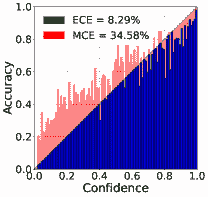

<!--yml

分类：未分类

日期：2024-09-06 19:37:36

-->

# [2308.01222] 深度学习中的校准：前沿技术综述

> 来源：[`ar5iv.labs.arxiv.org/html/2308.01222`](https://ar5iv.labs.arxiv.org/html/2308.01222)

# 深度学习中的校准：前沿技术综述

\nameCheng Wang \emailcwngam@amazon.com

\addrAmazon

###### 摘要

校准深度神经模型在构建可靠、稳健的安全关键应用的人工智能系统中扮演了重要角色。最近的研究表明，具有高预测能力的现代神经网络校准效果不佳，产生不可靠的模型预测。尽管深度学习模型在各种基准测试中表现出色，但对模型校准和可靠性的研究相对较少。理想的深度模型不仅应具备高预测性能，还应进行良好的校准。最近在深度模型校准方面取得了一些进展。在这项综述中，我们回顾了最先进的校准方法及其原理。首先，我们从模型校准的定义开始，解释模型误校准的根本原因。接着介绍可以衡量这一方面的关键指标。然后，我们总结了校准方法，并将其大致分为四类：后处理校准、正则化方法、不确定性估计和组合方法。我们还涵盖了在校准大型模型，特别是大型语言模型（LLMs）方面的最新进展。最后，我们讨论了一些开放问题、挑战和潜在的研究方向。

## 1 引言

深度神经网络（DNNs）在计算机视觉（?）、语音识别（?）和自然语言处理（?）等多个领域显示出有前景的预测能力。如今，深度神经网络模型正频繁应用于现实世界系统。然而，最近的研究（?）指出，这些经过负对数似然（NLL）训练的高精度深度神经网络校准效果不佳（?），即模型预测的类别概率并不能真实估计正确性概率，从而导致过度自信或不自信的预测。将未校准的模型应用于现实世界系统存在高风险，尤其是对于医疗诊断（?）、自动驾驶（?）和金融决策等安全关键应用。

(a)

(b)

(c)

(d)

图 1：模型校准的示意图。未经校准的模型（左）使用标准交叉熵损失训练，经过校准的模型（右）使用焦点损失（$\gamma=5$）训练，在二分类任务上预测性能相似（准确率分别为 83.8%和 83.4%），但右侧模型的校准效果更好。顶部：可靠性图绘制了 10 个区间。对角虚线表示完美校准（在特定区间，置信度等于准确率），使用期望校准误差（ECE）和最大校准误差（MCE）来衡量模型校准性能。底部：两个模型在 1000 个样本上的后验分布，校准模型的分布更好。

校准深度模型是防止模型的后验分布过于自信或不自信的过程。图 1 展示了二分类模型的校准。值得注意的是（1）一个高预测能力的模型可能会校准不佳，这表现在高校准误差上；（2）深度模型往往主要表现为过度自信，这通过后验分布的峰值体现出来。模型的过度自信通常由过度参数化的网络、缺乏适当的正则化、数据有限、标签分布不均等原因造成。近年来，已经提出了不同的工作流来校准模型。在这项调查中，我们回顾、分类并讨论了最近的校准方法及其优缺点。

#### 1.0.1 范围和重点

本调查特别关注分类问题的校准方法。关于这一主题（?）或高度相关的主题——不确定性估计，已有一些相关的调查。例如，模型校准在不确定性估计调查中有简要讨论（?, ?）。我们的调查在多个方面与这些调查有所不同：

+   •

    本调查回顾了最先进的校准方法，主要集中于过去五年提出的方法，包括基于核的方法、可微分校准代理和元学习方法。这些方法在之前的调查中很少讨论。

+   •

    本调查通过讨论过度参数化、过拟合和过度自信之间的概念关系，试图解释每种方法的校准原理。我们系统地将这些方法分类为后处理方法、正则化（显式、隐式和可微分校准代理）、不确定性估计和组合方法。

+   •

    本调查还讨论了大型预训练模型的校准方法，特别是大型语言模型（LLMs），其中零样本推断中 LLMs 的校准正受到 AI 社区越来越多的关注。

本文余下部分结构如下。在第二部分中，我们介绍了模型校准的定义并讨论了导致校准误差的原因；第 2.3 节列出了用于测量模型校准的主流校准指标。第三部分回顾、分类并讨论了最近提出的校准方法。第四部分讨论了未来的方向并总结了本次调查。

## 2 前言与背景

本节描述了模型校准的定义以及导致校准误差的方面。

### 2.1 定义

在分类任务中，对于给定的输入变量 $X$ 和一个分类变量 $Y\in\{1,2,...,k\}$，假设我们有一个神经网络模型 $f$，它将输入变量 $\mathbf{x}$ 映射到 $k$ 类 $\{y_{1},...,y_{k}\}$ 的分类分布 $p=\{p_{1},...,p_{k}\}$ 上：$f:D\rightarrow\Delta$，其中 $\Delta$ 是 $k-1$ 维标准概率单纯形，且 $\Delta=\{p\in[0,1]^{k}|\sum_{i=1}^{k}p_{i}=1\}$。校准测量预测概率 $p$ 与真实正确性可能性的匹配程度。模型 $f$ 只有在且仅在以下情况下才被认为是完全校准的：

|  | $\mathbb{P}(Y=y_{i}&#124;f(X)=p)=p_{i}$ |  | (1) |
| --- | --- | --- | --- |

其中 $p$ 是真实的正确性可能性。直观地，对于所有输入对 $\{x,y\}\in D$，如果模型预测 $p_{i}=0.8$，我们期望 80% 的样本标记为 $y_{i}$。

与概率分布不同，argmax 校准（？，？，？）仅考虑最大概率：

|  | $\mathbb{P}(Y\in\arg\max(p)&#124;\max(f(X))=p^{*})=p^{*}$ |  | (2) |
| --- | --- | --- | --- |

实际上，获得完美校准是困难的，任何偏离都表示校准误差。

### 2.2 影响模型校准的方面

观察到一些现代神经网络的最近变化导致了模型校准误差（？，？，？）。根本原因是现代神经网络的高容量使其容易出现校准误差，这与过参数化、过拟合和过度自信的概念紧密相关。

#### 2.2.1 模型规模

虽然增加神经网络的深度和宽度有助于获得高度的预测能力，但它也会负面地增加校准误差。实证证据表明，这种不良校准与对负对数似然 (NLL) (?) 的过拟合有关 (?,?,?)。过度参数化是过拟合的主要原因之一。具体来说，除了标准的 NLL 基础模型训练外，当最小化分类错误时，持续训练将进一步推动模型最小化训练数据上的 NLL，即将预测的 softmax 概率分布尽可能接近于真实分布（通常是 one-hot）。模型过拟合首先表现为测试 NLL 的增加，然后模型变得过于自信 (?)。对于更近期的大模型，这种趋势在分布内数据中几乎可以忽略不计，在分布变化下则会反转 (?). 

#### 2.2.2 正则化 

正则化可以有效防止模型容量增加时的过拟合。最近的趋势表明，当应用批归一化 (?) 或 dropout (?) 时，显式 L2 正则化可能不是实现高精度模型的必要条件，但 Guo 等人 (?) 实证展示了在不使用 L2 正则化时模型往往较少被校准。最近已经提出了更多改进模型校准的正则化技术 (?, ?, ?, ?)。 

#### 2.2.3 数据问题 

另一个影响校准的重要方面是数据的数量（例如规模、体积、多样性等）和质量（相关性、一致性、完整性等）。用稀缺数据训练高容量（过度参数化）网络很容易导致过拟合和过于自信的模型。数据增强是缓解这一现象的有效方法，并带来隐式的校准效果 (?, ?)。最近的预训练-微调范式提供了减少由有限和噪声数据引起的过拟合的可能性 (?). 另一个挑战是数据不平衡，在这种情况下，模型对多数类别过拟合，从而对多数类别做出过于自信的预测。焦点损失 (?, ?) 最近在校准深度模型方面表现出了良好的效果。 

### 2.3 校准测量 

由于置信度 $p$ 是连续变量 (?)，用有限的数据样本进行精确的校准测量是不可能的。有一些流行的指标通过将 $N$ 个预测分组到 $M$ 个区间 $\{b_{1},b_{2},...,b_{M}\}$ 来近似模型校准误差。 

#### 2.3.1 预期校准误差 (ECE) 

ECE (?) 是校准的标量摘要统计量。它是模型准确度和置信度在 $M$ 个区间的加权平均差异， 

|  | $\displaystyle\textsc{ECE}=\frac{1}{N}\sum_{m=1}^{M}\left | b_{m}\right | \left | \textrm{acc}(b_{m})-\textrm{conf}(b_{m})\right | $ |  | (3) |  |
| --- | --- | --- | --- | --- | --- | --- | --- | --- |

其中 $N$ 是样本总数。$\left|b_{m}\right|$ 是 bin $b_{m}$ 中的样本数量，

|  | $\displaystyle\textrm{acc}(b_{m})=\frac{1}{\left | b_{m}\right | }\sum_{i\in B_{m}}\mathbf{1}(\hat{y}_{i}=y_{i}),~{}\textrm{conf}(b_{m})=\frac{1}{\left | b_{m}\right | }\sum_{i\in B_{m}}p_{i}.$ |  | (4) |
| --- | --- | --- | --- | --- | --- | --- | --- |

#### 2.3.2 最大校准误差 (MCE)

MCE (?) 测量准确率和置信度之间的最坏情况偏差，

|  | $\textsc{MCE}=\max_{m\in\{1,\dots,M\}} | \textrm{acc}(b_{m})-\textrm{conf}(b_{m}) | .$ |  | (5) |
| --- | --- | --- | --- | --- | --- |

在高风险应用中尤其重要，因为可靠的置信度测量绝对必要。

#### 2.3.3 类别 ECE (CECE)

类别 ECE (?) 可以看作是宏观平均的 ECE。它扩展了基于分箱的 ECE，用于衡量所有可能的 $K$ 类别的校准。在实际操作中，预测会分别针对每个类别进行分箱，然后在单个类别-分箱层面计算校准误差，并取平均。该度量可以被表述为

|  | $\textsc{CECE}=\sum_{m=1}^{M}\sum_{c=1}^{K}\frac{ | b_{m,c} | }{NK} | \textrm{acc}_{c}(b_{m,c})-\textrm{conf}_{c}(b_{m,c}) | $ |  | (6) |
| --- | --- | --- | --- | --- | --- | --- | --- |

其中 $b_{m,c}$ 代表类别 $c$ 的单个分箱。在这种表述中，$\textrm{acc}_{c}(b_{m,c})$ 代表类别 $c$ 在分箱 $b_{m,c}$ 上的平均二元准确率，$\textrm{conf}_{c}(b_{m,c})$ 代表类别 $c$ 在分箱 $b_{m,c}$ 上的平均置信度。

#### 2.3.4 自适应 ECE (AECE)

上述度量中的分箱机制可能会引入偏差；预定义的分箱大小决定了每个分箱中的样本数量。自适应 ECE (?) 引入了一种新的分箱策略，使用自适应方案调整分箱间隔，以确保每个分箱中包含相同数量的样本。

|  | $\textsc{AECE}=\sum_{r=1}^{R}\sum_{c=1}^{K}\frac{1}{RK} | \textrm{acc}_{c}(b_{n,c})-\textrm{conf}_{c}(b_{n,c}) | $ |  | (7) |
| --- | --- | --- | --- | --- | --- |

其中 $r\in[1,R]$ 由排序后的预测和阈值预测的 $[N/R]$-th 索引定义。

对于一个完美校准的分类器，这些校准误差应该等于 $0$。

#### 2.3.5 可靠性图

除了提供标量总结的校准度量，可靠性图（如 1 中所示）通过根据预测概率将预测分组到分箱中来可视化模型是否对分箱过于自信或不足。图 1 中的对角线表示完美的校准：$\textrm{acc}(b_{m})=\textrm{conf}(b_{m}),\forall m$，红色条表示与完美校准的差距。

| 方法 | 分类 | 测量 |
| --- | --- | --- |
| Dirichlet 校准 (?) | 后处理 | CECE, NLL |
| ATS (?) | 后处理 | ECE, NLL |
| BTS (?) | 后处理 | ECE |
| LTS (?) | 后处理 | ECE, MCE, AECE, SCE |
| 焦点损失 (?) | 正则化（隐式） | ECE, NLL |
| FLSD (?) | 正则化（隐式） | ECE, MCE, AECE, CECE, NLL |
| MMCE (?) | 正则化（代理） | ECE, Brier, NLL |
| 元校准 (?) | 正则化（代理） | ECE |
| 标签平滑 (?) | 正则化（增强） | ECE |
| Mix-Up (?) | 正则化（增强） | ECE |
| Mix-n-Match (?) | 组成 | ECE |
| TS+MC dropout (?) | 组成 | ECE, UCE |

表 1：最先进的校准方法及其分类。正则化方法进一步分为显式正则化、隐式正则化和可训练的校准代理。不包括不确定性估计和量化方法，请参考调查文献 (？，？)。

## 3 校准方法

在本节中，我们将最先进的校准方法分类为事后方法、正则化方法、隐式校准方法和不确定性估计方法。此外，我们讨论了将不同校准方法结合起来的组合方法。表 1 总结了这些方法。

### 3.1 事后校准方法

事后校准方法旨在训练后校准模型。这些方法包括非参数校准直方图分箱（？）、同调回归 (?) 和诸如贝叶斯分箱入量化（BBQ）和 Platt 缩放 (?) 的参数方法。在这些方法中，基于 Platt 缩放 (?) 的方法由于其低复杂度和高效性而更受欢迎。这包括温度缩放（TS）、注意 TS (?)。

#### 3.1.1 温度缩放

温度缩放（TS）是 Platt 缩放 (?) 的单参数扩展，也是最近添加到事后方法中的一种。它使用温度参数 $\tau$ 来校准 softmax 概率：

|  | $p_{i}=\frac{\exp(g_{i}/\tau)}{\sum_{j=1}^{k}\exp(g_{j}/\tau)},~{}~{}i\in[1\dots k].$ |  | (8) |
| --- | --- | --- | --- |

其中 $\tau>0$ 对所有类别作为缩放因子来软化模型预测的概率，它通过调整分布的锐利度来控制模型的信心，使模型预测不至于过于确定（过于自信）或过于不确定（不自信）。通过最小化验证数据集上的负对数似然损失（NLL）来获得最佳温度值。：

|  | $\tau^{\ast}=\arg\min_{\tau}\left(-\sum_{i=1}^{N}\log(\textsc{softmax}(g_{i},\tau))\right)$ |  | (9) |
| --- | --- | --- | --- |

TS 简化了矩阵（向量）缩放 (?)，其中类级别的 $\tau$ 被视为一个单一参数，并在保持最低计算复杂度的同时提供良好的校准 (？，？)。

#### 3.1.2 温度缩放扩展

事后校准的目标是在验证数据集上学习一个校准映射（也称为概率的规范校准函数 (?))，将未经校准的概率转换为校准后的概率。许多 TS 扩展旨在找到一个合适的校准映射。 Kull 等人 (?) 提出了 Dirichlet 校准，假设概率分布是参数化的 Dirichlet 分布：

|  | $p(x)\mid y=j\sim Dirichlet(\alpha^{j})$ |  | (10) |
| --- | --- | --- | --- |

其中 $\alpha^{j}=\{\alpha^{j}_{1},\alpha^{j}_{2},...,\alpha^{j}_{k}\}$ 是第 $j$ 类的 Dirichlet 参数。提出的 Dirichlet 校准映射族与 Beta 校准族相吻合（?）。此外，与通用标准化参数化相比，它提供了唯一性和可解释性。 (?) 指出，当验证集样本数量有限时，TS 在寻找最佳 $\tau$ 时存在困难。他们提出了加权温度缩放（ATS），通过增加验证集中样本的数量来缓解这个问题。关键思想是从每个类的分布中收集样本。假设 $p(y|x)$ 是预测的概率。ATS 首先将验证集划分为 $K$ 个子集，包含 $p(y=k|x),k\in[1,K]$，这使得可以利用 Bayeisan 定理（?）作为选择标准，添加更多 $y\neq k$ 的样本：

|  | $p(x,y=k)=\frac{p(y=k | x)}{p(y\neq k | x)}p(x,y\neq k)$ |  | (11) |
| --- | --- | --- | --- | --- | --- |

这表明 ATS 选择了那些更可能属于 $p(x,y=k)$ 的 $y\neq k$ 样本。 Bin-wise TS（BTS）(?) 被提出以通过使用基于置信区间的分箱方法将 TS 扩展到多个相等大小的分箱。结合数据增强，BTS 相比于 TS 显示了优越的性能。局部 TS（LTS）(?) 将 TS 扩展到多标签语义分割，并使其适应局部图像变化。为每个像素或体素学习一个局部缩放因子。

|  | $\mathbb{Q}(x,\tau_{i}(x))=max_{l\in L}\textsc{Softmax}(\frac{g_{i}(x)}{\tau_{i}(x)})^{(l)}$ |  | (12) |
| --- | --- | --- | --- |

其中 $l$ 是类别索引，$g_{i}(x)$ 是位置 $x$ 的 logit，而 $\tau_{i}(x)$ 是位置依赖的温度。

备注：尽管使用单一的全局超参数，TS 仍然是一个受欢迎的方法，因为它的有效性和保持准确性的能力（?）。后处理校准通常在没有大量验证数据的情况下效果良好，因此数据效率较高。校准过程与训练解耦，不会引入训练复杂性。另一方面，后处理校准的表达能力较差，并且在数据不足时难以近似标准校准函数（?）。

### 3.2 正则化方法

正则化对于防止神经网络模型过拟合非常重要。在本节中，我们讨论了一些代表性的工作，这些工作显式或隐式地对现代神经网络进行正则化，以实现更好的校准。

#### 3.2.1 显式正则化

将正则化项（或惩罚项）$L_{reg}$ 添加到标准损失目标（例如，负对数似然）的典型（显式）方法：

|  | $\mathcal{L}(\theta)=-\sum\log p(y | x)+\alpha L_{reg}.$ |  | (13) |
| --- | --- | --- | --- | --- |

其中 $\alpha$ 控制正则化权重 $\theta$ 的惩罚重要性。L2 正则化在训练现代神经网络中得到了广泛应用，并在模型校准中显示了其有效性（?）。熵正则化（?）：

|  | $\mathcal{L}(\theta)=-\sum\log p(y\mid x)-\alpha H(p(y\mid x)).$ |  | (14) |
| --- | --- | --- | --- |

直接惩罚熵低的预测分布，防止这些尖峰分布，并确保更好的模型泛化。

#### 3.2.2 隐式正则化：Focal Loss 及其扩展

Focal loss（？）最初提出是为了解决目标检测中的类别不平衡问题：$\mathcal{L}_{f}=-\sum_{i=1}^{N}(1-p_{i})^{\gamma}\log p_{i}$ 其中 $\gamma$ 是一个超参数。最近有研究表明，focal loss 可以被解释为最小化 Kullback–Leibler（KL）散度和最大化熵之间的权衡，这取决于 $\gamma$（？）：

|  | $\mathcal{L}_{f}\geq\textsc{KL}(q\parallel p)+\mathbb{H}(q)-\gamma\mathbb{H}(p)$ |  | (15) |
| --- | --- | --- | --- |

第一个项推动模型学习一个概率 $p$ 使其具有高值（尽可能接近真实标签分布，即通常的一热编码表示）。第二个项是常数。最后一项对概率进行正则化，以避免过高（过度自信）。Mukhoti 等人（？）经验观察到 $\gamma$ 在隐式正则化熵和权重中发挥了重要作用。然而，找到一个适当的 $\gamma$ 对于数据集中的所有样本都是具有挑战性的。因此，他们提出了基于 Lambert-W 函数（？）的样本依赖调度 $\gamma$（FLSD）。他们已经表明，根据不同的置信区间调度 $\gamma$ 值有助于改善模型在领域内和领域外（OOD）数据上的校准。最近的扩展主要集中在计算机视觉中，包括基于边际的标签平滑（MbLS）（？）和多类置信度与准确度差异（MDCA）（？）。

可微校准代理：回顾上述方法，利用惩罚项（无论是显式还是隐式）来改善数据集 $D$ 上的模型校准。有一种新兴的方向直接通过使用校准误差（CE）作为可微代理来优化目标函数（？，？）以替代标准损失：

|  | $\arg\min_{\theta}L_{standard}(D,\theta)+L_{calibration}(D,\theta)$ |  | (16) |
| --- | --- | --- | --- |

这一研究方向的重点是找到校准误差的可微近似。Kumar 等人（？）提出了一种基于核的方法来显式校准训练阶段的模型，称为最大均值校准误差（MMCE），它是可微的，并且可以使用批量随机梯度算法进行优化。他们通过定义在由通用核 $k(\cdot,\cdot)$ 和规范特征映射 $\phi:[0,1]\rightarrow\mathcal{H}$ 诱导的再现核希尔伯特空间（RKHS） $\mathcal{H}$ 上的积分概率测度，将校准误差转化为可微的：

|  | $\textsc{MMCE}(P(r,c))=\left\|E_{(r,c)\sim P}[(c-r)\phi(r)]\right\|_{\mathcal{H}}$ |  | (17) |
| --- | --- | --- | --- |

其中 $r,c$ 分别表示置信度和正确性分数，$P(r,c)$ 表示预测概率 $P(y|x)$ 在 $r,c$ 上的分布。一个结合元学习和可微校准代理的方法由 (?) 提出。作者们开发了一个可微 ECE（DECE）并将其用作元网络的学习目标。元网络从原始骨干网络中获取表示，并为骨干网络输出逐单位 L2 权重衰减系数 $\omega$。DECE 是针对校准指标与验证集进行优化的，但附加于标准交叉熵（CE）损失。

|  | $\displaystyle\omega^{*}$ | $\displaystyle=\arg\min_{\omega}\mathcal{L}_{DECE}^{val}(f_{c}^{*}\circ f_{\theta}^{*}(\omega))$ |  | (18) |
| --- | --- | --- | --- | --- |
|  | $\displaystyle f_{c}^{*},f_{\theta}^{*}(\omega)$ | $\displaystyle=\arg\min_{f_{c},f_{\theta}(\omega)}(\mathcal{L}_{CE}^{train}(f_{c}\circ f_{\theta}(\omega)+\omega\left\&#124;f_{c}\right\&#124;^{2})$ |  | (19) |

其中 $f_{c}$ 是分类层，$f_{\theta}$ 是特征提取器。

备注：与后处理方法相比，正则化方法可以直接输出一个经过良好校准的模型，而无需额外步骤。不同方法的复杂度增加程度不同；例如，焦点损失可以看作是一种隐式正则化，并且没有引入明显的额外计算复杂度。基于核的方法和元网络正则化根据设计的核方法和元网络增加额外的计算。

### 3.3 数据增强

这项工作与正则化方法高度相关，而不是直接将惩罚项添加到优化目标中。这些研究尝试通过扩充数据或向训练样本中添加噪声来减轻模型的误校准。标签平滑 (?) 和 mixup (?) 是这一领域的热门方法。标签平滑 (?) 通过在标准损失函数（例如交叉熵）中引入平滑参数 $\alpha$ 来软化硬标签：

|  | $\mathcal{L}_{c}=-\sum_{k=1}^{K}y_{k}^{s}\log p_{i},~{}~{}y_{k}^{s}=y_{k}(1-\alpha)+\alpha/K$ |  | (20) |
| --- | --- | --- | --- |

其中 $y_{k}$ 是第 $k$ 类的软标签。研究表明，标签平滑鼓励正确类别的对数几率与错误类别的对数几率之间的差异成为一个依赖于 $\alpha$ 的常数。通过假设先验标签分布为均匀分布 $u$ 并反转 KL 散度的方向，可以恢复置信度惩罚。

|  | $\mathcal{L}(\theta)=-\sum\log p(y&#124;x)-\textsc{KL}(u\parallel p(y&#124;x)).$ |  | (21) |
| --- | --- | --- | --- |

Mixup 训练 (?) 是这一探索方向中的另一个工作。它研究了 mixup (?) 在模型校准 (?) 方面的有效性。Mixup 在训练过程中通过凸性地组合随机对的输入和标签来生成合成样本。要混合两个随机样本 $(x_{i},y_{i})$ 和 $(x_{j},y_{j})$，使用以下规则：

|  | $\displaystyle\bar{x}$ | $\displaystyle=\alpha x_{i}+(1-\alpha)x_{j}$ |  | (22) |
| --- | --- | --- | --- | --- |
|  | $\displaystyle\bar{y}$ | $\displaystyle=\alpha y_{i}+(1-\alpha)y_{j}$ |  | (23) |

其中 $(\bar{x}_{i},\bar{y}_{i})$ 是原始对的虚拟特征-目标。作者观察到，mixup 训练的模型在处理分布外和噪声数据的预测时更好地进行了校准，不易过于自信。指出仅混合特征并不会带来校准益处；标签平滑在与混合特征一起使用时可以显著改善校准。

备注：这项工作通过在隐藏空间中进行数据增强来对抗过拟合。这不仅提高了模型的泛化能力，还改善了校准。这些方法不会显著增加网络复杂性，但通常由于生成或合成的训练样本更多，因此需要更多的训练时间。

### 3.4 不确定性估计

这项工作旨在通过引入随机性来缓解模型的不匹配。流行的方法包括（1）贝叶斯神经网络（？，？），（2）集成方法（？），（3）蒙特卡洛（MC）丢弃法（？）和（4）Gumbel-softmax（？）基于的方法（？，？）。前面三种子类别已在最近的综述中讨论过（？，？）。

图 2：不确定性估计的方法（？）。(a) 贝叶斯神经网络；(b) MC 丢弃法；(c) 集成方法；(d) Gumbel-Softmax 技巧。

(a)

(b)

(c)

图 3：在 CIFAR100 上训练的模型的可靠性图，使用不同的 bin 数量（从左到右：20、50、100）。对角线虚线表示完美的校准，红色条表示每个 bin 与完美校准之间的差距。校准误差对 bin 数量的增加非常敏感。

#### 3.4.1 贝叶斯神经网络

给定的学习目标是最小化负对数似然，$\mathcal{L}=-\frac{1}{N}\sum_{i}^{N}\log p(y_{i}\mid x_{i},w)$。概率分布由 Softmax 函数获得，如下所示：

|  | $\displaystyle p(y_{i}=m\mid x_{i},w)=\frac{\exp(f_{m}(x_{i},w))}{\sum_{k\in M}\exp(f_{k}(x_{i},w))}$ |  | (24) |
| --- | --- | --- | --- |

在推断阶段，给定一个测试样本 $x^{*}$，预测概率 $y^{*}$ 由以下公式计算：

|  | $\displaystyle p(y^{*}\mid x^{*},D)=\int p(y^{*}\mid x^{*},w)p(w\mid D)dw$ |  | (25) |
| --- | --- | --- | --- |

由于后验 $p(w\mid D)$ 是不可处理的，我们通过最小化 Kullback-Leibler（KL）距离来进行近似。这也可以视为对 ELBO 的最大化：

|  | $\displaystyle\mathcal{L_{\theta}}=\int q_{\theta}(w)p(Y\mid X,w)dw-\textsc{KL}[q_{\theta}(w)\parallel p(w)]$ |  | (26) |
| --- | --- | --- | --- |

其中 $\theta$ 是变分参数。通过重新参数化技巧（？），可以获得一个可微分的迷你批量蒙特卡洛（MC）估计器。

不确定性估计可以通过执行 $T$ 次推断运行并平均预测来完成：$p(y*|x*)=\frac{1}{T}\sum_{t=1}^{T}p_{w_{t}}(y^{*}|x^{*},w_{t})$。

#### 3.4.2 MC Dropout、集合和 Gumbel-Softmax

按照上述策略，MC-dropout（？）、集合（？）和 Gumbel-softmax 采样（？，？）以不同的方式引入随机性，如图 2 所示。然后，方程中的 $T$ (29 ‣ 3.6 Calibrating Pre-trained Large Models ‣ 3 Calibration Methods ‣ Calibration in Deep Learning: A Survey of the State-of-the-Art")) 对应于 MC-dropout 中来自伯努利分布的掩码向量集合的数量 $\{r^{t}\}_{t=1}^{T}$，或集合中的随机训练模型的数量，这可能导致不同的学习参数集合 $\omega=\{\omega_{1},...,\omega_{t}\}$，或来自 Gumbel 分布的采样注意力分布集合的数量 $\{g^{t}\}_{t=1}^{T}$。

备注：这类工作需要多次推断运行以进行近似。这与以前的方法相比显著增加了计算开销。另一方面，除了模型校准，这些方法主要是为了不确定性量化和估计。因此，网络不确定性也可以被捕获和测量。

### 3.5 组合校准

除了独立应用每种方法，我们总是可以通过结合两种或多种方法来进行校准组合。一个直接的方法是将非后验方法与后验方法结合。例如，在使用正则化方法和隐式校准（？，？）之后执行温度缩放（TS）。Thulasidasan 等（？）观察到，标签平滑和混合训练的组合显著提高了校准效果。虽然结合不同方法的可能性有很多，但我们突出一些有趣的组合。

#### 3.5.1 集合温度缩放（ETS）

Zhang 等（？）给出了与校准属性相关的三个重要定义：保持准确性、数据高效性和表现力。他们指出，TS 是一种保持准确性和数据高效性的方法，但表现力较差。提出了集成温度缩放（ETS）以提高 TS 的表现力，同时保持其他两个属性。

|  | $T(z;w,\tau)=w_{1}T(z;\tau)+w_{2}z+w_{3}K^{-1}$ |  | (27) |
| --- | --- | --- | --- |

有三个集合组件：原始 TS $T(z;\tau)=(z_{1}^{\tau^{-1}},...,z_{k}^{\tau^{-1}})/\sum_{k=1}^{K}z_{k}^{\tau^{-1}}$，$\tau=1$ 的未经校准预测和每个类别的均匀预测 $z_{k}=K^{-1}$。

#### 3.5.2 带 MC Dropout 的温度缩放

Laves 等人 (?) 将 TS 扩展到 dropout 变分推理，以校准模型不确定性。关键思想是在最终的 softmax 激活之前插入 $\tau$，并在 MC 积分中的 softmax 激活之前插入 $\tau>0$：$\hat{p}=\frac{1}{N}\sum_{i=1}^{N}\textsc{softmax}(\frac{f_{w_{i}}(x)}{\tau})$，其中执行 $N$ 次前向传递以优化 $\tau$ 相对于验证集上的 NLL。然后，使用 softmax 似然的熵来表示所有 $C$ 类的 ​​不确定性。

|  | $H(p)=-\frac{1}{\log C}\sum p^{c}\log p^{c},H\in[0,1]$ |  | (28) |
| --- | --- | --- | --- |

备注：适当组合不同的校准类型可以进一步改善校准，但这也可能结合它们的缺点，例如，Ensemble Temperature Scaling (ETS) (?) 增加了复杂性。

### 3.6 校准预训练的大型模型

预训练的大型模型，包括视觉、语言或视觉-语言模型，已经在许多安全关键和面向客户的应用中得到了广泛使用。这些大型模型的校准最近已经被研究和重新审视 (?, ?)。 

#### 3.6.1 大型视觉模型校准

Minderer 等人 (?) 研究了包括视觉变换器 (?) 和 MLP-mixer (?) 在内的最新前沿视觉模型。他们发现，近期模型生成中的模型大小和预训练量无法完全解释先前模型生成中的校准衰退现象与分布转移或模型大小之间的关系。他们还讨论了在分布内和分布外 (OOD) 校准之间的相关性。他们指出，具有更好分布内校准的模型在 OOD 基准上也表现出更好的校准。LeVine 等人 (?) 研究了 CLIP (?) 作为零样本推理模型的校准，发现 CLIP 在零样本设置中存在校准误差。他们展示了在辅助任务上学习温度并将其应用于推理的有效性，无论提示或数据集如何。

#### 3.6.2 大型语言模型 (LLMs)

LLMs 和提示工程已经成为一种高效的学习范式，并且可以在没有或仅有少量示例的情况下执行众多自然语言任务。然而，这种学习范式的结果可能不稳定，并且会引入与各种提示模板和训练示例相关的偏差 (?). 引入的偏差包括主要标签偏差、最近性偏差和 token 偏差。为减少这些偏差，赵等人 (?) 提出了上下文校准程序，以改进 GPT-3 在少量学习任务中的预测能力，例如 “N/A” 的上下文无关输入。上下文校准是通过使用向量缩放 (?) 完成的。

同样，Zheng 等人 (?) 调查了 LLMs 在多项选择题 (MCQ) 任务中的选择偏差，并指出 LLMs 的 token 偏差是选择偏差的内在原因。他们提出了

Park 等人（?）将 mixup（?）训练扩展至通过基于 Margin 下的面积（AUM）合成样本来改进模型校准，适用于预训练语言模型。原型校准（PROCA）（?）是校准 LLMs 的最新研究之一。它展示了在少样本分类设置中决策边界的重要性，并建议使用原型簇来学习更好的边界。具体来说，它使用高斯混合模型（GMM）来估计$K$类别的簇：

|  | $\displaystyle P_{GMM}(x)=\sum_{k=1}^{K}\alpha_{k}p_{G}(x | u_{k},\Sigma_{k})$ |  | (29) |
| --- | --- | --- | --- | --- |

其中$u_{k}$和$\Sigma_{k}$是分布的均值向量和协方差矩阵。参数$\{\alpha,u,\Sigma\}_{k=1}^{K}$是通过使用期望最大化（EM）算法（?）在一个小的未标记数据集上估计的。

## 4 结论与未来工作

我们回顾了最先进的校准方法，描述了动机、原因、测量指标和分类。接着，我们讨论了近期方法的细节和原理以及它们的各自优缺点。尽管在校准深度模型方面取得了最近的进展，但仍存在一些挑战和未充分探索的方面，需进一步探索。

### 4.1 减少校准偏差

准确而可靠地测量校准仍然具有挑战性，这主要是由于分箱机制引入的偏差和有限的样本数量（?）。对于前者挑战，主要存在灵敏度和数据低效的问题。分箱方案的灵敏度在 3 中有所展示。我们可以看到，对于给定的模型，增加分箱数量会导致更高的 ECE 和 MCE 分数。一种基于 KDE 的 ECE 估计器（?）被提出，用非参数密度估计器替代直方图，这些估计器是连续的且数据更高效。因此，测量偏差对于正确的校准评估至关重要。Roelofs 等人（?）提出了通过构造偏差（BBC）来将分箱基于的 ECE 的偏差建模为样本和分箱数量的函数。这确认了存在不可忽视的统计偏差。为了跟进这项工作，未来的努力将包括开发无偏校准估计器，探索如（?）中所述的校准偏差与方差之间的权衡。

### 4.2 校准生成模型

最近的标定工作主要集中在分类和回归任务上；关于序列生成的模型标定在文献中很少讨论。Kumar 等人 (?) 指出神经机器翻译任务中的 token-level 概率标定不佳，这解释了随着 beam-size 增大而 BLEU 分数直观上下降的原因 (?)。在 LLM 中，token-level 概率的标定不佳在少量样本学习中得到了进一步确认 (?)。主要原因是大词汇量上的 softmax 瓶颈 (?)。在序列生成任务中，早期的 token 概率标定不佳会放大整个序列。如何在各种设置中有效标定 token-level 概率将是一个有趣的方向，尤其是在 LLM 时代。

## 参考文献

+   Blundell 等人 Blundell, C., Cornebise, J., Kavukcuoglu, K., & Wierstra, D. (2015). 神经网络中的权重不确定性. 在国际机器学习会议论文集, 页 1613–1622。PMLR。

+   Bohdal 等人 Bohdal, O., Yang, Y., & Hospedales, T. (2021). 元标定：使用可微分期望标定误差的模型标定元学习. arXiv 预印本 arXiv:2106.09613。

+   Bojarski 等人 Bojarski, M., Del Testa, D., Dworakowski, D., Firner, B., Flepp, B., Goyal, P., Jackel, L. D., Monfort, M., Muller, U., Zhang, J., 等人 (2016). 端到端自驾车学习. arXiv 预印本 arXiv:1604.07316。

+   Caruana 等人 Caruana, R., Lou, Y., Gehrke, J., Koch, P., Sturm, M., & Elhadad, N. (2015). 面向医疗保健的可解释模型：预测肺炎风险和医院 30 天再入院率. 在第 21 届 ACM SIGKDD 国际知识发现与数据挖掘会议论文集, 页 1721–1730。

+   Corless 等人 Corless, R. M., Gonnet, G. H., Hare, D. E., Jeffrey, D. J., & Knuth, D. E. (1996). 关于 lambertw 函数. 计算数学进展, 5(1), 329–359。

+   Desai & Durrett Desai, S., & Durrett, G. (2020). 预训练变压器的标定. 在 EMNLP 论文集, 页 295–302。

+   Ding 等人 Ding, Z., Han, X., Liu, P., & Niethammer, M. (2021). 用于概率标定的局部温度缩放. 在 IEEE/CVF 国际计算机视觉会议论文集, 页 6889–6899。

+   Dosovitskiy 等人 Dosovitskiy, A., Beyer, L., Kolesnikov, A., Weissenborn, D., Zhai, X., Unterthiner, T., Dehghani, M., Minderer, M., Heigold, G., Gelly, S., 等人 一张图片值 16x16 个词：大规模图像识别的变压器. 在国际学习表征会议。

+   Fortunato 等人 Fortunato, M., Blundell, C., & Vinyals, O. (2017). 贝叶斯递归神经网络. arXiv 预印本 arXiv:1704.02798。

+   Gal & Ghahramani Gal, Y., & Ghahramani, Z. (2016). Dropout 作为贝叶斯近似：在深度学习中表示模型不确定性. 在 ICML’16 论文集, 页 1050–1059。PMLR。

+   Gawlikowski 等人 Gawlikowski, J., Tassi, C. R. N., Ali, M., Lee, J., Humt, M., Feng, J., Kruspe, A., Triebel, R., Jung, P., Roscher, R., 等人. (2021). 深度神经网络中的不确定性调查。arXiv 预印本 arXiv:2107.03342。

+   Graves 等人 Graves, A., Mohamed, A.-r., & Hinton, G. (2013). 使用深度递归神经网络的语音识别。2013 IEEE 国际声学、语音和信号处理会议，pp. 6645–6649. IEEE。

+   Guo 等人 Guo, C., Pleiss, G., Sun, Y., & Weinberger, K. Q. (2017). 现代神经网络的校准。ICML，pp. 1321–1330. PMLR。

+   Han 等人 Han, Z., Hao, Y., Dong, L., Sun, Y., & Wei, F. (2023). 针对少样本学习的语言模型的原型校准。在第十一届国际学习表征会议上。

+   Hebbalaguppe 等人 Hebbalaguppe, R., Prakash, J., Madan, N., & Arora, C. (2022). 一针见血：一种改进神经网络校准的训练时间正则化损失。IEEE/CVF 计算机视觉与模式识别大会论文集，pp. 16081–16090。

+   Ioffe & Szegedy Ioffe, S., & Szegedy, C. (2015). 批量归一化：通过减少内部协变量偏移来加速深度网络训练。在国际机器学习会议，pp. 448–456. PMLR。

+   Jang 等人 Jang, E., Gu, S., & Poole, B. (2017). 使用 gumbel-softmax 的分类重新参数化。在 ICLR’17。

+   Ji 等人 Ji, B., Jung, H., Yoon, J., Kim, K., 等人. (2019). Bin-wise 温度缩放（bts）：通过简单的缩放技术提高置信度校准性能。2019 IEEE/CVF 国际计算机视觉会议研讨会（ICCVW），pp. 4190–4196. IEEE。

+   Jin 等人 Jin, L., Lazarow, J., & Tu, Z. (2017). 使用卷积网络的内省分类。NeurIPS, 30。

+   Kingma 等人 Kingma, D. P., Salimans, T., & Welling, M. (2015). 变分丢弃和局部重新参数化技巧。NeurIPS’15, 第 28 卷, pp. 2575–2583。

+   Koehn & Knowles Koehn, P., & Knowles, R. (2017). 神经机器翻译的六大挑战。第一届神经机器翻译研讨会，pp. 28–39. 计算语言学协会。

+   Krizhevsky 等人 Krizhevsky, A., Sutskever, I., & Hinton, G. E. (2012). 使用深度卷积神经网络进行 Imagenet 分类。NeurIPS, 25。

+   Kull 等人 Kull, M., Filho, T. S., & Flach, P. (2017). Beta 校准：对二元分类器的逻辑校准的一个有充分基础且易于实现的改进。在第 20 届国际人工智能与统计会议论文集， 第 54 卷，pp. 623–631. PMLR。

+   Kull 等人 Kull, M., Perello Nieto, M., Kängsepp, M., Silva Filho, T., Song, H., & Flach, P. (2019). 超越温度缩放：通过 Dirichlet 校准获得良好校准的多类概率。NeurIPS, 32。

+   Kumar & Sarawagi Kumar, A., & Sarawagi, S. (2019). 对神经机器翻译的编码器-解码器模型进行校准。arXiv 预印本 arXiv:1903.00802。

+   Kumar 等人 Kumar, A., Sarawagi, S., & Jain, U. (2018). 从核均值嵌入中获得可训练的神经网络校准度量。在 ICML 会议上，pp. 2805–2814. PMLR。

+   Lakshminarayanan 等人 Lakshminarayanan, B., Pritzel, A., & Blundell, C. (2017). 使用深度集成进行简单且可扩展的预测不确定性估计。在 NeurIPS’17。

+   Laves 等人 Laves, M.-H., Ihler, S., Kortmann, K.-P., & Ortmaier, T. (2019). 使用温度缩放进行 dropout 变分推断的良好校准模型不确定性。arXiv 预印本 arXiv:1909.13550。

+   LeVine 等人 LeVine, W., Pikus, B., Raj, P., & Gil, F. A. (2023). 在大型视觉语言模型的零样本推断中实现校准。arXiv 预印本 arXiv:2303.12748。

+   Lin 等人 Lin, T.-Y., Goyal, P., Girshick, R., He, K., & Dollár, P. (2017). 用于密集目标检测的焦点损失。在 IEEE 国际计算机视觉会议论文集，pp. 2980–2988。

+   Liu 等人 Liu, B., Ben Ayed, I., Galdran, A., & Dolz, J. (2022). 魔鬼在于边缘：基于边缘的标签平滑用于网络校准。在 IEEE/CVF 计算机视觉与模式识别会议论文集，pp. 80–88。

+   Mena 等人 Mena, J., Pujol, O., & Vitria, J. (2021). 从贝叶斯角度对深度学习分类系统中的不确定性估计进行调查。《ACM 计算调查》（CSUR），54(9)，1–35。

+   Minderer 等人 Minderer, M., Djolonga, J., Romijnders, R., Hubis, F., Zhai, X., Houlsby, N., Tran, D., & Lucic, M. (2021a). 重新审视现代神经网络的校准。《NeurIPS》，34。

+   Minderer 等人 Minderer, M., Djolonga, J., Romijnders, R., Hubis, F., Zhai, X., Houlsby, N., Tran, D., & Lucic, M. (2021b). 重新审视现代神经网络的校准。

+   Moon Moon, T. (1996). 期望最大化算法。《IEEE 信号处理杂志》，13(6)，47–60。

+   Mozafari 等人 Mozafari, A. S., Gomes, H. S., Leão, W., Janny, S., & Gagné, C. (2018). 关注温度缩放：校准深度神经网络的实用方法。arXiv 预印本 arXiv:1810.11586。

+   Mukhoti 等人 Mukhoti, J., Kulharia, V., Sanyal, A., Golodetz, S., Torr, P., & Dokania, P. (2020). 使用焦点损失对深度神经网络进行校准。《NeurIPS》，33，15288–15299。

+   Müller 等人 Müller, R., Kornblith, S., & Hinton, G. E. (2019). 标签平滑什么时候有帮助？《NeurIPS》，32。

+   Naeini 等人 Naeini, M. P., Cooper, G. F., & Hauskrecht, M. (2015). 使用贝叶斯分箱获得良好校准的概率。在第二十九届 AAAI 人工智能会议论文集。

+   Niculescu-Mizil & Caruana Niculescu-Mizil, A., & Caruana, R. (2005). 使用监督学习预测良好的概率。在 ICML 会议上，pp. 625–632。

+   Nixon 等人。Nixon, J., Dusenberry, M. W., Zhang, L., Jerfel, G., & Tran, D. (2019)。深度学习中的校准测量。见于 CVPR 研讨会，第 2 卷。

+   Park & Caragea。Park, S. Y., & Caragea, C. (2022)。基于边界下的面积和显著性的 mixup 指导的预训练语言模型的校准。见于第 60 届计算语言学协会年会（第 1 卷：长篇论文），页码 5364–5374。

+   Pei 等人。Pei, J., Wang, C., & Szarvas, G. (2022)。基于层次随机注意力的变换器不确定性估计。见于 AAAI，第 36 卷，页码 11147–11155。

+   Pereyra 等人。Pereyra, G., Tucker, G., Chorowski, J., Kaiser, Ł., & Hinton, G. (2017)。通过惩罚自信的输出分布来正则化神经网络。arXiv 预印本 arXiv:1701.06548。

+   Platt 等人。Platt, J., 等人。 (1999)。支持向量机的概率输出及与正则化似然方法的比较。大型边界分类器进展，10(3)，61–74。

+   Radford 等人。Radford, A., Kim, J. W., Hallacy, C., Ramesh, A., Goh, G., Agarwal, S., Sastry, G., Askell, A., Mishkin, P., Clark, J., 等人。 (2021)。从自然语言监督中学习可转移的视觉模型。见于国际机器学习会议，页码 8748–8763。PMLR。

+   Roelofs 等人。Roelofs, R., Cain, N., Shlens, J., & Mozer, M. C. (2022)。减少校准误差估计中的偏差。见于国际人工智能与统计会议，页码 4036–4054。PMLR。

+   Silva Filho 等人。Silva Filho, T., Song, H., Perello-Nieto, M., Santos-Rodriguez, R., Kull, M., & Flach, P. (2023)。分类器校准：评估和改进预测类别概率的综述。机器学习，1–50。

+   Srivastava 等人。Srivastava, N., Hinton, G., Krizhevsky, A., Sutskever, I., & Salakhutdinov, R. (2014)。Dropout：防止神经网络过拟合的简单方法。机器学习研究期刊，15(1)，1929–1958。

+   Thulasidasan 等人。Thulasidasan, S., Chennupati, G., Bilmes, J. A., Bhattacharya, T., & Michalak, S. (2019)。关于 mixup 训练：改进深度神经网络的校准和预测不确定性。NeurIPS, 32。

+   Tolstikhin 等人。Tolstikhin, I. O., Houlsby, N., Kolesnikov, A., Beyer, L., Zhai, X., Unterthiner, T., Yung, J., Steiner, A., Keysers, D., Uszkoreit, J., 等人。 (2021)。Mlp-mixer：一种全 MLP 架构用于视觉。NeurIPS, 34, 24261–24272。

+   Vaicenavicius 等人。Vaicenavicius, J., Widmann, D., Andersson, C., Lindsten, F., Roll, J., & Schön, T. (2019)。分类模型的校准评估。见于第 22 届国际人工智能与统计会议，页码 3459–3467。PMLR。

+   Vaswani 等人。Vaswani, A., Shazeer, N., Parmar, N., Uszkoreit, J., Jones, L., Gomez, A. N., Kaiser, Ł., & Polosukhin, I. (2017)。注意力即你所需。NeurIPS, 30。

+   Wang 等 Wang, C., Lawrence, C., & Niepert, M. (2021a). 使用有限状态概率 RNNs 的不确定性估计与校准。收录于 ICLR’21。

+   Wang 等 Wang, D.-B., Feng, L., & Zhang, M.-L. (2021b). 重新思考深度神经网络的校准：不要害怕过度自信。NeurIPS, 34, 11809–11820。

+   Yang 等 Yang, Z., Dai, Z., Salakhutdinov, R., & Cohen, W. W. (2018). 破除 softmax 瓶颈：一种高秩 RNN 语言模型。收录于国际学习表征会议。

+   Zadrozny 和 Elkan Zadrozny, B., & Elkan, C. (2001). 从决策树和朴素贝叶斯分类器中获取校准的概率估计。收录于 ICML，第 1 卷，页码 609–616。Citeseer。

+   Zadrozny 和 Elkan Zadrozny, B., & Elkan, C. (2002). 将分类器得分转化为准确的多类概率估计。收录于第八届 ACM SIGKDD 国际知识发现与数据挖掘会议论文集，页码 694–699。

+   Zhang 等 Zhang, H., Cisse, M., Dauphin, Y. N., & Lopez-Paz, D. (2018). mixup：超越经验风险最小化。收录于国际学习表征会议。

+   Zhang 等 Zhang, J., Kailkhura, B., & Han, T. Y.-J. (2020). Mix-n-match：用于深度学习不确定性校准的集成与组合方法。收录于 ICML，页码 11117–11128。PMLR。

+   Zhang 等 Zhang, L., Deng, Z., Kawaguchi, K., & Zou, J. (2022). mixup 何时以及如何提升校准。收录于国际机器学习会议，页码 26135–26160。PMLR。

+   Zhao 等 Zhao, Z., Wallace, E., Feng, S., Klein, D., & Singh, S. (2021). 使用前的校准：提升语言模型的少样本表现。收录于 ICML，页码 12697–12706。PMLR。

+   Zheng 等 Zheng, C., Zhou, H., Meng, F., Zhou, J., & Huang, M. (2023). 大型语言模型在多选题中的选择偏差。arXiv 预印本 arXiv:2309.03882。
