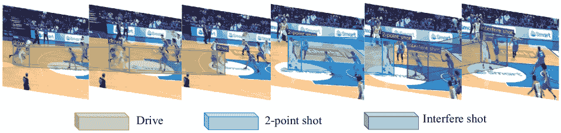
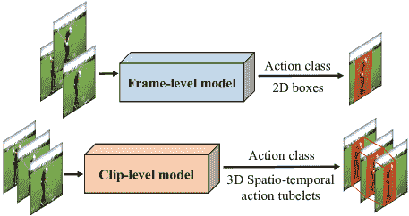
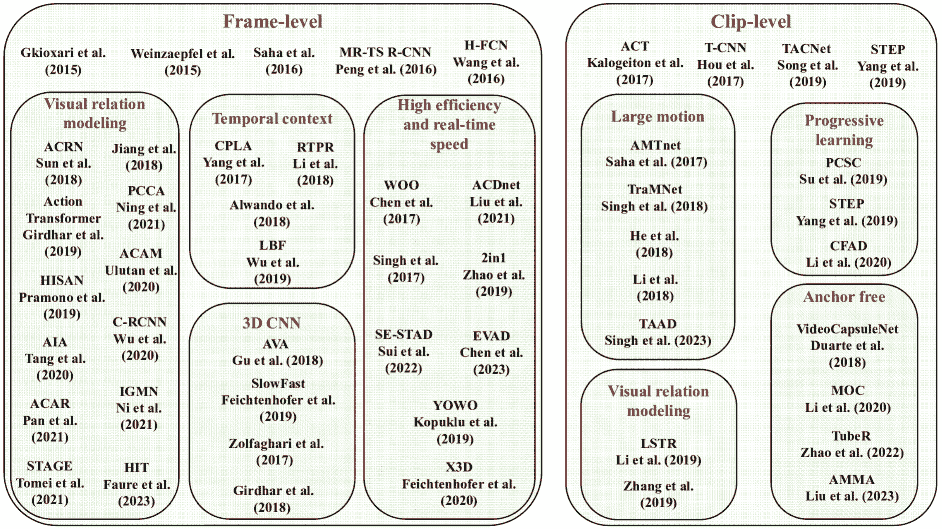
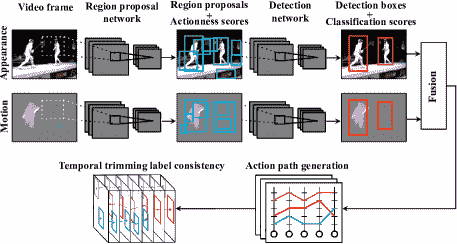
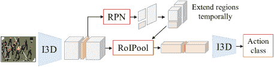
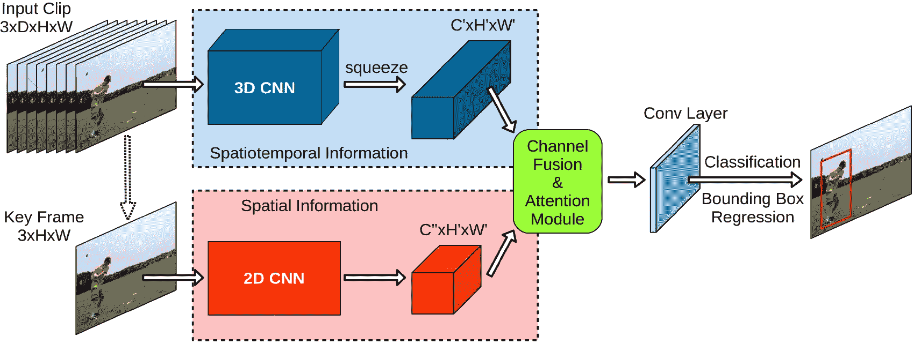
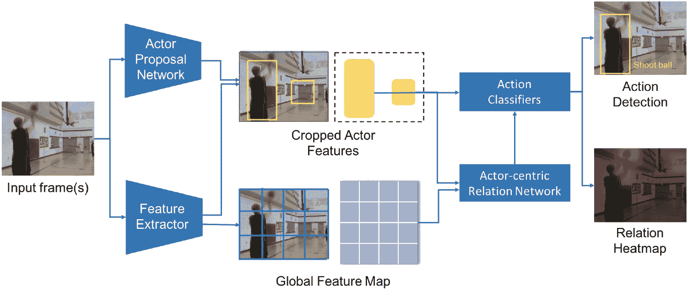
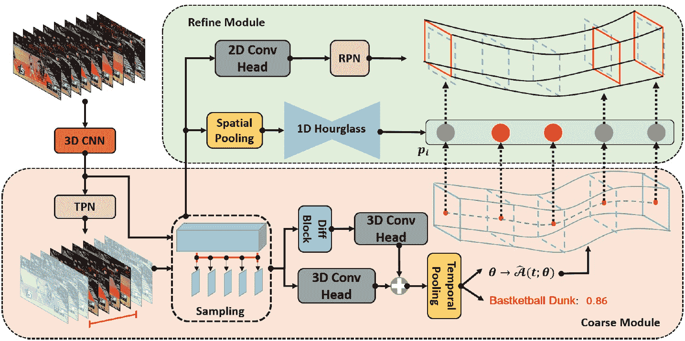

<!--yml

类别：未分类

日期：2024-09-06 19:37:33

-->

# [2308.01618] 1 引言

> 来源：[`ar5iv.labs.arxiv.org/html/2308.01618`](https://ar5iv.labs.arxiv.org/html/2308.01618)

\CVMsetup

类型 = 综述文章，doi = s41095-0xx-xxxx-x，标题 = 基于深度学习的时空动作检测综述，作者 = Peng Wang¹, Fanwei Zeng², 和 Yuntao Qian¹\cor

, runauthor = F. A. Author, S. B. Author, T. C. Author，摘要 = 时空动作检测（STAD）旨在分类视频中存在的动作并在空间和时间上进行定位。由于其在自动驾驶、视觉监控、娱乐等实际应用中的快速发展，已成为计算机视觉研究的一个特别活跃的领域。近年来，许多努力致力于构建一个稳健而有效的 STAD 框架。本文提供了对最先进的基于深度学习的 STAD 方法的全面综述。首先，开发了一个分类系统来组织这些方法。接下来，回顾了旨在将帧级或片段级检测结果关联在一起以形成动作管道的链接算法。然后，介绍了常用的基准数据集和评估指标，并比较了最先进模型的性能。最后，总结了本文并讨论了 STAD 的潜在研究方向。 ，关键词 = 计算机视觉；深度学习；时空动作检测，版权 = 作者（们），

| $1\quad$ | 计算机科学学院，浙江大学，浙江省杭州市 310007，中国。电子邮件：P. Wang，pengwang18@zju.edu.cn；Y.-T. Qian，ytqian@zju.edu.cn\cor。 |
| --- | --- |
| $2\quad$ | 蚂蚁集团，浙江省杭州市 310007，中国。电子邮件：fanwei.zfw@antgroup.com。 |
|  | 手稿收到日期：2022-01-01；接受日期：2022-01-01 |

## 1 引言

### 1.1 动机

时空动作检测（STAD），旨在定位长时间未修剪视频中的动作空间和时间以及预测动作类别（见图 1），是视频理解中的一个重要且具有挑战性的任务。由于其在监控、体育分析、机器人技术和自动驾驶等许多应用中的基础性作用，它吸引了大量关注，并在计算机视觉领域得到了积极研究。

在深度学习普及之前，传统 STAD 通常涉及滑动窗口方法 [1, 2, 3, 4, 5]，如可变形部件模型 [1]、分支界限方法 [2] 等。最近，随着深度神经网络，特别是卷积神经网络 [6] 和 Transformer [7] 的显著发展，STAD 取得了许多重要进展。这些基于深度学习的方法在很大程度上超越了传统算法，并继续改进最先进的技术。

随着基于深度学习的 STAD 的快速进展，该领域产生了大量文献。然而，对这一领域的综述仍然稀缺。Vahdani 等人 [8] 综述了未经修剪视频中的动作检测任务，重点强调了旨在检测动作实例的开始和结束的时间动作检测，仅对 STAD 进行了简要介绍。Bhoi 等人 [9] 对 STAD 进行了综述，但他们侧重于介绍传统方法，仅审查了三种早期的基于深度学习的方法。因此，他们的综述中缺乏这一领域的最新发展。总体而言，基于深度学习的 STAD 还缺乏全面且深入的综述，尽管这一综述对该领域的进一步研究非常必要。

因此，我们提供了首个系统介绍基于深度学习的 STAD 最新进展的综述，旨在为希望进入这一不断变化领域的研究人员以及希望比较 STAD 模型和数据集的专家提供帮助。我们收集了该领域的大量资源，包括最先进的模型、关联算法、基准数据集、性能比较等。我们希望这份综述能够促进 STAD 的进步。

图 1: 时空动作检测在空间和时间上对动作进行分类和定位。图像来源于 MultiSports [10] 数据集。

### 1.2 组织结构

本综述的其余部分组织如下。第二部分阐明了基于深度学习的 STAD 方法的分类。第三部分回顾了如何将每一帧或剪辑中的检测结果关联起来。第四部分总结了基准数据集和评估指标，并比较了最先进方法之间的性能。第五部分指出了一系列未来方向。最后，第六部分总结了本综述。

## 2 分类法与方法

在这一部分，我们首先描述 STAD 问题的定义。然后，我们说明基于深度学习的 STAD 方法的分类。最后，我们在子节 2.3 和 2.4 中详细回顾这些方法。

### 2.1 问题定义

给定一个包含$T$帧的视频$\{I_{t}\}_{t=1..T}$，时空动作检测任务，有时称为动作定位或事件检测，确定视频中发生了什么动作，以及它们何时何地发生。也就是说，STAD 模型应输出动作标签$c_{i}\in\mathcal{C}$（$\mathcal{C}$是动作类别的集合），以及一组边界框（或区域）$\{R^{i}_{t}\}_{t=t_{b}..t_{e}}$，其中$t_{b}$是预测动作$c_{i}$的开始，$t_{e}$是结束，$R^{i}_{t}$是帧$I_{t}$中检测到的区域。值得注意的是，动作识别和时间动作检测与 STAD 密切相关，但它们仅确定动作发生的时间或何时发生（参见表 1）。因此，它们没有 STAD 那么具有挑战性。

表 1：动作识别、时间动作检测（TAD）和时空动作检测（STAD）的比较

|  | 动作类别 | 动作的开始和结束 | 演员定位 |
| --- | --- | --- | --- |
| 动作识别 | ✓ | ✗ | ✗ |
| TAD | ✓ | ✓ | ✗ |
| STAD | ✓ | ✓ | ✓ |
| ”✓”表示”需要确定”。 |
| ”✗”表示”无需确定”。 |

图 2：帧级模型和片段级模型输出的示意图

### 2.2 基于深度学习的 STAD 方法分类

到目前为止，已经提出了各种各样的基于深度学习的 STAD 方法。这些模型主要分为两类：帧级和片段级。帧级模型为每一帧预测 2D 边界框，而片段级模型为每个片段预测 3D 时空管道。图 2 展示了这两类模型的输出范式。为了对基于深度学习的 STAD 模型进行深入评审，我们根据模型设计的动机细分了帧级和片段级模型。由于模型背后的动机通常反映了研究人员在 STAD 领域的见解，我们希望这种分类可以提供一种清晰的方式来整理该领域的方法，并给予研究人员启发。图 3 展示了我们的分类和一些代表性模型。

图 3：基于深度学习的 STAD 模型分类

图 4：Saha 等人（2016 年）提出的方法的流程图 [11]。

### 2.3 帧级方法

过去十年见证了目标检测的戏剧性发展，提出了许多模型，如 R-CNN [12]、Faster R-CNN [13]、YOLO [14]、SSD [15]等。受这些进展的启发，许多研究人员寻求将目标检测模型推广到 STAD 领域。一种直接的推广方式是将视频中的 STAD 视为一组 2D 图像检测。具体来说，针对每一帧独立应用动作检测器，以生成帧级 2D 边界框。然后，通过使用连接或跟踪算法将这些帧级检测结果关联起来，生成 3D 动作提议（即动作管道）。

在这一研究方向上，Gkioxari 等人[16]提出了一个基于 R-CNN [12]的模型。为了融合外观和运动线索，他们采用了双流架构，其中空间流处理 RGB 帧，时间流处理光流。Weinzaepfel 等人[17]提出了一种方法，通过 EdgeBoxes [18]在帧级提取一组候选区域，然后使用基于检测的跟踪方法跟踪高评分提议。他们通过滑动窗口方法确定了动作的时间扩展。受到 Faster R-CNN [13]巨大成功的驱动，Saha 等人[11]首次引入了将无监督区域提议算法替换为区域提议网络（RPN）用于 STAD 的模型，如图 4 所示。他们将 RGB 和光流图像传递给两个独立的区域提议网络，以输出检测框和动作类别分数。这些基于外观和运动的检测被融合和连接以生成类别特定的动作管道。Peng 等人[19]进一步验证了 RPN 在 STAD 上的有效性，他们发现与其他提议推广方法相比，RPN 在交并比（IoU）评分上始终取得了更好的结果。此外，他们还实验证明，将光流堆叠在几帧上可以提高帧级动作检测。除了这些基于提议的动作检测方法外，Wang 等人[20]介绍了 H-FCN，这是一种基于估计的动作性图检测动作的方法，其中动作性意味着在图像特定位置包含通用动作实例的可能性。

时间上下文。上述 STAD 方法将每一帧独立对待，忽略了时间上的上下文关系。为了解决这个问题，Yang 等人 [21] 提出了一个级联提议和位置预测模型，命名为 CPLA，该模型能够推断两个帧之间动作出现的运动趋势。它利用帧 $I_{t}$ 上检测到的边界框来推断帧 $I_{t+k}$ 上的对应框，其中 $k$ 是预测间隔。作为后续工作，Li 等人 [22] 提出了一个方法，通过建模连续帧之间提议的时间相关性来预测运动。而 [21] 需要在每一帧上运行 RPN，[22] 只在视频的第一帧上运行 RPN。在另一项工作中，Alwando 等人 [23] 提出了一个视频定位精化方案，通过利用相邻帧之间的时间一致性来迭代修正可能不准确的边界框。Wu 等人 [24] 提出了一个观点，即将目标帧与长程上下文关联时，动作会变得更清晰。因此，他们提出了一个长期特征库（LFB），为视频模型提供长期支持信息，使其能够更好地理解当前内容。

图 5：Girdhar 等人（2018 年）提出的模型架构 [25]。

3D CNN。除了上述通过光流捕捉视频中运动特征的方法外，另一类工作采用了 3D 卷积神经网络（3D CNNs）[26] 来提取编码在多个相邻帧中的运动信息。Gu 等人[27] 提出了将膨胀 3D 卷积网络（I3D）[28] 与 Faster R-CNN[13] 结合的方案。他们首先将输入帧传递给 I3D 模型以提取 3D 特征图，并在关键帧上使用 ResNet-50 模型生成区域建议。然后，他们通过在所有时间步上在相同空间位置应用 2D ROI Pooling，将 ROI Pooling 扩展到 3D，从而获得每个建议的时空特征，然后将其输入分类器进行动作标记。Girdhar 等人[25] 通过将 I3D 特征应用于建议生成和分类，改进了 [27] 的性能，见图 5。他们通过 I3D 的前几个块处理视频片段，以获取视频表示。然后，使用中心帧表示来预测潜在的“人”区域，使用 RPN 扩展这些建议的时间，并利用 ROI pooling 提取区域的特征图。然后，使用最后两个 I3D 块将特征图分类为不同的动作。Zolfaghari 等人[29] 提出了一个网络架构，集成了用于动作识别和检测的三种视觉线索：姿态、运动和原始图像。他们引入了一种马尔可夫链模型，逐步添加线索以集成功能。Feichtenhofer 等人[30] 提出了一个 SlowFast 网络，涉及两条路径：一条慢路径和一条快路径。前者以较低的帧率操作以捕捉空间语义，而后者以较高的帧率操作以提取细微时间分辨率的运动信息。快路径通过减少其通道容量被故意设计得非常轻量。通过这些创新设计，SlowFast 在视频的 STAD 中实现了强大的性能。

高效和实时速度。当前最先进的 STAD 模型通常通过更大的骨干网络和更复杂的架构以及训练过程来提高性能，因此面临着沉重的计算负担和低效率。为了超越这些限制，一些研究人员致力于设计高效且实时的模型。Feichtenhofer 等人[31] 提出了一个 X3D 网络，该网络通过沿多个网络轴（包括空间、时间、宽度和深度）逐步扩展一个微小的 2D 架构来构建。X3D 在达到与之前工作相似的准确度的同时，所需的参数减少了 5.5$\times$。Liu 等人[32] 介绍了 ACDnet，该网络通过利用连续视频帧之间的时间一致性，在大多数帧上进行特征近似，而不是进行耗时的 CNN 特征提取。

图 6：YOWO 网络架构[33]。

Zhao 等人[34] 认为，基于 RGB 和光流的双流检测网络在提供最先进的准确度的同时，牺牲了模型的大小和计算量。因此，他们提议将 RGB 和光流嵌入到一个单流网络中。他们引入了一个运动调制层，以利用光流调制 RGB 特征。他们的网络称为 2in1，计算量和参数数量仅为双流网络的一半，同时获得了更好的动作检测准确度。

Singh 等人[35] 提出了一种可以在在线环境中以实时速度执行 STAD 的方法，得益于两个主要的发展：1）他们采用了实时 SSD [15] CNN 来检测演员；2）他们设计了一个在线算法，从帧级检测结果中逐步构建动作管道（见第 3.1 节）。

受到 YOLO[14]出色的实时性能启发，Kopuklu 等人提出了一种 STAD 对应网络，即 YOWO[33]，它用端到端的一阶段范式取代了检测-分类两阶段范式，如图 6 所示。它同时输出感兴趣区域（ROIs）和相应的类别预测。尽管高效，YOWO 采用了两个骨干网络，即一个用于提取时空信息的 3D CNN 和一个用于提取空间特征的 2D 模型。为了克服这一限制，Chen 等人[36]提出了一个统一的单一网络（即 WOO），只采用一个骨干网络来进行演员定位和动作分类。与两个骨干网络的 STAD 模型相比，WOO 将模型复杂度降低了 50%以上。然而，它的性能有所下降。为了提高性能，他们设计了一个额外的基于注意力的嵌入交互模块，以获取更多区分性特征。作为后续工作，SE-STAD[37]在训练策略和对象检测器 FCOS[38]方面优于 WOO[36]。最近，Chen 等人提出了一种基于原始视觉变换器（ViTs）的高效视频动作检测（EVAD）框架[39]。他们通过丢弃非关键帧的 tokens 来降低计算成本，并通过优化场景上下文来提升模型性能。

图 7：ACRN 框架[40]。

视觉关系建模。检测和分类演员的动作通常依赖于其与其他演员和物体的关系。因此，许多研究致力于建模视频中传达的演员、物体和场景之间的关系。例如，[40、41、42、43、44、45、46]观察到周围环境为理解动作提供了重要信息。因此，他们提出了多种演员-场景互动模型。具体而言，Sun 等人[40]提出了一个以演员为中心的关系网络（ACRN），从裁剪后的演员特征和全局场景特征中提取成对的关系，见图 7。这些关系特征随后用于动作分类。Wu 等人[45]通过实验证明，动作识别的准确性与演员的分辨率高度相关。因此，他们裁剪并调整了演员周围的图像块，并将其输入到 3D CNN 中，以提取演员特征，这些特征用于与场景特征和长期特征进行交互。

基于注意力的学习策略在视觉关系建模中被广泛采用。例如，非局部网络[44]利用自注意力机制捕捉不同实体之间的长程依赖关系。PCCA[43]利用交叉注意力机制建模人物与上下文之间的关系以进行动作检测。乌尔坦等人[41]提出了一种演员条件注意力图（ACAM）方法，该方法明确建模周围上下文，并通过条件化检测到的演员生成来自完整场景的特征。类似地，姜等人[42]设计了一种演员-目标关系网络，以捕捉人-上下文关系，这通过在 ROI 及其周围区域之间进行非局部操作来实现。吉尔达尔等人[46]提出了一种动作变换器网络，该网络能够从视频剪辑中的其他人类动作和物体中学习时空上下文，以定位和分类目标动作。他们的特征嵌入和注意力图经过实验验证具有语义意义。

有一些研究考虑了多重交互。例如，唐等人[47]引入了一种异步交互聚合（AIA）网络来探索三种交互，即人-人、人与物体以及时间交互。他们在分层结构中使这些交互协同工作，以捕捉有意义的特征。郑等人提出了一种叫做多关系支持网络（MRSN）的网络[48]，该网络包含一个演员-上下文关系编码器和一个演员-演员关系编码器，分别建模演员-上下文和演员-演员关系。然后，部署了一个关系支持编码器来计算这两种关系之间的支持，并进行关系级交互。法雷等人[49]提出了一种双模态整体交互变换器（HIT）网络，该网络包含一个 RGB 流和一个姿势流。每个流分别建模人物、物体和手部交互。然后，使用注意力融合机制将每个流的结果特征进行融合，融合后的特征用于动作分类。普拉莫诺等人提出了一种叫做 HISAN[50]的模型，该模型结合了双流 CNN 和层次双向自注意力机制，以学习关键演员和空间上下文之间的结构关系，从而提高定位精度。

与上述仅考虑成对直接关系的方法不同，潘等人[51]提出了一种考虑基于多个元素建立的间接高阶关系的演员-上下文-演员关系（ACAR）网络。他们设计了一个高阶关系推理算子和一个演员-上下文特征库，以实现间接关系推理。

图神经网络（GNNs）可以自然地在实体节点之间传递信息并建模它们的关系。因此，GNN 常用于视觉关系建模。例如，Tomei 等人提出了一种名为 STAGE[52]的模型，该模型通过在多层图结构上的自注意力探索时空关系，可以连接来自连续片段的实体。Ni 等人[53]提出了一种身份感知图记忆网络（IGMN），它在长短期上下文中突出演员的身份信息，从而考虑演员之间的一致性和独特性，以进行动作检测。

尽管这些帧级方法已取得显著成果，但由于它们将视频帧视为一组独立的图像，未能充分探索时间连续性，因此其结果可能次优。为解决此问题，提出了片段级 STAD 方法，这些方法以帧序列作为输入，并直接输出检测到的管道提议（即短序列的边界框）。

### 2.4 片段级方法

以视频片段（即短视频片段）作为输入，片段级模型直接输出该片段中的 3D 时空管道提议。这些 3D 管道提议由一系列紧密包围感兴趣动作的边界框组成。然后，将这些在连续片段中的管道提议连接起来，形成完整的动作管道。自 Jain 等人提出[54]以来，片段级方法在 STAD 研究社区中变得非常流行。

Hou 等人[55]提出了一种管道卷积神经网络（T-CNN），它探索了从 2D 图像区域到 3D 视频体积的快速 R-CNN[13]的泛化。关于 R-CNN 的 RPN 和 ROI 池化层，他们在 T-CNN 中提出了管道提议网络（TPN）和感兴趣的管道（ToI）池化层，分别用于管道生成和时空特征池化。Kalogeiton 等人[56]基于 SSD 框架[15]介绍了一种动作管道检测器（ACT），它以帧序列作为输入，然后使用 VGG 骨干网络[57]从每帧中提取特征。这些特征被堆叠以预测分数并回归锚立方体的坐标，从而输出最终的动作管道。Song 等人[58]提出了一种过渡感知上下文网络（TACNet），以区分动作帧和非动作帧之间的过渡状态，从而定位目标动作的时间边界。

大范围运动。前述的剪辑级方法都基于一个潜在假设，即 3D 锚点建议是长方体，即在时间上具有固定的空间范围。不幸的是，由于演员的位移剧烈、演员身体形状的变形、相机的剧烈运动等，特别是对于跨越长时间的锚点，这些 3D 锚点长方体可能与灵活的真实动作管道相距甚远。为了超越这一限制，Saha 等人[59] 提出了一个生成两帧微型管道的框架，然后将这些微型管道链接成适当的动作管道。一年后，他们进一步探索了通过基于隐马尔可夫模型（HMM）公式估算的近似转移矩阵的锚点微型管道建议空间[60]。他们的微型管道假设生成框架可以处理动态演员中的大范围空间运动。四年后，他们提出了对大范围运动情况的新解决方案：他们建议跟踪演员的时间，并在各自的轨迹上执行时间特征聚合，以增强演员特征表示[61]。

He 等人[62] 提出了一种避免 3D 长方体锚点假设的方法，通过执行帧级演员检测，然后将检测到的边界框链接成与类别无关的动作管段，这些管段被输入到时间理解模块中进行动作分类。Li 等人[62] 提出了类似于[62]的框架，但他们以稀疏到密集的方式执行 STAD：他们首先在稀疏采样的帧中生成框建议，然后通过在给定的检测时间间隔内插值稀疏建议来获得密集管道。

图 8：CFAD 框架概述[63]。

进阶学习。与那些在一次运行中进行动作检测的模型不同，进阶学习方法通过几个步骤迭代地优化动作提议。例如，Su 等人[64] 提出了一个进阶交叉流合作（PCSC）框架，利用一个流（即 Flow/RGB）的区域提议和特征来帮助另一个流（即 RGB/Flow）在迭代过程中改进动作定位结果。Yang 等人[65] 提出了一个名为 STEP 的模型，它逐步优化跨时间的预定义提议立方体，即当前步骤获得的提议被输入到下一步骤进行进一步优化。此外，在每一步中，3D 提议在时间维度上进行扩展，以结合更多相邻的时间上下文。类似地，Li 等人[63] 提出了一个粗到细的动作检测器（CFAD），该检测器首先从视频流中估计粗略的时空动作管，然后基于关键时间戳优化管的位置。如图 8 所示，CFAD 包含粗略模块和优化模块。粗略模块生成初步的动作管估计，而优化模块在关键时间戳的指导下选择性地调整管的位置。

无锚点方法。当前最先进的方法通常依赖于启发式的锚点设计，并在大量预定义的锚框或立方体上操作。尽管这些基于锚点的方法取得了显著的成功，但它们存在关键问题，例如巨大的提议搜索空间和低效率。例如，考虑到 Faster R-CNN [13] 用于 2D 物体检测，它需要为空间尺寸为 $H^{\prime}\times W^{\prime}$ 的特征图提供 $KH^{\prime}W^{\prime}$ 个锚点，其中通常 $K=9$。而对于跨越 $T^{\prime}$ 帧的 tubelet，为了在时空中保持相同的采样，3D 锚点提议的数量急剧上升至 $(KH^{\prime}W^{\prime})^{T^{\prime}}$。即使对于较小的 $T^{\prime}$ 值，这也是一个巨大的数字。为了避免这个问题，引入了用于 STAD 的无锚点方法。例如，Li 等人 [66] 将每个动作实例视为移动点的轨迹，并提出了一种名为 MovingCenter Detector（MOC-detector）的模型。它包括三个分支：用于实例中心检测和动作识别的中心分支；用于运动估计的运动分支；用于空间范围检测的框分支。基于 MOC 框架，Liu 等人 [67] 提出了一个轻量级的在线动作检测器，该检测器将短期动作动态编码为累积微动作。Duarte 等人 [68] 提出了一个用于视频的胶囊网络，称为 VideoCapsuleNet，它结合了 3D 卷积和胶囊来学习动作检测和识别所需的语义信息。它具有一个定位组件，利用胶囊捕获的动作表示进行像素级动作定位。最近，受到 DETR [69] 的启发，Zhao 等人 [70] 提出了一个基于变压器的框架（称为 TubeR），该框架通过从单一表示中同时执行动作定位和识别来直接检测视频中的动作 tubelet。在 TubeR 中，设计了一个 tubelet-attention 模块以建模视频剪辑的动态时空特性。TubeR 学习了一组 tubelet 查询并输出动作 tubelets。

视觉关系建模。最近，剪辑级（或管道级）的视觉关系被用来增强 STAD 模型。Li 等人介绍了一种长短期关系网络，称为 LSTR [71]，它捕捉视频中的短期和长期关系。具体而言，LSTR 首先在每个视频剪辑中生成 3D 边界框，即管道，然后通过时空注意机制建模每个剪辑中的短期人际上下文交互，并通过图卷积网络以级联的方式推理视频剪辑之间的长期时间动态。在与 [71] 同期的工作中，Zhang 等人 [72] 提出了一个方法，将视频中的演员进行关联，以生成演员管道用于学习长期时间依赖。然后，将来自演员管道和对象提议的特征用于构建关系图，以建模人类-对象操作和人类-人类交互动作。

## 3 链接检测结果

动作在一段时间内执行，这通常跨越多个帧和剪辑。在获得帧级或剪辑级检测结果后，大多数方法采用链接算法将检测结果跨帧或剪辑进行关联，以生成视频级动作管道。在这一部分，我们简要回顾了链接算法的演变。

### 3.1 链接帧级检测框

第一个帧级动作检测链接算法是由 Gkioxari 等人提出的 [16]。他们假设，如果相邻帧中两个区域提议（即边界框）的空间范围有显著重叠且它们的得分很高，它们很可能被链接。形式上，假设我们有两个区域提议 $R_{t}$ 和 $R_{t+1}$，分别位于帧 $t$ 和帧 $t+1$。对于一个动作类别 $c$，Gkioxari 等人 [16] 定义这两个区域提议之间的链接得分为

|  | $s_{c}(R_{t},R_{t+1})=s_{c}(R_{t})+s_{c}(R_{t+1})+\lambda\cdot ov(R_{t},R_{t+1}),$ |  | (1) |
| --- | --- | --- | --- |

其中 $s_{c}(R_{i})$ 是 $R_{i}$ 的类别特定得分。$ov(R_{i},R_{j})$ 是两个区域提议 $R_{i}$ 和 $R_{j}$ 的 IoU。$\lambda$ 是一个标量参数，权衡 IoU 项的相对重要性。值得注意的是，一些模型输出带有相关动作性得分的边界框 [22]，在这些工作中，公式中的类别特定得分被动作性得分所替代。

在计算所有链接得分后，通过下述方式搜索最佳路径

|  | $\bar{R}_{c}^{*}=\underset{\bar{R}}{\operatorname{argmax}}\frac{1}{T}\sum_{t=1}^{T-1}s_{c}(R_{t},R_{t+1}),$ |  | (2) |
| --- | --- | --- | --- |

其中 $\bar{R}_{c}=[R_{1},R_{2},\ldots,R_{T}]$ 是动作类别 $c$ 的链接区域序列。这个优化问题通过 Viterbi 算法解决。找到最佳路径后，将 $\bar{R}_{c}^{*}$ 中的区域提议从区域提议集合中移除，并重新解决公式 (2) [16]。这个过程重复进行，直到区域提议集合为空。公式 (2) 中的每条路径称为动作管道。动作管道 $\bar{R_{c}}$ 的分数定义为 $S_{c}(\bar{R}_{c})=\frac{1}{T}\sum_{t=1}^{T-1}s_{c}(R_{t},R_{t+1})$。

基于 Gkioxari 等人的思路[16]，Peng 等人[19] 在公式 (1) 中添加了一个阈值函数，使得两个区域提议之间的链接分数变为：

|  | $s_{c}(R_{t},R_{t+1})=s_{c}(R_{t})+s_{c}(R_{t+1})+\lambda\cdot ov(R_{t},R_{t+1})\cdot\psi(ov),$ |  | (3) |
| --- | --- | --- | --- |

其中 $\psi(ov)$ 是一个阈值函数，当 $ov$ 大于 $\tau$ 时，$\psi(ov)=1$，否则 $\psi(ov)=0$。Peng 等人[19] 实验观察到，使用这个阈值函数，链接分数优于[16]中的分数，并且由于额外的重叠约束更具鲁棒性。

Kopuklu 等人[33] 进一步扩展了链接分数的定义如下：

|  | $\displaystyle s_{c}\left(R_{t},R_{t+1}\right)=$ | $\displaystyle\psi(ov)\cdot\left[s_{c}\left(R_{t}\right)+s_{c}\left(R_{t+1}\right)\right.$ |  | (4) |
| --- | --- | --- | --- | --- |
|  |  | $\displaystyle+\alpha\cdot s_{c}\left(R_{t}\right)\cdot s_{c}\left(R_{t+1}\right)$ |  |
|  |  | $\displaystyle\left.+\beta\cdot ov\left(R_{t},R_{t+1}\right)\right],$ |  |

其中 $\alpha$ 和 $\beta$ 是标量参数。新项 $\alpha\cdot s_{c}\left(R_{t}\right)\cdot s_{c}\left(R_{t+1}\right)$ 考虑了两个连续帧之间分数的剧烈变化，预计能够在实验中提高视频检测的性能[33]。

时间修剪。上述链接算法生成的动作管道覆盖了整个视频时长。然而，人类动作通常只占其中的一部分。为了确定动作实例的时间范围，一些研究[11, 19] 提出了时间修剪方法。Saha 等人[11] 限制了连续提议的动作性分数保持平滑。他们通过动态规划解决了一个能量最大化问题。Peng 等人[19] 依赖于一种高效的最大子数组方法：给定一个视频级别的动作管道 $\bar{R}$，其理想时间范围是从帧 $s$ 到帧 $e$，满足以下目标：

|  | $s_{c}(\bar{R}_{(s,e)}^{\star})=\underset{(s,e)}{\operatorname{argmax}}\{\frac{1}{L_{(s,e)}}\sum_{i=s}^{e}s_{c}(R_{i})-\lambda\frac{&#124;L_{(s,e)}-L_{c}&#124;}{L_{c}}\},$ |  | (5) |
| --- | --- | --- | --- |

其中 $L_{(s,e)}$ 是动作管道的长度，$L_{c}$ 是训练集中类别 $c$ 的平均持续时间。

在线动作管道生成。Singh 等人 [35] 提出了一个在线动作管道生成算法，该算法逐帧地（逐帧）为每个动作类别并行构建多个动作管道。具体来说，对于视频中的每一帧 $t$，进行每类的非极大值抑制（NMS）以获得前 $n$ 个类别特定的检测框。在视频的第一帧中，通过使用此帧中的 $n$ 个检测框来初始化每个类别 $c$ 的 $n$ 个动作管道。然后，算法通过在每一帧中添加一个框来扩展这些动作管道，或者如果 $k$ 连续帧没有找到匹配的框，则终止 [35]。最后，通过使用在线维特比算法对每个新更新的管道进行时间裁剪。

### 3.2 剪辑级别检测 tubelets 的链接

剪辑级别的 tubelet 链接算法旨在将一系列剪辑级别的 tubelets 关联成视频级别的动作管道。它们通常源于上一小节提到的帧级别框链接算法。例如，[55] 中的 tubelet 链接算法源自 [16]，其直观的理解是 tubelet 中的内容应捕捉一个动作，并且任何两个连续剪辑中的连接 tubelets 应具有较大的时间重叠。因此，他们定义了 tubelet 的链接评分如下：

|  | $S=\frac{1}{m}\sum_{i=1}^{m}{Actionness}_{i}+\frac{1}{m-1}\sum_{j=1}^{m-1}{Overlap}_{j,j+1}$ |  | (6) |
| --- | --- | --- | --- |

其中 ${Actionness}_{i}$ 表示第 $i$ 个剪辑中 tubelet 的动作评分。${Overlap}_{j,j+1}$ 衡量了第 $j$ 个剪辑和第 ($j+1$) 个剪辑中连接的两个提议之间的重叠情况，而 $m$ 是视频剪辑的总数。两个 tubelets 之间的重叠是基于第 $j$ 个 tubelet 的最后一帧和第 $(j+1)$ 个 tubelet 的第一帧的 IoU 来计算的。在计算 tubelets 的评分后，[55] 选择了视频中具有最高评分的一些连接动作 tubelets。

在另一项工作中，[56] 将 [35] 的链接算法从帧链接扩展到 tubelet 链接，以构建动作管道。其核心思想可以总结如下：

1.  1.

    初始化：在视频的第一帧中，[56] 为每个 tubelet 启动了一个新的链接。在这里，链接指的是一系列连接的 tubelets。

1.  2.

    链接：给定一帧新图像$f$，他们使用从该帧开始的管道候选者扩展现有链接。他们选择了符合以下标准的管道候选者：（a）尚未被其他链接选取，（b）具有最高的动作分数，（c）与要扩展的链接的重叠高于给定阈值。

1.  3.

    终止：对于现有链接，如果连续$K$帧未满足标准，则链接终止。$K$是给定的超参数。

由于其简洁性和高效性，[56]的管道链接算法被后续工作所采用，例如[66, 70]。

时间修剪。在[56]的管道链接算法中，初始化和终止步骤决定了动作管道的时间范围，但 Song 等人[58]发现这不能彻底解决过渡状态引起的时间位置误差，这定义为周围但不属于目标动作的模糊状态。为了解决这个问题，Song 等人[58]提出了一种过渡感知分类器，可以区分过渡状态和真实动作，从而减轻时空动作检测的时间误差。在后续工作中，Zhao 等人[70]尝试通过引入一个动作切换回归头来避免对过渡状态的误分类，该回归头决定一个框的预测是否描述了演员执行动作。这个回归头给每个管道的边界框一个动作切换分数。如果分数高于给定的阈值，则框包含一个动作。[70]中的实验表明，动作切换回归头可以显著减少对过渡状态的误分类。

## 4 数据集与评估

### 4.1 基准数据集

基准数据集在理解每种方法的相对和绝对优缺点方面发挥着重要作用。在本节中，我们首先回顾了 STAD 中常用的视频数据集，然后通过总结和比较这些数据集来结束本节。

#### 4.1.1 Weizmann

Weizmann 数据集[73]使用静态摄像机在统一背景下录制。演员在画面中水平移动，保持演员的大小一致，进行每个动作。该数据集包括总共 90 个视频片段，分为 10 个动作类别，如“走路”、“慢跑”和“挥手”，由 9 名不同的受试者完成。每个视频片段包含多个单一动作的实例。这些视频的空间分辨率为 180$\times$144 像素，每个片段的长度从 1 秒到 5 秒不等。

#### 4.1.2 CMU Crowded Videos

CMU Crowded Videos [5] 包含五种动作：捡起、单手挥手、双手挥手、按按钮和开合跳。每个动作有 5 个训练视频和 48 个测试视频。所有视频的空间分辨率均为 120 $\times$ 160。测试视频的时长从 5 秒到 37 秒（166 到 1115 帧）。这个数据集录制了背景杂乱和动态的环境，因此在这个数据集上的动作检测比在 Weizmann 数据集 [73] 上更具挑战性。CMU Crowded Videos 数据集进行了密集标注，提供了指定动作的空间和时间坐标（x，y，高度，宽度，起始和结束帧）作为真实值。

#### 4.1.3 MSR Action I 和 II

MSR Action 数据集 I [74] 和 II [75] 是由微软研究集团（MSR）创建的，并分别于 2009 年和 2010 年公开发布。MSR Action 数据集 II 是 I 的扩展。MSR Action 数据集 I 包含 62 个动作实例，分布在 16 个视频序列中，而 MSR Action 数据集 II 包含 203 个实例，分布在 54 个视频中。每个视频包含多个不同个体执行的动作。所有视频的时长从 32 秒到 76 秒。每个动作实例的空间和时间坐标都有提供，这使得数据集可以用于动作检测和识别。两个数据集都包含三个动作类别：拍手、挥手和拳击。与 CMU Crowded 数据集 [5] 类似，MSR Action 数据集也是在背景杂乱和动态的环境中创建的。

#### 4.1.4 J-HMDB

J-HMDB [76] 是一个联合标注的 HMDB [77] 数据集，用于更好地理解和分析 HMDB 数据集中的限制，并识别算法的组件以改进 HMDB 数据集的整体准确性。为澄清描述，我们首先简要介绍 HMDB 数据集，然后回顾 J-HMDB 数据集。

HMDB 数据集 [77] 包含 5 种动作类别，分别是一般的面部动作（例如：微笑、咀嚼），带物体操作的面部动作（例如：吸烟、吃东西），一般的身体运动（例如：空翻、拍手），带物体互动的身体运动（例如：梳头、抓取），用于人与人互动的身体运动（例如：击剑、拥抱）。每个类别包含至少 101 个视频片段，整个数据集总共包含 6849 个视频片段，分布在 51 个动作类别中。

表 2：主要 STAD 数据集的总结。

| 数据集 | 动作数量 | 演员数量 | 视频数量 | 实例数量 | 边框数量 | 年份 | 资源 |
| --- | --- | --- | --- | --- | --- | --- | --- |
| Weizmann [73] | 10 | 9 | 90 | - | - | 2005 | 演员舞台 |
| CMU Crowded Videos [5] | 5 | 6 | 98 | - | - | 2007 | 演员舞台 |
| MSR Action I [74] | 3 | 10 | 16 | 62 | - | 2009 | 演员舞台 |
| MSR Action II [75] | 3 | ¿10 | 54 | 203 | - | 2010 | 演员舞台 |
| UCF Sports [78] | 10 | - | 150 | - | - | 2009 | 电视 |
| J-HMDB [76] | 21 | - | 928 | 928 | 32k | 2013 | 电影，YouTube |
| UCF101-24 [79] | 24 | - | 3207 | 4458 | 574k | 2015 | YouTube |
| MultiTHUMOS [80] | 65 | - | 400 | - | - | 2017 | YouTube |
| AVA [27] | 80 | - | 430 | 386k | 426k | 2018 | 电影，YouTube |
| MultiSports [10] | 66 | - | 3200 | 37701 | 902k | 2021 | YouTube |

J-HMDB [76] 包含从 HMDB 数据集中选取的 21 类视频。这些选定的视频涉及单个人执行如梳头、跳跃、跑步等动作。每个动作类别有 36 到 55 个片段，每个片段包含大约 15-40 帧，总共有 928 个片段。每个片段被剪辑，使得第一帧和最后一帧对应于动作的开始和结束。帧分辨率为 320$\times$240，帧率为 30 fps。

#### 4.1.5 UCF Sports

UCF Sports [78] 包含体育领域的 10 种动作，分别是跳水、高尔夫挥杆、踢球、举重、骑马、跑步、滑板、在马鞍和地面上摆动、在双杠上摆动和步行。所有视频均包含摄像机运动和复杂的背景，采集自广播电视台，如 BBC 和 ESPN 视频库。UCF Sports 数据集包含 150 个片段，每个片段的帧率为 10 fps。视频的空间分辨率范围从 480$\times$360 到 720$\times$576，时长为 2.20 到 14.40 秒，平均为 6.39 秒。

#### 4.1.6 UCF101-24

UCF101 数据集 [79] 已广泛用于动作识别研究。它包含从 YouTube 收集的现实视频，涵盖 101 种动作类别，总共有 13320 个视频。UCF101 在动作方面具有显著的多样性，摄像机运动、物体外观、视角、背景杂乱和光照条件等方面存在较大变化。在动作检测任务中，提供了一个包含 24 个动作类别和 3207 个视频的子集，并带有详细标注。该子集因此被称为 UCF101-24。不同于 UCF Sports [78] 和 J-HMDB [76] 中被截断为动作的视频，UCF101-24 的视频为未剪辑的。

#### 4.1.7 THUMOS 和 MultiTHUMOS

THMOS 系列数据集包括四个数据集：THUMOS’13、THUMOS’14、THUMOS’15 和 MultiTHUMOS。前三个数据集来自于 THUMOS Challenge，该挑战每年从 2013 年到 2015 年与计算机视觉领域的多个主要会议同时进行 [81, 82, 83, 84]。所有视频均来自 UCF101 [79]。THUMOS 数据集包含 24 个动作类别。动作长度差异很大，从不到一秒到几分钟。这些数据集包含 13,000 个时间裁剪视频、超过 1000 个未裁剪时间视频和超过 2500 个负样本视频。这些视频可能包含零个、一个或多个单一或多个动作的实例。MultiTHUMOS [80] 是 THUMOS 的增强版。它是一个密集的、多类别、逐帧标注的视频数据集，包含 400 个 30 小时的视频和 38,690 个 65 类的标注。平均每帧有 1.5 个标签，每个视频有 10.5 个动作类别。

#### 4.1.8 AVA

Atomic Visual Actions (AVA) 数据集来源于 YouTube 上的 430 部电影。每部电影为数据集提供了从第 15 分钟到第 30 分钟的一个片段。每个片段被划分为 897 个重叠的 3 秒段，步长为 1 秒。每个段中，中间的帧被选为关键帧。在每个关键帧中，每个人都用一个边界框和（可能有多个）动作进行标注。430 部电影被分为 235 部训练集、64 部验证集和 131 部测试集，大致按 55:15:30 的比例分配，结果是 211k 训练段、57k 验证段和 118k 测试段。AVA 数据集包含 80 种原子动作，涵盖姿势动作、人际互动和人-物互动。经常用于评估的 60 种动作至少有 25 个实例。此数据集有两个注释版本，即 v2.1 和 v2.2。注释 v2.2 比 v2.1 更一致。

#### 4.1.9 MultiSports

MultiSports 数据集是 Li 等人最近发布的一个新的 STAD 数据集 [10]。该数据集的原始视频内容来自 YouTube 上的奥运会和世界杯比赛。它包括 4 项运动（即篮球、排球、足球和健美操）和 66 个动作类别。每项运动有 800 个片段，总共 3200 个片段。它包含 37701 个动作实例和 902k 个边界框。每个动作类别的实例数量范围从 3 到 3,477，显示出自然的长尾分布。每个视频都标注了多个动作类别的多个实例。平均视频长度为 750 帧。由于动作标签的细粒度，每个动作段的长度较短，平均长度为 24 帧 [61]。

#### 4.1.10 STAD 数据集的总结与比较

我们在表格 2 中总结了 STAD 数据集，这表明随着研究的进展，支持 STAD 研究的数据集在动作类别、人类主体、注释框等方面变得越来越复杂。例如，2009 年提出的 UCF Sports 只有 10 个动作类别和 150 个视频，而 2021 年提出的 MultiSports 包含 66 个动作和 3200 个视频。此外，为了跟上 STAD 模型不断增长的能力，最近的数据集通过增加相机运动、动态背景和频繁的遮挡故意增加了动作检测的挑战。最近的 STAD 数据集，如 UCF101-24、AVA 和 MultiSports，直接从 YouTube 收集视频，因此包含了我们在现实世界中会遇到的视频。因此，在这些数据集中表现良好的模型具有在现实场景中使用的巨大潜力。

表 3：在 J-HMDB 和 UCF101-24 数据集上的性能比较。‘f.mAP’和‘v.mAP’分别表示帧 mAP 和视频 mAP。‘-’表示结果不可用。我们报告检测准确率的百分比。这里使用的模型缩写指代以下内容：I3D：膨胀 3D 卷积[28]。S3D(+G)：可分离 3D 卷积（带门控）[85]。NL：非本地网络[44]。3D-ResNeXt：[86]。SF：SlowFast[30]。DLA34：[87]。

| 年份 | 方法 | 骨干网络 | J-HMDB | UCF101-24 |
| --- | --- | --- | --- | --- |
|  |  | f.-mAP | v.-mAP | f.-mAP | v.-mAP |
|  |  |  | @0.2 | @0.5 | @0.75 | 0.5:0.95 |  | @0.2 | @0.5 | @0.75 | 0.5:0.95 |
| 2015 | Gkioxari et al.[16] | AlexNet | 36.2 | - | 53.3 | - | - | - | - | - | - | - |
| 2015 | Weinzaepfel et al.[17] | AlexNet | 45.8 | 63.1 | 60.7 | - | - | 35.8 | 51.7 | - | - | - |
| 2016 | MR-TS R-CNN[19] | VGG | 58.5 | 74.3 | 73.1 | - | - | 65.7 | 72.9 | - | - | - |
| 2016 | H-FCN [20] | H-FCN | 39.9 | - | 56.4 | - | - | - | - | - | - | - |
| 2016 | Saha et al. [11] | VGG | - | 72.6 | 71.5 | 43.3 | 40.0 | - | 66.7 | 35.9 | 7.9 | 14.4 |
| 2017 | ACT [56] | VGG | 65.7 | 74.2 | 73.7 | 52.1 | 44.8 | 67.1 | 77.2 | 51.4 | 22.7 | 25.0 |
| 2017 | Singh et al.[35] | VGG | - | 73.8 | 72.0 | 44.5 | 41.6 | - | 73.5 | 46.3 | 15.0 | 20.4 |
| 2017 | Zolfaghari et al. [29] | C3D | - | 78.2 | 73.5 | - | - | - | 47.6 | 26.8 | - | - |
| 2017 | AMTnet [59] | VGG | - | - | - | - | - | - | 79.4 | 51.2 | 19.0 | 23.4 |
| 2017 | CPLA [21] | VGG | - | - | - | - | - | - | 73.5 | 37.8 | - | - |
| 2017 | T-CNN [55] | C3D | 61.3 | 78.4 | 76.9 | - | - | 41.4 | 47.1 | - | - | - |
| 2018 | Gu et al.[27] | I3D | 73.3 | - | 78.6 | - | - | 76.3 | - | 59.9 | - | - |
| 2018 | ACRN [40] | S3D-G | 77.9 | - | 80.1 | - | - | - | - | - | - | - |
| 2018 | RTPR [22] | Res101 | - | 82.7 | 81.3 | - | - | - | 77.9 | - | - | - |
| 2018 | TraMNet [60] | VGG | - | - | - | - | - | - | 79.0 | 50.9 | 20.1 | 23.9 |
| 2018 | TPN [62] | VGG | - | 79.7 | 77.0 | - | - | - | 71.7 | - | - | - |
| 2018 | Alwando et al.[23] | VGG | - | 79.9 | 78.3 | - | - | - | 72.9 | 41.1 | - | - |
| 2018 | VideoCapsuleNet [68] | - | 64.6 | 95.1 | - | - | - | 78.6 | 97.1 | 80.3 | - | - |
| 2019 | LSTR [71] | Res101 | - | 86.9 | 85.5 | - | - | - | 83.0 | 64.4 | - | - |
| 2019 | HISAN [50] | Res101 | - | 87.6 | 86.5 | 53.8 | 51.3 | - | 82.3 | 51.5 | 23.5 | 24.9 |
| 2019 | STEP [65] | VGG | - | - | - | - | - | 75.0 | 76.6 | - | - | - |
| 2019 | TACNet [58] | VGG | 65.5 | 74.1 | 73.4 | 52.5 | 44.8 | 72.1 | 77.5 | 52.9 | 21.8 | 24.1 |
| 2019 | 2in1 [34] | VGG | - | - | 74.7 | 53.3 | 45.0 | - | 78.5 | 50.3 | 22.2 | 24.5 |
| 2019 | PCSC [64] | I3D | 74.8 | 82.6 | 82.2 | 63.1 | 52.8 | 79.2 | 84.3 | 61.0 | 23.0 | 27.8 |
| 2019 | YOWO [33] | 3D-ResNeXt | 74.4 | 87.8 | 85.7 | 58.1 | - | 87.2 | 75.8 | 48.8 | - | - |
| 2020 | MOC [66] | DLA34 | 70.8 | 77.3 | 77.2 | 71.7 | 59.1 | 78.0 | 82.8 | 53.8 | 29.6 | 28.3 |
| 2020 | AIA [47] | SF101 | - | - | - | - | - | 78.8 | - | - | - | - |
| 2020 | C-RCNN [45] | Res50-I3D | 79.2 | - | - | - | - | - | - | - | - | - |
| 2020 | CFAD [63] | I3D | - | 86.8 | 85.3 | - | - | 72.5 | 81.6 | 64.6 | - | 26.7 |
| 2020 | ACAM [41] | I3D | 78.9 | - | 83.9 | - | - | - | - | - | - | - |
| 2020 | Li et al.[88] | I3D | - | 76.1 | 74.3 | 56.4 | - | - | 71.1 | 54.0 | 21.8 | - |
| 2021 | ACDnet [89] | VGG | - | - | - | - | - | 70.9 | - | - | - | - |
| 2021 | ACAR-Net [51] | SF101 | - | - | - | - | - | 84.3 | - | - | - | - |
| 2021 | SAMOC [90] | DLA34 | 73.1 | 79.2 | 78.3 | 70.5 | 58.7 | 79.3 | 80.5 | 53.5 | 30.3 | 28.7 |
| 2021 | WOO [36] | SF101 | 80.5 | - | - | - | - | - | - | - | - | - |
| 2022 | SE-STAD [37] | SF101-NL | 82.5 | - | - | - | - | - | - | - | - | - |
| 2022 | TAAD [61] | SF50 | - | - | - | - | - | 81.5 | - | - | - | - |
| 2023 | MRSN [48] | SF50 | - | - | - | - | - | 80.3 | - | - | - | - |
| 2022 | TubeR [70] | I3D | - | 81.8 | 80.7 | - | - | 81.3 | 85.3 | 60.2 | - | 29.7 |
| 2023 | HIT [49] | SF50 | 83.8 | 89.7 | 88.1 | - | - | 84.8 | 88.8 | 74.3 | - | - |
| 2023 | EVAD [39] | ViT-B | 90.2 | - | - | - | - | 85.1 | - | - | - | - |

表 4: UCF Sports 和 MultiSports 数据集的性能比较。

| Year | Method | Backbone | UCF Sports | MultiSports |
| --- | --- | --- | --- | --- |
| f.-mAP | v.-mAP | f.-mAP | v.-mAP |
| @0.2 | @0.5 | @0.75 | 0.5:0.95 | @0.2 | @0.5 |
| 2015 | Gkioxari 等人[16] | AlexNet | 68.1 | - | 75.8 | - | - | - | - |  |
| 2015 | Weinzaepfel 等人[17] | AlexNet | 71.9 | - | 90.5 | - | - | - | - |  |
| 2016 | MR-TS R-CNN[19] | VGG | 84.5 | 94.8 | 94.7 | - | - | - | - |  |
| 2016 | H-FCN [20] | H-FCN | 82.7 | - | - | - | - | - | - |  |
| 2017 | ACT [56] | VGG | 87.7 | 92.7 | 92.7 | 78.4 | 58.5 | - | - |  |
| 2017 | T-CNN [55] | C3D | 86.7 | 95.2 | - | - | - | - | - |  |
| 2018 | RTPR [22] | Res101 | - | 98.6 | 98.6 | - | - | - | - |  |
| 2018 | TPN [62] | VGG | - | 96.0 | 95.7 | - | - | - | - |  |
| 2018 | Alwando 等人[23] | VGG | - | 94.7 | 94.7 | 89.6 | 67.5 | - | - |  |
| 2018 | VideoCapsuleNet [68] | - | 83.9 | 97.1 | - | - | - | - | - |  |
| 2019 | LSTR [71] | Res101 | - | 98.9 | 98.9 | - | - | - | - |  |
| 2019 | SlowFast [30] | SF101 | - | - | - | - | - | 27.2 | 24.2 | 9.7 |
| 2019 | 2in1 [34] | VGG |  |  | 92.7 | 83.4 | - |  |  |  |
| 2019 | YOWO [33] | 3D-ResNeXt-101 | - | - | - | - | - | 9.3 | 10.8 | 0.9 |
| 2020 | MOC [66] | DLA34 | - | - | - | - | - | 25.2 | 12.9 | 0.6 |
| 2020 | CFAD [63] | I3D | - | 94.5 | 92.7 | - | - | - | - |  |
| 2020 | Li 等人[88] | I3D | - | 94.3 | 93.8 | 79.5 | - | - | - |  |
| 2022 | TAAD [61] | SF50 | - | - | - | - | - | 55.3 | 60.6 | 37.0 |
| 2023 | HIT [49] | SF50 | - | - | - | - | - | 33.3 | 27.8 | 8.8 |

### 4.2 评估指标

STAD 方法的性能通常通过两种常用指标进行评估，即帧平均精度（frame-mAP）和视频平均精度（video-mAP），通常表示为帧-mAP 和视频-mAP。

#### 4.2.1 帧-mAP

帧-mAP 衡量的是每帧边界框检测的精确度-召回曲线下的面积。如果检测框与真实边界框的 IoU 大于给定阈值，并且动作标签预测正确，则检测为正确[16]。阈值通常设为 0.5。帧-mAP 允许研究人员独立于链接策略比较检测准确性。

#### 4.2.2 视频-mAP

视频 mAP 衡量动作管道预测的精度-召回曲线下的面积。如果一个管道检测的 IoU 大于给定阈值，并且动作标签被正确预测，则该检测是正确的 [16]。两个管道之间的 IoU 被定义为时间域上的 IoU 乘以在所有重叠帧上平均框的 IoU 的平均值 [17]。视频 mAP 的阈值通常设置为 0.2、0.5、0.75 和 0.5:0.95，对应于该范围内步长为 0.05 的阈值的平均视频 mAP。虽然帧 mAP 衡量单帧中的分类和空间检测能力，但视频 mAP 可以进一步评估时间检测的性能。

### 4.3 性能分析

在本节中，我们分析了最先进的 STAD 方法的性能。由于 J-HMDB、UCF101-24、UCF Sports、MultiSports 和 AVA 数据集是深度学习基础的 STAD 中最常用的数据集，我们报告了这些最先进方法在这五个数据集上的性能。

表 3 展示了 STAD 方法在 J-HMDB 和 UCF101-24 数据集上的性能。VideoCapsuleNet [68] 在视频 mAP 方面取得了最佳结果。VideoCapsuleNet 与主流 STAD 方法不同。主流 STAD 方法通常涉及框或管状体提议生成以及连接这些提议，而 VideoCapsuleNet 是一个 3D 胶囊网络，它执行像素级动作分割和动作分类 [68]。这可能是为什么 VideoCapsuleNet 被大多数最先进方法排除在性能比较之外的原因。除了 VideoCapsuleNet，基于变换器的框架，如 HIT [49]、TubeR [70] 和 EVAD [39]，表现最佳，展示了变换器在 STAD 中的能力。这一点在表 4 和表 5 的结果中得到了进一步验证。

表 4 提供了 STAD 方法在 UCF Sports 和 MultiSports 数据集上的性能。MultiSports 数据集是最近构建的，因此在该数据集上的报告结果少于其他数据集。此外，该数据集上的性能相对较低。这可能是因为 MultiSports 动作实例具有较大的演员位移，而且一个视频中经常有多个动作，使得检测变得困难。

表 5 显示了 STAD 方法在 AVA (v2.1 和 v2.2) 数据集上的结果。AIA [47]、ACAR-Net [51]、IGMN [53] 和 HIT [49] 的卓越表现表明，视觉关系和长期时间上下文对于模型学习区分性表示至关重要，并且可以提高检测精度。

## 5 未来方向

在本节中，我们讨论了 STAD 可能感兴趣的未来方向。

表 5：在框架 mAP 度量下，阈值为 0.5 的 AVA 数据集性能比较。列“Flow”表示是否使用光流作为输入。

| 年份 | 方法 | 骨干网络 | 流 | 检测器 | 预训练 | AVA (v2.1) | AVA (v2.2) |
| --- | --- | --- | --- | --- | --- | --- | --- |
| 2018 | Gu et al. [27] | I3D | ✓ | Faster R-CNN [13] | Kinetics-400 | 15.8 | - |
| 2018 | ACRN [40] | S3D-G | ✓ | Faster R-CNN [13] | Kinetics-400 | 17.4 | - |
| 2018 | RTPR [22] | Res101 | ✓ | - | - | 22.3 |  |
| 2018 | Girdhar et al. [25] | I3D | ✗ | Faster R-CNN [13] | Kinetics-400 | 21.9 | - |
| 2019 | LSTR [71] | Res101 | ✗ | - | - | 25.3 | - |
| 2019 | SlowFast [30] | SF101 | ✗ | Faster R-CNN [13] | Kinetics-600 | 28.2 |  |
| 2019 | STEP [65] | I3D | ✗ | - | Kinetics-400 | 18.6 | - |
| 2019 | Girdhar et al. [46] | I3D | ✗ | - | Kinetics-400 | 24.9 |  |
| 2019 | LFB [24] | Res101-I3D-NL | ✗ | Faster R-CNN [13] | Kinetics-400 | 27.7 |  |
| 2019 | Zhang et al. [72] | I3D | ✗ | Dave et al. [91] | Kinetics-400 | 22.2 | - |
| 2020 | AIA [47] | SF101 | ✗ | Faster R-CNN [13] | Kinetics-700 | 31.2 | 34.4 |
| 2020 | C-RCNN [45] | Res50-I3D-NL | ✗ | Faster R-CNN [13] | Kinetics-400 | 28.0 |  |
| 2020 | X3D [31] | X3D-XL | ✗ | Faster R-CNN [13] | Kinetics-600 | 27.4 |  |
| 2020 | ACAM [41] | I3D | ✗ | Faster R-CNN [13] | Kinetics-400 | 24.4 |  |
| 2021 | ACAR-Net [51] | SF101 | ✗ | Faster R-CNN [13] | Kinetics-400 | 30.0 | - |
| 2021 | IGMN [53] | SF101 | ✗ | Faster R-CNN [13] | Kinetics-700 | 30.2 | 33.0 |
| 2021 | WOO [36] | SF101 | ✗ | Sparse R-CNN [92] | Kinetics-600 | 28.0 | 28.3 |
| 2021 | STAGE [52] | SF101 | ✗ | Faster R-CNN [13] | Kinetics-600 | 29.8 |  |
| 2022 | SE-STAD [37] | SF101-NL | ✗ | FCOS [38] | Kinetics-600 | 28.8 | 29.3 |
| 2022 | TAAD [61] | SF50 | ✗ | YOLOv5 [93] | Kinetics-700 | 31.8 | - |
| 2022 | TubeR [70] | CSN-152 | ✗ | - | IG+Kinetics-400 | 32.0 | 33.6 |
| 2023 | MRSN [48] | SF101 | ✗ | Faster R-CNN [13] | Kinetics-400 | - | 33.5 |
| 2023 | HIT [49] | SF101 | ✗ | Faster R-CNN [13] | Kinetics-700 | - | 32.6 |
| 2023 | EVAD [39] | ViT-B | ✗ | - | Kinetics-400 | 31.1 | 32.2 |

STAD 的标签高效学习。STAD 的标注不仅包括动作类别，还包括演员的边界框以及动作实例的开始和结束，使得数据的收集和标注变得昂贵且耗时。为缓解这一负担，一些开创性工作，如[94, 95]，已经提出。虽然[94]提出了一个半监督框架以利用未标记的视频动作，[95]则提出了一种共同微调方法，以利用大规模动作分类数据集如 Kinetics [96]和 Something-Something v2 [97]。然而，还需要更多努力来探索标签高效的 STAD 算法。

在线实时 STAD。STAD 有许多在线应用，例如监控和自动驾驶。在这些应用中，系统必须仅基于历史和当前数据处理新捕获的帧或剪辑，并尽快报告检测结果。为了实现这一目标，模型需要轻量且高效。这是一个具有挑战性的任务。尽管[98, 35]已经迈出了第一步，但仍远未完全探索，还需要更多努力。

大运动下的 STAD。在实际场景中，由于演员快速位移、相机快速运动等原因，许多动作涉及大幅度运动。大运动下的 STAD 是一个值得探索的有趣方向。

STAD 的多模态学习。一方面，动作视频自然包含多种模态，包括视觉、声学，甚至语言信息（例如，字幕）。因此，通过多模态学习充分利用这些模态，有潜力比单模态学习实现更好的检测精度。另一方面，动作可以通过各种传感器捕捉，例如深度相机、红外相机、惯性传感器和激光雷达。STAD 可能从这些多模态数据学习的表示融合中受益。

扩散模型用于 STAD。扩散模型[99, 100, 101, 102]是一类生成模型，从随机分布的样本开始，通过逐步去噪过程恢复数据样本。最近，它们已成为计算机视觉中的热门话题。尽管它们属于生成模型，但新近证明在代表性感知任务中，如对象检测[103]和时间动作定位[104, 105, 106]，有效性显著。以随机空间框（或时间提议）为输入，基于扩散的模型能够准确生成对象框（或动作提议）。由于 STAD 可以视为对象检测和时间动作定位的结合，这些开创性的工作[103, 104, 105, 106]为利用扩散模型解决 STAD 任务提供了启示。

## 6 结论

由于深度神经网络的迅速发展，空间时间动作检测在近年来取得了显著进展。本综述从模型、数据集、链接算法、性能比较和未来方向等不同方面广泛回顾了基于深度学习的空间时间动作检测方法。方法、数据集和性能的比较总结以图示和表格形式清晰展示了它们的属性，将对感兴趣的研究者有所帮助。我们希望这篇全面的综述能够促进空间时间动作检测领域的进一步研究。

## 参考文献

+   [1] Tian Y, Sukthankar R, Shah M. 用于动作检测的空间时间可变形部件模型。在 *Proc. IEEE Conf. Comput. Vis. Pattern Recognit.*，2013 年，2642–2649。

+   [2] Yuan J, Liu Z, Wu Y. 用于高效动作检测的判别视频模式搜索。*IEEE Trans. Pattern Anal. Mach. Intell.*，2011 年，33: 1728–1743。

+   [3] Siva P, Xiang T. 弱监督动作检测。在 *Proc. Brit. Mach. Vis. Conf.*，2011 年，1–14。

+   [4] Lan T, Wang Y, Mori G. 用于联合动作定位和识别的判别式图形中心模型。在 *Proc. IEEE Int. Conf. Comput. Vis.*，2011 年，2003–2010。

+   [5] Ke Y, Sukthankar R, Hebert M. 拥挤视频中的事件检测。在 *Proc. IEEE Int. Conf. Comput. Vis.*，2007 年，1–8。

+   [6] LeCun Y, Bottou L, Bengio Y, Haffner P. 基于梯度的学习应用于文档识别。在 *Proc. IEEE*，第 86 卷，1998 年，2278–2324。

+   [7] Vaswani A, Shazeer N, Parmar N, Uszkoreit J, Jones L, Gomez AN, Kaiser Ł, Polosukhin I. 注意力即你所需。在 *Proc. Adv. Neural Inf. Process. Syst.*，第 30 卷，2017 年，9662–9673。

+   [8] Vahdani E, Tian Y. 基于深度学习的未剪辑视频中的动作检测：综述。*IEEE Trans. Pattern Anal. Mach. Intell.*，2021 年，1: 1–20。

+   [9] Bhoi A. 空间时间动作识别：综述。*arXiv 预印本 arXiv:1901.09403*，2019。

+   [10] Li Y, Chen L, He R, Wang Z, Wu G, Wang L. Multisports：一个多人的时空定位运动动作视频数据集。发表于*Proc. IEEE Int. Conf. Comput. Vis.*，2021 年，第 13536–13545 页。

+   [11] Saha S, Singh G, Sapienza M, Torr PHS, Cuzzolin F. 用于检测视频中多个时空动作管的深度学习。发表于*Proc. Brit. Mach. Vis. Conf.*，2016 年，第 1–13 页。

+   [12] Girshick R, Donahue J, Darrell T, Malik J. 用于准确物体检测和语义分割的丰富特征层次结构。发表于*Proc. IEEE Conf. Comput. Vis. Pattern Recognit.*，2014 年，第 580–587 页。

+   [13] Ren S, He K, Girshick R, Sun J. Faster r-cnn: 通过区域提议网络实现实时物体检测。发表于*Proc. Adv. Neural Inf. Process. Syst.*，2015 年，第 1–14 页。

+   [14] Redmon J, Divvala S, Girshick R, Farhadi A. 你只需看一次：统一的实时物体检测。发表于*Proc. IEEE Conf. Comput. Vis. Pattern Recognit.*，2016 年，第 779–788 页。

+   [15] Liu W, Anguelov D, Erhan D, Szegedy C, Reed S, Fu CY, Berg AC. SSD：单次多框检测器。发表于*Proc. Eur. Conf. Comput. Vis.*，2016 年，第 21–37 页。

+   [16] Gkioxari G, Malik J. 寻找动作管。发表于*Proc. IEEE Conf. Comput. Vis. Pattern Recognit.*，2014 年，第 759–768 页。

+   [17] Weinzaepfel P, Harchaoui Z, Schmid C. 学习跟踪以进行时空动作定位。发表于*Proc. IEEE Int. Conf. Comput. Vis.*，2015 年，第 3164–3172 页。

+   [18] Zitnick CL, Dollár P. 边缘框：从边缘定位物体提议。发表于*Proc. Eur. Conf. Comput. Vis.*，2014 年，第 391–405 页。

+   [19] Peng X, Schmid C. 多区域双流 R-CNN 用于动作检测。发表于*Proc. Eur. Conf. Comput. Vis.*，2016 年，第 744–759 页。

+   [20] Wang L, Qiao Y, Tang X, Gool LV. 使用混合全卷积网络的动作性估计。发表于*Proc. IEEE Conf. Comput. Vis. Pattern Recognit.*，2016 年，第 2708–2717 页。

+   [21] Yang Z, Gao J, Nevatia R. 带有级联提议和位置预期的时空动作检测。发表于*Proc. Brit. Mach. Vis. Conf.*，第 1-12 卷，2017 年。

+   [22] Li D, Qiu Z, Dai Q, Yao T, Mei T. 循环管状提议和识别网络用于动作检测。发表于*Proc. Eur. Conf. Comput. Vis.*，2018 年，第 18–33 页。

+   [23] Alwando EHP, Chen YT, Fang WH. 基于 CNN 的多路径搜索用于视频中的动作管检测。*IEEE Trans. Circuits Syst. Video Technol.*，2018 年，第 30 卷，第 1 期：104–116 页。

+   [24] Wu CY, Feichtenhofer C, Fan H, He K, Krahenbuhl P, Girshick R. 长期特征库用于详细的视频理解。发表于*Proc. IEEE Conf. Comput. Vis. Pattern Recognit.*，2019 年，第 284–293 页。

+   [25] Girdhar R, Carreira J, Doersch C, Zisserman A. 一个更好的 AVA 基线。*arXiv preprint arXiv:1807.10066*，2018 年。

+   [26] Ji S, Xu W, Yang M, Yu K. 用于人体动作识别的 3D 卷积神经网络。*IEEE Trans. Pattern Anal. Mach. Intell.*，2012 年，第 35 卷，第 1 期：221–231 页。

+   [27] Gu C, Sun C, Vijayanarasimhan S, Pantofaru C, Ross DA, Toderici G, Li Y, Ricco S, Sukthankar R, Schmid C, Malik J. AVA：一个空间-时间定位的原子视觉动作视频数据集。在 *Proc. IEEE Conf. Comput. Vis. Pattern Recognit.*，2018，6047–6056。

+   [28] Carreira J, Zisserman A. Quo vadis, action recognition? 一个新模型和 Kinetics 数据集。在 *Proc. IEEE Conf. Comput. Vis. Pattern Recognit.*，2017，6299–6308。

+   [29] Zolfaghari M, Oliveira GL, Sedaghat N, Brox T. 链式多流网络利用姿态、运动和外观进行动作分类和检测。在 *Proc. IEEE Int. Conf. Comput. Vis.*，2017，2904–2913。

+   [30] Feichtenhofer C, Fan H, Malik J, He K. SlowFast 网络用于视频识别。在 *Proc. IEEE Conf. Comput. Vis. Pattern Recognit.*，2019，6202–6211。

+   [31] Feichtenhofer C. X3d：扩展架构以提高视频识别效率。在 *Proc. IEEE Conf. Comput. Vis. Pattern Recognit.*，2020，203–213。

+   [32] Liu Y, Yang F, Ginhac D. ACDnet：一种基于流引导特征逼近和记忆聚合的实时边缘计算动作检测网络。*Pattern Recognit. Lett.*，2021，145: 118–126。

+   [33] Köpüklü O, Wei X, Rigoll G. 你只看一次：一种统一的 CNN 架构用于实时时空动作定位。*arXiv preprint arXiv:1911.06644*，2019。

+   [34] Zhao J, Snoek CG. 随流而舞：双流动作检测。在 *Proc. IEEE Conf. Comput. Vis. Pattern Recognit.*，2019，9935–9944。

+   [35] Singh G, Saha S, Sapienza M, Torr PHS, Cuzzolin F. 在线实时多时空动作定位与预测。在 *Proc. IEEE Int. Conf. Comput. Vis.*，2016，3657–3666。

+   [36] Chen S, Sun P, Xie E, Ge C, Wu J, Ma L, Shen J, Luo P. 仅看一次：一个端到端的视频动作检测框架。在 *Proc. IEEE Int. Conf. Comput. Vis.*，2021，8158–8167。

+   [37] Sui L, Zhang CL, Gu L, Han F. 一种简单高效的端到端时空动作检测管道。*arXiv preprint arXiv:2206.03064*，2022。

+   [38] Tian Z, Shen C, Chen H, He T. FCOS：全卷积单阶段目标检测。在 *Proc. IEEE Int. Conf. Comput. Vis.*，2019，9627–9636。

+   [39] Chen L, Tong Z, Song Y, Wu G, Wang L. 使用 Token Dropout 和上下文优化的高效视频动作检测。*arXiv preprint arXiv:2304.08451*，2023。

+   [40] Sun C, Shrivastava A, Vondrick C, Murphy KP, Sukthankar R, Schmid C. 以演员为中心的关系网络。在 *Proc. Eur. Conf. Comput. Vis.*，2018，1–17。

+   [41] Ulutan O, Rallapalli S, Srivatsa M, Torres C, Manjunath B. 基于演员条件的注意力图用于视频动作检测。在 *Proc. IEEE Winter Conf. Appl. Comput. Vis.*，2020，527–536。

+   [42] Jiang J, Cao Y, Song L, Zhang S, Li Y, Xu Z, Wu Q, Gan C, Zhang C, Yu G. 以人为中心的时空动作定位。在 *Proc. IEEE Conf. Comput. Vis. Pattern Recognit. Workshop*，2018。

+   [43] 宁哲, 谢琪, 周伟, 王磊, 李辉。用于时空动作检测的人物-上下文交叉注意力。技术报告，华为诺亚方舟实验室和中国科技大学，2021 年。

+   [44] 王鑫, Girshick R, Gupta A, 何凯。非局部神经网络。在*IEEE 计算机视觉与模式识别会议论文集*，2018 年，7794–7803。

+   [45] 吴杰, 邝忠, 王磊, 张伟, 吴刚。上下文感知 rcnn：视频动作检测的基线。在*欧洲计算机视觉会议论文集*，2020 年，440–456。

+   [46] Girdhar R, Carreira J, Doersch C, Zisserman A。视频动作变压器网络。在*IEEE 计算机视觉与模式识别会议论文集*，2019 年，244–253。

+   [47] Tang J, Xia J, Mu X, Pang B, Lu C。异步交互聚合用于动作检测。在*欧洲计算机视觉会议论文集*，2020 年，22–39。

+   [48] 郑耀东, 陈光, 袁敏, 陆涛。MRSN：用于视频动作检测的多关系支持网络。*arXiv 预印本 arXiv:2304.11975*，2023 年。

+   [49] Faure GJ, 陈美华, 赖胜华。全局交互变压器网络用于动作检测。在*IEEE 冬季计算机视觉应用会议论文集*，2023 年。

+   [50] Pramono RRA, 陈跃腾, 方伟华。用于视频中动作定位的层次自注意力网络。在*IEEE 国际计算机视觉会议论文集*，2019 年，61–70。

+   [51] 潘俊, 陈晟, 收志勇, 邵杰, 李辉。演员-上下文-演员关系网络用于时空动作定位。在*IEEE 计算机视觉与模式识别会议论文集*，2021 年，464–474。

+   [52] Tomei M, Baraldi L, Calderara S, Bronzin S, Cucchiara R。通过学习基于图的时空交互进行视频动作检测。*计算机视觉与图像理解*，2021 年，206: 103187–103197。

+   [53] 倪建波, 秦峥, 黄达。身份感知图记忆网络用于动作检测。在*ACM 多媒体会议论文集*，2021 年，1–9。

+   [54] Jain M, Van Gemert J, Jégou H, Bouthemy P, Snoek CG。基于运动的管道动作定位。在*IEEE 计算机视觉与模式识别会议论文集*，2014 年，740–747。

+   [55] Hou R, 陈聪, Shah M。用于视频中动作检测的管道卷积神经网络（T-CNN）。在*IEEE 国际计算机视觉会议论文集*，2017 年，5823–5832。

+   [56] Kalogeiton VS, Weinzaepfel P, Ferrari V, Schmid C。动作管道检测器用于时空动作定位。在*IEEE 国际计算机视觉会议论文集*，2017 年，4415–4423。

+   [57] Simonyan K, Zisserman A。用于大规模图像识别的非常深的卷积网络。在*国际学习表示会议论文集*，2015 年。

+   [58] 宋亮, 张帅, 于刚, 孙宏。TACNet：用于时空动作检测的过渡感知上下文网络。在*IEEE 计算机视觉与模式识别会议论文集*，2019 年，11979–11987。

+   [59] Saha S, Singh G, Cuzzolin F。AMTnet：通过端到端可训练的深度架构进行动作-微管回归。在*IEEE 国际计算机视觉会议论文集*，2017 年，4424–4433。

+   [60] Singh G, Saha S, Cuzzolin F。TraMNet - 用于高效动作管道提议的过渡矩阵网络。在*亚洲计算机视觉会议论文集*，2018 年，1–18。

+   [61] Singh G, Choutas V, Saha S, Yu F, Van Gool L. 大运动下的时空动作检测。*arXiv preprint arXiv:2209.02250*，2022。

+   [62] He J, Deng Z, Ibrahim MS, Mori G. 动作定位的通用 tubelet 提案。见于 *Proc. IEEE Winter Conf. Appl. Comput. Vis.*，2018，343–351。

+   [63] Li Y, Lin W, See J, Xu N, Xu S, Yan K, Yang C. CFAD：粗到细动作检测器用于时空动作定位。见于 *Proc. Eur. Conf. Comput. Vis.*，2020，40–56。

+   [64] Su R, Ouyang W, Zhou L, Xu D. 通过渐进的跨流合作提高动作定位。见于 *Proc. IEEE Conf. Comput. Vis. Pattern Recognit.*，2019，12016–12025。

+   [65] Yang X, Yang X, Liu MY, Xiao F, Davis LS, Kautz J. STEP：空间-时间渐进学习用于视频动作检测。见于 *Proc. IEEE Conf. Comput. Vis. Pattern Recognit.*，2019，264–272。

+   [66] Li Y, Wang Z, Wang L, Wu G. 动作作为移动点。见于 *Proc. Eur. Conf. Comput. Vis.*，2020，1–21。

+   [67] Liu Y, Yang F, Ginhac D. 用于实时轻量级在线动作检测的累积微动作表示。*Journal of Visual Communication and Image Representation*，2023：103879。

+   [68] Duarte K, Rawat Y, Shah M. Videocapsulenet：一种简化的动作检测网络。*Proc. Adv. Neural Inf. Process. Syst.*，2018，31。

+   [69] Carion N, Massa F, Synnaeve G, Usunier N, Kirillov A, Zagoruyko S. 端到端目标检测与 transformers。见于 *Proc. Eur. Conf. Comput. Vis.*，2020，213–229。

+   [70] Zhao J, Zhang Y, Li X, Chen H, Shuai B, Xu M, Liu C, Kundu K, Xiong Y, Modolo D 等。TubeR：用于视频动作检测的 Tubelet transformer。见于 *Proc. IEEE Conf. Comput. Vis. Pattern Recognit.*，2022，13598–13607。

+   [71] Li D, Yao T, Qiu Z, Li H, Mei T. 长短期关系网络用于视频动作检测。见于 *Proc. ACM Multimedia Conf.*，2019，629–637。

+   [72] Zhang Y, Tokmakov P, Hebert M, Schmid C. 一个用于动作检测的结构化模型。见于 *Proc. IEEE Conf. Comput. Vis. Pattern Recognit.*，2019，9975–9984。

+   [73] Blank M, Gorelick L, Shechtman E, Irani M, Basri R. 动作作为时空形状。见于 *Proc. IEEE Int. Conf. Comput. Vis.*，第 2 卷，2005，1395–1402。

+   [74] Yuan J, Liu Z, Wu Y. 高效动作检测的区分子体积搜索。见于 *Proc. IEEE Conf. Comput. Vis. Pattern Recognit.*，2009，2442–2449。

+   [75] Cao L, Liu Z, Huang TS. 跨数据集动作检测。见于 *Proc. IEEE Conf. Comput. Vis. Pattern Recognit.*，2010，1998–2005。

+   [76] Jhuang H, Gall J, Zuffi S, Schmid C, Black MJ. 迈向理解动作识别。见于 *Proc. IEEE Int. Conf. Comput. Vis.*，2013，3192–3199。

+   [77] Kuehne H, Jhuang H, Garrote E, Poggio T, Serre T. HMDB：一个用于人类动作识别的大型视频数据库。见于 *Proc. IEEE Int. Conf. Comput. Vis.*，2011，2556–2563。

+   [78] Rodriguez MD, Ahmed J, Shah M. Action mach：一种用于动作识别的空间-时间最大平均相关高度滤波器。见于 *Proc. IEEE Conf. Comput. Vis. Pattern Recognit.*，2008，1–8。

+   [79] Soomro K, Zamir AR, Shah M. UCF101: 来自野外视频的 101 个人类动作类别数据集。*arXiv preprint arXiv:1212.0402*, 2012。

+   [80] Yeung S, Russakovsky O, Jin N, Andriluka M, Mori G, Fei-Fei L. 每一刻都很重要：复杂视频中的详细动作标记。*Int. J. of Comput. Vis.*, 2017。

+   [81] Idrees H, Zamir AR, Jiang YG, Gorban A, Laptev I, Sukthankar R, Shah M. THUMOS 挑战：野外视频中的动作识别。*Comput. Vis. Image Understand.*, 2017, 155: 1–23。

+   [82] Jiang YG, Liu J, Zamir AR, Toderici G, Laptev I, Shah M, Sukthankar R. THUMOS 挑战：具有大量类别的动作识别，2014。

+   [83] Gorban A, Idrees H, Jiang YG, Zamir AR, Laptev I, Shah M, Sukthankar R. THUMOS 挑战：具有大量类别的动作识别，2015。

+   [84] Caba Heilbron F, Escorcia V, Ghanem B, Carlos Niebles J. Activitynet: 大规模视频基准用于人类活动理解。见 *Proc. IEEE Conf. Comput. Vis. Pattern Recognit.*, 2015, 961–970。

+   [85] Xie S, Sun C, Huang J, Tu Z, Murphy K. 重新思考视频理解的时空特征学习。见 *Proc. Eur. Conf. Comput. Vis.*, 2018。

+   [86] Xie S, Girshick R, Dollár P, Tu Z, He K. 深度神经网络的聚合残差变换。见 *Proc. IEEE Conf. Comput. Vis. Pattern Recognit.*, 2017, 1492–1500。

+   [87] Yu F, Wang D, Darrell T. 深层聚合。见 *Proc. IEEE Conf. Comput. Vis. Pattern Recognit.*, 2017, 2403–2412。

+   [88] Li Y, Lin W, Wang T, See J, Qian R, Xu N, Wang L, Xu S. 通过稀疏到密集框架寻找动作管道。见 *Proc. AAAI Conf. Artif. Intell.*, volume 34, 2020, 11466–11473。

+   [89] Liu Y, Yang F, Ginhac D. ACDnet: 基于流引导特征逼近和记忆聚合的实时边缘计算动作检测网络。*Pattern Recognit. Lett.*, 2021, 145: 118–126。

+   [90] Ma XY, Luo Z, Zhang X, Liao Q, Shen X, Wang M. 带有自注意力的时空动作检测器。见 *Int. Joint Conf. Neural Netw.*, 2021, 1–8。

+   [91] Dave A, Tokmakov P, Ramanan D. 迈向分割所有移动的目标。见 *Proc. IEEE Int. Conf. Comput. Vis. Workshops*, 2019, 0–10。

+   [92] Sun P, Zhang R, Jiang Y, Kong T, Xu C, Zhan W, Tomizuka M, Li L, Yuan Z, Wang C, et al.. 稀疏 R-CNN: 端到端可学习提议的目标检测。见 *Proc. IEEE Conf. Comput. Vis. Pattern Recognit.*, 2021, 14454–14463。

+   [93] Brostom M. 使用 yolov5 和 deep sort 的实时多目标跟踪器。*[`github.com/mikel-brostrom/Yolov5_DeepSort_Pytorch`](https://github.com/mikel-brostrom/Yolov5_DeepSort_Pytorch)*, 2020。

+   [94] Zhang H, Zhao X, Wang D. 用于多标签视频动作检测的半监督学习。见 *Proc. ACM Multimedia Conf.*, 2022, 2124–2134。

+   [95] Arnab A, Xiong X, Gritsenko A, Romijnders R, Djolonga J, Dehghani M, Sun C, Lučić M, Schmid C. 超越迁移学习：动作定位的协同微调。*arXiv preprint arXiv:2207.03807*, 2022。

+   [96] Kay W, Carreira J, Simonyan K, Zhang B, Hillier C, Vijayanarasimhan S, Viola F, Green T, Back T, Natsev P, 等等。Kinetics 人体动作视频数据集。*arXiv 预印本 arXiv:1705.06950*，2017。

+   [97] Goyal R, Ebrahimi Kahou S, Michalski V, Materzynska J, Westphal S, Kim H, Haenel V, Fruend I, Yianilos P, Mueller-Freitag M, 等等。用于学习和评估视觉常识的“something something”视频数据库。见 *Proc. IEEE Int. Conf. Comput. Vis.*，2017，5842–5850。

+   [98] Dave I, Scheffer Z, Kumar A, Shiraz S, Rawat YS, Shah M. GabriellaV2：在监控视频中实现更好的泛化以进行动作检测。见 *Proc. IEEE Winter Conf. Appl. Comput. Vis. Workshop*，2022，122–132。

+   [99] Song J, Meng C, Ermon S. 去噪扩散隐式模型。见 *Proc. Int. Conf. Learn. Represent.*，2021。

+   [100] Ho J, Jain A, Abbeel P. 去噪扩散概率模型。卷 33，2020，6840–6851。

+   [101] Song Y, Ermon S. 通过估计数据分布的梯度进行生成建模。卷 32，2019。

+   [102] Song Y, Sohl-Dickstein J, Kingma DP, Kumar A, Ermon S, Poole B. 通过随机微分方程的基于评分的生成建模。2021。

+   [103] Chen S, Sun P, Song Y, Luo P. Diffusiondet：用于物体检测的扩散模型。*arXiv 预印本 arXiv:2211.09788*，2022。

+   [104] Nag S, Zhu X, Deng J, Song YZ, Xiang T. DiffTAD：基于提议去噪扩散的时间动作检测。*arXiv 预印本 arXiv:2303.14863*，2023。

+   [105] Liu D, Li Q, Dinh A, Jiang T, Shah M, Xu C. 扩散动作分割。*arXiv 预印本 arXiv:2303.17959*，2023。

+   [106] Xu M, Soldan M, Gao J, Liu S, Pérez-Rúa JM, Ghanem B. 边界去噪用于视频活动定位。*arXiv 预印本 arXiv:2304.02934*，2023。
