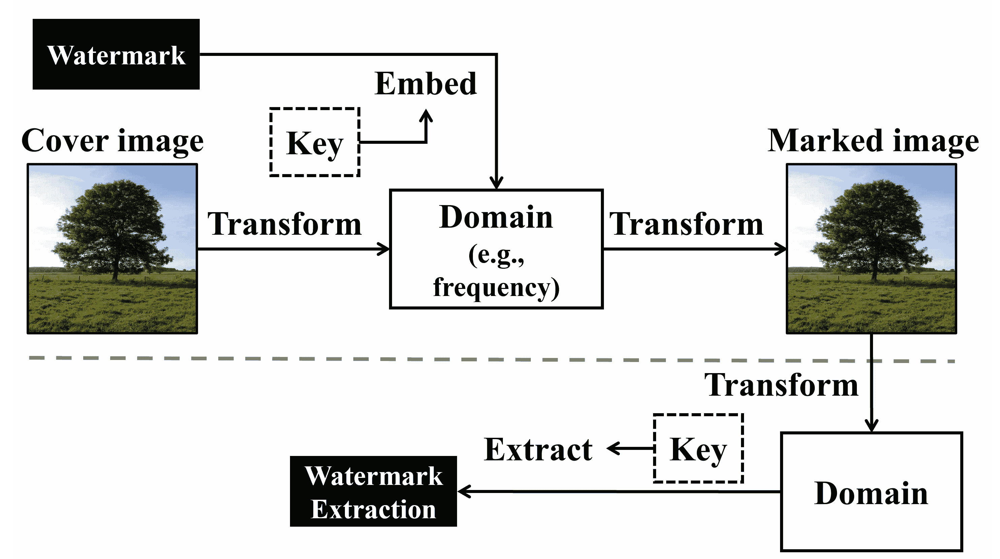
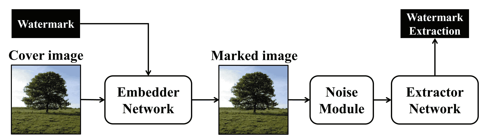
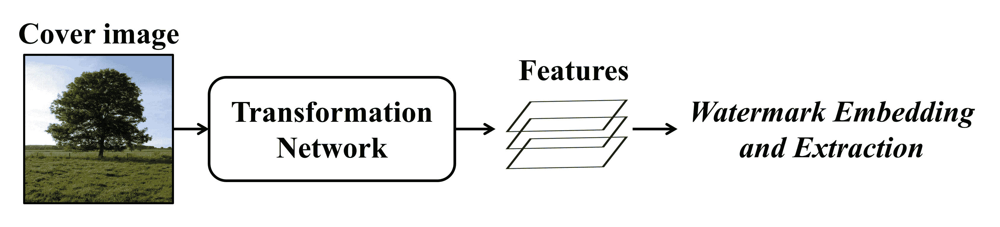
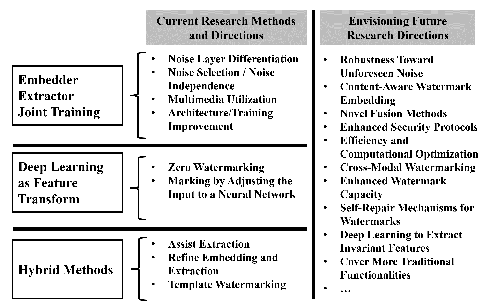

<!--yml

分类: 未分类

日期: 2024-09-06 19:37:30

-->

# [2308.04603] 关于基于深度学习的图像水印的简要而深入的调查

> 来源：[`ar5iv.labs.arxiv.org/html/2308.04603`](https://ar5iv.labs.arxiv.org/html/2308.04603)

# 关于基于深度学习的图像水印的简要而深入的调查

Xin Zhong, Arjon Das, Fahad Alrasheedi 和 Abdullah Tanvir

计算机科学系

内布拉斯加大学奥马哈分校

美国奥马哈

{xzhong, arjondas, falrasheedi, atanvir}@unomaha.edu

###### 摘要

本文对基于深度学习的图像水印技术进行了全面的调查，该技术涉及在封面图像中隐蔽地嵌入和提取水印，旨在提供强健性和适应性的无缝结合。我们在这一跨学科领域的复杂格局中进行导航，连接历史基础、当前创新和未来发展。与现有文献不同，我们的研究专注于基于深度学习的图像水印，提供了一个深入而简洁的分析，并在此基础上作出了三项基本贡献。首先，我们引入了一个精炼的分类，将该领域细分为嵌入-提取器、作为特征转换的深度网络和混合方法。这一分类法受到深度学习在各项研究中不同角色的启发，旨在提供清晰度，为读者提供技术见解和方向指导。其次，我们的探索深入到代表性的方法论中，涵盖了每个类别中的多样研究方向和固有挑战，以提供综合视角。最后，我们超越既定边界，概述了新兴前沿，详细洞察了未来研究方向。

*K*eywords 调查; 深度学习; 图像水印

## 1 引言

每年，互联网作为上传、转移和共享数十亿数字图像的渠道。复杂的数字技术的出现使得图像的编辑、传播和复制变得轻而易举，导致未经授权的使用激增以及对原始创作者知识产权的侵害。在这种背景下，数字图像保护作为一种关键机制，以维护内容创作者知识产权的神圣性。数字图像不仅仅是视觉内容；它们构成了个人、公司实体和各种组织的重要资产。这些资产的完整性常常受到未经授权使用和复制的威胁，这种情况可能导致重大的经济损失和声誉损害。此外，个人图像的非法使用可能会造成情感困扰，尤其是在图像或视频在没有主人同意的情况下被传播时。

数字图像水印已成为图像保护领域的主要技术，获得了广泛的应用和赞誉。这项技术的核心是将信息元素，如徽标或版权声明，隐蔽地嵌入到视觉内容中。这种隐秘的整合确保只有具备适当授权的人才能提取水印，从而维护嵌入数据的机密性和完整性。水印具有多重用途。它们作为不可磨灭的签名，确认所有权并通过阻止未经授权的复制和分发来增强版权保护。它们作为真实性的证明，促进图像使用的许可和追踪。此外，它们作为隐蔽通信的渠道，将隐藏的消息无缝地融入视觉内容中。最后，它们作为固有的检测器，揭示更改和篡改，从而维护原始内容的完整性。数字水印的多样性使其在许多领域得到了广泛应用。它已成为法医学分析中的重要工具，增强了数字内容的可追溯性和验证。在蓬勃发展的 5G 通信和物联网（IoT）领域[2]，水印在加强安全性和提高数据完整性方面发挥着关键作用。智能城市以其复杂的互联数字系统网络为特征，利用水印来保护数据并确保信息的无缝、安全交换[3]。

图像水印和图像隐写是密切相关的领域，但在技术和应用特定方面存在显著差异。这两个领域都探索了在图像中微妙地嵌入数据的复杂过程，确保这些修改对于未经训练的眼睛来说是不可察觉的。然而，它们旨在实现的不同目标导致了各自不同的技术重点。图像隐写主要旨在提供一个隐蔽的信息传输通道，避免被未经授权的人员检测到。它依赖于不可预测性和高负载容量的原则[4, 5]。前者强调抵抗隐写分析技术的能力，而后者则表示能够嵌入大量数据而不影响封面图像的感知质量。另一方面，图像水印则旨在保护封面图像及嵌入的水印的完整性。这个领域的基本方面是鲁棒性，即在各种潜在攻击中水印的持久可读性。这一特征至关重要，尽管在某些情况下，脆弱水印是更可取且必要的，特别是在医学成像等场景中，保持图像的原始质量至关重要[6]。

传统的图像水印技术主要特点是手工嵌入和提取机制。这些过程通常涉及复杂的先验知识和在图像处理领域的丰富经验。对先验信息的依赖导致了为特定案例量身定制的设计，缺乏适应性[7]。这些设计通常在众多图像中均匀应用水印模式，忽视了每个图像固有的独特内容特征和质量属性。在稳健性方面，存在显著的限制。每种手工方法都强调特定属性或属性集，导致了增强水印稳健性的碎片化和孤立方法。明显缺乏一个全面的策略来涵盖广泛的潜在攻击。例如，基于量化索引调制的水印技术主要针对 JPEG 压缩伪影[8]。同时，基于对数极坐标原理的方法则专门设计用以减轻旋转操作的影响[9]。这一情况突显了一个主要挑战——缺乏一个全面、适应性强且通用的水印策略。这些孤立技术与数字媒体操控威胁的动态多面性之间的对比，突显出显著的脆弱性。操控攻击的不断进化，特别是其日益复杂的特性，需要水印技术在适应性、全面威胁缓解和上下文适用性方面同步进化。

深度学习的特点是受到大脑结构和功能启发的算法，即人工神经网络。这些网络能够从大量数据中学习，提取复杂的模式和表示。深度学习在图像和语音识别、自然语言处理以及自主系统等多个领域催生了重大进展。网络的深度，即多个互联节点的层次，使其能够执行复杂的计算，在各种应用中提供卓越的性能和预测准确性。每一层将输入数据转化为越来越抽象和复杂的表示，从而实现细致的决策和预测。

在寻求提高图像水印技术的稳健性和适应性的过程中，深度学习显现出强大的潜力。与传统算法不同，基于深度学习的水印算法具有学习和适应的潜力[4]。它们能够根据每张图像的独特特征和不断变化的威胁环境直观地调整。这种适应性开启了水印技术的新纪元——一个以增强稳健性、隐蔽性和这两个核心属性的微妙平衡为特征的时代。在这一轨迹中，深度学习在水印技术中的整合不仅是一个渐进的改进，而是一个范式转变。它将水印技术从一个静态、孤立和特定案例的学科，推进到一个动态、适应性强且整体的领域。这一演变不仅对数字媒体资产的保护至关重要，还在于精细平衡隐蔽性和稳健性，确保数字媒体的完整性和美学价值得到精心保留。

对深度学习基础的图像水印进行调查的必要性源于这一新兴领域中快速的发展和复杂性。由于深度学习在图像水印中的整合已成为一个关键焦点，因此需要对现有文献和方法进行全面、综合和分析性的回顾。为此，本文提供了对前沿深度学习基础图像水印技术的综合调查，作为深度学习基础图像水印领域最先进技术的参考，总结了关键的研究方向，并展望了该领域未来的研究。

### 1.1 本次调查的目标和独特性

我们通过总结现有相关调查论文的主题集中概述，来说明我们调查的目标和独特性，如表 1 所示。当前的调查主要集中于深度学习模型架构、多样化的人工智能方法、数据隐藏技术和重要的提案。需要指出的是，我们的综述专门针对与深度学习基础的图像水印相关的工作。因此，包括深度学习模型本身的水印在内的扩展领域[10]不在我们的讨论范围之内。

表 1：现有相关调查的总结。

| 方法 | 重点 |
| --- | --- |
| Gupta and Kishore [11] | 总结了在深度学习基础的图像水印中使用的各种卷积神经网络模型架构 |
| Amrit 和 Singh [3] | 总结使用人工智能、机器学习和深度学习的水印技术 |
| Zhang et al. [12] | 回顾基于深度学习的数据隐藏，按容量、安全性和鲁棒性分类，并概述三种常用架构 |
| Byrnes et al. [13] | 调查水印和隐写中的深度学习技术，并根据模型架构和噪声注入方法对其进行分类 |
| Singh et al. [14] | 回顾流行的深度学习模型基础的数字水印方法，总结/比较文献中的贡献 |

与现有工作相比，我们的调查集中在基于深度学习的图像水印技术，并提供了简要而深入的分析，具有三个主要优势。(1) 我们系统地将基于深度学习的图像水印分类为嵌入-提取器、深度网络作为特征转换和混合方法。此分类基于深度学习在各个研究中的不同角色，旨在提供技术见解和指导。(2) 我们研究了具有代表性的方法论，总结了每个指定类别内的研究方向和挑战，提供了一致的概述。(3) 我们扩展讨论，详细探讨了潜在的研究方向，划定了深度学习图像水印领域的前沿。

通过系统分析、关键研究方向讨论和前瞻性展望，我们调查的一个主要目标是连接过去的研究、现在的创新和未来的前景，推动该领域走向更精细的方法、提高效果和更广泛的应用视野。本文的其余部分结构如下：第二部分讨论了传统图像水印的相关基础，第三部分对基于深度学习的图像水印技术进行了分类并提供了综述，第四部分探索了未来的潜在研究方向，第五部分给出了结论。

## 2 基础知识

### 2.1 传统图像水印组件

图像水印涉及将水印数据嵌入图像中。这种水印是一种编码的数字信号，其设计精细，旨在对人眼几乎不可见，但可以通过计算算法轻松识别和提取。如第一部分所述，图像水印的应用范围根据水印信息的性质，包括版权保护、真实性验证、隐秘通信和篡改检测等。图 1 简要概述了传统图像水印的组件和步骤。

图 1：传统图像水印的基本组件和步骤。

嵌入和提取。在嵌入步骤中，水印通过水印算法集成到覆盖图像中。总体目标是确保嵌入的水印具有鲁棒性，能够抵抗移除或更改，同时保持覆盖图像的视觉完整性。水印嵌入的技术有多种，例如在空间域中修改像素值[7]，以及在频率域表示中操控系数[15]。嵌入后，水印图像被传播给指定的受众，可能通过在线平台进行。授权的接收者可以利用专门的提取算法提取嵌入的水印。

密钥。许多图像水印方法包含一个密钥，表示在调节水印的嵌入和提取过程中的秘密值。通常，这个密钥是共同生成并在内容拥有者和授权用户之间分发的。在水印过程中的应用因算法设计的不同而有所变化，主要目的是增强安全性和鲁棒性。例如，密钥可以用于控制生成集成到图像中的伪随机序列以进行水印嵌入[15]，或者指定嵌入图像中水印的精确位置[7]。

水印预处理。水印预处理在增强安全性和鲁棒性方面具有重要作用。一种经典的方法是使用加密技术（如 AES [16] 或 RSA [17]]）对水印进行加密。在此过程中，使用加密密钥将水印转换为密文，从而提高嵌入数据的安全性。解密，因此水印的可访问性，依赖于相应的加密密钥，确保水印不会被未经授权的访问，并提高其在高安全环境下的适用性。除了安全性外，水印还可以使用如错误修正码 [18] 等方法进行编码，从而修正提取水印过程中的错误，提高其鲁棒性。Reed-Solomon 码 [19] 和卷积码 [20] 是经典的示例方法，它们通过在水印中注入冗余数据，战略性地改善在水印提取过程中遇到的错误，提高提取过程的准确性和可靠性，即使在出现失真的情况下。

### 2.2 典型指标和因素

尽管基于不同应用的图像水印可能考虑大量的评估指标和因素，但现有文献中，某些指标在传统和基于深度学习的水印技术中都被广泛采用。在这种背景下，我们简要讨论不可察觉性和鲁棒性这两个典型因素，它们是评估水印技术效果的关键。

不可察觉性。将水印嵌入图像数据中，以使其对人眼不可见的能力称为不可察觉性。这种不可察觉性有助于确保水印不会干扰图像的质量。一个最常用的评估指标是峰值信噪比（$PSNR$）：

|  | $PSNR=10\times log_{10}(\frac{max(c)^{2}}{\frac{1}{\mathcal{R}\mathcal{C}}\sum_{i=1}^{\mathcal{R}}\sum_{j=1}^{\mathcal{C}}(c_{ij}-m_{ij})^{2}}),$ |  | (1) |
| --- | --- | --- | --- |

其中 $max(c)$ 是覆盖图像 $c$ 的最大像素值，如果我们使用 8 位灰度值，则为 $255$，$\mathcal{R}$ 和 $\mathcal{C}$ 分别表示图像 $c$ 和 $m$ 的高度和宽度。

值得注意的是，除了广泛使用的 $PSNR$ 外，结构相似性指数度量（$SSIM$）[21] 也常用于评估不可感知性，它结合了对亮度、对比度和结构差异的评估。视觉不可感知性的一个重要补充是安全性 [22]。这意味着确保嵌入的水印不仅对人眼不可见，还能抵御计算分析的检测，这在安全水印应用中至关重要，例如智能城市规划和数字取证领域。

稳健性。稳健性描述了水印的抗扰动能力，表示其在水印图像遭受攻击（如压缩、滤波或裁剪）时仍能可靠提取的能力。稳健性的评估涉及计算攻击后提取水印和原始水印之间的差异。当水印为二进制时，比特错误率（BER）作为常用的度量指标，通过将错误比特数除以嵌入的比特总数来计算。当水印以二维矩阵的形式存在时，其抗性通常通过归一化互相关（$NC$）进行评估，测量原始水印 $w$ 和提取水印 $w^{\prime}$ 之间的相似度：

|  | $NC=\frac{\sum_{i=1}^{\mathcal{H}}\sum_{j=1}^{\mathcal{L}}(w_{ij}\cdot w^{\prime}_{ij})}{\sqrt{\sum_{i=1}^{\mathcal{H}}\sum_{j=1}^{\mathcal{L}}(w_{ij})^{2}}\sqrt{\sum_{i=1}^{\mathcal{H}}\sum_{j=1}^{\mathcal{L}}(w^{\prime}_{ij})^{2}}},$ |  | (2) |
| --- | --- | --- | --- |

其中 $\mathcal{H}$ 和 $\mathcal{L}$ 定义了水印的高度和宽度。

盲水印。盲水印和半盲水印代表了图像水印领域中的两种主要方法。盲水印的特点是能够在无需参考原始封面图像或原始水印（虽然可能需要密钥）的情况下检测和提取水印。另一方面，半盲水印虽然也不需要原始封面图像来提取水印，但提取时需要原始水印（以及密钥）。

容量。容量表示可以嵌入图像的水印数据的上限，产生了两种主要的图像水印类型：(1)零比特水印，关注于检测图像中水印的存在，而非提取数据。(2)多比特水印，嵌入和提取由多个比特组成的水印。

在容量因素方面，一个特殊的情况是零水印，即没有直接嵌入水印[23]。相反，建立并存储原始内容与水印（一个主份额）之间的关系。在争议或验证的情况下，这种关系用于证明水印的存在。这项技术提供了一些优点，如消除了对图像进行修改的需要，从而保持了图像的原始质量。然而，也存在一些局限性，主要是由于其对图像数据唯一性的依赖，使其对内容同质化的图像效果较差。此外，零水印作为一种签名，用于验证图像数据的真实性，但缺乏嵌入额外数据的能力。

## 3 简明而深入的深度学习图像水印调查

本节讨论了深度神经网络在当代基于深度学习的图像水印中的集成，解释了传统水印过程在这一先进框架中的适应性。现代基于深度学习的图像水印方法的架构与传统方法相似，包括转换、水印嵌入和提取阶段。为了进行结构化分析，我们根据深度学习在各论文中的角色，将当前基于深度学习的技术分为三类：（1）嵌入提取器联合训练，（2）深度网络作为特征转换，以及（3）混合方法。为了提供每个类别的清晰而简明的概述，表 2 作为导航指南。每个类别都被概述，并列出了其主要特点、要求和潜在缺陷。

表 2：各提议类别方法概述。

| 方法论 | 主要特点 / 要求 / 潜在缺陷 |
| --- | --- |
| 嵌入提取器联合训练 | 主要特点：通过对水印嵌入和提取的联合优化，从指定数据中学习自动水印方案。 |
|  | 要求：用于训练的鲁棒数据集以及在噪声层中明智地选择噪声水平，以确保鲁棒性。 |
|  | 潜在缺陷：当训练数据不足或噪声选择不当时，效果可能会下降，强调了对鲁棒数据集和谨慎选择噪声水平的必要性。 |
| 深度网络作为特征转换 | 主要特点：使用深度网络进行特征转换，利用预训练模型进行高效的特征提取。 |
|  | 要求：在与领域内鲁棒性相关的任务上对深度网络进行预训练，并在该特征空间中单独设计嵌入和提取。 |
|  | 潜在缺点：如果特征变换效果不佳，鲁棒性可能会受到影响，预训练网络可能无法充分关注鲁棒性。 |
| 混合方法 | 主要特点：将经典水印与深度学习融合，利用两者的优势来增强水印效果。 |
|  | 需求：对传统水印方案和深度学习模型进行严谨的设计和微调，以确保其和谐运作。 |
|  | 潜在缺点：设计复杂度增加，可能放大经典技术和深度学习技术各自的局限性，需要明智的设计策略。 |

### 3.1 嵌入提取联合训练方法

如图 2 所示，此类别的方法根本上涉及两个核心组件的训练：一个嵌入网络，负责将水印嵌入到封面图像中，另一个提取网络，负责从标记图像中提取嵌入的水印。设计上存在变体，一些迭代版在嵌入网络中包含单独的特征提取网络，用于对水印和封面图像进行初步处理。为了增强鲁棒性，通常在标记图像之后设置一个噪声模块。该模块在训练过程中引入并融合噪声到标记图像中，提高提取网络应对干扰的能力。

图 2：嵌入提取联合训练的总体过程。

通常，所有组件在统一的深度神经网络框架中进行联合训练，使用梯度下降作为优化技术。目标是优化损失函数，旨在保持不可感知性，同时确保有效提取嵌入的水印。在数学上，代表性损失函数可以定义为：

|  | $\mathit{l}=f_{1}(c,m)+f_{2}(w,w^{\prime})$ |  | (3) |
| --- | --- | --- | --- |

其中 $c,m,w,w^{\prime}$ 分别表示封面图像、标记图像、水印和提取的水印。函数 $f_{1}$ 量化了 $c$ 和 $m$ 之间的视觉差异，符合传统的高 $PSNR$ 标准。同时，$f_{2}$ 评估了 $w$ 和 $w^{\prime}$ 之间的方差，满足传统的高 BER 或 $NC$ 标准。

$\mathit{l}$中的元素呈现出一种权衡：将$f_{1}(c,m)$最小化为零意味着标记图像与封面图像之间完全相似。然而，这可能限制了水印嵌入的空间，可能导致提取效果不佳。为了协调这种权衡，常见的方法是利用由$f_{2}(w,w^{\prime})$产生的梯度来调整所有组件的权重，进行反向传播，延伸至$c$和$m$。相反，来自$f_{1}(c,m)$的梯度仅用于优化嵌入器网络的权重。后续部分将深入探讨此联合训练类别中代表性的最先进方法所具备的复杂设计和独特特点。

联合训练的概念首次在 Zhu 等人的 HiDDeN 论文中提出[4]。作者旨在整合嵌入-提取范式，以简化和统一图像隐写术和水印技术的过程。HiDDeN 中融入了几项创新和实用的设计。嵌入器复制水印，其与封面图像的融合发生在嵌入器的最终层，以保持视觉质量。使用判别网络来确定图像中水印的存在，从而确保嵌入器生成视觉上连贯的标记图像。HiDDeN 通过引入噪声层来增强鲁棒性，该层在训练阶段包括了噪声诱导操作，如 dropout、高斯模糊和 JPEG 压缩。为了应对噪声层中原始 JPEG 的非可微分性挑战，HiDDeN 引入了一种可微分 JPEG 变体，以确保梯度流的连续性。在 HiDDeN 之外，Zhang 等人[24]介绍了 UDH，这是一项根植于联合嵌入-提取范式的开创性工作，适用于图像水印和隐写术。UDH 作为开创性工作之一，能够在嵌入-解码框架中嵌入整个图像作为水印。它引入了一种水印编码方法，在提取过程中便于解开。在这种方法中，编码的水印独立于封面图像生成，随后进行整合，确保了系统化和高效的提取过程，同时保持封面图像的完整性。

进行强健图像水印联合训练时，一个潜在的挑战在于噪声层必须是可微分的，以便于梯度流动。为解决这一问题，刘等人[25]提出了一种两阶段训练方法。在初始阶段，嵌入器和提取器共同训练，不涉及噪声干预，确保梯度流畅且不受干扰。在第二阶段，嵌入器的参数被固定，使其不能再进行进一步训练。此时，重点完全转向提取器的训练。这种分阶段的训练方法允许将不可微分的噪声层整合到提取器的训练中，而不影响整体训练过程的效果。本文测试了其对各种常见攻击的鲁棒性，例如缩放、盐和胡椒噪声、丢失、裁剪、高斯模糊和 JPEG 压缩。

许多努力旨在解决噪声层中 JPEG 操作不可微分性带来的挑战。陈等人[26]建议使用模拟网络来模拟 JPEG 有损压缩，以适应各种质量因素。该模型利用最大池化层、卷积层和噪声掩码，分别表示 JPEG 压缩中的采样、DCT 和量化过程。相关的，贾等人[27]提倡将实际和模拟的 JPEG 压缩合并到批次中。在训练的噪声层中，每个批次被配置为随机包含实际 JPEG 压缩层、JPEG 层的可微分模拟，或没有噪声的层。在采用基于动量的优化策略的情况下，对嵌入器和提取器的联合训练没有严格要求。然而，嵌入器仍然被调整为生成对 JPEG 压缩具有强健性的高质量图像，而提取器则被设计为在 JPEG 噪声之后提取特征。此外，张等人[28]提出了一种伪可微分的方法，旨在将 JPEG 压缩作为一种特殊的噪声变体。这种方法在训练过程中具有独特的前向和反向路径。特别地，反向传播被设计为绕过 JPEG 压缩阶段，从而减轻与不可微分性相关的障碍。

某些研究在噪声层中加入专业噪声，以应对图像水印中的特殊挑战。一个复杂的领域涉及从经过相机重采样的图像中提取水印，这引入了多种噪声类型，包括 JPEG 伪影、光照变化和光学失真。为此，Fang 等人 [29] 和 Gu 等人 [30] 提出了结合屏幕拍摄噪声层模拟的方法。这种调整使得在基于深度学习的图像水印模型训练中能够模拟相机重采样噪声，如几何失真、光学弯曲和 RGB 波纹，从而培养出更为强大的系统，能够抵抗这些特定的噪声干扰。

现有的联合训练范式需要明确识别和列举训练噪声。模型通常对训练中遇到的噪声表现出比未包括的噪声更强的鲁棒性。然而，在实际场景中，预测和列出所有潜在噪声可能是不可行的。因此，一些研究致力于打造无需先前噪声知识的强大深度学习图像水印模型。Zhong 等人 [31] 引入了一种不变性层，旨在在水印提取阶段筛选掉多余的信息。在训练过程中，计算并使用不变性层输出相对于其输入的雅可比矩阵的 Frobenius 范数作为正则化项。最小化该项并确保水印要求（与标记图像的质量和水印提取效果相关）的双重目标，确保不变性层的输出在输入图像的变化下保持相对不变，从而在没有明确噪声列举的情况下增强了鲁棒性。此外，嵌入网络采用了多尺度 inception 网络，实现了覆盖图像和水印的复杂融合。另一种在不依赖手动噪声层引入的情况下实现鲁棒性的方法是部署对抗网络，作为自动攻击者。Luo 等人 [32] 通过将对抗网络融合到其架构中来展示这一点，该网络作为噪声模块。在训练过程中，这一对抗实体与提取器接口，逐渐提升其能力，擅长干扰水印提取。作为回应，提取器努力减轻对抗实体引起的扰动。通过细致的训练过程校准，强化提取器对抗对抗网络，最终得到一个具有增强鲁棒性和可靠性的模型。

联合嵌入-提取范式被认为是现有文献中一种特别有效的方法。提高性能一直是重点，通过在架构设计和训练方法上的创新推动了进展。Ahmadi 等人 [33] 丰富了他们的噪声层，加入了包括高斯噪声、白噪声、随机裁剪、平滑和 JPEG 压缩在内的多种干扰。每次训练迭代都涉及随机选择一种特定的噪声类型，确保每种干扰单独影响训练损失。在另一项发展中，Plata 等人 [34] 揭示了一种名为“传播器”的预处理器，旨在将水印扩散到图像的空间域。研究人员将各种攻击分层，并证实在训练过程中整合特定失真可以增强对整类失真的鲁棒性。呼应刘等人 [25] 的两阶段训练方法，并反映出 HiDDeN [4] 强调的噪声影响，Zhang 等人 [35] 引入了一种由多类鉴别器连接到噪声注入标记图像的方案。该创新不仅旨在提高鲁棒性，还增强了水印在标记图像中的安全性。Hao 等人 [36] 在与 HiDDeN [4] 中的视觉质量审查一致的情况下，建议在鉴别器的起始处集成高通滤波器。这一策略将水印推入图像的中频区域，考虑到高频组件的可调整性，从而保护视觉质量。损失计算对中央区域赋予了更高的权重，与人类视觉系统的焦点倾向相一致。对于噪声层的增强，包含了裁剪、裁剪出去、高斯模糊、方向翻转和 JPEG 压缩，描绘了一个全面的失真光谱。Xu 等人 [37] 采用了一个可逆神经网络，既作为嵌入器又作为提取器，这一策略与传统的可逆水印转换特性一致。在一个偏离中，Mahapatra 等人 [38] 主张计算并将标记图像与覆盖图像之间的差异整合到提取器中，以提高提取质量，这一技术从盲方案原型中过渡开来。Zhao 等人 [39] 向嵌入器中引入了一个因素，调节水印在覆盖图像上的强度，并利用训练的空间注意力特征图来优化水印位置。Ying 等人 [40] 旨在提高嵌入容量，容纳一至三张水印彩色图像，并在提取阶段采用解耦和揭示网络组合。他们的噪声层强化了裁剪、缩放、高斯噪声、JPEG 和高斯模糊，以模拟现实失真。在一种新颖的结构方法中，Fang 等人 [41] 引入了一个提取器-嵌入器-提取器训练架构，以增强提取器的效率。他们的提取器将图像转化为二进制水印序列，而嵌入器则从原始图像和解码水印中生成图像残差，从而提高了标记图像的创建和提取效果。这一方法强调解码器训练，优先考虑提取质量。Mun 等人 [42] 通过引入强化学习提高了嵌入器-提取器框架的鲁棒性。他们将卷积神经网络用于嵌入和提取，并将强化学习演员用于噪声模块操作。演员在选择和整合噪声类型及强度到标记图像中的过程中发挥了关键作用，补充了作为评估环境的嵌入器-提取器，评估演员的动作并训练提取器有效应对所引入的噪声。

多媒体也已成为基于深度学习的图像水印领域的重要关注点。例如，Das 和 Zhong [43] 开发了一种新颖的方法，将音频水印嵌入到封面图像中，并配备了一个专门设计的网络，用于确定提取的音频水印与原始形式的一致性。在文档图像领域，Ge 等人 [44] 提出了一种技术，在嵌入器中丰富了多个跳跃连接，确保了水印和封面图像中细节的保留。通过在噪声层中集成 Dropout、裁剪、Gaussian 模糊、Gaussian 噪声、调整大小和 JPEG 技术，增强了水印文档图像的鲁棒性。Liao 等人 [45] 将 Embedder-Extractor 水印的视野扩展到了 GIF 动画。他们的方法涉及使用三维深度神经网络，将单个水印转化为三维特征以与 GIF 进行集成。利用判别网络来评估水印效果，重点关注保持水印 GIF 的不可感知性，同时确保视觉质量和数据安全。

自从 HiDDeN [4] 引入了 embedder-extractor 联合训练概念（这是传统水印范式的自然扩展）以来，文献中对这一初始思想进行了细致的扩展，衍生出各种各样的方法。随着研究人员对这一领域的深入探讨，出现了一个复杂的挑战和相应解决方案的格局，每个挑战都为基于深度学习的图像水印的整体叙事贡献了独特的视角。这些贡献，通过其创新的方法克服特定难题，凸显了该领域的动态和不断发展的特性。我们已经对这些不同的挑战和解决方案进行了分类，总结见表 3。

表 3：Embedder-Extractor 图像水印中的挑战和代表性解决方案总结。

| 挑战 | 代表性解决方案 |
| --- | --- |
| 噪声层需要可微分 | 执行两阶段训练方案 |
| JPEG 的非可微分特性和低性能问题 | 在噪声层中包含可微分的 JPEG 模拟 |
| 特殊挑战噪声如相机重采样 | 在噪声层中包含模拟相机失真 |
| 模型对训练噪声的鲁棒性优于未包含噪声层的模型 | 发展不需要噪声列表的策略，例如，通过筛选无关信息的不可变层，或自动攻击提取器的对抗网络 |
| 旨在增强和提升整体模型性能 | 引入创新架构和训练范式，与嵌入、提取和特征变换的细致过程相契合，体现了传统水印技术中的战略设计 |
| 在保持高性能的同时包含多媒体封面图像 | 设计特殊的神经网络来处理多模态特征和鲁棒性 |

### 3.2 使用深度网络作为特征变换的方法

如图 3 所示，本类别中的水印处理主要利用深度神经网络进行特征变换。封面图像和标记图像都经过这些网络的变换，生成不同的特征空间。随后的水印嵌入和提取在这些定义的空间内进行。一个主要的期望是变换后的领域具有鲁棒性，即使对标记图像进行微小的修改也应产生一致或几乎相同的特征值。

图 3：作为特征变换的深度网络的一般过程。

在基于深度学习的零水印技术中，许多方法采用了深度网络作为特征转换的概念。Fierro 等人[23]采用卷积神经网络（CNN）从封面图像中提取特征，然后通过异或（XOR）运算将其与排列二进制水印序列集成，创建一个主共享。同样的 CNN 处理测试图像以提取特征，随后与主共享进行 XOR 运算来提取水印。适当的密钥可以确保水印的识别。He 等人[46]通过在各种卷积层添加全连接层扩展了这一基础方法，增强了主共享的创建过程。他们引入了一个收缩模块，促进了对每个特征通道进行软阈值学习，从而增强了特征提取的精度。为了优化特征空间，他们专注于通过学习特征之间和特征内的权重来消除冗余，并在特征训练过程中加入噪声层以提高鲁棒性。Han 等人[47]通过引入混沌加密算法来在 XOR 运算之前加密水印，增强了安全性。他们还采用了 Swin Transformer[48]来生成主共享的特征，实现对几何畸变不变的特征空间，增强了水印处理过程的鲁棒性。

该类别中的另一个研究方向涉及使用预训练的深度神经网络，其中输入数据的训练用于生成预期的标记图像。在这种情况下，预训练的权重保持静态，输入的变化旨在实现特定目标。结果生成的标记图像在视觉上类似于原始覆盖图像，但通过深度网络进行特征提取时会显现出嵌入的水印。Vukotic 等人 [49] 通过实现预训练的卷积神经网络，并通过梯度下降自适应地修改输入覆盖图像来说明这一点。双重损失函数包括一个最小化覆盖图像和标记图像之间感知差异的项，另一个项通过点积操作确保水印的可检测性，表示为 $\varphi(m)^{T}\cdot k$。这里，$\varphi(m)$ 表示通过深度网络提取的标记图像特征，而 $k$ 是一个预定的密钥，便于检测水印的存在。在此基础上，Fernandez 等人 [50] 引入了通过为二进制水印序列的每一位分配不同的密钥来实现多位提取的能力。与使用用于分类的预训练卷积网络不同，他们采用了经过自监督学习的网络。这一战略性采用具有明显优势，因为自监督学习获得的特征空间具有增强的鲁棒性，从而提高了水印提取过程的有效性和可靠性。

使用深度网络作为特征转换的方式代表了图像水印领域中的一种新兴方向。这种方法偏离了更直观的嵌入-提取联合训练模型，该模型通过封装嵌入和提取过程，与传统图像水印范式无缝对接。因此，关于这一创新方法的学术文献相对较少。尽管如此，这种新兴方法为吸引人的研究方向铺平了道路，提供了该领域的新视角和方法。为了提供一个综合概述，我们在表格 4 中汇总了主要挑战和代表性解决方案。

表格 4：使用深度网络作为特征转换的图像水印挑战及代表性解决方案总结。

| 挑战 | 代表性解决方案 |
| --- | --- |
| 如何利用深度学习的拟合能力提取封面图像特征（主分享）进行零水印 | 采用现成的 CNN 或 Transformer 并设计这些架构的扩展分支 |
| 如何选择适合的深度学习模型进行图像水印鉴别，考虑其不同的特征提取能力和目的 | 采用预训练的 CNN 或自监督学习中的模型 |
| 如何设计独立的嵌入和提取方案，给定一个深度学习特征提取器 | 为了获得标记图像，固定预训练模型，并用梯度（由保证不可察觉性和提取完整性的损失函数产生）更新输入图像 |

### 3.3 混合方法

这一类别的方法展示了深度学习技术与传统图像水印计算的融合。这种整合意味着一种共生关系，其中一种方法的优势弥补了另一种方法的劣势，从而提高了效率和效果。这些方法的设计范式和操作框架可能各异，展示了广泛的结构和功能变化。在这些混合系统中，深度学习通常在水印提取中扮演关键角色。深度学习模型复杂精细的结构提供了拟合复杂函数的增强能力，这些模型善于揭示水印图像中的复杂模式和关联，从而促进了嵌入水印的高效和准确提取。另一方面，传统的图像水印计算则为过程提供了稳定性、可靠性和一定的可解释性，作为深度学习模型构建的坚实基础。

Kandi 等人 [51] 使用了两个卷积自编码器来分别重建封面图像。自编码器重建图像与原始封面图像之间的差异是他们方法的核心。第一个自编码器的重建表示二进制水印中的比特零，而第二个表示比特一。在不同的背景下，Ferdowsi 等人 [52] 为物联网（IoT）应用量身定制了一种技术，利用经典扩频技术嵌入水印，其中一个关键伪噪声序列增强了原始信号。创新之处在于将封面图像的特征如频谱平坦度、均值、方差、偏度和峭度映射到比特流，作为水印，从而提高对窃听攻击的安全性，避免使用预定义的比特流。Li 等人 [53] 提出了一种方法，将预处理的灰度水印图像集成到封面图像的 DCT 块中。这些嵌入水印的提取通过训练卷积神经网络来实现，建立了传统方法与神经方法之间的桥梁。Mellimi 等人 [54] 提倡将水印嵌入到封面图像的提升小波域 [55] 中。他们向标记图像中引入噪声，并使用深度神经网络作为提取器，展示了对注入噪声的鲁棒性。Zhu 等人 [56] 创新了一种将关键点检测与基于深度学习的图像水印技术相结合的方法。利用 SURF [57]，他们描述了尺度不变的嵌入区域，在其中心的 Y 颜色通道中放置归一化的二进制水印。这些聚合的数据通过嵌入网络传递，生成标记的 Y 通道。经过训练调整的提取网络帮助水印的检索。通过在训练阶段引入扰动，增强了对各种形式的失真和操控的抵抗力。Chack 等人 [58] 提出了一个混合方法，将传统水印技术、卷积神经网络（CNN）和进化优化结合在一起。这种多面的方法在 DCT 域中嵌入 Arnold 变换水印，使用 Harris Hawks 优化来微调嵌入强度，并依靠 CNN 来揭示嵌入的水印。在另一项研究中，Fang 等人 [59] 提出了基于深度模板的图像水印机制。他们的方法中，水印的嵌入过程使用现有技术编码水印，利用辅助定位模板操控伪随机高斯噪声模式，并将水印集成到封面图像的红色和蓝色通道中。提取由两个深度神经网络完成；第一个网络提取并强化特征，第二个网络则对水印比特模式进行分类。Kim 等人 [60] 提出了另一种使用模板进行图像水印的细化技术。他们的策略包括将封面图像分割成不同的补丁，标记特定补丁用于水印嵌入，其他补丁则用于容纳预定义模板。水印插入通过曲线小波域的量化索引调制来实现，而模板则通过专门的生成网络进行处理后再集成到封面图像中。标记图像通过组装各种嵌入的补丁得到。提取则由模板提取网络完成，揭示嵌入的模板，然后与原始图像通过模板匹配网络对比。这个对比过程有助于识别对标记图像施加的潜在几何失真。Chen 等人 [61] 优先开发了一种通过深度学习进行水印系统认证的机制。他们的框架特别擅长辨别医学图像中水印提取的准确性。他们的创新方法包括模拟各种水印失真并编制标记数据集。该数据集然后在一个设计用于验证从可能标记图像中提取的完整性的神经网络上进行训练，从而弥合了水印验证和深度学习方法之间的差距。

深度学习与传统图像水印技术的结合催生了大量的方法，每种方法都有其独特的处理方式和基本原则。尽管这些混合方法具有多样性，但值得注意的是，它们往往会遇到一系列共同的挑战，并因此采取了普遍的解决方案来有效缓解这些问题。这些挑战主要源于深度学习的适应性数据驱动特性与传统水印的算法规则结构之间复杂的相互作用。解决这些问题需要一种细致的方法，能够敏感地对待两种范式的优缺点。在表 5 中，我们总结了典型的挑战及其相应的解决方案。

表 5: 混合方法中的挑战及代表性解决方案汇总。

| 挑战 | 代表性解决方案 |
| --- | --- |
| 鉴于每种方法固有的独特优缺点，精炼嵌入和提取过程之间的协同作用至关重要 | 利用深度学习的适应性和学习能力，同时发挥传统算法的已验证特性 |
| 确定深度学习在混合水印框架中的最佳角色 | 利用深度学习来增强水印提取过程 |
| 深度学习与传统水印技术的结合通常会导致复杂度增加 | 制作模块化和可扩展的架构有助于实现两种方法的无缝集成和互操作性 |
| --- | --- |

## 4 未来可能方向的讨论

关于基于深度学习的图像水印技术的提案泛滥促使我们进行全面调查，旨在桥接历史、当代和未来研究。图 4 概括了第三部分中描述的当前趋势，并推测了未来的研究轨迹。现代的关注点集中在噪声层的细微差别、噪声类型的多样性、架构和训练范式的改进，以及深度学习在图像水印中的战略整合。本调查强调了一系列超越传统框架的未开发研究领域。这些新兴的视角有望在这一领域推动显著的创新，巧妙地驾驭在数字媒体和通信领域中所需的稳健性、隐匿性、容量和安全性的复杂相互作用。剩余部分讨论了我们对未来潜在研究方向的提案。

图 4：总结和展望基于深度学习的图像水印研究方向

对未预见噪声的稳健性。基于深度学习的图像水印模型对各种噪声类型表现出显著的稳健性，这一特征与其训练中遇到的特定噪声类型密切相关。当将模型的表现与训练过和未训练的噪声类型进行对比时，这种稳健性的差异尤为明显。训练噪声类型是指模型在训练阶段明确接触过的噪声类型，使得模型能够发展出专门的机制来减轻其影响。因此，当遇到这些熟悉的噪声类型时，模型在水印提取方面的效果保持相对稳定。相反，未训练的噪声类型引入了不可预测的元素。由于模型没有对这些噪声类型进行过先前的暴露和适应性开发，其性能可能会受到影响。这种稳健性的差异突显了涵盖多种噪声类型的全面训练方案的重要性，以增强模型的泛化能力。未来的研究可以集中于提高模型对未训练噪声类型的适应性和稳健性，或许可以通过整合自适应学习机制、在线学习方法或元学习策略，使模型能够迅速适应陌生的噪声环境。

内容感知水印嵌入。基于深度学习的图像水印主要关注静态图像。这种静态导向可能削弱水印的有效性，因为最佳的嵌入策略可能在不同的内容类型和动态场景中显著不同。向内容感知水印嵌入技术的过渡有可能纠正这种不平衡。这种方法被设想为具有内在自适应性的，预计将利用能够分析和适应每个图像或媒体序列独特属性的复杂算法。例如，CNNs 或类似的深度学习架构可以被训练来辨别视觉内容中的复杂模式和差异，使模型能够根据不同的图像区域调整水印的放置和强度。这将确保水印不仅不可感知，而且在各种攻击下也具有鲁棒性，实现可见性和安全性之间的和谐平衡，标志着图像水印技术的重要进步。

新颖的融合方法。研究水印在封面图像中的融合创新算法和技术至关重要。对创新嵌入策略的细致研究对于确定一种和谐的融合至关重要，以确保封面图像的视觉完整性和水印的不可磨灭性。目前的方法主要应用加性融合和连接。加性融合通过加法合成将水印集成到封面图像中，而连接则涉及将水印特征直接附加到封面图像上。未来的工作可以集中在嵌入算法上，以确保水印被精细地编织到封面图像中，平衡感知透明度和抵御去除或攻击的鲁棒性。一种有前景的方法可以是交叉注意力机制，它可以利用注意力机制在嵌入过程中选择性地关注封面图像的特定特征，确保水印的动态和自适应融入。

增强的安全协议。安全、隐私和完整性的要求正受到对抗性攻击复杂性的重新定义。因此，集成创新的安全协议不仅是可取的，而且是必要的。一个引人注目的研究方向可能涉及将前沿的密码算法与深度学习相结合，这种融合有望增强水印保护。区块链技术的融入则提供了另一个前沿，提供了去中心化、不可篡改和透明的平台，用于水印数据交易和验证。这些多层次的集成方法基于对深度学习复杂性和当代密码学范式动态的细致理解。随着我们的前进，这些技术的融合可能会催生深度学习图像水印技术的新纪元，在韧性、隐私和安全性方面带来新的突破。

效率和计算优化。深度学习图像水印技术的动态格局日益突显出平衡计算效率和处理能力的必要性，尤其是在实时应用中。在确保水印稳健性与计算负担之间存在复杂的相互作用，寻找一个既高效又不妥协性能的最佳平衡点是关键。在这种情况下，轻量化架构和算法的概念化与开发成为未来研究的重要焦点。一个有前景的方向是将量化和剪枝技术集成到深度图像水印模型中，旨在减少模型大小，同时保持水印效果。此外，知识蒸馏的探索可能有助于训练出继承了更大、更复杂模型性能特征的紧凑型模型，从而确保效率和效果的统一。

跨模态水印。在基于深度学习的图像水印领域，跨模态水印作为一种前沿技术，提供了前所未有的机会和挑战。它标志着不同媒体类型的汇聚，将水印技术的范式扩展到传统范围之外，并促进了内容保护和认证的多维方法。在图像中嵌入水印，并从音频或视频中提取这些水印，涉及算法和技术的复杂相互作用，需要创新和适应性。一种方法上的前景可能涉及基于变换器的模型，这些模型以处理多样数据类型和复杂性而闻名。这些模型可以设计用于在图像中嵌入复杂的水印模式，同时配套的算法可以为从音频或视频格式中提取这些模式而量身定制。确保在不同媒体间嵌入和提取过程一致性的同步协议将是这种方法的关键。

水印的自修复机制。在基于深度学习的图像水印技术中，集成自修复机制是一种前卫的方法，旨在提升水印在遭受失真或攻击时的鲁棒性和持续性。具有自修复能力的水印可以显著增强信息认证和完整性验证过程的可靠性。这个概念与再生嵌入模式相一致，这些模式即使在经历复杂的失真或恶意干预时仍能保持其完整性。从算法上看，可以通过融入冗余编码方案实现这一点，其中关键的信息以一种允许从部分数据中重建的方式分布在水印中。错误纠正代码和擅长模式识别和恢复的机器学习模型可以协同作用，提升水印的鲁棒性。通过使用训练有素的神经网络来识别和修正失真，可以保持水印的内在特征。

提取不变特征的深度学习。当前在基于深度学习的水印技术方面的进展，利用了经过自监督学习特别训练的预训练神经网络，以增强在变换域内对噪声的鲁棒性。这些进展的基础在于各种自监督网络，尤其是那些采用联合特征嵌入和对比学习方法的网络[62, 63]，在减轻不同噪声类型的影响方面表现出色。这些网络确保单一图像的多个增强版本产生相同的特征表示。然而，现代对比学习主要集中在评估学习空间的表示效能[64]。评估这种效能的指标取决于网络在分类、分割和低样本学习等任务中的表现。不变特征训练是一个辅助方面，而不是这些学习范式的核心关注点[65]。鉴于此，直接将预训练的自监督神经网络应用于图像水印可能不切实际，主要因为这些网络通常忽视了图像水印中普遍存在的失真，如透视变换。因此，存在一个显著的研究空白需要探索——制定专门针对图像水印应用的自监督神经网络。这些网络将在应对几何失真（包括但不限于旋转和透视变化）方面发挥重要作用，标志着未来研究的关键前沿。

覆盖更多传统功能。对于基于深度学习的图像水印，存在显著的差距在于充分应对传统要求，如篡改检测。现代方法主要集中于鲁棒性、不可察觉性和容量，往往忽视了检测水印图像中的修改或操控这一核心方面。经典的水印技术在这方面展现了效能，能够以合理的准确性识别未经授权的修改。结合先进的深度学习架构可能会提高篡改检测的精确度和可靠性。一种可行的方法是整合经过训练的卷积神经网络（CNNs）以识别水印图像中的微小变化，利用其特征提取和模式识别能力。另一种途径可能是探索递归神经网络（RNNs）来分析图像数据序列中的时间变化，为篡改行为的进展提供见解。

本文的主要重点在于对基于深度学习的图像水印技术的全面检验，但也认识到存在一系列引人注目的研究领域，尽管在本文中未被探讨，但具有重要的相关性和吸引力。此类主题的实例包括将水印嵌入深度学习模型中以增强其保护，如 Uchida 等人所强调的[66]。另一个值得注意的领域是研究将带水印图像作为输入的水印神经网络，Wu 等人的研究对此进行了探讨[67]。此外，关于利用带水印图像对神经网络发起攻击的有趣领域在 Jiang 等人的研究中得到了展示[68]。这些领域中的每一个都提供了丰富的研究线索，补充了图像水印研究的广阔领域。

## 5 结论

在本文中，我们**深入探讨**了图像水印的细微领域，这是一种通过在覆盖图像中微妙地集成和检索水印的技术。此次研究的动机来自于图像水印和深度学习之间日益增强的协同效应——这一领域以其揭示复杂模式和表征的能力而闻名。此研究不仅仅是回顾现有方法的轨迹，而是编织了连接图像水印中深度学习的遗产、当前创新和未来前景的全景画卷。

本调查在其方法上具有独特性，阐明了基于深度学习的图像水印技术的全景，体现了其精准性和分析深度。它对学术讨论做出了三个主要贡献。首先，我们介绍了一种系统的分类方法，将基于深度学习的图像水印分为三大核心类别：嵌入-提取器、作为特征变换的深度网络和混合方法。这一精细化的分类基于深度学习在相关研究中所扮演的多样角色，旨在为持续的研究注入清晰性和方向感。其次，我们考察了代表性的方法，并总结了每个类别所体现的多方面方向和挑战。此举旨在为读者提供一个综合的、深刻的概述，提炼自众多不同但互相关联的研究。最后，我们的分析扩展到揭示潜在的研究轨迹，绘制出基于深度学习的图像水印领域中的未知领域和新兴主题。

## 参考文献

+   [1] 照片数量 (2023): 统计数据、事实与预测。https://photutorial.com/photos-statistics/，2023 年。最后访问于 2023 年 9 月。

+   [2] Spyridon Mastorakis, Xin Zhong, Pei-Chi Huang 和 Reza Tourani. DLWIOT：基于深度学习的授权物联网入驻水印技术。在 2021 IEEE 第 18 届年度消费者通信与网络会议（CCNC），页码 1–7\. IEEE, 2021。

+   [3] Preetam Amrit 和 Amit Kumar Singh. 人工智能领域及其扩展中的水印方法调查。计算机通信，188:52–65, 2022。

+   [4] Jiren Zhu, Russell Kaplan, Justin Johnson 和 Li Fei-Fei. 隐藏：利用深度网络隐藏数据。在欧洲计算机视觉会议（ECCV）论文集中，页码 657–672, 2018。

+   [5] Shumeet Baluja. 明目张胆地隐藏图像：深度隐写术。神经信息处理系统进展，30, 2017。

+   [6] Frank Y Shih 和 Xin Zhong. 医学图像的高容量多区域兴趣水印技术。信息科学，367:648–659, 2016。

+   [7] Frank Y Shih. 数字水印与隐写术：基础与技术。CRC 出版社，2017。

+   [8] Brian Chen 和 Gregory W Wornell. 量化指数调制：用于数字水印和信息嵌入的类证明良好方法。IEEE 信息理论期刊，47(4):1423–1443, 2001。

+   [9] Xiangui Kang, Jiwu Huang 和 Wenjun Zeng. 基于均匀对数极坐标映射的高效通用打印扫描抗扰动数据隐藏。IEEE 信息取证与安全期刊，5(1):1–12, 2010。

+   [10] Yue Li, Hongxia Wang 和 Mauro Barni. 深度神经网络水印技术调查。神经计算，461:171–193, 2021。

+   [11] Megha Gupta 和 R Rama Kishore. 基于深度神经网络架构的水印技术调查。在 2021 年国际计算、通信和智能系统会议（ICCCIS），页码 630–635\. IEEE, 2021。

+   [12] Chaoning Zhang, Chenguo Lin, Philipp Benz, Kejiang Chen, Weiming Zhang 和 Kweon. 基于深度学习的数据隐藏简要调查。arXiv 预印本，2021 年。最后访问时间：2023 年 9 月。

+   [13] Olivia Byrnes, Wendy La, Hu Wang, Congbo Ma, Minhui Xue 和 Qi Wu. 使用深度学习的数据隐藏：统一数字水印和隐写术的调查。arXiv 预印本，2021 年。最后访问时间：2023 年 9 月。

+   [14] Himanshu Kumar Singh 和 Amit Kumar Singh. 深度学习环境下水印技术的综合评述。电子成像期刊，32(3):031804–031804, 2023。

+   [15] Ingemar J Cox, Joe Kilian, F Thomson Leighton 和 Talal Shamoon. 多媒体安全扩频水印。IEEE 图像处理期刊，6(12):1673–1687, 1997。

+   [16] Douglas Selent. 高级加密标准。Rivier 学术期刊，6(2):1–14, 2010。

+   [17] Xin Zhou 和 Xiaofei Tang. RSA 加密与解密算法的研究与实现。在 2011 年第六届战略技术国际论坛论文集中，卷 2，页码 1118–1121\. IEEE, 2011。

+   [18] William Wesley Peterson 和 Edward J Weldon. 错误纠正码。MIT 出版社，1972。

+   [19] 斯蒂芬·B·威克和维贾伊·K·巴尔加瓦。里德-所罗门码及其应用。约翰·威利与儿子公司，1999 年。

+   [20] 罗尔夫·约翰内松和卡米尔·肖·齐甘吉罗夫。卷积编码的基本原理。约翰·威利与儿子公司，2015 年。

+   [21] 周望、艾伦·C·博维克、哈米德·R·谢赫和埃罗·P·西蒙切利。图像质量评估：从错误可见性到结构相似性。IEEE 图像处理学报，13(4):600–612，2004 年。

+   [22] 马布巴·贝古姆和穆罕默德·肖里夫·乌丁。数字图像水印技术：综述。《信息》，11(2):110，2020 年。

+   [23] 阿托尼·费罗-拉迪利亚、丸子·中野-宫武、曼努埃尔·塞迪洛-埃尔南德斯、劳拉·克雷奥法斯-桑切斯和赫克托·佩雷斯-梅阿纳。基于卷积神经网络的鲁棒图像零水印。发表于 2019 年第七届生物特征识别与取证国际研讨会（IWBF），页面 1–5。IEEE，2019 年。

+   [24] 查农宁·张、菲利普·本茨、阿迪尔·卡尔乔夫、耿·孙和朴所·阮。UDH：用于隐写、水印和光场消息的通用深度隐藏。发表于第 34 届国际神经信息处理系统会议，页面 10223–10234，2020 年。

+   [25] 杨柳、孟希·郭、简张、岳生朱和肖东谢。一个新颖的两阶段可分离深度学习框架用于实际盲水印。发表于第 27 届 ACM 国际多媒体会议，页面 1509–1517，2019 年。

+   [26] 北京·陈、云青·吴、古诺·科特里厄、肖·陈和于辉·郑。Jsnet：一个用于对抗 JPEG 攻击的鲁棒图像水印的 JPEG 有损压缩和恢复的仿真网络。《计算机视觉与图像理解》，197:103015，2020 年。

+   [27] 赵阳·贾、韩·方和伟明·张。MBRS：通过真实和模拟 JPEG 压缩的小批量增强基于 DNN 的水印的鲁棒性。发表于第 29 届 ACM 国际多媒体会议，页面 41–49，2021 年。

+   [28] 查农宁·张、阿迪尔·卡尔乔夫、菲利普·本茨和朴所·阮。面对非可微失真的实际盲水印下的鲁棒深度隐藏。发表于第 29 届 ACM 国际多媒体会议，页面 5158–5166，2021 年。

+   [29] 韩·方、赵阳·贾、泽华·马、易铨·张和伟明·张。PIMoG：一种有效的屏幕截图噪声层模拟用于基于深度学习的水印网络。发表于第 30 届 ACM 国际多媒体会议，页面 2267–2275，2022 年。

+   [30] 魏顾、庆春·张、余·白、云源·范、梁涛和李·李。基于深度学习模型的档案图像抗截图水印算法。《熵》，25(2):288，2023 年。

+   [31] 辛钟、佩琪·黄、斯皮里东·马斯托拉基斯和弗兰克·Y·施。基于深度神经网络的自动化和鲁棒图像水印方案。IEEE 多媒体学报，23:1951–1961，2020 年。

+   [32] Xiyang Luo, Ruohan Zhan, Huiwen Chang, Feng Yang, 和 Peyman Milanfar. 无失真深度水印。发表于 IEEE/CVF 计算机视觉与模式识别会议论文集，第 13548–13557 页，2020。

+   [33] Mahdi Ahmadi, Alireza Norouzi, Nader Karimi, Shadrokh Samavi, 和 Ali Emami. Redmark: 基于深度网络的残差扩散水印框架。应用专家系统，146:113157, 2020。

+   [34] Marcin Plata 和 Piotr Syga. 鲁棒的空间扩展深度神经网络图像水印。发表于 2020 IEEE 第 19 届信任、安全与隐私计算与通信国际会议 (TrustCom)，第 62–70 页。IEEE，2020。

+   [35] Lichao Zhang, Wangbin Li, 和 Hailiang Ye. 基于深度学习模型的盲水印系统。发表于 2021 IEEE 第 20 届信任、安全与隐私计算与通信国际会议 (TrustCom)，第 1208–1213 页。IEEE，2021。

+   [36] Kangli Hao, Guorui Feng, 和 Xinpeng Zhang. 基于生成对抗网络的鲁棒图像水印。中国通信，17(11):131–140, 2020。

+   [37] Hong-Bo Xu, Rong Wang, Jia Wei, 和 Shao-Ping Lu. 一种基于紧凑神经网络的鲁棒图像水印算法。arXiv 预印本 arXiv:2112.13491，2021。

+   [38] Debolina Mahapatra, Preetam Amrit, Om Prakash Singh, Amit Kumar Singh, 和 Amrit Kumar Agrawal. 基于自编码器卷积神经网络的图像水印嵌入与提取模型。电子成像杂志，32(2):021604–021604, 2023。

+   [39] Yimeng Zhao, Chengyou Wang, Xiao Zhou, 和 Zhiliang Qin. Dari-mark: 深度学习和注意力网络用于鲁棒的图像水印。数学，11(1):209, 2022。

+   [40] Qichao Ying, Hang Zhou, Xianhan Zeng, Haisheng Xu, Zhenxing Qian, 和 Xinpeng Zhang. 在图像中隐藏图像以实现现实世界的鲁棒性。发表于 2022 IEEE 国际图像处理会议 (ICIP)，第 111–115 页。IEEE，2022。

+   [41] Han Fang, Zhaoyang Jia, Yupeng Qiu, Jiyi Zhang, Weiming Zhang, 和 Ee-Chien Chang. De-end: 解码器驱动的水印网络。IEEE 多媒体交易，2022。

+   [42] Seung-Min Mun, Seung-Hun Nam, Haneol Jang, Dongkyu Kim, 和 Heung-Kyu Lee. 从攻击中寻找鲁棒领域：盲水印的学习框架。神经计算，337:191–202, 2019。

+   [43] Arjon Das 和 Xin Zhong. 基于深度学习的音频嵌入图像水印方案。发表于 2021 国际视觉通信与图像处理会议 (VCIP)，第 1–5 页。IEEE，2021。

+   [44] Sulong Ge, Zhihua Xia, Jianwei Fei, Yao Tong, Jian Weng, 和 Ming Li. 一种使用深度神经网络的鲁棒文档图像水印方案。多媒体工具与应用，第 1–24 页，2023。

+   [45] Xin Liao, Jing Peng, 和 Yun Cao. Gifmarking: 基于深度学习的动画 gif 鲁棒水印。视觉通信与图像表示杂志，79:103244, 2021。

+   [46] 何灵强, 何周言, 罗婷, 和宋扬. 基于收缩和冗余特征消除网络的鲁棒图像零水印. 对称性, 15(5):964, 2023 年。

+   [47] 韩宝如, 汪涵, 乔大伟, 许佳, 和颜天宇. 基于 Swin Transformer 的零水印方案在元宇宙医疗数据保护中的应用. IEEE 生物医学与健康信息学杂志, 2023 年。

+   [48] 刘泽, 林宇桐, 曹月, 胡汉, 韦逸轩, 张铮, 林斯蒂芬, 和郭百宁. Swin Transformer: 使用偏移窗口的分层视觉 Transformer. 在 IEEE/CVF 国际计算机视觉会议论文集, 页码 10012–10022, 2021 年。

+   [49] 维德兰·武科蒂奇, 维维安·查佩利埃, 和泰迪·富龙. 分类深度神经网络对盲图像水印效果如何？ 熵, 22(2):198, 2020 年。

+   [50] 皮埃尔·费尔南德斯, 亚历山大·萨布莱罗尔, 泰迪·富龙, 赫尔维·热戈, 和马蒂斯·杜兹. 在自监督潜在空间中对图像进行水印. 在 ICASSP 2022-2022 IEEE 国际声学、语音与信号处理会议 (ICASSP), 页码 3054–3058. IEEE, 2022 年。

+   [51] 哈里巴布·坎迪, 深卡·米什拉, 和苏布拉赫曼亚姆·RK·赛·戈尔提. 探索卷积神经网络在鲁棒图像水印中的学习能力. 计算机与安全, 65:247–268, 2017 年。

+   [52] 艾丁·费尔多西 和 瓦利德·萨阿德. 基于深度学习的动态水印技术，用于物联网中的安全信号认证. 2018 年 IEEE 国际通信会议 (ICC), 页码 1–6. IEEE, 2018 年。

+   [53] 李大名, 邓连兵, 布里杰·布胡尚·古普塔, 王浩翔, 和崔昌. 一种用于智慧城市应用的新型基于 cnn 的安全保证图像水印生成方案. 信息科学, 479:432–447, 2019 年。

+   [54] 桑迪普·梅利米, 维沙尔·拉吉普特, 伊尔沙德·艾哈迈德·安萨里, 和安昌沃克. 基于深度神经网络的快速高效图像水印方案. 模式识别快报, 151:222–228, 2021 年。

+   [55] 温·斯维尔登斯. 提升方案: 双正交小波构造的新哲学. 在信号与图像处理中的小波应用 III, 卷 2569, 页码 68–79. SPIE, 1995 年。

+   [56] 朱乐青, 温兴洋, 莫灵强, 马佳琦, 和王大东. 基于关键点检测和深度学习的鲁棒位置安全高清图像水印. 光学, 248:168194, 2021 年。

+   [57] 赫伯特·贝, 丁娜·图伊特拉尔斯, 和卢克·范·戈尔. Surf: 加速的鲁棒特征. 计算机视觉–ECCV 2006: 第九届欧洲计算机视觉会议, 奥地利格拉茨, 2006 年 5 月 7-13 日. 论文集, 第 I 部分 9, 页码 404–417. 施普林格, 2006 年。

+   [58] 阿努莎·查科 和 香提·查科. 基于深度学习的鲁棒医疗图像水印，利用 DCT 和哈里斯鹰优化. 国际智能系统杂志, 37(8):4810–4844, 2022 年。

+   [59] Han Fang、Dongdong Chen、Qidong Huang、Jie Zhang、Zehua Ma、Weiming Zhang 和 Nenghai Yu. 基于深度模板的水印技术。IEEE 视频技术电路与系统学报，31(4)：1436–1451，2020 年。

+   [60] Wook-Hyung Kim、Jihyeon Kang、Seung-Min Mun 和 Jong-Uk Hou. 用于恢复水印同步的卷积神经网络架构。传感器，20(18)：5427，2020 年。

+   [61] Yueh-Peng Chen、Tzuo-Yau Fan 和 Her-Chang Chao. Wmnet：一种利用深度学习进行医学图像认证的无损水印技术。电子学报，10(8)：932，2021 年。

+   [62] Ting Chen、Simon Kornblith、Mohammad Norouzi 和 Geoffrey Hinton. 一种简单的视觉表征对比学习框架。载于国际机器学习会议论文集，第 1597–1607 页。PMLR，2020 年。

+   [63] Mathilde Caron、Hugo Touvron、Ishan Misra、Hervé Jégou、Julien Mairal、Piotr Bojanowski 和 Armand Joulin. 自监督视觉变换器中的新兴特性。载于 IEEE/CVF 国际计算机视觉大会论文集，第 9650–9660 页，2021 年。

+   [64] Victor G Turrisi Da Costa、Enrico Fini、Moin Nabi、Nicu Sebe 和 Elisa Ricci. Solo-learn：用于视觉表征学习的自监督方法库。《机器学习研究杂志》，23(1)：2521–2526，2022 年。

+   [65] Adrien Bardes、Jean Ponce 和 Yann LeCun. Vicreg：用于自监督学习的方差-不变性-协方差正则化。arXiv 预印本，2021 年。最后访问时间：2023 年 9 月。

+   [66] Yusuke Uchida、Yuki Nagai、Shigeyuki Sakazawa 和 Shin’ichi Satoh. 将水印嵌入深度神经网络中。载于 2017 年 ACM 国际多媒体检索会议论文集，第 269–277 页，2017 年。

+   [67] Hanzhou Wu、Gen Liu、Yuwei Yao 和 Xinpeng Zhang. 使用带水印图像对神经网络进行水印标记。IEEE 视频技术电路与系统学报，31(7)：2591–2601，2020 年。

+   [68] Hao Jiang、Jintao Yang、Guang Hua、Lixia Li、Ying Wang、Shenghui Tu 和 Song Xia. Fawa：快速对抗水印攻击。IEEE 计算机学报，2021 年。
