<!--yml

类别：未分类

日期：2024-09-06 19:37:26

-->

# [2308.08849] 深度多模态学习在身体语言识别与生成中的调查

> 来源：[`ar5iv.labs.arxiv.org/html/2308.08849`](https://ar5iv.labs.arxiv.org/html/2308.08849)

# 深度多模态学习在身体语言识别与生成中的调查

李刘、卢飞、高文涛、冯继、林晓天、王锦婷，均为香港科技大学（广州），中国广州 511458。电子邮件：avrillliu@hkust-gz.edu.cn。卢飞高为深圳大数据研究院，深圳，中国。所有作者贡献相同。

###### 摘要

身体语言（BL）指的是通过身体动作、手势、面部表情和姿势表达的非语言交流。这是一种传递信息、情感、态度和意图的交流方式，无需使用口头或书面语言。它在人与人之间的互动中发挥着至关重要的作用，并且可以补充甚至超越语言交流。深度多模态学习技术在理解和分析这些多样化的 BL 方面表现出了良好的前景，这些 BL 通常涉及多个模态。该调查探讨了深度多模态学习的最新进展，强调了其在 BL 生成和识别中的应用。我们考虑了几种常见的 BL，如手语（SL）、提示语音（CS）、共语（CoS）和谈话头（TH），并首次对这四种 BL 进行了分析和关联。它们的生成和识别通常涉及多模态方法，例如，将介绍多模态特征表示、多模态融合和多模态联合学习。BL 研究的基准数据集得到了良好的收集和组织，同时评估了这些数据集上的最先进（SOTA）方法。调查突出了挑战，如有限的标注数据、多模态学习以及将模型推广到未见过的说话者或语言的领域适应需求。提出了未来的研究方向，包括探索自监督学习技术、整合来自其他模态的上下文信息以及利用大规模预训练的多模态模型。强调了现实世界应用和以用户为中心的评估，以推动实际应用。总之，本调查论文首次提供了对各种 BL 生成和识别的深度多模态学习的全面理解。通过分析进展、挑战和未来方向，它为研究人员和实践者提供了宝贵的资源，推动了该领域的发展。此外，我们维护了一个不断更新的深度多模态学习用于 BL 识别和生成的论文列表：[`github.com/wentaoL86/awesome-body-language`](https://github.com/wentaoL86/awesome-body-language)。

###### 索引词：

深度多模态学习、身体语言、手语、提示语音、同步语音、谈话头像、识别与生成。

## 1 引言

身体语言（BL）作为非言语交流的重要组成部分，在促进有效沟通和增强社会互动方面具有重要意义。分析和理解 BL 的能力具有多种应用，包括 BL 识别和生成、数字人机交互和辅助技术等。理解 BL 通常需要整合多种模态。深度多模态学习，结合视觉、音频和文本模态，已成为提高智能 BL 多模态转换系统的准确性和鲁棒性的有前景的方法。

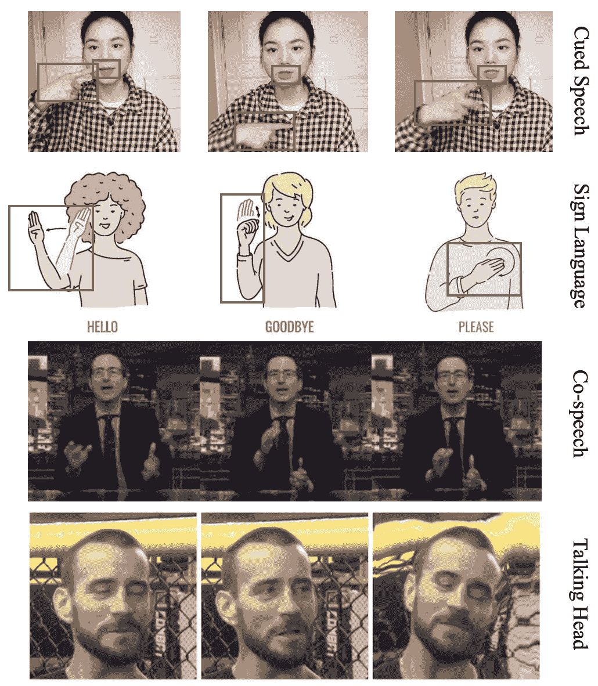

图 1：分别展示了提示语音、手语、同步语音和谈话头像的示例。

在本调查中，我们主要关注四种典型的身体语言（BL），并以它们为例来回顾和分析多模态 BL 的识别和生成。图 1 展示了四种类型的 BL 的简单图示，即提示语音（CS）[1]，手语（SL）[2]，同步语音（CoS）[3] 和谈话头像（TH）[4]。在这一领域，已有大量前期研究取得了显著进展。然而，尽管在 BL 生成和识别的深度多模态学习方面取得了进展，但仍然存在一些挑战和未解的研究问题，例如不同数据模态的多模态学习、标注数据集的稀缺、细粒度线索的表示、建模时间动态以及有限的计算资源。这些挑战需要在多模态 BL 识别和生成中得到解决，以进一步推动该领域的发展，并使人机交互（HCI）、社会机器人和情感计算等应用更加有效。

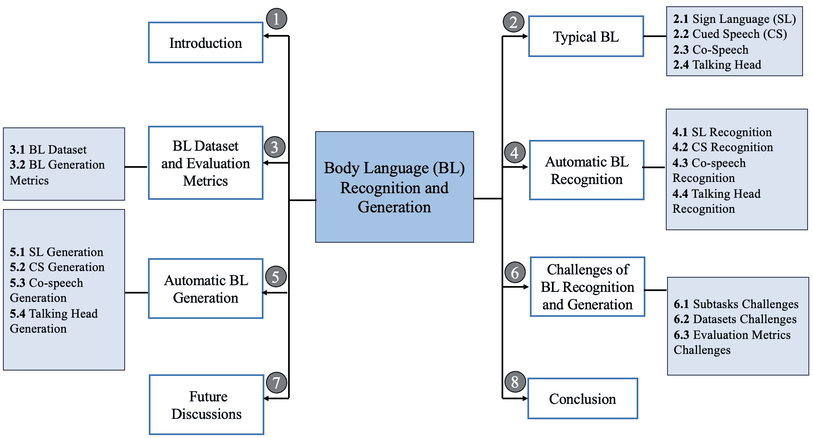

图 2：本调查的架构。

本调查的组织结构。我们首先介绍了四种典型的 BL 变体，并在第二部分中建立了这四种类型之间的联系。然后，我们在第三部分中组织并展示了用于 BL 识别和生成的各种数据集及评估指标。在第四部分和第五部分中，我们分别对 CS、SL、CoS 和 TH 的 BL 识别和生成进行了详细的回顾。此外，在第六部分中，我们对这些 BL 类型面临的挑战进行了详细分析。最后，我们通过提出多个需要研究的方向来讨论并总结本调查。该调查的架构在图 2 中进行了可视化。现有 BL 研究的结构化分类和一些代表性工作展示在图 3 中。

表 I：现有评审的数量。

| 类型 | SL | CS | CoS | TH | LR | SL+CS | LR+TH | 总计 |
| --- | --- | --- | --- | --- | --- | --- | --- | --- |
| R | 5 | 1 | 0 | 0 | 5 | 1 | 0 | 12 |
| G | 4 | 0 | 1 | 3 | 0 | 0 | 0 | 8 |
| R&G | 1 | 0 | 0 | 0 | 0 | 0 | 1 | 2 |
| 总计 | 10 | 1 | 1 | 3 | 5 | 1 | 1 | 22 |

缩写的对应术语如下：R – 识别；G – 生成；SL – 手语；CS – 口述语言；CoS – 语音同步；TH – 讲话头；LR – 唇读。

与现有评审的差异。表 I 展示了相关领域中与 BL 识别和生成相关的评审文章数量。尽管已有 22 篇现有综述，我们的调查与这些前人工作的差异可以总结如下：

+   •

    范围。现有关于 BL 的评审[5, 6, 7]仅关注该领域内的特定子任务。对于 BL 识别，评审[8, 9, 10, 11, 12, 5, 13, 14, 15, 16]集中在 SL 识别方面。关于 BL 生成，[6]仅探讨了 CoS 生成，而[17, 18, 19]深入探讨了 TH 生成。[20]整合了子任务：LR 识别和 TH 生成。与之前提到的评审不同，本文关注于两个主要任务：识别和生成。每个任务扩展为包含四种不同类型的 BL：SL、CS、CoS 和 TH。据我们所知，这是首次涵盖所有四种 BL 类型及其对应的识别和生成任务的综述。

+   •

    时间线。该调查突出显示了 2017 年至今在上述研究领域的最新进展、主要挑战以及基于深度学习（DL）的多模态方法。请注意，我们将持续更新我们维护的**资源库**，以反映最新的发展。预计这项研究将促进知识的积累和深度多模态 BL 方法的创建，为读者、研究人员和从业者提供**指导未来方向的路线图**。

总结来说，这项调查提供了对深度多模态学习技术在自动化 BL 识别和生成方面取得进展的**深入审查**。它还概述了未来研究的方向。目标是为研究人员和从业者提供对该领域的**综合理解**，涵盖基础原理、多模态融合方法、DL 架构、基准数据集、挑战以及潜在方向。

Body Language <g stroke="#80B3CC" fill="#808080" transform="matrix(1.1 0.0 0.0 1.1 -16.

图 3: 现有 BL 研究的结构化分类法，包括三种类型。仅展示了每类的几个代表性方法。

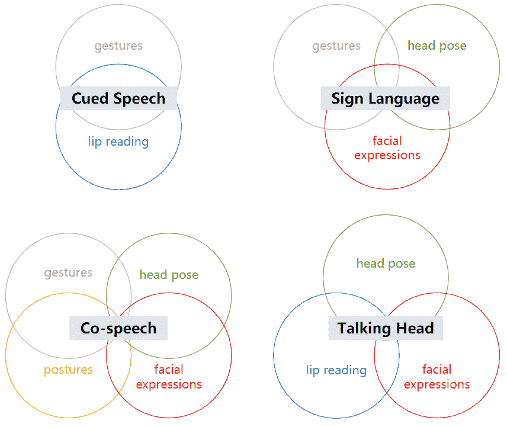

图 4: 四种典型身体语言案例的元素组成。

## 2 典型的身体语言

人类传递信息的 BL 通常涉及五个方面，即手势、面部表情、读唇（LR）、头部姿势和体态。在本调查中，我们将这五个方面称为 BL 的基本元素。

手势指的是使用手部动作来传达意义。人们通过挥手、指点或手势等动作进行交流。此外，面部表情作为 BL 的基本元素也起着至关重要的作用。人类通过改变眼睛、眉毛、嘴巴等周围的面部肌肉来表达情感和意图。另一个基本元素是 LR，它涉及通过观察嘴唇和口部的运动来解释语音。此外，头部姿势，包括倾斜或转动头部，也可以传达与注意力、兴趣或特定愿望相关的信息。最后，体态，如站立、坐姿或身体倾斜，有助于在 BL 中传达情感状态和社会意图。

BL 案例通常由两种或更多这些模式组成。如图 4 所示，我们列出了本调查中讨论的四种典型 BL 案例，每一种都可以视为基本 BL 元素的组合。在本节中，我们将提供这四种 BL 案例的全面概述，包括它们的概念、重要性以及在其对应的识别或生成任务中存在的挑战。

### 2.1 手语

SL 被归类为在聋人社区中常用的自然语言 [2]。根据世界聋人联合会的数据，全球聋人总数估计约为 7200 万人，其中超过 80% 生活在发展中国家[47]。这些个体使用超过 300 种不同的 SL，每种都有其独特的词汇和语法。SL 也被称为视觉语言，通常由若干视觉部分组成，如手势、面部表情、头部姿势和体态。具体而言，[51] 中列出了六个基本参数作为 SL 的基本组成部分，即手型、方向、动作、位置、口形和眉毛动作。从整体角度来看，我们将手势、面部表情和头部姿势视为 SL 中的主要视觉模式。

手语是聋人主要的沟通工具，但却难以掌握。为了消除沟通障碍，开发自动手语处理技术具有重要意义，包括手语识别 (SLR)，通过捕捉和分析手语数据的图像或视频序列来提取词汇或语句；手语生成 (SLG)，从输入的语义信息生成可视化的手语动画；以及手语翻译，将提取的信息翻译成另一种手语或口语 [52][53]。本调查主要集中在手语识别和手语生成的文献综述，以深入了解手语处理领域的重要问题和难点。

作为一种高度动态和多模态的视觉语言，手语涉及多种具有互补语义的视觉元素的组合。因此，从不同模态中有效提取和融合高维特征是一个重要任务。深度多模态学习技术在解决这些挑战和推动手语处理领域的发展方面发挥了关键作用。通过结合来自视频或深度传感器的视觉和空间信息与语言提示，这些方法在提高手语识别和手语生成系统的准确性和自然性方面显示了有希望的结果。

在第 4.1 和 5.1 节中，我们研究了深度多模态学习在手语识别 (SLR) 和手语生成 (SLG) 方面的最新研究进展和技术。此外，我们探讨了与这些任务相关的挑战，并强调了该领域的潜在应用和未来方向。

### 2.2 提示言语

CS 是由 Cornett 提出的视觉沟通系统 [1]，旨在增强听力损失个体的言语感知。CS 使用一组手势和位置，称为提示，以编码音素，如辅音和元音。图 5 展示了普通话 CS (MCCS) 的图表 [46, 54]。CS 中的手势作为唇读的补充，直观地展示了从口部运动中观察到的语音细节，以消除仅靠唇读所带来的模糊性。作为口语中听觉信息的清晰且不含歧义的视觉对应物，CS 使听力损失个体能够更好地理解和区分言语声音，促进他们的语言习得、口语能力、阅读技能和整体沟通能力。

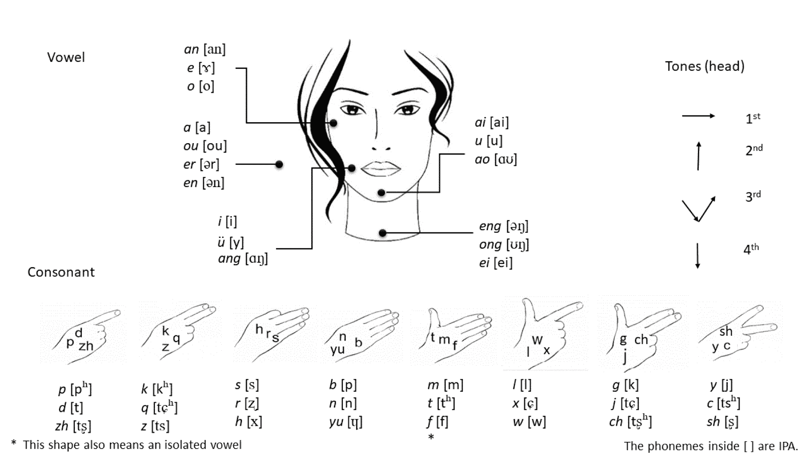

图 5：汉语 CS 中元音和辅音的手形和手位对应表。

CS 目前已适应全球约 65 种语言和方言，包括英语、法语、中文等[55]。最近，对在 CS 研究领域开发自动识别和生成技术的兴趣日益增长[56, 57]。这些技术旨在增强主要使用 CS 进行沟通的人的可达性。例如，利用自动 CS 识别（ACSR），人们可以轻松地将手势和唇读转录为相应的语音语言，达到音位水平[58, 59]。相反，配备自动 CS 生成（ACSG）的数字代理可以将口语输入转换为真实的 CS 表达。

为了高效处理 CS 数据，从手部和唇部动作这两个模态中有效提取信息至关重要。然而，这一任务在多个方面都存在挑战。首先，人脑在处理带手势的语音时存在固有的异步现象[40]；其次，识别或生成适当的手形和唇部动作涉及解决细粒度的图像处理问题[60, 61, 62]。因此，深度多模态学习技术作为揭示手势与 LR 之间相互作用的突出研究趋势应运而生，旨在实现高性能的 ACSR 或 ACSG 系统。

在第 4.2 和 5.2 节中，我们将讨论一些 SOTA 方法，以解决 CS 处理中的问题。我们探讨在这一新研究领域利用深度多模态学习技术的挑战与机遇，旨在提升依赖 CS 进行沟通的个体的可达性和包容性。

### 2.3 同步言语

CoS 指的是在沟通过程中伴随并补充口语的非语言行为和信号[6]。它包括各种视觉线索，如手势、身体姿势和面部表情，如眼神和眨眼，这些可以与言语结合使用，以传达额外的信息和意义[63][64]。CoS 手势对口语的整体理解和解释有重要贡献[65]。它们作为上下文线索，强调重点，传达情感状态，并促进社交互动[66]。

随着 AI 代理技术的发展，在 CoS 生成或合成方面进行了广泛的研究探索，以使数字人等 AI 代理具有更具表现力和逼真的身体语言 [67, 68, 69, 70, 27]。这项任务的主要目标是利用语音音频和转录作为输入生成一系列人类身体语言，从而提升人机交互系统的性能。另一方面，大多数现有的手势识别方法主要集中于识别特定类型的手势 [71, 72, 73, 74]，忽视了它们与语音等其他模态的关系。

CoS 信号不仅在增强言语交流的清晰度、表现力和情感内容方面发挥着重要作用，还捕捉到丰富的交流背景，并揭示了说话者的社会身份和文化归属 [48]。因此，探索考虑手势视觉信息和伴随语音信号的多模态方法已成为一种发展趋势，这使得在情感识别和对话理解等领域能够进行更全面和准确的分析 [75]。

在 4.3 节中，我们简要概述了自动 CoS 识别的工作。由于其应用场景有限，该领域的研究相对稀缺。在 5.3 节中，我们回顾了 CoS 生成的 SOTA 技术和进展，突出了该领域的潜在应用和未来研究方向。

表 II：多模态身体语言数据集。

| 类型 | 名称 | 年份 | 规模 | 模态 | 语言 | 链接 |
| --- | --- | --- | --- | --- | --- | --- |
| 手语 | Dicta-Sign [76] | 2008 | $\sim$1k | 视频-文本 | 英文 | [链接](https://www.sign-lang.uni-hamburg.de/dicta-sign/portal/) |
| PHOENIX-Weather[77] | 2012 | $\sim$3k | 视频-文本 | 德国 | [链接](https://www-i6.informatik.rwth-aachen.de/~koller/RWTH-PHOENIX/) |
| ASLLVD[78] | 2012 | $\sim$3K | 视频-文本 | 英文 | [链接](https://www.bu.edu/asllrp/av/dai-asllvd.html) |
| SIGNUM [79] | 2013 | $\sim$33K | 视频-文本 | 德国 | [链接](https://www.phonetik.uni-muenchen.de/forschung/Bas/SIGNUM/) |
| DEVISIGN[80] | 2014 | $\sim$24k | 视频-文本 | 中文 | [链接](http://vipl.ict.ac.cn/homepage/ksl/data_ch.html) |
| ASL-LEX 1.0[81] | 2017 | $\sim$1K | 视频-文本 | 英文 | [链接](https://asl-lex.org/download.html) |
| PHOENIX14T[82] | 2018 | $\sim$68K | 视频-文本 | 德国 | [链接](https://www-i6.informatik.rwth-aachen.de/~koller/RWTH-PHOENIX-2014-T/) |
| CMLR[83] | 2019 | $\sim$102K | 图像-文本 | 中文 | [链接](https://www.vipazoo.cn/CMLR.html) |
| KETI[84] | 2019 | $\sim$15K | 视频-文本 | 韩语 | 不可用 |
| GSL[85] | 2020 | $\sim$3K | 视频-文本 | 希腊语 | [链接](https://zenodo.org/record/3941811#.ZHb2LXZBxD8) |
| ASL-LEX 2.0[86] | 2021 | $\sim$ 10K | 视频-文本-深度 | 英语 | [链接](https://asl-lex.org/download.html) |
| How2sign[87] | 2021 | $\sim$35K | 视频-文本-骨架（2D）-深度 | 英语 | [链接](https://how2sign.github.io/) |
| Slovo[88] | 2023 | $\sim$20K | 视频-文本 | 俄语 | [链接](https://github.com/hukenovs/slovo) |
| AASL[89] | 2023 | $\sim$8K | 图像-文本 | 阿拉伯语 | [链接](https://www.kaggle.com/datasets/muhammadalbrham/rgb-arabic-alphabets-sign-language-dataset) |
| ASL-27C[83] | 2023 | $\sim$23K | 图像-文本 | 英语 | [链接](https://www.kaggle.com/datasets/ardamavi/27-class-sign-language-dataset) |
| Cued Speech | FCS[90] | 2018 | $\sim$13k | 视频-文本-音频 | 法语 | [链接](https://zenodo.org/record/5554849) |
| BEC[59] | 2019 | $\sim$3k | 视频-文本-音频 | 英语 | [链接](https://zenodo.org/record/3464212) |
| PCSC [91] | 2020 | 20 (P) | 视频-文本-音频 | 波兰语 | [链接](https://phonbank.talkbank.org/access/Clinical/PCSC.html) |
| CLeLfPC[92] | 2022 | 350 | 视频-文本-音频 | 法语 | [链接](https://www.ortolang.fr/market/corpora/clelfpc) |
| MCCS-2023[41] | 2023 | $\sim$132k | 视频-文本-音频-骨架（2D,3D） | 中文 | [链接](https://mccs-2023.github.io/) |
| Co-speech | Trinity[67] | 2018 | 224（分钟） | 视频-文本-音频-骨架（2D,3D） | 英语 | [链接](https://trinityspeechgesture.scss.tcd.ie/) |
| TED-Gesture[68] | 2019 | $\sim$252k | 视频-文本-音频-骨架（2D） | 英语 | [链接](https://github.com/youngwoo-yoon/youtube-gesture-dataset) |
| Talking With Hands [69] | 2019 | 200 | 视频-文本-音频-骨架（2D,3D） | 英语 | [链接](https://github.com/facebookresearch/TalkingWithHands32M) |
| Speech2Gesture[70] | 2019 | $\sim$60k | 视频-文本-音频-骨架（2D） | 英语 | [链接](http://people.eecs.berkeley.edu/~shiry/speech2gesture/) |
| TED-Expressive[27] | 2022 | $\sim$252k | 视频-文本-音频-骨架（2D,3D） | 英语 | [链接](https://github.com/alvinliu0/HA2G) |
| Talking Head | GRID [93] | 2006 | $\sim$34k | 视频-文本 | 英语 | [链接](https://spandh.dcs.shef.ac.uk/gridcorpus/) |
| eNTERFACE [94] | 2006 | $\sim$1k | 视频-文本-音频 | 多种语言 | [链接](http://www.enterface.net/enterface05) |
| MIRACL-VC1 [95] | 2014 | $\sim$3k | 视频-文本-深度 | 英语 | [链接](https://sites.google.com/site/achrafbenhamadou/-datasets/miracl-vc1) |
| CREMA-D[96] | 2015 | $\sim$7k | 视频-文本-音频 | 英语 | [链接](https://github.com/CheyneyComputerScience/CREMA-D) |
| TCD-TIMIT [96] | 2015 | $\sim$7k | 视频-文本-音频 | 英语 | [链接](https://sigmedia.tcd.ie/TCDTIMIT/) |
| MODALITY [97] | 2015 | $\sim$6k | 视频-文本-音频 | 英语 | [链接](http://www.modality-corpus.org/) |
| LRW [98] | 2016 | $\sim$539k | 视频-文本 | 英语 | [链接](https://www.robots.ox.ac.uk/~vgg/data/lip_reading/lrw1.html) |
| MSP-IMPROV [99] | 2016 | $\sim$1K | 视频-文本-音频 | 英语 | [链接](https://ecs.utdallas.edu/research/researchlabs/msp-lab/MSP-Improv.html) |
| ObamaSet[100] | 2017 | $\sim$1k | 视频-文本-音频 | 英语 | [链接](https://github.com/supasorn/synthesizing_obama_network_training) |
| VoxCeleb1[101] | 2017 | $\sim$22k | 视频-文本-音频 | 英语 | [链接](https://www.robots.ox.ac.uk/~vgg/data/voxceleb/vox1.html) |
| VoxCeleb2[102] | 2018 | $\sim$146k | 视频-文本-音频 | 英语 | [链接](https://www.robots.ox.ac.uk/~vgg/data/voxceleb/vox2.html) |
| LRS2 [103] | 2018 | $\sim$96k | 视频-文本 | 英语 | [链接](https://www.robots.ox.ac.uk/~vgg/data/lip_reading/) |
| LRS3-TED [104] | 2018 | $\sim$119k | 视频-文本 | 英语 | [链接](https://www.robots.ox.ac.uk/~vgg/data/lip_reading/) |
| RAVDESS [105] | 2018 | $\sim$1k | 视频-文本-音频 | 英语 | [链接](https://www.kaggle.com/datasets/uwrfkaggler/ravdess-emotional-speech-audio) |
| MELD [106] | 2018 | $\sim$13k | 视频-文本-音频 | 英语 | [链接](https://affective-meld.github.io/) |
| AVSpeech [107] | 2018 | $\sim$150k | 视频-音频 | 多语言 | [链接](http://looking-to-listen.github.io/) |
| VOCASET[108] | 2019 | 480 | 视频-文本-音频-3D 人脸 | 英语 | [链接](https://voca.is.tue.mpg.de/) |
| LRW-1000 [109] | 2019 | $\sim$718K | 视频-文本 | 中文 | [链接](https://vipl.ict.ac.cn/resources/databases/201810/t20181017_32714.html) |
| FaceForensics++[110] | 2019 | $\sim$1k | 视频-文本-音频 | 英语 | [链接](https://github.com/ondyari/FaceForensics) |
| MEAD[111] | 2020 | $\sim$281k | 视频-文本-音频 | 英语 | [链接](https://wywu.github.io/projects/MEAD/MEAD.html) |
| HDTF[112] | 2021 | $\sim$10k | 视频-文本-音频 | 英语 | [链接](https://github.com/MRzzm/HDTF) |
| AnimeCeleb [113] | 2022 | $\sim$2.4M | 视频-文本-音频-3D 人脸 | 英语 | [链接](https://github.com/kangyeolk/AnimeCeleb) |
| VLRDT [114] | 2022 | $\sim$2k | 视频-文本 | 土耳其语 | [链接](https://data.mendeley.com/datasets/4t8vs4dr4v/1) |
| KoEBA [115] | 2023 | 104(P) | 视频-文本-音频 | 韩国 | [链接](https://github.com/deepbrainai-research/koeba) |
| 其他 | AV Letters [116] | 2002 | $\sim$19k | 视频-文本 | 英语 | [链接](http://www.ee.surrey.ac.uk/Projects/LILiR/datasets/avletters1/index.html) |
| AV Digits [117] | 2002 | $\sim$5k | 视频-文本 | 英语 | [链接](https://ibug-avs.eu/) |
| Aoyama Gakuin [118] | 2017 | $\sim$1k | 视频-文本-音频-骨架（2D） | 日语 | 不可用 |
| P2PSTORY[119] | 2018 | $\sim$13k | 视频-文本-音频 | 多个 | [链接](https://www.media.mit.edu/projects/p2pstory/overview/) |
| AMASS[120] | 2019 | $\sim$18k | 视频-文本-骨架（3D） | 英语 | [链接](https://amass.is.tue.mpg.de/download.php) |
| BoLD[121] | 2020 | $\sim$10k | 视频-文本-音频-骨架（3D） | 英语 | [链接](https://cydar.ist.psu.edu/emotionchallenge/index.php) |
| PATS [122] | 2020 | $\sim$84k | 视频-文本-音频-骨架（2D） | 英语 | [链接](https://chahuja.com/pats/) |
| BABEL[123] | 2021 | $\sim$28k | 视频-文本-骨架（3D） | 英语 | [链接](https://babel.is.tue.mpg.de/data.html) |
| HumanML3D[124] | 2022 | $\sim$15k | 视频-文本-骨架 | 英语 | [链接](https://github.com/EricGuo5513/HumanML3D) |
| BEAT[125] | 2023 | $\sim$3k | 视频-文本-音频-骨架（3D） | 多个 | [链接](https://pantomatrix.github.io/BEAT-Dataset/index.html) |

### 2.4 说话头部

TH 指的是人脸或头部的虚拟或数字化表示，通常用于多媒体应用、计算机图形学和人机交互。它通常是一个在屏幕上出现的动画角色，可以模拟各种面部表情、头部动作和语音，并同步嘴唇运动 [17, 126, 127]。TH 旨在通过提供互动和沉浸式的沟通界面，提升各种应用中的用户体验，从虚拟助手到娱乐平台。

在 2003 年，提出了由语音合成器驱动的生成对话面孔的视觉文本到语音（VTTS）技术，用于 HCI 系统[128]。语音合成技术用于将文本输入转换为合成语音，使虚拟角色能够说话。面部动画算法被用来动画化虚拟角色的面部动作，包括与生成的语音同步的唇部动作。这些算法分析语音中的语音信息，并将其映射到相应的面部动作上。此外，还利用复杂的计算机图形技术生成虚拟角色的逼真纹理、光照和阴影，以增强其视觉效果[129]。之前的 TH 生成方法面临许多限制，由于数据可用性和计算能力等限制，未能实现高质量和逼真的结果。

TH 生成需要融合和同步来自不同模态的信息，以确保角色动画、声音和文本之间的一致性和连贯性。这涉及到每个模态的对齐、融合和同步，以产生更统一的响应。近年来，深度学习和多模态神经网络从多个角度提升了 TH 生成的性能[19, 50]。通过基于大量数据的多模态或跨模态技术，TH 生成可以整合来自不同来源的用户输入，并以更自然和逼真的方式互动。这使得多模态 HCI 系统能够更好地理解用户意图，相应地生成响应，并提供更具沉浸感和个性化的互动体验。

在 4.4 节中，我们简要回顾了 TH 识别。在 5.4 节中，我们探讨了深度多模态学习在 TH 生成中的应用和进展。我们讨论了创建逼真和富有表现力的虚拟角色所面临的挑战，包括自然语音的合成和面部表情的准确表现。我们回顾了 SOTA 技术，并强调了该领域潜在的未来发展，旨在提升 TH 在各种应用中的逼真性和互动性。

## 3 身体语言数据集与评价指标

### 3.1 身体语言数据集

数据集在整个 BL 研究历史中发挥了关键作用，不仅为衡量和比较竞争算法的性能提供了共同的基础，还推动了该领域朝着越来越复杂和具有挑战性的问题发展。尤其是在最近几年，DL 技术为 BL 研究带来了显著成功，而大量标注数据是这一成功的关键。通过互联网获取的大规模图像集合使得构建全面的数据集成为可能。此外，多模态数据的可用性为相关任务提供了更丰富的信息，为未来 BL 识别和生成研究开辟了新可能。

在本节中，我们收集并展示了与 BL 任务相关的数据集。如表 II 所示，我们根据数据格式和任务目的将它们分类为五种类型：CS、SL、CoS、TH 和其他（这里的“其他”指的是这些数据集是多模态 BL 数据集，但并未专门针对这四个任务设计）。我们介绍了这些数据集的相关信息，包括出版年份、数据集规模、可用模态以及数据集使用的语言。此外，我们提供了这些数据集的官方链接，以便研究人员更方便地访问。请注意，我们根据视频片段/序列的数量来衡量数据集的规模。对于未提供这些数字的数据集，我们提供视频的时长（以“Min”表示）或表演者的数量（以“P”表示）。图 6 中展示了一些 BL 数据集的示例以供参考。

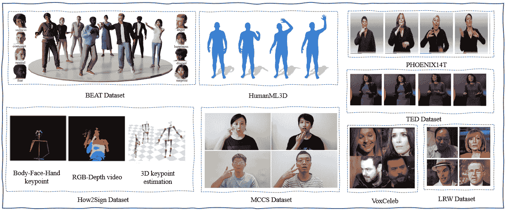

图 6：一些 BL 数据集的示例。

我们在图 7 中展示了数据集语言的分布。图表显示相关数据集主要是英语数据集，但也包括其他语言的数据集，如中文数据集和德语数据集。这表明当前的 BL 研究主要集中在英语上，但也越来越重视跨文化和多语言数据集。另一个问题是 BL 数据集格式和标准的差异。不同数据集可能具有不同的存储格式、记录要求和模型标准。

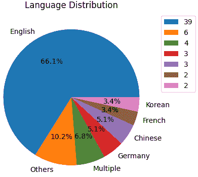

图 7：BL 数据集中的语言分布。

### 3.2 BL 生成指标

为了评估 BL 姿势生成方法的性能，我们总结了主要的姿势生成指标，并在表 VI 中展示了这些生成指标及其相应的计算公式。总共介绍了七个指标用于评估，即 PCK[130]、FGD[131]、MAE[132]、STD[132]、PMB[25]、MAJE[131] 和 MAD[131]。正确关键点百分比 (PCK) 通过将关键点与实际动作进行比较来评估生成运动的准确性。如果预测的关键点落在实际关键点的指定阈值内，则认为是正确的。均方绝对误差 (MAE) 量化了生成和实际关键点的标准化坐标值之间的平均差异。标准差 (STD) 表示在标准化后关键点从其平均位置的变异性或分布。Fréchet 手势距离 (FGD) 衡量生成手势和真实手势的潜在特征分布之间的差异，包括位置和分布。匹配节拍百分比 (PMB) 认为如果运动节拍与音频节拍的时间距离低于阈值，则该节拍为匹配。均方绝对关节误差 (MAJE) 计算所有时间步骤和关节中生成的和真实的关节位置之间的平均误差。均方绝对差异 (MAD) 计算关节加速度的平均差异，考虑幅度和方向。这些标准提供了关于生成运动数据和真实运动数据之间准确性、相似性和对齐的全面见解。

TH 生成结果可以从多个角度进行定量评估。评估指标包括身份保持指标、视听同步指标、图像质量保持指标、表情指标和眼睛眨动指标。

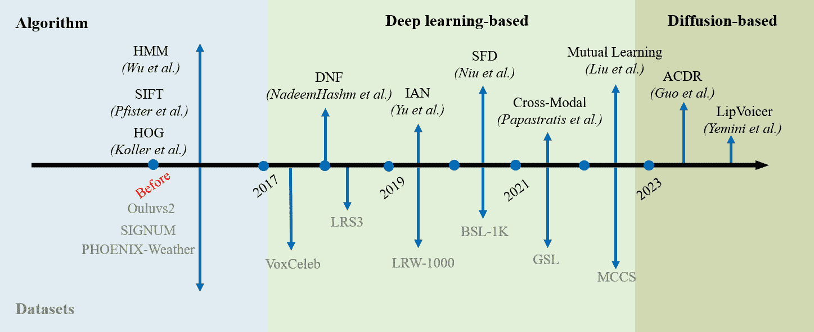

图 8：BL 识别的数据集和方法的里程碑。

## 4 自动身体语言识别

在这里，我们将介绍四种 BL 变体的识别，特别关注多模态学习的应用扩展和创新。在图 8 中，我们展示了一些代表性 BL 识别工作的总结。

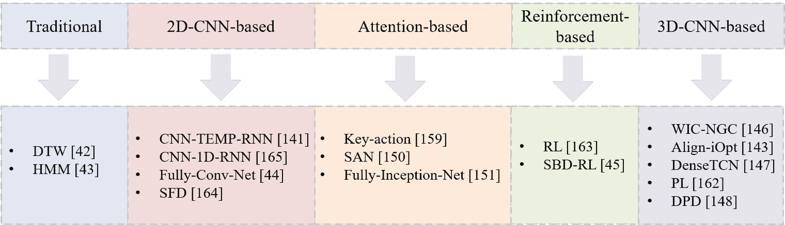

图 9：SL 识别的综合方法。

### 4.1 手语识别

SLR 旨在利用分类器从视频流中识别手语符号。根据手语内容的不同，SLR 一般可以分为两类：连续手语识别和孤立手语识别。本文重点关注连续手语识别（CSLR），在这种方法中，特征编码器模块首先从手语视频中提取语义表示，然后序列模块将提取的语义映射到文本序列。此外，还研究了一些训练策略以确保充分的训练。全面的方法展示在图 9 中。

特征编码器。由于手部在手语表达中发挥着主导作用，它在过去三十年中不断发展，我们可以将这些方法分为以下两类。

+   •

    基于手工特征的方法。在早期研究中，手工特征被用来提取手部运动、形状和方向，例如 HOG[77, 133]、Grassmann 协方差矩阵（GCM）[134]和 SIFT[135]。然而，这些方法需要手动特征提取，不能直接应用于不同的手势，这意味着不同的手势需要不同的特征提取方法，从而导致大量的工作。

+   •

    基于 CNN 的方法。随着深度学习的发展，CNNs[136, 137, 138, 139]通常取代了基于手工特征的方法，成为 SLR 最强大的特征提取器。许多研究者试图探索合理的基于 CNN 的架构，以直接从视频序列中提取判别性视觉特征。具体而言，现有的工作使用了 2D-CNN-TCN[140, 141, 142, 44]和 3D-CNN[140, 143, 144, 145, 146, 147, 148]作为骨干来提取时空判别线索。例如，IAN[143]利用 3D-ResNet[138]进行视觉表示。DNF[149]巧妙设计了结合 1D 时间卷积的 2D-CNN，这已经成为主流的基线方法之一。尽管基于 CNN 的方法能够有效捕捉手势图像中的空间特征，但它们在处理手势的时间动态方面有限，并且 3D-CNN 的方法涉及显著的计算开销。

顺序模块。对于 CSLR，存在三种代表性的方法[150, 151]。早期研究中，HMM[152, 153, 72, 154] 被用来学习视觉表示与手势词汇序列之间的对应关系。然而，SLR 的手势动作通常具有长期依赖性，而 HMM 很难捕捉这种复杂的序列模式。此外，HMM 不考虑输入和输出模态之间的对齐。因此，基于 RNN 的方法与 CTC 损失[155, 156, 141, 143, 157] 被开发出来替代 HMM 模型，这提高了模型处理不完全对齐数据的能力，但建模全局信息的能力仍然有限。因此，为了更好地理解整个手语序列的语义关系，编码器-编码器[22, 158, 159] 已成为一种常用的顺序框架。例如，Guo 等人[22] 利用具有层次深度递归融合的编码器-解码器框架来融合来自 RGB 和骨架模态的线索。

训练策略。为了充分训练，广泛使用一些优化策略，其中最显著的是 CTC[160, 156, 161] 和 迭代训练[141, 142, 143, 161] 策略。在这两种策略的基础上，Pu 等人[142] 引入了一种称为 CMA 的跨模态约束来辅助训练。Hao 等人[160] 提出了一种三阶段优化方法，这提高了识别性能，但耗时较长。最近，Min 等人[156] 进一步提出了两种辅助约束，以帧级概率分布为基础，使整个模型可端到端训练。

表 III：BL 识别的一些代表性工作的时间线。

| 类型 | 年份 | 参考 | 特征提取 | 序列模型 | 学习范式 | 数据集 |
| --- | --- | --- | --- | --- | --- | --- |
| SL | 2019 | Pei et al. [162] | 3D-ResNet | BGRU | CTC | Phoenix-2014 |
|  | 2019 | Pei et al. [163] | 3D-ResNet | Transformer | 强化学习 | Phoenix-2014 |
|  | 2019 | Cui et al. [141] | CNN | RNN | 迭代训练 | Phoenix-2014 和 SIGNUM |
|  | 2020 | Niu et al. [164] | CNN | Transformer | CTC | Phoenix-2014 |
|  | 2020 | SAFI [151] | 2D-CNN *加* 1D-CNN | SAN | ACE *加* CTC | Phoenix-weather 和 SIGNUM |
|  | 2021 | Koishybay et al. [165] | 2D-CNN *加* 1D-CNN | RNN | 迭代 GR *加* CTC | Phoenix-weather 和 SIGNUM |
|  | 2021 | SLRGAN [166] | CNN | BiLSTM | GAN | Phoenix-weather, CSL 和 GSL |
|  | 2022 | Chen et al. [167] | S3D | BLC | CTC *加* 自蒸馏 | Phoenix-2014 |
|  | 2022 | Zhou et al. [161] | SMC | BiLSTM *加* SA-LSTM | CTC *加* 关键点回归 | PHOENIX-2014、CSL 和 PHOENIX-2014-T |
|  | 2023 | Hu et al. [168] | 2D-CNN | 1D-CNN *加* BiLSTM | SSTM *加* TSEM | PHOENIX-2014、PHOENIX-2014-T、CSL 和 CSL-Daily |
|  | 2023 | Zheng et al. [169] | CNN | VAE | CTC *加* 对比对齐损失 | PHOENIX-2014 和 PHOENIX-2014-T |
| CS | 2018 | Liu et al. [90] | CNN | HMM | - | 法语手势识别 |
|  | 2021 | Papadimitriou et al. [170] | 2D-CNN *加* 3D-CNN | 基于注意力的 CNN | - | 法语和英式英语手势识别 |
|  | 2021 | Liu et al. [40] | CNN | MSHMM | HPM | 法语和英式英语手势识别 |
|  | 2021 | Wang et al. [58] | CNN *加* ANN | BiLSTM *加* FC | 跨模态知识蒸馏 | 法语和英式英语手势识别 |
|  | 2022 | Sankar et al. [171] | Bi-GRU | Bi-GRU | CTC | CSF18 |
|  | 2023 | Liu et al. [41] | ResNet-18 | Transformer | 跨模态互学习 | 中文、法语和英式英语手势识别 |

表 IV：手势生成工作的时间表。

| 类型 | 年份 | 参考文献 | 输入模态 | 框架 | 数据集 | 描述 |
| --- | --- | --- | --- | --- | --- | --- |
| SL | 2011 | kippet et al. [172] | RCB 视频 | EMBR | ViSiCAST | 提出了一个以手势为中心的工具，以实现与人类手势者的对比。但需要结合非手动特征。 |
|  | 2016 | John et al. [173] | RGB 视频 | 分段框架 | 自有数据集 | 该方法以低复杂度实现了生成图像的自动现实感，但需要对肩部和躯干进行定位。 |
|  | 2016 | Sign3D[174] | RGB 视频 | 异质数据库 | 自有数据集 | 该方法保证了手势虚拟形象容易理解且被观众广泛接受，但仅限于有限的手势短语。 |
|  | 2018 | HLSTM[22] | RCB 视频 | LSTM | 自有数据集 | 该方法在有效对齐句子的词序和视觉内容方面表现出鲁棒性。然而，当将其推广到新数据集时，会出现限制。 |
|  | 2020 | Text2Sign[21] | 文本 | Transformer | PHOENIX14T | 证明了在处理输出序列动态长度方面的鲁棒性。然而，未结合非手动信息。 |
|  | 2020 | Zelinka et al. [175] | 文本 | CNN | Crech 新闻 | 该方法对缺失部分具有鲁棒性，但未包括面部表情。 |
|  | 2020 | ESN[23] | 文本 | GAN | PHOENIX14T | 显示了对非手动特征生成的鲁棒性。但生成的手势不够真实。 |
|  | 2020 | Necati et al. [176] | 文本 | Transformers | PHOENIX14T | 不需要手势信息，但模型复杂 |
|  | 2020 | Saunders et al. [177] | 文本 | GAN | PHOENIX14T | 对手动特征生成具有鲁棒性。生成的手势不够真实。 |
|  | 2022 | DSM. [178] | 词汇 | Transformer | PHOENIX14T | 本研究通过数据驱动的方式对生成的手语进行韵律改进。 |
|  | 2022 | SignGAN. [179] | 文本 | FS-Net | meineDGS | 该方法通过学习词典手势之间的共同发音来处理大规模的手语翻译问题，并改进了插值词典手势与连续手语序列的时间对齐。 |
|  | 2023 | PoseVQ-Diffusion. [180] | 词汇 | CodeUnet | PHOENIX14T | 提出了一个条件姿态序列生成的向量量化扩散方法，并开发了一种新颖的顺序 k 最近邻方法，用于预测对应词汇序列的姿态序列的可变长度。 |

表 V: Co-speech 和 Cued Speech 生成工作的时间线。

| 类型 | 年份 | 参考 | 输入模态 | 框架 | 数据集 | 描述 |
| --- | --- | --- | --- | --- | --- | --- |
| CoS | 2015 | DCNF[181] | 文本 | FC 网络 | DIAC | 本研究结合了语音文本、韵律和词性标签，使用 FC 网络和条件随机场（CRF）的组合生成共同发言的手势。 |
|  | 2019 | S2G[70] | RGB 视频 | CNN | S2G | 本研究提出了一种生成与音频语音匹配手势的方法，利用跨模态翻译和对未标记视频的训练。但它依赖于嘈杂的伪真实数据进行训练。 |
|  | 2020 | StyleGestures [182] | RCB 视频 | LSTM | Trinity | 实现了自然的变异而无需手动注释，并允许控制手势风格，同时保持感知的自然性。 |
|  | 2021 | A2G[183] | 文本 | CVAE | Trinity | 本研究使用 CVAE 从语音输入生成多样化手势，并涉及到语音到手势的一对多映射。 |
|  | 2021 | Text2Gestures[184] | 文本 | Transformer | MPI-EBEDB | 他们的方法使用基于 Transformer 的编码器和解码器生成基于文本和先前姿态的顺序关节位置。 |
|  | 2022 | ZeroEGGS[185] | 文本 | 变分框架 | 自有数据集 | 使用基于 VAE 的框架生成可控风格的 CoS 手势，并通过对零样本运动示例的条件生成风格化手势。 |
|  | 2022 | DiffGAN[24] | 文本 | 扩散模型 | PATS | 提出了一个对抗领域适应的方法，用于个性化演讲者的手势。 |
|  | 2022 | RG[25] | Trinity 和 TED | QVAE | PHOENIX14T | 本研究介绍了一种新颖的 CoS 手势合成方法，有效捕捉了节奏和语义。 |
| CS | 1998 | Paul et al. [28] | 文本 | 模板 | 自有数据集 | 依赖于手动选择的关键词、低语境句子和预定义的手势模板。其局限性包括表达能力受限和增加的手动工作量。 |
|  | 2008 | Gérard et al. [29] | RGB 视频 | 模板 | 自有数据集 | 引入了一种后处理算法，通过解决旋转、平移和适应新图像来微调合成的手势。然而，它依赖于先验知识来适应新图像。 |

### 4.2 提示语音识别

自动唇读是自动提示语音识别的关键组成部分。因此，我们将首先介绍自动唇读的研究进展，然后回顾自动提示语音识别。

#### 4.2.1 自动唇读

深度学习的进展使得唇读方法表现出色。通常，基于深度学习的唇读方法包括两个主要部分，一是提取视觉特征信息，另一个是对序列特征进行分类。

特征提取。传统研究使用基于像素[186]、基于形状[187, 188]和混合方法[189, 190, 191, 192, 193]来提取视觉特征。然而，这些方法不仅对图像照明变化、唇部变形和旋转敏感，而且无法自动提取。

最近，深度学习逐渐成为唇部视觉特征提取的主流研究方法，可以分为四类。首先，使用 2D-CNN 的[194, 195]方法解决了自动特征提取的问题，但它只能处理单帧图像，对连续帧的处理能力较弱，忽略了连续帧之间的时空关联。然后，3D-CNN 的方法受到了广泛关注[196, 197, 198, 199]。虽然这种方法可以解决连续帧的时空关联问题，但在一定程度上丧失了 2D 卷积提取的细粒度特征信息。针对上述问题，引入了 2D-CNN 和 3D-CNN 的混合方法[200, 201, 202]，以同时解决时空特征提取和局部细粒度特征提取的问题。这种方法利用 3D-CNN 提取时空信息，然后直接使用 2D-CNN 提取细粒度的局部信息。然而，它仍然在一定程度上影响特征编码的时间信息。因此，一些其他神经网络逐渐成为唇部视觉特征提取的热门选择，如自编码器模型[203, 204, 205, 206]。

识别建模。到目前为止，已经有许多研究将唇读视为序列到序列任务，并使用基于序列的方法来处理它，如 RNN、LSTM 和 Transformer。它将从特征提取器提取的特征表示分成等时间步，将每个时间步顺序输入到分类层。例如，[207、199、208、209、202、210] 使用长短期记忆（LSTM）网络和门控递归单元（GRU）来捕捉全球和局部的时间信息。考虑到时间卷积网络（TCN）具有比 LSTM 或 RNN 模型更快的收敛速度和更长的时间记忆，它也广泛用于此任务。例如，Bai 等人[211] 首次提出了一种简单而有效的 TCN 架构，表明 TCN 可以成为 RNN 作为序列模型的合理替代品。继这项工作之后，Martinez 等人[212] 进一步证明，多尺度 TCN 可以在唇读孤立词方面超越 RNN。然而，这些方法在建模长期依赖性方面相对较弱，无法直接捕捉序列中的长期依赖性。因此，针对唇读任务使用 Transformer[213]的趋势已经出现[214、37]。

尽管上述方法取得了令人满意的性能，但它们无法解决唇读中输入和输出模态之间的不一致性问题。为此，近年来开发了许多先进的工作，如注意力机制[215、98、197、214、216、217、218] 和对比学习[219]。

#### 4.2.2 自动提示语音识别

关于 ACSR 的文献可以分为三大类：多模态特征提取、多模态融合和 ACSR 建模。我们将在本节中分别讨论这些内容，并在表格 III 中回顾 CS 的代表性工作。

多模态特征提取。在文献中，有几种流行的方法用于 CS 特征提取（即嘴唇、手部位置和手部形状）。

+   •

    传统方法。它使用人工标记从视频图像中记录嘴唇和手[220、221]。例如，Burger 等人[222] 让讲者戴上黑色手套以获得准确的手部分割，而 Noureddine 等人[40] 在讲者的手指上放置蓝色标记以获取手指的坐标。然而，讲者的衣物颜色和背景颜色都会影响手部分割的准确性。

+   •

    基于 CNN 的方法。最近，一些基于 CNN 的方法被用来去除人工标记。例如，CNN 模型在[90、40、170]中被用于从嘴唇和手部区域提取视觉特征。在使用 CNN 模型提取嘴唇和手部形状特征的基础上，Liu 等人[40]进一步采用人工神经网络（ANN）来处理手部位置特征。然而，尽管基于 CNN 的方法不需要人工标记，但其性能受到数据稀缺的限制。

+   •

    其他基于 DL 的方法。考虑到多模态数据饥饿的问题，一些研究人员尝试引入一些先进的方法来解决这一问题。例如，Wang 等人[58]使用嘴唇、手部形状和手部位置来预训练多模态特征提取器，并将其用于 ACSR 任务的特征提取。此外，在他们的另一项工作[206]中，提出了一种基于自监督对比学习和自注意力机制的三阶段多模态特征提取模型，以建模 CS 手部形状、嘴唇和手部位置的空间和时间特征。

多模态融合。现有的大多数 ACSR 研究倾向于直接连接多模态特征流，让模型隐式学习这些特征[221、206、90、170]。例如，[221、206]利用人工标记来获取感兴趣区域（ROIs），并直接连接嘴唇和手部的特征。MSHMM[90]通过为不同 CS 模态分配权重来合并不同的特征。然而，据我们所知，ACSR 中的一个关键问题是手部和嘴唇发音之间的异步性[40、57、223]，而这些研究主要假设嘴唇和手部运动是同步的，忽略了异步性问题。

因此，为了应对 ACSR 任务中的异步模态，Liu 等人[40] 提出了利用重同步方法来对齐手部和嘴唇特征，这通过引入手部位置和手部形状的先验知识来实现。然而，由于先验知识的获取依赖于说话者和特定的数据集，因此难以直接应用于其他语言。为此，Liu 等人[41] 进一步提出了一种基于 Transformer 的跨模态互学习框架，用于多模态特征融合。该框架通过构建模态不变的共享表示来捕捉语言信息，并使用这些语言信息来指导跨模态信息对齐。最近，[224] 提出了一个新颖的联邦 CS 识别（FedCSR）框架，以在去中心化的数据场景中训练 CS 识别模型。特别是，他们设计了一个互知识蒸馏融合机制，以保持 CS 多模态的跨模态语义一致性，从而为语音和视觉特征学习统一的特征空间。

ACSR 建模。ACSR 旨在将语音的视觉线索转录为文本。在早期的研究中，采用了传统的统计方法，这些方法使用统计模型（如 HMM [221, 220] 和 HMM-GMM[90, 40]）将手工制作的特征序列映射到音素。然而，这些方法仅考虑当前状态与前一个状态之间的关系，这意味着无法捕捉到更长的上下文信息。

最近，传统的基于深度学习的方法（即基于 CNN、LSTM 的方法）被开发出来以缓解上述问题。例如，Sankar 等人[39] 提出了一个新颖的 RNN 模型，该模型通过连接时序分类（CTC）损失 [225] 进行训练。Papatimitriou 等人[170] 提出了一个完全卷积的模型，具有时间深度可分离块和基于注意力的解码器。然而，这些传统的深度学习方法仍然无法很好地捕捉长期依赖关系，而捕捉动态更长时间的全局依赖[213]是理想的，因为长时间 CS 视频中的音素具有上下文关系。为此，基于 Transformer 的方法[170]近年来在 ACSR 任务中受到广泛关注。这种方法在 ACSR 任务中取得了令人满意的性能，但仍然需要强大的计算资源和大规模数据集进行训练和参数调整。

因此，考虑到现有的 ACSR 语料库有限，一些先进的方法如跨模态知识蒸馏方法 [58] 和对比学习方法 [206] 也被引入到这一任务中。

### 4.3 共语音识别

尽管现有的研究主要集中在 CoS 手势生成上，但一些学者已经表明，识别 CoS 中的情感表达对这一生成任务至关重要。例如，Bock 等人[226]首次使用 EmoGes 语料库进行 CoS 手势生成中的情感识别。Bhattacharya 等人[227]提出利用梅尔频率倒谱系数和从输入语音中计算的文本转录，在我们的生成器中使用不同的编码器来学习期望的情感和相关的情感线索。

### 4.4 说话人识别

由于 TH 生成的发展仍有很长的路要走，近期的研究重点不在于 TH 识别。TH 识别主要被视为 TH 生成算法的评估指标。然而，人类有能力从面部识别和识别一个人，即使性别或面部表情发生变化。然而，建立一个自动面部识别系统是困难的。因此，TH 识别的重点主要是捕捉目标说话者的基本面部特征，而不是对说话者身份的全面识别。在 Wen 等人[228]提出的工作中，他们分类了面部身份，以评估基于语音的面部重建在已知对象上的性能。对于未知对象，他们使用性别分类器来评估生成面部的性别。此外，可以计算目标面部与生成面部之间的特征距离，如 Cosine、$L_{1}$和$L_{2}$距离，以测量生成面部的准确性。为此，使用了预训练的面部识别模型，如 FaceNet [229]或 ArcFace [230]，作为特征提取器。还可以测量地标距离（LMD），作为生成面部和现实世界目标面部图像之间的差异。

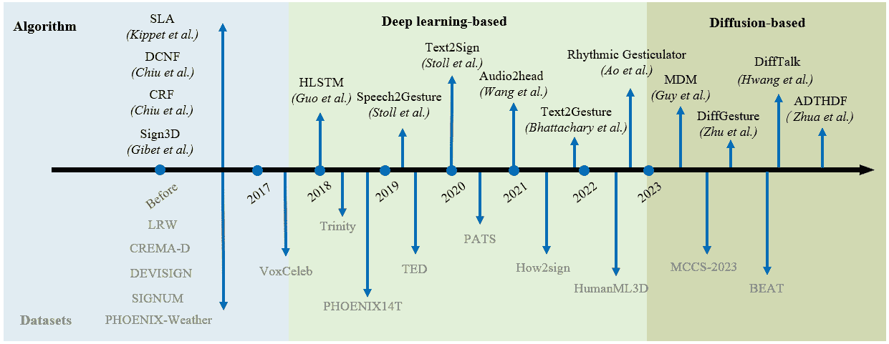

图 10：BL 生成的数据集和方法的里程碑。

表 VI：手势生成的度量标准。

| 度量标准 | 计算公式 |
| --- | --- |
| PCK [130] | $\text{PCK}=\frac{1}{N}\sum_{i=1}^{N}\textbf{1}(d_{i}\leq\tau){N}$ |
| FGD [131] | $\text{FGD}=\max_{\pi}\left(\frac{1}{T}\sum_{t=1}^{T}d(g_{t}^{*},g_{\pi(t)})\right)$ |
| MAE [132] | $\text{MAE}=\frac{1}{T}\sum_{t=1}^{T}\left&#124;g_{t}-g_{t}^{*}\right&#124;$ |
| STD [132] | $\text{STD}=\sqrt{\frac{1}{N}\sum_{i=1}^{N}(g_{i}-\bar{g})^{2}}$ |
| PMB [25] | $\operatorname{PMB}=\frac{1}{N_{m}}\sum_{i=1}^{N_{m}}\sum_{j=1}^{N_{a}}\textbf{1}\left[\left\&#124;\bm{b}_{i}^{m}-\bm{b}_{j}^{a}\right\&#124;_{1}<\delta\right]$ |
| MAJE [131] | $\text{MAJE}=\frac{1}{N\cdot T}\sum_{t=1}^{T}\sum_{n=1}^{N}\left&#124;g_{t}^{n}-g_{t}^{*n}\right&#124;$ |
| MAD [131] | $\text{MAD}=\frac{1}{N\cdot T}\sum_{t=1}^{T}\sum_{n=1}^{N}\left&#124;a_{t}^{n}-a_{t}^{*n}\right&#124;_{2}$ |

字母对应的含义如下：$N$ – 样本数量；$d_{i}$ – 生成点与真实值之间的距离；$\tau$ – PCK 的阈值；$T$ – 生成的帧数；$g_{t}$ – 生成的手势；${g_{t}}^{\*}$ – 真实值；$b_{i}$ – 与节拍对应的关键帧；$a_{i}$ – 生成手势的运动加速度。

## 5 自动身体语言生成

手势生成任务旨在使用多模态输入（例如，手语、语音和文本）生成一系列连续的手势（即面部、头部和手部）。在本节中，我们介绍了手势语言生成的相关工作，并回顾了手势语言生成应用的发展时间线，如 CS、SL、CoS 手势生成以及 TH 生成。

### 5.1 手语生成

在一开始，我们首先在图 4 中展示 SL、CoS 和 CS 之间的区别。SL 生成研究已经进行了很长时间。在这一部分中，我们主要讨论基于 DL 的 SL 生成研究。有关其他 SL 生成方法，请参见[5]。在表 IV 中，我们总结了相关 SL 生成工作的详细信息。

多模态特征提取。作为一种特殊的视觉语言，SL 手势生成任务的输入不仅包括文本和语音，还包括 SL Gloss。这是一种记录 SL 单词和短语的标记系统，通常使用书写符号和简短描述来表示手势、口部动作以及其他非手势特征。SL Gloss 适用于以书面形式记录 SL 内容，以便学习者学习和理解 SL 表达。之前的工作[177, 231]首先将口语转换为 Gloss，然后使用 Gloss 作为输入提取特征以生成 SL 手势。一些工作[175]使用口语单词及其字符作为输入，提取文本的词嵌入，然后将文本特征用于手势生成。

生成方法。对于 SL 生成任务，有几种流行的基于 DL 的方法：1）神经机器翻译（NMT）方法 [82, 22, 21] 将 SL 生成视为翻译任务。它使用神经机器翻译模型处理 SL 文本输入，可以处理动态长度的输出 SL 序列，但需要解决领域适应等问题。2）动作图方法[21] 使用动态图形技术从动作捕获数据构造有向图，并生成 SL。该方法可以处理 SL 的连续性，但需要大量的数据，并且选择最佳转换时图的可扩展性和计算复杂性是另一个挑战。3）条件生成方法，如生成对抗网络（GAN）和变分自动编码器（VAEs），也被用于生成 SL 视频。已经提出了一个混合模型，包括 VAE 和 GAN 的组合，用于生成执行 SL 的人物 [232, 233]。然而，模型复杂性和视频质量等问题需要解决。4）其他方法。除了之前的工作外，一些研究尝试引入新的基于 Transformer 的模型架构，用于 SLP。例如，[231] 提出了一种渐进转换器来从口语句子生成连续的手势序列。[234] 将 Transformer 与混合密度网络（MDN）结合起来，以管理从文本到骨骼姿势的翻译。尽管这些工作带来了性能改进，但模型复杂性的代价不能忽视。

尽管 SL 生成取得了一些进展，但 CSL 生成仍然存在一些挑战，例如：1）SL 依赖于面部表情来识别特定含义和避免歧义。但很少有研究考虑面部表情。2）SL 手势库的规模非常庞大。根据官方的中国手语词典，有大约 5600 种常用的 SL 手势。大多数数据集只涵盖了其中一小部分手势，例如，[235] 构建了一个包含 500 个类别的 CSL 数据集。庞大的手势数量为基于 DL 的模型构建映射关系带来了巨大的成本。

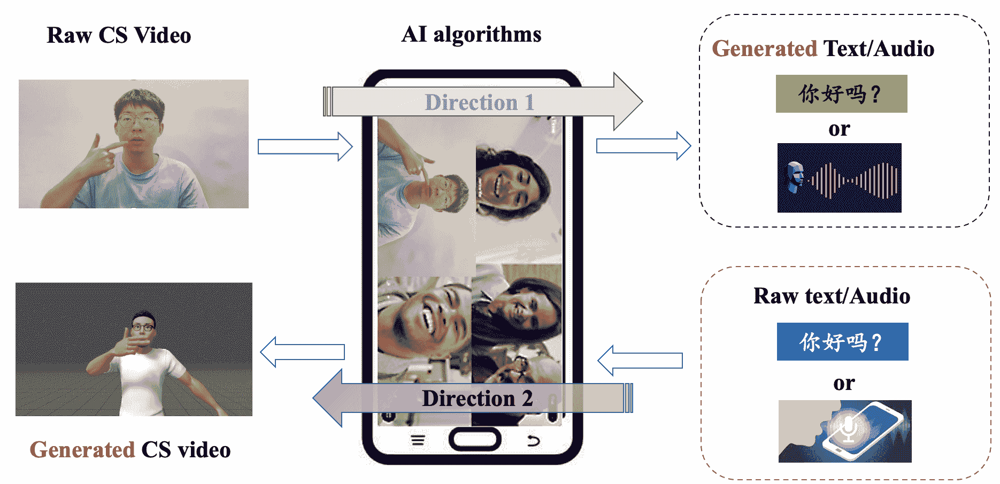

图 11：CS 和文本/音频之间转换的整体框架。方向 1 表示 CS 到文本/音频识别，方向 2 表示文本/音频到 CS 手势生成。第一个方向旨在通过识别文本或音频使正常听力更好地理解听力障碍者，而第二个方向可以帮助听力障碍者视觉上理解正常听力的人。

### 5.2 隐式语音生成

作为一种唇部与手部辅助系统，CS 需要同时生成唇部和手部手势。因此，提取诸如语音特征和文本特征等多模态特征非常重要。其中，语音特征与唇部运动有很强的关联。同时，文本特征在根据编码系统确定手部形状和位置方面起着重要作用。如图 11 所示，从音频文本生成多模态 CS 手势是 CS 转换系统的一个关键组成部分。文献中的先前研究对 CS 手势生成进行了有限的初步尝试，主要从多模态特征提取和生成方法两个方面进行研究。由于相关工作相对较少，我们将与 CoS 相关的 CS 生成工作的总结纳入了表 V 中。

多模态特征提取。对于 CS 生成，特征包括连续的唇部形状和手部形状运动。[28] 使用了特定手动选择的关键词，以及低语境句子 [236] 作为特征，并为手势预定义了相应的手动模板。进行 CS 识别，然后将识别出的文本映射到手部模板上。然而，这种方法严重依赖于手动设计，不仅限制了 CS 手势的表现力，还增加了所需的人工工作量。

生成方法。尽我们所知，目前仍缺乏基于端到端深度学习的 CS 手势生成研究。只有 [28] 提出了一个后处理算法来调整合成的手势，包括手部旋转和位移的校正，以及将算法适配到新图像。然而，这种方法需要事先的人类知识来将算法适配到新图像，从而导致了有限的鲁棒性。

### 5.3 共语生成

近年来的 CoS 生成里程碑展示在图 10 中。上半部分涉及相关数据集，下半部分涉及算法。CoS 手势生成的目标是根据相应的音频输入生成一系列身体动作。它在虚拟角色动画中得到了广泛应用，特别是在虚拟演讲和广告中。我们根据性能和受欢迎程度将其分为三个阶段，即基于规则/统计的方法、基于深度学习的方法和基于扩散的方法。在表 V 中，我们总结了相关 SL 生成工作的详细信息。

多模态特征提取。在 CoS 手势生成任务中，不同模态如文本和语音的数据包含了语义和节奏信息。如何提取和融合这些特征以获得更好的表示是一个重要课题。[131]使用三模态编码器分别编码文本、语音和人物 ID，然后进行特征融合，从融合特征空间中采样以完成生成任务。[237]则分别建模语音和文本信息。它没有在特征层面直接融合，而是建立了两个管道以建模手势运动的动态和语义信息，从而生成准确且有节奏的手势序列。

生成模型。在 CoS 手势生成任务中，选择生成模型的过程中进行了大量的尝试。在早期研究中，使用了基于规则的方法[238, 239, 240]，这些方法需要手动构建手势库，并开发从口语到手势的映射规则。这些方法灵活性有限，需要专家知识，但更容易解释，并且在处理语义手势方面有效。随后，基于统计的方法[241]用传统的统计模型（如 HMMs）替代了手动编写的规则，这些模型在数据集上进行训练，但仍然需要高成本的手动构建手势库。近年来，基于深度学习的端到端方法 [25, 242] 得到了发展，这些方法使用原始的“语音-手势”数据集，如 Trinity 和 TED [67, 68]，来训练深度神经网络以实现端到端的手势生成。这些方法减少了系统复杂性，并生成了更自然流畅的手势，但不能保证生成的节奏性和语义手势的准确性。同时，大多数 CoS 研究工作并未考虑全身生成，这也限制了其表现力。近年来，扩散模型 [243] 作为强大的深度生成模型出现。Zhu 等人 [244] 引入了一种新的基于扩散的框架，称为 DiffGesture，该框架有效捕捉了音频与手势之间的关联，并保持时间一致性，从而生成高质量的 CoS 手势。然而，基于扩散的方法在训练成本和需要多个步骤才能达到令人满意的结果方面存在局限，这限制了其在 CoS 手势生成中的实时应用。

### 5.4 谈话头生成

语音到面部生成已成为近年来新兴的研究课题。如图 12 所示，从音频片段生成说话面孔或从目标图像和音频片段动态生成说话面孔是两个基本的研究问题。这些问题的解决对于实现广泛的实际应用至关重要：(a) 娱乐：生成具有真实表情和声音输出的虚拟角色可以应用于虚拟现实游戏、电影特效和其他领域，以增强用户体验；(b) 虚拟助手：生成具有自然语言声音和面部表情的虚拟助手可以用于客户服务、机器人助手等场景，以改善自然语言交互体验；(c) 人机交互：生成具有真实表情和声音输出的虚拟角色可以用于虚拟会议、远程教育等场景，以提高人机交互的有效性；(d) 医疗保健：生成具有自然语音和面部表情的虚拟医生可以用于远程医疗、心理治疗等场景，以提高服务质量和用户体验。

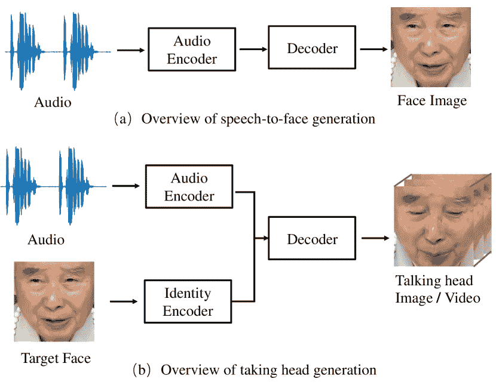

图 12：语音到面部生成的两个基本问题。

#### 5.4.1 语音到面部生成

语音和面部属性之间有着强烈的关联，例如年龄、性别和嘴部形状，这些直接影响语音生成的机制 [245]。此外，语言、口音、速度和发音等语音特性在各种国籍和文化中经常共享。这些特性因此可以表现为标准的物理面部特征。

特征提取。对于语音和面部特征提取，Oh 等人 [246] 使用训练好的面部识别网络 [247] 获取面部嵌入，并使用一个以复杂语音谱图作为输入的语音编码器输出语音特征。Duarte 等人 [248] 设计了一个改进自 SEGAN 判别器 [249] 的语音编码器来学习音频嵌入。类似地，Wen 等人 [228] 开发了一个由六层卷积层组成的语音嵌入网络来学习语音特征。Fang 等人 [250] 使用包含语音活动检测和 V-net 的语音编码器来输出音频嵌入。

生成模型。Oh 等人 [246] 使用预训练的面部解码器 [251] 来重建面部图像。受到 GAN [252] 在生成高质量图像方面成功的启发，Duarte 等人 [248] 开发了一种条件 GAN，称为 WavPix，能够直接从语音生成面部图像。为了更好的身份匹配，Wen 等人 [228] 引入了第二个鉴别器以验证面部图像输出的身份。考虑到情感表达是现实面部图像的一个关键属性，Fang 等人 [250] 应用了两个分类器来测量生成过程中的身份和情感语义相关性。在 [253] 中，设计了一个包含语音编码器、语音合成器和面部编码器的基于面部的残差个性化语音合成模型（FR-PSS）用于 PSS。

上述方法可以从语音生成面部图像，但重建的面部图像的真实性和准确性仍需改进：(a) 明确的跨模态关联学习对于身份信息保留至关重要，这在之前的方法中没有探讨。(b) 基于 GAN 或 CNN 的生成器合成的面部图像缺乏细节和真实性。

评估指标。对于语音到面部生成方法，身份信息保留是关键因素，因此，使用与身份一致性相关的定量指标来评估性能，包括地标距离、特征距离和面部属性评估。地标距离用于计算生成面部图像和真实面部之间的地标距离（LMD），地标通过 Dlib [254] 预训练 DL 方法如 FaceNet [229] 获得。特征距离包括计算真实面部和生成面部特征之间的余弦、$L_{2}$ 和 $L_{1}$ 距离。面部属性通常通过属性识别准确率来评估，如性别识别、身份识别和面部检索。生成面部图像的质量对于语音到面部生成也很重要，Fréchet Inception Distance (FID) 和 Inception score (IS) 是两种常见的评估性能的指标。这些上述指标在表 VII 中有所强调。

表 VII：语音到面部生成的定量指标总结

| 评估度量 | 指标 |
| --- | --- |
| 身份保留 |

&#124; LDM [246], &#124;

&#124; 余弦、$L_{2}$、$L_{1}$ [246], &#124;

&#124; 面部检索 [246], &#124;

&#124; 身份识别 [228], &#124;

&#124; 性别分类 [228] &#124;

|

| 图像质量 | IS [250], FID [250] |
| --- | --- |

表 VIII：关于谈话头生成的近期研究总结。以下方面已结论：图像合成和驱动源的网络架构；方法适用于特定目标或任意身份；音频特征是否与嘴唇动作同步；生成个性化属性的能力，以及是否使用了任何中间面部模型。

| 框架 | 方法 | 年份 | 驱动源 | 目标 | 音频特征 | 个性化 | 面部模型 |
| --- | --- | --- | --- | --- | --- | --- | --- |
| GAN | 陈等 [255] | 2018 | 音频 | 任意 | 同步 | 否 | 否 |
| Song 等 [256] | 2019 | 音频 | 任意 | 同步 | 否 | 否 |
| Zhou 等 [257] | 2019 | 音频 | 任意 | 同步 | 否 | 否 |
| ATVG [258] | 2019 | 音频 | 任意 | 不同步 | 否 | 2D 地标 |
| Vougioukas 等 [259] | 2019 | 音频 | 任意 | 同步 |

&#124; 眼睛眨动, &#124;

&#124; 眉毛 &#124;

| 否 |
| --- |
| Kefalas 等 [260] | 2020 | 音频 | 任意 | 不同步 | 否 | 否 |
| Sinha 等 [261] | 2020 | 音频 | 任意 | 不同步 | 眼睛眨动 | 否 |
| Wang 等 [262] | 2020 | 音频 | 任意 | 同步 | 头部姿态 | 2D 地标 |
| Wav2lip [30] | 2020 | 音频 | 任意 | 同步 | 否 | 否 |
| Eskimez 等 [263] | 2020 | 音频 | 任意 | 同步 | 否 | 否 |
| Yi 等 [264] | 2020 | 视频 | 特定 | 不同步 | 头部姿态 | 3DMM |
| 陈等 [265] | 2020 | 视频 | 任意 | 不同步 | 头部姿态 | 3DMM |
| Mittal 等 [266] | 2021 | 音频 | 任意 | 不同步 | 否 | 否 |
| MEAD [111] | 2020 | 音频 | 任意 | 不同步 | 情感 | 否 |
| Zhu 等 [267] | 2021 | 音频 | 任意 | 不同步 | 否 | 否 |
| FACIAL [268] | 2021 | 视频 | 任意 | 不同步 |

&#124; 头部姿态, &#124;

&#124; 眼睛眨动 &#124;

| 3DMM |
| --- |
| Zhang 等 [112] | 2021 | 音频 | 任意 | 同步 |

&#124; 头部姿态, &#124;

&#124; 眉毛 &#124;

| 3DMM |
| --- |
| Si 等 [269] | 2021 | 音频 | 任意 | 不同步 | 情感 | 否 |
| 陈等 [270] | 2021 | 音频 | 任意 | 同步 | 否 | 否 |
| PC-AVS [271] | 2021 | 视频 | 任意 | 同步 | 头部姿态 | 否 |
| GC-VAT [272] | 2022 | 视频 | 任意 | 同步 |

&#124; 头部姿态, &#124;

&#124; 表情 &#124;

| 否 |
| --- |
| Wang 等 [273] | 2022 | 音频 | 任意 | 同步 | 头部姿态 | 否 |
| EAMM [274] | 2022 | 视频 | 任意 | 不同步 | 情感 | 否 |
| SPACE [275] | 2022 | 音频 | 任意 | 不同步 |

&#124; 头部姿态, &#124;

&#124; 情感 &#124;

| 2D 地标 |
| --- |
| DIRFA [276] | 2023 | 音频 | 任意 | 同步 | 否 | 否 |
| DisCoHead [115] | 2023 | 视频 | 任意 | 同步 |

&#124; 头部姿势，&#124;

&#124; 眼睛眨动，&#124;

&#124; 眉毛 &#124;

| 否 |
| --- |
| OPT [277] | 2023 | 音频 | 任意 | 无同步 |

&#124; 头部姿势，&#124;

&#124; 表情 &#124;

| 3DMM |
| --- |
| Wang 等 [278] | 2023 | 音频 | 任意 | 同步 |

&#124; 头部姿势，&#124;

&#124; 表情，注视，&#124;

&#124; 眼睛眨动 &#124;

| 否 |
| --- |
| Zhang 等 [279] | 2023 | 音频 | 任意 | 无同步 | 否 | 否 |

表 IX: 最近的谈话头生成相关研究总结。以下方面被总结：图像合成的网络架构；驱动源；方法是否适用于特定目标或任意身份；音频特征是否与嘴唇动作同步；生成个性化属性的能力，以及是否使用任何中间面部模型。

| 框架 | 方法 | 年份 | 驱动源 | 目标 | 音频特征 | 个性化 | 面部模型 |
| --- | --- | --- | --- | --- | --- | --- | --- |
| CNN | X2Face [280] | 2018 | 音频，视频 | 任意 | 同步 |

&#124; 头部姿势，&#124;

&#124; 表情 &#124;

| 否 |
| --- |
| Jamaludin 等 [281] | 2019 | 音频 | 任意 | 同步 | 否 | 否 |
| Wen 等 [282] | 2020 | 视频，音频 | 任意 | 无同步 |

&#124; 头部姿势，&#124;

&#124; 表情 &#124;

| 3DMM |
| --- |
| LipSync3D [283] | 2021 | 视频 | 特定 | 无同步 | 否 | 3DMM |
| Audio2head [31] | 2021 | 音频 | 任意 | 同步 | 头部姿势 | 2D 标记 |
| Lu 等 [284] | 2021 | 音频 | 特定 | 无同步 |

&#124; 头部姿势，&#124;

&#124; 眉毛 &#124;

|  |
| --- |
| RNN | Bigioi 等 [285] | 2022 | 视频，音频 | 任意 | 无同步 | 头部姿势 | 2D 标记 |
| VAE | SadTalker [286] | 2023 | 音频 | 任意 | 无同步 |

&#124; 头部姿势，&#124;

&#124; 眼睛眨动 &#124;

| 3DMM |
| --- |
| NeRF | AD-NeRF [32] | 2021 | 音频 | 特定 | 无同步 | 否 | 否 |
| DFA-NERF [287] | 2022 | 视频 | 特定 | 同步 |

&#124; 眼睛眨动，&#124;

&#124; 头部姿势 &#124;

| 否 |
| --- |
| DFRF [288] | 2022 | 音频 | 任意 | 无同步 | 否 | 3DMM |
| SSP-NeRF [289] | 2022 | 视频 | 任意 | 无同步 | 否 | 3DMM |
| DM | Yu 等 [290] | 2022 | 音频 | 任意 | 同步 | 面部动作 | 否 |
| Zhua 等 [291] | 2023 | 视频 | 任意 | 同步 |

&#124; 眼睛眨动，&#124;

&#124; 头部姿势 &#124;

| 3DMM |
| --- |
| DiffTalk [33] | 2023 | 音频 | 任意 | 同步 | 否 | 否 |
| Xu 等 [292] | 2023 | 音频，文本 | 任意 | 无同步 | 情感 | 3DMM |

#### 5.4.2 谈话头生成

给定目标面部图像和语音片段，TH 生成的目标是合成一系列目标面部图像，其中嘴唇动作、头部姿态和面部表情与音频同步。与从给定语音中提取说话者身份的语音到面部生成任务显著不同，TH 生成任务关注的是语音的内容。

多模态特征提取。一种在 VGG Face 数据集上预训练的 VGG-M 网络[293]被用于[281]以学习面部特征，经过修改的 VGG-M 语音编码器用于学习语音嵌入。三个时间编码器用于提取说话者身份、音频片段和面部表情的表示，并且设计了一个多项式融合层来生成这三种编码的联合表示[260]。与此不同，Mittal 等人[266]开发了一种变分自编码器 (VAE)，以从输入音频信号中将语音内容、情感语调和其他因素解缠成不同的表示。为了有效解缠每个运动因素并实现细粒度的可控 TH 生成，Wang 等人[278]提出了一种渐进式解缠表示策略，通过粗到细的方式分离因素，其中首先从驱动信号中提取统一的运动特征，然后从统一特征中隔离每个细粒度运动。预训练的音频到 AU 模块在[270]中用于从语音中提取与语音相关的 AU 信息。

多模态学习。对于 TH 视频生成，语音同步的嘴唇运动、面部表情和头部姿态生成是关键因素。因此，在训练阶段，需要进行音视频跨模态相关性学习，以确保这些面部动作在序列中的一致性。Chen 等人[255]提出了一种音视频相关性损失，用于同步视频中的嘴唇变化和语音变化，考虑到两个模态之间沿时间轴的变化更可能是相关的，具体而言，使用余弦相似度损失来最大化音频特征和视觉变化之间的相关性。对于联合音视频表示学习，Zhou 等人[257]强制音频特征和视觉特征共享一个分类器，以便它们可以共享相同的分布，此外，采用对比损失来缩小配对的音频和视觉特征之间的距离。Eskimez 等人[263]设计了一对判别器，以提高生成视频中嘴型与输入语音之间的同步性。Zhu 等人[267]在谈话面孔生成任务中引入了互信息神经估计理论，以学习跨模态的一致性。

生成模型。近年来，基于 DL 的方法包括 CNN、RNN、GAN、变分自编码器（VAE）、神经辐射场（NeRF）和扩散模型（DM）的发展得到了探索。我们在表格 VIII 和表格 IX 中比较了它们之间的差异。

基于 GAN 的方法是 TH 生成的主流，特别是由于它们在更强大的生成器 DM 出现之前合成数据的能力。在表格 VIII 中，我们简要列出了基于 GAN 框架的 TH 生成的近期相关工作。陈等人[255]提出了一种三流 GAN 来生成与语音同步的唇部视频。王等人[262]使用带有注意力机制的 GAN 基础网络来识别与头部信息相关的特征。张等人[268]设计了一种 FACIAL-GAN，用于编码用于生成带有音频同步唇部动作、个性化和自然的头部动作以及逼真的眼睑眨动的显性和隐性属性信息的对话面部视频。

除了基于 GAN 的方法之外，受到 NeRF 的启发[294]，郭等人[32]开发了用于 TH 合成的音频驱动 NeRF（AD-NeRF）模型，其中学习了一个隐式神经场景表示函数，将音频特征映射到动态神经辐射场进行说话人面部渲染。然而，AD-NeRF 在渲染阶段经常遭遇头部和躯干分离的问题。因此，刘等人[289]提出了一种语义感知的说话人肖像 NeRF（SSP-NeRF）。他们利用语音的语义感知来解决局部动态与整体躯干之间的不一致问题。渲染速度慢的问题也不能忽视。为了提高实时性能，姚等人[287]提出了一种 NeRF 方法，该方法将唇部运动特征和个性化属性作为两个解耦条件，其中唇部运动直接从音频输入中预测，以实现唇部同步生成。

扩散概率模型（DM）在各种生成任务中表现出了强大的能力 [295, 296]。Zhua 等人 [291] 提出了一个基于音频驱动的扩散模型用于 TH 视频生成，其中嘴唇运动特征通过对比学习与 TH 对齐。Yu 等人 [290] 提出了在音频与解缠的非嘴唇面部表示之间映射的基础上训练的音频到视觉扩散先验，以语义匹配输入音频，同时保持音频-嘴唇同步的照片真实感和整体自然性。Shen 等人 [33] 采用了新兴的强大扩散模型，将 TH 生成建模为音频驱动的时间一致的去噪过程（DiffTalk）。Xu 等人 [292] 首次在文本提示中表示情感，这可以继承 CLIP 的丰富语义，从而实现灵活和广泛的情感控制。

为了更好地进行面部外观迁移，在 TH 生成中广泛使用了中间脸部数据，如 2D 关键点或 3DMM。图 13 说明了基于中间脸部的 TH 生成方法的简化流程，主要包括两个步骤：将低维度的驱动源数据映射为面部参数；然后使用渲染网络将学到的面部参数转换为高维度的视频输出。

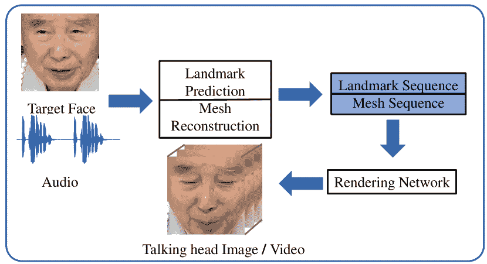

图 13：基于中间脸部的 TH 生成方法的典型流程。

评估指标。从不同角度来看，生成的文本到语音（TTS）输出缺乏人类语音的真实性：（a）目标个体的面孔应与合成视频的讲者面孔匹配，（b）生成的讲者的嘴唇应与音频同步，（c）生成的 TH 视频应具备良好的质量，（d）生成视频中讲者的表情应自然，并与音频的情感匹配，以及（e）谈话时应有眨眼现象。因此，TH 生成的定量指标可以从这五个视角进行分类，如表 X 所示。

表 X：对话头生成的定量指标总结

| 指标级别 | 指标 |
| --- | --- |
| 保持身份 |

&#124; PSNR, SSIM [297], FID, LMD, &#124;

&#124; LPIPS [298], CSIM, IS, ACD [299] &#124;

|

|

&#124; 视听 &#124;

&#124; 同步 &#124;

|

&#124; AV Conf, AV Off [300], &#124;

&#124; WER [259], LMD[m] [272], [299], &#124;

&#124; Sync[conf] [272], &#124;

&#124; LRSD, LRA [98] &#124;

|

| 图像质量保持 | CPBD [301], FDBM [302] |
| --- | --- |
| 表达方式 | 分类准确率 [303] |
| 眼睛眨动 |

&#124; EAR [304], Blink rate, &#124;

&#124; Blink median duration [268] &#124;

|

音频输入预处理。大多数 TH 生成工作是以音频信号为驱动的。在这里，我们将介绍以前的工作如何处理该领域的语音信号。一般来说，音频波形在 16KHz 下重新采样，然后计算音频特征[305]。谱图、MFCC 和 Fbank 是三种最常用的音频特征。Fang 等人[250]对这三种音频特征进行了消融实验，他们发现 Fbank 的表现最好，而谱图的 FID 表现最差。他们推测的原因是谱图包含了很多冗余信息，MFCC 丢弃了一些相关信息，而 Fbank 保持了平衡。然而，MFCC 在谈话面生成中使用最广泛。

## 6 BL 识别和生成的挑战

现有的 BL 识别和生成方法尚未能够满足实际世界中的各种挑战。为了全面展示 BL 领域中的 BL 识别和生成的典型挑战，我们从三个方面详细阐述 SL、CS 和 TH：子任务挑战、数据集挑战和评估指标挑战。

### 6.1 子任务挑战

为了更全面地阐述 BL 识别和生成任务的挑战，我们将每个主要任务分为三个子任务，即唇读、手语识别和口语识别。从任务定义的角度来看，TH 任务本身更侧重于生成过程。此外，由于现有 TH 生成技术的发展限制，研究人员难以捕捉目标说话者的基本面部属性。现有研究缺乏对 TH 识别的探索，因此 TH 识别的挑战没有在本调查中讨论子任务挑战时涉及。当前对 CoS 的研究主要集中在 CoS 手势生成上。尽管一些研究表明对 CoS 生成任务有积极影响，但大多数近期工作并未将 CoS 识别作为主要关注点。因此，CoS 识别的挑战未包含在本调查的子任务挑战讨论中。

BL 识别任务的挑战主要由于跨模态特征融合的效率，而每个子任务的具体挑战如下。

+   •

    **唇读**。自动唇读主要面临两个挑战：类内差异和类间相似性。前者受到诸如语音情感、速度、性别、年龄、肤色和语音习惯等因素的影响，使得区分同一单词类别内的变化变得困难。此外，不同语境下单词的语义差异对唇读有显著影响。后者挑战源于单词类别的丰富性，导致在视觉上区分属于不同类别的相似单词时出现困难。解决这些挑战对于提高唇读识别系统的准确性和有效性至关重要，这对帮助听障人士沟通和推动该领域应用具有重要意义。

+   •

    **手语识别**。手语识别面临的主要挑战是手势变化显著，这严重影响了其准确性。此外，手部形状、照明条件和分辨率等因素在限制手语识别性能方面发挥了关键作用。此外，自遮挡（如手指间的自遮挡和手与其他身体部位之间的遮挡）对特征融合产生负面影响，成为手语识别中的关键影响因素。另一个紧迫的挑战是开发实时多语言手语识别系统。解决这些复杂问题对推动该领域的发展和提高手语识别技术的效率和包容性至关重要。

+   •

    **提示语识别**。提示语识别中的主要障碍是手部提前现象[41]，即手部动作通常发生得比对应的唇部动作更快，预示着下一个音素。这种现象妨碍了提示语识别中唇部和手部特征的融合效率。此外，由于个体提示语编码习惯和风格的差异，多提示符场景下的适应性也是一个挑战。

BL 生成的挑战主要源于生成手势的稳定性和质量，各子任务的具体挑战如下。

+   •

    **提示语生成**。总的来说，提示语生成面临几个挑战，需要解决这些挑战以开发有效的系统。缺乏大规模的标注数据集、提示语手势建模的复杂性以及提示符号与口语单词之间需要精确的异步对齐是主要挑战。此外，整合音频和视觉模态以及实现对新说话者和语言的泛化也是重要的考虑因素。通过建模能力、跨模态融合的进步以及多样化数据集的可用性来克服这些挑战，将有助于提高提示语生成系统的性能。

+   •

    手语生成。在 SL 生产领域，存在许多需要关注的障碍，其中最主要的是领域适应和模型崩溃。前者障碍源于不同语言中词汇风格和意义的固有变化，需要有效的适应策略。此外，生成不常见和未见过的词汇的能力有限，阻碍了系统的整体表现。而且，生成模型中持续存在的模型崩溃、非收敛和不稳定性问题进一步加剧了手语生产中的复杂性。解决这些多方面的挑战对于推进该领域的 SOTA 并实现更可靠和稳健的 SL 生成至关重要。

+   •

    语音同步生成。CoS 的生成过程面临挑战，原因在于存在高度个性化和非周期性的自发手势。准确捕捉手指运动存在困难，导致个性化手势的表现。此外，手势的非周期性特征源于手势行为的显著变化。

+   •

    头部生成。TH 生成面临两个主要挑战：信息耦合和多样性目标。前者包括多个面部元素的同步，如头部姿势、面部表情、嘴唇运动和背景运动，同时还要解决“恐怖谷效应”[306]，即生成的面孔看起来几乎像人类，但缺乏真正的逼真感，从而导致不适。后者挑战涉及在不同数据模态间协调时间分辨率和语音特征，以及将视觉质量明确作为训练目标的复杂性。克服这些挑战对于推动该领域的发展和实现更真实且视觉一致的 TH 生成至关重要。

### 6.2 数据集挑战

目前，SL 识别和生成的数据集由于数据收集和人工标注的高成本而面临重大限制。这导致数据集规模小且标注不足，阻碍了 BL 相关任务的进展。创建 BL 数据集需要语言专家和母语者之间的合作，这进一步增加了复杂性和费用。解决这些挑战的潜在方案是探索使用未标记 BL 数据的自监督学习[307]，这可能减轻对大量人工标注的需求。

此外，隐私保护构成了另一道障碍，因为一些大型 BL 数据集[308, 309]并未公开访问。鉴于高成本和隐私问题，一个可行的方法是利用现有的野外在线视频来收集所需的 BL 数据。类似于用于对比语言-图像预训练（CLIP）[310]和 DALL-E[311]的训练数据集，使用非常大的数据集可以增强 BL 识别和生成模型的泛化能力。

除了数据集挑战，收集和标注 3D 数据的高成本也导致了大型 3D BL 数据集的稀缺。因此，3D BL 生成的发展面临着有效理解和处理 3D BL 数据的重大障碍。克服这些挑战对于推进 BL 识别和生成领域至关重要，从而为听力障碍人士提供更高效和准确的沟通支持。

### 6.3 评价指标挑战

BL 识别任务的主要性质在于其分类本质，其中简单高效的分类准确度作为流行的评价指标。然而，本文将焦点转向 BL 生成任务及其在评价指标方面的挑战。在 BL 生成任务中使用的主观指标成本高、耗时且缺乏可扩展性。虽然人类相似度和手势适当性等指标具有价值，但存在不可重复性和不稳定性问题。另一方面，客观指标如 PSNR、SSIM、FID[312]和 LRSD[17]相比主观指标有其优势，但在评估手势与语音的相似性以及手势的语义适当性方面存在局限性。值得注意的是，与评估人类相似度的主观指标不同，现有文献中很少量化客观指标来衡量手势多样性或各种运动适当性方面。这些挑战突显了在 BL 生成领域中需要稳健且全面的评价指标，以确保对生成的手语输出进行准确和有意义的评估。

## 7 未来讨论

通过对现有文献的广泛总结和分析，本调查提供了以下讨论和新见解：

1.  1.

    大规模多模态 BL 数据集的整合和统一低损数据格式的建立是推进 BL 识别和生成任务的关键因素。通过从各种在线视频中收集广泛的数据集，我们可以增强 BL 识别和生成模型在现实世界场景中的泛化能力和鲁棒性。此外，采用统一的数据标准和适应性转换方法可以实现不同数据集的无缝集成，并促进研究人员之间的合作。这有助于模型之间的互操作性，促进资源的高效共享和利用。

1.  2.

    最近，大规模预训练模型如 ChatGPT 在各种视觉-语言跨模态任务中取得了出色的表现。例如，CLIP 及其各种多模态 CLIP 模型的变体已出现。然而，它们存在以下缺陷：a) 它们可能无法像专业模型那样有效地深度连接不同类型的数据；b) 由于其规模，它们对计算能力的需求较高；c) 这些模型可能无法针对特定任务进行微调，并且可能在处理专业知识时存在困难；d) 它们需要大量多样的数据才能良好运行，且可能难以解释。为此，如何构建一个用于 BL 识别和生成的大规模多模态模型是一个有前景的课题。

1.  3.

    此外，现有大规模预训练模型在学习细粒度特征的能力上仍有待提高[313]。在 BL 中，细粒度特征学习至关重要，例如，CS 和 CoS 中的手部位置和唇部动作需要准确识别和生成，以确保清晰度并避免歧义。因此，细粒度 BL 识别和生成是提高其性能的一个可行方向。

1.  4.

    在 BL 识别和生成任务中，多模态模型对不同模态的扰动（攻击）非常敏感，导致性能严重下降。如何为 BL 识别和生成预训练一个鲁棒且安全的大规模多模态模型是一个亟待解决的问题。

1.  5.

    BL 识别和生成系统的一个基本要求是实时能力，尤其是在多语言和多说话者场景中。创建一个实时系统对于满足聋人和听力正常人群的需求至关重要。然而，现有的音视频数据集主要是单语言的，其中以英语为最常见的语言。在实际应用中，往往需要多语言沟通，这突显了多样化数据集的必要性。此外，目前的 BL 识别和生成方法通常仅限于特定目标身份，因为不同的说话者在外貌和习惯上存在显著差异。克服这些挑战对于开发适应各种语言和多样说话者的有效实时 BL 系统至关重要。

## 8 结论

本调查深入探讨了用于自动 BL 识别和生成的深度多模态学习领域，揭示了其潜力和挑战。本调查关注四种经典的 BL 变体，即手语、提示语音、共语音和发言头。通过对包括视觉、听觉和文本数据在内的各种模态及其整合的详细审查，我们探讨了捕捉和解释这四种 BL 的复杂性。通过回顾 SOTA 方法，如特征融合、表示学习、识别和生成方法，我们揭示了当前方法的优点和局限性。我们还强调了数据集和基准在促进研究进展中的重要性，重点关注了标注方法和评估指标。尽管取得了一些进展，挑战仍然存在，需要创建多样化的数据集，解决标注数据有限的问题，增强模型的可解释性，并确保在不同环境和文化背景下的鲁棒性。展望未来，前景充满希望，包括更复杂的架构和训练策略，利用多模态数据的互补性，发挥多模态学习、大规模预训练模型、自监督学习和强化学习的进步。随着这一研究领域的发展，它有望彻底改变人际和人机交互，促进跨领域的自然和有效沟通。

## 参考文献

+   [1] R. O. Cornett， “提示语音，” *American annals of the deaf*，第 112 卷，第 1 期，第 3–13 页，1967 年。

+   [2] B. Joksimoski, E. Zdravevski, P. Lameski, I. M. Pires, F. J. Melero, T. P. Martinez, N. M. Garcia, M. Mihajlov, I. Chorbev, 和 V. Trajkovik， “手语识别的技术解决方案：对研究趋势、挑战和机遇的范围审查，” *IEEE Access*，第 10 卷，第 40 979–40 998 页，2022 年。

+   [3] X. Liu, Q. Wu, H. Zhou, Y. Du, W. Wu, D. Lin, 和 Z. Liu, “音频驱动的共语手势视频生成，” *Advances in Neural Information Processing Systems (NIPS)*，第 35 卷，第 21 386–21 399 页，2022 年。

+   [4] B. Zhang, C. Qi, P. Zhang, B. Zhang, H. Wu, D. Chen, Q. Chen, Y. Wang, 和 F. Wen, “Metaportrait：具有快速个性化适应的身份保留式谈话头生成，” 发表在 *Proc. IEEE/CVF-CVRP*，2023 年，第 22096–22105 页。

+   [5] R. Rastgoo, K. Kiani, S. Escalera, 和 M. Sabokrou, “手语生成：综述，” 发表在 *Proc. IEEE/CVF-CVRP*，2021 年，第 3451–3461 页。

+   [6] S. Nyatsanga, T. Kucherenko, C. Ahuja, G. E. Henter, 和 M. Neff, “基于数据驱动的共语手势生成的全面综述，” 发表在 *Computer Graphics Forum*，第 42 卷，第 2 期。 Wiley Online Library，2023 年，第 569–596 页。

+   [7] R. Rastgoo, K. Kiani, 和 S. Escalera, “手语识别：深度综述，” *Expert Systems with Applications*，第 164 卷，第 113794 页，2021 年。

+   [8] A. Fernandez-Lopez 和 F. M. Sukno, “深度学习时代的自动唇读综述，” *Image and Vision Computing*，第 78 卷，第 53–72 页，2018 年。

+   [9] S. Fenghour, D. Chen, K. Guo, B. Li, 和 P. Xiao, “基于深度学习的自动唇读：综述，” *IEEE Access*，第 9 卷，第 121 184–121 205 页，2021 年。

+   [10] R. Chand, P. Jain, A. Mathur, S. Raj, 和 P. Kanikar, “基于深度学习技术的视觉语音识别综述，” 发表在 *Proc. IEEE-CSCITA*，2023 年，第 72–77 页。

+   [11] S. Bhaskar, T. Thasleema, 和 R. Rajesh, “不同视觉语音识别技术的综述，” 发表在 *Data Analytics and Learning (DAL)*，2018 年，第 307–316 页。

+   [12] N. Radha, A. Shahina *等*，“视觉语音识别方法综述，” 发表在 *Proc. IEEE-ICAIS*，2021 年，第 934–939 页。

+   [13] O. Koller, “手语识别前沿技术的定量综述，” *arXiv 预印本 arXiv:2008.09918*，2020 年。

+   [14] I. Adeyanju, O. Bello, 和 M. Adegboye, “手语识别的机器学习方法：批判性综述与分析，” *Intelligent Systems with Applications*，第 12 卷，第 200056 页，2021 年。

+   [15] I. Papastratis, C. Chatzikonstantinou, D. Konstantinidis, K. Dimitropoulos, 和 P. Daras, “用于手语的人工智能技术，” *Sensors*，第 21 卷，第 17 期，第 5843 页，2021 年。

+   [16] D. M. Madhiarasan, P. Roy, 和 P. Pratim, “手语识别的全面综述：不同类型、模态和数据集，” *arXiv 预印本 arXiv:2204.03328*，2022 年。

+   [17] L. Chen, G. Cui, Z. Kou, H. Zheng, 和 C. Xu, “一个好的谈话头视频生成包含什么？：综述与基准，” *arXiv 预印本 arXiv:2005.03201*，2020 年。

+   [18] T. Sha, W. Zhang, T. Shen, Z. Li, 和 T. Mei, “深度人物生成：从面部、姿态和服装合成的视角看综述，” *ACM Computing Surveys*，第 55 卷，第 12 期，第 1–37 页，2023 年。

+   [19] R. Zhen, W. Song, Q. He, J. Cao, L. Shi, 和 J. Luo, “人机交互系统：谈话头像生成的综述，” *电子学*，第 12 卷，第 1 期，第 218 页，2023 年。

+   [20] C. Sheng, G. Kuang, L. Bai, C. Hou, Y. Guo, X. Xu, M. Pietikäinen, 和 L. Liu, “深度学习在视觉语音分析中的应用：综述，” *arXiv 预印本 arXiv:2205.10839*，2022 年。

+   [21] S. Stoll, N. C. Camgoz, S. Hadfield, 和 R. Bowden, “Text2sign：利用神经机器翻译和生成对抗网络实现手语生产，” *国际计算机视觉杂志*，第 128 卷，第 891–908 页，2020 年。

+   [22] D. Guo, W. Zhou, H. Li, 和 M. Wang, “用于手语翻译的层次 LSTM，” 见 *Proc. Conf AAAI Artif. Intell.*，第 32 卷，第 1 期，2018 年。

+   [23] B. Saunders, N. C. Camgoz, 和 R. Bowden, “现在每个人都来手语：将口语翻译为照片级真实手语视频，” *arXiv 预印本 arXiv:2011.09846*，2020 年。

+   [24] C. Ahuja, D. W. Lee, 和 L.-P. Morency, “针对个性化共同语音手势生成的低资源适应，” 见 *Proc. IEEE/CVF-CVPR*，2022 年 6 月，页码 20 566–20 576。

+   [25] T. Ao, Q. Gao, Y. Lou, B. Chen, 和 L. Liu, “节奏手势生成器：基于节奏的共同语音手势合成与分层神经嵌入，” *ACM Transactions on Graphics (TOG)*，第 41 卷，第 6 期，第 1–19 页，2022 年。

+   [26] Y. Liang, Q. Feng, L. Zhu, L. Hu, P. Pan, 和 Y. Yang, “Seeg：语义驱动的共同语音手势生成，” 见 *Proc. IEEE/CVF-CVPR*，2022 年 6 月，页码 10 473–10 482。

+   [27] X. Liu, Q. Wu, H. Zhou, Y. Xu, R. Qian, X. Lin, X. Zhou, W. Wu, B. Dai, 和 B. Zhou, “学习层次化跨模态关联以生成共同语音手势，” 见 *Proc. IEEE/CVF-CVPR*，2022 年，页码 10 462–10 472。

+   [28] P. Duchnowski, L. D. Braida, D. Lum, M. Sexton, J. Krause, 和 S. Banthia, “为听障人士自动生成提示语音：现状与展望，” 见 *国际听觉-视觉语音处理会议 (AVSP)*，1998 年。

+   [29] G. Bailly, Y. Fang, F. Elisei, 和 D. Beautemps, “为不同的谈话头像和说话者重新定位提示语音手势，” 见 *为不同的谈话头像和说话者重新定位提示语音手势*，2008 年 9 月，第 8 页。

+   [30] P. KR, M. Rudrabha, P. Namboodir, 和 C. Jawahar, “一个唇同步专家是你所需的一切，用于生成自然唇动的演讲，” 见 *Proc. ACM MM*，2020 年。

+   [31] S. Wang, L. Li, Y. Ding, C. Fan, 和 X. Yu, “Audio2head：基于音频的单次谈话头像生成与自然头部运动，” 见 *Proc. IJCAI*，2021 年。

+   [32] Y. Guo, K. Chen, S. Liang, Y.-J. Liu, H. Bao, 和 J. Zhang, “Ad-nerf：用于谈话头像合成的音频驱动神经辐射场，” 见 *Proc. IEEE/CVF-ICCV*，2021 年，页码 5784–5794。

+   [33] S. Shen, W. Zhao, Z. Meng, W. Li, Z. Zhu, J. Zhou, 和 J. Lu, “Difftalk：为广泛应用的音频驱动肖像动画设计扩散模型，” 见 *Proc. IEEE/CVF-CVPR*，2023 年，页码 1982–1991。

+   [34] P. 露西, G. 波塔米亚诺斯, 和 S. 斯里达兰, “来自多个视角的视觉语音基于补丁的分析,” 在 *国际听觉视觉语音处理会议 (AVSP)*. AVISA, 2008 年, 第 69–74 页。

+   [35] Z. 周, G. 赵, 和 M. 皮埃蒂凯宁, “迈向实用的唇读系统,” 在 *Proc. IEEE/CVF-CVPR*, 2011 年, 第 137–144 页。

+   [36] P. 吴, H. 刘, X. 李, T. 范, 和 X. 张, “一种基于自适应决策融合的新型唇部描述符用于音视频关键词检测,” *IEEE Multimedia 期刊*, 第 18 卷, 第 3 期, 第 326–338 页, 2016 年。

+   [37] P. 马, S. 佩特里迪斯, 和 M. 潘蒂奇, “使用变换器的端到端音视频语音识别,” 在 *Proc. IEEE-ICASSP*, 2021 年, 第 7613–7617 页。

+   [38] L. 刘, G. 冯, D. 博欧坦普斯, 和 X.-P. 张, “一种用于手唇融合的新的重新同步程序，应用于连续法语提示语音识别,” 在 *Proc. IEEE-EUSIPCO*, 2019 年, 第 1–5 页。

+   [39] K. 帕帕迪米特里乌, M. 帕雷利, G. 萨彭扎基, G. 帕夫拉科斯, P. 马拉戈斯, 和 G. 波塔米亚诺斯, “多模态融合和序列学习用于从视频中进行提示语音识别,” 在 *国际人机交互会议*, 2021 年, 第 277–290 页。

+   [40] L. 刘, G. 冯, B. 丹尼斯, 和 X.-P. 张, “基于手前模型的多模态融合中的重新同步，用于自动连续提示语音识别,” *IEEE Multimedia 期刊*, 第 23 卷, 第 292–305 页, 2020 年。

+   [41] L. 刘 和 L. 刘, “用于提示语音识别的跨模态互学,” 在 *Proc. IEEE-ICASSP*, 2023 年, 第 1–5 页。

+   [42] J. 张, W. 周, 和 H. 李, “一种基于阈值的 HMM-DTW 方法用于连续手语识别,” 在 *国际互联网多媒体计算与服务会议论文集*. 计算机协会, 2014 年, 第 237–240 页。

+   [43] W. 杨, J. 陶, 和 Z. 叶, “使用基于快速隐马尔可夫模型的水平构建进行连续手语识别,” *模式识别快报*, 第 78 卷, 第 28–35 页, 2016 年。

+   [44] K. L. 郑, Z. 杨, Q. 陈, 和 Y.-W. 戴, “用于连续手语识别的全卷积网络,” 在 *Proc. ECCV*, 2020 年, 第 697–714 页。

+   [45] C. 韦, J. 赵, W. 周, 和 H. 李, “用于连续手语识别的语义边界检测与强化学习,” *IEEE 视频技术电路与系统学报*, 第 31 卷, 第 3 期, 第 1138–1149 页, 2020 年。

+   [46] L. 刘 和 G. 冯, “关于普通话提示语音的初步研究,” *美国聋人年鉴*, 第 164 卷, 第 4 期, 第 496–518 页, 2019 年。

+   [47] “手语让我们团结！” un.org, 2022\. [在线]. 可用: [`www.un.org/en/observances/sign-languages-day`](https://www.un.org/en/observances/sign-languages-day)

+   [48] Z. 潘, X. 钱, 和 H. 李, “通过共语手势线索进行说话者提取,” *IEEE 信号处理快报*, 第 29 卷, 第 1467–1471 页, 2022 年。

+   [49] C. 索恩曼 和 M. 梅克特, “喜欢它还是从中学习：教育视频中谈话头的效果,” *计算机与教育*, 第 193 卷, 104675 号, 2023 年。

+   [50] W. Song, Q. He, 和 G. Chen，“虚拟人谈话头生成，”在 *2023 年第二届亚洲算法、计算与机器学习会议论文集*，2023，pp. 1–5。

+   [51] D. Kothadiya, C. Bhatt, K. Sapariya, K. Patel, A.-B. Gil-González, 和 J. M. Corchado，“Deepsign：使用深度学习进行手语检测和识别，” *电子学*，第 11 卷，第 11 期，p. 1780，2022。

+   [52] M. De Coster, D. Shterionov, M. Van Herreweghe, 和 J. Dambre，“从手语到口语的机器翻译：现状与挑战，” *信息社会中的普遍访问*，pp. 1–27，2023。

+   [53] N. K. Kahlon 和 W. Singh，“从文本到手语的机器翻译：系统综述，” *信息社会中的普遍访问*，第 22 卷，第 1 期，pp. 1–35，2023。

+   [54] L. Liu, G. Feng, X. Ren, 和 X. Ma，“两个普通话提示语音系统的手部复杂性客观比较，”在 *IEEE-ISCSLP 会议记录*，2022，p. 215–219。

+   [55] “找到你的提示语语言，”cuedspeech.org. [在线]. 可用： [`cuedspeech.org/learn/find-your-cued-language/`](https://cuedspeech.org/learn/find-your-cued-language/)

+   [56] L. Liu，“使用先进机器学习方法对法语连续提示语音识别建模，”博士论文，格勒诺布尔阿尔卑斯大学，2018。

+   [57] L. Liu, G. Feng, 和 D. Beautemps，“法语提示语音中手部动作的时间分段自动化用于手部位置识别，”在 *IEEE-ICASSP 会议记录*，2018，pp. 3061–3065。

+   [58] J. Wang, Z. Tang, X. Li, M. Yu, Q. Fang, 和 L. Liu，“用于自动提示语音识别的跨模态知识蒸馏方法，”在 *Interspeech 会议记录*，2021，p. 2986–2990。

+   [59] L. Liu, J. Li, G. Feng, 和 X.-P. S. Zhang，“英国英语提示语音中手部动作的时间分段自动检测。”在 *Interspeech 会议记录*，2019，pp. 2285–2289。

+   [60] S. J. Park, M. Kim, J. Hong, J. Choi, 和 Y. M. Ro，“Synctalkface：通过音频-嘴唇记忆生成精确的唇动同步谈话面孔，”在 *AAAI 人工智能会议记录*，第 36 卷，第 2 期，2022，pp. 2062–2070。

+   [61] L. Liu, G. Feng, 和 D. Beautemps，“基于自适应椭圆模型的内嘴唇参数估计，”在 *听觉-视觉语音处理国际会议 (AVSP)*，2017。

+   [62] ——, “基于 CLNF 的内嘴唇自动动态模板跟踪，”在 *IEEE-ICASSP 会议记录*，2017，p. 5130–5134。

+   [63] M. W. Alibali, M. Bassok, K. O. Solomon, S. E. Syc, 和 S. Goldin-Meadow，“通过语言和手势揭示心理表征，” *心理科学*，第 10 卷，第 4 期，pp. 327–333，1999。

+   [64] S. Kang 和 B. Tversky，“从手到脑：手势促进理解，” *认知研究：原理与应用*，第 1 卷，第 1 期，pp. 1–15，2016。

+   [65] A. Kendon，“手势是否传达信息？一个回顾，” *语言和社会互动研究*，第 27 卷，第 3 期，pp. 175–200，1994。

+   [66] K. Adam，*Gesture: Visible action as utterance*。剑桥大学出版社，2004 年。

+   [67] Y. Ferstl 和 R. McDonnell，“研究递归运动建模在语音手势生成中的应用，”在 *Proc. ACM IVA*，2018 年，第 93–98 页。

+   [68] Y. Yoon, W.-R. Ko, M. Jang, J. Lee, J. Kim 和 G. Lee，“机器人学习社交技能：面向类人机器人端到端的语音手势生成学习，”在 *Proc. IEEE-International Conference in Robotics and Automation (ICRA)*，2019 年，第 4303–4309 页。

+   [69] Y. Yoon, P. Wolfert, T. Kucherenko, C. Viegas, T. Nikolov, M. Tsakov 和 G. E. Henter，“Genea 挑战赛 2022：大规模数据驱动的语音手势生成评估，”在 *Proc. ACM-International Conference on Multimodal Interaction*，2022 年，第 736–747 页。

+   [70] S. Ginosar, A. Bar, G. Kohavi, C. Chan, A. Owens 和 J. Malik，“学习个体的对话手势风格，”在 *Proc. IEEE/CVF-CVPR*，2019 年，第 3497–3506 页。

+   [71] R. Poppe，“基于视觉的人类动作识别综述，” *Image and vision computing*，第 28 卷，第 6 期，第 976–990 页，2010 年。

+   [72] D. Wu, L. Pigou, P.-J. Kindermans, N. D.-H. Le, L. Shao, J. Dambre 和 J.-M. Odobez，“深度动态神经网络用于多模态手势分割和识别，” *IEEE transactions on pattern analysis and machine intelligence*，第 38 卷，第 8 期，第 1583–1597 页，2016 年。

+   [73] J. Wan, Y. Zhao, S. Zhou, I. Guyon, S. Escalera 和 S. Z. Li，“Chalearn looking at people rgb-d 独立和连续数据集用于手势识别，”在 *Proceedings of the IEEE conference on computer vision and pattern recognition workshops*，2016 年，第 56–64 页。

+   [74] J. Materzynska, G. Berger, I. Bax 和 R. Memisevic，“Jester 数据集：一个大规模的人类手势视频数据集，”在 *Proceedings of the IEEE/CVF international conference on computer vision workshops*，2019 年，第 0–0 页。

+   [75] H. Zeng, X. Wang, Y. Wang, A. Wu, T.-C. Pong 和 H. Qu，“Gesturelens：演示视频中的手势视觉分析，” *IEEE Transactions on Visualization and Computer Graphics*，2022 年。

+   [76] E. Efthimiou, S.-E. Fotinea, T. Hanke, J. Glauert, R. Bowden, A. Braffort, C. Collet, P. Maragos 和 F. Goudenove，“Dicta-sign：手语识别、生成与建模及其在聋人交流中的应用，”在 *LREC*。欧洲语言资源协会（ELRA），2010 年，第 80–83 页。

+   [77] O. Koller, J. Forster 和 H. Ney，“连续手语识别：朝着处理多个签名者的大词汇统计识别系统迈进，” *Computer Vision and Image Understanding*，第 141 卷，第 108–125 页，2015 年。

+   [78] C. Neidle, A. Thangali 和 S. Sclaroff，“美国手语词汇视频数据集（asllvd）语料库的发展挑战，”在 *LREC*。Citeseer，2012 年。

+   [79] U. v. Agris 和 K.-F. Kraiss，“Signum 数据库：用于签名者独立连续手语识别的视频语料库，”在 *LREC*。欧洲语言资源协会（ELRA），2010 年，第 243–246 页。

+   [80] Y. Lin, X. Chai, Y. Zhou, 和 X. Chen, “从流形视角进行曲线匹配以识别手语，” 在 *ACCV Workshops*, 2014。

+   [81] N. K. Caselli, Z. S. Sehyr, A. M. Cohen-Goldberg, 和 K. Emmorey, “Asl-lex: 美国手语的词汇数据库，” *行为研究方法*, vol. 49, 页 784–801, 2017。

+   [82] N. C. Camgoz, S. Hadfield, O. Koller, H. Ney, 和 R. Bowden, “神经手语翻译，” 在 *Proc. IEEE-CVPR*, 2018, 页 7784–7793。

+   [83] A. Mavi 和 Z. Dikle, “从 173 个人收集的全新 27 类手语数据集，” *arXiv 预印本 arXiv:2203.03859*, 2022。

+   [84] S.-K. Ko, C. J. Kim, H. Jung, 和 C. Cho, “基于人体关键点估计的神经手语翻译，” *应用科学*, vol. 9, no. 13, 页 2683, 2019。

+   [85] N. Adaloglou, T. Chatzis, I. Papastratis, A. Stergioulas, G. T. Papadopoulos, V. Zacharopoulou, G. J. Xydopoulos, K. Atzakas, D. Papazachariou, 和 P. Daras, “关于基于深度学习的手语识别方法的全面研究，” *IEEE 多媒体学报*, vol. 24, 页 1750–1762, 2021。

+   [86] Z. S. Sehyr, N. Caselli, A. M. Cohen-Goldberg, 和 K. Emmorey, “ASL-LEX 2.0 项目: 一个包含 2,723 个美国手语手势的词汇和语音特性数据库，” *耳聋研究与耳聋教育杂志*, vol. 26, no. 2, 页 263–277, 2021。

+   [87] A. Duarte, S. Palaskar, L. Ventura, D. Ghadiyaram, K. DeHaan, F. Metze, J. Torres, 和 X. Giro-i Nieto, “How2sign: 大规模多模态数据集用于连续美国手语，” 在 *Proc. IEEE/CVF-CVPR*, 2021, 页 2735–2744。

+   [88] A. Kapitanov, K. Kvanchiani, A. Nagaev, 和 E. Petrova, “Slovo: 俄罗斯手语数据集，” *arXiv 预印本 arXiv:2305.14527*, 2023。

+   [89] M. Al-Barham, A. Alsharkawi, M. Al-Yaman, M. Al-Fetyani, A. Elnagar, A. A. SaAleek, 和 M. Al-Odat, “RGB 阿拉伯字母手语数据集，” *arXiv 预印本 arXiv:2301.11932*, 2023。

+   [90] L. Liu, H. Thomas, G. Feng, 和 B. Denis, “使用串联 CNN-HMM 方法对连续提示语音的视觉识别。” 在 *Proc. Interspeech*, 2018, 页 2643–2647。

+   [91] T. A., “聋童与正常听力儿童语音中选定段落的发音时间和持续性特征，” *Studia Phonetica Posnaniensia*, vol. 8, 页 111–142, 2007。

+   [92] B. Bigi, M. Zimmermann, 和 C. André, “Clelfpc: 大型开放多说话人法语提示语料库，” 在 *LREC*, 2022, 页 987–994。

+   [93] M. Cooke, J. Barker, S. Cunningham, 和 X. Shao, “The grid 音频视觉语音语料库 (1.0) [数据集]，” 在 *Zenodo*。 Zenodo, 2006。

+   [94] O. Martin, I. Kotsia, B. Macq, 和 I. Pitas, “The enterface’05 音频视觉情感数据库，” 在 *Proc. IEEE-22nd 国际数据工程会议工作坊*, 2006, 页 8–8。

+   [95] A. Rekik, A. Ben-Hamadou, 和 W. Mahdi, “一种基于图像和深度数据的自适应唇读方法，” *多媒体工具与应用*, vol. 75, 页 8609–8636, 2016。

+   [96] H. Cao, D. G. Cooper, M. K. Keutmann, R. C. Gur, A. Nenkova, 和 R. Verma，“Crema-d: 众包情感多模态演员数据集，”*IEEE Transactions on Affective Computing*，第 5 卷，第 4 期，第 377–390 页，2014 年。

+   [97] A. Czyzewski, B. Kostek, P. Bratoszewski, J. Kotus, 和 M. Szykulski，“用于多模态自动语音识别的音频-视觉语料库，”*Journal of Intelligent Information Systems*，第 49 卷，第 167–192 页，2017 年。

+   [98] J. S. Chung 和 A. Zisserman，“野外唇读，”*Proc. ACCV*，第 87–103 页，2017 年。

+   [99] C. Busso, S. Parthasarathy, A. Burmania, M. AbdelWahab, N. Sadoughi, 和 E. M. Provost，“MSP-IMPROV: 用于研究情感感知的双人互动表演语料库，”*IEEE Transactions on Affective Computing*，第 8 卷，第 1 期，第 67–80 页，2016 年。

+   [100] S. Suwajanakorn, S. M. Seitz, 和 I. Kemelmacher-Shlizerman，“合成奥巴马：从音频中学习唇部同步，”*ACM Transactions on Graphics (ToG)*，第 36 卷，第 4 期，第 1–13 页，2017 年。

+   [101] A. Nagrani, J. S. Chung, 和 A. Zisserman，“Voxceleb: 一个大规模说话人识别数据集，”*Telephony*，第 3 卷，第 33–039 页，2017 年。

+   [102] J. S. Chung, A. Nagrani, 和 A. Zisserman，“Voxceleb2: 深度说话人识别，”*Proc. Interspeech*，2018 年。

+   [103] T. Afouras, J. S. Chung, A. Senior, O. Vinyals, 和 A. Zisserman，“深度音频-视觉语音识别，”*IEEE Transactions on Pattern Analysis and Machine Intelligence*，第 44 卷，第 12 期，第 8717–8727 页，2018 年。

+   [104] T. Afouras, J. S. Chung, 和 A. Zisserman，“LRS3-TED: 一种大规模视觉语音识别数据集，”*arXiv preprint arXiv:1809.00496*，2018 年。

+   [105] S. R. Livingstone 和 F. A. Russo，“Ryerson 语音-视觉数据库（ravdess）：一套动态的、多模态的北美英语面部和声音表达，”*PloS One*，第 13 卷，第 5 期，第 e0196391 页，2018 年。

+   [106] S. Poria, D. Hazarika, N. Majumder, G. Naik, E. Cambria, 和 R. Mihalcea，“MELD: 用于对话中情感识别的多模态多人数据集，”*arXiv preprint arXiv:1810.02508*，2018 年。

+   [107] A. Ephrat, I. Mosseri, O. Lang, T. Dekel, K. Wilson, A. Hassidim, W. T. Freeman, 和 M. Rubinstein，“在鸡尾酒会中观察以听取：一种无声源音频-视觉模型用于语音分离，”*ACM Transactions on Graphics (TOG)*，第 37 卷，第 4 期，第 1–11 页，2018 年。

+   [108] D. Cudeiro, T. Bolkart, C. Laidlaw, A. Ranjan, 和 M. J. Black，“捕捉、学习和合成 3D 说话风格，”在 *Proc. IEEE/CVF-CVPR*，2019，第 10 101–10 111 页。

+   [109] S. Yang, Y. Zhang, D. Feng, M. Yang, C. Wang, J. Xiao, K. Long, S. Shan, 和 X. Chen，“LRW-1000: 一个自然分布的大规模唇读基准数据集，”在 *Proceedings of 14th IEEE International Conference on Automatic Face & Gesture Recognition*，2019，第 1–8 页。

+   [110] A. Rossler, D. Cozzolino, L. Verdoliva, C. Riess, J. Thies, 和 M. Nießner，“Faceforensics++: 学习检测篡改的面部图像，”在 *Proc. IEEE/CVF-ICCV*，2019，第 1–11 页。

+   [111] K. Wang, Q. Wu, L. Song, Z. Yang, W. Wu, C. Qian, R. He, Y. Qiao, 和 C. C. Loy, “Mead: 大规模音视频数据集用于情感谈话面生成，” 在 *Proc. ECCV*, 2020, pp. 700–717.

+   [112] Z. Zhang, L. Li, Y. Ding, 和 C. Fan, “流引导的一次性谈话面生成与高分辨率音视频数据集，” 在 *Proc. IEEE/CVF-CVPR*, 2021, pp. 3661–3670.

+   [113] K. Kim, S. Park, J. Lee, S. Chung, J. Lee, 和 J. Choo, “AnimeCeleb: 大规模动画名人头像数据集用于头部重演，” 在 *Proc. ECCV*, 2022, pp. 414–430.

+   [114] A. Berkol, T. Tümer-Sivri, N. Pervan-Akman, M. Çolak, 和 H. Erdem, “土耳其语视觉唇读数据集，” *Data*, vol. 8, no. 1, p. 15, 2023.

+   [115] G. Hwang, S. Hong, S. Lee, S. Park, 和 G. Chae, “DisCoHead: 通过解耦控制头部姿态和面部表情的音视频驱动谈话头生成，” 在 *Proc. IEEE-ICASSP*, 2023, pp. 1–5.

+   [116] I. Matthews, T. F. Cootes, J. A. Bangham, S. Cox, 和 R. Harvey, “视觉特征提取用于唇读，” *IEEE Transactions on Pattern Analysis and Machine Intelligence*, vol. 24, no. 2, pp. 198–213, 2002.

+   [117] S. Petridis, J. Shen, D. Cetin, 和 M. Pantic, “仅视觉识别正常、耳语和无声语音，” 在 *Proc. IEEE-ICASSP*, 2018, pp. 6219–6223.

+   [118] K. Takeuchi, S. Kubota, K. Suzuki, D. Hasegawa, 和 H. Sakuta, “为基于语音的自动手势生成创建手势-语音数据集，” *Communications in Computer and Information Science*, pp. 198–202, 2017.

+   [119] N. Singh, J. J. Lee, I. Grover, 和 C. Breazeal, “P2pstory: 儿童作为讲述者和听众的点对点互动数据集，” 在 *Proceedings of the CHI Conference on Human Factors in Computing Systems*, 2018, pp. 1–11.

+   [120] N. Mahmood, N. Ghorbani, N. F. Troje, G. Pons-Moll, 和 M. J. Black, “AMASS: 动作捕捉表面形状档案，” 在 *Proc. IEEE/CVF-ICCV*, 2019, pp. 5442–5451.

+   [121] Y. Luo, J. Ye, R. B. Adams, J. Li, M. G. Newman, 和 J. Z. Wang, “ARBEE: 朝着自动识别自然场景中的身体情感表达迈进，” *International journal of computer vision*, vol. 128, pp. 1–25, 2020.

+   [122] C. Ahuja, D. W. Lee, R. Ishii, 和 L.-P. Morency, “不遗留手势：学习口语和自由形式手势之间的关系，” 在 *Findings of the Association for Computational Linguistics: EMNLP*, 2020, pp. 1884–1895.

+   [123] A. R. Punnakkal, A. Chandrasekaran, N. Athanasiou, A. Quiros-Ramirez, 和 M. J. Black, “Babel: 英文标签下的身体、动作和行为，” 在 *Proc. IEEE/CVF-CVPR*, 2021, pp. 722–731.

+   [124] C. Guo, S. Zou, X. Zuo, S. Wang, W. Ji, X. Li, 和 L. Cheng, “从文本生成多样化和自然的 3D 人类动作，” 在 *Proc. IEEE/CVF-CVPR*, 2022, pp. 5152–5161.

+   [125] H. Liu、Z. Zhu、N. Iwamoto、Y. Peng、Z. Li、Y. Zhou、E. Bozkurt 和 B. Zheng，“Beat：用于对话手势合成的大规模语义和情感多模态数据集，”在 *Proc. ECCV*，2022 年，页码 612–630。

+   [126] J. Wang、Y. Zhao、L. Liu、T. Xu、Q. Li 和 S. Li，“基于记忆共享和注意力增强网络的情感谈话头生成，” *arXiv preprint arXiv:2306.03594*，2023 年。

+   [127] J. Wang、Y. Zhao、H. Fan、T. Xu、Q. Li、S. Li 和 L. Liu，“基于记忆增强的对比学习用于谈话头生成，”在 *Proc. IEEE-ICASSP*，2023 年，页码 1–5。

+   [128] E. Cosatto、J. Ostermann、H. P. Graf 和 J. Schroeter，“用于交互服务的逼真谈话面孔，” *Proceedings of the IEEE*，第 91 卷，第 9 期，页码 1406–1429，2003 年。

+   [129] O. Gambino、A. Augello、A. Caronia、G. Pilato、R. Pirrone 和 S. Gaglio，“与真实谈话头的虚拟对话，”在 *Proc. IEEE-Conference on Human System Interactions*，2008 年，页码 263–268。

+   [130] Y. Yang 和 D. Ramanan，“具有灵活部件混合的关节人类检测，” *IEEE Transactions on Pattern Analysis and Machine Intelligence*，第 35 卷，第 12 期，页码 2878–2890，2012 年。

+   [131] Y. Yoon、B. Cha、J.-H. Lee、M. Jang、J. Lee、J. Kim 和 G. Lee，“基于文本、音频和说话者身份的三模态上下文的语音手势生成，” *ACM Transactions on Graphics (TOG)*，第 39 卷，第 6 期，页码 1–16，2020 年。

+   [132] E. Asakawa、N. Kaneko、D. Hasegawa 和 S. Shirakawa，“基于卷积神经网络的文本到手势生成模型评估，” *Neural Networks*，第 151 卷，页码 365–375，2022 年。

+   [133] P. Buehler、A. Zisserman 和 M. Everingham，“通过观看电视学习手语（使用弱对齐的字幕），”在 *Proc. IEEE-CVPR*，2009 年，页码 2961–2968。

+   [134] H. Wang、X. Chai 和 X. Chen，“一种新的使用分层 Grassmann 协方差矩阵的手语识别框架，” *IEEE Transactions on Multimedia*，第 21 卷，第 11 期，页码 2806–2814，2019 年。

+   [135] T. Pfister、J. Charles 和 A. Zisserman，“通过观看电视的大规模手语学习（使用共现），”在 *Proc. BMVC*。 英国机器视觉协会，2013 年。

+   [136] K. He、X. Zhang、S. Ren 和 J. Sun，“用于图像识别的深度残差学习，”在 *Proc. IEEE-CVPR*，2016 年，页码 770–778。

+   [137] J. Carreira 和 A. Zisserman，“行动识别的未来？一种新模型和 Kinetics 数据集，”在 *Proc. IEEE-CVPR*，2017 年，页码 6299–6308。

+   [138] Z. Qiu、T. Yao 和 T. Mei，“使用伪 3D 残差网络学习时空表示，”在 *Proc. IEEE-ICCV*，2017 年，页码 5533–5541。

+   [139] Z. Qiu、T. Yao、C.-W. Ngo、X. Tian 和 T. Mei，“利用局部和全局扩散学习时空表示，”在 *Proc. IEEE/CVF-CVPR*，2019 年，页码 12 056–12 065。

+   [140] H. Hu、J. Pu、W. Zhou 和 H. Li，“协作多语言连续手语识别：统一框架，” *IEEE Transactions on Multimedia*，2022 年。

+   [141] R. Cui, H. Liu, 和 C. Zhang，“通过迭代训练进行连续手语识别的深度神经框架”，*IEEE 多媒体汇刊*，第 21 卷，第 7 期，页 1880–1891，2019 年。

+   [142] J. Pu, W. Zhou, H. Hu, 和 H. Li，“通过跨模态增强提升连续手语识别”，见于 *ACM MM 会议录*，2020 年，页 1497–1505。

+   [143] J. Pu, W. Zhou, 和 H. Li，“用于连续手语识别的迭代对齐网络”，见于 *IEEE/CVF-CVPR 会议录*，2019 年，页 4165–4174。

+   [144] J. Huang, W. Zhou, Q. Zhang, H. Li, 和 W. Li，“基于视频的手语识别无需时间分割”，见于 *AAAI 人工智能会议录*，第 32 卷，第 1 期，2018 年。

+   [145] H. Hu, W. Zhou, J. Pu, 和 H. Li，“用于 NMF 感知手语识别的全局-局部增强网络”，*ACM 多媒体计算、通信与应用（TOMM）*，第 17 卷，第 3 期，页 1–19，2021 年。

+   [146] C. Wei, W. Zhou, J. Pu, 和 H. Li，“用于连续手语识别的深度语法多分类器”，见于 *国际多媒体大数据会议（BigMM）*，2019 年，页 435–442。

+   [147] D. Guo, S. Wang, Q. Tian, 和 M. Wang，“用于手语翻译的密集时间卷积网络”，见于 *IJCAI 会议录*，2019 年，页 744–750。

+   [148] H. Zhou, W. Zhou, 和 H. Li，“用于连续手语识别的动态伪标签解码”，见于 *国际多媒体与博览会（ICME）*，2019 年，页 1282–1287。

+   [149] S. NadeemHashmi, H. Gupta, D. Mittal, K. Kumar, A. Nanda, 和 S. Gupta，“使用批量归一化的 CNN 唇读模型”，见于 *IEEE 第 11 届当代计算国际会议（IC3）*，2018 年，页 1–6。

+   [150] F. B. Slimane 和 M. Bouguessa，“背景很重要：用于手语识别的自注意力”，见于 *国际模式识别会议（ICPR）*，2021 年，页 7884–7891。

+   [151] M. Zhou, M. Ng, Z. Cai, 和 K. C. Cheung，“基于自注意力的完全嵌入网络用于连续手语识别”，见于 *第 24 届欧洲人工智能会议*，2020 年，页 2832–2839。

+   [152] O. Koller, N. C. Camgoz, H. Ney, 和 R. Bowden，“通过多流 CNN-LSTM-HMMs 的弱监督学习发现手语视频中的序列平行性”，*IEEE 模式分析与机器智能汇刊*，第 42 卷，第 9 期，页 2306–2320，2019 年。

+   [153] O. Koller, S. Zargaran, 和 H. Ney，“Re-sign：使用深度递归 CNN-HMMs 的重新对齐端到端序列建模”，见于 *IEEE-CVPR 会议录*，2017 年，页 4297–4305。

+   [154] O. Koller, S. Zargaran, H. Ney, 和 R. Bowden，“深度手语：通过混合 CNN-HMMs 实现鲁棒的统计连续手语识别”，*计算机视觉国际杂志*，第 126 卷，页 1311–1325，2018 年。

+   [155] R. Cui, H. Liu, 和 C. Zhang，“通过阶段优化的递归卷积神经网络进行连续手语识别”，见于 *IEEE-CVPR 会议录*，2017 年，页 7361–7369。

+   [156] Y. Min, A. Hao, X. Chai 和 X. Chen，“用于连续手语识别的视觉对齐约束”，见于 *Proc. IEEE/CVF-ICCV*，2021 年，第 11 542–11 551 页。

+   [157] N. Cihan Camgoz, S. Hadfield, O. Koller 和 R. Bowden，“Subunets：端到端的手形和连续手语识别”，见于 *Proc. IEEE-ICCV*，2017 年，第 3056–3065 页。

+   [158] D. Guo, W. Zhou, A. Li, H. Li 和 M. Wang，“利用自适应剪辑摘要的层次递归深度融合进行手语翻译”，*IEEE Transactions on Image Processing*，第 29 卷，第 1575–1590 页，2019 年。

+   [159] H. Li, L. Gao, R. Han, L. Wan 和 W. Feng，“基于关键动作和联合 CTC-注意力的手语识别”，见于 *IEEE International Conference on Acoustics, Speech and Signal Processing (ICASSP)*，2020 年，第 2348–2352 页。

+   [160] A. Hao, Y. Min 和 X. Chen，“用于连续手语识别的自互蒸馏学习”，见于 *Proc. IEEE/CVF-ICCV*，2021 年，第 11 303–11 312 页。

+   [161] H. Zhou, W. Zhou, Y. Zhou 和 H. Li，“用于手语识别和翻译的时空多线索网络”，*IEEE Transactions on Multimedia*，第 24 卷，第 768–779 页，2021 年。

+   [162] X. Pei, D. Guo 和 Y. Zhao，“基于伪监督学习的连续手语识别”，见于 *Proceedings of the 2nd Workshop on Multimedia for Accessible Human Computer Interfaces*，2019 年，第 33–39 页。

+   [163] Z. Zhang, J. Pu, L. Zhuang, W. Zhou 和 H. Li，“通过强化学习进行连续手语识别”，见于 *Proc. IEEE-ICIP*。 IEEE，2019 年，第 285–289 页。

+   [164] Z. Niu 和 B. Mak，“用于连续手语识别的多状态符号的随机细粒度标注”，见于 *Proc. ECCV*，2020 年，第 172–186 页。

+   [165] K. Koishybay, M. Mukushev 和 A. Sandygulova，“具有迭代时空微调的连续手语识别”，见于 *Proc. IEEE-ICPR*，2021 年，第 10 211–10 218 页。

+   [166] I. Papastratis, K. Dimitropoulos 和 P. Daras，“通过上下文感知生成对抗网络进行连续手语识别”，*Sensors*，第 21 卷，第 7 期，2021 年。

+   [167] Y. Chen, R. Zuo, F. Wei, Y. Wu, S. Liu 和 B. Mak，“用于手语识别和翻译的双流网络”，*Advances in Neural Information Processing Systems (NIPS)*，第 35 卷，第 17 043–17 056 页，2022 年。

+   [168] L. Hu, L. Gao, Z. Liu 和 W. Feng，“用于连续手语识别的自强调网络”，见于 *Proc. Conf AAAI Artif. Intell.*，第 37 卷，第 1 期，2023 年，第 854–862 页。

+   [169] J. Zheng, Y. Wang, C. Tan, S. Li, G. Wang, J. Xia, Y. Chen 和 S. Z. Li，“Cvt-slr：用于手语识别的对比视觉-文本变换与变分对齐”，见于 *Proc. IEEE/CVF-CVPR*，2023 年，第 23 141–23 150 页。

+   [170] K. Papadimitriou 和 G. Potamianos，“一种完全卷积的序列学习方法用于视频中的提示语音识别”，见于 *Proc. IEEE-EUSIPCO*，2021 年，第 326–330 页。

+   [171] S. Sankar, D. Beautemps, 和 T. Hueber，“用于提示语音识别的多流神经架构，结合预训练视觉特征提取器和约束 CTC 解码”，发表于*Proc. IEEE-ICASSP*，2022 年，第 8477–8481 页。

+   [172] M. Kipp, A. Heloir, 和 Q. Nguyen，“手语头像：动画和可理解性”，发表于*Intelligent Virtual Agents*。  Springer Berlin Heidelberg，2011 年，第 113–126 页。

+   [173] J. McDonald, R. Wolfe, J. Schnepp, J. Hochgesang, D. G. Jamrozik, M. Stumbo, L. Berke, M. Bialek, 和 F. Thomas，“一种自动化技术用于实时生成逼真的美国手语动画”，*Universal Access in the Information Society*，第 15 卷，第 551–566 页，2016 年。

+   [174] S. Gibet, F. Lefebvre-Albaret, L. Hamon, R. Brun, 和 A. Turki，“专门针对虚拟手语者的法语手语交互编辑：需求与挑战”，*Universal Access in the Information Society*，第 15 卷，第 525–539 页，2016 年。

+   [175] J. Zelinka 和 J. Kanis，“神经手语合成：词语是我们的注释”，发表于*Proc. IEEE/CVF-WACV*，2020 年 3 月。

+   [176] N. C. Camgoz, O. Koller, S. Hadfield, 和 R. Bowden，“用于多发音手语翻译的多通道变换器”，2020 年。

+   [177] B. Saunders, N. C. Camgöz, 和 R. Bowden，“用于多通道手语生产的对抗训练”，发表于*第 31 届英国机器视觉虚拟会议*。  British Machine Vision Association，2020 年。

+   [178] M. Inan, Y. Zhong, S. Hassan, L. Quandt, 和 M. Alikhani，“手语生成的强化建模：一种计算方法”，发表于*Findings of the Association for Computational Linguistics*，2022 年，第 2897–2911 页。

+   [179] B. Saunders, N. C. Camgoz, 和 R. Bowden，“大规模手语生产：学习共同发音的手势以实现大规模照片级真实感手语生产”，发表于*Proc. IEEE/CVF-CVPR*，2022 年，第 5141–5151 页。

+   [180] P. Xie, Q. Zhang, Z. Li, H. Tang, Y. Du, 和 X. Hu，“带有 Codeunet 的向量量化扩散模型用于文本到手势姿势序列生成”，*arXiv 预印本 arXiv:2208.09141*，2022 年。

+   [181] C.-C. Chiu, L.-P. Morency, 和 S. Marsella，“预测共语手势：一种深度和时间建模方法”，发表于*Proc. Intelligent Virtual Agents*。  Springer International Publishing，2015 年，第 152–166 页。

+   [182] S. Alexanderson, G. E. Henter, T. Kucherenko, 和 J. Beskow，“使用标准化流进行风格可控的语音驱动手势合成”，发表于*Computer Graphics Forum*，第 39 卷，第 2 期。  Wiley Online Library，2020 年，第 487–496 页。

+   [183] J. Li, D. Kang, W. Pei, X. Zhe, Y. Zhang, Z. He, 和 L. Bao，“Audio2gestures: 利用条件变分自编码器从语音音频生成多样化手势”，发表于*Proc. IEEE/CVF-ICCV*，2021 年，第 11 293–11 302 页。

+   [184] U. Bhattacharya, N. Rewkowski, A. Banerjee, P. Guhan, A. Bera 和 D. Manocha，“Text2gestures：一种基于变压器的网络，用于为虚拟代理生成情感化的身体手势”，在 *IEEE 虚拟现实与 3D 用户界面 (VR)*，2021，第 1–10 页。

+   [185] S. Ghorbani, Y. Ferstl 和 M.-A. Carbonneau，“基于示例的风格化手势生成：GENEA 2022 挑战赛的参赛作品”，在 *Proc. ACM-International Conference on Multimodal Interaction*，2022，第 778–783 页。

+   [186] M. Li 和 Y.-m. Cheung，“一种新型运动基础的唇部特征提取方法用于唇读”，在 *Proc. IEEE-International Conference on Computational Intelligence and Security*，第 1 卷，2008，第 361–365 页。

+   [187] S. Alizadeh, R. Boostani 和 V. Asadpour，“基于 HMM 的视觉语音识别系统中的唇部特征提取与降维”，在 *Proc. IEEE-9th International Conference on Signal Processing*，2008，第 561–564 页。

+   [188] X. Ma, L. Yan 和 Q. Zhong，“基于改进跳跃蛇模型的唇部特征提取”，在 *Proc. IEEE-35th Chinese Control Conference (CCC)*，2016，第 6928–6933 页。

+   [189] Y. Lan, B.-J. Theobald 和 R. Harvey，“视角独立的计算机唇读”，在 *Proc. IEEE-International Conference on Multimedia and Expo*，2012，第 432–437 页。

+   [190] T. Watanabe, K. Katsurada 和 Y. Kanazawa，“基于 3D-AAM 的多视角面部图像唇读”，在 *Proc. ACCV*。Springer Verlag，2017，第 303–316 页。

+   [191] L. Liu, G. Feng 和 D. Beautemps，“基于 clnf 和混合动态模板的内唇特征提取用于提示语音”，*EURASIP Journal on Image and Video Processing*，第 2017 卷，第 1–15 页，2017。

+   [192] ——，“基于 clnf 模型的自动唇部轮廓提取”，在 *JEP-TALN-RECITAL 2016-联合会议第 31 届语言研究日，第 23 届自然语言处理，第 18 届计算机科学学生研究者会议*，2016。

+   [193] J. Wang, T. Wu, S. Wang, M. Yu, Q. Fang, J. Zhang 和 L. Liu，“用于文本独立说话人识别的三维唇部运动网络”，在 *Proc. IEEE-ICPR*，2021，第 3380–3387 页。

+   [194] A. Garg, J. Noyola 和 S. Bagadia，“基于 CNN 和 LSTM 的唇读”，*技术报告，斯坦福大学，CS231 n 项目报告*，2016。

+   [195] D. Lee, J. Lee 和 K.-E. Kim，“基于神经网络的多视角自动唇读”，在 *Proc. ACCV Workshop on Multi-view Lip-reading Challenges*，2016。

+   [196] I. Fung 和 B. Mak，“基于 maxout CNN 和 LSTM 的端到端低资源唇读”，在 *Proc. IEEE-ICASSP*，2018，第 2511–2515 页。

+   [197] K. Xu, D. Li, N. Cassimatis 和 X. Wang，“LCANet：端到端的唇读与级联注意力-CTC”，在 *Proc. IEEE-FG*，2018，第 548–555 页。

+   [198] P. Wiriyathammabhum，“带记忆增强的横向变压器的 Spotfast 网络用于唇读”，在 *国际神经信息处理会议*，2020，第 554–561 页。

+   [199] X. Weng 和 K. Kitani，“使用双流深度 3D 卷积网络学习时空特征用于唇读”，*arXiv 预印本 arXiv:1905.02540*，2019 年。

+   [200] D. Feng, S. Yang 和 S. Shan，“一种高效的软件用于轻松构建唇读模型”，在 *IEEE-ICMEW* 会议录，2021 年，第 1–2 页。

+   [201] B. Xu, C. Lu, Y. Guo 和 J. Wang，“区分性多模态语音识别”，在 *IEEE/CVF-CVPR* 会议录，2020 年，第 14 433–14 442 页。

+   [202] M. Luo, S. Yang, S. Shan 和 X. Chen，“用于序列到序列唇读的伪卷积策略梯度”，在 *IEEE-FG* 会议录，2020 年，第 273–280 页。

+   [203] J. Gehring, Y. Miao, F. Metze 和 A. Waibel，“使用堆叠自编码器提取深度瓶颈特征”，在 *IEEE-ICASSP* 会议录，2013 年，第 3377–3381 页。

+   [204] K. Noda, Y. Yamaguchi, K. Nakadai, H. G. Okuno 和 T. Ogata，“使用深度学习的视听语音识别”，*应用智能*，第 42 卷，第 722–737 页，2015 年。

+   [205] S. Petridis 和 M. Pantic，“用于视觉语音识别的深度互补瓶颈特征”，在 *IEEE-ICASSP* 会议录，2016 年，第 2304–2308 页。

+   [206] J. Wang, N. Gu, M. Yu, X. Li, Q. Fang 和 L. Liu，“一种基于注意力自监督对比学习的三阶段模型用于提示语音中的手形特征表示”，*arXiv 预印本 arXiv:2106.14016*，2021 年。

+   [207] M. Wand, J. Schmidhuber 和 N. T. Vu，“端到端视听融合的研究”，在 *IEEE-ICASSP* 会议录，2018 年，第 3041–3045 页。

+   [208] Y. Zhang, S. Yang, J. Xiao, S. Shan 和 X. Chen，“我们能否超越唇部阅读语音？重新思考深度视觉语音识别的 ROI 选择”，在 *IEEE-FG* 会议录，2020 年，第 356–363 页。

+   [209] J. Xiao, S. Yang, Y. Zhang, S. Shan 和 X. Chen，“基于形变流的双流网络用于唇读”，在 *IEEE-FG* 会议录，2020 年，第 364–370 页。

+   [210] X. Zhao, S. Yang, S. Shan 和 X. Chen，“有效唇读的互信息最大化”，在 *IEEE-FG* 会议录，2020 年，第 420–427 页。

+   [211] S. Bai, J. Z. Kolter 和 V. Koltun，“通用卷积和递归网络在序列建模中的经验评估”，*arXiv 预印本 arXiv:1803.01271*，2018 年。

+   [212] B. Martinez, P. Ma, S. Petridis 和 M. Pantic，“使用时间卷积网络的唇读”，在 *IEEE-ICASSP* 会议录，2020 年，第 6319–6323 页。

+   [213] V. Ashish, S. Noam, P. Niki, U. Jakob, J. Llion, G. A. N, K. Łukasz 和 P. Illia，“注意力即一切”，在 *神经信息处理系统进展（NIPS）*，2017 年。

+   [214] T. Afouras, J. S. Chung 和 A. Zisserman，“深度唇读：模型比较及在线应用”，*arXiv 预印本 arXiv:1806.06053*，2018 年。

+   [215] J. Son Chung, A. Senior, O. Vinyals 和 A. Zisserman，“野外的唇读句子”，在 *IEEE-CVPR* 会议录，2017 年，第 6447–6456 页。

+   [216] Y. Lu 和 H. Li，“基于深度卷积神经网络和基于注意力的长短期记忆的自动唇读系统”，*应用科学*，第 9 卷，第 8 期，第 1599 页，2019 年。

+   [217] P. Zhou, W. Yang, W. Chen, Y. Wang, 和 J. Jia, “端到端音频视觉语音识别中的模态注意力，” 在 *Proc. IEEE-ICASSP*，2019 年，第 6565–6569 页。

+   [218] X. Zhang, H. Gong, X. Dai, F. Yang, N. Liu, 和 M. Liu, “通过面部特征理解象形文字：中文的端到端句子级唇读，” 在 *Proc. Conf AAAI Artif. Intell.*，第 33 卷，第 01 期，2019 年，第 9211–9218 页。

+   [219] A. Torfi, S. M. Iranmanesh, N. Nasrabadi, 和 J. Dawson, “用于跨音频视觉匹配识别的 3D 卷积神经网络，” *IEEE Access*，第 5 卷，第 22 081–22 091 页，2017 年。

+   [220] P. Heracleous, D. Beautemps, 和 N. Aboutabit, “正常听力和听力障碍者中的提示语音自动识别，” *Speech Communication*，第 52 卷，第 6 期，第 504–512 页，2010 年。

+   [221] P. Heracleous, D. Beautemps, 和 N. Hagita, “法语提示语音中的连续音素识别，” 在 *Proc. IEEE-EUSIPCO*，2012 年，第 2090–2093 页。

+   [222] T. Burger, A. Caplier, 和 S. Mancini, “提示语音手势识别工具，” 在 *Proc. IEEE-EUSIPCO*，2005 年，第 1–4 页。

+   [223] L. Gao, S. Huang, 和 L. Liu, “一种新颖的可解释且可推广的基于多提示语料库的提示语音重新同步模型，” *arXiv 预印本 arXiv:2306.02596*，2023 年。

+   [224] Y. Zhang, L. Liu, 和 L. Liu, “无共享的提示语音识别框架：通过相互知识蒸馏，” *arXiv 预印本 arXiv:2308.03432*，2023 年。

+   [225] A. Graves, S. Fernández, F. Gomez, 和 J. Schmidhuber, “连接主义时间分类：用递归神经网络对未分割序列数据进行标注，” 在 *Proc. ICML*，2006 年，第 369–376 页。

+   [226] R. Boeck, K. Bergmann, 和 P. Jaecks, “从自发语音中识别情绪倾向，朝着与语音手势结合的方向发展，” 在 *Proceedings of the 2nd International Workshop on Multimodal Analyses enabling Artificial Agents in Human-Machine Interaction*，2014 年。

+   [227] U. Bhattacharya, E. Childs, N. Rewkowski, 和 D. Manocha, “Speech2affectivegestures：利用生成对抗性情感表达学习合成语音手势，” 在 *Proc. ACM MM*，2021 年，第 2027–2036 页。

+   [228] Y. Wen, B. Raj, 和 R. Singh, “利用生成对抗网络从语音中重建人脸，” *Advances in Neural Information Processing Systems (NIPS)*，第 32 卷，2019 年。

+   [229] F. Schroff, D. Kalenichenko, 和 J. Philbin, “Facenet：用于人脸识别和聚类的统一嵌入，” 在 *Proc. IEEE-CVPR*，2015 年，第 815–823 页。

+   [230] J. Deng, J. Guo, N. Xue, 和 S. Zafeiriou, “Arcface：深度人脸识别的加性角度边距损失，” 在 *Proc. IEEE/CVF-CVPR*，2019 年，第 4690–4699 页。

+   [231] B. Saunders, N. C. Camgoz, 和 R. Bowden, “端到端手语生成的渐进式变换器，” 在 *Proc. ECCV*，2020 年，第 687–705 页。

+   [232] S. Stoll, N. C. Camgöz, S. Hadfield, 和 R. Bowden，“使用神经机器翻译和生成对抗网络的手语生成，”在*Proc. BMVC*。英国机器视觉协会，2018 年。

+   [233] N. Vasani, P. Autee, S. Kalyani, 和 R. Karani，“通过句子处理和生成对抗网络生成印度手语，”在*Proc. IEEE-ICISS*，2020 年，第 1250–1255 页。

+   [234] L. Ventura, A. Duarte, 和 X. Giró-i Nieto，“现在每个人都能手语吗？探索从 2D 姿态生成手语视频，”*arXiv 预印本 arXiv:2012.10941*，2020 年。

+   [235] Q. Xiao, M. Qin, 和 Y. Yin，“基于骨架的中文手语识别与生成，用于聋人与听人之间的双向交流，”*Neural networks*，第 125 卷，第 41–55 页，2020 年。

+   [236] E. Rothauser，“IEEE 推荐的语音质量测量实践，”*IEEE 音频与电声学学报*，第 17 卷，第 3 期，第 225–246 页，1969 年。

+   [237] J. Kim, J. Kim, 和 S. Choi，“Flame：基于自由形式语言的运动合成与编辑，”在*Proc. Conf AAAI Artif. Intell.*，第 37 卷，第 7 期，2023 年，第 8255–8263 页。

+   [238] J. Cassell, H. H. Vilhjálmsson, 和 T. Bickmore，“Beat：行为表达动画工具包，”在*Proc. ACM SIGGRAPH*，2001 年，第 477–486 页。

+   [239] J. Cassell, C. Pelachaud, N. Badler, M. Steedman, B. Achorn, T. Becket, B. Douville, S. Prevost, 和 M. Stone，“动画对话：基于规则的面部表情、手势和口语语调生成用于多个对话体，”在*Proc. ACM SIGGRAPH*，1994 年，第 413–420 页。

+   [240] P. Wagner, Z. Malisz, 和 S. Kopp，“手势与语音的互动：概述，”*语音通信*，第 57 卷，第 209–232 页，2014 年。

+   [241] S. Levine, P. Krähenbühl, S. Thrun, 和 V. Koltun，“手势控制器，”*ACM 图形学交易（TOG）*，第 29 卷，第 4 期，第 1–11 页，2010 年。

+   [242] S. Qian, Z. Tu, Y. Zhi, W. Liu, 和 S. Gao，“语音驱动模板：基于学习模板的语音手势合成，”在*Proc. IEEE/CVF-ICCV*，2021 年，第 11 077–11 086 页。

+   [243] P. Dhariwal 和 A. Q. Nichol，“扩散模型在图像合成上胜过 GANs，”在*神经信息处理系统（NIPS）进展*，2021 年。

+   [244] L. Zhu, X. Liu, X. Liu, R. Qian, Z. Liu, 和 L. Yu，“驯化扩散模型用于音频驱动的语音手势生成，”在*Proc. IEEE/CVF-CVPR*，2023 年，第 10 544–10 553 页。

+   [245] H. Teager 和 S. Teager，“声道中非线性声音产生机制的证据，”*语音产生与语音建模*，第 241–261 页，1990 年。

+   [246] T.-H. Oh, T. Dekel, C. Kim, I. Mosseri, W. T. Freeman, M. Rubinstein, 和 W. Matusik，“Speech2face：学习声音背后的面孔，”在*Proc. IEEE/CVF-CVPR*，2019 年，第 7539–7548 页。

+   [247] O. Parkhi, A. Vedaldi, 和 A. Zisserman，“深度人脸识别，”在*Proc. BMVC*。英国机器视觉协会，2015 年。

+   [248] A. C. Duarte, F. Roldan, M. Tubau, J. Escur, S. Pascual, A. Salvador, E. Mohedano, K. McGuinness, J. Torres, 和 X. Giro-i Nieto，“Wav2pix：基于生成对抗网络的语音条件面部生成”，见于*Proc. IEEE-ICASSP*，2019 年，第 8633–8637 页。

+   [249] S. Pascual, A. Bonafonte, 和 J. Serrà，“SEGAN：语音增强生成对抗网络”，见于*Proc. Interspeech*，第 3642–3646 页，2017 年。

+   [250] Z. Fang, Z. Liu, T. Liu, C.-C. Hung, J. Xiao, 和 G. Feng，“用于语音驱动面部生成的面部表情 GAN”，*The Visual Computer*，第 1–14 页，2022 年。

+   [251] F. Cole, D. Belanger, D. Krishnan, A. Sarna, I. Mosseri, 和 W. T. Freeman，“从面部身份特征合成标准化面孔”，见于*Proc. IEEE-CVPR*，2017 年，第 3703–3712 页。

+   [252] I. Goodfellow, J. Pouget-Abadie, M. Mirza, B. Xu, D. Warde-Farley, S. Ozair, A. Courville, 和 Y. Bengio，“生成对抗网络”，*Communications of the ACM*，第 63 卷，第 11 期，第 139–144 页，2020 年。

+   [253] J. Wang, Z. Wang, X. Hu, X. Li, Q. Fang, 和 L. Liu，“基于面部图像的残差引导个性化语音合成”，见于*Proc. IEEE-ICASSP*，2022 年，第 4743–4747 页。

+   [254] D. E. King，“Dlib-ml：一个机器学习工具包”，*The Journal of Machine Learning Research*，第 10 卷，第 1755–1758 页，2009 年。

+   [255] L. Chen, Z. Li, R. K. Maddox, Z. Duan, 和 C. Xu，“瞬间生成唇部运动”，见于*Proc. ECCV*，2018 年，第 520–535 页。

+   [256] Y. Song, J. Zhu, D. Li, A. Wang, 和 H. Qi，“通过条件递归对抗网络生成谈话面孔”，见于*Proc. IJCAI*，2019 年，第 919–925 页。

+   [257] H. Zhou, Y. Liu, Z. Liu, P. Luo, 和 X. Wang，“通过对抗性解耦的音频-视觉表示生成谈话面孔”，见于*Proc. Conf AAAI Artif. Intell.*，第 33 卷，第 01 期，2019 年，第 9299–9306 页。

+   [258] L. Chen, R. K. Maddox, Z. Duan, 和 C. Xu，“具有动态像素级损失的分层跨模态谈话面孔生成”，见于*Proc. IEEE/CVF-CVPR*，2019 年，第 7832–7841 页。

+   [259] K. Vougioukas, S. Petridis, 和 M. Pantic，“端到端语音驱动的逼真面部动画与时序 GAN”，见于*CVPR Workshops*，2019 年，第 37–40 页。

+   [260] T. Kefalas, K. Vougioukas, Y. Panagakis, S. Petridis, J. Kossaifi, 和 M. Pantic，“基于多项式特征融合的语音驱动面部动画”，见于*Proc. IEEE-ICASSP*，2020 年，第 3487–3491 页。

+   [261] S. Sinha, S. Biswas, 和 B. Bhowmick，“保持身份的逼真谈话面孔生成”，见于*Proc. IEEE-IJCNN*，2020 年，第 1–10 页。

+   [262] W. Wang, Y. Wang, J. Sun, Q. Liu, J. Liang, 和 T. Li，“通过基于注意力的标记表示生成语音驱动的谈话头像”，见于*Proc. Interspeech*，2020 年，第 1326–1330 页。

+   [263] S. E. Eskimez, R. K. Maddox, C. Xu, 和 Z. Duan，“从噪声语音生成谈话面孔的端到端方法”，见于*Proc. IEEE-ICASSP*，2020 年，第 1948–1952 页。

+   [264] R. Yi, Z. Ye, J. Zhang, H. Bao, 和 Y.-J. Liu，“基于学习的个性化头部姿势的音频驱动谈话面孔视频生成”，*arXiv preprint arXiv:2002.10137*，2020 年。

+   [265] L. Chen, G. Cui, C. Liu, Z. Li, Z. Kou, Y. Xu, 和 C. Xu，“具有节奏头部运动的对话头生成”，见 *Proc. ECCV*，2020 年。

+   [266] G. Mittal 和 B. Wang，“使用解耦音频表示进行面部动画”，见 *Proc. IEEE/CVF-WACV*，2020 年，页 3290–3298。

+   [267] H. Zhu, H. Huang, Y. Li, A. Zheng, 和 R. He，“通过注意力音频-视觉一致性学习生成任意对话面孔”，见 *Proc. IJCAI*，2021 年，页 2362–2368。

+   [268] C. Zhang, Y. Zhao, Y. Huang, M. Zeng, S. Ni, M. Budagavi, 和 X. Guo，“Facial: 通过隐式属性学习合成动态对话面孔”，见 *Proc. IEEE/CVF-ICCV*，2021 年，页 3867–3876。

+   [269] S. Si, J. Wang, X. Qu, N. Cheng, W. Wei, X. Zhu, 和 J. Xiao，“Speech2video: 语音到视频生成的跨模态蒸馏”，*arXiv 预印本 arXiv:2107.04806*，2021 年。

+   [270] S. Chen, Z. Liu, J. Liu, Z. Yan, 和 L. Wang，“结合音频和语音相关面部动作单元生成对话头”，*arXiv 预印本 arXiv:2110.09951*，2021 年。

+   [271] H. Zhou, Y. Sun, W. Wu, C. C. Loy, X. Wang, 和 Z. Liu，“通过隐式模块化音频-视觉表示生成姿态可控的对话面孔”，见 *Proc. IEEE/CVF-CVPR*，2021 年，页 4176–4186。

+   [272] B. Liang, Y. Pan, Z. Guo, H. Zhou, Z. Hong, X. Han, J. Han, J. Liu, E. Ding, 和 J. Wang，“具有粒度音频-视觉控制的富有表现力的对话头生成”，见 *Proc. IEEE/CVF-CVPR*，2022 年，页 3387–3396。

+   [273] S. Wang, L. Li, Y. Ding, 和 X. Yu，“从单一说话者音频-视觉相关学习生成一-shot 对话面孔”，见 *Proc. Conf AAAI Artif. Intell.*，第 36 卷，第 3 期，2022 年，页 2531–2539。

+   [274] X. Ji, H. Zhou, K. Wang, Q. Wu, W. Wu, F. Xu, 和 X. Cao，“Eamm: 通过基于音频的情感感知运动模型生成一-shot 情感对话面孔”，见 *Proc. ACM SIGGRAPH*，2022 年，页 1–10。

+   [275] S. Gururani, A. Mallya, T.-C. Wang, R. Valle, 和 M.-Y. Liu，“Spacex: 具有可控表情的语音驱动肖像动画”，*arXiv 预印本 arXiv:2211.09809*，2022 年。

+   [276] R. Wu, Y. Yu, F. Zhan, J. Zhang, X. Zhang, 和 S. Lu，“音频驱动的对话面孔生成，具有多样化而现实的面部动画”，*arXiv 预印本 arXiv:2304.08945*，2023 年。

+   [277] J. Liu, X. Wang, X. Fu, Y. Chai, C. Yu, J. Dai, 和 J. Han，“Opt: 一-shot 姿态可控对话头生成”，见 *Proc. IEEE-ICASSP*，2023 年，页 1–5。

+   [278] D. Wang, Y. Deng, Z. Yin, H.-Y. Shum, 和 B. Wang，“用于精细可控对话头合成的渐进解耦表示学习”，见 *Proc. IEEE/CVF-CVPR*，2023 年，页 17 979–17 989。

+   [279] L. Zhang, Q. Chen, 和 Z. Liu，“用于媒体交互系统的对话头生成与特征解耦”，见 *Proc. IEEE-ICPADS*，IEEE，2023 年，页 403–410。

+   [280] O. Wiles, A. Koepke, 和 A. Zisserman，“X2face: 使用图像、音频和姿态编码控制面孔生成的网络”，见 *Proc. ECCV*，2018 年，页 670–686。

+   [281] A. Jamaludin, J. S. Chung, 和 A. Zisserman，“你说了什么？：从音频合成说话人脸，” *International Journal of Computer Vision*，第 127 卷，页码 1767–1779，2019 年。

+   [282] X. Wen, M. Wang, C. Richardt, Z.-Y. Chen, 和 S.-M. Hu，“逼真的音频驱动视频肖像，” *IEEE Transactions on Visualization and Computer Graphics*，第 26 卷，第 12 期，页码 3457–3466，2020 年。

+   [283] A. Lahiri, V. Kwatra, C. Frueh, J. Lewis, 和 C. Bregler，“Lipsync3d：从视频中高效学习个性化的 3D 说话人脸，使用姿态和光照归一化，”见于 *Proc. IEEE/CVF-CVPR*，2021 年，页码 2755–2764。

+   [284] Y. Lu, J. Chai, 和 X. Cao，“实时语音肖像：实时逼真说话头动画，” *ACM Transactions on Graphics (TOG)*，第 40 卷，第 6 期，页码 1–17，2021 年。

+   [285] D. Bigioi, H. Jordan, R. Jain, R. McDonnell, 和 P. Corcoran，“姿态感知语音驱动的面部标志动画管道用于自动配音，” *IEEE Access*，第 10 卷，页码 133357–133369，2022 年。

+   [286] W. Zhang, X. Cun, X. Wang, Y. Zhang, X. Shen, Y. Guo, Y. Shan, 和 F. Wang，“Sadtalker：学习真实感 3D 运动系数以进行风格化音频驱动的单图像人脸动画，”见于 *Proc. IEEE/CVF-CVPR*，2023 年，页码 8652–8661。

+   [287] S. Yao, R. Zhong, Y. Yan, G. Zhai, 和 X. Yang，“Dfa-nerf：通过解耦面部属性神经渲染生成个性化说话人脸，” *arXiv preprint arXiv:2201.00791*，2022 年。

+   [288] S. Shen, W. Li, Z. Zhu, Y. Duan, J. Zhou, 和 J. Lu，“学习动态面部辐射场以进行少样本人脸合成，”见于 *Proc. ECCV*，2022 年，页码 666–682。

+   [289] X. Liu, Y. Xu, Q. Wu, H. Zhou, W. Wu, 和 B. Zhou，“语义感知隐式神经音频驱动视频肖像生成，”见于 *Proc. ECCV*，2022 年，页码 106–125。

+   [290] Z. Yu, Z. Yin, D. Zhou, D. Wang, F. Wong, 和 B. Wang，“基于概率音频到视觉扩散先验的人脸生成，” *arXiv preprint arXiv:2212.04248*，2022 年。

+   [291] Y. Zhu, C. Zhang, Q. Liu, 和 X. Zhou，“基于扩散模型的音频驱动人脸视频生成，”见于 *Proc. IEEE-ICASSP*。 IEEE，2023 年，页码 1–5。

+   [292] C. Xu, S. Zhu, J. Zhu, T. Huang, J. Zhang, Y. Tai, 和 Y. Liu，“通过统一扩散生成器进行多模态驱动的说话面孔生成。” *CoRR*，2023 年。

+   [293] K. Chatfield, K. Simonyan, A. Vedaldi, 和 A. Zisserman，“细节中的魔鬼再现：深入探讨卷积网络，”见于 *Proc. BMVC*。 英国机器视觉协会，2014 年。

+   [294] R. Martin-Brualla, N. Radwan, M. S. Sajjadi, J. T. Barron, A. Dosovitskiy, 和 D. Duckworth，“Nerf 在野外：用于无约束照片集的神经辐射场，”见于 *Proc. IEEE/CVF-CVPR*，2021 年，页码 7210–7219。

+   [295] R. Huang, Z. Zhao, H. Liu, J. Liu, C. Cui, 和 Y. Ren，“Prodiff：高质量文本到语音的渐进快速扩散模型，”见于 *Proc. ACM MM*，2022 年，页码 2595–2605。

+   [296] C. Saharia, W. Chan, H. Chang, C. Lee, J. Ho, T. Salimans, D. Fleet, 和 M. Norouzi，“Palette: 图像到图像扩散模型，”发表于*Proc. ACM SIGGRAPH*，2022，第 1–10 页。

+   [297] Z. Wang, A. C. Bovik, H. R. Sheikh, 和 E. P. Simoncelli，“图像质量评估：从错误可见性到结构相似性，”*IEEE transactions on image processing*，第 13 卷，第 4 期，第 600–612 页，2004 年。

+   [298] R. Zhang, P. Isola, A. A. Efros, E. Shechtman, 和 O. Wang，“深度特征作为感知度量的不可思议的有效性，”发表于*Proc. IEEE-CVPR*，2018，第 586–595 页。

+   [299] S. Tulyakov, M.-Y. Liu, X. Yang, 和 J. Kautz，“Mocogan：运动和内容的分解用于视频生成，”发表于*Proc. IEEE-CVPR*，2018，第 1526–1535 页。

+   [300] J. Chung 和 A. Zisserman，“超越时间：野外自动化唇同步，”发表于*Proc. ACCV*，2017 年。

+   [301] N. D. Narvekar 和 L. J. Karam，“一种基于模糊检测累积概率的无参考感知图像清晰度度量，”发表于*Proc. IEEE-QoMEX*，2009，第 87–91 页。

+   [302] K. De 和 V. Masilamani，“频域模糊图像的图像清晰度测量，”*Procedia Engineering*，第 64 卷，第 149–158 页，2013 年。

+   [303] D. Zeng, S. Zhao, J. Zhang, H. Liu, 和 K. Li，“表达定制的谈话面孔生成与自适应跨模态加权，”*Neurocomputing*，第 511 卷，第 117–130 页，2022 年。

+   [304] K. Vougioukas, S. Petridis, 和 M. Pantic，“基于 GAN 的逼真语音驱动面部动画，”*International Journal of Computer Vision*，第 128 卷，第 1398–1413 页，2020 年。

+   [305] J. Wang, J. Liu, L. Zhao, S. Wang, R. Yu, 和 L. Liu，“基于语音分解和辅助特征的声学到发音的反演，”发表于*Proc. IEEE-ICASSP*，2022，第 4808–4812 页。

+   [306] M. Mori, K. MacDorman, 和 N. Kageki，“恐怖谷[来自现场]，”*IEEE Robotics and Automation Magazine*，第 19 卷，第 98–100 页，2012 年 6 月。

+   [307] C. Sheng, M. Pietikäinen, Q. Tian, 和 L. Liu，“面部读唇的跨模态自监督学习：当对比学习遇上对抗训练，”发表于*Proc. ACM MM*，2021，第 2456–2464 页。

+   [308] Y. Mroueh, E. Marcheret, 和 V. Goel，“用于音视频语音识别的深度多模态学习，”发表于*Proc. IEEE-ICASSP*，2015，第 2130–2134 页。

+   [309] B. Shillingford, Y. Assael, M. W. Hoffman, T. Paine, C. Hughes, U. Prabhu, H. Liao, H. Sak, K. Rao, L. Bennett *等*，“大规模视觉语音识别，”*Proc. Interspeech*，第 4135–4139 页，2019 年。

+   [310] A. Radford, J. W. Kim, C. Hallacy, A. Ramesh, G. Goh, S. Agarwal, G. Sastry, A. Askell, P. Mishkin, J. Clark *等*，“从自然语言监督中学习可转移的视觉模型，”发表于*Proc. ICML*，2021，第 8748–8763 页。

+   [311] A. Ramesh, M. Pavlov, G. Goh, S. Gray, C. Voss, A. Radford, M. Chen, 和 I. Sutskever，“零样本文本到图像生成，”发表于*Proc. ICML*，2021，第 8821–8831 页。

+   [312] M. Heusel, H. Ramsauer, T. Unterthiner, B. Nessler, 和 S. Hochreiter, “由两种时间尺度更新规则训练的 GAN 收敛于局部纳什均衡，” *《神经信息处理系统进展（NIPS）》*, 第 30 卷, 2017 年。

+   [313] E. Mu, K. M. Lewis, A. V. Dalca, 和 J. Guttag, “生成特定图像的文本改善细粒度图像分类，” *arXiv 预印本 arXiv:2307.11315*, 2023 年。
