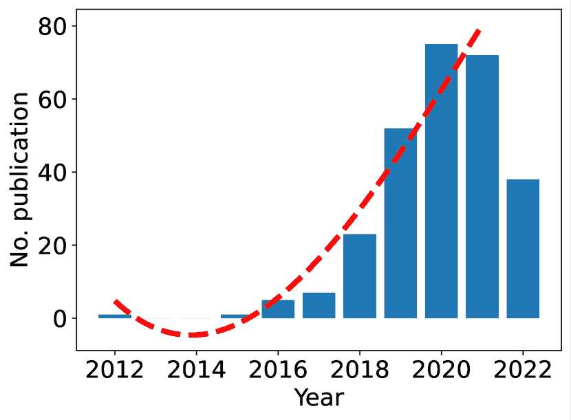

<!--yml

category: 未分类

日期：2024-09-06 19:37:21

-->

# [2308.13872] 基于视觉的人体姿态估计：深度学习的综述

> 来源：[`ar5iv.labs.arxiv.org/html/2308.13872`](https://ar5iv.labs.arxiv.org/html/2308.13872)

# 基于视觉的人体姿态估计：深度学习的综述

Gongjin Lan^∗ [<svg height="13.95" overflow="visible" version="1.1" width="17.01"><g transform="translate(0,13.95) matrix(1 0 0 -1 0 0) translate(8.5,0) translate(0,6.98)" fill="#000000" stroke="#000000" stroke-width="0.4pt"><g transform="matrix(1.0 0.0 0.0 1.0 -3.89 -2.36)" fill="#FFFFFF" stroke="#FFFFFF" color="#A6CE39"><foreignobject width="7.78" height="4.73" transform="matrix(1 0 0 -1 0 16.6)" overflow="visible">ID</foreignobject></g></g></svg>](https://orcid.org/0000-0003-2020-8186) , , Yu Wu, Fei Hu, , Qi Hao^∗ [<svg height="13.95" overflow="visible" version="1.1" width="17.01"><g transform="translate(0,13.95) matrix(1 0 0 -1 0 0) translate(8.5,0) translate(0,6.98)" fill="#000000" stroke="#000000" stroke-width="0.4pt"><g transform="matrix(1.0 0.0 0.0 1.0 -3.89 -2.36)" fill="#FFFFFF" stroke="#FFFFFF" color="#A6CE39"><foreignobject width="7.78" height="4.73" transform="matrix(1 0 0 -1 0 16.6)" overflow="visible">ID</foreignobject></g></g></svg>](https://orcid.org/0000-0002-2792-5965) 本研究部分由中国国家自然科学基金（编号：61773197）、深圳市基础研究计划（编号：JCYJ20200109141622964）、英特尔 ICRI-IACV 研究基金（$CG\#52514373$）资助。（通讯作者：Gongjin Lan；Qi Hao。）Gongjin Lan、Yu Wu 和 Qi Hao 隶属于南方科技大学计算机科学与工程系，深圳 518055，中国（电子邮件：langj@sustech.edu.cn, wuy@mail.sustech.edu.cn, hao.q@sustech.edu.cn）Fei Hu 隶属于阿拉巴马大学电气与计算机工程系，塔斯卡卢萨，AL（电子邮件：fei@eng.ua.edu）

###### 摘要

人体姿态估计（HPE）在过去几十年里引起了计算机视觉领域的广泛关注。此外，HPE 已被应用于多个领域，如人机交互、体育分析以及通过图像和视频进行人体跟踪。近年来，基于深度学习的方法在 HPE 应用中表现出了最先进的性能。尽管基于深度学习的方法在 HPE 中取得了显著成绩，但文献中仍缺乏对这些方法的全面综述。本文提供了对基于视觉的 HPE 中深度学习方法的最新、深入的概述。我们总结了这些 2D 和 3D HPE 方法及其应用，讨论了挑战和研究趋势，通过文献计量学提供了对未来研究的有益建议。本文为初学者提供了对深度学习 HPE 的有意义概述，同时也为高级研究人员提供了补充材料。

###### Index Terms:

人体姿态估计、人类表现评估、深度学习、动作识别、文献计量学。

## I 引言

人体姿态估计（HPE）指的是估计图像或视频中人体关节的位置及其关联，这是计算机视觉中的一个热门研究主题。它已广泛应用于各种应用中，如动作分析[1]、人机交互[2]、游戏[3]、运动分析[4, 5]、动作捕捉[6]、计算机生成图像[7, 8]。尽管 HPE 已经研究了几十年，但它仍然是一个开放且具有挑战性的任务，因为主要涉及人体的广泛多样性（如各种人体姿态、各种服装、环境或光照条件）和由于遮挡（尤其是人群）造成的重建模糊性[9, 10]。

早期的 HPE 方法通常使用预定义模型和统计学习来描述人体姿态[11, 12]。然而，这些方法无法从大量数据中学习，且模型表示能力有限。近年来，基于深度学习的方法在许多计算机视觉任务中取得了显著改进，如分类[13]、目标检测[14, 15]和 HPE[9]。深度学习在 HPE 中的成功主要归因于以下三点：大数据的可用性、深度神经网络的优越表示能力以及高性能硬件（如 GPU 平台）。基于深度学习的方法显著优于传统方法。

尽管在基于视觉的深度学习模型的 HPE（人体姿态估计）中有许多有前景的方法[9, 16, 17]，但仍缺乏关于该领域的最新和深入的综述文章。我们强调，对 HPE 的全面概述应涵盖 2D 和 3D HPE 的研究。本文旨在提供一个完整且扎实的调查，分析研究挑战，并指出 HPE 中的研究趋势。特别地，我们应用文献计量学来检索科学出版物，以分析 HPE 中的研究趋势。本文全面回顾了涵盖 2D 和 3D HPE 研究的 HPE 主题，讨论了挑战，观察了趋势，并提供了详细的文献计量分析。

### I-A 相关工作

到目前为止，已有几篇调查论文讨论了 HPE 相关的研究。Dang 等人 [18] 提供了关于基于深度学习的 2D HPE 的调查，包括单人和多人管道。Poppe 等人 [19] 介绍了基于视觉的人类动作识别文献的概述。目前，有许多研究探讨了单目 HPE，并且有几篇调查论文讨论了单目 HPE 的研究。在 [20, 21, 22] 中，单目 HPE 的研究得到了全面回顾，特别是基于深度学习的方法。Dang 等人 [23] 提供了关于传感器或视觉基础的人类活动识别的综合调查。Gadhiya 等人 [24] 分析并比较了几种流行的 HPE 方法。最新的工作 [25] 回顾了基于深度学习的 3D HPE 的研究。尽管这些调查论文涵盖了 HPE 相关的主题，但它们主要关注 HPE 中的某一个具体主题。本文旨在提供基于深度学习模型的视觉基础 HPE 的全面调查，涵盖 2D 和 3D HPE。

### I-B 贡献

本文旨在提供对现有基于深度学习的人体姿态估计研究的详细概述。此综述有三个目标：

+   •

    从“直升机视角”描绘该领域的全貌。

+   •

    明确主要研究方向，并提供关于基于视觉和深度学习的 HPE 的完整概述。

+   •

    通过文献计量学讨论挑战和研究趋势，并为未来的研究提供有见地的建议。

本调查涵盖了基于 2D 和 3D 的方法。图 1 显示了这些方法的分类（例如，基于图像或视频、2D HPE 或 3D HPE、单目或多视角）、应用、趋势和挑战。这些贡献使我们的调查比现有调查论文具有更为坚实、最新和深入的见解。

图 1：本调查的分类。

本文其余部分组织如下。在第 II 节中，我们介绍了基础知识、常见数据集以及 HPE 的指标。基于图像的 2D HPE 总结在第 III 节。视频基于的 2D HPE 在 III-C 小节中讨论。3D HPE 的研究在第 IV 节中进行。使用深度学习的基于视觉的 HPE 的应用在第 V 节中介绍。最后，研究趋势和挑战在第 VI 节中讨论，随后在第 VII 节中给出结论。

## II 基础知识

在本节中，我们介绍了基础知识，包括指导读者了解 HPE 总体概况的基本概念，并描述了解决方案的表示以及具有性能指标的知名数据集。

| 2D/3D | 类型 | 年份 | 数据集 | URL（开放数据集） | 数据规模 | #关节 | 指标 |
| --- | --- | --- | --- | --- | --- | --- | --- |
| 2D | 单人 | 2010 | LSP [26] | [`sam.johnson.io/research/lsp.html`](http://sam.johnson.io/research/lsp.html) | 2K 图像 | 14 | PCK&PCP |
| 2013 | FLIC [27] | [`bensapp.github.io/flic-dataset.html`](https://bensapp.github.io/flic-dataset.html) | 5K 图像 | 10 | PCK&PCP |
| 2013 | J-HMDB [28] | [`jhmdb.is.tue.mpg.de/`](http://jhmdb.is.tue.mpg.de/) | 928 个视频剪辑 | 15 | PCK&PCP |
| 2013 | PennAction [29] | [`dreamdragon.github.io/PennAction/`](http://dreamdragon.github.io/PennAction/) | 2326 个视频剪辑 | 13 | PCK&PCP |
| 多人 | 2014 | MPII [30] | [`human-pose.mpi-inf.mpg.de/`](http://human-pose.mpi-inf.mpg.de/) | 25K 图像 & 40K 人 | 16 | mAP |
| 2016 | COCO [31] | [`cocodataset.org/#home`](https://cocodataset.org/#home) | 330K 图像 & 250K 人 | 17 | AP & AR |
| 2018 | PoseTrack [16] | [`github.com/umariqb/PoseTrack-CVPR2017`](https://github.com/umariqb/PoseTrack-CVPR2017) | 46K 帧 & 276K 人 | 15 | mAP |
| 2019 | CrowdPose [32] | [`github.com/Jeff-sjtu/CrowdPose`](https://github.com/Jeff-sjtu/CrowdPose) | 20K 图像 & 80K 人 | 14 | mAP |
| 3D | 单人 | 2014 | Human3.6M [33] | [`vision.imar.ro/human3.6m/`](http://vision.imar.ro/human3.6m/) | 3.6M 帧 & 4 个摄像头视角 | 17 | MPJPE |
| 多人 | 2017 | CMU Panoptic [34] | [`domedb.perception.cs.cmu.edu/`](http://domedb.perception.cs.cmu.edu/) | 150 万帧 & 512 个摄像头视角 | 15 | MPJPE |
| 2018 | 3DPW [35] | [`virtualhumans.mpi-inf.mpg.de/3DPW/`](https://virtualhumans.mpi-inf.mpg.de/3DPW/) | 51K 帧 & 1 个摄像头视角 | 18 | MPJPE |
|  | 2017 | MPI-INF-3DHP [36] | [`vcai.mpi-inf.mpg.de/3dhp-dataset/`](https://vcai.mpi-inf.mpg.de/3dhp-dataset/) | 130 万帧 & 16 个摄像头视角 | 15 | MPJPE |
|  | 2018 | JTA [37] | [`github.com/fabbrimatteo/JTA-Dataset`](https://github.com/fabbrimatteo/JTA-Dataset) | 460K 帧 & 1 个摄像头视角 | 14 | MPJPE |

表 I: 2D 和 3D HPE 中常见数据集的示例。

### II-A 深度学习在 HPE 中的应用

目前，基于深度学习的方法已经成为 HPE 的最先进技术。大型数据集的可用性、先进的硬件如 GPU 和深度神经网络的超越性能导致了对深度学习 HPE 的日益关注。在本小节中，我们探讨了 HPE 中三种热门的神经网络类型：卷积神经网络 (CNNs)、循环神经网络 (RNNs) 和图卷积网络 (GCNs)。

#### II-A1 卷积神经网络

一般来说，用于 HPE 任务的 CNN 包含两部分。第一部分通常使用现成的通用预训练网络，如 ResNet [38]，来提取特征，即所谓的骨干网络。第二部分，称为预测头，利用提取的特征预测人体姿势。

像 AlexNet [13] 和 ResNet [38] 这样的著名网络在 ImageNet 数据集上展示了出色的分类性能，并且在 HPE [39, 40] 中也表现优异。然而，分类任务和 HPE 任务之间存在差距，因为它们的目标特征和预测有所不同。与其直接使用分类任务的骨干网络，不如针对 HPE 任务对骨干网络进行改进。例如，Hourglass [41]、级联金字塔网络 (CPN) [42] 和 HRNet [10] 被提出作为 HPE 中深度学习方法的骨干网络。

对于预测头，在 HPE 中主要有两种代表性解决方案。一种是直接预测关节坐标，被视为回归范式。另一种是在计算关节坐标之前生成中间热图表示。对于回归范式，通常采用全连接层来回归具体的关键点坐标。对于热图预测范式，通常使用上采样 [42, 41, 43] 来生成更高分辨率的热图。

#### II-A2 循环神经网络

循环神经网络（RNNs）将序列输入中的时间信息纳入考虑。它们在视频基础的 HPE 中广泛应用，将视频视为序列 RGB 图像。我们在图 3 中展示了这种类型网络的一般流程。基于 RNN 的方法表现出强大的鲁棒性和最先进的精度 [44, 45]。

#### II-A3 图卷积网络

图卷积网络（GCNs）与其不同的是，GCNs 以图作为输入，而不是图像。由于人体骨架可以自然地表示为图，基于 GCNs 的方法在许多骨架基础的任务中很流行。在 HPE 中，GCNs 通常被期望更好地利用关键点之间的关系，并用于姿态优化 [46]、关节关联 [47]、2D 到 3D 姿态提升 [48, 49, 50]。

### II-B 姿态表示

尽管人体姿态（关键点位置）的自然表示使用有序元组形式的坐标，但现有研究表明，通过将解决方案表示为可以视为置信度图的热力图取得了显著改进。目前，热力图表示已经成为 HPE 中一种流行的解决方案表示方式。在本小节中，我们描述了热力图表示在单人和多人 HPE 中的工作原理。

#### II-B1 单人 HPE 中的热力图

为了使神经网络能够预测人体关节的热力图，热力图的真实值是必不可少的。产生真实值的一种直观方法是为每个关键点设计一个概率热力图。例如，对于单人姿态估计任务，$\mathcal{K}$ 个关键点的热力图可以定义为与输入图像 $x$ 大小相同的 $\mathcal{K}$ 个矩阵。位置 $p$ 的值（记作 $\mathcal{H}_{k}(p)$）可以通过以关节 $k$ 在 $x$ 中的位置为中心的 2D 高斯分布生成。

|  | $\small\mathcal{H}_{k}(p)=e^{\frac{\&#124;p-p_{k}^{*}\&#124;_{2}^{2}}{\sigma^{2}}},\forall k=1,2,\ldots,\mathcal{K}$ |  | (1) |
| --- | --- | --- | --- |

其中 $p_{k}^{*}$ 是关节 $k$ 在 $x$ 中的位置。在热力图中，预测的位置（记作 $p_{pred}^{*}$）可以通过回归模型计算得出：

|  | $\small p_{pred}^{*}=\sum_{p\in\mathcal{P}}\mathcal{H}_{k}(p)*p,$ |  | (2) |
| --- | --- | --- | --- |

其中 $\mathcal{P}$ 是关节 $k$ 的可能位置集合。

#### II-B2 多人 HPE 中的热力图

多人场景中的热图有两种主要模式。一种是为$\mathcal{N}$个人和它们的$\mathcal{K}$个关节生成$\mathcal{N}\times\mathcal{K}$个热图。另一种是为所有人的$\mathcal{K}$个关节生成$\mathcal{K}$个热图。对于前一种模式（$\mathcal{N}\times\mathcal{K}$个热图），热图中位置$p$处的每个值（表示为$\mathcal{H}_{k,n}(p)$）可以计算如下：

|  | $\small\mathcal{H}_{k,n}(p)=e^{\frac{\&#124;p-p_{k,n}^{*}\&#124;_{2}^{2}}{\sigma^{2}}},~{}\forall k=1,2,\ldots,\mathcal{K},~{}\forall n=1,2,\ldots,\mathcal{N}$ |  | (3) |
| --- | --- | --- | --- |

其中$\mathcal{K}$和$\mathcal{N}$分别是关节和人数的数量。对于后一种情况，生成地面真值热图的一般方法是通过使用$\max$运算符将$\mathcal{N}$个单人热图聚合成一个热图：

|  | $\small\mathcal{H}_{k}(p)=\max_{n}\mathcal{H}_{k,n}(p),\forall n=1,2,\ldots,\mathcal{N}$ |  | (4) |
| --- | --- | --- | --- |

总结一下，方程 3 和方程 4 是计算多人 HPE 中热图的两种主要方法。

### II-C 数据集和评估指标

数据集对于基于深度学习的 HPE 的神经网络的训练和评估至关重要。在本小节中，我们介绍流行的数据集及其适用任务，然后回顾针对基于图像的 2D HPE、基于视频的 2D HPE 和 3D HPE 的评估指标。

#### II-C1 2D HPE 中的数据集

许多数据集已经被提出来评估 2D HPE 方法的性能。在这里，我们介绍了在 2D HPE 中使用的流行数据集。早期的数据集，如 LSP [26]，FLIC [27]，Penn Action [29] 和 J-HMDB [28] 主要关注相对较小规模的单人场景。最近的数据集，如 COCO [31]，MPII [30]，CrowdPose [32] 和 PoseTrack [16] 用于具有较大规模数据的多人 HPE。我们总结并提供了流行数据集的链接以及它们的规模和评估指标，如表 I 所示。

#### II-C2 3D HPE 中的数据集

与 2D HPE 数据集不同，获取 3D HPE 中人类关节的准确 3D 注释通常需要一个运动捕捉系统，这在户外环境中一般很难安装。大多数 3D HPE 数据集都是在室内环境或仿真中创建的，例如 CMU Panoptic [34]、3DPW [35]、MPI-INF-3DHP [36] 和 JTA [37]。在这里，我们介绍了 3D HPE 中的一些著名数据集，并在表 I 中总结了它们的特点。

#### II-C3 2D HPE 中的指标

在科学研究中，我们通常需要一些指标来评估方法的表现。这里我们介绍两种常见的 HPE 指标。*关键点正确率 (PCK)* 字面上表示正确检测到的关键点的百分比，可以记作 $\mathcal{PCK}=k/\mathcal{N}$，其中 k 是正确预测的关键点数量，$\mathcal{N}$ 是关键点的总数。这个指标通常应用于使用 LSP 数据集、MPII 数据集和 FLIC 数据集的早期 2D HPE 方法（见表 II）。

| 研究 | 年份 | 主干网络 | 输入尺寸 | 亮点 | PCKh@0.5 | 参数数量 | GFlops |
| --- | --- | --- | --- | --- | --- | --- | --- |
| Toshev & Szegedy [9] | 2014 | AlexNet | $256\times 256$ | 原始基于深度学习的 HPE 方法 | - | - | - |
| Tompson 等人 [51] | 2014 | AlexNet | $320\times 240$ | 热力图在解决方案表示中的应用 | 82.0 | - | - |
| Wei 等人 [52] | 2016 | CPM | $368\times 368$ | 卷积姿态机器 | 88.5 | 31.23M | 85.0 |
| Newell 等人 [41] | 2016 | Hourglass | $256\times 256$ | 堆叠 Hourglass 模块 | 90.9 | 23.7M | 41.2 |
| Xiao 等人 [43] | 2018 | ResNet | $256\times 256$ | 一种简单而有效的 HPE 架构 | 90.2 | 68.64 M | 17.02 |
| Chu 等人 [53] | 2017 | Hourglass | $256\times 256$ | 上下文表示中的注意力机制 | 91.5 | 58.1M | - |
| Yang 等人 [54] | 2017 | Hourglass | $256\times 256$ | 金字塔残差模块 | 92.0 | 26.9M | 45.9 |
| Sun 等人 [10] | 2019 | HRNet | $256\times 256$ | HRNet 用于高分辨率表示 | 92.3 | 28.54M | 10.27 |
| Bulat 等人 [55] | 2020 | Hourglass+UNet | $256\times 256$ | 结合 [41] 和 U-Net [56] 的混合结构 | 94.1 | 8.5M | 9.9 |

表 II：2D 单人姿态估计的最新方法。PCKh@0.5 分数显示在最后一列，并定义在 子小节 II-C3。这些分数是通过在 MPII 数据集上测试方法得到的。

*对象关键点相似性（OKS）* 最初在 COCO 竞赛中提出 [31] 作为计算平均精度（mAP）的变量。它的计算公式如下：

|  | $\small\mathcal{OKS}=\frac{\sum_{i}(-d_{i}^{2}/2s^{2}k_{i}^{2})\delta_{(v_{i}>0)}}{\sum_{i}\delta_{(v_{i}>0)}},\quad s.t.~{}v_{i}\in\{0,1,2\}$ |  | (5) |
| --- | --- | --- | --- |

其中 $i$ 是一个关节索引，$d_{i}$ 是预测关节与真实关节之间的距离，$s$（对象尺度）和 $k_{i}$ 是由 COCO 数据集给出的关键点常量，$\delta=1$ 当 $v_{i}>0$，否则 $\delta=1$，$v_{i}$ 是真实值的可见性标志（$v_{i}=0$：未标记，$v_{i}=1$：标记但不可见，$v_{i}=2$：标记且可见）。平均精度（AP）可以通过 $\mathcal{OKS}$ 值计算：

|  | $\small AP=\frac{\mathcal{TP}_{(\mathcal{OKS}>td)}}{\mathcal{TP}_{(\mathcal{OKS}>td)}+\mathcal{FP}_{(\mathcal{OKS}\leq td)}}$ |  | (6) |
| --- | --- | --- | --- |

其中 $\mathcal{TP}$ 和 $\mathcal{FP}$ 分别是真正例和假正例的数量，$td$ 是 $\mathcal{OKS}$ 阈值。平均 AP（mAP）是十个 $\mathcal{OKS}$ 阈值（0.50, 0.55, . . . , 0.90, 0.95） [31] 的平均值，这是评估 2D 多人姿态估计的常用度量（参见 表 III）。

#### II-C4 3D HPE 的度量

一般来说，PCK 的度量可以扩展到评估 3D HPE。然而，*平均关节位置误差（MPJPE）* 目前在 3D HPE 中是一个流行的度量（参见 表 IV）。MPJPE 计算预测关节坐标与真实关节坐标之间的欧几里得距离，可以表述为：

|  | $\small\text{MPJPE}=\frac{1}{\mathcal{T}\cdot\mathcal{N}}\sum\limits_{t=1}^{\mathcal{T}}\sum\limits_{i=1}^{\mathcal{N}}\left\lVert J_{i}^{t}-J_{root}^{t}-(\hat{J_{i}}^{t}-\hat{J}_{root}^{t})\right\rVert^{2}$ |  | (7) |
| --- | --- | --- | --- |

其中 $i$ 和 $t$ 分别是关节和样本的索引；$J_{i}$ 和 $\hat{J_{i}}$ 指的是 $i$-th 关节的预测坐标和真实坐标。$J_{root}$ 指的是根关节的坐标，通常预定义为人的骨盆。

## III 2D 人体姿态估计

基于图像的 2D HPE 旨在估计图像中人体关节点的位置。早期的方法主要使用基于模型的方法。目前，基于深度学习的方法在 2D HPE 中表现出优越的性能[9]。在本节中，我们从三个方面介绍基于深度学习的 2D HPE 方法：基于图像的单人姿态估计（SPPE）、基于图像的多人姿态估计（MPPE）和基于视频的 2D HPE。最后，我们在 Table VI 中总结了最先进的 2D HPE 的开源代码。

### III-A 基于图像的 2D 单人姿态估计

SPPE 任务是估计图像中单个人的姿态。这是 HPE 中的一个基础任务，通常作为其他 HPE 任务的基本组成部分。例如，著名的研究[9] 提出了一个级联多阶段神经网络来预测和优化人体姿态，其中图像被裁剪以确保每张图像中只有一个人。据我们所知，这是将深度神经网络（DNN）应用于 HPE 的原始工作。

最近基于 DNN 的方法显著提高了 SPPE 的准确性。许多具有高效架构的通用神经网络在各种应用中表现出色[13, 38]。提高 SPPE 性能主要有两种方法：改进解决方案表示和设计先进的神经网络。在[51, 57, 58]中，具有解决方案表示的方法显著提高了 SPPE 性能。此外，设计良好的神经网络架构[10, 52] 在 HPE 中也表现出色。我们在 Table II 中总结了 2D 单人姿态估计的最先进方法。

#### III-A1 解决方案表示

一般而言，主要有两种类型的解决方案表示方式。一种是使用坐标表示关节点的位置。另一种是以概率分布的形式表示关节点的位置，即 Equation 1 中表示的热图。早期的研究主要使用基于 DNN 的回归方法从输入图像直接估计坐标。DeepPose[9] 是一个早期的经典研究，应用 DNN 进行坐标回归表示，从 RGB 图像中进行多阶段的 SPPE 任务优化。

热图的解决方案表示显著提高了基于 DNN 的 HPE 方法的性能 [56]。自从 Tompson 等人 [51] 和 Jain 等人 [57] 提出热图以来，热图生成的方法在 HPE 任务中被广泛使用。此外，Zhang 等人 [58] 通过关键点的分布感知坐标表示（DARK）改进了热图表示。

#### III-A2 神经网络设计

如何设计 HPE 中的神经网络架构是一个关键话题。一种通用的方法是使用现有的知名神经网络（例如，AlexNet [13]，ResNet [38]），这些网络在其他计算机视觉任务中已经表现出优越的性能。例如，Toshev 等人 [9] 使用类似于 AlexNet 的网络从图像中回归人体关节的坐标。Xiao 等人 [43] 使用 ResNet 作为 HPE 神经网络的骨干网络。

最新的神经网络——采用注意力机制的 transformer，已在 HPE 中表现出卓越的性能。一般来说，transformer 处理 CNN 提取的特征，并利用注意力机制自动捕捉特征之间的长距离关系。在 2021 年，Mao 等人 [59] 使用 ResNet 从图像中提取特征，并利用 Transformer 模型预测关键点位置。Li 等人 [60] 利用视觉 transformer 实现基于回归的 HPE，其中两个级联的 transformer 被应用于预测人的边界框及其关键点位置。Yang 等人 [61] 提出了一个新的网络模型 TransPose，该模型引入 transformer 进行人体姿态估计。内置的 transformer 注意力层使 TransPose 能够有效捕捉长距离关系。此外，Xu 等人提出了一种可扩展的 HPE 骨干网络 VitPose [62]，该网络使用简单的非层次化视觉 transformer 作为骨干网络来提取给定人物实例的特征，并使用轻量级解码器进行姿态估计。迄今为止，现有的综述论文尚未讨论 transformer 在 HPE 中的研究。

另一种通用的方法是为姿态估计任务设计特定的网络。例如，Newell 等人[41]设计了一个堆叠的沙漏网络作为提取多尺度特征的骨干网络。沙漏网络在许多姿态估计研究中被用作骨干网络。Newell 等人[63]利用沙漏网络骨干来估计多人的姿态。BlazePose[64]利用基于沙漏的编码器网络，通过 MediaPipe 框架[65]实现了实时单人姿态估计，该框架在 Google Pixel 2 手机上达到了每秒 30 帧的速度。Bulat 等人[55]设计了一种混合网络结构，将沙漏网络与 U-Net[56]结合。Chen 等人[42]提出了另一项重要研究，即提出了一个级联金字塔网络，用于连接不同尺度的特征。此外，许多研究通过稍微修改骨干网络的单元来增强模型性能。具体来说，Chu 等人[53]将注意力机制融入沙漏网络。Yang 等人[54]提出了一个金字塔残差模块，以替代沙漏网络中的残差模块。

### III-B 基于图像的 2D 多人姿态估计

通常，多人姿态估计（MPPE）比单人姿态估计（SPPE）更具挑战性，因为它在解决空间和相互遮挡方面的复杂性更高。

      输入图像 检测到的边界框 人体姿态        输入图像 检测到的关键点 人体姿态

图 2：自上而下和自下而下框架的示意图。第一行展示了一个具有两个阶段的代表性自上而下框架：为每个人提出一个边界框并估计人体姿态。第二行展示了一个具有两个阶段的代表性自下而下框架：检测个体的关节并将关节分组到一个关联的个体中。原始图像来自 COCO 数据集[31]。

当前的多人姿态估计（MPPE）解决方案通常分为自上而下的方法或自下而上的方法：

+   •

    自上而下的方法应用一个人检测器来检测所有单个人，随后估计每个单人的关节，并分别计算每个单人的姿态。

+   •

    自下而上的方法首先检测图像中的所有关节，然后将这些关节关联/分组到一个关联的个体中。

在本小节中，我们探讨了自上而下和自下而上的方法，并讨论了它们的优缺点。我们在图 2 中展示了这两种方法的框架，并在表 III 中总结了最近知名的 MPPE 方法。

| 方法 | 研究/年份 | 输入尺寸 | 骨干 | 检测器/分组 | 亮点 | mAP | 参数数量 | GFlops |
| --- | --- | --- | --- | --- | --- | --- | --- | --- |
| 自上而下 | [66] / 2017 | - | ResNet | Mask R-CNN | 通过 Mask R-CNN 检测人员和关键点 | 63.1 | - | - |
| [39] / 2017 | $320\times 256$ | PyraNet | Faster R-CNN | 处理不准确的边界框 | 72.3 | 28.1M | 26.7 |
| [42] / 2018 | $384\times 288$ | CPN | FPN | 两阶段级联网络以优化关键点 | 72.1 | 27.0M | 6.2 |
| [43] / 2018 | $384\times 288$ | ResNet | Faster R-CNN | 一个非常简单的基线 | 72.2 | - | - |
| [10] / 2019 | $384\times 288$ | HRNet | Faster R-CNN | 高分辨率表示的 HRnet | 75.5 | 63.6M | 32.9 |
| [67] / 2019 | $384\times 288$ | MSPN | MegDet | 一个多阶段网络 | 76.1 | 120M | 19.9 |
| [17] / 2020 | $512\times 384$ | EvoPose2D | Faster R-CNN | 神经架构搜索 | 76.8 | 14.7M | 17.7 |
| [46] / 2020 | $384\times 384$ | ResNet | FPN | 基于 GCN 的关键点优化 | 72.9 | 25.2M | 12.9 |
| [59] / 2021 | $384\times 288$ | ResNet+ Transformer | Faster R-CNN | 通过变换器进行直接坐标回归 | 72.2 | - | 20.4G |
| [61] / 2021 | $256\times 192$ | TransPose | Faster R-CNN | 基于 CNN 的变换器解码器 | 75.8 | 17.5M | 21.8G |
| [62] / 2022 | $256\times 192$ | VitPose | Faster R-CNN | 视觉变换器骨干基线 | 79.8 | 632M | - |
| 自下而上 | [68] / 2016 | $256\times 256$ | ResNet | 整数规划 | 基于 ResNet 的检测器和图像条件配对项 | - | - | - |
| [40] / 2017 | $256\times 256$ | VGG+CPM | Part Affinity Fields | 基于身体关联和匈牙利算法的分组 | 61.8 | 25.94M | 160 |
| [63] / 2017 | $512\times 512$ | Hourglass | 关联嵌入 | 像素级关节嵌入以进行分组 | 66.3 | 277.8M | 206.9 |
| [69] / 2019 | $384\times 384$ | Hourglass | $\emptyset$ | 预测根部和关节位置 | 66.9 | - | - |
| [47] / 2020 | $641\times 641$ | ResNet | DGCN | 用于分组的图卷积网络 | 68.8 | 234M | - |
| [70] / 2020 | $512\times 512$ | Hourglass | 关联嵌入 | 用于分组的图聚类 | 68.3 | - | - |
| [71] / 2018 | $480\times 480$ | ResNet+FPN | 人体检测 | 姿态残差网络分配关键点到实例 | 69.6 | - | - |
| [72] / 2020 | $640\times 640$ | HigherHRNet | 关联嵌入 | HigherHRNet 应对尺度变化挑战 | 70.5 | 63.8M | 154.3 |

表 III：基于图像的二维多人 HPE 的最新研究。mAP 分数在 subsubsection II-C3 中定义，通过在 COCO 数据集上测试获得。

#### III-B1 自上而下的方法

自上而下的方法是一种有效且受欢迎的二维多人姿态估计任务方法。通过使用预训练的人体检测器来裁剪图像，自上而下的方法可以将多人任务转换为单人任务。通过改进人体检测器和单人姿态估计器，自上而下的方法的性能可以得到提升。He 等人 [66] 表明，扩展 HPE 任务到检测任务可以实现多人姿态估计。Fang 等人 [39] 提出了一个区域性多人姿态估计框架，以提高人体检测器的性能。此外，单人姿态估计器的改进对多人姿态估计也有益处 [58, 73, 42]。

一般来说，自上而下的方法在数据集上表现出先进的性能，并且可以通过结合现有的检测器和 SPPE 模型来轻松实现。然而，自上而下方法的计算随着检测到的人员数量显著增加，这限制了其在多人人员场景中的实时性能。因此，自上而下的方法很难应用于复杂场景中的实时 HPE 任务，特别是在人群场景中。

#### III-B2 自下而上的方法

与在提议的边界框中执行关键点检测不同，自下而上的方法通常包括两个部分：关键点检测和关键点分组。对于关键点检测，通过 Equation 3 中描述的热图直接检测图像中所有人的身体关键点。对于关键点分组，需要将检测到的关键点分组到单个人身上。深度神经网络通常用于将关键点分配到检测到的人的提议边界框中。Newell 等人 [63] 引入了关联嵌入来训练神经网络，为每个人分配关键点。Jin 等人 [70] 应用了图神经网络来对检测到的关节进行分组。

此外，[72] 显示，与顶层方法相比，底层方法在处理拥挤场景时更具鲁棒性，这对实际应用至关重要。然而，顶层方法在准确性方面表现更好，但随着检测人数的增加，计算时间不可避免地增加。相比之下，底层方法对多人 HPE 的计算时间相对恒定 [40, 69]，对目标人数的变化不那么敏感。总之，底层方法有利于在低性能硬件平台上进行实时多人人体姿态估计。

### III-C 视频基础的 2D HPE

视频基础的 2D HPE 通常比基于图像的 2D HPE 更复杂。通用视频基础的 2D HPE 流程图见图 3。与静态图像不同，视频帧可能涉及图像退化问题，如运动模糊和视频失焦。尽管由于运动模糊、视频失焦和暂时遮挡，视频基础的 2D HPE 性能可能会退化，但这些视频基础的方法通常通过捕捉时间信息超过了基于图像的方法。视频帧之间的相关性可用于进一步改善 HPE 中的自监督方法。

图 3：视频基础的 2D HPE 流程图，其中利用了基于神经网络（NNs-based）的模块来提取时间信息。原始图像来自 Penn Action 数据集 [29]。

在基于视频的 2D 人体姿态估计中，手动标注视频中每一帧的人体关节成本高昂，这限制了大规模数据集的获取。为了解决这个问题，需要充分研究序列之间的时间相关性和一致性。Jain 等人[57] 最初提出了一种基于 CNN 的方法，将 RGB 图像和运动特征结合起来，以提高人体姿态估计的准确性和速度。特别地，递归神经网络，如著名的长短期记忆网络（LSTM），在捕捉帧之间的时间一致性方面表现出色[44, 45]。Nie 等人[74] 提出了一个动态内核蒸馏模型，以提取帧之间的时间线索。尽管这些方法在准确性上表现处于最先进水平，但它们在视频-based HPE 中基于大规模和密集标注的数据进行监督学习。相比之下，半监督学习对基于视频的 2D HPE 尤其有用，因为标注大规模和密集数据既昂贵又劳动密集。为此，Bertasius 等人[75] 提出了 PoseWarper，用于在稀疏标注（每 k 帧）的视频中传播姿态信息。

最后，我们收集了著名的最先进 2D HPE 工作的开源实现，如表 VI 所示。我们总结了适用于实际应用的流行实时开源实现（例如，OpenPose、AlphaPose、OpenPose 的轻量版本和 BlazePose [64]，由 MediaPipe [65] 框架驱动），这些实现通常为用户提供开源代码。

### III-D 鲁棒性分析

鲁棒性是深度学习方法中一个重要的属性。在本小节中，我们回顾了人体姿态估计的鲁棒性分析研究。目前，鲁棒性分析通常应用于 2D HPE，但在 3D HPE 中很少考虑。深度学习方法通常对对抗样本的攻击敏感且易受攻击。

尽管 HPE 的鲁棒性很少被研究，但在 HPE 方法的设计和评估中至关重要。在[41]中，演示了 Hourglass 网络的 PCK 在对抗样本测试中从$89.4$剧降至$0.57$。Wang 等人[76]提出了新数据集 COCO-C、MPIIC 和 OCHuman-C，这些数据集是在 COCO[31]、MPII[30]和 OCHuman[77]的基础上重建的，用于评估 HPE 方法的鲁棒性。Shah 等人[78]全面调查了 HPE 方法的对抗鲁棒性。实验结果表明，1) 基于热图的方法比基于回归的方法更鲁棒，2) 不同的身体关节对对抗样本的攻击一般表现出不同的鲁棒性。例如，头部和颈部表现出显著的鲁棒性，而臀部、膝盖和踝关节对干扰敏感。这些工作揭示了现有基于深度学习的 HPE 方法的鲁棒性。

## IV 3D 人体姿态估计

3D HPE 旨在预测人体关节的 3D 位置。这是一个具有挑战性的任务，因为解决空间大且固有模糊。此外，缺乏户外的大规模 3D HPE 数据集挑战了 3D HPE 方法的实际表现，因为现有的数据集 3D HPE 大多是通过室内运动捕捉系统收集的[33, 34]。早期的研究要么实现了基于模型的方法[79, 80]，要么将任务视为可以通过优化算法解决的回归问题。由于基于 DNN 的方法[81, 82]通过自动从大规模数据中学习表示而优于以前的工作，基于深度学习的方法也已成为 3D HPE 中最受欢迎的方法。

在本节中，我们回顾了基于深度学习的 3D HPE 研究，如表 IV 所示。根据输入的特点，我们将 3D HPE 分为三种类型：单目 3D HPE、多视角 3D HPE 和多模态 3D HPE。最后，我们在表 VI 中展示了最先进的 3D HPE 方法的开源代码集合。

| 视角 | 模态 | 研究 | 方法 | 亮点 | MPJPE | 数据集 |
| --- | --- | --- | --- | --- | --- | --- |
| 单目 | 视觉 | Ching-Hang 等人[82] | CNN | 提升姿态的匹配方法 | 82.72 | Human3.6m |
| Julieta 等人[83] | CNN | 现成检测器和提升网络 | 87.3 |
| Dushyant 等人[84] | CNN | 抗遮挡姿态图 | 69.9 |
| Zhao et al. [48] | CNN+GCN | 一种新型 SemGCN 用于 2D-3D 提升 | 60.8 |
| Shichao et al. [85] | CNN | 演化的 2D-3D 数据增强与级联的 2D-3D 提升网络 | 50.9 |
| Kehong et al. [86] | CNN | 可微分的姿态增强器用于 2D-3D 提升 | 50.2 |
| Yujun et al. $\cite[cite]{[\@@bibref{}{cai2019exploiting}{}{}]}^{\dagger}$ | CNN+GCN | 基于 GCN 的 2D-3D 序列提升 | 48.8 |
|  | Wenbo et al. $\cite[cite]{[\@@bibref{}{hu2021conditional}{}{}]}^{\dagger}$ | CNN+GCN | 用于骨架表示的图与用于 2D-3D 序列提升的 GCN | 41.1 |  |
|  | 视觉与 IMUs | Timo et al. [35] | CNN | 视频惯性姿态融合图像和 IMUs | 26 | 3DPW |
| 多视角 | 视觉 | Karim et al. [87] | CNN | 一种端到端的 DNN 三角测量方法 | 17.7 | Human3.6m |
| Zhang et al. [88] | CNN | 一种自适应的多视角融合方法 | 19.5 |
| Yihui et al. [89] | CNN | 一种极线变换器 | 26.9 |
| Haibo et al. [90] | CNN | 一种交叉视角融合网络 | 31.17 |
| Size et al. [91] | CNN+GCN | 可学习的关联匹配与基于图的 3D 姿态细化 | 15.84 | CMU Panoptic |
| 视觉与 IMUs | Trumble et al. [92] | CNN | 一种两流网络融合视频和 IMUs | 87.3 | Human3.6m |
| Gilbert et al. [93] | CNN | 将[92]与增强的 3D HPE 结合 | 71.9 |
| Zhang et al. [94] | CNN | 一种方向正则化的图示模型 | 24.6 |
| Malleson et al. [95] | CNN | 基于 IMUs 和姿态的优化 | 62 | Total Capture |
|  | Huang et al. [96] | CNN | DeepFuse 用于视觉-IMU 数据融合 | 28.9 |

表 IV：基于图像的 3D HPE 的最先进方法。MPJPE 评分定义在 subsubsection II-C4，可以通过在 Human3.6M 数据集上测试这些方法获得。符号${\dagger}$表示使用图像序列的方法。

### IV-A 单目 3D HPE

单目 3D HPE 任务是预测单目图像中人体关节的 3D 位置，这被认为是一个病态问题。DNN 在预测单目图像的深度[97]和单目 3D HPE 任务[83, 98]上表现出了显著的性能。单目 3D HPE 方法通常可以分为两类：单阶段方法和两阶段方法。这两种方法的基本区别在于，两阶段方法涉及使用现成的 2D 预测器与 2D HPE 数据集。单阶段方法直接从图像中预测 3D 姿势。相反，两阶段方法首先估计 2D 姿势，然后将 2D 姿势提升为 3D 姿势。在本小节中，我们总结了两种方法在单目 3D HPE 中的最新研究成果。

#### IV-A1 单阶段方法

由于基于 DNN 的方法可以自动构建从 2D 图像到 3D 姿势的映射，单阶段 3D HPE 通常可以视为 2D HPE 的扩展。早期的工作应用回归范式直接估计 3D 人体姿势。Li 等人[81]最初通过将关节点检测器和关节点回归器相结合，使用深度神经网络应用端到端方法进行 3D HPE。Luvizon 等人[99]提出了一个多任务框架，进行多任务学习，直接预测 3D 姿势。

与早期研究相比，目前有许多单阶段方法应用热图表示进行 3D HPE。例如，Pavlakos 等人[100]提出了一种单阶段方法，该方法在体素空间中预测 3D 热图，并提出了一种由粗到细的预测方案，以减少大型 3D 热图的成本。为了降低直接预测 3D 体素热图的计算成本，Nibali 等人[101]预测了边际 2D 热图以生成 3D 坐标。

对于多人物 3D HPE 中的单阶段方法，它们可以类似地分为自上而下和自下而上的方法，回忆图 2。自上而下的方法直接预测每个提议的边界框中检测到的人的 3D 姿势。自下而上的方法通过检测所有 3D 关节并将所有关节分组到特定于人的集合中来估计 3D 姿势。通常，Fabbri 等人[102]提出了一种体积热图自动编码器来估计 3D 关节位置，并采用基于距离的启发式策略来关联一个人的身体关节。总的来说，单目多人物 3D HPE 中的自上而下和自下而上的方法框架类似于图 2 中的框架，而关节点分布在 3D 空间中。

#### IV-A2 两阶段方法

尽管单阶段方法效率较高，两阶段方法通常能获得更好的性能，因为它们可以进一步利用 2D 信息和大规模的 2D HPE 数据集。许多研究利用现成的 2D 估计器来生成 2D 姿态，然后采用 2D-3D 提升方法。例如，Martinez 等人 [83] 使用了现成的 2D 估计器来生成 2D 姿态，然后基于 2D 姿态使用简单的提升神经网络预测 3D 姿态。Zheng 等人 [103] 利用视觉变换器实现了从 2D 姿态序列的 3D 提升。对于两阶段方法，弱监督方法通常用于利用 2D 到 3D 的约束 [73]。Pavllo 等人 [104] 融合了来自视频的 2D 姿态序列，以预测准确的 3D 姿态，这种方法在半监督的方式下利用未标记的视频。

在多人 3D 人体姿态估计中，两阶段方法也采用了自上而下和自下而上的范式，但结合了两阶段过程。对于自上而下的方法，Rogez 等人 [105] 使用了一个区域提议网络来为目标人物提议边界框，并开发了一个姿态提议网络来估计这些边界框中的人体姿态。Zanfir 等人 [106] 进行了自下而上的 2D MPPE，然后通过 3D 姿态解码模块从 2D 姿态恢复 3D 姿态。

许多方法在 3D 人体姿态估计中采用了图神经网络的两阶段方法。对于两阶段方法，基于 GCN 的提升网络通常将来自 2D 姿态的图作为输入，以生成 3D 姿态。赵等人 [48] 提出了一个语义图卷积网络，从 2D 关节坐标回归到 3D 关节坐标。胡等人 [49] 提出了一个基于有向图的骨架表示，并应用图卷积网络来利用图像序列的空间和时间信息。基于 GCN 的两阶段 HPE 方法通过考虑人体骨架的先验知识图，表现出具有竞争力的性能。然而，基于 GCN 的方法通常在第一阶段整合其他基于 DNN 的模型来提取 2D 姿态，作为 GCN（第二阶段）的输入，这限制了 GCN 在 HPE 领域的应用。

### IV-B 多视角 3D 人体姿态估计

多视角 3D HPE 任务旨在利用同步的多视角摄像机预测 3D 关节位置。尽管经典的三角测量方法（详情参见[107]）可以通过多视角摄像机系统计算出准确的 3D 物体位置，但三角测量方法对不准确的 2D 预测具有明显的敏感性。减轻 2D 预测的误差是多视角 3D HPE 的一个关键问题。Iskakov 等人[87]提出了一种基于 DNN 的端到端可学习三角测量方法，以为每个视角生成置信度权重。Qiu 等人[90]提出了一种多视角融合层来改善 2D 姿态估计，并使用递归图像结构模型来预测 3D 姿态。He 等人[89]将极几何引入多视角融合中，这显著减少了融合模块中的参数数量。

类似于多人物 HPE，现有的多视角 3D HPE 可以分为两类：自上而下方法和自下而上方法。自上而下的方法预测每个视角的 2D 姿态，然后将这些 2D 姿态匹配以进行 3D 重建。Dong 等人[108]提出了一种多通道匹配算法，该算法结合了几何和外观线索，以匹配不同视角下检测到的 2D 姿态。Chen 等人[109]利用时间一致性将多视角 2D 姿态匹配到 3D 姿态，并通过交视角多人物跟踪来保留和更新 3D 姿态。Huang 等人[110]提出了一种动态匹配算法，用于匹配来自不同视角的相应多视角 2D 姿态，然后使用点三角测量恢复 3D 姿态。目前，应用自下而上的方法于多视角 3D HPE 的研究较少。Elmi 等人[111]首次将自下而上的方法应用于多视角 3D HPE。每张图像的 2D 特征由骨干网络处理，然后通过一个非投影层汇总为 3D 输入表示。最后，采用子体素关节检测模块和骨架解码模块生成一组 3D 姿态。

### IV-C 多模态学习在 3D HPE 中的应用

多模态学习是一种基于深度学习的方法，它通过多种模态建立模型。模态通常指的是感官模态，如视觉、触觉信号或无线电信号。通过融合多种传感器，多模态学习方法比视觉方法更具鲁棒性，并能够克服诸如遮挡等挑战[112]。尽管研究人员对 HPE 领域的多模态学习方法表现出越来越大的兴趣，但应用多模态学习实现 3D HPE 的研究较少。我们在 Scopus 数据库中检索了相关的多模态学习研究，如 4(d) ‣ Figure 4 ‣ VI-A Research Trends ‣ VI Research Trends and Challenges ‣ Vision-based Human Pose Estimation via Deep Learning: A Survey")所示。

在本小节中，我们回顾了利用 2D 视觉数据、深度信息和多模态信息（例如 IMUs 信号）的相关深度学习方法。Marin 等人 [113] 提出了一个深度深度姿态模型，将 RGB-D 信息与一组预定义的 3D 姿态结合，以预测 3D 关节位置。

此外，基于深度学习的方法结合 IMUs 和图像数据在 3D HPE 中表现出显著的结果（如 表 IV 中所示）。Marcard 等人 [35] 采用 IMUs 和移动摄像机来估计 3D 人体姿态，并提出了皮肤多人体线性模型来生成初始的 3D 姿态，然后将 3D 姿态与 2D 检测到的人体相关联。Huang 等人 [96] 利用 IMUs 捕获的身体部位方向来细化基于图像的姿态估计。总之，与仅基于视觉的 HPE 相比，多模态 HPE 通常表现出更优越的性能。然而，需要注意的是，缺乏标注数据集是多模态 HPE 的一个关键问题。

## V 应用

HPE 已被应用于多种领域，如动作分析 [1]、人机交互 [2]、游戏 [3]、体育分析 [4, 5]、动作捕捉 [6]、计算机生成图像 [7, 8]。准确的关节点在语义上具有信息量，可以用于计算机视觉任务，如动作识别和人体追踪 [99]。在本节中，我们介绍了 HPE 的主要应用（详见 表 V")。

| 2D/3D HPE | 应用 | 方法 | 备注 |
| --- | --- | --- | --- |
| 2D HPE | 动作分析 | $\bullet$ 自下而上的 MPPE（OpenPose [40]）+ GCN [114] $\bullet$ 自上而下的 MPPE（AlphaPose [39]）+ GCN | HPE 提供空间关节数据和隐含的时间相关性，用于动作分析。 |
| 角色动画 | $\bullet$ 自上而下的 MPPE [52] + 动作转移 [115] $\bullet$ 自下而上的 MPPE [40] + 动作转移 [8] | 通过 HPE 基于动作转移从人类表演者到动画角色的动画 |
| 体育分析 | $\bullet$ 自下而上的 MPPE [40] + 教练方法 [116] $\bullet$ 基于视频的 HPE + 教练方法 [4] | 基于 HPE 的体育分析，通过对比球员与样本进行 |
| 医疗与临床 | $\bullet$ 自上而下的 MPPE + 锻炼监督 [117] $\bullet$ 自下而上的 MPPE + 锻炼监督 [118] | 关节位置为临床应用提供了丰富的信息，如床上/睡眠监测 |
| 3D HPE | 动作分析 | $\bullet$ 多模态 3D HPE (基于 Kinect) + 随机森林 [119] $\bullet$ 多模态 3D HPE (基于 Kinect) + CNN [120] | 3D 动作分析可以利用 2D 关节位置和额外的深度信息 |
| 人机交互 | $\bullet$ 多模态 3D HPE (基于 Kinect) + 人机交互 [2] $\bullet$ 单目 3D HPE + 人机交互 [3] | 基于 HPE 的人机交互是一种自然且无接触的方式 |
| 角色动画 | $\bullet$ 两阶段单目 3D HPE + 动作传递 [121, 6] | 3D 角色动画受益于 3D HPE 和动作传递 |
| 体育分析 | $\bullet$ 多模态 3D HPE (基于 Kinect) + 教练方法 [122, 5] $\bullet$ 单目 3D HPE [81] + 教练方法 [123] | 3D HPE 为教练系统提供更多维度（关节间的 3D 角度） |
| 医疗与临床 | $\bullet$ 多模态 3D HPE (基于 Kinect) + 神经记录 [124] $\bullet$ 多模态 3D HPE (基于 Kinect) + 锻炼监督 [125] | 基于 3D HPE 的临床监测和康复系统使用人体关节和深度信息 |

表 V: 基于 HPE 的应用方法总结。

### V-A 动作分析

动作识别/预测主要是基于图像序列的时间任务。传统方法可能需要大量计算，并且对环境变化（如光照、背景或前景中的物体、身体尺度和运动模糊）表现不稳定 [126]。人体骨架自然是一种高级表示，已显示出对动作分析任务（如动作识别 [127] 和动作检测 [128]）的好处。例如，Duan 等 [129] 将人体姿态序列中的 2D 热图堆叠为 3D 热图体，并利用 ResNet 层从这些体积中预测人体动作。Liu 等 [1] 使用图卷积网络利用 3D 姿态序列进行动作分析。

目前，随着传感器（如 Kinect [125]）和 HPE 算法的发展，大规模且准确的动作识别骨架数据 [127] 已经可以获取。骨架序列的空间相关性和时间性提供了有用的先验知识，从而生成稳健的动作模式。在大规模动作识别数据集 NTURGB-D [127] 上，最先进的基于骨架的方法 [129, 130] 实现了超过 95% 的准确率，而仅使用图像的方法 [99] 的准确率低于 90%。

此外，基于骨架的动作分析可以用来构建智能监控系统。Hbali 等人[119] 使用 HPE 和动作分析构建了一个用于警示危险活动的老年人监测系统。Guo 等人[131] 使用基于骨架的动作识别来识别建筑工人的不安全行为。总之，HPE 提供了显著的空间关节信息和隐含的时间相关性，用于骨架-based 动作分析。

### V-B 人机交互

人机交互（HCI）已经研究了几十年，并在我们的日常生活中发挥着重要作用。传统的人机交互技术允许人类通过有形设备或接口（如鼠标、键盘或触摸屏）与计算机进行交互。与传统交互相比，基于 HPE 的人机交互提供了一种自然且无接触的方式，这种方式特别适合 COVID-19 疫情的困难情况下，尤其是在使用公共设备时。

基于 HPE 的人机交互技术广泛应用于艺术、游戏和虚拟现实等许多应用中。大多数仅基于视觉的应用考虑 2D 人体姿态的估计，因为目前 2D HPE 方法可以提供比 3D HPE 更准确和及时的预测。而 3D HPE 通常使用深度感知传感器（如 RGB-D 相机）来生成可靠和信息丰富的 3D 姿态。著名的深度感知分布式 Microsoft Kinect[125] 旨在捕捉人体运动，用于游戏和虚拟现实视频会议系统[132]。Kamel 等人[123]、Thar 等人[133] 和 Park [5]等人使用 3D 单目 HPE 和单个摄像头来捕捉人体姿态，为太极、瑜伽和高尔夫分别生成动作评估和反馈。总之，基于 HPE 的人机交互是一种自然且无接触的界面，与传统的人机交互有所不同。

### V-C 角色动画

创建高质量的角色动画在动画电影和计算机游戏中非常重要。传统方法依赖于创建成本高且耗时的逐帧动画。基于 HPE 的性能驱动动画通过将动作从人类表演者转移到动画角色上来实现角色动作，这在电影和游戏行业中便利且经济。对于 2D 动画应用，Willett 等人 [8] 提出了一个新方法，通过利用人体姿态来共同生成 2D 动画和 2D 角色创建。此外，HPE 技术在增强现实中也很有帮助。例如，Weng 等人 [115] 通过 HPE 利用人体骨骼信息从图像生成 3D 角色动画。为了生成 3D 动画，常用的方法是通过动作捕捉 [6] 控制角色的所有部位。总之，基于 DL 的 HPE 方法为创建 2D 和 3D 动画提供了一种替代传统动作捕捉的方法。

### V-D 体育分析

体育表现分析为教练和运动员提供统计数据/记录，以改进他们的表现。自动体育分析要求运动员的姿势和动作精准，这需要准确的无标记动作捕捉技术。HPE（人体姿态估计）方法在许多运动活动的分析中表现有效。基于 HPE 的方法可以用来比较学习者和教练在各种运动中的差异。例如，Park 等人 [5] 使用 HPE 方法分析高尔夫活动。通过将用户的挥杆动作与参考挥杆动作进行比较，用户可以检查其头部运动、膝部对齐、挥杆节奏以及高尔夫挥杆的平衡等评估结果。Kamel 等人 [123] 和 Thar 等人 [133] 分别在太极和瑜伽中使用 HPE 来评估学习者姿势与教练姿势之间的差异。Wang 等人 [4] 建立了一个基于 HPE 的运动训练辅助系统，以检测 2D 用户姿势序列中的不良姿势。此外，HPE 方法还被应用于捕捉羽毛球 [116]、足球 [134, 135] 和网球 [136, 137] 等运动中的运动。总之，基于 HPE 的体育分析主要依赖于运动员与示范者之间的比较。由于目前 3D HPE 需要多视角设置或深度传感器，2D HPE 比 3D HPE 更为常用。

### V-E 医学和临床应用

精确的关节位置为临床应用提供了丰富的信息，如床上监测、睡眠实验室、癫痫监测和重症监护病房。Gabeiel 等人 [124] 将同步的 Kinect v2 和标准临床脑电图监测器结合起来，后者记录来自大脑皮层的神经活动，以研究人类运动行为与神经活动之间的关系。在康复医学中，**HPE** 被成功应用于改善患者的康复。Obdržálek 等人 [125] 使用 HPE 进行观察和在线反馈，以指导老年患者进行日常身体锻炼。Li 等人 [117] 引入了一种基于 HPE 的居家下肢康复系统，帮助患者即使在没有物理治疗师的情况下也能进行康复活动。在 [118] 中，Rabbito 使用了 OpenPose [40] 和运动捕捉系统 Vicon ¹¹1[`www.vicon.com/`](https://www.vicon.com/) 来分析患者的步态，以用于康复医学。

总之，基于 HPE 的临床应用一般分为两大类：床上监测和康复训练。临床环境适合安装多视角相机或深度感知传感器，这促进了 3D HPE 的发展。基于 HPE 的康复训练目前与基于 HPE 的运动训练类似，主要基于用户与示例之间的比较。虽然传统的运动捕捉系统在环境方面受到限制，但基于 HPE 的方法在提供更广泛的人体运动数据方面具有巨大潜力。

## VI 研究趋势与挑战

在本节中，我们旨在通过文献计量学指出观察到的研究趋势，提出挑战性问题，并为未来的研究提供有益的建议。

### VI-A 研究趋势

在这一小节中，我们通过文献计量学确定研究趋势，文献计量学指的是使用统计方法来分析书籍、文章和其他出版物。这是一种有效的衡量科学界出版物的方式。然而，目前的调查论文很少使用文献计量学来分析出版物的数据，特别是在 HPE 领域。本文应用文献计量学来检索出版物，以发现和展示 HPE 领域的研究趋势。

一般来说，书目计量数据可以从各种数据库中获取。在本文中，我们选择了 Scopus 数据库²²2[`en.wikipedia.org/wiki/Scopus`](https://en.wikipedia.org/wiki/Scopus)进行文献检索。Scopus 是由 Elsevier 发布的最大同行评审文献的摘要/引用数据库。与 PubMed、Web of Science 和 Google Scholar 等其他替代数据库相比，Scopus 的资源更准确、更全面[138]。重要的是，Elsevier 提供了一个 Python 库³³3[`github.com/pybliometrics-dev/pybliometrics`](https://github.com/pybliometrics-dev/pybliometrics)来从 Scopus 数据库中检索所需主题的数据[139]。在这项工作中，我们通过检索 Scopus 数据库中的“标题、摘要和关键词”来回顾基于视觉的 HPE 的深度学习文章。我们呈现了从文献中观察到的四个方面的趋势：多人姿态估计、3D HPE、高效的基于深度学习的 HPE 和多模态学习。为了清晰观察趋势，我们检索了 2012 年至 2022 年的每年数据。我们从四个方面检索了 Scopus 数据中的出版物数量，如图 4 所示，其中红色虚线为 2012 年至 2021 年的出版物数量的拟合（不包括 2022 年）。

(a)

(b)

(c)

(d)

图 4：关于 HPE 主题的出版物数量：a) 多人姿态估计，b) 3D HPE，c) 基于深度学习的高效 HPE，d) 多模态学习 HPE，数据来源于 Scopus。Scopus 数据库在 2022 年 8 月 9 日之前返回了 a)、b)、c)和 d)的结果分别为 274、769、185 和 111 个。为了清晰观察趋势，我们检索了 2012 年至 2022 年十年的数据。红色虚线为 2012 年至 2021 年的出版物数量的拟合（不包括 2022 年）。检索数据的源代码可在[%\textcolor{red}{https://github.com/wuyuuu/elsevier-search}](https://github.com/wuyuuu/elsevier-search)获取。

#### VI-A1 多人 HPE

多人姿态估计已成为一个重要的研究主题。我们通过使用搜索代码 TITLE-ABS-KEY(("multi-person" 或 "crowd") 和 ("multi-person pose estimation" 或 "human pose estimation")) 检索相关文献。2012 年至 2022 年间的出版物数量如 4(a) ‣ Figure 4 ‣ VI-A Research Trends ‣ VI Research Trends and Challenges ‣ Vision-based Human Pose Estimation via Deep Learning: A Survey")所示。自 2015 年以来，多人人体姿态估计的出版物数量显示出显著的增长趋势，而 2021 年则略有下降。

一方面，少量的出版物表明多人人体姿态估计在拥挤场景中仍然很少被研究。另一方面，出版物数量的增加显示了该主题的上升趋势。这项技术已被应用于各种应用中，如多人游戏和体育分析。然而，如[32]所述，现有方法的性能随着人群密度的增加而显著下降。在多人人体姿态估计中，仍有许多未解的问题和挑战需要在未来进一步研究。

#### VI-A2 3D 人体姿态估计

准确估计人体关节的 3D 位置是计算机视觉中的一个重要话题。与 2D 人体姿态估计相比，3D 人体姿态估计提供了额外的深度信息，这带来了更广泛的应用，如无标记运动捕捉、视频游戏和体育分析[5, 92]。我们观察到 3D 人体姿态估计最近吸引了越来越多的研究兴趣。我们设计了 TITLE-ABS-KEY(("3D") 和 ("human pose estimation")) 的代码来检索 Scopus 数据库中与 3D 人体姿态估计相关的文献。2012 年至 2022 年间的出版物数量如 4(b) ‣ Figure 4 ‣ VI-A Research Trends ‣ VI Research Trends and Challenges ‣ Vision-based Human Pose Estimation via Deep Learning: A Survey")所示。

我们观察到从 2014 年到 2021 年，3D 人体姿态估计的出版物数量不断增加。然而，现有的 3D 人体姿态估计方法仍需进一步研究以达到理想的性能，因为存在一些未解决的问题，如病态特性、缺乏户外环境标注和无法在边缘设备上进行实时推理。因此，3D 人体姿态估计将在未来成为一个重要的研究趋势。

#### VI-A3 高效的基于深度学习的人体姿态估计

为了将 HPE 方法应用于实际应用，HPE 方法的效率是一个关键的研究主题。特别是，尽管基于深度学习的方法在 HPE 中已达到最先进的性能，但深度神经网络的方法可能会面临高计算成本和推理延迟的问题。我们设计了 TITLE-ABS-KEY(("efficient"或"real-time")和("human pose estimation"))的代码来检索高效 HPE 的文献。从 2012 年到 2022 年的出版物数量如 4(c) ‣ 图 4 ‣ VI-A 研究趋势 ‣ VI 研究趋势和挑战 ‣ 基于视觉的人体姿态估计：综述")所示。自 2014 年以来，高效 HPE 的出版物数量显著增加。我们注意到，以前的方法[56, 40]通常通过手动设计高效网络来解决 HPE 效率问题，而当前的研究[17, 140]则将神经架构搜索（NAS）引入 HPE，这可能是未来解决神经网络效率问题的一种典型方法。

#### VI-A4 多模态学习在 HPE 中的应用

多模态学习从多个传感模态中提取特征，从而减轻了单模态方法的复杂性。最近，基于多模态学习的方法[94, 35]在 HPE 任务中已被验证为具有鲁棒性和准确性。我们通过使用 TITLE-ABS-KEY(("multi-modal"或"multimodal"或"IMUs"或"radio signal")和("human pose estimation")并且不包括("distribution"))的代码来检索文献，以观察和展示研究趋势。从 2012 年到 2022 年的出版物数量如 4(d) ‣ 图 4 ‣ VI-A 研究趋势 ‣ VI 研究趋势和挑战 ‣ 基于视觉的人体姿态估计：综述")所示。尽管总出版物数量表明多模态学习 HPE 关注较少，但出版物的稳步增长表明对这一主题的兴趣在增加。多模态学习方法为解决视觉模型中的遮挡问题提供了解决方案和鲁棒性，这些方法在应对现实世界挑战方面具有前景[35]。多模态学习方法在 HPE 中的应用仍需进一步研究。

### VI-B 研究挑战

一种显著的 HPE 方法应考虑高精度和高效率。尽管许多研究已调查具有突出的 HPE 性能，但实现这两个目标仍面临许多显著挑战。准确的 HPE 方法通常要求应对各种遮挡和个人外观的挑战，估计单目图像的深度，并保持对图像退化的鲁棒性。此外，当前存在的数据集偏差（例如，不全面的户外 3D 注释、相对稀有的不常见姿势）是现实场景中 HPE 实际准确性的普遍挑战。此外，在资源有限的设备上实现高效的基于深度学习的 HPE 是一个臭名昭著的挑战。由于大规模网络，当前的基于深度学习的 HPE 通常需要大量计算时间。特别是在拥挤场景中，随着人数的增加，计算时间显著增加。因此，一个数量鲁棒的 HPE 算法对于实现高效的 HPE 至关重要。在这一小节中，我们总结并讨论了从准确性和效率两个方面的 HPE 挑战。

#### VI-B1 准确 HPE 中的挑战

##### 多样化的人体姿势和外观

开发准确 HPE 的一个基本挑战来自于人体姿势的多样性[12]。尽管人体外观范围广泛，但人体具有高度自由度，需要在数据驱动的方法中具备先进的呈现能力。此外，视频数据中存在运动模糊和图像失焦等图像退化问题[44]，这也阻碍了 HPE 方法取得显著性能。

##### 遮挡

尽管目前的 HPE 方法在许多公共数据集上表现出色，但一个众所周知的问题是由于遮挡和高度可变形的人体导致的性能退化[30, 39, 141]。自遮挡和相互遮挡可能引发遮挡和环境截断，而在拥挤场景中，相互遮挡可能广泛发生[32]，导致性能显著下降。高度可变形的人体可能导致小规模人体实例[141]或特定人体姿势的模糊。因此，为遮挡场景设计一个能够利用全局信息和先验知识的强大 HPE 方法将是一个具有挑战性的任务。

##### 不全面的数据集

应用 HPE 方法到实际应用中，可能会面临当前不完善的数据集与真实世界应用之间的差距。例如，像跌倒这样的罕见姿态在数据集中出现的可能性较小，室外 3D HPE 数据集也相对稀缺。这种差距导致了不平衡的学习问题，这可能会阻碍 3D HPE 在实际世界中的应用。尽管当前的方法可以利用半监督学习[104]或合成数据集[37]来丰富数据集，但半监督方法仍需大量高质量的训练数据[98]。当前的数据集缺乏对照明效果、服装网格和环境交互的现实模拟[142]。因此，将训练好的神经网络从模拟转移到实际应用中是困难的。在当前不完善的数据集上开发出卓越的 HPE 仍然具有挑战性，特别是在复杂环境中的部署。

| 类型 | 研究 | URL（开源代码） | 备注 |
| --- | --- | --- | --- |
| 2D/3D HPE | MMPose | [`github.com/open-mmlab/mmpose`](https://github.com/open-mmlab/mmpose) | 知名平台 |
| 2D HPE | 关联嵌入 [63] | [`github.com/princeton-vl/pose-ae-train`](https://github.com/princeton-vl/pose-ae-train) | 一种 SOTA 的自下而上分组方法 |
| 沙漏 [41] | [`github.com/princeton-vl/pose-hg-demo`](https://github.com/princeton-vl/pose-hg-demo) | 有效且简单的骨干网络 |
| OpenPose [40] | [`github.com/CMU-Perceptual-Computing-Lab/openpose`](https://github.com/CMU-Perceptual-Computing-Lab/openpose) | 实时&自下而上 |
| AlphaPose [39] | [`github.com/MVIG-SJTU/AlphaPose`](https://github.com/MVIG-SJTU/AlphaPose) | 实时&自上而下 |
| Higher-HRNet [72] | [`github.com/HRNet/HigherHRNet-Human-Pose-Estimation`](https://github.com/HRNet/HigherHRNet-Human-Pose-Estimation) | 一种 SOTA 的自下而上方法 |
| HRNet [10] | [`github.com/HRNet/HRNet-Human-Pose-Estimation`](https://github.com/HRNet/HRNet-Human-Pose-Estimation) | 一种 SOTA 的自上而下方法 |
| RLE [143] | [`github.com/Jeff-sjtu/res-loglikelihood-regression`](https://github.com/Jeff-sjtu/res-loglikelihood-regression) | 一种基于回归的 SOTA HPE |
| UDP-POSE [144] | [`github.com/HuangJunJie2017/UDP-Pose`](https://github.com/HuangJunJie2017/UDP-Pose) | ICCV 2019 COCO 关键点挑战赛第一名 |
| DARK [58] | [`ilovepose.github.io/coco/`](https://ilovepose.github.io/coco/) | ICCV 2019 COCO 关键点挑战赛第二名 |
| Lite-HRNet [145] | [`github.com/HRNet/Lite-HRNet`](https://github.com/HRNet/Lite-HRNet) | 轻量级 HRNet 基础模型 |
| Lightweight OpenPose [146] | [`github.com/Daniil-Osokin/lightweight-human-pose-estimation.pytorch`](https://github.com/Daniil-Osokin/lightweight-human-pose-estimation.pytorch) | 在 CPU 上实时运行 |
| BlazePose [64] | [`google.github.io/mediapipe/solutions/pose.html`](https://google.github.io/mediapipe/solutions/pose.html) | 由 MediaPipe [65] 驱动的实时 2D 单人体 HPE |
| PRTR [60] | [`github.com/mlpc-ucsd/PRTR`](https://github.com/mlpc-ucsd/PRTR) | 2D 姿态回归变换器 |
|  | DCPose [147] | [`github.com/Pose-Group/DCPose`](https://github.com/Pose-Group/DCPose) | PoseTrack2017 & PoseTrack2018 第一名 |
| 3D HPE | Epipolar transformer [89] | [`github.com/yihui-he/epipolar-transformers`](https://github.com/yihui-he/epipolar-transformers) | 一种 SOTA 多视角方法 |
| Learnable triangulation [87] | [`saic-violet.github.io/learnable-triangulation/`](https://saic-violet.github.io/learnable-triangulation/) | 一种 SOTA 多视角方法 |
| SMAP [148] | [`github.com/zju3dv/SMAP`](https://github.com/zju3dv/SMAP) | SOTA 单视角多人体 |
| DOPE [149] | [`github.com/naver/dope`](https://github.com/naver/dope) | 实时全身 3D HPE |
| VNect [150] | [`gvv.mpi-inf.mpg.de/projects/VNect/`](http://gvv.mpi-inf.mpg.de/projects/VNect/) | 实时单视角方法 |
| Synthetic occlusion [151] | [`github.com/isarandi/synthetic-occlusion`](https://github.com/isarandi/synthetic-occlusion) | ECCV2018 3D HPE 挑战赛第一名 |
| Integral regression [152] | [`github.com/JimmySuen/integral-human-pose`](https://github.com/JimmySuen/integral-human-pose) | ECCV2018 3D HPE 挑战赛第二名 |
| PoseFormer [103] | [`github.com/zczcwh/PoseFormer`](https://github.com/zczcwh/PoseFormer) | 3D 姿态变换器 |
| Top-down & bottom-up Integration [153] | [`github.com/3dpose/3D-Multi-Person-Pose`](https://github.com/3dpose/3D-Multi-Person-Pose) | 一种 SOTA 单目多人体 3D HPE |
| Normalizing flows [154] | [`github.com/twehrbein/Probabilistic-Monocular-3D-Human-Pose-Estimation-with-Normalizing-Flows`](https://github.com/twehrbein/Probabilistic-Monocular-3D-Human-Pose-Estimation-with-Normalizing-Flows) | 一种 SOTA 单目 3D HPE |
| PoseAug [86] | [`github.com/jfzhang95/PoseAug`](https://github.com/jfzhang95/PoseAug) | 一种用于 3D HPE 的数据增强框架 |

表 VI：最先进的 HPE 方法的开源代码。

#### VI-B2 高效 HPE 面临的挑战

##### 计算密集型神经网络

最终，HPE 方法需要在实际应用中实现。然而，最先进的神经网络[10, 148]通常难以在移动设备或嵌入式设备上实现，因为它们巨大的计算成本。因此，为高效 HPE 设计轻量级神经网络至关重要。现有的轻量级神经网络设计方法主要有人工设计和启发式设计（例如，NAS [140]）。然而，人工设计方法很难平衡准确性和网络规模[145]。基于 NAS 的方法[140, 17]通常需要各种计算成本，甚至需要几周的 CPU 时间。因此，为 HPE 开发轻量级神经网络仍然是一项具有挑战性的任务。

##### 耗时的 MPPE

当前，MPPE 算法随着目标人数的增加而消耗越来越多的计算时间。自上而下的方法在人员检测阶段之后估计每个检测到的人的姿态。自下而上方法[63, 40]预测关键点之间的相似度值，并使用匹配算法（例如，匈牙利算法）对关键点进行分组。请注意，自上而下和自下而上方法都是两阶段方法，因为自上而下方法需要额外的检测阶段，自下而上方法需要额外的分组阶段，除了估计关键点位置。

与两阶段方法相比，单阶段方法通常在计算成本方面表现更优。一种有前景的单阶段方法[69]预测了每个人的位置和关键点相对于每个位置的偏移量。然而，单阶段方法在准确性方面通常不如最先进的两阶段方法[72, 10]具有竞争力。如何开发出一种理想的高效 MPPE 仍然是一个有趣的挑战，特别是对于实际应用。

## VII 结论

在本文中，我们提供了基于视觉的人体姿态估计（HPE）中深度学习方法的最新和深入的概述。我们系统地介绍了 HPE 的基础知识，并回顾了 HPE 方法的两大类：基于 2D 的方法和基于 3D 的方法。我们讨论了许多基于深度学习的 HPE 的有趣应用。最后，我们通过文献计量学指出了研究趋势，提出了挑战性问题，并为未来的研究提供了有见地的建议。为了帮助读者重现最先进的方法，我们在表 VI 中总结了知名研究的 2D 和 3D 深度学习 HPE 的开源代码，这可以帮助读者轻松实现他们的 HPE 任务。本文为初学者提供了基于深度学习的 HPE 的有意义的概述，同时也作为高级研究人员的补充材料。

## 参考文献

+   [1] Z. Liu, H. Zhang, Z. Chen, Z. Wang, and W. Ouyang, “解构和统一骨架基础的动作识别图卷积”，发表于*CVPR 2020*，第 143–152 页。

+   [2] J. Shotton, A. Fitzgibbon, M. Cook, T. Sharp, M. Finocchio, R. Moore, A. Kipman, and A. Blake, “实时人体姿态识别：从单幅深度图像中识别部分”，发表于*CVPR 2011*，第 1297–1304 页。

+   [3] S.-R. Ke, L. Zhu, J.-N. Hwang, H.-I. Pai, K.-M. Lan, and C.-P. Liao, “从单目视图中实时 3D 人体姿态估计及其在事件检测和视频游戏中的应用”，发表于*2010 年第七届 IEEE 国际先进视频和信号监控会议*，IEEE，2010 年，第 489–496 页。

+   [4] J. Wang, K. Qiu, H. Peng, J. Fu, and J. Zhu, “AI 教练：用于个性化运动训练辅助的深度人体姿态估计与分析”，发表于*Proceedings of the 27th ACM International Conference on Multimedia*，2019 年，第 374–382 页。

+   [5] S. Park, J. Yong Chang, H. Jeong, J.-H. Lee, and J.-Y. Park, “使用单幅深度图像进行高尔夫姿态分析的准确高效 3D 人体姿态估计算法”，发表于*CVPR Workshops 2017*，第 49–57 页。

+   [6] Z. Yang, W. Zhu, W. Wu, C. Qian, Q. Zhou, B. Zhou, and C. C. Loy, “TransMoMo：基于不变性的无监督视频运动重定向”，发表于*CVPR 2020*，第 5306–5315 页。

+   [7] A. Hornung, E. Dekkers, and L. Kobbelt, “基于 2D 图片和 3D 运动数据的角色动画”，*ACM Transactions on Graphics*，第 26 卷，第 1 期，第 1–es 页，2007 年。

+   [8] N. S. Willett, H. V. Shin, Z. Jin, W. Li, and A. Finkelstein, “Pose2Pose：2D 角色动画中的姿态选择和转移”，发表于*Proceedings of the 25th International Conference on Intelligent User Interfaces*，2020 年，第 88–99 页。

+   [9] A. Toshev and C. Szegedy, “DeepPose：通过深度神经网络进行人体姿态估计”，发表于*CVPR 2014*，第 1653–1660 页。

+   [10] K. Sun, B. Xiao, D. Liu, 和 J. Wang, “用于人体姿态估计的深度高分辨率表示学习，” 见 *CVPR 2019*，第 5693–5703 页。

+   [11] D. Hogg, “基于模型的视觉：一个看见行走人的程序，” *图像与视觉计算*，第 1 卷，第 1 期，第 5–20 页，1983 年。

+   [12] T. B. Moeslund 和 E. Granum, “基于计算机视觉的人体运动捕捉综述，” *计算机视觉与图像理解*，第 81 卷，第 3 期，第 231–268 页，2001 年。

+   [13] A. Krizhevsky, I. Sutskever, 和 G. E. Hinton, “使用深度卷积神经网络的 Imagenet 分类，” *神经信息处理系统进展*，第 25 卷，第 1097–1105 页，2012 年。

+   [14] G. Lan, J. Benito-Picazo, D. M. Roijers, E. Domínguez, 和 A. Eiben, “在低性能计算硬件上的实时机器人视觉，” 见 *2018 年第 15 届国际控制、自动化、机器人与视觉会议 (ICARCV)*。 IEEE，2018 年，第 1959–1965 页。

+   [15] G. Lan, L. De Vries, 和 S. Wang, “为实时物体识别演化高效的深度神经网络，” 见 *2019 IEEE 计算智能研讨会系列 (SSCI)*。 IEEE，2019 年，第 2571–2578 页。

+   [16] M. Andriluka, U. Iqbal, E. Insafutdinov, L. Pishchulin, A. Milan, J. Gall, 和 B. Schiele, “PoseTrack：一个用于人体姿态估计和跟踪的基准，” 见 *CVPR 2018*，第 5167–5176 页。

+   [17] W. McNally, K. Vats, A. Wong, 和 J. McPhee, “EvoPose2D：利用加速神经进化和权重转移推动 2D 人体姿态估计的极限，” *IEEE Access*，第 9 卷，第 139403–139414 页，2021 年。

+   [18] Q. Dang, J. Yin, B. Wang, 和 W. Zheng, “基于深度学习的 2D 人体姿态估计：综述，” *清华科学技术*，第 24 卷，第 6 期，第 663–676 页，2019 年。

+   [19] R. Poppe, “基于视觉的人类动作识别综述，” *图像与视觉计算*，第 28 卷，第 6 期，第 976–990 页，2010 年。

+   [20] Y. Chen, Y. Tian, 和 M. He, “单目人体姿态估计：基于深度学习的方法综述，” *计算机视觉与图像理解*，第 192 卷，第 102897 页，2020 年。

+   [21] W. Liu 和 T. Mei, “单目 2D 和 3D 人体姿态估计的最新进展：深度学习视角，” *ACM 计算调查 (CSUR)*，2022 年。

+   [22] W. Gong, X. Zhang, J. Gonzàlez, A. Sobral, T. Bouwmans, C. Tu, 和 E.-h. Zahzah, “从单目图像中进行人体姿态估计：综合综述，” *传感器*，第 16 卷，第 12 期，第 1966 页，2016 年。

+   [23] L. M. Dang, K. Min, H. Wang, M. J. Piran, C. H. Lee, 和 H. Moon, “基于传感器和视觉的人体活动识别：综合综述，” *模式识别*，第 108 卷，第 107561 页，2020 年。

+   [24] R. Gadhiya 和 N. Kalani, “基于深度学习的姿态估计技术在定位人体部位标记中的分析，” 见 *2021 国际电路、控制与通信会议 (CCUBE)*。 IEEE，2021 年，第 1–4 页。

+   [25] J. Wang, S. Tan, X. Zhen, S. Xu, F. Zheng, Z. He, 和 L. Shao, “深度 3D 人体姿态估计：综述，” *计算机视觉与图像理解*，第 103225 页，2021 年。

+   [26] S. Johnson 和 M. Everingham，“集群姿态和非线性外观模型用于人体姿态估计”，在 *英国机器视觉会议论文集*，2010 年。

+   [27] B. Sapp 和 B. Taskar，“MODEC: 多模态可分解模型用于人体姿态估计”，在 *CVPR 2013*。

+   [28] H. Jhuang, J. Gall, S. Zuffi, C. Schmid 和 M. J. Black，“朝向理解动作识别”，在 *ICCV 2013*，第 3192–3199 页。

+   [29] W. Zhang, M. Zhu 和 K. G. Derpanis，“从动作体到动作：一种强监督表示以详细理解动作”，在 *ICCV 2013*，第 2248–2255 页。

+   [30] M. Andriluka, L. Pishchulin, P. Gehler 和 B. Schiele，“2D 人体姿态估计：新的基准和现状分析”，在 *CVPR 2014*，第 3686–3693 页。

+   [31] T.-Y. Lin, M. Maire, S. Belongie, J. Hays, P. Perona, D. Ramanan, P. Dollár 和 C. L. Zitnick，“Microsoft COCO: 上下文中的常见物体”，在 *ECCV 2014*，第 740–755 页。

+   [32] J. Li, C. Wang, H. Zhu, Y. Mao, H.-S. Fang 和 C. Lu，“CrowdPose: 高效的拥挤场景姿态估计及新基准”，在 *CVPR 2019*，第 10,863–10,872 页。

+   [33] C. Ionescu, D. Papava, V. Olaru 和 C. Sminchisescu，“Human3.6M: 大规模数据集和自然环境中 3D 人体感测的预测方法”，*IEEE 计算机视觉与模式分析汇刊*，第 36 卷，第 7 期，第 1325–1339 页，2014 年 7 月。

+   [34] H. Joo, T. Simon, X. Li, H. Liu, L. Tan, L. Gui, S. Banerjee, T. Godisart, B. Nabbe, I. Matthews *等*，“全景工作室：一个用于社会互动捕捉的大规模多视角系统”，*IEEE 计算机视觉与模式分析汇刊*，第 41 卷，第 1 期，第 190–204 页，2017 年。

+   [35] T. von Marcard, R. Henschel, M. J. Black, B. Rosenhahn 和 G. Pons-Moll，“使用 IMU 和移动相机在野外恢复准确的 3D 人体姿态”，在 *ECCV 2018*，第 601–617 页。

+   [36] D. Mehta, H. Rhodin, D. Casas, P. Fua, O. Sotnychenko, W. Xu 和 C. Theobalt，“使用改进的 cnn 监督在野外进行单目 3D 人体姿态估计”，在 *2017 国际 3D 视觉会议*，IEEE，2017，第 506–516 页。

+   [37] M. Fabbri, F. Lanzi, S. Calderara, A. Palazzi, R. Vezzani 和 R. Cucchiara，“学习在虚拟世界中检测和跟踪可见和遮挡的身体关节”，在 *ECCV 2018*，第 430–446 页。

+   [38] K. He, X. Zhang, S. Ren 和 J. Sun，“用于图像识别的深度残差学习”，在 *CVPR 2016*，6 月。

+   [39] H.-S. Fang, S. Xie, Y.-W. Tai 和 C. Lu，“RMPE: 区域多人体姿态估计”，在 *ICCV 2017*，第 2334–2343 页。

+   [40] Z. Cao, T. Simon, S.-E. Wei 和 Y. Sheikh，“实时多人人体 2D 姿态估计使用部件关联场”，在 *CVPR 2017*，第 7291–7299 页。

+   [41] A. Newell, K. Yang 和 J. Deng，“用于人体姿态估计的堆叠沙漏网络”，在 *欧洲计算机视觉会议*，Springer，2016，第 483–499 页。

+   [42] Y. Chen, Z. Wang, Y. Peng, Z. Zhang, G. Yu, 和 J. Sun，“用于多人姿态估计的级联金字塔网络”，在 *CVPR 2018*，第 7103–7112 页。

+   [43] B. Xiao, H. Wu, 和 Y. Wei，“用于人体姿态估计和跟踪的简单基线”，在 *欧洲计算机视觉会议论文集（ECCV）*，2018 年，第 466–481 页。

+   [44] Y. Luo, J. Ren, Z. Wang, W. Sun, J. Pan, J. Liu, J. Pang, 和 L. Lin，“LSTM 姿态机器”，在 *CVPR 2018*，第 5207–5215 页。

+   [45] B. Artacho 和 A. Savakis，“UniPose：单幅图像和视频中的统一人体姿态估计”，在 *CVPR 2020*，第 7035–7044 页。

+   [46] Y. Bin, Z.-M. Chen, X.-S. Wei, X. Chen, C. Gao, 和 N. Sang，“带有图卷积网络的结构感知人体姿态估计”，*模式识别*，第 106 卷，第 107410 页，2020 年。

+   [47] Z. Qiu, K. Qiu, J. Fu, 和 D. Fu，“DGCN：用于高效多人人体姿态估计的动态图卷积网络”，在 *AAAI 2020*，第 34 卷，第 07 期，第 11,924–11,931 页。

+   [48] L. Zhao, X. Peng, Y. Tian, M. Kapadia, 和 D. N. Metaxas，“用于 3D 人体姿态回归的语义图卷积网络”，在 *CVPR 2019*，第 3425–3435 页。

+   [49] W. Hu, C. Zhang, F. Zhan, L. Zhang, 和 T.-T. Wong，“用于 3D 人体姿态估计的条件定向图卷积”，在 *第 29 届 ACM 国际多媒体会议论文集*，2021 年，第 602–611 页。

+   [50] Y. Cai, L. Ge, J. Liu, J. Cai, T.-J. Cham, J. Yuan, 和 N. M. Thalmann，“通过图卷积网络利用时空关系进行 3D 姿态估计”，在 *ICCV 2019*，第 2272–2281 页。

+   [51] J. J. Tompson, A. Jain, Y. LeCun, 和 C. Bregler，“卷积网络和图形模型的联合训练用于人体姿态估计”，在 *神经信息处理系统进展*，2014 年，第 1799–1807 页。

+   [52] S.-E. Wei, V. Ramakrishna, T. Kanade, 和 Y. Sheikh，“卷积姿态机器”，在 *CVPR 2016*，第 4724–4732 页。

+   [53] X. Chu, W. Yang, W. Ouyang, C. Ma, A. L. Yuille, 和 X. Wang，“用于人体姿态估计的多上下文注意力”，在 *CVPR 2017*，第 1831–1840 页。

+   [54] W. Yang, S. Li, W. Ouyang, H. Li, 和 X. Wang，“用于人体姿态估计的特征金字塔学习”，在 *ICCV 2017*，第 1281–1290 页。

+   [55] A. Bulat, J. Kossaifi, G. Tzimiropoulos, 和 M. Pantic，“通过软门控跳跃连接实现快速准确的人体姿态估计”，在 *2020 年第 15 届 IEEE 国际自动面部和姿态识别会议*，2020 年，第 101–108 页。

+   [56] U. Rafi, B. Leibe, J. Gall, 和 I. Kostrikov，“用于人体姿态估计的高效卷积网络”，在 *BMVC*，第 1 卷，2016 年，第 2 页。

+   [57] A. Jain, J. Tompson, Y. LeCun, 和 C. Bregler，“Modeep：使用运动特征进行人体姿态估计的深度学习框架”，在 *亚洲计算机视觉会议*。   Springer，2014 年，第 302–315 页。

+   [58] F. Zhang, X. Zhu, H. Dai, M. Ye, 和 C. Zhu，“用于人体姿态估计的分布感知坐标表示”，在 *CVPR 2020*，第 7093–7102 页。

+   [59] W. Mao, Y. Ge, C. Shen, Z. Tian, X. Wang, 和 Z. Wang, “Tfpose: 使用变压器的直接人体姿态估计”，*arXiv 预印本 arXiv:2103.15320*，2021 年。

+   [60] K. Li, S. Wang, X. Zhang, Y. Xu, W. Xu, 和 Z. Tu, “使用级联变压器的姿态识别”，在 *CVPR 2021*，第 1944–1953 页。

+   [61] S. Yang, Z. Quan, M. Nie, 和 W. Yang, “Transpose: 通过变压器的关键点定位”，在 *IEEE/CVF 国际计算机视觉会议论文集*，2021 年，第 11,802–11,812 页。

+   [62] Y. Xu, J. Zhang, Q. Zhang, 和 D. Tao, “ViTPose: 用于人体姿态估计的简单视觉变压器基线”，*arXiv 预印本 arXiv:2204.12484*，2022 年。

+   [63] A. Newell, Z. Huang, 和 J. Deng, “Associative embedding: 端到端的联合检测和分组学习”，在 *神经信息处理系统进展*，2017 年，第 2277–2287 页。

+   [64] V. Bazarevsky, I. Grishchenko, K. Raveendran, T. Zhu, F. Zhang, 和 M. Grundmann, “Blazepose: 设备上的实时身体姿态追踪”，*arXiv 预印本 arXiv:2006.10204*，2020 年。

+   [65] C. Lugaresi, J. Tang, H. Nash, C. McClanahan, E. Uboweja, M. Hays, F. Zhang, C.-L. Chang, M. G. Yong, J. Lee *等*，“Mediapipe: 用于构建感知管道的框架”，*arXiv 预印本 arXiv:1906.08172*，2019 年。

+   [66] K. He, G. Gkioxari, P. Dollár, 和 R. Girshick, “Mask r-cnn”，在 *ICCV 2017*，第 2961–2969 页。

+   [67] W. Li, Z. Wang, B. Yin, Q. Peng, Y. Du, T. Xiao, G. Yu, H. Lu, Y. Wei, 和 J. Sun, “重新思考多阶段网络在人类姿态估计中的应用”，*arXiv 预印本 arXiv:1901.00148*，2019 年。

+   [68] E. Insafutdinov, L. Pishchulin, B. Andres, M. Andriluka, 和 B. Schiele, “Deepercut: 一个更深、更强、更快的多人体姿态估计模型”，在 *欧洲计算机视觉会议*。Springer，2016，第 34–50 页。

+   [69] X. Nie, J. Feng, J. Zhang, 和 S. Yan, “单阶段多人体姿态机器”，在 *ICCV 2019*，第 6951–6960 页。

+   [70] S. Jin, W. Liu, E. Xie, W. Wang, C. Qian, W. Ouyang, 和 P. Luo, “用于多人体姿态估计的可微分分层图分组”，在 *欧洲计算机视觉会议*。Springer，2020 年，第 718–734 页。

+   [71] M. Kocabas, S. Karagoz, 和 E. Akbas, “Multiposenet: 使用姿态残差网络的快速多人体姿态估计”，在 *欧洲计算机视觉会议 (ECCV) 论文集*，2018 年，第 417–433 页。

+   [72] B. Cheng, B. Xiao, J. Wang, H. Shi, T. S. Huang, 和 L. Zhang, “HigherHRNet: 针对自下而上的人体姿态估计的尺度感知表示学习”，在 *CVPR 2020*，第 5386–5395 页。

+   [73] G. Papandreou, T. Zhu, N. Kanazawa, A. Toshev, J. Tompson, C. Bregler, 和 K. Murphy, “迈向野外准确的多人体姿态估计”，在 *CVPR 2017*，第 4903–4911 页。

+   [74] X. Nie, Y. Li, L. Luo, N. Zhang, 和 J. Feng, “动态内核蒸馏用于视频中的高效姿态估计”，在 *ICCV 2019*，第 6942–6950 页。

+   [75] G. Bertasius、C. Feichtenhofer、D. Tran、J. Shi 和 L. Torresani，“从稀疏标注视频中学习时间姿态估计”，发表于 *神经信息处理系统进展*，2019，页 3027–3038。

+   [76] J. Wang、S. Jin、W. Liu、W. Liu、C. Qian 和 P. Luo，“当人体姿态估计遇上鲁棒性：对抗算法与基准”，发表于 *CVPR 2021*，页 11 855–11 864。

+   [77] S.-H. Zhang、R. Li、X. Dong、P. Rosin、Z. Cai、X. Han、D. Yang、H. Huang 和 S.-M. Hu，“Pose2Seg：无检测的人体实例分割”，发表于 *CVPR 2019*，页 889–898。

+   [78] N. Jain、S. Shah、A. Kumar 和 A. Jain，“人体姿态估计的鲁棒性”，发表于 *IEEE/CVF 计算机视觉与模式识别会议研讨会*，2019，页 29–38。

+   [79] M. Andriluka、S. Roth 和 B. Schiele，“图像结构的辨别外观模型”，*计算机视觉国际期刊*，第 99 卷，第 3 期，页 259–280，2012。

+   [80] M. Bergtholdt、J. Kappes、S. Schmidt 和 C. Schnörr，“基于部件的目标类别检测研究”，*计算机视觉国际期刊*，第 87 卷，第 1-2 期，页 93，2010。

+   [81] S. Li 和 A. B. Chan，“基于单目图像的深度卷积神经网络三维人体姿态估计”，发表于 *亚洲计算机视觉会议*。Springer，2014，页 332–347。

+   [82] C. Chen 和 D. Ramanan，“三维人体姿态估计 = 二维姿态估计 + 匹配”，发表于 *CVPR 2017*，页 5759–5767。

+   [83] J. Martinez、R. Hossain、J. Romero 和 J. J. Little，“三维人体姿态估计的简单而有效的基线”，发表于 *ICCV 2017*，页 2659–2668。

+   [84] D. Mehta、O. Sotnychenko、F. Mueller、W. Xu、S. Sridhar、G. Pons-Moll 和 C. Theobalt，“基于单目 RGB 的单次多人体三维姿态估计”，发表于 *2018 国际三维视觉会议*。IEEE 计算机学会，2018，页 120–130。

+   [85] S. Li、L. Ke、K. Pratama、Y.-W. Tai、C.-K. Tang 和 K.-T. Cheng，“级联深度单目三维人体姿态估计与进化训练数据”，发表于 *CVPR 2020*，页 6173–6183。

+   [86] K. Gong、J. Zhang 和 J. Feng，“PoseAug：用于三维人体姿态估计的可微分姿态增强框架”，发表于 *CVPR 2021*，页 8575–8584。

+   [87] K. Iskakov、E. Burkov、V. S. Lempitsky 和 Y. Malkov，“可学习的人体姿态三角剖分”，发表于 *ICCV 2019*，页 7717–7726。

+   [88] Z. Zhang、C. Wang、W. Qiu、W. Qin 和 W. Zeng，“AdaFuse：适应性多视角融合以实现野外准确的人体姿态估计”，*计算机视觉国际期刊*，页 1–16，2020。

+   [89] Y. He、R. Yan、K. Fragkiadaki 和 S. Yu，“视差变换器”，发表于 *CVPR 2020*，页 7776–7785。

+   [90] H. Qiu、C. Wang、J. Wang、N. Wang 和 W. Zeng，“用于三维人体姿态估计的视角融合”，发表于 *ICCV 2019*。IEEE，页 4341–4350。

+   [91] S. Wu, S. Jin, W. Liu, L. Bai, C. Qian, D. Liu, 和 W. Ouyang, “基于图的 3D 多人的姿态估计使用多视角图像，” 见 *IEEE/CVF 国际计算机视觉会议论文集*，2021 年，第 11,148–11,157 页。

+   [92] M. Trumble, A. Gilbert, C. Malleson, A. Hilton, 和 J. P. Collomosse, “全捕捉：融合视频和惯性传感器的 3D 人体姿态估计。” 见 *BMVC*，第 2 卷，第 5 期，2017 年，第 1–13 页。

+   [93] A. Gilbert, M. Trumble, C. Malleson, A. Hilton, 和 J. Collomosse, “结合视觉和惯性传感器以及语义进行 3D 人体姿态估计，” *国际计算机视觉杂志*，第 127 卷，第 4 期，第 381–397 页，2019 年。

+   [94] Z. Zhang, C. Wang, W. Qin, 和 W. Zeng, “融合可穿戴 IMU 与多视角图像进行人体姿态估计：一种几何方法，” 见 *CVPR 2020*，第 2200–2209 页。

+   [95] C. Malleson, A. Gilbert, M. Trumble, J. Collomosse, A. Hilton, 和 M. Volino, “从视频和惯性测量单元（IMU）进行实时全身动作捕捉，” 见 *2017 年国际 3D 视觉会议（3DV）*。IEEE，2017 年，第 449–457 页。

+   [96] F. Huang, A. Zeng, M. Liu, Q. Lai, 和 Q. Xu, “DeepFuse：一种用于实时 3D 人体姿态估计的 IMU 感知网络，” 见 *IEEE 冬季计算机视觉应用会议*，2020 年，第 429–438 页。

+   [97] H. Fu, M. Gong, C. Wang, K. Batmanghelich, 和 D. Tao, “用于单目深度估计的深度序数回归网络，” 见 *CVPR 2018*，第 2002–2011 页。

+   [98] H. Rhodin, M. Salzmann, 和 P. Fua, “无监督几何感知表示用于 3D 人体姿态估计，” 见 *欧洲计算机视觉会议（ECCV）*，2018 年，第 750–767 页。

+   [99] D. C. Luvizon, D. Picard, 和 H. Tabia, “使用多任务深度学习进行 2D/3D 姿态估计和动作识别，” 见 *CVPR 2018*，第 5137–5146 页。

+   [100] G. Pavlakos, X. Zhou, K. G. Derpanis, 和 K. Daniilidis, “从粗到细的体积预测用于单图像 3D 人体姿态，” 见 *CVPR 2017*，第 7025–7034 页。

+   [101] A. Nibali, Z. He, S. Morgan, 和 L. Prendergast, “使用 2D 边际热图进行 3D 人体姿态估计，” 见 *2019 年 IEEE 冬季计算机视觉应用会议（WACV）*。IEEE，2019 年，第 1477–1485 页。

+   [102] M. Fabbri, F. Lanzi, S. Calderara, S. Alletto, 和 R. Cucchiara, “压缩体积热图用于多人 3D 姿态估计，” 见 *CVPR 2020*，第 7204–7213 页。

+   [103] C. Zheng, S. Zhu, M. Mendieta, T. Yang, C. Chen, 和 Z. Ding, “结合空间和时间变换器的 3D 人体姿态估计，” 见 *IEEE/CVF 国际计算机视觉会议论文集*，2021 年，第 11,656–11,665 页。

+   [104] D. Pavllo, C. Feichtenhofer, D. Grangier, 和 M. Auli, “视频中的 3D 人体姿态估计：利用时间卷积和半监督训练，” 见 *CVPR 2019*，第 7753–7762 页。

+   [105] G. Rogez, P. Weinzaepfel 和 C. Schmid, “LCR-NET++：自然图像中的多人体 2D 和 3D 姿态检测”，*IEEE 模式分析与机器智能交易*，第 42 卷，第 5 期，第 1146–1161 页，2019。

+   [106] A. Zanfir, E. Marinoiu, M. Zanfir, A.-I. Popa 和 C. Sminchisescu, “用于自然图像中多人的集成 3D 感知的深度网络”，*神经信息处理系统进展*，第 31 卷，第 8410–8419 页，2018。

+   [107] A. Harltey 和 A. Zisserman, *计算机视觉中的多视角几何（第 2 版）*。剑桥大学出版社，2006。

+   [108] J. Dong, W. Jiang, Q. Huang, H. Bao 和 X. Zhou, “快速且鲁棒的多人体 3D 姿态估计”，发表于 *CVPR 2019*，第 7792–7801 页。

+   [109] L. Chen, H. Ai, R. Chen, Z. Zhuang 和 S. Liu, “跨视角跟踪实现超过 100 FPS 的多人体 3D 姿态估计”，发表于 *CVPR 2020*，第 3279–3288 页。

+   [110] C. Huang, S. Jiang, Y. Li, Z. Zhang, J. Traish, C. Deng, S. Ferguson 和 R. Y. Da Xu, “端到端动态匹配网络用于多视角多人体 3D 姿态估计”，发表于 *欧洲计算机视觉会议*。Springer，2020，第 477–493 页。

+   [111] A. Elmi, D. Mazzini 和 P. Tortella, “Light3DPose：来自多个视角的实时多人体 3D 姿态估计”，发表于 *2020 年第 25 届国际模式识别会议（ICPR）*。IEEE，2021，第 2755–2762 页。

+   [112] M. Zhao, T. Li, M. Abu Alsheikh, Y. Tian, H. Zhao, A. Torralba 和 D. Katabi, “利用无线电信号进行墙壁透视的人体姿态估计”，发表于 *CVPR 2018*，第 7356–7365 页。

+   [113] M. J. Marin-Jimenez, F. J. Romero-Ramirez, R. Muñoz-Salinas 和 R. Medina-Carnicer, “利用深度姿态组合从深度图中估计 3D 人体姿态”，*视觉通信与图像表示期刊*，第 55 卷，第 627–639 页，2018。

+   [114] S. Kim, K. Yun, J. Park 和 J. Y. Choi, “基于骨架的物体操作人动作识别”，发表于 *2019 IEEE 冬季计算机视觉应用会议（WACV）*。IEEE，2019，第 61–70 页。

+   [115] C.-Y. Weng, B. Curless 和 I. Kemelmacher-Shlizerman, “照片唤醒：从单张照片生成 3D 角色动画”，发表于 *CVPR 2019*，第 5908–5917 页。

+   [116] Y. Su 和 Z. Liu, “基于多人体姿态估计的羽毛球战术分析中的位置检测”，发表于 *2018 年第 14 届国际自然计算、模糊系统和知识发现会议（ICNC-FSKD）*。IEEE，2018，第 379–383 页。

+   [117] Y. Li, C. Wang, Y. Cao, B. Liu, J. Tan 和 Y. Luo, “基于家庭内下肢康复系统的人体姿态估计”，发表于 *2020 国际联合神经网络会议（IJCNN）*。IEEE，2020，第 1–8 页。

+   [118] R. Rabbito, “使用基于深度学习的姿态估计算法进行无标记步态分析在康复医学中的应用”，硕士论文，都灵理工大学，2021。

+   [119] Y. Hbali, S. Hbali, L. Ballihi, 和 M. Sadgal, “基于骨架的老年人活动识别系统，” *IET 计算机视觉*，第 12 卷，第 1 期，页码 16–26，2017 年。

+   [120] T.-H. Tsai 和 C.-W. Hsu, “基于 3D 骨架的深度学习技术跌倒检测系统的实现，” *IEEE Access*，第 7 卷，页码 153 049–153 059，2019 年。

+   [121] L. Kumarapu 和 P. Mukherjee, “Animepose：多人 3D 姿态估计与动画，” *模式识别快报*，第 147 卷，页码 16–24，2021 年。

+   [122] A. Elaoud, W. Barhoumi, E. Zagrouba, 和 B. Agrebi, “手球运动员投掷动作的骨架比较，” *环境智能与人性化计算期刊*，第 11 卷，第 1 期，页码 419–431，2020 年。

+   [123] A. Kamel, B. Liu, P. Li, 和 B. Sheng, “从人因学视角探讨学习太极的 3D 人体姿态估计，” *国际人机交互期刊*，第 35 卷，第 4-5 期，页码 427–439，2019 年。

+   [124] P. Gabriel, W. K. Doyle, O. Devinsky, D. Friedman, T. Thesen, 和 V. Gilja, “RGB-D 视频自动行为估计的神经相关性，” 见 *2016 年 IEEE 医学与生物学工程年会第 38 届年会*。 IEEE，2016 年，页码 3402–3405。

+   [125] Š. Obdržálek, G. Kurillo, F. Ofli, R. Bajcsy, E. Seto, H. Jimison, 和 M. Pavel, “Kinect 姿态估计在老年人训练中的准确性与稳健性，” 见 *2012 年 IEEE 医学与生物学工程年会*。 IEEE，2012 年，页码 1188–1193。

+   [126] B. Ren, M. Liu, R. Ding, 和 H. Liu, “基于 3D 骨架的动作识别方法综述，” *arXiv 预印本 arXiv:2002.05907*，2020 年。

+   [127] J. Liu, A. Shahroudy, M. Perez, G. Wang, L.-Y. Duan, 和 A. C. Kot, “NTU RGB+ D 120：大规模 3D 人类活动理解基准，” *IEEE 模式分析与机器智能学报*，第 42 卷，第 10 期，页码 2684–2701，2019 年。

+   [128] B. Li, H. Chen, Y. Chen, Y. Dai, 和 M. He, “骨架框：使用单一深度卷积神经网络解决基于骨架的动作检测，” 见 *2017 IEEE 国际多媒体与展览研讨会*。 IEEE，2017 年，页码 613–616。

+   [129] H. Duan, Y. Zhao, K. Chen, D. Lin, 和 B. Dai, “重访基于骨架的动作识别，” 见 *IEEE/CVF 计算机视觉与模式识别会议论文集*，2022 年，页码 2969–2978。

+   [130] S. Das, S. Sharma, R. Dai, F. Bremond, 和 M. Thonnat, “VPN：学习视频-姿态嵌入用于日常生活活动，” 见 *欧洲计算机视觉大会*。 Springer，2020 年，页码 72–90。

+   [131] H. Guo, Y. Yu, Q. Ding, 和 M. Skitmore, “基于图像和骨架的参数化方法实时识别施工工人的不安全行为，” *建筑工程与管理期刊*，第 144 卷，第 6 期，页码 04018042，2018 年。

+   [132] G. Lan、Z. Luo 和 Q. Hao，“基于分布式深度传感器的虚拟现实电话会议系统的开发，”在 *2016 年第二届 IEEE 国际计算机与通信会议 (ICCC)* 中。IEEE，2016 年，页码 975–978。

+   [133] M. C. Thar、K. Z. N. Winn 和 N. Funabiki，“利用姿态检测进行自学的瑜伽姿态评估方法提案，”在 *2019 年国际先进信息技术会议 (ICAIT)* 中。IEEE，2019 年，页码 137–142。

+   [134] R. Afrouzian、H. Seyedarabi 和 S. Kasaei，“使用多个未标定摄像头的足球运动员姿态估计，” *Multimedia Tools and Applications*，第 75 卷，第 12 期，页码 6809–6827，2016 年。

+   [135] L. Bridgeman、M. Volino、J.-Y. Guillemaut 和 A. Hilton，“体育运动中的多人 3D 姿态估计与跟踪，”在 *CVPR 研讨会 2019* 中，页码 2487–2496。

+   [136] R. Kurose、M. Hayashi、T. Ishii 和 Y. Aoki，“基于姿态估计的网球视频中的运动员姿态分析，”在 *2018 年国际先进图像技术研讨会 (IWAIT)* 中。IEEE，2018 年，页码 1–4。

+   [137] E. Wu 和 H. Koike，“FuturePong：使用姿态预测网络进行实时乒乓球轨迹预测，”在 *2020 年 CHI 计算机系统人因会议扩展摘要* 中，2020 年，页码 1–8。

+   [138] A. Martín-Martín、E. Orduna-Malea、M. Thelwall 和 E. D. López-Cózar，“Google Scholar、Web of Science 和 Scopus：对 252 个学科类别中引文的系统比较，” *信息计量学杂志*，第 12 卷，第 4 期，页码 1160–1177，2018 年。

+   [139] M. E. Rose 和 J. R. Kitchin，“Pybliometrics: 使用 Python 接口进行可脚本化的文献计量学，” *SoftwareX*，第 10 卷，页码 100263，2019 年。

+   [140] L. Xu、Y. Guan、S. Jin、W. Liu、C. Qian、P. Luo、W. Ouyang 和 X. Wang，“ViPNAS：通过神经架构搜索进行高效的视频姿态估计，”在 *CVPR 2021* 中，页码 16 072–16 081。

+   [141] B. Cheng、B. Xiao、J. Wang、H. Shi、T. S. Huang 和 L. Zhang，“HigherHRNet：用于自下而上人体姿态估计的尺度感知表示学习，”在 *CVPR 2020* 中。

+   [142] C. Doersch 和 A. Zisserman，“用于 3D 人体姿态估计的 Sim2real 迁移学习：运动来救援，”在 *神经信息处理系统进展* 中，2019 年，页码 12 949–12 961。

+   [143] J. Li、S. Bian、A. Zeng、C. Wang、B. Pang、W. Liu 和 C. Lu，“带有残差对数似然估计的人体姿态回归，”在 *IEEE/CVF 国际计算机视觉会议论文集* 中，2021 年，页码 11 025–11 034。

+   [144] J. Huang、Z. Zhu、F. Guo 和 G. Huang，“细节决定成败：*深入研究*无偏数据处理在人体姿态估计中的应用，”在 *CVPR 2020* 中，页码 5700–5709。

+   [145] C. Yu、B. Xiao、C. Gao、L. Yuan、L. Zhang、N. Sang 和 J. Wang，“Lite-HRNet：一种轻量级高分辨率网络，”在 *CVPR 2021* 中，页码 10 440–10 450。

+   [146] D. Osokin，“CPU 上的实时 2D 多人姿态估计：轻量级 OpenPose，” *arXiv 预印本 arXiv:1811.12004*，2018 年。

+   [147] Z. Liu, H. Chen, R. Feng, S. Wu, S. Ji, B. Yang, 和 X. Wang，“用于人体姿态估计的深度双重连续网络，” *CVPR 2021*，页码 525–534。

+   [148] J. Zhen, Q. Fang, J. Sun, W. Liu, W. Jiang, H. Bao, 和 X. Zhou，“Smap：单次拍摄的多人人体绝对 3D 姿态估计，” *欧洲计算机视觉大会*。 Springer，2020 年，页码 550–566。

+   [149] P. Weinzaepfel, R. Brégier, H. Combaluzier, V. Leroy, 和 G. Rogez，“Dope：野外全身 3D 姿态估计的部分专家蒸馏，” *欧洲计算机视觉大会*。 Springer，2020 年，页码 380–397。

+   [150] D. Mehta, S. Sridhar, O. Sotnychenko, H. Rhodin, M. Shafiei, H.-P. Seidel, W. Xu, D. Casas, 和 C. Theobalt，“VNect：使用单个 RGB 摄像头的实时 3D 人体姿态估计，” *ACM 图形学学报（TOG）*，第 36 卷，第 4 期，页码 1–14，2017 年。

+   [151] I. Sárándi, T. Linder, K. O. Arras, 和 B. Leibe，“通过体积热图的合成遮挡增强用于 2018 ECCV PoseTrack 挑战中的 3D 人体姿态估计，” *arXiv 预印本 arXiv:1809.04987*，2018 年。

+   [152] X. Sun, B. Xiao, F. Wei, S. Liang, 和 Y. Wei，“整体人体姿态回归，” *ECCV 2018*，页码 529–545。

+   [153] Y. Cheng, B. Wang, B. Yang, 和 R. T. Tan，“通过整合自上而下和自下而上的网络进行单目 3D 多人姿态估计，” *IEEE/CVF 计算机视觉与模式识别会议论文集*，2021 年，页码 7649–7659。

+   [154] T. Wehrbein, M. Rudolph, B. Rosenhahn, 和 B. Wandt，“基于正规化流的概率单目 3D 人体姿态估计，” *arXiv 预印本 arXiv:2107.13788*，2021 年。
