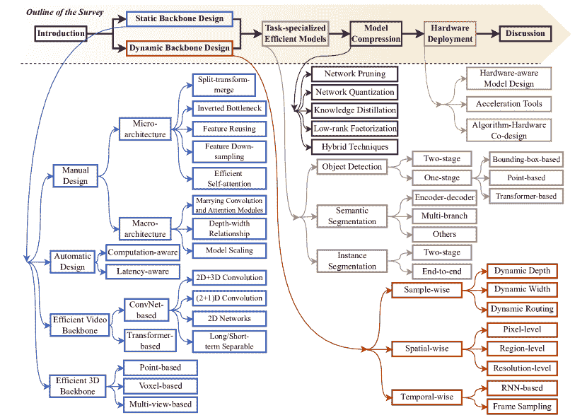
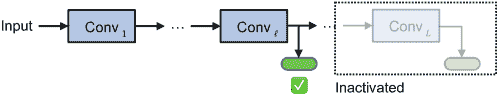
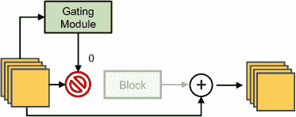
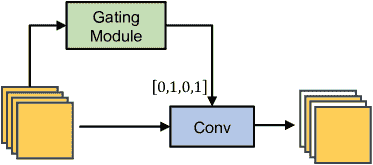
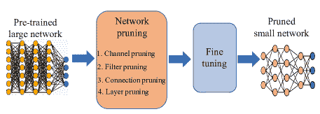
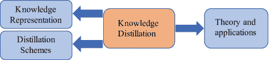

<!--yml

类别：未分类

日期：2024-09-06 19:37:17

-->

# [2308.13998] 计算高效的计算机视觉深度学习：一项调查

> 来源：[`ar5iv.labs.arxiv.org/html/2308.13998`](https://ar5iv.labs.arxiv.org/html/2308.13998)

# 计算高效的计算机视觉深度学习：

一项调查

王玉林^(†∗) ^∗王玉林和韩逸增对这项工作贡献相同。    ^§通讯作者：高辉。韩逸增^(†∗) 常飞^† 宋世基^† 田琦^‡ 高辉^(†§)

^†自动化系 BNRist 清华大学     ^‡华为公司

wang-yl19@mails.tsinghua.edu.cn   gaohuang@tsinghua.edu.cn

###### 摘要\\

在过去的十年里，深度学习模型取得了显著进展，在一系列视觉感知任务中达到了甚至超越了人类水平的表现。这一显著进展引发了将深度网络应用于现实世界应用的兴趣，如自动驾驶车辆、移动设备、机器人和边缘计算。然而，挑战在于，最先进的模型通常需要大量计算资源，导致现实场景中功耗、延迟或碳排放不可行。效果与效率之间的这种权衡催生了一个新的研究焦点：计算高效深度学习，它努力在推理过程中实现令人满意的性能，同时最小化计算成本。这篇综述通过考察四个关键领域，对这一快速发展的领域进行了广泛的分析：1）静态或动态轻量级骨干模型的发展，用于高效提取区分性深度表征；2）针对特定计算机视觉任务的专业网络架构或算法；3）压缩深度学习模型所使用的技术；4）在硬件平台上部署高效深度网络的策略。此外，我们还系统地讨论了该领域面临的关键挑战，如网络架构设计、训练方案、实际效率和更现实的模型压缩方法，以及潜在的未来研究方向。

## 1 介绍

在过去十年里，计算机视觉领域在深度学习方面取得了重大进展。模型架构和学习算法的创新[1, 2, 3, 4, 5, 6, 7]使得深度网络在广泛的视觉任务上，如图像识别[6, 7]、目标检测[8]、图像分割[9, 10]、视频理解[11, 12]和 3D 感知[13]，在基准竞赛数据集上接近或甚至超越人类水平。这一显著进展激发了在实际应用中部署深度模型的兴趣，包括自动驾驶汽车、移动设备、机器人、无人机和物联网设备[14, 15, 16]。

然而，现实应用的需求与竞赛的需求是不同的。在竞赛中实现最先进准确度的模型往往在推理过程中表现出计算强度和资源需求。相比之下，计算通常等同于实际延迟、功耗和碳排放。低延迟或实时推理对于确保安全和提升用户体验至关重要[17, 18, 19, 20]。深度学习系统必须优先考虑低功耗，以提高电池寿命或降低能源成本[21, 22, 22, 23]。最小化碳排放也是环境考量中的一个重要方面[24, 25]。受这些实际挑战的启发，近期大量文献集中于在效果与计算效率之间取得平衡。理想情况下，深度学习模型应在推理过程中提供准确的预测，同时最小化计算成本。这个话题催生了许多引人入胜的研究问题，并引起了学术界和工业界的广泛关注。

鉴于这些发展，本调查提供了对计算高效深度学习探索的全面和系统的回顾。我们的目标是概述这一快速发展的领域，总结近期的进展，并识别重要挑战和未来研究的潜在方向。具体而言，我们将从以下五个方向讨论现有工作：

图 1：调查概述。我们首先回顾骨干网络的设计，这些网络被分为静态模型和动态模型。然后我们讨论任务专用算法和网络架构的设计。最后，我们总结模型压缩方法和高效硬件部署技术。

1) 高效骨干模型。设计轻量级骨干网络，以在最小计算量下有效提取图像、视频或 3D 场景的区分性深度表示，通过优化高效网络微架构（*例如*，操作符、模块和层）[26, 27, 28]，以及改进微架构的系统级组织[29, 30]。最近在神经网络结构搜索（NAS）[31, 32]方面的进展进一步实现了骨干网络的自动设计。

2) 动态深度网络。开发动态网络是提升计算效率的重要新兴研究方向。这些网络打破了静态计算图的限制，提出在推理过程中根据输入调整其结构或参数[33]。例如，模型可以根据每个测试输入选择性地激活某些模型组件（*例如*，层[34]，通道[35]，和子网络[36]），或者对每个输入的较少信息空间/时间区域分配较少的计算[37, 38, 39]。

3) 任务专用高效模型。许多工作集中于在轻量级静态/动态骨干的特征上构建任务特定的头部，以高效完成特定的计算机视觉任务。示例包括用于实时目标检测的快速一阶段模型[40, 41, 42, 43]，用于语义分割的高效多分支架构[44]，以及端到端实例分割框架[45, 46]。

4) 模型压缩技术。与网络架构设计正交，许多算法已经被提出用于以最小的准确度损失压缩相对较大的模型。这可以通过剪枝不重要的网络组件[47, 48]，量化参数[49, 50]，或从大模型中提取知识到小模型中[51, 52]来实现。

5) 硬件上的高效部署。为了实现高实际效率，开发深度学习应用时需要考虑硬件要求。减少特定硬件设备上的延迟通常被视为网络设计的目标 [53, 54] 或算法-硬件协同设计 [55, 56]。此外，已经开发了若干加速工具，以高效部署深度学习模型 [57, 58, 59]。

虽然存在一些相关的调查 [14, 60]，但我们的调查在几个关键方面更为现代和全面：1）我们系统地回顾了图像、视频和 3D 视觉的模型设计技术；2）我们总结了最近在设计动态深度神经网络以实现高效推理方面的工作；3）我们详细讨论了用于完成最常见和最具挑战性的计算机视觉任务的专业模型，*例如*，目标检测和图像分割。

表 1：代表性计算高效深度网络中的 “*拆分-变换-合并*” 架构。这些模块通常作为基本组件用于构建模型。这里的 “卷积” 指的是卷积层。

|  | ResNet-50 | ResNeXt | Res2Net | MobileNet V2/V3 | EfficientNet | ShuffleNet | ShuffleNet V2 | 视觉变换器 |
| --- | --- | --- | --- | --- | --- | --- | --- | --- |
|  | [4] | [61] | [62] | [27, 28] | [29] | [63] | [64] | [6, 65] |
| *拆分* 函数 | 1x1 卷积 | 1x1 卷积 | 1x1 卷积 | 1x1 卷积 | 1x1 卷积 | 1x1 分组卷积 + 通道重排 | 通道拆分 + 1x1 卷积 | 线性投影 (*即*，1x1 卷积) |
| *变换* 函数 | 3x3 卷积 | 3x3 分组卷积 | 级联 3x3 卷积 | 3x3 或 5x5 深度卷积 | 3x3 或 5x5 深度卷积 | 3x3 深度卷积 | 恒等和 3x3 深度卷积 | 多头自注意力 |
| *合并* 函数 | 1x1 卷积 | 拼接 + 1x1 卷积 | 拼接 + 1x1 卷积 | 拼接 + 1x1 卷积 | 拼接 + 1x1 卷积 | 1x1 分组卷积 | 拼接 [-0.2ex] + 1x1 卷积 + 拼接 [-0.2ex] + 通道重排 | 拼接 + 线性投影 |

本调查的其余部分组织如下（请参见图 1 以了解概述）。在第 2 和第三部分中，我们分别介绍了高效静态和动态主干网络的设计。在第四部分中，回顾了设计任务专用高效模型的方法。在第五部分中，探讨了压缩深度学习模型的技术。在第六部分中，总结了高效硬件部署方法。最后，在第七部分中，我们讨论了现有挑战和未来方向。

## 2 主干网络的架构设计

通常，用于计算机视觉任务的深度学习模型包含两个组件，*即*：1) 一个 *主干网络*，用于从原始输入（*例如*，图像、视频帧和点云）中提取深度表示；2) 一个 *任务专用头*，为感兴趣的任务专门设计。主干网络获得的深度特征被输入到头部，以完成相应的任务。主干网络的输出（*即*，头部的输入）通常假设具有类似的格式，而头部的输出则根据感兴趣的任务进行定制。

在本节中，我们重点讨论如何设计计算高效的通用骨干网络。我们的讨论将从处理最基本的数据形式——二维图像开始，在这种情况下，可以通过*手动设计*（第 2.1 节）或*自动搜索方法*（第 2.2 节）获得轻量化网络。接着，我们将讨论处理*视频*（第 2.3 节）和理解*3D 场景*（第 2.4 节）的骨干网络。

### 2.1 手动设计的高效模型

相当多的高效骨干网络是基于理论推导、经验观察或启发式方法手动设计的。现有的工作可以根据修改网络的粒度分为两个级别：*微观架构*（第 2.1.1 节）和*宏观架构*（第 2.1.2 节）。

#### 2.1.1 微观架构

微观架构指的是骨干网络的各个层、模块和神经操作符。这些基本组件是构建深度网络的基础。许多工作通过改进这些组件来提高计算效率。值得注意的是，这些工作通常作为即插即用的组件，可以与其他技术一起使用。

1) 分割-变换-合并策略。通常，深度网络由多个层叠加的层组成，具有密集的连接，其中所有输入神经元都连接到每个输出神经元。形式上，第$\ell$层$f^{\ell}$的输入为$\mathbf{x}^{\ell-1}$，输出为$\mathbf{x}^{\ell}$，可以表示为

|  | $\mathbf{x}^{\ell}=f^{\ell}(\mathbf{x}^{\ell-1}).$ |  | (1) |
| --- | --- | --- | --- |

然而，这种密集层往往计算密集。为了解决这个问题，研究人员提出了用特别设计的拓扑结构来替代密集连接[3, 1, 61]，这显著减少了计算复杂度，同时保持了竞争力或更强的表示能力。在现有的研究中，最受欢迎的设计之一是*分割-变换-合并*策略，如下所示（作为基本组件，这里添加了残差连接[4]）：

|  | $\begin{split}&amp;\{\mathbf{x}^{\ell-1}_{1},\ldots,\mathbf{x}^{\ell-1}_{C}\}=f^{\ell}_{\textnormal{split}}(\mathbf{x}^{\ell-1}),\\ \mathbf{x}^{\ell}&amp;=\mathbf{x}^{\ell-1}+f^{\ell}_{\textnormal{merge}}(f^{\ell}_{1}(\mathbf{x}^{\ell-1}_{1}),\ldots,f^{\ell}_{C}(\mathbf{x}^{\ell-1}_{C})),\end{split}$ |  | (2) |
| --- | --- | --- | --- |

其中，$\mathbf{x}^{\ell-1}$ 被*拆分*成 $C$ 个低维的嵌入 $\mathbf{x}^{\ell-1}_{1},\ldots,\mathbf{x}^{\ell-1}_{C}$，通过一个廉价的操作符 $f^{\ell}_{\textnormal{split}}(\cdot)$。这些低维嵌入通过*变换*函数 $f^{\ell}_{1}(\cdot),\ldots,f^{\ell}_{C}(\cdot)$ 进行处理，这些函数的输入/输出维度是相同的。值得注意的是，这些函数对应于一个密集层，但由于输入特征维度的减少，这个过程是高效的。处理后的嵌入通过 $f^{\ell}_{\textnormal{merge}}(\cdot)$ 被*合并*。接下来，我们将分别讨论变换和拆分/合并函数的设计，然后介绍对“拆分-变换-合并”范式的最新改进。表 1 总结了在流行的计算高效深度网络中的一些代表性*拆分-变换-合并*架构。

*a) “变换” - 同质多分支架构。* 一个直接的选择是让 $f^{\ell}_{c}(\cdot),c\!=\!1,\dots,C$ 具有相同的架构，仅在可学习参数的值上有所不同。当 $f^{\ell}_{c}(\cdot)$ 对应于卷积层时，这种设计被称为*分组卷积* [1, 61]，并被许多高效的卷积网络 [61, 66, 67] 采用。IGCV [68, 69, 70] 进一步引入了一个置换操作，以促进不同组嵌入的交互（*即*，$\mathbf{x}^{\ell-1}_{c},c\!=\!1,\dots,C$）。除了卷积，这种设计还被广泛应用于视觉 Transformer（ViTs）的自注意力层 [6, 65]。在 ViTs 中，这被称为*多头自注意力*，其中 $f^{\ell}_{c}(\cdot)$ 是缩放点积注意力 [71]。

特别地，当$C$等于$\mathbf{x}^{\ell-1}$的通道数时，*分组卷积*被称为*深度可分卷积*。这里的$f^{\ell}_{c}(\cdot)$通常对应于单个卷积操作，可以使用大内核尺寸和足够的感受野而不会显著增加计算成本。这个高效的组件首次在 MobileNet 中提出[26]，并被广泛应用于各种后续模型[72, 27, 28, 73, 74, 63, 64, 29, 75, 76]。

*b) “变换” - 异质多分支架构。* 另一系列工作专注于开发不等效的分支，每个$f^{\ell}_{c}(\cdot),c\!=\!1,\dots,C$被分配一个专门的架构或任务。例如，Inception 架构[3, 77, 78, 79, 80]采用不同的感受野用于不同的分支（*例如*，通过改变卷积核尺寸），旨在聚合多个层次的判别信息。最近的工作进一步扩展了这一思路，将$f^{\ell}_{c}(\cdot)$的输出传递给$f^{\ell}_{c+1}(\cdot)$[62, 73, 81]，从而将多尺度特征整合到输出中。

*c) “分割/合并”* 函数$f^{\ell}_{\textnormal{split}}(\cdot)$和$f^{\ell}_{\textnormal{merge}}(\cdot)$旨在以最小的成本将特征映射到低维嵌入或从低维嵌入恢复。大多数工作采用类似的架构：$f^{\ell}_{\textnormal{split}}(\cdot)$对应于$1\!\times\!1$卷积，而$f^{\ell}_{\textnormal{merge}}(\cdot)$通过连接或连接 + $1\!\times\!1$卷积来完成。代表性例子包括 ResNeXt[61]，MobileNets[26, 27, 28]和 Inception 网络[3, 77, 78, 79, 80]。特别地，ShuffleNet[63]通过将$1\!\times\!1$分组卷积与通道重排相结合，提出了更高效的设计。

*d) 改进了“拆分-变换-合并”的范式。* 最近一些研究开始重新审视拆分-变换-合并范式的局限性，发现通过打破这一设计原则可以获得更高效的深度网络。例如，受到 ViTs 成功的启发，ConvNeXt [74] 在每一层显式引入了一个多层感知机（MLP），通过反向的 $f^{\ell}_{\textnormal{split}}(\cdot)$ 和深度可分离卷积 (*即*，$f^{\ell}_{c}(\cdot)$)。EfficientNetV2 [82] 用一个常规的稠密卷积层替代了 $f^{\ell}_{c}(\cdot)$ 和 $f^{\ell}_{\textnormal{split}}(\cdot)$，在较早的层中实现了更高的 GPU 设备实际效率。MobileNeXt [83] 将深度卷积层移至残差路径的两端，以编码更具表现力的空间信息。

2) 反向瓶颈。瓶颈 [4] 是 ConvNets 中广泛使用的高效组件。其基本结构可以理解为 Eq. (LABEL:eq:split)之上：$\{\mathbf{x}^{\ell-1}_{1},\ldots,\mathbf{x}^{\ell-1}_{C}\}$ 的总通道数将比 $\mathbf{x}^{\ell-1}$ 减少 (*例如*，在 ResNet [4] 中减少 $4\times$)。因此，计算密集型操作 $f^{\ell}_{1}(\cdot),\ldots,f^{\ell}_{C}(\cdot)$ 在低维嵌入上进行，从而节省了整体成本。该瓶颈的有效性在稠密层 ($C\!=\!1$) [4] 和分组卷积 [61] 中得到了验证。然而，在深度可分离卷积中，它可能是次优的，因为其低维变换导致信息丢失 [27]。受此观察的启发，MobileNetV2 [27] 通过提出反向瓶颈 *即*，$\{\mathbf{x}^{\ell-1}_{1},\ldots,\mathbf{x}^{\ell-1}_{C}\}$ 的维度比 $\mathbf{x}^{\ell-1}$ 更多 (*例如*，$6\times$ [27])，实现了改进的效率。这一设计在许多近期工作中进一步被采用 [70, 83, 74]。

3) 特征重用。传统上，连续的线性连接是网络设计的主要拓扑结构。输入被送入一层并进行变换，以获得下一层的输入。任何特征只会被利用一次。尽管这种设计直接，但从计算效率的角度来看，通常是次优的。轻量级模型的重要思想是*重用*已经使用过的特征。

*a) 层间特征重用。* 一个基本的想法是重用来自前几层的特征。跳层残差连接 [84, 4] 将每一层的输入加到输出中，促进了非常深的网络的有效训练和计算效率。一个更一般的公式是通过密集连接 [85, 5] 建立的，其中所有先前的特征被输入到下一层。CondenseNets [86, 87] 通过自动学习层间连接拓扑来扩展这一架构。相比之下，其他工作如 ShuffleNetV2 [64] 和 G-GhostNet [88] 则专注于手动设计层间交互机制。

*b) 层内特征重用。* 特征重用的想法也可以在每个网络层内利用。例如，GhostNets [89, 90] 证明了每一层的输出中存在相当大的冗余。他们首先获取一小组固有输出特征，这些特征不仅用于下一层的输入，还通过线性变换等廉价操作重用以生成其他输出特征。

4) 特征下采样。从基于图像的数据中提取深度表示通常会产生特征图，这些特征图本身具有空间尺寸（*即*，高度和宽度）。这一特性可以用来减少模型的计算成本，例如，引入适当配置的特征下采样模块。

*a) 高效处理特征图。* 处理特征图的成本随着其高度/宽度的平方增长。OctConv [91] 发现处理所有特征图的相同分辨率并不是最优设计。他们建议在下采样的尺度下处理一组特征以捕捉低频信息，同时其余特征用于识别高频模式，并且两个组在每层之后交换信息。因此，整体计算成本得到降低。这个想法在 ViTs [92] 中也有效。类似地，HRNets [93, 94] 和 HRFormer [95] 在每一层维持多分辨率特征，旨在高效提取多尺度的判别性表示以应对各种计算机视觉任务。

*b) 促进高效的自注意力。* 特别地，特征下采样可以嵌入到 ViTs 的自注意力操作中，以提高其效率。例如，PVTs [96, 97] 和 ShuntedViT [98] 提出使用下采样特征图高效计算注意力图。Twins [99] 在低分辨率特征上执行自注意力以高效汇聚全局信息。

5) 高效自注意力。ViTs [6]在计算机视觉领域取得了显著成功。它们的自注意力机制能够自适应地聚合整个图像的信息，随着数据集规模或模型大小的增长而具有出色的可扩展性。然而，普通自注意力存在计算成本高的问题。相当多的近期视觉骨干网络集中于开发更高效的自注意力模块，而不牺牲性能。

*a) 受局部性启发的自注意力。* 在这一方向上，一个重要的思想源于 ConvNets 的成功：利用图像的局部性，*即*，鼓励模型从邻近的空间区域聚合更多信息。Swin Transformers [7, 100]通过仅在方形窗口内执行自注意力来实现这一点。一些其他工作通过设计不同形状的注意力窗口[101, 102, 103, 104, 105, 106]或引入对注意力图的软局部约束[107, 108]扩展了这一思想。这些工作面临的重要挑战是如何有效建模不同窗口之间的互动。解决这一问题的可能方案包括更改窗口位置[7, 100]、混洗通道[109]、设计专门的窗口形状[101, 103, 105, 106]，或进一步引入窗口级全局自注意力模块[110, 111, 99]。

*b) 无 SoftMax 的自注意力。* 为了减少自注意力固有的高计算复杂度，另一项研究提出用独立的核函数替换自注意力中的 SoftMax 函数，从而实现线性注意力[112]。例如，Performer [113]通过正交随机特征来近似 SoftMax，而 Nyströmformer [114]和 SOFT [115]通过矩阵分解实现这一目标。Castling-ViT [116]使用线性角度核来测量标记之间的谱相似性。EfficientViT [117]进一步利用深度卷积来提高线性注意力的局部特征提取能力。FLatten Transformer 提出了一种集中的线性注意力模块以实现高表达性[118]。

#### 2.1.2 宏观架构

宏观架构指的是组织微观架构（*例如*，操作符、模块和层）并构建整个深度网络的系统级方法。现有文献已揭示，即使使用相同的高效微观架构，组合它们的方法和配置也会显著影响最终模型的计算效率。接下来，我们将讨论与此主题相关的工作和设计原则。

1) 结合卷积和注意力模块。卷积和自注意力都是重要的模块，各自具有优势。已有大量文献研究如何将它们结合以提高整体计算效率。在每层级别上，可以利用卷积生成自注意力的输入，如查询/键/值[75, 76]或位置嵌入[119]。此外，一些工作同时利用自注意力和卷积层，并融合它们的输出[120, 121]，这有助于学习局部特征。另一个有前景的想法是将卷积集成到自注意力模块之后的前馈网络中[122, 123, 76]。

在网络层面，许多现有工作关注自注意力和深度卷积块的放置顺序。特别是，利用早期层的卷积被证明是有益的[124, 125, 126, 127, 128]，这使得有效提取局部表示成为可能。此外，卷积块通常被作为轻量级下采样层[127, 129, 103]。另一类工作在单个模型中并行化自注意力路径和卷积路径[130, 131, 132, 133, 134, 135]，这两条路径通常以逐层方式交互。

2) 深度-宽度关系。在 ConvNets 和层次化 ViTs 的背景下，主干模型由多个阶段组成，每个阶段的特征分辨率逐渐降低。每个阶段中的层通常具有相同的宽度，而后期阶段则更宽。阶段性宽度增长规则是一个重要的配置，其中采用以二为底的指数增长是较为流行的做法[4, 5, 7]。相比之下，RegNets [136, 30]进一步提出了一个更详细的原则：良好网络的宽度和深度可以通过量化线性函数来解释。

3) 模型缩放。在设计单一高效模型的基础上，获得一系列能够适应不同计算预算的模型也是重要的。解决此问题的一个重要原则是*复合缩放*[29, 82]，它表明同时增加给定基础模型的深度、宽度和输入分辨率将产生一系列高效的网络架构。Dollár *等*[137]进一步研究了如何在实际运行时间方面设计适当的模型缩放规则。此外，TinyNets[138]将这一思想扩展到模型尺寸的缩小上。

### 2.2 自动架构设计

与手动设计骨干网络相比，另一个吸引人的想法是自动寻找合适的网络架构，这通常被称为*神经架构搜索（NAS）*。近年来，许多现有研究通过计算效率的视角探讨了这一想法。接下来，我们将讨论 NAS 的基本计算感知公式（第 2.2.1 节）以及实际速度在 NAS 中的考虑（第 2.2.2 节）。

#### 2.2.1 计算感知的神经架构搜索（NAS）

通常，NAS 包括两个组成部分：包含多个候选架构的搜索空间，以及一个用于搜索最佳架构的算法。推断模型的计算成本通常被视为一个约束条件，这要么是由搜索空间本身固有控制，要么是由预定义规则严格限制。优化目标是最大化验证准确率。

1) 早期工作。早期的 NAS 方法提出了离散搜索空间[31, 139, 140]。网络被视为一个图，其中多个节点通过边连接，每条边对应一个操作，需要为每条边找到最佳操作。这类问题可以通过离散优化算法解决。例如，通过将验证性能视为奖励，可以利用现成的强化学习方法[31, 139, 140]。此外，进化算法在离散 NAS 中也取得了良好的效果[141, 142, 143]。

2) 高效的搜索算法。上述 NAS 方法能够找到比人工设计更高效的计算网络架构。然而，它们的搜索成本是一个显著的限制，因为它们的搜索过程通常涉及从头开始训练许多候选网络直到收敛，以评估其验证准确性。受到这一问题的激励，大量工作集中在开发低成本的 NAS 算法。这个方向的一个基本思想是重用之前的候选项，*例如*，在当前发现的架构上添加/删除层 [117, 144] 和路径 [145]，或者将现有架构作为网络组件 [146]。

在这些初步探索的推动下，ENAS [147] 和 DARTS [32] 提出了一个参数共享的范式。它们建议构建一个包含所有可能连接和操作的大型计算图，这样其中的每个子图都对应一个网络架构。这个大型图被称为*超网络*，所有可能的候选网络共享相同的超网络参数。因此，可以训练超网络，并直接从中采样架构而无需重新训练任何特定的候选网络。网络选择过程通常被形式化为可微分的，并通过基于梯度的优化方法高效完成 [148, 149, 150, 151, 152]。此外，一些最新的工作通过引入渐进搜索机制 [153, 154]、引入超网络 [155, 156] 或训练更合适的超网络进行 NAS [157, 158] 来改善这一过程。

#### 2.2.2 考虑延迟的神经架构搜索

从实际效率的角度来看，NAS 面临的一个重要挑战是对真实硬件（*例如*，GPU 或 CPU）的推理速度。由于 NAS 通常会导致不规则的网络架构，所得到的模型可能在实践中效率不高，尽管其理论计算成本较低。为了解决这个问题，最近的 NAS 方法明确将真实延迟纳入优化目标，以在真实速度和准确性之间实现良好的权衡 [54, 53, 159]。作为代表性的例子，MobileNetV3 [28] 利用硬件感知 NAS 获得基础架构，并进行手动修改。Once-for-all [24] 提出了训练一个共享的通用超网络，并在其基础上根据具体硬件进行 NAS，从而获得最先进的效率。

### 2.3 视频理解的高效骨干网

在这一小节中，我们将重点关注处理视频的高效骨干网络。值得注意的是，视频由一系列帧组成，每一帧都是一幅图像。一般来说，上述处理图像的技术通常也适用于视频。因此，这里我们主要回顾视频帧时间关系的高效建模，包括*基于卷积神经网络*（第 2.3.1 节）和*基于变换器*（第 2.3.2 节）的方法。

#### 2.3.1 高效的 3D 卷积神经网络

建模时间关系的最直接方法可能是引入 3D 卷积层 [160, 161]，这样可以在由帧的高度、宽度和视频时长形成的空间中直接进行卷积。然而，3D 卷积计算开销大，已经提出了许多高效的骨干网络来缓解这个问题。

1) 结合 2D 和 3D 卷积。一个基本思路是避免设计纯 3D 卷积神经网络，即，大部分特征提取过程可以通过高效的 2D 卷积来完成，而 3D 卷积仅在几个特定位置引入。从宏观架构的角度来看，这个目标可以通过顺序混合 2D 和 3D 块来实现，可以先使用 3D，然后再使用 2D，或者先使用 2D，再使用 3D [162, 163]。在微观架构层面，组卷积或深度宽度 3D 卷积可以集成到 2D 分裂-变换-合并架构的*变换*模块中（方程式（LABEL:eq:split））[164, 165]。

2) (2+1)D 网络。另一个优雅的想法是将 3D 卷积分解为两个组件：一个从视频帧中提取表示的 2D 卷积，以及一个仅关注学习时间关系的时间操作。前者可以直接采用 2D 神经操作，而后者可以使用 1D 时间卷积 [166, 167, 168]，自适应 1D 卷积 [169] 和 MLPs [170] 来实现。

3) 2D 网络。除了上述方法，只有 2D 卷积的模型也可能能够建模时间关系。这通常通过设计零参数操作来实现。例如，通过减去相邻帧的特征来提取运动信息 [171, 172]。基于时间位移的模型 [173, 174, 175] 提出将 2D 特征的一部分通道在时间维度上进行位移，从而有效地在相邻帧之间进行信息交换。

4) 长/短期可分离网络。另一个重要的想法是通过分离的网络架构建模长/短期时间动态。在这方面，一个代表性的工作是 SlowFast [176]，它结合了低时间分辨率的慢通道和高时间分辨率的快通道。许多近期的工作 [172, 177] 进一步扩展了这个理念。

#### 2.3.2 基于 Transformer 的视频骨干网络

受到 ViTs [6] 成功的驱动，许多近期的工作集中在利用基于自注意力的模型促进高效的视频理解。一般来说，这些工作大多数在 ViTs 的背景下扩展了前述设计理念（包括图像基础和视频基础的骨干网络），*例如*，执行空间-时间局部自注意力 [178, 179, 180]，结合自注意力和卷积 [181]，以及在（2+1）D 设计中执行 1D 时间注意力 [182, 183, 184, 185]。

### 2.4 高效的 3D 视觉骨干网络

对 3D 场景的感知和理解不仅是人类智能的关键能力，也是计算机视觉中的重要任务，在现实世界应用中无处不在。本小节将回顾为高效处理 3D 信息而设计的骨干网络。一般来说，这方面的工作可以按照模型输入的形式进行分类，*即*，*3D 点云*（第 2.4.1 节）、*3D 体素*（第 2.4.2 节）和*多视角图像*（第 2.4.3 节）。

#### 2.4.1 基于点的模型

一种基本的 3D 几何数据结构是 3D 点云，其中每个点由其三个坐标表示。PointNet [186] 是利用深度学习处理 3D 点云的开创性工作。它采用点级特征提取和共享 MLPs 来保持排列不变性。PointNet++ [187] 通过促进捕捉局部几何结构来改进 PointNet。在这些基础上，许多工作关注如何在不显著增加计算成本的情况下有效地聚合局部信息。代表性的方法包括引入图神经网络 [188, 189]，将 3D 点投影到规则网格上进行卷积 [190, 191, 192, 193]，使用由局部几何结构确定的权重聚合相邻点的特征 [194, 195, 196]，以及自注意力 [197, 198]。特别是，近期的研究表明，基于点的模型在适当的训练和模型扩展技术下可以实现最先进的计算效率 [199]。

#### 2.4.2 基于体素的模型

3D 点云可以进一步转换为体素，这些体素是规则的，可以直接通过 3D 卷积[200]进行处理。通常，3D 空间被划分为立方体体素网格，而每个网格中点的特征将被平均。网格的边长称为体素分辨率。有效处理体素的一个重要技术是稀疏卷积[201, 202, 203]，*即*，仅对包含 3D 点的体素执行卷积。许多工作根据感兴趣的视觉任务设计具有这种机制的主干网络[204, 205, 206]，以实现最佳的效率-准确度权衡。此外，点基模型和体素基模型可以结合起来以减少内存和计算成本[207]。一些最近的工作探索了使用 NAS[208]进行自动主干设计。

#### 2.4.3 基于多视角的模型

多视角投影分析是理解 3D 形状的另一种有效方法，其中 3D 对象从不同的视觉角度投影到 2D 图像中，并通过 2D 主干网络[209]进行处理。这个想法可以应用于识别[210, 211]、检索[212, 213]和姿态估计[214]。这些方法面临的一个重要挑战是如何融合多视角特征。现有工作提出利用 LSTM[213]或图卷积网络[210]。

## 3 动态主干网络

尽管第二部分中介绍的高级架构在提高深度模型的推理效率方面取得了显著进展，但它们通常存在一个内在的限制：在处理不同复杂度的输入时，计算图在推理过程中保持不变。这种*静态*的推理范式不可避免地会在一些“简单”样本上带来冗余计算。为了解决这个问题，动态神经网络[33]近年来因其良好的效率、表示能力和适应性[33]而引起了极大的研究兴趣。

研究人员提出了多种类型的动态网络，它们可以根据不同的输入调整其架构/参数。根据自适应推理的粒度，我们将相关工作分类为*样本级*（第 3.1 节）、*空间级*（第 3.2 节）和*时间级*（第 3.3 节）动态网络。与包含视觉和语言模型的先前工作[33]相比，本次调查主要关注视觉任务中的计算高效模型。此外，还包括了更多最新的研究成果。

### 3.1 样本级动态网络

最常见的自适应推理范式是动态处理每个输入样本（*例如* 图像）。在这一方向上主要有两条研究路线：一种旨在通过动态*架构*在保持良好网络性能的同时减少计算，另一种则调整网络*参数*以提高表示能力，同时计算开销较小。在本次调查中，我们重点关注前者，该方法通常通过减少冗余计算来提高效率。流行的方法包括三种类型：1）动态深度，2）动态宽度，3）在超网络（SuperNet）中的动态路由。

图 2：动态早期退出。当早期退出的预测满足某些标准（绿色勾号）时，推理过程终止，后续计算将被跳过。

#### 3.1.1 动态深度

传统（静态）网络的推理过程可以写作

|  | $\mathbf{y}=f(\mathbf{x})=f^{L}\circ f^{L-1}\circ\dots\circ f^{1}(\mathbf{x}),$ |  | (3) |
| --- | --- | --- | --- |

其中 $f^{\ell},\ell=1,2,\dots,L$ 是第 $\ell$ 层，$L$ 是网络深度。相比之下，具有动态深度的网络用适应性层数处理每个样本 $\mathbf{x}_{i}$：

|  | $\mathbf{y}_{i}=f(\mathbf{x})=f^{L_{i}}\circ f^{L_{i}-1}\circ\dots\circ f^{1}(\mathbf{x}),$ |  | (4) |
| --- | --- | --- | --- |

其中 $1\leq L_{i}\leq L$ 是根据 $\mathbf{x}_{i}$ 本身决定的。

实现动态深度主要有两种常见方法。第一种是*早期退出*，意味着网络对一些“简单”样本的预测可以在中间层输出，而无需激活更深层次 [215, 216]（图 2）。研究人员发现，深层模型中的多个分类器可能会相互干扰，并通过强迫早期层捕捉语义级别特征来降低性能 [34]。为了解决这一问题，采用了多尺度特征表示 [34, 217]，以快速生成具有丰富语义信息的粗尺度特征。与其在卷积网络中构建中间退出，最近的动态视觉 Transformer (DVT) [218] 实现了在处理不同 token 数量的级联视觉 Transformer 中的早期退出。动态 Perceiver [219] 提出了通过引入额外的基于注意力的路径来集成中间特征并进行早期退出。除了架构设计，研究人员还提出了用于训练早期退出模型的专业技术 [220, 221]。

图 3：动态层跳过。使用门控模块决定是否执行该块。

前述的早期退出方法在某一层动态终止前向传播。动态深度的另一种方法是*跳过中间层*，应用于具有跳跃连接的模型如 ResNets [4] 和视觉 Transformer [6]（图 3）。设 $\mathbf{x}^{\ell}$ 和 $f^{\ell}$ 分别表示第$\ell$层的特征和计算单元，典型的层跳过实现是使用门控模块 $g^{\ell}(\cdot)$ 动态决定是否执行 $f^{\ell}$ [222, 223, 224]：

|  | $\mathbf{x}^{\ell+1}=\mathbf{x}^{\ell}+g^{\ell}(\mathbf{x})\cdot f^{\ell}(\mathbf{x}),g^{\ell}(\mathbf{x})\in{0,1}.$ |  | (5) |
| --- | --- | --- | --- |

图 4：动态通道跳过，使用门控模块决定卷积通道的计算。

#### 3.1.2 动态宽度

与跳过整个层的做法不同，较少激进的方法是根据不同的输入调整网络的*宽度*。在这个方向上，最流行的实现是通过门控模块动态*跳过通道* [35, 225, 226, 227]（图 4）。具体而言，首先执行一个门控模块，然后进行卷积操作。这个门控模块的输出是一个 $C$ 维的二进制向量，用于决定是否计算每个通道，其中 $C$ 是输出通道数量。这个实现类似于上述的层跳过方案。最明显的区别在于，层跳过中的门控模块输出的是一个标量，而通道跳过中的门控模块需要输出一个控制不同通道计算的向量。除了卷积层，类似的想法也可以应用于视觉变换器中，以动态跳过多层感知机（MLP）块中的通道 [224]。

#### 3.1.3 超级网络中的动态路由

与传统网络架构中跳过层或通道的计算不同，可以通过在超级网络（SuperNets）中使用*动态路由*实现数据依赖的推断。一个超级网络通常包含各种推断路径，路由节点负责将每个样本分配到合适的路径。设 $\mathbf{x}_{i}^{\ell}$ 表示第 $i$ 个节点在层 $\ell$ 中，获取下一个层中节点 $j$ 的计算的一般公式可以写为

|  | $\mathbf{x}_{j}^{\ell+1}=\sum_{i:\alpha_{i\rightarrow j}^{\ell}>0}\alpha_{i\rightarrow j}^{\ell}f_{i\rightarrow j}^{\ell}(\mathbf{x}_{i}^{\ell}),$ |  | (6) |
| --- | --- | --- | --- |

其中 $f_{i\rightarrow j}^{\ell}$ 是节点 $i$ 和 $j$ 之间的变换，而 $\alpha_{i\rightarrow j}^{\ell}$ 是为该路径计算的权重，基于 $\mathbf{x}_{i}^{\ell}$ 计算。如果 $\alpha_{i\rightarrow j}^{\ell}=0$，则可以跳过变换 $f_{i\rightarrow j}^{\ell}$。

大量工作提出了不同形式的超级网络，例如树状结构 [36, 228, 229]，动态专家混合 [230, 231]，以及更通用的架构 [232, 233]。

### 3.2 空间级动态网络

已发现图像中的不同空间位置对视觉任务的性能贡献不均[234]。然而，大多数现有深度模型对不同的空间位置进行相同的计算，导致对不重要区域的冗余计算。为此，提出了空间自适应动态网络，以利用图像数据中的空间冗余来提高效率。根据自适应推理的粒度，我们将相关工作分为像素级、区域级和分辨率级。

#### 3.2.1 像素级动态网络

一种典型的空间自适应推理方法是根据二进制掩码动态决定是否计算卷积块中的每个像素[235, 236, 237]。这种形式类似于层跳过和通道跳过（第 3.1 节），不同之处在于门控模块需要输出空间掩码。这个空间掩码的每个元素决定了特征像素的计算。通过这种方式，掩码生成器学习定位图像特征中最具判别性的区域，并且可以跳过对信息量较少的像素的冗余计算。

这种像素级动态计算的局限性在于，目前大多数深度学习库不支持加速。内存访问成本可能比静态卷积更高，并且由于稀疏卷积，计算并行性降低。因此，虽然计算可以显著减少，但这些方法的实际效率通常落后于理论效率。为此，研究人员还提出了“粗粒度”空间自适应动态网络[238, 39]，这意味着空间掩码的一个元素可以决定一个区域而不是一个像素。这样可以实现更连续的内存访问，从而加速实际速度。此外，调度策略也被证明对推理延迟有显著影响[39]。共同设计算法、调度和硬件设备，以更好地利用空间自适应动态网络的理论效率也是很有前景的。

除了跳过某些像素的计算，另一类工作打破了传统卷积的静态接收场，提出了可变形卷积[239, 240, 241]。具体而言，使用轻量级模块来学习每个特征像素的偏移量，并根据预测的偏移量从任意位置采样卷积邻域。这一思想也已在视觉 Transformer 中实现，以增强局部注意机制的性能[242]。

#### 3.2.2 区域级动态网络

除了灵活地决定计算哪些特征像素，另一种方法旨在定位输入图像中的重要区域（块）并裁剪这些块以进行识别任务。例如，图像识别可以被表述为一个顺序决策问题，在其中采用 RNN 基于裁剪的图像块进行预测[243, 244]。也可以使用多尺度 CNN 与多个子网络来执行基于裁剪显著图像块的分类任务[245]。在每两个子网络之间放置一个轻量级模块来决定显著块的坐标和大小。

在这方面，近期的瞥视-聚焦网络（GFNet）[246, 247]提出了一个适用于各种视觉骨干网的区域级动态推断的通用框架。它首先“瞥视”一个低分辨率的输入图像，然后使用强化学习（RL）[248]重复地“聚焦”于显著区域。此外，允许早期退出（参见 3.1），这意味着“聚焦”的步骤数量可以根据不同输入图像动态调整。

#### 3.2.3 分辨率级动态网络

大多数现有的视觉模型处理具有相同分辨率的不同图像。然而，输入复杂性可能有所不同，并非所有图像都需要高分辨率表示。理想情况下，低分辨率表示对于那些具有大物体和标准特征的“简单”样本应该足够。早期的工作[249]提出在面部检测任务中自适应地缩放输入图像。近期的分辨率自适应网络（RANet）[217]建立了一个多尺度架构，其中输入首先以低分辨率和小子网络进行处理。根据早期预测，有条件地激活大子网络和高分辨率表示。不同于使用专门结构，动态分辨率网络[250]通过小模型预测的分辨率来重新调整每张图像的大小，并将调整后的图像输入到通用 CNN 中。

注意，在上述方法中，不同的空间位置仍然以相同的方式处理。我们在本节中对相关工作进行分类，因为它们主要利用图像输入的空间冗余进行高效推断。

### 3.3 时间动态网络

由于视频数据可以视为一系列图像数据，因此由于视频识别任务中的显著冗余，也可以在时间维度上执行自适应计算。代表性的工作通常可以分为两类：一类处理具有递归模型的视频，并在某些时间步动态节省计算；另一类则旨在采样关键帧/剪辑，并将计算分配给这些采样帧。

#### 3.3.1 动态递归模型

不同的视频帧在信息量上不均等。为此，广泛的研究提出了在递归模型中动态激活计算来更新隐藏状态。例如，LiteEval [251] 建立了两个不同尺寸的 LSTM [252]。在每个时间步中，使用一个门控模块来决定应执行哪个 LSTM 以处理当前帧。AdaFuse [253] 动态跳过某些卷积通道的计算，这些通道用来自前一个步骤的隐藏状态填充。此外，不同帧的数值精度 [254] 和图像分辨率 [255] 也可以动态决定。

上述工作通常需要一个卷积网络来编码每个输入帧，然后更新隐藏状态。一个更灵活的解决方案是允许网络学习“看哪里”。换句话说，网络可以直接跳到视频中的任意时间位置 [256, 257, 37] 或执行早期退出 [258, 259, 260]，而不是逐帧“观看”整个视频。

#### 3.3.2 动态关键帧采样

跳过递归网络中的计算的替代方法是采样关键帧，然后将采样的帧而非整个视频输入到标准模型中。强化学习是训练帧采样器的流行技术 [261, 262, 263]。

最近的趋势是从多个角度同时实现动态推断。例如，AdaFocus 及其变体 [38, 264, 265, 266] 利用视频数据中的空间和时间冗余。具有 3D 卷积的动态架构 [267] 也是一个有趣的话题。

## 4 下游计算机视觉任务的高效模型

在本节中，我们假设已经获得了一个轻量级的骨干网络，并讨论如何在其上设计特定任务的头部或算法。总体目标是实现高效甚至实时的真实世界计算机视觉任务。为此，我们将重点讨论三项代表性任务，即*目标检测*（第 4.1 节）、*语义分割*（第 4.2 节）和*实例分割*（第 4.3 节），这些任务都对准确性和实时性有强烈需求。请注意，大多数其他更复杂的计算机视觉任务（例如，视觉目标跟踪）主要基于我们考虑的这三项任务。

### 4.1 目标检测

目标检测旨在回答计算机视觉中的两个基本问题：图像中包含了什么视觉对象，以及它们的具体位置在哪里[8]？目标检测所获得的分类和定位结果通常作为其他视觉任务的基础，例如，实例分割、图像描述和目标跟踪。目标检测的算法大致可以分为*两阶段*（第 4.1.1 节）和*单阶段*（第 4.1.2 节）。接下来，我们将从计算效率的角度分别探讨这两种方法。

#### 4.1.1 两阶段检测器

基于深度学习的目标检测起始于两阶段范式。开创性的工作，RCNN [268, 269]，提出首先从图像中裁剪出一组对象建议，并用深度网络对其进行分类。在此基础上，SPPNet [270]通过自适应地池化感兴趣区域的特征，避免了重复推断骨干网络。Fast RCNN [271]在同一网络中同时训练检测器和边界框回归器，使速度比 RCNN 提高了 200 倍以上。Faster R-CNN [272, 273]及其改进[274, 275]引入了区域提议网络，从特征中便宜地生成对象提议，创造了第一个几乎实时的深度学习检测器。特征金字塔网络进一步提出利用不同尺度的特征图分别检测不同尺寸的目标，从而显著提高检测精度而不牺牲效率[276]。

#### 4.1.2 单阶段检测器

两阶段检测的主要动机是“粗到细”的精炼，*即*，首先获得粗略的建议，然后在这些建议上精炼定位和分类结果，以便实现卓越的检测性能。尽管有上述技术被提出以提高该过程的效率，两阶段检测器的速度和复杂性通常不适用于实时应用。相比之下，单阶段检测器在一个步骤中直接输出检测结果，具有更快的推断速度和相当的准确性。

1) 基于边界框的方法。第一个基于深度学习的单阶段检测器是 YOLO [40]。YOLO 将图像分成网格区域，并同时预测每个区域的边界框和分类结果。YOLO 的后续工作 [277, 278, 279, 280, 43] 侧重于进一步提高定位性能或分类准确性，同时不影响实际速度。最新版本 YOLOv7 [43] 实现了最先进的效能-效率权衡。

除了 YOLO，SSD [41] 通过在网络的不同层上检测不同尺度的物体来提高单阶段检测器的准确性。RetinaNet [281] 提出了焦点损失，鼓励模型更加关注困难的、被误分类的样本，从而有效地提升了单阶段检测器的准确性。

2) 基于点的方法。上述检测方法大多学习在预定义的锚点框上生成真实边界框。尽管有效，但这种范式在训练过程中存在许多设计超参数和正负样本框的不平衡。为了解决这个问题，CornerNet [282] 提出了直接预测候选框的左上角和右下角。许多后续工作扩展了这种基于点的设置。例如，FCOS [42] 预测特征图中每个位置到边界框四个边的距离。ExtremeNet [283] 学习检测边界框的极端点。CenterNet [284] 进一步考虑每个物体为一个单一的中心点，并基于此点回归所有属性（2D/3D 大小、方向、深度、位置等）。

3) 基于变换器的方法。近年来，N. Carion *et al.* 提出了一个端到端的基于变换器的检测网络，DETR [285]。DETR 将检测视为一个集合预测问题，结果是基于多个目标查询获得的。Deformable DETR [286] 通过引入变形机制来处理 DETR 的长期收敛问题。

### 4.2 语义分割

语义分割的目标是预测每个像素的语义标签[9, 287]，*例如*，一个像素是否属于汽车、摩托车等。在这里，我们总结了基于不同范式的现有高效语义分割方法，*即*，*编码器-解码器*（第 4.2.1 节）、*多分支*（第 4.2.2 节）及其他（第 4.2.3 节）。

#### 4.2.1 编码器-解码器

一种流行的方法是首先使用多阶段骨干网络提取低分辨率的判别性表示，通过解码器将深层特征上采样到输入分辨率，然后生成像素级预测。这个过程被称为“编码器-解码器”[288, 289]。为了提高这一范式的效率，许多工作提出了设计轻量级解码器。代表性的方法包括引入分割-变换-合并架构[290, 291, 292, 73, 293]（方程式（LABEL:eq:split）），开发计算密集型膨胀卷积的高效近似[294, 295, 296]，以及引入密集连接[296, 297]。此外，同时将低级和高级特征输入到解码器中是高效的，*即*，全面利用这两者可以提高准确性而不会引入显著的计算开销[298, 299, 300, 301, 297]。

#### 4.2.2 多分支模型

另一种流行的高效范式是设计多分支架构。通常，模型包括两种类型的路径：1）具有低分辨率特征图和大接收域的上下文路径，旨在提取判别性信息；2）保留低级空间信息的空间路径。这些路径以并行[44, 298, 302, 303, 304]或级联[305]的方式融合，从而生成高分辨率但语义丰富的深层表示用于分割。

#### 4.2.3 其他

近年来，提出了一些新思路来促进高效的语义分割。例如，使用自注意力层处理深层特征[306, 307, 308]，设计带有 NAS 的分割模型[309, 310, 311]，以及根据输入调整解码器的架构[233]。最近，相当多的论文尝试在 ViTs 之上设计高效的语义分割模型[312, 313, 314, 315, 316]。这些工作主要关注于以尽可能低的计算成本实现最先进的性能。

### 4.3 实例分割

实例分割可以看作是目标检测和语义分割的结合，其中模型需要检测物体的实例，标定其边界并识别其类别 [9, 317]。这一方向的现有工作可以分为*两阶段*（第 4.3.1 节）和*端到端*（第 4.3.2 节）。

#### 4.3.1 两阶段方法

从效率的角度来看，基于深度学习的实例分割的一个重要里程碑是 Mask R-CNN [318]的提出。Mask R-CNN 是在 Faster R-CNN [272]的基础上引入了掩码分割分支。它通过直接从特征图中获取兴趣区域来实现高计算效率。相比之下，MaskLab [319] 通过添加语义分割和方向预测路径来改进 Faster R-CNN。为了提高 Mask R-CNN 的准确性，MS R-CNN [320] 预测预测的实例掩码的质量，并在验证期间优先考虑更准确的掩码预测。PANet [321] 引入了一种路径增强机制，以促进特征图的自下而上的信息交互。HTC [322] 提出了一个混合任务级联框架，以逐步学习更具辨别性的特征，同时整合互补特征。

#### 4.3.2 端到端方法

另一个工作方向集中于实现高效的端到端实例分割。SOLO [45, 46] 通过引入“实例类别”来实现这一点，该方法根据实例的位置和大小为实例内的每个像素分配类别，从而将实例分割转换为纯粹的密集分类问题。YOLACT [323] 和 BlendMask [324] 提出了首先生成一组原型掩码，然后将它们与每个实例的掩码系数或注意力分数相结合。受 SSD [41] 和 RetinaNet [281] 启发，TensorMask [325] 建立了一个高效的基于滑动窗口的实例分割框架。

## 5 模型压缩技术

深度网络需要大量资源，包括能源、处理能力和存储。这些资源需求减少了深度网络在资源受限设备上的适用性 [326]。此外，深度网络的广泛资源需求成为实时推理和在浏览器应用中执行深度网络的瓶颈。为了解决这些深度网络的缺陷，现有文献中提出了各种模型压缩技术。现有有几篇关于模型压缩技术的综合评审 [327, 328]。这些评审对模型压缩技术进行了分类，讨论了挑战，提供了概述、解决方案和未来方向。我们采用了他们的分类结构，但更侧重于与视觉相关的工作。具体而言，我们将现有研究分为网络剪枝 [329, 330]、网络量化 [331, 330]、低秩分解 [332, 333]、知识蒸馏 [51, 334, 335] 和其他技术 [336, 337]。对于对特定类别感兴趣的读者，我们建议查阅这些更有针对性的评审 [329, 330, 331, 52]。

图 5: 网络剪枝的步骤。

### 5.1 网络剪枝

网络剪枝是通过去除不必要的组件（如通道、滤波器、神经元或层）来减少深度学习模型大小的最常见技术之一，从而得到一个轻量级模型。网络剪枝技术可以分为四种类型：通道剪枝、滤波器剪枝、连接剪枝和层剪枝。这些技术有助于减少深度网络的存储和计算需求。一个典型的剪枝算法包括两个阶段：评估和剪除不重要的参数，然后对剪枝后的模型进行微调以恢复准确性。步骤和类别在图 5 中进行了说明。

在深度网络中，输入会被分配到每一层。通道剪枝涉及移除不重要的通道，以减少计算和存储需求。已经提出了各种通道剪枝方案[338, 47, 339]。ConvNets 中的卷积操作包含大量滤波器，以提高性能。滤波器数量的增加会导致浮点操作数量的显著增长。滤波器剪枝通过去除不重要的滤波器来减少计算[340, 341, 332]。深度网络中每层的输入和输出连接的数量决定了参数的数量。这些参数可以用来估计深度网络的存储和计算需求。连接剪枝是一种直接减少参数的方法，通过去除不重要的连接[342, 343, 344]。层剪枝涉及选择和删除网络中某些不重要的层，从而实现深度网络的超高压缩。这对于在资源受限的计算设备上部署深度网络尤其有用，在这些情况下需要超高压缩。一些层剪枝方法已经提出，能够显著减少存储和计算需求[53, 345]。然而，层剪枝可能导致由于深度网络结构的退化而造成更高的精度折中。

### 5.2 网络量化

网络量化旨在通过减少权重的存储需求来压缩原始网络。它可以分为线性量化和非线性量化。线性量化侧重于最小化表示每个权重所需的位数，而非线性量化则涉及将权重划分为多个组，每组共享一个权重。

#### 5.2.1 线性量化

利用 32 位浮点数表示权重会消耗大量资源。因此，线性量化采用低位数表示来逼近每个权重。Suyog *等人*认为深度网络的权重可以用 16 位定点数表示，而不会显著降低分类精度[346]。一些研究进一步将 ConvNets 压缩到 8 位[347, 348]。在每个权重 1 位表示的极端情况下，会出现二值权重神经网络。主要概念是在模型训练过程中直接学习二值权重或激活。几个研究直接训练具有二值权重的 ConvNets，包括 BinaryConnect[49]、BinaryNet[349]和 XNOR[50]。

#### 5.2.2 非线性量化

非线性量化涉及将权重划分为多个组，每组共享一个权重。Gong *等* 最初使用 k-means 算法对权重参数进行聚类，并用聚类中心值替代参数值，从而显著减少网络的存储空间[350]。Wu *等* 进一步量化卷积滤波器、全连接层和其他参数[351]。Chen *等* 随机将权重分配到哈希桶中，每个哈希桶共享一个权重[352]。Han *等* 结合网络剪枝、参数量化和霍夫曼编码，显著降低了存储和内存需求[353]。

### 5.3 知识蒸馏

知识蒸馏（KD）[51]是一种广泛采用的技术，用于将高容量模型（教师）中的“黑暗知识”转移到更紧凑的模型（学生）中，以实现各种效率目标。KD 的两个主要方面是知识表示和蒸馏方案。在这一部分，我们集中讨论了这两个技术领域的现有研究，并进一步总结了 KD 在计算机视觉中的理论探索和应用进展，如图 6 所示。

图 6: 知识蒸馏。该部分主要包含知识表示、蒸馏方案、理论和应用。

#### 5.3.1 知识表示

根据[52]，我们研究了以下几类知识的不同形式：基于响应的知识、基于特征的知识和基于关系的知识。基于响应的知识通常指的是教师模型最终输出层的神经响应，主要思想是直接模拟教师模型的最终预测。图像分类中最常见的基于响应的知识是软目标[51]。在目标检测任务中，响应可能包括 logits 以及边界框偏移[354]。对于语义标志点定位任务，如人体姿态估计，教师模型的响应可能包括每个标志点的热图[355]。

基于特征的知识涉及从中间层提取的特征表示。Fitnets [334]首次引入了中间表示，这随后激发了各种方法的发展[356, 357, 358, 359, 360, 361, 362, 363]。基于关系的知识进一步研究了不同特征层[364, 365, 366]或数据样本[367, 368, 369, 335]之间的关系。例如，Yim *et al.* [364]建议使用 Gram 矩阵计算特征图对之间的关系，而 Liu *et al.* [367]则建议转移实例关系图，将实例特征和关系分别定义为顶点和边。

#### 5.3.2 蒸馏方案

知识蒸馏的学习方案可以根据教师模型更新与学生模型同步的方式分为三大类：离线蒸馏、在线蒸馏和自我蒸馏。

在离线蒸馏中，通常假设教师模型已经预训练。离线方法的主要关注点是提升知识转移的各个方面，包括知识表示和损失函数的设计。Vanilla 知识蒸馏[51]是离线蒸馏方法的经典示例。大多数先前的知识蒸馏方法都是以离线方式进行的。

当高容量、高性能的教师模型不可用时，在线蒸馏提供了一种替代方案。在这种方法中，教师模型和学生模型会同时更新，从而形成一个端到端可训练的知识蒸馏框架。深度互学习[370]提出了一种训练多个神经网络协同工作的办法，其中任何给定的网络都可以作为学生模型，而其他网络则充当教师。已经提出了许多在线知识蒸馏方法[371, 372, 373]，其中多分支架构[371]和集成技术[372, 374]被广泛采用。

自我蒸馏指的是一种学习过程，其中学生模型独立地获取知识，而没有教师模型的存在，无论是预训练的还是虚拟的。一些研究在不同的背景下探索了这一思想。例如，张*等*[375]提出了一种将知识从深层传递到浅层的图像分类任务方法。类似地，侯*等*[376]在目标检测任务中使用来自深层的注意力图作为低层的蒸馏目标。相比之下，杨*等*[377]引入了快照蒸馏，其中早期时期的检查点被视为教师，用于对后期时期的模型进行知识蒸馏。此外，王*等*[362]建议使用目标类激活图来约束骨干网络的输出。

#### 5.3.3 理论与应用

大范围的知识蒸馏方法已被广泛应用于视觉任务中。最初，大多数知识蒸馏方法是为图像分类[51, 364, 378, 379, 380]开发的，后来扩展到其他视觉任务，包括人脸识别[381, 361]、动作识别[382, 383]、目标检测[354, 384, 385]、语义分割[386, 387, 388, 389]、深度估计[390, 391, 392, 393, 394, 395]、图像检索[396, 397]、视频字幕生成[398, 399, 400]和视频分类[401, 402]等。

尽管取得了显著的实际成功，但相对较少的工作关注于知识蒸馏的理论或实证理解 [403, 404, 405, 379]。Hinton *等人* [51] 提出 KD 的成功可以归因于学习类别之间的相似性。Yuan *等人* [403] 假设暗知识不仅涵盖了类别相似性，还对学生训练施加了正则化。他们指出 KD 是一种学习的标签平滑正则化（LSR）。Tang *等人* [404] 提出了在正则化和类别关系之外，教师还使用另一种类型的知识，即特定实例知识，以重新调整学生模型的每实例梯度。Chen *等人* [405] 量化了从深度学习模型的中间层提取视觉概念，以解释知识蒸馏。Wang *等人* [379] 将 KD 与信息瓶颈联系起来，并实证验证了在特征表示与输入之间保留更多互信息比提高教师模型的准确性更为重要。总体而言，相比于多样且众多的应用，理论研究仍然有限。

### 5.4 低秩分解

卷积核可以被视为 3D 张量。基于张量分解的思想源于这样一种直觉，即 3D 张量中存在结构性稀疏。在全连接层的情况下，它们可以被视为 2D 矩阵（或 3D 张量），低秩性也同样有帮助。低秩分解的关键思想是找到一个接近真实张量且易于分解的近似低秩张量。低秩分解对张量和矩阵都是有益的。

压缩 3D 卷积层有几种典型的低秩方法。Lebedev *等人* [406] 提出了用于核张量的典型多项式（CP）分解。他们使用非线性最小二乘法计算 CP 分解，以获得更好的低秩近似。由于低秩张量分解是一个非凸问题，通常难以计算，Jaderberg *等人* 使用迭代方案来获得近似的局部解 [333]。然后，Tai *等人* 发现 [333] 中低秩分解的特定形式有一个精确的闭式解，这就是全局最优解，并提出了一种从头开始训练低秩约束 ConvNets 的方法 [407]。

许多经典工作利用了全连接层中的低秩性。Denil *等人* 使用低秩方法减少深度模型中的动态参数[408]。Zhang *等人* 引入了 Tucker 分解模型来压缩全连接层中的权重张量[409]。Lu *等人* 采用截断奇异值分解来分解全连接层，以设计紧凑的多任务深度学习架构[410]。Sainath *等人* 探索了深度网络中最终权重层的低秩矩阵分解，用于声学建模[411]。

### 5.5 混合技术

除了上述提到的四类主流技术，还有其他网络压缩技术。一些研究尝试整合正交技术以实现更显著的性能[353、412、413]。一些工作设计了紧凑的网络[26、64、89]或高效的卷积[86、72]，这些内容在第二部分中讨论过。

## 6 硬件上的高效部署

上述工作大多基于理论计算（*例如* 浮点运算，FLOPs）设计网络架构。然而，理论计算与硬件设备上的实际延迟之间往往存在差距[27、64]。现实中的效率可以受到其他因素的影响，如硬件属性和调度策略。在这个方向上，我们从以下几个方面回顾相关工作：1) 硬件感知的神经架构搜索（第 6.1 节）；2) 加速软件库和硬件设计（第 6.2 节）；3) 算法-软件共设计技术。

### 6.1 硬件感知的模型设计

由于模型的实际延迟可能受到理论计算之外的许多因素的影响，常用的 FLOPs 并不准确地反映网络效率。理想情况下，应根据特定硬件属性开发高效的模型。然而，为不同硬件设备手动设计网络可能是费力的。因此，自动*搜索*高效架构正成为一个有前景的方向。与传统的 NAS 方法 [31, 414] 相比，这类研究可以生成符合不同硬件约束条件的适当模型，并在实践中获得实际的效率。例如，ProxylessNAS [54] 基于对目标硬件的实际测试建立了一个延迟预测函数，然后将预测的延迟直接作为 NAS 目标中的正则化项。MnasNet [53] 也实现了类似的思想，以在移动设备上搜索高效模型。以下工作 FBNet [159]、FBNet-v2 [415] 和 OFA [416] 改进了 NAS 技术。

除了传统的静态模型，硬件感知设计范式也已应用于开发*空间动态网络*（第 3.2 节） [39]。

请注意，由于篇幅限制，我们主要简要介绍了这项工作的基本思想。有关更详细的技术，请参阅专门关注该主题的综述 [417]。

### 6.2 加速工具

除了架构设计，算法在硬件上的高效部署还需要加速软件库或特定的硬件加速器。

1) 软件库。已经做了大量工作来加速不同硬件平台上的模型推理。例如，NVIDIA TensorRT [57] 广泛用于在 GPU 上部署优化推理的模型。NNPACK (https://github.com/Maratyszcza/NNPACK.)、CoreML [58] 和 TinyEngine [418] 分别是多核 CPU、苹果芯片和微控制器（MCUs）上的代表性工具。跨平台工具如 Tencent TNN (https://github.com/Tencent/TNN). 和 Apache TVM [59] 也成为了流行的开发工具。

2) 硬件加速器。除了将神经网络架构适配到给定的硬件设备上，另一类研究从硬件角度研究加速器，以实现深度模型的快速推理。例如，DianNao [419] 关注内存行为，并提出了一种加速器，该加速器能够同时提高深度模型的推理速度和能耗。基于 FPGA 的加速器被提出，用于定量分析 CNN 的吞吐量，借助经典的屋顶线模型 [420]。除了常规的深度网络外，研究人员还提出了加速器，以提高空间稀疏卷积的推理效率 [421, 422]。

### 6.3 算法-硬件协同设计

上述方法通常从算法或硬件的角度提高推理效率。理想情况下，应该期望算法和硬件能够“协作”以进一步推动准确性和效率权衡之间的帕累托前沿。在这方面，基于高度灵活和多功能的现场可编程门阵列（FPGA）平台已进行了广泛的工作，并且 NAS 技术（第 6.1 节）被广泛用于搜索硬件友好的网络结构 [423, 55, 424, 56, 425]。最近的 MCUNet 系列 [418, 426, 427] 通过其提出的 tiny-Engine 工具（第 6.2 节）实现了基于算法-硬件协同设计的 MCU 上的推理和训练。

协同设计方法也已应用于动态神经网络领域，尤其是高效的空间自适应卷积 [428, 429, 430] 和注意力 [431] 操作。

## 7 挑战与未来方向

尽管近年来在计算高效深度学习领域取得了显著进展，但仍有许多开放性挑战需要进一步研究。在本节中，我们总结了这些挑战并讨论了潜在的未来方向。

### 7.1 设计通用骨干网

从原始输入中高效提取区分性表示已被确立为实际深度学习应用的关键基石，如现有文献所示。通常使用轻量级主干网络来实现这一目标。因此，设计高效通用主干网络是一个重大挑战。在这个领域的潜在研究方向包括通过手动设计 [26, 7] 改进当前的卷积和自注意力操作，采用自动化架构搜索方法 [24]，以及将这些方法结合起来创建综合的高效模块 [90]。特别是，探索超越卷积和自注意力的创新信息聚合方法，如聚类算法 [432]、LSTM [433] 和图卷积 [434]，显示出良好的前景。此外，一个新兴的兴趣领域是使主干网络能够处理多模态输入（*例如*，文本、图像和视频）并执行多个视觉任务（*例如*，检索、分类和视觉问答） [435, 436]。因此，开发移动级多模态和多任务视觉基础模型可能是未来研究的一个有趣方向。

### 7.2 开发任务专用模型

除了主干模型的架构进展之外，将深度学习方法量身定制为特定计算机视觉任务已经被证明至关重要。在这一领域，可以识别出两个特别重要的研究挑战。首先，利用主干模型提取的表示来高效地获得任务特定特征是必要的，例如，用于目标检测的多尺度特征和用于语义分割的多路径融合特征。应对这一挑战的一个潜在解决方案可能涉及设计专用的高效解码器（*例如*，使用 NAS [437, 311]）。其次，简化视觉任务的多阶段设计（*例如*，两阶段目标检测 [273] 和实例分割 [318] 算法）以实现端到端范式，并尽量减少性能损失是重要的。此外，去除耗时的组件，如非最大抑制（NMS） [8]，也是至关重要的。未来研究的一个有前景的领域可能涉及开发一个高效、统一的、端到端可学习的接口，适用于大多数流行的计算机视觉任务 [438]。

### 7.3 边缘计算中的深度网络

在实际应用中，现有研究主要集中在传统硬件上，如 GPU 和 CPU。然而，在边缘计算领域，越来越需要在物联网（IoT）设备和微控制器上部署深度学习模型。这些微小的设备具有体积小、功耗低、成本低和普及性强的特点[418]。专门为这些设备开发的深度学习算法是一个迫切的研究方向。MCUNets[418, 426, 427]通过优化 ConvNets 的设计、推理和训练，提供了初步探索。另一个有前景的概念是创建脉冲神经网络[439]，这种网络在与硬件共同设计时，可以实现节能解决方案。

### 7.4 利用大规模训练数据

当代大型视觉骨干模型在应对不断增加的训练数据量方面表现出了显著的扩展性[6]，即随着更多训练数据的获取，模型的性能持续提高。然而，对于计算效率较高、参数较少的模型来说，充分利用这种高数据量的能力通常不如更大模型。举例来说，轻量级模型在广泛的 ImageNet-22K/JFT 数据集上进行预训练所获得的改进通常不及更大模型[6, 7, 74]。自监督学习算法也面临类似挑战，对于较大模型有效的方法往往在较小模型中获得的增益有限[440, 441]。因此，一个有前途的研究方向是探索有效的可扩展监督和无监督学习算法，以便轻量级模型在不需获得标注的情况下，也能从海量数据中获益。一些关于新型训练算法的近期研究已开始初步探索这一方向[442, 82, 443, 444, 445]。

### 7.5 实际效率

尽管大量现有研究已经实现了低理论计算成本，但它们可能受到实际效率受限的阻碍。例如，通过 NAS 发现的某些不规则网络架构可能在 GPUs/CPUs 上显示出显著的延迟，而采用组卷积或深度卷积的模型在实际加速方面的增益可能低于其理论计算效率。为了解决这一挑战，研究人员可能会考虑将实际硬件上的速度集成到架构设计中 [53, 24] 或利用高效的实现软件 [57, 59]。从硬件设计的角度来看，一个潜在的方向是创建模型专用的硬件平台 [423, 55, 424, 56]。

### 7.6 模型压缩方法

网络压缩算法，包括网络剪枝、量化和知识蒸馏，已显示出显著降低深度网络推理成本的能力。然而，仍有一些研究方向尚未探索。例如，尽管模型压缩的总体概念并不局限于特定的视觉任务，但大多数算法主要集中在图像分类上，使得它们向其他任务的扩展变得不那么简单。一个重要的研究方向是开发通用的、任务无关的模型压缩技术。此外，诸如网络剪枝之类的策略可能会导致不规则的架构拓扑，从而可能影响深度学习模型的实际效率。因此，研究实用的压缩方法是未来研究的一个有前景的领域。

## 致谢

本研究部分得到了中国国家重点研发计划（2021ZD0140407）、中国国家自然科学基金（62022048, 62276150）、清华大学国强研究院以及北京人工智能学院的支持。

## 参考文献

+   [1] Alex Krizhevsky, Ilya Sutskever, 和 Geoffrey E Hinton. 用深度卷积神经网络进行 Imagenet 分类。ACM 通讯, 60(6):84–90, 2017。

+   [2] Karen Simonyan 和 Andrew Zisserman. 用于大规模图像识别的非常深层卷积网络。发表于 ICLR, 2015。

+   [3] Christian Szegedy, Wei Liu, Yangqing Jia, Pierre Sermanet, Scott Reed, Dragomir Anguelov, Dumitru Erhan, Vincent Vanhoucke, 和 Andrew Rabinovich. 深入卷积。发表于 CVPR, 页码 1–9, 2015。

+   [4] Kaiming He, Xiangyu Zhang, Shaoqing Ren, 和 Jian Sun. 深度残差学习用于图像识别。发表于 CVPR, 页码 770–778, 2016。

+   [5] Gao Huang, Zhuang Liu, Geoff Pleiss, Laurens Van Der Maaten, 和 Kilian Q Weinberger. 具有密集连接的卷积网络。TPAMI, 44(12):8704–8716, 2019。

+   [6] Alexey Dosovitskiy、Lucas Beyer、Alexander Kolesnikov、Dirk Weissenborn、Xiaohua Zhai、Thomas Unterthiner、Mostafa Dehghani、Matthias Minderer、Georg Heigold、Sylvain Gelly 等。一张图像胜过 16x16 个词：用于大规模图像识别的 transformer。In ICLR，2021。

+   [7] Ze Liu、Yutong Lin、Yue Cao、Han Hu、Yixuan Wei、Zheng Zhang、Stephen Lin 和 Baining Guo。Swin transformer：使用移动窗口的层次化视觉 transformer。In ICCV，页码 10012–10022，2021。

+   [8] Zhengxia Zou、Keyan Chen、Zhenwei Shi、Yuhong Guo 和 Jieping Ye。20 年来的目标检测：综述。Proceedings of the IEEE，2023。

+   [9] Shervin Minaee、Yuri Y Boykov、Fatih Porikli、Antonio J Plaza、Nasser Kehtarnavaz 和 Demetri Terzopoulos。使用深度学习的图像分割：综述。TPAMI，2021。

+   [10] Tianfei Zhou、Fatih Porikli、David J Crandall、Luc Van Gool 和 Wenguan Wang。深度学习技术在视频分割中的综述。TPAMI，2023。

+   [11] Yu Kong 和 Yun Fu。人类动作识别与预测：综述。IJCV，130(5)：1366–1401，2022。

+   [12] Zehua Sun、Qiuhong Ke、Hossein Rahmani、Mohammed Bennamoun、Gang Wang 和 Jun Liu。从各种数据模态中进行人类动作识别：综述。TPAMI，2022。

+   [13] Yulan Guo、Hanyun Wang、Qingyong Hu、Hao Liu、Li Liu 和 Mohammed Bennamoun。3D 点云的深度学习：综述。TPAMI，43(12)：4338–4364，2020。

+   [14] Jiasi Chen 和 Xukan Ran。边缘计算中的深度学习：综述。Proceedings of the IEEE，107(8)：1655–1674，2019。

+   [15] Yunbin Deng。移动设备上的深度学习：综述。In Mobile Multimedia/Image Processing, Security, and Applications 2019，卷 10993，页码 52–66。SPIE，2019。

+   [16] Chunlei Chen、Peng Zhang、Huixiang Zhang、Jiangyan Dai、Yugen Yi、Huihui Zhang 和 Yonghui Zhang。计算资源受限平台上的深度学习：综述。Mobile Information Systems，2020(4)：1–19，2020。

+   [17] Khan Muhammad、Amin Ullah、Jaime Lloret、Javier Del Ser 和 Victor Hugo C de Albuquerque。安全自动驾驶中的深度学习：当前挑战与未来方向。IEEE Transactions on Intelligent Transportation Systems，22(7)：4316–4336，2020。

+   [18] Mariusz Bojarski、Davide Del Testa、Daniel Dworakowski、Bernhard Firner、Beat Flepp、Prasoon Goyal、Lawrence D Jackel、Mathew Monfort、Urs Muller、Jiakai Zhang 等。端到端学习自驾车。arXiv 预印本 arXiv:1604.07316，2016。

+   [19] Sorin Grigorescu、Bogdan Trasnea、Tiberiu Cocias 和 Gigel Macesanu。自动驾驶深度学习技术的综述。Journal of Field Robotics，37(3)：362–386，2020。

+   [20] Chaoyun Zhang、Paul Patras 和 Hamed Haddadi。移动和无线网络中的深度学习：综述。IEEE Communications Surveys & Tutorials，21(3)：2224–2287，2019。

+   [21] Mehdi Mohammadi、Ala Al-Fuqaha、Sameh Sorour 和 Mohsen Guizani。深度学习在物联网大数据与流分析中的应用：综述。IEEE Communications Surveys & Tutorials，20(4)：2923–2960，2018。

+   [22] He Li、Kaoru Ota 和 Mianxiong Dong。在边缘学习物联网：边缘计算下的物联网深度学习。IEEE 网络，32(1)：96–101，2018 年。

+   [23] Adrian Carrio、Carlos Sampedro、Alejandro Rodriguez-Ramos 和 Pascual Campoy。无人机深度学习方法及应用的综述。传感器期刊，2017 年，2017 年。

+   [24] Han Cai、Chuang Gan、Tianzhe Wang、Zhekai Zhang 和 Song Han。一次性训练：训练一个网络并使其专门化以实现高效部署。发表于 ICLR，2020 年。

+   [25] Jingjing Xu、Wangchunshu Zhou、Zhiyi Fu、Hao Zhou 和 Lei Li。关于绿色深度学习的综述。arXiv 预印本 arXiv:2111.05193，2021 年。

+   [26] Andrew G Howard、Menglong Zhu、Bo Chen、Dmitry Kalenichenko、Weijun Wang、Tobias Weyand、Marco Andreetto 和 Hartwig Adam。Mobilenets：用于移动视觉应用的高效卷积神经网络。arXiv 预印本 arXiv:1704.04861，2017 年。

+   [27] Mark Sandler、Andrew Howard、Menglong Zhu、Andrey Zhmoginov 和 Liang-Chieh Chen。Mobilenetv2：倒置残差和线性瓶颈。发表于 CVPR，页码 4510–4520，2018 年。

+   [28] Andrew Howard、Mark Sandler、Grace Chu、Liang-Chieh Chen、Bo Chen、Mingxing Tan、Weijun Wang、Yukun Zhu、Ruoming Pang、Vijay Vasudevan 等。寻找 mobilenetv3。发表于 CVPR，页码 1314–1324，2019 年。

+   [29] Mingxing Tan 和 Quoc Le。Efficientnet：重新思考卷积神经网络的模型缩放。发表于 ICML，页码 6105–6114。PMLR，2019 年。

+   [30] Ilija Radosavovic、Raj Prateek Kosaraju、Ross Girshick、Kaiming He 和 Piotr Dollár。设计网络设计空间。发表于 CVPR，页码 10428–10436，2020 年。

+   [31] Barret Zoph 和 Quoc Le。使用强化学习进行神经架构搜索。发表于 ICLR，2017 年。

+   [32] Hanxiao Liu、Karen Simonyan 和 Yiming Yang。Darts：可微分架构搜索。发表于 ICLR，2019 年。

+   [33] Yizeng Han、Gao Huang、Shiji Song、Le Yang、Honghui Wang 和 Yulin Wang。动态神经网络：综述。TPAMI，2021 年。

+   [34] Gao Huang、Danlu Chen、Tianhong Li、Felix Wu、Laurens Van Der Maaten 和 Kilian Q Weinberger。资源高效图像分类的多尺度密集网络。发表于 ICLR，2017 年。

+   [35] Ji Lin、Yongming Rao、Jiwen Lu 和 Jie Zhou。运行时神经剪枝。NeurIPS，2017 年。

+   [36] Zhicheng Yan、Hao Zhang、Robinson Piramuthu、Vignesh Jagadeesh、Dennis DeCoste、Wei Di 和 Yizhou Yu。Hd-cnn：用于大规模视觉识别的层次化深度卷积神经网络。发表于 ICCV，2015 年。

+   [37] Zuxuan Wu、Caiming Xiong、Chih-Yao Ma、Richard Socher 和 Larry S Davis。Adaframe：快速视频识别的自适应帧选择。发表于 CVPR，2019 年。

+   [38] Yulin Wang、Zhaoxi Chen、Haojun Jiang、Shiji Song、Yizeng Han 和 Gao Huang。用于高效视频识别的自适应聚焦。发表于 ICCV，2021 年。

+   [39] Yizeng Han、Zhihang Yuan、Yifan Pu、Chenhao Xue、Shiji Song、Guangyu Sun 和 Gao Huang。延迟感知的空间动态网络。发表于 NeurIPS，2022 年。

+   [40] Joseph Redmon, Santosh Divvala, Ross Girshick 和 Ali Farhadi. 你只需看一次：统一的实时目标检测。发表于 CVPR，第 779–788 页，2016 年。

+   [41] Wei Liu, Dragomir Anguelov, Dumitru Erhan, Christian Szegedy, Scott Reed, Cheng-Yang Fu 和 Alexander C Berg. SSD：单次多框检测器。发表于 ECCV，第 21–37 页。Springer，2016 年。

+   [42] Zhi Tian, Chunhua Shen, Hao Chen 和 Tong He. Fcos：全卷积单阶段目标检测。发表于 ICCV，第 9627–9636 页，2019 年。

+   [43] Chien-Yao Wang, Alexey Bochkovskiy 和 Hong-Yuan Mark Liao. Yolov7：可训练的免费配件集为实时目标检测器设立了新的最先进水平。arXiv 预印本 arXiv:2207.02696，2022 年。

+   [44] Changqian Yu, Jingbo Wang, Chao Peng, Changxin Gao, Gang Yu 和 Nong Sang. Bisenet：用于实时语义分割的双边分割网络。发表于 ECCV，第 325–341 页，2018 年。

+   [45] Xinlong Wang, Tao Kong, Chunhua Shen, Yuning Jiang 和 Lei Li. Solo：按位置分割目标。发表于 ECCV，第 649–665 页。Springer，2020 年。

+   [46] Xinlong Wang, Rufeng Zhang, Tao Kong, Lei Li 和 Chunhua Shen. Solov2：动态和快速的实例分割。发表于 NeurIPS，第 33 卷，第 17721–17732 页，2020 年。

+   [47] Zhuang Liu, Jianguo Li, Zhiqiang Shen, Gao Huang, Shoumeng Yan 和 Changshui Zhang. 通过网络精简学习高效的卷积网络。发表于 ICCV，第 2736–2744 页，2017 年。

+   [48] Jonathan Frankle 和 Michael Carbin. 彩票票据假设：寻找稀疏的、可训练的神经网络。发表于 ICLR，2019 年。

+   [49] Matthieu Courbariaux, Yoshua Bengio 和 Jean-Pierre David. Binaryconnect：在传播过程中使用二进制权重训练深度神经网络。NeurIPS，2015 年。

+   [50] Mohammad Rastegari, Vicente Ordonez, Joseph Redmon 和 Ali Farhadi. Xnor-net：使用二进制卷积神经网络进行 ImageNet 分类。发表于 ECCV，第 525–542 页。Springer，2016 年。

+   [51] Geoffrey Hinton, Oriol Vinyals, Jeff Dean 等. 提取神经网络中的知识。arXiv 预印本 arXiv:1503.02531，第 2(7) 卷，2015 年。

+   [52] Jianping Gou, Baosheng Yu, Stephen J Maybank 和 Dacheng Tao. 知识蒸馏：综述。IJCV，第 129(6) 卷，第 1789–1819 页，2021 年。

+   [53] Mingxing Tan, Bo Chen, Ruoming Pang, Vijay Vasudevan, Mark Sandler, Andrew Howard 和 Quoc V Le. Mnasnet：面向平台的移动神经架构搜索。发表于 CVPR，第 2820–2828 页，2019 年。

+   [54] Han Cai, Ligeng Zhu 和 Song Han. Proxylessnas：针对目标任务和硬件的直接神经架构搜索。发表于 ICLR，2019 年。

+   [55] Cong Hao, Xiaofan Zhang, Yuhong Li, Sitao Huang, Jinjun Xiong, Kyle Rupnow, Wen-mei Hwu 和 Deming Chen. FPGA/DNN 协同设计：面向边缘的 IoT 智能高效设计方法。发表于 DAC，2019 年。

+   [56] Weiwen Jiang, Lei Yang, Edwin Hsing-Mean Sha, Qingfeng Zhuge, Shouzhen Gu, Sakyasingha Dasgupta, Yiyu Shi 和 Jingtong Hu. 神经架构的硬件/软件协同探索。IEEE 集成电路与系统计算机辅助设计学报，2020 年。

+   [57] Han Vanholder。使用 tensorrt 高效推断。在 GPU 技术大会，2016 年。

+   [58] Mohit Thakkar 和 Mohit Thakkar。Core ML 框架介绍。《iOS 中的机器学习入门: CoreML 框架》，2019 年。

+   [59] Tianqi Chen, Thierry Moreau, Ziheng Jiang, Haichen Shen, Eddie Q Yan, Leyuan Wang, Yuwei Hu, Luis Ceze, Carlos Guestrin 和 Arvind Krishnamurthy。Tvm: 深度学习的端到端优化栈。arXiv 预印本 arXiv:1802.04799，2018 年。

+   [60] Yanjiao Chen, Baolin Zheng, Zihan Zhang, Qian Wang, Chao Shen 和 Qian Zhang。移动和嵌入式设备上的深度学习: 现状、挑战与未来方向。ACM Computing Surveys (CSUR)，53(4):1–37，2020 年。

+   [61] Saining Xie, Ross Girshick, Piotr Dollár, Zhuowen Tu 和 Kaiming He。深度神经网络的聚合残差变换。在 CVPR，页码 1492–1500，2017 年。

+   [62] Shang-Hua Gao, Ming-Ming Cheng, Kai Zhao, Xin-Yu Zhang, Ming-Hsuan Yang 和 Philip Torr。Res2net: 一种新的多尺度主干架构。TPAMI，43(2):652–662，2019 年。

+   [63] Xiangyu Zhang, Xinyu Zhou, Mengxiao Lin 和 Jian Sun。Shufflenet: 一种极其高效的卷积神经网络，适用于移动设备。在 CVPR，页码 6848–6856，2018 年。

+   [64] Ningning Ma, Xiangyu Zhang, Hai-Tao Zheng 和 Jian Sun。Shufflenet v2: 高效 CNN 架构设计的实用指南。在 ECCV，页码 116–131，2018 年。

+   [65] Hugo Touvron, Matthieu Cord, Matthijs Douze, Francisco Massa, Alexandre Sablayrolles 和 Hervé Jégou。数据高效的图像变换器训练与通过注意力机制的蒸馏。在 ICML，页码 10347–10357，2021 年。

+   [66] Xiang Li, Wenhai Wang, Xiaolin Hu 和 Jian Yang。选择性卷积核网络。在 CVPR，页码 510–519，2019 年。

+   [67] Hang Zhang, Chongruo Wu, Zhongyue Zhang, Yi Zhu, Haibin Lin, Zhi Zhang, Yue Sun, Tong He, Jonas Mueller, R Manmatha 等人。Resnest: 分割注意力网络。在 CVPR 会议上，页码 2736–2746，2022 年。

+   [68] Ting Zhang, Guo-Jun Qi, Bin Xiao 和 Jingdong Wang。交错组卷积。在 ICCV，页码 4373–4382，2017 年。

+   [69] Guotian Xie, Jingdong Wang, Ting Zhang, Jianhuang Lai, Richang Hong 和 Guo-Jun Qi。交错结构稀疏卷积神经网络。在 CVPR，页码 8847–8856，2018 年。

+   [70] Ke Sun, Mingjie Li, Dong Liu 和 Jingdong Wang。Igcv3: 为高效深度神经网络设计的交错低秩组卷积。在 BMVC，2018 年。

+   [71] Ashish Vaswani, Noam Shazeer, Niki Parmar, Jakob Uszkoreit, Llion Jones, Aidan N Gomez, Łukasz Kaiser 和 Illia Polosukhin。注意力机制即是你所需的。在 NeurIPS，30，2017 年。

+   [72] François Chollet。Xception: 深度学习中的深度可分离卷积。在 CVPR，页码 1251–1258，2017 年。

+   [73] Sachin Mehta, Mohammad Rastegari, Linda Shapiro 和 Hannaneh Hajishirzi。Espnetv2: 一种轻量级、节能且通用的卷积神经网络。在 CVPR，页码 9190–9200，2019 年。

+   [74] Zhuang Liu, Hanzi Mao, Chao-Yuan Wu, Christoph Feichtenhofer, Trevor Darrell, 和 Saining Xie. 面向 2020 年代的卷积网络。发表于 CVPR, 页码 11976–11986, 2022。

+   [75] Haiping Wu, Bin Xiao, Noel Codella, Mengchen Liu, Xiyang Dai, Lu Yuan, 和 Lei Zhang. CVT：将卷积引入视觉变换器。发表于 ICCV, 页码 22–31, 2021。

+   [76] Jianyuan Guo, Kai Han, Han Wu, Yehui Tang, Xinghao Chen, Yunhe Wang, 和 Chang Xu. CMT：卷积神经网络遇见视觉变换器。发表于 CVPR, 页码 12175–12185, 2022。

+   [77] Sergey Ioffe 和 Christian Szegedy. 批归一化：通过减少内部协变量偏移加速深度网络训练。发表于 ICML, 页码 448–456\. PMLR, 2015。

+   [78] Christian Szegedy, Vincent Vanhoucke, Sergey Ioffe, Jon Shlens, 和 Zbigniew Wojna. 重新思考计算机视觉中的 Inception 架构。发表于 CVPR, 页码 2818–2826, 2016。

+   [79] Christian Szegedy, Sergey Ioffe, Vincent Vanhoucke, 和 Alexander A Alemi. Inception-v4, inception-resnet 以及残差连接对学习的影响。发表于 AAAI, 2017。

+   [80] Chenyang Si, Weihao Yu, Pan Zhou, Yichen Zhou, Xinchao Wang, 和 Shuicheng YAN. Inception transformer。发表于 NeurIPS, 2022。

+   [81] Yongming Rao, Wenliang Zhao, Yansong Tang, Jie Zhou, Ser-Nam Lim, 和 Jiwen Lu. Hornet：高效的高阶空间交互，通过递归门控卷积实现。发表于 NeurIPS, 2022。

+   [82] Mingxing Tan 和 Quoc Le. EfficientNetV2：更小的模型和更快的训练。发表于 ICML, 页码 10096–10106\. PMLR, 2021。

+   [83] Daquan Zhou, Qibin Hou, Yunpeng Chen, Jiashi Feng, 和 Shuicheng Yan. 重新思考瓶颈结构以实现高效的移动网络设计。发表于 ECCV, 页码 680–697\. Springer, 2020。

+   [84] Rupesh K Srivastava, Klaus Greff, 和 Jürgen Schmidhuber. 训练非常深的网络。发表于 NeurIPS, 28, 2015。

+   [85] Gao Huang, Zhuang Liu, Laurens Van Der Maaten, 和 Kilian Q Weinberger. 密集连接卷积网络。发表于 CVPR, 页码 4700–4708, 2017。

+   [86] Gao Huang, Shichen Liu, Laurens Van der Maaten, 和 Kilian Q Weinberger. Condensenet：使用学习的组卷积的高效 DenseNet。发表于 CVPR, 页码 2752–2761, 2018。

+   [87] Le Yang, Haojun Jiang, Ruojin Cai, Yulin Wang, Shiji Song, Gao Huang, 和 Qi Tian. Condensenet v2：深度网络的稀疏特征再激活。发表于 CVPR, 页码 3569–3578, 2021。

+   [88] Kai Han, Yunhe Wang, Chang Xu, Jianyuan Guo, Chunjing Xu, Enhua Wu, 和 Qi Tian. 通过廉价操作在异构设备上使用 Ghostnets。发表于 IJCV, 130(4):1050–1069, 2022。

+   [89] Kai Han, Yunhe Wang, Qi Tian, Jianyuan Guo, Chunjing Xu, 和 Chang Xu. Ghostnet：通过廉价操作获得更多特征。发表于 CVPR, 页码 1580–1589, 2020。

+   [90] Yehui Tang, Kai Han, Jianyuan Guo, Chang Xu, Chao Xu, 和 Yunhe Wang. GhostNetV2：通过长程注意力增强廉价操作。发表于 NeurIPS, 2022。

+   [91] Yunpeng Chen, Haoqi Fan, Bing Xu, Zhicheng Yan, Yannis Kalantidis, Marcus Rohrbach, Shuicheng Yan 和 Jiashi Feng. 落 octave：通过 octave 卷积减少卷积神经网络中的空间冗余。在 ICCV，页面 3435–3444，2019 年。

+   [92] Zizheng Pan, Jianfei Cai 和 Bohan Zhuang. 具有 hilo 注意力的快速视觉变换器。在 NeurIPS，2022 年。

+   [93] Ke Sun, Bin Xiao, Dong Liu 和 Jingdong Wang. 用于人体姿态估计的深度高分辨率表征学习。在 CVPR，页面 5693–5703，2019 年。

+   [94] Jingdong Wang, Ke Sun, Tianheng Cheng, Borui Jiang, Chaorui Deng, Yang Zhao, Dong Liu, Yadong Mu, Mingkui Tan, Xinggang Wang 等. 用于视觉识别的深度高分辨率表征学习。TPAMI，43(10):3349–3364，2020 年。

+   [95] Yuhui Yuan, Rao Fu, Lang Huang, Weihong Lin, Chao Zhang, Xilin Chen 和 Jingdong Wang. Hrformer：用于密集预测的高分辨率视觉变换器。NeurIPS，34:7281–7293，2021 年。

+   [96] Wenhai Wang, Enze Xie, Xiang Li, Deng-Ping Fan, Kaitao Song, Ding Liang, Tong Lu, Ping Luo 和 Ling Shao. Pyramid vision transformer：一种多用途骨干网络，无需卷积即可进行密集预测。在 ICCV，页面 568–578，2021 年。

+   [97] Wenhai Wang, Enze Xie, Xiang Li, Deng-Ping Fan, Kaitao Song, Ding Liang, Tong Lu, Ping Luo 和 Ling Shao. Pvt v2：使用 Pyramid Vision Transformer 改进的基准。Computational Visual Media，8(3):415–424，2022 年。

+   [98] Sucheng Ren, Daquan Zhou, Shengfeng He, Jiashi Feng 和 Xinchao Wang. 通过多尺度令牌聚合的 Shunted 自注意力。在 CVPR，页面 10853–10862，2022 年。

+   [99] Xiangxiang Chu, Zhi Tian, Yuqing Wang, Bo Zhang, Haibing Ren, Xiaolin Wei, Huaxia Xia 和 Chunhua Shen. Twins：重新审视视觉变换器中空间注意力的设计。NeurIPS，34:9355–9366，2021 年。

+   [100] Ze Liu, Han Hu, Yutong Lin, Zhuliang Yao, Zhenda Xie, Yixuan Wei, Jia Ning, Yue Cao, Zheng Zhang, Li Dong 等. Swin transformer v2：扩展容量和分辨率。在 CVPR，页面 12009–12019，2022 年。

+   [101] Ashish Vaswani, Prajit Ramachandran, Aravind Srinivas, Niki Parmar, Blake Hechtman 和 Jonathon Shlens. 为参数高效视觉骨干网络扩展局部自注意力。在 CVPR，页面 12894–12904，2021 年。

+   [102] Jianwei Yang, Chunyuan Li, Pengchuan Zhang, Xiyang Dai, Bin Xiao, Lu Yuan 和 Jianfeng Gao. 用于视觉变换器中局部-全球交互的焦点自注意力。arXiv 预印本 arXiv:2107.00641，2021 年。

+   [103] Xiaoyi Dong, Jianmin Bao, Dongdong Chen, Weiming Zhang, Nenghai Yu, Lu Yuan, Dong Chen 和 Baining Guo. Cswin transformer：一种具有交叉形窗口的一般视觉变换器骨干网络。在 CVPR，页面 12124–12134，2022 年。

+   [104] Li Yuan, Qibin Hou, Zihang Jiang, Jiashi Feng 和 Shuicheng Yan. Volo：用于视觉识别的视觉展望者。TPAMI，2022 年。

+   [105] Runsheng Xu, Hao Xiang, Zhengzhong Tu, Xin Xia, Ming-Hsuan Yang 和 Jiaqi Ma. V2x-vit：基于视觉变换器的车联网合作感知。在 ECCV，页面 107–124。Springer，2022 年。

+   [106] Zhengzhong Tu, Hossein Talebi, Han Zhang, Feng Yang, Peyman Milanfar, Alan Bovik, 和 Yinxiao Li. Maxvit：多轴视觉变换器。在 ECCV, 页码 459–479\. Springer, 2022.

+   [107] Stéphane d’Ascoli, Hugo Touvron, Matthew L Leavitt, Ari S Morcos, Giulio Biroli, 和 Levent Sagun. Convit：通过软卷积归纳偏置改进视觉变换器。在 ICML, 页码 2286–2296\. PMLR, 2021.

+   [108] Kehan Li, Runyi Yu, Zhennan Wang, Li Yuan, Guoli Song, 和 Jie Chen. 局部性指导：在小型数据集上改进视觉变换器。在 ECCV, 页码 110–127\. Springer, 2022.

+   [109] Jiemin Fang, Lingxi Xie, Xinggang Wang, Xiaopeng Zhang, Wenyu Liu, 和 Qi Tian. Msg-transformer：通过操控信使令牌交换局部空间信息。在 CVPR, 页码 12063–12072, 2022.

+   [110] Li Yuan, Yunpeng Chen, Tao Wang, Weihao Yu, Yujun Shi, Zi-Hang Jiang, Francis EH Tay, Jiashi Feng, 和 Shuicheng Yan. Tokens-to-token vit：在 imagenet 上从头训练视觉变换器。在 ICCV, 页码 558–567, 2021.

+   [111] Kai Han, An Xiao, Enhua Wu, Jianyuan Guo, Chunjing Xu, 和 Yunhe Wang. 变换器中的变换器。在 NeurIPS, 34:15908–15919, 2021.

+   [112] Angelos Katharopoulos, Apoorv Vyas, Nikolaos Pappas, 和 François Fleuret. 变换器是 RNN：具有线性注意力的快速自回归变换器。在 ICML, 页码 5156–5165\. PMLR, 2020.

+   [113] Krzysztof Marcin Choromanski, Valerii Likhosherstov, David Dohan, Xingyou Song, Andreea Gane, Tamas Sarlos, Peter Hawkins, Jared Quincy Davis, Afroz Mohiuddin, Lukasz Kaiser, David Benjamin Belanger, Lucy J Colwell, 和 Adrian Weller. 重新思考与执行者的注意力。在 ICLR, 2021.

+   [114] Yunyang Xiong, Zhanpeng Zeng, Rudrasis Chakraborty, Mingxing Tan, Glenn Fung, Yin Li, 和 Vikas Singh. Nyströmformer：一种基于 Nyström 的自注意力近似算法。在 AAAI, 2021.

+   [115] Jiachen Lu, Jinghan Yao, Junge Zhang, Xiatian Zhu, Hang Xu, Weiguo Gao, Chunjing Xu, Tao Xiang, 和 Li Zhang. Soft：具有线性复杂度的无 Softmax 变换器。在 NeurIPS, 2021.

+   [116] Haoran You, Yunyang Xiong, Xiaoliang Dai, Bichen Wu, Peizhao Zhang, Haoqi Fan, Peter Vajda, 和 Yingyan Lin. Castling-vit：通过在视觉变换器推理过程中切换到线性-角度注意力来压缩自注意力。在 CVPR, 2023.

+   [117] Han Cai, Tianyao Chen, Weinan Zhang, Yong Yu, 和 Jun Wang. 通过网络变换进行高效架构搜索。在 AAAI, 2018.

+   [118] Dongchen Han, Xuran Pan, Yizeng Han, Shiji Song, 和 Gao Huang. 扁平变换器：使用集中的线性注意力的视觉变换器。在 ICCV, 2023.

+   [119] Weijian Xu, Yifan Xu, Tyler Chang, 和 Zhuowen Tu. Co-scale conv-attentional 图像变换器。在 ICCV, 页码 9981–9990, 2021.

+   [120] Youngwan Lee, Jonghee Kim, Jeffrey Willette, 和 Sung Ju Hwang. Mpvit：用于密集预测的多路径视觉变换器。在 CVPR, 页码 7287–7296, 2022.

+   [121] Qihang Yu、Yingda Xia、Yutong Bai、Yongyi Lu、Alan L Yuille 和 Wei Shen。Glance-and-gaze 视觉变换器。NeurIPS，34：12992–13003，2021 年。

+   [122] Kun Yuan、Shaopeng Guo、Ziwei Liu、Aojun Zhou、Fengwei Yu 和 Wei Wu。将卷积设计融入视觉变换器。发表于 ICCV，第 579–588 页，2021 年。

+   [123] Yawei Li、Kai Zhang、Jiezhang Cao、Radu Timofte 和 Luc Van Gool。Localvit：将局部性引入视觉变换器。arXiv 预印本 arXiv:2104.05707，2021 年。

+   [124] Zihang Dai、Hanxiao Liu、Quoc V Le 和 Mingxing Tan。Coatnet：将卷积和注意力结合以适应所有数据尺寸。发表于 NeurIPS，第 3965–3977 页，2021 年。

+   [125] Tete Xiao、Mannat Singh、Eric Mintun、Trevor Darrell、Piotr Dollář 和 Ross Girshick。早期卷积帮助变换器更好地“看见”。发表于 NeurIPS，第 30392–30400 页，2021 年。

+   [126] Benjamin Graham、Alaaeldin El-Nouby、Hugo Touvron、Pierre Stock、Armand Joulin、Hervé Jégou 和 Matthijs Douze。Levit：一款在卷积网络“外衣”下的视觉变换器，用于更快的推理。发表于 ICCV，第 12259–12269 页，2021 年。

+   [127] Sachin Mehta 和 Mohammad Rastegari。Mobilevit：轻量级、通用且移动友好的视觉变换器。发表于 ICLR，2022 年。

+   [128] Zhengsu Chen、Lingxi Xie、Jianwei Niu、Xuefeng Liu、Longhui Wei 和 Qi Tian。Visformer：视觉友好的变换器。发表于 ICCV，第 589–598 页，2021 年。

+   [129] Byeongho Heo、Sangdoo Yun、Dongyoon Han、Sanghyuk Chun、Junsuk Choe 和 Seong Joon Oh。重新思考视觉变换器的空间维度。发表于 ICCV，第 11936–11945 页，2021 年。

+   [130] Yufei Xu、Qiming Zhang、Jing Zhang 和 Dacheng Tao。Vitae：通过探索内在归纳偏差提升的视觉变换器。发表于 NeurIPS，第 34 卷，第 28522–28535 页，2021 年。

+   [131] Qiming Zhang、Yufei Xu、Jing Zhang 和 Dacheng Tao。Vitaev2：通过探索图像识别及其他方面的归纳偏差提升的视觉变换器。IJCV，第 1–22 页，2023 年。

+   [132] Yinpeng Chen、Xiyang Dai、Dongdong Chen、Mengchen Liu、Xiaoyi Dong、Lu Yuan 和 Zicheng Liu。Mobile-former：桥接 mobilenet 和变换器。发表于 CVPR，第 5270–5279 页，2022 年。

+   [133] Qiang Chen、Qiman Wu、Jian Wang、Qinghao Hu、Tao Hu、Errui Ding、Jian Cheng 和 Jingdong Wang。Mixformer：跨窗口和维度混合特征。发表于 CVPR，第 5249–5259 页，2022 年。

+   [134] Zhiliang Peng、Zonghao Guo、Wei Huang、Yaowei Wang、Lingxi Xie、Jianbin Jiao、Qi Tian 和 Qixiang Ye。Conformer：局部特征结合全球表示用于识别和检测。TPAMI，2023 年。

+   [135] Zhiliang Peng、Wei Huang、Shanzhi Gu、Lingxi Xie、Yaowei Wang、Jianbin Jiao 和 Qixiang Ye。Conformer：局部特征结合全球表示用于视觉识别。发表于 ICCV，第 367–376 页，2021 年。

+   [136] Ilija Radosavovic、Justin Johnson、Saining Xie、Wan-Yen Lo 和 Piotr Dollář。关于视觉识别的网络设计空间。发表于 ICCV，第 1882–1890 页，2019 年。

+   [137] Piotr Dollár、Mannat Singh 和 Ross Girshick。快速而准确的模型缩放。发表于 CVPR，第 924–932 页，2021 年。

+   [138] Kai Han, Yunhe Wang, Qiulin Zhang, Wei Zhang, Chunjing Xu, 和 Tong Zhang. 模型魔方：扭曲解决方案，深度与宽度用于 TinyNets。在 NeurIPS 会议中，33:19353–19364，2020 年。

+   [139] Bowen Baker, Otkrist Gupta, Nikhil Naik, 和 Ramesh Raskar. 使用强化学习设计神经网络架构。在 ICLR 会议中，2017 年。

+   [140] Barret Zoph, Vijay Vasudevan, Jonathon Shlens, 和 Quoc V Le. 学习可转移的架构以进行可扩展图像识别。在 CVPR 会议中，页码 8697–8710，2018 年。

+   [141] Esteban Real, Sherry Moore, Andrew Selle, Saurabh Saxena, Yutaka Leon Suematsu, Jie Tan, Quoc V Le, 和 Alexey Kurakin. 大规模图像分类器进化。在 ICML 会议中，页码 2902–2911。PMLR，2017 年。

+   [142] Lingxi Xie 和 Alan Yuille. 遗传 CNN。在 ICCV 会议中，页码 1379–1388，2017 年。

+   [143] Esteban Real, Alok Aggarwal, Yanping Huang, 和 Quoc V Le. 图像分类器架构搜索的正则化进化。在 AAAI 会议中，页码 4780–4789，2019 年。

+   [144] Thomas Elsken, Jan-Hendrik Metzen, 和 Frank Hutter. 简单高效的卷积神经网络架构搜索。在 ICLR 会议中，2018 年。

+   [145] Han Cai, Jiacheng Yang, Weinan Zhang, Song Han, 和 Yong Yu. 针对高效架构搜索的路径级网络转换。在 ICML 会议中，页码 678–687。PMLR，2018 年。

+   [146] Hanxiao Liu, Karen Simonyan, Oriol Vinyals, Chrisantha Fernando, 和 Koray Kavukcuoglu. 用于高效架构搜索的层次化表示。在 ICLR 会议中，2018 年。

+   [147] Hieu Pham, Melody Guan, Barret Zoph, Quoc Le, 和 Jeff Dean. 通过参数共享进行高效的神经架构搜索。在 ICML 会议中，页码 4095–4104。PMLR，2018 年。

+   [148] Gabriel Bender, Pieter-Jan Kindermans, Barret Zoph, Vijay Vasudevan, 和 Quoc Le. 理解和简化一次性架构搜索。在 ICML 会议中，页码 550–559。PMLR，2018 年。

+   [149] Sirui Xie, Hehui Zheng, Chunxiao Liu, 和 Liang Lin. Snas：随机神经架构搜索。在 ICLR 会议中，2019 年。

+   [150] Xuanyi Dong 和 Yi Yang. 在四个 GPU 小时内搜索稳健的神经架构。在 CVPR 会议中，页码 1761–1770，2019 年。

+   [151] Arber Zela, Thomas Elsken, Tonmoy Saikia, Yassine Marrakchi, Thomas Brox, 和 Frank Hutter. 理解和增强可微架构搜索。在 ICLR 会议中，2020 年。

+   [152] Zhengsu Chen, Lingxi Xie, Jianwei Niu, Xuefeng Liu, Longhui Wei, 和 Qi Tian. 网络调整：由资源利用率引导的通道和块搜索。在 IJCV 期刊中，130(3):820–835，2022 年。

+   [153] Xin Chen, Lingxi Xie, Jun Wu, 和 Qi Tian. 渐进式可微架构搜索：弥合搜索与评估之间的深度差距。在 ICCV 会议中，页码 1294–1303，2019 年。

+   [154] Shan You, Tao Huang, Mingmin Yang, Fei Wang, Chen Qian, 和 Changshui Zhang. Greedynas：基于贪婪超级网络的快速一次性 NAS。在 CVPR 会议中，页码 1999–2008，2020 年。

+   [155] Andrew Brock, Theo Lim, JM Ritchie, 和 Nick Weston. Smash：通过超网络进行的一次性模型架构搜索。在 ICLR 会议中，2018 年。

+   [156] Chris Zhang, Mengye Ren 和 Raquel Urtasun。用于神经网络架构搜索的图超网络。发表于 ICLR，2019 年。

+   [157] Zichao Guo, Xiangyu Zhang, Haoyuan Mu, Wen Heng, Zechun Liu, Yichen Wei 和 Jian Sun。使用均匀采样的单路径一次性神经网络架构搜索。发表于 ECCV，页码 544–560。Springer，2020 年。

+   [158] Jiahui Yu, Pengchong Jin, Hanxiao Liu, Gabriel Bender, Pieter-Jan Kindermans, Mingxing Tan, Thomas Huang, Xiaodan Song, Ruoming Pang 和 Quoc Le。Bignas: 扩展神经网络架构搜索的大型单阶段模型。发表于 ECCV，页码 702–717。Springer，2020 年。

+   [159] Bichen Wu, Xiaoliang Dai, Peizhao Zhang, Yanghan Wang, Fei Sun, Yiming Wu, Yuandong Tian, Peter Vajda, Yangqing Jia 和 Kurt Keutzer。Fbnet: 通过可微神经架构搜索进行硬件感知高效卷积网络设计。发表于 CVPR，页码 10734–10742，2019 年。

+   [160] Du Tran, Lubomir Bourdev, Rob Fergus, Lorenzo Torresani 和 Manohar Paluri。使用 3D 卷积网络学习时空特征。发表于 ICCV，页码 4489–4497，2015 年。

+   [161] Joao Carreira 和 Andrew Zisserman。行动识别的未来如何？一种新模型及其动力学数据集。发表于 CVPR，页码 6299–6308，2017 年。

+   [162] Mohammadreza Zolfaghari, Kamaljeet Singh 和 Thomas Brox。Eco: 用于在线视频理解的高效卷积网络。发表于 ECCV，页码 695–712，2018 年。

+   [163] Saining Xie, Chen Sun, Jonathan Huang, Zhuowen Tu 和 Kevin Murphy。重新思考时空特征学习：视频分类中的速度与准确性权衡。发表于 ECCV，页码 305–321，2018 年。

+   [164] Du Tran, Heng Wang, Lorenzo Torresani 和 Matt Feiszli。使用通道分离卷积网络的视频分类。发表于 ICCV，页码 5552–5561，2019 年。

+   [165] Christoph Feichtenhofer。X3d: 扩展架构以提高视频识别效率。发表于 CVPR，页码 203–213，2020 年。

+   [166] Du Tran, Heng Wang, Lorenzo Torresani, Jamie Ray, Yann LeCun 和 Manohar Paluri。深入探讨用于动作识别的时空卷积。发表于 CVPR，页码 6450–6459，2018 年。

+   [167] Lin Sun, Kui Jia, Dit-Yan Yeung 和 Bertram E Shi。使用分解时空卷积网络的人类动作识别。发表于 ICCV，页码 4597–4605，2015 年。

+   [168] Zhaofan Qiu, Ting Yao 和 Tao Mei。通过伪 3D 残差网络学习时空表示。发表于 ICCV，页码 5533–5541，2017 年。

+   [169] Zhaoyang Liu, Limin Wang, Wayne Wu, Chen Qian 和 Tong Lu。Tam: 用于视频识别的时间自适应模块。发表于 ICCV，页码 13708–13718，2021 年。

+   [170] Bolei Zhou, Alex Andonian, Aude Oliva 和 Antonio Torralba。视频中的时间关系推理。发表于 ECCV，页码 803–818，2018 年。

+   [171] Boyuan Jiang, MengMeng Wang, Weihao Gan, Wei Wu 和 Junjie Yan。Stm: 用于动作识别的时空和运动编码。发表于 ICCV，页码 2000–2009，2019 年。

+   [172] Yan Li, Bin Ji, Xintian Shi, Jianguo Zhang, Bin Kang 和 Limin Wang。Tea: 用于动作识别的时间激励和聚合。发表于 CVPR，页码 909–918，2020 年。

+   [173] Ji Lin、Chuang Gan 和 Song Han。TSM：用于高效视频理解的时间偏移模块。在 ICCV 上，页面 7083–7093，2019 年。

+   [174] Hao Zhang、Yanbin Hao 和 Chong-Wah Ngo。用于视频分类的 Token Shift Transformer。在 ACM MM 上，页面 917–925，2021 年。

+   [175] Swathikiran Sudhakaran、Sergio Escalera 和 Oswald Lanz。用于视频动作识别的 Gate-Shift 网络。在 CVPR 上，页面 1102–1111，2020 年。

+   [176] Christoph Feichtenhofer、Haoqi Fan、Jitendra Malik 和 Kaiming He。Slowfast 网络用于视频识别。在 ICCV 上，页面 6202–6211，2019 年。

+   [177] Limin Wang、Zhan Tong、Bin Ji 和 Gangshan Wu。Tdn：用于高效动作识别的时间差网络。在 CVPR 上，页面 1895–1904，2021 年。

+   [178] Anurag Arnab、Mostafa Dehghani、Georg Heigold、Chen Sun、Mario Lučić 和 Cordelia Schmid。Vivit：一种视频视觉 transformer。在 ICCV 上，页面 6836–6846，2021 年。

+   [179] Adrian Bulat、Juan Manuel Perez Rua、Swathikiran Sudhakaran、Brais Martinez 和 Georgios Tzimiropoulos。视频 transformer 的时空混合注意力。NeurIPS，34：19594–19607，2021 年。

+   [180] Ze Liu、Jia Ning、Yue Cao、Yixuan Wei、Zheng Zhang、Stephen Lin 和 Han Hu。视频 swin transformer。在 CVPR 上，页面 3202–3211，2022 年。

+   [181] Kunchang Li、Yali Wang、Gao Peng、Guanglu Song、Yu Liu、Hongsheng Li 和 Yu Qiao。Uniformer：用于高效时空表示学习的统一 transformer。在 ICLR 上，2022 年。

+   [182] Shen Yan、Xuehan Xiong、Anurag Arnab、Zhichao Lu、Mi Zhang、Chen Sun 和 Cordelia Schmid。用于视频识别的多视图 transformers。在 CVPR 上，页面 3333–3343，2022 年。

+   [183] Mandela Patrick、Dylan Campbell、Yuki Asano、Ishan Misra、Florian Metze、Christoph Feichtenhofer、Andrea Vedaldi 和 João F Henriques。保持关注：视频 transformer 中的轨迹注意力。NeurIPS，34：12493–12506，2021 年。

+   [184] Gedas Bertasius、Heng Wang 和 Lorenzo Torresani。时空注意力是否是视频理解的终极需求？在 ICML 上，2021 年。

+   [185] Daniel Neimark、Omri Bar、Maya Zohar 和 Dotan Asselmann。视频 transformer 网络。在 ICCV 上，页面 3163–3172，2021 年。

+   [186] Charles R Qi、Hao Su、Kaichun Mo 和 Leonidas J Guibas。Pointnet：用于 3D 分类和分割的深度学习点集。在 CVPR 上，页面 652–660，2017 年。

+   [187] Charles Ruizhongtai Qi、Li Yi、Hao Su 和 Leonidas J Guibas。Pointnet++：在度量空间中对点集的深度层次特征学习。NeurIPS，30，2017 年。

+   [188] Lei Wang、Yuchun Huang、Yaolin Hou、Shenman Zhang 和 Jie Shan。图注意力卷积用于点云语义分割。在 CVPR 上，页面 10296–10305，2019 年。

+   [189] Yue Wang、Yongbin Sun、Ziwei Liu、Sanjay E Sarma、Michael M Bronstein 和 Justin M Solomon。用于点云学习的动态图 CNN。ACM Transactions On Graphics，38(5)：1–12，2019 年。

+   [190] Yifan Xu、Tianqi Fan、Mingye Xu、Long Zeng 和 Yu Qiao。Spidercnn：使用参数化卷积滤波器的点集深度学习。在 ECCV 上，页面 87–102，2018 年。

+   [191] 马克西姆·塔塔尔琴科、朴在锡、弗拉德伦·科尔顿和周乾益。《用于 3d 的切线卷积》。在 CVPR 会议上，第 3887–3896 页，2018 年。

+   [192] 于格·托马斯、查尔斯·R·齐、让-埃马纽埃尔·德沙乌、比阿特丽斯·马尔科特基和利昂尼达斯·J·吉巴斯。《Kpconv：用于点云的灵活且可变形卷积》。在 ICCV 会议上，第 6411–6420 页，2019 年。

+   [193] 李杨艳、布瑞、孙铭超、吴伟、狄欣寒和陈宝全。《Pointcnn：在 x 变换点上的卷积》。NeurIPS，第 31 卷，2018 年。

+   [194] 刘永成、范斌、向世明和潘春红。《用于点云分析的关系-形状卷积神经网络》。在 CVPR 会议上，第 8895–8904 页，2019 年。

+   [195] 吴文轩、齐中昂和李富新。《Pointconv：在 3d 点云上的深度卷积网络》。在 CVPR 会议上，第 9621–9630 页，2019 年。

+   [196] 刘泽、胡寒、曹岳、张征和童欣。《对点云分析中的局部聚合算子的深入探讨》。在 ECCV 会议上，第 326–342 页。斯普林格，2020 年。

+   [197] 莱鑫、刘建辉、李江、王立伟、赵恒爽、刘舒、齐晓娟和贾佳雅。《用于 3d 点云分割的分层变换器》。在 CVPR 会议上，第 8500–8509 页，2022 年。

+   [198] 赵恒爽、李江、贾佳雅、菲利普·H·S·托尔和弗拉德伦·科尔顿。《点变换器》。在 ICCV 会议上，第 16259–16268 页，2021 年。

+   [199] 钱国成、李宇辰、彭浩文、麦金杰、哈桑·阿贝德·阿尔·卡德尔·哈穆德、穆罕默德·艾尔霍塞尼和伯纳德·加内姆。《Pointnext：通过改进的训练和扩展策略重新审视 Pointnet++》。在 NeurIPS 会议上，2022 年。

+   [200] 丹尼尔·马图拉纳和塞巴斯蒂安·谢雷。《Voxnet：用于实时物体识别的 3d 卷积神经网络》。在 IROS 会议上，第 922–928 页。IEEE，2015 年。

+   [201] 本杰明·格雷厄姆、马丁·恩格尔克和劳伦斯·范德马滕。《使用子流形稀疏卷积网络的 3d 语义分割》。在 CVPR 会议上，第 9224–9232 页，2018 年。

+   [202] 崔斯托弗·崔、郭俊勇和西尔维奥·萨瓦雷斯。《4d 时空卷积网络：明科斯基卷积神经网络》。在 CVPR 会议上，第 3075–3084 页，2019 年。

+   [203] 陈玉康、李燕伟、张向宇、孙剑和贾佳雅。《用于 3d 目标检测的焦点稀疏卷积网络》。在 CVPR 会议上，第 5428–5437 页，2022 年。

+   [204] 邵帅·施、郭超徐、李江、王喆、施建平、王晓刚和李鸿生。《Pv-rcnn：用于 3d 目标检测的点-体素特征集抽象》。在 CVPR 会议上，第 10529–10538 页，2020 年。

+   [205] 邵帅·施、李江、邓佳俊、王喆、郭超徐、施建平、王晓刚和李鸿生。《Pv-rcnn++：带有局部向量表示的点-体素特征集抽象，用于 3d 目标检测》。IJCV，第 1–21 页，2022 年。

+   [206] 朱本晋、姜正凯、周祥鑫、李泽名和于刚。《用于点云 3d 目标检测的类别平衡分组与采样》。arXiv 预印本 arXiv:1908.09492，2019 年。

+   [207] 刘志坚、唐浩天、林宇君和韩松。《用于高效 3d 深度学习的点-体素 cnn》。在 NeurIPS 会议上，第 32 卷，2019 年。

+   [208] Haotian Tang, Zhijian Liu, Shengyu Zhao, Yujun Lin, Ji Lin, Hanrui Wang, 和 Song Han. 通过稀疏点-体素卷积搜索高效的 3D 架构。发表于 ECCV, 页码 685–702, Springer, 2020。

+   [209] Hang Su, Subhransu Maji, Evangelos Kalogerakis, 和 Erik Learned-Miller. 用于 3D 形状识别的多视图卷积神经网络。发表于 ICCV, 页码 945–953, 2015。

+   [210] Xin Wei, Ruixuan Yu, 和 Jian Sun. View-gcn: 用于 3D 形状分析的视图基础图卷积网络。发表于 CVPR, 页码 1850–1859, 2020。

+   [211] Abdullah Hamdi, Silvio Giancola, 和 Bernard Ghanem. Mvtn: 用于 3D 形状识别的多视图变换网络。发表于 ICCV, 页码 1–11, 2021。

+   [212] Song Bai, Xiang Bai, Zhichao Zhou, Zhaoxiang Zhang, 和 Longin Jan Latecki. Gift: 实时且可扩展的 3D 形状搜索引擎。发表于 CVPR, 页码 5023–5032, 2016。

+   [213] Jianwen Jiang, Di Bao, Ziqiang Chen, Xibin Zhao, 和 Yue Gao. Mlvcnn: 用于 3D 形状检索的多循环视角卷积神经网络。发表于 AAAI, 页码 8513–8520, 2019。

+   [214] Asako Kanezaki, Yasuyuki Matsushita, 和 Yoshifumi Nishida. Rotationnet: 使用来自无监督视角的多视图进行对象分类和姿态估计。发表于 CVPR, 页码 5010–5019, 2018。

+   [215] Surat Teerapittayanon, Bradley McDanel, 和 Hsiang-Tsung Kung. Branchynet: 通过从深度神经网络的早期退出实现快速推理。发表于 ICPR, 2016。

+   [216] Tolga Bolukbasi, Joseph Wang, Ofer Dekel, 和 Venkatesh Saligrama. 高效推理的自适应神经网络。发表于 ICML, 2017。

+   [217] Le Yang, Yizeng Han, Xi Chen, Shiji Song, Jifeng Dai, 和 Gao Huang. 分辨率自适应网络用于高效推理。发表于 CVPR, 2020。

+   [218] Yulin Wang, Rui Huang, Shiji Song, Zeyi Huang, 和 Gao Huang. 不是所有图像都值 16x16 字: 动态变换器用于高效图像识别。发表于 NeurIPS, 2021。

+   [219] Yizeng Han, Dongchen Han, Zeyu Liu, Yulin Wang, Xuran Pan, Yifan Pu, Chao Deng, Junlan Feng, Shiji Song, 和 Gao Huang. 高效视觉识别的动态感知器。发表于 ICCV, 2023。

+   [220] Hao Li, Hong Zhang, Xiaojuan Qi, Ruigang Yang, 和 Gao Huang. 用于训练自适应深度网络的改进技术。发表于 ICCV, 2019。

+   [221] Yizeng Han, Yifan Pu, Zihang Lai, Chaofei Wang, Shiji Song, Junfeng Cao, Wenhui Huang, Chao Deng, 和 Gao Huang. 学习对动态早期退出网络的样本加权。发表于 ECCV, 2022。

+   [222] Xin Wang, Fisher Yu, Zi-Yi Dou, Trevor Darrell, 和 Joseph E Gonzalez. Skipnet: 在卷积网络中学习动态路由。发表于 ECCV, 2018。

+   [223] Andreas Veit 和 Serge Belongie. 具有自适应推理图的卷积网络。发表于 ECCV, 2018。

+   [224] Lingchen Meng, Hengduo Li, Bor-Chun Chen, Shiyi Lan, Zuxuan Wu, Yu-Gang Jiang, 和 Ser-Nam Lim. Adavit: 用于高效图像识别的自适应视觉变换器。发表于 CVPR, 2022。

+   [225] Babak Ehteshami Bejnordi, Tijmen Blankevoort, 和 Max Welling. 批量塑形用于学习条件通道门控网络。发表于 ICLR, 2019。

+   [226] Charles Herrmann, Richard Strong Bowen 和 Ramin Zabih。使用 Gumbel Softmax 的通道选择。发表于 ECCV，2020 年。

+   [227] Changlin Li, Guangrun Wang, Bing Wang, Xiaodan Liang, Zhihui Li 和 Xiaojun Chang。动态可瘦网络。发表于 CVPR，2021 年。

+   [228] Ryutaro Tanno, Kai Arulkumaran, Daniel Alexander, Antonio Criminisi 和 Aditya Nori。自适应神经树。发表于 ICML，2019 年。

+   [229] Hussein Hazimeh, Natalia Ponomareva, Petros Mol, Zhenyu Tan 和 Rahul Mazumder。树集成层：可微分性遇上条件计算。发表于 ICML，2020 年。

+   [230] Brandon Yang, Gabriel Bender, Quoc V Le 和 Jiquan Ngiam。Condconv：用于高效推理的条件参数化卷积。发表于 NeurIPS，2019 年。

+   [231] Yifan Pu, Yiru Wang, Zhuofan Xia, Yizeng Han, Yulin Wang, Weihao Gan, Zidong Wang, Shiji Song 和 Gao Huang。用于旋转物体检测的自适应旋转卷积。发表于 ICCV，2023 年。

+   [232] An-Chieh Cheng, Chieh Hubert Lin, Da-Cheng Juan, Wei Wei 和 Min Sun。Instanas：实例感知的神经架构搜索。发表于 AAAI，2020 年。

+   [233] Yanwei Li, Lin Song, Yukang Chen, Zeming Li, Xiangyu Zhang, Xingang Wang 和 Jian Sun。学习动态路由用于语义分割。发表于 CVPR，2020 年。

+   [234] Bolei Zhou, Aditya Khosla, Agata Lapedriza, Aude Oliva 和 Antonio Torralba。学习深度特征以实现辨别定位。发表于 CVPR，2016 年。

+   [235] Xuanyi Dong, Junshi Huang, Yi Yang 和 Shuicheng Yan。更多即更少：一个更复杂但推理复杂度更低的网络。发表于 CVPR，2017 年。

+   [236] Thomas Verelst 和 Tinne Tuytelaars。动态卷积：利用空间稀疏性加速推理。发表于 CVPR，2020 年。

+   [237] Zhenda Xie, Zheng Zhang, Xizhou Zhu, Gao Huang 和 Stephen Lin。带有随机特征采样和插值的空间自适应推理。发表于 ECCV，2020 年。

+   [238] Yizeng Han, Gao Huang, Shiji Song, Le Yang, Yitian Zhang 和 Haojun Jiang。用于高效推理的空间自适应特征细化。发表于 TIP，2021 年。

+   [239] Jifeng Dai, Haozhi Qi, Yuwen Xiong, Yi Li, Guodong Zhang, Han Hu 和 Yichen Wei。可变形卷积网络。发表于 ICCV，2017 年。

+   [240] Xizhou Zhu, Han Hu, Stephen Lin 和 Jifeng Dai。Deformable convnets v2: 更具可变形性，结果更佳。发表于 CVPR，2019 年。

+   [241] Wenhai Wang, Jifeng Dai, Zhe Chen, Zhenhang Huang, Zhiqi Li, Xizhou Zhu, Xiaowei Hu, Tong Lu, Lewei Lu, Hongsheng Li 等。Internimage：探索大规模视觉基础模型与可变形卷积。arXiv 预印本 arXiv:2211.05778，2022 年。

+   [242] Zhuofan Xia, Xuran Pan, Shiji Song, Li Erran Li 和 Gao Huang。具备可变形注意力的视觉变换器。发表于 CVPR，2022 年。

+   [243] Volodymyr Mnih, Nicolas Heess, Alex Graves 等。视觉注意力的递归模型。发表于 NeurIPS，2014 年。

+   [244] Zhichao Li, Yi Yang, Xiao Liu, Feng Zhou, Shilei Wen 和 Wei Xu。视觉注意力的动态计算时间。发表于 ICCVW，2017 年。

+   [245] Jianlong Fu, Heliang Zheng 和 Tao Mei。看得更近才能看得更好：用于细粒度图像识别的递归注意卷积神经网络。发表于 CVPR，2017。

+   [246] Yulin Wang, Kangchen Lv, Rui Huang, Shiji Song, Le Yang 和 Gao Huang。瞥视与聚焦：减少图像分类中空间冗余的动态方法。发表于 NeurIPS，2020。

+   [247] Gao Huang, Yulin Wang, Kangchen Lv, Haojun Jiang, Wenhui Huang, Pengfei Qi 和 Shiji Song。用于动态视觉识别的瞥视与聚焦网络。TPAMI，2022。

+   [248] Leslie Pack Kaelbling, Michael L Littman 和 Andrew W Moore。强化学习：综述。人工智能研究杂志，1996。

+   [249] Zekun Hao, Yu Liu, Hongwei Qin, Junjie Yan, Xiu Li 和 Xiaolin Hu。尺度感知的人脸检测。发表于 CVPR，2017。

+   [250] Mingjian Zhu, Kai Han, Enhua Wu, Qiulin Zhang, Ying Nie, Zhenzhong Lan 和 Yunhe Wang。动态分辨率网络。发表于 NeurIPS，2021。

+   [251] Zuxuan Wu, Caiming Xiong, Yu-Gang Jiang 和 Larry S Davis。Liteeval：一个从粗到细的资源高效视频识别框架。发表于 NeurIPS，2019。

+   [252] Sepp Hochreiter 和 Jürgen Schmidhuber。长短期记忆。神经计算，1997。

+   [253] Yue Meng, Rameswar Panda, Chung-Ching Lin, Prasanna Sattigeri, Leonid Karlinsky, Kate Saenko, Aude Oliva 和 Rogerio Feris。Adafuse：用于高效动作识别的自适应时序融合网络。发表于 ICLR，2021。

+   [254] Ximeng Sun, Rameswar Panda, Chun-Fu Richard Chen, Aude Oliva, Rogerio Feris 和 Kate Saenko。动态网络量化用于高效视频推理。发表于 ICCV，2021。

+   [255] Yue Meng, Chung-Ching Lin, Rameswar Panda, Prasanna Sattigeri, Leonid Karlinsky, Aude Oliva, Kate Saenko 和 Rogerio Feris。Ar-net：用于高效动作识别的自适应帧分辨率。发表于 ECCV，2020。

+   [256] Serena Yeung, Olga Russakovsky, Greg Mori 和 Li Fei-Fei。从视频中的帧瞥视进行动作检测的端到端学习。发表于 CVPR，2016。

+   [257] Humam Alwassel, Fabian Caba Heilbron 和 Bernard Ghanem。动作搜索：在视频中识别动作及其在时序动作定位中的应用。发表于 ECCV，2018。

+   [258] Hehe Fan, Zhongwen Xu, Linchao Zhu, Chenggang Yan, Jianjun Ge 和 Yi Yang。观看一小部分可能与观看全部效果相当：面向高效视频分类。发表于 IJCAI，2018。

+   [259] Wenhao Wu, Dongliang He, Xiao Tan, Shifeng Chen, Yi Yang 和 Shilei Wen。动态推理：朝向高效视频动作识别的新方法。发表于 CVPRW，2020。

+   [260] Amir Ghodrati, Babak Ehteshami Bejnordi 和 Amirhossein Habibian。Frameexit：用于高效视频识别的条件提前退出。发表于 CVPR，2021。

+   [261] Yansong Tang, Yi Tian, Jiwen Lu, Peiyang Li 和 Jie Zhou。基于骨架的动作识别的深度渐进强化学习。发表于 CVPR，2018。

+   [262] Wenhao Wu, Dongliang He, Xiao Tan, Shifeng Chen, 和 Shilei Wen. 基于多智能体强化学习的帧采样用于有效的非裁剪视频识别。在 ICCV, 2019.

+   [263] Yin-Dong Zheng, Zhaoyang Liu, Tong Lu, 和 Limin Wang. 动态采样网络用于高效的视频动作识别。TIP, 2020.

+   [264] Yulin Wang, Yang Yue, Yuanze Lin, Haojun Jiang, Zihang Lai, Victor Kulikov, Nikita Orlov, Humphrey Shi, 和 Gao Huang. Adafocus v2: 端到端训练的空间动态网络用于视频识别。在 CVPR, 2022.

+   [265] Yulin Wang, Yang Yue, Xinhong Xu, Ali Hassani, Victor Kulikov, Nikita Orlov, Shiji Song, Humphrey Shi, 和 Gao Huang. Adafocusv3: 统一空间-时间动态视频识别。在 ECCV, 2022.

+   [266] Ziwei Zheng, Le Yang, Yulin Wang, Miao Zhang, Lijun He, Gao Huang, 和 Fan Li. 动态空间聚焦用于高效的压缩视频动作识别。IEEE TCSVT, 2023.

+   [267] Hengduo Li, Zuxuan Wu, Abhinav Shrivastava, 和 Larry S Davis. 2D 还是非 2D? 自适应 3D 卷积选择用于高效视频识别。在 CVPR, 2021.

+   [268] Ross Girshick, Jeff Donahue, Trevor Darrell, 和 Jitendra Malik. 用于准确对象检测和语义分割的丰富特征层次。在 CVPR, 页码 580–587, 2014.

+   [269] Ross Girshick, Jeff Donahue, Trevor Darrell, 和 Jitendra Malik. 基于区域的卷积网络用于准确的对象检测和分割。TPAMI, 38(1):142–158, 2015.

+   [270] Kaiming He, Xiangyu Zhang, Shaoqing Ren, 和 Jian Sun. 深度卷积网络中的空间金字塔池化用于视觉识别。TPAMI, 37(9):1904–1916, 2015.

+   [271] Ross Girshick. Fast r-cnn。在 ICCV, 页码 1440–1448, 2015.

+   [272] Shaoqing Ren, Kaiming He, Ross Girshick, 和 Jian Sun. Faster r-cnn: 通过区域提议网络实现实时对象检测。NeurIPS, 28, 2015.

+   [273] Shaoqing Ren, Kaiming He, Ross Girshick, 和 Jian Sun. Faster r-cnn: 通过区域提议网络实现实时对象检测。TPAMI, 39(06):1137–1149, 2017.

+   [274] Jifeng Dai, Yi Li, Kaiming He, 和 Jian Sun. R-fcn: 通过基于区域的全卷积网络进行对象检测。NeurIPS, 29, 2016.

+   [275] Zeming Li, Chao Peng, Gang Yu, Xiangyu Zhang, Yangdong Deng, 和 Jian Sun. Light-head r-cnn: 为两阶段对象检测器辩护。arXiv 预印本 arXiv:1711.07264, 2017.

+   [276] Tsung-Yi Lin, Piotr Dollár, Ross Girshick, Kaiming He, Bharath Hariharan, 和 Serge Belongie. 用于对象检测的特征金字塔网络。在 CVPR, 页码 2117–2125, 2017.

+   [277] Joseph Redmon 和 Ali Farhadi. Yolov3: 一项渐进的改进。arXiv 预印本 arXiv:1804.02767, 2018.

+   [278] Alexey Bochkovskiy, Chien-Yao Wang, 和 Hong-Yuan Mark Liao. Yolov4: 对象检测的最佳速度和准确性。arXiv 预印本 arXiv:2004.10934, 2020.

+   [279] Joseph Redmon 和 Ali Farhadi. Yolo9000: 更好、更快、更强。在 CVPR, 页码 7263–7271, 2017.

+   [280] 钱耀·王、易豪·叶和洪远·马克·廖。你只学习一个表示：多任务统一网络。arXiv 预印本 arXiv:2105.04206, 2021。

+   [281] 林松懿、普里亚·戈亚尔、罗斯·吉尔希克、凯明·何和皮奥特·美元。用于密集目标检测的焦点损失。发表于 ICCV, 页码 2980–2988, 2017。

+   [282] 黑·劳和贾·邓。Cornernet：将对象检测为成对关键点。发表于 ECCV, 页码 734–750, 2018。

+   [283] 兴义·周、佳成·卓和菲利普·克拉亨布赫尔。通过分组极值点和中心点进行自下而上的目标检测。发表于 CVPR, 页码 850–859, 2019。

+   [284] 兴义·周、德全·王和菲利普·克拉亨布赫尔。对象作为点。arXiv 预印本 arXiv:1904.07850, 2019。

+   [285] 尼古拉斯·卡里昂、弗朗西斯科·马萨、加布里埃尔·辛奈夫、尼古拉斯·乌苏尼耶、亚历山大·基里洛夫和谢尔盖·扎戈鲁伊科。基于变压器的端到端目标检测。发表于 ECCV, 页码 213–229\. Springer, 2020。

+   [286] 习周·朱、韦杰·苏、乐伟·卢、彬·李、晓刚·王和季锋·戴。可变形 DETR：用于端到端目标检测的可变形变压器。发表于 ICLR, 2021。

+   [287] 克里斯托弗·J·霍尔德和穆罕默德·沙菲克。关于高效实时语义分割的调查。arXiv 预印本 arXiv:2206.08605, 2022。

+   [288] 恒霜·赵、剑平·石、小娟·齐、晓刚·王和佳雅·贾。金字塔场景解析网络。发表于 CVPR, 页码 2881–2890, 2017。

+   [289] 维贾伊·巴德里纳亚南、亚历克斯·肯德尔和罗伯托·奇波拉。Segnet：用于图像分割的深度卷积编码器-解码器架构。TPAMI, 39(12):2481–2495, 2017。

+   [290] 亚当·帕兹克、阿比舍克·乔拉西亚、尚必尔·金和尤金尼奥·库尔西埃洛。Enet：用于实时语义分割的深度神经网络架构。arXiv 预印本 arXiv:1606.02147, 2016。

+   [291] 阿比舍克·乔拉西亚和尤金尼奥·库尔西埃洛。Linknet：利用编码器表示进行高效语义分割。发表于 2017 IEEE 视觉通信与图像处理（VCIP），页码 1–4\. IEEE, 2017。

+   [292] 萨钦·梅赫塔、穆罕默德·拉斯特加里、阿纳特·卡斯比、琳达·夏皮罗和哈纳赫·哈吉希尔齐。Espnet：用于语义分割的高效空间金字塔膨胀卷积。发表于 ECCV, 页码 552–568, 2018。

+   [293] 孟豪·郭、成泽·陆、琦斌·侯、郑宁·刘、明铭·程和世敏·胡。Segnext：重新思考卷积注意力设计用于语义分割。发表于 NeurIPS, 2022。

+   [294] 爱德华多·罗梅拉、何塞·M·阿尔瓦雷斯、路易斯·M·贝尔加萨和罗伯托·阿罗约。Erfnet：高效残差因式分解卷积网络用于实时语义分割。IEEE 智能交通系统汇刊, 19(1):263–272, 2017。

+   [295] 根·李和钟奎·金。Dabnet：用于实时语义分割的深度方向不对称瓶颈。发表于 BMVC, 2019。

+   [296] 邵元·罗、薛名·杭、盛伟·陈和靖智·林。用于实时语义分割的高效密集模块的非对称卷积。发表于 ACM MM Asia, 2019。

+   [297] Ivan Krešo、Josip Krapac 和 Siniša Šegvić. 高效的阶梯式 DenseNets 用于大图像的语义分割。IEEE 智能交通系统汇刊，22(8):4951–4961，2020 年。

+   [298] Liang-Chieh Chen、Yukun Zhu、George Papandreou、Florian Schroff 和 Hartwig Adam. 使用膨胀可分离卷积的编码器-解码器用于语义图像分割。发表于 ECCV，页码 801–818，2018 年。

+   [299] Rudra PK Poudel、Stephan Liwicki 和 Roberto Cipolla. Fast-scnn：快速语义分割网络。发表于 BMVC，2019 年。

+   [300] Juntang Zhuang、Junlin Yang、Lin Gu 和 Nicha Dvornek. Shelfnet 用于快速语义分割。发表于 ICCVW，页码 0–0，2019 年。

+   [301] Marin Orsic、Ivan Kreso、Petra Bevandic 和 Sinisa Segvic. 为实时道路驾驶图像的语义分割辩护预训练的 ImageNet 架构。发表于 CVPR，页码 12607–12616，2019 年。

+   [302] Rudra PK Poudel、Ujwal Bonde、Stephan Liwicki 和 Christopher Zach. Contextnet：探索实时语义分割中的上下文和细节。发表于 BMVC，2018 年。

+   [303] Changqian Yu、Changxin Gao、Jingbo Wang、Gang Yu、Chunhua Shen 和 Nong Sang. Bisenet v2：具有引导聚合的双边网络用于实时语义分割。IJCV，129:3051–3068，2021 年。

+   [304] Mingyuan Fan、Shenqi Lai、Junshi Huang、Xiaoming Wei、Zhenhua Chai、Junfeng Luo 和 Xiaolin Wei. 重新思考 bisenet 以实现实时语义分割。发表于 CVPR，页码 9716–9725，2021 年。

+   [305] Hengshuang Zhao、Xiaojuan Qi、Xiaoyong Shen、Jianping Shi 和 Jiaya Jia. Icnet：用于高分辨率图像的实时语义分割。发表于 ECCV，页码 405–420，2018 年。

+   [306] Yu Wang、Quan Zhou、Jia Liu、Jian Xiong、Guangwei Gao、Xiaofu Wu 和 Longin Jan Latecki. Lednet：一种轻量级的编码器-解码器网络用于实时语义分割。发表于 ICIP，页码 1860–1864。IEEE，2019 年。

+   [307] Hanchao Li、Pengfei Xiong、Haoqiang Fan 和 Jian Sun. Dfanet：用于实时语义分割的深度特征聚合。发表于 CVPR，页码 9522–9531，2019 年。

+   [308] Ping Hu、Federico Perazzi、Fabian Caba Heilbron、Oliver Wang、Zhe Lin、Kate Saenko 和 Stan Sclaroff. 使用快速注意力的实时语义分割。IEEE 机器人与自动化快报，6(1):263–270，2020 年。

+   [309] Albert Shaw、Daniel Hunter、Forrest Landola 和 Sammy Sidhu. Squeezenas：快速神经架构搜索以实现更快的语义分割。发表于 ICCVW，页码 0–0，2019 年。

+   [310] Chenxi Liu、Liang-Chieh Chen、Florian Schroff、Hartwig Adam、Wei Hua、Alan L Yuille 和 Li Fei-Fei. Auto-deeplab：用于语义图像分割的层次神经架构搜索。发表于 CVPR，页码 82–92，2019 年。

+   [311] Wuyang Chen、Xinyu Gong、Xianming Liu、Qian Zhang、Yuan Li 和 Zhangyang Wang. Fasterseg：寻求更快的实时语义分割。发表于 ICLR，2020 年。

+   [312] Bowen Cheng、Alex Schwing 和 Alexander Kirillov. 每像素分类并非语义分割所需的全部。NeurIPS，34:17864–17875，2021 年。

+   [313] Sixiao Zheng、Jiachen Lu、Hengshuang Zhao、Xiatian Zhu、Zekun Luo、Yabiao Wang、Yanwei Fu、Jianfeng Feng、Tao Xiang、Philip HS Torr 等人. 从序列到序列的视角重新思考语义分割，使用变换器。见 CVPR，页码 6881–6890，2021 年。

+   [314] Enze Xie、Wenhai Wang、Zhiding Yu、Anima Anandkumar、Jose M Alvarez 和 Ping Luo. Segformer：具有变换器的语义分割的简单高效设计。NeurIPS，34:12077–12090，2021 年。

+   [315] Yifan Zhang、Bo Pang 和 Cewu Lu. 通过早期区域代理进行语义分割。见 CVPR，页码 1258–1268，2022 年。

+   [316] Bowen Cheng、Ishan Misra、Alexander G Schwing、Alexander Kirillov 和 Rohit Girdhar. 用于通用图像分割的遮罩注意力掩模变换器。见 CVPR，页码 1290–1299，2022 年。

+   [317] Huiyan Zhang、Hao Sun、Wengang Ao 和 Georgi Dimirovski. 实例分割的调查：近期进展与挑战。Int. J. Innov. Comput. Inf. Control，17:1041–1053，2021 年。

+   [318] Kaiming He、Georgia Gkioxari、Piotr Dollár 和 Ross Girshick. Mask R-CNN。见 ICCV，页码 2961–2969，2017 年。

+   [319] Liang-Chieh Chen、Alexander Hermans、George Papandreou、Florian Schroff、Peng Wang 和 Hartwig Adam. Masklab：通过细化目标检测与语义和方向特征的实例分割。见 CVPR，页码 4013–4022，2018 年。

+   [320] Zhaojin Huang、Lichao Huang、Yongchao Gong、Chang Huang 和 Xinggang Wang. 掩模评分 R-CNN。见 CVPR，页码 6409–6418，2019 年。

+   [321] Shu Liu、Lu Qi、Haifang Qin、Jianping Shi 和 Jiaya Jia. 用于实例分割的路径聚合网络。见 CVPR，页码 8759–8768，2018 年。

+   [322] Kai Chen、Jiangmiao Pang、Jiaqi Wang、Yu Xiong、Xiaoxiao Li、Shuyang Sun、Wansen Feng、Ziwei Liu、Jianping Shi、Wanli Ouyang 等人。用于实例分割的混合任务级联。见 CVPR，页码 4974–4983，2019 年。

+   [323] Daniel Bolya、Chong Zhou、Fanyi Xiao 和 Yong Jae Lee. Yolact：实时实例分割。见 ICCV，页码 9157–9166，2019 年。

+   [324] Hao Chen、Kunyang Sun、Zhi Tian、Chunhua Shen、Yongming Huang 和 Youliang Yan. BlendMask：自上而下遇见自下而上的实例分割。见 CVPR，页码 8573–8581，2020 年。

+   [325] Xinlei Chen、Ross Girshick、Kaiming He 和 Piotr Dollář. TensorMask：稠密物体分割的基础。见 ICCV，页码 2061–2069，2019 年。

+   [326] Ayten Ozge Akmandor、YIN Hongxu 和 Niraj K Jha. 智能、安全且高效的物联网传感器。IEEE 多尺度计算系统汇刊，4(4):914–930，2018 年。

+   [327] Rahul Mishra、Hari Prabhat Gupta 和 Tanima Dutta. 深度神经网络压缩的调查：挑战、概述和解决方案。arXiv 预印本 arXiv:2010.03954，2020 年。

+   [328] Yu Cheng、Duo Wang、Pan Zhou 和 Tao Zhang. 深度神经网络模型压缩与加速的调查。arXiv 预印本 arXiv:1710.09282，2017 年。

+   [329] Sheng Xu, Anran Huang, Lei Chen, 和 Baochang Zhang. 卷积神经网络剪枝: 综述. 在 2020 年第 39 届中国控制会议 (CCC), 页码 7458–7463. IEEE, 2020.

+   [330] Tailin Liang, John Glossner, Lei Wang, Shaobo Shi, 和 Xiaotong Zhang. 深度神经网络加速的剪枝和量化: 综述. Neurocomputing, 461:370–403, 2021.

+   [331] Amir Gholami, Sehoon Kim, Zhen Dong, Zhewei Yao, Michael W Mahoney, 和 Kurt Keutzer. 高效神经网络推理的量化方法综述. 在《低功耗计算机视觉》中, 页码 291–326. Chapman and Hall/CRC.

+   [332] Emily L Denton, Wojciech Zaremba, Joan Bruna, Yann LeCun, 和 Rob Fergus. 利用卷积网络中的线性结构进行高效评估. NeurIPS, 27, 2014.

+   [333] Max Jaderberg, Andrea Vedaldi, 和 Andrew Zisserman. 通过低秩扩展加速卷积神经网络. arXiv 预印本 arXiv:1405.3866, 2014.

+   [334] Adriana Romero, Nicolas Ballas, Samira Ebrahimi Kahou, Antoine Chassang, Carlo Gatta, 和 Yoshua Bengio. Fitnets: 为薄深网提供提示. 在 ICLR, 2015.

+   [335] Baoyun Peng, Xiao Jin, Dongsheng Li, Shunfeng Zhou, Yichao Wu, Jiaheng Liu, Zhaoning Zhang, 和 Yu Liu. 知识蒸馏的相关性一致性. 在 ICCV, 页码 5007–5016, 2019.

+   [336] Jacob Søgaard Larsen 和 Line Clemmensen. 权重共享和深度学习用于光谱数据. 在 ICASSP 2020-2020 IEEE 国际声学、语音和信号处理会议 (ICASSP), 页码 4227–4231. IEEE, 2020.

+   [337] Kye-Hyeon Kim, Sanghoon Hong, Byungseok Roh, Yeongjae Cheon, 和 Minje Park. Pvanet: 深度但轻量的实时目标检测神经网络. arXiv 预印本 arXiv:1608.08021, 2016.

+   [338] Yihui He, Xiangyu Zhang, 和 Jian Sun. 加速超深神经网络的通道剪枝. 在 ICCV, 页码 1389–1397, 2017.

+   [339] Chenglong Zhao, Bingbing Ni, Jian Zhang, Qiwei Zhao, Wenjun Zhang, 和 Qi Tian. 变分卷积神经网络剪枝. 在 CVPR, 页码 2780–2789, 2019.

+   [340] Jian-Hao Luo, Jianxin Wu, 和 Weiyao Lin. Thinet: 一种用于深度神经网络压缩的滤波器级剪枝方法. 在 ICCV, 页码 5058–5066, 2017.

+   [341] Loc N Huynh, Youngki Lee, 和 Rajesh Krishna Balan. Deepmon: 基于移动 GPU 的深度学习框架用于连续视觉应用. 在第 15 届国际移动系统、应用和服务年会会议论文集中, 页码 82–95, 2017.

+   [342] Song Han, Xingyu Liu, Huizi Mao, Jing Pu, Ardavan Pedram, Mark A Horowitz, 和 William J Dally. Eie: 高效的压缩深度神经网络推理引擎. ACM SIGARCH 计算机体系结构新闻, 44(3):243–254, 2016.

+   [343] Christos Louizos, Karen Ullrich, 和 Max Welling. 深度学习的贝叶斯压缩. NeurIPS, 30, 2017.

+   [344] 安格舒曼·帕拉沙, 闵洙·吕, 阿努拉格·穆卡拉, 安东尼奥·普利耶利, 兰哈拉詹·文卡特桑, 布鲁斯克·凯拉尼, 乔尔·埃默, 斯蒂芬·W·凯克勒, 和 威廉·J·达利. SCNN：一种压缩稀疏卷积神经网络的加速器. ACM SIGARCH 计算机架构新闻, 45(2):27–40, 2017.

+   [345] 何晓曦, 周自牧, 和 洛塔尔·提勒. 通过层级神经共享的多任务压缩. NeurIPS, 31, 2018.

+   [346] 苏约格·古普塔, 安库尔·阿格拉瓦尔, 凯拉什·戈帕拉克里希南, 和 普里蒂什·纳拉扬. 使用有限数值精度的深度学习. 在 ICML 上, 页码 1737–1746\. PMLR, 2015.

+   [347] 菲利普·吉塞尔, 穆罕默德·莫塔梅迪, 和 索赫尔·贾西亚. 硬件导向的卷积神经网络近似. arXiv 预印本 arXiv:1604.03168, 2016.

+   [348] 马努·马修, 库马尔·德萨潘, 普拉莫德·库马尔·斯瓦米, 和 索耶布·纳戈里. 稀疏、量化的全帧 CNN 用于低功耗嵌入设备. 在 CVPR 工作坊上, 页码 11–19, 2017.

+   [349] 马修·库尔巴利亚, 伊泰·胡巴拉, 丹尼尔·苏德里, 兰·艾尔-亚尼夫, 和 约书亚·本吉奥. 二值化神经网络：训练深度神经网络，权重和激活被限制为+1 或 -1. arXiv 预印本 arXiv:1602.02830, 2016.

+   [350] 龚云超, 刘柳, 杨铭, 和 卢博米尔·布尔德夫. 使用向量量化压缩深度卷积网络. arXiv 预印本 arXiv:1412.6115, 2014.

+   [351] 吴佳祥, 冯聪, 王宇航, 胡青浩, 和 程健. 移动设备上的量化卷积神经网络. 在 CVPR 上, 页码 4820–4828, 2016.

+   [352] 陈文林, 詹姆斯·威尔逊, 斯蒂芬·泰瑞, 基利安·温伯格, 和 颜心. 使用哈希技巧压缩神经网络. 在 ICML 上, 页码 2285–2294\. PMLR, 2015.

+   [353] 韩松, 毛慧子, 和 威廉·J·达利. 深度压缩：通过剪枝、训练量化和霍夫曼编码压缩深度神经网络. arXiv 预印本 arXiv:1510.00149, 2015.

+   [354] 陈国斌, 崔旺君, 余翔, 韩涛, 和 曼莫汉·钱德拉克. 通过知识蒸馏学习高效的目标检测模型. NeurIPS, 30, 2017.

+   [355] 张峰, 朱夏天, 和 叶茂. 快速人体姿态估计. 在 CVPR 上, 页码 3517–3526, 2019.

+   [356] 谢尔盖·扎戈鲁伊科 和 尼科斯·科莫达基斯. 更多关注注意力：通过注意力转移提高卷积神经网络的性能. 在 ICLR 上, 2017.

+   [357] 文钟焕, 李基敏, 辛镇宇, 和 韩博雄. 通过知识蒸馏学习在视觉问答中的专业化. NeurIPS, 31, 2018.

+   [358] 金长浩, 朴成旭, 和 郭诺俊. 复杂网络的同义改写：通过因子转移进行网络压缩. NeurIPS, 31, 2018.

+   [359] 魏晓金, 彭宝云, 吴义超, 刘瑜, 刘家恒, 丁亮, 燕俊杰, 和 胡晓林. 通过路径约束优化进行知识蒸馏. 在 ICCV 上, 页码 1345–1354, 2019.

+   [360] 许昆然, 来瑞, 李义时, 和 顾林. 用于图像分类的特征归一化知识蒸馏. 在 ECCV 上, 页码 664–680\. Springer, 2020.

+   [361] Xiaobo Wang、Tianyu Fu、Shengcai Liao、Shuo Wang、Zhen Lei 和 Tao Mei. 面部识别的排他性一致性正则化知识蒸馏。发表于 ECCV，325–342 页。Springer，2020 年。

+   [362] Chaofei Wang、Jiayu Xiao、Yizeng Han、Qisen Yang、Shiji Song 和 Gao Huang. 迈向学习空间区分特征表示。发表于 ICCV，1326–1335 页，2021 年。

+   [363] Chaofei Wang、Shaowei Zhang、Shiji Song 和 Gao Huang. 从过去学习：经验集成知识蒸馏。发表于 ICPR，2022 年。

+   [364] Junho Yim、Donggyu Joo、Ji-Hoon Bae 和 Junmo Kim. 知识蒸馏的馈赠：快速优化、网络最小化和迁移学习。发表于 CVPR，2017 年。

+   [365] Seung Hyun Lee、Dae Ha Kim 和 Byung Cheol Song. 使用奇异值分解的自监督知识蒸馏。发表于 ECCV，335–350 页，2018 年。

+   [366] Nikolaos Passalis、Maria Tzelepi 和 Anastasios Tefas. 使用信息流建模的异质知识蒸馏。发表于 CVPR，2339–2348 页，2020 年。

+   [367] Yufan Liu、Jiajiong Cao、Bing Li、Chunfeng Yuan、Weiming Hu、Yangxi Li 和 Yunqiang Duan. 通过实例关系图的知识蒸馏。发表于 CVPR，7096–7104 页，2019 年。

+   [368] Frederick Tung 和 Greg Mori. 相似性保持的知识蒸馏。发表于 ICCV，1365–1374 页，2019 年。

+   [369] Wonpyo Park、Dongju Kim、Yan Lu 和 Minsu Cho. 关系知识蒸馏。发表于 CVPR，3967–3976 页，2019 年。

+   [370] Ying Zhang、Tao Xiang、Timothy M. Hospedales 和 Huchuan Lu. 深度互学习。发表于 CVPR，2018 年。

+   [371] Xiatian Zhu、Shaogang Gong 等。通过实时本地集成的知识蒸馏。发表于 NeurIPS，第 31 届，2018 年。

+   [372] Qiushan Guo、Xinjiang Wang、Yichao Wu、Zhipeng Yu、Ding Liang、Xiaolin Hu 和 Ping Luo. 通过协作学习的在线知识蒸馏。发表于 CVPR，11020–11029 页，2020 年。

+   [373] Devesh Walawalkar、Zhiqiang Shen 和 Marios Savvides. 利用知识蒸馏的在线集成模型压缩。发表于 ECCV，18–35 页。Springer，2020 年。

+   [374] Defang Chen、Jian-Ping Mei、Can Wang、Yan Feng 和 Chun Chen. 具有多样化同行的在线知识蒸馏。发表于 AAAI，2020 年。

+   [375] Linfeng Zhang、Jiebo Song、Anni Gao、Jingwei Chen、Chenglong Bao 和 Kaisheng Ma. 成为自己的老师：通过自蒸馏提高卷积神经网络的性能。发表于 ICCV，3713–3722 页，2019 年。

+   [376] Yuenan Hou、Zheng Ma、Chunxiao Liu 和 Chen Change Loy. 通过自注意力蒸馏学习轻量级车道检测 CNN。发表于 ICCV，1013–1021 页，2019 年。

+   [377] Chenglin Yang、Lingxi Xie、Chi Su 和 Alan L Yuille. 快照蒸馏：一代中的师生优化。发表于 CVPR，2859–2868 页，2019 年。

+   [378] Zhimao Peng、Zechao Li、Junge Zhang、Yan Li、Guo-Jun Qi 和 Jinhui Tang. 通过知识转移进行少样本图像识别。发表于 ICCV，441–449 页，2019 年。

+   [379] Chaofei Wang、Qisen Yang、Rui Huang、Shiji Song 和 Gao Huang。从模型检查点中高效地进行知识蒸馏。在 NeurIPS 会议，2022 年。

+   [380] Chaofei Wang、Ke Yang、Shaowei Zhang、Gao Huang 和 Shiji Song。Tc3kd：通过教师-学生合作课程定制的知识蒸馏。《神经计算》，508：284–292，2022 年。

+   [381] Yushu Feng、Huan Wang、Haoji Roland Hu、Lu Yu、Wei Wang 和 Shiyan Wang。用于深度人脸识别的三重蒸馏。在 ICIP 会议，页面 808–812。IEEE，2020 年。

+   [382] Nuno C Garcia、Pietro Morerio 和 Vittorio Murino。用于动作识别的多流网络模态蒸馏。在 ECCV 会议，页面 103–118，2018 年。

+   [383] Jonathan Stroud、David Ross、Chen Sun、Jia Deng 和 Rahul Sukthankar。D3d：用于视频动作识别的蒸馏 3d 网络。在 WACV 会议，页面 625–634，2020 年。

+   [384] Jiajun Deng、Yingwei Pan、Ting Yao、Wengang Zhou、Houqiang Li 和 Tao Mei。用于视频对象检测的关系蒸馏网络。在 ICCV 会议，页面 7023–7032，2019 年。

+   [385] Xing Dai、Zeren Jiang、Zhao Wu、Yiping Bao、Zhicheng Wang、Si Liu 和 Erjin Zhou。用于目标检测的通用实例蒸馏。在 CVPR 会议，页面 7842–7851，2021 年。

+   [386] Yifan Liu、Ke Chen、Chris Liu、Zengchang Qin、Zhenbo Luo 和 Jingdong Wang。用于语义分割的结构化知识蒸馏。在 CVPR 会议，页面 2604–2613，2019 年。

+   [387] Jianbo Jiao、Yunchao Wei、Zequn Jie、Honghui Shi、Rynson WH Lau 和 Thomas S Huang。用于室内语义分割的几何感知蒸馏。在 CVPR 会议，页面 2869–2878，2019 年。

+   [388] Yukang Wang、Wei Zhou、Tao Jiang、Xiang Bai 和 Yongchao Xu。用于语义分割的类内特征变化蒸馏。在 ECCV 会议，页面 346–362。Springer，2020 年。

+   [389] Yuenan Hou、Zheng Ma、Chunxiao Liu、Tak-Wai Hui 和 Chen Change Loy。用于道路标记分割的区域间亲和力蒸馏。在 CVPR 会议，页面 12486–12495，2020 年。

+   [390] Xiaoyang Guo、Hongsheng Li、Shuai Yi、Jimmy Ren 和 Xiaogang Wang。通过蒸馏跨领域立体网络来学习单目深度。在 ECCV 会议，页面 484–500，2018 年。

+   [391] Dan Xu、Wanli Ouyang、Xiaogang Wang 和 Nicu Sebe。Pad-net：用于同时深度估计和场景解析的多任务引导预测与蒸馏网络。在 CVPR 会议，页面 675–684，2018 年。

+   [392] Fabio Tosi、Filippo Aleotti、Matteo Poggi 和 Stefano Mattoccia。通过注入传统立体知识来学习单目深度估计。在 CVPR 会议，页面 9799–9809，2019 年。

+   [393] Andrea Pilzer、Stephane Lathuiliere、Nicu Sebe 和 Elisa Ricci。精炼与蒸馏：利用周期不一致性和知识蒸馏进行无监督单目深度估计。在 CVPR 会议，页面 9768–9777，2019 年。

+   [394] Mihai Pirvu、Victor Robu、Vlad Licaret、Dragos Costea、Alina Marcu、Emil Slusanschi、Rahul Sukthankar 和 Marius Leordeanu。深度蒸馏：通过找到运动学、光流和深度学习之间的一致性来进行无人机的无监督度量深度估计。在 CVPR 会议，页面 3215–3223，2021 年。

+   [395] 王怡然、李兴义、施敏、谢柯和曹志国。针对移动设备的快速准确单目深度估计的知识蒸馏。发表于 CVPR，第 2457–2465 页，2021 年。

+   [396] 陈伟、刘宇、蒲楠、王伟平、刘磊和 Michael S Lew。基于特征估计的相关性蒸馏用于增量图像检索。TMM，第 24 卷，第 1844–1856 页，2021 年。

+   [397] 姜永钧、具根模、许炳洙、康艾萨克和赵南熙。用于图像检索的深度哈希蒸馏。发表于 ECCV，第 354–371 页。Springer，2022 年。

+   [398] 张子奇、石雅雅、袁春风、李冰、王佩锦、胡伟铭和查正军。带有教师推荐学习的视频字幕的对象关系图。发表于 CVPR，第 13278–13288 页，2020 年。

+   [399] 潘博晓、蔡浩业、黄德安、李宽辉、Adrien Gaidon、Ehsan Adeli 和 Juan Carlos Niebles。用于视频字幕的时空图与知识蒸馏。发表于 CVPR，第 10870–10879 页，2020 年。

+   [400] 董晶晶、胡珍珍和周元恩。重新审视图像字幕的知识蒸馏。发表于 CAAI 国际人工智能会议，第 613–625 页。Springer，2021 年。

+   [401] 陈瑞张和彭钰欣。更好更快：通过图蒸馏从多个自监督学习任务中迁移知识以进行视频分类。发表于 IJCAI，2018 年。

+   [402] Shweta Bhardwaj、Mukundhan Srinivasan 和 Mitesh M Khapra。使用更少的帧进行高效视频分类。发表于 CVPR，第 354–363 页，2019 年。

+   [403] 李媛、Francis EH Tay、李桂林、王涛和冯佳仕。重新审视知识蒸馏：一个无教师框架。2019 年。

+   [404] 唐佳熙、Rakesh Shivanna、赵哲、林东、Anima Singh、Ed H Chi 和 Sagar Jain。理解和改进知识蒸馏。arXiv 预印本 arXiv:2002.03532，2020 年。

+   [405] 徐成、饶哲凡、陈怡兰 和 张全世。通过量化知识来解释知识蒸馏。发表于 CVPR，第 12925–12935 页，2020 年。

+   [406] V Lebedev、Y Ganin、M Rakhuba、I Oseledets 和 V Lempitsky。使用微调的 cp-分解加速卷积神经网络。发表于 ICLR，2015 年。

+   [407] 程泰、肖彤、张毅、王晓刚 和 E Weinan。具有低秩正则化的卷积神经网络。发表于 ICLR，2016 年。

+   [408] Misha Denil、Babak Shakibi、Laurent Dinh、Marc’Aurelio Ranzato 和 Nando De Freitas。深度学习中的参数预测。NeurIPS，第 26 卷，2013 年。

+   [409] 张青晨、Laurence T Yang、刘兴刚、陈志奎和李鹏。用于移动多媒体特征学习的 Tucker 深度计算模型。ACM 多媒体计算、通讯与应用 (TOMM)，第 13 卷第 3 期：第 1–18 页，2017 年。

+   [410] 陆永熙、Abhishek Kumar、Shuangfei Zhai、程瑜、Tara Javidi 和 Rogerio Feris。在多任务网络中实现完全自适应特征共享，并应用于人属性分类。发表于 CVPR，第 5334–5343 页，2017 年。

+   [411] Tara N Sainath, Brian Kingsbury, Vikas Sindhwani, Ebru Arisoy, 和 Bhuvana Ramabhadran。高维输出目标的深度神经网络训练的低秩矩阵分解。在 2013 年 IEEE 国际声学、语音和信号处理会议，页码 6655–6659。IEEE，2013。

+   [412] Frederick Tung 和 Greg Mori。Clip-q：通过并行剪枝量化进行深度网络压缩学习。在 CVPR，页码 7873–7882，2018。

+   [413] Antonio Polino, Razvan Pascanu, 和 Dan Alistarh。通过蒸馏和量化进行模型压缩。在 ICLR，2018。

+   [414] Hanxiao Liu, Karen Simonyan, 和 Yiming Yang。DARTS：可微分架构搜索。在 ICLR，2019。

+   [415] Alvin Wan, Xiaoliang Dai, Peizhao Zhang, Zijian He, Yuandong Tian, Saining Xie, Bichen Wu, Matthew Yu, Tao Xu, Kan Chen, 等人。Fbnetv2：用于空间和通道维度的可微分神经网络架构搜索。在 CVPR，2020。

+   [416] Han Cai, Chuang Gan, Tianzhe Wang, Zhekai Zhang, 和 Song Han。一次性完成：训练一个网络并使其专门化以实现高效部署。在 ICLR，2020。

+   [417] Krishna Teja Chitty-Venkata 和 Arun K Somani。神经网络架构搜索综述：硬件视角。ACM 计算调查，2022。

+   [418] Ji Lin, Wei-Ming Chen, Yujun Lin, Chuang Gan, Song Han, 等人。Mcunet：在物联网设备上的微型深度学习。NeurIPS，2020。

+   [419] Tianshi Chen, Zidong Du, Ninghui Sun, Jia Wang, Chengyong Wu, Yunji Chen, 和 Olivier Temam。Diannao：一种小型高吞吐量加速器，用于普及的机器学习。ACM SIGARCH 计算机架构新闻，2014。

+   [420] Samuel Williams, Andrew Waterman, 和 David Patterson。Roofline：一种洞察多核架构的视觉性能模型。ACM 通讯，2009。

+   [421] Jorge Albericio, Patrick Judd, Tayler Hetherington, Tor Aamodt, Natalie Enright Jerger, 和 Andreas Moshovos。Cnvlutin：无效神经元自由的深度神经网络计算。ACM SIGARCH 计算机架构新闻，2016。

+   [422] Liqiang Lu, Jiaming Xie, Ruirui Huang, Jiansong Zhang, Wei Lin, 和 Yun Liang。针对 FPGA 的稀疏卷积神经网络的高效硬件加速器。在 FCCM，2019。

+   [423] Xinyi Zhang, Weiwen Jiang, Yiyu Shi, 和 Jingtong Hu。当神经网络架构搜索遇上硬件实现：从硬件意识到共同设计。在 ISVLSI，2019。

+   [424] Weiwen Jiang, Lei Yang, Sakyasingha Dasgupta, Jingtong Hu, 和 Yiyu Shi。站在巨人的肩膀上：带热启动的硬件和神经网络架构共同搜索。IEEE 计算机辅助设计集成电路与系统汇刊，2020。

+   [425] Mohamed S Abdelfattah, Łukasz Dudziak, Thomas Chau, Royson Lee, Hyeji Kim, 和 Nicholas D Lane。两全其美：自动机器学习 CNN 及其硬件加速器的共同设计。在 DAC，2020。

+   [426] Ji Lin, Wei-Ming Chen, Han Cai, Chuang Gan, 和 Song Han。Mcunetv2：用于微型深度学习的内存高效补丁推理。在 NeurIPS，2021。

+   [427] Ji Lin, Ligeng Zhu, Wei-Ming Chen, Wei-Chen Wang, Chuang Gan 和 Song Han. 在 256KB 内存下的设备端训练。发表于 NeurIPS，2022 年。

+   [428] Weizhe Hua, Yuan Zhou, Christopher De Sa, Zhiru Zhang 和 G Edward Suh. 利用动态细粒度通道门控提升 CNN 加速器性能。发表于 MICRO，2019 年。

+   [429] Zhuoran Song, Bangqi Fu, Feiyang Wu, Zhaoming Jiang, Li Jiang, Naifeng Jing 和 Xiaoyao Liang. Drq: 基于动态区域的量化用于深度神经网络加速。发表于 ISCA，2020 年。

+   [430] Steven Colleman, Thomas Verelst, Linyan Mei, Tinne Tuytelaars 和 Marian Verhelst. 面向空间动态神经网络的处理器架构优化。发表于 VLSI-SoC，2021 年。

+   [431] Zhe Zhou, Junlin Liu, Zhenyu Gu 和 Guangyu Sun. Energon: 朝着使用动态稀疏注意力的变换器高效加速迈进。IEEE 计算机辅助设计集成电路与系统汇刊，2022 年。

+   [432] Xu Ma, Yuqian Zhou, Huan Wang, Can Qin, Bin Sun, Chang Liu 和 Yun Fu. 图像作为点集。发表于 ICLR，2023 年。

+   [433] Yuki Tatsunami 和 Masato Taki. Sequencer: 深度 LSTM 用于图像分类。发表于 NeurIPS，2022 年。

+   [434] Kai Han, Yunhe Wang, Jianyuan Guo, Yehui Tang 和 Enhua Wu. Vision GNN: 一张图像即一图节点。发表于 NeurIPS，2022 年。

+   [435] Wenhui Wang, Hangbo Bao, Li Dong, Johan Bjorck, Zhiliang Peng, Qiang Liu, Kriti Aggarwal, Owais Khan Mohammed, Saksham Singhal, Subhojit Som 等。图像作为外语：Beit 预训练用于所有视觉和视觉语言任务。arXiv 预印本 arXiv:2208.10442，2022 年。

+   [436] Lu Yuan, Dongdong Chen, Yi-Ling Chen, Noel Codella, Xiyang Dai, Jianfeng Gao, Houdong Hu, Xuedong Huang, Boxin Li, Chunyuan Li 等。Florence: 计算机视觉的新基础模型。arXiv 预印本 arXiv:2111.11432，2021 年。

+   [437] Golnaz Ghiasi, Tsung-Yi Lin 和 Quoc V Le. Nas-fpn: 学习可扩展的特征金字塔结构用于目标检测。发表于 CVPR，页码 7036–7045，2019 年。

+   [438] Ting Chen, Saurabh Saxena, Lala Li, Tsung-Yi Lin, David J. Fleet 和 Geoffrey Hinton. 视觉任务的统一序列接口。发表于 NeurIPS，2022 年。

+   [439] Amirhossein Tavanaei, Masoud Ghodrati, Saeed Reza Kheradpisheh, Timothée Masquelier 和 Anthony Maida. 在脉冲神经网络中的深度学习。神经网络，111:47–63，2019 年。

+   [440] Kaiming He, Haoqi Fan, Yuxin Wu, Saining Xie 和 Ross Girshick. 用于无监督视觉表示学习的动量对比。发表于 CVPR，页码 9729–9738，2020 年。

+   [441] Kaiming He, Xinlei Chen, Saining Xie, Yanghao Li, Piotr Dollár 和 Ross Girshick. 掩码自编码器是可扩展的视觉学习者。发表于 CVPR，页码 16000–16009，2022 年。

+   [442] Yulin Wang, Zanlin Ni, Shiji Song, Le Yang 和 Gao Huang. 重访局部监督学习：一种替代端到端训练的方法。发表于 ICLR，2021 年。

+   [443] Changlin Li, Bohan Zhuang, Guangrun Wang, Xiaodan Liang, Xiaojun Chang 和 Yi Yang. 自动化渐进学习用于高效训练视觉变换器。发表于 CVPR，2022 年。

+   [444] 倪赞林、王宇霖、余江伟、姜浩君、曹跃和黄高。**Deep incubation**：通过分而治之训练大型模型。在 ICCV，2022。

+   [445] 王宇霖、岳扬、陆睿、刘天娇、钟赵、宋世基和黄高。**Efficienttrain**：探索用于训练视觉骨干的广义课程学习。在 ICCV，2023。
