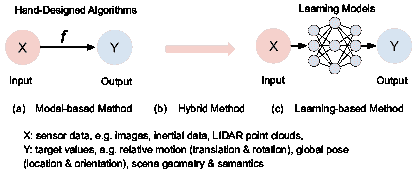
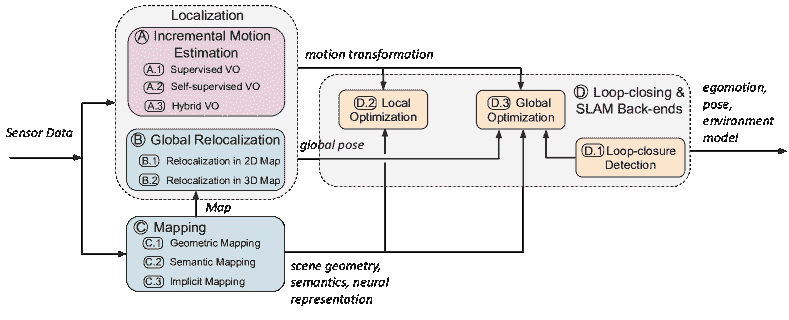
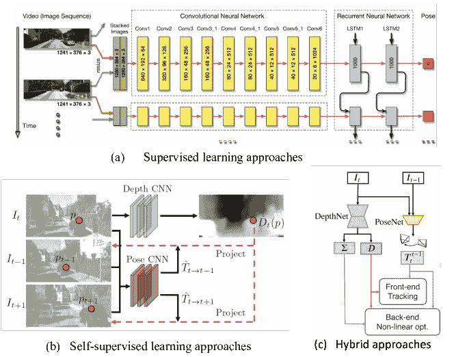
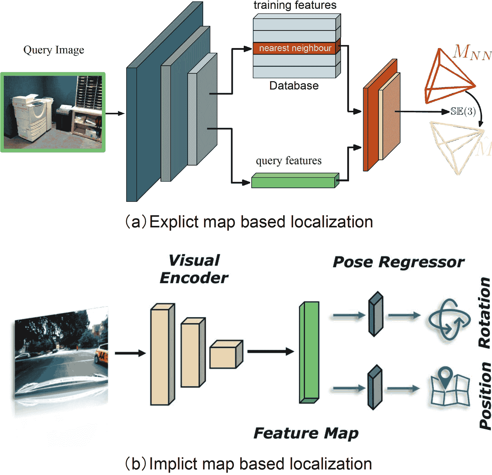
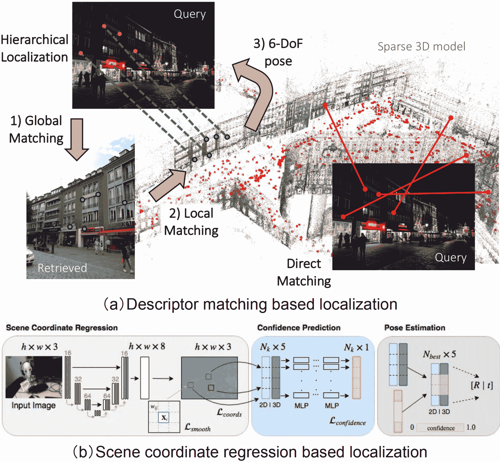
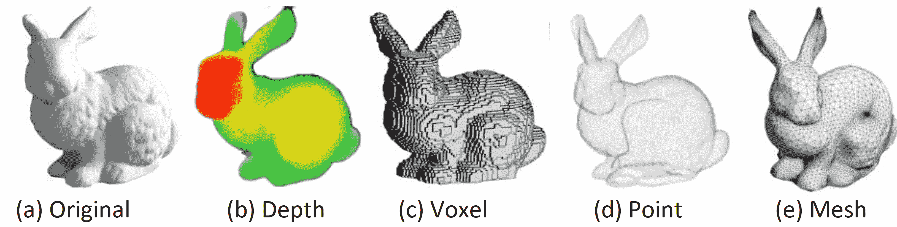
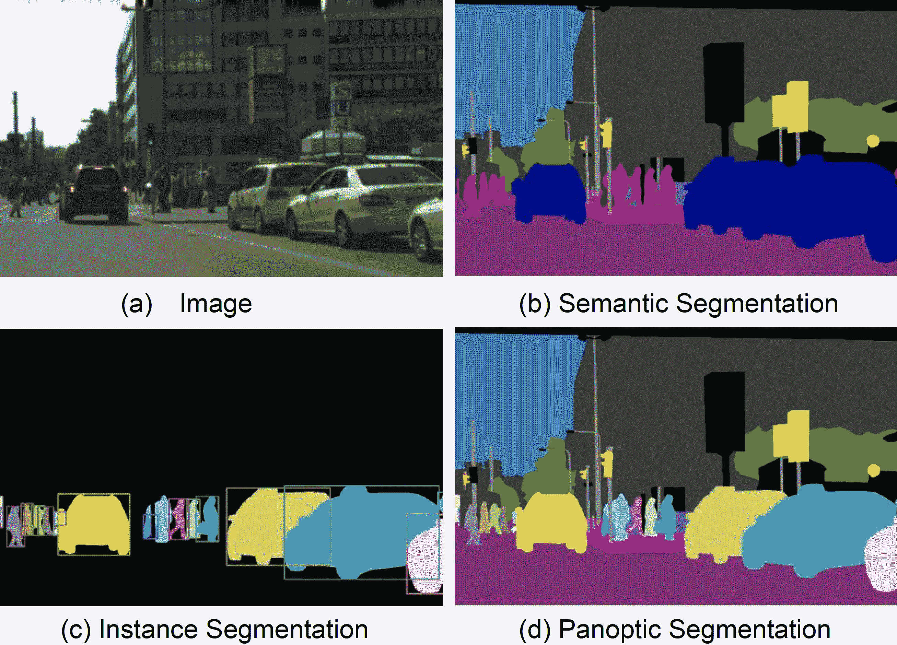

<!--yml

分类：未分类

日期：2024-09-06 19:37:14

-->

# [2308.14039] 深度学习在视觉定位与地图构建中的应用：综述

> 来源：[`ar5iv.labs.arxiv.org/html/2308.14039`](https://ar5iv.labs.arxiv.org/html/2308.14039)

# 深度学习在视觉定位与地图构建中的应用：综述

Changhao Chen*、Bing Wang*、Chris Xiaoxuan Lu、Niki Trigoni、Andrew Markham Changhao Chen 现任职于国防科技大学智能科学与技术学院，中国长沙，410073 Bing Wang 现任职于香港理工大学航空航天工程系，中国香港特别行政区 Chris Xiaoxuan Lu 现任职于爱丁堡大学信息学学院，英国爱丁堡，EH8 9AB Niki Trigoni 和 Andrew Markham 现任职于牛津大学计算机科学系，英国牛津，OX1 3QD *Changhao Chen 和 Bing Wang 为共同第一作者。通讯作者：Changhao Chen (changhao.chen66@outlook.com) 本工作得到了中国国家自然科学基金（NFSC）资助，资助编号为 62103427 和 42301520，以及 EPSRC 计划“ACE-OPS: 从自主到紧急操作中的认知辅助”（资助编号：EP/S030832/1）。Changhao Chen 还获得了中国科学院青年精英科学家资助计划（编号：YESS20220181）的资助。

###### 摘要

基于深度学习的定位与地图构建方法近年来作为一种新的研究方向出现，并受到工业界和学术界的广泛关注。与基于物理模型或几何理论创建的手工设计算法不同，深度学习解决方案提供了一种数据驱动的替代方案来解决问题。得益于数据和设备计算能力的持续增长，这些学习方法正快速演变成一个新领域，展示了在移动体上跟踪自我运动和准确、稳健地估计环境模型的潜力。在这项工作中，我们提供了一项全面的综述，并提出了基于深度学习的定位与地图构建方法的分类法。本文旨在讨论两个基本问题：深度学习在定位与地图构建中是否有前景；深度学习应如何应用于解决这一问题。为此，调查了一系列定位与地图构建的主题，从基于学习的视觉里程计、全球重定位，到地图构建和同时定位与地图构建（SLAM）。我们希望这项综述能够将机器人技术、计算机视觉和机器学习领域中的近期工作有机地结合起来，并为未来的研究人员提供指导，以便利用深度学习解决视觉定位和地图构建的问题。

###### 索引词：

深度学习、视觉 SLAM、视觉里程计、视觉惯性里程计、全球定位

## I 引言

定位和地图绘制是人类和移动智能体的基本要求。作为一个激励性的例子，人类具备通过多感官感知来感知自身运动和周围环境的非凡能力。他们在决定位置和在复杂的三维空间中导航时，严重依赖这种意识。同样，移动智能体，包括自驾车、配送无人机和家用服务机器人等多种机器人，必须具备通过车载传感器感知环境和估计位置状态的能力。这些智能体积极参与环境感知，并自主做出决策[1]。同样，增强现实（AR）和虚拟现实（VR）等新兴技术的集成将虚拟与现实领域紧密交织，使得机器具备感知意识变得至关重要。这种意识构成了人类与机器之间无缝互动的基础。此外，这些概念的应用扩展到智能手机、手环和物联网（IoT）设备等移动和可穿戴设备。这些设备提供了广泛的基于位置的服务，从步行导航和运动/活动监测到紧急响应。

图 1：定位和地图绘制系统利用车载传感器感知自我运动、全球姿态、场景几何和语义。（a）传统的基于模型的解决方案使用手工设计的算法将输入传感器数据转换为期望的输出值。（c）数据驱动的解决方案则利用学习模型来构建这种映射函数。（b）混合方法将手工设计的算法和学习模型相结合，以提高性能。

为这些以及其他数字智能体提供高水平的自主性需要精准而强大的定位，同时逐步建立和维护一个世界模型，具备持续处理新信息和适应各种场景的能力。在这项工作中，定位广泛指的是获取机器人运动的内部系统状态的能力，包括位置、方向和速度，而地图绘制则指感知外部环境状态的能力，包括场景几何、外观和语义。它们可以单独作用于内部或外部状态，或者作为一个同时定位与地图绘制（SLAM）系统共同操作。

定位与建图的问题已经研究了几十年，开发了各种算法和系统，例如视觉里程计 [2]、视觉惯性里程计 [3]、基于图像的重定位 [4]、地点识别 [5]、SLAM [6]。这些算法和系统在支持广泛的现实世界应用方面表现出了其有效性，如送货机器人、自动驾驶车辆和虚拟现实设备。然而，这些系统的部署并非没有挑战。传感器测量不准确、动态场景、不良的光照条件和现实世界的约束等因素在一定程度上阻碍了它们的实际应用。鉴于这些限制，最近机器学习特别是深度学习的进展促使研究人员探索数据驱动的方法作为替代解决方案。与依赖于具体和明确算法的传统模型方法不同，基于学习的方法利用深度神经网络的力量来提取特征和构建隐式神经模型，如图 1 所示。通过在大规模数据集上训练这些网络，它们学习到生成姿态和描述场景的能力，即使在高动态和光照条件差等具有挑战性的环境中也是如此。因此，与传统方法相比，基于深度学习的定位和建图方法表现出良好的鲁棒性和准确性。基于深度学习的定位和建图仍然是活跃的研究领域，需要进一步的研究以充分了解不同方法的优缺点。

在本文中，我们广泛回顾了现有的基于深度学习的视觉定位与建图方法，并尝试探索以下两个问题的答案：

+   •

    1) 深度学习对视觉定位与建图是否有前景？

+   •

    2) 如何将深度学习应用于解决视觉定位与建图的问题？

图 2：基于深度学习的视觉定位与建图的分类。各个模块可以集成到一个完整的基于深度学习的 SLAM 系统中。系统的有效运行并不一定需要包括所有模块。在图中，圆角矩形表示功能模块，箭头线描绘了这些模块之间的数据输入和输出连接。

这两个问题将在本调查的末尾重新审视。由于视觉是大多数移动代理的主要信息来源，这项工作将重点关注基于视觉的解决方案。深度学习基础的定位和映射领域仍然相对较新，近年来提出了越来越多的不同方法和技术。值得注意的是，虽然定位和映射的问题属于机器人学的核心概念，但学习方法的融入与机器学习、计算机视觉甚至自然语言处理等其他研究领域同步进展。因此，当将相关工作全面总结成调查论文时，这一跨学科领域带来了非凡的困难。我们希望我们的调查能够促进研究社区的合作与知识共享，激发新想法，并促进基于深度学习的定位和映射的跨学科研究。此外，本调查还可以帮助识别该领域的关键研究挑战和开放问题，指导未来的研究工作，并为对深度学习解决方案感兴趣的研究人员和从业者提供指导。据我们所知，这是第一篇彻底且广泛覆盖视觉定位和映射中深度学习现有工作的调查文章。

表 I：相关调查和教程的总结

| 年份 | 内容 | 参考文献 |
| --- | --- | --- |
| 2005 | 概率 SLAM | Thrun 等 [7] |
| 2006 | SLAM 教程 | Durrant-whyte 等 [8] |
| 2010 | 位姿图 SLAM | Grisetti 等 [9] |
| 2011 | 视觉里程计教程 | Scaramuzza 等 [10] |
| 2015 | 视觉地点识别 | Lowry 等 [5] |
| 2016 | 强鲁棒感知时代的 SLAM | Cadena 等 [11] |
| 2018 | 动态 SLAM | Saputra 等 [12] |
| 2018 | 机器人学中的深度学习 | Sunderhauf 等 [1] |
| 2022 | 感知与导航 | Tang 等 [13] |
| 2023 | 基于深度学习的 SLAM | 本调查 |

### I-A 与其他调查的比较

作为一个成熟的领域，SLAM 问题的发展已经在文献中由几篇综述论文进行了很好的总结[8, 14]，它们的重点在于传统的基于模型的定位和地图构建方法。开创性的综述[11]对现有的 SLAM 工作进行了深入讨论，回顾了发展历史，并绘制了几个未来方向的图谱。虽然这篇论文包含了一个简要讨论深度学习模型的章节，但并未全面概述这一领域，尤其是由于过去五年该领域研究的爆炸性增长。其他 SLAM 综述论文只关注 SLAM 系统的个别特性，包括 SLAM 的概率性表述[7]、视觉里程计[10]、姿态图 SLAM [9]和动态环境中的 SLAM [12]。我们建议读者参考这些综述，以更好地理解 SLAM 系统的传统解决方案。另一方面，[1]讨论了深度学习在机器人研究中的应用；然而，它的主要关注点不是在定位和地图构建上，而是对深度学习在机器人策略学习、推理和规划广泛背景下的潜力和限制的更一般性的观点。最近的综述[13]讨论了基于深度学习的感知和导航。相比于[13]对环境感知、运动估计和基于强化学习的控制进行的更广泛视角的探讨，我们提供了对视觉 SLAM 中的里程计估计、重定位、地图构建和其他方面的更全面的回顾和深入分析。

### I-B 综述组织

本文的其余部分组织如下：第二部分提供了对现有基于深度学习的定位和地图构建的概述和分类；第 3、4、5、6 节分别讨论了增量运动（里程计）估计、全局重定位、地图构建和 SLAM 后端的现有深度学习方法；第 7 和 8 节回顾了基于学习的不确定性估计和传感器融合方法；最后，第九部分总结了文章，并讨论了局限性和未来前景。

## II 现有方法的分类

从学习方法的角度来看，我们提供了现有基于深度学习的视觉定位和地图构建的分类，以连接机器人、计算机视觉和机器学习领域。根据它们对完整 SLAM 系统的主要技术贡献，相关方法可以在我们的背景下广泛地分为四大类：增量运动估计（视觉里程计）、全局重定位、地图构建，以及闭环和 SLAM 后端，如图 2 所示。

A) 增量运动估计关注于计算两个或更多传感器数据帧之间姿态的增量变化，包括平移和旋转。它持续跟踪自我运动，并随后通过将这些姿态变化与初始状态结合的过程来推导全局姿态。增量运动估计，即视觉里程计（VO），可以在没有预构建地图的情况下提供姿态信息，或者作为里程计运动模型来辅助机器人控制的反馈环。深度学习被应用于从各种传感器测量中以端到端的方式估计运动变换，或提取有用特征以支持混合系统。

B) 全球重定位通过匹配查询输入数据与预构建地图或其他空间参考来检索已知场景中的移动代理的全球姿态。这可以用来减少死记系统的姿态漂移，或在运动跟踪丢失时检索绝对姿态[7]。深度学习用于解决由于视角、光照、天气和场景动态变化而使数据关联问题变得复杂的难题。

C) 建图构建并重建一个一致的环境模型来描述周围环境。建图可以用于为人类操作员或高级机器人任务提供环境信息，限制自我运动跟踪的误差漂移，并检索全球定位所需的查询观察[11]。深度学习被作为一种有用工具，利用高维原始数据发现场景几何和语义。基于深度学习的建图方法被细分为几何建图、语义建图和隐式建图，取决于神经网络是否学习场景的显式几何或语义，或将场景编码为隐式神经表示。

D) 回环闭合和 SLAM 后端检测回环闭合，并优化上述增量运动估计、全局定位和建图模块，以提升同时定位与建图（SLAM）系统的性能。这些模块执行以下功能，以确保整个系统的一致性：*局部优化*确保相机运动和场景几何的一致性；一旦*回环闭合模块*检测到回环闭合，*全局优化*可以减轻系统误差漂移。

除上述模块外，还有其他对 SLAM 系统做出贡献的模块包括：

E) 不确定性估计提供了对学习到的姿态和地图的信心度量，这对 SLAM 系统中的概率传感器融合和后端优化至关重要。

F) 传感器融合利用每种传感器模态的互补特性，旨在发现合适的数据融合策略，以实现更准确和鲁棒的定位与建图。

在接下来的章节中，我们将详细讨论这些组件。

## III 增量运动估计

我们从增量运动（里程计）估计开始，即视觉里程计（VO），它持续跟踪相机自运动并产生运动变换。在给定初始状态的情况下，通过整合这些增量姿态来重建全局轨迹。因此，保持每个运动变换的估计准确是至关重要的，以确保在全球尺度上的高精度定位。本节介绍了实现视觉里程计的深度学习方法。

深度学习能够直接从原始图像中提取高级特征表示，因此提供了解决视觉里程计（VO）问题的替代方案，而无需手工制作特征检测器。现有的基于深度学习的 VO 模型可以根据是否完全基于 DNN 或者是经典 VO 算法与 DNN 的结合，分为*端到端 VO*和*混合 VO*。根据训练阶段的真实标签的可用性，端到端 VO 系统进一步分为*监督* VO 和*无监督* VO。表 II 列出了并比较了基于深度学习的视觉里程计方法。

图 3：典型的视觉里程计监督学习结构（摘自 DeepVO [15]）、自监督学习的视觉里程计（摘自 SfmLearner [16]）以及混合视觉里程计（摘自 D3VO [17]）。

### III-A 视觉里程计的监督学习

基于监督学习的视觉里程计（VO）方法旨在通过在标注数据集上训练深度神经网络模型，来构建从连续图像到运动变换的函数，而不是像传统 VO 算法那样利用图像的几何结构 [10]。最基本的输入是深度神经网络（DNN）的连续图像对，而输出则是两帧图像之间的估计平移和旋转。

在这一领域的早期工作之一是 Konda 等人[18]。他们的方法将视觉里程计（VO）公式化为分类问题，并利用卷积神经网络（ConvNet）从输入图像中预测方向和速度的离散变化。然而，这种方法在估计完整相机轨迹的能力上存在局限，而是依赖于一系列离散的运动估计。Costante 等人[19]提出了一种方法，通过使用稠密光流来提取视觉特征，从而克服了 Konda 等人[18]方法的一些局限性，然后利用 ConvNet 估计相机的帧间运动。这种方法在性能上优于 Konda 等人方法，并能够生成更平滑、更准确的相机轨迹。尽管这两种方法都显示出令人鼓舞的结果，但它们并不完全是从图像到运动估计的端到端学习模型，并且在准确性和鲁棒性方面仍然不及传统的 VO 算法，例如 VISO2[20]。这两种方法的一个局限是没有充分利用输入图像中包含的丰富几何信息，而这些信息对于准确的运动估计至关重要。此外，用于训练和评估这些方法的数据集在多样性上有限，可能无法很好地推广到不同的场景。

为了实现视觉里程计的端到端学习，DeepVO[15]利用了卷积神经网络（ConvNet）和递归神经网络（RNN）的组合。图 3（a）展示了这种典型的基于 RNN+ConvNet 的 VO 模型的架构，该模型通过 ConvNet 从图像对中提取视觉特征，并通过 RNN 传递特征以建模特征的时间相关性。其 ConvNet 编码器基于 FlowNet[21]结构来提取适合光流和自运动估计的视觉特征。递归模型将历史信息总结到其隐藏状态中，从而使输出既基于过去的经验，也基于当前 ConvNet 从传感器观察中得到的特征。DeepVO 在具有地面真实姿态作为训练标签的数据集上进行训练。为了恢复这一框架的最佳参数$\bm{\theta}^{*}$，优化目标是最小化估计平移$\mathbf{\hat{p}}\in\mathbb{R}^{3}$和基于欧拉角的旋转$\hat{\bm{\varphi}}\in\mathbb{R}^{3}$的均方误差（MSE）：

|  | $\bm{\theta}^{*}=\operatorname*{arg\,min}_{\bm{\theta}}\frac{1}{N}\displaystyle\sum_{i=1}^{N}\displaystyle\sum_{t=1}^{T}\&#124;\hat{\mathbf{p}}_{t}-\mathbf{p}_{t}\&#124;_{2}^{2}+\&#124;\hat{\bm{\varphi}}_{t}-\bm{\varphi}_{t}\&#124;_{2}^{2},$ |  | (1) |
| --- | --- | --- | --- |

其中 $(\hat{\mathbf{p}}_{t},\hat{\bm{\varphi}}_{t})$ 是在时间步 $t$ 从 DNN 估计的相对姿态，$(\mathbf{p},\bm{\varphi})$ 是对应的真实值，$\bm{\theta}$ 是 DNN 框架的参数，$N$ 是样本数量。该数据驱动的解决方案在多个基准上对驾驶车辆的姿态估计报告了良好的结果。在 KITTI 里程计数据集[22]上，它显示了相对于传统的单目视觉里程计（如 VISO2 [20] 和 ORB-SLAM（不包括回环检测） [6]] 的竞争力表现。值得注意的是，监督式视觉里程计自然地从单目相机产生具有绝对尺度的轨迹，而经典的单目视觉里程计算法则存在尺度歧义。这可能是因为 DNN 从大量图像中隐式地学习和维护全局尺度。尽管 DeepVO 在实验场景中报告了良好的结果，但其性能仍未通过大规模数据集（例如跨城市）或现实世界实验/演示进行广泛评估。

表 II：基于深度学习的视觉里程计（增量运动估计）方法的总结（见第 III 节）。

| 模型 | 年份 | 传感器 | 尺度 | 性能 | 贡献 |
| --- | --- | --- | --- | --- | --- |
| Seq09 | Seq10 |
| 监督 | Konda et al.[18] | 2015 | MC | 是 | - | - | 将视觉里程计形式化为分类问题 |
| Costante et al.[19] | 2016 | MC | 是 | 6.75 | 21.23 | 从光流中提取特征用于视觉里程计估计 |
| DeepVO[15] | 2017 | MC | 是 | - | 8.11 | 结合 RNN 和 ConvNet 进行端到端学习 |
| Zhao et al.[23] | 2018 | MC | 是 | - | 4.38 | 为视觉里程计和地图生成生成密集的 3D 流 |
| Saputra et al.[24] | 2019 | MC | 是 | - | 8.29 | 课程学习和几何损失约束 |
| Xue et al.[25] | 2019 | MC | 是 | - | 3.47 | 记忆和精炼模块 |
| Saputra et al.[26] | 2019 | MC | 是 | - | - | 知识蒸馏以压缩深度视觉里程计模型 |
| Koumis et al.[27] | 2019 | MC | 是 | - | - | 3D 卷积网络 |
|  | DAVO [28] | 2020 | MC | 是 | - | 5.37 | 使用注意力加权语义和光流 |
| 自监督 | SfmLearner[16] | 2017 | MC | 否 | 17.84 | 37.91 | 自监督学习的新视图合成 |
| UnDeepVO[29] | 2018 | SC | 是 | 7.01 | 10.63 | 使用固定的立体线恢复尺度度量 |
| GeoNet[30] | 2018 | MC | 否 | 43.76 | 35.6 | 几何一致性损失和 2D 流生成器 |
| Zhan et al.[31] | 2018 | SC | 是 | 11.92 | 12.45 | 使用固定的立体线进行尺度恢复 |
| Struct2Depth[32] | 2019 | MC | 否 | 10.2 | 28.9 | 在学习过程中引入 3D 几何结构 |
| GANVO[33] | 2019 | MC | 否 | - | - | 对抗学习以生成深度 |
| Wang 等人[34] | 2019 | MC | 是 | 9.30 | 7.21 | 将 RNN 和流一致性约束结合 |
| Li 等人[35] | 2019 | MC | 否 | - | - | 姿态图的全局优化 |
| Gordon[36] | 2019 | MC | 否 | 2.7 | 6.8 | 相机矩阵学习 |
| Bian 等人[37] | 2019 | MC | 否 | 11.2 | 10.1 | 从单目图像中得到一致尺度 |
|  | Li 等人[38] | 2020 | MC | 否 | 5.89 | 4.79 | 元学习以适应新环境 |
|  | Zou 等人[39] | 2020 | MC | 否 | 3.49 | 5.81 | 模拟长期依赖 |
|  | Zhao 等人[40] | 2021 | MC | 否 | 8.71 | 9.63 | 引入掩膜 GAN 以去除不一致性 |
|  | Chi 等人[41] | 2021 | MC | 否 | 2.02 | 1.81 | 光流、深度和运动的协作学习 |
|  | Li 等人[42] | 2021 | MC | 否 | 1.87 | 1.93 | 在线适应 |
|  | Sun 等人[40] | 2022 | MC | 否 | 7.14 | 7.72 | 引入覆盖和滤波掩膜 |
|  | Dai 等人[43] | 2022 | MC | 否 | 3.24 | 1.03 | 引入注意力和姿态图优化 |
|  | VRVO[44] | 2022 | MC | 是 | 1.55 | 2.75 | 使用虚拟数据来恢复尺度 |
| Hybrid | Backprop KF[45] | 2016 | MC | 是 | - | - | 基于可微卡尔曼滤波器的 VO |
| Yin 等人[46] | 2017 | MC | 是 | 4.14 | 1.70 | 引入学习的深度来恢复尺度度量 |
| Barnes 等人[47] | 2018 | MC | 是 | - | - | 结合学习的深度和短期掩膜 |
| DPF[48] | 2018 | MC | 是 | - | - | 基于可微粒子滤波器的 VO |
| Yang 等人[49] | 2018 | MC | 是 | 0.83 | 0.74 | 将学习的深度应用于经典 VO |
| CNN-SVO[50] | 2019 | MC | 是 | 10.69 | 4.84 | 使用学习的深度来初始化 SVO |
| Zhan 等人[51] | 2020 | MC | 是 | 2.61 | 2.29 | 结合学习的光流和深度 |
| Wagstaff 等人[52] | 2020 | MC | 是 | 2.82 | 3.81 | 将经典 VO 与学习的姿态修正相结合 |
|  | D3VO[17] | 2020 | MC | 是 | 0.78 | 0.62 | 结合学习的深度、不确定性和姿态 |
|  | Sun 等人[53] | 2022 | MC | 是 | - | - | 将学习的深度集成到 DSO 中 |

+   •

    年份表示每项工作的出版年份（例如会议日期）。

+   •

    传感器：MC 和 SC 分别表示单目相机和立体相机。

+   •

    监督表示是否为有监督或无监督的端到端模型，或混合模型

+   •

    尺度表示是否可以生成具有全局尺度的轨迹。

+   •

    性能报告了本地化误差（数值越小越好），即在 KITTI 里程计数据集[22]上长度为 100m-800m 的平均平移 RMSE 漂移（%）。大多数工作是在序列 09 和 10 上进行评估的，因此我们从这些原始论文中提取了这两个序列的结果以进行性能比较。注意，每项工作的训练集可能有所不同。

提升监督视觉里程计（VO）模型的泛化能力以及改善其在资源有限的设备上实时操作的效果仍然是巨大的挑战。虽然基于监督学习的 VO 在大量图像序列及其真实姿态数据上进行训练，但并非所有序列对模型学习都是同等有用或具有挑战性的。课程学习是一种技术，通过最初呈现简单序列并逐渐引入更具挑战性的序列来逐步提高训练数据的复杂性。在[24]中，通过增加训练序列中的运动和旋转量，将课程学习集成到监督 VO 模型中，使模型能够更稳健地学习估计相机运动，并更好地泛化到新数据。知识蒸馏是另一种方法，可以通过将大模型压缩为较小的模型来提高监督 VO 模型的效率。这种方法在[26]中应用，减少了网络参数的数量，使模型更适合在移动设备上实时操作。与没有知识蒸馏的纯监督 VO 相比，这种方法显著减少了 92.95%的网络参数，并提高了 2.12 倍的计算速度。

此外，为了提升本地化性能，在[25]中引入了一个存储关于场景和相机运动的全局信息的记忆模块。背景信息随后由一个细化模块利用，该模块提高了预测相机姿态的准确性。此外，已实施注意力机制以权衡来自不同来源的输入，并提高监督视觉里程计（VO）模型的效果。例如，DAVO [28] 集成了一个注意力模块，以权衡来自语义分割、光流和 RGB 图像的输入，从而改善了里程计估计性能。尽管这些监督 VO 框架在公开数据集上取得了有前景的端到端学习性能，但在实际场景中的部署性能仍需进一步验证。

总的来说，基于监督学习的视觉里程计模型主要依赖于 ConvNet 或 RNN 从原始图像中自动学习姿态变换。机器学习的最新进展，包括注意力机制、GANs 和知识蒸馏，使这些模型能够提取更具表现力的视觉特征并准确建模运动。然而，这些学习方法通常需要大量标注精确姿态的训练数据，以优化模型参数并提高鲁棒性。尽管基于监督学习的 VO 模型在公开数据集上展示了有前景的端到端学习性能，但其在实际场景中的部署性能仍需进一步验证。此外，获取标注数据通常耗时且成本高昂，并且可能出现不准确的标签。在接下来的部分，我们将讨论通过自监督学习技术解决标签稀缺问题的最新努力。

### III-B 自监督学习的视觉里程计

对于探索自监督学习的视觉里程计（VO），兴趣日益增长。自监督解决方案能够利用未标注的传感器数据，从而节省了人工努力。与监督方法相比，它们通常在没有标注数据的新场景中表现出更好的适应能力。这在一个自监督框架中得以实现，该框架通过利用视图合成作为自监督信号，从视频序列中共同学习相机自运动和深度[16]。

如图 3 (b) 所示，典型的自监督 VO 框架[16]包括一个深度网络来预测深度图和一个姿态网络来生成图像之间的运动变换。整个框架将连续图像作为输入，监督信号基于新视图合成——给定源图像 $\mathbf{I}_{s}$，视图合成任务是生成合成目标图像 $\mathbf{I}_{t}$。源图像 $\mathbf{I}_{s}(p_{s})$ 的一个像素通过以下公式投影到目标视图 $\mathbf{I}_{t}(p_{t})$：

|  | $p_{s}\sim\mathbf{K}\mathbf{T}_{t\to s}\mathbf{D}_{t}(p_{t})\mathbf{K}^{-1}p_{t}$ |  | (2) |
| --- | --- | --- | --- |

其中 $\mathbf{K}$ 是相机的内参矩阵，$\mathbf{T}_{t\to s}$ 表示从目标帧到源帧的相机运动矩阵，$\mathbf{D}_{t}(p_{t})$ 表示目标帧中的每像素深度图。训练目标是通过优化真实目标图像和合成图像之间的光度重建损失来确保场景几何的一致性：

|  | $\mathcal{L}_{\text{photo}}=\sum_{<\mathbf{I}_{1},...,\mathbf{I}_{N}>\in S}\sum_{p}&#124;\mathbf{I}_{t}(p)-\hat{\mathbf{I}}_{s}(p)&#124;,$ |  | (3) |
| --- | --- | --- | --- |

其中 $p$ 表示像素坐标，$\mathbf{I}_{t}$ 是目标图像，$\hat{\mathbf{I}}_{s}$ 是从源图像 $\mathbf{I}_{s}$ 生成的合成目标图像。

然而，原始工作中仍然存在两个主要未解决的问题[16]：1）这种基于单目图像的方法无法提供一致的全局尺度姿态估计。由于尺度歧义，无法重建出具有物理意义的全局轨迹，从而限制了其实际应用；2）光度损失假设场景是静态的且没有相机遮挡。虽然作者提出使用可解释性掩码来去除场景动态，但这些环境因素的影响仍未完全解决，这违背了假设。

为了解决全局尺度问题，[29, 31] 提出了利用立体图像对来恢复姿态估计的绝对尺度。他们在左右图像对之间引入了额外的空间光度损失，因为立体基线（即左右图像之间的运动变换）在整个数据集中是固定且已知的。一旦训练完成，网络仅使用单目图像生成姿态预测。与 [16] 相比，他们能够生成具有全局度量尺度和更高精度的相机姿态。另一种方法是使用来自模拟器的虚拟立体数据来恢复 VRVO[44] 中姿态估计的绝对尺度。它利用生成对抗网络（GAN）生成类似于现实世界数据的虚拟立体数据。通过使用对抗学习弥合虚拟数据和真实数据之间的差距，然后使用虚拟数据训练姿态网络，以恢复姿态估计的绝对尺度。[37] 通过引入几何一致性损失来解决尺度问题，该损失强制执行预测深度图与重建深度图之间的一致性。该框架将预测的深度图转换为 3D 空间，并将其投影回去以生成重建深度图。通过这种方式，深度预测可以在连续帧之间保持尺度一致，从而使姿态估计也保持尺度一致。不同于之前使用立体图像 [29, 31] 或虚拟数据 [44] 的工作，这项工作仅使用单目图像成功地生成了尺度一致的相机姿态和深度估计。

光度一致性约束基于整个场景仅由建筑物和车道等刚性静态结构组成的假设。然而，在实际应用中，环境动态如行人和车辆的存在可能会导致光度投影的扭曲，从而降低姿态估计的准确性。为了解决这一问题，GeoNet [30] 将其学习过程分为两个子任务，通过刚性结构重建器和非刚性运动定位器分别估计静态场景结构和运动动态。此外，GeoNet 强制执行几何一致性损失，以减轻相机遮挡和非朗伯表面引起的问题。[23] 增加了一个 2D 流生成器和一个深度网络，以生成 3D 流。得益于对环境的更好 3D 理解，这一框架能够生成更准确的相机姿态以及点云地图。GANVO [33] 采用生成对抗学习范式进行深度生成，并引入了一个时间递归模块用于姿态回归。这种方法提高了深度图和姿态估计的准确性，并能容忍环境动态。[54] 还利用生成对抗网络（GAN）生成更逼真的深度图和姿态，并进一步鼓励目标帧中的合成图像更准确。与手工设计的度量标准不同，使用了一个鉴别器来评估合成图像生成的质量。这样，生成对抗设置使得生成的深度图更具纹理丰富度和清晰度。通过这种方式，高级场景感知和表示得以准确捕捉，环境动态被隐式容忍。[40] 将掩码 GAN 引入深度和视觉里程计（VO）估计的联合学习中，解决了光照条件变化和遮挡的影响。通过引入 MaskNet 和布尔掩码方案，它减轻了遮挡和视野变化的影响，提高了对抗损失和图像重建。尺度一致性损失确保了在长单目序列中的准确姿态估计。同样，[55] 引入混合掩码来减轻动态环境的负面影响。覆盖掩码和滤波掩码缓解了对 VO 估计和视图重建过程的负面影响。这两种方法在汽车驾驶场景中展示了有竞争力的深度预测和全局一致的 VO 估计。

最近的尝试[38, 42]设计了在线学习策略，使得学习模型能够适应新环境。这些方法允许学习模型自动更新其参数并从新数据中学习，而不会遗忘先前学习的知识。多个学习任务的协同学习，例如光流、深度和相机运动估计，也已被证明能提高自监督视觉里程计的性能[41]。通过联合优化不同的学习目标，它利用了它们之间的互补信息，从而学习出更稳健的位姿估计表示。为了进一步改善视觉里程计，[43]提出了一种具有注意机制和位姿图优化的自监督视觉里程计。引入的注意机制对几何结构非常敏感，有助于准确回归旋转矩阵。

总的来说，基于自监督学习的视觉里程计方法作为估计相机位姿和场景深度的一种有前途的方法，不需要在训练过程中使用标注数据。它们通常由两个基于卷积网络的神经网络组成——一个用于深度估计，另一个用于位姿估计。与基于监督学习的方法相比，自监督方法提供了若干优势，包括处理非刚性动态和实时适应新环境的能力。然而，尽管有这些优势，自监督视觉里程计方法的表现仍不及其监督对手，并且在尺度和场景动态方面仍存在挑战。

如表 II 所示，自监督视觉里程计（VO）的性能仍无法与监督视觉里程计相媲美，不过其在尺度度量和场景动态问题上的顾虑在许多研究人员的努力下已经得到很大程度的解决。借助自监督学习的优势和性能的不断提升，自监督视觉里程计有望成为基于深度学习的 SLAM 的一个有前景的解决方案。目前，基于端到端学习的视觉里程计尚未被证明在性能上超越最先进的模型驱动视觉里程计。下一节将展示如何结合双方的优势来构建混合方法。

### III-C 混合视觉里程计

与完全依赖深度神经网络从数据中解释位姿的端到端方法不同，混合方法将经典几何模型与深度学习框架相结合。深度神经网络被用来替代几何模型的部分，从而允许更具表现力的表示。

传统单目视觉里程计（VO）中的一个关键挑战是尺度模糊问题，其中单目视觉里程计只能估计相对尺度。在需要绝对尺度的场景中，这会造成问题。解决这一问题的一种方法是将学习到的深度估计集成到经典视觉里程计算法中，这有助于恢复姿态的绝对尺度度量。深度估计是计算机视觉中的一个成熟研究领域，已提出了各种方法来解决这个问题。例如，Godard 等人 [56] 提出了一个深度神经网络模型，该模型可以在绝对尺度下预测每个像素的深度。深度学习的细节在第 V-A1 节中进行了讨论。

在 [46] 中，卷积网络从原始图像中生成粗略的深度值，然后通过条件随机场进行细化。通过将估计的深度预测与观察到的点位置进行比较来计算尺度因子。一旦获得尺度因子，就可以通过将尺度因子与单目视觉里程计算法估计的平移量相乘来获得具有绝对尺度的自我运动。这种方法通过结合深度信息来缓解尺度问题。此外，[47] 提出了将预测的瞬态掩码（即移动物体的区域）与传统视觉里程计系统中的深度图结合起来，以增强其对移动物体的鲁棒性。该方法使系统能够使用单个摄像头生成度量尺度的姿态估计，即使图像的大部分被动态物体遮挡。[52] 提出了将经典视觉里程计与学习到的姿态校正相结合，大大减少了经典视觉里程计的误差漂移。与纯学习基础的视觉里程计相比，该方法不是直接回归帧间姿态变化，而是从数据中回归姿态校正，不需要姿态真值作为训练数据。类似地，[53] 提出了用学习到的深度估计来改进经典的单目视觉里程计。该框架包括一个具有两种不同工作模式的单目深度估计模块，以协助定位和地图构建，并且与现有的学习基础视觉里程计相比，展示了对各种场景的强大泛化能力。此外，[51] 将学习到的深度和光流预测集成到传统视觉里程计模型中。具体而言，该框架使用深度卷积网络的光流和单视图深度预测作为中间输出，以建立 2D-2D/3D-2D 对应关系，并且具有一致尺度的深度估计可以缓解单目视觉里程计/SLAM 系统中的尺度漂移问题。通过将深度预测与基于几何的方法结合，该研究表明深度视觉里程计模型可以补充标准的视觉里程计/SLAM 系统。

D3VO [17] 被提出用于将深度神经网络的深度、姿态和光度不确定性的预测融入直接视觉里程计（DVO）[57]中。在 D3VO 中，采用自监督框架来联合学习深度和自我运动，类似于在第 III-B 节中讨论的方法。D3VO 采用了 [58] 提出的不确定性估计方法来生成光度不确定性图，以指示哪些视觉观测部分是可信的。如图 Fig. 3 (c) 所示，学习到的深度和姿态估计被整合到 VO 算法的前端，而不确定性则在系统后端使用。这种方法在 KITTI [22] 和 EuroC [59] 基准测试中显示了令人印象深刻的结果，超越了几种流行的传统 VO/VIO 系统，例如 DSO [60]、ORB-SLAM [6] 和 VINS-Mono [3]。这表明将学习方法与几何模型结合的前景非常光明。

除了几何模型，还有一些研究将物理运动模型与深度神经网络相结合，例如通过可微分的卡尔曼滤波器 [45, 61] 或可微分的粒子滤波器 [48]。在 [45] 中，卡尔曼滤波器被转化为一个可微分模块，与深度神经网络结合进行端到端训练。[61] 提出了 DynaNet，一个结合深度神经网络（DNNs）和状态空间模型（SSMs）的混合模型，以利用它们的优势。DynaNet 通过将 DNNs 强大的特征表示与 SSMs 对物理过程的明确建模相结合，在汽车驾驶场景中提升了解释性和鲁棒性。递归卡尔曼滤波器的引入使得在特征状态空间上进行最佳滤波，从而促进准确的定位估计，并通过内部滤波模型参数（如创新率（卡尔曼增益））展示了检测失败的能力。[48] 提出了一个具有可学习运动和测量模型的可微分粒子滤波器。所提出的可微分粒子滤波器能够近似复杂的非线性函数，允许通过优化状态估计性能来高效训练运动模型。这两项工作都将视觉里程计的物理模型纳入了滤波的状态更新过程。因此，物理模型在学习过程中作为算法先验。与基于 ConvNet 或 LSTM 的模型相比，可微分滤波器提高了数据效率和基于学习的运动估计的泛化能力。

总结而言，将几何或物理先验与深度学习技术相结合的混合模型通常比端到端的 VO/SLAM 系统更准确，甚至在常见基准测试中超越了传统的单目 VO 系统。基于几何的模型将深度神经网络整合到 VO/SLAM 流水线中，以改善深度和自我运动估计，并提高对动态物体的鲁棒性。基于物理运动的模型将深度神经网络与物理运动模型（如卡尔曼滤波器或粒子滤波器）结合起来，将 VO/SLAM 系统的物理运动模型融入学习过程。结合几何或物理先验与深度学习的优势，混合模型在这一阶段通常比端到端 VO 更为准确，如表 II 所示。值得注意的是，最近的混合模型甚至在一些常见基准测试中超越了代表性的传统单目 VO 系统 [17]。这展示了该领域的快速进展。

### III-D 基于深度学习的视觉里程计（VO）方法性能比较

表 II 提供了一个关于基于深度学习的视觉里程计（VO）现有工作的全面比较。该表包含了所用传感器类型、所采用模型、方法是否生成带有绝对尺度的轨迹以及在 KITTI 数据集上的性能评估等信息。每个模型的贡献也得到了简要概述。KITTI 数据集 [22] 是一个广泛认可的视觉里程计估计基准数据集，包含在汽车驾驶场景中捕获的传感器数据。由于大多数基于深度学习的方法使用 KITTI 数据集的轨迹 09 和 10 来测试训练模型，我们根据官方 KITTI VO/SLAM 评估指标提供的所有长度（100、200、……、800）米子序列的平均均方根误差（RMSE）进行比较。

混合 VO 模型表现出比监督式和无监督 VO 方法更优越的性能。这归因于混合模型能够利用传统 VO 算法中成熟的几何模型以及深度学习方法提供的强大特征提取能力。尽管监督式 VO 模型仍然优于无监督方法，但由于自监督 VO 方法的局限性逐渐得到解决，它们之间的性能差距在缩小。值得注意的是，近期的进展表明，自监督 VO 现在可以从单目图像中恢复尺度一致的姿态 [37]。总体而言，数据驱动的视觉里程计在模型性能上表现出显著的提升，表明深度学习方法在实现更精确的视觉里程计估计方面具有潜力。然而，值得注意的是，这一上升趋势并不总是稳定的，因为一些已发布的论文专注于解决学习框架中的固有问题，而不仅仅是追求最佳性能。

表 III：现有方法在 2D 地图重定位中的总结（第 IV-A 节）

| 模型 | 年份 | 无关 | 性能（m/度） | 贡献 |
| --- | --- | --- | --- | --- |
| 7Scenes | 剑桥 |
| 2D 地图中的重定位 | 显式地图 | NN-Net [62] | 2017 | 是 | 0.21/9.30 | - | 结合检索和相对位姿估计 |
| DeLS-3D [63] | 2018 | 否 | - | - | 与语义共同学习 |
| AnchorNet [64] | 2018 | 是 | 0.09/6.74 | 0.84/2.10 | 锚点分配 |
| RelocNet [65] | 2018 | 是 | 0.21/6.73 | - | 相机视锥体重叠损失 |
| CamNet [66] | 2019 | 是 | 0.04/1.69 | - | 多阶段图像检索 |
| PixLoc [67] | 2021 | 是 | 0.03/0.98 | 0.15/0.25 | 将相机定位视作度量学习 |
| Implicit Map | PoseNet [68] | 2015 | 否 | 0.44/10.44 | 2.09/6.84 | 全球姿态回归中的第一个神经网络 |
| Bayesian PoseNet [69] | 2016 | 否 | 0.47/9.81 | 1.92/6.28 | 估计全局姿态的贝叶斯不确定性 |
| BranchNet [70] | 2017 | 否 | 0.29/8.30 | - | 面向方向和位移的多任务学习 |
| VidLoc [71] | 2017 | 否 | 0.25/- | - | 从图像序列中高效定位 |
| Geometric PoseNet [72] | 2017 | 否 | 0.23/8.12 | 1.63/2.86 | 几何感知损失 |
| SVS-Pose [73] | 2017 | 否 | - | 1.33/5.17 | 3D 空间中的数据增强 |
| LSTM PoseNet [74] | 2017 | 否 | 0.31/9.85 | 1.30/5.52 | 空间相关性 |
| Hourglass PoseNet [75] | 2017 | 否 | 0.23/9.53 | - | 沙漏形状的架构 |
| MapNet [76] | 2018 | 否 | 0.21/7.77 | 1.63/3.64 | 强加空间和时间约束 |
| SPP-Net [77] | 2018 | 否 | 0.18/6.20 | 1.24/2.68 | 合成数据增强 |
| GPoseNet [78] | 2018 | 否 | 0.30/9.90 | 2.00/4.60 | 与高斯过程回归器的混合模型 |
| LSG [79] | 2019 | 否 | 0.19/7.47 | - | 里程计辅助定位 |
| PVL [80] | 2019 | 否 | - | 1.60/4.21 | 先验指导的丢弃掩码以提高鲁棒性 |
| AdPR [81] | 2019 | 否 | 0.22/8.8 | - | 对抗性架构 |
| AtLoc [82] | 2019 | 否 | 0.20/7.56 | - | 基于注意力的空间相关性 |
| GR-Net [83] | 2020 | 否 | 0.19/6.33 | 1.12/2.40 | 构建视图图 |
| MS-Transformer [84] | 2021 | 是 | 0.18/7.28 | 1.28/2.73 | 扩展到多个场景的变压器 |

+   •

    年份表示每项工作的出版年份（例如，会议日期）。

+   •

    Agnostic 指示是否可以推广到新场景。

+   •

    性能报告了在 7-Scenes (室内)[85]和 Cambridge (室外)数据集[68]上的位置（米）和方向（度）误差（数字越小越好）。两个数据集都被划分为训练集和测试集。我们报告了测试集上的平均误差。

## IV 全球重定位

全局重定位是确定已知场景中的绝对相机姿态的过程。与能够在陌生环境中执行的增量运动估计（视觉里程计）不同，全局重定位依赖于对场景的先验知识，并利用 2D 或 3D 场景模型。基本上，它通过将查询图像或视图与预构建的模型进行匹配，建立传感器观测与地图之间的关系，然后返回全局姿态的估计值。根据所使用的地图类型，基于深度学习的全局重定位方法可以分为两类：*2D 地图中的重定位*，其中输入的 2D 图像与地理参考图像数据库或隐式神经网络地图进行匹配；*3D 地图中的重定位*，其中在显式或隐式场景模型中建立 2D 图像像素与 3D 点之间的对应关系。表 III Methods ‣ III Incremental Motion Estimation ‣ Deep Learning for Visual Localization and Mapping: A Survey")和 IV 分别总结了基于深度学习的 2D 地图或 3D 地图中的全局重定位的现有方法。

### IV-A 2D 地图中的重定位

在 2D 地图中的重定位涉及相对于 2D 地图估计图像姿态。这种类型的地图可以通过使用地理参考数据库显式创建，或通过神经网络隐式编码。

图 4：通过(a)显式地图，即 RelocNet [65] 和 (b)隐式地图，例如 PoseNet [68]的 2D 地图中的典型重定位架构

#### IV-A1 显式 2D 地图基础的重定位

显式 2D 地图基础的重定位通常通过地理标记图像（参考）[86, 87, 88]的数据库来表示场景。图 4 (a) 展示了这种重定位过程的两个阶段：图像检索和姿态回归。

在第一阶段，目标是确定由参考图像表示的场景中与视觉查询最相关的部分。这是通过寻找适合图像检索的图像描述符来实现的，这是一项具有挑战性的任务。基于深度学习的方法[89, 90]使用预训练的卷积神经网络（ConvNets）来提取对视角、光照以及其他可能影响图像外观的因素不变的图像级特征。在具有挑战性的情况下，提取并聚合局部描述符以获得稳健的全局描述符。例如，NetVLAD [91]使用可训练的广义 VLAD 层（Vector of Locally Aggregated Descriptors [92]，一种用于图像检索的描述符向量），而 CamNet [66]应用两阶段检索方法，结合基于图像的粗略检索和基于姿态的精细检索，以选择最相似的参考帧进行最终的精确姿态估计。

明确的 2D 地图基础重定位的第二阶段旨在通过对检索到的图像执行额外的相对姿态估计，获得查询的更精确姿态。传统上，这通过极线几何来解决，依赖于由局部描述符确定的 2D-2D 对应关系[93, 94, 95]。相比之下，基于深度学习的方法直接从成对图像回归相对姿态。例如，NN-Net [62]使用神经网络来估计查询图像和排名前 N 的参考图像之间的成对相对姿态，随后使用基于三角测量的融合算法将预测的 N 个相对姿态与 3D 几何姿态的真实值结合，以获得绝对查询姿态。或者，RelocNet [65]引入了一个视锥体重叠损失来辅助全局描述符的学习，使其适用于相机定位。

明确的 2D 地图基础重定位是可扩展和灵活的，因为它不需要在特定场景上进行训练。然而，维护一个地理标记图像的数据库和准确的图像检索可能具有挑战性，这使得在大规模场景中扩展变得困难。此外，与隐式地图基础的对应方法相比，明确的 2D 地图基础重定位通常比较耗时，这将在下一节中讨论。

#### IV-A2 隐式 2D 地图基础重定位

隐式 2D 地图基础重定位通过在深度神经网络内部隐式表示 2D 地图，从单张图像中直接回归相机姿态。常见的流程如图 4 (b)所示——神经网络的输入是单张图像，而输出是查询图像的全局位置和方向。

PoseNet [68] 是首个通过训练卷积神经网络（ConvNet）从单张 RGB 图像中预测相机姿态来解决相机重定位问题的方案。它利用 GoogleNet [96] 的主要结构来提取视觉特征，并去除了最后的 softmax 层。取而代之的是引入了一个全连接层来输出一个 7 维的全局姿态，其中包括 3 维和 4 维的位置和方向向量。然而，PoseNet 有一些局限性。它设计了一个简单的回归损失函数，没有考虑到问题的底层几何结构。这导致了超参数需要昂贵的人工调整，并且可能对新场景的泛化能力较差。此外，由于特征嵌入的高维度和有限的训练数据，PoseNet 存在过拟合问题。

为了增强原始管道，提出了各种扩展方案，例如，通过利用 LSTM 单元来降低维度 [74]，应用合成生成来扩充训练数据 [73, 70, 77, 97]，更换主干网络 [75]，建模姿态不确定性 [69, 78, 98]，引入几何感知损失函数 [72] 和通过注意力机制关联特征 [82]。在 RVL [80] 中，还额外采用了先验引导的丢弃掩码，以进一步消除由动态物体引起的不确定性。VidLoc [71] 结合了图像序列的时间约束来建模输入图像的时间连接，以进行视觉定位。此外，MapNet [76] 利用包括空间约束和来自 GPS 或 SLAM 系统的其他传感器约束在内的额外运动约束，以强制预测姿态之间的运动一致性。类似的运动约束也通过联合优化重定位网络和视觉里程计网络 [99, 79, 100] 引入。然而，由于应用特定性，从定位任务中学到的场景表示可能忽略一些它们没有设计的有用特征。为此，VLocNet++ [101] 额外利用了学习语义和回归姿态之间的任务间关系，取得了令人印象深刻的结果。最近，图神经网络（GNNs）被引入到 GR-Net [83] 和 PoGO-Net [102] 中，处理多视角相机重定位任务，使得不同帧的信息能够超越时间连接进行传递。MS-Transformer [84] 扩展了绝对姿态回归范式，用于在多个场景上学习单一模型。

显式和隐式的 2D 地图基础重定位方法都利用深度学习自动提取关键特征的优势，用于在缺乏独特特征的环境中进行全局重定位。隐式地图基础学习方法通过 DNN 直接回归相机的绝对姿态，使其比显式地图基础学习方法更易于实现和更高效。然而，当前的隐式地图基础方法表现出性能限制，它们对特定场景的训练依赖使得它们无法在没有重新训练的情况下推广到不熟悉的场景。在下一节中，我们将介绍学习如何将图像与 3D 模型匹配以进行全局重定位的概念。

### IV-B 3D 地图中的重定位

在 3D 地图中进行重定位涉及根据预构建的 3D 场景模型恢复 2D 图像的相机姿态。该 3D 地图是使用如结构从运动（SfM）[12]或使用如截断签名距离函数（TSDF）[103]的方法从彩色图像或范围图像构建的。如图 5 所示，基于 3D 地图的方法通过使用局部描述符[104, 105, 106, 107]或场景坐标回归[108, 109, 85, 110]在查询图像的 2D 像素与 3D 点之间建立 2D-3D 对应关系。然后，这些 2D-3D 匹配被用于通过在 RANSAC 循环[112]中应用透视-n-点（PnP）求解器[111]来计算相机姿态。

#### IV-B1 基于局部描述符的重定位

基于局部描述符的重定位依赖于使用特征描述符在 2D 地图输入和给定的显式 3D 模型之间建立对应关系。由于特征描述符的学习通常与关键点检测相关联，现有的学习方法可以根据检测器和描述符在学习过程中的角色分为三种类型：检测-然后-描述、检测和描述以及描述-然后-检测。

表 IV：现有的基于深度学习的 3D 地图重定位方法总结（第 IV-B 节）

| 模型 | 年份 | 无关 | 性能（m/度） | 贡献 |
| --- | --- | --- | --- | --- |
| 7Scenes | 剑桥 |
| 3D 地图中的重定位 | 基于描述符 | NetVLAD [91] | 2016 | 是 | - | - | 可微分的 VLAD 层 |
| DELF [113] | 2017 | 是 | - | - | 注意力局部特征描述符 |
| InLoc [114] | 2018 | 是 | 0.04/1.38 | 0.31/0.73 | 密集数据关联 |
| SVL [115] | 2018 | 否 | - | - | 利用生成模型进行描述符学习 |
| SuperPoint [116] | 2018 | 是 | - | - | 联合提取兴趣点和描述符 |
| Sarlin 等 [117] | 2018 | 是 | - | - | 分层定位 |
| NC-Net [118] | 2018 | 是 | - | - | 邻域共识约束 |
| 2D3D-MatchNet [119] | 2019 | 是 | - | - | 联合学习 2D 和 3D 关键点的描述符 |
| HF-Net [120] | 2019 | 是 | 0.042/1.3 | 0.356/0.31 | 粗到细的定位 |
| D2-Net [121] | 2019 | 是 | - | - | 联合学习关键点和描述符 |
| Speciale 等 [122] | 2019 | 否 | - | - | 隐私保护定位 |
| OOI-Net [123] | 2019 | 否 | - | - | 关注对象标注 |
| Camposeco 等 [124] | 2019 | 是 | - | 0.56/0.66 | 用于定位的混合场景压缩 |
| Cheng 等 [125] | 2019 | 是 | - | - | 级联并行过滤 |
| Taira 等 [126] | 2019 | 是 | - | - | 姿态验证的综合分析 |
| R2D2 [127] | 2019 | 是 | - | - | 学习描述符的区分性预测器 |
| ASLFeat [128] | 2020 | 是 | - | - | 利用可变形卷积网络 |
| CD-VLM [129] | 2021 | 是 | - | - | 跨描述符匹配 |
| VS-Net [130] | 2021 | 否 | 0.024/0.8 | 0.136/0.24 | 通过分割进行投票 |
| 场景坐标回归 | DSAC [131] | 2017 | 否 | 0.20/6.3 | 0.32/0.78 | 可微分的 RANSAC |
| DSAC++ [132] | 2018 | 否 | 0.08/2.40 | 0.19/0.50 | 不使用场景的 3D 模型 |
| Angle DSAC++ [133] | 2018 | 否 | 0.06/1.47 | 0.17/0.50 | 基于角度的重投影损失 |
| Dense SCR [134] | 2018 | 否 | 0.04/1.4 | - | 全帧场景坐标回归 |
| Confidence SCR [135] | 2018 | 否 | 0.06/3.1 | - | 对应关系的不确定性模型 |
| ESAC [136] | 2019 | 否 | 0.034/1.50 | - | 在专家混合模型中集成 DSAC |
| NG-RANSAC [137] | 2019 | 否 | - | 0.24/0.30 | 基于先验的模型假设搜索 |
| SANet [138] | 2019 | 是 | 0.05/1.68 | 0.23/0.53 | 用于相机定位的场景无关架构 |
| MV-SCR [139] | 2019 | 否 | 0.05/1.63 | 0.17/0.40 | 多视角约束 |
| HSC-Net [140] | 2020 | 否 | 0.03/0.90 | 0.13/0.30 | 分层场景坐标网络 |
| KFNet [141] | 2020 | 否 | 0.03/0.88 | 0.13/0.30 | 扩展到时间域的问题 |
| DSM [142] | 2021 | 是 | 0.027/0.92 | 0.27/0.52 | 密集坐标预测 |

+   •

    年份表示每项工作的出版年份（例如会议日期）。

+   •

    表示是否可以推广到新场景的能力。

+   •

    性能报告了 7-Scenes（室内）[85]和 Cambridge（室外）数据集[68]中的位置（m）和方向（度数）误差（误差越小越好）。这两个数据集都被划分为训练集和测试集。我们报告了测试集上的平均误差。

+   •

    贡献总结了每项工作的主要贡献，相较于以往的研究。

Detect-then-describe 是一种常见的基于局部描述符的重新定位流程。这种方法首先进行特征检测，然后从围绕每个关键点的补丁中提取特征描述符[143, 144]。关键点检测器负责提供对可能的实际问题（如尺度变化、旋转或视角变化）的鲁棒性或不变性，通过相应地标准化补丁。然而，这些职责中的一些也可能被委托给描述符。常见的流程包括使用手工制作的检测器[145, 146]和描述符[147, 148]，用学习的替代品替换描述符[149, 150, 151, 118, 152, 153, 154, 155, 156, 157]或检测器[158, 159, 160]，或者同时学习检测器和描述符[161, 162, 163, 164]。为了提高效率，特征检测器通常只考虑小的图像区域，通常集中于低级结构，如角点或斑点[165]，而描述符通常在关键点周围较大的补丁中捕捉更高级的信息。

相比之下，detect-and-describe 方法推进了描述阶段。通过共享来自深度神经网络的表示，SuperPoint [116] 和 R2D2 [127] 尝试学习稠密的特征描述符和特征检测器。然而，它们依赖于不同的解码器分支，这些分支独立训练，具有特定的损失函数。相反，D2-net [121] 和 ASLFeat [128] 在检测和描述之间共享所有参数，并使用联合公式同时优化这两个任务。与这些纯粹依赖于图像特征的工作不同，P2-Net [166] 提出了 2D 和 3D 表示之间的统一描述符，用于像素和点匹配。

另外，describe-then-detect 方法，例如 D2D [167]，将检测推迟到后期阶段，但在预先学习的稠密描述符上应用这种检测器，以提取稀疏的关键点集和相应的描述符。

图 5：基于 3D 地图的重定位的典型架构，包括（a）描述符匹配，即 HF-Net [120] 和（b）场景坐标回归，即 Confidence SCR [135]。

实际应用中，描述符通常用于进行稀疏特征提取和匹配，以满足与关键点检测器的效率要求。此外，通过禁用关键点检测器的功能，密集特征提取和匹配[168, 169, 170, 115, 114, 171, 172]显示出比稀疏特征匹配更好的匹配结果，尤其是在光照变化剧烈的情况下[173]。最近，提出了新的方法来建立视觉定位的对应关系。例如，CD-VLM [129]通过交叉描述符匹配来克服跨季节和跨领域视觉定位中的挑战。VS-Net [130]提出了一种基于场景特定地标的方法，该方法利用一组基于关键帧的地标来建立视觉定位中的对应关系。这些新方法为鲁棒且准确的视觉定位提供了有希望的替代方案。

#### IV-B2 场景坐标回归基于的定位

与依赖于图像之间的描述符匹配和显式 3D 地图来建立 2D-3D 对应关系的局部描述符基重定位不同，场景坐标回归方法消除了对显式 3D 地图构建和描述符提取的需求，使其相对更高效。这些方法并不依赖显式 3D 地图，而是学习从 2D 像素坐标到 3D 点坐标的隐式变换。通过估计查询图像中每个像素在世界坐标系统中的 3D 坐标（即场景坐标[85, 174]），这些方法在处理不同环境和场景结构时提供了更多的灵活性。这使得场景坐标回归成为重定位任务的一个有前途的替代方案，尤其是在没有显式 3D 地图或地图不够准确的情况下。

DSAC [131] 是一个重新定位管道，它利用 ConvNet 回归场景坐标，并结合了一种新颖的可微分 RANSAC 算法，从而实现了管道的端到端训练。这种方法已在多个方面进行了扩展，以提高其性能和适用性。例如，已经引入了重投影损失 [132, 175, 133] 和多视角几何约束 [139]，以实现无监督学习，并联合学习观测置信度 [135, 137]，以提高采样效率和准确性。其他策略，如专家混合模型 (MoE) [136] 和分层粗到细 [140, 176]，也已被集成以消除环境歧义。与这些方法不同，KFNet [141] 将场景坐标回归问题扩展到时间域，有效地缩小了时间性和单次定位方法之间的性能差距。然而，这些方法仍然局限于特定场景，无法在不重新训练的情况下推广到未见过的场景。为了解决这个限制，SANet [138] 通过插值与检索场景图像相关联的 3D 点来回归查询的场景坐标图，使其成为场景无关的方法。与上述方法不同的是，Dense SCR 和 DSM [134, 142] 以密集方式进行场景坐标回归，从而在测试过程中使计算更加高效。此外，它们将全局上下文融入回归过程，以提高鲁棒性。总体而言，这些场景坐标回归和重新定位技术的进展为在多样化场景中提高定位准确性提供了有希望的途径。

基于场景坐标回归的方法比基于局部描述符的方法更高效，因为它们消除了描述符提取和匹配的需求。这些方法可以直接回归给定 2D 像素的相应 3D 点，从而高效地生成 2D-3D 对应关系。此外，隐式 3D 地图基的重新定位方法显示出良好的结果，在小型室内环境中表现出鲁棒且准确的性能，并且表现与显式 3D 地图基的方法相当，甚至更好。然而，需要注意的是，这些隐式方法在大规模户外场景中的有效性尚未得到证明。这是因为它们依赖于学习一个将 2D 图像坐标映射到 3D 场景坐标的回归函数，这可能无法很好地推广到具有多样化光照、天气条件和场景布局的户外场景。

## V 映射

映射指的是移动代理感知并构建一致环境模型以描述周围环境的能力。深度学习促成了一套用于场景感知和理解的工具，这些工具的应用范围从深度预测、物体检测，到语义标记和三维几何重建。本节概述了与基于深度学习的映射（场景感知）方法相关的现有工作。我们将它们分为几何映射、语义映射和隐式映射。

### V-A 几何映射

广义上，几何映射捕捉场景的形状和结构描述。经典的映射算法可以分为稀疏特征或密集方法。由于基于深度学习的方法大多用密集表示场景，本节重点介绍这一领域的相关工作。典型的密集场景表示选择包括深度、点、边界、网格和体素。图 6 可视化了这些代表性几何表示在斯坦福兔基准上的表现。受到[11]的启发，我们进一步将学习方法分为两个部分：原始密集表示和边界密集表示。

图 6：斯坦福兔基准上的场景表示插图：（a）原始模型，（b）深度，（c）体素，（d）点和（e）网格表示。

#### V-A1 原始密集表示

基于输入图像，深度学习方法能够生成 2.5D 深度图或 3D 点作为原始密集表示，这些表示以高分辨率表达场景几何。这些原始表示作为构成适用于机器人任务（如避障）的场景的基础组件。在 SLAM（同步定位与地图构建）系统中，这些原始密集映射方法与运动跟踪联合使用。例如，通过融合每个像素的深度和 RGB 图像可以实现密集场景重建，如 DTAM [177] 和 [178, 179]。

1) 2.5D 深度表示：从原始图像中学习深度是计算机视觉领域一个快速发展的领域。通常有三种主要类别：基于监督学习、基于空间一致性的自监督学习和基于时间一致性的自监督学习深度估计。

最早的方法之一是[180]，它将单张图像作为输入，处理后输出每个像素的深度值。该方法使用了两个深度神经网络，一个用于粗略的全局预测，另一个用于局部细化，并应用尺度不变误差来测量深度关系。该方法在 NYU Depth 和 KITTI 数据集上达到了新的最先进的性能。通过联合优化深度和自我运动估计[181]，实现了更准确的深度预测。这项工作通过基于卷积网络的编码器-解码器结构和改进预测的迭代网络，学习从非约束的图像对中生成深度和相机运动。该网络估计表面法线、光流和匹配置信度，训练损失基于空间相对差异。与传统的深度估计方法相比，这种方法在准确性和鲁棒性方面表现更高，并且通过更好地推广到未见过的结构，超越了基于单图像的深度学习网络[181]。[182]提出了一种基于卷积网络的神经模型，通过使用连续条件随机场（CRF）学习和一种结构化学习方案来估计单眼图像的深度，该方案在统一的深度卷积神经网络框架中学习连续 CRF 的单项和配对势。该模型在有监督学习的深度估计上有所改进，且相对更高效。虽然这些有监督学习方法相较于传统结构基础的方法，如[183]，显示了优越的性能，但其效果受限于模型训练期间标注数据的可用性，使得在新场景中的泛化变得困难。

另一方面，近年来该领域的进展集中在无监督解决方案上，通过将深度预测重新表述为一种新颖的视图合成问题。[184]利用光度一致性损失作为训练神经模型的自监督信号。通过立体图像和已知的相机基线，它从右图像及左视图的预测深度图中合成左视图。通过最小化合成图像与真实图像之间的距离，即空间一致性，网络的参数通过这种自监督以端到端的方式恢复。类似地，[56]提出了一种单图像深度估计模型，该模型使用双目立体图像代替真实深度数据。他们的方法利用图像重建损失生成视差图像，并强制施加相对左图像和右图像生成的视差之间的一致性，以提高性能和鲁棒性，优于[182]和[184]。

除了空间一致性，时间一致性也可以作为自监督信号[16]。这些方法在目标时间框架中合成图像，同时恢复自运动和深度估计。重要的是，这种框架只需要单目图像来学习深度图和自运动。正如我们在 III-B 节中讨论的那样，我们建议读者查阅 III-B 节以获取更多细节。

学到的深度信息可以集成到 SLAM 系统中，以解决经典单目解决方案的一些局限性。例如，CNN-SLAM [185] 将从单幅图像中学到的深度信息集成到单目 SLAM 框架中（即 LSD-SLAM [186]）。这表明学到的深度图如何有助于缓解姿态估计和场景重建中的绝对尺度恢复问题。借助 ConvNets 预测的密集深度图，CNN-SLAM 在无纹理区域提供了密集的场景预测，这通常是传统 SLAM 系统难以做到的。

2) 3D 点表示：深度学习技术也已被引入以从原始图像生成 3D 点。基于点的表示方式表示 3D 空间中点的三维坐标（x, y, z）。虽然这种表示方式直观且易于操作，但它面临模糊性挑战，不同的点云配置可能代表相同的底层几何形状。

该领域的开创性工作是 PointNet [187]，它直接在点云上操作，无需将其转换为常规的 3D 体素网格或图像集合。PointNet 专门设计用于处理输入点的排列不变性，其应用范围涵盖了各种任务，如物体分类、部件分割和场景语义解析。此外，[188] 开发了一种深度生成模型，可以从单幅图像生成基于点的 3D 几何形状。在他们的工作中，引入了一种基于地球移动者距离的损失函数来解决数据模糊性问题。然而，他们的方法仅在单个物体的重建任务上进行了验证。目前尚未找到针对场景重建的点生成研究，主要是因为这种工作涉及的计算负担很大。

#### V-A2 边界和空间划分表示

除了无结构的原始密集表示（即 2.5D 深度图和 3D 点），边界表示通过显式表面和空间划分（即边界）来表达 3D 场景。

1) 表面网格表示：基于网格的表达自然地捕捉了三维形状的表面。它编码了三维模型的基础表面结构，如边缘、顶点和面。已有一些研究考虑了从图像[189、190]或点云数据[191、192、193]中学习网格生成的问题。然而，这些方法仅能重建单一对象，并且局限于生成结构简单或来自熟悉类别的模型。为了解决网格表示中的场景重建问题，[194] 将单目 SLAM 的稀疏特征与 ConvNets 的密集深度图结合起来，以更新三维网格表示。在这项工作中，通过融合 SLAM 测量的稀疏特征和 CNN 预测的密集深度图，获得了更准确的三维重建，三维网格表示通过准确跟踪的稀疏特征点进行更新。与仅使用 ConvNet 基础的深度图预测相比，所提出的方法在三维重建中显示出 38%的均值残差误差降低。为了实现高效的计算和灵活的信息融合，[195] 利用 2.5D 网格表示场景几何。在这种方法中，网格顶点的图像平面坐标由深度神经网络学习，同时深度图作为自由变量进行优化。通过使用可学习的残差，因子图被用来以灵活和连续的方式整合信息。对合成数据和真实数据的实验评估显示了所提出方法的有效性和实用性。

表面函数表示：这种表示方式将表面描述为隐式函数的零交叉点。一个流行的选择是带符号距离函数，它是一个连续的体积场，其中点的大小是到表面边界的距离，而符号决定了点是否在表面内外。DeepSDF 被提出用来通过分类器生成这样的连续场，指示哪个边界是形状的表面 [196]。具体来说，DeepSDF 是一种学习到的连续带符号距离函数（SDF）表示，它用于表示一类形状，能够高质量地进行形状表示、插值和从部分及噪声 3D 输入数据中完成。它通过一个连续的体积场表示形状的表面，并明确表示空间的分类是否属于形状内部。DeepSDF 可以表示整个形状类别，并且在学习 3D 形状表示和完成方面表现出色，同时相较于之前的工作，模型大小减少了一个数量级。另一种方法，Occupancy Networks 生成一个连续的 3D 占用函数，通过深度神经网络表示决策边界，并用神经分类器[197]进行描述，能够在无限分辨率下生成 3D 输出，且不会占用过多内存。该方法在从单张图像、噪声点云和粗糙离散体素网格中进行 3D 重建方面效果显著，并且在基线测试中展示了竞争力的结果。为了进一步改进 Occupancy Networks，卷积占用网络 [198] 结合了卷积编码器和隐式占用解码器。该方法通过实验在从噪声点云和低分辨率体素表示中重建复杂几何形状上得到了实证验证。此外，[199] 利用深度全连接神经网络来优化辐射场函数以表示场景。他们的实验在新视角合成任务中表现良好。与原始表示相比，表面函数表示显著减少了存储内存。与上述限于闭合表面的方法不同，NDF [200] 被提出用于预测任意 3D 形状的无符号距离场，这在实际应用中更加灵活。

3) 体素表示：类似于图像中使用的像素（即二维元素），体素是三维空间中的体积元素。以往的工作探索了使用多个输入视图，重建场景的体积表示[201、202]和物体[203]。例如，SurfaceNet[201]学会预测体素的置信度，以确定其是否在表面上，并重建场景的二维表面。SurfaceNet 基于 3D 卷积网络，该网络将相机参数与图像编码到 3D 体素表示中，从而直接学习表面结构的光照一致性和几何关系。该框架在大规模场景重建数据集上进行了评估，证明了其在多视角立体视觉中的有效性。RayNet[202]通过提取视图不变特征并施加几何约束来重建场景几何。它通过马尔可夫随机场编码透视投影和遮挡的物理学，同时利用卷积网络学习视图不变的特征表示。一些工作专注于生成高分辨率的 3D 体积模型[204、205]。例如，[205]设计了一种基于八叉树公式的卷积解码器，以实现场景的更高分辨率重建。该网络预测八叉树的结构和单个单元的占用值，使其在生成复杂的 3D 形状时具有重要价值。与具有立方复杂度的标准解码器不同，该架构允许在有限的内存预算下实现更高分辨率的输出。其他工作可以在 RGB-D 数据的场景完成中找到[206、207]。体素表示的一个限制是其高计算要求，特别是在尝试以高分辨率重建场景时。

选择最佳的映射表示仍然是一个未解的问题。SLAM 的场景表示选择取决于一系列因素，包括传感器的模式、所需的细节级别、可用的计算资源以及环境的大小和复杂性。一般而言，密集表示，如深度图或点云，提供了对场景的全面和详细的视图，但计算和内存成本较高。这使得它们更适用于小规模场景。另一方面，边界表示，如网格和基于表面函数的公式，由于其能够捕捉场景的结构和几何形状，同时保持内存和计算要求在可行范围内，因此更适合大规模的户外环境。

### V-B 语义地图

图 7：（a）原始图像，（b）语义分割，（c）实例分割和（d）全景分割用于语义映射[208]。

语义映射将语义概念（即对象分类、材料组成等）与环境几何相连接。深度学习的进步极大地促进了对象识别和语义分割的发展。具有语义意义的地图使移动代理能够对其环境有超越纯几何的高层次理解，并允许更广泛的功能性和自主性。

SemanticFusion [209] 是早期将从深度卷积网络获得的语义分割标签与从 SLAM 系统中获得的密集场景几何结合起来的贡献之一。通过概率性地将 2D 帧与 3D 地图关联，实现了这种集成，从而逐步将每帧的语义分割预测纳入密集的 3D 地图中。这个综合框架不仅生成了一个充满有用语义信息的地图，还显示了与 SLAM 系统的集成提升了单帧分割。然而，在 SemanticFusion 中，两个模块，即语义分割和 SLAM，连接松散。[210] 提出了一个自监督网络，通过对不同视角间语义预测的一致性施加约束，来预测地图的一致语义标签。DA-RNN [211] 将递归模型引入语义分割框架，使其能够学习多个视角帧之间的时间连接，为体积地图生成更准确、一致的语义标签。另一个近期工作 [212] 提出了一个利用众包视觉数据构建紧凑语义地图的框架。通过将当前特征点与构建的语义地图进行匹配，实现定位，采用迭代最近点（ICP）方法。与之前在房间级别上评估的方法不同，这项工作提供了一种在大规模城市场景中表现良好的轻量级语义映射和定位。然而，需要注意的是，这些基于语义分割的方法并不提供对象实例的信息，因此它们无法区分属于同一类别的不同对象。

随着实例分割技术的发展，语义映射已发展到实例级别。一个显著的例子是 [213]，它通过采用边界框检测模块和无监督几何分割模块来实现对象级别的语义映射。[214] 提出了一个框架，实现了实例感知的语义映射，并在映射环境中启用了新对象发现。与其他密集语义映射方法不同，Fusion++ [215] 构建了一个基于语义图的地图，专门预测对象实例，并通过闭环检测、姿态图优化和进一步的精细化来保持一致的地图。为了更有效地利用学到的对象信息，[216] 在 SLAM 背景下提出了一个概率框架。它将对象检测器作为语义地标引入因子图，从而实现姿态估计、地标位置/类别和数据关联的联合优化。这种集成有助于解决映射过程中遇到的模糊数据关联挑战。

最近，全面分割[208]引起了关注。PanopticFusion [217]代表了语义映射的进步，扩展到物体和事物分类的层面。在这种背景下，stuff 类别包括墙壁、门和车道等静态物体，而 things 类别包括移动的车辆、人类和桌子等可计数物体。图 7 提供了语义分割、实例分割和全面分割的视觉对比。

总结来说，语义映射通过整合有关物体语义意义、材料组成和几何形状的信息以及它们的实例级特征，生成环境的高级表示。这些方法采用概率模型，将每帧的语义分割预测逐渐融合为密集的 3D 地图，或者将对象检测器作为语义地标，以优化姿态和场景估计。它们提供了对环境的全面理解，使移动代理能够实现更高水平的功能和自主性。

### V-C 隐式地图

除了显式的几何和语义地图表示外，深度学习模型还能够将整个场景编码为隐式表示，即神经地图。这种神经地图表示以隐式方式捕捉了场景的基础几何和外观。

1) 基于自编码器的场景表示：深度自编码器提供了自动发现高维图像数据高层紧凑表示的能力。一个显著的例子是 CodeSLAM [218]，它将观察到的图像编码为紧凑且可优化的表示，以包含密集场景的核心信息。然后，将学习到的隐式表示用于基于关键帧的 SLAM 系统，以推断相机姿态和深度图。CodeSLAM 中学习表示的减小尺寸使得相机运动跟踪和场景几何的优化变得高效，从而促进了视觉定位和映射中的全局一致性。

2) 基于神经渲染的场景表示：神经渲染模型形成了一类独特的研究，它利用视图合成作为自我监督信号，隐式学习和建模场景的 3D 结构。这些模型旨在从未知视点重建新场景。

一个显著的例子是生成查询网络（GQN）[219]，它学习捕捉神经隐式表示，并利用它来渲染新场景。GQN 由表示网络和生成网络组成。表示网络将来自参考视图的观察编码为场景表示，而生成网络基于递归模型，根据场景表示和随机潜变量从新视图重建场景。通过将来自多个视点的观察图像和新视图的相机姿态作为输入，GQN 预测新视图的物理场景。通过端到端训练，表示网络可以捕捉到用于场景重建任务的 3D 环境中必要且重要的因素。GQN 已扩展到结合几何感知注意机制，以允许更复杂的环境建模 [220]。此外，已探索多模态数据集成以增强 GQN 的能力 [221]。

最近，NeRF [199] 被提出，以显式编码复杂三维场景的辐射场到 MLP 的权重中。通过利用体积渲染生成新的视图进行二维监督，它为要求高的三维场景提供了令人印象深刻的真实感。然而，存在三大主要限制：1）由于每个三维场景都存储在所有 MLP 权重中，因此训练后的网络（即学习到的辐射场）只能表示单一场景，难以推广到新的情况；2）由于单个相机光线需要对三维神经场景表示进行数十次甚至数百次评估，基于 NeRF 的方法计算量大，导致渲染时间缓慢；3）由于沿光线的每个空间三维位置仅通过可用的像素 RGB 优化，因此该位置学习到的隐式表示缺乏通用的几何模式，导致合成图像的照片真实感较差。为了解决这些限制，已经提出了几项工作，包括关注于泛化 [222, 223]、效率 [224, 225] 和几何 [226, 227]。NeRF 还可以与语义地图结合，例如在 Semantic-NeRF [228] 中，联合编码语义与外观和几何，利用 NeRF 的内在多视图一致性和平滑性来改善语义。

此外，NeRF 也被引入到构建 SLAM 系统中，例如 iMAP [229] 和 NICE-SLAM [230]。具体来说，iMAP [229] 使用多层感知器（MLP）作为 SLAM 系统中的唯一场景表示，该模型在实际操作中进行训练，而不依赖于先前的数据。iMAP 设计了关键帧结构、多处理计算流和动态信息引导的像素采样，以提高速度，实现了 10 Hz 的跟踪和 2 Hz 的全局地图更新。与标准的密集 SLAM 相比，iMAP 具有高效的几何表示，自动控制细节，并平滑填充未观测区域。为了克服 SLAM 中过度平滑场景重建和难以扩展到大型场景的局限性，提出了 NICE-SLAM [230] 作为一个高效且稳健的密集 SLAM 系统。它通过层次化场景表示来融合多级局部信息，并通过预训练的几何先验进行优化，从而在大型室内场景中实现更详细的重建。

3) 基于强化学习的场景表示：最后但同样重要的是，在“无地图”导航的探索中，以任务驱动的地图作为一种新型地图表示。这种表示是通过深度神经网络与当前任务共同建模的。通常这些任务利用位置信息，如导航或路径规划，要求移动代理理解环境的几何形状和语义。在这些工作中，未结构化环境（甚至是城市规模）的导航被形式化为一个策略学习问题[231, 232, 233, 234]，并通过深度强化学习解决。与传统方法不同，后者遵循建立明确地图、规划路径和做出决策的程序，这些基于学习的技术直接从传感器观测中以端到端的方式预测控制信号，而无需明确建模环境。模型参数通过稀疏奖励信号进行优化，例如，当代理达到目的地时，将给予正奖励以调整神经网络。一旦模型训练完成，代理的动作可以根据当前的环境观测，即图像，来确定。在这种情况下，所有的环境因素，如场景的几何形状、外观和语义，都被嵌入在深度神经网络的神经元中，并适合解决当前任务。有趣的是，通过强化学习在导航任务上训练的神经模型中，神经元的可视化具有与人脑中的网格细胞和位置细胞类似的模式[235]。这为神经地图表示的有效性提供了认知线索。

## VI 回环闭合与 SLAM 后端

同时追踪自我运动和构建环境结构构成了一个同时定位与建图（SLAM）系统。前面讨论的定位和建图方法可以被视为综合 SLAM 框架中的独立模块。本节概述了基于深度学习的回环闭合检测和 SLAM 后端。

### VI-A 回环闭合检测

回环闭合（或位置识别）模块用于确定特定位置是否已被访问过。在检测到回环闭合后，执行全局优化以确保运动追踪和地图的一致性。有关该主题的更全面讨论，读者可以参考调查[5]。

传统方法通常依赖于词袋模型（BoW）来存储和使用从手工设计的检测器中提取的视觉特征。然而，现实世界场景常常引入复杂因素，如光照变化、天气条件、视角变化以及移动物体的存在。为了解决这些挑战，研究人员提出使用来自大规模通用图像处理数据集上预训练神经模型的 ConvNet 特征。在[236]中，通过适应物体提议技术并利用卷积神经网络特征，可以识别图像中的潜在地标进行地点识别。此方法不需要任何形式的训练，并且系统组件足够通用，可以直接使用，从而在性能上超越了当前的最先进技术。其他代表性工作，如[237、238、239]，基于深度自编码器结构提取紧凑表示，以无监督的方式压缩场景。具体而言，[237]利用堆叠去噪自编码器（SDA）从原始输入数据中学习压缩表示，允许在图像数据中学习复杂的内部结构，而无需手动视觉特征设计。[238]采用了无监督自编码器架构，经过随机投影变换训练以模拟自然视角变化，并使用方向梯度直方图（HOG）描述符以实现光照不变性。该方法无需标记训练数据或环境特定训练，能够实时闭环且无维度降减。[239]基于超字典，比传统 BoW 字典更节省内存。所提模型使用两个深度神经网络加速环闭合检测，并忽略移动物体的影响。实验结果表明，它表现出强大的鲁棒性，并且显著更快。

基于深度学习的环闭合方法通过利用从深度神经网络中学习到的高级表示，提供了更强大和有效的视觉特征。这些方法在地点识别和环闭合检测方面表现出改善，并且可以集成到 SLAM 系统中。

### VI-B 本地优化

在联合优化估计的相机运动和场景几何时，SLAM 系统强制它们满足一定的约束。这是通过最小化几何或光度损失来确保它们在局部区域（即相机姿态的周围环境）的一致性来完成的。这就是束调整（BA）问题[240]。基于学习的方法通过训练于大型数据集的两个独立网络来预测深度图和自我运动[16]。在在线部署的测试过程中，需要确保预测满足一些局部约束。为了实现局部优化，传统上使用二阶求解器，如高斯-牛顿（GN）方法或列文伯格-马夸特（LM）算法[241]，来优化运动变换和每像素深度图。

为此，LS-Net [242] 通过将分析求解器集成到学习过程中来解决这个问题。它学习数据驱动的先验，然后用分析优化器来细化神经网络预测，以确保光度一致性。它可以优化 SLAM 算法中的平方和目标函数，这些目标函数由于违反假设和病态问题往往很难优化。BA-Net [243] 将可微分的二阶优化器（LM 算法）集成到深度神经网络中，实现端到端学习。BA-Net 不再最小化几何或光度误差，而是在特征空间上进行操作，以优化由卷积网络提取的多视图图像特征的一致性损失。这种特征级优化器可以缓解几何或光度解的基本问题（例如，在几何优化中可能会丢失一些信息，而环境动态和光照变化可能会影响光度优化）。这项工作结合了 SLAM 的领域知识和深度学习，并在大规模真实数据上取得了成功的结果，超越了传统的几何或光度 BA 和基于深度学习的方法，如 Zhou 等人[16]。

这些基于学习的优化器提供了解决局部束调整问题的替代方案。通过将分析求解器和可微分的二阶优化器集成到它们的学习过程中，这些方法展示了通过减轻假设违反、病态问题或优化过程中信息丢失等挑战来提高 SLAM 性能的潜力。因此，它们能够提供有希望的结果，以增强 SLAM 系统局部优化的准确性和鲁棒性。

### VI-C 全局优化

增量运动估计（视觉里程计）在长期操作中会受到累积误差漂移的影响。这个问题源自路径积分的固有问题，在这一过程中，系统的误差逐渐累积而没有有效的约束。为了解决这一挑战，图优化 SLAM [9] 构建了一个拓扑图，将相机姿态或场景特征表示为图节点，这些节点通过传感器测量的边连接，以约束姿态。这个基于图的公式化方法可以进行优化，以确保图节点和边的全局一致性，从而减轻姿态估计的可能误差和固有的传感器测量噪声。一个流行的全局优化解算器是通过 Levenberg-Marquardt（LM）算法。

在深度学习的时代，深度神经网络擅长提取特征，并从观测数据构建函数来映射姿态和场景表示。对深度神经网络预测进行全局优化是必要的，以减少全局轨迹的漂移并支持大规模映射。与经典 SLAM 中的各种研究解决方案相比，优化深度预测的全局方法仍未得到充分探索。

各种研究探讨了将学习模块集成到经典 SLAM 系统中的不同层次。在前端，深度神经网络（DNNs）生成预测，这些预测随后被纳入后端进行优化和精细化。一个很好的例子是 CNN-SLAM [185]，它利用学习的每像素深度来支持 LSD-SLAM 中的环路闭合和图优化，这是一个完整的 SLAM 系统 [186]。CNN-SLAM 中相机姿态、场景表示和深度图的联合优化产生了一致的尺度指标。这种方法已被评估用于估计重建的绝对尺度和融合语义标签，从而实现从单视角的语义一致的场景重建。CNN-SLAM 能够在传统 SLAM 系统往往失败的低纹理区域中通过利用神经网络的深度预测持续产生姿态和深度估计。在 DeepTAM [244] 中，深度神经网络的深度和姿态预测被集成到经典的 DTAM 系统[177]中，系统估计小的姿态增量并在成本体积中积累信息以更新深度预测。深度测量和基于图像的先验结合进行优化，从而实现更准确的场景重建和相机运动跟踪。所需图像很少，系统对噪声相机姿态具有鲁棒性。同样，在 [35] 中，无监督学习的 VO 与图优化后端相结合。这种方法生成一个由多视图约束组成的窗口化姿态图，并使用一种新颖的姿态循环一致性损失来提高性能和鲁棒性。相反，DeepFactors [245] 将可优化的场景表示（他们所谓的代码表示）集成到基于概率因子图的后端进行全局优化。因子图基于的公式的优势在于它能够灵活地包含传感器测量、状态估计和约束。将新的传感器模式、成对约束和系统状态添加到图中进行优化是相对容易和方便的。

总结而言，这些方法将深度神经网络与 SLAM 后端集成，带来了诸多好处，如提高了场景重建和相机运动跟踪的准确性和鲁棒性，处理了低纹理区域，并在因子图基于的公式中提供了添加新传感器模式、成对约束和系统状态进行优化的灵活性。然而，值得注意的是，这些方法中使用的后端优化器目前尚不完全可微分。

## VII 不确定性估计

安全性和可解释性是将移动代理实际部署到现实世界应用中的关键步骤：前者使机器人能够可靠地与人类共同生活和行动，而后者则使用户能够更好地理解模型行为。尽管深度学习模型在许多视觉回归和分类任务中取得了令人印象深刻的表现，但一旦出现故障情况，一个组件的错误不可避免地会传播到其他下游模块，从而造成灾难性的后果。为此，估计深度神经网络（DNN）预测的不确定性成为了一个新兴的需求。本节介绍了用于定位和地图绘制的不确定性估计的深度学习方法，即捕捉不确定性以实现运动跟踪或场景理解。估计的不确定性在概率传感器融合或 SLAM 系统的后端优化中起着至关重要的作用。

深度学习模型通常生成目标预测的均值，例如，基于 DNN 的视觉里程计模型的输出是一个 6 维姿态向量。为了捕捉深度预测的不确定性，深度学习模型可以扩展为贝叶斯模型[246, 58]。贝叶斯不确定性大致分为偶然不确定性和认知不确定性：偶然不确定性反映了观察噪声，例如传感器测量或运动噪声；认知不确定性捕捉对模型参数的信念[58]。贝叶斯模型已被应用于解决全局定位问题。如[69, 71]所示，深度模型中的不确定性能够反映全局位置误差，其中通过这种信念度量避免了不可靠的姿态估计。[247]探讨了基于 DNN 的增量运动估计的不确定性估计。它采用了一种将目标预测转换为高斯分布的策略，条件是姿态估计的均值及其协方差。框架内的参数通过包含均值和协方差的损失函数进行优化。通过最小化误差函数以找到最佳组合，运动变换的不确定性以无监督的方式自动恢复。[247]将学习到的不确定性整合到基于图的 SLAM 中，作为里程计边缘的协方差。它验证了学习到的不确定性进一步提高了 SLAM 系统的性能，相较于使用固定预定义协方差值的基线。

场景理解的不确定性也对 SLAM 系统有影响。场景的不确定性提供了一种信念度量，表明环境感知和场景结构在多大程度上应该被信任。例如，在语义分割和深度估计任务中，不确定性估计为 DNN 对语义和深度图的预测提供了每像素的不确定性[248, 58, 249]。此外，场景不确定性适用于构建混合 SLAM 系统。例如，光度不确定性可以通过学习来捕捉每个图像像素上强度的方差，从而增强 SLAM 系统对观测噪声的鲁棒性[17]。

## VIII 传感器融合

传感器融合是机器人领域的一个基本挑战。在这一部分，我们讨论了用于运动跟踪的学习基传感器融合策略。我们以视觉惯性传感器融合为代表例进行重点讨论。将视觉和惯性数据整合为视觉惯性里程计（VIO）是一个明确定义的问题。精确的姿态估计严重依赖于这两个互补传感器测量的有效融合。近年来，数据驱动的方法已经出现，直接从视觉和惯性测量中学习 6-DoF 姿态。

### VIII-A 基于监督学习的视觉惯性里程计

VINet [250] 将视觉惯性里程计视为一个序列学习问题，并提出了一个端到端的 DNN 框架来解决这个问题。VINet 使用基于卷积网络的视觉编码器从两个连续的 RGB 图像中提取视觉特征，并使用长短期记忆（LSTM）网络从 IMU 数据序列中提取惯性特征。深度传感器融合通过将视觉和惯性特征串联并通过 LSTM 模块来预测相对位姿来实现。虽然这种方法对校准和时间偏差误差更具鲁棒性，但尚未解决学习有意义传感器融合策略的问题。为了解决深度传感器融合问题，[251, 252] 提出了选择性传感器融合，选择性地学习视觉惯性位姿估计的上下文相关表示。他们的直觉是，根据外部（即环境）和内部（即设备/传感器）动态，应该考虑来自不同模态的特征的重要性，通过充分利用两个传感器的互补行为。他们的方法优于 VINet 和其他没有融合策略的模型，避免了灾难性失败。

### VIII-B 基于自监督学习的视觉惯性里程计

学习视觉和惯性传感器融合可以通过新颖的视图合成以自监督的方式进行。VIOLearner [253] 从原始惯性数据构建运动变换，并利用相机矩阵和深度图将源图像转换为目标图像。引入了一个在线误差修正模块来纠正中间误差，并使用光度损失优化网络参数。同样，DeepVIO [254] 使用无监督学习框架结合惯性数据和立体图像，利用专门的损失函数训练，以在全球范围内重建轨迹。最近的无监督视觉惯性里程计框架 UnVIO [255] 预测每帧深度图，并自适应融合视觉惯性运动特征以进行姿态估计。为了克服误差累积和尺度模糊问题，UnVIO 引入了滑动窗口优化策略。得益于这一策略，UnVIO 超越了 DeepVIO [254] 和 VIOLearner [253]。

总体而言，尽管目前基于学习的 VIO 模型尚未超越最先进的经典模型 VIO，但在前述工作的实验表明，它们在面对实际问题如测量噪声和时间同步不良时提供了更大的鲁棒性。这种改进的性能归因于 DNN 提取有用特征、学习隐式多模态融合和准确建模运动的能力，相较于经典模型具有显著优势。

## IX 讨论

本调查全面概述了视觉定位和映射领域的深度学习，并提供了一个分类体系，涵盖了来自机器人技术、计算机视觉和机器学习社区的相关现有方法。深度学习的快速发展为以数据驱动的方式解决此问题提供了替代方案，同时为下一代基于 AI 的空间感知解决方案铺平了道路。

定位和映射模块是 SLAM 系统的关键组件，可以独立或共同工作。当我们讨论定位或映射时，会明确说明“定位”或“映射”。相反，如果讨论适用于定位和映射，我们将使用“SLAM”或“定位和映射”。本文开头提出的两个问题在此得到讨论，并总结了当前基于学习的方法的局限性。

1) 深度学习对视觉定位和映射有前景吗？

表 V：深度学习如何应用于解决定位和映射的总结

| 如何应用深度学习解决定位和映射 | 方法 |
| --- | --- |
| 深度学习被用作通用逼近器 | [15, 23, 25, 24, 26] |
| 深度学习被应用于解决关联问题 | [65, 209, 210, 236] |
| 深度学习可以自动发现相关特征 | [243, 251, 231, 232, 233] |
| 自学习框架可以设置为自动更新参数 | [16, 37, 29, 30, 31, 49, 23, 33, 35, 54, 256] |
| 深度学习可以解决传统算法的一些内在问题 | [185, 47, 49, 50, 17] |

SLAM 系统在过去几十年里发展迅速，并在实际应用中取得了巨大成功。可以从送货机器人到移动和可穿戴设备中看到实例。诚然，主流的 SLAM 系统在没有深度学习的情况下，已经通过利用物理定律或几何启发式来建立模型和算法，在某些条件下满足了许多需求。然而，从总体上看，深度学习在 SLAM 中的最终承诺取决于应用场景。我们相信，以下列出的三个特定属性可以使深度学习在未来成为通用 SLAM 系统的独特方向：

(1) 首先，深度学习提供了强大的感知工具，可以集成到视觉 SLAM 前端中，以提取困难区域的特征，用于里程计估计或重新定位，并提供稠密深度 [180, 16]，以及语义标记 [209, 210]用于映射。深度学习已被计算机视觉社区广泛采纳，导致在许多计算机视觉任务中出现了最先进的方法，例如目标检测、图像识别和语义分割。一些研究已经引入了学习算法作为“黑箱”模块，以解决 SLAM 的关键和有用的感知问题 [244, 17]。

(2) 其次，深度学习使得机器人能够进行高层次的理解和互动。神经网络在将抽象元素与人类可理解的术语相连接方面被认为非常强大[209, 210]，例如在映射或 SLAM 系统中标记场景语义，这通常很难用正式的数学方式描述。另一方面，深度学习支持的场景理解能够支持高层次的机器人任务，例如，一个服务机器人通过利用精细的室内语义在厨房中寻找一个苹果。

(3) 第三，学习方法允许 SLAM 系统或单个定位/制图算法从过去的经验中学习，并积极利用新信息进行自学习并适应新环境。除了在限制区域内执行任务，未来的 SLAM 系统被认为将在未见过的场景中承担更为重要的角色，例如核废料处理。通过利用自监督学习[16]或强化学习[231, 232, 233]，可以为自我更新系统（神经网络）参数提供机会，并有望提升移动代理对未见场景的适应能力而无需人工干预。

2) 深度学习如何应用于解决视觉定位和制图问题？

在以上章节中回顾现有的工作后，采用深度学习的 SLAM 系统的主要方法可以在表格 V 中总结。

(1) 深度学习被用作通用近似器来描述 SLAM 或单个定位/制图算法的某些功能。例如，可以通过构建一个端到端的深度神经网络模型来直接近似从图像到位姿的函数，从而实现视觉里程计[15, 23, 25, 24, 26]。这里的优势在于，学习到的模型可以内在地融入并对某些情况具有弹性，例如特征稀缺区域、动态光照条件和运动模糊，这些通常难以建模。

(2) 深度学习被应用于解决 SLAM 中的关联问题。重新定位需要将图像与预先构建的地图连接起来，并检索其位姿[65]。语义制图或 SLAM 需要处理复杂的语义标注，将像素与其语义含义关联起来[209, 210]。回环检测需要识别观察到的场景是否与先前访问的地点相关[236]。

(3) 深度学习被用来自动发现与感兴趣任务相关的特征。例如，提取适用于束调整的特征到 SLAM 中，显示出性能提升[243]。在[251]中，提取与传感器融合相关的特征用于视觉惯性里程计。基于强化学习的导航还利用发现的特征来构建路径规划和任务驱动导航的隐式地图[231, 232, 233]。

(4) 通过利用先验知识，例如几何约束，可以建立一个自学习框架来自动更新 SLAM 的参数，基于输入图像。例如，新颖视图合成可以作为自我监督信号，从未标记的视频中恢复自我运动和深度 [16, 37, 29, 30, 31, 49, 23, 33, 35, 54, 256]，从而支持定位任务。

(5) 深度学习可以用于解决传统 SLAM 或定位/映射算法的一些固有问题。例如，单目 SLAM 的尺度歧义问题通过使用来自深度神经网络的带有绝对尺度的学习深度估计来减轻 [185, 47, 49, 50]。此外，深度神经网络产生的场景的光度不确定性可以引入到视觉里程计 (VO) 中，以鼓励框架利用可以信赖的特征，从而进一步提升姿态估计性能 [17]。

3) 限制与未来方向

还必须指出，这些学习技术依赖于大量数据集，最好是具有准确标签的数据集，以提取统计上有意义的模式，并且可能难以推广到集外环境。此外，模型行为的解释性仍然不足，因为深度学习至今仍然是一个黑箱模型。此外，尽管深度学习具有高度的并行性，但基于深度学习的定位和地图构建系统通常也比更简单的传统模型计算成本更高，如果不使用模型压缩技术。我们进一步讨论了现有工作的局限性如下：

(1) 现实世界部署。在现实环境中部署深度学习模型是一个系统性的研究问题。在现有研究中，预测准确性总是被选择作为遵循的“经验法则”，而其他关键问题，如模型结构和大小的最优性，往往被忽视。计算和能源消耗必须在资源受限的系统上考虑，例如微型昆虫机器人或 VR/AR/MR 设备。并行化的机会，如卷积滤波器或其他并行神经网络模块，应进一步研究，以充分发挥 GPU 的潜力。

(2) 可扩展性。基于深度学习的定位和建图模型现在在评估基准上取得了有希望的结果。然而，它们在某些场景下受到限制。例如，里程计估计或定位总是在城市区域或道路上进行评估。这些技术是否可以应用于其他环境，例如乡村或森林区域仍然是一个未解的问题。此外，现有的建图或场景重建工作仅限于单一物体、合成数据或仅在房间级别进行。值得探索将这些方法扩展到更复杂、大规模和现实问题的机会。

(3) 安全性、可靠性和可解释性。安全性和可靠性对于许多实际应用至关重要，例如自动驾驶、外科手术机器人和送货机器人。在这些场景中，即使是姿态或场景估计上的小错误也会对整个系统造成灾难。深度神经网络长期以来被批评为“黑箱”，加剧了对关键任务的安全性担忧。一些初步的努力探讨了深度模型的可解释性。例如，不确定性估计[246、58]提供了一种信任度度量，表示我们对模型的信任程度。通过这种方式，应避免或缓解不可靠的预测（具有低不确定性），以确保系统的安全性和可靠性。

(4) 权衡。尽管深度学习在解决定位和建图任务方面表现出色，但这些方法也存在权衡。评估这些学习方法的指标仍然以准确度为主，这无法全面评估方法的性能。大多数工作只关注提高预测准确度。有时，一个需要更多计算和存储的大型 DNN 模型会导致更高的预测准确度，但实际中很少考虑硬件和系统约束，例如模型效率、内存存储和 I/O 带宽。随着定位和建图系统越来越多地应用于资源受限的平台（如无人机或 AR 头显），这一问题变得越来越突出。此外，很难选择 DNN 模型内的最佳参数，例如隐状态的大小或层数。另一个权衡是在一个领域过拟合模型与在新领域泛化之间。尽管模型在测试数据上表现良好，但在部署到与训练集不同的应用领域时，其性能可能会下降。

## 参考文献

+   [1] N. Sünderhauf, O. Brock, W. Scheirer, R. Hadsell, D. Fox, J. Leitner, B. Upcroft, P. Abbeel, W. Burgard, M. Milford, and P. Corke, “深度学习在机器人领域的局限性与潜力”，《国际机器人研究杂志》，第 37 卷，第 4-5 期，2018 年。

+   [2] C. Forster, M. Pizzoli, 和 D. Scaramuzza, “SVO：快速半直接单目视觉里程计，” 发表在 IEEE 国际机器人与自动化会议 (ICRA)，页 15–22，2014。

+   [3] T. Qin, P. Li, 和 S. Shen, “VINS-Mono：一种鲁棒且多功能的单目视觉-惯性状态估计器，” IEEE 机器人学杂志，卷 34，第 4 期，页 1004–1020，2018。

+   [4] T. Sattler, B. Leibe, 和 L. Kobbelt, “使用直接 2D 到 3D 匹配的快速基于图像的定位，” 发表在国际计算机视觉会议 (ICCV)，页 667–674，IEEE，2011。

+   [5] S. Lowry, N. Sünderhauf, P. Newman, J. J. Leonard, D. Cox, P. Corke, 和 M. J. Milford, “视觉位置识别：综述，” IEEE 机器人学杂志，卷 32，第 1 期，页 1–19，2015。

+   [6] R. Mur-Artal, J. Montiel, 和 J. D. Tardos, “ORB-SLAM：一种多功能且准确的单目 SLAM 系统，” IEEE 机器人学杂志，卷 31，第 5 期，页 1147–1163，2015。

+   [7] S. Thrun, W. Burgard, 和 D. Fox, 《概率机器人》，MIT 出版社，2005。

+   [8] H. Durrant-Whyte 和 T. Bailey, “同时定位与地图构建：第一部分，” IEEE 机器人与自动化杂志，卷 13，第 2 期，页 99–110，2006。

+   [9] G. Grisetti, R. Kummerle, C. Stachniss, 和 W. Burgard, “基于图的 SLAM 教程，” IEEE 智能交通系统杂志，卷 2，第 4 期，页 31–43，2010。

+   [10] D. Scaramuzza 和 F. Fraundorfer, “视觉里程计 [教程]，” IEEE 机器人与自动化杂志，卷 18，第 4 期，页 80–92，2011。

+   [11] C. Cadena, L. Carlone, H. Carrillo, Y. Latif, D. Scaramuzza, J. Neira, I. Reid, 和 J. J. Leonard, “同时定位与地图构建的过去、现在和未来：迈向鲁棒感知时代，” IEEE 机器人学交易，卷 32，第 6 期，页 1309–1332，2016。

+   [12] M. R. U. Saputra, A. Markham, 和 N. Trigoni, “动态环境中的视觉 SLAM 和运动结构：综述，” ACM 计算调查 (CSUR)，卷 51，第 2 期，页 1–36，2018。

+   [13] Y. Tang, C. Zhao, J. Wang, C. Zhang, Q. Sun, W. X. Zheng, W. Du, F. Qian, 和 J. Kurths, “学习时代的自主系统中的感知与导航：综述，” IEEE 神经网络与学习系统交易，2022。

+   [14] T. Bailey 和 H. Durrant-Whyte, “同时定位与地图构建 (slam)：第二部分，” IEEE 机器人与自动化杂志，卷 13，第 3 期，页 108–117，2006。

+   [15] S. Wang, R. Clark, H. Wen, 和 N. Trigoni, “DeepVO：基于深度递归卷积神经网络的端到端视觉里程计，” 发表在 IEEE 国际机器人与自动化会议 (ICRA)，2017。

+   [16] T. Zhou, M. Brown, N. Snavely, 和 D. G. Lowe, “从视频中无监督学习深度和自我运动，” 发表在 IEEE/CVF 国际计算机视觉与模式识别会议 (CVPR)，2017。

+   [17] N. Yang, L. von Stumberg, R. Wang, 和 D. Cremers，“D3vo：用于单目视觉里程计的深度深度、深度姿态和深度不确定性”，IEEE/CVF 国际计算机视觉与模式识别会议（CVPR），2020 年。

+   [18] K. Konda 和 R. Memisevic，“使用卷积网络学习视觉里程计”，发表于计算机视觉理论与应用国际会议，第 486–490 页，2015 年。

+   [19] G. Costante, M. Mancini, P. Valigi, 和 T. A. Ciarfuglia，“探索使用 CNN 进行帧间自我运动估计的表征学习”，IEEE 机器人与自动化快报，第 1 卷，第 1 期，第 18–25 页，2015 年。

+   [20] A. Geiger, J. Ziegler, 和 C. Stiller，“Stereoscan：实时密集 3D 重建”，发表于 2011 IEEE 智能车辆研讨会（IV），第 963–968 页，IEEE，2011 年。

+   [21] P. Fischer, E. Ilg, H. Philip, C. Hazırbas, P. V. D. Smagt, D. Cremers, 和 T. Brox，“FlowNet：使用卷积网络学习光流”，发表于国际计算机视觉会议（ICCV），2015 年。

+   [22] A. Geiger, P. Lenz, C. Stiller, 和 R. Urtasun，“视觉遇见机器人：KITTI 数据集”，《国际机器人研究期刊》，第 32 卷，第 11 期，第 1231–1237 页，2013 年。

+   [23] C. Zhao, L. Sun, P. Purkait, T. Duckett, 和 R. Stolkin，“通过密集 3D 流的密集 3D 映射学习单目视觉里程计”，发表于 IEEE/RSJ 国际智能机器人与系统会议（IROS），第 6864–6871 页，IEEE，2018 年。

+   [24] M. R. U. Saputra, P. P. de Gusmao, S. Wang, A. Markham, 和 N. Trigoni，“通过几何感知课程学习学习单目视觉里程计”，发表于 IEEE 国际机器人与自动化会议（ICRA），第 3549–3555 页，IEEE，2019 年。

+   [25] F. Xue, X. Wang, S. Li, Q. Wang, J. Wang, 和 H. Zha，“超越跟踪：选择记忆和优化姿态以进行深度视觉里程计”，发表于 IEEE/CVF 国际计算机视觉与模式识别会议（CVPR），第 8575–8583 页，2019 年。

+   [26] M. R. U. Saputra, P. P. de Gusmao, Y. Almalioglu, A. Markham, 和 N. Trigoni，“从深度姿态回归网络中提炼知识”，发表于国际计算机视觉会议（ICCV），第 263–272 页，2019 年。

+   [27] A. S. Koumis, J. A. Preiss, 和 G. S. Sukhatme，“使用 3D 卷积网络从视频中估计度量尺度视觉里程计”，发表于 IEEE/RSJ 国际智能机器人与系统会议（IROS），第 265–272 页，IEEE，2019 年。

+   [28] X. Kuo, C. Liu, K. Lin, E. Luo, Y. Chen, 和 C. Lee，“基于动态注意力的视觉里程计”，发表于 IEEE/RSJ 国际智能机器人与系统会议（IROS），第 5753–5760 页，IEEE，2020 年。

+   [29] R. Li, S. Wang, Z. Long, 和 D. Gu，“Undeepvo：通过无监督深度学习进行单目视觉里程计”，发表于 IEEE 国际机器人与自动化会议（ICRA），第 7286–7291 页，IEEE，2018 年。

+   [30] Z. Yin 和 J. Shi, “GeoNet：无监督学习密集深度、光流和相机姿态”，在《IEEE/CVF 计算机视觉与模式识别国际会议》(CVPR)上，2018 年。

+   [31] H. Zhan, R. Garg, C. S. Weerasekera, K. Li, H. Agarwal, 和 I. Reid, “通过深度特征重建进行无监督单目深度估计和视觉里程计学习”，在《IEEE/CVF 计算机视觉与模式识别国际会议》(CVPR)上，pp. 340–349，2018 年。

+   [32] V. Casser, S. Pirk, R. Mahjourian, 和 A. Angelova, “无需传感器的深度预测：利用结构进行无监督单目视频学习”，在《人工智能会议》(AAAI)上，vol. 33，pp. 8001–8008，2019 年。

+   [33] Y. Almalioglu, M. R. U. Saputra, P. P. de Gusmao, A. Markham, 和 N. Trigoni, “Ganvo：基于生成对抗网络的无监督深度单目视觉里程计和深度估计”，在《IEEE 国际机器人与自动化大会》(ICRA)上，pp. 5474–5480，IEEE，2019 年。

+   [34] R. Wang, S. M. Pizer, 和 J.-M. Frahm, “用于（无）监督学习单目视频视觉里程计和深度的递归神经网络”，在《IEEE/CVF 计算机视觉与模式识别国际会议》(CVPR)上，pp. 5555–5564，2019 年。

+   [35] Y. Li, Y. Ushiku, 和 T. Harada, “用于无监督单目视觉里程计的姿态图优化”，在《IEEE 国际机器人与自动化大会》(ICRA)上，pp. 5439–5445，IEEE，2019 年。

+   [36] A. Gordon, H. Li, R. Jonschkowski, 和 A. Angelova, “来自野外视频的深度：从未知相机进行无监督单目深度学习”，在《国际计算机视觉会议》(ICCV)上，pp. 8977–8986，2019 年。

+   [37] J. Bian, Z. Li, N. Wang, H. Zhan, C. Shen, M.-M. Cheng, 和 I. Reid, “从单目视频中学习无监督的尺度一致深度和自我运动”，在《神经信息处理系统》(NeurIPS)上，pp. 35–45，2019 年。

+   [38] S. Li, X. Wang, Y. Cao, F. Xue, Z. Yan, 和 H. Zha, “自监督深度视觉里程计与在线适应”，在《IEEE/CVF 计算机视觉与模式识别国际会议》(CVPR)上，pp. 6338–6347，2020 年。

+   [39] Y. Zou, P. Ji, Q. Tran, J. Huang, 和 M. Chandraker, “通过自监督长期建模学习单目视觉里程计”，在《欧洲计算机视觉会议》(ECCV)上，vol. 12359，pp. 710–727，Springer，2020 年。

+   [40] C. Zhao, G. G. Yen, Q. Sun, C. Zhang, 和 Y. Tang, “用于无监督深度和姿态预测的遮蔽 GAN 与尺度一致性”，《IEEE 神经网络与学习系统汇刊》，vol. 32，no. 12，pp. 5392–5403，2020 年。

+   [41] C. Chi, Q. Wang, T. Hao, P. Guo, 和 X. Yang, “特征级协作：光流、立体深度和相机运动的联合无监督学习”，在《IEEE/CVF 计算机视觉与模式识别国际会议》(CVPR)上，pp. 2463–2473，2021 年。

+   [42] S. Li, X. Wu, Y. Cao, 和 H. Zha，“向开放世界推广：具有在线适应的深度视觉里程计”，发表于《IEEE/CVF 国际计算机视觉与模式识别会议（CVPR）》，第 13184–13193 页，2021 年。

+   [43] J. Dai, X. Gong, Y. Li, J. Wang, 和 M. Wei，“基于几何注意力模型的自监督深度视觉里程计”，《IEEE 智能交通系统汇刊》，2022 年。

+   [44] S. Zhang, J. Zhang, 和 D. Tao，“通过从虚拟世界中学习实现尺度一致的单目视觉里程计”，发表于《国际机器人与自动化会议（ICRA）》，2022 年。

+   [45] T. Haarnoja, A. Ajay, S. Levine, 和 P. Abbeel，“Backprop KF：学习判别性确定性状态估计器”，发表于《神经信息处理系统（NeurIPS）》，2016 年。

+   [46] X. Yin, X. Wang, X. Du, 和 Q. Chen，“利用深度卷积神经场估计的深度恢复单目视觉里程计中的尺度”，发表于《国际计算机视觉会议（ICCV）》，第 5870–5878 页，2017 年。

+   [47] D. Barnes, W. Maddern, G. Pascoe, 和 I. Posner，“分心驾驶：用于城市环境中鲁棒单目视觉里程计的自监督干扰学习”，发表于《IEEE 国际机器人与自动化会议（ICRA）》，第 1894–1900 页，IEEE，2018 年。

+   [48] R. Jonschkowski, D. Rastogi, 和 O. Brock，“可微分粒子滤波器：具有算法先验的端到端学习”，发表于《机器人学：科学与系统》，2018 年。

+   [49] N. Yang, R. Wang, J. Stuckler, 和 D. Cremers，“深度虚拟立体视觉里程计：利用深度预测进行单目直接稀疏里程计”，发表于《欧洲计算机视觉会议（ECCV）》，第 817–833 页，2018 年。

+   [50] S. Y. Loo, A. J. Amiri, S. Mashohor, S. H. Tang, 和 H. Zhang，“Cnn-svo：通过单幅图像深度预测改进半直接视觉里程计中的映射”，发表于《IEEE 国际机器人与自动化会议（ICRA）》，第 5218–5223 页，IEEE，2019 年。

+   [51] H. Zhan, C. S. Weerasekera, J. Bian, 和 I. Reid，“视觉里程计再探：应学习什么？”，发表于《IEEE 国际机器人与自动化会议（ICRA）》，2020 年。

+   [52] B. Wagstaff, V. Peretroukhin, 和 J. Kelly，“用于鲁棒视觉里程计的自监督深度姿态校正”，发表于《IEEE 国际机器人与自动化会议（ICRA）》，第 2331–2337 页，IEEE，2020 年。

+   [53] L. Sun, W. Yin, E. Xie, Z. Li, C. Sun, 和 C. Shen，“利用学习到的深度改进单目视觉里程计”，《IEEE 机器人学汇刊》，第 38 卷，第 5 期，第 3173–3186 页，2022 年。

+   [54] S. Li, F. Xue, X. Wang, Z. Yan, 和 H. Zha，“用于自监督深度视觉里程计的序列对抗学习”，发表于《国际计算机视觉会议（ICCV）》，第 2851–2860 页，2019 年。

+   [55] Q. Sun, Y. Tang, C. Zhang, C. Zhao, F. Qian 和 J. Kurths，“通过混合掩模在动态环境中进行无监督单目深度和 VO 估计”，《IEEE 神经网络与学习系统汇刊》，第 33 卷，第 5 期，页码 2023–2033，2021 年。

+   [56] C. Godard, O. Mac Aodha 和 G. J. Brostow，“具有左右一致性的无监督单目深度估计”，在 IEEE/CVF 国际计算机视觉与模式识别会议（CVPR），页码 270–279，2017 年。

+   [57] J. Engel, V. Koltun 和 D. Cremers，“直接稀疏里程计”，《IEEE 模式分析与机器智能汇刊》，第 40 卷，第 3 期，页码 611–625，2017 年。

+   [58] A. Kendall 和 Y. Gal，“我们在计算机视觉的贝叶斯深度学习中需要什么不确定性？”，在神经信息处理系统（NeurIPS），页码 5574–5584，2017 年。

+   [59] M. Burri, J. Nikolic, P. Gohl, T. Schneider, J. Rehder, S. Omari, M. W. Achtelik 和 R. Siegwart，“EuRoC 微型飞行器数据集”，《国际机器人研究杂志》，第 35 卷，第 10 期，页码 1157–1163，2016 年。

+   [60] L. Von Stumberg, V. Usenko 和 D. Cremers，“使用动态边际化的直接稀疏视觉惯性里程计”，在 IEEE 国际机器人与自动化会议（ICRA），页码 2510–2517，IEEE，2018 年。

+   [61] C. Chen, C. X. Lu, B. Wang, N. Trigoni 和 A. Markham，“Dynanet: 神经 Kalman 动态模型用于运动估计和预测”，《IEEE 神经网络与学习系统汇刊》，第 32 卷，第 12 期，页码 5479–5491，2021 年。

+   [62] Z. Laskar, I. Melekhov, S. Kalia 和 J. Kannala，“通过卷积神经网络计算成对相对姿态进行相机重定位”，在国际计算机视觉大会（ICCV）研讨会，页码 929–938，2017 年。

+   [63] P. Wang, R. Yang, B. Cao, W. Xu 和 Y. Lin，“Dels-3d: 基于 3D 语义地图的深度定位与分割”，在 IEEE/CVF 国际计算机视觉与模式识别会议（CVPR），页码 5860–5869，2018 年。

+   [64] S. Saha, G. Varma 和 C. Jawahar，“通过发现锚点改善视觉重定位”，英国机器视觉会议（BMVC），2018 年。

+   [65] V. Balntas, S. Li 和 V. Prisacariu，“Relocnet: 使用神经网络的连续度量学习重定位”，在欧洲计算机视觉会议（ECCV），页码 751–767，2018 年。

+   [66] M. Ding, Z. Wang, J. Sun, J. Shi 和 P. Luo，“Camnet: 相机重新定位的粗到细检索”，在国际计算机视觉大会（ICCV），页码 2871–2880，2019 年。

+   [67] P.-E. Sarlin, A. Unagar, M. Larsson, H. Germain, C. Toft, V. Larsson, M. Pollefeys, V. Lepetit, L. Hammarstrand, F. Kahl 等人，“回到特征：从像素到姿态学习鲁棒相机定位”，在 IEEE/CVF 计算机视觉与模式识别会议论文集，页码 3247–3257，2021 年。

+   [68] A. Kendall, M. Grimes, 和 R. Cipolla, “Posenet: 一种用于实时 6-DoF 相机重定位的卷积网络，” 发表在国际计算机视觉大会（ICCV），第 2938–2946 页，2015 年。

+   [69] A. Kendall 和 R. Cipolla, “在深度学习中建模相机重定位的不确定性，” 发表在 IEEE 国际机器人与自动化大会（ICRA），第 4762–4769 页，IEEE，2016 年。

+   [70] J. Wu, L. Ma, 和 X. Hu, “深入探讨卷积神经网络用于相机重定位，” 发表在 IEEE 国际机器人与自动化大会（ICRA），第 5644–5651 页，IEEE，2017 年。

+   [71] R. Clark, S. Wang, A. Markham, N. Trigoni, 和 H. Wen, “VidLoc: 一种用于 6-DoF 视频片段重定位的深度时空模型，” 发表在 IEEE/CVF 国际计算机视觉与模式识别大会（CVPR），2017 年。

+   [72] A. Kendall 和 R. Cipolla, “用于相机姿态回归的几何损失函数与深度学习，” 发表在 IEEE/CVF 国际计算机视觉与模式识别大会（CVPR），第 5974–5983 页，2017 年。

+   [73] T. Naseer 和 W. Burgard, “用于户外环境中单目相机的 6-DoF 全局定位的深度回归，” 发表在 IEEE/RSJ 国际智能机器人与系统大会（IROS），第 1525–1530 页，IEEE，2017 年。

+   [74] F. Walch, C. Hazirbas, L. Leal-Taixe, T. Sattler, S. Hilsenbeck, 和 D. Cremers, “基于图像的定位使用 LSTMs 进行结构化特征关联，” 发表在国际计算机视觉大会（ICCV），第 627–637 页，2017 年。

+   [75] I. Melekhov, J. Ylioinas, J. Kannala, 和 E. Rahtu, “基于图像的定位使用沙漏网络，” 发表在国际计算机视觉大会（ICCV）工作坊，第 879–886 页，2017 年。

+   [76] S. Brahmbhatt, J. Gu, K. Kim, J. Hays, 和 J. Kautz, “面向几何的相机定位地图学习，” 发表在 IEEE/CVF 国际计算机视觉与模式识别大会（CVPR），第 2616–2625 页，2018 年。

+   [77] P. Purkait, C. Zhao, 和 C. Zach, “用于绝对姿态回归和图像合成的合成视图生成，” 发表在英国机器视觉会议（BMVC），第 69 页，2018 年。

+   [78] M. Cai, C. Shen, 和 I. D. Reid, “一种用于相机重定位的混合概率模型，” 发表在英国机器视觉会议（BMVC），第 1 卷，第 8 页，2018 年。

+   [79] F. Xue, X. Wang, Z. Yan, Q. Wang, J. Wang, 和 H. Zha, “局部支持全局：通过序列增强的深度相机重定位，” 发表在国际计算机视觉大会（ICCV），第 2841–2850 页，2019 年。

+   [80] Z. Huang, Y. Xu, J. Shi, X. Zhou, H. Bao, 和 G. Zhang, “在动态环境中进行稳健视觉定位的先验指导 dropout，” 发表在国际计算机视觉大会（ICCV），第 2791–2800 页，2019 年。

+   [81] M. Bui, C. Baur, N. Navab, S. Ilic, 和 S. Albarqouni, “用于相机姿态回归和细化的对抗网络，” 发表在国际计算机视觉大会（ICCV）工作坊，第 0–0 页，2019 年。

+   [82] B. Wang, C. Chen, C. X. Lu, P. Zhao, N. Trigoni 和 A. Markham，“Atloc：基于注意力的相机定位”，人工智能大会 (AAAI)，2020 年。

+   [83] F. Xue, X. Wu, S. Cai 和 J. Wang，“使用图神经网络学习多视角相机重新定位”，发表于 IEEE/CVF 国际计算机视觉与模式识别会议 (CVPR)，第 11372–11381 页，IEEE，2020 年。

+   [84] Y. Shavit, R. Ferens 和 Y. Keller，“使用变换器学习多场景绝对姿态回归”，发表于 IEEE/CVF 国际计算机视觉会议，第 2733–2742 页，2021 年。

+   [85] J. Shotton, B. Glocker, C. Zach, S. Izadi, A. Criminisi 和 A. Fitzgibbon，“用于 rgb-d 图像中相机重新定位的场景坐标回归森林”，发表于 IEEE/CVF 国际计算机视觉与模式识别会议，第 2930–2937 页，2013 年。

+   [86] A. Torii, R. Arandjelovic, J. Sivic, M. Okutomi 和 T. Pajdla，“通过视图合成进行 24/7 位置识别”，发表于 IEEE/CVF 国际计算机视觉与模式识别会议 (CVPR)，第 1808–1817 页，2015 年。

+   [87] Y. Ge, H. Wang, F. Zhu, R. Zhao 和 H. Li，“用于大规模图像定位的自我监督细粒度区域相似性”，发表于欧洲计算机视觉会议，第 369–386 页，Springer，2020 年。

+   [88] J. Thoma, D. P. Paudel 和 L. V. Gool，“用于视觉定位的软对比学习”，神经信息处理系统进展，卷 33，第 11119–11130 页，2020 年。

+   [89] Z. Chen, O. Lam, A. Jacobson 和 M. Milford，“基于卷积神经网络的位置识别”，澳大利亚机器人与自动化会议，2014 年。

+   [90] N. Sünderhauf, S. Shirazi, F. Dayoub, B. Upcroft 和 M. Milford，“卷积网络特征在位置识别中的性能”，发表于 IEEE/RSJ 国际智能机器人与系统会议 (IROS)，第 4297–4304 页，IEEE，2015 年。

+   [91] R. Arandjelovic, P. Gronat, A. Torii, T. Pajdla 和 J. Sivic，“Netvlad：用于弱监督位置识别的 CNN 架构”，发表于 IEEE/CVF 国际计算机视觉与模式识别会议 (CVPR)，第 5297–5307 页，2016 年。

+   [92] H. Jégou, M. Douze, C. Schmid 和 P. Pérez，“将局部描述符聚合成紧凑的图像表示”，发表于 IEEE/CVF 国际计算机视觉与模式识别会议 (CVPR)，第 3304–3311 页，IEEE，2010 年。

+   [93] Q. Zhou, T. Sattler, M. Pollefeys 和 L. Leal-Taixe，“学习还是不学习：从本质矩阵中进行视觉定位”，IEEE 国际机器人与自动化会议 (ICRA)，2019 年。

+   [94] I. Melekhov, A. Tiulpin, T. Sattler, M. Pollefeys, E. Rahtu 和 J. Kannala，“Dgc-net：密集几何对应网络”，发表于 IEEE 冬季计算机视觉应用会议 (WACV)，第 1034–1042 页，IEEE，2019 年。

+   [95] B. Zhuang 和 M. Chandraker, “将旧技术与新技术融合：使用几何引导的不确定性学习相对相机姿态，” 见于 IEEE/CVF 计算机视觉与模式识别会议论文集, pp. 32–42, 2021.

+   [96] C. Szegedy, W. Liu, Y. Jia, P. Sermanet, S. Reed, D. Anguelov, D. Erhan, V. Vanhoucke, 和 A. Rabinovich, “通过卷积深入学习，” 见于 IEEE/CVF 国际计算机视觉与模式识别会议 (CVPR), 2015.

+   [97] Y. Zhu, R. Gao, S. Huang, S.-C. Zhu, 和 Y. N. Wu, “通过视图合成学习相机姿态的神经表示与姿态位移的矩阵表示，” 见于 IEEE/CVF 计算机视觉与模式识别会议论文集, pp. 9959–9968, 2021.

+   [98] M. Bui, T. Birdal, H. Deng, S. Albarqouni, L. Guibas, S. Ilic, 和 N. Navab, “在模糊场景中通过连续的多模态推理进行 6D 相机重定位，” 见于 欧洲计算机视觉会议, pp. 139–157, Springer, 2020.

+   [99] A. Valada, N. Radwan, 和 W. Burgard, “深度辅助学习用于视觉定位和里程计，” 见于 IEEE 国际机器人与自动化会议 (ICRA), pp. 6939–6946, IEEE, 2018.

+   [100] M. Tian, Q. Nie, 和 H. Shen, “用于相机定位的 3D 场景几何感知约束与深度学习，” 见于 2020 IEEE 国际机器人与自动化会议 (ICRA), pp. 4211–4217, IEEE, 2020.

+   [101] N. Radwan, A. Valada, 和 W. Burgard, “Vlocnet++: 深度多任务学习用于语义视觉定位和里程计，” IEEE Robotics and Automation Letters, vol. 3, no. 4, pp. 4407–4414, 2018.

+   [102] X. Li 和 H. Ling, “Pogo-net: 使用图神经网络的姿态图优化，” 见于 IEEE/CVF 国际计算机视觉会议论文集, pp. 5895–5905, 2021.

+   [103] E. Tzeng, J. Hoffman, K. Saenko, 和 T. Darrell, “对抗性判别域自适应，” 见于 IEEE/CVF 国际计算机视觉与模式识别会议 (CVPR), 2017.

+   [104] Y. Li, N. Snavely, 和 D. P. Huttenlocher, “使用优先特征匹配进行位置识别，” 见于 欧洲计算机视觉会议 (ECCV), pp. 791–804, Springer, 2010.

+   [105] Y. Li, N. Snavely, D. Huttenlocher, 和 P. Fua, “使用 3D 点云进行全球姿态估计，” 见于 欧洲计算机视觉会议 (ECCV), pp. 15–29, Springer, 2012.

+   [106] B. Zeisl, T. Sattler, 和 M. Pollefeys, “大规模基于图像的定位的相机姿态投票，” 见于 国际计算机视觉会议 (ICCV), pp. 2704–2712, 2015.

+   [107] H. Germain, V. Lepetit, 和 G. Bourmaud, “神经重投影误差：融合特征学习与相机姿态估计，” 见于 IEEE/CVF 计算机视觉与模式识别会议论文集, pp. 414–423, 2021.

+   [108] T. Cavallari, S. Golodetz, N. A. Lord, J. Valentin, L. Di Stefano, 和 P. H. Torr，“在线相机重新定位的回归森林即时适应”，在 IEEE/CVF 国际计算机视觉与模式识别大会，第 4457–4466 页，2017 年。

+   [109] A. Guzman-Rivera, P. Kohli, B. Glocker, J. Shotton, T. Sharp, A. Fitzgibbon, 和 S. Izadi，“相机重新定位的多输出学习”，在 IEEE/CVF 国际计算机视觉与模式识别大会（CVPR），第 1114–1121 页，2014 年。

+   [110] D. Massiceti, A. Krull, E. Brachmann, C. Rother, 和 P. H. Torr，“随机森林与神经网络——哪种更适合相机定位？”，在 IEEE 国际机器人与自动化会议（ICRA），第 5118–5125 页，IEEE，2017 年。

+   [111] X.-S. Gao, X.-R. Hou, J. Tang, 和 H.-F. Cheng，“透视三点问题的完整解法分类”，IEEE 模式分析与机器智能汇刊，第 25 卷，第 8 期，第 930–943 页，2003 年。

+   [112] J. Wald, T. Sattler, S. Golodetz, T. Cavallari, 和 F. Tombari，“超越受控环境：在变化的室内场景中进行 3d 相机重新定位”，在欧洲计算机视觉大会，第 467–487 页，Springer，2020 年。

+   [113] H. Noh, A. Araujo, J. Sim, T. Weyand, 和 B. Han，“使用注意力深度局部特征的大规模图像检索”，在国际计算机视觉大会（ICCV），第 3456–3465 页，2017 年。

+   [114] H. Taira, M. Okutomi, T. Sattler, M. Cimpoi, M. Pollefeys, J. Sivic, T. Pajdla, 和 A. Torii，“Inloc: 室内视觉定位与密集匹配和视图合成”，在 IEEE/CVF 国际计算机视觉与模式识别大会（CVPR），第 7199–7209 页，2018 年。

+   [115] J. L. Schönberger, M. Pollefeys, A. Geiger, 和 T. Sattler，“语义视觉定位”，在 IEEE/CVF 国际计算机视觉与模式识别大会（CVPR），第 6896–6906 页，2018 年。

+   [116] D. DeTone, T. Malisiewicz, 和 A. Rabinovich，“Superpoint: 自监督兴趣点检测与描述”，在 IEEE/CVF 国际计算机视觉与模式识别大会（CVPR）研讨会，第 224–236 页，2018 年。

+   [117] P.-E. Sarlin, F. Debraine, M. Dymczyk, R. Siegwart, 和 C. Cadena，“利用深度视觉描述符进行层次化高效定位”，年度机器人学习大会（CoRL），2018 年。

+   [118] I. Rocco, M. Cimpoi, R. Arandjelović, A. Torii, T. Pajdla, 和 J. Sivic，“邻域共识网络”，在神经信息处理系统大会（NeurIPS），第 1651–1662 页，2018 年。

+   [119] M. Feng, S. Hu, M. H. Ang, 和 G. H. Lee，“2d3d-matchnet: 学习在 2d 图像和 3d 点云之间匹配关键点”，在 IEEE 国际机器人与自动化会议（ICRA），第 4790–4796 页，IEEE，2019 年。

+   [120] P.-E. Sarlin, C. Cadena, R. Siegwart, 和 M. Dymczyk，“从粗到细: 大规模鲁棒分层定位”，发表于 IEEE/CVF 国际计算机视觉与模式识别会议（CVPR），第 12716–12725 页，2019 年。

+   [121] M. Dusmanu, I. Rocco, T. Pajdla, M. Pollefeys, J. Sivic, A. Torii, 和 T. Sattler，“D2-Net: 一种可训练的 CNN，用于局部特征的联合描述和检测”，发表于 IEEE/CVF 国际计算机视觉与模式识别会议，第 8092–8101 页，2019 年。

+   [122] P. Speciale, J. L. Schonberger, S. B. Kang, S. N. Sinha, 和 M. Pollefeys，“隐私保护的基于图像的定位”，发表于 IEEE/CVF 国际计算机视觉与模式识别会议（CVPR），第 5493–5503 页，2019 年。

+   [123] P. Weinzaepfel, G. Csurka, Y. Cabon, 和 M. Humenberger，“通过学习兴趣物体的密集匹配回归进行视觉定位”，发表于 IEEE/CVF 国际计算机视觉与模式识别会议（CVPR），第 5634–5643 页，2019 年。

+   [124] F. Camposeco, A. Cohen, M. Pollefeys, 和 T. Sattler，“用于视觉定位的混合场景压缩”，发表于 IEEE/CVF 国际计算机视觉与模式识别会议（CVPR），第 7653–7662 页，2019 年。

+   [125] W. Cheng, W. Lin, K. Chen, 和 X. Zhang，“内存高效的图像定位的级联并行过滤”，发表于国际计算机视觉大会（ICCV），第 1032–1041 页，2019 年。

+   [126] H. Taira, I. Rocco, J. Sedlar, M. Okutomi, J. Sivic, T. Pajdla, T. Sattler, 和 A. Torii，“这是正确的地方吗？室内视觉定位的几何-语义姿态验证”，发表于国际计算机视觉大会（ICCV），第 4373–4383 页，2019 年。

+   [127] J. Revaud, P. Weinzaepfel, C. De Souza, N. Pion, G. Csurka, Y. Cabon, 和 M. Humenberger，“R2D2: 可重复和可靠的检测器与描述符”，发表于神经信息处理系统会议（NeurIPS），2019 年。

+   [128] Z. Luo, L. Zhou, X. Bai, H. Chen, J. Zhang, Y. Yao, S. Li, T. Fang, 和 L. Quan，“ASLFeat: 学习准确形状和定位的局部特征”，发表于 IEEE/CVF 计算机视觉与模式识别大会（CVPR），2020 年。

+   [129] M. Dusmanu, O. Miksik, J. L. Schönberger, 和 M. Pollefeys，“跨描述符视觉定位与映射”，发表于 IEEE/CVF 国际计算机视觉会议论文集，第 6058–6067 页，2021 年。

+   [130] Z. Huang, H. Zhou, Y. Li, B. Yang, Y. Xu, X. Zhou, H. Bao, G. Zhang, 和 H. Li，“VS-Net: 用于视觉定位的分割投票”，发表于 IEEE/CVF 计算机视觉与模式识别会议论文集，第 6101–6111 页，2021 年。

+   [131] E. Brachmann, A. Krull, S. Nowozin, J. Shotton, F. Michel, S. Gumhold, 和 C. Rother，“Dsac-可微的 RANSAC 用于相机定位”，发表于 IEEE/CVF 国际计算机视觉与模式识别会议（CVPR），第 6684–6692 页，2017 年。

+   [132] E. Brachmann 和 C. Rother，"学习更少即是更多——通过 3D 表面回归实现 6D 摄像机定位"，在 IEEE/CVF 国际计算机视觉与模式识别会议（CVPR）中，第 4654–4662 页，2018 年。

+   [133] X. Li, J. Ylioinas, J. Verbeek 和 J. Kannala，"基于角度的重投影损失的场景坐标回归用于摄像机重定位"，在《欧洲计算机视觉会议》（ECCV）中，第 0–0 页，2018 年。

+   [134] X. Li, J. Ylioinas 和 J. Kannala，"全帧场景坐标回归用于基于图像的定位"，《机器人学：科学与系统》，2018 年。

+   [135] M. Bui, S. Albarqouni, S. Ilic 和 N. Navab，"基于图像的定位的场景坐标和对应学习"，英国机器视觉会议（BMVC），2018 年。

+   [136] E. Brachmann 和 C. Rother，"应用专家样本共识于摄像机重定位"，在《国际计算机视觉会议》（ICCV）中，第 7525–7534 页，2019 年。

+   [137] E. Brachmann 和 C. Rother，"神经引导 RANSAC：学习在哪里采样模型假设"，在《国际计算机视觉会议》（ICCV）中，第 4322–4331 页，2019 年。

+   [138] L. Yang, Z. Bai, C. Tang, H. Li, Y. Furukawa 和 P. Tan，"SANet：用于摄像机定位的场景无关网络"，在《国际计算机视觉会议》（ICCV）中，第 42–51 页，2019 年。

+   [139] M. Cai, H. Zhan, C. Saroj Weerasekera, K. Li 和 I. Reid，"通过利用多视图约束进行场景坐标回归的摄像机重定位"，在《国际计算机视觉会议》（ICCV）研讨会中，第 0–0 页，2019 年。

+   [140] X. Li, S. Wang, Y. Zhao, J. Verbeek 和 J. Kannala，"用于视觉定位的层次化场景坐标分类和回归"，在 IEEE/CVF 国际计算机视觉与模式识别会议（CVPR）中，2020 年。

+   [141] L. Zhou, Z. Luo, T. Shen, J. Zhang, M. Zhen, Y. Yao, T. Fang 和 L. Quan，"Kfnet：使用卡尔曼滤波学习时间摄像机重定位"，IEEE/CVF 计算机视觉与模式识别会议（CVPR），2020 年。

+   [142] S. Tang, C. Tang, R. Huang, S. Zhu 和 P. Tan，"通过密集场景匹配学习摄像机定位"，在 IEEE/CVF 计算机视觉与模式识别会议论文集中，第 1831–1841 页，2021 年。

+   [143] K. Mikolajczyk 和 C. Schmid，"尺度和仿射不变兴趣点检测器"，《国际计算机视觉杂志》，第 60 卷，第 1 期，第 63–86 页，2004 年。

+   [144] S. Leutenegger, M. Chli 和 R. Y. Siegwart，"Brisk：二进制鲁棒不变可扩展关键点"，在《国际计算机视觉会议》（ICCV）中，第 2548–2555 页，IEEE，2011 年。

+   [145] H. Bay, T. Tuytelaars 和 L. Van Gool，"SURF：加速鲁棒特征"，在《欧洲计算机视觉会议》（ECCV）中，第 404–417 页，Springer，2006 年。

+   [146] D. G. Lowe，"来自尺度不变关键点的独特图像特征"，《国际计算机视觉杂志》，第 60 卷，第 2 期，第 91–110 页，2004 年。

+   [147] M. Calonder, V. Lepetit, C. Strecha, 和 P. Fua，“Brief：二进制鲁棒独立基本特征”，发表于 欧洲计算机视觉会议（ECCV），第 778–792 页，Springer，2010 年。

+   [148] E. Rublee, V. Rabaud, K. Konolige, 和 G. Bradski，“Orb：对 SIFT 或 SURF 的高效替代”，发表于 国际计算机视觉会议（ICCV），第 2564–2571 页，2011 年。

+   [149] V. Balntas, E. Riba, D. Ponsa, 和 K. Mikolajczyk，“使用三元组和浅层卷积神经网络学习局部特征描述符”，发表于 英国机器视觉会议（BMVC），卷 1，第 3 页，2016 年。

+   [150] E. Simo-Serra, E. Trulls, L. Ferraz, I. Kokkinos, P. Fua, 和 F. Moreno-Noguer，“深度卷积特征点描述符的辨别学习”，发表于 国际计算机视觉会议（ICCV），第 118–126 页，2015 年。

+   [151] K. Simonyan, A. Vedaldi, 和 A. Zisserman，“使用凸优化学习局部特征描述符”，发表于 IEEE 模式分析与机器智能学报，卷 36，第 8 期，第 1573–1585 页，2014 年。

+   [152] K. Moo Yi, E. Trulls, Y. Ono, V. Lepetit, M. Salzmann, 和 P. Fua，“学习寻找良好对应关系”，发表于 IEEE/CVF 国际计算机视觉与模式识别会议（CVPR），第 2666–2674 页，2018 年。

+   [153] P. Ebel, A. Mishchuk, K. M. Yi, P. Fua, 和 E. Trulls，“超越笛卡尔表示的局部描述符”，发表于 国际计算机视觉会议（ICCV），第 253–262 页，2019 年。

+   [154] M. Larsson, E. Stenborg, C. Toft, L. Hammarstrand, T. Sattler, 和 F. Kahl，“细粒度分割网络：自监督分割以改善长期视觉定位”，发表于 国际计算机视觉会议（ICCV），第 31–41 页，2019 年。

+   [155] R. Pautrat, V. Larsson, M. R. Oswald, 和 M. Pollefeys，“局部特征描述符的在线不变性选择”，发表于 欧洲计算机视觉会议，第 707–724 页，Springer，2020 年。

+   [156] Q. Wang, X. Zhou, B. Hariharan, 和 N. Snavely，“使用相机姿态监督学习特征描述符”，发表于 欧洲计算机视觉会议，第 757–774 页，Springer，2020 年。

+   [157] Y. Tian, A. Barroso Laguna, T. Ng, V. Balntas, 和 K. Mikolajczyk，“Hynet：通过混合相似度测量和三元组损失学习局部描述符”，发表于神经信息处理系统进展，卷 33，第 7401–7412 页，2020 年。

+   [158] N. Savinov, A. Seki, L. Ladicky, T. Sattler, 和 M. Pollefeys，“Quad-networks：用于兴趣点检测的无监督排名学习”，发表于 IEEE/CVF 国际计算机视觉与模式识别会议（CVPR），第 1822–1830 页，2017 年。

+   [159] L. Zhang 和 S. Rusinkiewicz，“学习检测纹理图像中的特征”，发表于 IEEE/CVF 国际计算机视觉与模式识别会议（CVPR），第 6325–6333 页，2018 年。

+   [160] A. B. Laguna, E. Riba, D. Ponsa 和 K. Mikolajczyk，“Key.net：通过手工制作和学习的 CNN 滤波器进行关键点检测，”发表于 IEEE/CVF 国际计算机视觉会议（ICCV），2019 年。

+   [161] Y. Ono, E. Trulls, P. Fua 和 K. M. Yi，“Lf-net：从图像中学习局部特征，”发表于神经信息处理系统会议（NeurIPS），第 6234–6244 页，2018 年。

+   [162] K. M. Yi, E. Trulls, V. Lepetit 和 P. Fua，“Lift：学习的不变特征变换，”发表于欧洲计算机视觉会议（ECCV），第 467–483 页，Springer，2016 年。

+   [163] Y. Zhou, G. Wan, S. Hou, L. Yu, G. Wang, X. Rui 和 S. Song，“Da4ad：端到端深度注意力视觉定位用于自动驾驶，”发表于欧洲计算机视觉会议，第 271–289 页，Springer，2020 年。

+   [164] F. Lu, G. Chen, Y. Liu, Z. Qu 和 A. Knoll，“Rskdd-net：基于随机样本的关键点检测器和描述符，”发表于神经信息处理系统进展，卷 33，第 21297–21308 页，2020 年。

+   [165] C. G. Harris, M. Stephens 等人，“一种结合角点和边缘检测器，”发表于 Alvey 视觉会议，卷 15，第 10–5244 页，Citeseer，1988 年。

+   [166] B. Wang, C. Chen, Z. Cui, J. Qin, C. X. Lu, Z. Yu, P. Zhao, Z. Dong, F. Zhu, N. Trigoni 等人，“P2-net：用于像素和点匹配的局部特征联合描述和检测，”发表于 IEEE/CVF 国际计算机视觉会议（ICCV），2021 年。

+   [167] Y. Tian, V. Balntas, T. Ng, A. Barroso-Laguna, Y. Demiris 和 K. Mikolajczyk，“D2d：用描述来检测的方法进行关键点提取，”发表于亚洲计算机视觉会议（ACCV），2020 年。

+   [168] C. B. Choy, J. Gwak, S. Savarese 和 M. Chandraker，“通用对应网络，”发表于神经信息处理系统会议（NeurIPS），第 2414–2422 页，2016 年。

+   [169] M. E. Fathy, Q.-H. Tran, M. Zeeshan Zia, P. Vernaza 和 M. Chandraker，“用于 2d 和 3d 几何对应的层次度量学习和匹配，”发表于欧洲计算机视觉会议（ECCV），第 803–819 页，2018 年。

+   [170] N. Savinov, L. Ladicky 和 M. Pollefeys，“匹配神经路径：从识别到对应搜索的转移，”发表于神经信息处理系统会议（NeurIPS），第 1205–1214 页，2017 年。

+   [171] J. Hyeon, J. Kim 和 N. Doh，“大规模室内空间中的高度准确视觉定位的姿态校正，”发表于 IEEE/CVF 国际计算机视觉会议论文集，第 15974–15983 页，2021 年。

+   [172] G. Berton, C. Masone, V. Paolicelli 和 B. Caputo，“视点不变的密集匹配用于视觉地理定位，”发表于 IEEE/CVF 国际计算机视觉会议论文集，第 12169–12178 页，2021 年。

+   [173] T. Sattler, W. Maddern, C. Toft, A. Torii, L. Hammarstrand, E. Stenborg, D. Safari, M. Okutomi, M. Pollefeys, J. Sivic 等人，“在变化条件下的 6dof 户外视觉定位基准测试，”发表于 IEEE/CVF 国际计算机视觉与模式识别会议（CVPR），第 8601–8610 页，2018 年。

+   [174] S. Dong, Q. Fan, H. Wang, J. Shi, L. Yi, T. Funkhouser, B. Chen, 和 L. J. Guibas，“通过空间分割进行鲁棒的神经路由，用于动态室内环境中的相机重定位，”发表于 IEEE/CVF 计算机视觉与模式识别会议论文集，第 8544–8554 页，2021 年。

+   [175] E. Brachmann 和 C. Rother，“使用 DSAC 从 RGB 和 RGB-D 图像中进行视觉相机重定位，”IEEE 模式分析与机器智能汇刊，2021 年。

+   [176] S. Wang, Z. Laskar, I. Melekhov, X. Li, 和 J. Kannala，“基于图像的相机定位的持续学习，”发表于 IEEE/CVF 国际计算机视觉会议论文集，第 3252–3262 页，2021 年。

+   [177] R. A. Newcombe, S. J. Lovegrove, 和 A. J. Davison，“DTAM : 实时密集跟踪与地图构建，”发表于 国际计算机视觉会议 (ICCV)，第 2320–2327 页，2011 年。

+   [178] C. Kerl, J. Sturm, 和 D. Cremers，“针对 RGB-D 相机的密集视觉 SLAM，”发表于 IEEE/RSJ 国际智能机器人与系统会议 (IROS)，第 2100–2106 页，IEEE，2013 年。

+   [179] T. Whelan, M. Kaess, H. Johannsson, M. Fallon, J. J. Leonard, 和 J. McDonald，“实时大规模密集 RGB-D SLAM 与体积融合，”《国际机器人研究杂志》，第 34 卷，第 4-5 期，第 598–626 页，2015 年。

+   [180] D. Eigen, C. Puhrsch, 和 R. Fergus，“使用多尺度深度网络从单幅图像中预测深度图，”发表于 神经信息处理系统会议 (NeurIPS)，第 2366–2374 页，2014 年。

+   [181] B. Ummenhofer, H. Zhou, J. Uhrig, N. Mayer, E. Ilg, A. Dosovitskiy, 和 T. Brox，“Demon: 深度与运动网络用于学习单目立体视觉，”发表于 IEEE/CVF 国际计算机视觉与模式识别会议，第 5038–5047 页，2017 年。

+   [182] F. Liu, C. Shen, G. Lin, 和 I. Reid，“使用深度卷积神经场从单幅单目图像中学习深度，”IEEE 模式分析与机器智能汇刊，第 38 卷，第 10 期，第 2024–2039 页，2015 年。

+   [183] K. Karsch, C. Liu, 和 S. B. Kang，“深度传输：使用非参数采样从视频中提取深度，”IEEE 模式分析与机器智能汇刊，第 36 卷，第 11 期，第 2144–2158 页，2014 年。

+   [184] R. Garg, V. K. BG, G. Carneiro, 和 I. Reid，“无监督 CNN 用于单视图深度估计：几何学的救援，”发表于 欧洲计算机视觉会议 (ECCV)，第 740–756 页，Springer，2016 年。

+   [185] K. Tateno, F. Tombari, I. Laina, 和 N. Navab，“Cnn-slam: 实时密集单目 SLAM 与学习的深度预测，”发表于 IEEE/CVF 国际计算机视觉与模式识别会议 (CVPR)，第 6243–6252 页，2017 年。

+   [186] J. Engel, T. Schöps, 和 D. Cremers，“LSD-SLAM: 大规模直接单目 SLAM，”发表于 欧洲计算机视觉会议 (ECCV)，第 834–849 页，Springer，2014 年。

+   [187] C. R. Qi, H. Su, K. Mo, 和 L. J. Guibas， “Pointnet：深度学习点集用于 3D 分类和分割”，发表于 IEEE/CVF 国际计算机视觉与模式识别会议（CVPR），第 652–660 页，2017 年。

+   [188] H. Fan, H. Su, 和 L. J. Guibas， “一种点集生成网络用于从单幅图像重建 3D 物体”，发表于 IEEE/CVF 国际计算机视觉与模式识别会议（CVPR），第 605–613 页，2017 年。

+   [189] T. Groueix, M. Fisher, V. G. Kim, B. C. Russell, 和 M. Aubry， “一种纸浆方法用于学习 3D 表面生成”，发表于 IEEE/CVF 国际计算机视觉与模式识别会议（CVPR），第 216–224 页，2018 年。

+   [190] N. Wang, Y. Zhang, Z. Li, Y. Fu, W. Liu, 和 Y.-G. Jiang， “Pixel2mesh：从单幅 RGB 图像生成 3D 网格模型”，发表于 欧洲计算机视觉会议（ECCV），第 52–67 页，2018 年。

+   [191] L. Ladicky, O. Saurer, S. Jeong, F. Maninchedda, 和 M. Pollefeys， “从点云到网格的回归方法”，发表于 国际计算机视觉会议（ICCV），第 3893–3902 页，2017 年。

+   [192] A. Dai 和 M. Nießner， “Scan2mesh：从非结构化范围扫描到 3D 网格”，发表于 IEEE/CVF 国际计算机视觉与模式识别会议（CVPR），第 5574–5583 页，2019 年。

+   [193] S. Peng, C. Jiang, Y. Liao, M. Niemeyer, M. Pollefeys, 和 A. Geiger， “形状作为点：一种可微的泊松求解器”，发表于 神经信息处理系统进展，卷 34，2021 年。

+   [194] T. Mukasa, J. Xu, 和 B. Stenger， “从 CNN 深度预测和稀疏单目 SLAM 生成 3D 场景网格”，发表于 国际计算机视觉会议（ICCV）研讨会，第 921–928 页，2017 年。

+   [195] M. Bloesch, T. Laidlow, R. Clark, S. Leutenegger, 和 A. J. Davison， “用于密集视觉 SLAM 的网格学习”，发表于 IEEE/CVF 国际计算机视觉与模式识别会议（CVPR），第 5855–5864 页，2019 年。

+   [196] J. J. Park, P. Florence, J. Straub, R. Newcombe, 和 S. Lovegrove， “Deepsdf：学习连续符号距离函数用于形状表示”，发表于 IEEE/CVF 国际计算机视觉与模式识别会议（CVPR），第 165–174 页，2019 年。

+   [197] L. Mescheder, M. Oechsle, M. Niemeyer, S. Nowozin, 和 A. Geiger， “占用网络：在函数空间中学习 3D 重建”，发表于 IEEE/CVF 国际计算机视觉与模式识别会议（CVPR），第 4460–4470 页，2019 年。

+   [198] S. Peng, M. Niemeyer, L. Mescheder, M. Pollefeys, 和 A. Geiger， “卷积占用网络”，发表于 欧洲计算机视觉会议， 第 523–540 页，Springer，2020 年。

+   [199] B. Mildenhall, P. P. Srinivasan, M. Tancik, J. T. Barron, R. Ramamoorthi, 和 R. Ng， “Nerf：将场景表示为神经辐射场用于视图合成”，发表于 欧洲计算机视觉会议（ECCV），第 405–421 页，Springer，2020 年。

+   [200] J. Chibane, G. Pons-Moll 等, “神经无符号距离场用于隐式函数学习，” 《神经信息处理系统进展》，第 33 卷，第 21638–21652 页，2020 年。

+   [201] M. Ji, J. Gall, H. Zheng, Y. Liu, 和 L. Fang, “Surfacenet：用于多视角立体视觉的端到端 3D 神经网络，” 发表在国际计算机视觉大会（ICCV），第 2307–2315 页，2017 年。

+   [202] D. Paschalidou, O. Ulusoy, C. Schmitt, L. Van Gool, 和 A. Geiger, “Raynet：通过光线潜力学习体积 3D 重建，” 发表在 IEEE/CVF 国际计算机视觉与模式识别大会（CVPR），第 3897–3906 页，2018 年。

+   [203] A. Kar, C. Häne, 和 J. Malik, “学习多视角立体机器，” 发表在神经信息处理系统，第 365–376 页，2017 年。

+   [204] C. Häne, S. Tulsiani, 和 J. Malik, “用于 3D 物体重建的分层表面预测，” 发表在国际 3D 视觉大会（3DV），第 412–420 页，2017 年。

+   [205] M. Tatarchenko, A. Dosovitskiy, 和 T. Brox, “八叉树生成网络：高分辨率 3D 输出的高效卷积架构，” 发表在国际计算机视觉大会（ICCV），第 2088–2096 页，2017 年。

+   [206] A. Dai, C. Ruizhongtai Qi, 和 M. Nießner, “使用 3D 编码器-预测器 CNNs 和形状合成的形状完成，” 发表在 IEEE/CVF 国际计算机视觉与模式识别大会（CVPR），第 5868–5877 页，2017 年。

+   [207] G. Riegler, A. O. Ulusoy, H. Bischof, 和 A. Geiger, “Octnetfusion：从数据中学习深度融合，” 发表在 2017 年国际 3D 视觉大会（3DV），第 57–66 页，IEEE，2017 年。

+   [208] A. Kirillov, K. He, R. Girshick, C. Rother, 和 P. Dollár, “全景分割，” 发表在 IEEE/CVF 国际计算机视觉与模式识别大会（CVPR），第 9404–9413 页，2019 年。

+   [209] J. McCormac, A. Handa, A. Davison, 和 S. Leutenegger, “Semanticfusion：基于卷积神经网络的密集 3D 语义映射，” 发表在 IEEE 国际机器人与自动化大会（ICRA），第 4628–4635 页，IEEE，2017 年。

+   [210] L. Ma, J. Stückler, C. Kerl, 和 D. Cremers, “用于一致语义映射的多视角深度学习与 rgb-d 相机，” 发表在 IEEE/RSJ 国际智能机器人与系统大会（IROS），第 598–605 页，IEEE，2017 年。

+   [211] Y. Xiang 和 D. Fox, “Da-rnn：基于数据关联的递归神经网络进行语义映射，” 《机器人学：科学与系统》，2017 年。

+   [212] T. Qin, Y. Zheng, T. Chen, Y. Chen, 和 Q. Su, “面向自动驾驶的轻量级语义地图用于视觉定位，” 发表在 2021 IEEE 国际机器人与自动化大会（ICRA），第 11248–11254 页，IEEE，2021 年。

+   [213] N. Sünderhauf, T. T. Pham, Y. Latif, M. Milford, 和 I. Reid, “基于面向对象的语义映射的有意义地图，” 发表在 IEEE/RSJ 国际智能机器人与系统大会（IROS），第 5079–5085 页，IEEE，2017 年。

+   [214] M. Grinvald, F. Furrer, T. Novkovic, J. J. Chung, C. Cadena, R. Siegwart, 和 J. Nieto， “体积实例感知语义映射和 3D 对象发现”，IEEE 机器人与自动化快报，卷 4，第 3 期，页 3037–3044，2019。

+   [215] J. McCormac, R. Clark, M. Bloesch, A. Davison, 和 S. Leutenegger， “Fusion++: 体积对象级 SLAM”，在国际 3D 视觉会议（3DV），页 32–41，IEEE，2018。

+   [216] K. Doherty, D. Fourie, 和 J. Leonard， “具有概率数据关联的多模态语义 SLAM”，在 2019 年国际机器人与自动化会议（ICRA），页 2419–2425，IEEE，2019。

+   [217] G. Narita, T. Seno, T. Ishikawa, 和 Y. Kaji， “Panopticfusion: 级别为物品和事物的在线体积语义映射”，IEEE/RSJ 国际智能机器人与系统会议（IROS），2019。

+   [218] M. Bloesch, J. Czarnowski, R. Clark, S. Leutenegger, 和 A. J. Davison， “CodeSLAM — 学习一种紧凑、可优化的密集视觉 SLAM 表示”，在 IEEE/CVF 国际计算机视觉与模式识别会议（CVPR），2018。

+   [219] S. A. Eslami, D. J. Rezende, F. Besse, F. Viola, A. S. Morcos, M. Garnelo, A. Ruderman, A. A. Rusu, I. Danihelka, K. Gregor, 等等，“神经场景表示与渲染”，科学，卷 360，第 6394 期，页 1204–1210，2018。

+   [220] J. Tobin, W. Zaremba, 和 P. Abbeel， “几何感知神经渲染”，在神经信息处理系统会议（NeurIPS），页 11555–11565，2019。

+   [221] J. H. Lim, P. O. Pinheiro, N. Rostamzadeh, C. Pal, 和 S. Ahn， “神经多感官场景推断”，在神经信息处理系统会议（NeurIPS），页 8994–9004，2019。

+   [222] A. Trevithick 和 B. Yang， “Grf: 学习用于 3D 场景表示与渲染的通用辐射场”，2020。

+   [223] K. Schwarz, Y. Liao, M. Niemeyer, 和 A. Geiger， “Graf: 用于 3D 感知图像合成的生成辐射场”，神经信息处理系统会议（NeurIPS），2020。

+   [224] A. Yu, R. Li, M. Tancik, H. Li, R. Ng, 和 A. Kanazawa， “Plenoctrees 用于神经辐射场的实时渲染”，IEEE/CVF 国际计算机视觉会议（ICCV），2021。

+   [225] D. Lindell, J. Martel, 和 G. Wetzstein， “AutoInt: 用于快速神经体积渲染的自动集成”，IEEE/CVF 计算机视觉与模式识别会议（CVPR），2020。

+   [226] T. Neff, P. Stadlbauer, M. Parger, A. Kurz, J. H. Mueller, C. R. A. Chaitanya, A. S. Kaplanyan, 和 M. Steinberger， “DONeRF: 迈向使用深度预言网络的紧凑神经辐射场实时渲染”，计算机图形论坛，卷 40，第 4 期，2021。

+   [227] P. Wang, L. Liu, Y. Liu, C. Theobalt, T. Komura, 和 W. Wang， “NeuS: 通过体积渲染学习神经隐式表面以进行多视角重建”，神经信息处理系统会议（NeurIPS），2021。

+   [228] S. Zhi, T. Laidlow, S. Leutenegger, 和 A. J. Davison，“使用隐式场景表示进行现场场景标记和理解，” 在 IEEE/CVF 国际计算机视觉会议论文集，第 15838–15847 页，2021 年。

+   [229] E. Sucar, S. Liu, J. Ortiz, 和 A. J. Davison，“imap：实时隐式映射与定位，” 在 IEEE/CVF 国际计算机视觉会议（ICCV），第 6229–6238 页，2021 年。

+   [230] Z. Zhu, S. Peng, V. Larsson, W. Xu, H. Bao, Z. Cui, M. R. Oswald, 和 M. Pollefeys，“Nice-slam：用于 SLAM 的神经隐式可扩展编码，” 在 IEEE/CVF 计算机视觉与模式识别会议论文集，第 12786–12796 页，2022 年。

+   [231] P. Mirowski, R. Pascanu, F. Viola, H. Soyer, A. J. Ballard, A. Banino, M. Denil, R. Goroshin, L. Sifre, K. Kavukcuoglu, 等，“在复杂环境中学习导航，” 国际学习表示会议（ICLR），2017 年。

+   [232] Y. Zhu, R. Mottaghi, E. Kolve, J. J. Lim, A. Gupta, L. Fei-Fei, 和 A. Farhadi，“使用深度强化学习进行室内场景的目标驱动视觉导航，” 在 IEEE 国际机器人与自动化会议（ICRA），第 3357–3364 页，IEEE，2017 年。

+   [233] P. Mirowski, M. Grimes, M. Malinowski, K. M. Hermann, K. Anderson, D. Teplyashin, K. Simonyan, A. Zisserman, R. Hadsell, 等，“在没有地图的情况下学习在城市中导航，” 在神经信息处理系统（NeurIPS），第 2419–2430 页，2018 年。

+   [234] H. Li, Q. Zhang, 和 D. Zhao，“基于深度强化学习的自动探索以进行未知环境导航，” IEEE 神经网络与学习系统交易，第 31 卷，第 6 期，第 2064–2076 页，2019 年。

+   [235] A. Banino, C. Barry, B. Uria, C. Blundell, T. Lillicrap, P. Mirowski, A. Pritzel, M. J. Chadwick, T. Degris, J. Modayil, 等，“使用网格状表示的基于向量的导航在人工智能代理中，” 《自然》, 第 557 卷，第 7705 期，第 429–433 页，2018 年。

+   [236] N. Sünderhauf, S. Shirazi, A. Jacobson, F. Dayoub, E. Pepperell, B. Upcroft, 和 M. Milford，“使用卷积网络地标进行位置识别：视角鲁棒、条件鲁棒、无需训练，” 机器人科学与系统第十二届会议论文集，2015 年。

+   [237] X. Gao 和 T. Zhang，“使用深度神经网络进行回环检测的无监督学习用于视觉 SLAM 系统，” 自主机器人，第 41 卷，第 1 期，第 1–18 页，2017 年。

+   [238] N. Merrill 和 G. Huang，“轻量级无监督深度回环闭合，” 机器人科学与系统，2018 年。

+   [239] A. R. Memon, H. Wang, 和 A. Hussain，“使用监督和无监督深度神经网络进行回环闭合检测用于单目 SLAM 系统，” 机器人与自主系统，第 126 卷，第 103470 页，2020 年。

+   [240] B. Triggs, P. F. McLauchlan, R. I. Hartley, 和 A. W. Fitzgibbon，“束调整——现代综合，” 在国际视觉算法研讨会，第 298–372 页，Springer，1999 年。

+   [241] J. Nocedal 和 S. Wright, 《数值优化》。Springer Science & Business Media，2006 年。

+   [242] R. Clark, M. Bloesch, J. Czarnowski, S. Leutenegger 和 A. J. Davison，“学习解决单目立体视觉的非线性最小二乘问题，” 在欧洲计算机视觉会议（ECCV），pp. 284–299，2018 年。

+   [243] C. Tang 和 P. Tan，“Ba-net: 密集束调整网络，” 国际学习表示会议，2019 年。

+   [244] H. Zhou, B. Ummenhofer 和 T. Brox，“Deeptam: 利用卷积神经网络进行深度跟踪和映射，” 国际计算机视觉杂志，vol. 128，no. 3，pp. 756–769，2020 年。

+   [245] J. Czarnowski, T. Laidlow, R. Clark 和 A. J. Davison，“Deepfactors: 实时概率密度单目 SLAM，” IEEE Robotics and Automation Letters，2020 年。

+   [246] Y. Gal 和 Z. Ghahramani，“Dropout 作为贝叶斯近似：在深度学习中表示模型不确定性，” 在国际机器学习会议，pp. 1050–1059，2016 年。

+   [247] S. Wang, R. Clark, H. Wen 和 N. Trigoni，“端到端、序列到序列的概率视觉里程计通过深度神经网络，” 国际机器人研究杂志，vol. 37，no. 4-5，pp. 513–542，2018 年。

+   [248] A. Kendall, V. Badrinarayanan 和 R. Cipolla，“Bayesian segnet: 场景理解中深度卷积编码-解码架构的模型不确定性，” 在英国机器视觉会议（BMVC），2017 年。

+   [249] M. Klodt 和 A. Vedaldi，“用旧知识指导新知识：从 SFM 中学习 SFM，” 在欧洲计算机视觉会议（ECCV），pp. 698–713，2018 年。

+   [250] R. Clark, S. Wang, H. Wen, A. Markham 和 N. Trigoni，“VINet: 视觉-惯性里程计作为序列到序列学习问题，” 在人工智能会议（AAAI），pp. 3995–4001，2017 年。

+   [251] C. Chen, S. Rosa, Y. Miao, C. X. Lu, W. Wu, A. Markham 和 N. Trigoni，“用于神经视觉惯性里程计的选择性传感器融合，” 在 IEEE/CVF 国际计算机视觉与模式识别会议（CVPR），pp. 10542–10551，2019 年。

+   [252] C. Chen, S. Rosa, C. X. Lu, B. Wang, N. Trigoni 和 A. Markham，“学习状态估计的选择性传感器融合，” IEEE Transactions on Neural Networks and Learning Systems，2022 年。

+   [253] E. J. Shamwell, K. Lindgren, S. Leung 和 W. D. Nothwang，“无监督深度视觉惯性里程计与 RGB-D 图像的在线误差校正，” IEEE Transactions on Pattern Analysis and Machine Intelligence，2019 年。

+   [254] L. Han, Y. Lin, G. Du 和 S. Lian，“Deepvio: 使用 3D 几何约束自监督深度学习单目视觉惯性里程计，” IEEE/RSJ 国际智能机器人与系统会议（IROS），2019 年。

+   [255] P. Wei, G. Hua, W. Huang, F. Meng 和 H. Liu，“无监督单目视觉惯性里程计网络，” 在第二十九届国际人工智能联合会议论文集，pp. 2347–2354，2021 年。

+   [256] L. Sheng, D. Xu, W. Ouyang, 和 X. Wang, “无监督的关键帧检测与视觉里程计协作学习，面向单目深度 SLAM，” 在《国际计算机视觉大会》（ICCV），第 4302–4311 页，2019 年。 |

| ![[未标注的图片]](img/19853889941d88e5501b9e1ca4f2e5aa.png) | Changhao Chen 是国防科技大学智能科学与技术学院的讲师。在此之前，他在牛津大学（英国）获得博士学位，在国防科技大学（中国）获得硕士学位，在同济大学（中国）获得学士学位。他的研究兴趣在于机器人技术、计算机视觉和网络物理系统。 |
| --- | --- |
| ![[未标注的图片]](img/5311a5a1f6028016eb22139e7e9b05fc.png) | Bing Wang 是香港理工大学航空航天工程系的助理教授。在此之前，他在牛津大学获得博士学位。他的研究兴趣广泛包括智能感知解决方案的设计用于自主系统，以及开发在现实世界中运行的移动机器人上可靠的 3D 场景理解算法。 |
| ![[未标注的图片]](img/85c0c3496f1feeb09153ecf321d522d6.png) | Chris Xiaoxuan Lu 是爱丁堡大学信息学学院的助理教授。在此之前，他在牛津大学获得博士学位，在南洋理工大学（新加坡）获得硕士学位。他的研究兴趣在于网络化智能设备感知并与物理世界互动的网络物理系统。 |
| ![[未标注的图片]](img/a437b5692a0619b1eccc1a45ee717a6c.png) | Niki Trigoni 是牛津大学计算机科学系的教授。她目前是 EPSRC 自主智能机器与系统博士培训中心的主任，并领导网络物理系统组。她的研究兴趣在于智能和自主传感器系统，应用于定位、医疗保健、环境监测和智慧城市。 |
| ![[未标注的图片]](img/a865bcbab2cf25c5c260f28424699761.png) | Andrew Markham 是牛津大学计算机科学系的教授。他在开普敦大学（南非）获得了本科（2004 年）和博士（2008 年）学位。他是软件工程硕士课程的主任。他研究资源受限系统、定位系统，特别是磁感应定位和机器智能。 |
