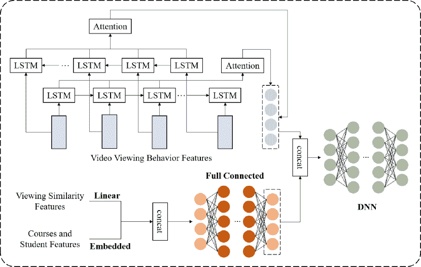

<!--yml

分类：未分类

日期：2024-09-06 19:37:01

-->

# [2309.04761] 关于教育数据挖掘中深度学习技术的综合调查

> 来源：[`ar5iv.labs.arxiv.org/html/2309.04761`](https://ar5iv.labs.arxiv.org/html/2309.04761)

[style=chinese] \fnmark[1]

[style=chinese] \fnmark[1]

[style=chinese]

[style=chinese] \cormark[1]

[style=chinese] \cormark[1]

\fntext

[1]共同第一作者 \cortext[1]通讯作者

# 关于教育数据挖掘中深度学习技术的综合调查

林远国 xdlyg@jmu.edu.cn    陈洪 zoharchen30@gmail.com    夏伟 xiawei24@huawei.com    林帆 iamafan@xmu.edu.cn    王宗岳 wangzongyue@jmu.edu.cn    刘勇 stephenliu@ntu.edu.sg 集美大学计算机工程学院，中国厦门 厦门大学信息学院，中国厦门 厦门大学平潭研究院，中国福州 华为诺亚方舟实验室，中国深圳 华为诺亚方舟实验室，新加坡

###### 摘要

教育数据挖掘（EDM）已成为一个重要的研究领域，它利用计算技术分析教育数据。随着教育数据的复杂性和多样性的增加，深度学习技术在解决分析和建模这些数据的挑战方面显示出了显著的优势。本调查旨在系统地回顾 EDM 中深度学习的最新进展。我们首先简要介绍 EDM 和深度学习，突显它们在现代教育中的相关性。接下来，我们详细回顾了在四种典型教育场景中应用的深度学习技术，包括知识追踪、学生行为检测、表现预测和个性化推荐。此外，还提供了关于 EDM 的公共数据集和处理工具的全面概述。最后，我们指出了该研究领域的新兴趋势和未来方向。

###### 关键词：

教育数据挖掘 \sep 深度学习 \sep 强化学习 \sep 教育数据集

## 1 引言

深度学习近年来取得了显著进展，彻底改变了包括教育在内的多个领域。深度学习是一种机器学习形式，依赖于人工神经网络来促进层级特征的发现，从而提升识别模式的能力[42]。与需要手动特征工程的传统机器学习方法不同，深度学习通过使用多层抽象自动发现大数据中的复杂结构。这种分层特征学习过程使得深度学习模型能够学习数据中的复杂模式，并在语音识别[44]、图像分类[104]和自然语言处理[42]等领域达到**最先进**的表现。一般来说，深度学习领域存在三种主要算法类别：监督学习、无监督学习和强化学习[67]。将适合不同应用场景的深度学习算法应用于实际中，可以大大提高其性能。随着计算能力的提升，深度学习在许多领域取得了重大突破和卓越成果。

教育领域已被传统机器学习和深度学习算法所革新，探索以往的研究是理解其应用的关键。目前在教育中使用的两个主要术语是教育数据挖掘（EDM）和学习分析（LA）[87]。这两个领域通常是跨学科的，包括但不限于信息检索、数据分析、心理教育学、认知心理学等。EDM 包括计算技术和工具，这些技术和工具有助于自动识别和提取教育环境中获得的大数据中的有意义模式和有价值的信息[41, 21]。另一方面，LA 涉及系统地收集、检查和呈现与学习者及其学习环境相关的数据[96]。

实际上，研究人员也利用了各种传统机器学习算法进行教育数据挖掘，涵盖了不同的教育环境[45]。例如，由人工神经网络（ANN）和支持向量机（SVM）构建的 TLBO-ML 模型[6]可用于预测学生的期末考试成绩。然而，传统机器学习算法存在一些限制。这些传统模型通常依赖于手动特征工程，需要领域专家知识来设计有效的特征。这一过程可能繁琐且耗时。此外，处理复杂的高维数据，如教育环境中普遍存在的自然语言文本和多媒体内容，对传统机器学习方法而言也存在挑战。

将深度学习融入教育场景的驱动因素是希望利用人工智能和机器学习的潜力，从而丰富教学和学习体验[42, 33]。深度学习模型具备卓越的能力，使其能够有效地处理和分析大量教育数据。通过揭示有意义的模式并做出准确的预测，这些模型提供了宝贵的见解，有助于改进和提升教育实践[97, 99, 88]。教育工作者和研究人员可以利用这些见解来调整教学策略，个性化教学，并优化学习成果。通过利用深度学习的力量，教育界可以通过智能数据处理和适应性方法解锁教育中的新机会，以提高效率、有效性和适应性[79]。

此外，深度学习在完成 EDM 中特定场景任务方面也取得了显著成果。目前，EDM 场景通常分为：知识追踪、学生行为检测、绩效预测和个性化推荐。每个子领域都有不同的数据输入模式和任务要求。基于深度学习的知识追踪算法可以分为深度知识追踪（DKT）及其变体，例如基于记忆网络、注意力机制和图结构的 DKT[97]。复杂的神经网络模型可以应用于学生流失预测（SDP），这是一项学生行为检测任务[81]。同样，神经网络在绩效预测的 EDM 场景中也能提供相当可靠的准确性[85]。在个性化推荐领域，基于混合技术的推荐算法可能逐渐占据主导地位，但新兴的隐私问题也需要密切关注[37]。

深度学习技术在应用于教育场景时，相比传统机器学习方法具有许多优势。一个显著的优势是从原始数据中自动学习层次化表示，消除了手动特征工程的需求。这一特性使得深度学习模型非常适合分析各种类型的教育数据，包括学生表现数据、教育视频和基于文本的学习材料。深度学习模型检测数据中复杂关联和精细模式的能力导致更准确的预测和个性化推荐。一项研究[33]表明，约 67%的论文报告深度学习在所有实验中表现优于“传统”机器学习基线。

数据收集方法论。以下是我们用于包括或排除论文的规则：

+   •

    搜索词：深度学习和教育数据挖掘是我们调查中主要涉及的两个关键词。为了获取更多相关出版物，我们还使用了特定的教育场景作为搜索词（*例如*，知识追踪、表现预测等）。

+   •

    搜索来源：我们通过谷歌学术搜索包含上述关键词的文章，并从相应的主要数据库下载符合要求的文章。

+   •

    我们研究的文章仅包括基于深度学习在教育场景中的应用的国际会议和顶级期刊的高水平出版物。

我们将收集的论文按其出版年份和相应应用场景绘制图表，如图 1 所示，并且为了确保研究前沿，可以看出自 2018 年起基于深度学习的教育数据挖掘（EDM）已经出现。

图 1：按不同教育场景分布的年度出版物（截至 2023 年）。

相关工作。Ahmad 等人[2] 研究了人工智能在教育数据挖掘中的应用，特别关注标准机器学习技术在学生评估和预测中的使用。此外，Sun 等人[100] 探讨了深度学习在大规模开放在线课程（MOOCs）中的应用，重点关注使用深度学习技术的趋势，包括特征处理和模型设计。Zhang 等人[126] 也提供了教育数据领域的概述，涵盖了诸如堆叠自编码器（SAE）、深度置信网络（DBN）以及各种深度神经网络（DNN）等经典深度学习模型。进一步研究了针对不同类型教育数据（包括大规模、异构、实时和低质量数据）的深度学习技术。

我们的贡献。本调查涵盖了一系列最先进的研究，这些研究根据深度学习算法在教育环境中的应用进行分类。文章分为三种类型：监督学习、无监督学习和强化学习。此外，文章还根据深度学习技术应用的特定教育场景进行进一步分类。这些场景包括知识追踪、学生行为检测、绩效预测和个性化推荐。通过采用这种系统化的方法，我们提供了对深度学习与教育交集领域广泛研究的结构化和深入分析。

本调查不仅总结了最新的深度学习算法，还包括了相关数据集和数据工具的讨论。通过对数据集和数据工具的全面分析，本调查的主要目标是为读者提供对在教育数据挖掘中实施深度学习解决方案时的考虑和挑战的透彻理解。此外，我们提出了一些有前景的深度学习基础教育数据挖掘的进一步研究方向。这些潜在的方向包括学习分析与干预、社交网络分析与协作、教育数据挖掘中的可解释人工智能、教育的大型语言模型、多模态学习分析、基准数据集和评估指标、公平性与隐私。

总结来说，将深度学习应用于教育有可能彻底改变传统的教学和学习方式。通过利用深度学习的优势，教育工作者可以获得宝贵的见解，做出基于数据的决策，并创建个性化的学习体验。本调查旨在提供一个综合性的深度学习在教育中应用的概述，涵盖各种算法和教育场景，同时考虑现有的数据集和数据工具。

## 2 方法论

近年来，深度学习作为一种最先进的技术已经开始应用于各个领域。

神经网络通过学习数据的特征来提取更高层次的抽象特征，这使得深度学习成为一种非常成功的方法。

深度学习是一种源自机器学习的技术。它模拟了人脑神经网络的结构和工作模式，通过模型训练实现识别和分类任务。与传统的机器学习算法相比，深度学习能够处理更复杂的任务和数据集，从而带来更高的性能和泛化能力。

深度学习的发展经历了多个阶段，从最初的 DBN[34]到随后出现的多层感知器（MLP）、卷积神经网络（CNN）、递归神经网络（RNN）等，这些发展促成了我们今天所关心和使用的深度学习。随着深度学习算法和计算能力的进步，深度学习已广泛应用于图像识别、语音识别等领域。在本调查中，我们将主要关注那些有助于教育场景的深度学习算法，例如课程推荐、学生行为检测和知识追踪。

我们根据当前主流的分类方法将这些模型分为三部分：监督学习、无监督学习和强化学习[4]。

### 2.1 监督学习

监督学习通常指的是那些使用带标签数据进行训练的模型。这些数据可以用于训练监督学习模型，以建立输入和输出之间的映射，并预测新未标记数据的结果。

CNN 作为深度学习模型的代表，被广泛应用于计算机视觉和图像处理领域。CNN 的理论是通过卷积和池化操作提取特征并减少图像的维度。最终，高维图像被转换为可以用于分类和回归任务的一维向量数据。

CNN 与其他神经网络的区别在于前者使用卷积层来提取特征，如下公式所示[4]：

|  | $h^{k}=f(W^{k}*x+b^{k})$ |  | (1) |
| --- | --- | --- | --- |

其中，$h^{k}$ 指的是由第 $k_{th}$ 个卷积核生成的特征图，$W^{k}$ 表示第 $k_{th}$ 个卷积核的权重，$b^{k}$ 是相应的偏置项，$f(\cdot)$ 代表激活函数。CNN 已经应用于知识追踪。Lyu 等人提出了一种名为基于空间和时间深度表示学习的深度知识追踪（DKT-STDRL）的模型[63]。在该模型中，CNN 负责从学生的练习序列中提取空间特征信息。

RNN 主要用于处理序列数据，如文本和语音，在各种应用中。RNN 的神经节点能够接收先前状态信息，以实现记忆。这个特殊的属性使得 RNN 能够应用于知识追踪、学生行为检测和类似的教育场景。以下是一个基本的 RNN 方程，用于实现循环：

|  | $h_{t}=\sigma(W_{ih}x_{t}+W_{hh}h_{t-1}+b_{h}),$ |  | (2) |
| --- | --- | --- | --- |

其中 $x_{t}$ 是输入向量，$h_{t}$ 是隐藏状态向量，$W_{ih}$ 和 $W_{hh}$ 是将输入连接到隐藏状态和隐藏状态到隐藏状态的权重矩阵，$b_{h}$ 是偏置向量，$\sigma$ 是非线性激活函数。

图 2 简单地展示了 RNN 的工作过程。基于此，Piech 等人提出了一种基于 RNN 的深度知识追踪模型 (DKT) [80]。该 DKT 模型使用了大量的人工神经元向量来表示潜在的知识状态和时间动态。

图 2：以知识追踪为例的递归神经网络 [80] 的过程。

长短期记忆（LSTM）[35] 是一种特殊的 RNN，包含三个门单元和一个记忆单元。通过门控单元对信息流的控制，实现了对序列数据的记忆和处理。重要的是，LSTM 的设计，通过其门和单元状态，比传统 RNN 更有效地解决了梯度消失问题。这是通过允许梯度在网络中流动的限制减少，从而在更长的序列中保留必要的信息。遗忘门是 LSTM 的一个关键组件，用于控制是否遗忘先前时刻的记忆单元状态，如方程 3 所示。

|  | $f_{t}=\sigma(W_{f}\cdot[h_{t-1},x_{t}]+b_{f}),$ |  | (3) |
| --- | --- | --- | --- |

其中 $f_{t}$ 表示遗忘门的状态，$W_{f}$ 是权重矩阵，$[h_{t-1},x_{t}]$ 表示来自前一时刻的输出和当前时刻的输入之间的连接，$b_{f}$ 是偏置向量，$\sigma$ 是 sigmoid 函数。

图神经网络（GNN）[115] 是一种用于处理图结构数据的深度学习模型（*例如*，知识图谱）。基于此，GNN 特别擅长于识别图中的复杂模式和依赖关系，从而提供更准确和具有上下文感知的课程推荐 [112]。以递归 GNN 为例，一个节点的隐藏状态的递归更新公式可以定义为 [116]：

|  | $\mathbf{h}^{(t)}_{v}=\sum_{u\in N(v)}f(\mathbf{X}_{v},\mathbf{X}_{(v,u)}^{\mathbf{e}},\mathbf{X}_{u},\mathbf{h}_{u}^{(t-1)}),$ |  | (4) |
| --- | --- | --- | --- |

其中，$f$ 代表参数函数，$\mathbf{h}_{u}^{(t-1)}$ 随机初始化。$\mathbf{X}_{v}$ 指节点 $v$ 的特征向量，$\mathbf{X}_{(v,u)}^{\mathbf{e}}$ 表示节点 $(v,u)$ 的边向量。

由于其出色的图结构处理能力，GNN 已被知识增强用户表示（KAUR）[65]模型用于获取协作知识图（CKG）中某一特定节点的初始表示，以进行信息聚合和传播。

注意力机制主要用于增强模型对关键信息的关注和理解。其核心思想是根据任务需求为输入的不同部分分配权重，使模型能够有选择地关注特定信息[53]。典型的自注意力机制可以用以下公式表示：

|  | $\text{Attention}(Q,K,V)=\text{Softmax}(\frac{QK^{T}}{\sqrt{d_{k}}})V,$ |  | (5) |
| --- | --- | --- | --- |

其中，$Q$ 表示从查询中包装的矩阵，$K$ 代表键，$V$ 表示值，$d_{k}$ 是键的维度。通过计算查询和键之间的相似性并进行归一化，计算注意力权重分布，最终用来加权求和得到最终表示。基于注意力的网络[106]，摒弃了递归和卷积操作。它可以并行训练并实现更好的性能。

### 2.2 无监督学习

无监督学习处理未标记数据的能力使其能够发现学生行为和学习过程中的潜在模式。虽然生成对抗网络和自编码器等算法在教育领域并不常用，但它们仍有望通过从未标记数据中提取有价值的信息来提升教育洞察。

生成对抗网络（GAN）是生成神经网络和判别神经网络的结合体。GAN 的目标是学习和生成类似真实数据的样本，并具有高度的多样性。判别器的损失函数如下：

|  | $\begin{split}L_{D}&amp;=-[\log(D(x))+\log(1-D(G(z)))]\\ L_{G}&amp;=-\log(D(G(z))),\end{split}$ |  | (6) |
| --- | --- | --- | --- |

其中，$x$ 表示真实样本，$D(x)$ 是判别器对真实样本的输出，$G(z)$ 是生成器生成的样本，$1-D(G(z))$ 是判别器对生成样本的输出。同样，生成器的损失函数如下，$z$ 是从噪声分布中获取的随机样本，$G(z)$ 是生成器生成的样本，$D(x)$ 是判别器对样本 $x$ 的输出。

GAN 在教育场景中最常见的用途是个性化推荐，因为它能够生成样本。例如，Bharadhwaj 等人提出了一种利用量身定制的 GRU 从短期/长期时间序列中获取用户和项目潜在特征的递归生成对抗网络（RecGAN）[9]。评估表明，这种方法提高了推荐项的相关性。

AutoEncoders (AEs) 是用于无监督学习的神经网络，专注于编码和重建输入数据。关键公式包括两个部分[121]：

|  | $\begin{split}&amp;\text{编码器:}z=f(x)\\ &amp;\text{解码器:}\hat{x}=g(z),\end{split}$ |  | (7) |
| --- | --- | --- | --- |

其中 $x$ 是输入，$z$ 代表编码表示，$\hat{x}$ 表示重建输出，$f(\cdot)$ 是编码函数，$g(\cdot)$ 是解码函数。目标是最小化 $x$ 和 $\hat{x}$ 之间的差异，提高数据压缩和特征学习能力。

### 2.3 强化学习

与监督学习和无监督学习不同，强化学习中使用的训练数据通常是通过代理与环境的交互生成的。因此，强化学习适用于个性化推荐，可以视为一种智能辅导任务。它允许模型动态互动并持续调整推荐策略，以最大化长期奖励。它可以根据实时用户反馈优化推荐效果。

在强化学习[128]中，代理通过观察环境的状态采取特定行动，并根据环境给予的奖励或惩罚评估其行为。代理的目标是优化累计奖励。通常，强化学习算法可以分为以下三种风格。

#### 2.3.1 价值函数方法

价值函数方法指的是算法通过获得最佳行动来实现全局最优收益的能力。也就是说，通过在最优策略 $\pi^{*}$ 下的最佳行动 $a^{*}$ 产生最优收益。这个策略可以通过贝尔曼最优方程表示：

|  | $\begin{split}v^{*}_{\pi}(s)\ =\ &amp;\underset{a}{\text{max}}\ \mathbb{E}[R_{t+1}+\gamma v^{*}_{\pi}(S_{t}+1)&#124;S_{t}=s,A_{t}=a]\\ =\ &amp;\underset{a}{\text{max}}\sum_{s^{\prime},r}p(s^{\prime},r&#124;s,a)[r+\gamma v^{*}_{\pi}(s^{\prime})],\end{split}$ |  | (8) |
| --- | --- | --- | --- |

其中 $\mathbb{E[\cdot]}$ 表示在当前状态 $s$ 和采取动作 $a$ 的情况下，对奖励 $R_{t+1}$ 和下一状态的价值函数 $\gamma v^{*}_{\pi}(S_{t}+1)$ 的期望。

价值函数能够考虑长期利益，使模型能够做出更明智的决策，不仅仅局限于即时奖励。然而，某些价值函数方法的解决方案可能需要更长的时间才能达到收敛。特别是在复杂环境或大规模问题中，可能需要更多的迭代和样本来获得准确的价值函数估计和最优策略。

#### 2.3.2 策略搜索方法

策略搜索方法通过直接优化受一组策略参数$\theta_{t}$影响的策略来最大化预期回报。例如，基于梯度的策略搜索方法使用梯度上升法，通过迭代更新策略参数来最大化参数$\theta$相对于策略性能$J$，并且方程可以简单地表示为：

|  | $\theta_{t+1}\ =\ \theta_{t}+\alpha\nabla J(\theta),$ |  | (9) |
| --- | --- | --- | --- |

其中$\theta_{t+1}$是时间$t+1$时的策略参数，$\nabla J(\theta)$是基于$\theta_{t}$的策略性能的梯度。$\alpha$是一个学习率，控制每个参数更新的步长。

除了基于梯度的策略搜索算法外，还有一种基于蒙特卡罗策略梯度的方法称为 REINFORCE，用于优化强化学习中的策略。它通过蒙特卡罗采样估计策略梯度，并使用梯度上升法来更新策略参数。具体来说，REINFORCE 算法可以通过以下方程实现：

|  | $\begin{split}\nabla J(\theta)\ &amp;\propto\ \sum_{s}\mu(s)\sum_{a}\nabla_{\theta}\pi(a&#124;s,\theta)q_{\pi}(s,a)\\ &amp;\doteq\ \mathbb{E}_{\pi}\left[\sum_{a}\nabla_{\theta}\pi(a&#124;S_{t},\theta)q_{\pi}(S_{t},a)\right],\end{split}$ |  | (10) |
| --- | --- | --- | --- |

这里的$\propto$表示"与...成比例"，$\mu(s)$称为在策略$\pi$下的“就地策略”。$q_{\pi}(s,a)$指的是策略$\pi$在状态$s$选择动作$a$的价值函数。

#### 2.3.3 演员-评论家算法

演员-评论家算法是一种解决未知环境中学习最优策略问题的强化学习算法。演员-评论家算法的核心思想是通过评论家提供的价值函数估计来指导演员的策略改进，评论家根据当前策略和环境交互数据估计状态或状态动作对的价值。

以单步演员-评论家算法为例，$\theta$更新的方程可以表示为：

|  |  $\theta_{t+1}\doteq\theta_{t}+\alpha(R_{t+1}+\gamma\hat{v}(S_{t+1},w)-\hat{v}(S_{t},w))\frac{\nabla_{\theta}\pi(A_{t}&#124;S_{t},\theta_{t})}{\pi(A_{t}&#124;S_{t},\theta_{t})},$  |  | (11) |
| --- | --- | --- | --- |

-   其中 $R_{t+1}$ 表示时间 $t+1$ 的奖励，$\gamma$ 是控制未来奖励重要性的折扣因子，$\hat{v}(S_{t},w)$ 指由批评者学习的状态价值函数，并将作为基准使用。

## 3 种教育场景及对应算法

-   为了提供关于不同应用场景下深度学习文献的全面概述，我们在表格 1 中包含了每篇论文中使用的算法和模型的信息，涵盖了四种教育场景。该表还列出了每项研究中采用的评估指标和数据集。

表 1：不同教育场景下深度学习算法的概述。

| 场景 | 模型 | 算法分类 | 方法 | 评估指标 | 数据集 | 年份 |
| --- | --- | --- | --- | --- | --- | --- |
| 知识追踪 | GFLDKT  [133] | 有监督学习 | LSTM | AUC/ACC | ASSISTments15/17/JunyiAcademy | 2023 |
| LFBKT  [13] | LSTM | AUC/ACC | ASSISTment12 | 2022 |
| DFKT  [73] | LSTM | AUC/ACC/MAP | ASSISTment12 | 2019 |
| PGN  [49] | RNN | AUC/ACC/RMSE | ASSISTment15/17/Statics2011 | 2023 |
| DKT  [80] | RNN | AUC | ASSISTment09/10 | 2015 |
| DKT-STDRL  [63] | CNN | AUC/ACC/RMSE/$r^{2}$ | ASSISTment09/15/Statics2011 | 2022 |
| HHSKT  [76] | GNN | AUC/ACC | ASSISTment09/17/Junyi15 | 2023 |
| GIKT  [120] | GCN | AUC | ASSISTment09/12/EdNet | 2021 |
| MRTKT  [18] | 注意力机制 | AUC/ACC | ASSISTment09/10/12/13 | 2023 |
| KTMFF  [117] | 注意力机制 | AUC | ASSISTment09/15/Statics2011 | 2023 |
| AKT  [28] | 注意力机制 | AUC | ASSISTment09/10/12/13/KDD Cup2012 | 2020 |
| SAKT  [77] | 注意力机制 | AUC | ASSISTment09/15/Statis2011 | 2019 |
| AdaptKT  [16] | 无监督学习 | 自编码器 | AUC | zx.math/ax.physics | 2022 |
| KTM  [11] | 强化学习 | AC | AUC | ASSISTment09/10 | 2019 |
| RL-KTNet  [19] | AC | AUC/$r^{2}$ | ASSISTment09/10/KKD2010 | 2020 |
| IEKT  [62] | 策略梯度 | AUC/ACC | ASSISTment09/12/EdNet/Junyi | 2021 |
| KADT  [1] | DPG | AUC | ASSITment09/IMDB/MovieLens/CIFAR-100 | 2023 |
| 学生行为检测 | VB-DTW  [109] | 有监督学习 | CNN | ACC/VSE | SCB-13 | 2023 |
| DCNN  [32] | CNN | 召回率/精准度/F1 | FER2013 | 2023 |
| ATGCN  [82] | CNN | ACC | 无 | 2023 |
| Faster R-CNN  [38] | CNN | ACC/精准度/DR/FDR | TCE Classroom | 2023 |
| CFIN  [24] | CNN | AUC/F1 | KDD Cup2015/XuetangX | 2019 |
| EDLN  [40] | CNN | AUC/召回率/精准度/F1 | KDD Cup2015 | 2023 |
| ABDM  [135] | CNN | ACC | 无 | 2023 |
| LBDL [58] | LSTM | AUC/F1 | MOOCCube | 2023 |
| CDLSTM [3] | LSTM | AUC/召回率/精确率/F1 | 7WiseUp | 2023 |
| EVA-MLP [101] | MLP | 召回率/精确率/F1 | 学生期刊 | 2023 |
| FTGAN [98] | 无监督学习 | GAN | AUC/ACC/召回率/精确率/F1 | 不适用 | 2021 |
| 性能预测 | DL-MLP [14] | 监督学习 | MLP | ACC | 宾夕法尼亚学校表现概况 | 2023 |
| CRN [74] | CNN | FDR/敏感度/FPR/MCC/F1/NPV/FNR | Kaggle | 2023 |
| SDPNN [75] | DNN | ACC | 不适用 | 2023 |
| MLP-12Ns [8] | MLP | RMSE | Kaggle | 2023 |
| TLBO-ML [6] | ANN | ACC/召回率/精确率/FM/F1/MCC | OULAD | 2023 |
| SAPP [39] | LSTM | ACC/召回率/精确率/F-measure | OULAD | 2023 |
| MSH-MD [15] | 注意力机制 | 召回率/精确率/F1/MSE/MAE/RSME | 自收集 | 2023 |
| CGAN [92] | 无监督学习 | GAN | AUC | 自收集 | 2022 |
| ADSLS [20] | 强化学习 | Q-Learning | 不适用 | 不适用 | 2013 |
| NCAT [137] | Q-Learning | AUC/ACC | ASSISTment09/12/15/KDD Cup2010 | 2022 |
| 个性化推荐 | BERT [43] | 监督学习 | 注意力机制 | 召回率/精确率/F1 | MOOCCube | 2023 |
| MCR-C-FGM [90] | DNN | 精确率 | edX 学习数据 | 2022 |
| SODNN [88] | DNN | 精确率 | UBOB | 2023 |
| LSTM-CNN [107] | CNN | 召回率/精确率/F1 | Kaggle | 2023 |
| CSEM-BCR [26] | CNN | 召回率/精确率/MAP/AP | CourseTalk | 2022 |
| ARGE [132] | RNN | AUC | LastFM/Movielens-100K/Yelp | 2023 |
| KALUR [65] | GNN | 召回率/NDCG | MovieLens-100K/Amazon-book/LFM-1B | 2023 |
| TCRKDS [93] | LSTM | ACC/召回率/精确率/F-measure/FDR | Kaggle | 2023 |
| FRS [136] | LSTM | AUC/精确率/RSME | ASSISTment | 2018 |
| MRCRec [30] | GCN | HR/HR/NDCG/MRR | MOOCCube/XuetangX | 2023 |
| RecGAN [9] | 无监督学习 | GAN | NDCG/MRR/MAP | MPF | 2018 |
| DBNLS [123] | DBN | Act/Ref/Sen/Int | StarC | 2020 |
| RLALS [94] | 强化学习 | AC | 不适用 | 不适用 | 2018 |
| CSEAL [60] | AC | AUC/召回率/F1/MAP | Junyi | 2019 |
| MEUR [50] | Q-Learning | IR/HR/NDCG/MRR | MOOCCube | 2023 |
| QLearnRec [102] | Q-Learning | 不适用 | 自收集 | 2019 |
| RILS [83] | Q-Learning | 不适用 | 自收集 | 2014 |
| RPPR [52] | REINFORCE | HR/NDCG | MOOCCourse/XuetangX | 2023 |
| HELAR [55] | REINFORCE | HR/NDCG | MOOCCourse/XuetangX | 2022 |
| HRRL [54] | REINFORCE | HR/NDCG | MOOCCourse/XuetangX | 2022 |
| HRL-NAIS [125] | REINFORCE | HR/NDCG | XuetangX | 2019 |
| KRRL [57] |  | AC | HR/NDCG | MOOCCourse/XuetangX | 2023 |

### 3.1 知识追踪

知识追踪是一种教育评估技术，用于跟踪学生的学习过程并预测他们对知识点的掌握情况。在知识追踪的场景中，通常会记录学生的学习过程，包括学习时间、答题状态、作业完成情况等。

根据 Song 等人之前的研究[97]，智能教育系统中的知识追踪问题涉及三个主要元素：学生$S$、练习$E$和相应的知识概念$C$。这些元素之间的交互$X$是系统中的主要活动。具体而言，给定一个学生的历史练习交互$s\in S$，其中每个交互$X_{t}\in X$对应一个练习$e\in E$，并表示步骤$t$获得结果的正确性$a_{t}\in\{0,1\}$，知识追踪任务旨在预测特定概念$c\in C$的下一个交互$X_{t+1}$[97]。

知识追踪的一个简单示意图如图 3 所示。学生在某一特定知识点的练习正确率会影响模型对学生在该知识点熟练程度的判断。例如，在图 3 中，学生在导数知识点上的正确率为 100%，因此他/她对该知识点的掌握水平远高于其他知识点。

图 3：一个简单的知识追踪示意图。不同的练习包含了多种颜色的不同类型概念。练习的正确与否会影响知识追踪对学生掌握某一知识点或练习的判断[59]。

#### 3.1.1 监督学习

监督学习在知识追踪领域的应用主要集中在各种神经网络上，如 LSTM、CNN、GNN 和 RNN。

LSTM 主要用于模拟学生的遗忘和学习过程，实时更新他们的知识状态，从而实现有效的知识追踪。赵等人提出了一种基于 LSTM 的 GFLDKT 模型[133]，其中采用了门控控制的遗忘与学习机制，有效地更新了知识状态，促进了对学生后续回答的准确预测。

此外，Nagatani 等人[73]提出了一种考虑学生遗忘过程的 DFKT 模型。具体来说，DFKT 应用了 LSTM 和神经因子分解机（NFM），前者用于将学生的知识状态表示为低维稠密向量，后者结合了学生知识状态和其他相关信息，包括相关的遗忘数据，以预测学生的表现。与在相同 ASSISTment12 数据集上测试的另一个基于 LSTM 的知识追踪模型 LFBKT[13]相比，DFKT 模型在处理遗忘行为方面有所不同。与将遗忘数据作为输入部分的 DFKT 模型不同，LFBKT 选择通过引入专门的知识遗忘层来进行更细致的处理。这一战略设计选择使得 LFBKT 能够更有效地建模知识衰退的动态。这种方法的影响在性能提升上显而易见，LFBKT 在 ASSISTment12 数据集上的准确率提高了 6.34%，显示出知识追踪效能的进步。

CNN 在知识追踪中也发挥着重要作用，因为它能够处理空间序列数据。Lyu 等人[63]提出了一种 DKT-STDRL 模型，该模型使用 CNN 从学生的学习序列中提取空间特征，并使用 LSTM 处理时间特征。

知识图谱（KG）是知识追踪中的一个关键组成部分，因为它考虑了学生的学习历史与特定领域专业知识之间的相互作用。通过利用 KG 的力量，模型可以更准确地捕捉学习轨迹和不同知识点之间的交互。Yang 等人[120]提出了一种基于图的知识追踪模型（GIKT），该模型使用图卷积网络（GCN）构建。该模型通过利用高阶问题-技能相关性，解决了数据稀疏性和多技能挑战，从而提高了模型性能。

此外，Ni 等人提出了一种异构图算法 HHKST[76]，该算法利用基于 GNN 的基础特征提取器（BFE）从异构图中提取交互和知识结构特征。

作为一种处理序列数据的神经网络架构，RNN 在知识追踪领域也占据了重要位置。DKT[80]利用大量 RNN 的人工神经元构建了知识追踪模型。本文的主要贡献是引入了一种新方法，将学生交互编码为 RNN 输入，并将 AUC 提高了约 17%至 21%，与贝叶斯知识追踪（BKT）[17]模型在三个公共数据集上的表现相比。

在知识追踪领域，注意力机制的应用已经被探讨。Ghosh 等人 [28] 提出了一个名为上下文感知注意力知识追踪（AKT）的方法，该方法将灵活的深度神经网络（DNN）与启发式认知和心理测量模型结合起来。所提出的注意力机制用于根据关于学习者的上下文信息动态调整预测。注意力的整合使模型能够根据每个学习者的具体上下文调整其预测。

基于注意力机制的概念，Cui 等人 [18] 提出了 MRTKT 模型，作为一种创新的知识追踪方法。在 ASSISTment09 任务上取得了 82.23% 的 AUC，MRTKT 稍微优于 AKT 模型，其 AUC 为 81.69%。与强调使用注意力机制进行上下文感知动态调整的 AKT 不同，MRT-KT 采用了多关系注意力机制及关系编码模式，以提升预测准确性。

此外，Pandey 和 Karypis [77] 提出了自注意力知识追踪模型（SAKT），该模型利用自注意力机制来识别和预测学生对特定知识点的掌握水平。实验结果表明，SAKT 超越了传统方法和基于 RNN 的模型，性能提升了一个数量级。

#### 3.1.2 无监督学习

尽管我们文本的前面部分列出了许多基于监督学习的知识追踪方法，但严格将场景分类到特定的算法类别（监督学习、无监督学习、强化学习）通常是具有挑战性的。虽然像 BKT [17] 这样的传统方法被视为无监督学习，但它们并未融合深度学习技术。因此，将无监督深度学习应用于知识追踪是一个相对新兴且正在发展的领域。然而，近年来，随着深度学习的快速发展，一些研究人员已开始探索在知识追踪中使用无监督学习。例如，Cheng 等人 [16] 提出了基于自编码器的 DKT，该模型结合了知识追踪和迁移学习。这里的自编码器用于将问题文本转换为高级语义嵌入。此外，该模型还应用了双向 LSTM 和注意力机制来捕捉学生的知识状态，并通过 Softmax 预测学习者的下一个回答。

#### 3.1.3 强化学习

强化学习能够通过对学生所做的决策和行为进行奖励或惩罚，学习学生的知识状态和水平。知识追踪中的学习过程可以视为一个序列决策问题，学生需要根据不同的知识点做出不同的决策，这可能会影响未来的学习过程。

Ding 等人 [19] 认为一些监督学习方法，如 LSTM 或 GRU，受 NLP 的影响很大，但并未专门设计用于知识追踪。因此，作者设计了一种 RL-KTNet 算法，该算法应用强化学习来自动生成用于知识追踪的 RNN 单元。它在 AUC 方面优于其他采用 LSTM 单元的模型。

此外，Long 等人 [62] 提出了一个叫做个体估计知识追踪（IEKT）的模型，该模型结合了强化学习用于辅助模型训练。具体而言，Long 等人采用了策略梯度和 $\epsilon$-贪婪策略来更新模型参数。此外，强化学习用于估计学生的知识状态和对知识获取的敏感性。

### 3.2 学生行为检测

在当前时代，传统教育系统和在线教育系统都产生了大量的数据。从这些海量数据中提取有用的知识和潜在模式可以使决策者通过识别学生行为来提升教学和学习 [81]。这些教育数据可以被视为一种宝贵的信息源，有助于数据驱动的教育研究和创新。目标是识别学生的行为，如低动机、低参与、作弊、退学和拖延 [23]。

图 4：ATGCN 模型的简单结构 [82] 用于学生行为检测。

图 5：LBDL 模型的简单结构 [58] 用于退学预测。

#### 3.2.1 监督学习

在这一领域，监督学习的应用相对多样，应用了各种神经网络，如 CNN 和 LSTM。

CNNs 常用于需要从图像或视频数据中提取空间特征的应用，因为它们在这些任务中非常有效。Wang 等人 [109] 实现了 CNNs 来分析从运动传感器获得的数据，从而准确识别了 14 种常见的课堂行为。

利用 CNN 在图像处理上的优势，Hdioud 等人[32]开发了一种用于在疫情期间识别佩戴口罩的学生面孔的 DCNN 模型，展示了在挑战性条件下的适应性。同时，Qiu 等人[82]提出了一种基于 CNN 的 ATGCN 模型，用于识别课堂上如打瞌睡等不当行为。这突显了 CNN 在教育环境中的多种应用，其中一个模型专注于在约束条件下进行面部识别，而另一个则专注于行为检测。ATGCN 利用 CNN 和 GCN 作为其基本组件，并采用注意力机制以提升性能。ATGCN 结构的简要表示见于图 5。

在教育场景中，学生行为不仅仅包括打瞌睡和注意力不集中等简单行为。该领域的一个重要部分是检测辍学倾向，这是理解学生行为全面范围的重要环节。Feng 等人[24]提出了一种上下文感知特征交互网络（CFIN）模型，用于预测 MOOC 中学生的辍学行为。CFIN 模型结合了上下文平滑技术，以增强不同上下文中的特征值，并采用注意力机制将用户和课程信息整合到建模框架中。

此外，Kumar 等人[40]开发了一种结合了 CNN 和注意力机制的 EDLN 模型，用于检测在线课程中的学生辍学情况。EDLN 模型采用 ResNet-50 提取局部高维特征，并使用 Faster R-CNN 分析时间序列数据中的隐含长期记忆特征。该模型表现出显著的性能，以$5\times 7$时间序列矩阵作为输入，准确率达 97.5%。

其他深度神经网络也可以用于辍学预测。Liu 等人[58]提出的 LBDL 模型整合了 Bi-LSTM 和多头注意力机制，用于分析从视频学习行为中提取的时间序列信息。该模型在 MOOCCube 数据集上表现出 82.39%的 AUC 和 74.89%的 F1 得分。LBDL 的简单结构见于图 5。随后，作者展示了该模型的卓越性能。

随着在线教育的发展，作弊检测已成为教育数据挖掘（EDM）研究者关注的关键领域。Alsabhan 等人 [3] 开发了基于 LSTM 的 CDLSTM 模型。该模型结合了一个丢弃层、一个全连接层和 Adam 优化器。由于 LSTM 有效处理序列数据的能力，CDLSTM 模型在识别作弊行为方面取得了 90% 的显著准确率，使用了学生的在线测试活动日志作为输入。

#### 3.2.2 无监督学习

在这一节中，我们*深入探讨*了无监督学习在教育数据挖掘（EDM）中的应用，特别是在检测学生行为方面。这种方法是深度学习的一个方面，通过处理教育数据，*自动识别*学生参与模式，无需依赖预定义的标签或类别，即可提供见解。

Stenton 等人 [98] 提出了 FTGAN，即精细调整 GAN，以预测学生的流失率。作者展示了随着 GAN 分类器模型训练周期的增加，其准确性也随之提高。

#### 3.2.3 强化学习

在探索各种算法在学生行为检测中的应用时，考虑这些行为的复杂性和多面性至关重要。尽管强化学习非常强大，但在这一领域仍面临挑战：

+   •

    学生行为的复杂性，受社会背景和个人情况等多种因素的影响，可能与强化学习中通常使用的简单状态-动作框架不太一致。

+   •

    在学生行为及其长期结果（如辍学率）背景下定义适当的奖励和惩罚是一个重大挑战。短期和长期后果的二分法使得强化学习的应用变得复杂。

基于上述原因，我们的研究未包括关于强化学习在学生行为检测中应用的文献。然而，我们承认探索这种方法在这些上下文中的潜在价值和相关性。

### 3.3 性能预测

性能预测 [85] 指使用各种数据和分析技术预测学生在某些任务或领域的表现，例如测试分数、学术成绩、课程完成率等。它与知识追踪任务的区别在于，性能预测关注的是根据历史学习数据预测学生整体未来的任务或测试表现，而知识追踪关注的是学生在学习过程中对特定知识概念的理解和掌握。

通过预测学生表现，教师和教育机构可以更好地理解学生的学习和需求，以提供更有效的支持和指导。预测还可以帮助学生理解自己的表现和潜在困难，并采取措施改善学习成果。

此外，认知诊断 [108] 是一个相关概念，其目的是通过分析学生在练习记录上的表现来识别他们在特定知识领域的掌握水平。这种分析有助于为学生后续学习提供量身定制的指导 [27, 103]。与之相比，表现预测更多地关注预测学生在考试中的总体成绩。前者分析知识维度，而后者强调一般能力。认知诊断输出概念熟练程度，而表现预测直接预测总分。

#### 3.3.1 有监督学习

有监督学习算法可以为教师和学生提供有用的信息，帮助他们更好地理解学生的表现和需求。除了经典的算法如 SVM，深度学习模型如 MLP、CNN、RNN 和 LSTM 已被应用于各种教育环境中预测学生表现。

Nayani 等人 [74] 提出了一个名为 CRN 的混合模型，它结合了 CNN 和 RNN 来预测学生成绩，并通过银河骑士群体优化（GRSO）算法调节超参数，从而提高了性能。

此外，Neha 等人 [75] 提出了一个 SDPNN 模型，该模型应用了基于线性分类器的 DNN 来预测学生学业表现。该模型定义了两个隐藏层，每层有 300 个神经元。激活函数为 ReLU 和 Softmax。

|  | $\text{softmax}(z_{i})=\frac{e^{z_{i}}}{\sum_{j=1}^{K}e^{z_{j}}},\quad i=1,2,...,K,$ |  | (12) |
| --- | --- | --- | --- |

其中 $z_{i}$ 代表输入向量的第 $i_{th}$ 元素，$K$ 是类别的数量。

Kukkar 等人 [39] 提出了一个 SAPP 系统，该系统利用了四层堆叠 LSTM、随机森林和梯度提升。在这里，LSTM 用于提取特征，而随机森林和梯度提升用于预测。该系统的准确率为 96%，在某种程度上表现良好。

此外，Chen 等人 [15] 提出了 MSH-MD 模型，该模型也利用了 LSTM。MSH-MD 的核心是其自注意机制，整合了 LSTM 处理时间序列的能力与自注意机制的高效特征提取。与 SAPP 模型 [39] 相比，MSH-MD 更加关注通过模式差异预测学生表现，而 SAPP 模型则更突出特征提取。

#### 3.3.2 无监督学习

尽管成绩预测通常依赖于标记数据集进行监督学习，但一些无监督学习算法，例如 GAN，也可以用于成绩预测任务。GAN 可以通过将学生的历史成绩作为输入，并利用生成器和判别器生成未来成绩的预测值。生成器可以利用学生的历史成绩和其他相关因素生成未来成绩的预测，而判别器则用于确定生成的预测是否与真实成绩相似。

Sarwat 等人 [92] 提出了一个结合条件 GAN（CGAN）和深层支持向量机（SVM）的模型，根据学校或家庭辅导来预测学生成绩。CGAN 被用于生成性能分数数据，以解决数据集规模小的问题，而结合 CGAN 和 SVM 的模型在实验中被证明对预测结果有积极影响。

#### 3.3.3 强化学习

一般来说，尽管强化学习在学生表现预测中并不传统上使用，但它可以通过基于学生行为设置奖励策略来优化学生的学习路径。在这种背景下，强化学习还涉及评估学生的当前表现和考虑潜在的改进。

Dorça 等人 [20] 提出了一个 ADSLS 模型，用于自动检测和精确调整学生的学习风格。该模型的重要部分是预测和评估学生在某一点上的表现，并在更新学习策略的同时奖励表现。提出的方法的有效性和效率已通过结果得到验证。

Zhuang 等人 [137] 介绍了一个 NCAT 模型，该模型利用强化学习来增强电子测试系统的有效性。NCAT 模型使用深度强化学习根据给定条件动态优化测试术语。利用这些提出的算法，电子测试系统可以提供更全面和准确的性能预测。

### 3.4 个性化推荐

在当前在线信息爆炸增长的时代，推荐系统 [37] 无疑提供了一种有效的手段来解决这个问题，并为个别用户提供必要的帮助。即使在教育领域之外，推荐系统仍然是最广泛研究的技术方法之一。张等人 [127] 给出了推荐系统的详细定义：假设存在 $M$ 个用户和 $N$ 个项目，我们将交互矩阵和预测交互矩阵分别表示为 $R$ 和 $\hat{R}$。用户对项目 $i$ 的偏好表示为 $r_{ui}$，而预测分数表示为 $\hat{r}_{ui}$。还将有两个部分观察到的向量，一个表示特定用户 $u$，*即*，$r^{(u)}=\{r^{u1},...,r^{uN}\}$。另一个表示特定项目 $i$，*即*，$r^{(i)}=\{r^{1i},...,r^{Mi}\}$。

在教育场景中，该项目被替换为教育资源，如课程。课程推荐系统的主要目标是在时间 $t+1$ 向用户建议最合适的课程，考虑到他们在时间 $t$ 之前的学习活动和学习者档案。这类推荐系统面临的主要挑战是通过分析用户数据来准确描绘和概念化用户倾向，从而提供个性化的推荐 [61]。图 6 展示了个性化推荐的简单框架。

图 6：教育数据挖掘中个性化推荐的一般过程框架。推荐系统利用用户数据和课程数据进行建模。向用户推荐后，用户和课程之间的相关数据将被更新以提高准确性。

#### 3.4.1 监督学习

监督学习在课程推荐中的应用 [90] 侧重于各种神经网络模型，由于神经网络的更大灵活性和表现力，可以更好地处理用户行为序列和非线性特征。同时，神经网络可以从数据中自动提取特征，以更准确地预测用户在推荐过程中的兴趣。

一些优化的神经网络模型在个性化推荐领域发挥了作用。Safarov 等人提出了一种新颖的模型 SODNN，该模型由同步序列、异构特征和 DNN 组成 [88]。同时，为了解决冷启动问题，即由于推荐系统初始化期间缺少用户数据而造成的大误差，作者尝试连接额外的特征以克服它。

此外，经典神经网络也可以用于推荐系统。与传统的正序列建模方法不同，Gao 等人 [26] 提出了一个新颖的 CSEM-BCR 模型，该模型采用负序列建模。具体而言，该模型将课程学习序列构建为负序列模式，其中负项指的是学生不应不适当地选择或操作课程的原则。然后，使用 CNN 对负序列模式进行特征学习，从而为每个用户生成推荐课程列表。这种方法提供了个性化推荐的新视角，并为推荐不同需求和偏好的学习者的课程问题提供了潜在解决方案。

KG 是个性化推荐的重要组成部分。它可以有效解决推荐系统中的稀疏性问题。Zhao 等人 [132] 提出了一个基于多路径 RNN 编码器的 ARGE 模型。该模型解决了传统 RNN 在编码过程中未考虑路径之间关联的问题，实验结果中的 AUC 和 Precision 证明了该模型有效解决了用户与项目之间稀疏交互的问题。

GNN 作为专门处理图结构的神经网络模型，也被许多学者应用于推荐系统中。Ma 等人 [65] 提出了一个 KAUR 模型，该模型应用 GNN 来学习协同 KG 中每个节点的表示。该模型将节点信息及其已传播的邻近节点信息视为正对比对，然后利用对比学习提高节点表示的质量。

Zhou 等人 [136] 提出了一个基于 LSTM 和聚类算法的全路径推荐系统（FRS）。聚类算法用于根据相似的学习特征对学习者进行分类，从而帮助根据先前的结果对学习路径进行分类。因此，这种方法有效解决了冷启动问题。LSTM 被用于预测学习表现，如果结果不令人满意，系统将根据用户的个体学习特征选择最相关的学习路径。

#### 3.4.2 无监督学习

在推荐系统中，用户偏好和行为通常是不完整和不准确的，而标记数据的收集非常困难和昂贵。在此基础上，无监督学习是实现个性化推荐的绝佳手段。无监督学习可以从用户的历史行为中提取潜在兴趣和偏好，通过聚类推断用户的相似性和兴趣相关性，并通过特征学习实现个性化推荐。

巴拉德瓦杰等人介绍了一种基于 GAN 和 RNN 的混合 RecGAN 模型。生成器和鉴别器都是基于 GRU 的 RNN 构建的。然后，生成器被允许与鉴别器进行 Mini-Max 游戏，即在时间索引$t$存在真实分布$D_{real|t}$和生成器生成的概率分布$D_{gen|t}$。这个最小-最大化游戏的目标是最小化生成器的生成误差，同时最大化鉴别器将假评分与真实评分区分开的能力。

无监督学习也可应用于分类不同类型的学习风格，以向不同群体推荐最合适的教育资源。由张等人提出的基于 DBN 的 DBNLS 模型用于检测和分类学习风格。DBNLS 的核心组件是多层 RBM 和反向传播网络层，其中反向传播用于拟合 DBNLS 模型，微调和训练 DBN。

#### 3.4.3 强化学习

强化学习在个性化推荐中的应用具有很高的研究价值和发展前景。强化学习算法可以根据学习者的反馈学习最佳推荐策略，以提高推荐性能。

由刘等人提出了一种名为 CSEAL 的认知结构增强框架，用于实现个性化学习路径推荐 [60]。该框架将学习路径视为马尔可夫决策过程（Markov Decision Process，MDP），并应用演员-评论家算法为个体学习者确定适当的学习项目。CSEAL 全面考虑了学习者的知识水平和学习项目的知识结构。实验结果表明，与当前的自适应学习方法相比，CSEAL 能够提高学习者的效率。

梁等人提出了一种基于图卷积网络和强化学习的 MEUR 模型 [50]。作者将学习过程视为 MDP。采用以用户为中心的推理方法，并通过演员-评论家算法最大化累积奖励$G$，$G$的定义如下：

|  | $G(\theta)=\frac{1}{m}\sum_{u=1}^{m}\sum_{a,t=0}\pi(a | s_{t},A(s_{t}))\gamma^{t}R(s_{t+1}),$ |  | (13) |
| --- | --- | --- | --- | --- |

其中$\theta$是 Actor 网络的参数，$m$是样本数量，$u$是样本索引，$a$和$t$分别是时间步骤和动作索引，$\pi(a|s_{t},A(s_{t}))$是在状态$s_{t}$中选择动作$a$的概率，$R(s_{t+1})$是在状态$s_{t+1}$中获得的即时奖励，$\gamma$为调节参数。

在 MOOC 中提出可解释的推荐算法对于解释推荐结果至关重要。为此，林等人[57]开发了一个 KRRL 模型，结合了知识图谱（KG）和自监督强化学习，用于可解释的 MOOC 推荐。具体而言，多粒度表示学习方法丰富了 KG 中语义交互的感知信息，自监督强化学习方法引导 KG 上的路径推理，最终向目标学习者推荐合适的课程。实验结果表明，KRRL 在推荐准确性和可解释性方面优于一些对比方法。

此外，强化学习算法可以用来建模学习者偏好。例如，张等人[125]首次采用层次强化学习（HRL）来修改学习者档案。此外，HRRL 算法[54]将递归强化学习（RRL）与 HRL 结合作为档案修订工具，迭代修订学习者档案以辅助 MOOC 推荐模型。林等人[52]也提出了一种 RPPR 模型，其中多尺度强化学习方法构建了多维学习者档案，从而处理了语义信息不足对学习者建模的不利影响。

## 4 数据集与处理工具

### 4.1 数据集

表 2：数据集信息

| 数据集名称 | 描述 | 应用场景 | 应用文献 |
| --- | --- | --- | --- |
| ASSITments¹ | 基于教育知识分解理论的知识追踪数据集，包括问题解决记录。旨在开发和评估智能教育系统。 | 用于基于知识分解理论的智能教育系统的研究和评估，如知识追踪和个性化推荐，采用机器学习和深度学习技术。 | [80] [133] [76] [64] [49] [129] [13] [117] [63] [18] [137] [120] [108] [62] [28] [77] [29] |
| 君毅学院在线学习活动数据集² | 君毅数据集是一个教育数据集，包含大量中小学学生的在线学习行为数据，包括学习和回答记录、学习行为特征及其他信息。 | 该数据集旨在支持数据挖掘任务，*例如*，知识追踪。 | [133] [76] [64] [49] [60] [136] [62] |
| KDD Cup 2010³ | 该数据集包含学生与计算机辅导系统的互动日志，包括问题解决事务。关键术语包括问题、步骤和知识组件。 | 可用于智能教育系统、个性化推荐、知识追踪和基于深度学习的教育技术的开发和评估。 |  [129] [71] [114] [113] [25] |
| MOOCCube⁴ | MOOCCube 是一个为大规模在线教育中的 NLP、KG 和数据挖掘研究人员提供的开放数据仓库。它包括 706 门真实在线课程、38,181 个教学视频、114,563 个概念和 199,199 名 MOOC 用户的数十万条课程选择和观看视频记录。 | 该数据集可用于研究学习者行为模式，并用于个性化推荐。 |  [124] [30] [111] [50] [58] |
| xAPI-教育挖掘数据集⁵ | 该数据集包含 480 名学生记录和 16 个特征，包括人口统计属性（性别、国籍）、学术背景信息（教育阶段、年级、班级）和行为指标（课堂上举手、访问资源、家长调查反馈、学校满意度）。 | xAPI-教育挖掘数据集可用于开发和评估学习分析模型，实施个性化推荐、表现预测和学生行为检测等特定任务。 |  [9] [105] [10] |
| 开放大学学习分析数据集⁶ | 开放大学学习分析数据集是一个综合性的教育数据集，包括来自七门课程的超过 300,000 名学生的人口统计信息、课程信息、互动数据和成就数据，已被用于各种教育研究。 | 预测高等教育中的学生成功率和辍学率，以及理解在线课程中的学习行为模式，从而开发个性化推荐和表现预测系统。 |  [39] [93] [6] |
| Canvas Network 数据集⁷ | 从 Canvas Network 平台收集的在线课程数据，包括课程元数据、注册信息和互动日志。 | 预测和理解在线课程中的学生表现，并设计个性化推荐和学生行为检测模型。 |  [119] [130] [89] [47] [7] |
| Learn Moodle⁸ | Learn Moodle 数据集是一个收集了来自各种 Moodle 课程的学生活动日志、讨论、测验等的集合。它用于研究学生行为模式、学习成果、课程设计和 Moodle 平台在在线教育中的功能。 | 这个数据集主要用于研究学生行为模式、学习成果、课程设计和 Moodle 平台功能，旨在提高在线教育中的教学质量和效率。 |  [86] |
| XuetangX⁹ | XuetangX 是一个中文数据集，涵盖了在 XuetangX 在线平台上中国用户的课程和学习行为数据。这包括学生注册信息、课程访问记录、视频观看行为、作业提交、讨论参与等。 | 数据集可用于学习者行为分析、知识追踪和个性化推荐的研究和应用。 |  [125] [30] [50] [53] [55] [54] [110] [24] |
| EdNet¹⁰ | EdNet 是一个大规模教育数据集，收集自 Santa，一个拥有超过 78 万用户的 AI 辅导服务。它包含关于学生在各个平台上的互动的多变量数据，包括消费的材料、给出的响应和在学习活动上花费的时间。其主要特点是其大规模、详细的学生行为数据以及来自一个拥有众多真实用户的系统。 | EdNet 通过其大规模、详细的学生行为和互动数据实现个性化推荐、知识追踪和教育优化。 |  [18] [120] [62] |

+   1

    https://sites.google.com/view/assistmentsdatamining/home

+   2

    https://www.kaggle.com/datasets/junyiacademy/learning-activity-public-dataset-by-junyi-academy

+   3

    https://pslcdatashop.web.cmu.edu/KDDCup

+   4

    http://moocdata.cn/data/MOOCCube

+   5

    https://www.kaggle.com/datasets/aljarah/xAPI-Edu-Data

+   6

    https://analyse.kmi.open.ac.uk/open_dataset

+   7

    https://doi.org/10.7910/DVN/GVLFXO

+   8

    https://research.moodle.org

+   9

    http://moocdata.cn/data/user-activity

+   10

    https://github.com/riiid/ednet

为了提供关于教育环境中常用公共数据集的更全面概述，我们整理了一个数据集的选择，如表 2 所示。这些数据集在各种教育研究中被广泛使用，对该领域的进步作出了重大贡献。表 2 提供了有关每个数据集的重要信息，包括其名称、网址、描述、应用场景和使用文献。

我们将收集的数据集按来源分类为三类：用于竞赛的数据集、在线教育平台的数据集和开放数据仓库。

#### 4.1.1 用于竞赛的数据集

ASSISTments ASSISTments 数据集有多个版本，如 Assistment 2009、2012 和 2017，这些版本被用于多个教育数据挖掘竞赛，以促进教育技术和学习分析的研究和开发。其中最著名的竞赛之一是 ASSISTments 数据挖掘竞赛。

KDD Cup 2010 该数据集用于 KDD Cup 2010 教育数据挖掘挑战赛，要求参与者使用提供的数据集中包含的学生互动日志来训练新的学习模型，并最终根据其模型预测学生对新问题的回答的准确性来判断结果。因此，该数据集也广泛用于知识追踪等问题。

#### 4.1.2 在线教育平台的数据集

Junyi Academy Online Learning Activity Dataset 该数据集来自于 Junyi Academy 在线学习平台，该平台为学生提供个性化的学习资源和支持。数据集包含超过 72,000 名学生在 2018 年 8 月至 2019 年 7 月期间在平台上的超过 1600 万次练习记录。

Canvas Network Dataset Canvas Network 数据集来源于 Canvas Network 平台，该平台为教育机构和教育工作者提供创建和交付在线课程的工具和资源。该数据集包含大量课程信息以及用户互动日志等。

Learn Moodle Learn Moodle 来源于 Moodle 学习管理系统，这是一个广泛使用的开源在线学习平台，支持教育机构和教师创建、管理和交付在线课程。

XuetangX XuetangX 数据集来源于在线教育平台 XuetangX。它是中国知名的在线教育平台，成立于 2013 年，提供 MOOCs 和其他在线学习资源，包括视频观看行为、作业提交和讨论参与等。

EdNet EdNet 是由 Santa 创建的基于人工智能的在线教学平台积累的大规模教育数据集，在韩国有 78 万用户。它涵盖了两年的学生学习行为数据，并提供了大量关于学生与系统互动的信息，包括知识跟踪、认知过程、学习分析数据和学生在线学习活动的全面记录。

表 3: 数据集处理工具信息

| 工具名称 | 描述 |
| --- | --- |
| GISMO¹ | 为 Moodle 提供图形化交互学生监控工具(GISMO)提供了一个直观的图形界面，可视化地显示有关学生学习活动、参与度、成绩和进度的信息。 |
| Meerkat-ED² | Meerkat-ED 是一款教育数据分析工具，旨在帮助教育工作者和研究人员对学生学习数据进行深入分析。它生成了参与者在讨论论坛中的参与情况的全面摘要，展示了他们的互动，识别了讨论领导者和外围学生，并提供了各种额外的见解。 |
| Datashop³ | DataShop 是一个教育挖掘的数据集和工具集合。它不仅收集和提供大量在线学习环境中的教育数据，包括学生的互动数据、响应记录、学习轨迹、评估结果等，还提供一系列用于处理和分析这些数据的工具和 API，方便研究人员进行数据挖掘、模型构建和评估。 |
| SNAPP⁴ | Social Networks Adapting Pedagogical Practice（SNAPP）是一个软件工具，允许用户可视化展示讨论论坛中帖子和回复产生的互动网络。讨论论坛互动的网络可视化将为教师提供快速识别用户行为模式的机会。 |
| LOCO-Analyst⁵ | LOCO-Analyst 是一款先进的教育工具，旨在支持教师评估和改进基于网络的在线学习环境。它提供了有价值的关于学习过程各个方面的见解和反馈，帮助教育工作者增强他们的在线课程的内容和结构，并提供有针对性的反馈和建议，以优化课程设计和教学法。 |
| StREAM⁶ | StREAM 是一个学生参与分析平台，也是由 Solutionpath 开发的预测算法，为教育工作者提供学生参与水平的可视化和识别需要在某些任务上提供帮助的学生。对于学生来说，它提供了关于他们的学习进度和状态的信息，使学生和教育工作者能够及时调整他们的学习或教学策略，以提高教学效果。 |

+   1

    https://gismo.sourceforge.net

+   2

    http://www.reirab.com/MeerkatED

+   3

    https://pslcdatashop.web.cmu.edu/index.jsp

+   4

    https://web.archive.org/web/20120321212021

+   5

    http://jelenajovanovic.net/LOCO-Analyst

+   6

    https://www.solutionpath.co.uk/stream

#### 4.1.3 开放数据存储库

MOOCCube MOOCCube 是一个开放的数据存储库，供自然语言处理、知识图谱（KG）和与大规模在线教育相关的数据挖掘研究人员使用，包含 706 门真实在线课程、38,181 个教学视频、114,563 个概念、来自 199,199 名 MOOC 用户的数十万次课程选择、视频观看记录，以及一个补充存储库，包含数十万条与课堂概念相关的学术论文资源。概念描述数据来自百度和维基百科，课程数据和学生行为数据来自 XuetangX。学术论文数据来自大型学术搜索引擎 Aminer。

xAPI-教育挖掘数据集 xAPI-教育挖掘数据集是基于体验 API（xAPI）标准的数据集。xAPI 是一种开放的学习技术规范，用于记录各种学习环境中的学习者行为和互动数据。表中的链接指向一个公开的 xAPI 兼容数据库——学生学业表现数据集，存储在 Kaggle 上，包含 480 个样本和 16 个特征。

### 4.2 处理工具

在教育场景中，有许多常用的工具用于处理和分析教育数据，以为教育研究人员和教师提供强大的支持和见解。本节将重点介绍几个具有代表性的工具，包括 LOCO-Analyst、Datashop、SNAPP、GISMO 和 Meerkat-ED 等。这些工具在教育数据处理方面具有独特的功能和特点，可以帮助教育从业者更好地理解学习过程，并优化教学设计和实践。通过组合使用这些工具，教育研究人员和教师可以深入分析学生学习行为、参与度和学习成果的数据，从中获得宝贵的见解。这些工具的名称、链接和详细描述见于表 3。

## 5 未来方向

深度学习在教育数据挖掘（EDM）中表现出巨大的潜力。基于深度学习的 EDM 成功技术可以提供宝贵的见解，以改进教学、学习和评估。以下是一些关于使用深度学习进行 EDM 的成功技术的潜在见解：

### 5.1 学习分析与干预

现有的 EDM 方法通常涉及离线分析。未来的工作可以研究使用实时学习算法，例如，深度强化学习[56]或实时递归学习算法[68]，以提供及时的见解和干预，从而实现更具响应性的教育环境。此外，我们可以将多任务学习[131]与注意机制结合起来，分析学习管理系统或其他教育平台上的学生互动数据，提供知识追踪和选项追踪[5]以了解参与和学习模式。多任务学习还可以用于识别有学业困难和可能辍学的学生，从而实现早期干预和支持。

### 5.2 社交网络分析与合作

通过直接学习图结构和节点特征，GCNs 能够捕捉社交网络中的复杂模式，有助于在教育环境中分析社交网络，揭示学生之间的合作和交流模式。这些见解可以帮助教育工作者更有效地设计小组活动和作业，或识别可能需要额外支持或社交参与机会的学生。此外，未来的工作应鼓励计算机科学家、教育工作者和心理学家之间的合作。尽管这个方向不专注于特定的算法，但它强调了在改进现有算法或开发新算法以用于 EDM（教育数据挖掘）时跨学科知识的重要性。例如，为了在教育环境中对用户进行跨领域推荐，我们可以使用关注偏好的图注意网络[48]，该网络利用协作 KG 捕捉领域内和跨领域的用户偏好。

### 5.3 EDM 中的可解释 AI

鉴于深度学习模型相关的“黑箱”问题，应致力于创建更透明和可解释的模型。特别是在 EDM 中，使这些模型可解释和透明变得越来越重要，因为教育通常非常重视事物的科学性和因果关系。未来的研究可以旨在开发或改进生成可理解模型预测解释的方法，例如，用于学生表现预测的深度学习重要特征 DeepLIFT[95]和用于可解释推荐系统的局部可解释模型无关解释（LIME）[134]或 KGs。此外，对于涉及序列数据的应用，例如研究学生与学习管理系统的互动随时间的变化，可以增强 LSTM 或 GRU 模型的可解释性特征。为此，序列解释方法，例如，层次相关传播（LRP）[70]，可以用于解释序列学习模式。

### 5.4 大型语言模型在教育中的应用

大型语言模型（LLMs）[69]正在改变许多领域，包括教育数据挖掘（EDM）。它们理解、生成和完成文本的能力使其成为教育中的有价值工具。例如，LLMs 可以用于生成针对每位学习者需求、兴趣和能力水平量身定制的个性化教育内容。为此，我们可以专注于上下文学习或任务特定的提示方法，如 GPT-4，以在这些任务中实现更好的性能。此外，LLMs 可以帮助创建先进的智能辅导系统（ITSs）[72]，这些系统可以以符合上下文的方式理解和回应学生的查询。未来的工作应将 LLMs 整合到现有的 ITSs 中，并检查其对学生学习成果的影响。

有趣的是，基于 GPT 的架构[122, 91]被用来自动评分学生的论文或评估书面回应，这可以减少教育工作者的工作负担，并提供一致的评价。这些架构还能够分析和理解学生的语言使用，使教育工作者能够识别学生或教师在理解或沟通方面的困难。

LLM 代理[51]代表了教育技术领域的突破性发展。LLM 代理擅长生成高质量的教育内容。因此，学习者可以以对话方式与代理互动，从而提供更加个性化和适应性的学习体验，以满足个人需求。此外，LLM 代理通过提供多语言支持，促进了教育的包容性。它可以无缝地使用多种语言进行沟通，打破语言障碍，为全球受众提供教育资源。

### 5.5 多模态学习分析

目前许多 EDM 方法主要依赖结构化数据。然而，教育经历产生了大量的非结构化和半结构化数据（*例如*，图像、音频、视频，甚至生物识别数据），这些数据提供了对学生学习经历的更全面理解。深度多模态学习算法[84]结合了用于图像/视频数据的卷积神经网络（CNNs）、用于时间数据的递归神经网络（RNNs）或长短期记忆网络（LSTMs），以及用于文本数据的变换器（Transformers），可以利用这些信息。这些洞见可以为多模态学习环境和干预措施的设计提供指导，以适应多样化的学习风格和偏好。

基于上述多模态学习的表述，多模态情感计算和情感识别可能是 EDM 中的一个有前景的方向。为此，我们需要设计良好的模型来分析学生的面部表情、语音或生理信号，以推断学习活动中的情感状态和参与度。这样，他们可以帮助教育工作者调整教学策略，更好地满足学生的情感需求，改善整体学习体验。例如，可以采用混合对比学习[66]进行多模态情感分析，其中半对比学习和内/跨模态对比学习从跨模态交互中学习多种关系。

### 5.6 基准数据集和评估指标

目前，在 EDM 中缺乏普遍接受的基准数据集。未来的工作应重点创建覆盖教育过程各个方面的大规模、多样化且具有代表性的数据集。这项任务可能涉及数据收集和预处理、数据匿名化（以保护隐私）以及合成数据生成方法。生成模型（*例如*，GANs）可能有助于创建合成教育数据，同时保持现实世界数据的统计特性，同时确保学生隐私。此外，EDM 中的不同研究往往使用不同的评估指标，这使得跨研究比较结果变得困难。未来的工作应致力于定义和标准化有效反映深度学习模型在 EDM 中表现的评估指标。例如，可以采用深度元学习[36]来评估和比较不同算法在 EDM 任务上的表现。AutoML 框架[12]，自动搜索给定任务的最佳机器学习管道，也可以用于识别最适合 EDM 中特定数据集或任务的算法。

### 5.7 公平性和隐私

处理学生数据带来了伦理和隐私方面的挑战。首先，确保 EDM 模型不会延续或加剧偏见是一个重要挑战。对于未来的工作，我们可以专注于开发和实施公平性算法，如有监督学习中的机会平等[31]，这有助于识别和纠正预测模型中的偏见。此外，研究还可以致力于改进训练数据和结果中的偏见检测技术。其次，为了保护学生的隐私，隐私保护的数据挖掘技术的开发和应用应该是一个关键关注点。差分隐私[22]，一种通过向数据或查询结果添加噪声以确保个体记录无法被重新识别的框架，提供了一种有前景的方法。例如，我们可以采用差分隐私随机梯度下降（DP-SGD）[118]或教师集成的私有聚合（PATE）[78]来训练模型，而不直接访问敏感数据。最后，未来的工作可以探索在 EDM 中实现和优化联邦学习算法[46]。它允许在本地数据上进行模型训练，而无需与中央服务器共享，从而保护学生信息。

总之，尽管深度学习已经在 EDM 中展示了其潜力，但仍有大量激动人心的机会等待进一步探索和创新。通过关注上述未来方向，我们希望推动该领域的显著进展，为教育实践的转型和教育体验的提升做出贡献。

## 6 结论

深度学习算法已经在多个领域得到了广泛应用。它们在教育数据挖掘（EDM）中展现了极大的潜力，能够帮助提高现代教育的质量。在这项调查中，我们首先提供了深度学习基础的 EDM 当前最先进技术的广泛概述，突出显示了应用于四种主要教育场景的三类深度学习（*即*，无监督学习、有监督学习和强化学习）。此外，我们设计了知识追踪模型、学生行为检测模型和个性化推荐框架，以直观地展示它们的原理。其次，我们详细概述了 EDM 的公共数据集和处理工具。最后，为了在该领域提供新的创新和改进机会，我们提出了一些有前景的未来方向。这项调查旨在激发进一步的研究、合作和进展，以拓宽深度学习在 EDM 中的应用范围。

\printcredits

## 参考文献

+   Abdelrahman 和 Wang [2023] Abdelrahman, G., Wang, Q., 2023. 通过知识追踪学习数据教学策略。知识基础系统，110511。

+   Ahmad et al. [2023] Ahmad, K., Iqbal, W., El-Hassan, A., Qadir, J., Benhaddou, D., Ayyash, M., Al-Fuqaha, A., 2023. 教育中的数据驱动人工智能：综合评审。*IEEE 学习技术学报*。

+   Alsabhan [2023] Alsabhan, W., 2023. 通过实施机器学习和 LSTM 技术检测高等教育中的学生作弊行为。*传感器* 23, 4149。

+   Alzubaidi et al. [2021] Alzubaidi, L., Zhang, J., Humaidi, A.J., Al-Dujaili, A., Duan, Y., Al-Shamma, O., Santamaría, J., Fadhel, M.A., Al-Amidie, M., Farhan, L., 2021. 深度学习综述：概念、CNN 架构、挑战、应用、未来方向。*大数据杂志* 8, 1–74。

+   An et al. [2022] An, S., Kim, J., Kim, M., Park, J., 2022. 不遗漏任务：知识追踪与选项追踪的多任务学习以更好地评估学生，发表于：AAAI 人工智能会议论文集，第 4424–4431 页。

+   Arashpour et al. [2023] Arashpour, M., Golafshani, E.M., Parthiban, R., Lamborn, J., Kashani, A., Li, H., Farzanehfar, P., 2023. 使用机器学习与基于教学-学习的优化混合的方法预测个体学习表现。*工程教育中的计算机应用* 31, 83–99。

+   Assami et al. [2022] Assami, S., Daoudi, N., Ajhoun, R., 2022. 基于机器学习的 MOOC 推荐系统的实施，利用学习者动机预测。*工程教育国际期刊* 12。

+   Beckham et al. [2023] Beckham, N.R., Akeh, L.J., Mitaart, G.N.P., Moniaga, J.V., 2023. 使用各种机器学习方法确定影响学生表现的因素。*计算机科学前沿* 216, 597–603。

+   Bharadhwaj et al. [2018] Bharadhwaj, H., Park, H., Lim, B.Y., 2018. Recgan：用于推荐系统的递归生成对抗网络，发表于：第 12 届 ACM 推荐系统会议论文集，第 372–376 页。

+   Buraimoh et al. [2021] Buraimoh, E.F., Ajoodha, R., Padayachee, K., 2021. 通过在线学习组件中的学生参与预测学生成功。博士论文。硕士论文，计算机科学应用数学学院，科学系，威特沃特斯兰大学……

+   Cai et al. [2019] Cai, D., Zhang, Y., Dai, B., 2019. 基于知识追踪模型和强化学习的学习路径推荐，发表于：2019 IEEE 第五届计算机与通信国际会议（ICCC），IEEE。第 1881–1885 页。

+   Celik et al. [2022] Celik, B., Singh, P., Vanschoren, J., 2022. 在线自动机器学习：一个用于在线学习的自适应自动机器学习框架。*机器学习*，1–25。

+   Chen et al. [2022] Chen, M., Guan, Q., He, Y., He, Z., Fang, L., Luo, W., 2022. 具有学习和遗忘行为的知识追踪模型，发表于：第 31 届 ACM 国际信息与知识管理会议论文集，第 3863–3867 页。

+   陈和丁 [2023] 陈，S.，丁，Y.，2023。机器学习方法预测宾夕法尼亚州学校的学术表现。《社会科学》12，118。

+   陈等 [2023] 陈，Y.，魏，G.，刘，J.，陈，Y.，郑，Q.，田，F.，朱，H.，王，Q.，吴，Y.，2023。基于自注意力机制的学生表现预测模型。《知识与信息系统》65，733–758。

+   郑等 [2022] 郑，S.，刘，Q.，陈，E.，张，K.，黄，Z.，尹，Y.，黄，X.，苏，Y.，2022。AdaptKT：一种领域自适应的知识追踪方法，载于：第十五届 ACM 国际网络搜索与数据挖掘会议论文集，第 123–131 页。

+   科尔贝特和安德森 [1994] 科尔贝特，A.T.，安德森，J.R.，1994。知识追踪：建模程序性知识的获取。《用户建模与用户适应交互》4，253–278。

+   崔等 [2023] 崔，J.，陈，Z.，周，A.，王，J.，张，W.，2023。通过多关系变换器进行细粒度交互建模的知识追踪。《ACM 信息系统杂志》。

+   丁和拉森 [2020] 丁，X.，拉森，E.C.，2020。使用强化学习进行知识追踪的自动 RNN 单元设计，载于：第七届 ACM 学习@规模会议论文集，第 285–288 页。

+   多尔萨等 [2013] 多尔萨，F.A.，利马，L.V.，费尔南德斯，M.A.，洛佩斯，C.R.，2013。通过强化学习在自适应和智能教育系统中建模学生学习风格的策略比较：实验分析。《应用专家系统》40，2092–2101。

+   杜等 [2020] 杜，X.，杨，J.，洪，J.L.，谢尔顿，B.，2020。教育数据挖掘：研究和新兴趋势的系统评审。《信息发现与交付》48，225–236。

+   德沃克 [2008] 德沃克，C.，2008。差分隐私：结果综述，载于：计算模型理论与应用国际会议，Springer，第 1–19 页。

+   艾尔·穆拉比特等 [2022] 艾尔·穆拉比特，I.，贾伊-安达洛西，S.，阿布赫尔，N.，2022。用于检测不良学生行为和预测学生表现的教育数据挖掘技术：比较研究，载于：智能与软计算的进展：ICACIn 2021 论文集，Springer，第 163–170 页。

+   冯等 [2019] 冯，W.，唐，J.，刘，T.X.，2019。理解 MOOC 中的退学现象，载于：AAAI 人工智能会议论文集，第 517–524 页。

+   傅等 [2021] 傅，Q.，高，Z.，周，J.，郑，Y.，2021。CLSA：一种用于 MOOC 退学预测的新型深度学习模型。《计算机与电气工程》94，107315。

+   高等 [2022] 高，M.，罗，Y.，胡，X.，2022。利用负序列挖掘的深度卷积神经网络进行在线课程推荐。《无线通信与移动计算》2022。

+   Gao 等人 [2021] Gao, W., Liu, Q., Huang, Z., Yin, Y., Bi, H., Wang, M.C., Ma, J., Wang, S., Su, Y., 2021. RCD：关系图驱动的智能教育系统认知诊断，见于：第 44 届国际 ACM SIGIR 信息检索研究与发展会议论文集，页 501–510。

+   Ghosh 等人 [2020] Ghosh, A., Heffernan, N., Lan, A.S., 2020. 语境感知的注意力知识追踪，见于：第 26 届 ACM SIGKDD 国际知识发现与数据挖掘会议论文集，页 2330–2339。

+   Han 等人 [2023] Han, X., Zhang, S., Zhou, J., Li, Z., Wang, J., 2023. 基于 GRU 的深度知识追踪与学习状态增强，见于：网络安全机器学习：第四届国际会议，ML4CS 2022，中国广州，2022 年 12 月 2–4 日，会议录，第三部分，Springer。页 677–686。

+   Hao 等人 [2023] Hao, P., Li, Y., Bai, C., 2023. MOOC 课程推荐中的元关系。多媒体系统 29, 235–246。

+   Hardt 等人 [2016] Hardt, M., Price, E., Srebro, N., 2016. 监督学习中的机会均等。神经信息处理系统进展 29。

+   Hdioud 和 Tirari [2023] Hdioud, B., Tirari, M.E.H., 2023. 使用深度学习的口罩面部表情识别。IAES 国际人工智能杂志 12, 921。

+   Hernández-Blanco 等人 [2019] Hernández-Blanco, A., Herrera-Flores, B., Tomás, D., Navarro-Colorado, B., 2019. 深度学习方法在教育数据挖掘中的系统评审。复杂性 2019。

+   Hinton 等人 [2006] Hinton, G.E., Osindero, S., Teh, Y.W., 2006. 深度信念网络的快速学习算法。神经计算 18, 1527–1554。

+   Hochreiter 和 Schmidhuber [1997] Hochreiter, S., Schmidhuber, J., 1997. 长短期记忆。神经计算 9, 1735–1780。

+   Huisman 等人 [2021] Huisman, M., Van Rijn, J.N., Plaat, A., 2021. 深度元学习的综述。人工智能评论 54, 4483–4541。

+   Khanal 等人 [2020] Khanal, S.S., Prasad, P., Alsadoon, A., Maag, A., 2020. 系统评审：基于机器学习的电子学习推荐系统。教育与信息技术 25, 2635–2664。

+   Komagal 和 Yogameena [2023] Komagal, E., Yogameena, B., 2023. 基于 PTZ 摄像头的面部表情分析，使用 Faster R-CNN 进行学生参与度识别，见于：计算机视觉与机器智能范式：ICRTAC-CVMIP 2021 选择会议论文集，Springer，页 1–14。

+   Kukkar 等人 [2023] Kukkar, A., Mohana, R., Sharma, A., Nayyar, A., 2023. 基于学生情感健康和各种电子学习平台互动的学术表现预测。教育与信息技术，1–30。

+   Kumar 等人 [2023] Kumar, G., Singh, A., Sharma, A., 2023. 用于 MOOC 的掉线预测的集成深度学习网络模型。国际电气与计算机工程系统杂志 14, 187–196。

+   Kumar 和 Sharma [2017] Kumar，R.，Sharma，A.，2017。教育中的数据挖掘：综述。《国际机械工程与信息技术期刊》5，1843–1845。

+   LeCun 等 [2015] LeCun，Y.，Bengio，Y.，Hinton，G.，2015。深度学习。《自然》521，436–444。

+   李等 [2023a] 李斌、李刚、徐俊、李晓、刘旭、王敏、吕静，2023a。基于 MOOC 系统的个性化推荐框架，融合深度学习与大数据。《计算机与电气工程》106，108571。

+   李等 [2021] 李栋、周勇、王志、高东，2021。挖掘特征在语音情感识别中的潜力。《信息科学》548，328–343。

+   李等 [2022] 李刚、帅佳、胡宇、张颖、王岩、杨涛、熊宁，2022。DKT-LCIRT：一个整合学习能力与项目反应理论的深度知识跟踪模型。《电子学》11，3364。

+   李等 [2020] 李腾、萨胡，A.K.、塔尔沃尔卡，A.、史密斯，V.，2020。联邦学习：挑战、方法和未来方向。《IEEE 信号处理杂志》37，50–60。

+   李和张 [2019] 李伟、张莉，2019。基于网络嵌入和学习效果的个性化学习路径生成，见：2019 IEEE 第 10 届国际软件工程与服务科学会议（ICSESS），IEEE，第 316–319 页。

+   李等 [2023b] 李洋、侯磊、李建，2023b。具有协同知识图的跨领域推荐的偏好感知图注意网络。《ACM 信息系统学报》41，1–26。

+   李等 [2023c] 李志、于爽、陆阳、陈鹏，2023c。塑料门控网络：适应个人发展和知识追踪中的个体差异。《信息科学》。

+   梁等 [2023] 梁志强、穆磊、陈俊、谢青，2023。图路径融合与增强推理在 MOOC 推荐中的应用。《教育与信息技术》28，525–545。

+   廖等 [2023] 廖立、杨光辉、沙赫，2023。在后 ChatGPT 时代的主动对话代理，见：第 46 届国际 ACM SIGIR 信息检索研究与开发会议论文集，第 3452–3455 页。

+   林等 [2023a] 林燕、冯晟、林峰、夏侯江、曾伟，2023a。基于深度神经网络的个性化推荐的多尺度增强模型。《应用软计算》148，110905。

+   林等 [2021] 林燕、冯晟、林峰、曾伟、刘洋、吴鹏，2021。MOOC 中的自适应课程推荐。《知识基础系统》224，107085。

+   林等 [2022a] 林燕、林峰、杨磊、曾伟、刘洋、吴鹏，2022a。面向课程推荐的上下文感知强化学习。《应用软计算》125，109189。

+   林等 [2022b] 林燕、林峰、曾伟、夏侯江、李丽、吴鹏、刘洋、苗程，2022b。具有动态递归机制的层次化强化学习用于课程推荐。《知识基础系统》244，108546。

+   Lin 等人 [2023b] Lin, Y., Liu, Y., Lin, F., Zou, L., Wu, P., Zeng, W., Chen, H., Miao, C., 2023b. 强化学习在推荐系统中的综述。IEEE 神经网络与学习系统汇刊，1–21。

+   Lin 等人 [2023c] Lin, Y., Zhang, W., Lin, F., Zeng, W., Zhou, X., Wu, P., 2023c. 利用自监督强化学习进行知识感知推理，用于 MOOCs 的可解释推荐。神经计算与应用，1–18。

+   Liu 等人 [2023] Liu, H., Chen, X., Zhao, F., 2023. 融合行为特征的深度学习网络模型用于 MOOCs 辍学预测。教育与信息技术，1–22。

+   Liu 等人 [2021] Liu, Q., Shen, S., Huang, Z., Chen, E., Zheng, Y., 2021. 知识追踪综述。arXiv 预印本 arXiv:2105.15106。

+   Liu 等人 [2019] Liu, Q., Tong, S., Liu, C., Zhao, H., Chen, E., Ma, H., Wang, S., 2019. 利用认知结构进行自适应学习，见于：第 25 届 ACM SIGKDD 国际知识发现与数据挖掘会议论文集，页码 627–635。

+   Liu 等人 [2022] Liu, T., Wu, Q., Chang, L., Gu, T., 2022. 基于深度学习的推荐系统在电子学习环境中的综述。人工智能评论 55, 5953–5980。

+   Long 等人 [2021] Long, T., Liu, Y., Shen, J., Zhang, W., Yu, Y., 2021. 通过个体认知和获取估计追踪知识状态，见于：第 44 届国际 ACM SIGIR 信息检索研究与发展会议论文集，页码 173–182。

+   Lyu 等人 [2022] Lyu, L., Wang, Z., Yun, H., Yang, Z., Li, Y., 2022. 基于空间和时间表示学习的深度知识追踪用于学习性能预测。应用科学 12, 7188。

+   Lyu 等人 [2023] Lyu, L., Wang, Z., Yun, H., Yang, Z., Li, Y., 2023. Dkt-stdrl: 增强型深度知识追踪的空间和时间表示学习用于学习性能预测。arXiv 预印本 arXiv:2302.11569。

+   Ma 等人 [2023] Ma, Y., Zhang, X., Gao, C., Tang, Y., Li, L., Zhu, R., Yin, C., 2023. 通过对比学习增强推荐系统中的协同知识图谱。神经计算 523, 103–115。

+   Mai 等人 [2022] Mai, S., Zeng, Y., Zheng, S., Hu, H., 2022. 三模态表示的混合对比学习用于多模态情感分析。IEEE 情感计算汇刊。

+   Mathew 等人 [2021] Mathew, A., Amudha, P., Sivakumari, S., 2021. 深度学习技术：概述。先进机器学习技术与应用：AMLTA 2020 会议论文集，599–608。

+   Menick 等人 [2020] Menick, J., Elsen, E., Evci, U., Osindero, S., Simonyan, K., Graves, A., 2020. 使用稀疏近似的实际实时递归学习，见于：国际学习表示会议论文集，页码 1–16。

+   Min et al. [2021] Min, B., Ross, H., Sulem, E., Veyseh, A.P.B., Nguyen, T.H., Sainz, O., Agirre, E., Heintz, I., Roth, D., 2021. 通过大型预训练语言模型的自然语言处理最近进展：综述。ACM 计算调查。

+   Montavon et al. [2019] Montavon, G., Binder, A., Lapuschkin, S., Samek, W., Müller, K.R., 2019. 分层相关传播：概述。可解释 AI：解释、阐明和可视化深度学习，193–209。

+   Montero et al. [2018] Montero, S., Arora, A., Kelly, S., Milne, B., Mozer, M., 2018. 深度知识追踪模型是否考虑了技能间的互动？国际教育数据挖掘学会。

+   Mousavinasab et al. [2021] Mousavinasab, E., Zarifsanaiey, N., R. Niakan Kalhori, S., Rakhshan, M., Keikha, L., Ghazi Saeedi, M., 2021. 智能辅导系统：特征、应用和评估方法的系统综述。互动学习环境 29, 142–163。

+   Nagatani et al. [2019] Nagatani, K., Zhang, Q., Sato, M., Chen, Y.Y., Chen, F., Ohkuma, T., 2019. 通过考虑遗忘行为来增强知识追踪，见于：全球互联网大会，页码 3101–3107。

+   Nayani [2023] Nayani, S., 2023. 结合深度学习模型进行学生表现预测，并发展熵加权粗糙集特征挖掘。控制论与系统，1–43。

+   Neha et al. [2023] Neha, K., Kumar, R., Jahangeer Sidiq, S., Zaman, M., 2023. 深度神经网络预测学生表现，见于：国际数据科学与应用会议论文集：ICDSA 2022，第 2 卷，Springer。页码 71–79。

+   Ni et al. [2023] Ni, Q., Wei, T., Zhao, J., He, L., Zheng, C., 2023. Hhskt：基于学习者–问题交互的异质图神经网络模型用于知识追踪。专家系统与应用 215, 119334。

+   Pandey and Karypis [2019] Pandey, S., Karypis, G., 2019. 一种自注意力模型用于知识追踪。arXiv 预印本 arXiv:1907.06837。

+   Papernot et al. [2016] Papernot, N., Abadi, M., Erlingsson, U., Goodfellow, I., Talwar, K., 2016. 从私有训练数据中进行半监督知识转移的深度学习。arXiv 预印本 arXiv:1610.05755。

+   Perrotta and Selwyn [2020] Perrotta, C., Selwyn, N., 2020. 深度学习走进学校：朝着对教育中 AI 的关系理解迈进。学习、媒体与技术 45, 251–269。

+   Piech et al. [2015] Piech, C., Bassen, J., Huang, J., Ganguli, S., Sahami, M., Guibas, L.J., Sohl-Dickstein, J., 2015. 深度知识追踪。神经信息处理系统进展 28。

+   Prenkaj et al. [2020] Prenkaj, B., Velardi, P., Stilo, G., Distante, D., Faralli, S., 2020. 在线课程中学生辍学预测的机器学习方法调查。ACM 计算调查 (CSUR) 53, 1–34。

+   Qiu et al. [2023] Qiu, Q., Wang, T., Chen, F., Wang, C., 2023. Ld-recognition：基于被动 RFID 的课堂动作识别。IEEE 计算社会系统交易。

+   Raghuveer 等人 [2014] Raghuveer, V., Tripathy, B., Singh, T., Khanna, S., 2014. 在 MOOC 环境中实现有效内容推荐的强化学习方法，收录于：2014 IEEE 国际 MOOC、创新与教育技术会议 (MITE)，IEEE. 第 285–289 页。

+   Ramachandram 和 Taylor [2017] Ramachandram, D., Taylor, G.W., 2017. 深度多模态学习：关于近期进展和趋势的调查。IEEE 信号处理杂志 34, 96–108。

+   Rastrollo-Guerrero 等人 [2020] Rastrollo-Guerrero, J.L., Gómez-Pulido, J.A., Durán-Domínguez, A., 2020. 通过机器学习分析和预测学生表现：综述。应用科学 10, 1042。

+   Romero 等人 [2013] Romero, C., Olmo, J.L., Ventura, S., 2013. 一种元学习方法，用于推荐针对 Moodle 数据集的白盒分类算法子集，收录于：教育数据挖掘 2013。

+   Romero 和 Ventura [2020] Romero, C., Ventura, S., 2020. 教育数据挖掘与学习分析：更新的调查。Wiley 跨学科评论：数据挖掘与知识发现 10, e1355。

+   Safarov 等人 [2023] Safarov, F., Kutlimuratov, A., Abdusalomov, A.B., Nasimov, R., Cho, Y.I., 2023. 基于聚类和序列的深度学习电子教育推荐。电子学 12, 809。

+   Sahebi 和 Brusilovsky [2018] Sahebi, S., Brusilovsky, P., 2018. 通过发现活动间关系预测学生表现。国际教育数据挖掘学会。

+   Sakboonyarat 和 Tantatsanawong [2022] Sakboonyarat, S., Tantatsanawong, P., 2022. 应用大数据技术和深度学习进行大规模开放在线课程 (MOOCs) 推荐系统。ECTI 计算机与信息技术交易（ECTI-CIT） 16, 436–447。

+   Sanderson [2023] Sanderson, K., 2023. GPT-4 已经来临：科学家们的看法。自然 615, 773。

+   Sarwat 等人 [2022] Sarwat, S., Ullah, N., Sadiq, S., Saleem, R., Umer, M., Eshmawi, A., Mohamed, A., Ashraf, I., 2022. 利用条件生成对抗网络和深度支持向量机预测学生学业表现。传感器 22, 4834。

+   Shaw 等人 [2023] Shaw, H., Deepak, G., Santhanavijayan, A., 2023. TCRKDS：推动语义智能在课程推荐中的集成以支持知识驱动策略，收录于：机器学习、图像处理、网络安全与数据科学：第三届 MIND 2021 国际会议精选论文，Springer. 第 693–702 页。

+   Shawky 和 Badawi [2018] Shawky, D., Badawi, A., 2018. 基于强化学习的自适应学习系统，收录于：国际先进机器学习技术与应用会议 (AMLTA2018)，Springer. 第 221–231 页。

+   Shrikumar 等人 [2017] Shrikumar, A., Greenside, P., Kundaje, A., 2017. 通过传播激活差异来学习重要特征，收录于：国际机器学习会议，PMLR. 第 3145–3153 页。

+   Siemens 和 Baker [2012] Siemens, G., Baker, R.S.d., 2012. 学习分析与教育数据挖掘：走向沟通与协作，发表于：第 2 届学习分析与知识国际会议论文集，第 252–254 页。

+   Song 等人 [2022] Song, X., Li, J., Cai, T., Yang, S., Yang, T., Liu, C., 2022. 基于深度学习的知识追踪调查。知识基础系统 258, 110036。

+   Stenton 和 Rivas [2021] Stenton, E., Rivas, P., 2021. 对生成对抗网络的判别器进行微调以预测学生流失，发表于：人工智能与应用认知计算进展：ICAi’20 和 ACC’20 论文集，Springer。第 3–16 页。

+   Sun 等人 [2019] Sun, D., Mao, Y., Du, J., Xu, P., Zheng, Q., Sun, H., 2019. 深度学习在 MOOCs 中的辍学预测应用，发表于：2019 年第八届教育技术创新国际会议 (EITT)，IEEE。第 87–90 页。

+   Sun 等人 [2021] Sun, Z., Harit, A., Yu, J., Cristea, A.I., Shi, L., 2021. 关于 MOOCs 学习分析的深度学习方法的简要调查，发表于：智能辅导系统：第 17 届国际会议 ITS 2021，虚拟会议，2021 年 6 月 7–11 日，会议论文集 17，Springer。第 28–37 页。

+   Tan 等人 [2023] Tan, L., Tan, O.K., Sze, C.C., Goh, W.W.B., 2023. 情感方差分析：用于人工智能和机器学习应用的新情感分析特征集。Plos one 18, e0274299。

+   Tang 等人 [2019] Tang, X., Chen, Y., Li, X., Liu, J., Ying, Z., 2019. 一种个性化学习推荐系统的强化学习方法。英国数学与统计心理学杂志 72, 108–135。

+   Tong 等人 [2022] Tong, S., Liu, J., Hong, Y., Huang, Z., Wu, L., Liu, Q., Huang, W., Chen, E., Zhang, D., 2022. 针对智能教育的增量认知诊断，发表于：第 28 届 ACM SIGKDD 知识发现与数据挖掘大会论文集，第 1760–1770 页。

+   Touvron 等人 [2022] Touvron, H., Bojanowski, P., Caron, M., Cord, M., El-Nouby, A., Grave, E., Izacard, G., Joulin, A., Synnaeve, G., Verbeek, J., 等人，2022. Resmlp：用于图像分类的前馈网络与数据高效训练。IEEE 模式分析与机器智能学报 45, 5314–5321。

+   Uzel 等人 [2018] Uzel, V.N., Turgut, S.S., Özel, S.A., 2018. 使用数据挖掘方法预测学生的学术成功，发表于：2018 年智能系统与应用创新会议 (ASYU)，IEEE。第 1–5 页。

+   Vaswani 等人 [2017] Vaswani, A., Shazeer, N., Parmar, N., Uszkoreit, J., Jones, L., Gomez, A.N., Kaiser, Ł., Polosukhin, I., 2017. 注意力机制是你所需要的一切。神经信息处理系统进展 30。

+   Vedavathi 和 Anil Kumar [2023] Vedavathi, N., Anil Kumar, K., 2023. PLREC：一种基于 LSTM-CNN 技术的高效 e-learning 推荐方法，载于：国际认知与智能计算会议：ICCIC 2021 论文集，第 2 卷，Springer 出版社。第 541–556 页。

+   Wang 等人 [2020] Wang, F., Liu, Q., Chen, E., Huang, Z., Chen, Y., Yin, Y., Huang, Z., Wang, S., 2020. 智能教育系统的神经认知诊断，载于：AAAI 人工智能会议论文集，第 6153–6161 页。

+   Wang 等人 [2023] Wang, H., Gao, C., Fu, H., Ma, C.Z.H., Wang, Q., He, Z., Li, M., 2023. 使用运动传感器自动感知和识别学生课堂行为。生物工程 10, 127。

+   Wang 等人 [2017] Wang, W., Yu, H., Miao, C., 2017. MOOC 中 dropout 预测的深度模型，载于：第 2 届国际众包科学与工程会议论文集，第 26–32 页。

+   Wang 等人 [2022] Wang, X., Jia, L., Guo, L., Liu, F., 2022. 用于 MOOC 知识概念推荐的多方面异质信息网络。应用智能，1–15。

+   Wang 等人 [2021] Wang, Y., Liu, Z., Fan, Z., Sun, L., Yu, P.S., 2021. DSKREG：用于推荐的知识图谱上的可微采样，载于：第 30 届 ACM 国际信息与知识管理会议论文集，第 3513–3517 页。

+   Wilson 等人 [2016a] Wilson, K.H., Karklin, Y., Han, B., Ekanadham, C., 2016a. 回到基础：贝叶斯扩展的 IRT 在能力估计中优于神经网络。arXiv 预印本 arXiv:1604.02336。

+   Wilson 等人 [2016b] Wilson, K.H., Xiong, X., Khajah, M., Lindsey, R.V., Zhao, S., Karklin, Y., Van Inwegen, E.G., Han, B., Ekanadham, C., Beck, J.E., 等, 2016b. 学生能力估计：深度学习并非终极解药，载于：神经信息处理系统，在教育机器学习研讨会中。

+   Wu 等人 [2022] Wu, S., Sun, F., Zhang, W., Xie, X., Cui, B., 2022. 推荐系统中的图神经网络：一项调查。ACM 计算调查 55, 1–37。

+   Wu 等人 [2020] Wu, Z., Pan, S., Chen, F., Long, G., Zhang, C., Philip, S.Y., 2020. 图神经网络的全面综述。IEEE 神经网络与学习系统交易 32, 4–24。

+   Xiao 等人 [2023] Xiao, Y., Xiao, R., Huang, N., Hu, Y., Li, H., Sun, B., 2023. 基于多特征融合的知识追踪。神经计算与应用 35, 1819–1833。

+   Xie 等人 [2021] Xie, Y., Li, P., Wu, C., Wu, Q., 2021. 具有自适应隐私预算分配的差分隐私随机梯度下降，载于：2021 IEEE 国际消费电子与计算工程会议 (ICCECE)，IEEE。第 227–231 页。

+   Xing 和 Du [2019] Xing, W., Du, D., 2019. MOOC 中的 dropout 预测：使用深度学习进行个性化干预。教育计算研究杂志 57, 547–570。

+   Yang 等 [2021] Yang, Y., Shen, J., Qu, Y., Liu, Y., Wang, K., Zhu, Y., Zhang, W., Yu, Y., 2021. Gikt: 基于图的知识追踪交互模型，在：机器学习与知识发现数据库：欧洲会议，ECML PKDD 2020，比利时根特，2020 年 9 月 14–18 日，论文集，第 I 部分，Springer。页 299–315。

+   Zhai 等 [2018] Zhai, J., Zhang, S., Chen, J., He, Q., 2018. 自编码器及其各种变体，在：2018 IEEE 系统、人工与控制论国际会议 (SMC)，IEEE。页 415–419。

+   Zhang 等 [2023a] Zhang, C., Zhang, C., Zheng, S., Qiao, Y., Li, C., Zhang, M., Dam, S.K., Thwal, C.M., Tun, Y.L., Huy, L.L., 等，2023a. 关于生成式 AI (AIGC) 的完整综述：从 GPT-4 到 GPT-5 的 ChatGPT 是否满足所有需求？arXiv 预印本 arXiv:2303.11717。

+   Zhang 等 [2020] Zhang, H., Huang, T., Liu, S., Yin, H., Li, J., Yang, H., Xia, Y., 2020. 基于深度信念网络的大规模在线教育学习风格分类方法。云计算期刊 9, 1–17。

+   Zhang 等 [2023b] Zhang, H., Shen, X., Yi, B., Wang, W., Feng, Y., 2023b. Kgan: 用于 MOOC 课程推荐的知识分组聚合网络。专家系统与应用 211, 118344。

+   Zhang 等 [2019a] Zhang, J., Hao, B., Chen, B., Li, C., Chen, H., Sun, J., 2019a. 用于课程推荐的层次化强化学习，在：AAAI 人工智能会议论文集，页 435–442。

+   Zhang 等 [2018] Zhang, Q., Yang, L.T., Chen, Z., Li, P., 2018. 关于大数据的深度学习综述。信息融合 42, 146–157。

+   Zhang 等 [2019b] Zhang, S., Yao, L., Sun, A., Tay, Y., 2019b. 基于深度学习的推荐系统：综述与新视角。ACM 计算调查 (CSUR) 52, 1–38。

+   Zhang 等 [2022a] Zhang, W., Lin, Y., Liu, Y., You, H., Wu, P., Lin, F., Zhou, X., 2022a. 带有双重奖励的自监督强化学习用于知识感知推荐。应用软计算 131, 109745。

+   Zhang 等 [2022b] Zhang, W., Zhang, Y., Liu, S., Shang, X., 2022b. 在线深度知识追踪，在：2022 IEEE 国际数据挖掘会议研讨会 (ICDMW)，IEEE。页 292–297。

+   Zhang 等 [2022c] Zhang, X., Li, M., Seng, D., Chen, X., Chen, X., 2022c. 一种新的精确个性化学习推荐模型，正则化为信任与影响。科学编程 2022, 1–15。

+   Zhang 和 Yang [2021] Zhang, Y., Yang, Q., 2021. 关于多任务学习的综述。IEEE 知识与数据工程学报 34, 5586–5609。

+   Zhao 等 [2023a] Zhao, N., Long, Z., Wang, J., Zhao, Z.D., 2023a. Agre: 基于多路径嵌入 RNN 编码器的知识图谱推荐算法。知识基础系统 259, 110078。

+   Zhao 等 [2023b] Zhao, W., Xia, J., Jiang, X., He, T., 2023b. 通过门控控制遗忘与学习机制的深度知识追踪新框架。信息处理与管理 60, 103114。

+   Zhao 等人 [2021] Zhao, X., Huang, W., Huang, X., Robu, V., Flynn, D., 2021. Baylime：贝叶斯局部可解释模型无关解释，发表于人工智能不确定性，PMLR。页码 887–896。

+   Zhou 和 Herencsar [2023] Zhou, J., Herencsar, N., 2023. 基于多任务深度学习的多媒体课堂学生异常行为判断模型。移动网络与应用，1–14。

+   Zhou 等人 [2018] Zhou, Y., Huang, C., Hu, Q., Zhu, J., Tang, Y., 2018. 基于 LSTM 神经网络的个性化学习全路径推荐模型。信息科学 444, 135–152。

+   Zhuang 等人 [2022] Zhuang, Y., Liu, Q., Huang, Z., Li, Z., Shen, S., Ma, H., 2022. 完全自适应框架：在线教育的神经计算自适应测试，发表于 AAAI 人工智能会议论文集，页码 4734–4742。
