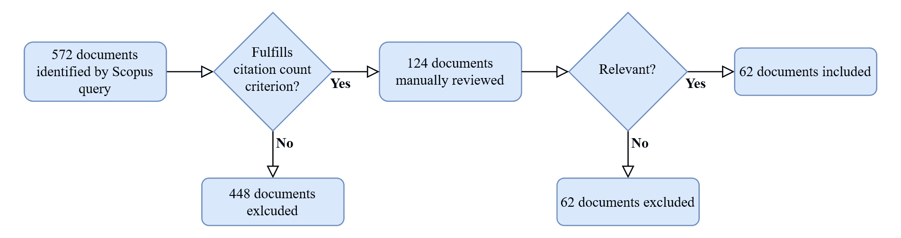
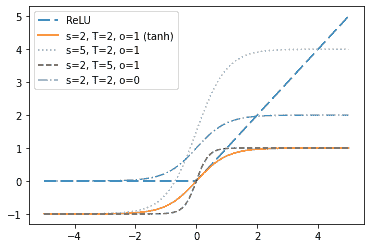

<!--yml

类别：未分类

日期：2024-09-06 19:36:58

-->

# [2309.16398] 《集中式深度学习中差分隐私的最新进展：系统性调查》

> 来源：[`ar5iv.labs.arxiv.org/html/2309.16398`](https://ar5iv.labs.arxiv.org/html/2309.16398)

¹¹机构：格拉茨理工大学（奥地利）²²机构：Know-Center GmbH（奥地利）³³机构：格拉茨大学（奥地利）

ldemelius@know-center.at

rkern@know-center.at

atruegler@know-center.at

# 《集中式深度学习中差分隐私的最新进展：系统性调查》

Lea Demelius 1122    Roman Kern 1122    Andreas Trügler 112233

###### 摘要

差分隐私已成为机器学习中数据保护的广泛受欢迎的方法，特别是因为它允许制定严格的数学隐私保障。本调查概述了差分隐私集中式深度学习的最新进展，深入分析了近期的进展和未解决的问题，并讨论了该领域未来潜在的发展。基于系统的文献综述，涉及以下主题：私密模型的审计和评估方法、隐私-效用权衡的改进、针对各种威胁和攻击的保护、差分隐私生成模型以及新兴应用领域。

## 1 介绍

深度学习是当前最先进的机器学习技术，用于解决计算机视觉、自然语言处理等多个领域的复杂任务，以及医疗保健、金融等不同领域的应用。由于这些模型的性能依赖于大量的训练数据，深度学习的兴起伴随着对收集和分析更多数据的兴趣增加。然而，数据往往包含个人或机密信息，这使得隐私成为一个紧迫的问题。这一发展也体现在最近出台的保护个人信息和避免识别个人的立法中，例如欧洲联盟的《通用数据保护条例》（GDPR）或加利福尼亚州的《消费者隐私法案》（CCPA）。

作为回应，隐私增强技术越来越受欢迎。加密技术[93]如同态加密和安全多方计算被用来防止数据分析过程中的直接信息泄露。然而，敏感信息仍然可能通过分析结果间接泄露，从而危及隐私。例如，一个用于诊断疾病的机器学习模型可能会使得在训练数据集中关于个体的特定信息得以重建，即使计算是加密的。为避免这种隐私泄露，可以应用输出隐私保护技术。一种常见的方法是使用如 k-匿名性[99]、l-多样性[74]或 t-接近性[67]的匿名化技术。然而，现在已知匿名化通常无法防止重新识别[19、49、81]，且隐私风险不可量化。因此，提出了差分隐私（DP）[42]来提供输出隐私保障。DP 是一种数学概率定义，可以在允许查询整个数据集（如人口）的同时，通过添加精心设计的噪声隐藏关于每个单独数据点（如每个个体）的信息。虽然 DP 在许多情况下（尤其是统计查询和传统机器学习方法如逻辑回归或支持向量机）提供了良好的效用-隐私权衡，但差分隐私与深度学习的结合带来了许多挑战，这些挑战源于深度学习中的高维度、高训练步骤数量和非凸目标函数。因此，近年来在解决差分隐私深度学习（DP-DL）困难和机遇方面取得了显著进展。

### 1.1 本调查的贡献

本调查提供了对差分隐私深度学习（DP-DL）最新进展的全面分析，重点关注集中式深度学习。分布式、联邦式和协作式深度学习方法及应用具有其独特特征和挑战，值得另行调查。我们还特别关注那些不假定凸目标函数的方法。

我们的主要贡献包括：

1.  1.

    对 DP-DL 的彻底系统文献回顾

1.  2.

    识别了近年来（2019-2023）的研究重点：1）评估和审计 DP-DL 模型，2）改善 DP-DL 的隐私-效用权衡，3）DP-DL 应对除了成员身份和属性推断之外的威胁，4）差分隐私生成模型，以及 5）DP-DL 在特定应用中的应用

1.  3.

    对不同研究趋势的分析和背景化，包括它们潜在的未来发展

以前关于深度学习和差分隐私的综述（见表 1）主要涵盖了深度学习特有的隐私威胁以及用于保护的最常见的差分隐私方法。相比之下，本调查超越了基本方法，系统性地研究了自 2019 年以来该领域的进展和新路径。我们为读者提供了对最先进方法的深入理解、差分隐私深度学习的挑战和机会。

表 1：关于差分隐私深度学习（DL-DP）的综述。

综述 年份 系统性贡献 Zhao 等[128] 2019 - 深度学习的隐私攻击，基础差分隐私深度学习方法 Ha 等[55] 2019 - 深度学习的隐私攻击，基础差分隐私深度学习方法 Shen 和 Zhong[96] 2021 - 基础差分隐私深度学习模型的比较 Ouadrhiri 和 Abdelhadi[84] 2022 - 深度学习和联邦学习的差分隐私变体和机制 本调查 2023 ✓ 差分隐私深度学习的最新进展：评估和审计，隐私-效用权衡，威胁和攻击，合成数据和生成模型，开放问题

除了上述综述外，还有一些更广泛的综述，例如关于差分隐私机器学习（未专注于深度学习）的[53、131、21]，隐私保护深度学习（未专注于差分隐私）的[28、100、56、76、23、106]，或一般的隐私保护机器学习[70、117]。这些论文提供了良好的概述，而我们的调查则采取了更详细的方法，专注于差分隐私在集中式深度学习中的最新进展。

## 2 调查方法

我们在 Scopus 上进行了系统的文献搜索，使用了预定义的搜索查询，并根据特定的纳入/排除标准进行了自动和手动评估。完整过程如图 1 所示。

Scopus 查询筛选了包含关键词“差分隐私（differential privacy）”、“差分隐私的（differentially private）”或“差分隐私（differential private）”与“神经网络（neural network）”、“深度学习（deep learning）”或“机器学习（machine learning）”结合的文档，但其标题或摘要中未提及“联邦学习（federated learning）”、“协作的（collaborative）”、“分布式的（distributed）”或“边缘（edge）”。文档限制为在计算机科学或工程领域的期刊、会议论文、综述或书籍中发表的文章。只考虑了 2019 年至 2023 年 3 月间以英语发表的文献。

此外，只有当文档至少被引用十次或位于相应年份被引用最多的前 10%时，才会被纳入文献。这一纳入标准允许对领域内最有影响力的工作进行手动审查。标准的第二部分旨在减轻对较旧文献的偏见。

在最后一步，剩余的文档被手动审查。是否纳入此调查是根据以下标准决定的：首先，差分隐私必须是研究的关键主题。其次，方法必须包括与深度学习相关的神经网络结果。第三，我们只包括关于集中式学习的工作，而不是分布式学习。第四，我们排除了强化学习，专注于典型于集中式深度学习的监督学习和无监督学习范式。最后，一篇文档因撤稿而被排除。

图 1：论文选择过程的流程图。

## 3 初步工作

### 3.1 差分隐私（DP）

差分隐私（DP）[42]是对隐私的数学定义，旨在保护个人的详细信息，同时仍允许从其数据中进行一般学习。一个随机算法$\mathcal{M}:\mathcal{D}\rightarrow\mathcal{R}$，其定义域为$\mathcal{D}$，值域为$\mathcal{R}$，如果对任意两个数据集$x,y\in\mathcal{D}$（最多只在一个数据点上不同）和任何输出子集$\mathcal{S}\subseteq\mathcal{R}$，都有

|  | $Pr[\mathcal{M}(x)\in\mathcal{S}]\leq e^{\epsilon}Pr[\mathcal{M}(y)\in\mathcal{S}]$ |  | (1) |
| --- | --- | --- | --- |

其中$Pr[]$表示概率，$\epsilon$是隐私风险（也称为隐私预算）。简而言之，单个数据点（通常对应于个人）对分析结果的影响是有限的。$\epsilon$量化了算法输出可以泄露关于数据点的最大信息量。因此，较低的$\epsilon$意味着更强的隐私保护。

DP 通过计算算法对数据点的缺失/存在的敏感度并相应地添加随机噪声来实现。最常用的 DP 噪声分布是拉普拉斯分布、高斯分布和指数分布。添加的噪声量相对于敏感度决定了隐私风险。

差分隐私不仅是可量化的，还有许多其他好处：首先，它独立于输入数据和辅助信息，如公开数据或未来知识。此外，它对后处理免疫，并且具有可组合性，即两个$\epsilon$-差分隐私算法的顺序或并行应用至少是$2\epsilon$-DP。高级组合定理甚至可以证明更低的整体隐私界限。差分隐私的另一个优点是其灵活性：噪声可以应用于数据流中的不同点，例如在输入数据上、算法输出上或介于两者之间的地方（例如，在深度学习模型训练期间）。它还可以与其他隐私增强技术结合使用，如同态加密、安全多方计算或联邦学习。

尽管这些优点导致了差分隐私被广泛接受为隐私保护的**黄金标准**，但它也面临一些挑战。首先，无单位和概率性的隐私参数$\epsilon$难以解读，因此选择合适的值具有挑战性。感兴趣的读者可以参考[38]，了解实际应用中使用的值列表。

差分隐私的另一个挑战是其对算法输出的影响，进而影响其属性。主要问题是隐私与效用的权衡。然而，它也可能影响算法的性能、可用性、公平性或稳健性。

此外，DP 对于外行人来说并不容易理解：1）需要注意的是，DP 并不能提供完美的隐私保护。DP 提供了一种特定的隐私解释，但根据上下文，可能会有其他期望的或更相关的解释。此外，隐私保护依赖于隐私参数 $\epsilon$ 和隐私的单位/粒度，即对什么被视为一个记录。也就是说，仅仅声明一个算法是 DP 并不能确保实质性的保证。2）由于 DP 是一个数学定义，仅定义了约束条件而不要求具体实现，因此存在许多不同的算法满足 DP，从简单的统计分析到机器学习算法。某些算法假设有一个中心可信方可以访问所有数据（全局 DP），而其他算法在数据汇总之前应用噪声（局部 DP）。3）存在广泛的 DP 变体和扩展。仅在 2008 年至 2021 年间，就有超过 250 个新概念被引入 [39]。它们在隐私损失的量化方式、保护的属性以及假定攻击者的能力方面存在差异。最常见的扩展是近似 DP（通常简单地称为 $(\epsilon,\delta)$-DP），其中算法是以概率 $1-\delta$ 的 $\epsilon$-DP。失败概率 $\delta$ 通常设置为小于数据集大小的倒数。其他常见的放宽条件包括零集中 DP（zCDP） [43] 和 Rényi DP [77]。

### 3.2 深度神经网络和随机梯度下降（SGD）

深度神经网络由组织在层中的连接节点组成，即输入层、多个隐藏层和输出层。每个节点对其输入应用一组权重，并通过非线性激活函数传递其总和。网络可以学习执行不同的任务，例如，通过最小化损失（即模型的预测与期望输出之间的差异）来对复杂数据进行分类。由于深度神经网络的目标函数通常是非凸的，因此通常无法通过解析方法解决这个优化问题。相反，应用了迭代优化算法，最常见的是随机梯度下降（SGD）的变体：在每个时间步 $j$，模型权重 $w$ 根据在随机选择的训练数据子集（即批次）$\mathcal{B}$ 上计算的目标函数 $\mathcal{L}$ 的梯度进行更新。在方程 2 ‣ 3 Preliminaries ‣ Recent Advances of Differential Privacy in Centralized Deep Learning: A Systematic Survey") 中，$x_{i}$ 表示来自训练集的记录及其对应的目标输出 $y_{i}$，$\eta$ 是学习率，$|\mathcal{B}|$ 是批次大小。

|  | $w_{j}=w_{j-1}-\eta\frac{1}{\| \mathcal{B} \|}\sum_{i\in\mathcal{B}}\nabla\mathcal{L}(w_{j-1},x_{i},y_{i})$ |  | (2) |
| --- | --- | --- | --- |

在训练完模型之后，例如使用 SGD，神经网络可以用于对先前未见的数据进行预测。对新数据表现良好的模型被认为是良好泛化的，而仅在训练数据上表现良好的模型被认为是过拟合的。

深度学习模型通常使用监督学习或无监督学习范式进行训练。在监督学习中，训练集是带标签的，而在无监督学习中，模型在没有访问真实标签的情况下学习识别模式。除了上述的全连接层，神经网络通常还包括其他类型的架构和层。一个流行的例子是卷积层，它使用滤波器提取局部模式，例如图像中的边缘。

### 3.3 深度学习模型的隐私威胁

深度学习模型上的隐私攻击目标是训练数据或模型本身。它们可以发生在训练阶段或推断阶段。在训练过程中，攻击者不仅可以是一个被动的观察者，还可以积极地改变训练过程。此外，攻击者可以访问整个模型，即其架构、参数、梯度和输出（白箱访问），或者仅访问模型的输出（黑箱访问）。典型的隐私攻击包括：

成员推断攻击（MIA）：攻击者试图推断特定记录是否是训练数据集的一部分。这种攻击在白箱和黑箱设置中都存在，其中在黑箱情况下进一步区分了对预测向量的访问和对标签的访问。第一个（并且仍然广泛使用的）MIA 是在机器学习模型上由 Shokri 等人提出的[97]。他们训练模仿目标模型的影子模型，并基于这些影子模型在训练数据和非训练数据上的输出，分类模型学习识别哪些记录是训练数据的成员。该攻击在过拟合模型上表现最佳[122, 97]。

模型反演攻击：攻击者试图推断关于训练数据的敏感信息，例如特定数据点的属性或特征，这些特征用于表征某个类别。

属性推断攻击：攻击者试图提取与训练任务无关的训练数据的信息。例如，他们可能对具有某种属性的训练样本的比例等统计属性感兴趣。

模型提取攻击：攻击者学习一个近似目标模型的模型。虽然这种威胁仅针对模型而不是训练数据，但它仍然可能增加隐私风险，因为成功的模型提取可以促进后续攻击，如模型反演。

特别是在模型反演和属性推断的情况下，术语使用并不一致。例如，De Cristofaro [36] 使用“属性推断”来推断一个类别的特征，而其他文献 [94, 87, 127]（包括我们）则将其称为模型反演的一种类型。

此外，还有一些不特定于隐私的攻击可能仍对深度学习模型构成威胁：

对抗攻击：在推断阶段，攻击者故意操控输入，使模型将其误分类。

中毒攻击：对手扰动训练样本，以操控模型从而降低其准确性或触发特定的误分类。

有关更详细的描述，我们建议读者参考关注隐私攻击的调查 [36, 94, 95]。攻击实现的选择可以在对抗鲁棒性工具箱中找到，例如 [83]。

### 3.4 深度学习的 DP 算法

DP-DL 最受欢迎的算法是 Abadi 等人提出的差分隐私随机梯度下降（DP-SGD） [11]。它通过用高斯噪声扰动梯度来改编经典的 SGD。由于梯度范数是无界的，因此在裁剪之前确保有限的敏感性。因此，方程 2 ‣ 3 初步知识 ‣ 差分隐私在集中式深度学习中的最新进展：系统性调查") 变成了方程 3，其中 $clip[]$ 表示裁剪函数，用于裁剪每例梯度，使其范数不超过裁剪范数 $C$，$\chi$ 是从标准高斯分布中抽取的随机向量，$\sigma$ 是附加高斯噪声的标准差。

|  | $w_{j}=w_{j-1}-\eta\frac{1}{&#124;\mathcal{B}&#124;}\sum_{i\in\mathcal{B}}clip\left[\nabla\mathcal{L}(w_{j-1},x_{i},y_{i}),C\right]+\frac{\sigma C}{&#124;\mathcal{B}&#124;}\chi$ |  | (3) |
| --- | --- | --- | --- |

尽管 DP 固有的隐私-效用权衡仍然适用（即信息丢失），DP-SGD 可以改善泛化能力，从而提高验证数据集上的准确性。

值得注意的是，DP-SGD 中用于绑定每个记录的敏感性的每例梯度裁剪与有时用于提高训练过程稳定性和收敛性的批量梯度裁剪不同 [125]。

另一种流行的以差分隐私方式训练深度学习模型的方法是 PATE（教师集的私人聚合）[85]。PATE 是一种半监督方法，需要公共数据。然而，与 DP-SGD 不同的是，PATE 可以应用于所有机器学习技术。首先，训练多个教师模型，每个模型在不同的私人数据集上进行训练。接下来，根据教师模型预测的差分隐私聚合对公共数据进行标注。最后，使用带有噪声的标注公共数据训练学生模型，该模型可以在之后公开。

对于深度学习模型自身实现差分隐私的另一种替代方法是输出扰动，其中向模型的预测结果中添加噪声。然而，采用这种方法时，隐私预算会随着每次预测的增加而增加，因此需要限制模型的推断次数。有关深度学习中输出扰动的示例，请参见 Ye 等人 [121]。

## 4 审计与评估

审计和评估深度学习模型对于确保它们在保持效用的同时有效保护隐私至关重要。由于差分隐私始终是在隐私和效用之间的权衡，隐私评估有助于选择合适的隐私预算：足够高以保护敏感信息，但足够低以提供足够的准确性。什么水平的准确性足够取决于应用情况。在某些情况下，评估不仅要考虑整体效用，还要对训练数据中的不同子群体进行评估，以检测潜在的不公平和偏见。在本节中，我们首先讨论基于攻击的实证隐私风险评估，然后讨论对子群体的准确性评估。

### 4.1 基于攻击的评估

虽然差分隐私参数$\epsilon$提供了隐私损失的上界，但基于攻击的评估可以给出下界。尽管经验性隐私评估不能提供任何保证，但它可以用于回答关于不同隐私预算的实际意义的问题，或者不同方面（例如应用的差分隐私概念）如何影响实际隐私风险。此外，观察到的下界和上界之间的显著差距导致了这样一个假设：最坏情况下的设置过于悲观，实际隐私要低得多。因此，在实际应用中通常选择较高的隐私预算（即较高的$\epsilon$）[38]。虽然这种选择提高了模型的效用，但问题仍然存在：下界和上界隐私界限之间的差距是否意味着差分隐私保证过于悲观，或者应用的攻击只是较弱，未来更强的攻击是否能够充分利用隐私预算。此外，攻击可以用来评估模型在特定设置下是否保留了隐私，例如，在一个类由单一个体的实例组成的情况下。本节回顾的文献提供了这些问题的见解。表 2 概述了回顾的工作、其应用的攻击和评估指标。表 3 显示了用于审计的数据集。

表 2：基于攻击的评估方法总结。该表包括本章回顾的工作，并说明使用的攻击，是否假设对目标模型具有黑箱或白箱访问，以及如何测量目标模型的脆弱性。MIA 是成员推断攻击的缩写。攻击者的优势是 Yeom 等人提出的隐私泄露度量[122]。$\epsilon_{LB}$和$(\epsilon,\delta)_{LB}$分别指代隐私预算的经验下界。

工作攻击黑盒或白盒评估度量 Jayaraman 和 Evans, 2019 [59] MIA 和模型反转黑盒和白盒准确率损失，攻击者的优势 Chen 等, 2020 [31] MIA 白盒准确率 Leino 和 Fredrikson, 2020 [66] MIA 白盒准确率，召回率，精确率，攻击者的优势 Jagielski 等，2020 [58] 污染攻击黑盒 $\epsilon_{LB}$ Nasr 等，2021 [82] MIA 和污染攻击黑盒和白盒 $(\epsilon,\delta)_{LB}$ Park 等，2019 [87] 模型反转黑盒成功率，对攻击的影响 Zhang 等, 2020 [127] 模型反转白盒准确率

表格 3：审计 DP-DL 所使用的数据集。

| 数据集 | 数据类型 | 论文 |
| --- | --- | --- |
| 人口普查数据集 [6] | 表格 | [66] |
| AT&T 人脸数据库 [1] | 图像 | [87] |
| 威斯康星乳腺癌数据集 [7] | 表格 | [66] |
| CIFAR-10 [63] | 图像 | [58, 120, 66, 82] |
| CIFAR-100 [63] | 图像 | [59, 66] |
| Fashion-MNIST [113] | 图像 | [58] |
| 德国信用数据 [10] | 表格 | [66] |
| 肝炎数据集 [9] | 表格 | [66] |
| Labeled Faces in the Wild 人脸数据集 [5] | 图像 | [66] |
| MNIST [64] | 图像 | [66, 82, 127] |
| Pima 糖尿病数据集 [8] | 表格 | [66] |
| Purchase-100 [4] | 表格 | [59, 58, 82] |
| VGGFace2 数据集 [3] | 图像 | [87] |
| 酵母基因组数据集 [22] | 基因 | [31] |

Jayaraman 和 Evans [59] 分析了不同松弛的差分隐私概念对攻击成功的影响。他们使用了成员推断和模型反转攻击，并研究了先进组合的 DP，零集中的 DP 和 Rényi DP。他们的结论是，松弛的 DP 定义与攻击成功（即隐私损失）密切相关。这意味着使用修改后的隐私分析可以缩小理论隐私保证和实验下限之间的差距。

Chen 等 [31] 通过使用基因组数据的例子，确认了差分隐私在高维训练数据的情况下的有效性。他们通过进行成员推断攻击来评估带有和不带有稀疏性的差分隐私卷积神经网络（CNN）模型。尽管模型稀疏性可以改善非隐私设置中模型的准确性（通过减少过拟合），但他们表明在隐私设置中，模型稀疏性具有负面效果（但可以改善隐私性）。

虽然前面的论文使用了现有的攻击方法来研究不同的设置，但以下研究提出了新型、更强的攻击。

Leino 和 Fredrikson [66] 认为，敏感信息的记忆不仅可以在模型的预测中显现出来，还可以体现在模型如何使用（外部给定或内部学习的）特征上。即使在良好泛化的模型中，仅对训练数据集预测有效但对目标数据分布无用的特征也可能泄露信息。为了评估由此产生的隐私风险，他们提出了一种新的白盒成员推断攻击，该攻击还利用了目标模型的中间表示。由于普通的阴影模型训练不会导致内部特征的相同解释（即使具有相同的模型架构、超参数和训练数据），他们对每一层进行了线性近似，对每一层发起了单独的攻击，并训练了一个结合了层级攻击输出的元模型。证明这种新型攻击比以前的攻击更为有效。一般来说，使用 DP-SGD 训练目标模型会降低模型的脆弱性，但高 $\epsilon$（此处为 $\epsilon=16$）会导致隐私泄露，与非私密设置相当。

Jagielski 等人 [58] 明确分析了理论隐私保障（上界）和实证评估（下界）之间的差距。这个差距可以通过提供更紧密的隐私分析（如与 Jayaraman 和 Evans [59] 的讨论中提到的那样）来缩小，或者通过开发更强的攻击（例如，Leino 和 Fredrikson [66] 的研究）。Jagielski 等人 [58] 采取了后者的方法，并展示了前者正在接近其极限。他们的新型攻击基于数据中毒，其中攻击者故意扰动一些训练样本以改变参数分布（例如，通过在图像的角落添加白色补丁）。由于这种方法通过使用引发大梯度的中毒样本来有效，因此 DP-SGD 的梯度裁剪降低了攻击效果。他们提出的调整包括扰动训练样本，使得参数沿着其最低方差的方向发生变化。他们估计的隐私损失下界 $\epsilon_{LB}$ 仅比理论上界低一个数量级。这表明，过去通过精细分析带来的隐私保障不断增强的趋势已接近尾声。

Nasr 等人 [82] 进一步扩展了这项研究，测试了关于攻击者能力的不同假设如何影响经验下限。研究的能力包括：访问最终模型及所有中间模型的参数，及操控输入和梯度。与 Jagielski 等人 [58] 相比，他们考虑了近似 DP。他们的评估揭示了最强的对手可以利用理论分析确定的全部隐私预算。他们确认了通过更先进的隐私分析来改善隐私-效用权衡的可能性已被耗尽。然而，假设攻击者能力有限可能进一步降低上限。

这些论文中应用的攻击都被认为是典型的差分隐私（DP）评估：成员推断是最明显的 DP 测试，来源于其定义；Jayaraman 和 Evans [59] 应用的模型反演攻击尝试推断特定个体的属性——如果不能恢复个体的完整记录，这是不可能的；而中毒攻击则利用了 DP 必须在最坏情况下的数据集上仍然有效的事实。然而，模型反演攻击也可以意味着对类别属性的推断（而非个体属性）。在一些任务中（例如面部识别），一个类别指的正是一个个体。以下工作 [87, 127] 分析了 DP-DL 是否也能防御这种模型反演攻击。

Park 等人 [87] 通过从模型的预测中重建训练图像来评估面部识别模型的隐私损失，并根据评估模型的性能自动测量攻击成功率。他们的结果表明，即使是较高的隐私预算（例如，$\epsilon=8$）也能在此模型反演攻击下提供保护，相比于非隐私设置。

Zhang 等人 [127] 在面部识别设置中提出了生成模型反演（GMI）攻击。他们首先在公共数据上训练了一个 GAN（生成对抗网络；详细解释见第七部分），以生成逼真的图像，然后通过寻找最大化似然的值来重建敏感面部区域。他们展示了 DP-SGD 无法防御他们的攻击。他们还认为，目标模型的预测能力越强，对攻击的脆弱性也越大。

关于这种模型反演攻击相关性的进一步讨论可以在第九部分中找到。

### 4.2 子组评估：偏见与公平性

对子组的准确性评估是识别偏差的标准方法。通常，模型应避免对不同群体的不公平对待，特别是那些基于法律保护属性的群体，如性别、宗教和种族。Bagdasaryan 等人[20]显示，应用 DP-SGD 不仅导致整体准确性下降，而且对代表性不足的类别影响特别大。虽然训练数据中的不平衡性似乎会增加准确性差距，Farrand 等人[44]却显示，即使在 30-70%的拆分情况下，这种差距也是显著的，并且在松散隐私保障的情况下也存在。这种观察到的效应被认为主要源于梯度的剪辑，这会惩罚那些导致更大梯度的样本，即离群值。

## 5 改善 DP-DL 的隐私-效用权衡

DP-DL 的主要挑战在于，通过设置有意义的隐私保障，效用往往会大幅下降。近年来，许多改进 DP-DL（主要是 DP-SGD）的建议被提出，这些方法可以在相同隐私条件下提高准确性。表 4 概述了这些建议的方法。另一种方法是提供更紧密的理论界限，以减少隐私损失而不影响学习算法。一个评估在深度学习中应用的示例可以在 Ding 等人[40]的研究中找到。然而，正如我们在第四部分中已经确定的，这条研究路线似乎已达到其极限。

表 4：改进 DP-DL 的方法总结。

| 方法 | 论文 |
| --- | --- |
| 适应模型架构 | [86] |
| 改进超参数选择 | [86, 71] |
| 应用特征工程和迁移学习 | [102] |
| 减轻剪辑偏差（以改善收敛性） | [34] |
| 剪枝模型 | [51, 15, 92] |
| 添加异质噪声 | [124, 112, 116, 16, 52] |

提高 DP-SGD 准确性的一个方法是在相同隐私条件下调整深度学习模型的架构，以更好地适应差分隐私学习。Papernot 等人 [86] 观察到，正如 Abadi 等人 [11] 所提出的那样，使 SGD 满足差分隐私会导致梯度爆炸。梯度越大，裁剪过程中丢失的信息就越多，这反过来会损害模型的准确性。为了减轻这种影响，Papernot 等人 [86] 提议使用有界激活函数，而不是在非私有训练中常用的无界函数（例如 ReLU）。他们引入了温和 sigmoid 激活函数：

|  | $\Phi(x)=\frac{s}{1+e^{-Tx}}-o$ |  | (4) |
| --- | --- | --- | --- |

其中，参数 $s$ 控制激活的尺度，逆温度 $T$ 调节梯度范数，$o$ 是偏移量（见图 2）。设置 [$s=2$，$T=2$，$o=1$] 结果为双曲正切（tanh）函数。

图 2：与 ReLU 函数比较的温和 sigmoid 函数示例。温和 sigmoid 函数及其参数 $s$、$T$ 和 $o$ 是 Papernot 等人提出的有界激活函数 [86]，旨在改进私密深度学习。ReLU 是一种在深度学习中常用的无界激活函数。

Papernot 等人 [86] 显示温和 sigmoid 函数可以提高模型的准确性。对于 MNIST 和 Fashion-MNIST 数据集，tanh 函数表现最佳。

调整深度学习模型以提高性能时，另一个重要方面是超参数选择（例如，选择学习率）。尽管从非私有模型转移超参数的选择可能很诱人，但 Papernot 等人 [86] 表明，除了模型架构外，超参数也应为私有模型明确选择，而不是使用在非私有设置中效果良好的超参数。由于这可能导致额外的隐私泄漏，因此应考虑私有超参数选择，例如 Liu 等人 [71] 所提出的方案。

与非私有深度学习类似，DP-SGD 可以从特征工程、额外数据和迁移学习中受益。Tramèr 和 Boneh [102] 表明，与端到端学习相比，手工制作的特征可以显著提高私有模型的效用。通过使用数量级更多的训练数据或迁移从公开数据中学习到的特征，可以实现与私有端到端学习相当的准确性提升。

虽然前述技术在非私有深度学习中已经很成熟，但 DP-SGD 引入了两个新的步骤，提供了改进的机会：梯度裁剪和噪声添加。

Chen 等人 [34] 发现梯度裁剪引入的偏差可能导致收敛问题。他们发现了梯度分布对称性与收敛之间的关系：即使大量梯度被大幅度缩放，对称的梯度分布也能导致收敛。基于这一发现，Chen 等人 [34] 提出了在梯度分布不对称时，在裁剪前引入额外的噪声。需要注意的是，由于额外的方差，这种方法可能导致更好但更慢的收敛，因此仅在特定的使用场景中改善隐私-效用权衡。

对于 DP-SGD 的另一个观察是，随着模型规模的增大，隐私-效用权衡会恶化。更多的模型参数会导致更高的梯度范数，这意味着将梯度裁剪到相同的范数会带来更大的影响。如果裁剪范数也增加，那么为了实现相同的隐私保证，就需要添加更多的噪声。这个效应可以通过减少模型参数的数量（参数剪枝）[51，15] 或压缩梯度（梯度剪枝）[15，92]来缓解。

Gondara 等人 [51] 的工作基于彩票票假设 [47，48]，该假设认为在大型神经网络中存在一些子网络，这些子网络在单独训练时可以达到与完整网络相当的准确性。术语“彩票票”指的是剪枝后的网络，源于找到表现良好的子网络就像赢得彩票一样。Gondara 等人 [51] 修改了原始的彩票票假设以符合差分隐私。首先，彩票票是在公共数据集上非私有地创建的。接下来，在私有验证集上评估每个彩票票的准确性，并在通过指数机制保留 DP 的同时选择最佳子网络。最后，使用 DP-SGD 训练中奖的票据。

Adamczewski 和 Park [15] 提出了 DP-SSGD（差分隐私稀疏随机梯度下降），也依赖于模型剪枝。他们实验了参数冻结，即仅训练部分参数，以及参数选择，即每次迭代更新不同的参数子集。更新的参数要么是随机选择的，要么是基于其大小选择的。

这两种模型剪枝方法都依赖于应尽可能与私有数据相似的公开数据。相比之下，Phong 和 Phuong [92] 提出了无需公共数据的梯度剪枝方法。除了使梯度稀疏外，他们还使用记忆来保持梯度下降的方向。

另一项研究方向涉及在训练过程中调整添加到不同隐私模型的噪声。虽然原始的 DP-SGD 算法对每个梯度坐标添加相同量的噪声，不考虑训练进展，但这一研究方向基于学习进展（例如，执行的轮次）[124] 或基于坐标对模型的影响 [112, 116, 16, 52] 来添加噪声。

Yu 等人 [124] 认为，随着训练进展并因此收敛到局部最优，模型从较小噪声中获益更多。这种“动态隐私预算分配”类似于自适应学习率的理念，这在非隐私学习中是常见技术，也可以应用于隐私学习（例如，参见 [116, 115]）。Yu 等人比较了不同的动态方案用于分配隐私预算，包括预定义的衰减计划，如指数衰减，或基于公共数据集上的验证准确率的噪声缩放。他们展示了所有动态方案在很大程度上优于均匀噪声分配。

Xiang 等人 [112] 将隐私-效用权衡视为优化问题，即在满足隐私约束的同时最小化准确性损失。因此，添加的噪声较少影响模型输出的梯度坐标。尽管在一系列隐私预算和模型架构下，模型的效用有所改善，但由于优化问题的高维度，该方法计算开销较大。

Xu 等人 [116] 进一步改进了这种方法，不仅减少了计算需求，还提高了收敛速度（从而减少了隐私预算）。改进版称为 AdaDP（自适应和快速收敛的不同隐私深度学习方法），用启发式方法替代了计算开销大的优化，以计算梯度坐标对模型输出的影响。添加的噪声不仅根据坐标的敏感性自适应调整，还随着训练迭代次数的增加而减少。通过引入自适应学习率（对更新不频繁的坐标较大），实现了更快的收敛。

一个相关的研究方向是使用可解释的 AI 方法来校准噪声。Gong 等人 [52] 和 Adesuyi 等人 [16] 都使用逐层相关传播（LRP） [78] 来确定不同参数的重要性。Gong 等人 [52] 提出了 ADPPL（自适应差分隐私保护学习）框架，该框架根据参数的相关性向梯度坐标添加自适应拉普拉斯噪声 [91]。相比之下，Adesuyi 等人 [16] 的方法基于损失函数扰动。由于深度学习模型具有非凸损失函数，因此在添加拉普拉斯噪声之前计算了损失函数的多项式近似。LRP 被用来将参数分类为高相关性或低相关性，从而分别添加小噪声和大噪声。

基于可解释 AI 的方法也可以应用于局部 DP 设置，例如 Wang 等人 [109] 使用特征重要性来决定向训练数据添加多少噪声。

讨论的工作的结果示例列表可以在表 5 中找到。为了比较，还包括了 Abadi 等人 [11] 提出的原始 DP-SGD 的结果。原始 DP-SGD 论文中报告的三个不同隐私水平的不同准确性清楚地展示了差分隐私算法的隐私-效用权衡。由于网络架构和超参数的不同、评估数据集的不同以及根据不同 DP 概念（例如，$\epsilon$-DP、$(\epsilon,\delta)$-DP、$\rho$-zCDP（零集中 DP））测量的不同隐私水平，方法之间的直接比较是困难的。

表 5：改进的 DP 方法与 Abadi 等人 [11] 提出的原始 DP-SGD 的比较结果的选定示例。所用的深度学习模型包括全连接神经网络（FCNN）和卷积神经网络（CNN）。其中一些在前面包含了主成分分析（PCA）层。我们报告了所有说明确切值的方法的模型、评估数据集、准确性和隐私预算，优选 MNIST 数据集。

*这个结果是通过参数冻结实现的。参数选择的效果稍微差一些。

**这个结果是通过多项式衰减计划实现的。其他预算分配方案表现相当。

***$\rho$ 是零集中差分隐私（zero-concentrated DP）的隐私参数。

方法 模型 数据集 准确率 隐私 原始 [11] PCA + FCNN（1 隐藏层） MNIST 90% $\epsilon=0.5,\delta=10^{-5}$ 原始 [11] PCA + FCNN（1 隐藏层） MNIST 95% $\epsilon=2,\delta=10^{-5}$ 原始 [11] PCA + FCNN（1 隐藏层） MNIST 97% $\epsilon=8,\delta=10^{-5}$ Tanh [86] CNN（2 卷积层） MNIST $98.1\%$ $\epsilon=2.93,\delta=10^{-5}$ DPLTH [51] FCNN（3 隐藏层） 公开：MNIST；私有：Fashion-MNIST $76\%$ $\epsilon=0.4$ DP-SSGD [15] CNN（2 卷积层） MNIST $97.02\%$* $\epsilon=2$ 梯度压缩 [92] CNN（2 卷积层） MNIST $98.52\%$ $\epsilon=1.71,\delta=10^{-5}$ 动态隐私预算分配** [124] PCA + FCNN（1 隐藏层） MNIST $93.2\%$** $\rho=0.78$*** 自适应噪声 [112] CNN（2 卷积层） MNIST $94.69\%$ $\epsilon=1,\delta=10^{-5}$ AdaDP [116] PCA + FCNN（1 隐藏层） MNIST $96\%$ $\epsilon=1.4,\delta=10^{-4}$ 根据 LRP 的噪声 [16] FCNN（3 隐藏层） 威斯康星诊断乳腺癌（WDBC） $94\%$ $\epsilon=1.1$ ADPPL 框架 [52] CNN（2 卷积层） MNIST $94\%$ $\epsilon=1$

## 6 超越成员身份和属性推断：应用 DP-DL 防护其他威胁

差分隐私通常用于保护防止重新识别。在深度学习的背景下，这主要包括成员身份推断和模型逆转攻击。本节回顾了差分隐私如何保护深度学习模型对其他威胁的防护。表 6 列出了讨论的威胁和文献。

表 6：DP-DL 应用于防范除成员身份和属性推断之外的威胁的总结。

*这两种方法均基于通过异常检测进行威胁识别。

| 威胁 | 论文 |
| --- | --- |
| 模型提取攻击 | [129, 130, 118] |
| 对抗攻击 | [65, 90] |
| 可解释深度学习的隐私风险 | [57] |
| 机器去学习的隐私风险 | [32] |
| 后门中毒攻击* | [41] |
| 网络入侵* | [119] |

差分隐私可以应用于的一个威胁是模型提取攻击，尽管最初并不是为了这个目的。模型提取主要是安全性和保密性问题，但它也可能危害隐私，因为它促进了成员身份和属性推断。

Zheng 等人 [129, 130] 观察到，大多数模型提取攻击通过邻近输入推断目标模型的决策边界。他们引入了边界差分隐私 ($\epsilon$-BDP) 的概念，并建议在机器学习模型中附加一个 BDP 层，该层 1) 确定哪些输出接近决策边界（这是一个对深度学习模型而言并不简单的问题，因为决策边界没有封闭形式）并且 2) 对这些输出添加噪声。缓存先前的输入输出对，以确保相同输入产生相同的噪声输出。这种方法保证了攻击者无法以超过预定精度水平（由 $\epsilon$ 控制）学习决策边界。

Yan 等人 [118] 的后续研究表明，如果没有缓存，BDP 层无法保护免受他们新型模型提取攻击的影响。他们提出了一种替代缓存的方法：监测隐私泄露并相应调整隐私预算。

差分隐私也可以适应于保护深度学习模型免受对抗性攻击。虽然原始的差分隐私是在记录级别上定义的，但特征级差分隐私可以在对抗样本中实现鲁棒性。例如，Lecuyer 等人 [65] 提出了 PixelDP，这是一种可以添加到任何类型深度学习模型中的像素级差分隐私层。由于这种方法只保证鲁棒性而非原始意义上的差分隐私，Phan 等人 [90] 通过将其与 DP-SGD 结合进一步发展了该方法。为了应对鲁棒性、隐私和效用之间的权衡，他们依赖于异质噪声：对更易受攻击的坐标添加更多噪声。

另一类研究是可解释性/解释性与隐私之间的关系。即使可解释的/解释的 AI 方法本身不是威胁情景，但它们可以促进隐私攻击。Harder 等人 [57] 研究了模型如何既可解释又能保证差分隐私。由于差分隐私的后处理特性，使用 DP-SGD 训练的模型不会受到基于梯度的可解释 AI 方法的影响。然而，基于梯度的方法只能提供局部解释，即关于特定输入对模型决策的相关性，而 Harder 等人 [57] 特别关注那些也能提供全局解释的方法，即关于模型整体运作的解释。他们介绍了差分隐私局部线性映射 (DP-LLM)，这可以近似深度学习模型，并且本质上是可解释的。

陈等人[32]研究了机器“遗忘”的隐私风险。机器“遗忘”[26, 107]是指去除一个或多个数据点对已训练模型的影响的过程。常见的方法包括从头开始重新训练和 SISA（分片、隔离、切片和聚合）[24]，其中原始模型由$k$个模型组成，每个模型在训练集的一个子集上训练，因此只对一个子模型进行重新训练以实现遗忘。尽管主要目的是能够遵守隐私法规，如欧洲通用数据保护条例（GDPR）中的被遗忘权，但遗忘过程可能会泄露关于已删除数据点的附加信息。陈等人[32]提出了一种新的黑箱成员推断攻击，利用了原始模型和被遗忘模型。他们的攻击比经典的成员推断攻击更强大，而且对于泛化良好的模型也有效，包括当多个数据点被删除、攻击者错过了几个中间的被遗忘模型以及模型随着新输入的更新时。他们展示了 DP-SGD 是应对机器“遗忘”隐私风险的有效防御手段。

差分隐私不仅可以直接保护模型，还可以用于提高攻击检测的能力[41, 119]。这种方法可以视为一种异常检测，其中攻击场景被视为异常/新颖。使用深度学习模型（例如，自编码器，卷积神经网络）的异常检测基于模型对低代表性子组的拟合不足，即对于不典型输入，模型的错误预计会更高。使用差分隐私训练模型会放大这种效应（见 4.2 节）。虽然这在公平性和偏见的背景下会带来负面影响，但在这里可以用来提高异常检测的性能。

杜等人[41]将这种方法应用于众包数据，即来自许多个体的数据。这些个体可以通过恶意调整他们贡献的样本来发起后门中毒攻击。为了保护目标模型，需要识别并从训练集中移除这些中毒样本。他们展示了差分隐私可以在这种情况下提高异常检测的性能。基于相同的理由，杨等人[119]提出了 Griffin，一个网络入侵检测系统。

## 7 差分隐私生成模型

生成模型是一类机器学习模型，旨在生成类似于训练集数据样本的新数据样本。用生成模型创建的合成数据通常被视为隐私保护，因为它们不会直接与真实实体或个人相关联。然而，与其他机器学习模型类似，生成模型也可能记住敏感信息，并易受隐私攻击。该部分概述了有关使用生成模型生成差分隐私合成数据的最新工作（见表 7）。

表 7：差分隐私生成模型的总结。这些方法基于（变分）自编码器或生成对抗网络（GAN）。DP 算法 DP-EM 指的是差分隐私期望最大化 [88]。

| 方法 | 生成模型类型 | DP 算法 |
| --- | --- | --- |
| DPGM [14] | 变分自编码器 | DP k-means & DP-SGD |
| DP-SYN [12] | 自编码器 | DP-SGD & DP-EM |
| PPGAN [72] | GAN | DP-SGD |
| GANobfuscator [115] | GAN | DP-SGD |
| GS-WGAN [30] | GAN | DP-SGD |
| RDP-CGAN [101] | GAN | DP-SGD |
| PATE-GAN [61] | GAN | PATE |

### 7.1 自编码器

自编码器是一种深度学习模型，由两个部分组成：编码器和解码器。编码器学习将输入映射到较低维度的空间，而解码器学习从这个中间表示中重构输入。变分自编码器（VAEs）遵循相同的原则，但学习中间（编码）表示的概率分布。

Acs 等人 [14] 提出了基于变分自编码器（VAEs）混合的 DPGM（差分隐私生成模型）。首先，使用差分隐私版本的 k-means 对训练数据进行私密聚类。接着，为每个簇训练一个 VAE，使用 DP-SGD。VAEs 学到的数据分布用于生成合成数据。将输入数据划分为簇并学习单独的模型具有两个优点：首先，模型在类似数据点上训练时学习更快，因此添加的噪声较少，模型准确度更高。其次，避免了不现实的簇组合。

Abay 等人 [12] 采用了一种类似的方法，也基于对训练数据的划分。与 DPGM [14] 相比，他们假设了一个有监督的设置，并根据标签划分数据。然后，每个类别用于通过 DP-SGD 训练一个独立的自动编码器。合成数据是通过使用不同 ially private expectation maximization (DP-EM) [88] 采样中间表示，并在新表示上应用解码器生成的。这种方法（称为 DP-SYN）在大多数测试数据集上优于 DPGM。

### 7.2 GANs

生成对抗网络 (GANs) 由两个神经网络组成，它们进行对抗游戏：生成器试图创建与训练数据相似的合成样本，而鉴别器则尝试区分人工生成的样本和真实样本。训练完成后，生成器可以用来创建合成数据。

在原始的 GAN 中，生成器是基于 Jensen-Shannon 距离作为两个数据分布之间的距离度量进行训练的。这可能导致不稳定问题，特别是梯度消失，即生成器学习速度远慢于鉴别器。为了解决这个问题，引入了 Wasserstein GAN (WGAN) [18]，它依赖于 Wasserstein 距离而不是 Jensen-Shannon 距离。对于这种变体，权重在每次更新后被裁剪，以使 Wasserstein 距离在此上下文中适用。WGAN 的一个不同 ially private 版本（称为 DPGAN）首次由 Xie 等人 [114] 在 2018 年引入，利用了 WGAN 已经具有有限梯度的事实。因此，通过向鉴别器的梯度添加噪声而无需裁剪，就可以实现差分隐私。由于生成器仅能通过（现在是隐私的）鉴别器访问有关训练数据的信息，因此不需要使用 DP-SGD 训练生成器。像 DPGAN 一样，以下工作 [72, 115, 30, 101] 是 WGAN 的私有变体。

刘等人提出的 PPGAN [72] 类似于 DPGAN，但使用了不同的优化算法（迷你批量 SGD 而非 RMSprop）。徐等人 [115] 和陈等人 [30] 都提出了基于 Gulrajani 等人 [54] 改进版 WGAN 的不同 ially private GAN。这一版本的 WGAN 在目标函数中增加了对梯度范数的惩罚，而不是裁剪权重，以提高 GAN 的稳定性。虽然徐等人的 GANobfuscator [115] 训练了整个鉴别器使用 DP-SGD，但陈等人的 GS-WGAN [30] 仅对从鉴别器传播到生成器的信息的梯度进行清洗，从而导致更具选择性的梯度扰动。此外，GANobfuscator 包括一个自适应裁剪范数（基于公共数据上的平均梯度范数）和一个自适应学习率（基于梯度的大小）。

Torfi 等人 [101] 提出了 RDP-CGAN（Rényi DP 和卷积 GAN），解决了生成合成数据时可能遇到的两个挑战：1）混合离散-连续数据，2）相关数据（时间相关性或相关特征）。这些特性在健康数据中尤为常见。RDP-CGAN 通过在 WGAN 中添加一种无监督特征学习步骤，即卷积自编码器，来处理离散数据。该自编码器使用 DP-SGD 进行训练，将（离散的）输入空间映射到连续空间。数据中的相关性通过一维卷积层进行考虑。

Jordon 等人 [61] 采取了另一种方法，提出了一种基于 PATE 框架的不同 ially private GAN。$k$个教师鉴别器被训练用来区分真实和合成数据样本。然后，教师被用来为学生鉴别器标记训练数据（通过对其预测的嘈杂聚合）。一个主要贡献是 PATE-GAN 避免了原始 PATE 方法对公共数据的需求。在这种情况下，这一点至关重要，因为合成数据的生成通常正是因为没有公共数据。他们能够证明他们的方法优于 DPGAN。

## 8 特定的 DP-DL 应用

差分隐私深度学习（DP-DL）在广泛的应用领域中引起了越来越多的关注。表 8 列出了应用领域和本调查中讨论的相关论文。

表 8：DP-DL 应用领域的总结。

| 应用 | 论文 |
| --- | --- |
| 图像发布 | [123, 110] |
| 医学图像分析 | [80, 111] |
| 人脸识别 | [69, 27] |
| 视频分析 | [25, 50] |
| 自然语言处理 | [68, 73, 45, 46, 17] |
| 智能电网 | [105, 13] |
| 推荐系统 | [126, 29] |
| 移动设备 | [108, 69, 33, 60] |

### 8.1 图像发布

如今，通过互联网每天发布大量图像。在隐私特别敏感的情况下，通常使用去标识化技术，如模糊和像素化，以保护某些对象（例如，面孔和车牌）。然而，这些方法会影响图像的质量和可用性。Yu 等人 [123] 和 Wen 等人 [110] 提议以差分隐私的方式用合成数据替代敏感的图像内容。他们都使用了 GAN，并在潜在表示中引入了拉普拉斯噪声。虽然 Yu 等人 [123] 首先应用 CNN 来检测敏感图像区域，Wen 等人 [110] 专注于面部匿名化，使这一步骤变得多余。他们集中在通过分别编码属性和身份信息来保护视觉特征，只对后者进行扰动。

### 8.2 医学图像分析

隐私在健康领域尤为重要。最近，差分隐私（DP）被应用于医学图像分析，例如从胸部 X 光片中诊断 COVID-19 [80] 和分类组织学图像 [111]。前者在卷积深度神经网络上应用了 PATE。后者引入了 P3SGD（患者隐私保护 SGD），这是 DP-SGD 的一个变种，保护患者级别的隐私而不是图像级别的隐私。他们展示了差分隐私不仅可以保护隐私，还可以在训练记录较少的情况下缓解过拟合。

### 8.3 人脸识别

人脸识别是一种广泛使用的安全技术，例如用于解锁智能手机和监控。对于人脸识别算法，隐私和性能都至关重要，因为它们通常部署在资源有限的设备上，分析应实时进行。为此，提出了在保持差分隐私的同时减小模型大小的方法。

Li 等人 [69] 引入了 LightFace，这是一种轻量级深度学习模型，旨在用于移动设备上的私人面部识别。该方法使用深度可分离卷积来减少模型大小，并使用贝叶斯 GAN 和集成学习来保护隐私。他们能够在减少模型大小和计算需求的同时，仍然超越了 DP-SGD 和 PATE。Chamikara 等人 [27] 提出了 PEEP（使用特征脸扰动的隐私保护），通过差分隐私 PCA（主成分分析）来减少用于训练深度学习模型的图像维度。

### 8.4 视频分析

随着 CCTV 摄像头的普及，自动视频分析正在增加，包括交通监控和安全监控。与图像分析相比，视频分析由于额外的时间维度而更加复杂。私人交通监控试图回答诸如某一时间段内有多少人或汽车经过，或人或汽车平均可见多长时间的问题，同时不披露有关个人的信息（例如，是否观察到特定的人或汽车）。为此，Cangialosi 等人 [25] 引入了差分隐私视频分析系统 Privid。隐私保护的视频分析在安全监控中也很相关，例如，用于犯罪和威胁检测。Giorgi 等人 [50] 提出了使用 DP-SGD 训练自动编码器，以检测 CCTV 视频中的异常（例如，破坏、抢劫、袭击）。

### 8.5 自然语言处理

差分隐私也越来越多地应用于自然语言处理（NLP），以保护免受不同威胁场景的影响，例如短语或单词的成员推断、作者属性推断（例如年龄或性别）、作者身份识别或敏感内容披露。根据使用情况和威胁场景，隐私单位可以是，例如，令牌、单词、句子、文档或用户。差分隐私 NLP 模型可以通过两种方式实现：1）通过使用 DP-SGD 进行模型训练 [68]，或者 2）通过进一步扰动用于训练的文本表示 [73, 45, 46]。

将原始 DP-SGD 应用于大型语言模型可能会导致准确性不足和不合理的计算及内存开销。预训练、精细的超参数选择和微调可以显著提高性能 [68]。此外，Li 等人 [68] 提出了“鬼影裁剪”，它避免了明确计算每个样本的梯度，并以较少的内存需求推断每个样本的梯度范数。

文本表示的扰动是一种局部差分隐私方法。尽管它可以用于集中式深度学习，但主要应用于分布式环境，其中训练模型的服务器是不可信的。除了纯文本处理，文本表示扰动还可以应用于相关任务，例如语音转录 [17]。

### 8.6 智能能源网络

智能能源网络，也称为智能电网，使用数字技术来优化电力的生成、分配和使用。关键组件是智能电表，它们允许实时监测能源消耗，从而进行负荷预测。然而，智能电表数据可能会泄露个人信息，例如居民的日常习惯。

Abdalzaher 等人 [13] 提供了智能电表隐私相关问题及可能的防御机制的概述，包括差分隐私。虽然他们专注于私人数据发布，Ustundag Soykan 等人 [105] 提出了基于 DP-SGD 的智能电表数据私人负荷预测方法。

### 8.7 推荐系统

推荐系统是根据用户的过去行为和上下文信息（即所谓的用户特征）向用户提供个性化推荐的程序。与其他机器学习模型类似，推荐系统也有泄露个人信息的风险。

张等人 [126] 提出了一个基于图卷积网络的推荐系统，该系统保护了用户-物品交互（建模为图）和附加使用的用户特征。前者是通过扰动模型的（多项式近似）损失函数来实现的；后者则是通过直接向用户特征添加噪声来实现的。

陈等人 [29] 关注了跨领域推荐，其中知识从一个领域转移到另一个领域，通常是因为目标领域缺乏足够的数据。信息转移对源领域的用户引入了隐私风险。陈等人提出了一种基于差分隐私评级发布和随后的深度神经网络推荐建模的解决方案。

### 8.8 移动设备

差分隐私与深度学习的结合也在移动设备的背景下进行了研究。一方面，研究探讨了如何减少模型的大小和计算需求，以允许在资源有限的设备上部署和/或训练深度神经网络，同时保持效用和训练隐私。例如，Wang 等人[108]提出了一种基于提示学习和知识蒸馏的架构无关方法，而 Li 等人[69]介绍了在第 8.3 节讨论的轻量级面部识别算法 LightFace。另一方面，差分隐私被应用于基于位置的服务——这是移动设备的典型应用类别[33, 60]。

## 9 讨论与未来方向

本研究回顾了差分隐私在集中式深度学习中的最新进展。过去几年的主要研究焦点包括：1）审计和评估，2）隐私效用权衡的改进，3）DP-DL 在保护免受除成员资格和属性推断以外的威胁方面的应用，4）差分隐私生成模型，和 5）具体应用领域。对于每个子主题，我们提供了最近进展的全面总结。在最后一节中，我们讨论了各个主题及差分隐私集中式深度学习的一些关键点、相互联系以及预期的未来方向。

审计和评估深度学习模型不仅是一个关键研究课题，尤其是对于差分隐私模型。我们预期新型攻击的趋势将持续，分析新的威胁场景并提高我们对影响攻击成功的各个方面的理解。评估的一个重要因素是所使用的数据集。有趣的是，许多用于审计 DP-DL 的常用数据集（例如 MNIST、CIFAR-10 或 CIFAR-100；参见表 3）与“隐私问题”并不“相关”[35]。需要更多包括隐私特征的现实基准数据集。另一个需要考虑的点是，随着持续学习的兴起，审计不仅在部署前相关，而且应在每次训练集更改时重复进行[35]。这也是应用机器卸载时的情况（如第六部分讨论）。

子组之间的准确性差异是公平 AI 领域研究的许多偏差之一，旨在避免机器学习模型的歧视性行为。差分隐私对这一问题的放大效应、其根本原因以及可能的缓解策略正受到积极研究。例如，de Oliviera 等人[37]建议通过更好的超参数选择来预防这些问题。

除了经验评估，理论隐私分析可能通过包含额外的假设（例如，攻击者的能力）或特征（例如，裁剪范数或初始随机性[58]）来提供更现实的上限。这也可能改善隐私与效用的权衡。

我们还预计会有对新颖策略的进一步研究或对现有方法的改进，以提高隐私与效用的权衡。一些提到的方法在未来可能会结合使用，例如，Gondara 等人提出的**差分隐私彩票票假设方法**[51]可以与**温和的 Sigmoid 激活函数**[86]结合使用。还应进一步比较不同的方法，以识别表现最佳的方法。仅仅总结报告结果，如我们在表 5 中所做的，无法提供足够的洞察。公平的比较需要在相同模型（即相同架构和超参数）上使用相同的评估数据集进行测试，以保持相同的隐私水平。

在比较不同方法时，还需要注意一些方法依赖于公开数据[102, 51, 15, 124]。一方面，公开数据可能不可用，因此可能阻碍这些方法的应用。另一方面，是否公开可用是否能证明忽略所有隐私考虑是值得商榷的（参见[35, 103]获取更多信息）。

部分 6 显示，差分隐私的概念在不同的威胁场景中可能是有益的。尤其是与鲁棒性和可解释性的联系可能会因对可信 AI 的日益关注而变得更加重要。

对隐私问题的日益关注，加上对伦理、法律和方法方面众多未解之谜，使得使用合成数据成为一种吸引人的替代方案，而不是对私有数据应用隐私增强技术。然而，重要的是要传播一个认识，即合成数据本身并不是默认的隐私保护[98]。可能需要额外的保护。尽管差分隐私合成数据可以是一个可行的解决方案，但仍需要进一步的研究，例如寻找评估数据有效性的好方法。

本调查展示了差分隐私在深度学习模型中的方法和应用的多样性。虽然这种灵活性是差分隐私的一个优势，但由于理解不足，它也可能成为其广泛应用的障碍。应继续努力使差分隐私对更广泛的受众更易接触，并促进其（正确的）应用。这不仅包括关于如何选择方法、隐私单位和隐私预算的讨论，还包括如何验证实现是否正确（有关更多信息，请参见[62]及其中的参考文献）。一个实现错误导致隐私问题的例子，即使理论上差分隐私已被证明，可以在[104]中找到。

除了差分隐私固有的特性使其对外行人难以理解（见第 3.1 节 ‣ 3 Preliminaries ‣ Recent Advances of Differential Privacy in Centralized Deep Learning: A Systematic Survey")），在研究领域中模糊使用的名称也会增加混淆。例如，模型反演可以指推断 1) 单个记录的属性，或 2) 一个类别的属性。虽然第一种情况显然涉及隐私问题，但第二种情况主要在类别由一个个体的实例组成时才会成为问题，例如在面部识别中。由于这种含糊的意义，关于差分隐私是否保护免受模型反演攻击的结论产生了相互矛盾的看法。一些研究（例如[122]）使用了第一种解释，并得出结论认为差分隐私自然也保护免受模型反演。其他研究（例如[127]）使用了第二种解释，并表明差分隐私并不总是能做到这一点。有趣的是，Park 等人[87]也使用了第二种解释，但得出结论认为差分隐私能减轻模型反演攻击。这可能是因为差分隐私降低了目标模型的准确性，正如 Zhang 等人[127]所说，预测能力和对模型反演的脆弱性往往是相辅相成的。未来的研究应关注准确定义所使用的术语，并且理想情况下，研究界应就一个连贯的分类法达成一致。

随着深度学习在现实世界中的应用增加，新挑战也随之而来。例如，现实世界的数据集往往包含各种依赖关系，需要领域知识来正确解释。因果模型[89]可能有助于捕捉和建模这些领域知识，并进一步提高可解释性[79]，并作为避免偏见的指南[75]。然而，它们可能对隐私产生新的影响。增长的兴趣不仅来自研究和工业界，公众也积极参与有关 AI 应用对社会影响的讨论。最近，大型语言模型如 ChatGPT[2]成为焦点——其中之一是由于隐私问题。未来将显示差分隐私是否会成为下一代深度学习部署的一部分。

总的来说，差分隐私深度学习在近年来取得了显著进展，但仍有许多未解的问题。我们期待这一主题的兴趣进一步增加，特别是随着新的标准和法律框架的出现。在通向可信 AI 的道路上，我们不仅需要技术创新，还需要关于数字时代隐私保护的法律和伦理讨论。

## 10 结论

本调查提供了集中深度学习中差分隐私的最新趋势和发展全面概述。在整篇论文中，我们强调了近年来不同的研究重点，包括审计和评估差分隐私模型、改善隐私与实用性之间的权衡、将差分隐私方法应用于超出成员资格和属性推断的威胁、生成私密的合成数据，以及将差分隐私深度学习模型应用于不同的应用领域。从文献中得出了六个见解：(1) 需要具有私密特征的更现实的基准数据集。(2) 需要重复审计。(3) 通过包含额外的攻击假设和模型特征，可以实现更现实的隐私上界。(4) 通过更好地比较现有方法和可能的最佳方法组合，可以改善隐私-效用权衡。(5) 默认情况下，合成数据不具备隐私保护功能，差分隐私合成数据需要更多的研究。(6) 模糊使用的术语导致了研究领域的混乱，需要一个连贯的分类法。

总之，我们探讨了将数学隐私保证集成到深度学习模型中的进展、现存挑战和未来前景。通过阐明该领域的现状并强调其潜力，我们希望激发进一步的研究和差分隐私深度学习的实际应用。

## 致谢

这些结果的研究得到了“AI for Green”计划（资助编号：4352956）的资助。AI for Green 是奥地利共和国气候行动部（BMK）的研究、技术和创新资助计划。奥地利研究促进局（FFG）被授权负责该计划的管理。此外，这项工作得到了“DDAI” COMET 模块在 COMET – 卓越技术中心计划中的支持，该计划由奥地利联邦部（BMK 和 BMDW）、奥地利研究促进局（FFG）、斯蒂利亚省（SFG）以及来自工业和学术界的合作伙伴资助。COMET 计划也由 FFG 管理。

## 参考文献

+   [1] At&t 实验室剑桥：人脸数据库。最后访问时间为 2023 年 5 月 31 日，网址为 [`cam-orl.co.uk/facedatabase.html/`](https://cam-orl.co.uk/facedatabase.html/)。

+   [2] Chatgpt。最后访问时间为 2023 年 6 月 7 日，网址为 [`openai.com/chatgpt`](https://openai.com/chatgpt)。

+   [3] Github: Vggface2 数据集用于人脸识别。最后访问时间为 2023 年 5 月 31 日，网址为 [`github.com/ox-vgg/vgg_face2`](https://github.com/ox-vgg/vgg_face2)。

+   [4] Kaggle: 价值购物者挑战。最后访问时间为 2023 年 5 月 31 日，网址为 [`www.kaggle.com/c/acquire-valued-shoppers-challenge/data`](https://www.kaggle.com/c/acquire-valued-shoppers-challenge/data)。

+   [5] 野外标记的人脸。最后访问时间为 2023 年 5 月 31 日，网址为 [`vis-www.cs.umass.edu/lfw/`](https://vis-www.cs.umass.edu/lfw/)。

+   [6] Uci 机器学习库：成人数据集。最后访问时间为 2023 年 5 月 31 日，网址为 [`archive.ics.uci.edu/ml/datasets/Adult`](https://archive.ics.uci.edu/ml/datasets/Adult)。

+   [7] Uci 机器学习库：乳腺癌威斯康星（诊断）数据集。最后访问时间为 2023 年 5 月 31 日，网址为 [`archive.ics.uci.edu/ml/datasets/Breast+Cancer+Wisconsin+(Diagnostic)`](https://archive.ics.uci.edu/ml/datasets/Breast+Cancer+Wisconsin+(Diagnostic))。

+   [8] Uci 机器学习库：糖尿病数据集。最后访问时间为 2023 年 5 月 31 日，网址为 [`archive.ics.uci.edu/ml/datasets/Diabetes`](https://archive.ics.uci.edu/ml/datasets/Diabetes)。

+   [9] Uci 机器学习库：肝炎数据集。最后访问时间为 2023 年 5 月 31 日，网址为 [`archive.ics.uci.edu/ml/datasets/Hepatitis`](https://archive.ics.uci.edu/ml/datasets/Hepatitis)。

+   [10] Uci 机器学习库：Statlog（德国信用数据）数据集。最后访问时间为 2023 年 5 月 31 日，网址为 [`archive.ics.uci.edu/ml/datasets/Statlog+%28German+Credit+Data%29`](https://archive.ics.uci.edu/ml/datasets/Statlog+%28German+Credit+Data%29)。

+   [11] Abadi, M., Chu, A., Goodfellow, I., McMahan, H. B., Mironov, I., Talwar, K., 和 Zhang, L. 深度学习与差分隐私。在 2016 年 ACM SIGSAC 计算机与通信安全会议（奥地利维也纳，2016 年 10 月）的论文集中，ACM，第 308-318 页。

+   [12] Abay, N. C., Zhou, Y., Kantarcioglu, M., Thuraisingham, B., 和 Sweeney, L. 利用深度学习进行隐私保护的合成数据发布。发表于数据库中的机器学习和知识发现（Cham, 2019），M. Berlingerio, F. Bonchi, T. Gärtner, N. Hurley, 和 G. Ifrim 编，计算机科学讲义，Springer International Publishing，第 510–526 页。

+   [13] Abdalzaher, M. S., Fouda, M. M., 和 Ibrahem, M. I. 智能计量系统中的数据隐私保护和安全。能源 15, 19 (2022 年 1 月), 7419。

+   [14] Acs, G., Melis, L., Castelluccia, C., 和 De Cristofaro, E. 差分隐私生成神经网络的混合模型。IEEE 知识与数据工程汇刊 31, 6 (2019 年 6 月), 1109–1121。

+   [15] Adamczewski, K., 和 Park, M. 差分隐私与神经网络剪枝相遇。arXiv 预印本 arXiv:2303.04612 (2023)。

+   [16] Adesuyi, T. A., 和 Kim, B. M. 基于逐层扰动的隐私保护深度神经网络。发表于 2019 年国际人工智能与信息通信大会（ICAIIC）（2019 年 2 月），第 389–394 页。

+   [17] Ahmed, S., Chowdhury, A. R., Fawaz, K., 和 Ramanathan, P. Preech：一种隐私保护的语音转录系统。发表于第 29 届 USENIX 安全研讨会（2020 年），第 2703–2720 页。

+   [18] Arjovsky, M., Chintala, S., 和 Bottou, L. Wasserstein 生成对抗网络。发表于第 34 届国际机器学习大会（2017 年 7 月），PMLR，第 214–223 页。

+   [19] Backstrom, L., Dwork, C., 和 Kleinberg, J. 你在哪里，r3579x？匿名社交网络、隐藏模式和结构隐写。发表于第 16 届国际万维网大会（纽约，NY，USA，2007 年 5 月），WWW ’07，计算机协会，第 181–190 页。

+   [20] Bagdasaryan, E., Poursaeed, O., 和 Shmatikov, V. 差分隐私对模型准确性的不同影响。发表于神经信息处理系统进展（2019 年），第 32 卷，Curran Associates, Inc.

+   [21] Blanco-Justicia, A., Sanchez, D., Domingo-Ferrer, J., 和 Muralidhar, K. 关于差分隐私在机器学习中使用（及误用）的批判性回顾。ACM 计算调查 55, 8 (2023 年 8 月), 1–16。

+   [22] Bloom, J. S., Kotenko, I., Sadhu, M. J., Treusch, S., Albert, F. W., 和 Kruglyak, L. 基因互作对酵母中定量性状变异的贡献少于加性效应。自然通讯 6, 1 (2015), 8712。

+   [23] Boulemtafes, A., Derhab, A., 和 Challal, Y. 深度学习隐私保护技术的综述。神经计算 384 (2020 年 4 月), 21–45。

+   [24] Bourtoule, L., Chandrasekaran, V., Choquette-Choo, C. A., Jia, H., Travers, A., Zhang, B., Lie, D., 和 Papernot, N. 机器遗忘。发表于 2021 年 IEEE 安全与隐私研讨会（SP）（2021 年 5 月），第 141–159 页。

+   [25] Cangialosi, F., Agarwal, N., Arun, V., Narayana, S., Sarwate, A., 和 Netravali, R. Privid: 实用的,$\{$隐私保护$\}$ 视频分析查询。在第 19 届 USENIX 网络系统设计与实施研讨会（NSDI 22）（2022 年），第 209–228 页。

+   [26] Cao, Y., 和 Yang, J. 朝着通过机器遗忘实现系统遗忘。在 2015 年 IEEE 安全与隐私研讨会（2015 年 5 月），第 463–480 页。

+   [27] Chamikara, M. A. P., Bertok, P., Khalil, I., Liu, D., 和 Camtepe, S. 利用差分隐私的隐私保护面部识别。计算机与安全 97 (2020 年 10 月)，101951。

+   [28] Chang, S., 和 Li, C. 神经网络学习中的隐私：威胁与对策。IEEE 网络 32, 4 (2018 年 7 月)，第 61–67 页。

+   [29] Chen, C., Wu, H., Su, J., Lyu, L., Zheng, X., 和 Wang, L. 差分隐私知识转移用于隐私保护的跨域推荐。在 ACM Web 会议 2022 的论文集中（纽约，NY，USA，2022 年 4 月），WWW ’22，计算机协会，第 1455–1465 页。

+   [30] Chen, D., Orekondy, T., 和 Fritz, M. GS-WGAN：一种用于学习差分隐私生成器的梯度净化方法。在神经信息处理系统进展（2020 年），第 33 卷，Curran Associates, Inc.，第 12673–12684 页。

+   [31] Chen, J., Wang, W. H., 和 Shi, X. 针对基因组数据的机器学习中的会员推断攻击的差分隐私保护。在 2021 年生物计算会议。WORLD SCIENTIFIC, 2020 年 10 月，第 26–37 页。

+   [32] Chen, M., Zhang, Z., Wang, T., Backes, M., Humbert, M., 和 Zhang, Y. 当机器遗忘危及隐私时。在 2021 年 ACM SIGSAC 计算机与通信安全会议（纽约，NY，USA，2021 年 11 月），CCS ’21，计算机协会，第 896–911 页。

+   [33] Chen, S., Fu, A., Shen, J., Yu, S., Wang, H., 和 Sun, H. RNN-DP：一种基于递归神经网络的新差分隐私方案，用于动态轨迹隐私保护。网络与计算机应用期刊 168 (2020 年 10 月)，102736。

+   [34] Chen, X., Wu, S. Z., 和 Hong, M. 从几何角度理解私有 SGD 中的梯度裁剪。在神经信息处理系统进展（2020 年），第 33 卷，Curran Associates, Inc.，第 13773–13782 页。

+   [35] Cummings, R., Desfontaines, D., Evans, D., Geambasu, R., Jagielski, M., Huang, Y., Kairouz, P., Kamath, G., Oh, S., Ohrimenko, O., 等。面向隐私的下一个前沿挑战。arXiv 预印本 arXiv:2304.06929 (2023 年)。

+   [36] De Cristofaro, E. 机器学习中的隐私批判性概述。IEEE 安全与隐私 19, 4 (2021 年 7 月)，第 19–27 页。

+   [37] de Oliveira, A. S., Kaplan, C., Mallat, K., 和 Chakraborty, T. 差分隐私下公平性概念的实证分析。arXiv 预印本 arXiv:2302.02910 (2023 年)。

+   [38] Desfontaines, D. 差分隐私的现实世界应用列表，2021 年。最后访问于 2023 年 5 月 31 日，网址为 https://desfontain.es/privacy/real-world-differential-privacy.html。

+   [39] Desfontaines, D., 和 Pejó, B. Sok：差分隐私。隐私增强技术会议记录 2020，2（2020），第 288–313 页。

+   [40] Ding, J., Errapotu, S. M., Guo, Y., Zhang, H., Yuan, D., 和 Pan, M. 使用分析高斯机制的医疗系统私有经验风险最小化。IEEE 大数据学报 8，4（2022 年 8 月），第 1107–1117 页。

+   [41] Du, M., Jia, R., 和 Song, D. 通过差分隐私进行鲁棒异常检测和后门攻击检测。arXiv 预印本 arXiv:1911.07116（2019）。

+   [42] Dwork, C., 和 Roth, A. 差分隐私的算法基础。理论计算机科学基础与趋势® 9，3–4（2014 年 8 月），第 211–407 页。

+   [43] Dwork, C., 和 Rothblum, G. N. 集中差分隐私。arXiv 预印本 arXiv:1603.01887（2016）。

+   [44] Farrand, T., Mireshghallah, F., Singh, S., 和 Trask, A. 既不私密也不公平：数据不平衡对差分隐私中效用和公平性的影响。见于 2020 年隐私保护机器学习实践研讨会（纽约，NY，美国，2020 年 11 月），PPMLP’20，计算机协会，第 15–19 页。

+   [45] Fernandes, N., Dras, M., 和 McIver, A. 文本文档处理中的广义差分隐私。见于安全与信任原则：第八届国际会议 POST 2019，作为欧洲联合会议 ETAPS 2019 的一部分，捷克共和国布拉格，2019 年 4 月 6–11 日，论文集 8（2019），Springer 国际出版，第 123–148 页。

+   [46] Feyisetan, O., Diethe, T., 和 Drake, T. 利用层次表示来保护文本的隐私和效用。见于 2019 年 IEEE 数据挖掘国际会议（ICDM）（2019 年 11 月），第 210–219 页。

+   [47] Frankle, J., 和 Carbin, M. 彩票票假说：寻找稀疏的、可训练的神经网络。arXiv 预印本 arXiv:1803.03635（2018）。

+   [48] Frankle, J., Dziugaite, G. K., Roy, D., 和 Carbin, M. 线性模式连接性和彩票票假说。见于 2020 年国际机器学习会议（2020），PMLR，第 3259–3269 页。

+   [49] Ganta, S. R., Kasiviswanathan, S. P., 和 Smith, A. 数据隐私中的组合攻击和辅助信息。见于第 14 届 ACM SIGKDD 国际知识发现与数据挖掘会议（纽约，NY，美国，2008 年 8 月），KDD ’08，计算机协会，第 265–273 页。

+   [50] Giorgi, G., Abbasi, W., 和 Saracino, A. 现实环境中远程视频异常检测的隐私保护分析。无线移动网络、无处不在的计算和可靠应用学报 13，1（2022 年 3 月），第 112–136 页。

+   [51] Gondara, L., Carvalho, R. S., 和 Wang, K. 使用彩票票训练差分隐私神经网络。见于计算机安全 – ESORICS 2021（Cham，2021），E. Bertino, H. Shulman 和 M. Waidner 编，计算机科学讲义，Springer 国际出版，第 543–562 页。

+   [52] Gong, M., Pan, K., Xie, Y., Qin, A. K., 和 Tang, Z. 在深度神经网络中保持差分隐私的相关性自适应噪声施加。神经网络 125 卷（2020 年 5 月），131–141 页。

+   [53] Gong, M., Xie, Y., Pan, K., Feng, K., 和 Qin, A. 关于差分隐私机器学习的调查[综述文章]。IEEE 计算智能杂志 15 卷，2 期（2020 年 5 月），49–64 页。

+   [54] Gulrajani, I., Ahmed, F., Arjovsky, M., Dumoulin, V., 和 Courville, A. C. 改进 Wasserstein GANs 的训练。发表于神经信息处理系统进展（2017 年），第 30 卷，Curran Associates, Inc.

+   [55] Ha, T., Dang, T. K., Dang, T. T., Truong, T. A., 和 Nguyen, M. T. 深度学习中的差分隐私：概述。发表于 2019 年国际先进计算与应用会议（ACOMP）（2019 年 11 月），第 97–102 页。

+   [56] Ha, T., Dang, T. K., Le, H., 和 Truong, T. A. 深度学习中的安全性和隐私问题：简要回顾。SN 计算机科学 1 卷，5 期（2020 年 8 月），253 页。

+   [57] Harder, F., Bauer, M., 和 Park, M. 可解释和差分隐私预测。AAAI 人工智能会议论文集 34 卷，04 期（2020 年 4 月），4083–4090 页。

+   [58] Jagielski, M., Ullman, J., 和 Oprea, A. 审计差分隐私机器学习：私有 SGD 有多私密？发表于神经信息处理系统进展（2020 年），第 33 卷，Curran Associates, Inc.，第 22205–22216 页。

+   [59] Jayaraman, B., 和 Evans, D. 实践中评估差分隐私机器学习。在 USENIX 安全研讨会（2019 年）上。

+   [60] Jiang, H., Wang, M., Zhao, P., Xiao, Z., 和 Dustdar, S. 一种关注效用的通用框架，用于 LBS 的目的地预测的可量化隐私保护。IEEE/ACM 网络交易 29 卷，5 期（2021 年 10 月），2228–2241 页。

+   [61] Jordon, J., Yoon, J., 和 Van Der Schaar, M. Pate-gan：生成具有差分隐私保证的合成数据。发表于国际学习表征会议（2019 年）。

+   [62] Kifer, D., Messing, S., Roth, A., Thakurta, A., 和 Zhang, D. 实施和审计差分隐私系统的指南。arXiv 预印本 arXiv:2002.04049（2020 年）。

+   [63] Krizhevsky, A. Cifar-10 和 cifar-100 数据集。最后访问于 2023 年 5 月 31 日，网址为[`www.cs.toronto.edu/~kriz/cifar.html`](https://www.cs.toronto.edu/~kriz/cifar.html)。

+   [64] LeCun, Y. Mnist。最后访问于 2023 年 5 月 31 日，网址为 yann.lecun.com/exdb/mnist/。

+   [65] Lecuyer, M., Atlidakis, V., Geambasu, R., Hsu, D., 和 Jana, S. 具有差分隐私的对抗样本认证鲁棒性。发表于 2019 年 IEEE 安全与隐私研讨会（SP）（2019 年 5 月），第 656–672 页。

+   [66] Leino, K., 和 Fredrikson, M. 被盗记忆：利用模型记忆进行校准的白盒成员推断。发表于第 29 届 USENIX 安全研讨会（2020 年）。

+   [67] Li, N., Li, T., and Venkatasubramanian, S. t-接近性：超越 k-匿名性和 l-多样性。在 2007 年 IEEE 第 23 届国际数据工程会议（2007 年 4 月），页码 106–115。

+   [68] Li, X., Tramer, F., Liang, P., and Hashimoto, T. 大型语言模型可以是强大的差分隐私学习者。arXiv 预印本 arXiv:2110.05679 (2021)。

+   [69] Li, Y., Wang, Y., and Li, D. 隐私保护的轻量级人脸识别。Neurocomputing 363 (2019 年 10 月), 212–222。

+   [70] Liu, B., Ding, M., Shaham, S., Rahayu, W., Farokhi, F., and Lin, Z. 当机器学习遇上隐私：调查与展望。ACM 计算调查 54, 2 (2021 年 3 月), 31:1–31:36。

+   [71] Liu, J., and Talwar, K. 从私人候选人中选择。发表于第 51 届年度 ACM SIGACT 计算理论研讨会（美国纽约，2019 年 6 月），STOC 2019，计算机机械协会，页码 298–309。

+   [72] Liu, Y., Peng, J., Yu, J. J., and Wu, Y. PPGAN：隐私保护生成对抗网络。在 2019 年 IEEE 第 25 届国际并行与分布式系统会议（ICPADS）（2019 年 12 月），页码 985–989。

+   [73] Lyu, L., Li, Y., He, X., and Xiao, T. 朝向差分隐私文本表示。发表于第 43 届国际 ACM SIGIR 信息检索研究与开发会议（美国纽约，2020 年 7 月），SIGIR ’20，计算机机械协会，页码 1813–1816。

+   [74] Machanavajjhala, A., Kifer, D., Gehrke, J., and Venkitasubramaniam, M. L-多样性：超越 k-匿名性。ACM 知识发现数据的交易 1, 1 (2007 年 3 月), 3–es。

+   [75] Makhlouf, K., Zhioua, S., and Palamidessi, C. 基于因果的机器学习公平性概念调查。arXiv 预印本 arXiv:2010.09553 (2020)。

+   [76] Mireshghallah, F., Taram, M., Vepakomma, P., Singh, A., Raskar, R., and Esmaeilzadeh, H. 深度学习中的隐私：调查，2020 年 11 月。

+   [77] Mironov, I. Rényi 差分隐私。在 2017 年 IEEE 第 30 届计算机安全基础研讨会（CSF）（2017 年 8 月），页码 263–275。

+   [78] Montavon, G., Binder, A., Lapuschkin, S., Samek, W., and Müller, K.-R. 层次相关传播：概述。在《可解释的 AI：解释、说明和可视化深度学习》中，W. Samek, G. Montavon, A. Vedaldi, L. K. Hansen, 和 K.-R. Müller, 编，计算机科学讲义系列。Springer 国际出版公司，Cham, 2019 年，页码 193–209。

+   [79] Moraffah, R., Karami, M., Guo, R., Raglin, A., and Liu, H. 机器学习的因果可解释性：问题、方法和评估。ACM SIGKDD 探索通讯 22, 1 (2020), 18–33。

+   [80] Müftüoğlu, Z., Kizrak, M. A., and Yildlnm, T. 利用 EfficientNet 在 COVID-19 放射影像诊断中的差分隐私实践。在 2020 年智能系统与应用创新国际会议（INISTA）（2020 年 8 月），页码 1–6。

+   [81] Narayanan, A., 和 Shmatikov, V. 大规模稀疏数据集的鲁棒去匿名化。发表于 2008 年 IEEE 安全与隐私研讨会（sp 2008）（2008 年 5 月），第 111–125 页。

+   [82] Nasr, M., Songi, S., Thakurta, A., Papernot, N., 和 Carlin, N. 对抗者实例化：差分隐私机器学习的下界。发表于 2021 年 IEEE 安全与隐私研讨会（SP）（2021 年 5 月），第 866–882 页。

+   [83] Nicolae, M.-I., Sinn, M., Tran, M. N., Buesser, B., Rawat, A., Wistuba, M., Zantedeschi, V., Baracaldo, N., Chen, B., Ludwig, H., Molloy, I., 和 Edwards, B. 对抗鲁棒性工具箱 v1.2.0。CoRR 1807.01069（2018 年）。

+   [84] Ouadrhiri, A. E., 和 Abdelhadi, A. 深度学习和联邦学习中的差分隐私：综述。IEEE Access 10（2022 年），22359–22380。

+   [85] Papernot, N., Abadi, M., Erlingsson, U., Goodfellow, I., 和 Talwar, K. 从私有训练数据中进行半监督知识迁移的深度学习。arXiv 预印本 arXiv:1610.05755（2016 年）。

+   [86] Papernot, N., Thakurta, A., Song, S., Chien, S., 和 Erlingsson, U. 温和的 Sigmoid 激活函数用于差分隐私的深度学习，2020 年 7 月。

+   [87] Park, C., Hong, D., 和 Seo, C. 针对模型反演攻击的差分隐私学习的攻击基评估方法。IEEE Access 7（2019 年），124988–124999。

+   [88] Park, M., Foulds, J., Choudhary, K., 和 Welling, M. DP-EM：差分隐私期望最大化。发表于第 20 届国际人工智能与统计会议（2017 年 4 月），PMLR，第 896–904 页。

+   [89] Pearl, J., 和 Mackenzie, D. 为什么的书：因果关系的新科学。基本书籍，2018 年。

+   [90] Phan, N., Vu, M., Liu, Y., Jin, R., Dou, D., Wu, X., 和 Thai, M. T. 异质高斯机制：在深度学习中保持差分隐私的可证明鲁棒性。arXiv 预印本 arXiv:1906.01444（2019 年）。

+   [91] Phan, N., Wu, X., Hu, H., 和 Dou, D. 自适应拉普拉斯机制：深度学习中的差分隐私保护。发表于 2017 年 IEEE 国际数据挖掘会议（ICDM）（2017 年），IEEE，第 385–394 页。

+   [92] Phong, L. T., 和 Phuong, T. T. 通过压缩和记忆进行差分隐私随机梯度下降。系统架构杂志 135（2023 年 2 月），102819。

+   [93] Rechberger, C., 和 Walch, R. 使用密码学进行隐私保护机器学习。发表于《安全与人工智能：跨学科方法》，L. Batina, T. Bäck, I. Buhan, 和 S. Picek 编，计算机科学讲义系列。施普林格国际出版，Cham，2022 年，第 109–129 页。

+   [94] Rigaki, M., 和 Garcia, S. 机器学习中的隐私攻击调查。arXiv 预印本 arXiv:2007.07646（2020 年）。

+   [95] Shafee, A., 和 Awaad, T. A. 针对深度学习模型的隐私攻击及其对策。系统架构杂志 114（2021 年 3 月），101940。

+   [96] Shen, Z. 和 Zhong, T. 深度学习中差分隐私应用示例分析。《计算智能与神经科学》2021 (2021 年 10 月)，e4244040。

+   [97] Shokri, R.、Stronati, M.、Song, C. 和 Shmatikov, V. 针对机器学习模型的成员推断攻击。发表于 2017 IEEE 安全与隐私研讨会 (SP) (2017 年 5 月)，第 3–18 页。

+   [98] Stadler, T.、Oprisanu, B. 和 Troncoso, C. 合成数据——匿名化的“土拨鼠日”。发表于第 31 届 USENIX 安全研讨会 (USENIX Security 22) (2022)，第 1451–1468 页。

+   [99] Sweeney, L. k-匿名性：一种保护隐私的模型。《不确定性、模糊性与知识系统国际期刊》10, 05 (2002)，557–570。

+   [100] Tanuwidjaja, H. C.、Choi, R. 和 Kim, K. 关于隐私保护的深度学习技术的调查。发表于《网络安全的机器学习》 (Cham, 2019)，X. Chen、X. Huang 和 J. Zhang 编，计算机科学讲义笔记，Springer 国际出版，第 29–46 页。

+   [101] Torfi, A.、Fox, E. A. 和 Reddy, C. K. 使用卷积 GANs 生成差分隐私合成医学数据。《信息科学》586 (2022 年 3 月)，485–500。

+   [102] Tramer, F. 和 Boneh, D. 差分隐私学习需要更好的特征（或更多的数据）。arXiv 预印本 arXiv:2011.11660 (2020)。

+   [103] Tramèr, F.、Kamath, G. 和 Carlini, N. 大规模公共预训练下的差分隐私学习考虑因素。arXiv 预印本 arXiv:2212.06470 (2022)。

+   [104] Tramer, F.、Terzis, A.、Steinke, T.、Song, S.、Jagielski, M. 和 Carlini, N. 调试差分隐私：隐私审计案例研究。arXiv 预印本 arXiv:2202.12219 (2022)。

+   [105] Ustundag Soykan, E.、Bilgin, Z.、Ersoy, M. A. 和 Tomur, E. 针对智能电网负荷预测的差分隐私深度学习。发表于 2019 IEEE Globecom 工作坊 (GC Wkshps) (2019 年 12 月)，第 1–6 页。

+   [106] Vasa, J. 和 Thakkar, A. 深度学习：大数据时代的差分隐私保护。《计算机信息系统杂志》0, 0 (2022 年 7 月)，1–24。

+   [107] Villaronga, E. F.、Kieseberg, P. 和 Li, T. 人类忘记，机器记忆：人工智能与被遗忘权。《计算机法律与安全评论》34, 2 (2018 年 4 月)，304–313。

+   [108] Wang, J.、Bao, W.、Sun, L.、Zhu, X.、Cao, B. 和 Yu, P. S. 通过知识蒸馏进行隐私模型压缩。《美国人工智能会议论文集》33, 01 (2019 年 7 月)，1190–1197。

+   [109] Wang, Y.、Gu, M.、Ma, J. 和 Jin, Q. DNN-DP：为敏感众包数据提供差分隐私的深度神经网络学习框架。IEEE 计算社会系统交易 7, 1 (2020 年 2 月)，215–224。

+   [110] Wen, Y.、Liu, B.、Ding, M.、Xie, R. 和 Song, L. IdentityDP：面部图像的差分隐私识别保护。神经计算 501 (2022 年 8 月)，197–211。

+   [111] Wu, B., Zhao, S., Sun, G., Zhang, X., Su, Z., Zeng, C., 和 Liu, Z. P3sgd：用于病理图像分类的隐私保护 SGD。在 IEEE/CVF 计算机视觉与模式识别会议论文集（2019 年），pp. 2099–2108。

+   [112] Xiang, L., Yang, J., 和 Li, B. 从优化角度探讨差分隐私深度学习。在 2019 年 IEEE 计算机通信大会（IEEE INFOCOM 2019）（2019 年 4 月），pp. 559–567。

+   [113] Xiao, H., Rasul, K., 和 Vollgraf, R. Fashion-mnist：一个用于基准测试机器学习算法的新图像数据集。arXiv 预印本 arXiv:1708.07747（2017 年）。

+   [114] Xie, L., Lin, K., Wang, S., Wang, F., 和 Zhou, J. 差分隐私生成对抗网络。arXiv 预印本 arXiv:1802.06739（2018 年）。

+   [115] Xu, C., Ren, J., Zhang, D., Zhang, Y., Qin, Z., 和 Ren, K. GANobfuscator：通过差分隐私减轻 GAN 下的信息泄露。《IEEE 信息取证与安全汇刊》14, 9（2019 年 9 月），2358–2371。

+   [116] Xu, Z., Shi, S., Liu, A. X., Zhao, J., 和 Chen, L. 一种自适应且快速收敛的差分隐私深度学习方法。在 2020 年 IEEE 计算机通信大会（IEEE INFOCOM 2020）（2020 年 7 月），pp. 1867–1876。

+   [117] Xue, M., Yuan, C., Wu, H., Zhang, Y., 和 Liu, W. 机器学习安全：威胁、对策和评估。《IEEE Access》8（2020 年），74720–74742。

+   [118] Yan, H., Li, X., Li, H., Li, J., Sun, W., 和 Li, F. 基于监控的差分隐私机制应对基于查询泛洪的模型提取攻击。《IEEE 可靠与安全计算汇刊》19, 4（2022 年 7 月），2680–2694。

+   [119] Yang, L., Song, Y., Gao, S., Hu, A., 和 Xiao, B. Griffin：通过 SDN 中自编码器集成的实时网络入侵检测系统。《IEEE 网络与服务管理汇刊》19, 3（2022 年 9 月），2269–2281。

+   [120] Yao, Y. 对卷积神经网络的成员推断攻击及其防御的探索。在 2022 年国际图像处理、计算机视觉与机器学习会议（ICICML）（2022 年 10 月），pp. 604–610。

+   [121] Ye, D., Shen, S., Zhu, T., Liu, B., 和 Zhou, W. 单参数防御——通过差分隐私防御数据推断攻击。《IEEE 信息取证与安全汇刊》17（2022 年），1466–1480。

+   [122] Yeom, S., Giacomelli, I., Fredrikson, M., 和 Jha, S. 机器学习中的隐私风险：分析与过拟合的联系。在 2018 年 IEEE 第 31 届计算机安全基础研讨会（CSF）（2018 年 7 月），pp. 268–282。

+   [123] Yu, J., Xue, H., Liu, B., Wang, Y., Zhu, S., 和 Ding, M. 基于 GAN 的差分隐私图像隐私保护框架用于多媒体物联网。《传感器》21, 1（2021 年 1 月），58。

+   [124] Yu, L., Liu, L., Pu, C., Gursoy, M. E., 和 Truex, S. 深度学习的差分隐私模型发布。在 2019 年 IEEE 安全与隐私研讨会（SP）（2019 年 5 月），pp. 332–349。

+   [125] Zhang, J., He, T., Sra, S., 和 Jadbabaie, A. 为什么梯度裁剪加速训练：适应性的理论依据。arXiv 预印本 arXiv:1905.11881（2019）。

+   [126] Zhang, S., Yin, H., Chen, T., Huang, Z., Cui, L., 和 Zhang, X. 针对属性推断攻击的推荐图嵌入。见《网络会议论文集 2021》（纽约，NY，美国，2021 年 6 月），WWW ’21，计算机协会，第 3002–3014 页。

+   [127] Zhang, Y., Jia, R., Pei, H., Wang, W., Li, B., 和 Song, D. 秘密揭示者：对深度神经网络的生成模型反演攻击。见《IEEE/CVF 计算机视觉与模式识别会议论文集》（2020），第 253–261 页。

+   [128] Zhao, J., Chen, Y., 和 Zhang, W. 深度学习中的差分隐私保护：挑战、机会与解决方案。IEEE Access 7（2019），第 48901–48911 页。

+   [129] Zheng, H., Ye, Q., Hu, H., Fang, C., 和 Shi, J. BDPL: 一种针对机器学习模型提取攻击的边界差分隐私层。见《计算机安全 – ESORICS 2019》（Cham, 2019），K. Sako, S. Schneider, 和 P. Y. A. Ryan 主编，《计算机科学讲义笔记》，Springer International Publishing，第 66–83 页。

+   [130] Zheng, H., Ye, Q., Hu, H., Fang, C., 和 Shi, J. 通过差分隐私扰动保护机器学习模型的决策边界。IEEE 可靠与安全计算汇刊 19, 3（2022 年 5 月），第 2007–2022 页。

+   [131] Zhu, T., Ye, D., Wang, W., Zhou, W., 和 Yu, P. S. 超越隐私：在人工智能关键领域应用差分隐私。IEEE 知识与数据工程汇刊 34, 6（2022 年 6 月），第 2824–2843 页。
