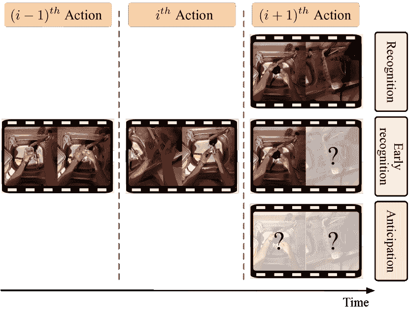
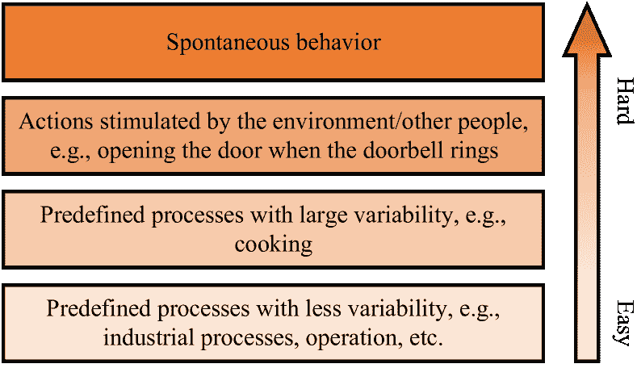
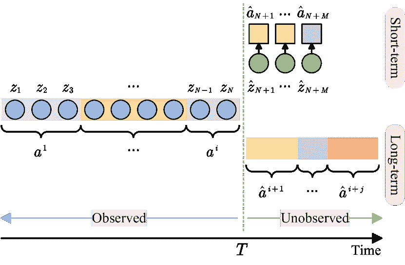
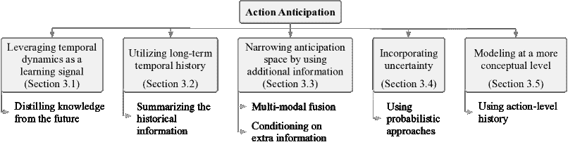
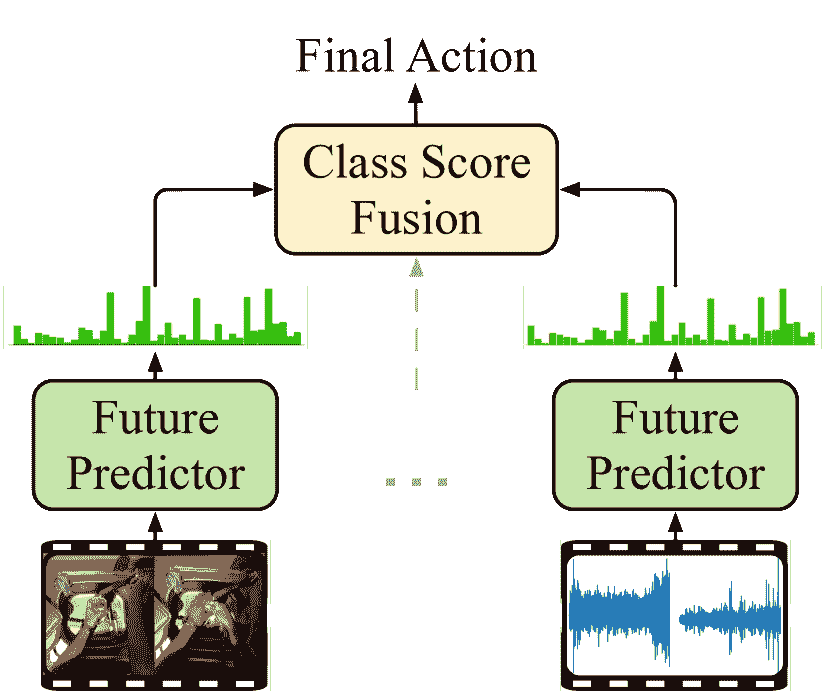
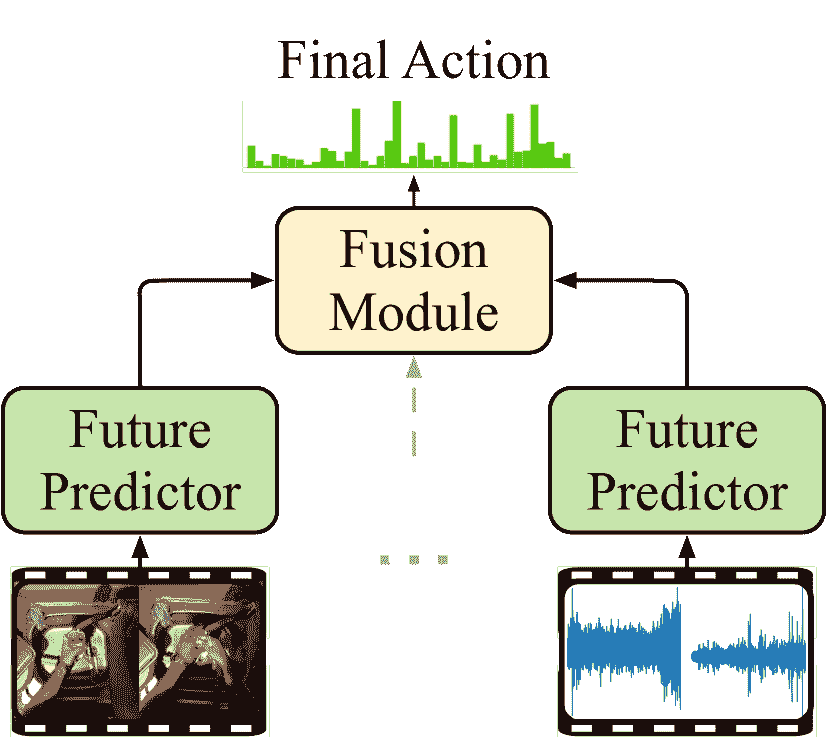
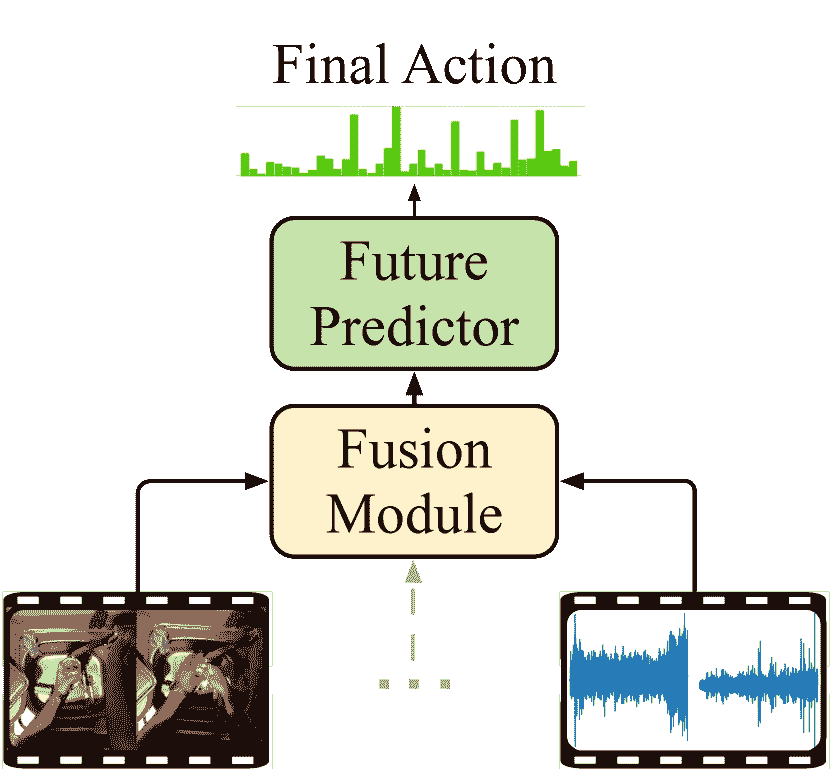
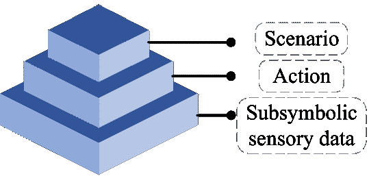

<!--yml

category: 未分类

date: 2024-09-06 19:36:55

-->

# [2309.17257] 行为预测深度学习技术综述

> 来源：[`ar5iv.labs.arxiv.org/html/2309.17257`](https://ar5iv.labs.arxiv.org/html/2309.17257)

# 行为预测深度学习技术综述

Zeyun Zhong, Manuel Martin, Michael Voit, Juergen Gall, Jürgen Beyerer Zeyun Zhong, Jürgen Beyerer 隶属于德国卡尔斯鲁厄理工学院（KIT）。

E-mail: firstname.lastname@kit.edu

Zeyun Zhong, Manuel Martin, Michael Voit, Jürgen Beyerer 隶属于德国弗劳恩霍夫光电学、系统技术与图像利用研究所（IOSB）。

E-mail: firstname.lastname@iosb.fraunhofer.de

Juergen Gall 隶属于波恩大学和德国拉玛尔机器学习与人工智能研究所。

E-mail: gall@iai.uni-bonn.de

###### 摘要

预测未来人类行为的能力对广泛应用至关重要，包括自动驾驶和人机交互。因此，近年来提出了许多用于行为预测的方法，特别是基于深度学习的方法尤为流行。在这项工作中，我们回顾了行为预测算法的最新进展，特别关注日常生活场景。此外，我们根据这些方法的主要贡献对其进行分类，并以表格形式总结，使读者能够一目了然。此外，我们还深入探讨了用于行为预测的常见评估指标和数据集，并提供了系统化的未来方向讨论。

###### 关键词：

行为预测、日常生活活动、视频理解、深度学习。

## 1 引言

与人类行为识别和早期行为识别相比，后者观察到整个或部分行为，行为预测旨在在未观察到任何部分的情况下预测未来的行为，如图 1 所示。预测可能的未来日常生活行为是人机合作和机器人辅助中最重要的任务之一，例如，在适当的时间提供帮助或生成主动对话以提供更自然的互动。

由于未来的动作通常不是确定性的，这往往比传统的动作识别任务更具挑战性，而今天的成熟**判别模型** [1, 2] 表现非常出色。动作的可预测性根据涉及的任务性质而有所不同，如图 2 所示。在变异性较小的预定义过程中，如工业过程和医疗操作 [3]，由于严格遵守既定的协议和指南，动作通常是高度可预测的。另一方面，变异性较大的预定义过程，如烹饪，引入了不确定性，因为这些过程涉及主观决策和不同的原料，这些因素会影响最终结果。由环境或他人刺激的动作，如听到门铃响时开门，表现出中等的可预测性，因为这些动作受外部提示的影响，但回应通常是通过习惯模式形成的。最后，自发行为代表了最高级别的不可预测性，因为它在没有明确刺激或既定模式的情况下产生，使得预测变得困难。

最近，计算机视觉研究社区对解决这一挑战性任务表现出了极大的兴趣。与动作识别相一致，预测方法最初基于单帧视频 [4]，而最近的工作则倾向于使用更长的时间上下文 [5, 6]。除了利用更长的动作历史，许多方法正在探索融合多种模态的信息，以进一步提高预测能力。这些模态包括包含运动信息的光流，以及场景中的物体等。

图 1: 动作预测任务旨在预测未来的动作，而动作识别和早期动作识别分别需要观察完整动作和部分动作。示例帧来自 EpicKitchens [7] 数据集。

图 2: 动作的可预测性。

除了上述的动作识别和早期动作识别任务，文献中还有几个与动作预测相关的任务，如动作分割[8]、时间/时空动作检测[9]、视频预测[10]、轨迹预测[11]和动作预测[12]。计算机视觉中动作预测及其相关任务的定义列在表 I 中。与动作预测不同，相关任务关注于识别和理解已经发生或正在进行的动作。尽管存在这些差异，这些任务是互补的，其中动作识别和定位为动作预测提供了基础组件。

表 I: 动作预测及相关任务的定义。

| 任务 | 定义 |
| --- | --- |
| 动作预测 | 在动作发生之前预测一个或多个未来动作。 |
| 动作识别 | 根据完整的观察对视频或图像序列中的动作进行分类。 |
| 早期动作识别 | 根据部分观察对视频或图像序列中的动作进行分类。 |
| 动作分割 | 对视频的每一帧中的动作进行分类。 |
| 时间动作检测 | 通过预测动作的开始和结束时间来识别和定位视频中的动作。 |
| 时空动作检测 | 在视频中的空间和时间维度上识别和定位动作。 |
| 视频预测 | 给定一组视频帧，预测未来的帧。 |
| 轨迹预测 | 估计场景中物体或代理的未来轨迹或路径。 |
| 动作预测 | 预测人体姿态的变化。 |

### 1.1 应用领域

尽管在天气预报[13]和股票价格预测[14]等其他领域，探索可能的未来已经得到很好的研究，但研究人员最近才在计算机视觉领域积极探索相关解决方案。因此，近年来动作预测方法已经在工业应用[15]、机器人技术[16]、高级驾驶员辅助系统[17]、自动驾驶[18]等多个领域得到了广泛应用。

在像机器人化仓库这样的工业领域，动作预测方法可以用来推断工人的意图，从而提高效率和安全性[15, 19]。在人机交互领域，与被动服务（例如，仅在被问及后才提供服务）相比，机器人预计要提供主动服务，在早期阶段主动发起互动。在这种背景下，准确预测互动开始[20]或用户将要互动的对象[16, 21, 22]使机器人能够自然直观地响应人类行为，从而改善协作。预测还可以应用于生成日常生活的通知，例如在离开房间前提醒我们关灯，或在烹饪后关闭炉子[23]。此外，如果机器人能够评估当前环境的风险，用户，特别是照顾对象的安全性将显著提高[24]。在驾驶场景中，提前预测危险操作可以在司机执行操作前警示他们，并且可以给驾驶辅助系统更多时间来避免或准备应对危险[17]。在自动驾驶中，智能车辆依靠预测能力来预见城市环境中其他道路使用者的行为，特别是在斑马线上的行人[18]或潜在的交通事故[25]，以确保安全高效的导航。

### 1.2 复习范围与术语

文献中有几个调查研究讨论了动作预测作为其范围的一部分[26, 27, 28, 29, 30, 31]。然而，这些调查并未提供动作预测文献的完整概述。虽然[27, 28, 30]考虑了几个主题，且动作预测仅在其他主题中简要讨论，而[29, 31]专注于自我中心视觉的特定挑战。作为早期的工作之一，[26]主要深入探讨了非深度学习基础的方法。在这项调查中，我们的目标是总体回顾和分类动作预测的研究领域。这包括对当前最先进方法的概述，以及数据集和评估指标。我们通过识别未来的研究挑战并总结我们的发现来结束我们的回顾。

尽管经典的学习方法，如基于马尔可夫假设的模型，包括概率后缀树（PST）[32, 33], 隐马尔可夫模型（HMM）[17], 条件随机场（CRFs）[16], 马尔可夫决策过程（MDP）[34]以及其他统计方法[35, 36], 在文献中被广泛使用，我们将重点放在深度学习技术及其在动作预测中的扩展或应用上，将经典方法排除在本综述的范围之外。在这种情况下，动作预测、动作预报和动作预测这些术语是可以互换使用的。请注意，在本综述中我们没有明确区分“动作”和“活动”这两个术语，因为这两个术语在文献中通常是互换使用的。

## 2 问题陈述

在第 2.1 节中，我们介绍了视频特征编码，这是动作预测的基础步骤。根据预测的时间范围，动作预测方法可以分为两类：短期预测方法和长期预测方法。短期方法通常在子符号传感器数据上操作，并预测未来几秒的动作。相反，长期方法可能利用具有更高抽象级别的动作历史来预测未来几分钟内的一系列动作（及其持续时间）。下面，我们在第 2.2 节和第 2.3 节中分别介绍了文献中常用的详细任务定义。

### 2.1 视频特征编码

未剪辑的视频通常用于评估动作预测方法。这些视频可能长达几分钟，并包含多个动作。因此，由于计算资源的限制，直接将整个视频输入视觉编码器以提取特征是困难的。一种常见的视频表示策略是将视频划分为大小相等的时间间隔，称为片段，然后在每个片段上应用预训练的特征提取器。

更正式地，让观察到的视频片段用$V$表示，其中包含$T$帧$\{x_{1},x_{2},\dotsc,x_{T}\}$，对应于$i$个动作$\{a^{1},a^{2},\dotsc,a^{i}\}$，其中$i$通常远小于$T$。然后，视频片段分解成$N$个片段{$V_{1},V_{2},\dotsc,V_{N}$}，每个片段$V_{k}$包含$n$视频帧$\{x_{k1},x_{k2},\dotsc,x_{kn}\}$，其中帧数$n$取决于视频的帧率和所使用的特征提取器。然后，在这些片段上应用特征提取器以提取视频表示的序列{$z_{1},z_{2},\dotsc,z_{N}$}。

常用的提取器包括帧级空间模型，如 VGG16 [37]，ResNet50 [38]，TSN [39]和 ViT [40]，以及片段级时空模型，如 I3D [41]，Two-stream [42]，R(2+1)D [43]，MViT [44]和 Swin [2]。从预训练的编码器中提取的特征通常用于修剪动作识别任务，并不一定适用于动作预测。

### 2.2 短期预测

图 3：动作预测任务的类别。短期预测旨在预测未来几个时间步的动作，而长期任务旨在预测随后的动作（以及它们的持续时间），而不是固定的时间步长。

大多数短期预测方法遵循[4, 45, 7]定义的设置。处理短期预测任务的方法通常在由预先训练的特征提取器提取的视频表示序列上操作，如 2.1 节介绍的那样。采用相同时间间隔的这些表示作为输入，短期方法预测未来$M$时间步的一些表示$\{\hat{z}_{N+1},\hat{z}_{N+2},\dotsc,\hat{z}_{N+M}\}$，然后将其分类为动作$\{\hat{a}_{N+1},\hat{a}_{N+2},\dotsc,\hat{a}_{N+M}\}$，如图 3 所示。未来时间步$M$的数量取决于预测协议和视频表示的时间间隔。例如，如果时间间隔设置为 0.25 秒，所选协议旨在 1 秒内预测一个动作，则$M$将为 4。

### 2.3 长期预测

平行研究解决了长期预测任务[46, 47]。目标是在给定的时间范围内预测未来动作的类别（和持续时间），该时间范围可以延续到几分钟，如图 3 所示。与短期方法不同，长期方法不受限于使用子符号视频表示作为输入。某些方法利用过去的动作，表示为$\{a^{1},a^{2},\dotsc,a^{i}\}$，以直接预测未来动作序列$\{\hat{a}^{i+1},\hat{a}^{i+2},\dotsc,\hat{a}^{i+j}\}$[46, 48, 49]。这些过去的动作可以基于实际观察，也可以从动作分割技术中推导得出[50, 51]。处理长期预测的方法通常依赖于完全标注的数据，即标注了所有未来动作及其持续时间的序列。值得注意的是，一些方法在弱监督环境下操作，仅使用少量完全标注的序列以及主要是仅标注了下一个动作的序列[52]。

## 3 种方法

尽管机器的预测能力可能会在机器人和制造领域启用许多实际应用，但开发一种预测用户未来动作的算法仍具有挑战性。人类依赖于一生积累的大量知识来推测接下来会发生什么。然而，机器如何获得这种知识仍然是一个未解之谜。在本节中，我们描述了尝试解决这一挑战性任务的方法。据我们所知，当前文献未提供特定的分类法来对动作预测模型进行分类。因此，在本综述中，我们将现有的方法分为五类，依据它们所解决的具体问题，如图 4 所示。

图 4：动作预测方法的分类。

利用视频固有的时间动态作为学习信号，一些方法构建了自我监督框架来训练预测模型（第 3.1 节）。早期的方法基于单个过去帧的表示来预测未来动作，忽略了所有时间动态。为了准确预测未来的动作，应分析和总结过去动作的演变。因此，最近的方法使用各种架构来编码长期历史，包括递归和基于变压器的模型（第 3.2 节）。一些方法试图推导和利用额外的模态¹¹1 我们将不同的感官数据（例如，RGB 和音频）以及不同的特征表示（例如，RGB 和光流）称为模态，以强调数据表示之间的差异。来提高预测性能，例如场景中的物体存在、物体边界框和光流，因为它们可能补充原始的 RGB 视频帧。除了从输入视频中获得的数据外，其他信息来源，例如个性化、动作序列的拓扑结构或潜在意图，也可能有助于提高未来预测（第 3.3 节）。由于绝大多数动作预测模型是确定性的，它们不处理未来的不确定性。为了解决这个问题，几位作者提出了对未来预测建模不确定性的方法（第 3.4 节）。文献中的大多数动作预测方法在表示层面上操作，即首先预测未来的视频表示，然后将其分类为动作，如图 3 上部所示。相比之下，一些方法直接基于观察到的动作序列预测未来动作（第 3.5 节），这可能提供对动作依赖关系的清晰分析和更好的可解释性。

表 II 显示了最相关方法的概览，按时间顺序排列。我们通过神经网络架构、用于训练和测试的数据集以及技术细节来表征这些方法，包括输入单个模型的模态、融合策略（如有）、外部知识的引入、预测所依据的抽象层次，以及模型是否处理第二部分中介绍的长期或短期预测任务。虽然大多数短期方法可以通过迭代应用预测模块来执行长期预测，但我们仅根据原始工作的实验对每种方法进行表征。此外，我们提供了模型是否进行了端到端训练的信息，或者是否依赖于预提取的特征。从特征中学习可以在训练过程中节省计算资源。另一方面，根据具体任务，能够端到端地学习或微调任务特定表示可能是有益的。此外，在真实的流媒体场景中，预提取的特征不可用，因此从特征中训练的模型还应考虑特征提取在应用时的影响。请注意，分类法并不是互斥的，因为一些方法可以被归类为多个类别，因为它们涉及多个目标。例如，[48, 53] 涉及动作级预测和预测不确定性。我们根据这些模型的主要贡献指定其类别。

表 II: 主要动作预测模型的总结。表中使用了以下缩写。架构：Transformer (TF)，非本地块 (NLB)。模态：对象 (O)，边界框 (BB)，运动 (M)，动作类别 (A)，音频 (Au)，注视 (G)，手部遮罩 (H)，人-物体互动 (HOI)，时间 (T)。融合：分数融合 (score)，后期特征融合 (late)，中层特征融合 (mid)。EK：外部知识。LT：长期预测。E2E：端到端。由于空间限制，我们省略了像 Fast R-CNN [54] 和 Mask R-CNN [55] 这样的物体检测器作为依赖于物体或人-物体互动模态的方法的特征提取器。

| 方法 | 年份 | 特征提取器 | 未来预测器 | 数据集 | 详细信息 |  |
| --- | --- | --- | --- | --- | --- | --- |
| 模态 | 融合 | EK | 抽象 | LT | E2E |
| 利用时间动态作为学习信号 |
| Vondrick 等人 [4] | 2016 | AlexNet[56] | MLP | [57, 58, 59] | RGB | – | ✗ | 特征 | ✗ | ✓ |
| Zeng 等人 [60] | 2017 | ResNet[38] | MLP | [57, 59] | RGB | – | ✗ | 特征 | ✗ | ✓ |
| RED [45] | 2017 | VGG[37],TS[61], | LSTM | [62, 57, 59] | RGB,M | mid | ✗ | feat. | ✗ | ✗ |
| Zhong et al. [63] | 2018 | ResNet [38] | LSTM | [57, 59] | RGB | – | ✗ | feat. | ✗ | ✓ |
| Tran et al. [64] | 2021 | I3D [41] | – | [7] | RGB | – | ✗ | feat. | ✗ | ✗ |
| Fernando et al. [65] | 2021 | R(2+1)D [43] | FC | [7, 66] | RGB,O,M | score | ✗ | feat.,act. | ✗ | ✓ |
| AVT [67] | 2021 | TSN [39],ViT [40] | TF | [7, 68, 69, 70] | RGB,O | score | ✗ | feat. | ✗ | ✓ |
| DCR [71] | 2022 | TSN [39],TSM [72] | LSTM,TF | [7, 68, 69, 70] | RGB,O,M | score | ✗ | feat. | ✗ | ✗ |
| RAFTformer [73] | 2023 | MViT [44] | TF | [7, 68, 69] | RGB | – | ✗ | feat. | ✗ | ✗ |
| 利用长期时间历史 |
| Gammulle et al. [74] | 2019 | ResNet [38] | LSTM | [70, 66] | RGB,A | mid | ✗ | feat. | ✓ | ✗ |
| TRN [75] | 2019 | TS [61] | LSTM | [59, 62] | RGB,M | mid | ✗ | feat. | ✗ | ✗ |
| TempAgg [5] | 2020 | TSN [39],I3D [41] | NLB,LSTM | [7, 70, 66] | RGB,O,BB,M | score | ✗ | feat. | ✓ | ✗ |
| TTPP [76] | 2020 | VGG[37],TS[61] | TF,MLP | [62, 57, 59] | RGB,M | mid | ✗ | feat. | ✗ | ✗ |
| LAP [77] | 2020 | TS [61] | GRU | [59, 62] | RGB,M | mid | ✗ | feat. | ✗ | ✗ |
| ImagineRNN [78] | 2021 | TSN [39] | LSTM | [7, 69] | RGB,O,M | score | ✗ | feat. | ✗ | ✗ |
| LSTR [79] | 2021 | TS [61] | TF | [59, 62] | RGB,M | mid | ✗ | feat. | ✗ | ✗ |
| OadTR [80] | 2021 | TS [61] | TF | [62, 59] | RGB,M | mid | ✗ | feat. | ✗ | ✗ |
| HRO [81] | 2022 | TSN [39] | GRU | [7, 69] | RGB,O,M | score | ✗ | feat. | ✗ | ✗ |
| MeMViT [6] | 2022 | MViT [44] | – | [68] | RGB | – | ✗ | feat. | ✗ | ✓ |
| FUTR [82] | 2022 | I3D [41] | TF | [70, 66] | RGB,M | mid | ✗ | feat. | ✓ | ✗ |
| TeSTra [83] | 2022 | TS [61],TSN [39] | TF | [59, 68] | RGB,M | mid | ✗ | feat. | ✗ | ✗ |
| 多模态融合 |
| Zhou et al. [84] | 2015 | VGG [37],TS [42] | MLP | [85, 84] | RGB,O,M | late | ✗ | feat. | ✗ | ✗ |
| Mahmud et al. [86] | 2017 | C3D [87] | LSTM,MLP | [88, 89] | O,M | late | ✗ | feat. | ✗ | ✗ |
| Shen et al. [90] | 2018 | [91],SSD [92] | LSTM | [93, 94] | O,BB,G,H | late | ✗ | feat. | ✗ | ✗ |
| Liang et al. [95] | 2019 | [96] | LSTM | [97] | RGB,HOI | late | ✗ | feat. | ✗ | ✓ |
| RULSTM [98] | 2019 | TSN [39] | LSTM | [7, 69] | RGB,O,M | score | ✗ | feat. | ✗ | ✗ |
| FHOI [99] | 2020 | I3D [41],CSN [100] | FC | [7, 69] | RGB,O | score | ✗ | feat. | ✗ | ✓ |
| Ego-OMG [101] | 2021 | CSN [87],GCN [102] | LSTM | [7] | RGB | score | ✗ | feat. | ✗ | ✗ |
| Zatsarynna et al. [103] | 2021 | TSN [39] | TCN | [7, 68] | RGB,O,M | late | ✗ | feat. | ✗ | ✗ |
| Roy et al. [104] | 2021 | I3D [41] | TF | [7, 70, 66] | RGB,HOI,M | score | ✗ | feat. | ✗ | ✗ |
| AFFT [105] | 2023 | TSN [39],Swin [106] | TF | [68, 69] | RGB,O,M,Au | mid | ✗ | feat. | ✗ | ✗ |
| 额外信息条件 |
| S-RNN [107] | 2016 | [108] | GNN,LSTM | [108] | RGB,O,BB | mid | ✗ | feat. | ✗ | ✗ |
| DR²N [109] | 2019 | S3D [110] | GNN,GRU | [111] | RGB | – | ✗ | feat.,act. | ✗ | ✓ |
| Farha et al. [112] | 2020 | I3D [41] | TCN,GRU | [70, 66] | RGB,M | mid | ✗ | feat. | ✓ | ✗ |
| Camporese et al. [113] | 2020 | TSN [39] | LSTM | [7, 69] | RGB,O,M | score | ✓ | feat. | ✗ | ✗ |
| RESTEP [114] | 2021 | I3D [41] | ConvGRU | [111] | RGB | – | ✗ | feat. | ✗ | ✗ |
| A-ACT [115] | 2022 | TSN [39],I3D [41] | TF,MLP | [66, 70, 7] | RGB,O,M | score | ✗ | feat.,act. | ✗ | ✗ |
| 抽象目标 [116] | 2022 | TSN [39] | GRU | [7, 68, 69] | RGB,O,M | score | ✗ | feat. | ✗ | ✗ |
| Anticipatr [117] | 2022 | I3D [41] | TF | [70, 66, 69, 7] | RGB | – | ✗ | feat. | ✓ | ✗ |
| Mascaro 等 [118] | 2023 | SlowFast [1] | MLP,VAE,TF | [47] | RGB | – | ✗ | feat. | ✓ | ✗ |
| AntGPT [119] | 2023 | ViT [40] | TF | [47, 7, 69] | RGB | – | ✓ | act. | ✓ | ✗ |
| 融入不确定性 |
| Schydlo 等 [21] | 2018 | [120] | LSTM | [108] | P | – | ✗ | feat. | ✗ | ✗ |
| Farha 等 [48] | 2019 | – | GRU | [70, 66] | A,T | mid | ✗ | act. | ✓ | ✗ |
| APP-VAE [53] | 2019 | – | LSTM,VAE | [66, 121] | A,T | mid | ✗ | act. | ✓ | ✗ |
| Ng 等 [122] | 2020 | I3D [41] | GRU | [123, 66, 89, 70] | RGB | – | ✗ | feat. | ✓ | ✗ |
| AGG [124] | 2020 | – | TCN,MLP,GAN | [123, 70, 121] | A | – | ✗ | act. | ✓ | ✗ |
| Zhao 等 [49] | 2020 | – | LSTM,GAN | [66, 70, 7] | A,T | mid | ✗ | act. | ✓ | ✗ |
| 在更高层次上建模 |
| Farha 等 [46] | 2018 | – | CNN,GRU | [70, 66] | A,T | mid | ✗ | act. | ✓ | ✗ |
| Miech 等 [125] | 2019 | R(2+1)D [43] | FC | [7, 66, 126] | RGB | – | ✗ | feat.,act. | ✗ | ✗ |
| Ke 等 [127] | 2019 | I3D [41] | TCN | [7, 70, 66] | RGB,T | mid | ✗ | act. | ✓ | ✗ |
| Zhang 等 [128] | 2020 | TSN [39] | LSTM,MLP | [7] | RGB,O,M | score | ✗ | feat.,act. | ✗ | ✗ |
| ProActive [129] | 2022 | – | TF | [66, 126, 121] | A,T | mid | ✓ | act. | ✓ | ✗ |

### 3.1 利用时间动态作为学习信号

通过自监督损失利用时间动态。一种有前途的方法是利用互联网大量存在的未标记视频来赋予机器推断未来用户行为的能力。这些视频在大规模获取上经济可行，且包含丰富的信号，特别是帧的固有时间顺序。一些模型利用时间顺序，通过预测下一个视频帧或运动图像进行训练[130]。然而，像素空间高维且极其多变[10]，这可能给预测任务带来额外挑战。因此，许多方法将未来帧的视觉表示作为预测目标，并通过最大化相关性[65, 131]或最小化预测与实际未来帧表示之间的距离（例如，以对比损失的形式）[132, 133, 134, 135, 136, 137]，或简单的 MSE 损失[4, 45, 63, 67]来学习预测未来的表示。

视频表示捕捉了关于动作的语义信息，可以使用预训练的特征提取器自动计算，使其可以扩展到未标记视频。基于这一想法，初步工作[4]建立了一个深度回归网络，该网络以单帧作为输入，预测预训练 AlexNet[56]（最后隐藏层(fc7)）的未来帧表示。然而，单帧并不能提供关于过去的信息。为了应对这一限制，Zhong 和 Zheng[63]开发了一个包括空间流和时间流的双流网络，遵循[4]的学习目标（即 MSE 损失）。空间流使用 ResNet[38]对最近帧的空间上下文进行编码，而时间流则使用长短期记忆单元（LSTM[138]）总结历史信息。为了应对 LSTM 有限的长期建模能力，作者提出使用一个全连接层计算所有过去时间步的隐藏状态的紧凑表示。通过编码的空间和时间上下文，接着使用全连接层来预测未来的表示。通过整合时间信息，该方法超越了[4]。

另一条研究方向基于对比学习[132, 133, 134, 135, 136]。对比目标的本质是将正样本对拉近，同时将其与大量负样本对保持距离。正样本对和负样本对的定义在这些研究中各不相同。对比预测编码（CPC）[132]和密集预测编码（DPC）[133]方法具有共同的概念基础，它们的学习目标分别是预测未来剪辑的粗略剪辑级和细粒度时空区域表示，前提是给定一个观察到的剪辑序列作为上下文。Han 等人[134]通过引入由可学习向量组成的记忆库，扩展了 DPC 的原理，以考虑预测未来的非确定性特征。Suris 等人[135]将双曲几何，特别是庞加莱球模型，整合到 DPC 框架中，以辨别数据中可以预测的特征。双曲几何类似于一个连续的树[139]，它编码了层次结构，并促进了多个层次的抽象预测。在高置信度的情况下，预测特定动作，而在不确定的情况下，选择更高层次的抽象。Zatsarynna 等人[136]提出了一种复合损失用于无意动作预测，其中包括一种时间对比损失，鼓励嵌入空间中相邻视频剪辑的接近，以及一种成对排序损失，考虑视频剪辑的相对顺序。

与上述方法不同，某些方法展示了在目标数据集上进行微调的有效性[45、71、131、137]，特别是对于那些包含正向视频片段的整个数据集非常少的情况。例如，Gao 等人[45]提出了一种基于 LSTM 的编码-解码网络（RED）。该网络以历史视觉表示的连续步骤作为输入，输出一系列预测的未来表示，然后由分类网络进行动作分类。该架构采用两阶段训练过程。在第一阶段，使用均方误差（MSE）损失对数据集中所有训练视频进行自监督训练。在第二阶段，利用正样本对初始化的网络进行完全监督优化。此外，作者引入了一个强化学习模块，以在序列层面优化网络。有关更多详细信息，请参见第 3.3.2 节。类似地，Xu 等人[71]对所采用的基于变换器的推理模型[140]进行了顺序感知预训练，这对最终的预测性能证明了有益。具体来说，将观察到的视频片段输入到没有位置编码的变换器中。然后计算变换器输出标记与位置编码之间的余弦相似度，并通过 Softmax 转换为概率。为了监督训练，作者提出了一种基于高斯亲和力的相似度[141]。位置编码在时间 $p$ 和帧特征在时间 $q$ 的相似度 $s_{p,q}$ 被测量为：

|  | $s_{p,q}=\mathrm{exp}\biggl{(}-\frac{(p-q)^{2}}{\sigma^{2}}\biggr{)},$ |  | (1) |
| --- | --- | --- | --- |

其中 $\sigma$ 代表高斯的带宽，通常根据经验设置为一个常数。

一些方法选择在训练目标中加入自监督损失，通常与用于动作分类的交叉熵损失结合。Tran 等人[64] 提出了通过最小化过去和未来特征图之间的距离来监督预期模型的训练，并结合交叉熵损失。为了处理视频中的动态，作者引入了注意力池化操作符，将特征图转换为位置无关的表示，以计算平方损失。Fernando 和 Herath [65] 提出了三种新颖的相似性度量来监督训练，最大化预测和实际未来表示之间的相关性。他们认为，常用的相似性度量如 L2 距离和余弦相似度并不理想，因为它们要么无界，要么忽略了幅度。Girdhar 和 Grauman [67] 提出了基于 GPT2 的因果预期模型[142]，并使用 MSE 损失来监督中间未来预测。与使用因果注意力掩码预测下一个帧特征的方法不同[67]，Girase 等人 [73] 提出了使用掩码基础自监督的广义形式来预测打乱的未来特征，这允许比原始因果掩码方案更多的变化。

探索潜在的动态。一些方法依赖于对抗训练框架[143]来学习视频的潜在动态[60, 144, 124, 49]。例如，Zeng 等人 [60] 将预期任务表述为逆向强化学习（IRL）问题，目标是模仿自然序列的行为，这些序列被视为专家演示。更具体地说，他们利用生成对抗模仿学习框架[145] 来绕过全面的状态-动作对访问，因为状态（帧）和动作（过渡）空间都是高维的连续的。在这个框架中，一个判别器旨在区分生成的序列和专家的序列，生成器（策略）在判别器的指导下朝着专家类似的区域移动，在训练过程中共同优化。

### 3.2 利用长期时间历史

大多数动作表现出对前序动作的依赖。这些前序触发动作不一定仅限于最近的过去，还可以追溯到较长的历史。因此，许多方法旨在利用长期历史中的信息。

循环网络。具备内部记忆的循环网络，包括 LSTMs [138] 和 GRUs [146]，常用于利用序列化的动作历史 [45, 98, 75, 77]。Qi 等人 [147] 在递归序列预测任务中采用了 GRUs。为了解决误差积累的问题，他们提出了一种自我调节学习框架，该框架使用对比损失和动态重加权机制来调节中间表示，从而关注观察内容中的信息帧。受人类视觉认知系统的启发，人们常常通过同时想象未来场景来推断当前动作 [148, 149]，Xu 等人 [75] 提出了时间递归网络（TRN），以同时进行在线动作检测和对即时未来的预期。这些预测的未来数据随后被用于增强当前的动作检测。尽管 TRN 最初是为在线动作检测而设计的，其预测能力使得它被应用于动作预期。这种通过引入预测的未来信息来提高检测性能的概念，后来被进一步的研究所采用 [77, 80]。与 TRN 中简单使用固定未来时间范围不同，Qu 等人 [77] 认为最佳的补充特征应该来自不同的时间范围。他们引入了一种自适应特征采样策略。更具体地说，他们首先通过利用过去的帧表示来推断正在进行的动作进展的分布。为了采样进展，他们采用了 Gumbel-Softmax 技巧 [150]，这是一种模拟从分类分布中得到的一热向量的技术。随后，采用等距采样策略来获取所需的补充特征，包括前期和预期未来的特征。采样范围的大小取决于当前的动作进展。

引入外部记忆模块。众所周知，由于递归网络的顺序特性，它们在建模长期依赖关系方面存在困难。为了增强常见递归架构（如 LSTM）的长期建模能力，外部记忆模块被引入[74, 81]。Gammulle 等人[74]提出使用外部神经记忆网络来存储整个数据集的知识。具体来说，他们利用了两种类型的历史信息：观察到的帧和对应的动作标签。当存在输入刺激，即基于输入生成的查询向量时，记忆网络根据存在于记忆中的知识生成输出，并通过写操作更新自己。通过将每个记忆网络的两个信息源的串联顺序输出迭代地输入到 LSTM 中，生成了一系列未来的动作预测。与[74]中的方法不同，Liu 和 Lam[81]（HRO）中的外部记忆模块是固定的，即在推理过程中处理序列时不会被更新。此外，HRO 中的记忆模块用于预测下一个时间步骤的表示，而不是增强当前时间步骤的表示。为了进一步规范学习过程并提高预期性能，作者采用了对比学习范式（受[78]的启发）和一个过渡层，以弥合过去和未来语义之间的差距。

大多数预期模型设计为接受预提取特征作为输入，以利用较长的时间历史，同时限制训练过程中的计算成本。然而，这也消除了与端到端方法相比，微调任务特定表示的好处，在端到端方法中，特征提取器在反向传播过程中也会被优化。为了训练一个完全端到端的模型，并在不遇到计算或内存瓶颈的情况下受益于更长的动作历史，Wu 等人[6]提出了以在线方式处理视频并缓存记忆。视频被划分为连续的片段并按顺序处理。中间结果，即早期时间步骤的键和值向量，被缓存到记忆模块中，以便当前时间步骤的查询向量不仅可以访问同一片段内的最近帧，还可以访问早期片段中的过去帧。这种设计不同于上述基于记忆的方法，因为它不包含任何可学习的参数，因此没有关于数据集的知识。

处理时间历史。在解决顺序建模递归架构的挑战时，出现了许多方法，旨在通过并行方法封装动作历史。这涉及到同时处理所有过去的帧，而不是顺序处理。其中，注意力机制 [140] 在这些方法中引起了广泛关注，利用其在自然语言处理和计算机视觉领域的广泛应用和显著表现。Wang 等人 [76] 提出了一个类似于变压器的架构，该架构从最后观察到的帧特征中生成查询向量，从所有其他过去帧特征中生成键和值向量。查询向量基于注意力得分从过去历史中提取相关信息，形成一个聚合表示。然后，利用由 MLPs 组成的预测模块，根据聚合表示迭代预测未来特征和动作。Sener 等人 [5] 用不同的时间范围和多种粒度表示最近的观察和长期过去的历史。通过注意力使用非局部块 [151, 152] 来聚合短期（最近）和长期（跨越）特征。每个最近的特征与所有跨越的表示相结合。输出通过得分融合，即平均多个预测，来预测最终结果。

降低自注意力的复杂性。变压器模型中的自注意力操作计算输入序列中每对标记之间的点积，其复杂度为$O(N^{2})$，其中$N$是序列的长度。最近，已经有针对性地关注将复杂度降低到$O(N)$的大型方法，以使变压器模型能够扩展到长序列。低秩近似将注意力矩阵分解为两个较低秩的矩阵[153, 154]。基于查询的交叉注意力机制将长期输入压缩为固定大小的表示[155, 156]。沿着基于查询的交叉注意力设计的思路，Xu 等[79]提出了一个两阶段记忆压缩设计，将长期记忆压缩并抽象为固定长度的潜在表示，经验上发现这会带来更好的性能。此外，作者使用了一个短时间窗口的最近帧来对提取的长期记忆进行自注意力和交叉注意力操作。在动作预测的情况下，短期记忆与一系列可学习的标记进行连接，这些标记负责未来的预测。沿着 Xu 等[79]的思路，赵和 Krähenbühl[83]通过核的视角[157]重新构造了第一个记忆压缩阶段的交叉注意力。在这种重新构造中，注意力可以被看作是对输入应用核平滑，其中核分数表示输入相似性。他们应用了两种时间平滑核：盒子核和拉普拉斯核。最终的流式注意力在帧与帧之间重用了大量计算，并且只有一个常数的缓存和计算开销。

### 3.3 通过使用额外信息来缩小预测空间

尽管基于视觉的系统是动作识别和预测的事实标准[98, 67]，但使用其他额外的支持输入模态如光流特征[39, 41, 158]或场景中的物体和声音知识[159, 158, 105]已被证明是有益的[160]。为了正确融合不同的模态，近年来已利用各种融合策略进行动作预测，这些策略在第 3.3.1 节中有所描述。此外，个性化等额外有用的信息（第 3.3.2 节）也可以被纳入系统中以进一步支持预测。

#### 3.3.1 多模态融合

输入模态。虽然动作预测方法通常将原始视频帧作为默认输入模态，但许多方法利用原始 RGB 帧中的高级模态，如光流[161]、物体特征（通常依赖于物体检测器，如[54, 55]）、人-物体互动[162, 104, 163]和人-场景互动[95]。对于自我中心视频，额外使用了摄像机佩戴者的轨迹[164]、手部轨迹[99]、眼睛注视[69]和环境适应性[165]。

(a) 分数融合。

(b) 晚期特征融合。

(c) 中层特征融合。

图 5：多模态动作预测的三种典型融合策略。为了简洁，特征提取器被省略。示例来自 EpicKitchens[7]数据集和 AFFT[105]。

例如，Shen 等人[90] 提出了使用凝视来提取事件，因为凝视进出某一物体很可能表示某一活动的发生或结束，并构建了一个由凝视事件驱动的双流网络。异步流通过 Hawkes 过程模型[166] 建模了不同事件之间的关系，而同步流提取了逐帧的手部和凝视特征，这些特征通过一个基于凝视事件的注意力模块进行时间加权。Liu 等人[99] 明确地将意图手部运动作为动作的预期表示。他们联合建模并预测了手部轨迹、交互热点和未来动作的标签。类似地，Dessalene 等人[101] 利用手部和物体分割掩码，并使用手部与物体之间的接触时间作为预期任务的表示。长期时间语义关系通过图卷积网络 (GCN [102]) 和 LSTM 进行了建模。基于图形表示及外观特征预测未来动作。Roy 和 Fernando [104] 引入了人机交互作为预期表示，并通过场景中每对人机对的视觉特征的互相关来表示它。然后利用标准的编码器-解码器 Transformer 进行时间特征聚合和未来动作生成。

评分融合。与大多数多模态动作识别模型一致[39, 41]，预期模型通常使用评分融合，如图 5(a)所示，以融合不同的模态。虽然使用固定权重的平均方法，包括简单平均[5, 104]和加权平均[67]，已经显示出比单模态基线更优的结果，Furnari 等[98]展示了为最终预测分配每种模态的动态重要性对于预测自我中心动作特别有利。他们采用了一种基于两个 LSTM 的编码器-解码器架构（RU-LSTM）来处理各个模态。考虑到三种不同类型的信息：外观、运动和场景中的物体存在，他们构建了三个分支，并提出了一个包含全连接层的融合模块，以生成每种模态的注意力分数。值得注意的是，作者还发布了 Epic-Kitchens[7, 167]和 EGTEA Gaze+[69]的预提取特征²²2[`github.com/fpv-iplab/rulstm`](https://github.com/fpv-iplab/rulstm)，这些特征在许多动作预期方法中得到了应用[5, 103, 105]。Osman 等[168]进一步扩展了这项工作，加入了一个在不同帧率下运行的第二个流，灵感来自[1]。

特征融合。另一类多模态工作集中于特征融合，即在做出决策之前融合模态，包括后期融合[103, 86]和中层融合[105, 82, 48]。类似于基于得分融合的方法，采用后期融合策略的方法首先预测包含未来动作模式的表示，然后使用特定的融合模块融合不同模态的表示（参见图 5(b)）。Mahmud 等人[86]提出了一个由三个分支组成的网络，利用对象特征和基于运动的动作特征共同学习未来动作标签和开始时间。为了对齐这三个分支，在所有分支的连接输出上方添加了一个全连接层。在 Furnari 等人[98]的工作基础上，Zatsarynna 等人[103]在他们的工作中考虑了相同的三种模态。他们使用时间卷积网络（TCN [169]）独立预测每个输入模态的未来表示。随后，这三个独立的表示被连接并通过全连接层进行融合。最终的预测是基于结果融合表示进行的。

与[103]中使用的后期融合策略不同，中层策略通常首先融合不同的模态，而不显式考虑时间信息，然后使用额外的预测模块来预测下一个动作，如图 5(c)所示。虽然使用全连接层[82, 48]聚合连接的多模态特征是一种标准的特征融合策略，Zhong 等人[105]构建了一个基于变换器的融合模块，使用模态无关的标记，类似于视觉变换器（ViT [40]）中的[cls]标记。他们的结果优于基于得分融合的方法。除了 Furnari 等人[98]提出的三种模态，即外观、运动和对象存在，他们还加入了音频模态。然而，研究表明，与视觉模态相比，音频提供的信息较少。为了预测下一个动作，使用了[67]中的基于 GPT 的预测模块。

#### 3.3.2 基于额外信息的条件设置

个性化。Zhou 和 Berg [84] 探索了与日常活动的自我中心视频中的时间预测相关的两个简单任务，即成对的时间排序和未来视频选择。他们表明，对特定个体或环境的个性化显著提高了性能。

预测时间。由于递归方法在预测较长的动作序列时面临推理时间增加和错误累积的问题，一些方法依赖于通过学习一系列动作查询进行并行解码 [80, 82, 117]。然而，可预测的未来动作数量也受限于训练过程中使用的动作查询数量。Ke 等 [127] 采取了另一种方法，选择以表示预测时间的时间变量为条件。具体来说，他们将预测时间转化为时间表示，并将其与原始输入拼接，形成时间条件观察。因此，他们的模型能够以一次性方式在任意和可变的时间范围内预测未来动作。在类似概念的基础上，Anticipatr [117] 利用线性层将可学习的动作查询与预期持续时间转换为时间条件查询。它采用了两阶段的学习方法。在第一阶段，训练了一个片段编码器来预测未来动作标签的集合。在第二阶段，训练了一个视频编码器和一个预期解码器，以根据片段编码器的输入做出最终决策。Anticipatr 在多个基准测试中展示了最先进的性能。

序列级信息。行动预测的自然期望是尽早做出正确预测。然而，交叉熵损失不能捕捉序列级别的区别，因为它在每一步都计算，以对地面真实类别输出更高的置信度分数，并且不涉及序列级别的信息。因此，Gao 等人[45] 提出了一个强化学习模块，为与早期正确预测对应的序列提供高奖励。基于类似的思路，Ng 和 Fernando [122] 修改了预测与地面真实之间的交叉熵损失，考虑了以下因素：1）较短的观察包含的信息较少，因此应对整体损失的贡献较小；2）在不久的将来正确预测的行为对远期预测很重要，应通过损失函数加以强调。实证结果证明了修改损失函数的有效性。受到人类根据未来推测过去的能力的启发，某些方法[112, 115] 引入了一个周期一致性模块。该模块使用预测的未来来预测过去的活动，并与缺乏一致性模块的对照组相比，显示了改进的结果。同样，Fosco 等人[170] 引入了事件转移矩阵（ETM）以将统计规律纳入模型。ETM 是从未剪辑的视频数据集中计算得出的，表示特定行为被任何其他行为之前或之后的可能性。通过引入 ETM，模型可以直接利用这种事件转移可能性的明确表示，而无需从头学习。

行动的语义意义。在预测人类行为时，一个重要的考虑因素是未来的不确定性，因为可能发生多种行为。然而，大多数方法使用一热编码标签来监督学习过程，这可能会阻止模型捕捉到实际的数据分布。为了解决这个问题，Camporese 等人[113] 提出了通过标签平滑技术将行动的语义意义（例如，通过类似 GloVe [171] 的词嵌入的相似性）注入模型，从而扩展了可能的未来集合。

时空图结构。当人类与物体互动时，这些互动发生在空间和时间上。建模这样一个时空图结构，其中图的节点通常表示问题组件，边缘捕捉它们的时空互动，近年来引起了广泛关注 [107, 162, 109]。虽然概念很清楚，但构建图和更新节点特征的方式具有挑战性。Jain 等人 [107] 使用多个 LSTM 来更新基于连接的消息特征的相应节点或边缘。Qi 等人 [162] 基于加权消息的总和来更新节点特征，其中权重，即邻接矩阵，也在优化过程中被估计和更新。类似于 [162]，Sun 等人 [109] 在优化过程中估计注意力分数，以在时间步内聚合所有消息，类似于图注意力网络 [172]，然后这些分数被用于更新下一步的节点特征。为了预测行为者的行为，使用了 GRU [146] 进行时间建模。通过这样做，空间和时间依赖性被相互隔离。Li 等人 [114] 认为这种设置可能无法完全捕捉空间和时间信息，因为忽略了它们的共现和强相关性。为了解决这个问题，他们提出了一个时空关系网络（STRN），通过扩展卷积门控递归单元（ConvGRU） [173]，可以同时捕捉空间和时间背景。

图 6：活动的抽象级别。

潜在意图。为了完成某件事，人类会执行由意图决定的一系列动作[174]。因此，理解人类意图可以帮助预测一个人未来的行为。基于这一思想，一些研究[175, 116, 118, 119] 建立了一个自上而下的框架（参见图 6），以明确推断意图并利用该意图来限制未来动作的变异性。具体来说，Roy 和 Fernando [175] 使用堆叠 LSTM 从观察到的视觉表示中推导出潜在目标，并利用目标接近度和目标一致性的概念来指导预测。目标接近度表明动作应与潜在目标对齐，而目标一致性则在整个序列中保持这种对齐。Mascaro 等[118] 提出了使用 MLP Mixer [176] 来估计人类意图。通过将过去的动作、估计的意图以及基于 VAE 重新参数化技巧的潜在分布中的潜在向量作为输入，使用变换器解码器生成未来动作序列。Zhao 等[119] 提出了首先识别人类动作，然后将识别出的动作作为离散标签输入到 ChatGPT [177] 中，以获取目标和未来动作。Zatsarynna 和 Gall [178] 将目标估计集成到多任务框架中，展示了相比于缺乏目标估计的对照组的改进性能。

### 3.4 纳入不确定性

预测未来动作本质上是不确定的。给定一个包含正在进行的动作的观察视频片段，多个动作可能是观察到的动作之后的下一个动作。如果我们预测较远的未来，这种不确定性会变得更大。因此，建模潜在的不确定性可能是有益的，这样可以捕捉到不同的可能未来动作。然而，动作预测大多被视为分类问题，并使用交叉熵损失进行优化，这样会导致与主流真实情况的相似性过高，同时抑制其他合理的可能性[179]。此外，使用均方误差优化的方法往往产生模式的均值[4, 180]。因此，一些方法输出多个可能的未来动作，以捕捉潜在的不确定性。

使用多重规则生成多个输出。为了应对未来预测的非确定性，Vondrick 等人 [4] 扩展了他们的回归网络，通过训练 $K$ 个网络的混合来支持多个输出，每个混合被训练来预测未来的其中一种模式。由于数据集中只提供了可能的未来之一，而且不知道每个数据样本属于 $K$ 个混合中的哪一个，他们通过两步交替解决了这些问题：1) 在保持混合分配固定的情况下优化网络，2) 用新的网络权重重新估计混合分配。在推理过程中，通过对所有模式的概率分布进行边际化，选择最可能的动作类别。按照类似的思路，Piergiovanni 等人 [124] 提出了一个可微分语法模型，该模型学习一组生成规则，能够生成多个候选未来序列，这些序列遵循训练期间看到的序列的类似分布。为了避免列举所有可能的规则（这些规则的增长是指数级的），他们引入了对抗学习来改进语法模型，使学习过程更加高效，无需进行这种列举。

通过从学习到的分布中采样生成多个输出。Schydlo 等人 [21] 将在三个时间步观察到的人体姿态特征作为输入传入编码器-解码器 LSTM 网络，以生成未来的动作序列。通过在每个时间步从动作概率分布中采样，并使用束搜索，他们在推理过程中从一组动作候选中做出了最终选择。类似地，Farha 和 Gall [48] 引入了一个框架，以随机的方式预测所有后续动作及其相应的持续时间。在他们的框架中，类似于 [46] 中提出的动作模型和时间模型被训练来预测未来动作标签和持续时间的概率分布。动作模型使用交叉熵损失进行训练，而持续时间则通过高斯分布进行建模，并用负对数似然进行优化。在测试时，从学习到的分布中采样未来的动作标签及其持续时间。通过递归地将预测的动作片段输入模型，实现了长期预测。

Zhao 和 Wildes[49]通过使用条件对抗生成网络解决了相同的任务，即联合预测长期动作标签及其对应时间。与 Farha 和 Gall[48]不同，他们将动作标签和时间都视为离散数据，并将其格式化为独热编码向量。这种方法受到推荐系统研究的启发，研究发现用类别表示建模时间并用交叉熵优化，比使用实值建模更具优势[181]。在将这些向量投射到更高维的连续空间并将其连接后，它们被送入 seq2seq 生成器[182]以计算未来的动作标签及其对应时间。为了在训练过程中实现可微采样，并生成具有质量和多样性的未来序列，采用了 Gumbel-Softmax 松弛技术[150]，该技术模仿了类别分布中的独热向量，以及规范化距离正则化器[183]，鼓励多样性。使用 ConvNet 分类器作为判别器，实现了生成器的对抗训练。

Mehrasa 等人[53]提议使用递归变分自编码器[184]（VAE）来捕捉动作序列的时间和类别分布。为了解决固定的潜变量先验分布（通常是 VAE 模型中的$\mathcal{N}(0,I)$）可能忽略动作之间存在的时间依赖性的问题，作者们开发了一个时间变化的先验。在测试时，从学习到的先验分布中采样一个潜在代码，并利用该代码推断动作类别及其对应时间的概率分布。

### 3.5 更概念层面的建模

前面介绍的大多数动作预测方法都在特征层面上操作，即预测模块接收一个或一系列表示观察到视频的特征向量，然后预测未来的特征向量，这些特征向量由分类器进一步分类为动作。一些方法则采取了相反的方向。他们首先识别正在进行的动作，然后直接推断未来的动作。这些方法背后的直觉也很简单。由于某些动作依赖于特定的触发动作，如果已经观察到其中一个触发动作，我们可以直接预测下一个动作。例如，如果我们观察到的动作是拿杯子，那么未来的动作更可能是喝水。这些方法没有在特征层面上处理，而是利用动作层面的观察直接建模动作之间的依赖性。

马尔可夫假设。为此，一些方法对执行的行动序列做出马尔可夫假设，并使用线性层来建模过去和下一个行动之间的过渡[125, 128, 65]。过渡模型的线性权重可以解释为传达每个过去行动类别对预测的重要性。通过分析线性权重和当前行动的置信度向量，我们可以轻松解释哪个行动类别对预测最有责任，并诊断错误预测的来源，即错误预测是由于识别模型还是由于学习到的过渡模型。

长期预测。虽然特征向量的历史包含丰富的语义信息，但行动级事件历史提供了不同的视角，可能更好地分析了过去行动的演变，从而创建了一个预测未来更远事件的模型[74, 53]。因此，许多方法利用这种行动级历史进行长期预测[46, 49, 53]。例如，Farha 等人[46]提出了两种长期行动预测的方法。一种基于 RNN 模型，输出当前行动的剩余长度、下一个行动类别及其长度。长期预测是递归进行的，即将观察结果与当前预测结合以产生下一个预测。另一种方法基于 CNN 模型，它在一步中输出一个未来行动序列的矩阵。

将行动视为事件。通过人类活动（例如跑步、烹饪等）生成的大多数数据可以表示为连续时间上的一系列行动。这些行动的开始和完成时间会根据用户和周围环境的不同而有所变化。因此，这些连续时间的行动序列可以被视为稀疏事件（行动类别及其时间发生情况），并可以通过经典的事件建模方法如时间点过程（TPPs）[185, 166]进行建模。TPPs 在建模各种连续时间序列方面显示出了显著的潜力，例如在医疗保健[186]、金融[187]、教育[188]和社交网络[189]领域。

最近几年，也有一些尝试将 TPPs 应用于动作预测。在这个方向上的初步努力 [35] 采用了泊松过程 [185] 作为活动间隔时间建模的关键技术。注意，间隔时间与绝对活动发生时间不同，它表示的是连续活动之间的时间持续。为了支持时间的随机建模，作者为强度函数预定义了高斯过程先验，并从每个动作的训练数据中学习其参数，即某些动作和时间的均值和方差。由于 TPPs 也可以用计数过程 $C(t)$ 来描述，因此强度函数的物理意义是事件到达的速率：

|  | $\mathrm{P}\bigl{(}dC(t)=1\bigr{)}=\lambda^{*}(t),$ |  | (2) |
| --- | --- | --- | --- |

其中 $dC(t)=C(t+dt)-C(t)$ 和 ^∗ 表示对历史的依赖。然后，他们通过重要性采样进行了测试。与泊松过程中的常数强度函数相比，初步工作的扩展动态地计算了从过去观测中获得的强度参数 [53]。他们的模型还通过变分自编码器（VAE）采样潜在变量来支持随机时间和动作预测。Gupta 和 Bedathur [129] 提出了使用时间归一化流（NF） [190， 191] 学习连续时间动作序列中的动作分布，该分布以序列的动态和动作特征（如最短完成时间）为条件。这样的流式公式比基于强度的模型 [191， 192] 提供了封闭形式和更快的采样，以及更准确的预测。除了动作预测，作者还讨论了给定目标的目标预测和序列生成。

## 4 评估数据集与指标

### 4.1 数据集

动作预测算法在广泛的数据集上进行评估，这些数据集按时间标记了相应的动作。为了更好地区分当前数据集，我们考虑了以下几个特征。

表 III：用于人类动作预测的代表性基准数据集。表中使用了以下缩写。类型：日常生活活动（ADL）。传感器模态：深度（D），音频（Au）。复合活动：Composite activities。并发活动：Concurrent activities。自发性：Spontaneity。

| 数据集 | 年份 | 类型 | 视角 | 多视角 | 复合活动 | 并发活动 | 自发性 | 小时 | 分段 | 类别 | 传感器模态 |
| --- | --- | --- | --- | --- | --- | --- | --- | --- | --- | --- | --- |
| TV-I [57] | 2010 | 电影 | 拍摄 | ✗ | ✗ | ✗ | 中等 | – | 300 | 4 | RGB |
| 50Salads [70] | 2013 | 烹饪 | 顶视图 | ✗ | ✓ | ✗ | 中等 | 4.5 | 966 | 17 | RGB |
| CAD-120 [108] | 2013 | ADL | 拍摄 | ✗ | ✓ | ✗ | 低 | 0.57 | 120 | 12 | RGB, D |
| 早餐 [66] | 2014 | 烹饪 | 拍摄 | ✓ | ✓ | ✗ | 中等 | 77 | 11.2K | 48 | RGB |
| THUMOS14 [59] | 2014 | 网络 | 拍摄 | ✗ | ✗ | ✗ | 中等 | 20 | 6.3K | 20 | RGB |
| Charades [123] | 2016 | ADL | 拍摄 | ✗ | ✗ | ✓ | 低 | 82.3 | 66.5K | 157 | RGB |
| TVSeries [62] | 2016 | 电影 | 拍摄 | ✗ | ✗ | ✗ | 中等 | 16 | 6.2K | 30 | RGB |
| EGTEA Gaze+[69] | 2018 | 烹饪 | 自我中心 | ✗ | ✗ | ✗ | 中等 | 28 | 10.3K | 106 | RGB, Gaze |
| EpicKitchens-50[7] | 2018 | 烹饪 | 自我中心 | ✗ | ✗ | 少量 | 高 | 55 | 39.6K | 2,513 | RGB, Au |
| AVA [111] | 2018 | 电影 | 拍摄 | ✗ | ✗ | ✓ | 中等 | 107.5 | 38.6K | 60 | RGB |
| EpicKitchens-100 [68] | 2020 | 烹饪 | 自我中心 | ✗ | ✗ | ✓ | 高 | 100 | 90K | 3,807 | RGB, Au |
| Ego4D [47] | 2022 | ADL | 自我中心 | ✗ | ✗ | ✓ | 高 | 243 | – | 4,756 | RGB, Au |
| Assembly101 [193] | 2022 | ADL | 多视角 | ✓ | ✓ | ✗ | 中等 | 513 | 1M | 1,380 | RGB, Gray, Pose |

自发行为：现实场景中的活动自然发生，但许多现有数据集涉及受试者按照某些脚本或特定活动进行，这可能过于简化现实。

视角：尽管某些数据集，如 EpicKitchens [7, 68]和 Ego4D [47]，提供了自我中心视角的录制，大多数用于动作预测的数据集源自第三人称视角，其中受试者通常居中。相反，由固定摄像头拍摄的自动监控系统数据集可能会展示偏离中心、遮挡或部分在视野外的受试者。鉴于需要应对视角变化的鲁棒性方法，我们还提供了基准数据集中是否包含从不同视角捕获的样本的信息。

复合活动：某些基本活动可以组成复杂活动，形成场景，如图 6 所示。例如，切面包、涂黄油和在桌子上吃饭可能表示早餐场景。因此，将这些复合活动纳入数据集也是有利的。

同时活动：日常生活中同时进行多种活动（如阅读和听音乐）很常见。在数据集中融入同时活动，可以更好地反映现实场景。

表 III 提供了一个全面的概述，比较了用于评估动作预测方法的主要公共未修剪视频数据集的基本属性。此比较涵盖了前述标准以及数据集的大小。随后，我们将深入探讨这些数据集，*详细了解*它们的具体细节。

#### 4.1.1 网络与电影数据集

几个广泛使用的基准数据集来自网络或电影 [57, 59, 62, 111]。TV-Interaction 数据集 [57] 包含 300 个具有人体互动的视频片段。这些视频被分类为 4 种互动类别：握手、高五、拥抱和亲吻，并注释了人的上半身、头部姿态和互动。THUMOS14 [59] 是一个流行的时间动作检测和预测基准数据集 [45, 76, 80, 83]。它包含超过 20 小时的运动视频，标注了 20 种动作。由于训练集仅包含修剪过的视频，不能用于训练动作预测模型，先前的工作通常使用验证集（包括 200 个未修剪视频中的 3K 动作实例）进行训练，使用测试集（包括 213 个未修剪视频中的 3.3K 动作实例）进行评估。TVSeries [62] 包含来自六个流行电视剧的视频素材，每个视频约 150 分钟，总时长约 16 小时。该数据集总共包括 30 种真实的日常动作（如捡起、开门、喝水等），每种动作在数据集中至少出现 50 次。TVSeries 包含许多不受限制的视角和各种背景。AVA [111] 为约 15 分钟长的电影片段提供了视听注释。AVA Action 子集包含 430 个视频，分为 235 个用于训练，64 个用于验证，131 个用于测试，覆盖 60 种原子动作类别。视频以 1 秒的间隔进行标注。

#### 4.1.2 烹饪活动

在这个领域，一个受欢迎的数据集类别包含了烹饪活动的视频：Epic-Kitchens [7, 167]、EGTEA Gaze+ [69]、Breakfast [66] 和 50Salads [70]。其中，Epic-Kitchens 和 EGTEA Gaze+ 是以自我为中心（第一人称）的数据集。这些视频是通过可穿戴摄像头录制的，直接捕捉用户面前的场景，其中只有手在摄像头视野的中央可见。EpicKitchens-100 包含 700 个长时间的非脚本化烹饪活动视频，总计 100 小时。它包含 90K 动作注释、97 个动词和 300 个名词。考虑到公共训练集中的所有唯一（动词，名词）对，得出 3,806 个独特的动作。EpicKitchens-55 是 EpicKitchens-100 的早期版本，包含 39,596 个标记了 125 个动词、352 个名词和 2,513 种组合（动作）的片段，总计 55 小时。EGTEA Gaze+ 包含 28 小时的视频，包括 10.3K 动作注释、19 个动词、51 个名词和 106 个独特的动作。

Breakfast [66] 和 50Salads [70] 包含了如制作早餐或准备沙拉等烹饪活动。受试者被要求在每个视频中准备一个特定的食谱。因此，这些活动的执行没有犹豫或错误（减少了自发性）。此外，这些数据集缺乏与烹饪无关的其他活动的出现，例如饮水，但这些活动在现实生活中经常发生。Breakfast 数据集包括 1,712 个视频，涉及 52 名不同的个人在 18 个不同的厨房中制作早餐，总计 77 小时。每个视频被分类为与早餐准备相关的 10 种活动中的一种。视频经过 48 个细粒度动作的注释。50Salads 数据集包括 25 人准备沙拉的 50 个顶视角视频。该数据集包含超过 4 小时的 RGB-D 视频数据，注释有 17 个细粒度动作标签和 3 个高级活动。

#### 4.1.3 其他日常生活活动

本节介绍了其他日常生活（ADL）活动的数据集，这些活动并不专注于烹饪。CAD-120 [108] 是一个小型数据集（总计约 60K 帧）。该数据集包含 120 个 RGB-D 动作视频，涵盖了 12 种日常活动，这些视频是使用 Kinect 传感器捕捉的。动作视频由 4 位受试者在不同房间内按照脚本进行。Charades [123] 数据集是由数百人在其私人住宅中按照严格脚本录制的。该数据集有 7,985 个用于训练的视频和 1,863 个用于测试的视频。数据集收集于 15 种室内场景，涉及与 46 类对象的互动，并且具有 30 个动词的词汇，形成 157 个动作类别。每个视频平均有 6.8 个动作。

Ego4D [47] 是目前可供研究的最广泛的日常生活自我中心视频数据集。Ego4D 的预测基准包括来自 53 种不同场景的 120 小时标注视频。提供的标注包含 478 种名词和 115 种动词类型，训练集和验证集共包含 4756 个动作类别。第二版中，训练和验证样本数量翻了一倍。

Assembly101 [193] 数据集包含 4321 段参与者组装和拆解 101 种玩具车的视频。由于没有固定的指导方针，这导致了各种不同的动作序列、错误和修正。Assembly101 以其多视角录制而独特，拥有 8 个静态和 4 个自我中心摄像头。它包含 513 小时的录像，涵盖了超过 10 万条粗略和 100 万条精细分段，分类为 1380 个精细类别和 202 个粗略类别。静态摄像头记录 RGB 视频，而自我中心摄像头则为单色。

### 4.2 评估指标

Top-k 准确率被广泛用于评估动作预测方法的整体表现。通过检查真实标签是否在前 k 个预测中来计算。考虑到长尾分布中的类别不平衡，许多方法倾向于使用类感知度量，如类均值 Top-k 准确率来评估性能。注意，某些研究[194, 98]将此指标称为均值 Top-k 召回率。在长时间预测的情况下，即对大量帧进行预测，一些研究[46, 127, 5, 82]报告了预测帧的类别均值 Top-1 准确率（类别均值（MoC））作为评估指标。

在多步骤预测的情况下，均值平均精度（mAP）[121]及其增强版本校准平均精度（cAP）[62]被广泛使用。计算每个动作类别的平均精度（AP）基于以下公式，

|  | $\mathrm{AP}=\frac{\sum_{p}\mathrm{Prec}(p)\times\mathrm{I}(p)}{\sum\mathrm{TP}},$ |  | (3) |
| --- | --- | --- | --- |

其中 I($p$)等于 1，如果帧$p$是一个真正的正例（TP），否则为 0，均值平均精度通过对所有动作类别取均值得到。校准平均精度是 mAP 的增强版本，考虑了类别不平衡现象。它使用参数$w$，这是在计算精度时负帧与正帧的比例，从而使得平均精度的计算假设正负帧数量相等：

|  | $\displaystyle\mathrm{cPrec}$ | $\displaystyle=\frac{\mathrm{TP}}{\mathrm{TP}+\frac{\mathrm{FP}}{w}}$ |  | (4) |
| --- | --- | --- | --- | --- |
|  | $\displaystyle\mathrm{cAP}$ | $\displaystyle=\frac{\sum_{p}\mathrm{cPrec}(p)\times\mathrm{I}(p)}{\sum\mathrm{TP}}.$ |  | (5) |

由于在计算准确性时将每个未来时间步的预测独立处理并没有考虑预测任务的序列性质，预测的顺序很重要，因此采用了 Edit Distance (ED)，计算为 Damerau-Levenshtein 距离 [195, 196]，来评估预测的动作序列 [47]。此度量的目标是以对未来动作预测顺序的某些错误具有鲁棒性的方式评估性能。如果预测的动词/名词与特定时间步的真实动词标签匹配，则认为预测是“正确的”。计算编辑距离允许的操作包括插入、删除、替换和任意两个预测动作的交换。ED 值越低，预期序列与真实情况的相似度越高。

## 5 基准协议和结果

### 5.1 短期预测

表 IV：比较了针对多个时间戳的预测的最先进方法在 TVSeries [62]（平均 cAP %）和 THUMOS-14 [59]（mAP %）上的表现。每个块中每列的最佳性能用粗体表示，而每列中的总体最佳性能进一步用下划线表示。

| 方法 | 年份 | 主干 | 预训练 | TVSeries | THUMOS14 |
| --- | --- | --- | --- | --- | --- |
| 1.0 | 2.0 | 平均 | 1.0 | 2.0 | 平均 |
| ED [45] | 2017 | VGG | IN1K | 68.8 | 66.7 | 68.7 | – | – | – |
| RED [45] | 2017 | 70.2 | 66.8 | 69.4 | – | – | – |
| TTPP[76] | 2020 | 71.6 | 69.3 | 71.3 | – | – | – |
| ED [45] | 2017 | TS | ANet1.3 | 74.6 | 71.0 | 74.5 | 36.8 | 31.6 | 36.6 |
| RED [45] | 2017 | 75.5 | 71.2 | 75.1 | 37.5 | 32.1 | 37.5 |
| TRN [75] | 2019 | 75.9 | 72.3 | 75.7 | 39.1 | 34.3 | 38.9 |
| TTPP[76] | 2020 | 77.6 | 74.9 | 77.9 | 41.0 | 37.3 | 40.9 |
| LAP [77] | 2020 | 78.9 | 75.5 | 78.7 | 43.2 | 37.0 | 42.6 |
| OadTR[80] | 2021 | 78.2 | 74.3 | 77.8 | 46.8 | 41.1 | 45.9 |
| LSTR [79] | 2021 | – | – | 80.8 | – | – | 50.1 |
| TeSTra [83] | 2022 |  |  | – | – | – | 55.7 | 47.8 | 55.3 |
| TTPP [76] | 2020 |  |  | – | – | – | 43.6 | 38.7 | 42.8 |
| LSTR [79] | 2021 |  |  | – | – | – | 53.3 | 45.7 | 52.6 |
| OadTR[80] | 2021 | TS | K400 | 80.1 | 75.7 | 79.1 | 54.6 | 46.8 | 53.5 |
| TeSTra [83] | 2022 |  |  | – | – | – | 57.4 | 48.9 | 56.8 |

短期动作预测大致可以分为两种类型：在多个时间戳的未来动作预测和单一未来动作预测。前者常常使用包含第三人称视角的数据集，如 TVSeries [62]和 THUMOS14 [59]（第 5.1.1 节），而后者通常使用以自我为中心的数据集进行评估，如 EpicKitchens [68]（第 5.1.2 节）。

#### 5.1.1 TVSeries 和 THUMOS14

表格 IV 展示了在多个时间戳进行预测的方法的表现，结果详细列在 1.0 秒和 2.0 秒时。0.25 秒到 2.0 秒的综合结果可以在补充材料中找到。TVSeries 和 THUMOS14 选择的评估指标分别是均值校准平均精度（mcAP）和均值平均精度（mAP），详见第 4.2 节。这些方法采用的骨干网广泛涵盖了从预训练的 ImageNet-1K（IN1K）模型如 VGG-16 [37]到两流视频模型 [61] (TS)，这些模型分别在 ActivityNet [126] (ANet1.3)或 Kinetics [41] (K400)上进行预训练。在这些两流模型中，空间和时间子网络通常分别采用 ResNet [38]和 BN-Inception [197]。

考虑到 TVSeries 的结果，利用 VGG-16 作为骨干网的 TTPP [76] 提供了最佳性能，平均 mcAP 为 71.3%。转向在 ActivityNet 上预训练的两流模型时，性能通常会有所提升。例如，仅提供平均分数的 LSTR [79] 超过了其他模型，mcAP 为 80.8%。在 Kinetics 这样更大数据集上的预训练进一步提升了性能，如 OadTR [80]，其报告的平均分数提高了 1.3%（$77.8\%\rightarrow 79.1\%$）。在 THUMOS14 中也可以做出类似的观察。最先进的方法 TeSTra [83] 在 ActivityNet 上预训练时，平均 mAP 为 55.3%，而在 Kinetics 预训练时提高了 1.5%。此外，我们观察到，基于变换器的方法，如 OadTR、LSTR 和 TeSTra，相较于非变换器方法表现更佳。

#### 5.1.2 EpicKitchens-100

表 V：在 EpicKitchens-100 [68] 的验证集和测试集上，最先进方法的平均 top-5 召回率（%）的比较。每个块中每列的最佳性能以粗体显示。附加模态：RGB 模态的其他模态包括：对象（O），边界框（BB），运动（M），音频（Au）。

|  | 方法 | 年份 | 附加模态 | 骨干网络 | 初始化 | E2E | 总体 |
| --- | --- | --- | --- | --- | --- | --- | --- |
| Verb | Noun | Act. |
| Val | RULSTM [98] | 2019 | – | TSN | IN1K | ✗ | 27.5 | 29.0 | 13.3 |
| TempAgg [5] | 2020 | – | TSN | IN1K | ✗ | 24.2 | 29.8 | 13.0 |
| AVT [67] | 2021 | – | TSN | IN1K | ✗ | 27.2 | 30.7 | 13.6 |
| AVT [67] | 2021 | – | ViT-B | IN21K | ✓ | 30.2 | 31.7 | 14.9 |
| MeMViT [6] | 2022 | – | MViT-B | K400 | ✓ | 32.8 | 33.2 | 15.1 |
| MeMViT [6] | 2022 | – | MViT-L | K700 | ✓ | 32.2 | 37.0 | 17.7 |
| DCR [71] | 2022 | – | TSM | K400 | ✗ | 32.6 | 32.7 | 16.1 |
| TeSTra [83] | 2022 | – | TSN | IN1K | ✗ | 26.8 | 36.2 | 17.0 |
| RAFTformer [73] | 2023 | – | MViT-B | K400 | ✗ | 33.3 | 35.5 | 17.6 |
| RAFTformer [73] | 2023 | – | MViT-B | K700 | ✗ | 33.7 | 37.1 | 18.0 |
|  | RULSTM [98] | 2019 | O,M | TSN | IN1K | ✗ | 27.8 | 30.8 | 14.0 |
|  | TempAgg [5] | 2020 | O,M,BB | TSN | IN1K | ✗ | 23.2 | 31.4 | 14.7 |
|  | AVT [67] | 2021 | O | ViT-B | IN21K | ✓ | 28.2 | 32.0 | 15.9 |
|  | DCR [71] | 2022 | O | TSM | K400 | ✗ | – | – | 18.3 |
|  | TeSTra [83] | 2022 | M | TSN | IN1K | ✗ | 30.8 | 35.8 | 17.6 |
|  | AFFT [105] | 2023 | O,M | TSN | IN1K | ✗ | 21.3 | 32.7 | 16.4 |
|  | AFFT [105] | 2023 | O,M,Au | Swin-B | K400 | ✗ | 22.8 | 34.6 | 18.5 |
| Test | RULSTM [98] | 2019 | O,M | TSN | IN1K | ✗ | 25.3 | 26.7 | 11.2 |
| TempAgg [5] | 2020 | O,M,BB | TSN | IN1K | ✗ | 21.8 | 30.6 | 12.6 |
| AVT [67] | 2021 | O | ViT-B | IN21K | ✓ | 25.6 | 28.8 | 12.6 |
| TCN-TBN [103] | 2021 | O,M | TBN | IN1K | ✗ | 21.5 | 26.8 | 11.0 |
| Abst. goal [116] | 2022 | O,M | TSN | IN1K | ✗ | 31.4 | 30.1 | 14.3 |
| AFFT [105] | 2023 | O,M,Au | Swin-B | K400 | ✗ | 20.7 | 31.8 | 14.9 |
| RAFTformer [73] | 2023 | – | MViT-B | K400 | ✗ | 27.3 | 32.8 | 14.0 |
| RAFTformer [73] | 2023 | – | MViT-B | K700 | ✗ | 27.4 | 34.0 | 14.7 |

表 V 对 EpicKitchens-100 [68] 的验证集和测试集上的各种先进方法进行了详细研究。它展示了整体结果，而未见过的厨房和尾部类别的结果则在补充材料中提供。每个基准是基于所有类别中动词、名词和动作的 top-5 召回率进行评估的。用于排名方法的主要指标被突出显示。如果预测方法使用了为特征提取微调的主干网络，它将在表 V 中的 E2E 列中标记一个对勾。我们还报告了每种方法使用的模态，提供了对多模态方法潜在收益的综合分析，并促进了不同方法之间的公平比较。

在验证集上，RAFTformer 和 MeMViT 在单一 RGB 模态下表现最佳。具体来说，RAFTformer 配备了 MViT-B 主干网络，并使用 Kinetics-700 [198] (K700) 数据集进行初始化，展示了卓越的性能。通常，针对自我中心视觉会使用几种模态，如 RGB、物体存在 (O) 和光流 (M) [98]。一些方法扩展了这些模态，增加了诸如交互手-物体边界框 (BB) [5] 和音频 (Au) [105] 等附加特征。多模态结合对于动作预测非常有效。不同模态的融合起着重要作用，例如 AFFT [105]，在验证集上使用完全相同的特征 ($14.0\rightarrow 16.4$) 显著超越了早期的先进技术 RULSTM [98]。在主干网络方面，基于 Transformer 的模型如 ViT、MViT 和 Swin 一直优于 TSN 或 TSM [72] 等模型，尤其是在使用附加模态和应用端到端训练时。对于初始化数据集，像 ImageNet-21K [199] (IN21K)、Kinetics-400 (K400)、Kinetics-700 (K700) 等较大的数据集通常比使用较小的 ImageNet-1K (IN1K) 数据集初始化的性能更佳。

在测试集的背景下，仅包括使用标准训练集的经过同行评审的结果。来自 EpicKitchens-Challenge 的结果如果没有同行评审验证，则被排除。挑战提交通常使用各种方法的集合或将训练集和验证集合并进行训练。使用 Swin-B 主干网络的 AFFT 达到最高分，而仅使用 RGB 作为模态的 RAFTformer 模型表现相似。

### 5.2 长期预测

表 VI：在 Breakfast [66] 和 50Salads [70] 上的长期行动预测基准，按照类别均值（%）。有关字体编码的详细信息，请参见表 IV。

| 输入类型 | 主干网络 | 方法 | 年份 | Breakfast $\beta$ ($\alpha$ = 0.3) | 50Salads $\beta$ ($\alpha$ = 0.3) |
| --- | --- | --- | --- | --- | --- |
| 0.1 | 0.2 | 0.3 | 0.5 | 0.1 | 0.2 | 0.3 | 0.5 |
| GT. 标签 | – | RNN [46] | 2018 | 61.45 | 50.25 | 44.90 | 41.75 | 44.19 | 29.51 | 19.96 | 10.38 |
| CNN [46] | 2018 | 60.32 | 50.14 | 45.18 | 40.51 | 37.36 | 24.78 | 20.78 | 14.05 |
| Time-Cond. [127] | 2019 | 65.95 | 55.94 | 49.14 | 44.23 | 46.40 | 34.80 | 25.24 | 13.84 |
| UAAA [48] (平均) | 2019 | 51.25 | 42.94 | 38.33 | 33.07 | 33.15 | 24.65 | 18.84 | 14.34 |
| TempAgg [5] | 2020 | 67.40 | 56.10 | 47.40 | 41.50 | 44.80 | 32.70 | 23.50 | 15.30 |
| Zhao et al. [49] (平均) | 2020 | 74.14 | 71.32 | 65.30 | 52.38 | 46.13 | 36.37 | 33.10 | 19.45 |
| 预测标签 | Fisher | RNN [46] | 2018 | 21.64 | 20.02 | 19.73 | 19.21 | 30.77 | 17.19 | 14.79 | 9.77 |
| CNN [46] | 2018 | 22.44 | 20.12 | 19.69 | 18.76 | 29.14 | 20.14 | 17.46 | 10.86 |
| UAAA [48] (平均) | 2019 | 19.14 | 17.18 | 17.38 | 14.98 | 28.04 | 17.95 | 14.77 | 12.06 |
| Time-Cond. [127] | 2019 | 22.75 | 20.44 | 19.64 | 19.75 | 35.12 | 27.05 | 22.05 | 15.59 |
| TempAgg [5] | 2020 | 23.00 | 20.00 | 19.90 | 18.60 | 32.30 | 25.50 | 22.70 | 17.10 |
| Piergiovanni et al. [124] | 2020 | - | - | - | - | 40.70 | 40.10 | 26.40 | 19.20 |
|  | I3D | TempAgg [5] | 2020 | 39.50 | 34.10 | 31.00 | 27.90 | - | - | - | - |
| 特征 | Fisher | CNN [46] | 2018 | 17.72 | 16.87 | 15.48 | 14.09 | - | - | - | - |
| TempAgg [5] | 2020 | 19.50 | 17.00 | 15.60 | 15.10 | 30.60 | 22.50 | 19.10 | 11.20 |
|  | I3D | TempAgg [5] | 2020 | 30.40 | 26.30 | 23.80 | 21.20 | - | - | - | - |
|  | Cycle Cons [112] | 2020 | 29.66 | 27.37 | 25.58 | 25.20 | 34.39 | 23.70 | 18.95 | 15.89 |
|  | A-ACT [115] | 2022 | 30.80 | 28.30 | 26.10 | 25.80 | 35.70 | 25.30 | 20.10 | 16.30 |
|  | FUTR [82] | 2022 | 32.27 | 29.88 | 27.49 | 25.87 | 35.15 | 24.86 | 24.22 | 15.26 |
|  | Anticipatr [117] | 2022 | 39.90 | 35.70 | 32.10 | 29.40 | 42.80 | 42.30 | 28.50 | 23.60 |

目前的长期动作预测方法主要在 Breakfast [66]和 50Salads [70]数据集上进行评估，使用类别均值准确率（见第 4.2 节），并在定义的预测持续时间内对未来时间戳进行平均。通常，在观察到视频的第一部分（$\alpha$）后预测动作，基准来自[46]，将$\alpha$设置为 0.2 或 0.3。然后，预测覆盖整个视频的片段$\beta$，其中$\beta=\{0.1,0.2,0.3,0.5\}$。由于篇幅限制，表 VI 中仅显示了$\alpha=0.3$的结果。完整结果见补充材料。值得注意的是，Anticipatr 的评估协议略有不同，因为他们评估了剩余视频片段的$\beta$部分的预测。因此，我们在表 VI 中用灰色字体标记了他们的结果。此外，我们还观察到 FUTR [82]在 50Salads 上的结果与官方 GitHub 仓库中报告的结果略有偏差。

常用的三种主要输入类型是：真实标注的视频分割、帧级特征，如 Fisher 向量[200]或 I3D 特征[41]，以及通过[50]等分割模型从这些特征中推断出的分割。使用真实标注有助于全面分析预期模型的预测能力。然而，使用原始特征或预测的分割可以揭示实际表现，因此引入了更多挑战，因为潜在的错误会延续到未来的预测中。

来自 Breakfast 数据集的发现表明，使用真实动作观察作为输入的方法相比于利用特征或预测视频分割的方法，结果更为优越。这表明准确识别过去的动作对于未来动作预测至关重要。此外，使用 I3D 特征的模型显示出比利用 Fisher 向量的模型显著更好的结果，这表明强大的骨干网络的有益作用。与 Breakfast 数据集不同，在 50Salads 数据集中，使用分割预测的模型的准确率下降与使用完美观察的模型相比出奇地小。这部分归因于分割解码器的强大性能[50]和 50Salads 数据集中的类间依赖关系明显，这有助于学习连贯的动作序列[46]。

此外，基于预测视频分割的早期方法显著优于直接从特征预测。例如，Temporal Agg. [5] 在使用 I3D 特征的 Breakfast 数据集上提升了多达 +7%，在使用 Fisher 向量的 50Salads 数据集上提升了 +6%，其中 $\alpha=0.3$ 和 $\beta=0.5$。从特征直接进行未来预测面临挑战，因为这要求模型同时识别观察到的动作并提取相关信息以进行未来预测。相反，基于预测视频分割的方法将这些任务解耦，采用强大的解码模型识别观察到的动作，并将未来预测器限制在捕捉动作类别的上下文，而非逐帧特征。然而，将过去的理解与未来的预测分离也带来了若干缺点。首先，时间动作分割模型并未针对预测任务进行优化。其次，时间动作分割中的任何错误都会被传播并影响预测结果。最后，由于真实动作标签是独热编码向量，它们包含的信息少于时空特征[112]。当特征中包含的语义信息得到有效利用时，直接从这些特征中进行预测的方法可能会取得更好的表现。

## 6 研究挑战与未来方向

尽管当前动作预测方法种类繁多，并且在这一领域取得了显著进展，但仍有提升最先进算法的潜力。在接下来的讨论中，我们将探讨研究挑战，并提出一些未来研究的有前景方向。

扩展数据集覆盖范围：目前的预测方法主要在场景上下文和视角非常有限的数据集上进行训练和评估，如 Breakfast [66] 和 EpicKitchens [68]。这些数据集的局限性限制了这些方法在其他场景中的泛化能力。为了使预测方法在日常生活中适用，开发更全面的数据集至关重要。理想的数据集应覆盖广泛的日常生活场景，并包含跨文化、地域和社会背景的多样化行为。虽然 Ego4D [47] 是一个多样性的很好的例子，但它仅限于自我中心的视角。研究不同任务和地理位置下的预测是一个有前景的研究方向，最近在自我中心动作识别的背景下进行了研究 [201]。此外，还应包括涉及与各种物体交互或具有长期依赖的复杂场景。由于动作不是孤立发生的，而是受其发生环境的影响，因此在数据集发布时应提供上下文信息，如位置、时间或存在的物体，并由预测方法加以利用。然而，为数据集标注可能是一个劳动密集的过程，特别是对于包含自然、未剪辑长视频的动作预测数据集。针对这一挑战，无监督方法（不一定局限于短期预测）可能是一个有前途的方向。此外，像从游戏中生成的合成数据集 [202] 也可能引起兴趣。

利用语言模型：许多动作遵循特定的顺序（见图 2）。如果我们能识别前面的动作，就可以在不需要预测下一帧特征并将其分类为动作的情况下预测后续动作。此外，我们通常遵循日常例行活动。例如，我们可能在 7 点钟醒来，前往洗手间，然后准备和吃早餐。学习这些例行活动或动作模式类似于我们基于从小到大的经验进行预测的能力。在这种背景下，将大型语言模型（LLMs）如 ChatGPT [177] 的知识迁移到动作预测中是一个引人入胜的方向，因为 LLMs 在广泛的文本语料库上进行训练，这些数据包含了这样的信息，并展示了在有效处理多个 NLP 或视觉任务上的显著零样本能力 [203, 119]。

个性化：当前的方法是主体无关的，将所有个体视为具有统一的偏好和行为。然而，很明显，每个人都有独特的倾向、偏好和行为模式。将预测模型适应于个体是另一个有前景的研究方向。特别是如果知道个人背景，例如在度假时。

通过概率生成模型解决不确定性：生成模型，包括 GANs[143], VAEs[184], 正则化流[190]和扩散模型[204, 205]，提供了一个有前途的途径来解决动作预测中的不确定性。这些模型具有在当前上下文中生成多样潜在未来动作的能力，这可以帮助更好地理解可能的动作范围。未来可以探索量化和将这种不确定性纳入决策过程的方法。

实时动作预测：虽然基于视觉的预测系统通常设计用于自动驾驶汽车和机器人等自主实体的实时部署，但它们主要在离线环境中评估，其中推理延迟被忽视。为了促进实际应用，预测方法应在在线环境中优化和评估，其中延迟发挥着关键作用[206, 207, 73]。

多人动作预测：现有方法主要集中在单人场景上，但许多现实世界情况涉及多个人。因此，多人动作预测在视频序列中成为了一个引人注目的话题。为此，可以结合物体和人物检测，参考[109, 114]的工作。

## 7 结论

在这项调查中，我们系统地概述了 50 多种与日常生活场景相关的动作预测方法。我们从三个角度审视了这些方法：每种方法所解决的具体研究问题、每种方法的描述以及它们相对于之前工作的贡献。我们引入了一个分类法来组织不同的方法，基于它们的主要贡献。此外，我们还以表格格式提供了这些方法的比较总结，方便读者一目了然地识别低级细节。我们还介绍了常用的数据集和指标，并在几个标准基准上展示了结果。最后，我们以未来研究方向的形式提供了见解。总之，动作预测是一个引人入胜且相对较新的研究主题，在社区中受到越来越多的关注，并对众多智能决策系统具有价值。尽管已经取得了相当大的进展，但在使用深度学习技术进行动作预测方面仍有广阔的改进空间。

## 致谢

本研究得到了 JuBot 项目的资助，感谢 Carl-Zeiss-Foundation 的资助。Juergen Gall 得到了德国研究基金会（DFG）的支持，GA 1927/4-2（FOR 2535 预测人类行为）以及 ERC Consolidator Grant FORHUE（101044724）的资助。

## 参考文献

+   [1] C. Feichtenhofer, H. Fan, J. Malik 和 K. He，“用于视频识别的 SlowFast 网络”，发表于 *ICCV*，2019 年，页码 6202–6211。

+   [2] Z. Liu, J. Ning, Y. Cao, Y. Wei, Z. Zhang, S. Lin 和 H. Hu，“视频 Swin Transformer”，发表于 *CVPR*，2022 年，页码 3202–3211。

+   [3] P. Philipp，*关于医疗过程在专家知识和人工智能背景下的形式化和分析*。 KIT Scientific Publishing，2023 年。

+   [4] C. Vondrick, H. Pirsiavash 和 A. Torralba， “从未标记视频中预测视觉表示”，发表于 *CVPR*，2016 年，页码 98–106。

+   [5] F. Sener, D. Singhania 和 A. Yao，“用于长距离视频理解的时间聚合表示”，发表于 *ECCV*，2020 年。

+   [6] C.-Y. Wu, Y. Li, K. Mangalam, H. Fan, B. Xiong, J. Malik 和 C. Feichtenhofer，“MeMViT：用于高效长期视频识别的记忆增强多尺度视觉 Transformer”，发表于 *CVPR*，2022 年。

+   [7] D. Damen, H. Doughty, G. M. Farinella, S. Fidler, A. Furnari, E. Kazakos, D. Moltisanti, J. Munro, T. Perrett, W. Price *等*，“扩展自我中心视觉：Epic-Kitchens 数据集”，发表于 *ECCV*，2018 年，页码 720–736。

+   [8] G. Ding, F. Sener 和 A. Yao，“时间动作分割：现代技术的分析”，*arXiv 预印本 arXiv:2210.10352*，2022 年。

+   [9] E. Vahdani 和 Y. Tian，“基于深度学习的未剪裁视频动作检测：综述”，*TPAMI*，2022 年。

+   [10] S. Oprea, P. Martinez-Gonzalez, A. Garcia-Garcia, J. A. Castro-Vargas, S. Orts-Escolano, J. Garcia-Rodriguez 和 A. Argyros，“视频预测的深度学习技术综述”，*TPAMI*，第 6 期，2020 年。

+   [11] A. Rudenko, L. Palmieri, M. Herman, K. M. Kitani, D. M. Gavrila 和 K. O. Arras，“人类运动轨迹预测：综述”，*The International Journal of Robotics Research*，第 39 卷，第 8 期，页码 895–935，2020 年。

+   [12] K. Lyu, H. Chen, Z. Liu, B. Zhang 和 R. Wang，“3D 人体运动预测：综述”，*Neurocomputing*，第 489 卷，页码 345–365，2022 年。

+   [13] X. Shi, Z. Chen, H. Wang, D.-Y. Yeung, W.-K. Wong 和 W.-c. Woo，“卷积 LSTM 网络：一种用于降水现在预报的机器学习方法”，发表于 *NeurIPS*，第 28 卷，2015 年。

+   [14] J. K. MacKie-Mason, A. V. Osepayshvili, D. M. Reeves 和 M. P. Wellman，“市场调度的价格预测策略”，发表于 *国际自动化规划与调度会议*，2004 年。

+   [15] T. Petković, D. Puljiz, I. Marković 和 B. Hein，“基于隐马尔可夫模型运动验证的人类意图估计，用于安全灵活的机器人化仓库”，*Robotics and Computer-Integrated Manufacturing*，2019 年。

+   [16] H. S. Koppula 和 A. Saxena，“使用对象功能预测人类活动以便机器人响应，”发表于*TPAMI*，第 1 期，2016 年。

+   [17] A. Jain, H. S. Koppula, B. Raghavan, S. Soh, 和 A. Saxena，“在你之前知道的汽车：通过学习时间驾驶模型预测机动，”发表于*ICCV*，2015 年。

+   [18] A. Rasouli, I. Kotseruba, 和 J. K. Tsotsos，“使用上下文特征融合在堆叠 RNN 中进行行人动作预测，”发表于*BMVC*，2019 年。

+   [19] E. Alati, L. Mauro, V. Ntouskos, 和 F. Pirri，“通过预测要做的事情提供帮助，”发表于*ICIP*，2019 年。

+   [20] K. Ito, Q. Kong, S. Horiguchi, T. Sumiyoshi, 和 K. Nagamatsu，“预测用户互动开始时间以服务机器人在实际环境中，”发表于*ICRA*，2020 年。

+   [21] P. Schydlo, M. Rakovic, L. Jamone, 和 J. Santos-Victor，“人机合作中的预测：一种用于多个动作序列预测的递归神经网络方法，”发表于*ICRA*，2018 年，第 5909–5914 页。

+   [22] C.-M. Huang, S. Andrist, A. Sauppé, 和 B. Mutlu，“利用注视模式预测协作中的任务意图，”发表于*Frontiers in psychology*，第 6 卷，第 1049 页，2015 年。

+   [23] B. Soran, A. Farhadi, 和 L. Shapiro，“生成缺失动作的通知：别忘了关灯！”发表于*ICCV*，2015 年，第 4669–4677 页。

+   [24] K.-H. Zeng, S.-H. Chou, F.-H. Chan, J. C. Niebles, 和 M. Sun，“以代理为中心的风险评估：事故预测和危险区域定位，”发表于*CVPR*，2017 年。

+   [25] T. Suzuki, H. Kataoka, Y. Aoki, 和 Y. Satoh，“通过自适应损失和大规模事件数据库预测交通事故，”发表于*CVPR*，2018 年，第 3521–3529 页。

+   [26] N. P. Trong, H. Nguyen, K. Kazunori, 和 B. Le Hoai，“人类活动预测的综合调查，”发表于*ICCSA*，2017 年，第 411–425 页。

+   [27] A. Rasouli，“基于视觉的深度学习预测：综述，”发表于*arXiv preprint arXiv:2007.00095*，2020 年。

+   [28] Y. Kong 和 Y. Fu，“人类动作识别与预测：综述，”发表于*IJCV*，第 130 卷，第 5 期，第 1366–1401 页，2022 年。

+   [29] I. Rodin, A. Furnari, D. Mavroeidis, 和 G. M. Farinella，“从第一人称（自我中心）视觉预测未来：综述，”发表于*Computer Vision and Image Understanding*，第 211 卷，第 103252 页，2021 年。

+   [30] X. Hu, J. Dai, M. Li, C. Peng, Y. Li, 和 S. Du，“视频中的在线人类动作检测与预测：综述，”发表于*Neurocomputing*，第 491 卷，第 395–413 页，2022 年。

+   [31] C. Plizzari, G. Goletto, A. Furnari, S. Bansal, F. Ragusa, G. M. Farinella, D. Damen, 和 T. Tommasi，“对自我中心视觉未来的展望，”发表于*arXiv preprint arXiv:2308.07123*，2023 年。

+   [32] K. Li, J. Hu, 和 Y. Fu，“动作片段复杂时间组合的建模用于活动预测，”发表于*ECCV*，第 7572 卷，2012 年，第 286–299 页。

+   [33] K. Li 和 Y. Fu，“通过发现时间序列模式预测人类活动，”发表于*TPAMI*，第 36 卷，第 8 期，第 1644–1657 页，2014 年。

+   [34] N. Rhinehart 和 K. M. Kitani，“使用在线逆强化学习进行第一人称活动预测，”发表于*ICCV*，2017 年，页码 3696–3705。

+   [35] T. Mahmud, M. Hasan, A. Chakraborty 和 A. K. Roy-Chowdhury，“用于活动预测的泊松过程模型，”发表于*ICIP*，2016 年，页码 3339–3343。

+   [36] S. Qi, S. Huang, P. Wei 和 S.-C. Zhu，“使用随机语法预测人类活动，”发表于*ICCV*，2017 年。

+   [37] K. Simonyan 和 A. Zisserman，“用于大规模图像识别的非常深卷积网络，”发表于*ICLR*，2015 年。

+   [38] K. He, X. Zhang, S. Ren 和 J. Sun，“深度残差学习用于图像识别，”发表于*CVPR*，2016 年，页码 770–778。

+   [39] L. Wang, Y. Xiong, Z. Wang, Y. Qiao, D. Lin, X. Tang 和 L. Van Gool，“时间段网络：深入深度动作识别的良好实践，”发表于*ECCV*，2016 年。

+   [40] A. Dosovitskiy, L. Beyer, A. Kolesnikov, D. Weissenborn, X. Zhai, T. Unterthiner, M. Dehghani, M. Minderer, G. Heigold, S. Gelly, J. Uszkoreit 和 N. Houlsby，“一张图片值 16x16 个词：大规模图像识别的 Transformer，”发表于*ICLR*，2021 年。

+   [41] J. Carreira 和 A. Zisserman，“行动识别，何去何从？新模型与 Kinetics 数据集，”发表于*CVPR*，2017 年。

+   [42] K. Simonyan 和 A. Zisserman，“用于视频中的动作识别的双流卷积网络，”发表于*NeurIPS*，第 27 卷，2014 年。

+   [43] D. Tran, H. Wang, L. Torresani, J. Ray, Y. LeCun 和 M. Paluri，“对时空卷积进行更详细的审视用于动作识别，”发表于*CVPR*，2018 年，页码 6450–6459。

+   [44] Y. Li, C.-Y. Wu, H. Fan, K. Mangalam, B. Xiong, J. Malik 和 C. Feichtenhofer，“Mvitv2：改进的多尺度视觉变换器用于分类和检测，”发表于*CVPR*，2022 年，页码 4804–4814。

+   [45] J. Gao, Z. Yang 和 R. Nevatia，“RED：用于动作预测的强化编码器-解码器网络，”发表于*BMVC*，2017 年。

+   [46] Y. A. Farha, A. Richard 和 J. Gall，“你什么时候做什么？- 预测活动的时间发生，”发表于*CVPR*，2018 年。

+   [47] K. Grauman, A. Westbury, E. Byrne, Z. Chavis, A. Furnari, R. Girdhar *等*，“Ego4D：3,000 小时自视角视频中的全球旅行，”发表于*CVPR*，2022 年。

+   [48] Y. Abu Farha 和 J. Gall，“不确定性感知活动预测，”发表于*ICCV Workshop*，2019 年。

+   [49] H. Zhao 和 R. P. Wildes，“多样化异步活动预测，”发表于*ECCV*，2020 年，页码 781–799。

+   [50] A. Richard, H. Kuehne 和 J. Gall，“基于 RNN 的细到粗建模的弱监督动作学习，”发表于*CVPR*，2017 年，页码 754–763。

+   [51] Y. A. Farha 和 J. Gall，“Ms-tcn：用于动作分割的多阶段时间卷积网络，”发表于*CVPR*，2019 年，页码 3575–3584。

+   [52] H. Zhang, F. Chen 和 A. Yao，“弱监督密集动作预测，”发表于*BMVC*，2021 年。

+   [53] N. Mehrasa, A. A. Jyothi, T. Durand, J. He, L. Sigal 和 G. Mori，“用于随机点过程的变分自编码器模型，”发表于*CVPR*，2019 年。

+   [54] S. Ren, K. He, R. Girshick, 和 J. Sun，“Faster R-CNN：向实时目标检测迈进，使用区域提议网络”，发表于 *NeurIPS*，第 28 卷，2015 年。

+   [55] K. He, G. Gkioxari, P. Dollár, 和 R. Girshick，“Mask R-CNN”，发表于 *ICCV*，2017 年，第 2961–2969 页。

+   [56] A. Krizhevsky, I. Sutskever, 和 G. E. Hinton，“使用深度卷积神经网络进行 ImageNet 分类”，发表于 *NeurIPS*，2012 年。

+   [57] A. Patron-Perez, M. Marszalek, A. Zisserman, 和 I. Reid，“High five：识别电视节目中的人际互动”，发表于 *BMVC*，第 1 卷，第 2 期，2010 年，第 33 页。

+   [58] H. Pirsiavash 和 D. Ramanan，“检测第一人称视角中的日常活动”，发表于 *CVPR*，2012 年，第 2847–2854 页。

+   [59] Y.-G. Jiang, J. Liu, A. R. Zamir, G. Toderici, I. Laptev, M. Shah, 和 R. Sukthankar，“Thumos 挑战：大量类别的动作识别”，2014 年。

+   [60] K.-H. Zeng, W. B. Shen, D.-A. Huang, M. Sun, 和 J. Carlos Niebles，“通过模仿自然序列中的动态进行视觉预测”，发表于 *ICCV*，2017 年，第 2999–3008 页。

+   [61] Y. Xiong, L. Wang, Z. Wang, B. Zhang, H. Song, W. Li, D. Lin, Y. Qiao, L. Van Gool, 和 X. Tang，“CUHK & ETHZ & SIAT 提交至 ActivityNet 挑战赛 2016”，*arXiv 预印本 arXiv:1608.00797*，2016 年。

+   [62] R. D. Geest, E. Gavves, A. Ghodrati, Z. Li, C. Snoek, 和 T. Tuytelaars，“在线动作检测”，发表于 *ECCV*，2016 年，第 269–284 页。

+   [63] Y. Zhong 和 W.-S. Zheng，“用于预测动作表征的无监督学习”，发表于 *ICIP*，2018 年，第 1073–1077 页。

+   [64] V. Tran, Y. Wang, Z. Zhang, 和 M. Hoai，“用于人类动作预测的知识蒸馏”，发表于 *ICIP*，2021 年，第 2518–2522 页。

+   [65] B. Fernando 和 S. Herath，“通过将过去与未来相关联来预测人类动作，使用 Jaccard 相似度量”，发表于 *CVPR*，2021 年。

+   [66] H. Kuehne, A. Arslan, 和 T. Serre，“动作的语言：恢复以目标为导向的人类活动的句法和语义”，发表于 *CVPR*，2014 年。

+   [67] R. Girdhar 和 K. Grauman，“预见性视频变换器”，发表于 *ICCV*，2021 年。

+   [68] D. Damen, H. Doughty, G. M. Farinella, A. Furnari, E. Kazakos, J. Ma, D. Moltisanti, J. Munro, T. Perrett, W. Price *等*，“重新标定自我中心视觉：Epic-Kitchens-100 的收集、管道和挑战”，*IJCV*，第 1–23 页，2022 年。

+   [69] Y. Li, M. Liu, 和 J. M. Rehg，“在旁观者眼中：第一人称视频中注视和动作的联合学习”，发表于 *ECCV*，2018 年，第 619–635 页。

+   [70] S. Stein 和 S. J. McKenna，“将嵌入式加速度计与计算机视觉相结合以识别食品准备活动”，发表于 *UbiComp*，2013 年，第 729–738 页。

+   [71] X. Xu, Y.-L. Li, 和 C. Lu，“学习通过动态上下文去除来预测未来”，发表于 *CVPR*，2022 年。

+   [72] J. Lin, C. Gan, 和 S. Han，“TSM：高效视频理解的时间移动模块”，发表于 *ICCV*，2019 年，第 7083–7093 页。

+   [73] H. Girase, N. Agarwal, C. Choi, 和 K. Mangalam，“延迟很重要：实时动作预测变换器”，发表于 *CVPR*，2023 年，第 18,759–18,769 页。

+   [74] H. Gammulle, S. Denman, S. Sridharan 和 C. Fookes，“使用神经记忆网络预测未来动作序列，” 发表在*BMVC*，2019 年。

+   [75] M. Xu, M. Gao, Y.-T. Chen, L. S. Davis 和 D. J. Crandall，“用于在线动作检测的时间递归网络，” 发表在*ICCV*，2019 年，第 5532–5541 页。

+   [76] W. Wang, X. Peng, Y. Su, Y. Qiao 和 J. Cheng，“TTPP：具有渐进预测的时间变换器用于高效的动作预测，” *Neurocomputing*，2020 年。

+   [77] S. Qu, G. Chen, D. Xu, J. Dong, F. Lu 和 A. Knoll，“Lap-net：通过学习动作进程进行自适应特征采样的在线动作检测，” *arXiv preprint arXiv:2011.07915*，2020 年。

+   [78] Y. Wu, L. Zhu, X. Wang, Y. Yang 和 F. Wu，“通过想象学习预测自我中心动作，” *TIP*，2021 年。

+   [79] M. Xu, Y. Xiong, H. Chen, X. Li, W. Xia, Z. Tu 和 S. Soatto，“用于在线动作检测的长短期变换器，” 发表在*NeurIPS*，第 34 卷，2021 年，第 1086–1099 页。

+   [80] X. Wang, S. Zhang, Z. Qing, Y. Shao, Z. Zuo, C. Gao 和 N. Sang，“Oadtr：使用变换器进行在线动作检测，” 发表在*ICCV*，2021 年。

+   [81] T. Liu 和 K.-M. Lam，“通过记忆增强递归和一次性表示预测的混合自我中心活动预测框架，” 发表在*CVPR*，2022 年。

+   [82] D. Gong, J. Lee, M. Kim, S. J. Ha 和 M. Cho，“用于长期动作预测的未来变换器，” 发表在*CVPR*，2022 年。

+   [83] Y. Zhao 和 P. Krähenbühl，“使用时间平滑变换器的实时在线视频检测，” 发表在*ECCV*，2022 年，第 485–502 页。

+   [84] Y. Zhou 和 T. L. Berg，“自我中心视频中的时间感知与预测，” 发表在*ICCV*，2015 年，第 4498–4506 页。

+   [85] K. Soomro, A. R. Zamir 和 M. Shah，“UCF101：一个包含 101 个人类动作类别的野外视频数据集，” *arXiv preprint arXiv:1212.0402*，2012 年。

+   [86] T. Mahmud, M. Hasan 和 A. K. Roy-Chowdhury，“在未裁剪视频中联合预测活动标签和起始时间，” 发表在*ICCV*，2017 年，第 5773–5782 页。

+   [87] D. Tran, L. Bourdev, R. Fergus, L. Torresani 和 M. Paluri，“使用 3D 卷积网络学习时空特征，” 发表在*ICCV*，2015 年，第 4489–4497 页。

+   [88] S. Oh, A. Hoogs, A. Perera, N. Cuntoor, C.-C. Chen, J. T. Lee, S. Mukherjee, J. Aggarwal, H. Lee 和 L. Davis *等*，“用于监控视频事件识别的大规模基准数据集，” 发表在*CVPR*，2011 年，第 3153–3160 页。

+   [89] M. Rohrbach, S. Amin, M. Andriluka 和 B. Schiele，“一个用于精细化活动检测的烹饪活动数据库，” 发表在*CVPR*，2012 年，第 1194–1201 页。

+   [90] Y. Shen, B. Ni, Z. Li 和 N. Zhuang，“通过事件调制注意力进行自我中心活动预测，” 发表在*ECCV*，2018 年，第 197–212 页。

+   [91] X. Zhu, X. Jia 和 K.-Y. K. Wong， “像素级手部检测与形状感知结构森林，” 发表在*ACCV*，2015 年，第 64–78 页。

+   [92] W. Liu, D. Anguelov, D. Erhan, C. Szegedy, S. Reed, C.-Y. Fu 和 A. C. Berg，“SSD：单次多框检测器，” 发表在*ECCV*，2016 年，第 21–37 页。

+   [93] A. Fathi, X. Ren, 和 J. M. Rehg，“学习在自我中心活动中识别物体，”发表于 *CVPR*，2011 年，第 3281–3288 页。

+   [94] A. Fathi, Y. Li, 和 J. M. Rehg，“通过注视学习识别日常动作，”发表于 *ECCV*，2012 年，第 314–327 页。

+   [95] J. Liang, L. Jiang, J. C. Niebles, A. G. Hauptmann, 和 L. Fei-Fei，“窥探未来：预测视频中未来的人物活动和位置，”发表于 *CVPR*，2019 年。

+   [96] L.-C. Chen, Y. Zhu, G. Papandreou, F. Schroff, 和 H. Adam，“带有空洞可分离卷积的编码器-解码器用于语义图像分割，”发表于 *ECCV*，2018 年，第 801–818 页。

+   [97] G. Awad, A. A. Butt, K. Curtis, Y. Lee, J. Fiscus, A. Godil, D. Joy, A. Delgado, A. F. Smeaton, Y. Graham *等*，“Trecvid 2018：视频活动检测、视频标题生成和匹配、视频叙事链接和视频搜索的基准测试，”发表于 *TRECVID*，2018 年。

+   [98] A. Furnari 和 G. Farinella，“你会期待什么？通过滚动-展开 LSTM 和模态注意力预测自我中心动作，”发表于 *ICCV*，2019 年。

+   [99] M. Liu, S. Tang, Y. Li, 和 J. M. Rehg，“预测人类与物体的交互：在第一人称视频中对运动注意力和动作的联合预测，”发表于 *ECCV*，2020 年。

+   [100] D. Tran, H. Wang, L. Torresani, 和 M. Feiszli，“使用通道分离卷积网络进行视频分类，”发表于 *ICCV*，2019 年，第 5552–5561 页。

+   [101] E. Dessalene, C. Devaraj, M. Maynord, C. Fermuller, 和 Y. Aloimonos，“通过来自第一人称视频的接触表示预测动作，” *TPAMI*，2021 年。

+   [102] T. N. Kipf 和 M. Welling，“带图卷积网络的半监督分类，”发表于 *ICLR*，2017 年。

+   [103] O. Zatsarynna, Y. A. Farha, 和 J. Gall，“用于预测自我中心视频中的动作的多模态时间卷积网络，”发表于 *CVPR Workshop*，2021 年。

+   [104] D. Roy 和 B. Fernando，“使用配对的人类-物体交互和变换器进行动作预测，” *TIP*，2021 年。

+   [105] Z. Zhong, D. Schneider, M. Voit, R. Stiefelhagen, 和 J. Beyerer，“用于多模态动作预测的预期特征融合变换器，”发表于 *WACV*，2023 年。

+   [106] Z. Liu, Y. Lin, Y. Cao, H. Hu, Y. Wei, Z. Zhang, S. Lin, 和 B. Guo，“Swin 变换器：使用移位窗口的层次化视觉变换器，”发表于 *CVPR*，2021 年，第 10 012–10 022 页。

+   [107] A. Jain, A. R. Zamir, S. Savarese, 和 A. Saxena，“Structural-rnn: 深度学习在时空图上的应用，”发表于 *CVPR*，2016 年，第 5308–5317 页。

+   [108] H. S. Koppula, R. Gupta, 和 A. Saxena，“从 RGB-D 视频中学习人类活动和物体可用性，” *IJRR*，第 32 卷，第 8 期，第 951–970 页，2013 年。

+   [109] C. Sun, A. Shrivastava, C. Vondrick, R. Sukthankar, K. Murphy, 和 C. Schmid，“关系动作预测，”发表于 *CVPR*，2019 年。

+   [110] S. Xie, C. Sun, J. Huang, Z. Tu, 和 K. Murphy，“重新思考视频理解中的时空特征学习，”发表于 *ECCV*，2018 年。

+   [111] C. Gu, C. Sun, D. A. Ross, C. Vondrick, C. Pantofaru, Y. Li, S. Vijayanarasimhan, G. Toderici, S. Ricco 和 R. Sukthankar *等*，“Ava：一个时空局部化原子视觉动作的视频数据集”，在 *CVPR*，2018 年，页 6047–6056。

+   [112] Y. Abu Farha, Q. Ke, B. Schiele 和 J. Gall，“通过循环一致性进行长期活动预测”，在 *GCPR*，2020 年，页 159–173。

+   [113] G. Camporese, P. Coscia, A. Furnari, G. M. Farinella 和 L. Ballan，“通过标签平滑进行动作预测的知识蒸馏”，在 *ICPR*，2020 年，页 3312–3319。

+   [114] Y. Li, P. Wang 和 C.-Y. Chan，“迈向未来：用于多人的关系时空学习预测”，*IEEE Transactions on Multimedia*，2021。

+   [115] A. Gupta, J. Liu, L. Bo, A. K. Roy-Chowdhury 和 T. Mei，“A-act: 通过循环变换进行动作预测”，*arXiv preprint arXiv:2204.00942*，2022。

+   [116] D. Roy 和 B. Fernando，“通过建模抽象目标预测下一个动作”，*arXiv preprint arXiv:2209.05044*，2022。

+   [117] M. Nawhal, A. A. Jyothi 和 G. Mori，“重新思考长期动作预测的学习方法”，在 *ECCV*，2022 年，页 558–576。

+   [118] E. V. Mascaró, H. Ahn 和 D. Lee，“基于意图的长期人类自我中心动作预测”，在 *WACV*，2023 年，页 6048–6057。

+   [119] Q. Zhao, C. Zhang, S. Wang, C. Fu, N. Agarwal, K. Lee 和 C. Sun，“Antgpt：大型语言模型能否帮助从视频中进行长期动作预测？” *arXiv preprint arXiv:2307.16368*，2023。

+   [120] J. Sung, C. Ponce, B. Selman 和 A. Saxena，“从 RGBD 图像中检测无结构人类活动”，在 *ICRA*，2012 年，页 842–849。

+   [121] S. Yeung, O. Russakovsky, N. Jin, M. Andriluka, G. Mori 和 L. Fei-Fei，“每一刻都很重要：复杂视频中动作的密集详细标注”，*IJCV*，第 126 卷，第 2 期，页 375–389，2018。

+   [122] Y. B. Ng 和 B. Fernando，“通过注意力预测未来动作序列：一种新的弱监督动作预测方法”，*TIP*，第 29 卷，页 8880–8891，2020。

+   [123] G. A. Sigurdsson, G. Varol, X. Wang, A. Farhadi, I. Laptev 和 A. Gupta，“好莱坞在家：众包数据收集用于活动理解”，在 *ECCV*，2016 年，页 510–526。

+   [124] A. Piergiovanni, A. Angelova, A. Toshev 和 M. S. Ryoo，“用于人类活动预测的对抗生成语法”，在 *ECCV*，2020 年，页 507–523。

+   [125] A. Miech, I. Laptev, J. Sivic, H. Wang, L. Torresani 和 D. Tran，“利用现在来预测视频中的未来”，在 *CVPR Workshop*，2019。

+   [126] F. Caba Heilbron, V. Escorcia, B. Ghanem 和 J. Carlos Niebles，“Activitynet：用于人类活动理解的大规模视频基准”，在 *CVPR*，2015 年，页 961–970。

+   [127] Q. Ke, M. Fritz 和 B. Schiele，“一次性时间条件下的动作预测”，在 *CVPR*，2019 年 6 月。

+   [128] T. Zhang, W. Min, Y. Zhu, Y. Rui, 和 S. Jiang，“通过融合直觉与分析的自我中心动作预期框架，” 见 *ACMMM*，2020 年，第 402–410 页。

+   [129] V. Gupta 和 S. Bedathur，“Proactive: 用于活动序列的自注意力时间点过程流，” 见 *KDD*，2022 年，第 496–504 页。

+   [130] C. Rodriguez, B. Fernando, 和 H. Li，“通过预测未来动态图像进行动作预期，” 见 *ECCV Workshop*，2018 年。

+   [131] I. Teeti, R. S. Bhargav, V. Singh, A. Bradley, B. Banerjee, 和 F. Cuzzolin，“Temporal dino: 一种自监督视频策略以增强动作预测，” *arXiv 预印本 arXiv:2308.04589*，2023 年。

+   [132] A. v. d. Oord, Y. Li, 和 O. Vinyals，“通过对比预测编码进行表示学习，” *arXiv 预印本 arXiv:1807.03748*，2018 年。

+   [133] T. Han, W. Xie, 和 A. Zisserman，“通过密集预测编码进行视频表示学习，” 见 *ICCV Workshop*，2019 年，第 0–0 页。

+   [134] ——，“用于视频表示学习的记忆增强密集预测编码，” 见 *ECCV*，2020 年，第 312–329 页。

+   [135] D. Surís, R. Liu, 和 C. Vondrick，“学习未来的可预测性，” 见 *CVPR*，2021 年，第 12 607–12 617 页。

+   [136] O. Zatsarynna, Y. A. Farha, 和 J. Gall，“用于无意动作预测的自监督学习，” 见 *GCPR*，2022 年，第 429–444 页。

+   [137] R. Tan, M. De Lange, M. Iuzzolino, B. A. Plummer, K. Saenko, K. Ridgeway, 和 L. Torresani，“用于长期活动预测的多尺度视频预训练，” *arXiv 预印本 arXiv:2307.12854*，2023 年。

+   [138] S. Hochreiter 和 J. Schmidhuber，“长短期记忆，” *神经计算*，第 9 卷，第 8 期，第 1735–1780 页，1997 年。

+   [139] M. Nickel 和 D. Kiela，“用于学习层次表示的庞加莱嵌入，” *NeurIPS*，第 30 卷，2017 年。

+   [140] A. Vaswani, N. Shazeer, N. Parmar, J. Uszkoreit, L. Jones, A. N. Gomez, Ł. Kaiser, 和 I. Polosukhin，“Attention is All you Need，” 见 *NeurIPS*，2017 年。

+   [141] M. Hayat, S. Khan, S. W. Zamir, J. Shen, 和 L. Shao，“用于最大边际类别不平衡学习的高斯亲和力，” 见 *ICCV*，2019 年，第 6469–6479 页。

+   [142] A. Radford, J. Wu, R. Child, D. Luan, D. Amodei, I. Sutskever *等*，“语言模型是无监督多任务学习者，” *OpenAI 博客*，第 1 卷，第 8 期，第 9 页，2019 年。

+   [143] I. Goodfellow, J. Pouget-Abadie, M. Mirza, B. Xu, D. Warde-Farley, S. Ozair, A. Courville, 和 Y. Bengio，“生成对抗网络，” 见 *NeurIPS*，第 27 卷，2014 年。

+   [144] H. Gammulle, S. Denman, S. Sridharan, 和 C. Fookes，“预测未来：用于动作预期的联合学习模型，” 见 *ICCV*，2019 年，第 5562–5571 页。

+   [145] J. Ho 和 S. Ermon，“生成对抗模仿学习，” 见 *NeurIPS*，2016 年。

+   [146] J. Chung, C. Gulcehre, K. Cho, 和 Y. Bengio，“门控递归神经网络在序列建模上的实证评估，” *arXiv 预印本 arXiv:1412.3555*，2014 年。

+   [147] Z. Qi, S. Wang, C. Su, L. Su, Q. Huang, 和 Q. Tian，“用于自我中心视频活动预测的自我调节学习，” *TPAMI*，2021 年。

+   [148] A. Bubic, D. Y. Von Cramon, 和 R. I. Schubotz，“预测、认知与大脑”， *Frontiers in human neuroscience*，第 4 卷，第 1094 页，2010 年。

+   [149] A. Clark，“接下来会怎样？预测性大脑、情境代理与认知科学的未来”， *Behavioral and brain sciences*，第 36 卷，第 3 期，第 181–204 页，2013 年。

+   [150] E. Jang, S. Gu, 和 B. Poole，“使用 Gumbel-Softmax 的分类重参数化”，发表于 *ICLR*，2017 年。

+   [151] X. Wang, R. Girshick, A. Gupta, 和 K. He，“非局部神经网络”，发表于 *CVPR*，2018 年，第 7794–7803 页。

+   [152] C.-Y. Wu, C. Feichtenhofer, H. Fan, K. He, P. Krahenbuhl, 和 R. Girshick，“用于详细视频理解的长期特征库”，发表于 *CVPR*，2019 年，第 284–293 页。

+   [153] K. Choromanski, V. Likhosherstov, D. Dohan, X. Song, A. Gane, T. Sarlos, P. Hawkins, J. Davis, A. Mohiuddin, L. Kaiser *等*，“用执行者重新思考注意力”，发表于 *ICLR*，2021 年。

+   [154] S. Wang, B. Z. Li, M. Khabsa, H. Fang, 和 H. Ma，“Linformer：具有线性复杂度的自注意力”， *arXiv preprint arXiv:2006.04768*，2020 年。

+   [155] J. W. Rae, A. Potapenko, S. M. Jayakumar, 和 T. P. Lillicrap，“用于长距离序列建模的压缩 Transformer”，发表于 *ICLR*，2020 年。

+   [156] A. Jaegle, F. Gimeno, A. Brock, O. Vinyals, A. Zisserman, 和 J. Carreira， “Perceiver: 一种具有迭代注意力的通用感知”，发表于 *ICML*，2021 年，第 4651–4664 页。

+   [157] Y.-H. H. Tsai, S. Bai, M. Yamada, L.-P. Morency, 和 R. Salakhutdinov，“Transformer 解剖：通过内核视角对 Transformer 注意力的统一理解”，发表于 *EMNLP*，2019 年。

+   [158] E. Kazakos, A. Nagrani, A. Zisserman, 和 D. Damen，“EPIC-Fusion：用于自我中心动作识别的视听时间绑定”，发表于 *ICCV*，2019 年。

+   [159] A. Furnari, S. Battiato, K. Grauman, 和 G. M. Farinella，“来自自我中心视频的下一活动对象预测”， *Journal of Visual Communication and Image Representation*，第 401–411 页，2017 年。

+   [160] Z. Sun, Q. Ke, H. Rahmani, M. Bennamoun, G. Wang, 和 J. Liu，“从各种数据模态中进行人类动作识别：综述”， *TPAMI*，2022 年。

+   [161] C. Zach, T. Pock, 和 H. Bischof，“基于对偶性的实时 TV-L 1 光流方法”，发表于 *Joint pattern recognition symposium*，2007 年，第 214–223 页。

+   [162] S. Qi, W. Wang, B. Jia, J. Shen, 和 S.-C. Zhu，“通过图解析神经网络学习人类-物体交互”，发表于 *ECCV*，2018 年。

+   [163] D. Roy, R. Rajendiran, 和 B. Fernando，“用于自我中心动作预测的交互视觉 Transformer”， *arXiv preprint arXiv:2211.14154*，2022 年。

+   [164] H. S. Park, J.-J. Hwang, Y. Niu, 和 J. Shi，“自我中心未来定位”，发表于 *CVPR*，2016 年，第 4697–4705 页。

+   [165] T. Nagarajan, Y. Li, C. Feichtenhofer, 和 K. Grauman，“Ego-topo：从自我中心视频中获取环境可用性”，发表于 *CVPR*，2020 年，第 163–172 页。

+   [166] A. G. Hawkes，“一些自激发和互激发点过程的谱”， *Biometrika*，第 58 卷，第 1 期，第 83–90 页，1971 年。

+   [167] D. Damen, H. Doughty, G. M. Farinella, S. Fidler, A. Furnari, E. Kazakos, D. Moltisanti, J. Munro, T. Perrett, W. Price *等*，“Epic-Kitchens 数据集：收集、挑战和基线，”*TPAMI*，第 43 卷，第 11 期，第 4125–4141 页，2020 年。

+   [168] N. Osman, G. Camporese, P. Coscia 和 L. Ballan，“用于自我中心视频的慢快滚动展开 LSTM 进行动作预测，”发表于 *ICCV Workshop*，2021 年，第 3437–3445 页。

+   [169] C. Lea, M. D. Flynn, R. Vidal, A. Reiter 和 G. D. Hager，“用于动作分割和检测的时间卷积网络，”发表于 *CVPR*，2017 年，第 156–165 页。

+   [170] C. L. Fosco, S. Jin, E. Josephs 和 A. Oliva，“在低表示能力的环境中利用时间上下文，”发表于 *CVPR*，2023 年 6 月，第 10 693–10 703 页。

+   [171] J. Pennington, R. Socher 和 C. D. Manning，“Glove：全球词向量表示，”发表于 *EMNLP*，2014 年，第 1532–1543 页。

+   [172] P. Veličković, G. Cucurull, A. Casanova, A. Romero, P. Lio 和 Y. Bengio，“图注意力网络，”发表于 *ICLR*，2018 年。

+   [173] N. Ballas, L. Yao, C. Pal 和 A. Courville，“深入探讨卷积网络以学习视频表示，”发表于 *ICLR*，2016 年。

+   [174] A. W. Kruglanski 和 E. Szumowska，“习惯行为是目标驱动的，”*心理科学视角*，2020 年。

+   [175] D. Roy 和 B. Fernando，“利用潜在目标学习进行动作预测，”发表于 *WACV*，2022 年，第 2745–2753 页。

+   [176] I. O. Tolstikhin, N. Houlsby, A. Kolesnikov, L. Beyer, X. Zhai, T. Unterthiner, J. Yung, A. Steiner, D. Keysers 和 J. Uszkoreit *等*，“Mlp-mixer：一种全 MLP 结构的视觉架构，”发表于 *NeurIPS*，第 34 卷，2021 年，第 24 261–24 272 页。

+   [177] OpenAI，“ChatGPT：优化对话的语言模型，”2022 年。

+   [178] O. Zatsarynna 和 J. Gall，“具有目标一致性的动作预测，”发表于 *ICIP*，2023 年。

+   [179] B. Dai, S. Fidler, R. Urtasun 和 D. Lin，“通过条件 GAN 实现多样化和自然的图像描述，”发表于 *ICCV*，2017 年，第 2970–2979 页。

+   [180] M. Mathieu, C. Couprie 和 Y. LeCun，“超越均方误差的深度多尺度视频预测，”发表于 *ICLR*，2016 年。

+   [181] Y. Li, N. Du 和 S. Bengio，“神经事件序列预测的时间依赖表示，”*arXiv 预印本 arXiv:1708.00065*，2017 年。

+   [182] I. Sutskever, O. Vinyals 和 Q. V. Le，“使用神经网络的序列到序列学习，”发表于 *NeurIPS*，2014 年。

+   [183] D. Yang, S. Hong, Y. Jang, T. Zhao 和 H. Lee，“多样性敏感的条件生成对抗网络，”发表于 *ICLR*，2019 年。

+   [184] D. P. Kingma 和 M. Welling，“自动编码变分贝叶斯，”发表于 *ICLR*，2014 年。

+   [185] J. F. C. Kingman，*泊松过程*。Clarendon Press，1992 年，第 3 卷。

+   [186] M.-A. Rizoiu, L. Xie, S. Sanner, M. Cebrian, H. Yu 和 P. Van Hentenryck，“期待时尚：用于社交媒体流行度的 Hawkes 强度过程，”发表于 *WWW*，2017 年。

+   [187] E. Bacry, I. Mastromatteo 和 J.-F. Muzy，“金融中的 Hawkes 过程，”*市场微观结构与流动性*，2015 年。

+   [188] M. Yao, S. Zhao, S. Sahebi, 和 R. Feyzi Behnagh, “针对个性化学生拖延建模的刺激敏感霍克斯过程，”发表于 *WWW*，2021 年，第 1562–1573 页。

+   [189] Q. Zhao, M. A. Erdogdu, H. Y. He, A. Rajaraman, 和 J. Leskovec, “Seismic: 用于预测推文受欢迎程度的自激点过程模型，”发表于 *KDD*，2015 年，第 1513–1522 页。

+   [190] D. Rezende 和 S. Mohamed, “使用正则化流的变分推断，”发表于 *ICML*，2015 年，第 1530–1538 页。

+   [191] N. Mehrasa, R. Deng, M. O. Ahmed, B. Chang, J. He, T. Durand, M. Brubaker, 和 G. Mori, “点过程流，” *arXiv 预印本 arXiv:1910.08281*，2019 年。

+   [192] O. Shchur, M. Biloš, 和 S. Günnemann, “无强度的时间点过程学习，”发表于 *ICLR*，2020 年。

+   [193] F. Sener, D. Chatterjee, D. Shelepov, K. He, D. Singhania, R. Wang, 和 A. Yao, “Assembly101: 一个用于理解程序性活动的大规模多视角视频数据集，”发表于 *CVPR*，2022 年，第 21 096–21 106 页。

+   [194] A. Furnari, S. Battiato, 和 G. M. Farinella, “利用不确定性重新思考损失函数和评估措施用于自我中心动作预期，”发表于 *ECCV Workshop*，2018 年。

+   [195] F. J. Damerau, “计算机拼写错误检测与修正技术，” *ACM 通讯*，第 7 卷，第 3 期，第 171–176 页，1964 年。

+   [196] V. I. Levenshtein *等人*，“能够纠正删除、插入和反转的二进制码，”发表于 *苏联物理学报告*，第 10 卷，第 8 期，1966 年，第 707–710 页。

+   [197] S. Ioffe 和 C. Szegedy, “批量归一化：通过减少内部协变量偏移加速深度网络训练，”发表于 *ICML*，2015 年，第 448–456 页。

+   [198] J. Carreira, E. Noland, C. Hillier, 和 A. Zisserman, “关于 Kinetics-700 人类动作数据集的简短说明，” *arXiv 预印本 arXiv:1907.06987*，2019 年。

+   [199] J. Deng, W. Dong, R. Socher, L.-J. Li, K. Li, 和 L. Fei-Fei, “Imagenet: 一个大规模层次化图像数据库，”发表于 *CVPR*，2009 年，第 248–255 页。

+   [200] [`bitbucket.org/doneata/fv4a/src/master/`](https://bitbucket.org/doneata/fv4a/src/master/)。

+   [201] C. Plizzari, T. Perrett, B. Caputo, 和 D. Damen, “意大利的厨师能教印度的机械师什么？情境和位置上的动作识别泛化，”发表于 *ICCV*，2023 年。

+   [202] A. Roitberg, D. Schneider, A. Djamal, C. Seibold, S. Reiß, 和 R. Stiefelhagen, “让我们为动作而玩：通过学习生活模拟视频游戏来识别日常活动，”发表于 *IROS*，2021 年，第 8563–8569 页。

+   [203] G. Chen, Y.-D. Zheng, J. Wang, J. Xu, Y. Huang, J. Pan, Y. Wang, Y. Wang, Y. Qiao, T. Lu *等人*，“Videollm: 使用大规模语言模型建模视频序列，” *arXiv 预印本 arXiv:2305.13292*，2023 年。

+   [204] J. Ho, A. Jain, 和 P. Abbeel, “去噪扩散概率模型，”发表于 *NeurIPS*，第 33 卷，2020 年，第 6840–6851 页。

+   [205] D. Liu, Q. Li, A. Dinh, T. Jiang, M. Shah, 和 C. Xu, “扩散动作分割，”发表于 *ICCV*，2023 年。

+   [206] M. Li, Y.-X. Wang 和 D. Ramanan，“迈向流式感知，”见于*ECCV*，2020 年，第 473–488 页。

+   [207] A. Furnari 和 G. M. Farinella，“迈向流式自我中心动作预判，”见于*ICPR*，2022 年，第 1250–1257 页。 |

| ![[未标注的图像]](img/96f59c6a2a2d68aa1bc64965825f1bfa.png) | Zeyun Zhong 于 2018 年在汉诺威应用科学与艺术大学获得过程、能源和环境工程的工学学士学位，并于 2021 年在汉诺威大学获得机电一体化的硕士学位。他目前在卡尔斯鲁厄理工学院信息学系攻读博士学位。他的主要研究兴趣包括深度学习、视频理解、动作识别和预判。 |
| --- | --- |
| ![[未标注的图像]](img/7e8c9902cc6fdc1c7c94a8c2c8c46165.png) | Manuel Martin 在卡尔斯鲁厄理工学院（KIT）学习计算机科学，并于 2013 年获得学位。他于 2023 年在 KIT 获得博士学位，研究方向为 3D 人体姿态估计和自动驾驶车辆中驾驶员的活动识别。他现在是弗劳恩霍夫 IOSB 卡尔斯鲁厄的感知用户界面组的高级科学家，继续从事基于机器学习的乘员监测系统的研究。 |
| ![[未标注的图像]](img/96be0b1cd4bb95cb6dea06869f3284c0.png) | Michael Voit 在前卡尔斯鲁厄大学（TH），现在的卡尔斯鲁厄理工学院（KIT）学习计算机科学，并于 2004 年获得学位。他于 2012 年在 KIT 获得博士学位，研究通过监控房间内多个天花板摄像机来估计人们的视觉注意力焦点。他现在是弗劳恩霍夫 IOSB 卡尔斯鲁厄的感知用户界面研究组组长，继续从事基于摄像机的人机交互技术的研究。 |
| ![[未标注的图像]](img/da15fc854403b99bf8d38575f65d72f2.png) | Juergen Gall 从威尔士大学斯旺西分校（2004 年）和曼海姆大学（2005 年）获得数学学士和硕士学位。2009 年，他在萨尔大学和马克斯·普朗克计算机科学研究所获得计算机科学博士学位。他在 2009 年至 2012 年期间是 ETH 苏黎世计算机视觉实验室的博士后研究员，并在 2012 年至 2013 年期间担任图宾根马克斯·普朗克智能系统研究所的高级研究科学家。自 2013 年起，他担任波恩大学教授，并成为拉玛尔机器学习与人工智能研究所的成员。 |
| ![[未标注的图像]](img/8df0840672c864ec74942e018bf6891c.png) | 於尔根·贝耶雷尔（Jürgen Beyerer）在卡尔斯鲁厄大学学习电气工程，并于 1989 年获得学位。1994 年，他从同一大学的测量与控制系统研究所（MRT）获得博士学位。博士毕业后，他在 MRT 成立了一个自动视觉检查和图像处理的研究小组。从 1999 年到 2004 年，他领导了曼海姆的霍廷格系统有限公司（Hottinger Systems GmbH），并担任霍廷格机械制造有限公司（Hottinger Maschinenbau GmbH）的副总经理。自 2004 年以来，他担任卡尔斯鲁厄理工学院的教授，同时担任弗劳恩霍夫光电学、系统技术和图像利用研究所（IOSB）的负责人。 |

## 8 补充材料

虽然表格 IV-VI 显示了评估协议子集的结果，我们在表格 VII-XI 中提供了全面的结果。这些结果涵盖了短期和长期的行动预测，包括第三人称和自我中心的视角。

表 VII：在 TVSeries [62] 上对最先进方法的比较，按平均 cAP (%) 排列。每个区块内每列的最佳性能用粗体标出，而每列的最高整体性能则用下划线进一步标记。

| 方法 | 年份 | 骨干网络 | 预训练 | mcAP@时间预测未来（秒） |  |
| --- | --- | --- | --- | --- | --- |
| 0.25 | 0.5 | 0.75 | 1.0 | 1.25 | 1.5 | 1.75 | 2.0 | 平均值 |
| ED [45] | 2017 | VGG | IN1K | 71.0 | 70.6 | 69.9 | 68.8 | 68.0 | 67.4 | 67.0 | 66.7 | 68.7 |
| RED [45] | 2017 | 71.2 | 71.0 | 70.6 | 70.2 | 69.2 | 68.5 | 67.5 | 66.8 | 69.4 |
| TTPP[76] | 2020 | 72.7 | 72.3 | 71.9 | 71.6 | 71.3 | 70.9 | 69.9 | 69.3 | 71.3 |
| ED [45] | 2017 | TS | ANet1.3 | 78.5 | 78.0 | 76.3 | 74.6 | 73.7 | 72.7 | 71.7 | 71.0 | 74.5 |
| RED [45] | 2017 | 79.2 | 78.7 | 77.1 | 75.5 | 74.2 | 73.0 | 72.0 | 71.2 | 75.1 |
| TRN [75] | 2019 | 79.9 | 78.4 | 77.1 | 75.9 | 74.9 | 73.9 | 73.0 | 72.3 | 75.7 |
| TTPP[76] | 2020 | 81.2 | 80.3 | 79.3 | 77.6 | 76.9 | 76.7 | 76.0 | 74.9 | 77.9 |
| LAP [77] | 2020 | 82.6 | 81.3 | 80.0 | 78.9 | 77.9 | 77.1 | 76.3 | 75.5 | 78.7 |
| OadTR[80] | 2021 | 81.9 | 80.6 | 79.4 | 78.2 | 77.1 | 76.0 | 75.2 | 74.3 | 77.8 |
| LSTR [79] | 2021 | – | – | – | – | – | – | – | – | 80.8 |
| OadTR[80] | 2021 | TS | K400 | 84.1 | 82.6 | 81.3 | 80.1 | 78.9 | 77.7 | 76.7 | 75.7 | 79.1 |

TVSeries [62] 和 THUMOS14 [59]。TVSeries 包含六个受欢迎的电视剧，其中包括 30 个现实的日常动作。THUMOS14 包含描绘 20 种动作的运动视频。这两个数据集都采用预期协议来预测未来不同时间戳的动作，时间范围从 0.25 到 2.0 秒。评估时，TVSeries 使用平均校准精度 (mcAP)，而 THUMOS14 使用平均精度 (mAP)。详细的基准结果和所有时间戳的平均性能可以在表 VII 和表 VIII 中找到。

EpicKitchens-100 [68] 包含了总计 100 小时的烹饪活动的长时间非脚本化视频。表 IX 列出了三个性能基准：整体，未见过的厨房，以及尾部类别。每个基准都是根据所有类别中的动词、名词和动作的前五名召回率进行评估的。用于排名的方法的主要指标被突出显示。如果预期方法采用了针对特征提取进行微调的骨干网络，它将在标题为 E2E 的列中标记一个对勾。

Breakfast [66] 和 50Salads [70]。Breakfast 数据集包含了不同厨房中各种个体准备早餐的视频，而 50Salads 数据集包含了俯视角度的 RGB-D 视频片段，捕捉了个体制作沙拉的过程。这些数据集的评估是使用跨未来时间戳的均值准确率进行的，平均计算在指定的预期时间段内。评估时，观察到完整视频的一部分 ($\alpha$)，目的是预测后续视频中的动作。通常，观察比例 $\alpha$ 设置为 0.2 或 0.3。然后在完整视频的 $\beta$ 段中进行动作预测，其中 $\beta$ 可以是 $\{0.1,0.2,0.3,0.5\}$。需要注意的是，Anticipatr 的评估协议与以前的工作有所不同。与典型方法不同，他们测量的是剩余视频段的 $\beta$ 的预测结果。因此，我们在表 X 和表 XI 中以灰色字体显示 Anticipatr 的结果，因为这些结果无法与之前的工作进行比较。

表 VIII: 关于 THUMOS14 [59]上先进方法的比较，按 mAP（%）排序。关于字体编码的详细信息，请参考表 VII。

| 方法 | 年份 | 主干网络 | 预训练 | 未来预测的 mAP（秒） |  |
| --- | --- | --- | --- | --- | --- |
| 0.25 | 0.5 | 0.75 | 1.0 | 1.25 | 1.5 | 1.75 | 2.0 | 平均 |
| ED [45] | 2017 | TS | ANet1.3 | 43.8 | 40.9 | 38.7 | 36.8 | 34.6 | 33.9 | 32.5 | 31.6 | 36.6 |
| RED [45] | 2017 | 45.3 | 42.1 | 39.6 | 37.5 | 35.8 | 34.4 | 33.2 | 32.1 | 37.5 |
| TRN [75] | 2019 | 45.1 | 42.4 | 40.7 | 39.1 | 37.7 | 36.4 | 35.3 | 34.3 | 38.9 |
| TTPP [76] | 2020 | 45.9 | 43.7 | 42.4 | 41.0 | 39.9 | 39.4 | 37.9 | 37.3 | 40.9 |
| LAP [77] | 2020 | 49.0 | 47.4 | 45.3 | 43.2 | 41.3 | 39.7 | 38.3 | 37.0 | 42.6 |
| OadTR [80] | 2021 | 50.2 | 49.3 | 48.1 | 46.8 | 45.3 | 43.9 | 42.4 | 41.1 | 45.9 |
| LSTR [79] | 2021 | – | – | – | – | – | – | – | – | 50.1 |
| TeSTra [83] | 2022 | 64.7 | 61.8 | 58.7 | 55.7 | 53.2 | 51.1 | 49.2 | 47.8 | 55.3 |
| TTPP [76] | 2020 | TS | K400 | 46.8 | 45.5 | 44.6 | 43.6 | 41.9 | 41.1 | 40.4 | 38.7 | 42.8 |
| LSTR [79] | 2021 | 60.4 | 58.6 | 56.0 | 53.3 | 50.9 | 48.9 | 47.1 | 45.7 | 52.6 |
| OadTR [80] | 2021 | 59.8 | 58.5 | 56.6 | 54.6 | 52.6 | 50.5 | 48.6 | 46.8 | 53.5 |
| TeSTra [83] | 2022 | 66.2 | 63.5 | 60.5 | 57.4 | 54.8 | 52.6 | 50.5 | 48.9 | 56.8 |

表 IX: 关于 EpicKitchens-100 的验证和测试集上先进方法的比较，按平均 Top-5 召回率（%）排序。每个块中每列的最佳性能用粗体标出。模态：对象（O），边界框（BB），动作（M），音频（Au）。

|  | 方法 | 年份 | 模态 | 主干网络 | 初始化 | E2E | 总体 | 未见厨房 | 尾部类别 |
| --- | --- | --- | --- | --- | --- | --- | --- | --- | --- |
| 动词 | 名词 | 动作 |  动词 | 名词 | 动作 |  动词 | 名词 | 动作 |
| Val | RULSTM [98] | 2019 | RGB | TSN | IN1K | ✗ | 27.5 | 29.0 | 13.3 |  – | – | – |  – | – | – |
| TempAgg [5] | 2020 | RGB | TSN | IN1K | ✗ | 24.2 | 29.8 | 13.0 |  27.0 | 23.0 | 12.2 |  16.2 | 22.9 | 10.4 |
| AVT [67] | 2021 | RGB | TSN | IN1K | ✗ | 27.2 | 30.7 | 13.6 |  – | – | – |  – | – | – |
| AVT [67] | 2021 | RGB | ViT-B | IN21K | ✓ | 30.2 | 31.7 | 14.9 |  – | – | – |  – | – | – |
| MeMViT [6] | 2022 | RGB | MViT-B | K400 | ✓ | 32.8 | 33.2 | 15.1 |  27.5 | 21.7 | 9.8 |  26.3 | 27.4 | 13.2 |
| MeMViT [6] | 2022 | RGB | MViT-L | K700 | ✓ | 32.2 | 37.0 | 17.7 |  28.6 | 27.4 | 15.2 |  25.3 | 31.0 | 15.5 |
| DCR [71] | 2022 | RGB | TSM | K400 | ✗ | 32.6 | 32.7 | 16.1 |  – | – | – |  – | – | – |
| TeSTra [83] | 2022 | RGB | TSN | IN1K | ✗ | 26.8 | 36.2 | 17.0 |  27.1 | 30.1 | 13.3 |  19.3 | 28.6 | 13.7 |
| RAFTformer [73] | 2023 | RGB | MViT-B | K400 + IN1K | ✗ | 33.3 | 35.5 | 17.6 |  – | – | – |  – | – | – |
| RAFTformer [73] | 2023 | RGB | MViT-B | K700 | ✗ | 33.7 | 37.1 | 18.0 |  – | – | – |  – | – | – |
|  | RULSTM [98] | 2019 | RGB,O,M | TSN | IN1K | ✗ | 27.8 | 30.8 | 14.0 |  28.8 | 27.2 | 14.2 |  19.8 | 22.0 | 11.1 |
|  | TempAgg [5] | 2020 | RGB,O,M,BB | TSN | IN1K | ✗ | 23.2 | 31.4 | 14.7 |  28.0 | 26.2 | 14.5 |  14.5 | 22.5 | 11.8 |
|  | AVT [67] | 2021 | RGB,O | ViT-B | IN21K | ✓ | 28.2 | 32.0 | 15.9 |  29.5 | 23.9 | 11.9 |  21.1 | 25.8 | 14.1 |
|  | DCR [71] | 2022 | RGB,O | TSM | K400 | ✗ | – | – | 18.3 |  – | – | 14.7 |  – | – | 15.8 |
|  | TeSTra [83] | 2022 | RGB,M | TSN | IN1K | ✗ | 30.8 | 35.8 | 17.6 |  29.6 | 26.0 | 12.8 |  23.2 | 29.2 | 14.2 |
|  | AFFT [105] | 2023 | RGB,O,M | TSN | IN1K | ✗ | 21.3 | 32.7 | 16.4 |  24.1 | 25.5 | 13.6 |  13.2 | 25.8 | 14.3 |
|  | AFFT [105] | 2023 | RGB,O,M,Au | Swin-B | K400 | ✗ | 22.8 | 34.6 | 18.5 |  24.8 | 26.4 | 15.5 |  15.0 | 27.7 | 16.2 |
| Test | RULSTM [98] | 2019 | RGB,O,M | TSN | IN1K | ✗ | 25.3 | 26.7 | 11.2 |  19.4 | 26.9 | 9.7 |  17.6 | 16.0 | 7.9 |
| TempAgg [5] | 2020 | RGB,O,M,BB | TSN | IN1K | ✗ | 21.8 | 30.6 | 12.6 |  17.9 | 27.0 | 10.5 |  13.6 | 20.6 | 8.9 |
| AVT [67] | 2021 | RGB,O | ViT-B | IN21K | ✓ | 25.6 | 28.8 | 12.6 |  20.9 | 22.3 | 8.8 |  19.0 | 22.0 | 10.1 |
| TCN-TBN [103] | 2021 | RGB,O,M | TBN | IN1K | ✗ | 21.5 | 26.8 | 11.0 |  20.8 | 28.3 | 12.2 |  13.2 | 15.4 | 7.2 |
| Abst. goal [116] | 2022 | RGB,O,M | TSN | IN1K | ✗ | 31.4 | 30.1 | 14.3 |  31.4 | 35.6 | 17.3 |  – | – | – |
| AFFT [105] | 2023 | RGB,O,M,Au | Swin-B | K400 | ✗ | 20.7 | 31.8 | 14.9 |  16.2 | 27.7 | 12.1 |  13.4 | 23.8 | 11.8 |
| RAFTformer [73] | 2023 | RGB | MViT-B | K400 + IN1K | ✗ | 27.3 | 32.8 | 14.0 |  – | – | – |  – | – | – |
| RAFTformer [73] | 2023 | RGB | MViT-B | K700 | ✗ | 27.4 | 34.0 | 14.7 |  – | – | – |  – | – | – |

TABLE X: 对于 Breakfast [66] 长期动作预测的基准测试（按类别的均值百分比）。有关字体编码的详细信息，请参阅表 VII。

| Input Type | Backbone | Methods | Year | $\beta$ ($\alpha$ = 0.2) | $\beta$ ($\alpha$ = 0.3) |
| --- | --- | --- | --- | --- | --- |
| 0.1 | 0.2 | 0.3 | 0.5 | 0.1 | 0.2 | 0.3 | 0.5 |
| GT. label | – | RNN [46] | 2018 | 60.35 | 50.44 | 45.28 | 40.42 | 61.45 | 50.25 | 44.90 | 41.75 |
| CNN [46] | 2018 | 57.97 | 49.12 | 44.03 | 39.26 | 60.32 | 50.14 | 45.18 | 40.51 |
| Time-Cond. [127] | 2019 | 64.46 | 56.27 | 50.15 | 43.99 | 65.95 | 55.94 | 49.14 | 44.23 |
| UAAA [48] (平均) | 2019 | 50.39 | 41.71 | 37.79 | 32.78 | 51.25 | 42.94 | 38.33 | 33.07 |
| TempAgg [5] | 2020 | 65.50 | 55.50 | 46.80 | 40.10 | 67.40 | 56.10 | 47.40 | 41.50 |
| Zhao 等人 [49] (平均) | 2020 | 72.22 | 62.40 | 56.22 | 45.95 | 74.14 | 71.32 | 65.30 | 52.38 |
| 预测标签 | Fisher | RNN [46] | 2018 | 18.11 | 17.20 | 15.94 | 15.81 | 21.64 | 20.02 | 19.73 | 19.21 |
| CNN [46] | 2018 | 17.90 | 16.35 | 15.37 | 14.54 | 22.44 | 20.12 | 19.69 | 18.76 |
| UAAA [48] (平均) | 2019 | 15.69 | 14.00 | 13.30 | 12.95 | 19.14 | 17.18 | 17.38 | 14.98 |
| Time-Cond. [127] | 2019 | 18.41 | 17.21 | 16.42 | 15.84 | 22.75 | 20.44 | 19.64 | 19.75 |
| TempAgg [5] | 2020 | 18.80 | 16.90 | 16.50 | 15.40 | 23.00 | 20.00 | 19.90 | 18.60 |
|  | I3D | TempAgg [5] | 2020 | 37.40 | 31.20 | 30.00 | 26.10 | 39.50 | 34.10 | 31.00 | 27.90 |
| 特征 | Fisher | CNN [46] | 2018 | 12.78 | 11.62 | 11.21 | 10.27 | 17.72 | 16.87 | 15.48 | 14.09 |
| TempAgg [5] | 2020 | 15.60 | 13.10 | 12.10 | 11.10 | 19.50 | 17.00 | 15.60 | 15.10 |
|  | I3D | TempAgg [5] | 2020 | 24.20 | 21.10 | 20.00 | 18.10 | 30.40 | 26.30 | 23.80 | 21.20 |
|  | Cycle Cons [112] | 2020 | 25.88 | 23.42 | 22.42 | 21.54 | 29.66 | 27.37 | 25.58 | 25.20 |
|  | A-ACT [115] | 2022 | 26.70 | 24.30 | 23.20 | 21.70 | 30.80 | 28.30 | 26.10 | 25.80 |
|  | FUTR [82] | 2022 | 27.70 | 24.55 | 22.83 | 22.04 | 32.27 | 29.88 | 27.49 | 25.87 |
|  | Anticipatr [117] | 2022 | 37.40 | 32.00 | 30.30 | 28.60 | 39.90 | 35.70 | 32.10 | 29.40 |

TABLE XI: 关于 50 Salads [70] 的长期动作预测基准，以类别平均值（%）表示。有关字体编码的详细信息，请参见表 VII。

| 输入类型 | 主干网络 | 方法 | 年份 | $\beta$ ($\alpha$ = 0.2) | $\beta$ ($\alpha$ = 0.3) |
| --- | --- | --- | --- | --- | --- |
| 0.1 | 0.2 | 0.3 | 0.5 | 0.1 | 0.2 | 0.3 | 0.5 |
| GT. 标签 | – | RNN [46] | 2018 | 42.30 | 31.19 | 25.22 | 16.82 | 44.19 | 29.51 | 19.96 | 10.38 |
| CNN [46] | 2018 | 36.08 | 27.62 | 21.43 | 15.48 | 37.36 | 24.78 | 20.78 | 14.05 |
| Time-Cond. [127] | 2019 | 45.12 | 33.23 | 27.59 | 17.27 | 46.40 | 34.80 | 25.24 | 13.84 |
| UAAA [48] (平均) | 2019 | 34.95 | 28.05 | 24.08 | 15.41 | 33.15 | 24.65 | 18.84 | 14.34 |
| TempAgg [5] | 2020 | 47.20 | 34.60 | 30.50 | 19.10 | 44.80 | 32.70 | 23.50 | 15.30 |
| Zhao 等人 [49] (平均) | 2020 | 46.63 | 35.62 | 31.91 | 21.37 | 46.13 | 36.37 | 33.10 | 19.45 |
| 预测标签 | Fisher | RNN [46] | 2018 | 30.06 | 25.43 | 18.74 | 13.49 | 30.77 | 17.19 | 14.79 | 9.77 |
| CNN [46] | 2018 | 21.24 | 19.03 | 15.98 | 9.87 | 29.14 | 20.14 | 17.46 | 10.86 |
| UAAA [48] (平均) | 2019 | 23.56 | 19.48 | 18.01 | 12.78 | 28.04 | 17.95 | 14.77 | 12.06 |
| Time-Cond. [127] | 2019 | 32.51 | 27.61 | 21.26 | 15.99 | 35.12 | 27.05 | 22.05 | 15.59 |
| TempAgg [5] | 2020 | 32.70 | 26.30 | 21.90 | 15.60 | 32.30 | 25.50 | 22.70 | 17.10 |
| Piergiovanni 等 [124] | 2020 | 40.40 | 33.70 | 25.40 | 20.90 | 40.70 | 40.10 | 26.40 | 19.20 |
| 特征 | Fisher | TempAgg [5] | 2020 | 25.50 | 19.90 | 18.20 | 15.10 | 30.60 | 22.50 | 19.10 | 11.20 |
|  | I3D | Cycle Cons. [112] | 2020 | 34.76 | 28.41 | 21.82 | 15.25 | 34.39 | 23.70 | 18.95 | 15.89 |
|  | A-ACT [115] | 2022 | 35.40 | 29.60 | 22.50 | 16.10 | 35.70 | 25.30 | 20.10 | 16.30 |
|  | FUTR [82] | 2022 | 39.55 | 27.54 | 23.31 | 17.77 | 35.15 | 24.86 | 24.22 | 15.26 |
|  | Anticipatr [117] | 2022 | 41.10 | 35.00 | 27.60 | 27.30 | 42.80 | 42.30 | 28.50 | 23.60 |
