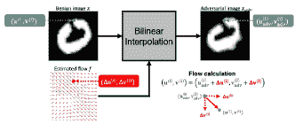

<!--yml

分类: 未分类

日期: 2024-09-06 19:36:49

-->

# [2310.00633] 2D 和 3D 深度学习模型对抗攻击的鲁棒性与安全性调查

> 来源：[`ar5iv.labs.arxiv.org/html/2310.00633`](https://ar5iv.labs.arxiv.org/html/2310.00633)

# 2D 和 3D 深度学习模型对抗攻击的鲁棒性与安全性调查

李艳杰 yanjie.li@connect.polyu.hk [0000-0001-8859-8331](https://orcid.org/0000-0001-8859-8331 "ORCID identifier") 香港理工大学 11, Yuk Choi Road, Hung Hom, KLNHong Kong ，谢彬 xiebin.sc@gmail.com [0000-0001-5118-3570](https://orcid.org/0000-0001-5118-3570 "ORCID identifier") 香港理工大学 11, Yuk Choi Road, Hung Hom, KLNHong Kong ，郭松涛 guosongtao@cqu.edu.cn 重庆大学重庆中国 ，杨媛媛 yuanyuan.yang@stonybrook.edu [0000-0001-7296-9222](https://orcid.org/0000-0001-7296-9222 "ORCID identifier") 纽约州立大学石溪分校 Stony Brook, NYUSA 以及 谢斌 csbxiao@comp.polyu.edu.hk [0000-0003-4223-8220](https://orcid.org/0000-0003-4223-8220 "ORCID identifier") 香港理工大学 11, Yuk Choi Road, Hung Hom, KLNHong Kong

###### 摘要。

得益于深度学习的快速发展，2D 和 3D 计算机视觉应用被部署在许多安全关键系统中，如自动驾驶和身份认证。然而，由于对抗攻击的鲁棒性有限，深度学习模型尚不足以信赖。实际可实现的对抗攻击进一步对应用和人身安全构成致命威胁。许多论文已经出现，以研究深度学习模型在对抗攻击下的鲁棒性和安全性。为了引领可信的人工智能，我们首先从不同角度构建了一个通用威胁模型，然后全面回顾了 2D 和 3D 对抗攻击的最新进展。我们将对抗样本的概念扩展到超越不可察觉的扰动，并整理了超过 170 篇论文，概述了深度学习模型对各种对抗攻击的鲁棒性。据我们所知，我们是首个系统地研究 3D 模型对抗攻击的团队，这一领域正蓬勃发展并应用于许多现实世界应用中。此外，我们还考察了导致安全违规的物理对抗攻击。最后但同样重要的是，我们总结了当前的热门话题，提供了挑战的见解，并为可信人工智能的未来研究提供了启示。

深度学习; 3D 计算机视觉; 对抗攻击; 鲁棒性;^†^†提交 ID: CSUR-2022-0640^†^†分类: 安全与隐私^†^†分类: 计算方法 机器学习^†^†分类: 计算方法 计算机视觉

## 1. 引言

深度学习（DL）算法的显著进展推动了计算机视觉（CV）任务的技术进步，这些任务广泛应用于身份认证和自动驾驶等各种安全关键和任务关键系统。这些应用依赖于假设这些深度学习模型是可信赖的，并且对小扰动具有鲁棒性，这意味着这些模型在存在噪声时能够产生一致的预测。然而，研究表明，深度学习模型容易受到对抗样本（AEs）的攻击，这会使深度学习模型通过精心设计的隐蔽或语义保持扰动产生错误预测。为了实现可信赖的人工智能，持续的努力已被投入到提高模型对抗攻击的鲁棒性和安全性，并通过构建更强的对抗攻击来寻找这些模型的鲁棒性上限。这是一场关于对抗攻击和防御的无休止的竞赛。本文从对手的角度全面调查了这一对抗攻击和防御竞争的最新进展。

本文主要讨论了计算机视觉任务领域的对抗攻击现象。虽然大多数计算机视觉任务倾向于关注图像处理，但最近的关注已转向 3D 任务。3D 数据可以通过提供图像的深度信息来补充 2D 数据，从而允许对目标进行更可靠和详细的分析，并可用于各种应用。例如，自动驾驶车辆通常依赖于摄像头和激光雷达的组合来感知其周围环境。然而，由于 3D 数据的无序性质，直接应用 2D 对抗攻击是不切实际的。3D 对抗攻击已经被提出，它们基于 2D 对抗攻击的原理，但具有针对 3D 数据特性的具体设计。例如，3DAdv（Xiao 等，2018a）基于 C&W 攻击，但具有新颖的距离度量。3Dhacker（Tao 等，2023）基于边界攻击，但在频谱域中融合点云，而不是通过坐标方向的平均操作。由于 2D 和 3D 计算机视觉任务之间的紧密关系以及 2D 和 3D 攻击的共享理论基础，本文总结了 2D 和 3D 计算机视觉中对抗攻击的最新进展。

本调查的目的是系统化最新的 2D 和 3D 对抗性攻击进展，以帮助研究人员构建更强的 AE 来评估模型鲁棒性，设计鲁棒模型，并确保现实世界应用中的安全性。为了选择系统评审的文献，我们首先明确审查范围，并在过去几年内彻底搜索顶级计算机视觉或安全会议和期刊的出版物。然后，我们选择与 2D 和 3D 对抗性攻击相关的高引用或代表性工作。这些文章根据目标、场景和方法进行分类和比较，以确保全面性。这项工作的主要贡献如下：

+   •

    我们总结了有关 2D 和 3D 深度学习模型对抗攻击的最新研究。整理并比较了近年来的 170 多篇论文。此外，我们根据数据特性和应用场景将其分为 2D 和 3D 攻击。

+   •

    对于 2D 对抗性攻击，我们将对抗攻击的意义从不可察觉的扰动扩展到语义保持扰动，例如颜色空间扭曲和空间变换扭曲。我们根据方法论对这些攻击进行分类，并比较它们的优缺点，以提供全面的视角。

+   •

    3D 数据在自动驾驶等安全关键领域中越来越被利用。然而，3D 模型的鲁棒性很少被审查。为了帮助设计鲁棒的 3D 深度学习模型，我们首次系统地组织了 3D 对抗性攻击，并根据其算法对其进行了分类。

+   •

    当深度学习模型在现实世界中部署时，安全是首要前提。我们全面审查了针对安全关键任务的对抗性攻击相关工作，特别是基于摄像头和激光雷达的自动驾驶汽车和人脸识别。

+   •

    在这次评审的最后，我们将当前热门的研究主题总结为几个要点，并确定它们面临的挑战，如提高攻击可迁移性、生成语义扰动以及评估 3D 深度学习模型的鲁棒性。我们还为未来的研究方向提供了一些有用的建议。

本调查的结构如图.1 所示。在第.2 节中，我们阐明了深度学习和计算机视觉的基本概念。在第.4 节中，我们通过从不同角度审视攻击面，构建了深度学习计算机视觉系统的一般威胁模型。在第.3 节中，我们总结了最新的相关综述。在第.5 节和 6 节中，我们总结了评估深度学习模型鲁棒性和安全性的代表性工作，分别使用了 2D 和 3D 对抗样本。在每一节中，我们首先介绍了基于攻击方法或目标应用的分类方法，然后总结了代表性的数字世界和物理世界对抗攻击。最后，在第.7 节中，我们识别了当前对抗攻击中的障碍，并提供了一些未来研究的观点。

为了统一不同文章的符号，表.1 展示了本调查中的一些常见符号。

图 1\. 本调查的结构

\描述

本文的结构。

表 1\. 本调查中使用的常见符号

| 符号 | 描述 | 符号 | 描述 |
| --- | --- | --- | --- |
| $D_{tr},D_{te}$ | 训练`\`测试数据集 | $x$ | 正常输入 |
| $x^{\prime},x^{adv}$ | 修改`\`对抗输入 | $\delta$ | 对抗扰动 |
| $y$ | 真实标签 | $y^{\prime}$ | 对抗目标标签 |
| $\mathcal{F}$ | 分类模型 | $\hat{\mathcal{F}}$ | 替代模型 |
| $g$ | 模型在$x$上的梯度 | $\hat{g}$ | 估计的模型梯度 |
| $l_{p}$ | $p$-范数距离 | $Z_{i}(x)$ | 第$i^{th}$层的输出对数 |
| $\theta$ | 模型参数 | $\mathcal{L}(x^{\prime},y)$ | 损失函数 |
| $\mathcal{G}$ | GAN 的生成器 | $\mathcal{D}$ | GAN 的判别器 |
| $\mathcal{P}$ | 原始点云 | $\mathcal{P^{\prime}}$ | 对抗点云 |

## 2\. 背景

深度学习是一种流行的表示学习算法，因其在图像分类及其他任务中的出色表现而受到青睐。它可以通过多个表面但非线性层的组合来学习复杂的函数。假设 $x$ 是一张图像或一个点云，$\mathcal{F}_{\theta}$ 是一个具有模型参数 $\theta$ 的深度学习模型。目标分类任务的目标是找到能最小化真实标签 $y$ 和预测值 $\mathcal{F}_{\theta}(x)$ 之间差异的 $\theta$，即

| (1) |  | $arg\min_{\theta}\mathcal{L}(\mathcal{F}_{\theta}(x),y),$ |  |
| --- | --- | --- | --- |

其中 $\mathcal{L}$ 是一个损失函数，用来衡量 $\mathcal{F}_{\theta}(x)$ 和 y 之间的熵。$\theta$ 通常通过梯度下降算法（如 Adam）进行优化。训练完成后，深度学习模型被部署到实际应用中。

已提出许多深度学习模型变体以提升性能并适应不同的任务特性，例如多层感知机、堆叠自编码器、卷积神经网络、深度简要网络和视觉变换器。这些模型广泛应用于各种 2D 计算机视觉任务，如目标检测、图像分割、图像分类、动作识别和运动追踪。最近，随着自驾系统及其他应用中 3D 数据的兴起，3D 计算机视觉的深度学习引起了广泛关注。出现了各种模型，如基于 MLP 的模型（例如 PointNet (Qi et al., 2017））、卷积模型（例如 Pointwise-CNN (Hua et al., 2018））、基于图的卷积模型（例如 DGCNN (Wang et al., 2019））和基于变换器的模型（例如 PCT (Guo et al., 2021））。深度学习模型在 3D 计算机视觉中的主要应用可以分为三类任务：3D 目标检测与跟踪、3D 目标分类和 3D 目标分割。由于大多数 3D 深度学习模型是 2D 模型的扩展，因此许多 2D 领域的安全威胁在 3D 领域也存在。

## 3\. 相关工作

为了推动对抗机器学习的军备竞赛并减少对抗攻击的风险，一些早期的调研试图总结最新的相关研究。例如，Serban (Serban et al., 2020) 收集了在对象识别任务中的对抗攻击。然而，他们没有包括 3D 对抗攻击和像颜色空间扰动这样的语义攻击。Miller et al. (Miller et al., 2020) 和 Machado et al. (Machado et al., 2021) 回顾了对抗机器学习的最新进展，但从防御的角度而非对抗者的角度进行的。其他综述将对抗攻击视为 AI 攻击的一部分，没有进行单独详细的调查。例如，Liu et al. (Liu et al., 2018) 根据传统的安全漏洞分类将 AI 攻击分为完整性、可用性和保密性攻击。Papernot et al. (Papernot et al., 2018) 和 Liu et al. (Liu et al., 2020b) 基于深度学习流程对攻击进行了分类，将其分为训练阶段和测试阶段攻击。He et al. (He et al., 2022a) 将 AI 攻击分类为对抗攻击、投毒攻击、模型提取和反演攻击。此外，这些调查缺乏对最新研究趋势的总结，例如对可转移对抗样本、语义扰动、3D 对抗攻击和物理可实现对抗攻击的日益关注。此外，尽管近年来出现了攻击无关的鲁棒性评估，对抗攻击仍然是评估模型鲁棒性的最有效和可靠的方法之一。目前仍缺乏系统的综述来整理这些进展，并根据这些最新的努力讨论未来的发展方向。

## 4\. 威胁模型

威胁模型通过描述攻击者的目标、能力和知识来评估系统的可能风险和安全级别。通过建立一个全面的威胁模型，我们可以更全面地理解深度学习系统的安全问题。我们首先识别深度神经网络部署到计算机视觉任务中时的完整和彻底的攻击面，如图 2 所示。然后，我们分析对手的目标、能力和知识，以构建一个威胁全景。

### 4.1\. 深度学习模型的攻击面

攻击面由系统中所有可能的漏洞组成，这些漏洞可能被未经授权的用户访问。如上所述，深度学习应用根据模型在训练数据集上的表现训练模型，然后将模型部署到实际应用中，进行各种 2D 或 3D 任务。在这个过程中，攻击面包括训练和测试数据集以及深度学习模型。

#### 4.1.1\. 训练数据集。

收集具有令人满意质量的训练数据集需要大量的努力和资金。同时，一些数据集，例如医疗诊断记录和个人基因组数据，可能包含敏感信息。因此，这些训练数据集的隐私和机密性至关重要。会员推断攻击（Shokri et al., 2017）和数据重建攻击（Salem et al., 2020）可能会泄露训练数据的属性或信息。此外，更具能力的攻击者可能会修改训练数据集。在这种假设下，提出了后门攻击和污染攻击。后门攻击使得模型在处理干净样本时正常工作，但在处理带有特定触发器的相同样本时表现不正确。污染攻击则在训练阶段修改样本标签，使得模型错误地分类干净样本。

#### 4.1.2\. 测试数据集。

测试数据集的主要威胁是对抗攻击。对抗攻击可以通过向输入数据添加不可见或语义扰动使模型产生错误结果。近年来，物理对抗攻击引起了越来越多的关注。通过 2D 补丁（Duan et al., 2020）、3D 打印（Athalye et al., 2018b）、光学照明（Gnanasambandam et al., 2021）或传感器注入（Cao et al., 2019b），攻击者使得相机或雷达收集修改过的 2D 或 3D 数据，并输出错误的分类结果。值得一提的是，本文根据数据和模型类型将对抗攻击划分为 2D 和 3D 攻击，而不是攻击介质。例如，Athalye et al.（Athalye et al., 2018b）将 2D 对抗图像渲染到 3D 打印的海龟上。虽然海龟是 3D 对象，但 2D 模型的最终输入仍是相机收集的海龟图像，因此仍然是 2D 对抗攻击。

#### 4.1.3\. 深度学习模型。

训练深度学习模型需要大量资源和时间，因此成功应用于实践的深度学习模型具有很大价值。然而，已经存在一些模型提取攻击，可以窃取敏感信息，如模型参数和决策边界。此外，模型本身也可能受到模型修订攻击。例如，攻击者可以通过仅翻转模型的几个比特（Rakin et al., 2021）或污染开源预训练权重（Kurita et al., 2020）使模型错误分类。

本文主要讨论对抗攻击，因为它相比其他攻击具有更实际的威胁。它不需要了解训练数据集甚至模型架构（对于黑箱攻击），因此可以在推理阶段执行。此外，高效生成强对抗样本可以提高对抗训练的有效性和效率，这对于训练鲁棒模型至关重要。

图 2\. 深度学习模型部署到计算机视觉应用中的攻击面概述。

\描述

本文的结构。

### 4.2\. 对抗目标

根据攻击者的目标和安全性违背的程度，深度学习攻击可以分为保密性攻击、完整性攻击和可用性攻击。保密性攻击的主要目标是泄露模型或数据的隐私，如模型逆向攻击和成员推断攻击。完整性攻击的主要目的是通过修改训练数据、测试数据或甚至模型本身来恶意更改模型的输出，如后门攻击、对抗攻击和权重修改攻击。可用性攻击旨在使机器学习服务对合法用户不可用。可用性攻击的一个典型例子是通过恶意污染整个训练数据集来使数据集不可利用。例如，Shortcut 攻击（Yu et al., 2022）使用与目标标签分配的线性可分噪声来误导神经网络，导致训练后的模型在测试数据集上的准确性较低。目前深度学习中的安全研究主要集中在保密性和完整性上。

### 4.3\. 对抗能力与知识

攻击者的能力指的是攻击者拥有的信息量和他们可以执行的操作。在深度学习系统的背景下，攻击者的能力从弱到强可以分为：仅能访问硬标签和修订测试数据；能访问模型输出置信度；能访问模型参数和训练数据；修改训练数据；修改模型参数。

根据攻击者对模型和数据的理解，对抗知识可以分为黑盒、灰盒和白盒模型。三者之间没有明确的分界线。一般来说，只了解模型内部结构和参数的攻击被称为白盒攻击。只能访问分类结果的攻击被称为黑盒攻击，处于两者之间的攻击被称为灰盒攻击。在现实中，对抗知识通常由对抗能力决定，因此两者密切相关。

## 5\. 2D 深度学习模型的对抗攻击

对抗攻击是最具威胁性的攻击之一，引起了广泛的研究兴趣。在本节和下一节中，我们将讨论基于深度学习的计算机视觉系统中的对抗攻击，其中对手的目标是使深度学习模型产生错误预测。根据不同的目标模型类型，我们将其分为 2D 和 3D 攻击。2D 攻击主要针对 2D 模型，而 3D 攻击主要通过污染 3D 数据（如点云）来影响 3D 模型。

### 5.1\. 2D 对抗攻击目录

尽管以前的一些文献中已经总结了 2D 对抗攻击（Serban 等人，2020; Machado 等人，2021; He 等人，2022a），但它们通常是从某个特定方面进行组织，缺乏系统性和最新的研究进展。因此，有必要重新组织最新的研究，特别是那些无法归类到以前任何类别的新兴研究，比如颜色空间扰动和其他语义扰动。本文总结了最新的研究进展，以帮助读者及时了解最新趋势。我们的调查从各个方面对 2D 对抗攻击进行了分类。

#### 5.1.1\. 根据不同距离度量分类

当“对抗样本”一词在 2013 年首次提出时（Szegedy 等人，2013），其定义是利用精心制作的不可察觉的扰动来欺骗深度神经网络，也就是

| (2) |  | $\min_{x^{\prime}}\left\&#124;{x^{\prime}-x}\right\&#124;_{p}\text{, subject to }\mathcal{F}(x^{\prime})\neq\mathcal{F}(x)\text{ and }x^{\prime}\in[0,1]^{m},$ |  |
| --- | --- | --- | --- |

其中$p\in\{0,1,2,\infty\}$。除了$l_{p}$-范数距离，最近还提出了其他限制扰动大小的距离度量，例如颜色空间距离（Shamsabadi 等人，2020b; Laidlaw 和 Feizi，2019），测地线距离（Fawzi 和 Frossard，2015），Wasserstein 距离（Zheng 等人，2019a），甚至没有任何距离限制（Song 等人，2018）。

#### 5.1.2\. 根据物理可实现性分类

根据是否可以在物理世界中实现，2D 对抗攻击可以分为数字攻击和物理攻击。数字对抗攻击假设对手可以直接修改数字图像，而物理对抗攻击则假设攻击者不能直接修改神经网络的输入，因此改动现实世界的对象。物理攻击比数字攻击更为困难，因为受限于扰动空间和各种环境变量，如不同的视角、距离和背景照明。

#### 5.1.3\. 根据对手的知识水平进行分类

如前节所述，根据对手的知识范围，2D 数字对抗攻击可以分为白盒、灰盒和黑盒攻击。不同的知识范围会导致攻击方法的不同选择，因为难度不同。因此，我们将白盒攻击和黑盒攻击分别介绍。

#### 5.1.4\. 根据扰动定义进行分类

根据扰动的差异，Gilmer 等人 (Gilmer et al., 2018) 将对抗扰动分为不可察觉的、保持内容的和无约束的扰动。第一种扰动以原始图像为起点，并在图像中添加不可见的噪声。这种约束使得 AE 在人眼中几乎与干净的图像相同，通常使用 $l_{p}$-范数作为距离度量。对于保持内容的扰动，对手保留原始图像的语义，同时通过改变颜色 (Hosseini and Poovendran, 2018; Laidlaw and Feizi, 2019) 和空间变换图像 (Fawzi and Frossard, 2015) 等方法误导分类器。这些攻击通常使用语义距离来限制扰动。对于无约束的输入，对手通过任何示例引起神经网络的错误结果。例如，Song 等人 (Song et al., 2018) 从头生成 AE。

根据上述观察，我们将 2D 对抗攻击分类为数字白盒和黑盒对抗攻击，以及物理对抗攻击，如图。1。

表 2\. 2D CV 任务中主要白盒对抗攻击的总结，按算法和发表年份排序

| 攻击 | 年份 | 威胁模型 | 算法 | 距离 | 性能 | 关键思想 |
| --- | --- | --- | --- | --- | --- | --- |
| 目标 | 知识 ^* | 效率 | 伪装 | ASR ^(**) |
| L-BGFS (Szegedy et al., 2013) | 2014 | T | $\square$ | 优化 | $L_{2}$ | 昂贵 | 不可见 | 100.0% | 盒约束的 L-BGFS |
| JSMA (Papernot et al., 2016b) | 2016 | T | $\square$ | 优化 | $L_{0}$ | 高效 | 稍微 | 97.2% | $L_{0}$ + 贪心 |
| UAP (Moosavi-Dezfooli et al., 2017) | 2017 | U | $\square$ | 优化 | $L_{1},L_{\infty}$ | 中等 | 隐形 | 93.7% | 通用扰动 |
| C&W (Carlini and Wagner, 2017) | 2017 | T&U | $\square$ | 优化 | $L_{0},L_{2},L_{\infty}$ | 中等 | 隐形 | 100.0% | 替代损失函数 |
| EAD (Chen et al., 2018b) | 2017 | T&U | $\square$ | 优化 | $L_{1},L_{2}$ | 昂贵 | 隐形 | 100.0% | $L_{1}$ + $L_{2}$ 距离 |
| DAG (Xie et al., 2017) | 2017 | U | $\square$, | 优化 | $L_{\infty}$ | 高效 | 隐形 | 69.0% | 分割 |
| SV-UAP (Khrulkov and Oseledets, 2018) | 2018 | U | $\square$ | 优化 | $L_{2},L_{\infty}$ | 中等 | 标记 | 60.0% | 奇异向量 |
| GD-UAP(Mopuri et al., 2018a) | 2018 | U | $\square$,$\color[rgb]{.5,.5,.5}\blacksquare$ | 优化 | $L_{\infty}$ | 中等 | 隐形 | 83.5% | 无数据 UAP |
| RobustAdv (Luo et al., 2018) | 2018 | U | $\square$,$\blacksquare$ | 优化 | 感知 | 昂贵 | 稍微 | 98.5% | 感知敏感度 |
| TAP (Zhou et al., 2018) | 2018 | U | $\square$ | 优化 | $L_{2}$ | 高效 | 标记 | 46.7% | 低通滤波器 |
| DAA(Zheng et al., 2019a) | 2019 | U | $\square$ | 优化 | $L_{\infty}$ | 中等 | 标记 | 45.0% | 对抗数据分布 |
| SparseFool (Modas et al., 2019) | 2019 | U | $\square$ | 优化 | $L_{1}$ | 中等 | 稍微 | 100.0% | 投影 $L_{1}$-DeepFool |
| DF-UAP(Zhang et al., 2020b) | 2020 | T&U | $\square$ | 优化 | $L_{\infty}$ | 高效 | 稍微 | 96.2% | 定向无数据 UAP |
| sC&W (Zhang et al., 2020a) | 2020 | T&U | $\square$ | 优化 | 平滑 | 中等 | 标记 | 98.0% | 平滑扰动 |
| GreedyFool (Dong et al., 2020) | 2020 | U | $\square$ | 优化 | $L_{0}$ | 昂贵 | 隐形 | 94.6% | 贪心算法 |
| SSAH (Luo et al., 2022) | 2022 | T&U | $\square$ | 优化 | 低频 | 中等 | 隐形 | 99.8% | 高频限制 |
| FGSM (Goodfellow et al., 2014) | 2015 | U | $\square$ | 快速梯度 | $L_{\infty}$ | 高效 | 标记 | 72.3% | 一步梯度攻击 |
| Deepfool (Moosavi-Dezfooli et al., 2016) | 2016 | U | $\square$ | 快速梯度 | $L_{1},L_{2},L_{\infty}$ | 中等 | 隐形 | 90.0% | 边界距离估计 |
| BIM&ILCM (Kurakin et al., 2018) | 2016 | T&U | $\square$ | 快速梯度 | $L_{\infty}$ | 中等 | 稍微 | 90.0% | 迭代 FGSM |
| MI-FGSM (Dong et al., 2018) | 2017 | T&U | $\square$, | 快速梯度 | $L2,L_{\infty}$ | 高效 | 稍微 | 100.0% | 动量 |
| PGD (Madry 等，2017) | 2017 | U | $\square$ | 快速梯度 | $L_{2},L_{\infty}$ | 中等 | 轻微 | 99.2% | 投影梯度下降 |
| R-FGSM (Tramèr 等，2017a) | 2018 | T&U | $\square$ | 快速梯度 | $L_{\infty}$ | 高效 | 轻微 | 64.8% | 随机 FGSM |
| BPDA&EOT (Athalye 等，2018a) | 2018 | U | $\square$ | 快速梯度 | $L_{2},L_{\infty}$ | 高效 | 隐形 | 100.0% | 攻击混淆梯度 |
| MDI2FGSM (Xie 等，2019) | 2019 | T&U | $\square$  $\blacksquare$ | 快速梯度 | $L_{\infty}$ | 成本高 | 轻微 | 62.2% | 随机变换 |
| TI-BIM (Dong 等，2019) | 2019 | U | $\square$ | 快速梯度 | $L_{\infty}$ | 成本高 | 轻微 | 82.0% | 翻译核 |
| DDN (Rony 等，2019) | 2019 | U | $\square$ | 快速梯度 | $L_{2}$ | 高效 | 轻微 | 100.0% | 可调步长 |
| HP-UAP (Zhang 等，2021) | 2021 | T&U | $\square$,$\blacksquare$ | 快速梯度 | $L_{\infty}$ | 高效 | 隐形 | 91.1% | 频率滤波 |
| NAG-UAP (Mopuri 等，2018b) | 2018 | U | $\square$ | GAN | $L_{\infty}$ | 成本高 | 轻微 | 94.1% | 生成 UAP |
| ATN (Baluja 和 Fischer，2018) | 2018 | T | $\square$ | GAN | $L_{2}$ | 高效 | 轻微 | 95.9% | GAN+重排序 |
| UnresGM (Song 等，2018) | 2018 | T | $\square$ | GAN | $-$ | 成本高 | 标记 | 84.0% | 从头开始的 GAN |
| GAP (Poursaeed 等，2018) | 2018 | T&U | $\square$ | GAN | $L_{2},L_{\infty}$ | 高效 | 轻微 | 74.1% | UAP 和图像依赖 |
| AdvAttGAN (Joshi 等，2019) | 2019 | U | $\square$ | GAN | $-$ | 成本高 | 标记 | 98.0% | 修改面部属性 |
| SemAdv (Qiu 等，2020) | 2020 | T | $\square$,$\blacksquare$ | GAN | $-$ | 成本高 | 标记 | 67.7% | 修改视觉属性 |
| SparseGAN (He 等，2022b) | 2022 | U | $\square$ | GAN | $L_{0}$ | 高效 | 隐形 | 58.4% | 扰动解耦 |
| Manitest (Fawzi 和 Frossard，2015) | 2015 | U | $\square$ | 空间变换 | 测地线 | 成本高 | 隐形 | 35.6% | 测地线上的流形 |
| SimpleTrans (Engstrom 等，2018) | 2017 | U | $\square$  $\blacksquare$ | 空间变换 | $-$ | 中等 | 隐形 | 90.0% | 简单变换 |
| Manifool (Kanbak 等，2018) | 2018 | U | $\square$ | 空间变换 | 测地线 | 高效 | 隐形 | 75.0% | 迭代方法 |
| stAdv (Xiao 等，2018b) | 2018 | T | $\square$ | 空间变换 | T.V. | 高效 | 轻微 | 99.6% | 流场 |
| Adef (Alaifari 等，2018) | 2019 | T | $\square$ | 空间变换 | $L_{2}$ | 中等 | 隐形 | 99.0% | 迭代变形 |
| 3DRender (Zeng 等，2019) | 2019 | U | $\square$ | 空间变换 | $L_{2}$ | 成本高 | 标记 | 90.7% | 3D 渲染器 |
| PSI (Zheng et al., 2019a) | 2019 | U | $\square$ | 空间变换 | Wasserstein | 高效 | 隐形 | 91.7% | Wasserstein 距离 |
| EdgeFool (Shamsabadi et al., 2020a) | 2020 | U | $\square$ | 空间变换 | 光滑 | 成本高 | 标记 | 99.0% | 图像增强 |
| Chroma-shift (Aydin et al., 2021) | 2021 | T&U | $\square$ | 空间变换 | $-$ | 高效 | 隐形 | 96.1% | YUV 颜色空间 |
| FilterFool (Shamsabadi et al., 2021) | 2021 | U | $\square$ | 空间变换 | SSIM | 成本高 | 轻微 | 48.3% | 模仿滤波器 |
| Semantic (Hosseini and Poovendran, 2018) | 2018 | U | $\square$ | 颜色变换 | $-$ | 成本高 | 标记 | 94.3% | HSV 颜色空间 |
| Blind-Spot (Zhang et al., 2018a) | 2019 | U | $\square$ | 颜色变换 | kNN | 高效 | 标记 | 100.0% | 盲点 |
| ReColorAdv (Laidlaw and Feizi, 2019) | 2019 | U | $\square$ | 颜色变换 | 光滑 | 中等 | 轻微 | 97.0% | RGB/CIELUV 颜色空间 |
| cAdv&tAdv (Bhattad et al., 2019) | 2020 | T | $\square$ | 颜色变换 | $-$ | 中等 | 标记 | 99.7% | 颜色化和纹理 |
| PerC attack(Zhao et al., 2020a) | 2020 | U | $\square$ | 颜色变换 | CIEDE2000 | 高效 | 隐形 | 100.0% | 感知颜色距离 |
| ColorFool (Shamsabadi et al., 2020b) | 2020 | U | $\square$,$\blacksquare$ | 颜色变换 | $-$ | 成本高 | 标记 | 95.90% | 对抗颜色化 |

+   *

    本栏目介绍了不同攻击的对抗知识。$\square$: 白盒。$\blacksquare$: 黑盒。${\color[rgb]{.5,.5,.5}\blacksquare}$: 灰盒。

+   **

    我们仅统计论文中报告的最困难攻击的最佳结果。例如，对于同时具有白盒和黑盒攻击的工作，我们只报告后者，因为它更具挑战性。对于同时具有非定向和定向攻击的工作，我们也报告后者，原因相同。

### 5.2\. 2D 深度学习模型的白盒对抗攻击

表 2 总结了近年来针对白盒模型的 2D 对抗攻击。我们根据具体的攻击方法将其划分为以下几类。

+   •

    基于优化的攻击。这类攻击通常将寻找对抗样本描述为目标优化问题，并通过现有或自定义的目标优化方法解决这些问题，包括 L-BFGS (Szegedy et al., 2013)、UAP (Moosavi-Dezfooli et al., 2017)、C&W (Carlini and Wagner, 2017)、EAD (Chen et al., 2018b) 和 OptMargin (He et al., 2018) 等。

+   •

    基于快速梯度的攻击。与通过优化目标函数来达到局部最小值不同，这种攻击通过直接和显式的梯度计算找到对抗样本。因此，尽管扰动可能不是最优的，但它们通常可以非常快速地找到对抗样本。此外，由于这些攻击缺乏明确的目标函数，它们通常是无目标的。

+   •

    基于 GAN 的攻击。与通过梯度下降优化噪声不同，这种攻击通过生成对抗网络（GAN）生成扰动，并优化潜在空间中的变量。例如，无限制自编码器（Song 等，2018）可以从草稿中生成语义对抗样本。

+   •

    基于空间变换的攻击。与加性噪声不同，这种攻击利用全局或局部空间变换来生成对抗样本。前者包括 Manifool（Kanbak et al.，2018）等，后者包括 stAdv（Xiao et al.，2018b）等。这种攻击通常使用语义损失而不是 p-范数距离度量。

+   •

    基于颜色化变换的攻击。一些研究还将图像转换为不同的颜色空间，并操作颜色空间，因为人类更倾向于根据形状而不是颜色来分类对象。这些攻击包括 ColorFool（Shamsabadi et al.，2020b）、Chroma-shift（Aydin et al.，2021）和 SemanticAdv（Hosseini and Poovendran，2018）等。

一些攻击还结合了几种不同的方法。例如，赵等人（Zhao et al.，2019）结合了变换和逐像素扰动来增强攻击强度。然而，大多数攻击采用上述方法中的一种作为其主要方法。因此，我们将根据这些攻击的主要方法进行介绍。

#### 5.2.1\. 基于快速梯度的攻击

优化基础攻击和基于快速梯度攻击的最大区别在于后者可以在一轮或几轮迭代中迅速找到对抗样本。然而，它们通常无法达到局部最优，需要较大的扰动来误导模型。由于在寻找对抗样本方面的高效率，它们可以更好地与对抗训练过程结合，以训练稳健的神经网络。

##### 单步快速梯度方法

在 2015 年，Goodfellow 等人（Goodfellow et al.，2014）猜测对抗样本的存在是由于特征在高层空间中的线性表示，并提出了一种名为快速梯度符号方法（FGSM）的基于梯度的单步攻击方法，该方法通过$x^{\prime}=x+\epsilon sign(\bigtriangledown_{x}\mathcal{L}_{\mathcal{F}}(x,y))$来估计对抗样本。此外，他们将 FGSM 嵌入对抗训练中以挖掘困难样本并训练稳健的模型。FGSM 基础对抗训练的损失函数是

| (3) |  | $\widetilde{\mathcal{L}}_{\mathcal{F}}=\lambda\mathcal{L}_{\mathcal{F}}(x,y)+(1-\lambda)\mathcal{L}_{\mathcal{F}}(x+\epsilon sign(\bigtriangledown_{x}\mathcal{L}_{\mathcal{F}}(x,y)),y).$ |  |
| --- | --- | --- | --- |

损失函数包含两个部分。第一部分与正常训练过程相同，而第二部分考虑了对抗样本的负面影响。

##### 多步快速梯度方法

Kurakin 等人 (Kurakin et al., 2018) 将 FGSM 方法扩展为一种迭代方法 (BIM)。在每一步结束时，他们将图像裁剪到 [0,1] 范围内。他们还提出了 LLCM 方法，该方法使用最不可能的标签作为目标标签。此外，他们尝试通过打印图像攻击相机，但由于缺乏对制作失真情况的考虑，他们的攻击在实际环境中 ASR 较低。

Moosavi 等人 (Moosavi-Dezfooli et al., 2016) 提出了 Deepfool 攻击，该攻击通过迭代估计正常样本到分类超平面的距离。由于分类边界的非线性，他们在每次迭代中线性化超平面。如果模型 $\mathcal{F}(x)$ 是一个二分类器，在每次迭代中，$x$ 的更新方式为 $x^{t+1}\leftarrow x^{t}-\frac{\mathcal{F}(x^{t})}{\left\|{\bigtriangledown\mathcal{F}(x^{t})}\right\|_{2}^{2}}\bigtriangledown\mathcal{F}(x^{t})$。如果模型 $\mathcal{F}$ 是一个多类可微分类器，他们使用多面体 $\widetilde{P}_{i}$ 来逼近标签空间。Deepfool 也是非目标型攻击，但能比 FGSM 攻击实现更小的扰动。

Madry 等人 (Madry et al., 2017) 提出了投影梯度下降 (PGD) 方法，该方法通过 $x^{t+1}=\textit{proj}_{x+\mathcal{S}}(x^{t}+\epsilon\,sign(\bigtriangledown_{x}L(\theta,x,y)))$ 在每次迭代结束时将 $x_{t}$ 投影到输入的邻域中。Osadchy 等人 (Osadchy et al., 2017) 也提出了类似的方法，称为 I-FGSM，并将其应用于图像 CAPTCHA，以区分计算机和人类。

Tramer 等人 (Tramèr et al., 2017a) 发现，输入处的陡峭曲率伪影可能会降低单步攻击的攻击强度。因此，他们提出了 R-FGSM 方法，该方法在输入图像中引入随机噪声。更新公式为 $x^{adv}=x^{\prime}+(\epsilon-\alpha)\cdot sign(\bigtriangledown_{x^{\prime}}\mathcal{L}(x^{\prime},y_{true}))$，其中 $x^{\prime}=x+\alpha\cdot sign(\mathcal{N}(\textbf{0}^{m},\textbf{I}^{m}))$，$\mathcal{N}(\textbf{0}^{m},\textbf{I}^{m})$ 是标准正态分布。R-FGSM 攻击可以视为 PGD 攻击的单步变体。

MI-FSGM（Dong 等，2018）在迭代 FGSM 中引入了动量项，并在无目标攻击中比 FGSM 和 BIM 取得了更好的性能。它首先通过 $g_{t+1}=\mu\cdot g_{t}+\frac{{\bigtriangledown}_{x}\mathcal{L}(x_{t}^{\prime},y)}{\left\|{\bigtriangledown}_{x}\mathcal{L}(x_{t}^{\prime},y)\right\|_{1}}$ 更新动量，然后通过 $x_{t+1}^{\prime}=x_{t}^{\prime}+\alpha\cdot sign(g_{t+1})$ 更新对抗样本 $x_{t}^{\prime}$。通过生成沿梯度下降方向的速度向量，MI-FGSM 缓解了多步迭代后的不稳定性问题，并增强了对抗样本的迁移性。

M-DI2-FGSM（Xie 等，2019）将随机变换集成到 MI-FGSM 中，以提高对抗样本的迁移性。随机缩放和填充作为主要变换，迁移性在 ImageNet 数据集上提高了约 20%。然而，该方法可能导致损失不稳定下降。Dong 等（Dong 等，2019）还提出了一种类似的攻击，名为 TI-BIM，基于 BIM 和变换。由于变换图像的梯度等于变换原始样本的梯度，他们在每次迭代中将原始图像的梯度与均匀、线性或高斯核相乘，以表示不同的变换。

Rony 等（Rony 等，2019）提出了基于 PGD 的解耦方向和范数攻击（DDN）。在每次迭代中，扰动 $\delta_{k}$ 通过 $x_{k}^{\prime}\leftarrow x+\epsilon_{k}\frac{\delta_{k}}{\left\|\delta_{k}\right\|_{2}}$ 被投影到 $x$ 周围的 $\epsilon_{k}$-球内。不同于将 $\epsilon_{k}$ 设置为常量的 PGD，如果 $x_{k}^{\prime}$ 仍未对抗，他们在每次迭代中增加 $\epsilon_{k}$，另一方面则减少 $\epsilon_{k}$。他们的方法在与最先进的 $L_{2}$-范数攻击相比时取得了有竞争力的结果，并且需要的迭代次数较少。

不同基于快速梯度的对抗攻击之间的关系如图 3 所示。

图 3\. 不同基于快速梯度的 2D 对抗攻击之间的关系

\描述

不同基于快速梯度的攻击之间的关系

#### 5.2.2\. 基于优化的攻击

基于优化的攻击通常将对抗样本建模为优化目标，然后利用现有的优化方法或设计自定义优化方法来解决这些优化问题。此外，大多数基于优化的攻击都是基于 $L_{p}$-范数距离。不同的距离度量可以生成不同类型的扰动。$L_{2}$ 和 $L_{\infty}$ 距离通常生成均匀和密集的扰动，而 $L_{0}$ 和 $L_{1}$ 距离倾向于生成稀疏的扰动。此外，除了图像无关攻击外，通用扰动也引起了大量研究兴趣。因此，根据不同类型的扰动，我们将基于优化的攻击分为密集、稀疏和通用扰动。

##### 密集扰动。

当对抗样本的概念首次提出时，它被定义为最小化 $L_{2}$ 或 $L_{\infty}$ 距离中的总扰动，因为它们比其他距离更容易计算梯度。这些度量会导致整个图像的均匀扰动。代表性的攻击包括 L-BFGS（Szegedy et al., 2013）、C&W（Carlini 和 Wagner, 2017）等。

对抗样本的概念是由 Szegedy 等人（Szegedy et al., 2013）在 2013 年提出的。他们将寻找对抗样本的问题表述为一个基于 $l_{2}$ 距离的箱约束优化问题，并利用 L-BFGS 算法来寻找近似解。具体来说，对于一个输入图像 $x\in\mathbb{R}^{m}$，他们最小化 $c\left\|{\delta}\right\|_{2}+\mathcal{L}_{\mathcal{F}}(x+\delta,y^{\prime}),\text{s.t. }x+\delta\in[0,1]^{m}$，其中 $\mathcal{L}_{\mathcal{F}}(\cdot,\cdot)$ 是交叉熵函数。此外，他们还分析了模型的上界 Lipschitz 常数，并提出模型参数的正则化可能会避免对抗样本的存在。然而，实验表明 L-BFGS 存在低效的弱点。

防御蒸馏（Papernot et al., 2016c）通过在软标签上训练模型来提高模型的鲁棒性，从而减少网络的雅可比矩阵，使模型对输入的敏感度降低，避免对任何样本的过拟合。C&W（Carlini 和 Wagner, 2017）设计了一种替代损失函数来打破防御蒸馏，即 $max(max({Z_{2}(x^{\prime})_{i:i\neq y^{\prime}}})-Z_{2}(x^{\prime})_{y^{\prime}},-\kappa),$ 其中 $\kappa$ 是控制对抗样本强度的参数。此外，一些早期攻击方法，如 BIM（Kurakin et al., 2018），直接将 $x^{\prime}$ 裁剪到 $[0,1]^{m}$，这可能导致梯度为零。C&W 将优化变量从 $\delta$ 改为 $w\coloneqq arctanh(\delta)$。由于 $tanh$ 是一个有界且可微分的函数，C&W 可以去除箱约束并使用 Adam 优化器。

梯度掩蔽（Papernot et al., 2017）通过破碎、随机化或消失/爆炸梯度来防止对抗攻击。Athalye et al.（Athalye et al., 2018a）声称梯度掩蔽也无法提供足够的鲁棒性。他们分别提出了 BPDA、EOT 和重参数化攻击来破解这些防御。例如，BPDA 使用了一个非可微分层 $f^{i}(x)$ 来防止对手获得梯度。BPDA 攻击在反向传播过程中用可微分层 $g(x)$ 替代了 $f^{i}(x)$。

对抗训练（Szegedy et al., 2013）也是一种流行的防御方法。它使用对抗样本作为训练数据以提高模型的鲁棒性（见 Eq.3）。通过 PGD（Madry et al., 2017）的对抗训练已被证明在防御大多数一阶攻击（如 FGSM 和 DeepFool）中有效。然而，Zhang et al.（Zhang et al., 2018a）发现对抗训练网络可能存在盲点或异常样本。他们首先使用 kNN 测量测试样本与训练数据集之间的差异，并采用简单的方法如缩放和移动所有像素来找到模型的盲点样本。然后，他们通过 C&W 攻击攻击这些不常见的样本。

为了提高对抗扰动的可迁移性，TAP 攻击（Zhou et al., 2018）增加了正常图像和对抗图像之间所有潜在层的特征距离。此外，他们还发现对扰动应用低通滤波器也能改善可迁移性。由于优化独立样本不能全局最优，DAA（Zheng et al., 2019a）通过 Wasserstein 梯度流搜索一个满足 $L_{\infty}$ 约束的对抗数据分布，同时最大化泛化误差。DAA 可以将 CIFAR 的准确率降低到对抗训练网络的 44.71%。为了使扰动更难以区分，sC&W（Zhang et al., 2020a）在原始 C&W 攻击中添加了拉普拉斯平滑约束。这个约束使扰动在均匀区域局部平滑，而在高方差区域则不协调。类似于 sC&W 攻击，SSAH（Luo et al., 2022）结合了语义相似性损失和低频约束。前者最小化原始图像和目标图像之间特征的余弦相似性。后者将扰动限制在高频区域内。

语义分割和目标检测任务在计算机视觉中也非常重要。Xie 等人（Xie et al., 2017）提出了针对多目标检测任务的密集对抗生成（DAG）攻击。观察到这一任务通常需要在图像中分类多个目标，DAG 使用迭代梯度下降同时攻击所有目标。DAG 还可以在不同模型之间转移，这可能是因为它积累了来自多个目标的扰动。

##### 稀疏扰动。

在某些情况下，修改的像素数量比扰动的整体大小更重要。因此，一些研究人员通过$l_{0}$或$l_{1}$距离生成稀疏扰动，目标是尽可能少地修改像素。然而，由于这些距离是不可微分的，所以需要特定的技术。例如，JSMA（Papernot 等，2016b）通过比较$Z(x)$的梯度选择最有意义的像素，并将它们逐个添加到修改的像素集合中，直到攻击成功或达到一定的阈值。EDA 攻击（Chen 等，2018b）将问题制定为一个弹性网络正则化优化问题，结合了$l_{1}$和$l_{2}$距离。由于$l_{1}$距离不可微分，EDA 应用 FISTA 算法来求解该优化函数。$l_{1}$-DeepFool（Moosavi-Dezfooli 等，2016）能够通过线性化边界来高效地生成稀疏扰动，但它受到了截断函数的影响。为了解决这个问题，SparseFool（Modas 等，2019）在每次迭代中将$x^{\prime}$投影到法向量的一个分量上。如果投影不能生成对抗性示例，则在下一次迭代中忽略该方向。SparseFool 迭代地估计边界的最小扰动，直到预测标签发生改变。RobustAdv（Luo 等，2018）通过感知距离生成不可察觉且鲁棒的对抗性示例，其中感知距离定义为$D(X^{\prime},X)=\sum_{i=1}^{N}\delta_{i}\cdot Sen(x_{i})$，其中$N$是修改的总像素数量，$\delta_{i}$是像素$x_{i}$的扰动，$Sen(x_{i})$是$x_{i}$的扰动敏感性。由于人类对平滑区域的扰动更为敏感，RobustAdv 将$Sen(x_{i})$定义为$x_{i}$周围标准差的倒数。GreedyFool（Dong 等，2020）使用两步贪心优化来生成稀疏扰动。首先，根据其梯度和由 GAN 生成的失真图选择候选操纵位置。然后，丢弃不必要的点以提高稀疏性。还有一些能够生成稀疏扰动的黑盒攻击，例如 OnePixel（Su 等，2019）和 CornerSearch（Croce 和 Hein，2019）以及 GeoDA（Rahmati 等，2020）。我们将在下一小节中讨论它们。

##### 通用扰动

与在特定图像上优化扰动不同，通用扰动通过在整个或部分训练数据集上优化扰动来生成与图像无关的扰动。

在 2017 年，Moosavi-Dezfooli 等人（Moosavi-Dezfooli et al., 2017）首次提出了通用对抗扰动（UAP）的概念。他们通过聚合训练图像上的最小扰动成功攻击了验证集中的大多数图像。实验表明，UAP 攻击不仅可以攻击未见过的图像，还可以在不同模型之间转移，成功率达到 40~60%。后来，在 2018 年，Khrulkov 等人（Khrulkov and Oseledets, 2018）提出了 SV-UAP 攻击，将通用扰动问题近似为一个(p, q)-奇异问题。假设$J_{i}(x)$是第$i$层的雅可比矩阵。对于一个小向量$\delta$，$Z_{i}(x+\delta)-Z_{i}(x)\approx J_{i}(x)\delta$。因此，寻找通用扰动的问题可以表述为$\max_{\delta}\;\sum_{x_{j}\in X_{b}}\left\|J_{i}(x_{j})\delta\right\|_{q}^{q},\;s.t.\;\left\|\delta\right\|_{p}=C$，其中$X_{b}$是训练数据集的一个子集。然后，他们使用随机幂方法解决这个(p,q)-奇异向量问题，并通过仅使用 64 张图像进行优化，在 50000 张图像上达到了 60%的欺骗率。Mopuri 等人（Mopuri et al., 2018a）提出了一种可泛化的无数据 UAP 攻击（GD-UAP），在这种攻击中，对手无需访问精确的训练数据。其思想是寻找一种与图像无关的扰动，从而触发更多的模型激活。神经网络的传播效应最终将导致误分类。他们利用关于训练数据集分布的知识来提高欺骗率。在 2020 年，Zhang 等人（Zhang et al., 2020b）首次提出了一种有针对性的 UAP 攻击，称为 DF-UAP。他们使用皮尔逊相关系数分析了干净图像与 UAP 之间预测 logits 的相似性，发现 UAP 在预测中相比干净图像具有主导作用。基于这一发现，他们在每次迭代时随机抽取代理数据集以更新扰动。受到神经网络隐写成功的启发，在 2021 年，Zhang 等人（Zhang et al., 2021）提出了 HP-UAP，该方法在迭代过程中添加了高通滤波器，使得 UAP 对人眼更不易察觉，同时仅有轻微的攻击成功率下降。

#### 5.2.3\. 基于 GAN 的攻击

生成对抗网络（GAN）由 Goodfellow 于 2014 年提出，并迅速成为学习训练数据集分布的强大工具。第一个相关工作，即对抗变换网络（ATN）（Baluja 和 Fischer，2018），于 2017 年报告。其损失函数为$\min_{\theta}\sum_{x\in\mathcal{X}}\beta L_{2}(\mathcal{G}(x),x)+L_{2}(f(\mathcal{G}(x)),r(f(x),t))$，其中$r$是一个重新排序函数，用于保持 logits 的排序顺序，除了目标类别。Song 等人（Song 等人，2018）提出使用 GAN 从噪声$z$生成无限制的对抗样本（AEs），而不是添加扰动。损失函数包括三个部分。第一个是使受害模型将$\mathcal{G}(z,y_{s})$预测为目标类别。第二个是限制$z$的搜索区域，第三个是使辅助分类器将$\mathcal{G}(z,y_{s})$预测为源类别$y_{s}$。他们还让人类评估 AEs 的真实性。此外，他们提出了一个噪声增强版本来提高 ASR。Konda 等人（Mopuri 等人，2018b）提出了 NAG-UAP，通过 UAP 生成器建模 UAP 的分布。GAN 网络的损失函数包括两部分：欺骗损失和多样性损失。前者的目标是最小化分类器在真实标签上的输出，而后者的目标是通过最大化不同 UAP 上隐藏层输出的差距来生成多样化的 UAP。Poursaeed 等人（Poursaeed 等人，2018）提出了 GAP 攻击，生成通用和图像无关的噪声用于有针对性和无针对性的攻击。对于通用攻击，他们使用图像到图像的翻译网络从随机噪声生成通用扰动，并将扰动裁剪为固定的范数。接着，将扰动添加到正常图像中，并送入受害模型计算欺骗损失。对于图像无关攻击，扰动则从原始图像中生成。He 等人（He 等人，2022b）利用生成模型来提高稀疏扰动的可转移性。他们首先将扰动分解为幅度组件和位置组件。然后，他们在位置组件上添加稀疏损失。由于位置组件是二元操作符，他们提出了一种二元量化操作符来训练生成器。

条件神经网络的出现使得直接编辑人工设计的属性成为可能（例如，戴眼镜与不戴眼镜）。Joshi 等（Joshi 等，2019）使用条件生成模型生成语义对抗样本。他们的攻击在条件生成模型的属性空间上优化，以操控诸如戴眼镜与否以及不同肤色等语义特征，从而欺骗深度学习模型。Qiu 等（Qiu 等，2020）也提出了类似的方法。但他们的方法可以选择任意目标进行攻击。此外，他们操控了插值特征空间，而不是属性流形。

#### 5.2.4\. 基于空间变换的攻击

尽管像 CNN 这样的深度神经网络被设计为对诸如平移和旋转等变换具有不变性和鲁棒性，但研究人员已经证明，这并非总是如此。

(a) ManiFool

(b) stAdv

图 4\. 比较全局和局部变换攻击。 (a) ManiFool 攻击（Kanbak 等，2018）在流形上优化旋转和过渡参数。 (b) stAdv 攻击（Xiao 等，2018b）在像素坐标空间上优化流场。像素值被视为像素坐标的函数。流场通过从对抗损失函数反向传播到像素坐标来获得。

\描述

本文的结构。

##### 基于全局空间变换的攻击

变换基攻击的第一个工作是 Manitest（Fawzi 和 Frossard，2015），它于 2015 年提出。它将计算转换图像之间的差距的问题转化为沿变换流形的测地线，定义为流形上曲线的最小长度。Manitest 利用快速行进算法来寻找对抗性变换，这可以保证在搜索网格上的最小变换。然而，当变换种类增加时，它的效率较低。SimpleTrans（Engstrom 等，2018）也使用简单的空间变换来欺骗网络。它包含一个基于梯度下降的白盒算法和一个基于网格搜索的黑盒算法。2018 年，Kanbak 等（Kanbak 等，2018）提出了 Manifool 来分析深度学习模型的变换鲁棒性，如图 4（a）所示。他们还使用了测地距离来度量两个变换之间的距离。Manifool 包含两个步骤：确定图像的变化方向，并将这种变化映射到流形上。尽管他们的方法不如 Manitest 准确，但即使同时进行操作相似性和仿射变换，他们也能实现高效性。

##### 基于局部空间变换的攻击

如图.4 (b) 所示，stAdv 攻击（Xiao 等，2018b）将变换定义为空间流场，其中每个流向量对应于相应像素的位移。为了增强流场的局部平滑性，使得对抗样本（AE）更自然，他们将流成本定义为流场的总变化量。他们还可视化了 CAM 注意力，并展示了他们的方法能够比 C&W 方法更好地分散注意力。2019 年，Alaifari 等（Alaifari 等，2018）提出了受 Deepfool 启发的 ADef 攻击。他们通过梯度下降迭代变形原始图像，以使图像超出分类边界。像素的值被建模为其坐标的函数。此外，使用二维高斯滤波器对流场施加平滑。在 2020 年，EdgeFool（Shamsabadi 等，2020a）通过增强图像细节生成对抗样本。与 ColorFool（Shamsabadi 等，2020b）不同，EdgeFool 仅修改 $L$ 通道，保留 $a$ 和 $b$ 通道不变。它首先训练一个 FCNN 网络，从输入图像 $I$ 中学习一个平滑图像 $I_{s}$，并修改图像细节 $I_{d}:=I-I_{s}$ 以生成对抗样本。受 EdgeFool 启发，FilterFool（Shamsabadi 等，2021）通过模仿正常的滤波器函数（如细节增强、伽马校正和对数变换）恶意修改图片。他们的攻击包括一个 FCNN 网络、一个传统滤波器和一个分类器。FCNN 网络被训练来生成扰动，既能欺骗分类器，又能使扰动图像的结构类似于滤波后的图像。实验表明，FilterFool 可以提高对抗样本的可转移性。Wong 等（Wong 等，2019）通过 Wasserstein 距离生成对抗样本，而不是 $l_{p}$ 距离，这等同于在图像中移动像素质量。他们的攻击遵循 PGD 攻击，但将 $x$ 投影到 Wasserstein 球上，而不是 $l_{\infty}$ 球上，并使用投影 Sinkhorn 迭代（PSI）加速计算。与不加区别地影响前景和背景像素的 $l_{p}$-based 扰动相比，Wasserstein 扰动仅改变背景为单色的图像的前景。

#### 5.2.5\. 基于色彩化变换的攻击

除了在空间域中处理图像外，一些研究将图像转换到不同的颜色空间，然后修改颜色空间，因为人们更倾向于基于几何形状而非颜色来分类图像。这些攻击将扰动定义为“内容保持扰动”，其通常通过感知相似度（Wang et al., 2021c；Aydin et al., 2021）来衡量，而不是$l_{p}$距离。

在 2018 年，Hosseini 等人（Hosseini and Poovendran, 2018）首次提出了**SemanticAdv**。它将原始图像从 RGB 域转换到 HSV 域，并利用随机搜索来修改色调和饱和度分量。然而，由于色调和饱和度分量同时被修改，他们的对抗样本可能显得虚假。**ColorFool**（Shamsabadi 等人，2020b）扩展了 SemanticAdv，通过对目标图像进行基于内容的分割并分别修正有趣和不重要的区域，生成更真实的图像。他们在$Lab$颜色空间中修改$a$和$b$通道，保持亮度通道$L$不变。2019 年，Laidlaw 等人（Laidlaw and Feizi, 2019）提出了**ReColorAdv**攻击，该攻击计算 RGB 或 CIELUV 颜色空间中的流场。他们还定义了一种平滑损失来提高不可察觉性。此外，他们证明了将颜色空间失真与加性噪声结合可以扩展扰动空间。Zeng 等人（Zeng et al., 2019）首先编辑了 3D 对象的物理属性，如仿射变换、颜色和光照，然后将其渲染成图像以欺骗分类器。他们通过**FGSM**优化可导因子，或通过零阶优化方法优化不可导因子。Bhattad 等人（Bhattad et al., 2019）通过语义扰动生成了不受限制的对抗样本，如颜色化（cAdv）和纹理迁移（tAdv）。对于 cAdv 攻击，使用预训练的颜色化网络（Zhang et al., 2016）来修改颜色。他们同时攻击输入提示和掩膜，使颜色更加真实。对于 tAdv 攻击，他们使用**VGG19**网络从目标图像中提取纹理，并在跨层 gram 矩阵上施加额外约束，以控制纹理迁移的强度。实验表明，他们可以生成**摄影级**对抗样本。2020 年，Zhao 等人（Zhao et al., 2020a）提出了**PerC-C&W**和**PerC-AL**攻击。他们的攻击直接在 RGB 颜色空间中操作，并使用 CIEDE2000 作为感知颜色距离。**PerC-AL**通过交替最小化对抗损失和感知损失来提高优化效率。实验表明，尽管在$L_{2}$度量中，扰动大小略高于 C&W 方法，但对人眼仍不可察觉，并且具有更好的迁移性。2012 年，受到**stAdv**攻击的启发，Aydin 等人（Aydin et al., 2021）提出了一种更不可察觉的攻击称为**Spatial Chroma-shift**。基本思路是人类对颜色变化的敏感度低于对亮度变化的敏感度。因此，他们仅将空间变换应用于颜色空间。他们将颜色空间从 RGB 转换到 YUV，然后仅在 UV 通道上计算流场。此外，他们使用**LPIPS**和**DISTS**评估感知相似性，并表明他们的方法优于 C&W 和 stAdv 攻击。

### 5.3\. 黑盒对抗攻击针对 2D 深度学习模型

-   上述攻击在白盒假设下生成了对抗样本。然而，实际上，攻击者往往对模型的内部架构和参数了解甚少。为了解决这个问题，提出了黑盒攻击。

#### 5.3.1\. 不同黑盒场景

-   根据攻击者可以访问的信息，黑盒设置可以分为查询受限场景、基于分数的场景和硬标签场景（Ilyas et al., 2018b）。对于第一个情况，攻击者只能有限次查询受害模型。例如，一些 API 可能会收取费用，如果攻击者查询次数过多。对于第二种情况，提供置信度分数，例如 Google Cloud Vision API。在最后一种情况下，仅输出前 1 或前 k 的预测标签。例如，Apple Photo 应用程序可以自动分类用户的照片而不显示分数信息。

表 3\. 按算法和出版年份排序的主要黑盒对抗攻击总结（针对 2D 计算机视觉任务）

| 攻击 | 年份 | 威胁模型 | 算法 | 距离 | 性能 | 关键思想 |
| --- | --- | --- | --- | --- | --- | --- |
| 目标 | 知识^* | 效率^(**) | 成功率^(***) |
| TML (Papernot et al., 2016a) | 2016 | U | $\blacksquare$ | 替代模型 | $L_{\infty}$ | 昂贵 | 96.19% | 数据增强 |
| TIMI (Dong et al., 2019) | 2019 | U | $\blacksquare$ | 替代模型 | $L_{2}$ | 高效 | 49.00% | 转换不变 |
| FDA (Ganeshan et al., 2019) | 2019 | U | $\blacksquare$ | 替代模型 | $L_{\infty}$ | 昂贵 | 80.20% | 特征扭曲 |
| ILA (Huang et al., 2019) | 2019 | U | $\blacksquare$ | 替代模型 | $L_{\infty}$ | 昂贵 | 85.80% | 特征扭曲 |
| SIM (Lin et al., 2019) | 2019 | U | $\blacksquare$ | 替代模型 | $L_{\infty}$ | 中等 | 77.20% | 尺度不变 |
| TTTA (Li et al., 2020) | 2020 | T | $\blacksquare$ | 替代模型 | Poincare | 高效 | 42.90% | Pointcare 距离 |
| RDI (Zou et al., 2020) | 2020 | T&U | $\blacksquare$ | 替代模型 | $L_{\infty}$ | 昂贵 | 67.80% | 多尺度梯度 |
| DI-MI-TI (Zhao et al., 2021b) | 2021 | T | $\blacksquare$ | 替代模型 | $L_{\infty}$ | 昂贵 | 62.20% | 足够迭代 |
| FIA (Wang et al., 2021a) | 2021 | U | $\blacksquare$ | 替代模型 | $L_{\infty}$ | 昂贵 | 83.50% | 特征重要性 |
| VT(Wang and He, 2021) | 2021 | U | $\blacksquare$ | 替代模型 | $L_{\infty}$ | 中等 | 76.50% | 梯度方差 |
| NAA(Zhang et al., 2022b) | 2022 | U | $\blacksquare$ | 替代模型 | $L_{\infty}$ | 昂贵 | 85.0% | 特征重要性 |
| ODI(Byun et al., 2022) | 2022 | T | $\blacksquare$ | 替代模型 | $L_{\infty}$ | 高效 | 81.6% | 3D 渲染 |
| Img2video (Wei 等，2022) | 2022 | U | $\blacksquare$ | Subs. model | $L_{\infty}$ | 昂贵 | 77.88% | 跨模态 |
| GNAE (Zhao 等，2018) | 2018 | U | $\blacksquare$ | GAN | $L_{2}$ | 昂贵 | 78.00% | 自然 AE |
| AdvGAN (Xiao 等，2018a) | 2018 | T | $\blacksquare$,$\color[rgb]{.5,.5,.5}\blacksquare$ | GAN | $L_{2}$ | 高效 | 92.76% | 蒸馏模型 |
| ATTA (Wu 等，2021) | 2021 | U | $\blacksquare$ | GAN | $L_{\infty}$ | 昂贵 | 61.80% | 对抗变换 |
| Boundary Attack (Brendel 等，2017) | 2017 | T&U | $\blacksquare$ | 决策 | $L_{0}$ | 昂贵 | $-$ | 随机游走 |
| BiasedBA (Brunner 等，2019) | 2019 | T&U | $\blacksquare$ | 决策 | $L_{2}$ | 高效 | 85.00% | 有偏采样 |
| OPT (Cheng 等，2019b) | 2019 | T&U | $\blacksquare$ | 决策 | $L_{2}$ | 中等 | 100.00% | 二分搜索 |
| HopSkipJump (Chen 等，2020) | 2020 | T&U | $\blacksquare$ | 决策 | $L_{2}$,$L_{\infty}$ | 高效 | 60.00% | 梯度+BA |
| SignOPT (Cheng 等，2020) | 2020 | T&U | $\blacksquare$ | 决策 | $L_{2}$ | 高效 | 94.00% | 估计梯度符号 |
| RayS (Chen 和 Gu，2020) | 2020 | U | $\blacksquare$ | 决策 | $L_{\infty}$ | 高效 | 99.80% | 提前停止 |
| QAIR (Li 等，2021) | 2021 | U | $\blacksquare$ | 决策 | $L_{\infty}$ | 高效 | 98.00% | 图像检索 |
| BayesAttack (Shukla 等，2021) | 2021 | T&U | $\blacksquare$ | 决策 | $L_{2}$,$L_{\infty}$ | 高效 | 67.48% | 贝叶斯优化 |
| Surfree (Maho 等，2021) | 2021 | T&U | $\blacksquare$ | 几何 | $L_{2}$ | 高效 | 90.00% | 正交投影 |
| TangentAttack (Ma 等，2021) | 2021 | T&U | $\blacksquare$ | 几何 | $L_{2}$ | 高效 | - | 半椭圆体 |
| TriangletAttack (Ma 等，2021) | 2022 | T&U | $\blacksquare$ | 几何 | $L_{2}$ | 高效 | 44.5% | 三角不等式 |
| ZOO (Chen 等，2017) | 2017 | T | $\blacksquare$ | 评分 | $L_{2}$ | 昂贵 | 97.00% | 有限差分 |
| LocSearchAdv (Narodytska 和 Kasiviswanathan，2017) | 2017 | T&U | $\blacksquare$, $\color[rgb]{.5,.5,.5}\blacksquare$ | 评分 | $L_{0}$ | 昂贵 | 70.78% | 局部搜索 |
| Autozoom (Tu 等，2019) | 2018 | T | $\blacksquare$ | 评分 | $-$ | 高效 | 93.00% | 自编码器 |
| PCA (Bhagoji 等，2018) | 2018 | U | $\blacksquare$ | 评分 | $L_{\infty}$ | 昂贵 | 89.50% | 主成分 |
| SimBA (Guo 等，2019a) | 2019 | T&U | $\blacksquare$ | 评分 | $L_{2}$ | 中等 | 96.50% | 正交基 |
| CornerSearch (Croce 和 Hein，2019) | 2019 | U | $\blacksquare$ | 评分 | $L_{0}$ | 昂贵 | 99.56% | 稀疏噪声 |
| OnePixel（Su et al., 2019） | 2019 | T&U | $\blacksquare$, $\color[rgb]{.5,.5,.5}\blacksquare$ | 评分 | $L_{0}$ | 成本高 | 67.97% | 差分进化 |
| PBBA（Moon et al., 2019） | 2019 | T&U | $\blacksquare$ | 评分 | $L_{\infty}$ | 中等 | 99.90% | 离散替代 |
| Nattack（Li et al., 2019） | 2019 | U | $\blacksquare$ | 评分 | $L_{2}$,$L_{\infty}$ | 成本高 | 100.00% | 对抗分布 |
| Bandis（Ilyas et al., 2018a） | 2019 | U | $\blacksquare$ | 评分 | $L_{2}$,$L_{\infty}$ | 中等 | 95.40% | 梯度先验 |
| SignHunter（Al-Dujaili 和 O’Reilly, 2019） | 2020 | T&U | $\blacksquare$ | 评分 | $L_{\infty}$,$L_{2}$ | 高效 | 91.47% | 梯度符号估计器 |
| Square attack（Andriushchenko et al., 2020） | 2020 | T&U | $\blacksquare$ | 评分 | $L_{2}$,$L_{\infty}$ | 高效 | 99.40% | 收缩方块 |
| Sparse-RS（Croce et al., 2022） | 2022 | T&U | $\blacksquare$ | 评分 | $L_{\infty}$ | 成本高 | 95.80% | 随机搜索 |
| NES（Ilyas et al., 2018b） | 2018 | T&U | $\blacksquare$ | 评分/决策 | $L_{\infty}$ | 成本高 | 88.20% | 自然进化 |
| Subspace（Guo et al., 2019b） | 2019 | U | $\blacksquare$ | 替代+评分 | $L_{\infty}$ | 成本高 | 96.60% | 多替代模型 |
| P-RGF（Cheng et al., 2019a） | 2019 | U | $\blacksquare$ | 替代+评分 | $L_{2}$ | 中等 | 99.10% | 基于转移的先验 |
| SimBA++（Yang et al., 2020） | 2020 | U | $\blacksquare$ | 替代+评分 | $L_{2}$ | 高效 | 99.40% | 混合方法 |

+   •

    * 该列包含不同攻击的对抗知识。$\square$: 白箱。$\blacksquare$: 黑箱。${\color[rgb]{.5,.5,.5}\blacksquare}$: 灰箱。

+   •

    ** 对于基于查询的攻击，我们使用效率来评估找到对抗样本所需的查询次数。

+   •

    *** ASR 是攻击成功率的缩写。如前所述，我们只计算论文中报告的最困难攻击的最佳结果。

#### 5.3.2\. 黑箱 2D 数字对抗攻击的分类

不同的设置导致不同的方法。本综述根据设置和相应算法将黑箱攻击分类为三种不同的类别。

+   •

    替代模型基础的攻击。这种方法利用了对抗样本的可转移性，可以将黑箱问题转化为白箱问题，从而显著提高效率。然而，由于替代模型的可转移性限制，攻击成功率通常不是很高。

+   •

    基于评分的查询攻击。我们将基于查询的攻击分为基于评分的和基于决策的。对于基于评分的攻击，可以访问连续的置信度评分来估计决策边界或梯度。

+   •

    基于决策的查询攻击。这些攻击假设对手只能访问模型的预测标签。与基于分数的攻击相比，这些攻击更为困难，因为可以利用的信息更少。

+   •

    基于几何的查询攻击。这些攻击也针对硬标签设置。然而，它们使用决策边界的几何信息，而不是估计梯度来提高查询效率。

+   •

    基于生成模型的攻击。GAN 也可以用于黑箱攻击。例如，在 AdvGAN (Xiao et al., 2018a) 中，分类器被一个精炼的模型取代，这可以视为一种基于转移的攻击。在 GNAE (Zhao et al., 2018) 中，随机搜索算法在 $z$ 潜在空间中运行，这可以视为一种基于查询的攻击。

一些攻击还结合了不同的方法来提高效率和攻击成功率，例如 SimBA++ (Yang et al., 2020)、P-RGF (Cheng et al., 2019a) 和 Subspace 攻击 (Guo et al., 2019b)。表格。3 显示了一些代表性的 2D 黑箱对抗攻击。

#### 5.3.3\. 替代模型基础的黑箱攻击。

替代模型基础的攻击是基于对抗样本的可转移性。因此，提高可转移性对这种方法至关重要。

数据增强和转换被广泛用于提高可转移性。TML (Papernot et al., 2016a) 使用基于雅可比矩阵的数据集增强来扩展数据集，并交替训练替代模型，这可以表示为 $\mathcal{D}_{\rho+1}=(x+\lambda_{\rho}\text{sign}(J_{\hat{\mathcal{F}}}(x:x\in\mathcal{D}_{\rho})))\cup\mathcal{D}_{\rho}$，其中 $\hat{\mathcal{F}}$ 是替代模型。$\mathcal{D}_{\rho}$ 和 $\mathcal{D}_{\rho+1}$ 分别是第 $\rho^{th}$ 次迭代前后的训练数据集，$\lambda_{\rho}$ 是周期性步长。此外，他们在数据增强过程中引入了水库抽样以减少迭代次数。DI (Xie et al., 2019) 通过随机调整数据集的大小和填充来促进可转移性。TIMI (Dong et al., 2019) 通过丰富输入的多样性来提高 MI-FGSM 的可转移性，这等同于用平滑核（如旋转、过渡或缩放矩阵）乘以梯度。SIM (Lin et al., 2019) 使用 Nesterov 加速梯度，并将图像调整为不同的尺度，以防止局部模型过拟合。RDI (Zou et al., 2020) 通过多尺度梯度和区域拟合改进了 DI 和 TIMI。

针对性攻击比非针对性攻击在基于替代模型的方法中更困难。Zhao et al.（Zhao et al., 2021b）发现，使用简单的针对性函数 $Z_{y^{\prime}}(F(x^{adv}))$ 进行充分迭代可以产生 SOTA 结果，其中 $Z_{y^{\prime}}$ 是目标标签的输出对数值。Byun et al.（Byun et al., 2022）通过基于对象的多样输入（ODI）提高了针对性攻击的迁移性，该方法利用可微分的 3D 渲染器在 3D 对象上渲染 2D 对抗样本。Li et al.（Li et al., 2020）注意到 MI-FGSM 的梯度在经过几次更新后往往被过去的梯度主导，因此提出了 TTTA，通过 Pointcare 距离自适应调整梯度。通过 Pointcare 距离，梯度仅在 $f(x)$ 更接近目标类别时才会增加。

一些研究发现，通过操控替代模型的隐层特征可以减轻过拟合并利用共享特征，从而改善迁移性。中间层攻击（ILA）（Huang et al., 2019）通过最大化预设层的扭曲来改善 C&W 和 FGSM 攻击，而特征干扰攻击（FDA）（Ganeshan et al., 2019）则干扰所有隐层的输出。然而，这两种攻击将所有神经元视为同等重要。那些对真实标签预测产生负面影响的神经元应被放大而非抑制。FIA（Wang et al., 2021a）通过一组变换图像的平均梯度来评估神经元的重要性。但这种方法存在梯度饱和的问题。为了解决这个问题，NAA（Zhang et al., 2022b）通过计算神经元归因来量化神经元的重要性。除了图像分类任务，Img2video 攻击（Wei et al., 2022）通过在替代模型上生成每一帧的 AE 来攻击黑箱视频模型。他们最大化正常和对抗视频帧之间低级特征的距离。

一些攻击结合了替代模型和其他方法，以获得更好的性能。P-RGF 攻击（Cheng et al., 2019a）利用了基于迁移的先验来获得更准确的梯度估计并节省查询。他们将梯度估计问题公式化为$\min_{\hat{g}}L(\hat{g})=\mathbb{E}\left\|\bigtriangledown_{x}f(x)-b\hat{g}\right\|_{2}^{2}$，其中$b$是缩放因子。他们利用实际和迁移梯度之间的估计余弦相似度来控制迁移强度。他们的方法还可以与其他先验结合以节省查询。子空间攻击（Guo et al., 2019b）通过从一组替代网络中迁移梯度来缩小随机向量的搜索空间。SimBA++（Yang et al., 2020）也整合了基于迁移性和基于查询的模型。此外，SimBA++基于查询结果更新了替代模型。

#### 5.3.4\. 基于分数的查询攻击

查询基础攻击的目标是通过更少的查询来构造对抗样本，并实现更高的攻击成功率。根据是否可以访问连续的置信度分数，查询基础方法可以分为基于分数和基于决策的查询方法。

##### 基于梯度估计的方法

大多数基于分数的查询攻击是基于梯度估计的。最简单的梯度估计方法是有限差分，例如零阶优化攻击（ZOO）（Chen et al., 2017）。对于 ZOO，梯度通过$\frac{\partial f(x)}{\partial x_{i}}\approx\frac{f(x+\delta e_{i})-f(x-\delta e_{i})}{2\delta}$来估计，其中$e_{i}$是标准基向量，$\delta$是从高斯分布中采样的随机向量，接近原始数据点。此外，他们使用了调整大小函数，并逐渐增加维度以提高效率。然而，由于他们需要在每次迭代中使用所有标准基向量，查询成本与图像大小成正比，这在计算上是昂贵的。后来，提出了一些改进方法来减少需要采样的随机向量。PCA 攻击（Bhagoji et al., 2018）通过分析输入数据的主成分来减少搜索维度。Autozoom（Tu et al., 2019）首先训练了一个自编码器，将目标类别的图像编码到潜在空间中。然后，它从潜在空间中采样随机向量，并将其映射到减少维度的随机扰动以计算有限差分。Al-Dujaili et al.（Al-Dujaili 和 O’Reilly，2019）提出了一种基于符号的梯度估计算法。基本思想是估计方向导数的符号。他们提出了一种名为 SignHunter 的分治方法，利用对抗目标函数导数的可分性，将查询次数从$2^{n}$减少到$O(n)$。

启发式算法也可以用于梯度估计。Ilyas 等人（Ilyas et al., 2018b）通过自然进化策略（NES）的变体估计了梯度。在无评分设置中，他们利用噪声鲁棒性来替代置信评分。具体来说，他们通过反相关抽样从正态分布中采样了一组$\delta_{i}$。然后，估计的$F(x^{\prime})$梯度的期望大致等于$\frac{1}{\sigma n}\sum_{i=1}^{n}\delta_{i}F(x^{\prime}+\sigma\delta_{i})$。随后，Ilyas 等人（Ilyas et al., 2018a）将梯度估计问题表述为寻找一个向量以最大化$\mathbb{E}[\hat{g}^{T}g^{*}]$，并使用最小二乘法解决了这个问题，证明了它是 NES 的等价形式。他们利用了两种先验知识来提高效率。首先，当前梯度与上一步的梯度高度相关。其次，相邻像素的梯度通常是相似的。因此，他们设计了一个基于赌博机优化的梯度估计框架，其中每一轮的动作是基于先验知识的梯度估计。

##### 基于贪心算法的方法

SimBA（Guo et al., 2019a）是一种简单而强大的基于贪心算法的攻击方法。与每次迭代都计算所有基向量（如 ZOO 攻击）不同，它在每次迭代时随机选择一个来自预定义正交基的向量。如果该向量能够降低置信评分，则应用于图像，并抽取下一个随机向量。否则，该方向被舍弃。他们发现 DCT 基特别高效。尽管这种方法简单，但在查询成本方面优于 NES 和 ZOO。SimBA++（Yang et al., 2020）通过将 SimBA 与基于可转移攻击的 TIMI（Dong et al., 2019）相结合，提高了查询效率。它们不再随机抽样改变方向，而是将抽样概率与代理模型的梯度相关联。此外，他们提出了高阶梯度近似（HOGA），以在前向和后向步骤中提炼目标模型。SimBA++显著减少了查询次数，并比 SimBA 实现了更高的攻击成功率。

##### 基于网格搜索的方法

$\mathcal{N}$attack (Li et al., 2019) 尝试寻找 $x$ 邻域内的对抗样本分布。但它不需要访问模型参数。它将围绕 $x$ 找到对抗分布的优化问题表述为 $\min_{\theta}J(\theta):=\int{f(x^{\prime})\pi_{S}(x^{\prime}|\theta)dx^{\prime}}$，其中 $f(x^{\prime})$ 是无目标攻击损失函数，$\theta=(\mu,\sigma^{2})$ 是高斯分布的参数，$x^{\prime}=x+\text{proj}_{S}(1/2(tanh(z)+1))$，其中 $z\sim\mathcal{N}(z|\theta)$。为了解决这个问题，它使用网格搜索来寻找最佳的 $\sigma$，并通过 NES 更新 $\mu$。PBBA (Moon et al., 2019) 在 $l_{\infty}$ 球的边界上搜索对抗样本。这种简化使得通过优化离散代理问题来改进查询性能成为可能。它首先将图像划分为方块，并通过从 $\{x-\epsilon,x+\epsilon\}$ 中选择 $x^{\prime}$ 在网格中进行区域优化。然后，它调整方块并重复此过程，直到找到一个对抗样本。Square attack 通过减少方块的数量来缩小搜索空间。与 PBBA (Moon et al., 2019) 使用固定网格不同，方块的位置经过优化。此外，它们在 $L_{p}$-范数球的边界上采样 $\delta$ 以提高查询效率。具体来说，对于 $L_{\infty}$-方块攻击，$x_{i}^{\prime}\in\{x_{i}-\epsilon,x_{i}+\epsilon\}$。对于 $L_{2}$-方块攻击，由于噪声值是相关的，它们增加了一个窗口的预算，同时减少了另一个窗口的预算。

##### 基于降维的方法

一些工作通过减少合成像素的数量来降低搜索维度。第一个工作是 LocSearchAdv (Narodytska 和 Kasiviswanathan, 2017)，它使用局部搜索来估计隐式梯度。它首先随机选择一些像素作为初始点。在每一轮中，检查并更新这些点的相邻像素。对于 ImageNet 上的无目标攻击，它只需要操作 0.5% 的像素。CornerSearch (Croce 和 Hein, 2019) 也使用局部搜索来找到稀疏的扰动，但它只对高变异性的像素添加扰动，以使其不可察觉。OnePixel attack (Su et al., 2019) 考虑了极端情况，并展示了仅通过修改一个像素来欺骗分类器的可能性。它使用差分进化来优化这个问题。每个候选解决方案包含其像素坐标和颜色值。候选解决方案通过随机交叉进行更新。Sparse-RS (Croce et al., 2022) 利用随机搜索，这适用于具有稀疏约束的零阶优化问题。它在多个攻击中实现了 SOTA 攻击成功率，包括 $l_{0}$-范数噪声、对抗补丁和对抗边界。

#### 5.3.5\. 基于决策的查询攻击

在某些场景中，对手只能获得最终决策（硬标签），而无法获得置信度评分（软标签）。这是一个更具挑战性的情况，因为梯度值难以估计。

##### 基于梯度估计的方法

一些研究提出了估计梯度方向的方法。第一个研究是边界攻击（Brendel 等，2017），该方法首先初始化一个位于真实区域外的点，然后使用随机游走算法使其在每次迭代时更接近边界。尽管与白盒攻击相比，它可以实现几乎相同的扰动水平，但需要指数时间来找到对抗样本。偏置边界攻击（Brunner 等，2019）通过偏置采样重新理解和改进了边界攻击。使用了三种不同的偏置。第一个偏置是采样更多在低频失真方向上的向量。第二个偏置是从对抗样本和正常样本差异较大的区域中采样更密集的数据。最后一个偏置是基于先验的替代模型梯度。HSJA（Chen 等，2020）包括三个步骤：二分搜索以找到边界点、梯度方向估计和几何级数更新边界点。由于梯度指导搜索方向，HSJA 相比于边界攻击显著减少了查询次数。

OPT（Cheng 等，2019b）是另一种代表性的基于硬标签的攻击方法，该方法通过精细搜索和二分搜索估计了良性样本与边界之间的最短距离。他们通过随机梯度无关的方法估计搜索方向的梯度，并通过梯度下降更新搜索方向。SignOPT（Cheng 等，2020）通过仅估计搜索方向上梯度的符号（仅需一次查询）并对一组随机方向上的梯度符号取平均，提升了 OPT 的效率。RayS（Chen 和 Gu，2020）将寻找最近分类超平面的连续问题重新构造为一个不需要梯度估计的不连续问题，并在一组光线方向上进行搜索。此外，所有不必要的方向通过快速检查被提前终止，这大大提高了搜索效率。Bayes 攻击（Shukla 等，2021）通过贝叶斯优化将查询预算减少到 1000。然而，由于贝叶斯优化不适用于高维搜索空间，他们通过 FFT 降低搜索维度，并使用最近邻上采样来寻找对抗样本。他们的方法显著减少了与 OPT 和 Sign-OPT 攻击相比的查询次数。QAIR（Li 等，2021）考虑了一种更困难的设置，即攻击者只能从目标模型中获取 top-k 未标记图像（在图像检索任务中）。他们通过良性图像和对抗图像检索的 top-k 未标记反馈的差异提出了一种基于相关性的损失。此外，他们通过递归网络窃取提高了效率，以获得梯度先验。

##### 基于几何的方法

几何攻击也针对硬标签场景。然而，它们直接使用决策边界的几何信息，而不是估算梯度以提高效率。Surfree (Maho et al., 2021) 假设边界是一个超平面，并在正交方向上迭代进行二分搜索，以找到干净图像在边界上的投影。与 HSJA (Chen et al., 2020) 相比，新方向是从由 DCT 生成的低频子带中随机采样，而不是使用梯度方向，这将查询次数减少到几百次。TangentAttack (Ma et al., 2021) 假设边界是半椭球体，并调整搜索方向以跟随最佳切线，而不是梯度方向，这比 HSJA 需要更少的失真。TriangleAttack (Wang et al., 2022b) 利用三角不等式搜索边界点，并使用 DCT 进行降维。在这次攻击中需要不到一千次查询。CGBA (Reza et al., 2023) 限制在半圆路径上进行搜索，以确保找到边界点而不受边界曲率的影响，这对于无目标攻击相当高效。

#### 5.3.6\. 基于生成模型的黑箱攻击

GAN 也可以用于黑箱攻击。GNAE (Zhao et al., 2018) 通过在潜在空间中搜索扰动而不是输入空间来生成自然 AE。它首先学习一个生成器 $\mathcal{G}_{\theta}$，将正态分布变量 $z$ 映射到输入 $x$。然后它学习一个反向器 $\mathcal{I}_{\gamma}$，通过最小化 $z$ 和重建的 $\mathcal{I}_{\gamma}(x)$ 之间的散度，将 $x$ 映射回潜在空间。他们的目标是 $\min_{\tilde{z}}\left\|\tilde{z}-\mathcal{I}_{\gamma}(x)\right\|_{2}\;s.t.\;\mathcal{F}(\mathcal{G}_{\theta}(\tilde{z}))\neq\mathcal{F}(x)$。可行的 $\tilde{z}$ 通过迭代随机搜索和混合缩小搜索找到。

Xiao et al. (Xiao et al., 2018a) 提出了 AdvGAN 来提高攻击的可转移性。AdvGAN 包括一个扰动生成器、一个鉴别器和一个分类器。生成器被训练生成来自原始实例的扰动。鉴别器被训练区分 AE 和干净实例。分类器是目标黑箱网络的蒸馏模型。他们交替训练这些模块，首先训练 GAN，然后通过 $\min_{f}\mathbb{E}_{x\sim D_{data}}\mathcal{L}(f(x),b(x))+\mathcal{L}(f(x+\mathcal{G}(x)),b(x+\mathcal{G}(x)))$ 训练分类器，其中 $b(x)$ 是目标模型，$f(x)$ 是蒸馏模型。$\mathcal{L}$ 是交叉熵损失函数。他们的黑箱攻击在 MNIST 数据集上的准确率达到了 92.7%。

一些早期的基于迁移的攻击通过简单的变换提高了迁移性，例如旋转和平移（Dong et al., 2019）、随机缩放和填充（Xie et al., 2019）以及多尺度（Lin et al., 2019）。Wu et al. (Wu et al., 2021) 提出了 ATTA，通过学习对抗性变换来提高迁移性，以更好地缓解对抗特性。他们将这个问题形式化为一个最小最大问题。内部问题是找到 $x_{adv}$ 以最大化分类损失。外部问题是通过 CNN 学习一个变换以最小化分类损失。

### 5.4\. 物理可实现 2D 对抗攻击的安全影响

表 4\. 总结了通过物理对抗攻击检查现实世界 2D CV 应用程序安全性的主要工作

| 攻击 | 年份 | 威胁模型 | 算法 | 距离 | 性能 | 场景 |
| --- | --- | --- | --- | --- | --- | --- |
| 目标 | 知识^* | 接口 | 伪装 | 成功 ^(**) |
| UAP-patch (Liu et al., 2020a) | 2020 | U | $\square$ | 补丁 | 梯度 | 风格损失 | 已标记 | 74.1% | 自动检查 |
| 面部识别 (Sharif et al., 2016) | 2016 | T&U | $\square$ | 补丁 | 梯度 | $L_{\infty}$ | 已标记 | 80.0% | 人脸识别 |
| AGN(Sharif et al., 2019) | 2019 | T&U | $\square$ | 补丁 | GAN | $-$ | 稍微 | 70.0% | 人脸识别 |
| FRSadv(Nguyen et al., 2020) | 2020 | T | $\square$ | 光照 | 梯度 | $L_{\infty}$ | 已标记 | 92.0% | 人脸识别 |
| GenAP (Xiao et al., 2021) | 2021 | T&U | $\blacksquare$ | 补丁 | GAN | $L_{\infty}$ | 已标记 | 65.0% | 人脸识别 |
| AdvMakeUp (Yin et al., 2021) | 2021 | T | $\square$ | 补丁 | 梯度 | 风格、内容 | 稍微 | 22.0% | 人脸识别 |
| AdvPatch (Brown et al., 2017) | 2017 | T | $\square$ | 补丁 | 梯度 | $L_{\infty}$ | 已标记 | 93.0% | 图像分类 |
| EoT(Athalye et al., 2018b) | 2018 | T | $\square$ | 补丁 | 梯度 | $L_{2}$ | 稍微 | 82.0% | 图像分类 |
| CiPer(Agarwal et al., 2020) | 2020 | U | $\blacksquare$ | 传感器 | 贪婪 | $L_{\infty}$ | 已标记 | 33.0% | 图像分类 |
| Nat-Patch (Hu et al., 2021) | 2021 | U | $\square$ | 补丁 | GAN | 平滑损失 | 隐形 | 48.0% | 物体检测 |
| CAMOU (Zhang et al., 2018b) | 2018 | U | $\blacksquare$ | 补丁 | 替代模型 | $-$ | 已标记 | 32.7% | 自驾车 |
| RP2 (Eykholt et al., 2018) | 2018 | T | $\square$ | 补丁 | 梯度 | $L_{1},L_{2}$ | 已标记 | 84.8% | 自驾车 |
| ShapeShifter (Chen et al., 2018a) | 2018 | T&U | $\square$ | 补丁 | 梯度 | $L_{2}$ | 已标记 | 87.0% | 自驾车 |
| MeshAdv (Xiao et al., 2019) | 2019 | T&U | $\square$ | 渲染器 | 梯度 | $Lp.$ | 稍微 | 100.0% | 自驾车 |
| AdvCam（Duan 等，2020） | 2020 | T&U | $\square$ | 补丁 | 梯度 | 风格损失 | 轻微 | 80.0% | 自驾 |
| DAS（Wang 等，2021b） | 2021 | U | $\square$ | 补丁 | 梯度 | $L_{2},T.V.$ | 标记 | 20.0% | 自驾 |
| AMPLE（Ji 等，2021） | 2021 | T&U | $\blacksquare$ | 传感器 | 贝叶斯 | 能量损失 | 标记 | 87.9% | 自驾 |
| DirtyRoad（Sato 等，2021） | 2021 | U | $\square$ | 补丁 | 梯度 | $L_{1},L_{2},L_{\infty}$ | 隐形 | 97.5% | 自驾 |
| OPAD（Gnanasambandam 等， 2021） | 2021 | T | $\square$ | 光线 | 梯度 | $L_{2},L_{\infty}$ | 轻微 | 48.0% | 自驾 |
| DTA（Suryanto 等，2022） | 2022 | T | $\square$ | 补丁 | 梯度 | $-$ | 标记 | 63.0% | 自驾 |
| TrajAdv（Zhang 等，2022a） | 2022 | U | $\square$$\blacksquare$ | 补丁 | 梯度，PSO | $L_{\infty}$ | 轻微 | 62.2% | 自驾 |
| FCA（Wang 等，2022a） | 2022 | U | $\square$ | 补丁 | 梯度 | 平滑损失 | 标记 | 60.0% | 自驾 |

+   •

    * 本栏是不同攻击的对抗知识。$\square$：白盒。$\blacksquare$：黑盒。${\color[rgb]{.5,.5,.5}\blacksquare}$：灰盒。

+   •

    ** 对于目标检测，攻击成功率指的是逃避检测的平均比率。如前所述，我们仅计算论文中报告的最难攻击的最佳结果。

当深度学习模型被应用于现实世界时，确保人身和财产安全是首要任务。一些研究探讨了安全关键应用中的对抗攻击，例如面部识别和自驾系统，称为物理对抗攻击。本小节回顾了安全关键应用中的 2D 物理对抗攻击。

物理对抗攻击的主要挑战是不断变化的物理环境，如背景光噪声、不同的视角和不同的距离。此外，由于攻击者不能直接在像素级别修改输入图像，需要某些介质来间接污染数据，例如补丁（Sharif 等，2016；Xiao 等，2021）、照明（Gnanasambandam 等，2021；Li 等，2023）和传感器（Sayles 等，2021）。基于补丁的攻击是最常见的物理攻击。它使用打印的补丁覆盖目标对象的全部或部分，以欺骗分类器。一些工作还将 2D 对抗图像渲染到 3D 对象上，如海龟（Athalye 等，2018b）和汽车（Wang 等，2021b）。这可以视为对抗补丁的更一般形式。

#### 5.4.1\. 面部识别系统的安全性

如前所述，2D 物理世界对抗攻击的一大挑战是环境的变化，例如距离和环境光的变化。为了使 AE 对这些变化更加鲁棒，并能始终如一地欺骗分类器，Athalye 等人（Athalye et al., 2018b）提出了变换期望（EoT），它计算目标类别在变换图像上的对数似然的期望，其公式为

| (4) |  | $x^{adv}=arg\min_{\Delta x}\Sigma^{k}_{i=1}(w_{i}\mathcal{L}(\mathcal{T}_{i}(x)+\Delta x,y)),\;s.t.\&#124;\Delta x\&#124;_{p}\leq\epsilon,$ |  |
| --- | --- | --- | --- |

其中，$\mathcal{T}_{i}$ 是第 $i_{th}$ 种变换，例如随机旋转和过渡，$w_{i}$ 是权重，且满足 $\Sigma_{i=1}^{k}w_{i}=1$。除了旋转和过渡外，他们还将 3D 渲染视为一种变换。他们使用 LAB 色彩空间中的 $l_{2}$ 范数作为距离度量，因为它更接近人类的感知。Brown 等人（Brown et al., 2017）将 EOT、补丁位置和多张训练图像纳入优化过程，以生成目标性、通用性和鲁棒性强的对抗模式。然而，他们的方法在补丁尺寸较小时传递性较差。

2016 年，Sharif 等人（Sharif et al., 2016）提出了面部配件攻击。扰动仅限于眼镜框等面部配件区域，以使攻击更加合理。他们还使用 EOT 来提高物理攻击的鲁棒性。此外，他们通过最小化补丁的总变化量来使其更自然，并使用 NPS 评分来确保补丁可以打印。总损失函数为 $arg\min_{\delta}\sum_{x\in X}L_{s}(\mathcal{F}(x+\delta),l)+k_{1}TV(\delta)+k_{2}NPS(\delta)$，其中 $L_{s}$ 是目标标签上的 Softmax 损失。$TV$ 是总方差损失。$NPS$ 是定义为 $NPS(\hat{p})=\prod_{p\in P}|\hat{p}-p|$ 的不可打印评分，其中 $P$ 是可打印颜色的集合。2019 年，Sharif 等人提出了 AGN 攻击（Sharif et al., 2019），通过生成框架提高了对抗补丁的隐蔽性，生成具有多个目标（如鲁棒性、不可察觉性和可扩展性）的 AE。与之前使用总变化作为平滑损失的工作不同，他们使用 GAN 来确保生成的补丁看起来像真实世界的设计。

在 2020 年，FRSadv（Nguyen et al., 2020）通过对抗性照明攻击了面部识别系统。他们将对抗模式投射到人脸上，然后相机捕捉图像并预测错误的标签。他们还使用了 EOT 来提高鲁棒性。Adv-Makeup（Yin et al., 2021）通过对抗化妆欺骗了面部识别系统。他们的攻击首先通过 GAN 生成逼真的眼影，然后通过梯度、内容和风格损失将生成的眼影与源图像混合。Adv-Makeup 攻击一个模型集成以提高可迁移性。FaceAdv（Shen et al., 2021）拥有一个贴纸生成器和一个转换器。生成器选择最脆弱的攻击区域，转换器将补丁以不同的角度和大小渲染到面部，以提高物理鲁棒性。

在 2021 年，Xiao 等人（Xiao et al., 2021）提出了 GenAP 攻击，该攻击通过对 GAN 的潜在空间中的补丁进行正则化，使对抗补丁更自然、更具可迁移性。他们首先在正常面部数据集上训练了一个 StyleGAN，然后用它生成对抗样本（AEs）并将其裁剪成补丁区域。他们并不是直接优化图像，而是在 StyleGAN 的$\mathcal{W}+$空间上优化潜在变量$w$，以最小化$x^{adv}$与目标$x_{t}$之间的特征距离。实验表明，他们的方法可以提高对抗模式的可迁移性。然而，他们的方法需要一个在受害者示例上训练好的预训练生成器。此外，他们的方法难以收敛，这可能是因为裁剪函数意外地改变了 AEs。

#### 5.4.2. 自驾系统的安全性

图 5. 通过对变换的期望生成鲁棒的物理扰动的一般过程（Eykholt et al., 2018; Athalye et al., 2018b; Brown et al., 2017; Sharif et al., 2016）。图像从不同的距离和视角采样，以提高实际攻击对位置变化的鲁棒性。

在自动驾驶中，相对简单的对抗攻击设置是从检测器或分类器中隐藏平面物体，如交通标志和道路。Chen 等人（Chen et al., 2018a）提出了 ShapeShifter 来攻击 Fast R-CNN 检测器。他们在目标检测器领域应用了 EoT 以提高攻击的鲁棒性。他们不是使用对抗性补丁，而是直接修改了停车标志的背景。Eykholt 等人（Eykholt et al., 2018）提出了鲁棒物理扰动（RP2），使深度学习模型错误分类道路标志。他们通过从模拟和物理失真集中采样来改进 EoT。一般程序如图所示。5 他们首先进行 $L_{1}$ 优化以找到对抗性补丁的大致位置，然后进行 $L_{2}$ 优化以修改其 RGB 值。AdvCam（Duan et al., 2020）通过神经风格迁移生成具有自然风格的对抗性交通标志。损失函数包括对抗损失、风格损失、内容损失和光滑性损失。风格损失和内容损失通过从浅层和深层特征提取神经网络中提取的特征计算。Sato 等人（Sato et al., 2021）通过肮脏的道路补丁攻击了自动车道居中系统，这可能导致汽车驶出街道。他们的目标函数是使汽车在最短时间内驶出车道。他们实现了 97.5% 的 ASR，并且每次攻击只需 0.903 秒。TrajAdv（Zhang et al., 2022a）通过单帧或多帧对抗性扰动评估了自动驾驶汽车的轨迹预测的鲁棒性。他们考虑了加速度和速度限制，使对抗扰动更加自然。OPAD（Gnanasambandam et al., 2021）通过光学对抗扰动欺骗了交通标志分类器。为了克服投影仪的非线性效应，他们估计了辐射和光谱响应以纠正失真。

一个更复杂的场景是将非平面物体如汽车隐藏在探测器的视野之外。因为 3D 渲染器不是微分的，且车辆探测器通常是一个黑箱。CAMOU（Zhang et al., 2018b）使用了一个提炼模型来联合学习 3D 渲染器和探测器的行为。当伪装发生变化时，原始提炼模型可能无法适应 3D 变换和车辆探测器。因此，他们交替训练提炼模型并优化对抗补丁。一些研究利用了 3D 微分渲染器将 3D 对抗网格或伪装映射到 2D 图像。Xiao et al.（Xiao et al., 2019）提出了 MeshAdv，通过可打印的 3D 网格将汽车隐藏在 2D 探测器中。他们利用了一个微分渲染器（Kato et al., 2018）将 3D 对抗网格映射到 2D 图像上。在网格顶点上应用 Laplacian 损失，以提高平滑度。DAS（Wang et al., 2021b）通过同时分散模型和人类注意力来隐藏汽车。他们通过最小化显著区域并减少显著区域的像素值来优化模型注意力分散损失函数。为了使图像对人类不易察觉，他们将对抗伪装初始为自然图像，然后在其边缘区域约束扰动。AMPLE（Ji et al., 2021）通过旋转和振动相机来模糊图像，从而通过传感器注入攻击隐藏或创建一辆车。它使用贝叶斯方法来优化旋转和振动参数。为了在多个视角中欺骗探测器，FCA（Wang et al., 2022a）将对抗伪装涂在汽车的整个表面上，通过一个微分渲染器。损失函数包括三个部分。第一部分是减少原始框和预测框之间的 IoU。第二部分是降低物体置信度。第三部分是降低目标类别的预测 logits。Suryato et al.（Suryanto et al., 2022）发现之前工作的微分神经渲染器无法执行多样的物理世界转换，因为缺乏对环境变化的主导。因此，他们提出了 DTA 攻击来隐藏汽车，该攻击利用微分变换网络获取逼真的图像。

除了人脸识别和自动驾驶场景外，还研究了其他场景对抗攻击的安全性。刘等人（Liu et al.，2020a）通过通用对抗贴片评估了自动结账系统的安全性。他们利用模型的感知和语义偏见来提高其泛化能力。胡等人（Hu et al.，2021）利用 StyleGAN 和 BigGAN 来生成具有自然外观内容的对抗贴片，以规避人员检测器。他们同时最小化目标类别的客体分数和分类置信度。阿加瓦尔等人（Agarwal et al.，2020）利用环境和成像过程产生的噪音来降低黑盒模型的分类准确性。这些噪音是通过高斯滤波器和拉普拉斯滤波器提取的。

## 6\. 3D 深度学习模型的对抗攻击

### 6.1\. 3D 和 2D 对抗攻击的不同之处

由于可以负担得起的 3D 数据采集设备和几何特征提供的丰富信息，在许多关键安全任务中广泛使用 3D 数据。因此，它们的安全性也越来越受到关注。与 2D 对抗攻击相比，3D 对抗攻击有一些显著的差异：

+   •

    与图像不同，点云包含无序和不规则采样值的点坐标。一些利用图像结构的 2D 攻击无法直接应用于这类数据，例如边界攻击，该攻击通过源图像和目标图像之间的像素值加权平均估计边界点。直接在点云之间进行插值会使 3D 形状变形。

+   •

    3D 对抗攻击比 2D 对抗攻击具有更大的扰动空间和自由度。除了修改数值外，对手还可以添加和删除点。

+   •

    与 2D 对抗攻击不同的是，点云在分类时并不使用所有点。由于点的数量众多，点云在分类之前通常需要取样。例如，PointNet 在 ModelNet40 数据集上对 3D 对象进行分类时取样了 1024 个点。

+   •

    大多数 2D 对抗攻击都基于像素级的$L_{p}$距离。然而，点对攻击可以通过异常点移除来轻松防御，而$L_{p}$距离并不适合无序数据，比如点云。

因此，以前的方法不能直接用于 3D 对抗攻击。为了解决这些问题，特别针对 3D 数据提出了 3D 对抗攻击。我们将根据它们的算法和场景介绍这些攻击。

### 6.2\. 3D 对抗攻击目录

我们在表格中总结了最近的 3D 数字和物理对抗攻击工作。5。根据用于生成对抗样本的攻击算法，我们将 3D 对抗攻击分为以下几类，

+   •

    基于梯度的优化方法。对于大多数 3D 对抗攻击，使用的是基于梯度的方法。其中一些基于 $C\&W$ 损失，例如（Xiao et al., 2018a）和（Tsai et al., 2020），而其他的则基于快速梯度方法，例如（Liu et al., 2019）。一些工作将 $L_{0}$-范数攻击放宽到微分版本，例如（Zheng et al., 2019b）。

+   •

    基于生成模型的方法。一些工作，如 AdvPC（Hamdi et al., 2020）和 LG-GAN（Zhou et al., 2020），利用生成模型生成对抗点云。这些攻击可以提高 3D 对抗样本的可转移性。

+   •

    启发式算法方法。在黑盒设置下，3D 模型的梯度不可用。因此，一些黑盒攻击使用像进化算法这样的启发式算法生成对抗样本。

+   •

    基于 3D 变换的方法。与其修改点云，一些攻击发现 3D 模型也容易受到 3D 欧几里得空间中的刚体变换（如旋转和平移）的影响。

最近，一些研究还提出了通过 3D 打印（Tsai et al., 2020）或激光发射器（Cao et al., 2019a）生成 3D 物理可实现的对抗样本。此外，一些研究（Wen et al., 2020；Huang et al., 2022）将 3D 数字对抗攻击分类为点丢弃、点添加和点移动攻击，依据不同的扰动类型。然而，一些 3D 攻击并不是基于点云的，比如 3D 网格攻击（Cao et al., 2019b）和体积网络攻击（Wicker and Kwiatkowska, 2019）。因此，我们通过算法而非扰动类型来分类 3D 攻击。

### 6.3\. 数字世界中的 3D 对抗攻击

#### 6.3.1\. 基于梯度的方法

一些攻击基于 2D 对抗攻击，但具有新的损失函数。第一个 3D 对抗攻击的工作，3DAdv（肖等，2018a），基于 C&W。它包括独立点攻击和对抗性簇攻击。第一个攻击使用 Hausdor 和 Chamfer 距离来测量原始点云和对抗点云之间的最大和平均距离。Chamfer 距离定义为$\mathcal{D}_{C}(x,x^{\prime})=\frac{1}{\left\|x^{\prime}\right\|}\sum_{p^{\prime}\in x^{\prime}}\left(\min_{p\in x}\left\|p^{\prime}-p\right\|_{2}^{2}\right)$。第二个攻击使用 Chamfer 距离和最远的成对距离来生成对抗性簇。他们在可接受的噪声预算下达到了 100%的 ASR。然而，他们仅在 PointNet 网络上评估了 3D-Adv 攻击，而 PointNet 已被证明比其他 3D 模型（如 PointNet++）的对抗鲁棒性差。刘等（刘等，2019）将 PGD 扩展到 3D-PGD。他们将扰动投影到对抗点云的切平面上，以减少异常点。这相当于改变表面点的分布。然而，蔡等人指出，这种攻击可以通过重新采样方法轻松防御（蔡等，2020）。

一些攻击会丢弃重要的点或生成具有特定形状的点。郑等（郑等，2019b）通过点丢弃评估每个点的重要性。由于点丢弃是非差分的，他们通过将点移向点云内部来放宽这一过程。然后，通过在球面坐标系中的方向导数来评估关键得分。ShapeAdv（刘等，2020c）包括三种扰动：均匀分布扰动、对抗性棒和对抗性汇。第一个通过在优化过程中重新采样生成均匀分布的扰动。第二个则添加了诸如对抗性棒的辅助特征。然而，由于棒的角度难以优化，他们使用投影和剪切函数来近似它。最后一个则将点拉入点云内部。MinimalAdv（金等，2021）通过操作最少的点来欺骗分类器。他们将问题形式化为$L_{0}$和$L_{2}$优化问题，并将其放宽为$L_{1}$问题。然而，由于只有少量点是对抗性的，而大多数点（¿95%）是良性的，他们的方法在重新采样过程中显著下降。

一些攻击被提出以提高对抗样本的平滑性。Tsai 等（Tsai et al., 2020）使用 Chamfer 和 kNN 距离生成几何感知对抗样本。kNN 损失可以限制点云中邻近点之间的距离，从而显著减少异常点。他们成功地通过 3D 打印物体在物理世界中对 PointNet++进行目标攻击。然而，他们的方法导致了粗糙的表面。$GeoA^{3}$（Wen et al., 2020）通过结合 Chamfer 距离和$\mathcal{P}$与$\mathcal{P}^{\prime}$之间的局部曲率一致性来提高对抗样本的真实性，这一一致性通过法向量的方向来测量。此外，为了使$\mathcal{P}^{\prime}$对重采样更具鲁棒性，他们提出了包含均匀性损失的$GeoA_{+}^{3}$，以促进表面点的规则性。随后，他们提出了迭代法向量投影来优化这一目标函数。Huang 等（Huang et al., 2022）提出了形状不变攻击以提高对抗样本的表面平滑性。他们沿着表面的切平面移动点，使得扰动比以前的方法更不易察觉。此外，他们结合了替代模型和基于查询的方法以提高黑箱攻击的效率。他们首先根据最大梯度幅度在替代模型上计算灵敏度图。然后，他们根据灵敏度排名移动点。该查询方法可以将查询次数减少约 20%，相比于 SimBA（Guo et al., 2019a）和 SimBA++（Yang et al., 2020）攻击。

最近，统计异常值移除（SOR）被提出用于防御对抗点云。为了破解这一对策，JGBA（Ma et al., 2020）将 SOR 嵌入到攻击算法中。但由于 SOR 不可导，他们用一阶近似的放松函数代替它。然后，他们同时优化原始点云和 SOR 滤波后的点云。这种攻击成功击败了 SOR 及基于 SOR 的 DUP-Net 防御。

一些攻击旨在提高 3D 对抗样本的可迁移性。ITA（Liu and Hu, 2022）限制扰动沿法向量方向，并通过对抗变换提高可迁移性。对抗变换由一个简单的两层神经网络组成，并通过对抗训练过程进行学习。AOF（Liu et al., 2022）通过提升低频组件的分类损失来提高可迁移性，该组件通过图拉普拉斯矩阵的正交分解从原始点云中分离出来。

表 5\. 主要数字和物理对抗攻击在 3D CV 任务中的总结，按算法和发表年份排序

| 攻击方式 | 年份 | 威胁模型 | 方法 | 距离^(**) | 性能 | 关键思想 |
| --- | --- | --- | --- | --- | --- | --- |
| Goal | 知识^* | 接口 | 效率 | 成功 |
| 3DAdv (Xiao et al., 2018a) | 2019 | T | $\square$ | 数字 | 梯度 | $L_{2}$, $Cf.$ | 高效 | 99% | Chamfer 损失 |
| 3D-PGD(Liu et al., 2019) | 2019 | U | $\square$ | 数字 | 梯度 | $L_{2}$ | 高效 | 88.10% | 梯度投影 |
| Saliency(Zheng et al., 2019b) | 2019 | U | $\square$ | 数字 | 梯度 | $L_{0}$ | 高效 | 40% | 显著性图 |
| LidarAdv (Cao et al., 2019b) | 2019 | T&U | $\square$ | 物理 | 梯度 | $L_{2},Lp.$ | 成本高 | 71% | 代理函数 |
| Adv-Lidar (Cao et al., 2019a) | 2019 | T&U | $\square$ | 物理 | 梯度 | $L_{0}$ | 成本高 | 75% | 全球采样 |
| KNN(Tsai et al., 2020) | 2020 | U&T | $\square$ | 物理 | 梯度 | $Cf.,kNN$ | 高效 | 94.69% | 3D 可打印 |
| Rooftop(Tu et al., 2020) | 2020 | U | $\square$  $\color[rgb]{0,0,0}\blacksquare$ | 物理 | 梯度 | $Lp.$ | 成本高 | 80% | 对抗网格 |
| $GeoA^{3}$, $GeoA_{+}^{3}$(Wen et al., 2020) | 2020 | T | $\square$ | 数字 | 梯度 | $Cf.,Hd.,LC$ | 高效 | 100% | 局部曲率 |
| ShapeAdv(Liu et al., 2020c) | 2020 | U | $\square$ | 数字 | 梯度 | $L_{2}$ | 成本高 | 95% | 形状攻击 |
| JGBA (Ma et al., 2020) | 2020 | T&U | $\square$  $\color[rgb]{.5,.5,.5}\blacksquare$ | 数字 | 梯度 | $L_{2}$ | 高效 | 98.90% | 打破 SOR |
| CTRI(Zhao et al., 2020b) | 2020 | T | $\square$ | 数字 | 梯度 | 光谱 | 高效 | 98% | 受限等距 |
| MinimalAdv(Kim et al., 2021) | 2021 | U | $\square$ | 数字 | 梯度 | $L_{2},L_{0},Cf.,Hd.$ | 成本高 | 89% | 最小扰动 |
| ShapeInv(Huang et al., 2022) | 2022 | U | $\square$  $\color[rgb]{0,0,0}\blacksquare$ | 数字 | 梯度 | $L_{\infty}$ | 高效 | 100.00% | 敏感度图 |
| AOF (Liu et al., 2022) | 2022 | U | $\square$ | 物理 | 梯度 | $L_{\infty}$ | 成本高 | 99.76% | 低频 |
| AdvPC (Hamdi et al., 2020) | 2020 | U | $\square$  $\color[rgb]{0,0,0}\blacksquare$ | 数字 | GAN | $L_{\infty}$ | 成本高 | 64.40% | GAN |
| LG-GAN (Zhou et al., 2020) | 2020 | T | $\square$ | 数字 | GAN | $L_{2}$ | 高效 | 97% | 生成模型 |
| ITA (Liu and Hu, 2022) | 2022 | T&U | $\square$  $\color[rgb]{0,0,0}\blacksquare$ | 数字 | GAN | $L_{2},Cf.$ | 高效 | 29.89% | 对抗变换 |
| EvolutionAdv(Cao et al., 2019b) | 2019 | U | $\color[rgb]{0,0,0}\blacksquare$ | 物理 | 进化 | $-$ | 成本高 | 62% | 进化 |
| Camdar-adv (Chen and Huang, 2021) | 2021 | T | $\color[rgb]{0,0,0}\blacksquare$ | 物理 | 进化 | $Lp.$ | 成本高 | 99% | 多模态 |
| ISO（Wicker 和 Kwiatkowska，2019） | 2019 | U | $\square$ $\color[rgb]{0,0,0}\blacksquare$ | 数字 | 贪婪 | $L_{0}$ | 昂贵 | 100% | 临界点集 |
| OcclusionPoint（Sun 等，2020） | 2020 | U | $\color[rgb]{0,0,0}\blacksquare$ | 物理 | 贪婪 | $L_{0}$ | 高效 | 80% | 激光雷达遮挡 |
| TSI（赵等，2020b） | 2020 | U | $\color[rgb]{0,0,0}\blacksquare$ | 数字 | 随机 | $-$ | 高效 | 95% | 汤普森采样 |

+   •

    * 这一列是不同攻击的对抗知识。 $\square$: 白盒。 $\blacksquare$: 黑盒。 ${\color[rgb]{.5,.5,.5}\blacksquare}$: 灰盒。

+   •

    ** 比较：Chamfer 距离。Hd：Hausdorff 距离。Lp：Laplacian 距离。LC：局部曲率距离。

#### 6.3.2\. 基于生成模型的方法

Hamdi 等（Hamdi 等，2020）提出了 AdvPC 攻击，该攻击使用 GAN 模型生成对抗点云。AdvPC 的损失有两个部分。第一个是预训练分类器的损失。第二个是自编码器损失，以确保重建的点云仍能欺骗分类器。实验表明，AdvPC 攻击可以提高对抗点云的可迁移性。此外，AdvPC 在几种不同的防御方法上优于 3D-adv 和 KNN 攻击。然而，他们只评估了非目标攻击。

LG-GAN（Zhou 等，2020）通过多分支生成网络生成针对性的对抗样本。它首先通过 GAN 学习输入 3D 数据的多层特征，然后利用一个类编码器将标签信息混合到多层特征中。最后，从特征中重建 3D 数据。GAN 包括一个分类损失，一个 $L_{2}$-范数重建损失，以及一个图对抗损失。

#### 6.3.3\. 基于启发式算法的方法

在黑盒场景中，梯度很难获取。因此，黑盒攻击通常基于启发式算法。Cao 等（Cao 等，2019b）提出了一种基于进化的黑盒算法 EvolutionAdv。他们将种群设置为对象的网格顶点，并将适应函数设置为 $-L(f(x^{adv}))$，并在每个周期随机添加一些新的个体，扰动样本来自正态分布。Wicker 等（Wicker 和 Kwiatkowska，2019）提出了一种迭代显著性遮挡攻击（ISO），通过贪婪算法打破 PointNet 和体积网络。他们首先通过查询识别重要点集。然后，他们迭代地删除最关键的点，直到分类结果错误。

#### 6.3.4\. 基于 3D 变换的方法

TSI（Zhao 等人，2020b）发现 3D 模型对仿射变换如旋转和过渡比较脆弱。因此，他们提出通过等距变换攻击 3D 模型。提出了一种基于 Thompson 采样的随机算法来优化旋转角度。与随机采样相比，Thompson 采样更具生产力，并且可以利用先验知识。CTRI（Zhao 等人，2020b）通过最小化谱范数损失来寻找对抗性等距变换（如旋转），这等同于寻找一个最小的 $\delta$ 使得 $(1-\delta)\left\|x\right\|^{2}\leq\left\|Ax\right\|^{2}\leq(1+\delta)\left\|x\right\|^{2}$，其中 $A$ 是旋转矩阵，$x$ 是点云。

### 6.4\. 物理可实现的 3D 对抗攻击的安全影响

最近几年，3D 物理对抗攻击已经被提出，用于通过可打印的网格（Tu 等人，2020）或激光发射器（Cao 等人，2019a）欺骗基于 Lidar 的检测器。这些攻击对实际应用构成了严重威胁。我们根据其实现方法将这些攻击分为基于仿真和基于物理系统的 3D 攻击。

#### 6.4.1\. 基于仿真的 3D 攻击

其中一些通过 Lidar 渲染器在仿真设置中实现。例如，Cao 等人（Cao 等人，2019b）提出了一种基于优化的算法 LidarAdv，用于隐藏 Lidar 检测中的 3D 网格。他们首先通过差分代理函数来软化预处理函数。然后，他们通过 $L_{2}$ 损失生成对抗性网格。然而，他们仅在仿真设置中的 Apollo 平台上评估了他们的攻击，而非最新的检测模型。Tu 等人（Tu 等人，2020）提出了 Rooftop 攻击，通过在车辆上放置对抗性网格来隐藏自动驾驶汽车免受 Lidar 检测。他们通过欺骗损失和拉普拉斯损失来优化初始网格，以提高其平滑度。他们的车辆无关扰动可以达到 80% 的遮挡率。但他们也仅使用 CAD 模型和 Lidar 渲染器模拟了他们的攻击。

#### 6.4.2\. 基于物理系统的 3D 攻击

后来，一些攻击方法被提出以攻击现实世界中的激光雷达传感器。曹等（Cao et al., 2019a）提出了 Adv-Lidar，可以误导现实世界的自动驾驶系统检测不存在的障碍物。他们不是修改 3D 网格，而是通过激光发射器操控 3D 点云。他们首先分析了一个现实世界的自动驾驶系统，发现以前的攻击无法创建虚假的障碍物，因为预处理步骤的存在。因此，他们在优化中考虑了预处理步骤。然后，他们在有限的角度和距离范围内将对抗点添加到原始点云中。此外，他们使用全局采样以避免陷入局部最小值。他们的方法成功欺骗了一个现实世界的自动驾驶系统。陈等（Chen and Huang, 2021）提出了一种多模态攻击，通过 3D 对抗网格和 2D 对抗补丁同时攻击激光雷达和相机。他们使用进化算法找到 2D 扰动，并使用 Tu 等的方法（Tu et al., 2020）找到 3D 对抗网格。孙等（Sun et al., 2020）提出了一种黑箱攻击，针对自动驾驶设置中的激光雷达探测器。他们注意到探测模型对远距离和遮挡的车辆攻击很脆弱，其中只需几个点就能欺骗探测器。他们的攻击可以欺骗基于 BEV、体素和点的 3D 物体检测器。

## 7\. 未来方向与挑战

### 7.1\. 提高对抗样本的可迁移性

一个现实可行的对抗攻击应该能够攻击未见过的模型。因此，对抗样本的可迁移性受到越来越多的关注。有几个有前景的方向可以提高对抗样本的可迁移性，包括

+   •

    随机/对抗变换。这些方法假设能够经受随机或对抗变换的对抗样本可以更好地在不同模型之间迁移。现有方法包括等距变换（Dong et al., 2019）、随机缩放（Xie et al., 2019）、多尺度图像（Lin et al., 2019），或可学习的对抗变换（Wu et al., 2021）。然而，这些变换大多数非常简单。尚不清楚为什么这些基础变换能提高可迁移性，以及是否存在更好的变换。

+   •

    通过生成模型生成扰动。一些研究（Xiao et al., 2018a, 2021）提出优化潜在特征可以提高可迁移性。然而，在我们的实验中，我们发现对潜在空间中的对抗扰动进行搜索可能导致优化不稳定或不收敛。因此，生成模型的架构和损失函数还有改进的空间。

+   •

    操作潜在层特征。一些研究（Ganeshan et al., 2019; Huang et al., 2019; Wang et al., 2021a; Zhang et al., 2022b）通过最大化原始图像与对抗图像之间中间层特征的差异来提高转移性。然而，Zhang et al.（Zhang et al., 2022b）表明这些方法也有很大的提升空间。

+   •

    基于集成的方法。一些研究通过攻击多个模型的集成来提高转移性（Dong et al., 2018; Yin et al., 2021）。然而，训练多个替代模型的计算成本很高。如何高效地训练集成模型以及如何设计或选择替代模型仍然是未解决的问题。

此外，目前大多数这些方法是通过经验来提高转移性的。很少有方法证明了转移性的下界或解释了转移性背后的机制。一种理解转移性的方法是通过决策边界的相似性。例如，Liu et al.（Liu et al., 2016）和 Tramèr et al.（Tramèr et al., 2017b）分析了不同模型的决策边界，并将转移性归因于它们相似的边界。然而，这一理论无法解释转移性的非对称性（Wu et al., 2018）。Ilyas et al.（Ilyas et al., 2019）认为对抗性扰动是非鲁棒特征而不是噪声，不同的模型可能学习相同的非鲁棒特征。因此，对抗样本可以在它们之间转移。然而，他们仅在一个具有两个类别的简单数据集上验证了他们的假设，并无法解释为什么有时两个模型对同一个对抗样本给出不同的错误标签。寻找更合理的转移性理论解释仍然是鲁棒深度学习的一个紧迫任务。

### 7.2. 向语义扰动迈进

通过 $L_{p}$-范数距离产生的不可感知扰动容易受到物理变量的影响，如距离和背景光。因此，一些研究提出在保持人类语义一致性的同时欺骗分类器。目前，语义扰动的主要方向和挑战包括：

+   •

    颜色空间变换。一些研究声称深度神经网络偏向于纹理，而人类则喜欢根据物体的形状来分类（Geirhos et al., 2018）。因此，一些研究在不同的颜色空间中操作颜色失真以生成语义保持的扰动。然而，如何更好地测量感知距离以与人类感知一致仍然是一个未解决的问题。

+   •

    全局/局部空间变换。全局和局部空间变换也可以在保留语义的同时生成对抗样本。然而，由于难以计算有关变换参数的梯度，仍然需要找到一种有效的方式来优化变换参数。

+   •

    操作图像内容属性。一些攻击利用条件生成对抗网络（GAN）来修改图像内容属性。然而，更好地解开潜在特征和控制属性仍需要研究。

+   •

    基于扩散模型的攻击。最近，扩散模型（Ho 等，2020）被提出用于生成高质量图像，在某些任务上超越了 GAN。一些研究已使用这些模型生成不受约束的语义对抗样本（Chen 等，2023）。但这些研究通常粗略估计梯度。像随机微分方程这样的更精确的梯度计算方法可能会提高性能。

此外，尽管许多研究探索了语义保留的扰动，但很少有研究尝试将其应用于物理世界以绕过相机系统。仍然存在这些语义扰动在物理环境中是否能一致表现的问题。

### 7.3. 使对抗样本在物理上可实现

生成在物理条件变化下足够强健且难以察觉的物理可实现对抗样本仍然是一个未解问题。物理攻击比数字攻击更为困难，因为存在视角和距离等变化的物理变量。一些研究（Athalye 等，2018b; Brown 等，2017）提出通过变换期望（EoT）来提高攻击的鲁棒性。然而，EoT 显著增加了扰动的大小。一种可能的解决方案是使用语义扰动，如基于颜色化的攻击。多目标优化策略（Jia 等，2022）也是平衡隐蔽性和攻击强度的一个可能方法。

此外，由于实施物理实验需要大量费用，一些研究者通过差分 3D 渲染器模拟物理对抗攻击。然而，当前的渲染技术对几何和光照变化敏感，容易扭曲合成图像。真实照片与渲染图像之间的差距可能会影响攻击成功率，甚至使对抗攻击失效。仍需寻找更好的渲染器或模拟方法，或构建真实世界的数据集以进行评估。

此外，目前的物理对抗样本通常直接攻击目标深度学习模型。然而，现成的应用程序通常包含完整的管道，包括数据采集和预处理，这可能会意外地影响对抗样本的效果。例如，图像滤镜和点云采样过程可能会影响攻击成功率。目前的物理攻击在突破这些现成应用程序方面仍有提升空间。

### 7.4\. 设计高效的 3D 黑箱对抗攻击

仅有少数研究 (Cao et al., 2019b; Sun et al., 2020; Wicker and Kwiatkowska, 2019) 探讨了 3D 黑箱对抗攻击，而大多数使用了非常原始或启发式的算法，如随机采样、贪婪搜索和进化算法。许多技术如先验转移和边界估计已被用于 2D 黑箱攻击。将这些技能迁移到 3D 数据可能会促进更高效的算法，减少查询次数。例如，最近，3DHacker (Tao et al., 2023) 使用边界估计来提高硬标签攻击的查询效率。

### 7.5\. 评估新提议模型的鲁棒性

新型 2D 和 3D 计算机视觉模型的鲁棒性，例如，Transformer (Vaswani et al., 2017) 和 Point Transformer (Zhao et al., 2021a)，仍需进一步研究。此外，基于似然的生成模型，如扩散模型 (Ho et al., 2020)，能够生成高质量图像。一些初步研究已经评估了它们的鲁棒性 (Zhuang et al., 2023)。但这些工作仍然很初步，还有很大的改进空间。此外，扩散模型也有助于提升生成模型攻击的性能，例如无限制语义攻击。然而，如何反向传播梯度以提高攻击效率，以及如何解开其潜在噪声以更好地控制图像属性仍需进一步研究。

### 7.6\. 评估新型计算机视觉应用的安全性

越来越多的新型计算机视觉应用已纳入深度学习，例如医学图像处理、雨雾去除和行人检测。这些新兴任务的安全需求和潜在攻击面差异很大。因此，为这些新任务设计对抗攻击需要特别考虑。例如，Schmalfuss 等人提出了一种用于运动估计的对抗天气攻击 (Schmalfuss et al., 2023)，通过利用对抗优化的粒子模拟天气效应。

### 7.7\. 破解新提议的防御措施

许多对抗攻击特别针对某些防御机制，例如 C&W 攻击用于突破防御蒸馏，BPDA 攻击用于突破梯度破碎，BlindSpot 攻击用于突破对抗训练。随着对抗机器学习竞赛的发展，提出了越来越多的新型防御措施，如可证明的防御和对抗净化（Nie 等，2022）。这些防御机制是否能被更强的对抗攻击击败仍然未知。

## 8\. 结论

在本次调查中，我们全面回顾了损害深度学习模型在计算机视觉任务中鲁棒性和安全性的对抗攻击的最新进展。与之前的工作相比，我们首次总结了 3D 计算机视觉中的对抗攻击。此外，我们将对抗样本的涵义扩展到不可察觉的和语义扰动方面。对于语义扰动，我们系统地总结了最新的方法，包括局部和全局空间变换、颜色空间失真和属性修改。更重要的是，我们调查了针对安全关键任务（如自动驾驶车辆和人脸识别）的物理可实现对抗攻击。最后，我们对提高对抗样本的可转移性、使对抗样本在物理上可实现、提高 3D 黑箱攻击的效率、评估新兴模型的鲁棒性以及为新应用和防御设计对抗攻击等方面进行了理解。

## 参考文献

+   (1)

+   Agarwal 等（2020） Akshay Agarwal、Mayank Vatsa、Richa Singh 和 Nalini K Ratha。2020。噪声在我内部！生成源自自然滤波器的对抗扰动。在 *IEEE/CVF 计算机视觉与模式识别会议工作坊论文集*。第 774–775 页。

+   Al-Dujaili 和 O’Reilly（2019） Abdullah Al-Dujaili 和 Una-May O’Reilly。2019。黑箱攻击中没有位段用于符号位。*arXiv 预印本 arXiv:1902.06894*（2019）。

+   Alaifari 等（2018） Rima Alaifari、Giovanni S Alberti 和 Tandri Gauksson。2018。ADef: 一种构造对抗变形的迭代算法。在 *国际学习表示会议*。

+   Andriushchenko 等（2020） Maksym Andriushchenko、Francesco Croce、Nicolas Flammarion 和 Matthias Hein。2020。Square attack: 一种通过随机搜索的查询高效黑箱对抗攻击。在 *欧洲计算机视觉大会*。Springer，第 484–501 页。

+   Athalye 等（2018a） Anish Athalye、Nicholas Carlini 和 David Wagner。2018a。模糊梯度给人一种虚假的安全感：绕过对抗样本的防御。在 *国际机器学习会议*。PMLR，第 274–283 页。

+   Athalye 等（2018b） Anish Athalye、Logan Engstrom、Andrew Ilyas 和 Kevin Kwok。2018b。合成鲁棒的对抗样本。在 *国际机器学习会议*。PMLR，第 284–293 页。

+   Aydin 等人（2021）Ayberk Aydin、Deniz Sen、Berat Tuna Karli、Oguz Hanoglu 和 Alptekin Temizel。2021 年。通过空间色差实现不可察觉的对抗样本。见于*第 1 届国际多媒体对抗学习研讨会论文集*。8–14。

+   Baluja 和 Fischer（2018）Shumeet Baluja 和 Ian Fischer。2018 年。学习攻击：对抗变换网络。见于*AAAI 人工智能会议论文集*，第 32 卷。

+   Bhagoji 等人（2018）Arjun Nitin Bhagoji、Warren He、Bo Li 和 Dawn Song。2018 年。利用高效查询机制对深度神经网络进行实际黑盒攻击。见于*欧洲计算机视觉会议（ECCV）论文集*。154–169。

+   Bhattad 等人（2019）Anand Bhattad、Min Jin Chong、Kaizhao Liang、Bo Li 和 DA Forsyth。2019 年。通过语义操控实现无限制对抗样本。见于*国际学习表征会议*。

+   Brendel 等人（2017）Wieland Brendel、Jonas Rauber 和 Matthias Bethge。2017 年。基于决策的对抗攻击：针对黑盒机器学习模型的可靠攻击。*arXiv 预印本 arXiv:1712.04248*（2017）。

+   Brown 等人（2017）Tom B Brown、Dandelion Mané、Aurko Roy、Martín Abadi 和 Justin Gilmer。2017 年。对抗性贴片。*arXiv 预印本 arXiv:1712.09665*（2017）。

+   Brunner 等人（2019）Thomas Brunner、Frederik Diehl、Michael Truong Le 和 Alois Knoll。2019 年。智能猜测：用于高效黑盒对抗攻击的偏差采样。见于*IEEE/CVF 国际计算机视觉会议论文集*。4958–4966。

+   Byun 等人（2022）Junyoung Byun、Seungju Cho、Myung-Joon Kwon、Hee-Seon Kim 和 Changick Kim。2022 年。通过基于对象的多样输入提高目标对抗样本的可转移性。见于*IEEE/CVF 计算机视觉与模式识别会议论文集*。15244–15253。

+   Cao 等人（2019a）Yulong Cao、Chaowei Xiao、Benjamin Cyr、Yimeng Zhou、Won Park、Sara Rampazzi、Qi Alfred Chen、Kevin Fu 和 Z Morley Mao。2019a 年。对基于激光雷达的自动驾驶感知的对抗传感器攻击。见于*2019 年 ACM SIGSAC 计算机与通信安全会议论文集*。2267–2281。

+   Cao 等人（2019b）Yulong Cao、Chaowei Xiao、Dawei Yang、Jing Fang、Ruigang Yang、Mingyan Liu 和 Bo Li。2019b 年。针对基于激光雷达的自动驾驶系统的对抗物体。*arXiv 预印本 arXiv:1907.05418*（2019）。

+   Carlini 和 Wagner（2017）Nicholas Carlini 和 David Wagner。2017 年。评估神经网络鲁棒性的方法。见于*2017 年 IEEE 安全与隐私研讨会（SP）*。IEEE，39–57。

+   Chen 和 Huang（2021）Chang Chen 和 Teng Huang。2021 年。Camdar-adv：在 3D 对象上生成对抗性贴片。*智能系统国际期刊* 36, 3 (2021), 1441–1453。

+   Chen 和 Gu（2020）Jinghui Chen 和 Quanquan Gu. 2020. Rays: 一种用于硬标签对抗攻击的射线搜索方法。发表于 *第 26 届 ACM SIGKDD 国际知识发现与数据挖掘会议论文集*。1739–1747。

+   Chen 等（2020）Jianbo Chen, Michael I Jordan, 和 Martin J Wainwright. 2020. Hopskipjumpattack: 一种查询高效的基于决策的攻击。发表于 *2020 IEEE 安全与隐私研讨会*。IEEE, 1277–1294。

+   Chen 等（2018b）Pin-Yu Chen, Yash Sharma, Huan Zhang, Jinfeng Yi, 和 Cho-Jui Hsieh. 2018b. EAD: 通过对抗样本对深度神经网络进行弹性网络攻击。发表于 *AAAI 人工智能会议论文集*，第 32 卷。

+   Chen 等（2017）Pin-Yu Chen, Huan Zhang, Yash Sharma, Jinfeng Yi, 和 Cho-Jui Hsieh. 2017. Zoo: 基于零阶优化的黑箱攻击，针对深度神经网络，无需训练替代模型。发表于 *第 10 届 ACM 人工智能与安全研讨会论文集*。15–26。

+   Chen 等（2018a）Shang-Tse Chen, Cory Cornelius, Jason Martin, 和 Duen Horng Polo Chau. 2018a. Shapeshifter: 针对 Faster R-CNN 目标检测器的稳健物理对抗攻击。发表于 *第六届欧洲机器学习与知识发现数据库联合会议*。Springer, 52–68。

+   Chen 等（2023）Zhaoyu Chen, Bo Li, Shuang Wu, Kaixun Jiang, Shouhong Ding, 和 Wenqiang Zhang. 2023. 基于内容的无限制对抗攻击。*arXiv 预印本 arXiv:2305.10665* (2023)。

+   Cheng 等（2020）Minhao Cheng, Simranjit Singh, Patrick H Chen, Pin-Yu Chen, Sijia Liu, 和 Cho-Jui Hsieh. 2020. Sign-OPT: 一种查询高效的硬标签对抗攻击。发表于 *国际学习表征会议*。

+   Cheng 等（2019b）Minhao Cheng, Huan Zhang, Cho-Jui Hsieh, Thong Le, Pin-Yu Chen, 和 Jinfeng Yi. 2019b. 查询高效的硬标签黑箱攻击：一种基于优化的方法。发表于 *国际学习表征会议*。国际学习表征会议，ICLR。

+   Cheng 等（2019a）Shuyu Cheng, Yinpeng Dong, Tianyu Pang, Hang Su, 和 Jun Zhu. 2019a. 通过基于迁移的先验改进黑箱对抗攻击。*神经信息处理系统进展* 32 (2019)。

+   Croce 等（2022）Francesco Croce, Maksym Andriushchenko, Naman D Singh, Nicolas Flammarion, 和 Matthias Hein. 2022. Sparse-rs: 一个通用的查询高效稀疏黑箱对抗攻击框架。发表于 *AAAI 人工智能会议论文集*，第 36 卷。6437–6445。

+   Croce 和 Hein（2019）Francesco Croce 和 Matthias Hein. 2019. 稀疏且难以察觉的对抗攻击。发表于 *2019 IEEE/CVF 国际计算机视觉会议 (ICCV)*。4723–4731。 [`doi.org/10.1109/ICCV.2019.00482`](https://doi.org/10.1109/ICCV.2019.00482)

+   Dong 等（2020） Xiaoyi Dong, Dongdong Chen, Jianmin Bao, Chuan Qin, Lu Yuan, Weiming Zhang, Nenghai Yu, 和 Dong Chen. 2020. GreedyFool: 失真感知稀疏对抗攻击。*神经信息处理系统进展* 33 (2020), 11226–11236。

+   Dong 等（2018） Yinpeng Dong, Fangzhou Liao, Tianyu Pang, Hang Su, Jun Zhu, Xiaolin Hu, 和 Jianguo Li. 2018. 用动量提升对抗攻击。在 *IEEE 计算机视觉与模式识别会议论文集*。 9185–9193。

+   Dong 等（2019） Yinpeng Dong, Tianyu Pang, Hang Su, 和 Jun Zhu. 2019. 通过平移不变攻击规避可转移对抗示例的防御。在 *IEEE/CVF 计算机视觉与模式识别会议论文集*。 4312–4321。

+   Duan 等（2020） Ranjie Duan, Xingjun Ma, Yisen Wang, James Bailey, A. K. Qin, 和 Yun Yang. 2020. 对抗伪装：用自然风格隐藏物理世界攻击。 在 *IEEE/CVF 计算机视觉与模式识别会议（CVPR）论文集*。

+   Engstrom 等（2018） Logan Engstrom, Brandon Tran, Dimitris Tsipras, Ludwig Schmidt, 和 Aleksander Madry. 2018. 旋转和位移足够：用简单变换欺骗 CNN。 (2018)。

+   Eykholt 等（2018） Kevin Eykholt, Ivan Evtimov, Earlence Fernandes, Bo Li, Amir Rahmati, Chaowei Xiao, Atul Prakash, Tadayoshi Kohno, 和 Dawn Song. 2018. 对深度学习视觉分类的强健物理世界攻击。 在 *IEEE 计算机视觉与模式识别会议论文集*。 1625–1634。

+   Fawzi 和 Frossard（2015） Alhussein Fawzi 和 Pascal Frossard. 2015. Manitest: 分类器真的不变吗？ 在 *英国机器视觉会议（BMVC）*。

+   Ganeshan 等（2019） Aditya Ganeshan, Vivek BS, 和 R Venkatesh Babu. 2019. Fda: 特征破坏攻击。 在 *IEEE/CVF 国际计算机视觉会议论文集*。 8069–8079。

+   Geirhos 等（2018） Robert Geirhos, Patricia Rubisch, Claudio Michaelis, Matthias Bethge, Felix A Wichmann, 和 Wieland Brendel. 2018. ImageNet 训练的 CNN 对纹理有偏见；增加形状偏见提高准确性和鲁棒性。 *arXiv 预印本 arXiv:1811.12231*（2018）。

+   Gilmer 等（2018） Justin Gilmer, Ryan P Adams, Ian Goodfellow, David Andersen, 和 George E Dahl. 2018. 为对抗示例研究动机的游戏规则。 *arXiv 预印本 arXiv:1807.06732*（2018）。

+   Gnanasambandam 等（2021） Abhiram Gnanasambandam, Alex M Sherman, 和 Stanley H Chan. 2021. 光学对抗攻击。 在 *IEEE/CVF 国际计算机视觉会议论文集*。 92–101。

+   Goodfellow 等（2014） Ian J Goodfellow, Jonathon Shlens, 和 Christian Szegedy. 2014. 解释和利用对抗示例。 *arXiv 预印本 arXiv:1412.6572*（2014）。

+   郭等人 (2019a) 郭川、雅各布·加德纳、愉荣·尤、安德鲁·戈登·威尔逊、基利安·温伯格。2019a。简单的黑箱对抗攻击。载于*国际机器学习会议*。PMLR，2484–2493。

+   郭等人 (2021) 孟浩·郭、俊雄·蔡、郑宁·刘、台江·穆、拉尔夫·R·马丁、施敏·胡。2021。PCT：点云变换器。*计算视觉媒体* 7, 2 (2021)，187–199。

+   郭等人 (2019b) 义文·郭、子昂·阎、常水·张。2019b。子空间攻击：利用有前景的子空间进行查询高效的黑箱攻击。*神经信息处理系统进展* 32 (2019)。

+   哈姆迪等人 (2020) 阿卜杜拉·哈姆迪、萨拉·罗哈斯、阿里·塔贝特、伯纳德·加内姆。2020。ADVPC：3D 点云上的可迁移对抗扰动。载于*欧洲计算机视觉会议*。施普林格，241–257。

+   何等人 (2018) 沃伦·何、博·李、道恩·宋。2018。对抗样本的决策边界分析。载于*国际学习表征会议*。

+   何等人 (2022a) 英哲·何、国柱·孟、凯·陈、兴博·胡、晋文·何。2022a。深度学习系统的安全威胁：一项调查。*IEEE 软件工程学报* 48, 5 (2022)，1743–1770。

+   何等人 (2022b) 子文·何、魏·王、晶·董、铁牛·谭。2022b。可迁移稀疏对抗攻击。载于*IEEE/CVF 计算机视觉与模式识别大会论文集*，14963–14972。

+   霍等人 (2020) 乔纳森·霍、阿杰·贾因、彼得·阿比尔。2020。去噪扩散概率模型。*神经信息处理系统进展* 33 (2020)，6840–6851。

+   霍塞尼和普文德兰 (2018) 霍辛·霍塞尼和拉达·普文德兰。2018。语义对抗样本。载于*IEEE 计算机视觉与模式识别会议工作坊论文集*，1614–1619。

+   胡等人 (2021) 余志团·胡、博汉·孔、丹尼尔·斯坦利·谭、俊成·陈、凯龙·华、文煌·程。2021。自然物理对抗贴片用于目标检测器。载于*IEEE/CVF 国际计算机视觉会议论文集*，7848–7857。

+   华等人 (2018) 笨孫·華、敏开·陈、赛基特·杨。2018。逐点卷积神经网络。载于*IEEE 计算机视觉与模式识别会议论文集*，984–993。

+   黄等人 (2022) 戚东·黄、晓怡·董、东东·陈、杭周、伟明·张、能海·余。2022。形状不变的 3D 对抗点云。载于*IEEE/CVF 计算机视觉与模式识别大会论文集*，15335–15344。

+   黄等人 (2019) 黄倩、伊萨伊·卡茨曼、霍雷斯·赫、泽祁·顾、谢尔盖·贝隆吉、申南·林。2019。通过中间层攻击增强对抗样本的可迁移性。载于*IEEE/CVF 国际计算机视觉会议论文集*，4733–4742。

+   Ilyas et al. (2018b) Andrew Ilyas, Logan Engstrom, Anish Athalye, and Jessy Lin. 2018b. 带有限查询和信息的黑盒对抗攻击。见于 *国际机器学习会议*。PMLR，2137–2146。

+   Ilyas et al. (2018a) Andrew Ilyas, Logan Engstrom, and Aleksander Madry. 2018a. 先验信念：带有强盗和先验的黑盒对抗攻击。见于 *国际学习表征会议*。

+   Ilyas et al. (2019) Andrew Ilyas, Shibani Santurkar, Dimitris Tsipras, Logan Engstrom, Brandon Tran, and Aleksander Madry. 2019. 对抗样本不是错误，它们是特征。*神经信息处理系统进展* 32 (2019)。

+   Ji et al. (2021) Xiaoyu Ji, Yushi Cheng, Yuepeng Zhang, Kai Wang, Chen Yan, Wenyuan Xu, and Kevin Fu. 2021. Poltergeist：针对摄像头和计算机视觉的声学对抗机器学习。见于 *2021 IEEE 安全与隐私研讨会 (SP)*。IEEE，160–175。

+   Jia et al. (2022) Shuai Jia, Bangjie Yin, Taiping Yao, Shouhong Ding, Chunhua Shen, Xiaokang Yang, and Chao Ma. 2022. Adv-attribute：对人脸识别的不显眼且可转移的对抗攻击。*神经信息处理系统进展* 35 (2022)，34136–34147。

+   Joshi et al. (2019) Ameya Joshi, Amitangshu Mukherjee, Soumik Sarkar, and Chinmay Hegde. 2019. 语义对抗攻击：欺骗深度分类器的参数变换。见于 *IEEE/CVF 国际计算机视觉会议论文集*。4773–4783。

+   Kanbak et al. (2018) Can Kanbak, Seyed-Mohsen Moosavi-Dezfooli, and Pascal Frossard. 2018. 深度网络的几何鲁棒性：分析与改进。见于 *IEEE 计算机视觉与模式识别会议论文集*。4441–4449。

+   Kato et al. (2018) Hiroharu Kato, Yoshitaka Ushiku, and Tatsuya Harada. 2018. 神经 3D 网格渲染器。见于 *IEEE 计算机视觉与模式识别会议论文集*。3907–3916。

+   Khrulkov and Oseledets (2018) Valentin Khrulkov and Ivan Oseledets. 2018. 奇异向量艺术与通用对抗扰动。见于 *IEEE 计算机视觉与模式识别会议论文集*。8562–8570。

+   Kim et al. (2021) Jaeyeon Kim, Binh-Son Hua, Thanh Nguyen, and Sai-Kit Yeung. 2021. 针对 3D 点云的最小对抗样本。见于 *IEEE/CVF 国际计算机视觉会议论文集*。7797–7806。

+   Kurakin et al. (2018) Alexey Kurakin, Ian J Goodfellow, and Samy Bengio. 2018. 物理世界中的对抗样本。见于 *人工智能安全与保障*。Chapman and Hall/CRC，99–112。

+   Kurita et al. (2020) Keita Kurita, Paul Michel, and Graham Neubig. 2020. 对预训练模型的权重中毒攻击。见于 *第 58 届计算语言学协会年会论文集*。计算语言学协会，2793–2806。

+   Laidlaw 和 Feizi (2019) Cassidy Laidlaw 和 Soheil Feizi. 2019. 功能对抗攻击. *神经信息处理系统进展* 32 (2019)。

+   Li 等人 (2020) Maosen Li, Cheng Deng, Tengjiao Li, Junchi Yan, Xinbo Gao, 和 Heng Huang. 2020. 朝向可转移的定向攻击. 见于 *IEEE/CVF 计算机视觉与模式识别会议论文集*。641–649。

+   Li 等人 (2021) Xiaodan Li, Jinfeng Li, Yuefeng Chen, Shaokai Ye, Yuan He, Shuhui Wang, Hang Su, 和 Hui Xue. 2021. Qair：实用的查询高效黑盒攻击用于图像检索. 见于 *IEEE/CVF 计算机视觉与模式识别会议论文集*。3330–3339。

+   Li 等人 (2019) Yandong Li, Lijun Li, Liqiang Wang, Tong Zhang, 和 Boqing Gong. 2019. Nattack：学习对抗样本的分布以改进黑盒攻击深度神经网络. 见于 *国际机器学习会议*。PMLR，3866–3876。

+   Li 等人 (2023) Yanjie Li, Yiquan Li, Xuelong Dai, Songtao Guo, 和 Bin Xiao. 2023. 物理世界光学对抗攻击对 3D 面部识别的影响. 见于 *IEEE/CVF 计算机视觉与模式识别会议（CVPR）论文集*。24699–24708。

+   Lin 等人 (2019) Jiadong Lin, Chuanbiao Song, Kun He, Liwei Wang, 和 John E Hopcroft. 2019. Nesterov 加速梯度与对抗攻击的尺度不变性. 见于 *国际学习表征会议*。

+   Liu 等人 (2020a) Aishan Liu, Jiakai Wang, Xianglong Liu, Bowen Cao, Chongzhi Zhang, 和 Hang Yu. 2020a. 基于偏差的通用对抗补丁攻击用于自动结账. 见于 *欧洲计算机视觉会议*。Springer，395–410。

+   Liu 等人 (2022) Binbin Liu, Jinlai Zhang, 和 Jihong Zhu. 2022. 通过在频域上攻击来提升 3D 对抗攻击. *IEEE Access* 10 (2022)，50974–50984。

+   Liu 和 Hu (2022) Daizong Liu 和 Wei Hu. 2022. 对 3D 点云分类的不可感知转移攻击与防御. *IEEE 模式分析与机器智能学报* (2022)，1–18。

+   Liu 等人 (2019) Daniel Liu, Ronald Yu, 和 Hao Su. 2019. 将对抗攻击和防御扩展到深度 3D 点云分类器. 见于 *2019 IEEE 国际图像处理会议 (ICIP)*。IEEE，2279–2283。

+   Liu 等人 (2020c) Daniel Liu, Ronald Yu, 和 Hao Su. 2020c. 3D 点云上的对抗形状扰动. 见于 *欧洲计算机视觉会议*。Springer，88–104。

+   Liu 等人 (2018) Qiang Liu, Pan Li, Wentao Zhao, Wei Cai, Shui Yu, 和 Victor CM Leung. 2018. 关于机器学习的安全威胁和防御技术的调查：基于数据的视角. *IEEE Access* 6 (2018)，12103–12117。

+   Liu 等人 (2020b) Ximeng Liu, Lehui Xie, Yaopeng Wang, Jian Zou, Jinbo Xiong, Zuobin Ying, 和 Athanasios V Vasilakos. 2020b. 深度学习中的隐私和安全问题：综述. *IEEE Access* 9 (2020)，4566–4593。

+   Liu et al. (2016) Yanpei Liu, Xinyun Chen, Chang Liu, 和 Dawn Song. 2016. 探索可迁移的对抗样本和黑箱攻击。载于*International Conference on Learning Representations*。

+   Luo et al. (2018) Bo Luo, Yannan Liu, Lingxiao Wei, 和 Qiang Xu. 2018. 朝着不可察觉且鲁棒的对抗样本攻击神经网络。载于*Proceedings of the AAAI Conference on Artificial Intelligence*, Vol. 32。

+   Luo et al. (2022) Cheng Luo, Qinliang Lin, Weicheng Xie, Bizhu Wu, Jinheng Xie, 和 Linlin Shen. 2022. 基于频率的不可察觉对抗攻击针对语义相似性。载于*Proceedings of the IEEE/CVF Conference on Computer Vision and Pattern Recognition*。15315–15324。

+   Ma et al. (2021) Chen Ma, Xiangyu Guo, Li Chen, Jun-Hai Yong, 和 Yisen Wang. 2021. 寻找最优切点以减少硬标签攻击的失真。*Advances in Neural Information Processing Systems* 34 (2021), 19288–19300。

+   Ma et al. (2020) Chengcheng Ma, Weiliang Meng, Baoyuan Wu, Shibiao Xu, 和 Xiaopeng Zhang. 2020. 针对 3D 点云分类的高效联合梯度攻击。载于*Proceedings of the 28th ACM International Conference on Multimedia*。1819–1827。

+   Machado et al. (2021) Gabriel Resende Machado, Eugênio Silva, 和 Ronaldo Ribeiro Goldschmidt. 2021. 图像分类中的对抗机器学习：面向防御者的综述。*ACM Computing Surveys (CSUR)* 55, 1 (2021), 1–38。

+   Madry et al. (2017) Aleksander Madry, Aleksandar Makelov, Ludwig Schmidt, Dimitris Tsipras, 和 Adrian Vladu. 2017. 朝着抗对抗攻击的深度学习模型。*arXiv preprint arXiv:1706.06083* (2017)。

+   Maho et al. (2021) Thibault Maho, Teddy Furon, 和 Erwan Le Merrer. 2021. Surfree：一种快速的无替代黑箱攻击。载于*Proceedings of the IEEE/CVF Conference on Computer Vision and Pattern Recognition*。10430–10439。

+   Miller et al. (2020) David J Miller, Zhen Xiang, 和 George Kesidis. 2020. 目标深度神经网络分类的对抗学习：针对攻击的防御全面综述。*Proc. IEEE* 108, 3 (2020), 402–433。

+   Modas et al. (2019) Apostolos Modas, Seyed-Mohsen Moosavi-Dezfooli, 和 Pascal Frossard. 2019. Sparsefool：少量像素带来的巨大差异。载于*Proceedings of the IEEE/CVF conference on computer vision and pattern recognition*。9087–9096。

+   Moon et al. (2019) Seungyong Moon, Gaon An, 和 Hyun Oh Song. 2019. 通过高效组合优化进行简约的黑箱对抗攻击。载于*International Conference on Machine Learning*。PMLR, 4636–4645。

+   Moosavi-Dezfooli et al. (2017) Seyed-Mohsen Moosavi-Dezfooli, Alhussein Fawzi, Omar Fawzi, 和 Pascal Frossard. 2017. 通用对抗扰动。载于*Proceedings of the IEEE conference on computer vision and pattern recognition*。1765–1773。

+   Moosavi-Dezfooli 等人 (2016) Seyed-Mohsen Moosavi-Dezfooli, Alhussein Fawzi 和 Pascal Frossard. 2016. Deepfool：一种简单而准确的方法来欺骗深度神经网络。收录于 *IEEE 计算机视觉与模式识别会议论文集*，2574–2582。

+   Mopuri 等人 (2018a) Konda Reddy Mopuri, Aditya Ganeshan 和 R Venkatesh Babu. 2018a. 通用对抗扰动的可泛化无数据目标。*IEEE 模式分析与机器智能事务* 41, 10 (2018), 2452–2465。

+   Mopuri 等人 (2018b) Konda Reddy Mopuri, Utkarsh Ojha, Utsav Garg 和 R Venkatesh Babu. 2018b. Nag：对抗样本生成网络。收录于 *IEEE 计算机视觉与模式识别会议论文集*，742–751。

+   Narodytska 和 Kasiviswanathan (2017) Nina Narodytska 和 Shiva Prasad Kasiviswanathan. 2017. 简单的黑箱对抗攻击针对深度神经网络。收录于 *CVPR 工作坊*，第 2 卷，2。

+   Nguyen 等人 (2020) Dinh-Luan Nguyen, Sunpreet S Arora, Yuhang Wu 和 Hao Yang. 2020. 面部识别系统中的对抗光投影攻击：可行性研究。收录于 *IEEE/CVF 计算机视觉与模式识别会议工作坊论文集*，814–815。

+   Nie 等人 (2022) Weili Nie, Brandon Guo, Yujia Huang, Chaowei Xiao, Arash Vahdat 和 Anima Anandkumar. 2022. 对抗性净化的扩散模型。*arXiv 预印本 arXiv:2205.07460* (2022)。

+   Osadchy 等人 (2017) Margarita Osadchy, Julio Hernandez-Castro, Stuart Gibson, Orr Dunkelman 和 Daniel Pérez-Cabo. 2017. 没有机器人期待 DeepCAPTCHA！引入不可变的对抗样本，及其在 CAPTCHA 生成中的应用。*IEEE 信息取证与安全事务* 12, 11 (2017), 2640–2653。

+   Papernot 等人 (2016a) Nicolas Papernot, Patrick McDaniel 和 Ian Goodfellow. 2016a. 机器学习中的可迁移性：从现象到使用对抗样本的黑箱攻击。*arXiv 预印本 arXiv:1605.07277* (2016)。

+   Papernot 等人 (2017) Nicolas Papernot, Patrick McDaniel, Ian Goodfellow, Somesh Jha, Z Berkay Celik 和 Ananthram Swami. 2017. 实用的黑箱攻击针对机器学习。收录于 *2017 年 ACM 亚洲计算机与通信安全会议论文集*，506–519。

+   Papernot 等人 (2016b) Nicolas Papernot, Patrick McDaniel, Somesh Jha, Matt Fredrikson, Z Berkay Celik 和 Ananthram Swami. 2016b. 深度学习在对抗性环境中的局限性。收录于 *2016 年 IEEE 欧洲安全与隐私研讨会 (EuroS&P)*。IEEE，372–387。

+   Papernot 等人 (2018) Nicolas Papernot, Patrick McDaniel, Arunesh Sinha 和 Michael P Wellman. 2018. Sok: 机器学习中的安全性和隐私。收录于 *2018 年 IEEE 欧洲安全与隐私研讨会 (EuroS&P)*。IEEE，399–414。

+   Papernot 等人（2016c）Nicolas Papernot、Patrick McDaniel、Xi Wu、Somesh Jha 和 Ananthram Swami。2016c。蒸馏作为对抗深度神经网络对抗扰动的防御。在*2016 IEEE 安全与隐私研讨会（SP）*中。IEEE，582–597。

+   Poursaeed 等人（2018）Omid Poursaeed、Isay Katsman、Bicheng Gao 和 Serge Belongie。2018 年。生成对抗扰动。在*IEEE 计算机视觉与模式识别会议论文集*中。4422–4431。

+   Qi 等人（2017）Charles R Qi、Hao Su、Kaichun Mo 和 Leonidas J Guibas。2017 年。Pointnet: 基于点集的 3D 分类和分割的深度学习。在*IEEE 计算机视觉与模式识别会议论文集*中。652–660。

+   Qiu 等人（2020）Haonan Qiu、Chaowei Xiao、Lei Yang、Xinchen Yan、Honglak Lee 和 Bo Li。2020 年。Semanticadv: 通过属性条件的图像编辑生成对抗示例。在*欧洲计算机视觉会议*中。Springer，19–37。

+   Rahmati 等人（2020）Ali Rahmati、Seyed-Mohsen Moosavi-Dezfooli、Pascal Frossard 和 Huaiyu Dai。2020 年。Geoda: 用于黑箱对抗攻击的几何框架。在*IEEE/CVF 计算机视觉与模式识别会议论文集*中。8446–8455。

+   Rakin 等人（2021）Adnan Siraj Rakin、Zhezhi He、Jingtao Li、Fan Yao、Chaitali Chakrabarti 和 Deliang Fan。2021 年。T-bfa: 目标比特翻转对抗性权重攻击。*IEEE Transactions on Pattern Analysis and Machine Intelligence*（2021 年）。

+   Reza 等人（2023）Md Farhamdur Reza、Ali Rahmati、Tianfu Wu 和 Huaiyu Dai。2023 年。CGBA: 曲率感知几何黑箱攻击。*arXiv 预印本 arXiv:2308.03163*（2023 年）。

+   Rony 等人（2019）Jérôme Rony、Luiz G Hafemann、Luiz S Oliveira、Ismail Ben Ayed、Robert Sabourin 和 Eric Granger。2019 年。解耦方向和范数以提高基于梯度的 l2 对抗攻击和防御的效率。在*IEEE/CVF 计算机视觉与模式识别会议论文集*中。4322–4330。

+   Salem 等人（2020）Ahmed Salem、Apratim Bhattacharya、Michael Backes、Mario Fritz 和 Yang Zhang。2020 年。$\{$Updates-Leak$\}$: 在线学习中的数据集推断和重建攻击。在*第 29 届 USENIX 安全研讨会（USENIX Security 20）*中。1291–1308。

+   Sato 等人（2021）Takami Sato、Junjie Shen、Ningfei Wang、Yunhan Jia、Xue Lin 和 Qi Alfred Chen。2021 年。脏道路攻击：基于深度学习的自动车道居中在$\{$物理世界$\}$攻击下的安全性。在*第 30 届 USENIX 安全研讨会（USENIX Security 21）*中。3309–3326。

+   Sayles 等人（2021）Athena Sayles、Ashish Hooda、Mohit Gupta、Rahul Chatterjee 和 Earlence Fernandes。2021 年。隐形扰动：利用滚动快门效应的物理对抗示例。在*IEEE/CVF 计算机视觉与模式识别会议论文集*中。14666–14675。

+   Schmalfuss 等（2023）Jenny Schmalfuss、Lukas Mehl 和 Andrés Bruhn. 2023. Distracting Downpour: 运动估计的对抗性天气攻击. *arXiv 预印本 arXiv:2305.06716* (2023)。

+   Serban 等（2020）Alex Serban、Erik Poll 和 Joost Visser. 2020. 对象识别中的对抗样本：全面调查. *ACM 计算调查（CSUR）* 53, 3 (2020)，1–38。

+   Shamsabadi 等（2020a）Ali Shahin Shamsabadi、Changjae Oh 和 Andrea Cavallaro. 2020a. EdgeFool: 一种对抗性图像增强滤镜. 见 *ICASSP 2020-2020 IEEE 国际声学、语音与信号处理会议论文集*。IEEE，1898–1902。

+   Shamsabadi 等（2021）Ali Shahin Shamsabadi、Changjae Oh 和 Andrea Cavallaro. 2021. 语义对抗可学习滤镜. *IEEE 图像处理汇刊* 30 (2021)，8075–8087。

+   Shamsabadi 等（2020b）Ali Shahin Shamsabadi、Ricardo Sanchez-Matilla 和 Andrea Cavallaro. 2020b. Colorfool: 语义对抗色彩化. 见 *IEEE/CVF 计算机视觉与模式识别会议论文集*，1151–1160。

+   Sharif 等（2016）Mahmood Sharif、Sruti Bhagavatula、Lujo Bauer 和 Michael K Reiter. 2016. 犯罪配件：对最先进人脸识别技术的真实与隐秘攻击. 见 *2016 ACM SIGSAC 计算机与通信安全会议论文集*，1528–1540。

+   Sharif 等（2019）Mahmood Sharif、Sruti Bhagavatula、Lujo Bauer 和 Michael K Reiter. 2019. 具有目标的对抗样本通用框架. *ACM 隐私与安全事务汇刊（TOPS）* 22, 3 (2019)，1–30。

+   Shen 等（2021）Meng Shen、Hao Yu、Liehuang Zhu、Ke Xu、Qi Li 和 Jiankun Hu. 2021. 对深度学习人脸识别系统的有效且鲁棒的物理世界攻击. *IEEE 信息取证与安全汇刊* 16 (2021)，4063–4077。

+   Shokri 等（2017）Reza Shokri、Marco Stronati、Congzheng Song 和 Vitaly Shmatikov. 2017. 针对机器学习模型的成员推断攻击. 见 *2017 IEEE 安全与隐私研讨会（SP）*。IEEE，3–18。

+   Shukla 等（2021）Satya Narayan Shukla、Anit Kumar Sahu、Devin Willmott 和 Zico Kolter. 2021. 简单高效的硬标签黑箱对抗攻击在低查询预算下. 见 *第 27 届 ACM SIGKDD 知识发现与数据挖掘会议论文集*，1461–1469。

+   Song 等（2018）Yang Song、Rui Shu、Nate Kushman 和 Stefano Ermon. 2018. 使用生成模型构建无限制对抗样本. *神经信息处理系统进展* 31 (2018)。

+   Su 等（2019）Jiawei Su、Danilo Vasconcellos Vargas 和 Kouichi Sakurai. 2019. 一像素攻击以欺骗深度神经网络. *IEEE 进化计算汇刊* 23, 5 (2019)，828–841。

+   Sun 等（2020）Jiachen Sun, Yulong Cao, Qi Alfred Chen, 和 Z Morley Mao. 2020. 面向自动驾驶的鲁棒$\{$LiDAR-based$\}$感知：通用黑箱对抗传感器攻击及对策。见于*第 29 届 USENIX 安全研讨会（USENIX Security 20）*。877–894。

+   Suryanto 等（2022）Naufal Suryanto, Yongsu Kim, Hyoeun Kang, Harashta Tatimma Larasati, Youngyeo Yun, Thi-Thu-Huong Le, Hunmin Yang, Se-Yoon Oh, 和 Howon Kim. 2022. DTA: 使用可微分变换网络的物理伪装攻击。见于*IEEE/CVF 计算机视觉与模式识别会议论文集*。15305–15314。

+   Szegedy 等（2013）Christian Szegedy, Wojciech Zaremba, Ilya Sutskever, Joan Bruna, Dumitru Erhan, Ian Goodfellow, 和 Rob Fergus. 2013. 神经网络的有趣特性。*arXiv 预印本 arXiv:1312.6199*（2013）。

+   Tao 等（2023）Yunbo Tao, Daizong Liu, Pan Zhou, Yulai Xie, Wei Du, 和 Wei Hu. 2023. 3DHacker: 基于频谱的决策边界生成用于硬标签 3D 点云攻击。*arXiv 预印本 arXiv:2308.07546*（2023）。

+   Tramèr 等（2017a）Florian Tramèr, Alexey Kurakin, Nicolas Papernot, Ian Goodfellow, Dan Boneh, 和 Patrick McDaniel. 2017a. 集成对抗训练：攻击与防御。*arXiv 预印本 arXiv:1705.07204*（2017）。

+   Tramèr 等（2017b）Florian Tramèr, Nicolas Papernot, Ian Goodfellow, Dan Boneh, 和 Patrick McDaniel. 2017b. 可转移对抗样本的空间。*arXiv 预印本 arXiv:1704.03453*（2017）。

+   Tsai 等（2020）Tzungyu Tsai, Kaichen Yang, Tsung-Yi Ho, 和 Yier Jin. 2020. 针对深度学习模型的鲁棒对抗物体。见于*AAAI 人工智能会议论文集*，第 34 卷。954–962。

+   Tu 等（2019）Chun-Chen Tu, Paishun Ting, Pin-Yu Chen, Sijia Liu, Huan Zhang, Jinfeng Yi, Cho-Jui Hsieh, 和 Shin-Ming Cheng. 2019. Autozoom: 基于自编码器的零阶优化方法用于攻击黑箱神经网络。见于*AAAI 人工智能会议论文集*，第 33 卷。742–749。

+   Tu 等（2020）James Tu, Mengye Ren, Sivabalan Manivasagam, Ming Liang, Bin Yang, Richard Du, Frank Cheng, 和 Raquel Urtasun. 2020. 物理上可实现的激光雷达物体检测对抗样本。见于*IEEE/CVF 计算机视觉与模式识别会议论文集*。13716–13725。

+   Vaswani 等（2017）Ashish Vaswani, Noam Shazeer, Niki Parmar, Jakob Uszkoreit, Llion Jones, Aidan N Gomez, Łukasz Kaiser, 和 Illia Polosukhin. 2017. 注意力机制就是你所需要的一切。*神经信息处理系统进展* 第 30 卷（2017）。

+   Wang 等（2022a）Donghua Wang, Tingsong Jiang, Jialiang Sun, Weien Zhou, Zhiqiang Gong, Xiaoya Zhang, Wen Yao, 和 Xiaoqian Chen. 2022a. FCA: 学习 3D 全覆盖车辆伪装用于多视角物理对抗攻击。见于*AAAI 人工智能会议论文集*，第 36 卷。2414–2422。

+   Wang et al. (2021b) Jiakai Wang, Aishan Liu, Zixin Yin, Shunchang Liu, Shiyu Tang, and Xianglong Liu. 2021b. 双重注意力抑制攻击：在物理世界中生成对抗伪装。发表于*IEEE/CVF 计算机视觉与模式识别大会*。8565–8574。

+   Wang and He (2021) Xiaosen Wang 和 Kun He. 2021. 通过方差调整提升对抗攻击的转移性。发表于*IEEE/CVF 计算机视觉与模式识别大会*。1924–1933。

+   Wang et al. (2022b) Xiaosen Wang, Zeliang Zhang, Kangheng Tong, Dihong Gong, Kun He, Zhifeng Li, and Wei Liu. 2022b. 三角攻击：一种查询高效的基于决策的对抗攻击。发表于*欧洲计算机视觉大会*。Springer，156–174。

+   Wang et al. (2019) Yue Wang, Yongbin Sun, Ziwei Liu, Sanjay E Sarma, Michael M Bronstein, and Justin M Solomon. 2019. 用于点云学习的动态图 CNN。*ACM 图形学汇刊 (tog)* 38, 5 (2019)，1–12。

+   Wang et al. (2021c) Yajie Wang, Shangbo Wu, Wenyi Jiang, Shengang Hao, Yu-an Tan, and Quanxin Zhang. 2021c. Demiguise 攻击：创造具有感知相似性的隐形语义对抗扰动。*arXiv 预印本 arXiv:2107.01396* (2021)。

+   Wang et al. (2021a) Zhibo Wang, Hengchang Guo, Zhifei Zhang, Wenxin Liu, Zhan Qin, and Kui Ren. 2021a. 特征重要性感知的可转移对抗攻击。发表于*IEEE/CVF 国际计算机视觉大会*。7639–7648。

+   Wei et al. (2022) Zhipeng Wei, Jingjing Chen, Zuxuan Wu, and Yu-Gang Jiang. 2022. 从图像到视频的跨模态可转移对抗攻击。发表于*IEEE/CVF 计算机视觉与模式识别大会*。15064–15073。

+   Wen et al. (2020) Yuxin Wen, Jiehong Lin, Ke Chen, CL Philip Chen, 和 Kui Jia. 2020. 几何感知的对抗点云生成。*IEEE 模式分析与机器智能汇刊* (2020)。

+   Wicker and Kwiatkowska (2019) Matthew Wicker 和 Marta Kwiatkowska. 2019. 对抗设置中 3D 深度学习的鲁棒性。发表于*IEEE/CVF 计算机视觉与模式识别大会*。11767–11775。

+   Wong et al. (2019) Eric Wong, Frank Schmidt, and Zico Kolter. 2019. 通过投影 Sinkhorn 迭代生成 Wasserstein 对抗样本。发表于*国际机器学习大会*。PMLR，6808–6817。

+   Wu et al. (2018) Lei Wu, Zhanxing Zhu, Cheng Tai 等。2018. 理解和提升对抗样本的转移性。*arXiv 预印本 arXiv:1802.09707* (2018)。

+   Wu et al. (2021) Weibin Wu, Yuxin Su, Michael R Lyu, and Irwin King. 2021. 通过对抗变换提高对抗样本的转移性。发表于*IEEE/CVF 计算机视觉与模式识别大会*。9024–9033。

+   Xiao 等（2018a）Chaowei Xiao、Bo Li、Jun Yan Zhu、Warren He、Mingyan Liu 和 Dawn Song。2018a。使用对抗网络生成对抗样本。发表于*第 27 届国际人工智能联合会议，IJCAI 2018*。国际人工智能联合会议，3905–3911。

+   Xiao 等（2019）Chaowei Xiao、Dawei Yang、Bo Li、Jia Deng 和 Mingyan Liu。2019。Meshadv: 用于视觉识别的对抗网格。发表于*IEEE/CVF 计算机视觉与模式识别会议论文集*。6898–6907。

+   Xiao 等（2018b）Chaowei Xiao、Jun Yan Zhu、Bo Li、Warren He、Mingyan Liu 和 Dawn Song。2018b。空间变换的对抗样本。发表于*第六届国际学习表征会议，ICLR 2018*。

+   Xiao 等（2021）Zihao Xiao、Xianfeng Gao、Chilin Fu、Yinpeng Dong、Wei Gao、Xiaolu Zhang、Jun Zhou 和 Jun Zhu。2021。通过生成模型提高面部识别中对抗补丁的可迁移性。发表于*IEEE/CVF 计算机视觉与模式识别会议论文集*。11845–11854。

+   Xie 等（2017）Cihang Xie、Jianyu Wang、Zhishuai Zhang、Yuyin Zhou、Lingxi Xie 和 Alan Yuille。2017。用于语义分割和目标检测的对抗样本。发表于*IEEE 国际计算机视觉会议论文集*。1369–1378。

+   Xie 等（2019）Cihang Xie、Zhishuai Zhang、Yuyin Zhou、Song Bai、Jianyu Wang、Zhou Ren 和 Alan L Yuille。2019。通过输入多样性提高对抗样本的可迁移性。发表于*IEEE/CVF 计算机视觉与模式识别会议论文集*。2730–2739。

+   Yang 等（2020）Jiancheng Yang、Yangzhou Jiang、Xiaoyang Huang、Bingbing Ni 和 Chenglong Zhao。2020。使用可迁移先验和查询反馈学习黑箱攻击者。*神经信息处理系统进展* 33（2020），12288–12299。

+   Yin 等（2021）Bangjie Yin、Wenxuan Wang、Taiping Yao、Junfeng Guo、Zelun Kong、Shouhong Ding、Jilin Li 和 Cong Liu。2021。Adv-Makeup: 一种新的不可感知且可迁移的面部识别攻击。*国际人工智能联合会议（IJCAI）*（2021）。

+   Yu 等（2022）Da Yu、Huishuai Zhang、Wei Chen、Jian Yin 和 Tie-Yan Liu。2022。可用性攻击创造捷径。发表于*第 28 届 ACM SIGKDD 知识发现与数据挖掘会议论文集*。2367–2376。

+   Zeng 等（2019）Xiaohui Zeng、Chenxi Liu、Yu-Siang Wang、Weichao Qiu、Lingxi Xie、Yu-Wing Tai、Chi-Keung Tang 和 Alan L Yuille。2019。超越图像空间的对抗攻击。发表于*IEEE/CVF 计算机视觉与模式识别会议论文集*。4302–4311。

+   Zhang 等（2020b）Chaoning Zhang、Philipp Benz、Tooba Imtiaz 和 In So Kweon。2020b。通过图像和扰动的相互影响理解对抗样本。发表于*IEEE/CVF 计算机视觉与模式识别会议论文集*。14521–14530。

+   Zhang et al. (2021) Chaoning Zhang、Philipp Benz、Adil Karjauv 和 In So Kweon。2021。通过深度隐写学的视角看通用对抗扰动：朝着傅里叶视角迈进。在 *AAAI 人工智能会议论文集*，第 35 卷，3296–3304 页。

+   Zhang et al. (2020a) Hanwei Zhang、Yannis Avrithis、Teddy Furon 和 Laurent Amsaleg。2020a。平滑对抗样本。*EURASIP 信息安全期刊* 2020，第 1 卷（2020），1–12 页。

+   Zhang et al. (2018a) Huan Zhang、Hongge Chen、赵宋、Duane Boning、Inderjit S Dhillon 和 Cho-Jui Hsieh。2018a。对抗训练的局限性与盲点攻击。在 *国际学习表征会议*。

+   Zhang et al. (2022b) Jianping Zhang、Weibin Wu、Jen-tse Huang、Yizhan Huang、Wenxuan Wang、Yuxin Su 和 Michael R Lyu。2022b。通过神经元归属攻击提升对抗转移性。在 *IEEE/CVF 计算机视觉与模式识别会议论文集*。14993–15002 页。

+   Zhang et al. (2022a) Qingzhao Zhang、Shengtuo Hu、Jiachen Sun、Qi Alfred Chen 和 Z Morley Mao。2022a。关于自动驾驶车辆轨迹预测的对抗鲁棒性。在 *IEEE/CVF 计算机视觉与模式识别会议论文集*。15159–15168 页。

+   Zhang et al. (2016) Richard Zhang、Phillip Isola 和 Alexei A Efros。2016。色彩丰富的图像着色。在 *欧洲计算机视觉会议*。Springer，649–666 页。

+   Zhang et al. (2018b) Yang Zhang、Hassan Foroosh、Philip David 和 Boqing Gong。2018b。CAMOU：学习物理车辆伪装以对抗野外探测器。在 *国际学习表征会议*。

+   Zhao et al. (2021a) Hengshuang Zhao、Li Jiang、Jiaya Jia、Philip HS Torr 和 Vladlen Koltun。2021a。点变换器。在 *IEEE/CVF 国际计算机视觉会议论文集*。16259–16268 页。

+   Zhao et al. (2019) 何赵、Trung Le、Paul Montague、Olivier De Vel、Tamas Abraham 和 Dinh Phung。2019。**扰动还不够**：通过空间失真生成对抗样本。*arXiv 预印本 arXiv:1910.01329*（2019）。

+   Zhao et al. (2020b) 岳赵、余伟 吴、蔡华 陈 和 Andrew Lim。2020b。深度 3D 点云模型在对抗攻击下的等距鲁棒性。在 *IEEE/CVF 计算机视觉与模式识别会议论文集*。1201–1210 页。

+   Zhao et al. (2018) 郑丽 赵、Dheeru Dua 和 Sameer Singh。2018。生成自然对抗样本。在 *国际学习表征会议*。

+   Zhao et al. (2020a) 郑宇 赵、朱然 刘 和 Martha Larson。2020a。朝着大型但不可察觉的对抗图像扰动与感知颜色距离。在 *IEEE/CVF 计算机视觉与模式识别会议论文集*。1039–1048 页。

+   Zhao et al. (2021b) 郑宇 Zhao、刘卓然 Zhuoran 和 玛莎·拉尔森 Martha Larson。2021b。《关于成功与简易性：对可转移目标攻击的再审视》。*神经信息处理系统进展* 34 (2021)，6115–6128。

+   Zheng et al. (2019a) 郑天航 Tianhang、陈常友 Changyou 和 任奎 Kui。2019a。《分布对抗攻击》。在 *AAAI 人工智能会议论文集*，第 33 卷。2253–2260。

+   Zheng et al. (2019b) 郑天航 Tianhang、陈常友 Changyou、袁俊松 Junsong、李博 Bo 和 任奎 Kui。2019b。《点云显著性图》。在 *IEEE/CVF 国际计算机视觉会议论文集*。1598–1606。

+   Zhou et al. (2020) 侯航 Hang、陈东东 Dongdong、廖晶 Jing、陈克江 Kejiang、董小义 Xiaoyi、刘昆林 Kunlin、张伟明 Weiming、华岗 Gang 和 余能海 Nenghai。2020。《Lg-gan：用于灵活目标攻击的标签引导对抗网络》。在 *IEEE/CVF 计算机视觉与模式识别会议论文集*。10356–10365。

+   Zhou et al. (2018) 周闻 Wen、侯欣 Xin、陈永俊 Yongjun、唐梦云 Mengyun、黄祥琦 Xiangqi、甘翔 Xiang 和 杨勇 Yong。2018。《可转移对抗扰动》。在 *欧洲计算机视觉会议（ECCV）论文集*。452–467。

+   Zhuang et al. (2023) 庄浩敏 Haomin、张艺华 Yihua 和 刘思佳 Sijia。2023。《无查询对抗攻击稳定扩散的初步研究》。在 *IEEE/CVF 计算机视觉与模式识别会议论文集*。2384–2391。

+   Zou et al. (2020) 邹军华 Junhua、潘志松 Zhisong、邱俊阳 Junyang、刘欣 Xin、睿婷 Ting 和 李伟 Wei。2020。《通过调整尺寸多样化输入、多样性集成和区域拟合提高对抗样本的可转移性》。在 *欧洲计算机视觉会议*。Springer，563–579。
