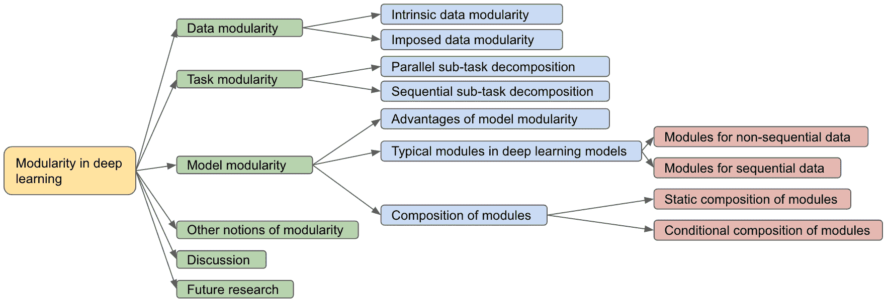

<!--yml

分类: 未分类

日期: 2024-09-06 19:36:46

-->

# [2310.01154] 深度学习中的模块化：综述

> 来源：[`ar5iv.labs.arxiv.org/html/2310.01154`](https://ar5iv.labs.arxiv.org/html/2310.01154)

# 深度学习中的模块化：综述

Haozhe Sun ¹    Isabelle Guyon ^(1,2)(¹  LISN/CNRS/INRIA, 巴黎萨克雷大学, 法国

²  ChaLearn, 美国

邮箱: haozhe.sun@universite-paris-saclay.fr

###### 摘要

模块化是许多领域中的一个普遍原则。它提供了许多有吸引力的优势，包括概念化的便捷性、可解释性、可扩展性、模块组合性和模块重用性。深度学习社区长期以来一直寻求从模块化原则中获得灵感，无论是隐式还是显式的。这种兴趣近年来一直在增加。我们围绕数据、任务和模型这三个轴心回顾了深度学习中的模块化概念，这些轴心特征了深度学习的生命周期。数据模块化指的是为了不同目的观察或创建数据组。任务模块化指的是将任务分解成子任务。模型模块化意味着神经网络系统的架构可以分解成可识别的模块。我们描述了模块化原则的不同实例，并将其优势在不同深度学习子领域中进行背景化。最后，我们通过对模块化定义的讨论以及未来研究方向的展望来结束本文。

## 1 引言

模块化是一个在许多领域中普遍存在的原则，例如生物学 [29, 241, 80, 195, 22, 58, 84, 59, 81, 186, 140, 180, 52, 108]，复杂系统 [217, 218]，数学 [14, 31]，系统设计 [177, 91, 208, 167, 55]，计算机科学 [17, 83]，图论 [170, 168, 182, 93]。尽管它们共享相同的名称，但对模块化的定义并没有一个普遍认可的标准 [26]。然而，我们可以识别出一个共享的定义 [9, 207]：一般来说，模块化是一个实体的属性，使其可以被拆分成多个子实体（称为模块）。这个定义在不同领域中有不同的体现，其细微差别 [205] 可能产生各种属性。这些领域特定的属性包括模块的自治性（模块之间的互动或相互依赖有限） [177, 17, 119, 15, 170, 87, 14, 208, 167, 52, 113, 96, 260, 7]，模块的功能专门化 [80, 59, 195, 84, 91, 140, 52]，模块的可重用性 [14, 192, 12, 6, 61, 207, 174, 175, 55, 184, 142, 43, 176, 51, 188]，模块的可组合性 [12, 6, 144, 177, 188, 151, 184, 239, 165]，以及模块的可替换性 [177, 174, 175]。

作为一种通用原则，模块化是一种描述性属性和组织方案。它是一种表示实体（数据、任务、模型）以便能够进行操作的方式，无论是在概念上还是在实际中[92, 17, 177, 55]。尽管模块化实体不一定是层级的[177]，许多模块化实体在层级结构上具有层次性[217]，即较低层级的多个模块可以形成一个较高层级的模块。较低层级的模块粒度比较高层级的模块更细。在同一层级的模块可以指代整体实体的独占划分（硬划分）或整体实体的重叠部分（软划分）。被分解的模块可以是同质的（相似模块）或异质的（不相似模块）。

回到上世纪神经网络研究的最初阶段，学术界开始对将模块化概念引入神经网络产生兴趣[13, 15, 119, 192]，这一兴趣最近得到了复兴[12, 209, 77, 135, 6, 9, 61, 78, 39, 239]。出版趋势（图 1")显示，近年来深度学习中对模块化原则的兴趣逐渐增加。本次调查围绕数据、任务和模型这三条轴探讨了深度学习中的模块化概念。调查的组织结构如图 2 所示。

图 1：“模块化深度学习”从 1990 年到 2021 年的出版趋势。包含“模块化深度学习”和“模块化神经网络”的出版物与包含“深度学习”和“神经网络”的出版物的比例，由 Google Scholar 索引。横轴为出版年份。

图 2：本次调查的组织结构。前三部分讨论了模块化原则在数据、任务和模型架构这三条轴上的具体体现。接着，我们覆盖了其他模块化概念以确保全面性。最后，我们讨论了模块化的定义以及未来研究的方向。引言和结论在此图中被忽略。

## 2 数据模块化

数据是用来表示知识和信息的实体。在机器学习和深度学习的背景下，它可以采取各种形式，如图像、音频和文本。数据样本可以被理解为高维空间中的点（固定长度的密集向量） [8, 136, 138]。数据样本的集合是数据集。数据集可以用于训练或测试深度学习模型，被称为训练集或测试集。在这些情景中，数据是深度学习模型（神经网络）的输入 [94]。

数据模块化是对数据组进行观察或创建；它指的是数据集如何可以为不同目的划分为不同模块。将数据集划分为模块有助于概念和数据操作。数据的模块化能够影响机器学习的训练 [100, 71, 227]。一些算法利用数据模块化，使得每个数据模块由不同的求解器处理 [187]。

我们可以鉴别两种数据模块化：内在数据模块化和外加数据模块化。内在数据模块化意味着数据中自然可识别的数据集划分，而人类从业者并未引入。外加数据模块化意味着人类从业者引入可鉴别的数据集划分。这一分类的基本原理在于当数据集送达分析者手中时，它已经包含某种形式的内在模块化，包括从类标签中衍生出的模块化。收集数据的人并未被视为从业者。

图 3: 数据中的模块化示意图。 (a) 基于 ImageNet 中的超类、图像和类层次结构的内在数据模块化 [63]； (b) 基于一组元数据所表征的风格的内在数据模块化，左上方圆圈包含白底黑字的字符，右上方圆圈包含黑底白字的字符，下方圆圈包含带有天然前景和背景的字符，所有字符来自同一类别集合（小写拉丁字符），这三个圆圈展示了基于其元数据对字符数据集的划分； (c) 以月球数据集形式存在的内在曲面，其中每个数据曲面可以被视为一个模块； (d) 来自[191]的少样本学习案例，重新引用自[191]。 (a)、(b)和(c)是内在数据模块化的例子，(d)是外加数据模块化的例子。

### 2.1 内在数据模块化

内在数据模块化意味着数据中自然可识别的数据集划分，并不是由人类从业者引入的。

任何有监督学习的数据集都可以根据类别（标签）进行划分；属于同一类别的数据点应该在隐藏空间中彼此接近，这为分类算法的解决方案提供了可能。具有共同语义的类别可以进一步分组形成超类别。例如，ImageNet [63] 具有一个类别层次结构（见图 3 (a)），Meta-Dataset [235] 使用了这个层次结构。Omniglot 数据集 [142] 和 OmniPrint 数据集 [227] 包含按脚本组织的字符图像，每个脚本（超类别）包含若干个字符（类别）；Meta-Album 数据集 [236] 是一个包含 40 个数据集的元数据集，每个数据集可以视为一个超类别。超类别提供了有关类别相似性的信息，允许根据语义对数据集进行拆分 [258]。

除了类别或超类别外，数据点还可以按一个或多个元数据进行分组，例如时间、位置和性别。这些元数据可以通过照片的 Exif 数据获得。OmniPrint 数据合成器生成数据，并附带一整套全面的元数据，包括字体、背景、前景、边距大小、剪切角度、旋转角度等 [227]（见图 3 (b)）。NORB 数据集收集了 50 种均匀颜色玩具在 36 个角度、9 个方位角和 6 种光照条件下的立体图像对，其中角度、方位角和光照条件作为元数据 [145]。

一些数据集在高维特征空间中包含内在的簇。这些内在簇可能源自底层的数据生成过程，其中潜在的类别变量决定了数据的自然分组。一个说明性的例子是高斯混合分布，其中数据点被假设为从若干个未知参数的高斯分布的混合中生成 [101]。一些数据集具有内在的流形；一个说明性的例子是如图 3 (c) 所示的月亮数据集，其中两个流形交织在一起，同时保持可识别的分界线，每个流形可以视为一个模块。上述两个例子都属于数据聚类的范畴。当数据样本以图形的形式互联时 [154, 249]，这被称为图分割。一个问题是如何确定数据集的最佳聚类。Luxburg 等人 [240] 认为没有最优的领域独立聚类算法，聚类应该始终在其最终用途的背景下进行研究。

多模态深度学习旨在构建能够处理和关联来自多种模态的信息的模型。这里的模态指的是某事发生或被体验的方式，例如数据以图像、文本、音频的形式呈现[19]。多模态数据集属于内在数据模块化的范畴，因为每种模态中的数据可以被视为一个模块。例如，VQA v2.0 数据集[97]包含关于图像的开放性问题；SpeakingFaces 数据集[3]包含与每个受试者讲话的音频录音同步的热成像和视觉光谱图像流。

### 2.2 强加的数据模块化

强加的数据模块化意味着由人类从业者引入的可识别的数据集划分。

在训练深度学习模型时[94]，人类从业者通常将整个训练数据集划分为小批量，这可以看作是一种强加的数据模块化。每次参数更新时，梯度是使用一个小批量的数据计算的；一个训练周期意味着遍历所有小批量。这种迭代学习模式称为随机梯度下降[199]。小批量减少了反向传播所需的内存，从而使得训练大型深度学习模型成为可能。另一方面，批量大小也会影响学习行为。Smith 等人[221]表明，通过增加训练批量大小可以获得学习率衰减的好处。Keskar 等人[131]表明，大批量大小的学习通常会导致较差的泛化性能。

课程学习[100]不使用从整个训练数据集中均匀随机采样的小批量序列，而是使用非均匀采样的小批量，使得小批量序列表现出递增的难度。相关概念是主动学习[193]，它假设数据集中的不同数据点对当前模型更新有不同的价值；它尝试选择具有最高价值的数据点来构建实际训练集。

模型性能通常在少样本学习和元学习中的少样本实验上进行测试。少样本实验通常通过从类别池中抽取若干类别$N$和每个选择的类别的若干样本$K$来形成，称为$N$-way-$K$-shot 实验 [79, 223]（图 3（d））。对于这种情况，元训练阶段可以采用相同的情节学习机制，也可以不采用 [235]，最近的研究 [242, 244, 141]和竞赛结果 [71] 表明，情节元训练不比在全球类别池中访问的普通预训练更有效。

数据增强是一种通过对现有数据应用转换来生成更多训练数据的方法 [216]。相同数据点的转换版本可以视为一个模块。一些转换，如旋转和平移，形成了一个组结构 [196]。这种数据增强的效果可以理解为在保持数据分布大致不变的情况下，对组的轨道进行平均，从而减少方差 [40]。

除了将数据集划分为样本子集外，每个数据样本还可以被划分为特征子集，称为特征分区。数据集可以表示为一个矩阵，其中每一行代表一个数据样本；每一列代表一个特征维度。然后可以沿样本和特征维度进行划分。Schmidt 等人 [207] 使用不同的模型处理每个特征分区。对于图像分类任务，输入图像可以被分割成可以并行处理的小块 [121, 67]。

### 2.3 数据模块化的结论

我们认为，没有结构的数据对学习依赖关系（例如，特征与标签之间）没有有用的信息。一些依赖关系归结为组的出现或创建。内在的数据模块化涉及样本之间的语义关系以及数据样本的相似或不相似。强加的数据模块化，则涉及从业者如何组织手头的数据，以更好地训练学习机器。

未来对数据中心深度学习的研究可能会探讨内在和强加数据模块化之间的关系。例如，内在数据模块化是否促进强加数据模块化？这种相互作用如何影响模型训练？

数据模块化描述了深度学习模型输入如何被模块化。另一方面，深度学习模型的最终目标（输出）也可以被模块化，这是下一节的主题。

## 3 任务模块化

图 4：子任务分解的示意图。上图展示了任务的并行分解，下图展示了任务的顺序分解。

深度学习模型是解决任务的工具，例如，从实体分类到生成真实的照片。解决一个任务等同于实现一个相应的目标。在深度学习中，我们通常通过明确的可微分目标函数（也称为损失函数）来建模一个目标，从而实现端到端训练。这种观点可以推广到任何任务，即使目标函数是隐式的且不具有可微分形式。例如，“购买一杯茶”的任务可以通过一个指示函数来表征，该函数如果不能购买茶则返回惩罚，否则返回奖励。在深度学习中，任务通常与数据相关，但它们是不同的。给定相同的数据集，可以在其基础上定义各种任务。例如，MNIST 数据集可以用于图像分类基准任务[158]或像素序列分类基准任务[139, 96]，OmniPrint-meta[1-5]数据集[227]可以用于少样本学习基准任务或领域适应基准任务。任务定义了目标；它们与实现最终目标的方式是正交的。

本节介绍任务模块化，即**子任务分解**。子任务分解意味着一个任务可以被分解为多个子任务。子任务分解有助于概念化和解决问题。分治原则将复杂问题分解为更简单的子问题[57, 187, 15, 118]。通过解决每个子问题并结合解决方案，可以更有效地解决复杂问题。子任务分解有助于整合专家知识，先验知识还可以进一步促进问题解决。如果整体任务是可组合的，子任务分解还可以促进重用；子任务的解决方案可能会在其他任务中被重用[173, 161, 64, 219, 185]。

子任务分解可以分为两种模式：并行分解和顺序分解（见图 4）。并行分解意味着子任务可以同时执行。顺序分解意味着子任务需要按顺序执行；某些子任务在前一个子任务完成之前不能执行。在实践中，这两种模式可以混合使用。例如，顺序分解中的子任务可以进一步并行分解，这会导致一个有向无环图工作流。

### 3.1 并行子任务分解

如果并行子任务的分解是同质的，那么被分解的子任务是相似的。一个典型的例子是将一个多类分类问题划分为多个更小的分类问题[92]。在给定一个训练好的多类分类神经网络的情况下，Csordás 等人[61]使用参数掩码来识别仅对各个类别负责的参数子集。Kim 等人[133]学习将神经网络拆分成树形结构，以处理不同的类别子集。他们假设不同的类别使用不同的特征，树形结构的神经网络确保后面的层不会在不同的类别子集之间共享特征。Pan 等人[174, 175]和 Kingetsu 等人[134]将多类分类模型分解成可重复使用、可替换和可组合的模块，每个模块是一个二分类器。这些模块可以在不重新训练的情况下重新组合，以获得一个新的多类分类器。这些方法在需要频繁更改分类类别的情况下非常有用。Abbas 等人[2]使用迁移学习和类别分解来提高医疗图像分类的性能。这种子任务可分解性是模型编辑问题的隐含前提[220, 162, 127, 163, 160]。模型编辑的目标是修改由训练好的神经网络学习的特定子任务，而不影响模型在其他输入上的性能，例如，它旨在修复模型在特定样本上的错误。如果任务不能被分解成解耦的子任务，那么模型编辑就无法实现。

如果并行子任务的分解是异质的，那么被分解的子任务是不相似的；这种分解通常依赖于问题本身，并且需要对当前任务有专家知识。Belay 等人[25]将阿姆哈拉字符的识别任务分解为元音识别任务和辅音识别任务，以减少整体任务复杂性。Cao 等人[36]将完整的自注意力机制分解为问题范围和段落范围的自注意力，以加快问答任务的推理速度。Ding 等人[66]将面部识别任务分解为多个面部组件识别任务。Zhou 等人[266]将神经网络学习任务分解为结构学习和参数学习，以自动从数据中学习等变性。Gatys 等人[89]将自然图像合成任务分解为内容组件和风格组件，这允许以组合的方式重新组合内容和风格，从而生成新的图像。

### 3.2 顺序子任务分解

顺序子任务分解反映了任务的顺序流水线。一个简单的例子是将机器学习任务分为预处理阶段（数据清理和归一化）和模型推断阶段 [190]。

在强化学习中，一个复杂任务通常可以被分解 [219] 为一系列子任务或步骤。一个说明性的例子是想象制造一个工件 $Z$ 需要购买原材料 $X$、将 $X$ 锻造为部件 $Y$，然后将部件 $Y$ 组装成最终产品 $Z$。$X$ 和 $Y$ 都可以独立地取不同的值（$X\in\{x_{1},x_{2},x_{3},...\},Y\in\{y_{1},y_{2},y_{3},...\}$）。不同的 $X$ 和 $Y$ 的值可以重新组合，形成一个组合数量的可能场景进行学习。这个流水线可以分解为三个阶段：（1）原材料采购，（2）锻造生产部件，以及（3）部件组装。如果学习发生在分解阶段的粒度上而不是整体任务上，强化学习代理会更高效 [56]。此外，这种分解还允许信用分配的独立性 [181]；整体任务的失败可以追溯到有问题的阶段，而其他阶段可以保持不变。例如，如果原材料质量差，那么需要改进采购子任务；锻造子任务和组装子任务不需要更改 [39]。

顺序流水线在实际应用中无处不在，例如光学字符识别（OCR）、自然语言处理（NLP）。在面对多脚本（多语言）识别任务时，流水线可以包括脚本识别阶段和脚本特定识别阶段 [210, 112]，这将领域分类器和领域特定求解器解耦。文本识别任务 [41] 通常包括解耦的文本检测器（定位文本的边界框）和识别器（从边界框中识别文本） [41]。传统的 OCR 方法还将词语识别任务分解为字符分割任务和字符识别任务 [37, 204, 48, 128]。传统的 NLP 流水线包括句子分割、词语标记、词性标注、词形还原、停用词过滤和依存解析 [125]。在生物信息学中，科学工作流（数据操作和转换）将相似或强耦合的工作流步骤分组到模块中，以便于理解和重用 [55]。

### 3.3 任务模块化的结论

子任务分解可以是并行的、顺序的或混合的（有向无环图）。我们提供了文献中的例子，利用子任务分解来减少任务复杂性或促进子任务解决方案的重用。任务模块化可以在与模型模块化配对时帮助整合专家知识并促进模型解释性，这将在下一节中讨论。

未来的研究可能会集中在如何自动化子任务分解过程，或使与问题相关的子任务分解技术可迁移到其他任务，这对 AutoML 是一个重要的步骤。这将减少对高素质深度学习工程师的需求，从而减少专家偏见和进入深度学习的门槛。

## 4 模型模块化

本节介绍了模型模块化。这意味着神经网络系统（一个神经网络或神经网络系统）由可识别的子实体（模块）组成。

模型模块化与任务模块化不同。任务定义一个目标，任务模块化侧重于将目标分解成子目标。模型模块化关注神经网络系统的架构，它将解决方案分解成子解决方案。

### 4.1 模型模块化的优势

模型模块化提供了概念设计和实施的便利。例如，现代神经网络由重复的层/块模式（模块）组成。示例包括全连接神经网络[94]、普通卷积神经网络、ResNet[105, 251]、Inception[230]和由神经结构搜索（NAS）搜索出的模型[270, 74]。具有同质模块的设计允许在 Kolmogorov 复杂度（简短描述长度）的意义上对模型架构进行更简洁的描述[149, 148]。例如，模型可以描述为一组相互作用的模块，而不是指定每个原始操作（例如，和、积、拼接）在计算图中的交互[92]。此类神经网络构建块（全连接层、卷积层）的标准化还促进了高度优化的硬件和软件生态系统的发展，以实现快速计算[178, 156, 1, 90, 98]。

与子任务分解（任务模块化）一起，模型模块化提供了专家知识集成[12, 95, 214, 211, 25]和可解释性[135, 184, 118, 137]。可解释性可以有不同的形式。例如，每个神经网络模块可以分配一个特定的可解释子任务。另一方面，选择性模块评估提供了关于不同样本/任务如何相关的见解[119, 209, 12, 6]，这在条件计算的背景下[28]。

将模型分解为模块可以促进重用性和知识转移[33]。尽管每个神经网络通常被训练以执行特定任务，但如果适当的机制促进这种重用性，其（被分解的）模块可以在任务之间共享。最简单的例子就是大规模预训练模型的经典微调范式[106, 258, 50, 104]。该范式通常冻结预训练模型，只重新训练其最后的分类层，以使其适应下游任务。预训练模型通常在大型数据集上进行预训练[201, 225, 254]。大量和多样化的训练数据使得预训练模型的中间特征可以重用于其他下游任务。最近，神经网络系统的细粒度重用性引起了研究人员的关注。这些方法假设任务共享底层模式，并保持一个可重用模块的清单（每个模块是一个小型神经网络）[12, 135, 6, 239]。每个模块学习解决每个任务所需知识的不同方面（潜在因素或原子技能）。这些模块的选择性/稀疏使用和动态重组/组合可以促进样本效率[184]和组合泛化[12, 62, 6, 117]。

组合概括也被称为组合概括，“有限手段的无限使用”[47]，以及系统概括。它旨在对已知函数/因子/词的未见组合进行概括[60, 82, 143, 132, 173, 38, 185], 它是有系统地重新组合先前学习的元素以将由这些元素组成的新输入映射到其正确输出的能力[206]。例如，新句子由已知一组词的新组合构成。据说组合概括对实现类人概括是重要的[23, 184, 164, 146, 114, 183, 134, 243, 142, 115, 237, 153]。以可重复利用的方式用不同模块学习知识的不同方面可能是解决组合概括的一种方法。模块化系统已被证明对各个领域的组合概括[197] 如自然语言处理[144, 184, 114, 183, 169], 视觉问答[12, 62, 16], 目标识别[185, 142, 176, 38], 和机器人技术[6, 64, 179, 51] 有效。

神经网络系统的模块化有助于知识的保留。如果不同的知识被定位到不同的模块中，就可能进行有针对性的知识更新和故障排除[134, 174, 175]。这可以减轻不同任务的梯度干扰[261, 126, 155]和灾难性遗忘[239, 202, 233, 10, 120, 85, 6, 4, 72, 129, 172]。

模块化神经网络系统通过两种方式促进模型的扩展。 (1) 模块化模型，如全连接模型和 ResNet，可以通过简单地堆叠更多（或更少）的模块来放大（或缩小），从而增加（或减少）模型的容量以适应更大（或更小）的数据集[105]。 (2) 基于稀疏激活专家混合体的模块化方法[209]将计算成本与模型大小解耦。它们允许在不增加计算成本的情况下大幅度增加模型容量，因为每次前向传播时只有模型的一小部分会被评估[75, 209, 102, 68, 49, 21]。这些稀疏激活模型的极端例子是 Switch Transformer[76]，它包含 1.6 万亿个参数，将大模型尺寸的竞争推向了新的水平[35, 222]。

### 4.2 深度学习模型中的典型模块

本节回顾了深度学习文献中的一些典型模块。

几乎所有系统都在某种程度上是模块化的[205]，神经网络系统几乎总是可以根据不同的观点被分解为子系统（模块）[18]。更具体地说，它们通常由一个层次结构组成，其中较高层次的模块由较低层次的模块构成。现代神经网络的基本层（例如，全连接层、卷积层）可以被视为一个独立的模块。另一方面，任何神经网络整体也可以被视为一个模块，例如，在集成[268]、专家混合体[119]和生成对抗网络（GAN）[95]的背景下。一些文献[61, 26, 226, 134]将模块定义为子神经网络，其中部分参数被遮蔽（设置为 0）。在这些情况下，当遮蔽区域重叠时，可以获得重叠的模块。

图 5：模块示例。 (a) 一个全连接层； (b) 一个基础 ResNet 模块，转载自 [105]； (c) 一个 LSTM 模块，转载自 [44]。

4.2.1 非顺序数据的模块

全连接层（图 5 (a)）模拟了生物神经网络中神经元之间的连接，但将每个输入神经元与每个输出神经元连接[94]。在实践中，全连接层实现为输入数据与可学习参数之间的矩阵乘法。卷积层引入了平移等变性的归纳偏置。从概念上讲，通过强制局部连接和参数共享，可以从全连接层获得一个卷积层（具有单一输出通道）[94]。局部连接意味着每个神经元仅连接到前一层的一部分神经元；参数共享意味着在感受野中使用相同的可学习参数。在实践中，卷积层实现为在输入数据上移动的内核/滤波器的集合[178, 156]。每个内核执行输入数据与可学习参数之间的点积。根据内核移动的维度数量，卷积层被称为，例如，1D、2D、3D。2D 卷积层广泛应用于计算机视觉任务[147, 138]。局部连接层与卷积层类似，不同之处在于它们去除了参数共享的约束（跨内核）。这有助于在想要施加局部感受野的情况下，而没有理由认为每个局部内核应该是相同的[94]。低秩局部连接层放宽了空间等变性，并在局部连接层和卷积层之间提供了一种折中。每个位置应用的内核被构造为一组基础内核的线性组合，具有空间变化的组合权重。改变基础内核的数量允许控制空间等变性的放宽程度[73]。标准卷积层提供平移等变性；一项研究方向集中在将其推广到其他等变性（旋转、反射），称为组卷积层[53, 65, 54, 248, 88, 24, 247, 246]。另一方面，深度可分离卷积层[213, 46, 109] 将标准卷积层分解为深度卷积层和逐点卷积层，从而减少了模型大小和计算量。

多层可以被组合成一个构建块（更高层级的模块）。例如，ResNet [105]、Inception [230, 229]、ResNeXt [251]、Wide ResNet [262]等构建块。在每个块内，Inception [230, 229]具有多个尺寸的并行内核，并将它们的结果合并，以提取不同尺度的信息。Inception 还包括几种技术来降低计算成本，例如将大内核分解为小内核和使用$1\times 1$卷积来减少维度。ResNet 块 [105]（图 5 (b)）包含一系列卷积层；它从块的开始到结束添加一个跳跃连接（也称为残差连接、恒等映射），以缓解梯度消失问题。已经提出了许多 ResNet 块的变体。例如，Wide ResNet [262]增加了块的宽度；ResNeXt [251]在每个块内聚合并行路径。

块设计可以通过自动搜索而非手工设计。为了缩小模型搜索空间，一些神经架构搜索方法 [74, 116, 270, 257] 自动搜索块的最佳设计模式（也称为单元），同时固定块的组成方案（也称为元架构）。一旦搜索到块设计模式，整个模型将通过重复搜索到的块并遵循预定义的块组成方案来实例化。例如，NAS-Bench-101 [257] 将块搜索空间定义为所有可能的有向无环图在 V 节点（$V\leqslant 7$）上，同时将最大边数限制为 9。

McNeely-White 等人 [159] 报告称，Inception 和 ResNet 学习到的特征几乎是彼此的线性变换，尽管这两种架构在设计哲学上有显著差异。这一结果解释了为什么这两种架构通常表现相似，并强调了训练数据的重要性。这一结果得到了 Bouchacourt 等人 [30] 的证实，他们认为不变性通常源自数据本身，而非架构偏差。

4.2.2 顺序数据的模块

当输入数据是序列性的，例如时间序列、文本、音频或视频时，递归神经网络（RNN）[200] 就会发挥作用。RNN 模块逐个处理序列数据；RNN 模块在上一个时间步骤的输出（也称为隐藏状态）会递归地反馈给 RNN 模块，这使其能够跨时间步骤汇总信息。普通的 RNN 模块存在短期记忆问题；它无法有效地保留长序列中的信息。为了解决这个问题，门控递归单元（GRU）[45] 和长短期记忆（LSTM）[107] 模块使用门控来控制哪些信息应被存储或遗忘，从而更好地保留长期信息。在 GRU 和 LSTM 模块中，门控是具有可训练参数的神经网络。虽然 GRU 模块比 LSTM 模块训练速度更快，但它们的性能比较因场景而异。GRU 在长文本和小数据集场景中优于 LSTM，而 LSTM 在其他场景中则超越 GRU [255]。

与逐个处理序列数据的 RNN、GRU 和 LSTM 相反，自注意力层[238] 并行处理数据序列。对于数据序列中的每个数据点（例如时间序列中的每个时间步），自注意力层通过线性变换创建三个转换版本，分别称为查询向量、键向量和值向量。在每对数据点之间，查询向量和键向量的点积反映了这两个数据点在序列中的相关程度。这些点积随后被归一化，并与对应的值向量组合，以获得每个数据点在序列中的新表示。自注意力层的增强版本是多头自注意力层，它为每个数据点提取不同版本的查询向量、键向量和值向量。多头自注意力层通过捕捉更多样化的表示来提高性能。变换器块结合了多头自注意力层、全连接层、归一化层和跳跃连接。基于变换器块构建的模型在自然语言处理[130] 和语音合成[150] 等广泛任务中实现了最先进的性能。变换器模型可以通过将每个输入图像转换为小的图像补丁序列[67] 来应用于图像模态。尽管缺乏图像特定的归纳偏置（平移等变性、局部性），但当与大量训练数据结合时，视觉变换器仍能实现最先进的性能[67, 103, 20]。

### 4.3 模块组成

图 6：模块组成示意图。 (a) 顺序连接。 (b) 集成。 (c) 树状结构组成。 (d) 一般有向无环图。 (e) 条件组成。 (f) 协作组成。

第 4.2 节介绍了文献中的典型模块。第 4.3 节讨论了如何组织这些模块以形成一个模型（或更高层次的模块）。

4.3.1 模块的静态组成

静态组成意味着组成结构不会随输入而变化；相同的结构用于所有输入样本或任务。

组成模块的一个直接方法是顺序连接 (图 6 (a))。这意味着多个（通常是同质的）模块被顺序连接成一个链，以形成一个模型，其中一个模块的输出是下一个模块的输入。顺序连接的例子包括全连接模型 [94] 和 ResNet 模型 [105]。这种组成方案通常不假设显式的子任务分解；连接模块的链可以看作是一系列信息提取步骤 [258, 234, 5]，提取的特征从低级过渡到高级。

集成组成 [268, 124, 171]，另一方面，以并行方式组织模块 (图 6 (b))。集成的原则是聚合（例如，平均）多个模块（较弱学习者）的结果，以获得更稳健的预测。其理由是不同的模块预计会提供输入数据的互补和多样化视图。每个模块的数据在推理时独立处理，不依赖于其他模块。正则化方法 Dropout [224]，在训练期间随机停用神经元，可以看作是重叠模块的隐式集成方法。

顺序组合和并行组合可以结合使用，例如，形成树状结构（图 6 (c)）。树状结构组合的典型场景是一个具有共享特征提取器和多个任务特定头的模型 [265, 215]。上述所有组合方案都是有向无环图（DAG，图 6 (d)）的特例。一般的 DAG 组合方案通常出现在通过神经架构搜索（Neural Architecture Search）找到的模型中 [152, 252, 192]。

协作组合（图 6 (f)）假设每个模块是一个具有特定功能的独立神经网络，这些神经网络在训练或推理过程中相互合作；这是一个由多个独立神经网络组成的神经网络系统。与集成组合不同，协作组合中的模块通常是异构的，彼此之间的互动更加多样。例如，孪生网络 [34, 42, 122] 由两个神经网络（模块）组成，它们协同工作以产生输入数据的不同版本。生成对抗网络（GAN） [95, 269] 在鉴别器的指导下训练生成器。同样的思想适用于教师和学生神经网络 [231]。一些深度强化学习方法实现了具有两个独立网络的 Actor-Critic [228]，例如 AlphaGo [214]、A3C [166]、ACKTR [250]。使用深度重放缓冲区的持续学习 [211] 包含一个持续的神经网络学习者和一个作为重放缓冲区的生成神经网络。其他一些持续学习方法 [202, 233, 10, 239] 通过添加新的模块来不断扩展模型的能力，这些新模块与旧模块协同工作以应对新任务。

4.3.2 模块的条件组合

条件组合（图 6 (e)）是对静态组合的补充，因为组合的模块会根据每个特定输入进行选择性（条件、稀疏或动态）激活（使用或评估）。输入条件化可以在单个样本[12, 135, 119]的粒度上进行，也可以在任务[184, 155, 226, 157, 118]上进行。在文献中，这种范式也被称为条件计算[28, 27]。

条件计算的概念可以追溯到上世纪引入的专家混合（MoE）。MoE 是由多个独立的神经网络（模块）组成的系统，每个模块学习处理整体任务的一个子任务[118, 267]，例如，完整训练数据集的一个子集。一个门控网络计算将每个示例分配到每个模块的概率[119, 123]，或者是模块的稀疏加权组合[209]。MoE 的两个问题是模块崩溃[209, 135, 164]和批量大小缩小[209]，这两个问题都与模块利用的平衡有关。模块崩溃指的是模块的利用不足或模块多样性的缺乏。由于门控网络在训练过程中具有自我强化行为，可能会选择早期的模块并使其得到更多训练。门控网络可能最终会收敛到总是选择一小部分模块，而其他模块则从未被使用。批量大小缩小指的是每个条件激活模块的批量大小减少。对于现代硬件，大批量是必要的，因为它们缓解了数据传输的成本[209]。

MoE 可以推广到例如，堆叠 MoE[70, 135, 198, 77, 189] 或层次 MoE[209, 256]（图 7）。Eigen 等人[70] 首次探索了堆叠 MoE；他们提出了使用多个 MoE 及其自身门控网络的想法。为了训练堆叠 MoE，Kirsch 等人[135] 使用了广义 Viterbi 期望最大化算法，Rosenbaum 等人[198] 采用了多智能体强化学习算法，Fernando 等人[77] 使用了遗传算法。MoE 系统并不总是具有明确的门控网络；例如，Fernando 等人[77] 依赖于遗传算法的结果来决定模块路由方案。

图 7：混合专家（MoE）的扩展。（a）一个堆叠的 MoE，将多个 MoE 层堆叠成一个链条。（b）一个分层的 MoE，其中一个主要的门控网络选择“模块”的稀疏加权组合，每个模块都是一个具有自己门控网络的 MoE。

受到 MoE 的启发，一些深度学习方法保留了可重复使用的专门模块的库存，这些模块可以针对每个输入条件性地重新组装。这种方法被提倡以促进知识转移、样本效率和泛化。例如，在视觉问答中，神经模块网络 [12, 111, 62] 动态地将模块重新组装成一个神经网络，以定位被询问图像上的注意区域（兴趣区域）。问题的解析引导了重新组装过程，以便重新组装的模型反映出问题的结构和语义。对于这个特定的任务，模块的组合性来自于视觉注意的组合性。按照问题的语法，重新组装的模块依次修改对被询问图像的注意。例如，与“cat”一词相关的模块定位包含猫的图像区域，而与“above”一词相关的模块则向上移动注意力。张等人 [264] 研究了通过直接移植与新能力相对应的模块来为通用网络添加新能力的方法，这被称为网络移植。

一些工作依赖于这样的假设：当前的任务之间存在一些共同点，即隐藏因素在任务之间是共享的。每个隐藏因素可以通过从模块库存中分开的模块进行转移学习和元学习。例如，Alet 等人 [6] 使用模拟退火来元学习一个可以在任务之间重复使用的模块库存，以实现组合泛化。在元训练期间，模块库存的参数被优化；在元测试期间，训练好的模块在一个可选的参数微调过程中被重新组装。他们展示了他们的方法在机器人任务中的效用。Ponti 等人 [184] 假设每个任务与技能库存中的一组潜在离散技能相关联。他们通过解开和重新组合知识的不同方面，尝试更系统地推广到新任务中。更具体地，他们联合学习每个潜在技能的技能特定参数向量和一个二进制任务-技能分配矩阵。对于每个新任务，新模型的参数向量被创建为与新任务中存在的技能对应的技能特定参数向量的平均值（此外还有一个共享的基础参数向量）。

条件组合方案还有其他形式。例如，Teerapittayanon 等人[232]通过早期退出在简单输入数据上节省计算；如果中间特征的预测置信度超过预定义阈值，则会跳过后续层。Fuengfusin 等人[86]训练可以在推理时移除层而不会显著降低性能的模型，以实现自适应的准确度与延迟权衡。类似地，Yu 等人[259]训练可在可定制宽度（卷积层中的通道数）下执行的模型。Xiong 等人[253]在每个特定输入样本的每层中稀疏激活卷积核，这提供了重叠模块条件组合的一个例子。

### 4.4 模型模块化的结论

第四部分介绍了模块化概念如何在神经网络系统的架构中体现。神经网络模块的结构（第 4.2 节）和模块组织方式（第 4.3 节）提供了对模型模块化的补充视角。

虽然所有现代神经网络在某种程度上都是模块化的，但不同的模块化原则实现提供了不同的优势（第 4.1 节）。这些优势包括概念设计和实现的简便性、专家知识的集成、较好的可解释性、知识转移和重用的便利性、较好的泛化能力和样本效率、知识保留的便利性、故障排除的简便性以及更好的可扩展性。

## 5 其他模块化概念

在深度学习文献中仍存在其他模块化概念。

在图论中，“模块性”这一术语指的是在社区检测中常用的一个度量。它测量一个社区（模块）内的连接密度与社区间的连接密度相比[170]。这一度量可以应用于图聚类问题，通过模块性优化的形式[32, 110, 203, 212]。受这一度量的启发，Filan 等人[78]研究了从神经网络训练中出现的参数聚类模式。他们将神经网络视为一个无向加权图（边的权重是网络参数的绝对值），并对获得的图进行谱聚类。他们观察到，一些在图像分类任务上训练的神经网络具有其参数的某些聚类属性：边权重在一个聚类内比在聚类之间更强。Watanabe 等人[245]也获得了类似的结果。Béna 等人[26]将图论中的模块性度量调整为定义结构模块性，并通过三种启发式度量定义功能专业化。功能专业化可以直观地理解为子网络在独立执行子任务的能力。为了研究结构模块性与功能模块性之间的关系，他们设计了一个场景，其中一个具有两个并行模块（具有可调节的连接数）的模型用于预测两个数字的奇偶性是否相同。他们展示了通过在两个通信模块之间施加稀疏连接来强制结构模块性确实会导致模块的功能专业化。然而，这种现象只发生在极端的稀疏水平下。即使在中等数量的连接下，模块也会变得功能上纠缠。Mittal 等人[164]观察到，具有良好模块专业化的模块化系统（并行模块的加权组合）在整体系统性能方面表现良好，但端到端训练本身不足以实现良好的模块专业化。

图 8：解缠表示的示意图。

“模块化”这一术语在某些文献中与独立性概念相关。例如，Galanti 等人[87]使用模块化来指代超网络[99]为每个输入实例学习不同功能的能力。一系列关于学习解缠表示的研究已经开展。从直观上讲，解缠表示旨在逆转数据生成过程，并将其潜在因素提取到学习到的表示中（图 8）。解缠表示的一个理想属性[194, 69, 263]是“模块化”。在这种背景下，模块化表示是指每个表示维度传达最多一个潜在生成因素的信息。

## 6 讨论

定义模块化本身就是一个具有挑战性的问题。模块化的概念在多个不同领域的文献中都有出现[29, 241, 80, 195, 22, 58, 84, 59, 81, 186, 140, 180, 217, 218, 14, 31, 177, 91, 208, 167, 55, 17, 83, 170, 168, 182, 93]。虽然许多研究人员对实体的模块化有很强的直觉，但尚未达成关于模块化定义的普遍共识。即便在深度学习领域也是如此。正如 Béna 等人[26]所说：“神经网络的模块化有点像艺术中的美学：大家都同意它很重要，但没有人能准确地说清楚它的含义。”我们认为，定义模块化的困难在于，模块化的概念通常伴随着许多不同的属性：模块的可替换性、模块的可组合性、模块的可重用性、模块的自主性（模块间有限的互动或有限的相互依赖）、模块的功能专门化。不同领域的作者通常只保留上述一个或两个属性来声称一个实体是模块化的。

在这项调查中，我们将模块化定义为一个实体的属性，即它可以被分解成多个子实体（称为模块）。这个定义是上述属性的前提条件；它是模块化概念的最通用定义。通过递归应用模块化定义，一个模块化实体是一个可以被分解成子实体的实体，每个子实体还可以进一步分解成子子实体。这种递归可以对离散实体重复进行，直到达到原子元素（最小不可分模块）。在这种情况下，一组原子元素 $\{a\in D\}$ 可以正式地表征一个离散实体 $D$；然后，原子元素的一个子集可以表征一个模块 $M\subseteq D$。上述框架适用于数据模块化（第二部分）和模型模块化（第四部分）。原因在于数据和模型都是离散的：数据样本和模型参数存储在物理计算机中，其中一切都以量化形式表示。另一方面，我们需要使用不同的框架来处理任务模块化，因为任务通常不是离散的。如第三部分所讨论的，每个任务可以通过目标函数 $F$ 来表征。从这个意义上讲，任务模块化可以通过（目标）函数组合来正式表征。如果存在一组函数 $\{f_{1},f_{2},...\}$，它们组合在一起能够恢复原始目标函数 $F$ 的形式，则该任务是可分解的。

对于离散实体，需要选择原子元素。简单来说，可以选择数据集中的每一个数据样本和神经网络中的每一个神经元作为原子元素。然而，这两种选择仍需讨论，因为它们确实不是最小的不可分割模块。关于数据模块化，数据集的划分可以发生在样本维度和特征维度，这意味着每个数据样本可以被划分为更小的元素，例如，缩短长度的特征向量或图像补丁。关于模型模块化，模块化可以发生在参数的粒度上，例如，通过屏蔽参数可以获得模块[61, 26, 226, 134]。因此，可以选择存储在物理计算机中的标量数（通常表示为浮点数）作为原子元素。数据的原子元素是数据样本的每一个维度；模型的原子元素是神经网络中的每一个标量参数。这意味着，在某些情况下，需要在原子元素$\{a\in D\}$之间存在某种关系$R$，因为任何任意的原子元素子集如果关系$R$被破坏，就不一定形成有效的模块。在上述示例中，关系$R$指示了哪些标量数应该组合在一起以形成数据样本，或者如何在神经网络计算图中的前向计算中使用每一个标量参数。因此，一个实体可以是一个集合或系统；一个系统是一个配备了原子元素$\{a\in D\}$之间关系$R$的集合。

## 7 未来研究

由于模块化是一个通用原则，本调查涵盖了深度学习不同子领域中的许多元素；每个子领域本身可以提供大量未来研究的途径。举几个例子，McNeely-White 等人[159]和 Bouchacourt 等人[30]表明，给定相同的训练数据，学习到的特征在具有明显不同架构归纳偏差的模型中展示出相似的属性。如果数据主导学习结果，那么改进神经网络架构是否仍然值得？未来的研究可以通过以更系统的方式将 McNeely-White 等人[159]和 Bouchacourt 等人[30]的研究扩展到更多种类的模型和训练数据集来验证这些结果。如果这些结果仍然成立，可能需要从理论上支持这些结果。另一方面，神经网络是否能够以组合的方式进行学习和行为仍然是一个悬而未决的问题[114, 11]。这意味着我们需要一种领域无关的方式来测试神经网络的组合性。

模块化原则的不同方面可以进一步研究以改进深度学习模型。这归结为设计新的深度学习方法，例如，提供更好的可解释性、可重用性、可扩展性和效率。尽管模型的模块化在某种程度上可能反映了任务的模块化，但尚不清楚数据模块化是否与模型模块化直接对应。一个研究方向是自动化对特定模型的强制性数据模块化，类似于 AutoML 的精神。类似地，自动化任务模块化可以促进问题解决并减少人为偏差。

## 8 结论

深度学习在许多应用中正变得主导，例如计算机视觉和自然语言处理。我们自然会问自己是否有设计深度学习算法的指导原则。模块化是文献中提出的一个指导原则。本调查揭示了模块化在深度学习的三个相关但独立的轴心中的普遍存在：数据、任务和模型架构。我们观察到一些模块化概念以先验形式出现，而另一些则以后验形式出现。

将模块化原则引入深度学习的努力并不新鲜；然而，从模块化的角度审视深度学习文献相对较新。本调查为澄清和研究深度学习及其他领域中的模块化概念迈出了一步。

## 致谢

我们衷心感谢**Birhanu Hailu Belay**、**Romain Egele**、**Felix Mohr**、**Hedi Tabia**及审稿人提供的建设性反馈和建议。这项工作得到了 ChaLearn 和 ANR（法国国家科研署）在 HUMANIA 人工智能卓越研究椅项目下的资助，资助编号为 ANR-19-CHIA-0022。

## 参考文献

+   [1] 加速快速数学运算使用 Intel® oneAPI 数学核心库. https://www.intel.com/content/www/us/en/developer/tools/oneapi/onemkl.html.

+   [2] **Asmaa Abbas**、**Mohammed Abdelsamea** 和 **Mohamed Gaber**. DeTraC: 卷积神经网络中类分解医学图像的迁移学习. IEEE Access, PP:1–1, 2020 年 4 月.

+   [3] **Madina Abdrakhmanova**、**Askat Kuzdeuov**、**Sheikh Jarju**、**Yerbolat Khassanov**、**Michael Lewis** 和 **Huseyin Atakan Varol**. Speakingfaces: 一个大规模多模态数据集，包含语音命令的视觉和热成像视频流. 传感器, 21(10):3465, 2021.

+   [4] **Wickliffe C. Abraham** 和 **Anthony Robins**. 记忆保持——突触稳定性与可塑性困境. 神经科学趋势, 28(2):73–78, 2005 年 2 月.

+   [5] **Guillaume Alain** 和 **Yoshua Bengio**. 使用线性分类器探针理解中间层. arXiv 预印本 arXiv:1610.01644, 2016.

+   [6] **Ferran Alet**、**Tomás Lozano-Pérez** 和 **Leslie P. Kaelbling**. 模块化元学习. arXiv:1806.10166 [cs, stat], 2019 年 5 月.

+   [7] Anirudh Goyal ALIAS PARTH GOYAL, Aniket Didolkar, Nan Rosemary Ke, Charles Blundell, Philippe Beaudoin, Nicolas Heess, Michael C Mozer 和 Yoshua Bengio. 神经生成系统. 在 M. Ranzato, A. Beygelzimer, Y. Dauphin, P.S. Liang 和 J. Wortman Vaughan 编辑的《神经信息处理系统进展》第 34 卷中, 页码 25673–25687. Curran Associates, Inc., 2021 年。

+   [8] Felipe Almeida 和 Geraldo Xexéo. 词嵌入：综述, 2019 年 1 月。

+   [9] Mohammed Amer 和 Tomas Maul. 人工神经网络模块化技术综述. 人工智能评论, 52, 2019 年 6 月。

+   [10] Ark Anderson, Kyle Shaffer, Artem Yankov, Court D. Corley 和 Nathan O. Hodas. 超越微调：小数据上的模块化学习方法, 2016 年 11 月。

+   [11] Jacob Andreas. 衡量表征学习中的组合性. 在国际学习表征会议上, 2019 年。

+   [12] Jacob Andreas, Marcus Rohrbach, Trevor Darrell 和 Dan Klein. 神经模块网络. 在 2016 年 IEEE 计算机视觉与模式识别会议(CVPR)上, 页码 39–48, 拉斯维加斯, NV, USA, 2016 年 6 月。IEEE。

+   [13] G. Auda 和 M. Kamel. 模块化神经网络综述. 国际神经系统学杂志, 9 2:129–51, 1999 年。

+   [14] Jeremy Avigad. 数学中的模块化. 符号逻辑评论, 13(1):47–79, 2020 年 3 月。

+   [15] Farooq Azam. 生物启发的模块化神经网络. 博士论文, 维吉尼亚理工大学, 2000 年 5 月。

+   [16] Dzmitry Bahdanau, Shikhar Murty, Michael Noukhovitch, Thien Huu Nguyen, Harm de Vries 和 Aaron Courville. 系统性泛化：需要什么，能否学习？在国际学习表征会议上, 2019 年。

+   [17] Carliss Y. Baldwin 和 Kim B. Clark. 设计规则：模块化的力量，第 1 卷. 剑桥, MA: MIT 出版社, 第 1 版, 1999 年。

+   [18] Randall Balestriero 和 Yann LeCun. POLICE: 对深度神经网络的可证明最优线性约束执行, 2022 年 11 月。

+   [19] Tadas Baltrušaitis, Chaitanya Ahuja 和 Louis-Philippe Morency. 多模态机器学习：综述与分类. IEEE 模式分析与机器智能学报, 41(2):423–443, 2018 年。

+   [20] Hangbo Bao, Li Dong, Songhao Piao 和 Furu Wei. BEiT: BERT 预训练图像变换器. 在国际学习表征会议上, 2022 年。

+   [21] Paul Barham, Aakanksha Chowdhery, Jeff Dean, Sanjay Ghemawat, Steven Hand, Dan Hurt, Michael Isard, Hyeontaek Lim, Ruoming Pang, Sudip Roy, Brennan Saeta, Parker Schuh, Ryan Sepassi, Laurent El Shafey, Chandramohan A. Thekkath 和 Yonghui Wu. Pathways: 用于机器学习的异步分布式数据流. arXiv:2203.12533 [cs], 2022 年 3 月。

+   [22] H. Clark Barrett 和 Robert Kurzban. 认知中的模块化：框架辩论. 心理学评论, 113(3):628–647, 2006 年 7 月。

+   [23] Peter W. Battaglia, Jessica B. Hamrick, Victor Bapst, Alvaro Sanchez-Gonzalez, Vinicius Zambaldi, Mateusz Malinowski, Andrea Tacchetti, David Raposo, Adam Santoro, Ryan Faulkner, Caglar Gulcehre, Francis Song, Andrew Ballard, Justin Gilmer, George Dahl, Ashish Vaswani, Kelsey Allen, Charles Nash, Victoria Langston, Chris Dyer, Nicolas Heess, Daan Wierstra, Pushmeet Kohli, Matt Botvinick, Oriol Vinyals, Yujia Li 和 Razvan Pascanu. 关系性归纳偏置、深度学习与图网络。arXiv:1806.01261 [cs, stat]，2018 年 10 月。

+   [24] Erik J. Bekkers, Maxime W. Lafarge, Mitko Veta, Koen AJ Eppenhof, Josien PW Pluim 和 Remco Duits. 医学图像分析中的旋转-平移协变卷积网络。arXiv:1804.03393 [cs, math]，2018 年 6 月。

+   [25] Birhanu Belay, Tewodros Habtegebrial, Marcus Liwicki, Gebeyehu Belay 和 Didier Stricker. 用于阿姆哈拉字符图像识别的分解卷积神经网络。见于 2019 年 IEEE 国际图像处理大会（ICIP），第 2906–2910 页，2019 年。

+   [26] Gabriel Béna 和 Dan F. M. Goodman. 极端稀疏性引发功能专门化。arXiv:2106.02626 [cs, q-bio]，2021 年 6 月。

+   [27] Emmanuel Bengio, Pierre-Luc Bacon, Joelle Pineau 和 Doina Precup. 神经网络中的条件计算以加快模型速度。arXiv:1511.06297 [cs]，2016 年 1 月。

+   [28] Yoshua Bengio, Nicholas Léonard 和 Aaron Courville. 通过随机神经元估计或传播梯度以进行条件计算。arXiv:1308.3432 [cs]，2013 年 8 月。

+   [29] J. Bongard. 进化模块化遗传调控网络。见于 2002 年进化计算大会论文集。CEC’02 (Cat. No.02TH8600)，第 2 卷，第 1872–1877 页，2002 年 5 月。

+   [30] Diane Bouchacourt, Mark Ibrahim 和 Ari Morcos. 在自然图像中实现归纳偏置：不变性源于数据的变化。见于 M. Ranzato, A. Beygelzimer, Y. Dauphin, P.S. Liang 和 J. Wortman Vaughan 主编的《神经信息处理系统进展》，第 34 卷，第 19566–19579 页。Curran Associates, Inc.，2021 年。

+   [31] Nicholas Bourbaki. 数学的架构。《美国数学月刊》，57(4):221–232，1950 年 4 月。

+   [32] Ulrik Brandes, Daniel Delling, Marco Gaertler, Robert Gorke, Martin Hoefer, Zoran Nikoloski 和 Dorothea Wagner. 关于模块化聚类。IEEE 知识与数据工程学报，20(2):172–188，2007 年。

+   [33] Alexander Braylan, Mark Hollenbeck, Elliot Meyerson 和 Risto Miikkulainen. 重新使用神经模块进行通用视频游戏玩法。见于 AAAI 人工智能会议论文集，第 30 卷，2016 年。

+   [34] Jane Bromley, Isabelle Guyon, Yann LeCun, Eduard Säckinger 和 Roopak Shah. 使用“Siamese”时间延迟神经网络进行签名验证。见于 J. Cowan, G. Tesauro 和 J. Alspector 主编的《神经信息处理系统进展》，第 6 卷。Morgan-Kaufmann，1994 年。

+   [35] Tom Brown, Benjamin Mann, Nick Ryder, Melanie Subbiah, Jared D Kaplan, Prafulla Dhariwal, Arvind Neelakantan, Pranav Shyam, Girish Sastry, Amanda Askell, Sandhini Agarwal, Ariel Herbert-Voss, Gretchen Krueger, Tom Henighan, Rewon Child, Aditya Ramesh, Daniel Ziegler, Jeffrey Wu, Clemens Winter, Chris Hesse, Mark Chen, Eric Sigler, Mateusz Litwin, Scott Gray, Benjamin Chess, Jack Clark, Christopher Berner, Sam McCandlish, Alec Radford, Ilya Sutskever, 和 Dario Amodei. 语言模型是少样本学习者. 在 H. Larochelle, M. Ranzato, R. Hadsell, M.F. Balcan, 和 H. Lin 编辑的《神经信息处理系统进展》中, 第 33 卷, 页码 1877–1901. Curran Associates, Inc., 2020 年.

+   [36] 曹青青, Harsh Trivedi, Aruna Balasubramanian, 和 Niranjan Balasubramanian. DeFormer：分解预训练变换器以加快问答速度. 在第 58 届计算语言学协会年会上, 页码 4487–4497, 在线, 2020 年 7 月. 计算语言学协会.

+   [37] Richard G Casey 和 Eric Lecolinet. 字符分割方法和策略综述. IEEE 模式分析与机器智能学报, 18(7):690–706, 1996 年.

+   [38] Michael Chang, Abhishek Gupta, Sergey Levine, 和 Thomas L. Griffiths. 自动组合表示变换以实现泛化. 在国际表示学习大会上, 2019 年.

+   [39] Michael Chang, Sid Kaushik, Sergey Levine, 和 Tom Griffiths. 通过算法独立性在信用分配中的模块化. 在国际机器学习大会上, 页码 1452–1462. PMLR, 2021 年 7 月.

+   [40] 陈书孝, Edgar Dobriban, 和 Jane Lee. 数据增强的群体理论框架. 在 H. Larochelle, M. Ranzato, R. Hadsell, M.F. Balcan, 和 H. Lin 编辑的《神经信息处理系统进展》中, 第 33 卷, 页码 21321–21333. Curran Associates, Inc., 2020 年.

+   [41] 陈小雪, 廉文金, 朱元志, 罗灿杰, 和 王天伟. 野外文本识别：综述. arXiv:2005.03492 [cs], 2020 年 12 月.

+   [42] 陈欣磊 和 何恺明. 探索简单的孪生网络表示学习. 在 2021 年 IEEE/CVF 计算机视觉与模式识别大会（CVPR）上, 页码 15745–15753, 美国田纳西州纳什维尔, 2021 年 6 月. IEEE.

+   [43] 陈玉田, Abram L Friesen, Feryal Behbahani, Arnaud Doucet, David Budden, Matthew Hoffman, 和 Nando de Freitas. 模块化元学习与收缩. 神经信息处理系统进展, 33:2858–2869, 2020.

+   [44] Guillaume Chevalier. 长短期记忆（LSTM 单元）. 维基百科, 2022 年 9 月.

+   [45] Cho Kyunghyun, Bart van Merriënboer, Dzmitry Bahdanau, 和 Yoshua Bengio. 神经机器翻译的性质：编码器-解码器方法. 统计翻译中的句法、语义和结构, 页码 103, 2014 年.

+   [46] François Chollet. Xception: 通过深度可分卷积进行深度学习。在 IEEE 计算机视觉与模式识别会议论文集中，页码 1251–1258，2017 年。

+   [47] Noam Chomsky. 句法理论的若干方面。MIT 出版社，1965 年。

+   [48] Amit Choudhary、Rahul Rishi 和 Savita Ahlawat. 一种用于离线草书手写词的新字符分割方法。Procedia Computer Science, 17:88–95, 2013 年。

+   [49] Aakanksha Chowdhery、Sharan Narang、Jacob Devlin、Maarten Bosma、Gaurav Mishra、Adam Roberts、Paul Barham、Hyung Won Chung、Charles Sutton、Sebastian Gehrmann、Parker Schuh、Kensen Shi、Sasha Tsvyashchenko、Joshua Maynez、Abhishek Rao、Parker Barnes、Yi Tay、Noam Shazeer、Vinodkumar Prabhakaran、Emily Reif、Nan Du、Ben Hutchinson、Reiner Pope、James Bradbury、Jacob Austin、Michael Isard、Guy Gur-Ari、Pengcheng Yin、Toju Duke、Anselm Levskaya、Sanjay Ghemawat、Sunipa Dev、Henryk Michalewski、Xavier Garcia、Vedant Misra、Kevin Robinson、Liam Fedus、Denny Zhou、Daphne Ippolito、David Luan、Hyeontaek Lim、Barret Zoph、Alexander Spiridonov、Ryan Sepassi、David Dohan、Shivani Agrawal、Mark Omernick、Andrew M. Dai、Thanumalayan Sankaranarayana Pillai、Marie Pellat、Aitor Lewkowycz、Erica Moreira、Rewon Child、Oleksandr Polozov、Katherine Lee、Zongwei Zhou、Xuezhi Wang、Brennan Saeta、Mark Diaz、Orhan Firat、Michele Catasta、Jason Wei、Kathy Meier-Hellstern、Douglas Eck、Jeff Dean、Slav Petrov 和 Noah Fiedel. PaLM: 通过路径扩展语言建模。arXiv:2204.02311 [cs]，2022 年 4 月。

+   [50] Brian Chu、Vashisht Madhavan、Oscar Beijbom、Judy Hoffman 和 Trevor Darrell. 视觉分类器微调到新领域的最佳实践。在欧洲计算机视觉会议上，页码 435–442。Springer，2016 年。

+   [51] Ignasi Clavera、David Held 和 Pieter Abbeel. 通过模块化和奖励引导进行策略迁移。在 2017 IEEE/RSJ 国际智能机器人与系统会议（IROS）上，页码 1537–1544。IEEE，2017 年。

+   [52] Jeff Clune、Jean-Baptiste Mouret 和 Hod Lipson. 模块化的进化起源。皇家学会 B 期刊：生物科学，280(1755):20122863，2013 年。

+   [53] Taco S. Cohen 和 Max Welling. 群体等变卷积网络。arXiv:1602.07576 [cs, stat]，2016 年 6 月。

+   [54] Taco S. Cohen 和 Max Welling. 可引导卷积神经网络。arXiv:1612.08498 [cs, stat]，2016 年 12 月。

+   [55] Sarah Cohen-Boulakia、Khalid Belhajjame、Olivier Collin、Jérôme Chopard、Christine Froidevaux、Alban Gaignard、Konrad Hinsen、Pierre Larmande、Yvan Le Bras、Frédéric Lemoine 等。生命科学中的科学工作流：计算可重复性的现状、挑战与机遇。Future Generation Computer Systems, 75:284–298, 2017 年。

+   [56] Cédric Colas、Pierre Fournier、Mohamed Chetouani、Olivier Sigaud 和 Pierre-Yves Oudeyer. Curious: 内在驱动的模块化多目标强化学习。在国际机器学习会议上，页码 1331–1340。PMLR，2019 年。

+   [57] 托马斯·H·科门、查尔斯·E·莱瑟森、罗纳德·L·里维斯特和克利福德·斯坦。算法导论。2022 年。

+   [58] 莱达·科斯米迪斯和约翰·图比。社会交换的认知适应。未定义，第 163–228 页，1992 年。

+   [59] 莱达·科斯米迪斯和约翰·图比。领域特异性的起源：功能组织的进化。见劳伦斯·A·赫希费尔德和苏珊·A·盖尔曼主编，《思维的映射：认知与文化中的领域特异性》，第 85–116 页，剑桥大学出版社，剑桥，1994 年。

+   [60] 罗伯特·楚尔达什、伊赖·和泉和于尔根·施密特胡贝尔。CTL++：评估从未见过的已知函数组合模式的泛化性及神经表征的兼容性。见自然语言处理经验方法会议（EMNLP），2022 年 12 月。

+   [61] 罗伯特·楚尔达什、斯乔德·范·斯廷基斯特和于尔根·施密特胡贝尔。神经网络是否模块化？通过可微权重掩码检查功能模块化。见国际学习表征会议，2021 年。

+   [62] 瓦妮莎·达马里奥、佐佐木智武和哈维尔·博伊克斯。神经模块网络在系统化泛化中应具备多少模块化？见第 35 届神经信息处理系统会议，2021 年。

+   [63] 姚邓、魏东、理查德·索彻、李佳、凯·李和李飞飞。ImageNet：大规模层次化图像数据库。见 2009 IEEE 计算机视觉与模式识别会议，第 248–255 页，2009 年。

+   [64] 科琳·德文、阿比谢克·古普塔、特雷弗·达雷尔、皮特·阿贝尔和谢尔盖·列文。为多任务和多机器人迁移学习模块化神经网络策略。见 2017 IEEE 国际机器人与自动化会议（ICRA），第 2169–2176 页，IEEE，2017 年。

+   [65] 桑德·迪勒曼、杰弗里·德·法乌和科雷·卡武克丘格鲁。利用卷积神经网络中的循环对称性。arXiv:1602.02660 [cs]，2016 年 5 月。

+   [66] 丁常兴和陶大程。用于基于视频的人脸识别的主干-分支集成卷积神经网络。IEEE 模式分析与机器智能学报，40(4)：1002–1014，2017 年。

+   [67] 阿列克谢·多索维茨基、卢卡斯·贝耶、亚历山大·科列斯尼科夫、迪尔克·魏森博恩、肖华·翟、托马斯·安特纳、穆斯塔法·德赫加尼、马蒂亚斯·敏德尔、乔治·海戈尔德、西尔万·杰利、雅各布·乌斯科雷特和尼尔·霍尔斯比。图像值 16x16 词：用于大规模图像识别的变换器。见国际学习表征会议，2021 年。

+   [68] 杜楠、黄艳平、安德鲁·M·戴、赛门·汤、德米特里·列皮欣、徐元中、马克西姆·克里昆、周艳琪、亚当斯·魏·余、奥尔汉·费拉特等。Glam：混合专家的高效语言模型扩展。见国际机器学习会议，第 5547–5569 页，PMLR，2022 年。

+   [69] 西恩·伊斯特伍德和克里斯托弗·K·I·威廉姆斯。解缠表示的定量评估框架。见第六届国际学习表征会议（ICLR 2018），2018 年 5 月。

+   [70] David Eigen, Marc’Aurelio Ranzato, 和 Ilya Sutskever. 在深度专家混合中学习分解表示。见 ICLR Workshop，2014 年。

+   [71] Adrian El Baz, Ihsan Ullah, Edesio Alcobaça, André C. P. L. F. Carvalho, Hong Chen, Fabio Ferreira, Henry Gouk, Chaoyu Guan, Isabelle Guyon, Timothy Hospedales, Shell Hu, Mike Huisman, Frank Hutter, Zhengying Liu, Felix Mohr, Ekrem Öztürk, Jan N. van Rijn, Haozhe Sun, Xin Wang, 和 Wenwu Zhu. 从 NeurIPS 2021 MetaDL 挑战中获得的经验教训：背骨微调在少样本学习图像分类中的表现优于情节元学习。见 Douwe Kiela, Marco Ciccone 和 Barbara Caputo 主编，《NeurIPS 2021 竞赛和演示轨道论文集》，机器学习研究第 176 卷，第 80–96 页。PMLR，2022 年 12 月。

+   [72] Kai Olav Ellefsen, Jean-Baptiste Mouret, 和 Jeff Clune. 神经模块化帮助有机体进化以学习新技能而不遗忘旧技能。PLOS 计算生物学，11(4)：e1004128，2015 年 4 月。

+   [73] Gamaleldin F. Elsayed, Prajit Ramachandran, Jonathon Shlens, 和 Simon Kornblith. 重新审视低秩局部连接的空间不变性。arXiv:2002.02959 [cs, stat]，2020 年 8 月。

+   [74] Thomas Elsken, Jan Hendrik Metzen, 和 Frank Hutter. 神经架构搜索。第 69–86 页。

+   [75] William Fedus, Jeff Dean, 和 Barret Zoph. 稀疏专家模型在深度学习中的综述，2022 年 9 月。

+   [76] William Fedus, Barret Zoph, 和 Noam Shazeer. Switch transformers：通过简单高效的稀疏性扩展到万亿参数模型。机器学习研究杂志，23(120)：1–39，2022 年。

+   [77] Chrisantha Fernando, Dylan Banarse, Charles Blundell, Yori Zwols, David Ha, Andrei A. Rusu, Alexander Pritzel, 和 Daan Wierstra. PathNet：在超级神经网络中进化引导梯度下降。arXiv:1701.08734 [cs]，2017 年 1 月。

+   [78] Daniel Filan, Stephen Casper, Shlomi Hod, Cody Wild, Andrew Critch, 和 Stuart Russell. 神经网络中的聚类能力。arXiv:2103.03386 [cs]，2021 年 3 月。

+   [79] Chelsea Finn, Pieter Abbeel, 和 Sergey Levine. 用于快速适应深度网络的模型无关元学习。arXiv:1703.03400 [cs]，2017 年 7 月。

+   [80] Jerry A. Fodor. 《心智的模块化》。1983 年 4 月。

+   [81] Jerry A. Fodor. 《心智不是那样运作的：计算心理学的范围与局限》。MIT Press，2000 年。

+   [82] Jerry A Fodor 和 Zenon W Pylyshyn. 连接主义与认知架构：批判性分析。认知，28(1-2)：3–71，1988 年。

+   [83] Martin Ford. 《智能的建筑师：构建 AI 的人的真相》。Packt Publishing，英国伯明翰，首次出版：2018 年 11 月版，2018 年。

+   [84] Willem E. Frankenhuis 和 Annemie Ploeger. 进化心理学与 Fodor 的对抗：对大规模模块化假说的支持与反对。哲学心理学，20(6)：687–710，2007 年 12 月。

+   [85] Robert French。使用半分布式表示克服连接主义网络中的灾难性遗忘。1991 年。

+   [86] Ninnart Fuengfusin 和 Hakaru Tamukoh。具有子网络的网络：层次可分离神经网络。《机器人、网络与人工生命期刊》，7(4):240–244，2020 年。

+   [87] Tomer Galanti 和 Lior Wolf。关于超网络的模块化。arXiv:2002.10006 [cs, stat]，2020 年 11 月。

+   [88] Hongyang Gao 和 Shuiwang Ji。高效且不变的卷积神经网络用于密集预测。收录于 2017 年 IEEE 国际数据挖掘会议（ICDM），第 871–876 页，2017 年。

+   [89] Leon A. Gatys、Alexander S. Ecker 和 Matthias Bethge。利用卷积神经网络进行图像风格迁移。收录于 2016 年 IEEE 计算机视觉与模式识别会议（CVPR），第 2414–2423 页，美国拉斯维加斯，2016 年 6 月。IEEE。

+   [90] Pralhad Gavali 和 J. Saira Banu。第六章 - 在 CUDA 平台上进行图像分类的深度卷积神经网络。收录于 Arun Kumar Sangaiah 编辑的《生物工程系统的深度学习与并行计算环境》，第 99–122 页。学术出版社，2019 年。

+   [91] Peter Gentile。模块化理论，一种假设。《计算机科学程序学》，20，2013 年 12 月。

+   [92] Badih Ghazi、Rina Panigrahy 和 Joshua Wang。用于模块化深度学习的递归草图。收录于第 36 届国际机器学习会议论文集，第 2211–2220 页。PMLR，2019 年 5 月。

+   [93] Daniel Gómez、J. Tinguaro Rodríguez、Javier Yáñez 和 Javier Montero。基于重叠和分组函数的模糊社区检测问题的新模块化测度。《近似推理国际期刊》，74:88–107，2016 年 7 月。

+   [94] Ian Goodfellow、Yoshua Bengio 和 Aaron Courville。《深度学习》。麻省理工学院出版社，2016 年。

+   [95] Ian J. Goodfellow、Jean Pouget-Abadie、Mehdi Mirza、Bing Xu、David Warde-Farley、Sherjil Ozair、Aaron Courville 和 Yoshua Bengio。生成对抗网络。arXiv:1406.2661 [cs, stat]，2014 年 6 月。

+   [96] Anirudh Goyal、Alex Lamb、Jordan Hoffmann、Shagun Sodhani、Sergey Levine、Yoshua Bengio 和 Bernhard Schölkopf。递归独立机制。收录于国际学习表征会议，2021 年。

+   [97] Yash Goyal、Tejas Khot、Douglas Summers-Stay、Dhruv Batra 和 Devi Parikh。让 vqa 中的 v 变得重要：提升图像理解在视觉问答中的作用。收录于 IEEE 计算机视觉与模式识别会议论文集，第 6904–6913 页，2017 年。

+   [98] Scott Gray、Alec Radford 和 Diederik P Kingma。块稀疏权重的 GPU 内核。技术报告。

+   [99] David Ha、Andrew Dai 和 Quoc V. Le。超网络。arXiv:1609.09106 [cs]，2016 年 12 月。

+   [100] Guy Hacohen 和 Daphna Weinshall. 课程学习在训练深度网络中的力量。在 Kamalika Chaudhuri 和 Ruslan Salakhutdinov 编辑的第 36 届国际机器学习大会论文集中，第 97 卷机器学习研究论文集，第 2535–2544 页。PMLR，2019 年 6 月。

+   [101] Trevor Hastie, Robert Tibshirani 和 Jerome Friedman. 统计学习的元素：数据挖掘、推断与预测。Springer，第二版，2009 年。

+   [102] Jiaao He, Jidong Zhai, Tiago Antunes, Haojie Wang, Fuwen Luo, Shangfeng Shi 和 Qin Li. FasterMoE: 大规模动态预训练模型的建模与优化。在第 27 届 ACM SIGPLAN 并行程序设计原则与实践研讨会论文集中，第 120–134 页，2022 年。

+   [103] Kaiming He, Xinlei Chen, Saining Xie, Yanghao Li, Piotr Dollár 和 Ross Girshick. 掩码自编码器是可扩展的视觉学习器。在 IEEE/CVF 计算机视觉与模式识别会议论文集中，第 16000–16009 页，2022 年。

+   [104] Kaiming He, Ross Girshick 和 Piotr Dollár. 重新思考 imagenet 预训练。在 IEEE/CVF 国际计算机视觉会议论文集中，第 4918–4927 页，2019 年。

+   [105] Kaiming He, Xiangyu Zhang, Shaoqing Ren 和 Jian Sun. 用于图像识别的深度残差学习。在 IEEE 计算机视觉与模式识别会议论文集中，第 770–778 页，2016 年。

+   [106] G. E. Hinton 和 R. R. Salakhutdinov. 用神经网络减少数据的维度。科学，313(5786):504–507，2006 年。

+   [107] Sepp Hochreiter 和 Jürgen Schmidhuber. 长短期记忆。神经计算，9(8):1735–1780，1997 年。

+   [108] Michel A Hofman. 人脑的演变：什么时候更大更好。神经解剖学前沿，8:15，2014 年。

+   [109] Andrew G Howard, Menglong Zhu, Bo Chen, Dmitry Kalenichenko, Weijun Wang, Tobias Weyand, Marco Andreetto 和 Hartwig Adam. Mobilenets: 高效的卷积神经网络用于移动视觉应用。arXiv 预印本 arXiv:1704.04861, 2017。

+   [110] Guosheng Hu, Yuxin Hu, Kai Yang, Zehao Yu, Flood Sung, Zhihong Zhang, Fei Xie, Jianguo Liu, Neil Robertson, Timothy Hospedales 和 Qiangwei Miemie. 深度股票表示学习：从蜡烛图到投资决策。arXiv:1709.03803 [q-fin], 2018 年 2 月。

+   [111] Ronghang Hu, Jacob Andreas, Marcus Rohrbach, Trevor Darrell 和 Kate Saenko. 学习推理：用于视觉问答的端到端模块网络。在 IEEE 国际计算机视觉会议（ICCV）论文集中，2017 年。

+   [112] Jing Huang, Guan Pang, Rama Kovvuri, Mandy Toh, Kevin J Liang, Praveen Krishnan, Xi Yin 和 Tal Hassner. 一个用于端到端、多语言 OCR 的多路复用网络。在 IEEE/CVF 计算机视觉与模式识别会议论文集中，第 4547–4557 页，2021 年。

+   [113] Joost Huizinga、Jeff Clune 和 Jean-Baptiste Mouret。进化的既模块化又规律的神经网络：Hyperneat 加上连接成本技术。发表于 2014 年遗传和进化计算年会，页 697–704，2014 年。

+   [114] Dieuwke Hupkes、Verna Dankers、Mathijs Mul 和 Elia Bruni。组合性分解：神经网络如何进行泛化？人工智能研究杂志，67：757–795，2020 年。

+   [115] Dieuwke Hupkes、Mario Giulianelli、Verna Dankers、Mikel Artetxe、Yanai Elazar、Tiago Pimentel、Christos Christodoulopoulos、Karim Lasri、Naomi Saphra、Arabella Sinclair、Dennis Ulmer、Florian Schottmann、Khuyagbaatar Batsuren、Kaiser Sun、Koustuv Sinha、Leila Khalatbari、Maria Ryskina、Rita Frieske、Ryan Cotterell 和 Zhijing Jin。NLP 领域的前沿泛化研究：分类和综述，2022 年 10 月。

+   [116] Frank Hutter、Lars Kotthoff 和 Joaquin Vanschoren，编辑。自动化机器学习：方法、系统、挑战。Springer，2019 年。

+   [117] Riashat Islam、洪宇·臧、Anirudh Goyal、Alex Lamb、Kenji Kawaguchi、Xin Li、Romain Laroche、Yoshua Bengio 和 Remi Tachet Des Combes。离散因子表示作为目标条件强化学习的抽象，2022 年 10 月。

+   [118] Robert A Jacobs、Michael I Jordan 和 Andrew G Barto。通过模块化连接主义架构中的竞争进行任务分解：什么和哪里视觉任务。认知科学，15(2)：219–250，1991 年。

+   [119] Robert A. Jacobs、Michael I. Jordan、Steven J. Nowlan 和 Geoffrey E. Hinton。自适应局部专家混合。神经计算，3(1)：79–87，1991 年 3 月。

+   [120] Khurram Javed 和 Martha White。元学习表示用于持续学习。arXiv:1905.12588 [cs, stat]，2019 年 10 月。

+   [121] Tian Jin 和 Seokin Hong。Split-CNN：在卷积神经网络中拆分基于窗口的操作以优化内存系统。发表于第二十四届国际编程语言和操作系统支持会议（ASPLOS ’19），页 835–847，美国纽约，2019 年。计算机协会。

+   [122] 李靖、贾辰周和杨·勒昆。掩码 Siamese 卷积网络，2022 年 6 月。

+   [123] Michael I Jordan 和 Robert A Jacobs。专家的分层混合与 EM 算法。神经计算，6(2)：181–214，1994 年。

+   [124] Cheng Ju、Aurélien Bibaut 和 Mark van der Laan。深度卷积神经网络与集成方法在图像分类中的相对性能。应用统计学杂志，45(15)：2800–2818，2018 年。

+   [125] Dan Jurafsky 和 James H Martin。语音和语言处理（第 3 稿），2019 年。

+   [126] Menelaos Kanakis、David Bruggemann、Suman Saha、Stamatios Georgoulis、Anton Obukhov 和 Luc Van Gool。重新参数化卷积以实现无任务干扰的增量多任务学习。发表于欧洲计算机视觉会议，页 689–707。Springer，2020 年。

+   [127] Nora Kassner、Oyvind Tafjord、Hinrich Schütze 和 Peter Clark。BeliefBank：为预训练语言模型添加记忆，以系统化的信念概念。在 2021 年自然语言处理实证方法会议论文集，页码 8849–8861，2021 年。

+   [128] Amandeep Kaur、Seema Baghla 和 Sunil Kumar。手写离线草书字符分割技术的研究：综述。《国际科学工程与技术进展杂志》，3(3):154–158，2015 年。

+   [129] Zixuan Ke、Bing Liu、Nianzu Ma、Hu Xu 和 Lei Shu。实现遗忘防止和知识迁移的持续学习。《神经信息处理系统进展》，34:22443–22456，2021 年。

+   [130] Jacob Devlin Ming-Wei Chang Kenton 和 Lee Kristina Toutanova。BERT：用于语言理解的深度双向变换器的预训练。在 NAACL-HLT 会议论文集，页码 4171–4186，2019 年。

+   [131] Nitish Shirish Keskar、Dheevatsa Mudigere、Jorge Nocedal、Mikhail Smelyanskiy 和 Ping Tak Peter Tang。大批量训练深度学习：泛化差距与锐利极小值。在 ICLR，2017 年。

+   [132] Daniel Keysers、Nathanael Schärli、Nathan Scales、Hylke Buisman、Daniel Furrer、Sergii Kashubin、Nikola Momchev、Danila Sinopalnikov、Lukasz Stafiniak、Tibor Tihon、Dmitry Tsarkov、Xiao Wang、Marc van Zee 和 Olivier Bousquet。测量组合泛化：基于现实数据的全面方法。在国际学习表征会议，2020 年。

+   [133] Juyong Kim、Yookoon Park、Gunhee Kim 和 Sung Ju Hwang。SplitNet：学习语义分割深度网络以实现参数减少和模型并行化。在第 34 届国际机器学习会议论文集，页码 1866–1874。PMLR，2017 年 7 月。

+   [134] Hiroaki Kingetsu、Kenichi Kobayashi 和 Taiji Suzuki。神经网络模块的分解与重组，2021 年 12 月。

+   [135] Louis Kirsch、Julius Kunze 和 David Barber。模块化网络：学习分解神经计算。在《神经信息处理系统进展》，第 31 卷。Curran Associates, Inc.，2018 年。

+   [136] Eunjeong Koh 和 Shlomo Dubnov。深度音频嵌入在音乐情感识别中的比较与分析，2021 年 4 月。

+   [137] Yamuna Krishnamurthy 和 Chris Watkins。门控模块神经网络中的可解释性。在 eXplainable AI 调试与诊断方法，2021 年。

+   [138] Alex Krizhevsky、Ilya Sutskever 和 Geoffrey E Hinton。使用深度卷积神经网络的 ImageNet 分类。在《神经信息处理系统进展》，第 25 卷，2012 年。

+   [139] David Krueger、Tegan Maharaj、Janos Kramar、Mohammad Pezeshki、Nicolas Ballas、Nan Rosemary Ke、Anirudh Goyal、Yoshua Bengio、Aaron Courville 和 Christopher Pal。Zoneout：通过随机保留隐藏激活来正则化 RNN。在国际学习表征会议，2017 年。

+   [140] Ray Kurzweil. 《如何创造大脑：揭示人类思维的秘密》。Penguin Books, USA，2013 年。

+   [141] Steinar Laenen 和 Luca Bertinetto. 《关于情节、原型网络和少样本学习》。见 M. Ranzato, A. Beygelzimer, Y. Dauphin, P.S. Liang, 和 J. Wortman Vaughan 编辑的《神经信息处理系统进展》，第 34 卷，页 24581–24592。Curran Associates, Inc.，2021 年。

+   [142] B. M. Lake, R. Salakhutdinov, 和 J. B. Tenenbaum. 《通过概率程序归纳实现人类水平的概念学习》。《科学》，350(6266):1332–1338，2015 年 12 月。

+   [143] Brenden Lake 和 Marco Baroni. 《没有系统性的泛化：序列到序列递归网络的组合技能》。见《国际机器学习会议论文集》，页 2873–2882。PMLR，2018 年。

+   [144] Brenden M. Lake. 《通过元序列到序列学习实现组合泛化》。arXiv:1906.05381 [cs]，2019 年 10 月。

+   [145] Y. LeCun, Fu Jie Huang, 和 L. Bottou. 《通用物体识别的学习方法：对姿势和光照的不变性》。见《2004 IEEE 计算机视觉与模式识别会议论文集》，2004 年。CVPR 2004，第 2 卷，页 II–104，第 2 卷，2004 年 6 月。

+   [146] Yann LeCun. 《通往自主机器智能的路径 0.9 版》。2022 年 6 月 27 日。2022 年。

+   [147] Yann LeCun, Léon Bottou, Yoshua Bengio, 和 Patrick Haffner. 《基于梯度的学习应用于文档识别》。《IEEE 会议录》，86(11):2278–2324，1998 年。

+   [148] Yann LeCun, John Denker, 和 Sara Solla. 《最佳脑损伤》。神经信息处理系统进展，第 2 卷，1989 年。

+   [149] Ming Li 和 Paul M.B. Vitnyi. 《Kolmogorov 复杂性及其应用导论》。Springer Publishing Company, Incorporated, 第三版, 2008 年。

+   [150] Naihan Li, Shujie Liu, Yanqing Liu, Sheng Zhao, 和 Ming Liu. 《基于变换器网络的神经语音合成》。见《AAAI 人工智能会议论文集》，第 33 卷，页 6706–6713，2019 年。

+   [151] Zhi Li, Bo Wu, Qi Liu, Likang Wu, Hongke Zhao, 和 Tao Mei. 《学习用于补充推荐的组合视觉一致性》。见 Christian Bessiere 编辑的《第二十九届国际人工智能联合会议论文集》，IJCAI-20，页 3536–3543。国际人工智能联合会议组织，2020 年 7 月。

+   [152] Hanxiao Liu, Karen Simonyan, Oriol Vinyals, Chrisantha Fernando, 和 Koray Kavukcuoglu. 《用于高效架构搜索的层次表示》。见《国际学习表征会议论文集》，2018 年。

+   [153] João Loula, Marco Baroni, 和 Brenden M. Lake. 《重新安排熟悉的事物：在递归网络中测试组合泛化》。见 BlackboxNLP@EMNLP，页 108–114，2018 年。

+   [154] Jianxin Ma, Peng Cui, Kun Kuang, Xin Wang 和 Wenwu Zhu. 解耦图卷积网络。在 Kamalika Chaudhuri 和 Ruslan Salakhutdinov 主编的第 36 届国际机器学习会议论文集中，第 97 卷，机器学习研究会议论文，页码 4212–4221。PMLR，2019 年 6 月。

+   [155] Kevis-Kokitsi Maninis, Ilija Radosavovic 和 Iasonas Kokkinos. 多任务的专注单任务处理。在 2019 IEEE/CVF 计算机视觉与模式识别会议（CVPR），页码 1851–1860，美国加州长滩，2019 年 6 月。IEEE。

+   [156] Martín Abadi, Ashish Agarwal, Paul Barham, Eugene Brevdo, Zhifeng Chen, Craig Citro, Greg S. Corrado, Andy Davis, Jeffrey Dean, Matthieu Devin, Sanjay Ghemawat, Ian Goodfellow, Andrew Harp, Geoffrey Irving, Michael Isard, Yangqing Jia, Rafal Jozefowicz, Lukasz Kaiser, Manjunath Kudlur, Josh Levenberg, Dandelion Mané, Rajat Monga, Sherry Moore, Derek Murray, Chris Olah, Mike Schuster, Jonathon Shlens, Benoit Steiner, Ilya Sutskever, Kunal Talwar, Paul Tucker, Vincent Vanhoucke, Vijay Vasudevan, Fernanda Viégas, Oriol Vinyals, Pete Warden, Martin Wattenberg, Martin Wicke, Yuan Yu 和 Xiaoqiang Zheng. TensorFlow：异构系统上的大规模机器学习，2015 年。

+   [157] Nicolas Y. Masse, Gregory D. Grant 和 David J. Freedman. 使用上下文依赖门控和突触稳定化减轻灾难性遗忘。美国国家科学院院刊，115(44):E10467–E10475，2018 年。

+   [158] Vittorio Mazzia, Francesco Salvetti 和 Marcello Chiaberge. 高效的胶囊网络：带有自注意力路由的胶囊网络。科学报告，11(1):1–13，2021 年。

+   [159] David McNeely-White, J. Ross Beveridge 和 Bruce A. Draper. Inception 和 ResNet 特征（几乎）等效。认知系统研究，59:312–318，2020 年 1 月。

+   [160] Kevin Meng, David Bau, Alex Andonian 和 Yonatan Belinkov. 定位和编辑 GPT 中的事实关联。2022 年 2 月。

+   [161] Elliot Meyerson 和 Risto Miikkulainen. 模块化通用重参数化：跨多样领域的深度多任务学习。神经信息处理系统进展，32，2019 年。

+   [162] Eric Mitchell, Charles Lin, Antoine Bosselut, Chelsea Finn 和 Christopher D. Manning. 大规模快速模型编辑。arXiv:2110.11309 [cs]，2021 年 10 月。

+   [163] Eric Mitchell, Charles Lin, Antoine Bosselut, Chelsea Finn 和 Christopher D. Manning. 基于记忆的大规模模型编辑。在国际机器学习会议，2022 年。

+   [164] Sarthak Mittal, Yoshua Bengio 和 Guillaume Lajoie. 模块化架构足够吗？2022 年。

+   [165] Sarthak Mittal, Sharath Chandra Raparthy, Irina Rish, Yoshua Bengio 和 Guillaume Lajoie. 组成性注意力：解开搜索和检索的纠缠。在国际学习表征会议，2022 年。

+   [166] Volodymyr Mnih、Adrià Puigdomènech Badia、Mehdi Mirza、Alex Graves、Timothy P. Lillicrap、Tim Harley、David Silver 和 Koray Kavukcuoglu. 深度强化学习的异步方法。arXiv 电子预印本，页码 arXiv:1602.01783，2016 年 2 月。

+   [167] Vladimir Modrak 和 Zuzana Soltysova. 装配过程结构的模块化度量发展。《工程中的数学问题》，2021:e4900748，2021 年 12 月。

+   [168] Stefanie Muff、Francesco Rao 和 Amedeo Caflisch. 网络聚类的局部模块化度量。《物理评论 E》，72(5):056107，2005 年 11 月。

+   [169] Shikhar Murty、Pratyusha Sharma、Jacob Andreas 和 Christopher D. Manning. 使用树投影表征变换器的内在组合性，2022 年 11 月。

+   [170] M. E. J. Newman. 网络中的模块化和社区结构。《国家科学院院刊》，103(23):8577–8582，2006 年。

+   [171] Michael Opitz、Horst Possegger 和 Horst Bischof. 深度神经网络的高效模型平均。发表于《亚洲计算机视觉会议》，第 205–220 页。Springer，2016 年。

+   [172] Oleksiy Ostapenko、Pau Rodriguez、Massimo Caccia 和 Laurent Charlin. 通过局部模块组合进行持续学习。《神经信息处理系统进展》，34:30298–30312，2021 年。

+   [173] Oleksiy Ostapenko、Pau Rodriguez、Alexandre Lacoste 和 Laurent Charlin. 组合模块的注意力。发表于《NeurIPS ’22 关注事项研讨会：桥接不同视角的注意力》，2022 年。

+   [174] Rangeet Pan 和 Hridesh Rajan. 关于将深度神经网络分解为模块。在第 28 届 ACM 联合欧洲软件工程会议及软件工程基础研讨会（ESEC/FSE 2020）论文集中，第 889–900 页，美国纽约，2020 年。计算机协会。

+   [175] Rangeet Pan 和 Hridesh Rajan. 将卷积神经网络分解为可重用和可替换模块。发表于《第 44 届国际软件工程会议（ICSE 2022）》，2021 年 12 月。

+   [176] Giambattista Parascandolo、Niki Kilbertus、Mateo Rojas-Carulla 和 Bernhard Schölkopf. 学习独立的因果机制。发表于《国际机器学习会议》，第 4036–4044 页。PMLR，2018 年。

+   [177] D. L. Parnas. 关于将系统分解为模块的标准。《ACM 通讯》，15(12):1053–1058，1972 年 12 月。

+   [178] Adam Paszke、Sam Gross、Francisco Massa、Adam Lerer、James Bradbury、Gregory Chanan、Trevor Killeen、Zeming Lin、Natalia Gimelshein、Luca Antiga、Alban Desmaison、Andreas Kopf、Edward Yang、Zachary DeVito、Martin Raison、Alykhan Tejani、Sasank Chilamkurthy、Benoit Steiner、Lu Fang、Junjie Bai 和 Soumith Chintala。PyTorch：一种命令式风格的高性能深度学习库。见于 H. Wallach、H. Larochelle、A. Beygelzimer、F. d’Alché-Buc、E. Fox 和 R. Garnett 主编的《神经信息处理系统进展 32》，第 8024–8035 页。Curran Associates, Inc.，2019 年。

+   [179] Deepak Pathak、Christopher Lu、Trevor Darrell、Phillip Isola 和 Alexei A Efros。学习控制自组装形态：通过模块化进行泛化的研究。《神经信息处理系统进展》，32 卷，2019 年。

+   [180] Jose B Pereira-Leal、Emmanuel D Levy 和 Sarah A Teichmann。功能模块的起源与演化：来自蛋白质复合物的教训。《皇家学会 B 辑：生物科学哲学交易》，361(1467)：507–517，2006 年。

+   [181] Jonas Peters、Dominik Janzing 和 Bernhard Schölkopf。因果推断元素：基础与学习算法。《自适应计算与机器学习系列》。麻省理工学院出版社，剑桥，MA，美国，2017 年 11 月。

+   [182] Timothée Poisot。网络模块化的后验度量。《F1000Research》，2：130，2013 年 12 月。

+   [183] Edoardo Ponti。样本高效神经语言学习的归纳偏差与模块化设计。博士论文，剑桥大学，2021 年。

+   [184] Edoardo M. Ponti、Alessandro Sordoni、Yoshua Bengio 和 Siva Reddy。在多任务学习中结合模块化技能，2022 年 3 月。

+   [185] Senthil Purushwalkam、Maximilian Nickel、Abhinav Gupta 和 Marc’Aurelio Ranzato。任务驱动的模块化网络用于零样本组合学习。见于《IEEE/CVF 国际计算机视觉会议论文集》，第 3593–3602 页，2019 年。

+   [186] Zenon Pylyshyn。视觉是否与认知连续？：视觉感知的认知不可渗透性案例。《行为与脑科学》，22(3)：341–365，1999 年 6 月。

+   [187] Jun-Fei Qiao、Xi Meng、Wen-Jing Li 和 Bogdan M. Wilamowski。基于类似大脑分区方法的新型模块化 RBF 神经网络。《神经计算与应用》，32(3)：899–911，2020 年 2 月。

+   [188] Nasim Rahaman、Muhammad Waleed Gondal、Shruti Joshi、Peter Gehler、Yoshua Bengio、Francesco Locatello 和 Bernhard Schölkopf。使用神经解释器进行动态推理。见于 M. Ranzato、A. Beygelzimer、Y. Dauphin、P.S. Liang 和 J. Wortman Vaughan 主编的《神经信息处理系统进展》，第 34 卷，第 10985–10998 页。Curran Associates, Inc.，2021 年。

+   [189] Prajit Ramachandran 和 Quoc V. Le。在每个示例路由模型中的多样性和深度。见于《国际学习表示会议》，2019 年。

+   [190] G Ranganathan 等. 研究深度学习算法预处理背后的事实. 创新图像处理期刊（JIIP）, 3(01):66–74, 2021 年。

+   [191] Sachin Ravi 和 Hugo Larochelle. 作为少样本学习模型的优化. 发表在国际学习表征会议上, 2017 年。

+   [192] J. Reisinger, K. Stanley 和 R. Miikkulainen. 进化可重用神经模块. 发表在 GECCO, 2004 年。

+   [193] Pengzhen Ren, Yun Xiao, Xiaojun Chang, Po-Yao Huang, Zhihui Li, Brij B Gupta, Xiaojiang Chen 和 Xin Wang. 深度主动学习综述. ACM 计算调查（CSUR）, 54(9):1–40, 2021 年。

+   [194] Karl Ridgeway 和 Michael C Mozer. 使用 F 统计量损失学习深度解缠嵌入. 发表在神经信息处理系统进展中, 第 31 卷. Curran Associates, Inc., 2018 年。

+   [195] Philip Robbins. 心智的模块化. 见 Edward N. Zalta 主编的《斯坦福哲学百科全书》。斯坦福大学形而上学研究实验室, 2017 年冬季版, 2017 年。

+   [196] John S Rose. 群体理论课程. Courier Corporation, 1994 年。

+   [197] Clemens Rosenbaum, Ignacio Cases, Matthew Riemer 和 Tim Klinger. 路由网络及模块化和组合计算的挑战, 2019 年 4 月。

+   [198] Clemens Rosenbaum, Tim Klinger 和 Matthew Riemer. 路由网络：多任务学习的非线性函数自适应选择. 发表在国际学习表征会议上, 2018 年。

+   [199] Sebastian Ruder. 梯度下降优化算法概述. arXiv 预印本 arXiv:1609.04747, 2016 年。

+   [200] David E Rumelhart, Geoffrey E Hinton 和 Ronald J Williams. 通过误差传播学习内部表示. 技术报告, 加州大学圣地亚哥分校认知科学研究所, 1985 年。

+   [201] Olga Russakovsky, Jia Deng, Hao Su, Jonathan Krause, Sanjeev Satheesh, Sean Ma, Zhiheng Huang, Andrej Karpathy, Aditya Khosla, Michael Bernstein 等. ImageNet 大规模视觉识别挑战. 见国际计算机视觉期刊, 第 115 卷, 页 211–252. Springer, 2015 年。

+   [202] Andrei A. Rusu, Neil C. Rabinowitz, Guillaume Desjardins, Hubert Soyer, James Kirkpatrick, Koray Kavukcuoglu, Razvan Pascanu 和 Raia Hadsell. 进阶神经网络. arXiv:1606.04671 [cs], 2016 年 9 月。

+   [203] Guillaume Salha-Galvan, Johannes F. Lutzeyer, George Dasoulas, Romain Hennequin 和 Michalis Vazirgiannis. 模块化感知图自编码器用于联合社区检测和链接预测, 2022 年 6 月。

+   [204] M. Schenkel, H. Weissman, I. Guyon, C. Nohl 和 D. Henderson. 基于识别的在线手写词分割. 见 S. Hanson, J. Cowan 和 C. Giles 主编的《神经信息处理系统进展》，第 5 卷. Morgan-Kaufmann, 1992 年。

+   [205] Melissa Schilling. 朝向一般模块系统理论及其在企业间产品模块化中的应用. 管理学院评论, 25, 2000 年 4 月。

+   [206] 於尔根·施密德胡伯。动态网络中的组合学习。1990 年。

+   [207] 阿尔布雷希特·施密特和祖赫尔·班达尔。模块化 - 一种新的神经网络架构概念。2001 年 11 月。

+   [208] 邵岳和维克托·M·扎瓦拉。模块化测量：概念、计算及其在制造系统中的应用。AIChE 期刊，66(6):e16965，2020 年。

+   [209] 诺亚姆·沙泽尔、阿扎利亚·米尔霍塞尼、克日什托夫·马兹亚尔兹、安迪·戴维斯、阮国伟、杰弗瑞·E·辛顿和杰夫·迪恩。极其庞大的神经网络：稀疏门控专家混合层。在第 5 届国际学习表征会议 ICLR 2017，法国土伦，2017 年 4 月 24-26 日，会议论文集。OpenReview.net，2017 年。

+   [210] 石宝光、白翔和姚聪。通过判别卷积神经网络在野外进行脚本识别。模式识别，52:448–458，2016 年 4 月。

+   [211] 辛赫尔、李正权、金在宏和金智元。利用深度生成重放进行持续学习。在 I. Guyon、U. V. Luxburg、S. Bengio、H. Wallach、R. Fergus、S. Vishwanathan 和 R. Garnett 主编的《神经信息处理系统进展》卷 30。Curran Associates, Inc.，2017 年。

+   [212] 塩川广明、藤原康宏和大塚诚。基于模块化的图聚类的快速算法。在人工智能 AAAI 会议论文集，卷 27，第 1170–1176 页，2013 年。

+   [213] L·西弗雷。用于图像分类的刚性运动散射 [博士论文]。博士论文，2014 年。

+   [214] 大卫·西尔弗、阿贾·黄、克里斯·J·马迪森、亚瑟·盖兹、洛朗·西弗雷、乔治·范登·德里施、朱利安·施利特维瑟、伊奥尼斯·安东诺格鲁、维达·帕内尔舍尔瓦姆、马克·兰克托、桑德·迪勒曼、多米尼克·格雷韦、约翰·南、纳尔·卡尔赫布伦纳、伊利亚·苏茨凯弗、蒂莫西·利利克拉普、马德琳·利奇、科雷·卡夫克乌格鲁、托尔·格雷佩尔和德米斯·哈萨比斯。通过深度神经网络和树搜索掌握围棋。自然，529(7587):484–489，2016 年 1 月。

+   [215] 大卫·西尔弗、朱利安·施利特维瑟、凯伦·西蒙扬、伊奥尼斯·安东诺格鲁、阿贾·黄、亚瑟·盖兹、托马斯·休伯特、卢卡斯·贝克、马修·莱、阿德里安·波尔顿、于天辰、蒂莫西·利利克拉普、范辉、洛朗·西弗雷、乔治·范登·德里施、托尔·格雷佩尔和德米斯·哈萨比斯。无需人类知识掌握围棋。自然，550(7676):354–359，2017 年 10 月。

+   [216] P. Y. 西马尔德、D. 斯坦克劳斯和 J. C. 普拉特。应用于视觉文档分析的卷积神经网络最佳实践。在第七届国际文档分析与识别会议，2003 年。论文集，第 958–963 页，2003 年 8 月。

+   [217] 赫伯特·A·西蒙。复杂性的架构。美国哲学学会学报，106(6):467–482，1962 年。

+   [218] 赫伯特·A·西蒙和阿尔伯特·安多。动态系统中的变量聚合。计量经济学，29(2):111–138，1961 年。

+   [219] Christopher Simpkins 和 Charles Isbell。可组合模块化强化学习。载于 AAAI 人工智能会议论文集，第 33 卷，页码 4975–4982，2019 年。

+   [220] Anton Sinitsin、Vsevolod Plokhotnyuk、Dmitry Pyrkin、Sergei Popov 和 Artem Babenko。可编辑的神经网络。载于国际表示学习会议，2019 年。

+   [221] Samuel L Smith、Pieter-Jan Kindermans、Chris Ying 和 Quoc V Le。不要衰减学习率，增加批量大小。载于国际表示学习会议，2018 年。

+   [222] Shaden Smith、Mostofa Patwary、Brandon Norick、Patrick LeGresley、Samyam Rajbhandari、Jared Casper、Zhun Liu、Shrimai Prabhumoye、George Zerveas、Vijay Korthikanti、Elton Zhang、Rewon Child、Reza Yazdani Aminabadi、Julie Bernauer、Xia Song、Mohammad Shoeybi、Yuxiong He、Michael Houston、Saurabh Tiwary 和 Bryan Catanzaro。使用 DeepSpeed 和 Megatron 训练 Megatron-Turing NLG 530B，一个大规模生成语言模型，2022 年 2 月。

+   [223] Jake Snell、Kevin Swersky 和 Richard S. Zemel。原型网络用于小样本学习。arXiv:1703.05175 [cs, stat]，2017 年 6 月。

+   [224] Nitish Srivastava、Geoffrey Hinton、Alex Krizhevsky、Ilya Sutskever 和 Ruslan Salakhutdinov。Dropout：防止神经网络过拟合的简单方法。机器学习研究期刊，15(56)：1929–1958，2014 年。

+   [225] Chen Sun、Abhinav Shrivastava、Saurabh Singh 和 Abhinav Gupta。重新审视深度学习时代数据的非凡有效性。载于 IEEE 国际计算机视觉会议论文集，页码 843–852，2017 年。

+   [226] Guolei Sun、Thomas Probst、Danda Pani Paudel、Nikola Popovic、Menelaos Kanakis、Jagruti Patel、Dengxin Dai 和 Luc Van Gool。多任务学习的任务切换网络。载于 2021 IEEE/CVF 国际计算机视觉会议（ICCV），页码 8271–8280，加拿大蒙特利尔，2021 年 10 月。IEEE。

+   [227] Haozhe Sun、Wei-Wei Tu 和 Isabelle M. Guyon。OmniPrint：一个可配置的打印字符合成器。载于第 35 届神经信息处理系统会议数据集和基准轨道（第 1 轮），2021 年。

+   [228] Richard S. Sutton 和 Andrew G. Barto。《强化学习：导论》。麻省理工学院出版社，第 2 版，2018 年。

+   [229] Christian Szegedy、Sergey Ioffe、Vincent Vanhoucke 和 Alexander A Alemi。Inception-v4、inception-resnet 及残差连接对学习的影响。载于第 31 届 AAAI 人工智能会议，2017 年。

+   [230] Christian Szegedy、Vincent Vanhoucke、Sergey Ioffe、Jon Shlens 和 Zbigniew Wojna。重新思考计算机视觉中的 inception 架构。载于 IEEE 计算机视觉与模式识别会议论文集，页码 2818–2826，2016 年。

+   [231] Antti Tarvainen 和 Harri Valpola。均值教师是更好的榜样：权重平均一致性目标改善半监督深度学习结果。arXiv:1703.01780 [cs, stat]，2018 年 4 月。

+   [232] Surat Teerapittayanon、Bradley McDanel 和 H.T. Kung。《BranchyNet：通过深度神经网络的早期退出实现快速推理》。发表于 2016 年第 23 届国际模式识别大会（ICPR），第 2464–2469 页，2016 年。

+   [233] Alexander Terekhov、Guglielmo Montone 和 J. O’Regan。《深度块模块神经网络中的知识转移》。发表于《仿生学与生物混合系统》，第 268–279 页。Springer，2015 年 7 月。

+   [234] Naftali Tishby 和 Noga Zaslavsky。《深度学习与信息瓶颈原则》。发表于 2015 IEEE 信息理论研讨会（ITW），第 1–5 页，2015 年。

+   [235] Eleni Triantafillou、Tyler Zhu、Vincent Dumoulin、Pascal Lamblin、Utku Evci、Kelvin Xu、Ross Goroshin、Carles Gelada、Kevin Swersky、Pierre-Antoine Manzagol 等人。《Meta-dataset：用于从少量样本中学习的元数据集》。发表于国际学习表征大会，2019 年。

+   [236] Ihsan Ullah、Dustin Carrion、Sergio Escalera、Isabelle M. Guyon、Mike Huisman、Felix Mohr、Jan N. van Rijn、Haozhe Sun、Joaquin Vanschoren 和 Phan Anh Vu。《Meta-Album：用于少样本图像分类的多领域 Meta 数据集》，2022 年。

+   [237] Ivan I Vankov 和 Jeffrey S Bowers。《训练神经网络以编码符号实现组合泛化》。发表于《皇家学会 B 辑哲学学报》，375(1791):20190309，2020 年。

+   [238] Ashish Vaswani、Noam Shazeer、Niki Parmar、Jakob Uszkoreit、Llion Jones、Aidan N Gomez、Łukasz Kaiser 和 Illia Polosukhin。《注意力即一切》。发表于 I. Guyon、U. Von Luxburg、S. Bengio、H. Wallach、R. Fergus、S. Vishwanathan 和 R. Garnett 编辑的《神经信息处理系统进展》，第 30 卷。Curran Associates, Inc.，2017 年。

+   [239] Tom Veniat、Ludovic Denoyer 和 Marc’Aurelio Ranzato。《通过模块化网络和任务驱动先验进行高效的持续学习》。发表于第九届国际学习表征会议，ICLR 2021，2021 年。

+   [240] Ulrike von Luxburg、Robert C. Williamson 和 Isabelle Guyon。《聚类：科学还是艺术？》。发表于 ICML 无监督和迁移学习研讨会会议记录，第 65–79 页。JMLR 工作坊和会议记录，2012 年 6 月。

+   [241] Gunter P. Wagner 和 Lee Altenberg。《视角：复杂适应与进化能力的演变》。发表于《进化》期刊，50(3):967–976，1996 年。

+   [242] Haoxiang Wang、Han Zhao 和 Bo Li。《桥接多任务学习与元学习：迈向高效训练和有效适应》。发表于国际机器学习大会，第 10991–11002 页。PMLR，2021 年。

+   [243] Jianan Wang、Eren Sezener、David Budden、Marcus Hutter 和 Joel Veness。《从组合的角度看迁移学习》。发表于 H. Larochelle、M. Ranzato、R. Hadsell、M. F. Balcan 和 H. Lin 编辑的《神经信息处理系统进展》，第 33 卷，第 918–929 页。Curran Associates, Inc.，2020 年。

+   [244] 汪若涵、马西米利亚诺·庞蒂尔和卡洛·奇利贝尔托。全局标签在少样本分类中的作用及其推断方法。在《神经信息处理系统进展》第 34 卷论文集中，27160–27170 页，2021 年。

+   [245] 渡边千寻、平松薰和香野邦男。层次神经网络的模块化表示。神经网络，97:62–73，2018 年。

+   [246] 莫里斯·维勒和加布里埃尔·塞萨。通用$E(2)$-等变可引导卷积神经网络。arXiv:1911.08251 [cs, eess]，2021 年 4 月。

+   [247] 莫里斯·维勒、弗雷德·A·汉普雷希特和马丁·斯托拉斯特。学习可引导滤波器用于旋转等变卷积神经网络。arXiv:1711.07289 [cs]，2018 年 3 月。

+   [248] 丹尼尔·E·沃拉尔、斯蒂芬·J·加宾、达尼亚尔·图尔穆汉别托夫和加布里埃尔·J·布罗斯托。谐波网络：深度平移和旋转等变性。在 IEEE 计算机视觉与模式识别会议论文集中，5028–5037 页，2017 年。

+   [249] 吴立康、李智、赵宏科、刘奇、王俊、张萌迪和陈恩宏。图结构数据上的隐式语义表示学习。在数据库系统高级应用国际会议论文集中，3–19 页。Springer，2021 年。

+   [250] 吴玉怀、埃尔曼·曼西莫夫、肖顺、罗杰·格罗斯和吉米·巴。使用克罗内克因子的近似的可扩展信任区域方法用于深度强化学习。arXiv e-prints，页面 arXiv:1708.05144，2017 年 8 月。

+   [251] 谢赛宁、罗斯·吉尔什克、皮奥特·美元、朱文图和凯明·赫。深度神经网络的聚合残差变换。在 IEEE 计算机视觉与模式识别会议（CVPR）论文集中，2017 年 7 月。

+   [252] 谢赛宁、亚历山大·基里洛夫、罗斯·吉尔什克和凯明·赫。探索随机连线神经网络用于图像识别。在 IEEE/CVF 国际计算机视觉大会（ICCV）论文集中，2019 年 10 月。

+   [253] 熊超、赵晓伟、汤丹航、贾雅什里·卡尔卡和闫水成。用于模态感知人脸识别的条件卷积神经网络。在 IEEE 国际计算机视觉大会论文集中，3667–3675 页，2015 年。

+   [254] I·泽基·亚尔尼兹、厄尔维·热戈、陈侃、马诺哈尔·帕卢里和德鲁夫·马贾恩。亿规模半监督学习用于图像分类。CoRR，abs/1905.00546，2019 年。

+   [255] 杨曙东、徐颖和周颖。LSTM 与 GRU 神经网络性能比较研究：以 Yelp 评论数据集为例。在 2020 年国际电子通信与人工智能研讨会（IWECAI）论文集中，98–101 页，2020 年。

+   [256] 杨邦鹏、迪尔克·瓦尔特、黛安·贝克和李飞飞。分类专家的层次混合揭示大脑区域之间的相互作用。在 Y·本吉奥、D·舒尔曼斯、J·拉弗提、C·威廉姆斯和 A·库洛塔编辑的《神经信息处理系统进展》第 22 卷。Curran Associates, Inc.，2009 年。

+   [257] Chris Ying, Aaron Klein, Eric Christiansen, Esteban Real, Kevin Murphy 和 Frank Hutter. Nas-bench-101: 朝着可重复的神经架构搜索迈进。在国际机器学习会议，页面 7105–7114。PMLR，2019 年。

+   [258] Jason Yosinski, Jeff Clune, Yoshua Bengio 和 Hod Lipson. 深度神经网络中的特征有多可转移？arXiv:1411.1792 [cs]，2014 年 11 月。

+   [259] Jiahui Yu, Linjie Yang, Ning Xu, Jianchao Yang 和 Thomas Huang. 可调整的神经网络。在国际学习表示会议，2019 年。

+   [260] Licheng Yu, Zhe Lin, Xiaohui Shen, Jimei Yang, Xin Lu, Mohit Bansal 和 Tamara L Berg. MAttNet: 模块化注意力网络用于引用表达理解。发表于 IEEE 计算机视觉与模式识别会议论文集，页面 1307–1315，2018 年。

+   [261] Tianhe Yu, Saurabh Kumar, Abhishek Gupta, Sergey Levine, Karol Hausman 和 Chelsea Finn. 多任务学习的梯度手术。在《神经信息处理系统进展》，第 33 卷，页面 5824–5836。Curran Associates, Inc.，2020 年。

+   [262] Sergey Zagoruyko 和 Nikos Komodakis. 宽残差网络。arXiv 预印本 arXiv:1605.07146，2016 年。

+   [263] Julian Zaidi, Jonathan Boilard, Ghyslain Gagnon 和 Marc-André Carbonneau. 测量解耦：度量回顾。arXiv:2012.09276 [cs]，2021 年 1 月。

+   [264] Quanshi Zhang, Yu Yang, Qian Yu 和 Ying Nian Wu. 网络移植。arXiv:1804.10272 [cs, stat]，2018 年 12 月。

+   [265] Yu Zhang 和 Qiang Yang. 多任务学习综述。IEEE 知识与数据工程学报，2021 年。

+   [266] Allan Zhou, Tom Knowles 和 Chelsea Finn. 通过重参数化进行元学习对称性。arXiv:2007.02933 [cs, stat]，2020 年 10 月。

+   [267] Tianyi Zhou, Shengjie Wang 和 Jeff A Bilmes. 多样化的集成进化：课程数据-模型结合。在 S. Bengio, H. Wallach, H. Larochelle, K. Grauman, N. Cesa-Bianchi 和 R. Garnett 编辑的《神经信息处理系统进展》，第 31 卷，Curran Associates, Inc.，2018 年。

+   [268] Zhi-Hua Zhou. 集成方法：基础与算法。CRC 出版社，2012 年。

+   [269] Jun-Yan Zhu, Taesung Park, Phillip Isola 和 Alexei A Efros. 使用循环一致对抗网络进行未配对的图像到图像翻译。在计算机视觉（ICCV），2017 IEEE 国际会议上，2017 年。

+   [270] Barret Zoph, Vijay Vasudevan, Jonathon Shlens 和 Quoc V. Le. 学习可转移的架构以实现可扩展的图像识别。arXiv:1707.07012 [cs, stat]，2018 年 4 月。
