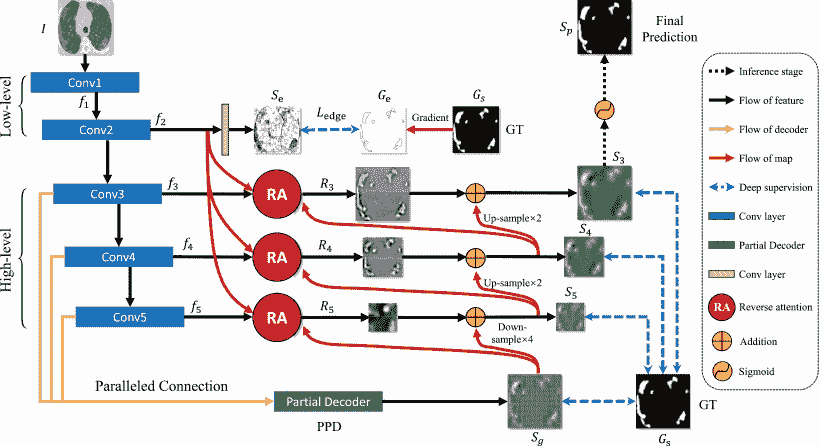

<!--yml

类别：未分类

日期：2024-09-06 19:36:42

-->

# [2310.06557] 数据高效深度学习在医学图像分析中的应用：综述

> 来源：[`ar5iv.labs.arxiv.org/html/2310.06557`](https://ar5iv.labs.arxiv.org/html/2310.06557)

# 数据高效深度学习在医学图像分析中的应用：综述

Suruchi Kumari suruchi_k@cs.iitr.ac.in Pravendra Singh pravendra.singh@cs.iitr.ac.in 印度理工学院鲁尔基计算机科学与工程系

###### 摘要

深度学习的快速发展显著推动了医学图像分析领域的进步。然而，尽管取得了这些成就，深度学习模型在医学图像分析中的进一步提升仍面临着由于大规模、良好标注的数据集稀缺而带来的重大挑战。为了解决这个问题，近年来越来越重视开发数据高效的深度学习方法。本文对医学图像分析中的数据高效深度学习方法进行了全面的综述。为此，我们根据这些方法所依赖的监督程度对其进行分类，包括*无监督*、*不精确监督*、*不完全监督*、*不准确监督*和*仅限监督*等类别。我们进一步将这些类别细分。例如，我们将*不精确监督*细分为*多实例学习*和*弱标注学习*。类似地，我们将*不完全监督*细分为*半监督学习*、*主动学习*和*领域自适应学习*等。进一步地，我们系统总结了医学图像分析中用于数据高效深度学习的常用数据集，并调查了未来的研究方向，以结束本综述。

###### 关键词：

数据高效深度学习，医学图像分析，*不精确监督*，*不完全监督*，*不准确监督*，*仅限监督*，*无监督*。\UseRawInputEncoding

## 1 引言

深度学习在各种医学领域，特别是医学影像学中产生了重大影响，并预计其影响将进一步扩大[1]。在医学图像分析（MIA）的背景下，深度学习方法在各种任务中表现出色，包括疾病分类[2, 3, 4, 5]、医学目标检测[6, 7]、ROI 分割[8, 9, 10, 11]以及图像配准[12, 13, 14]。最初，MIA 广泛采用了监督学习。尽管在许多应用中取得了成功，但由于大多数医学数据集的规模通常较小，监督模型的广泛使用面临重大挑战。医学图像数据集通常比标准计算机视觉数据集要小得多。初始可用数据量有限，而额外数据的获取受到患者隐私和机构政策等因素的阻碍。此外，在许多情况下，只有一小部分图像由领域专家标注。

图 1：医学图像分析的数据高效深度学习方法分类。

通常，研究人员依赖领域专家，如放射科医生或病理学家，为图像数据创建特定任务的注释。标注足够大的数据集可能非常耗时[15]。例如，为放射学训练深度学习系统，尤其是涉及 3D 数据时，需要细致的逐切片注释，这可能特别耗时[12]。一些研究工作涉及众多专家对大规模医学图像数据集进行注释[16, 17]。然而，这些举措需要大量的财政和后勤资源，这些资源在各个领域通常并不容易获得。其他研究则求助于众包方法，从非专家那里获取标签[18, 19, 20]。尽管这种方法在特定情况下可能具有潜力，但其适用性有限，因为非专家通常不能为大多数医学应用提供有意义的标签。为了克服这些限制，研究人员正在日益发展数据高效的深度学习方法用于医学图像分析。我们将这些方法大致分类为以下几类：无监督、近似监督、不完全监督、不准确监督和有限监督，如图 1 所示。

本综述涵盖了超过 250 篇论文，其中大多数是在近几年（2020-2023 年）发表的。这些论文涉及深度学习在医学图像分析中的多种应用，并已在 MICCAI、EMBC 和 ISBI 的会议论文集以及 TMI、Medical Image Analysis 和 Computers in Biology and Medicine 等各类期刊中发表。

已经有几篇相关的综述文章总结了医学图像分析领域中一些特定类别的数据高效学习方法。Cheplygina 等人 [21] 提供了在医学成像背景下半监督学习、多实例学习和迁移学习的概述，涵盖了诊断和分割任务。同时，Tajbakhsh 等人 [22] 探讨了处理数据集限制的多种策略，如涉及稀缺或弱标注的案例，特别关注医学图像分割。Chen 等人 [13] 总结了深度学习的最新进展，包括监督学习、无监督学习和半监督学习方法。最近，Jin 等人 [23] 提供了半监督、自监督、多实例学习、主动学习和注释高效技术的概述。然而，值得注意的是，他们的综述未涉及领域自适应学习或少样本学习等主题。此外，在之前讨论的调查中，其覆盖范围要么对医学图像分析中的数据高效方法有所限制，要么未跟上当前的趋势。为应对这一挑战，我们对近期的数据高效方法进行了系统综述，如图 1 所示。我们的目标是提供医学图像分析中数据高效学习方法的全面综述，并勾勒未来的挑战。我们还提供了医学成像领域中几种广泛使用的可用数据集的概述，如表 1 所示。我们工作的主要贡献总结如下：

+   1.

    这是第一篇总结医学图像分析中数据高效深度学习最新进展的综述论文。具体来说，我们提供了超过 250 篇相关论文的全面概述，以涵盖最近的进展。

+   2.

    我们将这些方法系统地分类为五个不同的组别：不完全监督、无监督、不准确的监督、不精确的监督和仅有有限的监督。

+   3.

    最后，我们探索了数据高效深度学习方法在医学图像分析中的几个潜在未来研究和开发方向。

本调查的其余部分组织如下。在第二部分中，我们将深入探讨无监督类别下的技术，我们进一步细分为预测性自监督（第 2.1 节）、生成性自监督（第 2.2 节）、对比性自监督（第 2.3 节）和多自监督学习（第 2.4 节）。在第三部分中，我们探讨了不完全监督技术，进一步分类为多实例学习（第 3.1 节）和带弱注释的学习（第 3.2 节）。第四部分专门讨论了不完整监督方法，我们进一步将其分类为半监督学习（第 4.1 节）、主动学习（第 4.2 节）和领域自适应学习（第 4.3 节）。类似地，第五部分处理了不准确监督技术，我们进一步分类为鲁棒损失设计（第 5.1 节）、数据重标定（第 5.2 节）和训练程序（第 5.3 节）。接着，在第六部分中，我们专注于仅有限监督技术，这些技术被分类为数据增强（第 6.1 节）、少样本学习（第 6.2 节）和迁移学习（第 6.3 节）。此外，我们在第七部分中概述了潜在的未来研究方向，然后在第八部分总结了本调查。图 1 展示了本调查的结构概览。

表 1：医学图像分析中用于数据高效深度学习的常用数据集。

| 数据集 | 器官 | 类型 | 任务 | 描述 | 链接 |
| --- | --- | --- | --- | --- | --- |
| JSRT 数据库 (2000) [24] | 大脑 | 胸部 X 光片 | 分类 | 数据库包括 154 张有肺结节的常规胸部 X 光片（100 张恶性和 54 张良性结节）以及 93 张无结节的 X 光片。 | [`db.jsrt.or.jp/eng.php`](http://db.jsrt.or.jp/eng.php) |
| ADNI-3 数据集 [25, 26] | 大脑 | MRI, PET, fMRI 等 | 阿尔茨海默病识别 | 从 ADNI-2 中获取的 697 名受试者以及额外添加的 133 名 CN、151 名遗忘性 MCI 和 87 名 AD 受试者（共 371 名新受试者） | [`adni.loni.usc.edu/adni-3/`](https://adni.loni.usc.edu/adni-3/) |
| BraTS 2012 [27] | 大脑 | MR 图像 | 脑肿瘤分割 | 训练：30 个数据集（治疗前后图像）；合成数据：50 个模拟数据集；测试：15 个临床数据集和 15 个模拟数据集 | [`www.imm.dtu.dk/projects/BRATS2012/data.html`](http://www.imm.dtu.dk/projects/BRATS2012/data.html) |
| BraTS 2013 [27] | 大脑 | MR 图像 | 脑肿瘤分割 | 训练：来自 BraTS12 训练数据的临床数据集；测试：来自 BraTS12 的 15 张临床测试图像和 10 个新测试数据集 | [`www.smir.ch/BRATS/Start2013#!#download`](https://www.smir.ch/BRATS/Start2013#!#download) |
| BraTS 2014 [27] | 大脑 | MR 图像 | 脑肿瘤分割 | 训练：来自 BraTS12 和 BraTS13 以及 TCIA [16] 的 200 个数据集，包括纵向数据集；测试：来自 BraTS12 和 BraTS13 测试数据集及 TCIA 的 38 个未见数据集 | [`www.smir.ch/BRATS/Start2014`](https://www.smir.ch/BRATS/Start2014) |
| BraTS 2015 [27] | 大脑 | MR 图像 | 脑肿瘤分割 | 训练：与 BraTS14 训练数据集相同；测试：来自 BraTS12 和 BraTS13 测试数据集及 TCIA 的 53 个未见数据集 | [`www.smir.ch/BRATS/Start2015`](https://www.smir.ch/BRATS/Start2015) |
| TCIA (2015) | 大脑 | MR 图像 | 分割 | 20 名新诊断为胶质母细胞瘤的患者接受手术和标准的联合化疗放疗（CRT），随后接受辅助化疗。 | [`www.cancerimagingarchive.net/`](https://www.cancerimagingarchive.net/) |
| BraTS 2016 [27] | 大脑 | MR 图像 | 脑肿瘤分割 | 训练：与 BraTS14 训练数据集相同；测试：来自 BraTS12 和 BraTS13 测试数据集及 TCIA 的 191 个未见数据集 | [`www.smir.ch/BRATS/Start2016`](https://www.smir.ch/BRATS/Start2016) |
| ABIDE-II (2016) | 大脑 | fMRI 序列 | 自闭症谱系障碍分类 | 来自 521 名 ASD 个体和 593 名对照的 1114 个数据集 | [`fcon1000.projects.nitrc.org/indi/abide/`](https://fcon1000.projects.nitrc.org/indi/abide/) |
| BraTS 2017 [27] | 大脑 | MR 图像 | 脑肿瘤分割 | 训练：来自 BraTS12 和 BraTS13 的 285 个训练数据集 + 19 个机构的术前 MRI 扫描；验证：来自不同机构的 6 个未见数据集；测试：来自 BraTS13 测试数据集和不同机构的 146 个未见数据集 | [`sites.google.com/site/braintumorsegmentation/`](https://sites.google.com/site/braintumorsegmentation/) |
| BraTS 2018 [27] | 大脑 | MR 图像 | 脑肿瘤分割 | 训练：与 BraTS17 数据集相同；验证：来自不同机构的 6 个未见数据集；测试：来自 BraTS13 测试数据集和不同机构的 191 个未见数据集 | [`wiki.cancerimagingarchive.net/pages/viewpage.action?pageId=37224922`](https://wiki.cancerimagingarchive.net/pages/viewpage.action?pageId=37224922) |
| dHCP 2018 [28] | 大脑 | MRI | 皮层和皮下体积分割、皮层表面提取和膨胀 | 465 名受试者，年龄范围为 28 到 45 周产后年龄。 | [`www.developingconnectome.org/data-release/`](http://www.developingconnectome.org/data-release/) |
| Calgary-Campinas-359 (CC-359) [29] | 大脑 | MR 图像 | 颅骨去除或脑分割 | 359 名受试者，使用三种不同厂商（GE、Philips 和 Siemens）的扫描仪，且在两种磁场强度（1.5 T 和 3 T）下进行扫描 | [`www.ccdataset.com/download`](https://www.ccdataset.com/download) |
| MICCAI WMH Challenge [30] | 大脑 | MR 图像 | 白质高信号 (WMH) 分割 | 训练：60 张图像；测试：110 张图像 | [`wmh.isi.uu.nl/#_Toc122355662`](https://wmh.isi.uu.nl/#_Toc122355662) |
| REST-meta-MDD Consortium [31] | 大脑 | 静息态功能 MRI (R-fMRI) | 重度抑郁症 (MDD) 分类 | 来自 25 个研究小组的 1,300 名抑郁患者和 1,128 名正常对照的神经影像数据 | [`rfmri.org/REST-meta-MDD`](http://rfmri.org/REST-meta-MDD) |
| BraTS (2021) | 大脑 | MR 图像 | 分割；分类 | 2,000 个病例（8,000 个 mpMRI 扫描） | [`braintumorsegmentation.org/`](http://braintumorsegmentation.org/) |
| MM-WHS challenge dataset (2017) [32, 33] | 心脏 | MR 和 CT 图像 | 全心脏分割 | 20 个标注 CT 体积和 40 个未标注 CT 体积；20 个标注 MR 体积和 40 个未标注 MR 体积。 | [`zmiclab.github.io/zxh/0/mmwhs`](https://zmiclab.github.io/zxh/0/mmwhs) |
| ACDC (2018) [34] | 心脏 | 动态 MR 图像 | 分类和分割 | 训练：100 名患者；测试：50 名患者 | [`www.creatis.insa-lyon.fr/Challenge/acdc/databases.html`](https://www.creatis.insa-lyon.fr/Challenge/acdc/databases.html) |
| 房颤 LGE-MRI 数据集 (2018) [35] | 心脏 | 心房（LA）分割 | 晚期钆增强磁共振图像（LGE-MRI） | 训练：100 张 LGE-MRI；测试：54 张 LGE-MRI | [`atriaseg2018.cardiacatlas.org`](http://atriaseg2018.cardiacatlas.org) |
| MSCMRseg (2019) [36] | 心脏 | MR 图像 | 心脏（MYO、RV 和 LV）分割 | 数据来自 45 名接受心肌病治疗的患者。 | [`zmiclab.github.io/zxh/0/mscmrseg19`](https://zmiclab.github.io/zxh/0/mscmrseg19) |
| M&Ms (2020) [37] | 心脏 | MR 图像 | 心脏分割 | 训练：175；验证：40；测试：160 张 MR 图像 | [`www.ub.edu/mnms/`](https://www.ub.edu/mnms/) |
| STARE | 眼睛 | 眼底图像 | 血管分割 | 20 张相同大小（700×605）的彩色眼底图像 | [`cecas.clemson.edu/~ahoover/stare/`](https://cecas.clemson.edu/~ahoover/stare/) |
| DRIVE (2004) | 眼睛 | 使用 Canon CR5 非散瞳 3CCD 相机拍摄的图像 | 血管分割 | 训练：20 张图像；测试：20 张图像 | [`drive.grand-challenge.org/`](https://drive.grand-challenge.org/) |
| DRISHTI-GS (2014) [38] | 眼睛 | 眼底图像 | 视盘（OD）和视杯（OC）分割 | 训练：50 张图像；测试：51 张图像 | [`ieeexplore.ieee.org/document/6867807`](https://ieeexplore.ieee.org/document/6867807) |
| 续下页 |

表 1：用于医学图像分析中数据高效深度学习的常用数据集（续）。 |

| 数据集 | 器官 | 类型 | 任务 | 描述 | 链接 |
| --- | --- | --- | --- | --- | --- |
| ReTOUCH (2017) [39] | 眼睛 | OCT 体积 | 液体检测和液体分割 | 训练：70 个 OCT 体积；测试：42 个 OCT 体积 | [`retouch.grand-challenge.org`](https://retouch.grand-challenge.org) |
| RetinalOCT (2018) [40] | 眼睛 | 光学相干断层扫描（OCT）图像 | 分类 | 207,130 张 OCT 图像 | [`www.kaggle.com/datasets/paultimothymooney/kermany2018`](https://www.kaggle.com/datasets/paultimothymooney/kermany2018) |
| LDLOCTCXR (2018) [40] | 眼睛 | OCT 和胸部 X 射线图像 | 分类 | 108,312 张图像（37,206 张有脉络膜新生血管，11,349 张有糖尿病黄斑水肿，8,617 张有视网膜结节，51,140 张正常）来自 4,686 名患者 | [`data.mendeley.com/datasets/rscbjbr9sj/3`](https://data.mendeley.com/datasets/rscbjbr9sj/3) |
| PALM (2019) [41] | 眼睛 | 使用蔡司 Visucam 500 拍摄的图像 | 正常和近视眼底图像分类；病理性近视的病灶分割。 | 训练：400 张图像，验证：400 张图像；测试：400 张图像 | [`palm.grand-challenge.org`](https://palm.grand-challenge.org) |
| REFUGE challenge dataset [42] | 眼睛 | 视网膜图像 | 临床青光眼分类；视盘和视杯分割；黄斑定位 | 1200 张视网膜图像，附有真实分割和临床青光眼标签 | [`refuge.grand-challenge.org/`](https://refuge.grand-challenge.org/) |
| ADAM (2020) [43] | 眼睛 | 使用 Zeiss Visucam 500 视网膜相机拍摄的视网膜图像 | 分类；视盘检测与分割；黄斑定位与病变检测与分割 | 1200 张视网膜图像 | [`amd.grand-challenge.org/`](https://amd.grand-challenge.org/) |
| RIGA+ dataset (2022) [44] | 眼睛 | 视网膜图像 | 视盘（OD）和视杯（OC）分割 | 744 张标记样本和 717 张未标记样本 | [`zenodo.org/record/6325549`](https://zenodo.org/record/6325549) |
| ISIC (2016) | 皮肤 | 皮肤镜下病变图像 | 1. 病变分割；2. 皮肤镜特征分类与分割；3. 疾病分类 | 1. 训练：900 张，测试：379 张图像；2. 训练：807 张，测试：335 张图像；3. 训练：900 张，测试：379 张图像 | [`challenge.isic-archive.com/data/#2016`](https://challenge.isic-archive.com/data/#2016) |
| HAM10000 (2018) | 皮肤 | 皮肤镜图像 | 病变分类与分割 | 10000 张训练图像 | [`dataverse.harvard.edu/dataset.xhtml?persistentId=doi:10.7910/DVN/DBW86T`](https://dataverse.harvard.edu/dataset.xhtml?persistentId=doi:10.7910/DVN/DBW86T) |
| MITOS12 [45] | 乳腺 | 组织学图像 | 乳腺癌分级 | 来自 5 张不同切片的 50 张高倍视野（HPF）图像，扫描倍率为 ×40 | [`ludo17.free.fr/mitos_2012/dataset.html`](http://ludo17.free.fr/mitos_2012/dataset.html) |
| MITOS14 | 乳腺 | 组织学图像 | 乳腺癌分级 | 训练数据集中有 284 张 X20 放大倍数图像和 1136 张 X40 放大倍数图像。 | [`mitos-atypia-14.grand-challenge.org/Dataset/`](https://mitos-atypia-14.grand-challenge.org/Dataset/) |
| MIAS (2015) | 乳腺 | 乳腺 X 光图像 | 检测；分类 | 322 张图像（161 对），分辨率为 50 微米，格式为 *便携灰度图* | [`www.kaggle.com/datasets/kmader/mias-mammography`](https://www.kaggle.com/datasets/kmader/mias-mammography) |
| TUPAC (2016) [46] | 乳腺 | 整片组织病理图像 | 自动预测乳腺肿瘤的肿瘤增殖评分 | 训练：500 张整片图像；测试：321 张整片图像 | [`github.com/CODAIT/deep-histopath`](https://github.com/CODAIT/deep-histopath) |
| CAMELYON (2016) [47] | 乳腺 | 整片图像（WSI） | 乳腺癌转移的检测与分类 | 训练：270 张 WSI；测试：130 张 WSI | [`camelyon16.grand-challenge.org/Data`](https://camelyon16.grand-challenge.org/Data) |
| CAMELYON (2017) [47] | 乳房 | 全切片图像（WSI） | 乳腺癌转移的检测和分类 | 训练：500 WSI；测试：500 WSI | [`camelyon17.grand-challenge.org/Data`](https://camelyon17.grand-challenge.org/Data) |
| CBIS-DDSM (2017) | 乳房 | 乳腺 X 光照片 | 分割 | 数据集包含 753 例钙化病例和 891 例肿块病例 | [`www.kaggle.com/datasets/awsaf49/cbis-ddsm-breast-cancer-image-dataset`](https://www.kaggle.com/datasets/awsaf49/cbis-ddsm-breast-cancer-image-dataset) |
| BACH (2018) [48] | 乳房 | 显微镜和全切片图像 | 乳腺癌分类 | 显微镜：400 张图像；WSI：30 张图像 | [`iciar2018-challenge.grand-challenge.org/Dataset/`](https://iciar2018-challenge.grand-challenge.org/Dataset/) |
| TNBC (2018) | 乳房 | H&E 染色的组织病理图像 | 细胞核分割 | 数据集 1：50 张图像，共 4022 个标注细胞；数据集 2：30 张图像，来自 7 个不同器官，共 21,623 个标注细胞核 | [`ega-archive.org/datasets/EGAD00001000063`](https://ega-archive.org/datasets/EGAD00001000063) |
| FNAC (2019) [49] | 乳房 | 细胞学图像 | 分类 | 212 张图像，分为两类：良性（99 张）和恶性（113 张） | [`1drv.ms/u/s!Al-T6d-_ENf6axsEbvhbEc2gUFs`](https://1drv.ms/u/s!Al-T6d-_ENf6axsEbvhbEc2gUFs) |
| NYUBCS (2019) | 乳房 | 乳腺 X 光照片 | 分割 | 29,426 次数字筛查乳腺 X 光检查（1,001,093 张图像），来自 141,473 名患者 | [`cs.nyu.edu/~kgeras/reports/datav1.0.pdf`](https://cs.nyu.edu/~kgeras/reports/datav1.0.pdf) |
| BreastPathQ (2019) [50] | 乳房 | H&E 染色的全切片图像 | 肿瘤细胞密度（TC）的估计 | 训练：从 69 个 WSI 提取的 2579 个补丁；测试：从 25 个 WSI 提取的 1121 个补丁 | [`breastpathq.grand-challenge.org/Overview/`](https://breastpathq.grand-challenge.org/Overview/) |
| CERVIX93 (2018) [51] | 子宫颈 | 细胞学图像 | 分类；检测 | 93 堆图像（2705 个细胞核） | [`github.com/parhamap/cytology_dataset`](https://github.com/parhamap/cytology_dataset) |
| LBC (2020) [52] | 子宫颈 | 细胞学图像 | 分类 | 963 张 LBC 图像，分类为 NILM、LSIL、HSIL 和 SCC | [`data.mendeley.com/datasets/zddtpgzv63/4`](https://data.mendeley.com/datasets/zddtpgzv63/4) |
| CHAOS (2021) [53] | 腹部 | CT 和 MR 图像 | 肝脏和腹部分割 | CT: 40 张图像; MRI: 120 个 DICOM 数据集 | [`chaos.grand-challenge.org/`](https://chaos.grand-challenge.org/) |
| KiTS (2023) | 肾脏 | CT 扫描 | 肾肿瘤分割 | 训练：489 例；测试：110 例 | [`kits-challenge.org/kits23/`](https://kits-challenge.org/kits23/) |
| LiTS (2017) | 肝脏 | CT 扫描 | 肝脏病变分割 | 训练：130 个 CT 扫描；测试：70 个 CT 扫描 | [`competitions.codalab.org/competitions/17094`](https://competitions.codalab.org/competitions/17094) |
| Asciteps (2020) [54] | 胃 | 分类；检测 | 细胞学图像 | 487 张分类图像：恶性(18,558)和良性(6089)；176 张检测图像（6573 个边界框） | [`pan.baidu.com/s/1r0cd0PVm5DiUmaNozMSxgg`](https://pan.baidu.com/s/1r0cd0PVm5DiUmaNozMSxgg) |
| 续见下一页 |

表 1：用于医学图像分析中数据高效深度学习的常用数据集（续）。

| 数据集 | 器官 | 类型 | 任务 | 描述 | 链接 |
| --- | --- | --- | --- | --- | --- |
| MoNuSeg (2017) [55] | 多脏器 | H&E 染色组织图像 | 细胞核分割 | 训练：30 张图像和约 22,000 个核边界标注；测试：7000 个核边界标注 | [`monuseg.grand-challenge.org/`](https://monuseg.grand-challenge.org/) |
| BTCV (2017) [56] | 多脏器 | CT 图像 | 多脏器分割 | 90 张腹部 CT 图像 | nhttps://zenodo.org/record/1169361#.Y8Ud-OxBwUE |
| DeepLesion (2018) [57] | 多脏器 | CT 切片 | 用于不同应用 | 32,735 个病变在 32,120 个 CT 切片中 | [`nihcc.app.box.com/v/DeepLesion`](https://nihcc.app.box.com/v/DeepLesion) |
| DECATHLON (2019) | 多脏器 | CT 和 MRI | 分割 | 大脑：750 个 MRI；心脏：30 个 MRI；肝脏：201 张 CT 图像；海马体：195 个 MRI；前列腺：48 个 MRI；肺：96 个 CT 扫描；胰腺：420 个 CT 扫描；肝血管：443 个 CT 扫描；脾脏：61 个 CT 扫描；结肠：190 个 CT 扫描 | [`medicaldecathlon.com/`](http://medicaldecathlon.com/) |
| MIDOG [58] | 多脏器 | 全幻灯片图像 | 分割 | 犬类肺癌：44 例；人类乳腺癌：150 例；犬类淋巴瘤：55 例；人类神经内分泌肿瘤：55 例；犬类皮肤肥大细胞瘤：50 例；人类黑色素瘤：49 例 | [`imig.science/midog/the-dataset/`](https://imig.science/midog/the-dataset/) |
| CRCHistoPhenotypes (2016) [59] | 结肠 | 组织学图像 | 癌症分类 | 100 张 H&E 染色的结直肠腺癌组织学图像 | [`warwick.ac.uk/fac/crossfac/tia/data/crchistolabelednucleihe`](https://warwick.ac.uk/fac/crossfac/tia/data/crchistolabelednucleihe) |
| KATHER (2018) [60] | 结肠 | 组织学图像 | 癌症分类 | 100,000 张人类结直肠癌和健康组织的组织学图像 | [`zenodo.org/record/1214456#.Y8fgV-zP1hE`](https://zenodo.org/record/1214456#.Y8fgV-zP1hE) |
| PROMISE12 挑战数据集 [61] | 前列腺 | MR 图像 | 前列腺分割 | 训练：50；测试：30；现场挑战：20 个数据集 | promise12.grand-challenge.org/ |
| TMA-Zurich (2018) [62] | 前列腺 | 组织病理图像 | 前列腺癌的 Gleason 分级 | 训练：641 名患者；测试：245 名患者 | [`www.nature.com/articles/s41598-018-30535-1?source=app#data-availability`](https://www.nature.com/articles/s41598-018-30535-1?source=app#data-availability) |
| 癌症基因组图谱 (TCGA) 数据集 | 前列腺 | 组织病理 WSI | 基于 Gleason 评分的癌症肿瘤分类 | 20,000 个患者样本，涵盖 33 种癌症类型 | [`portal.gdc.cancer.gov/repository`](https://portal.gdc.cancer.gov/repository) |
| PANDA (2020) [63] | 前列腺 | 全片图像 | 前列腺癌的 Gleason 分级 | 开发集：10,616 个活检；调优集：393；内部验证集：545；外部验证集：1071 | [`www.kaggle.com/c/prostate-cancer-grade-assessment/data`](https://www.kaggle.com/c/prostate-cancer-grade-assessment/data) |
| SCGM 数据集 [64] | 脊髓 | MRI 图像 | 脊髓灰质分割 | 训练：40 张图像；测试：40 张图像 | [`niftyweb.cs.ucl.ac.uk/program.php?p=CHALLENGE`](http://niftyweb.cs.ucl.ac.uk/program.php?p=CHALLENGE) |
| Montgomery (2014) [65] | 胸部 | 胸部 X 光 | 分割 | 138 张图像分为两类：正常（80）和 TB 表现（58） | [`www.kaggle.com/datasets/raddar/tuberculosis-chest-xrays-montgomery`](https://www.kaggle.com/datasets/raddar/tuberculosis-chest-xrays-montgomery) |
| 深圳 (2014) [65] | 胸部 | 胸部 X 光 | 分割 | 662 张图像分为两类：正常（326）和 TB 表现（336） | [`www.kaggle.com/datasets/raddar/tuberculosis-chest-xrays-shenzhen`](https://www.kaggle.com/datasets/raddar/tuberculosis-chest-xrays-shenzhen) |
| NIH 胸部 X 光 (2017) [66] | 胸部 | 胸部 X 光 | 分类 | 112,120 张 X 光图像，来自 30,805 名独特患者的疾病标签。 | [`www.kaggle.com/datasets/nih-chest-xrays/data`](https://www.kaggle.com/datasets/nih-chest-xrays/data) |
| ChestX-ray8 (2017) [66] | 胸部 | 胸部 X 光图像 | 常见胸部疾病的分类和定位 | 108,948 张正面 X 光图像，来自 32,717 名独特患者，带有文本挖掘的八种疾病图像标签 | [`nihcc.app.box.com/v/ChestXray-NIHCC/`](https://nihcc.app.box.com/v/ChestXray-NIHCC/) |
| MIMIC-CXR (2019) [67] | 胸部 | 胸部 X 光图像 | 检测 | 总计 377,110 张带有半结构化自由文本放射报告的图像，描述了图像的放射学发现 | [`physionet.org/content/mimic-cxr/2.0.0/`](https://physionet.org/content/mimic-cxr/2.0.0/) |
| ChestX-ray14 (2019) | 胸部 | 胸部 X 光图像 | 常见胸部疾病的分类和定位 | 112,120 张来自 30,805 名不同患者的正面胸部 X 光片，带有 14 个二元标签 | [`stanfordmlgroup.github.io/competitions/chexpert/`](https://stanfordmlgroup.github.io/competitions/chexpert/) |
| CC-COVID (2020) [68] | 胸部 | CT 图像 | 肺部病变分割 | 532,506 张来自 NCP、普通肺炎和正常对照的 CT 图像 | [`ncov-ai.big.ac.cn/download?lang=en`](https://ncov-ai.big.ac.cn/download?lang=en) |
| SegTHOR (2020) [69] | 胸部 | CT 图像 | 胸部器官分割 | 训练：40 张 CT 扫描；测试：20 张 CT 扫描 | [`competitions.codalab.org/competitions/21145`](https://competitions.codalab.org/competitions/21145) |
| VinDr-CXR (2021) [70] | 胸部 | 胸部 X 光图像 | 分类；检测 | 训练：15000 张扫描；测试：3000 张扫描 | [`vindr.ai/datasets/cxr`](https://vindr.ai/datasets/cxr) |
| ChestXR (2021) | 胸部 | 胸部 X 光图像 | 分类 | 20,000+ 张图像和 3 个类别：COVID-19、肺炎和正常病例 | [`cxr-covid19.grand-challenge.org/Dataset/`](https://cxr-covid19.grand-challenge.org/Dataset/) |
| MICCAI2018 IVDM3Seg 数据集 | 椎间盘 | MRI 图像 | 椎间盘 (IVD) 定位和分割 | 24 个 3D 多模态 MRI 数据集，每个数据集包含四个对齐的高分辨率 3D 卷积，因此总共 96 个高分辨率 3D MRI 卷积数据 | [`ivdm3seg.weebly.com/data.html`](https://ivdm3seg.weebly.com/data.html) |

## 2 无监督

无监督学习，通常称为自监督学习，涉及在没有明确指导的情况下获取监督信号的挑战。一个主要的技术是自监督学习 (SSL)。在 SSL 中，通过训练辅助的前置任务来获取表示，然后将其转移到感兴趣的目标下游任务。SSL 的有效性在很大程度上依赖于精心设计的前置任务。这些前置任务为模型引入了隐含的归纳偏差，因此选择它们时必须慎重，以确保它们与特定领域的相关性。自监督学习可以分为四大类：预测性、自生成、对比性和多重自监督 [71]。表 2 提供了无监督学习的最新方法的总结。

### 2.1 预测性自监督

在本节中，我们探讨预测自我监督，其中前置任务被设定为分类或回归任务。具体而言，每个未标记的图像都会被分配一个伪标签，该标签直接从数据本身生成。这些伪标签可以是分类的或数值的，取决于前置任务的设计规格。常见的基于变换的预测任务包括评估相对位置 [72]、解决拼图难题 [73] 和确定旋转角度 [74] 等。这些传统的前置任务及其变体在 MIA 中得到了探讨，并展示了其有效性。例如，Bai 等人 [75] 提出了一个用于分割心脏 MRI 扫描的方案，提出了一个以预测解剖位置为重点的前置任务。该前置任务旨在利用 MRI 扫描中可用的不同心脏视图，如短轴、2CH 长轴和 4CH 长轴，来表示不同的心脏解剖区域，包括左心房、右心房和心室。为此，作者定义了一系列与特定解剖位置对应的边界框，并训练网络以预测这些位置。Taleb 等人 [76] 提出了一种受拼图难题启发的新方法，该方法利用多种成像模态。在这种方法中，输入图像由来自不同模态的无序块组成，模型的任务是通过正确地拼装这些块来重建原始图像。他们的工作代表了对传统拼图方法的显著提升。Zhuang 等人 [77] 提出了一个自监督任务，称为魔方恢复，灵感来源于早期针对 2D 自然图像的拼图解决工作。该任务涉及两个操作：魔方重新排列和魔方旋转，如图 2 所示。魔方恢复任务使用 3D 输入，其中魔方被划分为 2×2×2 子立方体的 3D 网格。增加魔方旋转任务确保学习旋转不变特征，超越了原始的拼图任务，后者仅关注学习平移不变特征。Rubik cube+ [78] 通过结合魔方掩模操作以及魔方重新排列和魔方旋转操作，改进了魔方恢复前置任务。Nguyen 等人 [79] 提出了一个空间感知前置任务，旨在从体积图像中获取语义和空间表示。这个空间前置任务的概念受到 Chen 等人 [80] 上下文恢复框架的影响；然而，在这里它被形成了一个分类问题。最近，Zhou 等人 [81] 在特征金字塔内进行了多尺度像素恢复和孪生特征比较。这种方法有效地同时保留了语义、像素级别和尺度信息。

图 2：魔方预文本任务的示意图：一个具有 M（表示魔方数量）共享权重分支的孪生网络，称为 Siamese-Octad，用于解决魔方问题。每个分支的主干网络可以是任何著名的 3D CNN。所有分支的最终全连接或卷积层提取的特征图被连接在一起，作为单独任务全连接层的输入，即魔方排序和方向。这些任务分别通过排列损失（$L_{P}$）和旋转损失（$L_{R}$）进行监督（图片来源 [77]）。

### 2.2 生成性自监督

生成性自监督学习方法试图通过将预文本任务构建为生成问题来学习输入数据中的潜在特征 [71]。生成性预文本任务的想法是，通过学习重建输入数据本身或生成符合输入数据相同分布的新示例，模型可以从未标记的数据中获得有价值的表示。Ross 等人 [82] 利用图像着色预文本任务来解决内窥镜视频数据中内窥镜医疗仪器的分割问题。然而，他们选择了条件生成对抗网络（GAN）架构，而不是使用图像着色任务中使用的原始架构。这个选择旨在促进生成更逼真的彩色图像。作者在来自医学和自然领域的六个数据集上评估了他们的方法，以评估其在下游任务中的有效性。Chen 等人 [80] 引入了一种新的生成性预文本任务，涉及从输入图像中随机选择两个孤立的区域并交换其位置。这个交换过程反复进行，产生了一个破坏的原始图像版本，同时保留了其整体分布。随后，生成模型用于将破坏的图像恢复到其原始版本（见图 3）。在早期基于上下文恢复的研究基础上，Zhou 等人 [83] 将四种数据变换（非线性变换、局部打乱、外部切割和内部切割）融入到一个名为 *Model Genesis* 的一致重建模型中。Harvella 等人 [10] 引入了一种自监督的多模态重建任务用于视网膜解剖学习。他们假设同一器官的不同模态可以提供互补的知识，从而为后续任务提供有价值的表示。

在医学领域，传统的前置任务过于依赖自然图像中较大物体的存在，而这些任务通常不适用，因为与疾病相关的特征通常出现在医学图像的较小区域。为了解决这个问题，Holmberg 等人[84]提出了一种前置任务，即跨模态自监督视网膜厚度预测，用于眼科疾病诊断。该任务涉及使用两种不同的模态：红外视网膜图像和光学相干断层扫描（OCT）。最初，他们通过使用有限的标注数据集训练一个分割模型，提取 OCT 扫描中的视网膜厚度图，这些图作为初步任务的真实注释。然后，训练一个模型来预测厚度图，利用未标记的视网膜图像和之前预测的厚度图作为标签。其他生成式自监督前置任务的例子包括 Prakash 等人[85]提出的图像去噪方法以及 Tao 等人[86]引入的 Rubik cube++。在 Rubik cube++方法中，对早期的 Rubik cube 方法[77]进行了显著修改。他们没有将其视为分类任务，而是采用了基于 GAN 的框架作为生成问题。生成器的任务是恢复 Rubik cube 的初始排列，然后再进行变换，而判别器则负责区分生成的立方体的正确和错误排列。

图 3：用于自监督上下文恢复学习的 CNN 架构，其中蓝色、绿色和橙色的步幅分别表示卷积单元、下采样单元和上采样单元。CNN 在重建部分的具体结构可能会根据后续任务有所变化（图像来源于[80]）。

图 4：增强 SimCLR 在 3D 医学图像分割中的示意图：（i）用于预训练编码器$e$的全局对比损失的轮廓，使用稠密层$g_{1}$。 （ii）用于预训练解码器$d_{l}$的局部对比损失的轮廓，使用 1 × 1 卷积层$g_{2}$，编码器$e$的权重在前一训练阶段被冻结（图像来源于[87]）。

### 2.3 对比自监督

对比学习旨在最大化正图像对之间的互信息，并在需要时最小化负图像对的表示相似性。正图像对由同一实例的两个增强视图组成，而负图像对则来自不同的实例。这使得网络能够学习实例的区分表示，这对模式识别任务非常有利。在对比学习中，学习到的表示的有效性严重依赖于正负图像对的选择。然而，传统的图像对生成方法可能不适用于具有复杂语义概念的医学图像，这可能导致无意义的表示。为了解决这个问题，研究人员投入了大量精力在广泛使用的对比学习框架中精心设计图像对选择策略[88]。这些策略旨在保留医学图像中的病理语义，从而显著提升医学数据集的性能，相较于传统方法。

Contig [89] 采用对比损失来对齐图像和各种基因模式在特征空间中的位置。该方法旨在将每个个体的多个模式无缝地整合到一个端到端模型中，即使这些模式在个体之间可能有所不同。Sowrirajan 等人 [90] 断言，MOCO [91] 中使用的增强方法不适用于灰度医学图像。具体来说，模糊和随机裁剪可能会去除重要的病变。为了解决这一问题，他们引入了 MoCo-CXR，这是一种针对胸部 X 射线图像的 MOCO 修改版，通过调整增强方法来更好地适应这一医学影像环境。Vu 等人 [92] 引入了一种名为 MedAug 的 SSL 技术，该技术受到 MoCo-CXR 的启发。在他们的方法中，基于单个患者的元数据，从多样的图像中生成正样本对。Azizi 等人 [5] 提出了类似于 MedAug 的工作，这一工作基于 SimCLR 框架 [93]。他们引入了一种名为 *多实例对比学习* 的方法，从相似患者的各种图像中创建更具信息性的正样本对。Chaitanya 等人 [87] 为 3D 医学图像分割改进了 SimCLR（见图 4）。他们引入了一种新颖的对比策略，利用体积医学图像的结构相似性。此外，他们引入了一种局部对比损失，以促进更详细和细粒度表示的学习。Ciga 等人 [94] 介绍了一种针对数字组织病理学的对比 SSL 方法。他们在 57 个未标记的组织病理数据集上进行了训练。他们的研究结果表明，通过结合多个具有不同染色和分辨率特征的多脏器数据集，可以提升特征质量。一些技术利用对比方法中的解剖学先验，以进一步提升在各种任务中的性能 [6, 95]。具体来说，He 等人 [95] 引入了几何视觉相似性学习（GVSL）。GVSL 将拓扑不变性的概念纳入度量中，确保对图像间相似性的可靠评估。该方法旨在学习不同图像中等效语义区域的一致表示。

### 2.4 多自监督学习：将多个 SSL 前置任务合并到一个框架中

Multi-SSL 集成了各种类型的前置任务，包括预测任务、生成任务和对比任务。这样做旨在克服单一前置任务的局限性，这些任务可能会学习到特定任务的特征。通过在网络训练过程中使用不同的自监督信号，multi-SSL 旨在提取更为稳健和具有普遍性的表示。Taleb 等人 [9] 提出了与 2D 图像相比，具有 3D 特性的医学图像提供了学习丰富表示的潜力。为此，他们采用了五个预设计的前置任务，即对比预测编码（CPC）、示例 CNN、旋转预测、相对位置预测和拼图，以适应 3D 医学图像的特点。Haghighi 等人 [96] 引入了 Semantic Genesis，基于 Model Genesis 方法 [83]。该框架包括三个模块：自分类、自恢复和自发现，旨在学习丰富语义的表示。在 Model Genesis 的进一步扩展中，Zhang 等人 [97] 纳入了一个尺度感知的代理任务，用于预测输入的尺度。这一补充允许学习多层次的表示。Zhou 等人 [98] 将生成式和对比式 SSL 结合成一个保留对比表示学习（PCRL）框架，其中引入了保留学习以使生成式 SSL 保留更多信息。Tang 等人 [99] 介绍了一种新的基于 3D Transformer 的架构，称为 Swin UNEt TRansformers（Swin UNETR），具有用于自监督预训练的层次编码器。在他们提出的预训练框架中，输入的 CT 图像经过随机裁剪成子体积，并通过随机内部切割和旋转操作进行增强。随后，这些图像被输入到 Swin UNETR 编码器中。作者使用了掩膜体积修复、对比学习和旋转预测作为代理任务，以促进从输入图像中学习上下文表示，如图 5 所示。CS-CO [100] 专为组织病理图像设计，结合了生成式和判别式方法的优点。该方法包括两个自监督学习阶段：交叉染色预测（CS）和对比学习（CO）。Yan 等人 [101] 使用了掩膜自编码器（MAE），但表明直接应用 MAE 对于密集下游预测任务（如多脏器分割）并不理想。为了解决这一限制，他们提出了一种在大规模未标记医学数据集上进行自监督预训练的方法，利用了对比和生成建模技术。

Yan 等人 [101] 使用了掩模自编码器（MAE），但证明直接应用 MAE 对于密集的下游预测任务（如多脏器分割）效果不佳。为了解决这个限制，他们提出了一种在大规模未标记医学数据集上进行自监督预训练的方法，利用了对比学习和生成建模技术。

图 5：预训练框架的 [99] 概述开始于将输入 CT 图像随机裁剪成子体积，随后应用随机内切割和旋转数据增强。这些处理后的图像随后作为 Swin UNETR 编码器的输入。该框架利用了掩模体积修复、对比学习和旋转预测作为代理任务，旨在从输入图像中获取上下文表示（图像来自 [99]）。

表 2：*无监督*类别中近期方法的概述。

| 参考 | 任务 | 前置任务 | 数据集 | 结果 |
| --- | --- | --- | --- | --- |
| [75] | 心脏分割 | 解剖位置预测 | 私有数据集：3825 个受试者 | DSC: 0.93 |
| [77] | 脑肿瘤分割 脑出血分类 | 魔方恢复 | BraTS 2018；私有数据集：1,486 张图像 | BraTS 2018：mIoU: 0.773；私有：准确率：0.838 |
| [78] | 脑肿瘤分割 脑出血分类 | 魔方+（魔方排序、魔方方向和掩模识别） | BraTS-2018；私有数据集：1,486 个 CT 图像 | BraTS 2018：平均 Dice：81.70；私有：准确率：87.84 |
| [80] | 胎儿图像分类 腹部多脏器定位 脑肿瘤分割 | 图像上下文恢复 | 私有胎儿数据集：2,694 张图像；私有多脏器数据集：150 张图像；BraTS 2017 | 私有胎儿数据集：F1: 0.8942；私有多脏器数据集：平均距离：2.90；BraTS 2017：DSC: 0.8557 |
| [10] | 视盘分割 | 多模态重建 | 伊斯法罕 MISP | AUC: 0.818 |
| [86] | 胰腺和脑组织分割 | 魔方 ++ | NIH PCT；MRBrainS18 | NIH PCT：DSC: 0.8408；MRBrainS18：DSC: 0.7756 |
| [5] | 胸部 X 光分类 皮肤病变分类 | 多实例对比学习（SimCLR） | 私有皮肤科数据集；CheXpert | 私有：Top-1 准确率：0.7002；CheXpert：AUC: 0.772 |
| [102] | 肺部 | 对比学习 | CheXpert | AUC: 0.889 |
| [6] | 2D 和 3D 标志物检测；3D 病灶匹配 | 全球和局部对比学习 | DeepLesion；NIH LN；私有数据集：94 名患者 | 平均径向误差：4.3；最大径向误差：16.4 |
| [96] | 肺 | 自我发现 + 自我分类 + 自我修复 | LUNA; LiTS; CAD-PE; BraTS 2018; ChestX-ray14; LIDC-IDRI; SIIM-ACR | 分类: LUNA: AUC: 0.9847; 分割: IoU: LiTS: 0.8560; BraTS 2018: 0.6882 |
| [9] | 脑肿瘤分割胰腺肿瘤分割 | CPC 拼图示例 CNN 旋转预测相对位置预测 | BraTS 2018; DECATHLON; DRD | BraTS 2018: DSC: 0.9080; DECATHLON: DSC $\approx$ 0.635; DRD DRD: DSC $\approx$ 0.80 |
| [101] | 多器官分割 | 掩码自编码器 + 对比性和生成建模 | 预训练数据集: Abdomen-1K; 微调数据集: ABD-110; Thorax-85; HaN | ABD-110: Dice score: 84.67; Thorax-85: Dice score: 90.37; HaN: Dice score: 77.31 |

## 3 不精确监督

不精确监督涉及到一些形式的监督信息可用，但缺乏任务所需的精确性。在这种情况下，我们将不精确监督分为两类：多实例学习（MIL）和弱标注学习（图 6）。在 MIL 框架下（子节 3.1），每张图像被视为一个*袋*，从中提取的图块被视为*实例*。当一个袋被标记为负面时，这意味着其中所有的实例也被认为是负面的。相反，如果一个袋被标记为正面，则表示其中至少有一个正面的实例。这种袋级别的标记策略相比于单独标记每个实例显著减少了标记负担，这在各种任务中都显示出其优势。弱标注学习（子节 3.2）指的是在训练数据上标注的标签不如特定任务所需的理想详细或精确的场景。在许多医学成像任务中，获得精细级别（如像素级标注）的精确标注可能非常有价值，但也很昂贵和耗时。弱标注提供了一种替代方法，其中提供的训练数据标签是较粗糙或较不具体的，使得它们更容易获得且成本更低。这些弱标注可以采取多种形式，包括图像级、点级、涂鸦级或框级。在所有这些情况下，提供的标注相较于全面的像素级标注都较为简略和不精确。最近关于不精确监督学习方法的总结见表 3。

图 6: *不精确监督*方法的分类。

### 3.1 多实例学习

当为图像中的单个像素或补丁获取详细注释变得不切实际、耗时或不可行时，**多实例学习**（MIL）[103] 应运而生。相反，代表整体图像条件的全局标签更容易获得。然而，这些全局标签并不直接对应图像中的每个像素或补丁。MIL 扩展了有监督学习，使用弱标注数据来训练分类器。在 MIL 中，每个图像被视为一个*包*，包含许多补丁，也称为*实例*。如果一个图像或*包*被分类为疾病阳性，则意味着该图像中的至少一个补丁或*实例*是疾病阳性。相反，如果图像标记为疾病阴性，则表示该图像中的所有补丁或*实例*都是阴性实例。深度 MIL 的当前方法可以分为两类：基于实例的方法和基于包的方法。

#### 3.1.1 基于实例的方法

基于实例的方法的主要概念是训练一个有效的实例分类器，以预测每个包中单个实例（例如，图像补丁）的可能标签。随后，应用 MIL-pooling（聚合过程通常称为 MIL-pooling）方法，将每个包中所有实例的预测结果结合起来，最终生成包的预测结果。由于单个实例的实际标签未知，这些方法通常通过基于各自包分配伪标签（即所有正包中的实例被分配正标签，所有负包中的实例被分配负标签）来开始。然后，使用伪标签以有监督的方式训练实例分类器，直到其收敛[103]。在此过程中使用了各种 MIL pooling 技术，包括均值池化 [104]、最大池化 [104]、平均池化 [105]、对数和指数池化 [106]、噪声或池化 [107]、噪声与池化 [108] 和动态池化 [109] 等。Couture 等人 [110] 提出了改进的 MIL 聚合方法，采用分位数函数作为池化机制。这一创新技术允许对每个样本的变异进行全面表示，从而提高了全局分类准确性。在 Qu 等人 [111] 的最新研究中，他们应用实例级对比学习来聚合各种肿瘤特征，以诊断胰腺癌。

#### 3.1.2 基于包的方法

基于包的方法依赖共享的实例级特征提取器来捕获包内每个实例的特征。这些特征随后通过 MIL-pooling 聚合以获得包级特征，然后对包分类器进行监督训练，直到收敛。在基于包的方法中，MIL-pooling 聚合的是实例特征而非实例预测，这与基于实例的方法不同。基于包的方法在包分类上表现优秀，因为它们可以访问真实的包标签，使得训练过程免于噪声，比基于实例的方法更准确。然而，这些方法不太适用于定位任务，其实例特征聚合在展示单个实例对包分类贡献的灵活性方面有所欠缺。当目标模式预计在整个包级别上可见而非局限于包内的特定实例时，这些方法是合适的[21]。

图 7：赵等人的研究框架示意图[112]：VAE-GAN 作为实例级特征提取器。特征选择过程识别并选择出具有区分性的实例级特征。采用图卷积网络（GCN）合成所选择的实例级特征，负责生成包表示并执行最终分类（图像来源于[112]）。

基于包的方法主要在三个关键组件上有所不同：首先是实例级特征提取模块，其次是实例级特征选择，最后是聚合实例特征以生成包级特征的方法。

关于实例级特征提取器，大多数方法利用 CNN 自动从补丁中提取鲁棒特征或使用预训练模型[3]。最近出现了一些利用无监督学习在补丁级别提取特征的方法。在这一背景下，[112] 使用包括变分自编码器和生成对抗网络（VAE-GAN）在内的组合模型来训练特征提取器，如图 7 所示。各种方法采用自监督对比学习方法以获取实例级特征表示。例如，[113] 使用来自[114]的对比预测编码（CPC），而[115] 则利用来自[93]的 SimCLR。此外，Chikontwe 等人[116] 将无监督对比损失与他们提出的 MIL 方法相结合，以增强实例级特征的学习。

关于特征选择，高分辨率医学图像在应用深度多实例学习（MIL）方法时面临挑战，因为只能从这些图像中选择有限数量的补丁用于 MIL。为了解决这一问题，一些方法采用了随机补丁选择[117]、使用弱监督鉴别器进行智能采样[118]和鉴别性补丁选择[119, 112]等技术。此外，还采用了补丁聚类方法[120, 121, 122]。补丁聚类的目的是确保所选补丁在一定程度上的代表性，因为从一个簇中选择的几个补丁可以大致代表整个簇。最终，代表性的簇被用于做出最终预测。Sharma 等人[120]对通过特征提取器提取的补丁特征进行聚类和采样。随后，他们使用自适应注意机制整合这些特征，以便进行端到端训练。为了增强特征空间学习，Lu 等人[121]在当前袋中选择具有最高和最低注意力分数的实例进行聚类。为了在这些先前技术的基础上进一步改进，Yan 等人[122]引入了一种基于无监督和自监督学习方法的补丁聚类方法。

对于袋级别的表示，通常采用最大池化、平均池化和对数和指数池化[106]等池化方法。然而，这些池化方法不可训练，这限制了它们的有效性。为了应对这一限制，Ilse 等人[123]提出了一种完全可训练的方法，使用注意力机制为实例分配权重，从而指示每个实例对袋分类的贡献。这项工作催生了一波基于注意力的聚合方法的研究[113, 124, 2, 125, 115]。Hashimoto 等人[2]利用注意力机制在不同分辨率下结合实例特征。Li 等人[115]引入了一种双流聚合器，依赖于遮蔽的非局部操作进行实例级别和袋级别的分类。与之前提到的方法不同，他们的模型通过可训练的距离度量显式计算注意力。考虑到各种实例对袋分类的贡献固然重要，但这些实例之间的关系也应当充分探索。为了解决这一问题，提出了几种使用 Transformer 聚合实例特征的方法[126, 3]。Shao 等人[3]将 Vision Transformer (ViT)引入 MIL 以处理吉帕像素全切片图像（WSIs），因为 ViT 在捕捉序列中实例的长距离信息和相关性方面具有显著优势。Wang 等人[126]通过将剪枝的 Transformer 模型引入 MIL 来提高淋巴结转移预测的准确性。为了应对原始数据集中样本有限的问题并防止过拟合，他们还开发了一种使用类似数据集的知识蒸馏机制。不同于上述方法，[112]的工作通过图卷积网络构建袋表示。

### 3.2 使用弱标注进行学习

使用弱标注进行学习指的是在某些医疗影像任务中，现有的训练数据使用的标签不如理想中的那样详细或精确。在许多医疗影像分析应用中，获取像素级标注等细粒度的精确标注可能是具有挑战性的，或者成本较高。弱标注提供了一种具有成本效益的替代方案，使用较粗略的标签。这些弱标注可以采取多种形式，包括： (3.2.1) 图像级标注：每个训练图像仅提供类别标签，缺乏精确的实例级信息。 (3.2.2) 点级标注：在图像中标记一个特定位置或坐标，以突出一个关键特征。 (3.2.3) 涂鸦级标注：每个训练图像中的一部分像素被标注。 (3.2.4) 框级标注：为每个训练图像标注对象的边界框，提供粗略的定位信息，但没有像素级的精度（参见图 8）。在这些情况下，标注的详细程度或精确度低于完全的像素级标注，这带来了挑战，但相比全面的像素级标注要求，标注工作量也有所减少。

图 8：完全监督的掩膜标注、弱监督的框标注、涂鸦标注和点标注的示意图（图像来自 [127])。

#### 3.2.1 使用图像级监督进行学习

在本节中，我们探讨了完全依赖图像级监督的任务，如图像检测和分割。值得注意的是，图像级监督通常用于训练图像分类模型。挑战在于图像级标签提供的高层次信息与检测和分割等任务所需的详细像素级预测之间存在较大差距[128]。在大多数情况下，Class Activation Maps (CAMs) [129]通常作为使用分类模型生成初步兴趣区域的标准方法。CAMs 本质上利用跨标签约束的先验信息，根据分类模型所获得的信息来识别图像中的这些初步区域。然而，使用 CAMs 进行定位的准确性相对有限。为了应对这一挑战，研究人员提出了多种策略，旨在增强 CAMs，使其能够在仅有图像级监督的情况下完成分割等任务。例如，Li 等人[130]提出了一种名为 CAM-deep level set (CAM-DLS)的方法。在这种方法中，他们将 DLS 损失集成到分类网络的分类损失中。这个 DLS 损失利用 CAMs 来强调乳腺肿瘤中的区域。同样，Chen 等人[131]提出了一种用于器官分割的因果 CAM 方法。这种方法采用因果推理的概念，结合了类别因果链和解剖因果链。

#### 3.2.2 带点注释的学习

点注释涉及在图像中标记一个特定的位置或坐标，以指示关键特征或兴趣点。一些工作[132, 133, 134]专注于使用极端点作为注释来完成像素级分割。具体来说，Khan 等人[132]研究了一种从极端点提取信息并创建置信度图的方法。该图作为神经网络的指导，以理解在极端点设定的边界内的精确物体位置。类似地，Roth 等人[133]利用一个网络，该网络接收两种类型的输入：图像通道和表示用户定义的极端点的点通道。这个点通道随后被集成到网络中，以提供额外的指导，用于分割训练。具体而言，它作为额外输入用于注意力门，并被纳入损失函数中，从而有效地增强了分割过程。然而，这些方法要求注释者识别物体的边界，这在实际应用中仍然是劳动密集型的。相比之下，一些方法[135, 136, 127]使用中心点注释来完成像素级分割。为此，某些研究使用 Voronoi 图[137]和聚类算法来创建初始粗略像素级标签。随后，应用各种技术来改善分割结果，包括迭代优化[135]和共同训练[136, 138]。Zhao 等人[127]使用一个结合自我训练和共同训练的框架来解决细胞分割问题。他们引入了一种发散损失来减轻过拟合，并引入了一种一致性损失来确保多个共同训练网络之间的一致性。

表 3：*不精确监督*类别的近期方法概述。

| 参考文献 | 任务 | 算法设计 | 数据集 | 结果 |
| --- | --- | --- | --- | --- |
| [2] | 癌症亚型分类 | 域对抗 + 多尺度 MIL | 私有数据集：196 张图像 | 准确率：0.871 |
| [117] | 结直肠癌分期 | 图注意力 MIL | MCO | 准确率：0.811；F1：0.798 |
| [3] | 全切片图像分类 | 基于 Transformer 的 MIL | CAMELYON 2016; TCGA-NSCLC; TCGA-RCC | 准确率：CAMELYON：0.8837；TCGA-NSCLC：0.8835；TCGA-RCC：0.9466 |
| [126] | 淋巴结转移预测 | 基于 Transformer 的 MIL + 知识蒸馏 | 私有数据集：595 张图像 | AUC：0.9835；精度：0.9482；召回率：0.9151；F1：0.9297 |
| [139] | 组织病理学全切片图像分类 | 双层特征蒸馏 MIL | CAMELYON 2016; TCGA-Lung | CAMELYON 2016：AUC：0.946；TCGA-Lung：AUC：0.961 |
| [105] | 胸部 X 光分类 | 联合分类与定位 | RSNA-Lung; MIMIC-CXR; 私人数据集: 1,003 张图像 | AUC: 0.93 |
| [110] | 乳腺癌分类 | 基于分位数函数的 MIL | CBCS3 | 准确率: 0.952 |
| [123] | 癌症分类 | 基于注意力的 MIL | TMA-UCSB; CRCHistoPhenotypes | TMA-UCSB: 准确率: 0.755; CRCHistoPhenotypes: 准确率: 0.898 |
| [124] | 胰腺导管腺癌分类和分割 | 联合全局级别分类和局部级别分割 | 私人数据集: 800 张图像 | DSC: 0.6029; 灵敏度: 0.9975 |
| [7] | 淋巴结转移检测 | 混合 MIL | MSK 乳腺癌 | AUC: 0.965 |
| [140] | 乳腺癌（HER2 评分：阴性、可疑和阳性） | 混合 MIL | 私人数据集: 1105 个病例 | 准确率: 0.8970 |
| [130] | 乳腺肿瘤分割 | CAM + Level-Set | 私人数据集: 3062 BUS 图像 | DSC: 脂肪 0.830 ± 0.118; 乳腺 0.843 ± 0.100; 肌肉 0.807 ± 0.154; 胸部层 0.910 ± 0.114 |
| [131] | 分割 | 因果推断; CAM | ACDC; ProMRI; CHAOS | ProMRI DSC: 0.864±0.004; ASD: 3.86±1.20; MSD: 3.85±1.33 腹部器官 ACDC DSC: 0.875±0.008; ASD: 1.62±0.41; MSD: 1.17±0.24 CHAOS DSC: 0.781 |
| [132] | 多脏器分割 | 置信度图监督 | SegTHOR | DSC 主动脉: 0.9441 ± 0.0187; 食道 0.8983 ± 0.0416 |
| [133] | 多脏器分割 | 随机游走 + 迭代训练 | BTCV; MSD; CT-ORG | MO-肝脏 0.956 ± 0.010; MO-胰腺 0.747 ± 0.082; DSC: MSD-脾脏 0.958 ± 0.007; MO-脾脏 0.954 ± 0.027 |
| [134] | 脑肿瘤分割 | CNN + CRF | 前庭神经瘤分割 | DSC: 0.819±0.080; HD95: 3.7±7.4; P: 0.929±0.059 |
| [136] | 多脏器分割 | 协同/自我训练 | MoNuSeg; CPM | MoNuSeg DSC: 0.7441; AJI: 0.5620; CPM DSC: 0.7337; AJI: 0.5132 |
| [127] | 细胞分割 | 自我/协同/混合训练 | PHC; Phase100 | DSC PHC: 0.871; Phase 100: 0.811 |

#### 3.2.3 通过草图级别监督进行学习

在这一部分，我们探讨与涂鸦基础监督相关的技术，其中对有限数量的像素进行标注，通常以手动绘制的涂鸦形式出现。这些涂鸦实际上充当了种子区域。主要挑战在于将这些稀疏标注的涂鸦中的语义信息扩展到所有缺乏标签的其他像素。一些方法通过扩展涂鸦或重建完整的掩膜来应对这一挑战，以用于模型训练[141, 142, 143]。然而，像素重新标注过程所需的迭代训练耗时且容易引入噪声标签。为了消除重新标注的必要性，一些方法利用条件随机场来优化分割结果，无论是在后处理[144]还是作为可训练的层[145]。具体来说，Can 等人[144]使用区域生长来创建种子区域。他们应用基于随机游走的分割方法，为每个标签生成逐像素概率图，仅在概率超过特定阈值时分配值。然而，这些方法未能为模型训练提供更有效的指导。相反，其他技术[146, 147]引入了新的模块来评估分割掩膜的质量，从而鼓励生成更真实的预测。例如，Gabriele 等人[147]提出了对抗训练和注意力门控机制来生成分割掩膜，从而提高了在多分辨率下的目标定位，而张等人[148]利用 PatchGAN 判别器来结合形状先验。然而，这些方法需要额外的完整掩膜数据源。另一方面，张等人[149]在 Scribble-Pixel 方法中利用混合增强和循环一致性。这表明在弱监督和完全监督分割方法中都有所改进。一些研究利用一致性学习进行涂鸦基础监督[150, 151, 152]。Scribble2Label[152]结合了来自涂鸦标注和伪标签的指导信号，使用指数移动平均进行细胞分割。基于教师-学生框架，Gao 等人[150]提出了 SOUSA，其中学生模型通过涂鸦及从这些涂鸦中创建的测地距离图获得弱监督。同时，提供了大量包含不同形式扰动的未标记数据给学生和教师模型。通过结合均方误差（MSE）损失和多角度投影重建（MPR）损失来强制对齐其输出预测。

#### 3.2.4 使用框级监督进行学习

在本节中，我们评估了由框级监督指导的语义分割方法。利用框级监督被证明是一种比图像级指导更为稳健的替代方法，因为它在本质上减少了目标检测的探索区域。对于目标分割，Rajchl 等人 [153] 在具有相应边界框的图像数据库中恢复像素级标注。为实现这一目标，他们设计了一个迭代的能量最小化问题，在密集连接的条件随机场框架内调整和优化 CNN 模型的参数。在 Wang 等人 [154] 的方法中，他们利用 MIL 和基于边界框紧密度的平滑最大近似方法。在这种情况下，边界框紧密度意味着一个对象实例应该与其边界框的四个边接触。因此，如果框内有垂直或水平交叉线，则会导致正袋分类，因为它覆盖了至少一个前景像素。在 [155] 提出的工作中，他们引入了一个融合滤波采样 (FFS) 模块，旨在从框标注中创建像素级伪标签，同时最小化噪声。

## 4 不完全监督

不完全监督指的是我们只能访问到有限的标注数据，这些数据不足以训练一个有效的学习模型，而同时存在大量未标注的数据。我们将不完全监督分为三个大类：半监督学习、主动学习和领域自适应学习（图 9）。半监督学习旨在通过自动利用标注和未标注数据来提高学习性能。在领域自适应学习中，标注数据和未标注数据之间发生领域迁移。相反，主动学习的假设是存在一个*预言家*，如人类专家，可以咨询以获得特定未标注实例的真实标签。最近关于不完全监督学习的方法总结见表 4。

图 9: *不完全监督* 方法的分类。

### 4.1 半监督学习

在这一部分，我们将探讨在半监督学习（Semi-SL）中使用的技术。在这种方法中，只有一小部分训练图像有注释，而大多数训练图像没有注释。半监督学习的目标是将大量未标记的训练图像纳入训练过程，以提升模型性能 [156, 157]。半监督学习可以分为一致性正则化、生成、伪标签和混合方法。

#### 4.1.1 一致性正则化方法

一致性正则化方法依赖于光滑性或流形假设，认为扰动数据点不应改变模型的预测。重要的是，这种方法不依赖于标签信息，使其成为从未标记数据中学习的有效约束。在这个框架下，有各种扰动可供选择，可以分为两类：输入扰动和特征图扰动。这些扰动必须与特定任务相关且有意义。常见的输入扰动包括随机旋转、高斯模糊、高斯噪声、对比度变化和缩放。值得注意的是，Bortsova 等人 [158] 和 Li 等人 [159] 通过对输入图像应用不同的变换来采用一致性学习。另一种广泛采用的一致性形式是混合一致性 [160, 161]，其中鼓励两个输入的插值分割与这些输入的插值分割结果保持一致。此外，最近的研究 [162] 和 [163] 深入探讨了特征图级别的扰动。Zheng 等人 [162] 提出了一种方法，通过在教师模型的参数计算中引入随机噪声。Li 等人 [163] 引入了七种不同的特征扰动，每种特征扰动都与一个额外的解码器相关，所有解码器都基于与主解码器保持一致。此外，还有研究同时在输入和特征图级别应用扰动 [164, 165]。

与引入扰动的方法相对，其他一致性学习技术也是可用的。例如，$\pi$-模型 [166] 是一种简单但强大的方法，它利用共享编码器通过数据增强生成输入样本的各种视图。它要求分类器对相同输入的不同增强进行一致的预测。同时，训练过程中结合了标签信息，以提高分类器的整体性能。Li 等人 [167] 基于$\pi$-模型方法开发了一种用于皮肤病变分割的半监督算法。为了提高$\pi$-模型的预测稳定性，创建了时间集成 [168]。这是通过引入指数移动平均模块来更新预测实现的。一些研究人员采用了这一模块来解决与 MIA 相关的挑战 [169, 170]。为了实现精确的乳腺肿块分割，Cao 等人 [169] 在时间集成模型中融入了不确定性。他们利用不确定性图作为神经网络的指导，以确保生成预测的可靠性。同样，Luo 等人 [170] 提出了一个针对胸部 X 射线疾病筛查的不确定性感知时间集成方法。在时间集成的训练过程中，每个训练样本的激活仅在一个周期内更新一次。均值教师（MT） [171] 通过对模型参数应用指数移动平均来克服这一限制，而不是网络激活。多个方法增强了 MT 框架在 MIA 背景下的应用 [172, 173, 174, 175]。为了提高 MT 的性能，Yu 等人 [172] 引入了不确定性感知均值教师（UA-MT）框架（参见图 10）用于 3D 左心房分割。在这种方法中，教师模型除了产生目标输出外，还使用蒙特卡罗采样评估每个目标预测的不确定性。这使得可以去除不可靠的预测，只保留那些不确定性低的预测用于一致性损失计算。这个过程为学生模型提供了更可靠的指导，促使教师模型产生更高质量的目标预测。Wang 等人 [174] 将多任务学习融入均值教师框架，包括分割、重建和 SDF 预测任务，以增强数据、模型和任务的一致性。此外，他们引入了一种不确定性加权集成（UWI）方法来评估所有任务中的不确定性，并创建了一种三重不确定性方法，以引导学生模型从教师那里学习可靠的信息。

最近，Xu 等人[176]提出了一种双重不确定性引导的混合一致性网络，用于精确的 3D 半监督分割，强调在体积级别上考虑上下文信息。为了分割手术图像，Lou 等人[177]提出了一种最小-最大相似性（MMS）方法。这种方法采用双视图训练策略，利用分类器和投影仪构建全负特征对和正/负特征对。这种表述将学习过程转化为解决 MMS 问题。

图 10：不确定性感知均值教师（UA-MT）框架的示意图。学生模型通过最小化标记数据上的监督损失$L_{s}$和未标记及标记数据上的一致性损失$L_{c}$进行训练。教师模型估计的不确定性用于指导学生从更可靠的教师提供的目标中学习（图像由 Yu 等人提供[172]）。

#### 4.1.2 生成方法

生成对抗网络（GAN）在半监督学习中显示出潜在的性能 [178, 179, 180]。GAN 由两个主要部分组成：生成器和判别器。生成器的目标是通过生成看起来真实的假数据来欺骗判别器，而判别器旨在区分真实数据和合成数据（见图 11(B)）。这两个网络进行零和博弈，其中一个网络的任何收益都以另一个网络的损失为代价。在半监督学习环境中，有不同的方法来使用 GAN。其中一种方法涉及使用对抗技术来鼓励未标记图像的输出与标记图像的输出尽可能接近 [181, 182]。Peiris 等人 [182] 在他们的分割架构中引入了一个批评网络。这个网络通过区分预测掩模和实际真实掩模进行最小-最大博弈。他们实验的结果表明，这种方法可以增强预测掩模中边界的定义。此外，判别器还可以用于生成像素级置信度图，促进选择可靠的像素预测以进行一致性学习。Wu 等人 [179] 引入了一对判别器，以预测置信度图并区分来自标记或未标记数据的分割结果。受限对抗训练（CAT） [180] 侧重于生成解剖学上准确的分割。这种方法将未标记样本融入对抗训练框架中，以对网络进行正则化并促进约束学习。

Hou 等人 [183] 使用了一种基于 GAN 的框架，并进行了三项改进：首先，采用了 U-Net 风格的网络作为判别器。其次，引入了一个*污染判别器*，结合了来自生成器的辅助*泄漏链接*，以鼓励生成适度但不现实的样本，从而增强半监督学习。第三，判别器通过均值教师机制进行正则化，通过输入和权重扰动提高分割泛化。某些方法将 GAN 作为数据增强的一种方法，在半监督学习的背景下。例如，Chaitanya 等人 [184] 将未标记数据直接融入 GAN 的对抗训练过程中，以提高生成器在医疗数据增强方面的表现。他们声称，纳入未标记样本可以在形状和强度方面实现更大的多样性，从而增强模型的鲁棒性并指导优化过程。

变分自编码器（VAE）[185]由两个主要组件组成：一个编码器将输入数据转换为潜在表示，和一个解码器将潜在表示重构到原始数据空间。为了对 VAE 的编码器进行正则化，通常会引入对潜在分布的先验（见图 11(A)）。作为将 VAE 应用于半监督分割任务的初步尝试之一，Sedai 等[178]采用了双 VAE 方法来分割视网膜眼底图像中的视杯。这种方法涉及两个 VAE，其中一个 VAE 从未标记数据中学习数据分布，并将其获得的知识转移给另一个负责使用标记数据进行分割的 VAE。Wang 等[186]通过引入均值向量和协方差矩阵，将 VAE 架构扩展到 3D 医学图像分割，以考虑输入体积内不同切片之间的相关性。

图 11：VAE 和 GAN 架构的示意图：（A）在 VAE 架构中，存在一个编码器-解码器结构。这里，$Z_{\mu}$表示均值向量，$Z_{\sigma}$表示标准差向量，而$Z$是采样的潜在向量。（B）在 GAN 架构中，既有生成器也有判别器（图片来源于[187]）。

#### 4.1.3 伪标签方法

在伪标签方法中，模型在可用的标记数据上进行训练。然后，它为高置信度的未标记样本预测标签，有效地创建伪标签。最后，模型使用标记数据和这些新生成的伪标签样本进行再训练，通过利用额外的未标记数据来提高其性能。伪标签方法主要可以分为两大类：自训练方法和协同训练学习方法。

图 12：Inf-net 框架的示意图：CT 图像最初通过两个卷积层进行处理，以提取高分辨率（即低级）特征。引入了一个边缘注意模块，以增强感兴趣区域内边界的表现。随后，获得的低级特征，记作 $f_{2}$，经过三个卷积层提取高级特征。这些高级特征有两个主要用途。首先，它们用于喂给一个并行部分解码器（PPD），该解码器汇总这些特征并生成一个全球地图，记作 $S_{g}$。这个全球地图有助于粗略定位肺部感染。其次，这些高级特征与 $f_{2}$ 一起，通过多个级联反向注意（RA）模块，在 $S_{g}$ 的指导下进行处理。RA 模块 $R_{4}$ 依赖于另一个 RA 模块 $R_{5}$ 的输出。最后，最后一个 RA 模块的输出，记作 $S_{3}$，通过一个 sigmoid 激活函数进行处理，以最终预测肺部感染区域（图片来源于 [188]）。

自训练模型：在自训练框架中，初始模型通过有限的标注数据进行训练。然后，利用这个初始模型为未标注数据生成伪标签。随后，将标注数据集与伪标注数据集结合起来，以更新初始模型。训练过程在这两个步骤之间交替进行，直到达到预定的迭代次数。自训练方法主要在模型初始化、伪标签生成及处理伪标签噪声的策略上有所不同。根据[189]的研究，置信度较高的伪标签通常更为有效。因此，已经提出了各种考虑伪标签置信度或不确定性的方法，以生成更一致和可靠的伪标签，如通过条件随机场[190]来精炼伪标签，或使用不确定性感知的置信度评估[191]。类似地，Ke 等人[192]提出了一种三阶段自训练框架，以阶段性方式精炼伪标签。该方法利用多任务模型减少伪掩膜预测概率的不确定性。Inf-net [188]解决了 COVID-19 肺部感染 CT 图像分割中标注数据不足的问题。此外，模型性能得到了进一步提高，增加了平行部分解码器（PPD）、反向注意力（RA）和边缘注意力，具体见图 12。与传统的伪标签技术依赖阈值选择置信度较高的样本不同，Liu 等人[193]提出了反课程伪标签（ACPL）方法。ACPL 利用一种称为*跨分布样本信息量*的机制来识别具有高信息量的未标注样本进行伪标签标注。它还使用分类器集成来生成准确的伪标签。这种方法使 ACPL 能够有效处理 MIA 领域中的多类和多标签不平衡分类问题。

最近，陈等人[194]提出了一种用于 CT 扫描中多器官分割的师生框架。他们提出了一种学习范式，其中涉及从每个 CT 扫描中提取的 $N^{3}$ 个小立方体，称为魔法立方体。设计了两种数据增强策略。首先，将标记和未标记的数据立方体混合，以教授未标记数据中器官的语义及其相对位置。其次，对于较小的器官，将数据立方体进行洗牌并输入到学生网络中。最后，将原始的魔法立方体重建，以与真实标注或教师的监督对齐。此外，通过将教师网络预测的伪标签与小立方体的学习表示进行混合，来改进这些伪标签。这种混合策略考虑了纹理、光泽和边界平滑度等局部属性，解决了在较小器官上观察到的性能较低的问题。

协同训练模型：在协同训练框架[195]中，一个模型在具有两个或更多数据视图或表示的数据集上进行训练。这些视图通常是不同的但互补的。关键思想是，如果每个视图提供有关数据的独特信息，模型可以从所有视图的综合知识中更有效地学习。与自我训练框架不同，自我训练框架基于单个模型的信心扩展标记数据集，而协同训练则迭代地选择模型在不同视图上自信的实例，用互补的信息扩展标记数据集。协同训练的本质在于创建两个或更多能够有效捕捉不同且几乎独立视角的深度模型的过程。这些方法通常涉及利用多样的数据源，实施各种网络架构，并应用专业的训练技术以获得一系列多样的深度模型[156]。在医学图像的背景下，数据可能来源于不同的模态或医疗中心，导致分布差异。在这方面，[196]和[197]利用协同训练框架中从不同模态派生的不同视图。一些方法采用不同的网络架构作为不同的视图。例如，Luo 等人[198]提出了 CNN 和 Transformer 模型之间的交叉教学，这隐含地促进了这些不同网络之间的一致性和互补性。Peng 等人[199]生成对抗性样本作为替代视图。类似地，对于 3D 图像，Zhao 等人[200]利用图像的冠状面、矢状面和轴面视图作为多样的输入视图。最近，Wang 等人[201]在使用 Dual-debiased Heterogeneous Co-training (DHC)框架解决 Semi-SL 方法中的类不平衡问题。他们引入了两种损失加权技术，分别是 Distribution-aware Debiased Weighting (DistDW)和 Difficulty-aware Debiased Weighting (DiffDW)。这些策略动态地利用伪标签，帮助模型有效地解决数据和学习偏差。

#### 4.1.4 混合模型

半监督学习（Semi-SL）中的一个新兴研究领域涉及将前述方法整合到一个统一的框架中以实现性能提升。这些结合的方法被称为混合方法 [202, 203, 204]。一些研究探索了伪标签和对比学习方法的组合 [205, 206, 207, 208] 用于不同的任务。具体而言，Chaitanya 等 [205] 和 Basak 等 [206] 介绍了一种基于局部对比学习的自训练方法，该方法由伪标签指导，并展示了其在各种医学分割数据集中的有效性。对于 COVID-19 筛查和病变分割，Zeng 等 [208] 提出了一种双阈值伪标签方法和一种针对 CT 图像设计的新型切片间一致性正则化技术。Wang 等 [202] 利用具有一致性正则化的自训练方法从未标记数据中高效提取有价值的信息，并结合虚拟对抗训练以增强模型的泛化能力。ASE-Net [209] 包含分割网络和判别网络。分割网络采用 MT 框架构建，而判别网络使用具有两个关注一致性学习的判别器的对抗一致性训练策略（ACTS）。这一策略有助于建立标记数据和未标记数据之间的先验关系。

### 4.2 主动学习

主动学习（AL）[210] 基于这样一个假设：可以通过询问专家注释者来获得未标记实例的真实标签（见图 13）。假设标注成本仅基于查询次数，主动学习的目标是最小化所需查询的次数，同时以最小的标注成本实现有效的模型训练。在标记数据有限但未标记数据丰富的情况下，主动学习旨在识别最有价值的未标记实例进行查询。常用的选择标准有两个：信息量和代表性。信息量评估未标记实例在多大程度上有效地减少了统计模型的不确定性，而代表性则计算实例在多大程度上代表了输入模式的结构。

图 13：主动学习范式概述：在一个循环中，深度学习模型在标记的医学数据集上进行训练。然后，实施主动采样策略，从未标记的医学数据集中选择对模型最有价值的数据。最后，使用*oracle*对选择的数据进行标注。图片由 Peng 和 Wang 提供 [211]。

#### 4.2.1 评估信息量

信息量测量的主要类别围绕计算不确定性展开。关键思想是，将不确定性较高的样本的真实情况包括在训练集中，可以提供更有价值的信息。在深度学习领域，基于不确定性的采样在最近的主动学习方法中得到了广泛使用 [212, 213, 214]。具体来说，Wen 等人 [213] 引入了一种主动学习方法，利用不确定性采样来促进病理图像中细胞核分割的质量控制。Wu 等人 [214] 使用网络损失和多样性条件作为从损失预测网络中采样的不确定性度量，并将该方法应用于 COVID-19 分类任务。Zhou 等人 [215] 引入了主动选择策略的概念，其中最高置信度是基于样本数据在平均预测结果中的熵和多样性来确定的。对于放射影像的分类，Balram 等人 [216] 引入了一种集成的端到端解决方案，将一致性驱动的半监督学习与不确定性引导的主动学习结合起来，旨在减少对大量手工标注的需求。另一种常见的估计信息量的方法是评估执行相同任务的不同模型之间的一致性。其推理是，如果在相似数据点上的预测之间的分歧较大，则表明不确定性较高。这些技术通常用于利用集成来提升性能的情况。集成涉及训练多个模型来执行相同任务，参数或设置略有不同 [217, 218]。Beluch Bcai 等人 [218] 展示了集成在主动学习中的有效性，并与其他方法进行了比较。Kuo 等人 [217] 采用集成技术评估颅内出血分割中的不确定性，利用了 Jensen-Shannon 散度。此外，他们还尝试使用对数线性模型预测手动划定所需的时间。他们的方法涉及基于最大化指定时间限制内的累计不确定性来选择手动分割的样本。Atzeni 等人 [219] 采用了迭代方法，每次迭代要求对单个切片上的单个感兴趣区域（ROI）进行手动划定，而不是标注切片或体积中的所有结构。他们更新了一个分割 CNN，该网络使用混合交叉熵损失生成所有切片的密集分割，有效利用部分标注的图像。类似于 Kuo 等人 [217]，他们使用基于边界长度的追踪时间作为实际的工作量度量。然而，与 Kuo 等人 [217] 不同的是，他们还考虑了多个 ROI 及其空间关系。

贝叶斯神经网络因其在深度学习模型中表示和传播概率的能力而受到广泛关注。Gal 等人[220]引入了使用贝叶斯 CNN 进行主动学习的概念，特别是采用*贝叶斯主动学习通过争议*（BALD）。他们的研究表明，在主动学习的背景下，贝叶斯 CNN 的表现优于确定性 CNN。Mahapatra 等人[221]使用条件 GAN 生成基于真实图像的胸部 X 光图像。此外，他们还使用贝叶斯神经网络评估每个生成样本的信息量，决定是否将其用作训练数据。如果被选择，该样本将用于微调网络。他们的研究表明，即使在训练集中只有 33%的像素有注释的情况下，这种方法也能实现与全标记数据训练相当的性能。这为标注人员节省了大量时间、精力和成本。Dai 等人[222]提出了一种独特的大脑肿瘤分割方法。他们没有采用传统方法，而是采用了一种新策略来选择最具信息量的样本。这包括沿 Dice 损失的梯度方向移动图像空间，并在使用变分自编码器学习的低维潜在空间中识别该图像的最近邻。某些研究解决了主动学习中的冷启动问题，这涉及到在没有标记数据作为起点的情况下进行初始图像选择[223, 224]。Nath 等人[223]通过引入代理任务来解决冷启动问题，并利用该代理任务生成的不确定性来优先标注未标记的数据。

#### 4.2.2 代表性

这些方法超越了单纯依赖基于不确定性的方法，转而关注评估所选样本中的多样性，以减少重复标注。通过引入代表性度量，这些策略旨在促进从分布的各个领域中选择样本，从而实现更大的样本多样性，最终提升主动学习（AL）的性能。为此，Yang 等人 [225] 引入了建议性标注，这是一种针对医学图像分割的深度主动学习框架。该框架采用了不同于不确定性采样的方法，并结合了一种代表性密度加权形式。该方法涉及训练多个模型，每个模型排除了部分训练数据。然后利用这些模型计算基于集成的、不确定性度量。Ozdemir 等人 [226] 创建了一个贝叶斯网络，并利用蒙特卡罗 dropout 来推导方差信息作为模型不确定性的度量。此外，他们采用了 infoVAE [227] 来构建代表性度量，这有助于通过在潜在空间内的最大似然采样来选择样本。Li 等人 [228] 采用了 k-means 聚类和课程分类（CC）技术，利用 CurriculumNet [229] 来估计不确定性和代表性。Li 等人 [224] 通过利用代表性采样来应对冷启动问题，该方法依赖于距离矩阵来选择具有代表性的初始数据集。他们还引入了一种混合样本选择方法，该方法结合了像素熵、区域一致性和图像多样性分数来过滤样本。这三种分数反映了不同层次的信息量：像素、区域和图像。这种结合了这三种层次的分数的策略，在选择最有价值的样本方面，比单独使用简单的像素不确定性分数更为有效。Wang 等人 [230] 采用模型集成来指导用户标注，重点关注优化不确定性、多样性（通过聚类算法评估）和代表性（通过特征的余弦相似度评估）的细胞。

### 4.3 域适应学习

域适应学习，也称为领域适应 [231]，是一种学习范式，旨在通过利用从源领域中学习到的知识来提高模型在目标领域上的性能。在这种背景下，领域指的是数据的特定分布，这些分布可能在数据收集设置、传感器类型、光照条件或其他影响数据分布的因素方面有所不同。领域适应学习解决的主要挑战是领域偏移问题。这个问题出现于源领域（模型训练所在的领域）与目标领域（模型需要在其中表现良好的领域）之间存在不匹配时。由于这种不匹配，在一个领域上训练的模型可能无法有效地推广到另一个领域。领域适应学习方法旨在通过将模型适应目标领域来弥合这一差距。无监督领域适应（UDA）是领域适应的一种特例，其中你只有源领域中的标记数据而在目标领域没有标记数据。适应过程完全是无监督的，意味着它仅依赖于目标领域中的未标记数据。这些方法包括各种方法，如特征对齐、基于图像翻译的方法、学习解缠表示、伪标签方法、自监督和混合方法。

#### 4.3.1 特征对齐

UDA（无监督领域适应）中的特征对齐的基本理念是通过学习领域不变的表示来减少源领域和目标领域之间的差异。各种 UDA 方法将来自两个领域的图像映射到一个共同的潜在空间，以减轻差异。这可以通过直接减少量化领域差异的差异度量来实现。或者，它也可以通过对抗性学习技术间接实现。目标是对齐源领域和目标领域的特征分布，确保所学习的表示能够平滑地转移并在不同领域中有效利用。

显式差异最小化：专注于显式最小化差异的方法通常创建一个度量或损失函数，计算源领域和目标领域的分布之间的差异。然后，在训练过程中减少该度量，以鼓励开发在两个领域都能有效的特征。可以使用不同的度量，例如最大均值差异（MMD）[232, 233]、Kullback-Leibler（KL）散度[234]和对比损失（CL）[235, 236]。具体来说，Yu 等人[232]使用两个独立的特征编码器分别针对目标领域和源领域。他们集成了一种注意机制，聚焦于特定的脑区，并使用 MMD 来获取在不同领域之间都能有效的特征，用于预测主观认知下降。UDA 中使用的另一种显式度量是特征函数（CF）距离[237]。该度量计算频域中潜在特征分布之间的区别，而不是空间域中的区别。

隐式差异最小化：隐式方法用于减少 UDA 中的差异，主要依赖于对抗学习的概念。为了确保不同领域之间的特征分布具有可比性，使用了一种称为领域对抗神经网络（DANN）的技术[238]。这种方法涉及将梯度反转层（GRL）融入生成对抗网络（GANs）的框架中，如图 14 所示。该网络包含两个分类器和共享的特征提取层。在 GRL 的帮助下，DANN 旨在最大化由于领域混淆造成的损失，同时最小化源样本的标签预测损失和所有样本的领域混淆损失。DANN 作为不同 UDA 方法的基础模型，这些方法基于对抗学习原则构建。

图 14：该图展示了领域对抗神经网络（DANN）框架，这是一种经典且有效的模型，用于通过对抗训练学习领域不变的特征（图像由 Ganin 提供[238]）。

不同的研究采用隐式技术来处理各种分类问题。例如，Ren 等人 [239] 利用对抗性损失以及孪生网络架构来处理全切片图像。Zhang 等人 [240] 结合对抗学习，并引入焦点损失来解决组织病理图像中的类别不平衡问题。最近，Feng 等人 [241] 从事与诊断肺炎相关的二分类和多分类任务。他们利用条件领域对抗网络来缩小领域间的差异，并实施对比损失来解决目标领域数据有限的挑战。某些研究将自训练和对抗学习结合起来用于医学图像分割任务 [242, 243, 244]。具体而言，Liu 等人 [243] 提出了自清洁 UDA（S-cuda）技术，专门设计用于解决领域偏移问题并处理源领域中的噪声标签。这种方法利用自训练生成源领域和无标签目标领域的准确伪标签。除了图像分类和分割之外，各种其他应用也利用隐式差异方法。例如，这些方法被应用于支气管镜深度估计 [245]、从低分辨率（LR）OCTA 图像中重建精确的高分辨率（HR）表示 [246] 和自动化睡眠分期 [247]。

#### 4.3.2 图像翻译方法

图像翻译技术通过改变源数据的像素级外观以匹配目标域的特征，从而实现领域对齐。生成对抗网络（GANs）通常用于涉及图像翻译的像素直接映射任务。在这一类别中，广泛使用的方法是 CycleGAN [248]，它作为一种图像到图像的翻译架构（见图 15）。它将一个图像域的特征转换为另一个图像域，而不依赖于配对的训练样本。在医学领域，几种方法应用了 CycleGAN 进行无监督领域适应（UDA）。然而，CycleGAN 对像素级映射的重视可能无法始终确保医学图像语义信息的保留。为了解决这一限制，多项研究已将语义理解融入到框架中。各种研究 [249, 250, 251] 在 UDA 过程中整合了任务特定的损失。这些任务特定的损失旨在通过引入额外的约束来增强 UDA 过程，以满足特定任务的独特要求。

图 15：CycleGAN 框架示意图：(a) CycleGAN 包括两个映射函数 $G:X\rightarrow Y$ 和 $F:Y\rightarrow X$，以及对抗性判别器 $D_{Y}$ 和 $D_{X}$。$D_{Y}$ 鼓励 $G$ 将 $X$ 转换为与域 $Y$ 无法区分的输出，而 $D_{X}$ 则执行相反的任务。(b) 正向循环一致性损失表示为：$x\rightarrow G(x)\rightarrow F(G(x))\approx x$。(c) 反向循环一致性损失表示为：$y\rightarrow F(y)\rightarrow G(F(y))\approx y$（图片由 Zhu 等人提供 [248]）。

某些研究采用注意力机制来捕捉远程关系[252、253]。在跨模态领域适应的背景下，Tomar 等人[252]使用双循环一致性损失来保持语义内容，同时进行图像翻译。他们提出了一种自注意空间自适应归一化技术，包括两个组件：合成模块和注意力模块。合成模块的中间层从注意力模块接收语义布局信息，帮助学习翻译过程。一些研究探索了图像检测中的 UDA，也使用了图像翻译技术。例如，Xing 等人[254]深入研究了跨不同数据模态的细胞检测 UDA。他们利用 CycleGAN 框架调整源图像以与目标领域对齐。他们的方法包括使用这些调整后的源图像训练结构化回归基础的目标检测器。此外，他们通过整合来自目标训练数据集的伪标签来改进检测器。扩展他们的早期研究，Xing 等人[255]通过引入双向映射来增强他们的方法。这涉及从源到目标以及从目标到源的图像翻译。他们还将这一框架扩展到处理半监督场景。在他们研究的后续扩展中，Xing 和 Cornish [256]不仅解决了细胞/细胞核检测中的 UDA 挑战，还解决了目标领域训练数据稀缺的问题。

#### 4.3.3 学习解耦表示

与其强制要求整个模型或特征具有领域不变性，不如通过允许某些组件具有领域特定性来缓解这一约束[257]。这本质上涉及获取解耦表示。解耦表示的关键思想是区分图像的内容和风格。基本前提是，内容（指解剖信息）在各个领域中保持一致，而风格（包括纹理和光照等属性）是特定于每个领域的。在实现解耦表示的过程中[258]，初步步骤涉及使用专门的编码器从源图像和目标图像中提取风格和内容编码。随后，生成器被用于通过将一个领域的内容编码与另一个领域的风格编码结合起来生成对立领域的图像。这种生成器的相互作用旨在通过生成混淆领域区分特征的图像来欺骗判别器，从而实现期望的解耦表示。Wang 等人[259]将分割阶段和多样化的图像翻译阶段整合为一个连贯的端到端方法。

Sun 等人[260]结合了注意力机制和解耦来进一步缓解领域间的差异。他们特别采用了初步对齐阶段，以解决 MRI 和 CT 图像之间的亮度变化等问题。随后，他们引入了一种改进的解耦方法，利用 Hilbert-Schmidt 独立性准则来促进内容和风格属性之间的独立性和互补特征。最后，他们整合了一种注意力偏差机制，以强调与心脏分割任务相关区域的对齐。若干研究通过采用不同方法增强了解耦学习。例如，Xie 等人[261]利用零损失来确保领域特定的编码器仅捕获其对应领域的信息。类似地，Yang 等人[262]在特征解耦之前实施了粗到细的原型对齐过程，以增强特征的分离。

#### 4.3.4 伪标签方法

伪标签是 UDA 中广泛使用的策略，用于利用目标领域中的未标记数据。该方法涉及使用在源领域的标记数据上训练的模型，为目标领域中的未标记数据生成伪标签。然而，由于领域差异，这些伪标签可能不准确，从而导致噪声。因此，伪标签的关键在于各种网络如何减少不确定性并消除伪标签中的噪声，以提高其精度。为了减少伪标签的不确定性，吴等人[263]引入了一种不确定性感知模型，该模型将 Monte Carlo dropout 层集成到 U-Net 架构中。同样，Strudel 方法[264]通过不确定性引导的损失函数将不确定性细节融入训练过程中。这有助于消除不确定性较低的标签。一些研究采用了课程学习策略，从简单实例开始，以促进模型的学习过程，并逐步引入更复杂的案例[265, 266]。面对类别不平衡的情况时，伪标签通常表现出分布不均，因为模型往往对主导或较简单的类别更有信心。为了解决这个问题，Mottaghi 等人[267]提出了一种新的伪标签选择策略。这种策略通过基于类别频率的倒数来使用伪标签的子集，偏向于较少见或具有挑战性的类别。这种技术有效解决了标签分布不平衡的问题，提高了手术活动识别模型的可靠性和性能。

#### 4.3.5 自我监督

一些研究通过采用自监督策略来解决 UDA 问题。在这种方法中，通过同时进行两个领域的辅助自监督任务来实现对齐。每个自监督任务的目标是通过关注相关方向使领域更接近。成功训练这些自监督任务与源领域中的主要任务一起进行，已被证明对在未标记目标领域中的泛化有效[268]。虽然有各种辅助自监督任务，但并非所有任务都适合 UDA。因此，自监督方法的主要挑战在于识别一个合适的自监督任务，使模型能够从数据中学习有价值的表示，并促进领域之间的对齐。Koohbanani 等人[269]提出了一种称为 Self-Path 的组织学图像分类方法。在这种方法中，他们提出了三个创新的领域特定自监督任务。这些任务涉及预测放大倍数、解决放大拼图以及预测苏木精通道。这些任务经过战略性设计，以利用组织病理图像中固有的上下文、多分辨率和语义特征。Self-rule 到多适配（SRMA）技术[270]应用于癌症组织的检测。该方法使用源领域中有限的标记图像，并通过使用自监督在各领域之间以及跨领域识别视觉相似性来整合两个领域的结构细节。其他自监督任务包括拼图辅助任务，其中通过从打乱的补丁中重建 CT 扫描来学习图像中的空间相关性[271]，以及一个关注边缘生成的辅助任务[272]。

#### 4.3.6 混合方法

各种研究将特征对齐和图像翻译方法结合使用，以提升 UDA 的性能。这些方法称为混合方法。混合方法包括两个步骤：首先，图像变换将源图像修改为与目标领域的外观对齐，其次，应用特征适配来缩小生成的目标图像与实际目标图像之间的剩余差异[273]。使用混合技术的好处在于能够保留像素级、特征级和语义信息。Hoffman 等人提出的循环一致对抗领域适配技术（CyCADA）[274]是一种为自然图像开发的混合学习方法。它包括两个阶段：图像适配和特征适配，这两个阶段进行顺序训练而没有直接交互。CyCADA 已在不同的医学成像场景中广泛应用[275, 276]。

相较于 CyCADA，Chen 等人[11, 273]引入了一种称为协同图像和特征对齐（SIFA）的替代技术，便于同时进行图像和特征的转换。特别地，共享特征编码器使其能够同时改变图像的外观，并提取用于分割任务的领域不变表示。为了进一步提高领域适应精度，某些研究结合了注意力机制与图像和特征对齐技术[277, 278]。Chen 等人[278]使用与 SIFA 相同的框架。然而，在他们的方法中，特征空间的对齐由双重对抗注意力机制指导。该机制集中于由空间和类别注意力机制识别的特定区域，而不是均匀地处理所有语义特征组件。标签高效 UDA（LE-UDA）[279]解决了领域偏移和源标签稀缺问题。该方法利用混合方法来处理领域偏移，而对于源标签稀缺，它结合了两个教师模型。这些模型利用来自不同数据集的领域内部和跨领域的信息。在一项最新研究中，Li 等人[280]引入了一种用于视网膜 OCT 液体分割任务的自我训练对抗学习框架，采用了混合方法。

表 4：*不完全监督*类别下近期方法概览。

| 参考 | 任务 | 算法设计 | 数据集 | 结果 |
| --- | --- | --- | --- | --- |
| [181] | 腺体分割 | 深度对抗网络 | 2015 MICCAI 腺体挑战数据集 | F1: 0.916; 目标 Dice: 0.903 |
| [179] | 息肉分割 | 对抗学习 | Kvasir-SEG; CVC-Clinic DB | Kvasir-SEG: Dice: 15% 标签: 0.7676, 30% 标签: 0.8095; CVC-Clinic DB: Dice: 15% 标签: 0.8218, 30% 标签: 0.8929 |
| [184] | 心脏; 前列腺; 胰腺分割 | 半监督 GAN | ACDC; DECATHLON | ACDC: DSC（Dice 系数）: 0.834; DECATHLON: DSC: 0.529 |
| [183] | 视网膜分割 | 漏水 GAN | DRIVE, STARE, CHASE DB1 | DRIVE: 准确率: 95.74 特异度: 86.72 敏感度: 97.50; STARE: 准确率: 95.65 特异度: 91.86 敏感度: 91.02; CHASE DB1: 准确率: 96.83 特异度: 92.21 敏感度: 94.72 |
| [178] | 视神经杯分割 | 教师-学生 VAE | DRD | DSC: 0.80 |
| [186] | 肾脏; 心脏; 肝脏 | 生成贝叶斯深度学习 | KiTS; ASG; DECATHLON | DSC: KiTS: 0.898; ASG: 0.884; DECATHLON: 0.935 |
| [167] | 皮肤病变分割 | $\Pi$-模型 | ISIC 2017 | DSC: 0.874; 准确率: 0.943 |
| [158] | 胸部 X 光分割 | 弹性变形扰动用于 CL | JSRT 数据集 | MeanIOU: 5 个标记样本: 85.0 $\pm$ 2.8; 10 个标记样本: 87.9 $\pm$ 0.8 |
| [169] | 乳腺 | 不确定性意识时间集成 | 私有数据集: 170 个体积; ISIC 2017 | 私有数据集: DSC: 0.7287; ISIC 2017: DSC: 0.8178 |
| [176] | 脑肿瘤和左心房分割 | 双重不确定性引导混合一致性 | BraTS2020; LA2018 | BraTS: 骰子系数: 85.94 %; LA2018: 骰子系数: 89.28 % |
| [190] | 心脏 | 基于 CRF 的自训练 | 私有数据集: 8050 | 图像 DSC: 0.920 |
| [193] | 胸部疾病和皮肤病变分类 | 反课程伪标签 | 胸部 X 光 14; ISIC 2018 | 胸部 X 光 14: AUC: 81.77; ISIC 2018: AUC: 94.36 灵敏度: 72.14 F1: 62.23 |
| [197] | 多脏器腹部分割 | 使用不同模态的共同训练 | BTCV; CHAOS | BTCV: 平均骰子系数: 10 % 标签: 81.3; CHAOS: 平均骰子系数: 10 % 标签: 82.1 |
| [198] | 心脏分割 | 使用不同网络架构的共同训练 | ACDC 数据集 | 平均 DSC: 0.848 (0.085); 平均 HD95: 7.6 (10.8) |
| [200] | 心脏分割 | 使用不同变换的共同训练 | MM-WHS 数据集 | 10% 标注数据: 骰子系数: 0.743, mIOU: 0.601, 像素准确率: 0.973; 20% 标注数据: 骰子系数: 0.828, mIOU: 0.714, 像素准确率: 0.979; 40% 标注数据: 骰子系数: 0.849, mIOU: 0.746, 像素准确率: 0.985; |
| [202] | 乳腺; 视网膜 | 自训练 + 虚拟对抗训练 | RetinalOCT; 私有数据集: 39,904 张图像 | 准确率: 0.9513; 宏召回率 (Macro-R): 0.9330 |
| [203] | 肺部检测 | MixMatch + 焦点损失 | LUNA; NLST | LUNA: CPM: 0.872 |
| [204] | 转移性硬膜外脊髓分类 | 一致性正则化 + 伪标签 + 主动学习 | 私有数据集: 7,295 张图像; | 准确率: 0.9582; 宏精度 (Macro-P): 0.8609 |
| [205] | 心脏和前列腺分割 | 自训练 + 对比损失 | ACDC; 前列腺; MMWHS 数据集 | ACDC: DSC: 0.881; 前列腺: DSC: 0.693; MMWHS: DSC: 0.803 |
| [206] | 心脏、肿瘤和组织病理图像分割 | 自训练 + 对比损失 | ACDC; KiTS19; CRAG | ACDC: DSC: 0.891; KiTS19: DSC: 0.919; CRAG: 0.882 |
| [215] | 结肠 | 传统数据增强熵 + 多样性 | 私有数据集: 6 个结肠镜视频 38 个息肉视频 + 121 个 CTPA 数据集 | 分类: 4 % 输入: AUC: 0.9204; 检测: 2.04 % 输入: AUC: 0.9615 |
| [214] | 肺部分类 | 损失预测网络 | CC-CCII 数据集 | 42 % 胸部 X 光输入: 准确率: 86.6% |
| [220] | 皮肤疾病分类 | BALD + KL 散度 | ISIC 2016 | 22 % 图像输入: AUC: 0.75 |
| [221] | 胸部 | 贝叶斯神经网络 + cGAN 数据增强 | JSRT 数据库; ChestX-ray8 | 分类: 35 % 输入: AUC: 0.953; 分割: 35 % 输入: DSC: 0.910 |
| [225] | 腺体；淋巴 | 余弦相似性 + 自助法 + FCN | GlaS 2015；私人数据集: 80 张 US 图像 | MICCAI 2015: 50% 输入: F1: 0.921；私人数据集: 50% 输入: F1: 0.871 |
| [226] | 肩部 | BNN + MMD 散度 | 私人数据集: 36 个 MRI 体积 | 48% MRI 输入: DSC $\approx$ 0.85 |
| [233] | 重度抑郁症识别 | 特征 (MMD) | REST-meta-MDD 联盟 | 站点/医院 - 20 → 站点/医院 - 1: ACC (%): 59.73 $\pm$ 1.63；AUC (%): 62.50 $\pm$ 2.50；SEN (%): 69.46 $\pm$ 6.43；SPE (%): 50.00 $\pm$ 9.63；PRE (%): 58.49 $\pm$ 2.58 |
| [234] | 3D 医学图像合成 | KL 散度 | BraTS 2019 数据集（使用了 CBICA 和 TCIA 的 2 个子集） | CBICA → TCIA: Dice: 0.773；TCIA → CBICA: Dice: 0.874 |
| [236] | 3D OCT 图像中的视网膜液体分割 | 对比和监督损失 | 两个大型 OCT 数据集（Spectralis 和 Cirrus） | Spectralis → Cirrus: Dice: 62.33；UVD: 10.88 |
| 续下页 |

表 4: *不完全监督* 类别的近期方法概述（续）。

| 参考文献 | 任务 | 算法设计 | 数据集 | 结果 |
| --- | --- | --- | --- | --- |
| [240] | 组织病理学癌症分类 | 对抗学习 + 熵损失 + 焦点损失 | 私人跨模态数据集 | WSI → 显微图像 (MSIs): 准确率: 90.48；精确度: 90.67；召回率: 90.35；F1 评分: 90.50 |
| [241] | 自动化肺炎诊断 | 条件域对抗网络 + 对比损失 | RSNA 数据集（第一阶段）；儿童 X 光数据集 | RSNA 数据集 → 儿童 X 光: AUC 分数: 90.57；RSNA + COVID → TTSH 数据集: 加权 AUC: 88.27 |
| [245] | 支气管镜深度估计 | 对抗学习 | 合成数据集和人类肺数据集 | 平均绝对相对差异: 0.379；RMSE: 7.532；准确率: 0.856 |
| [250] | 肺癌分割 | CycleGan + 肿瘤感知损失 | 癌症影像档案 (TCIA) CT 数据集和私人 MRI 数据集 | CT → MRI: 验证集（无监督）：DSC: 0.62 $\pm$ 0.26 HD95: 7.47 $\pm$ 4.66；测试集（无监督）：DSC: 0.74 $\pm$ 0.15 HD95: 8.88 $\pm$ 4.8 |
| [252] | 脑肿瘤和心脏分割 | 双 CycleGan + 自注意力空间自适应归一化 | MM-WHS 挑战；BraTS | MM-WHS: MRI → CT: 平均 Dice: 0.78 $\pm$ 0.10，平均 ASSD: 4.9 $\pm$ 1.5 CT → MR: 平均 Dice: 0.70 $\pm$ 0.11，平均 ASSD: 9.5 $\pm$ 3.2；BraTS: MRI-T2 → MRI-T1: 0.50 $\pm$ 0.06 |
| [258] | 肝脏分割 | 解耦表示 | LiTS 挑战 2017 数据集（CT 切片）和多相（MRI 切片） | CT → MR: Dice: 0.81 |
| [259] | 心脏（左心室和心肌）分割 | 解耦表示 + 语义一致性损失 | MS-CMRSeg；MM-WHS 挑战 | MS-CMRSeg: bSSFP CMR → LGE CMR 图像: DSC: 79.08，ASSD: 1.68；MM-WHS: CT → MRI: DSC: 84.51，ASSD: 1.00，MRI → CT: DSC: 84.77 ASSD: 0.98 |
| [260] | 心脏分割 | 解耦表示 + HSIC + 注意力偏置 | MMWHS 挑战赛 2017 数据集 | MRI → CT: Dice: 80.2，ASD: 5.1；CT → MRI: Dice: 66.3，ASD: 4.9 |
| [264] | 白质高信号分割 | 自我训练 + 不确定性引导的损失 | WMH；ADNI-2 | WMH → ADNI-2: DSC: 0.69 $\pm$ 0.18，H95: 11.2 $\pm$ 14.5 |
| [265] | 上皮-基质（ES）分类 | 课程学习 | 荷兰癌症研究所（NKI）数据集，温哥华总医院（VGH）和 IHC 数据集 | 准确率: VGH → NKI: 91.50，IHC → NKI: 82.51，NKI → VGH: 92.62，IHC → VGH: 80.49，VGH → IHC: 88.15，NKI → IHC: 81.90 |
| [267] | 伪标签 | 手术活动识别模型在不同手术室之间的应用 | 来自两个机器人手术室（OR1 和 OR2）的完整手术视频数据集 | OR1 → OR2: 准确率: 70.76 mAP: 83.71，OR2 → OR1: 准确率: 73.53，mAP: 89.96 |
| [269] | 病理图像分类 | 放大倍数预测和苏木精通道 + 解决拼图 | WSIs: Camelyon16 和内部数据集（LNM-OSCC） | Camelyon16: AUC-ROC: 93.7 % LNM-OSCC: 97.4 % |
| [270] | 结直肠组织类型分类；多源补丁分类 | 内领域和跨领域自我监督 | Kather-16 [242]，Kather-19 [243]，结直肠癌组织表型数据集（CRC-TP）[244] 和内部数据集 | Kather-19 → Kather-16: 整体加权 F1 分数: 87.7；Kather-19 + Kather-16 → CRC-TP: 加权 F1 分数: 83.6 |
| [272] | 心脏分割 | 边缘生成任务 + 对抗学习 | MM-WHS 挑战赛数据集（2017） | MRI $\rightarrow$ CT: Dice: 76.98，ASD: 4.6 |
| [275] | 锥束 CT（CBCT）分割 | 图像和特征对齐 | 私有数据集：90 名患者 | CT $\rightarrow$ CBCT: DSC: 83.6 % |
| [11] | 心脏分割 | 协同图像和特征对齐（SIFA） | MM-WHS 挑战赛数据集 | MRI $\rightarrow$ CT: Dice: 73.0，ASD: 8.1 |
| [278] | 头骨分割和心脏分割 | CycleGan + 特征空间对齐，由双重对抗注意机制主导 | CQ500；ADNI；MM-WHS 挑战赛 | 头骨：CT $\rightarrow$ MRI: DSC: 84.07 %, ASSD: 1.18；心脏：MRI $\rightarrow$ CT: DSC: 76.7 %, ASSD: 5.1 |
| [279] | 多脏器和心脏分割 | CycleGan 和特征对齐 | MICCAI 2015 多图谱腹部标注（CT 图像），ISBI 2019 CHAOS 挑战（MR 图像）；MM-WHS | 心脏：MRI $\rightarrow$ CT: Dice: 70.8，ASD: 9.6；CT $\rightarrow$ MRI: Dice: 66.5，ASD: 4.0；多脏器：MRI $\rightarrow$ CT: Dice: 82.8，ASD: 2.3；CT $\rightarrow$ MRI: Dice: 87.7，ASD: 1.0 |

## 5 不准确的监督

不准确的监督指的是提供的监督信息并不总是完全准确的，这意味着某些标签信息中可能存在错误。这种噪声标签 [281] 可能来自多种来源，包括标注过程中人为错误、医学专家之间的观察者变异，或依赖于非专家或自动化系统进行数据标注（见图 16）。由于噪声标签会显著影响深度神经网络的泛化能力，因此开发鲁棒的技术来处理和减轻噪声标签的影响是至关重要的。这在医学影像分析领域尤为重要，因为精度和准确性对医学诊断和治疗至关重要。有关不准确监督的最新方法的总结见表 5。我们将不准确监督的方法分为三大类：鲁棒损失设计、数据重加权和训练程序。

图 16：标签噪声的主要来源包括不同观察者之间的差异、人为标注者的错误以及计算机生成标签的误差。随着为深度学习目的策划的大型数据集的增加，医学数据集中的标签噪声影响预计将会增加（图片来源：Karimi [281]）。

### 5.1 鲁棒损失设计

某些研究通过修改损失函数来减轻噪声标签的影响。研究人员引入了诸如**均方绝对误差**（MAE）[282]和**广义交叉熵**[283]等新型损失函数，以解决自然图像中的标签噪声问题。此外，一些研究选择特别为医学成像任务调整损失函数[284, 285, 286]。对于 COVID-19 肺炎病灶分割，**Wang**等人[285]提出了一种增强的**Dice 损失**，以应对噪声相关的挑战。这种改进的损失函数是传统 Dice 损失的扩展版本，专门针对分割任务，并结合了**均方绝对误差**（MAE）损失，以增强其对噪声数据的鲁棒性。**Chen**等人[286]介绍了一种新的多功能损失函数，称为**自适应交叉熵**（ACE），旨在处理标签噪声，而不需要在训练过程中进行超参数微调。他们提供了 ACE 损失的理论和实践评估，并展示了其在各种公开数据集上的有效性。以往处理噪声标签的分割方法通常专注于像素级语义保留，例如像素级标签修正。然而，它们往往忽略了考虑像素对之间关系的潜在好处[287]。值得注意的是，捕捉这些像素对的关联可以显著减少标签噪声。在此基础上，**Guo**等人[287]引入了一种联合类亲和分割模型，该模型考虑了像素级标签修正和像素对关系，以减少标签噪声。为了进一步减少标签噪声的影响，他们提出了一种称为**类亲和损失修正**（CALC）的策略，包括类级和亲和级损失修正。

### 5.2 数据重标定

广泛来说，这些方法的目标是降低那些可能具有错误标签的训练样本的权重。在这种情况下，Xue 等人 [4] 提出了一个用于分类带噪声标签皮肤病变的方法。他们的方法涉及一种数据重新加权技术，有效地排除了每个训练批次中具有显著损失值的数据样本。为了预测全片图像（WSI）中的胰腺癌区域，Le 等人 [288] 采用了带噪声标签分类技术。这种方法结合了一小部分干净的训练样本，并动态地为训练样本分配权重以解决样本噪声。这些权重实时分配，以使网络损失与干净样本的损失对齐。对于多脏器分割，Zhu 等人 [8] 提出了一个被称为*pick and learn*的方法。在此方法中，一个深度学习模型被训练以识别错误标签，并为每个训练批次中的样本分配权重。目标是减少具有不准确标签的样本的影响。同时，主分割模型与这些权重一起进行并行训练，将这些权重纳入其损失函数中。

涉及像素级重采样和重加权的策略旨在使分割模型专注于从可靠像素中学习。例如，Mirikharaji 等人 [289] 提出了一个用于皮肤病变分割的方法，该方法结合了像素级加权。这种方法学习空间适应的权重图，并使用元重加权框架调整每个像素的影响。Zhang 等人 [290] 的三网络方法使用三个协作网络，并根据这些不同网络生成的预测之间的一致性动态识别信息样本。与此同时，Wang 等人 [291] 使用元学习技术自动估计重要性图，从关键像素中提取可靠信息。

### 5.3 训练程序

本类别中的方法非常多样化。这个类别中的几种方法依赖于多网络学习，它通常使用协作学习和共训练等技术来同时训练多个网络。与此同时，其他方法则遵循多轮学习范式，该方法通过在多个轮次中重复训练过程来逐步增强选择的干净示例集，而无需维护额外的深度神经网络（DNN）。Min 等人 [292] 采用了 Malach 和 Shalev-Shwartz [293] 的概念，创建了抗标签噪声的医学图像分割技术。他们同时训练了两个不同的模型，并仅使用两个模型预测不一致的数据样本来更新这些模型。Min 等人 [292] 通过在不同网络深度引入注意力模块，而不是仅依赖最终层预测，从而利用来自不同特征图的梯度信息来识别和减少标签错误样本的影响。他们在基于 MRI 的心脏和胶质瘤分割任务中展示了令人鼓舞的结果。对于医学图像分类，Xue 等人 [294] 利用自集成模型和带噪声标签过滤器来有效识别干净样本和噪声样本。随后，他们采用协作训练方法对干净样本进行训练，以减轻不完美标签的影响。此外，他们引入了一种创新的全局和局部表征学习方案，作为一种隐式正则化方法，使网络能够以自监督的方式利用带噪声的样本。对于 COVID-19 肺炎病灶分割，Yang 等人 [295] 提出了一个双分支网络，该网络分别从准确和带噪声的注释中学习。他们引入了分歧感知选择训练（DAST）策略，以区分严重噪声和轻微噪声的注释。对于严重噪声样本，他们通过两个分支的预测一致性进行正则化。此外，他们对轻微噪声样本进行精细化处理，并将其作为干净分支的补充数据，以防止过拟合。Li 等人 [296] 重点选择具有可靠注释的训练像素，而不是网络预测不确定的像素。他们引入了在线原型软标签校正（PSLC）方法来估计标签不可靠像素的伪标签。然后，他们使用标签可靠和标签不可靠像素的分割损失来校准总分割损失。对于肝脏血管分割，Xu 等人 [297, 298] 利用一小部分准确标注的数据和一大部分带噪声标注的数据。他们借助权重平均教师模型采用了自信学习。这一策略包括通过逐像素软校正来逐步精炼低质量数据集中带噪声的标签。Shi 等人 [299] 提出了一个框架，旨在通过从像素级和图像级来源提取有价值的监督信息来解决带噪声标签的问题。具体来说，他们对像素级不确定性进行明确估计，将其视为像素级噪声的度量。然后，他们提出了一种在像素级的稳健学习方法，利用原始标签和伪标签。此外，他们还提出了一种补充的图像级稳健学习方法，以结合更多信息与像素级学习。

表 5：*不准确监督*类别近期方法概览。

| 参考 | 任务 | 算法设计 | 数据集 | 结果 |
| --- | --- | --- | --- | --- |
| [8] | 多脏器分割 | 损失重标定 | JSRT | 25 % 噪声：Dice：0.895；50 % 噪声：Dice：0.898；75 % 噪声：Dice：0.895 |
| [289] | 皮肤病变分割 | 示例重标定 | ISIC 2017 | 无监督噪声：Dice：73.55 % |
| [4] | 皮肤病变分类 | 样本重标定 + 在线不确定性样本挖掘 | ISIC 2017 | 5% 噪声：准确率：84.5；10%：准确率：83.6；20%：准确率：80.7；40%：准确率：80.7； |
| [290] | 临床中风病灶及多脏器分割 | 三重教学网络 | 私有临床中风数据集；JSRT | 临床中风：Dice：68.12 %；JSRT：Dice：80.43 |
| [292] | 心脏和脑肿瘤分割 | 双流互注意网络 | HVSMR 2016；BRATS 2015 | HVSMR 2016：心肌：Dice：0.820 ADB：0.824 HDD：4.73，血池：Dice：0.926 ADB：0.957 HDD：8.81；BRATS 2015：平均 Dice：0.792 |
| [297] | 肝血管分割 | 平均教师辅助自信学习 | 3DIRCADb；MSD8（用于训练） | 3DIRCADb：Dice：0.7245 PRE：0.7570 ASD：1.1718 HD：7.2111 |
| [299] | 左心房（LA）和宫颈癌分割 | 像素级和图像级噪声容忍学习 | 左心房（LA）；私有数据集 | LA：25 % 噪声：Dice(%)：ASD：1.60 50 % 噪声：Dice(%)：89.04 ASD：1.92 75 % 噪声：Dice(%)：76.25 ASD：4.56；私有数据集：Dice(%)：75.31 ASD：1.76 |
| [287] | 外科器械分割 | 像素级标签修正和配对像素关系，以减少标签噪声。 | Endovis18 | 平均值：椭圆噪声：Dice (%)：71.384 Jac (%)：58.452；对称噪声：Dice (%)：74.058 Jac (%)：62.667；非对称噪声：Dice (%)：74.410 Jac (%)：63.029 |

## 6 仅限监督

*仅限监督* 指的是一套方法，其中可用于训练数据的监督或标签是受限的。此外，未标记的数据也不可用。这些方法通常应用于获取广泛或详细注释具有挑战性或资源密集的场景中。相反，它们采用替代策略，如少样本学习、迁移学习和数据增强，以最大化有限可用监督的效用（见图 17）。这些方法提高了模型性能，并在最少标记数据的情况下促进了分割、分类或检测等任务。最近仅限监督学习方法的总结见表 6。

图 17：*仅有限监督*方法的分类。

### 6.1 数据增强

数据增强提供了一种显著增加训练数据数量和多样性的方法，同时避免了额外采集样本的需求。这些增强技术包括简单却极具影响力的变换，如裁剪、填充和翻转，以及更复杂的生成模型[300]。数据增强策略的有效性因输入特性和视觉任务等因素而异。因此，医学影像领域可能需要不同的增强方法，以生成可信的数据实例，并有效增强深度神经网络的正则化。此外，数据增强还可以通过生成额外实例（如生成合成病灶）来解决类别不足的问题。参考早期的调查[300, 301]，我们将数据增强方法分为三大类：原始数据的转换、人工数据的生成和其他类别。

#### 6.1.1 原始数据的转换

第一个数据增强类别涉及对现有样本应用各种图像处理技术。这可以细分为三个子类别：（1）仿射变换是保持线条和平行性的几何变化，但不一定保持距离和角度。这由变换约束保证，通常在对称轴上保持图像的纵横比。这些变换包括平移、旋转、翻转、缩放、裁剪和剪切[302, 303]。 （2）弹性变换涉及将空间变形场应用于图像。与仿射变换不同，它们不强制保持共线性或纵横比。因此，弹性变换可以引入形状变化，并可用于增强分割算法的鲁棒性[301]。 （3）像素级变换改变像素值以修改饱和度、对比度、噪声和亮度等特征[304]。鉴于医学影像通常是灰度图像，基于颜色的变化较少。像素级变换有助于深度神经网络在不同扫描仪和协议中保持鲁棒性，这些扫描仪和协议可能会影响像素分布。

这一类别中的大多数变换方法都相当简单易用，通常在深度学习框架中可以直接获得，或者可以使用多功能库轻松集成[305]。最近，针对医学领域的框架和库也出现了激增，如医学开放网络人工智能（MONAI）[306]。然而，需要注意的是，由于这些技术依赖于改变原始样本，它们无法增强网络超越初始训练数据的泛化能力。它们通常生成高度相关的样本。

#### 6.1.2 人工数据生成

创建人工或合成样本可以提供更广泛的多样性和复杂性的示例，有效解决基于变换方法的局限性。医学图像合成的普遍方法是通过生成网络，特别是生成对抗网络（GANs）[307]。然而，生成合成图像还可以涉及将特征结合或采用为特定医学成像任务或模态设计的专门建模方法。虽然这些方法提供了更大的多样性，但它们通常需要更高的计算资源，并引入复杂性。此外，人工生成的样本可能无法完全捕捉真实数据实例的视觉属性或分布。

根据具体领域、数据集和任务的不同，某些类型的生成对抗网络（GAN）可能更为适用，而其他类型可能完全不适用。基于转换的 GAN，例如 CGAN [308]、pix2pix [309]、CycleGan [248] 和 SPADE [310]，专注于学习如何转换各种类型的图像。例如，它们可以将分割掩模转换为新合成的输入，或将非对比 CT 扫描转换为对比 CT 扫描。相比之下，基于噪声的生成模型，如 DC-GAN [311]、StyleGAN2 [312] 和 PGAN [313]，则提供了更大的灵活性。然而，当处理小规模训练数据集时，基于噪声的生成技术可能会遇到挑战，需要采取诸如补丁提取和传统数据增强等缓解策略。尽管基于转换的模型以生成极高质量的图像而闻名，但由于依赖于分割掩模或不同图像模态作为输入要求，它们在生成图像的数量上受到限制。另一方面，基于噪声的方法没有这种限制，但通常会生成视觉质量较低的图像，并且有可能复现数据集中存在的伪影（如渐晕或标尺），这些伪影可能会强化数据集中存在的偏差 [314]。这些框架和其他扩展版本的 GAN 已广泛用于增强各种类型的器官图像，包括肝脏 [315, 316]、皮肤 [317]、胸部 [318]、眼睛 [319]、肺部 [320]、乳腺 [321, 322]、大脑 [323, 324] 等。有兴趣全面了解 GAN 在医学图像增强中的应用的读者，可以参考 Chen 等人的研究 [325]。

除了 GANs 之外，复制-粘贴方法也被用来生成人工数据。复制-粘贴是一种简单却有效的数据增强技术，它展示了提升深度神经网络泛化能力的潜力。实际上，复制-粘贴涉及将一张图像的一部分复制并粘贴到另一张图像上。特别是，[326]的 mix-up 技术和[327]的 CutMix 技术分别是混合整张图像和混合图像裁剪的知名方法。许多研究已经扩展这些方法以应对 MIA 中的具体目标。例如，TumorCP [328]使用病灶掩码从扫描中提取病灶，并将其粘贴到另一张扫描图像的适当位置，指导原则是目标扫描中的病灶掩码。在核分割的背景下，InsMix [329]遵循复制-平滑-粘贴原则，并进行形态学约束的生成实例增强。SelfMix [330]利用肿瘤和非肿瘤信息进行病灶分割。给定一对标注的训练图像，CarveMix [331]基于病灶位置和几何形状结合感兴趣区域（ROI），并替换其他标记图像中的相应体素。TensorMixup [332]是一种使用张量合并两个图像补丁的方法，已被用来提高肿瘤分割的精度。某些替代方法集中于那些经常对负案例存在偏斜的医学数据集。这些方法包括在健康个体中创建和加入虚拟病灶。例如，这些方法已被应用于模拟脑 MR 图像中的多发性硬化病灶[333]或在乳腺 X 线图像中引入癌症指标[334]。

#### 6.1.3 其他

除了上述类别之外，还存在为特定目的设计的增强技术。特别是，CT 和 MRI 等模态具有体积性质。利用 3D 卷积的优点在于可以结合邻近切片的信息，从而在大型数据集上获得更好的性能。尽管多种图像变换，特别是仿射变换，对于 2D 图像来说已相当成熟，但将其扩展到 3D 设置可能会在计算效率上面临挑战。针对 3D 数据增强技术设计的增强示例包括 3D GANs [335]、3D 仿射变换 [336] 和多平面图像合成 [337]。

可学习的数据增强，也称为神经数据增强，是深度学习中的一种高级技术，其中增强参数在训练过程中由神经网络学习。与应用固定变换到输入数据的传统数据增强方法不同，可学习的数据增强允许模型根据数据和当前任务自适应地确定增强参数。根据这种策略的方法涉及同时训练两个网络：一个网络学习解决特定任务，而第二个网络学习为第一个网络数据进行增强。可学习数据增强的最常见方法之一是 autoaugment [338]。该方法旨在通过确定已建立的变换的最有效组合（如仿射变换、像素级修改等），来优化网络性能。理想的增强策略是通过神经网络确定的，可以使用对抗性训练[339]、进化算法[340]或强化学习[338]来训练。

### 6.2 少样本学习

少样本学习（FSL）的灵感来源于人类强大的推理和分析能力。王等人[341]提供了一个以经验（E）、任务（T）和性能（P）为基础的机器学习标准定义：如果一个计算机程序在某些类别的任务 T 上的性能能够通过经验 E 在性能度量 P 上提高，那么它被认为是从经验 E 中学习。重要的是要注意，FSL 中的经验 E 非常有限。形式上，在每个少样本任务中，我们被给定三组数据：一个支持集，记为 S，一个查询集，称为 Q，和一个辅助集，标记为 A。支持集 S 包括 C 个不同的类别，每个类别包括 K 个训练样本，从本质上讲形成了一个 C-way K-shot 的配置。查询集 Q 包括未标记的查询数据。我们将当前的深度 FSL 方法归类为扩大训练数据、基于度量学习的方法、基于元学习的方法和其他方法。

扩展训练数据：这些方法通过增加样本数量来扩充训练数据，使得可以在扩充的数据集上利用标准深度学习模型和算法，从而获得更准确的模型。对于多模态医学图像分割，Mondal 等人[342]通过使用生成对抗网络（GANs）来扩展训练集。另一方面，赵等人[343]提出了一种基于学习的数据增强技术。具体来说，他们的方法从一张标记图像和一组未标记样本开始。通过采用基于学习的配准方法，他们对标记图像和未标记样本之间的空间和外观变换进行建模。这些变换包括非线性变形和成像强度变化等效果。随后，他们通过对这些变换进行采样并将其应用于标记样本，从而生成新的标记样本，形成多样化的真实图像。这些合成样本随后用于训练监督分割模型。在少量样本场景中对新的白质束进行分割，[344, 345]提出了高效的数据增强技术。具体而言，Lu 等人[344]引入了一种高效的数据增强技术，通过束意识图像混合生成合成标注图像。此外，他们还采用了迁移学习方法进行少量样本分割。[346]

基于度量学习的方法：这些方法提供了一个简单且灵活的框架，通过直接评估查询集中查询图像与支持集中标记图像之间的相似性或差异性。一个经典的度量学习技术是由 Snell 等人提出的原型网络（ProtoNet）[347]，这展示了这个概念。ProtoNet 通过平均特征向量计算每个基础类别的原型表示，然后测量这些原型表示与每个查询图像之间的距离。重要的是，基于度量学习的方法在其分类器中不涉及数据无关的参数，这意味着在测试阶段不需要微调。此外，一些研究人员，如 Ali 等人[348]，引入了一种创新的附加角度边际度量，以增强原始 ProtoNet 在分类具有挑战性样本时的能力，特别是在涉及多中心、样本不足和难以分类的内镜数据的情况下。为了增强基于原型的腹部器官少样本分割模型，Wang 等人[349] 引入了一种正则化技术。这一改进包括两个关键要素：自参考和对比学习。自参考正则化确保一个类别原型准确代表支持图像中的整个器官。对比学习有助于理解前景和背景特征之间的相似性。

与自然图像相比，缺乏大量公开可用的数据集用于预训练医学图像分割模型。因此，一些自监督学习方法在医学图像少样本分割领域应运而生，这些方法依赖于未标记的数据。为此，欧阳等人[350, 351]提出了 SSL-ALPNet，这是一种基于超像素的自监督学习方法。在这种方法中，为每个未标记的图像，在超像素级别创建伪标签。在每次训练迭代中，随机选择的伪标签和原始图像一起被用作支持和查询。支持图像和查询图像之间引入随机变换。这一自监督任务的主要目标是分割查询图像上的伪标签，尽管应用了变换，仍以支持图像作为参考。此外，他们在原型网络中加入了自适应局部原型池模块，以解决医学图像分割中常见的前景-背景类别不平衡问题，如图 18 所示。汉森等人[352]通过将自监督任务扩展到超体素，有效地结合了图像体积中的 3D 信息。他们介绍了 ADNet，这是一种受到异常检测启发的原型分割网络，避免了使用原型对大型多样背景类别进行建模。在此基础上，他们的最新贡献 ADNet++ [353]，提出了一种一步式多类医学图像分割框架。该模型显著提升了当前基于 MRI 和 CT 的腹部器官及心脏分割的 3D FSS 模型。

图 18：SSL-ALPNet 框架的示意图[350]：(a) 自监督任务涉及在查询图像上分割伪标签，以支持图像为参考，尽管应用了变换（用蓝色框显示）。(b) ALPNet 方法通过自适应提取大型背景类别（蓝色）多个局部表示来解决类别不平衡问题，每个局部表示代表一个不同的局部背景区域（图像来自[350]）。

医学图像中前景与背景之间存在显著的不平衡。医学图像通常具有由许多组织和器官组成的多样背景，而前景通常是均匀的并且占据的区域相对较小。将像自然图像处理中常用的全局操作（如掩膜平均池化）直接应用于前景和背景，可能会导致局部信息的丢失。为了解决这个问题，最近在原型少样本学习（FSS）领域的研究引入了更具适应性的原型提取模块，以减轻复杂背景的影响。具体而言，这些研究在原型中加入了额外的先验信息，如空间位置[354]和邻域相关性[355]，以保持空间和形状信息。

基于元学习的方法：元学习方法通常采用元训练的方法，在训练阶段，模型在一系列源自基础类别的少样本任务上进行训练。其目标是使预训练模型具备在测试阶段快速适应全新任务的能力。元学习方法的一个著名代表是模型无关的元学习（Model-Agnostic Meta-Learning, MAML）[356]。MAML 通过使用二阶梯度对初始模型参数进行预训练，实现了这种适应，使模型能够在仅有有限数量的梯度步骤的情况下迅速适应新任务。多个医学影像研究采用了 MAML 及其扩展来处理各种少样本学习任务。这些任务包括罕见疾病分类[357]、使用数字化的组织病理学幻灯片图像对 17 种癌症类型进行全基因组倍增（WGD）分类[358]、脑肿瘤分割[359]等。此外，为了解决 MAML 中高阶元梯度消失的问题，Khadka 等人[360]利用了隐式模型无关元学习（iMAML）优化策略[361]进行少样本病灶分割。在这种方法中，内部优化集中于使用 CNN 模型计算权重，而外部元梯度的估计则使用解析解。

Zhao 等人 [362] 提出，元学习可以增强生成器*学习生成*有意义图像的能力，从而在少样本无监督领域适应中改善分割模型。在这方面，他们引入了一种元生成器来生成有价值的样本，提高了模型在目标领域的适应性，同时仅使用有限的源标注。对于多形性胶质母细胞瘤的诊断，Song 等人 [363] 提出了一个可解释的结构约束图神经网络（ISGNN）。ISGNN 使用了元学习策略来聚合类特定的图节点，以提升在小规模数据集上的分类性能，同时保持可解释性。最近，Gao 等人 [364] 引入了一种用于稀有眼底疾病诊断的判别性集成元学习方法。他们在元学习主干网络的预训练过程中引入了共同调节损失。随后，集成学习技术被用于提高性能，利用了主干网络中的层次特征。他们探索了三种集成策略：均匀平均、投票多数和堆叠，以识别低样本的稀有眼底疾病。

其他：一种实现少样本学习的方法涉及利用编码器-解码器框架来探索查询与支持集之间的关系。在这方面，Roy 等人 [365] 介绍了 Squeeze and Excitep 框架，这是第一个用于医学图像少样本分割的双分支架构实现。一个分支，被称为条件器臂，专注于从支持集中提取前景信息。另一个分支，称为分割器臂，通过空间 SE 模块与条件器臂互动，以校正查询特征。MprNet [366] 作为 SENet 的增强版，引入了基于余弦相似度的融合模块，以促进这两个分支之间的信息交换。同样，Kim 等人 [367] 介绍了一种类似于 U-Net 的网络，专门用于分割任务。该网络旨在通过捕捉支持数据的 2D 切片和查询图像之间的关系来预测分割。它结合了双向门控递归单元（GRU），以学习相邻切片之间编码特征的一致性。最近，Feng 等人 [368] 采用了一种混合方法，介绍了基于编码器-解码器架构的分割器。他们引入了空间和原型先验作为额外的监督信息来源。多模态和多器官分割的实验结果显示，他们提出的方法显著超过了之前的最先进技术。FSL 通常使用情节训练方法进行训练。Zhu 等人 [369] 引入了一种 Query-Relative (QR) 损失，当与情节训练方法结合使用时，比交叉熵损失对 FSL 更有效。

### 6.3 转移学习

为了解决有限训练数据的问题并提升模型性能，另一种常用的方法是转移学习。在这种情况下，目标是利用从类似学习任务中获得的知识。监督性转移学习技术[370]在解决医疗图像分析中的各种问题方面已被证明具有价值。这些方法通常涉及对标准架构如 ResNet[371]或 VGG[372]进行初步预训练，这些架构在包含大量数据的源领域上进行预训练，例如来自 ImageNet[373]的自然图像或医疗图像。随后，这些预训练模型被转移到目标领域，并使用显著较小的训练样本集进行微调。Tajbakhsh 等人[370]证明，经过适当微调的预训练 CNN，其性能水平至少与从头开始训练的 CNN 相当。这使得转移学习成为一种基础技术，广泛应用于 CT[374]、乳腺 X 线摄影[375]、MRI[376]、X 射线[377]等多种图像分类任务中。

除了分类任务外，转移学习在解决不同医疗图像挑战（如图像分割和定位）中的应用还较为有限[22, 378, 211]。这种趋势部分归因于医疗图像的固有 3D 特性，这在将训练于自然图像的 2D 模型进行适配时会带来挑战。此外，较浅的分割网络在医疗影像中的有效表现也影响了其对微调的显著获益，相比于深度模型，微调效果可能不如预期。然而，某些研究已尝试将转移学习应用于图像分割任务。例如，Ma 等人[379]对一个最初为自然图像分割任务预训练的自编码器进行了微调。类似地，Qin 等人[380]使用了一个为自然图像分类任务预训练的编码器，并添加了一个随机初始化的解码器，以解决前列腺 MRI 分割任务。Liu 等人[381]进行了一种两阶段的转移学习框架，用于从 CT 图像中分割 COVID-19 肺部感染。Nguyen 等人[382]则进行了与任务无关的转移学习，用于皮肤属性检测。

一些研究尝试将预训练的 2D 模型的知识迁移到用于 3D 医学应用的模型中。例如，Yu 等人[383]将训练于自然场景视频的模型进行了适应，将医学扫描的第三维度视为时间轴。然而，这种方法可能无法有效捕捉医学扫描的 3D 上下文。相比之下，Liu 等人[384]提出了一种通过将 2D 卷积滤波器扩展为 3D 可分离各向异性滤波器，将 2D 模型转化为 3D 网络的方法。最近，Messaoudi 等人[385]提出了两种迁移学习策略。首先，他们引入了权重迁移学习，这是一种有效的方法，通过将预训练的 2D 分类器网络的权重整合到相同或更高维度的网络中来利用这些权重。他们提出的第二种方法是维度迁移学习，这依赖于从预训练的 2D 网络中外推 3D 权重。实证证据表明，他们的方法优于当前的最新技术。

表 6：*仅限有限监督*类别下近期方法的概述。

| 参考文献 | 任务 | 算法设计 | 数据集 | 结果 |
| --- | --- | --- | --- | --- |
| [328] | 肾肿瘤分割 | 数据增强 | KiTS19 | 平均 Dice: 77.44 |
| [343] | 脑肿瘤分割 | 基于学习的数据增强技术 | T1 加权 MRI 脑部扫描，见[386] | Dice 得分: 0.815 |
| [348] | 临床内镜图像分类 | Angular margin metric to ProtoNet | miniEndoGI 分类数据集 | 5-way: 1-shot: 58.76 $\pm$ 1.64, 5-shot: 66.72 $\pm$ 1.35; 3-way: 1-shot: 75.06 $\pm$ 1.87, 5-shot: 81.20 $\pm$ 1.72; 2-way: 1-shot: 85.60 $\pm$ 2.21, 5-shot: 90.60 $\pm$ 1.70 |
| [351] | 心脏和器官分割 | 基于原型的网络 + 自监督 | 腹部 CT; 腹部 T2-SPIR MRI; 心脏 bSSFP MRI | 腹部 CT: 1-shot: Dice: 67.62, 5-shot: Dice: 75.91; 腹部 MRI: 1-shot: Dice: 76.81, 5-shot: Dice: 80.16; 心脏: 1-shot: Dice: 77.94, 5-shot: Dice: 81.66 |
| [352] | 腹部和心脏分割 | 异常检测启发的 FS + 自监督 | MS-CMRSeg; CHAOS | CHAOS: 平均 DSC: 72.41; MS-CMRSeg: 平均 DSC: 69.62 |
| [353] | 腹部和心脏分割 | 基于原型的网络 + 自监督 | MS-CMRSeg; CHAOS; BTCV | CHAOS: 平均 95 HD: 12.5; 平均 DSC: 80.99; BTCV: 平均 95 HD: 23.60; 平均 DSC: 60.94; MS-CMRSeg: 平均 95 HD: 6.08; 平均 DSC: 69.68 |
| [355] | 腹部分割 | 上下文关系编码器 + 递归掩膜精化模块 + 原型网络 | ABD-110; BTCV; CHAOS | ABD-110: DSC: 81.91; BTCV: DSC: 72.48; CHAOS: DSC: 79.26 |
| [369] | 皮肤病分类 | FSL 与查询相关损失 | 皮肤科图像 | 5-way 1-shot：ACC%：52.41 精度%：53.21 F1%：49.52；5-way 5-shot：ACC%：71.99 精度%：74.23 F1%：70.30 |
| [359] | 脑肿瘤分割 | 元学习 | BraTS2021 | 1-way 1-shot：DSC($\mu$ ± std)%：0.57 ± 0.19；1-way 1-shot：DSC($\mu$ ± std)%：0.63 ± 0.16；1-way 1-shot：DSC($\mu$ ± std)%：0.65 ± 0.17 |
| [358] | 17 种癌症类型的全基因组倍增分类 | 模型无关元学习 | TCGA | AUC（平均 ± 1 标准差）：0.6944 ± 0.0773 |
| [363] | 肿瘤分类 | 可解释的结构约束图神经网络 | 私有数据集：150 名患者 | ACC：83.3，AUC：81.9，SEN：67.2 和 SPE：85.7 |
| [362] | 心脏分割 | 基于梯度的元幻想学习 | MM-WHS 2017 | 4-shot：平均 Dice：75.6，平均 ASD：4.8；1-shot：平均 Dice：51.8，平均 ASD：14.1 |
| [364] | 罕见眼底疾病诊断 | 元学习 + 协同正则化损失 + 集成学习 | FundusData-FS [364] | 准确率（%）：2-way：1-shot：71.53，3-shot：78.20，5-shot：81.47；准确率（%）：3-way：1-shot：56.69，3-shot：62.62，5-shot：66.78；准确率（%）：4-way：1-shot：48.17，3-shot：56.65，5-shot：58.60 |
| [365] | 多脏器分割 | Squeeze and excitep 框架 | 内脏数据集 | 验证集上的平均 Dice 分数：0.567 |
| [368] | 多脏器分割 | 编码器-解码器架构 + 空间和原型先验 | CHAOS | 左心房（LA）：1-shot：平均 DSC：86.37；5-shot：平均 DSC：88.02 左心室（LV）：1-shot：平均 DSC：87.06；5-shot：平均 DSC：87.87 |

## 7 未来研究范围

### 7.1 持续/终身学习

在医疗保健中，大多数智能诊断系统的范围有限，通常只能诊断少数几种疾病。部署后扩展其功能具有挑战性，阻止了它们达到医疗专家可以诊断的广度。由于隐私问题和数据共享限制，收集所有疾病的数据面临重大挑战。因此，训练一个系统以同时诊断所有疾病是不切实际的。一种可能的解决方案是使系统具备持续学习的能力。这将使系统能够随着时间的推移逐步获得诊断更多疾病的能力，而无需大量新的数据来处理之前学习过的疾病。持续学习，也称为终身学习或增量学习，是一种学习范式，其中模型在不断学习和适应新信息和任务的同时，不忘记之前获得的知识 [387]。与传统的深度学习方法假设固定数据集和任务不同，持续学习处理数据不断到达的情境，并且任务的性质可能随着时间的推移而演变，包括引入新类别的可能性。

尽管具有潜力，但在医疗领域对持续学习的探索仍然有限。目前的研究主要集中在特定领域，例如图像分割 [388, 389]、疾病分类 [390, 391, 392, 393] 和领域适应 [394, 395]。此外，目前尚无统一的持续学习框架能够适应医疗应用中的各种注释类型。我们期待一个集成的持续学习框架的发展，它能够涵盖本文中突出显示的各种设置和挑战。这样的框架将显著推进持续学习在医疗领域的应用，提供更全面的方法来管理不断变化的数据集和多样的注释。

### 7.2 融入领域知识

在现有医疗数据集之外引入额外信息已经成为应对医疗数据集有限规模问题的更有前景的策略。在这一背景下，领域知识在指导有效的深度学习算法开发中扮演着至关重要的角色。虽然许多用于医疗视觉的模型是从为自然图像设计的模型中改编而来的，但值得注意的是，医疗图像通常呈现出更复杂的挑战，例如高类别间相似性、标记数据稀缺和标签噪声。有效应用领域知识可以在减少时间和计算需求的情况下缓解这些挑战。将领域知识整合到深度学习算法中可以通过利用 MRI 和 CT 图像的解剖细节[83]、利用同一患者的多实例数据[5]、整合患者元数据[92]、利用放射组学特征以及考虑与图像一起提供的文本报告[396]来实现。

尽管在深度学习模型中使用医疗领域知识是一种普遍做法，但它并非没有挑战。这些挑战涉及到医疗领域知识的选择、表示和整合方法[397]。识别这些知识是一项复杂的任务，主要因为医疗专业人员的经验往往是主观和模糊的。医疗从业者很难提供精确和客观的描述来完成特定任务。当前，医疗领域知识的识别依赖于人工过程，并且没有现有的方法可以自动识别特定领域内的医疗领域知识。医疗专业人员通常同时利用各种类型的领域知识。然而，现有的大多数方法通常只整合了单一类型或几种类型的医疗领域知识，通常来自相同的模态。因此，同时整合多种形式的医疗领域知识有可能为深度学习模型在各种医疗应用中提供更强有力的支持。

### 7.3 通过视觉变换器进行标签高效学习

目前的标签高效分割技术主要依赖于卷积神经网络（CNN）。然而，计算机视觉领域最近发生了变化，这一变化由 transformer 模块的引入推动[398]。这一创新催生了视觉 transformers（ViT）[399]及其变体[400]，在许多医疗应用中，包括分割、检测和分类任务中，取得了显著进展。基于 transformer 的模型在大规模数据集上训练时可以实现更高的性能，但当数据或注释稀缺时，其效果会减弱。为了解决这个挑战，自监督 transformers 提供了一个有前途的解决方案。通过利用未标记数据和采用对比学习和重建等代理任务，这些 transformers 可以增强其表示学习能力[401]。例如，医疗领域的自监督 SwinUNETR[99]和统一预训练[402]框架表明，使用大规模未标记的 2D 或 3D 图像进行训练对于用较小数据集微调模型是有利的。然而，值得注意的是，预训练的利用可能会计算开销大。未来的研究方向可能会着重简化和评估预训练框架的效率，特别是其在较小数据集上的适用性。

### 7.4 灵活的目标模型设计

为了开发更好的数据高效深度学习架构，一个有前景的方向是自动化架构工程领域。目前，主要使用的架构是由人类专家通过迭代过程创建的，这些过程容易出现错误。为了避免手动设计的需求，研究人员提出了自动化架构工程的概念，其中一个相关领域是神经架构搜索（NAS），由 Zoph 和 Le 提出[403]。然而，值得注意的是，大多数 NAS 研究集中在图像分类任务上[404]。遗憾的是，这种关注尚未产生真正能够引发根本性变化的模型[405]。尽管如此，在 MIA 中探索 NAS 以实现数据高效学习仍然是一个有前景的方向。

### 7.5 联邦学习

现代医疗系统收集了大量的医疗数据，但深度学习对这些数据的充分利用受到阻碍。这种限制源于数据被孤立在不同的数据孤岛中，以及隐私问题限制了数据访问[20]。为了应对这一挑战，联邦学习（FL）作为一种学习范式，旨在解决数据治理和隐私问题。它通过协作训练算法而不需要交换数据本身[406]，从而实现这一目标。FL 在保护数据隐私的同时，集体提高了模型效率，使其成为在 MIA 中数据高效深度学习的宝贵工具。FL 在 MIA 领域取得了宝贵的成果[407, 408, 409]。然而，现有的 FL 算法主要使用监督方法进行训练。在实际的 MIA 场景中实施 FL 时，一个关键问题是：*标签稀缺*可能发生在本地医疗数据集中。不同的医疗中心可能有不同程度的标签缺失，或者标签的粒度可能不同。一个潜在的研究方向是开发标签高效的联邦学习技术以应对这一挑战。

### 7.6 文本监督的数据高效学习

文本监督涉及在训练过程中使用文本描述或标签作为额外的信息来源。这可以包括利用临床报告、医学术语或与图像或患者记录相关的文本元数据。通过结合文本监督，MIA 模型可以学习将医学文本与图像中的视觉模式关联，从而促进更好的泛化和对医学数据的更深入理解。一些研究已经探索了这种方法[396, 410]。我们鼓励未来的研究进一步探索和扩展这一领域的研究。

## 8 结论

获取高质量标签的挑战仍然是医学图像分析（MIA）中监督学习的一个重要障碍。这个挑战激发了对提高标注效率的替代方法的兴趣，以减少对标注数据的需求。近年来，广泛的研究工作致力于在医学图像领域推进数据高效学习，开发了许多适用于不同应用领域的技术。在这篇论文中，我们提供了对数据高效深度学习在 MIA 领域最新进展的全面综述。具体来说，我们对基于深度学习的数据高效方法进行了深入的研究，并将其分为五个不同的类别。这些分类根植于它们所依赖的监督程度的不同，涵盖了从无监督到不准确、不完整、有限监督的不同情况。最后，我们突出了一些未来研究和开发的潜在方向。我们希望这项调查能成为一个宝贵的资源，为医学影像中的数据高效深度学习的现状提供见解，并激发该领域的进一步进展。

## 参考文献

+   [1] E. J. Topol, 高性能医学：人类与人工智能的融合，《自然医学》25（1）（2019）44–56。

+   [2] N. Hashimoto, D. Fukushima, R. Koga, Y. Takagi, K. Ko, K. Kohno, M. Nakaguro, S. Nakamura, H. Hontani, I. Takeuchi, 多尺度领域对抗多实例 CNN 用于无注释组织病理图像的癌症亚型分类，见：IEEE/CVF 计算机视觉与模式识别会议论文集，2020，第 3852–3861 页。

+   [3] Z. Shao, H. Bian, Y. Chen, Y. Wang, J. Zhang, X. Ji, 等，Transmil：基于 Transformer 的相关多实例学习用于全幻灯片图像分类，《神经信息处理系统进展》34（2021）2136–2147。

+   [4] C. Xue, Q. Dou, X. Shi, H. Chen, P.-A. Heng, 在噪声标记医学图像上的稳健学习：应用于皮肤病变分类，见：2019 年 IEEE 第 16 届生物医学成像国际研讨会（ISBI 2019），IEEE，2019，第 1280–1283 页。

+   [5] S. Azizi, B. Mustafa, F. Ryan, Z. Beaver, J. Freyberg, J. Deaton, A. Loh, A. Karthikesalingam, S. Kornblith, T. Chen, 等，大型自监督模型推动医学图像分类的发展，见：IEEE/CVF 国际计算机视觉会议论文集，2021，第 3478–3488 页。

+   [6] K. Yan, J. Cai, D. Jin, S. Miao, D. Guo, A. P. Harrison, Y. Tang, J. Xiao, J. Lu, L. Lu, Sam：自监督学习的放射图像像素级解剖嵌入，IEEE 医学影像学会会刊 41（10）（2022）2658–2669。 [doi:10.1109/TMI.2022.3169003](https://doi.org/10.1109/TMI.2022.3169003)。

+   [7] G. Campanella, M. G. Hanna, L. Geneslaw, A. Miraflor, V. Werneck Krauss Silva, K. J. Busam, E. Brogi, V. E. Reuter, D. S. Klimstra, T. J. Fuchs, 利用弱监督深度学习在全切片图像上的临床级计算病理学，《自然医学》25 (8) (2019) 1301–1309。

+   [8] H. Zhu, J. Shi, J. Wu, Pick-and-learn: 自动质量评估噪声标签图像分割，发表于：医学图像计算与计算机辅助干预–MICCAI 2019: 第 22 届国际会议，中国深圳，2019 年 10 月 13–17 日，论文集，第六部分 22，Springer，2019 年，第 576–584 页。

+   [9] A. Taleb, W. Loetzsch, N. Danz, J. Severin, T. Gaertner, B. Bergner, C. Lippert, 医学影像的 3D 自监督方法，《神经信息处理系统进展》33 (2020) 18158–18172。

+   [10] Á. S. Hervella, J. Rouco, J. Novo, M. Ortega, 从稀缺标注数据中学习视网膜解剖结构，利用自监督的多模态重建，《应用软计算》91 (2020) 106210。

+   [11] C. Chen, Q. Dou, H. Chen, J. Qin, P.-A. Heng, 协同图像与特征适应：面向医学图像分割的跨模态领域适应，发表于：AAAI 人工智能会议论文集，第 33 卷，2019 年，第 865–872 页。

+   [12] G. Litjens, T. Kooi, B. E. Bejnordi, A. A. A. Setio, F. Ciompi, M. Ghafoorian, J. A. Van Der Laak, B. Van Ginneken, C. I. Sánchez, 深度学习在医学图像分析中的综述，《医学图像分析》42 (2017) 60–88。

+   [13] X. Chen, X. Wang, K. Zhang, K.-M. Fung, T. C. Thai, K. Moore, R. S. Mannel, H. Liu, B. Zheng, Y. Qiu, 深度学习在医学图像分析中的最新进展及临床应用，《医学图像分析》79 (2022) 102444。

+   [14] O. Ronneberger, P. Fischer, T. Brox, U-net: 用于生物医学图像分割的卷积网络，发表于：医学图像计算与计算机辅助干预–MICCAI 2015: 第 18 届国际会议，德国慕尼黑，2015 年 10 月 5-9 日，论文集，第三部分 18，Springer，2015 年，第 234–241 页。

+   [15] M. J. Willemink, W. A. Koszek, C. Hardell, J. Wu, D. Fleischmann, H. Harvey, L. R. Folio, R. M. Summers, D. L. Rubin, M. P. Lungren, 准备医学影像数据以用于机器学习，《放射学》295 (1) (2020) 4–15。

+   [16] V. Gulshan, L. Peng, M. Coram, M. C. Stumpe, D. Wu, A. Narayanaswamy, S. Venugopalan, K. Widner, T. Madams, J. Cuadros, 等，基于深度学习算法的糖尿病视网膜病变检测的开发与验证，《jama》316 (22) (2016) 2402–2410。

+   [17] A. Esteva, B. Kuprel, R. A. Novoa, J. Ko, S. M. Swetter, H. M. Blau, S. Thrun, 通过深度神经网络进行皮肤癌的皮肤科医生级分类，《自然》542 (7639) (2017) 115–118。

+   [18] D. Gurari, D. Theriault, M. Sameki, B. Isenberg, T. A. Pham, A. Purwada, P. Solski, M. Walker, C. Zhang, J. Y. Wong, M. Betke, 如何收集生物医学图像的分割？一个评估专家、众包非专家和算法性能的基准，在：2015 IEEE Winter Conference on Applications of Computer Vision, 2015, pp. 1169–1176. [doi:10.1109/WACV.2015.160](https://doi.org/10.1109/WACV.2015.160)。

+   [19] S. Albarqouni, C. Baur, F. Achilles, V. Belagiannis, S. Demirci, N. Navab, Aggnet：从人群中学习用于乳腺癌组织学图像的有丝分裂检测，IEEE transactions on medical imaging 35 (5) (2016) 1313–1321。

+   [20] P. Rajpurkar, E. Chen, O. Banerjee, E. J. Topol, 健康与医学中的人工智能，Nature medicine 28 (1) (2022) 31–38。

+   [21] V. Cheplygina, M. de Bruijne, J. P. Pluim, 不完全监督：医学图像分析中的半监督、多实例和迁移学习调查，Medical image analysis 54 (2019) 280–296。

+   [22] N. Tajbakhsh, L. Jeyaseelan, Q. Li, J. N. Chiang, Z. Wu, X. Ding, 拥抱不完美的数据集：医学图像分割的深度学习解决方案综述，Medical Image Analysis 63 (2020) 101693。

+   [23] C. Jin, Z. Guo, Y. Lin, L. Luo, H. Chen, 标签效率深度学习在医学图像分析中的挑战与未来方向，arXiv preprint arXiv:2303.12484 (2023)。

+   [24] J. Shiraishi, S. Katsuragawa, J. Ikezoe, T. Matsumoto, T. Kobayashi, K.-i. Komatsu, M. Matsui, H. Fujita, Y. Kodera, K. Doi, 胸部 X 光图像数字数据库的开发，包括有和没有肺结节的图像：放射科医生对肺结节的检测的受试者工作特征分析，American Journal of Roentgenology 174 (1) (2000) 71–74。

+   [25] C. R. Jack Jr, M. A. Bernstein, N. C. Fox, P. Thompson, G. Alexander, D. Harvey, B. Borowski, P. J. Britson, J. L. Whitwell, C. Ward, 等，阿尔茨海默病神经影像学计划（ADNI）：MRI 方法，Journal of Magnetic Resonance Imaging: An Official Journal of the International Society for Magnetic Resonance in Medicine 27 (4) (2008) 685–691。

+   [26] M. W. Weiner, D. P. Veitch, P. S. Aisen, L. A. Beckett, N. J. Cairns, R. C. Green, D. Harvey, C. R. Jack Jr, W. Jagust, J. C. Morris, 等，阿尔茨海默病神经影像学计划 3：临床试验改进的持续创新，Alzheimer’s & Dementia 13 (5) (2017) 561–571。

+   [27] B. H. Menze, A. Jakab, S. Bauer, J. Kalpathy-Cramer, K. Farahani, J. Kirby, Y. Burren, N. Porz, J. Slotboom, R. Wiest, 等，多模态脑肿瘤图像分割基准（BRATS），IEEE transactions on medical imaging 34 (10) (2014) 1993–2024。

+   [28] A. Makropoulos, E. C. Robinson, A. Schuh, R. Wright, S. Fitzgibbon, J. Bozek, S. J. Counsell, J. Steinweg, K. Vecchiato, J. Passerat-Palmbach, 等，发展中的人类连接组计划：新生儿皮层表面重建的最简处理流程，Neuroimage 173 (2018) 88–112。

+   [29] R. Souza, O. Lucena, J. Garrafa, D. Gobbi, M. Saluzzi, S. Appenzeller, L. Rittner, R. Frayne, R. Lotufo, 一个开放的、多供应商的、多场强的脑部 MR 数据集及公开可用的颅骨剥离方法的一致性分析，《NeuroImage》170 (2018) 482–494。

+   [30] H. J. Kuijf, J. M. Biesbroek, J. De Bresser, R. Heinen, S. Andermatt, M. Bento, M. Berseth, M. Belyaev, M. J. Cardoso, A. Casamitjana, 等，自动分割白质高信号的标准化评估及 WMH 分割挑战赛结果，《IEEE Transactions on Medical Imaging》38 (11) (2019) 2556–2568。

+   [31] C.-G. Yan, X. Chen, L. Li, F. X. Castellanos, T.-J. Bai, Q.-J. Bo, J. Cao, G.-M. Chen, N.-X. Chen, W. Chen, 等，复发性重度抑郁症患者的默认模式网络功能连接减少，《Proceedings of the National Academy of Sciences》116 (18) (2019) 9078–9083。

+   [32] X. Zhuang, J. Shen, 多尺度补丁和多模态图谱用于 MRI 的全心分割，《Medical image analysis》31 (2016) 77–87。

+   [33] X. Zhuang, L. Li, C. Payer, D. vStern, M. Urschler, M. P. Heinrich, J. Oster, C. Wang, Ö. Smedby, C. Bian, 等，多模态全心分割算法评估：一个开放访问的大挑战，《Medical image analysis》58 (2019) 101537。

+   [34] O. Bernard, A. Lalande, C. Zotti, F. Cervenansky, X. Yang, P.-A. Heng, I. Cetin, K. Lekadir, O. Camara, M. A. G. Ballester, 等，自动 MRI 心脏多结构分割和诊断的深度学习技术：问题是否解决？，《IEEE Transactions on Medical Imaging》37 (11) (2018) 2514–2525。

+   [35] Z. Xiong, Q. Xia, Z. Hu, N. Huang, C. Bian, Y. Zheng, S. Vesal, N. Ravikumar, A. Maier, X. Yang, 等，基于晚期钆增强心脏磁共振成像的左心房分割算法的全球基准，《Medical image analysis》67 (2021) 101832。

+   [36] X. Zhuang, 多变量混合模型用于从多序列 MRI 中进行心脏分割，载于：医学图像计算与计算机辅助干预国际会议，Springer，2016，第 581–588 页。

+   [37] V. M. Campello, P. Gkontra, C. Izquierdo, C. Martin-Isla, A. Sojoudi, P. M. Full, K. Maier-Hein, Y. Zhang, Z. He, J. Ma, 等，多中心、多供应商和多疾病的心脏分割：M&MS 挑战赛，《IEEE Transactions on Medical Imaging》40 (12) (2021) 3543–3554。

+   [38] J. Sivaswamy, S. Krishnadas, G. D. Joshi, M. Jain, A. U. S. Tabish, Drishti-gs: 视网膜图像数据集用于视神经头（ONH）分割，载于：2014 IEEE 第 11 届国际生物医学影像研讨会（ISBI），IEEE，2014，第 53–56 页。

+   [39] H. Bogunović, F. Venhuizen, S. Klimscha, S. Apostolopoulos, A. Bab-Hadiashar, U. Bagci, M. F. Beg, L. Bekalo, Q. Chen, C. Ciller, 等，Retouch：视网膜 OCT 液体检测和分割基准与挑战，《IEEE Transactions on Medical Imaging》38 (8) (2019) 1858–1874。

+   [40] D. S. Kermany, M. Goldbaum, W. Cai, C. C. Valentim, H. Liang, S. L. Baxter, A. McKeown, G. Yang, X. Wu, F. Yan 等人，通过基于图像的深度学习识别医学诊断和可治疗疾病，《细胞》172 (5) (2018) 1122–1131。

+   [41] H. Fu, F. Li, J. I. Orlando, H. Bogunović, X. Sun, J. Liao, Y. Xu, S. Zhang, X. Zhang，[Palm：病理性近视挑战](https://dx.doi.org/10.21227/55pk-8z03) (2019)。 [doi:10.21227/55pk-8z03](https://doi.org/10.21227/55pk-8z03)。

    URL [`dx.doi.org/10.21227/55pk-8z03`](https://dx.doi.org/10.21227/55pk-8z03)

+   [42] J. I. Orlando, H. Fu, J. B. Breda, K. Van Keer, D. R. Bathula, A. Diaz-Pinto, R. Fang, P.-A. Heng, J. Kim, J. Lee 等人，Refuge 挑战：一个统一的框架用于评估自动化的青光眼评估方法，从眼底照片中获取，《医学图像分析》59 (2020) 101570。

+   [43] H. Fang, F. Li, H. Fu, X. Sun, X. Cao, F. Lin, J. Son, S. Kim, G. Quellec, S. Matta 等人，Adam 挑战：从眼底图像中检测年龄相关性黄斑变性，《IEEE 医学影像学汇刊》41 (10) (2022) 2828–2847。

+   [44] S. Hu, Z. Liao, Y. Xia，基于领域特定卷积和高频重建的无监督领域适应用于医学图像分割，见：国际医学图像计算与计算机辅助干预会议，Springer，2022，第 650–659 页。

+   [45] R. Ludovic, R. Daniel, L. Nicolas, K. Maria, I. Humayun, K. Jacques, C. Frédérique, G. Catherine 等人，乳腺癌组织学图像中的有丝分裂检测：ICPR 2012 竞赛，《病理信息学杂志》4 (1) (2013) 8。

+   [46] M. Veta, Y. J. Heng, N. Stathonikos, B. E. Bejnordi, F. Beca, T. Wollmann, K. Rohr, M. A. Shah, D. Wang, M. Rousson 等人，从全切片图像中预测乳腺肿瘤增殖：TUPAC16 挑战，《医学图像分析》54 (2019) 111–121。

+   [47] G. Litjens, P. Bandi, B. Ehteshami Bejnordi, O. Geessink, M. Balkenhol, P. Bult, A. Halilovic, M. Hermsen, R. van de Loo, R. Vogels 等人，1399 份 H&E 染色乳腺癌患者的哨点淋巴结切片：Camelyon 数据集，《GigaScience》7 (6) (2018) giy065。

+   [48] G. Aresta, T. Araújo, S. Kwok, S. S. Chennamsetty, M. Safwan, V. Alex, B. Marami, M. Prastawa, M. Chan, M. Donovan 等人，Bach：乳腺癌组织学图像的重大挑战，《医学图像分析》56 (2019) 122–139。

+   [49] A. R. Saikia, K. Bora, L. B. Mahanta, A. K. Das，比较不同 CNN 架构在乳腺 FNAC 图像分类中的效果，《组织与细胞》57 (2019) 8–14。

+   [50] N. Petrick, S. Akbar, K. H. Cha, S. Nofech-Mozes, B. Sahiner, M. A. Gavrielides, J. Kalpathy-Cramer, K. Drukker, A. L. Martel, f. t. BreastPathQ Challenge Group，SPIE-AAPM-NCI BreastPathQ 挑战赛：一个图像分析挑战，用于量化肿瘤细胞密度的评估，针对乳腺癌组织学图像在新辅助治疗后的变化，《医学影像学杂志》8 (3) (2021) 034501–034501。

+   [51] H. A. Phoulady, P. R. Mouton, 一个新的宫颈细胞学数据集用于细胞核检测和图像分类（cervix93）及宫颈细胞核检测的方法，arXiv 预印本 arXiv:1811.09651 (2018)。

+   [52] E. Hussain, L. B. Mahanta, H. Borah, C. R. Das, 基于液体的细胞学宫颈抹片数据集用于自动化多类诊断前癌病变和宫颈癌病变，《简要数据》30 (2020) 105589。

+   [53] A. E. Kavur, N. S. Gezer, M. Barıcs, S. Aslan, P.-H. Conze, V. Groza, D. D. Pham, S. Chatterjee, P. Ernst, S. Özkan, 等, 混合（CT-MR）健康腹部器官分割的混沌挑战，《医学图像分析》69 (2021) 101950。

+   [54] F. Su, Y. Sun, Y. Hu, P. Yuan, X. Wang, Q. Wang, J. Li, J.-F. Ji, 深度学习系统在腹水细胞病理解释中的开发与验证，《胃癌》23 (2020) 1041–1050。

+   [55] N. Kumar, R. Verma, S. Sharma, S. Bhargava, A. Vahadane, A. Sethi, 一个数据集和用于计算病理学的通用细胞核分割技术，《IEEE 医学影像学事务》36 (7) (2017) 1550–1560。

+   [56] E. Gibson, F. Giganti, Y. Hu, E. Bonmati, S. Bandula, K. Gurusamy, B. Davidson, S. P. Pereira, M. J. Clarkson, D. C. Barratt, 基于密集 V 网络的腹部 CT 自动多脏器分割，《IEEE 医学影像学事务》37 (8) (2018) 1822–1834。

+   [57] K. Yan, X. Wang, L. Lu, R. M. Summers, Deeplesion：基于深度学习的大规模病变标注自动挖掘和通用病变检测，《医学影像学杂志》5 (3) (2018) 036501–036501。

+   [58] M. Aubreville, N. Stathonikos, C. A. Bertram, R. Klopfleisch, N. Ter Hoeve, F. Ciompi, F. Wilm, C. Marzahl, T. A. Donovan, A. Maier, 等, 组织病理图像中的有丝分裂域泛化——midog 挑战，《医学图像分析》84 (2023) 102699。

+   [59] K. Sirinukunwattana, S. E. A. Raza, Y.-W. Tsang, D. R. Snead, I. A. Cree, N. M. Rajpoot, 用于例行结肠癌组织学图像中细胞核检测与分类的局部敏感深度学习，《IEEE 医学影像学事务》35 (5) (2016) 1196–1206。

+   [60] J. N. Kather, J. Krisam, P. Charoentong, T. Luedde, E. Herpel, C.-A. Weis, T. Gaiser, A. Marx, N. A. Valous, D. Ferber, 等, 使用深度学习从结直肠癌组织切片中预测生存期：一项回顾性多中心研究，《PLoS 医学》16 (1) (2019) e1002730。

+   [61] G. Litjens, R. Toth, W. Van De Ven, C. Hoeks, S. Kerkstra, B. Van Ginneken, G. Vincent, G. Guillard, N. Birbeck, J. Zhang, 等, 前列腺分割算法评估：Promise12 挑战，《医学图像分析》18 (2) (2014) 359–373。

+   [62] E. Arvaniti, K. S. Fricker, M. Moret, N. Rupp, T. Hermanns, C. Fankhauser, N. Wey, P. J. Wild, J. H. Rueschoff, M. Claassen, 基于深度学习的前列腺癌组织微阵列自动化 Gleason 分级，《科学报告》8 (1) (2018) 12054。

+   [63] W. Bulten, K. Kartasalo, P.-H. C. Chen, P. Ström, H. Pinckaers, K. Nagpal, Y. Cai, D. F. Steiner, H. van Boven, R. Vink, 等，人工智能用于前列腺癌的诊断和格里森评分：PANDA 挑战，《自然医学》28(1) (2022) 154–163。

+   [64] F. Prados, J. Ashburner, C. Blaiotta, T. Brosch, J. Carballido-Gamio, M. J. Cardoso, B. N. Conrad, E. Datta, G. Dávid, B. De Leener, 等，脊髓灰质分割挑战，《神经影像》152 (2017) 312–329。

+   [65] S. Jaeger, S. Candemir, S. Antani, Y.-X. J. Wáng, P.-X. Lu, G. Thoma, 用于计算机辅助筛查肺部疾病的两个公开胸部 X 光数据集，《医学与外科定量成像》4(6) (2014) 475。

+   [66] X. Wang, Y. Peng, L. Lu, Z. Lu, M. Bagheri, R. M. Summers，ChestX-ray8：医院级胸部 X 光数据库及常见胸部疾病的弱监督分类和定位基准，见：IEEE 计算机视觉与模式识别会议论文集，2017 年，页 2097–2106。

+   [67] A. E. Johnson, T. J. Pollard, S. J. Berkowitz, N. R. Greenbaum, M. P. Lungren, C.-y. Deng, R. G. Mark, S. Horng，MIMIC-CXR，一个去标识化的公开胸部 X 光数据库，包含自由文本报告，《科学数据》6(1) (2019) 317。

+   [68] K. Zhang, X. Liu, J. Shen, Z. Li, Y. Sang, X. Wu, Y. Zha, W. Liang, C. Wang, K. Wang, 等，临床适用的 AI 系统用于新冠肺炎的准确诊断、定量测量和预后分析，使用计算机断层扫描，《细胞》181(6) (2020) 1423–1433。

+   [69] Z. Lambert, C. Petitjean, B. Dubray, S. Kuan，Segthor：CT 图像中胸部危险器官的分割，见：2020 年第十届国际图像处理理论、工具与应用会议（IPTA），IEEE，2020 年，页 1–6。

+   [70] H. Q. Nguyen, K. Lam, L. T. Le, H. H. Pham, D. Q. Tran, D. B. Nguyen, D. D. Le, C. M. Pham, H. T. Tong, D. H. Dinh, 等，Vindr-cxr：一个带有放射科医生注释的胸部 X 光开放数据集，《科学数据》9(1) (2022) 429。

+   [71] S. Shurrab, R. Duwairi，自监督学习方法及其在医学影像分析中的应用：综述，《PeerJ 计算机科学》8 (2022) e1045。

+   [72] C. Doersch, A. Gupta, A. A. Efros，通过上下文预测进行无监督视觉表示学习，见：IEEE 国际计算机视觉会议论文集，2015 年，页 1422–1430。

+   [73] M. Noroozi, P. Favaro，通过解决拼图难题进行无监督视觉表示学习，见：欧洲计算机视觉会议，Springer，2016 年，页 69–84。

+   [74] S. Gidaris, P. Singh, N. Komodakis，通过预测图像旋转进行无监督表示学习，见：国际学习表示会议，2018 年。

+   [75] W. Bai, C. Chen, G. Tarroni, J. Duan, F. Guitton, S. E. Petersen, Y. Guo, P. M. Matthews, D. Rueckert, 自监督学习在心脏 MRI 图像分割中的应用，通过解剖位置预测，在: 医学图像计算与计算机辅助干预–MICCAI 2019: 第二十二届国际会议，深圳，中国，2019 年 10 月 13-17 日，会议录，第 II 部分 22，Springer，2019，第 541–549 页。

+   [76] A. Taleb, C. Lippert, T. Klein, M. Nabi, 多模态自监督学习在医学图像分析中的应用，在: 国际医学图像信息处理会议，Springer，2021，第 661–673 页。

+   [77] X. Zhuang, Y. Li, Y. Hu, K. Ma, Y. Yang, Y. Zheng, 通过玩魔方的自监督特征学习用于 3D 医学图像，在: 医学图像计算与计算机辅助干预–MICCAI 2019: 第二十二届国际会议，深圳，中国，2019 年 10 月 13-17 日，会议录，第 IV 部分 22，Springer，2019，第 420–428 页。

+   [78] J. Zhu, Y. Li, Y. Hu, K. Ma, S. K. Zhou, Y. Zheng, Rubik’s cube+: 一种用于 3D 医学图像分析的自监督特征学习框架，医学图像分析 64 (2020) 101746。

+   [79] X.-B. Nguyen, G. S. Lee, S. H. Kim, H. J. Yang, 基于空间感知的自监督学习用于医学图像分析，IEEE Access 8 (2020) 162973–162981。

+   [80] L. Chen, P. Bentley, K. Mori, K. Misawa, M. Fujiwara, D. Rueckert, 使用图像上下文恢复的自监督学习用于医学图像分析，医学图像分析 58 (2019) 101539。

+   [81] H.-Y. Zhou, C. Lu, C. Chen, S. Yang, Y. Yu, 一个统一的视觉信息保留框架用于医学图像分析中的自监督预训练，IEEE 计算机学会模式分析与机器智能交易 (2023)。

+   [82] T. Ross, D. Zimmerer, A. Vemuri, F. Isensee, M. Wiesenfarth, S. Bodenstedt, F. Both, P. Kessler, M. Wagner, B. Müller, 等, 利用自监督学习挖掘未标记内窥镜视频数据的潜力，国际计算机辅助放射学与外科手术期刊 13 (2018) 925–933。

+   [83] Z. Zhou, V. Sodha, M. M. Rahman Siddiquee, R. Feng, N. Tajbakhsh, M. B. Gotway, J. Liang, 模型生成：用于 3D 医学图像分析的通用自学模型，在: 医学图像计算与计算机辅助干预–MICCAI 2019: 第二十二届国际会议，深圳，中国，2019 年 10 月 13-17 日，会议录，第 IV 部分 22，Springer，2019，第 384–393 页。

+   [84] O. G. Holmberg, N. D. Köhler, T. Martins, J. Siedlecki, T. Herold, L. Keidel, B. Asani, J. Schiefelbein, S. Priglinger, K. U. Kortuem, 等, 自监督视网膜厚度预测使得从未标记数据中深度学习成为可能，提升糖尿病视网膜病变的分类，Nature Machine Intelligence 2 (11) (2020) 719–726。

+   [85] M. Prakash, T.-O. Buchholz, M. Lalit, P. Tomancak, F. Jug, A. Krull, 利用自监督去噪进行图像分割，在: 2020 IEEE 第 17 届生物医学成像国际研讨会 (ISBI)，IEEE，2020，第 428–432 页。

+   [86] X. Tao, Y. Li, W. Zhou, K. Ma, Y. Zheng, 重访魔方：用于 3D 医学图像分割的自监督学习与体积变换，发表于：医学图像计算与计算机辅助干预–MICCAI 2020：第 23 届国际会议，秘鲁利马，2020 年 10 月 4–8 日，论文集，第 IV 部分 23，Springer，2020 年，页码 238–248。

+   [87] K. Chaitanya, E. Erdil, N. Karani, E. Konukoglu, 在有限注释的医学图像分割中对比学习全球和局部特征，神经信息处理系统进展 33 (2020) 12546–12558。

+   [88] C. Zhang, H. Zheng, Y. Gu, 深入探讨自监督学习在医学图像分析中的细节，医学图像分析 89 (2023) 102879。

+   [89] A. Taleb, M. Kirchler, R. Monti, C. Lippert, Contig: 自监督的多模态对比学习用于具有遗传学的医学成像，发表于：IEEE/CVF 计算机视觉与模式识别会议论文集，2022 年，页码 20908–20921。

+   [90] H. Sowrirajan, J. Yang, A. Y. Ng, P. Rajpurkar, MoCo 预训练改善胸部 X 光模型的表示和迁移能力，发表于：深度学习医学影像会议，PMLR，2021 年，页码 728–744。

+   [91] K. He, H. Fan, Y. Wu, S. Xie, R. Girshick, 动量对比用于无监督视觉表示学习，发表于：IEEE/CVF 计算机视觉与模式识别会议论文集，2020 年，页码 9729–9738。

+   [92] Y. N. T. Vu, R. Wang, N. Balachandar, C. Liu, A. Y. Ng, P. Rajpurkar, Medaug: 利用患者元数据的对比学习改善胸部 X 光解释的表示，发表于：医疗保健机器学习会议，PMLR，2021 年，页码 755–769。

+   [93] T. Chen, S. Kornblith, M. Norouzi, G. Hinton, 一种简单的视觉表示对比学习框架，发表于：国际机器学习会议，PMLR，2020 年，页码 1597–1607。

+   [94] O. Ciga, T. Xu, A. L. Martel, 自监督对比学习用于数字组织病理学，应用机器学习 7 (2022) 100198。

+   [95] Y. He, G. Yang, R. Ge, Y. Chen, J.-L. Coatrieux, 3D 医学图像自监督预训练中的几何视觉相似性学习，发表于：IEEE/CVF 计算机视觉与模式识别会议论文集，2023 年，页码 9538–9547。

+   [96] F. Haghighi, M. R. Hosseinzadeh Taher, Z. Zhou, M. B. Gotway, J. Liang, 通过自我发现、自我分类和自我恢复学习语义丰富的表示，发表于：医学图像计算与计算机辅助干预–MICCAI 2020：第 23 届国际会议，秘鲁利马，2020 年 10 月 4–8 日，论文集，第 I 部分 23，Springer，2020 年，页码 137–147。

+   [97] X. Zhang, S. Feng, Y. Zhou, Y. Zhang, Y. Wang, SAR: 关注尺度的恢复学习用于 3D 肿瘤分割，发表于：医学图像计算与计算机辅助干预–MICCAI 2021：第 24 届国际会议，法国斯特拉斯堡，2021 年 9 月 27 日–10 月 1 日，论文集，第 II 部分 24，Springer，2021 年，页码 124–133。

+   [98] H.-Y. Zhou, C. Lu, S. Yang, X. Han, Y. Yu, 保护性学习通过重构多样化上下文改进自监督医疗图像模型，发表于：IEEE/CVF 国际计算机视觉会议论文集，2021 年，第 3499–3509 页。

+   [99] Y. Tang, D. Yang, W. Li, H. R. Roth, B. Landman, D. Xu, V. Nath, A. Hatamizadeh, 自监督预训练的 Swin 变换器用于 3D 医疗图像分析，发表于：IEEE/CVF 计算机视觉与模式识别会议论文集，2022 年，第 20730–20740 页。

+   [100] P. Yang, X. Yin, H. Lu, Z. Hu, X. Zhang, R. Jiang, H. Lv, Cs-co：一种用于 H&E 染色组织病理图像的混合自监督视觉表示学习方法，医学图像分析 81 (2022) 102539。

+   [101] X. Yan, J. Naushad, S. Sun, K. Han, H. Tang, D. Kong, H. Ma, C. You, X. Xie, 医疗图像自监督预训练的表示恢复，发表于：IEEE/CVF 计算机视觉应用冬季会议论文集，2023 年，第 2685–2695 页。

+   [102] E. Tiu, E. Talius, P. Patel, C. P. Langlotz, A. Y. Ng, P. Rajpurkar, 通过自监督学习从未注释的胸部 X 光图像中进行专家级病理检测，自然生物医学工程 6 (12) (2022) 1399–1406。

+   [103] L. Qu, S. Liu, X. Liu, M. Wang, Z. Song, 迈向标签高效的自动诊断与分析：关于在组织病理图像分析中应用的先进深度学习基础的弱监督、半监督和自监督技术的综合调查，医学与生物物理学（2022）。

+   [104] X. Wang, Y. Yan, P. Tang, X. Bai, W. Liu, 重新审视多实例神经网络，模式识别 74 (2018) 15–24。

+   [105] E. Schwab, A. Gooßen, H. Deshpande, A. Saalbach, 在没有局部注释的情况下利用多实例学习定位胸部 X 光片中的关键发现，发表于：2020 IEEE 第 17 届生物医学成像国际研讨会（ISBI），IEEE，2020 年，第 1879–1882 页。

+   [106] J. Ramon, L. De Raedt, 多实例神经网络，发表于：ICML-2000 关于属性值和关系学习的研讨会论文集，2000 年，第 53–60 页。

+   [107] O. Maron, T. Lozano-Pérez, 多实例学习框架，神经信息处理系统进展 10 (1997)。

+   [108] O. Z. Kraus, J. L. Ba, B. J. Frey, 使用深度多实例学习对显微镜图像进行分类和分割，生物信息学 32 (12) (2016) i52–i59。

+   [109] Y. Yan, X. Wang, X. Guo, J. Fang, W. Liu, J. Huang, 深度多实例学习与动态池化，发表于：亚洲机器学习会议，PMLR，2018 年，第 662–677 页。

+   [110] H. D. Couture, J. S. Marron, C. M. Perou, M. A. Troester, M. Niethammer, 异质图像的多实例学习：训练用于组织病理学的 CNN，发表于：医学图像计算与计算机辅助干预–MICCAI 2018：第 21 届国际会议，西班牙格拉纳达，2018 年 9 月 16-20 日，论文集，第十一部分，Springer，2018 年，第 254–262 页。

+   [111] J. Qu, X. Wei, X. Qian, 通过多实例学习和解剖引导的形状归一化实现泛化的胰腺癌诊断, 医学图像分析 86 (2023) 102774。

+   [112] Y. Zhao, F. Yang, Y. Fang, H. Liu, N. Zhou, J. Zhang, J. Sun, S. Yang, B. Menze, X. Fan, 等., 基于深度图卷积的多实例学习预测淋巴结转移, 在: IEEE/CVF 计算机视觉与模式识别会议, 2020, 第 4837–4846 页。

+   [113] M. Y. Lu, R. J. Chen, J. Wang, D. Dillon, F. Mahmood, 使用深度多实例学习和对比预测编码的半监督组织学分类, arXiv 预印本 arXiv:1910.10825 (2019)。

+   [114] A. v. d. Oord, Y. Li, O. Vinyals, 使用对比预测编码的表示学习, arXiv 预印本 arXiv:1807.03748 (2018)。

+   [115] B. Li, Y. Li, K. W. Eliceiri, 用于全片图像分类的双流多实例学习网络与自监督对比学习, 在: IEEE/CVF 计算机视觉与模式识别会议论文集, 2021, 第 14318–14328 页。

+   [116] P. Chikontwe, M. Luna, M. Kang, K. S. Hong, J. H. Ahn, S. H. Park, 带有无监督互补损失的双重注意力多实例学习用于 COVID-19 筛查, 医学图像分析 72 (2021) 102105。

+   [117] A. Raju, J. Yao, M. M. Haq, J. Jonnagaddala, J. Huang, 图注意力多实例学习用于准确的结直肠癌分期, 在: 医学图像计算与计算机辅助干预–MICCAI 2020: 第 23 届国际会议, 秘鲁利马, 2020 年 10 月 4–8 日, 会议录, 第五部分 23, Springer, 2020, 第 529–539 页。

+   [118] Z. Su, T. E. Tavolara, G. Carreno-Galeano, S. J. Lee, M. N. Gurcan, M. Niazi, Attention2majority: 用于全片图像的弱多实例学习的再生肾脏分级, 医学图像分析 79 (2022) 102462。

+   [119] M. Adnan, S. Kalra, H. R. Tizhoosh, 使用图神经网络的组织病理图像表示学习, 在: IEEE/CVF 计算机视觉与模式识别会议研讨会, 2020, 第 988–989 页。

+   [120] Y. Sharma, A. Shrivastava, L. Ehsan, C. A. Moskaluk, S. Syed, D. Brown, Cluster-to-conquer: 一个用于全片图像分类的端到端多实例学习框架, 在: 使用深度学习的医学成像, PMLR, 2021, 第 682–698 页。

+   [121] M. Y. Lu, D. F. Williamson, T. Y. Chen, R. J. Chen, M. Barbieri, F. Mahmood, 数据高效且弱监督的计算病理学在全片图像上的应用, Nature 生物医学工程 5 (6) (2021) 555–570。

+   [122] R. Yan, Y. Shen, X. Zhang, P. Xu, J. Wang, J. Li, F. Ren, D. Ye, S. K. Zhou, 通过分层深度多实例学习预测膀胱癌基因突变, 医学图像分析 87 (2023) 102824。

+   [123] M. Ilse, J. Tomczak, M. Welling, 基于注意力的深度多实例学习，在：国际机器学习会议，PMLR，2018 年，页 2127–2136。

+   [124] Y. Wang, P. Tang, Y. Zhou, W. Shen, E. K. Fishman, A. L. Yuille, 学习用于部分监督胰腺导管腺癌预测的归纳注意力引导，IEEE 医学成像学报 40 (10) (2021) 2723–2735。

+   [125] Z. Li, W. Zhao, F. Shi, L. Qi, X. Xie, Y. Wei, Z. Ding, Y. Gao, S. Wu, J. Liu, 等，基于数据增强和自监督学习的 COVID-19 严重程度评估的新型多实例学习框架，医学图像分析 69 (2021) 101978。

+   [126] Z. Wang, L. Yu, X. Ding, X. Liao, L. Wang, 从全幅切片图像中预测淋巴结转移，结合变换器引导的多实例学习和知识转移，IEEE 医学成像学报 41 (10) (2022) 2777–2787。

+   [127] T. Zhao, Z. Yin, 基于点标注的弱监督细胞分割，IEEE 医学成像学报 40 (10) (2020) 2736–2747。

+   [128] W. Shen, Z. Peng, X. Wang, H. Wang, J. Cen, D. Jiang, L. Xie, X. Yang, Q. Tian, 关于标签效率深度图像分割的调查：弥合弱监督与密集预测之间的差距，IEEE 模式分析与机器智能学报（2023）。

+   [129] B. Zhou, A. Khosla, A. Lapedriza, A. Oliva, A. Torralba, 学习用于区分定位的深度特征，在：IEEE 计算机视觉与模式识别大会论文集，2016 年，页 2921–2929。

+   [130] Y. Li, Y. Liu, L. Huang, Z. Wang, J. Luo, 使用显式解剖约束的深度弱监督乳腺肿瘤超声图像分割，医学图像分析 76 (2022) 102315。

+   [131] Z. Chen, Z. Tian, J. Zhu, C. Li, S. Du, C-cam: 用于医学图像弱监督语义分割的因果相机，在：IEEE/CVF 计算机视觉与模式识别大会论文集，2022 年，页 11676–11685。

+   [132] S. Khan, A. H. Shahin, J. Villafruela, J. Shen, L. Shao, 从极端点派生的置信度图作为使用深度神经网络的类无关交互分割线索，在：医学图像计算与计算机辅助干预–MICCAI 2019：第 22 届国际会议，中国深圳，2019 年 10 月 13 日至 17 日，论文集，第 II 部分 22，Springer，2019 年，页 66–73。

+   [133] H. R. Roth, D. Yang, Z. Xu, X. Wang, D. Xu, 走向极端：弱监督医学图像分割，机器学习与知识提取 3 (2) (2021) 507–524。

+   [134] R. Dorent, S. Joutard, J. Shapey, A. Kujawa, M. Modat, S. Ourselin, T. Vercauteren, 用于端到端弱监督图像分割的极端点测地线，在：医学图像计算与计算机辅助干预–MICCAI 2021：第 24 届国际会议，法国斯特拉斯堡，2021 年 9 月 27 日至 10 月 1 日，论文集，第 II 部分 24，Springer，2021 年，页 615–624。

+   [135] H. Qu, P. Wu, Q. Huang, J. Yi, Z. Yan, K. Li, G. M. Riedlinger, S. De, S. Zhang, D. N. Metaxas, 使用部分点注释的弱监督深度核分割在组织病理图像中，《IEEE 医学影像学交易》39(11) (2020) 3655–3666。

+   [136] Y. Lin, Z. Qu, H. Chen, Z. Gao, Y. Li, L. Xia, K. Ma, Y. Zheng, K.-T. Cheng, 用于病理图像中注释高效的核分割的标签传播，arXiv 预印本 arXiv:2202.08195 (2022)。

+   [137] K. Kise, A. Sato, M. Iwata, 使用区域 Voronoi 图进行页面图像分割，《计算机视觉与图像理解》70(3) (1998) 370–382。

+   [138] Y. Lin, Z. Qu, H. Chen, Z. Gao, Y. Li, L. Xia, K. Ma, Y. Zheng, K.-T. Cheng, 通过自监督学习和共同训练的点注释进行病理图像的核分割，《医学图像分析》(2023) 102933。

+   [139] H. Zhang, Y. Meng, Y. Zhao, Y. Qiao, X. Yang, S. E. Coupland, Y. Zheng, Dtfd-mil：用于组织病理全切片图像分类的双层特征蒸馏多实例学习，见：IEEE/CVF 计算机视觉与模式识别会议论文集，2022 年，第 18802–18812 页。

+   [140] Z. Chen, J. Zhang, S. Che, J. Huang, X. Han, Y. Yuan, 像病理学家一样诊断：用于切片级免疫组化评分的弱监督病理学家树网络，见：AAAI 人工智能会议论文集，第 35 卷，2021 年，第 47–54 页。

+   [141] W. Bai, H. Suzuki, C. Qin, G. Tarroni, O. Oktay, P. M. Matthews, D. Rueckert, 用于主动脉图像序列分割的递归神经网络与稀疏注释，见：医学图像计算与计算机辅助干预–MICCAI 2018：第 21 届国际会议，西班牙格拉纳达，2018 年 9 月 16-20 日，会议录，第四部分 11，Springer，2018 年，第 586–594 页。

+   [142] Z. Ji, Y. Shen, C. Ma, M. Gao, 基于涂鸦的层次弱监督学习用于脑肿瘤分割，见：医学图像计算与计算机辅助干预–MICCAI 2019：第 22 届国际会议，中国深圳，2019 年 10 月 13–17 日，会议录，第三部分 22，Springer，2019 年，第 175–183 页。

+   [143] Q. Chen, Y. Hong, Scribble2d5：通过涂鸦注释的弱监督体积图像分割，见：国际医学图像计算与计算机辅助干预会议，Springer，2022 年，第 234–243 页。

+   [144] Y. B. Can, K. Chaitanya, B. Mustafa, L. M. Koch, E. Konukoglu, C. F. Baumgartner, 仅通过涂鸦监督学习医学图像分割，见：深度学习在医学图像分析中的应用及临床决策支持的多模态学习：第四届国际研讨会 DLMIA 2018 和第八届国际研讨会 ML-CDS 2018，与 MICCAI 2018 一同举行，西班牙格拉纳达，2018 年 9 月 20 日，会议录 4，Springer，2018 年，第 236–244 页。

+   [145] M. Tang, F. Perazzi, A. Djelouah, I. Ben Ayed, C. Schroers, Y. Boykov, 关于弱监督 CNN 分割的正则化损失，载于：2018 年欧洲计算机视觉会议（ECCV）论文集，第 507–522 页。

+   [146] X. Luo, M. Hu, W. Liao, S. Zhai, T. Song, G. Wang, S. Zhang，基于双分支网络和动态混合伪标签监督的涂鸦监督医学图像分割，载于：医学图像计算与计算机辅助干预国际会议，Springer，2022，第 528–538 页。

+   [147] G. Valvano, A. Leo, S. A. Tsaftaris，通过多尺度对抗注意力门学习从涂鸦中分割，IEEE 医学影像学报 40 (8) (2021) 1990–2001。

+   [148] P. Zhang, Y. Zhong, X. Li，ACCL：用于弱监督医学图像分割的对抗约束 CNN 损失，arXiv 预印本 arXiv:2005.00328 (2020)。

+   [149] K. Zhang, X. Zhuang，Cyclemix：一种用于医学图像分割的整体策略，基于涂鸦监督，载于：IEEE/CVF 计算机视觉与模式识别会议论文集，2022，第 11656–11665 页。

+   [150] F. Gao, M. Hu, M.-E. Zhong, S. Feng, X. Tian, X. Meng, Z. Huang, M. Lv, T. Song, X. Zhang 等，分割仅使用稀疏注释：医学图像中的统一弱监督和半监督学习，医学图像分析 80 (2022) 102515。

+   [151] K. Zhang, X. Zhuang，Shapepu：一种新的 PU 学习框架，通过全局一致性正则化，用于涂鸦监督的心脏分割，载于：医学图像计算与计算机辅助干预国际会议，Springer，2022，第 162–172 页。

+   [152] H. Lee, W.-K. Jeong，Scribble2label：通过自生成伪标签与一致性进行涂鸦监督的细胞分割，载于：医学图像计算与计算机辅助干预–MICCAI 2020：第 23 届国际会议，秘鲁利马，2020 年 10 月 4–8 日，论文集，第二十三部分，Springer，2020，第 14–23 页。

+   [153] M. Rajchl, M. C. Lee, O. Oktay, K. Kamnitsas, J. Passerat-Palmbach, W. Bai, M. Damodaram, M. A. Rutherford, J. V. Hajnal, B. Kainz 等，Deepcut：使用卷积神经网络从边界框注释中进行目标分割，IEEE 医学影像学报 36 (2) (2016) 674–683。

+   [154] J. Wang, B. Xia，边界框紧致先验用于弱监督图像分割，载于：医学图像计算与计算机辅助干预国际会议，Springer，2021，第 526–536 页。

+   [155] J. Wei, Y. Hu, G. Li, S. Cui, S. Kevin Zhou, Z. Li，Boxpolyp：使用额外粗略边界框注释提升通用息肉分割，载于：医学图像计算与计算机辅助干预国际会议，Springer，2022，第 67–77 页。

+   [156] R. Jiao, Y. Zhang, L. Ding, R. Cai, J. Zhang，有限注释下的学习：医学图像分割的深度半监督学习综述，arXiv 预印本 arXiv:2207.14191 (2022)。

+   [157] X. Yang, Z. Song, I. King, Z. Xu, 深度半监督学习的综述，《IEEE 知识与数据工程汇刊》35 (9) (2023) 8934–8954。 [doi:10.1109/TKDE.2022.3220219](https://doi.org/10.1109/TKDE.2022.3220219)。

+   [158] G. Bortsova, F. Dubost, L. Hogeweg, I. Katramados, M. De Bruijne, 通过学习变换下的一致性进行半监督医学图像分割，发表于：医学图像计算与计算机辅助干预–MICCAI 2019：第 22 届国际会议，中国深圳，2019 年 10 月 13 日至 17 日，会议录，第 VI 部分 22，Springer，2019，第 810–818 页。

+   [159] X. Li, L. Yu, H. Chen, C.-W. Fu, L. Xing, P.-A. Heng, 变换一致自集成模型用于半监督医学图像分割，《IEEE 神经网络与学习系统汇刊》32 (2) (2020) 523–534。

+   [160] D. Berthelot, N. Carlini, I. Goodfellow, N. Papernot, A. Oliver, C. A. Raffel, Mixmatch：一种整体性半监督学习方法，《神经信息处理系统进展》32 (2019)。

+   [161] H. Basak, R. Bhattacharya, R. Hussain, A. Chatterjee, 一种令人尴尬的简单一致性正则化方法用于半监督医学图像分割，arXiv 预印本 arXiv:2202.00677 (2022)。

+   [162] K. Zheng, J. Xu, J. Wei, 双噪声均值教师自集成模型用于半监督肿瘤分割，发表于：ICASSP 2022-2022 IEEE 国际声学、语音与信号处理会议（ICASSP），IEEE，2022，第 1446–1450 页。

+   [163] Y. Li, L. Luo, H. Lin, H. Chen, P.-A. Heng, 具有不确定性量化的双一致性半监督学习用于从 CT 图像中分割 COVID-19 病变，发表于：医学图像计算与计算机辅助干预–MICCAI 2021：第 24 届国际会议，法国斯特拉斯堡，2021 年 9 月 27 日至 10 月 1 日，会议录，第 II 部分 24，Springer，2021，第 199–209 页。

+   [164] X. Xu, T. Sanford, B. Turkbey, S. Xu, B. J. Wood, P. Yan, 影子一致性半监督学习用于前列腺超声分割，《IEEE 医学成像汇刊》41 (6) (2021) 1331–1345。

+   [165] Y. Shu, H. Li, B. Xiao, X. Bi, W. Li, 用于医学图像分割的交叉混合监控，《IEEE 多媒体汇刊》（2022）。

+   [166] M. Sajjadi, M. Javanmardi, T. Tasdizen, 通过随机变换和扰动进行正则化的深度半监督学习，《神经信息处理系统进展》29 (2016)。

+   [167] X. Li, L. Yu, H. Chen, C.-W. Fu, P.-A. Heng, 通过变换一致自集成模型进行半监督皮肤病变分割，arXiv 预印本 arXiv:1808.03887 (2018)。

+   [168] S. Laine, T. Aila, 时间集成用于半监督学习，发表于：国际学习表征会议，2016。

+   [169] X. Cao, H. Chen, Y. Li, Y. Peng, S. Wang, L. Cheng, 具有不确定性意识的时间集成模型用于半监督恶性肿瘤分割，《IEEE 医学成像汇刊》40 (1) (2020) 431–443。

+   [170] L. Luo, L. Yu, H. Chen, Q. Liu, X. Wang, J. Xu, P.-A. Heng, 深度挖掘外部不完美数据用于胸部 X 光疾病筛查，《IEEE 医学成像汇刊》39 (11) (2020) 3583–3594。

+   [171] A. Tarvainen, H. Valpola, 均值教师是更好的榜样：加权平均一致性目标提升半监督深度学习结果，《神经信息处理系统进展》30 (2017)。

+   [172] L. Yu, S. Wang, X. Li, C.-W. Fu, P.-A. Heng, 不确定性感知自集成模型用于半监督 3D 左心房分割，载于《医学图像计算与计算机辅助干预–MICCAI 2019：第 22 届国际会议》，中国深圳，2019 年 10 月 13–17 日，论文集，第二部分 22，Springer，2019 年，页 605–613。

+   [173] Z. Xu, Y. Wang, D. Lu, X. Luo, J. Yan, Y. Zheng, R. K.-y. Tong, 模糊选择性一致性正则化用于均值教师半监督医学图像分割，《医学图像分析》88 (2023) 102880。

+   [174] K. Wang, B. Zhan, C. Zu, X. Wu, J. Zhou, L. Zhou, Y. Wang, 三重不确定性引导的均值教师模型用于半监督医学图像分割，载于《医学图像计算与计算机辅助干预–MICCAI 2021：第 24 届国际会议》，法国斯特拉斯堡，2021 年 9 月 27 日–10 月 1 日，论文集，第二部分 24，Springer，2021 年，页 450–460。

+   [175] J. Zhu, B. Bolsterlee, B. V. Chow, Y. Song, E. Meijering, 混合双重均值教师网络与双重不确定性引导用于半监督 MRI 扫描分割，arXiv 预印本 arXiv:2303.05126 (2023)。

+   [176] C. Xu, Y. Yang, Z. Xia, B. Wang, D. Zhang, Y. Zhang, S. Zhao, 双重不确定性引导的混合一致性用于半监督 3D 医学图像分割，《IEEE 大数据汇刊》(2023)。

+   [177] A. Lou, K. Tawfik, X. Yao, Z. Liu, J. Noble, 最小-最大相似度：用于外科工具分割的对比半监督深度学习网络，《IEEE 医学成像汇刊》(2023)。

+   [178] S. Sedai, D. Mahapatra, S. Hewavitharanage, S. Maetschke, R. Garnavi, 使用变分自编码器进行视神经杯在视网膜眼底图像中的半监督分割，载于《医学图像计算与计算机辅助干预-MICCAI 2017：第 20 届国际会议》，加拿大魁北克市，2017 年 9 月 11-13 日，论文集，第二部分 20，Springer，2017 年，页 75–82。

+   [179] H. Wu, G. Chen, Z. Wen, J. Qin, 聚焦与分散表示的协作与对抗学习用于半监督息肉分割，载于《IEEE/CVF 国际计算机视觉会议论文集》，2021 年，页 3489–3498。

+   [180] P. Wang, J. Peng, M. Pedersoli, Y. Zhou, C. Zhang, C. Desrosiers, CAT：用于解剖上合理的半监督分割的约束对抗训练，《IEEE 医学成像汇刊》(2023)。

+   [181] Y. Zhang, L. Yang, J. Chen, M. Fredericksen, D. P. Hughes, D. Z. Chen, 深度对抗网络用于利用未标注图像的生物医学图像分割，发表于《医学图像计算与计算机辅助手术-MICCAI 2017：第 20 届国际会议》，加拿大魁北克市，2017 年 9 月 11-13 日，论文集，第 III 部分 20，施普林格，2017 年，页 408–416。

+   [182] H. Peiris, Z. Chen, G. Egan, M. Harandi, Duo-segnet：用于半监督医学图像分割的对抗性双视图，发表于《医学图像计算与计算机辅助手术–MICCAI 2021：第 24 届国际会议》，法国斯特拉斯堡，2021 年 9 月 27 日至 10 月 1 日，论文集，第 II 部分 24，施普林格，2021 年，页 428–438。

+   [183] J. Hou, X. Ding, J. D. Deng, 使用泄漏扰动的半监督语义分割船体图像，发表于《IEEE/CVF 冬季计算机视觉应用会议论文集》，2022 年，页 2625–2634。

+   [184] K. Chaitanya, N. Karani, C. F. Baumgartner, E. Erdil, A. Becker, O. Donati, E. Konukoglu, 基于任务的半监督数据增强用于医学图像分割，《医学图像分析》 68 (2021) 101934。

+   [185] D. P. Kingma, M. Welling, 自编码变分贝叶斯，arXiv 预印本 arXiv:1312.6114 (2013)。

+   [186] J. Wang, T. Lukasiewicz, 重新思考贝叶斯深度学习方法用于半监督体积医学图像分割，发表于《IEEE/CVF 计算机视觉与模式识别会议论文集》，2022 年，页 182–190。

+   [187] H. Jiang, Y. Zhou, Y. Lin, R. C. Chan, J. Liu, H. Chen, 深度学习在计算细胞学中的应用：综述，《医学图像分析》 (2022) 102691。

+   [188] D.-P. Fan, T. Zhou, G.-P. Ji, Y. Zhou, G. Chen, H. Fu, J. Shen, L. Shao, Inf-net：从 CT 图像中自动分割 COVID-19 肺部感染，《IEEE 医学成像交易》 39 (8) (2020) 2626–2637。

+   [189] D.-H. Lee, 等，伪标签：简单高效的深度神经网络半监督学习方法，发表于《ICML 代表学习挑战研讨会》，卷 3，亚特兰大，2013 年，页 896。

+   [190] W. Bai, O. Oktay, M. Sinclair, H. Suzuki, M. Rajchl, G. Tarroni, B. Glocker, A. King, P. M. Matthews, D. Rueckert, 网络基础心脏 MR 图像分割的半监督学习，发表于《医学图像计算与计算机辅助手术-MICCAI 2017：第 20 届国际会议》，加拿大魁北克市，2017 年 9 月 11-13 日，论文集，第 II 部分 20，施普林格，2017 年，页 253–260。

+   [191] G. Wang, S. Zhai, G. Lasio, B. Zhang, B. Yi, S. Chen, T. J. Macvittie, D. Metaxas, J. Zhou, S. Zhang, 具有多尺度引导密集注意力的辐射诱导肺纤维化半监督分割，发表于《IEEE 医学成像交易》 41 (3) (2021) 531–542。

+   [192] R. Ke, A. I. Aviles-Rivero, S. Pandey, S. Reddy, C.-B. Schönlieb, 三阶段自训练框架用于半监督语义分割，《IEEE 图像处理交易》 31 (2022) 1805–1815。

+   [193] F. Liu, Y. Tian, Y. Chen, Y. Liu, V. Belagiannis, G. Carneiro, Acpl: 反课程伪标记用于半监督医学图像分类，载于：IEEE/CVF 计算机视觉与模式识别会议论文集，2022 年，第 20697–20706 页。

+   [194] D. Chen, Y. Bai, W. Shen, Q. Li, L. Yu, Y. Wang, Magicnet: 通过魔方分区和恢复进行半监督多器官分割，载于：IEEE/CVF 计算机视觉与模式识别会议论文集，2023 年，第 23869–23878 页。

+   [195] A. Blum, T. Mitchell, 结合标记和未标记数据进行共同训练，载于：第十一届计算学习理论年会论文集，1998 年，第 92–100 页。

+   [196] L. Zhu, K. Yang, M. Zhang, L. L. Chan, T. K. Ng, B. C. Ooi, 半监督未配对多模态学习用于标签高效医学图像分割，载于：医学图像计算与计算机辅助干预–MICCAI 2021：第 24 届国际会议，法国斯特拉斯堡，2021 年 9 月 27 日–10 月 1 日，论文集，第二部分 24，Springer，2021 年，第 394–404 页。

+   [197] X. Chen, H.-Y. Zhou, F. Liu, J. Guo, L. Wang, Y. Yu, Mass: 通过利用未配对 CT 和 MRI 图像的跨模态一致性进行模态协作半监督分割，《医学图像分析》80 (2022) 102506。

+   [198] X. Luo, M. Hu, T. Song, G. Wang, S. Zhang, 通过 CNN 和 Transformer 之间的跨教学进行半监督医学图像分割，载于：深度学习医学成像国际会议，PMLR，2022 年，第 820–833 页。

+   [199] J. Peng, G. Estrada, M. Pedersoli, C. Desrosiers, 深度共同训练用于半监督图像分割，《模式识别》107 (2020) 107269。

+   [200] Z. Zhao, J. Hu, Z. Zeng, X. Yang, P. Qian, B. Veeravalli, C. Guan, MMGL: 多尺度多视角全局-局部对比学习用于半监督心脏图像分割，载于：2022 年 IEEE 国际图像处理会议（ICIP），IEEE，2022 年，第 401–405 页。

+   [201] H. Wang, X. Li, DHC: 双偏倚异质共同训练框架用于类别不平衡的半监督医学图像分割，arXiv 预印本 arXiv:2307.11960 (2023)。

+   [202] X. Wang, H. Chen, H. Xiang, H. Lin, X. Lin, P.-A. Heng, 具有一致性正则化的深度虚拟对抗自训练用于半监督医学图像分类，《医学图像分析》70 (2021) 102010。

+   [203] D. Wang, Y. Zhang, K. Zhang, L. Wang, Focalmix: 半监督学习用于 3D 医学图像检测，载于：IEEE/CVF 计算机视觉与模式识别会议论文集，2020 年，第 3951–3960 页。

+   [204] W. Zhang, L. Zhu, J. Hallinan, S. Zhang, A. Makmur, Q. Cai, B. C. Ooi, Boostmis: 通过自适应伪标记和信息性主动标注提升医学图像半监督学习，载于：IEEE/CVF 计算机视觉与模式识别会议论文集，2022 年，第 20666–20676 页。

+   [205] K. Chaitanya, E. Erdil, N. Karani, E. Konukoglu, 基于伪标签的自我训练与局部对比损失用于半监督医学图像分割，医学图像分析 87 (2023) 102792。

+   [206] H. Basak, Z. Yin, 基于伪标签的对比学习用于半监督医学图像分割，发表于：IEEE/CVF 计算机视觉与模式识别会议论文集，2023，pp. 19786–19797。

+   [207] S. Zhang, J. Zhang, B. Tian, T. Lukasiewicz, Z. Xu, 多模态对比互学习与伪标签再学习用于半监督医学图像分割，医学图像分析 83 (2023) 102656。

+   [208] L.-L. Zeng, K. Gao, D. Hu, Z. Feng, C. Hou, P. Rong, W. Wang, Ss-tbn: 一种用于新冠病毒筛查和病变分割的半监督三分支网络，IEEE 模式分析与机器智能交易 (2023)。

+   [209] T. Lei, D. Zhang, X. Du, X. Wang, Y. Wan, A. K. Nandi, 使用对抗一致性学习和动态卷积网络的半监督医学图像分割，IEEE 医学成像交易 (2022)。

+   [210] S. Budd, E. C. Robinson, B. Kainz, 关于医学图像分析中主动学习与人机协作深度学习的调研，医学图像分析 71 (2021) 102062。

+   [211] J. Peng, Y. Wang, 有限监督下的医学图像分割：深度网络模型综述，IEEE Access 9 (2021) 36827–36851. [doi:10.1109/ACCESS.2021.3062380](https://doi.org/10.1109/ACCESS.2021.3062380)。

+   [212] J. Liu, L. Cao, Y. Tian, 深度主动学习用于有效的肺结节检测，发表于：医学图像计算与计算机辅助干预–MICCAI 2020：第 23 届国际会议，秘鲁利马，2020 年 10 月 4–8 日，会议录，第六部分 23，Springer，2020，pp. 609–618。

+   [213] S. Wen, T. M. Kurc, L. Hou, J. H. Saltz, R. R. Gupta, R. Batiste, T. Zhao, V. Nguyen, D. Samaras, W. Zhu, 比较不同分类器与主动学习在病理图像细胞核分割质量控制中的应用，AMIA 翻译科学峰会论文集 2018 (2018) 227。

+   [214] X. Wu, C. Chen, M. Zhong, J. Wang, J. Shi, Covid-al: 利用深度主动学习诊断新冠病毒，医学图像分析 68 (2021) 101913。

+   [215] Z. Zhou, J. Y. Shin, S. R. Gurudu, M. B. Gotway, J. Liang, 主动的、持续的卷积神经网络微调以减少标注工作量，医学图像分析 71 (2021) 101997。

+   [216] S. Balaram, C. M. Nguyen, A. Kassim, P. Krishnaswamy, 基于一致性的半监督证据主动学习用于诊断 X 光图像分类，发表于：国际医学图像计算与计算机辅助干预会议，Springer，2022，pp. 675–685。

+   [217] W. Kuo, C. Hänke, E. Yuh, P. Mukherjee, J. Malik, 针对颅内出血检测的成本敏感主动学习，见：医学图像计算与计算机辅助干预–MICCAI 2018：第 21 届国际会议，西班牙格拉纳达，2018 年 9 月 16-20 日，会议论文集，第三部分 11，Springer，2018 年，页码 715–723。

+   [218] W. H. Beluch, T. Genewein, A. Nürnberg, J. M. Köhler, 集成方法在图像分类中的主动学习能力，见：IEEE 计算机视觉与模式识别会议论文集，2018 年，页码 9368–9377。

+   [219] A. Atzeni, L. Peter, E. Robinson, E. Blackburn, J. Althonayan, D. C. Alexander, J. E. Iglesias, 通过优化骰子分数和边界长度的深度主动学习用于生物医学图像堆叠的建议分割，《医学图像分析》81 (2022) 102549。

+   [220] Y. Gal, R. Islam, Z. Ghahramani, 深度贝叶斯主动学习与图像数据，见：国际机器学习会议，PMLR，2017 年，页码 1183–1192。

+   [221] D. Mahapatra, B. Bozorgtabar, J.-P. Thiran, M. Reyes, 使用样本选择和条件生成对抗网络的高效图像分类和分割主动学习，见：医学图像计算与计算机辅助干预国际会议，Springer，2018 年，页码 580–588。

+   [222] C. Dai, S. Wang, Y. Mo, K. Zhou, E. Angelini, Y. Guo, W. Bai, 使用梯度引导采样对脑肿瘤图像的建议性标注，见：医学图像计算与计算机辅助干预–MICCAI 2020：第 23 届国际会议，秘鲁利马，2020 年 10 月 4-8 日，会议论文集，第四部分 23，Springer，2020 年，页码 156–165。

+   [223] V. Nath, D. Yang, H. R. Roth, D. Xu, 使用代理标签和通过半监督微调进行选择的暖启动主动学习，见：医学图像计算与计算机辅助干预国际会议，Springer，2022 年，页码 297–308。

+   [224] X. Li, M. Xia, J. Jiao, S. Zhou, C. Chang, Y. Wang, Y. Guo, Hal-ia：一种使用交互式标注的混合主动学习框架，用于医学图像分割，《医学图像分析》 (2023) 102862。

+   [225] L. Yang, Y. Zhang, J. Chen, S. Zhang, D. Z. Chen, 建议性标注：用于生物医学图像分割的深度主动学习框架，见：医学图像计算与计算机辅助干预-MICCAI 2017：第 20 届国际会议，加拿大魁北克市，2017 年 9 月 11-13 日，会议论文集，第三部分 20，Springer，2017 年，页码 399–407。

+   [226] F. Ozdemir, Z. Peng, P. Fuernstahl, C. Tanner, O. Goksel, 基于贝叶斯样本查询的分割主动学习，《知识基础系统》214 (2021) 106531。

+   [227] S. Zhao, J. Song, S. Ermon, Infovae：信息最大化变分自编码器，arXiv 预印本 arXiv:1706.02262 (2017)。

+   [228] W. Li, J. Li, Z. Wang, J. Polson, A. E. Sisk, D. P. Sajed, W. Speier, C. W. Arnold, Pathal：一个用于组织病理图像分析的主动学习框架，《IEEE 医学成像学报》41 (5) (2021) 1176–1187。

+   [229] S. Guo, W. Huang, H. Zhang, C. Zhuang, D. Dong, M. R. Scott, D. Huang, Curriculumnet：从大规模网页图像中进行弱监督学习，发表于：欧洲计算机视觉会议（ECCV）论文集，2018，第 135–150 页。

+   [230] Z. Wang, Z. Yin, 注释高效的细胞计数，发表于：医学图像计算与计算机辅助手术–MICCAI 2021：第 24 届国际会议，法国斯特拉斯堡，2021 年 9 月 27 日至 10 月 1 日，会议录，第 VIII 部分 24，Springer，2021，第 405–414 页。

+   [231] S. Kumari, P. Singh, 深度学习在医学成像中的无监督领域适应：近期进展和未来展望，arXiv 预印本 arXiv:2308.01265 (2023)。

+   [232] M. Yu, H. Guan, Y. Fang, L. Yue, M. Liu, 领域优先诱导的结构 MRI 适应用于主观认知衰退的临床进展预测，发表于：国际医学图像计算与计算机辅助手术会议，Springer，2022，第 24–33 页。

+   [233] Y. Fang, M. Wang, G. G. Potter, M. Liu, 无监督跨领域功能 MRI 适应用于自动化主要抑郁症识别，《医学图像分析》84 (2023) 102707。

+   [234] Q. Hu, H. Li, J. Zhang, 领域自适应 3D 医学图像合成：一种高效的无监督方法，发表于：医学图像计算与计算机辅助手术–MICCAI 2022：第 25 届国际会议，新加坡，2022 年 9 月 18 日至 22 日，会议录，第 VI 部分，Springer，2022，第 495–504 页。

+   [235] M. Sahu, R. Strömsdörfer, A. Mukhopadhyay, S. Zachow, Endo-sim2real：基于一致性学习的领域适应用于仪器分割，发表于：国际医学图像计算与计算机辅助手术会议，Springer，2020，第 784–794 页。

+   [236] A. Gomariz, H. Lu, Y. Y. Li, T. Albrecht, A. Maunz, F. Benmansour, A. M. Valcarcel, J. Luu, D. Ferrara, O. Goksel, 基于对比学习的无监督领域适应用于 OCT 分割，发表于：国际医学图像计算与计算机辅助手术会议，Springer，2022，第 351–361 页。

+   [237] F. Wu, X. Zhuang, Cf 距离：一种新的领域差异度量及其在跨模态心脏图像分割中的显式领域适应应用，《IEEE 医学成像学报》39 (12) (2020) 4274–4285。

+   [238] Y. Ganin, E. Ustinova, H. Ajakan, P. Germain, H. Larochelle, F. Laviolette, M. Marchand, V. Lempitsky, 神经网络的领域对抗训练，《机器学习研究期刊》17 (1) (2016) 2096–2030。

+   [239] J. Ren, I. Hacihaliloglu, E. A. Singer, D. J. Foran, X. Qi, 用于前列腺组织病理全图像分类的对抗性领域适应，见于：医学图像计算与计算机辅助手术–MICCAI 2018: 第 21 届国际会议，西班牙格拉纳达，2018 年 9 月 16-20 日，论文集，第二部分 11，Springer，2018 年，页码 201–209。

+   [240] Y. Zhang, H. Chen, Y. Wei, P. Zhao, J. Cao, X. Fan, X. Lou, H. Liu, J. Hou, X. Han, 等，从全幻灯片成像到显微镜：用于组织病理癌症图像分类的深度显微镜适应网络，见于：医学图像计算与计算机辅助手术国际会议，Springer，2019 年，页码 360–368。

+   [241] Y. Feng, Z. Wang, X. Xu, Y. Wang, H. Fu, S. Li, L. Zhen, X. Lei, Y. Cui, J. S. Z. Ting, 等，具有一致性匹配的对比领域适应用于自动化肺炎诊断，《医学图像分析》83 (2023) 102664。

+   [242] C. Bian, C. Yuan, J. Wang, M. Li, X. Yang, S. Yu, K. Ma, J. Yuan, Y. Zheng, 不确定性感知的领域对齐用于解剖结构分割，《医学图像分析》64 (2020) 101732。

+   [243] L. Liu, Z. Zhang, S. Li, K. Ma, Y. Zheng, S-cuda：自清洁无监督领域适应用于医学图像分割，《医学图像分析》74 (2021) 102214。

+   [244] W. Huang, X. Liu, Z. Cheng, Y. Zhang, Z. Xiong, 通过强制交叉段一致性进行领域自适应线粒体分割，见于：医学图像计算与计算机辅助手术国际会议，Springer，2022 年，页码 89–98。

+   [245] M. A. Karaoglu, N. Brasch, M. Stollenga, W. Wein, N. Navab, F. Tombari, A. Ladikos, 用于支气管镜深度估计的对抗性领域特征适应，见于：医学图像计算与计算机辅助手术–MICCAI 2021: 第 24 届国际会议，法国斯特拉斯堡，2021 年 9 月 27 日至 10 月 1 日，论文集，第四部分 24，Springer，2021 年，页码 300–310。

+   [246] H. Hao, C. Xu, D. Zhang, Q. Yan, J. Zhang, Y. Liu, Y. Zhao, 基于稀疏的领域适应网络用于八角图像超分辨率重建，《IEEE 生物医学与健康信息学期刊》26 (9) (2022) 4402–4413。

+   [247] C. Yoo, H. W. Lee, J.-W. Kang, 在无监督领域适应下的睡眠分期网络中的结构化知识转移，《IEEE 生物医学与健康信息学期刊》26 (3) (2021) 1273–1284。

+   [248] J.-Y. Zhu, T. Park, P. Isola, A. A. Efros, 使用循环一致对抗网络的无配对图像到图像翻译，见于：IEEE 国际计算机视觉会议论文集，2017 年，页码 2223–2232。

+   [249] Y. Tang, Y. Tang, V. Sandfort, J. Xiao, R. M. Summers, Tuna-net：用于跨领域胸部 X 光病症识别的任务导向无监督对抗网络，见于：医学图像计算与计算机辅助手术–MICCAI 2019: 第 22 届国际会议，中国深圳，2019 年 10 月 13–17 日，论文集，第六部分 22，Springer，2019 年，页码 431–440。

+   [250] J. Jiang, Y.-C. Hu, N. Tyagi, P. Zhang, A. Rimner, G. S. Mageras, J. O. Deasy, H. Veeraraghavan, 肿瘤感知的对抗性领域适应从 CT 到 MRI 用于肺癌分割，见：医学图像计算与计算机辅助干预–MICCAI 2018: 第 21 届国际会议，西班牙格拉纳达，2018 年 9 月 16-20 日，论文集，第二部分 11，Springer，2018，页 777–785。

+   [251] J. Jiang, Y.-C. Hu, N. Tyagi, A. Rimner, N. Lee, J. O. Deasy, S. Berry, H. Veeraraghavan, Psigan: 联合概率分割与图像分布匹配用于无配对跨模态适应的 MRI 分割，IEEE 医学影像学报 39 (12) (2020) 4071–4084。

+   [252] D. Tomar, M. Lortkipanidze, G. Vray, B. Bozorgtabar, J.-P. Thiran, 自注意力空间自适应归一化用于跨模态领域适应，IEEE 医学影像学报 40 (10) (2021) 2926–2938。

+   [253] A. Kapil, A. Meier, K. Steele, M. Rebelatto, K. Nekolla, A. Haragan, A. Silva, A. Zuraw, C. Barker, M. L. Scott, 等，基于领域适应的深度学习用于自动肿瘤细胞（TC）评分和 PD-L1 染色组织图像的生存分析，IEEE 医学影像学报 40 (9) (2021) 2513–2523。

+   [254] F. Xing, T. Bennett, D. Ghosh, 对抗性领域适应与伪标签用于跨模态显微镜图像量化，见：医学图像计算与计算机辅助干预–MICCAI 2019: 第 22 届国际会议，中国深圳，2019 年 10 月 13–17 日，论文集，第一部分 22，Springer，2019，页 740–749。

+   [255] F. Xing, T. C. Cornish, T. D. Bennett, D. Ghosh, 基于双向映射的领域适应用于跨模态显微镜图像中的核检测，IEEE 医学影像学报 40 (10) (2020) 2880–2896。

+   [256] F. Xing, T. C. Cornish, 低资源对抗性领域适应用于跨模态核检测，见：医学图像计算与计算机辅助干预国际会议，Springer，2022，页 639–649。

+   [257] K. Zhou, Z. Liu, Y. Qiao, T. Xiang, C. C. Loy, 领域泛化：综述，IEEE 模式分析与机器智能学报（2022）。

+   [258] J. Yang, N. C. Dvornek, F. Zhang, J. Chapiro, M. Lin, J. S. Duncan, 通过解耦表示的无监督领域适应：应用于跨模态肝脏分割，见：医学图像计算与计算机辅助干预–MICCAI 2019: 第 22 届国际会议，中国深圳，2019 年 10 月 13–17 日，论文集，第二部分 22，Springer，2019，页 255–263。

+   [259] R. Wang, G. Zheng, Cycmis: 通过多样化图像增强实现的循环一致跨域医学图像分割，医学图像分析 76 (2022) 102328。

+   [260] X. Sun, Z. Liu, S. Zheng, C. Lin, Z. Zhu, Y. Zhao, 基于注意力增强的解缠表示学习用于心脏分割的无监督领域适应，载于《医学图像计算与计算机辅助干预国际会议》，Springer，2022 年，页 745–754。

+   [261] Q. Xie, Y. Li, N. He, M. Ning, K. Ma, G. Wang, Y. Lian, Y. Zheng, 通过解缠学习和自我训练进行医学图像分割的无监督领域适应，《IEEE 医学影像学报》 (2022)。

+   [262] C. Yang, X. Guo, M. Zhu, B. Ibragimov, Y. Yuan, 跨领域息肉分割的互原型适应，《IEEE 生物医学与健康信息学杂志》25 (10) (2021) 3886–3897。

+   [263] S. Wu, C. Chen, Z. Xiong, X. Chen, X. Sun, 不确定性感知标签修正用于领域自适应线粒体分割，载于《医学图像计算与计算机辅助干预–MICCAI 2021：第 24 届国际会议，法国斯特拉斯堡，2021 年 9 月 27 日–10 月 1 日，会议论文集，第三部分 24》，Springer，2021 年，页 191–200。

+   [264] F. Gröger, A.-M. Rickmann, C. Wachinger, Strudel: 跨领域的不确定性依赖标签细化自我训练，载于《医学影像中的机器学习：第 12 届国际研讨会，MLMI 2021，与 MICCAI 2021 联合举办，法国斯特拉斯堡，2021 年 9 月 27 日，会议论文集 12》，Springer，2021 年，页 306–316。

+   [265] Q. Qi, X. Lin, C. Chen, W. Xie, Y. Huang, X. Ding, X. Liu, Y. Yu, 针对组织病理图像中上皮-基质分类的课程特征对齐领域适应，《IEEE 生物医学与健康信息学杂志》25 (4) (2020) 1163–1172。

+   [266] H. Cho, K. Nishimura, K. Watanabe, R. Bise, 基于热图的有效伪标签用于细胞检测的无监督领域适应，《医学图像分析》79 (2022) 102436。

+   [267] A. Mottaghi, A. Sharghi, S. Yeung, O. Mohareri, 跨手术室的手术活动识别模型适应，载于《医学图像计算与计算机辅助干预国际会议》，Springer，2022 年，页 530–540。

+   [268] Y. Sun, E. Tzeng, T. Darrell, A. A. Efros, 通过自我监督进行无监督领域适应，arXiv 预印本 arXiv:1909.11825 (2019)。

+   [269] N. A. Koohbanani, B. Unnikrishnan, S. A. Khurram, P. Krishnaswamy, N. Rajpoot, Self-path: 用于有限注释病理图像分类的自我监督，《IEEE 医学影像学报》40 (10) (2021) 2845–2856。

+   [270] C. Abbet, L. Studer, A. Fischer, H. Dawson, I. Zlobec, B. Bozorgtabar, J.-P. Thiran, 从自我规则到多适应：使用无监督领域适应进行结直肠癌组织检测的广义多源特征学习，《医学图像分析》79 (2022) 102473。

+   [271] S. Fu, Y. Lu, Y. Wang, Y. Zhou, W. Shen, E. Fishman, A. Yuille, 用于 3D 多器官分割的领域自适应关系推理，发表于：医学图像计算与计算机辅助干预–MICCAI 2020：第 23 届国际会议，秘鲁利马，2020 年 10 月 4–8 日，会议录，第 I 部分 23，Springer，2020，第 656–666 页。

+   [272] Y. Xue, S. Feng, Y. Zhang, X. Zhang, Y. Wang, 跨模态领域适应的双任务自监督，发表于：医学图像计算与计算机辅助干预–MICCAI 2020：第 23 届国际会议，秘鲁利马，2020 年 10 月 4–8 日，会议录，第 I 部分 23，Springer，2020，第 408–417 页。

+   [273] C. Chen, Q. Dou, H. Chen, J. Qin, P. A. Heng, 无监督双向跨模态适应通过深度协同图像和特征对齐用于医学图像分割，《IEEE 医学成像事务》39（7）（2020）2494–2505。

+   [274] J. Hoffman, E. Tzeng, T. Park, J.-Y. Zhu, P. Isola, K. Saenko, A. Efros, T. Darrell, Cycada：循环一致的对抗性领域适应，发表于：国际机器学习会议，Pmlr，2018，第 1989–1998 页。

+   [275] X. Jia, S. Wang, X. Liang, A. Balagopal, D. Nguyen, M. Yang, Z. Wang, J. X. Ji, X. Qian, S. Jiang, 基于对抗学习领域适应的锥束计算机断层扫描（CBCT）分割，发表于：医学图像计算与计算机辅助干预–MICCAI 2019：第 22 届国际会议，中国深圳，2019 年 10 月 13–17 日，会议录，第 VI 部分 22，Springer，2019，第 567–575 页。

+   [276] D. Liu, D. Zhang, Y. Song, F. Zhang, L. O’Donnell, H. Huang, M. Chen, W. Cai, PDAM：一种全景级特征对齐框架，用于显微镜图像中的无监督领域自适应实例分割，《IEEE 医学成像事务》40（1）（2020）154–165。

+   [277] H. Cui, C. Yuwen, L. Jiang, Y. Xia, Y. Zhang, 使用生成对抗网络的双向跨模态无监督领域适应用于心脏图像分割，《生物医学计算机》136（2021）104726。

+   [278] X. Chen, T. Kuang, H. Deng, S. H. Fung, J. Gateno, J. J. Xia, P.-T. Yap, 用于无监督领域自适应医学图像分割的双对抗注意力机制，《IEEE 医学成像事务》41（11）（2022）3445–3453。

+   [279] Z. Zhao, F. Zhou, K. Xu, Z. Zeng, C. Guan, S. K. Zhou, Le-uda：医学图像分割的标签高效无监督领域适应，《IEEE 医学成像事务》42（3）（2023）633–646。

+   [280] X. Li, S. Niu, X. Gao, X. Zhou, J. Dong, H. Zhao, 用于跨领域视网膜 OCT 液体分割的自训练对抗学习，《生物医学计算机》155（2023）106650。

+   [281] D. Karimi, H. Dou, S. K. Warfield, A. Gholipour, 深度学习与噪声标签：在医学图像分析中探索技术和解决方案，《医学图像分析》65（2020）101759。

+   [282] A. Ghosh, H. Kumar, P. S. Sastry, 针对深度神经网络的标签噪声下的鲁棒损失函数，见：AAAI 人工智能会议论文集，第 31 卷，2017。

+   [283] Z. Zhang, M. Sabuncu, 用于训练深度神经网络的广义交叉熵损失函数，神经信息处理系统进展 31 (2018)。

+   [284] D. J. Matuszewski, I.-M. Sintorn, 微观图像分割的最小注释训练，见：2018 IEEE 第 15 届生物医学成像国际研讨会（ISBI 2018），IEEE，2018，第 387–390 页。

+   [285] G. Wang, X. Liu, C. Li, Z. Xu, J. Ruan, H. Zhu, T. Meng, K. Li, N. Huang, S. Zhang, 一种抗噪声的框架用于从 CT 图像中自动分割 COVID-19 肺炎病灶，IEEE 医学成像事务 39 (8) (2020) 2653–2663。

+   [286] H. Chen, W. Tan, J. Li, P. Guan, L. Wu, B. Yan, J. Li, Y. Wang, 自适应交叉熵用于计算机断层扫描中的超小物体检测，计算机生物医学杂志 147 (2022) 105763。

+   [287] X. Guo, Y. Yuan, 针对带噪声标签的鲁棒医学图像分割的联合类别亲和损失修正，见：医学图像计算与计算机辅助干预国际会议，Springer，2022，第 588–598 页。

+   [288] H. Le, D. Samaras, T. Kurc, R. Gupta, K. Shroyer, J. Saltz, 使用噪声标签注释的全幻灯片图像中的胰腺癌检测，见：医学图像计算与计算机辅助干预–MICCAI 2019：第 22 届国际会议，中国深圳，2019 年 10 月 13–17 日，会议录，第 I 部分 22，Springer，2019，第 541–549 页。

+   [289] Z. Mirikharaji, Y. Yan, G. Hamarneh, 从噪声标注中学习皮肤病变分割，见：领域适应与表示迁移及医学图像学习与较少标签和不完善数据：第一届 MICCAI 研讨会，DART 2019，以及第一届国际研讨会，MIL3ID 2019，深圳，与 MICCAI 2019 同步举行，深圳，中国，2019 年 10 月 13 日和 17 日，会议录 1，Springer，2019，第 207–215 页。

+   [290] T. Zhang, L. Yu, N. Hu, S. Lv, S. Gu, 基于三网络的鲁棒医学图像分割，见：医学图像计算与计算机辅助干预–MICCAI 2020：第 23 届国际会议，秘鲁利马，2020 年 10 月 4–8 日，会议录，第 IV 部分 23，Springer，2020，第 249–258 页。

+   [291] J. Wang, S. Zhou, C. Fang, L. Wang, J. Wang, 医学图像分割的元腐败像素挖掘，见：医学图像计算与计算机辅助干预–MICCAI 2020：第 23 届国际会议，秘鲁利马，2020 年 10 月 4–8 日，会议录，第 I 部分 23，Springer，2020，第 335–345 页。

+   [292] S. Min, X. Chen, Z.-J. Zha, F. Wu, Y. Zhang, 一种双流互注意力网络用于带噪声标签的半监督生物医学分割，见：AAAI 人工智能会议论文集，第 33 卷，2019，第 4578–4585 页。

+   [293] E. Malach, S. Shalev-Shwartz, 解耦“何时更新”与“如何更新”，《神经信息处理系统进展》 30 (2017)。

+   [294] C. Xue, L. Yu, P. Chen, Q. Dou, P.-A. Heng, 从带噪声标记的数据中进行鲁棒医学图像分类：基于全局和局部表示引导的共同训练，《IEEE 医学影像学汇刊》 41 (6) (2022) 1371–1382。

+   [295] S. Yang, G. Wang, H. Sun, X. Luo, P. Sun, K. Li, Q. Wang, S. Zhang, 从不完美标注中学习 COVID-19 肺炎病灶分割：通过差异感知选择性训练，《IEEE 生物医学与健康信息学期刊》 26 (8) (2022) 3673–3684。

+   [296] X. Li, Y. Wei, Q. Hu, C. Wang, J. Yang, 从带噪声标注中学习分割皮层下结构：一种新型的不确定性-可靠性感知学习框架，《计算机与生物医学》 151 (2022) 106326。

+   [297] Z. Xu, D. Lu, Y. Wang, J. Luo, J. Jayender, K. Ma, Y. Zheng, X. Li, 噪声标签是宝藏：基于平均教师辅助的自信学习用于肝血管分割，见于：医学图像计算与计算机辅助干预–MICCAI 2021：第 24 届国际会议，法国斯特拉斯堡，2021 年 9 月 27 日–10 月 1 日，会议录，第 I 部分第 24 卷，Springer，2021 年，第 3–13 页。

+   [298] Z. Xu, D. Lu, J. Luo, Y. Wang, J. Yan, K. Ma, Y. Zheng, R. K.-Y. Tong, 反噪声标签干扰：基于平均教师辅助的自信学习用于医学图像分割，《IEEE 医学影像学汇刊》 41 (11) (2022) 3062–3073。

+   [299] J. Shi, J. Wu, 提炼有效监督以增强医学图像分割的鲁棒性：应对噪声标签，见于：医学图像计算与计算机辅助干预–MICCAI 2021：第 24 届国际会议，法国斯特拉斯堡，2021 年 9 月 27 日–10 月 1 日，会议录，第 I 部分第 24 卷，Springer，2021 年，第 668–677 页。

+   [300] F. Garcea, A. Serra, F. Lamberti, L. Morra, 医学成像的数据增强：系统文献综述，《计算机与生物医学》 (2022) 106391。

+   [301] J. Nalepa, M. Marcinkiewicz, M. Kawulok, 脑肿瘤分割的数据增强：综述，《计算神经科学前沿》 13 (2019) 83。

+   [302] S. Pereira, A. Pinto, V. Alves, C. A. Silva, 使用卷积神经网络在 MRI 图像中进行脑肿瘤分割，《IEEE 医学影像学汇刊》 35 (5) (2016) 1240–1251。

+   [303] Y. Liu, S. Stojadinovic, B. Hrycushko, Z. Wardak, S. Lau, W. Lu, Y. Yan, S. B. Jiang, X. Zhen, R. Timmerman, 等，基于深度卷积神经网络的多脑转移瘤立体定向放射外科自动轮廓绘制策略，《PloS one》 12 (10) (2017) e0185844。

+   [304] A. Galdran, A. Alvarez-Gila, M. I. Meyer, C. L. Saratxaga, T. Araújo, E. Garrote, G. Aresta, P. Costa, A. M. Mendoncca, A. Campilho, 基于数据驱动的颜色增强技术用于深度皮肤图像分析，arXiv 预印本 arXiv:1703.03702 (2017)。

+   [305] A. Buslaev, V. I. Iglovikov, E. Khvedchenya, A. Parinov, M. Druzhinin, A. A. Kalinin, Albumentations：快速灵活的图像增强，信息 11（2）（2020）125。

+   [306] F. Pérez-García, R. Sparks, S. Ourselin, Torchio：一个用于深度学习中医学图像高效加载、预处理、增强和基于补丁的采样的 Python 库，计算机方法与程序在生物医学 208（2021）106236。

+   [307] I. Goodfellow, J. Pouget-Abadie, M. Mirza, B. Xu, D. Warde-Farley, S. Ozair, A. Courville, Y. Bengio, 生成对抗网络，神经信息处理系统进展 27（2014）。

+   [308] M. Mirza, S. Osindero, 条件生成对抗网络，arXiv 预印本 arXiv:1411.1784（2014）。

+   [309] P. Isola, J.-Y. Zhu, T. Zhou, A. A. Efros, 使用条件对抗网络进行图像到图像转换，见：IEEE 计算机视觉与模式识别大会论文集，2017，第 1125–1134 页。

+   [310] T. Park, M.-Y. Liu, T.-C. Wang, J.-Y. Zhu, 使用空间自适应归一化的语义图像合成，见：IEEE/CVF 计算机视觉与模式识别大会论文集，2019，第 2337–2346 页。

+   [311] A. Radford, L. Metz, S. Chintala, 使用深度卷积生成对抗网络进行无监督表征学习，arXiv 预印本 arXiv:1511.06434（2015）。

+   [312] T. Karras, S. Laine, M. Aittala, J. Hellsten, J. Lehtinen, T. Aila, 分析和改善 StyleGAN 图像质量，见：IEEE/CVF 计算机视觉与模式识别大会论文集，2020，第 8110–8119 页。

+   [313] T. Karras, T. Aila, S. Laine, J. Lehtinen, 为了提高质量、稳定性和变化性，逐步增长的 GAN，见：国际表征学习大会，2018。

+   [314] A. Bissoto, E. Valle, S. Avila, 基于 GAN 的数据增强和匿名化用于皮肤病变分析：一项关键性综述，见：IEEE/CVF 计算机视觉与模式识别大会论文集，2021，第 1847–1856 页。

+   [315] M. Frid-Adar, E. Klang, M. Amitai, J. Goldberger, H. Greenspan, 使用 GAN 进行合成数据增强以提高肝脏病变分类精度，见：2018 年 IEEE 第十五届生物医学成像国际研讨会（ISBI 2018），IEEE，2018，第 289–293 页。

+   [316] M. Frid-Adar, I. Diamant, E. Klang, M. Amitai, J. Goldberger, H. Greenspan, 基于 GAN 的合成医学图像增强以提高 CNN 在肝脏病变分类中的性能，神经计算 321（2018）321–331。

+   [317] H. Rashid, M. A. Tanveer, H. A. Khan, 基于 GAN 的数据增强用于皮肤病变分类，见：2019 年第 41 届 IEEE 医学与生物学工程学会年度国际会议（EMBC），IEEE，2019，第 916–919 页。

+   [318] A. Waheed, M. Goyal, D. Gupta, A. Khanna, F. Al-Turjman, CovidGAN：使用辅助分类器 GAN 进行数据增强以提高 COVID-19 检测，IEEE Access 8（2020）91916–91923。

+   [319] H. Zhao, H. Li, S. Maurer-Stroh, L. Cheng, 使用生成对抗网络合成视网膜和神经图像，医学图像分析 49 (2018) 14–26。

+   [320] M. Nishio, C. Muramatsu, S. Noguchi, H. Nakai, K. Fujimoto, R. Sakamoto, H. Fujita, 基于属性引导的肺结节三维计算机断层扫描图像生成，使用生成对抗网络，《生物医学计算机》126 (2020) 104032。

+   [321] K. Chen, Y. Guo, C. Yang, Y. Xu, R. Zhang, C. Li, R. Wu, 通过知识引导的跨模态和语义数据增强提升乳腺病变分类，见于：医学图像计算与计算机辅助手术–MICCAI 2021：第 24 届国际会议，法国斯特拉斯堡，2021 年 9 月 27 日至 10 月 1 日，会议论文集，第 V 部分 24，Springer，2021 年，第 53–63 页。

+   [322] C. Muramatsu, M. Nishio, T. Goto, M. Oiwa, T. Morita, M. Yakami, T. Kubo, K. Togashi, H. Fujita, 通过共享数据和领域转换使用生成对抗网络提高乳腺肿块分类，生物医学计算机 119 (2020) 103698。

+   [323] P. Guo, P. Wang, J. Zhou, V. M. Patel, S. Jiang, 基于病变掩模的解剖和分子 MRI 图像的同时合成，使用 GAN，见于：医学图像计算与计算机辅助手术–MICCAI 2020：第 23 届国际会议，秘鲁利马，2020 年 10 月 4–8 日，会议论文集，第 II 部分 23，Springer，2020 年，第 104–113 页。

+   [324] M. Rezaei, K. Harmuth, W. Gierke, T. Kellermeier, M. Fischer, H. Yang, C. Meinel, 用于脑肿瘤语义分割的条件对抗网络，见于：Brainles: 胶质瘤、多个硬化症、中风和创伤性脑损伤：第三届国际研讨会，BrainLes 2017，与 MICCAI 2017 同时举行，加拿大魁北克市，2017 年 9 月 14 日，修订精选论文集 3，Springer，2018 年，第 241–252 页。

+   [325] Y. Chen, X.-H. Yang, Z. Wei, A. A. Heidari, N. Zheng, Z. Li, H. Chen, H. Hu, Q. Zhou, Q. Guan, 医学图像增强中的生成对抗网络：综述，生物医学计算机 144 (2022) 105382。

+   [326] H. Zhang, M. Cisse, Y. N. Dauphin, D. Lopez-Paz, mixup: 超越经验风险最小化，见于：国际学习表示会议，2018 年。

+   [327] S. Yun, D. Han, S. J. Oh, S. Chun, J. Choe, Y. Yoo, Cutmix: 训练具有可定位特征的强分类器的正则化策略，见于：IEEE/CVF 国际计算机视觉会议论文集，2019 年，第 6023–6032 页。

+   [328] J. Yang, Y. Zhang, Y. Liang, Y. Zhang, L. He, Z. He, Tumorcp: 一种简单但有效的对象级数据增强方法，用于肿瘤分割，见于：医学图像计算与计算机辅助手术–MICCAI 2021：第 24 届国际会议，法国斯特拉斯堡，2021 年 9 月 27 日至 10 月 1 日，会议论文集，第 I 部分 24，Springer，2021 年，第 579–588 页。

+   [329] Y. Lin, Z. Wang, K.-T. Cheng, H. Chen, Insmix: 面向真实的核实例分割生成数据增强，载于: 医学图像计算与计算机辅助干预国际会议，Springer，2022 年，页码 140–149。

+   [330] Q. Zhu, Y. Wang, L. Yin, J. Yang, F. Liao, S. Li, Selfmix: 一种自适应的数据增强方法用于病灶分割，载于: 医学图像计算与计算机辅助干预国际会议，Springer，2022 年，页码 683–692。

+   [331] X. Zhang, C. Liu, N. Ou, X. Zeng, Z. Zhuo, Y. Duan, X. Xiong, Y. Yu, Z. Liu, Y. Liu, 等，Carvemix: 一种简单的脑病灶分割数据增强方法，神经影像学 271 (2023) 120041。

+   [332] Y. Wang, Y. Ji, H. Xiao, 一种用于全自动脑肿瘤分割的数据增强方法，计算机生物学与医学 149 (2022) 106039。

+   [333] M. Salem, S. Valverde, M. Cabezas, D. Pareto, A. Oliver, J. Salvi, À. Rovira, X. Lladó, 使用编码器-解码器 U-Net 的 MRI 多发性硬化症病灶合成，IEEE Access 7 (2019) 25171–25184。

+   [334] K. H. Cha, N. Petrick, A. Pezeshk, C. G. Graff, D. Sharma, A. Badal, B. Sahiner, 通过合成图像评估数据增强以提高乳腺肿块在乳腺 X 光片上的检测性能，医学成像杂志 7 (1) (2020) 012703–012703。

+   [335] Y. Sun, P. Yuan, Y. Sun, Mm-gan: 基于生成对抗网络的 3D MRI 数据增强用于医学图像分割，载于: 2020 IEEE 国际知识图谱会议（ICKG），IEEE，2020 年，页码 227–234。

+   [336] Y. Onishi, A. Teramoto, M. Tsujimoto, T. Tsukamoto, K. Saito, H. Toyama, K. Imaizumi, H. Fujita, 利用深度卷积神经网络和生成对抗网络对 CT 图像中的肺结节进行多平面分析，国际计算机辅助放射学与手术杂志 15 (2020) 173–178。

+   [337] Y. Chen, D. Ruan, J. Xiao, L. Wang, B. Sun, R. Saouaf, W. Yang, D. Li, Z. Fan, 基于深度神经网络的腹部磁共振成像中的全自动多脏器分割，医学物理学 47 (10) (2020) 4971–4982。

+   [338] E. D. Cubuk, B. Zoph, D. Mane, V. Vasudevan, Q. V. Le, Autoaugment: 从数据中学习增强策略，arXiv 预印本 arXiv:1805.09501 (2018)。

+   [339] C. Chen, C. Qin, C. Ouyang, Z. Li, S. Wang, H. Qiu, L. Chen, G. Tarroni, W. Bai, D. Rueckert, 通过真实的对抗性数据增强提升 MR 图像分割，医学图像分析 82 (2022) 102597。

+   [340] K. Fujita, M. Kobayashi, T. Nagao, 利用进化图像处理进行数据增强，载于: 2018 数字图像计算：技术与应用（DICTA），IEEE，2018 年，页码 1–6。

+   [341] Y. Wang, Q. Yao, J. T. Kwok, L. M. Ni, 从少量样本中泛化：少样本学习综述，ACM 计算机调查（csur）53 (3) (2020) 1–34。

+   [342] A. K. Mondal, J. Dolz, C. Desrosiers, 使用生成对抗学习的少样本 3D 多模态医学图像分割，arXiv 预印本 arXiv:1810.12241 (2018)。

+   [343] A. Zhao, G. Balakrishnan, F. Durand, J. V. Guttag, A. V. Dalca, 使用学习到的变换进行数据增强以实现一次性医学图像分割，见：IEEE/CVF 计算机视觉与模式识别会议论文集，2019，页码 8543–8553。

+   [344] Q. Lu, W. Liu, Z. Zhuo, Y. Li, Y. Duan, P. Yu, L. Qu, C. Ye, Y. Liu, 一种迁移学习方法用于少样本新颖白质束分割，《医学图像分析》79 (2022) 102454。

+   [345] W. Liu, Q. Lu, Z. Zhuo, Y. Liu, C. Ye, 通过广泛的数据增强进行新颖白质束的一次性分割，见：国际医学图像计算与计算机辅助干预会议，Springer，2022，页码 133–142。

+   [346] M. Fischer, T. Hepp, S. Gatidis, B. Yang, 使用随机游走进行自监督对比学习，以解决有限标注的医学图像分割问题，《计算机化医学成像与图形》104 (2023) 102174。

+   [347] J. Snell, K. Swersky, R. Zemel, 少样本学习的原型网络，《神经信息处理系统进展》30 (2017)。

+   [348] S. Ali, B. Bhattarai, T.-K. Kim, J. Rittscher, 用于分类临床内窥镜图像的少样本学习的加性角度边际，见：医学成像中的机器学习：第 11 届国际研讨会，MLMI 2020，与 MICCAI 2020 联合举行，秘鲁利马，2020 年 10 月 4 日，论文集 11，Springer，2020，页码 494–503。

+   [349] R. Wang, Q. Zhou, G. Zheng, 通过自我参考和对比学习正则化的少样本医学图像分割，见：国际医学图像计算与计算机辅助干预会议，Springer，2022，页码 514–523。

+   [350] C. Ouyang, C. Biffi, C. Chen, T. Kart, H. Qiu, D. Rueckert, 使用超像素的自监督：在没有注释的情况下训练少样本医学图像分割，见：计算机视觉–ECCV 2020：第 16 届欧洲会议，英国格拉斯哥，2020 年 8 月 23–28 日，论文集，第 XXIX 卷 16，Springer，2020，页码 762–780。

+   [351] C. Ouyang, C. Biffi, C. Chen, T. Kart, H. Qiu, D. Rueckert, 用于少样本医学图像分割的自监督学习，《IEEE 医学成像汇刊》41 (7) (2022) 1837–1848。

+   [352] S. Hansen, S. Gautam, R. Jenssen, M. Kampffmeyer, 通过自监督和超体素进行异常检测启发的少样本医学图像分割，《医学图像分析》78 (2022) 102385。

+   [353] S. Hansen, S. Gautam, S. A. Salahuddin, M. Kampffmeyer, R. Jenssen, Adnet++：一种用于多类医学图像体积分割的少样本学习框架，具有不确定性引导的特征细化，《医学图像分析》 (2023) 102870。

+   [354] Q. Yu, K. Dang, N. Tajbakhsh, D. Terzopoulos, X. Ding, 一种位置敏感的局部原型网络用于少样本医学图像分割，见：2021 IEEE 第 18 届国际生物医学成像研讨会（ISBI），IEEE，2021，第 262–266 页。

+   [355] H. Tang, X. Liu, S. Sun, X. Yan, X. Xie, 用于少样本医学图像分割的递归掩码优化，见：IEEE/CVF 国际计算机视觉会议论文集，2021，第 3918–3928 页。

+   [356] C. Finn, P. Abbeel, S. Levine, 模型无关的元学习用于深度网络的快速适应，见：国际机器学习会议，PMLR，2017，第 1126–1135 页。

+   [357] R. Singh, V. Bharti, V. Purohit, A. Kumar, A. K. Singh, S. K. Singh, Metamed: 使用基于梯度的元学习进行少样本医学图像分类，《模式识别》120 (2021) 108111。

+   [358] S. Chao, D. Belanger, 跨癌症类型的全基因组倍增的少样本分类泛化，见：IEEE/CVF 国际计算机视觉会议论文集，2021，第 3382–3392 页。

+   [359] A. Achmamad, F. Ghazouani, S. Ruan, 基于 MRI 图像的脑肿瘤分割的少样本学习，见：2022 年第 16 届 IEEE 国际信号处理会议（ICSP），第 1 卷，IEEE，2022，第 489–494 页。

+   [360] R. Khadka, D. Jha, S. Hicks, V. Thambawita, M. A. Riegler, S. Ali, P. Halvorsen, 在少样本设置下使用隐式梯度的元学习用于医学图像分割，《计算机生物医学》143 (2022) 105227。

+   [361] A. Rajeswaran, C. Finn, S. M. Kakade, S. Levine, 基于隐式梯度的元学习，《神经信息处理系统进展》32 (2019)。

+   [362] Z. Zhao, F. Zhou, Z. Zeng, C. Guan, S. K. Zhou, Meta-hallucinator: 面向少样本跨模态心脏图像分割，见：国际医学图像计算与计算机辅助干预会议，Springer，2022，第 128–139 页。

+   [363] X. Song, J. Li, X. Qian, 通过可解释的结构约束图神经网络诊断胶质母细胞瘤进展，《IEEE 医学成像汇刊》42 (2) (2022) 380–390。

+   [364] M. Gao, H. Jiang, L. Zhu, Z. Jiang, M. Geng, Q. Ren, Y. Lu, 带有共同正则化的判别性集成元学习用于稀有眼底疾病的诊断，《医学图像分析》89 (2023) 102884。

+   [365] A. G. Roy, S. Siddiqui, S. Pölsterl, N. Navab, C. Wachinger, 基于‘squeeze & excite’指导的体积图像少样本分割，《医学图像分析》59 (2020) 101587。

+   [366] R. Feng, X. Zheng, T. Gao, J. Chen, W. Wang, D. Z. Chen, J. Wu, 交互式少样本学习：有限监督，改进医学图像分割，《IEEE 医学成像汇刊》40 (10) (2021) 2575–2588。

+   [367] S. Kim, S. An, P. Chikontwe, S. H. Park, 基于双向 RNN 的少样本学习用于 3D 医学图像分割，见：AAAI 人工智能会议论文集，第 35 卷，2021，第 1808–1816 页。

+   [368] Y. Feng, Y. Wang, H. Li, M. Qu, J. Yang, 学习什么和在哪里分割：医学图像少量样本分割的新视角，医学图像分析 87 (2023) 102834。

+   [369] W. Zhu, H. Liao, W. Li, W. Li, J. Luo, 缓解交叉熵损失与集训之间的不兼容性，用于少量样本皮肤病分类，见：医学图像计算与计算机辅助干预 – MICCAI 2020，Springer 国际出版公司，Cham，2020，页 330–339。

+   [370] N. Tajbakhsh, J. Y. Shin, S. R. Gurudu, R. T. Hurst, C. B. Kendall, M. B. Gotway, J. Liang, 卷积神经网络用于医学图像分析：完全训练还是微调？，IEEE 医学影像学交易 35 (5) (2016) 1299–1312。

+   [371] K. He, X. Zhang, S. Ren, J. Sun, 深度残差学习用于图像识别，见：IEEE 计算机视觉与模式识别会议录，2016，页 770–778。

+   [372] K. Simonyan, A. Zisserman, 非常深的卷积网络用于大规模图像识别，arXiv 预印本 arXiv:1409.1556 (2014)。

+   [373] J. Deng, W. Dong, R. Socher, L.-J. Li, K. Li, L. Fei-Fei, Imagenet：一个大规模分层图像数据库，见：2009 年 IEEE 计算机视觉与模式识别会议，IEEE，2009，页 248–255。

+   [374] H.-C. Shin, H. R. Roth, M. Gao, L. Lu, Z. Xu, I. Nogues, J. Yao, D. Mollura, R. M. Summers, 用于计算机辅助检测的深度卷积神经网络：CNN 架构、数据集特征和迁移学习，IEEE 医学影像学交易 35 (5) (2016) 1285–1298。

+   [375] B. Q. Huynh, H. Li, M. L. Giger, 使用深度卷积神经网络的迁移学习进行数字化乳腺肿瘤分类，医学影像学杂志 3 (3) (2016) 034501–034501。

+   [376] Y. Yuan, W. Qin, M. Buyyounouski, B. Ibragimov, S. Hancock, B. Han, L. Xing, 前列腺癌分类与多参数 MRI 迁移学习模型，医学物理 46 (2) (2019) 756–765。

+   [377] S. Minaee, R. Kafieh, M. Sonka, S. Yazdani, G. J. Soufi, Deep-covid：利用深度迁移学习从胸部 X 光图像预测 COVID-19，医学图像分析 65 (2020) 101794。

+   [378] P. Kora, C. P. Ooi, O. Faust, U. Raghavendra, A. Gudigar, W. Y. Chan, K. Meenakshi, K. Swaraja, P. Plawiak, U. R. Acharya, 医学图像分析的迁移学习技术：综述，生物控制论与生物医学工程 42 (1) (2022) 79–107。

+   [379] C. Ma, Z. Ji, M. Gao, 神经风格迁移在不一致数据上改善三维心血管 MR 图像分割，见：医学图像计算与计算机辅助干预–MICCAI 2019: 第 22 届国际会议，深圳，中国，2019 年 10 月 13–17 日，会议录，第二部分 22，Springer，2019，页 128–136。

+   [380] X. Qin, 边缘注意力迁移学习用于前列腺 MRI 分割，arXiv 预印本 arXiv:1912.09847 (2019)。

+   [381] J. Liu, B. Dong, S. Wang, H. Cui, D.-P. Fan, J. Ma, G. Chen, Covid-19 肺部感染分割的新型双阶段跨域迁移学习框架，医学图像分析 74 (2021) 102205。

+   [382] D. M. Nguyen, T. T. Nguyen, H. Vu, Q. Pham, M.-D. Nguyen, B. T. Nguyen, D. Sonntag, Tatl: 任务无关的皮肤属性检测迁移学习，医学图像分析 78 (2022) 102359。

+   [383] Q. Yu, L. Xie, Y. Wang, Y. Zhou, E. K. Fishman, A. L. Yuille, 递归显著性变换网络：融合多阶段视觉线索进行小器官分割，在：IEEE 计算机视觉与模式识别会议论文集，2018，第 8280–8289 页。

+   [384] S. Liu, D. Xu, S. K. Zhou, O. Pauly, S. Grbic, T. Mertelmeier, J. Wicklein, A. Jerebko, W. Cai, D. Comaniciu, 3D 各向异性混合网络：从 2D 图像到 3D 各向异性体积的卷积特征迁移，在：医学图像计算与计算机辅助干预–MICCAI 2018：第 21 届国际会议，西班牙格拉纳达，2018 年 9 月 16-20 日，会议录，第 II 部分 11，Springer，2018，第 851–858 页。

+   [385] H. Messaoudi, A. Belaid, D. B. Salem, P.-H. Conze, 在医学图像分割中的跨维度迁移学习与深度学习，医学图像分析 (2023) 102868。

+   [386] G. Balakrishnan, A. Zhao, M. R. Sabuncu, J. Guttag, A. V. Dalca, 一种用于可变形医学图像配准的无监督学习模型，在：IEEE 计算机视觉与模式识别会议论文集，2018，第 9252–9260 页。

+   [387] C. V. Nguyen, Y. Li, T. D. Bui, R. E. Turner, 变分持续学习，在：国际学习表征会议，2018。

+   [388] E. Zheng, Q. Yu, R. Li, P. Shi, A. Haake, 一种用于不确定性感知交互图像分割的持续学习框架，在：AAAI 人工智能会议论文集，第 35 卷，2021，第 6030–6038 页。

+   [389] J. Zhang, R. Gu, G. Wang, L. Gu, 基于重要性的综合选择性正则化用于多站点的持续分割，在：医学图像计算与计算机辅助干预–MICCAI 2021：第 24 届国际会议，法国斯特拉斯堡，2021 年 9 月 27 日–10 月 1 日，会议录，第 I 部分 24，Springer，2021，第 389–399 页。

+   [390] Z. Li, C. Zhong, R. Wang, W.-S. Zheng, 使用双重蒸馏和集成策略进行新疾病的持续学习，在：医学图像计算与计算机辅助干预–MICCAI 2020：第 23 届国际会议，秘鲁利马，2020 年 10 月 4 日–8 日，会议录，第 I 部分 23，Springer，2020，第 169–178 页。

+   [391] M. M. Derakhshani, I. Najdenkoska, T. van Sonsbeek, X. Zhen, D. Mahapatra, M. Worring, C. G. Snoek, Lifelonger: 一种持续疾病分类的基准，在：国际医学图像计算与计算机辅助干预会议，Springer，2022，第 314–324 页。

+   [392] Y. Yang, Z. Cui, J. Xu, C. Zhong, W.-S. Zheng, R. Wang, 基于固定预训练特征提取器的贝叶斯模型的持续学习，《视觉智能》1 (1) (2023) 5。

+   [393] N. Bayasi, G. Hamarneh, R. Garbi, Culprit-prune-net：高效的持续序列多领域学习及其在皮肤病变分类中的应用，见：医学图像计算与计算机辅助手术国际会议，Springer，2021，页 165–175。

+   [394] M. Lenga, H. Schulz, A. Saalbach, 胸部 X 光分类中的持续学习用于领域适应，见：深度学习医学成像，PMLR，2020，页 413–423。

+   [395] B. Chen, K. Thandiackal, P. Pati, O. Goksel, 生成式外观重放用于持续无监督领域适应，arXiv 预印本 arXiv:2301.01211 (2023)。

+   [396] Y. Zhang, H. Jiang, Y. Miura, C. D. Manning, C. P. Langlotz, 从配对图像和文本中对医学视觉表示进行对比学习，见：医疗保健会议的机器学习，PMLR，2022，页 2–25。

+   [397] X. Xie, J. Niu, X. Liu, Z. Chen, S. Tang, S. Yu, 将领域知识融入医学图像分析的深度学习综述，《医学图像分析》69 (2021) 101985。

+   [398] A. Vaswani, N. Shazeer, N. Parmar, J. Uszkoreit, L. Jones, A. N. Gomez, L. Kaiser, I. Polosukhin, 注意力就是你所需要的一切，《神经信息处理系统进展》30 (2017)。

+   [399] A. Dosovitskiy, L. Beyer, A. Kolesnikov, D. Weissenborn, X. Zhai, T. Unterthiner, M. Dehghani, M. Minderer, G. Heigold, S. Gelly, 等，图像价值 16x16 个单词：用于大规模图像识别的变换器，arXiv 预印本 arXiv:2010.11929 (2020)。

+   [400] H. Fan, B. Xiong, K. Mangalam, Y. Li, Z. Yan, J. Malik, C. Feichtenhofer, 多尺度视觉变换器，见：IEEE/CVF 国际计算机视觉会议论文集，2021，页 6824–6835。

+   [401] J. Li, J. Chen, Y. Tang, C. Wang, B. A. Landman, S. K. Zhou, 用变换器改变医学影像？关键属性、当前进展和未来展望的比较综述，《医学图像分析》 (2023) 102762。

+   [402] Y. Xie, J. Zhang, Y. Xia, Q. Wu, 统一的二维和三维预训练用于医学图像分类和分割，arXiv 预印本 arXiv:2112.09356 1 (2021)。

+   [403] B. Zoph, Q. Le, 使用强化学习的神经架构搜索，见：学习表征国际会议，2016。

+   [404] T. Elsken, J. H. Metzen, F. Hutter, 神经架构搜索：综述，《机器学习研究杂志》20 (1) (2019) 1997–2017。

+   [405] A. Yuille, C. Liu, 深度网络：它们对视觉做了什么？，《计算机视觉国际期刊》129 (2021) 781–802。

+   [406] D. B. Larson, D. C. Magnus, M. P. Lungren, N. H. Shah, C. P. Langlotz, 使用和共享临床影像数据以用于人工智能的伦理：一种提出的框架，《放射学》295 (3) (2020) 675–682。

+   [407] N. Rieke, J. Hancox, W. Li, F. Milletari, H. R. Roth, S. Albarqouni, S. Bakas, M. N. Galtier, B. A. Landman, K. Maier-Hein 等，联邦学习引领数字健康的未来，NPJ 数字医学 3 (1) (2020) 119。

+   [408] R. S. Antunes, C. André da Costa, A. Küderle, I. A. Yari, B. Eskofier, 医疗保健中的联邦学习：系统综述与架构提议，ACM 智能系统与技术事务 (TIST) 13 (4) (2022) 1–23。

+   [409] M. J. Sheller, B. Edwards, G. A. Reina, J. Martin, S. Pati, A. Kotrotsou, M. Milchenko, W. Xu, D. Marcus, R. R. Colen 等，医学中的联邦学习：在不共享患者数据的情况下促进多机构合作，Scientific reports 10 (1) (2020) 12598。

+   [410] Z. Li, Y. Li, Q. Li, P. Wang, D. Guo, L. Lu, D. Jin, Y. Zhang, Q. Hong, Lvit: 语言与视觉变换器在医学图像分割中的融合，IEEE 医学影像学事务 (2023)。
