<!--yml

类别：未分类

日期：2024-09-06 19:36:34

-->

# [2310.07745] 自主网络安全操作的深度强化学习：综述

> 来源：[`ar5iv.labs.arxiv.org/html/2310.07745`](https://ar5iv.labs.arxiv.org/html/2310.07745)

\jyear

2023

[1]\fnmGregory \surPalmer

1]\orgnameBAE Systems \orgdiv 应用智能实验室，Chelmsford 办公室及技术园区，Great Baddow，Chelmsford，Essex，CM2 8HN

# 自主网络安全操作的深度强化学习：综述

gregory.palmer@baesystems.com    \fnmChris \surParry    \fnmDaniel \surHarrold    \fnmChris \surWillis [

###### 摘要

近年来网络攻击数量的快速增加提高了对网络防御恶意攻击者的原则性方法的需求。*深度强化学习*（DRL）已经成为缓解这些攻击的有希望的方法。然而，尽管 DRL 在网络防御中显示了很大的潜力，但在 DRL 可以应用于大规模的自主网络安全操作（ACO）之前，还需要克服众多挑战。对于面临*非常*高维状态空间、大型多离散动作空间和对抗学习的环境，需要原则性的方法。近期的工作报告了成功解决这些问题的个别情况。也有针对实时战略游戏的三方面问题的令人印象深刻的工程努力。然而，将 DRL 应用于完整的 ACO 问题仍然是一个未解的挑战。在这里，我们回顾了相关的 DRL 文献，并构思了一个理想化的 ACO-DRL 代理。我们提供了：i.) 定义 ACO 问题的领域属性总结；ii.) 对用于基准测试 DRL 方法的领域与 ACO 的可比性进行全面评估；iii.) 针对面临维度诅咒的领域，扩展 DRL 的最先进方法概述；iv.) 从 ACO 的角度调查和批评当前限制代理在对抗设置中可利用性的方法。我们总结了希望能激励未来研究方向的开放研究问题。

###### 关键词：

自主网络安全操作、多智能体深度强化学习、对抗学习

## 1 介绍

近年来网络攻击数量的快速增加提高了对响应性、适应性和可扩展的*自主网络操作*（ACO）的需求 [9596578, albahar2019cyber]。由于网络犯罪分子越来越表现出规避传统安全系统的能力，适应性解决方案变得越来越重要，因为传统系统往往缺乏检测新型攻击的能力 [9277523]。ACO 问题可以被表述为一个对抗游戏，其中蓝方代理负责保护网络资源免受红方攻击者的侵害 [baillie2020cyborg]。深度强化学习（DRL）已被确定为应用于 ACO 的合适机器学习（ML）范式 [adawadkar2022cyber, li2019reinforcement, liu2020deep]。然而，目前的 DRL 解决方案在许多现实场景中表现不佳。这主要是因为 ACO 位于 DRL 的三个开放问题领域的交集，即：i.) 高维状态空间的有效处理和探索 [abel2016exploratory]；ii.) 大规模组合动作空间；iii.) 减少 DRL 代理在对抗游戏中的可利用性 [gleave2019adversarial]（参见 \autoreffig:aco_requirements）。

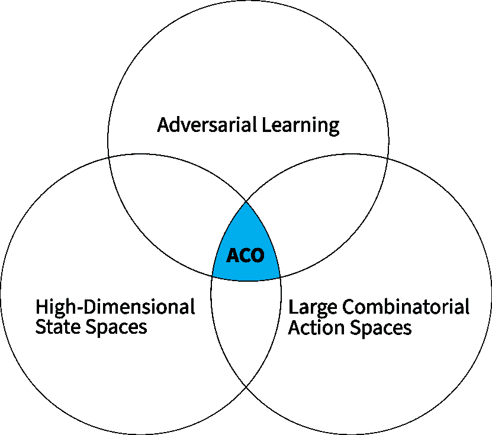

图 1：一个理想化的 DRL-ACO 代理必须克服的三大挑战。

深度强化学习（DRL）文献中包含了大量分别解决上述挑战的努力。在这里，我们调查了这些努力，并为 ACO 定义了一个理想化的 DRL 代理。此调查提供了该领域的当前状态概述，定义了长期目标，并提出了 DRL 从业者和 ACO 研究人员需要深入探讨的研究问题。

我们的贡献可以总结如下：

1.) 为了对未来的 DRL-ACO 方法进行全面评估，我们提供了 ACO 基准环境的概述，以及在 DRL 文献中发现的面对类似挑战的环境。

2.) 我们确定了处理 ACO 维度诅咒的合适方法。这包括对状态抽象、高效探索和减轻灾难性遗忘的总结，以及对高维动作方法的批判性评估。

3.) 我们从对抗学习的角度正式定义了 ACO 问题。即使在简单的对抗游戏中，寻找（近似）最优策略也并非易事。因此，我们回顾了限制可利用性的方法，并规划了将这些方法扩展到完整 ACO 挑战的路径。

## 2 相关工作

近年来进行了一些调查，概述了不同类型的网络攻击（例如入侵、垃圾邮件和恶意软件）以及响应中应用的 ML 方法[9277523, li2018cyber, reda2021taxonomy, liu2019machine, thiyagarajan2020review]。鉴于 ML 方法本身容易受到对抗性攻击，也有评估对抗性学习技术对网络安全风险的努力[duddu2018survey, rosenberg2021adversarial]。然而，尽管这些研究评估了对 ML 模型的一般威胁（例如白盒攻击[moosavi2016deepfool]和模型中毒攻击[kloft2010online]），我们的调查专注于 ACO 中 DRL 智能体的对抗性学习过程、期望的解决概念，以及对现有技术在限制可利用性方面的关键评估。

[9596578] 调查了用于网络安全的 DRL 文献，概述了 DRL 基础的安全方法在网络物理系统、自主入侵检测技术以及多智能体 DRL 基础的博弈论模拟防御策略中的应用。相比之下，我们的工作侧重于下一代解决方案；我们捕捉了大规模 ACO 问题所带来的挑战，并调查了 DRL 文献中为应对这些挑战而设计的合适方法，为理想化的 ACO-DRL 智能体提供了构建块。这样的智能体将需要一个合适的评估环境。虽然已有评估网络安全数据集的努力[8258167, kilincer2021machine, 9277523]，但据我们所知，我们是首个评估网络安全和其他基准环境在多大程度上能代表完整 ACO 问题的研究。

## 3 背景与定义

以下我们提供本调查中依赖的定义和符号。首先，我们将正式定义描述 RL 智能体与环境交互的不同类型模型。我们将在本调查中遇到每种类型（参见\autoreffig:rl_problems_overview 以获取概述）。

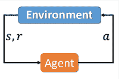

(a) MDP

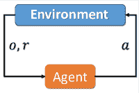

(b) POMDP

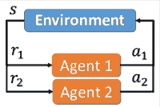

(c) 马尔可夫博弈（MG）

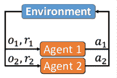

(d) POMG

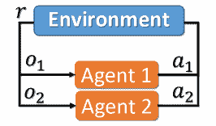

(e) Dec-POMDP

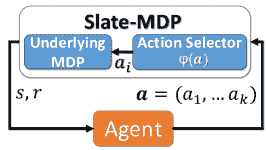

(f) Slate-MDP

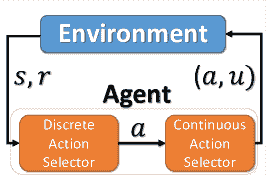

(g) 参数化动作 MDP

图 2：本调查讨论的问题公式的概述。在这些公式中，我们有以下变量：状态$s$，奖励$r$，动作$a$，和观察$o$。对于参数化动作 MDP，我们区分离散动作$a$和连续动作$u$。

### 3.1 马尔可夫决策过程

马尔可夫决策过程（MDPs）描述了一类问题——完全可观测环境——这定义了强化学习（RL）领域，提供了一个合适的模型来制定强化学习者与其环境之间的交互[sutton2018reinforcement]。形式上：一个 MDP 是一个元组$\mathcal{M}=\langle\mathcal{S},\mathcal{A},\mathcal{R},\mathcal{P}\rangle$，其中：$\mathcal{S}$是有限的状态集；对于每个状态$s\in\mathcal{S}$，存在一个有限的可能动作集$\mathcal{A}$；$\mathcal{R}$是一个实值回报函数$\mathcal{R}:\mathcal{S}\times\mathcal{A}\times\mathcal{S}^{\prime}\rightarrow\mathbb{R}$，其中$\mathcal{R}_{a}(s,s^{\prime})$是在状态从$s$转移到$s^{\prime}$时使用动作$a$后的期望回报；$\mathcal{P}$是一个状态转移概率矩阵$\mathcal{P}:\mathcal{S}\times\mathcal{A}\times\mathcal{S}^{\prime}\rightarrow[0,1]$，其中$\mathcal{P}_{a}(s,s^{\prime})$是状态$s$在使用动作$a$后转移到状态$s^{\prime}$的概率。MDPs 可以具有终止（吸收）状态，在这些状态下，剧集结束。

### 3.2 部分可观测马尔可夫决策过程

许多环境缺乏 MDP 的完全可观测性属性[oliehoek2015concise]。在这里，部分可观测 MDP（POMDP）通过添加$\langle\Omega,\mathcal{O}\rangle$来扩展 MDP $\mathcal{M}$，其中：$\Omega$是有限的观察集；$\mathcal{O}$是定义为$\mathcal{O}:\mathcal{S}\times\mathcal{A}\times\Omega\rightarrow[0,1]$的观察函数，其中$\mathcal{O}(o\rvert s,a)$是可能在状态$s$中出现的观察$o$的分布，经过动作$a$后。

### 3.3 马尔可夫游戏

许多环境，包括本调查的重点环境，具有多个学习代理。在这里，博弈论通过马尔可夫游戏（也称为随机游戏 [shapley1953stochastic]）提供了解决方案。马尔可夫游戏定义为一个元组$(n,\mathcal{S},\mathcal{A},\mathcal{P},\mathcal{R})$，具有有限状态空间$\mathcal{S}$；对于每个状态$s\in\mathcal{S}$，有一个联合动作空间$(\mathcal{A}_{1}\times...\times\mathcal{A}_{n})$，其中$\mathcal{A}_{p}$是玩家$p$可用的动作数；一个状态转移函数$\mathcal{P}:\mathcal{S}_{t}\times\mathcal{A}_{1}\times...\times\mathcal{A}_{n}\times\mathcal{\mathcal{S}}_{t+1}\rightarrow[0,1]$，返回从状态$s_{t}$到$s_{t+1}$的转移概率，给定一个动作配置$a_{1}\times...\times a_{n}$；对于每个玩家$p$，有一个奖励函数：$\mathcal{\mathcal{R}}_{p}:\mathcal{\mathcal{S}}_{t}\times\mathcal{\mathcal{A}}_{1}\times...\times\mathcal{\mathcal{A}}_{n}\times\mathcal{\mathcal{S}}_{t+1}\rightarrow\mathbb{R}$ [shapley1953stochastic]。我们允许*终态*，即游戏结束的状态。每个状态都是完全可观测的。

### 3.4 部分可观测马尔可夫游戏

与 POMDPs 一样，我们不能假设马尔可夫游戏所需的完全可观测性。部分可观测马尔可夫游戏（POMG）是马尔可夫游戏的扩展，它包括$\langle\Omega,\mathcal{O}\rangle$，即一组联合观测$\Omega$；以及一个观测概率函数定义为$\mathcal{O}_{p}:\mathcal{S}\times\mathcal{A}_{1}\times...\times\mathcal{A}_{n}\times\Omega\rightarrow[0,1]$。对于每个玩家$p$，观测概率函数$\mathcal{O}_{p}$是在状态$s$下，给定一个动作配置$a_{1}\times...\times a_{n}$可能出现的观测$o$的分布。

### 3.5 去中心化 POMDPs

去中心化 POMDP（Dec-POMDP）是一个部分可观测的马尔可夫游戏，在每一步，所有$n$个代理接收相同的奖励 [oliehoek2015concise]。

### 3.6 铺设马尔可夫决策过程

一些环境，如推荐系统，需要自定义模型。在这里，Slate-MDPs 提供了一种解决方案 [sunehag2015deep]。给定一个基础 MDP $\mathcal{M}=\langle\mathcal{S},\mathcal{A},\mathcal{P},\mathcal{R}\rangle$，Slate-MDP 是一个元组 $\langle\mathcal{S},\mathcal{A}^{l},\mathcal{P}^{\prime},\mathcal{R}^{\prime}\rangle$。在这一表述中，$\mathcal{A}^{l}$ 是一个有限的离散动作空间 $\mathcal{A}^{l}=\{\bm{a}_{1},\bm{a}_{2},...,\bm{a}_{N}\}$，表示在当前状态 $s$ 下可推荐的所有可能的板块集合。每个板块可以表示为 $\bm{a}_{i}=\{a_{i}^{1},a_{i}^{2},...a_{i}^{K}\}$，其中 $K$ 代表板块的大小。Slate-MDPs 假设有一个动作选择函数 $\varphi:\mathcal{S}\times\mathcal{A}^{l}\rightarrow\mathcal{A}$。因此，状态转换和奖励通过函数 $\mathcal{P}^{\prime}:\mathcal{S}\times\mathcal{A}^{l}\times\mathcal{S}^{\prime}\rightarrow[0,1]$ 和 $\mathcal{R}^{\prime}:\mathcal{S}\times\mathcal{A}^{l}\times\mathcal{S}^{\prime}\rightarrow\mathbb{R}$ 确定。因此，给定基础 MDP $\mathcal{M}$，我们有 $\mathcal{P}^{\prime}(s,\bm{a},s^{\prime})=\mathcal{P}(s,\varphi(\bm{a}),s^{\prime})$ 和 $\mathcal{R}^{\prime}(s,\bm{a},s^{\prime})=\mathcal{R}(s,\varphi(\bm{a}),s^{\prime})$。最后，有一个假设是，最近执行的动作可以通过函数 $\psi:\mathcal{S}\rightarrow\mathcal{A}$ 从状态中推导出来。请注意，没有要求 $\psi(s_{t+1})\in\bm{a}_{t}$，因此，选择的动作也可以在提供的板块之外 ¹¹1 有些环境将 $\psi(s_{t+1})\notin\bm{a}_{t}$ 视为失败属性，导致一个回合终止 [sunehag2015deep]。

### 3.7 参数化动作 MDPs

参数化动作 MDPs（PA-MDPs）是 MDPs 的一种推广，其中智能体必须从离散的参数化动作集中进行选择 [wei2018hierarchical, masson2016reinforcement]。更正式地，PA-MDPs 假设有一个有限的离散动作集合 $\mathcal{A}_{d}=\{a_{1},a_{2},...,a_{n}\}$，对于每个动作 $a\in\mathcal{A}_{d}$，都有一组连续参数 $u_{a}\subseteq\mathbb{R}^{m_{a}}$，其中 $m_{a}$ 代表动作 $a$ 的维度。因此，动作是联合动作空间中的一个元组 $(a,u)$，即 $\mathcal{A}=\bigcup_{a\in\mathcal{A}_{d}}\{(a,u)\rvert\ \mathcal{U}_{a}\}$。

### 3.8 动作空间的类型

从上述定义中，我们可以看到环境对其动作空间有不同的要求 [9231687]。本调查将讨论以下方法：

离散动作 $a\in\{0,1,...N\}$，在给定状态下有 $N\in\mathcal{N}$ 个可用动作。

MultiDiscrete 动作向量 $\bm{a}$。每个 $a_{i}$ 是一个具有 $N$ 种可能性的离散动作。

连续动作，其中一个动作 $a\in\mathbb{R}$ 是一个实数，或者是一个实数向量。

从中可以选择的 Slate 动作 $\bm{a}=\{a_{1},a_{2},...,a_{n}\}$。

参数化动作，混合离散-连续，例如，元组 $(a,u)$ 其中 $a$ 是离散动作，$u$ 是连续动作。

### 3.9 强化学习

RL 算法的目标是学习一个策略 $\pi$，该策略将状态映射到动作的概率分布 $\pi:\mathcal{S}\rightarrow P(\mathcal{A})$，以最大化期望回报 $\mathbb{E}_{\pi}[\sum^{H-1}_{t=0}\gamma^{t}r_{t}]$。其中，$H$ 是时间范围的长度，$\gamma$ 是折扣因子 $\gamma\in[\texttt{0},1]$，它对未来奖励的价值进行加权。本调查中讨论的许多方法以 Watkins [watkins1989learning, watkins1992q] 提出的 Q-learning 算法为基础。该算法使用动态规划方法，学习与代理当前策略无关的动作价值估计（Q 值）。Q 值是对未来奖励（回报）的折扣和的估计，这些奖励可以在时间 $t$ 通过在状态 $s_{t}$ 中选择动作 $a\in\mathcal{A}$ 获得，前提是每个后续状态中选择了最优策略。Q-learning 是一种 *离策略* 时间差分（TD）学习算法。

在低维状态空间的环境中，可以使用 Q-表来维护 Q 值。在根据策略 $\pi$ 在状态 $s$ 中选择动作 $a$ 后，通过引导在状态 $s^{\prime}$ 中获得的即时奖励 $r$ 和来自下一个状态的折扣期望未来奖励来更新 Q-表，使用折扣因子 $\gamma\in\left(\texttt{0},1\right]$ 和标量 $\alpha$ 来控制学习率：$Q_{k+1}(s,a)\leftarrow Q_{k}(s,a)+\alpha\big{(}r+\gamma\max_{s\in\mathcal{S}}\left[Q_{k}\left(s^{\prime},a\right)-Q_{k}\left(s,a\right)\right]\big{)}$。许多序列决策问题具有高维状态空间。在这种情况下，可以使用函数逼近器来近似 Q 值，例如使用神经网络。关于流行的 DRL 方法的回顾见 \autorefsota_drl_approaches。

### 3.10 联合策略

我们感兴趣的领域可以包含多个代理。对于每个代理 $p$，策略 $\pi_{p}$ 表示从状态空间到动作的概率分布的映射：$\pi_{p}:\mathcal{S}_{p}\rightarrow\Delta(\mathcal{A}_{p})$。马尔可夫游戏中的转移由联合策略决定。符号 $\bm{\pi}$ 指所有代理的联合策略。排除代理 $p$ 的联合策略定义为 $\bm{\pi}_{-p}$。符号 $\langle\pi_{p},\bm{\pi}_{-p}\rangle$ 指代理 $p$ 遵循 $\pi_{p}$ 的联合策略，而其他代理遵循 $\bm{\pi}_{-p}$。

## 4 环境

近年来出现了一些基准测试环境，它们为学习代理提供了 ACO 问题的抽象版本，包括 CybORG 环境 [cage_cyborg_2022] 和 YAWNING TITAN (YT) [YAWNING]。在 ACO-gyms 中，红色代理的任务是通过网络图移动，破坏节点以推进。大多数情况下，最终目标是到达并影响一个高价值的目标节点。在所有 ACO-gyms 中，蓝色代理的任务在概念上是相同的——使用可用的动作识别并阻止红色代理的入侵和进攻。这些动作在不同的 ACO-gyms 中差异很大，包括扫描/监控红色活动；隔离、使节点安全、降低节点脆弱性；以及部署诱饵节点。

由于特定的观察和动作依赖于 ACO-gym，可以推测这些特征并不特定于 ACO 问题。任何其他具有核心特征的环境，包括内部动态和观察、动作空间结构，应提供一个适合开发方法的平台，以应对 ACO 挑战，直到 ACO-gyms 能够完全表示问题。我们已经确定了总共 14 项期望标准，以评估其他领域环境在开发和评估处理 ACO 挑战的技术方面的适用性（参见 \autoreftab:allenvs）。

代码：代码的可用性可以显著加快研究进展。我们只列出提供独特属性或需要最少实现工作量的无代码环境。

对抗性：ACO 通常是蓝色代理和红色代理之间的对抗游戏。

通用和团队游戏：网络可以跨越多个地理位置。因此，物理限制，例如数据传输容量和延迟，可能需要采用多智能体强化学习（MARL）方法。

随机性：ACO 具有随机因素，例如用户活动、设备故障以及红色攻击成功的可能性。为了满足这一标准，需要进行随机状态转换。仅随机起始位置是不够的。

部分可观察：在所有 ACO-gyms 中，蓝色代理必须执行扫描/监控操作以观察红色活动。未来的 ACO-gyms 可能会进一步减少可观察性，需要更复杂的蓝色策略来检测红色代理的动作。

基于图：由于 ACO 在网络上进行，ACO-gyms 包含独特的图形域的底层动态。并不一定要求基于图的观察空间来满足这一标准。然而，检查的环境暗示存在图结构。

多离散性：鉴于 ACO-gyms 的观察和动作空间中存在的高维挑战——这些空间随着节点数量的增加而增大——在观察和动作空间中存在多个离散维度是非常可取的。

可扩展维度：基于图的动态特性之一是可以扩展的维度，这可以几何地增加复合空间的大小，例如，网络中的节点数量。符合此标准的环境允许方法被测试以扩展到更大的观察和动作空间。

连续维度：随着 ACO-gyms 的扩展，某些动作维度可能需要被视为连续的，例如，具有大量 IP 地址的网络。此外，观察空间中可能存在连续属性，例如表示节点脆弱性的属性 [YAWNING]。因此，具有*混合*输入和输出类型的环境是理想的。

传统上不可处理：通过识别观察或动作空间不可处理的环境，我们表明这些环境具备两个特性之一，这对传统的 RL 方法构成了重大挑战，甚至是不可能的挑战：

1.  1.

    多离散空间会导致空间大小的指数级扩展，平展后迅速变得计算上不可处理。

1.  2.

    观察或动作空间的大小随着环境的变化而变化；标准的 DRL 方法需要一致的形状和大小。

满足上述标准的环境对传统 DRL 方法构成挑战，因此需要新颖的算法或模型。然而，即使是当前的 ACO-gyms 也未满足所有这些标准（见 \autoreftab:allenvs）。下面我们提供了对当前 ACO-gyms 的关键评估。

| 环境特性 |
| --- |
| 类别 | ACO | NBD | GD2D | DCC | RS | MG |
| --- | --- | --- | --- | --- | --- | --- |
| 一般 \csvreader[head to column names, late after line= |
| , late after last line= |

表 1：我们为本次调查评估的环境及其属性概览，其中 ✓ 和 X 表示环境是否满足某项标准。第三个符号，$\nearrow$ 表示环境当前未满足标准（由于启用的软件功能未存在，无论是设计原因还是由于实现不完整），但所需的功能可以通过适度的开发工作来实现，无需对环境范围进行重大扩展。除了 ACO 之外，其他类别包括：Gridworld Domains & 2D Games (GD2D)，Discretised Continuous Control Games (DCC)，Network-Based Domains (NBD)，Recommender Systems (RS)，以及 Miscellaneous Games (MG)。最后一类是指那些不值得单独设立类别的独特环境。

CybORG：网络操作研究实验室（CybORG） [cyborg_acd_2021] 是一个用于实施各种 ACO 场景的框架。它提供了两级保真度的通用接口，分别是有限状态机和模拟器。后者为每个节点提供：操作系统；硬件架构；用户；以及密码 [cage_cyborg_2022]。CybORG 允许同时训练蓝方和红方代理。因此，原则上，它提供了一个用于对抗学习的 ACO 环境。然而，实际上需要进一步的修改才能支持加载 DRL 对手。这是因为环境包装器（用于减少观察空间的大小和映射动作）仅对正在训练的代理可用。目前，环境实例中的对手接收到的是原始未处理的字典观察数据。此外，虽然 CybORG 允许自定义配置文件，但实际上，我们发现指定自定义网络并不简单。

打哈欠的泰坦（Yawning Titan）：YT 环境故意抽象化了 CybORG 的模拟器所使用的额外信息，促进了新方法的快速集成和评估 [YAWNING]。它旨在训练 ACO 代理以防御可以通过高度可定制的配置文件指定的任意网络拓扑。网络中的每台机器都有影响其受蓝方和红方代理行为影响程度的参数，包括节点被攻破的易受攻击分数。然而，虽然 YT 是一个易于配置的轻量级 ACO 环境，但它目前缺乏训练红方代理的能力，并且不支持对抗学习。

网络攻击模拟器（NASim）：这个 ACO 环境是一个模拟计算机网络，具有漏洞、扫描和利用工具，旨在作为 AI 代理和应用于网络渗透测试的规划技术的测试环境 [schwartz2019autonomous]。NASim 满足了我们的一些标准，并支持涉及大量机器的场景。然而，[nguyen2020multiple] 发现，红方代理攻击在 NASim 中成功的概率远高于现实。因此，作者增加了额外的规则以提高任务难度。NASim 也不支持对抗学习。

尽管 ACO-gyms 当前未满足我们上述所有标准，但它们未来可能会满足这些标准。随着 ACO-gyms 成熟，观测和动作空间维度的数量增加，它们的规模也会增长；而且，实际上计算机网络上的节点数量并不保持不变，观测和动作空间的大小也不会保持不变。以下我们讨论了几个领域中的多个环境，这些环境可以用来开发和评估旨在解决识别出的挑战子集的方法。我们评估的环境概述见 \autoreftab:allenvs。下面我们重点关注满足大量 ACO 要求的四个环境。

MicroRTS [huang2021gym] 是一个简单的实时战略（RTS）游戏。它旨在使 RL 代理能够在一个类似于 PySC2 [vinyals2017starcraft] 的环境中进行训练，后者是对复杂度极高的热门 RTS 游戏《星际争霸 II》的 RL 环境适配。因此，MicroRTS 是 PySC2 的一个轻量级版本，没有大量（且昂贵的）计算需求。该游戏具有类似网格世界的观测空间，对于一个大小为 $h\times w$ 的地图，观测空间的大小为 $h\times w\times f$，其中 $f$ 是可能存在于任意方格中的离散特征的数量。这个观测空间可以设置为部分可观察。动作空间是一个大型多离散空间，每个工人通过总共七个离散动作来指挥。游戏中的工人数量会发生变化，使核心 RTS 动作空间变得难以处理。为了应对这一挑战，MicroRTS 的作者将动作分解作为环境的一部分实现，动作空间被分为单位动作空间（7 个离散动作）和玩家动作空间。尽管作者讨论了玩家动作空间的两种公式，但在代码中记录的是 *GridNet* 方法，该方法使代理预测网格中每个单元的动作，仅对包含玩家控制单位的单元执行动作。这导致了总动作空间大小为 $h\times w\times 7$。代理数量变化的挑战与 ACO 中节点数量变化的挑战非常相似。如果剥离动作分解，MicroRTS 环境将是处理大型和可变大小离散动作空间的强有力候选者。

Nocturne [nocturne2022] 是一个 2D 驾驶模拟器，基于 Waymo 开放数据集 [Sun_2020_CVPR] 构建。代理在部分可观测的环境中学习驾驶，无需处理直接传感器输入，例如，来自成像摄像头的视频。Nocturne 是一个零和游戏。每个代理既需要协调自己的动作以实现目标，又需要与其他代理合作以避免拥堵。它是部分可观测的，环境中的物体（包括静态和移动的）会遮挡物体（从代理的自我中心视角）。然而，它不是随机的，状态转移概率是确定性的。

SUMO [SUMO2018] 是一个交通仿真工具，允许实现复杂的、分布式的交通信号控制场景。虽然它既不是基于 Python 的，也不打算用于 RL，但存在一个第三方接口来满足这些标准 [sumorl]。该环境有两种配置：单代理和多代理。对于本次评审，我们考虑多代理配置，但将其视为单代理问题，因为尽管多代理场景引入了更多复杂性，涉及多个需要控制的交叉口，但并不需要使用多个代理。SUMO 中的代理目标是控制交叉口的交通信号，以最小化通过车辆的延迟。观察空间是一个小而可扩展（关于交叉口数量）的连续空间，包含有关进入车道的交通量的信息。对于动作空间，每组信号灯由一个离散变量控制，每个变量对应于一种信号灯配置。例如，在一个双向单交叉口，有四种可能的配置。然而，每种交叉口类型的配置数量不同，这意味着动作空间不仅是多离散的，而且是不均匀的。此外，由于交叉口通过道路连接，环境不可避免地包含类似图的动态，即每个交叉口的动作和交通流量将影响连接交叉口的状态。因此，SUMO 的动作空间和动态适用于 ACO。然而，小的观察空间和缺乏对抗性或部分可观测特性限制了其适用性。

RecSim [ie2019recsim] 是一个用于创建推荐系统的 RL 环境的可配置框架。在 RecSim 中，代理观察到来自用户和文档数据库的多个特征集，并根据这些特征集进行文档推荐。这些特征集包括用户的特征、他们对之前推荐的响应以及可供推荐的文档。这些观察满足了与观察空间相关的所有期望标准。它们不仅是随机的（由于用户行为的随机性）和部分可观察的（由于可见用户特征的不完整性），而且还是一个可扩展的离散和连续特征的混合，这些特征随着文档数量和从中提取的特征数量的增加呈指数增长。因此，RecSim 的观察空间带来了类似于 ACO 的复杂挑战。然而，动作空间却不那么显著。代理必须选择若干文档进行推荐，这是一个多离散空间，可能会随着推荐数量和文档数量的增加而扩展。然而，除非文档数量变得庞大，否则这不太可能变得不可处理。尽管如此，这个大空间与新颖复杂的观察空间相辅相成，使其成为实验 ACO 挑战方法的有力候选者。

总之，在本节中，我们回顾了多个与 ACO 挑战相关的环境和领域。虽然没有一个回顾的环境完全符合我们所有的期望标准，但每个挑战在至少一个领域中有所体现。其中最稀缺的挑战是图形动态的存在，而这是 ACO 的核心。这些挑战只能在基于网络的领域中找到，即使在那里，并非所有环境都具备它们。因此，如果正在研究的 ACO 解决方案旨在应对图形动态，那么将受到限于此领域中的环境。如果开发中不需要图形动态，则在其他期望标准中有几种选择。星际争霸 II 即使在如 SMAC [samvelyan19smac, ellis2022smacv2] 这样的简化版本中也提供了特别复杂的挑战，并且满足了大量要求。然而，它是一个计算要求高的环境。Micro-RTS [huang2021gym] 是一个专门设计用于提供比星际争霸 II 更少计算需求的版本的环境，是一个有吸引力的替代方案。尽管观察空间是星际争霸 II 的简化版本，但动作空间保持了相同的复杂性，变量数量的代理构成了一个不可处理的问题。

## 5 处理庞大的高维输入

由于可以收集大量数据的手段不断增加，维度诅咒是机器学习（ML）和数据挖掘任务中一个普遍存在的问题。这对深度强化学习（DRL）有影响。由于不必要的特征引入噪声，学习效率降低 [zebari2020comprehensive]，状态空间可能随着状态表示的大小呈指数增长 [burden2021latent]。在这里，维持状态-动作空间的足够样本分布变得具有挑战性 [de2015importance]。

降维技术是处理不必要/噪声特征的自然选择。其好处包括：消除无关数据和冗余特征，同时保留数据集的方差；改善数据质量；减少处理时间和内存需求；提高准确性；缩短训练和推理时间（即，减少计算成本）；以及提升性能 [zebari2020comprehensive]。两种常用的方法是*特征选择*和*特征提取*。特征选择旨在找到适合训练模型的最优相关特征子集，这是一类非确定性多项式（NP）困难问题 [meiri2006using]。相对而言，特征提取则涉及创建特征的线性组合，同时保留潜在结构中的原始相对距离。降维时不会丢失过多初始信息 [zebari2020comprehensive]。然而，结果编码对人类来说不可解释。

深度强化学习（DRL）使用深度神经网络（DNNs）直接从高维数据中提取特征 [mousavi2018deep, almasan2022deep]。然而，特征选择可以作为训练 DNNs 的有价值的预处理步骤。例如，用于网络安全应用的异常检测 DNNs，负责区分良性和恶意数据包，发现当在应用了特征选择的数据上进行训练时，性能更佳 [9216403]。

以下，我们将提供用于特征提取的深度神经网络（DNNs）在深度强化学习（DRL）中的概述。接着，我们将讨论最先进的 DRL 方法，通过学习*抽象*状态进一步消除不必要的信息，并探讨先进的探索策略，以确保对所有*相关*状态的充分访问，从而获得准确的效用估计 [burden2021latent, pmlr-v134-perdomo21a]。最后，我们将详细查看减轻灾难性遗忘的策略，即 DNNs 倾向于遗忘先前知识 [pmlr-v119-ota20a, de2015importance]。本节讨论的方法总结见\autoreftab:state_abstraction 和\autorefappendix:states。

### 5.1 函数逼近器

过去十年中，强化学习的许多成功依赖于 DNNs 识别复杂结构和从复杂高维样本中提取紧凑特征的能力[Goodfellow-et-al-2016, karpathy2014large, lecun2015deep]。这些方法在面对具有维度诅咒的众多领域中表现良好，例如*街机学习环境*(ALE)[bellemare2013arcade]，其中 DNNs 用于编码图像观测。然而，这些领域中的许多是完全可观察的，并且包含的状态空间维度对于当前的 DNNs 是可管理的。相对而言，本调查关注于标准 DRL 方法所使用的架构无法扩展的环境，需要创新的解决方案。在这里，需要考虑如何高效地将*极其庞大的*观测空间编码为低维表示，同时尽量减少对性能的妥协。首先，我们将讨论 DRL 中使用的两种流行特征提取技术：卷积神经网络（CNNs）和图神经网络（GNNs）。

卷积神经网络：CNN 可以通过多个堆叠的线性卷积层和池化层、与输入进行卷积的滤波器组来从高维数组和张量中提取特征，从而优化其性能[lecun2015deep, Goodfellow-et-al-2016]。第一层可能学习提取边缘，随后层可以将这些边缘组合成角点和轮廓。这些特征可以组合形成对象部分，从而实现分类，例如通过添加完全连接的层来预处理输出层[lecun2015deep, Goodfellow-et-al-2016]。

CNN 具有较大的学习能力，可以被训练以实现对输入中微小细节敏感的复杂函数[lecun2015deep, krizhevsky2012imagenet, wu2019wider]。DNNs 可以通过反向传播过程使用随机梯度下降进行端到端训练，前提是网络由平滑函数组成[Goodfellow-et-al-2016]。CNN 利用了图像中像素依赖位置的假设，这使得 CNN 能够减少相对于完全连接的 DNNs 的加权连接数量[krizhevsky2012imagenet]。然而，尽管 CNN 仍被认为是处理数组和张量形式数据的*最先进*方法，但在某些情况下 CNN 并不直接适用，例如图基表示。

图神经网络（GNNs）：基于图的表示在许多领域中都非常流行，例如交通预测、药物发现和 ACO [munikoti2022challenges]。由于图的结构不均匀、无序节点的大小不规则以及动态的邻域组成，传统的深度神经网络（DNNs）并不适用于图数据 [kipf2016semi]。在这里，GNNs 作为一种强大的工具应运而生 [JIANG2022117921]。GNNs 成功应用于系统性建模节点实体之间关系的图，并表示复杂问题的简化版本。任务包括节点分类、链接预测、社区检测和图分类 [you2019position]。GNNs 通过消息传递机制建模图结构和节点属性，将节点的相关特征信息传播到其邻居，直到找到稳定的平衡 [kipf2016semi]。GNNs 主要适用于可以通过图来捕捉实体之间关系的环境 [munikoti2022challenges]，例如，在 StarCraft 多智能体挑战（SMAC）中实现值函数的有效因式分解 [kortvelesy2022qgnn]，或者在多任务 DRL 中建模智能体和对象之间的关系 [hong2022structureaware]。

[munikoti2022challenges] 最近对图基 DRL 的机会和挑战进行了调查，将理想的 DRL GNN 定义为：i.) *动态的*；ii.) *可扩展的*；iii.) 提供*泛化性*；iv.) 适用于*多智能体*系统。动态性指的是 DRL 需要 GNN 方法能够应对时间变化的网络配置和参数，例如，主机数量随时间变化。虽然已经提出了用于动态图的 GNN 架构（例如，时空 GNNs [nicolicioiu2019recurrent]），但节点分类、链接预测、社区检测和图分类等任务仍可能受益于进一步改进 [munikoti2022challenges]。关于泛化性，存在 DRL 智能体可能在训练过程中对看到的图结构过拟合，并无法在不同图之间进行泛化的危险 [munikoti2022challenges]。

目前 DRL 社区关注的三种流行 GNN 是 [munikoti2022challenges]：

1.) *图卷积网络（GCNs）：* 采用半监督学习方法，GCNs 是首批将类似于 CNN 的卷积操作应用于图结构数据的 GNN。该模型可以学习局部图结构和节点特征的编码。GCNs 在图边数目上线性扩展。然而，需要整个图的邻接矩阵来学习这些表示。因此，GCNs 不能对不同大小的图进行泛化 [munikoti2022challenges]。这对 DRL 有影响，因为它限制了 GCNs 在静态网络配置任务中的使用。

2.) *GraphSAGE* 学习节点的拓扑结构以及节点特征在局部邻域内的分布，计算节点在图中的局部角色及全局位置 [hamilton2017inductive]。使用归纳学习方法，GraphSAGE 在每个节点的局部邻域内采样节点特征，并学习一个功能映射，聚合每个节点接收到的信息。它可以扩展到不同大小的图，并可以应用于不同的子图，因此不需要在训练期间所有节点都存在。

3.) *图注意力网络 (GAT)* 使用掩码自注意力层，从而可以隐式地为邻域中的节点指定不同的权重，而无需计算开销大的矩阵运算或事先假设图的结构 [GAT]。这种方法选择性地聚合节点贡献，同时抑制较小的结构细节。

选择用于深度强化学习 (DRL) 的 GNN 类型取决于环境的属性。对于大型图，要求使用能够应用于子图的 GNN 方法，例如 GraphSAGE [hamilton2017inductive]。当节点的位置提供关键信息时，应使用位置感知 GNN [you2019position] [munikoti2022challenges]。与此同时，对于动态图，适当的方法是将 GNN 与递归神经网络 (RNN) 融合，以捕捉图的演变，允许网络建立时空依赖关系 [munikoti2022challenges]。实际上，即使对于非图结构的环境表示，我们也必须考虑部分观测 $o$ 的影响，或者观测的轨迹 $\tau=\{o_{t-n},o_{t-n+1}...o_{t}\}$。在这里，RNN 组件也被用于保留相关信息 [lample2017playing, li2021lstm, hochreiter1997long]。这使得学习者能够编码并跟踪相关对象，例如在前几个时间步中观察到的其他智能体的位置 [lample2017playing, kapturowski2019recurrent]。

### 5.2 状态抽象

状态抽象的目标是获得一个压缩的环境模型，保留所有有用的信息——这使得可以在抽象形式上高效地训练和部署 DRL 代理。解决抽象的 MDP 等同于解决底层的 MDP [pmlr-v108-abel20a, abel2019state, burden2018using, burden2021latent]。状态抽象将语义上相似的状态归为一组，将状态空间抽象为具有较低维度的表示 [yu2018towards]。状态抽象重要性的一个激励性例子是 ALE 游戏 Pong [bellemare2013arcade]，其中成功只需访问两个挡板和球的位置及速度 [pmlr-v97-gelada19a]。

[abel2019state]确定文献中讨论的涉及状态和动作的各种抽象类型，包括：状态抽象[pmlr-v80-abel18a]、时间抽象[precup2000temporal]、状态-动作抽象[pmlr-v108-abel20a]和分层强化学习方法[kulkarni2016hierarchical, dietterich2000overview]。在本节中，我们将重点关注状态抽象。形式上，给定一个高维状态空间$\mathcal{S}$，状态抽象的目标是实现从每个状态$s\in\mathcal{S}$到抽象状态$s_{\phi}\in\mathcal{S}_{\phi}$的映射$\phi:\mathcal{S}\rightarrow\mathcal{S}_{\phi}$，其中$\rvert\mathcal{S}_{\phi}\rvert\ll\rvert\mathcal{S}\rvert$[abel2019theory]，而$\phi$是一个编码器[abel2019theory]。这扩展了\autorefsec:background 中定义的 RL 问题集合，引入了抽象 MDP 的概念，如\autoreffig:state_abstraction 所示。

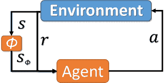

图 3：表示抽象 MDP 的描述，其中包括从完整状态$s$到抽象状态$s_{\phi}$的映射$\phi:\mathcal{S}\rightarrow\mathcal{S}_{\phi}$。

在实践中，通常使用变分自动编码器（VAE）的基于体系结构的方法获得低维表示[kingma2013auto]。例如，[9287851]应用神经离散表示学习，使用经验马尔可夫决策过程（RL）代理与环境交互产生的高维原始视频观测映射到低维离散潜在表示中，使用训练用于重构原始视频数据的向量量化自动编码器（VQ-AE）。该方法在 Minecraft 中的三维导航任务中展示了其优点。

[9287851]及其他工作[tang2017exploration, burden2018using, burden2021latent]展示了状态抽象降低原始高维输入噪音的能力。然而，丢弃过多信息可能导致编码器无法保留关键特征。因此，编码器必须找到适当的压缩程度和足够的表示能力之间的平衡[abel2016near]。使用*学徒学习*假设有专家演示者提供策略$\pi_{E}$，[abel2019state]试图理解信息论压缩在顺序决策的状态抽象中的作用。作者在强化学习的状态抽象与信信息论中理解的压缩之间建立了类比关系。该工作集中于评估代理与演示者性能的程度，同时尽可能少地使用（编码）信息。研究这一特性导致了一个新的目标函数，通过该函数可以优化 VAE[kingma2013auto]，实现压缩和价值之间的权衡。

[pmlr-v97-gelada19a] 和 [zhanglearning] 观察到编码器-解码器方法通常对任务没有特定的要求——编码表示所有它们观察到的动态元素，即使这些元素并不相关。而理想的编码器会学习一个稳健的表示，将两个观察映射到潜在空间中的同一点，同时忽略对我们学习代理无关的对象。这两个工作都依赖于双重模拟的概念，以避免训练解码器。双重模拟的直观理解如下。

###### 定义 5.1（双重模拟）。

给定一个 MDP $\mathcal{M}$，状态之间的等价关系$B$是一个双重模拟关系，如果对于所有在 B 下等价的状态 $s_{i},s_{j}\in\mathcal{S}$（记作 $s_{i}\equiv_{B}s_{j}$），以下条件成立：

|  | $\mathcal{R}(s_{i},a)=\mathcal{R}(s_{j},a),\forall a\in\mathcal{A},$ |  | (1) |
| --- | --- | --- | --- |
|  | $\mathcal{P}(G\rvert s_{i},a)=\mathcal{P}(G\rvert s_{j},a),\forall a\in\mathcal{A},\forall G\in\mathcal{S}_{B},$ |  | (2) |

其中 $\mathcal{S}_{B}$ 是在关系 $B$ 下对 $\mathcal{S}$ 的划分（所有等价状态组 $G$ 的集合），而 $\mathcal{P}(G\rvert s,a)=\sum_{s^{\prime}\in G}\mathcal{P}(s^{\prime}\rvert s,a)$。

[zhanglearning] 提出了 *用于控制的深度双重模拟*（DBC），直接在双重模拟距离度量上进行学习。这允许学习能够有效用于下游控制策略的不可变表示，并且与任务无关的细节保持不变。编码器的训练方式使得潜在空间中的距离等于实际状态空间中的双重模拟距离。作者在视觉多关节动力学与接触（MuJoCo）任务上评估了他们的方法，在这些任务中，控制策略必须从背景中移动干扰物的视频中学习。在处理连续状态空间时，精确地划分状态通常是不切实际的，因此使用了伪度量空间 $(\mathcal{S},d)$，其中距离函数 $d:\mathcal{S}\times\mathcal{S}\rightarrow\mathbb{R}_{\geq 0}$ 测量两个状态之间的相似性。DBC 在 CARLA 上显著优于 SAC 和 DeepMDP [gelada2019deepmdp]，CARLA 是一个用于自动驾驶研究的开源模拟器²²2\urlhttps://carla.org/。虽然 DBC 应用于图像数据，但原则上也可以应用于 ACO 领域的观察数据。

### 5.3 探索

成功的状态抽象有许多应用，包括将原则性探索策略扩展到深度强化学习（DRL）[tang2017exploration]和基于潜在的奖励塑造[burden2021latent, burden2018using]。然而，学习一个符合所有期望标准的抽象状态空间仍然是一个长期存在的问题。强化学习（RL）代理通常会逐渐解锁新的能力，进而导致环境中新的区域被访问。在代理充分探索状态空间之前，可能会学习到许多初始编码[pmlr-v119-misra20a]。此外，对于受制于维度灾难的领域，探索是不可行的。需要原则性探索策略来确保对抽象状态的充分访问[burden2021latent, pmlr-v119-misra20a, wong2022deep]。为了解决这个问题，[pmlr-v119-misra20a]引入了 HOMER，这是一种状态抽象方法，考虑到学习状态的紧凑表示需要来自环境的全面信息——这一点仅通过随机探索是无法实现的。

HOMER 被设计为学习一种称为*运动学不可分离性*的无奖励状态抽象，聚合具有相同前向和后向动态的观察。该方法通过训练策略来访问每个运动学不可分离的抽象状态，迭代地探索环境。策略的构建使用了上下文博弈和一个合成奖励函数，该函数激励代理到达抽象状态。此外，HOMER 以归纳的方式交替学习状态抽象和到达新抽象状态的策略，这意味着策略会到达新的状态，这些状态会被抽象出来，然后再学习新的策略，迭代进行，直到获得一个*策略覆盖*。这种迭代学习方法在\autoreffig:homer 中进行了描述。一旦 HOMER 被训练完成，就可以为任何奖励函数找到接近最优的策略。HOMER 在一个名为*恶魔组合锁*的环境中优于 PPO 和其他基线，这是一类丰富观察的 MDP，其中错误选择会导致无法获得最优回报的状态。

图 4：HOMER（改编自[pmlr-v119-misra20a]）。

有许多*基于计数*的探索方法在应用于小型离散马尔可夫决策过程时，具有强大的收敛性保证 [tang2017exploration]。[ladosz2022exploration]定义了三种探索方法的理想标准，包括：i.) 根据智能体的学习确定探索的程度；ii.) 鼓励可能导致新结果的动作；iii.) 奖励智能体探索具有稀疏奖励的环境。鼓励探索的一种流行方法是通过内在奖励，其中奖励信号包括外在和内在两个部分。与状态抽象结合时，这些经过验证的方法可以应用于受维度灾难困扰的环境。

[tang2017exploration] 通过静态哈希介绍了一种基于计数的探索方法，使用 SimHash。哈希码通过训练好的 AutoEncoder 获得，提供了一种跟踪语义相似的观察-动作对出现次数的手段。基于计数的奖励鼓励访问较少探索的语义相似的观察-动作对。[bellemare2016unifying] 提出了使用伪计数，根据*序列密度模型*计算从日志概率改善中得出的显著事件。在极限情况下，这将收敛于经验计数。[martin2017count] 关注于特征表示空间内的计数，而不是原始输入。其他计算内在奖励的方法基于预测误差 [pathak2017curiosity, stadie2015incentivizing, savinovepisodic, burdaexploration, bougie2021fast, ladosz2022exploration] 和基于记忆的方法 [fu2017ex2, badianever]，使用训练好的模型来区分状态，其中易于区分的状态被视为新颖 [ladosz2022exploration]。

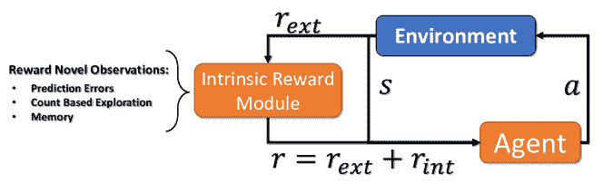

图 5：奖励智能体访问新状态的方法（改编自 [ladosz2022exploration]）。

基于目标的探索代表了另一类方法，[ladosz2022exploration] 进一步将其划分为：元控制器，其中具有环境高级概述的控制器为工作智能体提供目标 [forestier2017intrinsically, colas2019curious, vezhnevets2017feudal, hester2013learning, kulkarni2016hierarchical]；子目标，为智能体找到需要达到的子目标，例如，环境中的瓶颈 [machado2017laplacian, machadoeigenoption, fangadaptive]；以及在最高不确定性区域的目标，在这些目标中，探索与奖励相关的不确定状态是子目标 [kovac2020grimgep]。

尽管有上述进展，在处理复杂性增加时，学习整个环境既不可行也不可取。在这种情况下，需要有原则的方法来确定状态空间中哪些部分最为相关 [pmlr-v134-perdomo21a]。然而，这一要求本身带来了一个困境，即如何以最小的努力确定状态空间的某个区域是否无关，这是一个开放的研究问题。

### 5.4 知识保留

与许多在线学习任务一样，DRL（深度强化学习）代理容易出现*灾难性遗忘*：即遗忘先前获得的知识 [atkinson2021pseudo, schak2019study]。为了提高样本效率，DRL 方法通常采用经验重放记忆，这些记忆存储在训练过程中采样的经验转移元组 [foerster2017stabilising]。样本可以长期存储，如在 DQN 和 DDPG 等离策略方法中，或短期存储，例如，通过多个工作者收集的 PPO 样本。对于前者，关注经验重放记忆的组成可以缓解灾难性遗忘 [de2015importance]。然而，在实践中，由于存储相关的内存成本，大量的转移数据会被丢弃。

另一个挑战是环境的静态性以及对手的静态性，这些都是强假设。存储在重放缓冲区中的样本可能会过时，使学习者面临与数据流处理相同的挑战 [hernandez2018multiagent]。在这种情况下，DRL 代理需要持续学习，即能够不断学习并建立在先前获得的知识上 [wolczyk2021continual]。

解决这个问题的一种方法是利用*双重记忆*，即一个新初始化的 DRL 代理（短期代理（网络））在新任务上进行训练，然后将知识转移到设计用于保留先前任务长期知识的 DQN 上。使用生成网络从先前任务生成短序列供 DQN 训练，以防止在学习新任务时发生灾难性遗忘 [atkinson2021pseudo]。然而，这种方法依赖于静态环境，因为需要额外的机制来确定过去知识的相关性，考虑到状态转移概率的漂移。

*弹性权重固化*（EWC）是另一种用于减轻 DNN（深度神经网络）灾难性遗忘的热门方法 [kirkpatrick2017overcoming, huszar2018note, huszar2017quadratic]。EWC 已通过使用额外的损失项，即使用 Fisher 信息矩阵来衡量旧参数与新参数之间的差异，并通过超参数 $\lambda$ 指定旧权重的重要性 [ribeiro2019multi, nguyen2017system, kessler2022same, wolczyk2021continual]。

## 6 组合动作空间的方法

由于状态-动作对的数量激增，传统的深度强化学习（DRL）方法无法扩展到高维组合动作空间。可扩展的方法需要满足以下标准。

可泛化性：对于我们的目标领域，所有状态-动作对的充分访问以获得准确的价值估计是不可行的。需要允许对动作空间进行泛化的公式[dulac2015deep]。

时间变化动作（TVA）可能导致策略仅在动作的子集$\mathcal{A}^{\prime}\subset\mathcal{A}$上进行训练。这在代理被要求从更大的动作集合中选择时有影响[9507301]，或者将动作应用于之前未见过的对象[chandak2020lifelong, fang2020learning, 9507301]，例如网络中的新主机用于 ACO。

计算复杂性：一种有效的公式是使用具有$\rvert\mathcal{A}\rvert$输出节点的深度神经网络（DNN），每个动作需要单次前向传递来计算输出。然而，这种方法的泛化效果不好。作为替代，对于具有*单一输出*的价值函数，可以输入观察-动作对，并估计任意数量动作的效用：$Q:\mathcal{O}\times\mathcal{A}\rightarrow\mathbb{R}$。然而，由于计算成本线性增长，使用此方法是不切实际的。因此，需要具有子线性复杂度的方法。

上述标准提供了评估方法对我们目标领域适用性的轴线。通过回顾高维动作空间的文献，我们能够识别出五种类别，这些类别方便地聚集了这些方法：i.) *原型动作* 基于的方法；ii.) *动作分解*；iii.) *动作消除*；iv.) *层次化* 方法；v.) *课程学习*。\autoreffig:high_level_action_approaches_categories 提供了每个类别的示例和简短描述。在 \autoreftab:high_dim_action_approaches 和 \autorefappendix:action_approaches 中，我们提供了文献概述和简短的贡献总结。

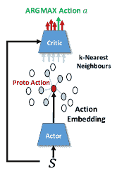

(a) 原型动作

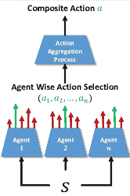

(b) 动作分解

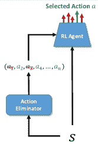

(c) 动作消除

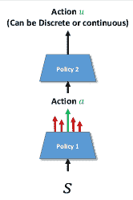

(d) 层次化

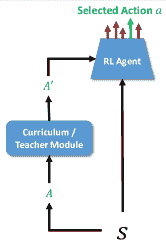

(e) 课程

图 6: 高维动作空间的 DRL 方法类别。 \autoreffig:actions:proto: Proto 动作利用先验领域知识并将动作嵌入到连续空间中，然后应用 $k$-NN 选择最接近的离散动作，这些动作会传递给评论员。 \autoreffig:actions:composition: 动作分解将单一智能体问题重新表述为具有复合动作空间的 Dec-POMDP。 \autoreffig:actions:elimination: 动作消除方法使用一个模块来确定给定观察下哪些动作是多余的。 \autoreffig:actions:hierarchcial: 层次化，策略选择的动作影响子策略选择的动作。 \autoreffig:actions:curriculum: 逐步增加可用动作数量的课程学习方法。

### 6.1 Proto 动作方法

[dulac2015deep] 提出了第一个 DRL 方法来解决高维动作空间问题，即 Wolpertinger 架构，该架构将离散动作嵌入到连续空间 $\mathbb{R}^{n}$ 中。训练一个连续控制策略 $f_{\pi}:\mathcal{O}\rightarrow\mathbb{R}^{n}$，以输出 *proto* 动作。由于 proto 动作 $\hat{a}$ 不太可能是有效动作（$\hat{a}\notin\mathcal{A}$），使用 $k$-最近邻（$k$-NN）将 proto 动作映射到 $k$ 个最接近的有效动作：$g_{k}(\hat{a})=\operatorname*{argmin}_{a\in\mathcal{A}}^{k}\rvert a-\hat{a}\rvert_{2}$。为了避免选择离群动作，并改进动作选择，所选动作会传递给一个评论员 $Q$，然后由评论员选择 $\operatorname*{argmax}$（见算法 \autorefalg:WolpertingerPolicy）。

算法 1 Wolpertinger 策略 [dulac2015deep]

1: 从环境中接收观察 $o$。2: $\hat{a}=f_{\pi}(o)$ $\triangleright$ 从演员处获取 proto 动作。3: $\mathcal{A}_{k}=g_{k}(\hat{a})$ $\triangleright$ 获取 $k$ 个最近邻。4: $a=\operatorname*{argmax}_{a_{j}\in\mathcal{A}_{k}}Q(o,a_{j})$ $\triangleright$ 动作改进步骤。5: 将 $a$ 应用到环境中，并接收 $r$ 和 $o^{\prime}$。

Wolpertinger 架构满足了上述许多要求。尽管时间复杂度与动作数量 $k$ 线性相关，但作者们理论上和实践中都表明，增加 $k$ 至多只能带来边际性能提升。使用最大动作数的 5-10% 被发现是足够的，这使得代理能够以亚线性复杂度对动作集合进行泛化。在这里，动作嵌入空间确实需要沿每个轴的逻辑排序。目前，利用了关于动作空间的先前信息来构建嵌入空间。然而，[dulac2015deep] 指出，训练期间学习动作表示也可能提供解决方案。该方法还因 $k$-NN 组件阻止梯度传播回到演员网络的训练中而被批评为训练不稳定 [tran2022cascaded]。

Wolpertinger 已应用于：边缘设备的缓存以减少下一代无线网络中的数据流量 [zhong2018deep]，分流补偿的电压控制以增强电压稳定性 [cao2020optimal]，多车道高速公路沥青路面的维护和修复优化 [9750983]，推荐系统（Slate-MDPs） [sunehag2015deep, 10.1145/3240323.3240374, DBLP:journals/corr/abs-1801-00209]，以及 ACO 的渗透测试 [nguyen2020multiple]。对于后者，[nguyen2020multiple] 评估了 Wolpertinger 学习对网络上易受攻击的服务发起攻击的策略的能力。Wolpertinger 采用了由三层组成的嵌入空间（如 \autoreffig:NASim_attack_embedding 所示）：i. 动作特征（*扫描子网*，*扫描主机* 和 *利用服务*）；ii. 目标子网；iii. 易受攻击的服务。第二维度关注于与子网相关的动作目标，例如，选择 \sayscan subnet 沿轴 $1$ 和选择轴 $2$ 上的子网。*Node2Vec* 用于表达网络结构，作者们还训练了一个网络，以产生类似的嵌入用于相关服务漏洞。Wolpertinger 被证明在网络攻击模拟器环境 [schwartz2019autonomous] 上优于 DQN。

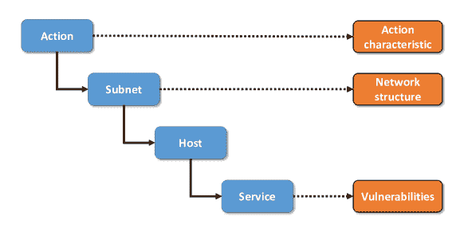

图 7: [nguyen2020multiple] 在 NASim 上使用的 Wolpertinger 攻击嵌入 [schwartz2019autonomous]。

### 6.2 动作分解方法

将深度强化学习（DRL）扩展到大型组合动作空间的一个常用方法是应用多智能体深度强化学习（MADRL）。动作空间被分解为由多个智能体提供的动作，例如，让每个智能体控制一个动作维度 [tavakoli2018action]，或通过代数形式来组合动作 [tran2022cascaded]。然而，学习一个*最优联合策略*需要基础智能体在此策略上达成一致。因此，方法必须从多智能体学习的均衡概念出发，通过 MADRL 视角来分析 Dec-POMDP。

形式上，给定期望增益，${\mathcal{G}}_{i}(\bm{\pi})=\mathbb{E}_{\bm{\pi}}\{\sum_{k=0}^{\infty}\gamma^{k}r_{i,t+k+1}\rvert x_{t}=x\}$，基础策略必须找到一个帕累托最优解，即一个联合策略 $\bm{\hat{\pi}}$，使得没有智能体 $i$ 可以偏离而不使至少一个其他智能体变得更差 [matignon2012independent]。

###### 定义 6.1  (帕累托最优性)。

联合策略 $\bm{\pi}$ *当且仅当*（*iff*）被 $\bm{\hat{\pi}}$ 帕累托支配：

|  | $\forall i,\forall s\in\mathcal{S},\mathcal{G}_{i,\bm{\hat{\pi}}}(s)\geq\mathcal{G}_{i,\bm{\pi}}(s)\ and\ \exists j,\exists s\in\mathcal{S},\mathcal{G}_{j,\bm{\hat{\pi}}}(s)>\mathcal{G}_{j,\bm{\pi}}(s).$ |  | (3) |
| --- | --- | --- | --- |

如果一个联合策略 $\bm{\hat{\pi}}^{*}$ 不被任何其他策略 $\bm{\pi}$ 帕累托支配，则它是帕累托最优的。

合作 MA(D)RL 的训练方案分为三类（如 \autoreffig:marl_approaches_overview 所示）：独立学习者（ILs），他们将彼此视为环境的一部分；集中控制器方法，这种方法不随智能体数量的增加而扩展；以及集中训练用于分散执行（CTDE）。

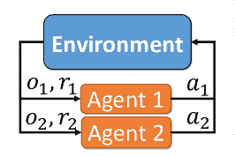

(a) 独立学习者

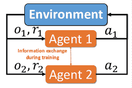

(b) 集中训练用于分散执行

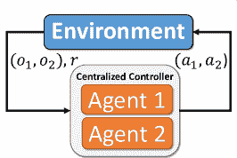

(c) 集中控制器

图 8：多智能体强化学习训练方案概述。

即使在每个智能体有少量动作的无状态双人矩阵游戏中，ILs 也未能一致地收敛到帕累托最优解 [nowe2012game, claus1998dynamics, matignon2012independent, kapetanakis2002reinforcement, matignon2007hysteretic, busoniu2008comprehensive, panait2006lenient, panait2008theoretical]。然而，ILs 经常被用作动作分解方法的基线 [tavakoli2018action]。因此，为了更好地理解面对动作分解方法的挑战，我们将首先简要考虑学习者必须克服的多智能体学习病态，以从 ILs 的角度收敛到帕累托最优的联合策略³³3 有关详细回顾，请参阅 [JMLR:v17:15-417, lauer2000algorithm, kapetanakis2002reinforcement, palmer2020independent]。

误协调发生在存在两个或更多不兼容的帕累托最优均衡时 [claus1998dynamics, kapetanakis2002reinforcement, matignon2012independent]。一个代理从不兼容的均衡中选择行动就足以降低收益。形式上：两个均衡 $\bm{\pi}$ 和 $\bm{\hat{\pi}}$ 是不兼容的 *当且仅当* 当至少一个代理使用策略 $\pi$ 与其他代理使用策略 $\hat{\pi}$ 配对时，获得的收益低于所有代理都使用 $\pi$ 的情况：$\exists i,\bm{\pi}_{i}\neq\bm{\hat{\pi}}_{i},\mathcal{G}_{i,\langle\bm{\hat{\pi}}_{i},\bm{\pi}_{-i}\rangle}<\mathcal{G}_{i,\bm{\pi}}$。

相对过度泛化：ILs 容易被吸引到奖励空间中的次优但宽广的峰值，因为在这些地方实现协作的可能性更大 [panait2006lenience]。在这些区域内，当每个选择的行动与其他代理选择的任意行动配对时，次优策略通常会带来更高的回报 [panait2006lenience, wiegand2003analysis, palmer2020independent]。

奖励和转移的随机性：奖励和转移可能是随机的，这对采用乐观学习方法以克服相对过度泛化病理的方法具有影响 [palmer2020independent, palmer2018negative, palmer2018lenient]。

改变探索问题：在 MA(D)RL 中，增加代理的数量也会增加 *全局探索* 的可能性，即至少一个 $n$ 个代理进行探索的概率：$1-(1-\epsilon)^{n}$。在这里，每个代理根据概率 $\epsilon$ 进行探索 [matignon2012independent]。

移动目标问题是由于代理并行更新其策略 [bowling2002multiagent, sutton1998introduction, tuyls2012multiagent, tuyls2007evolutionary]。当使用经验重放记忆 $\mathcal{D}_{i}$ 时，这种病理被放大，因为转移变得过时 [foerster2017stabilising, omidshafiei2017deep, palmer2018lenient]。

欺骗：当效用值通过从后续状态中回溯的奖励来计算时，会发生欺骗，此时病理如误协调和相对过度泛化也可能被回溯 [JMLR:v17:15-417]。高局部奖励的状态也可能代表一个问题，使得 ILs 偏离最优的状态转移轨迹 [JMLR:v17:15-417]。

为了始终如一地收敛到帕累托最优解，需要采用非平凡的方法 [JMLR:v17:15-417, lauer2000algorithm, kapetanakis2002reinforcement, palmer2020independent]。我们现在将考虑文献中存在的不同类型的行动分解方法。

#### 6.2.1 分支对抗 Q 网络

设计用于将行动空间拆分为更小行动空间的分支对抗 Q 网络（BDQ） [tavakoli2018action] 是对抗 DDQN 的分支版本 [wang2016dueling] ⁴⁴4 对抗 DDQN 包含两个独立的估计器，用于价值和状态依赖的行动优势函数。网络的每个分支负责为一个执行关节提出一个离散动作。该方法具有*共享决策模块*，允许代理学习一个共同的潜在表示，然后将其输入到每个$n$ DNN 分支中，因此可以被认为是一种 CTDE 方法。该方法的概念性示意图可以在\autoreffig:BDQ 中找到。

BDQ 的网络输出随着自由度的增加而线性增长，从而为每个单独的动作维度提供一定的独立性。它不会遭受标准离散动作算法的组合增长问题。然而，该方法是为离散化的连续控制领域设计的。因此，BDQ 对 ACO 的 MultiDiscrete 行动空间的可扩展性需要进一步研究。

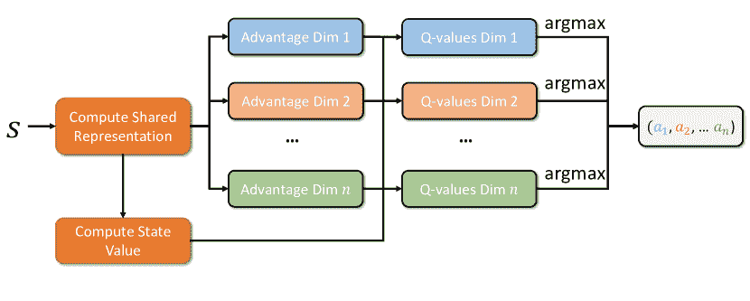

图 9：分支对抗 Q 网络的示意图（改编自 [tavakoli2018action]）。

尽管 BDQ 实现了次线性复杂度，但该公式易受到上述 MA(D)RL 病态的影响。为了评估共享决策模块的好处，BDQ 与对抗-DQN、DDPG 和*独立对抗 DDQN*（IDQ）进行了比较。BDQ 与 IDQ 之间唯一提到的区别是前两层在 IDQ 代理之间没有共享 [tavakoli2018action]。BDQ 使用了修改版的优先经验回放内存 [schaul2015prioritized]，其中过渡根据*聚合的分布式 TD 误差*进行优先处理。本质上，使用了一种优先版本的并发经验回放轨迹（CERTS），这是一种以前已被证明可以促进协调的 MADRL 文献中的方法 [omidshafiei2017deep]。

BDQ 在许多离散化的 MuJoCo 领域进行了评估 [tavakoli2018action]。评估集中在两个轴心：粒度和自由度。随着自由度的增加，BDQ 相对于对抗-DQN 的优势变得明显。此外，BDQ 能够解决对抗-DDQN 不适用的细粒度、高自由度领域。在大多数领域中，DDPG 仍然优于 BDQ，除了 Humanoid-v1。遗憾的是，没有提供 BDQ 与 Wolpertinger 架构的比较。对于 ACO，我们注意到如果其中一个分支非常大，例如，有很多节点，BDQ 可能无法很好地扩展。

#### 6.2.2 级联强化学习代理

对于 *级联强化学习代理*（CRLA），动作空间 $\mathcal{A}$ 被分解为更小的动作集合 $\ \mathcal{U}^{1},\ \mathcal{U}^{2},...,\ \mathcal{U}^{L}$ [tran2022cascaded]。对于每个动作子集 $\mathcal{A}^{i}$，维度大小显著小于 $\mathcal{A}$，即 $\rvert\ \mathcal{U}^{i}\rvert\ll\ \rvert\mathcal{A}\rvert$ $(\forall i\in[1,L])。在这个公式中，时间步骤 $t$ 的原始动作 $a_{t}$ 由动作 $u_{t}^{i}$ 的函数给出，这些动作是从各自的子集 $\ \mathcal{U}^{i}$ 中获得的：$u_{t}=f(u_{t}^{1},u_{t}^{2},...,u_{t}^{L})$。动作组件 $u_{t}^{i}$ 被链式连接以代数方式构建整数标识符。这提供了一种通过使用每个动作子集提供的较小整数值来获得较大标识符的公式。使用 CTDE 方法来促进 $n$ 个代理的训练，其中联合动作空间 $\bm{\mathcal{A}}$ 包含 $\ \mathcal{U}^{1},\ \mathcal{U}^{2},...,\ \mathcal{U}^{n}$，其中 $\ \mathcal{U}^{i}$ 代表代理 $i$ 的动作空间。该概念在 \autoreffig:cascading 中进行了说明。

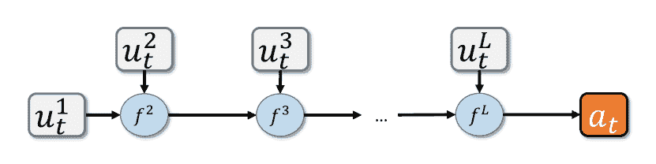

图 10：动作空间组成。时间步骤 $t$ 的动作 $u_{t}$ 使用从动作子集 $\mathcal{A}^{i}$ 中获得的动作 $a^{i}_{t}$ 通过代数方法构造（改编自 [tran2022cascaded]）。

CRLA 产生了一个解决方案，允许将大规模组合动作空间分解为分支树结构。树中的每个节点表示代理对选择下一个子节点的决策。每个节点都有自己的标识符，树中的所有节点具有相同的分支因子，并使用启发式方法来确定树的层数：$\rvert T\rvert=\log_{b}(\rvert\mathcal{A}\rvert)$。作者建议使用一个线性代数函数，将动作组件标识符值移到其适当范围：$u^{i+1}_{out}=f(u^{i}_{out})=u^{i}_{out}\times\beta^{i+1}+u^{i+1}$，其中$\beta^{i+1}$是第 $i+1$ 层的节点数。更一般地，给定从第 $i$ 层和第 $i+1$ 层的代理获得的两个动作 $u^{i}$ 和 $u^{i+1}$，其中两个动作的标识符范围分别是 $[0,...,\rvert\ \mathcal{U}^{i}\rvert-1]$ 和 $[0,...,\rvert\ \mathcal{U}^{i+1}\rvert-1]$，那么第 $i+1$ 层的动作组件标识符是 $u^{i}\times\rvert\ \mathcal{U}^{i+1}\rvert+u^{i+1}$。同时，执行原始动作将通过以下方式计算：$a=u^{L-1}\times\rvert\ \mathcal{U}^{L}\rvert+u^{L}$。此树结构的插图见 \autoreffig:cascading_selection_tree。

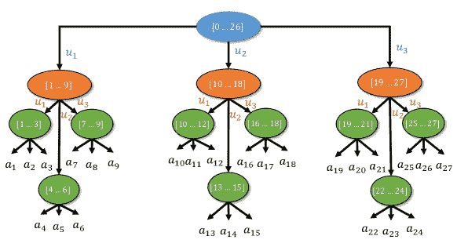

图 11：CRLA 使用的动作选择过程示意图（改编自 [tran2022cascaded]）。叶节点代表来自 $\mathcal{A}$ 的基本动作，而每个内部节点包含其子节点的动作范围。通过使用利用偏移量的代数公式，仅需三个动作空间为 $\rvert\ \mathcal{U}^{i}\rvert=3$ 的代理就能捕捉到 $\mathcal{A}$。

通过 QMIX [rashid2018qmix] 促进了代理之间的合作，QMIX 使用值估计的非线性组合来计算训练过程中的联合动作值。混合网络的权重由一个超网络 [ha2016hypernetworks] 生成，并以环境状态为条件。在 CRLA 中，代理共享一个重放缓冲区。因此，与 BDQ 一样，使用了与 CERTS [omidshafiei2017deep] 相等的同步采样。作者 [tran2022cascaded] 推荐将动作集的大小限制为 10 到 15 个动作，并选择一个 $L$，以使方法能够重建预期的动作集 $\ \mathcal{U}$。CRLA-QMIX 在两个环境中与使用独立学习者的 CRLA 版本和单一 DDQN 进行了评估：

+   •

    一个玩具迷宫场景，具有离散化的动作空间，代表代理可以移动的方向。代理每走一步都会获得小的负奖励，完成迷宫后会获得正奖励。选择了 4096 的动作大小，使用 $n=12$ 个执行器。

+   •

    从 Red 的视角观察的部分可观测的 CybORG 夺旗场景。找到旗帜后会获得大量正奖励。成功黑进主机会获得较小的奖励。

CRLA 在迷宫任务和 CybORG 场景中显著优于 DDQN，特别是在主机数量超过 50 的情况下。CRLA-QMIX 比带有 ILs 的 CRLA 具有更小的方差和更好的稳定性。然而，在一个有 60 个主机的评估场景中，收敛的策略显示出类似的奖励和每集步骤，这可能是由于 CRLA-ILs 也使用了 CERTs。作者指出，QMIX 超网络的超参数调优非常耗时。

#### 6.2.3 连续动作的离散序列预测

[metz2017discrete] 提出了用于离散化连续控制的顺序 DQN (SDQN)。原始的 (*上层*) MDP 具有 $N$（执行器）乘以 $D$（维度）个动作，被转化为一个 *下层* MDP，具有 $1\times D$ 个动作。下层 MDP 包含组成动作组件，其中 $N$ 个动作是顺序选择的。与 BDQ 执行器轮流选择动作，并能观察到其他人已选择的动作不同（参见 \autoreffig:SDQN）。此外，动作组合是使用一个学习跨执行器泛化的单一 DNN 获得的。一个 LSTM [hochreiter1997long] 被用来跟踪已选择的动作。为了稳定性，SDQN 同时学习上层和下层 MDP 的 Q 值，对应于 Q 值应相等的过渡，从下层 MDP 到上层 MDP 执行 Bellman 备份。此外，所有步骤使用零折扣，除了上层 MDP 状态变化的情况。另一个要求是动作的预先指定顺序。作者假设这可能对具有大量执行器的问题的训练产生负面影响。

作者在 OpenAI gym [1606.01540] 的多个连续控制任务中评估了 SDQN 与 DDPG 的表现，包括 Hopper ($N=3$)、Swimmer ($N=2$)、Half-Cheetah ($N=6$)、Walker2d ($N=6$) 和 Humanoid($N=17$)。SDQN 在所有领域中都优于 DDPG，除了 Walker2d。在粒度方面，SDQN 需要 $D\geq 4$。作者还在 Half Cheetah 训练的 3 个时间点评估了 8 种不同的动作排序。所有排序的表现相似。

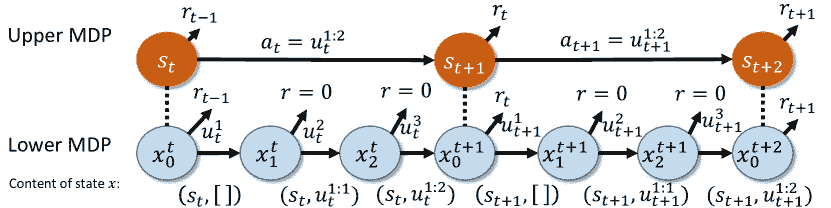

图 12: 顺序 DQN 架构（改编自 [metz2017discrete]）。

#### 6.2.4 时间变化的复合动作空间

[9507301] 提出了*结构化合作强化学习（SCORE）*算法，该算法考虑了动态时间变化的动作空间，即某些动作子集在短时间内变得暂时无效 [9507301]。SCORE 可以应用于包含连续值和离散值的异质动作空间。一系列 DNNs 对复合动作空间进行建模。一个集中式评论员和去中心化的演员（CCDA）方法 [li2020f2a2] 促进了代理之间的合作。此外，一个层次变分自编码器（HVAE） [edwards2017towards] 将每个代理的子动作空间映射到一个共同的潜在空间。这些信息然后传递给评论员，使评论员能够建模子动作之间的相关性，从而明确建模代理动作空间之间的依赖关系。使用图注意网络（GAT） [GAT] 作为评论员，以处理变化的代理（节点）数量。HVAE 和 GAT 对 SCORE 应对异质演员数量变化至关重要。因此，SCORE 是一个两阶段的框架，必须首先学习动作空间表示，然后学习一个稳健且可迁移的策略。在第一阶段，需要为每个子动作空间收集足够的轨迹。作者使用随机策略生成这些过渡。一旦获得了共同的潜在动作表示，训练可以转向关注获得稳健的策略。

SCORE 在一个概念验证任务上进行了评估——基于 MuJoCo Ant 环境的 Spider 环境——以及一个精准农业任务，其中混合离散-连续动作空间的优势得到了体现。SCORE 在这两个环境中都优于众多基准模型，包括 MADDPG [lowe2017multi]、PPO [schulman2017proximal]、SAC [haarnoja2018soft]、H-PPO [fan2019hybrid]、QMIX [rashid2018qmix]和 MAAC [iqbal2019actor]。然而，这些环境和 SCORE 的代码并未公开提供。

#### 6.2.5 Slate-MDPs 的动作分解方法

动作分解方法也已应用于 Slate-MDPs。其中两个值得注意的努力是*级联 Q 网络*和*Slate 分解*。

**级联 Q 网络（CDQNs）**: [pmlr-v97-chen19f] 提出了一个基于模型的强化学习方法，用于推荐问题，该方法利用生成对抗网络（GANs）[goodfellow2014generative] 来模拟用户的行为动态和奖励函数。使用 GAN 的动机是解决用户兴趣可能随时间演变的问题，并且推荐系统可能对这一演变过程产生重大影响。相比之下，该领域的大多数其他工作使用的是手动设计的奖励函数。CDQN 用于处理大规模动作空间，通过它可以获得组合推荐策略。CDQN 由$k$个相关的 Q 函数组成，动作以级联的方式传递。

CDQNs 在六个真实世界推荐数据集上进行了评估——*MovieLens*、*LastFM*、*Yelp*、*淘宝*、*YooChoose* 和 *Ant Financial*——与包括 IKNN、S-RNN、SCKNNC、XGBOOST、DFM、W&D-LR、W&D-CCF 和 Vanilla DQN 在内的多种非 RL 推荐方法进行比较。在大多数这些数据集上，生成对抗模型在持出似然和点击预测方面更适合用户行为。就模型策略而言，获得了更好的累积和长期奖励。该方法调整的时间比未使用 GAN 合成用户的方法要少。然而，我们提醒，将基于模型的 RL 方法应用于复杂的非对称对抗性游戏（如 ACO）需要进一步的考虑。

Slate 分解：Slate 分解，或称为*SlateQ*，是一种将 Slate 的 Q 值估计$\bm{a}$分解为其组成项$u_{i}$的逐项 Q 值的方法[ie2019reinforcement]。拥有一种能够学习项$i$的$\bar{Q}(s,a_{i})$的分解方法可以缓解上述的泛化和探索挑战。然而，成功分解 Slate $\bm{a}$的 Q 值依赖于两个假设：*单一选择*（SC）和*选择的奖励/过渡依赖性*（RTDS）。作者在理论上证明，考虑到学习和探索的标准假设[sutton2018reinforcement]以及 SC 和 RTDS，SlateQ 将收敛到真实的 Slate Q 函数$Q_{\pi}(x,\bm{a})$。SlateQ 在模拟中进行了评估，同时在 YouTube 上的实时实验中测试了其有效性和可扩展性。

### 6.3 行动消除方法

在大规模组合动作空间中学习通常具有挑战性，因为在给定状态下，大量的动作要么是冗余的，要么是无关的[zahavy2018learn]。RL 代理缺乏确定相关动作子集的能力。然而，已有一些针对状态依赖的动作消除的努力。[zahavy2018learn]将 DQN 与一个动作消除网络（AEN）结合起来，AEN 通过消除信号$e$进行训练，从而产生 AE-DQN（\autoreffig:aedqn）。在执行动作$a_{t}$后，环境会返回一个二进制动作消除信号$e(s_{t},a_{t})$，以及新的状态和奖励信号。消除信号$e$是使用特定领域的知识确定的。线性上下文赌博模型应用于 AEN 的输出，该模型负责以高概率消除无关动作，平衡探索/利用。并行学习引入了 DQN 和 AEN 的学习过程互相影响状态-动作分布的挑战。然而，作者对使用线性上下文赌博模型的方法收敛性提供了理论保证。虽然 AE-DQN 是为基于文本的游戏设计的，但作者指出该方法适用于任何可以通过规则系统获得消除信号的环境。

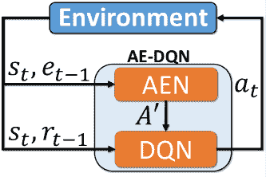

图 13：行动消除 DQN（改编自[zahavy2018learn]）。代理选择一个动作$a_{t}$，并观察到一个奖励$r_{t-1}$、下一个观察值$o_{t}$和一个消除信号$e_{t-1}$。代理利用这些信息来学习两个函数逼近深度网络：DQN 和 AEN。AEN 向 DQN 提供一个可接受的动作集合$\mathcal{A}^{\prime}\subseteq\mathcal{A}$，DQN 可以从中选择下一个动作$a_{t+1}$。

AE-DQN 在 Zork 和$K$-Room Gridworld 环境中进行了评估。在$K$-房间 Gridworld 环境中，随着类别$K$数量的增加，使用动作消除观察到了显著的增益。在 Zork 环境中也观察到了类似的好处，例如，AE-DQN 使用 215 个动作能够与用 35 个动作的 DQN 训练的性能相匹配，同时显著超越了使用 215 个动作的 DQN。然而，对于方法在*非常*高维动作空间中的适用范围仍然存在疑问，在这种情况下，可能需要额外的考虑以确定 AEN 如何在动作上进行泛化。

行动消除也已应用于 Slate-MDPs。[10.1145/3289600.3290999] 将 REINFORCE 算法改编为适用于大规模行动空间的 top-$k$ 神经候选生成器。这种方法依赖于通过之前的推荐策略（行为策略 $\beta$）获得的数据，这些数据被用作通过重要性采样权重来纠正数据偏差的手段，同时训练新的策略。由于模型在训练时没有实时环境的访问，使用了重要性采样。相反，策略在由历史混合策略选择的行动的记录反馈上进行训练，这将与正在更新的分布有所不同。使用递归神经网络来跟踪不断变化的用户兴趣。

关于采样操作，作者们并不是选择概率最高的 $k$ 项，而是使用通过 Boltzmann 探索的随机策略。然而，计算所有 $N$ 个操作的概率在计算上是低效的。相反，作者选择了前 $M$ 项，选择它们的 logits，然后对这个较小的集合 $M$ 应用 softmax，以规范化概率并从这个较小的分布中进行采样。作者指出，当 $M\ll K$ 时，仍然可以获取一个合理大小的概率质量，同时限制了差推荐的风险。通过返回最可能的前 $K^{\prime}$ 项（其中 $K^{\prime}<k$），并从剩余的 $M-K^{\prime}$ 项中采样 $K-K^{\prime}$ 项，从而在探索和利用之间保持平衡。该方法在 YouTube 使用的生产 RNN 候选生成模型中进行了评估，并进行了实验以验证各种设计决策。

### 6.4 层次强化学习

强化学习文献中有多种层次化的表述。封建式强化学习特点是带有管理层次的 Q-learning，其中 **管理者** 学会为 **子管理者** 设置任务，直到到达在最低层执行原子操作的代理人 [dayan1992feudal, vezhnevets2017feudal]。也有一些分解层次化的方法，将 MDP 的价值函数分解为更小的组成 MDP [dietterich2000hierarchical, guestrin2003efficient]。

[wei2018hierarchical] 提出了参数化动作信任区域策略优化（TRPO）[schulman2015trust] 和参数化动作 SVG(0)，这些是为参数化动作 MDP 设计的层次化 RL 方法。该方法包括两个由神经网络实现的策略。第一个网络用于离散动作策略 $\pi_{\theta}(a\rvert s)$，以在状态 $s$ 下获得动作 $a$。第二个网络用于参数策略。它将状态和离散动作作为输入，返回一个连续参数（或一个 *集合* 的连续参数）$\pi_{\vartheta}(u\rvert s,a)$。因此，给定状态 $s$ 的 $(a,u)$ 的联合动作概率依赖于两个策略：$\pi(a,u\rvert s)\ =\pi_{\theta}(a\rvert s)\pi_{\vartheta}(u\rvert s,a)$。这种表述的优点在于，由于动作 $a$ 在生成参数之前已知，因此无需确定哪个动作元组 $(a,u)$ 在状态 $s$ 下具有最高的 Q 值。为了优化上述策略，需要可以通过离散动作策略进行全程反向传播的方法。在这里，作者引入了一个修改版的 TRPO [schulman2015trust]，以适应上述策略表述，以及一种参数化动作随机值梯度方法，该方法使用 Gumbel-Softmax 技巧来抽取动作 $u$ 并通过 $[\theta,\vartheta]$ 进行反向传播。该方法在 \autoreffig:pasvg 中描述。关于评估，PATRPO 在平台跳跃环境中优于 PASVG(0) 和 PADDPG。PATRPO 在没有守门员的半场进攻足球 [HFO] 环境中也优于 PADDPG [hausknecht2015deep]。

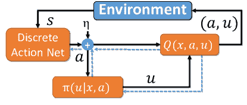

图 14: PASVG(0)（改编自 [wei2018hierarchical]）。

### 6.5 课程学习

课程学习（CL）方法试图通过最初将 RL 代理置于问题的简化版本中，并随后逐渐增加任务复杂度（例如，通过渐进函数 [bassich2019continuous, bassich2020curriculum]）来加速学习过程。这种方法也已应用于组合动作空间的 RL。[pmlr-v119-farquhar20a]介绍了一种使用增长动作空间（GAS）的 CL 方法。对于具有无限制动作空间$\mathcal{A}$的 MDP，作者定义了一组$N$个动作空间$\mathcal{A}_{l},l\in\{0,...,N-1\}$。每个动作空间是下一个级别$l$的子集：$\mathcal{A}_{0}\subset\mathcal{A}_{1}\subset...\subset\mathcal{A}_{N-1}\subset\mathcal{A}$。限制在动作空间$\mathcal{A}_{l}$上的策略表示为$\pi_{l}(a,s)$。该受限策略类的最优策略是$\pi^{*}_{l}(u,x)$，对应的动作值函数和价值函数为：$Q^{*}_{l}(s,a)$和$V^{*}_{l}(s)=\max_{a}Q^{*}_{l}(s,a)$。领域知识用于定义动作的层次结构。对于每个动作$a\in\mathcal{A}_{l}$，其中$l>0$，在$\mathcal{A}_{l-1}$空间中有一个父动作$\texttt{parent}_{l}(a)$。鉴于在每个级别，动作空间的子集是更大动作空间的子集，因此在$\mathcal{A}_{l-1}$中可用的动作在$\mathcal{A}_{l}$中是它们自己的父动作。作者指出，在许多环境中，欧几里得距离是实现定义动作层次结构的启发式的有效度量。

对于离散化的 Acrobat 和 Mountaincart 环境进行的消融研究展示了在训练过程中高效利用各级数据的价值。作者还在 SMAC 上评估了他们的方法，使用的单位数量远远大于通常在 MARL 实验中使用的数量——即 50-100 个场景，而不是 20-30 个。此外，任务难度通过随机起始位置和在任何代理控制的单位进入范围之前保持其位置的脚本对手逻辑来增加。随后，敌人会集中火力攻击其最近的敌人。首先定位敌人增加了探索挑战。作者展示了他们的方法 GAS(2)（具有 2 个级别的 GAS）相对于各种方法的优势，包括对其方法的消融和直接在完整动作空间上训练的方法。

[yu4167820curriculum] 采取了类似于 GAS [pmlr-v119-farquhar20a] 的方法来进行智能医疗中的决策。渐进式行动空间（PAS）方法允许学习者首先掌握较容易的任务，通过一般化的行动，然后逐渐增加任务的细化程度，例如，调整给患者的药物的准确剂量。该工作关注于离线 RL 设置，其中传统方法会导致对那些在历史临床数据集中很少应用的行动的状态-行动评估不准确——这是离线 RL [fujimoto2019off] 的一个常见问题。类似于 GAS [pmlr-v119-farquhar20a]，PAS 也需要领域知识来定义$N$个抽象行动空间$\{a_{1},a_{2},...,a_{N}\}$和相应数量的课程$\{M_{1},M_{2},...,M_{N}\}$。价值和策略转移方法用于跨层级转移知识。

## 7 对抗学习

前几节讨论的一些方法已应用于对抗领域，包括 ACO（例如，Wolpertinger [nguyen2020multiple] 和 CRLA [tran2022cascaded]）。然而，这些方法是在对抗性静态对手的情况下进行训练的。实际上，ACO 问题是非静态的，Red 和 Blue 会随时间调整他们的方法。在对抗学习术语中，Red 和 Blue 将尝试计算*近似最优回应*（ABRs）以应对彼此的策略 [oliehoek2018beyond]。

### 7.1 对抗学习挑战

在本节中，我们将正式定义对抗学习问题、期望的解决方案概念以及旨在帮助学习代理收敛到难以利用的策略的方法。ACO 环境是对抗性的。然而，它们并不总是*零和游戏*。例如，在 CAGE 挑战 2 中，Blue 因恢复受损主机而受到惩罚，因为该行动对当前在该设施上工作的任何 Green 代理都有影响。在这里，Red 不会获得相应的奖励$r_{Red}=-r_{Blue}$。因此，ACO 缺乏来自两个玩家零和游戏的一个关键特性，即一个玩家的收益等于另一个玩家的损失。然而，在本节中，我们将把 ACO 问题视为准零和游戏，假设 Red 获胜的后果超过其他因素，我们将假设：${\mathcal{G}}_{1}({\pi,\mu})\approx-{\mathcal{G}}_{2}({\pi,\mu})$。在这类游戏中常用的均衡概念是纳什均衡 [nash1951non]：

###### 定义 7.1 （纳什均衡）。

一个联合策略$\bm{\pi}^{*}$是纳什均衡*当且仅当*没有玩家$i$能够通过单方面偏离$\bm{\pi}^{*}$来改善他们的收益：

|  | $\forall i,\forall\pi_{i}\in\Delta(\mathcal{S},\mathcal{A}_{i}),\forall s\in\mathcal{S},{\mathcal{G}}_{i}(\langle\pi^{*}_{i},\bm{\pi}^{*}_{-i}\rangle)\geq{\mathcal{G}}_{i}(\langle\pi_{i},\bm{\pi}^{*}_{-i}\rangle).$ |  | (4) |
| --- | --- | --- | --- |

我们关注的是有限的两玩家（准）零和游戏，其中的均衡被称为鞍点，代表游戏的价值 $v*$。给定两个策略 $\pi_{1}$，$\pi_{2}$，有限零和游戏的均衡是：

###### 定理 1（极小极大定理）。

在有限零和游戏中：

|  | $max_{\pi_{1}}min_{\pi_{2}}{\mathcal{G}}_{i}(\langle\pi_{1},\pi_{2}\rangle)=min_{\pi_{2}}max_{\pi_{1}}{\mathcal{G}}_{i}(\langle\pi_{1},\pi_{2}\rangle)=v^{*}.$ |  | (5) |
| --- | --- | --- | --- |

上述是博弈论中的基本定理之一，声明每个有限的、零和的、两玩家的游戏都有最优混合策略 [v1928theorie]。我们将从 Blue 的角度讨论上述方程对 ACO 的影响。给定联合策略 $\langle\pi^{*}_{Blue},\pi^{*}_{Red}\rangle$，其中 $\pi^{*}_{Blue}$ 和 $\pi^{*}_{Red}$ 代表最优混合策略，则根据定义，Red 将无法学习到一个新的最佳响应 $\pi_{Red}$，从而改进 $\pi^{*}_{Red}$。获得 $\pi^{*}_{Blue}$ 保证了 Blue 会表现良好，即使面对最坏情况的对手 [perolat2022mastering]。这意味着，即使游戏的价值 $v^{*}$ 对 Red 有利，假设 Blue 找到了 $\pi^{*}_{Blue}$，那么 Blue 就找到了一个策略，可以限制 Red 对 Blue 的 *利用* 程度。

MARL 的长期目标之一是限制在竞争环境中部署的代理的可利用性 [lanctot2017unified, oliehoek2018beyond, heinrich2016deep]。虽然存在许多具有理论保证的限制可利用性的方法，但在实践中，即使对于简单的游戏，找到游戏的价值也是具有挑战性的。这是因为 DRL 使用的函数逼近器无法计算对手策略的 *精确* 最佳响应。DRL 代理所能达到的最佳状态是 ABR。此外，对于复杂的游戏，找到纳什均衡是不可行的。在这种情况下，近似纳什均衡 ($\epsilon$-NE) 的概念是有帮助的 [oliehoek2018beyond, lanctot2017unified]：

###### 定义 7.2  ($\epsilon$-纳什均衡)。

联合策略 $\bm{\pi}^{*}$ 是一个 $\epsilon$-NE *当且仅当*：

|  | $\forall i,\forall\pi_{i}\in\Delta(\mathcal{S},\mathcal{A}_{i}),\forall s\in\mathcal{S},{\mathcal{G}}_{i}(\langle\pi^{*}_{i},\bm{\pi}^{*}_{-i}\rangle)\geq{\mathcal{G}}_{i}(\langle\pi_{i},\bm{\pi}^{*}_{-i}\rangle)-\epsilon.$ |  | (6) |
| --- | --- | --- | --- |

### 7.2 限制可利用性的方法

上述情况引发了一个问题：我们如何*有效地*限制 ACO 代理的可被利用性？对抗学习文献中的一个关键见解是，找到$\pi^{*}_{Blue}$需要学习如何最好地响应有原则的 Red 代理，理想情况下，通过计算对$\pi^{*}_{Red}$的最佳响应。然而，Red 同样需要面对强大的 Blue 代理来找到$\pi^{*}_{Red}$。这突显了一个迭代对抗学习过程的需求，在这个过程中，Blue 和 Red 学习（A）BRs 对方最新的策略。然而，天真的独立学习方法由于过度拟合对手，通常难以很好地推广，也称为联合策略相关性[lanctot2017unified]。因此，需要一种更有原则的方法。

[gleave2019adversarial]展示了对手可以学习简单的攻击策略，这些策略可以可靠地战胜使用函数逼近器实现的静态对手。通常，随机且无协调的行为足以触发次优动作⁵⁵5 作者提供了攻击行为的视频：\urlhttps://adversarialpolicies.github.io/。研究中的对抗攻击指的是对对手观察空间的攻击。这在某种程度上等同于通过在环境中采取行动对图像添加扰动以导致监督学习中的错误分类。一个令人担忧的发现是，DNNs 对高维对抗样本更为脆弱[gilmer2018adversarial, khoury2018geometry, shafahi2018adversarial]。DRL 也是如此。对 MuJoCo 的实证评估显示，Red 可以影响的观察空间的维度越大，受害者对攻击的脆弱性就越大[gleave2019adversarial]。

[gleave2019adversarial]的研究表明，通过简单训练方案（例如自我对弈）训练的代理与$\epsilon$-界限的纳什均衡相距甚远。这突显了设计训练方案以限制代理可被利用性的需求。[perolat2022mastering]识别了减少代理可被利用性的方法的三大类：遗憾最小化、遗憾策略梯度方法和最佳响应技术。

第一类方法包括利用深度学习来扩展反事实遗憾最小化（CFR）的策略。Deep-CFR [brown2019deep]通过包含反事实值的经验重放缓冲区训练一个遗憾 DNN。这种方法的一个局限性是采样方法，它无法扩展到具有大分支因子的游戏中 [perolat2022mastering]。有些无模型的遗憾基础方法使用 DNN 可以扩展到更大的游戏中，如*带优势基线的深度遗憾最小化与无模型学习*（DREAM） [steinberger2020dream]和优势遗憾匹配演员-评论家（ARMAC） [gruslys2020advantage]。然而，这些方法依赖于一个重要性采样项以保持无偏。重要性权重在具有长时间范围的游戏中可能变得非常大 [perolat2022mastering]。一般来说，这些技术需要生成一个平均策略，这就需要完全保留所有来自之前迭代的策略，或是一个容易出错的近似，例如，通过监督学习训练的 DNN [perolat2022mastering]。

第二类方法通过加权策略梯度来近似 CFR [srinivasan2018actor, perolat2022mastering]。然而，这种方法并不能保证收敛到纳什均衡 [perolat2022mastering]。相比之下，神经复制者动态（NeuRD） [hennes2019neural]是一种通过策略梯度近似进化博弈理论中的复制者动态的方法，已被证明可以收敛到纳什均衡。NeuRD 已应用于大规模领域，作为*DeepNash*的一部分 [perolat2022mastering]。它用于修改损失函数以优化 Q 函数和策略 [perolat2022mastering]。DeepNash 最近被引入用于应对 Stratego 游戏。然而，它的更广泛应用仍需进一步探索。因此，在本节剩余部分，我们将重点关注第三类方法：最佳响应技术。

### 7.3 最佳响应技术

近年来，来自 MARL 文献中的一些原则性方法——最初为低维状态空间的竞争游戏设计——已经扩展到*深度* MARL 中。基于人群和博弈论的训练方案显示出显著的潜力 [li2023combining]。该领域的早期工作由[heinrich2016deep]提出，将*虚拟自我对弈*扩展到受维度诅咒影响的领域， resulting in *神经虚拟自我对弈*（NFSP）。这种方法通过逐步训练一个最佳响应来近似广泛形式的虚拟对弈，对抗所有过去策略的平均值，使用离策略 DRL。一个 DNN 通过监督学习被训练以模仿过去最佳响应的平均值。

[lanctot2017unified] 引入了政策空间响应神谕（PSRO），这是对最初由 [mcmahan2003planning] 提出的双重神谕（DO）方法的推广，这是一种理论上可靠的寻找极小极大均衡的方法。鉴于该方法在文献中引起的关注 [berner2019dota, perolat2022mastering, vinyals2019grandmaster, lanctot2017unified, li2023combining, oliehoek2018beyond]，我们将把本节剩余部分专门用于基于 DO 的方法。首先，我们将讨论 DO 方法的理论基础，然后概述近年来在该领域所进行的工作。最后，我们将以开放性挑战作为结尾，特别是关于将这种方法扩展到 ACO 的问题。

DO 算法定义了一个两人零和常规形式游戏 $\mathcal{N}$，其中动作对应于在基础随机游戏 $\mathcal{M}$ 中可供玩家使用的策略。常规形式游戏 $\mathcal{N}$ 中的回报项通过计算在 $\mathcal{M}$ 中每对策略的增益 $\mathcal{G}$ 来确定：

|  | $\mathcal{R}^{\mathcal{N}}_{i}(\langle a^{r}_{1},a^{c}_{2}\rangle)=\mathcal{G}^{\mathcal{M}}_{i}(\langle\pi^{r}_{1},\pi^{c}_{2}\rangle).$ |  | (7) |
| --- | --- | --- | --- |

在方程 7 中，$r$ 和 $c$ 指常规形式（双矩阵）游戏中的相应行和列，$\mathcal{M}$ 是评估策略的游戏。常规形式游戏 $\mathcal{N}$ 经过博弈论分析，以寻找每个玩家的最优行动混合。这些混合代表了游戏 $\mathcal{M}$ 中策略的概率分布。DO 算法假设两个玩家都可以访问 *最佳响应神谕*，它返回一个对抗对手所玩混合的 *最佳响应*（BR）策略。随后，将 BR 添加到每个代理的可用策略列表中。结果是每个玩家在常规形式游戏 $\mathcal{N}$ 中有一个额外的动作可以选择。因此，需要通过计算新行和列项的回报来扩展 $\mathcal{N}$。在扩展 $\mathcal{N}$ 后，再次进行博弈论分析，并重复上述步骤。如果找不到更多的 BR，那么 DO 算法已收敛到极小极大均衡 [mcmahan2003planning]。

在将 DO 算法应用于 MARL 时，预言机必须计算对*策略混合*的近似最佳响应（ABRs）。实现策略混合的方法有很多，例如，在一个回合开始时，根据各自的混合概率采样个别策略[lanctot2017unified]。另外，策略集可以组合成一个加权集合，其中每个策略的输出在聚合之前按照各自的混合概率加权。为了通用性，我们将策略混合定义如下：

###### 定义 7.3（策略混合）。

$\pi_{i}^{\mu}$ 是混合 $\mu_{i}$ 的策略混合和相应的策略集 $\Pi_{i}$ 对于代理 $i$。

使用预言机获取*准确*的最佳响应通常也是不可行的。在受维度诅咒影响的游戏中，预言机至多只能希望找到一个 ABR[oliehoek2018beyond]。在这里，我们可以应用*近似双重预言机*（ADO），它使用线性规划来计算*近似混合策略纳什均衡* $\langle{\mu}_{1},{\mu}_{2}\rangle$，其中${\mu}_{i}$表示玩家$i$的*策略混合* $\pi_{i,1..n}$。因此，我们需要一个函数$O:\Pi_{i}^{\mu}\rightarrow\Pi_{i}$，它计算一个针对策略混合$\pi_{i}^{\mu}$的 ABR $\pi_{i}$：

###### 定义 7.4（近似最佳响应）。

玩家 $i$ 的策略 $\pi_{i}\in\Pi_{i}$ 是对策略混合 $\pi_{j}^{\mu}$ 的近似最佳响应，*当且仅当*，

|  | $\forall\pi^{\prime}_{i}\in\Pi_{i},{\mathcal{G}}_{i}(\langle\pi_{i},\pi^{\mu}_{j}\rangle)\geq{\mathcal{G}}_{i}(\langle\pi^{\prime}_{i},\pi_{j}^{\mu}\rangle).$ |  | (8) |
| --- | --- | --- | --- |

ABRs 估计当前混合的可利用性$\mathcal{G}_{E}$：

|  | $\mathcal{G}_{E}\leftarrow{\mathcal{G}}_{i}(\langle{O}_{i}(\pi^{\mu}_{j}),\pi^{\mu}_{j}\rangle)+{\mathcal{G}}_{j}(\langle\pi^{\mu}_{i},{O}_{j}(\pi^{\mu}_{i})\rangle)$ |  | (9) |
| --- | --- | --- | --- |

如果$\mathcal{G}_{E}\leq 0$，那么预言机未能找到一个 ABR，并且已经找到了一个*资源受限的纳什均衡*（RBNE）[oliehoek2018beyond]。在这种情况下，资源指的是用于获取 ABR 的计算能力：

###### 定义 7.5（资源受限的纳什均衡）。

两个策略混合 $\langle\pi^{\mu}_{1},\pi^{\mu}_{2}\rangle$ 是一个资源受限的纳什均衡（RBNE）*当且仅当*，

|  | $\forall_{i}{\mathcal{G}}_{i}(\langle\pi^{\mu}_{i},\pi^{\mu}_{j}\rangle)\geq{\mathcal{G}}_{i}(\langle{O}_{i}(\pi^{\mu}_{j}),\pi^{\mu}_{j}\rangle).$ |  | (10) |
| --- | --- | --- | --- |

每个智能体的神谕无法找到比当前策略组合更优的回应。因此，已经找到一个 RBNE。ADO 方法在算法 2 中从蓝方和红方智能体的角度进行了概述。该算法利用了多个函数，包括 i.) InitialStrategies，用于提供每个智能体的初始策略集，可能还包括基于规则和其他方法；ii.) AugmentGame，用于计算新资源有界最优回应的缺失表项；iii.) SolveGame，用于在收益表被扩充后计算混合策略 [oliehoek2018beyond]。

算法 2 近似双重神谕算法

1:$\langle{\pi}_{Blue},{\pi}_{Red}\rangle\leftarrow\textsc{InitialStrategies}()$2:$\langle{\mu}_{Blue},{\mu}_{Red}\rangle\leftarrow\langle\{{\pi}_{Blue}\},\{{\pi}_{Red}\}\rangle$  $\triangleright$ 设置初始混合策略 3:while True do4:    ${\pi}_{Blue}\leftarrow\textsc{RBBR}({\mu}_{Red})$  $\triangleright$ 获取新的有界最优回应 5:    ${\pi}_{Red}\leftarrow\textsc{RBBR}({\mu}_{Blue})$6:    $\mathcal{G}_{RBBRs}\leftarrow{\mathcal{G}}_{Blue}({\pi}_{Blue},{\mu}_{Red})+{\mathcal{G}}_{Red}({\mu}_{Blue},{\pi}_{Red})$  $\triangleright$ 利用度。7:    if $\mathcal{G}_{RBBRs}\leq\epsilon$ then8:         break  $\triangleright$ 找到 $\epsilon$-RBNE9:    end if10:    $SG\leftarrow\textsc{AugmentGame}(SG,{\pi}_{Blue},{\pi}_{Red})$11:    $\langle{\mu}_{Blue},{\mu}_{Red}\rangle\leftarrow\textsc{SolveGame}(SG)$12:end while

### 7.4 向扩展对抗学习方法迈进

ADO 的版本已在大规模应用中使用，例如，[vinyals2019grandmaster] 在《星际争霸 II》中实现了大宗师级别的表现，使用 AlphaStar 这一受到 ADO 启发的方法，通过一种匹配机制计算最佳回应，并以更高的概率抽样强对手。模仿学习被用来获得初始的智能体池。OpenAI Five 使用了类似的自我对弈方法和动态更新的过去策略元分布，击败了顶级人类玩家 [berner2019dota, perolat2022mastering]。尽管这两个成就非常令人印象深刻，但在工程和训练时间方面成本很高。确实，尽管取得了成功，但关于 ADO 在复杂领域的可扩展性而不牺牲理论保证的问题仍然存在。ADO 方法由于以下原因而昂贵：

在非平凡环境中计算 ABR 是一个漫长的过程 [lanctot2017unified]。与此同时，即使是像库恩扑克这样的简单环境，ADO 也可能需要超过 20 次 ABR 迭代才能接近游戏的价值。对于稍微复杂的 Leduc，这个数字增加到 200 多次，仍然可以获得进一步的改进 [lanctot2017unified, li2023combining]。为了使 ADO 接近 $\pi^{*}_{Blue}$，可能需要更多的迭代。每次迭代从头计算 ABR 将是浪费的，特别是如果在每次迭代中都从头学习相同的技能 [liuneupl]。此外，由于 ABR 受资源限制 [oliehoek2018beyond]，每个代理可能会拥有一个训练不足的策略群体 [liuneupl]。理想的 ADO 会重用在过去迭代中获得的*相关*知识。

收益矩阵扩展。第二个与扩展性相关的挑战是不断增长的标准形式游戏 $\mathcal{N}$。通过在收益表中添加新的最佳回应条目来进行扩展时，所需时间随着策略数量的增加呈指数增长 [lanctot2017unified]。即使是简单的游戏，获取每个 ${\mathcal{G}}_{i}(\langle\pi^{r}_{i},\pi^{c}_{j}\rangle)$ 的良好收益估计也可能需要数千次评估。需要有原则的策略来保持收益表在可管理的范围内。

大规模策略支持。存储和使用大量函数近似器的开销较大——每个策略都有一个函数近似器 [ijcai2019-66]。

尽管上述挑战限制了 ADO 的扩展性，但已有一些努力尝试在不损害太多基本原则的情况下解决这一方法的问题。[liuneupl] 提出了神经群体学习（NeuPL），这是一种在两个具体方面偏离标准 ADO 算法 PSRO 的方法：i.) 群体中的所有独特策略都进行持续训练；ii.) 使用一个包含整个策略群体的单一策略，该策略依赖于对手混合标识符。这使得学习可以在策略之间转移而不会丧失通用性。这种方法能够在运行“剪刀石头布”游戏时超越 PSRO，同时保持八个代理的群体，这将剪刀石头布游戏扩展到时空和部分观测马尔可夫游戏 [vezhnevets2020options]。

还值得注意的是，PSRO 的好处已在单代理领域中得到了探索，特别是在鲁棒对抗强化学习（RARL）的背景下[pinto2017robust]。对于 RARL，将单代理环境转换为一个零和游戏，其中标准代理（即主角）和一个可以操控环境的对抗域代理之间的零和游戏，例如，通过扰动主角的动作。[yang2022game]最近将 PSRO 的一个变体应用于这一问题，使用模型无关的元学习（MAML）[finn2017model]作为最佳响应 oracle。作者在 MuJoCo 环境中进行了实证评估，发现所提出的方法优于标准 MAML 等最先进的基线方法[yang2022game]。

ADO 也被应用于一般和游戏中，这些游戏可能有多个纳什均衡。这引发了均衡选择问题。为了补救这一问题，并实现一般的可扩展策略评估，[muller2020generalized]应用了$\alpha$-Rank 解概念，该概念不会面临均衡选择问题。$\alpha$-Rank 解概念在每个玩家的支持中建立了策略的排序。具体而言，$\alpha$-Rank 使用马尔科夫-康利链识别游戏动态中的周期，从而对策略进行排名。该方法通过对$N$个代理的策略配置进行变异和选择的进化过程来计算平稳分布。[yang2020alphaalpha]回顾了$\alpha$-rank 的可解性问题。作者发现，与多项式时间实现（相对于纯策略配置的总数）不同，解决$\alpha$-Rank 是 NP 困难的。作者介绍了$\alpha^{\alpha}$-Rank，这是一种$\alpha$-Rank 的随机实现，不需要指数级大的转移矩阵来对策略进行排序，并且可以提前终止。

[feng2021neural] 用神经自动课程（NAC）替代了使用线性规划计算混合物的方法，通过元梯度下降自动发现学习更新规则（即混合物），无需显式的人为设计。NAC 通过与游戏引擎的互动进行优化，两个玩家都旨在最小化他们的可利用性。即使没有人为设计，所发现的 MARL 算法在多个基准环境中表现出与最先进的基于种群的游戏求解器相当甚至更好的性能，包括：技能游戏、可微分的彩票、非传递性混合游戏、迭代匹配便士和库恩扑克。然而，该方法未能解决随着支付表增大而引起的可扩展性问题，以及计算 ABRs 所需的时间。

最后，我们注意到 DO 基于的方法也被用于减少在两个玩家游戏中，给定状态 $s$ 时，代理可以选择的动作数量。[bakhtin2021no] 提出了一个基于 ADO 的算法，用于在具有组合动作空间的游戏中进行动作探索和均衡逼近：动作探索的双重 oracle 强化学习 (DORA)。该算法同时执行值迭代，同时学习策略提议网络。ADO 步骤用于探索额外的动作以添加到策略提议中。作者展示了他们的方法在两个玩家变体的棋盘游戏 Diplomacy 中达到了超人的表现。

## 8 讨论与未解问题

前面的部分提供了有关处理高维状态、大组合动作空间和减少 DRL 代理可利用性的各种方法的全面概述。我们现在将考虑从这一过程中学到的经验如何帮助我们制定理想化的 ACO 学习者，并提炼出未解的研究问题。

对改进评估指标的需求：阅读了 \autorefsec:adv_learning 后，应该很明显地看到，对静态对手取得的成功应当谨慎对待。例如，对于 CAGE 挑战 [cage_challenge_announcement, cage_challenge_2_announcement, cage_challenge_3_announcement]，迄今为止的评估过程是将提交的方法与基于规则的 Red 代理进行对比，测试不同的试验长度。这种方案令人担忧。那些在提供的 Red 代理上过度拟合的解决方案可能表现最佳。为了解决这一缺陷，我们提倡将 *可利用性* 作为标准评估指标，因为它被对抗学习社区广泛使用 [lanctot2017unified, oliehoek2018beyond, heinrich2016deep]，从而提出研究问题：

Q1：

目前的自主网络操作方法有多可利用？

对改进评估环境的需求：在 \autorefsec:envs 中指出，理想化 ACO 训练环境中存在的挑战在 CybORG 或 YAWNING TITAN 中尚未实现。虽然有环境可以用来基准测试这些挑战的子集，但没有环境可以用来基准测试所有挑战。特别是，尽管 *RecSim* 和 *Micro-RTS* 可用于基准测试高维观察和行动空间，但没有环境可以在基于图的动态下提出这些挑战。那些希望开发依赖于图结构的方法的从业者有几种环境开发途径，包括两个开源但难以修改的 ACO 环境，以及旨在进行扩展的框架如 *Gym-ANM*。因此，出现了以下研究（和开发）问题：

Q2：

在像*RecSim*和*Micro-RTS*这样的环境中开发的方法能否很好地迁移到 ACO？

Q3:

环境开发人员在致力于构建更理想化的图形化 ACO（自适应控制优化）环境时，应该将精力集中在哪里？

限制网络防御代理的可利用性：手工制作能击败世界的基于规则的代理并找出游戏价值并非易事，即使是对于简单的游戏[vincent2021top]。因此，我们的思路转向了对抗性学习方法。我们已经看到最佳响应技术具有显著的潜力。然而，虽然计算（近似）最佳响应以衡量可利用性是合理的支出，但最佳响应技术需要在*每次*迭代中进行。因此，对抗性学习的文献通常集中在像 Kuhn 和 Leduc 扑克这样的简单游戏上进行基准测试，其中游戏的价值是已知的[lanctot2019openspiel, feng2021neural, li2023combining, lanctot2017unified]。与此同时，我们认为适合 ACO 的方法可能需要较长的训练时间。这引发了以下研究问题：

Q4:

我们能否为网络防御实现一个*高效*的最佳响应框架？

Q5:

非平凡的网络防御配置的游戏价值是什么？

高效的近似最佳响应预言机：虽然 RQ4 专注于在近似最佳响应框架内减少训练时间的机制（例如，通过知识重用[liuneupl]），但这一努力的基础在于需要可以高效训练的方法。然而，这不是我们在 5 和 6 中讨论的方法所具备的特性，这引发了以下问题：

Q6:

我们能否为 ACO 实现*墙时高效*的最佳响应预言机？

## 9 结论

在这项工作中，我们调查了 DRL（深度强化学习）文献，以制定一个用于自主网络操作的理想化学习者。这个理想化学习者处于三个活跃研究领域的交汇点，即那些在状态和动作空间中都面临维度诅咒的环境，以及对抗性学习。尽管在每个主题上都进行了大量研究，但每个领域仍然是一个活跃的研究方向。

尽管 SOTA DNNs 使 RL 方法能够扩展到以前被认为是高维的领域 [mnih2013playing, mnih2015human]，但在本综述中，我们提供了对那些将标准 DRL 方法推向极限的环境解决方案的概述。在章节 5 – 7 中，我们识别了实现和评估 ACO 理想化学习代理的组件，并在 \autorefsec:challenges 中讨论了需要克服的理论和工程挑战，以：实现我们的理想化代理，并；大规模训练它。我们希望这项综述能提高对需要解决问题的认识，以使 DRL 能够扩展到具有挑战性的网络防御场景，并希望我们的工作能激励读者尝试回答我们从文献中提炼出的研究问题。

## 10 致谢

这项研究由 Frazer-Nash Consultancy Ltd. 代表国防科学与技术实验室（Dstl）资助，Dstl 是英国国防部的一个执行机构，提供世界级的专业知识，交付最前沿的科学和技术，以造福国家和盟友。该研究支持 Dstl 网络防御增强计划中的自主弹性网络防御（ARCD）项目。

## 11 许可证

本工作许可采用 Creative Commons Attribution-NonCommercial-NoDerivatives 4.0 国际许可证。要查看此许可证的副本，请访问 https://creativecommons.org/licenses/by-nc-nd/4.0/ 或将信函发送至 Creative Commons, PO Box 1866, Mountain View, CA 94042, USA。

{附录}

## 12 深度强化学习

### 12.1 深度 Q 学习

在 DRL 中，多层深度神经网络（DNNs）用于近似价值函数，或者如下面所示，甚至学习一个参数化的策略。我们假设一个具有参数 $\theta$ 并具有足够表示能力的 DNN，以学习我们所需的近似。对于深度 Q 学习（DQN），DNNs 将一组 $n$ 维状态变量映射到一组 $m$ 维 Q 值 $f:\mathbb{R}^{n}\to\mathbb{R}^{m}$ [mnih2013playing, mnih2015human]。这里，$m$ 代表代理可以执行的动作数量。参数 $\theta$ 通过随机梯度下降进行优化，方法是随机抽取存储在经验回放记忆 $\mathcal{D}$ 中的过去过渡 [lin1992self, mnih2015human, schaul2015prioritized, mousavi2016deep]。DNN 被训练以最小化时间依赖的损失函数，

|  | $L_{k}\left(\theta_{k}\right)=\mathbb{E}_{(s,a,s^{\prime},r)\sim U(\mathcal{D})}\Big{[}\left(Y_{k}-Q\left(s,a;\theta_{k}\right)\right)^{2}\Big{]},$ |  | (11) |
| --- | --- | --- | --- |

其中 $(s,a,s^{\prime},r)\sim U(\mathcal{D})$ 代表从 $\mathcal{D}$ 中均匀随机抽取的经验小批量，$t$ 是当前迭代，$Y_{k}$ 是目标：

|  | $Y_{k}\equiv r+\gamma Q(s^{\prime},\operatorname*{argmax}_{a\in\mathcal{U}}Q(s^{\prime},a;\theta_{k});\theta_{k}^{\prime}).$ |  | (12) |
| --- | --- | --- | --- |

方程 (12) 使用了双重深度 Q 学习（DDQN）[hasselt2010double]，其中目标动作是使用权重 $\theta$ 选择的，而目标值则使用来自目标网络的权重 $\theta^{\prime}$ 计算。使用当前网络而不是目标网络进行目标值估计可以将动作选择与评估解耦，以实现更稳定的更新。权重在每 $n$ 次过渡后从当前网络复制到目标网络 [van2016deep]，或者通过软目标更新 [lillicrap2015continuous]。DDQNs 已被证明能够减少过于乐观的价值估计 [van2016deep]。

### 12.2 近端策略优化

在奠定重要基础的同时，DQNs 往往不如*最新的政策梯度*（PG）方法表现出色，例如*近端策略优化*（PPO）[schulman2017proximal]。PG 方法直接优化参数化策略 $\pi_{\theta}$。其目标是找到一个关于参数 $\theta$ 的最优策略 $\pi^{*}_{\theta}$，从而最大化期望回报 $J(\theta)=\mathbb{E}_{x_{i}\sim p_{\pi},a_{i}\sim\pi}[\mathcal{R}_{0}]$。PPO 通过与环境交互来收集 $(s_{t},a_{t},r_{t},s_{t+1},a_{t+1},r_{t+1},...,s_{t+n},a_{t+n},r_{t+n})$ 轨迹，可能在多个环境实例上使用多个演员同步或异步地进行 [mnih2016asynchronous]。收集到的样本随后用于在若干个迭代周期中更新策略，更新后数据会被丢弃。然后，开始新的数据收集和策略更新迭代，使算法变得*符合策略*。通过估计 PG 并随后运行随机梯度上升算法来优化策略：

|  | $\hat{g}=\mathbb{\hat{E}}_{t}\Big{[}\nabla_{\theta}\log\pi_{\theta}(a_{t}\rvert s_{t})\hat{A}_{t}\Big{]}.$ |  | (13) |
| --- | --- | --- | --- |

在上述方程中，$\hat{A}_{t}$ 是时间步$t$的优势函数估计。优势函数使用学习的状态值函数$V(s)$来计算，结果是一个演员-评论员风格的架构。期望值$\mathbb{\hat{E}}_{t}[...]$ 表示计算梯度时使用了有限样本批次的经验平均。因此，如上所述，我们假设一个在采样和更新策略参数$\theta$之间交替进行的算法：

|  | $L^{PG}(\theta)=\mathbb{\hat{E}}_{t}\Big{[}\log\pi_{\theta}(a_{t}\rvert s_{t})\hat{A}_{t}\Big{]}.$ |  | (14) |
| --- | --- | --- | --- |

对该损失进行多个优化步骤，即使用相同的轨迹，可能导致破坏性的大规模策略更新。为了解决这个问题，PPO 使用了一个剪切的替代损失函数，这有效地限制了每次更新的大小，从而允许对收集到的数据进行多个小批量更新。给定概率比

|  | ${}_{t}(\theta)=\dfrac{\pi_{\theta}(a_{t}\rvert s_{t})}{\pi_{\theta_{old}}(a_{t}\rvert s_{t})},$ |  | (15) |
| --- | --- | --- | --- |

PPO 防止$\theta$偏离$\theta_{old}$过远：

|  | $L^{CLIP}(\theta)=\mathbb{\hat{E}}_{t}\Big{[}min({}_{t}(\theta)\hat{A}_{t},clip({}_{t}(\theta),1-\varepsilon,1+\varepsilon)\hat{A}_{t})\Big{]}.$ |  | (16) |
| --- | --- | --- | --- |

### 12.3 深度确定性策略梯度

对于连续控制问题，策略也可以通过计算期望回报的梯度来更新。一种流行的演员-评论员方法是深度确定性策略梯度（DDPG）[ lillicrap2015continuous ]，它使用了许多与 DQN 相同的基本原则，但应用于连续控制问题。一个具有网络参数$\phi$的演员$\mu(s)$用于动作选择，而一个具有网络参数$\theta$的评论员$Q(s,a)$提供值函数估计。评论员使用时间差分学习进行更新，类似于 DQN 中的\autorefeq:DQNTarget，但目标值是通过目标演员和评论员网络估计的：

|  | $Y_{k}=r+\gamma\hat{Q}_{\hat{\theta}}\left(s^{\prime},\hat{\mu}_{\hat{\phi}}(s^{\prime})\right)$ |  | (17) |
| --- | --- | --- | --- |

然后，通过使用确定性策略梯度算法[ silver2014deterministic ]对演员网络进行梯度上升更新：

|  | $\nabla_{\phi}J_{k}(\phi)=\mathbb{E}\left[\nabla_{a}Q_{\theta}(s,a)\rvert_{a=\mu(s)}\nabla_{\phi}\mu_{\phi}(s)\right]$ |  | (18) |
| --- | --- | --- | --- |

然后，使用软目标更新更新目标演员和评论员网络。

## 13 高维状态空间方法概述

| 与高维状态空间相关的论文 |
| --- |
| 工作 | 摘要 | 抽象 | 解释 | CF |
| [pmlr-v80-abel18a] | 作者引入了两类抽象：*传递*和*PAC*状态抽象，并展示了传递 PAC 抽象可以有效获取，保持接近最优行为，并在*简单领域*中实验性地减少样本复杂性。 | ✓ | X | X |
| [abel2016near] | 作者研究了近似状态抽象，提出了从四种类型的近似抽象中获得行为质量的理论保证。通过实证证明，近似抽象能够减少任务复杂性，并在多种环境中限定行为的最优性损失。 | ✓ | ✓ | X |
| [abel2019state] | 旨在理解信息论压缩在顺序决策中的状态抽象中的作用，结果得到了一种新的目标函数。 | ✓ | ✓ | X |
| [pmlr-v108-abel20a] | 结合状态抽象和选项，以保留近似最优策略的表示。 | ✓ | ✓ | X |
| [atkinson2021pseudo] | 使用生成网络从先前的任务中生成短序列，以供 DQN 训练，从而防止新任务转移时的灾难性遗忘。 | X | X | ✓ |
| [badianever] | 使用 k 最近邻构建基于情节记忆的内在奖励，鼓励代理重复访问环境中的所有状态。 | X | ✓ | ✓ |
| [bellemare2016unifying] | 使用伪计数来计数显著事件，基于状态空间上的*序列密度模型*从对数概率改进中获得。 | ✓ | ✓ | X |
| [bougie2021fast] | 引入快速和慢速好奇心的概念，旨在激励长期的探索。该方法将好奇心奖励分解为处理局部探索的快速奖励和鼓励全局探索的慢速奖励。 | X | ✓ | X |
| [burdaexploration] | 引入一种通过*随机网络蒸馏*（RND）奖金灵活结合内在和外在奖励的方法，从而在多个困难的 Atari 游戏中取得显著进展。 | X | ✓ | X |
| [burden2018using] | 使用统一状态抽象自动生成抽象马尔可夫决策过程（AMDPs）。探讨不同分辨率的状态抽象的有效性和效率。 | ✓ | ✓ | X |
| [burden2021latent] | 引入潜在属性状态抽象，实现 AMDP 的完全自动化创建和解决，并应用潜在函数进行基于潜在的奖励塑造。 | ✓ | ✓ | X |
| [pmlr-v97-gelada19a] | 引入 DeepMDP，其中 $\ell_{2}$ 距离表示双模拟距离的上界，学习嵌入以忽略对学习代理无关的对象。 | ✓ | ✓ | X |
| [colas2019curious] | 提出 CURIOUS，这是一种利用模块化的通用价值函数近似器和事后学习的算法，旨在在独特的策略中实现多样化的目标，并具备自动化课程学习机制，倾向于使代理的注意力集中在最大化绝对学习进展的目标上。同时关注被遗忘的目标。 | X | ✓ | ✓ |
| [de2015importance] | 研究经验重放记忆组成在多大程度上可以缓解灾难性遗忘。 | X | X | ✓ |
| [precup2000temporal] | 引入*选项*框架，用于在多个时间尺度下进行预测、控制和学习。⁶⁶6 从这项工作中存在大量后续研究。 | ✓ | ✓ | $\nearrow$ |
| [fangadaptive] | 介绍了自适应过程任务生成（APT-Gen），一种逐步生成任务序列作为课程的方法，以促进在困难探索问题中的强化学习。 | X | ✓ | X |
| [forestier2017intrinsically] | 介绍了一种具有自动课程学习的内在动机目标探索过程。 | ✓ | ✓ | X |
| [fu2017ex2] | 提出了一种用于探索的新颖性检测算法。训练分类器以区分每个访问过的状态与所有其他状态，其中新颖状态更易于区分。 | X | ✓ | X |
| [9287851] | 使用 VQ-AE 将高维视频映射到低维离散潜在表示。 | ✓ | ✓ | X |
| [hester2013learning] | 专注于基于模型的强化学习中的探索学习。 | X | ✓ | X |
| [kessler2022same] | 显示现有的基于单一神经网络预测器和共享重放缓冲区的持续学习方法在存在干扰时会失败。提出了一种因子化策略，使用共享特征提取层，但分开头部，每个头部专注于新任务以防止干扰。 | X | X | ✓ |
| [kovac2020grimgep] | 在最高不确定性的区域设定目标。探索不确定状态时，奖励就是子目标。 | ✓ | ✓ | X |
| [kulkarni2016hierarchical] | 介绍了一种在不同时间尺度上运行的分层-DQN（h-DQN）。 | ✓ | ✓ | X |
| [dietterich2000overview] | MAXQ 值函数分解及其对状态和动作抽象的支持概述。 | ✓ | ✓ | X |
| [machado2017laplacian] | 引入一个拉普拉斯框架用于选项发现。 | ✓ | ✓ | X |
| [machadoeigenoption] | 关注*Eigenoptions*，这些选项从编码环境中扩散信息流的表示中获得。作者将现有的 Eigenoption 发现算法扩展到具有随机过渡的设置中，并且在这些设置中手工特征不可用。 | ✓ | ✓ | X |
| [pmlr-v119-misra20a] | 作者介绍了 HOMER，一种迭代状态抽象方法，该方法考虑到学习紧凑状态表示需要来自环境的全面信息。 | ✓ | ✓ | X |
| [martin2017count] | 在特征空间中进行基于计数的探索，而不是对原始输入进行探索。 | ✓ | ✓ | X |
| [pathak2017curiosity] | 基于内在奖励的方法，将好奇心形式化为代理在通过自监督逆动态模型学习的视觉特征空间中预测自己行动结果的能力的误差。 | ✓ | ✓ | X |
| [savinovepisodic] | 提出了一种新的好奇心方法，该方法使用情景记忆来形成新颖性奖励。将当前观察与记忆中的观察进行比较。 | ✓ | ✓ | X |
| [stadie2015incentivizing] | 评估复杂的探索策略，包括 Thompson 采样和 Boltzman 探索，并提出了一种基于从系统动态的并发学习模型中分配探索奖励的新探索方法。 | ✓ | ✓ | X |
| [ribeiro2019multi] | 在两个相似任务上训练 DRL，增加 EWC 以减轻灾难性遗忘。 | X | X | ✓ |
| [tang2017exploration] | 使用自编码器和 SimHash 来实现基于计数的探索。 | ✓ | ✓ | X |
| [vezhnevets2017feudal] | 引入 FeUdal Networks（FuNs）：一种用于分层强化学习的新颖架构。FuNs 采用一个 Manager 模块和一个 Worker 模块。Manager 在较慢的时间尺度上操作，并设定抽象目标，这些目标被传达给 Worker 并由其执行。Worker 在环境的每一个时刻生成原始动作。 | ✓ | ✓ | X |
| [zhanglearning] | 提出*深度双重仿真控制*（DBC）。DBC 直接在这种双重仿真距离度量上进行学习。允许学习可以有效用于下游控制策略的恒定表示，并且对任务无关的细节保持不变。 | ✓ | ✓ | X |

表 2：解决状态维度灾难的方法概述，以及这些方法涵盖抽象、*先进*探索策略和减轻灾难性遗忘的程度。

转换为 HTML 时发生致命错误并突然退出。此文档可能已被截断或损坏。
