<!--yml

分类: 未分类

日期: 2024-09-06 19:36:30

-->

# [2310.09411] 深度学习下的文本摘要现状调查：全面回顾

> 来源：[`ar5iv.labs.arxiv.org/html/2310.09411`](https://ar5iv.labs.arxiv.org/html/2310.09411)

\catchline

# 深度学习下的文本摘要现状调查：全面回顾

王光华    吴伟力 guanghua.wang@utdallas.edu

weiliwu@utdallas.edu](mailto:guanghua.wang@utdallas.edu) 德克萨斯大学达拉斯分校计算机科学系，800 W，坎贝尔路

理查森，75080-3021，美国（日期；日期；日期）

###### 摘要

近年来，深度学习通过使得可以学习复杂的语言数据表示的模型的发展，彻底改变了自然语言处理（NLP）领域，从而在各种 NLP 任务的性能上取得了显著的改进。用于 NLP 的深度学习模型通常使用大量的数据来训练深度神经网络，使其能够学习语言数据中的模式和关系。这与传统的 NLP 方法形成了对比，后者依赖于手工设计的特征和规则来执行 NLP 任务。深度神经网络能够学习语言数据的层次表示、处理可变长度的输入序列，并在大数据集上表现良好的能力，使其非常适合 NLP 应用。由于文本数据的指数增长以及对凝练、连贯和信息丰富的摘要的需求不断增加，文本摘要已成为 NLP 领域的重要研究领域。将深度学习应用于文本摘要指的是使用深度神经网络来执行文本摘要任务。在这项调查中，我们首先回顾了近年来流行的文本摘要任务，包括抽取式、生成式、多文档等。接下来，我们讨论了大多数基于深度学习的模型及其在这些任务上的实验结果。本文还涵盖了摘要任务的数据集和数据表示。最后，我们深入探讨了与摘要任务及其相应方法相关的机遇和挑战，旨在激发未来研究工作，进一步推动该领域的发展。我们调查的目标是解释这些方法在需求上的差异，因为理解这些差异对于选择适合特定场景的技术至关重要。该调查旨在提供对现有技术、评估方法和自动文本摘要实际应用的全面回顾。

###### 关键词:

自然语言处理；深度神经网络；文本摘要；抽取式摘要；生成式摘要；多文档摘要{历史}\已发布

日期

## 1 引言

### 1.1 深度学习在文本摘要中的概述

文本摘要是将文本或多个文本简化为其核心意义或要点的过程，同时保持其整体意义和语调 [106]。它有广泛的应用范围，从创建新闻标题和摘要到总结法律文件和科学论文。总结的一个常见应用是在新闻聚合中，向用户提供新闻文章的摘要，以便快速有效地获取新闻内容 [12, 88]。摘要的另一个重要应用是在法律行业 [77, 55]，律师可能需要快速审查大量法律文件以识别相关信息。摘要还可以用于医疗保健领域，总结病历 [3, 6]，这有助于医生和其他医疗专业人员做出更明智的决策。同时，摘要能够总结社交媒体帖子，以便忙碌的读者在没有时间阅读完整文件的情况下保持信息更新 [33, 122]。

传统的总结模型通常包括基于规则的方法或统计技术，这些方法专注于从源文本中识别关键短语和句子，而不依赖于深度学习或复杂的语言模型。传统方法被广泛使用，并为理解总结任务提供了基础。其中一种是基于关键词的方法，专注于识别文本中的关键词，并使用它们来选择或排名句子。常见技术包括词频-逆文档频率（TF-IDF）加权[32、85]，其中关键词浓度高的句子被认为更相关。另一种方法是启发式方法，它依赖于预定义的规则或启发式方法，如考虑句子位置、长度或与标题的相似性，以确定重要句子。例如，首段法[17、183]选择文档的前几句，假设它们包含最关键的信息。此外，基于图的系统将文档表示为一个图，其中节点对应句子，边表示它们之间的关系或相似性。像 PageRank[115、18]或 LexRank[46]这样的算法用于识别图中最重要的节点（句子），然后将其包含在总结中。另一方面，潜在语义分析（LSA）[139、164]是一种统计方法，旨在通过减少文档的维度来捕捉文档的潜在语义结构。LSA 应用于词汇-句子矩阵，并使用奇异值分解（SVD）来识别最重要的概念或主题。最能代表这些概念的句子被选入总结中。SumBasic 算法[132]基于词在文档中的频率计算其出现在总结中的概率。通过平均句子中单词的概率来评分，得分最高的句子被选择为总结内容。这种方法简单，但可以产生相当不错的结果。

然而，传统方法在生成有组织和流畅的总结或适应不同领域或方言方面的能力常常不足。这些方法通常比现代方法更简单、更快捷，但可能无法有效或准确地捕捉源文本的细微差别。它们大多专注于抽取式总结，即从原始文档中选择最重要和相关的句子或短语以创建简洁的总结。由于生成新文本的复杂性，传统方法在生成式总结中较少见，生成式总结旨在通过重新表述和重组原始内容而不是仅仅提取现有句子来生成源文本的浓缩版本。

目前，多层神经网络[125, 31, 161]使得可以开发能够理解、生成和处理自然语言的模型。深度神经网络在摘要任务的性能上显示出了显著的改进[39, 91]，尤其是与传统的统计方法和机器学习方法相比。深度学习模型可以从大量数据中学习，通过捕捉语言数据中的复杂模式和关系来生成更准确的预测[151]。它还可以处理自然语言输入的复杂性和变异性，如可变长度的单词和句子序列。这使得模型能够捕捉长程依赖和上下文，这对理解句子或文档的意义至关重要。另一方面，深度学习还可以端到端地学习语言数据的表示[167]，无需依赖手工设计的特征或规则。这种方法使得同一模型可以在不同任务中进行小幅修改而使用。凭借近年来大规模的通用数据集[125]和高性能计算能力[34]，深度学习可以利用预训练模型作为新的摘要任务的起点，即使只有有限的标注数据。深度学习在新架构和技术的快速发展中推动了摘要的不断创新，这也推动了语言理解和生成的最先进水平。

许多研究论文已经发表，涉及深度学习与文本摘要的主题。然而，这些论文在范围和重点上各不相同：一些主要讨论流行的模型[170, 103, 74, 5, 64, 15]，而另一些则探讨了摘要任务的应用[2, 58, 123, 190]。还有一些论文同时涵盖了这两个方面，但没有深入探讨与文本摘要相关的数据集[128, 56]。此外，某些论文仅回顾了摘要的特定子领域[4, 130, 66, 49, 120, 97, 78, 181]。本文旨在提供关于深度学习技术在文本摘要中的全面概述。这包括关键的文本摘要任务及其历史背景、广泛采用的模型和有益的技术。此外，将对不同模型的性能进行比较分析，并展望其应用前景。这些内容将在后续章节中讨论。

### 1.2 论文结构

本文的其余部分结构如下：

+   $\blacktriangleright$

    第二部分对文本摘要中的不同任务及其简要历史进行了全面回顾。

+   $\blacktriangleright$

    第三部分描述了一些最流行的深度神经网络模型及相关技术。

+   $\blacktriangleright$

    第四部分回顾了数据集的使用方法，并展示了如何量化效率，以及在评估每项任务时需要考虑的因素。

+   $\blacktriangleright$

    第五部分讨论了使用深度学习技术进行文本摘要的主要挑战和未来方向。

## 2 摘要任务

摘要任务可以根据不同的标准进行分类，例如摘要方法、源文档数量、源文档长度、摘要长度等。

### 2.1 摘要方法：抽取式与生成式

抽取式和生成式总结是文本摘要的两种主要方法。抽取式总结旨在从原文中识别并选择最相关的句子或短语[108]，而生成式总结则创造新的句子，重新表述并整合源文档的关键概念[42]。

图 1：生成的摘要是经过微调的”unilm-base-cased”模型[11]的输出，而提供的抽取式摘要是经过微调的”distilbert-base-uncased”模型[157]的输出。两个模型都在 CNN/Daily Mail 数据集上进行训练。[38]

抽取式总结的基本假设是原文中包含足够信息且表达良好的句子，这些句子可以直接纳入摘要中。抽取式总结通常依赖于基于相关性、重要性或在源文本中的位置对句子进行评分等技术。一种用于文本处理的基于图的排名模型称为 TextRank[115]，其灵感来源于用于网页搜索的 PageRank 算法。该模型将输入表示为图，其中节点是句子或单词，边表示节点之间的相似性。算法根据节点的连接情况进行迭代评分，得分较高的节点被认为更重要。此外，LexRank[46]基于图表示中特征向量中心性的概念，是另一种无监督的抽取式总结方法。另一方面，最大边际相关性（MMR）[23]通过选择与查询相关且与已选择摘要句子不同的句子，解决了抽取式摘要的冗余问题。MMR 算法基于查询相关性和新颖性的组合迭代选择句子，考虑之前选择的句子的内容。

抽象总结与其仅仅选择现有句子的不同之处在于，它创造了新的句子，以更自然和流畅的方式传达关键思想。这种方法需要对文本有更深入的理解，并且需要更先进的自然语言生成能力。Goldstein 等人 [59] 提出了基于多个特征函数的线性组合的句子提取方法，然后进行句子融合步骤以生成抽象总结。Banko 等人 [10] 也使用统计模型进行内容选择和表面实现，以生成更简洁的总结。通过计算候选总结词条及其可能的排序的概率，他们的系统使用搜索算法来寻找一个近似最优的总结。

尽管提取式总结可以产生连贯准确的总结，但它可能在流畅性和灵活性方面存在局限，因为所选择的句子直接来自源文本，并且可能并不总是无缝地结合在一起。传统方法的抽象总结可以产生更具创意和定制的总结，但面临灵活性和表现力的挑战。随着深度学习的出现，基于神经网络的模型如序列到序列（Seq2Seq）模型 [31]、注意力机制 [155] 和变换器 [173, 91] 通过捕捉原始文本中的复杂模式和语义关系，显著提高了抽象总结的性能，以及提取式总结。

### 2.2 源文档数量：单文档与多文档

单文档总结和多文档总结是基于源文档数量的文本总结领域中的两个不同任务。单文档总结侧重于从单个输入文档中生成总结，而多文档总结则旨在通过聚合来自多个相关文档的信息来创建总结 [111, 149, 41]。在单文档系统中，目标是浓缩该特定文档中包含的主要思想和基本信息。另一方面，多文档总结任务需要识别和结合一组文档中最相关和不冗余的信息，通常涵盖相同的主题或事件。这意味着多文档总结具有额外的挑战，例如保持跨文档的一致性、高效处理较大的信息量以及处理文档间的冗余。这些复杂性使得多文档总结通常比单文档总结更困难。

传统方法通常在单文档和多文档摘要的背景下使用抽取技术。基于图的方法可以应用于单文档和多文档摘要，通过将一个文档或多个文档中句子之间的关系表示为图，其中句子为节点，边缘表示句子之间的相似度。系统 [171, 96, 141, 46] 然后使用 PageRank、HITS 或 LexRank 等算法来识别图中最重要的句子，这些句子被提取并组合成摘要。

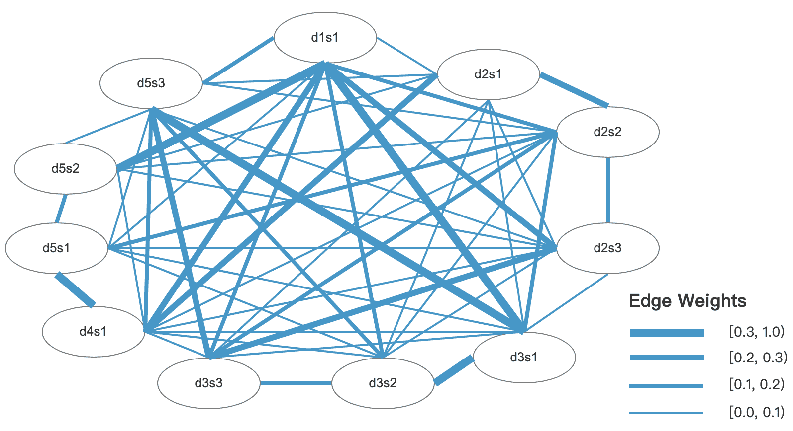

图 2：加权余弦相似度图 [46] 是基于 DUC 2004 的 d1003t 子集为集群生成的，DUC 2004 是一个用于多文档摘要任务的数据集。图中使用的符号如下：’d’ 代表文档，’s’ 代表句子。例如，d2s3 表示文档 2 的第三句。

对于单文档摘要，基于位置的方法 [44, 82, 95] 利用句子在文档中的位置来识别重要内容。此外，TF-IDF 方法 [60, 115, 156] 根据词语的频率和稀有度来衡量词语在文档中的重要性。具有高 TF-IDF 分数的句子，表示显著词语的出现频率较高，被认为更重要，并被选择用于摘要。此外，潜在语义分析（LSA） [164, 60, 139] 是一种数学技术，通过减少词项-文档矩阵的维度并揭示文档的潜在语义结构来进行分析。通过识别主要成分或潜在主题，LSA 可以根据这些主题的相关性对句子进行排序，排名最高的句子被提取用于摘要。

关于多文档摘要的任务，基于中心点的方法[149, 45] 通过考虑文档中词语的平均词频来计算每个文档的中心点。然后，利用所有文档的中心点来计算总体中心点，选择与该总体中心点最接近的不同文档中的句子作为最终摘要。在聚类[178, 112, 57]方法中，根据文档之间的相似性将文档分组，以代表共同的主题或话题。根据文档中的特征，从每个聚类中选择句子作为代表。最终的摘要是通过将这些代表性句子连接起来生成的。MMR[23] 是另一种技术，它平衡了提取信息的相关性与信息的多样性，以避免多文档摘要中的冗余。

最近，深度学习技术在单文档和多文档摘要方面都取得了显著进展。它们采用各种架构，如 RNNs[124, 22]、Transformers[200, 102] 和预训练语言模型[99, 189]，以从单个或多个文档中生成连贯且信息丰富的摘要。

### 2.3 源文档长度：短篇与长篇

短文档摘要和长文档摘要是文本摘要的两种类别，其区别在于输入文档的长度和复杂性。短文档摘要侧重于为相对较短的文档生成摘要，例如新闻文章 [125, 63]、博客帖子 [70] 或单篇研究论文 [20]。由于输入长度有限，短文档摘要通常需要较少的背景和上下文知识来生成连贯的摘要。主要挑战是有效识别最重要的信息，并以简洁的方式传达，同时保持连贯性和可读性。与此同时，长文档摘要涉及为更广泛和复杂的文档生成摘要，例如书籍 [199, 81]、长报告 [71] 或研究论文集 [35]。主要挑战是捕捉整体主题和重要细节，同时管理大量信息。这通常需要先进的技术来处理和加工冗长的文本，保持连贯性，并生成有效传达关键点的摘要。目前，一个源文档长度平均超过 3,000 个词汇单位的基准数据集可以被归类为长文档，因为大多数当前最先进的摘要系统（例如，预训练模型）仅能处理 512 到 1,024 个词汇单位 [13]。这些限制在没有新技术的帮助下难以克服，这些新技术有助于使当前架构能够处理大量文本输入 [78]。

在深度学习兴起之前，短文档摘要主要依赖于 TF-IDF [115]、质心 [45]、LSA [164] 和基于图模型 [171] 等算法，这些算法也用于之前讨论的单文档摘要任务。由于系统和算法能力的限制，长文档摘要在过去几年里基本被忽视。然而，深度神经网络的出现推动了长文档摘要任务的进展 [61, 35, 188, 13]，以及短文档摘要的改进 [39, 91, 157]。

### 2.4 摘要长度：标题 vs 短摘要 vs 长摘要

摘要任务的输出摘要长度可以有所不同，这取决于所需的细节程度和预期的使用场景。根据摘要长度，有三种不同的文本摘要任务，包括标题摘要、短摘要和长摘要。

标题摘要的目的是生成一个非常简洁的摘要，捕捉源文本的主要主题或话题。输出通常是一个句子或一个短语。标题摘要通常用于新闻文章，目标是让读者立即理解主要话题或事件，而无需深入细节。这种类型的总结任务要求模型提取或生成最关键的信息，并用有限的字数传达。

短摘要总结的目标是生成稍长的摘要，比标题提供更多的背景和细节。短摘要通常由几句话或一小段组成。这些摘要对希望快速了解源文本内容的读者很有用，而无需阅读整个文档。短摘要任务要求模型识别和提取关键点、主要思想和重要信息，同时保持输入文本的整体连贯性和信息量。

长摘要总结任务的目标是生成更全面的摘要，涵盖来源文本的更多主题、子主题或细节。这些摘要可以是几段甚至更长，具体取决于原始文档的长度和复杂性。这种任务适用于读者希望深入理解源材料而不必通读全文的情况。它要求模型不仅提取关键信息，还要保持逻辑结构和不同思想之间的关系，使得任务更具挑战性。

为了生成简洁的摘要标题，Banko 等人提出了一种传统方法，该方法可以通过构建内容选择和表面实现的统计模型生成比一句话更短的摘要。该方法类似于统计机器翻译，使用术语选择和排序的统计模型。内容选择和摘要结构生成可以结合起来，使用整体加权方案对可能的摘要候选进行排名。可以使用维特比束搜索找到接近最佳的摘要。对于短摘要总结，开发了一种基于统计框架的可训练摘要程序，专注于文档摘录作为一种计算文档摘要类型。利用句子长度、固定短语、段落信息、主题词和大写词等特征来评分每个句子。通过使用贝叶斯分类函数，论文估计句子被纳入摘要的概率。

最近，深度学习方法用于标题总结和短摘要总结，包括序列到序列模型、注意力机制[169]，以及如 BERT[39]、GPT[150]和 T5[152]等变换器。这些模型通过学习输入文档中的最重要和相关的信息，训练在大型语料库上以生成简明和信息丰富的标题。由于硬件和算法能力的限制，长摘要总结以及长文档总结任务曾被忽视。然而，深度神经网络的发展在长摘要总结技术领域带来了显著的进展[113, 107]。

### 2.5 语言：单语言与多语言与跨语言

总结任务可以根据涉及的语言进行分类，包括单语言、多语言和跨语言总结。在单语言总结中，输入文档和生成的摘要都是同一种语言。这是最常见的总结任务类型，大多数研究集中在这一领域。多语言总结涉及为各种语言的文档生成摘要，但输出摘要与输入文档使用相同的语言。例如，如果输入是法语，摘要将是法语；如果输入是日语，则摘要也将是日语[142]。跨语言总结指的是为用不同语言书写的源文档生成目标语言的摘要[90, 134]。这种类型的总结任务要求模型不仅要理解和提取源文档中的主要思想，还要将提取的信息翻译成目标语言。

\tbl

跨语言总结的一个例子涉及在多种语言中生成相同内容的摘要[8]。 \toprule 英文原文：原油期货周五攀升 2%，至 28 个月高点，因美俄两国在叙利亚问题上陷入僵局，相关担忧愈演愈烈。纽商所十月轻质低硫原油期货结算价涨 2.16 美元，至每桶 110.53 美元。 中文原文：原油期货周五攀升 2%，至 28 个月高点，因美俄两国在叙利亚问题上陷入僵局，相关担忧愈演愈烈。纽商所十月轻质低硫原油期货结算价涨 2.16 美元，至每桶 110.53 美元。 英文摘要：油价创 28 个月新高因叙利亚紧张局势升级。 中文摘要：油价创 28 个月新高因叙利亚紧张局势升级。 \botrule

传统方法如关键词提取[147, 65]、隐马尔可夫模型[54]和基于图的算法[7]在深度学习广泛应用之前常用于多语言总结。这些方法被调整以适用于各种语言，并且通常使用语言特定的资源，如停用词和词干提取工具[142]或语言无关的特征，如 TF-IDF[65]来提高泛化能力。另一方面，跨语言总结通常依赖于机器翻译或双语词典来理解和提取源语言的内容，然后生成目标语言的总结。常用的两种流程方法是：一种是首先总结源文档，然后将总结翻译成目标语言[90, 16, 176, 191, 195]，另一种方法是将源文档翻译成目标语言，然后生成总结[134, 177]。

目前，多语言和跨语言总结任务都受益于先进的深度学习技术。这些深度神经模型[29, 204, 135, 43]能够在共享的嵌入空间中学习多种语言的表示，这使得多语言和跨语言迁移学习成为可能。通过对这些模型进行微调，研究人员在生成不同语言的总结方面取得了令人瞩目的成果，而无需大量的平行数据或明确的翻译。

### 2.6 领域：一般 vs 特定领域

一般总结涉及为任何类型的文本或领域生成总结，而不专注于任何特定的主题。相反，特定领域总结旨在为特定领域或主题的文本生成总结，例如法律文件、科学文章或新闻故事。

特定领域总结任务通常需要领域特定的知识，并可能集成专业语言模型、本体或规则，以更好地捕捉目标领域的细微差别和重要方面[83, 192, 89, 26]。这些系统还可能考虑到领域中文本的独特结构或格式，从而获得更好的总结结果。在深度学习之前，传统的特定领域总结方法通常采用规则[48, 172]或模板[208, 182, 138]形式的领域特定知识。此外，基于特征的方法被用来识别领域特定总结中的重要句子或段落，如某些关键词、短语或与领域相关的命名实体的出现[148, 27, 146]。基于图的算法，如 LexRank [46]或 TextRank [115]，也常用于特定领域总结。领域特定信息可以被纳入图表示中或用于加权边缘，使得算法更适合目标领域。

随着深度学习的出现，特定领域的总结已经显著演变和改进。领域适应是一种利用预训练语言模型[83, 192, 201]的技术，这些模型在大量文本数据上进行训练，并针对特定领域总结任务进行微调。为了更好地捕捉领域特定的知识，深度学习模型还可以使用领域特定的词嵌入或上下文化嵌入进行训练，例如用于生物医学领域的 BioBERT [89]或用于法律文档的 Legalbert [26]。这些技术相较于传统方法具有若干优势，包括更好的表示学习、更有效地处理领域特定知识以及更容易适应新领域。它们在各种特定领域中表现出良好的结果，并不断推动领域特定文本总结的极限。

### 2.7 抽象层次：通用与聚焦查询

以查询为重点的摘要旨在生成一个针对特定用户查询或主题的摘要。该摘要应包含源文本中与给定查询相关的最重要信息[203, 25, 1]。这种类型的摘要对于那些有特定问题或兴趣并希望获取量身定制的摘要的读者非常有用。相比之下，通用摘要的目标是创建一个简洁连贯的摘要，捕捉源文本中最重要的信息。这种类型的摘要不针对任何特定的查询或主题，而是旨在提供整个文档或文档集的概述，这对那些希望快速掌握关键点而无需通读整个文本的读者很有帮助。

对于以查询为重点的摘要，信息的相关性取决于其与给定查询的关系。如果通用摘要中的重要信息与查询不直接相关，则可能会被排除，而与查询相关的较不重要的信息可能会被包含在内。因此，以查询为重点的摘要通常需要额外的处理来考虑给定的查询。这可能涉及将查询纳入文本的表示中，使用查询特定的特征，或应用基于查询的注意机制来指导摘要的提取或生成。这些技术更加专业，需要将查询作为输入与源文本一起使用。

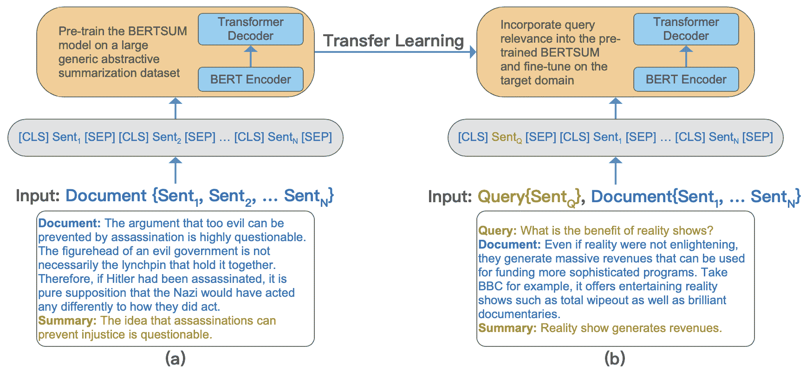

图 3： (a) 在通用抽象摘要语料库上对 BERTSUM[101]模型进行预训练，例如 XSUM[126]。 (b) 在目标领域上对预训练的 BERTSUM 模型进行微调，在此情况下为 Debatepedia[129, 84]。

查询重点摘要的最简单传统方法之一是将查询中的关键词与源文本中的关键词进行匹配[203, 37]。包含更多匹配关键词的句子被认为更相关，并被纳入摘要中。此外，查询扩展方法[25, 24]使用各种技术，如同义词提取或相关术语发现，来扩展初始查询，以提高相关信息的召回率。扩展的查询随后用于匹配和排名源文本中的句子。这种方法有助于识别可能未被原始查询捕获的相关信息。此外，基于查询的加权技术通过利用像 TF-IDF[51, 37]这样的术语加权方案来结合查询。在这些方法中，查询术语被赋予更高的权重，这增强了包含这些术语的句子的相关性得分。然后根据得分对句子进行排名，并选择排名靠前的句子作为摘要。基于图的算法，如 LexRank[46]或 TextRank[116]，也可以通过将查询融入文本的图表示中来适应查询重点摘要。另一方面，监督学习方法如支持向量机（SVM）[52, 163]或逻辑回归[137]，可以训练以根据与查询的相关性对新未见文档中的句子进行排名，以进行查询重点摘要。

随着深度学习技术的出现，如 Seq2Seq 模型[175]、指针生成网络[67]、预训练语言模型[1]和强化学习[21]，查询重点摘要可以更好地理解输入和查询上下文，从而生成更准确、更相关的摘要，以解决特定用户查询或主题。

## 3 深度学习技术

本节将回顾在深度神经网络中使用的最流行的深度学习模型和技术，如注意力机制、复制机制、词典概率等。每种模型都有可能显著提升各种摘要任务，这些任务可能是不同类别的混合，例如长篇抽象法律文档摘要、跨语言标题摘要和提取式查询重点摘要。

### 3.1 普通神经网络

普通神经网络，也称为前馈神经网络 [14, 86]，是一种由多个互连的节点或神经元层组成的人工神经网络。输入通过一个或多个隐藏层传递，在这些层中，每个神经元的权重会根据网络输出产生的误差进行调整。这个过程称为反向传播，使网络能够学习如何根据输入数据进行分类或预测输出。

普通神经网络通常用于在摘要任务中学习词语或句子的向量表示。Word2vec 模型 [117, 118]，通过从大量文本数据中学习连续的词向量表示，是基于普通神经网络开发的。在这些模型之后，提出了 Glove [144]，旨在结合矩阵分解和局部上下文窗口方法的优点，以创建一个更高效、更准确的模型。学习到的词向量能够捕捉各种语义和句法规律，并可以作为不同摘要任务的特征。另一方面，Paragraph Vector [68] 通过联合预测文本中的词和一个单独的段落特定向量，学习固定长度的分布式表示。

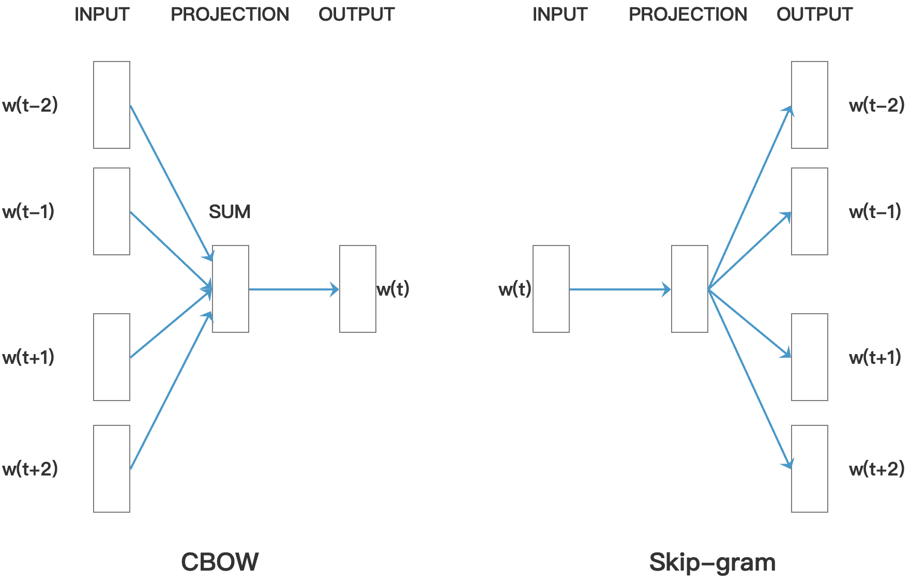

图 4：当前词是基于上下文通过 CBOW 预测的，而周围的词是基于当前词通过 Skip-gram 预测的。 [117 ]

### 3.2 循环神经网络

循环神经网络（RNN） [154, 159] 专门设计用于处理序列数据，使其非常适合自然语言处理任务。RNN 可以处理变长的输入序列并保持内部状态，这使得模型能够记住之前时间步的信息。然而，RNN 容易出现梯度消失和梯度爆炸问题，这使得学习长程依赖关系变得具有挑战性。

为了解决这些问题，长短期记忆（LSTM）[69]和门控循环单元（GRU）[30]网络被开发出来以选择性地记住或遗忘信息。LSTM 网络中的每个记忆单元有三个主要组件：输入门、遗忘门和输出门。输入门决定多少新的输入信息应存储在记忆单元中，而遗忘门决定多少之前的记忆状态应被遗忘。输出门控制当前记忆状态中多少部分应被用于生成输出。与 LSTM 相对的是，GRU 使用更简单的门控机制，只有两个门：更新门控制多少之前的记忆状态应被保留，以及多少新输入应被添加到记忆单元中，重置门决定多少之前的记忆状态应被忽略以适应新的输入。

对于抽取式多文档摘要，SummaRuNNer [124] 是一个基于 GRU 的 RNN 模型，它允许根据信息内容、显著性和新颖性等抽象特征可视化其预测结果。它是一个使用抽象训练的抽取式模型，可以仅通过人类生成的参考摘要进行训练，去除了对句子级抽取标签的需求。

注意机制是一种技术，它允许模型在生成输出时关注输入的不同部分。Chopra 等人 [31] 和 Nallapati 等人 [125] 都研究了使用注意力 RNN 解码器来增强抽象摘要性能。在前者的研究中，采用了基于卷积的注意力网络作为编码器，为解码器提供条件输入，以引导其在生成单词时关注输入句子的相关部分。另一方面，后者的研究采用了基于 RNN 的编码器，并结合了关键词建模以捕捉句子和单词之间的层次结构，有效解决了稀有或未见单词的问题。为了解决这个问题，他们提出了一种新颖的切换解码器/指针架构，使模型能够在生成单词和指示其在源文档中的位置之间做出决策。

此外，See 等人[161]提出了一种混合指针网络，该网络从源文本中复制单词以再现准确的信息并处理词汇表外的单词。他们还开发了一种覆盖架构，以避免摘要中的重复。这有助于注意力机制避免重复关注相同位置，从而减少重复文本的生成。此外，他们利用了束搜索，这是一种启发式搜索算法，以宽度优先的方式探索搜索空间，以找到最可能的输出序列。它在每一步扩展到前 ’B’ 个候选项，其中 ’B’ 是预定义的束宽。束宽决定了每一步要探索的替代方案（分支）的数量。在每个时间步，它根据序列的概率跟踪前 ’B’ 个序列。最终的输出序列是具有最高总体得分的序列。束搜索在输出质量和计算效率之间提供了良好的折衷。

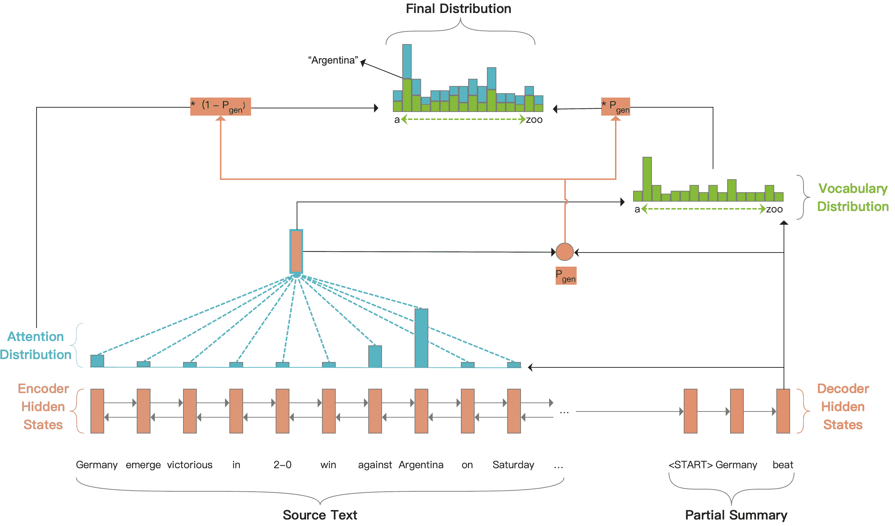

图 5：Pointer-generator 模型将 RNN 与注意力机制和复制网络结合起来。[161]

郑等人[205]提出了一种新的多文档摘要方法，称为子主题驱动的摘要。作者认为，文档中的每个潜在主题可以视为不同子主题的集合，这些子主题的重要性各不相同。该模型利用这些子主题，从文档和子主题的视角生成潜在主题表示。目标是最小化从两个视角学习到的表示之间的差异。该模型使用层次 RNN 来编码上下文信息，并通过考虑子主题重要性和相对句子重要性来层次化地估计句子重要性。

### 3.3 卷积神经网络

在自然语言处理（NLP）中，卷积神经网络（CNN）[53, 87, 80]，最初是为图像处理和计算机视觉任务开发的，用于捕捉文本中的局部模式和结构，使其在提取有意义的特征方面特别有效。典型的 NLP 卷积神经网络架构中，输入文本首先被表示为词或字符嵌入的序列，形成一个矩阵，其中每一行对应一个词或字符的嵌入。嵌入在训练过程中被学习，使模型能够捕捉到词或字符的有意义表示。CNN 的主要构建块是卷积层，由多个滤波器组成。每个滤波器应用于输入文本的固定大小的滑动窗口，捕捉文本中的局部模式。滤波器的输出或特征图，然后通过非线性激活函数，如修正线性单元，引入模型中的非线性。在卷积层之后，特征图通常通过池化层，如最大池化或平均池化，减少空间维度并从特征图中提取最显著的特征。这一过程有助于减少模型的计算复杂性，并使其对输入的变化更加鲁棒。NLP 卷积神经网络的最终层通常由一个或多个全连接层组成，这些层结合了提取的特征并执行特定的 NLP 任务，如文本分类或序列标注。这些层通常后接一个 softmax 层，用于多分类任务，产生对可能输出类别的概率分布。

Narayan 等人[126]引入了一个新的概念，称为“极端摘要”，旨在生成一个可以回答“这篇文章讲了什么？”的问题的单句摘要。研究人员提出了一种新颖的抽象模型，该模型基于 CNN，并以文章的主题为条件。该模型被发现能有效捕捉长距离的依赖关系并识别文档中的相关内容。他们还结合了主题敏感的嵌入，以增强词汇上下文与文档的主题相关性。

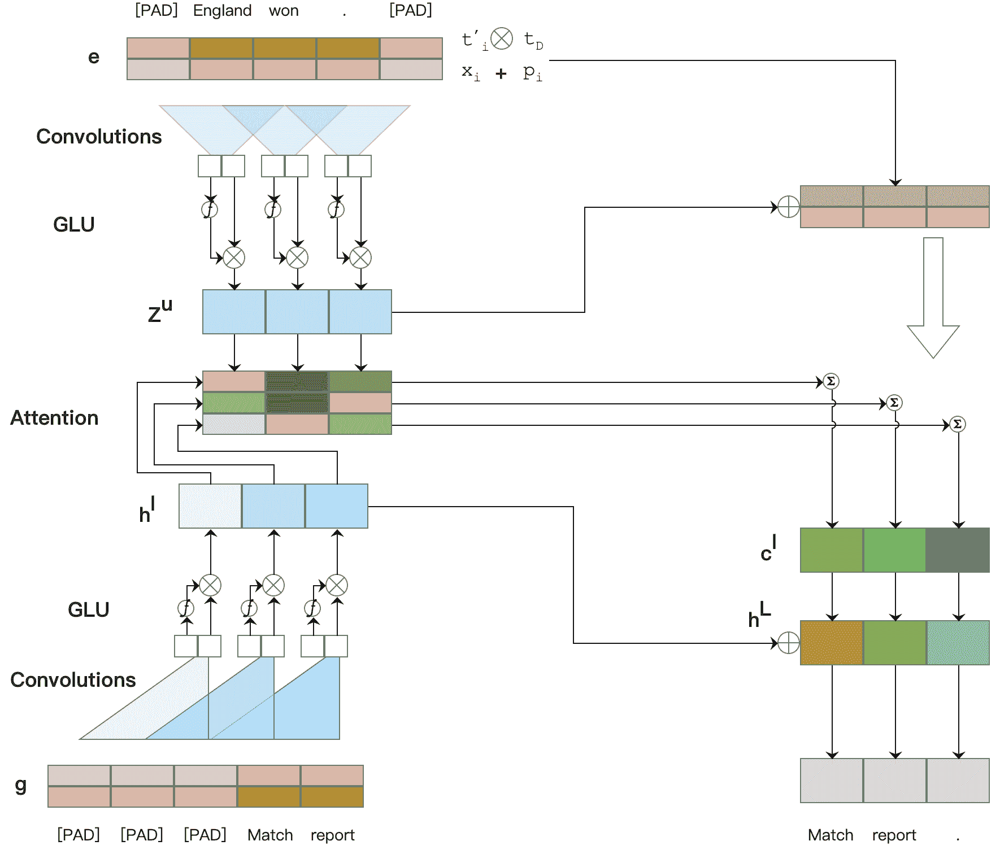

图 6：一个基于主题的极端摘要卷积模型。[126]

Liu 等人[105]讨论了一种使用 CNN 生成用户定义长度摘要的新方法。所提方法修改了卷积序列到序列模型，以在模型初始层的每个卷积块中包括长度约束。这是通过在训练阶段将所需长度作为参数输入到解码器来实现的。在测试时，可以提供任何所需长度，以生成大致该长度的摘要。这项研究提出了一种可能有效的方法来生成任意长度的摘要，这对各种需要不同长度摘要的任务具有广泛的应用前景。

### 3.4 图神经网络

尽管图神经网络（GNN）[158, 114, 145, 62]主要用于数据自然呈现图结构的领域，如社交网络、分子结构和知识图谱，但它们也可以被适应用于 NLP 任务。在 NLP 中，GNN 通常用于通过将单词、句子或文档表示为图中的节点，并用边表示这些节点之间的关系，从而建模它们之间的关系。GNN 模型通过基于邻居信息迭代更新节点表示来学习在图中传播信息。GNN 的核心构建模块是图卷积层，它们设计用来聚合来自邻居节点的信息并更新节点特征。

Jing 等人[75]提出了一种新颖的多重图卷积网络（Multi-GCN）方法，用于抽取式总结。Multi-GCN 分别学习句子和词之间不同关系的节点嵌入，并将它们组合以产生最终的嵌入。这种方法有助于缓解原始 GCN 的过度平滑和梯度消失问题。

引入了一种异构 GNN，HETERSUMGRAPH [179]，用于抽取式文档总结。该网络包括除了句子之外的不同粒度级别的节点，这些节点充当中介，并丰富句子之间的关系。这种方法允许不同的句子在考虑重叠的词信息时进行互动。此外，图网络可以容纳额外的节点类型，例如用于多文档总结的文档节点。

Doan 等人 [40] 提出了一种通过应用异构图神经网络 (HeterGNN) 和引入同质图结构 (HomoGNN) 来进行长文档摘要的方法。HomoGNN 侧重于句子级节点以创建图结构，丰富句子间的连接。同时，HeterGNN 探索词与句子之间的复杂关系，处理句子内的连接。两个网络都使用图注意力网络模型进行构建和更新。在 HomoGNN 中，使用 BERT 模型进行句子的初始编码，而 HeterGNN 则使用 CNN 和 BiLSTM 的组合进行节点特征提取。处理后，两个网络的输出被连接在一起，以形成句子的最终表示。

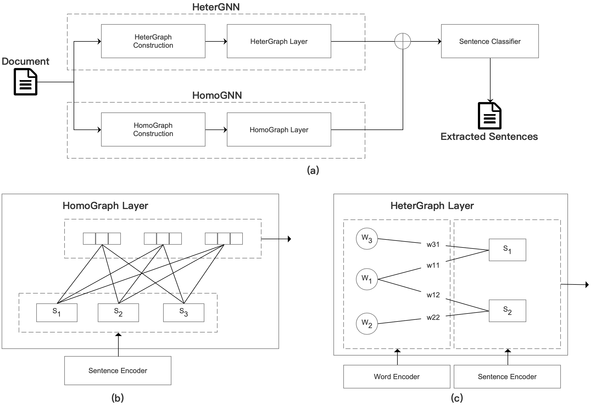

图 7: 极端摘要的两阶段管道模型 [40]。在第一阶段，使用预训练的 BERT 对句子进行编码，并将 [CLS] 标记的信息传递到图注意力层。在第二阶段，词节点和句子节点都被编码并输入到异构图层。两个阶段的输出被连接在一起，并输入到多层感知器 (MLP) 层中进行句子标签分类。

### 3.5 Transformer

Transformer 模型 [173, 39, 150]，作为最流行的深度学习架构，在 NLP 领域，特别是在文本摘要中，已成为一种革命性力量。与 RNN 或 LSTM 不同，Transformer 使用自注意力机制，使其能够捕捉到输入文本中无论距离多远的依赖关系。这在文本摘要任务中尤为重要，因为理解文档的完整上下文至关重要。

Transformer [173] 遵循 Seq2Seq 架构，包括一个编码器，将输入序列映射到潜在空间中，以及一个解码器，将潜在表示映射回输出序列。Transformer 模型的核心是自注意力机制，它使模型能够在生成输出序列中的每个单词时，权衡输入序列中单词的意义。

BERT [39]，即双向编码器表示变换器，通过在所有层中同时考虑左右上下文，从未标记文本中进行深度双向表示的预训练。预训练后，BERT 模型可以通过附加输出层进行微调，创建适用于各种任务的最先进模型，包括摘要，而无需任务特定的架构修改。在微调阶段，模型使用预训练参数进行初始化，所有参数都使用来自下游任务的标记数据进行微调。要使用 BERT 进行文本摘要，一种常见方法是对其进行摘要任务的微调。BERTSUM [101] 是一种利用 BERT 进行抽取式摘要的方法，通过向预训练的 BERT 模型添加区间段嵌入和位置嵌入，使模型能够识别句子及其顺序。这些嵌入在微调过程中学习。在推理过程中，根据句子的分数选择最重要的句子，以形成最终摘要。

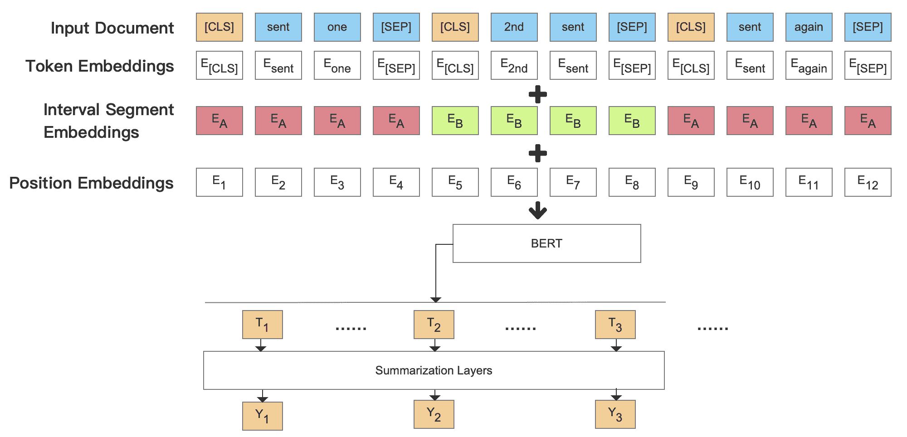

图 8：BERTSUM 模型的概述架构 [101]。

T5 [153]，即“文本到文本转换变换器”的缩写，是一个统一模型，将每个自然语言处理（NLP）问题视为文本生成任务，使模型能够同时学习多个任务，并在这些任务之间学习共享的表示。在文本摘要的情况下，模型被训练为在给定以特定任务说明开头的原始文本下预测摘要文本，比如“summarize:”，因此模型学习根据上下文和给定任务生成摘要。T5 使用去噪自编码目标进行训练，这本质上是一个带有输入数据噪声的因果语言建模任务。模型必须学习从噪声版本预测原始干净文本。这种方法迫使模型学习理解和生成语法正确且上下文相关的文本，这一技能在生成连贯且相关的摘要时非常有用。

BART（双向自回归变换器）[91]，是一个用于训练 Seq2Seq 模型的去噪自编码器。该系统通过用任意噪声函数破坏文本，然后训练模型重建原始文本，使用标准的基于变换器的神经机器翻译架构。这种架构在具有双向编码器和从左到右的解码器的情况下，通用化了该方法，并且在针对文本生成任务（如总结）进行微调时特别有效。在 BART 中测试了几种不同的噪声策略，其中随机打乱句子顺序和使用创新的填充方案表现最佳，该方案将文本段替换为一个单一的掩码标记。这迫使模型考虑整体句子长度，并对输入进行更长范围的转换。

Pegasus [196]，即“利用提取的缺失句子进行抽象总结的预训练”，是一个专注于抽象文本总结的模型。Pegasus 的主要创新在于其预训练策略，它通过在文档中屏蔽某些句子来模拟总结。与其屏蔽单个单词或短语不同，Pegasus 屏蔽整个句子，将任务视为一个句子级的提取问题。在这个阶段，模型通过根据其余文本预测被“屏蔽”的句子，培养了对句子级重要性和相关性的强烈感知能力，这对于文本总结至关重要。该模型在新闻、科学、故事和立法草案等多个领域进行了测试，并在所有测试数据集上表现出色，同时在低资源总结任务中也表现良好。

BIGBIRD [194]，是一种稀疏注意力机制，旨在解决序列长度的二次依赖，这是像 BART 这样的基于变换器模型的限制。BIGBIRD 机制将这种二次依赖减少到线性，这意味着它可以处理比以前在相同硬件上可能的序列长 8 倍的文本。这意味着 BIGBIRD 可以理解和生成更长的文本片段，使其在长文档总结中具有潜在的应用价值。该模型由三部分组成：一组全局标记关注序列的所有部分、所有标记关注一组局部邻近标记，以及所有标记关注一组随机标记。BIGBIRD 保留了全变换器的所有已知理论属性，并将基于注意力的模型应用扩展到长上下文有利的任务中。

Longformer [13] 是另一种 Transformer 模型的改进，旨在处理长序列。Longformer 提供了一种线性扩展的注意力机制，使处理包含数千个标记或更多的文档成为可能。Longformer 的注意力机制结合了局部窗口自注意力和任务驱动的全局注意力。这种替代标准自注意力的机制可以在字符级语言建模任务中实现最先进的结果。此外，Longformer-Encoder-Decoder（LED）作为 Longformer 的变体被引入，专为长文档生成的 Seq2Seq 任务设计。该模型在长文档摘要数据集上经过测试并证明有效。

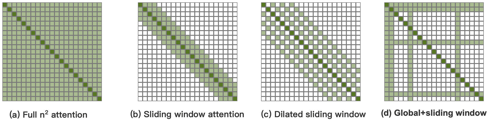

图 9：通过比较完整的自注意力模式和 Longformer 模型中的注意力模式配置，我们可以观察到它们之间的差异。 [13]。

GPT-1 [150]（生成预训练变换器）是一个自回归语言模型，通过预测序列中的下一个单词来生成类似人类的文本。在文本摘要的背景下，GPT-1 能够生成不仅仅是原文的提取摘要，还可以以新颖的方式重新措辞或重新构架内容，捕捉文档的精髓，同时显著缩短其长度。然而，由于 GPT-1 不明确建模文档的结构，而仅基于词序列，它可能无法始终保持摘要的连贯性和相关性，特别是对于长篇或复杂的文档。GPT-2 [151] 是 GPT-1 的改进版，拥有更多的参数并在更大的数据语料库上进行训练。GPT-2 在摘要生成中的一个重要优势是由于其训练目标和架构，能够生成流畅且连贯的文本。它可以捕捉文本中的长程依赖关系，重新措辞原始文本，甚至生成原文中没有但与其内容一致的新句子。此外，GPT-2 可以以少量示例或无需示例的方式进行摘要生成，即使只有少量或没有示例，模型也能进行准确的预测。GPT-3 [19] 继承了其前身的设计，并且由于模型规模扩大——1750 亿参数，已经发现生成的文本异常流畅且连贯。GPT-3 具有更大的上下文窗口，这意味着它在生成摘要时可以考虑文档的显著部分。这使得摘要更为全面和完整，尤其是与上下文窗口较小的模型相比，后者可能无法捕捉所有必要的信息。除了典型的摘要任务外，GPT-3 还可以用于各种不同类型的摘要。无论是生成提取式还是抽象式摘要，单文档还是多文档摘要，GPT-3 都可以用来生成它们。近期发展出的 InstructGPT [136] 以训练大型语言模型理解和遵循指令为核心，辅以人工反馈。作者在 GPT-3 上采用了微调方法，利用标签者示范的数据集来概述期望的模型行为，从标签者编写的提示和响应开始。他们最初使用监督学习对模型进行了微调，随后采用了人工反馈的强化学习技术进行进一步微调。作者的研究结果表明，使用人工反馈对模型进行微调在使语言模型与人类意图对齐方面具有前景，强调了未来研究的一个富有成效的方向。最近，出现了一个重要的多模态模型，称为 GPT-4 [133]。它能够处理图像和文本输入并生成文本输出。在人类考试评估中，这个模型表现出色，一直超越大多数人类考生。尽管论文中缺乏关于模型结构、超参数和训练方法的具体信息，但 GPT-4 的结果在各种任务中展现了显著的进步，包括摘要生成。即使 GPT-4 可能引入了原文中不存在的细节或观点，导致“幻觉”，这一模型的开发标志着 AI 系统在广泛应用和安全部署方面的一个重要里程碑。

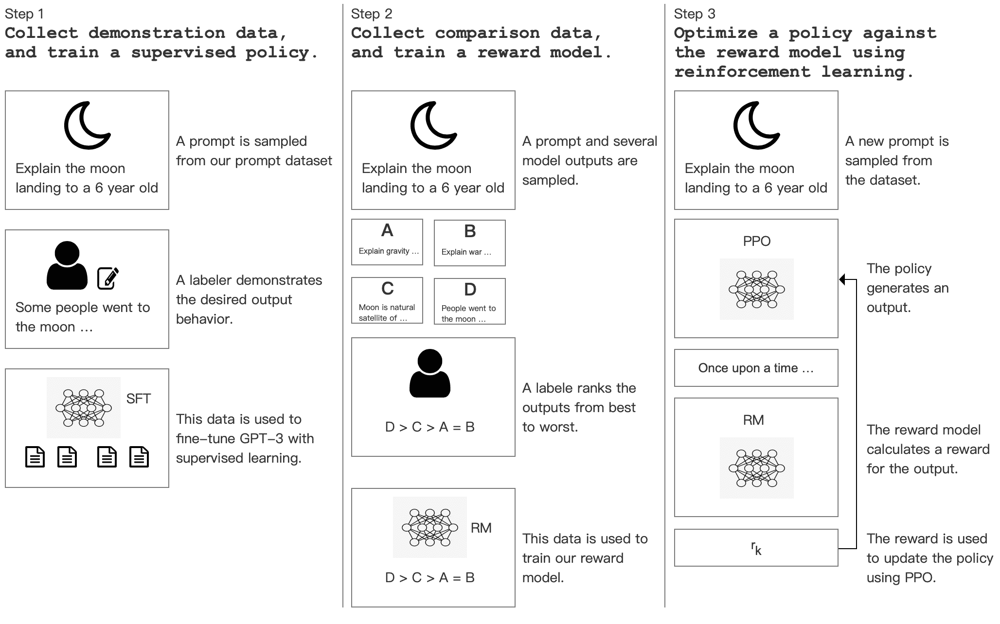

图 10：该图展示了 InstructGPT 的三个连续步骤：（1）监督微调（SFT），（2）奖励模型（RM）训练，以及（3）通过该奖励模型的近端策略优化（PPO）进行强化学习。蓝色箭头表示利用这些数据来训练 InstructGPT。 [136]。

### 3.6 强化学习

强化学习（RL）[76, 119] 是一种机器学习类型，其中代理通过执行某些操作并获得奖励（或惩罚）来学习在环境中的行为。

在文本摘要的背景下，环境包括需要被摘要的输入文档。状态可以是当前正在考虑摘要的文档部分，以及已经生成的摘要部分。行动可能包括选择文档中的一句话以纳入摘要（对于抽取式摘要）或生成一个句子或短语以添加到摘要中（对于抽象式摘要）。奖励是生成摘要质量的度量，这可能基于各种因素，如摘要对文档主要观点的代表性、语法正确性和流畅性等。

使用 RL 进行文本摘要的一个主要好处是，它比传统的监督学习方法提供了更灵活和自适应的摘要方法。RL 可以根据每个文档的具体特征调整其摘要策略，并可以优化长期奖励（如摘要的整体连贯性和质量），而不仅仅是短期收益（如下一句的准确性）。

Narayan 等人 [127] 提出了一个用于单文档摘要的新方法，将抽取式摘要作为一个句子排名任务，通过强化学习目标全局优化 ROUGE 评估指标。作者认为，目前的交叉熵训练对于抽取式摘要来说并不理想，容易生成包含不必要信息的冗长摘要。他们的方法通过学习对句子进行排序来改进这一点。该方法将神经网络摘要模型视为强化学习范式中的“代理”，该代理阅读文档并预测每个句子的相关性得分。然后，代理会根据抽取与黄金标准摘要的相似程度进行奖励。REINFORCE 算法被用来更新代理，直接优化最终评估指标，而不是最大化真实标签的可能性，使模型更能区分句子。

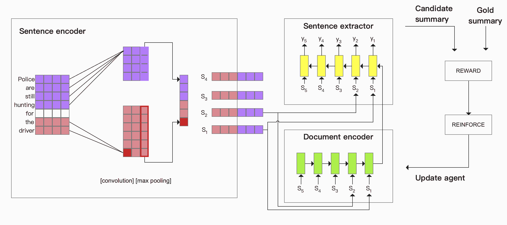

图 11：带有强化学习[127]的抽取式摘要模型采用层次编码器-解码器结构来根据句子的抽取价值进行排序。然后，通过组装排名最高的句子来形成候选摘要。REWARD 生成器将候选摘要与黄金摘要进行比较，提供奖励信号，该信号在 REINFORCE 算法[185]中用于更新模型。

Hyun 等人[73]提出了一种用于无监督抽象句子摘要的模型，该模型使用强化学习（RL）。与以往主要利用抽取式摘要（从文本中去除词汇）的方法不同，该方法是抽象式的，允许生成在原文中未出现的新词，从而增加了灵活性和多样性。该方法涉及开发一种多摘要学习机制，该机制从给定文本中创建多种不同长度的摘要，这些摘要相互增强。所使用的基于 RL 的模型通过奖励评估摘要的质量，考虑了如摘要与原文之间的语义相似性和生成摘要的流畅性等因素。该模型还涉及一个预训练任务，以实现针对 RL 训练的良好初始化模型参数。

## 4 数据和实验性能分析

### 4.1 数据处理技术

本小节将**深入探讨**用于数据处理的关键技术。

#### 4.1.1 预训练

在文本摘要领域，预训练是指在对模型进行更具体的摘要任务微调之前，在大量多样的文本数据语料库上进行的初步训练阶段。这种策略利用了如 GPT [150]、BART [91] 和 T5 [153] 等广泛语言模型的能力，这些模型已经在大量文本数据上进行预训练，以理解语言中的句法和语义模式。

#### 4.1.2 少量样本、零样本学习

少样本学习和零样本学习是描述模型在训练阶段对新类别的准确预测能力的术语，这些新类别在训练阶段要么代表性较少（少样本），要么完全不存在（零样本）[187, 166]。在摘要任务中，少样本学习通常意味着模型在几个类别的众多示例上进行训练，然后期望模型在仅看到几个新类别的示例后能够总结这些新类别的示例。另一方面，零样本学习指的是模型在没有看到这些新类别示例的情况下，期望其能够推广到完全新类别的场景。这些方法的核心思想是在推理时为模型提供几个示例或任务描述，使其能够根据这些新信息调整预测。这通常涉及将摘要任务表述为模型需要完成的一种提示。

#### 4.1.3 提示设置

提示在当前一代语言模型中发挥着关键作用，特别是那些基于转换器架构训练的模型，如 GPT-4 [133]或 T5 [153]。在这些模型的背景下，“提示”一词指的是提供给模型的输入，以指示其应该执行的任务。对于文本摘要，提示通常是需要被总结的文本。然而，在 GPT-4 [133]、T5 [153]及类似模型中，提示还可以包括任务描述或示例以指导模型生成。这在少样本和零样本学习场景中尤为重要。选择有效的提示有点像艺术，可能会显著影响模型的表现。创建提示的最佳实践仍然是一个活跃的研究领域，但一个设计良好的提示通常包括清晰的指令，并且在可能的情况下，提供期望输出的示例。

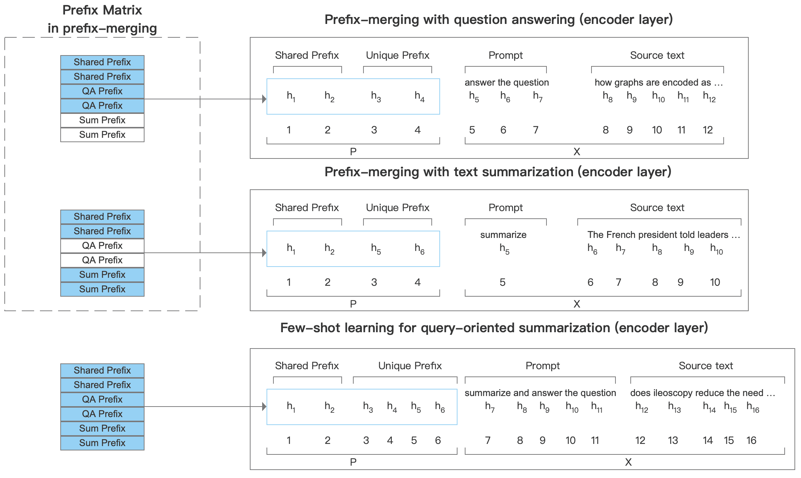

图 12：该图突出了 BART 的编码器层，并提供了带注释的示例以及在两个辅助任务上（顶部、中部）进行前缀合并的比较，并将合并后的前缀应用于使用前缀调优的少样本查询聚焦摘要任务（底部）。 [193]

#### 4.1.4 领域适应

在文本摘要的背景下，领域适应涉及将一个初步在特定领域（例如新闻文章）上训练的摘要模型，调整以在另一个相关领域（例如科学论文或法律文档）上有效运行[110, 121]。对目标领域的小型数据集进行微调是常用的方法。此外，迁移学习被用来利用从一个领域获得的知识，并将其应用于另一个领域。

#### 4.1.5 分词、嵌入和解码策略

分词是将文本分成称为令牌的单独单元的初步步骤，这些令牌作为大多数自然语言处理（NLP）模型的基本输入元素[184, 109]。分词之后，令牌通过嵌入层转换为连续的向量表示，以创建输入嵌入[144]。这些嵌入随后输入到模型中进行进一步处理。一旦模型生成了输出序列，例如摘要，反向过程会发生，其中每个令牌映射回词汇表中的对应单词，然后将单词用空格连接起来，生成可读的文本。

### 4.2 数据集和评估指标

在文本摘要领域，使用各种数据集和评估指标来训练模型并评估其性能。每个评估指标都有其优缺点。虽然有些指标计算容易，但它们可能无法准确反映人类对质量的判断，因为它们仅基于 n-gram 重叠。其他一些指标尝试通过考虑语义相似性来解决这个问题。然而，尽管人工评估仍然被认为是最终标准，但它的可扩展性挑战仍然存在。我们将首先讨论一些常用的数据集，然后讨论评估指标。

#### 4.2.1 数据集

表 4.2.1 展示了文本摘要领域中一些显著的数据集。 “大小”列表示每个数据集中可用的训练、验证和测试文档的数量。

\tbl

不同数据集的比较 \toprule 数据集 域 任务 规模 文档长度 摘要长度 DUC2004 [36] 新闻 单文档 多文档 跨语言 查询导向 抽象 500 - $<$= 75 字节（单文档） $<$= 665 字节（多文档） CNN/Daily Mail [125] 新闻 单文档 标题 查询导向 抽象 抽取 286,817 13,368 11,487 平均 766 字词 平均 53 字词 XSum [126] 新闻 单文档 跨语言 抽象 204,045 11,332 11,334 平均 431 字词 平均 23 字词 WikiSum [100] 维基 多文档 抽象 1,865,750 233,252 232,998 - - Multi-News [47] 新闻 多文档 抽象 抽取 44,972 5,622 5,622 平均 2,103 字词 平均 263 字词 BillSum [79] 法律 单文档 长文档 抽象 18,949 1,237 3,269 平均 1,592 字词 平均 197 字词 PubMed [35] 医疗 单文档 长文档 抽象 119,924 6,633 6,658 平均 3,016 字词 平均 203 字词 arXiv [35] 科学 单文档 长文档 抽象 203,037 6,436 6,440 平均 4,938 字词 平均 220 字词 XGLUE [93] 新闻 跨语言 标题 抽象 300,000 50,000 50,000 - - BIGPATENT [162] 专利 单文档 长文档 抽取 抽象 1,207,222 67,068 67,072 平均 3,572 字词 平均 116 字词 Newsroom [63] 新闻 单文档 标题 抽取 抽象 995,041 108,837 108,862 平均 658 字词 平均 26 字词 MLSUM [160] 新闻 单文档 跨语言 多语言 抽象 287,096 11,400 10,700 平均 790 字词 平均 55 字词 \botrule

#### 4.2.2 评估指标

评估生成摘要的质量在文本摘要任务中至关重要。以下是常用于摘要生成的评估指标：

+   $\blacktriangleright$

    Rouge（Recall-Oriented Understudy for Gisting Evaluation）[94]：是一组用于评估自动摘要的指标。它将系统生成的输出与一组参考摘要进行比较。ROUGE-N 衡量系统摘要和参考摘要之间的 N-gram（来自文本或语音样本的连续 N 项）的重叠。包括 ROUGE-1（针对单字词），ROUGE-2（针对双字词）等指标。ROUGE-L 指标衡量系统摘要和参考摘要之间的最长公共子序列（LCS）。LCS 自然考虑句子级结构相似性，并自动识别最长的顺序 n-gram。

+   $\blacktriangleright$

    BLEU（双语评估替代指标）[140]: 是一种最初为评估机器翻译文本质量而开发的评估指标，但也用于文本摘要任务。它是一种基于精确度的指标，通过将系统生成的摘要与一个或多个参考摘要进行比较来工作。BLEU 在 n-gram 层面上测量生成的输出与参考文本之间 n-gram 的重叠情况。它计算每个 n-gram 大小的精确度（通常从 1-gram 到 4-gram），并取加权几何平均值来计算最终得分。

+   $\blacktriangleright$

    METEOR（显式排序翻译评估指标）[9]: 是一种最初为机器翻译任务设计的评估指标，但也用于文本摘要评估。与之前提到的主要关注 n-gram 层面的召回率和精确度的 ROUGE 和 BLEU 等指标不同，METEOR 结合了更多的语言特征，并尝试在语义层面对齐生成的文本和参考文本，从而可能更准确地捕捉输出的质量。

+   $\blacktriangleright$

    Pyramid Score [131]: 基于一个原则，即一个完美的摘要可以包含源文本中的多个有效点，因此不公平地惩罚一个未包含特定点的摘要。在 Pyramid Score 方法中，人类评估者在一组模型摘要中识别摘要内容单元（SCU），这些单元本质上是信息的片段。每个 SCU 根据其在多少个模型摘要中出现的情况分配权重。然后，通过将生成的摘要包含的 SCU 权重相加，并通过任何相同长度摘要可以达到的最大可能得分来归一化这个总和，从而计算 Pyramid Score。Pyramid 评分承认不同可接受摘要之间内容选择的潜在差异。然而，这种方法非常费力，因为它需要人类评估者对模型摘要进行详细的内容分析。

+   $\blacktriangleright$

    CIDEr（共识基础图像描述评估）[174]: 是一种主要设计用于评估图像描述任务中图像字幕质量的评估指标。在一定程度上，它也被用于文本摘要。CIDEr 的基本思想是，对描述更重要的词应该具有更高的权重。

+   $\blacktriangleright$

    BERTScore [198]: 是一种用于自然语言生成任务（包括文本摘要）的自动评估指标。与传统的依赖 n-gram 重叠的 ROUGE 和 BLEU 等指标不同，BERTScore 利用预训练 BERT 模型中的上下文嵌入来评估生成的文本。

+   $\blacktriangleright$

    Moverscore [202]：基于两个基本原则：使用上下文化的嵌入和地球搬运工距离（EMD），也称为 Wasserstein 距离。上下文化的嵌入，如 BERT 嵌入，在其出现的上下文中表示词或短语，提供了文本的更有意义的表示。地球搬运工距离是衡量区域内两个概率分布之间距离的度量，这里用来衡量生成的摘要和参考摘要的嵌入之间的距离。

表格 4.2.2 显示了一些流行模型在 CNN/Daily Mail 上的实验结果。尽管自动指标被广泛使用，但它们并不总是与人类对摘要质量的判断一致。人类评估被认为是黄金标准，但它耗时且成本高。因此，实际应用中常常结合自动评估和人工评估。

\tbl

在 CNN/Daily Mail 上不同模型的比较 [125] \toprule 模型 Model Rouge-1 Rouge-2 Rouge-L Attentional RNN [125] RNN 35.46 13.30 32.65 Pointer-Generator [161] RNN 39.53 17.28 36.38 DynamicConv [186] CNN 39.84 16.25 36.73 TaLK Convolution [98] CNN 40.59 18.97 36.81 RL with intra-attention [143] RL 41.16 15.75 39.08 RNN-ext+abs+RL+rerank [28] RNN+RL 39.66 15.85 37.34 BILSTM+GNN+LSTM+POINTER [50] GNN+LSTM 38.10 16.10 33.20 Graph-Based Attentional LSTM [168] GNN+LSTM 38.10 13.90 34.00 Transformer [173] Transformer 39.50 16.06 36.63 PEGASUS [196] Transformer 44.17 21.47 41.11 BART [91] Transformer 44.16 21.28 40.90 SEASON [180] Transformer 46.38 22.83 43.18 BART.GPT-4 [104] Transformer 63.22 44.70 - \botrule

## 5 摘要

### 5.1 挑战与未来

文本摘要是在自然语言处理领域中一个有趣且具有挑战性的任务。近年来，在深度学习（DL）模型的帮助下取得了显著进展。神经嵌入、注意机制、自注意力、Transformer、BERT 和 GPT-4 等新概念推动了该领域的发展，使得过去十年进展迅速。然而，尽管取得了这些进展，仍然存在需要解决的显著挑战。本节旨在突出一些文本摘要中尚未解决的挑战，并探索可能的研究方向，以推动该领域的进一步发展。通过解决这些挑战和探索新的途径，我们可以继续突破文本摘要的界限，释放其全部潜力。

一个关键方面是理解文档的上下文，包括语义、句法结构和话语组织。深度学习模型常常难以处理复杂或模糊的语言、习语表达和领域特定术语，从而使得生成准确且有意义的摘要变得困难。

一份精心制作的摘要应展现连贯性和一致性，确保思想逻辑连接，文本流畅。模型必须生成保留原文意义的摘要，而不引入不一致性或冗余。这需要对主要思想、支持细节及其相互关系有深刻理解。识别重要内容是一个重大挑战，因为这需要判断文档中各种元素的相关性和重要性。

总结长篇文档，如法律或研究论文，面临额外的难题。这些文档通常包含复杂的句子结构、高级词汇，以及分散在文本中的重要信息。创建简洁的摘要，以捕捉关键点，同时保持准确性，成为一项艰巨的任务。此外，缺乏标注的训练数据使挑战加剧。文本摘要的监督学习方法依赖于大量的注释数据，而这些数据的创建既昂贵又耗时。

评估生成的摘要质量是另一个持续的挑战。自动评估指标，如 ROUGE、BLEU 或 BERTScore，往往与人工判断不完全一致。虽然手动评估提供了更准确的见解，但这是一个劳动密集的过程。克服这些挑战需要开发更好的评估指标，使其与人类对摘要质量的感知更加一致。

摘要任务在特定领域（如医疗或法律领域）变得更加复杂。这些领域通常使用专业术语，要求更高的理解和准确性。此外，从多个文档中总结信息会引入更多复杂性。模型必须消除冗余信息，处理可能冲突的细节，并从各种来源中综合最相关的内容。

随着领域的发展，深度学习模型的进步，特别是像 BERT、GPT-4 和 T5 这样的基于变换器的架构，提供了提高文本摘要任务性能的良好机会。对特定摘要目标的预训练模型进行微调显示了巨大的潜力，并预计将继续。此此外，随着全球化的日益加深，对能够用不同语言甚至跨语言总结文本的模型的需求将不断增加。

解决可解释性、透明度、偏见、数据效率、多模态总结和个性化总结等挑战是未来研究中可能会受到重大关注的领域。可解释和透明的 AI 模型变得越来越重要，预计将会努力开发能够为其决策提供推理的模型。发展更好的评估指标、减轻偏见、探索更具数据效率的方法、处理多模态信息以及满足个性化总结需求，都是该领域进一步发展的潜在方向。

### 5.2 结论

本文介绍了过去十年开发的 100 多个深度学习模型的综合调查，突出显示了这些模型在各种文本总结任务中的重大进展。此外，我们提供了流行总结数据集的概述，并进行了定量分析，以评估这些模型在多个公共基准上的表现。此外，我们还讨论了该领域的开放挑战，并提出了潜在的未来研究方向。

## 参考文献

+   [1] Deen Mohammad Abdullah 和 Yllias Chali. 生成查询以执行查询聚焦的抽象总结：基于预训练模型的研究。在第十三届国际自然语言生成会议论文集，页 80–85，爱尔兰都柏林，2020 年 12 月。计算语言学协会。

+   [2] Laith Abualigah、Mohammad Qassem Bashabsheh、Hamzeh Alabool 和 Mohammad Shehab. 文本总结：简要回顾。近期 NLP 进展：阿拉伯语案例，874：1，2019。

+   [3] Stergos Afantenos、Vangelis Karkaletsis 和 Panagiotis Stamatopoulos. 医疗文档中的总结：一项调查。医学中的人工智能，33(2)：157–177，2005。

+   [4] Mehdi Allahyari、Seyedamin Pouriyeh、Mehdi Assefi、Saeid Safaei、Elizabeth D Trippe、Juan B Gutierrez 和 Krys Kochut. 文本总结技术：简要调查。arXiv 预印本 arXiv:1707.02268，2017。

+   [5] Narendra Andhale 和 Laxmi A Bewoor. 文本总结技术概述。在 2016 年国际计算通信控制与自动化会议（ICCUBEA），第 1–7 页。IEEE，2016。

+   [6] Eiji Aramaki、Yasuhide Miura、Masatsugu Tonoike、Tomoko Ohkuma、Hiroshi Masuichi 和 Kazuhiko Ohe. Text2table：基于命名实体识别和模态识别的医疗文本总结系统。在 BioNLP 2009 研讨会论文集，页 185–192，2009。

+   [7] Aqil M Azmi 和 Suha Al-Thanyyan. 阿拉伯语文本总结器。计算机语音与语言，26(4)：260–273，2012。

+   [8] 余白、杨高和何彦黄。《使用有限的平行资源进行跨语言抽象摘要》。在第 59 届计算语言学协会年会和第 11 届国际自然语言处理联合会议（第 1 卷：长篇论文）上发表，页面 6910–6924，线上，2021 年 8 月。计算语言学协会。

+   [9] 萨坦吉夫·巴纳吉和阿隆·拉维。《METEOR：一种改进与人工评判相关性的自动 MT 评估指标》。在 ACL 机器翻译和/或摘要评估措施研讨会论文集中，页面 65–72，安娜堡，密歇根州，2005 年 6 月。计算语言学协会。

+   [10] 米歇尔·班科、维布胡·O·米特尔和迈克尔·J·威特布罗克。《基于统计翻译的标题生成》。在第 38 届计算语言学协会年会上发表，页面 318–325，2000 年。

+   [11] 杭博·包、李东、傅如伟、温辉·王、南杨、肖栋·刘、余旺、宋浩·廖、简锋·高、明周和萧文·洪。《Unilmv2：用于统一语言模型预训练的伪遮蔽语言模型》。在预印本中，2020 年。

+   [12] 雷吉娜·巴齐莱和凯瑟琳·R·麦克基恩。《用于多文档新闻摘要的句子融合》。计算语言学，31(3):297–328，2005 年。

+   [13] 伊兹·贝尔塔吉、马修·E·彼得斯和阿尔曼·科汉。《Longformer：长文档变换器》，2020 年。

+   [14] 约书亚·本吉奥、雷让·迪沙姆和帕斯卡尔·文森。《神经概率语言模型》。神经信息处理系统进展，13，2000 年。

+   [15] 尼利玛·巴蒂亚和阿鲁尼玛·贾斯瓦尔。《自动文本摘要及其方法综述》。在 2016 年第 6 届国际会议——云系统与大数据工程（Confluence）上发表，页面 65–72。IEEE，2016 年。

+   [16] 弗洛里安·布丁、斯特凡·惠特和胡安-曼努埃尔·托雷斯-莫雷诺。《基于图的跨语言多文档摘要方法》。Polibits，43:113–118，2011 年。

+   [17] 罗纳德·布兰道、卡尔·米策和莉莎·F·劳。《通过句子选择自动浓缩电子出版物》。信息处理与管理，31(5):675–685，1995 年。

+   [18] 谢尔盖·布林和劳伦斯·佩奇。《大规模超文本网络搜索引擎的解剖》。计算机网络与 ISDN 系统，30(1-7):107–117，1998 年。

+   [19] 汤姆·布朗、本杰明·曼、尼克·赖德、梅拉尼·苏比亚、贾雷德·D·卡普兰、普拉夫拉·达里瓦尔、阿尔温德·尼拉坎坦、普拉纳夫·夏姆、吉里什·萨斯特里、阿曼达·阿斯克尔等。《语言模型是少样本学习者》。神经信息处理系统进展，33:1877–1901，2020 年。

+   [20] 伊莎贝尔·卡乔拉、凯尔·洛、阿尔曼·科汉和丹尼尔·韦尔德。《TLDR：科学文档的极端摘要》。在计算语言学协会发现：EMNLP 2020 上发表，页面 4766–4777，线上，2020 年 11 月。计算语言学协会。

+   [21] Xiaoyan Cai 和 Wenjie Li。基于相互强化流形排序的查询重点多文档总结相关性传播模型。IEEE 音频、语音与语言处理交易，20(5):1597–1607，2012 年。

+   [22] Ziqiang Cao，Furu Wei，Li Dong，Sujian Li 和 Ming Zhou。使用递归神经网络进行排名及其在多文档总结中的应用。在第 29 届 AAAI 人工智能会议论文集中，AAAI’15，页码 2153–2159。AAAI 出版社，2015 年。

+   [23] Jaime Carbonell 和 Jade Goldstein。使用 MMR，基于多样性的重新排序用于重新排列文档和生成摘要。在第 21 届国际 ACM SIGIR 信息检索研究与发展年会上，页码 335–336，1998 年。

+   [24] Yllias Chali 和 Sadid A. Hasan。使用句子压缩模型进行查询重点多文档总结的有效性。在 COLING 2012 会议论文集中，页码 457–474，印度孟买，2012 年 12 月。COLING 2012 组织委员会。

+   [25] Yllias Chali 和 Sadid A Hasan。以查询为重点的多文档总结：自动数据注释和监督学习方法。自然语言工程，18(1):109–145，2012 年。

+   [26] Ilias Chalkidis，Manos Fergadiotis，Prodromos Malakasiotis，Nikolaos Aletras 和 Ion Androutsopoulos。LEGAL-BERT：从法学院直接出来的小丑。在计算语言学协会会议论文集：EMNLP 2020 中，页码 2898–2904，在线，2020 年 11 月。计算语言学协会。

+   [27] Ping Chen 和 Rakesh Verma。基于本体知识的查询医学信息总结系统。在第 19 届 IEEE 计算机医学系统研讨会（CBMS’06）上，页码 37–42。IEEE，2006 年。

+   [28] Yen-Chun Chen 和 Mohit Bansal。通过强化选择句子重写进行快速抽象总结。在第 56 届计算语言学协会年会（卷 1：长篇论文）会议论文集中，页码 675–686，澳大利亚墨尔本，2018 年 7 月。计算语言学协会。

+   [29] Yen-Chun Chen，Zhe Gan，Yu Cheng，Jingzhou Liu 和 Jingjing Liu。从 BERT 中提取知识用于文本生成。在第 58 届计算语言学协会年会会议论文集中，页码 7893–7905，在线，2020 年 7 月。计算语言学协会。

+   [30] Kyunghyun Cho，Bart van Merriënboer，Caglar Gulcehre，Dzmitry Bahdanau，Fethi Bougares，Holger Schwenk 和 Yoshua Bengio。使用 RNN 编码器–解码器学习短语表示用于统计机器翻译。在 2014 年自然语言处理实证方法会议（EMNLP）论文集中，页码 1724–1734，卡塔尔多哈，2014 年 10 月。计算语言学协会。

+   [31] Sumit Chopra、Michael Auli 和 Alexander M. Rush。基于注意力的递归神经网络的抽象句子总结。发表于第 2016 届北美计算语言学协会会议：人类语言技术论文集，页码 93–98，美国加利福尼亚州圣地亚哥，2016 年 6 月。计算语言学协会。

+   [32] Hans Christian、Mikhael Pramodana Agus 和 Derwin Suhartono。基于词频-逆文档频率（tf-idf）的单文档自动文本总结。《计算技术：计算机、数学与工程应用》，7(4)：285–294，2016 年。

+   [33] Freddy Chua 和 Sitaram Asur。自动总结社交媒体中的事件。发表于国际 AAAI 网络与社交媒体会议论文集，7(1)：81–90，2021 年 8 月。

+   [34] Adam Coates、Brody Huval、Tao Wang、David Wu、Bryan Catanzaro 和 Ng Andrew。使用商用高性能计算系统的深度学习。发表于国际机器学习会议，页码 1337–1345。PMLR，2013 年。

+   [35] Arman Cohan、Franck Dernoncourt、Doo Soon Kim、Trung Bui、Seokhwan Kim、Walter Chang 和 Nazli Goharian。一个关注话语的注意力模型用于长文档的抽象总结。发表于 2018 年北美计算语言学协会会议：人类语言技术论文集，第 2 卷（短篇论文），页码 615–621，美国路易斯安那州新奥尔良，2018 年 6 月。计算语言学协会。

+   [36] 文档理解会议。Duc 2004。https://duc.nist.gov/duc2004/tasks.html，2004 年。更新日期：2011-03-24。

+   [37] Hal Daumé III 和 Daniel Marcu。贝叶斯查询导向总结。发表于第 21 届国际计算语言学会议暨第 44 届计算语言学协会年会，页码 305–312，澳大利亚悉尼，2006 年 7 月。计算语言学协会。

+   [38] Daisy Deng。利用来自 nlp-recipes 的最新版本启动你的文本总结解决方案。https://techcommunity.microsoft.com/t5/ai-customer-engineering-team/bootstrap-your-text-summarization-solution-with-the-latest/ba-p/1268809，2020 年。更新日期：2020-03-31。

+   [39] Jacob Devlin、Ming-Wei Chang、Kenton Lee 和 Kristina Toutanova。BERT：用于语言理解的深度双向变换器预训练。发表于 2019 年北美计算语言学协会会议：人类语言技术论文集，第 1 卷（长短篇论文），页码 4171–4186，美国明尼苏达州明尼阿波利斯，2019 年 6 月。计算语言学协会。

+   [40] Xuan-Dung Doan、Le-Minh Nguyen 和 Khac-Hoai Nam Bui。用于抽取式长文档总结的多图神经网络。发表于第 29 届国际计算语言学会议论文集中，页码 5870–5875，韩国庆州，2022 年 10 月。国际计算语言学委员会。

+   [41] Luobing Dong, Meghana N Satpute, Weili Wu, 和 Ding-Zhu Du. 通过基于内容关注的子主题检测进行的两阶段多文档摘要。IEEE 计算社会系统汇刊，8(6)：1379–1392，2021 年。

+   [42] Bonnie Dorr, David Zajic, 和 Richard Schwartz. Hedge trimmer：一种解析和修剪的标题生成方法。发表于 HLT-NAACL 03 文本摘要工作坊，页码 1–8，2003 年。

+   [43] Xiangyu Duan, Mingming Yin, Min Zhang, Boxing Chen, 和 Weihua Luo. 零样本跨语言抽象句子摘要通过教学生成和注意力。发表于第 57 届计算语言学协会年会，页码 3162–3172，意大利佛罗伦萨，2019 年 7 月。计算语言学协会。

+   [44] Harold P Edmundson. 自动提取的新方法。ACM 杂志（JACM），16(2)：264–285，1969 年。

+   [45] Gunes Erkan 和 Dragomir Radev. Lexpagerank：多文档文本摘要中的声望。发表于 2004 年自然语言处理实证方法会议，页码 365–371，2004 年。

+   [46] Günes Erkan 和 Dragomir R Radev. Lexrank：基于图的词汇中心性作为文本摘要中的显著性。人工智能研究杂志，22：457–479，2004 年。

+   [47] Alexander Fabbri, Irene Li, Tianwei She, Suyi Li, 和 Dragomir Radev. Multi-news：一个大规模的多文档摘要数据集和抽象层次模型。发表于第 57 届计算语言学协会年会，页码 1074–1084，意大利佛罗伦萨，2019 年 7 月。计算语言学协会。

+   [48] James R Faeder, Michael L Blinov, 和 William S Hlavacek. 基于规则的生物化学系统建模与 bionetgen。系统生物学，页码 113–167，2009 年。

+   [49] Xiachong Feng, Xiaocheng Feng, 和 Bing Qin. 对话摘要的调查：近期进展与新前沿。arXiv 预印本 arXiv:2107.03175，2021 年。

+   [50] Patrick Fernandes, Miltiadis Allamanis, 和 Marc Brockschmidt. 结构化神经网络摘要，2021 年。

+   [51] Seeger Fisher 和 Brian Roark. 通过监督句子排序和偏斜词分布进行的查询焦点摘要。发表于文档理解会议，DUC-2006，美国纽约，2006 年。

+   [52] Maria Fuentes, Enrique Alfonseca, 和 Horacio Rodríguez. 针对查询的支持向量机摘要方法，基于金字塔数据进行训练和评估。发表于第 45 届计算语言学协会年会附录会议论文集，页码 57–60，捷克共和国布拉格，2007 年 6 月。计算语言学协会。

+   [53] Kunihiko Fukushima. Neocognitron：一种自组织神经网络模型，用于对位置变化不敏感的模式识别机制。生物控制论，36(4)：193–202，1980 年。

+   [54] 帕斯卡尔·丰和格蕾丝·黄。一个故事，一个流程：用于多语言多文档摘要的隐马尔可夫故事模型。ACM 语音与语言处理（TSLP）事务，3(2)：1–16，2006 年。

+   [55] 菲利波·加尔加尼、保罗·康普顿和阿基姆·霍夫曼。结合不同的摘要技术用于法律文本。发表于创新混合方法处理文本数据研讨会论文集，115–123 页，2012 年。

+   [56] 马哈克·甘比尔和维沙尔·古普塔。近期自动文本摘要技术：综述。人工智能评论，47：1–66，2017 年。

+   [57] 卡维塔·加纳桑、郑翔霞和贾伟·韩。Opinosis：一种基于图的高度冗余意见抽象摘要方法。发表于第 23 届国际计算语言学会议（Coling 2010）论文集，340–348 页，2010 年。

+   [58] 萨伊德·戈拉姆雷扎扎德、莫赫森·阿米尼·萨莱希和巴哈雷赫·戈拉姆扎德。关于文本摘要系统的全面调查。发表于 2009 年第 2 届计算机科学及其应用国际会议论文集，1–6 页。IEEE，2009 年。

+   [59] 贾德·戈尔斯坦、马克·坎特罗维茨、维布·米塔尔和哈梅·卡本内尔。总结文本文档：句子选择和评价指标。发表于第 22 届国际 ACM SIGIR 会议论文集，121–128 页，1999 年。

+   [60] 易宏·龚和辛·刘。使用相关性度量和潜在语义分析的通用文本摘要。发表于第 24 届国际 ACM SIGIR 会议论文集，19–25 页，2001 年。

+   [61] 昆廷·格雷尔、朱利安·佩雷斯和埃里克·高斯耶。全球化 BERT 基础的变换器架构用于长文档摘要。发表于第 16 届欧洲计算语言学协会会议：主要卷，1792–1810 页，2021 年。

+   [62] 阿迪提亚·格罗弗和朱尔·莱斯科维奇。node2vec：可扩展的网络特征学习。发表于第 22 届 ACM SIGKDD 国际知识发现与数据挖掘会议论文集，855–864 页，2016 年。

+   [63] 马克斯·格鲁斯基、莫尔·纳阿曼和约阿夫·阿尔齐。Newsroom：一个包含 130 万条摘要的多样化抽取策略数据集。发表于 2018 年北美计算语言学协会年会：人类语言技术卷 1（长篇论文），708–719 页，美国路易斯安那州新奥尔良，2018 年 6 月。计算语言学协会。

+   [64] 王冠、伊万·斯梅塔尼科夫和满天星。自动文本摘要与变换器模型适用性的调查。发表于 2020 年第 1 届国际控制、机器人及智能系统会议论文集，176–184 页，2020 年。

+   [65] Vishal Gupta. 印地语和旁遮普语文档的多语言摘要混合算法. 在《智能挖掘与知识探索：第一届国际会议，MIKE 2013》，印度泰米尔纳德邦，2013 年 12 月 18-20 日. 论文集, 页 717–727\. Springer, 2013.

+   [66] Vishal Gupta 和 Gurpreet Singh Lehal. 文本摘要提取技术的综述. 《网络智能新兴技术期刊》，2(3):258–268, 2010.

+   [67] Johan Hasselqvist, Niklas Helmertz, 和 Mikael Kågebäck. 基于查询的抽象摘要生成使用神经网络. arXiv 预印本 arXiv:1712.06100, 2017.

+   [68] Felix Hill, Kyunghyun Cho, 和 Anna Korhonen. 从未标记数据中学习句子的分布表示. 在《2016 年北美计算语言学协会：人类语言技术会议论文集》，页 1367–1377, 加利福尼亚州圣地亚哥，2016 年 6 月. 计算语言学协会.

+   [69] Sepp Hochreiter 和 Jürgen Schmidhuber. 长短期记忆. 神经计算, 9(8):1735–1780, 1997.

+   [70] Meishan Hu, Aixin Sun, 和 Ee-Peng Lim. 面向评论的文档摘要：通过读者反馈理解文档. 在《第 31 届国际 ACM SIGIR 会议论文集》，页 291–298, 2008.

+   [71] Luyang Huang, Shuyang Cao, Nikolaus Parulian, Heng Ji, 和 Lu Wang. 长文档摘要的高效注意力机制. 在《2021 年北美计算语言学协会：人类语言技术会议论文集》，页 1419–1436, 在线, 2021 年 6 月\. 计算语言学协会.

+   [72] X Huang, A Acero, 和 H Hon. 理论、算法和系统开发指南. 《口语语言处理》。普伦蒂斯霍尔, 2001.

+   [73] Dongmin Hyun, Xiting Wang, Chayoung Park, Xing Xie, 和 Hwanjo Yu. 通过强化学习生成多长度摘要以进行无监督句子摘要. 在《计算语言学协会发现：EMNLP 2022》，页 2939–2951, 阿布扎比，阿拉伯联合酋长国，2022 年 12 月\. 计算语言学协会.

+   [74] Anubhav Jangra, Sourajit Mukherjee, Adam Jatowt, Sriparna Saha, 和 Mohammad Hasanuzzaman. 多模态摘要的综述. ACM 计算调查, 2021.

+   [75] Baoyu Jing, Zeyu You, Tao Yang, Wei Fan, 和 Hanghang Tong. 用于提取文本摘要的多重图神经网络. 在《2021 年自然语言处理经验方法会议论文集》，页 133–139, 在线和多米尼加共和国蓬塔卡纳，2021 年 11 月\. 计算语言学协会.

+   [76] Leslie Pack Kaelbling, Michael L Littman, 和 Andrew W Moore. 强化学习：综述. 《人工智能研究期刊》，4:237–285, 1996.

+   [77] Ambedkar Kanapala、Sukomal Pal 和 Rajendra Pamula。从法律文档中提取文本总结：一项调查。《人工智能评论》，51:371–402，2019 年。

+   [78] Huan Yee Koh、Jiaxin Ju、Ming Liu 和 Shirui Pan。关于长文档总结的实证调查：数据集、模型和指标。《ACM 计算调查》，55(8):1–35，2022 年。

+   [79] Anastassia Kornilova 和 Vladimir Eidelman。BillSum：用于自动总结美国立法的语料库。在《第 2 届总结新前沿研讨会论文集》，页码 48–56，中国香港，2019 年 11 月。计算语言学协会。

+   [80] Alex Krizhevsky、Ilya Sutskever 和 Geoffrey E Hinton。使用深度卷积神经网络进行 ImageNet 分类。《ACM 通讯》，60(6):84–90，2017 年。

+   [81] Wojciech Kryściński、Nazneen Rajani、Divyansh Agarwal、Caiming Xiong 和 Dragomir Radev。Booksum：一个用于长篇叙事总结的数据集集合。arXiv 预印本 arXiv:2105.08209，2021 年。

+   [82] Julian Kupiec、Jan Pedersen 和 Francine Chen。一种可训练的文档总结器。在《第 18 届国际 ACM SIGIR 信息检索研究与发展年会论文集》，页码 68–73，1995 年。

+   [83] Moreno La Quatra 和 Luca Cagliero。用于金融报告总结的端到端训练。在《第 1 届金融叙事处理与多语言金融总结联合研讨会论文集》，页码 118–123，西班牙巴塞罗那（在线），2020 年 12 月。COLING。

+   [84] Md Tahmid Rahman Laskar、Enamul Hoque 和 Jimmy Huang。通过结合查询相关性和迁移学习与变换器模型进行查询聚焦的抽象总结。在《人工智能进展：第 33 届加拿大人工智能会议，加拿大 AI 2020》，渥太华，加拿大，2020 年 5 月 13 日至 15 日，论文集 33，页码 342–348。Springer，2020 年。

+   [85] Dawn Lawrie、W Bruce Croft 和 Arnold Rosenberg。寻找用于层次总结的主题词。在《第 24 届国际 ACM SIGIR 信息检索研究与发展年会论文集》，页码 349–357，2001 年。

+   [86] Yann LeCun、Yoshua Bengio 和 Geoffrey Hinton。深度学习。《自然》，521(7553):436–444，2015 年。

+   [87] Yann LeCun、Léon Bottou、Yoshua Bengio 和 Patrick Haffner。应用于文档识别的基于梯度的学习。《IEEE 学报》，86(11):2278–2324，1998 年。

+   [88] Chang-Shing Lee、Zhi-Wei Jian 和 Lin-Kai Huang。模糊本体及其在新闻总结中的应用。《IEEE 系统、人类与控制论期刊，B 部分（控制论）》，35(5):859–880，2005 年。

+   [89] Jinhyuk Lee、Wonjin Yoon、Sungdong Kim、Donghyeon Kim、Sunkyu Kim、Chan Ho So 和 Jaewoo Kang。BioBERT：一种用于生物医学文本挖掘的预训练生物医学语言表示模型。《生物信息学》，36(4):1234–1240，2019 年 9 月。

+   [90] Anton Leuski、Chin-Yew Lin、Liang Zhou、Ulrich Germann、Franz Josef Och 和 Eduard Hovy。跨语言 c*st*rd：英语访问印地语信息。《ACM 亚洲语言信息处理事务》，2(3):245–269，2003 年 9 月。

+   [91] Mike Lewis、Yinhan Liu、Naman Goyal、Marjan Ghazvininejad、Abdelrahman Mohamed、Omer Levy、Veselin Stoyanov 和 Luke Zettlemoyer。BART：用于自然语言生成、翻译和理解的去噪序列到序列预训练。发表于第 58 届计算语言学协会年会论文集，页码 7871–7880，在线，2020 年 7 月。计算语言学协会。

+   [92] Zhengpeng Li、Jiansheng Wu、Jiawei Miao 和 Xinmiao Yu。基于改进 Transformer 解码器的新闻标题生成。《科学报告》，12(1):11648，2022 年。

+   [93] Yaobo Liang、Nan Duan、Yeyun Gong、Ning Wu、Fenfei Guo、Weizhen Qi、Ming Gong、Linjun Shou、Daxin Jiang、Guihong Cao、Xiaodong Fan、Ruofei Zhang、Rahul Agrawal、Edward Cui、Sining Wei、Taroon Bharti、Ying Qiao、Jiun-Hung Chen、Winnie Wu、Shuguang Liu、Fan Yang、Daniel Campos、Rangan Majumder 和 Ming Zhou。XGLUE：用于跨语言预训练、理解和生成的新基准数据集。发表于 2020 年自然语言处理经验方法会议（EMNLP）论文集，页码 6008–6018，在线，2020 年 11 月。计算语言学协会。

+   [94] Chin-Yew Lin。ROUGE：一个自动评估摘要的软件包。发表于文本摘要扩展研讨会，页码 74–81，西班牙巴塞罗那，2004 年 7 月。计算语言学协会。

+   [95] Chin-Yew Lin 和 Eduard Hovy。摘要的手动和自动评估。发表于 ACL-02 自动摘要研讨会论文集，页码 45–51，2002 年。

+   [96] Hui Lin、Jeff Bilmes 和 Shasha Xie。基于图的子模选择用于抽取式摘要。发表于 2009 年 IEEE 自动语音识别与理解研讨会，页码 381–386。IEEE，2009 年。

+   [97] Hui Lin 和 Vincent Ng。抽象摘要：艺术状态的调查。AAAI 人工智能会议论文集，33(01):9815–9822，2019 年 7 月。

+   [98] Vasileios Lioutas 和 Yuhong Guo。时间感知的大内核卷积。发表于国际机器学习大会，页码 6172–6183。PMLR，2020 年。

+   [99] Linqing Liu、Yao Lu、Min Yang、Qiang Qu、Jia Zhu 和 Hongyan Li。用于抽象文本摘要的生成对抗网络。AAAI 人工智能会议论文集，32(1)，2018 年 4 月。

+   [100] Peter J Liu、Mohammad Saleh、Etienne Pot、Ben Goodrich、Ryan Sepassi、Lukasz Kaiser 和 Noam Shazeer。通过总结长序列生成维基百科。arXiv 预印本 arXiv:1801.10198，2018 年。

+   [101] Yang Liu。微调 BERT 进行抽取式摘要。arXiv 预印本 arXiv:1903.10318，2019 年。

+   [102] 刘阳和米雷拉·拉帕塔。用于多文档摘要的层次变换器。发表于第 57 届计算语言学协会年会论文集，页码 5070–5081，意大利佛罗伦萨，2019 年 7 月。计算语言学协会。

+   [103] 刘一珂、塔拉·萨法维、阿比拉什·迪格和达奈·考特拉。图摘要方法与应用：综述。ACM 计算调查（CSUR），51(3):1–34，2018 年。

+   [104] 刘一鑫、亚历山大·R·法布里、刘鹏飞、德拉戈米尔·拉德夫和阿尔曼·科汉。利用大型语言模型进行摘要学习的研究，2023 年。

+   [105] 刘一竹、罗志义和朱肯尼。使用卷积神经网络控制抽象摘要的长度。发表于 2018 年自然语言处理实证方法会议论文集，页码 4110–4119，比利时布鲁塞尔，2018 年 10 月-11 月。计算语言学协会。

+   [106] 汉斯·彼得·伦。文献摘要的自动生成。IBM 研究与开发期刊，2(2):159–165，1958 年。

+   [107] 牧野拓也、岩仓智也、高村宏也和奥村学。针对神经文本摘要的长度约束下的全局优化。发表于第 57 届计算语言学协会年会论文集，页码 1039–1048，意大利佛罗伦萨，2019 年 7 月。计算语言学协会。

+   [108] 印德杰特·马尼和埃里克·布洛多恩。通用和用户聚焦的摘要的机器学习。发表于 AAAI/IAAI，页码 821–826，1998 年。

+   [109] 克里斯托弗·曼宁、米哈伊·苏尔德亚努、约翰·鲍尔、珍妮·芬克尔、斯蒂文·贝瑟德和大卫·麦克洛斯基。斯坦福 CoreNLP 自然语言处理工具包。发表于第 52 届计算语言学协会年会：系统演示论文集，页码 55–60，美国马里兰州巴尔的摩，2014 年 6 月。计算语言学协会。

+   [110] 毛玉宁、钟铭和韩家伟。CiteSum：引文文本引导的科学极限摘要与有限监督的领域适应。发表于 2022 年自然语言处理实证方法会议论文集，页码 10922–10935，阿布扎比，阿联酋，2022 年 12 月。计算语言学协会。

+   [111] 凯瑟琳·麦基昂和德拉戈米尔·R·拉德夫。生成多篇新闻文章的摘要。发表于第 18 届国际 ACM SIGIR 信息检索研究与开发会议论文集，页码 74–82，1995 年。

+   [112] 凯瑟琳·R·麦基昂、雷吉娜·巴齐莱、戴维·埃文斯、瓦西利奥斯·哈齐瓦西洛格卢、朱迪思·L·克拉万斯、安妮·嫩科瓦、卡尔·萨布尔、巴里·施夫曼和谢尔盖·西戈尔曼。通过哥伦比亚大学的新闻机器人进行每日新闻跟踪和摘要。发表于人类语言技术会议论文集，页码 280–285。美国加州圣地亚哥，2002 年。

+   [113] Rui Meng, Khushboo Thaker, Lei Zhang, Yue Dong, Xingdi Yuan, Tong Wang 和 Daqing He。将结构引入总结：用于长篇科学文档的多面总结数据集。在第 59 届计算语言学协会年会和第 11 届国际联合自然语言处理会议（第 2 卷：短篇论文）论文集中，页码 1080–1089，在线，2021 年 8 月。计算语言学协会。

+   [114] Alessio Micheli。图的神经网络：一种上下文构造方法。IEEE 神经网络学报，20(3):498–511，2009 年。

+   [115] Rada Mihalcea 和 Paul Tarau。TextRank: 将秩序带入文本。在 2004 年自然语言处理实证方法会议论文集中，页码 404–411，西班牙巴塞罗那，2004 年 7 月。计算语言学协会。

+   [116] Rada Mihalcea 和 Paul Tarau。Textrank: 将秩序带入文本。在 2004 年自然语言处理实证方法会议论文集中，页码 404–411，2004 年。

+   [117] Tomas Mikolov, Kai Chen, Greg Corrado 和 Jeffrey Dean。高效的词向量空间表示估计。arXiv 预印本 arXiv:1301.3781，2013 年。

+   [118] Tomas Mikolov, Ilya Sutskever, Kai Chen, Greg S Corrado 和 Jeff Dean。词汇和短语的分布式表示及其组合性。神经信息处理系统进展，26，2013 年。

+   [119] Volodymyr Mnih, Koray Kavukcuoglu, David Silver, Andrei A Rusu, Joel Veness, Marc G Bellemare, Alex Graves, Martin Riedmiller, Andreas K Fidjeland, Georg Ostrovski 等人。通过深度强化学习实现人类水平的控制。自然，518(7540):529–533，2015 年。

+   [120] N Moratanch 和 S Chitrakala。提取式文本总结的调查。在 2017 年国际计算机、通信和信号处理会议（ICCCSP）上，页码 1–6。IEEE，2017 年。

+   [121] Gianluca Moro 和 Luca Ragazzi。低资源环境下长文档的抽象总结的语义自分割。AAAI 人工智能会议论文集，36(10):11085–11093，2022 年 6 月。

+   [122] Mohammed Elsaid Moussa, Ensaf Hussein Mohamed 和 Mohamed Hassan Haggag。社交媒体意见总结技术的调查。未来计算与信息学期刊，3(1):82–109，2018 年。

+   [123] Nikita Munot 和 Sharvari S Govilkar。文本总结方法的比较研究。国际计算机应用期刊，102(12)，2014 年。

+   [124] Ramesh Nallapati, Feifei Zhai 和 Bowen Zhou。Summarunner: 基于递归神经网络的序列模型，用于文档的提取式总结。在第三十一届 AAAI 人工智能会议论文集中，AAAI’17，页码 3075–3081。AAAI 出版社，2017 年。

+   [125] Ramesh Nallapati、Bowen Zhou、Cicero dos Santos、Çağlar Gu̇lçehre 和 Bing Xiang. 使用序列到序列 RNN 和其他方法进行抽象文本摘要。发表于第 20 届 SIGNLL 计算自然语言学习会议，页码 280–290，德国柏林，2016 年 8 月。计算语言学协会。

+   [126] Shashi Narayan、Shay B. Cohen 和 Mirella Lapata. 不要给我细节，只要摘要！用于极端摘要的主题感知卷积神经网络。发表于 2018 年自然语言处理经验方法会议，页码 1797–1807，比利时布鲁塞尔，2018 年 10 月-11 月。计算语言学协会。

+   [127] Shashi Narayan、Shay B. Cohen 和 Mirella Lapata. 使用强化学习对提取式摘要进行句子排名。发表于第 2018 年北美计算语言学协会年会：人类语言技术会议论文集，第 1 卷（长篇论文），页码 1747–1759，路易斯安那州新奥尔良，2018 年 6 月。计算语言学协会。

+   [128] Narges Nazari 和 MA Mahdavi. 自动文本摘要综述。人工智能与数据挖掘期刊，7(1)：121–135，2019 年。

+   [129] Preksha Nema、Mitesh M. Khapra、Anirban Laha 和 Balaraman Ravindran. 基于多样性的注意力模型用于查询驱动的抽象摘要。发表于第 55 届计算语言学协会年会（第 1 卷：长篇论文），页码 1063–1072，加拿大温哥华，2017 年 7 月。计算语言学协会。

+   [130] Ani Nenkova 和 Kathleen McKeown. 文本摘要技术综述。挖掘文本数据，页码 43–76，2012 年。

+   [131] Ani Nenkova 和 Rebecca Passonneau. 摘要内容选择评估：金字塔方法。发表于北美计算语言学协会人类语言技术会议：HLT-NAACL 2004，页码 145–152，美国马萨诸塞州波士顿，2004 年 5 月 2 日至 5 月 7 日。计算语言学协会。

+   [132] Ani Nenkova 和 Lucy Vanderwende. 频率对摘要的影响。微软研究，华盛顿州雷德蒙德，技术报告 MSR-TR-2005，101，2005 年。

+   [133] OpenAI. GPT-4 技术报告，2023 年。

+   [134] Constantin Orăsan 和 Oana Andreea Chiorean. 跨语言罗马尼亚语-英语多文档摘要系统的评估。发表于第六届国际语言资源与评估会议（LREC’08），摩洛哥马拉喀什，2008 年 5 月。欧洲语言资源协会（ELRA）。

+   [135] Jessica Ouyang、Boya Song 和 Kathy McKeown. 用于跨语言摘要的强健抽象系统。发表于第 2019 年北美计算语言学协会年会：人类语言技术会议论文集，第 1 卷（长篇和短篇论文），页码 2025–2031，明尼苏达州明尼阿波利斯，2019 年 6 月。计算语言学协会。

+   [136] Long Ouyang, Jeff Wu, Xu Jiang, Diogo Almeida, Carroll L. Wainwright, Pamela Mishkin, Chong Zhang, Sandhini Agarwal, Katarina Slama, Alex Ray, John Schulman, Jacob Hilton, Fraser Kelton, Luke Miller, Maddie Simens, Amanda Askell, Peter Welinder, Paul Christiano, Jan Leike, 和 Ryan Lowe。训练语言模型以根据人类反馈跟随指令，2022。

+   [137] You Ouyang, Wenjie Li, Sujian Li, 和 Qin Lu。应用回归模型进行查询焦点的多文档摘要。信息处理与管理，47(2):227–237，2011 年 3 月。

+   [138] Tatsuro Oya, Yashar Mehdad, Giuseppe Carenini, 和 Raymond Ng。基于模板的抽象会议总结：利用摘要和源文本的关系。发表于第 8 届国际自然语言生成会议论文集，第 45–53 页，费城，宾夕法尼亚州，美国，2014 年 6 月。计算语言学协会。

+   [139] Makbule Gulcin Ozsoy, Ferda Nur Alpaslan, 和 Ilyas Cicekli。使用潜在语义分析的文本摘要。信息科学杂志，37(4):405–417，2011 年。

+   [140] Kishore Papineni, Salim Roukos, Todd Ward, 和 Wei-Jing Zhu。Bleu：一种自动评估机器翻译的方法。发表于第 40 届计算语言学协会年会论文集，第 311–318 页，费城，宾夕法尼亚州，美国，2002 年 7 月。计算语言学协会。

+   [141] Daraksha Parveen, Hans-Martin Ramsl, 和 Michael Strube。图基抽取摘要的主题连贯性。发表于 2015 年自然语言处理实证方法会议论文集，第 1949–1954 页，2015 年。

+   [142] Alkesh Patel, Tanveer Siddiqui, 和 US Tiwary。一种语言独立的多语言文本摘要方法。大规模语义内容访问（文本、图像、视频和声音），第 123–132 页，2007 年。

+   [143] Romain Paulus, Caiming Xiong, 和 Richard Socher。用于抽象总结的深度强化模型。arXiv 预印本 arXiv:1705.04304，2017 年。

+   [144] Jeffrey Pennington, Richard Socher, 和 Christopher Manning。GloVe：用于词表示的全局向量。发表于 2014 年自然语言处理实证方法会议论文集，第 1532–1543 页，多哈，卡塔尔，2014 年 10 月。计算语言学协会。

+   [145] Bryan Perozzi, Rami Al-Rfou, 和 Steven Skiena。Deepwalk：社交表征的在线学习。发表于第 20 届 ACM SIGKDD 国际知识发现与数据挖掘会议论文集，第 701–710 页，2014 年。

+   [146] Seth Polsley, Pooja Jhunjhunwala, 和 Ruihong Huang。CaseSummarizer：一个用于法律文本自动摘要的系统。发表于 COLING 2016，第 26 届国际计算语言学会议：系统演示，第 258–262 页，大阪，日本，2016 年 12 月。COLING 2016 组织委员会。

+   [147] Dragomir Radev、Timothy Allison、Sasha Blair-Goldensohn、John Blitzer、Arda Çelebi、Stanko Dimitrov、Elliott Drabek、Ali Hakim、Wai Lam、Danyu Liu、Jahna Otterbacher、Hong Qi、Horacio Saggion、Simone Teufel、Michael Topper、Adam Winkel 和 Zhu Zhang。《MEAD - 一个多文档多语言文本摘要平台》。发表于《第四届语言资源与评估国际会议论文集（LREC’04）》，葡萄牙里斯本，2004 年 5 月。欧洲语言资源协会（ELRA）。

+   [148] Dragomir R Radev、Sasha Blair-Goldensohn、Zhu Zhang 和 Revathi Sundara Raghavan。《Newsinessence：一种领域无关的实时新闻聚类和多文档摘要系统》。发表于《第一届国际人类语言技术研究会议论文集》，第 1–4 页，2001 年。

+   [149] Dragomir R Radev、Hongyan Jing、Małgorzata Styś 和 Daniel Tam。《基于质心的多文档摘要》。信息处理与管理，40(6):919–938，2004 年。

+   [150] Alec Radford、Karthik Narasimhan、Tim Salimans、Ilya Sutskever 等。《通过生成预训练提高语言理解》，2018 年。

+   [151] Alec Radford、Jeffrey Wu、Rewon Child、David Luan、Dario Amodei、Ilya Sutskever 等。《语言模型是无监督的多任务学习者》。OpenAI 博客，1(8):9，2019 年。

+   [152] Colin Raffel、Noam Shazeer、Adam Roberts、Katherine Lee、Sharan Narang、Michael Matena、Yanqi Zhou、Wei Li 和 Peter J. Liu。《通过统一的文本到文本转换器探索迁移学习的极限》。机器学习研究期刊，21(1)，2020 年 1 月。

+   [153] Colin Raffel、Noam Shazeer、Adam Roberts、Katherine Lee、Sharan Narang、Michael Matena、Yanqi Zhou、Wei Li 和 Peter J Liu。《通过统一的文本到文本转换器探索迁移学习的极限》。机器学习研究期刊，21(1):5485–5551，2020 年。

+   [154] David E Rumelhart、Geoffrey E Hinton 和 Ronald J Williams。《通过反向传播误差学习表示》。自然，323(6088):533–536，1986 年。

+   [155] Alexander M. Rush、Sumit Chopra 和 Jason Weston。《一种用于抽象句子摘要的神经注意力模型》。发表于《2015 年自然语言处理实证方法会议论文集》，第 379–389 页，葡萄牙里斯本，2015 年 9 月。计算语言学协会。

+   [156] Gerard Salton 和 Christopher Buckley。《自动文本检索中的术语加权方法》。信息处理与管理，24(5):513–523，1988 年。

+   [157] Victor Sanh、Lysandre Debut、Julien Chaumond 和 Thomas Wolf。《Distilbert，bert 的精简版：更小、更快、更便宜、更轻便》，2020 年。

+   [158] Franco Scarselli、Marco Gori、Ah Chung Tsoi、Markus Hagenbuchner 和 Gabriele Monfardini。《图神经网络模型》。IEEE 神经网络交易，20(1):61–80，2008 年。

+   [159] Mike Schuster 和 Kuldip K Paliwal。《双向递归神经网络》。IEEE 信号处理交易，45(11):2673–2681，1997 年。

+   [160] Thomas Scialom, Paul-Alexis Dray, Sylvain Lamprier, Benjamin Piwowarski 和 Jacopo Staiano。MLSUM：多语言摘要语料库。在 2020 年自然语言处理经验方法会议（EMNLP）论文集，第 8051–8067 页，线上，2020 年 11 月。计算语言学协会。

+   [161] Abigail See, Peter J. Liu 和 Christopher D. Manning。直奔要点：使用指针生成网络的摘要。在第 55 届计算语言学协会年会论文集（第 1 卷：长篇论文），第 1073–1083 页，加拿大温哥华，2017 年 7 月。计算语言学协会。

+   [162] Eva Sharma, Chen Li 和 Lu Wang。BIGPATENT：用于抽象和连贯摘要的大规模数据集。在第 57 届计算语言学协会年会论文集，第 2204–2213 页，意大利佛罗伦萨，2019 年 7 月。计算语言学协会。

+   [163] Chao Shen 和 Tao Li。针对查询聚焦的多文档摘要的学习排序。在 2011 年 IEEE 第 11 届国际数据挖掘会议论文集，第 626–634 页。IEEE，2011 年。

+   [164] Josef Steinberger, Karel Jezek 等。使用潜在语义分析进行文本摘要和摘要评估。ISIM 会议论文，4(93-100)：8，2004 年。

+   [165] Milan Straka, Nikita Mediankin, Tom Kocmi, Zdeněk Žabokrtský, Vojtěch Hudeček 和 Jan Hajič。SumeCzech：大型捷克新闻摘要数据集。在第十一届语言资源与评估国际会议（LREC 2018）论文集，日本宫崎，2018 年 5 月。欧洲语言资源协会（ELRA）。

+   [166] Flood Sung, Yongxin Yang, Li Zhang, Tao Xiang, Philip HS Torr 和 Timothy M Hospedales。学习比较：用于少样本学习的关系网络。在 IEEE 计算机视觉与模式识别会议论文集，第 1199–1208 页，2018 年。

+   [167] Ilya Sutskever, Oriol Vinyals 和 Quoc V Le。基于神经网络的序列到序列学习。神经信息处理系统进展，27，2014 年。

+   [168] Jiwei Tan, Xiaojun Wan 和 Jianguo Xiao。基于图的注意力神经模型的抽象文档摘要。在第 55 届计算语言学协会年会论文集（第 1 卷：长篇论文），第 1171–1181 页，加拿大温哥华，2017 年 7 月。计算语言学协会。

+   [169] Jiwei Tan, Xiaojun Wan 和 Jianguo Xiao。从神经句子摘要到标题生成：一种粗到精的方法。在第 26 届国际人工智能联合会议，IJCAI’17，第 4109–4115 页。AAAI 出版社，2017 年。

+   [170] Oguzhan Tas 和 Farzad Kiyani。自动文本摘要的调查。PressAcademia Procedia，5(1)：205–213，2007 年。

+   [171] Khushboo S Thakkar, Rajiv V Dharaskar 和 MB Chandak。用于文本摘要的图基算法。在 2010 年第 3 届新兴工程与技术国际会议论文集，第 516–519 页。IEEE，2010 年。

+   [172] Gian Lorenzo Thione, Martin van den Berg, Livia Polanyi, 和 Chris Culy. 混合文本摘要：将外部相关性度量与结构分析相结合。在《文本摘要的拓展》一书中，51–55 页，西班牙巴塞罗那，2004 年 7 月。计算语言学协会。

+   [173] Ashish Vaswani, Noam Shazeer, Niki Parmar, Jakob Uszkoreit, Llion Jones, Aidan N Gomez, Łukasz Kaiser, 和 Illia Polosukhin. 《Attention is all you need》。神经信息处理系统进展，30，2017 年。

+   [174] Ramakrishna Vedantam, C Lawrence Zitnick, 和 Devi Parikh. Cider：基于共识的图像描述评估。在 IEEE 计算机视觉与模式识别会议论文集，4566–4575 页，2015 年。

+   [175] Jesse Vig, Alexander Fabbri, Wojciech Kryscinski, Chien-Sheng Wu, 和 Wenhao Liu. 探索用于查询聚焦摘要的神经模型。在计算语言学协会发现：NAACL 2022，1455–1468 页，美国西雅图，2022 年 7 月。计算语言学协会。

+   [176] Xiaojun Wan. 利用双语信息进行跨语言文档摘要。在第 49 届计算语言学协会年会：人类语言技术会议论文集，1546–1555 页，美国俄勒冈州波特兰，2011 年 6 月。计算语言学协会。

+   [177] Xiaojun Wan, Huiying Li, 和 Jianguo Xiao. 基于机器翻译质量预测的跨语言文档摘要。在第 48 届计算语言学协会年会论文集，917–926 页，瑞典乌普萨拉，2010 年 7 月。计算语言学协会。

+   [178] Xiaojun Wan 和 Jianwu Yang. 使用基于聚类的链接分析进行多文档摘要。在第 31 届国际 ACM SIGIR 信息检索研究与开发会议论文集，299–306 页，2008 年。

+   [179] Danqing Wang, Pengfei Liu, Yining Zheng, Xipeng Qiu, 和 Xuanjing Huang. 用于提取式文档摘要的异质图神经网络。在第 58 届计算语言学协会年会论文集，6209–6219 页，在线，2020 年 7 月。计算语言学协会。

+   [180] Fei Wang, Kaiqiang Song, Hongming Zhang, Lifeng Jin, Sangwoo Cho, Wenlin Yao, Xiaoyang Wang, Muhao Chen, 和 Dong Yu. 作为抽象摘要指导的显著性分配。在 2022 年自然语言处理经验方法会议论文集，6094–6106 页，阿布扎比，阿联酋，2022 年 12 月。计算语言学协会。

+   [181] Jiaan Wang, Fandong Meng, Duo Zheng, Yunlong Liang, Zhixu Li, Jianfeng Qu, 和 Jie Zhou. 跨语言摘要调查。计算语言学协会交易，10:1304–1323，2022 年。

+   [182] Lu Wang 和 Claire Cardie。面向聚焦会议摘要的领域独立抽象生成。在计算语言学协会第 51 届年会（第 1 卷：长篇论文）论文集，页码 1395–1405，保加利亚索非亚，2013 年 8 月。计算语言学协会。

+   [183] Mark Wasson。使用领先文本进行新闻摘要：评估结果及对商业摘要应用的影响。在 COLING 1998 第 2 卷：第 17 届国际计算语言学会议，1998。

+   [184] Jonathan J Webster 和 Chunyu Kit。分词作为自然语言处理中的初始阶段。在 COLING 1992 第 4 卷：第 14 届国际计算语言学会议，1992。

+   [185] Ronald J Williams。用于连接主义强化学习的简单统计梯度跟随算法。强化学习，页码 5–32，1992。

+   [186] Felix Wu、Angela Fan、Alexei Baevski、Yann N Dauphin 和 Michael Auli。使用轻量级和动态卷积减少关注。arXiv 预印本 arXiv:1901.10430，2019。

+   [187] Yongqin Xian、Christoph H Lampert、Bernt Schiele 和 Zeynep Akata。零样本学习——对好的、坏的和丑的全面评估。IEEE 模式分析与机器智能交易，41(9)：2251–2265，2018。

+   [188] Wen Xiao 和 Giuseppe Carenini。通过结合全局和局部上下文对长文档进行抽取式摘要。在 2019 年自然语言处理经验方法会议和第 9 届国际联合自然语言处理会议论文集，页码 3011–3021，中国香港，2019 年 11 月。计算语言学协会。

+   [189] Shusheng Xu、Xingxing Zhang、Yi Wu 和 Furu Wei。序列级对比学习用于文本摘要。人工智能 AAAI 会议论文集，36(10)：11556–11565，2022 年 6 月。

+   [190] Divakar Yadav、Jalpa Desai 和 Arun Kumar Yadav。自动文本摘要方法：全面回顾。arXiv 预印本 arXiv:2204.01849，2022。

+   [191] Jin-ge Yao、Xiaojun Wan 和 Jianguo Xiao。基于短语的压缩跨语言摘要。在 2015 年自然语言处理经验方法会议论文集，页码 118–127，葡萄牙里斯本，2015 年 9 月。计算语言学协会。

+   [192] Tiezheng Yu、Zihan Liu 和 Pascale Fung。AdaptSum：面向低资源领域适应的抽象摘要。在 2021 年北美计算语言学协会年会：人类语言技术会议论文集，页码 5892–5904，在线，2021 年 6 月。计算语言学协会。

+   [193] 袁瑞丰、王自力、曹自强和李文杰。少样本查询聚焦总结与前缀合并。载于 2022 年自然语言处理实证方法会议论文集，页 3704–3714，阿布扎比，阿拉伯联合酋长国，2022 年 12 月。计算语言学协会。

+   [194] 曼齐尔·扎希尔、古鲁·古鲁甘 esh、库马尔·阿维纳瓦·杜比、乔舒亚·安斯利、克里斯·阿尔伯提、圣地亚哥·昂塔农、菲利普·范、阿尼鲁德·拉武拉、王启帆、李杨等。Big Bird：用于更长序列的变换器。神经信息处理系统进展，33：17283–17297，2020 年。

+   [195] 张佳军、周宇和宗成庆。通过增强的谓词论元结构融合的抽象跨语言总结。IEEE/ACM《音频、语音与语言处理事务》，24(10)：1842–1853，2016 年。

+   [196] 张静清、赵瑶、穆罕默德·萨利赫和彼得·刘。Pegasus：用于抽象总结的提取式间隙句预训练。载于国际机器学习会议论文集，页 11328–11339。PMLR，2020 年。

+   [197] 张诗月、阿斯利·切利基尔马兹、高剑锋和莫希特·班萨尔。EmailSum：抽象电子邮件线程总结。载于第 59 届计算语言学协会年会暨第 11 届国际自然语言处理联合会议（第一卷：长篇论文）论文集，页 6895–6909，在线，2021 年 8 月。计算语言学协会。

+   [198] 张天懿、瓦尔莎·基肖尔、费利克斯·吴、基利安·Q·温伯格和尤阿夫·阿尔齐。Bertscore：使用 BERT 评估文本生成。arXiv 预印本 arXiv:1904.09675，2019 年。

+   [199] 张伟伟、杰基·奇·基特·张和乔尔·奥伦。生成角色描述以自动总结小说。AAAI 人工智能会议论文集，33(01)：7476–7483，2019 年 7 月。

+   [200] 张兴兴、魏福如和周铭。HIBERT：用于文档总结的层次双向变换器的文档级预训练。载于第 57 届计算语言学协会年会论文集，页 5059–5069，意大利佛罗伦萨，2019 年 7 月。计算语言学协会。

+   [201] 张雪莹、蒋云江、尚月、郑兆蒙、张驰、范晓川、肖云和龙博。DSGPT：用于电子商务标题和评论总结的领域特定生成预训练变换器。载于第 44 届国际 ACM SIGIR 信息检索研究与发展会议论文集，页 2146–2150，2021 年。

+   [202] Wei Zhao, Maxime Peyrard, Fei Liu, Yang Gao, Christian M. Meyer, 和 Steffen Eger。MoverScore：基于上下文嵌入和地球搬运工距离的文本生成评估。发表于 2019 年自然语言处理实证方法会议和第九届国际联合自然语言处理会议（EMNLP-IJCNLP）论文集，页面 563–578，中国香港，2019 年 11 月。计算语言学协会。

+   [203] Xiaojuan Zhao 和 Jun Tang。基于遗传算法的查询聚焦摘要。发表于 2010 国际测量技术与机电一体化自动化会议，卷 2，页面 968–971。IEEE，2010 年。

+   [204] Shaohui Zheng, Zhixu Li, Jiaan Wang, Jianfeng Qu, An Liu, Lei Zhao, 和 Zhigang Chen。长文档跨语言摘要。发表于第十六届 ACM 国际网络搜索与数据挖掘会议论文集，页面 1084–1092，2023 年。

+   [205] Xin Zheng, Aixin Sun, Jing Li, 和 Karthik Muthuswamy。子主题驱动的多文档摘要。发表于 2019 年自然语言处理实证方法会议和第九届国际联合自然语言处理会议（EMNLP-IJCNLP）论文集，页面 3153–3162，中国香港，2019 年 11 月。计算语言学协会。

+   [206] Liang Zhou 和 Eduard Hovy。在 isi 的标题摘要。发表于 HLT-NAACL 2003 文本摘要研讨会和文档理解会议（DUC 2003）论文集，页面 174–178。Citeseer，2003 年。

+   [207] Liang Zhou 和 Eduard Hovy。模板过滤的标题摘要。发表于《文本摘要的扩展》论文集，页面 56–60，西班牙巴塞罗那，2004 年 7 月。计算语言学协会。

+   [208] Li Zhuang, Feng Jing, 和 Xiao-Yan Zhu。电影评论挖掘与摘要。发表于第十五届 ACM 国际信息与知识管理会议论文集，页面 43–50，2006 年。
