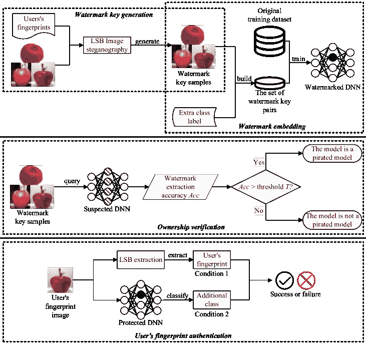

<!--yml

类别：未分类

日期：2024-09-06 19:36:25

-->

# [2310.09822] 从被动到主动：深度学习模型的主动知识产权保护综述

> 来源：[`ar5iv.labs.arxiv.org/html/2310.09822`](https://ar5iv.labs.arxiv.org/html/2310.09822)

# 从被动到主动：深度学习模型的主动知识产权保护综述

徐名福、张乐优、张玉舒和刘伟强 M. Xue, Y. Zhang 在中国南京航空航天大学计算机科学与技术学院（电子邮件：mingfu.xue@nuaa.edu.cn; yushu@nuaa.edu.cn）工作。L.Y. Zhang 在澳大利亚格里菲斯大学信息与通信技术学院（电子邮件：leocityu@gmail.com）工作。W. Liu 在中国南京航空航天大学电子与信息工程学院（电子邮件：liuweiqiang@nuaa.edu.cn）工作。

###### 摘要

深度学习（DL）模型的知识产权保护引起了越来越多的关注。许多关于深度神经网络（DNN）模型知识产权保护的研究已经提出。现有的大多数工作使用 DNN 水印来验证模型的所有权，这被称为被动验证。相反，我们关注一种新型的知识产权保护方法，称为主动版权保护，涉及 DNN 模型的主动授权控制和用户身份管理。目前，主动 DNN 版权保护领域的研究相对有限。在这篇综述中，我们尝试清晰阐述主动 DNN 版权保护的内涵、属性和要求，提供主动版权保护的评估方法和指标，回顾和分析现有的主动 DL 模型知识产权保护工作，讨论主动 DL 模型版权保护技术可能面临的潜在攻击，并提供挑战和未来方向。这篇综述有助于系统地介绍主动 DNN 版权保护的新领域，并为后续工作提供参考和基础。

###### 关键词：

深度学习模型的知识产权保护，深度神经网络，主动知识产权保护，版权管理，主动授权控制，用户身份认证与管理。

## I 引言

自 2017 年以来，深度学习（DL）模型的知识产权（IP）保护引起了越来越多的关注[1, 2]。与多媒体领域的传统知识产权保护不同，深度学习模型知识产权保护是一个新兴且具有挑战性的领域，现有技术不能直接应用[2]。作为一种前沿研究方向，深度神经网络（DNN）知识产权保护仍处于初期阶段。随着深度神经网络的广泛应用，研究 DNN 版权保护具有迫切的需求和重要意义。近年来，提出了各种深度学习模型知识产权保护方法[3, 4, 5, 6, 7, 8, 1, 9, 10, 11, 12, 13, 14, 15, 16, 17, 18, 19]，其中大多数属于“被动验证”类别，这涉及在深度学习模型中嵌入水印或提取模型签名，然后在发生盗版和侵权后验证可疑模型的所有权。然而，这种被动验证方法不能主动防止盗版和侵权的发生。最近，少数学者开始关注主动深度学习模型知识产权保护方法，提供了这一新兴研究领域的有希望的方向。

在本综述中，我们试图清晰且系统地阐述主动深度学习（DL）知识产权保护的内涵、属性和要求，提供主动深度学习版权保护的评估方法和指标，回顾并分析现有的主动深度学习模型知识产权保护工作，并讨论主动深度学习模型版权保护可能面临的潜在攻击。最后，我们将对主动深度学习模型知识产权保护的挑战和未来方向提供见解。

本工作的贡献有多个方面：

+   •

    我们首次提出了以主动深度学习模型知识产权保护为重点的综述，填补了现有文献中的空白。

+   •

    主动深度学习模型知识产权保护的内涵、属性、要求、目标、评估建议和评估指标首次被系统地提出，为未来研究提供了宝贵的见解。

+   •

    我们对现有的主动深度学习模型知识产权保护方法进行了全面的回顾，突出其各自的优缺点。

+   •

    彻底讨论了主动深度学习模型知识产权保护可能面临的潜在攻击，增强了对这一领域安全挑战的理解。

+   •

    主动深度学习模型知识产权保护的挑战和未来方向被提出。

本文组织如下。第 II 节提出了主动 DL IP 保护的内涵、属性、要求、目标及特殊指标。第 III 节回顾了现有的主动 DL 模型 IP 保护工作。第 IV 节讨论了针对主动 DL IP 保护的潜在特定攻击。第 V 节介绍了主动 DL 模型 IP 保护的挑战和未来方向。第 VI 节对本文进行了总结。

## II 主动 DL 模型 IP 保护的内涵、要求和指标

### II-A 什么是主动 DL 模型 IP 保护？

工作[2]提供了 DNN IP 保护方法的分类。从“类型”角度来看，该分类包括两类：(i) 被动验证，即在模型中嵌入水印，并在模型被怀疑被盗版时被动验证模型的版权。绝大多数现有的 DNN IP 保护工作都属于这一类别。(ii) 主动授权控制，重点在于管理和控制模型使用。仅授权用户可以访问，防止未经授权的使用。本文特别集中于这一领域。

从“功能”角度来看，DNN 版权保护方法可以分为[2]： (i) 版权验证，即验证模型所有权，大多数现有工作属于这一类别；(ii) 版权管理，涉及用户身份的认证和管理，以及对用户使用的主动授权控制。这是商业 DNN 的必要功能，也是本文的重点和创新点。图 1 展示了被动所有权验证和主动授权控制的示意图。

图 1：被动所有权验证和主动授权控制的示意图。

尽管出现了许多保护 DNN 版权的方法，但相当一部分依赖于被动验证，无法主动防止盗版和侵权。虽然许多方法集中在模型所有权验证上，但很少涉及用户身份认证和唯一身份管理。这是商业版权管理的必要和关键功能。此外，它还容易受到不诚实用户的攻击，例如串通攻击。这些漏洞阻碍了深度学习模型的广泛商业使用和部署。

鉴于深度学习版权保护的应用需求不断升级，并且需要克服现有挑战，我们认为探索深度学习模型的主动保护方法是至关重要的。本综述致力于解决以下挑战，并实现相应的目标：

+   •

    大多数现有工作使用 DNN 水印在发生盗版和侵权后验证 DNN 版权。我们能否主动防止盗版和侵权的发生——主动授权控制？

+   •

    如何区分不同的深度神经网络（DNN）用户，以满足商业 DNN 版权保护的需求——用户身份认证与管理（即版权管理）？

+   •

    现有工作的各种攻击主要针对 DNN 水印（被动版权验证）。针对本研究讨论的新方向——主动授权控制，可能存在哪些攻击和绕过机制？

+   •

    如何根据商业应用的需求评估 DNN 版权保护方法，特别是如何评估新方向——DNN 主动授权控制？

为实现上述目标，必须研究并解决主动授权控制方案中的以下技术难题/挑战：（i）如何构建唯一用户身份；（ii）如何生成隐形用户指纹以抵御攻击或指纹泄漏；（iii）如何使 DNN 模型区分授权用户与未授权用户；（iv）如何区分不同的授权用户；（v）如何根据不同用户控制 DNN 模型的功能和性能。

主动深度学习模型版权保护方法具备主动抵御盗版的能力。此外，大多数现有方法嵌入水印或从模型中提取指纹以验证模型的所有权，但并未考虑版权管理。解决对强大商业深度神经网络版权保护的迫切需求需要有效的用户身份认证和管理。为此，深度学习模型主动 IP 保护（也称为版权管理）框架包括两个模块：用户身份认证和管理，以及主动授权控制，如图 2 所示。

图 2：深度学习模型的主动 IP 保护框架。

主动授权控制模块涉及：

+   •

    区分授权用户和未授权用户：模型必须能够区分授权用户和未授权用户。

+   •

    区分不同的授权用户：模型应能够区分不同的授权用户。

+   •

    基于不同用户区分深度学习模型的功能和性能：深度学习模型应根据用户的身份提供不同的功能和性能。授权用户可以正常使用深度学习模型并获得正常性能，而未授权用户则无法使用该模型或只能获得极低的模型性能。

用户身份认证和管理模块涉及：

+   •

    用户指纹生成：为每个授权用户生成唯一的用户指纹/身份。此外，为了抵御攻击或指纹泄漏，理想的用户指纹应当是视觉上不可察觉的。

+   •

    用户指纹分配：每个授权用户被分配一个唯一的用户指纹，该指纹应能够抵御串通攻击、伪造攻击等。

+   •

    用户指纹认证和追踪：模型可以从输入中提取用户的指纹进行认证，并可以追踪用户的身份。

为了应对商业深度神经网络（DNN）版权保护的迫切需求，并克服当前研究的局限性，探索主动的 DNN 版权保护机制至关重要。这些机制应基于主动授权控制和用户身份认证与管理（版权管理）。该工作的关键组成部分包括： (i) 研究 DNN 的独特用户指纹生成、分配、认证和管理方法； (ii) 建立一个主动授权控制机制，用于区分 DNN 模型的授权用户和未授权用户； (iii) 研究针对 DNN 主动授权控制的攻击和绕过机制（所有现有攻击均针对 DNN 水印），并根据不同攻击者的能力进行分层攻击机制研究； (iv) 建立一个全面的 DNN 版权保护方法评估框架，涵盖基本功能指标和抗攻击指标，特别关注新提出的主动授权控制机制的评估方法（主动授权控制的评估指标与现有 DNN 水印的评估指标不同）。主动版权保护可以解决 DNN 水印的被动性和拷贝管理难度等瓶颈问题，同时解决主动授权控制、DNN 用户身份认证和跟踪等复杂问题，从而为构建一个主动、安全且稳健的 DNN 版权保护机制奠定理论基础，并为 DNN 的商业应用提供理论和技术支持。

### II-B 独特的主动深度学习知识产权保护度量

现有 DNN IP 保护方法的评估主要围绕 DNN 水印定制的指标展开，这在 DNN 主动授权控制的评估指标方面留下了研究空白。本文通过制定 DNN 主动授权控制的评估指标，引入了一种新颖的视角，这些指标不同于传统的 DNN 水印方法。此外，现有的功能指标关注常常掩盖了对强大攻击抵抗指标的需求。本文讨论了用于主动深度学习 IP 保护的独特指标，这些指标分为基本功能指标和攻击抵抗指标。针对主动授权控制提出的功能指标包括：成本、用户认证成功率、授权用户能够获得的模型性能、未经授权用户能够获得的模型性能、用户身份的唯一性、支持的用户数量、部署便利性、对目标模型的了解、可解释性等。针对主动授权控制提出的攻击抵抗指标包括：用户身份隐蔽性、抵抗样本修改攻击、用户身份不可伪造性、抵抗自适应攻击以及抵抗逆向分析等。本文提出的主动深度学习 IP 保护的独特指标可以为后续相关工作的评估提供参考，也可以根据评估结果提供改进主动版权保护机制的反馈。

具体来说，本文提出了针对 DNN 主动授权控制的以下独特指标，这些指标不同于常见的 DNN 水印指标。

基本功能指标包括：

+   •

    开销：主动授权控制方案引入的开销应当低或没有开销，保持在模型所有者和用户可以接受的范围内。

+   •

    用户身份认证成功率：在主动授权控制方案中，介绍了用户身份认证和管理，需要评估用户身份认证的成功率。

+   •

    授权用户能够获得的模型性能：在主动授权控制方案中，区分了授权和未经授权用户的模型使用情况和模型性能，授权用户应能够获得高水平的模型性能。

+   •

    未经授权用户能够获得的模型性能：在主动授权控制方案中，区分了授权和未经授权用户的模型使用情况和性能，未经授权的用户应当只能获得极低的模型性能，甚至无法使用该模型。

+   •

    用户身份的唯一性：在主动授权控制方案中，包含了用户身份认证和管理，每个用户的身份应当是唯一的。

+   •

    支持用户的数量：在主动授权控制方案中，为用户生成唯一身份进行授权控制，该方案应能够支持大量用户身份的生成。

+   •

    部署的便利性：主动授权控制方案是否需要从头开始进行培训才能实施，还是可以通过微调实现？

+   •

    目标模型的知识：理想的情况是解决方案可以应用于黑箱场景，而不仅仅是白箱场景。

+   •

    可解释性：保护方案的可解释性在一些商业应用中是一个要求。

抵御攻击的指标包括：

+   •

    用户身份的隐蔽性：在主动授权控制方案中，为了防止攻击或用户身份泄露，嵌入在图像和样本中的用户身份应具备视觉隐蔽性，且隐蔽性良好。

+   •

    抵御样本修改攻击：在主动授权控制方案中，合法样本或包含用户身份的样本应能够抵御对样本的恶意修改。

+   •

    用户身份不可伪造性：在主动授权控制方案中，授权用户的身份应不可伪造，使攻击者难以伪造合法用户身份，并且攻击者伪造的用户身份无法通过模型的认证。

+   •

    对自适应攻击的抵抗：在最坏的情况下，攻击者了解主动版权保护机制，主动授权控制方案应能够抵御此类自适应攻击。

+   •

    反向分析抵抗：攻击者尝试逆向分析主动授权控制机制并进行破坏，主动 IP 保护方案应能够抵御反向分析。

## III 现有深度学习主动版权保护工作的概述

现有的深度学习版权保护方法大多属于被动 DNN 水印验证类别。这些技术本质上是反应性的，因为它们在盗版或侵权发生后才验证模型版权。然而，越来越多的研究致力于主动深度学习版权保护，旨在主动防止盗版和侵权。这些主动的深度学习版权保护工作主要集中在为模型提供主动授权控制，能够区分授权用户和未授权用户（授权用户可以使用模型或获得高性能，而未授权用户无法使用模型或只能获得低性能），但未考虑用户身份认证和管理，无法追踪授权用户的身份并区分不同的授权用户。接下来，我们将从两个方面回顾现有的深度学习主动版权保护工作：（i）主动授权控制；（ii）既有主动授权控制又有用户身份管理。现有主动深度学习版权保护工作的概述见表 I。

表 I: 现有主动深度学习版权保护工作

| 工作 | 机制 | 授权控制 | 用户身份认证和管理 |
| --- | --- | --- | --- |
| Chen 和 Wu [20] | 通过基于对抗性扰动的转换模块对输入进行预处理 | ✓ | – |
| Fan 等人 [21] | 除非提供有效的护照，否则 DNN 模型将无法正常运行 | ✓ | – |
| Ren 等人 [22] | 锁定模型，仅特定的令牌可以解锁模型 | ✓ | – |
| Lin 等人 [23] | 基于混沌权重的模型加密 | ✓ | – |
| AprilPyone 和 Kiya [24] | 使用带有密钥的块变换对特征图进行授权控制 | ✓ | – |
| Xue 等人 [25] | 基于梯度，对对模型性能影响最大的少量参数进行微小扰动，从而对模型进行加密 | ✓ | – |
| Luo 等人 [26] | 对模型的输出进行不同程度的扰动，以实现分层性能 | ✓ | – |
| Pan 等人 [27] | 模型权重基于置换和扩散进行加密/解密，并生成了一个与设备绑定的基于 PUF 的密钥 | ✓ | – |
| Chakraborty 等人 [28] | 针对硬件神经网络的混淆框架，需要通过硬件中的密钥进行授权 | ✓ | – |
| Xue 等人 [29] | 基于多触发后门的用户指纹管理和 DNN 授权控制框架 | ✓ | ✓ |
| Tang et al. [30] | 教师-学生模型，其中客户 DNN 仅在客户输入有效序列号时才能正常工作 | ✓ | ✓ |
| Wang et al. [31] | 将不同的后门嵌入模型中，为不同用户生成多个用户模型实例 | ✓ | ✓ |
| Chen et al. [32] | 在权重的概率密度函数中编码每个构造的用户指纹 | ✓ | ✓ |
| Xue et al. [33] | 使用精心制作的对抗样本（具有特定类别和特定置信度）作为用户指纹 | ✓ | ✓ |
| Xue et al. [34] | 使用额外类别和通过隐写术嵌入的用户身份信息，以支持用户身份验证和模型所有权验证 | ✓ | ✓ |
| Fan et al. [35] | 使用额外类别、授权控制和图像感知哈希 | ✓ | ✓ |
| Wu et al. [36] | 反向和多次使用样本特定的后门进行授权控制，并嵌入不可感知的用户身份信息 | ✓ | ✓ |

### III-A 主动授权控制

Chen et al. [20] 提出了一个 DNN 访问控制框架，使得只有授权用户才能正常使用模型。他们设计了一个基于对抗样本的转换模块来提供授权输入，其中对抗扰动被添加到输入中。授权用户可以使用转换模块来预处理输入，从而获得高模型性能。相反，未经授权的用户直接将输入提供给模型将导致模型性能差。

Fan et al. [21] 提出了将特定护照嵌入神经网络的方法。DNN 模型的推断性能会根据提供的护照进行调整，即在存在有效护照的情况下，预训练的 DNN 模型的推断性能将保持不变，或者由于护照的修改或伪造而显著恶化。除非提供有效的护照，否则 DNN 模型将无法正常工作，从而防止模型的非法使用。

Ren et al. [22] 提出了一个针对深度学习的模型锁定方案，旨在防止攻击者即使盗取模型也能实现高预测精度。如果输入中不存在特定的令牌，则锁定的 DNN 模型将提供较差的预测精度。当输入中包含特定设计的授权令牌时，模型可以正常预测。

Lin et al. [23] 提出了基于混沌映射理论的混沌权重框架，通过交换权重位置实现加密效果，使卷积层或全连接层的核心变得混沌。除非模型被解密，否则将返回错误的预测结果。这些基于加密的实现可能会影响模型性能或引入较高的开销。

AprilPyone 和 Kiya [24] 提出了一个带密钥的卷积神经网络（CNN）模型保护方法，该方法对特征图应用了带密钥的块变换，使授权用户能够实现高分类准确率，而未经授权的用户则实现低分类准确率。

Xue 等人 [25] 提出了基于参数扰动的主动 DNN 版权保护，如图 3 所示。对对模型性能影响最大的极少量参数进行基于梯度的轻微扰动。通过加密极少量的参数，可以显著降低模型的准确性。授权用户可以在 MLaaS 中解密模型并实现高精度的模型性能。

图 3：基于参数扰动的 DNN 主动授权控制 [25]。

Luo 等人 [26] 提出了一个用于 CNN 的多用户分层授权方法，该方法可以帮助所有者根据不同级别的访问权限控制输出结果。他们参考了差分隐私，并使用拉普拉斯机制对模型的输出进行不同程度的扰动，以实现分层性能。

Pan 等人 [27] 基于置换和扩散对模型权重进行加密/解密，以实现知识产权保护，并生成了一个基于物理不可克隆功能（PUF）的设备绑定密钥。这种方法针对 DL 硬件，并且开销较高。

Chakraborty 等人 [28] 提出了一个硬件神经网络混淆框架，该框架要求硬件中有一个密钥用于授权。模型所有者首先使用基于密钥的反向传播来训练 DNN 架构，这会模糊模型的权重空间，然后将深度学习模型托管在共享平台上。只有拥有硬件信任根（带嵌入密钥的片上存储器）的授权用户才能使用深度学习模型。上述硬件 DNN 版权保护工作关注 DNN 硬件设备的版权保护，并且需要硬件平台的支持，如硬件信任根，这导致了高成本。

### III-B 用户身份认证和管理

之前讨论的 DL 版权保护方法优先考虑授权控制，但未涉及用户身份认证和管理。因此，它们未能完全符合商业 DL 版权管理的要求。此外，它们也容易受到不诚实用户发起的攻击，例如勾结攻击。最近，有限的研究集中于开发支持授权控制和用户身份认证及管理的主动版权保护技术。

薛等人[29]提出了一种基于多触发后门[37]的用户指纹管理和 DNN 授权控制框架。首先，在 DNN 模型中植入$N$个子后门。然后，将一小组图像（具有$n$ ($n<N$)个子后门触发器对应于中等置信度）分配给授权用户作为其唯一的指纹。只有模型所有者拥有所有$N$个对应于高置信度的后门触发器，用于验证模型的所有权。通过这种方式，既可以实现用户身份认证，也可以实现所有权验证。

唐等人[30]提出了一种基于深度序列号的水印方法。首先，训练了一个私有教师 DNN 模型，然后将其知识提取并转移到一系列定制的学生 DNN 模型中。在蒸馏过程中，每个客户 DNN 具有一个唯一的序列号，这是一个加密的 0/1 触发模式。客户 DNN 只有在客户输入有效的序列号时才能正常工作。

王等人[31]提出了一种买家可追溯的 DNN 模型 IP 保护方法。他们通过带有脏标签的训练数据中毒将不同的后门嵌入到模型中，并生成大量保持准确性的用户模型实例，以供不同买家使用。每个后门训练模型可以通过一组特殊的验证图像触发。售给不同买家的模型实例可以通过触发其特定的后门唯一区分。

陈等人[32]指出，在大规模模型分发系统中，多位用户可以使用各自的水印模型进行合作，构建一个未标记的高性能模型，这被称为指纹勾结攻击。他们提出了一种用于深度学习模型数字版权管理的安全指纹框架。他们为每个用户设计了独特的指纹。通过在 DNN 重新训练过程中结合指纹的特定正则化损失，每个构建的指纹都被编码在权重的概率密度函数中，从而使所有者能够验证模型所有者的信息和用户的独特身份，并能够抵御指纹勾结攻击。

Xue 等人 [33] 提出了通过对抗样本进行用户指纹识别的主动 DNN 版权保护方法。它可以为 DNN 提供主动授权控制、用户身份管理和所有权验证。具体而言，他们使用精心设计的对抗样本（具有特定置信度的特定类别）作为用户的指纹。授权用户可以将他们的指纹输入 DNN 进行认证并获得正常使用，而未经授权的用户将获得显著差的模型性能。此外，模型所有者将水印嵌入 DNN 的权重中以进行所有权验证。

Xue 等人 [34] 提出了基于隐藏后门和用户身份认证的深度神经网络（DNN）模型主动版权保护方法，如图 4 所示。他们利用一个额外的类别来支持用户身份认证和模型所有权验证。为了在 DNN 中嵌入隐藏后门（水印），从训练集之外选择少量图像作为水印密钥样本。然后，将表示用户身份的指纹信息嵌入到水印密钥样本中，并为水印密钥样本分配一个额外的类别标签 [34]。接下来，他们将水印密钥样本添加到 DNN 的训练数据集中进行模型训练。训练后，DNN 将嵌入水印。在测试阶段，DNN 总是将水印密钥样本预测为额外的类别。此外，由于水印密钥样本来源于数据集之外的样本（而非具有明显水印模式的样本），并且水印是通过额外的类别嵌入的，因此水印密钥样本与水印之间建立了强联系，可以抵御查询修改攻击。为了支持用户认证，使用隐写术将用户指纹信息隐藏在水印密钥样本中，使用户指纹信息不可察觉 [34]。在用户认证阶段，水印密钥样本作为用户指纹提交给 DNN 进行身份验证。

Fan 等人 [35] 提出了一个用于 DNN 的主动版权保护和追溯框架。结合授权控制策略和图像感知哈希算法，构建了一个授权控制中心。在该框架中，检测器检测用户输入的关键图像是否合法，认证器验证用户身份信息是否合法。

图 4: 基于额外类别和隐写术的 DNN 活跃授权控制和用户身份认证 [34]。

吴等人 [36] 使用特定的后门提供 DNN 模型的授权控制和用户身份管理，如图 5 所示。该方案中的后门触发器被用作授权密钥，并且有隐藏的指纹可以提取以验证用户的身份。他们反向利用样本特定后门攻击的特点，其中后门触发器用于将图像从错误类别引导到正确类别，从而实现授权控制 [36]。通过这种方式，模型版权保护方法仅能为授权用户（拥有 U-Net 模型的用户）提供正常的模型性能，而未经授权的用户则无法正常使用模型。同时，后门触发器不是固定模式，而是通过 U-Net 模型生成的。因此，拥有触发器生成模型的用户可以正常使用目标模型。在这种方法中，对于不同的干净图像，相应的触发器是不可察觉的且与图像相关，即生成的后门触发器与相应的干净图像的内容相关，不同的图像对应不同的后门触发器。此外，每个后门触发器隐藏了一个与授权用户相关的唯一指纹，模型所有者可以通过从后门实例中提取指纹来验证和追踪用户的身份。在将 U-Net 模型分发给授权用户时，可以将任何字符串嵌入到图像中。他们将用户的唯一指纹作为字符串隐藏到 U-Net 模型中，并将这个 U-Net 分配给相应的授权用户 [36]。在推理阶段，当授权用户通过 U-Net 模型生成后门实例时，他们的指纹会与后门触发器一起嵌入到图像中。随后，模型所有者可以从提交的后门实例中提取这个指纹来验证和追踪用户的身份。

图 5: 基于样本特定后门的活跃 DNN 知识产权保护 [36]。

### III-C 挑战

如上所述，在 DNN 版权保护领域存在若干紧迫的挑战和瓶颈问题，需要引起关注：

+   •

    大多数现有的 DNN 版权保护方法依赖于被动验证，这意味着它们仅在发生盗版和侵权实例后才确认 DNN 模型的所有权。这种后验证方法无法主动防止盗版和侵权的发生。为了实现 DNN 模型的大规模商业应用，迫切需要主动版权保护机制。

+   •

    大多数现有的 DNN 版权保护方法仅关注模型版权的验证，而不管理用户的唯一身份，因此缺乏有效的版权管理，这是商业 DNN 版权保护所必需的核心要求。此外，它们还容易受到多种攻击，例如勾结攻击。

+   •

    现有工作中考虑的各种攻击都针对的是 DNN 水印（后验证版权保护）。对于本文研究的新方向——主动授权控制，可能的攻击和绕过机制仍然是空白的。

+   •

    缺乏系统的评估方法。作为一个新兴的前沿研究方向，DNN 版权保护仍处于起步阶段，缺乏全面的评估方法。这一缺口在主动授权控制的情况下尤为明显，评估指标和方法尚未开发。

## IV 主动深度学习知识产权保护面临的攻击

对 DNN 版权保护的现有攻击都针对 DNN 水印，包括模型修改攻击、规避/移除攻击以及一些更具攻击性场景 [2]。

本文专注于研究针对深度学习主动授权控制的攻击和绕过机制，包括但不限于以下内容：

查询修改攻击 [38]: 查询修改攻击是一种强有力的攻击方法。这种攻击旨在使用自动编码器检测和移除水印密钥样本中的水印，从而使在所有权验证期间水印查询失效。我们认为自动编码器可以用于攻击水印密钥样本。工作 [34] 认为他们的方案在以下原因下对查询修改攻击具有鲁棒性。首先，在该方案中，水印密钥样本是从不同数据集中的干净图像生成的。这一设计选择确保了水印触发模式与干净图像的模式几乎无法区分。因此，攻击者无法通过在图像中寻找独特的水印触发模式来检测水印。其次，该方案建立了水印密钥样本与附加类别标签之间的鲁棒连接。这一连接具有韧性，因此即使水印密钥样本因自动编码器攻击而发生轻微修改，DNN 仍能将更改后的水印样本分类到附加类别中 [34]。

自适应攻击：自适应攻击指的是攻击者了解保护机制的细节并尝试绕过它，这是一种最坏情况下的攻击场景。我们将以工作中的主动授权控制机制[36]为例进行讨论。在实际应用中，未经授权的用户无法访问受保护的模型和 U-Net 模型。为了讨论该方案的鲁棒性，他们考虑了最坏的情况，假设攻击者知道所提议的方法基于后门，并且无意中获得了一对干净图像和相应的后门实例。这样，攻击者试图通过从后门实例中减去干净图像来获得相应的触发器。然后，攻击者将触发器添加到另一张干净图像中以伪造一个“后门实例”。对工作[36]的分析表明，受保护模型在自适应攻击下的干净准确性保持在相对较低的水平。因此，这些“伪造的后门实例”仍会被受保护模型预测为错误类别。原因在于该方案为不同的干净图像生成不同的触发器。同时，生成的样本特定触发器仅对相应的干净图像有效。因此，当用于干净图像$x_{1}$的触发器用于另一张干净图像$x_{2}$时，该触发器将失效，受保护模型仍会将图像视为干净图像并输出错误类别。总之，当攻击者使用伪造触发器进行自适应攻击时，方法[36]仍具有鲁棒性。

压缩攻击：攻击者可能利用图像压缩来干扰验证或认证样本。以工作中的方案[36]为例，该方案中的 U-Net 模型处理的图像可能在传输过程中被压缩，而压缩操作会去除图像中的多余像素。工作[36]使用常见的 JPEG 压缩方法来评估该方案在面对压缩攻击时的鲁棒性。处理后的 U-Net 图像经历 JPEG 压缩，然后将压缩后的后门实例输入受保护模型进行预测。结果表明，授权用户在 JPEG 压缩攻击下获得的模型预测准确性接近于没有 JPEG 压缩攻击下的准确性。在图像传输过程中，即使图像被 JPEG 压缩，授权用户仍然可以实现正常的预测准确性。此外，即使图像经过 JPEG 压缩，方法仍然可以有效提取和验证用户的指纹。因此，方法[36]对 JPEG 压缩攻击具有鲁棒性。

勾结攻击：一组拥有相同主机深度神经网络（DNN）和不同指纹的授权用户可能会进行勾结攻击，试图构建一个具有相同功能的模型[32]，或者与未经授权的用户勾结，为多个未经授权的用户提供授权使用。

用户指纹伪造：攻击者试图伪造输入图像中的合法用户指纹，以通过身份认证并获得模型授权。以文献[34]为例，如果攻击者想要成功伪造指纹，他需要了解额外的类别、使用的隐写术和指纹的具体格式。由于上述信息对授权用户也是黑箱且未知的，攻击者很难获取这些信息，这使得伪造合法用户指纹变得困难。以文献[36]为例，攻击者想要成功伪造用户指纹。然而，用户指纹与每个样本相关联，并且在视觉上不可感知。授权用户无法获取指纹信息，如果他们幸运地破解了一个样本的对应指纹，这个指纹不能应用于其他样本。因此，攻击者很难伪造合法用户指纹。

破解授权控制模块：攻击者试图破解活跃的深度学习（DL）IP 保护方案的核心——活跃授权控制模块。以文献[36]为例，攻击者试图破解特殊训练的 U-Net 模块。然而，U-Net 模块与模型共同训练，并且由四个损失函数专门训练。此外，在 U-Net 模块中嵌入了独特的指纹。破解和伪造这样的 U-Net 模型比窃取商业深度神经网络（DNN）模型更困难。

从防御角度来看，增强这些深度学习（DL）IP 保护方案鲁棒性的策略包括（但不限于）：（i）针对特定攻击的定制防御策略。例如，为了对抗水印去除攻击，建议通过从头开始训练嵌入水印，并将水印嵌入到与主要任务不可分割的地方，这样攻击者如果想去除水印，就会不可避免地损害原始模型的性能；（ii）基于生成对抗网络的防御机制，其中嵌入水印的训练过程作为生成器，而集成多种水印检测方法的检测器作为判别器，可以嵌入具有强攻击抗性的隐藏水印。总体而言，存在的攻击可能是什么以及如何防御仍然是开放性问题。

## V 未来方向

### V-A 针对查询修改攻击的无损模型性能的主动授权控制方法

在现有工作中，将水印嵌入模型可能会影响模型在主要任务上的性能。在主动授权控制方案中，如何确保构建的基于用户身份认证的主动授权控制方法不会影响模型在主要任务上的性能，以及如何构建能够抵御查询修改攻击的关键样本或认证样本[38]，是关键挑战。

### V-B 区分不同的授权用户

大多数现有的深度学习（DL）模型主动版权保护方案侧重于为模型所有者提供主动授权控制，这可以区分授权用户和未授权用户，但未考虑用户身份认证和管理，无法追踪授权用户的身份和区分不同的授权用户。

### V-C 授权用户的独特且不易察觉的指纹生成方法，以及模型性能差异化控制方法

目前大多数现有的深度神经网络（DNN）版权保护方法都是被动的，它们在盗版和侵权发生后才进行版权验证。主动的 DNN 版权保护方法可以锁定模型并主动防止盗版。此外，大多数现有方法嵌入水印或从模型中提取指纹以验证模型的所有权，但未考虑版权管理。为了满足商业 DNN 版权保护的迫切需求，必须有效地认证和管理用户身份。在主动授权控制方案中，如何为授权用户构建独特且不易察觉的指纹生成方法，以及如何根据不同用户控制 DNN 模型的功能和性能，是未来需要解决的难点/挑战。

### V-D 活动授权控制的攻击机制

大多数现有的 DNN 版权保护工作已评估了模型修改的鲁棒性，而只有少量工作考虑了水印移除攻击或规避攻击。针对本研究的新方向——主动授权控制，关于可能的攻击和绕过机制的研究仍然不足。在 DNN 主动授权控制框架下，攻击者会采取什么针对性的攻击方法？主动授权控制方案如何克服自适应攻击、查询修改攻击、压缩攻击、串通攻击、用户指纹伪造攻击和授权控制模块破解攻击等强攻击方法，是未来的研究方向。

### V-E 考虑攻击抵抗的主动授权控制评估方法

对 DNN 主动授权控制的评估研究仍然不足。此外，现有的大多数 DNN 版权保护评估工作集中于 DNN 水印的功能性指标，攻击抵抗指标的研究则不足。对于主动授权控制框架，如何构建考虑攻击抵抗的评估方法和指标是未来的研究方向。

### V-F 数据集的主动授权控制

除了对 DL 模型的主动授权控制外，最近关注数据集授权控制的研究者很少 [39, 40]。数据集同样具有高价值，并在越来越多的场景中被广泛使用。如何构建数据集使用的授权控制也是一个潜在的研究方向。

## VI 结论

本综述首次聚焦于前沿的主动 DL 版权保护方法，分析当前瓶颈，讨论主动版权保护的目标与内涵——提供主动版权保护（主动防止盗版）和版权管理（用户身份认证）功能，并呼吁研究主动 DL 授权控制的攻击机制和评估。研究主动 DNN 版权保护预计能突破深度神经网络版权保护面临的瓶颈和前沿挑战，提供有效的版权保护机制，并为深度神经网络模型的商业实施奠定理论基础，这具有重要意义。

## 参考文献

+   [1] Y. 内田, Y. 永井, S. 坂泽, 和 S. 佐藤, “将水印嵌入深度神经网络中，” 见 *ACM 国际多媒体检索会议论文集*，2017 年，第 269–277 页。

+   [2] M. 薛, Y. 张, J. 王, 和 W. 刘, “深度学习模型的知识产权保护：分类、方法、攻击与评估，” *IEEE 人工智能学报*，第 3 卷，第 6 期，第 908–923 页，2022 年。

+   [3] J. 张, D. 陈, J. 廖, H. 方, W. 张, W. 周, H. 崔, 和 N. 于, “用于图像处理网络的模型水印，” 见 *第 34 届 AAAI 人工智能会议*，2020 年，第 12 805–12 812 页。

+   [4] H. 吴, G. 刘, Y. 姚, 和 X. 张, “用水印图像对神经网络进行水印化，” *IEEE 视频技术电路与系统学报*，第 31 卷，第 7 期，第 2591–2601 页，2021 年。

+   [5] G. 赵, C. 秦, H. 姚, 和 Y. 韩, “DNN 自嵌入水印：面向深度神经网络的篡改检测与参数恢复，” *模式识别通讯*，第 164 卷，第 16–22 页，2022 年。

+   [6] L. 王, Z. 王, X. 李, 和 C. 秦, “使用残差网络对神经网络模型进行鲁棒水印化，” 见 *第 24 届 IEEE 国际多媒体信号处理研讨会*，2022 年，第 1–6 页。

+   [7] Y. Quan, H. Teng, Y. Chen, 和 H. Ji，“图像处理中的深度神经网络水印技术，” *IEEE 神经网络与学习系统交易*，第 32 卷，第 5 期，第 1852–1865 页，2021 年。

+   [8] X. Guan, H. Feng, W. Zhang, H. Zhou, J. Zhang, 和 N. Yu，“深度卷积神经网络中的可逆水印技术用于完整性认证，” *第 28 届 ACM 国际多媒体会议*，2020 年，第 2273–2280 页。

+   [9] B. D. Rouhani, H. Chen, 和 F. Koushanfar，“DeepSigns：用于深度神经网络所有权保护的端到端水印框架，” *第二十四届编程语言和操作系统架构支持国际会议论文集*，2019 年，第 485–497 页。

+   [10] J. Zhang, Z. Gu, J. Jang, H. Wu, M. P. Stoecklin, H. Huang, 和 I. M. Molloy，“通过水印技术保护深度神经网络的知识产权，” *亚太计算机与通信安全会议论文集*，2018 年，第 159–172 页。

+   [11] Y. Adi, C. Baum, M. Cissé, B. Pinkas, 和 J. Keshet，“将劣势转化为优势：通过后门技术对深度神经网络进行水印处理，” *第 27 届 USENIX 安全研讨会*，2018 年，第 1615–1631 页。

+   [12] Y. Zheng, S. Wang, 和 C. Chang，“用于不可否认的模型所有权识别和盗版检测的 DNN 指纹，” *IEEE 信息取证与安全交易*，第 17 卷，第 2977–2989 页，2022 年。

+   [13] M. Xue, X. Wang, Y. Wu, S. Ni, Y. Zhang, 和 W. Liu，“InFIP：一种基于内在特征的可解释 DNN 知识产权保护方法，” *CoRR*，第 abs/2210.07481 卷，2022 年。

+   [14] Z. Yin, H. Yin, 和 X. Zhang，“无模型性能下降的神经网络脆弱水印，” *IEEE 国际图像处理会议*，2022 年，第 3958–3962 页。

+   [15] H. Chen, H. Zhou, J. Zhang, D. Chen, W. Zhang, K. Chen, G. Hua, 和 N. Yu，“深度卷积神经网络的感知哈希用于模型复制检测，” *ACM 多媒体计算通信与应用交易*，第 19 卷，第 3 期，第 123:1–123:20 页，2023 年。

+   [16] H. Chen, W. Zhang, K. Liu, K. Chen, H. Fang, 和 N. Yu，“基于语音模式的黑箱模型水印技术用于自动语音识别，” *IEEE 国际声学、语音与信号处理会议*，2022 年，第 3059–3063 页。

+   [17] L. Lin 和 H. Wu，“通过无损黑箱水印和敏感样本验证深度集成模型的完整性，” *第 10 届国际数字取证与安全研讨会*，2022 年，第 1–6 页。

+   [18] T. Qiao, Y. Ma, N. Zheng, H. Wu, Y. Chen, M. Xu, 和 X. Luo，“保护生成对抗网络的新型模型水印，” *计算机与安全*，第 127 卷，第 103102 页，2023 年。

+   [19] X. Zhao, H. Wu, 和 X. Zhang，“通过随机图对图神经网络进行水印处理，” *第 9 届国际数字取证与安全研讨会*，2021 年，第 1–6 页。

+   [20] M. Chen 和 M. Wu，“保护您的深度神经网络免受盗版，”发表于*IEEE 信息取证与安全国际研讨会*，2018 年，页码 1–7。

+   [21] L. Fan, K. W. Ng, C. S. Chan 和 Q. Yang，“DeepIPR：使用护照进行深度神经网络所有权验证，”*IEEE 模式分析与机器智能汇刊*，第 44 卷，第 10 期，页码 6122–6139，2022 年。

+   [22] G. Ren, J. Wu, G. Li, S. Li 和 M. Guizani，“在基于 AI 的网络安全服务中，通过可靠的学习模型可用性来保护知识产权，”*IEEE 可靠性与安全计算汇刊*，页码 1–18，2022 年。

+   [23] N. Lin, X. Chen, H. Lu 和 X. Li，“混沌权重：一种保护深度神经网络知识产权的新方法，”*IEEE 计算机辅助设计集成电路与系统汇刊*，第 40 卷，第 7 期，页码 1327–1339，2021 年。

+   [24] M. AprilPyone 和 H. Kiya，“一种使用由秘密密钥转换的特征图来保护训练过的 CNN 模型免受未经授权访问的方法，”发表于*亚太信号与信息处理协会年会暨会议*，2021 年，页码 1851–1857。

+   [25] M. Xue, Z. Wu, Y. Zhang, J. Wang 和 W. Liu，“Advparams：一种通过对抗扰动基于参数加密的主动 DNN 知识产权保护技术，”*IEEE 新兴计算主题汇刊*，第 11 卷，第 3 期，页码 664–678，2023 年。

+   [26] Y. Luo, G. Feng 和 X. Zhang，“多用户卷积神经网络的分层授权，”*IEEE 信号处理快报*，第 28 卷，页码 1560–1564，2021 年。

+   [27] Q. Pan, M. Dong, K. Ota 和 J. Wu，“设备绑定无密钥存储硬件 AI 模型知识产权保护：一种基于 PUF 和置换扩散加密的方法，”*CoRR*，第 abs/2212.11133 卷，2022 年。

+   [28] A. Chakraborty, A. Mondai 和 A. Srivastava，“硬件辅助的深度学习模型知识产权保护，”发表于*第 57 届 ACM/IEEE 设计自动化会议*，2020 年，页码 1–6。

+   [29] M. Xue, Z. Wu, C. He, J. Wang 和 W. Liu，“主动 DNN 知识产权保护：一种新型用户指纹管理和 DNN 授权控制技术，”发表于*IEEE 第 19 届计算与通信信任、安全与隐私国际会议*，2020 年，页码 975–982。

+   [30] R. Tang, M. Du 和 X. Hu，“深度序列号：用于 DNN 知识产权保护的计算水印，”发表于*机器学习与知识发现数据库：应用数据科学与演示轨道 - 欧洲会议*，第 14174 卷，2023 年，页码 157–173。

+   [31] S. Wang, C. Xu, Y. Zheng 和 C. Chang，“一种防盗版和挪用的买家可追踪 DNN 模型知识产权保护方法，”发表于*第 4 届 IEEE 人工智能电路与系统国际会议*，2022 年，页码 308–311。

+   [32] H. Chen, B. D. Rouhani, C. Fu, J. Zhao 和 F. Koushanfar，“DeepMarks：用于深度学习模型数字版权管理的安全指纹框架，”发表于*国际多媒体检索会议*，2019 年，页码 105–113。

+   [33] M. Xue, S. Sun, C. He, D. Gu, Y. Zhang, J. Wang, 和 W. Liu, “ActiveGuard：一种利用对抗样本作为用户指纹的深度神经网络主动知识产权保护技术，” *IET Computers & Digital Techniques*, vol. 17, no. 3-4, 页码 111–126, 2023 年。

+   [34] M. Xue, S. Sun, Y. Zhang, J. Wang, 和 W. Liu, “通过隐蔽后门和用户身份认证的深度神经网络主动知识产权保护，” *Applied Intelligence*, vol. 52, no. 14, 页码 16 497–16 511, 2022 年。

+   [35] X. Fan, H. Gui, 和 X. Zhou, “PCPT 和 ACPT：DNN 模型的版权保护与追踪方案，” *CoRR*, vol. abs/2206.02541, 2022 年。

+   [36] Y. Wu, M. Xue, D. Gu, Y. Zhang, 和 W. Liu, “基于样本特定后门的深度神经网络主动知识产权保护，” 见 *第 4 届 IEEE 人工智能电路与系统国际会议*, 2022 年, 页码 316–319。

+   [37] M. Xue, C. He, J. Wang, 和 W. Liu, “一对多与多对一：针对深度学习模型的两种高级后门攻击，” *IEEE Transactions on Dependable and Secure Computing*, vol. 19, no. 3, 页码 1562–1578, 2022 年。

+   [38] R. Namba 和 J. Sakuma, “具有指数加权的神经网络鲁棒水印，” 见 *ACM 亚洲计算机与通信安全会议论文集*, 2019 年, 页码 228–240。

+   [39] M. Xue, Y. Wu, Y. Zhang, J. Wang, 和 W. Liu, “数据集授权控制：通过可逆特征空间对抗样本保护数据集知识产权，” *Applied Intelligence*, vol. 53, no. 6, 页码 7298–7309, 2023 年。

+   [40] Y. Lu, Z. Tang, X. Chai, M. Wang, 和 S. Song, “一种基于双重水印的半开放源数据集知识产权分级保护方案，” *Optik*, vol. 269, 页码 169931, 2022 年。
