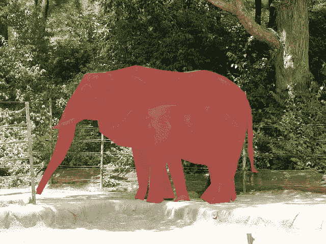
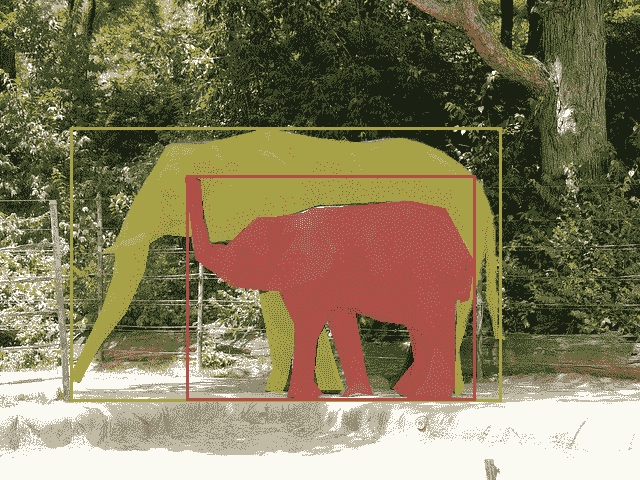

<!--yml

类别：未分类

日期：2024-09-06 19:36:23

-->

# [2310.12393] 视频实例分割的深度学习技术：综述

> 来源：[`ar5iv.labs.arxiv.org/html/2310.12393`](https://ar5iv.labs.arxiv.org/html/2310.12393)

# 视频实例分割的深度学习技术：综述

陈浩 Xu chenhao.xu@deakin.edu.au 常云津 Li changtsun.li@deakin.edu.au 庸建 Hu eeyjhu@scut.edu.cn 李志鹏 Lim chee.lim@deakin.edu.au 道格拉斯·克雷顿 Creighton douglas.creighton@deakin.edu.au

###### 摘要

视频实例分割，也称为多目标跟踪和分割，是一个新兴的计算机视觉研究领域，始于 2019 年，旨在同时检测、分割和跟踪视频中的实例。通过有效分析和利用视频中的视觉信息来处理视频实例分割任务，可以实现一系列计算机视觉应用（如人类动作识别、医学图像处理、自动驾驶导航、监控等）。随着深度学习技术在各种计算机视觉领域中占据主导地位，提出了大量基于深度学习的视频实例分割方案。本综述提供了对视频实例分割的深度学习方案的多方面视角，涵盖了各种架构范式，并对功能性能、模型复杂性和计算开销进行了比较。除了常见的架构设计，还汇编并讨论了用于提高深度学习模型在视频实例分割中性能的辅助技术。最后，我们讨论了该领域主要的挑战和进一步研究的方向，以帮助推进这一有前景的研究领域。

###### 关键词：

深度学习，视频实例分割，多目标跟踪和分割，视频分割，实例分割^†^†期刊：模式识别\affiliation

[label1]组织=信息技术学院，迪肯大学，城市=吉朗，邮政编码=3216，州=维多利亚州，国家=澳大利亚 \affiliation[label2]组织=电子与信息工程学院，华南理工大学，城市=广州，邮政编码=510641，州=广东省，国家=中国 \affiliation[label3]组织=智能系统研究与创新学院，迪肯大学，城市=吉朗，邮政编码=3216，州=维多利亚州，国家=澳大利亚

## 1 引言

从图像分割[1, 2]扩展而来的视频实例分割（VIS）最初在 2019 年由[3]提出。与仅检测和分割图像中的对象的图像分割不同，VIS 涉及跨视频帧的更复杂和更具挑战性的实例跟踪。VIS 在各种现实应用中发挥着重要作用。例如，通过获取视频中实例的更好表示，VIS 有助于人类动作识别和人物（重新）识别，增强了监控系统的安全性[4, 5, 6]。鉴于特斯拉正在生产其 DOJO 超级计算机[7]以改善其驾驶辅助系统，VIS 帮助车辆识别和跟踪其他车辆和行人，从而提升自动驾驶能力[8, 9]。在医疗领域，VIS 支持生物医学图像分析、病理检测和手术自动化[10, 11]。此外，VIS 在农业[12]、建筑[13]和娱乐[14]领域展示了其提高生产力、安全性和用户体验的潜力。

深度学习是一种基于深度神经网络的机器学习方法，这些网络由多个层和处理节点组成[15, 16]。各种深度神经网络，如卷积神经网络（CNN）、递归神经网络（RNN）、图神经网络（GNN）和变换器（Transformers），在深度学习方案中越来越多地被采用，以应对计算机视觉[17]、自然语言处理[18]等领域的挑战。这些新兴的深度学习解决方案通常表现出比传统机器学习方法更优的性能[19]。

近年来，针对 VIS 提出了大量深度学习方案。通常，研究人员通过组装成熟的深度神经网络来提出新颖的深度学习架构，以更有效地提取特征和汇聚时空信息。此外，一些研究人员还专注于辅助技术，如数据集和表示学习方法，以提高深度学习模型在 VIS 中的性能。鉴于对 VIS 研究关注的快速扩展，本文回顾了现有的与 VIS 相关的深度学习技术工作。

文献中已经发表了大量关于实例分割和目标检测的调查。然而，它们大多数集中在图像分割[20]、变换器[21]，或视频目标跟踪技术[22, 23, 24]，对新兴的视频实例分割（VIS）领域关注有限。为了填补这一空白，本调查全面回顾了 VIS 的深度学习方案，并识别了关键挑战和有前景的研究方向。表 1 中列出了本调查与现有调查论文的比较。

表 1：与现有调查论文的比较

| 引用 | 年份 | 综述广度 | 综述深度 |
| --- | --- | --- | --- |
| [25] | 2020 | 多目标跟踪 | 深度学习技术 |
| [26] | 2020 | 视频目标分割与跟踪 | 分离的分割和跟踪方法 |
| [27] | 2021 | 多目标跟踪 | 实时深度学习技术 |
| [22] | 2021 | 多目标跟踪 | 相似性计算和重识别技术 |
| [24] | 2022 | 多目标跟踪 | 判别滤波器和孪生网络 |
| [23] | 2022 | 多目标跟踪 | 数据关联方法 |
| [19] | 2022 | 视频目标分割与视频语义分割 | 深度学习技术 |
| [28] | 2022 | 多目标跟踪 | 嵌入方法 |
| [29] | 2022 | 多目标跟踪 | 目标检测和关联方法 |
| [30] | 2023 | 视频目标分割 | 深度学习技术 |
| [31] | 2023 | 移动目标分割 | 高效深度学习技术 |
| [21] | 2023 | 视觉分割 | 基于变换器的方法 |
| 我们的 | - | 视频实例分割 | 深度学习技术 |

总结来说，本文的贡献如下。首先，从结构角度回顾和定性比较了 VIS 的深度学习技术。其次，概述了提高深度学习模型在 VIS 中性能的辅助技术。第三，突出了一些挑战和潜在的研究方向，以促进 VIS 领域的进一步研究。

本文组织如下。第二部分提供了背景知识，以帮助读者更好地理解相关技术。第三部分从架构的角度分析、比较和总结了不同的深度学习方案。第四部分回顾了用于提高深度学习模型性能的辅助技术。第五部分阐述了若干挑战和未来研究方向。最后，第六部分总结了本次调查。本调查中使用的缩略语总结在表 2 中。

表 2：缩略语及说明

| 缩略语 | 说明 |
| --- | --- |
| CNN | 卷积神经网络 |
| FPN | 特征金字塔网络 |
| GNN | 图神经网络 |
| LSTM | 长短期记忆网络 |
| MOT | 多目标跟踪 |
| MOTS | 多目标跟踪与分割 |
| RNN | 循环神经网络 |
| RoI | 感兴趣区域 |
| VIS | 视频实例分割 |
| ViT | 视觉变换器 |
| VOS | 视频目标分割 |
| VPS | 视频全景分割 |
| VSS | 视频语义分割 |

## 2 前言

在深入分析最近的视频实例分割（VIS）研究之前，解释与本调查相关的基本概念是至关重要的，包括各种视频分割任务和深度神经网络。

### 2.1 视频分割

视频分割旨在隔离和识别视频中的元素。特别是，视频分割包括几个不同的任务：视频对象分割、视频语义分割和视频实例分割，如图 1 所示。为了帮助读者更好地掌握本调查的范围，本节详细阐述并比较这些任务。还需要注意“对象”和“实例”之间的区别。在 VIS 的上下文中，对象指的是视频帧中的一般类别（例如，在街道场景中，对象可以是行人、汽车、交通标志和建筑物）。而“实例”指的是对象类别的单独出现。例如，如果视频帧中有多辆车，VIS 将通过分配唯一标签来区分每辆车。因此，一个对象类别包括该类别的多个实例。

(a) VOS

(b) VSS

(c) VIS

图 1：视频分割任务。

视频对象分割：视频对象分割（VOS）是一种二值分割任务，要求模型将前景对象从视频的背景中分割出来[32, 26, 19]。换句话说，VOS 不是分割帧中的每个像素，而只是分割与显著对象相关的像素。分类结果是二值的，没有区分相同对象类别的不同实例。VOS 是最早的视频分割任务，它为其他任务奠定了基础。

视频语义分割：语义分割最初是为图像处理提出的，要求模型将图像中的每个像素分类到一个类别中[33, 34]。后来，语义分割的概念应用于视频中，称为视频语义分割（VSS）[35, 36]。与 VOS 相比，VSS 将帧中的每个像素与多个语义类别之一关联起来。无需区分不同的实例。

视频实例分割（VIS）：2019 年，Yang 等人 [3] 引入了 VIS 任务，该任务要求检测、分割和跟踪视频中单独实例的物体。同年，Voigtlaender 等人 [37] 将多目标跟踪（MOT） [6] 扩展到实例分割跟踪，并创造了“多目标跟踪与分割”（MOTS）这一术语，这与 VIS 类似。VIS 和 MOTS 的唯一区别在于 MOTS 要求在评估期间掩码不重叠 [38]。因此，在本调查中，VIS 和 MOTS 这两个术语可以互换使用。与 VOS 和 VSS 相比，VIS 在每帧中分割显著物体，并将结果分配到多个类别，同时识别和跟踪单独的实例。

### 2.2 深度神经网络

由于深度神经网络种类繁多，下面介绍了现有深度学习方案中最常用的一些网络。

卷积神经网络（CNN）：CNN 是一种流行的深度神经网络，通过其卷积核自动从图像中提取特征 [39, 16, 40]。CNN 广泛应用于图像和视频领域，如物体检测、物体跟踪、动作识别等 [40]。

循环神经网络（RNN）：RNN 是一种针对序列数据或时间序列数据设计的深度神经网络，通过网络中的循环保留上下文信息 [41]。因此，许多著名的 RNN，如长短期记忆网络（LSTM），在 VIS 方案中广泛应用，以帮助 CNN 逐帧学习序列视觉特征 [42]。

图神经网络（GNN）：GNN 是一种针对图数据设计的深度神经网络，通过图节点之间的消息传递捕捉节点之间的依赖关系，并进行节点、边和图层级的预测 [43]。在 VIS 中，GNN 通常用于建模实例之间的关系，以便更好地进行实例跟踪和分割 [44]。

Transformer：Transformer 是一种流行的深度神经网络，具有自注意力机制，通过自动放大关键标记，实现对长序列的全局感知 [21]。视觉 Transformer（ViT）是一种 Transformer，它将输入图像拆分成一系列的补丁，然后对其进行标记。由于其卓越的性能，ViT 被用于越来越多的计算机视觉任务，如图像分类 [45]、物体检测 [46, 47] 和 VIS [48]。Transformer 能够根据 DEtection TRansformer（DETR）的设计在帧级别检测和分割物体 [46]。Transformer 还提供了长距离依赖建模和时间特征关联，以便更好地进行实例跟踪 [49]。

骨干，Neck 和 Head：为了完成计算机视觉中的复杂任务，通常由多种深度神经网络组成，组织为骨干，neck 和 head [19, 21]。特别是，骨干负责从输入中提取特征，neck 聚合和优化骨干提取的特征，而 head 负责进行预测。这些概念延续到视频实例分割的深度学习框架中。

## 3 种视频实例分割的深度学习架构

在本节中，从架构的角度分析并分类了最近的视频实例分割深度学习方案。特别是，由于视频实例分割的深度学习方案的骨干通常具有类似的设计用于提取帧级特征，分类标准主要依赖于 neck 中特征处理的设计。具体来说，视频实例分割的深度学习方案可以广泛分类为多阶段，多分支，混合，集成和循环类型。表 3 概述了不同深度学习架构的优缺点。此外，表 3 提供了每种深度学习架构的设计思想和相应的工作。

表 3：视频实例分割的深度学习架构比较

| 架构 | 设计思想 | 工作 | 优点（$\ast$）和缺点（-） |
| --- | --- | --- | --- |
| M-Stage | Mask R-CNN | [3, 37, 50, 51, 52, 53, 38, 54] | $\ast$ 有效提取低级和高级特征。 |
| Mask Propagation | [55, 56, 57, 58] | $\ast$ 轻松替换子网络以适应各种应用。 |
| IRNet | [59, 60] | - 更多的处理阶段增加了计算复杂性。 |
| 注意力机制 | [61, 62, 63, 64, 65, 66] |  |
| Polamask & FCOS | [67, 68] |  |
| M-Branch | 实例 + 物体分割 | [69, 70, 71, 72] | $\ast$ 有效的时空特征处理。 |
| 检测 + 追踪 | [73, 74] | $\ast$ 有效的多模态特征处理。 |
| YOLACT | [75, 76, 77, 78, 79, 79, 80, 81] | - 增加架构复杂性 |
| Siamese 网络 | [82, 83, 84, 85, 86, 87, 88, 89, 90, 85, 84, 91, 92] | - 需要仔细设计和调整以平衡各个分支。 |
| 知识蒸馏 | [93] |  |
| 点云 | [94, 95] |  |
| 混合 | M-Branch 编码器 & 解码器 | [96, 97, 98, 99, 100] | $\ast$ 更好地利用不同类型网络的优势。 |
| $\ast$ 有效学习稳健和广泛的表现。 |
| - 增加了复杂性和计算开销。 |
| - 需要仔细选择和设计子网络。 |
| 综合 | 3D-CNN & GNN | [101, 102] | $\ast$ 针对特定数据分布的综合特征处理。 |
| ViT | [103, 104, 49, 105, 106, 107, 108, 109, 110, 111, 112, 113] | - 需要大量数据集和较长的训练时间才能达到理想模型。 - 不够灵活，难以调整以满足不同的用途。 |
| 循环 | LSTM & GNN | [114, 115, 116, 117, 44] | $\ast$ 有效捕捉时间依赖性和上下文。 |
| 带查询传播的 ViT | [118, 119, 120, 121, 48, 122, 123] | - 更长的上下文理解需要更多的计算开销。 |

### 3.1 多阶段特征处理架构

多阶段特征处理涉及多个特征处理和转换阶段，每个阶段都建立在之前阶段学到的表示基础上。早期阶段通常捕捉帧级特征并提出多个感兴趣区域（RoIs），而后期阶段则聚合特征并处理抽象模式和语义信息，用于任务如目标检测、目标分类、实例分割和跨帧实例跟踪。流行的多阶段特征处理架构包括 MaskTrack R-CNN [3] 和 TrackR-CNN [37]，它们扩展自著名的图像实例分割网络 Mask R-CNN [124]。

在[3]中提出 VIS 任务时，Yang 等人通过为跟踪视频帧中的实例添加后处理阶段，将 Mask R-CNN [124] 扩展为 MaskTrack R-CNN。具体而言，他们利用内存队列存储先前识别实例的特征。在 Mask R-CNN 中嵌入了一个跟踪头，用于比较新检测到的实例与已识别实例之间的相似度。当介绍 MOTS 任务时[37]，作者提出了一个从 Mask R-CNN 扩展出来的 TrackR-CNN 网络[124]。特别地，使用了 3D-CNN 进行特征提取[36]。在特征映射之上，第一阶段利用区域建议网络(RPN) [125] 生成目标对象的建议。在第二阶段，使用几个头部来预测每个 RoI 的类别、框、二进制掩码和关联向量。计算关联向量之间的欧氏距离，将检测到的实例随时间关联到轨道上。作为 VIS 的早期作品，MaskTrack R-CNN 和 TrackR-CNN [3, 37] 简单地扩展了图像实例分割架构(Mask R-CNN)，因此存在几个缺陷，包括分割精度、实例跟踪一致性、遮挡抵抗能力和计算复杂性。大多数后续的 VIS 方案都改进了某些方面，并将这两个方案作为基准。

在实例跟踪方面，作者们利用了[50]中的 CNN 从多个帧中同时提取特征，并使用了具有余弦相似度的 Siamese 网络[5]来跟踪时间特征。从理论上讲，该方案避免了使用计算量大的 3D-CNN，从而在一定程度上提高了计算效率。然而，从多个帧获取 RoI 提议的额外开销以及随后的特征相似度比较增加了计算复杂性。此外，从视频序列中随机采样的帧无法确保特征比较的可靠性。类似于[50]，Porzi 等人[51]向 Mask R-CNN 中引入了一个跟踪头组件。该方法接受来自区域分割头的输出和来自特征金字塔网络（FPN）[126]的相应 RoI 特征。虽然该方法消除了对现有实例的内存缓存的需求，但也限制了识别重新出现的实例的能力。为了提高实例跟踪和重新识别的性能，[52]的作者提出了一种双向跟踪器，即实例像素双重跟踪器（IPDT）。基于 RoI 提议，首先校准对象类别以过滤掉全局视频上下文中的假阳性类别。然后，IPDT 双向跟踪实例级别和像素级别的嵌入，旨在注入实例级别的概念并区分重叠实例。在[53]中，作者们没有将视频视为一系列帧，而是将其视为由多个跟踪小片段组成的树，以更好地跟踪重新出现的实例。特别是，基于 Mask R-CNN[53]提出了一种跟踪小片段关联算法 UnOVOST。在第一阶段，利用时空一致性线索将连续帧中的片段组合成包含相同对象片段的短期跟踪小片段。在第二阶段，这些短期跟踪小片段使用决策树合并为长期轨迹，决策树基于外观相似性进行修剪。该方法提高了远距离实例跟踪的性能。然而，与帧级跟踪方法相比，其计算复杂性和内存开销较高。通过采用 UnOVOST，在[38]中，作者们在 2019 年 YouTube-VIS 挑战赛中获得了第一名。除了决策树，研究人员还采用了动态规划来识别跨帧的全局最佳分配[54]。这些方案的一个显著优势是改善了对跨帧实例的理解，并且在重叠区域上具有更好的分割性能，与早期 VIS 方案 MaskTrack R-CNN 和 TrackR-CNN 相比。

训练半监督视频实例分割（VIS）模型的一个典型方法是将一个或几个关键帧的掩码传播到整个视频或视频片段。例如，Tran 等人提出了一种双向实例分割方法[55]。该方法制定了一种前向和后向传播策略，以利用邻近帧中的掩码作为当前帧实例分割的参考。次年，Tran 等人介绍了一种多参考引导实例分割方案[56]。在第一次掩码传播之后，可靠的帧被缓存到内存中，作为第二轮掩码传播的参考。然而，这种双重处理方法在处理长视频时效率较低。同样，在[57]中，Bertasius 等人提出通过比较特征张量的差异，将特定帧中的实例特征传播到整个视频片段，这使得片段级实例跟踪成为可能。这种方法在处理重叠实例时表现优于 MaskTrack R-CNN。然而，在视频中分离密集实例和识别细粒度实例特征[127]似乎具有挑战性，因为它过于依赖 Mask R-CNN 的掩码预测。受到[128]研究发现的启发，[58]的作者引入了一种提出-减少范式用于半监督 VIS。具体来说，基于 Mask R-CNN，添加了一个序列传播头，根据视频中的多个关键帧生成实例序列提案。然后，通过各种非最大抑制（NMS）技术减少涉及相同实例的冗余提案。这种提出-减少策略在跟踪长视频中的实例时比较直接。然而，在调整序列提案数量时，要在计算开销和实例跟踪性能之间取得良好的平衡并非易事。需要更有效的关键帧选择方法以提高性能和计算效率。

除了掩码传播，训练半监督 VIS 模型的另一种方法是利用像素间关系网络（IRNet）[129]。IRNet 是一种基于类别注意力图（CAM）的 CNN 架构。CAM 通过仅使用图像级别的监督来定位不同的实例并大致估计它们的边界。在 [59] 中，刘等人采用了 IRNet 和光流，将相似的标签分配给具有相似运动的像素。时间一致性被利用于在相邻帧之间传播可靠的预测，以恢复帧之间缺失的实例。该方法优于其他图像实例分割方案，但与监督 VIS 方案相比，仍存在精度差距。同样，在 [60] 中，Ruiz 等人提出了一种基于梯度加权 CAM（Grad-CAM）[130] 的弱监督学习策略。实质上，Grad-CAM 是一种类别区分的定位技术，用于预测目标概念的粗略定位热图。由于他们的方案中结合了多任务学习来同时预测掩码、边界框和类别，Grad-CAM 被用于根据分类分支的输出定位前景掩码。

几项研究利用注意力机制来改进传统的多阶段特征处理方案的检测、分割和跟踪能力。在[61]中，刘等人嵌入了一个时空注意力网络到 MaskTrack R-CNN 中。旨在通过估计两个连续帧上的注意力来聚焦于预定义类别的实例。在[62]中，付等人为了更好地 RoI 和对象提议，引入了一个基于帧级别的注意力模块和一个基于对象级别的注意力模块到 Mask R-CNN 中。在[63]中，Abrantes 等人采用 Transformer 对帧级别实例分割进行处理，随后对轨迹中的蒙版进行时间注意力调整。同样，在[64]中，一个时间注意力模块和一个空间注意力模块被结合到 Mask R-CNN 中，以改进视频中实例感知的表示。在 Mask R-CNN 中使用了基于循环的 Transformer 改进策略，用于预测低维蒙版嵌入并提高性能[65]。然而，这种部分注意力改进的方案通常会给传统的多阶段特征处理框架带来进一步的复杂性和计算开销，而性能的提升却很有限。通过废除传统的多阶段特征处理设计，66]的工作将 VIS 方案分解为三个子任务，即分割、跟踪和细化，每个子任务都由不同的注意力模块处理。在帧级别对实例进行分割后，利用交叉注意力机制[46]来建模帧间的关联，从而追踪实例并实现在线视觉实例分割。此外，还设计了一个基于 Transformer 的离线优化模块，用于从整个视频中利用上下文信息来完善实例跟踪的输出。

在效率方面，一些研究人员关注于降低视觉实例分割（VIS）模型的计算复杂度，以便它们能够应用于车辆和其他边缘设备。Dong 等人[67]提出了一种轻量级的 VIS 网络，该网络在极坐标系中回归一组固定的边缘点，而不是预测传统的实例掩膜。在用 FPN 提取特征后，基于热图预测实例的质心，随后用于预测极坐标掩膜。这种方法能够在移动边缘计算平台上实现实时跟踪。提高计算效率的另一个想法是消除预定义的锚框[131]。Liu 等人[68]通过引入额外的跟踪头和掩膜头，将无锚框和无提议的物体检测模型 FCOS[131]扩展到 VIS。目标实例根据其边界框动态划分为子区域，以进行细粒度实例分割。跟踪头直接使用 FCOS 生成的物体检测中心来建模物体运动以跟踪实例。然而，对于这些以效率为重点的方法，克服遮挡和运动模糊问题以及提高分割精度仍然是具有挑战性的任务。

### 3.2 多分支特征处理架构

多分支特征处理架构由多个并行工作的分支组成，以处理输入数据的不同方面或表示。这些分支通常处理不同子任务的特征，这些分支的输出通常会融合或组合，以实现 VIS。通过多个分支，模型可以捕捉互补信息，学习到稳健且具有辨别力的表示。实际上，多分支架构通常可以比单一分支架构获得更好的性能，但代价是增加了训练和推理过程中的参数和计算开销。一些利用这种架构的代表性研究如下。

显著性图是视觉系统在每帧中关注显著区域的关键线索[132, 35]。从语义实例分割（SIS）和显著对象分割（SOS）这两个子任务的角度出发，Le 等人[69]提出了一个语义实例-显著对象（SISO）框架，该框架包含两个分支，分别负责这两个子任务。在语义实例分割方面，每帧的高置信度实例掩膜被传播并整合到后续帧中的实例里。在显著对象分割方面，采用了 3D 全卷积网络（3D-FCN）[133]来计算显著区域掩膜。通过融合这两个分支的特征并整合身份追踪模块，视频中的语义显著实例最终被分割。在[70]中，Lin 等人提出了一个类似的想法，既捕捉所有实例共享的特征（即 SOS），又通过实例特定的特征区分不同的实例（即 SIS）。该框架包含两个分支，其中一个专注于与实例无关的模块，另一个则专注于实例特定的模块。然后，利用注意力引导解码器融合两个分支的特征，接着是最终预测模块。同样，Ge 等人[71]基于相关矩阵设计了两个分支，一个生成粗略实例评分图，另一个则将前景与背景分开。在[72]中，作者认为实例理解在视频目标分割（VOS）中很重要，并开发了一个两分支网络。实例分割分支探索当前帧的实例特征，而 VOS 分支则与记忆库进行时空匹配。尽管通过采用在公共数据集上预训练的模型取得了良好性能，但对两个分支的模型进行微调比多阶段方案更具挑战。此外，与单分支方法相比，多分支方案通常具有更多的参数和较低的处理效率。

另一种解决 VIS 的方法是分配两个分支分别执行检测和跟踪操作。在[73]中，设计了一种混合任务级联（HTC）[134]方法来进行图像实例分割，并且使用了 SiamMask[135]来跟踪对象。两个原始的 SiamMask 被级联在一起，以更好地预测实例的掩码。然而，当处理重叠实例时，性能会受到图像实例分割模块的显著影响。为了应对实例消失后再出现的情况，一些研究者在实例掩码预测分支旁引入了一个记忆库来存储代表性的运动模式[74]。在被送入解码器以预测目标掩码之前，当前帧中的编码掩码特征与从记忆库中检索到的运动模式表示相结合，从而提高了对遮挡和快速移动物体的鲁棒性。然而，性能受制于之前帧中学习到的运动模式。ConvLSTM 和记忆库所带来的额外计算和存储开销也不可忽视。

随着“你只看一次（YOLO）”[136]算法在图像对象检测中的流行，一个扩展变体 YOLACT[75, 76]展示了其在 VIS 中的有效性。YOLACT 的双分支设计用于原型掩模生成和掩模系数预测，实现了高效的图像级实例分割。YOLACT 在严重遮挡下的有效性在[77]中得到了验证。基于 YOLACT，在[78, 79]中，作者提出了 SipMask。该模型通过将掩模预测划分为多个子掩模预测，更好地保留了实例中的空间信息。除了图像级实例分割任务，SipMask 还被验证对 VIS 任务有效。尽管这是一个高效的 VIS 解决方案，但该方案缺乏对视频中帧间时间信息的利用。为了改进 YOLACT，提出了通过添加另一个跟踪解码器分支来生成所有实例的嵌入向量[137]。被称为 YolTrack，它将推断速度提高到实时水平，但以牺牲准确性和精度为代价。此外，在[80]中，将两个相邻帧的 FPN 特征进行了融合，以探索时间相关性。该方法包括两个 YOLACT 分支用于帧级实例分割以及一个额外的时间分支用于融合两个连续帧之间的特征。然而，该方法在处理长视频中的实例，尤其是处理消失和重新出现的实例时，缺乏对实例的理解和跟踪。另一方面，为了提高 YOLACT 在边缘设备上的效率，[81]的作者提出了 YolactEdge。它通过仅计算特征的一个子集来减少视频非关键帧的计算开销。

孪生网络的多分支设计[5] 自然适合通过比较特征嵌入在不同帧之间跟踪实例。为了使跟踪线索更好地辅助检测，[82]的工作提出了一个基于孪生网络的关联模块。该模块提取连续帧中的再识别嵌入特征，以改善当前处理帧中的分割。在[83]中，提出了一种基于孪生网络的创新交叉学习方案，称为 CrossVIS。特别是，交叉学习使动态滤波器能够学习在两个不同帧中的同一实例的背景无关表示。基于孪生网络，对比学习似乎是一种有效的表示学习方式。[84]的工作通过比较相邻帧，使同一实例的嵌入更接近，不同实例的嵌入更远离。这种方法在 2022 年 YouTube-VIS 挑战赛中获得了整体第一名[85]。另一种基于对比学习的 VIS 策略在[86]中提出，旨在提高实例关联的准确性。受[138]的启发，引入了一种双向时空学习方案进行训练。尽管孪生网络为视频中连续帧之间的实例跟踪提供了高效的特征比较，但这些方案在理解长视频以及重新识别消失和重新出现的实例时仍然具有挑战性。为了提高对遮挡和重现的鲁棒性，利用了识别和关联模块来预测识别编号并跟踪实例[87]。识别模块检测新实例，分配身份，并将其编码为嵌入，以便在帧之间进一步传播。通过存储最后一帧的嵌入，关联模块有效地帮助将信息从之前的帧传播到当前帧。该方法在解决遮挡 VIS 任务时表现良好。随后，在[88]中，作者提出了一种基于图像实例分割方案 SOLO[139, 140]的网格结构 VIS 模型，即 VISOLO。具体而言，视频中的每一帧都被划分为均匀的网格。这些网格作为创建语义类别分数和实例掩码的基本单元。然后，记忆匹配模块缓存之前帧的特征图，计算不同帧中网格之间的相似性度量以进行实例跟踪。与卷积特征相比，网格级特征更容易在多个模块之间重用和共享。这使得该方法能够保留更长时间的特征图历史，提高了对遮挡和重现的鲁棒性。

随着 Transformers 在 VIS 中的出现，提出了各种使用 Siamese 网络在目标帧和参考帧之间建立帧间注意力的方案。在[89]中，作者为 Siamese 网络引入了具有共享权重的帧内注意力模块，以在每一帧中链接实例级别和像素级别的特征。此外，还使用了一个帧间注意力模块来融合混合的时间信息，并学习跨帧的时间一致性。在[90, 85, 84, 91]中报告的研究中也采用了类似的基于注意力的时间上下文融合方法用于帧间实例关联。虽然帧间注意力对于跨不同帧跟踪实例非常有用，但在长视频中有效选择参考关键帧以减少计算复杂性同时提高实例跟踪准确性仍然具有挑战性。因此，在[92]中提出了一种基于 Transformers 的片段间注意力方案。具体而言，通过比较目标片段和参考片段特征的相似性，以少量样本的方式学习目标视频中的实例序列。然而，关于该方法有效性的证据仅限于少量。

知识蒸馏[141]是一种将知识从大模型（教师）转移到小模型（学生）的机器学习方法。它允许一个在线 VIS 模型从离线模型中学习大量知识，以实现一致的实例跟踪和分割。Kim 等人[93]提出了一种用于 VIS 的离线到在线知识蒸馏（OOKD）方法。设计的查询过滤和关联（QFA）模块过滤掉不良查询，并将离线和在线模型之间的实例特征连接起来。通过从单帧中编码对象中心特征，并结合从教师模型中提取的长距离全局上下文，该模型展示了最先进的特征匹配和实例跟踪能力。

点云也是学习实例表示的有效方法。在[94, 95]中，作者在两个独立的分支中构建了两个二维点云，以从前景和周围区域学习特征。可以从点云中提取出用于分割的特征，如偏移量、颜色、类别和位置。然而，该方案的精度高度依赖于所使用的点的数量，而使用更多的点会导致显著更重的计算负担。

### 3.3 混合特征处理架构

混合特征处理架构将多阶段和多分支架构集成到一个综合框架中。通过在每个分支中的多阶段处理，特征在更高的语义层级上被聚合和处理，从而在每个子任务上实现更好的性能。另一方面，通过多分支处理 VIS 的不同子任务，特征以稳健且具有区分性的方法进行学习。然而，混合架构通常比多阶段和多分支架构更复杂，研究人员担心其提高的性能是否能弥补更高的计算负担。以下讨论的工作是一些具有多分支编码器-解码器设计特征的混合特征处理架构的例子。

在第一帧中没有初始掩码的情况下，将变分自编码器集成到 Mask R-CNN 中，以帮助捕捉所有实例共享的空间和运动信息[96]。具体而言，该架构中有一个编码器用于生成潜在分布，还有三个并行解码器分配给三个不同的分支。这些分支负责学习语义信息，提供关注线索以减少假阴性，并从编码器中聚合特征。然而，该架构几乎使原始的 Mask R-CNN 模型的复杂性增加了一倍。另一个基于编码器-解码器模型的类似工作是[97, 98]。基于来自图像编码器的特征，三个解码器：脉冲解码器、位置解码器和外观解码器分别生成潜在分布、偏移向量和外观嵌入。实证结果表明，该方法在 AP 上比 MaskTrack R-CNN 提高了$3.5\%$，但速度慢了两倍。

考虑到 VIS 的高标注成本，[99]中提出了一种两阶段网络。该网络包括一个用于视频对象提议的双分支判别网络（D-Net）和一个用于关联对象提议的双分支目标感知跟踪网络（T-Net）。在 D-Net 中，一个分支估计显著对象，而另一个分支预测实例像素。通过比较当前帧中的对象提议与历史跟踪结果，T-Net 为目标对象生成分割分数预测。尽管准确性有所提高，但由于设计复杂且冗长，该方法在训练和推理中都带来了大量的计算开销。另一方面，[100]中开发了一种仅需边界框标签的半监督框架。该框架在一个分支中利用光流捕捉实例之间的时间运动，而在另一个分支中使用深度估计提供实例之间的空间关联。通过利用来自光流和深度估计分支的特征，生成了一系列显著实例的伪标签。边界框监督的拼图求解器进一步细化和组装次优掩码，并恢复原始实例。该方法在性能上与完全监督的 TrackR-CNN 和 MaskTrack R-CNN 相当。然而，在长视频理解和识别重新出现的实例方面仍有改进的空间。此外，去除训练过程中的边界框标签依赖性也是一种有前景的方向。

### 3.4 综合特征处理架构

综合特征处理架构通常将视频或剪辑中的所有帧的特征一起提取，以构建一个 3D 时空特征体。通过聚合时空特征，该模型通常由一个编码器-解码器设计组成，自动学习跨时间和空间的多样实例的高级表示，然后进行最终预测。与多阶段和多分支架构相比，综合架构提供了一种优雅的设计，并且随着自注意力机制的广泛使用而受到越来越多的关注。然而，它通常需要较长的训练过程、更多的训练数据以及更多的计算和内存资源。以下是利用综合特征处理架构的相关工作回顾。

在 2020 年，Athar 等人 [101] 采用了一个 FPN 来提取不同尺度的特征图。然后将这些特征图沿时间维度堆叠，以便使用 3D-CNN 模型进行解码。然而，这种方法的性能在很大程度上依赖于 3D-CNN 模型构建 3D 掩模管道的能力。精确分割 3D 掩模管道需要大量的内存消耗，以存储更多的细粒度时空特征。为了提取与背景无关的特征并在整个场景中跟踪实例，Brasó 等人 [102] 在一组帧上构建了一个图，每个节点代表一个对象检测。然后，通过 CNN 获得的特征嵌入在图上经过多次迭代的神经消息传递 [142]，用于预测每个 RoI 的实例掩模。尽管 GNN 是一种有前途的解决方案，用于在视频级别学习实例关联和背景无关特征，但其计算复杂度对帧中的实例密度和视频长度高度敏感。

由于 Transformers 的自注意力机制有助于在图像级别将注意力集中在目标实例的特征上 [46]，因此许多尝试已被提出以利用这一优点进行 VIS 中的 3D 时空特征提取。在 [103] 中，Cheng 等人将基于 Transformer 的图像实例分割模型，即 Mask2Former [143]，扩展到 VIS。对 3D 时空特征应用了掩模注意力，以直接预测每个实例在时间上的 3D 掩模。Choudhuri 等人 [104] 证明，采用绝对位置编码像 [103] 可能会导致对象查询严重依赖于实例的位置，从而无法识别实例位置的变化。因此，他们提出了相对位置编码上的相对对象查询，以使 Transformer 更好地捕捉实例在帧之间的位置变化。在 [49] 中，作者将基于 Transformer 的图像对象检测模型 DETR [46] 扩展到 VIS。该方法称为 VisTR，包含一个实例序列匹配模块，以监督帧之间的实例序列，以及一个实例序列分割模块，用于累积掩模特征并预测最终的掩模序列。这些基于 Transformer 的方案使用视频或剪辑中的所有帧作为输入，同时生成一系列实例预测，从而导致显著的计算和内存开销。为了减少计算和存储开销，Hwang 等人 [105] 提出了一个剪辑处理管道。该管道在性能上优于那些逐帧方法，并且在内存使用上低于那些逐视频方法。具体来说，设计了两个 Transformer，一个独立地编码每一帧，另一个在帧之间交换信息。

注意，Transformers 的自注意力机制通常涉及对整个视频的时空输入进行爆炸性的计算和内存开销，因为它对输入序列具有平方复杂度[144]。可变形注意力[144]相比于全注意力，具有更小的计算复杂度，因为它仅关注分配给每个查询的参考点周围的少量关键采样点。因此，设计了一个多级可变形注意力方案，名为 SeqFormer[106]，以涵盖视频的帧级和实例级注意力查询。具体而言，SeqFormer 首先使用可变形注意力[144]执行独立的帧级框查询。然后，实例查询基于从每帧的框查询中提取的特征进行，这生成最终的分割掩码序列。继 SeqFormer[106]之后，Zhang 等人[107]指出了多尺度时间信息对 VIS 的重要性。他们提出了 TAFormer，将空间和时间多尺度可变形注意力模块结合在一个编码器中。虽然 TAFormer 的表现略好于 SeqFormer，但它有更多的调整参数和计算复杂度。除了可变形注意力，MSG-Transformer[145]是计算高效的自注意力机制变体。在处理图像时，MSG-Transformer 不采用全注意力，而是采用局部注意力对子区域进行处理，并在每个子区域引入一个额外的信使标记，以便在不同子区域之间交换信息。因此，在[108]中，将 MSG-Transformer 扩展到 VIS 以实现高效计算，命名为 TeViT。具体而言，TeViT 在视频中的所有帧上构建补丁标记和信使标记，并在时间维度上移动信使标记以捕捉时间上下文信息。与 VisTR 相比，TeViT 在视频处理速度和实例分割精度方面表现更好。此外，SeaFormer[146]，一种具有压缩增强轴向注意力的轻量级 ViT，被用来为移动设备生成高效的 VIS 方案[109]。为了加速 VisTR 的收敛，EfficientVIS 在[110]中通过利用剪辑处理管道被提出。具体而言，EfficientVIS 将自注意力扩展到 Sparse R-CNN[47]，以支持剪辑级查询和建议。然而，EfficientVIS 中的剪辑级查询和建议的性能高度依赖于视频剪辑上时空 RoI[124]的精度。另一方面，考虑到从视频中提取的密集时空特征是计算复杂度高的主要原因，VITA[111]被制定为通过帧级目标检测器仅提取对象感知上下文。通过收集整个视频的帧级目标标记，VITA 建立了每个检测到的对象之间的关系，并实现了全局视频理解。此外，还开发了一种简单且计算高效的基于 Transformer 的 VIS 方案，即 MinVIS[112]。MinVIS 仅训练基于查询的图像实例分割模型。在后处理步骤中，通过跨帧的查询嵌入的二分匹配来跟踪实例。MinVIS 还支持在训练视频中对子采样已标注的帧，以进一步提高训练效率。

在注释高效的视觉目标检测方面，基于 Mask2Former [103]，在 [113] 的研究中引入了 MaskFreeVIS，通过使用边界框注释替代掩模注释的方式来进行训练。具体来说，BoxInst [147]，一种基于边界框的图像实例分割方法，通过引入时序 KNN-patch 损失（TK-Loss）进行了扩展。该方法通过高效的补丁匹配步骤识别帧间的一对多匹配，然后进行 K-最近邻选择。实证研究表明，MaskFreeVIS 的性能优于某些完全监督的模型，如 EfficientVIS [110]。

### 3.5 循环特征处理架构

循环特征处理架构涉及从帧中反复提取和处理特征，沿时间轴进行处理。通过将过去帧的特征循环传播到当前帧，循环架构设计使模型能够以微小的内存开销跟踪视频中的实例。除了 RNNs，当 ViT 成为主流时，一些研究也以这种方式在 Transformers 中传播对象查询，因此它们被包含在本节中。以下是一些利用循环特征处理架构的研究。

视频的时间维度允许特征根据帧的时间流动以循环的方式进行处理。处理视频中时空特征的一个循环模型是 ConvLSTM [148, 114]。它通过卷积结构扩展 LSTM，以更好地捕捉时空相关性。具体而言，Sun 等人 [114] 提出了上下文金字塔 ConvLSTM，用于处理 FPN 提取的多层次时空特征，然后通过 Mask R-CNN 头 [124] 预测下一帧中的实例。这种方法在实时应用中具有快速的优势，并且能够细粒度地利用特征。还有一种方案，即 APANet，通过自适应地聚合在不同尺度上获得的时空上下文信息，以更准确地预测未来帧 [115]。每对 ConvLSTM 单元之间的连接由神经架构搜索（NAS）确定。总之，这些基于 ConvLSTM 的方案由于缓存了大量的时空特征，导致它们在处理长视频时存在显著的内存需求。

除了 ConvLSTM，几位研究人员还结合使用 GNN 和 LSTM 传播信息以进行跟踪[116, 117]。具体来说，基于过去和当前检测到的实例建立图形。然后，利用该图生成用于关联的输出嵌入。这些嵌入随后输入 LSTM 进行历史信息聚合和未来跟踪。显然，GNN 有助于在帧间建立更好的实例关联。然而，这种方法严重依赖于实例检测的准确性。在特定帧中的错误或漏检可能对实例连接的评分产生巨大影响，从而影响视频中实例的跟踪和分割。类似地，在[44] 中提出了采用 GNN 进行 VIS 的想法。使用两帧连续的参考帧和目标帧来构建图形并获得聚合的时空特征。在没有 ConvLSTM 或 LSTM 的帮助下，该方法将历史掩码信息缓存到内存中，并实现了类似的掩码传播效果。

最近，自注意力机制在构建基于查询的视觉实例分割（VIS）方案中得到越来越多的应用[149]，其中查询提案通常在帧间传播以跟踪实例[104]。Meinhardt 等人[118] 提出了一个基于查询的 VIS 方案，即 TrackFormer，基于可变形 DETR[144]。它使得变换器能够逐帧检测和跟踪视频中的物体。定义了基于注意力的跟踪范式和自回归跟踪查询的概念。类似地，Koner 等人[119] 提出了一个基于变换器的在线 VIS 框架，称为 InstanceFormer。它结合了一个内存队列，以传播先前实例的表示、位置和语义信息，以实现更好的实例跟踪一致性。考虑到上述方法仅处理帧间关联，Heo 等人[120] 认为处理长视频的主要瓶颈是构建剪辑间的关联。因此，他们提出了一种基于 VITA[111] 的剪辑级查询传播方法，即 GenVIS。特别是，GenVIS 将剪辑级解码物体查询存储在内存中。通过最新剪辑传播的解码物体查询的共同努力，GenVIS 实现了在小计算开销下的长距离实例跟踪的最先进性能。

为了增强跨帧查询传播的时间一致性，文献[121]采用了额外的剪辑级查询来融合所有帧的信息。该方案结合了递归和集成实例查询的设计，从而改善了 VIS 任务中查询传播的时间一致性和鲁棒性。然而，该设计增加了计算复杂度和内存开销，并牺牲了实时推断能力。除了引入额外的剪辑级查询，缓存来自前一帧的实例特征也有助于提高时间一致性。文献[48]引入了 InsPro，它根据一组实例查询将查询提议对从前一帧传播到当前帧。通过缓存历史帧中的实例特征并计算查询内注意力，该方法利用了视频中的时间线索，并且能很好地应对遮挡和运动模糊。在[122]中，作者构建了对比项目，并在训练过程中向记忆库中的相关嵌入添加噪声，以模拟现实场景中的身份切换，从而更好地关联跨时间的实例。另一种改善查询传播时间一致性和鲁棒性的方法是直接修正遮挡和突发变化期间累积的噪声特征的影响。Hannan 等人[123]提出了用于 VIS 的门控残差注意力（GRAtt-VIS），它使用门控激活作为自注意力的掩膜。掩膜限制了自注意力中不具代表性的实例查询，并保留了长期跟踪所需的重要信息。与[121]相比，该方法降低了计算复杂度，减轻了内存开销，并支持在线处理。然而，短期缺陷出现在跟踪涉及交叉轨迹的身份时。

## 增强视频实例分割的 4 种辅助技术

除了上述架构设计，还有一些辅助技术可以提高 VIS 的性能，例如新的数据集和表示学习技术。

数据集：尽管针对实例分割、目标检测和语义分割有许多数据集，但大多数数据集都是在图像级别上准备的，只有少数是专门为视频实例分割（VIS）制作的。表 4 总结了主要的视频实例分割数据集，这些数据集包括具有多个类别和不同实例标注的视频。特别是，YouTube-VIS [3] 是第一个大规模且被广泛采用的 VIS 数据集，目前已更新至 2022 年版。在 [150] 中，作者将 YouTube-VIS 中的掩膜精炼为高质量的 YTVIS（HQ-YTVIS）。NuImages [151] 以其属性标注而著称，例如摩托车是否有骑手、行人的姿势和车辆的活动。OVIS [152] 是一个大规模的 VIS 数据集，具有很高的遮挡实例比例，这对 VIS 模型提出了很大挑战。

表 4：视频实例分割数据集

| 数据集 | 年份¹ | 视频数量 | 类别数量 | 掩膜数量 | 场景 | 亮点 |
| --- | --- | --- | --- | --- | --- | --- |
| KITTI MOTS [37] | 2019 | 21 | 2 | 38k | 驾驶 |  |
| SESIV [69] | 2019 | 84 | 29 | 12k | 一般 |  |
| BDD100K MOTS [153] | 2020 | 90 | 10 | 129k | 驾驶 |  |
| NuImages [151] | 2020 | 1,000 | 23 | 800k | 驾驶 | 属性标注 |
| UVO [154] | 2021 | 11,361 | - | 1,676k | 一般 | 开放世界掩膜 |
| YouTube-VIS [3] | 2022 | 4,019 | 40 | 266k | 一般 |  |
| OVIS [152] | 2022 | 901 | 25 | 296k | 一般 | 严重遮挡 |
| VIPSeg [155] | 2022 | 3,536 | 124 | 926k | 一般 | VPS |
| HQ-YTVIS [150] | 2022 | 2,238 | 40 | 131k | 一般 | 精细掩膜 |
| BURST [156] | 2023 | 2,914 | 482 | 600k | 一般 |  |

¹ 最新版本的发布日期。

表示学习：在视频实例分割中，表示学习是一种技术，帮助 VIS 方案更好地提取特征、捕捉运动模式、减少数据需求，并提高鲁棒性和泛化能力。以下总结了该领域的一些相关工作。

随着 FPN 在各种 VIS 方案中的应用越来越广泛，[157]的作者提出了一种时间金字塔路由（TPR）策略，该策略同时学习时间和多尺度表示。具体而言，TPR 接收来自两个相邻帧的两个特征金字塔作为输入。设计了一种动态对齐单元路由策略，用于在时间维度上对齐和门控金字塔特征。还提出了一种交叉金字塔路由策略，用于在尺度维度上转移时间聚合特征。通过结合来自多个帧的特征，这些表示学习技术改善了剪辑级别的实例理解。然而，它们也带来了额外的内存开销和计算复杂性。

为了学习高质量的嵌入特征，研究了实例分割器与跟踪器之间的连接。特别是，为了在训练中增加随机性，并鼓励跟踪器学习更多的判别特征，[158]中提出了一种稀疏训练和密集测试策略。用于训练的采样点数少于用于测试的点数。此外，一种时间序列采样策略以随机间隔进行采样，确保有效学习时间信息。这种方法不仅有助于学习更多的泛化和鲁棒表示，还减少了训练过程中的内存消耗。

为了充分利用像素级标注并增加训练过程中实例的数量，提出了一种数据增强策略，称为连续复制粘贴（CCP），用于 VIS[159]。特别是，CCP 从邻近帧中提取几个实例块，并将它们粘贴到原始位置，同时通过将两个块移动到边界来模拟它们的出现和消失。通过保留裁剪的相对偏移量和实例的原始位置，而不建模周围的视觉上下文，CCP 生成高质量的跟踪三元组。另一方面，Yoon 和 Choi[160]认为，从具有较少冗余的代表性帧训练的模型能够实现与从密集数据集训练的模型相当的性能，从而降低数据获取和标注的成本。具体而言，设计了一种自适应帧采样（AFS）方案，用于根据连续帧之间的视觉或语义差异提取关键帧。通过对关键帧进行简单的复制粘贴数据增强，弥合了由于帧减少而导致的性能差距。

## 5 个挑战和未来研究方向

尽管近年来在视觉目标跟踪（VIS）领域取得了显著进展，但仍然存在许多挑战。本节揭示了这些挑战，并提出了 VIS 领域未来研究和创新的方向。

遮挡视频实例分割：在视频中分割高度遮挡的实例是一项挑战[161]。OVIS [152] 数据集的出现为该领域的进一步研究铺平了道路。特别地，OVIS 的作者定义了一种名为边界框遮挡率（BOR）的度量来反映对象之间的遮挡程度，显示出 OVIS 的遮挡率是流行的 YouTube-VIS 数据集的三倍。基于 OVIS，Ke 等人[162, 163] 通过将每一帧视为两个重叠层的组合来解决遮挡问题。具体而言，设计了一种双层卷积网络，该网络将 RoI 特征[131] 输入到两个分支中，分别用于分割遮挡对象（遮挡者）和部分遮挡实例（被遮挡者）。与其他模态方法直接在单层图像上回归单个遮挡对象边界不同，这种方法考虑了遮挡者和被遮挡者之间的相互作用。然而，通过进一步利用从相邻帧传播的上下文信息，仍有提升性能的空间。

运动模糊视频实例分割：运动模糊指的是由于运动的主体或相机导致帧中对象的外观模糊或失真，这通常发生在体育视频中，并可能对 VIS 的性能产生不利影响[164, 80]。由于尚未专门为此挑战创建数据集，因此可以利用数据增强来合成运动模糊的外观，同时也需要一种度量来评估运动模糊的程度。为了准确分割运动模糊视频中的实例，需要几个研究方向，如去模糊、运动估计、模糊不变特征提取和多模态特征融合。在[80]中，作者融合了来自两个相邻帧的时间特征，以估计运动方向，从而更好地跟踪运动模糊视频中的实例。尽管该方法很有用，但仍需对 VIS 在运动模糊方面的性能进行系统的评估和分析。

注释高效的视频实例分割：鉴于视频的高注释成本，开发注释高效的 VIS 方案（如自监督[165]、弱监督或无监督 VIS 方案[166]）是令人鼓舞的。Caron 等人[167]证明了自监督 ViT 特征包含与图像语义分割相关的显式信息。通过预测教师网络输出并使用交叉熵损失，他们提出的知识蒸馏方法，称为 DINO[167]，无需任何标签即可自动学习图像中的类别特征。基于 DINO[167]，在[168]中提出了一种无监督图像分割方案，即 CutLER，并将其应用于 VIS。CutLER 显著优于其他无监督 VIS 方案。然而，注释高效的 VIS 方案与完全监督的 VIS 方案在性能上仍存在差距，促使研究人员进一步挖掘视频中的可用信息并更好地利用弱注释。

视频全景分割：2020 年，Kim 等人[169]引入了“视频全景分割”（VPS）这一术语，因为图像全景分割开始受到关注。除了 VIS 的要求，VPS 还要求模型对每一帧中的每一个像素进行分割，包括背景元素。尽管已经提出了几种 VPS 方案[169, 170, 155, 171]，但在预测准确性、分割精度、训练和推断效率、数据集多样性以及注释效率方面仍有改进空间。特别是，2023 年，Athar 等人提出了一种统一的多视频分割任务方案，包括 VOS、VIS 和 VPS[172]。通过将各种任务的目标建模为 Transformer 的不同抽象查询，该方法提供了一个统一的视频分割解决方案的可行路径，并缩小了 VPS 和 VIS 之间的差距。

开放词汇视频实例分割：开放词汇 VIS 是一种新颖的视频分割任务，要求模型从开放集词汇类别中检测、分割和跟踪实例，包括在训练期间未见过的新类别[173, 174]。开放词汇 VIS 在实际应用中具有重要价值，尤其是在对象词汇不固定的情况下，如监控和自动驾驶。在[174]中，Wang 等人提出了一个大词汇量视频实例分割（LV-VIS）数据集及其基准方法。这项工作为进一步的研究铺平了道路。尽管已有几种早期基于 Transformer 的方案被提出[173, 174, 175]，但开放词汇 VIS 的性能仍落后于经典 VIS，原因在于对象多样性、数据标注和语义理解方面的挑战。包括零样本学习、自适应学习和多模态学习在内的几个研究方向，具有开发更通用开放词汇 VIS 模型的巨大潜力。

多模态视频实例分割：多模态 VIS 需要模型融合来自各种模态的特征，并利用其互补属性[176]。由于 Transformer 在建模不同标记之间的全局和长程依赖方面表现有效[177]，一些研究人员利用 Transformer 构建了多模态 VIS 方案。Botach 等人[178] 和 Chen 等人[179] 研究了视频和语言特征的融合，而 Li 等人[180] 则集中于视频和音频特征的融合。然而，多模态 VIS 仍面临诸多挑战，如多模态数据融合和对齐、多样化数据表示处理以及跨模态数据标注收集。结合生成模型，如 Make-A-Video[181]，它可以从文本生成时间上连贯的视频片段，有可能缓解多模态 VIS 对数据的高需求问题。

可提示视频分割：2023 年，Kirillov 等人 [182] 提出了一个针对图像的可提示分割任务，该任务要求模型接受灵活的提示（点、框、文本和掩模），并实时返回有效的分割掩模。借助创新的数据引擎，用于可提示分割创建了一个极其庞大且多样化的掩模集合，用以训练“分割任何东西”模型（SAM）。SAM 实现了零样本泛化，能够处理新的视觉概念，同时解决各种下游分割问题。由于图像中可提示分割的巨大成功，可提示视频分割有望为各种视频分割任务提供统一的解决方案。然而，与图像中的可提示分割相比，设计视频提示具有挑战性。这是因为基于鼠标的点很难在视频中持续跟踪实例，容易导致歧义。此外，可提示视频分割需要额外的实时跟踪、预测和实例跨帧重新识别，给实时视频理解带来了挑战。

## 6 结论

视频实例分割（VIS）是计算机视觉中的一个基本任务，广泛应用于众多领域。随着深度学习技术的快速发展和全球计算能力的提升，VIS 多年来取得了显著进展。为帮助研究人员更好地理解这一新兴领域的方法，本调查从架构的角度系统地回顾、分析和比较了现有的深度学习方案。具体而言，所评审的方案根据其特征处理模式被分为多阶段、多分支、混合、集成和递归等类型。文中还详细审视和讨论了包括专用数据集和表示学习方法在内的若干辅助技术，这些技术有助于提高 VIS 的性能，为读者提供了全面的 VIS 研究视角。本调查还通过考察 VIS 面临的关键挑战，揭示了几个有前景的研究方向，为研究人员提供了有关视频分割进展的宝贵见解。

## 参考文献

+   [1] R. Wilson, C.-T. Li, 一类离散多分辨率随机场及其在图像分割中的应用，IEEE 模式分析与机器智能交易 25 (1) (2003) 42–56。

+   [2] A. Khadidos, V. Sanchez, C.-T. Li, 基于局部边缘特征的加权水平集演化用于医学图像分割，IEEE 图像处理交易 26 (4) (2017) 1979–1991。

+   [3] L. Yang, Y. Fan, N. Xu, 视频实例分割，载于：IEEE/CVF 国际计算机视觉大会论文集，2019，第 5188–5197 页。

+   [4] A. M. Algamdi, V. Sanchez, C.-T. Li, 使用 CapsNets 从空间信息中学习时间信息以进行人类动作识别，ICASSP 2019-2019 IEEE 国际声学、语音与信号处理会议（ICASSP），IEEE，2019，第 3867–3871 页。

+   [5] S. Lin, C.-T. Li, A. C. Kot, 多领域对抗特征泛化用于行人再识别，IEEE 图像处理汇刊 30 (2020) 1596–1607。

+   [6] X. Lin, C.-T. Li, V. Sanchez, C. Maple, 在线多目标跟踪的检测与跟踪关联，模式识别快报 146 (2021) 200–207。

+   [7] E. Talpes, D. D. Sarma, D. Williams, S. Arora, T. Kunjan, B. Floering, A. Jalote, C. Hsiong, C. Poorna, V. Samant 等，Dojo 的微架构，特斯拉的超大规模计算机，IEEE Micro (2023)。

+   [8] S. Alfasly, B. Liu, Y. Hu, Y. Wang, C.-T. Li, 基于自动缩放的 CNN 框架用于实时行人检测，IEEE Access 7 (2019) 105816–105826。

+   [9] B. Zhang, J. Zhang, 基于实例分割的交通监控系统以获取经过车辆的全面信息，IEEE 智能交通系统汇刊 22 (11) (2020) 7040–7055。

+   [10] T. Y. Tan, L. Zhang, C. P. Lim, B. Fielding, Y. Yu, E. Anderson, 使用增强粒子群优化的图像分割进化集成模型，IEEE Access 7 (2019) 34004–34019。

+   [11] A. Arbelle, S. Cohen, T. R. Raviv, 用于弱注释显微镜视频实例分割的双任务 ConvLSTM-UNet，IEEE 医学成像汇刊 41 (8) (2022) 1948–1960。

+   [12] H. Gan, M. Ou, C. Li, X. Wang, J. Guo, A. Mao, M. C. Ceballos, T. D. Parsons, K. Liu, Y. Xue, 使用高精度模态实例分割进行小猪吮吸行为的自动检测与分析，计算机与电子农业 199 (2022) 107162。

+   [13] B. Xiao, H. Xiao, J. Wang, Y. Chen, 通过在场外施工中集成深度学习实例分割的视觉方法跟踪工人，施工自动化 136 (2022) 104148。

+   [14] Y. Ghasemi, H. Jeong, S. H. Choi, K.-B. Park, J. Y. Lee, 基于深度学习的增强现实中的物体检测：系统性综述，工业计算机 139 (2022) 103661。

+   [15] S. Minaee, Y. Boykov, F. Porikli, A. Plaza, N. Kehtarnavaz, D. Terzopoulos, 图像分割使用深度学习：一项综述，IEEE 模式分析与机器智能汇刊 44 (7) (2021) 3523–3542。

+   [16] C. Xu, J. Ge, Y. Li, Y. Deng, L. Gao, M. Zhang, Y. Xiang, X. Zheng, SCEI：一种用于物联网系统的智能合约驱动边缘智能框架，IEEE 移动计算汇刊 (2023)。

+   [17] H. Wang, V. Sanchez, C.-T. Li, 通过基于注意力的动态补丁融合改进基于面部的年龄估计，IEEE 图像处理汇刊 31 (2022) 1084–1096。

+   [18] D. W. Otter, J. R. Medina, J. K. Kalita, 深度学习在自然语言处理中的应用调查，IEEE Transactions on Neural Networks and Learning Systems 32 (2) (2020) 604–624。

+   [19] T. Zhou, F. Porikli, D. J. Crandall, L. Van Gool, 关于视频分割的深度学习技术综述，IEEE Transactions on Pattern Analysis and Machine Intelligence 45 (6) (2022) 7099–7122。

+   [20] W. Gu, S. Bai, L. Kong, 基于深度神经网络的二维实例分割综述，Image and Vision Computing 120 (2022) 104401。

+   [21] X. Li, H. Ding, W. Zhang, H. Yuan, J. Pang, G. Cheng, K. Chen, Z. Liu, C. C. Loy, 基于 Transformer 的视觉分割：综述，arXiv 预印本 arXiv:2304.09854 (2023)。

+   [22] W. Luo, J. Xing, A. Milan, X. Zhang, W. Liu, T.-K. Kim, 多目标跟踪：文献综述，Artificial Intelligence 293 (2021) 103448。

+   [23] L. Rakai, H. Song, S. Sun, W. Zhang, Y. Yang, 多目标跟踪中的数据关联：近期技术综述，Expert Systems with Applications 192 (2022) 116300。

+   [24] S. Javed, M. Danelljan, F. S. Khan, M. H. Khan, M. Felsberg, J. Matas, 使用判别性滤波器和孪生网络的视觉目标跟踪：综述与展望，IEEE Transactions on Pattern Analysis and Machine Intelligence 45 (5) (2022) 6552–6574。

+   [25] G. Ciaparrone, F. L. Sánchez, S. Tabik, L. Troiano, R. Tagliaferri, F. Herrera, 深度学习在视频多目标跟踪中的应用：综述，Neurocomputing 381 (2020) 61–88。

+   [26] R. Yao, G. Lin, S. Xia, J. Zhao, Y. Zhou, 视频对象分割与跟踪：综述，ACM Transactions on Intelligent Systems and Technology (TIST) 11 (4) (2020) 1–47。

+   [27] L. Kalake, W. Wan, L. Hou, 基于近期深度学习方法的实时多目标跟踪分析：综述，IEEE Access 9 (2021) 32650–32671。

+   [28] G. Wang, M. Song, J.-N. Hwang, 多目标跟踪嵌入方法的最新进展：综述，arXiv 预印本 arXiv:2205.10766 (2022)。

+   [29] M. Bashar, S. Islam, K. K. Hussain, M. B. Hasan, A. Rahman, M. H. Kabir, 近期多目标跟踪综述，arXiv 预印本 arXiv:2209.04796 (2022)。

+   [30] M. Gao, F. Zheng, J. J. Yu, C. Shan, G. Ding, J. Han, 视频对象分割的深度学习：综述，Artificial Intelligence Review 56 (1) (2023) 457–531。

+   [31] B. Hou, Y. Liu, N. Ling, Y. Ren, L. Liu, 等，针对移动对象分割的高效深度学习模型综述，APSIPA Transactions on Signal and Information Processing 12 (1) (2023)。

+   [32] R. Leyva, V. Sanchez, C.-T. Li, 使用紧凑特征集进行视频异常检测以实现在线性能，IEEE Transactions on Image Processing 26 (7) (2017) 3463–3478。

+   [33] R. Girshick, J. Donahue, T. Darrell, J. Malik, 用于精确目标检测和语义分割的丰富特征层次，见：IEEE 计算机视觉与模式识别会议论文集，2014 年，页 580–587。

+   [34] J. Long, E. Shelhamer, T. Darrell, 用于语义分割的全卷积网络，见：IEEE 计算机视觉与模式识别会议论文集，2015，第 3431–3440 页。

+   [35] L. Zhang, S. Slade, C. P. Lim, H. Asadi, S. Nahavandi, H. Huang, H. Ruan, 使用萤火虫算法的演变集成深度神经网络进行语义分割，知识库系统 277 (2023) 110828。

+   [36] S. Slade, L. Zhang, H. Huang, H. Asadi, C. P. Lim, Y. Yu, D. Zhao, H. Lin, R. Gao, 神经推理搜索用于多损失分割模型，IEEE 神经网络与学习系统汇刊 (2023)。

+   [37] P. Voigtlaender, M. Krause, A. Osep, J. Luiten, B. B. G. Sekar, A. Geiger, B. Leibe, Mots：多目标跟踪和分割，见：IEEE/CVF 计算机视觉与模式识别会议论文集，2019，第 7942–7951 页。

+   [38] J. Luiten, P. Torr, B. Leibe, 视频实例分割 2019：一个结合检测、分割、分类和跟踪的获胜方法，见：IEEE/CVF 国际计算机视觉会议工作坊论文集，2019，第 0–0 页。

+   [39] C. Xu, Y. Qu, T. H. Luan, P. W. Eklund, Y. Xiang, L. Gao, 一种高效可靠的异步联邦学习方案用于智能公共交通，IEEE 车辆技术汇刊 (2022)。

+   [40] J. Gu, Z. Wang, J. Kuen, L. Ma, A. Shahroudy, B. Shuai, T. Liu, X. Wang, G. Wang, J. Cai 等，卷积神经网络的最新进展，模式识别 77 (2018) 354–377。

+   [41] N. Aafaq, A. Mian, W. Liu, S. Z. Gilani, M. Shah, 视频描述：方法、数据集和评价指标的调查，ACM 计算机调查 (CSUR) 52 (6) (2019) 1–37。

+   [42] G. Rafiq, M. Rafiq, G. S. Choi, 视频描述：深度学习方法的全面调查，人工智能评论 (2023) 1–80。

+   [43] Z. Wu, S. Pan, F. Chen, G. Long, C. Zhang, S. Y. Philip, 图神经网络的全面调查，IEEE 神经网络与学习系统汇刊 32 (1) (2020) 4–24。

+   [44] T. Wang, N. Xu, K. Chen, W. Lin, 通过时空图神经网络进行端到端视频实例分割，见：IEEE/CVF 国际计算机视觉会议论文集，2021，第 10797–10806 页。

+   [45] A. Dosovitskiy, L. Beyer, A. Kolesnikov, D. Weissenborn, X. Zhai, T. Unterthiner, M. Dehghani, M. Minderer, G. Heigold, S. Gelly 等，图像的价值是 16x16 个词：用于大规模图像识别的变换器，见：国际学习表示会议，2020，第 1–21 页。

+   [46] N. Carion, F. Massa, G. Synnaeve, N. Usunier, A. Kirillov, S. Zagoruyko, 基于变换器的端到端目标检测，见：欧洲计算机视觉会议，Springer，2020，第 213–229 页。

+   [47] P. Sun, R. Zhang, Y. Jiang, T. Kong, C. Xu, W. Zhan, M. Tomizuka, L. Li, Z. Yuan, C. Wang 等，《稀疏 r-cnn：具有可学习提议的端到端目标检测》，发表于：IEEE/CVF 计算机视觉与模式识别会议论文集，2021 年，第 14454–14463 页。

+   [48] F. He, H. Zhang, N. Gao, J. Jia, Y. Shan, X. Zhao, K. Huang，《Inspro：用于在线视频实例分割的实例查询和提议传播》，发表于：神经信息处理系统进展 35（2022 年）第 19370–19383 页。

+   [49] Y. Wang, Z. Xu, X. Wang, C. Shen, B. Cheng, H. Shen, H. Xia，《基于变压器的端到端视频实例分割》，发表于：IEEE/CVF 计算机视觉与模式识别会议论文集，2021 年，第 8741–8750 页。

+   [50] M. Dong, J. Wang, Y. Huang, D. Yu, K. Su, K. Zhou, J. Shao, S. Wen, C. Wang，《用于视频实例分割的时间特征增强网络》，发表于：IEEE/CVF 国际计算机视觉会议论文集，2019 年，第 0–0 页。

+   [51] L. Porzi, M. Hofinger, I. Ruiz, J. Serrat, S. R. Bulo, P. Kontschieder，《从自动标注中学习多目标跟踪和分割》，发表于：IEEE/CVF 计算机视觉与模式识别会议论文集，2020 年，第 6846–6855 页。

+   [52] Q. Feng, Z. Yang, P. Li, Y. Wei, Y. Yang，《用于视频实例分割的双重嵌入学习》，发表于：IEEE/CVF 国际计算机视觉会议论文集，2019 年，第 0–0 页。

+   [53] J. Luiten, I. E. Zulfikar, B. Leibe，《Unovost：无监督离线视频目标分割和跟踪》，发表于：IEEE/CVF 冬季计算机视觉应用会议论文集，2020 年，第 2000–2009 页。

+   [54] A. Choudhuri, G. Chowdhary, A. G. Schwing，《基于分配空间的多目标跟踪和分割》，发表于：IEEE/CVF 国际计算机视觉会议论文集，2021 年，第 13598–13607 页。

+   [55] M.-T. Tran, T.-N. Le, T. V. Nguyen, V. Ton-That, T.-H. Hoang, N.-M. Bui, T.-L. Do, Q.-A. Luong, V.-T. Nguyen, D. A. Duong 等，《用于半监督视频实例分割的引导实例分割框架》，发表于：CVPR 研讨会，2019 年，第 1–4 页。

+   [56] M.-T. Tran, T. Hoang, T. V. Nguyen, T.-N. Le, E. Nguyen, M. Le, H. Nguyen-Dinh, X. Hoang, M. N. Do，《用于半监督视频实例分割的多参考引导实例分割框架》，发表于：CVPR 研讨会，2020 年，第 1–4 页。

+   [57] G. Bertasius, L. Torresani，《通过掩码传播进行视频中目标实例的分类、分割和跟踪》，发表于：IEEE/CVF 计算机视觉与模式识别会议论文集，2020 年，第 9739–9748 页。

+   [58] H. Lin, R. Wu, S. Liu, J. Lu, J. Jia，《具有提议-减少范式的视频实例分割》，发表于：IEEE/CVF 国际计算机视觉会议论文集，2021 年，第 1739–1748 页。

+   [59] Q. Liu, V. Ramanathan, D. Mahajan, A. Yuille, Z. Yang, 基于弱监督的视频实例分割与时间掩码一致性，见：IEEE/CVF 计算机视觉与模式识别会议论文集，2021，pp. 13968–13978。

+   [60] I. Ruiz, L. Porzi, S. R. Bulo, P. Kontschieder, J. Serrat, 基于弱监督的多目标跟踪与分割，见：IEEE/CVF 冬季计算机视觉应用会议论文集，2021，pp. 125–133。

+   [61] X. Liu, H. Ren, T. Ye, 基于时空注意力网络的视频实例分割，见：IEEE/CVF 国际计算机视觉研讨会论文集，2019，pp. 1–3。

+   [62] Y. Fu, L. Yang, D. Liu, T. S. Huang, H. Shi, Compfeat: 用于视频实例分割的综合特征聚合，《人工智能 AAAI 会议论文集》35 (2) (2021) 1361–1369。

+   [63] A. Abrantes, J. Wang, P. Chu, Q. You, Z. Liu, Refinevis: 基于时间注意力的改进视频实例分割，arXiv 预印本 arXiv:2306.04774 (2023)。

+   [64] J. Cai, Y. Wang, H.-M. Hsu, H. Zhang, J.-N. Hwang, Dior: 将观察提炼为表示以进行多目标跟踪与分割，见：IEEE/CVF 冬季计算机视觉应用会议论文集，2022，pp. 520–529。

+   [65] J. Hu, L. Cao, Y. Lu, S. Zhang, Y. Wang, K. Li, F. Huang, L. Shao, R. Ji, Istr: 基于变换器的端到端实例分割，arXiv 预印本 arXiv:2105.00637 (2021)。

+   [66] T. Zhang, X. Tian, Y. Wu, S. Ji, X. Wang, Y. Zhang, P. Wan, Dvis: 解耦的视频实例分割框架，arXiv 预印本 arXiv:2306.03413 (2023)。

+   [67] X. Dong, Z. Ouyang, Z. Guo, J. Niu, Polarmask-tracker: 面向边缘设备的轻量级多目标跟踪与分割模型，见：2021 年 IEEE 国际并行与分布处理应用、大数据与云计算、可持续计算与通信、社会计算与网络（ISPA/BDCloud/SocialCom/SustainCom）会议，IEEE，2021，pp. 689–696。

+   [68] D. Liu, Y. Cui, W. Tan, Y. Chen, Sg-net: 一阶段视频实例分割的空间粒度网络，见：IEEE/CVF 计算机视觉与模式识别会议论文集，2021，pp. 9816–9825。

+   [69] T.-N. Le, A. Sugimoto, 语义实例遇上显著目标：视频语义显著实例分割研究，见：2019 年 IEEE 冬季计算机视觉应用会议 (WACV)，IEEE，2019，pp. 1779–1788。

+   [70] H. Lin, X. Qi, J. Jia, Agss-vos: 注意力引导的单次视频目标分割，见：IEEE/CVF 国际计算机视觉会议论文集，2019，pp. 3949–3957。

+   [71] W. Ge, X. Lu, J. Shen, 利用全局与实例嵌入学习的视频目标分割，见：IEEE/CVF 计算机视觉与模式识别会议论文集，2021，pp. 16836–16845。

+   [72] J. Wang, D. Chen, Z. Wu, C. Luo, C. Tang, X. Dai, Y. Zhao, Y. Xie, L. Yuan, Y.-G. Jiang, 匹配前的观察：实例理解在视频目标分割中的重要性，收录于：IEEE/CVF 计算机视觉与模式识别会议论文集，2023，第 2268–2278 页。

+   [73] Q. Wang, Y. He, X. Yang, Z. Yang, P. Torr, 基于检测的视频实例分割的实证研究，收录于：IEEE/CVF 国际计算机视觉会议工作坊论文集，2019，第 0–0 页。

+   [74] Q. Liu, J. Wu, Y. Jiang, X. Bai, A. L. Yuille, S. Bai, Instmove: 面向对象的视频分割中的实例运动，收录于：IEEE/CVF 计算机视觉与模式识别会议论文集，2023，第 6344–6354 页。

+   [75] D. Bolya, C. Zhou, F. Xiao, Y. J. Lee, Yolact: 实时实例分割，收录于：IEEE/CVF 国际计算机视觉会议论文集，2019，第 9157–9166 页。

+   [76] D. Bolya, C. Zhou, F. Xiao, Y. J. Lee, Yolact++ 更佳的实时实例分割，IEEE 模式分析与机器智能学报 44 (2) (2022) 1108–1121。

+   [77] H. Bae, S. Song, J. Park, 遮挡视频实例分割与集合预测方法，收录于：IEEE/CVF 国际计算机视觉会议论文集，2021，第 3850–3853 页。

+   [78] J. Cao, R. M. Anwer, H. Cholakkal, F. S. Khan, Y. Pang, L. Shao, Sipmask: 快速图像和视频实例分割的空间信息保留，收录于：计算机视觉–ECCV 2020: 第 16 届欧洲会议，英国格拉斯哥，2020 年 8 月 23–28 日，论文集，第 XIV 部分，第 16 页，Springer，2020，第 1–18 页。

+   [79] J. Cao, Y. Pang, R. M. Anwer, H. Cholakkal, F. S. Khan, L. Shao, Sipmaskv2: 增强的快速图像和视频实例分割，IEEE 模式分析与机器智能学报 45 (3) (2022) 3798–3812。

+   [80] M. Li, S. Li, L. Li, L. Zhang, 空间特征校准与时间融合以实现有效的一阶段视频实例分割，收录于：IEEE/CVF 计算机视觉与模式识别会议论文集，2021，第 11215–11224 页。

+   [81] H. Liu, R. A. R. Soto, F. Xiao, Y. J. Lee, Yolactedge: 边缘上的实时实例分割，收录于：2021 年 IEEE 国际机器人与自动化大会（ICRA），IEEE，2021，第 9579–9585 页。

+   [82] J. Wu, J. Cao, L. Song, Y. Wang, M. Yang, J. Yuan, 跟踪以检测和分割：一种在线多目标跟踪器，收录于：IEEE/CVF 计算机视觉与模式识别会议论文集，2021，第 12352–12361 页。

+   [83] S. Yang, Y. Fang, X. Wang, Y. Li, C. Fang, Y. Shan, B. Feng, W. Liu, 快速在线视频实例分割的交叉学习，收录于：IEEE/CVF 国际计算机视觉会议论文集，2021，第 8043–8052 页。

+   [84] J. Wu, Q. Liu, Y. Jiang, S. Bai, A. Yuille, 在视频实例分割的在线模型辩护中，收录于：欧洲计算机视觉会议，Springer，2022，第 588–605 页。

+   [85] J. Wu, X. Bai, Y. Jiang, Q. Liu, Z. Yuan, S. Bai, YouTubeVOS 挑战赛 2022 年第 1 名解决方案：视频实例分割，见：CVPR 研讨会，2022 年，第 1–4 页。

+   [86] Z. Jiang, Z. Gu, J. Peng, H. Zhou, L. Liu, Y. Wang, Y. Tai, C. Wang, L. Zhang, STC：用于视频实例分割的时空对比学习，见：欧洲计算机视觉会议，Springer，2022 年，第 539–556 页。

+   [87] F. Zhu, Z. Yang, X. Yu, Y. Yang, Y. Wei, 实例即身份：一种通用的在线视频实例分割范式，见：欧洲计算机视觉会议，Springer，2022 年，第 524–540 页。

+   [88] S. H. Han, S. Hwang, S. W. Oh, Y. Park, H. Kim, M.-J. Kim, S. J. Kim, VISolo：基于网格的时空聚合用于高效在线视频实例分割，见：IEEE/CVF 计算机视觉与模式识别会议论文集，2022 年，第 2896–2905 页。

+   [89] X. Li, J. Wang, X. Li, Y. Lu, 在线视频实例分割的混合实例感知时间融合，《AAAI 人工智能会议论文集》36 (2) (2022) 1429–1437。

+   [90] X. Li, J. Wang, X. Li, Y. Lu, 通过实例流汇总进行视频实例分割，《IEEE 多媒体汇刊》(2022)。

+   [91] B. Yan, Y. Jiang, P. Sun, D. Wang, Z. Yuan, P. Luo, H. Lu, 迈向目标跟踪的宏大统一，见：欧洲计算机视觉会议，Springer，2022 年，第 733–751 页。

+   [92] P. Yang, Y. M. Asano, P. Mettes, C. G. Snoek, 少于几个：自拍视频实例分割，见：欧洲计算机视觉会议，Springer，2022 年，第 449–466 页。

+   [93] H. Kim, S. Lee, S. Im, 从离线到在线的知识蒸馏用于视频实例分割，arXiv 预印本 arXiv:2302.07516 (2023)。

+   [94] Z. Xu, W. Zhang, X. Tan, W. Yang, H. Huang, S. Wen, E. Ding, L. Huang, 将段落视作点以实现高效的在线多目标跟踪与分割，见：《计算机视觉–ECCV 2020：第 16 届欧洲会议》，英国格拉斯哥，2020 年 8 月 23–28 日，论文集，第 16 卷，Springer，2020 年，第 264–281 页。

+   [95] Z. Xu, W. Yang, W. Zhang, X. Tan, H. Huang, L. Huang, 将段落视作点以实现高效和有效的在线多目标跟踪与分割，《IEEE 模式分析与机器智能汇刊》44 (10) (2021) 6424–6437。

+   [96] C.-C. Lin, Y. Hung, R. Feris, L. He, 视频实例分割跟踪与修改的 VAE 架构，见：IEEE/CVF 计算机视觉与模式识别会议论文集，2020 年，第 13147–13157 页。

+   [97] Z. Qin, X. Lu, X. Nie, X. Zhen, Y. Yin, 为视频实例分割学习层次嵌入，见：第 29 届 ACM 国际多媒体会议论文集，2021 年，第 1884–1892 页。

+   [98] Z. Qin, X. Lu, X. Nie, D. Liu, Y. Yin, W. Wang, 粗到细的视频实例分割与因子化条件外观流，《IEEE/CAA 自动化学报》10 (5) (2023) 1192–1208。

+   [99] T. 周，J. 李，X. 李，L. 邵，面向无监督视频多目标分割的目标感知对象发现与关联，载于：IEEE/CVF 计算机视觉与模式识别会议论文集，2021，页 6985–6994。

+   [100] L. 闫，Q. 王，S. 马，J. 王，C. 余，解决视频中实例分割的难题：一种具有时空协作的弱监督框架，《IEEE 电路与系统视频技术汇刊》33 (1) (2022) 393–406。

+   [101] A. 阿特哈，S. 马哈德万，A. 奥赛普，L. 利尔-塔伊克，B. 莱布，Stem-seg: 用于视频实例分割的时空嵌入，载于：计算机视觉–ECCV 2020：第 16 届欧洲会议，英国格拉斯哥，2020 年 8 月 23–28 日，论文集，Part XI 16，Springer，2020，页 158–177。

+   [102] G. 布拉索，O. 切廷塔斯，L. 利尔-塔伊克，通过神经消息传递的多目标跟踪与分割，《计算机视觉国际期刊》130 (12) (2022) 3035–3053。

+   [103] B. 程，A. 周，I. 密斯拉，A. 基里洛夫，R. 吉尔达，A. G. 施温，Mask2former 用于视频实例分割，arXiv 预印本 arXiv:2112.10764 (2021)。

+   [104] A. 周，G. 周达里，A. G. 施温，利用上下文感知的相对对象查询统一视频实例和全景分割，载于：IEEE/CVF 计算机视觉与模式识别会议论文集，2023，页 6377–6386。

+   [105] S. 黄，M. 许，S. W. 吴，S. J. 金，使用帧间通信变换器的视频实例分割，《神经信息处理系统进展》34 (2021) 13352–13363。

+   [106] J. 吴，Y. 姜，S. 白，W. 张，X. 白，Seqformer: 用于视频实例分割的序列变换器，载于：欧洲计算机视觉会议，Springer，2022，页 553–569。

+   [107] Z. 张，F. 邵，Z. 戴，S. 朱，面向具有时间感知变换器的鲁棒视频实例分割，arXiv 预印本 arXiv:2301.09416 (2023)。

+   [108] S. 杨，X. 王，Y. 李，Y. 方，J. 方，W. 刘，X. 赵，Y. 山，面向视频实例分割的时间高效视觉变换器，载于：IEEE/CVF 计算机视觉与模式识别会议论文集，2022，页 2885–2895。

+   [109] R. 张，T. 程，S. 杨，H. 姜，S. 张，J. 吕，X. 李，X. 应，D. 高，W. 刘，等，Mobileinst: 移动端的视频实例分割，arXiv 预印本 arXiv:2303.17594 (2023)。

+   [110] J. 吴，S. 亚拉姆，H. 梁，T. 蓝，J. 袁，J. 埃莱达，G. 美迪奥尼，通过轨迹查询和提议的高效视频实例分割，载于：IEEE/CVF 计算机视觉与模式识别会议论文集，2022，页 959–968。

+   [111] M. 许，S. 黄，S. W. 吴，J.-Y. 李，S. J. 金，Vita: 通过对象令牌关联的视频实例分割，《神经信息处理系统进展》35 (2022) 23109–23120。

+   [112] D.-A. 黄，Z. 余，A. 安南库马尔，Minvis: 一个没有基于视频训练的最简视频实例分割框架，《神经信息处理系统进展》35 (2022) 31265–31277。

+   [113] L. Ke, M. Danelljan, H. Ding, Y.-W. Tai, C.-K. Tang, F. Yu, 无掩码视频实例分割，发表于：IEEE/CVF 计算机视觉与模式识别会议论文集，2023 年，第 22857–22866 页。

+   [114] J. Sun, J. Xie, J.-F. Hu, Z. Lin, J. Lai, W. Zeng, W.-s. Zheng, 使用上下文金字塔 convlstms 预测未来实例分割，发表于：第 27 届 ACM 国际多媒体会议论文集，2019 年，第 2043–2051 页。

+   [115] J.-F. Hu, J. Sun, Z. Lin, J.-H. Lai, W. Zeng, W.-S. Zheng, Apanet: 面向未来实例分割预测的自适应路径聚合，IEEE 模式分析与机器智能汇刊 44 (7) (2021) 3386–3403。

+   [116] J. Johnander, E. Brissman, M. Danelljan, M. Felsberg, 使用递归图神经网络的视频实例分割，发表于：DAGM 德国模式识别会议，Springer，2021 年，第 206–221 页。

+   [117] E. Brissman, J. Johnander, M. Danelljan, M. Felsberg, 递归图神经网络用于视频实例分割，计算机视觉国际期刊 131 (2) (2023) 471–495。

+   [118] T. Meinhardt, A. Kirillov, L. Leal-Taixe, C. Feichtenhofer, Trackformer: 使用变换器的多目标跟踪，发表于：IEEE/CVF 计算机视觉与模式识别会议论文集，2022 年，第 8844–8854 页。

+   [119] R. Koner, T. Hannan, S. Shit, S. Sharifzadeh, M. Schubert, T. Seidl, V. Tresp, Instanceformer: 一个在线视频实例分割框架，AAAI 人工智能会议论文集 37 (1) (2023) 1188–1195。

+   [120] M. Heo, S. Hwang, J. Hyun, H. Kim, S. W. Oh, J.-Y. Lee, S. J. Kim, 视频实例分割的通用框架，发表于：IEEE/CVF 计算机视觉与模式识别会议论文集，2023 年，第 14623–14632 页。

+   [121] Q. You, J. Wang, P. Chu, A. Abrantes, Z. Liu, 一致性视频实例分割与帧间递归注意力，arXiv 预印本 arXiv:2206.07011 (2022)。

+   [122] K. Ying, Q. Zhong, W. Mao, Z. Wang, H. Chen, L. Y. Wu, Y. Liu, C. Fan, Y. Zhuge, C. Shen, Ctvis: 一致性训练用于在线视频实例分割，发表于：IEEE/CVF 国际计算机视觉会议论文集，2023 年，第 899–908 页。

+   [123] T. Hannan, R. Koner, M. Bernhard, S. Shit, B. Menze, V. Tresp, M. Schubert, T. Seidl, Gratt-vis: 用于自动修正视频实例分割的门控残差注意力，arXiv 预印本 arXiv:2305.17096 (2023)。

+   [124] K. He, G. Gkioxari, P. Dollár, R. Girshick, Mask r-cnn，发表于：IEEE 国际计算机视觉会议论文集，2017 年，第 2961–2969 页。

+   [125] S. Ren, K. He, R. Girshick, J. Sun, Faster r-cnn: 基于区域提议网络的实时物体检测，神经信息处理系统进展 28 (2015)。

+   [126] T.-Y. Lin, P. Dollár, R. Girshick, K. He, B. Hariharan, S. Belongie, 特征金字塔网络用于物体检测，发表于：IEEE 计算机视觉与模式识别会议论文集，2017 年，第 2117–2125 页。

+   [127] G. Zhang, X. Lu, J. Tan, J. Li, Z. Zhang, Q. Li, X. Hu，《RefineMask：通过细粒度特征实现高质量实例分割》，发表于：IEEE/CVF 计算机视觉与模式识别会议论文集，2021 年，第 6861–6869 页。

+   [128] S. W. Oh, J.-Y. Lee, N. Xu, S. J. Kim，《利用时空记忆网络的视频对象分割》，发表于：IEEE/CVF 国际计算机视觉会议论文集，2019 年，第 9226–9235 页。

+   [129] J. Ahn, S. Cho, S. Kwak，《基于像素间关系的弱监督实例分割学习》，发表于：IEEE/CVF 计算机视觉与模式识别会议论文集，2019 年，第 2209–2218 页。

+   [130] R. R. Selvaraju, M. Cogswell, A. Das, R. Vedantam, D. Parikh, D. Batra，《Grad-CAM：通过基于梯度的定位从深度网络获得的可视化解释》，发表于：IEEE 国际计算机视觉会议论文集，2017 年，第 618–626 页。

+   [131] Z. Tian, C. Shen, H. Chen, T. He，《FCOS：全卷积单阶段对象检测》，发表于：IEEE/CVF 国际计算机视觉会议论文集，2019 年，第 9627–9636 页。

+   [132] M. Hossny, S. Nahavandi, D. Creighton, C. Lim, A. Bhatti，《通过局部多数显著性图增强语义分割图像的决策融合》，《电子通信信函》53 (15) (2017) 1036–1038。

+   [133] T.-N. Le, A. Sugimoto，《深度监督的 3D 递归 FCN 用于视频中的显著性目标检测》，发表于：BMVC，第 1 卷，2017 年，第 3 页。

+   [134] K. Chen, J. Pang, J. Wang, Y. Xiong, X. Li, S. Sun, W. Feng, Z. Liu, J. Shi, W. Ouyang 等，《用于实例分割的混合任务级联》，发表于：IEEE/CVF 计算机视觉与模式识别会议论文集，2019 年，第 4974–4983 页。

+   [135] Q. Wang, L. Zhang, L. Bertinetto, W. Hu, P. H. Torr，《快速在线对象跟踪与分割：一种统一方法》，发表于：IEEE/CVF 计算机视觉与模式识别会议论文集，2019 年，第 1328–1338 页。

+   [136] J. Redmon, S. Divvala, R. Girshick, A. Farhadi，《你只看一次：统一的实时对象检测》，发表于：IEEE 计算机视觉与模式识别会议论文集，2016 年，第 779–788 页。

+   [137] X. Chang, H. Pan, W. Sun, H. Gao，《Yoltrack：基于多任务学习的实时多对象跟踪与分割用于自动驾驶车辆》，《IEEE 神经网络与学习系统汇刊》32 (12) (2021) 5323–5333。

+   [138] L. Zhu, Z. Xu, Y. Yang，《用于视频时间建模的双向多速率重建》，发表于：IEEE 计算机视觉与模式识别会议论文集，2017 年，第 2653–2662 页。

+   [139] X. Wang, T. Kong, C. Shen, Y. Jiang, L. Li，《Solo：通过位置分割对象》，发表于：计算机视觉–ECCV 2020：第 16 届欧洲会议，英国格拉斯哥，2020 年 8 月 23–28 日，会议论文集，第 XVIII 部分 16，Springer，2020 年，第 649–665 页。

+   [140] X. Wang, R. Zhang, T. Kong, L. Li, C. Shen, SOLOv2：动态且快速的实例分割，《神经信息处理系统进展》33 (2020) 17721–17732。

+   [141] L. Wang, K.-J. Yoon, 知识蒸馏和学生-教师学习用于视觉智能：综述与新展望，《IEEE 模式分析与机器智能汇刊》44 (6) (2021) 3048–3068。

+   [142] J. Gilmer, S. S. Schoenholz, P. F. Riley, O. Vinyals, G. E. Dahl, 用于量子化学的神经消息传递，发表于：国际机器学习会议，PMLR，2017，页码 1263–1272。

+   [143] B. Cheng, I. Misra, A. G. Schwing, A. Kirillov, R. Girdhar, 掩码注意力掩码变换器用于通用图像分割，发表于：IEEE/CVF 计算机视觉与模式识别会议论文集，2022，页码 1290–1299。

+   [144] X. Zhu, W. Su, L. Lu, B. Li, X. Wang, J. Dai, 可变形 DETR：用于端到端物体检测的可变形变换器，发表于：国际学习表征会议，2021，页码 1–16。

+   [145] J. Fang, L. Xie, X. Wang, X. Zhang, W. Liu, Q. Tian, MSG-变换器：通过操控信使令牌交换局部空间信息，发表于：IEEE/CVF 计算机视觉与模式识别会议论文集，2022，页码 12063–12072。

+   [146] Q. Wan, Z. Huang, J. Lu, Y. Gang, L. Zhang, Seaformer：用于移动语义分割的压缩增强轴向变换器，发表于：第十一届国际学习表征会议，2023，页码 1–19。

+   [147] Z. Tian, C. Shen, X. Wang, H. Chen, Boxinst：基于框注释的高性能实例分割，发表于：IEEE/CVF 计算机视觉与模式识别会议论文集，2021，页码 5443–5452。

+   [148] X. Shi, Z. Chen, H. Wang, D.-Y. Yeung, W.-K. Wong, W.-c. Woo, 卷积 LSTM 网络：一种用于降水即刻预测的机器学习方法，《神经信息处理系统进展》28 (2015)。

+   [149] Y. Fang, S. Yang, X. Wang, Y. Li, C. Fang, Y. Shan, B. Feng, W. Liu, 实例作为查询，发表于：IEEE/CVF 国际计算机视觉会议论文集，2021，页码 6910–6919。

+   [150] L. Ke, H. Ding, M. Danelljan, Y.-W. Tai, C.-K. Tang, F. Yu, 视频掩码变换器用于高质量视频实例分割，发表于：欧洲计算机视觉会议，Springer，2022，页码 731–747。

+   [151] H. Caesar, V. Bankiti, A. H. Lang, S. Vora, V. E. Liong, Q. Xu, A. Krishnan, Y. Pan, G. Baldan, O. Beijbom, nuscenes：用于自动驾驶的多模态数据集，发表于：IEEE/CVF 计算机视觉与模式识别会议论文集，2020，页码 11621–11631。

+   [152] J. Qi, Y. Gao, Y. Hu, X. Wang, X. Liu, X. Bai, S. Belongie, A. Yuille, P. H. Torr, S. Bai, 遮挡视频实例分割：一个基准，《计算机视觉国际期刊》130 (8) (2022) 2022–2039。

+   [153] F. Yu, H. Chen, X. Wang, W. Xian, Y. Chen, F. Liu, V. Madhavan, T. Darrell, Bdd100k：用于异构多任务学习的多样化驾驶数据集，《IEEE/CVF 计算机视觉与模式识别会议论文集》，2020 年，页码 2636–2645。

+   [154] W. Wang, M. Feiszli, H. Wang, D. Tran, 未识别的视频物体：密集开放世界分割的基准，《IEEE/CVF 国际计算机视觉会议论文集》，2021 年，页码 10776–10785。

+   [155] J. Miao, X. Wang, Y. Wu, W. Li, X. Zhang, Y. Wei, Y. Yang, 大规模视频全景分割基准：野外应用，《IEEE/CVF 计算机视觉与模式识别会议论文集》，2022 年，页码 21033–21043。

+   [156] A. Athar, J. Luiten, P. Voigtlaender, T. Khurana, A. Dave, B. Leibe, D. Ramanan, Burst：统一视频中的物体识别、分割和跟踪的基准，《IEEE/CVF 计算机视觉应用冬季会议论文集》，2023 年，页码 1674–1683。

+   [157] X. Li, H. He, Y. Yang, H. Ding, K. Yang, G. Cheng, Y. Tong, D. Tao, 通过时间金字塔路由改进视频实例分割，《IEEE 模式分析与机器智能汇刊》45(5) (2022) 6594–6601。

+   [158] Y. Gao, H. Xu, Y. Zheng, J. Li, X. Gao, 一种用于多物体跟踪和分割的物体点集归纳跟踪器，《IEEE 图像处理汇刊》31 (2022) 6083–6096。

+   [159] Z. Xu, A. Meng, Z. Shi, W. Yang, Z. Chen, L. Huang, 连续复制粘贴用于一阶段多物体跟踪和分割，《IEEE/CVF 国际计算机视觉会议论文集》，2021 年，页码 15323–15332。

+   [160] J. Yoon, M.-K. Choi, 探索视频帧冗余以实现高效数据采样和实例分割注释，《IEEE/CVF 计算机视觉与模式识别会议论文集》，2023 年，页码 3307–3316。

+   [161] X. Wei, C.-T. Li, Z. Lei, D. Yi, S. Z. Li, 动态图像到类别的变形用于遮挡人脸识别，《IEEE 信息取证与安全汇刊》9(12) (2014) 2035–2050。

+   [162] L. Ke, Y.-W. Tai, C.-K. Tang, 深度遮挡感知实例分割与重叠双层，《IEEE/CVF 计算机视觉与模式识别会议论文集》，2021 年，页码 4019–4028。

+   [163] L. Ke, Y.-W. Tai, C.-K. Tang, 遮挡感知实例分割通过双层网络架构，《IEEE 模式分析与机器智能汇刊》 (2023)。

+   [164] R. Leyva, V. Sanchez, C.-T. Li, 紧凑且低复杂度的二进制特征描述符和视频分析中的 Fisher 向量，《IEEE 图像处理汇刊》28(12) (2019) 6169–6184。

+   [165] X. Lin, C.-T. Li, S. Adams, A. Z. Kouzani, R. Jiang, L. He, Y. Hu, M. Vernon, E. Doeven, L. Webb, 等，自监督叶片分割在复杂光照条件下，《模式识别》135 (2023) 109021。

+   [166] F. Pourpanah, M. Abdar, Y. Luo, X. Zhou, R. Wang, C. P. Lim, X.-Z. Wang, Q. J. Wu, 一种广义零样本学习方法的综述，IEEE 模式分析与机器智能学报 (2022)。

+   [167] M. Caron, H. Touvron, I. Misra, H. Jégou, J. Mairal, P. Bojanowski, A. Joulin, 自监督视觉变换器中的新兴特性，发表于：IEEE/CVF 国际计算机视觉会议论文集，2021 年，第 9650–9660 页。

+   [168] X. Wang, R. Girdhar, S. X. Yu, I. Misra, 通过剪切和学习进行无监督对象检测和实例分割，发表于：IEEE/CVF 计算机视觉与模式识别会议论文集，2023 年，第 3124–3134 页。

+   [169] D. Kim, S. Woo, J.-Y. Lee, I. S. Kweon, 视频全景分割，发表于：IEEE/CVF 计算机视觉与模式识别会议论文集，2020 年，第 9859–9868 页。

+   [170] S. Qiao, Y. Zhu, H. Adam, A. Yuille, L.-C. Chen, Vip-deeplab: 通过深度感知视频全景分割学习视觉感知，发表于：IEEE/CVF 计算机视觉与模式识别会议论文集，2021 年，第 3997–4008 页。

+   [171] X. Li, W. Zhang, J. Pang, K. Chen, G. Cheng, Y. Tong, C. C. Loy, Video k-net: 一种简单、强大且统一的视频分割基线，发表于：IEEE/CVF 计算机视觉与模式识别会议论文集，2022 年，第 18847–18857 页。

+   [172] A. Athar, A. Hermans, J. Luiten, D. Ramanan, B. Leibe, Tarvis: 基于目标的视频分割统一方法，发表于：IEEE/CVF 计算机视觉与模式识别会议论文集，2023 年，第 18738–18748 页。

+   [173] O. Thawakar, S. Narayan, H. Cholakkal, R. M. Anwer, S. Khan, J. Laaksonen, M. Shah, F. S. Khan, 开放世界中的视频实例分割，arXiv 预印本 arXiv:2304.01200 (2023)。

+   [174] H. Wang, S. Wang, C. Yan, X. Jiang, X. Tang, Y. Hu, W. Xie, E. Gavves, 面向开放词汇的视频实例分割，arXiv 预印本 arXiv:2304.01715 (2023)。

+   [175] P. Guo, T. Huang, P. He, X. Liu, T. Xiao, Z. Chen, W. Zhang, Openvis: 开放词汇的视频实例分割，arXiv 预印本 arXiv:2305.16835 (2023)。

+   [176] N. Jaafar, Z. Lachiri, 使用深度神经网络和元信息进行攻击检测的多模态融合方法，专家系统与应用 211 (2023) 118523。

+   [177] P. Xu, X. Zhu, D. A. Clifton, 基于变换器的多模态学习：综述，IEEE 模式分析与机器智能学报 (2023)。

+   [178] A. Botach, E. Zheltonozhskii, C. Baskin, 基于多模态变换器的端到端视频目标分割，发表于：IEEE/CVF 计算机视觉与模式识别会议论文集，2022 年，第 4985–4995 页。

+   [179] R. Chen, S. Liu, J. Chen, B. Guo, F. Zhang, Vlkp: 利用视觉-语言知识提示进行视频实例分割，发表于：ICASSP 2023-2023 IEEE 国际声学、语音与信号处理会议 (ICASSP)，IEEE，2023 年，第 1–5 页。

+   [180] X. Li, J. Wang, X. Xu, B. Raj, Y. Lu, 在线视频实例分割通过鲁棒的上下文融合，arXiv 预印本 arXiv:2207.05580 (2022)。

+   [181] U. Singer, A. Polyak, T. Hayes, X. Yin, J. An, S. Zhang, Q. Hu, H. Yang, O. Ashual, O. Gafni, 等，Make-a-video: 文本到视频生成，无需文本-视频数据，arXiv 预印本 arXiv:2209.14792 (2022)。

+   [182] A. Kirillov, E. Mintun, N. Ravi, H. Mao, C. Rolland, L. Gustafson, T. Xiao, S. Whitehead, A. C. Berg, W.-Y. Lo, 等，Segment anything，arXiv 预印本 arXiv:2304.02643 (2023)。
