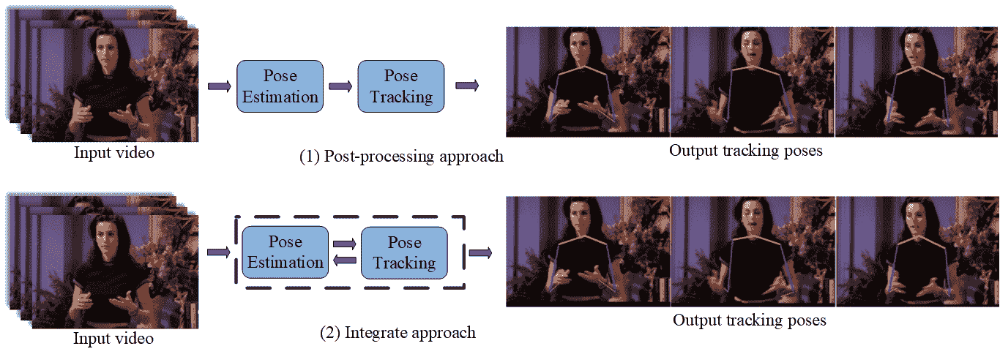

<!--yml

分类：未分类

日期：2024-09-06 19:36:20

-->

# [2310.13039] 基于人体姿态的估计、跟踪和动作识别：深度学习综述

> 来源：[`ar5iv.labs.arxiv.org/html/2310.13039`](https://ar5iv.labs.arxiv.org/html/2310.13039)

\equalcont

这些作者对本工作贡献相等。 \equalcont 这些作者对本工作贡献相等。 \equalcont 这些作者对本工作贡献相等。 [1] Zhimin Gao

1]计算机与人工智能学院，郑州大学，中国 2]亚马逊 Prime Video，美国

# 基于人体姿态的估计、跟踪和动作识别：深度学习综述

Lijuan Zhou ieljzhou@zzu.edu.cn    Xiang Meng mengxiangzzu@163.com    Zhihuan Liu liuzhihuanzzu@163.com    Mengqi Wu mengqiwuzzu@163.com    iegaozhimin@zzu.edu.cn    Pichao Wang pichaowang@gmail.com  [

###### 摘要

人体姿态分析在研究界和实际应用中都引起了广泛关注，其应用范围不断扩展，包括游戏、视频监控、运动表现分析和人机交互等。深度学习的出现显著提高了姿态捕捉的准确性，使得基于姿态的应用变得越来越实用。本文对利用深度学习的基于姿态的应用进行了全面的综述，包括姿态估计、姿态跟踪和动作识别。姿态估计涉及从图像或图像序列中确定人体关节位置。姿态跟踪是一个新兴的研究方向，旨在生成一致的人体姿态轨迹。另一方面，动作识别则致力于使用姿态估计或跟踪数据来识别动作类型。这三项任务密切相关，后者通常依赖于前者。在本综述中，我们全面回顾了相关工作，涵盖了从单人姿态估计到多人姿态估计，从 2D 姿态估计到 3D 姿态估计，从单图像到视频，从逐步挖掘时间上下文到姿态跟踪，最后从跟踪到基于姿态的动作识别。作为一项以深度学习在姿态分析中的应用为中心的综述，我们明确讨论了现有技术的优缺点。特别是，我们强调了将这三项任务整合到视频序列中的统一框架的方法。此外，我们探讨了相关挑战，并概述了未来研究的潜在方向。

###### 关键词：

姿态估计，姿态跟踪，动作识别，深度学习，综述

## 1 引言

人体姿态估计、跟踪和基于姿态的动作识别是计算机视觉领域的三个基本研究方向。这些领域有着广泛的应用，包括视频监控、人机交互、游戏、运动分析、智能驾驶以及新零售的崭新领域。细致的人体姿态估计涉及在给定图像或视频中估计人体的配置。人体姿态跟踪的目标是生成一致的姿态轨迹，这通常用于分析人体的运动特性。基于姿态的动作识别或骨架动作识别是基于姿态估计或跟踪数据来识别动作类型。尽管这三项任务都属于人体运动分析领域，但在现有文献中，它们通常被视为不同的实体。

人体运动分析是一个长期研究的课题，关于此任务的研究和综述非常丰富 [[1, 2, 3, 4, 5, 6, 7, 8, 9]。在这些综述中，人类检测、跟踪、姿态估计和动作识别通常一起进行评审。几篇综述文章总结了人体姿态估计 [10, 11]，跟踪 [12, 13, 14, 15, 16]，以及动作识别 [17, 18, 19, 20]。随着深度学习的发展，这三项任务相比于手工特征时代取得了显著进展 [21, 22]。之前的综述要么回顾了整个基于视觉的人体运动领域 [1, 2, 3, 4, 5, 6, 7, 8]，要么集中于特定任务 [10, 11, 22, 23, 24, 25, 26, 27]。然而，目前尚无综述论文同时回顾姿态估计、姿态跟踪和姿态识别。受到拉格朗日视角的启发 [28]，姿态信息和跟踪对动作识别具有重要意义。因此，这三项任务彼此密切相关。回顾将这三项任务联系起来的方法，并深入理解每项任务的独立解决方案以及探索联合任务的统一解决方案是非常有用的。

在本文中，我们将对使用深度学习方法处理这三项任务的前人工作进行全面回顾，并讨论先前研究论文的优缺点。此外，我们阐明了将这三项任务联系在一起的内在关系，同时倡导采用一个基于深度学习的框架，将它们无缝集成。具体而言，我们将回顾从 2D 姿态估计到 3D 姿态估计，从单图像到视频，从逐步挖掘时间上下文到姿态跟踪，最后从跟踪到基于姿态的动作识别的前人工作。根据姿态估计的人数，2D/3D 姿态估计可以分为单人和多人姿态估计。根据网络的输入，每个类别可以进一步分为基于图像和基于视频的单人/多人姿态估计。为了在帧之间连接姿态，姿态跟踪可以分为单人姿态跟踪的后处理方法和集成方法，多人姿态跟踪的自上而下和自下而上的方法。在获得视频中的姿态轨迹后，可以自然地进行基于姿态的动作识别，这可以分为估计姿态和基于骨架的动作识别。前者以 RGB 视频作为输入，同时进行姿态估计、跟踪和动作识别。后者提取由传感器（如运动捕捉、飞行时间和结构光摄像机）捕获的骨架序列以进行动作识别。对于基于骨架的动作识别，识别出四种类别，包括卷积神经网络（CNN）、递归神经网络（RNN）、图神经网络（GCN）和基于变换器的方法。图 1 说明了本调查的分类。

本调查的关键创新在于关注使用深度学习方法的三个密切相关的任务，而这一点在以往的调查中从未涉及。在回顾各种方法时，我们考虑了这三项任务之间的联系，因此，本调查倾向于从将这些方法组合以获得更多实际应用的角度讨论其优缺点。这是第一次将它们结合起来分析在深度学习时代的内在联系。此外，本调查通过以下贡献使其区别于其他调查：

+   •

    对自 2014 年以来开发的最先进的深度学习方法进行了全面而详尽的覆盖。这一广泛的覆盖为读者提供了最新研究方法及其结果的全面概述。

+   •

    对三项任务的方法进行了深刻的分类和分析，并突出了优缺点，推动了对更好解决方案的潜在探索。

+   •

    对这三项任务最常用基准数据集的全面回顾，以及在这些基准数据集上的最新研究成果。

+   •

    通过对现有方法的局限性分析，认真讨论三项任务的挑战及潜在的研究方向。

本调查的后续部分组织如下。第 2 节至第 4 节分别探讨了姿态估计、姿态跟踪和动作识别的方法。常用基准数据集及三项任务的性能比较在第 5 节中描述。第 6 节介绍了这三项任务的挑战及未来方向的指引。第 7 节提供了总结性评论。

图 1：本调查的分类法。

## 2 姿态估计

人体表示可以通过三种不同的模型进行：运动学模型、平面模型和体积模型。运动学模型结合关节位置和肢体方向来准确描绘人体结构。相对而言，平面模型利用矩形表示身体形状和外观，而体积模型则利用网格数据捕捉人体形状的复杂性。需要强调的是，本论文专注于基于运动学模型的人体表示。

姿态估计、姿态跟踪和动作识别是三个紧密相关的任务。图 2 展示了这三项任务之间的关系。姿态估计旨在从图像或视频中估计关节坐标。姿态跟踪是在视频上下文中对姿态估计的扩展，它将每个估计的姿态与其对应的身份在时间上关联起来。有趣的是，最近的一项工作[29]倾向于在跟踪多个个体后估计姿态，这暗示了姿态估计和跟踪之间的双向关系。基于姿态的动作识别旨在为跟踪的姿态分配一个身份和相应的动作标签。

对于姿态估计，我们通常将审查的方法分为两类：二维姿态估计和三维姿态估计。二维姿态估计是从 RGB 图像或视频中估计每个关节的二维姿态 $(x,y)$ 坐标，而三维姿态估计是估计三维姿态 $(x,y,z)$ 坐标。

图 2：三项任务之间的关系。

### 2.1 二维姿态估计

对于二维姿态估计，通常有两个子分类：单人姿态估计和多人姿态估计。根据网络输入的不同，单人（多人）姿态估计可以进一步分为基于图像的单人（多人）姿态估计和基于视频的单人（多人）姿态估计。

#### 2.1.1 基于图像的单人姿态估计

对于基于图像的单人姿态估计（SPPE），任务包括提供一个人的位置和大致尺度，作为估计过程的前置条件。早期工作采用了图示结构框架，该框架通过一组按变形配置排列的部件来表示一个对象，而这些部件中的每一个都是在图像中匹配的外观模板。不同于早期工作，基于深度学习的方法旨在定位人体部位的关键点。基于图像的单人姿态估计有两种典型框架，即直接回归方法和基于热图的方法。在直接回归方法中，关键点是直接从图像特征中预测的，而基于热图的方法则首先生成热图，然后基于这些热图推断关键点位置。图 3 提供了基于图像的二维单人姿态估计的总体框架示意图，展示了两种主要方法。

图 3：基于图像的二维 SPPE 两种方法框架。

(1) 基于回归的方法

先锋工作 [30]，DeepPose，将姿态估计定义为基于卷积神经网络（CNN）的回归任务，针对身体关节。采用了一系列回归器来细化姿态估计，如图 4 所示。这项工作在遮挡情况下能够以整体方式推理姿态。Carreira 等人 [31] 引入了迭代误差反馈方法，其中预测误差递归地反馈到输入空间，从而逐渐改进估计。Sun 等人 [32] 提出了使用骨骼而非关节的重新参数化姿态表示方法。这种方法定义了一种组合损失函数，通过利用关节连接结构来捕捉姿态中的长程交互。在更近期的发展中，[33] 引入了一种新方法，该方法采用 softmax 函数以完全可微分的方式将热图转换为坐标。这种创新技术结合了基于关键点误差距离的损失函数和基于上下文的结构。

图 4：DeepPose 架构 [30]。

随后，研究人员 [34, 35, 36, 37] 开始探索基于 transformer 架构的姿态估计方法。transformers 中的注意力模块提供了捕捉长程依赖和全球证据的能力，这对准确的姿态估计至关重要。例如，TFPose [34] 首次将 Transformer 引入姿态估计框架，并采用回归方法。PRTR [35] 引入了一个两阶段、端到端的回归框架，采用级联 Transformer，在回归方法中达到了最先进的性能。Mao 等人 [36] 将姿态估计框架设定为序列预测任务，并通过 Poseur 模型解决了这一问题。

然而，值得注意的是，这些直接回归方法在高精度场景中有时会遇到困难。这一局限性可能源于将 RGB 图像映射到 $(x,y)$ 位置的复杂过程，给学习过程增加了不必要的复杂性，阻碍了泛化。例如，直接回归在处理多模态输出时可能遇到挑战，其中一个有效的关节点可能出现在两个不同的空间位置。为给定回归输入生成单一输出的限制可能会限制网络表示小误差的能力，进而导致过拟合。

(2) 基于热图的方法

热图因其提供全面空间信息的能力而受到广泛关注，这使其在训练卷积神经网络（CNNs）时不可或缺。这激发了对姿态估计的 CNN 架构开发的浓厚兴趣。Jain 等人 [38] 首创了一种方法，即训练多个 CNN 用于独立的二进制身体部位分类，每个网络专注于特定特征。这种策略有效地将网络的输出约束到一个较小的有效配置类别，从而提升了整体性能。认识到结构领域约束的重要性，如身体关节位置之间的几何关系，Tompson 等人 [39] 采取了联合训练的方法，同时训练 CNN 和图形模型用于人体姿态估计。同样，Chen 和 Yuille [40] 采用 Convnets 来学习部件存在及其在图像补丁中空间关系的条件概率。为了应对 [39] 中池化技术在提高空间局部精度方面的局限性，Tompson 等人 [41] 提出了一个位置精细化模型（即多分辨率 Convents），该模型经过训练以预测图像局部区域内的关节偏移位置。 [39]、 [40] 和 [41] 的研究旨在将图形模型固有的表现灵活性与 CNN 提供的效率和统计能力结合起来。为了避免使用图形模型，Wei 等人 [42] 引入了卷积姿态机，以在不显式采用图形模型的情况下学习长距离空间关系。Hu 和 Ramanan [43] 提出了一个可以用于多个预测阶段的架构，并在自下而上和自上而下的计算部分以及迭代过程中绑定权重。同样，Newell 等人 [44] 提出了用于单人姿态估计的堆叠沙漏网络（SHN）。SHN 利用一系列连续的池化和上采样步骤生成最终的预测结果，展示了其有效性。在处理严重部件遮挡的挑战性场景时，Bulat 和 Tzimiropoulos [45] 提出了一个检测跟随回归的 CNN 级联。该稳健的方法能够在显著遮挡的情况下精准推断姿态。Lifshitz 等人 [46] 引入了一种新颖的投票机制，利用整个图像的信息，通过聚合大量投票来实现高精度的关键点检测。Chu 等人 [47] 将 CNN 纳入他们的方法中，增强了一个多上下文注意机制用于姿态估计。该动态机制自动学习和推断上下文表示，将模型的焦点引导到感兴趣的区域。此外，Yang 等人 [48] 设计了一个金字塔残差模块（PRMs）来增强 CNN 的尺度不变性。PRMs 有效地学习特征金字塔，这对于精确的姿态估计至关重要。

随着生成对抗网络（GAN）的发展[49]，陈等人[50] 设计了判别器以区分真实姿势和虚假姿势，从而结合有关人体结构的先验知识。宁等人[51] 提出了利用外部知识指导网络训练过程的方案，通过学习的投影施加适当的先验。孙等人[52] 提出了一个两阶段的归一化方案，包括人体归一化和肢体归一化，以使相对关节位置的分布更加紧凑，从而使卷积空间模型的学习更容易，姿势估计更准确。马拉斯等人[53] 引入了一种基于马尔可夫随机场（MRF）的空间模型网络，用于粗糙模型和精细模型之间，引入了关于身体关节相对位置的几何约束。为了处理标注姿势的问题，刘和费拉里[54] 提出了一个用于姿势估计的主动学习框架。柯等人[55] 提出了一个多尺度结构感知网络用于人体姿势估计。彭等人[56] 提出了对抗数据增强方法，以联合优化数据增强和网络训练。主要思路是设计一个对抗网络（生成器），通过在线生成“困难”增强操作，与目标网络（判别器）进行竞争。唐等人[57] 介绍了一种深度学习组合模型，通过利用深度神经网络学习人体的组合。聂等人[58] 提出了一个解析驱动学习器，包括解析编码器和姿势模型参数适配器，通过联合学习估计姿势模型中的动态参数，以提取有用的补充特征，来提高姿势估计的准确性。聂等人[59] 提出了一个框架，将人体解析和姿势估计联合进行，通过结合来自对方的信息，提供更稳健和准确的结果。唐和吴[60] 提出了一个数据驱动的方法，根据它们共享的信息量将相关部件分组，然后引入了一个基于部件的分支网络（PBN），以学习每个部件组特定的表示。为了加快姿势估计，张等人[61] 提出了一个快速姿势蒸馏（FPD）模型，训练一个轻量级的姿势神经网络架构，能够以低计算成本快速执行，通过有效地转移鲁棒教师网络的姿势结构知识。

总结来说，基于回归的方法在速度上具有优势，但在姿态估计任务上精度不足。基于热图的方法可以通过估计热图的可能性明确学习空间信息，从而实现高精度。然而，基于热图的方法严重受到长期存在的量化误差问题的困扰，该问题由将连续坐标值映射到离散的缩小热图中引起。为了解决这个问题，Li 等人[62] 提出了一个简单坐标分类（SimCC）方法，该方法将姿态估计公式化为水平和垂直坐标的两个分类任务。尽管在量化误差方面有所改进，但热图的估计仍需极高的计算成本，导致预处理操作缓慢。因此，如何利用基于热图和基于回归的方法的优势仍然是一个挑战性的问题。一些工作[63, 64]倾向于通过将知识从基于热图的方法转移到基于回归的方法来解决上述问题。然而，由于回归模型和热图模型的输出空间不同，直接在热图和向量之间转移知识可能会导致信息丢失。为此，DistilPose[64]（如图 5 所示）被提出，通过令牌蒸馏编码器和模拟热图，将基于热图的知识从教师模型转移到基于回归的学生模型。

图 5：DistilPose 框架[64]。

#### 2.1.2 基于图像的多人体姿态估计

与单人人体姿态估计（SPPE）相比，多人人体姿态估计（MPPE）更具挑战性。首先，人数或位置未给出，姿态可能出现在任何位置或尺度；其次，人际间的互动会引起复杂的空间干扰，由于接触、遮挡和肢体关节，使得部件的关联变得困难；第三，运行时复杂度通常随着图像中人数的增加而增长，使得实时性能成为挑战。MPPE 必须解决全球（人类级别）和局部（关键点级别）的依赖关系（如图 6 所示），这涉及不同级别的语义粒度。主流解决方案通常是两阶段的方法，将问题分为包括全局人体检测和局部关键点回归的两个独立子问题。通常，已提出两种主要框架来解决这些子问题，分别称为自上而下和自下而上方法。受到端到端目标检测成功的启发，另一种可行的解决方案是单阶段方法。该方法旨在开发一种完全端到端可训练的方法，能够统一这两个拆分的子问题。

图 6：多人人体姿态估计任务的感知 [65]。

图 7：基于图像的 2D MPPE 的两种方法框架。图的一部分来自 [66]。

(1) 自上而下方法

多人人体姿态估计中的自上而下方法首先检测给定图像中的所有个体，如图 7 所示，然后在每个检测到的边界框内使用单人人体姿态估计技术。

一组方法[67, 68, 69, 70, 71, 72, 73, 74, 75, 76, 77, 78]旨在设计和改进姿态估计网络中的模块。**Papandreou 等人**[67]采用 Faster RCNN[79]进行人检测和边界框内的关键点估计。他们引入了一种聚合程序，以获得高度本地化的关键点预测，并使用基于关键点的非极大值抑制（NMS）来防止重复姿态检测。**孙等人**[71]提出了一种新颖的高分辨率网络（HRNet），以学习这种表示。为了解决标准数据变换和编码解码结构中的系统误差，这些误差降低了自上而下管道的性能，**黄等人**[73]提出了解决方案，以纠正人体姿态估计中的常见偏差数据处理。

人体检测器在自上而下管道的第一步中可能会因肢体重叠而受遮挡影响而失败。另一组工作[80, 81, 82, 83, 84]旨在解决这一问题。**方等人**[81]提出了一种新颖的区域多人人体姿态估计（RMPE）方法，以便在存在不准确的人体边界框时仍能促进姿态估计。**陈等人**[82]设计了一种级联金字塔网络（CPN），包含 GlobalNet 和 RefineNet，用于分别定位简单和困难的关键点。**苏等人**[83]提出了两个新颖的模块，以在遮挡场景下执行多人人体姿态估计的信息增强，即通道洗牌模块（CSM）和空间、通道注意残差瓶颈（SCARB），其中 CSM 促进金字塔特征图之间的跨通道信息通信，而 SCARB 在空间和通道上下文中突显特征图的信息。提出了一种遮挡姿态估计和校正模块[84]，以解决人群姿态估计中的遮挡问题。

与单人姿态估计类似，多人姿态估计也经历了快速的发展，从 CNNs 转向了视觉变换器网络。最近的一些研究倾向于将变换器视为更好的解码器。TransPose [85] 处理由 CNNs 提取的特征，以建模全局关系。Zhou 等人 [86] 提出了一个自下而上的条件化自上而下姿态估计（BUCTD）方法，该方法修改了 TransPose，使其接受由 CTD 生成的条件作为附加信息。与其他自上而下的方法不同，BUCTD 将自下而上的模型作为行人检测器。TokenPose [87] 提出了基于标记的表示方法，以估计遮挡关键点的位置并建模不同关键点之间的关系。HRFormer [88] 提出了通过变换器模块融合多分辨率特征。上述工作要么需要 CNNs 进行特征提取，要么需要精心设计的变换器结构。相比之下，基于普通视觉变换器的简单而有效的基线模型 ViTPose [89] 被提出。

(2) 自下而上的方法

与自上而下的方法相比，自下而上的方法最初检测所有个体身体部位或关键点，然后使用部件关联策略将它们与相应的主体关联起来。Pishchulin 等人[90] 的开创性工作提出了一种自下而上的方法，该方法联合标记部件检测候选并将其与个体关联。然而，在完全连接的图上解决整数线性规划问题是一个 NP-难题，平均处理时间通常为几个小时。在 Insafutdinov 等人[91] 的工作中，提出了一种更为鲁棒的部件检测器和创新的图像条件成对项以提高运行效率。然而，该工作在精确回归成对表示方面遇到了挑战，需要额外的逻辑回归。Iqbal 和 Gall[80] 将多人的姿态估计视为关节到个人的关联问题。他们从图像中检测到的一组关节候选中构建完全连接的图，并使用整数线性规划解决关节到个人的关联和离群值检测。OpenPose[92, 93] 提出了通过部件亲和场 (PAFs) 进行的首个自下而上的关联分数表示，PAFs 是一组 2D 向量场，编码了图像域中肢体的位置和方向。Kreiss 等人[94] 提议使用部件强度场 (PIF) 进行身体部位定位，并使用 PAF 进行身体部位之间的关联以形成完整的人体姿态。为了解决遗漏的小规模人员问题，Cheng 等人[95] 提出了多尺度训练和双重解剖中心以增强网络。上述方法主要应用基于整体 L2 损失的热图预测来定位关键点。然而，最小化 L2 损失并不能总是定位所有关键点，因为每个热图通常包含多个身体关节。为了解决这个问题，Qu 等人[96] 提出了通过最小化预测热图与真实热图的特征函数之间的距离来优化热图预测。

与上述两阶段自下而上的方法不同，一些研究专注于联合检测和分组，这些属于单阶段自下而上的方法。Newell 等人 [97] 同时生成得分图和逐像素嵌入，以在不同的人之间分组候选关键点，从而得到最终的多人的姿态估计。Kocabas 等人 [98] 设计了一个 MultiPoseNet，联合处理人检测、人分割和姿态估计问题，通过 Pose Residual Network (PRN) 的实现，该网络接收关键点和人员检测，并通过将关键点分配给人实例来生成准确的姿态。为了处理拥挤的场景，Li 等人 [99] 建立了一个新的基准叫做 CrowdPose，并提出了两个组件，即联合候选单人姿态估计和全局最大关节关联，用于拥挤的姿态估计。Jin 等人 [100] 提出了一个新的可微分的分层图分组方法来学习人体部件分组。Cheng 等人 [101] 扩展了 HRNet 并提出了一个更高分辨率的网络 (HigherHRNet)，通过对 HRNet 生成的高分辨率热图进行反卷积来解决变化挑战。除了上述自下而上的方法外，一些方法直接从图像像素回归一组姿态候选，并且每个候选中的关键点可能来自同一个人。需要后处理步骤来生成更空间准确的最终姿态。例如，单阶段多人的 Pose Machine (SPM) 方法 [102] 应用层次化的 2D/3D 姿态表示来辅助长距离回归。关键点基于与人无关的热图进行预测，因此需要分组后处理来将关键点组装到全身姿态中。Disentangled Keypoint Regression (DEKR) [103] 通过学习关注关键点区域的表示来回归姿态候选。姿态候选被评分和排序，以生成基于关键点和中心热图估计损失的最终姿态。PolarPose [104] 旨在通过在极坐标中执行将 2D 回归简化为分类任务。

(3) 单阶段方法

一阶段方法旨在学习一个端到端的网络，用于 MPPE，无需人物检测和分组后处理。Tian 等人[105] 首次提出了一种基于 DirectPose 的单阶段方法，直接从图像中预测所有人物的实例感知关键点。为了提高准确性和速度，Mao 等人[106] 后来提出了一个完全卷积姿态（FCPose）估计框架，以在紧凑的关键点头部构建动态滤波器。与此同时，Shi 等人[107] 设计了 InsPose，它为每个实例自适应地调整网络参数。为了减少回归损失中的假阳性姿态的影响，Single-stage Multi-person Pose Regression (SMPR) 网络[108] 通过适应三种正姿态识别策略用于初始和最终姿态回归，以及非极大值抑制（NMS）步骤。这些方法可以避免底向上方法中启发式分组的需求，或顶向下方法中的边界框检测和兴趣区域（RoI）裁剪。然而，它们仍然需要手工操作，例如 NMS，以在后处理阶段去除重复项。为了进一步去除 NMS，一个具有 TRansformers 的多人物姿态估计框架（PETR）[109] 将姿态估计视为集合预测，这是第一个完全端到端且没有任何后处理的框架。上述一阶段方法采用了具有随机初始化姿态查询的姿态解码器，使得跨人物的关键点匹配变得模糊且训练收敛缓慢。为此，Yang 等人[65] 提出了一个显式框检测过程用于姿态估计（ED-pose），通过实现每个框的检测并将其级联以形成一个端到端的框架，使模型在收敛上快速、精确且可扩展。

尽管上述端到端的方法已取得了有希望的性能，但它们依赖于复杂的解码器。例如，ED-pose 包括一个人体检测解码器和一个人体到关键点检测解码器，以显式地检测人体和关键点框。PETR 包括一个姿态解码器和一个关节解码器。相比之下，Group Pose [110] 仅使用一个简单的变压器解码器以追求效率。

总之，自上而下的方法直接利用现有的单人姿态估计技术，但遭受早期承诺的困扰：如果人物检测器失败（当人们在接近时容易出现这种情况），就没有恢复的办法。此外，这些自上而下的方法的运行时间与人数成正比。对于每个检测，都需要运行单人姿态估计器，因此人数越多，计算成本越高。相比之下，自下而上的方法由于对早期承诺的鲁棒性以及将运行时复杂性与图像中人数解耦的潜力而显得有吸引力。然而，自下而上的方法并不直接利用来自其他身体部位和个体的全局上下文信息。一阶段的方法消除了中间操作，如分组、ROI、边界框检测、NMS，绕过了自上而下和自下而上的方法的主要缺点。

#### 2.1.3 基于视频的单人姿态估计

基于视频的姿态估计旨在估计每个视频帧中的单个或多个姿态。与基于图像的姿态估计相比，它更具挑战性，因为人体姿态和前景外观（如服装和自遮挡）变化很大。对于基于视频的姿态估计，视频中的人体跟踪并未考虑。类似于基于图像的 SPPE，直接回归和基于热图的方法也适用于基于视频的 SPPE。然而，与图像相比，基于视频的姿态估计具有时间信息的优势，这可以提高姿态估计的准确性，但也可能因时间冗余引入额外的计算开销。因此，实现准确性与效率之间的平衡对于基于视频的姿态估计至关重要。根据处理效率，基于视频的 SPPE 方法分为帧-by-帧方法和基于采样帧的方法。图 8 展示了基于视频的 SPPE 的两种方法的总体框架。

(1) 帧-by-帧方法

帧-by-帧方法，如图 8 所示，专注于对视频序列中的每一帧单独估计姿态。随着基于图像的姿态估计的成功，这类方法主要在每个视频帧上应用基于图像的姿态估计方法，通过结合时间信息保持帧间几何一致性。时间信息通常通过融合连续帧、应用 3D 时间卷积、使用密集光流和姿态传播来捕捉。

图 8：基于视频的二维 SPPE 的两种方法框架。

在这种方法的早期阶段，Pfister 等人[111] 提出了使用深度卷积网络（ConvNets）来估计视频中的人体姿态。他们设计了一个回归层来预测上半身关节的位置，同时通过直接处理沿通道轴连接的连续帧来考虑时间信息。Grinciunaite 等人[112] 将二维卷积扩展到三维卷积，并且时间信息可以在三维卷积的第三维度中有效表示，用于基于视频的人体姿态估计。

一些研究倾向于使用光流来生成平滑的运动。Pfister 等人[113] 使用密集光流预测所有相邻帧的关节位置，并设计了空间融合层来学习人体部位位置之间的依赖关系。Song 等人[114] 也利用光流变形捕捉高时间一致性，并提出了时空消息传递层，将领域特定知识融入深度网络中。Jain 等人[115] 分别使用局部对比度归一化和局部运动归一化处理 RGB 图像和光流特征，然后将它们结合起来输入到部件检测网络中。这些方法由于密集的流计算而具有较高的复杂性，因此不适用于实时应用。

随后，一些研究[116, 117, 118, 119, 120, 121, 122, 123, 124] 应用了姿态传播技术，这种技术以在线方式将特征从之前的帧转移到当前帧。例如，Charles 等人[117] 提出了一个个性化的 ConvNet 来估计人体姿态，包括四个阶段：初始标注、空间匹配、时间传播和自我评估。在初始标注阶段，通过使用流动的 Convnets 获得高精度的姿态估计。然后，通过空间匹配过程将没有标注的新帧的图像块与有标注的帧中身体关节的图像块进行匹配。密集光流被用于时间传播。最后，空间-时间传播的标注质量被自动评估以优化模型。Luo 等人[118] 提出了结合卷积姿态机器（CPM）[42] 和长短期记忆（LSTM）网络的姿态机器，通过学习视频帧之间的时间依赖关系来有效捕捉关节在空间和时间中的几何关系。Nie 等人[119] 设计了一个动态内核蒸馏（DKD）模型。DKD 模型引入了一个姿态内核蒸馏器，并在时间上传递姿态知识。Xu 等人[122] 提出了一个新颖的神经结构搜索方法，以选择最有效的时间特征融合，以优化视频帧的准确性和速度。Dang 等人[123] 通过设计一个联合关系引导的姿态语义传播器，提出了基于关系的姿态语义转移网络（RPSTN），以学习姿态的时间语义连续性。尽管采用了各种策略来减少计算成本，但由于逐帧估计，这类方法仍然导致效率提升不理想。

(2) 基于样本帧的方法

这一类别的方法旨在基于从选定帧估计的姿态来恢复所有姿态。如图 8 所示，整体工作流程包括样本姿态估计和所有姿态恢复。一些工作通过选择关键帧并估计关键帧的姿态来生成样本姿态。例如，Zhang 等人 [125] 引入了关键帧提议网络 (K-FPN) 来选择信息丰富的帧，并通过人体姿态插值模块基于人体姿态动态从关键帧的姿态生成所有姿态。当待插值的姿态序列变得复杂时，基于姿态动态的字典构造可能会变得具有挑战性。因此，为了有效利用动态信息，REinforced MOtion Transformation nEtwork (REMOTE) [126] 包含一个运动变换器来进行跨帧重建。尽管由于关键帧，以上工作的计算效率有所提高，但它们仍需要在关键帧选择上付出代价，这使得进一步降低复杂度变得困难。为了解决这个问题，Zeng 等人 [127] 提出了一个新颖的样本去噪恢复管道（即 DeciWatch），通过均匀采样不到 10% 的视频帧进行估计。基于样本帧的估计姿态通过 Transformer 架构进行去噪，其余姿态也通过另一个 Transformer 网络进行恢复。DeciWatch 可用于视频中的 2D/3D 姿态估计，并且可以在计算成本较小的情况下保持甚至提高姿态估计精度。尽管均匀采样减少了选择关键帧的成本，但添加了一个细化模块以清理噪声姿态。相比之下，MixSynthFormer [128] 通过将 Transformer 编码器与基于 MLP 的混合合成注意力相结合，删除了细化模块，从而追求高效的 2D/3D 视频姿态估计。

总体而言，逐帧方法可以从基于图像的姿态估计中受益，但会受到计算复杂度的影响。样本帧方法提供了一种提高效率的解决方案，但引发了如何获取样本帧和恢复姿态的问题。本文采用了均匀采样；然而，考虑到在不同动作下关节运动的显著变化，适应性采样策略可能更适合进一步提高效率。此外，还应探索动态恢复方法的设计，以有效处理非均匀采样。

#### 2.1.4 基于视频的多人体姿态估计

鉴于刚刚介绍的视频基础 SPPE，将其扩展到处理多个人物是自然而然的。根据视频基础 SPPE 的分类，大多数视频基础 MPPE 方法都属于逐帧处理类别。通过逐帧使用基于图像的 MPPE 可以实现这些方法。因此，视频基础 MPPE 的方法可以分为自上而下和自下而上两种方法。

(1) 自上而下的方法

自顶向下的方法主要通过首先检测所有帧中的所有人，然后逐帧进行基于图像的单人姿态估计来估计姿态。Xiao 等人 [69] 提出了一个基于 ResNet 的简单基线来估计每一帧的姿态，并且估计的姿态随后基于光流进行跟踪。Xiu 等人 [129] 基于 RMPE 方法估计每帧的多个姿态，这些方法可以替换为其他自顶向下的方法进行基于图像的 MPPE。利用每帧的估计姿态，提出了一个 Pose Flow Builder (PF-Builder) 来通过最大化整个时间序列的总体置信度来建立跨帧姿态的关联（如图 9 所示），并且设计了一个 Pose Flow Non-Maximum Suppression (PF-NMS) 来稳健地减少冗余的姿态流并重新连接时间上不连续的姿态。Girdhar 等人 [130] 基于 Mask R-CNN 估计每帧的姿态，然后通过轻量级跟踪生成视频中的关键点预测。Wang 等人 [131] 提出了一个剪辑跟踪网络以同时执行姿态估计和跟踪。为了构建剪辑跟踪网络，提出了 3D HRNet 来估计姿态，将时间维度融入原始 HRNet。AlphaPose [132] 也被提出用于联合姿态估计和跟踪。特别是，每一帧的所有人首先通过现成的目标检测器如 YoloV3 或 EfficientDet 进行检测。为了解决量化误差，提出了对称积分关键点回归方法，以准确地在不同尺度下定位关键点。基于 NMS 移除冗余姿态后，在预测的人体 re-id 特征上应用姿态引导对齐模块，以获得姿态对齐的人体 re-id 特征。最后，提出了姿态感知身份嵌入以生成跟踪身份。逐帧估计姿态忽略了运动动态，这对于从视频中准确估计姿态至关重要。最近的方法 [133] 提出了基于互信息的时间差学习 (TDMI) 来进行姿态估计。设计了一个多阶段时间差编码器来学习信息丰富的运动表示，并引入了表示解耦模块以提取与任务相关的运动特征，以增强姿态估计的帧表示。时间差特征可以通过测量运动相似性来应用于姿态跟踪。Gai 等人 [134] 提出了一个用于视频基础姿态估计的时空学习 Transformer (SLT-Pose) 以捕捉浅层特征信息。随着扩散模型在计算机视觉任务中的引入（例如图像分割 [135]，目标检测 [136]），DiffPose [137] 是第一个扩散模型，并将视频基础姿态估计公式化为条件热图生成问题。

图 9: Pose Flow 框架 [129]。

(2) 自下而上的方法

自下而上的方法通过逐帧应用身体部位检测和分组来估计姿态。例如，常用的基于图像的 MPPE 方法之一 OpenPose[93]，也可以通过直接逐帧估计姿态来应用于视频中的 MPPE。Jin 等人 [138] 提出了一个 Pose-Guided Grouping (PGG) 网络，用于联合姿态估计和跟踪。PGG 由两个组件组成，包括 SpatialNet 和 TemporalNet。SpatialNet 通过身体部位检测和每帧的部位级空间分组来处理多人的姿态估计。TemporalNet 扩展了 SpatialNet，以处理在线的人的时间分组。

总体而言，随着深度学习技术的发展，2D HPE 已经取得了显著进展。对于基于图像的 SPPE，基于热图的方法在准确性上通常优于基于回归的方法，但在量化误差问题上可能面临挑战。将 SPPE 扩展到 MPPE 时，顶端向下和自下而上的方法各有优缺点。此外，两种方法在严重遮挡下可靠检测个体也存在挑战。顶端向下方法中的人员检测器可能无法识别重叠人体的边界。自下而上的方法在遮挡场景下的身体部位关联可能失败。单阶段方法绕过了顶端向下和自下而上的方法的缺点，但仍然使用较少。随着基于图像的姿态估计的进展，自然可以通过直接逐帧应用现成的基于图像的姿态估计方法或结合时间网络，将其扩展到视频中。基于样本帧的方法在视频中的姿态估计中更受欢迎，因为它们可以大大提高效率而不需要查看所有帧，但在基于视频的 MPPE 中使用较少。考虑到单阶段方法在基于图像的 MPPE 中的优势，需要更多的努力来探索单阶段方法在基于视频的 MPPE 中的应用。

### 2.2 3D 姿态估计

一般来说，恢复 3D 姿态被认为比 2D 姿态估计更困难，因为 3D 姿态空间更大且存在更多模糊性。算法必须对一些因素保持不变，包括背景场景、光照、衣物形状和纹理、肤色以及图像缺陷等。

#### 2.2.1 基于图像的单人姿态估计

基于图像的单人 3D 人体姿势估计（HPE）可以分为基于骨架的方法和基于网格的方法。前者将 3D 人体关节作为最终输出，后者则需要重建 3D 人体网格表示。由于本文仅关注基于运动学模型的人体表示，因此我们只审视基于骨架的方法，这些方法可以进一步分为一步姿势估计和两步姿势估计（从 2D 姿势恢复 3D 姿势）。图 10 显示了图像基于的 3D 单人姿势估计的两种方法的一般框架。

图 10: 图像基于的 3D 单人姿势估计的两种方法的框架。

(1) 一阶段方法

这一类别的方法直接从图像中推断 3D 姿势，而不需要估计 2D 姿势表示。Li 和 Chan [139] 首次提出使用卷积网络从单目图像中估计 3D 姿势。该框架包括两种任务：关节点回归和关节点检测。两种任务都以包含人类对象的边界框图像作为输入。回归任务旨在估计相对于根关节位置的关节点位置，而每个检测任务则分类判断特定的关节是否存在于局部窗口中。

多任务学习框架首次展示了深度神经网络可以应用于从单张图像中进行 3D 人体姿态估计。然而，这些基于回归的方法的一个缺点是它们只能预测给定图像的一个姿态。这可能会导致在姿态因部分自遮挡而模糊的图像中遇到困难，因此多个姿态可能是有效的。相反，Li 等人[140]提出了一个统一框架，用于最大边际结构学习，结合深度神经网络进行 3D 人体姿态估计，其中统一框架可以联合学习图像和姿态特征表示以及评分函数。Tekin 等人[141]引入了一种依赖于超完备自编码器的架构，用于学习高维潜在姿态表示以获取关节依赖关系。Zhou 等人[142]提出了一种新颖的方法，该方法将运动学对象模型直接嵌入到深度神经网络学习中，其中运动学函数定义在适当参数化的对象运动变量上。Mehta 等人[143]探索了迁移学习，以利用 2D 姿态数据集中与现有标注的 3D 姿态数据集高度相关的中层和高层特征。类似地，Zhou 等人[144]提出了一种弱监督迁移学习（WTL）方法，该方法在一个统一的深度神经网络中使用混合的 2D 和 3D 标签，该网络端到端地充分利用了 2D 姿态和深度估计子任务之间的相关性。由于直接从图像空间回归，一步法通常需要高计算成本。

(2) 两阶段方法

这一类别的方法从中间估计的 2D 姿态推断 3D 姿态。它们通常分为两步：1）基于图像的单人 2D 姿态估计方法估计 2D 姿态。2）通过简单的回归器将 2D 姿态提升为 3D 姿态。例如，Martinez 等人[145]提出了一个基于全连接残差网络的简单基线，从 2D 姿态回归 3D 姿态。这个基线方法在当时取得了不错的结果，但由于过度依赖 2D 姿态检测器的重建模糊性，它可能会失败。为了克服这个问题，应用了几种技术，如用热图替代 2D 姿态以估计 3D 姿态[146, 147]，从 2D 姿态和深度信息回归 3D 姿态[148, 149]，使用排名网络从 3D 姿态假设中选择最佳 3D 姿态[150, 151, 152]。

随着基于图卷积网络（GCN）的骨骼关节表示方法的引入，一些方法[153, 154, 155, 156, 157, 158, 159, 160, 161]应用 GCN 将 2D 姿态提升到 3D 姿态。为了克服 GCN 中共享权重的局限性，提出了一种局部连接网络（LCN）[153]，它利用完全连接网络和 GCN 来编码关节之间的关系。类似地，赵等人[154]提出了一种语义 GCN，以学习边缘的通道权重。一种基于 GCN 的 Pose2Mesh[155]被提出用来优化其 PoseNet 中的中间 3D 姿态。徐和高野[159]提出了一种图堆叠 Hourglass（GraphSH）网络，该网络由重复的编码器-解码器组成，用于表示三种不同尺度的人体骨架。为了解决当前 GCN 方法中关节交互的丧失，翟等人[162]提出了 Hop-wise GraphFormer 与组内关节优化（HopFIR）以提升 3D 姿态。

受最近自然语言领域成功的启发，越来越多的研究开始探索将 Transformer 架构应用于视觉任务。林等人[163]首次将 Transformer 应用于 3D 姿态估计。提出了一种具有逐步降维的多层 Transformer 来回归关节的 3D 坐标。在这里，标准 Transformer 忽略了邻接节点的交互。为了解决这个问题，赵等人[164]提出了一种面向图的 Transformer，它通过自注意力扩展感受野，并通过 GCN 建模图结构，以提高 3D 姿态估计的性能。

对于现实世界中的数据，获取准确的三维姿态标注是困难的。为了解决三维姿态标注不足的问题，提出了一些弱监督、自监督或无监督的方法 [144, 165, 166, 167, 168, 169, 170, 171, 172, 173, 174]，用于从现实世界中的图像中估计三维姿态，而无需三维姿态标注。提出了一种弱监督迁移学习方法 [144]，用于将室内图像的三维标注知识迁移到现实世界的图像中。在弱监督学习中应用了三维骨长约束引发的损失。Habibie 等人 [166] 采用了投影损失来细化无标注的三维姿态。提出了一种提升网络 [167]，通过引入基于闭合和不变提升特性的几何一致性损失，以自监督模式恢复三维姿态。以前的自监督方法在很大程度上依赖于一致性损失等弱监督来指导学习，这不可避免地导致了在真实场景中遇到未知姿态时的较差结果。相比之下，Gong 等人 [173] 提出了 PoseTriplet 方法，该方法允许通过自增强双循环学习框架显式生成 2D-3D 姿态对以增强监督。得益于可靠的二维姿态检测，两步法通常优于一步法。

#### 2.2.2 基于图像的多人姿态估计

类似于二维多人姿态估计，图像中的三维多人姿态估计也可以分为：自上而下的方法、自下而上的方法和单阶段的方法。自上而下和自下而上的方法涉及两个阶段的姿态估计。图 11 说明了图像中三维多人姿态估计的两种方法的总体框架。

图 11：图像中三维多人姿态估计的两种方法的框架。图中的部分来自 [175]。

(1) 自上而下的方法

首先，自顶向下的方法基于人体检测网络检测每个人，然后基于单人估计方法生成 3D 姿势。Localization Classification-Regression Network (LCR-Net) [176, 177] 提出了一个姿势提议网络，用于生成人类边界框和一系列人体姿势假设。基于裁剪的 ROI 特征对姿势假设进行了修正，用于生成 3D 姿势。Moon 等人 [178] 提出了一种相机距离感知方法，用于估计相机中心的人体姿势，该方法包括人体检测、绝对 3D 人体根部定位和根相对 3D 单人姿势估计模块。在这里，根相对姿势忽略了每个姿势的绝对位置。相比之下，Lin 和 Lee [179] 提出了用于摄像机坐标空间中的绝对根关节定位的 Human Depth Estimation Network (HDNet)。HDNet 可以基于人体姿势和身体关节的典型大小的先验知识，高效地估计人体深度。自顶向下的方法主要根据每个边界框估计姿势，这导致人们怀疑自顶向下模型无法理解多人关系并处理复杂场景。为解决这一限制，Wang 等人 [180] 提出了一种用于姿势估计的分层多人序关系（HMOR），以利用多人之间的关系。HMOR 能够将交互信息编码为序关系，监督网络按照正确顺序输出 3D 姿势。Cha 等人 [181] 设计了一种基于 Transformer 的关系感知细化方法，用于捕捉人与人之间的内部和相互关系。虽然自顶向下的方法可以实现高准确性，但随着人数的增加，计算成本也相应增加。与此同时，这些方法可能忽视了场景中的全局信息（人与人之间的关系），因为姿势是分别估计的。

(2) 自底向上方法

自底向上的方法首先生成所有身体关节位置，然后根据根深度和部位相对深度将关节与每个人关联起来。Zanfir 等人[182] 提出了 MubyNet，以基于集成的 2D 和 3D 信息按身体部位分数对人体关节进行分组。一组自底向上的方法旨在将属于每个人的身体关节分组。Compressed Output (LoCO) 方法[183] 首先应用体积热图，通过编码器-解码器网络进行特征压缩来生成关节位置，然后应用基于距离的启发式方法来检索每个人的 3D 姿态。基于距离的启发式方法用于关节连接。之前的方法采用完全监督的方式训练，需要 3D 姿态标注，而 Kundu 等人[184] 提出了一个无监督的 3D 姿态估计方法。在没有配对的 2D 图像和 3D 姿态标注的情况下，应用了一个冻结网络，通过跨模态对齐利用两种不同模态之间的共享潜在空间。

另一组自底向上的方法专注于遮挡问题。Mehta 等人[185] 将关节位置图和抗遮挡的姿态图结合起来，以推断 3D 姿态。关节位置的冗余用于推断被遮挡的关节。XNect[186] 在运动学树中编码关节的即时局部上下文以应对遮挡。Zhen 等人[187] 开发了 3D 部件亲和场，通过推理人际间遮挡来进行深度感知的部件关联，并利用精细化网络在给定预测的 2D 和 3D 关节坐标的情况下进一步优化 3D 姿态。这些方法从单人视角处理遮挡，并需要最初将关节分组到个体中，这在多人的场景中导致易出错的估计。Liu 等人[188] 提出了一个基于深度监督编码器蒸馏网络的遮挡关键点推理模块，用于推理来自可见信息的不可见信息。Chen 等人[189] 提出了关节意识知识探索 (AKE)，用于在遮挡情况下与渐进方案关联的关键点。与自顶向下的方法相比，自底向上的方法不需要重复的单人姿态估计，且计算线性。然而，自底向上的方法需要第二阶段的关节分组。此外，由于所有人以相同的尺度处理，这些方法不可避免地对人体尺度变化敏感，限制了它们在实际视频中的适用性。

(3) 一阶段方法

一阶段方法将姿态估计视为平行的人体中心定位和中心到关节回归问题。这些方法预测每个关节的偏移量，而不是在两阶段方法中分离关节定位和分组，这些偏移量通常设置为人体的根关节。由于关节偏移量与估计的中心点直接相关，这种策略避免了手动设计的分组后处理，并且是端到端可训练的。周等人[190]将对象建模为一个单一的点，并从人体中心的图像特征回归关节。魏等人[191]建议从作为基本人体姿态先验的点集锚点回归关节。王等人[175]从 2.5D 人体中心和 3D 中心相对关节偏移量中重建关节。金等人[192]通过解决 2D 姿态回归和深度回归提出了一种解耦回归模型（DRM）。最近，邱等人[193]通过在 3D 姿态数据集上微调弱监督预训练（WSP）网络直接估计三维姿态。

#### 2.2.3 基于视频的单人姿态估计

与从图像中估计三维姿态不同，视频可以提供时间信息，从而提高姿态估计的准确性和鲁棒性。类似于基于图像的三维人类姿态估计（3D HPE），基于视频的三维 HPE 也可以分为一阶段和两阶段方法。

(1) 一阶段方法

属于这一类方法的研究较少。Tekin 等人[194]提出了一种回归函数，通过围绕给定帧的时空体直接预测该帧的 3D 姿态。该体积包括围绕中央帧前后连续帧中的人的边界框。Mehta 等人[195]提出了 VNect，它能够通过卷积回归和运动学骨架拟合，从单目 RGB 摄像头中获得时间一致的完整 3D 骨架姿态。VNect 可以同时回归 2D 和 3D 关节位置。Dabral 等人[196]提出了两种结构感知损失函数：非法角度损失和左右对称性损失，以直接从视频序列中预测 3D 身体姿态。非法角度损失用于区分 3D 关节的内角和外角，对称性损失定义为左右骨骼对的长度差。Qiu[197]提出了一种基于实例引导的视频 Transformer（IVT）的端到端框架，以直接从视频中预测 3D 单一和多个姿态。提出了一种基于对比自监督（CSS）学习的无监督特征提取方法[198]，用于捕捉丰富的时间特征以进行姿态估计。通过重建输入视频帧，CSS 学习了时间变异和时间不变的潜在特征，然后将时间变异特征应用于预测 3D 姿态。

(2) 两阶段方法

与从图像中估计的两步 3D 姿态类似，两步 3D HPE 涉及两个阶段：估计 2D 姿态并从 2D 姿态中提取 3D 姿态。然而，区别在于，在基于视频的 3D HPE 中，应用了一系列 2D 姿态来提取一系列 3D 姿态。根据不同的提取方法，这一类方法可以总结为 Seq2frame 和 Seq2seq 方法。

基于 Seq2frame 的方法注重预测输入视频的中心帧，以产生稳健的预测并减少对噪声的敏感性。Pavllo 等人[199]提出了一种在 2D 关键点轨迹上使用半监督训练方法的时间卷积网络（TCN）。在该网络中，1D 卷积用于捕获时间信息，且参数较少。在半监督训练中，3D 姿态估计器用作编码器，解码器将预测的姿态映射回 2D 空间。一些后续工作通过解决遮挡问题[200]、利用注意力机制[201]或将姿态估计任务分解为骨长和骨方向预测[202]来提高 TCN 的性能。除了 TCN，Cai 等人[203]使用 GCN 来建模时间信息，通过从短序列的 2D 关节检测中学习多尺度特征以进行 3D 人体估计。没有卷积架构的涉及，Zheng 等人[204]提出了一种基于空间-时间变换器的 PoseFormer，用于估计中心帧的 3D 姿态。为了克服 PoseFormer 在增加帧数以提高性能时的巨大计算成本，PoseFormerV2[205]应用了 2D 姿态序列的频域表示来提升 3D 姿态。类似地，Li 等人[206]提出了一种步态变换器编码器，通过减少序列冗余和计算成本来重建中心帧的 3D 姿态。Li 等人[207]进一步设计了一种多假设变换器（MHFormer），以利用多重姿态假设的空间-时间表示。基于 MHFormer，MHFormer++[208]被提出，以通过结合图形变换器编码器进一步建模关节的局部信息，并通过添加融合块有效地聚合多假设特征。基于姿态假设的相似理念[207, 208]，DiffPose[209]和基于扩散的 3D 姿态（D3DP）[210]旨在应用扩散模型来预测给定 2D 姿态的多个可调假设，因其具有高场样本的能力。上述基于变换器的方法[204, 205, 206, 208]主要通过不同阶段的网络顺序建模空间和时间信息，从而导致对运动模式的学习不足。因此，Tang 等人[211]提出了空间-时间交叉变换器（STCFormer），通过堆叠多个 STC 注意力块以并行建模空间和时间信息，使用双路径网络。

基于 Seq2seq 的方法一次性重建输入序列的所有帧，以提高 3D 姿态估计的一致性和效率。早期的方法使用递归神经网络（RNN）或长短期记忆网络（LSTM）作为 Seq2Seq 网络。Lin 等人[212]设计了一种递归 3D 姿态序列机器（RPSM），用于从一系列图像中估计 3D 人体姿态。RPSM 包含三个模块：2D 姿态模块；3D 姿态递归模块和用于将姿态表示从 2D 领域转换到 3D 领域的特征适配模块。Hossain 等人[213]提出了一种序列到序列网络，通过在解码器端使用 LSTM 单元和残差连接。2D 关节位置序列作为输入传递给序列到序列网络，以预测一个时间上连贯的 3D 姿态序列。Lee 等人[214]提出了传播长短期记忆网络（p-LSTMs），通过学习内在的关节依赖关系来从 2D 关节位置估计深度信息。Katircioglu 等人[215]提出了一种深度学习回归架构，通过使用自编码器和长短期记忆网络来学习高维潜在姿态表示，并强制 3D 姿态预测的时间一致性。Raymond 等人[216]提出了 Chirality Nets。在 Chirality Nets 中，全连接层、卷积层、批量归一化层和 LSTM/GRU 单元可以是对称的。根据这种对称性，它通过利用人体的左右镜像自然估计 3D 姿态。随后，一些方法[217, 218, 219, 220, 221, 222]应用 GCN 或 transformer 进行 Seq2seq 学习。Wang 等人[217]利用一种基于 GCN 的方法，结合相应的损失来建模短时间间隔和长时间范围的运动。Zhang 等人[219]提出了一种混合时空编码器（MixSTE），包括一个时间 transformer 来建模每个关节的时间运动和一个空间 transformer 来学习关节间的空间相关性。MixSTE 直接重建整个帧，以提高输入和输出序列之间的一致性。Chen 等人[220]提出了高阶定向 transformer（HDFormer），通过结合自注意力和高阶注意力来建模关节-关节、骨骼-关节和超骨骼-关节交互，从而从 2D 姿态序列重建 3D 姿态序列。

#### 2.2.4 基于视频的多人人体姿态估计

与基于图像的多人姿态估计不同，基于视频的多人姿态估计常常受到快速运动、外观和服装的大变化以及人与人之间遮挡的影响。在这种情况下，一个成功的方法必须能够准确识别每个视频帧中出现的个体数量，以及确定每个人的精确关节位置，并有效地将这些关节在时间上关联起来。

随着基于视频的单人 3D 人体姿态估计的改进，一种视频基础的多人体 3D 姿态估计方法是两步法，首先基于人体检测网络检测每个人，然后基于视频基础的单人 3D 姿态估计方法生成 3D 姿态。Cheng 等人[223]提出了一种将图卷积网络（GCN）和时间卷积网络（TCN）整合的新框架，用于估计多人体 3D 姿态。特别地，首先检测边界框以表示人类，然后基于边界框估计 2D 姿态。通过将 2D 姿态输入到关节和骨骼 GCN 中来估计每帧的 3D 姿态。最终，将 3D 姿态序列输入到时间 TCN 中，以加强时间和人体动态约束。这类方法应用自上而下的技术来估计 3D 姿态，依赖于独立检测每个人。因此，它容易受到人与人之间的遮挡和紧密互动的影响。为了解决这个问题，同一作者[224]后来提出了一种多人体姿态估计集成（MPEI）网络，通过在与论文[223]相同的自上而下分支上添加一个自下而上的分支来捕获全局意识姿态。最终的 3D 姿态基于从自下而上和自上而下分支中匹配估计的 3D 姿态进行估计。应用了一个互动感知判别器来加强两个人的自然互动。为了解决遮挡问题，Park 等人[225]提出了 POTR-3D，通过直接处理 2D 姿态序列而不是逐帧处理来提升 3D 姿态序列，并设计了一种数据增强策略来生成带有遮挡感知的数据。捕获长时间范围的时间信息通常需要在更多帧上进行计算，这导致了高计算成本。为应对这个问题，最近的研究工作 TEMporal POse estimation method（TEMPO）[29]通过递归架构学习时空表示，以加快推断速度，同时保持估计准确性。具体来说，首先检测并通过特征体积表示人物。然后，通过递归地结合当前和之前时间步的特征来学习时空姿态表示。最后，将其解码为当前姿态和未来时间步的姿态估计。需要注意的是，姿态是基于特征体积的跟踪结果估计的，这提示姿态估计性能可以通过姿态跟踪来提高。此外，TEMPO 还为动作预测提供了解决方案。

在上述的两步方法中，后续步骤的结果依赖于前一步骤的结果。因此，最近提出了一种基于端到端网络的一步姿态估计方法。IVT [197] 也可以直接从视频中预测多个姿态。实例引导的标记包括深度特征和实例 2D 偏移（从身体中心到关键点），这些信息被送入视频变换器以捕获空间和时间维度中多人的关联系统深度信息。引入了跨尺度实例引导的注意机制，以处理多人的尺度变化。

总结来说，3D HPE 最近几年取得了显著进展。由于 2D HPE 的进展，大量基于 2D 到 3D 提升策略的 3D 图像/视频单人 HPE 方法得以应用。在将单人扩展到多人 3D 图像/视频 HPE 时，通常应用两步（自上而下和自下而上）和一步方法。虽然自上而下的方法通过最先进的人物检测和单人方法可以取得令人满意的结果，但随着人物数量的增加，它们会受到高计算成本和缺乏人际关系测量的困扰。自下而上的方法可以享受线性计算，但对人体尺度变化敏感。因此，一步基于方法更适用于 3D 图像/视频多人 HPE。在将基于图像的 3D 单人/多人 HPE 扩展到基于视频的 HPE 时，时间信息被用来学习跨帧的关联系统。与图像方法类似，由于 2D 到 3D 提升策略的成功，常用两步方法。在这些方法中，Seq2seq 基础的方法更受欢迎，因为它们有助于提高 3D 姿态估计的连贯性和效率。为了捕获时间信息，通常使用 TCN（时间卷积网络）、RNN（递归神经网络）相关架构和 Transformers。

## 3 姿态跟踪

姿态跟踪旨在从视频中估计人体姿态，并链接跨帧的姿态以获得多个跟踪器。它与基于视频的姿态估计相关，但需要捕获估计姿态在帧间的关联，这与基于视频的姿态估计不同。利用第二部分中回顾的姿态估计方法，姿态跟踪的主要任务变为姿态链接。姿态链接的基本问题是测量相邻帧中姿态对的相似性。姿态相似性通常基于时间信息（如光流、时间平滑先验）以及图像中的外观信息来测量。根据估计姿态的两种分类，我们将姿态跟踪方法分为两类：2D 姿态跟踪和 3D 姿态跟踪。

### 3.1 2D 姿态跟踪

根据跟踪人数的不同，2D 姿态跟踪可以分为单人姿态跟踪和多人姿态跟踪。由于单人姿态跟踪实际上旨在更新估计姿态以获得具有时间一致性的更准确姿态，因此解决单人姿态跟踪问题的方法较少。因此，姿态跟踪主要解决多人的跟踪问题。不过，我们将对包括单人姿态跟踪和多人姿态跟踪在内的两类方法进行回顾。

#### 3.1.1 单人姿态跟踪

基于通过跟踪更新估计姿态的核心思想，这类方法通常可以分为两种类型：后处理方法和集成方法。后处理方法单独估计每一帧的姿态，然后对不同帧之间的估计姿态进行相关性分析，以减少不一致性并生成平滑的结果。集成方法则在一个框架内结合了姿态估计和视觉跟踪。视觉跟踪确保姿态的时间一致性，而姿态估计则提高了跟踪身体部位的准确性。通过结合视觉跟踪和姿态估计的优势，集成方法在姿态跟踪中取得了更好的结果。图 12 展示了单人姿态跟踪的两种方法的总体框架。

图 12: 2D 单人姿态跟踪的两种方法的框架。

(1) 后处理方法

Zhao 等人 [226] 提出了通过采用最大边际马尔可夫模型来跟踪人体姿态。他们提出了一个由两个子模型组成的时空模型，分别用于空间解析和时间解析。空间解析用于估计帧中的候选人体姿态，而时间解析则确定随时间推移最可能的姿态部位位置。通过子模型的推理迭代来获得最终结果。Samanta 等人 [227] 提出了一个数据驱动的方法用于视频数据中的人体姿态跟踪。他们最初在视频的第一帧中估计姿态，并采用局部物体跟踪来保持不同帧之间身体部位的空间关系。

(2) 集成方法

Zhao 等人[228] 提出了一个两步迭代方法，将姿态估计和视觉跟踪结合成一个统一的框架，以相互补偿，姿态估计提高视觉跟踪的准确性，而视觉跟踪的结果又促进了姿态估计。这两个步骤是迭代进行的，以获得最终姿态。此外，他们设计了一个重新初始化机制以防止姿态跟踪失败。以前的方法需要未来的帧或整个序列来细化当前姿态，且难以在线跟踪。Ma 等人[229] 解决了动态环境中关节运动的人体姿态在线跟踪问题。他们提出了一个耦合层框架，由一个用于姿态跟踪的全局层和一个用于姿态估计的局部层组成。核心思想是将任何特定帧中的全局姿态候选分解成几个局部部分候选，然后重新组合所选的局部部分以获得该帧的准确姿态。

后处理方法首先从视频中获取一组可能的姿态假设，然后将时间上的兼容检测结果拼接在一起形成姿态跟踪。然而，由于使用全局信息的成本呈乘法增长，这一类别的模型通常只能包含局部时空轨迹（证据）。这些局部时空轨迹可能会模糊，从而导致客观模型的劣势。此外，后处理方法难以在线跟踪，但集成方法允许对姿态进行更稳健和准确的表示，确保跟踪中的身体保持其适当的配置。

#### 3.1.2 多人姿态跟踪

与单人姿态跟踪不同，多人姿态跟踪涉及到测量人体交互，这可能给跟踪过程带来挑战。跟踪人数未知，人际互动可能会导致遮挡和重叠。类似于多人姿态估计，现有方法可以分为两类：自上而下的方法和自下而上的方法。

(1) 自上而下的方法

自上而下的方法 [131, 132] 首先检测图像帧中人体的总体位置和边界框，然后估计每个人的关键点。最后，根据不同帧中的姿势相似性关联估计出的人体姿势。Girdhar 等人 [130] 提出了一个用于在复杂多人物视频中估计和跟踪人体关键点的两阶段方法。该方法利用 Mask R-CNN 进行帧级姿势估计，检测人员管道并在预测的管道中估计关键点，然后通过使用轻量级优化来连接随时间变化的估计关键点，执行人员级跟踪模块。然而，这种方法没有考虑运动和姿势信息，这导致跟踪偶尔被截断的人体时的困难。为了解决这个问题，Xiu 等人 [129] 采用姿势流作为单位，提出了一种新的姿势流生成器，包括 Pose Flow Builder 和 Pose Flow NMS。他们最初通过改进的 RMPE 估计多人的姿势，然后最大化整体置信度以构建姿势流。最后，通过应用 Plow Flow NMS 来净化姿势流，以获得合理的多姿势轨迹。为简化方法的复杂性，Xiao 等人 [69] 提出了一个简单但有效的姿势估计和跟踪方法。他们采用基于光流的姿势传播和相似性测量，以改进贪婪匹配方法来进行姿势跟踪。Zhang 等人 [230] 解决了关节化的多人物姿势估计和实时速度跟踪问题。设计了一个端到端的多任务网络 (MTN) 用于同时执行人体检测、姿势估计和人员重识别 (Re-ID) 任务。鉴于 MTN 提供的检测框、关键点和 Re-ID 特征，应用了一个感知遮挡的策略来进行姿势跟踪。Ning 等人 [231] 提出了一个自上而下的方法，该方法将单人姿势跟踪 (SPT) 和视觉目标跟踪 (VOT) 结合成一个统一的在线功能实体，可以通过可替换的单人姿势估计器轻松实现。他们分别处理每个人体候选者，并通过姿势匹配将丢失的跟踪候选者与前一帧中的目标关联。通过将 Siamese 图卷积网络作为 Re-ID 模块，可以实现人体姿势匹配。Umer 等人 [232] 提出了一个依赖关键点对应关系来关联视频中人物的方法。该方法在大型图像数据集上进行训练，利用自我监控进行身体姿势估计。结合自上而下的人体姿势估计框架，使用关键点对应关系来基于时间上下文恢复丢失的姿势检测，并将检测到的和恢复的姿势关联起来进行姿势跟踪。

本节讨论的方法通常从检测人体边界开始，这使得它们容易受到遮挡和截断等挑战的影响。此外，大多数方法首先在每一帧中估计姿态，然后实现数据关联和优化。这种策略在遮挡情况下基本上严重依赖于不存在的视觉证据，因此检测难免容易遗漏。为此，Yang 等人[233]通过 GNN 推导了动态预测，明确考虑了时空和视觉信息。它利用历史姿态轨迹作为输入，并预测每个轨迹在后续帧中的相应姿态。然后，将预测的姿态与检测到的姿态聚合，以恢复可能被估计器遗漏的遮挡关节，从而显著提高了方法的鲁棒性。

上述方法主要强调基于姿态的相似性进行匹配，这通常在重新识别长时间遮挡或显著姿态变形的轨迹时遇到困难。鉴于此，Doering 等人[234]提出了一种新颖的门控注意力方法，该方法利用了重复感知关联，并根据与每个相似性度量相关的注意力概率自动调整基于姿态的相似性和基于外观的相似性的影响。

(2) 自下而上的方法

相比之下，自下而上的方法首先检测人体的关键点，然后将这些关键点分组到个体中。将分组后的关键点连接并跨帧关联，生成完整的姿态。Iqbal 等人[235]提出了一种新颖的方法，通过一个公式联合建模多人的姿态估计和跟踪。他们通过一个时空图表示视频中检测到的身体关节，该图可以通过解决整数线性程序分解为对应于每个人体姿态的子图。Raaj 等人[236]提出了视频序列中的时空亲和场（STAF）用于在线姿态跟踪。每帧中的关键点之间的连接由部件亲和场（PAFs）表示，帧间关键点之间的连接由时间亲和场表示。Jin 等人[138]将姿态跟踪视为层次检测和分组问题。他们提出了一个由 SpatialNet 和 TemporalNet 组成的统一框架。SpatialNet 实现了单帧身体部位检测和部件级数据关联，TemporalNet 将连续帧中的人体实例分组为轨迹。分组过程通过可微分的姿态引导分组（PGG）模块建模，使整个部件检测和分组流程完全可端到端训练。

自下而上的方法在不检测边界框的情况下空间和时间上关联关节。因此，这些方法的计算成本几乎不受候选人数变化的影响。然而，它们需要大量的计算资源，并且通常由于缺乏全局姿势视图而遭遇关键点分配模糊问题。自上而下的方法通过结合时间上下文信息来增强单帧姿势估计，以便在不同帧之间关联估计的姿势。它简化了复杂任务并提高了关键点分配的准确性，尽管在候选人数较多时可能增加计算成本。总之，自上而下的方法在准确性和跟踪速度方面优于自下而上的方法，因此大多数最先进的方法都遵循自上而下的方法。

### 3.2 3D 姿势跟踪

随着 3D 姿势估计的发展，姿势跟踪可以自然地扩展到 3D 空间。考虑到当前方法主要关注多人场景，我们将它们分为两个组，而不具体区分单人或多人跟踪：多阶段方法和单阶段方法。

(1) 多阶段方法

多阶段方法通常涉及几个步骤，如 2D/3D 姿势估计、将 2D 姿势提升为 3D 姿势和 3D 姿势链接。这些任务被视为独立的子任务。例如，Bridgeman 等人 [237] 对每帧进行独立的 2D 姿势检测，并通过快速贪婪算法关联不同相机视角之间的 2D 姿势检测。然后，关联的姿势被用来生成和跟踪 3D 姿势。Zanfir 等人 [238] 首先进行单人前馈-反馈模型以计算 2D 和 3D 姿势，然后在约束下执行多人联合优化，以重建和跟踪多人 3D 姿势。Metha 等人 [186] 估计 2D 和 3D 姿势特征，并使用完全连接的神经网络将特征解码为完整的 3D 姿势，然后进行时空骨架模型拟合。

上述方法首先估计姿势，然后在不同帧之间链接姿势，其中跟踪的概念是将同一个人的关节在时间上关联起来，使用在每帧中独立定位的关节。相比之下，Sun 等人 [239] 基于其他帧的信息改进了关节定位。他们提出首先学习时空关节关系，然后将姿势跟踪公式化为一个简单的线性优化问题。

(2) 单阶段方法

一阶段方法[240, 241, 29, 242] 旨在训练一个单一的端到端框架来联合估计和连接 3D 姿态，该方法可以将多阶段方法中子任务的误差传播回视频的输入图像像素。例如，Reddy 等人[240]引入了 Tessetrack，以在一个可学习的端到端框架中共同推断 3D 姿态重建以及空间和时间上的关联。Tessetrack 由三个关键组件组成：人员检测、姿态跟踪和姿态估计。通过检测到的人，学习一个空间-时间上的人员特定表示，用于通过基于二分图匹配的分配问题来测量相似性以链接姿态。所有匹配的表示随后被合并为一个单一的表示，该表示被反卷积为 3D 姿态并作为估计姿态。为处理遮挡，VoxelTrack[241]引入了一种遮挡感知的多视角特征融合策略来链接姿态。具体来说，它从构建于多视角图像上的 3D 体素表示中联合估计和跟踪 3D 姿态。姿态通过基于不同视角融合表示的二分图匹配在时间上进行链接，没有遮挡。PHALP[243]通过时间累积 3D 表示以便更好地跟踪。它依赖于一个骨干网来估计每个人检测的 3D 表示，随时间聚合表示并预测未来状态，最终使用概率框架中的预测表示将跟踪段与检测结果关联。Snipper[242]进行了一种可变形注意机制，以同时在一个步骤中聚合时空信息用于多人 3D 姿态估计、跟踪和运动预测。类似于 Snipper，TEMPO[29]执行了一个递归架构，将空间和时间信息融合为单一表示，从而在不牺牲效率的情况下实现从多视角信息中进行姿态估计、跟踪和预测。

尽管这两种方法在 3D 多人姿态跟踪上都取得了良好的性能，但对于第一种方法，独立解决每个子问题会导致性能下降。1）2D 姿态估计容易受到噪声影响，尤其是在存在遮挡的情况下。2）3D 估计的准确性依赖于所有视角的 2D 估计和关联。3）遮挡引起的不可靠外观特征会影响 3D 姿态跟踪的准确性。因此，第二种方法在近年来在 3D 多人姿态跟踪中获得了显著关注。

## 4 动作识别

图 13：动作识别的两种方法类别。

图 14：基于骨架的动作识别的四种方法。(1) RNN 示例 [244]。 (2) CNN 示例 [245]。 (3) GCN 示例 [246]。 (4) Transformer 示例 [247]。

动作识别旨在识别输入图像或视频中的人类动作类别标签。对于与姿态估计和跟踪的联系，本文仅回顾基于姿态的动作识别方法。姿态基础的动作识别可以分为两种方法：估计姿态基础和骨架基础。估计姿态基础的动作识别方法使用 RGB 视频作为输入，并利用从 RGB 视频中估计出的姿态来分类动作。另一方面，骨架基础的动作识别方法利用骨架作为输入，这些骨架可以通过各种传感器获得，包括运动捕捉设备、飞行时间相机和结构光相机。图 13 展示了这两类姿态基础动作识别方法的主要框架。

### 4.1 估计姿态基础的动作识别

姿态特征已被证明在表现上远胜于低级/中级特征，并且作为动作识别的区分线索[248]。随着姿态估计的成功，一些方法采用了两阶段策略，首先应用现有的姿态估计方法从视频中生成姿态，然后使用姿态特征进行动作识别。Cheron 等人[249] 提出了 P-CNN，通过条件估计的人体姿态来提取外观和光流特征以进行动作识别。Mohammadreza 等人[250] 设计了一个身体部位分割网络以生成姿态，然后将其应用于多流 3D-CNN，将姿态、光流和 RGB 视觉信息整合以进行动作识别。在通过姿态估计器生成关节热图后，Choutas 等人[251] 提出了一个 Pose moTion (PoTion) 表征，通过时间聚合热图以进行动作识别。为了避免依赖姿态估计图中的不准确姿态，Liu 等人[252] 聚合了姿态估计图以形成姿态和热图，然后对其进行演变以进行动作识别。Moon 等人[253] 提出了一个基于姿态驱动的方法，将外观和预估姿态信息整合以进行动作识别。Shah 等人[254] 设计了一个联合动作推理网络 (JMRN)，以更好地捕捉生成姿态的关节间依赖关系，然后在每个视频帧上运行姿态检测器。这类方法将姿态估计和动作识别视为两个独立的任务，因此动作识别的性能可能会受到不准确的姿态估计的影响。Duan 等人[255] 提出了 PoseConv3D，通过现有的姿态估计器估计 2D 姿态并沿时间维度堆叠 2D 热图来形成 3D 热图体，并通过 3D CNN 对热图体进行分类。Sato 等人[256] 提出了一个基于目标领域无关的联合特征的用户提示引导的零样本学习方法，这些联合特征是通过现有的多人体姿态估计技术预先提取的。Rajasegaran 等人[28] 提出了一个拉格朗日动作识别与跟踪 (LART) 方法，利用跟踪结果来预测动作。首先通过 PHALP 跟踪算法[243] 获得姿态和外观特征，然后将其融合为变换器网络的输入以预测动作。Hachiuma 等人[257] 引入了一个基于结构化关键点池化的统一框架，以增强基于骨架的动作识别的适应性和可扩展性。人体关键点和物体轮廓点最初通过多人体姿态估计和物体检测获得。然后应用结构化关键点池化来聚合关键点特征，以克服骨架检测和跟踪错误。此外，非人体物体关键点作为额外输入用于消除目标动作的多样性限制。最后，提出了一种池化切换技巧用于弱监督时空动作定位，以实现对每个人在每一帧中的动作识别。

另一类方法则共同解决姿势估计和动作识别任务。Luvizon 等人[258] 提出了一个多任务 CNN，用于从静态图像中进行联合姿势估计，并基于外观和姿势特征从视频序列中进行动作识别。由于姿势估计和动作识别任务的输出格式不同，Foo 等人[259] 设计了一个统一姿势序列（UPS）多任务模型，将基于文本的动作标签和基于坐标的姿势构建成异质输出格式，以同时处理这两个任务。

### 4.2 骨架动作识别

骨架数据是一种常用于动作识别的 3D 数据形式。它由一系列骨架组成，表示人体躯干、头部和四肢的位置的示意模型。与 RGB 和深度数据这两种常用数据相比，骨架数据对光照变化具有鲁棒性，并且对相机位置和主体外观不变。随着深度学习技术的发展，骨架动作识别已从手工特征转变为基于深度学习的特征。本调查主要回顾了基于不同深度学习网络的最新方法，这些方法可以分为基于 CNN、RNN、GCN 和 Transformer 的方法，如图 14 所示。

#### 4.2.1 基于 CNN 的方法

卷积神经网络（CNN），广泛应用于计算机视觉领域，由于其卓越的局部感知和权重共享能力，在图像特征提取方面具有天然优势。由于 CNN 在图像处理中的成功，CNN 能够更好地捕捉骨架序列中的空间信息。基于 CNN 的骨架动作识别方法可以根据所使用的神经网络类型分为 2D 和 3D CNN 方法。

大多数 2D CNN-based 方法[260, 261, 262, 263, 264, 265, 245, 266]首先将骨架序列转换为伪图像，其中骨架序列的空间-时间信息嵌入在颜色和纹理中。Du 等人[260]将关节的笛卡尔坐标映射到 RGB 坐标，然后将骨架序列量化为图像进行特征提取和动作识别。为了减少由于透视变换引起的关节间遮挡，一些工作[261, 262]提出将骨架序列的空间-时间信息编码为三种正交的颜色纹理图像。单个或多个骨架序列中关节间的距离通过关节距离图（JDM）[263]表示，JDM 被编码为纹理图像中的颜色变化。为了探索更好的空间特征表示，Ding 等人[267]将关节的距离、方向和角度编码为空间特征，嵌入纹理颜色图像中。Ke 等人[268]提出用图像表示骨架序列的片段，并基于 CNN 使用多任务学习网络进行动作分类。同样，Liang 等人[269]基于三流 CNN 应用了多任务学习，以编码骨架片段特征、位置和运动信息。

在通过 2D CNN 将骨架序列压缩为图像时，难免会丢失一些时间信息。相比之下，3D CNN-based 方法[270, 271]在学习时空特征方面更为出色。Hernandez 等人[271]将骨架序列编码为在关节上计算的堆叠欧几里得距离矩阵（EDM），然后沿时间维度进行卷积，以学习数据的时空动态。

#### 4.2.2 基于 RNN 的方法

RNN 相关网络通常用于处理时间序列数据，以有效捕捉骨架序列中的时间信息。除了时间信息，空间信息是动作识别中的另一个重要线索，但 RNN 相关网络可能会忽略这一点。一些方法通过对人体的空间划分来解决这个问题。例如，Du 等人[272, 273]提出了一种层次化 RNN，用于处理五个身体部位的骨架序列进行动作识别。Shahroudy 等人[274]提出了一种部分感知 LSTM（P-LSTM），用于分别建模身体部位的骨架序列，并基于记忆单元的连接进行动作分类。

为了更好地关注骨架数据中的关键空间信息，一些方法倾向于引入注意力机制。Song 等人 [275] 提出了一个使用 LSTM 的时空注意力模型，该模型包括一个空间注意力模块，用于自适应选择每帧中的关键关节，以及一个时间注意力模块，用于选择骨架序列中的关键帧。同样，Liu 等人 [276] 提出了一个循环注意力机制，用于迭代增强注意力的性能，以集中关注关键关节。Song 等人 [277] 后续的改进工作使用了时空正则化，以鼓励探索所有节点之间的关系，而不是过度强调某些节点，并避免了时间注意力的无限增加。Zhang 等人 [278] 提出了一个简单、有效且通用的元素注意力门（EleAttG），以增强 RNN 神经元的注意力能力。Si 等人 [279] 提出了一个注意力增强图卷积 LSTM（AGC-LSTM），以增强关键节点的特征表示。

为了同时利用骨架序列的时间和空间特征，一些方法旨在设计空间和/或时间网络。Wang 等人 [244] 提出了一个双流 RNN，用于同时学习骨架序列的空间和时间关系，并通过具有 3D 变换的骨架数据增强技术提高模型的泛化能力。Liu 等人 [280] 提出了一个时空 LSTM 网络，将传统的 LSTM 基础学习扩展到时间和空间域。考虑到骨架数据中非邻近关节之间关系的重要性，Zhang 等人 [281] 设计了八种几何关系特征来建模空间信息，并在三层 LSTM 网络中进行了评估。Si 等人 [282] 提出了一个基于空间的推理和时间堆叠学习（SR-TSL）新模型，以捕捉每帧中的高级空间结构信息，并通过结合多个跳跃段 LSTM 来建模详细的动态信息。

#### 4.2.3 基于 GCN 的方法

由于人体骨架是一种自然的图结构，GCN 成为骨架动作识别的热门网络。与基于 CNN 和 RNN 的方法相比，基于 GCN 的方法能够更好地捕捉骨架序列中关节之间的关系。根据拓扑（即顶点连接关系）在推理过程中是否动态调整，基于 GCN 的方法可以分为静态方法[246, 283, 284, 285]和动态方法[286, 287, 288, 289, 290, 291, 292, 293, 294, 295, 296, 297, 298, 299, 300]。

对于静态方法，GCN 的拓扑在推理过程中保持固定。例如，早期应用图卷积的空间-时间 GCN（ST-GCN）[246] 提出了基于人体结构的预定义且固定的拓扑。Liu 等人[284] 提出了用于建模多范围关节关系的多尺度图拓扑。

对于动态方法，GCNs 的拓扑在推理过程中是动态推断的。动作结构图卷积网络（AS-GCN）[286] 应用了 A-link 推断模块来捕捉动作特定的相关性。双流自适应 GCN（2s-AGCN）[287] 和语义引导网络（SGN）[301] 通过自注意力机制增强了拓扑学习，以建模两个关节之间的相关性。尽管拓扑动态建模有助于推断关节的内在关系，但由于捕获的拓扑与姿势无关，因此可能很难编码动作的上下文。因此，一些方法专注于上下文依赖的内在拓扑建模。在动态 GCN [302] 中，结合了所有关节的上下文特征以学习关节之间的关系。通道拓扑细化 GCN（CTR-GCN）[290] 关注于在不同通道中嵌入关节拓扑，而 InfoGCN [291] 通过基于信息瓶颈学习的潜在表示引入了基于注意力的图卷积来捕捉上下文依赖的拓扑。多级空间-时间激发图网络（ML-STGNet）[298] 引入了基于 Transformer 的空间数据驱动激发模块，以数据依赖的方式学习不同样本的关节关系。多视图交互图网络（MV-IGNet）[303] 设计了一个全球上下文适应模块，用于在多级空间骨架上下文中自适应地学习拓扑结构。空间图扩散卷积（S-GDC）网络[304] 旨在通过图扩散学习新的图，以捕捉同一身体和两个相互作用身体上远距离关节的连接。在上述动态方法中，拓扑建模仅基于关节信息。相比之下，语言模型知识辅助 GCN（LA-GCN）[305] 应用了大规模语言模型，将动作相关的先验信息融入其中，以学习动作识别的拓扑。

无论是静态方法还是动态方法，它们的目标都是构建不同的 GCN 来建模动作的空间和时间特征。相比之下，一些论文致力于辅助不同 GCN 的能力。例如，Wang 等人 [306] 提出了神经 Koopman 池化来替代时间平均/最大池化，用于聚合空间-时间特征。Koopman 池化学习类别特定的动态特性，以便更好地分类。Zhou 等人 [307] 提出了基于对比学习的特征细化头（FR Head），以提高对模糊动作的区分能力。通过 FR Head，一些现有方法（例如 2s-AGCN [287]、CTR-GCN [290]）的性能可以提高约 1%。

总结来说，基于 GCN 的方法可以通过拓扑网络有效利用和处理关节关系，但通常局限于局部空间-时间邻域。与静态方法相比，动态方法由于动态拓扑具有更强的泛化能力。

#### 4.2.4 基于 Transformer 的方法

Transformer 最初是为自然语言处理中的机器翻译任务而设计的。视觉 Transformer（ViT）[308] 是第一个将 Transformer 编码器应用于计算机视觉中的图像特征提取的工作。当将 Transformer 引入骨架动作识别时，核心在于如何设计一个更好的编码器，以建模骨架序列的空间和时间信息。与 GCN 方法相比，基于 Transformer 的方法可以快速获取全局拓扑信息，并增强非物理关节的相关性。主要有三种方法类别：纯 Transformer、混合 Transformer 和无监督 Transformer。

第一类方法使用标准的 Transformer 来学习空间和时间特征。空间 Transformer 和时间 Transformer 通常交替或一起应用于单流[309、310、311]或双流[312、313、314]网络。Shi 等[309]提出将数据解耦为空间和时间维度，其中空间和时间流分别包括与运动无关和与运动相关的特征。提出了一种解耦空间-时间注意力网络（DSTA-Net），基于注意力模块对两个流进行顺序编码。它允许在没有关节位置或相互连接信息的情况下建模关节之间的空间-时间依赖关系。Ijaz 等[311]提出了一种基于多模态 Transformer 的网络，用于护理活动识别，该网络融合了空间-时间骨架模型和加速度模型的编码结果。空间-时间骨架模型包括顺序处理的空间和时间 Transformer 编码器，用于从关节中计算空间和时间特征。加速度模型具有一个 Transformer 块，用于计算给定动作样本的加速度数据点之间的相关性。Zhang 等[312]提出了一种空间-时间特定 Transformer（STST），分别捕捉时间和空间维度中的骨架序列。STST 是一个包括空间 Transformer 块和方向性时间 Transformer 块的双流结构。Relation-mining 自注意力网络（RSA-Net）[314]在空间和时间域应用了七个 RSA 块，以学习帧内和帧间动作特征。这种双流结构扩展了特征维度，使网络捕捉到更丰富的信息，但同时增加了计算成本。为了降低计算成本，Shi 等[313]提出了一种基于稀疏 Transformer 的动作识别（ST-AR）模型。ST-AR 包括一个在稀疏矩阵乘法上执行的稀疏自注意力模块，用于捕捉空间相关性，以及一个在可变长度序列上处理的分段线性自注意力模块，用于捕捉时间相关性，以进一步减少计算和内存成本。

由于 Transformer 在提取局部特征和短期时间信息方面较弱，第二类方法[247, 315, 316, 317, 318, 319, 320, 321, 306, 322] 将 Transformer 与 GCN 和 CNN 结合，以更好地提取特征，从而利用不同网络的优势。Plizzari 等人[247] 提出了一个双流空间-时间 Transformer 网络（ST-TR），通过将空间和时间 Transformer 与时间卷积网络和 GCN 结合在一起。Qiu 等人[316] 提出了一个时空元组 Transformer（STTFormer），其中包含一个时空元组自注意力模块，用于捕捉连续帧中的联合关系，以及一个帧间特征聚合（IFFA）模块，用于增强区分相似动作的能力。类似于 ST-TR，IFFA 模块应用 TCN 来聚合子动作的特征。Yang 等人[318] 提出了 Zoom-Former，将单人动作识别扩展到多人体群体活动。Zoom-Former 通过设计一种关系感知注意力机制来改进传统的 GCN，这种机制综合利用了身体结构的先验知识和人体运动的全球特征，从而挖掘多层次特征。通过这一改进，Zoom-Former 能够分层提取单人的低级运动信息和多人的高级互动信息。为了有效捕捉空间和时间维度中关键局部关节与全球背景信息之间的关系，Gao 等人[319] 提出了一个端到端的焦点与全局空间-时间 Transformer（FG-STForm），通过将时间卷积集成到全局自注意力机制中。Liu 等人[320] 提出了一个内核注意力自适应图 Transformer 网络，使用图 Transformer 操作符来建模关节之间的高阶空间依赖性。Wang 等人[306] 提出了一个多阶多模态 Transformer（3Mformer），通过应用高阶 Transformer 来处理骨架数据的超图，以更好地捕捉关节之间的高阶运动模式。SkeleTR[322] 首先使用 GCN 来捕捉个体动态信息，然后应用堆叠的 Transformer 编码器来建模人员互动。它可以处理包括视频级动作识别、实例级动作检测和群体活动识别在内的不同任务。

为了提高特征的泛化能力，第三类方法[323, 324, 325, 326, 327, 328]专注于基于 Transformer 的无监督或自监督动作识别，这在捕捉全局上下文和局部关节动态方面表现出色。这些方法通常应用对比学习或 Encoder-Decoder 架构来学习更好的动作表示。Kim 等人[323]提出了 GL-Transformer，它设计了一个全局和局部注意力机制，以学习骨架序列的局部关节运动变化和全局上下文信息。通过运动序列表示，基于时间轴上的平均池化对动作进行分类。Anshul 等人[325]设计了 HaLP 模块，通过生成幻觉潜在正样本进行基于对比学习的自监督学习。该模块可以在适当的方向上探索人体姿态的潜在空间，以生成新的正样本，并通过新的近似函数优化解决方案效率。

总之，基于骨架的动作识别在近年来取得了巨大进展。基于 CNN 的方法主要将骨架序列转换为图像，擅长捕捉动作的空间信息，但可能丧失时间信息。借助 RNN 表示时间信息，基于 RNN 的方法侧重于基于人体的空间分割来表示空间信息，并结合注意力机制。与 CNN 和 RNN 方法相比，基于 GCN 和 Transformer 的方法具有更大的优势，已成为主流方法。基于 GCN 的方法通过拓扑网络表示关节关系，其中基于动态拓扑的方法比静态的具有更强的泛化能力。然而，它们大多局限于局部的时空邻域。基于 Transformer 的方法可以快速获取全局拓扑信息，并增强非物理关节的相关性。将 Transformers 与 CNN 和 GCN 结合，代表了一种提取局部和全局特征的有前途的方法，从而增强动作识别性能。

## 5 基准数据集

本节回顾了用于三个任务的常用数据集，并比较了不同方法在一些流行数据集上的表现。

表 1：2D HPE 数据集。PCP：正确定位部件的百分比，PCPm：正确定位部件的平均百分比，PCK：正确关键点的百分比，PCKh：指定头部尺寸的正确关键点百分比，AP：平均精度，mAP：平均平均精度。IB：基于图像，VB：基于视频。SP：单人，MP：多人。Train、Val 和 Test 表示帧数，除了 Penn Action 和 PoseTrack，它们表示视频数量。

|  | 数据集 | 年份 | 引用 | 姿态数量 | 关节数量 | 训练 | 验证 | 测试 | SP/MP | 动作 | 指标 |
| --- | --- | --- | --- | --- | --- | --- | --- | --- | --- | --- | --- |
| IB | LSP [329] | 2010 | 971 | 2,000 | 14 | 1k | - | 1k | SP | $\times$ | PCP/PCK |

|

&#124; LSPET [330] &#124;

| 2011 | 509 | 10,000 | 14 | 10k | - | - | SP | $\times$ | PCP |
| --- | --- | --- | --- | --- | --- | --- | --- | --- | --- |

|

&#124; FLIC [331] &#124;

| 2013 | 537 | 5,003 | 10 | 4k | - | 1k | SP | $\times$ | PCK/PCP |
| --- | --- | --- | --- | --- | --- | --- | --- | --- | --- |

|

&#124; MPII [332] &#124;

| 2014 | 2583 | 26,429 | 16 | 29k | - | 12k | SP | ✓ | PCPm/PCKh |
| --- | --- | --- | --- | --- | --- | --- | --- | --- | --- |

|

&#124; MPII multi-person [332] &#124;

| 2014 | 2583 | 14,993 | 16 | 3.8k | - | 1.7k | MP | ✓ | mAP |
| --- | --- | --- | --- | --- | --- | --- | --- | --- | --- |

|

&#124; MSCOCO16 [333] &#124;

| 2014 | 37862 | 105,698 | 17 | 45k | 22k | 80k | MP | $\times$ | AP |
| --- | --- | --- | --- | --- | --- | --- | --- | --- | --- |

|

&#124; MSCOCO17 [333] &#124;

| 2014 | 37862 | - | 17 | 64k | 2.7k | 40k | MP | $\times$ | AP |
| --- | --- | --- | --- | --- | --- | --- | --- | --- | --- |

|

&#124; LIP [334] &#124;

| 2017 | 482 | 50462 | 16 | 30k | 10k | 10k | SP | $\times$ | PCK |
| --- | --- | --- | --- | --- | --- | --- | --- | --- | --- |

|

&#124; CrowdPose [335] &#124;

| 2019 | 423 | 80000 | 14 | 10k | 2k | 8k | MP | $\times$ | mAP |
| --- | --- | --- | --- | --- | --- | --- | --- | --- | --- |
| VB |

&#124; J-HMDB [248] &#124;

| 2013 | 849 | 31,838 | 15 | 2.4k | - | 0.8k | SP | ✓ | PCK |
| --- | --- | --- | --- | --- | --- | --- | --- | --- | --- |

|

&#124; Penn Action [336] &#124;

| 2013 | 367 | 159,633 | 13 | 1k | - | 1k | SP | ✓ | PCK |
| --- | --- | --- | --- | --- | --- | --- | --- | --- | --- |

|

&#124; PoseTrack17 [337] &#124;

| 2017 | 420 | 153,615 | 15 | 292 | 50 | 208 | MP | ✓ | mAP |
| --- | --- | --- | --- | --- | --- | --- | --- | --- | --- |
|  |

&#124; PoseTrack18 [337] &#124;

| 2018 | 420 | - | 15 | 593 | 170 | 375 | MP | ✓ | mAP |
| --- | --- | --- | --- | --- | --- | --- | --- | --- | --- |
|  |

&#124; PoseTrack21 [338] &#124;

| 2022 | 15 | - | 15 | 593 | 170 | - | MP | ✓ | mAP |
| --- | --- | --- | --- | --- | --- | --- | --- | --- | --- |

表 2: 3D HPE 数据集。MPJPE: 平均每个关节位置误差，PA-MPJPE: Procrustes 分析平均每个关节位置误差，MPJAE: 平均每个关节角度误差，3DPCK: 3D 正确关键点的百分比，AP: 平均精度。

|  | 数据集 | 年份 | 引用 | 关节数量 | 帧数 | SP/MP | 动作 | 指标 |
| --- | --- | --- | --- | --- | --- | --- | --- | --- |
| VB |

&#124; HumanEva-I [339] &#124;

| 2010 | 1678 | 15 | 37.6k | SP | ✓ | MPJPE/PA-MPJPE |
| --- | --- | --- | --- | --- | --- | --- |

|

&#124; Human3.6M [340] &#124;

| 2014 | 2677 | 17 | 3.6M | SP | ✓ | MPJPE |
| --- | --- | --- | --- | --- | --- | --- |

|

&#124; MPI-INF-3DHP [143] &#124;

| 2017 | 851 | 15 | 1.3M | SP | ✓ | 3DPCK |
| --- | --- | --- | --- | --- | --- | --- |

|

&#124; CMU Panoptic [341] &#124;

| 2017 | 680 | 15 | 1.5M | MP | ✓ | 3DPCK/MPJPE |
| --- | --- | --- | --- | --- | --- | --- |

|

&#124; 3DPW [342] &#124;

| 2018 | 674 | 18 | 51k | MP | $\times$ | MPJPE/MPJAE/PA-MPJPE |
| --- | --- | --- | --- | --- | --- | --- |

|

&#124; MuPoTs-3D [185] &#124;

| 2018 | 346 | 15 | 8k | MP | $\times$ | 3DPCK |
| --- | --- | --- | --- | --- | --- | --- |
|  |

&#124; MuCo-3DHP [185] &#124;

| 2018 | 346 | - | - | MP | $\times$ | 3DPCK |
| --- | --- | --- | --- | --- | --- | --- |

### 5.1 姿态估计

这些数据集基于 2D 和 3D 姿态估计任务进行了审查，详细信息总结在表格 1 和 2 中。由于页面限制，以下部分主要回顾了一些流行的大规模姿态数据集。

#### 5.1.1 2D 姿态估计的数据集

对于基于图像的 2D 姿态估计，微软的常见物体上下文（COCO）[333]和马普计算机科学研究所（MPII）[332]是流行的数据集。联合标注的 HMDB（J-HMDB）数据集[248]和 Penn Action[336]数据集通常用于 2D 视频中的单人姿态估计（SPPE），而 PoseTrack[337]则常用于视频中的多人姿态估计（MPPE）。

COCO 数据集[333]是姿态估计中最广泛使用的大规模数据集。它通过提取带有常见物体的日常场景图像并使用实例分割对物体进行标注创建。该数据集包含超过 330,000 张图像和 200,000 个标注的人物，每个人物标注有 17 个关键点。它有两个姿态估计版本，包括 COCO2016 和 COCO2017。两个版本在训练、测试和验证的图像数量上有所不同，如表格 1 所示。除了姿态估计之外，该数据集还适用于物体检测、图像分割和图像说明。

MPII 数据集[332]由马普计算机科学研究所从 3,913 个 YouTube 视频中收集。它包含 24,920 张图像，涉及 40,000 多个人体，标注了 16 个关节。这些图像通过两级层次方法收集，以捕捉日常人类活动。该数据集涉及 21 个类别的 491 个活动样本，所有图像均已标注。除了关节，Amazon Mechanical Turk 上还标注了丰富的注释，包括身体遮挡、3D 躯干和头部方向。MPII 数据集为 2D 单人和多人姿态估计提供了宝贵的资源。

J-HMDB 数据集 [248] 是通过对 HMDB51 动作数据集的人体关节进行标注而创建的。从 HMDB51 中提取了 928 个视频，包括 21 种单人动作，每个视频的人体关节都使用 2D 人物模型进行了标注。每个视频包含 15-40 帧。总共有 31,838 帧已标注。该数据集可以作为人体检测、姿态估计、姿态跟踪和动作识别的基准。它还为基于视频的姿态估计或跟踪提出了新的挑战，因为它包括更多的摄像机运动、运动模糊和部分或全身可见性变化。Sub-J-HMDB 数据集 [248] 是 J-HMDB 数据集的一个子集，包含 316 个视频，共 11,200 帧。

Penn Action 数据集 [336] 也是由宾夕法尼亚大学收集的标注运动动作数据集。它包含 2,326 个视频，涉及 15 种动作，每帧标注了每个人的 13 个关键点。该数据集可用于姿态估计、动作检测和识别任务。

PoseTrack 数据集 [337] 是从 MPII Pose 数据集的原始视频中收集的。对于 MPII 中的每一帧，PoseTrack 数据集选择了 41-298 帧包含拥挤场景和多个个体的相邻帧。所选视频进行了人物位置、身份、身体姿态和忽略区域的标注。根据视频数量的不同，该数据集目前存在三个版本：PoseTrack2017、PoseTrack2018 和 PoseTrack2021。总的来说，PoseTrack2017 包含 292 个用于训练的视频，50 个用于验证的视频和 208 个用于测试的视频。其中，23,000 帧被标注了非常大量（即 153,615）的标注姿态。PoseTrack2018 增加了视频数量，包括 593 个用于训练的视频，170 个用于验证的视频和 315 个用于测试的视频，并包含 46,933 帧标注帧。PoseTrack2021 是 PoseTrack2018 的扩展，增加了更多的标注（例如，小人物的边界框、关节遮挡）。有了人物身份，这个数据集被广泛用作评估多人物姿态估计和跟踪算法的基准。

表 3：基于 2D 图像的 COCO 数据集姿态估计性能比较。

|  | 类别 | 年份 | 方法 | COCO |
| --- | --- | --- | --- | --- |
|  | 主干 | 输入尺寸 | AP | AP.5 | AP.75 | APM | APL |
| SP | 基于回归 | 2021 | TFPose [34] | ResNet-50 | 384×288 | 72.2 | 90.9 | 80.1 | 69.1 | 78.8 |
| 2021 | PRTR [35] | HRNet-W32 | 512×384 | 72.1 | 90.4 | 79.6 | 68.1 | 79.4 |
| 2022 | Panteleris 等 [37] | - | 384×288 | 72.6 | - | - | - | - |
| 基于热图 | 2021 | Li 等 [63] | HRNet-W48 | - | 75.7 | 92.3 | 82.9 | 72.3 | 81.3 |
| 2022 | Li 等 [62] | HRNet-W48 | 384×288 | 76.0 | 92.4 | 83.5 | 72.5 | 81.9 |
| 2023 | DistilPose [64] | HRNet-W48-stage3 | 256×192 | 73.7 | 91.6 | 81.1 | 70.2 | 79.6 |
| MP | 自顶向下 | 2017 | Papandreou et al. [67] | ResNet-101 | 353×257 | 68.5 | 87.1 | 75.5 | 65.8 | 73.3 |
| 2017 | RMPE [81] | Hourglass | - | 61.8 | 83.7 | 69.8 | 58.6 | 67.6 |
| 2018 | Xiao et al. [69] | ResNet-152 | 384×288 | 73.7 | 91.9 | 81.1 | 70.3 | 80.0 |
| 2018 | CPN [82] | ResNet | 384×288 | 73.0 | 91.7 | 80.9 | 69.5 | 78.1 |
| 2019 | Posefix [70] | ResNet-152 | 384×288 | 73.6 | 90.8 | 81.0 | 70.3 | 79.8 |
| 2019 | Sun et al. [71] | HRNet-W48 | 384×288 | 77 | 92.7 | 84.5 | 73.4 | 83.1 |
| 2019 | Su et al. [83] | ResNet-152 | 384×288 | 74.6 | 91.8 | 82.1 | 70.9 | 80.6 |
| 2020 | Cai et al. [72] | 4×RSN-50 | 384×288 | 78.6 | 94.3 | 86.6 | 75.5 | 83.3 |
| 2020 | Huang et al. [73] | HRNet | 384×288 | 77.5 | 92.7 | 84.0 | 73.0 | 82.4 |
| 2020 | Zhang et al. [74] | HRNet-W48 | 384×288 | 77.4 | 92.6 | 84.6 | 73.6 | 83.7 |
| 2020 | Graphpcnn [75] | HR48 | 384×288 | 76.8 | 92.6 | 84.3 | 73.3 | 82.7 |
| 2020 | Qiu et al. [84] | - | 384×288 | 74.1 | 91.9 | 82.2 | - | - |
| 2021 | TransPose [85] | HRNet-W48 | 256×192 | 75.0 | 92.2 | 82.3 | 71.3 | 81.1 |
| 2021 | TokenPose [87] | - | 384×288 | 75.9 | 92.3 | 83.4 | 72.2 | 82.1 |
| 2021 | HRFormer [88] | - | 384×288 | 76.2 | 92.7 | 83.8 | 72.5 | 82.3 |
| 2022 | ViTPose [89] | ViTAE-G | 576×432 | 81.1 | 95.0 | 88.2 | 77.8 | 86.0 |
| 2022 | Xu et al. [76] | HR48 | 384×288 | 76.6 | 92.4 | 84.3 | 73.2 | 82.5 |
| 2023 | PGA-Net [77] | HRNet-W48 | 384x288 | 76.0 | 92.5 | 83.5 | 72.4 | 82.1 |
| 2023 | BCIR [78] | HRNet-W48 | 384x288 | 76.1 | - | - | - | - |
| 自底向上 | 2017 | Associative embedding [97] | Hourglass | 512×512 | 65.5 | 86.8 | 72.3 | 60.6 | 72.6 |
| 2018 | Multiposenet [98] | ResNet50 | 480×480 | 69.6 | 86.3 | 76.6 | 65.0 | 76.3 |
| 2018 | OpenPose [93] | - | - | 61.8 | 84.9 | 67.5 | 57.1 | 68.2 |
| 2019 | Pifpaf [94] | ResNet50 | - | 55.0 | 76.0 | 57.9 | 39.4 | 76.4 |
| 2020 | Jin et al. [100] | Hourglass | 512×512 | 67.6 | 85.1 | 73.7 | 62.7 | 74.6 |
| 2020 | Higherhrnet [101] | HrHRNet-W48 | 640×640 | 72.3 | 91.5 | 79.8 | 67.9 | 78.2 |
| 2021 | DEKR [103] | HRNet-W48 | 640x640 | 71.0 | 89.2 | 78.0 | 67.1 | 76.9 |
| 2023 | HOP [96] | HRNet-W48 | 640×640 | 70.5 | 89.3 | 77.2 | 66.6 | 75.8 |
| 2023 | Cheng et al. [95] | HRNet-W48 | 640×640 | 71.5 | 89.1 | 78.5 | 67.2 | 78.1 |
| 2023 | PolarPose [104] | HRNet-W48 | 640x640 | 70.2 | 89.5 | 77.5 | 66.1 | 76.4 |
| 一阶段 | 2019 | Directpose [105] | ResNet-101 | 800×800 | 64.8 | 87.8 | 71.1 | 60.4 | 71.5 |
| 2021 | FCPose [106] | DLA-60 | 736 × 512 | 65.9 | 89.1 | 72.6 | 60.9 | 74.1 |
| 2021 | InsPose [107] | HRNet-w32 | - | 71.0 | 91.3 | 78.0 | 67.5 | 76.5 |
| 2022 | PETR [109] | Swin-L | - | 71.2 | 91.4 | 79.6 | 66.9 | 78.0 |
|  | 2023 | ED-pose [65] | Swin-L | - | 72.7 | 92.3 | 80.9 | 67.6 | 80.0 |
|  | 2023 | GroupPose [110] | Swin-L | - | 72.8 | 92.5 | 81.0 | 67.7 | 80.3 |
|  | 2023 | SMPR [108] | HRNet-w32 | 800x800 | 70.2 | 89.7 | 77.5 | 65.9 | 77.2 |

表 4: Penn Action 数据集和 JHMDB 数据集上 2D 视频基础 SPPE 的性能比较。FF: 帧对帧; SF: 采样帧基础。

| 类别 | 年份 | 方法 | Penn | JHMDB |
| --- | --- | --- | --- | --- |
| PCK | PCK |
| FF | 2016 | Gkioxari et al. [116] | 91.8 | - |
| 2017 | Song et al. [114] | 96.4 | 92.1 |
| 2018 | LSTM [118] | 97.7 | 93.6 |
| 2019 | DKD [119] | 97.8 | 94 |
| 2019 | Li et al. [120] | - | 94.8 |
| 2022 | RPSTN [123] | 98.7 | 97.7 |
| 2023 | HANet [124] | - | 99.6 |
| SF | 2020 | K-FPN [125] | 98 | 94.7 |
| 2022 | REMOTE [126] | 98.6 | 95.9 |
| 2022 | DeciWatch [127] | - | 98.9 |
| 2023 | MixSynthFormer [128] | - | 99.3 |

表 5: PoseTrack2017 数据集上 2D 视频基础 MPPE 的性能比较。

| 类别 | 年份 | 方法 | 验证 | 测试 |
| --- | --- | --- | --- | --- |
| mAP | mAP |
| --- | --- |
| 自上而下 | 2018 | Xiao et al. [69] | 76.7 | 73.9 |
| 2018 | Pose Flow [129] | 66.5 | 63.0 |
| 2018 | Detect-Track [130] | - | 64.1 |
| 2020 | Wang et al. [131] | 81.5 | 73.5 |
| 2022 | AlphaPose [132] | 74.7 | - |
| 2023 | SLT-Pose [134] | 81.5 | - |
| 2023 | DiffPose [137] | 83.0 | - |
|  | 2023 | TDMI [133] | 83.6 | - |
| 自下而上 | 2019 | PGG [138] | 77.0 | - |

#### 5.1.2 3D 姿态估计的数据集

与 2D 数据集相比，获取高质量的 3D 姿态标注更具挑战性，需要动作捕捉系统（例如 Mocap、可穿戴 IMU）。因此，3D 姿态数据集通常在受限环境中构建。目前，Human3.6M 和 MPI-INF-3DHP 被广泛用于 SPPE 任务，而 MuPoTs-3D 常用于 MPPE 任务。

Human3.6M 数据集 [340] 是用于 3D 单人姿态估计的最大且最具代表性的室内数据集。它通过录制 11 名被试执行 17 种活动的 4 个摄像头视角的视频，并通过基于标记的 Mocap 系统捕捉姿态来收集数据。总计，该数据集包含 360 万个姿态，每个姿态位于一个帧中。该数据集适用于来自图像或视频的 HPE 任务。对于基于视频的 HPE，适当感受场域中的一系列帧被认为是输入。协议 1 是最常用的协议，它应用 5 名被试（S1, S5, S6, S7, S8）的帧进行训练，并用 2 名被试（S9, S11）的帧进行测试。

MPI-INF-3DHP 数据集 [143] 是一个大型的 3D 单人姿态数据集，涵盖室内和室外环境。它由多摄像头工作室中的无标记 MoCap 系统捕获。数据集中包含 8 名被试执行 8 种活动的 14 个摄像头视角的帧。该数据集提供了 130 万帧，比 Human3.6M 具有更多的动作多样性。与 Human3.6M 相同，该数据集也适用于来自图像或视频的 HPE 任务。测试集包括 6 名被试的帧，涵盖不同的场景。

MuPoTs-3D 数据集 [185] 是一个包含室内和室外环境的多人人体 3D 姿态数据集。与 MPI-INF-3DHP 相同，它也是通过多视角无标记 MoCap 系统捕捉的。数据集中包含 8 名被试的 20 个视频中的 8,000 帧。数据集中有一些具有挑战性的帧，包括遮挡、剧烈光照变化以及某些室外场景中的镜头光晕。

表 6：Human3.6M 和 MPI-INF-3DHP 数据集上 3D SPPE 的性能比较。IB：基于图像，VB：基于视频。

|  | 类别 | 年份 | 方法 |
| --- | --- | --- | --- |

&#124; Human3.6M &#124;

&#124; MPJPE$\downarrow$   PMPJPE$\downarrow$ &#124;

|

&#124; MPI-INF-3DHP &#124;

&#124; PCK      AUC &#124;

|

| IB | 单阶段 | 2015 | Li 等人 [140] | 122.0 | - | - | - |
| --- | --- | --- | --- | --- | --- | --- | --- |
| 2016 | Zhou 等人 [142] | 107.3 | - | - | - |
| 2017 | Mehta 等人 [143] | 74.1 | - | 57.3 | 28.0 |
| 2017 | WTL [144] | 64.9 | - | 69.2 | 32.5 |
| 双阶段 | 2017 | Martinez 等人 [145] | 62.9 | 47.7 | - | - |
| 2017 | Tekin 等人 [146] | 69.7 | - | - | - |
| 2017 | Jahangiri 等人 [150] | - | 68.0 | - | - |
| 2018 | Drpose3d [148] | 57.8 | 42.9 | - | - |
| 2018 | Yang 等人 [165] | 58.6 | 37.7 | 80.1 | 45.8 |
| 2019 | Habibie 等人 [166] | 49.2 | - | 82.9 | 45.4 |
| 2019 | Chen 等人 [167] | - | 68.0 | 71.1 | 36.3 |
| 2019 | RepNet [168] | 80.9 | 65.1 | 82.5 | 58.5 |
| 2019 | Hemlets pose [147] | - | - | 75.3 | 38.0 |
| 2019 | Sharma 等人 [151] | 58.0 | 40.9 | - | - |
| 2019 | Li 和 Lee [152] | 52.7 | 42.6 | 67.9 | - |
| 2019 | LCN [153] | 52.7 | 42.2 | 74.0 | 36.7 |
| 2019 | semantic-GCN [154] | - | 57.6 | - | - |
| 2020 | Iqbal et al. [169] | 67.4 | 54.5 | 79.5 | - |
| 2020 | Pose2mesh [155] | 64.9 | 48.0 | - | - |
| 2020 | Srnet [156] | 44.8 | - | 77.6 | 43.8 |
| 2020 | Liu et al. [157] | 52.4 | 41.2 | - | - |
| 2021 | Zou et al. [158] | 49.4 | 39.1 | 86.1 | 53.7 |
| 2021 | GraphSH [159] | 51.9 | - | 80.1 | 45.8 |
| 2021 | Lin et al. [163] | 54.0 | 36.7 | - | - |
| 2021 | Yu et al. [172] | 92.4 | 52.3 | 86.2 | 51.7 |
| 2022 | Graformer [164] | 51.8 | - | - | - |
| 2022 | PoseTriplet [173] | 78 | 51.8 | 89.1 | 53.1 |
| 2023 | HopFIR [162] | 48.5 | - | 87.2 | 57.0 |
| 2023 | SSP-Net [149] | 51.6 | - | 83.2 | 44.3 |
|  |  | 2023 | PHGANet [160] | 49.1 | - | 86.9 | 55.0 |
|  |  | 2023 | RS-Net [161] | 47.0 | 38.6 | 85.6 | 53.2 |
| VB | 单阶段 | 2016 | Tekin et al. [194] | 125.0 | - | - | - |
| 2017 | Vnect [195] | 80.5 | - | 79.4 | 41.6 |
| 2018 | Dabral et al. [196] | 52.1 | 36.3 | 76.7 | 39.1 |
| 2022 | IVT [197] | 40.2 | 28.5 | - | - |
| 2023 | CSS [198] | 60.1 | 46.0 | - | - |
| 两阶段 | 2017 | RPSM [212] | 73.1 | - | - | - |
| 2018 | Rayat et al. [213] | 51.9 | 42.0 | - | - |
| 2018 | p-LSTMs [214] | 55.8 | 46.2 | - | - |
| 2018 | Katircioglu et al. [215] | 67.3 | - | - | - |
| 2019 | Cheng et al. [200] | 42.9 | 32.8 | - | - |
| 2019 | Cai et al. [203] | 48.8 | 39.0 | - | - |
| 2019 | TCN [199] | 46.8 | 36.5 | - | - |
| 2019 | Chirality Nets [216] | 46.7 | - | - | - |
| 2020 | UGCN [217] | 42.6 | 32.7 | 86.9 | 62.1 |
| 2020 | GAST-Net [201] | 44.9 | 35.2 | - | - |
| 2021 | Chen et al. [202] | 44.1 | 35.0 | 87.9 | 54.0 |
| 2021 | PoseFormer [204] | 44.3 | 34.6 | 88.6 | 56.4 |
| 2022 | Strided [206] | 43.7 | 35.2 | - | - |
| 2022 | Mhformer [207] | 43.0 | - | 93.8 | 63.3 |
| 2022 | MixSTE [219] | 39.8 | 30.6 | 94.4 | 66.5 |
| 2022 | UPS [259] | 40.8 | 32.5 | - | - |
| 2023 | DSTFormer [222] | 37.5 | - | - | - |
| 2023 | GLA-GCN [218] | 44.4 | 34.8 | 98.5 | 79.1 |
| 2023 | D3DP [210] | 35.4 | - | 98.0 | 79.1 |
| 2023 | DiffPose [209] | 43.3 | 32.0 | 84.9 | - |
| 2023 | STCFormer [211] | 40.5 | 31.8 | 98.7 | 83.9 |
| 2023 | PoseFormerV2 [205] | 45.2 | 35.6 | 97.9 | 78.8 |
|  | 2023 | MTF-Transformer [221] | 26.2 | - | - | - |

表 7：MuPoTS-3D 数据集上的 3D 基于图像的 MPPE 性能比较。

|  |  |  | MuPoTS-3D |
| --- | --- | --- | --- |
| 类别 | 年份 | 方法 | 所有人 | 匹配的人 |
|  |  |  | PCKrel | PCKabs | PCKrel | PCKabs | PCKroot | AUCrel |
| 自上而下 | 2019 | LCR-Net [177] | 70.6 | - | 74.0 | - | - | - |
| 2019 | Moon 等人 [178] | 81.8 | 31.5 | 82.5 | 31.8 | 31.0 | 40.9 |
| 2020 | HDNet [179] | - | - | 83.7 | 35.2 | - | - |
| 2020 | HMOR [180] | - | - | 82.0 | 43.8 | - | - |
| 2022 | Cha 等人 [181] | 89.9 | - | 91.7 | - | - | - |
| 自下而上 | 2018 | Mehta 等人 [185] | 65.0 | - | 69.8 | - | - | - |
| 2020 | Kundu 等人 [184] | 74.0 | 28.1 | 75.8 | - | - | - |
| 2020 | XNect [186] | 70.4 | - | 75.8 | - | - | - |
| 2020 | Smap [187] | 73.5 | 35.4 | 80.5 | 38.7 | 45.5 | 42.7 |
| 2022 | Liu 等人 [188] | 79.4 | 36.5 | 86.5 | 39.3 | - | - |
| 2023 | AKE [189] | 74.7 | 37.2 | 81.1 | 40.1 | - | - |
| 一阶段 | 2022 | Wang 等人 [175] | 82.7 | 39.2 | - | - | - | - |
| 2022 | DRM [192] | 80.9 | 39.3 | 85.1 | 41.0 | 45.6 | 45.4 |
| 2023 | WSP [193] | 82.4 | - | 83.2 | - | - | - |

#### 5.1.3 性能比较

在表 3 中，我们展示了在 COCO 数据集上 2D 图像基础 SPPE 和 MPPE 的不同方法的比较。对于 SPPE 任务，基于热图的方法的表现通常优于基于回归的方法。这种优越性可以归因于热图提供的更丰富的空间信息，其中每个像素的概率预测提高了关键点定位的准确性。然而，基于热图的方法[64]在使用高分辨率热图时严重受制于量化误差问题和高计算成本。对于 MPPE 任务，整体上自上而下的方法通过检测个体后应用现有的 SPPE 技术，优于自下而上的方法。然而，它们受制于早期承诺，并且计算成本高于自下而上的方法。一阶段的方法通过消除自上而下和自下而上方法引入的中间操作（例如，分组、ROI、NMS）来加速过程，但其性能[110]仍低于自上而下的方法[89]（在最佳情况下约为 9%的 AP 分数）。此外，还观察到骨干网络和输入图像大小是结果的两个因素。常用的骨干网络包括 ResNet、HRNet 和 Hourglass。最近的基于 Transformer 的网络（例如 ViTAE-G、Swin-L）也可以用作骨干网络，基于 ViTAE-G 网络的方法[89]表现最佳。当使用相同的骨干网络[74, 85]处理相同类别的方法时，图像尺寸越大，性能越好。

表 4 和表 5 比较了 2D 视频基础 SPPE 和 MPPE 的不同方法。总体而言，视频基础 SPPE 的两类方法在两个数据集上的结果相当。然而，基于样本帧的方法[127]通常比逐帧方法更快，因为它们忽略了查看所有帧。与基于图像的 MPPE 类似，自上而下的方法在视频基础 MPPE 中表现优于自下而上的方法。

对于 3D 姿态估计，以 Human3.6M、MPI-INF-3DHP 和 MuPoTS-3D 数据集为例，表 6 和表 7 分别显示了来自图像或视频的 SPPE 和 MPPE 的比较。由于现有方法较少，视频基础的 MPPE 比较未进行。对于 SPPE 任务，二阶段方法通常从估计的 2D 姿态中提升 3D 姿态，由于 2D 姿态估计技术的成功，它们通常优于一阶段方法。还注意到，基于 Transformer 网络的最近一阶段方法 [197] 也取得了相当好的结果。与图像和视频之间的同类方法相比，基于视频的性能优于基于图像的性能。这表明视频的时间信息有助于估计更准确的姿态。从表 7 可以看出，近年来 MPPE 任务取得了良好的进展。具体而言，一阶段方法通常比大多数自上而下和自下而上的方法表现更好，这进一步表明端到端训练可以减少中间错误，例如人体检测和关节分组。

表 8: 姿态跟踪的数据集。MOTA: 多目标跟踪准确率，PCP: 正确部位的百分比，KLE: 关键点定位误差。

| 数据集 | 年份 | 引用 | #关节 | 大小 | 2D/3D | 指标 |
| --- | --- | --- | --- | --- | --- | --- |

|

&#124; VideoPose2.0 [343] &#124;

| 2011 | 198 | - | 44 个视频 | 2D |
| --- | --- | --- | --- | --- |

&#124; AP &#124;

|

|

&#124; 多人姿态跟踪 [235] &#124;

| 2017 | 238 | 14 | 16 个主题，60 个视频 | 2D | MOTA |
| --- | --- | --- | --- | --- | --- |

|

&#124; PoseTrack17 [337] &#124;

| 2018 | 420 | 15 | 40 个主题，550 个视频 | 2D | MOTA |
| --- | --- | --- | --- | --- | --- |

|

&#124; PoseTrack18 [337] &#124;

| 2018 | 420 | 15 | 1138 个视频 | 2D | MOTA |
| --- | --- | --- | --- | --- | --- |

|

&#124; ICDPose [130] &#124;

| 2018 | 250 | 14 | 60 个视频 | 2D | MOTA |
| --- | --- | --- | --- | --- | --- |

|

&#124; 校园数据集 [344] &#124;

| 2011 | 1253 | - | 3 个主题，3 个视角，6k 帧 | 3D | PCP |
| --- | --- | --- | --- | --- | --- |

|

&#124; 室外姿态 [345] &#124;

| 2013 | 61 | 14 | 4 个主题，828 帧 | 3D | PCP/KLE |
| --- | --- | --- | --- | --- | --- |

|

&#124; CMU Panoptic [341] &#124;

| 2017 | 680 | 15 | 8 个主题，480 个视角，65 个视频 | 3D | MOTA |
| --- | --- | --- | --- | --- | --- |

表 9: Videopose2.0 上 2D 单人姿态跟踪的性能比较。

| 方法 | 类别 | 年份 | AP |
| --- | --- | --- | --- |
| Zhao et al. |  |  |  |
| [226] | 后处理 | 2015 | 85.0 |
| Samanta et al. |  |  |  |
| [227] | 后处理 | 2016 | 89.9 |
| Zhao et al. |  |  |  |
| [228] | 集成 | 2015 | 80.0 |
| Ma et al. |  |  |  |
| [229] | 集成 | 2016 | 95.0 |

表 10: PoseTrack2017 和 PoseTrack2018 上 2D 多人姿态跟踪的性能比较。

| 方法 | 类别 | 年份 |
| --- | --- | --- |

&#124; 2017 测试 &#124;

&#124; MOTA &#124;

|

&#124; 2017 验证 &#124;

&#124; MOTA &#124;

|

&#124; 2018 测试 &#124;

&#124; MOTA &#124;

|

&#124; 2018 验证 &#124;

&#124; MOTA &#124;

|

| --- | --- | --- | --- | --- | --- | --- |
| --- | --- | --- | --- | --- | --- | --- |
| Detect-and-Track |  |  |  |  |  |  |
| [130] | 自上而下 | 2018 | 51.8 | 55.2 | - | - |
| Pose Flow |  |  |  |  |  |  |
| [129] | 自上而下 | 2018 | 51.0 | 58.3 | - | - |
| Flow Track |  |  |  |  |  |  |
| [69] | 自上而下 | 2018 | 57.8 | 65.4 | - | - |
| Fastpose |  |  |  |  |  |  |
| [230] | 自上而下 | 2019 | 57.4 | 63.2 | - | - |
| LightTrack |  |  |  |  |  |  |
| [231] | 自上而下 | 2020 | 58.0 | - | - | 64.6 |
| Umer et al. |  |  |  |  |  |  |
| [232] | 自上而下 | 2020 | 60.0 | 68.3 | 60.7 | 69.1 |
| Clip Tracking |  |  |  |  |  |  |
| [131] | 自上而下 | 2020 | 64.1 | 71.6 | 64.3 | 68.7 |
| Yang et al. |  |  |  |  |  |  |
| [233] | 自上而下 | 2021 | - | 73.4 | - | 69.2 |
| AlphaPose |  |  |  |  |  |  |
| [132] | 自上而下 | 2022 | - | 65.7 | - | 64.7 |
| GatedTrack |  |  |  |  |  |  |
| [234] | 自上而下 | 2023 | - | - | - | 64.5 |
| Posetrack |  |  |  |  |  |  |
| [235] | 自下而上 | 2017 | 48.4 | - | - | - |
| Raaj et al. |  |  |  |  |  |  |
| [236] | 自下而上 | 2019 | 53.8 | 62.7 | - | 60.9 |
| Jin et al. |  |  |  |  |  |  |
| [138] | 自下而上 | 2019 | - | 71.8 | - | - |

表 11: CMU Panoptic 和 Campus 数据集上 3D 多人姿态跟踪的性能比较。

| 方法 | 类别 | 年份 |
| --- | --- | --- |

&#124; CMU &#124;

&#124; MOTA &#124;

|

&#124; Campus &#124;

&#124; PCP &#124;

|

| --- | --- | --- | --- | --- |
| --- | --- | --- | --- | --- |
| Bridgeman et al. |  |  |  |  |
| [237] | 多阶段 | 2019 | - | 92.6 |
| Tessetrack |  |  |  |  |
| [240] | 单阶段 | 2021 | 94.1 | 97.4 |
| Voxeltrack |  |  |  |  |
| [241] | 单阶段 | 2022 | 98.5 | 96.7 |
| Snipper |  |  |  |  |
| [242] | 单阶段 | 2023 | 93.4 | - |
| TEMPO |  |  |  |  |
| [29] | 单阶段 | 2023 | 98.4 | - |

### 5.2 姿态跟踪

本节回顾了姿态跟踪的数据集，并在一些数据集上比较了不同的方法。

#### 5.2.1 数据集

表格 8 总结了数据集，重点关注 Campus、CMP Panoptic 和 PoseTrack 数据集，这些数据集被高度引用且常用于评估多人姿势跟踪。这些数据集更受欢迎，因为多人姿势更能代表真实世界场景。在早期阶段，VideoPose2.0 通常用于单人姿势跟踪。PoseTrack 数据集在第 5.1.1 节中进行了讨论。接下来，我们只回顾其他三个数据集。

VideoPose2.0 数据集 [343] 是用于跟踪上臂和下臂姿势的视频数据集。这些视频来自于电视节目《Friends》和《Lost》，通常包含单个演员和多种动作。该数据集包括 44 个视频，每个视频持续 2-3 秒，总计 1,286 帧。每一帧都手动标注了关节位置。该数据集是 VideoPose 数据集 [346] 的扩展，但更具挑战性，因为约 30%的下臂显著被缩短。

CMU Panoptic 数据集 [341] 是通过使用 480 视角的摄像系统捕捉受试者在社交互动中的表现而创建的。受试者参与了不同的游戏：Ultimatum（3 名受试者）、Prisoner’s dilemma（8 名受试者）、Mafia（8 名受试者）、Haggling（3 名受试者）和 007-bang 游戏（5 名受试者）。每个游戏的受试者数量从三人到八人不等。总共有 65 个视频和 150 万 3D 姿势数据，使用 Kinects 进行估计。该数据集通常用于评估多人 3D 姿势估计和姿势跟踪方法。

Campus 数据集 [347] 是通过使用 3 台摄像机在户外环境中捕捉三个人之间的互动而收集的。它包含 6,000 帧，包括 3 个视角，每个视角提供 2,000 帧。该数据集广泛用于 3D 多人姿势估计和跟踪。由于摄像机数量少且基线视角宽，这对姿势跟踪提出了挑战。

#### 5.2.2 性能比较

表 9 和表 10 分别展示了 2D 姿势跟踪方法的比较。对于 2D 单人姿势跟踪，集成方法在一个统一的框架内共同优化姿势估计和姿势跟踪，利用每种方法的优势以获得更好的结果。从表 9 可以看出，某些集成方法 [229] 展现了最先进的性能。对于 2D 多人姿势跟踪，大多数方法采用自上而下的策略，通过良好的单人姿势估计技术进行估计。毫无疑问，这些方法在 Posetrack2017 和 2018 数据集上的 MOTA 分数比自下而上的方法高出约 2-15%。关于 3D 多人姿势跟踪，目前现有的研究较少。在这些研究中，一阶段方法比多阶段方法表现更好，如表 11 所示，而 Voxeltrack [241] 取得了最佳结果。这是因为一阶段方法共同估计和连接 3D 姿势，可以将多阶段方法中的子任务误差传播回视频的输入图像像素。

### 5.3 动作识别

本节回顾了用于基于姿势的动作识别的常用数据集，并比较了不同类别的方法。

表 12: 人类动作识别数据集综述。C: 颜色, D: 深度, S: 骨架, I: 红外帧; LOSubO: 留一主体法, CS: 跨主体, CV: 交叉验证; tr: 训练, va: 验证, te: 测试

| 数据集 | 年份 | 引用 | 模态 | 传感器 | 动作数 | 受试者数 | 样本数 | 协议 |
| --- | --- | --- | --- | --- | --- | --- | --- | --- |

|

&#124; HDM05 &#124;

&#124; [348] &#124;

| 2007 | 503 | C,D,S | RRM | 130 | 5 | 2317 | 10-fold CV |
| --- | --- | --- | --- | --- | --- | --- | --- |

|

&#124; MSR-Action3D &#124;

&#124; [349] &#124;

| 2010 | 1736 | D,S | Kinect | 20 | 10 | 557 | CS(1/3 tr; 2/3 tr; 半 tr, 半 te) |
| --- | --- | --- | --- | --- | --- | --- | --- |

|

&#124; MSRC-12 &#124;

&#124; [350] &#124;

| 2012 | 494 | S | Kinect | 12 | 30 | 6244 | LOSubO |
| --- | --- | --- | --- | --- | --- | --- | --- |

|

&#124; G3D &#124;

&#124; [351] &#124;

| 2012 | 262 | C,D,S | Kinect | 20 | 10 | 659 | CS(4 tr, 1 va, 5 te) |
| --- | --- | --- | --- | --- | --- | --- | --- |

|

&#124; SBU Kinect &#124;

&#124; [352] &#124;

| 2012 | 575 | C,D,S | Kinect | 8 | 7 | 300 | 5 折交叉验证 |
| --- | --- | --- | --- | --- | --- | --- | --- |

|

&#124; UTKinect-Action3D &#124;

&#124; [353] &#124;

| 2012 | 1716 | C,D,S | Kinect | 10 | 10 | 200 | LOSubO |
| --- | --- | --- | --- | --- | --- | --- | --- |

|

&#124; Northwestern-UCLA &#124;

&#124; [354] &#124;

| 2014 | 497 | C,D,S | Kinect | 10 | 10 | 1494 | LOSubO; 交叉视角(2 tr, 1 te) |
| --- | --- | --- | --- | --- | --- | --- | --- |

|

&#124; UTD-MHAD &#124;

&#124; [355] &#124;

| 2015 | 706 | C,D,S,I | Kinect | 27 | 8 | 861 | CS(奇数 tr, 偶数 te) |
| --- | --- | --- | --- | --- | --- | --- | --- |

|

&#124; SYSU &#124;

&#124; [356] &#124;

| 2015 | 594 | C,D,S | Kinect | 12 | 40 | 480 | CS(一半 tr, 一半 te) |
| --- | --- | --- | --- | --- | --- | --- | --- |

|

&#124; NTU-RGB+D &#124;

&#124; [274] &#124;

| 2016 | 2452 | C,D,S,I | Kinect | 60 | 40 | 56880 | CS(一半 tr, 一半 te); 交叉视角(一半 tr, 一半 te) |
| --- | --- | --- | --- | --- | --- | --- | --- |

|

&#124; PKU-MMD &#124;

&#124; [357] &#124;

| 2017 | 195 | C,D,S,I | Kinect | 51 | 66 | 1076 | CS(57 tr, 9 te); 交叉视角(2 tr, 1 te) |
| --- | --- | --- | --- | --- | --- | --- | --- |

|

&#124; 动力学 &#124;

&#124; [358] &#124;

| 2017 | 3402 | C,S | YouTube | 400 | - | 306245 | CV(250-1000 tr, 50 va, 100 te per action) |
| --- | --- | --- | --- | --- | --- | --- | --- |

|

&#124; NTU RGB+D 120 &#124;

&#124; [359] &#124;

| 2019 | 907 | C,D,S,I | Kinect | 120 | 106 | 114480 | CS(一半 tr, 一半 te); 交叉视角(一半 tr, 一半 te) |
| --- | --- | --- | --- | --- | --- | --- | --- |

#### 5.3.1 数据集

在第四部分中，我们回顾了基于姿态的动作识别方法，这些方法可以分为估计姿态和骨架基础的动作识别。前者使用 RGB 数据，而后者直接使用骨架数据作为输入。表 12 总结了在深度学习基础的动作识别中流行的大规模数据集。

NTU RGB+D 数据集[274]由新加坡南洋理工大学构建。使用微软 Kinect v2 传感器收集了包括 RGB、深度图、骨架和红外帧在内的四种模态。数据集包括 40 名受试者执行的 60 个动作。这些动作可以分为三组：40 个日常动作、9 个健康相关动作和 11 个人物互动动作。受试者的年龄范围从 10 岁到 35 岁，每个受试者执行一个动作多次。总共有 56880 个样本，这些样本是在 80 个不同的摄像机视角下捕捉的。受试者和视角的巨大变化使得动作识别方法可以进行更多的跨受试者和跨视角评估。

NTU RGB+D 120 数据集 [359] 是 NTU RGB+D 数据集 [274] 的扩展。新增了 60 个动作类别，由另外 66 个被试执行，包括 57,600 个样本。该数据集还提供了四种模态，包括 RGB、深度图、骨架和红外帧。更多的动作、被试和样本使其在动作识别上比 NTU RGB+D 数据集更具挑战性。

表 13：三种数据集上基于估计姿势的动作识别方法的性能，展示了姿势估计或跟踪对识别的好处。GT：真实值。

| 数据集 | 方法 | 亮点 | 准确率 |
| --- | --- | --- | --- |
| JHMDB | PoTion | 估计姿势 | 58.5$\pm$1.5 |
| GT 姿势 | 62.1$\pm$1.1 |
| [251] | GT 姿势 + 裁剪 | 67.9$\pm$2.4 |
| AVA | LART | -姿势跟踪 | 40.2 |
| -姿势 | 41.4 |
| [28] | 完整模型 | 42.3 |
| NTU60 | UPS | 分开训练 | 89.6 |
| [259] | 联合训练 | 92.6 |

PKU-MMD 数据集 [357] 是一个大规模的多模态数据集，用于动作检测和识别任务。四种模态，包括 RGB、深度图、骨架和红外帧，是通过 Microsoft Kinect v2 传感器捕捉的。该数据集包含 1,076 个视频，涵盖 51 种动作，由 66 个被试在 3 个视角下执行。这些动作类别包括 41 种日常动作和 10 种人际互动动作。每个视频包含超过二十个动作样本。总的来说，该数据集包含 3,000 分钟和 5,400,000 帧。大量未裁剪视频中的动作提高了动作检测方法的鲁棒性。

Kinetics-Skeleton 数据集 [358] 是一个超大规模的动作数据集，通过从 YouTube 搜索 RGB 视频并通过 OpenPose 生成骨架来捕捉。它有 400 种动作，每种动作有 400-1150 个剪辑，每个剪辑来自一个独特的 YouTube 视频。每个剪辑大约持续 10 秒。视频样本总数为 306,245 个。动作类别包括：人物动作、人际动作和人物-物体动作。由于来源于 YouTube，这些视频不像实验背景中录制的视频那样专业。因此，该数据集有显著的相机运动、光照变化、阴影、背景杂乱和大量的受试者。

表 14：NTU RGB+D 和 NTU RGB+D 120 数据集上动作识别方法的性能比较。

| 方法 | 类别 | 子类别 | 年份 |
| --- | --- | --- | --- |

&#124; NTU RGB + D 60 &#124;

&#124; C-Sub      C-Set &#124;

|

&#124; NTU RGB + D 120 &#124;

&#124; C-Sub      C-Set &#124;

|

| --- | --- | --- | --- | --- | --- |
| --- | --- | --- | --- | --- | --- |
| Zolfaghari et al. [250] | 基于估计姿势 | 两阶段策略 | 2017 | 80.8 | - | - | - |
| Liu et al. [252] | 基于估计姿势 | 两阶段策略 | 2018 | 91.7 | 95.3 | - | - |
| IntegralAction [253] | 基于估计姿势 | 两阶段策略 | 2021 | 91.7 | - | - | - |
| PoseConv3D [255] | 基于估计姿态 | 两阶段策略 | 2021 | 94.1 | 97.1 | 86.9 | 90.3 |
| Luvizon 等人 [258] | 基于估计姿态 | 一阶段策略 | 2018 | 85.5 | - | - | - |
| UPS [259] | 基于估计姿态 | 一阶段策略 | 2023 | 92.6 | 97.0 | 89.3 | 91.1 |
| 2 Layere P-LSTM [274] | 基于 RNN | 人体空间划分 | 2016 | 62.9 | 70.3 | - | - |
| Trust Gate ST-LSTM [280] | 基于 RNN | 空间和/或时间网络 | 2016 | 69.2 | 77.7 | - | - |
| Two-stream RNN [244] | 基于 RNN | 空间和/或时间网络 | 2017 | 71.3 | 79.5 | - | - |
| Zhang 等人 [281] | 基于 RNN | 空间和/或时间网络 | 2017 | 70.3 | 82.4 | - | - |
| SR-TSL [282] | 基于 RNN | 空间和/或时间网络 | 2018 | 84.8 | 92.4 | - | - |
| GCA-LSTM [276] | 基于 RNN | 注意力机制 | 2017 | 74.4 | 82.8 | 58.3 | 59.2 |
| STA-LSTM [277] | 基于 RNN | 注意力机制 | 2018 | 73.4 | 81.2 | - | - |
| EleAtt-GRU [278] | 基于 RNN | 注意力机制 | 2019 | 80.7 | 88.4 | - | - |
| 2s AGC-LSTM [279] | 基于 RNN | 注意力机制 | 2019 | 89.2 | 95.0 | - | - |
| JTM [261] | 基于 CNN | 2D CNN | 2017 | 73.4 | 75.2 | - | - |
| JDM [263] | 基于 CNN | 2D CNN | 2017 | 76.2 | 82.3 | - | - |
| Liu 等人 [264] | 基于 CNN | 2D CNN | 2017 | 80.0 | 87.2 | 60.3 | 63.2 |
| SkeletonNet [265] | 基于 CNN | 2D CNN | 2017 | 75.9 | 81.2 | - | - |
| Ke 等人 [268] | 基于 CNN | 2D CNN | 2017 | 79.6 | 86.8 | - | - |
| Li 等人 [360] | 基于 CNN | 2D CNN | 2017 | 85.0 | 92.3 | - | - |
| Ding 等人 [267] | 基于 CNN | 2D CNN | 2017 | - | 82.3 | - | - |
| Li 等人 [266] | 基于 CNN | 2D CNN | 2017 | 82.8 | 90.1 | - | - |
| TSRJI [245] | 基于 CNN | 2D CNN | 2019 | 73.3 | 80.3 | 65.5 | 59.7 |
| SkeletonMotion [245] | 基于 CNN | 2D CNN | 2019 | 76.5 | 84.7 | 67.7 | 66.9 |
| 3SCNN [269] | 基于 CNN | 2D CNN | 2019 | 88.6 | 93.7 | - | - |
| DM-3DCNN [271] | 基于 CNN | 3D CNN | 2017 | 82.0 | 89.5 | - | - |
| ST-GCN [246] | 基于 GCN | 静态方法 | 2018 | 81.5 | 88.3 | - | - |
| STIGCN [283] | 基于 GCN | 静态方法 | 2020 | 90.1 | 96.1 | - | - |
| MS-G3D [284] | 基于 GCN | 静态方法 | 2020 | 91.5 | 96.2 | 86.9 | 88.4 |
| CA-GCN [285] | 基于 GCN | 静态方法 | 2020 | 83.5 | 91.4 | - | - |
| AS-GCN [286] | 基于 GCN | 动态方法 | 2018 | 86.8 | 94.2 | - | - |
| 2s-AGCN [287] | 基于 GCN | 动态方法 | 2020 | 88.5 | 95.1 | - | - |
| SGN [301] | 基于 GCN | 动态方法 | 2020 | 89.0 | 94.5 | 79.2 | 81.5 |
| 4s Shift-GCN [288] | 基于 GCN | 动态方法 | 2020 | 90.7 | 96.5 | 85.9 | 87.6 |
| DC-GCN+ADC [361] | 基于 GCN | 动态方法 | 2020 | 90.8 | 96.6 | 86.5 | 88.1 |
| DDGCN [289] | 基于 GCN | 动态方法 | 2020 | 91.1 | 97.1 | - | - |
| Dynamic GCN [302] | 基于 GCN | 动态方法 | 2020 | 91.5 | 96.0 | 87.3 | 88.6 |
| CTR-GCN [290] | 基于 GCN | 动态方法 | 2021 | 92.4 | 96.8 | 88.9 | 90.6 |
| InfoGCN [291] | 基于 GCN | 动态方法 | 2021 | 93.0 | 97.1 | 89.8 | 91.2 |
| DG-STGCN [292] | 基于 GCN | 动态方法 | 2022 | 93.2 | 97.5 | 89.6 | 91.3 |
| TCA-GCN [293] | 基于 GCN | 动态方法 | 2022 | 92.8 | 97.0 | 89.4 | 90.8 |
| ML-STGNet [298] | 基于 GCN | 动态方法 | 2023 | 91.9 | 96.2 | 88.6 | 90.0 |
| MV-IGNet [303] | 基于 GCN | 动态方法 | 2023 | 89.2 | 96.3 | 83.9 | 85.6 |
| S-GDC [304] | 基于 GCN | 动态方法 | 2023 | 88.6 | 94.9 | 85.2 | 86.1 |
| Motif-GCN+TBs [294] | 基于 GCN | 动态方法 | 2023 | 90.5 | 96.1 | 87.1 | 87.7 |
| 3s-ActCLR [295] | 基于 GCN | 动态方法 | 2023 | 84.3 | 88.8 | 74.3 | 75.7 |
| GSTLN [297] | 基于 GCN | 动态方法 | 2023 | 91.9 | 96.6 | 88.1 | 89.3 |
| 4s STF-Net [300] | 基于 GCN | 动态方法 | 2023 | 91.1 | 96.5 | 86.5 | 88.2 |
| LA-GCN [305] | 基于 GCN | 动态方法 | 2023 | 93.5 | 97.2 | 90.7 | 91.8 |
| DSTA-Net [309] | 基于 Transformer | 纯 Transformer | 2020 | 91.5 | 96.4 | 86.6 | 89.0 |
| STAR [313] | 基于 Transformer | 纯 Transformer | 2021 | 83.4 | 89.0 | 78.3 | 80.2 |
| STST [312] | 基于 Transformer | 纯 Transformer | 2021 | 91.9 | 96.8 | - | - |
| IIP-Former [310] | 基于 Transformer | 纯 Transformer | 2022 | 92.3 | 96.4 | 88.4 | 89.7 |
| RSA-Net [314] | 基于 Transformer | 纯 Transformer | 2023 | 91.8 | 96.8 | 88.4 | 89.7 |
| ST-TR [247] | 基于 Transformer | 混合 Transformer | 2021 | 89.9 | 96.1 | 81.9 | 84.1 |
| Zoom Transformer [318] | 基于 Transformer | 混合 Transformer | 2022 | 90.1 | 95.3 | 84.8 | 86.5 |
| KA-AGTN [320] | 基于 Transformer | 混合 Transformer | 2022 | 90.4 | 96.1 | 86.1 | 88.0 |
| STTFormer [316] | 基于 Transformer | 混合 Transformer | 2022 | 92.3 | 96.5 | 88.3 | 89.2 |
| FG-STFormer [319] | 基于 Transformer | 混合 Transformer | 2022 | 92.6 | 96.7 | 89.0 | 90.6 |
| GSTN [362] | 基于 Transformer | 混合 Transformer | 2022 | 91.3 | 96.6 | 86.4 | 88.7 |
| IGFormer [321] | 基于 Transformer | 混合 Transformer | 2022 | 93.6 | 96.5 | 85.4 | 86.5 |
| 3Mformer [306] | 基于 Transformer | 混合 Transformer | 2023 | 94.8 | 98.7 | 92.0 | 93.8 |
| SkeleTR [322] | 基于 Transformer | 混合 Transformer | 2023 | 94.8 | 97.7 | 87.8 | 88.3 |
| GL-Transformer [323] | 基于 Transformer | 无监督 Transformer | 2022 | 76.3 | 83.8 | 66.0 | 68.7 |
| HiCo-LSTM [324] | 基于 Transformer | 无监督 Transformer | 2023 | 81.4 | 88.8 | 73.7 | 74.5 |
| HaLP+CMD [325] | 基于 Transformer | 自监督 Transformer | 2023 | 82.1 | 88.6 | 72.6 | 73.1 |
| SkeAttnCLR [328] | 基于 Transformer | 自监督 Transformer | 2023 | 82.0 | 86.5 | 77.1 | 80.0 |
| SkeletonMAE [327] | 基于 Transformer | 自监督 Transformer | 2023 | 86.6 | 92.9 | 76.8 | 79.1 |

#### 5.3.2 性能比较

在表 14 中，我们比较了不同动作识别方法在两个重要数据集上的结果。基于姿态估计的方法使用 RGB 数据作为输入，而最佳性能 [255, 259] 低于那些 [306] 使用骨架作为输入的方法在两个数据集上的表现（尤其是较大的那个）。这是合理的，因为一些因素（例如光照、背景）可能会影响使用 RGB 时的性能。特别是，基于单阶段策略的方法同时解决姿态估计和动作识别，从而减少了中间步骤的错误，通常比基于两阶段策略的方法取得更好的结果。此外，表 13 说明了姿态估计 (PE) 和跟踪对动作识别 (AR) 的影响。可以清楚地看到，姿态估计和跟踪结果可以提高动作识别的性能，这进一步强调了这三个任务之间的关系。

对于基于骨架的方法，近期的方法主要应用 GCN 和 Transformer，这些方法一贯地优于基于 CNN 和 RNN 的方法。这一改进展示了基于 GCN 和 Transformer 的局部和全局特征学习对动作识别的好处。具体来说，由于更强的泛化能力，基于动态 GCN 的方法通常表现优于基于静态 GCN 的方法。基于混合 Transformer 的方法在大数据集上优于纯 Transformer 的方法，因为将 Transformer 与 GCN 或 CNN 结合可以更好地学习局部和全局特征。具体来说，方法[306]在超图上应用 transformer 编码器，在两个数据集上取得了最佳性能，这为使用超图表示动作以进行分类提供了线索。值得注意的是，基于自然语言指导的方法[305]在两个数据集上分别取得了相当好的性能，这暗示了将语言上下文融入动作识别的优势。

## 6 个挑战与未来方向

本文回顾了近期基于深度学习的姿态估计、跟踪和动作识别方法。它还包括了常用数据集的讨论以及各种方法的比较分析。尽管在这些领域取得了显著的成功，但仍存在一些挑战以及相应的研究方向，以推动这三项任务的进步。

### 6.1 姿态估计

姿态估计任务面临五个主要挑战，如下所示。

(1) 遮挡

尽管目前的方法在公共数据集上表现出色，但仍然存在遮挡问题。遮挡导致人类检测不可靠，并降低了姿态估计的性能。顶视图方法中的人检测器可能无法识别重叠人体的边界，且底视图方法中的身体部位关联在遮挡场景中可能失败。在拥挤场景中的相互遮挡显著降低了当前 3D HPE 方法的性能。

为了克服这个问题，一些方法[363, 364, 365] 基于多视角学习被提出。这是因为在一个视角中被遮挡的部分可能在其他视角中变得可见。然而，这些方法通常需要大量的内存和高昂的计算成本，特别是在多视角下的 3D MPPE。此外，一些基于多模态学习的方法也已被证明对遮挡具有鲁棒性，这些方法可以从不同的传感模态中提取丰富的特征，例如深度[366]和可穿戴惯性测量单元[367]。在应用来自不同模态的姿态估计时，可能会面临不同模态下可用数据集稀少的另一个问题。随着视觉-语言模型的发展，文本可以为姿态估计提供语义，并且可以通过 GPT 轻松生成，因此这是另一个模态的更好方向。基于姿态语义，可以推断出被遮挡的部分。关于语义，人-场景关系也可以提供一些语义线索，例如一个人不能同时出现在场景中其他物体的位置。

(2) 低分辨率

在实际应用中，由于广角摄像机、长距离拍摄设备等原因，低分辨率的图像或视频经常被捕捉到。此外，由于环境阴影，人物也可能被遮挡。当前的方法通常是在高分辨率输入上进行训练的，因此在应用于低分辨率输入时可能会导致准确度降低。一个从低分辨率输入中估计姿态的解决方案是通过应用超分辨率方法来恢复图像分辨率，作为图像预处理。然而，超分辨率的优化对高级人类姿态分析没有贡献。Wang 等人[368] 观察到低分辨率会夸大量化误差的程度，因此偏移建模可能对低分辨率输入的姿态估计有所帮助。

(3) 计算复杂度

正如在第二部分中回顾的，已经提出了许多解决计算复杂性的方法。例如，提出了一阶段图像 MPPE 方法以节省由中间步骤引起的时间消耗。提出了基于样本帧的视频姿势估计方法，以降低处理每帧的复杂性。然而，这种一阶段方法可能在提高效率时牺牲准确性（例如，最近的 ED-pose 网络 [65] 需要最短时间，但在 CoCO val2017 数据集上的 AP 可能减少约 4%）。因此，需要更多努力在一阶段 MPPE 方法上，以实现计算高效的姿势估计，同时保持高准确性。基于样本帧的方法 [127] 基于三步骤进行姿势估计，这仍然会导致更多时间消耗。因此，端到端网络更适合与基于样本帧的方法结合用于视频姿势估计。

基于 Transformer 的视频 3D 姿势估计架构不可避免地会产生高计算成本。这是因为它们通常将每个视频帧视为一个姿势 token，并应用极长的视频帧以实现先进的性能。例如，Strided [206] 和 Mhformer [207] 需要 351 帧，而 MixSTE [207] 和 DSTformer [222] 需要 243 帧。自注意力复杂性随着 token 数量的平方增加。虽然直接减少帧数可以降低成本，但由于时间感受野较小，这可能导致性能降低。因此，设计一个高效的架构，同时保持较大的时间感受野以进行准确估计是更为理想的。考虑到深层 Transformer 块中可能存在相似的 token [369]，一种潜在的解决方案是修剪姿势 token 以提高效率。

(4) 不常见姿势的数据有限

目前公开的数据集对于不常见姿势（如跌倒）的训练数据有限，这导致模型偏倚，并且在这些姿势上的准确性较低。数据增强 [370, 371] 是生成具有更多多样性的新样本的常用方法。基于优化的方法 [372] 可以通过逐个估计姿势而不是学习来减轻领域间隙的影响。因此，结合优化技术的深度学习方法可能对不常见姿势估计有所帮助。此外，通过这些姿势与其他常见姿势之间的语义关系，开放词汇学习也可以用于估计不常见姿势。

(5) 3D 姿势的高不确定性

从 2D 姿态预测 3D 姿态需要处理由于深度模糊和潜在遮挡带来的不确定性和不确定性。然而，大多数现有方法[210]属于确定性方法，其目标是从图像中构建单一且明确的 3D 姿态。因此，如何处理姿态的不确定性和不确定性仍然是一个悬而未决的问题。受到扩散模型在生成高不确定性样本方面强大能力的启发，应用扩散模型是姿态估计的一个有前景的方向。最近提出了一些方法[373, 209, 137]，通过将 3D 姿态估计形式化为反向扩散过程。

### 6.2 姿态跟踪

大多数姿态跟踪方法遵循姿态估计和链接策略，姿态跟踪的性能高度依赖于姿态估计的结果。因此，姿态估计的一些挑战在姿态跟踪中也存在，例如遮挡。多视角特征融合[241]是通过遮挡消除不可靠外观以改进姿态链接结果的一种方法。链接每个检测框而不仅仅是高分检测框[374]是另一种方法，通过遮挡补偿不可忽视的真实姿态。接下来，我们将介绍一些姿态跟踪的其他挑战。

(1) 多摄像机下的多人的姿态跟踪

主要挑战是如何融合不同视角的场景。尽管 Voxteltrack[241]倾向于融合多视角特征，但仍需进一步研究。如果将来自非重叠摄像机的场景融合并投射到虚拟世界中，可以在较长的区域内连续跟踪姿态。

(2) 相似外观和多样运动

为了跨帧链接姿态，通常的解决方案是基于外观和运动测量相邻帧中每对姿态之间的相似性。人们有时在相同时间具有统一的外观和多样的运动，例如集体舞者和运动员。他们在外观上由于统一的衣物而高度相似，且在复杂的运动和互动模式中几乎无法区分。在这种情况下，测量相似性是具有挑战性的。然而，这种外观相似的姿态可以通过文本语义轻松区分。一个可能的解决方案是结合一些多模态预训练模型，如对比语言-图像预训练（CLIP）[375]，基于它们的语义表示来测量相似性。

(3) 快速摄像机运动

现有的方法主要通过假设相机运动缓慢来处理姿态跟踪。然而，现实世界应用中，快速相机运动与自我相机捕捉非常常见。如何处理具有快速相机运动的自我中心姿态跟踪是一个具有挑战性的问题。Khirodkar 等人 [376] 提出了一个新的基准（EgoHumans）用于自我中心姿态估计和跟踪，并设计了一个多流变换器来跟踪多个人。实验表明，由于相机同步和校准的原因，静态和动态捕捉系统的性能之间仍存在差距。可以进一步努力弥合这一差距。

### 6.3 动作识别

随着深度学习技术的迅速发展，在大规模动作数据集上取得了有希望的结果。仍然存在一些未解的问题如下。

(1) 计算复杂性

根据不同方法的性能比较（表 14），将变换器与 GCNs 整合的方法达到了最佳精度。然而，如前所述，变换器所需的计算量和内存需求随着标记数量的平方增长 [377]。因此，如何从视频帧或骨骼中选择重要的标记是一个开放的问题，以实现高效的变换器基础动作识别。类似于变换器基础的姿态估计，修剪标记或丢弃输入匹配 [378] 倾向于减少成本。此外，整合轻量级 GCNs [379] 也可能进一步有利于提高效率。

(2) 骨骼的零样本学习

注释和标记大量数据是昂贵的，而在现实应用中，零样本学习是很有希望的。现有的零样本动作识别方法主要使用 RGB 数据作为输入。然而，由于骨骼数据对外观和背景变化的鲁棒性，骨骼数据已成为 RGB 数据的有前景的替代方案。因此，零样本基于骨骼的动作识别更具吸引力。一些方法 [380, 381] 被提出用于学习骨骼与类别标签的词嵌入之间的映射。类别标签可能比文本描述具有更少的语义，因为文本描述是自然语言，用于描述动作的执行方式。在未来，可以基于文本描述寻求新的方法用于零样本基于骨骼的动作识别。

(3) 多模态融合

基于估计姿态的方法以 RGB 数据作为输入，并根据 RGB 和估计的骨架识别动作。此外，文本数据可以指导提升视觉上相似动作和零样本学习的性能，这是动作识别的另一种模态。由于不同模态的异质性，如何充分利用它们值得研究人员进一步探索。尽管一些方法[255]倾向于提出特定的模型来融合不同的模态，但这种模型缺乏泛化性。未来，无论模型如何，一种通用的融合方法是更好的选择。

### 6.4 统一模型

如在第 4.1 节中回顾的，一些方法倾向于基于姿态估计或跟踪的结果进行动作识别。表 13 进一步展示了姿态估计和跟踪可以提升动作识别性能。这些观察结果强调了这三项任务之间的紧密关系，这为设计统一模型解决这三项任务提供了方向。最近，已经提出了一种统一模型 (UPS [259]) 用于 3D 视频姿态估计和基于估计姿态的动作识别，但其性能远低于单独模型。因此，更加统一的模型对于共同解决这三项任务是更可取的。

## 7 结论

本调查提供了关于基于人体姿态的估计、跟踪和动作识别的深度学习的最新工作的系统概述。我们回顾了从 2D 到 3D，从单人到多人，从图像到视频的姿态估计方法。在估计姿态之后，我们总结了跨帧链接姿态以进行姿态跟踪的方法。也回顾了基于姿态的动作识别方法，这些方法作为姿态估计和跟踪的应用。对于每项任务，我们回顾了不同类别的方法，并讨论了它们的优缺点。同时，在估计姿态基础上的动作识别类别中，我们突出了端到端的方法，以共同进行姿态估计、跟踪和动作识别。常用的数据集已被回顾，不同方法的性能比较也已涵盖，以进一步展示一些方法的优势。

基于现有工作的优缺点，我们指出了几个有前景的未来方向。对于姿态估计，可以更多地关注遮挡、低分辨率、数据有限且姿态不常见的情况，以及在性能与计算复杂性之间的平衡。多人的姿态跟踪可以在多摄像头、相似外观、多样动作和快速摄像机运动的情况下进一步解决。零样本学习骨架和多模态融合也可以在动作识别中进一步探索。

\bmhead

Acknowledgements 本工作得到中国国家自然科学基金（资助号：62006211, 61502491）和中国博士后科学基金（资助号：2019TQ0286, 2020M682349）的支持。

## References

+   \bibcommenthead

+   Gavrila [1999] Gavrila, D.M.：《人类运动的视觉分析：综述》。CVIU 73(1), 82–98 (1999)

+   Aggarwal and Cai [1999] Aggarwal, J.K., Cai, Q.：《人类运动分析：综述》。CVIU 73(3), 428–440 (1999)

+   Moeslund and Granum [2001] Moeslund, T.B., Granum, E.：《基于计算机视觉的人类运动捕捉综述》。CVIU 81(3), 231–268 (2001)

+   Wang et al. [2003] Wang, L., Hu, W., Tan, T.：《人类运动分析的最新进展》。PR 36(3), 585–601 (2003)

+   Moeslund et al. [2006] Moeslund, T.B., Hilton, A., Krüger, V.：《基于视觉的人类运动捕捉和分析进展综述》。CVIU 104(2-3), 90–126 (2006)

+   Poppe [2007] Poppe, R.：《基于视觉的人类运动分析：概述》。CVIU 108(1-2), 4–18 (2007)

+   Sminchisescu [2008] Sminchisescu, C.：《单目视频中的 3D 人类运动分析：技术与挑战》。人类运动：理解、建模、捕捉和动画，185–211 (2008)

+   Ji and Liu [2009] Ji, X., Liu, H.：《视角不变的人类运动分析进展：综述》。IEEE Transactions on Systems, Man, and Cybernetics 40(1), 13–24 (2009)

+   Moeslund et al. [2011] Moeslund, T.B., Hilton, A., Krüger, V., Sigal, L.：《人类的视觉分析》。Springer，??? (2011)

+   Liu et al. [2015] Liu, Z., Zhu, J., Bu, J., Chen, C.：《人类姿态估计综述：基于身体部位解析的方法》。JVCIR 32, 10–19 (2015)

+   Sarafianos et al. [2016] Sarafianos, N., Boteanu, B., Ionescu, B., Kakadiaris, I.A.：《3D 人类姿态估计：文献综述与协变量分析》。CVIU 152, 1–20 (2016)

+   Yilmaz et al. [2006] Yilmaz, A., Javed, O., Shah, M.：《物体跟踪：综述》。ACM CSUR 38(4), 13 (2006)

+   Watada et al. [2010] Watada, J., Musa, Z., Jain, L.C., Fulcher, J.：《人类跟踪：前沿综述》。在：国际知识型和智能信息与工程系统会议，页码 454–463 (2010)

+   Salti et al. [2012] Salti, S., Cavallaro, A., Di Stefano, L.：《用于视频跟踪的自适应外观建模：综述与评估》。TIP 21(10), 4334–4348 (2012)

+   Smeulders et al. [2013] Smeulders, A.W., Chu, D.M., Cucchiara, R., Calderara, S., Dehghan, A., Shah, M.：《视觉跟踪：实验综述》。TPAMI 36(7), 1442–1468 (2013)

+   Wu 等 [2015] Wu, Y., Lim, J., Yang, M.-H.: 对象跟踪基准。TPAMI 37(9), 1834–1848 (2015)

+   Cedras 和 Shah [1995] Cedras, C., Shah, M.: 基于运动的识别综述。IVT 13(2), 129–155 (1995)

+   Turaga 等 [2008] Turaga, P., Chellappa, R., Subrahmanian, V.S., Udrea, O.: 人体活动的机器识别：综述。TCSVT 18(11), 1473 (2008)

+   Poppe [2010] Poppe, R.: 基于视觉的人体动作识别综述。IVT 28(6), 976–990 (2010)

+   Guo 和 Lai [2014] Guo, G., Lai, A.: 基于静态图像的人体动作识别综述。PR 47(10), 3343–3361 (2014)

+   Zhu 等 [2016] Zhu, F., Shao, L., Xie, J., Fang, Y.: 从手工特征到学习特征的人体动作识别：综述。IVT 55, 42–52 (2016)

+   Wang 等 [2018] Wang, P., Li, W., Ogunbona, P., Wan, J., Escalera, S.: 基于 RGB-D 的深度学习人体动作识别：综述。CVIU 171, 118–139 (2018)

+   Chen 等 [2020] Chen, Y., Tian, Y., He, M.: 单目人体姿态估计：基于深度学习的方法综述。计算机视觉与图像理解 192, 102897 (2020)

+   Liu 等 [2022] Liu, W., Bao, Q., Sun, Y., Mei, T.: 单目 2D 和 3D 人体姿态估计的近期进展：深度学习视角。ACM Computing Surveys 55(4), 1–41 (2022)

+   Sun 等 [2022] Sun, Z., Ke, Q., Rahmani, H., Bennamoun, M., Wang, G., Liu, J.: 来自各种数据模态的人体动作识别：综述。TPAMI (2022)

+   Zheng 等 [2023] Zheng, C., Wu, W., Chen, C., Yang, T., Zhu, S., Shen, J., Kehtarnavaz, N., Shah, M.: 基于深度学习的人体姿态估计：综述。ACM Computing Surveys 56(1), 1–37 (2023)

+   Xin 等 [2023] Xin, W., Liu, R., Liu, Y., Chen, Y., Yu, W., Miao, Q.: 基于骨架的动作识别的变换器：近期进展综述。Neurocomputing (2023)

+   Rajasegaran 等 [2023] Rajasegaran, J., Pavlakos, G., Kanazawa, A., Feichtenhofer, C., Malik, J.: 3D 姿态和跟踪对人体动作识别的益处。发表于 CVPR, pp. 640–649 (2023)

+   Choudhury 等 [2023] Choudhury, R., Kitani, K., Jeni, L.A.: TEMPO: 高效的多视角姿态估计、跟踪和预测。发表于 ICCV, pp. 14750–14760 (2023)

+   Toshev 和 Szegedy [2014] Toshev, A., Szegedy, C.: Deeppose: 通过深度神经网络进行人体姿态估计。发表于 CVPR, pp. 1653–1660 (2014)

+   Carreira 等 [2016] Carreira, J., Agrawal, P., Fragkiadaki, K., Malik, J.: 使用迭代误差反馈进行人体姿态估计。发表于 CVPR, pp. 4733–4742 (2016)

+   Sun 等 [2017] Sun, X., Shang, J., Liang, S., Wei, Y.: 组合式人体姿态回归。发表于 ICCV, pp. 2602–2611 (2017)

+   Luvizon 等 [2019] Luvizon, D.C., Tabia, H., Picard, D.: 通过结合间接部件检测和上下文信息进行人体姿态回归。Computers & Graphics 85, 15–22 (2019)

+   Mao 等 [2021] Mao, W., Ge, Y., Shen, C., Tian, Z., Wang, X., Wang, Z.: Tfpose: 基于变换器的直接人体姿态估计。arXiv 预印本 arXiv:2103.15320 (2021)

+   Li 等人 [2021] Li, K., Wang, S., Zhang, X., Xu, Y., Xu, W., Tu, Z.: 使用级联变压器的姿态识别。见：CVPR，第 1944–1953 页 (2021)

+   Mao 等人 [2022] Mao, W., Ge, Y., Shen, C., Tian, Z., Wang, X., Wang, Z., Hengel, A.v.: Poseur: 使用变压器的直接人体姿态回归。见：ECCV，第 72–88 页 (2022)

+   Panteleris 和 Argyros [2022] Panteleris, P., Argyros, A.: Pe-former: 姿态估计变压器。见：ICPRAI，第 3–14 页 (2022)

+   Jain 等人 [2014] Jain, A., Tompson, J., Andriluka, M., Taylor, G.W., Bregler, C.: 使用卷积网络学习人体姿态估计特征。见：ICLR (2014)

+   Tompson 等人 [2014] Tompson, J.J., Jain, A., LeCun, Y., Bregler, C.: 卷积网络和图模型联合训练用于人体姿态估计。见：NIPS，第 1799–1807 页 (2014)

+   Chen 和 Yuille [2014] Chen, X., Yuille, A.L.: 通过图形模型和图像依赖的配对关系进行关节姿态估计。见：NIPS，第 1736–1744 页 (2014)

+   Tompson 等人 [2015] Tompson, J., Goroshin, R., Jain, A., LeCun, Y., Bregler, C.: 使用卷积网络的高效物体定位。见：CVPR，第 648–656 页 (2015)

+   Wei 等人 [2016] Wei, S.-E., Ramakrishna, V., Kanade, T., Sheikh, Y.: 卷积姿态网络。见：CVPR，第 4724–4732 页 (2016)

+   Hu 和 Ramanan [2016] Hu, P., Ramanan, D.: 使用分层修正高斯的自下而上和自上而下推理。见：CVPR，第 5600–5609 页 (2016)

+   Newell 等人 [2016] Newell, A., Yang, K., Deng, J.: 堆叠沙漏网络用于人体姿态估计。见：ECCV，第 483–499 页 (2016)

+   Bulat 和 Tzimiropoulos [2016] Bulat, A., Tzimiropoulos, G.: 通过卷积部位热图回归进行人体姿态估计。见：ECCV，第 717–732 页 (2016)

+   Lifshitz 等人 [2016] Lifshitz, I., Fetaya, E., Ullman, S.: 使用深度一致性投票进行人体姿态估计。见：ECCV，第 246–260 页 (2016)

+   Chu 等人 [2017] Chu, X., Yang, W., Ouyang, W., Ma, C., Yuille, A.L., Wang, X.: 多上下文注意力用于人体姿态估计。见：CVPR，第 1831–1840 页 (2017)

+   Yang 等人 [2017] Yang, W., Li, S., Ouyang, W., Li, H., Wang, X.: 学习特征金字塔用于人体姿态估计。见：ICCV，第 1281–1290 页 (2017)

+   Goodfellow 等人 [2014] Goodfellow, I., Pouget-Abadie, J., Mirza, M., Xu, B., Warde-Farley, D., Ozair, S., Courville, A., Bengio, Y.: 生成对抗网络。见：NIPS，第 2672–2680 页 (2014)

+   Chen 等人 [2017] Chen, Y., Shen, C., Wei, X.-S., Liu, L., Yang, J.: 对抗性姿态网络：一种结构感知的卷积网络用于人体姿态估计。见：ICCV，第 1212–1221 页 (2017)

+   Ning 等人 [2017] Ning, G., Zhang, Z., He, Z.: 知识引导的深度分形神经网络用于人体姿态估计。IEEE Multimedia Transactions 20(5), 1246–1259 (2017)

+   Sun 等人 [2017] Sun, K., Lan, C., Xing, J., Zeng, W., Liu, D., Wang, J.: 使用全局和局部归一化进行人体姿态估计。见：ICCV，第 5599–5607 页 (2017)

+   Marras 等 [2017] Marras, I., Palasek, P., Patras, I.: 深度全局约束的 MRFs 用于人体姿态估计。载于：ICCV，第 3466–3475 页（2017）

+   Liu 和 Ferrari [2017] Liu, B., Ferrari, V.: 用于人体姿态估计的主动学习。载于：ICCV，第 4363–4372 页（2017）

+   Ke 等 [2018] Ke, L., Chang, M.-C., Qi, H., Lyu, S.: 用于人体姿态估计的多尺度结构感知网络。载于：ECCV，第 713–728 页（2018）

+   Peng 等 [2018] Peng, X., Tang, Z., Yang, F., Feris, R.S., Metaxas, D.: 联合优化数据增强和网络训练：对抗性数据增强在人类姿态估计中的应用。载于：CVPR，第 2226–2234 页（2018）

+   Tang 等 [2018] Tang, W., Yu, P., Wu, Y.: 深度学习的组合模型用于人体姿态估计。载于：ECCV，第 190–206 页（2018）

+   Nie 等 [2018a] Nie, X., Feng, J., Zuo, Y., Yan, S.: 使用解析引导学习器的人体姿态估计。载于：CVPR，第 2100–2108 页（2018）

+   Nie 等 [2018b] Nie, X., Feng, J., Yan, S.: 互助学习以适应联合人体解析和姿态估计。载于：ECCV，第 502–517 页（2018）

+   Tang 和 Wu [2019] Tang, W., Wu, Y.: 学习特定特征以帮助人体姿态估计是否有效？载于：CVPR，第 1107–1116 页（2019）

+   Zhang 等 [2019] Zhang, F., Zhu, X., Ye, M.: 快速人体姿态估计。载于：CVPR，第 3517–3526 页（2019）

+   Li 等 [2022] Li, Y., Yang, S., Liu, P., Zhang, S., Wang, Y., Wang, Z., Yang, W., Xia, S.-T.: SimCC: 一种简单的坐标分类视角用于人体姿态估计。载于：ECCV，第 89–106 页（2022）

+   Li 等 [2021] Li, J., Bian, S., Zeng, A., Wang, C., Pang, B., Liu, W., Lu, C.: 带残差对数似然估计的人体姿态回归。载于：ICCV，第 11025–11034 页（2021）

+   Ye 等 [2023] Ye, S., Zhang, Y., Hu, J., Cao, L., Zhang, S., Shen, L., Wang, J., Ding, S., Ji, R.: DistilPose: 使用热图蒸馏的令牌化姿态回归。载于：CVPR，第 2163–2172 页（2023）

+   Yang 等 [2023] Yang, J., Zeng, A., Liu, S., Li, F., Zhang, R., Zhang, L.: 显式框检测统一了端到端的多人体姿态估计。载于：ICLR（2023）

+   Zheng 等 [2020] Zheng, C., Wu, W., Chen, C., Yang, T., Zhu, S., Shen, J., Kehtarnavaz, N., Shah, M.: 基于深度学习的人体姿态估计：综述。ACM Computing Surveys（2020）

+   Papandreou 等 [2017] Papandreou, G., Zhu, T., Kanazawa, N., Toshev, A., Tompson, J., Bregler, C., Murphy, K.: 朝向准确的野外多人体姿态估计。载于：CVPR，第 4903–4911 页（2017）

+   He 等 [2017] He, K., Gkioxari, G., Dollár, P., Girshick, R.: Mask R-CNN。载于：ICCV，第 2961–2969 页（2017）

+   Xiao 等 [2018] Xiao, B., Wu, H., Wei, Y.: 简单的基线用于人体姿态估计和跟踪。载于：ECCV，第 466–481 页（2018）

+   Moon 等 [2019] Moon, G., Chang, J.Y., Lee, K.M.: PoseFix: 模型无关的通用人体姿态优化网络。载于：CVPR，第 7773–7781 页（2019）

+   Sun 等 [2019] Sun, K., Xiao, B., Liu, D., Wang, J.: 深度高分辨率表示学习用于人体姿态估计。载于：CVPR，第 5693–5703 页（2019）

+   Cai 等 [2020] Cai, Y., Wang, Z., Luo, Z., Yin, B., Du, A., Wang, H., Zhang, X., Zhou, X., Zhou, E., Sun, J.：为多人人体姿态估计学习精细的局部表示。发表于：ECCV，第 455–472 页（2020 年）

+   Huang 等 [2020] Huang, J., Zhu, Z., Guo, F., Huang, G.：魔鬼在细节中：深入研究人体姿态估计中的无偏数据处理。发表于：CVPR，第 5700–5709 页（2020 年）

+   Zhang 等 [2020] Zhang, F., Zhu, X., Dai, H., Ye, M., Zhu, C.：分布感知坐标表示用于人体姿态估计。发表于：CVPR，第 7093–7102 页（2020 年）

+   Wang 等 [2020] Wang, J., Long, X., Gao, Y., Ding, E., Wen, S.：Graph-pcnn：通过图形姿态细化的两阶段人体姿态估计。发表于：ECCV，第 492–508 页（2020 年）

+   Xu 等 [2022] Xu, X., Zou, Q., Lin, X.：适应性超图神经网络用于多人人体姿态估计。发表于：AAAI，第 2955–2963 页（2022 年）

+   Jiang 等 [2023] Jiang, C., Huang, K., Zhang, S., Wang, X., Xiao, J., Goulermas, Y.：无预训练的人体姿态估计的聚合金字塔门控网络。PR 138，第 109429 页（2023 年）

+   Gu 等 [2023] Gu, K., Yang, L., Mi, M.B., Yao, A.：偏差补偿积分回归用于人体姿态估计。TPAMI 45(9)，第 10687–10702 页（2023 年）

+   Ren 等 [2015] Ren, S., He, K., Girshick, R., Sun, J.：Faster r-cnn：面向实时目标检测的区域提议网络。发表于：NIPS，第 91–99 页（2015 年）

+   Iqbal 和 Gall [2016] Iqbal, U., Gall, J.：具有局部关节到人体关联的多人人体姿态估计。发表于：ECCV，第 627–642 页（2016 年）

+   Fang 等 [2017] Fang, H.-S., Xie, S., Tai, Y.-W., Lu, C.：Rmpe：区域多人人体姿态估计。发表于：ICCV，第 2334–2343 页（2017 年）

+   Chen 等 [2018] Chen, Y., Wang, Z., Peng, Y., Zhang, Z., Yu, G., Sun, J.：级联金字塔网络用于多人人体姿态估计。发表于：CVPR，第 7103–7112 页（2018 年）

+   Su 等 [2019] Su, K., Yu, D., Xu, Z., Geng, X., Wang, C.：具有增强的通道和空间信息的多人人体姿态估计。发表于：CVPR，第 5674–5682 页（2019 年）

+   Qiu 等 [2020] Qiu, L., Zhang, X., Li, Y., Li, G., Wu, X., Xiong, Z., Han, X., Cui, S.：窥探遮挡关节：一种用于人群姿态估计的新颖框架。发表于：ECCV，第 488–504 页（2020 年）

+   Yang 等 [2021] Yang, S., Quan, Z., Nie, M., Yang, W.：Transpose：通过变换器进行关键点定位。发表于：ICCV，第 11802–11812 页（2021 年）

+   Zhou 等 [2023] Zhou, M., Stoffl, L., Mathis, M., Mathis, A.：重新思考人群中的姿态估计：克服检测信息瓶颈和模糊性。发表于：ICCV（2023 年）

+   Li 等 [2021] Li, Y., Zhang, S., Wang, Z., Yang, S., Yang, W., Xia, S.-T., Zhou, E.：Tokenpose：用于人体姿态估计的关键点令牌学习。发表于：ICCV，第 11313–11322 页（2021 年）

+   Yuan 等 [2021] Yuan, Y., Fu, R., Huang, L., Lin, W., Zhang, C., Chen, X., Wang, J.：Hrformer：用于密集预测的高分辨率变换器。发表于：NIPS（2021 年）

+   Xu 等人[2022] Xu, Y., Zhang, J., Zhang, Q., Tao, D.: Vitpose: 简单的视觉变换器基线用于人体姿态估计。在：NIPS，第 35 卷，第 38571–38584 页（2022）

+   Pishchulin 等人[2016] Pishchulin, L., Insafutdinov, E., Tang, S., Andres, B., Andriluka, M., Gehler, P.V., Schiele, B.: Deepcut: 多人体姿态估计的联合子集划分和标记。在：CVPR，第 4929–4937 页（2016）

+   Insafutdinov 等人[2016] Insafutdinov, E., Pishchulin, L., Andres, B., Andriluka, M., Schiele, B.: Deepercut: 一个更深、更强、更快的多人体姿态估计模型。在：ECCV，第 34–50 页（2016）

+   Cao 等人[2017a] Cao, Z., Simon, T., Wei, S.-E., Sheikh, Y.: 使用部件关联场的实时多人体 2D 姿态估计。在：CVPR，第 7291–7299 页（2017）

+   Cao 等人[2017b] Cao, Z., Simon, T., Wei, S.-E., Sheikh, Y.: OpenPose: 使用部件关联场的实时多人体 2D 姿态估计。在：CVPR，第 7291–7299 页（2017）

+   Kreiss 等人[2019] Kreiss, S., Bertoni, L., Alahi, A.: Pifpaf: 人体姿态估计的复合场。在：CVPR，第 11977–11986 页（2019）

+   Cheng 等人[2023] Cheng, Y., Ai, Y., Wang, B., Wang, X., Tan, R.T.: 通过双解剖中心的自下而上的 2D 姿态估计用于小规模个体。PR 139, 109403（2023）

+   Qu 等人[2023] Qu, H., Cai, Y., Foo, L.G., Kumar, A., Liu, J.: 基于特征函数的方法用于自下而上的人体姿态估计。在：CVPR，第 13009–13018 页（2023）

+   Newell 等人[2017] Newell, A., Huang, Z., Deng, J.: 关联嵌入：用于联合检测和分组的端到端学习。在：NIPS，第 2277–2287 页（2017）

+   Kocabas 等人[2018] Kocabas, M., Karagoz, S., Akbas, E.: Multiposenet: 使用姿态残差网络的快速多人体姿态估计。在：ECCV，第 417–433 页（2018）

+   Li 等人[2019] Li, J., Wang, C., Zhu, H., Mao, Y., Fang, H.-S., Lu, C.: Crowdpose: 高效的拥挤场景姿态估计和一个新的基准。在：CVPR，第 10863–10872 页（2019）

+   Jin 等人[2020] Jin, S., Liu, W., Xie, E., Wang, W., Qian, C., Ouyang, W., Luo, P.: 多人体姿态估计的可微分层次图分组。在：ECCV，第 718–734 页（2020）

+   Cheng 等人[2020] Cheng, B., Xiao, B., Wang, J., Shi, H., Huang, T.S., Zhang, L.: Higherhrnet: 面向自下而上的人体姿态估计的尺度感知表示学习。在：CVPR，第 5386–5395 页（2020）

+   Nie 等人[2019] Nie, X., Feng, J., Zhang, J., Yan, S.: 单阶段多人体姿态机器。在：ICCV，第 6951–6960 页（2019）

+   Geng 等人[2021] Geng, Z., Sun, K., Xiao, B., Zhang, Z., Wang, J.: 通过解耦关键点回归的自下而上的人体姿态估计。在：CVPR，第 14676–14686 页（2021）

+   Li 等人[2023] Li, J., Wang, Y., Zhang, S.: PolarPose: 极坐标下的单阶段多人体姿态估计。IEEE Transactions on Image Processing 32, 1108–1119（2023）

+   Tian 等人[2019] Tian, Z., Chen, H., Shen, C.: Directpose: 直接端到端的多人体姿态估计。arXiv 预印本 arXiv:1911.07451（2019）

+   Mao et al. [2021] Mao, W., Tian, Z., Wang, X., Shen, C.: Fcpose: Fully convolutional multi-person pose estimation with dynamic instance-aware convolutions. In: CVPR, pp. 9034–9043 (2021)

+   Shi et al. [2021] Shi, D., Wei, X., Yu, X., Tan, W., Ren, Y., Pu, S.: Inspose: instance-aware networks for single-stage multi-person pose estimation. In: ACMMM, pp. 3079–3087 (2021)

+   Miao et al. [2023] Miao, H., Lin, J., Cao, J., He, X., Su, Z., Liu, R.: Smpr: Single-stage multi-person pose regression. PR 143, 109743 (2023)

+   Shi et al. [2022] Shi, D., Wei, X., Li, L., Ren, Y., Tan, W.: End-to-end multi-person pose estimation with transformers. In: CVPR, pp. 11069–11078 (2022)

+   Liu et al. [2023] Liu, H., Chen, Q., Tan, Z., Liu, J.-J., Wang, J., Su, X., Li, X., Yao, K., Han, J., Ding, E., Zhao, Y., Wang, J.: Group pose: A simple baseline for end-to-end multi-person pose estimation. In: ICCV, pp. 15029–15038 (2023)

+   Pfister et al. [2014] Pfister, T., Simonyan, K., Charles, J., Zisserman, A.: Deep convolutional neural networks for efficient pose estimation in gesture videos. In: ACCV, pp. 538–552 (2014)

+   Grinciunaite et al. [2016] Grinciunaite, A., Gudi, A., Tasli, E., Den Uyl, M.: Human pose estimation in space and time using 3d cnn. In: ECCV, pp. 32–39 (2016)

+   Pfister et al. [2015] Pfister, T., Charles, J., Zisserman, A.: Flowing convnets for human pose estimation in videos. In: ICCV, pp. 1913–1921 (2015)

+   Song et al. [2017] Song, J., Wang, L., Van Gool, L., Hilliges, O.: Thin-slicing network: A deep structured model for pose estimation in videos. In: CVPR, pp. 4220–4229 (2017)

+   Jain et al. [2014] Jain, A., Tompson, J., LeCun, Y., Bregler, C.: Modeep: A deep learning framework using motion features for human pose estimation. In: ACCV, pp. 302–315 (2014)

+   Gkioxari et al. [2016] Gkioxari, G., Toshev, A., Jaitly, N.: Chained predictions using convolutional neural networks. In: ECCV, pp. 728–743 (2016)

+   Charles et al. [2016] Charles, J., Pfister, T., Magee, D., Hogg, D., Zisserman, A.: Personalizing human video pose estimation. In: CVPR, pp. 3063–3072 (2016)

+   Luo et al. [2018] Luo, Y., Ren, J., Wang, Z., Sun, W., Pan, J., Liu, J., Pang, J., Lin, L.: Lstm pose machines. In: CVPR, pp. 5207–5215 (2018)

+   Nie et al. [2019] Nie, X., Li, Y., Luo, L., Zhang, N., Feng, J.: Dynamic kernel distillation for efficient pose estimation in videos. In: ICCV, pp. 6942–6950 (2019)

+   Li et al. [2019a] Li, H., Yang, W., Liao, Q.: Temporal feature enhancing network for human pose estimation in videos. In: ICIP, pp. 579–583 (2019)

+   Li et al. [2019b] Li, W., Xu, X., Zhang, Y.-J.: Temporal feature correlation for human pose estimation in videos. In: ICIP, pp. 599–603 (2019)

+   Xu et al. [2021] Xu, L., Guan, Y., Jin, S., Liu, W., Qian, C., Luo, P., Ouyang, W., Wang, X.: Vipnas: Efficient video pose estimation via neural architecture search. In: CVPR, pp. 16072–16081 (2021)

+   Dang 等[2022] Dang, Y., Yin, J., Zhang, S.: 基于关系的关联关节位置用于视频中的人类姿态估计。在 IEEE 图像处理事务中，页码 3973–3986 (2022)

+   Jin 等[2023] Jin, K.-M., Lim, B.-S., Lee, G.-H., Kang, T.-K., Lee, S.-W.: 动态学感知层次注意力网络，用于视频中的人类姿态估计。在 WACV 会议中，页码 5725–5734 (2023)

+   Zhang 等[2020] Zhang, Y., Wang, Y., Camps, O., Sznaier, M.: 关键帧提议网络，用于视频中高效的姿态估计。在 ECCV 会议中，页码 609–625 (2020)

+   Ma 等[2022] Ma, X., Rahmani, H., Fan, Z., Yang, B., Chen, J., Liu, J.: Remote: 强化运动转换网络用于视频中的半监督 2D 姿态估计。在 AAAI 会议中，页码 1944–1952 (2022)

+   Zeng 等[2022] Zeng, A., Ju, X., Yang, L., Gao, R., Zhu, X., Dai, B., Xu, Q.: Deciwatch: 一种简单的基线用于 10$\times$高效的 2D 和 3D 姿态估计。在 ECCV 会议中，页码 607–624 (2022)

+   Sun 等[2023] Sun, Y., Dougherty, A.W., Zhang, Z., Choi, Y.K., Wu, C.: Mixsynthformer: 一种类似于变换器编码器的结构，具有混合合成自注意力，用于高效的人类姿态估计。在 ICCV 会议中，页码 14884–14893 (2023)

+   Xiu 等[2018] Xiu, Y., Li, J., Wang, H., Fang, Y., Lu, C.: 姿态流: 高效的在线姿态跟踪。在 ECCV 会议中 (2018)

+   Girdhar 等[2018] Girdhar, R., Gkioxari, G., Torresani, L., Paluri, M., Tran, D.: Detect-and-track: 视频中高效的姿态估计。在 CVPR 会议中，页码 350–359 (2018)

+   Wang 等[2020] Wang, M., Tighe, J., Modolo, D.: 结合检测和跟踪用于视频中的人类姿态估计。在 CVPR 会议中，页码 11088–11096 (2020)

+   Fang 等[2022] Fang, H.-S., Li, J., Tang, H., Xu, C., Zhu, H., Xiu, Y., Li, Y.-L., Lu, C.: Alphapose: 实时全身区域多人人物姿态估计和跟踪。在 TPAMI 中 (2022)

+   Feng 等[2023] Feng, R., Gao, Y., Ma, X., Tse, T.H.E., Chang, H.J.: 基于互信息的时间差学习用于视频中的人类姿态估计。在 CVPR 会议中，页码 17131–17141 (2023)

+   Gai 等[2023] Gai, D., Feng, R., Min, W., Yang, X., Su, P., Wang, Q., Han, Q.: 用于视频基础的人类姿态估计的时空学习变换器。在 TCSVT 中 (2023)

+   Amit 等[2021] Amit, T., Shaharbany, T., Nachmani, E., Wolf, L.: Segdiff: 使用扩散概率模型的图像分割。在 arXiv 预印本中，arXiv:2112.00390 (2021)

+   Chen 等[2023] Chen, S., Sun, P., Song, Y., Luo, P.: Diffusiondet: 用于目标检测的扩散模型。在 ICCV 会议中，页码 19830–19843 (2023)

+   Feng 等[2023] Feng, R., Gao, Y., Tse, T.H.E., Ma, X., Chang, H.J.: Diffpose: 用于视频基础的人类姿态估计的时空扩散模型。在 ICCV 会议中，页码 14861–14872 (2023)

+   Jin 等[2019] Jin, S., Liu, W., Ouyang, W., Qian, C.: 多人关节跟踪，具有空间和时间嵌入。在 CVPR 会议中，页码 5664–5673 (2019)

+   Li 和 Chan [2014] Li, S., Chan, A.B.: 基于单目图像的 3D 人类姿态估计，使用深度卷积神经网络。在 ACCV 会议中，页码 332–347 (2014)

+   Li 等人 [2015] Li, S., Zhang, W., Chan, A.B.: 使用深度网络进行最大间隔结构学习以进行 3d 人体姿态估计。在：ICCV，页码 2848–2856（2015）

+   Tekin 等人 [2016] Tekin, B., Katircioglu, I., Salzmann, M., Lepetit, V., Fua, P.: 使用深度神经网络对 3d 人体姿态进行结构化预测。在：BMVC，页码 1–11（2016）

+   Zhou 等人 [2016] Zhou, X., Sun, X., Zhang, W., Liang, S., Wei, Y.: 深度运动学姿态回归。在：ECCV，页码 186–201（2016）

+   Mehta 等人 [2017] Mehta, D., Rhodin, H., Casas, D., Fua, P., Sotnychenko, O., Xu, W., Theobalt, C.: 使用改进的 cnn 监督进行单目 3d 人体姿态估计。在：3DV，页码 506–516（2017）

+   Zhou 等人 [2017] Zhou, X., Huang, Q., Sun, X., Xue, X., Wei, Y.: 向野外的 3d 人体姿态估计迈进：一种弱监督方法。在：ICCV，页码 398–407（2017）

+   Martinez 等人 [2017] Martinez, J., Hossain, R., Romero, J., Little, J.J.: 一种简单却有效的 3d 人体姿态估计基线。在：ICCV，页码 2640–2649（2017）

+   Tekin 等人 [2017] Tekin, B., Márquez-Neila, P., Salzmann, M., Fua, P.: 学习融合 2d 和 3d 图像线索用于单目体姿态估计。在：ICCV，页码 3941–3950（2017）

+   Zhou 等人 [2019] Zhou, K., Han, X., Jiang, N., Jia, K., Lu, J.: Hemlets 姿态：学习以部分为中心的热图三元组以实现准确的 3d 人体姿态估计。在：ICCV，页码 2344–2353（2019）

+   Wang 等人 [2018] Wang, M., Chen, X., Liu, W., Qian, C., Lin, L., Ma, L.: Drpose3d: 在 3d 人体姿态估计中进行深度排序。arXiv 预印本 arXiv:1805.08973（2018）

+   Carbonera Luvizon 等人 [2023] Carbonera Luvizon, D., Tabia, H., Picard, D.: SSP-Net：用于实时 3d 人体姿态回归的可扩展序列金字塔网络。PR 142, 109714（2023）

+   Jahangiri 和 Yuille [2017] Jahangiri, E., Yuille, A.L.: 生成与 2d 关节检测一致的人体 3d 姿态的多个多样化假设。在：ICCV，页码 805–814（2017）

+   Sharma 等人 [2019] Sharma, S., Varigonda, P.T., Bindal, P., Sharma, A., Jain, A.: 通过生成和排序排名进行单目 3d 人体姿态估计。在：ICCV，页码 2325–2334（2019）

+   Li 和 Lee [2019] Li, C., Lee, G.H.: 通过混合密度网络生成多个 3d 人体姿态估计假设。在：CVPR，页码 9887–9895（2019）

+   Ci 等人 [2019] Ci, H., Wang, C., Ma, X., Wang, Y.: 优化网络结构用于 3d 人体姿态估计。在：ICCV，页码 2262–2271（2019）

+   Zhao 等人 [2019] Zhao, L., Peng, X., Tian, Y., Kapadia, M., Metaxas, D.N.: 用于 3d 人体姿态回归的语义图卷积网络。在：CVPR，页码 3425–3435（2019）

+   Choi 等人 [2020] Choi, H., Moon, G., Lee, K.M.: Pose2mesh：用于从 2d 人体姿态恢复 3d 人体姿态和网格的图卷积网络。在：ECCV，页码 769–787（2020）

+   Zeng 等人 [2020] Zeng, A., Sun, X., Huang, F., Liu, M., Xu, Q., Lin, S.: Srnet: 通过拆分和重新组合方法提高 3d 人体姿态估计的泛化能力。在：ECCV，页码 507–523（2020）

+   Liu 等 [2020] Liu, K., Ding, R., Zou, Z., Wang, L., Tang, W.: 图网络中权重共享的综合研究用于 3d 人体姿态估计。载于：计算机视觉–ECCV 2020: 第 16 届欧洲会议，英国格拉斯哥，2020 年 8 月 23–28 日，会议录，第 X 部分，第 318–334 页（2020）

+   Zou 和 Tang [2021] Zou, Z., Tang, W.: 调制图卷积网络用于 3d 人体姿态估计。载于：ICCV，第 11477–11487 页（2021）

+   Xu 和 Takano [2021] Xu, T., Takano, W.: 图堆叠小时玻璃网络用于 3d 人体姿态估计。载于：CVPR，第 16105–16114 页（2021）

+   Shengping 等 [2023] Shengping, Z., Chenyang, W., Liqiang, N., Hongxun, Y., Qingming, H., Qi, T.: 学习丰富的跳跃感知相关性以增强 3d 人体姿态估计的鲁棒性。IJCV (6)，1566–1583（2023）

+   Hassan 和 Ben Hamza [2023] Hassan, M.T., Ben Hamza, A.: 用于 3d 人体姿态估计的规则分裂图网络。IEEE Transactions on Image Processing 32，第 4212–4222 页（2023）

+   Zhai 等 [2023] Zhai, K., Nie, Q., Ouyang, B., Li, X., Yang, S.: Hopfir：具有组内联合精细化的逐跳图变换器用于 3d 人体姿态估计。载于：ICCV（2023）

+   Lin 等 [2021] Lin, K., Wang, L., Liu, Z.: 基于变换器的端到端人体姿态和网格重建。载于：CVPR，第 1954–1963 页（2021）

+   Zhao 等 [2022] Zhao, W., Wang, W., Tian, Y.: Graformer：面向图的变换器用于 3d 姿态估计。载于：CVPR，第 20438–20447 页（2022）

+   Yang 等 [2018] Yang, W., Ouyang, W., Wang, X., Ren, J., Li, H., Wang, X.: 通过对抗学习进行野外 3d 人体姿态估计。载于：CVPR，第 5255–5264 页（2018）

+   Habibie 等 [2019] Habibie, I., Xu, W., Mehta, D., Pons-Moll, G., Theobalt, C.: 在野外使用显式 2d 特征和中间 3d 表示进行人体姿态估计。载于：CVPR，第 10905–10914 页（2019）

+   Chen 等 [2019] Chen, C.-H., Tyagi, A., Agrawal, A., Drover, D., Mv, R., Stojanov, S., Rehg, J.M.: 使用几何自监督的无监督 3d 姿态估计。载于：CVPR，第 5714–5724 页（2019）

+   Wandt 和 Rosenhahn [2019] Wandt, B., Rosenhahn, B.: Repnet：用于 3d 人体姿态估计的弱监督对抗重投影网络训练。载于：CVPR，第 7782–7791 页（2019）

+   Iqbal 等 [2020] Iqbal, U., Molchanov, P., Kautz, J.: 通过多视角图像进行弱监督的 3d 人体姿态学习。载于：CVPR，第 5243–5252 页（2020）

+   Kundu 等 [2020] Kundu, J.N., Seth, S., Jampani, V., Rakesh, M., Babu, R.V., Chakraborty, A.: 通过部件引导的新图像合成进行自监督 3d 人体姿态估计。载于：CVPR，第 6152–6162 页（2020）

+   Schmidtke 等 [2021] Schmidtke, L., Vlontzos, A., Ellershaw, S., Lukens, A., Arichi, T., Kainz, B.: 通过转换形状模板进行无监督人体姿态估计。载于：CVPR，第 2484–2494 页（2021）

+   Yu 等 [2021] Yu, Z., Ni, B., Xu, J., Wang, J., Zhao, C., Zhang, W.: 旨在缓解无监督单目 3d 人体姿态估计的建模歧义。载于：ICCV，第 8651–8660 页（2021）

+   Gong 等 [2022] Gong, K., Li, B., Zhang, J., Wang, T., Huang, J., Mi, M.B., Feng, J., Wang, X.: Posetriplet: 在自监督下共同演化的 3D 人体姿态估计、模仿和幻觉。会议：CVPR，第 11017–11027 页 (2022)

+   Chai 等 [2023] Chai, W., Jiang, Z., Hwang, J.-N., Wang, G.: 全球适应与局部泛化的结合：用于 3D 人体姿态估计的无监督领域适应。会议：ICCV (2023)

+   Wang 等 [2022] Wang, Z., Nie, X., Qu, X., Chen, Y., Liu, S.: 分布感知的单阶段模型用于多人 3D 姿态估计。会议：CVPR，第 13096–13105 页 (2022)

+   Rogez 等 [2017] Rogez, G., Weinzaepfel, P., Schmid, C.: Lcr-net: 人体姿态的定位-分类-回归。会议：CVPR，第 3433–3441 页 (2017)

+   Rogez 等 [2019] Rogez, G., Weinzaepfel, P., Schmid, C.: Lcr-net++: 自然图像中的多人 2D 和 3D 姿态检测。TPAMI 42(5)，1146–1161 (2019)

+   Moon 等 [2019] Moon, G., Chang, J.Y., Lee, K.M.: 一种基于相机距离感知的自上而下方法，用于从单张 RGB 图像中进行 3D 多人姿态估计。会议：ICCV，第 10133–10142 页 (2019)

+   Lin 和 Lee [2020] Lin, J., Lee, G.H.: Hdnet: 用于多人相机空间定位的人体深度估计。会议：ECCV，第 633–648 页 (2020)

+   Wang 等 [2020] Wang, C., Li, J., Liu, W., Qian, C., Lu, C.: Hmor: 用于单目多人 3D 姿态估计的分层多人人体序关系。会议：ECCV，第 242–259 页 (2020)

+   Cha 等 [2022] Cha, J., Saqlain, M., Kim, G., Shin, M., Baek, S.: 通过逆运动学和细化进行多人 3D 姿态和形状估计。会议：ECCV，第 660–677 页 (2022)

+   Zanfir 等 [2018] Zanfir, A., Marinoiu, E., Zanfir, M., Popa, A.-I., Sminchisescu, C.: 用于自然图像中多人的集成 3D 传感的深度网络。NIPS 31 (2018)

+   Fabbri 等 [2020] Fabbri, M., Lanzi, F., Calderara, S., Alletto, S., Cucchiara, R.: 用于多人人体 3D 姿态估计的压缩体积热图。会议：CVPR，第 7204–7213 页 (2020)

+   Kundu 等 [2020] Kundu, J.N., Revanur, A., Waghmare, G.V., Venkatesh, R.M., Babu, R.V.: 无监督跨模态对齐用于多人 3D 姿态估计。会议：ECCV，第 35–52 页 (2020)

+   Mehta 等 [2018] Mehta, D., Sotnychenko, O., Mueller, F., Xu, W., Sridhar, S., Pons-Moll, G., Theobalt, C.: 单次拍摄的多人 3D 姿态估计。会议：3DV，第 120–130 页 (2018)

+   Mehta 等 [2020] Mehta, D., Sotnychenko, O., Mueller, F., Xu, W., Elgharib, M., Fua, P., Seidel, H.-P., Rhodin, H., Pons-Moll, G., Theobalt, C.: Xnect: 使用单个 RGB 相机进行实时多人 3D 动作捕捉。TOG 39(4)，82–1 (2020)

+   Zhen 等 [2020] Zhen, J., Fang, Q., Sun, J., Liu, W., Jiang, W., Bao, H., Zhou, X.: Smap: 单次拍摄的多人绝对 3D 姿态估计。会议：ECCV，第 550–566 页 (2020)

+   Liu 等 [2022] Liu, Q., Zhang, Y., Bai, S., Yuille, A.: 明确遮挡推理用于多人 3D 人体姿态估计。会议：ECCV，第 497–517 页 (2022)

+   陈等人 [2023] 陈, X., 张, J., 王, K., 魏, P., 林, L.: 多人 3D 姿态估计与遮挡推理. TMM, 1–13 (2023)

+   周等人 [2019] 周, X., 王, D., 克雷恩布赫尔, P.: 对象作为点. arXiv 预印本 arXiv:1904.07850 (2019)

+   韦等人 [2020] 韦, F., 孙, X., 李, H., 王, J., 林, S.: 用于目标检测、实例分割和姿态估计的点集锚点. 见: ECCV, pp. 527–544 (2020)

+   金等人 [2022] 金, L., 许, C., 王, X., 肖, Y., 郭, Y., 聂, X., 赵, J.: 单阶段足够：多人绝对 3D 姿态估计. 见: CVPR, pp. 13086–13095 (2022)

+   邱等人 [2023] 邱, Z., 邱, K., 傅, J., 傅, D.: 通过透视知识进行 3D 人体姿态估计的弱监督预训练. PR 139, 109497 (2023)

+   特金等人 [2016] 特金, B., 罗赞采夫, A., 勒佩蒂, V., 富阿, P.: 从运动补偿序列中直接预测 3D 身体姿态. 见: CVPR, pp. 991–1000 (2016)

+   梅赫塔等人 [2017] 梅赫塔, D., 斯里达尔, S., 索特尼琴科, O., 罗丁, H., 沙菲埃, M., 西德尔, H.-P., 徐, W., 卡萨斯, D., 塔尔博特, C.: Vnect: 使用单个 RGB 相机的实时 3D 人体姿态估计. ACM Transactions on Graphics (TOG) 36(4), 44 (2017)

+   达布拉尔等人 [2018] 达布拉尔, R., 蒙达达, A., 库苏帕提, U., 阿法克, S., 莎玛, A., 贾因, A.: 从结构和运动中学习 3D 人体姿态. 见: ECCV, pp. 668–683 (2018)

+   邱等人 [2022] 邱, Z., 杨, Q., 王, J., 傅, D.: IVT: 用于 3D 姿态估计的端到端实例引导视频变换器. 见: ACM MM, pp. 6174–6182 (2022)

+   霍纳里等人 [2023] 霍纳里, S., 康斯坦丁, V., 罗丁, H., 萨尔茨曼, M., 富阿, P.: 单目视频中的时间表示学习用于 3D 人体姿态估计. TPAMI 45(5), 6415–6427 (2023)

+   帕夫洛等人 [2019] 帕夫洛, D., 费希滕霍夫, C., 格朗吉耶, D., 奥利, M.: 通过时间卷积和半监督训练在视频中进行 3D 人体姿态估计. 见: CVPR, pp. 7753–7762 (2019)

+   程等人 [2019] 程, Y., 杨, B., 王, B., 严, W., 谭, R.T.: 用于视频中 3D 人体姿态估计的遮挡感知网络. 见: CVPR, pp. 723–732 (2019)

+   刘等人 [2020] 刘, J., 光, Y., 罗哈斯, J.: GAST-NET: 用于视频中 3D 人体姿态估计的图注意力时空卷积网络. arXiv 预印本 arXiv:2003.14179 (2020)

+   陈等人 [2021] 陈, T., 方, C., 沈, X., 朱, Y., 陈, Z., 罗, J.: 基于骨骼的姿态分解进行解剖学意识 3D 人体姿态估计. TCSVT 32(1), 198–209 (2021)

+   蔡等人 [2019] 蔡, Y., 葛, L., 刘, J., 蔡, J., 查姆, T.-J., 袁, J., 塔尔曼, N.M.: 通过图卷积网络利用时空关系进行 3D 姿态估计. 见: ICCV, pp. 2272–2281 (2019)

+   郑等人 [2021] 郑, C., 朱, S., 门迪塔, M., 杨, T., 陈, C., 丁, Z.: 使用空间和时间变换器的 3D 人体姿态估计. 见: ICCV, pp. 11656–11665 (2021)

+   Zhao 等人[2023] Zhao, Q., Zheng, C., Liu, M., Wang, P., Chen, C.: Poseformerv2: 探索频域以实现高效且鲁棒的 3D 人体姿态估计。In: CVPR, pp. 8877–8886 (2023)

+   Li 等人[2022a] Li, W., Liu, H., Ding, R., Liu, M., Wang, P., Yang, W.: 使用滑动变换器挖掘时间上下文进行 3D 人体姿态估计。IEEE Transactions on Multimedia (2022)

+   Li 等人[2022b] Li, W., Liu, H., Tang, H., Wang, P., Van Gool, L.: Mhformer: 多假设变换器用于 3D 人体姿态估计。In: CVPR, pp. 13147–13156 (2022)

+   Li 等人[2023] Li, W., Liu, H., Tang, H., Wang, P.: 基于变换器的多假设表示学习用于 3D 人体姿态估计。PR 141, 109631 (2023)

+   Holmquist 和 Wandt[2023] Holmquist, K., Wandt, B.: Diffpose: 使用扩散模型的多假设人体姿态估计。In: ICCV, pp. 15977–15987 (2023)

+   Shan 等人[2023] Shan, W., Liu, Z., Zhang, X., Wang, Z., Han, K., Wang, S., Ma, S., Gao, W.: 基于扩散的 3D 人体姿态估计与多假设聚合。In: ICCV (2023)

+   Tang 等人[2023] Tang, Z., Qiu, Z., Hao, Y., Hong, R., Yao, T.: 具有时空交叉注意力的 3D 人体姿态估计。In: CVPR, pp. 4790–4799 (2023)

+   Lin 等人[2017] Lin, M., Lin, L., Liang, X., Wang, K., Cheng, H.: 循环 3D 姿态序列机器。In: CVPR, pp. 810–819 (2017)

+   Rayat Imtiaz Hossain 和 Little[2018] Rayat Imtiaz Hossain, M., Little, J.J.: 利用时间信息进行 3D 人体姿态估计。In: ECCV, pp. 68–84 (2018)

+   Lee 等人[2018] Lee, K., Lee, I., Lee, S.: 传播 LSTM: 基于关节相互依赖的 3D 姿态估计。In: ECCV, pp. 119–135 (2018)

+   Katircioglu 等人[2018] Katircioglu, I., Tekin, B., Salzmann, M., Lepetit, V., Fua, P.: 利用深度神经网络学习 3D 人体姿态的潜在表示。IJCV 126(12), 1326–1341 (2018)

+   Yeh 等人[2019] Yeh, R., Hu, Y.-T., Schwing, A.: 用于人体姿态回归的手性网络。In: NIPS, pp. 8161–8171 (2019)

+   Wang 等人[2020] Wang, J., Yan, S., Xiong, Y., Lin, D.: 基于运动引导的视频中的 3D 姿态估计。In: ECCV, pp. 764–780 (2020)

+   Yu 等人[2023] Yu, B.X., Zhang, Z., Liu, Y., Zhong, S.-h., Liu, Y., Chen, C.W.: Gla-gcn: 基于单目视频的 3D 人体姿态估计的全局-局部自适应图卷积网络。In: ICCV, pp. 8818–8829 (2023)

+   Zhang 等人[2022] Zhang, J., Tu, Z., Yang, J., Chen, Y., Yuan, J.: Mixste: 用于视频中 3D 人体姿态估计的序列到序列混合时空编码器。In: CVPR, pp. 13232–13242 (2022)

+   Chen 等人[2023] Chen, H., He, J.-Y., Xiang, W., Cheng, Z.-Q., Liu, W., Liu, H., Luo, B., Geng, Y., Xie, X.: Hdformer: 高阶定向变换器用于 3D 人体姿态估计。In: IJCAI, pp. 581–589 (2023)

+   Shuai 等人[2023] Shuai, H., Wu, L., Liu, Q.: 自适应多视角和时间融合变换器用于 3D 人体姿态估计。TPAMI 45(4), 4122–4135 (2023)

+   Zhu 等 [2022] Zhu, W., Ma, X., Liu, Z., Liu, L., Wu, W., Wang, Y.: Motionbert: 统一预训练用于人体运动分析。arXiv 预印本 arXiv:2210.06551 (2022)

+   Cheng 等 [2021a] Cheng, Y., Wang, B., Yang, B., Tan, R.T.: 用于单目视频中的 3d 多人姿态估计的图卷积网络和时间卷积网络。见于：AAAI, 第 1157–1165 页 (2021)

+   Cheng 等 [2021b] Cheng, Y., Wang, B., Yang, B., Tan, R.T.: 通过整合自上而下和自下而上的网络进行单目 3d 多人姿态估计。见于：CVPR, 第 7649–7659 页 (2021)

+   Park 等 [2023] Park, S., You, E., Lee, I., Lee, J.: 通过单目视频实现鲁棒和平滑的 3d 多人姿态估计。见于：ICCV, 第 14772–14782 页 (2023)

+   Zhao 等 [2015] Zhao, L., Gao, X., Tao, D., Li, X.: 使用最大边际马尔可夫模型跟踪人体姿态。IEEE 图像处理汇刊 24(12), 第 5274–5287 页 (2015)

+   Samanta 和 Chanda [2016] Samanta, S., Chanda, B.: 基于时空 pictorial 结构的人体姿态跟踪的数据驱动方法。arXiv 预印本 arXiv:1608.00199 (2016)

+   Zhao 等 [2015] Zhao, L., Gao, X., Tao, D., Li, X.: 学习一个用于人体姿态跟踪的跟踪与估计集成图模型。IEEE 神经网络与学习系统汇刊 26(12), 第 3176–3186 页 (2015)

+   Ma 等 [2016] Ma, M., Marturi, N., Li, Y., Stolkin, R., Leonardis, A.: 一种局部-全局耦合层木偶模型用于鲁棒的在线人体姿态跟踪。计算机视觉与图像理解 153, 第 163–178 页 (2016)

+   Zhang 等 [2019] Zhang, J., Zhu, Z., Zou, W., Li, P., Li, Y., Su, H., Huang, G.: Fastpose: 通过尺度归一化多任务网络实现实时姿态估计和跟踪。arXiv 预印本 arXiv:1908.05593 (2019)

+   Ning 等 [2020] Ning, G., Pei, J., Huang, H.: Lighttrack: 一种用于在线自上而下人体姿态跟踪的通用框架。见于：CVPRW, 第 1034–1035 页 (2020)

+   Rafi 等 [2020] Rafi, U., Doering, A., Leibe, B., Gall, J.: 用于视频中多人姿态估计和跟踪的自监督关键点对应。见于：ECCV, 第 36–52 页 (2020)

+   Yang 等 [2021] Yang, Y., Ren, Z., Li, H., Zhou, C., Wang, X., Hua, G.: 通过图神经网络学习动态进行人体姿态估计和跟踪。见于：CVPR, 第 8074–8084 页 (2021)

+   Doering 和 Gall [2023] Doering, A., Gall, J.: 一种用于多人姿态跟踪的门控注意力变换器。见于：ICCV, 第 3189–3198 页 (2023)

+   Iqbal 等 [2017] Iqbal, U., Milan, A., Gall, J.: Posetrack: 联合多人姿态估计与跟踪。见于：CVPR, 第 2011–2020 页 (2017)

+   Raaj 等 [2019] Raaj, Y., Idrees, H., Hidalgo, G., Sheikh, Y.: 高效的在线多人 2d 姿态跟踪与递归时空相似场。见于：CVPR, 第 4620–4628 页 (2019)

+   Bridgeman 等 [2019] Bridgeman, L., Volino, M., Guillemaut, J.-Y., Hilton, A.: 体育运动中的多人 3d 姿态估计和跟踪。见于：CVPRW, 第 0–0 页 (2019)

+   Zanfir 等 [2018] Zanfir, A., Marinoiu, E., Sminchisescu, C.: 单目 3D 姿态和形状估计多个自然场景中的人物——多个场景约束的重要性。发表于 CVPR, 页 2148–2157 (2018)

+   Sun 等 [2019] Sun, X., Li, C., Lin, S.: 明确的空间时间关节关系学习用于跟踪人体姿态。发表于 ICCV (2019)

+   Reddy 等 [2021] Reddy, N.D., Guigues, L., Pishchulin, L., Eledath, J., Narasimhan, S.G.: Tessetrack: 端到端可学习的多人关节 3D 姿态跟踪。发表于 CVPR, 页 15190–15200 (2021)

+   Zhang 等 [2022] Zhang, Y., Wang, C., Wang, X., Liu, W., Zeng, W.: Voxeltrack: 多人 3D 人体姿态估计与跟踪。TPAMI 45(2), 2613–2626 (2022)

+   Zou 等 [2023] Zou, S., Xu, Y., Li, C., Ma, L., Cheng, L., Vo, M.: Snipper: 一种用于视频片段中同时进行多人 3D 姿态估计、跟踪和预测的空间时间变换器。TCSVT (2023)

+   Rajasegaran 等 [2022] Rajasegaran, J., Pavlakos, G., Kanazawa, A., Malik, J.: 通过预测 3D 外观、位置和姿态跟踪人员。发表于 CVPR, 页 2740–2749 (2022)

+   Wang 和 Wang [2017] Wang, H., Wang, L.: 使用双流递归神经网络建模动作的时间动态和空间配置。发表于 CVPR, 页 499–508 (2017)

+   Caetano 等 [2019] Caetano, C., Brémond, F., Schwartz, W.R.: 基于树结构和参考关节的 3D 动作识别的骨架图像表示。发表于 SIBGRAPI, 页 16–23 (2019)

+   Yan 等 [2018] Yan, S., Xiong, Y., Lin, D.: 基于骨架的动作识别的空间时间图卷积网络。发表于 AAAI, 页 7444–7452 (2018)

+   Plizzari 等 [2021] Plizzari, C., Cannici, M., Matteucci, M.: 基于骨架的动作识别的空间时间变换网络。发表于 ICPRW, 页 694–701 (2021)

+   Jhuang 等 [2013] Jhuang, H., Gall, J., Zuffi, S., Schmid, C., Black, M.J.: 朝向理解动作识别。发表于 ICCV, 页 3192–3199 (2013)

+   Chéron 等 [2015] Chéron, G., Laptev, I., Schmid, C.: P-cnn: 基于姿态的 cnn 特征用于动作识别。发表于 ICCV, 页 3218–3226 (2015)

+   Zolfaghari 等 [2017] Zolfaghari, M., Oliveira, G.L., Sedaghat, N., Brox, T.: 链式多流网络利用姿态、运动和外观进行动作分类和检测。发表于 ICCV, 页 2904–2913 (2017)

+   Choutas 等 [2018] Choutas, V., Weinzaepfel, P., Revaud, J., Schmid, C.: Potion: 姿态运动表示用于动作识别。发表于 CVPR, 页 7024–7033 (2018)

+   Liu 和 Yuan [2018] Liu, M., Yuan, J.: 将人体动作识别为姿态估计图的演变。发表于 CVPR, 页 1159–1168 (2018)

+   Moon 等 [2021] Moon, G., Kwon, H., Lee, K.M., Cho, M.: Integralaction: 驱动姿态特征融合用于视频中的鲁棒人体动作识别。发表于 CVPR, 页 3339–3348 (2021)

+   Shah 等人 [2022] Shah, A., Mishra, S., Bansal, A., Chen, J.-C., Chellappa, R., Shrivastava, A.: 姿态和关节感知的动作识别。在：WACV，页码 3850–3860 (2022)

+   Duan 等人 [2022] Duan, H., Zhao, Y., Chen, K., Lin, D., Dai, B.: 再访骨架基础的动作识别。在：CVPR，页码 2969–2978 (2022)

+   Sato 等人 [2023] Sato, F., Hachiuma, R., Sekii, T.: 使用预训练深度骨架特征的提示引导零样本异常动作识别。在：CVPR，页码 6471–6480 (2023)

+   Hachiuma 等人 [2023] Hachiuma, R., Sato, F., Sekii, T.: 通过结构化关键点池化的统一关键点基础动作识别框架。在：CVPR，页码 22962–22971 (2023)

+   Luvizon 等人 [2018] Luvizon, D.C., Picard, D., Tabia, H.: 使用多任务深度学习进行 2D/3D 姿态估计和动作识别。在：CVPR，页码 5137–5146 (2018)

+   Foo 等人 [2023] Foo, L.G., Li, T., Rahmani, H., Ke, Q., Liu, J.: 统一姿态序列建模。在：CVPR，页码 13019–13030 (2023)

+   Du 等人 [2015] Du, Y., Fu, Y., Wang, L.: 基于骨架的动作识别与卷积神经网络。在：ACPR，页码 579–583 (2015)

+   Wang 等人 [2016] Wang, P., Li, Z., Hou, Y., Li, W.: 基于联合轨迹图的动作识别与卷积神经网络。在：ACMMM，页码 102–106 (2016)

+   Hou 等人 [2016] Hou, Y., Li, Z., Wang, P., Li, W.: 基于骨架光谱的动作识别与卷积神经网络。TCSVT 28(3), 807–811 (2016)

+   Li 等人 [2017] Li, C., Hou, Y., Wang, P., Li, W.: 基于联合距离图的动作识别与卷积神经网络。IEEE 信号处理快报 24(5), 624–628 (2017)

+   Liu 等人 [2017] Liu, M., Liu, H., Chen, C.: 增强骨架可视化以实现视角不变的人类动作识别。PR 68, 346–362 (2017)

+   Ke 等人 [2017] Ke, Q., An, S., Bennamoun, M., Sohel, F., Boussaid, F.: Skeletonnet：挖掘深度部件特征用于 3D 动作识别。IEEE 信号处理快报 (2017)

+   Li 等人 [2019] Li, Y., Xia, R., Liu, X., Huang, Q.: 从几何代数时空模型中学习形状-运动表示用于骨架基础的动作识别。在：ICME，页码 1066–1071 (2019)

+   Ding 等人 [2017] Ding, Z., Wang, P., Ogunbona, P.O., Li, W.: 对不同骨架特征进行 CNN 基础的 3D 动作识别研究。在：ICMEW，页码 617–622 (2017)

+   Ke 等人 [2017] Ke, Q., Bennamoun, M., An, S., Sohel, F., Boussaid, F.: 用于 3D 动作识别的骨架序列新表示法。在：CVPR (2017)

+   Liang 等人 [2019] Liang, D., Fan, G., Lin, G., Chen, W., Pan, X., Zhu, H.: 三流卷积神经网络与多任务和集成学习用于 3D 动作识别。在：CVPRW，页码 0–0 (2019)

+   Liu 等人 [2017] Liu, H., Tu, J., Liu, M.: 用于骨架基础的动作识别的双流 3D 卷积神经网络。arXiv 预印本 arXiv:1705.08106 (2017)

+   Hernandez Ruiz 等人 [2017] Hernandez Ruiz, A., Porzi, L., Rota Bulò, S., Moreno-Noguer, F.: 基于距离矩阵的 3D CNNs 用于人体动作识别。发表于 ACM MM, 第 1087–1095 页 (2017)

+   Du 等人 [2015] Du, Y., Wang, W., Wang, L.: 基于骨架的动作识别的层次递归神经网络。发表于 CVPR, 第 1110–1118 页 (2015)

+   Du 等人 [2016] Du, Y., Fu, Y., Wang, L.: 基于骨架的动作识别的时间动态表示学习。IEEE 图像处理学报 25(7), 3010–3022 (2016)

+   Shahroudy 等人 [2016] Shahroudy, A., Liu, J., Ng, T.-T., Wang, G.: NTU RGB+ D: 一个用于 3D 人体活动分析的大规模数据集。发表于 CVPR, 第 1010–1019 页 (2016)

+   Song 等人 [2017] Song, S., Lan, C., Xing, J., Zeng, W., Liu, J.: 一种端到端的时空注意力模型用于从骨架数据中识别人类动作。发表于 AAAI, 第 4263–4270 页 (2017)

+   Liu 等人 [2017] Liu, J., Wang, G., Hu, P., Duan, L.-Y., Kot, A.C.: 用于 3D 动作识别的全局上下文感知注意力 LSTM 网络。发表于 CVPR, 第 1647–1656 页 (2017)

+   Song 等人 [2018] Song, S., Lan, C., Xing, J., Zeng, W., Liu, J.: 基于时空注意力的 LSTM 网络用于 3D 动作识别和检测。TIP 27(7), 3459–3471 (2018)

+   Zhang 等人 [2019] Zhang, P., Xue, J., Lan, C., Zeng, W., Gao, Z., Zheng, N.: Eleatt-rnn: 在递归神经网络中为神经元添加注意力。IEEE 图像处理学报 29, 1061–1073 (2019)

+   Si 等人 [2019] Si, C., Chen, W., Wang, W., Wang, L., Tan, T.: 一种增强注意力的图卷积 LSTM 网络用于骨架动作识别。发表于 CVPR, 第 1227–1236 页 (2019)

+   Liu 等人 [2016] Liu, J., Shahroudy, A., Xu, D., Wang, G.: 带信任门的时空 LSTM 用于 3D 人体动作识别。发表于 ECCV, 第 816–833 页 (2016)

+   Zhang 等人 [2017] Zhang, S., Liu, X., Xiao, J.: 基于几何特征的骨架动作识别使用多层 LSTM 网络。发表于 WACV, 第 148–157 页 (2017)

+   Si 等人 [2018] Si, C., Jing, Y., Wang, W., Wang, L., Tan, T.: 基于骨架的动作识别结合空间推理和时间堆叠学习。发表于 ECCV, 第 103–118 页 (2018)

+   Huang 等人 [2020] Huang, Z., Shen, X., Tian, X., Li, H., Huang, J., Hua, X.-S.: 用于骨架动作识别的时空 inception 图卷积网络。发表于 ACM MM, 第 2122–2130 页 (2020)

+   Liu 等人 [2020] Liu, Z., Zhang, H., Chen, Z., Wang, Z., Ouyang, W.: 解耦和统一图卷积用于骨架动作识别。发表于 CVPR, 第 143–152 页 (2020)

+   Zhang 等人 [2020] Zhang, X., Xu, C., Tao, D.: 用于骨架动作识别的上下文感知图卷积。发表于 CVPR, 第 14333–14342 页 (2020)

+   Li 等人 [2019] Li, M., Chen, S., Chen, X., Zhang, Y., Wang, Y., Tian, Q.: 用于骨架动作识别的动作结构图卷积网络。发表于 CVPR, 第 3595–3603 页 (2019)

+   Shi 等人 [2019] Shi, L., Zhang, Y., Cheng, J., Lu, H.：用于骨架动作识别的双流自适应图卷积网络。发表于 CVPR, 第 12026–12035 页 (2019)

+   Cheng 等人 [2020] Cheng, K., Zhang, Y., He, X., Chen, W., Cheng, J., Lu, H.：基于骨架的动作识别与移位图卷积网络。发表于 CVPR, 第 183–192 页 (2020)

+   Korban 和 Li [2020] Korban, M., Li, X.：Ddgcn: 用于动作识别的动态有向图卷积网络。发表于 ECCV, 第 761–776 页 (2020)

+   Chen 等人 [2021] Chen, Y., Zhang, Z., Yuan, C., Li, B., Deng, Y., Hu, W.：用于骨架动作识别的通道级拓扑优化图卷积。发表于 ICCV, 第 13359–13368 页 (2021)

+   Chi 等人 [2022] Chi, H.-g., Ha, M.H., Chi, S., Lee, S.W., Huang, Q., Ramani, K.：Infogcn: 基于人体骨架的动作识别的表示学习。发表于 CVPR, 第 20186–20196 页 (2022)

+   Duan 等人 [2022] Duan, H., Wang, J., Chen, K., Lin, D.：Dg-stgcn: 用于骨架动作识别的动态时空建模。arXiv 预印本 arXiv:2210.05895 (2022)

+   Wang 等人 [2022] Wang, S., Zhang, Y., Wei, F., Wang, K., Zhao, M., Jiang, Y.：通过时间通道聚合进行骨架动作识别。arXiv 预印本 arXiv:2205.15936 (2022)

+   Wen 等人 [2023] Wen, Y.-H., Gao, L., Fu, H., Zhang, F.-L., Xia, S., Liu, Y.-J.：Motif-gcns：带有局部和非局部时间块的骨架动作识别。TPAMI 45(2), 2009–2023 (2023)

+   Lin 等人 [2023] Lin, L., Zhang, J., Liu, J.：基于动作片段的对比学习用于无监督骨架动作识别。发表于 CVPR, 第 2363–2372 页 (2023)

+   Li 等人 [2022] Li, Z., Gong, X., Song, R., Duan, P., Liu, J., Zhang, W.：SMAM: 自适应匹配与互适应匹配用于骨架少样本动作识别。TIP 32, 392–402 (2022)

+   Dai 等人 [2023] Dai, M., Sun, Z., Wang, T., Feng, J., Jia, K.：用于骨架动作识别的全球时空协同拓扑学习。PR 140, 109540 (2023)

+   Zhu 等人 [2023] Zhu, Y., Shuai, H., Liu, G., Liu, Q.：用于骨架动作识别的多层次时空激发图网络。TIP 32, 496–508 (2023)

+   Shu 等人 [2023] Shu, X., Xu, B., Zhang, L., Tang, J.：用于半监督骨架动作识别的多粒度锚点对比表示学习。TPAMI 45(6), 7559–7576 (2023)

+   Wu 等人 [2023] Wu, L., Zhang, C., Zou, Y.：用于骨架动作识别的时空关注。PR 136, 109231 (2023)

+   Zhang 等人 [2020] Zhang, P., Lan, C., Zeng, W., Xing, J., Xue, J., Zheng, N.：用于高效骨架人体动作识别的语义引导神经网络。发表于 CVPR, 第 1112–1121 页 (2020)

+   Ye 等人 [2020] Ye, F., Pu, S., Zhong, Q., Li, C., Xie, D., Tang, H.：动态 gcn: 基于骨架的动作识别的上下文丰富拓扑学习。发表于 ACM MM, 第 55–63 页 (2020)

+   Wang 等人 [2023] Wang, M., Ni, B., Yang, X.: 学习多视角交互骨架图进行动作识别。TPAMI 45(6), 6940–6954 (2023)

+   Li 等人 [2023] Li, S., He, X., Song, W., Hao, A., Qin, H.: 基于图的扩散卷积网络用于两人动作的语义识别。TPAMI 45(7), 8477–8493 (2023)

+   Xu 等人 [2023] Xu, H., Gao, Y., Hui, Z., Li, J., Gao, X.: 语言知识辅助的表示学习用于骨架基础动作识别。arXiv 预印本 arXiv:2305.12398 (2023)

+   Wang 等人 [2023] Wang, X., Xu, X., Mu, Y.: 神经 Koopman 池化：受控启发的时间动态编码用于骨架基础动作识别。发表于: CVPR, 第 10597–10607 页 (2023)

+   Zhou 等人 [2023] Zhou, H., Liu, Q., Wang, Y.: 学习区分性表示用于骨架基础的动作识别。发表于: CVPR, 第 10608–10617 页 (2023)

+   Dosovitskiy 等人 [2020] Dosovitskiy, A., Beyer, L., Kolesnikov, A., Weissenborn, D., Zhai, X., Unterthiner, T., Dehghani, M., Minderer, M., Heigold, G., Gelly, S., 等.: 一张图片值 16x16 个单词：大规模图像识别的变换器。arXiv 预印本 arXiv:2010.11929 (2020)

+   Shi 等人 [2020] Shi, L., Zhang, Y., Cheng, J., Lu, H.: 解耦空间-时间注意网络用于骨架基础动作-手势识别。发表于: ACCV (2020)

+   Wang 等人 [2021] Wang, Q., Peng, J., Shi, S., Liu, T., He, J., Weng, R.: Iip-transformer: 用于骨架基础动作识别的内部-交互部分变换器。arXiv 预印本 arXiv:2110.13385 (2021)

+   Ijaz 等人 [2022] Ijaz, M., Diaz, R., Chen, C.: 多模态变换器用于护理活动识别。发表于: CVPR, 第 2065–2074 页 (2022)

+   Zhang 等人 [2021] Zhang, Y., Wu, B., Li, W., Duan, L., Gan, C.: Stst: 用于骨架基础动作识别的空间-时间专用变换器。发表于: ACMMM, 第 3229–3237 页 (2021)

+   Shi 等人 [2021] Shi, F., Lee, C., Qiu, L., Zhao, Y., Shen, T., Muralidhar, S., Han, T., Zhu, S.-C., Narayanan, V.: Star: 稀疏变换器基础的动作识别。arXiv 预印本 arXiv:2107.07089 (2021)

+   Gedamu 等人 [2023] Gedamu, K., Ji, Y., Gao, L., Yang, Y., Shen, H.T.: 关系挖掘自注意网络用于骨架基础人类动作识别。PR 139, 109455 (2023)

+   Zhou 等人 [2022] Zhou, Y., Li, C., Cheng, Z.-Q., Geng, Y., Xie, X., Keuper, M.: 超图变换器用于骨架基础动作识别。arXiv 预印本 arXiv:2211.09590 (2022)

+   Qiu 等人 [2022] Qiu, H., Hou, B., Ren, B., Zhang, X.: 时空元组变换器用于骨架基础动作识别。arXiv 预印本 arXiv:2201.02849 (2022)

+   Kong 等人 [2022] Kong, J., Bian, Y., Jiang, M.: Mtt: 用于骨架基础动作识别的多尺度时间变换器。IEEE 信号处理快报 29, 528–532 (2022)

+   Zhang 等人 [2022] Zhang, J., Jia, Y., Xie, W., Tu, Z.: 用于骨架基础群体活动识别的缩放变换器。TCSVT 32(12), 8646–8659 (2022)

+   Gao 等人 [2022] 高泽、王鹏、吕平、蒋欣、刘青、王鹏、徐敏、李伟：《用于骨架基动作识别的焦点和全局时空变换器》。在：ACCV, pp. 382–398 (2022)

+   刘等人 [2022] 刘勇、张辉、徐东、贺凯：《具有时间内核注意力的图变换器网络用于基于骨架的动作识别》。知识基础系统 240, 108146 (2022)

+   Pang 等人 [2022] 庞毅、柯强、拉赫马尼、贝利、刘军：《Igformer：用于骨架基人类互动识别的交互图变换器》。在：ECCV, pp. 605–622 (2022)

+   段等人 [2023] 段辉、徐敏、帅博、莫多洛、涂志、泰格、贝尔加莫：《Skeletr：面向野外的骨架基动作识别》。在：ICCV, pp. 13634–13644 (2023)

+   Kim 等人 [2022] Kim, B., Chang, H.J., Kim, J., Choi, J.Y.: 全局-局部运动变换器用于无监督骨架基动作学习。在：ECCV, pp. 209–225 (2022)

+   Dong 等人 [2023] 董军、孙思、刘智、陈尚、刘斌、王旭：《无监督骨架基动作表示学习的层次对比》。在：AAAI, pp. 525–533 (2023)

+   Shah 等人 [2023] Shah, A., Roy, A., Shah, K., Mishra, S., Jacobs, D., Cherian, A., Chellappa, R.: Halp：为骨架基自监督动作学习幻觉潜在正样本。在：CVPR, pp. 18846–18856 (2023)

+   Cheng 等人 [2021] 程永标、陈曦、张大伟、林琳：《Motion-transformer：用于骨架基动作识别的自监督预训练》。在：ACM MM, pp. 1–6 (2021)

+   Wu 等人 [2023] 吴伟、华扬、郑城、吴淑、陈超、陆安：《Skeletonmae：用于自监督骨架动作识别的时空掩蔽自编码器》。在：ICMEW, pp. 224–229 (2023)

+   Hua 等人 [2023] 华扬、吴伟、郑城、陆安、刘敏、陈超、吴淑：《面向自监督动作识别的部件感知对比学习》。在：IJCAI, pp. 855–863 (2023)

+   Johnson 和 Everingham [2010] Johnson, S., Everingham, M.: 用于人体姿态估计的聚类姿态和非线性外观模型。在：BMVC, p. 5 (2010)

+   Johnson 和 Everingham [2011] Johnson, S., Everingham, M.: 从不准确的标注中学习有效的人体姿态估计。在：CVPR, pp. 1465–1472 (2011)

+   Sapp 和 Taskar [2013] Sapp, B., Taskar, B.: Modec: 多模态可分解模型用于人体姿态估计。 在：CVPR, pp. 3674–3681 (2013)

+   Andriluka 等人 [2014] Andriluka, M., Pishchulin, L., Gehler, P., Schiele, B.: 2D 人体姿态估计：新的基准和最新分析。在：CVPR, pp. 3686–3693 (2014)

+   Lin 等人 [2014] 林腾跃、马伊雷、贝隆吉、海斯、佩罗纳、拉马南、杜拉、齐特尼克：《Microsoft COCO：上下文中的常见物体》。在：ECCV, pp. 740–755 (2014)

+   Gong 等人 [2017] 龚凯、梁旭、张大伟、申学、林琳：《Look into person：自监督结构敏感学习和人体解析的新基准》。在：CVPR, pp. 932–940 (2017)

+   Li 等人 [2019] Li, J., Wang, C., Zhu, H., Mao, Y., Fang, H.-S., Lu, C.: Crowdpose: 高效的拥挤场景姿态估计和新的基准。在: CVPR, pp. 10863–10872 (2019)

+   Zhang 等人 [2013] Zhang, W., Zhu, M., Derpanis, K.G.: 从 actemes 到动作：用于详细动作理解的强监督表示。在: ICCV, pp. 2248–2255 (2013)

+   Andriluka 等人 [2018] Andriluka, M., Iqbal, U., Insafutdinov, E., Pishchulin, L., Milan, A., Gall, J., Schiele, B.: Posetrack: 人体姿态估计和跟踪的基准测试。在: CVPR, pp. 5167–5176 (2018)

+   Doering 等人 [2022] Doering, A., Chen, D., Zhang, S., Schiele, B., Gall, J.: Posetrack21: 用于行人搜索、多目标跟踪和多人姿态跟踪的数据集。在: CVPR, pp. 20963–20972 (2022)

+   Sigal 等人 [2010] Sigal, L., Balan, A.O., Black, M.J.: Humaneva: 同步视频和运动捕捉数据集及用于评估关节人体运动的基准算法。IJCV 87(1-2), 4–27 (2010)

+   Ionescu 等人 [2013] Ionescu, C., Papava, D., Olaru, V., Sminchisescu, C.: Human3\. 6m: 大规模数据集和自然环境下 3D 人体感测的预测方法。TPAMI 36(7), 1325–1339 (2013)

+   Joo 等人 [2017] Joo, H., Simon, T., Li, X., Liu, H., Tan, L., Gui, L., Banerjee, S., Godisart, T., Nabbe, B., Matthews, I., 等: Panoptic studio: 一个用于社会互动捕捉的大规模多视角系统。TPAMI 41(1), 190–204 (2017)

+   von Marcard 等人 [2018] Marcard, T., Henschel, R., Black, M.J., Rosenhahn, B., Pons-Moll, G.: 使用 IMU 和移动相机在野外恢复准确的 3D 人体姿态。在: ECCV, pp. 601–617 (2018)

+   Sapp 等人 [2011] Sapp, B., Weiss, D., Taskar, B.: 使用可拉伸模型解析人体运动。在: CVPR 2011, pp. 1281–1288 (2011)

+   Berclaz 等人 [2011] Berclaz, J., Fleuret, F., Turetken, E., Fua, P.: 使用 k 最短路径优化的多目标跟踪。TPAMI 33(9), 1806–1819 (2011)

+   Ramakrishna 等人 [2013] Ramakrishna, V., Kanade, T., Sheikh, Y.: 通过跟踪对称部位跟踪人体姿态。在: CVPR, pp. 3728–3735 (2013)

+   Weiss 等人 [2010] Weiss, D., Sapp, B., Taskar, B.: 避免难以处理的推断与结构化集成级联。NIPS 23 (2010)

+   Belagiannis 等人 [2014] Belagiannis, V., Amin, S., Andriluka, M., Schiele, B., Navab, N., Ilic, S.: 用于多人体姿态估计的 3D 图形结构。在: CVPR, pp. 1669–1676 (2014)

+   Müller 等人 [2007] Müller, M., Röder, T., Clausen, M., Eberhardt, B., Krüger, B., Weber, A.: Mocap 数据库 hdm05。Institut für Informatik II, Universität Bonn 2(7) (2007)

+   Li 等人 [2010] Li, W., Zhang, Z., Liu, Z.: 基于 3D 点袋的动作识别。在: CVPRW, pp. 9–14 (2010)

+   Fothergill 等人 [2012] Fothergill, S., Mentis, H., Kohli, P., Nowozin, S.: 指导人们进行手势互动系统的培训。在: SIGCHI 计算机系统人因会议论文集, pp. 1737–1746 (2012)

+   布鲁姆等人 [2012] 布鲁姆、马克里斯、阿尔吉留：G3D：一个游戏动作数据集及实时动作识别评估框架。会议论文：CVPR，第 7–12 页 (2012)

+   云等人 [2012] 云开、霍诺里奥、查托帕德亚、伯格、萨马拉斯：使用身体姿态特征和多实例学习进行两人交互检测。会议论文：CVPRW，第 28–35 页 (2012)

+   夏等人 [2012] 夏磊、陈昌鑫、阿加瓦尔：使用 3D 关节直方图进行视角不变的人体动作识别。会议论文：CVPRW，第 20–27 页 (2012)

+   王等人 [2014] 王建、聂晓、夏阳、吴勇、朱圣慈：跨视角动作建模、学习和识别。会议论文：CVPR，第 2649–2656 页 (2014)

+   陈等人 [2015] 陈诚、贾法里、凯赫塔尔纳瓦兹：UTD-MHAD：一个多模态数据集，用于结合深度相机和可穿戴惯性传感器的人体动作识别。会议论文：ICIP，第 168–172 页 (2015)

+   胡等人 [2015] 胡建丰、郑伟森、赖江、张俊：联合学习异质特征用于 RGB-D 活动识别。会议论文：CVPR (2015)

+   春晖等人 [2017] 春晖、岳雨、杨浩、斯杰、佳颖：PKU-MMD：用于连续多模态人体动作理解的大规模基准。arXiv 预印本 arXiv:1703.07475 (2017)

+   凯等人 [2017] 凯威、卡雷拉、斯莫尼扬、张博、希利尔、维贾纳拉西曼、维奥拉、格林、巴克、纳特塞夫等：Kinetics 人体动作视频数据集。arXiv 预印本 arXiv:1705.06950 (2017)

+   刘等人 [2019] 刘俊、沙赫鲁迪、佩雷斯、王刚、段林阳、科特：Ntu rgb+ d 120：用于 3D 人体活动理解的大规模基准。TPAMI 42(10)，2684–2701 (2019)

+   李等人 [2017] 李斌、戴阳、程鑫、陈浩、林勇、何明：基于骨架的动作识别使用平移尺度不变图像映射和多尺度深度 CNN。会议论文：ICMEW，第 601–604 页 (2017)

+   程等人 [2020] 程凯、张艳、曹昌、石磊、程建、卢辉：使用 DropGraph 模块解耦 GCN 进行基于骨架的动作识别。会议论文：ECCV，第 1–18 页 (2020)

+   姜等人 [2022] 姜阳、孙哲、余硕、王石、宋阳：一种用于动作识别的图骨架变换器网络。对称性 14(8)，1547 (2022)

+   董等人 [2019] 董静、姜威、黄强、鲍华、周晓：快速而鲁棒的多视角多人的 3D 姿态估计。会议论文：CVPR，第 7792–7801 页 (2019)

+   图等人 [2020] 图辉、王成、曾伟：VoxelPose：面向复杂环境中的多相机 3D 人体姿态估计。会议论文：ECCV，第 197–212 页 (2020)

+   张等人 [2021] 张静、蔡颖、阎松、冯俊等：直接的多视角多人的 3D 姿态估计。NIPS 34，13153–13164 (2021)

+   沙赫等人 [2019] 沙赫、简娜、香玛、简安：关于人体姿态估计的鲁棒性。会议论文：CVPRW (2019)

+   张等人 [2020] 张志、王成、秦伟、曾伟：融合可穿戴 IMU 和多视角图像进行人体姿态估计：一种几何方法。会议论文：CVPR，第 2200–2209 页 (2020)

+   Wang 等 [2022a] Wang, C., Zhang, F., Zhu, X., Ge, S.S.: **Low-resolution human pose estimation**. PR 126(10857), 108579 (2022)

+   Wang 等 [2022b] Wang, Z., Luo, H., Wang, P., Ding, F., Wang, F., Li, H.: Vtc-lfc: **Vision transformer compression** with low-frequency components. NIPS 35, 13974–13988 (2022)

+   Jiang 等 [2022] Jiang, W., Jin, S., Liu, W., Qian, C., Luo, P., Liu, S.: **Posetrans**: A simple yet effective pose transformation augmentation for human pose estimation. In: ECCV, pp. 643–659 (2022)

+   Zhang 等 [2023] Zhang, J., Gong, K., Wang, X., Feng, J.: **Learning to augment poses** for 3d human pose estimation in images and videos. TPAMI 45(8), 10012–10026 (2023)

+   Jiang 等 [2023] Jiang, Z., Zhou, Z., Li, L., Chai, W., Yang, C.-Y., Hwang, J.-N.: **Back to optimization**: Diffusion-based zero-shot 3d human pose estimation. arXiv preprint arXiv:2307.03833 (2023)

+   Gong 等 [2023] Gong, J., Foo, L.G., Fan, Z., Ke, Q., Rahmani, H., Liu, J.: **Diffpose**: Toward more reliable 3d pose estimation. CVPR (2023)

+   Zhang 等 [2022] Zhang, Y., Sun, P., Jiang, Y., Yu, D., Weng, F., Yuan, Z., Luo, P., Liu, W., Wang, X.: **Bytetrack**: Multi-object tracking by associating every detection box. In: ECCV, pp. 1–21 (2022)

+   Radford 等 [2021] Radford, A., Kim, J.W., Hallacy, C., Ramesh, A., Goh, G., Agarwal, S., Sastry, G., Askell, A., Mishkin, P., Clark, J., et al.: **Learning transferable visual models** from natural language supervision. In: International Conference on Machine Learning, pp. 8748–8763 (2021)

+   Khirodkar 等 [2023] Khirodkar, R., Bansal, A., Ma, L., Newcombe, R., Vo, M., Kitani, K.: **Egohumans**: An egocentric 3d multi-human benchmark. arXiv preprint arXiv:2305.16487 (2023)

+   Ulhaq 等 [2022] Ulhaq, A., Akhtar, N., Pogrebna, G., Mian, A.: **Vision transformers for action recognition**: A survey. arXiv preprint arXiv:2209.05700 (2022)

+   Qing 等 [2023] Qing, Z., Zhang, S., Huang, Z., Wang, X., Wang, Y., Lv, Y., Gao, C., Sang, N.: Mar: **Masked autoencoders** for efficient action recognition. IEEE Transactions on Multimedia (2023)

+   Kang 等 [2023] Kang, M.-S., Kang, D., Kim, H.: **Efficient skeleton-based action recognition** via joint-mapping strategies. In: WACV, pp. 3403–3412 (2023)

+   Gupta 等 [2021] Gupta, P., Sharma, D., Sarvadevabhatla, R.K.: **Syntactically guided generative embeddings** for zero-shot skeleton action recognition. In: ICIP, pp. 439–443 (2021)

+   Zhou 等 [2023] Zhou, Y., Qiang, W., Rao, A., Lin, N., Su, B., Wang, J.: **Zero-shot skeleton-based action recognition** via mutual information estimation and maximization. arXiv preprint arXiv:2308.03950 (2023)
