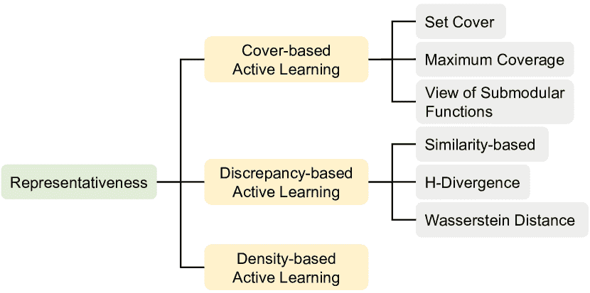

<!--yml

分类：未分类

日期：2024-09-06 19:36:15

-->

# [2310.14230] 关于深度主动学习及其在医学图像分析中应用的综合综述

> 来源：[`ar5iv.labs.arxiv.org/html/2310.14230`](https://ar5iv.labs.arxiv.org/html/2310.14230)

# 关于深度主动学习及其在医学图像分析中应用的综合综述

Haoran Wang Qiuye Jin Shiman Li Siyu Liu Manning Wang Zhijian Song 数字医学研究中心，基础医学学院，复旦大学，中国上海 200032 上海医学图像计算与计算机辅助干预重点实验室，中国上海 200032 计算生物科学研究中心（CBRC），阿卜杜拉国王科技大学（KAUST），沙特阿拉伯图瓦尔 23955

###### 摘要

深度学习在医学图像分析中取得了广泛的成功，导致对大规模专家标注的医学图像数据集的需求不断增加。然而，医学图像标注的高成本严重阻碍了这一领域深度学习的发展。为了降低标注成本，主动学习旨在选择最具信息性的样本进行标注，并以尽可能少的标注样本训练高性能模型。在这项综述中，我们回顾了主动学习的核心方法，包括信息量评估和采样策略。我们首次详细总结了主动学习与其他标签高效技术（如半监督、自监督学习等）的整合。此外，我们还重点介绍了专门针对医学图像分析的主动学习工作。最后，我们提供了对主动学习及其在医学图像分析中应用的未来趋势和挑战的见解。

###### 关键词：

主动学习、医学图像分析、综述、深度学习

## 1 引言

医学成像可视化解剖结构和病理过程。它还提供了在病变检测、诊断、治疗规划和外科干预中的关键数据。近年来，人工智能（AI）的兴起使医学图像分析取得了显著成功。基于 AI 的医学图像分析系统不仅接近而且在某些临床任务中甚至超越了人类专家的表现。显著的例子包括皮肤癌分类 Esteva et al., [2017]、CT 扫描肺癌筛查 Ardila et al., [2019]、结肠镜检查中息肉检测 Wang et al., [2018] 以及全切片图像中前列腺癌组织检测 Tolkach et al., [2020]。因此，这些基于 AI 的系统可以整合到现有的临床工作流程中，有助于提高临床专家的诊断准确性 Sim et al., [2020]，并支持经验不足的临床医生 Tschandl et al., [2020]。

深度学习（DL）模型作为这些人工智能驱动系统的核心，用于从原始图像中学习复杂模式并将其推广到更多未见的案例中。深度学习的成功往往依赖于大规模人工标注的数据集。例如，ImageNet 数据集 Deng et al., [2009] 包含数千万张标注图像，并且广泛用于开发计算机视觉的深度学习模型。医学图像数据集的规模不断扩大，但仍然相对小于自然图像数据集。例如，脑肿瘤分割数据集 BraTS Menze et al., [2014, Baid et al., 2021] 包含 3D 多序列 MRI 扫描。BraTS 数据集从 2013 年的 65 名患者扩展到 2021 年的 1200 多名患者。后者相当于超过 70 万张标注的 2D 图像。然而，高昂的标注成本限制了大规模医学图像数据集的构建，主要体现在以下两个方面：

图 1：本调查的整体框架。

1. 医学图像的细粒度标注工作既费力又耗时。在临床实践中，自动分割有助于临床医生更准确地勾勒出不同的解剖结构和病变。然而，训练这样的分割模型需要逐像素的标注，这非常繁琐 Rajpurkar et al., [2022]。另一种情况是在数字病理学中。病理学家通常需要在高倍显微镜下对病理组织切片进行详细检查和解释。由于组织结构复杂，病理学家必须不断调整显微镜的放大倍数。因此，检查单个切片通常需要 15 到 30 分钟 Qu et al., [2022]。对病理学家而言，做出准确的标注更具挑战性。总之，医学图像分析中的标注过程需要大量的时间和劳动投入。

医学图像标注的高标准导致了高昂的成本。在计算机视觉中，对象检测和分割等任务也需要许多细致的标注。然而，众包平台的广泛使用显著降低了这些任务中获得高质量标注的成本 Kovashka et al., [2016]。但众包平台在医学图像标注上存在一定的局限性。首先，医学图像标注要求具备医学知识和临床专业知识。一些复杂的病例甚至需要多位资深专家之间的讨论。其次，即使在一些相对简单的任务中，众包工作者提供的标注质量往往低于专业医学图像分析标注员的水平。例如，Rädsch et al. [2023] 的研究结果支持了在外科器械分割掩膜标注中上述结论。最后，众包平台可能还会引发隐私问题 Rajpurkar et al., [2022]。总的来说，高质量的标注往往需要经验丰富的医生参与，这本质上增加了医学图像的标注成本。

高昂的标注成本是深度学习在医学图像分析中的主要瓶颈之一。主动学习（AL）被认为是减少标注成本的最有效解决方案之一。AL 的主要思想是选择最具信息量的样本进行标注，然后用这些样本以监督方式训练模型。在 AL 的一般实践中，标注数据集的一部分可以达到与标注所有样本相当的性能。因此，AL 通过尽可能少地查询具有信息量的样本来节省标注成本。具体来说，我们将专注于训练深度模型的 AL 工作称为深度主动学习。

审查医学图像分析中的主动学习工作对于降低标注成本至关重要。现在已有一些关于机器学习或计算机视觉中的主动学习的调查。Settles [2009] 提供了对机器学习时代主动学习工作的概述和全面回顾。在深度学习出现后，Ren et al. [2021] 回顾了深度主动学习的发展及其在计算机视觉和自然语言处理中的应用。Liu et al. [2022b] 总结了深度主动学习中的模型驱动和数据驱动样本选择器。Zhan et al. [2022] 重新实现了深度主动学习中的高影响力工作并进行了公平比较。Takezoe et al. [2023] 回顾了计算机视觉中深度主动学习的最新进展及其工业应用。关于医学图像分析中的相关调查，Budd et al. [2021] 研究了在医学图像分析中开发和部署深度学习的过程中，人类的作用，其中主动学习被认为是这一过程的重要部分。在 Tajbakhsh et al. [2020]中，主动学习被认为是训练具有不完美标注的高性能医学图像分割模型的解决方案之一。作为医学图像分析中标签高效深度学习的方法之一，Jin et al. [2023a] 从模型和数据不确定性角度总结了主动学习方法。

然而，以上提到的调查存在一定的局限性。首先，随着深度主动学习的快速发展，新思想和方法不断涌现。因此，需要对主动学习进行更全面的调查，以涵盖最新的进展。其次，最近的趋势是将主动学习与其他标签效率技术结合起来，这也被相关调查[Takezoe et al., [2023, Budd et al., 2021]]强调为未来方向。然而，现有调查仍缺乏对此主题的总结和讨论。最后，高昂的标注成本突显了主动学习在医学图像分析中的重要性，但相关综述在这方面仍缺乏全面性。

图 2：主动学习过程的插图。

本调查全面回顾了医学图像分析中的主动学习，包括核心方法、与其他标签高效技术的融合，以及专门针对医学图像分析的主动学习工作。我们首先使用关键词“Active Learning”在 Google Scholar 和 arXiv 平台上搜索相关论文，并通过引用扩展了搜索范围。需要注意的是，本调查中包含的论文主要属于医学图像分析和计算机视觉领域。对语言、时间序列、表格数据和图形的主动学习工作关注较少。此外，本调查中的大多数工作发表在顶级期刊（包括 TPAMI、TMI、MedIA、JBHI 等）和会议（包括 CVPR、ICCV、ECCV、ICML、ICLR、NeurIPS、MICCAI、ISBI、MIDL 等）。因此，本调查涉及近 164 项相关主动学习工作和 234 个参考文献。本文的贡献总结如下：

+   •

    通过详尽的文献检索，我们提供了一个全面的回顾和一个新颖的主动学习分类体系，特别是那些专注于医学图像分析的研究。

+   •

    以前的调查主要集中在评估信息量上，我们进一步总结了深度主动学习中的不同采样策略，如多样性和类别平衡策略，旨在为未来方法的改进提供参考。

+   •

    与当前趋势一致，本调查首次详细回顾了主动学习与其他标签高效技术的融合，包括半监督学习、自监督学习、领域适应、基于区域的主动学习和生成模型。

本调查的其余部分组织如下：§2 介绍了主动学习（AL）的问题设置和数学公式，§3 讨论了 AL 的核心方法，包括信息量评估（§3.1 和 §3.2）以及采样策略（§3.3），§4 回顾了 AL 与其他标签高效技术的整合，§5 总结了针对医学图像分析的 AL 工作。我们在 §6 讨论了现有挑战和 AL 的未来方向，并在 §7 结束整篇论文。该调查的整体框架见图 1。

由于主动学习的快速发展，许多相关工作未被覆盖。我们建议读者访问我们不断更新的网站¹¹1https://github.com/LightersWang/Awesome-Active-Learning-for-Medical-Image-Analysis，以获取主动学习及其在医学图像分析中的最新进展。

## 2 主动学习的问题设置和公式化

主动学习（AL）通常涉及三种问题设置：成员查询合成、流式选择性采样和池式主动学习 Settles, [2009]。在成员查询合成的情况下，我们可以持续查询输入空间中的任何样本进行标注，包括生成模型生成的合成样本 Angluin, [1988, 2004]。在本调查中，我们也称这种设置为生成式主动学习。成员查询合成通常适用于低维输入空间。然而，当扩展到高维空间（例如图像）时，生成模型生成的查询样本可能对人工标注者来说不可辨识。深度生成模型的最新进展在合成真实医学图像方面展现了巨大潜力，我们将在§4.5 进一步讨论它与主动学习的结合。流式选择性采样假设样本一个接一个地连续到达，我们需要决定是否对即将到来的样本请求标注 Cohn et al., [1994]。这种设置适用于内存有限的场景，如边缘计算，但忽略了样本之间的相关性。

大多数主动学习研究遵循池式主动学习，即从大量未标注的数据池中抽取样本，并请求 oracle（例如医生）进行标注。此外，如果一次选择多个样本进行标注，我们可以进一步称这种设置为“批量模式”。深度主动学习默认是批量模式，因为每次标注一个样本后重新训练模型是不切实际的。而且，一个标注样本可能不一定导致显著的性能提升。因此，除非另有说明，本调查中的所有工作均遵循批量模式池式主动学习的设置。

主动学习的流程图如图 2 所示。假设总共有$T$轮标注，主动学习主要包括以下步骤：

1\. 样本选择：在第$t$轮标注中，$1\leq t\leq T$，使用采集函数$A$来评估未标记池$D_{t}^{u}$中每个样本的信息量。然后，采用某种采样策略$S$选择一批样本。具体来说，第$t$轮的查询数据集$D_{t}^{q}$构建如下：

|  | $D_{t}^{q}=\underset{D_{t}^{q}\subset D_{t}^{u}}{S}\left(\underset{x\in D_{t}^{u}}{A}\left(x,f_{\theta_{t-1}}\right),b\right)$ |  | (1) |
| --- | --- | --- | --- |

其中$x$表示数据集中的样本，$D_{t}^{u}$和$D_{t}^{q}$分别是第$t$轮的未标记数据集和查询数据集。$f_{\theta_{t-1}}$和$\theta_{t-1}$分别表示上一轮的深度模型及其参数。标注预算$b$是每轮查询样本的数量，远小于未标记样本的总数，即$b=|D_{t}^{q}|\ll|D_{t}^{u}|$。

2\. 由 Oracle 标注：在样本选择后，查询集$D_{t}^{q}$会被送到 Oracle（例如医生）进行标注，新增标记样本将被加入到标记数据集$D_{t}^{l}$中。$D_{t}^{l}$的更新如下：

|  | $D_{t}^{l}=D_{t-1}^{l}\cup\{(x,y)\mid x\in D_{t}^{q}\}$ |  | (2) |
| --- | --- | --- | --- |

其中$y$表示$x$的标签，$D_{t}^{l}$和$D_{t-1}^{l}$分别表示第$t$轮和前一轮的标记集。此外，查询样本应从未标记集$D_{t}^{u}$中移除：

|  | $D_{t}^{u}=D_{t-1}^{u}\backslash\{(x,y)\mid x\in D_{t}^{q}\}$ |  | (3) |
| --- | --- | --- | --- |

3\. 深度学习模型训练：在 Oracle 标注后，我们使用本轮标记集$D_{t}^{l}$以完全监督的方式训练深度模型。深度模型$f_{\theta_{t}}$在$D_{t}^{l}$上进行训练，以获得第$t$轮的最佳参数$\theta_{t}$。数学公式如下：

|  | $\theta_{t}=\underset{\theta}{\arg\min}\underset{(x,y)\in D_{t}^{l}}{\mathbb{E}}\left[\mathcal{L}(f_{\theta}(x),y)\right]$ |  | (4) |
| --- | --- | --- | --- |

其中$\mathcal{L}$表示损失函数。

4\. 重复步骤 1 至 3，直到达到标注预算限制。

值得注意的是，模型需要适当的初始化才能开始主动学习（AL）过程。如果初始模型 $f_{\theta_{0}}$ 是随机初始化的，它可能只会产生无意义的信息。为了解决这个问题，大多数 AL 工作会随机选择一些样本作为初始标记数据集 $D_{0}^{l}$ 并在 $D_{0}^{l}$ 上训练 $f_{\theta_{0}}$。有关使用预训练模型更好地初始化 AL 的详细信息，请参阅 §4.2。

## 主动学习的 3 个核心方法

在这项调查中，我们将信息量评估和采样策略视为主动学习的核心方法。信息量代表了对每个样本进行标注的价值。更高的信息量表明这些样本的标注优先级更高。信息量的典型度量包括基于模型预测的不确定性和基于数据分布的代表性。另一方面，采样策略用于根据样本的信息量度量选择少量未标记样本进行标注。常见的采样策略包括 top-k 选择和聚类等。与之前的调查不同，我们首次明确将采样策略定义为主动学习的核心方法。其理由是，如果存在完美的信息量度量，可以简单地根据标注预算选择信息量度量值最高的样本。然而，目前的信息量度量在某种程度上或多或少存在缺陷。例如，冗余和类别不平衡查询是主动学习中的常见问题。我们需要具体的采样策略来缓解由于信息量度量不完美而产生的问题。在本节中，我们回顾了不确定性（§3.1）、信息量（§3.2）和采样策略（§3.3）。此外，我们提供了对本调查中所有工作的总结。计算不确定性或代表性以及采样策略的方法和基本度量在表 4 中详细说明。

### 3.1 信息量评估：不确定性

不确定性用于评估模型预测的可靠性，更高的不确定性表明模型可能更容易出现错误 Kendall and Gal, [2017]。在主动学习的样本选择过程中，很难确定模型预测的正确性。然而，我们可以通过不确定性估计突出模型容易出错的样本。不确定样本通常包含模型尚未掌握的知识。对这些样本进行标注可以提高性能。因此，不确定性已成为主动学习中最常用的信息量度量之一。

最直接的不确定性度量是基于预测概率的，包括最少置信度 Lewis and Catlett, [1994]、熵 Joshi et al., [2009]、边际 Roth and Small, [2006] 和均值方差 Gal et al., [2017]。这些度量在传统的主动学习中被广泛使用，它们的公式在表 1 中有详细说明。置信度是最高预测类别的概率。我们通常采用最少置信度来衡量不确定性，即较低的置信度表示较高的不确定性。熵是最常用的不确定性度量，较高的熵表示较高的不确定性。边际代表最高和次高预测概率之间的差异，较大的边际表示更大的不确定性。此外，较大的均值方差表示更高的不确定性。

表 1: 基于预测概率的不确定性度量公式。$x$ 代表样本，$f$ 是深度模型，而 $C$ 是类别数量。

| 名称 | 公式 |
| --- | --- |
| 预测概率 | $p=\text{Softmax}\left(f\left(x\right)\right)\in\mathbb{R}^{C},p=\left[p_{1},p_{2},\cdots,p_{C}\right]$ |
| 最少置信度 | $1-\underset{i}{\max}{p_{i}}$ |
| 熵 | $-\sum_{i=1}^{C}{p_{i}\log{p_{i}}}$ |
| 边际 | $\ \underset{i}{\max}{p_{i}}-\underset{j,j\neq k}{\max}{p_{j}},k=\underset{i}{\arg\max}{p_{i}}$ |
| 均值方差 | $-\frac{1}{C}\sum_{i=1}^{C}\left(p_{i}-\bar{p}\right)^{2},\bar{p}=-\frac{1}{C}\sum_{i=1}^{C}p_{i}$ |

上述不确定性指标只需要在深度学习中进行一次前向传播。然而，由于深度神经网络中著名的过度自信问题 Guo 等人, [2017]，这些指标不能直接转移到深度 AL 中。在深度学习中，过度自信指的是模型对其预测有过高的信心，即使预测可能不准确。过度自信导致对错误分类样本的错误类别具有过高的信心（例如 0.99）。对于不确定的样本，它可能导致极端信心（例如 0.99 或 0.01），而不是正常的信心（例如 0.6 或 0.4）。过度自信可能导致不确定性的扭曲，因为它影响了所有类别的预测概率。本节将基于不确定性的主动学习分为多次推断、基于不一致性的无效、不确定性感知模型、基于梯度的不确定性、基于对抗的不确定性和性能估计。前三者主要基于预测概率，而后者三者大多采用其他深度模型统计数据来进行不确定性估计。基于不确定性的主动学习分类如图 3。

图 3: 基于不确定性的主动学习分类。

#### 3.1.1 多次推断

为了减轻过度自信，一个常见的策略是对模型进行多次运行，并使用均值概率计算经典的不确定性指标。主要思想是减少由网络架构或训练数据引入的偏差。这些偏差往往导致过度自信问题。可以采用三种方法进行多次推断：蒙特卡洛 dropout（MC dropout）、模型集成和数据增强。前两种方法扰动模型参数，最后一种方法扰动输入数据。

MC dropout 在每次推断过程中随机丢弃深度模型中的一些神经元 Gal 和 Ghahramani, [2016]。启用 MC dropout 后，模型会多次运行以获得不同的预测。Gal 等人 [2017] 是深度 AL 的开创性工作。他们也是第一个将 MC dropout 应用于计算不确定性指标，如熵、标准差和贝叶斯主动学习不一致性（BALD）的研究者 Houlsby 等人, [2011]。结果表明，MC Dropout 可以显著提高基于不确定性的深度 AL 的性能。

模型集成训练多个模型以在推断过程中获得多个预测。Beluch 等人[2018] 对模型集成和 MC dropout 在基于不确定性的主动学习中的表现进行了详细比较。结果表明，模型集成效果更佳。然而，模型集成在深度学习中需要显著的训练开销。为了减少计算成本，snapshot ensemble Huang 等人，[2017] 通过循环学习率衰减在一次运行中获得多个模型。Beluch 等人[2018] 的早期尝试显示，snapshot ensemble 的表现不如模型集成。Jung 等人[2023] 通过在不同的主动学习轮次中保持相同的优化轨迹，并进行参数正则化，改进了 snapshot ensemble。结果显示，改进后的 snapshot ensemble 优于模型集成。此外，Nath 等人[2021] 采用了 Stein 变分梯度下降来训练模型集成，旨在确保模型之间的多样性。

数据增强通过随机变换生成输入数据的不同版本。然后，通过在推断过程中使用不同的增强方式运行模型，从而获得多个预测。在点云语义分割中，Hu 等人[2022] 多次随机增强输入点云，然后在配准和对应估计后计算每个点的平均预测概率的熵。Liu 等人[2022a] 也对点云应用了随机增强，但他们使用方差作为不确定性度量。

#### 3.1.2 基于分歧的不确定性

相同样本的不同推断之间的分歧也可以作为不确定性的度量。分歧较大的样本表示不确定性较高，适合进行标注。本节的方法原理与前一节一致，旨在通过在多次推断过程中引入扰动来减轻过度自信。然而，前一节的方法侧重于改进经典度量的不确定性估计，而本节的方法则利用不同预测结果之间的分歧。在这一研究方向上，我们可以从模型和数据的角度构建分歧。

模型不一致性：我们可以利用不同模型输出之间的不一致性，也称为 Query-by-Committee (QBC) Seung et al., [1992]。建议性注释 (SA) Yang et al., [2017] 通过引导训练了多个分割网络。这些模型之间的方差被用作不一致性度量。Mackowiak et al. [2018] 采用了不同 MC dropout 推断之间的投票熵作为不一致性度量。Peng et al. [2021] 通过知识蒸馏训练了教师和学生模型，并使用分割预测的 L2 距离作为不一致性度量。在胶囊结肠镜的息肉分割中，Bai et al. [2022] 使用分类网络生成的类激活图 (CAMs) Zhou et al., [2016] 训练了多个解码器。他们进一步提出了模型不一致性和 CAM 不一致性用于样本选择。模型不一致性包括预测概率的熵和不同解码器输出之间的 Dice 系数，而 CAM 不一致性测量 CAMs 和所有解码器输出之间的 Dice 系数。这种方法选择了具有高模型不一致性和 CAM 不一致性的样本进行注释。然而，低模型不一致性但高 CAM 不一致性的样本被视为伪标签用于半监督训练。在肋骨骨折检测中，Huang et al. [2020] 采用 Hausdorff 距离来测量不同 CAMs 之间的不一致性。

数据分歧：由于训练多个模型可能计算开销很大，测量输入数据不同扰动之间的分歧在主动学习（AL）中也很有帮助。Kullback-Leibler（KL）散度是量化分歧的常用指标。Wu 等人 [2021b] 计算了不同增强版本之间的 KL 散度作为分歧度量。Siddiqui 等人 [2020] 通过计算 3D 场景中不同视角预测之间的 KL 散度来测量分歧。在点云分割中，Hu 等人 [2022] 采用 KL 散度来测量不同帧预测之间的分歧。此外，最近的工作采用了替代指标来计算分歧。Lyu 等人 [2023] 提出了输入端委员会，通过随机增强输入数据来构建不同的预测。他们进一步用交叉熵和方差分别测量不同预测之间的分类和定位分歧。Parvaneh 等人 [2022] 在特征空间中插值无标签样本和有标签原型。如果插值样本的预测与原型的标签不一致，说明无标签样本可能引入了新特征。然后，这些无标签样本应送去标注。结果显示了在各种数据集和设置中的进展。此外，一些工作探索了图像局部区域内的预测分歧。在目标检测中，Aghdam 等人 [2019] 假设错误预测像素邻域内概率的分歧应该很高。他们采用了 BALD 作为分歧度量指标。

#### 3.1.3 不确定性感知模型

不确定性感知模型的主要思想是将常用的确定性模型转化为概率模型。这样，网络不再输出单一的点估计，而是提供可能预测的分布，从而缓解过度自信。这种方法只需要对深度模型进行一次传递，大大减少了推断过程中的计算和时间成本。相关工作主要分为两类：证据深度学习（EDL）和混合密度网络（MDN）。

证据深度学习用 Dirichlet 分布 Sensoy et al., [2018] 替代了 Softmax 分布。网络的输出被解释为 Dirichlet 分布的参数，因此预测遵循 Dirichlet 分布。如果模型对预测有信心，Dirichlet 分布会很尖锐；否则，它会比较平坦。为了使 EDL 适用于目标检测任务，Park 等人 [2023] 引入了一个模型证据头，以自适应地调整 Dirichlet 分布的参数，从而提高了训练稳定性。他们首先计算了每个检测框的 epistemic uncertainty，然后通过分层不确定性聚合获得样本级别的不确定性。Sun 等人 [2023] 还将 EDL 应用于场景图生成，使用仅约 10% 的标注成本达到了接近全监督的性能。

混合密度网络：Choi 等人 [2021a] 将目标检测网络中的分类和定位头部转变为 MDN 的架构 Bishop, [1994]。除了每个边界框的坐标和类别预测外，MDN 头还生成了分类和定位的方差。他们使用这些方差作为样本选择的 uncertainty 指标。结果表明，这种方法在减少推理时间和模型大小的同时，与 MC dropout 和模型集成相比具有竞争力。

#### 3.1.4 基于梯度的不确定性

基于梯度的优化对深度学习至关重要。每个样本的梯度反映了其对模型参数变化的贡献。较大的梯度长度表明样本对参数的变化影响巨大，因此意味着高不确定性。此外，梯度独立于预测概率，使其不易受过度自信的影响。在深度主动学习中，常用的三种基于梯度的不确定性指标是：梯度、Fisher 信息 (FI) 和影响函数。

梯度：更大的梯度范数（即梯度长度）表示对模型参数的影响更大，表明 AL 中的不确定性更高。Ash 等人[2020] 提出了通过多样化梯度嵌入（BADGE）的批量主动学习方法。他们仅计算网络最后一层参数的梯度，并以最有信心的类别作为梯度计算中的伪标签。然后，在梯度嵌入上执行 k-Means++进行样本选择。结果显示 BADGE 在各种数据集、网络架构和超参数设置下表现出色。Wang 等人[2022b] 证明了更大的梯度范数对应于测试损失的较低上界。因此，他们采用了期望经验损失和熵损失进行梯度计算，这两者都无需标签。前者是每个类别的损失之和，由相应的概率加权。后者是所有类别概率的熵。在 MRI 脑肿瘤分割中，Dai 等人[2020] 使用梯度进行主动学习。他们首先训练了一个变分自编码器（VAE）Kingma 和 Welling，[2013]来学习数据流形。然后，他们训练了一个分割模型，并使用现有标注数据计算 Dice 损失的梯度。样本选择由投影到数据流形上的梯度指导。他们的扩展工作 Dai 等人，[2022]进一步展示了在 MRI 全脑分割中的卓越表现。

Fisher 信息：作为梯度协方差矩阵的期望，FI 根据数据分布对模型参数反映总体不确定性。标注具有较高 FI 的样本有助于模型更快地收敛到最优参数。FI 已成功应用于机器学习模型的 AL 中 Chaudhuri 等人，[2015, Sourati 等人，2017]。然而，FI 的计算成本随着模型参数的增加而平方增长，这对于深度主动学习来说是不可接受的。Sourati 等人[2018]及其扩展工作 Sourati 等人，[2019] 是首次将 FI 纳入深度主动学习。他们使用每一层的平均梯度来计算 FI 矩阵，从而降低了计算成本。这种方法在不同年龄组和病理条件下的大脑提取中优于其他竞争者。此外，Ash 等人[2021] 仅计算了网络最后一层的 FI 矩阵。

影响函数：Liu 等人[2021b] 使用影响函数 Koh 和 Liang，[2017] 选择对模型性能产生最大正面影响的样本。该方法使用期望经验损失来计算梯度，因为影响函数也需要梯度计算。

#### 3.1.5 基于对抗的不确定性

AL 中的不确定性也可以通过对抗方式来估计，包括对抗样本和对抗训练。

对抗样本是通过向正常样本添加精心设计的扰动来创建的，这些扰动是通过攻击深度模型生成的 Goodfellow et al., [2014b]。对抗样本和原始样本之间的差异对人眼几乎不可辨别。然而，深度模型对对抗样本会产生极其自信的错误预测。原因在于，对抗攻击以最小的代价将原始样本推向决策边界的另一侧，导致视觉上几乎没有变化，但预测结果却大相径庭。从这个角度看，对抗攻击的强度反映了样本与决策边界的距离 Heo et al., [2019]。小的扰动表示样本距离决策边界更近，因此被认为更不确定。Ducoffe 和 Precioso [2018]采用了 DeepFool 算法 Moosavi-Dezfooli et al., [2016]进行对抗攻击。要求标记的小扰动对抗样本。Rangwani 等人[2021]通过最大化对抗样本和原始样本预测之间的 KL 散度来攻击深度模型，同时限制扰动的强度。

对抗训练涉及在特征提取器和多个分类器之间交替训练。特征提取器和分类器的训练目标是相互冲突的。多轮对抗训练增加了分类器之间的分歧，揭示了被过度自信掩盖的不确定样本。在目标检测中，Yuan 等人[2021]及其扩展工作 Wan et al., [2023]使用了两个分类器对标记和未标记的数据集进行对抗训练。第一步是固定特征提取器，调整两个分类器。分类器之间的不一致越多，不确定样本暴露得越多。然后，他们固定分类器，调整特征提取器以相反的目标，旨在缩小标记和未标记样本之间的分布差距。经过多轮交替训练后，分类器之间分歧最大样本被送去标注。Fu 等人[2021]对多个分类器进行了对抗训练，以最大化它们之间的分歧。不同预测之间的标准差被认为是不确定性度量。

#### 3.1.6 性能估计

在本节中，不确定度度量是对当前任务的直接性能估计。这些度量有两种类型：测试损失或任务特定的评估度量。这些度量反映了预测误差的水平。例如，低 Dice 分数表明模型未能生成准确的分割。请求对这些样本进行标注将有助于提升模型性能。然而，我们只能在没有真实值的情况下估计这些度量，而无法精确计算。主要有两种方法来估计性能：替代度量和可学习性能估计。

替代度量在这类研究中被广泛使用。例如，这些度量可能是损失或某些评估度量的上界或下界。黄等人 [2021] 发现，在有限的训练迭代内，一个样本的损失受限于初始和最终网络输出之间差异的范数。受到这一发现的启发，他们提出了循环输出差异（COD），作为两个连续标注轮次之间模型输出的差异。结果表明，较高的 COD 与较高的损失相关。因此，他们选择了具有高 COD 的样本。这些样本还可能与评估度量具有线性相关性，并通过事后验证加以确认。申等人 [2020] 通过 MC dropout 计算了所有预测的交并比（IoU）。他们发现这一 IoU 与真实的 Dice 系数之间存在强烈的线性相关性。赵等人 [2021] 通过深度监督计算了中间层和最终层预测之间的平均 Dice 系数。他们也发现这一平均 Dice 与真实 Dice 系数之间具有线性相关性。结果在皮肤病变分割和 X 光手骨分割中显示了竞争力的表现。

可学习的性能估计：此外，我们可以训练辅助神经网络模块来预测性能指标。作为这一研究领域中最具代表性的工作之一，主动学习的学习损失（LL4AL）Yoo and Kweon, [2019] 训练了一个额外的模块，以预测样本的损失值，而不需要其标签。由于损失指示了网络预测的质量，预测的损失是样本选择的自然不确定性指标。结果显示，预测损失与实际损失有很强的相关性。LL4AL 还优于多个主动学习基线。在肺结节检测的 CT 扫描中，Liu 等人 [2020] 在 LL4AL 的基础上，预测了每个样本和边界框的损失。在 COVID-19 诊断中，Wu 等人 [2021b] 采用了预测损失和不同预测之间的分歧来进行样本选择。由于主动学习仅关注未标记样本的不确定性排名，Kim 等人 [2021] 将损失回归放宽为损失排名预测。因此，他们将 LL4AL 中的损失回归器替换为 RankCGAN Saquil et al., [2018] 中的排名器。结果显示，损失排名预测优于 LL4AL。

### 3.2 信息量评估：代表性

尽管不确定性方法在深度主动学习中发挥了关键作用，但它们仍面临某些挑战：1\. 异常值选择：使用不确定性在主动学习中的目标是通过查询当前模型的困难样本来提高性能。然而，这些方法也可能选择出异常值，从而损害模型训练 Karamcheti et al., [2021]。这发生是因为不确定性仅依赖于模型预测，忽略了对数据分布内在特征的探索。引入额外的信息度量以去除异常值将对主动学习有利。2\. 分布不一致：不确定性方法选择的样本通常位于特征空间的决策边界附近 Settles, [2009]。因此，由不确定性方法选择的样本的分布可能与整体数据分布不同。这种差异可能引入数据集偏差并导致性能下降。因此，上述挑战促使我们进一步发现数据分布，以评估信息量。

基于代表性的深度主动学习旨在选择一个能够代表整个数据集的样本子集。通常，高度代表性的样本位于数据流形的密集区域，并包含有关其他邻近样本的信息。此外，这些方法要求采样结果具有多样性。代表性样本应广泛分布在数据流形上，而不是集中在特定区域。此外，代表性样本在成像风格或视觉内容等属性上应具有明显的区别。深度特征表示编码了这些信息，并用于计算不同样本之间的相互关系。本节介绍了三种基于代表性的主动学习的公式：基于覆盖的、基于差异的和基于密度的代表性主动学习。这些方法的分类见图 4。

图 4: 基于代表性的主动学习的分类。

#### 3.2.1 基于覆盖的主动学习

我们可以将基于代表性的主动学习（AL）表述为一个覆盖问题。一个经典的覆盖问题的例子是设施位置问题，例如用一些广告牌覆盖城市的所有街道 Farahani and Hekmatfar, [2009]。同样，基于覆盖的主动学习使用少量样本来覆盖整个数据集。理想情况下，这些样本应该具有代表性，并包含其他样本的信息。这些方法通常涉及两种设置：集合覆盖和最大覆盖。这两种设置都是 NP-hard 的，意味着无法在多项式时间内得到最优解。然而，使用贪心算法可以在线性时间内获得近似最优解。具体来说，贪心算法通过迭代选择那些覆盖其他样本最多的样本进行标注 Feige, [1998]。

集合覆盖旨在选择尽可能少的样本来覆盖整个数据集。CoreSet Sener 和 Savarese, [2018] 遵循了 k-Center 位置的设置 Hochbaum 和 Shmoys, [1985]，这也是集合覆盖问题的一种变体。在 CoreSet 中，深度特征的 L2 距离用于衡量不同样本之间的相似性。他们采用了最远优先遍历来解决 k-Center 问题以选择具有代表性的样本。Agarwal 等人 [2020] 为主动学习引入了上下文多样性，这是一种在空间和语义上融合样本不确定性和多样性的度量。他们用上下文多样性替代了 L2 距离，并在 CoreSet 中使用相同的方法进行样本选择。Caramalau 等人 [2021] 采用了图卷积网络（GCN）来建模标记样本和未标记样本之间的关系。GCN 改进了未标记样本的特征表示，并利用标记数据集进一步提高特征表示。这一增强的特征表示被用于 CoreSet 采样。

最大覆盖选择一定数量的样本，以尽可能覆盖整个数据集。Yehuda 等人 [2022] 发现 CoreSet 倾向于选择离群点，特别是在标注预算较低的情况下。为了解决这个问题，他们提出了 ProbCover，它将设置从集合覆盖更改为最大覆盖。他们采用了一种基于图的贪心算法来进行样本选择。在自监督深度特征的帮助下，ProbCover 有效地避免了选择离群样本。此外，SA Yang et al., [2017] 提供了另一种最大覆盖的公式。SA 首先选择高度不确定的样本，然后进一步选择具有代表性的样本进行标注。代表性是基于深度特征的余弦相似度。具体来说，样本 $x$ 由查询数据集 $D_{t}^{q}$ 中最相似的样本表示。

|  | $r\left(D_{t}^{q},x\right)=\underset{x^{\prime}\in D_{t}^{q}}{\max}{sim\left(x^{\prime},x\right)}$ |  | (5) |
| --- | --- | --- | --- |

其中 $r$ 是样本 $x$ 相对于 $D_{t}^{q}$ 的代表性，$sim(\cdot,\cdot)$ 表示余弦相似度。此外，$D_{t}^{q}$ 与未标记集合 $D_{t}^{u}$ 之间的代表性 $R$ 如下：

|  | $R\left(D_{t}^{q},D_{t}^{u}\right)=\underset{x\in D_{t}^{u}}{\sum}r\left(D_{t}^{q},x\right)$ |  | (6) |
| --- | --- | --- | --- |

较大的$R\left(D_{t}^{q},D_{t}^{u}\right)$表示$D_{t}^{q}$更好地表示了$D_{t}^{u}$。需要注意的是，SA 是最大覆盖问题的一种推广，因为余弦相似度的范围是从 0 到 1。但他们仍然使用贪心算法来寻找使$R\left(D_{t}^{q}\cup x,D_{t}^{u}\right)-R\left(D_{t}^{q},D_{t}^{u}\right)$最大化的样本$x$。SA 激发了许多后续工作。徐等人 [2018] 在 SA 中对分割网络进行了量化，发现这提高了腺体分割的准确性，同时显著减少了内存使用。郑等人 [2019] 提出了代表性注释（RA），省略了 SA 中的不确定性查询。RA 训练了一个 VAE 用于特征提取，并通过层次聚类对特征空间进行了划分。他们使用与 SA 类似的策略在每个簇中选择代表性样本。沈等人 [2020] 将 SA 中的相似度度量从$sim(\cdot,\cdot)$改为$1-sim(\cdot,\cdot)$，这增强了所选样本的多样性。在医学图像的关键点检测中，权等人 [2022] 提出了一个代表性方法来选择模板图像用于少样本学习。首先，他们使用自监督学习训练了一个特征提取器，并应用 SIFT 进行初步关键点检测。接着，他们计算了模板图像与整个数据集之间的平均余弦相似度。最后，他们选择了相似度最高的模板组合进行注释。

子模函数视角：从子模函数的角度可以将集合覆盖和最大覆盖进行公式化 Fujishige, [2005]。这些函数显示出递减的边际收益，这意味着随着集合的增大，每增加一个元素带来的增益会比之前的元素少。一般来说，每个子模函数对应一个特定的优化问题。如果一个子模函数是单调的且非负的，我们可以使用贪婪算法在线性时间内得到接近最优的解决方案。在基于覆盖的主动学习中，像 SA 和 RA 这样的算法遵循了子模函数的设置，但作者没有从这个角度展示他们的方法。引入子模函数将扩展主动学习的公式化，并确保所选择的样本既具有代表性又具有多样性。这类方法的典型步骤包括计算样本相似性、构建子模优化问题，并使用贪婪算法解决它 Wei et al., [2015]。Kothawade 等人 [2021] 引入了一个基于子模信息量度的主动学习框架，有效地解决了稀有类别稀缺、冗余和分布外数据等问题。在目标检测中，Kothawade 等人 [2022a] 专注于少数类样本。他们构建了一个感兴趣的类别集合，并通过子模互信息选择了与这些类别相似的未标记样本进行注释 Kothawade et al., [2022b]。

#### 3.2.2 基于差异的主动学习

在基于差异的主动学习中，最远离已标记集合的未标记样本被认为是最具代表性的。主要思想是，如果我们对这些样本进行多轮查询，已标记和未标记集合之间的分布差异将显著减少。因此，一小部分样本可能就能很好地代表整个数据集。这些方法的关键是测量两个高维分布之间的差异（即距离）。本节介绍了三种测量差异的指标：基于相似性的差异、H-发散度和 Wasserstein 距离。

基于相似性的差异：作为一种实际且易于实施的度量，我们可以基于样本相似性来近似分布之间的距离。Caramalau 等人 [2021] 提出了 UncertainGCN，该方法利用 GCN 建模已标记和未标记样本之间的关系。他们选择了与已标记集合相似性最低的未标记样本。在腺体和 MRI 婴儿脑分割中，Li 和 Yin [2020] 采用了平均余弦相似性作为两个数据集之间的距离。他们选择了远离已标记集合且接近未标记集合的样本。在目标检测中，Wu 等人 [2022a] 构建了具有样本特征和预测熵的原型。他们选择了远离已标记原型的未标记样本。

H-散度通过生成对抗网络（GAN）中的判别器来估计分布之间的距离 Goodfellow et al., [2014a]。更具体地说，判别器尝试区分有标签和无标签样本，而 H-散度与判别器的输出之间存在密切关系 Gissin and Shalev-Shwartz, [2019]。变分对抗主动学习（VAAL） Sinha et al., [2019] 将变分自编码器（VAE）与判别器结合，用于基于差异的主动学习。在 VAAL 中，VAE 将样本映射到潜在空间，而判别器区分样本是否有标签。这两者通过对抗训练相互影响。VAE 试图欺骗判别器，使其将所有样本判断为有标签，而判别器则尝试正确区分有标签和无标签样本。在多轮对抗训练后，VAAL 选择了判别器认为最有可能是无标签的样本进行标注。与 VAAL 不同，Gissin 和 Shalev-Shwartz [2019] 在没有对抗训练的情况下训练了判别器。Zhang 等人 [2020] 用样本不确定性替换了判别器的二元标签。他们还将 VAE 的特征与监督模型的特征结合在一起。Wang 等人 [2020b] 采用了一个神经网络模块进行样本选择。为了训练这样的模块，他们在 VAAL 之上添加了另一个判别器，该判别器旨在区分真实特征与 VAE 重建特征对于无标签样本的区别。在对这两个判别器进行对抗训练后，该模块选择了不确定和具有代表性的样本。Kim 等人 [2021] 将 LL4AL 与 VAAL 结合，将损失排名预测和 VAE 特征输入到判别器中。

Wasserstein 距离被广泛用于计算分布距离。Shui 等人 [2020] 指出 H-散度可能会妨碍样本选择的多样性，而 Wasserstein 距离则确保查询的样本具有代表性和多样性。他们进一步提出了 Wasserstein 对抗主动学习（WAAL）。具体来说，WAAL 建立在 VAAL 之上，并采用了一个额外的样本选择模块。他们通过最小化标记集和未标记集之间的 Wasserstein 距离来训练这个模块。WAAL 选择那些高度不确定且最可能未标记的样本进行注释。Mahmood 等人 [2022] 将主动学习（AL）公式化为一个最优传输问题。他们的目标是最小化标记集和未标记集之间的 Wasserstein 距离，同时利用自监督特征。他们进一步采用了混合整数编程，以保证多样样本选择的全局收敛。此外，Xie 等人 [2023b] 将候选样本视为基于自监督特征的连续可优化变量。他们首先随机初始化候选样本。然后，他们最大化候选样本与其最近邻之间的相似度，同时最小化候选样本与标记样本之间的相似度。最后，他们选择最终候选样本的最近邻进行注释。他们证明了这个目标等同于最小化标记样本和未标记样本之间的 Wasserstein 距离。

#### 3.2.3 基于密度的主动学习

基于密度的主动学习（AL）利用密度估计来刻画高维特征空间中的数据分布。似然性是对数据分布的估计密度，更高的密度区域表示更高的似然性。在这种情况下，代表性样本是具有高似然性的样本。然而，这种方法容易导致样本选择中的冗余。因此，像聚类这样的技术经常被用来提高样本选择的多样性。基于密度的主动学习直接估计数据分布，这避免了复杂优化问题的求解。TypiClust Hacohen et al., [2022] 通过自监督编码器将样本投影到高维特征空间。样本的密度被定义为到其 k 个最近邻的 L2 距离的倒数。此外，TypiClust 在之前进行了聚类，以确保所选样本的多样性。Wang et al. [2022c] 提出了两种基于密度的主动学习变体。第一种变体固定特征表示。该过程类似于 TypiClust，但他们最大化了选定样本之间的距离以确保多样性。另一种变体是端到端的。特征表示和样本选择同时进行训练。该变体使用可学习的 k 均值聚类，以局部平滑约束共同优化簇分配和特征表示。

在主动领域适应中，密度估计也被广泛用于选择目标领域中的代表性样本。有关相关工作的详细信息，请参见§4.3。

### 3.3 采样策略

大多数深度主动学习（AL）工作使用 top-k 选择信息量最高的样本进行标注。然而，现有的信息量度量面临一些问题，如选择样本的冗余性和类别不平衡。我们可以引入简单的采样策略来有效解决这些问题，而不是改进信息量。此外，特定的采样策略也可以用于结合多个信息量度量。此外，随着深度主动学习的近期发展，更多研究直接使用神经网络进行样本选择。在这种情况下，我们不再评估信息量，而是直接从未标记的池中使用神经网络选择有价值的样本。总之，采样策略在主动学习中至关重要，但之前的调查很少讨论它们的具体属性。作为本调查的贡献之一，我们系统地总结了主动学习中的不同采样策略，包括多样性采样、类别平衡采样、混合采样和可学习采样。主动学习中不同采样策略的分类见图 5。

图 5：主动学习中不同采样策略的分类。

#### 3.3.1 多样性采样

多样性策略旨在减少所选样本中的冗余性。采样冗余是基于不确定性和代表性的常见问题，这意味着一些所选样本高度相似。缺乏多样性会导致标注预算的浪费。此外，训练集中冗余的数据可能导致深度模型过拟合，从而降低性能。因此，许多主动学习方法采用多样性采样来缓解所选样本中的冗余。在这一部分，我们讨论了四种多样性采样策略，包括聚类、最远优先遍历、确定性点过程（DPP）和针对特定信息量度量的特定策略。

聚类是最常用的多样性采样策略之一。它将数据分成多个簇，然后在每个簇内查询样本。这种策略提高了整个特征空间的覆盖范围，从而更容易提升多样性。Ash 等人[2020]在梯度嵌入上应用了 k-Means++聚类，以选择多样化的不确定样本。Citovsky 等人[2021]通过层次聚类提升了基于边界的采样不确定性。他们在每个簇内选择了边界最小的样本。当查询数超过簇数时，优先选择较小簇中的样本。这种方法可以扩展到巨大的标注预算（例如，一百万）。Jin 等人[2022a]采用了 BIRCH 聚类，并选择了每个簇内信息密度最大的样本进行标注。与 k-Means 相比，BIRCH 聚类对离群值的敏感性较低，并且能进一步识别噪声样本。在连通组学中，Lin 等人[2020]分别用标注样本和未标注样本训练了两个特征提取器。然后，他们通过多轮聚类选择样本进行标注。这种方法在突触检测和线粒体分割中取得了出色的表现。

**最远点遍历**也是一种广泛使用的多样性查询策略。最远点遍历要求在特征空间中采样点之间的距离尽可能大。这导致了特征空间中选择的样本分布更为均匀，从而改善了采样结果的多样性。这项技术最早由 Sener 和 Savarese[2018]采用。Agarwal 等人[2020]和 Caramalau 等人[2021]通过最远点遍历改进了多样性，分别利用了他们提出的上下文多样性和 GNN 增强特征。然而，当标注预算有限时，最远点遍历可能会偏向离群值。

**行列式点过程**是一种用于从更大集合中选择子集的随机概率模型。DPP 减少了采样类似元素的概率，以确保结果的多样性。Bıyık 等人[2019]使用了两种 DPP 进行样本选择：不确定性 DPP 基于不确定性评分，而探索 DPP 旨在寻找接近决策边界的样本。然后，将两种 DPP 的采样结果送往专家标注。然而，与聚类相比，DPP 在计算上更为密集。Ash 等人[2020]比较了使用 k-Means++和 k-DPP 的性能和时间成本。结果显示，它们的性能相似，但 k-Means++的时间成本明显低于 k-DPP。

具体策略：针对某些信息量度量，还有特定的策略。在基于不确定性的主动学习中，BatchBALD Kirsch et al., [2019] 将基于 BALD 的不确定性主动学习扩展到批量模式。结果表明，与 Gal et al., [2017]相比，BatchBALD 提高了采样多样性。基于 FI 的方法将主动学习制定为半正定规划（SDP）问题以改善采样多样性。不同的方法被用于解决 SDP。Sourati et al. [2019] 使用商业求解器解决 SDP，而 Ash et al. [2021] 提出了适应高维特征空间的贪婪算法。此外，多样性是基于代表性的主动学习的一个重要部分。基于覆盖的主动学习在其公式中本质上融入了多样性的考虑。在基于离散度的主动学习中，Wasserstein 距离用于多样化查询结果 Shui et al., [2020, Mahmood et al., 2022]。基于密度的方法通常采用聚类等策略来提高多样性。

#### 3.3.2 类别平衡采样

类别不平衡是深度学习中的常见问题，其中一小部分类别有许多样本，而其他类别仅包含少量样本 Zhang et al., [2023]。例如，在医学图像分类等任务中，正常样本通常多于异常样本。在不平衡的数据集上训练可能导致主要类别的过拟合和次要类别的欠拟合。除了在训练过程中处理类别不平衡，主动学习通过避免对主要类别的过度标注和在数据集构建过程中增强对次要类别的标注来缓解类别不平衡。

分类：Choi 等人[2021b] 直接估计了分类器对给定样本出错的概率，并使用贝叶斯规则将其分解为三个部分。首先，他们训练了一个 VAE 来估计给定预测类别的数据的可能性。然后，在 VAE 特征上训练了一个额外的分类器，以估计类别的先验概率和特定类别的错误标记概率。通过考虑这三种概率，他们成功缓解了 AL 中的类别不平衡。所提出的方法在逐步类别不平衡的 CIFAR-10 和 CIFAR-100 数据集上表现良好。对于基于不确定性的方法，Bengar 等人[2022] 引入了一个优化框架来保持类别平衡。他们通过最可信的样本来补偿少数类别的查询，从而在查询的数据集中实现了更平衡的类别分布。在分类任务中，Munjal 等人[2022] 在长尾 CIFAR-100 数据集上测试了各种 AL 基线。结果表明，在类别不平衡设置下，没有一种方法在所有预算下都优于其他方法。然而，随着标记数据数量的增加，随机采样和最佳 AL 方法之间的性能差距减少。Hacohen 等人[2022] 在类似于 Munjal 等人[2022]的类别不平衡设置下进行了实验。所提出的 TypiClust 确保了类别平衡，并优于其他基线方法。Jin 等人[2022c] 假设分布尾部的样本更可能属于少数类别。因此，尾部概率等同于少数类别的可能性。具体来说，他们训练了一个 VAE 进行特征提取，并采用 copula 来估计 VAE 特征上的尾部概率。最后，通过聚类和不等概率采样选择了有信息的样本。所提出的方法在具有长尾分布的 ISIC 2020 数据集上进行了验证。Kothawade 等人[2022c] 使用子模块互信息来更关注少数类别的样本。他们在五种不同模态的医学分类数据集上取得了出色的结果，包括 X 光、病理学和皮肤镜检查。此外，在显微镜下的血细胞检测中，Sadafi 等人[2019] 在其少数类别的分类概率超过 0.2 时请求对样本进行专家标注。

分割：由于一些主动学习方法选择区域而不是整个图像进行标注，因此需要确保所选区域包含稀有或小型物体（例如，自动驾驶中的行人或电线杆）。Cai et al. [2021] 和 Wu et al. [2022b] 都为这种情况提出了类别平衡采样策略，详细内容见§4.4.

#### 3.3.3 混合采样

在主动学习中，一些研究可能会同时使用多个信息量指标。因此，有效整合多个指标仍然是一个关键问题。这个问题由本节讨论的混合采样策略解决。主要使用两种混合采样方法，包括多轮采样和指标融合。

多轮采样首先基于某个特定的信息量指标选择一部分样本，然后在该子集中根据另一个信息量指标继续选择样本。例如，SA Yang et al., [2017] 基于不确定性进行代表性采样，以减少采样集中冗余。Xie et al. [2022b] 首先使用基于密度的方法选择样本，然后在每个代表性样本集群中选择最不确定的样本。在另一项研究中，Xie et al. [2022c] 引入了基于 EDL 的分布和数据不确定性，然后采用两阶段策略进行样本选择。Wu et al. [2022b] 采用了一种更复杂的策略，设定动态权重以调整代表性和不确定性采样的预算。代表性采样的权重初期较大，而后期情况则相反。这是因为代表性方法可以快速识别典型数据，而不确定性方法通过查询错误预测的样本持续改进模型。

指标融合是混合采样中另一种广泛使用的方法。它直接结合不同的信息量指标。例如，可以直接将所有指标加总，并选择具有最高值的样本进行标注。排名批次模式 Cardoso et al., [2017] 可以在主动学习中自适应地融合多个指标。

#### 3.3.4 可学习采样

前面提到的主动学习（AL）方法通常遵循“二步”范式，即首先进行信息性评估，然后根据特定启发式（即采样策略）选择样本。然而，可学习采样跳过了信息性评估，直接使用神经网络进行样本选择。在这种情况下，神经网络被称为“神经选择器”。

最常见的可学习采样方法之一是将样本选择形式化为强化学习（RL）问题，其中学习者和数据集被视为环境，而神经选择器则充当代理。代理通过选择有限数量的样本进行标注与环境互动，环境返回奖励以训练神经选择器。Haußmann 等人[2019] 采用了概率策略网络作为神经选择器。环境返回的奖励鼓励神经选择器选择多样且具有代表性的样本。神经选择器使用 REINFORCE 算法 Williams, [1992]进行训练。在行人重识别中，Liu 等人[2019]使用标注不确定性作为训练神经选择器的奖励。Agarwal 等人[2020] 利用提出的上下文多样性作为 RL 奖励，并训练了一个双向长短期记忆网络作为神经选择器。在姿态估计中，Gong 等人[2022] 采用了多个代理进行样本选择，并直接使用姿态估计器的性能提升作为训练这些代理的奖励。在医学图像分类中，Wang 等人[2020a]采用了演员-评论家框架，其中评论家网络用于评估神经选择器所选择样本的质量。这种方法在肺部 CT 疾病分类和糖尿病视网膜病变分类方面表现优异。

有关 AL 中可学习采样的更多研究，例如将 AL 形式化为少样本学习或通过元学习训练神经选择器，请参阅 Liu 等人[2022b]的综述。

## 4 积极学习与其他标签效率技术的整合

已提出各种方法以减少训练深度模型所需的大量标记数据，例如主动学习、半监督学习、自监督学习等。这些方法统称为标签高效深度学习 Jin 等，[2023a]。标签高效学习是一个广泛的概念，包括所有旨在提高注释效率的相关技术。在 §3 中，我们总结了主动学习中的核心方法，包括信息量评估和采样策略。然而，主动学习在提高标签效率方面仍有改进空间。例如，主动学习尚未利用未标记数据进行训练，尚未考虑分布转移，并且在分割等细粒度任务中仍需标注整个图像。将主动学习与其他标签高效技术结合可以提高注释效率。尽管已有一些努力，但现有的调查尚未系统地组织和分类这方面的工作。因此，作为本调查的主要贡献之一，我们全面回顾了主动学习与其他标签高效技术的整合，包括半监督学习、自监督学习、领域适应、基于区域的注释和生成模型。此外，每项调查工作如何与其他标签高效技术整合的情况总结在表 4 中。

表 2：调查的主动学习工作的 метод论总结。

|  | 年份 | 会议 | 不确定性 | 代表性 | 采样策略 | SemiSL | SelfSL | ADA | 区域 | 生成 |
| --- | --- | --- | --- | --- | --- | --- | --- | --- | --- | --- |
| 06em. 06em. | 方法 | 基本指标 | 方法 | 基本指标 |
| Zhu 和 Bento [2017] | 2017 | arXiv | 单模型 | 距离决策边界 | - | - | Top-k |  |  |  |  |  |
| Zhou 等 [2017] | 2017 | CVPR | 单模型数据不一致 | 熵 KL 散度 | - | - | 混合 - 融合 |  |  |  |  |  |
| Gal 等 [2017] | 2017 | ICML | 多重推断 - MC Dropout | 熵、BALD、最小置信度、方差 | - | - | Top-k |  |  |  |  |  |
| Yang 等 [2017] | 2017 | MICCAI | 模型不一致 | 方差 | 覆盖基础 | 余弦相似度 | 混合 - 多轮 |  |  |  |  |  |
| Wang 等 [2017] | 2017 | TCSVT | 单模型 | 最小置信度、边距、熵 | - | - | Top-k | 伪标签 |  |  |  |  |
| Ducoffe 和 Precioso [2018] | 2018 | arXiv | 对抗样本 | 距离决策边界 | - | - | Top-k |  |  |  |  |  |
| Mackowiak et al. [2018] | 2018 | BMVC | 模型不一致 | 投票熵 | - | - | Top-k |  |  |  | 区块 |  |
| Xu et al. [2018] | 2018 | CVPR | 多重推断 - 模型集成 | 方差 | 基于覆盖 | 余弦相似度 | 混合 - 多轮 |  |  |  |  |  |
| Beluch et al. [2018] | 2018 | CVPR | 多重推断 - 模型集成 | 熵, BALD, 最小置信度, 方差 | - | - | Top-k |  |  |  |  |  |
| Sourati et al. [2018] | 2018 | DLMIA | 基于梯度的度量 | 费舍尔信息 | - | - | 多样性 - 解决编程问题 |  |  |  |  |  |
| Sener and Savarese [2018] | 2018 | ICLR | - | - | 基于覆盖 | L2 距离 | 多样性 - 最远优先遍历 |  |  |  |  |  |
| Kuo et al. [2018] | 2018 | MICCAI | 模型不一致 | JS 散度 | - | - | 多样性 - 解决编程问题 |  |  |  |  |  |
| Mahapatra et al. [2018] | 2018 | MICCAI | 多重推断 - MC Dropout | 方差 | - | - | Top-k |  |  |  |  |  |
| Haußmann et al. [2019] | 2019 | IJCAI | - | - | - | - | 可学习 - 强化学习 |  |  |  |  |  |
| Zheng et al. [2019] | 2019 | AAAI | - | - | 基于覆盖 | 余弦相似度 | 多样性 - 聚类 |  |  |  |  |  |
| Gissin and Shalev-Shwartz [2019] | 2019 | arXiv | - | - | 基于差异的 | H-散度 | Top-k |  |  |  |  |  |
| Yoo and Kweon [2019] | 2019 | CVPR | 性能估计 - 可学习 | 损失 | - | - | Top-k |  |  |  |  |  |
| Sinha et al. [2019] | 2019 | ICCV | - | - | 基于差异的 | H-散度 | Top-k |  |  |  |  |  |
| Liu et al. [2019] | 2019 | ICCV | - | - | - | - | 可学习 - 强化学习 |  |  |  |  |  |
| Aghdam et al. [2019] | 2019 | ICCV | 数据不一致 | BALD | - | - | Top-K |  |  |  |  |  |
| Tran et al. [2019] | 2019 | ICML | 多重推断 - MC Dropout | BALD | - | - | Top-k |  |  |  |  |  |
| Qi et al. [2019] | 2019 | JBHI | 单模型 | 熵 | - | - | Top-k | 伪标签 |  |  |  |  |
| Sadafi et al. [2019] | 2019 | MICCAI | 多重推断 - MC Dropout | 平均 IoU, 类别频率 | - | - | 类别平衡混合 - 融合 |  |  |  |  |  |
| Kirsch et al. [2019] | 2019 | NeurIPS | 多重推断 - MC Dropout | BALD | - | - | Top-k |  |  |  |  |  |
| Sourati et al. [2019] | 2019 | TMI | 基于梯度的度量 | 费舍尔信息 | - | - | 多样性 - 解决编程问题 |  |  |  |  |  |
| Kasarla et al. [2019] | 2019 | WACV | 单模型 | 熵 | - | - | Top-k |  |  |  | 超像素 |  |
| Zheng et al. [2020] | 2020 | AAAI | - | - | 基于覆盖 | 余弦相似度 | 多样性 - 聚类 | 伪标签 |  |  | 切片 |  |
| Shui 等人 [2020] | 2020 | AISTATS | 单模型 | 熵，最小置信度 | 基于差异的 | Wasserstein 距离 | 混合 - 融合 |  |  |  |  |  |
| Siddiqui 等人 [2020] | 2020 | CVPR | 多重推断 - MC Dropout 数据不一致性 | 熵 KL 散度 | - | - | 混合 - 融合 |  |  |  | 超像素 |  |
| Zhang 等人 [2020] | 2020 | CVPR | 单模型 | 方差 | 基于差异的 | H-散度 | 多样性 - 最远优先遍历 |  |  |  |  |  |
| Gao 等人 [2020] | 2020 | ECCV | 数据不一致性 | 方差 | - | - | Top-k | 一致性 |  |  |  |  |
| Wang 等人 [2020b] | 2020 | ECCV | - | - | 基于差异的 | H-散度 | 可学习 |  |  |  |  |  |
| Agarwal 等人 [2020] | 2020 | ECCV | - | - | 覆盖基的 | 上下文多样性 | 多样性 - 最远优先遍历 可学习 - 强化学习 |  |  |  |  |  |
| Lin 等人 [2020] | 2020 | ECCV | - | - | 聚类 | L2 距离 | 多样性 - 聚类 |  |  |  |  |  |
| Ash 等人 [2020] | 2020 | ICLR | 基于梯度的指标 | 梯度 | - | - | 多样性 - 聚类 |  |  |  |  |  |
| Casanova 等人 [2020] | 2020 | ICLR | - | - | - | - | 可学习 - 强化学习 |  |  |  | 补丁 |  |

| Dai 等人 [2020] | 2020 | MICCAI | 基于梯度的指标 | 梯度 | - | - | 潜在空间优化 & 最近邻搜索 |  |  |  | 切片 |  |  表 2: 调查的主动学习方法总结。

|  | 年份 | 会议 | 不确定性 | 代表性 | 采样策略 | SemiSL | SelfSL | ADA | 区域 | 生成 |
| --- | --- | --- | --- | --- | --- | --- | --- | --- | --- | --- |
| 06em. 06em. | 方法 | 基本指标 | 方法 | 基本指标 |
| Shen 等人 [2020] | 2020 | MICCAI | 多重推断 - MC Dropout 性能估计 - 替代 | 所有结果的熵 IoU | 覆盖基的 | 余弦相似度 | 混合 - 多轮 |  |  |  |  |  |
| Liu 等人 [2020] | 2020 | MICCAI | 性能估计 - 可学习 | 损失 | - | - | Top-k |  |  |  |  |  |
| Li 和 Yin [2020] | 2020 | MICCAI | 多重推断 - 模型集成 | 边际 | 基于差异的 | 余弦相似度 | 混合 - 多轮 |  |  |  |  |  |
| Wang 等人 [2020a] | 2020 | MICCAI | - | - | - | - | 可学习 - 强化学习 |  |  |  |  |  |
| Hiasa 等人 [2020] | 2020 | TMI | 多重推断 - MC Dropout | 方差 | 覆盖基的 | 余弦相似度 | 混合 - 多轮 |  |  |  | 切片，像素 |  |
| Huang 等人 [2020] | 2020 | TMI | 模型不一致性 | Hausdorff 距离 | - | - | Top-k |  |  |  |  |  |
| Su 等人 [2020] | 2020 | WACV | 单模型 | 熵 | 基于差异的 | H-散度 | 混合 - 融合 |  |  |  |  |  |
| Choi 等人 [2021b] | 2021 | CVPR | 错误分类的概率 | - | - | 类别平衡 |  |  |  |  |  |
| Fu 等人 [2021] | 2021 | CVPR | 对抗训练 | 分类器的不一致, 边际 | 基于差异 | H-散度 | 混合 - 融合 |  |  |  |  |  |
| Hou 等人 [2021] | 2021 | CVPR | - | - | 聚类 | L2 距离 | 多样性 - 聚类 |  |  |  | 点 |  |
| Kim 等人 [2021] | 2021 | CVPR | 性能估计 - 可学习 | 损失的排名 | 基于差异 | H-散度 | Top-k |  |  |  |  |  |
| Yuan 等人 [2021] | 2021 | CVPR | 对抗训练 | 分类器的不一致 | - | - | Top-k |  |  |  |  |  |
| Cai 等人 [2021] | 2021 | CVPR | 单模型 | BvSB | - | - | 类别平衡 |  |  |  | 超像素 |  |
| Caramalau 等人 [2021] | 2021 | CVPR | 单模型（带 GNN） | 边际 | 基于覆盖 | GCN 增强特征的 L2 距离 | Top-k 多样性 - 最远优先遍历 |  |  |  |  |  |
| Prabhu 等人 [2021] | 2021 | ICCV | 单模型 | 熵 | - | - | 多样性 - 聚类 |  |  |  |  |  |
| Ning 等人 [2021] | 2021 | ICCV | - | - | 基于差异 | L2 距离 | 多样性 - 聚类 |  |  |  |  |  |
| Huang 等人 [2021] | 2021 | ICCV | 性能估计 - 替代 | 时间输出不一致 | - | - | Top-k | 一致性 |  |  |  |  |
| Du 等人 [2021] | 2021 | ICCV | - | - | 基于差异 | 语义和区分分数 | 混合 - 融合 |  |  |  |  |  |
| Shin 等人 [2021] | 2021 | ICCV | 模型不一致 | 不平等 | - | - | 多样性 - 聚类 | 伪标签 |  |  | 像素, 点 |  |
| Wu 等人 [2021a] | 2021 | ICCV | 单模型 | 熵 | 聚类 | 颜色差异表面变化 | 多样性 - 聚类 混合 - 融合 |  |  |  | 超像素 |  |
| Rangwani 等人 [2021] | 2021 | ICCV | 对抗样本 | KL 散度 | 基于覆盖 - 子模量 | KL 散度 Bhattacharya 系数 | 混合 - 融合 |  |  |  |  |  |
| Choi 等人 [2021a] | 2021 | ICCV | 不确定性感知模型 - MDN | 方差 | - | - | Top-k |  |  |  |  |  |
| Peng 等人 [2021] | 2021 | ICCV | 模型不一致 | L2 距离 | 基于覆盖 | 差异集的基数 | 混合 - 融合 |  |  |  |  |  |
| Liu 等人 [2021b] | 2021 | ICCV | 基于梯度的度量 | 影响 | - | - | Top-k |  |  |  |  |  |
| Zhao 等人 [2021] | 2021 | JBHI | 性能估计 - 替代 | Dice | - | - | Top-k | 伪标签 |  |  |  |  |
| Zhou 等人 [2021b] | 2021 | MedIA | 单模型数据不一致 | 熵 KL 散度 | - | - | 混合 - 融合 |  |  |  |  |  |
| 吴等 [2021b] | 2021 | MedIA | 性能估计 - 可学习的数据不一致 | 损失 KL 散度 | - | - | 混合 - 融合 |  |  |  |  |  |
| 周等 [2021a] | 2021 | MICCAI | 性能估计 - 可学习 | Dice | - | - | Top-k |  |  |  |  |  |
| Xu 等 [2021] | 2021 | MICCAI | 单一模型 | 距离到均值概率 | - | - | Top-k | 一致性 |  |  | 补丁 |  |
| 王和尹 [2021] | 2021 | MICCAI | 多重推断 - 模型集成 | 方差 | 基于差异 | 余弦相似度 | 多样性 - 聚类混合 - 多轮次 | 一致性 |  |  |  |  |
| 阮等 [2021] | 2021 | MIDL | 单一模型 | 熵 | 覆盖基 | L2 距离 | 多样性 - 聚类 | 伪标签 |  |  |  |  |
| Ash 等 [2021] | 2021 | NeurIPS | 基于梯度的度量 | Fisher 信息 | - | - | 多样性 - 求解编程问题 |  |  |  |  |  |
| Kothawade 等 [2021] | 2021 | NeurIPS | - | - | 覆盖基 - 次模组 | 梯度 | Top-k |  |  |  |  |  |
| Citovsky 等 [2021] | 2021 | NeurIPS | 单一模型 | 边距 | - | - | 多样性 - 聚类 |  |  |  |  |  |
| Nath 等 [2021] | 2021 | TMI | 多重推断 - 模型集成 | 熵 | 基于差异 | 互信息 | 混合 - 融合 |  |  |  |  |  |
| Mahapatra 等 [2021] | 2021 | TMI | - | - | 显著性图 | 峰度多变量放射组学特征深度显著性特征 | Top-k |  |  |  |  |  |

| 陈等 [2021] | 2021 | TPAMI | 单一模型（在特征空间中） | 熵 | - | - | Top-k |  |  |  |  |  | 表 2: 调查的主动学习工作的方法总结。

|  | 年份 | 会议 | 不确定性 | 代表性 | 采样策略 | SemiSL | SelfSL | ADA | 区域 | 生成 |
| --- | --- | --- | --- | --- | --- | --- | --- | --- | --- | --- |
| 06em. 06em. | 方法 | 基本度量 | 方法 | 基本度量 |
| Kothawade 等 [2022b] | 2022 | AAAI | - | - | 覆盖基 - 次模组 | 梯度 | Top-k |  |  |  |  |  |
| 谢等 [2022b] | 2022 | AAAI | 单一模型 | 边距 | 基于密度 | 能量 | 混合 - 多轮次 |  |  |  |  |  |
| 王等 [2022b] | 2022 | AAAI | 基于梯度的度量 | 梯度 | - | - | Top-k |  |  |  |  |  |
| 刘等 [2022a] | 2022 | arXiv | 多重推断 - 数据增强 | 方差 | - | - | Top-k | 伪标签 |  |  | 超像素 |  |
| 龚等 [2022] | 2022 | CVPR | - | - | 基于差异 | MMD | 可学习 - 强化学习与元学习 |  |  |  |  |  |
| 谢等 [2022d] | 2022 | CVPR | 单一模型 | 边距，梯度 | - | - | Top-k |  |  |  |  |  |
| 张等 [2022a] | 2022 | CVPR | 单一模型对抗样本 | 熵 KL 散度 | 基于密度 | KNN 的平均余弦相似度 | 混合 - 等分 | 一致性 |  |  |  |  |
| Zhang 等人 [2022b] | 2022 | CVPR | 单模型 | 熵 | - | - | Top-k |  |  |  |  |  |
| Parvaneh 等人 [2022] | 2022 | CVPR | 数据不一致 | 不平等 | - | - | 多样性 - 聚类 |  |  |  |  |  |
| Xie 等人 [2022a] | 2022 | CVPR | 单模型 | 熵 | - | - | Top-k |  |  |  | 补丁 |  |
| Quan 等人 [2022] | 2022 | CVPR | - | - | 覆盖基 | 余弦相似度 | Top-k |  |  |  |  |  |
| Wu 等人 [2022a] | 2022 | CVPR | 单模型 | 熵 | 基于差异的 | 余弦相似度 | 类别平衡 |  |  |  |  |  |
| Wang 等人 [2022c] | 2022 | ECCV | - | - | 基于密度的 | KNN 密度 | 多样性 - 带正则化的聚类 | 一致性 |  |  |  |  |
| Kothawade 等人 [2022a] | 2022 | ECCV | - | - | 覆盖基 - 子模 | 余弦相似度 | Top-k |  |  |  |  |  |
| Chen 等人 [2022b] | 2022 | ECCV | 基于梯度的指标 | 梯度 | - | - | Top-k |  |  |  |  |  |
| Hu 等人 [2022] | 2022 | ECCV | 多重推断 - 数据增强 数据不一致 | 熵 KL 散度 | - | - | 混合 - 多轮 | 伪标签 |  |  | 超像素 |  |
| Hwang 等人 [2022] | 2022 | ECCV | 单模型 | 边际 | 基于差异的 | MMD | 混合 - 多轮 | 伪标签 |  |  |  |  |
| Yi 等人 [2022] | 2022 | ECCV | 单模型 | 最小置信度 | 自监督学习 | 预训练任务的损失 | 混合 - 多轮 |  |  |  |  |  |
| Wu 等人 [2022b] | 2022 | ECCV | 单模型 | 熵 | 基于密度的 | GMM | 混合 - 多轮 |  |  |  | 超像素 |  |
| Mahmood 等人 [2022] | 2022 | ICLR | - | - | 基于差异的 | Wasserstein 距离 | 多样性 - 求解编程问题 |  |  |  |  |  |
| Hacohen 等人 [2022] | 2022 | ICML | - | - | 基于密度的 | 逆平均距离到 KNN 样本 | 多样性 - 聚类 |  |  |  |  |  |
| Jin 等人 [2022a] | 2022 | 信息科学 | - | - | 聚类 | 余弦相似度 | 多样性 - 聚类 |  |  |  |  |  |
| Jin 等人 [2022c] | 2022 | KBS | - | - | 聚类 | L2 距离 | 类别平衡 |  |  |  |  |  |
| Jin 等人 [2022b] | 2022 | KBS | - | - | 聚类 | L2 距离 | 多样性 - 最远优先遍历 |  |  |  |  |  |
| Dai 等人 [2022] | 2022 | MedIA | 基于梯度的指标 | 梯度 | - | - | 潜在空间优化与最近邻搜索 |  |  |  | 切片 |  |
| Zhou 等人 [2022] | 2022 | MedIA | 性能估计 - 可学习 | Dice | - | - | Top-k |  |  |  |  |  |
| Atzeni 等人 [2022] | 2022 | MedIA | 性能估计 - 代理 | Dice | - | - | Top-k |  |  |  |  |  |
| Nath 等人 [2022] | 2022 | MICCAI | 多重推断 - MC Dropout | 熵 | - | - | Top-k | 伪标签 |  |  |  |  |
| Balaram 等 [2022] | 2022 | MICCAI | 关注不确定性的模型 - EDL | 熵 | - | - | Top-k | 伪标签 & 一致性 |  |  |  |  |
| Wu 等 [2022c] | 2022 | MICCAI | - | - | 基于覆盖 | 余弦相似度 | 多样性 - 聚类 |  |  |  | 切片 |  |
| Bai 等 [2022] | 2022 | MICCAI | 模型不一致 | 熵加权的 Dice 距离 | - | - | 混合 - 融合 | 伪标签 |  |  |  |  |
| Kothawade 等 [2022c] | 2022 | MICCAIW | - | - | 基于覆盖 - 次模 | 梯度 | Top-k |  |  |  |  |  |
| Yehuda 等 [2022] | 2022 | NeurIPS | - | - | 基于覆盖 | L2 距离 | 基于图的算法 |  |  |  |  |  |
| Mahapatra 等 [2022] | 2022 | TMI | - | - | 显著性图 | 基于图的方法 | Top-k |  |  |  |  |  |
| Li 等 [2022] | 2022 | TMI | 课程学习 & 噪声样本检测 | - | - | Top-k | 伪标签 |  |  |  |  |
| Bengar 等 [2022] | 2022 | WACV | 单一模型 | 熵 | - | - | 类别平衡 |  |  |  |  |  |
| Xie 等 [2023b] | 2023 | CVPR | - | - | 基于差异 | Wasserstein 距离 | 潜在空间优化 & 最近邻搜索 |  |  |  |  |  |

| Lyu 等 [2023] | 2023 | CVPR | 数据不一致 | 交叉熵，方差 | - | - | 混合 - 融合 | 伪标签 |  |  | 框 |  |  表 2: 调查的主动学习方法总结。

|  | 年 | 会议 | 不确定性 | 代表性 | 采样策略 | 半监督学习 | 自监督学习 | ADA | 区域 | 生成 |
| --- | --- | --- | --- | --- | --- | --- | --- | --- | --- | --- |
| 06em. 06em. | 方法 | 基本指标 | 方法 | 基本指标 |
| Yuan 等 [2023] | 2023 | CVPR | 单一模型 | 熵 | 基于差异 | H-散度 | 多样性 - 聚类 |  |  |  |  |  |
| Huang 等 [2023] | 2023 | CVPR | 单一模型 | IoU 置信度 | - | - | 多样性 - 聚类 |  |  |  |  |  |
| Jung 等 [2023] | 2023 | ICLR | 多重推断 - 模型集成 | 熵，方差比率，BALD，边际 | - | - | Top-k |  |  |  |  |  |
| Xie 等 [2022c] | 2023 | ICLR | 关注不确定性的模型 - EDL | 互信息 & Dirichlet 分布的熵期望 | - | - | 混合 - 多轮 |  |  |  |  |  |
| Kim 等 [2023] | 2023 | ICCV | 单一模型 | BvSB | - | - | 类别平衡 |  |  |  | 超像素 |  |
| Park 等 [2023] | 2023 | ICLR | 关注不确定性的模型 - EDL | 互信息 | - | - | Top-k |  |  |  |  |  |
| Sun 等 [2023] | 2023 | ICLR | 关注不确定性的模型 - EDL | 证据不确定性 | 基于密度 | 逆平均距离 | 混合融合 |  |  |  |  |  |
| Sadafi 等 [2023] | 2023 | ISBI | 多重推断 - MC Dropout 模型不一致 | 方差不等式 | - | - | 混合 - 融合 |  |  |  |  |  |
| Chen 等人 [2023] | 2023 | MIDL | - | - | 自监督预训练任务的损失 | 多样性 - 聚类 |  |  |  |  |  |
| Lou 等人 [2023] | 2023 | TMI | - | - | 聚类 | 一致性 | 多样性 - 聚类 | 伪标签 |  |  |  |  |
| Du 等人 [2022] | 2023 | TPAMI | - | - | 基于差异性 | 语义和独特性评分 | 混合 - 融合 |  |  |  |  |  |
| Wan 等人 [2023] | 2023 | TPAMI | 对抗训练 | 分类器的不一致性 | - | - | Top-k |  |  |  |  |  |

### 4.1 半监督学习：利用未标记数据

半监督学习 Chen 等人，[2022a]旨在通过利用未标记数据来提高性能。主动学习（AL）和半监督学习相辅相成：主动学习专注于构建最优的标记数据集。然而，大量未标记样本在模型训练过程中被丢弃。因此，我们可以进一步利用未标记数据来训练深度模型。通过结合 AL 和半监督学习的优势，可以进一步提高标注效率。本节将介绍伪标签和一致性正则化在 AL 与半监督学习中的结合。

#### 4.1.1 伪标签

伪标签 Lee 等人，[2013]是半监督学习中最简单的方法之一。它利用模型对未标记数据的预测作为伪标签，并将这些伪标签与标记数据结合进行监督训练。虽然可以将伪标签分配给所有未标记样本进行训练，但这可能会引入噪声。为缓解这一问题，Wang 等人 [2017] 提出了成本效益高的主动学习（CEAL），将伪标签与基于不确定性的主动学习相结合。具体来说，CEAL 将最不确定的样本送交专家注释，并将伪标签分配给最自信的样本。许多后续工作在 CEAL 的基础上进行了扩展。在点云分割中，Hu 等人 [2022] 和 Liu 等人 [2022a] 将伪标签分配给最确定的区域。在医学图像分割中，Zhao 等人 [2021] 利用稠密条件随机场改进了伪标签。此外，Li 等人 [2022] 提出了一个新的样本选择方法用于 oracle 注释和伪标签。具体来说，他们采用了课程学习将所有样本分类为困难样本和简单样本。困难样本全部送交 oracle 注释。对于简单样本，他们基于训练损失评估标签噪声的存在。低训练损失的简单样本被用于伪标签以辅助训练，而高损失的简单样本被认为是噪声样本并从训练中排除。

#### 4.1.2 一致性正则化

一致性正则化在半监督学习中也被广泛应用。其基本思想是在输入数据或模型参数扰动下强制输出的一致性。最大化一致性作为无监督损失用于未标记样本。一致性正则化有助于提高模型的鲁棒性和减少过拟合，从而增强模型性能。Gao 等人[2020]提出了一个半监督主动学习框架。在这个框架中，一致性既用于半监督训练，也用于评估信息量。在此框架下，样本通过随机增强多次输入模型。未标记样本的一致性损失通过最小化多个输出之间的方差来实现。他们进一步选择了一致性较差的样本进行标注。结果显示，将主动学习与半监督学习结合显著提高了性能。

此外，一些研究将现有的一致性基础半监督方法整合到主动学习的训练过程中。Huang 等人[2021]将他们提出的 COD 与 MeanTeacher Tarvainen 和 Valpola, [2017] 结合，展示了卓越的性能。TypiClust Hacohen 等人, [2022] 和 ProbCover Yehuda 等人[2022]发现，他们的方法在低预算场景下结合 FlexMatch Zhang 等人, [2021] 超过了其他主动学习基线。Wang 等人[2022c]将基于密度的主动学习与不同的现有半监督方法结合。结果表明，提出的方法优于其他主动学习方法，并在半监督学习中表现突出。Zhang 等人[2022a]将主动学习与伪标签和一致性结合。未标记图像首先经过强增强和弱增强。当弱增强图像的置信度超过一定阈值时，他们将这些样本用于半监督训练。具体而言，弱增强图像的预测被指定为伪标签，强增强图像的输出被强制与伪标签一致。然而，当置信度低于阈值时，他们将这些样本用于主动学习。使用了平衡不确定性选择器和对抗性不稳定选择器来选择样本进行标注。他们验证了所提方法在使用 MRI 图像对转移性硬膜外脊髓压迫进行分级的有效性。

### 4.2 自监督学习：利用预训练模型

在上一节中，我们讨论了主动学习与半监督学习的结合，旨在利用未标注的数据以提高性能。然而，这种方法的有效性受数据集大小的限制。这种限制在医学图像分析中尤为明显，因为数据集通常相对较小。为了进一步提高标注效率，主动学习可以与自监督学习相结合。自监督学习 Liu et al., [2021a]通过数据本身的监督来训练模型，从而允许在大型数据集上进行预训练。在对少量随机选择的标注样本进行微调后，自监督预训练模型已显示出令人印象深刻的性能 Chen et al., [2020]。此外，这些模型还可以提供良好的初始化，从而解决主动学习中的冷启动问题。在本节中，我们将首先介绍自监督模型如何解决主动学习中的冷启动问题，然后探索主动学习与自监督学习的不同结合方式。

#### 4.2.1 主动学习中的冷启动问题

目前的主动学习方法通常需要若干初始标注样本来训练初始模型并确保信息度量的可靠性。然而，当初始标注集较小甚至不存在时，这些主动学习方法的性能会急剧下降，有时甚至比随机采样还要差 Chen et al., [2023, Hacohen et al., 2022, Yehuda et al., 2022]。这被称为主动学习中的冷启动问题，在主动学习中非常常见。在他们的半监督主动学习框架中，Gao et al. [2020]发现，当初始标签是随机选择时，较小的标注预算相比于较大的标注预算，性能会受到影响。Bengar et al. [2021]首先通过自监督学习预训练模型，然后使用一些主动学习基准选择样本进行标注和微调。结果显示，在低预算情况下，主动学习基准的性能往往比随机选择更差。此外，Xie et al. [2023a]发现基于自监督特征的 CoreSet 不如随机采样。解决冷启动问题对提高主动学习的效率至关重要，尤其是当标注预算有限时。此外，在从头开始构建新数据集时，采用冷启动主动学习策略可以提供良好的初始化，从而提升性能。

在主动学习（AL）中的冷启动问题的关键解决方案在于选择最佳的初始标记样本集。由于没有初始标签，冷启动 AL 需要不同于现有 AL 方法的策略。自监督预训练模型为有效解决 AL 中的冷启动问题提供了良好的初始化。在自然语言处理领域，Yuan 等人[2020]首次引入了 AL 中的冷启动问题。他们采用了自监督预训练模型来解决这个问题。Yi 等人[2022]基于自监督预训练任务的损失选择了初始样本，显示出相较于随机采样的显著优势。Pourahmadi 等人[2021]提出了一个简单的冷启动主动学习基线。他们首先对现有的自监督特征进行了 k-Means 聚类，然后选择了聚类中心进行标注。结果表明，当标注预算有限时，这一基线非常有效。TypiClust Hacohen 等人，[2022]发现，当标注预算低时，查询典型样本更有益，而当预算高时，查询难样本更有益。这一结论建议在冷启动 AL 中采用不同的不确定性方法策略。因此，基于自监督特征，TypiClust 从每个 k-Means 簇的高密度区域中选择样本。Yehuda 等人[2022]采用基于图的贪婪算法，根据自监督特征选择最佳初始样本。Chen 等人[2023]发现主动学习在医学图像分析中也遭遇了冷启动问题。这些问题主要是因为 AL 通常倾向于特定类别，导致类别不平衡。此外，当仅有有限数量的初始标记样本存在时，模型难以检测异常。他们结合了聚类和对比学习的损失来解决冷启动问题。在 CT 分割中，Nath 等人[2022]设计了新的自监督预训练任务。该模型通过腹部软组织窗口学习阈值分割。结果表明，该方法在选择初始样本方面显著优于随机采样。

此外，一些研究尝试使用完全监督的预训练模型来解决冷启动问题。Zhou 等人[2017]及其后续研究 Zhou 等人，[2021b]使用了 ImageNet 预训练模型，从完全未标记的数据集中选择样本进行标注。他们将熵和不一致性作为信息量度，其中不一致性是不同补丁之间预测概率的 KL 散度。他们还引入了随机性来平衡探索与开发。

#### 4.2.2 主动学习与自监督学习的结合

特征：将主动学习与自监督学习结合的最简单方法是利用高质量的预训练特征，这些特征有效地捕捉数据相似性。在点云分割中，Hou et al. [2021] 对自监督特征进行了 k-Means 聚类，然后选择了集群中心的点进行标注。他们提高了室内场景点云分割的标注效率。

预训练任务：此外，自监督学习中的预训练任务可以用于主动学习（AL）。这些任务的监督直接来自数据本身。不同的预训练任务对应不同的预训练范式。典型的预训练任务包括旋转预测 Gidaris et al., [2018]、颜色化 Zhang et al., [2016]、拼图 Noroozi and Favaro, [2016]、对比学习 He et al., [2020] 和掩蔽建模 He et al., [2022] 等。在大量未标记的数据上解决这些预训练任务，模型会获得有用的特征表示，这些特征表示可以间接反映数据特性。相关研究通常采用预训练任务的损失来进行主动学习。Yi et al. [2022] 发现预训练任务的损失与下游任务的损失之间存在较强的相关性。因此，他们最初专注于标注预训练任务损失较高的样本，后来转向标注损失较低的样本。结果显示，旋转预测在不同的预训练任务中表现最佳。在 Chen et al. [2023] 中，使用了对比学习的损失进行主动学习。他们假设损失较高的样本更能代表数据分布。具体来说，他们在目标数据集上使用 MoCo He et al., [2020] 进行对比学习的预训练，然后使用 k-Means 聚类将未标记数据划分为多个集群，从每个集群中选择对比损失最高的样本进行标注。然后，他们选择每个集群中对比损失最高的样本进行标注。

其他：此外，我们还可以以其他方式在主动学习（AL）中利用自监督学习。在分类任务中，张等人[2022b]将一位注释引入 AL 用于分类任务。首先，他们通过不确定性指标选择有信息量的样本。预言者返回当前预测是否正确，而不是完整注释。然后，采用对比学习将正确预测的样本拉近到其对应的类别，同时将错误预测的样本推离预测类别。结果表明，该方法在比特信息方面优于其他 AL 方法。杜等人[2021]将对比学习整合到 AL 中，以解决类别分布不匹配的问题，其中未标记的数据通常包含超出标记数据集类别分布的样本。在这项工作中，对比学习筛选出与当前类别分布不匹配的样本。此外，通过精心设计的负样本，对比学习突出样本的信息量。他们的扩展工作杜等人[2022]提供了更多的理论分析和实验结果，并进一步将现有标签信息整合到对比学习框架中。

### 4.3 主动领域适应：应对分布变化

领域适应（DA）Guan and Liu, [2021]在医学图像分析和计算机视觉中有广泛的应用。其目标是将知识从源领域转移到目标领域，从而减少注释成本。目前，DA 最常见的设置是无监督领域适应（UDA），其中源领域是有标签的，而目标领域是无标签的。然而，UDA 在目标领域的表现仍然落后于完全监督学习 Liu et al., [2023]。为了弥补这一差距，自然的想法是采用 AL 在目标领域选择和注释有信息量的样本。这种设置被称为主动领域适应（ADA）。为了更好地进行 ADA 查询，应该考虑不确定性以及样本是否代表目标领域。后者在 ADA 中通常称为领域性或目标性。本节回顾了 ADA 的发展，并探讨了将 AL 与 DA 整合的各种方式。

Su 等人 [2020] 首次引入了 ADA 的概念，并将领域对抗学习与主动学习（AL）结合起来。他们通过领域判别器和任务模型执行重要性抽样，以选择那些在目标领域中不确定且与源领域高度不同的样本。Fu 等人 [2021] 将查询委员会、不确定性和领域性结合起来，以选择在分布变化下最具信息性的样本。他们采用了领域判别器来选择具有高领域性的样本，并使用高斯核过滤掉目标领域中异常和与源领域相似的样本。同时也使用了随机抽样来提高多样性。Prabhu 等人 [2021] 对目标领域样本执行了 k-Means 聚类，并选择了聚类中心进行标注。这些聚类中心根据不确定性进行了加权，从而确保选择的样本是不确定且多样的。Rangwani 等人 [2021] 将 ADA 形式化为一个次模优化问题。对样本标注的增益被认为是不确定性、多样性和代表性的总和。具体而言，不确定性通过原始样本和其对抗样本之间的 KL 散度来衡量。多样性被定义为单个样本与一组样本之间的最小 KL 散度。样本之间的 Bhattacharya 系数被用作代表性分数。他们采用了贪婪算法来迭代地选择具有最大增益的样本。在分割任务中，Ning 等人 [2021] 在 ADA 中引入了锚点的概念。他们将源领域图像中不同类别的特征进行连接。这些连接的聚类中心被称为锚点。他们接着计算每个目标样本与其最近锚点之间的距离。请求标注距离最大的目标样本。Shin 等人 [2021] 提出了 LabOR，首先使用 UDA 预训练模型生成目标样本的伪标签，并用这些伪标签训练两个分割头。他们最大化两个头之间的不一致，并标注出现最多不一致的区域。LabOR 在只有 2.2% 目标领域标注的情况下，达到了接近全监督的性能。Hwang 等人 [2022] 首先在目标领域中选择了具有最大均值差异的代表性样本。在这些样本中，不确定的样本被送去标注，而自信的样本则用于伪标签。Xie 等人 [2022b] 将能量 LeCun 等人，[2006] 引入 ADA。能量与数据分布的可能性成反比。在这项工作中，使用在源领域上训练的模型来计算目标领域样本的能量。具有高能量的样本被选择进行标注，这表明它们代表了目标领域，并与源数据有显著不同。Xie 等人 [2022d] 通过最大化边际损失来识别困难的源样本，并利用这些样本选择接近决策边界的目标样本。基于 EDL，Xie 等人 [2022c] 结合了 Dirichlet 分布，以减轻目标领域上的模型失调。分布和数据不确定性都被用于样本选择。Huang 等人 [2023] 选择了与其最近原型具有高不确定性和预测不一致的样本。在 3D 目标检测中，Yuan 等人 [2023] 采用了基于多样性的策略来选择目标领域样本。具体来说，他们首先基于相似性对样本进行聚类，并选择每个聚类的原型进行标注。

### 4.4 基于区域的主动学习：更小的标记单元

大多数主动学习工作要求在医学图像分析和计算机视觉中对整个图像进行标注。然而，对整个图像进行标注可能会在像分割和检测这样的细粒度任务中引入冗余，导致注释预算的使用效率低下。例如，在自动驾驶的分割任务中，图像中的大面积区域（例如道路）不需要详尽的标注。相反，那些注释预算可以更好地用于详细的较小区域，如行人或电力杆。可以将图像划分为不重叠的区域，以进一步提高标注效率，专家可以选择对图像中的特定区域进行标注。这种方法称为“基于区域的主动学习”。本节从三个角度介绍基于区域的主动学习：补丁、超像素和基于区域的主动领域适应。

#### 4.4.1 补丁

在基于区域的主动学习中，最常用的是补丁，通常表示为方形框。Mackowiak 等人 [2018] 结合了不确定性和注释成本，以选择用于注释的信息性补丁。Casanova 等人 [2020] 采用深度强化学习自动选择用于注释的信息性补丁。在眼睛图像的视网膜血管分割中，Xu 等人 [2021] 选择了具有最高不确定性的补丁进行注释。此外，他们利用潜在空间的 Mixup 来促进标记样本和未标记样本之间的线性化，从而利用未标记数据来提升性能。

#### 4.4.2 超像素

超像素在基于区域的主动学习中也被广泛使用。超像素生成算法 Achanta et al., [2012, Van den Bergh et al., 2012] 基于颜色和纹理对图像进行过度分割，将相似的像素分组到同一个超像素中。基于超像素的主动学习最初对图像进行预分割，然后计算每个超像素的信息量。每个超像素的信息量度量是其组成像素的平均值。Kasarla et al. [2019] 提出了基于不确定性的超像素选择基线方法。在多视角室内场景分割中，Siddiqui et al. [2020] 采用不同视角之间的不确定性和分歧来选择用于标注的有信息量的超像素。Cai et al. [2021] 将不确定性用作信息量度量。他们引入了一个类平衡采样策略，以更好地选择包含少数类的超像素。此外，他们采用了“主导标注”方案。主导标注是超像素中所有像素的主要类标签。他们将主导标注分配给超像素内的每个像素，从而消除了对详细描绘的需求。结果表明，在相同数量的标注点击下，超像素级别的主导标注显著优于补丁级别的精确标注。作为后续工作，Kim et al. [2023] 提出了分别自适应地合并和分割空间上相邻的、相似的和复杂的超像素。这种方法的表现优于 Cai et al., [2021] 的主导标注。在 3D 视觉中，类似的过度分割也被 Wu et al. [2021a], Hu et al. [2022] 和 Liu et al. [2022a] 应用于点云分割。前两项工作采用了超体素分割算法，而后者则采用了 k-Means 进行过度分割。

#### 4.4.3 基于区域的主动领域适应

为了更好地利用标注预算，一些 ADA 分割工作还采用了补丁或超像素进行标注。在 Xie et al. [2022a] 中，使用了不确定性和区域杂质来选择和标注最有信息量的补丁。区域杂质测量了像素邻域内唯一预测类的数量，这反映了边缘信息。他们使用了极小的补丁（例如，3x3 的大小）进行标注，并且在仅用 5% 的标注成本下达到了接近完全监督的性能。Wu et al. [2022b] 提出了基于密度的方法来选择目标领域中最具代表性的超像素进行标注。他们采用高斯混合模型 (GMM) 作为源领域和目标领域超像素的密度估计器，旨在选择在目标领域中密度高而在源领域中密度低的超像素。

### 4.5 生成模型：数据增强与生成式主动学习

近年来，深度生成模型的进步使得高质量生成和灵活的条件生成成为可能。例如，当以肺部掩码为条件时，训练好的模型可以生成相应的肺部 X 光扫描图像。通过整合生成模型，我们可以进一步提高主动学习的注释效率。在本节中，我们将从数据增强和生成式主动学习两个方面讨论如何将主动学习与生成模型相结合。

#### 4.5.1 合成样本作为数据增强

最简单的方法将生成模型产生的合成样本视为先进的数据增强。这些方法利用了标签条件的生成模型。因此，所有合成样本都能确保被正确标注，因为指定标签是数据生成的先决条件。这种方法使我们能够在没有额外注释的情况下获得更多标注样本。Tran 等人 [2019] 认为，大多数由生成模型产生的合成样本信息量不足。因此，他们首先采用 BALD 不确定性来选择样本进行标注，然后在这些标注数据上训练了一个 VAE-ACGAN，以生成更具信息性的合成样本。Mahapatra 等人 [2018] 使用条件 GAN 生成具有不同疾病的胸部 X 光片，以增强标注数据集。然后，使用 MC Dropout 选择并标注高度不确定的样本。在主动学习和合成样本的帮助下，他们仅使用 35% 的数据就达到了接近完全监督的性能。训练条件生成模型需要大量标注数据，而主动学习中的标注数据集通常相对较小。为了解决这个问题，Lou 等人 [2023] 提出了一个条件 SinGAN Shaham 等人，[2019]，只需一对图像和掩码即可进行训练。SinGAN 改善了细胞核分割的注释效率。此外，Chen 等人 [2022b] 将隐式语义数据增强 (ISDA) Wang 等人，[2021] 集成到主动学习中。他们最初使用 ISDA 增强未标注样本，然后选择不同数据增强之间具有大差异的样本进行标注。模型在原始数据及其增强数据上进行训练。

#### 4.5.2 生成式主动学习

生成性主动学习通过生成模型选择合成样本进行人工标注，因此不需要大规模的未标注样本池。这种方法的优势在于能够通过生成模型持续搜索数据流形。值得注意的是，本节中的工作遵循会员查询合成的设置，而上一节中的工作遵循基于池的主动学习设置。这一区别的出现是因为上一节中的生成模型仅用于增强现有标注数据集。Zhu 和 Bento [2017] 尝试使用 GAN 生成不确定的样本以供专家标注。不幸的是，生成样本的质量较低，并且包括许多类无法区分的样本。由于专家很难标注低质量的合成样本，因此需要替代方法来标注这些样本。Chen 等人 [2021] 首先训练了一个双向 GAN 以学习数据流形。然后，他们在特征空间中选择了不确定区域，并使用双向 GAN 在这些区域内生成图像。最后，他们使用基于物理的模拟为生成的样本提供标签。在主动学习的计算钙化水平预测中，他们的标注效率比随机生成提高了多达 10 倍。

## 5 医学图像分析中的主动学习

由于大幅降低标注成本的潜力，主动学习（AL）在医学图像分析中受到了越来越多的关注。医学成像的独特特性要求我们设计专门的主动学习方法。基于前两部分的基础，本节将重点介绍针对医学图像分析不同任务（包括分类、分割和重建）的主动学习工作。此外，在表 3 中，我们列出了所有与医学图像分析相关的主动学习工作，提供了所用数据集的名称、模式、ROI 以及相应的临床和技术任务。

表 3：医学图像分析相关的主动学习调查工作。

|  | 年份 | 场馆 | 模式 | ROI | 数据集 | 临床任务 | 技术任务 |
| --- | --- | --- | --- | --- | --- | --- | --- |
| Zhou 等 [2017] | 2017 | CVPR | 结肠镜检查 | 结肠 | 自家开发 | 图像质量评估 | 分类 |
| 结肠镜检查 | 结肠 | 自家开发 | 息肉检测 | 分类 |
| CT | 肺部 | 自家开发 | 肺栓塞检测 | 分类 |
| Gal 等 [2017] | 2017 | ICML | 皮肤镜 | 皮肤 | ISIC 2016 | 皮肤癌诊断 | 分类 |
| Yang 等 [2017] | 2017 | MICCAI | 组织病理学 | 结肠 | Glas | 腺体分割 | 分割 |
| 超声波 | 淋巴结 | 自家开发 | 淋巴结分割 | 分割 |
| Beluch 等 [2018] | 2018 | CVPR | 视网膜 | 眼睛 | EyePacs | 糖尿病视网膜病变检测 | 分类 |
| Xu 等 [2018] | 2018 | CVPR | 组织病理学 | 结肠 | Glas | 腺体分割 | 分割 |
| Sourati 等 [2018] | 2018 | DLMIA | MRI | 大脑 | dHCP & 自家开发 | 大脑提取 | 分割 |
| Sourati 等 [2019] | 2019 | TMI |
| Kuo 等 [2018] | 2018 | MICCAI | CT | 头部 | 自家开发 | 颅内出血检测 | 分割 |
| Mahapatra 等 [2018] | 2018 | MICCAI | X 射线 | 胸部 | SCR & Chestx-ray8 | 肺部分割 | 分割 |
| 胸部疾病诊断 | 分类 |
| Jin 等 [2019] | 2019 | arXiv | MRI | 心脏 | Cardiac Atlas Project | MRI 重建 | 重建 |
| 膝盖 | fastMRI | MRI 重建 | 重建 |
| Zheng 等 [2019] | 2019 | AAAI | 组织病理学 | 结肠 | Glas | 腺体分割 | 分割 |
| MRI | 心脏 | HVSMR 2016 | 全心分割 | 分割 |
| 电子显微镜 | 真菌 | 自家开发 | 真菌分割 | 分割 |
| Zhang 等 [2019] | 2019 | CVPR | MRI | 膝盖 | fastMRI | MRI 重建 | 重建 |
| Qi 等 [2019] | 2019 | JBHI | 组织病理学 | 乳房 | BreaKHis | 乳腺癌诊断 | 分类 |
| Sadafi 等 [2019] | 2019 | MICCAI | 显微镜 | 血液 | 自家开发 | 红细胞检测 | 物体检测 |
| Zheng 等 [2020] | 2020 | AAAI | MRI | 心脏 | HVSMR 2016 | 全心分割 | 分割 |
| 电子显微镜 | 小鼠 | Lee 等 [2015] | 神经元边界分割 | 分割 |
| Lin 等 [2020] | 2020 | ECCV | 电子显微镜 | 小鼠突触与线粒体 | EM-R50 | 突触检测与线粒体分割 | 分割 |
| Dai 等 [2020] | 2020 | MICCAI | MRI | 大脑 | BraTS 2019 | 脑肿瘤分割 | 分割 |
| Li 和 Yin [2020] | 2020 | MICCAI | 组织病理学 | 结肠 | Glas | 腺体分割 | 分割 |
| MRI | 大脑 | iSeg | 婴儿大脑分割 | 分割 |
| Liu 等人 [2020] | 2020 | MICCA | CT | 肺部 | DeepLesion | 肺结节检测 | 目标检测 |
| Mi 等人 [2020] | 2020 | MICCAI | 电子显微镜 | 小鼠皮层 | SNEMI3D | 电子显微镜加速获取 | 重建 |
| 人脑 | 内部 | 重建 |
| Pineda 等人 [2020] | 2020 | MICCAI | MRI | 膝部 | fastMRI | MRI 重建 | 重建 |
| Shen 等人 [2020] | 2020 | MICCAI | 免疫组化 | 乳房 | 内部 | 乳腺癌区域分割 | 分割 |
| Wang 等人 [2020a] | 2020 | MICCAI | CT | 肺部 | [天池](https://tianchi.aliyun.com/competition/entrance/231724/introduction) | 肺病检测 | 分类 |
| 眼底 | 眼睛 | EyePacs | 糖尿病视网膜病变检测 | 分类 |
| Bakker 等人 [2020] | 2020 | NeurIPS | MRI | 膝部 | fastMRI | MRI 重建 | 重建 |
| 大脑 | fastMRI | MRI 重建 | 重建 |

| Hiasa 等人 [2020] | 2020 | TMI | CT | 髋部和大腿 | TCIA & 内部 | 肌肉分割 | 分割 |  表 3: 调查的主动学习工作的 методология 概述。

|  | 年份 | 会议 | 模态 | ROI | 数据集 | 临床任务 | 技术任务 |
| --- | --- | --- | --- | --- | --- | --- | --- |
| Huang 等人 [2020] | 2020 | TMI | X 射线 | 胸部 | 内部 | 肋骨骨折识别 | 目标检测 |
| Zhao 等人 [2021] | 2021 | JBHI | 皮肤镜检查 | 皮肤 | ISIC 2017 | 皮肤病变分割 | 分割 |
| X 射线 | 手部 | RSNA 骨龄数据集 | 手指骨分割 | 分割 |
| Wu 等人 [2021b] | 2021 | MedIA | CT | 肺部 | CC-CCII | COVID-19 诊断 | 分类 |
| Zhou 等人 [2021b] | 2021 | MedIA | 结肠镜检查 | 结肠 | 内部 | 图像质量评估 | 分类 |
| 结肠镜检查 | 结肠 | 内部 | 息肉检测 | 分类 |
| CT | 肺部 | 内部 | 肺栓塞检测 | 分类 |
| Wang 和 Yin [2021] | 2021 | MICCAI | 显微镜（合成） | 细菌细胞 | VGG 细胞 | 细胞计数 | 关键点定位 |
| 组织病理学 | 人类骨髓 | MBM | 细胞计数 | 关键点定位 |
| 组织病理学 | 人类脂肪细胞 | ADI | 细胞计数 | 关键点定位 |
| - | 各种组织和物种 | DCC | 细胞计数 | 关键点定位 |
| Xu 等人 [2021] | 2021 | MICCAI | 眼底 | 眼睛 | DRIVE | 视网膜血管分割 | 分割 |
| OCTA | 眼睛 | ROSE-1 | 视网膜血管分割 | 分割 |
| Zhou 等人 [2021a] | 2021 | MICCAI | CT | 肺部 | MSD | 肿瘤分割 | 分割 |
| 结肠 | MSD | 肿瘤分割 | 分割 |
| 肾脏 | KiTS 19 | 肾脏及肿瘤分割 | 分割 |
| Nguyen 等人 [2021] | 2021 | MIDL | X 射线 | 胸部 | 内部 | 空气空间不透明度及肺部病变的诊断 | 分类 |
| 胸部 | RSNA 肺炎 | 肺炎诊断 | 分类 |
| 胸部 | CheXpert | 胸腔积液检测 | 分类 |
| Mahapatra et al. [2021] | 2021 | TMI | X 射线 | 胸部 | ChestX-ray8 | 胸部疾病诊断 | 分类 |
| 组织病理学 | 结肠 | Glas | 腺体分割 | 分割 |
| Nath et al. [2021] | 2021 | TMI | CT | 胰腺 | MSD | 胰腺与肿瘤分割 | 分割 |
| MRI | 海马体 | MSD | 海马体分割 | 分割 |
| Chen et al. [2021] | 2021 | TPAMI | CT | 心脏 | 内部开发 | 主动脉瓣狭窄钙化水平预测 | 分类 |
| Wang et al. [2022a] | 2022 | arXiv | CT | 肺 | AAPM | CT 重建 | 重建 |
| 脊柱 | VerSe | CT 重建 | 重建 |
| Kothawade et al. [2022b] | 2022 | AAAI | X 射线 | 胸部 | PneumoniaMNIST | 肺炎与正常分类 | 分类 |
| Quan et al. [2022] | 2022 | CVPR | X 射线 | 头部 | [Kaggle](https://www.kaggle.com/datasets/jiahongqian/cephalometric-landmarks) | 头面标志检测 | 关键点定位 |
| Hand | Payer et al. [2019] | 手部标志检测 | 关键点定位 |
| Zhang et al. [2022a] | 2022 | CVPR | MRI | 脊柱 | 内部开发 | 转移性硬膜外脊髓压迫诊断 | 分类 |
| Jin et al. [2022c] | 2022 | 基于知识的系统 | 皮肤镜检查 | 皮肤 | ISIC 2020 | 皮肤病变分类 | 分类 |
| Jin et al. [2022b] | 2022 | 基于知识的系统 | 皮肤镜检查 | 皮肤 | ISIC 2018 | 皮肤病变分割 | 分割 |
| X 射线 | 胸部 | Jaeger et al. [2013] | 肺部分割 | 分割 |
| Atzeni et al. [2022] | 2022 | MedIA | MRI | 大脑 | SATA | 大脑结构分割 | 分割 |
| 组织学 | 大脑 | 内部开发 | 大脑结构分割 | 分割 |
| Dai et al. [2022] | 2022 | MedIA | MRI | 大脑 | BraTS 2019 | 脑肿瘤分割 | 分割 |
| 大脑 | MALC | 大脑结构分割 | 分割 |
| Zhou et al. [2022] | 2022 | MedIA | CT | 肺 | MSD | 肿瘤分割 | 分割 |
| CT | 结肠 | MSD | 肿瘤分割 | 分割 |
| CT | 肾脏 | KiTS 19 | 肾脏与肿瘤分割 | 分割 |

| 胶囊内镜 | 结肠 | CVC-ClinicDB | 息肉分割 | 分割 |  表 3: 调查的主动学习方法总结。

|  | 年份 | 会议 | 模态 | ROI | 数据集 | 临床任务 | 技术任务 |
| --- | --- | --- | --- | --- | --- | --- | --- |
| Nath et al. [2022] | 2022 | MICCAI | CT | 肝脏 | MSD | 肝脏与肿瘤分割 | 分割 |
| 肝脏血管 | MSD | 肝脏血管与肿瘤分割 | 分割 |
| Bai et al. [2022] | 2022 | MICCAI | 无线胶囊内镜 | 结肠 | CAD-CAP | 息肉分割 | 分割 |
| Balaram 等 [2022] | 2022 | MICCAI | X 光 | 胸部 | Chestx-ray8 | 胸科疾病诊断 | 分类 |
| Wu 等 [2022c] | 2022 | MICCAI | CT | 肝脏 | LiTS | 肝脏与肿瘤分割 | 分割 |
| CT, MRI | 肝脏 | CHAOS | 肝脏与肿瘤分割 | 分割 |
| CT | 肝脏 | Sliver07 | 肝脏与肿瘤分割 | 分割 |
| CT | 肝脏 | MSD | 肝脏与肿瘤分割 | 分割 |
| Kothawade 等 [2022c] | 2022 | MICCAIW | X 光 | 胸部 | PneumoniaMNIST | 肺炎与正常分类 | 分类 |
| 组织病理学 | 结肠 | PathMNIST | 生存预测 | 分类 |
| 显微镜 | 外周血 | BloodMNIST | 细胞类型分类 | 分类 |
| 皮肤镜 | 皮肤 | ISIC 2018 | 皮肤病变诊断 | 分类 |
| 眼底 | 眼睛 | APTOS-2019 | 糖尿病视网膜病变检测 | 分类 |
| Li 等 [2022] | 2022 | TMI | 组织病理学 | 前列腺 | PANDA | 前列腺癌 Gleason 分级 | 分类 |
| Mahapatra 等 [2022] | 2022 | TMI | X 光 | 胸部 | ChestXpert | 胸科疾病诊断 | 分类 |
| Jin 等 [2023b] | 2023 | EAAI | 皮肤镜 | 皮肤 | ISIC 2018 | 皮肤病变分割 | 分割 |
| X 光 | 胸部 | Jaeger 等 [2013] | 肺部分割 | 分割 |
| Sadafi 等 [2023] | 2023 | ISBI | 组织病理学 | 乳腺 | CAMELYON17 | 检测淋巴结中的癌症转移 | 分类 |
| Qu 等 [2023] | 2023 | MICCAI | 组织病理学 | 结肠 | NCT-CRC-HE-100K | 结直肠癌诊断 | 分类 |
| Chen 等 [2023] | 2023 | MIDL | 组织病理学 | 结肠 | PathMNIST | 生存预测 | 分类 |
| CT | 腹部 | OrganAMNIST | 身体器官分类 | 分类 |
| 显微镜 | 外周血 | BloodMNIST | 细胞类型分类 | 分类 |
| Lou 等 [2023] | 2023 | TMI | 组织病理学 | 七个器官 | TCGA-KUMAR | 细胞核分割 | 分割 |
| 乳腺 | TNBC | 细胞核分割 | 分割 |
| 七个器官 | MoNuSeg | 细胞核分割 | 分割 |

### 5.1 医学图像分类中的主动学习

一些常见的临床任务，如疾病诊断、癌症分期和预后预测，可以表述为医学图像分类。大多数医学图像分类中的 AL 工作直接采用通用方法，例如使用类平衡采样在 §3.3.2 中缓解医学影像数据集的长尾效应。然而，对于某些医学图像分类的模态，需要专门设计 AL 算法。例如，胸部 X 射线的分类通常涉及多标签的概念。此外，对病理全切片图像的分类通常需要被表述为一个多实例学习问题。本节将介绍专门针对胸部 X 射线和病理全切片图像分类问题的 AL 工作。

#### 5.1.1 胸部 X 射线和多标签分类

胸部 X 射线检查对筛查和诊断肺部、心血管、骨骼及其他胸腔疾病至关重要。在这个领域中，计算机辅助诊断已被广泛研究，包括旨在降低医生注释成本的主动学习（AL）工作。Mahapatra 等人 [2021] 引入了显著性图以选择用于注释的信息样本。为了将每个像素的显著性图聚合为一个标量，他们探讨了三种不同的方法，包括计算显著性图的峰度、利用多变量放射特征以及结合自编码器的深度特征和聚类。结果表明，使用深度特征的聚合效果最佳。Nguyen 等人 [2021] 引入了一个概要集来选择接近决策边界的样本。此外，高熵的不确定样本被送去注释，而自信的样本则被分配为伪标签。此外，他们采用了动量更新以提高样本预测的稳定性。

然而，在诊断胸部 X 射线时，多个疾病和异常常常同时存在。因此，引入了多标签分类，使得每个样本可以被分类到多个类别中 Baltruschat et al., [2019]。因此，胸部 X 射线分类的主动学习（AL）算法必须适应多标签设置。Balaram 等人 [2022] 修改了基于 EDL 的主动学习以适应多标签设置。具体而言，他们将 EDL 中的 Dirichlet 分布转换为多个 Beta 分布，每个 Beta 分布对应一个类别标签。然后，他们计算 Beta 分布的熵作为样本的随机不确定性。此外，他们还结合了 MeanTeacher Tarvainen and Valpola, [2017]、VAT Miyato et al., [2018] 和 NoTeacher Unnikrishnan et al., [2021] 等半监督方法，以进一步降低注释成本。在显著性图的基础上，Mahapatra 等人 [2022] 进一步引入了 GNN 来建模不同标签之间的相互关系。在这项工作中，每个类别被视为图中的一个节点，类别之间的关系表示为边。他们采用各种技术来聚合不同类别之间的信息。

#### 5.1.2 病理全切片图像和多实例学习

与 X 射线、CT 和 MRI 等模式相比，病理全切片图像（WSIs）提供了细胞级别的显微细节，使其在癌症分期和预后预测等任务中至关重要。然而，WSIs 非常大，最大分辨率可达到 $100,000\times 100,000$ 像素。为了处理这些大型图像进行深度学习，WSIs 通常被划分为许多小块。完全监督的方法需要对每个小块进行注释，从而导致高昂的注释成本。主动学习可以有效提高注释效率。例如，在对乳腺病理图像进行分类时，Qi 等人 [2019] 使用熵作为不确定性度量。将不确定的小块送去注释，而那些熵低的则给予伪标签以协助训练。

尽管如此，病理学家在实际临床场景中可能只提供 WSI 级别的注释。因此，当前研究中的一个主要方向是将 WSI 分类制定为弱监督的多实例学习（MIL）Qu et al., [2022]。在这个框架中，整个 WSI 被视为一个袋子，WSI 中的各个补丁被视为该袋子中的实例。一个训练良好的 MIL 学习器可以根据 WSI 级别的标签自动识别相关补丁，从而显著降低注释成本。例如，一个训练过的 MIL 分类器可以通过注释 WSI 中是否存在癌症转移来自动识别相关的补丁。然而，与任务相关的补丁往往比不相关的补丁少，使得 MIL 收敛变得更加困难。在基于 MIL 的病理 WSI 分类中，主动学习（AL）过滤掉不相关的补丁，并选择信息量大的补丁进行注释。Qu et al. [2023]发现，除了与目标相关的补丁（例如，肿瘤、淋巴结和正常细胞）外，WSI 中还包含许多不相关的补丁（例如，脂肪、间质和碎片）。因此，他们采用了开放集主动学习 Ning et al., [2022]，其中未标记池包含目标类和非目标类样本。他们结合了特征分布和预测不确定性来选择目标类的信息性和相关补丁进行注释。基于注意力机制的 MIL，Sadafi et al. [2023]采用 MC Dropout 来估计每个补丁的注意力和分类不确定性，然后将每个 WSI 中最不确定的补丁送去专家注释。

### 5.2 医学图像分割中的主动学习

分割是医学图像分析中最常见的任务之一，能够精确定位解剖结构或病理损伤。然而，训练一个分割模型需要像素级的注释，这对医生来说是耗时且劳动密集的。因此，主动学习在医学图像分割中得到了广泛应用，成为降低注释成本的重要方法。基于医学成像的独特特征，本节将重点讨论医学图像分割中主动学习的专门设计，包括切片基础注释、一次性注释和注释成本。

#### 5.2.1 切片基础注释

在 CT 和 MRI 等 3D 模式中，相邻的 2D 切片常常表现出显著的语义冗余。因此，仅注释每个样本的关键切片可以降低注释成本。基于代表性的方法在这一领域得到了广泛应用。例如，Zheng 等人[2020]利用自编码器学习每个切片的语义特征，然后从轴向、矢状面和冠状面中选择并注释关键切片，其策略类似于 RA。具体而言，他们最初训练了三个 2D 分割网络和一个 3D 分割网络，其中 2D 网络的输入是来自不同平面的切片。这些分割网络用于生成四组伪标签，随后用于训练最终的 3D 分割网络。结果表明，这种基于切片的策略优于均匀采样。在此方法基础上，Wu 等人[2022c]将自注意力模块纳入自编码器中，以增强切片级特征学习。近年来，引入了不确定性方法来选择关键切片。在 3D 医学图像的交互式分割中，Zhou 等人[2021a]及其后续工作 Zhou et al., [2022]引入了质量评估模块，为每个切片提供预测的平均 IoU 得分。他们选择每个体积中 IoU 得分最低的切片进行下一轮交互式分割。在 CT 图像的肌肉分割中，Hiasa 等人[2020]选择了关键切片和关键区域。这项工作采用了聚类方法选择关键切片，并进一步选择每个关键切片中不确定性较高的区域进行注释。

#### 5.2.2 一次性注释

目前，大多数主动学习（AL）工作需要多轮注释。然而，这种设置在医学图像分割中可能并不实际。多轮注释要求医生在每轮标注时都能随时待命，这在实际操作中是不现实的。如果医生不能按时完成注释，AL 过程必须被暂停。相比之下，一次性注释消除了与医生多次互动的需要。它还允许在一次轮次中选择有价值的样本，从而减少时间成本。一-shot 注释和冷启动 AL 都旨在选择最优的初始注释。然而，前者允许更高的注释预算，并严格限制与专家的互动次数仅为一次。大多数相关工作结合了自监督特征和特定的采样策略以实现一次性注释。例如，RA Zheng et al., [2019] 是医学图像分割中最早的一个-shot AL 工作之一。他们应用了 VAE 特征和代表性策略以在一次性注释中选择信息丰富的样本。RA 在病理图像中的腺体分割、MRI 图像中的全心分割以及电子显微镜图像中的真菌分割方面表现优异。Jin 等人 [2022b] 将对比学习的特征与最远优先采样结合，以实现一次性注释。所提出的方法在 ISIC 2018 和肺部分割数据集上表现出了有效性。此外，Jin 等人 [2023b] 利用自编码变换进行自监督特征学习。他们基于可达距离选择并注释了高密度的样本。

#### 5.2.3 注释成本

当前的 AL 研究通常假设每个样本的标注成本相等。然而，在医学图像分割中情况并非如此，不同样本的标注时间可能差异很大。AL 技术可以通过考虑标注成本（例如标注时间）更好地支持医生。然而，这一特定领域的研究仍然有限。在检测 CT 扫描的颅内出血时，Kuo et al. [2018] 将预测不一致与标注时间结合起来，以选择样本进行标注。具体而言，他们采用了 Jensen-Shannon 散度来测量多个模型输出之间的不一致。每个样本的标注时间通过分割边界的长度和连接组件的数量来估算。在这项工作中，AL 被构建为一个 0-1 胶囊问题，并使用动态规划来解决这个问题以选择信息量大的样本。在脑结构分割中，Atzeni et al. [2022] 进一步考虑了多个感兴趣区域之间的空间关系，以更准确地估算标注成本。此外，使用之前轮次的平均 Dice 系数来预测当前分割结果的平均 Dice。他们选择并标注了可以最大化平均 Dice 的区域。

### 5.3 医学图像重建中的主动学习

AL 也可以应用于医学图像重建。AL 方法可以帮助减少需要长时间成像的模态所需的观察量。这加快了成像过程，并缩短了患者的等待时间。在这一部分，我们将探讨 AL 在 MRI、CT 和电子显微镜重建中的应用。

深度学习已被应用于加速 MRI 获取和重建。常见的做法是通过固定掩膜减少 k 空间采样，并使用深度模型重建欠采样的 MRI Qin et al., [2018]。为了进一步提高成像速度，可以在 AL 中应用可学习采样来选择 k 空间中的下一个测量位置。例如，Zhang et al. [2019] 采用对抗学习训练评估器，以选择 k 空间中的下一行。Pineda et al. [2020] 利用强化学习训练了一个双深度 Q 网络，用于在 k 空间中主动采样。Bakker et al. [2020] 采用强化学习中的策略梯度训练了一个策略网络，用于在 k 空间中自适应采样。该策略网络的奖励基于成像前后结构相似性的改进。此外，Bakker et al. [2022] 探索了如何共同优化重建和获取网络。

除了 MRI 成像，主动学习也被应用于 CT 重建，正如 Wang et al. [2022a] 所示。他们根据个体患者量身定制扫描角度，从而减少了辐射曝光和扫描时间。在电子显微镜中，Mi et al. [2020] 首先将低分辨率图像提升为高分辨率，然后预测了感兴趣区域的位置和重建误差。基于重建误差的加权 DPP 被用来选择需要重新扫描的像素。结果显示，加权 DPP 既保持了低重建误差，也保持了空间多样性。

## 6 挑战与未来展望

目前，标注稀缺是制约医学图像分析发展的一个重大瓶颈。主动学习通过选择最有信息量的样本进行标注，提高了标注效率。本文综述了深度主动学习的最新发展，重点讨论了信息量评估、采样策略、与其他标注高效技术的结合以及主动学习在医学图像分析中的应用。在本节中，我们将讨论主动学习在医学图像分析中面临的现有挑战以及其未来展望。

### 6.1 朝着更好不确定性的主动学习

在主动学习中，不确定性起着关键作用。然而，如果不确定性能够更直接地突出模型的错误，那将更有益。我们可以通过查询预测不准确的样本来提高模型的性能。

最近，许多研究开始采用可学习的性能估计来进行深度模型输出的质量控制。例如，最近提出的分割任意模型（SAM）Kirillov et al., [2023] 提供了每个掩膜的 IoU 估计值，以评估其质量。在医学图像分析中，自动化质量控制对于确保深度模型输出的可靠性和安全性至关重要 Kohlberger et al., [2012]。例如，Wang et al. [2020c] 使用深度生成模型进行心脏 MRI 分割中的可学习质量控制，其中预测的 Dice 分数与实际分数表现出强烈的线性关系。此外，Billot et al. [2023] 使用额外的神经网络来预测脑组织分割结果的 Dice 系数。总体而言，可学习的性能估计能够准确预测模型输出的质量。因此，深入探讨其在不确定性基础上的主动学习潜力对于有效解决过度自信的问题至关重要。

此外，提高模型预测的概率校准是缓解过度自信问题的一个有前景的方式。校准 Guo et al., [2017, Mehrtash et al., 2020] 反映了模型预测概率与真实情况之间的一致性。一个良好校准的模型应展示出置信度与准确度之间的强相关性。例如，如果一个完全校准的息肉分类器在数据集上的平均置信度得分为 0.9，则意味着 90%的样本确实应该有息肉。实际上，深度模型通常存在过度自信的问题，这本质上意味着它们没有得到良好的校准。目前，仅有少数基于不确定性的主动学习工作考虑了概率校准。例如，Beluch et al. [2018] 发现模型集成的校准效果优于 MC Dropout。Xie et al. [2022c] 通过考虑 Dirichlet 分布中的所有可能预测结果来缓解误校准。然而，这些方法的局限在于仅提出了更好的不确定性度量，并在事后验证校准质量。现有的校准方法 Guo et al., [2017, Ding et al., 2021] 直接调整预测概率的分布。然而，这些方法需要额外的标记数据集，从而限制了它们的实际应用。因此，将概率校准整合到基于不确定性的主动学习中，代表了一个值得探索的宝贵研究方向。

### 6.2 朝向具有更好代表性的主动学习

基于代表性的主动学习（AL）有效利用特征表示和数据分布进行样本选择。覆盖度基础和多样性基础的主动学习方法隐式地捕捉数据分布，而密度基础的主动学习方法则显式地估计数据分布。然而，后者需要额外的策略来确保多样性。作为密度基础主动学习的核心，高维空间中的密度估计一直是一个挑战。流行的密度估计方法，如核密度估计和高斯混合模型（GMM），在高维空间中可能面临挑战。在未来的研究中，我们可以考虑引入针对高维空间量身定制的密度估计器。

### 6.3 朝向具有弱注释的主动学习

在§4.4 中，我们讨论了基于区域的主动学习，这只需要对样本进行区域级别的标注。然而，仍然需要对区域内的所有像素进行标注。一些主动学习工作已纳入弱标注以简化标注者的任务。在目标检测任务中，Vo 等人 [2022] 使用图像级别标注训练了深度模型。他们选择了具有框内预测结果的样本，并用边界框进行了标注。此外，Lyu 等人 [2023] 采用了不一致性来选择值得标注的对象。他们不需要对图像中的所有对象进行标注，只需对一部分对象进行框级标注。在实例分割的主动学习中，Tang 等人 [2022] 只需对每个对象的类别标签和边界框进行标注，而无需细粒度的分割掩码标注。在未来的研究中，基于弱标注的主动学习是一个值得深入探索的方向。

### 6.4 朝着更好的生成模型的主动学习

在§4.5 中，我们总结了生成模型在主动学习中的应用。然而，现有的工作主要集中于使用 GANs 作为样本生成器。最近，扩散模型 Kazerouni et al., [2023] 在实现最先进的生成质量方面取得了进展。此外，以 Stable Diffusion Rombach et al., [2022] 为代表的文本到图像扩散模型，已经彻底改变了图像生成领域。其高质量的文本引导生成结果使图像生成变得更加灵活。探索扩散模型在深度主动学习中的潜力是未来研究的一个有前途的方向。

### 6.5 朝着基础模型的主动学习

随着视觉基础模型的兴起，如对比语言-图像预训练（CLIP） Radford et al., [2021] 和 SAM Kirillov et al., [2023]，以及大型语言模型（LLMs）如 GPT OpenAI, [2023]，医学图像分析和计算机视觉中的深度学习正经历范式转变。这些基础模型 Bommasani et al., [2021] 为主动学习的发展提供了新的机会。

主动学习（AL）与计算机视觉和医学图像分析中的深度学习训练范式密切相关。从最初的从头训练方法到使用监督或自监督预训练模型的“预训练-微调”策略，这些范式通常需要对整个网络进行微调。基础模型包含丰富的知识。当结合最近出现的参数高效微调（PEFT）或提示微调技术 Hu et al., [2021, Jia et al., 2022] 时，我们可以仅微调模型权重的最小子集（例如，5%），以快速转移到下游任务。随着微调参数数量的减少，主动学习有潜力进一步减少所需的标注样本数量。因此，研究现有主动学习在 PEFT 或提示微调下的适用性，并探索最适合 PEFT 的主动学习策略是至关重要的。

在自然语言处理领域，LLMs（大型语言模型）已经占据了主导地位。由于大多数研究人员无法微调 LLMs，他们依赖于上下文学习，这为 LLMs 提供了有限的示例，以转移到下游任务。我们认为，视觉上下文学习将在未来研究中发挥重要作用。因此，为视觉上下文学习选择最合适的提示将成为主动学习的重要研究方向。

## 结论

主动学习对于医学图像分析中的深度学习至关重要，因为它有效地降低了由人工专家产生的标注成本。本文全面回顾了深度主动学习的核心方法、与不同标签效率技术的集成以及针对医学图像分析的主动学习研究。我们进一步讨论了当前的挑战和未来的展望。总之，我们认为深度主动学习及其在医学图像分析中的应用具有重要的学术价值和临床潜力，还有很大的发展空间。

## 致谢

本研究得到了中国国家自然科学基金（资助号 82372097 和 82072021）和上海科技委员会科技创新计划（资助号 23S41900400）的支持。

## 参考文献

+   Achanta et al. [2012] Achanta, R., Shaji, A., Smith, K., Lucchi, A., Fua, P., Süsstrunk, S., 2012. Slic 超像素与最新超像素方法的比较。IEEE 模式分析与机器智能交易 34, 2274–2282。

+   Agarwal 等人 [2020] Agarwal, S., Arora, H., Anand, S., Arora, C., 2020。主动学习的上下文多样性，见：计算机视觉 – ECCV 2020。施普林格国际出版，Cham，第 12361 卷，第 137–153 页。doi：[10.1007/978-3-030-58517-4_9](http://dx.doi.org/10.1007/978-3-030-58517-4_9)。

+   Aghdam 等人 [2019] Aghdam, H.H., Gonzalez-Garcia, A., Weijer, J.v.d., López, A.M., 2019. 深度检测神经网络的主动学习，见：IEEE/CVF 国际计算机视觉会议论文集，第 3672–3680 页。

+   Angluin [1988] Angluin, D., 1988。查询与概念学习。《机器学习》 2, 319–342。doi：[10.1023/A:1022821128753](http://dx.doi.org/10.1023/A:1022821128753)。

+   Angluin [2004] Angluin, D., 2004。查询的再探讨。《理论计算机科学》 313, 175–194。doi：[10.1016/j.tcs.2003.11.004](http://dx.doi.org/10.1016/j.tcs.2003.11.004)。

+   Ardila 等人 [2019] Ardila, D., Kiraly, A.P., Bharadwaj, S., Choi, B., Reicher, J.J., Peng, L., Tse, D., Etemadi, M., Ye, W., Corrado, G., 等人，2019。基于三维深度学习的端到端肺癌筛查在低剂量胸部计算机断层扫描中的应用。《自然医学》 25, 954–961。

+   Ash 等人 [2021] Ash, J., Goel, S., Krishnamurthy, A., Kakade, S., 2021。去钓鱼：具有 Fisher 嵌入的神经主动学习，见：神经信息处理系统进展，Curran Associates, Inc.。第 8927–8939 页。

+   Ash 等人 [2020] Ash, J.T., Zhang, C., Krishnamurthy, A., Langford, J., Agarwal, A., 2020。通过多样化、不确定梯度下界的深度批量主动学习，见：国际学习表示会议。

+   Atzeni 等人 [2022] Atzeni, A., Peter, L., Robinson, E., Blackburn, E., Althonayan, J., Alexander, D.C., Iglesias, J.E., 2022。通过优化骰子分数和追踪边界长度的深度主动学习，用于生物医学图像堆栈的建议分割。《医学图像分析》 81, 102549。doi：[10.1016/j.media.2022.102549](http://dx.doi.org/10.1016/j.media.2022.102549)。

+   Bai 等人 [2022] Bai, F., Xing, X., Shen, Y., Ma, H., Meng, M.Q.H., 2022。基于差异性的主动学习用于无线胶囊内窥镜图像中的弱监督出血分割，见：Wang, L., Dou, Q., Fletcher, P.T., Speidel, S., Li, S. (Eds.), 医学图像计算与计算机辅助干预 – MICCAI 2022，施普林格自然瑞士，Cham，第 24–34 页。doi：[10.1007/978-3-031-16452-1_3](http://dx.doi.org/10.1007/978-3-031-16452-1_3)。

+   Baid 等人 [2021] Baid, U., Ghodasara, S., Mohan, S., Bilello, M., Calabrese, E., Colak, E., Farahani, K., Kalpathy-Cramer, J., Kitamura, F.C., Pati, S., 等人，2021。rsna-asnr-miccai brats 2021 基准测试：脑肿瘤分割和放射基因组分类。arXiv 预印本 arXiv:2107.02314。

+   Bakker 等人 [2022] Bakker, T., Muckley, M., Romero-Soriano, A., Drozdzal, M., Pineda, L., 2022. 学习适应性采集策略以进行欠采样多线圈 MRI 重建，发表于第五届国际医学成像与深度学习会议论文集，PMLR 出版社，页码 63–85。

+   Bakker 等人 [2020] Bakker, T., van Hoof, H., Welling, M., 2020. 通过贪婪策略搜索进行 MRI 的实验设计，发表于神经信息处理系统进展，Curran Associates, Inc.出版社，页码 18954–18966。

+   Balaram 等人 [2022] Balaram, S., Nguyen, C.M., Kassim, A., Krishnaswamy, P., 2022. 基于一致性的半监督证据主动学习用于诊断 X 光分类，发表于 Wang, L., Dou, Q., Fletcher, P.T., Speidel, S., Li, S.（编），医学图像计算与计算机辅助干预 – MICCAI 2022，Springer Nature Switzerland, Cham. 页码 675–685。doi:[10.1007/978-3-031-16431-6_64](http://dx.doi.org/10.1007/978-3-031-16431-6_64)。

+   Baltruschat 等人 [2019] Baltruschat, I.M., Nickisch, H., Grass, M., Knopp, T., Saalbach, A., 2019. 多标签胸部 X 光分类的深度学习方法比较。《科学报告》9，6381。

+   Beluch 等人 [2018] Beluch, W.H., Genewein, T., Nürnberger, A., Köhler, J.M., 2018. 集成方法在图像分类中的主动学习能力，发表于 IEEE 计算机视觉与模式识别大会论文集，页码 9368–9377。

+   Bengar 等人 [2022] Bengar, J.Z., van de Weijer, J., Fuentes, L.L., Raducanu, B., 2022. 类别平衡的主动学习用于图像分类，发表于 IEEE/CVF 冬季计算机视觉应用会议论文集，页码 1536–1545。

+   Bengar 等人 [2021] Bengar, J.Z., van de Weijer, J., Twardowski, B., Raducanu, B., 2021. 降低标签工作量：自监督与主动学习的结合，发表于 IEEE/CVF 国际计算机视觉大会论文集，页码 1631–1639。

+   Van den Bergh 等人 [2012] Van den Bergh, M., Boix, X., Roig, G., De Capitani, B., Van Gool, L., 2012. Seeds: 通过能量驱动的采样提取的超像素，发表于 计算机视觉–ECCV 2012: 第十二届欧洲计算机视觉大会，意大利佛罗伦萨，2012 年 10 月 7-13 日，论文集，第七部分 12，Springer 出版社，页码 13–26。

+   Billot 等人 [2023] Billot, B., Magdamo, C., Cheng, Y., Arnold, S.E., Das, S., Iglesias, J.E., 2023. 针对大规模异质临床脑 MRI 数据集的鲁棒机器学习分割。《国家科学院院刊》120，e2216399120。

+   Bishop [1994] Bishop, C.M., 1994. 混合密度网络。

+   Bıyık 等人 [2019] Bıyık, E., Wang, K., Anari, N., Sadigh, D., 2019. 使用决定性点过程的批量主动学习。arXiv 预印本 arXiv:1906.07975。

+   Bommasani 等人 [2021] Bommasani, R., Hudson, D.A., Adeli, E., Altman, R., Arora, S., von Arx, S., Bernstein, M.S., Bohg, J., Bosselut, A., Brunskill, E., 等，2021. 基础模型的机会与风险。arXiv 预印本 arXiv:2108.07258。

+   Budd 等人 [2021] Budd, S., Robinson, E.C., Kainz, B., 2021. 主动学习和人机协作深度学习在医学图像分析中的综述。医学图像分析 71, 102062。

+   Cai 等人 [2021] Cai, L., Xu, X., Liew, J.H., Foo, C.S., 2021. 重新审视超像素在语义分割中用于主动学习的实际标注成本，见：IEEE/CVF 计算机视觉与模式识别大会论文集，第 10988–10997 页。

+   Caramalau 等人 [2021] Caramalau, R., Bhattarai, B., Kim, T.K., 2021. 用于主动学习的序列图卷积网络，见：IEEE/CVF 计算机视觉与模式识别大会论文集，第 9583–9592 页。

+   Cardoso 等人 [2017] Cardoso, T.N.C., Silva, R.M., Canuto, S., Moro, M.M., Gonçalves, M.A., 2017. 排序批处理模式主动学习。信息科学 379, 313–337。doi：[10.1016/j.ins.2016.10.037](http://dx.doi.org/10.1016/j.ins.2016.10.037)。

+   Casanova 等人 [2020] Casanova, A., Pinheiro, P.O., Rostamzadeh, N., Pal, C.J., 2020. 强化主动学习用于图像分割，见：国际学习表征会议。

+   Chaudhuri 等人 [2015] Chaudhuri, K., Kakade, S.M., Netrapalli, P., Sanghavi, S., 2015. 最大似然估计的主动学习收敛速度，见：神经信息处理系统进展，Curran Associates, Inc.

+   Chen 等人 [2021] Chen, J., Xie, Y., Wang, K., Zhang, C., Vannan, M.A., Wang, B., Qian, Z., 2021. 高效标注的主动图像合成。IEEE 模式分析与机器智能汇刊 43, 3770–3781。doi：[10.1109/TPAMI.2020.2993221](http://dx.doi.org/10.1109/TPAMI.2020.2993221)。

+   Chen 等人 [2023] Chen, L., Bai, Y., Huang, S., Lu, Y., Wen, B., Yuille, A.L., Zhou, Z., 2023. 做出你的第一次选择：解决视觉主动学习中的冷启动问题，见：深度学习医学影像。

+   Chen 等人 [2020] Chen, T., Kornblith, S., Swersky, K., Norouzi, M., Hinton, G.E., 2020. 大型自监督模型是强大的半监督学习者。神经信息处理系统进展 33, 22243–22255。

+   Chen 等人 [2022a] Chen, Y., Mancini, M., Zhu, X., Akata, Z., 2022a. 半监督与无监督深度视觉学习：综述。IEEE 模式分析与机器智能汇刊。

+   Chen 等人 [2022b] Chen, Z., Zhang, J., Wang, P., Chen, J., Li, J., 2022b. 当主动学习遇到隐式语义数据增强，见：Avidan, S., Brostow, G., Cissé, M., Farinella, G.M., Hassner, T.（编），计算机视觉 – ECCV 2022\. Springer Nature Switzerland, Cham. 卷 13685，第 56–72 页。doi：[10.1007/978-3-031-19806-9_4](http://dx.doi.org/10.1007/978-3-031-19806-9_4)。

+   Choi 等 [2021a] Choi, J., Elezi, I., Lee, H.J., Farabet, C., Alvarez, J.M., 2021a. 通过概率建模进行深度目标检测的主动学习, 见于: Proceedings of the IEEE/CVF International Conference on Computer Vision, pp. 10264–10273.

+   Choi 等 [2021b] Choi, J., Yi, K.M., Kim, J., Choo, J., Kim, B., Chang, J., Gwon, Y., Chang, H.J., 2021b. Vab-al：结合类别不平衡和难度的变分贝叶斯主动学习, 见于: Proceedings of the IEEE/CVF Conference on Computer Vision and Pattern Recognition, pp. 6749–6758.

+   Citovsky 等 [2021] Citovsky, G., DeSalvo, G., Gentile, C., Karydas, L., Rajagopalan, A., Rostamizadeh, A., Kumar, S., 2021. 大规模批量主动学习, 见于: Advances in Neural Information Processing Systems, Curran Associates, Inc. pp. 11933–11944.

+   Cohn 等 [1994] Cohn, D., Atlas, L., Ladner, R., 1994. 通过主动学习提高泛化能力。Machine Learning 15, 201–221. doi:[10.1007/BF00993277](http://dx.doi.org/10.1007/BF00993277).

+   Dai 等 [2022] Dai, C., Wang, S., Mo, Y., Angelini, E., Guo, Y., Bai, W., 2022. 基于梯度引导采样的脑部 MR 图像建议注释。Medical Image Analysis 77, 102373. doi:[10.1016/j.media.2022.102373](http://dx.doi.org/10.1016/j.media.2022.102373).

+   Dai 等 [2020] Dai, C., Wang, S., Mo, Y., Zhou, K., Angelini, E., Guo, Y., Bai, W., 2020. 基于梯度引导采样的脑肿瘤图像建议注释, 见于: Martel, A.L., Abolmaesumi, P., Stoyanov, D., Mateus, D., Zuluaga, M.A., Zhou, S.K., Racoceanu, D., Joskowicz, L. (Eds.), Medical Image Computing and Computer Assisted Intervention – MICCAI 2020. Springer International Publishing, Cham. volume 12264, pp. 156–165. doi:[10.1007/978-3-030-59719-1_16](http://dx.doi.org/10.1007/978-3-030-59719-1_16).

+   Deng 等 [2009] Deng, J., Dong, W., Socher, R., Li, L.J., Li, K., Fei-Fei, L., 2009. Imagenet: 大规模分层图像数据库, 见于: 2009 IEEE conference on computer vision and pattern recognition, Ieee. pp. 248–255.

+   Ding 等 [2021] Ding, Z., Han, X., Liu, P., Niethammer, M., 2021. 概率标定的局部温度缩放, 见于: Proceedings of the IEEE/CVF International Conference on Computer Vision, pp. 6889–6899.

+   Du 等 [2022] Du, P., Chen, H., Zhao, S., Chai, S., Chen, H., Li, C., 2022. 类别分布不匹配下的对比主动学习。IEEE Transactions on Pattern Analysis and Machine Intelligence , 1–13 doi:[10.1109/TPAMI.2022.3188807](http://dx.doi.org/10.1109/TPAMI.2022.3188807).

+   Du 等 [2021] Du, P., Zhao, S., Chen, H., Chai, S., Chen, H., Li, C., 2021. 针对类别分布不匹配的对比编码主动学习, 见于: Proceedings of the IEEE/CVF International Conference on Computer Vision, pp. 8927–8936.

+   Ducoffe 和 Precioso [2018] Ducoffe, M., Precioso, F., 2018. 深度网络的对抗性主动学习：一种基于边际的方法。arXiv 预印本 arXiv:1802.09841 .

+   Esteva et al. [2017] Esteva, A., Kuprel, B., Novoa, R.A., Ko, J., Swetter, S.M., Blau, H.M., Thrun, S., 2017. 使用深度神经网络进行皮肤癌的皮肤科医生级分类. nature 542, 115–118.

+   Farahani and Hekmatfar [2009] Farahani, R.Z., Hekmatfar, M., 2009. 设施选址：概念、模型、算法与案例研究. Springer Science & Business Media.

+   Feige [1998] Feige, U., 1998. 近似集合覆盖的阈值为 ln n. ACM 杂志 (JACM) 45, 634–652.

+   Fu et al. [2021] Fu, B., Cao, Z., Wang, J., Long, M., 2021. 可转移查询选择用于主动领域适应, in: IEEE/CVF 计算机视觉与模式识别大会论文集, pp. 7272–7281.

+   Fujishige [2005] Fujishige, S., 2005. 子模函数与优化. Elsevier.

+   Gal and Ghahramani [2016] Gal, Y., Ghahramani, Z., 2016. Dropout 作为贝叶斯近似：在深度学习中表示模型不确定性, in: 机器学习国际会议, PMLR. pp. 1050–1059.

+   Gal et al. [2017] Gal, Y., Islam, R., Ghahramani, Z., 2017. 基于图像数据的深度贝叶斯主动学习, in: 第 34 届国际机器学习会议论文集, PMLR. pp. 1183–1192.

+   Gao et al. [2020] Gao, M., Zhang, Z., Yu, G., Arık, S.Ö., Davis, L.S., Pfister, T., 2020. 基于一致性的半监督主动学习：减少标注成本, in: Vedaldi, A., Bischof, H., Brox, T., Frahm, J.M. (Eds.), 计算机视觉 – ECCV 2020\. Springer International Publishing, Cham. volume 12355, pp. 510–526. doi:[10.1007/978-3-030-58607-2_30](http://dx.doi.org/10.1007/978-3-030-58607-2_30).

+   Gidaris et al. [2018] Gidaris, S., Singh, P., Komodakis, N., 2018. 通过预测图像旋转进行无监督表示学习, in: 代表学习国际会议.

+   Gissin and Shalev-Shwartz [2019] Gissin, D., Shalev-Shwartz, S., 2019. 判别性主动学习. arXiv 预印本 arXiv:1907.06347 .

+   Gong et al. [2022] Gong, J., Fan, Z., Ke, Q., Rahmani, H., Liu, J., 2022. 元代理团队主动学习用于姿态估计, in: IEEE/CVF 计算机视觉与模式识别大会论文集, pp. 11079–11089.

+   Goodfellow et al. [2014a] Goodfellow, I., Pouget-Abadie, J., Mirza, M., Xu, B., Warde-Farley, D., Ozair, S., Courville, A., Bengio, Y., 2014a. 生成对抗网络. 神经信息处理系统进展 27.

+   Goodfellow et al. [2014b] Goodfellow, I.J., Shlens, J., Szegedy, C., 2014b. 解释与利用对抗样本. arXiv 预印本 arXiv:1412.6572 .

+   Guan and Liu [2021] Guan, H., Liu, M., 2021. 医学图像分析领域的领域适应：综述. IEEE 生物医学工程学报 69, 1173–1185.

+   Guo et al. [2017] Guo, C., Pleiss, G., Sun, Y., Weinberger, K.Q., 2017. 现代神经网络的校准, in: 机器学习国际会议, PMLR. pp. 1321–1330.

+   Hacohen 等 [2022] Hacohen, G., Dekel, A., Weinshall, D., 2022. 预算下的主动学习：高低预算的对立策略，见：国际机器学习会议，PMLR，第 8175–8195 页。

+   Haußmann 等 [2019] Haußmann, M., Hamprecht, F., Kandemir, M., 2019. 使用自适应获取的深度主动学习，见：第 28 届国际人工智能联合会议论文集，第 2470–2476 页。

+   He 等 [2022] He, K., Chen, X., Xie, S., Li, Y., Dollár, P., Girshick, R., 2022. 掩码自编码器是可扩展的视觉学习者，见：IEEE/CVF 计算机视觉与模式识别会议论文集，第 16000–16009 页。

+   He 等 [2020] He, K., Fan, H., Wu, Y., Xie, S., Girshick, R., 2020. 用于无监督视觉表征学习的动量对比，见：IEEE/CVF 计算机视觉与模式识别会议论文集，第 9729–9738 页。

+   Heo 等 [2019] Heo, B., Lee, M., Yun, S., Choi, J.Y., 2019. 支持决策边界的对抗样本知识蒸馏，见：AAAI 人工智能会议论文集，第 3771–3778 页。

+   Hiasa 等 [2020] Hiasa, Y., Otake, Y., Takao, M., Ogawa, T., Sugano, N., Sato, Y., 2020. 使用贝叶斯 U-Net 从临床 CT 中自动分割肌肉用于个性化的骨骼肌肉建模。IEEE 医学影像学汇刊 39, 1030–1040。doi:[10.1109/TMI.2019.2940555](http://dx.doi.org/10.1109/TMI.2019.2940555)。

+   Hochbaum 和 Shmoys [1985] Hochbaum, D.S., Shmoys, D.B., 1985. k-中心问题的最佳启发式算法。运筹学数学 10, 180–184。

+   Hou 等 [2021] Hou, J., Graham, B., Niessner, M., Xie, S., 2021. 探索数据高效的 3D 场景理解与对比场景上下文，见：IEEE/CVF 计算机视觉与模式识别会议论文集，第 15587–15597 页。

+   Houlsby 等 [2011] Houlsby, N., Huszár, F., Ghahramani, Z., Lengyel, M., 2011. 用于分类和偏好学习的贝叶斯主动学习。arXiv 预印本 arXiv:1112.5745。

+   Hu 等 [2021] Hu, E.J., Wallis, P., Allen-Zhu, Z., Li, Y., Wang, S., Wang, L., Chen, W., 等，2021. Lora：大语言模型的低秩适应，见：学习表征国际会议。

+   Hu 等 [2022] Hu, Z., Bai, X., Zhang, R., Wang, X., Sun, G., Fu, H., Tai, C.L., 2022. Lidal：基于帧间不确定性的 3D 激光雷达语义分割主动学习，见：欧洲计算机视觉会议，Springer，第 248–265 页。

+   Huang 等 [2023] Huang, D., Li, J., Chen, W., Huang, J., Chai, Z., Li, G., 2023. 划分与适应：通过定制学习进行主动领域适应，见：IEEE/CVF 计算机视觉与模式识别会议论文集，第 7651–7660 页。

+   Huang 等 [2017] Huang, G., Li, Y., Pleiss, G., Liu, Z., Hopcroft, J.E., Weinberger, K.Q., 2017. 快照集成：训练 1 个，免费得到 m 个。arXiv 预印本 arXiv:1704.00109。

+   Huang 等人 [2021] Huang, S., Wang, T., Xiong, H., Huan, J., Dou, D., 2021. 具有时间输出差异的半监督主动学习，载于：IEEE/CVF 国际计算机视觉会议论文集，第 3447–3456 页。

+   Huang 等人 [2020] Huang, Y.J., Liu, W., Wang, X., Fang, Q., Wang, R., Wang, Y., Chen, H., Chen, H., Meng, D., Wang, L., 2020. 通过混合和主动监督纠正支持区域用于肋骨骨折识别。IEEE 医学影像学报 39, 3843–3854. doi:[10.1109/TMI.2020.3006138](http://dx.doi.org/10.1109/TMI.2020.3006138)。

+   Hwang 等人 [2022] Hwang, S., Lee, S., Kim, S., Ok, J., Kwak, S., 2022. 应对主动领域适应中的标签分布变化，载于：欧洲计算机视觉大会，Springer。第 549–566 页。

+   Jaeger 等人 [2013] Jaeger, S., Karargyris, A., Candemir, S., Folio, L., Siegelman, J., Callaghan, F., Xue, Z., Palaniappan, K., Singh, R.K., Antani, S., 等, 2013. 使用胸部 X 光片的自动结核病筛查。IEEE 医学影像学报 33, 233–245。

+   Jia 等人 [2022] Jia, M., Tang, L., Chen, B.C., Cardie, C., Belongie, S., Hariharan, B., Lim, S.N., 2022. 视觉提示调优，载于：欧洲计算机视觉大会，Springer。第 709–727 页。

+   Jin 等人 [2023a] Jin, C., Guo, Z., Lin, Y., Luo, L., Chen, H., 2023a. 医学图像分析中的标签高效深度学习：挑战与未来方向。arXiv 预印本 arXiv:2303.12484。

+   Jin 等人 [2019] Jin, K.H., Unser, M., Yi, K.M., 2019. 自监督深度主动加速 MRI。arXiv 预印本 arXiv:1901.04547。

+   Jin 等人 [2023b] Jin, Q., Li, S., Du, X., Yuan, M., Wang, M., Song, Z., 2023b. 基于密度的单次主动学习用于图像分割。工程应用人工智能 126, 106805. doi:[10.1016/j.engappai.2023.106805](http://dx.doi.org/10.1016/j.engappai.2023.106805)。

+   Jin 等人 [2022a] Jin, Q., Yuan, M., Li, S., Wang, H., Wang, M., Song, Z., 2022a. 冷启动主动学习用于图像分类。信息科学 616, 16–36. doi:[10.1016/j.ins.2022.10.066](http://dx.doi.org/10.1016/j.ins.2022.10.066)。

+   Jin 等人 [2022b] Jin, Q., Yuan, M., Qiao, Q., Song, Z., 2022b. 基于对比学习和多样性采样的单次主动学习用于图像分割。知识驱动系统 241, 108278. doi:[10.1016/j.knosys.2022.108278](http://dx.doi.org/10.1016/j.knosys.2022.108278)。

+   Jin 等人 [2022c] Jin, Q., Yuan, M., Wang, H., Wang, M., Song, Z., 2022c. 用于不平衡图像分类的深度主动学习模型。知识驱动系统 257, 109817. doi:[10.1016/j.knosys.2022.109817](http://dx.doi.org/10.1016/j.knosys.2022.109817)。

+   Joshi 等人 [2009] Joshi, A.J., Porikli, F., Papanikolopoulos, N., 2009. 用于图像分类的多类别主动学习，载于：2009 年 IEEE 计算机视觉与模式识别大会，第 2372–2379 页。doi:[10.1109/CVPR.2009.5206627](http://dx.doi.org/10.1109/CVPR.2009.5206627)。

+   Jung 等 [2023] Jung, S., Kim, S., Lee, J., 2023. 一种简单而强大的深度主动学习方法，使用快照集成，发表于国际学习表征会议。

+   Karamcheti 等 [2021] Karamcheti, S., Krishna, R., Fei-Fei, L., Manning, C., 2021. 留意你的离群点！研究离群点对视觉问答主动学习的负面影响，发表于第 59 届计算语言学协会年会暨第 11 届国际联合自然语言处理会议（卷 1：长篇论文），计算语言学协会，在线，第 7265–7281 页。doi:[10.18653/v1/2021.acl-long.564](http://dx.doi.org/10.18653/v1/2021.acl-long.564)。

+   Kasarla 等 [2019] Kasarla, T., Nagendar, G., Hegde, G.M., Balasubramanian, V., Jawahar, C., 2019. 基于区域的主动学习用于高效标注语义分割，发表于 2019 IEEE 冬季计算机视觉应用会议 (WACV) 论文集，第 1109–1117 页。doi:[10.1109/WACV.2019.00123](http://dx.doi.org/10.1109/WACV.2019.00123)。

+   Kazerouni 等 [2023] Kazerouni, A., Aghdam, E.K., Heidari, M., Azad, R., Fayyaz, M., Hacihaliloglu, I., Merhof, D., 2023. 医学成像中的扩散模型：综合调查。医学图像分析, 102846。

+   Kendall 和 Gal [2017] Kendall, A., Gal, Y., 2017. 在计算机视觉的贝叶斯深度学习中，我们需要什么不确定性？神经信息处理系统进展 30。

+   Kim 等 [2023] Kim, H., Oh, M., Hwang, S., Kwak, S., Ok, J., 2023. 用于语义分割的自适应超像素主动学习，发表于 IEEE/CVF 国际计算机视觉会议 (ICCV) 论文集，第 943–953 页。

+   Kim 等 [2021] Kim, K., Park, D., Kim, K.I., Chun, S.Y., 2021. 任务感知变分对抗主动学习，发表于 IEEE/CVF 计算机视觉与模式识别会议论文集，第 8166–8175 页。

+   Kingma 和 Welling [2013] Kingma, D.P., Welling, M., 2013. 自编码变分贝叶斯。arXiv 预印本 arXiv:1312.6114。

+   Kirillov 等 [2023] Kirillov, A., Mintun, E., Ravi, N., Mao, H., Rolland, C., Gustafson, L., Xiao, T., Whitehead, S., Berg, A.C., Lo, W.Y., 等，2023. 任何物体分割。arXiv 预印本 arXiv:2304.02643。

+   Kirsch 等 [2019] Kirsch, A., van Amersfoort, J., Gal, Y., 2019. Batchbald：高效且多样的批量获取用于深度贝叶斯主动学习，发表于神经信息处理系统进展，Curran Associates, Inc.

+   Koh 和 Liang [2017] Koh, P.W., Liang, P., 2017. 通过影响函数理解黑箱预测，发表于国际机器学习会议，PMLR，第 1885–1894 页。

+   Kohlberger 等 [2012] Kohlberger, T., Singh, V., Alvino, C., Bahlmann, C., Grady, L., 2012. 在没有真实标注的情况下评估分割错误，发表于医学图像计算与计算机辅助干预国际会议，Springer，第 528–536 页。

+   Kothawade 等 [2021] Kothawade, S., Beck, N., Killamsetty, K., Iyer, R., 2021. Similar: 基于子模块信息度量的主动学习在实际场景中的应用，见：神经信息处理系统进展，Curran Associates, Inc. 页码 18685–18697。

+   Kothawade 等 [2022a] Kothawade, S., Ghosh, S., Shekhar, S., Xiang, Y., Iyer, R., 2022a. Talisman: 针对稀有类别和切片的目标检测主动学习，使用子模块互信息，见：计算机视觉 – ECCV 2022，Springer，Cham. 页码 1–16. doi:[10.1007/978-3-031-19839-7_1](http://dx.doi.org/10.1007/978-3-031-19839-7_1)。

+   Kothawade 等 [2022b] Kothawade, S., Kaushal, V., Ramakrishnan, G., Bilmes, J., Iyer, R., 2022b. Prism: 一类丰富的参数化子模块信息度量，用于指导数据子集选择，见：人工智能会议论文集，页码 10238–10246。

+   Kothawade 等 [2022c] Kothawade, S., Savarkar, A., Iyer, V., Ramakrishnan, G., Iyer, R., 2022c. 临床：针对不平衡医学图像分类的主动学习，见：有限和噪声数据的医学图像学习研讨会，Springer. 页码 119–129。

+   Kovashka 等 [2016] Kovashka, A., Russakovsky, O., Fei-Fei, L., Grauman, K., 等，2016. 计算机视觉中的众包。计算机图形与视觉基础与趋势® 10, 177–243。

+   Kuo 等 [2018] Kuo, W., Häne, C., Yuh, E., Mukherjee, P., Malik, J., 2018. 成本敏感的主动学习用于颅内出血检测，见：Frangi, A.F., Schnabel, J.A., Davatzikos, C., Alberola-López, C., Fichtinger, G. (编辑)，医学图像计算与计算机辅助干预 – MICCAI 2018。Springer International Publishing，Cham. 卷 11072，页码 715–723. doi:[10.1007/978-3-030-00931-1_82](http://dx.doi.org/10.1007/978-3-030-00931-1_82)。

+   LeCun 等 [2006] LeCun, Y., Chopra, S., Hadsell, R., Ranzato, M., Huang, F., 2006. 能量基学习教程。预测结构化数据 1。

+   Lee 等 [2013] Lee, D.H., 等，2013. 伪标签：一种简单高效的半监督学习方法用于深度神经网络，见：表征学习挑战研讨会，ICML，亚特兰大. 页码 896。

+   Lee 等 [2015] Lee, K., Zlateski, A., Ashwin, V., Seung, H.S., 2015. 2D-3D 卷积网络的递归训练用于神经边界预测。神经信息处理系统进展 28。

+   Lewis 和 Catlett [1994] Lewis, D.D., Catlett, J., 1994. 异质不确定性采样用于监督学习，见：Cohen, W.W., Hirsh, H. (编辑)，机器学习会议录 1994。Morgan Kaufmann，旧金山（CA），页码 148–156. doi:[10.1016/B978-1-55860-335-6.50026-X](http://dx.doi.org/10.1016/B978-1-55860-335-6.50026-X)。

+   Li 和 Yin [2020] Li, H., Yin, Z., 2020. 注意力、建议与注释：一种用于生物医学图像分割的深度主动学习框架，见：Martel, A.L., Abolmaesumi, P., Stoyanov, D., Mateus, D., Zuluaga, M.A., Zhou, S.K., Racoceanu, D., Joskowicz, L. (编辑)，医学图像计算与计算机辅助干预 – MICCAI 2020，Springer International Publishing，Cham. 第 3–13 页。doi：[10.1007/978-3-030-59710-8_1](http://dx.doi.org/10.1007/978-3-030-59710-8_1)。

+   Li 等人 [2022] Li, W., Li, J., Wang, Z., Polson, J., Sisk, A.E., Sajed, D.P., Speier, W., Arnold, C.W., 2022. Pathal：用于组织病理学图像分析的主动学习框架。IEEE 医学成像学报 41, 1176–1187。doi：[10.1109/TMI.2021.3135002](http://dx.doi.org/10.1109/TMI.2021.3135002)。

+   Lin 等人 [2020] Lin, Z., Wei, D., Jang, W.D., Zhou, S., Chen, X., Wang, X., Schalek, R., Berger, D., Matejek, B., Kamentsky, L., Peleg, A., Haehn, D., Jones, T., Parag, T., Lichtman, J., Pfister, H., 2020. 用于连接组学中的主动学习的双流主动查询建议，见：Vedaldi, A., Bischof, H., Brox, T., Frahm, J.M. (编辑)，计算机视觉 – ECCV 2020，Springer International Publishing，Cham. 第 103–120 页。doi：[10.1007/978-3-030-58523-5_7](http://dx.doi.org/10.1007/978-3-030-58523-5_7)。

+   Liu 等人 [2022a] Liu, G., van Kaick, O., Huang, H., Hu, R., 2022a. 用于弱监督三维场景语义分割的主动自训练。arXiv 预印本 arXiv:2209.07069。

+   Liu 等人 [2020] Liu, J., Cao, L., Tian, Y., 2020. 深度主动学习用于有效的肺结节检测，见：Martel, A.L., Abolmaesumi, P., Stoyanov, D., Mateus, D., Zuluaga, M.A., Zhou, S.K., Racoceanu, D., Joskowicz, L. (编辑)，医学图像计算与计算机辅助干预 – MICCAI 2020，Springer International Publishing，Cham. 第 609–618 页。doi：[10.1007/978-3-030-59725-2_59](http://dx.doi.org/10.1007/978-3-030-59725-2_59)。

+   Liu 等人 [2022b] Liu, P., Wang, L., Ranjan, R., He, G., Zhao, L., 2022b. 主动深度学习的综述：从模型驱动到数据驱动。ACM 计算调查（CSUR）54, 1–34。

+   Liu 等人 [2023] Liu, S., Yin, S., Qu, L., Wang, M., Song, Z., 2023. 一种结构感知的无监督跨模态领域适应框架，通过频率和空间知识蒸馏。IEEE 医学成像学报。

+   Liu 等人 [2021a] Liu, X., Zhang, F., Hou, Z., Mian, L., Wang, Z., Zhang, J., Tang, J., 2021a. 自监督学习：生成还是对比。IEEE 知识与数据工程学报 35, 857–876。

+   Liu 等人 [2021b] Liu, Z., Ding, H., Zhong, H., Li, W., Dai, J., He, C., 2021b. 主动学习的影响选择，见：IEEE/CVF 国际计算机视觉大会论文集，第 9274–9283 页。

+   Liu 等人 [2019] Liu, Z., Wang, J., Gong, S., Lu, H., Tao, D., 2019. 深度强化主动学习用于人机互动中的人员再识别，见：IEEE/CVF 国际计算机视觉会议论文集，第 6122–6131 页。

+   Lou 等人 [2023] Lou, W., Li, H., Li, G., Han, X., Wan, X., 2023. 选择哪个像素进行标注：一个标签高效的细胞核分割框架。IEEE 医学影像学汇刊 42, 947–958。doi:[10.1109/TMI.2022.3221666](http://dx.doi.org/10.1109/TMI.2022.3221666)。

+   Lyu 等人 [2023] Lyu, M., Zhou, J., Chen, H., Huang, Y., Yu, D., Li, Y., Guo, Y., Guo, Y., Xiang, L., Ding, G., 2023. 框级主动检测，见：IEEE/CVF 计算机视觉与模式识别会议论文集，第 23766–23775 页。

+   Mackowiak 等人 [2018] Mackowiak, R., Lenz, P., Ghori, O., Diego, F., Lange, O., Rother, C., 2018. 谷物 - 基于区域的成本效益主动学习用于语义分割，见：第 29 届英国机器视觉会议。

+   Mahapatra 等人 [2018] Mahapatra, D., Bozorgtabar, B., Thiran, J.P., Reyes, M., 2018. 使用样本选择和条件生成对抗网络的高效主动学习用于图像分类和分割，见：Frangi, A.F., Schnabel, J.A., Davatzikos, C., Alberola-López, C., Fichtinger, G. (编辑)，医学图像计算与计算机辅助干预 – MICCAI 2018\. Springer International Publishing, Cham. 卷 11071，第 580–588 页。doi:[10.1007/978-3-030-00934-2_65](http://dx.doi.org/10.1007/978-3-030-00934-2_65)。

+   Mahapatra 等人 [2022] Mahapatra, D., Poellinger, A., Reyes, M., 2022. 基于图节点的可解释性引导样本选择用于主动学习。IEEE 医学影像学汇刊，1–1。doi:[10.1109/TMI.2022.3215017](http://dx.doi.org/10.1109/TMI.2022.3215017)。

+   Mahapatra 等人 [2021] Mahapatra, D., Poellinger, A., Shao, L., Reyes, M., 2021. 使用自监督学习的可解释性驱动样本选择用于疾病分类和分割。IEEE 医学影像学汇刊 40, 2548–2562。doi:[10.1109/TMI.2021.3061724](http://dx.doi.org/10.1109/TMI.2021.3061724)。

+   Mahmood 等人 [2022] Mahmood, R., Fidler, S., Law, M.T., 2022. 通过 wasserstein 距离的低预算主动学习：一种整数规划方法，见：国际学习表征会议。

+   Mehrtash 等人 [2020] Mehrtash, A., Wells, W.M., Tempany, C.M., Abolmaesumi, P., Kapur, T., 2020. 深度医学图像分割的置信度校准和预测不确定性估计。IEEE 医学影像学汇刊 39, 3868–3878。

+   Menze 等人 [2014] Menze, B.H., Jakab, A., Bauer, S., Kalpathy-Cramer, J., Farahani, K., Kirby, J., Burren, Y., Porz, N., Slotboom, J., Wiest, R., 等人，2014. 多模态脑肿瘤图像分割基准（brats）。IEEE 医学影像学汇刊 34, 1993–2024。

+   Mi 等 [2020] Mi, L., Wang, H., Meirovitch, Y., Schalek, R., Turaga, S.C., Lichtman, J.W., Samuel, A.D.T., Shavit, N., 2020. 通过主动获取进行引导的电子显微镜学习，收录于：Martel, A.L., Abolmaesumi, P., Stoyanov, D., Mateus, D., Zuluaga, M.A., Zhou, S.K., Racoceanu, D., Joskowicz, L. (编辑)，医学图像计算与计算机辅助干预 – MICCAI 2020，Springer International Publishing, Cham. pp. 77–87. doi:[10.1007/978-3-030-59722-1_8](http://dx.doi.org/10.1007/978-3-030-59722-1_8)。

+   Miyato 等 [2018] Miyato, T., Maeda, S.i., Koyama, M., Ishii, S., 2018. 虚拟对抗训练：监督和半监督学习的正则化方法。IEEE 模式分析与机器智能学报 41, 1979–1993。

+   Moosavi-Dezfooli 等 [2016] Moosavi-Dezfooli, S.M., Fawzi, A., Frossard, P., 2016. Deepfool：一种简单而准确的欺骗深度神经网络的方法，收录于：IEEE 计算机视觉与模式识别会议论文集，pp. 2574–2582。

+   Munjal 等 [2022] Munjal, P., Hayat, N., Hayat, M., Sourati, J., Khan, S., 2022. 迈向鲁棒且可重复的神经网络主动学习，收录于：IEEE/CVF 计算机视觉与模式识别会议论文集，pp. 223–232。

+   Nath 等 [2021] Nath, V., Yang, D., Landman, B.A., Xu, D., Roth, H.R., 2021. 降低训练池中的不确定性：医学图像分割的主动学习。IEEE 医学成像学报 40, 2534–2547. doi:[10.1109/TMI.2020.3048055](http://dx.doi.org/10.1109/TMI.2020.3048055)。

+   Nath 等 [2022] Nath, V., Yang, D., Roth, H.R., Xu, D., 2022. 使用代理标签和通过半监督微调的选择进行热启动主动学习，收录于：Wang, L., Dou, Q., Fletcher, P.T., Speidel, S., Li, S. (编辑)，医学图像计算与计算机辅助干预 – MICCAI 2022，Springer Nature Switzerland, Cham. pp. 297–308. doi:[10.1007/978-3-031-16452-1_29](http://dx.doi.org/10.1007/978-3-031-16452-1_29)。

+   Nguyen 等 [2021] Nguyen, C., Huynh, M.T., Tran, M.Q., Nguyen, N.H., Jain, M., Ngo, V.D., Vo, T.D., Bui, T., Truong, S.Q.H., 2021. Goal：用于高效胸部 X 射线图像标注的 Gist-set 在线主动学习，收录于：深度学习医学成像。

+   Ning 等 [2022] Ning, K.P., Zhao, X., Li, Y., Huang, S.J., 2022. 开放集标注的主动学习，收录于：IEEE/CVF 计算机视觉与模式识别会议论文集，pp. 41–49。

+   Ning 等 [2021] Ning, M., Lu, D., Wei, D., Bian, C., Yuan, C., Yu, S., Ma, K., Zheng, Y., 2021. 多锚点主动领域适应用于语义分割，收录于：IEEE/CVF 国际计算机视觉大会论文集，pp. 9112–9122。

+   Noroozi 和 Favaro [2016] Noroozi, M., Favaro, P., 2016. 通过解决拼图的无监督视觉表示学习，收录于：欧洲计算机视觉会议，Springer，pp. 69–84。

+   OpenAI [2023] OpenAI, 2023. GPT-4 技术报告。 [arXiv:2303.08774](http://arxiv.org/abs/2303.08774)。

+   Park 等 [2023] Park, Y., Kim, S., Choi, W., Han, D.J., Moon, J., 2023. 结合证据深度学习和层次不确定性聚合的目标检测主动学习，载于：国际学习表征会议。

+   Parvaneh 等 [2022] Parvaneh, A., Abbasnejad, E., Teney, D., Haffari, G.R., van den Hengel, A., Shi, J.Q., 2022. 通过特征混合进行主动学习，载于：IEEE/CVF 计算机视觉与模式识别会议论文集，第 12237--12246 页。

+   Payer 等 [2019] Payer, C., Štern, D., Bischof, H., Urschler, M., 2019. 将空间配置整合到基于热图回归的卷积神经网络中以进行地标定位。医学图像分析 54, 207--219。

+   Peng 等 [2021] Peng, F., Wang, C., Liu, J., Yang, Z., 2021. 用于车道检测的主动学习：一种知识蒸馏方法，载于：IEEE/CVF 国际计算机视觉会议论文集，第 15152--15161 页。

+   Pineda 等 [2020] Pineda, L., Basu, S., Romero, A., Calandra, R., Drozdzal, M., 2020. 基于强化学习的主动磁共振成像 k-空间采样，载于：Martel, A.L., Abolmaesumi, P., Stoyanov, D., Mateus, D., Zuluaga, M.A., Zhou, S.K., Racoceanu, D., Joskowicz, L.（编），医学图像计算与计算机辅助干预——MICCAI 2020，Springer International Publishing，Cham，第 23--33 页。doi：[10.1007/978-3-030-59713-9_3](http://dx.doi.org/10.1007/978-3-030-59713-9_3)。

+   Pourahmadi 等 [2021] Pourahmadi, K., Nooralinejad, P., Pirsiavash, H., 2021. 低预算主动学习的简单基线。arXiv 预印本 arXiv:2110.12033。

+   Prabhu 等 [2021] Prabhu, V., Chandrasekaran, A., Saenko, K., Hoffman, J., 2021. 通过聚类不确定性加权嵌入进行主动领域适应，载于：IEEE/CVF 国际计算机视觉会议论文集，第 8505--8514 页。

+   Qi 等 [2019] Qi, Q., Li, Y., Wang, J., Zheng, H., Huang, Y., Ding, X., Rohde, G.K., 2019. 标签高效的乳腺癌组织病理图像分类。IEEE 生物医学与健康信息学杂志 23, 2108--2116。doi：[10.1109/JBHI.2018.2885134](http://dx.doi.org/10.1109/JBHI.2018.2885134)。

+   Qin 等 [2018] Qin, C., Schlemper, J., Caballero, J., Price, A.N., Hajnal, J.V., Rueckert, D., 2018. 用于动态磁共振图像重建的卷积递归神经网络。IEEE 医学成像交易 38, 280--290。

+   Qu 等 [2022] Qu, L., Liu, S., Liu, X., Wang, M., Song, Z., 2022. 迈向标签高效的自动诊断与分析：基于先进深度学习的弱监督、半监督和自监督技术在组织病理图像分析中的全面调查。医学与生物学物理学。

+   Qu 等人 [2023] Qu, L., Ma, Y., Yang, Z., Wang, M., Song, Z., 2023. Openal：用于开放集病理图像分类的高效深度主动学习框架，见：医学图像计算与计算机辅助干预国际会议，Springer，页码 3--13。

+   Quan 等人 [2022] Quan, Q., Yao, Q., Li, J., Zhou, S.K., 2022. 为少样本医学标志检测标注哪些图像？，见：IEEE/CVF 计算机视觉与模式识别会议论文集，页码 20606--20616。

+   Radford 等人 [2021] Radford, A., Kim, J.W., Hallacy, C., Ramesh, A., Goh, G., Agarwal, S., Sastry, G., Askell, A., Mishkin, P., Clark, J., 等人，2021. 从自然语言监督中学习可转移的视觉模型，见：国际机器学习会议，PMLR，页码 8748--8763。

+   Rädsch 等人 [2023] Rädsch, T., Reinke, A., Weru, V., Tizabi, M.D., Schreck, N., Kavur, A.E., Pekdemir, B., Roß, T., Kopp-Schneider, A., Maier-Hein, L., 2023. 标注说明在生物医学图像分析中的重要性。自然机器智能 5, 273--283。

+   Rajpurkar 等人 [2022] Rajpurkar, P., Chen, E., Banerjee, O., Topol, E.J., 2022. 健康和医学中的人工智能。自然医学 28, 31--38。

+   Rangwani 等人 [2021] Rangwani, H., Jain, A., Aithal, S.K., Babu, R.V., 2021. S3vaada：用于虚拟对抗主动领域适应的子集选择，见：IEEE/CVF 国际计算机视觉会议论文集，页码 7516--7525。

+   Ren 等人 [2021] Ren, P., Xiao, Y., Chang, X., Huang, P.Y., Li, Z., Gupta, B.B., Chen, X., Wang, X., 2021. 深度主动学习综述。ACM 计算机调查（CSUR）54, 1--40。

+   Rombach 等人 [2022] Rombach, R., Blattmann, A., Lorenz, D., Esser, P., Ommer, B., 2022. 使用潜在扩散模型进行高分辨率图像合成，见：IEEE/CVF 计算机视觉与模式识别会议论文集，页码 10684--10695。

+   Roth 和 Small [2006] Roth, D., Small, K., 2006. 基于边际的结构化输出空间主动学习，见：Hutchison, D., Kanade, T., Kittler, J., Kleinberg, J.M., Mattern, F., Mitchell, J.C., Naor, M., Nierstrasz, O., Pandu Rangan, C., Steffen, B., Sudan, M., Terzopoulos, D., Tygar, D., Vardi, M.Y., Weikum, G., Fürnkranz, J., Scheffer, T., Spiliopoulou, M.（编），机器学习：ECML 2006，Springer Berlin Heidelberg, Berlin, Heidelberg，第 4212 卷，页码 413--424。doi:[10.1007/11871842_40](http://dx.doi.org/10.1007/11871842_40)。

+   Sadafi 等人 [2019] Sadafi, A., Koehler, N., Makhro, A., Bogdanova, A., Navab, N., Marr, C., Peng, T., 2019. 用于检测亮场显微镜中红细胞亚型的多类深度主动学习，见：Shen, D., Liu, T., Peters, T.M., Staib, L.H., Essert, C., Zhou, S., Yap, P.T., Khan, A.（编），医学图像计算与计算机辅助干预 - MICCAI 2019，Springer International Publishing, Cham，页码 685--693。doi:[10.1007/978-3-030-32239-7_76](http://dx.doi.org/10.1007/978-3-030-32239-7_76)。

+   Sadafi 等 [2023] Sadafi, A., Navab, N., Marr, C., 2023. 主动学习通过基于注意力的多实例学习提升组织病理学全幻灯片图像的分类，见：2023 IEEE 第 20 届生物医学成像国际研讨会（ISBI），页码 1--5。 doi:[10.1109/ISBI53787.2023.10230685](http://dx.doi.org/10.1109/ISBI53787.2023.10230685)。

+   Saquil 等 [2018] Saquil, Y., Kim, K.I., Hall, P., 2018. 排名 cgans：对语义图像属性的主观控制。arXiv 预印本 arXiv:1804.04082。

+   Sener 和 Savarese [2018] Sener, O., Savarese, S., 2018. 卷积神经网络的主动学习：核心集方法，见：国际学习表示会议。

+   Sensoy 等 [2018] Sensoy, M., Kaplan, L., Kandemir, M., 2018. 量化分类不确定性的证据深度学习。神经信息处理系统进展 31。

+   Settles [2009] Settles, B., 2009. 主动学习文献综述。

+   Seung 等 [1992] Seung, H.S., Opper, M., Sompolinsky, H., 1992. 委员会查询，见：第五届年度计算学习理论研讨会论文集，计算机协会，New York, NY, USA，页码 287--294。 doi:[10.1145/130385.130417](http://dx.doi.org/10.1145/130385.130417)。

+   Shaham 等 [2019] Shaham, T.R., Dekel, T., Michaeli, T., 2019. Singan: 从单一自然图像中学习生成模型，见：IEEE/CVF 国际计算机视觉会议论文集，页码 4570--4580。

+   Shen 等 [2020] Shen, H., Tian, K., Dong, P., Zhang, J., Yan, K., Che, S., Yao, J., Luo, P., Han, X., 2020. 基于免疫组织化学图像的乳腺癌分割深度主动学习，见：Martel, A.L., Abolmaesumi, P., Stoyanov, D., Mateus, D., Zuluaga, M.A., Zhou, S.K., Racoceanu, D., Joskowicz, L. (编辑)，医学图像计算与计算机辅助手术 - MICCAI 2020，Springer International Publishing，Cham，页码 509--518。 doi:[10.1007/978-3-030-59722-1_49](http://dx.doi.org/10.1007/978-3-030-59722-1_49)。

+   Shin 等 [2021] Shin, I., Kim, D.J., Cho, J.W., Woo, S., Park, K., Kweon, I.S., 2021. Labor: 仅在需要时进行标签标注，用于领域自适应语义分割，见：IEEE/CVF 国际计算机视觉会议论文集，页码 8588--8598。

+   Shui 等 [2020] Shui, C., Zhou, F., Gagné, C., Wang, B., 2020. 深度主动学习：统一且有原则的查询和训练方法，见：第二十三届国际人工智能与统计会议论文集，PMLR，页码 1308--1318。

+   Siddiqui 等 [2020] Siddiqui, Y., Valentin, J., Niessner, M., 2020. Viewal: 用视角熵进行语义分割的主动学习，见：2020 IEEE/CVF 计算机视觉与模式识别会议（CVPR），IEEE，Seattle, WA, USA，页码 9430--9440。 doi:[10.1109/CVPR42600.2020.00945](http://dx.doi.org/10.1109/CVPR42600.2020.00945)。

+   Sim 等人 [2020] Sim, Y., Chung, M.J., Kotter, E., Yune, S., Kim, M., Do, S., Han, K., Kim, H., Yang, S., Lee, D.J., 等，2020. 基于深度卷积神经网络的软件提高了放射科医生对胸部 X 光片中恶性肺结节的检测能力。《放射学》294，第 199--209 页。

+   Sinha 等人 [2019] Sinha, S., Ebrahimi, S., Darrell, T., 2019. 变分对抗主动学习，见：IEEE/CVF 国际计算机视觉会议论文集，第 5972--5981 页。

+   Sourati 等人 [2017] Sourati, J., Akcakaya, M., Leen, T.K., Erdogmus, D., Dy, J.G., 2017. 基于费舍尔信息的目标的渐近分析在主动学习中的应用。《机器学习研究杂志》18，第 1123--1163 页。

+   Sourati 等人 [2018] Sourati, J., Gholipour, A., Dy, J.G., Kurugol, S., Warfield, S.K., 2018. 基于费舍尔信息的主动深度学习用于补丁级语义分割，见：Stoyanov, D., Taylor, Z., Carneiro, G., Syeda-Mahmood, T., Martel, A., Maier-Hein, L., Tavares, J.M.R., Bradley, A., Papa, J.P., Belagiannis, V., Nascimento, J.C., Lu, Z., Conjeti, S., Moradi, M., Greenspan, H., Madabhushi, A. (编辑)，《医学图像分析中的深度学习与临床决策支持的多模态学习》。Springer International Publishing，Cham，第 11045 卷，第 83--91 页。doi:[10.1007/978-3-030-00889-5_10](http://dx.doi.org/10.1007/978-3-030-00889-5_10)。

+   Sourati 等人 [2019] Sourati, J., Gholipour, A., Dy, J.G., Tomas-Fernandez, X., Kurugol, S., Warfield, S.K., 2019. 基于费舍尔信息的智能标注用于深度学习的医学图像分割。《IEEE 医学成像汇刊》38，第 2642--2653 页。doi:[10.1109/TMI.2019.2907805](http://dx.doi.org/10.1109/TMI.2019.2907805)。

+   Su 等人 [2020] Su, J.C., Tsai, Y.H., Sohn, K., Liu, B., Maji, S., Chandraker, M., 2020. 主动对抗领域适应，见：IEEE/CVF 冬季计算机视觉应用会议论文集，第 739--748 页。

+   Sun 等人 [2023] Sun, S., Zhi, S., Heikkilä, J., Liu, L., 2023. 基于证据的不确定性和多样性引导的主动学习用于场景图生成，见：第十一届国际学习表征会议。

+   Tajbakhsh 等人 [2020] Tajbakhsh, N., Jeyaseelan, L., Li, Q., Chiang, J.N., Wu, Z., Ding, X., 2020. 接受不完美数据集：医学图像分割的深度学习解决方案综述。《医学图像分析》63，101693。

+   Takezoe 等人 [2023] Takezoe, R., Liu, X., Mao, S., Chen, M.T., Feng, Z., Zhang, S., Wang, X., 等，2023. 计算机视觉中的深度主动学习：过去与未来。《APSIPA 信号与信息处理事务》12。

+   Tang 等人 [2022] Tang, C., Xie, L., Zhang, G., Zhang, X., Tian, Q., Hu, X., 2022. 主动点监督实例分割，见：欧洲计算机视觉会议，Springer，第 606--623 页。

+   Tarvainen 和 Valpola [2017] Tarvainen, A., Valpola, H., 2017. 平均教师是更好的榜样：加权平均一致性目标改善半监督深度学习结果。神经信息处理系统进展 30。

+   Tolkach 等人 [2020] Tolkach, Y., Dohmgörgen, T., Toma, M., Kristiansen, G., 2020. 使用深度学习进行高准确度前列腺癌病理学分析。Nature Machine Intelligence 2, 411--418。

+   Tran 等人 [2019] Tran, T., Do, T.T., Reid, I., Carneiro, G., 2019. 贝叶斯生成主动深度学习，见：第 36 届国际机器学习会议论文集，PMLR。第 6295--6304 页。

+   Tschandl 等人 [2020] Tschandl, P., Rinner, C., Apalla, Z., Argenziano, G., Codella, N., Halpern, A., Janda, M., Lallas, A., Longo, C., Malvehy, J., 等人, 2020. 人机协作用于皮肤癌识别。Nature Medicine 26, 1229--1234。

+   Unnikrishnan 等人 [2021] Unnikrishnan, B., Nguyen, C., Balaram, S., Li, C., Foo, C.S., Krishnaswamy, P., 2021. 使用 noteacher 进行放射学图像的半监督分类：一个不刻薄的教师。医学图像分析 73, 102148。

+   Vo 等人 [2022] Vo, H.V., Siméoni, O., Gidaris, S., Bursuc, A., Pérez, P., Ponce, J., 2022. 用于弱监督目标检测的主动学习策略，见：欧洲计算机视觉会议，施普林格。第 211--230 页。

+   Wan 等人 [2023] Wan, F., Ye, Q., Yuan, T., Xu, S., Liu, J., Ji, X., Huang, Q., 2023. 多实例区分学习用于主动目标检测。IEEE 模式分析与机器智能学报 , 1--15 doi:[10.1109/TPAMI.2023.3277738](http://dx.doi.org/10.1109/TPAMI.2023.3277738)。

+   Wang 等人 [2022a] Wang, C., Shang, K., Zhang, H., Zhao, S., Liang, D., Zhou, S.K., 2022a. 具有学习采样策略的主动 CT 重建。arXiv 预印本 arXiv:2211.01670。

+   Wang 等人 [2020a] Wang, J., Yan, Y., Zhang, Y., Cao, G., Yang, M., Ng, M.K., 2020a. 用于医学图像分类的深度强化主动学习，见：Martel, A.L., Abolmaesumi, P., Stoyanov, D., Mateus, D., Zuluaga, M.A., Zhou, S.K., Racoceanu, D., Joskowicz, L.（编），医学图像计算与计算机辅助手术 – MICCAI 2020，施普林格国际出版公司，Cham. 第 33--42 页。doi:[10.1007/978-3-030-59710-8_4](http://dx.doi.org/10.1007/978-3-030-59710-8_4)。

+   Wang 等人 [2017] Wang, K., Zhang, D., Li, Y., Zhang, R., Lin, L., 2017. 经济高效的深度图像分类主动学习。IEEE 视听技术电路与系统学报 27, 2591--2600。doi:[10.1109/TCSVT.2016.2589879](http://dx.doi.org/10.1109/TCSVT.2016.2589879)。

+   Wang 等人 [2018] Wang, P., Xiao, X., Glissen Brown, J.R., Berzin, T.M., Tu, M., Xiong, F., Hu, X., Liu, P., Song, Y., Zhang, D., 等人, 2018. 开发和验证一种用于在结肠镜检查过程中检测息肉的深度学习算法。Nature 生物医学工程 2, 741--748。

+   Wang 等人[2020b] Wang, S., Li, Y., Ma, K., Ma, R., Guan, H., Zheng, Y., 2020b. 用于深度主动学习的双重对抗网络, 见: Vedaldi, A., Bischof, H., Brox, T., Frahm, J.M. (编), 计算机视觉 – ECCV 2020, Springer International Publishing, Cham. 页码 680--696. doi:[10.1007/978-3-030-58586-0_40](http://dx.doi.org/10.1007/978-3-030-58586-0_40)。

+   Wang 等人[2020c] Wang, S., Tarroni, G., Qin, C., Mo, Y., Dai, C., Chen, C., Glocker, B., Guo, Y., Rueckert, D., Bai, W., 2020c. 基于深度生成模型的心脏 MRI 分割质量控制, 见: 医学图像计算与计算机辅助干预--MICCAI 2020: 第 23 届国际会议, 秘鲁利马, 2020 年 10 月 4--8 日, 论文集, 第 IV 部分 23, Springer. 页码 88--97。

+   Wang 等人[2022b] Wang, T., Li, X., Yang, P., Hu, G., Zeng, X., Huang, S., Xu, C.Z., Xu, M., 2022b. 通过提高测试性能来提升主动学习. AAAI 人工智能会议论文集 36, 8566--8574. doi:[10.1609/aaai.v36i8.20834](http://dx.doi.org/10.1609/aaai.v36i8.20834)。

+   Wang 等人[2022c] Wang, X., Lian, L., Yu, S.X., 2022c. 无监督选择性标注以更有效的半监督学习, 见: 欧洲计算机视觉会议, Springer. 页码 427--445。

+   Wang 等人[2021] Wang, Y., Huang, G., Song, S., Pan, X., Xia, Y., Wu, C., 2021. 通过语义数据增强对深度网络进行正则化. IEEE 模式分析与机器智能交易 44, 3733--3748。

+   Wang 和 Yin [2021] Wang, Z., Yin, Z., 2021. 注释高效的细胞计数, 见: de Bruijne, M., Cattin, P.C., Cotin, S., Padoy, N., Speidel, S., Zheng, Y., Essert, C. (编), 医学图像计算与计算机辅助干预 – MICCAI 2021, Springer International Publishing, Cham. 页码 405--414. doi:[10.1007/978-3-030-87237-3_39](http://dx.doi.org/10.1007/978-3-030-87237-3_39)。

+   Wei 等人[2015] Wei, K., Iyer, R., Bilmes, J., 2015. 数据子集选择和主动学习中的子模性, 见: 第 32 届国际机器学习大会论文集, PMLR. 页码 1954--1963。

+   Williams [1992] Williams, R.J., 1992. 用于连接主义强化学习的简单统计梯度跟踪算法. 机器学习 8, 229--256。

+   Wu 等人[2022a] Wu, J., Chen, J., Huang, D., 2022a. 基于熵的对象检测主动学习与渐进多样性约束, 见: IEEE/CVF 计算机视觉与模式识别会议论文集, 页码 9397--9406。

+   Wu 等人[2022b] Wu, T.H., Liou, Y.S., Yuan, S.J., Lee, H.Y., Chen, T.I., Huang, K.C., Hsu, W.H., 2022b. D2ada: 动态密度感知的主动领域适应用于语义分割, 见: 欧洲计算机视觉会议, Springer. 页码 449--467。

+   Wu 等 [2021a] Wu, T.H., Liu, Y.C., Huang, Y.K., Lee, H.Y., Su, H.T., Huang, P.C., Hsu, W.H., 2021a. Redal：基于区域和多样性意识的主动学习用于点云语义分割，发表于：IEEE/CVF 国际计算机视觉会议论文集，第 15510--15519 页。

+   Wu 等 [2021b] Wu, X., Chen, C., Zhong, M., Wang, J., Shi, J., 2021b. Covid-al：使用深度主动学习进行 COVID-19 诊断。《医学图像分析》68, 101913。doi:[10.1016/j.media.2020.101913](http://dx.doi.org/10.1016/j.media.2020.101913)。

+   Wu 等 [2022c] Wu, Y., Zheng, B., Chen, J., Chen, D.Z., Wu, J., 2022c. 基于自学习和一次性学习的单切片注释用于 3D 医学图像分割，发表于：Wang, L., Dou, Q., Fletcher, P.T., Speidel, S., Li, S. (编)，《医学图像计算与计算机辅助干预——MICCAI 2022》，Springer Nature Switzerland, Cham. 第 244--254 页。doi:[10.1007/978-3-031-16452-1_24](http://dx.doi.org/10.1007/978-3-031-16452-1_24)。

+   Xie 等 [2022a] Xie, B., Yuan, L., Li, S., Liu, C.H., Cheng, X., 2022a. 朝着更少的注释：通过区域不纯度和预测不确定性进行主动学习以实现领域自适应语义分割，发表于：IEEE/CVF 计算机视觉与模式识别会议论文集，第 8068--8078 页。

+   Xie 等 [2022b] Xie, B., Yuan, L., Li, S., Liu, C.H., Cheng, X., Wang, G., 2022b. 用于领域适应的主动学习：一种基于能量的方法，发表于：AAAI 人工智能会议论文集，第 8708--8716 页。doi:[10.1609/aaai.v36i8.20850](http://dx.doi.org/10.1609/aaai.v36i8.20850)。

+   Xie 等 [2022c] Xie, M., Li, S., Zhang, R., Liu, C.H., 2022c. 基于 Dirichlet 的不确定性校准用于主动领域适应，发表于：第十一届国际学习表征会议。

+   Xie 等 [2022d] Xie, M., Li, Y., Wang, Y., Luo, Z., Gan, Z., Sun, Z., Chi, M., Wang, C., Wang, P., 2022d. 学习独特的边际以实现主动领域适应，发表于：IEEE/CVF 计算机视觉与模式识别会议论文集，第 7993--8002 页。

+   Xie 等 [2023a] Xie, Y., Ding, M., Tomizuka, M., Zhan, W., 2023a. 朝向自由数据选择与通用模型，发表于：第三十七届神经信息处理系统会议。网址：[`openreview.net/forum?id=KBXcDAaZE7`](https://openreview.net/forum?id=KBXcDAaZE7)。

+   Xie 等 [2023b] Xie, Y., Lu, H., Yan, J., Yang, X., Tomizuka, M., Zhan, W., 2023b. 主动微调：在预训练-微调范式中利用注释预算，发表于：IEEE/CVF 计算机视觉与模式识别会议论文集，第 23715--23724 页。

+   Xu 等 [2018] Xu, X., Lu, Q., Yang, L., Hu, S., Chen, D., Hu, Y., Shi, Y., 2018. 完全卷积网络的量化用于精确的生物医学图像分割，发表于：IEEE 计算机视觉与模式识别会议论文集，第 8300--8308 页。

+   Xu 等人 [2021] Xu, Y., Xu, X., Jin, L., Gao, S., Goh, R.S.M., Ting, D.S.W., Liu, Y., 2021. 用于眼部图像血管分割的部分监督学习，见：de Bruijne, M., Cattin, P.C., Cotin, S., Padoy, N., Speidel, S., Zheng, Y., Essert, C. (编辑)，《医学图像计算与计算机辅助干预 - MICCAI 2021》，Springer 国际出版社，Cham。第 271--281 页。doi：[10.1007/978-3-030-87193-2_26](http://dx.doi.org/10.1007/978-3-030-87193-2_26)。

+   Yang 等人 [2017] Yang, L., Zhang, Y., Chen, J., Zhang, S., Chen, D.Z., 2017. Suggestive annotation: 一种用于生物医学图像分割的深度主动学习框架，见：Descoteaux, M., Maier-Hein, L., Franz, A., Jannin, P., Collins, D.L., Duchesne, S. (编辑)，《医学图像计算与计算机辅助干预 - MICCAI 2017》，Springer 国际出版社，Cham。第 399--407 页。doi：[10.1007/978-3-319-66179-7_46](http://dx.doi.org/10.1007/978-3-319-66179-7_46)。

+   Yehuda 等人 [2022] Yehuda, O., Dekel, A., Hacohen, G., Weinshall, D., 2022. 通过覆盖视角进行主动学习，见：神经信息处理系统进展。

+   Yi 等人 [2022] Yi, J.S.K., Seo, M., Park, J., Choi, D.G., 2022. Pt4al: 使用自监督预文本任务进行主动学习，见：Avidan, S., Brostow, G., Cissé, M., Farinella, G.M., Hassner, T. (编辑)，《计算机视觉 - ECCV 2022》，Springer Nature Switzerland，Cham。第 596--612 页。doi：[10.1007/978-3-031-19809-0_34](http://dx.doi.org/10.1007/978-3-031-19809-0_34)。

+   Yoo 和 Kweon [2019] Yoo, D., Kweon, I.S., 2019. 主动学习中的学习损失，见：IEEE/CVF 计算机视觉与模式识别会议论文集，第 93--102 页。

+   Yuan 等人 [2023] Yuan, J., Zhang, B., Yan, X., Chen, T., Shi, B., Li, Y., Qiao, Y., 2023. Bi3d: 用于跨域 3D 对象检测的双域主动学习，见：IEEE/CVF 计算机视觉与模式识别会议论文集，第 15599--15608 页。

+   Yuan 等人 [2020] Yuan, M., Lin, H.T., Boyd-Graber, J., 2020. 通过自监督语言建模进行冷启动主动学习，见：2020 年自然语言处理经验方法会议（EMNLP）论文集，计算语言学协会，在线。第 7935--7948 页。doi：[10.18653/v1/2020.emnlp-main.637](http://dx.doi.org/10.18653/v1/2020.emnlp-main.637)。

+   Yuan 等人 [2021] Yuan, T., Wan, F., Fu, M., Liu, J., Xu, S., Ji, X., Ye, Q., 2021. 用于对象检测的多实例主动学习，见：IEEE/CVF 计算机视觉与模式识别会议论文集，第 5330--5339 页。

+   Zhan 等人 [2022] Zhan, X., Wang, Q., Huang, K.h., Xiong, H., Dou, D., Chan, A.B., 2022. 深度主动学习的比较调查。arXiv 预印本 arXiv:2203.13450。

+   Zhang 等人 [2020] Zhang, B., Li, L., Yang, S., Wang, S., Zha, Z.J., Huang, Q., 2020. 状态重新标记对抗主动学习，见：IEEE/CVF 计算机视觉与模式识别会议论文集，第 8756--8765 页。

+   Zhang et al. [2021] Zhang, B., Wang, Y., Hou, W., Wu, H., Wang, J., Okumura, M., Shinozaki, T., 2021. Flexmatch: 通过课程伪标签提升半监督学习. 神经信息处理系统进展 34, 18408--18419.

+   Zhang et al. [2016] Zhang, R., Isola, P., Efros, A.A., 2016. 色彩丰富的图像着色, 见: 计算机视觉--ECCV 2016: 第 14 届欧洲会议, 阿姆斯特丹, 荷兰, 2016 年 10 月 11-14 日, 会议录, 第三部分 14, Springer. 第 649--666 页。

+   Zhang et al. [2022a] Zhang, W., Zhu, L., Hallinan, J., Zhang, S., Makmur, A., Cai, Q., Ooi, B.C., 2022a. Boostmis: 通过自适应伪标签和信息性主动标注提升医学图像半监督学习, 见: IEEE/CVF 计算机视觉与模式识别会议录, 第 20666--20676 页。

+   Zhang et al. [2023] Zhang, Y., Kang, B., Hooi, B., Yan, S., Feng, J., 2023. 深度长尾学习: 综述. IEEE 模式分析与机器智能学报.

+   Zhang et al. [2022b] Zhang, Y., Zhang, X., Xie, L., Li, J., Qiu, R.C., Hu, H., Tian, Q., 2022b. 使用对比对的一比特主动查询, 见: IEEE/CVF 计算机视觉与模式识别会议录, 第 9697--9705 页。

+   Zhang et al. [2019] Zhang, Z., Romero, A., Muckley, M.J., Vincent, P., Yang, L., Drozdzal, M., 2019. 通过主动获取减少欠采样 MRI 重建中的不确定性, 见: 2019 IEEE/CVF 计算机视觉与模式识别会议 (CVPR), IEEE, 洛杉矶, CA, 美国. 第 2049--2053 页. doi:[10.1109/CVPR.2019.00215](http://dx.doi.org/10.1109/CVPR.2019.00215).

+   Zhao et al. [2021] Zhao, Z., Zeng, Z., Xu, K., Chen, C., Guan, C., 2021. Dsal: 从强标注者和弱标注者进行深度监督主动学习以用于生物医学图像分割. IEEE 生物医学与健康信息学杂志 25, 3744--3751. doi:[10.1109/JBHI.2021.3052320](http://dx.doi.org/10.1109/JBHI.2021.3052320).

+   Zheng et al. [2019] Zheng, H., Yang, L., Chen, J., Han, J., Zhang, Y., Liang, P., Zhao, Z., Wang, C., Chen, D.Z., 2019. 通过代表性标注进行生物医学图像分割. AAAI 人工智能会议录 33, 5901--5908. doi:[10.1609/aaai.v33i01.33015901](http://dx.doi.org/10.1609/aaai.v33i01.33015901).

+   Zheng et al. [2020] Zheng, H., Zhang, Y., Yang, L., Wang, C., Chen, D.Z., 2020. 一种用于三维医学图像分割的标注稀疏化策略，通过代表性选择和自我训练. AAAI 人工智能会议录 34, 6925--6932. doi:[10.1609/aaai.v34i04.6175](http://dx.doi.org/10.1609/aaai.v34i04.6175).

+   Zhou et al. [2016] Zhou, B., Khosla, A., Lapedriza, A., Oliva, A., Torralba, A., 2016. 学习用于判别定位的深度特征, 见: IEEE 计算机视觉与模式识别会议录, 第 2921--2929 页。

+   Zhou 等人 [2021a] Zhou, T., Li, L., Bredell, G., Li, J., Konukoglu, E., 2021a. 质量感知记忆网络用于交互式体积图像分割，在：de Bruijne, M., Cattin, P.C., Cotin, S., Padoy, N., Speidel, S., Zheng, Y., Essert, C. (编辑), 医学图像计算与计算机辅助干预 – MICCAI 2021, Springer International Publishing, Cham. pp. 560--570. doi:[10.1007/978-3-030-87196-3_52](http://dx.doi.org/10.1007/978-3-030-87196-3_52)。

+   Zhou 等人 [2022] Zhou, T., Li, L., Bredell, G., Li, J., Konukoglu, E., 2022. 用于交互式医学图像分割的体积记忆网络。医学图像分析, 102599doi:[10.1016/j.media.2022.102599](http://dx.doi.org/10.1016/j.media.2022.102599)。

+   Zhou 等人 [2017] Zhou, Z., Shin, J., Zhang, L., Gurudu, S., Gotway, M., Liang, J., 2017. 用于生物医学图像分析的卷积神经网络的微调：主动和增量的，在：IEEE 计算机视觉与模式识别会议论文集, pp. 7340--7351。

+   Zhou 等人 [2021b] Zhou, Z., Shin, J.Y., Gurudu, S.R., Gotway, M.B., Liang, J., 2021b. 主动、持续地微调卷积神经网络以减少标注工作量。医学图像分析 71, 101997. doi:[10.1016/j.media.2021.101997](http://dx.doi.org/10.1016/j.media.2021.101997)。

+   Zhu 和 Bento [2017] Zhu, J.J., Bento, J., 2017. 生成对抗主动学习。arXiv 预印本 arXiv:1702.07956。
