<!--yml

分类：未分类

日期：2024-09-06 19:36:12

-->

# [2310.16499] 深度学习中的数据优化：一项综述

> 来源：[`ar5iv.labs.arxiv.org/html/2310.16499`](https://ar5iv.labs.arxiv.org/html/2310.16499)

# 深度学习中的数据优化：一项综述

Ou Wu，Rujing Yao Ou Wu 现任职于中国天津大学应用数学国家中心，天津，300072。Rujing Yao 现任职于中国南开大学信息资源管理系，天津，300071。电子邮件：wuou@tju.edu.cn, rjyao@mail.nankai.edu.cn。

###### 摘要

大规模、高质量的数据被认为是许多深度学习技术成功应用的关键因素。然而，许多实际深度学习任务仍然需要应对缺乏足够高质量数据的问题。此外，模型的鲁棒性、公平性和可信性等问题也与训练数据密切相关。因此，现有文献中大量的研究集中在深度学习任务的数据方面。一些典型的数据优化技术包括数据增强、logit 扰动、样本加权和数据浓缩。这些技术通常来源于不同的深度学习领域，它们的理论启发或启发式动机可能彼此看似无关。本研究旨在整理先前文献中广泛存在的数据优化方法，并努力构建一个全面的分类法。构建的分类法考虑了分割维度的多样性，并为每个维度构建了深入的子分类。基于该分类法，从四个方面建立了深度学习数据优化方法之间的联系。我们探讨了几个有前景和有趣的未来方向。构建的分类法和揭示的联系将启发对现有方法的更好理解以及新型数据优化技术的设计。此外，我们对本综述的期望是将数据优化推广为深度学习的一个独立子领域。有关深度学习数据优化的策划、最新资源列表可在[`github.com/YaoRujing/Data-Optimization`](https://github.com/YaoRujing/Data-Optimization)上获取。

###### 关键词：

深度学习，数据优化，数据增强，样本加权，数据扰动。

## I 引言

近年来，由于在各种机器学习任务中表现优异，深度学习在人工智能社区及许多应用领域获得了越来越多的关注。成功应用深度学习离不开主要因素，包括适当设计的深度神经网络（DNN）、一套高质量的训练数据以及合适的学习策略（例如，超参数初始化方案）。在主要因素中，训练数据非常重要，它通常在整个训练过程中发挥决定性作用[1]。数据中心的人工智能概念正在兴起，它打破了广泛的模型中心视角[2]。像 GPT-4 这样的大型模型在实现通用人工智能（AGI）方面显示出显著的潜力。普遍认为，大型模型的训练需要大量高质量的训练数据。

然而，大多数实际应用缺乏理想的训练数据。实际训练数据通常会遇到如图 1 ‣ I 引言 ‣ 深度学习中的数据优化：综述")所示的九个常见问题中的一个或多个。以下六个问题与训练数据直接相关：

+   (1)

    偏倚分布：此问题表示训练数据的分布与学习任务中数据的真实分布不符。一种典型的偏倚是类别不平衡，其中训练数据中不同类别的比例由于数据收集困难等原因不相同，而测试数据中的不同类别比例则相同。

+   (2)

    低质量：此问题对应至少两种情况。第一种是数据噪声，即部分训练样本或标签中包含噪声。就样本噪声而言，部分样本本身受到噪声的影响。例如，在光学字符识别（OCR）中，一些扫描图像可能包含严重的背景噪声。第二种典型情况发生在多模型/多视图学习场景中。可能存在不一致和信息缺失[3, 4]。例如，图像的文本标题可能被错误提供，或者标题中包含有限的词汇，信息量较少。

    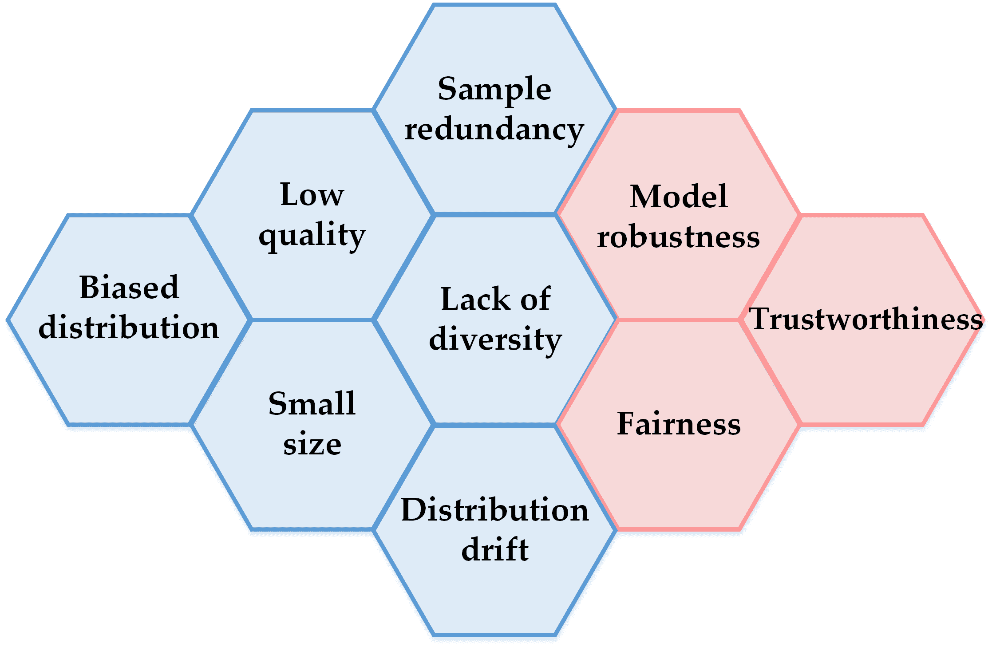

    图 1：实际训练数据的九个问题。

+   (3)

    小规模：训练规模确实影响训练性能[5]。训练数据越大，通常能获得的训练性能越好。由于数据收集预算不足或技术限制，实际使用中的训练数据将相对较小。因此，在小规模训练数据下的学习在深度学习中是一个严重的问题。本研究不讨论极端的小规模情况，如少样本/单样本/零样本学习。

+   (4)

    样本冗余：虽然期望有大量训练数据，但这并不意味着每个数据都是有用的。训练集仍然包含冗余数据[6]。存在两种典型情况。首先，训练规模相对较大，超出了可用计算硬件的处理能力。其次，某些训练样本区域可能被过度采样，删除这些过度样本不会影响训练性能。在这种情况下，样本冗余可能发生在某些类别的特定子集。

+   (5)

    多样性缺失：这个问题指的是某些类别的属性在训练语料中集中过度。数据多样性对于深度神经网络（DNN）训练也至关重要[7]。以对象分类为例，狗类图像中的背景可能通常是绿色草地。然而，“狗”类别与绿色草地并不一定相关。某些非关键属性的多样性缺失可能导致一些非关键属性与类别之间的虚假关联。这个问题类似于样本冗余的第二种情况。然而，多样性缺失并不一定意味着存在冗余样本。

+   (6)

    分布漂移：这个问题表示所涉及数据的分布随时间变化。实际上，大多数真实学习应用中都会发生分布漂移，因为样本的概念或形式（例如对象外观、文本风格）变化快或慢。概念漂移[8]是分布漂移研究的重点。

以上数据问题总结并非相互排斥，因为不同问题之间存在重叠。例如，小规模问题可能只发生在某些类别中，这也可以归因于一种偏向性分布。除了这些数据问题，还有一些其他（不详尽列出）与训练数据密切相关的问题：

+   (7)

    模型鲁棒性：这个问题涉及 DNN 模型对对抗攻击的抵抗能力[9]。模型鲁棒性对于健康、金融和人类生命相关的应用至关重要。如果这些应用的 DNN 模型受到对抗攻击，可能会带来严重后果。

+   (8)

    公平性：这个问题涉及学习任务中不同类别或不同属性之间的表现差异[10]。例如，不同肤色群体的面部识别准确率应保持在相同水平。

+   (9)

    可信度。随着深度学习逐渐应用于许多安全关键应用（如自动驾驶和医疗辅助）[11]，这个问题近年来逐渐浮现。它与模型的鲁棒性和公平性密切相关。主要指 DNN 模型的可解释性和校准性。

为了解决上述问题，之前的文献中进行了大量理论探索，并提出了众多新方法。其中大多数现有方法直接优化涉及的数据，而不是探索新的深度神经网络结构，本文将其称为深度学习的数据优化。由于列出的问题属于不同的机器学习领域，这些方法的灵感和重点通常各异，似乎相互之间没有关联。例如，针对不平衡学习（属于偏倚分布问题）的主要学习策略是样本加权，即在深度学习训练阶段为训练样本分配不同的权重。针对小样本问题的主要处理方法是使用数据增强技术，如图像缩放和混合[12]，用于图像分类。在处理深度学习中的标签噪声时，一种策略是识别噪声标签并在训练过程中将其删除。当某些类别的训练数据缺乏足够的多样性时，采用因果学习来打破标签和某些无关属性（如特定背景）之间的虚假关联。由于明显缺乏关联，这些研究通常不会互相引用或讨论。

我们之前的研究[13]部分揭示了一个技术，即数据扰动，已经被用来解决大多数上述问题。这一观察启发我们从更广泛的角度探索数据优化方法。在本研究中，对各种数据优化方法进行了全面的综述。首先，建立了一个系统的数据优化分类法，涵盖了包括管道、对象、技术路径等八个维度。其次，根据数据感知、应用场景、相似性/对立性和理论等四个方面，探讨了一些经典方法之间的内在联系。第三，总结了现有数据优化技术的理论研究。最后，根据我们的分析，提出了几个未来的研究方向。

我们的调查与现有相关领域的调查（包括不平衡学习、噪声标签学习、数据增强、对抗训练和蒸馏）的不同之处在于两个方面。首先，本调查从数据中心的角度进行研究，涉及广泛的深度学习领域。因此，我们的重点仅在于列出问题的数据优化研究。对于不属于列出问题的数据优化的方法，本研究没有涉及。其次，我们的分类法考虑了有助于建立看似无关方法之间联系的分裂维度（例如，数据感知和理论）。这些维度在现有调查中通常未被提及。

本研究的贡献总结如下。

+   •

    采用新的分类方法回顾了针对不同深度学习问题的数据增强相关方法。据我们所知，这是首个旨在构建一个以数据为中心的分类法，重点关注多个深度学习领域和应用的数据优化的工作。

+   •

    根据我们构建的分类法，建立了许多看似无关方法之间的联系。这些联系可以启发研究人员设计更多潜在的新技术。

+   •

    数据优化的理论研究总结了现有成果，并讨论了有趣的未来方向。

本文组织结构如下。第二部分介绍了与数据优化技术相关的主要调查研究。第三部分描述了我们构建的数据优化分类法的主要框架。第四、第五、第六和第七部分介绍了我们分类法的详细内容。第八部分探讨了不同数据优化技术之间的联系。第九部分提出了几个未来方向，第十部分总结了结论。

## II 相关研究

前一节列出的问题逐渐衍生出许多独立的深度学习研究领域。随后，针对这些问题进行了许多调查研究。以下介绍了几个典型研究主题的相关调查。

不平衡学习。这是深度学习中的一个热门研究领域 [14]。He 和 Garcia [15] 进行了首个全面而深入的不平衡学习调查研究。他们探讨了不平衡数据引发的学习任务的内在特征。值得注意的是，He 和 Garcia 指出，不平衡数据集是“一种具有高复杂性的数据集，存在类别间和类别内的不平衡、多重概念、重叠、噪声以及缺乏代表性数据”。这一说法涉及到第 I 部分列出的多数数据问题。例如，缺乏多样性和样本冗余可以被视为代表性不足。最近的研究集中于不平衡学习的极端情况，即长尾分类。Zhang 等人 [16] 总结了深度长尾分类的最新进展。在他们构建的分类法中，模块改进（如新的分类器）被列为三种主要技术之一。在本研究中，模块改进未被考虑，因为它不属于数据优化范围。

有噪标签学习。这是近年来获得极大关注的另一个研究领域，因为在实际学习任务中，标签噪声几乎是不可避免的。Algan 和 Ulisory [17] 总结了图像分类中有噪标签学习的方法。Song 等人 [18] 详细设计了有噪标签学习的分类法，并将其分为“三个类别”，包括“数据”、“目标”和“优化”。他们的分类法有助于理解大量现有技术。然而，这三者之间存在重叠。例如，重加权属于“目标”类别，而学习重加权则属于“优化”类别。本研究中介绍的分类法可能有助于构建更合适的有噪标签学习分类法。

小数据学习。大数据在深度学习任务中取得了巨大成功。与此同时，许多实际学习任务仍面临小规模训练数据的挑战。Cao 等人 [19] 对小数据学习的泛化误差和标签复杂性进行了严格的理论分析。他们将小数据学习方法分类为具有欧几里得或非欧几里得均值表示的方法。Wang 等人 [20] 构建了一个包含“三个方面”的少样本学习分类法，包括“数据”、“模型”和“算法”。以数据为中心的学习方法也是少样本学习中的主要选择之一。

概念漂移。Lu 等人[8] 研究了概念漂移的学习，涵盖三个方面，包括概念漂移检测、概念漂移理解和概念漂移适应。Yuan 等人[21] 将现有研究分为两类，即概念漂移适应中的模型参数更新和模型结构更新。这一划分是从模型的角度出发的。实际上，纯数据驱动的策略也被应用于概念漂移下的学习。例如，Diez-Olivan 等人[22] 利用数据增强技术对 DNN 的最后一层进行微调，以实现快速的概念漂移适应。这项研究可能会激励研究人员在分布漂移方面更多关注数据优化方式。一些早期的调查可以在[23, 24]中找到。

对抗鲁棒性。在许多研究中，模型鲁棒性限于对抗鲁棒性。Silva 和 Najafirad[25] 探索了深度学习中模型鲁棒性的挑战和未来方向。他们将现有的对抗鲁棒学习方法分为三类，包括对抗训练、正则化和认证防御。Xu 等人[26] 总结了图上的模型鲁棒性研究。Goyal 等人[27] 综述了 NLP 领域的对抗防御和鲁棒性。他们构建的分类法包含四个类别，包括对抗训练、扰动控制、认证和其他。在这项研究中，对抗训练被视为一种数据优化策略，因为它通过添加或虚拟添加新数据来增强训练集。

公平性学习。近年来越来越受到关注。Mehrabi 等人[28] 探索了可能影响学习模型公平性的不同偏差来源。他们揭示了数据、学习算法和相关用户这三种因素可能导致偏差。Petrović 等人[29] 指出，样本重加权和对抗训练是公平机器学习的两种常见策略。

可信赖学习。它是可信 AI 的关键，旨在确保 AI 系统值得信赖。信任是一个复杂的现象[30]，与公平性、可解释性、可靠性等高度相关。Kaur 等人[31] 从广泛的角度总结了关于可信人工智能的研究。Wu 等人[32] 对图上的可信赖学习研究进行了深入的回顾。

还有一些研究关注于具有多个列出数据问题的学习任务。例如，Fang 等人[33]解决了在长尾分布的训练数据下的噪声标签学习问题。Singh 等人[34]进行了关于公平性、对抗鲁棒性和概念漂移的实证研究。根据我们的了解，没有任何调查研究关注与列出问题相关的研究领域交集。本调查构建的统一分类法将启发对多个研究领域交集的研究。

与本研究最相似的研究是 Wan 等人[35]提出的调查，该调查重点关注计算机视觉中的数据优化。我们与 Wan 等人的研究之间存在显著差异。首先，我们研究的技术范围比 Wan 等人的研究要广泛得多。他们的研究仅限于数据选择，包括重采样、子集选择和基于主动学习的选择。然而，本研究将扰动、加权、数据集蒸馏和数据增强视为数据优化，它们尝试在不修改主干网络的情况下优化训练数据。其次，我们的分类维度与 Wan 等人的研究中重叠方法的分类差异很大。例如，课程学习被划分到重采样类别，而在我们的研究中被划分到加权类别。数据集蒸馏被合并为一个分类，即数据修剪。相比之下，Wan 等人的研究中没有包括数据集蒸馏。最后，本研究介绍和讨论了包括数据感知、不同路径之间的联系和理论研究在内的其他重要部分。Zheng 等人[36]持数据中心的视角来回顾图机器学习的研究，这与我们的研究精神也相似。本研究总结的大多数数据问题也在他们的研究中讨论。他们将现有研究分为图数据收集、增强、探索、维护（针对隐私和安全）和图操作，这些不适用于我们的分类法。

值得注意的是，经典的数据预处理方法，如数据清洗（例如，缺失数据插补）、标准化（例如，z-score）和转换（例如，数据离散化），也旨在使数据更适合学习。考虑到这些方法已经成熟并主要用于浅层学习，因此在本次调查中没有介绍。

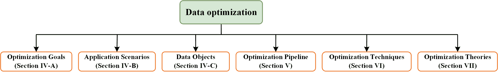

图 2：我们构建的数据优化分类法的六个分维度。

## III 提出的分类法总体概述

为了确保我们构建的分类法组织良好，并尽可能全面涵盖前面提到的数据优化技术，以下原则用于设计拆分维度：

+   (1)

    分类法的第一层应考虑多个视角，每个视角对应一个子分类法。大多数现有分类法仅采用单一视角。在这项研究中，仅有单一视角不足以系统地整理来自各个深度学习领域的研究。

+   (2)

    划分维度应具有通用性，以尽可能涵盖现有研究。因此，不应直接遵循现有分类法为特定研究领域设计的维度。需要一个新的综合分类法。

+   (3)

    新的分类法应与现有分类法兼容。即，允许我们的分类法与现有分类法之间存在不一致。然而，应避免它们之间的矛盾。

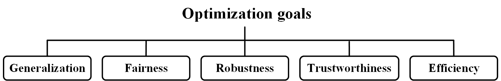

图 3：优化目标的子分类。

基于这些原则，我们的分类法的第一层¹¹1 细粒度层在接下来的部分中详细说明。设计如图 fig2 所示。该层由六个数据优化维度组成，如下所示：

+   •

    最终目标。该维度指的是用于深度学习任务的数据优化方法的最终目标。我们将优化目标分为五个主要方面²²2 应注意，这五个方面并不详尽，前文文献中已揭示它们之间存在重叠，包括泛化、鲁棒性、公平性、可信度和效率。

+   •

    应用场景。该维度指的是利用数据优化的深度学习应用。涉及九种应用，包括在偏差分布下的学习、噪声标签学习、冗余训练数据学习、有限训练数据学习、模型安全性、公平感知学习、分布漂移下的学习、可信学习以及大模型学习。

+   •

    数据对象。该维度指的是在所采用的数据优化方法中需要优化的对象。大多数研究集中在原始训练数据上。也有方法关注其他数据对象，如超参数和元数据。

+   •

    优化流程。该维度指的是深度学习过程中具体数据优化方法的常见步骤。我们将流程分为三个常见步骤，即数据感知、分析和优化。

+   •

    优化技术。本维度指的是数据优化中采用的技术路径。本研究总结了五个主要路径，即数据重采样、数据增强、数据扰动、数据加权和数据集剪枝。每个路径还包含子分类。该部分的介绍是本调查的重点。

+   •

    优化理论。本维度指的是对深度学习中数据优化的理论分析和探索。我们将这一维度分为两个方面：表述和解释。

第四节介绍了终极目标、应用场景和数据对象。第五、六、七节分别介绍了优化流程、技术和理论。

## IV 目标、场景和数据对象

本节介绍了终极目标、目标应用和数据对象。

### IV-A 优化目标

图 14 描述了优化目标维度的子分类，包括泛化、公平性、鲁棒性、可信度和效率。

泛化是大多数数据优化技术中的主要优化目标，因为它几乎是大多数深度学习任务中的唯一目标。根据浅层学习中研究的泛化理论，一个类别的泛化与类别间距、类间距离和类别紧凑性高度相关[37]。一个类别的边距/类别间距离/类紧凑性越大，表示在该类别上的学习模型泛化性能越好。已经证明，向训练样本注入噪声的数据增强策略可以提高泛化能力[38]。隐式数据增强方法 ISDA[39] 实际上旨在提高每个类别的类紧凑性。自适应边际损失[40]也通过扰动 logits 来提高类别紧凑性。Fujii 等人[41] 通过考虑“类间距离”修改了经典的数据增强方法 mixup[12]，最终增加了类别间距离。此外，一些研究探索了在深度学习训练过程中编排最佳批次[42]。最终目标也是泛化。然而，批次编排的直接目标可能包括平衡、多样性等。

如前所述，公平性在许多深度学习任务中也是一个重要的学习目标。为了应对具有特定属性的样本的不公平问题，已有文献中使用了数据增强[43]、扰动[44]和样本加权[45]等技术。实际上，不平衡学习也追求不同类别之间的公平性。具有小先验概率的类别，即次要类别，将在所采用的数据优化中受到更多关注。例如，相对于其他类别，次要类别会施加更大的权重[46]、更大的数据扰动程度[47]或更多的增强量[48]。

对抗鲁棒性是深度学习任务中一个至关重要的目标，这些任务对模型安全性非常敏感。通常，利用对抗训练来提高模型的对抗鲁棒性。这可以归因于一种特殊类型的数据增强。因此，对抗训练实际上是一种数据优化技术，其目标是提高训练数据的质量，以便在优化后的训练数据上训练的模型具有更好的对抗鲁棒性。

可信度是最近受到高度重视的目标。解释性和校准是深度学习模型可信度的两个关键要求。解释性主要依赖于特征归因和因果推理等方法，而非纯粹的数据优化技术。然而，数据优化在模型校准中被广泛使用。校准主要涉及概率模型的预测概率的可信度[49]。Liu 等人[50]引入了边际感知标签平滑来提高训练模型的校准性。Mukhoti 等人[51]利用样本加权来实现更好的校准。

效率在实际应用中至关重要，因为许多学习任务对时间复杂度和存储都很敏感。因此，如何优化地减少冗余的训练数据并保留多样且重要的训练数据值得进一步研究。数据修剪后，时间复杂度可以显著降低。

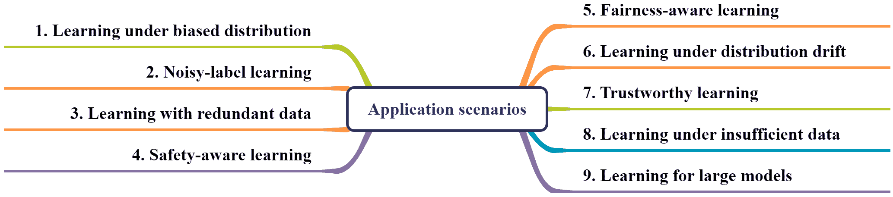

图 4：针对应用场景的子分类。

### IV-B 应用场景

图 fig4 描述了针对应用场景维度的子分类。前八个场景在前面的章节中已被提及，因此在本小节中不再进一步介绍。

在数据不足的情况下进行学习，包括训练数据不尽可能多样化的情况。数据多样性影响模型的泛化能力[7]。Dunlap 等人[52] 利用大型视觉和语言模型自动生成视觉一致但显著多样化的训练数据。一些研究[53, 54] 认为数据增强实际上是一种广泛使用的技术，以增加数据多样性。这些研究为深度学习任务开发了新的数据增强方法。

大型模型，如大型语言模型（LLMs），在几乎每个 AI 领域都取得了显著进展。数据质量对大型模型的训练或微调至关重要。因此，数据优化技术在大型模型学习中也很流行。Yang 等人[55] 在构建大型多语言翻译模型时，对训练语料进行翻转操作，以平衡语言对中的双向翻译。Liu 等人[56] 在预训练和微调阶段都应用了对抗训练。结果表明，训练模型的错误率也降低了。

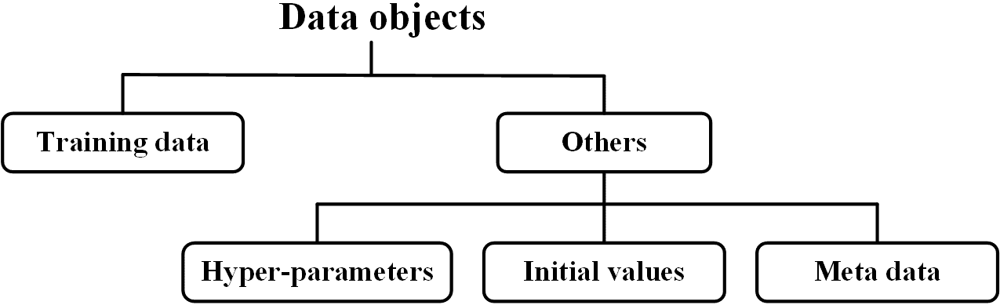

图 5：数据对象的子分类。

### IV-C 数据对象

#### IV-C1 主要对象

深度学习的数据优化主要对象是训练数据。一些研究优化原始样本，而另一些则优化标签。还有一些研究关注 DNN 变换后的数据，例如特征和 logits。在第 VI-B 和 VI-C 节中，将提供更多细节。

#### IV-C2 其他对象

还有许多研究涉及深度学习中的其他数据对象。图 5 列出了三个其他数据对象，即超参数、初始值和元数据。

超参数对训练模型的最终性能有很大影响。它们可以通过在预定义范围内的网格搜索确定，也可以直接设定为固定值。因此，设定合适的搜索范围或固定初始值是 DNN 训练中的关键步骤。

网络初始化对 DNN 训练也很重要。基于高斯分布的初始化在大多数学习任务中是主要选择。其他有效策略也被研究和应用。Glorot 和 Bengio [57] 采用了一种称为“Xavier”初始化的缩放均匀分布。He 等人[58] 提出了针对整流非线性的鲁棒初始化方法，称为“Kaiming”初始化。

元学习提供了一种强大的方法来优化深度学习中独立模块的超参数。它依赖于一个无偏的元数据集。然而，在大多数学习任务中，并不存在独立的高质量元数据，构建高质量无偏的元数据集是具有挑战性的。Su 等人[59]对如何从训练集中编制高质量元数据集进行了理论分析。他们提出的编制方法选择了四个标准，即平衡、不确定性、清洁和多样性。

本研究未提及三类数据优化的众多经典研究。将这些研究应用于深度学习的数据优化中，可能会促进三类数据优化的进一步发展。本调查的重点是训练数据。因此，以下部分将局限于训练数据优化的范围。

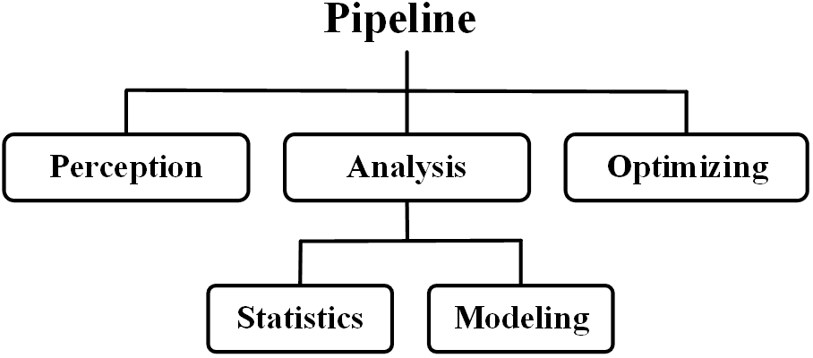

图 6：数据优化流程的三个主要步骤。

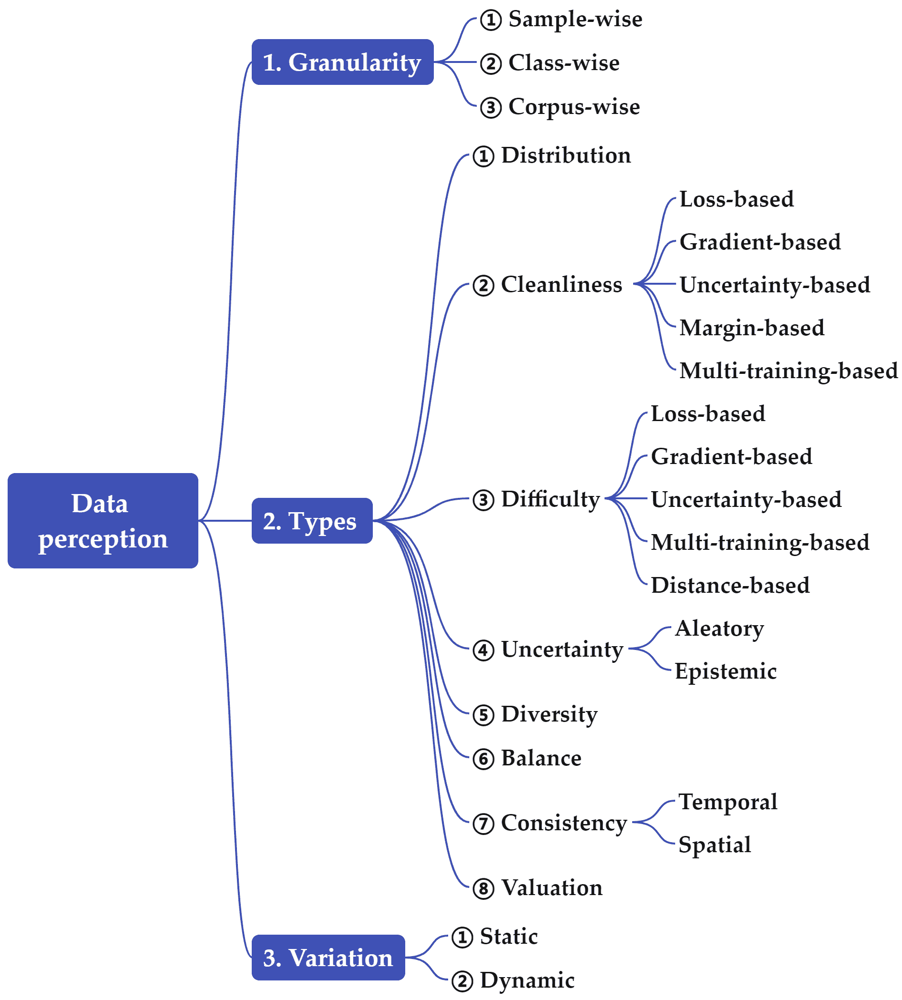

图 7：数据感知的子分类。

## V 优化流程

该流程主要包括三个步骤，即数据感知、分析和优化，如图 6 所示。以下是一些符号和标记的定义。设$D=\{x_{i},y_{i}\}_{i=1}^{N}$为$N$个训练样本的集合，其中$x_{i}$为特征，$y_{i}$为标签。设$C$为类别数，$N_{c}$为$D$中$c$类的样本数量。$\pi_{c}={\rm{}}N_{c}/N$为$c$类的比例。设$p_{c}$和$p(x|y=c)$分别为$c$类的先验和类别条件概率密度。当没有歧义时，$x_{i}$表示由最后的特征编码层输出的特征，而$u_{i}$表示由 Softmax 层为$x_{i}$输出的 logit 向量。设$l$为$x$的损失。在本研究中，假设采用交叉熵损失，$\Theta$表示网络参数。

### V-A 数据感知

在本研究中，数据感知指的是所有旨在感知和诊断训练数据的方法，以捕捉影响学习性能的内在数据特征和模式。这是流程中的第一步，没有对训练语料库的准确感知，任何有效的数据优化方法都无法发挥作用。

通常，训练数据的感知量化了与真实分布、训练数据分布、清洁度、多样性等相关的因素。我们在三个维度上构建了数据感知的子分类，如图 7 所示。首先，在量化粒度方面，有三种级别，即样本级、类别级和语料库级。其次，在感知类型方面，有八个分支，即分布、清洁度、难度、多样性、平衡、一致性、邻域和估价。第三，在量化变化方面，有两个分支，即静态和动态。以上每个分支和部分代表性研究介绍如下。

#### V-A1 不同粒度级别的感知

数据感知有三种粒度级别，包括样本级、类别级和语料库级。

样本级数据感知。这意味着感知的量反映或影响样本在训练中的正面/负面或琐碎/重要作用。例如，大多数噪声标签学习方法采用样本级数据感知，例如，训练损失 [60] 和梯度范数 [61]，以推断训练样本的噪声程度。

类别级数据感知。这意味着感知的量反映或影响类别在训练中的正面/负面或琐碎/重要作用。在类别级感知中，通常监控每个类别的学习表现，以便对整个方案提供反馈 [62]。因此，平均结果（例如，平均损失或精度）也被用来推断下一训练轮次中的合理类别级权重 [63, 64]。另一个常见的量是用于不平衡学习的类别比例 ($\pi_{c}$)。一些研究 [65] 通过测量类别的紧凑性来反映类别特征的泛化。研究/利用类别级感知的数量少于样本级研究。

语料库级数据感知。这意味着感知的量反映或影响训练语料库的正面/负面或琐碎/重要作用。进入这个分支的研究有限。Lin 等人 [66] 使用查询分数来衡量训练数据集的实用性。

这三种级别可以结合使用，以更全面地感知训练数据 [67]。

#### V-A2 不同类型的感知

八种量化类型介绍如下：

+   •

    分布。该类型旨在量化学习任务的真实数据分布和训练数据分布。有效量化这两个分布对于训练非常有益。然而，几乎不可能获得这两个分布的清晰图像。因此，真实分布通常假设符合一些基本假设，例如每个类别的高斯分布 [39]。对于训练数据分布，一些研究 [68, 69] 应用聚类来推测训练数据的内在结构。这些研究关注的是一个类别的全局分布。最近，研究人员调查了训练样本的局部分布。一个典型的特征是关于每个训练样本的邻域。在图上的深度学习中，具有异质标签的邻域样本的分布对样本的训练或预测有负面影响。Wang 等人 [70] 定义了一个标签差异指标来量化图中节点及其邻域之间的差异，如下所示：

    |  | $LDI(x_{i})=\frac{1}{\sqrt{2}}&#124;&#124;p_{x_{i}}-p_{N_{i}}&#124;&#124;_{2},$ |  | (1) |
    | --- | --- | --- | --- |

    其中 $p_{x_{i}}$ 和 $p_{N_{i}}$ 分别是 $x_{i}$ 及其邻域 $N_{i}$ 的类别分布。

+   •

    清洁度。该类型旨在识别每个训练样本中的噪声程度。本研究主要关注标签噪声，因为它比样本噪声更受到关注。噪声测量有许多指标。如图 7 所示，典型的测量方法包括基于损失、基于梯度、基于不确定性、基于边际和基于多训练的技术。损失、梯度范数或不确定性较大的样本更可能是噪声。在基于边际的度量中，边际较小表明是噪声的概率较高。Huang 等人 [60] 进行了多次训练程序以识别噪声标签。

+   •

    难度。这种类型旨在推测训练样本或类别的学习难度。准确测量每个训练样本的学习难度非常重要，因为一些深度学习范式根据学习难度水平采用自适应学习策略。例如，**课程学习**[71]的观点是，容易的样本应该在早期训练阶段得到更多关注，而难度大的样本则应在后期训练阶段得到更多关注。一些其他研究[72]持有相反的观点，即应在整个训练过程中优先考虑难度大的样本。如图 7 所示，有五种主要的测量样本学习难度的方法，即基于损失的、基于梯度的、基于不确定性的、基于多次训练的和基于距离的。显然，学习难度的度量与清洁度的度量非常相似。事实上，一些研究认为，噪声样本是那些相当难以学习的样本，并将样本划分为容易/中等/困难/有噪声。Paul 等人[73]提出了误差 l2-norm 分数来测量难度。Zhu 等人[74]根据偏差-方差权衡定理建立了样本学习难度的正式定义，并提出了新的学习难度度量。Sorscher 等人[75]定义了样本到其最近簇中心的余弦距离作为样本的难度度量，并将其应用于样本选择。

+   •

    不确定性。这种类型包含两个子类型，即**偶然不确定性**和**认识不确定性**[76]。前者也称为数据不确定性，当训练样本不完美时，例如有噪声时会出现。因此，数据的不洁净程度可以作为数据不确定性的度量[77]。认识不确定性也称为模型不确定性。当学习策略不完美时会出现。模型不确定性可以基于 DNN 预测的信息熵或基于使用 dropout 技巧的 DNN 的多个预测输出的方差来计算[78]。

+   •

    多样性。这种类型旨在识别训练样本子集的多样性。子集通常是一个类别。子集多样性的测量在子集的数据增强策略[79]和数据选择[59]的设计中非常有用。Friedman 和 Dieng[80]利用相似性矩阵特征值的 Shannon 熵的指数，即**vendi 分数**来测量多样性。Salimans 等人[81]使用预训练的 Inception 模型来测量多样性，这种方法称为**inception 分数**。

+   •

    平衡。这个类型旨在衡量类别之间/类别内部的平衡。类别之间的平衡属于全局平衡，而类别内部的平衡属于局部平衡。全局平衡可以通过类别训练样本的比例来简单衡量。然而，我们的前期研究[82]揭示了其他因素，如方差和距离，也可能导致严重的不平衡。局部平衡相对难以测量。一些研究将局部平衡定义为属性平衡[68]。

+   •

    一致性。这个类型旨在识别训练样本在时间或空间维度上的训练动态的一致性。在时间维度上，记录了前一阶段与当前阶段训练动态的变化[83]。在空间维度上，记录了样本与其他样本（如邻居[84]）或同一类别内部样本之间的训练动态差异。一种经典的度量方法称为“遗忘”[85]，用来量化相邻阶段预测的变化次数。Singh 等人[86]研究了类别遗忘。Maini 等人[87]利用遗忘来区分由于不同原因而难以处理的例子，例如稀有子群体的成员、标记错误或属于复杂子群体。Wang 等人[88]提供了关于学习中样本遗忘的全面总结。Kim 等人[89]关注每个样本潜在表示的动态，并测量潜在分布之间的对齐情况。

+   •

    估值。这个值通常通过**Shapley 值**来衡量，这是一种来自博弈论的概念[90]。Ghorbani 和 Zou 首次引入了 Shapley 值用于数据估值[91]，其定义如下：

    |  | $\phi(x_{i})=\sum_{S\in D-x_{i}}\frac{1}{C_{&#124;D&#124;-1}^{&#124;S&#124;}}[V(S\cup\{x_{i}\})-V(S)]$ |  | (2) |
    | --- | --- | --- | --- |

    其中 $V(\cdot)$ 是数据集的效用函数，而 $S$ 是训练语料库 $D$ 的一个子集。在建模干净样本和噪声样本时，它们的值是不同的。然而，如公式中所示的 Shapley 值计算 (2) 是 NP 难的，这阻碍了其在实际应用中的使用。Yoon 等人 [92] 提出了基于强化学习的数据估值方法。他们推断的权重反映了样本在学习中的重要性，这与 Shapley 值不同。一些其他研究 [66, 93] 提出了更实际的方法来近似 Shapley 值。Jiang 等人 [94] 建立了一个易于使用和统一的框架，方便研究人员和从业人员应用和比较现有的数据估值算法。与上述感知量如清洁度和难度相比，Shapley 值具有更为坚实的理论基础。因此，建立 Shapley 值与上述量之间的直接联系值得进一步研究。

本研究仅列出了用于数据感知的常用度量。此外，还有一些其他重要的度量将在我们未来的工作中探讨。例如，每个训练样本的邻域可能会随着特征编码网络在每个 epoch 更新而有所变化。在浅层学习中，邻域是重要的信息，许多经典方法基于邻域的利用。然而，以前的深度学习方法很少利用邻域信息，因为邻域识别的计算复杂性较高。一些研究采用简化的方法来构造邻域。例如，Bahri 和 Heinrich Jiang [95] 使用对数向量而不是特征来构造邻域。对数向量的维度通常远小于特征维度，因此计算复杂性显著降低。可以相信，随着相关计算技术的发展，邻域信息将在深度学习中获得越来越多的关注。其他一些重要的量，如问题分数 [96] 和数据影响 [97]，它们与上述量有较大重叠，也值得进一步探索。

如果需要将感知量输入模型，则通常会采用原始量的隐含表示。在基于元学习的样本加权或扰动中[98]，每个样本的权重或扰动向量是基于感知量的隐含表示得出的。例如，Shu 等人[99]将每个样本的训练损失提取作为输入，并将其输入到包含 100 个隐含节点的 MLP 网络中。换句话说，原始训练损失被表示为一个 100 维的隐含向量。Zhou 等人[67]利用六个量来感知训练样本的特征，包括损失、边际、梯度范数、Softmax 预测的熵、类别比例和平均分类损失。同样，这六个量也通过 MLP 网络转换为 100 维特征向量。

#### V-A3 静态与动态感知

静态感知表示感知量在优化过程中保持不变，而动态感知表示这些量会变化。

在不平衡学习中，类别比例被广泛用于量化一个类别。这属于静态感知，因为该量保持不变。在有噪声标签的学习中，许多研究采用了两阶段策略，其中测量每个训练样本的噪声程度，并在第二阶段中使用这些程度[60]。在这种两阶段策略中，对标签噪声的感知是静态的。

训练样本的影响通常在训练过程中会有所变化。因此，与静态感知相比，动态感知在深度学习任务中更为流行。许多研究利用训练样本的训练动态进行后续的样本加权或扰动。这种训练动态也属于动态感知。训练动态包括损失、预测、不确定性、边际和邻域，在每个训练周期中都会变化。例如，自适应学习[100]根据每个训练样本在前一周期的损失及变化的阈值来确定权重。因此，权重在每个周期中也可能会变化。

### V-B 感知量分析

对感知量的分析包括统计和建模两种方式，如图 6 所示。

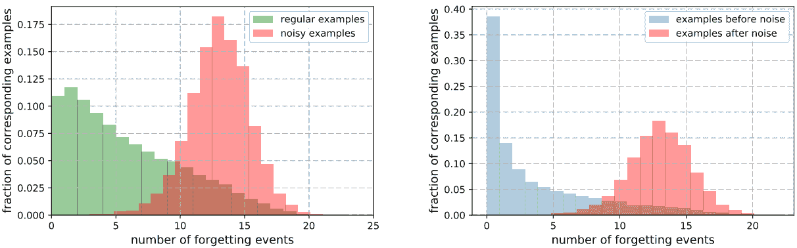

图 8：训练样本遗忘数量的统计[85]。

统计分析。大多数研究采用这种方式处理感知数据量。这些研究只考虑了一两个量。例如，Toneva 等人 [85] 对训练样本的遗忘次数进行了统计，如图 8 所示。左侧图展示了干净样本和噪声样本的遗忘次数分布，而右侧图展示了添加噪声前后的遗忘次数分布。干净样本和噪声样本的分布存在明显差异。Huang 等人 [60] 提出了一个周期性训练策略，即模型从过拟合到欠拟合进行循环训练。记录了每个训练样本的每个周期损失。如图 9 所示，噪声样本的平均损失较大。因此，他们利用平均损失作为噪声标签的指标。Zhu 等人 [74] 提出了基于交叉验证的训练策略。还记录了每个训练样本的多次训练损失。他们揭示了每个样本的多个损失方差在识别噪声标签方面也有用，如图 10 所示。

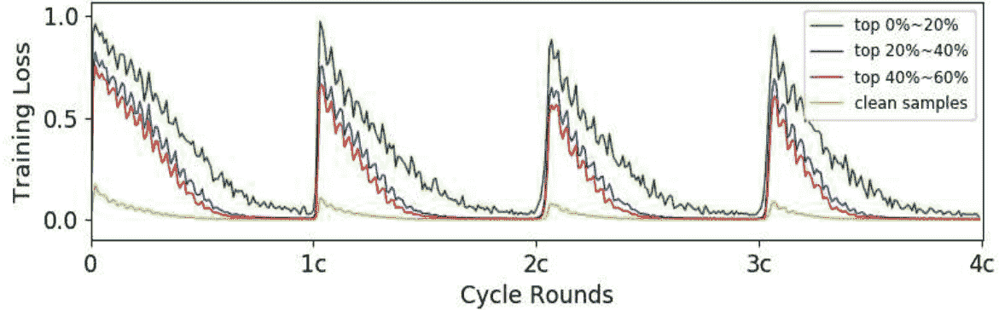

图 9：训练周期中的损失统计 [60]。

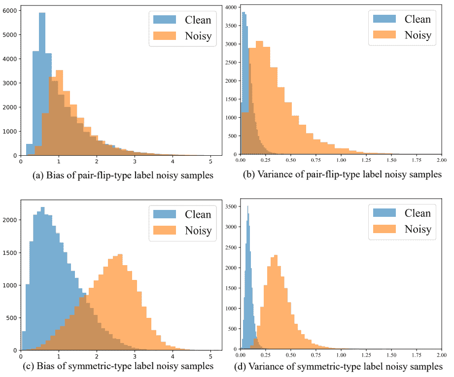

图 10：基于交叉验证训练的损失均值和方差统计 [74]。

建模。这种方式指的是对训练数据的感知量进行统计建模。Arazo 等人 [101] 假设训练损失符合以下分布：

|  | $p(l\mid\alpha,\beta)=\frac{\Gamma(\alpha+\beta)}{\Gamma(\alpha)\Gamma(\beta)}l^{\alpha-1}(1-l)^{\beta-1}.$ |  | (3) |
| --- | --- | --- | --- |

其中 $\Gamma(\cdot)$ 是 Gamma 函数；$\alpha$ 和 $\beta$ 是待推断的参数。在建模干净样本和噪声样本时，它们的值是不同的。Hu 等人 [102] 利用 Weibull 混合分布来建模每个训练样本的记忆-遗忘值。该混合分布包含两个分量，分别适用于干净样本和噪声样本。

这两种方式都是透明的，因此整个数据优化方法是可以解释的。然而，这两种划分通常依赖于关于所涉及量的适当先验分布。如果先验分布不正确，后续的优化将对模型训练产生负面影响。

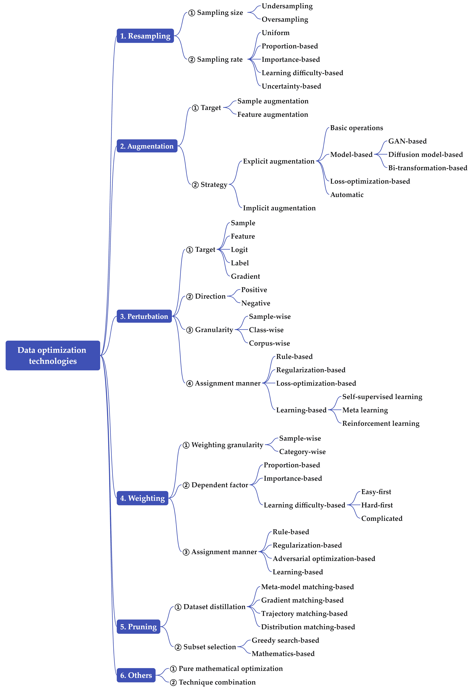

图 11：数据优化技术的子分类。

### V-C 优化

数据感知和分析作为数据操作的预处理步骤。这个步骤是整个数据优化流程中的关键处理环节。接下来的部分将详细介绍当前的优化技术。

## VI 数据优化技术

本节描述了所述分类法中最重要的维度，即深度学习的数据优化技术。图 11 展示了该维度的子分类。我们总结了现有数据优化技术的六个子类别，包括重采样、数据增强、扰动、加权、剪枝等。值得注意的是，这项调查涵盖了众多技术/方法论的划分，并将它们的比较作为我们未来的工作。原因有两个。首先，每个划分都有其优点和缺点，并且它们的有效性已在以往文献中得到验证，因此很难判断哪一种在通用学习任务中绝对最好。其次，全面的理论或实证比较不是一项简单的任务。

### VI-A 数据重采样

数据重采样编制一个新训练集，其中样本是从原始训练集中随机抽取的。它广泛应用于遇到问题的任务中，包括偏倚分布[103]和冗余。本研究总结了该划分的两个分维度。第一个维度涉及采样数据集的大小，而第二个维度涉及采样率。

在第一个维度上，重采样被分为欠采样和过采样。欠采样编制一个新训练集，其大小小于原始训练集。相反，过采样编制一个新训练集，其大小大于原始训练集。这两种方法在以往的机器学习任务中广泛应用，包括不平衡学习、集成学习和成本敏感学习。同时，理论研究也大量开展，以解释这两种方法在统计学和机器学习社区中的有效性。然而，目前尚未就哪种方法更有效达成共识。一些研究得出结论，当处理不平衡数据集时，欠采样应作为主要选择[104]。然而，也有一些研究持相反观点[105]。

在第二维度中，重采样分为均匀、基于比例、基于重要性、基于学习难度和基于不确定性。它们的详细说明如下：

+   •

    均匀采样。这种方式非常直观。它将样本视为完全相等，无论它们的分布、位置、类别和训练表现如何。实际上，在几乎所有现有的深度学习任务中，批次都是通过从训练语料库中均匀采样构建的。Kirsch 等人 [106] 声称，由于样本之间的相关性，独立选择一批样本会导致数据效率低下。一些研究探索了替代采样策略。例如，Loshchilov 和 Hutter [42] 提出了基于前几轮训练损失的排名批次选择策略，损失大的样本具有较高的采样概率。实验表明，这种新策略将训练速度提高了五倍。

+   •

    基于比例的采样。这种方式简单地根据每个类别在语料库中的比例 ($\pi_{c}$) 分配总的采样率。主要用于不平衡学习中，其中少数类别被分配较大的采样率 [15]。

+   •

    基于重要性的采样。这种方式根据样本的重要性分配采样概率。在本研究中，重要性采样的定义遵循了几项经典研究 [107] [108]。给定一个目标分布 $q(x,y)$ 和一个训练数据上的源分布 $p(x,y)$，在重要性采样中，训练样本 $\{x,y\}$ 的重要性（采样率）定义为

    |  | $w(x)=\frac{q(x,y)}{p(x,y)}.$ |  | (4) |
    | --- | --- | --- | --- |

    由于目标分布未知，一些研究 [109] 利用核技巧生成采样率。在一些重要性采样研究中，采样率不是基于概率密度比，如等式 (4) 所示。例如，Atharopoulos 和 Fleuret [110] 将每个训练样本的梯度范数作为其重要性。这些方法实际上属于基于学习难度的采样。

+   •

    基于学习难度的采样。这种方式根据样本的学习难度分配采样率。如第 V-A2 节总结所述，学习难度通常通过损失和梯度范数来衡量。例如，Li 等人 [61] 将对数向量的梯度范数作为难度测量。与 Atharopoulos 和 Fleuret [110] 进行的研究类似，Johnson 和 Guestrin [111] 提出了 O-SGD 采样方法，其采样率如下：

    |  | $w(x,y)=\frac{&#124;&#124;\nabla l(x,y)&#124;&#124;}{\sum_{x}&#124;&#124;\nabla l(x,y)&#124;&#124;}.$ |  | (5) |
    | --- | --- | --- | --- |

    他们声称这种“重要性采样”可以减少随机梯度的方差，从而加快训练速度。Jiang 等[112]引入了一种选择性反向传播策略，其中损失较大的样本在反向传播中具有相对较大的选择概率。Gui 等[113]利用采样策略进行噪声标签学习。他们根据训练过程中每个样本的平均损失计算采样权重。平均损失大的训练样本被分配低权重。Liu 等[114]提出了自适应数据采样，其中在前期正确分类的样本的采样率被降低。Xu 等[115]进行了理论分析，并得出结论：基于逆边际的采样可能通过将权重与逆边际匹配来加速有限步骤优化中的梯度下降。

+   •

    基于不确定性的采样。这种方式根据样本的不确定性分配采样率。它广泛应用于主动学习中，其中数据的一个子集被采样进行人工标注[116, 117]。Aljuhani 等[118]提出了一种不确定性感知的采样框架，用于鲁棒的组织病理学图像分析。不确定性是通过预测熵计算的。

还有一些其他的采样方式。例如，Ting 和 Brochu[119]计算了样本影响，以实现最佳数据采样。Li 和 Vasconcelos[120]提出了对抗性采样，以提高图像分类器的 OOD 检测性能。在他们的对抗性采样中，通过最大化 OOD 损失来追求采样权重。Wang 和 Wang[121]根据句子的语义特征进行采样。Zhang 等[122]通过考虑样本的敏感性对多数类别的训练数据进行采样。低敏感性的样本可能是噪声或安全样本，而高敏感性的样本是边界样本。Sun 等[123]探索了一种有效的数据重采样自动方案。

### VI-B 数据增强

数据增强编译了一个新的训练集，其中样本（或特征）是基于原始训练集或有时其他相关集合生成的。这是一个强大的工具，用于提高深度神经网络（DNN）的泛化能力[124, 125]，甚至对抗鲁棒性[126, 127]。通过相关的调查研究[128, 129, 130, 131]，可以考虑两个拆分维度，即样本/特征和显式/隐式，如图 11 所示。

#### VI-B1 样本/特征增强

在样本增强中，新训练集由生成的新样本组成，而在特征增强中，新训练集由生成的新特征组成。

样本增强。这一分类依据数据类型（例如，图像、文本或其他）进行。对于图像数据集，增强方法采用噪声添加、颜色变换、几何变换或其他基本操作，如裁剪，以增强新图像[129]。对于文本，可以通过噪声添加、意译或其他基本操作，如词汇替换，生成新样本[132]。

特征增强。这一分类在特征空间进行，因此不同数据类型的学习任务可能会采用相同或类似的增强策略。一些直观的特征增强方法包括添加噪声、插值或外推[133]，这些方法适用于包括图像和文本数据在内的一般数据类型。Li 等人[134]揭示了在训练中用高斯噪声简单扰动特征嵌入会导致与最先进的方法相当的领域泛化性能。Ye 等人[135]提出了在特征空间上的新颖领域无关增强策略。Cui 等人[136]将特征分解为类通用组件和类特定组件。他们通过将这两个组件组合生成少数类别的样本。一种经典的鲁棒学习范式，即对抗训练，实际上是一种在特征空间上运行的特征级增强策略[137, 138, 139]。

一些研究增强了其他数据目标，例如标签和梯度。例如，Lee 等人[140]对训练图像进行了旋转，并将旋转角度作为监督信息使用。Elezi 等人[141]提出了一种传导标签增强方法，利用图形传导技术为未标记的大型数据集生成标签。还有一些研究[142]探讨了梯度增强。与样本/特征增强相比，标签/梯度增强受到的关注相对较少。

#### VI-B2 显式/隐式增强

显式增强直接生成新样本/特征。与此同时，隐式增强仅在理论上进行数据增强，但实际上并未生成任何新样本/特征。

显式增强。根据采用的技术，现有的显式数据增强可以分为基本操作、基于模型的（GAN、扩散模型）、基于损失优化的和自动增强，如图 11 所述。它们的介绍如下：

+   •

    基本操作。由于基本操作符合人类直觉，这种技术在实际学习任务中被广泛使用。流行的深度学习平台如 pyTorch 提供了几种常见的基本操作，如裁剪、旋转、替换、遮罩、切割等。最受欢迎的浅层学习任务数据增强方法之一，即 SMOTE [143]，已被应用于深度学习任务 [144]。Dablain 等人 [145] 为深度学习任务设计了更复杂的 SMOTE 改进方法。在基本操作中，mixup 是一种简单但非常有效的增强方式 [12, 146]。它生成一个新样本，并赋予一个不属于原始标签空间的新标签。

+   •

    基于模型的增强。这种技术通过利用独立模型生成新样本。主要有三种方案：

    +   ①

        基于 GAN 的方案。生成对抗网络（GAN）在精心设计的双玩家最小-最大博弈中同时训练生成模型和判别模型 [147]。训练好的生成模型可以用于生成符合参与训练数据分布的新样本。以前的文献中设计了大量的变体 [148]。Mariani 等人 [149] 提出了用于不平衡学习任务的平衡 GAN。黄等人 [150] 开发了 AugGAN 用于跨域适应中的数据增强。杨等人 [151] 研究了基于 GAN 的时间序列增强。

    +   ②

        基于扩散模型的方案。扩散模型是一类新的生成模型，在许多应用中取得了**SOTA**表现 [152]。肖等人 [153] 利用文本到图像的稳定扩散模型来扩展训练集。邓拉普等人 [52] 利用大型视觉和语言模型自动生成数据集领域的自然语言描述，并通过语言引导的图像编辑来增强训练数据。

    +   ③

        双重变换方案。该方案通常依赖于两个变换模型。第一个模型将训练样本转换为一种新的数据类型。第二个模型将这种新数据类型转换为新的样本。在自然语言处理（NLP）中，回译是一种流行的数据增强技术 [154]，它将原始文本样本翻译成另一种语言的新文本，然后将这些新文本回译成与原始样本相同语言的新样本。Dong 等人 [155] 提出了一个新的增强技术，称为图像-文本-图像（I2T2I），它集成了文本到图像和图像到文本（图像描述）模型。还有关于文本-图像-文本（T2I2T） [156] 和文本-文本-图像（T2T2I） [157] 的增强尝试。从理论上讲，三重变换基于的增强可能也适用。我们将其留待未来的工作。

+   •

    基于损失优化的增强。这种方式通过最小化或最大化定义的损失来生成新的样本/特征，具有启发性或理论性的灵感。对抗训练是一种典型的基于损失优化的方式。它通过解决以下优化问题来为 $\boldsymbol{x}$ 生成新的样本：

    |  | $\vspace{-0.03in}{\boldsymbol{x}_{\text{adv}}}=\boldsymbol{x}+\arg\mathop{\max}\limits_{\left\|\boldsymbol{\delta}\right\|\leq\epsilon}\ell(f(\boldsymbol{x}+\boldsymbol{\delta}),y),\vspace{-0.03in}$ |  | (6) |
    | --- | --- | --- | --- |

    其中 $\boldsymbol{\delta}$ 和 $\epsilon$ 分别是扰动项和界限。Zhou 等人 [67] 通过解决以下优化问题提出了抗对抗性的方法：

    |  | $\vspace{-0.03in}{\boldsymbol{x}_{\text{anti-adv}}}=\boldsymbol{x}+\arg\mathop{\min}\limits_{\left\|\boldsymbol{\delta}\right\|\leq\epsilon}\ell(f(\boldsymbol{x}+\boldsymbol{\delta}),y).\vspace{-0.03in}$ |  | (7) |
    | --- | --- | --- | --- |

    Pagliardini 等人 [158] 通过最大化基于不确定性的损失获得了新的样本。

+   •

    自动增强。这种方式研究了基于元学习 [160] 或强化学习 [161] 的自动数据增强技术 [159]。Nishi 等人 [162] 提出了新的自动数据增强方法，并验证了其在噪声标签学习中的有效性。一些研究集中在可微分的自动数据增强上，这可以显著减少现有方法的计算复杂性 [163]。

隐式增强。Wang 等人 [39] 提出了第一个隐式增强方法 ISDA。它为每个类别建立一个高斯分布 $\mathcal{N}(\boldsymbol{\mu}_{y},\Sigma_{y})$。可以从其对应的高斯分布中生成（即采样）新的样本。当每个训练样本生成的样本数量接近无限时，可以推导出增强样本的损失上界。最后，损失的上界用于最终的训练损失。ISDA 有几个变体，如 IRDA [164] 和 ICDA [165]。Li 等人 [166] 还提出了一种主要基于启发式灵感的隐式数据增强方法。

显式增强是数据增强任务的主要选择。然而，隐式增强比显式增强更有效，因为它实际上不会生成新的样本或特征。关于数据增强也有一些理论研究。一种主流观点认为，数据增强在训练中执行正则化 [167, 168, 169, 170]。Chen 等人 [171] 进行了概率分析，并得出结论，数据增强可以减少方差，从而防止过拟合，这符合偏差-方差理论。事实上，机器学习中的正则化器也减少了模型方差。

### VI-C 数据扰动

给定一个数据 ${x}$（$x$ 可以是原始样本、特征、logit、标签或其他），数据扰动将生成一个扰动 $\triangle x$，使得 $x^{\prime}=x+\triangle x$ 可以替代 $x$ 或用作新数据。因此，一些数据增强方法，如对抗扰动、裁剪和遮罩，也可以视为数据扰动。在我们之前的工作 [13] 中，我们构建了一个补偿学习的分类法，这实际上就是带有扰动的学习。本研究在 [13] 的基础上做了稍微的改进。数据扰动的子分类如图 11 所示。考虑了四个划分维度，即目标、方向、粒度和分配方式。

#### VI-C1 扰动目标

扰动目标可以是原始样本、特征、logit 向量、标签和梯度。

+   •

    样本扰动。此划分直接将扰动添加到原始样本中。数据增强中的基本操作可以归入此划分。例如，图像分类中使用的噪声添加和遮罩实际上对原始图像施加了小的扰动。

+   •

    特征扰动。该类别在隐藏特征上添加扰动。Jeddi 等人[172] 在每一层的特征空间中添加扰动，以增加网络的不确定性。他们的扰动符合高斯分布。Shu 等人[173] 设计了一个单独的网络层，在训练过程中可以生成最坏情况下的特征扰动，以提高深度神经网络的鲁棒性。

+   •

    Logit 扰动。该类别在涉及的深度神经网络中的 logit 向量上添加扰动。Li 等人[47] 从统一的 logit 扰动角度分析了几种经典的学习方法，如 logit 调整[174]、LDAM[175] 和 ISDA[39]。他们提出了一种新的 logit 扰动方法，并将其扩展到多标签学习任务中[176]。

+   •

    标签扰动。该类别在真实标签或预测标签上添加扰动。一种经典的学习技巧，即标签平滑[177]，是一种标签扰动方法。设 $C$ 为类别数，$\lambda$ 为超参数。标签平滑通过以下扰动 $\triangle y=\lambda(\frac{I}{C}-y)$ 对标签 y（单热编码类型）进行扰动，其中 $I$ 是一个 $C$ 维向量，且每个元素均为 1。已经提出了大量的标签平滑变体[178, 179, 62]。

+   •

    梯度扰动。该类别直接在梯度上添加扰动。关于梯度扰动的研究较少。Orvieto 等人[180] 提出了一种梯度扰动方法，并在理论和实证上验证了其有效性。

还有一些研究[181] 通过扰动其他数据，如训练中的网络权重，这不是本研究的重点。Wang 等人[182] 提出了用于噪声强化学习的奖励扰动方法。

#### VI-C2 扰动方向

数据扰动会在学习过程中增加或减少训练样本的损失值。根据损失值是增加还是减少，现有方法可以分为正向或负向扩充。

正向扰动。它增加了扰动训练样本的训练损失。显然，对抗扰动属于正向扰动，因为它通过对抗扰动最大化训练损失。ISDA[39] 也属于正向扰动，因为它在 Softmax 函数的分母中添加了正实数。

负面扰动。它减少训练损失。对抗性扰动 [67] 属于负面扰动，因为它通过对抗性扰动来最小化训练损失。自助法 [183] 是基于标签扰动的典型鲁棒损失。它也属于负面扰动，因为其扰动为 $\triangle y=\lambda(p-y)$，其中 $p$ 是当前训练模型的预测值。

一些方法同时增加某些样本的损失并减少其他样本的损失。例如，在标签平滑中，噪声标签训练样本的损失可能会减少，而干净样本的损失可能会增加。Li 等人 [47] 对损失增减与数据增强之间的关系提出了一个猜想。

#### VI-C3 扰动粒度

根据扰动粒度，现有方法可以分为样本级、类别级和语料库级。

+   •

    样本级扰动。在这个分类中，每个训练样本有其自身的扰动，不同的样本通常具有不同的扰动。上述的自助法和对抗性扰动都属于这个分类。随机裁剪和遮挡也属于这一分类。

+   •

    类别级扰动。在这个分类中，同一类别中的所有训练样本共享相同的扰动，而不同类别通常具有不同的扰动。Benz 等人 [184] 提出了类别级对抗性扰动方法。Wang 等人 [185] 为语义分割训练引入了类别级逻辑扰动。标签平滑也属于这一分类。

+   •

    语料库级扰动。在这个分类中，训练语料库中的所有训练样本共享唯一的一个扰动。Shafahi 等人 [186] 研究了对所有训练样本通用的对抗性扰动，这在各种应用中已被证明是有效的 [187]。Wu 等人 [188] 提出了用于多标签学习任务的语料库级逻辑扰动方法。

#### VI-C4 分配方式

扰动变量应在训练前或训练期间分配。如图 11 所示，有四种典型的分配方式来确定扰动。

基于规则的分配。在这种方式中，扰动是根据预先设定的规则分配的。这些规则通常基于先验知识或统计启发。在标签平滑和自助法损失中，标签扰动是根据手动定义的公式确定的。在文本分类中，词汇替换和随机遮挡也遵循规则。

基于正则化的分配。在这种方式下，通常在总损失中添加扰动的正则化项。以 logit 扰动为例，可以定义一个包含正则化的 logit 扰动损失函数如下：

|  | $\mathcal{L}=\sum_{i}l(\mathcal{S}(v_{i}+\triangle v_{i}),y_{i})+\lambda Reg(\triangle v_{i}).$ |  | (8) |
| --- | --- | --- | --- |

其中 $\mathcal{S}$ 是 Softmax 函数，$v_{i}$ 是 $x_{i}$ 的 logit 向量，$\triangle v_{i}$ 是 $v_{i}$ 的扰动向量，$Reg(\cdot)$ 是正则化项。Zhou 等人[189] 通过对抗扰动上的平滑正则化引入了一种新的对抗样本扰动方式。Wei 等人[190] 认为对抗扰动在视频中是时序稀疏的，并提出了一种稀疏正则化对抗扰动方法。Zhu 等人[191] 提出了一个具有非零均值高斯噪声的贝叶斯神经网络。该均值实际上是特征扰动，并通过 $l_{2}$ 正则化进行推断。

基于损失优化的分配。该分配类似于第 VI-B2 节中介绍的基于损失优化的增强。定义一个包含扰动的新损失，通过优化损失来追踪扰动。在优化过程中，只有扰动是需要优化的变量，而模型参数是固定的。

基于学习的分配。在这种方式下，扰动通过利用学习方法进行分配。通常应用三种学习范式，包括自监督学习、元学习和强化学习。

+   •

    自监督学习。该范式利用自监督学习方法，如对比学习[192]，来追踪扰动。Naseer 等人[193] 构建了一个自监督扰动框架，以优化训练图像的特征失真。Zhang 等人[194] 提出了基于生成对抗网络的自监督方法来生成脑电图信号。

+   •

    元学习。该范式利用元学习方法通过额外的元数据集来追踪扰动。它假设训练样本 $x$（或其标签 $y$）的扰动 $\triangle{x}$（或 $\triangle{y}$）由 $x$ 的表示或训练动态等因素决定，如下所述：

    |  | $\triangle{x}=g(x,\eta(x)),$ |  | (9) |
    | --- | --- | --- | --- |

    其中 $g(\cdot)$ 可以是如 MLP 这样的黑箱神经网络；$\eta(x)$ 表示 $x$ 的训练动态。Li 等人[195] 采用元学习直接优化 ISDA 中使用的协方差矩阵，该矩阵用于计算 logit 扰动。Qiao 和 Peng [196] 利用元学习为特征和标签扰动学习一个独立的 DNN。

+   •

    强化学习。这一范式利用强化学习追求扰动，而不依赖额外的数据。许多数据增强方法[197, 198]，也属于数据扰动，是基于强化学习的。Giovanni 等人[199]利用深度强化学习自动生成可以躲避检测的真实攻击样本，并训练生成强化模型。Lin 等人[200]将扰动生成制定为马尔可夫决策过程，并通过强化学习优化以顺序生成扰动指令。

鉴于学习任务，很难在没有对任务进行彻底和全面了解的情况下直接判断哪种分配方式最为适宜。每种分配方式都有其自身的优点和缺陷。

### VI-D 数据加权

数据加权为每个训练样本分配一个权重用于损失计算。这是许多学习场景中最受欢迎的数据优化技术之一，包括欺诈检测[201]、投资组合选择[202]、医学诊断[203]和公平学习[45, 204]。考虑了三种划分维度，即，粒度、依赖因子和权重分配方式。

#### VI-D1 加权粒度

根据权重的粒度，现有的加权方法可以分为样本级和类别级。噪声标签学习通常采用样本级加权方法[205, 206]，而不平衡学习通常采用类别级加权方法[207, 46, 208]。数据加权也广泛用于标准学习[209, 210]，这些通常是样本级的。

#### VI-D2 依赖因子

本研究中的依赖因子指的是用于计算样本权重的因素。类似于第 VI-A 节介绍的重采样，通常考虑三种因素类型，即，类别比例、重要性和学习难度。由于这些概念在第 VI-A 节已介绍且采用了相似的程序，因此此部分不再详细说明。越来越多的研究采用基于学习难度的加权。它们可以根据首先学习哪些样本进行进一步总结。

由于样本权重较大的可以被认为在训练中优先考虑，基于学习难度的加权包含三个基本方面，即，先易后难、先难后易和复杂。

+   •

    易样本优先。在这一折中，易样本的权重高于硬样本。有大量的易样本优先加权方法，这些方法主要属于两种范式：课程学习 [71] 和自适应学习 [100]。这两种范式在早期训练阶段为易样本分配较大的权重，并逐渐增加硬样本的权重。关于加权公式的设计进行了大量研究 [211, 212, 213]。易样本优先加权通常用于带噪声标签学习。课程学习的广泛实验表明，它主要对带噪声标签的学习任务有效 [214]。

+   •

    硬样本优先。在这一折中，硬样本的权重高于易样本。Focal loss 是一种典型的硬样本优先策略 [72]。Zhang 等人 [210] 也为硬样本分配了较大的权重。Santiagoa 等人 [215] 利用梯度范数来测量学习难度，并对具有大梯度范数的样本施加较大的权重。

+   •

    复杂。在一些加权方法中，易样本优先或硬样本优先与其他加权启发式结合。在 Balanced CL [216]（应予以替换）中，在易样本优先模式的基础上，样本选择必须在一定约束下平衡，以确保图像区域或类别的多样性。因此，Balanced CL 采用了复杂的模式。

除了这三种一般方式外，Zhou 等人 [217] 还揭示了一些其他的优先级类型，包括两端优先和训练期间的多样方式。还有其他依赖因素，如误分类成本以及反映其他关注点的因素，如公平性和信心 [218, 219]。

#### VI-D3 分配方式

通常，样本权重的分配方式有四种，如图 11 所示。

基于规则的分配。这种方式根据理论或启发式规则来确定样本权重。例如，许多方法假设类别比例是先验概率。因此，根据贝叶斯规则，类别比例的倒数被用作权重。Cui 等人 [46] 基于计算几何中的有效数量理论建立了一个权重计算的理论框架。经典的 Focal loss [72] 启发式定义了权重使用 $w=(1-p)^{\gamma}$，其中 $p$ 是对真实标签的预测，$\gamma$ 是超参数。Han 等人 [220] 定义了一种基于不确定性的加权方式，用于 mixup 中的两个随机样本。重要性加权 [221] 也属于这一类别。

基于正则化的分配。该方法定义了一个新的损失函数，其中包含加权损失和对权重的正则化项 ($Reg(W)$)，具体如下：

|  | $\mathcal{L}=\frac{1}{N}\sum_{i=1}^{N}w_{i}l(f(x_{i}),y_{i})+\lambda Reg(W),$ |  | (10) |
| --- | --- | --- | --- |

其中 $W=\{w_{1},\cdots,w_{N}\}^{T}$ 是样本权重的向量。经典的自适应学习，模拟了人类从易到难逐步学习的机制，实际上是一种正则化方法，定义为 $Reg(W)=-|W|_{1}$ ($w_{i}\in\{0,1\}$) [100]。Fan 等人 [222] 提出了从鲁棒损失函数推导出的新一组自适应正则化器，并进一步分析了所提出的正则化器基础优化与半二次优化之间的关系。

对抗优化基础的分配。这种方式通过优化定义的目标函数来追求样本权重，这与对抗扰动的追求类似。例如，Gu 等人 [223] 对源域样本的权重进行了对抗性学习，通过最大化 Wasserstein 距离来对齐源域和目标域分布。Yi 等人 [224] 定义了一个最大期望损失，并获得了样本权重的简单而可解释的闭式解：较大的权重应给予具有较大损失值的增强样本。

基于学习的分配。类似于数据扰动中的方法，基于学习的分配通常也应用元学习或强化学习来推断样本权重。任等人 [225] 首次引入了元学习用于不平衡学习和噪声标签学习中的样本加权。舒等人 [99] 利用 MLP 网络来建模样本特征与其权重之间的关系，然后使用元学习训练网络。赵等人 [226] 进一步提出了一种基于元学习的概率公式。Trung 等人 [227] 利用元学习训练一种基于神经网络的自适应学习，用于无监督领域适应。魏等人 [228] 还结合了元学习和自适应网络，从数据中自动生成加权方案用于跨模态匹配。李等人 [229] 提出了基于元学习的加权方法，用于无监督领域适应中的伪标签目标样本。元学习需要额外的元数据，而强化学习不需要额外的数据。周等人 [230] 利用增强策略网络，该网络将变换和相应的增强图像作为输入，以生成增强的损失权重。葛等人 [231] 使用精心设计的控制网络来生成样本权重，并将这些权重与每个输入数据的损失结合起来，训练推荐系统。控制网络通过强化学习进行优化。

权重分配也可以分为静态和动态。有几种方法采用静态加权 [46]，而大多数方法则采用动态加权。方等人 [232] 提出了动态重要性加权来训练模型。

### VI-E 数据剪枝

数据剪枝与数据增强相对。在本研究中，它被分为数据集蒸馏和子集选择。

#### VI-E1 数据集蒸馏

数据集蒸馏首次由王等人 [233] 提出，旨在从大量数据中合成一个小的典型训练集 [234]。合成的数据集替代给定的数据集，以实现对学习任务的高效和准确的数据使用。根据 Sachdeva 和 McAuley [235] 的分类，现有的数据蒸馏方法可以分为四类。

基于元模型匹配的策略。该策略由 Wang 等人首次提出[233]。它对基于合成集的临时最优模型执行内循环优化，并对临时子集（即合成集）执行外循环优化。一些近期研究讨论了其缺点，如 TBPTT 优化的无效性[236]，并提出了新的解决方案，如基于动量的优化器[237]。Loo 等人[238]利用轻量级经验神经网络高斯过程核进行内循环优化，并为外循环优化提出了新的损失函数。Zhou 等人[239]在蒸馏过程中结合了特征提取器。

基于梯度匹配的策略。该策略[236, 240]不需要像元模型匹配策略那样执行内循环优化。因此，它比元模型匹配策略更高效。许多方法在这一分类下被提出。Kim 等人[241]进一步利用空间冗余去除来加速优化过程，并在原始数据集上进行梯度匹配。

基于轨迹匹配的策略。该策略通过匹配在原始数据集和目标数据集上训练的模型的训练轨迹来执行蒸馏[242]。Cui 等人[243]提出了一种适用于大数据集的内存高效方法。

基于分布匹配的策略。该策略通过直接匹配原始数据集和目标数据集的分布来执行蒸馏[244]。Wang 等人[245]构建了一个双层优化策略来联合优化单个编码器和总结数据。

还有一些解决方案[246, 247, 248, 249, 237, 250]采用了替代技术策略。Zhou 等人[246]引入了强化学习来解决数据蒸馏中的双层优化问题。Zhao 和 Bilen[247]通过 GAN 生成器学习了一系列低维代码来生成高信息量的图像。

#### VI-E2 子集选择

不同于生成新训练集的数据集蒸馏，子集选择旨在从原始训练集中选择最有用的样本[35]。它不会生成新样本，可以在任何需要从原始训练集中选择样本的训练阶段使用。在图 11 中，有两种分类，包括基于贪婪搜索和基于数学的方法。

在基于贪心搜索的策略中，会对每个训练样本的效用进行测量，并根据效用排名来搜索子集。根据所使用的度量方法，现有的方法可以分为四类，包括基于难度、基于影响、基于价值和基于信心的方法。Meding 等人 [251] 利用多个分类器的误分类率作为训练样本的学习难度来选择样本。Feldman 和 Zhang [252] 定义了一个影响评分和一个记忆评分来衡量训练样本的有用性。影响评分和记忆评分较低的样本是冗余的，可以被删除。Birodkar 等人 [6] 使用聚类来选择最有价值的样本，这些样本靠近聚类中心，并删除其余的冗余样本。Northcutt 等人 [253] 利用信心评分来修剪训练样本。也有许多研究结合了这些度量和主动学习来选择样本 [254]。

与贪心搜索策略不同，一些其他方法根据数学方法寻求全局最优子集。Yang 等人 [255] 提出了一个可扩展框架，通过解决子模块覆盖问题，迭代地从较大的随机训练数据子集中提取多个小批量核心集。Mirzasoleiman 等人 [256] 为核心集选择定义了一个单调函数，并提出了一个大致线性复杂度的通用算法。

### VI-F 其他典型技术

本研究列出了两条代表性的技术路径，包括纯数学优化和结合了上述一种或多种方法的技术路径，这些方法在第 VI-A 节到 VI-E 节中描述。

#### VI-F1 纯数学优化

这种划分指的是在上述划分中通过纯数学优化过程进行数据优化的方法。

纯数学优化的第一个典型场景是从原始训练集中构建一个小规模但高质量的数据集。涉及批量构建、元学习中的元数据编译或数据集蒸馏的任务通常采用数学优化。Liu 等人[257]构建了一种基于集方差多样性的目标函数，用于数据增强，并通过最大化目标函数在批量构建中选择一组增强样本。Joseph 等人[258]提出了一种基于子模优化的方法来构建 DNN 训练中的小批量。他们构建的小批量在收敛性和准确性上观察到了显著的改进。Su 等人[59]建立了一个元数据编译的目标函数。该目标由四个标准组成，包括清洁度、多样性、平衡和信息量。如第 VI-E 节所述，数据剪枝通常是基于纯数学优化进行的。

第二个典型场景是正则化样本加权或扰动。详细信息见第 VI-C4 和 VI-D3 节。例如，Li 等人[259]设计了一种新的标签扰动强度目标函数，这也可以减少训练中的贝叶斯误差率。Meister 等人[260]构建了一种通用的正则化形式，可以推导出一系列标签扰动方法。

第三个典型场景是受限优化，它将先验知识或条件嵌入数据加权、扰动或剪枝的约束中。例如，Chai 等人[261]定义了一个优化目标函数，约束条件是每个群体在公平学习中应具有相等的总权重。多标签学习的对抗扰动通常通过解决受限优化问题来实现[262, 263, 264]。Hu 等人[263]开发了一种新的多标签 top-$k$攻击损失，具有考虑标签之间 top-$k$排名关系的约束。

#### VI-F2 技术组合

实际上，许多学习算法并不使用单一的数据优化技术，而是结合了不同的数据优化技术。以下列举了一些组合示例。

在数据增强中，许多方法选择在第一步生成样本，并在第二步重新采样或加权样本。例如，Cao 等人 [265] 通过在训练过程中使用数据增强方法处理语法错误修正，并使用数据加权方法自动平衡每种增强样本的重要性。Liu 等人 [266] 从掩蔽语言模型中生成新的源短语，然后为神经机器翻译采样对齐的反事实目标短语。Zang 等人 [267] 结合了数据增强和重新采样，用于长尾学习任务。

在数据扰动中，通常将不同的方向/粒度级别结合在同一方法中。例如，对抗性扰动属于正方向，而反对抗性扰动属于负方向。Zhao 等人 [268] 考虑了类别级和样本级因素来定义不平衡学习的 logit 扰动。Zhou 等人 [67] 结合了对抗性和反对抗性扰动，并理论上揭示了这种组合优于仅使用对抗性扰动。

在数据加权中，许多方法将其与数据增强相结合。Han 等人 [220] 将基于不确定性的加权与经典的增强方法 mixup 结合起来。Chen 等人 [164] 将有效数基加权与 logit 扰动结合用于长尾学习任务。此外，一些方法结合了不同的粒度级别或不同的优先级模型。例如，Focal loss [72] 对每个样本采用了类别级和样本级权重系数。

## VII 数据优化理论

大量研究集中在数据优化的理论方面。将现有理论研究整理成清晰的路线图是相当具有挑战性的。本研究在形式化和解释两个维度上总结了现有研究。

### VII-A 形式化

为了理论上分析和理解数据优化方法，建立数学公式是必不可少的。统计建模是其形式化的主要工具 [269, 270, 271]。通常依赖于基本假设。统计建模中最广泛使用的假设包括以下几种。

+   •

    高斯分布假设。许多研究 [272, 29, 273, 274] 假设每个类别的数据符合高斯分布，与其他复杂分布相比，这简化了计算和推断 [275]。

+   •

    相等类别 CPD 假设。在许多学习研究中[276, 277]，除了分布漂移的研究外，训练集和测试集的类别条件概率密度（CPD）被假设为相同。

+   •

    均匀分布假设。在许多研究中[175, 278]，测试集中的类别分布被假设为均匀。有些研究通过使用平衡准确率或平衡测试错误等修改后的损失来隐式地应用这一假设[279, 174]，即使测试语料库中的类别比例不完全相同。

+   •

    线性边界假设。在许多研究中[280, 115]，涉及的分类器的决策边界被假设为线性。在交叉熵损失下，两个类别之间的决策边界是线性的。

基于这些假设，数据优化问题通常被形式化为概率、约束优化或基于正则化的问题。例如，Xu 等人[281]基于概率分析研究了协变量偏移泛化的重要性加权。Chen 等人[282]定义了基于后验概率的零样本学习分类准确率。Qraitem 等人[283]将一个约束线性规划问题形式化以研究数据重采样的效果。Roh 等人[284]在数据损坏的情况下，制定了一个组合优化问题用于无偏样本选择。在经典的加权范式如 SPL 中，数据加权直接在包含加权损失和正则化器的优化目标中进行形式化。Zhang 等人[285]定义了一个重新加权的评分函数，包括加权损失和用于因果发现的稀疏性正则化。

Jiang 等人[286]提出了一种新的对抗性扰动生成方法，通过添加基于多样性的正则化来衡量候选样本的多样性。Hounie 等人[287]通过结合传统训练损失和不变风险约束，提出了一种用于自动数据增强的约束学习问题。Blum 和 Stangl[288]研究了公平机器学习中公平性约束的效用。

### VII-B 解释

大多数关于数据优化的理论研究旨在解释现有方法为何有效或无效。

在数据感知中，研究人员通常对一种典型数据度量的作用进行理论分析，或利用该度量来理解深度神经网络的训练过程。Doan 等人[289]通过神经切线核重叠矩阵对连续学习中的灾难性遗忘进行了理论分析。Chatterjee 等人[290]利用对梯度的感知来解释深度学习的泛化能力。

在数据重采样中，现有的理论研究集中于深度学习中的重要性采样。Katharopoulos 和 Fleuret[110]推导了通过重要性采样在深度学习中实现的方差减少的估计量。Katharopoulos 和 Fleuret[291]理论上揭示了损失值可以作为一种替代的重要性度量，并提出了一种高效的深度模型重要性采样方法。Wang 等人[292]提出了一种无权重数据子采样方法，并证明了通过该方法获得的子集模型优于全量模型。

在数据增强领域，越来越多的理论研究正在进行。Dao 等人[293]建立了一个理解数据增强的理论框架。根据他们的框架，数据增强被近似为两个组件，即一阶特征平均和二阶方差正则化。Zhao 等人[125]定义了一个有效的对抗数据增强正则化项，并从信息瓶颈原理中理论推导出来。Wu 和 He[294]研究了多源领域适应中的对抗扰动的理论问题。Gilmer 等人[295]也尝试解释了对抗样本。

在数据扰动中，大多数理论研究集中于对抗扰动。Yi 等人[296]研究了在 OOD 数据上进行对抗训练的模型，并证明了在预训练阶段的输入扰动鲁棒模型提供了一个在下游 OOD 数据上能够很好地泛化的初始化。Peck 等人[297]通过推导改变神经网络分类所需的扰动幅度的下界，正式描述了对抗扰动。一些研究深入探讨了标签和 logit 扰动的理论依据。Xu 等人[298]分析了带标签平滑正则化的 SGD 的收敛性，并揭示了适当的 LSR 可以帮助加速 SGD 的收敛。Li 等人[176]理论分析了 logit 调整在处理类别不平衡问题中的有效性。

在数据加权中，Byrd 和 Lipton[108]研究了在深度学习中的重要性作用。Fang 等人[232]讨论了重要性加权的局限性，并发现它存在循环依赖。Meng 等人[299]分析了自适应学习的能力，并对几种经典 SPL 变体的有效性提供了深刻的解释。Weinshall 等人[300]证明了理想课程学习方法的收敛速度随着训练样本学习难度的增加而单调增加。

在数据剪枝方面，理论研究相对有限。Zhu 等人 [301] 揭示了精炼数据导致的网络无法进行校准。其原因有两个方面，包括最大 logits 的分布更集中以及丢失了对分类任务无关但具有语义意义的信息。Dong 等人 [302] 将数据集精炼引入隐私社区，并理论上揭示了数据集精炼与差分隐私之间的联系。

还有一些研究旨在揭示两种不同技术路径之间的内在联系。例如，正则化是深度学习中广泛使用的技术 [169]，而一些典型的数据优化技术被揭示为正则化方法 [39, 303, 304]。因此，可以建立这些技术之间的内在联系，这有助于更好地理解涉及的技术路径，并启发新的灵感或方法。

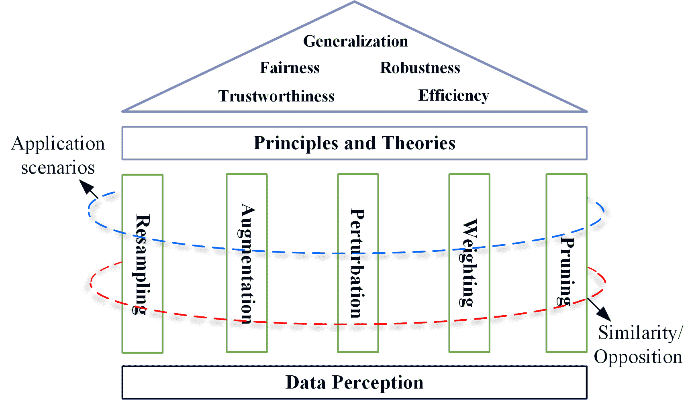

图 12: 现有数据优化研究的高层次联系。

表 I: 一些噪声标签学习中的数据优化方法。

| 数据集 | 重新采样 | 增强 | 扰动 | 权重调整 | 剪枝 |
| --- | --- | --- | --- | --- | --- |
| CIFAR10 |  [113],  [92], [292] |  [162], [305], [306], [307] |  [177],  [183] |  [100], [308], [309], [310] |  [311],  [312], [313] |
| CIFAR100 |  [113],  [92], [292] |  [162], [305], [306], [307] |  [177],  [183] |  [100], [309], [310] |  [312], [313] |
| Clothing1M |  [292] |  [162], [307], [305] |  [177],  [183] |  [100], [310] |  [313] |
| SVHN |  [120] |  [314] |  [67],  [177],  [183] |  [100] |  [245] |
| WebVision |  [315] |  [307], [305] |  [84] |  [308], [309], [310] |  [312] |

表 II: 一些不平衡学习中的数据优化方法。

| 数据集 | 重新采样 | 增强 | 扰动 | 权重调整 | 数据集剪枝 |
| --- | --- | --- | --- | --- | --- |
| CIFAR10-LT |  [316] |  [316],  [317] |  [174],  [195] |  [72],  [46] |  [59],  [318] |
| CIFAR100-LT |  [175] |  [164],  [317] |  [174],  [195] |  [72],  [46] |  [59],  [318] |
| iNaturallist |  [175] |  [164],  [317] |  [174],  [195] |  [72],  [46] |  [59] |
| ImageNet-LT |  [175] |  [164],  [317] |  [174],  [195] |  [72],  [46] |  [59],  [319] |

## VIII 不同技术之间的联系

不同数据优化技术之间的联系可以通过图 12 来描述。四个方面，即感知、应用场景、相似性/对立性和理论，连接了在技术路径内或跨越不同路径的不同方法。

### VIII-A 通过数据感知的联系

数据感知是数据优化流程中的第一个（显式或隐式）步骤。在第 VI 节介绍的不同技术路径中的方法可能选择相同或类似的感知量。因此，数据感知的量连接了不同的方法。例如，许多数据优化方法基于训练损失，包括重新采样 [320]、增强 [321]、扰动 [47]、加权 [299] 和子集选择 [322]。梯度在重新采样 [110]、增强 [323]、扰动 [67]、加权 [61] 和数据集蒸馏 [236] 中广泛使用。其他量，如边距和不确定性，也用于不同的优化技术中。

相同或类似的感知量的使用表明，这些方法具有相同或相似的启发式观察或理论灵感。

### VIII-B 通过应用场景的联系

大多数数据优化方法可以用于第 IV-B 节讨论的应用场景。

数据优化方法最受关注的场景之一是噪声标签学习。许多经典方法来源于重采样[324]、增强、加权或扰动。这些也是噪声标签数据集的 数据提炼 研究[325]。表 I 显示了在五个基准数据集 CIFAR10 [326]、CIFAR100 [326]、Clothing1M [327]、SVHN [328] 和 WebVision [329] 上的噪声标签学习的一些代表性数据优化方法。

不平衡学习也是最受关注的场景之一。列出的几乎所有数据优化技术路径都已应用于不平衡学习。表 II 显示了在四个基准数据集 CIFAR10-LT [46]、CIFAR100-LT [46]、iNaturalist [330] 和 ImageNet-LT [331] 上的一些代表性数据优化方法。表 II 中还列出了一些采用多种数据优化技术的方法，例如 ReMix [316]，它结合了重采样和增强。

针对对抗攻击的鲁棒学习是另一个典型场景。Karimireddy 和 Jaggi [332] 使用重采样来设计分布式学习中的鲁棒模型。数据加权 [210] 和 数据提炼 [333] 也用于鲁棒学习。

### VIII-C 相似性/对立性连接

存在于这五种技术路径之间的相似和对立关系在第 VI 节中介绍。

数据重采样和加权是密切相关的技术，因为它们的关键步骤几乎相同。因此，在许多噪声标签学习和不平衡学习的研究中，这两种技术通常被视为单一策略。

尽管数据修剪和数据增强是彼此对立的，它们在学习任务中的最终目标却是一致的。它们在所采用的方法上有所重叠，如图 13 所示。可以相信，它们之间还可以探索更多内在的联系。

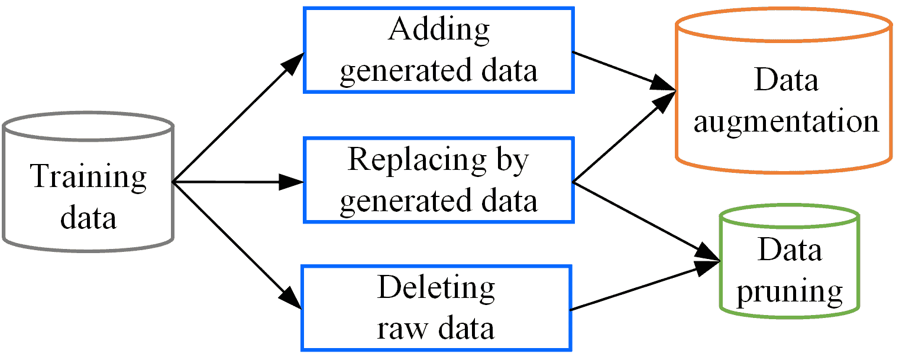

图 13：增强与修剪之间的连接。

在数据重采样、加权和扰动中，采样率、加权分数和扰动变量的分配方式非常相似。除了经典的重要性分数外，元学习 [334] 和对抗策略 [120] 也已用于数据重采样。除重采样外，几乎所有的数据优化路径中都使用了基于正则化的方法。由于空间限制，具有不同分配方式的方法未在表格中总结，如第 VIII-B 节所示。

还有其他相反的关系，如欠采样与过采样、简单优先加权与困难优先加权、正扰动与负扰动以及显式增强与隐式增强。这些相反关系中的两种方法论已被证明是有效的，与谚语“条条大路通罗马”相一致。

### VIII-D 通过理论的联系

存在一些共同的理论问题、分析和结论，这些问题和结论对大多数数据优化技术产生了重大影响。它们是不同技术之间的自然联系。以下列出了一些示例：

+   •

    数据感知中的理论问题。在数据优化中，数据感知的理论基础尚不充分，尽管大多数数据优化方法在训练数据中隐含或明确地依赖于感知。例如，许多来自重采样、加权和扰动的方法都基于将样本分为简单和困难。然而，文献中尚未有一种广泛接受的具有严谨理论基础的学习难度度量方法。在之前的文献中，使用了十多种学习难度度量来区分简单样本和困难样本。数据感知的理论公式化具有重要意义。

+   •

    概率密度（比率）估计。许多数据优化方法，特别是数据重采样和加权，严重依赖于概率密度（比率）估计。最具代表性的方法是重要性采样。在基于学习难度的加权中，学习难度下的概率密度比率被揭示以确定优先模式[217]，即，简单/中等/困难优先。

+   •

    基于正则化的解释。许多数据优化方法被视为一种正则化，包括数据增强和扰动。在这些方法中，数据优化执行的是隐式模型正则化，而不是直接作用于模型参数的显式正则化。正则化并不总是有利，因为可能会发生过度正则化。Li 等人[335]指出，大量增强的噪声数据可能导致过度正则化，并提出了一种自适应增强方法。对抗训练可能导致稳健的过拟合[336]。

+   •

    数据优化的一般化界限。许多研究选择从经验风险和与数据优化相关的变量的角度推导出一般化风险的数学界限。这种方式可以从理论上解释所涉及的数据优化的效用。Xiao 等人[337] 推导了具有对抗性扰动的随机梯度下降（SGD）的基于稳定性的泛化界限。Xu 等人[115] 建立了一个新的泛化界限，反映了重要性加权如何导致经验风险与源分布和目标分布之间的偏差之间的相互作用。

以上每个理论方面的进展都将促进许多数据优化方法在不同技术路径上的发展。希望这项调查能促进对所提及技术路径的相互理解。

## IX 未来方向

本节总结了一些值得进一步探索的研究方向。

### IX-A 数据优化原理

迄今为止，尚无适用于所有或大多数技术路径的共识性理论框架。一些研究旨在建立两种不同技术路径之间的联系，例如重采样与加权[338]。许多未解决的开放问题或争议仍然存在。例如，对于应首先使用哪种重采样策略：过采样还是欠采样？Megahed 等人[104] 建议首先使用欠采样，而 Xie 等人[275] 证明了过采样的有效性。同样，尽管 Zhou 等人[217] 为简单优先和困难优先加权策略的选择提供了初步答案，但他们的研究中仍缺乏一个坚实的理论框架。

此外，即使对于单一的数据优化方法，也可能存在来自不同视角的多种解释。标签平滑的解释就是一个典型的例子。至少有四项研究为其提供了经验或理论解释[298, 339, 340, 260]。关于对抗样本的有效性，一些研究人员指出对抗样本是有用的特征[270]，而另一些研究人员则从梯度正则化的角度进行研究[341]。

因此，构建数据优化原理具有重要意义，因为这可以促进建立一个统一而扎实的理论框架，用于分析和理解每种数据优化技术路径。已经有关于 DNN 设计第一原理的研究[342]。要探索数据优化的原理，需要一个统一的数学形式化工具，并且大规模的实证研究（例如，[343]，[344]）也将是有帮助的。

### IX-B 可解释的数据优化

可解释的数据优化指的是对所涉及的数据优化技术的解释，包括它们如何以及哪些方面影响 DNN 的训练过程。尽管近年来可解释的深度学习受到了广泛关注[345]，但其关注的是 DNN 模型，而非涉及数据优化技术的训练过程。可解释的数据优化是一个尚未充分探索的研究课题，目前关于该主题的研究有限[346]。对数据优化方法如何以及哪些方面影响特定训练过程的详细解释对设计或选择更有效的优化方法具有重要意义。

前述关于数据优化的理论研究为相关的数据优化方法提供了部分解释。然而，这些部分解释集中在不同学习任务中的共同方面。对于特定学习任务中的具体方法，如何以及哪些方面尚未被探索。

可解释的深度学习领域已经提出了许多有效的方法论。最近，研究人员尝试引入可解释的方法来探索数据优化方法。Zelaya 和 Vladimiro[347]探索了量化某些数据处理步骤（如欠采样和数据增强）对模型性能影响的指标。希望未来会有越来越多的可解释数据优化研究出现。

### IX-C 人工智能数据优化

最近，人机交互（HITL）深度学习在 AI 社区中受到越来越多的关注[348]。没有人类参与，高质量的训练样本是难以获得的。因此，HITL 数据优化也可以对深度学习有利。Collins 等人[349]研究了 HITL 混合技术，并指出整合人类对增强样本的感知可能会影响模型性能。Wallace 等人[350]提出了 HITL 对抗生成，其中人类作者被指导去破解模型。Agarwal 等人[351]提出了梯度方差（VoG）来测量样本的学习难度，并根据 VoG 对样本进行排名。然后，选择一小部分最困难的样本进行 HITL 审计。总体而言，HITL 数据优化的研究还处于早期阶段。

### IX-D 新挑战的数据优化

在深度学习应用中，新挑战不断涌现。我们以以下三个近期挑战为例，来说明数据优化的未来方向：

+   •

    开放世界学习。这种学习场景面临分布外（OOD）样本的挑战。Wu 等人[352]研究了开放世界设置下的噪声标签学习，其中存在 OOD 和噪声样本。其他一些研究探讨了当 OOD 遇到不平衡学习[353]和对抗鲁棒性[354]的情况。

+   •

    大模型训练。近年来，大模型特别是大型语言模型[355]取得了巨大的成功。数据优化在大模型的训练中也能发挥作用。Wei 等人[356]研究了提示的凝聚，并获得了有前景的结果。相反，Jiang 等人[357]利用提示增强来校准大型语言模型。许多在传统深度学习任务中研究的问题可能在大模型训练中也存在，例如，提示评估。

+   •

    多模态学习。随着数据感知和采集技术的发展，多模态数据在越来越多的实际任务中变得可用[358]。因此，许多学习任务实际上是多模态学习。由于每个样本由来自不同模态的原始数据/特征组成，因此对多模态样本的数据感知应与传统单模态样本不同。数据优化方法也不同于传统方法[359]。

### IX-E 数据优化代理

对于具体的学习任务，存在选择众多数据优化技术的困境。已有关于自动数据优化的研究，如自动数据增强[287]。然而，现有的自动数据优化方法仍然集中在某一特定技术路径上，而不是不同技术路径之间的类型[360, 361]。可以通过强化学习在大量深度学习任务上迭代训练，从而训练出一个更通用的数据优化代理。

图 14 展示了一种构建数据优化代理的可能方法。新的学习任务基于现有的经典任务，通过添加噪声、重新分配类别比例等操作进行编译。数据优化操作的候选者来自于第六节介绍的任意优化技术或单一技术。然后，可以通过强化学习根据编译的学习任务及其奖励来训练一个强大的数据优化代理。

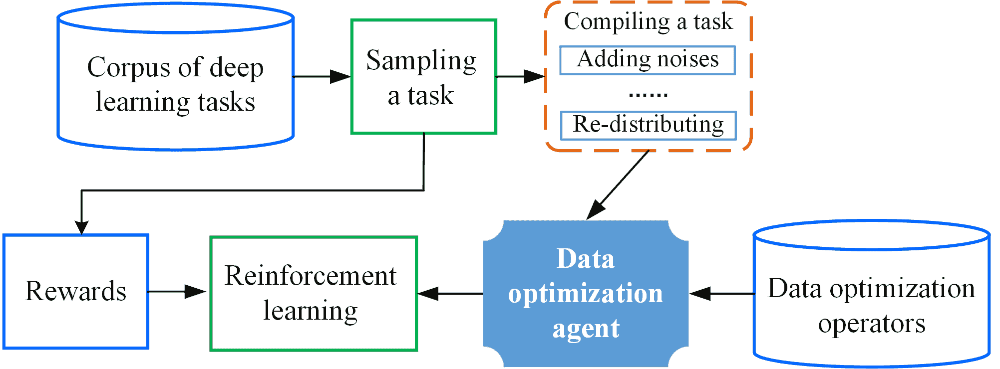

图 14：数据优化代理的训练。

## X 结论

本文旨在总结独立深度学习领域内的一系列学习方法，即数据优化。为现有的数据优化研究建立了一个数据优化的分类法，以及细化的子分类法。讨论了不同方法之间的联系，并提出了潜在的未来方向。值得注意的是，许多经典方法，例如 dropout，实际上是数据优化方法。在我们的未来工作中，我们将探索数据优化的更基础和统一的观点，并开发一个更全面的分类法，以纳入更多的经典方法。我们希望这项研究能激发更多研究人员对数据中心人工智能的深入了解。

## 参考文献

+   [1] S. E. Whang, Y. Roh, H. Song 和 J.-G. Lee，“深度学习中的数据收集和质量挑战：一种数据中心人工智能视角，”*The VLDB Journal*，第 32 卷，第 4 期，页码 791–813，2023 年。

+   [2] M. H. Jarrahi, A. Memariani 和 S. Guha，“数据中心人工智能的原则，”*Communications of the ACM*，第 66 卷，第 8 期，页码 84–92，2023 年。

+   [3] Y. Liang, D. Huang, C.-D. Wang 和 P. S. Yu，“通过一致性和不一致性联合建模的多视图图学习，”*IEEE TNNLS*，页码 1–15，2022 年。

+   [4] P. Zhu, X. Yao, Y. Wang, M. Cao, B. Hui, S. Zhao 和 Q. Hu，“用于不完整多视图学习的潜在异质图网络，”*IEEE TMM*，第 25 卷，页码 3033–3045，2023 年。

+   [5] L. Brigato 和 L. Iocchi，“深入了解小数据的深度学习，”发表于*ICPR*，2021 年，页码 2490–2497。

+   [6] V. Birodkar, H. Mobahi 和 S. Bengio，“图像分类数据集中的语义冗余：你不需要的 10%,” *arXiv:1901.11409*，2019 年。

+   [7] Y. Yu, S. Khadivi, 和 J. Xu, “数据多样性是否能增强学习的泛化能力？”在*COLING*，2022 年，页码 4933–4945。

+   [8] J. Lu, A. Liu, F. Dong, F. Gu, J. Gama, 和 G. Zhang, “概念漂移下的学习：综述”，*IEEE TKDE*，第 31 卷，第 12 期，页码 2346–2363，2018 年。

+   [9] W. Wang, R. Wang, L. Wang, Z. Wang, 和 A. Ye, “朝着强健的深度神经网络对抗对抗性文本：综述”，*IEEE TKDE*，第 35 卷，第 3 期，页码 3159–3179，2023 年。

+   [10] Y. Wu, L. Zhang, 和 X. Wu, “关于公平分类的凸性和界限”，在*WWW*，2019 年，页码 3356–3362。

+   [11] P. Xiong, S. Buffett, S. Iqbal, P. Lamontagne, M. Mamun, 和 H. Molyneaux, “朝着强健且值得信赖的机器学习系统开发迈进：工程视角”，*JISA*，第 65 卷，页码 103121，2022 年。

+   [12] H. Zhang, M. Cisse, Y. N. Dauphin, 和 D. Lopez-Paz, “mixup：超越经验风险最小化”，*ICLR*，2018 年。

+   [13] R. Yao 和 O. Wu, “补偿学习”，*arXiv:2107.11921*，2022 年。

+   [14] X. Wang, L. Jing, Y. Lyu, M. Guo, J. Wang, H. Liu, J. Yu, 和 T. Zeng, “用于强健不平衡分类的深度生成混合模型”，*IEEE TPAMI*，第 45 卷，第 3 期，页码 2897–2912，2023 年。

+   [15] H. He 和 E. A. Garcia, “从不平衡数据中学习”，*IEEE TKDE*，第 21 卷，第 9 期，页码 1263–1284，2009 年。

+   [16] Y. Zhang, B. Kang, B. Hooi, S. Yan, 和 J. Feng, “深度长尾学习：综述”，*IEEE TPAMI*，第 45 卷，第 9 期，页码 10 795–10 816，2023 年。

+   [17] G. Algan 和 I. Ulusoy, “在存在噪声标签的情况下使用深度学习进行图像分类：综述”，*Knowledge-Based Systems*，第 215 卷，第 5 期，页码 106771，2021 年。

+   [18] H. Song, M. Kim, D. Park, Y. Shin, 和 J.-G. Lee, “基于深度神经网络的噪声标签学习：综述”，*IEEE TNNLS*，页码 1–19，2022 年。

+   [19] X. Cao, W. Bu, S. Huang, M. Zhang, I. W. Tsang, Y. S. Ong, 和 J. T. Kwok, “小数据上的学习综述”，*arXiv:2207.14443*，2022 年。

+   [20] Y. Wang, Q. Yao, J. Kwok, 和 L. M. Ni, “从少量示例中泛化：关于少样本学习的综述”，*ACM computing surveys*，第 53 卷，第 3 期，页码 1–34，2020 年。

+   [21] L. Yuan, H. Li, B. Xia, C. Gao, M. Liu, W. Yuan, 和 X. You, “深度学习的概念漂移适应方法的最新进展”，在*IJCAI*，2022 年，页码 5654–5661。

+   [22] A. Diez-Olivan, P. Ortego, J. D. Ser, I. Landa-Torres, D. Galar, D. Camacho, 和 B. Sierra, “适应性树突细胞深度学习方法用于变化条件下的工业预测”，*IEEE TII*，第 17 卷，第 11 期，页码 7760–7770，2021 年。

+   [23] J. Gama, I. Žliobaitė, A. Bifet, M. Pechenizkiy, 和 A. Bouchachia, “概念漂移适应的综述”，*ACM Computing Surveys*，第 46 卷，第 4 期，页码 1–37，2014 年。

+   [24] A. S. Iwashita 和 J. P. Papa, “概念漂移学习综述”，*IEEE Access*，第 7 卷，页码 1532–1547，2019 年。

+   [25] S. H. Silva 和 P. Najafirad, “深度学习对抗鲁棒性的机遇与挑战：综述”，*arXiv:2007.00753*，2020 年。

+   [26] J. Xu, J. Chen, S. You, Z. Xiao, Y. Yang, 和 J. Lu，“图上深度学习模型的鲁棒性：综述，”*AI Open*，第 2 卷，页码 69–78，2021 年。

+   [27] S. Goyal, S. Doddapaneni, M. M. Khapra, 和 B. Ravindran，“自然语言处理中的对抗性防御和鲁棒性综述，”*ACM Computing Surveys*，第 55 卷，第 14 期，页码 1–39，2023 年。

+   [28] N. Mehrabi, F. Morstatter, N. Saxena, K. Lerman, 和 A. Galstyan，“机器学习中的偏见和公平性综述，”*ACM Computing Surveys*，第 54 卷，第 6 期，页码 1–35，2021 年。

+   [29] A. Petrović, M. Nikolić, S. Radovanović, B. Delibašić, 和 M. Jovanović，“Fair: 公平的对抗性实例重加权，”*Neurocomputing*，第 476 卷，页码 14–37，2022 年。

+   [30] S. K. Devitt，“自主系统的可信度，”* Foundations of trusted autonomy (Studies in Systems, Decision and Control, Volume 117)*，页码 161–184，2018 年。

+   [31] D. Kaur, S. Uslu, K. J. Rittichier, 和 A. Durresi，“可信赖的人工智能：综述，”*ACM Computing Surveys*，第 55 卷，第 2 期，页码 1–38，2022 年。

+   [32] B. Wu, Y. Bian, H. Zhang, J. Li, J. Yu, L. Chen, C. Chen, 和 J. Huang，“可信赖的图学习：可靠性、可解释性和隐私保护，”*ACM KDD*，页码 4838–4839，2022 年。

+   [33] C. Fang, L. Cheng, H. Qi, 和 D. Zhang，“应对长尾图像分类中的噪声标签，”*arXiv:2209.00273*，2022 年。

+   [34] M. Singh, G. Ghalachyan, K. R. Varshney, 和 R. E. Bryant，“准确性、公平性、可解释性、分布鲁棒性和对抗鲁棒性的实证研究，”在*KDD Workshop*，2021 年。

+   [35] Z. Wan, Z. Wang, C. Chung, 和 Z. Wang，“计算机视觉数据集中的数据优化综述，”*arXiv:2210.11717*，2022 年。

+   [36] X. Zheng, Y. Liu, Z. Bao, M. Fang, X. Hu, A. W.-C. Liew, 和 S. Pan，“面向数据中心的图机器学习：综述与展望，”*arXiv:2309.10979*，2023 年。

+   [37] Y. Luo, Y. Wong, M. Kankanhalli, 和 Q. Zhao，“$\mathcal{G}$-softmax: 改进特征的类内紧凑性和类间可分性，”*IEEE TNNLS*，第 31 卷，第 2 期，页码 685–699，2020 年。

+   [38] A. Damian, T. Ma, 和 J. D. Lee，“标签噪声 SGD 明确定义偏好平坦全局极小化器，”在*NeurIPS*，2021 年，页码 27 449–27 461。

+   [39] Y. Wang, X. Pan, S. Song, H. Zhang, C. Wu, 和 G. Huang，“深度网络的隐式语义数据增强，”在*NeurIPS*，2019 年，页码 12 635–12 644。

+   [40] M. Wang, Y. Zhang, 和 W. Deng，“公平面部识别的元平衡网络，”*IEEE TPAMI*，2021 年。

+   [41] S. Fujii, Y. Ishii, K. Kozuka, T. Hirakawa, T. Yamashita, 和 H. Fujiyoshi，“通过考虑类别间距离的混合类别选择进行数据增强，”*arXiv:2209.05122*，2022 年。

+   [42] I. L. . F. Hutter，“在线批量选择以加速神经网络训练，”*ICLR Workshop*，2016 年。

+   [43] C.-Y. Chuang 和 Y. Mroueh，“公平混合：通过插值实现公平性，”在*ICLR*，2021 年。

+   [44] L. E. Celis, A. Mehrotra, 和 N. Vishnoi，“带有对抗扰动的公平分类，”在*NeurIPS*，2021 年，页码 8158–8171。

+   [45] B. Yan, S. Seto, 和 N. Apostoloff, “Forml: 学习重新加权数据以实现公平性”，*arXiv:2202.01719*，2022 年。

+   [46] Y. Cui, M. Jia, T. Lin, Y. Song, 和 S. Belongie, “基于有效样本数量的类别平衡损失”，发表于*CVPR*，2019 年，第 9260–9269 页。

+   [47] M. Li, F. Su, O. Wu, 和 J. Zhang, “Logit 扰动”，发表于*AAAI*，2022 年，第 10 388–10 396 页。

+   [48] Y. Chen, P. Zhang, T. Kong, Y. Li, X. Zhang, L. Qi, J. Sun, 和 J. Jia, “动态训练下的尺度感知自动数据增强用于目标检测”，*IEEE TPAMI*，第 45 卷，第 2 期，第 2367–2383 页，2023 年。

+   [49] M. P. Naeini, G. F. Cooper, 和 M. Hauskrecht, “利用贝叶斯分箱获得良好的校准概率”，发表于*AAAI*，2015 年。

+   [50] B. Liu, I. Ben Ayed, A. Galdran, 和 J. Dolz, “魔鬼在于边际：基于边际的标签平滑用于网络校准”，发表于*CVPR*，2022 年，第 80–88 页。

+   [51] J. Mukhoti, V. Kulharia, A. Sanyal, S. Golodetz, P. Torr, 和 P. Dokania, “使用焦点损失校准深度神经网络”，发表于*NeurIPS*，2020 年，第 15 288–15 299 页。

+   [52] L. Dunlap, A. Umino, H. Zhang, J. Yang, J. E. Gonzalez, 和 T. Darrell, “通过自动扩散增强多样化视觉数据集”，*arXiv:2305.16289*，2023 年。

+   [53] Z. Ye, Y. Dai, C. Hong, Z. Cao, 和 H. Lu, “将确定性注入随机性：重新思考深度图像抠图的组成风格”，*AAAI*，2023 年。

+   [54] S. Yang, W. Xiao, M. Zhang, S. Guo, J. Zhao, 和 F. Shen, “深度学习中的图像数据增强：一项综述”，*arXiv:2204.08610*，2022 年。

+   [55] W. Yang, C. Li, J. Zhang, 和 C. Zong, “Bigtranslate: 增强大型语言模型的多语言翻译能力，支持 100 多种语言”，*arXiv:2305.18098*，2023 年。

+   [56] X. Liu, H. Cheng, P. He, W. Chen, Y. Wang, H. Poon, 和 J. Gao, “针对大型神经语言模型的对抗训练”，*arXiv:2004.08994*，2020 年。

+   [57] X. Glorot 和 Y. Bengio, “理解训练深度前馈神经网络的难度”，*AISTATS*，第 249–256 页，2010 年。

+   [58] K. He, X. Zhang, S. Ren, 和 J. Sun, “深入探讨激活函数：超越人类水平的 ImageNet 分类性能”，*ICCV*，第 1026–1034 页，2015 年。

+   [59] F. Su, Y. Zhu, O. Wu, 和 Y. Deng, “用于元优化的子模元数据编译”，*ECML/PKDD*，2022 年。

+   [60] J. Huang, L. Qu, R. Jia, 和 B. Zhao, “O2u-net: 一种简单的噪声标签检测方法用于深度神经网络”，发表于*ICCV*，2019 年，第 3326–3334 页。

+   [61] B. Li, Y. Liu, 和 X. Wang, “梯度协调单阶段检测器”，发表于*AAAI*，2019 年，第 8577–8584 页。

+   [62] C.-B. Zhang, P.-T. Jiang, Q. Hou, Y. Wei, Q. Han, Z. Li, 和 M.-M. Cheng, “深入探讨标签平滑”，*IEEE TIP*，第 30 卷，第 5984–5996 页，2021 年。

+   [63] S. Sinha, H. Ohashi, 和 K. Nakamura, “解决类别不平衡的类别级困难平衡损失”，发表于*ACCV*，2020 年。

+   [64] M. Escudero-Viñolo 和 A. López-Cifuentes, “Ccl: 解决类别不平衡问题的类别级课程学习”，发表于*ICIP*，2022 年，第 1476–1480 页。

+   [65] X. Ning, W. Tian, F. He, X. Bai, L. Sun, 和 W. Li，“用于图像分类的超香肠覆盖函数神经元模型和学习算法，” *Pattern Recognition*，第 136 卷，页码 109216，2023 年。

+   [66] J. Lin, A. Zhang, M. Lécuyer, J. Li, A. Panda, 和 S. Sen，“通过随机实验测量训练数据对深度学习预测的影响，”发表于 *ICML*，2022 年，页码 13 468–13 504。

+   [67] X. Zhou, N. Yang, 和 O. Wu，“在训练中结合对抗者与反对抗者，”发表于 *AAAI*，2023 年。

+   [68] K. Tang, M. Tao, J. Qi, Z. Liu, 和 H. Zhang，“针对广义长尾分类的变不变特征学习，”发表于 *ECCV*，2022 年，页码 709–726。

+   [69] S. Shrivastava, X. Zhang, S. Nagesh, 和 A. Parchami，“数据集公平性：样本是否平等？在数据集公平性探索中，”发表于 *ICCV*，2023 年，页码 4417–4426。

+   [70] R. Wang, W. Xiong, Q. Hou, 和 O. Wu，“应对 GNNs 的不平衡，”发表于 *IJCNN*，2022 年。

+   [71] Y. Bengio, J. Louradour, R. Collobert, 和 J. Weston，“课程学习，”发表于 *ICML*，2009 年，页码 41–48。

+   [72] T. Lin, P. Goyal, R. Girshick, K. He, 和 P. Dollar，“用于密集目标检测的焦点损失，”发表于 *CVPR*，2017 年，页码 2999–3007。

+   [73] M. Paul, S. Ganguli, 和 G. K. Dziugaite，“数据饮食中的深度学习：在训练早期找到重要的示例，”发表于 *NeurIPS*，2021 年，页码 20 596–20 607。

+   [74] W. Zhu, O. Wu, F. Su, 和 Y. Deng，“探讨数据学习难度：理论与度量，” *arXiv:2205.07427*，2022 年。

+   [75] B. Sorscher, R. Geirhos, S. Shekhar, S. Ganguli, 和 A. S. Morcos，“超越神经缩放定律：通过数据修剪击败幂律缩放，”发表于 *NeurIPS*，2022 年。

+   [76] M. Abdar, F. Pourpanah, S. Hussain, D. Rezazadegan, L. Liu, M. Ghavamzadeh, P. Fieguth, X. Cao, A. Khosravi, U. R. Acharya, V. Makarenkov, 和 S. Nahavandi，“深度学习中不确定性量化的综述：技术、应用与挑战，” *Information fusion*，第 76 卷，页码 243–297，2021 年。

+   [77] D. D’souza, Z. Nussbaum, C. Agarwal, 和 S. Hooker，“两个长尾的故事，” *arXiv:2107.13098*，2021 年。

+   [78] A. Kendall 和 Y. Gal，“在计算机视觉的贝叶斯深度学习中我们需要哪些不确定性？”发表于 *NeurIPS*，2017 年，页码 5574–5584。

+   [79] A. Kumar, S. Bhattamishra, M. Bhandari, 和 P. Talukdar，“基于子模块优化的多样化释义及其在数据增强中的有效性，”发表于 *NAACL*，2019 年，页码 3609–3619。

+   [80] D. Friedman 和 A. B. Dieng，“Vendi 分数：机器学习的多样性评估指标，” *arXiv:2210.02410*，2023 年。

+   [81] T. Salimans, I. Goodfellow, W. Zaremba, V. Cheung, A. Radford, 和 X. Chen，“改进的 GAN 训练技术，” *NeurIPS*，页码 2234–2242，2016 年。

+   [82] O. Wu，“重新思考机器学习中的类别不平衡，” *arXiv:2305.03900*，2023 年。

+   [83] S. Swayamdipta, R. Schwartz, N. Lourie, Y. Wang, H. Hajishirzi, N. A. Smith, 和 Y. Choi，“数据集制图：通过训练动态映射和诊断数据集，”发表于 *EMNLP*，2020 年。

+   [84] A. Iscen, J. Valmadre, A. Arnab 和 C. Schmid，“通过邻居一致性学习噪声标签”，发表于 *CVPR*，2022，页码 4672–4681。

+   [85] M. Toneva, A. Sordoni, R. T. des Combes, A. Trischler, Y. Bengio 和 G. J. Gordon，“深度神经网络学习过程中示例遗忘的实证研究”，*ICLR*，2019。

+   [86] P. Singh, P. Mazumder 和 M. A. Karim，“使用少量样本在预训练模型中实现类别级遗忘”，发表于 *ECCV*，2022，页码 433–448。

+   [87] P. Maini, S. Garg, Z. Lipton 和 J. Z. Kolter，“通过第二次拆分遗忘来表征数据点”，发表于 *NeurIPS*，2022，页码 30 044–30 057。

+   [88] Z. Wang, E. Yang, L. Shen 和 H. Huang，“关于深度学习中的遗忘问题的全面调查，超越持续学习”，*arXiv:2307.09218*，2023。

+   [89] T. Kim, J. Ko, S. Cho, J. Choi 和 S.-Y. Yun，“用于带噪声标签学习的精细样本”，发表于 *NeurIPS*，2021，页码 24 137–24 149。

+   [90] L. S. Shapley，“n 人博弈的一个价值”，发表于 *In Contributions to the Theory of Games*，1953，页码 307–317。

+   [91] A. Ghorbani 和 J. Zou，“Data shapley: 公平的数据价值评估”，发表于 *ICML*，2019，页码 2242–2251。

+   [92] J. Yoon, S. Arik 和 T. Pfister，“使用强化学习进行数据评估”，发表于 *ICML*，2020，页码 10 842–10 851。

+   [93] Y. Bian, Y. Rong, T. Xu, J. Wu, A. Krause 和 J. Huang，“用于合作博弈的基于能量的学习，及其在机器学习中的估值问题应用”，发表于 *ICLR*，2022。

+   [94] K. F. Jiang, W. Liang, J. Zou 和 Y. Kwon，“Opendataval: 数据评估的统一基准”，发表于 *NeurIPS*，2023。

+   [95] D. Bahri 和 H. Jiang，“局部自适应标签平滑改善预测流失”，发表于 *ICML*，2021，页码 532–542。

+   [96] C. Dong, L. Liu 和 J. Shang，“对抗训练的数据分析：有问题的数据的毁灭”，*arXiv:2102.07437v1*，2021。

+   [97] Z. Hammoudeh 和 D. Lowd，“训练数据影响分析和估计：一项调查”，*arXiv:2212.04612*，2023。

+   [98] Y. Wu, J. Shu, Q. Xie, Q. Zhao 和 D. Meng，“通过元软标签校正器学习净化噪声标签”，发表于 *AAAI*，2021，页码 10 388–10 396。

+   [99] J. Shu, Q. Xie, L. Yi, Q. Zhao, S. Zhou, Z. Xu 和 D. Meng，“Meta-Weight-Net: 学习样本加权的显式映射”，发表于 *NeurIPS*，2019，页码 1917–1928。

+   [100] M. P. Kumar, B. Packer 和 D. Koller，“针对潜变量模型的自适应学习”，*NeurIPS*，页码 1–9，2010。

+   [101] E. Arazo, D. Ortego, P. Albert, N. E. O’Connor 和 K. McGuinness，“无监督标签噪声建模与损失校正”，发表于 *ICML*，2019。

+   [102] C. Hu, S. Yan, Z. Gao 和 X. He，“Mild: 处理噪声标签的实例学习动态建模”，*arXiv:2306.11560*，2023。

+   [103] Y. Li 和 N. Vasconcelos，“Repair: 通过数据集重采样去除表征偏差”，发表于 *CVPR*，2019。

+   [104] F. M. Megahed, Y.-J. Chen, A. Megahed, Y. Ong, N. Altman 和 M. Krzywinski，“类别不平衡问题”，*Nature Methods*，第 18 卷，页码 1270–1272，2021。

+   [105] J. Cui, S. Liu, Z. Tian, Z. Zhong, 和 J. Jia，“Reslt：用于长尾识别的残差学习，” *IEEE TPAMI*，第 45 卷，第 3 期，第 3695–3706 页，2023 年。

+   [106] A. Kirsch, J. van Amersfoort, 和 Y. Gal，“Batchbald：用于深度贝叶斯主动学习的高效多样化批量采集，” 在 *NeurIPS*，2019 年。

+   [107] H. Shimodaira，“通过加权对数似然函数来改善协变量偏移下的预测推断，” *统计规划与推断期刊*，2000 年。

+   [108] J. Byrd 和 Z. Lipton，“重要性加权在深度学习中的效果是什么？” 在 *ICML*，2019 年，第 872–881 页。

+   [109] Q. Liu 和 J. Lee，“黑箱重要性采样，” 在 *AISTATS*，2017 年，第 952–961 页。

+   [110] A. Katharopoulos 和 F. Fleuret，“并非所有样本都是相同的：利用重要性采样进行深度学习，” 在 *ICML*，2018 年，第 2525–2534 页。

+   [111] T. B. Johnson 和 C. Guestrin，“利用稳健的近似重要性采样加速深度模型训练，” 在 *NeurIPS*，2018 年。

+   [112] A. H. Jiang, D. L.-K. Wong, G. Zhou, D. G. Andersen, J. Dean, G. R. Ganger, G. Joshi, M. Kaminksy, M. Kozuch, Z. C. Lipton, 和 P. Pillai，“通过关注最大损失者来加速深度学习，” *arXiv:1910.00762*，2019 年。

+   [113] X. J. Gui, W. Wang, 和 Z. H. Tian，“从噪声标签中理解深度学习：小损失准则，” *IJCAI*，2021 年。

+   [114] H. Liu, X. Zhu, Z. Lei, 和 S. Z. Li，“Adaptiveface：用于人脸识别的自适应边界和采样，” 在 *CVPR*，2019 年，第 11 947–11 956 页。

+   [115] D. Xu, Y. Ye, 和 C. Ruan，“理解重要性加权在深度学习中的作用，” *arXiv:2103.15209*，2021 年。

+   [116] V. Nguyen, M. Shaker, 和 E. Hüllermeier，“如何衡量主动学习中的不确定性采样的不确定性，” *机器学习*，第 111 卷，第 89–122 页，2022 年。

+   [117] J. Mena, O. Pujol, 和 J. Vitrià，“从贝叶斯视角对深度学习分类系统中的不确定性估计进行调查，” *ACM 计算调查*，第 54 卷，第 9 期，第 1–35 页，2021 年。

+   [118] A. Aljuhani, I. Casukhela, J. Chan, D. Liebner, 和 R. Machiraju，“面向组织学图像分类的弱标签学习的不确定性感知采样框架，” 在 *MICCAI*，2022 年，第 366–376 页。

+   [119] D. Ting 和 E. Brochu，“利用影响函数进行最优子采样，” 在 *NeurIPS*，2018 年，第 3650–3659 页。

+   [120] Y. Li 和 N. Vasconcelos，“背景数据重采样用于异常值感知分类，” 在 *CVPR*，2020 年，第 13 218–13 227 页。

+   [121] X. Wang 和 Y. Wang，“用于命名实体识别的句子级重采样，” 在 *NAACL*，2022 年，第 2151–2165 页。

+   [122] J. Zhang, T. Wang, W. W. Y. Ng, S. Zhang, 和 C. D. Nugent，“用于不平衡问题的决策边界附近欠采样，” 在 *ICMLC*，2019 年，第 1–8 页。

+   [123] M. Sun, H. Dou, B. Li, J. Yan, W. Ouyang, 和 L. Cui，“自动采样：寻找有效的数据采样调度，” 在 *ICML*，2017 年，第 9923–9933 页。

+   [124] G. Li, L. Liu, G. Huang, C. Zhu 和 T. Zhao，“理解神经机器翻译中的数据增广：通向泛化的两个视角，”在 *EMNLP-IJCNLP*，2019 年，页 5689–56 958。

+   [125] L. Zhao, T. Liu, X. Peng 和 D. Metaxas，“最大熵对抗数据增广以改善泛化和鲁棒性，”在 *NeurIPS*，第 33 卷，2020 年，页 14 435–14 447。

+   [126] S.-A. Rebuffi, S. Gowal, D. A. Calian, F. Stimberg, O. Wiles 和 T. A. Mann，“数据增广可以提高鲁棒性，”在 *NeurIPS*，2021 年，页 29 935–29 948。

+   [127] L. Li 和 M. Spratling，“仅使用数据增广即可改善对抗训练，”在 *ICLR*，2023 年。

+   [128] M. Bayer, M.-A. Kaufhold 和 C. Reuter，“文本分类的数据增广综述，” *ACM Computing Surveys*，第 55 卷，第 7 期，页 1–39，2022 年。

+   [129] C. Shorten 和 T. M. Khoshgoftaar，“深度学习的图像数据增广综述，” *Journal of Big Data*，第 6 卷，第 60 期，2019 年。

+   [130] K. Ding, Z. Xu, H. Tong 和 H. Liu，“深度图学习的数据增广：综述，” *ACM SIGKDD Explorations Newsletter*，第 24 卷，第 2 期，2022 年。

+   [131] Q. Wen, L. Sun, F. Yang, X. Song, J. Gao, X. Wang 和 H. Xu，“深度学习的时间序列数据增广：综述，”在 *IJCAI*，2021 年，页 1–8。

+   [132] B. Li, Y. Hou 和 W. Che，“自然语言处理中的数据增广方法：综述，” *AI Open*，第 3 卷，页 71–90，2022 年。

+   [133] T. DeVries 和 G. W. Taylor，“特征空间中的数据集增广，” *ICLR Workshop*，2017 年。

+   [134] P. Li, D. Li, W. Li, S. Gong, Y. Fu 和 T. M. Hospedales，“用于领域泛化的简单特征增广，”在 *ICCV*，2021 年，页 8886–8895。

+   [135] M. Ye, J. Shen, X. Zhang, P. C. Yuen 和 S.-F. Chang，“用于 softmax 嵌入的增广不变性和实例扩展特征，” *IEEE TPAMI*，第 44 卷，第 2 期，页 924–939，2022 年。

+   [136] P. Chu, X. Bian, S. Liu 和 H. Ling，“长尾数据的特征空间增广，”在 *ECCV*，2020 年，页 694–710。

+   [137] A. Madry, A. Makelov, L. Schmidt, D. Tsipras 和 A. Vladu，“朝着对抗攻击抵抗的深度学习模型迈进，”在 *ICLR*，2018 年。

+   [138] T. Bai 和 J. Luo，“对抗性训练在对抗鲁棒性方面的最新进展，”在 *IJCAI*，2021 年，页 4312–4321。

+   [139] S. Lee, H. Kim 和 J. Lee，“Graddiv：通过梯度多样性正则化提高随机神经网络的对抗鲁棒性，” *TPAMI*，第 45 卷，第 2 期，页 2645–2651，2023 年。

+   [140] H. Lee, S. J. Hwang 和 J. Shin，“通过输入变换进行自监督标签增广，”在 *ICML*，2020 年，页 5714–5724。

+   [141] I. Elezi, A. Torcinovich, S. Vascon 和 M. Pelillo，“用于改进深度网络学习的传导标签增广，”在 *ICPR*，2018 年，页 1432–1437。

+   [142] F. Huang, L. Zhang, Y. Zhou 和 X. Gao，“用于图像检索的对抗性和各向同性梯度增广，带文本反馈，” *IEEE TMM*，页 1–12，2022 年。

+   [143] N. Chawla, K. Bowyer, L. Hall, 和 W. Kegelmeyer，“Smote: 合成少数类过采样技术，” *Journal of Artificial Intelligence Research*，第 16 卷，第 1 期，页码 321–357，2002 年。

+   [144] A. Telikani, A. H. Gandomi, K.-K. R. Choo, 和 J. Shen，“一种基于深度学习的成本敏感网络流量分类方法，” *IEEE TNSE*，第 19 卷，第 1 期，页码 661–670，2022 年。

+   [145] D. Dablain, B. Krawczyk, 和 N. V. Chawla，“Deepsmote: 深度学习与 smote 融合以处理不平衡数据，” *IEEE TNNLS*，第 34 卷，第 9 期，页码 6390–6404，2023 年。

+   [146] V. Verma, A. Lamb, C. Beckham, A. Najafi, I. Mitliagkas, D. Lopez-Paz, 和 Y. Bengio，“流形混合：通过插值隐藏状态获得更好的表示，” 见 *ICML*，2019 年，页码 6438–6447。

+   [147] I. Goodfellow, J. Pouget-Abadie, M. Mirza, B. Xu, D. Warde-Farley, S. Ozair, A. Courville, 和 Y. Bengio，“生成对抗网络，” 见 *NeurIPS*，2014 年。

+   [148] J. Gui, Z. Sun, Y. Wen, D. Tao, 和 J. Ye，“生成对抗网络综述：算法、理论和应用，” *IEEE TKDE*，第 35 卷，第 4 期，页码 3313–3332，2023 年。

+   [149] G. Mariani, F. Scheidegger, R. Istrate, C. Bekas, 和 C. Malossi，“Bagan: 数据增强与平衡 gan，” *arXiv:1803.09655*，2018 年。

+   [150] S.-W. Huang, C.-T. Lin, S.-P. Chen, Y.-Y. Wu, P.-H. Hsu, 和 S.-H. Lai，“Auggan: 基于 gan 的跨领域适应数据增强，” 见 *ECCV*，2018 年。

+   [151] Z. Yang, Y. Li, 和 G. Zhou，“Ts-gan: 基于时间序列的 gan 进行传感器健康数据增强，” *ACM TOCH*，第 4 卷，第 2 期，页码 1–21，2022 年。

+   [152] L. Yang, Z. Zhang, Y. Song, S. Hong, R. Xu, Y. Zhao, W. Zhang, B. Cui, 和 M.-H. Yang，“扩散模型：方法与应用的全面调查，” *ACM Computing Surveys*，2023 年。

+   [153] C. Xiao, S. X. Xu, 和 K. Zhang，“用于图像描述的多模态数据增强，基于扩散模型，” *arXiv:2305.01855*，2023 年。

+   [154] P. McNamee 和 K. Duh，“60 种语言的回译广泛探索，” 见 *Findings of ACL*，2023 年，页码 8166–8183。

+   [155] H. Dong, J. Zhang, D. McIlwraith, 和 Y. Guo，“I2t2i: 学习文本到图像合成与文本数据增强，” 见 *ICIP*，2017 年，页码 2015–2019。

+   [156] D. Lu, Z. Wang, T. Wang, W. Guan, H. Gao, 和 F. Zheng，“集合级引导攻击：提升视觉语言预训练模型的对抗性迁移性，” 见 *ICCV*，2023 年。

+   [157] Y. Yin, J. Kaddour, X. Zhang, Y. Nie, Z. Liu, L. Kong, 和 Q. Liu，“Ttida: 通过文本到文本和文本到图像模型进行可控生成数据增强，” *arXiv:2304.08821*，2023 年。

+   [158] M. Pagliardini, G. Manunza, M. Jaggi, M. I. Jordan, 和 T. Chavdarova，“通过不确定性驱动的扰动提高泛化能力，” *arXiv:2202.05737*，2022 年。

+   [159] E. D. Cubuk, B. Zoph, J. Shlens, 和 Q. V. Le，“Randaugment: 实用的自动数据增强与减少的搜索空间，” *arXiv:1909.13719*，2019 年。

+   [160] Z. Mai, G. Hu, D. Chen, F. Shen, 和 H. T. Shen, “Metamixup：通过元学习学习 mixup 的自适应插值策略，” *IEEE TNNLS*，第 33 卷，第 7 期，第 3050–3064 页，2021 年。

+   [161] T. Qin, Z. Wang, K. He, Y. Shi, Y. Gao, 和 D. Shen, “通过深度强化学习实现自动数据增强以提高肾脏肿瘤分割效果，”在 *ICASSP*，2020，第 1419–1423 页。

+   [162] K. Nishi, Y. Ding, A. Rich, 和 T. Hollerer, “噪声标签学习的增强策略，”在 *CVPR*，2021，第 8022–8031 页。

+   [163] Y. Li, G. Hu, Y. Wang, T. Hospedales, N. M. Robertson, 和 Y. Yang, “可微分自动数据增强，”在 *ECCV*，A. Vedaldi, H. Bischof, T. Brox, 和 J.-M. Frahm 编辑，2020，第 580–595 页。

+   [164] X. Chen, Y. Zhou, D. Wu, W. Zhang, Y. Zhou, B. Li, 和 W. Wang, “通过推理想象：基于推理的隐式语义数据增强用于长尾分类，”在 *AAAI*，在线，2022 年 2 月，第 356–364 页。

+   [165] X. Zhou 和 O. Wu, “深度神经网络的隐式反事实数据增强，” *arXiv:2304.13431*，2023 年。

+   [166] B. Li, F. Wu, S.-N. Lim, S. Belongie, 和 K. Q. Weinberger, “关于特征归一化和数据增强，”在 *CVPR*，2021，第 12 383–12 392 页。

+   [167] D. LeJeune, R. Balestriero, H. Javadi, 和 R. G. Baraniuk, “通过数据增强实现隐式粗糙度正则化，” *arXiv:1905.11639*，2019 年。

+   [168] H. Guo, Y. Mao, 和 R. Zhang, “Mixup 作为局部线性出界正则化，” *AAAI*，第 3714–3722 页，2019 年。

+   [169] C. F. G. D. Santos 和 J. P. Papa, “避免过拟合：卷积神经网络正则化方法的综述，” *ACM 计算机调查*，第 54 卷，第 10 期，第 1–25 页，2022 年。

+   [170] C.-H. Lin, C. Kaushik, E. L. Dyer, 和 V. Muthukumar, “数据增强的好、坏和丑陋面：一种隐式谱正则化视角，” *arXiv:2210.05021*，2022 年。

+   [171] S. Chen, E. Dobriban, 和 J. Lee, “数据增强的群体理论框架，” *机器学习研究杂志*，第 21 卷，第 1 期，第 9885–9955 页，2020 年。

+   [172] A. Jeddi, M. J. Shafiee, M. Karg, C. Scharfenberger, 和 A. Wong, “Learn2perturb：一种端到端特征扰动学习以提高对抗鲁棒性，”在 *CVPR*，2020 年。

+   [173] M. Shu, Z. Wu, M. Goldblum, 和 T. Goldstein, “通过对抗特征扰动编码图像风格的鲁棒性，”在 *NeurIPS*，2021，第 28 042–28 053 页。

+   [174] A. K. Menon, S. Jayasumana, A. S. Rawat, H. Jain, A. Veit, 和 S. Kumar, “通过 logit 调整进行长尾学习，”在 *ICLR*，2021 年。

+   [175] K. Cao, C. Wei, A. Gaidon, N. Arechiga, 和 T. Ma, “通过标签分布感知边际损失学习不平衡数据集，”在 *NeurIPS*，2019，第 1567–1578 页。

+   [176] M. Li, F. Su, O. Wu, 和 J. Zhang, “类别级别的 logit 扰动，” *IEEE TNNLS*，2023 年。

+   [177] C. Szegedy, V. Vanhoucke, S. Ioffe, J. Shlens, 和 Z. Wojna, “重新思考计算机视觉的 Inception 架构，”在 *CVPR*，2016，第 2818–2826 页。

+   [178] M. Goibert 和 E. Dohmatob， “通过标签平滑提升对抗鲁棒性”，*arXiv:1906.11567*，2019 年。

+   [179] J. Lienen 和 E. Hüllermeier， “从标签平滑到标签松弛”，发表在*AAAI*，2021 年，页码 8583–8591。

+   [180] A. Orvieto, H. Kersting, F. Proske, F. Bach, 和 A. Lucchi， “用于改善泛化的反相关噪声注入”，发表在*ICML*，2022 年，页码 17 094–17 116。

+   [181] D. Wu, S.-T. Xia, 和 Y. Wang， “对抗权重扰动有助于鲁棒泛化”，发表在*NeurIPS*，2020 年，页码 2958–2969。

+   [182] J. Wang, Y. Liu, 和 B. Li， “扰动奖励的强化学习”，发表在*AAAI*，2020 年，页码 6202–6209。

+   [183] S. Reed, H. Lee, D. Anguelov, C. Szegedy, D. Erhan, 和 A. Rabinovich， “在噪声标签上训练深度神经网络的自助法”，发表在*ICLR Workshop*，2015 年。

+   [184] P. Benz, C. Zhang, A. Karjauv, 和 I. S. Kweon， “带有类别级扰动的通用对抗训练”，发表在*ICME*，2021 年，页码 1–6。

+   [185] Y. Wang, J. Fei, H. Wang, W. Li, T. Bao, L. Wu, R. Zhao, 和 Y. Shen， “长尾语义分割的对数变异平衡”，发表在*CVPR*，2023 年，页码 19 561–19 573。

+   [186] A. Shafahi, M. Najibi, Z. Xu, J. Dickerson, L. S. Davis, 和 T. Goldstein， “通用对抗训练”，发表在*CVPR*，2017 年，页码 5636–5643。

+   [187] A. Chaubey, N. Agrawal, K. Barnwal, K. K. Guliani, 和 P. Mehta， “通用对抗扰动：综述”，*arXiv:2005.08087*，2020 年。

+   [188] T. Wu, Q. Huang, Z. Liu, Y. Wang, 和 D. Lin， “长尾数据集中多标签分类的分布平衡损失”，发表在*ECCV*，2020 年，页码 162–178。

+   [189] W. Zhou, X. Hou, Y. Chen, M. Tang, X. Huang, X. Gan, 和 Y. Yang， “可转移的对抗扰动”，发表在*ECCV*，2018 年，页码 452–467。

+   [190] X. Wei, J. Zhu, S. Yuan, 和 H. Su， “视频的稀疏对抗扰动”，发表在*AAAI*，2019 年，页码 8973–8980。

+   [191] Y. Zhu, Y. Ye, M. Li, J. Zhang, 和 O. Wu， “探讨命名实体识别中的注释噪声”，*Neural Comput. Appl.*，第 35 卷，第 1 期，页码 993–1007，2023 年。

+   [192] T. Chen, S. Kornblith, M. Norouzi, 和 G. Hinton， “视觉表征对比学习的简单框架”，发表在*ICML*，2020 年，页码 1597–1607。

+   [193] M. Naseer, S. Khan, M. Hayat, F. S. Khan, 和 F. Porikli， “自监督对抗鲁棒性的方法”，发表在*CVPR*，2020 年，页码 262–271。

+   [194] Z. Zhang, S.-h. Zhong, 和 Y. Liu， “Ganser：一种自监督数据增强框架用于基于 EEG 的情感识别”，*IEEE TAC*，2022 年。

+   [195] S. Li, K. Gong, C. H. Liu, Y. Wang, F. Qiao, 和 X. Cheng， “Metasaug: 针对长尾视觉识别的元语义增强”，发表在*CVPR*，2021 年，页码 5212–5221。

+   [196] F. Qiao 和 X. Peng， “不确定性引导的模型泛化到未见领域”，发表在*CVPR*，2021 年，页码 6790–6800。

+   [197] E. D. Cubuk, B. Zoph, D. Mane, V. Vasudevan, 和 Q. V. Le， “Autoaugment：从数据中学习增强策略”，发表在*CVPR*，2019 年。

+   [198] T. Niu 和 M. Bansal，“自动学习对话任务的数据增强策略”，发表于 *EMNLP*，2019 年。

+   [199] G. Apruzzese, M. Andreolini, M. Marchetti, A. Venturi 和 M. Colajanni，“对抗性强化学习对抗僵尸网络规避攻击”，*IEEE TNSE*，第 17 卷，第 4 期，第 1975–1987 页，2020 年。

+   [200] B. Lin, Y. Zhu, Y. Long, X. Liang, Q. Ye 和 L. Lin，“对抗性强化指令攻击者用于鲁棒的视觉-语言导航”，*IEEE TPAMI*，第 44 卷，第 10 期，第 7175–7189 页，2022 年。

+   [201] A. Dal Pozzolo, G. Boracchi, O. Caelen, C. Alippi 和 G. Bontempi，“信用卡欺诈检测：一种现实建模和新颖的学习策略”，*IEEE TNNLS*，第 29 卷，第 8 期，第 3784–3797 页，2017 年。

+   [202] Y. Zhang, P. Zhao, Q. Wu, B. Li, J. Huang 和 M. Tan，“通过深度强化学习进行成本敏感的投资组合选择”，*IEEE TKDE*，第 34 卷，第 1 期，第 236–248 页，2022 年。

+   [203] D. Gan, J. Shen, B. An, M. Xu 和 N. Liu，“将 tanbn 与成本敏感分类算法结合用于医疗诊断中的不平衡数据”，*Computers & Industrial Engineering*，第 140 卷，第 106266 页，2020 年。

+   [204] Y. Dong, J. Ma, S. Wang, C. Chen 和 J. Li，“图挖掘中的公平性：综述”，*IEEE TKDE*，第 1–22 页，2023 年。

+   [205] W. Wang, F. Feng, X. He, L. Nie 和 T. Chua，“去噪隐式反馈推荐”，发表于 *WSDM*，2021 年，第 373–381 页。

+   [206] T. Castells, P. Weinzaepfel, 和 J. Revaud，“Superloss: 一种通用的鲁棒课程学习损失”，发表于 *NeurIPS*，2020 年，第 1–12 页。

+   [207] S. Zhang, Z. Li, S. Yan, X. He 和 J. Sun，“分布对齐：一种用于长尾视觉识别的统一框架”，发表于 *CVPR*，2021 年，第 2361–2370 页。

+   [208] K. R. M. Fernando 和 C. P. Tsokos，“动态加权平衡损失：类别不平衡学习和深度神经网络的置信度校准”，*IEEE TNNLS*，第 33 卷，第 7 期，第 2940–2951 页，2022 年。

+   [209] E. Z. Liu, B. Haghgoo, A. S. Chen, A. Raghunathan, P. W. Koh, S. Sagawa, P. Liang 和 C. Finn，“仅训练两次：在没有训练组信息的情况下提高组鲁棒性”，发表于 *ICML*，2021 年，第 6781–6792 页。

+   [210] J. Zhang, J. Zhu, G. Niu, B. Han, M. Sugiyama, 和 M. Kankanhalli，“几何感知的实例重加权对抗训练”，发表于 *ICLR*，2021 年。

+   [211] L. Jiang, D. Meng, T. Mitamural, 和 A. G. Hauptmann，“优先考虑简单样本：零示例多媒体搜索的自适应重新排序”，发表于 *ACM MM*，2014 年，第 547–556 页。

+   [212] L. Jiang, D. Meng, S. Yu, Z. Lan, S. Shan 和 A.-G. Hauptmann，“具有多样性的自适应学习”，发表于 *NeurIPS*，2014 年，第 2078–2086 页。

+   [213] D. Zhang, D. Meng, C. Li, L. Jiang, Q. Zhao 和 J. Han，“一种自适应多实例学习框架用于共同显著性检测”，发表于 *ICCV*，2015 年，第 594–602 页。

+   [214] P. Soviany, R. T. Ionescu, P. Rota, 和 N. Sebe，“课程学习：综述”，*IJCV*，第 130 卷，第 6 期，第 1526–1565 页，2022 年。

+   [215] C. Santiagoa, C. Barataa, M. Sasdellib, G. Carneirob, 和 J. C. Nasciment，“Low: 通过学习最佳样本权重训练深度神经网络，” *Pattern Recognition*，第 110 卷，第 1 期，页 1–12，2021 年。

+   [216] P. Soviany，“具有多样性的课程学习用于监督计算机视觉任务，” 见 *ICML Workshop*，2020 年。

+   [217] X. Zhou 和 O. Wu，“应优先学习哪些样本：简单的还是困难的？” *IEEE TNNLS*，页 1–15，2023 年。

+   [218] W. Zhang, Y. Wang, 和 Y. Qiao，“Metacleaner: 学习为噪声标记的视觉识别生成干净表示，” 见 *CVPR*，2019 年 6 月，页 7373–7382。

+   [219] C. Northcutt, L. Jiang, 和 I. Chuang，“自信学习：估计数据集标签的不确定性，” *JAIR*，第 70 卷，页 1373–1411，2021 年。

+   [220] Z. Han, Z. Liang, F. Yang, L. Liu, L. Li, Y. Bian, P. Zhao, B. Wu, C. Zhang, 和 J. Yao，“Umix: 通过不确定性感知混合提高子群体转移的重要性加权，” 见 *NeurIPS*，2022 年，页 37,704–37,718。

+   [221] T. Liu 和 D. Tao，“通过重要性重加权进行带噪声标签的分类，” *IEEE TPAMI*，第 38 卷，第 3 期，页 447–461，2023 年。

+   [222] Y. Fan, R. He, J. Liang, 和 B. Hu，“自适应学习：一种隐式正则化视角，” 见 *AAAI*，2017 年。

+   [223] X. Gu, X. Yu, Y. Yang, J. Sun, 和 Z. Xu，“部分领域适应的对抗性重加权，” 见 *NeurIPS*，2021 年，页 14,860–14,872。

+   [224] M. Yi, L. Hou, L. Shang, X. Jiang, Q. Liu, 和 Z.-M. Ma，“通过最小化最大期望损失来重加权增强样本，” 见 *ICLR*，2021 年。

+   [225] M. Ren, W. Zeng, B. Yang, 和 R. Urtasun，“为鲁棒深度学习学习重新加权样本，” 见 *ICML*，2018 年，页 4334–4343。

+   [226] Q. Zhao, J. Shu, X. Yuan, Z. Liu, 和 D. Meng，“Meta-weight-net 的概率性公式，” *IEEE TNNLS*，第 34 卷，第 3 期，页 1194–1208，2023 年。

+   [227] N. N. Trung, L. N. Van, 和 T. H. Nguyen，“通过元自适应学习进行文本分类的无监督领域适应，” 见 *COLING*，2022 年，页 4741–4752。

+   [228] J. Wei, X. Xu, Z. Wang, 和 G. Wang，“跨模态匹配的元自适应学习，” 见 *ACM MM*，2021 年，页 3835–3843。

+   [229] S. Li, W. Ma, J. Zhang, C. H. Liu, J. Liang, 和 G. Wang，“用于无监督领域适应的元重加权正则化，” *IEEE TKDE*，第 35 卷，第 3 期，页 2781–2795，2023 年。

+   [230] F. Zhou, J. Li, C. Xie, F. Chen, L. Hong, R. Sun, 和 Z. Li，“Metaaugment: 样本感知数据增强策略学习，” 见 *AAAI*，2021 年，页 11,097–11,105。

+   [231] Y. Ge, M. Rahmani, A. Irissappane, J. Sepulveda, J. Caverlee, 和 F. Wang，“自动化数据去噪用于推荐，” *arXiv:2305.07070*，2023。

+   [232] T. Fang, N. Lu, G. Niu, 和 M. Sugiyama，“在分布变化下重新思考深度学习的重要性加权，” 见 *NeurIPS*，2020 年，页 11,996–12,007。

+   [233] T. Wang, J. Y. Zhu, A. Torralba, 和 A. A. Efros，“数据集蒸馏，” *arXiv:1811.10959*，2018 年。

+   [234] S. Lei 和 D. Tao，“数据集蒸馏的综合调查”，*arXiv:2301.05603*，2023 年。

+   [235] N. Sachdeva 和 J. McAuley，“数据蒸馏：综述”，*arXiv:2301.04272v1*，2023 年。

+   [236] B. Zhao, K. R. Mopuri 和 H. Bilen，“通过梯度匹配进行数据集浓缩”，发表于*ICLR*，2021 年。

+   [237] Z. Deng 和 O. Russakovsky，“记住过去：将数据集蒸馏为神经网络可寻址的记忆”，发表于*NeurIPS*，2022 年。

+   [238] N. Loo, R. Hasani, A. Amini 和 D. Rus，“利用随机特征近似实现高效数据集蒸馏”，发表于*NeurIPS*，2022 年。

+   [239] Y. Zhou, E. Nezhadarya 和 J. Ba，“利用神经特征回归进行数据集蒸馏”，发表于*NeurIPS*，2022 年。

+   [240] B. Zhao 和 H. Bilen，“通过可微分的 Siamese 增强进行数据集浓缩”，发表于*ICML*，2021 年，第 12 674–12 685 页。

+   [241] J.-H. Kim, J. Kim, S. J. Oh, S. Yun, H. Song, J. Jeong, J.-W. Ha 和 H. O. Song，“通过高效的合成数据参数化进行数据集浓缩”，发表于*ICML*，2022 年。

+   [242] G. Cazenavette, T. Wang, A. Torralba, A. A. Efros 和 J.-Y. Zhu，“通过匹配训练轨迹进行数据集蒸馏”，发表于*CVPR*，2022 年。

+   [243] J. Cui, R. Wang, S. Si 和 C.-J. Hsieh，“将数据集蒸馏扩展到 ImageNet-1k 并保持恒定内存”，*arXiv:2211.10586*，2022 年。

+   [244] B. Zhao 和 H. Bilen，“通过分布匹配进行数据集浓缩”，发表于*WACV*，2023 年。

+   [245] K. Wang, B. Zhao, X. Peng, Z. Zhu, S. Yang, S. Wang, G. Huang, H. Bilen, X. Wang 和 Y. You，“Cafe：通过对齐特征学习浓缩数据集”，发表于*CVPR*，2022 年，第 12 196–12 205 页。

+   [246] X. Zhou, R. Pi, W. Zhang, Y. Lin, Z. Chen 和 T. Zhang，“概率双层核心集选择”，发表于*ICML*，2022 年，第 27 287–27 302 页。

+   [247] B. Zhao 和 H. Bilen，“利用 GAN 合成信息性训练样本”，发表于*NeurIPS Workshop*，2022 年。

+   [248] B. Sorscher, R. Geirhos, S. Shekhar, S. Ganguli 和 A. S. Morcos，“超越神经缩放定律：通过数据剪枝击败幂律缩放”，发表于*NeurIPS*，2022 年。

+   [249] Z. Qin, K. Wang, Z. Zheng, J. Gu, X. Peng, D. Zhou 和 Y. You，“Infobatch：通过无偏动态数据剪枝实现无损训练加速”，*arXiv:2303.04947*，2023 年。

+   [250] S. Liu, K. Wang, X. Yang, J. Ye 和 X. Wang，“通过分解进行数据集蒸馏”，发表于*NeurIPS*，2022 年。

+   [251] K. Meding, L. M. S. Buschoff, R. Geirhos, 和 F. A. Wichmann，“平凡还是不可能——二分数据难度掩盖模型差异（在 ImageNet 及其他领域）”，发表于*ICLR*，2022 年。

+   [252] V. Feldman 和 C. Zhang，“神经网络记住什么以及为何如此：通过影响估计发现长尾”，发表于*NeurIPS*，2020 年，第 2881–2891 页。

+   [253] C. G. Northcutt, T. Wu 和 I. L. Chuang，“自信样本学习：通过排名剪枝实现带噪声标签的鲁棒分类”，*arXiv:1705.01936*，2017 年。

+   [254] V. Kaushal, R. Iyer, S. Kothawade, R. Mahadev, K. Doctor 和 G. Ramakrishnan，“从少量数据中学习：用于计算机视觉的统一数据子集选择和主动学习框架”，在 *IEEE WACV*，2019 年，第 1289–1299 页。

+   [255] Y. Yang, H. Kang 和 B. Mirzasoleiman，“迈向可持续学习：用于数据高效深度学习的核心集”，在 *ICML*，2023 年。

+   [256] B. Mirzasoleiman, J. Bilmes 和 J. Leskovec，“用于数据高效训练机器学习模型的核心集”，在 *ICML*，2020 年，第 6950–6960 页。

+   [257] Z. Liu, H. Jin, T.-H. Wang, K. Zhou 和 X. Hu，“Divaug：插件式自动数据增强与显式多样性最大化”，在 *ICCV*，2021 年，第 4762–4770 页。

+   [258] K. J. Joseph, K. Singh 和 V. N. Balasubramanian，“用于训练深度神经网络的子模批选择”，在 *IJCAI*，2019 年，第 2677–2683 页。

+   [259] W. Li, G. Dasarathy 和 V. Berisha，“通过结构化标签平滑进行正则化”，在 *AISTATS*，2020 年，第 1453–1463 页。

+   [260] C. Meister, E. Salesky 和 R. Cotterell，“广义熵正则化：标签平滑没有什么特别之处”，在 *ACL*，2020 年。

+   [261] J. Chai 和 X. Wang，“带有自适应权重的公平性”，在 *ICML*，2022 年，第 2853–2866 页。

+   [262] Q. Song, H. Jin, X. Huang 和 X. Hu，“多标签对抗扰动”，在 *ICDM*。IEEE，2018 年，第 1242–1247 页。

+   [263] S. Hu, L. Ke, X. Wang 和 S. Lyu，“Tkml-ap：对 top-k 多标签学习的对抗攻击”，在 *ICCV*，2021 年，第 7649–7657 页。

+   [264] L. Kong, W. Luo, H. Zhang, Y. Liu 和 Y. Shi，“进化多标签对抗样本：一种有效的黑箱攻击”，*IEEE TAI*，第 4 卷，第 3 期，第 562–572 页，2023 年。

+   [265] H. Cao, W. Yang 和 H. T. Ng，“通过数据增强和重加权减轻语法错误修正中的暴露偏差”，在 *EACL*，2023 年，第 2123–2135 页。

+   [266] Q. Liu, M. Kusner 和 P. Blunsom，“神经机器翻译的反事实数据增强”，在 *NAACL*，2021 年，第 187–197 页。

+   [267] Y. Zang, C. Huang 和 C. C. Loy，“Fasa：用于长尾实例分割的特征增强和采样适应”，在 *ICCV*，2021 年。

+   [268] Y. Zhao, W. Chen, X. Tan, K. Huang 和 J. Zhu，“用于长尾视觉识别的自适应对数调整损失”，在 *AAAI*，2022 年，第 3472–3480 页。

+   [269] J.-H. Xue 和 P. Hall，“为什么重新平衡类别不平衡数据会提高线性判别分析的 AUC？” *IEEE TPAMI*，第 37 卷，第 5 期，第 1109–1112 页，2015 年。

+   [270] A. Ilyas, S. Santurkar, D. Tsipras, L. Engstrom, B. Tran 和 A. Madry，“对抗样本不是错误，它们是特征”，在 *NeurIPS*，2019 年。

+   [271] D. Elreedy, A. F. Atiya 和 F. Kamalov，“合成少数类过采样技术（smote）的理论分布分析”，*机器学习*，2023 年。

+   [272] Y. Yang, K. Zha, Y. Chen, H. Wang 和 D. Katabi，“深入探讨深度不平衡回归”，在 *ICML*，2021 年，第 11 842–11 851 页。

+   [273] M. Li, Y.-m. Cheung, 和 Y. Lu, “通过高斯云朵逻辑调整进行长尾视觉识别，” 见 *CVPR*，2022 年，第 6929–6938 页。

+   [274] J. Ren, M. Zhang, C. Yu, 和 Z. Liu, “用于不平衡视觉回归的平衡均方误差，” 见 *CVPR*，2022 年，第 7926–7935 页。

+   [275] Y. Xie, M. Qiu, H. Zhang, L. Peng, 和 Z. Chen, “基于高斯分布的过采样用于不平衡数据分类，” *IEEE TKDE*，第 32 卷，第 2 期，第 667–679 页，2022 年。

+   [276] Y. Yang 和 Z. Xu, “重新思考标签对改进类不平衡学习的价值，” 见 *NeurIPS*，2020 年，第 19 290–19 301 页。

+   [277] H. Liu, J. Z. HaoChen, A. Gaidon, 和 T. Ma, “自监督学习对数据集不平衡更具鲁棒性，” *arXiv:2110.05025*，2022 年。

+   [278] L. Jin, D. Lang, 和 N. Lei, “类不平衡视觉识别的最优传输视角，” *计算机视觉国际期刊*，2023 年。

+   [279] Q. Dong, S. Gong, 和 X. Zhu, “通过少数类增量修正进行不平衡深度学习，” *IEEE TPAMI*，第 41 卷，第 6 期，第 1367–1381 页，2019 年。

+   [280] K. A. Wang, N. S. Chatterji, S. Haque, 和 T. Hashimoto, “重要性加权与插值分类器是否不兼容？” 见 *ICLR*，2022 年。

+   [281] R. Xu, X. Zhang, Z. Shen, T. Zhang, 和 P. Cui, “关于基于独立性驱动的重要性加权的理论分析用于协变量偏移泛化，” 见 *ICML*，2022 年，第 24 803–24 829 页。

+   [282] D. Chen, Y. Shen, H. Zhang, 和 P. H. Torr, “零样本逻辑调整，” 见 *IJCAI*，2022 年。

+   [283] M. Qraitem, K. Saenko, 和 B. A. Plummer, “偏差模拟：一种用于偏差缓解的简单采样方法，” 见 *CVPR*，2023 年，第 20 311–20 320 页。

+   [284] Y. Roh, K. Lee, S. Whang, 和 C. Suh, “用于公平和鲁棒训练的样本选择，” 见 *NeurIPS*，2021 年，第 815–827 页。

+   [285] A. Zhang, F. Liu, W. Ma, Z. Cai, X. Wang, 和 T.-S. Chua, “通过自适应样本重加权提升因果发现，” 见 *ICLR*，2023 年。

+   [286] Y. Jang, T. Zhao, S. Hong, 和 H. Lee, “通过学习生成多样攻击进行对抗防御，” 见 *ICCV*，2019 年。

+   [287] I. Hounie, L. F. O. Chamon, 和 A. Ribeiro, “通过不变性约束学习进行自动数据增强，” 见 *ICML*，2023 年，第 13 410–13 433 页。

+   [288] A. Blum 和 K. Stangl, “从偏倚数据中恢复：公平性约束能否提高准确性？” *arXiv:1912.01094*，2019 年。

+   [289] T. Doan, M. Abbana Bennani, B. Mazoure, G. Rabusseau, 和 P. Alquier, “通过 NTK 重叠矩阵对灾难性遗忘的理论分析，” 见 *AISTATS*，2021 年，第 1072–1080 页。

+   [290] S. Chatterjee 和 P. Zielinski, “深度学习中的泛化谜团，” *arXiv:2203.10036*，2022 年。

+   [291] A. Katharopoulos 和 F. Fleuret, “用于深度神经网络训练的偏倚重要性采样，” *arXiv:1706.00043*，2017 年。

+   [292] Z. Wang, H. Zhu, Z. Dong, X. He, 和 S.-L. Huang, “少即是多：通过影响函数进行未加权数据子采样，” 见 *AAAI*，2020 年，第 6340–6347 页。

+   [293] T. Dao, A. Gu, A. Ratner, V. Smith, C. De Sa, 和 C. Re，“现代数据增强的核理论，”发表于 *ICML*，2019 年，页码 1528–1537。

+   [294] J. Wu 和 J. He，“多源领域适应的对抗攻击统一框架，” *IEEE TKDE*，页码 1–12，2022 年。

+   [295] J. Gilmer, N. Ford, N. Carlini, 和 E. Cubuk，“对抗样本是噪声测试误差的自然结果，”发表于 *ICML*，2019 年，页码 2280–2289。

+   [296] M. Yi, L. Hou, J. Sun, L. Shang, X. Jiang, Q. Liu, 和 Z. Ma，“通过对抗训练和预训练改进 OOD 泛化，”发表于 *ICML*，2021 年，页码 11,987–11,997。

+   [297] J. Peck, J. Roels, B. Goossens, 和 Y. Saeys，“对抗扰动的鲁棒性下限，”发表于 *NeurIPS*，2017 年。

+   [298] Y. Xu, Y. Xu, Q. Qian, H. Li, 和 R. Jin，“理解标签平滑的方向，” *arXiv:2006.11653*，2017 年。

+   [299] D. Meng, Q. Zhao, 和 L. Jiang，“自我节奏学习的理论理解，” *Information Sciences*，卷 414，页码 319–328，2017 年。

+   [300] D. Weinshall, G. Cohen, 和 D. Amir，“通过迁移学习进行课程学习：理论与深度网络实验，”发表于 *ICML*，2018 年，页码 5238–5246。

+   [301] D. Zhu, B. Lei, J. Zhang, Y. Fang, R. Zhang, Y. Xie, 和 D. Xu，“重新思考数据蒸馏：不要忽视校准，”发表于 *ICCV*，2023 年。

+   [302] T. Dong, B. Zhao, 和 L. Lyu，“免费隐私：数据集浓缩如何帮助隐私？” *arXiv:2206.00240*，2022 年。

+   [303] L. Yuan, F. E. Tay, G. Li, T. Wang, 和 J. Feng，“通过标签平滑正则化重新审视知识蒸馏，”发表于 *CVPR*，2020 年。

+   [304] A. D. Assis, L. C. B. Torres, L. R. G. Araújo, V. M. Hanriot, 和 A. P. Braga，“基于图的局部重采样的神经网络正则化，” *IEEE Access*，卷 9，页码 50,727–50,737，2021 年。

+   [305] F. R. Cordeiro, V. Belagiannis, I. Reid, 和 G. Carneiro，“Propmix: 硬样本过滤和比例混合用于处理带噪声标签的学习，”发表于 *BMVC*，2021 年。

+   [306] K. Yang, Y. Sun, J. Su, F. He, X. Tian, F. Huang, T. Zhou, 和 D. Tao，“带标签保留的对抗自动增强：一种基于表征学习原理的指导方法，”发表于 *NeurIPS*，2022 年，页码 22,035–22,048。

+   [307] J. Li, R. Socher, 和 S. C. Hoi，“Dividemix: 将带噪声标签的学习视作半监督学习，”发表于 *ICLR*，2020 年。

+   [308] J. Shu, X. Yuan, D. Meng, 和 Z. Xu，“Cmw-net: 学习类感知样本加权映射以实现鲁棒深度学习，” *IEEE TPAMI*，卷 45，第 10 期，2023 年。

+   [309] Z. Zhang 和 T. Pfister，“无需奖励数据的快速样本重加权学习，”发表于 *ICCV*，2021 年，页码 725–734。

+   [310] X. Wang, E. Kodirov, Y. Hua, 和 N. M. Robertson，“用于一般示例加权的导数操控，” *arXiv:1905.11233*，2020 年。

+   [311] E. Yang, T. Liu, C. Deng, W. Liu, 和 D. Tao，“Distillhash: 通过蒸馏数据对进行无监督深度哈希，”发表于 *CVPR*，2019 年，页码 2946–2955。

+   [312] B. Mirzasoleiman, K. Cao, 和 J. Leskovec，“针对噪声标签的深度神经网络鲁棒训练的核心集，”发表于 *NeurIPS*，2020 年，第 11 465–11 477 页。

+   [313] S. Mindermann, J. M. Brauner, M. T. Razzak, M. Sharma, A. Kirsch, W. Xu, B. Höltgen, A. N. Gomez, A. Morisot, S. Farquhar, 和 Y. Gal，“优先训练可学习、有价值且尚未学习的点，”发表于 *ICML*，2022 年，第 15 630–15 649 页。

+   [314] X. Hu, Y. Zeng, X. Xu, S. Zhou, 和 L. Liu，“基于数据增强在线 ELMs 与深度特征的鲁棒半监督分类，” *知识-based Systems*，第 229 卷，第 107307 页，2021 年。

+   [315] S. Kim, S. Bae, 和 S.-Y. Yun，“从开放集中的核心集采样进行细粒度自监督学习，”发表于 *CVPR*，2023 年，第 7537–7547 页。

+   [316] C. Bellinger, R. Corizzo, 和 N. Japkowicz，“Remix：用于深度学习中的类别不平衡的校准重采样，” *arXiv:2012.02312*，2020 年。

+   [317] F. Du, P. Yang, Q. Jia, F. Nan, X. Chen, 和 Y. Yang，“用于长尾视觉识别的全局与局部混合一致性累积学习，”发表于 *CVPR*，2023 年 6 月，第 15 814–15 823 页。

+   [318] O. Pooladzandi, D. Davini, 和 B. Mirzasoleiman，“用于数据高效机器学习的自适应二阶核心集，”发表于 *ICML*，2022 年，第 17 848–17 869 页。

+   [319] G. Zhao, G. Li, Y. Qin, 和 Y. Yu，“改进的分布匹配用于数据集浓缩，”发表于 *CVPR*，2023 年，第 7856–7865 页。

+   [320] K. Kim 和 H. S. Lee，“基于 IOU 预测的概率锚点分配用于目标检测，”发表于 *ECCV*，2020 年，第 355–371 页。

+   [321] T. Takase, R. Karakida, 和 H. Asoh，“用于训练神经网络的自适应数据增强，” *Neurocomputing*，第 442 卷，第 296–306 页，2021 年。

+   [322] S. A. Siddiqui, N. Rajkumar, T. Maharaj, D. Krueger, 和 S. Hooker，“元数据考古：通过利用训练动态挖掘数据子集，”发表于 *ICLR*，2023 年。

+   [323] X. Peng, F.-Y. Wang, 和 L. Li，“Mixgradient：一种基于梯度的重加权方案，结合 mixup 用于不平衡数据流，” *Neural Networks*，第 161 卷，第 525–534 页，2023 年。

+   [324] W. Xu, L. Jiang, 和 C. Li，“基于重采样的众包噪声修正，” *实验与理论人工智能期刊*，第 33 卷，第 6 期，第 985–999 页，2020 年。

+   [325] C. Huang 和 S. Zhang，“生成数据集蒸馏，”发表于 *BigCom*，2021 年，第 212–218 页。

+   [326] A. Krizhevsky，“从小图像中学习多个层次的特征。” MIT，2009 年。

+   [327] T. Xiao, T. Xia, Y. Yang, C. Huang, 和 X. Wang，“从大规模噪声标记数据中学习用于图像分类，”发表于 *CVPR*，2015 年，第 2691–2699 页。

+   [328] Y. Netzer, T. Wang, A. Coates, A. Bissacco, B. Wu, 和 A. Y. Ng，“使用无监督特征学习读取自然图像中的数字，”发表于 *NeurIPSW*，2011 年。

+   [329] W. Li, L. Wang, W. Li, E. Agustsson, 和 L. Van Gool，“Webvision 数据库：从网络数据中进行视觉学习与理解，” *arXiv:1708.02862*，2017 年。

+   [330] G. Van Horn, O. Mac Aodha, Y. Song, Y. Cui, C. Sun, A. Shepard, H. Adam, P. Perona, 和 S. Belongie，“iNaturalist 物种分类和检测数据集，” 收录于 *CVPR*，2018 年，页码 8769–8778。

+   [331] Z. Liu, Z. Miao, X. Zhan, J. Wang, B. Gong, 和 S. X. Yu，“开放世界中的大规模长尾识别，” 收录于 *CVPR*，2019 年，页码 2537–2546。

+   [332] S. P. Karimireddy, L. He, 和 M. Jaggi，“通过分桶实现对异质数据集的拜占庭鲁棒学习，” *arXiv:2006.09365*，2022 年。

+   [333] N. Tsilivis, J. Su, 和 J. Kempe，“我们能仅凭数据实现鲁棒性吗？” *arXiv:2006.09365*，2022 年。

+   [334] Z. Liu, P. Wei, J. Jiang, W. Cao, J. Bian, 和 Y. Chang，“Mesa: 使用元采样器提升集成不平衡学习，” 收录于 *NeurIPS*，2020 年，页码 14 463–14 474。

+   [335] Y. Li, X. Liu, 和 F. Liu，“用于无向图模型正则化的自适应噪声数据增强，” *arXiv:1810.04851*，2019 年。

+   [336] C. Yu, B. Han, L. Shen, J. Yu, C. Gong, M. Gong, 和 T. Liu，“理解对抗训练及其以外的鲁棒过拟合，” 收录于 *ICML*，2022 年，页码 25 595–25 610。

+   [337] J. Xiao, Y. Fan, R. Sun, J. Wang, 和 Z.-Q. Luo，“对抗训练的稳定性分析和泛化界限，” 收录于 *NeurIPS*，2022 年，页码 15 446–15 459。

+   [338] J. An, L. Ying, 和 Y. Zhu，“为什么重采样优于重加权来纠正带有随机梯度的采样偏差，” *arXiv:2009.13447*，2021 年。

+   [339] R. Müller, S. Kornblith, 和 G. E. Hinton，“标签平滑何时有帮助？” 收录于 *NeurIPS*，2019 年。

+   [340] B. Chen, L. Ziyin, Z. Wang, 和 P. P. Liang，“标签平滑如何影响泛化的研究，” *arXiv:2010.12648*，2020 年。

+   [341] Z. Qian, K. Huang, Q.-F. Wang, 和 X.-Y. Zhang，“模式识别中鲁棒对抗训练的综述：基础、理论和方法，” *模式识别*，第 131 卷，文章编号 108889，2022 年。

+   [342] K. H. R. Chan, Y. Yu, C. You, H. Qi, J. Wright, 和 Y. Ma，“Redunet: 基于最大化速率降低原理的白盒深度网络，” *机器学习研究杂志*，第 23 卷，第 1 期，页码 4907–5009，2022 年。

+   [343] Y. Wen, G. Jerfel, R. Muller, M. W. Dusenberry, J. Snoek, B. Lakshminarayanan, 和 D. Tran，“结合集成和数据增强可能会损害你的校准，” 收录于 *ICLR*，2021 年。

+   [344] M. Lukasik, S. Bhojanapalli, A. K. Menon, 和 S. Kumar，“标签平滑是否减轻标签噪声？” 收录于 *ICML*，2020 年。

+   [345] M. Du, N. Liu, 和 X. Hu，“可解释机器学习的技术，” *ACM 通讯*，第 63 卷，页码 68–77，2019 年。

+   [346] C. R. Pochimireddy, A. T. Siripuram, 和 S. S. Channappayya，“感知引导是否能导致语义上可解释的对抗扰动？” *IEEE J-STSP*，页码 1–11，2023 年。

+   [347] G. Zelaya 和 C. Vladimiro，“解释数据预处理对机器学习影响的尝试，” 收录于 *ICDE*，2019 年，页码 2086–2090。

+   [348] E. Mosqueira-Rey, E. Hernández-Pereira, D. Alonso-Ríos, J. Bobes-Bascarán, 和 Ángel Fernández-Leal, “人机协作学习：现状综述，” *Journal of Machine Learning Research*，第 56 卷，第 3005–3054 页，2023 年。

+   [349] K. M. Collins, U. Bhatt, W. Liu, V. Piratla, I. Sucholutsky, B. Love, 和 A. Weller, “人机协作混合，” 发表在*UAI*，2023 年，第 454–464 页。

+   [350] E. Wallace, P. Rodriguez, S. Feng, I. Yamada, 和 J. Boyd-Graber, “如果你能的话，骗我：人机协作生成对抗样本用于问答，” *TACL*，第 7 卷，第 387–401 页，2019 年。

+   [351] C. Agarwal, D. D’souza, 和 S. Hooker, “使用梯度方差估计样本难度，” 发表在*CVPR*，2022 年，第 10 368–10 378 页。

+   [352] Z.-F. Wu, T. Wei, J. Jiang, C. Mao, M. Tang, 和 Y.-F. Li, “Ngc：一个用于开放世界噪声数据学习的统一框架，” 发表在*ICCV*，2021 年，第 62–71 页。

+   [353] Z. Jiang, T. Chen, T. Chen, 和 Z. Wang, “通过开放世界采样提高不平衡数据上的对比学习，” 发表在*NeurIPS*，2021 年，第 5997–6009 页。

+   [354] T. Gokhale, S. Mishra, M. Luo, B. S. Sachdeva, 和 C. Baral, “泛化但不稳健？比较数据修改方法对域外泛化和对抗稳健性的影响，” 发表在*ACL Findings*，2022 年。

+   [355] W. X. Zhao, K. Zhou, 等， “大型语言模型综述，” *arXiv:2303.18223*，2023 年。

+   [356] L. Wei, Z. Jiang, W. Huang, 和 L. Sun, “Instructiongpt-4：用于微调 minigpt-4 的 200 条指令范式，” *arXiv:2308.12067*，2023 年。

+   [357] M. Jiang, Y. Ruan, S. Huang, S. Liao, S. Pitis, R. Grosse, 和 J. Ba, “通过增强的提示集校准语言模型，” 发表在*ICML*，2023 年。

+   [358] T. Baltrušaitis, C. Ahuja, 和 L.-P. Morency, “多模态机器学习：综述与分类，” *IEEE TPAMI*，第 41 卷，第 2 期，第 423–443 页，2019 年。

+   [359] S. Ge, Z. Jiang, Z. Cheng, C. Wang, Y. Yin, 和 Q. Gu, “通过对抗掩蔽和扰动学习稳健的多模态表示以进行多标签情感识别，” 发表在*The Web Conference*，2023 年，第 1510–1518 页。

+   [360] V. A. Trinh, H. Salami Kavaki, 和 M. I. Mandel, “Importantaug：一种用于语音的数据增强代理，” 发表在*ICASSP*，2022 年，第 8592–8596 页。

+   [361] M. Li, X. Zhang, C. Thrampoulidis, J. Chen, 和 S. Oymak, “Autobalance：用于不平衡数据的优化损失函数，” 发表在*NeurIPS*，2021 年，第 3163–3177 页。
