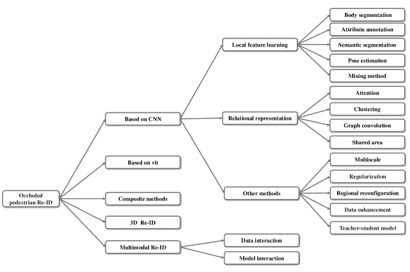
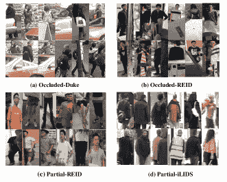
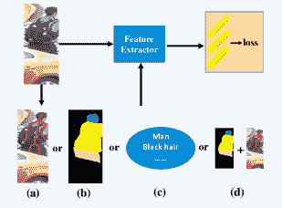
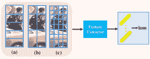
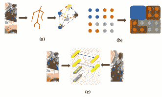
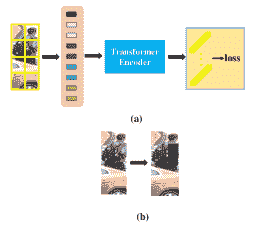

<!--yml

类别：未分类

日期：2024-09-06 19:36:07

-->

# [2311.00603] 遮挡行人重识别与深度学习：综述与展望

> 来源：[`ar5iv.labs.arxiv.org/html/2311.00603`](https://ar5iv.labs.arxiv.org/html/2311.00603)

\fnref

fn1

\fnref

fn1

\fntext

[fn1]等贡献。

\cormark

[1] \cormark[1] 1]机构=中国科学院半导体研究所，城市=北京，邮政编码=100083，国家=中国 2]机构=中国科学院大学材料科学与光电工程中心 $\&amp;$ 微电子学院，城市=北京，邮政编码=100083，国家=中国 3]机构=新疆大学软件学院，城市=新疆，邮政编码=830000，国家=中国 4]机构=哈尔姆斯塔德大学信息技术学院，城市=哈尔姆斯塔德，邮政编码=30118，国家=瑞典

\cortext

[1]通讯作者。

# 遮挡行人重识别与深度学习：综述与展望

Enhao Ning ningenhao@163.com    Changshuo Wang wangchangshuo@semi.ac.cn    Huang Zhang zhhh1998@outlook.com    Xin Ning ningxin@semi.ac.cn    Prayag Tiwari prayag.tiwari@ieee.org  [ [ [

###### 摘要

行人重识别（Re-ID）技术在智能监控系统中扮演着越来越重要的角色。广泛的遮挡显著影响了行人重识别的性能。遮挡行人重识别是指处理行人信息丢失、噪声干扰和视角失配等挑战的行人匹配方法。该领域已引起了研究人员的广泛关注。在过去几年中，提出了多种解决遮挡问题的行人重识别方法，解决了由遮挡引起的各种子问题。然而，目前缺乏对遮挡行人重识别方法进行全面比较、总结和详细评估的研究。在本综述中，我们首先提供了关于遮挡行人重识别所使用的数据集和评估方案的详细概述。接下来，我们从不同角度科学分类和分析现有基于深度学习的遮挡行人重识别方法，并简要总结。进一步地，我们对这些方法进行系统比较，识别出最先进的方法，并展望遮挡行人重识别的未来发展。

###### 关键词：

遮挡行人重识别 \sep 文献综述与展望 \sep 多模态行人重识别 \sep 3D 行人重识别。

## 1 引言

近年来，随着监控设备的集成度和智能化程度的提高（Bedagkar-Gala & Shah,, [2014），人员重识别（Re-ID）技术取得了显著进展。这项技术在医疗、救援行动、刑事调查和监控等敏感和专业领域中得到了广泛应用。这些领域通常在复杂和动态的环境中运行。因此，在多摄像头遮挡场景中快速而准确地定位和识别特定目标具有极大的实际意义。

鉴于现实场景的复杂性和变化性，人和物体的随机移动，加上监控设备通常覆盖广泛区域，遮挡现象的可能性很高。遮挡会严重影响视觉信息，使受影响的特征变得不可靠。遮挡可能由于物体干扰、行人姿势、衣物和视角的变化而发生。在早期的行人表示中，研究人员主要依赖从图像中提取的基本局部视觉属性，如颜色、纹理、边缘和角点。这些特征捕捉图像中的几何形状和像素分布，但对外部因素非常敏感，缺乏鲁棒性和泛化能力。深度学习的发展引入了高级视觉特征。与低级视觉特征相比，高级特征对遮挡、噪声和姿势变化的适应性更强，在复杂环境中具有更强的鲁棒性。因此，许多研究人员开发了大量方法来解决普遍存在的遮挡问题。一般而言，遮挡问题被分为三个子问题：（1）噪声问题。由于复杂场景中多个和混合信息的干扰而产生的特征问题。（2）缺失问题。由于仅捕捉到部分行人而导致的行人特征不完整问题。（3）对齐问题。由于姿势、视角和位置的变化，特征无法一一对应，导致干扰、共享位置对齐问题等。遮挡研究还涉及人和背景的分离，以提取以人为核心的特征。对提取细粒度、高度区分性和更本质特征的方法也进行了研究。

我们希望识别现有方法的最新技术水平和局限性，并发现未被探索的领域。具体而言，我们介绍了处理遮挡人物重识别的方法，这些方法在 2023 年前提交至顶级国际期刊或会议。我们根据特征提取的网络结构（基于 CNN 的、基于 transformer 的和混合结构的）、特征提取的方式（单模态和多模态）以及特征的层次结构（2D 和 3D）对基于深度学习的遮挡人物重识别进行分类。 （见图 1）。首先，由于卷积神经网络（CNN）在图像匹配任务中的强大性能，基于 CNN 的方法已成为处理人物重识别遮挡问题的主流方法之一。因此，我们将基于 CNN 的方法视为处理遮挡问题的第一类方法。其次，基于 transformer 在自然语言处理领域的成功，近年来，vit 也被广泛应用于行人重识别中的遮挡问题，并取得了良好的结果。因此，我们将基于 transformer 的方法视为第二类。第三类方法是一些复合方法。例如，利用 CNN 和 vit 的互补性形成混合结构。第四类和第五类方法基于 3D 和多模态处理人物重识别中的遮挡问题。这些方法处理更多场景，并且是一种相对新颖的方法。

图 1：调查的整体结构。

表 1：近年来人物重识别调查的总结。

| 调查 | 会议 |
| --- | --- |
| 人物重识别方法和趋势调查 (Bedagkar-Gala & Shah,, 2014) | IVC2014 |
| 人物重识别的过去、现在与未来 (Zheng et al.,, 2016) | arXiv2016 |
| 人物重识别的系统评估与基准：特征、度量标准和数据集 (Gou et al.,, 2018) | TPAMI2019 |
| 超越内部模态差异：异构人物重识别的全面调查 (Wang et al., 2019b,) | arXiv2019 |
| 开放世界人物重识别调查 (Leng et al.,, 2019) | TCSVT2020 |
| 可靠的基于深度学习的人物重识别模型调查：我们是否达到了目标？ (Lavi et al.,, 2020) | arXiv2020 |
| 基于深度学习的人物重识别：调查与展望 (Ye et al., 2021b,) | TPAMI2021 |
| SSS-PR：人物重识别调查的简短调查 (Yaghoubi et al.,, 2021) | PRL2021 |
| 基于深度学习的人物重识别方法：近期工作的调查与展望 (Ming et al.,, 2022) | IVC2022 |
| 基于深度学习的遮挡人物重识别：调查 (Peng et al.,, 2022) | arXiv2022 |

一般来说，本研究的贡献如下：

1) 本研究重点解决行人再识别模型中的遮挡问题，这对实现高精度和鲁棒性至关重要。我们对过去和当前最先进的方法进行了科学和全面的综述。

2) 目前对行人再识别方法的综述缺乏对基于 ViT 方法的充分覆盖。鉴于 ViT 在遮挡行人再识别中的优秀表现，我们在研究中包括了对这种方法及其混合变体的讨论，为研究人员提供了应对遮挡问题的新思路和选项。

3) 我们创造性地融入了近年来流行的 3D 行人再识别和多模态行人再识别。这些新方法通过利用额外的深度或模态信息，更好地解决遮挡问题，从而提高行人再识别的性能和可靠性。

4) 我们预期在遮挡行人再识别（Re-ID）方面会取得进展，并坚信持续的研究和创新将导致更有效的方法和技术的发展，以解决遮挡问题。这些进展将激发并推动行人再识别领域的进步。

## 2 文献综述

在行人重识别领域，相较于方法学文章，专门的综述文章相对较少，并且它们都聚焦于具体问题。这些综述列于表 1。Bedagkar-Gala & Shah, (2014) 关注行人重识别的挑战，并根据画廊的固定性将其分为开放集重识别和闭合集重识别。Zheng 等人 (2016) 根据匹配策略将行人重识别的方法分为图像方法和视频方法。Gou 等人 (2018) 更详细地研究了行人重识别的特征、度量和数据集。Wang 等人, 2019b 关注异质行人重识别。根据应用场景，它将方法分类为四类——低分辨率、红外、草图和文本。Leng 等人 (2019) 关注开放世界重识别任务。Lavi 等人 (2020) 根据特征学习策略将重识别分类为单特征学习方法和多特征学习方法。Ye 等人, 2021b 对开放和闭合设置下的重识别提供了更详细的解释，并介绍了如跨膜状态、无监督等方法。Yaghoubi 等人 (2021) 提供了对行人重识别问题的多维分类。Ming 等人 (2022) 根据度量学习和表示学习将行人重识别方法分为四类，并添加了最新的方法。Peng 等人 (2022) 关注基于图像的遮挡行人重识别方法。然而，这些研究不可避免地受到一些固有限制的影响。考虑到遮挡问题在行人识别中的广泛存在，对遮挡行人重识别的研究是至关重要的。因此，我们提供了对遮挡行人重识别方法和前景的深入总结和全面分析，以推动未来的发展。

## 3 数据集和评估协议

### 3.1 数据集

遮挡行人重识别数据集可以分为两类：部分行人和遮挡行人重识别数据集。遮挡行人重识别数据集的行人图像有遮挡信息干扰且未裁剪。部分行人重识别数据集的行人图像部分存在并且经过人工裁剪。部分/遮挡行人重识别数据集的示例如图 2 所示。

Occluded-DukeMTMC（Miao et al., 2019）是从 DukeMTMC-reID（Zheng et al., 2017）收集的，包含 15,618 张 708 名行人的训练图像，519 名行人的 2,210 张查询图像，以及 1,110 名行人的 17,661 张图库图像用于测试。其中，训练集的 9$\%$，查询集的 100$\%$，以及图库的 10$\%$是遮挡图像。障碍物包括汽车、自行车、树木和其他行人，增加了数据集的复杂性。

P-ETHZ（Zheng et al., 2015b）是一个基于图像的遮挡行人重识别数据集，由 ETHZ（Ess et al., 2008）修改而来。它包含 3,897 张图像，涵盖 85 个行人身份，每个身份有 1 到 30 张全身和遮挡图像。

P-DukeMTMC-reID（Zhuo et al., 2018）是从 DukeMTMC-reID（Zheng et al., 2017）修改而来的，包含 1,299 名行人的总计 24,143 张图片，每个身份有全身图像和遮挡图像；图像中的行人被不同物体遮挡，如其他行人、汽车和标志。

Occluded-REID（Zheng et al., 2015b）包含 2,000 张 200 名行人的图像，每名行人有 5 张遮挡图像和 5 张全身图像，数据集来自中山大学。该数据集包括不同的视角和严重遮挡类型，给行人重识别带来了挑战。

Occluded-DukeMTMC-VideoReID（Hou et al., 2021）是从 DukeMTMC-VideoReID（Wu et al., 2018）数据集中重新组织的。训练集包含 1,702 个轨迹片段，覆盖 702 名行人，测试集查询覆盖 661 名行人，图库覆盖 1,110 名行人。超过 70$\%$的视频是遮挡的，包括不同的视角和各种障碍物，如汽车、树木、自行车和其他行人。

Partial-ReID（Zheng et al., 2015b）包含 60 名行人的 600 张图片，每名行人有 5 张部分图像和 5 张全身图像。使用可见部分，人工裁剪成新的部分图像。这些图像从大学校园中的不同角度、背景和遮挡中收集。

Partial-iLIDS（He et al., 2018）源于 iLIDS（Zheng et al., 2011），包含 119 名行人的 238 张图片。每名行人对应一张人工裁剪的非遮挡部分图像和一张全身图像。部分图像用作查询，全身图像用作搜索库。它由多个非重叠的摄像机拍摄，主要用于测试集。

Partial-CAVIAR（He et al., 2018）源于 CAVIAR（Cheng et al., 2011），包含 72 名行人的 142 张图片。部分图像通过随机选择每名行人整体图像的一半生成。

P-CUHK03（Kim & Yoo，2017）是基于 CUHK03（Li et al.，2014）构建的，包含 1,360 张行人图像，其中 15,080 张图像对应于 1,160 名行人用于训练集，其余 100 名行人用于验证和测试集。选择其中两张图像生成 10 张具有空间区域比的局部身体查询图像，其余三张图像用作全身图库图像。

图 2：四种常用遮挡行人 Re-ID 数据集的示例。

### 3.2 评估协议

在遮挡行人 Re-ID 领域，常用的评估指标是累积匹配特征（CMC）曲线和平均准确率（mAP）。

CMC 曲线基于查询图像与图像库之间的相似性排名原则，排名越高的图像与查询图像的相似性越高。然后，根据这种排名计算查询图像的 top-k 准确率${\rm\emph{ACC}}^{\emph{k}}$。如果前 k 个样本包含查询目标，则${\rm\emph{ACC}}^{\emph{k}}$为 1，$\emph{k}\in\{1,2,3...\}$。否则，${\rm\emph{ACC}}^{\emph{k}}$为 0。最后，所有目标的${\rm\emph{ACC}}^{\emph{k}}$曲线进行求和并除以目标总数，以获得 CMC-k。

mAP 更好地反映了所有正确目标图像在排序列表顶部的程度。与 CMC 曲线相比，它可以更全面地衡量 Re-ID 算法的性能，其中 P 是精度率，指的是所有样本中正确样本的比例。它反映了输出中正确样本的准确性。AP 是模型预测的所有正确样本的平均值。它反映了模型在单一类别上的表现，是每个正确预测的准确率的平均值。由于识别中存在多个类别，需要计算所有类别的平均 AP 值，因此每个类别的平均准确率相加并除以类别总数以获得 mAP。

CMC 曲线不能考虑排名较低样本的命中，而 mAP 考虑了所有样本。因此，它们是重要的且互补的。

## 4 深度学习方法

### 4.1 基于 CNN

卷积神经网络（CNN）已成为从 RGB 图像中学习行人表征的领先方法之一。通过使用局部感知域和学习滤波器，CNN 能够提取捕捉行人局部特征区域信息的强大特征。这些特征随后被压缩并映射到更高层次的表征。研究人员已将其精炼以适用于复杂现实场景中的行人匹配任务。我们将其分类为本地特征学习、关系表示、混合方法和其他方法。

#### 4.1.1 本地特征学习

局部特征学习在处理区域特征时表现更好，相比于全局特征，它在遮挡区域识别和定位上具有独特的优势。根据不同局部特征方法的实现，我们将其分为人体分割、姿态估计、人脸解析、属性注释和混合方法（见图 3）。

身体分割。通过利用行人直立行走的特性，我们的方法通过对原始图像或特征图的分割来提取改进的局部特征。分割结果可以表现为条纹、固定区域或小块（见图 4）。

然而，分割没有识别遮挡的过程，因此对噪声敏感。CBDB-Net (Tan et al., 2021) 将特征图上的条带均匀划分，并逐一丢弃每个条带以输出多个不完整的特征图，这迫使模型在信息不完整的环境中学习更鲁棒的人体表示。DPPR (Kim & Yoo, 2017) 预定义了十三个用于全身图像的边界框，包括整个图像、半身图像和水平部分图像，并从每个部分提取特征。同时，引入了一种基于注意力的匹配机制，使得相同身体部位的特征权重更大，从而减轻了由遮挡造成的信息丢失。同时，引入了一种基于注意力的匹配机制，使得相同身体部位的特征权重更大，从而减轻了由遮挡造成的信息丢失。OCNet (Kim et al., 2022) 引入了一种基于关系的方法来处理遮挡问题。OCNet (Kim et al., 2022) 将特征图水平划分为上部和下部特征，并以中间宽度的 1/4 作为中心特征。然后，它与全局特征图一起输入到由两个共享层组成的关系自适应模块中。通过关系处理区域特征之间的对齐问题，并引入权重以抑制噪声干扰。

图 3: 四种不同的局部特征学习方法：（a）表示姿态估计。（b）表示语义分割。（c）表示属性注释。（d）表示混合方法。

姿态估计。姿态估计通过利用高度结构化的人体骨架来提取图像姿态级别的语义信息。噪声干扰以引导或融合的方式得到抑制。

HOReID（Wang et al., 2020a）引入了一种可学习的关系矩阵。从姿态估计中获得的人体关键点被视为图中的节点，最终形成一个拓扑图以抑制噪声干扰。PMFB（Miao et al., 2021）使用姿态估计来获取人体关键点的置信度和坐标。然后，设置一个阈值来过滤遮挡区域。最后，使用可见部分来约束通道级别的特征响应，以解决遮挡问题。PGMANet（Zhai et al., 2021）使用人体热图生成注意力掩码。通过特征图的点积和高阶关系的引导共同去除噪声干扰。

研究人员通常在两个方向上使用姿态估计：1）通过姿态估计获得语义特征，识别噪声点，并更好地去除噪声干扰；2）通过姿态估计定位人体区域，从而解决对齐和局部特征提取的问题。AACN（Xu 等，2018）使用姿态点定位行人身体区域，并引入姿态引导的可见性评分来分离遮挡。DAReID（Xu 等，2021）采用双分支结构，其中掩模分支基于姿态估计引导的空间注意模块提取更具辨别性的局部特征，全球分支则通过特征激活增强人体辨别信息的表现。DSA-reID（Zhang 等，2019）通过预训练的 DensePose（Güler 等，2018）模型在 2D 层面估计密集语义信息，并映射一组密集的 3D 语义对齐组件。通过整合邻近组件来提取局部特征。最后，将全球和局部特征融合成最终特征。PGFL-KD（Zheng 等，2021）将语义层的局部特征作为查询，并在特征图中寻找更突出的前景区域，以获得增强的前景特征。基于该特征，进行交互训练和知识蒸馏以约束主干网络的学习。ACSAP（He et al., 2021c,）使用姿态关键点指导对抗生成网络，通过减弱前后块之间的空间关系来去除噪声干扰。PDC（Su 等，2017）根据 14 个姿态关键点获得 6 个身体区域，对每个部分进行旋转和缩放，并使用改进的 PTN 网络学习仿射变换的参数。这些局部特征被自动放置在绘图中的某些位置，以解决对齐问题。PVPM（Gao et al., 2020b,）基于可见性部件之间的对应关系训练可见性预测器。之后，通过图匹配生成部件伪标签来解决对齐问题。

图 4：三种常见的身体分割示意图：（a）表示条纹。（b）表示固定区域。（c）表示小块。

语义分割。通过引入人类解析模型，噪声的干扰被识别并以分割或语义解析的形式去除。

SPReID（Kalayeh et al., 2018）基于训练过的行人类语义解析模型 Inception-V3（Szegedy et al., 2016），生成与五个不同身体区域相关的概率图，即前景、头部、上半身、下半身和鞋子。然后，概率图与经过双线性插值后的语义区域特征融合，以激活不同部位并去除遮挡干扰。CoAttention（Lin & Wang, 2021）将行人身体局部图像的解析掩码作为查询，构建映射，同时引入自注意机制以过滤遮挡。MMGA（Cai et al., 2019）首先使用 JPPNet（Liang et al., 2018）将图像中的行人分为上半身和下半身。然后，设计了两个注意力模块；第一个用于过滤背景干扰，第二个生成相应的空间和通道注意力，以提取由整体、上半身和下半身掩码引导的不同特征。最后，进行元素级乘法作为最终特征。HPNet（Huang et al., 2020）使用 COCO（Lin et al., 2014）数据集训练人体解析模型，以获得四个主要身体部位的标签，并基于这些标签以多任务方式训练解析模型和整体网络，同时生成可见性评分以去除遮挡。

基于语义分割的方法也有助于增强特征的多样性。在 SORN（Zhang et al., 2020）的情况下，设计了一个由全局分支、局部分支和语义分支组成的三分支模型。全局分支通过归一化和特征聚合来获取全局特征。同时，局部分支利用行人身体结构的先验知识生成行人体部，并通过映射、池化和归一化来提取局部特征。语义分支首先使用 DANet（Fu et al., 2019）模型对数据的语义标签进行预训练，在 DensePose-COCO 数据集（Güler et al., 2018）上训练一个语义分割模型，引入标签平滑以优化语义标签，并通过聚合语义分割部分形成前景行人身体区域，实现背景与行人的分离。SGSFA（Ren et al., 2020）引入了语义对齐分支和空间特征对齐分支。前者通过元素级乘法实现语义对齐。后者基于通过身体结构实现的区域空间对齐。

属性注释。通过引入属性注释来处理遮挡问题。

ASAN (Jin et al.,, 2021) 通过结合属性信息和弱监督来提取人类特征的可见部分。属性信息是语义级别的属性注解。根据可见部分的确定，引入了区域可见性匹配算法来实现去噪效果。

混合方法。引入两种以上的外部信息可以帮助模型消除以特征交互或共同引导形式的噪音干扰。

GASM（He & Liu，2020）提出了一种学习显著信息的架构，该架构通过使用语义信息将行人从背景中分离，通过姿态估计去除遮挡干扰，然后融合这两个特征以指导模型学习。SSPReID（Quispe & Pedrini，2019）设计了一种联合学习方法来结合显著和语义特征。通过人体解析获得了人体的五种不同语义特征。显著性特征利用图中最高关注区域的特征。这些特征与全局特征融合，最后拼接在一起形成最终特征。TSA（Gao et al., 2020a,）为姿态变化问题引入了两种区域特征，一种由姿态关键点指导，另一种由人体解析模型的部分掩码指导，然后将这两者融合。使用交互可以解决姿态变化问题，而使用姿态和分割也可以抑制噪声，从而解决遮挡问题。FGSA（Zhou et al., 2020a,）提出了一种针对复杂姿态变化的姿态解析网络，以处理局部位置及其之间的关系。属性交互学习用于提取对应于姿态点的局部特征信息，这是通过训练一个将属性识别视为多类别标记问题的中间属性分类模型来实现的。最后，在特征融合阶段增加了一个局部增强对齐模型，即对背景添加较少的权重，对局部和属性位置添加更多的权重。LKWS（Yang et al., 2021）的骨干网络基于 PCB（Sun et al., 2018）。在局部特征提取中，通过姿态估计和合理的阈值生成点的可见性标签，然后通过投票机制获得厚条纹的可见性。基于条纹的可见性，训练了一个可见性判别器以识别噪声干扰。PGFA（Miao et al., 2019）引入了一个双分支结构，其中局部分支基于水平分割提取局部特征。全局分支由姿态指导，首先从姿态估计中获得关键点。然后，设置合理的阈值以过滤噪声点，执行适当的点积以融合特征，并将部分分支的特征拼接成最终的全局特征。同样，PDVM（Zhou et al., 2020b,）基于姿态热图提取去遮挡的全局特征。分割指导局部特征提取。

图 5：（a）显示图卷积的示意图。（b）聚类的示意表示。（c）共享区域的示意表示。

#### 4.1.2 关系表示

通过关注特征关系，遮挡问题被以抑制、移除或监督的方式处理。我们将其分为注意力、聚类、图卷积和共享区域（见图 5），根据它们不同的学习关系的方式和手段。

注意。通过引入注意力机制，模型能够选择高度显著和区分性的区域，以抑制噪声的干扰。

为了解决人物重新识别中缺失图像的问题，DPPR（Kim & Yoo，，2017）采用了一种注意力机制，以强调不同图像中的相同行人部分。这种方法增强了个体的表现，并提高了匹配精度。此外，OCNet（Kim et al.，，2022）通过捕捉区域特征之间的高阶关系并将其与加权组合结合，减轻了噪声的影响。这种方法有效地抑制了噪声或无关信息的影响，结果是更为稳健和准确的人物重新识别结果。AACN（Xu et al.，，2018）结合了姿态引导的注意力图和部分可见性评分，以在提取干净的行人特征之前去除背景干扰和遮挡。DAReID（Xu et al.，，2021）引入了双重注意力识别。通过姿势引导的空间注意力获得行人可见的局部区域。全局特征通过特征激活和姿势提取，然后一起用于指导特征表示。PISNet（Zhao et al.，，2020）关注于人物与物体之间的重叠区域。设计了一个模块作为引导特征，通过查询特征来减轻画廊中多个行人引起的注意力分散问题。此外，还设计了一个基于强激活注意力的反向注意力模块，使模型能够为目标区域分配更多的权重。APN（Huo et al.，，2021）提出了一种部分感知注意力网络，该网络将部分特征图作为查询向量，计算特征图的映射 X 与相似性映射 M，并通过将 M 加权 X 来变形特征，从而实现特征的聚合和提取。MHSA-Net（Tan et al., 2022a,）将注意力权重与特征图相乘，并应用非线性变换，以鼓励多头注意力机制自适应捕捉关键局部特征。CASN（Zheng et al.，，2019）以注意力和注意力一致性作为模型学习的标准，并通过引入注意力双胞胎网络去除遮挡，以关注更具辨别性的核心区域。VPM（Sun et al., 2019b,）通过在卷积输出处引入自监督组件定位器和引入生成区域信息的特征提取器，学习组件的可见性和位置。PSE（Sarfraz et al.，，2018）通过视角预测解决了由视角造成的遮挡问题。

基于注意力的方法不仅增强了模型的灵活性，还向特征中注入了更多的上下文信息。PAFM（Yang 等人，2022）引入了改进的空间注意力模块，以发现像素点之间的关系，同时捕捉和聚合具有高语义相关性的像素点。最后，它与包含姿态信息的特征图相乘以进行特征融合。Co-Attention（Lin & Wang，2021）将部分行人图像和整图像的分析掩码作为目标，并通过自注意力机制（Li 等人，2020）进行匹配。最终，通过关注行人特征来抑制噪声干扰。QPM（Wang 等人，2022b）将特征图在垂直方向上均分为六部分，并引入组件质量评分来判断可见性。同时，使用基于注意力图的两层身份感知模块来处理全局分支中的行人遮挡。最后，从干净的行人区域自适应地提取全局特征。DSOP（Wang 等人，2020b）将遮挡分为浅层和深层。浅层通过关注局部区域学习遮挡后的特征，而深层则给予较大的感受野以学习全局特征，即遮挡前的特征。之后，通道和空间注意力机制应用于两个分支以加权融合特征（Ning 等人，2021）。

聚类。通过寻找数据的固有分布结构来对像素点进行分类，从而解决噪声干扰问题。

ISP（Zhu 等人，2020）通过串联聚类为每个像素分配伪标签。首先，人体图像的所有像素被分为前景和背景，基于前景比背景更具响应性的假设。其次，像素被聚类为不同的部分并分配伪标签。根据伪标签，给像素分配不同的权重以提取局部特征。这不仅在像素级别上将遮挡物与行人分离，还实现了自动对齐。

图卷积。通过学习像素之间的高阶语义关系，通过限制信息传输来抑制噪声干扰。

HOReID（Wang 等人，2020a）引入了一个矩阵，用于描述点之间的高阶关系，并随后将这一关系矩阵中的信息传递以形成拓扑图。在拓扑图的约束帮助下，点之间无用信息的传递被抑制，实现了噪声去除的目的。

共享区域。通过感知图像对中行人的相同身体部位来提取可共享特征，从而减少噪声干扰。

DPPR（Kim & Yoo, 2017）给予包含相同身体部位的区域更大的权重，以提高模型提取核心特征的能力。VPM（Sun et al., 2019b,）通过感知共享区域的可见性来解决对齐和去噪问题。PPCL（He et al., 2021b,）以自监督方式学习组件匹配，并最终基于共享语义对应区域计算图像相似度。KBFM（Han et al., 2020）专注于提取高可见性和可共享的姿态点，将其作为提取特征以进行匹配的核心区域，实现去噪和对齐的效果。

#### 4.1.3 其他方法

区域重新配置。这是通过使用完整的步行区域来补充被遮挡或噪声干扰的区域。

为了解决由于遮挡导致的信息丢失问题，RFCNet（Hou et al., 2021）引入了一个编码器-解码器，利用非遮挡的远程空间上下文进行特征补全。编码器通过相似性区域分配进行建模。解码器通过聚类建立遮挡区域与远离的非遮挡区域之间的相关性来重建遮挡区域。ACSAP（He et al., 2021c,）结合了姿态和对抗生成网络，设计了一个姿态引导的空间生成器和空间判别器，以去除噪声干扰。

数据增强。通过数据转换提高模型对遮挡的敏感性。

APNet (Zhong et al., 2020a,) 提出了修改检测到的边界框的方法。APNet (Zhong et al., 2020a,) 设计了一种在图像上滑动匹配的边界框对齐器。然后，设计了一个具有高区分能力的特征提取器，以提取核心局部特征并丢弃噪声局部特征。IGOAS (Zhao et al., 2021) 采用了一个渐进遮挡模块，该模块在一组图像上随机生成小的均匀遮挡，并在模型学习后基于小遮挡生成较大的遮挡。这种逐渐增长的遮挡区域可以提高对遮挡的识别能力，并达到去除遮挡噪声的目的。OAMN (Chen et al., 2021c,) 采用了一种基于裁剪和缩放的方法，预定义四个角，随机选择一张训练图像进行裁剪和缩放以形成四个位置的补丁，并结合注意力实现加权学习以达到去噪的目的。RE (Zhong et al., 2020b,) 引入了随机像素移除的技术，通过随机选择矩形区域，用随机值替代区域内的像素值，从而提高数据的多样性和模型的鲁棒性。SSGR (Yan et al., 2021) 引入了一种复合批次擦除方法，包括两个擦除操作：一种是频繁使用的随机擦除，另一种是批次常量擦除。它首先将图像水平划分为随机 S，并在每个子批次中随机选择一条带状区域进行擦除。然后，参考自注意力机制和局部特征学习，引入基于匹配的解耦非局部操作，从完整的行人区域中提取更好的特征。ETNDNet (Dong et al., 2023) 从对抗防御的角度解决遮挡问题。它通过随机擦除特征图、引入随机变换和扰动特征图的策略来处理不完整信息、位置错位和噪声信息。

正则化。通过对高关注区域施加惩罚和约束，模型被迫关注整个行人区域。行人特征通过完整的信息提取。

MHSA-Net (Tan et al., 2022a,) 引入了一种特征正则化机制，该机制由基于注意力权重嵌入的正则化项和基于三元组特征单元的硬三元组损失组成。正则化项可以以多种方式覆盖局部信息，并增加信息的完整性 (Ning et al., 2020a,)。硬三元组损失可以优化融合，并更好地用于行人匹配。

教师-学生模型。教师模型协助学生模型处理遮挡问题。

HG (Kiran et al., 2021) 设计了一个端到端的无监督教师–学生框架，让教师网络通过输入不同组合的图像来学习类间距离，然后学生继承该网络，通过输入更多同类的噪声图像来学习类内距离。同时，带有距离分布匹配的注意力嵌入方法可以帮助学生网络更好地去除噪声干扰，并提取更具区分性的特征。AFPB (Zhuo et al., 2019) 首先将常规数据和模拟遮挡的行人体积数据输入教师网络，然后进行联合训练，使教师网络学习到一个对遮挡具有鲁棒性的基础模型。学生网络继承该教师网络，并在更现实、更嘈杂的实际遮挡行人数据上进行学习。

多尺度。通过多尺度特征表示处理遮挡问题。

DSR (He et al., 2018) 专注于解决由尺度差异引起的问题。DSR (He et al., 2018) 首先在 Market-1501 (Zheng et al., 2015a,) 上训练一个固定大小的全卷积网络，仅使用卷积和池化来表示身份特征图，然后引入三种不同尺度的块以滑动方式提取特征 (Li et al., 2021)。类似地，FPR (He et al., 2019) 也引入了一个仅包含卷积和池化的结构，并提出了由多个不同池化核组成的金字塔层来解决尺度问题，一个基于注意力的前景概率生成器用于处理背景，并对背景施加小权重以去除背景干扰。

图 6: (a) 基于变换器的方法示意图。 (b) 数据增强的示意图。

### 4.2 基于 vit

TransReID (He et al., 2021a,)，于 2021 年提出，是第一个将 vit (Dosovitskiy et al., 2020) 应用于 Re-ID 的模型（见图 6），与 ResNet (He et al., 2016) 相比，具有两个主要特点：（1）多头自注意力更擅长捕捉长程关系，推动模型关注不同的身体部位 (Khan et al., 2022; Shamshad et al., 2023)。（2）变换器可以在没有下采样计算的情况下保留更多的详细信息。基于这些特性，近年来出现了许多变换器的变体，研究人员广泛应用于遮挡 Re-ID。

PFD (Wang et al., 2022d,) 首先将图像划分为可以重叠的固定大小块，然后使用 transformer 编码器捕捉上下文关系。接着，使用姿态引导特征聚合和特征匹配机制来显示可见的身体部位。最后，使用姿态热图和解码器作为键和值来学习一组语义部件视图，以增强身体部件的区分能力。DPM (Tan et al., 2022b,) 引入了子空间选择来处理对齐问题。具体而言，DPM (Tan et al., 2022b,) 首先使用分层语义信息聚合整体原型图和遮挡图的特征表示，以增强生成的原型掩码的质量。然后，引入基于归一化和正交性约束的头部增强模块，以增强特征的区分表示并去除噪声干扰。PFT (Zhao et al., 2022) 引入了可学习的增强补丁，以弥补 transformer 的局部特征提取问题 (Islam, 2022)。通过特征切片、合并和拼接，补丁序列可以学习区域的长程关联，同时确保感受野，并更加关注局部特征。FED (Wang et al., 2022g,) 将遮挡分为非行人遮挡和非目标行人遮挡，并重点关注后者。具体而言，首先创建一个遮挡集以增强数据。然后，引入乘法遮挡评分来扩散可见行人部件，从而提高合成的非目标行人的质量。特征擦除和特征扩散模块的联合优化实现了模型对目标行人的感知能力。

FRT (Xu et al., 2022) 首先使用预训练的姿态估计模型 HRNet (Sun et al., 2019a,) 将行人分类为头部、躯干和腿部，并提取相应的特征。然后引入基于图匹配的遮挡消除模块，通过学习常见区域的相似性来消除遮挡造成的干扰。最后，FRT (Xu et al., 2022) 通过聚合邻域特征来恢复查询特征，以解决遮挡造成的信息丢失问题。TL-TransNet (Wang et al., 2022c,) 使用改进版的 Swin transformer (Liu et al., 2021) 作为基准模型来捕捉人体的主要部分，并使用 DeepLabV3+ (Chen et al., 2018) 去除查询和库中的背景干扰。最后，设计了一种基于混合相似性和背景适应的重新排序方法，以实现原始特征与去除背景特征的融合。PADE (Huang et al., 2022) 首先通过裁剪和擦除操作获得两张新图像，并将它们与原始图像一起输入一个具有 vit (Dosovitskiy et al., 2020) 作为骨干网的多分支参数共享网络，以类似自注意机制的方式增强全局和局部特征。最后，将它们连接以形成最终的特征表示。

### 4.3 复合方法

通过引入多个不同的网络，遮挡问题以交互或融合的方式得到解决。

FGMFN (Zhang et al., 2022a,) 引入了一种双分支网络。局部特征分支首先通过基于 ResNet18 的仿射变换，然后输入到 ResNet50 (He et al., 2016) 中以获取上半身特征，并将其分为三个区域，同时引入基于门机制的注意力模块以去除噪声干扰。全局特征分支采用基于块划分的特征提取方案，最后将两个分支的特征按比例融合为最终特征。Pirt (Ma et al., 2021) 首先在 COCO (Lin et al., 2014) 数据集上预训练 HRNet (Sun et al., 2019a,) 姿态估计模型，从中引出了一个双分支结构。由精心修改的 ResNet50 (He et al., 2016) 引导体内特征，变换器引导体间关系，并通过建立部件感知的长距离依赖来去除遮挡效果。Pirt (Ma et al., 2021) 以协作的方式学习体间和体内关系。MAT (Zhou et al., 2022) 首先使用 CNN 从图像中提取特征。然后，将其展平并传递给变换器。该方法使用特征图和关键点嵌入的方法来获得关键点热图和分割图。它使用仿射变换来获取每个关键点的运动信息，并结合动作信息实现细粒度的人体分割，并提取代表性行人身体部位以去除干扰噪声。DRL-Net (Jia et al., 2022) 首先从训练图像中获取障碍物，以构建带有随机障碍物的增强样本。然后，将 CNN 和变换器连接以设计基于查询的语义特征提取层。最后，使用语义引导来学习正负样本比较并去除干扰噪声。

### 4.4 3D Re-ID

与 2D 相比，使用 3D 信息进行遮挡人员再识别是一种相对较新的方法。3D 数据所表示的形状和空间深度特征对纹理信息具有鲁棒性，并且通常通过 3D 特征去噪、3D 特征补全和多视角构建来减少遮挡造成的干扰。

PersonX (Sun & Zheng, 2019) 通过扫描现实世界中的人物和物体来构建虚拟 3D 模型，然后将其映射回 2D 进行重新表示。这种数据操作增强了数据表示。(Wang et al., 2022f,) 使用 UV 纹理映射将现实世界行人的服装克隆到虚拟 3D 角色上，同时使用基于补丁的特征分割和扩展方法来处理遮挡。另一种常见的 3D 信息形式是点云 (Qi et al., 2017)，其中点云中的深度信息可以作为图像的额外通道。OG-Net (Zheng et al., 2022) 使用 Skinned Multi-Person Linear (SMPL (Kanazawa et al., 2018)) 从 2D 图像生成六通道点云数据，提供位置和纹理信息。

ASSP (Chen et al., 2021b,) 使用 3D 身体重建作为 2D 特征提取的辅助任务。具体而言，首先从 2D 图像中提取纹理无关的 3D 形状信息作为辅助特征。之后，使用 SMPL (Loper et al., 2015) 创建一个 3D 行人模型，同时设计了对抗学习和自监督投影组合，以将 2D 和 3D 信息结合到 3D 模型中进行重建 (Ning et al., 2020b,)。基于 3D 重建的正则化迫使模型将 3D 形状信息与视觉特征解耦，并去除噪声干扰，以提取更具辨别力的特征。JGCL (Chen et al., 2021a,) 缓解了无监督映射中由于透视造成的信息不足。具体而言，首先使用 3D 网络生成器 HMR (Kanazawa et al., 2018) 生成一个对应的 3D 网格。之后，模型被旋转并与 GAN 结合生成多样的人体视图。这些生成的新视图与原始图像在对比学习中结合，同时增强视图不变表示，以提高生成图像的质量。3DT (Zhang et al., 2022c,) 使用 3D 变换器实现组人员 Re-ID。由于组中的行人不可避免地互相遮挡，它通过引入基于量化和采样的空间布局标记，将 3D 空间转换为离散空间，并随后为每个成员分配布局特征，以重建成员之间的空间关系。

然而，与 2D 图像相比，基于点云的识别研究仍然有限，这是未来的重要研究方向。

### 4.5 多模态 Re-ID

RGB-IR 多模态 Re-ID。白天和黑夜都是行人生活的重要场景，在光照不足的情况下，图像只能通过红外相机收集 (Nguyen 等，2017; Wu 等, 2017b,)。如果场景中存在遮挡，红外图像仍会有遮挡。同时，红外图像可以作为 RGB 图像的特殊通道，使 RGB 图像的表示模式更加完整，并且在因遮挡造成的信息丢失的情况下能很好地补充信息。RGB-IR 多模态 Re-ID 旨在将红外图像和常规图像都输入模型。通过不同模态之间的关系或结合方法（如注意力机制）来去除遮挡干扰，从而处理单一模态噪声、多尺度等问题。

DDAG (Ye 等，2020) 提出了一个动态双重注意力跨模态图结构。首先，根据特征之间的相似性生成局部注意力。接着，引入了部分级关系学习的聚合表示。同时，引入图结构以去除基于关系的噪声干扰。MSPAC (Zhang 等，2021) 提出了一个基于多尺度的组件感知机制。通过在单尺度上添加注意力机制，可以在通道和空间维度上提取更细粒度的特征。之后，使用级联框架实现特征聚合。通过添加不同尺度的特征，全球结构体信息得到了统一表示。CM-LSP-GE (Wang 等, 2022e,) 是一个用于全局特征和局部特征的框架。局部特征解决了遮挡问题，而图像分割和计算两张图像中局部特征的最短路径解决了对齐问题。

为了解决模态内部的问题，HMML (Zhang et al., 2022b,) 引入了基于配对的模态内部相似性约束来增强特征。类似地，CMC (Wen et al., 2022) 引入了多尺度、多层次特征学习以实现精细的特征提取。为了解决由于遮挡导致的跨膜状态下行人姿态对齐问题，DAPN (Liu et al., 2022) 提出了一个可以学习全局和局部模态不变性的对齐网络。具体而言，DAPN (Liu et al., 2022) 首先引入了一个自适应空间变换模块来对齐图像。其次，对图像进行水平分割以提取局部特征。同时，为了学习不同模态的相似性表示，将不同模态嵌入到统一的特征空间 (Cai et al., 2021)。最后，将全局特征和局部特征融合为最终特征。为了解决对齐问题，SPOT (Chen et al., 2022) 提出了一个基于变换器的网络。首先，使用由四层卷积层和两层池化层组成的关系网络处理人体关键点热图，以获取行人体结构信息。结合注意力机制，突出行人区域以去除背景干扰。然后，变换器用于挖掘部件位置和特征之间的关系，以增强局部特征的区分能力。最终特征通过加权组合提取。VI (Park et al., 2021) 首先使用双流 CNN 提取 IR 和 RGB 的特征。所有对应特征对的余弦相似度同时计算，并通过 SoftMax 函数计算相应的匹配概率。这些概率被作为不同模态的语义相似性特征。然后，通过局部特征关联提取更具区分性的特征。上述特征被聚合以形成最终特征。为了解决图像内部对齐问题，DTRM (Ye et al., 2021a,) 结合了注意力和部分聚合，并利用两种模态的上下文关系来改善全局特征以消除噪声效应。

RGB-Depth 多模态 Re-ID。深度 (Wang et al., 2021a,) 图像通过激光雷达等设备捕获，提供身体形状和骨骼信息，通过测距来实现。对于图像，当由于障碍物导致信息丢失时，深度特征可以补充纹理特征的位置信息，帮助更完整的表达。同时，它可以解决照明问题和行人换衣服的问题。它还可以帮助解决障碍物照明和不同环境中衣物变化的问题。RGB-Depth 多模态 Re-ID 旨在同时输入深度图和 RGB 图像，并通过注意力机制等方法去除噪声干扰。

CMD (Hafner et al., 2022) 提出了结合嵌入表示和特征蒸馏的方法。它通过门控控制的注意力机制去除噪声。该机制使用一种模态通过门控信号动态激活另一种模态中的更具辨别性的特征。

RGB-Text 多模态 Re-ID。RGB-Text 多模态 Re-ID 旨在通过共享语义信息和注意力校准来引入文本数据，从而增强特征表示，消除噪声的影响。在日常生活中，文本信息是最常用的信息类型之一。当图像信息由于障碍物缺失或无法使用时，可以用文本信息进行补充。

AXM-Net (Farooq et al., 2022) 动态利用文本和图像的多尺度信息，根据共享语义重新校准每种模态，并在文本分支中添加上下文注意力以补充卷积块的信息。此外，引入注意力机制来增强视觉部分的特征一致性和局部信息。它可以学习不同模态的对齐语义信息，并自动去除无关信息的干扰。

## 5 方法比较

表 2：基于本地特征学习方法的实验结果比较。红色数字表示最佳结果。（以 $\%$ 表示）。

|  |  | 方法 | 会议 | Occluded-Duke | Occluded-REID | Partial-REID | Partial-iLIDS | Market1501 | DukeMTMC-reID |
| --- | --- | --- | --- | --- | --- | --- | --- | --- | --- |
|  |  | Rank-1 | mAP | Rank-1 | mAP | Rank-1 | Rank-3 | Rank-1 | Rank-3 | Rank-1 | mAP | Rank-1 | mAP |
| 本地特征学习 | 身体分割 | CBDB-Net (Tan et al., 2021) | TCSVT2021 | 50.09 | 38.9 | - | - | 66.7 | 78.3 | 68.4 | 81.5 | 94.4 | 85 | 87.7 | 74.3 |
| OCNet (Kim et al., 2022) | ICASSP2022 | 64.30 | 54.40 | - | - | - | - | - | - | 95 | 89.3 | 90.5 | 80.2 |
| 姿态估计 | AACN (Xu et al., 2018) | CVPR2018 | - | - | - | - | - | - | - | - | 88.69 | 82.96 | 76.84 | 59.25 |
| ACSAP (He et al., 2021c,) | ICIP2021 | - | - | - | - | 77 | 83.7 | 76.5 | 87.4 | - | - | - | - |
| DAReID (Xu et al., 2021) | KBS2021 | 63.4 | - | - | - | 68.1 | 79.5 | 76.7 | 85.3 | 94.6 | 87 | 88.9 | 78.4 |
| DSA-reID (Zhang et al., 2019) | CVPR2019 | - | - | - | - | - | - | - | - | 95.7 | 87.6 | 86.2 | 74.3 |
| HOReID (Wang et al., 2020a,) | CVPR2020 | - | - | 80.3 | 70.2 | 85.3 | 91 | 72.6 | 86.4 | 94.2 | 84.9 | 86.9 | 75.6 |
| PAFM (Yang et al., 2022) | NCA2022 | 55.1 | 42.3 | 76.4 | 68 | 82.5 | - | - | - | 95.6 | 88.5 | 91.2 | 80.1 |
| PDC (Su et al., 2017) | ICCV2017 | - | - | - | - | - | - | - | - | 84.14 | 63.41 | - | - |
| PGFL-KD (Zheng et al., 2021) | MM2021 | 63 | 54.1 | 80.7 | 70.3 | 85.1 | 90.8 | 74 | 86.7 | 95.3 | 87.2 | 89.6 | 79.5 |
| PGMANet (Zhai et al., 2021) | IJCNN2021 | - | - | - | - | 82.1 | 85.5 | 68.8 | 78.1 | - | - | - | - |
| PMFB (Miao et al., 2021) | TNNLS2021 | 56.3 | 43.5 | - | - | 72.5 | 83 | 70.6 | 81.3 | 92.7 | 81.3 | 86.2 | 72.6 |
| PVPM (Gao et al., 2020b,) | CVPR2020 | - | - | 70.4 | 61.2 | 78.3 | - | - | - | - | - | - | - |
| 语义分割 | Co-Attention (Lin & Wang, 2021) | ICIP2021 | - | - | - | - | 83 | 90.3 | 73.1 | 83.2 | - | - | - | - |
| HPNet (Huang et al., 2020) | ICME2020 | - | - | 87.3 | 77.4 | 85.7 | - | 68.9 | 80.7 | - | - | - | - |
| MMGA (Cai et al., 2019) | CVPR2019 | - | - | - | - | - | - | - | - | 95 | 87.2 | 89.5 | 78.1 |
| SGSFA (Ren et al., 2020) | PMLR2020 | 62.3 | 47.4 | 63.1 | 53.2 | 68.2 | - | - | - | 92.3 | 80.2 | 84.7 | 70.8 |
| SORN (Zhang et al., 2020) | TCSVT2020 | 57.6 | 46.3 | - | - | 76.7 | 84.3 | 79.8 | 86.6 | 94.8 | 84.5 | 86.9 | 74.1 |
| SPReID (Kalayeh et al., 2018) | CVPR2017 | - | - | - | - | - | - | - | - | 94.63 | 90.96 | 88.96 | 84.99 |

|

&#124; 属性 &#124;

&#124; 注释 &#124;

| ASAN (Jin et al., 2021) | TCSVT2021 | 55.40 | 43.80 | 82.50 | 71.80 | 86.80 | 93.50 | 81.70 | 88.30 | 94.60 | 85.30 | 87.50 | 76.30 |
| --- | --- | --- | --- | --- | --- | --- | --- | --- | --- | --- | --- | --- | --- |
| 混合方法 | FGSA (Zhou et al., 2020a,) | TIP2020 | - | - | - | - | - | - | - | - | 91.50 | 85.40 | 85.90 | 74.10 |
| GASM (He & Liu, 2020) | ECCV2020 | - | - | 80.30 | 73.10 | - | - | - | - | 95.30 | 84.70 | 88.30 | 74.40 |
| PGFA (Miao et al., 2019) | ICCV2019 | - | - | - | - | 68.80 | 80.00 | 69.10 | 80.90 | 91.20 | 76.80 | 82.60 | 65.50 |
| SSPReID (Quispe & Pedrini, 2019) | IVC 2019 | - | - | - | - | - | - | - | - | 93.70 | 90.80 | 86.40 | 83.70 |
| LKWS (Yang et al., 2021) | ICCV2021 | 62.2 | 46.3 | 81 | 71 | 85.7 | 93.7 | 80.7 | 88.2 | - | - | - | - |
| TSA (Gao et al., 2020a,) | ACM MM2020 | - | - | - | - | 72.70 | 85.20 | 73.90 | 84.70 | - | - | - | - |

表 3：基于关系表示方法的实验结果比较。红色数字表示最佳结果。（以百分比表示）

|  |  |  |  | 遮挡-Duke | 遮挡-REID | 部分-REID | 部分-iLIDS | Market1501 | DukeMTMC-reID |
| --- | --- | --- | --- | --- | --- | --- | --- | --- | --- |
|  |  | 方法 | 会议 | Rank-1 | mAP | Rank-1 | mAP | Rank-1 | Rank-3 | Rank-1 | Rank-3 | Rank-1 | mAP | Rank-1 | mAP |
| 关系表示 | 共享区域 | KBFM (Han et al., 2020) | ICIP2020 | - | - | - | - | 69.7 | 82.2 | 64.1 | 73.9 | - | - | - | - |
| PPCL (He et al., 2021b, ) | CVPR2021 | - | - | - | - | 83.70 | 88.70 | 71.40 | 85.70 | - | - | - | - |
| VPM (Sun et al., 2019b, ) | CVPR2019 | - | - | - | - | 67.70 | 81.90 | 65.50 | 74.80 | 90.40 | 75.70 | - | - |
| 聚类 | ISP (Zhu et al., 2020) | ECCV2020 | 62.80 | 52.30 | - | - | - | - | - | - | 94.63 | 90.69 | 88.96 | 84.99 |

|

&#124; 图表 &#124;

&#124; 卷积 &#124;

| HOReID (Wang et al., 2020a, ) | CVPR2020 | - | - | 80.3 | 70.2 | 85.3 | 91 | 72.6 | 86.4 | 94.2 | 84.9 | 86.9 | 75.6 |
| --- | --- | --- | --- | --- | --- | --- | --- | --- | --- | --- | --- | --- | --- |
| 注意力 | AACN (Xu et al., 2018) | CVPR2018 | - | - | - | - | - | - | - | - | 88.69 | 82.96 | 76.84 | 59.25 |
| APN (Huo et al., 2021) | ICPR2021 | - | - | - | - | 71.80 | 85.50 | 66.40 | 76.50 | 96.00 | 89.00 | 89.50 | 79.20 |
| CASN (Zheng et al., 2019) | CVPR2019 | - | - | - | - | - | - | - | - | 94.40 | 82.80 | 87.70 | 73.70 |
| Co-Attention (Lin & Wang, 2021) | ICIP2021 | - | - | - | - | 83.00 | 90.30 | 73.10 | 83.20 | - | - | - | - |
| DAReID (Xu et al., 2021) | KBS2021 | 63.4 | - | - | - | 68.1 | 79.5 | 76.7 | 85.3 | 94.6 | 87 | 88.9 | 78.4 |
| DSOP (Wang et al., 2020b, ) | JPCS2020 | 57.70 | 45.30 | - | - | - | - | - | - | 95.40 | 85.90 | 88.20 | 77.00 |
| MHSA-Net (Tan et al., 2022a, ) | TNNLS2022 | 59.70 | 44.80 | - | - | 85.70 | 91.30 | 74.90 | 87.20 | 95.50 | 93.00 | 90.70 | 87.20 |
| OCNet (Kim et al., 2022) | ICASSP2022 | 64.30 | 54.40 | - | - | - | - | - | - | - | - | - | - |
| PAFM (Yang et al., 2022) | NCA2022 | 55.1 | 42.3 | 76.4 | 68 | 82.5 | - | - | - | 95.6 | 88.5 | 91.2 | 80.1 |
| PISNet (Zhao et al., 2020) | ECCV2020 | - | - | - | - | - | - | - | - | 95.60 | 87.10 | 88.80 | 78.70 |
| PSE (Sarfraz et al., 2018) | CVPR2018 | - | - | - | - | - | - | - | - | 90.30 | 84.00 | 85.20 | 79.80 |
| QPM (Wang et al., 2022b, ) | ITM2022 | 64.40 | 49.70 | - | - | 81.70 | 88.00 | 77.30 | 85.70 | - | - | - | - |
| VPM (Sun et al., 2019b, ) | CVPR2019 | - | - | - | - | 67.70 | 81.90 | 65.50 | 74.80 | 90.40 | 75.70 | - | - |

表 4: 与其他方法的实验结果比较。红色数字表示最佳结果。（以百分比表示）。

|  |  |  | 遮挡-Duke | 遮挡-REID | 部分-REID | 部分-iLIDS | Market1501 | DukeMTMC-reID |
| --- | --- | --- | --- | --- | --- | --- | --- | --- |
|  | 方法 | 会议 | Rank-1 | mAP | Rank-1 | mAP | Rank-1 | Rank-3 | Rank-1 | Rank-3 | Rank-1 | mAP | Rank-1 | mAP |
| Transformer | DPM (Tan et al., 2022b,) | ACM MM 2022 | 71.40 | 61.80 | 85.50 | 79.70 | - | - | - | - | 95.50 | 89.70 | 91.00 | 82.60 |
| FED (Wang et al., 2022g,) | CVPR2022 | 68.10 | 56.40 | 86.30 | 79.30 | 83.10 | - | - | - | 95.00 | 86.30 | 89.40 | 78.00 |
| FRT (Xu et al., 2022) | TIP2022 | 70.70 | 61.30 | 80.40 | 71.00 | 88.20 | 93.20 | 73.00 | 87.00 | 95.50 | 88.10 | 90.50 | 81.70 |
| TransReID (He et al., 2021a,) | ICCV2021 | 66.40 | 59.20 | - | - | - | - | - | - | 95.20 | 88.90 | 90.70 | 82.00 |
| PFD (Wang et al., 2022d,) | AAAI2022 | 69.50 | 61.80 | 81.50 | 83.00 | - | - | - | - | 95.50 | 89.70 | 91.20 | 83.20 |
| PFT (Zhao et al., 2022) | NCA2022 | 69.80 | 60.80 | 83.00 | 78.30 | 81.30 | 79.90 | 68.10 | 81.50 | 95.30 | 88.80 | 90.70 | 82.10 |
| 混合方法 | DRL-Net (Jia et al., 2022) | TMM2021 | 65.80 | 53.90 | - | - | - | - | - | - | 94.70 | 86.90 | 88.10 | 76.60 |
| Pirt (Ma et al., 2021) | ACMMM2021 | 60.00 | 50.90 | - | - | - | - | - | - | 94.10 | 86.30 | 88.90 | 77.60 |
| 多尺度 | DSR (He et al., 2018) | CVPR2018 | 40.80 | 30.40 | 72.80 | 62.80 | 50.70 | 70.00 | 58.80 | 67.20 | 83.58 | 64.25 | - | - |
| FPR (He et al., 2019) | ICCV2019 | - | - | 78.30 | 68.00 | 81.00 | - | 68.10 | - | 95.42 | 86.58 | 88.64 | 78.42 |
| 区域重构 | ACSAP (He et al., 2021c,) | ICIP2021 | - | - | - | - | 77.00 | 83.70 | 76.50 | 87.40 | - | - | - | - |
| RFCNet (Hou et al., 2021) | TPAMI2021 | 63.90 | 54.50 | - | - | - | - | - | - | 95.20 | 89.20 | 90.70 | 80.70 |
| 数据增强 | IGOAS (Zhao et al., 2021) | TIP2021 | 60.10 | 49.40 | 81.10 | - | - | - | - | - | 93.40 | 84.10 | 86.90 | 75.10 |
| OAMN (Chen et al., 2021c,) | ICCV2021 | 62.60 | 46.10 | - | - | 86.00 | - | 77.30 | - | 93.20 | 79.80 | 86.30 | 72.60 |
| SSGR (Yan et al., 2021) | ICCV2021 | 65.80 | 57.20 | 78.50 | 72.90 | - | - | - | - | 96.10 | 89.30 | 91.10 | 81.30 |
| 正则化 | MHSA-Net (Tan et al., 2022a,) | TNNLS2022 | 59.70 | 44.80 | - | - | 85.70 | 91.30 | 74.90 | 87.20 | 95.50 | 93.00 | 90.70 | 87.20 |

我们对两种通用数据集（Market1501 (Zheng et al., 2015a, ), DukeMTMC-reID (Ristani et al., 2016))、两种遮挡人物 Re-ID 数据集（Occluded-DukeMTMC (Miao et al., 2019), Occluded-REID (Zheng et al., 2015b, )）以及两种部分人物 Re-ID 数据集（Partial-ReID (Zheng et al., 2015b, ), Partial-iLIDS (He et al., 2018))的遮挡人物 Re-ID 方法结果进行统计评估。我们将这些方法简单地分为三类：基于局部特征学习方法的实验结果如表 2 所示。它包括身体分割、姿态估计、语义分割、属性标注和混合方法。基于关系表示方法的实验结果如表 3 所示。它包括共享区域、聚类、图卷积和注意力。其他方法的实验结果如表 4 所示。它包括变换器、混合方法、多尺度、区域重配置、数据增强和正则化。有关每类方法的介绍和每项研究的详细信息，请参见第四部分。

从结果中我们可以得到以下信息：（1）从结果中我们可以得到以下信息：基于局部特征学习的 OCNet（Kim et al., 2022）、基于关系表示的 QPM（Wang et al., 2022b）、基于变换器的 DPM（Tan et al., 2022b）和 PFD（Wang et al., 2022d）在 Occluded-DukeMTMC 数据集上的表现更好。在 Occluded-REID 数据集上，基于局部特征学习的 HPNet（Huang et al., 2020）、基于关系表示的 HOReID（Wang et al., 2020a）、基于变换器的 FED（Wang et al., 2022g）和 PFD（Wang et al., 2022d）表现稳定。在 Partial-ReID 数据集上，基于局部特征学习的 ASAN（Jin et al., 2021）和 LKWS（Yang et al., 2021）、基于关系表示的 MHSA-Net（Tan et al., 2022a）以及基于变换器的 FRT（Xu et al., 2022）取得了更好的性能。在 Partial-iLIDS 数据集上，基于局部特征学习的 ASAN（Jin et al., 2021）、基于关系表示的 MHSA-Net（Tan et al., 2022a）和 QPM（Wang et al., 2022b）、基于区域重建的 ACSAP（He et al., 2021c）以及基于数据增强的 OAMN（Chen et al., 2021c）表现非常稳定。因此，没有一种方法在所有数据集上都能取得最佳性能。（2）一般来说，遮挡数据集上的表现反映了模型抗噪声的能力，部分数据集上的表现反映了模型在缺失行人信息的情况下的识别能力，而通用数据集上的表现反映了模型的综合性能。这些方法各自解决了一个或多个特定的问题。（3）注意力机制和姿态估计是许多行人重识别方法中更主流和典型的应对遮挡的方法。另一方面，基于属性注释、聚类、图卷积和正则化的方法则受到的关注较少。

## 6 未来方向

### 6.1 更丰富、更高质量的数据集

大多数模型是在受控环境中收集的数据集上进行评估的。现实世界中的数据往往是不可控的，这可能会显著影响模型在这些数据集上的表现。

对于遮挡人体重新识别数据集，需要结合一个或多个模态输入，包括图像、文本、红外图和深度图的多样组合。这使得模型能够有效处理更广泛的现实遮挡场景。此外，目前缺乏涵盖更广泛领域、环境 (Gou et al., 2018) 和更高分辨率的大型数据集，这将为研究提供更丰富的内容和更高的质量。

### 6.2 更强大和多样化的特征提取

3D 重新识别。受到人类三维认知的启发，一些研究者认为完整的行人表示应该是 3D 和 2D 的融合 (Zheng et al., 2022)。

目前，作为点云特征提取深度学习方法的代表，PointNet (Qi et al., 2017) 已展示出令人鼓舞的结果。点云补全 (Fei et al., 2022) 和点云修正可以帮助 3D 遮挡人体重新识别，而 3D 姿态估计 (Wang et al., 2021b,) 和 3D 语义分割 (Xie et al., 2020) 可以指导人体重新识别的特征提取过程。然而，与 2D 方法的进展相比，行人识别的 3D 领域研究 (Zhao et al., 2013; Sun et al., 2019b,) 仍然相对有限。因此，3D 遮挡人体重新识别代表了未来一个重要且有前景的研究方向 (Tirkolaee et al., 2020)。

多模态重新识别。从不同模态捕获的信息展示了内容表示的显著多样性 (Wu et al., 2017b,; Wu et al., 2017a,)。在数据和特征提取阶段，改进交互、融合和提取更全面的行人特征是未来进展的关键研究方向 (Tutsoy & Tanrikulu, 2022; Sekhar et al., 2017)。

跨分辨率遮挡人体重新识别。由于采集设备的距离和像素大小的影响，采集样本的分辨率不均匀，特征空间对应关系也不一致 (Li et al., 2019)。同时，低分辨率会丧失重要的空间和细节信息 (Mao et al., 2019)。如何在遮挡条件下提取不同分辨率的行人特征是未来需要解决的问题。

快速响应，更小的遮挡人体重新识别模型。构建更小的 (Zhou et al., 2019; Li et al., 2018) 和更快的 (Liu et al., 2017) 遮挡人体重新识别模型，减少参数是未来进展的关键研究方向 (Tutsoy et al., 2018)。

无监督和半监督遮挡人物 Re-ID。省略了复杂的手动标注过程，通过使用无标签的数据集 (Zhang & Lu,, 2018; Liu 等,, 2019) 或少量标签 (Wang 等, 2019c,; Wang 等, 2019a,; Nagaraju 等,, 2016) 来学习行人特征。

目前，基于无监督和半监督的方法在遮挡人物 Re-ID 任务中的表现仍然与监督方法有一定差距。监督方法通常依赖于大规模标注数据集进行训练，因此可以实现较高的性能。然而，随着无监督和半监督方法的研究逐渐增多，它们在提高遮挡人物 Re-ID 模型的泛化能力方面显示出显著潜力。

### 6.3 遮挡人物 Re-ID 系统

目前，结合目标检测和遮挡人物 Re-ID 的研究较少。端到端的个人 Re-ID 系统仍然缺乏，而集成系统在现实生活中有更多应用 (Martinel 等, 2016)。如何更有效和合理地结合这两者，设计出对遮挡更具鲁棒性的遮挡人物 Re-ID 系统是一个重要的研究方向。

## 7 结论

本综述提供了对遮挡人物 Re-ID 深度学习方法的全面整合分析和讨论，涉及实际和研究驱动的需求。首先，我们介绍了遮挡问题的分类以及专门为遮挡人物 Re-ID 设计的数据集。其次，我们全面分类并介绍了在 2023 年之前的顶级国际期刊和会议上提出的解决遮挡人物 Re-ID 的方法。最后，从数据、特征和系统角度分析了遮挡人物 Re-ID 的未来前景。在本研究中，我们将最重要的图像特征提取方法分为五大类：局部特征学习、关系表示、基于变换器的方法、混合方法和其他方法。该综述将帮助研究人员理解这些方法的过程和目标，提供有价值的参考，并为推动遮挡 Re-ID 研究的重要性做出贡献。

## 参考文献

+   Bedagkar-Gala 和 Shah, (2014) Bedagkar-Gala, A. & Shah, S. K. (2014). 个人重新识别的方法和趋势综述。图像与视觉计算，32(4), 270–286。

+   Cai 等, (2019) Cai, H., Wang, Z., & Cheng, J. (2019). 多尺度身体部位掩码引导的注意力用于个人重新识别。发表于 IEEE/CVF 计算机视觉与模式识别会议研讨会论文集 (pp. 0–0)。

+   Cai 等, (2021) Cai, X., Liu, L., Zhu, L., & Zhang, H. (2021). 双模态硬挖掘三元组中心损失用于可见红外人物重新识别。基于知识的系统，215, 106772。

+   Chen 等人，（2022）Chen, C., Ye, M., Qi, M., Wu, J., Jiang, J., & Lin, C.-W.（2022）。用于可见-红外人重新识别的结构感知位置变换器。IEEE 图像处理汇刊，31，2352–2364。

+   （5）Chen, H., Wang, Y., Lagadec, B., Dantcheva, A., & Bremond, F.（2021a）。用于无监督人重新识别的联合生成和对比学习。在 IEEE/CVF 计算机视觉与模式识别会议论文集（第 2004–2013 页）。

+   （6）Chen, J., Jiang, X., Wang, F., Zhang, J., Zheng, F., Sun, X., & Zheng, W.-S.（2021b）。学习 3D 形状特征以用于纹理无关的人重新识别。在 IEEE/CVF 计算机视觉与模式识别会议论文集（第 8146–8155 页）。

+   Chen 等人，（2018）Chen, L.-C., Zhu, Y., Papandreou, G., Schroff, F., & Adam, H.（2018）。具有膨胀可分卷积的编码器-解码器用于语义图像分割。在欧洲计算机视觉会议（ECCV）论文集（第 801–818 页）。

+   （8）Chen, P., Liu, W., Dai, P., Liu, J., Ye, Q., Xu, M., Chen, Q., & Ji, R.（2021c）。遮挡所有：用于遮挡人重新识别的遮挡感知注意网络。在 IEEE/CVF 国际计算机视觉会议论文集（第 11833–11842 页）。

+   Cheng 等人，（2011）Cheng, D. S., Cristani, M., Stoppa, M., Bazzani, L., & Murino, V.（2011）。用于重新识别的自定义图像结构。在 Bmvc，第 1 卷（第 6 页）。: Citeseer。

+   CS 等人，（2022）CS, W., H, W., X, N., SW, T., & WJ, L.（2022）。基于局部区域动态覆盖的 3D 点云分类方法。软件学报，（第 0–0 页）。

+   Dong 等人，（2023）Dong, N., Zhang, L., Yan, S., Tang, H., & Tang, J.（2023）。用于遮挡人重新识别的擦除、转换和噪声防御网络。arXiv 预印本 arXiv:2307.07187。

+   Dosovitskiy 等人，（2020）Dosovitskiy, A., Beyer, L., Kolesnikov, A., Weissenborn, D., Zhai, X., Unterthiner, T., Dehghani, M., Minderer, M., Heigold, G., Gelly, S., 等（2020）。一张图像值 16x16 个词：用于大规模图像识别的变换器。arXiv 预印本 arXiv:2010.11929。

+   Ess 等人，（2008）Ess, A., Leibe, B., Schindler, K., & Van Gool, L.（2008）。用于鲁棒多人跟踪的移动视觉系统。在 2008 IEEE 计算机视觉与模式识别会议（第 1–8 页）。: IEEE。

+   Farooq 等人，（2022）Farooq, A., Awais, M., Kittler, J., & Khalid, S. S.（2022）。Axm-net：用于人重新识别的隐式跨模态特征对齐。在 AAAI 人工智能会议论文集，第 36 卷（第 4477–4485 页）。

+   Fei 等人，（2022）Fei, B., Yang, W., Chen, W.-M., Li, Z., Li, Y., Ma, T., Hu, X., & Ma, L.（2022）。基于深度学习的 3D 点云补全处理与分析的全面综述。IEEE 智能交通系统汇刊。

+   Fu, J., Liu, J., Tian, H., Li, Y., Bao, Y., Fang, Z., & Lu, H. (2019). 双重注意网络用于场景分割。在 IEEE/CVF 计算机视觉与模式识别会议论文集（第 3146–3154 页）。

+   Gao, L., Zhang, H., Gao, Z., Guan, W., Cheng, Z., & Wang, M. (2020a). 与可见性感知对齐的纹理用于部分人物重识别。在第 28 届 ACM 国际多媒体会议论文集（第 3771–3779 页）。

+   Gao, S., Wang, J., Lu, H., & Liu, Z. (2020b). 姿态引导的可见部分匹配用于遮挡人物重识别。在 IEEE/CVF 计算机视觉与模式识别会议论文集（第 11744–11752 页）。

+   Gou, M., Wu, Z., Rates-Borras, A., Camps, O., Radke, R. J., 等. (2018). 人物重识别的系统评估与基准：特征、度量和数据集。IEEE 模式分析与机器智能汇刊，41(3), 523–536。

+   Güler, R. A., Neverova, N., & Kokkinos, I. (2018). Densepose: 野外的密集人类姿态估计。在 IEEE 计算机视觉与模式识别会议论文集（第 7297–7306 页）。

+   Hafner, F. M., Bhuyian, A., Kooij, J. F., & Granger, E. (2022). RGB-深度人物重识别的跨模态蒸馏。计算机视觉与图像理解，216, 103352。

+   Han, C., Gao, C., & Sang, N. (2020). 基于关键点的特征匹配用于部分人物重识别。在 2020 年 IEEE 国际图像处理会议（ICIP）（第 226–230 页）。: IEEE。

+   He, K., Zhang, X., Ren, S., & Sun, J. (2016). 图像识别的深度残差学习。在 IEEE 计算机视觉与模式识别会议论文集（第 770–778 页）。

+   He, L., Liang, J., Li, H., & Sun, Z. (2018). 深度空间特征重建用于部分人物重识别：无对齐方法。在 IEEE 计算机视觉与模式识别会议论文集（第 7073–7082 页）。

+   He, L. & Liu, W. (2020). 具指导性的显著特征学习用于拥挤场景中的人物重识别。在计算机视觉–ECCV 2020: 第 16 届欧洲会议，英国格拉斯哥，2020 年 8 月 23–28 日，会议论文集，第 XXVIII 部分，第 16 卷（第 357–373 页）。: 施普林格。

+   He, L., Wang, Y., Liu, W., Zhao, H., Sun, Z., & Feng, J. (2019). 面向前景的金字塔重建用于无对齐遮挡人物重识别。在 IEEE/CVF 国际计算机视觉会议论文集（第 8450–8459 页）。

+   He, S., Luo, H., Wang, P., Wang, F., Li, H., & Jiang, W. (2021a). Transreid: 基于 Transformer 的对象重识别。在 IEEE/CVF 国际计算机视觉会议论文集（第 15013–15022 页）。

+   (28) He, T., Shen, X., Huang, J., Chen, Z., & Hua, X.-S. (2021b). 通过部件-部件对应学习进行部分行人重识别。收录于 IEEE/CVF 计算机视觉与模式识别大会论文集（第 9105–9115 页）。

+   (29) He, Y., Yang, H., & Chen, L. (2021c). 对严重错位行人重识别的对抗性跨尺度对齐追踪。收录于 2021 IEEE 国际图像处理大会（ICIP）（第 2373–2377 页）。: IEEE。

+   Hou 等（2021）Hou, R., Ma, B., Chang, H., Gu, X., Shan, S., & Chen, X. (2021). 遮挡行人重识别的特征补全。IEEE 模式分析与机器智能汇刊，44(9)，4894–4912。

+   Huang 等（2020）Huang, H., Chen, X., & Huang, K. (2020). 基于人类解析的对齐与多任务学习用于遮挡行人重识别。收录于 2020 IEEE 国际多媒体与博览会（ICME）（第 1–6 页）。: IEEE。

+   Huang 等（2022）Huang, H., Zheng, A., Li, C., He, R., 等（2022）。用于遮挡行人重识别的并行增强和双重增强。arXiv 预印本 arXiv:2210.05438。

+   Huo 等（2021）Huo, L., Song, C., Liu, Z., & Zhang, Z. (2021). 用于部分行人重识别的注意力部件感知网络。收录于 2020 年第 25 届国际模式识别大会（ICPR）（第 3652–3659 页）。: IEEE。

+   Islam（2022）Islam, K. (2022). 视觉变换器的最新进展：近期工作的调查与展望。arXiv 预印本 arXiv:2203.01536。

+   Jia 等（2022）Jia, M., Cheng, X., Lu, S., & Zhang, J. (2022). 通过变换器隐式学习解耦表示用于遮挡行人重识别。IEEE 多媒体汇刊。

+   Jin 等（2021）Jin, H., Lai, S., & Qian, X. (2021). 通过基于属性的偏移注意力进行遮挡敏感行人重识别。IEEE 视频技术电路与系统汇刊，32(4)，2170–2185。

+   Kalayeh 等（2018）Kalayeh, M. M., Basaran, E., Gökmen, M., Kamasak, M. E., & Shah, M. (2018). 用于行人重识别的人类语义解析。收录于 IEEE 计算机视觉与模式识别大会论文集（第 1062–1071 页）。

+   Kanazawa 等（2018）Kanazawa, A., Black, M. J., Jacobs, D. W., & Malik, J. (2018). 人体形状和姿态的端到端恢复。收录于 IEEE 计算机视觉与模式识别大会论文集（第 7122–7131 页）。

+   Khan 等（2022）Khan, S., Naseer, M., Hayat, M., Zamir, S. W., Khan, F. S., & Shah, M. (2022). 视觉中的变换器：综述。ACM 计算机调查（CSUR），54(10s)，1–41。

+   Kim & Yoo（2017）Kim, J. & Yoo, C. D. (2017). 通过注意力模型进行深度部分行人重识别。收录于 2017 IEEE 国际图像处理大会（ICIP）（第 3425–3429 页）。: IEEE。

+   Kim et al., (2022) Kim, M., Cho, M., Lee, H., Cho, S., & Lee, S. (2022). 通过关系自适应特征校正学习实现遮挡人物再识别。见于 ICASSP 2022-2022 IEEE 国际声学、语音与信号处理会议（ICASSP）（第 2719–2723 页）。：IEEE。

+   Kiran et al., (2021) Kiran, M., Praveen, R. G., Nguyen-Meidine, L. T., Belharbi, S., Blais-Morin, L.-A., & Granger, E. (2021). 用于遮挡人物再识别的整体指导。arXiv 预印本 arXiv:2104.06524。

+   Lavi et al., (2020) Lavi, B., Ullah, I., Fatan, M., & Rocha, A. (2020). 可靠的深度学习基础人物再识别模型综述：我们已经到达了吗？arXiv 预印本 arXiv:2005.00355。

+   Leng et al., (2019) Leng, Q., Ye, M., & Tian, Q. (2019). 开放世界人物再识别综述。IEEE 视频技术电路与系统汇刊，30(4)，1092–1108。

+   Li et al., (2014) Li, W., Zhao, R., Xiao, T., & Wang, X. (2014). Deepreid: 用于人物再识别的深度滤波配对神经网络。见于 IEEE 计算机视觉与模式识别会议论文集（第 152–159 页）。

+   Li et al., (2018) Li, W., Zhu, X., & Gong, S. (2018). 和谐注意力网络用于人物再识别。见于 IEEE 计算机视觉与模式识别会议论文集（第 2285–2294 页）。

+   Li et al., (2020) Li, Y., Jiang, X., & Hwang, J.-N. (2020). 通过自注意力模型引导特征学习实现有效的人物再识别。知识基础系统，187，104832。

+   Li et al., (2021) Li, Y., Liu, L., Zhu, L., & Zhang, H. (2021). 基于多尺度特征学习的人物再识别。知识基础系统，228，107281。

+   Li et al., (2019) Li, Y.-J., Chen, Y.-C., Lin, Y.-Y., Du, X., & Wang, Y.-C. F. (2019). 恢复与识别：一种用于跨分辨率人物再识别的生成双模型。见于 IEEE/CVF 国际计算机视觉会议论文集（第 8090–8099 页）。

+   Liang et al., (2018) Liang, X., Gong, K., Shen, X., & Lin, L. (2018). 关注人物：联合体解析与姿态估计网络及新基准。IEEE 模式分析与机器智能汇刊，41(4)，871–885。

+   Lin & Wang, (2021) Lin, C.-S. & Wang, Y.-C. F. (2021). 自监督体图与外观协同注意力用于部分人物再识别。见于 2021 IEEE 国际图像处理会议（ICIP）（第 2299–2303 页）。：IEEE。

+   Lin et al., (2014) Lin, T.-Y., Maire, M., Belongie, S., Hays, J., Perona, P., Ramanan, D., Dollár, P., & Zitnick, C. L. (2014). Microsoft coco: 上下文中的常见物体。见于计算机视觉–ECCV 2014: 第 13 届欧洲会议，瑞士苏黎世，2014 年 9 月 6-12 日，论文集，第 V 部分 13（第 740–755 页）。：Springer。

+   Liu et al., (2017) Liu, H., Feng, J., Jie, Z., Jayashree, K., Zhao, B., Qi, M., Jiang, J., & Yan, S. (2017). 神经人物搜索机器。见于 IEEE 国际计算机视觉会议论文集（第 493–501 页）。

+   Liu 等人（2019）Liu, J., Zha, Z.-J., Hong, R., Wang, M., & Zhang, Y.（2019）。用于基于文本的人物搜索的深度对抗图注意卷积网络。收录于第 27 届 ACM 国际多媒体会议论文集（第 665–673 页）。

+   Liu 等人（2022）Liu, Q., Teng, Q., Chen, H., Li, B., & Qing, L.（2022）。用于可见光和红外跨模态人体再识别的双重自适应对齐和分区网络。《应用智能》，52（1），547–563。

+   Liu 等人（2021）Liu, Z., Lin, Y., Cao, Y., Hu, H., Wei, Y., Zhang, Z., Lin, S., & Guo, B.（2021）。Swin 变换器：使用位移窗口的分层视觉变换器。收录于 IEEE/CVF 国际计算机视觉会议论文集（第 10012–10022 页）。

+   Loper 等人（2015）Loper, M., Mahmood, N., Romero, J., Pons-Moll, G., & Black, M. J.（2015）。SMPL：一个皮肤多人体线性模型。《ACM 图形学学报》（TOG），34（6），1–16。

+   Luo 等人（2019）Luo, H., Jiang, W., Gu, Y., Liu, F., Liao, X., Lai, S., & Gu, J.（2019）。用于深度人体再识别的强基线和批量归一化颈部。arXiv 预印本 arXiv:1906.08332。

+   Ma 等人（2021）Ma, Z., Zhao, Y., & Li, J.（2021）。用于遮挡人体再识别的姿态引导的部件间和部件内关系变换器。收录于第 29 届 ACM 国际多媒体会议论文集（第 1487–1496 页）。

+   Mao 等人（2019）Mao, S., Zhang, S., & Yang, M.（2019）。分辨率不变的人体再识别。arXiv 预印本 arXiv:1906.09748。

+   Martinel 等人（2016）Martinel, N., Das, A., Micheloni, C., & Roy-Chowdhury, A. K.（2016）。用于人体再识别的时间模型适配。收录于计算机视觉–ECCV 2016：第 14 届欧洲会议，荷兰阿姆斯特丹，2016 年 10 月 11–14 日，论文集，第 IV 部分（第 858–877 页）。：Springer。

+   Miao 等人（2019）Miao, J., Wu, Y., Liu, P., Ding, Y., & Yang, Y.（2019）。用于遮挡人体再识别的姿态引导特征对齐。收录于 IEEE/CVF 国际计算机视觉会议论文集（第 542–551 页）。

+   Miao 等人（2021）Miao, J., Wu, Y., & Yang, Y.（2021）。通过姿态估计识别可见部位用于遮挡人体再识别。《IEEE 神经网络与学习系统汇刊》，33（9），4624–4634。

+   Ming 等人（2022）Ming, Z., Zhu, M., Wang, X., Zhu, J., Cheng, J., Gao, C., Yang, Y., & Wei, X.（2022）。基于深度学习的人体再识别方法：最近工作的调查与展望。《图像与视觉计算》，119，104394。

+   Nagaraju 等人（2016）Nagaraju, G., Raju, G. S. R., Ko, Y. H., & Yu, J. S.（2016）。层状双氢氧化物纳米片被包覆在导电纺织纤维上：一种高性价比且灵活的电极，用于高性能假电容器。《纳米尺度》，8（2），812–825。

+   Nguyen 等人，（2017）Nguyen, D. T., Hong, H. G., Kim, K. W., & Park, K. R. (2017). 基于可见光和热成像相机的身体图像组合的人物识别系统。Sensors, 17(3), 605。

+   Ning 等人，（2021）Ning, X., Gong, K., Li, W., & Zhang, L. (2021). Jwsaa: 结合弱显著性和注意力机制进行人物再识别。Neurocomputing, 453, 801–811。

+   (68) Ning, X., Gong, K., Li, W., Zhang, L., Bai, X., & Tian, S. (2020a). 特征精炼和滤波网络用于人物再识别。IEEE Transactions on Circuits and Systems for Video Technology, 31(9), 3391–3402。

+   (69) Ning, X., Nan, F., Xu, S., Yu, L., & Zhang, L. (2020b). 多视角正面人脸图像生成：综述。Concurrency and Computation: Practice and Experience, （第 e6147 页）。

+   Park 等人，（2021）Park, H., Lee, S., Lee, J., & Ham, B. (2021). 通过对齐学习：使用跨模态对应的可见-红外人物再识别。收录于 IEEE/CVF 国际计算机视觉会议（第 12046–12055 页）。

+   Peng 等人，（2022）Peng, Y., Hou, S., Cao, C., Liu, X., Huang, Y., & He, Z. (2022). 基于深度学习的遮挡人物再识别：综述。arXiv 预印本 arXiv:2207.14452。

+   Qi 等人，（2017）Qi, C. R., Su, H., Mo, K., & Guibas, L. J. (2017). Pointnet: 对点集进行 3d 分类和分割的深度学习。收录于 IEEE 计算机视觉与模式识别会议（第 652–660 页）。

+   Quispe & Pedrini，（2019）Quispe, R. & Pedrini, H. (2019). 基于显著性和语义解析的改进人物再识别，采用深度神经网络模型。Image and Vision Computing, 92, 103809。

+   Ren 等人，（2020）Ren, X., Zhang, D., & Bao, X. (2020). 基于语义引导的共享特征对齐用于遮挡人物再识别。收录于亚洲机器学习会议（第 17–32 页）。: PMLR。

+   Ristani 等人，（2016）Ristani, E., Solera, F., Zou, R., Cucchiara, R., & Tomasi, C. (2016). 多目标、多摄像头跟踪的性能度量和数据集。收录于计算机视觉–ECCV 2016 工作坊：荷兰阿姆斯特丹，2016 年 10 月 8-10 日和 15-16 日，会议录，第 II 部分（第 17–35 页）。: Springer。

+   Sarfraz 等人，（2018）Sarfraz, M. S., Schumann, A., Eberle, A., & Stiefelhagen, R. (2018). 一种用于人物再识别的姿态敏感嵌入与扩展的交叉邻域重新排序。收录于 IEEE 计算机视觉与模式识别会议（第 420–429 页）。

+   Sekhar 等人，（2017）Sekhar, S. C., Nagaraju, G., & Yu, J. S. (2017). 导电银纳米线围绕的碳布纤维支持的层状双氢氧化物纳米片作为高性能非对称超级电容器的柔性无粘合剂电极。Nano Energy, 36, 58–67。

+   Shamshad 等人，（2023）Shamshad, F., Khan, S., Zamir, S. W., Khan, M. H., Hayat, M., Khan, F. S., & Fu, H. (2023). 医学成像中的 Transformers：综述。Medical Image Analysis, （第 102802 页）。

+   Su 等（2017）Su, C., Li, J., Zhang, S., Xing, J., Gao, W., & Tian, Q.（2017）。基于姿态驱动的深度卷积模型用于人员再识别。在 IEEE 国际计算机视觉会议论文集中（第 3960–3969 页）。

+   (80) Sun, K., Xiao, B., Liu, D., & Wang, J.（2019a）。用于人体姿态估计的深度高分辨率表示学习。在 IEEE/CVF 计算机视觉与模式识别会议论文集中（第 5693–5703 页）。

+   Sun & Zheng（2019）Sun, X. & Zheng, L.（2019）。从视角的角度剖析人员再识别。在 IEEE/CVF 计算机视觉与模式识别会议论文集中（第 608–617 页）。

+   (82) Sun, Y., Xu, Q., Li, Y., Zhang, C., Li, Y., Wang, S., & Sun, J.（2019b）。感知焦点：学习可见性感知的部件级特征用于部分人员再识别。在 IEEE/CVF 计算机视觉与模式识别会议论文集中（第 393–402 页）。

+   Sun 等（2018）Sun, Y., Zheng, L., Yang, Y., Tian, Q., & Wang, S.（2018）。超越部件模型：通过精细的部件池化进行人员检索（以及强大的卷积基线）。在欧洲计算机视觉会议（ECCV）论文集中（第 480–496 页）。

+   Szegedy 等（2016）Szegedy, C., Vanhoucke, V., Ioffe, S., Shlens, J., & Wojna, Z.（2016）。重新思考计算机视觉中的 inception 结构。在 IEEE 计算机视觉与模式识别会议论文集中（第 2818–2826 页）。

+   Tan 等（2021）Tan, H., Liu, X., Bian, Y., Wang, H., & Yin, B.（2021）。基于弹性损失的不完整描述符挖掘用于人员再识别。IEEE 影视技术电路与系统汇刊，32(1)，160–171。

+   (86) Tan, H., Liu, X., Yin, B., & Li, X.（2022a）。Mhsa-net：用于遮挡人员再识别的多头自注意力网络。IEEE 神经网络与学习系统汇刊。

+   (87) Tan, L., Dai, P., Ji, R., & Wu, Y.（2022b）。用于遮挡人员再识别的动态原型掩码。在第 30 届 ACM 国际多媒体会议论文集中（第 531–540 页）。

+   Tirkolaee 等（2020）Tirkolaee, E. B., Goli, A., & Weber, G.-W.（2020）。模糊数学编程和自适应人工鱼群算法用于具有外包选项的即时能源感知流车间调度问题。IEEE 模糊系统汇刊，28(11)，2772–2783。

+   Tutsoy 等（2018）Tutsoy, O., Barkana, D. E., & Tugal, H.（2018）。在存在参数性、非参数性不确定性和随机控制信号延迟的情况下，设计完全模型自适应控制。ISA 交易，76，67–77。

+   Tutsoy & Tanrikulu（2022）Tutsoy, O. & Tanrikulu, M. Y.（2022）。针对流行病的优先级和年龄特定疫苗接种算法：一个全面的参数预测模型。BMC 医学信息学与决策制定，22(1)，4。

+   (91) Wang, C., Ning, X., Sun, L., Zhang, L., Li, W., & Bai, X. (2022a). 通过覆盖局部几何空间学习判别特征用于点云分析。IEEE 地球科学与遥感学报, 60, 1–15.

+   (92) Wang, C., Wang, C., Li, W., & Wang, H. (2021a). 关于使用深度学习的 RGB-D 语义分割的简要调查。《显示器》，70, 102080.

+   (93) Wang, G., Yang, S., Liu, H., Wang, Z., Yang, Y., Wang, S., Yu, G., Zhou, E., & Sun, J. (2020a). 高阶信息的重要性：学习关系和拓扑用于遮挡行人重识别。见 IEEE/CVF 计算机视觉与模式识别会议论文集（第 6449–6458 页）。

+   (94) Wang, G., Zhang, T., Cheng, J., Liu, S., Yang, Y., & Hou, Z. (2019a). RGB-红外跨模态行人重识别通过联合像素和特征对齐。见 IEEE/CVF 国际计算机视觉会议论文集（第 3623–3632 页）。

+   (95) Wang, J., Tan, S., Zhen, X., Xu, S., Zheng, F., He, Z., & Shao, L. (2021b). 深度 3D 人类姿态估计：综述。计算机视觉与图像理解, 210, 103225.

+   (96) Wang, P., Ding, C., Shao, Z., Hong, Z., Zhang, S., & Tao, D. (2022b). 针对遮挡行人的质量感知部分模型。IEEE 多媒体学报。

+   (97) Wang, Q., Huang, H., Zhong, Y., Min, W., Han, Q., Xu, D., & Xu, C. (2022c). 基于双重损失和背景适应重新排名的 Swin 变换器用于行人重识别。《电子学》, 11(13), 1941.

+   (98) Wang, Q., Qi, M., Jin, K., & Jiang, J. (2020b). 用于行人重识别的深浅遮挡并行网络。见《物理学杂志：会议系列》，第 1518 卷（第 012026 页）。: IOP Publishing.

+   (99) Wang, T., Liu, H., Song, P., Guo, T., & Shi, W. (2022d). 基于变换器的姿态引导特征解耦用于遮挡行人重识别。见 AAAI 人工智能会议论文集，第 36 卷（第 2540–2549 页）。

+   (100) Wang, X., Li, C., & Ma, X. (2022e). 可见-热成像行人重识别的跨模态局部最短路径和全局增强。arXiv 预印本 arXiv:2206.04401.

+   (101) Wang, Y., Liang, X., & Liao, S. (2022f). 从现实世界图像到 3D 角色的服装克隆，用于通用行人重识别。见 IEEE/CVF 计算机视觉与模式识别会议论文集（第 4900–4909 页）。

+   (102) Wang, Z., Wang, Z., Wu, Y., Wang, J., & Satoh, S. (2019b). 超越模态内部差异：异质行人重识别的全面调查。arXiv 预印本 arXiv:1905.10048, 4.

+   (103) Wang, Z., Wang, Z., Zheng, Y., Chuang, Y.-Y., & Satoh, S. (2019c). 学习减少双层差异用于红外-可见行人重识别。见 IEEE/CVF 计算机视觉与模式识别会议论文集（第 618–626 页）。

+   (104) Wang, Z., Zhu, F., Tang, S., Zhao, R., He, L., & Song, J. (2022g). 特征擦除与扩散网络用于遮挡行人重新识别。《IEEE/CVF 计算机视觉与模式识别会议论文集》，（第 4754–4763 页）。

+   Wen 等（2022）Wen, X., Feng, X., Li, P., & Chen, W. (2022). 跨模态协作学习识别行人。《视觉计算机》，（第 1–16 页）。

+   (106) Wu, A., Zheng, W.-S., & Lai, J.-H. (2017a). 基于深度的鲁棒行人重新识别。《IEEE 图像处理汇刊》，26(6), 2588–2603。

+   (107) Wu, A., Zheng, W.-S., Yu, H.-X., Gong, S., & Lai, J. (2017b). RGB-红外跨模态行人重新识别。《IEEE 国际计算机视觉会议论文集》，（第 5380–5389 页）。

+   Wu 等（2018）Wu, Y., Lin, Y., Dong, X., Yan, Y., Ouyang, W., & Yang, Y. (2018). 逐步挖掘未知：基于视频的一次性行人重新识别。《IEEE 计算机视觉与模式识别会议论文集》，（第 5177–5186 页）。

+   Xie 等（2020）Xie, Y., Tian, J., & Zhu, X. X. (2020). 3D 点云语义分割中的标签点链接：点云语义分割综述。《IEEE 地球科学与遥感杂志》，8(4), 38–59。

+   Xu 等（2022）Xu, B., He, L., Liang, J., & Sun, Z. (2022). 用于遮挡行人重新识别的特征恢复变换器。《IEEE 图像处理汇刊》，31, 4651–4662。

+   Xu 等（2018）Xu, J., Zhao, R., Zhu, F., Wang, H., & Ouyang, W. (2018). 注意力感知组合网络用于行人重新识别。《IEEE 计算机视觉与模式识别会议论文集》，（第 2119–2128 页）。

+   Xu 等（2021）Xu, Y., Zhao, L., & Qin, F. (2021). 基于双重注意力的遮挡行人重新识别方法。《知识-based 系统》，212, 106554。

+   Yaghoubi 等（2021）Yaghoubi, E., Kumar, A., & Proença, H. (2021). Sss-pr：行人重新识别的短期调查综述。《模式识别信函》，143, 50–57。

+   Yan 等（2021）Yan, C., Pang, G., Jiao, J., Bai, X., Feng, X., & Shen, C. (2021). 基于单尺度全局表示的遮挡行人重新识别。《IEEE/CVF 国际计算机视觉会议论文集》，（第 11875–11884 页）。

+   Yang 等（2022）Yang, J., Zhang, C., Tang, Y., & Li, Z. (2022). Pafm：用于遮挡行人重新识别的姿态驱动注意力融合机制。《神经计算与应用》，34(10), 8241–8252。

+   Yang 等（2021）Yang, J., Zhang, J., Yu, F., Jiang, X., Zhang, M., Sun, X., Chen, Y.-C., & Zheng, W.-S. (2021). 学习知道何处观察：一种针对遮挡行人重新识别的可见性感知方法。《IEEE/CVF 国际计算机视觉会议论文集》，（第 11885–11894 页）。

+   Yang 等（2020）Yang, W., Yan, Y., Chen, S., Zhang, X., & Wang, H. (2020). 用于遮挡下行人重新识别的多尺度生成对抗网络。《软件学报》，31(7), 1943–1958。

+   (118) Ye, M., Chen, C., Shen, J., & Shao, L.（2021a）。基于注意力图的动态三层关系挖掘用于可见-红外重识别。IEEE 信息取证与安全汇刊，17，386–398。

+   Ye 等人（2020）叶敏、沈俊、Crandall J、邵雷、罗俊（2020）。动态双重注意力聚合学习用于可见-红外行人重识别。在计算机视觉–ECCV 2020：第 16 届欧洲会议，英国格拉斯哥，2020 年 8 月 23–28 日，论文集，第 XVII 部分 16（第 229–247 页）。：Springer。

+   (120) Ye, M., Shen, J., Lin, G., Xiang, T., Shao, L., & Hoi, S. C.（2021b）。行人重识别的深度学习：综述与展望。IEEE 模式分析与机器智能汇刊，44（6），2872–2893。

+   Zhai 等人（2021）翟颖、韩旭、马伟、勾旭、肖广（2021）。Pgmanet：用于遮挡行人重识别的姿态引导混合注意力网络。在 2021 年国际联合神经网络会议（IJCNN）（第 1–8 页）。IEEE。

+   Zhang 等人（2021）张超、刘辉、郭伟、叶敏（2021）。具有紧凑特征学习的多尺度级联网络用于 RGB-红外行人重识别。在 2020 年第 25 届国际模式识别大会（ICPR）（第 8679–8686 页）。IEEE。

+   (123) Zhang, G., Chen, C., Chen, Y., Zhang, H., & Zheng, Y.（2022a）。基于细粒度的多特征融合用于遮挡行人重识别。视觉通信与图像表示期刊，87，103581。

+   (124) Zhang, L., Guo, H., Zhu, K., Qiao, H., Huang, G., Zhang, S., Zhang, H., Sun, J., & Wang, J.（2022b）。用于可见-红外行人重识别的混合模态度量学习。ACM 多媒体计算、通信与应用汇刊（TOMM），18（1s），1–15。

+   (125) Zhang, Q., Dang, K., Lai, J.-H., Feng, Z., & Xie, X.（2022c）。建模 3D 布局用于群体重识别。在 IEEE/CVF 计算机视觉与模式识别会议论文集中（第 7512–7520 页）。

+   Zhang 等人（2020）张晓、颜燕、薛君豪、华越、王浩（2020）。语义感知遮挡鲁棒网络用于遮挡行人重识别。IEEE 电路与系统视频技术汇刊，31（7），2764–2778。

+   Zhang & Lu（2018）张云、陆辉（2018）。深度跨模态投影学习用于图像-文本匹配。在欧洲计算机视觉会议（ECCV）论文集中（第 686–701 页）。

+   Zhang 等人（2019）张智、兰晨、曾文、陈泽（2019）。密集语义对齐的行人重识别。在 IEEE/CVF 计算机视觉与模式识别会议论文集中（第 667–676 页）。

+   Zhao 等人（2021）赵程、吕欣、窦松、张晟、吴军、王磊（2021）。用于行人重识别的增量生成遮挡对抗抑制网络。IEEE 图像处理汇刊，30，4212–4224。

+   赵等（2013）赵瑞，欧阳威，王鑫。（2013）。**无监督显著性学习用于行人重识别**。在 IEEE 计算机视觉与模式识别会议论文集中（第 3586–3593 页）。

+   赵等（2020）赵晟，高聪，张佳，程辉，韩超，姜轩，郭鑫，郑文生，桑宁，孙轩。（2020）。**请勿打扰我：在其他行人的干扰下的行人重识别**。在计算机视觉–ECCV 2020：第 16 届欧洲会议，英国格拉斯哥，2020 年 8 月 23–28 日，会议录，第 VI 部分 16（第 647–663 页）。：Springer。

+   赵等（2022）赵毅，朱晟，王东，梁哲。（2022）。**用于遮挡行人重识别的短程相关变换器**。《神经计算与应用》，34（20），17633–17645。

+   郑等（2021）郑凯，兰超，曾伟，刘俊，张志，查志杰。（2021）。**基于姿态引导特征学习与知识蒸馏的遮挡行人重识别**。在第 29 届 ACM 国际多媒体会议论文集中（第 4537–4545 页）。

+   （134）郑磊，沈亮，田磊，王森，王剑，田权。（2015a）。**可扩展的行人重识别：基准**。在 IEEE 国际计算机视觉会议论文集中（第 1116–1124 页）。

+   郑等（2016）郑磊，杨扬，霍普特曼（A.G.）。（2016）。**行人重识别：过去、现在和未来**。arXiv 预印本 arXiv:1610.02984。

+   郑等（2019）郑明，卡拉南，吴哲，拉德克（R.J.）。（2019）。**使用一致的注意力 Siamese 网络进行重识别**。在 IEEE/CVF 计算机视觉与模式识别会议论文集中（第 5735–5744 页）。

+   郑等（2011）郑文生，龚世杰，向涛。（2011）。**通过概率相对距离比较进行行人重识别**。在 CVPR 2011（第 649–656 页）。：IEEE。

+   （138）郑文生，李晓，向涛，廖松，赖劲，龚世杰。（2015b）。**部分行人重识别**。在 IEEE 国际计算机视觉会议论文集中（第 4678–4686 页）。

+   郑等（2022）郑志，王鑫，郑宁，杨扬。（2022）。**在三维空间中高效参数化的行人重识别**。IEEE《神经网络与学习系统》杂志。

+   郑等（2017）郑志，郑磊，杨扬。（2017）。**GAN 生成的未标记样本改善了体内的行人重识别基线**。在 IEEE 国际计算机视觉会议论文集中（第 3754–3762 页）。

+   （141）钟勇，王鑫，张晟。（2020a）。**野外行人搜索的鲁棒部分匹配**。在 IEEE/CVF 计算机视觉与模式识别会议论文集中（第 6827–6835 页）。

+   （142）钟智，郑磊，康光，李硕，杨扬。（2020b）。**随机擦除数据增强**。在 AAAI 人工智能会议论文集中，第 34 卷（第 13001–13008 页）。

+   周等人（2019）周凯，杨宇，卡瓦拉罗，向涛（2019）。跨尺度特征学习用于人员重新识别。在计算机视觉国际会议（pp. 3702–3712）的 IEEE/CVF 国际会议文集中。

+   周等人（2022）周敏，刘航，吕哲，洪文，陈晓（2022）。遮挡人员重新识别的动作感知变压器。arXiv 预印本 arXiv:2202.04243。

+   （145）周强，钟波，兰晓，孙刚，张宇，张波，季睿（2020a）。细粒度空间对齐模型用于具有聚焦三重损失的人员重新识别。图像处理通信，29，7578–7589。

+   （146）周苏，吴军，张峰，塞德夫，皮亚仁（2020b）。人员重新识别的深度遮挡感知特征分析。图像处理通信，138，617–623。

+   朱等人（2020）朱凯，郭宏，刘芝，唐敏，王娟（2020）。人员重新识别的身份引导人类语义解析。在计算机视觉–ECCV 2020 年：第 16 届欧洲会议，英国格拉斯哥，2020 年 8 月 23 日至 28 日，第十六部分（pp. 346–363）。：斯普林格。

+   朱等人（2022）朱晓，郑明，陈晓，张鑫，袁超，张飞（2022）。基于信息解缠的可见-红外人员重新识别跨模态表示学习。多媒体工具和应用，（pp. 1–27）。

+   卓等人（2018）卓健，陈泽，赖杰，王刚（2018）。被遮挡的人员重新识别。在 2018 年 IEEE 国际多媒体与展览会（ICME）（pp. 1–6）中：IEEE。

+   卓等人（2019）卓健，赖杰，陈鹏（2019）。遮挡人员重新识别的新型师生学习框架。arXiv 预印本 arXiv:1907.03253。
