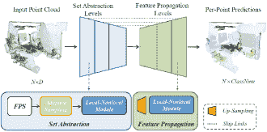

<!--yml

category: 未分类

date: 2024-09-06 19:36:04

-->

# [2311.02608] 基于深度学习的 3D 点云分类：系统综述与展望

> 来源：[`ar5iv.labs.arxiv.org/html/2311.02608`](https://ar5iv.labs.arxiv.org/html/2311.02608)

\WarningFilter

latexText page

# 基于深度学习的 3D 点云分类：系统综述与展望

黄章†、常硕王†、盛伟田*、宝力·卢、李平·张、新宁、肖白 黄章和盛伟田均来自中国新疆大学软件学院，新疆 830000，中国（电子邮件：zhhh1998@outlook.com；357348035@qq.com）。常硕王就职于中国科学院半导体研究所，北京 100083，中国，材料科学与光电子工程中心 $\&amp;$ 微电子学院，北京半导体神经网络智能感知与计算技术重点实验室，北京 100083，中国，中国科学院大学，北京 100049，中国，以及认知计算技术联合实验室，Wave Group，北京 102208，中国（电子邮件：wangchangshuo@semi.ac.cn）。宝力·卢和李平·张均来自中国科学院半导体研究所，北京 100083，中国，以及北京半导体神经网络智能感知与计算技术重点实验室，北京 100083，中国（电子邮件：lubaoli@semi.ac.cn；zliping@semi.ac.cn）。新宁来自中国科学院半导体研究所，北京 100083，中国，以及认知计算技术联合实验室，Wave Group，北京 102208，中国（电子邮件：ningxin@semi.ac.cn）。肖白就职于北京航空航天大学计算机科学与工程学院，北京 100083，中国（电子邮件：baixiao@buaa.edu.cn）。†这些作者对本工作做出了同等贡献，应视为共同第一作者。*盛伟田为通讯作者。

###### 摘要

近年来，点云表示已成为计算机视觉领域的研究热点之一，并在许多领域得到广泛应用，如自动驾驶、虚拟现实、机器人等。虽然深度学习技术在处理规则结构的二维网格图像数据方面取得了巨大成功，但在处理不规则、无结构的点云数据时仍面临巨大挑战。点云分类是点云分析的基础，许多基于深度学习的方法已广泛应用于这一任务。因此，本文旨在为该领域的研究人员提供最新的研究进展和未来趋势。首先，我们介绍点云获取、特征和挑战。其次，我们回顾三维数据表示、存储格式以及点云分类的常用数据集。然后，我们总结基于深度学习的点云分类方法，并补充最近的研究工作。接着，我们对主要方法的性能进行比较和分析。最后，我们讨论一些点云分类的挑战和未来方向。

## 引言

在最近的计算机视觉领域，二维图像的处理技术接近成熟 [1] [2] [3] [4]，许多研究人员已经将研究重点转移到更贴近现实世界的三维场景上。在三维场景中，点云 [5] 在表示三维场景方面扮演了重要角色，因为它具有丰富的表达信息。因此，点云已经成为研究三维视觉中的一种常见数据表达形式。随着技术的发展，点云数据的获取变得越来越

图 1：3D 数据表示

智能且方便，并且有多种获取方法，如：LIDAR 激光探测，通过 3D 模型计算获取点云，通过 2D 图像 3D 重建获取点云 [6] 等。

作为最基础的点云分析任务，点云分类已广泛应用于许多领域，如安全检测 [7] [8]、目标物体检测 [9] [10]、医学 [11] [12] 和三维重建 [13] [14]。点云分类的目的是为点云中的每个点配备标记，以识别点云的整体或部分属性。由于点云的组件属性属于点云分割的范畴，本文主要关注点云的整体属性，即点云分类。

如图 1 所示，3D 数据有多种表示方式。目前，可以将点云转换为网格、体素或多视角数据，通过间接方法学习 3D 对象表示，但这些方法容易出现如对象的 3D 几何信息丢失或过度消耗内存等问题。在 PointNet 之前，由于点云的无序和不规则性，深度学习技术无法直接处理点云。早期点云处理使用手工设计的规则进行特征提取，然后使用基于机器学习的分类器（如支持向量机（SVM）[15]，AdaBoost [16]，随机森林（RF）[17] 等）来预测点云的类别标签，但这些分类方法适应性差，容易受到噪声[18]的影响。一些研究通过合成上下文信息来解决噪声问题，如条件随机场（CRF）[19]，马尔可夫随机场（MRF）[20]等，这在一定程度上提高了分类性能。然而，手工设计规则提取的特征表达能力有限，尤其是在复杂场景中，模型的准确性和泛化能力无法满足人类的要求，并且该方法对具有专业知识和经验的研究人员依赖较大。

随着计算机计算和数据处理能力的快速发展，深度学习技术在点云分析中的应用也得到了促进。斯坦福大学的 Charles 等人 [21] 于 2017 年发表的论文提出了一个直接处理点云的深度学习网络 PointNet。这篇论文具有里程碑式的意义，直接处理点云的方法逐渐占据主导地位。

面对 3D 点云的无规则性、无序性和稀疏性，点云分类仍然是一个具有挑战性的问题。目前已有一些综述分析和总结了基于深度学习的 3D 点云分类方法。本文在前人工作的基础上进行了改进，并加入了新的基于深度学习的 3D 点云分类方法，如最近流行的基于变换器的方法。最后，对 3D 点云分类技术的未来研究方向进行了展望。文章的整体结构如图 2 所示。

图 2：文章的总体结构。首先，点云作为输入，点云可以通过体素或多视角进行转换。其次，从原始点云、转换后的体素或多视角中提取特征。最终输出是每个类别的概率值。

具体而言，我们工作的主要贡献如下：

$\bullet$ 我们首先详细介绍了 3D 数据，并对点云进行了更深入的解释，以帮助读者理解，然后提供了用于点云分类的数据集及其获取方法。

$\bullet$ 我们总结了最近发表的点云分类评论研究，基于这些研究来补充最先进的研究方法。这些方法根据其特征被分类为四类，包括多视角基方法、体素基方法、点云基方法和多态融合基方法。然后对点云基方法进行细分。

$\bullet$ 我们讨论了基于方法分类的子类别的优点和局限性。这种分类更适合研究人员根据实际需求探索这些方法。

$\bullet$ 我们提供了评估指标和方法的性能比较，以更好地展示各种方法在数据集上的表现，然后分析该领域当前的一些挑战和未来的发展趋势。

## II 3D 数据

### II-A 3D 数据表示

3D 数据的表示形式有多种[22]，如点云、网格和体素。这里我们介绍它们。

点云：点云本质上是一个在 3D 空间中绘制的大量微小点的集合，如图 1(a)所示，它由使用 3D 激光扫描仪捕获的大量点组成。这些点可以表达目标的空间分布和表面特征。点云中的每个点都包含丰富的信息，如：三维坐标（x, y, z）、颜色信息（r, g, b）和表面法线向量等。

网格：3D 数据也可以通过网格表示，网格可以看作是一个点的集合，这些点在局部之间建立了关系。三角网格，也称为三角形贴图（如图 1(b)所示），是描述 3D 物体的常用网格之一。一片点和边的集合被称为网格。

Voxel: 在 3D 对象表示中，体素也是一种重要的 3D 数据表示形式，如图 1(c)所示，体素擅长表示非均匀填充的规则采样空间，因此，体素可以有效地表示具有大量空白或均匀填充空间的点云数据。通过对点云数据进行体素化，可以提高数据计算效率并减少对随机内存的访问，但点云数据的体素化不可避免地会带来一定程度的信息丢失。

Multi-view: 多视角图像（如图 1(d)所示）也是点云数据的一种表示方式，它源自单视角图像，是将 3D 对象在特定角度渲染成多个视点的图像。主要挑战是透视选择和透视融合。

### II-B 点云数据存储格式

目前有数百种 3D 文件格式可用于点云，不同的扫描仪产生多种格式的原始数据。点云数据文件的最大区别在于使用 ASCII 和二进制。二进制系统直接以二进制代码存储数据。常见的点云二进制格式包括 FLS、PCD、LAS 等。其他一些常见文件类型可以支持 ASCII 和二进制格式。这些包括 PLY、FBX。E57 以二进制和 ASCII 格式存储数据，将两者的许多优点结合在一个文件类型中。下面我们介绍一些常用的点云数据存储格式：

Obj: obj 格式的点云文件由 Wavefront Technologies 开发。这是一种文本文件。这是一种简单的数据格式，仅表示 3D 数据的几何形状、法线、颜色和纹理信息。该格式通常以 ASCII 表示，但也有专有的 obj 二进制版本。

Las: las 格式主要用于存储 LIDAR 点云数据，本质上是一种二进制格式文件。LAS 文件由三部分组成：头文件区域（包括点的总数、数据范围、每个点的维度信息）、可变长度记录区域（包括坐标系统、额外维度等）和点集记录区域（包括点坐标信息、R、G、B 信息、分类信息、强度信息等），las 格式考虑了 LIDAR 数据的特点，结构合理，易于扩展。

Ply：Ply 的全名是多边形文件格式（Polygon File Format），其灵感来源于 obj，专门用于存储 3D 数据。Ply 使用一个名义上平坦的多边形列表来表示对象。它可以存储包括颜色、透明度、表面法向量、纹理坐标和数据置信度在内的信息，并可以为多边形的正反两面设置不同的属性。该文件有两个版本：ASCII 版本和二进制版本。

E57：E57 是一种供应商中立的点云存储文件格式。它也可以用于存储由激光扫描仪和其他 3D 成像系统生成的图像和元数据，并且是一个严格使用固定大小字段和记录的格式。它使用 ASCII 和二进制代码保存数据，并提供了 ASCII 的大部分可访问性和二进制的速度，它可以存储 3D 点云数据、属性和图像。

PCD：PCD 是点云库（Point Cloud Library）的官方指定格式。它由两个部分组成：头文件和点云数据。它用于描述点云的整体信息。它有两种数据存储类型：ASCII 和二进制，但 PCD 文件的头文件必须使用 ASCII 编码。PCD 的一个好处是它能够很好地适应 PCL，相比 PCL 应用程序，性能最高。

### II-C 3D 点云公共数据集

目前，许多工业界和学术界提供了点云数据集。这些数据集上的不同方法的性能反映了这些方法的可靠性和准确性。这些数据集包含虚拟或真实场景，可以为网络训练提供真实标签。在本节中，我们将介绍一些常用的点云分类数据集，每个数据集的划分见表。I。

ModelNet40 [23]：该数据集由普林斯顿大学的视觉与机器人实验室开发。ModelNet40 数据集由合成的 CAD 对象组成。作为点云分析中最广泛使用的基准，ModelNet40 因其多样的类别、清晰的形状和结构良好的数据集而受到欢迎。数据集包含 40 个类别的对象（例如飞机、汽车、植物、灯具），其中 9843 个用于训练，2468 个用于测试。对应的点从网格表面均匀采样，然后进一步预处理，包括移动到原点和缩放到单位球体。下载链接：[`modelnet.cs.princeton.edu/`](https://modelnet.cs.princeton.edu/)

ModelNet-C [24]: ModelNet-C 集合包含 185,000 个不同的点云，基于 ModelNet40 验证集创建。该数据集主要用于基准测试 3D 点云识别的损坏鲁棒性，每种损坏类型有 15 种损坏类型和 5 个严重程度等级，如噪声、密度等。帮助理解模型的鲁棒性。下载链接: [`sites.google.com/umich.edu/modelnet40c`](https://sites.google.com/umich.edu/modelnet40c)

ModelNet10 [23]: ModelNet10 是 ModelNet40 的一个子集，该数据集仅包含 10 个类别，并分为 3991 个训练样本和 908 个测试样本。下载链接: [`modelnet.cs.princeton.edu/`](https://modelnet.cs.princeton.edu/)

Sydney Urban Objects [25]: 该数据集收集自悉尼中央商务区，包含各种常见的城市道路物体，包括 631 个扫描物体，类别涵盖车辆、行人、标志和树木。下载链接: [`www.acfr.usyd.edu.au/papers/SydneyUrbanObjectsDataset.shtml`](https://www.acfr.usyd.edu.au/papers/SydneyUrbanObjectsDataset.shtml)

ShapeNet [26]: ShapeNet 是由斯坦福大学、普林斯顿大学和美国芝加哥丰田技术研究所的研究人员开发的大型 3D CAD 模型库。该库包含超过 3 亿个模型，其中 220,000 个模型被分类为 3,135 个类别，按照 WordNet 超类-子类关系排列。ShapeNetCore 是 ShapeNet 的一个子集，包含近 51,300 个独特的 3D 模型。它提供了 55 个常见物体类别和注释。ShapeNetSem 也是 ShapeNet 的一个子集，包含 12,000 个模型。它规模较小但覆盖面更广，包括 270 个类别。下载链接: [`shapenet.org/`](https://shapenet.org/)

ScanNet [27]: ScanNet 是一个实例级别的室内 RGB-D 数据集，包含 2D 和 3D 数据。它是标注体素的集合，而非点或物体。目前最新版本的 ScanNet v2 已收集了 1513 个带注释的扫描图，表面覆盖率约为 90$\%$。在语义分割任务中，该数据集标注了 20 个类别的 3D 体素对象。下载链接: [`www.scan-net.org/`](http://www.scan-net.org/)

ScanObjectNN [28]: ScanObjectNN 是一个由 2902 个 3D 对象组成的现实世界数据集，分为 15 个类别。由于数据集中的背景、缺失部分和变形，它是一个具有挑战性的点云分类数据集。下载链接: [`hkust-vgd.github.io/scanobjectnn/`](https://hkust-vgd.github.io/scanobjectnn/)

表 I: 点云分类数据集

| 数据集 | 年份 | 样本数量 | 类别 | 训练 | 测试 | 类型 | 形式 |
| --- | --- | --- | --- | --- | --- | --- | --- |
| ModelNet40[23] | 2015 | 12311 | 40 | 9843 | 2468 | 合成 | 网格 |
| ModelNet40-C[24] | 2015 | 185000 | 15 | - | - | 合成 | 点云 |
| ModelNet10[23] | 2015 | 4899 | 10 | 3991 | 605 | 合成 | 网格 |
| SyDney Urban Objects[25] | 2013 | 588 | 14 | - | - | 真实世界 | 点云 |
| ShapeNet[26] | 2015 | 51190 | 55 | - | - | 合成 | 网格 |
| ScanNet[27] | 2017 | 12283 | 17 | 9677 | 2606 | 真实世界 | RGB-D |
| ScanObjectNN[28] | 2019 | 2902 | 15 | 2321 | 581 | 真实世界 | 点云 |

## III 基于深度学习的点云分类方法

图 3：分类方法的发展时间线

基于深度学习的点云分类模型[29]由于其强大的泛化能力和高分类准确率，已广泛应用于点云分析。本节详细划分了基于深度学习的点云分类方法，并补充了一些近期的研究工作。图 3 显示了每种分类方法的出版时间线。

### III-A 基于多视角的方法

多视角学习是一种机器学习框架，其中数据通过多个不同的特征组来表示，每个特征组被称为一个特定的视角。基于多视角的方法是基于 2D 图像的深度学习方法。该方法分为三个步骤：首先，将 3D 图像投影到多个视角中。其次，提取视角函数。最后，融合这些函数以准确分类 3D 形状。2015 年，Su 等人[30]首次提出了基于多视角的卷积神经网络 MVCNN 方法。由于 2D 视角的集合可以为 3D 形状识别提供大量信息，该方法通过 2D 图像上的渲染视角集合来识别 3D 形状。表现 3D 形状一直是一个长期存在的问题。该方法首先展示了一种标准 CNN 架构，训练以独立于渲染视角来识别形状，并表明即使从单一视角也可以识别 3D 形状。当提供多个视角时，识别率通过使用 CNN 架构将多个视角的信息组合成一个紧凑的形状描述符而进一步提高。网络架构如图 4 所示。该方法在投影检索过程中需要大量计算，并且在通过最大池化将多个视角特征转换为全局特征时，其他非最大元素的信息被忽略，因此不可避免地会导致信息丢失。

图 4：MVCNN[30]结构示意图

因此，考虑到 MVCNN 的大量计算和效率，Bai 等人[31]提出了一个实时 3D 形状搜索引擎，即 GIFT，该方法在投影和视图特征提取阶段使用 GPU 加速，这大大缩短了检索任务所花费的时间，并且具有高效率和处理大规模数据的能力。

基于 MVCNN，Feng 等人提出的 GVCNN 架构[32]引入了“视图-组-形状”架构来提取描述符，这可以有效地利用视图之间的特征关系。为了克服由于最大池化导致的信息丢失问题，Wang 等人[33]引入了基于主导集的视图聚类和池化层，以改进 MVCNN 方法，并提出了 RCPCNN。这涉及到构建一个视图相似性图，基于主导集对图中的节点（视图）进行聚类，并从每个集群中池化信息。递归聚类和池化层用于以提供更多判别能力的方式聚合多视图特征，用于 3D 对象识别。这一递归聚类和池化卷积神经网络（RCPCNN）模块被插入到现成的预训练 CNN 中，从而提高了多视图 3D 对象识别的性能。

Yu 等人提出的 MHBN 方法[34]通过双线性池化聚合局部卷积特征，以获得高效的 3D 对象表示。图 5 显示了该方法的网络架构。为了实现端到端可训练的框架，该方法从补丁到补丁相似度测量的角度协调双线性池化的合并到网络中的一层，以解决视图方法池化视图特征差异的问题。

图 5：MHBN 的架构[34]

为了避免当前多视图方法的缺乏动态性，Hamdi 等人[35]提出了多视图过渡网络（MVTN），该方法提出了一个可微分模块，用于预测任务特定多视图网络的最佳视点，回归 3D 形状识别的最佳视点。MVTN 可以与任何多视图网络进行端到端训练，在 3D 形状分类和检索任务中显示出显著的性能提升，无需额外的训练监督。

总结：与传统的手工特征提取分类相比，多视角方法在点云分类中效果更好，但仍难以充分利用信息。大规模场景的应用以及 3D 数据的固有几何关系是我们需要面对的挑战。

### III-B 基于体素的方法

这种方法将 3D 点云模型转换为近似物体形状的体素形式，每个体素块包含一组相关的点，然后使用 3D CNN 来对体素进行分类。

Maturana 等人 [36] 提出了一个称为 VoxNet 的卷积神经网络架构，用于用体积占据网格表示 3D 信息。VoxNet 是最早的基于体素的 3DCNN 模型。如图 6 所示，该方法对每个网格进行归一化，然后通过卷积和最大池化单个体素块来构建特征图。该架构使用 2.5D 来表示局部描述扫描的特征，并采用全体积表示，提升了表达环境信息的能力，并实现了强大的 3D 物体识别。

图 6：VoxNet 的架构[36]

Wu 等人 [23] 提出了 3D ShapeNets 来识别 3D 物体。该模型将 3D 形状表示为 3D 体素网格上二进制变量的概率分布，每个体素可以用二进制张量表示，并在初步识别不确定的情况下预测最佳视角。最后，3D ShapeNets 能够结合新的视角来识别所有视角中共有的物体。

由于 3D 卷积计算开销较大，空间分辨率的增加会使模型复杂度在卷积 3D 体素时增加。针对这一现象，Li 等人 [37] 提出了一个场检测神经网络（FPNN），它将 3D 数据表示为 3D 场，然后通过一组检测滤波器对输入场进行采样，最后使用场检测滤波器进行特征提取。场检测层可以与其他推理层配合使用，但这种方法使得语义分割结果的分辨率较低。

为了减少内存消耗并提高计算效率，一些学者使用八叉树结构来替代固定分辨率体素结构。Riegler 等人 [38] 提出了 OctNet，该方法利用 3D 数据的稀疏性通过一组不平衡的八叉树对空间进行分层划分，每个叶节点存储一个汇聚特征表示。该方法使得更深的网络得以实现而不影响其分辨率。Wang 等人 [39] 提出了基于八叉树的卷积神经网络 O-CNN，该网络使用八叉树来表示 3D 数据的信息并离散化其表面。3D CNN 操作仅在被 3D 形状表面占据的八分体上进行，从而提高了计算效率和性能。

在 3D 数据表示中使用八叉树结构后，Kd-tree 结构也被应用于点云分类模型中。Klokov 等人提出的 Kd-network [40] 相较于体素和网格，改进了 Kd-tree 在索引和结构化 3D 数据方面的能力，因此 Kd-network 具有更小的内存占用和更高效的训练和测试计算。Zeng 等人提出的 3D Context Net [41] 利用 Kd-tree 施加的局部和全局上下文提示方法进行语义分割。

八叉树结构和 Kd-tree 结构在一定程度上减少了内存消耗并提高了计算效率，但由于体素边界值的影响，这两种结构无法充分利用局部数据特征，从而影响了准确性。Wang 等人 [42] 提出了一个多尺度卷积网络 MSNet。该方法首先将空间划分为不同尺度的体素，然后在多个尺度上同时应用 MSNet 来学习局部特征，最后使用条件随机场（CRF）对 MSNet 的预测结果进行全局优化，以实现更准确的点云分类任务。

Meng 等人提出的 VV-Net [43] 使用基于核的插值变分自编码器（VAE）对体素中的局部区域进行编码，每个体素进一步细分为子体素，这些子体素在体素内插值稀疏点样本，以高效处理噪声点云数据集。

总结：与多视角方法相比，基于体素的方法关注 3D 数据之间的关系，将具有内部连接的点云分组为一组点，从而建立体素。尽管基于体素的模型解决了点云无序和非结构化的问题，但点云数据的稀疏性和信息不完整性导致分类任务的效率较低，因此无法充分利用点云中的信息。

### III-C 基于点云的方法

许多当前的研究方法更侧重于使用深度学习技术直接处理点云。特征聚合算子是处理点云的核心，它实现了离散点的信息传递。特征聚合算子主要分为两类：局部特征聚合和全局特征聚合。在本节中，从特征聚合的角度，对这两类方法进行更详细的划分和介绍。

2017 年，Qi 等人提出的 PointNet [21]（如图 7 所示）是基于点云方法的开创性研究，这是一种全局特征聚合的方法。该方法直接以点云作为输入，通过 T-Net 模块进行变换，然后通过全连接进行每个点的学习，最后通过最大池化函数将点的特征聚合为全局特征。尽管 PointNet 是基于深度学习的先锋，但仍存在缺陷。例如，PointNet 仅捕获单个点和全局点的特征信息，但没有考虑相邻点的关系表示，这使得 PointNet 无法有效进行细粒度分类。

图 7：PointNet[21] 网络架构

#### III-C1 局部特征聚合

##### 1

点对点方法

Qi 等人[44] 继承了基于 PointNet 的 PointNet++。该方法以分层方式处理点云，每一层包括一个采样层、一个分组层和一个 PointNet 层。其中，采样层获取局部邻域的质心，分组层构建局部邻域的子集，PointNet 层获取局部区域内点之间的关系，如图 8 所示。PointNet++ 需要解决两个问题：划分生成的点集和通过局部特征学习器聚合局部特征。但 PointNet++ 仍然没有忽视点之间的先验关系。

图 8：PointNet++[44] 点云分割与分类架构图

基于 PointNet++，Qian 等人[45] 改进了训练策略以提升 PointNet++ 的性能，并在 PointNet++ 框架中引入了可分离的 MLP 和倒置残差瓶颈设计，将其框架命名为 PointNeXt（如图 9 所示）。

图 9: PointNeXt[45] 架构

Zhao 等人[46] 提出了从点云局部邻域提取特征的方法 - PointWeb，它将局部邻域中的点相互连接，并提出了一个新模块，适应性特征调整（AFA），用于查找点之间的信息传递。该方法充分利用点的局部特征，实现了自适应调整。

Hu 等人[47] 提出了一个高效且轻量级的神经网络架构 - RandLA-Net，它使用随机点采样，通过高效的局部特征聚合模块增加每个点的感受野，从而更好地捕捉复杂的局部结构，减少内存占用和计算成本，但这种方法可能会丢失一些稀疏点的关键特征。

Li 等人提出的 SO-Net [48] 构建了自组织映射（SOM），分层提取每个点和 SOM 节点的特征，并使用单一特征向量表示点云，通过在编码的全局特征向量上附加 3 层感知器，利用多层感知器（MLP）对点云进行分类。SO-Net 具有良好的并行性和简单结构，但在处理大规模点云数据时存在局限性。

为了全面捕捉最关键的几何信息，Xu 等人[49] 提出了几何解缠注意网络 GDANet，并引入了 Geometry-Disentangle 模块，将原始点云分解为轮廓和平面两个部分，从而捕捉和优化 3D 语义，以补充局部信息。该方法具有良好的鲁棒性。

Goyal 等人[50]提出了一种基于投影的方法 SimpleView，该方法显示了与网络架构无关的训练和评估因素对点云分类性能的巨大影响。Chen 等人[51]提出的 PointSCNet 用于捕捉点云的几何信息和局部区域信息。它由三个模块组成：一个空间填充曲线引导的采样模块，一个信息融合模块，以及一个通道空间注意力模块。在 PointSCNet 中，原始点云被输入到采样和分组块，通过 Z-order 曲线进行采样，以获得点与局部区域之间的高相关性。在提取了采样点云特征后，设计了一个特征融合模块来学习结构和相关信息。最后，关键点特征通过通道空间模块得到增强。

Ma 等人[52]注意到详细的局部几何信息可能不是分析点云的关键，因此他们引入了一种称为 PointMLP 的纯残差网络，该网络没有复杂的局部几何提取器，但配备了一个轻量级几何仿射模块，推理速度显著提升。Huang 等人[53]计算了在点云中添加具有显式约束的形状不变扰动时识别置信度的变化率，并根据这种方法提出了点云敏感度图，然后用该图提出了形状不变的对抗点云。

Ran 等人[54]提出使用 RepSurf（代表性表面）来表示点云，RepSurf 有两个变体：三角形 RepSurf 和伞形 RepSurf。这种表示方法可以作为点云分类和分割框架中的一个模块，以提高点云框架的性能。

##### 2

基于卷积的方法

卷积神经网络（CNN）在深度学习中扮演着重要角色，是最基本的深度学习模型。它在 2D 图像处理领域的优异表现促使研究人员将其应用于 3D 点云，并为点云分类设计了点卷积。

Atzmon 等人[55]提出了点卷积神经网络（PCNN），将卷积神经网络（CNN）应用于点云。首先，将点云上的函数扩展为空间中的连续体积函数；然后对该函数应用连续体积卷积；最终结果是一个约束的点云，如图 13 所示。

刘等人 [56] 提出了关系形状卷积网络（RS-CNN），以扩展常规 CNN 到不规则点云以进行点云分析。Yousefhussien 等人 [57] 提出了一个一维全卷积网络。王等人 [58] 提出了一个具有空间池化的深度神经网络 DNNSP，用于分类大规模点云。该方法可以从整个区域到点簇的中心点学习特征，以实现对点特征的鲁棒表示。Komarichev 等人 [59] 提出了一个基于点云的环形卷积神经网络（A-CNN）模型。冉等人 [60] 提出了基于组关系聚合模块的 RPNet，该模块对刚性变换和噪声具有鲁棒性。谢等人 [61] 提出的 SCN（ShapeContextNet）使用形状上下文作为构建块，从而能够捕获和传播对象部件信息。SCN 是一个端到端模型。

由于直接对点相关特征进行卷积会导致形状信息和点排序的变异被丢弃，李等人 [62] 提出了 PointCNN 以解决这一问题，确认了局部结构对点云分类网络发展的重要性。

由于点云的稀疏性、不规则性和混乱性，直接对其进行卷积操作非常困难。吴等人[63] 提出了应用动态滤波器进行卷积操作的方法，称为 PointConv，这种方法简单且减少了计算机存储压力。MCCNN [64] 将卷积核本身表示为多层感知机，并将卷积描述为蒙特卡罗积分。SpiderCNN [65] 继承了 CNN 的多尺度层次结构，由 SpiderConv 单元组成，这些单元将卷积操作从规则网格扩展到不规则点集，这些点集可以通过参数化一系列卷积滤波器嵌入到 n 维空间中，以有效地从点云中提取几何特征。毛等人 [66] 设计了基于 InterConv（插值卷积操作）结合的插值卷积神经网络（InterpCNNs）。

Esteves 等人 [67] 使用多值球面函数来建模 3D 数据，并提出了一个球面卷积网络，通过在球面谐波域中实现精确的卷积，从而解决了卷积神经网络中的 3D 旋转变异性问题。SPHNet [68] 基于 PCNN 通过在网络的不同层中使用球面谐波来实现旋转不变性。

由于点云的局部特征难以有效聚合和转移，Wang 等人 [69] 提出了一个空间覆盖卷积神经网络（SC-CNN），其核心是空间覆盖卷积（SC-Conv）。在点云中构建各向异性空间几何体以实现深度可分卷积，将深度卷积替换为空间覆盖操作符（SCOP）。

##### 3

基于图的方法

图神经网络（GNN）最早由 Scarselli 等人 [70] 提出。Bruna 等人 [71] 是首个将卷积应用于低维图结构以有效表示深度的研究者。Kipf 等人 [72] 进一步提出图卷积网络（GCN）在半监督分类任务中表现良好，实际上，GCN 是 CNN 的一种优化。

Simonovsky [73] 提出了 ECC（边条件卷积）网络，该网络可以与边缘标签的应用相结合，应用于任何图结构。这种方法使用点作为图的顶点，点之间的距离作为权重，执行加权平均卷积操作，利用最大采样聚合顶点的信息。它可以用于大规模点云分割，但计算量较大。

SpecGCN [74] 用递归聚类和池化策略替代了标准的最大池化步骤。Grid-GCN [75] 使用了一种关注覆盖的网络查询（CAGQ），通过利用网格空间的效率来提高空间覆盖率并减少理论时间复杂度。

Mohammadi 等人 [76] 提出了 PointView-GCN，该方法具有多层次图卷积网络（GCN），用于分层聚合单视图点云的形状特征，这有助于编码对象几何线索和多视图关系，从而得到更具体的全局特征。

Wang 等人 [77] 提出了一个用于点云学习的动态图 CNN（DGCNN），并提出了一种边缘卷积（EdgeConv）网络模块，这可以更好地捕捉点云的局部几何特征并保持排列不变，这展示了局部几何特征对 3D 识别任务的重要性。Zhang 等人 [78] 进一步优化了 DGCNN，并提出了一个链接动态图卷积神经网络（LDGCNN），该网络去除了 DGCNN 中的变换网络以简化网络模型，并通过连接不同动态图的层次特征来优化网络，这样可以更好地解决梯度消失问题。

Lu 等人 [79] 提出的 PointNGCNN 描述了邻域图中点之间的关系，并使用邻域图滤波器来提取特征空间和笛卡尔空间中的邻域特征信息和空间分布信息。

##### 4

基于注意力的方法

注意力机制的基本思想是将人类的感知应用于机器，但人类的感知会选择性地关注场景的一部分，而不是一次性处理整个场景，因此研究人员集中在注意力机制上进行研究，并将其应用于点云分类领域。

杨等人[80]开发了一种基于点云推理的点注意力变换器（PAT）。他们提出使用高效的 GSA（组洗牌注意力）代替昂贵的 MHA（多头注意力）来建模点之间的关系，并提出一种称为 Gumbel 子集采样（GSS）的方法来选择具有代表性的点子集，从而降低计算成本。

李等人[81]通过将注意力机制和空间金字塔相结合，提出了特征金字塔注意力模块（FPA）和全局注意力上采样模块（GAU）。陈等人[82]设计了一个局部空间意识（LSA）层，并提出了一种基于 LSA 层的 LSANet 网络架构。LSA 可以学习局部区域的空间关系层，生成空间分布的权重，从而进行空间独立的操作。这种方法的空间信息提取功能非常强大。

王等人[83]提出了基于图注意力卷积（GAC）的 GACNet。陈等人[84]提出的 GAPointNet 将自注意力机制与图卷积相结合，通过在堆叠的 MLP 层中嵌入图注意力机制来学习局部信息表示，并使用并行机制聚合不同 GAPLayer 层的注意力特征，其中 GAPLayer 层和注意力层可以嵌入到现有的训练模型中，以更好地从无序点云中提取局部上下文特征。

#### III-C2 全局特征聚合

##### 1

基于变换器的方法

自从 2017 年首次提出变换器[85]以来，它在计算机视觉领域取得了世界著名的成果。许多研究人员也在点云处理领域中使用这一结构。

Engel 等人[86]提出了一种深度神经网络 Point Transformer，该网络直接作用于无序和无结构的点集，并提出了作为 Point Transformer 一部分的基于学习评分的聚焦模块 ScorNet。点云作为 Point Transformer 的输入，从中提取局部和全局特征，然后使用 SortNet 对局部特征进行排序，最后使用局部全局注意力关联局部和全局特征，如图 10 所示。

图 10: 点 Transformer 的架构 [86]

Berg 等人 [87] 发现自注意力操作随着输入点集的增长而迅速且低效地增长，且注意力机制难以在全局中找到每个点之间的关系，因此他们提出了一种两阶段的方法 - Point TnT，该方法使得单个点和点集能够有效地互相关注。

Wu 等人 [88] 提出的视觉 Transformer (VT) 将 Transformer 应用于从特征图生成的标签图像，可以更有效地学习和关联稀疏分布的高层次概念。Carion 等人 [89] 提出了将目标检测视为直接集成预测问题的方法，称为检测 Transformer (DETR)，这是一种端到端检测 Transformer，它以 CNN 特征作为输入，并使用 Transformer 编码器-解码器来生成边界。

Guo 等人 [90] 提出了一个基于 Transformer 的点云学习框架 - 点云 Transformer (PCT)，并提出了具有隐式拉普拉斯算子和归一化精炼的偏移注意力，该框架具有排列不变性，更适合点云学习。

3DMedPT 是 Yu 等人 [12] 提出的用于 3D 医学点云分析的 Transformer 网络。

受到 BERT 的启发，Yu 等人 [91] 提出了一个新的 Transformer 学习方法，称为 Point-BERT。该方法首先将点云划分为几个局部块，并通过点云标记器生成局部信息的离散点标签，然后通过随机遮蔽一些输入点云并将其输入到主干 Transformer 中，该方法能够将 BERT 的概念推广到点云。

Pang 等人 [92] 提出了 Point-MAE，这是一种用于点云自监督学习的掩蔽自编码器方法，用于解决点云位置数据泄漏和信息密度不均等问题。

He 等人 [93] 引入了一种基于体素的集合注意力模块 (VSA)，建立了体素集合 Transformer (VoxSeT) 架构。VoxSeT 可以通过 VSA 模块管理点簇，并以线性复杂度并行处理它们。该方法结合了 Transformer 的高性能和基于体素模型的高效率，在点云建模中表现良好。

##### 2

全局模块化方法

Wang 等人 [94] 提出了一个全局模块，该模块计算某个位置的响应作为所有位置特征的加权和，提供了聚合全局特征的解决方案，但全局点对点映射仍可能不足以提取点云形状所隐含的基本模式。

Yan 等人[95]提出了一种端到端网络 PointASNL，该网络结合了自适应采样模块（AS）和局部非局部模块（L-NL），能够有效处理噪声点云。AS 模块通过推理更新点的特征，然后对权重参数进行归一化，并重新加权初始采样点，从而有效缓解偏差效应。L-NL 模块由局部和非局部点单元组成，减少了学习过程对噪声的敏感性。PointASNL 架构如图 11 所示。

图 11：PointASNL 的架构[95]

Li 等人[96]采用了一些 CNN 方法来支持深度 GCN 架构，称为 DeepGCN，该架构由三个块组成：用于输入点云特征转换的 GCN Backbone 块、用于生成和融合全局特征的融合块、用于预测标签的 MLP 预测块。为了在 GCN 训练过程中解决梯度消失的问题，有可能训练更深的 GCN 网络。

Xiang 等人[97]提出了一种基于点云中聚合假设曲线的方法——CurveNet，并有效实现了聚合策略，包括曲线分组操作符和曲线聚合操作符。该网络由一系列构建块组成，FPS 表示最远点采样方法。

##### 3

基于 RNN 或 LSTM 的方法

RNN（递归神经网络）通常能够有效利用上下文信息来处理序列数据。LSTM（长短期记忆网络）是一个特殊的 RNN，它能够有效解决长序列数据训练过程中的梯度消失和梯度爆炸问题。

Engelmann 等人[98]扩展了基于 PointNet 的输入级上下文信息和输出级上下文信息，使 PointNet 能够应用于大规模场景。这样可以使 PointNet 在大规模场景中得到应用。

刘等人[99]提出了一种 3DCNN-DQN-RNN 方法，该方法融合了 3D 卷积神经网络（CNN）、深度 Q 网络（DQN）和残差递归神经网络（RNN）。首先，通过 3DCNN 获得点的特征表示。其次，DQN 可以检测和定位对象，并能够自动感知场景并调整 3DCNN 的反馈。最后，RNN 用于识别多尺度特征的连接和差异。LSTM（长短期记忆网络）单元用于防止梯度消失，使网络具有长期记忆，这种方法提高了处理大规模点云的准确性。

黄等人提出的 RSNet 网络[100]以原始点云作为输入，然后进行特征提取，再通过 x、y 和 z 三个方向的切片池化层。每一层使用双向 RNN 提取局部特征，然后通过切片解析层将点云序列的特征分配给每个点，最后输出每个点的预测语义标签。

叶等人[101]提出了一种端到端的语义分割方法 3P-RNN，通过结合 CNN 和 RNN，包括一个点金字塔模块和一个双向层次 RNN 模块。在区分相同语义的工作中，该方法具有一定的局限性。

刘等人提出的 Point2Sequence [102] 使用 RNN 捕捉细粒度的上下文信息以学习三维形状特征，并引入了注意机制以增强特征提取。

### III-D 多形态融合方法

Le 等人提出的将 PointGrid 与网格结合的策略[103]，是将点和网格混合进行表示。PointGrid 由几个卷积块组成，通过最大池化表示不同层的特征。每个卷积层包含一个卷积核，过拟合现象通过池化层控制，然后通过全连接层完成。对于推理，PointGrid 具有两个全连接层，最后通过 softmax 分类器进行回归，可以更好地识别细粒度模型并表示局部形状。

张等人[104]提出了一种新颖的点云学习方法 PVT（点-体素变换器），结合了稀疏窗口注意模块（SWA）和相对注意模块（RA），结合了基于体素和基于点的模型思想，该方法在点云分类的准确性方面表现出色。

张等人提出的 PointCLIP[105]基于预训练的 CLIP 学习点云。通过将点云投影到多视角深度图中进行编码，无需渲染，使得通过将二维预训练知识转移到三维领域，实现零样本识别。并且设计了一个视图间适配器，以更好地提取全局特征。网络架构如图 12 所示。

图 12：PointCLIP[105]架构

CrossPoint [106] 通过最大化点云与对应渲染的二维图像在不变空间中的对应关系，并保持点云在变换中的不变，实现了二维到三维的对应。

总结：与基于多视角的方法和基于体素的方法相比，点云方法直接处理原始点，并能充分利用点云信息。因此，点云方法也是未来的研究方向，基于变换器的方法将在未来得到更广泛的应用。

## IV 评估

评估指标用于评估点云分类方法的性能。准确率、空间复杂度、执行时间等都是方法的评估指标，而准确率是评估各种方法的关键指标。一般来说，准确率（Acc）、精确率（Pre）、召回率（Rec）和交集-并集比（IoU）用于评估方法的准确性。

$\bullet$ 准确率指的是正确预测样本的数量与总预测样本数量的比率。

$\bullet$ 精确率指的是实际正类中被预测为正类的比例。

$\bullet$ 召回率指的是预测为正类的样本与实际正类样本总数的比率。

$\bullet$ 交集比指的是预测值与真实值的交集和并集的比率。

准确率、精确率、召回率和交集比可以通过以下公式计算：TP 是预测为正类且实际为正类的样本，TN 是预测为正类但实际为负类的样本，FP 是预测为负类但实际为负类的样本，FN 是预测为负类但实际为正类的样本。假设有 N 个类别：

第 i 类的准确率：

|  | $Acc_{i}=\frac{TP_{i}+TN_{i}}{TP_{i}+TN_{i}+FP_{i}+FN_{i}}$ |  | (1) |
| --- | --- | --- | --- |

第 i 类的精确率：

|  | $\operatorname{Pre}_{i}=\frac{TP_{i}}{TP_{i}+FP_{i}}$ |  | (2) |
| --- | --- | --- | --- |

召回率：

|  | $Rec=\frac{TP}{TP+FN}$ |  | (3) |
| --- | --- | --- | --- |

第 i 类的交集比：

|  | $IoU_{i}=\frac{TP_{i}}{TP_{i}+FP_{i}+FN_{i}}$ |  | (4) |
| --- | --- | --- | --- |

当前点云分类的准确率通过指标来衡量：总体准确率（OA）、平均准确率（MA）和平均交集-并集比（mIoU），其计算方式如下：

|  | $OA=\frac{\sum_{i=1}^{N}TP_{i}}{\sum_{i=1}^{N}\left(TP_{i}+FP_{i}\right)}$ |  | (5) |
| --- | --- | --- | --- |
|  | $MA=\frac{1}{N}\sum_{i=1}^{N}Acc_{i}$ |  | (6) |
|  | $mIoU=\frac{1}{N}\sum_{i=1}^{N}IoU$ |  | (7) |

本节总结了不同数据集上提到的方法的性能，详见表格 II。

表 II：不同数据集上点云分类方法的准确率比较

| 方法 | 年份 | 在不同数据集上的准确率/% |
| --- | --- | --- |
| ModelNet 40 | ModelNet 10 | ScanObjectNN | ShapeNet |
| OA | MA | mIoU | OA | MA | mIoU | OA | MA | mIoU | OA | MA | mIoU |
| 基于多视角的方法 | MVCNN[30] | 2016 | 90.10 | 78.90 | - | - | - | - | - | - | - | - | - | - |
| GIFT[31] | 2016 | 83.10 | 81.94 | - | 92.35 | 91.12 | - | - | - | - | - | - | - |
| GCVNN[32] | 2018 | 93.10 | 79.70 | - | - | - | - | - | - | - | - | - | - |
| MHBN[34] | 2018 | 94.91 | - | - | 92.93 | - | - | - | - | - | - | - | - |
| RCPCNN[33] | 2019 | 93.80 | - | - | - | - | - | - | - | - | - | - | - |
| MVTN[35] | 2021 | 92.00 | 93.80 | - | - | - | - | 82.80 | - | - | - | - | - |
| 基于体素的方法 | VoxNet[36] | 2015 | 85.90 | 83.00 | - | - | 92.00 | - | - | - | - | - | - | - |
| 3D shapeNet[23] | 2015 | 84.70 | 77.30 | - | - | 83.50 | - | - | - | - | - | - | - |
| FPNN[37] | 2016 | 87.50 | - | - | - | - | - | - | - | - | - | - | - |
| OctNet[38] | 2017 | 86.50 | - | - | 90.90 | - | - | - | - | - | - | - | - |
| O-CNN[39] | 2017 | 90.60 | - | 85.90 | - | - | - | - | - | - | - | - | - |
| Kd-Net[40] | 2017 | 91.80 | 88.50 | - | 94.00 | 93.50 | 77.20 | - | - | - | - | - | 82.30 |
| 3D Context Net[41] | 2018 | - | - | - | - | - | - | - | - | - | - | - | - |
| MSNet[42] | 2018 | - | - | - | - | - | - | - | - | - | - | - | - |
| VV-Net[43] | 2019 | - | - | - | - | - | - | - | - | - | - | - | 87.40 |
| 基于点云的方法 | 局部特征聚合 | 点对点方法 | PointNet++[44] | 2017 | 91.90 | - | - | - | - | - | 77.90 | 75.40 | - | - | - | 85.10 |
| PointNeXt[45] | 2022 | - | - | - | - | - | - | 87.70 | 85.80 | - | - | - | 87.20 |
| PointWeb[46] | 2019 | 92.30 | 89.40 | - | - | - | - | - | - | - | - | - | - |
| RandLA-Net[47] | 2020 | - | - | - | - | - | - | - | - | - | - | - | - |
| SO-Net[48] | 2018 | 90.80 | 87.30 | - | 94.10 | 93.90 | - | - | - | - | - | - | 84.60 |
| GDANet[49] | 2021 | 93.80 | - | - | - | - | - | 88.50 | - | - | - | - | 86.50 |
| SimpleView[50] | 2020 | 93.00 | - | - | - | - | - | 80.50 | - | - | - | - | - |
| PintSCNet[51] | 2021 | 93.70 | - | - | - | - | - | - | - | - | - | - | - |
|  | PointMLP[52] | 2022 | 94.50 | 91.40 | - | - | - | - | 85.40 | 83.90 | - | - | - | - |
|  | RepSurf[54] | 2022 | 94.70 | 91.70 | - | - | - | - | 84.60 | 81.90 | - | - | - | - |
| 基于卷积的方法 | PCNN[55] | 2018 | 92.30 | - | - | 94.90 | - | - | - | - | - | - | - | - |
| RS-CNN[56] | 2019 | 93.60 | - | - | - | - | - | - | - | - | - | - | 86.20 |
| DNNSP[58] | 2018 | - | - | - | - | - | - | - | - | - | - | - | - |
| A-CNN[59] | 2019 | 92.60 | 90.30 | - | 95.50 | 95.30 | - | - | - | - | - | - | 86.10 |
| RP-Net[60] | 2021 | 94.10 | - | - | - | - | - | - | - | - | - | - | - |
| SCN[61] | 2018 | 90.00 | - | - | - | - | - | - | - | - | - | - | 84.60 |
| PointCNN[62] | 2018 | 92.20 | 88.10 | - | - | - | - | 87.90 | - | - | - | - | - |
| PointCove[63] | 2019 | 92.50 | - | - | - | - | - | - | - | - | - | - | - |
| MCCNN[64] | 2018 | 90.90 | - | - | - | - | - | - | - | - | - | - | - |
| SpiderCNN[65] | 2018 | 92.40 | - | - | - | - | - | 73.70 | 69.80 | - | - | - | 85.30 |
| InterpCNN[66] | 2019 | 93.00 | - | - | - | - | - | - | - | - | - | - | 86.30 |
| SPHNet[68] | 2019 | 87.70 | - | - | - | - | - | - | - | - | - | - | - |
|  | SC-CNN[69] | 2022 | 93.8 | - | - | 96.4 | - | - | - | - | - | - | - | 86.40 |
| 基于图的方法 | ECC[73] | 2017 | - | 83.20 | - | - | 90.00 | - | - | - | - | - | - | - |
| SpecGCN[74] | 2018 | 91.50 | - | - | - | - | - | - | - | - | - | - | 84.60 |
| Grid-GCN[75] | 2020 | 93.10 | 91.30 | - | 97.50 | 97.40 | - | - | - | - | - | - | - |
| PointView-GCN[76] | 2021 | 95.40 | - | - | - | - | - | 85.50 | - | - | - | - | - |
| DGCNN[77] | 2019 | 92.20 | 90.20 | - | - | - | - | 86.20 | - | - | - | - | - |
| LDGCNN[78] | 2019 | 92.90 | 90.30 | - | - | - | - | - | - | - | - | - | - |
| PointNGCNN[79] | 2020 | 92.80 | - | - | - | - | - | - | - | - | - | - | 85.60 |
| 基于注意力的方法 | PAT[80] | 2019 | 91.70 | - | - | - | - | - | - | - | - | - | - | - |
| FPA/GAU[81] | 2018 | - | - | - | - | - | - | - | - | - | - | - | - |
| LSANet[82] | 2019 | 92.30 | 89.20 | - | - | - | - | - | - | - | - | - | 83.20 |
|  | GACNet[83] | 2019 | - | - | - | - | - | - | - | - | - | - | - | - |
|  | GAPointNet[84] | 2021 | 92.40 | 89.70 | - | - | - | - | - | - | - | - | - | - |
| 全局特征聚合 | 基于 Transformer 的方法 | Point Transformer[86] | 2021 | 92.80 | - | - | - | - | - | - | - | - | 85.90 | - | - |
| 视觉 Transformer[88] | 2020 | - | - | - | - | - | - | - | - | - | - | - | - |
| PCT[90] | 2021 | 93.20 | - | - | - | - | - | - | - | - | - | - | - |
| 3DMedPT[12] | 2021 | 93.40 | - | - | - | - | - | - | - | - | - | - | - |
| Point-BERT[91] | 2021 | 93.80 | - | - | - | - | - | 83.07 | - | - | - | - | - |
| Point-TnT[87] | 2022 | 92.60 | - | - | - | - | - | 84.60 | 82.60 | - | - | - | - |
|  | Point-MAE[92] | 2022 | 93.80 | - | - | - | - | - | 85.18 | - | - | - | - | 86.10 |
| 基于全局模块的方法 | PointNet[21] | 2017 | 89.20 | 86.20 | - | - | - | - | 68.20 | 63.40 | - | - | - | 83.70 |
| PointASNL[95] | 2020 | 93.20 | - | - | 95.90 | - | - | - | - | - | - | - | - |
| CurveNet[97] | 2021 | 94.20 | - | - | 96.30 | - | - | - | - | - | - | - | 86.80 |
|  | DeepGCNs[96] | 2021 | 93.20 | 90.30 | - | - | - | - | - | - | - | - | - | - |
|  | 基于 RNN 或 LSTM 的方法 | 3DCNN-DQN-RNN[99] | 2017 | - | - | - | - | - | - | - | - | - | - | - | - |
|  |  | RSNet[100] | 2018 | - | - | - | - | - | - | - | - | - | - | - | - |
|  |  | 3P-RNN[101] | 2018 | - | - | - | - | - | - | - | - | - | - | - | - |
|  |  | Point2Sequence[102] | 2019 | 92.60 | 90.40 | - | 95.30 | 95.10 | - | - | - | - | - | - | - |
| Polymorphic Fusion 基于的方法 | PointGrid[103] | 2018 | 92.00 | 88.90 | - | - | - | - | - | - | - | 86.10 | 80.50 | - |
| PVT[104] | 2021 | 94.00 | - | - | - | - | - | - | - | - | - | - | 86.60 |
| PointCLIP[105] | 2022 | 94.05 | - | - | - | - | - | - | - | - | - | - | - |
| CrossPoint[106] | 2022 | 94.90 | - | - | - | - | - | 79.00 | - | - | - | - | 85.50 |

## V 未来趋势

随着今天技术的发展，各个领域对点云分类方法的需求越来越高。点云分类方法有很多，研究人员不断提出新方法以提高准确性和效率。这推动了 3D 应用的发展。然而，现有的方法仍然存在不同的局限性。本节将总结当前基于深度学习的点云分类方法中的问题，并展望未来的研究方向，具体如下：

$\bullet$ 当前的一些点云分类方法侧重于提高准确性，而另一些则侧重于提高效率。我们需要解决“如何在保持效率的同时实现高准确性？”的问题。

$\bullet$ 在 3D 的实际应用中，户外场景的信息结构复杂且多变。虽然一些方法已经应用于户外场景，但效率和准确性仍需进一步提高。因此，未来的研究方向应更多地关注户外场景的网络。

$\bullet$ 从上述数据可以看出，基于原始点云的方法在算法性能上具有一定优势。但由于输入的原始点云数据具有信息完整性，网络模型变得更加复杂，因此简单的点云方法是未来的研究趋势。

$\bullet$ 目前大多数方法旨在改进而非改变，因此需要我们持续研究和讨论创新型方法。

$\bullet$ 在我们未来提出的网络模型中，我们应关注网络架构的优化，这可以在面对复杂和不规则的点云时减少计算复杂度和内存使用。

## VI 结论

本文提供了近年来基于深度学习的点云分类方法的全面调查和讨论。

首先，我们在介绍部分介绍了点云及其应用，并讨论了点云的特性和处理难点。在第二部分中，介绍了 3D 数据，并总结了常用的 3D 数据表示、点云数据存储格式和点云分类数据集。在前述部分的基础上，我们全面回顾了基于深度学习的点云分类方法，将这些方法分为四大类：基于多视角的方法、基于体素的方法、基于点云的方法和多态融合方法。接着，我们比较了现有方法的性能。最后，本文指出了当前方法的问题，并展望了未来的研究方向。

## 致谢

本研究得到了新疆大学校企联合项目的支持。

## 参考文献

+   [1] L. Zhang, L. Sun, W. Li, J. Zhang, W. Cai, C. Cheng, 和 X. Ning, “基于偏最小二乘判别分析的联合贝叶斯框架用于指静脉识别，” *IEEE 传感器期刊*，第 22 卷，第 1 期，第 785–794 页，2021 年。

+   [2] L. Zhou, X. Bai, X. Liu, J. Zhou, 和 E. R. Hancock, “用于快速最近子空间搜索的二进制码学习，” *模式识别*，第 98 卷，第 107040 页，2020 年。

+   [3] X. Ning, W. Tian, Z. Yu, W. Li, 和 X. Bai, “HCFNN：用于图像分类的高阶覆盖函数神经网络，” *模式识别*，第 108873 页，2022 年。

+   [4] C. Wang, C. Wang, W. Li, 和 H. Wang, “基于深度学习的 RGB-D 语义分割简要调查，” *Displays*，第 70 卷，第 102080 页，2021 年。

+   [5] C. Wang, H. Wang, X. Ning, S. Tian, 和 W. Li, “基于局部区域动态覆盖的 3D 点云分类方法，” *软件期刊*，第 34 卷，第 4 期，第 1962–1976 页，2022 年。

+   [6] W. Cai, D. Liu, X. Ning, C. Wang, 和 G. Xie, “基于体素的三视角混合并行网络用于 3D 目标分类，” *Displays*，第 69 卷，第 102076 页，2021 年。

+   [7] C. Yan, G. Pang, X. Bai, C. Liu, X. Ning, L. Gu, 和 J. Zhou, “超越三元组损失：具有细粒度差异感知对损失的人物重识别，” *IEEE 多媒体学报*，第 24 卷，第 1665–1677 页，2021 年。

+   [8] X. Ning, K. Gong, W. Li, 和 L. Zhang, “JWSAA：联合弱显著性和注意力感知的人物重识别，” *神经计算*，第 453 卷，第 801–811 页，2021 年。

+   [9] W. Zhangyu, Y. Guizhen, W. Xinkai, L. Haoran, 和 L. Da, “用于铁路物体检测的相机和激光雷达数据融合方法，” *IEEE 传感器期刊*，第 21 卷，第 12 期，第 13 442–13 454 页，2021 年。

+   [10] Y. Zhou 和 O. Tuzel, “VoxelNet：用于点云的端到端学习的 3D 目标检测，” 在 *IEEE 计算机视觉与模式识别会议论文集*，2018 年，第 4490–4499 页。

+   [11] J. Guo, X. Yao, M. Shen, J. Wang 和 W. Liao, “一种用于医学结构点云的深度学习网络”，见于 *2018 年第 9 届信息技术医学与教育国际会议（ITME）*。IEEE，2018 年，第 683–687 页。

+   [12] J. Yu, C. Zhang, H. Wang, D. Zhang, Y. Song, T. Xiang, D. Liu 和 W. Cai, “三维医学点变换器：将卷积引入注意力网络用于医学点云分析”，*arXiv 预印本 arXiv:2112.04863*，2021 年。

+   [13] T. Xu, D. An, Y. Jia 和 Y. Yue, “综述：基于点云的三维人体关节估计”，*传感器*，第 21 卷，第 5 期，第 1684 页，2021 年。

+   [14] B. Yang, R. Huang, J. Li, M. Tian, W. Dai 和 R. Zhong, “基于改进的形态学尺度空间从航空激光雷达点云自动重建建筑 LOD”，*遥感*，第 9 卷，第 1 期，第 14 页，2016 年。

+   [15] M. A. Hearst, S. T. Dumais, E. Osuna, J. Platt 和 B. Scholkopf, “支持向量机”，*IEEE 智能系统及其应用*，第 13 卷，第 4 期，第 18–28 页，1998 年。

+   [16] R. Kumar 和 R. Verma, “数据挖掘分类算法：综述”，*工程与技术创新国际杂志（IJIET）*，第 1 卷，第 2 期，第 7–14 页，2012 年。

+   [17] Z. Gan, L. Zhong, Y. Li 和 H. Guan, “一种基于随机森林的城市物体分类方法，使用激光雷达数据和航空影像”，见于 *2015 年第 23 届国际地理信息学会议*。IEEE，2015 年，第 1–4 页。

+   [18] L. Zhou, Y. Liu, Z. Pencheng, B. Xiao, Y. Yazhou, J. Zhou, G. Lin, T. Harada 和 E. R. Hancock, “信息瓶颈和选择性噪声监督用于零样本学习”，*机器学习*，2022 年。

+   [19] N. Plath, M. Toussaint 和 S. Nakajima, “使用条件随机场和全局分类的多类图像分割”，见于 *第 26 届年度国际机器学习会议论文集*，2009 年，第 817–824 页。

+   [20] D. Munoz, J. A. Bagnell, N. Vandapel 和 M. Hebert, “基于功能最大边际马尔可夫网络的上下文分类”，见于 *2009 IEEE 计算机视觉与模式识别会议*。IEEE，2009 年，第 975–982 页。

+   [21] C. R. Qi, H. Su, K. Mo 和 L. J. Guibas, “Pointnet：用于三维分类和分割的点集深度学习”，见于 *IEEE 计算机视觉与模式识别会议论文集*，2017 年，第 652–660 页。

+   [22] X. Bai, J. Zhou, X. Ning 和 C. Wang, “三维数据计算与可视化”，第 102169 页，2022 年。

+   [23] Z. Wu, S. Song, A. Khosla, F. Yu, L. Zhang, X. Tang 和 J. Xiao, “三维 ShapeNet：用于体积形状的深度表示”，见于 *IEEE 计算机视觉与模式识别会议论文集*，2015 年，第 1912–1920 页。

+   [24] J. Sun, Q. Zhang, B. Kailkhura, Z. Yu, C. Xiao 和 Z. M. Mao, “基准测试三维点云识别对常见损坏的鲁棒性”，*arXiv 预印本 arXiv:2201.12296*，2022 年。

+   [25] M. De Deuge, A. Quadros, C. Hung, 和 B. Douillard，“用于户外 3D 扫描分类的无监督特征学习，”见于*澳大利亚机器人与自动化会议*，第 2 卷。新南威尔士大学肯辛顿，澳大利亚，2013 年，第 1 页。

+   [26] A. X. Chang, T. Funkhouser, L. Guibas, P. Hanrahan, Q. Huang, Z. Li, S. Savarese, M. Savva, S. Song, H. Su *等*，“ShapeNet：一个信息丰富的 3D 模型库，”*arXiv 预印本 arXiv:1512.03012*，2015 年。

+   [27] A. Dai, A. X. Chang, M. Savva, M. Halber, T. Funkhouser, 和 M. Nießner，“ScanNet：丰富标注的室内场景 3D 重建，”见于*计算机视觉与模式识别（CVPR）会议论文集，IEEE*，2017 年。

+   [28] M. A. Uy, Q.-H. Pham, B.-S. Hua, D. T. Nguyen, 和 S.-K. Yeung，“重访点云分类：基于真实数据的新基准数据集和分类模型，”见于*国际计算机视觉大会（ICCV）*，2019 年。

+   [29] C. Wang, X. Wang, J. Zhang, L. Zhang, X. Bai, X. Ning, J. Zhou, 和 E. Hancock，“基于证据深度学习的立体匹配不确定性估计，”*模式识别*，第 124 卷，第 108498 页，2022 年。

+   [30] H. Su, S. Maji, E. Kalogerakis, 和 E. Learned-Miller，“用于 3D 形状识别的多视角卷积神经网络，”见于*IEEE 国际计算机视觉会议*，2015 年。

+   [31] B. Song, B. Xiang, Z. Zhou, Z. Zhang, 和 L. J. Latecki，“GIFT：一个实时且可扩展的 3D 形状搜索引擎，”见于*2016 年 IEEE 计算机视觉与模式识别会议（CVPR）*，2016 年。

+   [32] Y. Feng, Z. Zhang, X. Zhao, R. Ji, 和 G. Yue，“GVCNN：用于 3D 形状识别的组视角卷积神经网络，”见于*2018 年 IEEE/CVF 计算机视觉与模式识别会议*，2018 年。

+   [33] C. Wang, M. Pelillo, 和 K. Siddiqi，“用于多视角 3D 物体识别的主导集聚类与池化，”*arXiv 预印本 arXiv:1906.01592*，2019 年。

+   [34] T. Yu, J. Meng, 和 J. Yuan，“用于 3D 物体识别的多视角和谐双线性网络，”见于*IEEE 计算机视觉与模式识别会议论文集*，2018 年，第 186–194 页。

+   [35] A. Hamdi, S. Giancola, 和 B. Ghanem，“MVTN：用于 3D 形状识别的多视角变换网络，”见于*IEEE/CVF 国际计算机视觉会议论文集*，2021 年，第 1–11 页。

+   [36] D. Maturana 和 S. Scherer，“VoxNet：用于实时物体识别的 3D 卷积神经网络，”见于*2015 年 IEEE/RSJ 国际智能机器人与系统会议（IROS）*。IEEE，2015 年，第 922–928 页。

+   [37] Y. Li, S. Pirk, H. Su, C. R. Qi, 和 L. J. Guibas，“FPNN：用于 3D 数据的场探测神经网络，”*神经信息处理系统进展*，第 29 卷，2016 年。

+   [38] G. Riegler, A. Osman Ulusoy, 和 A. Geiger，“OctNet：在高分辨率下学习深度 3D 表示，”见于*IEEE 计算机视觉与模式识别会议论文集*，2017 年，第 3577–3586 页。

+   [39] P.-S. Wang, Y. Liu, Y.-X. Guo, C.-Y. Sun, 和 X. Tong, “O-cnn: 基于八叉树的卷积神经网络用于 3D 形状分析，” *ACM 图形学会会刊（TOG）*，第 36 卷，第 4 期，第 1–11 页，2017 年。

+   [40] R. Klokov 和 V. Lempitsky, “逃离细胞：用于 3D 点云模型识别的深度 kd 网络，” 在 *IEEE 国际计算机视觉大会论文集* 中，2017 年，第 863–872 页。

+   [41] W. Zeng 和 T. Gevers, “3dcontextnet: 使用局部和全局上下文线索的 kd 树引导的点云层次学习，” 在 *欧洲计算机视觉会议（ECCV）研讨会* 中，2018 年，第 0–0 页。

+   [42] L. Wang, Y. Huang, J. Shan, 和 L. He, “Msnet: 用于点云分类的多尺度卷积网络，” *遥感*，第 10 卷，第 4 期，第 612 页，2018 年。

+   [43] H.-Y. Meng, L. Gao, Y.-K. Lai, 和 D. Manocha, “Vv-net: 带有组卷积的体素 vae 网络用于点云分割，” 在 *IEEE/CVF 国际计算机视觉大会论文集* 中，2019 年，第 8500–8508 页。

+   [44] C. R. Qi, L. Yi, H. Su, 和 L. J. Guibas, “Pointnet++: 在度量空间中的点集上的深层次层次特征学习，” *神经信息处理系统进展*，第 30 卷，2017 年。

+   [45] G. Qian, Y. Li, H. Peng, J. Mai, H. A. A. K. Hammoud, M. Elhoseiny, 和 B. Ghanem, “Pointnext: 通过改进的训练和扩展策略重新审视 Pointnet++，” *arXiv 预印本 arXiv:2206.04670*，2022 年。

+   [46] H. Zhao, L. Jiang, C.-W. Fu, 和 J. Jia, “Pointweb: 增强点云处理的局部邻域特征，” 在 *IEEE/CVF 计算机视觉与模式识别大会论文集* 中，2019 年，第 5565–5573 页。

+   [47] Q. Hu, B. Yang, L. Xie, S. Rosa, Y. Guo, Z. Wang, N. Trigoni, 和 A. Markham, “Randla-net: 大规模点云的高效语义分割，” 在 *IEEE/CVF 计算机视觉与模式识别大会论文集* 中，2020 年，第 11 108–11 117 页。

+   [48] J. Li, B. M. Chen, 和 G. H. Lee, “So-net: 自组织网络用于点云分析，” 在 *IEEE 计算机视觉与模式识别大会论文集* 中，2018 年，第 9397–9406 页。

+   [49] M. Xu, J. Zhang, Z. Zhou, M. Xu, X. Qi, 和 Y. Qiao, “学习几何解耦表示以补充理解 3D 对象点云，” 在 *AAAI 人工智能大会论文集* 中，第 35 卷，第 4 期，2021 年，第 3056–3064 页。

+   [50] A. Goyal, H. Law, B. Liu, A. Newell, 和 J. Deng, “重新审视点云分类的简单有效基线，” 2020 年。

+   [51] X. Chen, Y. Wu, W. Xu, J. Li, H. Dong, 和 Y. Chen, “Pointscnet: 基于空间填充曲线引导采样的点云结构和相关性学习，” *对称性*，第 14 卷，第 1 期，第 8 页，2021 年。

+   [52] X. Ma, C. Qin, H. You, H. Ran, 和 Y. Fu, “重新思考点云中的网络设计和局部几何：一个简单的残差 mlp 框架，” *arXiv 预印本 arXiv:2202.07123*，2022 年。

+   [53] Q. Huang, X. Dong, D. Chen, H. Zhou, W. Zhang, 和 N. Yu，"形状不变的 3D 对抗点云"，在*IEEE/CVF 计算机视觉与模式识别会议论文集*，2022 年，第 15 335–15 344 页。

+   [54] H. Ran, J. Liu, 和 C. Wang，"点云的表面表示"，在*IEEE/CVF 计算机视觉与模式识别会议论文集*，2022 年，第 18 942–18 952 页。

+   [55] M. Atzmon, H. Maron, 和 Y. Lipman，"通过扩展算子进行点卷积神经网络"，*arXiv 预印本 arXiv:1803.10091*，2018 年。

+   [56] Y. Liu, B. Fan, S. Xiang, 和 C. Pan，"用于点云分析的关系形状卷积神经网络"，在*IEEE/CVF 计算机视觉与模式识别会议论文集*，2019 年，第 8895–8904 页。

+   [57] M. Yousefhussien, D. J. Kelbe, E. J. Ientilucci, 和 C. Salvaggio，"用于 3D 点云语义标记的多尺度全卷积网络"，*ISPRS 摄影测量与遥感杂志*，第 143 卷，第 191–204 页，2018 年。

+   [58] Z. Wang, L. Zhang, L. Zhang, R. Li, Y. Zheng, 和 Z. Zhu，"具有空间池化（dnnsp）的深度神经网络用于 3D 点云分类"，*IEEE 地球科学与遥感杂志*，第 56 卷，第 8 期，第 4594–4604 页，2018 年。

+   [59] A. Komarichev, Z. Zhong, 和 J. Hua，"A-cnn: 点云上的环形卷积神经网络"，在*IEEE/CVF 计算机视觉与模式识别会议论文集*，2019 年，第 7421–7430 页。

+   [60] H. Ran, W. Zhuo, J. Liu, 和 L. Lu，"点云上的内组关系学习"，在*IEEE/CVF 国际计算机视觉会议论文集*，2021 年，第 15 477–15 487 页。

+   [61] S. Xie, S. Liu, Z. Chen, 和 Z. Tu，"用于点云识别的注意力形状上下文网络"，在*IEEE 计算机视觉与模式识别会议论文集*，2018 年，第 4606–4615 页。

+   [62] Y. Li, R. Bu, M. Sun, W. Wu, X. Di, 和 B. Chen，"Pointcnn: X-变换点上的卷积"，*神经信息处理系统进展*，第 31 卷，2018 年。

+   [63] W. Wu, Z. Qi, 和 L. Fuxin，"Pointconv: 深度卷积网络在 3D 点云上的应用"，在*IEEE/CVF 计算机视觉与模式识别会议论文集*，2019 年，第 9621–9630 页。

+   [64] P. Hermosilla, T. Ritschel, P.-P. Vázquez, À. Vinacua, 和 T. Ropinski，"蒙特卡洛卷积用于非均匀采样点云的学习"，*ACM Transactions on Graphics (TOG)*，第 37 卷，第 6 期，第 1–12 页，2018 年。

+   [65] Y. Xu, T. Fan, M. Xu, L. Zeng, 和 Y. Qiao，"Spidercnn: 使用参数化卷积滤波器的点集深度学习"，在*欧洲计算机视觉会议（ECCV）论文集*，2018 年，第 87–102 页。

+   [66] J. Mao, X. Wang, 和 H. Li，"用于 3D 点云理解的插值卷积网络"，在*IEEE/CVF 国际计算机视觉会议论文集*，2019 年，第 1578–1587 页。

+   [67] C. Esteves, C. Allen-Blanchette, A. Makadia, 和 K. Daniilidis，“通过球面 CNN 学习 SO(3)等变表示”，见于*欧洲计算机视觉会议 (ECCV)*，2018，第 52–68 页。

+   [68] A. Poulenard, M.-J. Rakotosaona, Y. Ponty, 和 M. Ovsjanikov，“具有球面调和核的有效旋转不变点 CNN”，见于*2019 年国际三维视觉会议 (3DV)*。IEEE，2019，第 47–56 页。

+   [69] C. Wang, X. Ning, L. Sun, L. Zhang, W. Li, 和 X. Bai，“通过覆盖局部几何空间学习判别特征用于点云分析”，*IEEE 地球科学与遥感学报*，第 60 卷，第 1–15 页，2022。

+   [70] F. Scarselli, M. Gori, A. C. Tsoi, M. Hagenbuchner, 和 G. Monfardini，“图神经网络模型”，*IEEE 神经网络学报*，第 20 卷，第 1 期，第 61–80 页，2008。

+   [71] J. Bruna, W. Zaremba, A. Szlam, 和 Y. LeCun，“图上的谱网络和局部连接网络”，*arXiv 预印本 arXiv:1312.6203*，2013。

+   [72] T. N. Kipf 和 M. Welling，“图卷积网络的半监督分类”，*arXiv 预印本 arXiv:1609.02907*，2016。

+   [73] M. Simonovsky 和 N. Komodakis，“图上的卷积神经网络中的动态边条件滤波器”，见于*IEEE 计算机视觉与模式识别会议论文集*，2017，第 3693–3702 页。

+   [74] C. Wang, B. Samari, 和 K. Siddiqi，“用于点集特征学习的局部谱图卷积”，见于*欧洲计算机视觉会议 (ECCV)*，2018，第 52–66 页。

+   [75] Q. Xu, X. Sun, C.-Y. Wu, P. Wang, 和 U. Neumann，“用于快速和可扩展点云学习的 Grid-GCN”，见于*IEEE/CVF 计算机视觉与模式识别会议论文集*，2020，第 5661–5670 页。

+   [76] S. S. Mohammadi, Y. Wang, 和 A. Del Bue，“PointView-GCN：使用多视角点云进行 3D 形状分类”，见于*2021 年 IEEE 国际图像处理会议 (ICIP)*。IEEE，2021，第 3103–3107 页。

+   [77] Y. Wang, Y. Sun, Z. Liu, S. E. Sarma, M. M. Bronstein, 和 J. M. Solomon，“用于点云学习的动态图 CNN”，*ACM 图形学会会刊 (TOG)*，第 38 卷，第 5 期，第 1–12 页，2019。

+   [78] K. Zhang, M. Hao, J. Wang, C. W. de Silva, 和 C. Fu，“链接动态图 CNN：通过链接层次特征在点云上学习”，*arXiv 预印本 arXiv:1904.10014*，2019。

+   [79] Q. Lu, C. Chen, W. Xie, 和 Y. Luo，“PointNGCNN：具有邻域图滤波器的 3D 点云深度卷积网络”，*计算机与图形学*，第 86 卷，第 42–51 页，2020。

+   [80] J. Yang, Q. Zhang, B. Ni, L. Li, J. Liu, M. Zhou, 和 Q. Tian，“通过自注意力和 Gumbel 子集抽样对点云建模”，见于*IEEE/CVF 计算机视觉与模式识别会议论文集*，2019，第 3323–3332 页。

+   [81] H. Li, P. Xiong, J. An, 和 L. Wang，“用于语义分割的金字塔注意力网络”，*arXiv 预印本 arXiv:1805.10180*，2018。

+   [82] L.-Z. Chen, X.-Y. Li, D.-P. Fan, K. Wang, S.-P. Lu, 和 M.-M. Cheng，“Lsanet: 通过局部空间感知层进行点集特征学习，” *arXiv 预印本 arXiv:1905.05442*，2019。

+   [83] L. Wang, Y. Huang, Y. Hou, S. Zhang, 和 J. Shan，“点云语义分割的图注意力卷积，” 在 *IEEE/CVF 计算机视觉与模式识别会议论文集*，2019，第 10 296–10 305 页。

+   [84] C. Chen, L. Z. Fragonara, 和 A. Tsourdos，“Gapointnet: 基于图注意力的点神经网络，用于挖掘点云的局部特征，” *神经计算*，第 438 卷，第 122–132 页，2021。

+   [85] A. Vaswani, N. Shazeer, N. Parmar, J. Uszkoreit, L. Jones, A. N. Gomez, Ł. Kaiser, 和 I. Polosukhin，“注意力即全部，” *神经信息处理系统进展*，第 30 卷，2017。

+   [86] N. Engel, V. Belagiannis, 和 K. Dietmayer，“点变换器，” *IEEE Access*，第 9 卷，第 134 826–134 840 页，2021。

+   [87] A. Berg, M. Oskarsson, 和 M. O’Connor，“点到补丁：使自注意力用于 3D 形状识别成为可能，” *arXiv 预印本 arXiv:2204.03957*，2022。

+   [88] B. Wu, C. Xu, X. Dai, A. Wan, P. Zhang, Z. Yan, M. Tomizuka, J. Gonzalez, K. Keutzer, 和 P. Vajda，“视觉变换器：基于标记的图像表示与处理用于计算机视觉，” *arXiv 预印本 arXiv:2006.03677*，2020。

+   [89] N. Carion, F. Massa, G. Synnaeve, N. Usunier, A. Kirillov, 和 S. Zagoruyko，“端到端的物体检测与变换器，” 在 *欧洲计算机视觉会议*。 Springer，2020，第 213–229 页。

+   [90] M.-H. Guo, J.-X. Cai, Z.-N. Liu, T.-J. Mu, R. R. Martin, 和 S.-M. Hu，“Pct: 点云变换器，” *计算视觉媒体*，第 7 卷，第 2 期，第 187–199 页，2021。

+   [91] X. Yu, L. Tang, Y. Rao, T. Huang, J. Zhou, 和 J. Lu，“Point-bert: 使用掩码点建模预训练 3D 点云变换器，” 在 *IEEE/CVF 计算机视觉与模式识别会议论文集*，2022，第 19 313–19 322 页。

+   [92] Y. Pang, W. Wang, F. E. Tay, W. Liu, Y. Tian, 和 L. Yuan，“用于点云自监督学习的掩码自编码器，” *arXiv 预印本 arXiv:2203.06604*，2022。

+   [93] C. He, R. Li, S. Li, 和 L. Zhang，“体素集变换器：一种从点云中进行 3D 物体检测的集合到集合的方法，” 在 *IEEE/CVF 计算机视觉与模式识别会议论文集*，2022，第 8417–8427 页。

+   [94] X. Wang, R. Girshick, A. Gupta, 和 K. He，“非局部神经网络，” 在 *IEEE 计算机视觉与模式识别大会论文集*，2018，第 7794–7803 页。

+   [95] X. Yan, C. Zheng, Z. Li, S. Wang, 和 S. Cui，“Pointasnl: 使用自适应采样的非局部神经网络进行鲁棒的点云处理，” 在 *IEEE/CVF 计算机视觉与模式识别会议论文集*，2020，第 5589–5598 页。

+   [96] G. Li, M. Müller, G. Qian, I. C. D. Perez, A. Abualshour, A. K. Thabet, 和 B. Ghanem，"Deepgcns：让 GCNs 像 CNNs 一样深"，*IEEE 模式分析与机器智能汇刊*，2021 年。

+   [97] T. Xiang, C. Zhang, Y. Song, J. Yu, 和 W. Cai，"云中的行走：点云形状分析的学习曲线"，见于*IEEE/CVF 国际计算机视觉会议论文集*，2021 年，页 915–924。

+   [98] F. Engelmann, T. Kontogianni, A. Hermans, 和 B. Leibe，"探索点云三维语义分割的空间上下文"，见于*IEEE 国际计算机视觉研讨会论文集*，2017 年，页 716–724。

+   [99] F. Liu, S. Li, L. Zhang, C. Zhou, R. Ye, Y. Wang, 和 J. Lu，"3dcnn-dqn-rnn：一个用于大规模三维点云语义解析的深度强化学习框架"，见于*IEEE 国际计算机视觉会议论文集*，2017 年，页 5678–5687。

+   [100] Q. Huang, W. Wang, 和 U. Neumann，"用于点云三维分割的递归切片网络"，见于*IEEE 计算机视觉与模式识别会议论文集*，2018 年，页 2626–2635。

+   [101] X. Ye, J. Li, H. Huang, L. Du, 和 X. Zhang，"具有上下文融合的三维递归神经网络用于点云语义分割"，见于*欧洲计算机视觉会议（ECCV）论文集*，2018 年，页 403–417。

+   [102] X. Liu, Z. Han, Y.-S. Liu, 和 M. Zwicker，"Point2sequence：使用基于注意力的序列到序列网络学习三维点云的形状表示"，见于*AAAI 人工智能会议论文集*，第 33 卷，第 01 期，2019 年，页 8778–8785。

+   [103] T. Le 和 Y. Duan，"Pointgrid：一种用于三维形状理解的深度网络"，见于*IEEE 计算机视觉与模式识别会议论文集*，2018 年，页 9204–9214。

+   [104] C. Zhang, H. Wan, X. Shen, 和 Z. Wu，"Pvt：用于点云学习的点-体素变换器"，*arXiv 预印本 arXiv:2108.06076*，2021 年。

+   [105] R. Zhang, Z. Guo, W. Zhang, K. Li, X. Miao, B. Cui, Y. Qiao, P. Gao, 和 H. Li，"Pointclip：通过 clip 进行点云理解"，见于*IEEE/CVF 计算机视觉与模式识别会议论文集*，2022 年，页 8552–8562。

+   [106] M. Afham, I. Dissanayake, D. Dissanayake, A. Dharmasiri, K. Thilakarathna, 和 R. Rodrigo，"Crosspoint：用于三维点云理解的自监督跨模态对比学习"，见于*IEEE/CVF 计算机视觉与模式识别会议论文集*，2022 年，页 9902–9912。
