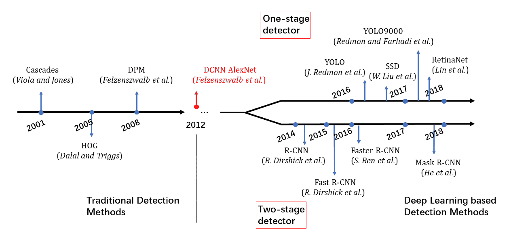
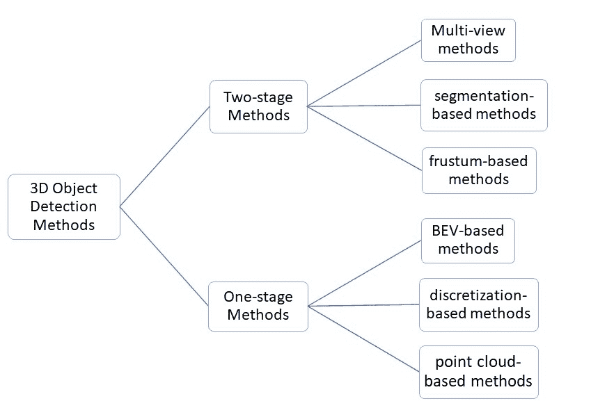
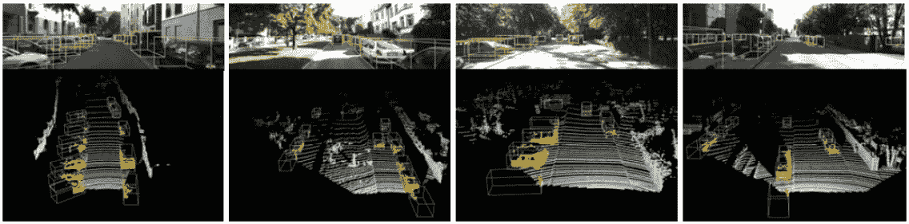
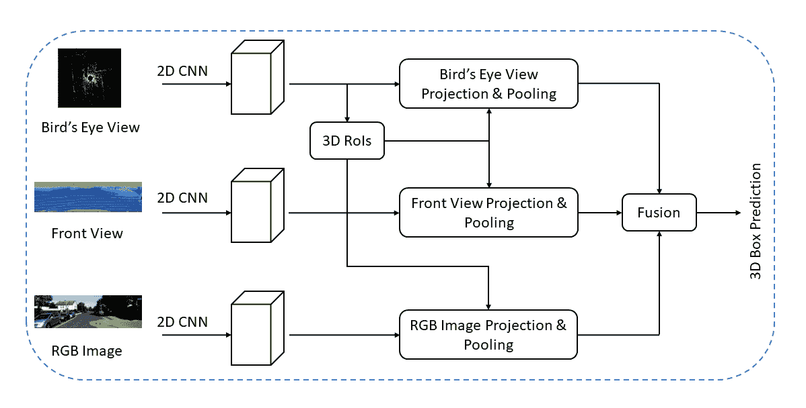
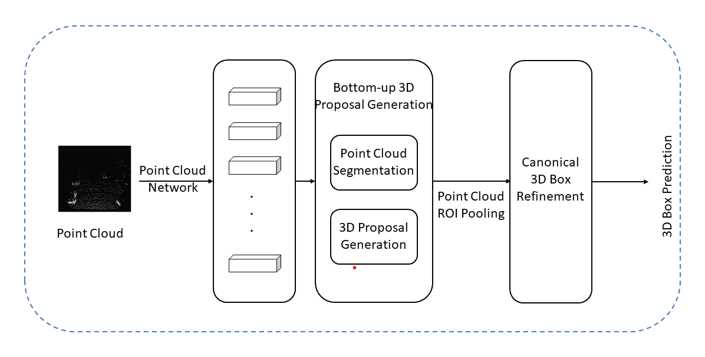
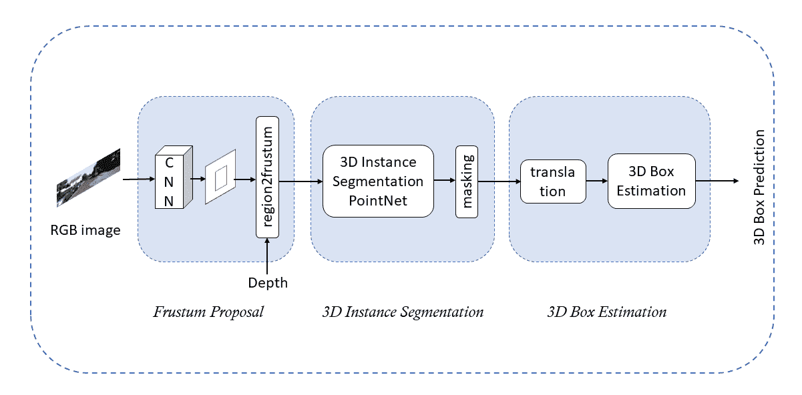
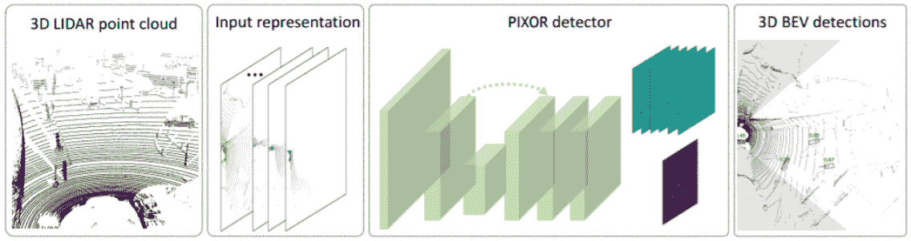
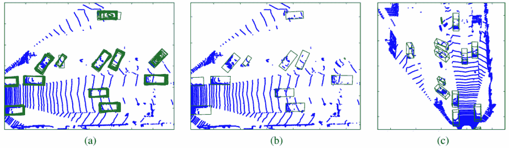
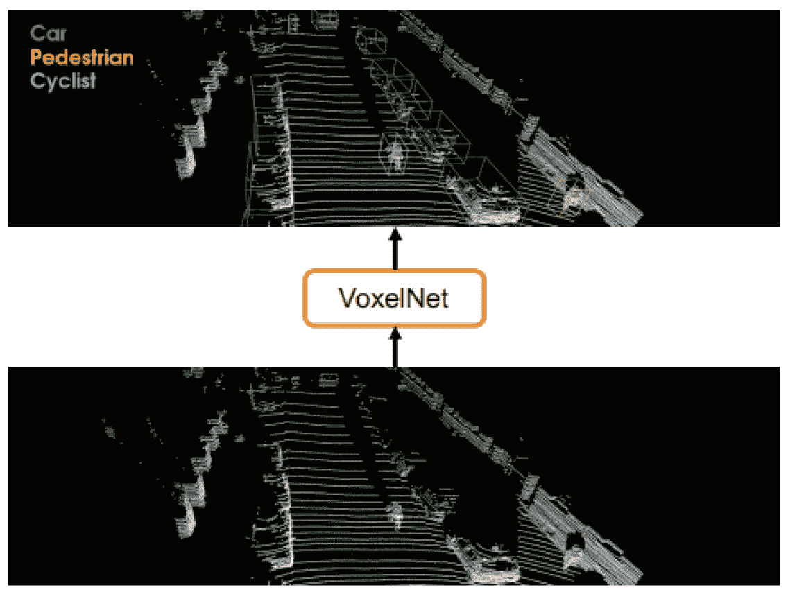
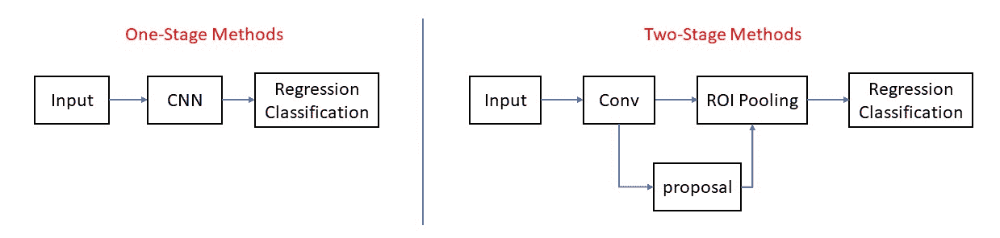

<!--yml

category: 未分类

日期：2024-09-06 19:36:01

-->

# [2311.06043] 深度学习在自动驾驶中的 3D 目标检测与跟踪：简要调查

> 来源：[`ar5iv.labs.arxiv.org/html/2311.06043`](https://ar5iv.labs.arxiv.org/html/2311.06043)

# 深度学习在自动驾驶中的 3D 目标检测与跟踪：简要调查

杨鹏

南方科技大学

12032453@mail.sustech.edu.cn

###### 摘要

目标检测和跟踪是自动驾驶中至关重要的基本任务，旨在从场景中的预定义类别中识别和定位对象。3D 点云学习在所有自驾数据形式中越来越受到关注。目前，有许多深度学习方法用于 3D 目标检测。然而，由于点云数据的独特特性，点云的目标检测和跟踪任务仍需深入研究。为了帮助更好地掌握目前的研究现状，本文展示了深度学习方法在 3D 目标检测和跟踪中的最新进展。

## 1 介绍

目标检测在计算机视觉领域一直占据着重要位置。作为图像理解的基石，目标检测广泛应用于自动驾驶、机器人视觉等大量领域。目标检测使自动驾驶系统能够清晰地看清驾驶环境，并理解这些环境中的事物，就像人类司机一样。

随着深度学习的快速发展[1]，深度学习模型可以更容易地学习复杂、微妙和抽象的特征，而不需要像传统方法那样进行人工特征提取。鉴于深度学习在处理数据方面的卓越能力，目标检测的研究取得了重大进展。

对于 2D 物体检测的研究已经得到了很好的发展[2]。为解决 2D 物体检测问题而提出的算法的准确性和效率已经达到了很高的水平，这些方法在工程实践中发挥着重要作用。在结合深度学习技术的方法之前，基于滑动窗口的传统检测策略[3, 4]在很长一段时间内占据了主流。在深度学习尚未应用于检测的阶段，前述物体检测方法的流程[5]通常可以分为三个部分：i) 提议生成；ii) 特征向量提取；iii) 区域分类[6]。提议生成的主要任务是扫描整个图像，找到可能包含期望物体的位置。这些位置被称为兴趣区域（ROI）。滑动窗口技术是一种直观的思想，用于扫描输入图像并寻找 ROI。在第二阶段，算法将从图像的每个目标位置提取一个固定长度的特征向量。梯度直方图[3]是 Navneet Dalal 和 Bill Triggs 提出的最流行的特征提取方法之一。一般来说，线性支持向量机与 HOG 一起使用，完成区域分类。

使用这些传统探测器，已经在物体检测方面取得了很大的成功。然而，这里仍然存在一些限制。基于滑动窗口的方法具有巨大的搜索空间和昂贵的计算成本，这促使了更好的解决方案。此外，不容忽视的一个短板是设计和优化探测器的过程是分开的[7]。这可能会导致系统的局部最优解。

图 1：物体检测技术的主要发展和里程碑。在 2012 年，出现了一个转折点，划分了传统方法和基于深度学习的方法之间的界限。

自从深度学习在这一领域出现以来，它在检测物体方面变得更为强大。这些使用深度学习技术的物体检测系统能够比以往更迅速、更高效地处理问题。我们观察到 2012 年是一个转折点，当时 Krizhevsky 等人开发了用于图像分类的 DCNN[8]。从那时起，基于深度学习的方法不断涌现。目前，主流的物体检测算法可以分为两类：i) 两阶段方法，如基于区域的 CNN（R-CNN）[9]及其变体[10, 11, 12]；ii) 一阶段方法，如“你只看一次”（YOLO）[13]及其变体[14]。两阶段方法是一种基于区域提议的方法，它首先提出一些可能包含物体的区域，并从这些区域分别提取特征向量。相反，一阶段方法直接在特征图的位置上预测物体的类别，省略了区域分类步骤。这些不同类型的方法各有优点。Fast-RCNN[10]减少了之前网络的处理时间。然而，一个瓶颈问题困扰了人们，因为这个网络的计算成本相当高。直到 Faster-RCNN[12]的出现，这个问题才得到解决。2D 检测器不是本文的重点。为了完整介绍 3D 物体检测方法的综述，我们提到了这些方法。这里展示了 2D 物体检测技术的主要进展和里程碑，如图 1。

然而，随着诸如机器人视觉和自动驾驶等新应用场景的提出[15]，2D 目标检测的实施远远不够。相机捕捉的图像是将 3D 空间投影到 2D 视图中，这导致了 3D 空间信息的丢失，无法满足需求。需要考虑更多的 3D 空间信息。随着众多 3D 技术的快速发展，大量的 3D 传感器如 LiDAR、3D 扫描仪和 RGB-D 摄像头变得越来越可用且价格亲民[16]。在这篇综述中，我们主要分析使用 LiDAR 获得的点云。作为一种常见格式，每个点提供了有用的几何位置信息，有些点还可能包含 RGB 信息。对于自动驾驶来说，对 3D 目标检测和跟踪的需求非常迫切。在自动驾驶研究中，准确的环境感知和精确的定位是实现可靠导航、信息决策和安全驾驶的关键。与受照明影响的数据质量的图像相比，点云对于不同的光照条件更具鲁棒性[19]。因此，点云数据在这一领域得到了广泛应用。

在 2D 目标检测的基础上，目标检测的问题和需求发生了变化。由于点云的稀疏性和不规则性，2D 目标检测方法无法直接应用于 3D 点云。因此，需要对 2D 目标检测方法进行改进，以确保这些方法可以扩展到 3D 情况。类似于应用于图像的目标检测方法，这些 3D 目标检测方法仍然可以分为两类：两阶段方法和一阶段方法。图 2 展示了基于深度学习技术的近期流行 3D 目标检测方法的简单分类。这些 3D 检测方法的更多细节可以在本文的第三部分中找到。

图 2：基于深度学习的 3D 目标检测主要方法总结。

对于本文，我们主要关注基于点云的 3D 物体检测的最先进方法。本文的其余部分组织如下。相关背景，包括问题识别、问题描述、关键挑战以及本次综述的动机，都在第 LABEL:背景 节中说明。本文的第三部分详细解释了当前的 3D 物体检测方法，包括它们的优缺点。第四部分总结了点云深度学习方法的最新发展。此外，我们指出了现有方法中仍未解决的一些难题，并提供了若干可能有意义的研究方向。

图 3：边界框。

## 2 背景

为了帮助理解现代深度学习技术如何应用于解决 3D 物体检测问题，本节描述了一些关于研究对象和数据的简单概念。

### 2.1 问题

3D 物体检测的问题，类似于 2D 检测，可以表述如下。给定一些点云数据，一个 3D 检测器需要确定这些预定义类别中是否存在实例，如果存在，则定位它们的位置。我们首先需要考虑的是这些预定义的类别，这些类别是与问题相关的。考虑到自动驾驶的情况，研究界对这些交通参与者（例如， bicycles、汽车和行人）更感兴趣。一般来说，天空和云等非结构化场景通常不是我们的研究对象。

通常，3D 边界框用于指示这些 3D 物体的位置。它是一个放置在 3D 空间中的矩形长方体，通常有三种表示方法，如轴对齐的 3D 中心偏移方法[17]、8 角点方法[18]和 4 角 2 高方法[19]。通常，3D 物体检测的最终结果是使用 3D 边界框标记 3D 物体，如图 3 所示。

### 2.2 主要挑战

通用物体检测方法旨在识别和定位感兴趣的物体类别。在大多数计算机视觉问题中，人们主要关注准确性和效率。物体检测也不例外。

从 LiDAR、深度相机和双目相机获取的点云数据可以用于 3D 物体检测。然而，随着物体与相机之间距离的增加，点云的密度会突然下降，导致密度发生巨大变化。此外，由于遮挡，物体的某些部分可能会不可见，这造成了点云分布存在较大的滞后问题。总而言之，点云的表示差异很大，使得检测器很难进行准确的检测。

我们还应注意点云的稀疏性和不规则性。同一物体的这些点的顺序受不同采集设备和坐标系统的影响很大。这些不规则的点云使得端到端模型处理起来非常困难。此外，与大规模场景相比，LiDAR 采样点的覆盖具有较强的稀疏性。众所周知，随着人工智能的快速发展，深度神经网络因其高准确性和强鲁棒性在大多数自动驾驶任务中被广泛使用。深度神经网络在 2D 物体检测领域的表现[20, 21]远远优于其他类型的算法。然而，我们刚刚提到的点云特性导致这些深度学习方法的效能下降。这就是深度学习基于 3D 物体检测的研究进展缓慢的原因。因此，在数据预处理阶段，如何表示稀疏的点云数据以便更好地利用是值得深入研究的问题。

尽管点云具有诸如深度和空间信息等有用信息，但有时同时利用图像数据似乎效果更佳。因此，许多结合 LiDAR 点云和图像的方法得到了良好的发展。在本文中，我们主要讨论点云的深度学习方法。为了本文的完整性，使用 2D 图像的某些融合方法也将被包括在内。

### 2.3 动机

本文提到的相关方法是根据其不同的算法执行过程进行组织的。换句话说，我们主要关注检测器是否首先生成提议。本文旨在调查有关点云 3D 物体检测的最新研究，并对这些方法进行分类，提供基于深度学习技术的点云研究的全面总结。它还涵盖了不同方法的比较优缺点，通过观察仍未解决的问题以启发未来可能的研究方向。

## 3 方法

### 3.1 两阶段方法

两阶段检测器首先检测包含目标的一些可能区域，也称为提案，然后对提取的特征进行预测。根据[22]的介绍，我们将这两阶段方法进一步分类为三种：i) 基于多视角的；ii) 基于分割的；iii) 基于截锥的。

多视角方法。需要意识到，点云中不包含对类别区分重要的纹理信息。相反，单目图像无法提供准确的 3D 定位和大小估计所需的深度信息。因此，多视角方法尝试使用不同的模态来提高性能。深度融合结合来自多个视角的区域特征（例如，鸟瞰图（BEV）、LiDAR 前视图（FV）和图像），并获得定向的 3D 框，如图 4(a)所示。

(a) MV3D

(b) PointRCNN

(c) Frustum PointNet

图 4：3D 目标检测方法的典型网络。

陈等人[18]做出的一个显著贡献是他们的多视角 3D 目标检测网络（MV3D）。考虑到现有 LiDAR 基于 3D 方法的高昂计算成本、当前图像基方法的缺陷以及现有多模态融合方法的局限性，该工作试图提出一种方法来克服这些阻碍 3D 目标检测发展的缺点。MV3D 由两个子网络组成：一个是 3D 提案网络，用于生成 3D 提案，另一个子网络是深度融合网络，其主要功能是尝试融合多视角特征提案。他们使用 3D 提案并将其投影到三个视图中。理论上，将 3D 提案投影到 3D 空间中的任何视图中是非常有用的。在他们的实验中，LiDAR 基于的方法在 KITTI 验证集上以 0.5 的交并比实现了 87.65% 的平均精度，比 VeloFCN [23] 高出 30%。此外，作者阐述了 BEV 的构建过程，并说明了 BEV 的三个优势，这为他们寻找鸟瞰图提供了启示，对未来的研究具有一定的参考价值。然而，这个模型并不完美，因为整个检测过程过于缓慢，无法用于实际应用。该区域提案网络 (RPN) 不适合 BEV 中的小物体实例。小物体在特征图中占据了一个像素的一部分，导致数据不足以提取特征。随后，已经进行了许多努力来改进 MV3D 模型。

通过应用不同的模态进行信息融合的效率进行了一些尝试。Ku 等人[19]提出了一种聚合视图物体检测网络（AVOD），同时使用 LIDAR 点云和 RGB 图像。与 MV3D 不同的是，它将 ROI 特征融合扩展到提议生成阶段。他们的 RPN 具有一种新颖的架构，能够在高分辨率特征图上完成多模态特征融合，从而方便地生成准确的区域提议用于场景中的小物体。此外，他们在 KITTI 物体检测基准[24]上测试了 AVOD 的性能，结果表明 AVOD 可以实时运行，并且内存消耗较低。然而，ROI 特征融合仅限于高级特征图。此外，仅从选择的物体区域提取的那些特征会被融合。ContFuse[25]被开发用来克服这些缺点。他们利用连续卷积来融合不同分辨率的特征图。通过 LIDAR 点云图像和 BEV 空间的投影可以相互对应。换句话说，在 BEV 空间中，可以提取每个点的相应图像特征，并将图像特征投影到 BEV 平面上可以获得密集的 BEV 特征图。然而，极其稀疏的点云限制了这种融合。Liang 等人[26]提出了一种用于多任务（例如 3D 物体检测、地面估计和深度补全）的物体检测网络，配备多传感器。本文利用了点级和 ROI 级特征融合的优势。具体来说，多任务的实施有助于整个网络学习更好的表示。因此，使用 KITTI 和 TOR4D 数据集对该方法进行了验证，结果证明在检测问题上取得了显著改进，并超越了过去的最先进方法。

另一个改进方向是探讨如何提取输入的鲁棒表示。提出了一种新颖的空间通道注意力网络（SCANet）[27]，旨在实现高精度的 3D 物体检测。本文提出了全新的空间通道注意力（SCA）模块和扩展空间上采样（ESU）模块用于 3D 区域提议。前者模块可以关注场景中的全局和多尺度上下文，并捕捉那些具有区分性的特征。后者模块结合了不同尺度的低级特征，并生成可靠的 3D 区域提议。此外，一种更好地融合这些特征的方法是应用新的多级融合方案，允许它们之间有更多的互动。最后，实验结果表明，在 11.1 FPS 的速度下，他们的方法比 MV3D 快 5 倍。

基于分割的方法。这类方法通常在语义分割的初步处理阶段[28]，即通过使用语义分割技术去除背景点，可以帮助从前景点生成高质量的提议。一个典型的基于分割的网络如图 4(b)所示。此外，与上述多视角方法相比，基于分割的方法获得了更高的召回率，并且可以应用于具有大量遮挡和拥挤物体膨胀的复杂场景中。

首个介绍的方法是[29]中提出的。这种方法名为 IPOD，首先对图像进行语义分割，并生成基于点的提议。在这些正样本点生成的提议也保持了较高的准确性。此外，还考虑了一些可能的问题，如提议冗余和模糊性。本文提出了一种新的标准，名为 PointsIoU，以解决这些问题。实验结果确实表明，这一模型优于许多 3D 检测方法，特别是在高遮挡场景中表现更佳。

在我们的审查中另一个经典的基于分割的网络是 Shi 等人提出的 PointRCNN [30]。该网络通过分割技术在第一阶段生成 3D 提议，然后在第二阶段对这些提议进行细化以获得最终检测结果。与 IPOD 不同，PointRCNN 直接对点云进行分割，以生成高质量的提议，而不是应用 2D 物体分割。该网络的一个重要模块是基于箱体的 3D 边界框生成，这些箱体是从前景点回归得出的。该模块采用基于箱体的方法，而不是使用 L1 或 L2 损失进行回归。也就是说，他们首先将每个前景点拆分到不同的箱体中，然后在每个箱体中回归箱体。这项工作在 3D 空间中实现了一个 RPN。从 PointRCNN 的 RPN 阶段中汲取经验，Jesus 等人提出了一个基于图的 3D 检测管道，名为 PointRGCN [31]，它利用 GCNs 的进展，包括两个子网络 R-GCN 和 C-GCN。R-GCN 是一个残差 GCN，通过使用提议中的所有点来实现预提议特征聚合。C-GCN 是一个上下文 GCN，其主要功能是通过不同提议之间共享的上下文信息来细化提议。Sourabh 等人提出了 PointPainting [32]，该方法通过将激光雷达点投影到基于图像的语义分割网络的输出中，并将类别分数附加到每个点上。这些附加的点可以输入到任何现有的仅激光雷达检测器中，如上面提到的 PointRCNN。他们的工作填补了不同传感器提供的综合信息对基于融合的方法有益的空白，但在主要基准数据集上的实验结果显示，大多数情况下，仅激光雷达方法的表现优于基于融合的方法。

基于截锥体的方法。这些方法利用成熟的 2D 物体检测器和先进的 3D 深度学习进行物体定位。它们首先生成 2D 物体区域提议，然后通过将 2D 边界框提升到包括 3D 搜索空间的截锥体来生成 3D 截锥体提议。基于截锥体的方法的一个具体过程可以在图 4(c)中看到。显然，尽管这种方法在提出可能的 3D 物体区域时效率很高，但逐步的流程使其极度依赖 2D 图像检测器。

Qi 等人在这个方向上做了开创性的工作。他们提出了一个名为 Frustum PointNets [33] 的新框架，基于 RGB-D 数据进行 3D 物体检测。在他们的工作中，模型首先将 RGB 图像输入到卷积神经网络中，以获取 2D 提议，然后结合深度信息将区域投影到视锥体。这是获取视锥体提议的过程。对于那些包含在视锥体中的点，将执行 3D 实例分割。基于分割结果，轻量级回归 PointNet 尝试通过平移调整这些点，以使它们的质心接近于模态框中心。最后，一个 3D 盒子估计网络估算这些 3D 模态边界框。令人惊讶的是，F-PointNets 能够用少量点正确预测模态 3D 盒子。然而，仍然存在一些问题，例如在同一类别的多个实例的情况下无法工作。在 F-PointNets 的工作之后，Zhao 等人提出了一种新的网络架构，称为 SIFRNet [34]，依赖前视图图像和视锥体点云来预测 3D 检测结果。整个网络主要由三个部分组成：i) 3D 实例分割网络（Point-UNet）；ii) T-Net；iii) 3D 盒子估计网络（Point-SENet）。它们有助于提高 3D 分割的性能和 3D 边界框预测的效率。PointSIFT [35] 模块被集成到他们的网络中，捕捉点云的方向信息，并对形状缩放具有强大的鲁棒性。一系列实验表明，该方法在与 F-PointNets 相比时，在 KITTI 数据集和 SUN-RGBD 数据集 [36] 上表现更好。

Xu 等人提出了一种通用的 3D 物体检测方法，称为 PointFusion [37]。为了应对各种 RGB 图像和点云数据结合的挑战，以前的方法通常将点云数据转换为 2D 图像或体素。这种方法虽然方便，但会遇到丢失点云数据中部分信息的问题。相反，该方法通过 ResNet [38] 和 PointNet [39] 直接处理图像和 3D 点云。获得的 2D 图像区域及其相关的视锥体点用于精确回归 3D 盒子。他们提出了一种全局融合网络，直接获取 3D 盒子的角点位置。同时，还提出了一种新的密集融合网络，用于预测空间偏移量并选择最终得分最高的预测结果。

值得注意的是，Wang 等人提出了一种称为 Frustum ConvNet 的新方法[40]，该方法首先为每个提案生成一组截头圆锥体，并利用获得的截头圆锥体对这些点进行分组。我们之前提到的 F-PointNet 也直接在原始点云上工作，但由于其 T-Net 对齐，它并未设计为端到端的流水线。这种方法考虑了这一因素，并设计为结合之前工作的多种优点。已证明这种新方法 F-ConvNet 在 KITTI 数据集中相较于 2D 检测器实现了最先进的性能，并对诸如自动驾驶等大量应用具有帮助。

两阶段方法在物体检测中获得了高准确率等多个优点。然而，由于生成包含预定义物体的区域的过程，这种物体检测程序的速度会降低。

图 5：基于点云的鸟瞰视角（BEV）的 3D 物体检测器的全面视图。

### 3.2 单阶段方法

在我们的讨论中，一个阶段等于在预测类别概率和直接回归边界框的意义上的一次单独操作。这些方法不需要区域建议网络（RPN）和后处理。因此，它们的速度比两阶段方法更快，并且主要应用于实时系统。我们将单阶段方法按照输入数据的形式分类，包括基于 BEV 的方法、基于离散化的方法和基于点云的方法。

基于 BEV 的方法。根据这种方法的名称，很明显基于 BEV 的方法使用 BEV 表示作为输入。如[18]中提到的，与前视图或图像平面相比，BEV 地图在 3D 物体检测中有几个强项。首先，在 BEV 地图中物体的实际尺寸与原始尺寸相同，从而减少了前视图/图像平面中的尺寸误差。其次，几乎不可能遇到遮挡问题，因为 BEV 中的物体位于不同的位置。最后，对于自动驾驶应用，这些交通参与者通常位于地面平面上，并且在垂直方向上存在较小的方差。因此，BEV 位置在获取 3D 边界框时具有重要意义。

Yang 等人提出了一种无提案、单阶段的方法，称为 PIXOR [41]，该方法表示来自鸟瞰图（BEV）的原始 3D 数据。我们可以从图 5 中看到 PIXOR 的网络架构。选择 BEV 表示是因为其计算友好。在输入表示的阶段，他们首先将感兴趣场景中的 3D 点离散化为每个单元分辨率为 $d_{L}$ × $d_{W}$ × $d_{H}$ 的离散点，然后对每个单元的值进行编码以获得占用张量。最后，他们获得了 2D 反射图像和 3D 占用张量的组合。在设计网络架构时，使用了全卷积网络进行密集的 3D 物体检测。PIXOR 由一个主干网络和一个头部网络组成。前者提取输入的普通表示，后者用于执行特定任务预测。根据实验结果，得出的结论是 PIXOR 在平均精度（AP）方面优于大多数单阶段方法，同时以 10 FPS 的速度运行。

后来，Yang 等人 [42] 向我们展示了高分辨率（HD）地图具有强大的先验，这有助于提高 3D 物体检测的性能和鲁棒性。为了实现他们的目标，他们开发了一种在鸟瞰图（BEV）中工作的单阶段检测器，并融合了激光雷达信息。具体而言，他们从 HD 地图中获取地面点的坐标，然后 BEV 表示中的绝对距离将被替换为相对于地面的距离，以修正平移方差。考虑到 HD 地图并非随处可用，他们提出了一种实用的解决方案，即利用在线地图预测模块，并基于激光雷达点云数据估计地图先验。在他们的实验中，基线是没有地图的 PIXOR++检测器。结果表明，这种基于 HD 地图的模型在 TOR4D 和 KITTI 上明显优于其基线。然而，仍然存在一个问题，即对具有不同密度的点云数据的泛化性能较差。为了解决这个问题，Beltran 等人提出了一种新的网络架构，称为 BirdNet [43]。他们开发了一种新的 BEV 编码方法，该方法对距离和激光雷达设备的差异具有不变性。所提出的密度归一化方法使得能够在流行的高分辨率激光数据集上训练模型。

基于离散化的方法。通过其名称很容易理解这种方法。这些方法通常将原始点云数据转换为规则的离散格式（例如，2D 地图），然后使用深度神经网络预测物体的类别概率和 3D 框。

第一个将 FCN 用于 3D 物体检测的方法是由 Li 等人提出的。由于卷积网络技术的快速发展，他们提出了一种将 FCN 技术移植到 3D 数据物体检测中的新想法[23]。在这种方法中，点云数据被转换为 2D 点图，然后使用 FCN 同时预测这些物体的置信度和边界框。这是首次尝试将 FCN 技术引入范围扫描数据的物体检测，生成了一种顺序和端到端的检测框架。然而，本文仅分析了来自 Velodyne 64E 的 3D 范围扫描的方法。因此，在他们的后续工作中，他们将点云离散化为一个具有长度、宽度、高度和通道维度的 4D 张量[44]。在这项工作中，他们还将先前基于 FCN 的 2D 检测方法扩展到 3D 领域进行 3D 物体检测。我们可以在图 6 中观察到检测结果。根据他们的实验结果，他们与 2D 检测工作的 FCN 进行了比较，观察到准确度提高了超过 20%。

图 6：3D FCN 检测过程的直接结果。 (a) 聚合具有高物体置信度的边界框，并将其绘制为绿色框。绘制来自绿色框的边界框预测。 (b) 在聚类后，将这些边界框与蓝色原始点云绘制在一起。 (c) 在 3D 中进行检测，因为 (a) 和 (b) 以鸟瞰图的形式可视化。

尽管基于 3D FCN 的方法相比之前的工作有所进展，但仍然存在一些可能的问题。回顾这个过程，我们可以很容易发现，由于 3D 卷积和数据的稀疏性，这种方法计算开销巨大。Engelcke 等人提出了一种名为 Vote3Deep 的计算高效方法，用于对 3D 点云进行物体检测[45]。Vote3Deep 是一个以特征为中心的投票框架，旨在提高计算效率。一方面，通过利用投票框架构建高效的卷积层具有很大的用处。另一方面，为了利用整个 CNN 堆栈中的稀疏卷积层，他们使用了修改过的线性单元和稀疏性惩罚。Li 等人提出了一种 3D 主干网络，从大部分原始数据中学习 3D 特征[46]。该网络旨在解决缺乏强大 3D 特征提取方法的问题。因此，这种方法获得了丰富的 3D 特征，并且不会引入巨大的计算负担。

Zhou 等人提出了一种名为 VoxelNet 的端到端网络，用于 3D 目标检测[47]。图 7 展示了 VoxelNet 的工作原理。他们将点云投影到等距的体素中，并通过品牌提出的体素特征编码（VFE）层将每个体素中的多个点转换为集中化的特征表示。使用体素表示点云的方法表现良好。基于体素的方法有时是为了增强在处理点云数据阶段的信息保留。然而，由于这些体素的稀疏性和 3D 卷积计算，模型处理的速度仍然非常慢。继 Zhou 的工作后，Yan 等人研究了如何提高训练和预测速度，并提出了一种改进的稀疏卷积方法[48]。此外，为了解决在$0$和$\pi$之间解决正弦函数的模糊性问题，他们提出了正弦误差角损失。Sindagi 等人尝试对 VoxelNet 进行小幅修改，将图像和点云特征在不同阶段融合[49]。具体来说，PointFusion 和 VoxelFusion 是[49]中提到的两种独特技术。前者在点云数据可以投影到图像平面时工作，后者则用于将这些 3D 体素投影到图像上。与 VoxelNet 相比，这种具有新技术的网络能够利用多模态信息，并能减少假阳性和假阴性。

图 7：VoxelNet 直接在原始点云上工作，无需特征工程，并使用单一的端到端可训练网络预测 3D 检测结果。

考虑到尽管点云包含大量空间信息，但在现有的一次性方法中，缩小特征图的过程中不可避免地会丢失一些信息，He 等人提出了一种 SA-SSD 网络，利用细粒度的架构信息来提高定位精度[50]。其特殊之处在于，他们首先将点云数据转化为张量，并将其输入到骨干网络中以提取多个阶段的特征。此外，他们设计了一个具有点级监督的补充网络，可以指导这些特征学习点云的结构。令人惊讶的是，他们的实验结果表明，SA-SSD 在 Car 类别的 KITTI BEV 检测基准中排名第一。

图 8：两阶段和单阶段方法的不同目标检测过程。

基于点的方法。这些方法不对原始输入进行格式转换，而是直接将点云输入网络。杨等人进行了开创性的工作，提出了一种名为 3DSSD 的网络[51]。这是首个轻量级、高效的基于点云的 3D 单阶段物体检测器。在这一新模型中，Distance-FPS（D-FPS）和 Feature-FPS（F-FPS）的结合是他们提出的融合采样策略。此外，他们生成了一个详细的边界框预测网络，以最佳利用代表性点，利用了候选生成层（CG）、无锚点回归头和 3D 中心分配策略。最终，实验结果表明，3DSSD 在 25 fps 的速度下优于基于点的方法 PointRCNN。

其他方法。此外，还有一些其他的单阶段物体检测方法在本综述中未被分为任何类型。迈耶等人提出了 LaserNet，这是一种高效的概率性 3D 物体检测模型[52]。值得注意的是，他们使用了小型且密集的范围视图数据作为输入，而不是鸟瞰图数据。因此，他们的模型更高效。此外，据我们所知，这是第一种通过建模边界框角点分布来获得检测不确定性的方法。

与两阶段方法相比，一阶段方法可能无法实现如此高的检测准确率。但一阶段方法具有更快的物体检测能力，适用于实时检测。

## 4 总结

三维物体检测对计算机理解场景具有巨大帮助，是许多现实世界应用如自动驾驶的关键技术。在这篇综述中，我们列举了一些典型的最先进的三维物体检测方法，并将其分类为两阶段方法和一阶段方法。前者需要首先生成一系列提议，然后预测或回归这些提取的特征。一阶段方法跳过了提议生成的过程，直接预测类别概率和回归边界框。为了直接理解这两种方法如何实现物体检测，图 8 给出了简单描述。我们还阐述了点云数据在物体检测中的优点，并列出了点云的几个已知缺点。目前，流行的方法尝试引入不同类型的输入，如激光雷达点和相机数据。图像提供了更多的密集信息，但损失了三维空间信息。激光雷达点云适合于三维物体检测，因其具有几何位置和深度信息。点云的稀疏性和不规则性促使人们研究新颖的方法，以充分利用图像和激光雷达数据的优点。

根据对各种现有方法的分析，以下问题需要进一步研究：

+   •

    首先，由于数据的规则表示，那些成熟的二维图像处理网络可以很好地应用于基于投影的技术和基于离散化的技术。然而，在将三维数据投影到二维格式的过程中，不可避免地会丢失一些有用的信息，这是投影方法的一大限制。对于基于离散化的方法，由于分辨率的提高导致计算量和巨大的内存开销指数增长，依然是主要瓶颈。考虑到上述问题，基于索引架构构建稀疏卷积层可能是一个可行的解决方案，值得进一步研究。

+   •

    目前，基于点云的模型是人们最关注的热门方法。然而，由于点云的稀疏性和不规则性，点表示通常缺乏明确的邻域信息。许多现有的点云方法使用昂贵的最近邻搜索技术，如应用于[53]的 KNN。这些方法的低效性呼唤更高效的方法。最近的一种点-体素结合表示方法[54]可能是进一步研究的方向。

+   •

    目前大多数现有的 3D 点云目标检测方法适用于小规模的点云。然而，由于数据采集过程是连续的，通过 LiDAR 获得的点云数据极其庞大。因此，迫切需要进一步研究以解决这些大规模点云的问题。

+   •

    大量研究人员 [55, 56] 已经开始从动态点云中学习时空信息。预计这些时空信息将有助于提高许多后续任务的性能，如 3D 对象分割、对象识别和补全。

## 参考文献

+   [1] G. Lan, Y. Wu, F. Hu, 和 Q. Hao, “基于视觉的人体姿态估计：综述,” *IEEE 人机系统汇刊*, 卷 53, 期 1, 页 253–268, 2023 年。

+   [2] G. Lan, L. De Vries, 和 S. Wang, “为实时对象识别进化高效的深度神经网络,” 在 *2019 IEEE 计算智能研讨会系列（SSCI）*。IEEE, 2019 年, 页 2571–2578。

+   [3] N. Dalal 和 B. Triggs, “用于人体检测的定向梯度直方图,” 在 *2005 IEEE 计算机学会计算机视觉与模式识别会议（CVPR 2005）, 2005 年 6 月 20-26 日, 圣地亚哥, CA, 美国*。IEEE 计算机学会, 2005 年, 页 886–893。

+   [4] P. F. Felzenszwalb, R. B. Girshick, D. A. McAllester, 和 D. Ramanan, “基于部分的判别训练模型进行目标检测,” *IEEE 模式分析与机器智能汇刊*, 卷 32, 期 9, 页 1627–1645, 2010 年。

+   [5] X. Wu, D. Sahoo, 和 S. C. H. Hoi, “深度学习在目标检测中的最新进展,” *CoRR*, 卷 abs/1908.03673, 2019 年。[在线]. 可用: [`arxiv.org/abs/1908.03673`](http://arxiv.org/abs/1908.03673)

+   [6] G. Lan, Z. Gao, L. Tong, 和 T. Liu, “用于多类分类的神经进化的类二值化,” *神经计算与应用*, 卷 34, 期 22, 页 19 845–19 862, 2022 年。

+   [7] G. Lan, J. M. Tomczak, D. M. Roijers, 和 A. Eiben, “贝叶斯进化算法的优化时间效率,” *群体智能与进化计算*, 卷 69, 页 100970, 2022 年。

+   [8] A. Krizhevsky, I. Sutskever, 和 G. E. Hinton, “使用深度卷积神经网络进行 Imagenet 分类,” 在 *神经信息处理系统进展 25: 2012 年神经信息处理系统年会论文集, 会议于 2012 年 12 月 3-6 日举行, 内华达州湖塔霍, 美国*, P. L. Bartlett, F. C. N. Pereira, C. J. C. Burges, L. Bottou, 和 K. Q. Weinberger 编辑, 2012 年, 页 1106–1114。

+   [9] R. B. Girshick, J. Donahue, T. Darrell, 和 J. Malik, “丰富的特征层次结构用于准确的目标检测和语义分割,” 在 *2014 IEEE 计算机视觉与模式识别会议, CVPR 2014, 哥伦布, OH, 美国, 2014 年 6 月 23-28 日*。IEEE 计算机学会, 2014 年, 页 580–587。

+   [10] R. B. Girshick，“快速 R-CNN”，见于*2015 IEEE 国际计算机视觉会议，ICCV 2015，圣地亚哥，智利，2015 年 12 月 7-13 日*。IEEE 计算机学会，2015 年，第 1440-1448 页。

+   [11] K. He, G. Gkioxari, P. Dollár 和 R. B. Girshick，“Mask R-CNN”，见于*IEEE 国际计算机视觉会议，ICCV 2017，威尼斯，意大利，2017 年 10 月 22-29 日*。IEEE 计算机学会，2017 年，第 2980-2988 页。

+   [12] S. Ren, K. He, R. B. Girshick 和 J. Sun，“Faster R-CNN：通过区域提议网络实现实时目标检测”，见于*神经信息处理系统进展 28：2015 年神经信息处理系统年会，2015 年 12 月 7-12 日，蒙特利尔，魁北克，加拿大*，C. Cortes, N. D. Lawrence, D. D. Lee, M. Sugiyama 和 R. Garnett 主编，2015 年，第 91-99 页。

+   [13] J. Redmon, S. K. Divvala, R. B. Girshick 和 A. Farhadi，“你只需看一次：统一的实时目标检测”，见于*2016 IEEE 计算机视觉与模式识别会议，CVPR 2016，拉斯维加斯，内华达州，美国，2016 年 6 月 27-30 日*。IEEE 计算机学会，2016 年，第 779-788 页。

+   [14] J. Redmon 和 A. Farhadi，“YOLO9000：更好、更快、更强”，见于*2017 IEEE 计算机视觉与模式识别会议，CVPR 2017，檀香山，夏威夷，美国，2017 年 7 月 21-26 日*。IEEE 计算机学会，2017 年，第 6517-6525 页。

+   [15] G. Lan, J. Benito-Picazo, D. M. Roijers, E. Domínguez 和 A. Eiben，“低性能计算硬件上的实时机器人视觉”，见于*2018 年第 15 届控制、自动化、机器人与视觉国际会议（ICARCV）*。IEEE，2018 年，第 1959-1965 页。

+   [16] H. Xu, G. Lan, S. Wu 和 Q. Hao，“用于自动驾驶系统的在线智能相机和激光雷达标定”，见于*2019 IEEE 智能交通系统会议（ITSC）*。IEEE，2019 年，第 3913-3920 页。

+   [17] S. Song 和 J. Xiao，“用于 RGB-D 图像中无模态 3D 目标检测的深度滑动形状”，见于*2016 IEEE 计算机视觉与模式识别会议，CVPR 2016，拉斯维加斯，内华达州，美国，2016 年 6 月 27-30 日*。IEEE 计算机学会，2016 年，第 808-816 页。

+   [18] X. Chen, H. Ma, J. Wan, B. Li 和 T. Xia，“用于自动驾驶的多视角 3D 目标检测网络”，见于*2017 IEEE 计算机视觉与模式识别会议，CVPR 2017，檀香山，夏威夷，美国，2017 年 7 月 21-26 日*。IEEE 计算机学会，2017 年，第 6526-6534 页。

+   [19] J. Ku, M. Mozifian, J. Lee, A. Harakeh 和 S. L. Waslander，“从视图聚合中生成联合 3D 提议和目标检测”，见于*2018 IEEE/RSJ 国际智能机器人与系统会议，IROS 2018，马德里，西班牙，2018 年 10 月 1-5 日*。IEEE，2018 年，第 1-8 页。

+   [20] G. Lan, M. van Hooft, M. De Carlo 和 J. M. Tomczak，“在可进化机器人中学习运动技能”，*神经计算*，第 452 卷，第 294-306 页，2021 年。

+   [21] G. Lan, M. De Carlo, F. van Diggelen, J. M. Tomczak 和 D. M. Roijers，“在具有可进化形态的模块化机器人中学习定向运动”，*应用软计算*，第 111 卷，第 107688 页，2021 年。

+   [22] Y. Guo、H. Wang、Q. Hu、H. Liu、L. Liu 和 M. Bennamoun，“3D 点云的深度学习：一项综述，” *IEEE 计算机学会模式分析与机器智能汇刊*，卷号 43，第 12 期，第 4338–4364 页，2021 年。

+   [23] B. Li、T. Zhang 和 T. Xia，“基于全卷积网络的 3D 激光雷达车辆检测，” 在 *机器人学：第十二届科学与系统会议，密歇根大学，安娜堡，密歇根州，美国，2016 年 6 月 18-22 日*，D. Hsu、N. M. Amato、S. Berman 和 S. A. Jacobs 主编，2016 年。

+   [24] A. Geiger、P. Lenz 和 R. Urtasun，“我们准备好自动驾驶了吗？KITTI 视觉基准套件，” 在 *2012 IEEE 计算机视觉与模式识别大会，普罗维登斯，RI，美国，2012 年 6 月 16-21 日*。IEEE 计算机学会，2012 年，第 3354–3361 页。

+   [25] M. Liang、B. Yang、S. Wang 和 R. Urtasun，“用于多传感器 3D 物体检测的深度连续融合，” 在 *计算机视觉 - ECCV 2018 - 第 15 届欧洲会议，慕尼黑，德国，2018 年 9 月 8-14 日，会议论文集，第十六部分*，系列：计算机科学讲义丛书，V. Ferrari、M. Hebert、C. Sminchisescu 和 Y. Weiss 主编，卷号 11220。Springer，2018 年，第 663–678 页。

+   [26] M. Liang、B. Yang、Y. Chen、R. Hu 和 R. Urtasun，“用于 3D 物体检测的多任务多传感器融合，” 在 *IEEE 计算机视觉与模式识别大会，CVPR 2019，长滩，加州，美国，2019 年 6 月 16-20 日*。计算机视觉基金会 / IEEE，2019 年，第 7345–7353 页。

+   [27] H. Lu、X. Chen、G. Zhang、Q. Zhou、Y. Ma 和 Y. Zhao，“Scanet: 用于 3D 物体检测的空间通道注意力网络，” 在 *IEEE 国际声学、语音和信号处理会议，ICASSP 2019，布莱顿，英国，2019 年 5 月 12-17 日*。IEEE，2019 年，第 1992–1996 页。

+   [28] G. Lan、T. Liu、X. Wang、X. Pan 和 Z. Huang，“一种语义网技术索引，” *Scientific Reports*，卷号 12，第 1 期，页码 3672，2022 年。

+   [29] Z. Yang、Y. Sun、S. Liu、X. Shen 和 J. Jia，“IPOD: 强化点云对象检测器，” *CoRR*，卷号 abs/1812.05276，2018 年。[在线]。可用网址：[`arxiv.org/abs/1812.05276`](http://arxiv.org/abs/1812.05276)

+   [30] S. Shi、X. Wang 和 H. Li，“Pointrcnn: 从点云生成和检测 3D 物体提议，” 在 *IEEE 计算机视觉与模式识别大会，CVPR 2019，长滩，加州，美国，2019 年 6 月 16-20 日*。计算机视觉基金会 / IEEE，2019 年，第 770–779 页。

+   [31] J. Zarzar、S. Giancola 和 B. Ghanem，“Pointrgcn: 用于 3D 车辆检测精化的图卷积网络，” *CoRR*，卷号 abs/1911.12236，2019 年。[在线]。可用网址：[`arxiv.org/abs/1911.12236`](http://arxiv.org/abs/1911.12236)

+   [32] S. Vora、A. H. Lang、B. Helou 和 O. Beijbom，“Pointpainting: 用于 3D 物体检测的序列融合，” 在 *2020 IEEE/CVF 计算机视觉与模式识别大会，CVPR 2020，西雅图，WA，美国，2020 年 6 月 13-19 日*。计算机视觉基金会 / IEEE，2020 年，第 4603–4611 页。

+   [33] C. R. Qi, W. Liu, C. Wu, H. Su, 和 L. J. Guibas, “Frustum pointnets 用于从 RGB-D 数据中进行 3D 目标检测,” 在 *2018 IEEE 计算机视觉与模式识别会议, CVPR 2018, 盐湖城, UT, 美国, 2018 年 6 月 18-22 日*。计算机视觉基金会 / IEEE 计算机学会, 2018, 页码 918–927.

+   [34] X. Zhao, Z. Liu, R. Hu, 和 K. Huang, “使用尺度不变和特征重标定网络进行 3D 目标检测,” 在 *第三十三届 AAAI 人工智能会议, AAAI 2019, 第三十一届人工智能创新应用会议, IAAI 2019, 第九届 AAAI 教育进展研讨会, EAAI 2019, 檀香山, 夏威夷, 美国, 2019 年 1 月 27 日 - 2 月 1 日*。AAAI 出版社, 2019, 页码 9267–9274.

+   [35] M. Jiang, Y. Wu, 和 C. Lu, “Pointsift: 类似于 SIFT 的 3D 点云语义分割网络模块,” *CoRR*, vol. abs/1807.00652, 2018. [在线]. 可用: [`arxiv.org/abs/1807.00652`](http://arxiv.org/abs/1807.00652)

+   [36] S. Song, S. P. Lichtenberg, 和 J. Xiao, “SUN RGB-D: RGB-D 场景理解基准套件,” 在 *IEEE 计算机视觉与模式识别会议, CVPR 2015, 波士顿, MA, 美国, 2015 年 6 月 7-12 日*。IEEE 计算机学会, 2015, 页码 567–576.

+   [37] D. Xu, D. Anguelov, 和 A. Jain, “Pointfusion: 深度传感器融合用于 3D 边界框估计,” 在 *2018 IEEE 计算机视觉与模式识别会议, CVPR 2018, 盐湖城, UT, 美国, 2018 年 6 月 18-22 日*。计算机视觉基金会 / IEEE 计算机学会, 2018, 页码 244–253.

+   [38] K. He, X. Zhang, S. Ren, 和 J. Sun, “深度残差学习用于图像识别,” 在 *2016 IEEE 计算机视觉与模式识别会议, CVPR 2016, 拉斯维加斯, NV, 美国, 2016 年 6 月 27-30 日*。IEEE 计算机学会, 2016, 页码 770–778.

+   [39] C. R. Qi, H. Su, K. Mo, 和 L. J. Guibas, “Pointnet: 深度学习点集用于 3D 分类和分割,” 在 *2017 IEEE 计算机视觉与模式识别会议, CVPR 2017, 檀香山, HI, 美国, 2017 年 7 月 21-26 日*。IEEE 计算机学会, 2017, 页码 77–85.

+   [40] Z. Wang 和 K. Jia, “Frustum convnet: 滑动视锥体以聚合局部点特征用于模态 3D 目标检测,” *CoRR*, vol. abs/1903.01864, 2019. [在线]. 可用: [`arxiv.org/abs/1903.01864`](http://arxiv.org/abs/1903.01864)

+   [41] B. Yang, W. Luo, 和 R. Urtasun, “PIXOR: 实时 3D 目标检测从点云,” 在 *2018 IEEE 计算机视觉与模式识别会议, CVPR 2018, 盐湖城, UT, 美国, 2018 年 6 月 18-22 日*。计算机视觉基金会 / IEEE 计算机学会, 2018, 页码 7652–7660.

+   [42] B. Yang, M. Liang, 和 R. Urtasun, “HDNET: 利用高清地图进行 3D 目标检测,” 在 *第 2 届年度机器人学习会议, CoRL 2018, 苏黎世, 瑞士, 2018 年 10 月 29-31 日, 会议论文集*, 机器学习研究系列, vol. 87。PMLR, 2018, 页码 146–155.

+   [43] J. Beltrán, C. Guindel, F. M. Moreno, D. Cruzado, F. García, 和 A. de la Escalera, “Birdnet: 基于激光雷达信息的 3D 物体检测框架，” 在 *第 21 届国际智能交通系统会议，ITSC 2018, 毛伊岛, HI, 美国, 2018 年 11 月 4-7 日*, W. Zhang, A. M. Bayen, J. J. S. Medina, 和 M. J. Barth 编, IEEE, 2018 年, 页码 3517–3523。

+   [44] B. Li, “用于点云中车辆检测的 3D 全卷积网络，” 在 *2017 IEEE/RSJ 国际智能机器人与系统会议, IROS 2017, 温哥华, BC, 加拿大, 2017 年 9 月 24-28 日*. IEEE, 2017 年, 页码 1513–1518。

+   [45] M. Engelcke, D. Rao, D. Z. Wang, C. H. Tong, 和 I. Posner, “Vote3Deep: 使用高效卷积神经网络在 3D 点云中进行快速物体检测，” 在 *2017 IEEE 国际机器人与自动化会议, ICRA 2017, 新加坡, 2017 年 5 月 29 日 - 6 月 3 日*. IEEE, 2017 年, 页码 1355–1361。

+   [46] X. Li, J. Guivant, N. Kwok, Y. Xu, R. Li, 和 H. Wu, “三维骨干网络用于交通场景中的 3D 物体检测，” *arXiv 预印本*, 2019 年。

+   [47] Y. Zhou 和 O. Tuzel, “Voxelnet: 基于点云的 3D 物体检测的端到端学习，” 在 *2018 IEEE 计算机视觉与模式识别会议, CVPR 2018, 盐湖城, UT, 美国, 2018 年 6 月 18-22 日*. 计算机视觉基金会 / IEEE 计算机学会, 2018 年, 页码 4490–4499。

+   [48] Y. Yan, Y. Mao, 和 B. Li, “SECOND: 稀疏嵌入卷积检测，” *传感器*, 卷 18, 期 10, 页码 3337, 2018 年。

+   [49] V. A. Sindagi, Y. Zhou, 和 O. Tuzel, “MVX-Net: 多模态体素网络用于 3D 物体检测，” *arXiv 预印本*, 页码 arXiv:1904.01649, 2019 年 4 月。

+   [50] C. He, H. Zeng, J. Huang, X. Hua, 和 L. Zhang, “结构感知单阶段 3D 物体检测从点云中，” 在 *2020 IEEE/CVF 计算机视觉与模式识别会议, CVPR 2020, 西雅图, WA, 美国, 2020 年 6 月 13-19 日*. 计算机视觉基金会 / IEEE, 2020 年, 页码 11 870–11 879。

+   [51] Z. Yang, Y. Sun, S. Liu, 和 J. Jia, “3DSSD: 基于点的 3D 单阶段物体检测器，” 在 *2020 IEEE/CVF 计算机视觉与模式识别会议, CVPR 2020, 西雅图, WA, 美国, 2020 年 6 月 13-19 日*. 计算机视觉基金会 / IEEE, 2020 年, 页码 11 037–11 045。

+   [52] G. P. Meyer, A. Laddha, E. Kee, C. Vallespi-Gonzalez, 和 C. K. Wellington, “Lasernet: 高效的概率 3D 物体检测器用于自动驾驶，” 在 *IEEE 计算机视觉与模式识别会议, CVPR 2019, 长滩, CA, 美国, 2019 年 6 月 16-20 日*. 计算机视觉基金会 / IEEE, 2019 年, 页码 12 677–12 686。

+   [53] Y. Li, R. Bu, M. Sun, W. Wu, X. Di, 和 B. Chen, “Pointcnn: 在 x 变换点上的卷积，” 在 *神经信息处理系统进展 31: 神经信息处理系统年会 2018, NeurIPS 2018, 2018 年 12 月 3-8 日, 蒙特利尔, 加拿大*, S. Bengio, H. M. Wallach, H. Larochelle, K. Grauman, N. Cesa-Bianchi, 和 R. Garnett 编, 2018 年, 页码 828–838。

+   [54] Z. Liu， H. Tang， Y. Lin 和 S. Han，“用于高效 3D 深度学习的点-体素 CNN，” 见 *Advances in Neural Information Processing Systems 32: Annual Conference on Neural Information Processing Systems 2019, NeurIPS 2019, December 8-14, 2019, Vancouver, BC, Canada*，H. M. Wallach， H. Larochelle， A. Beygelzimer， F. d’Alché-Buc， E. B. Fox 和 R. Garnett 主编，2019 年，第 963–973 页。

+   [55] H. Fan 和 Y. Yang， “Pointrnn: 用于移动点云处理的点递归神经网络，” *CoRR*，卷 abs/1910.08287，2019 年。 [在线] 可用: [`arxiv.org/abs/1910.08287`](http://arxiv.org/abs/1910.08287)

+   [56] X. Liu， M. Yan 和 J. Bohg，“Meteornet: 动态 3D 点云序列上的深度学习，” 见 *2019 IEEE/CVF International Conference on Computer Vision, ICCV 2019, Seoul, Korea (South), October 27 - November 2, 2019*。 IEEE，2019 年，第 9245–9254 页。
