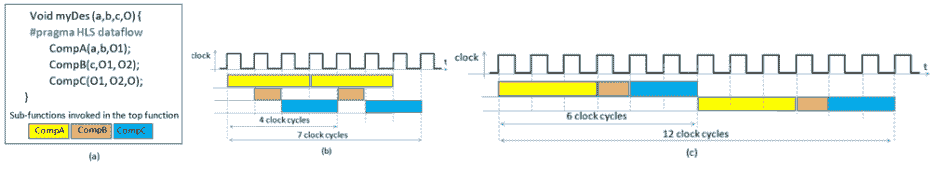

<!--yml

分类：未分类

日期：2024-09-06 19:35:56

-->

# [2311.17815] 加速异构架构上深度学习的设计方法调查

> 来源：[`ar5iv.labs.arxiv.org/html/2311.17815`](https://ar5iv.labs.arxiv.org/html/2311.17815)

\SetWatermarkText

预印本 \SetWatermarkScale1 \forestsetqtree/.style=for tree=parent anchor=south, child anchor=north,align=center,inner sep=0pt

# 加速异构架构上深度学习的设计方法调查

Fabrizio Ferrandi fabrizio.ferrandi@polimi.it，Serena Curzel serena.curzel@polimi.it，Leandro Fiorin leandro.fiorin@polimi.it，Daniele Ielmini daniele.ielmini@polimi.it，Cristina Silvano cristina.silvano@polimi.it 意大利米兰理工大学，Francesco Conti f.conti@unibo.it，Alessio Burrello alessio.burrello@unibo.it，Francesco Barchi francesco.barchi@unibo.it，Luca Benini luca.benini@unibo.it 意大利博洛尼亚大学 Viale Carlo Pepoli, 3/240123Bologna 意大利，Luciano Lavagno luciano.lavagno@polito.it，Teodoro Urso teodoro.urso@polito.it 意大利都灵理工大学，Enrico Calore enrico.calore@infn.fe.it，Sebastiano Fabio Schifano schsst@unife.it，Cristian Zambelli cristian.zambelli@unife.it 意大利费拉拉大学 Via Giuseppe Saragat, 144122Ferrara 意大利，Maurizio Palesi maurizio.palesi@unict.it，Giuseppe Ascia giuseppe.ascia@unict.it，Enrico Russo enrico.russo@phd.unict.it 意大利卡塔尼亚大学，Nicola Petra nicola.petra@unina.it，Davide De Caro dadecaro@unina.it，Gennaro Di Meo gennaro.dimeo@unina.it 意大利那不勒斯费德里科二世大学，Valeria Cardellini cardellini@ing.uniroma2.it，Salvatore Filippone salvatore.filippone@uniroma2.it，Francesco Lo Presti lopresti@info.uniroma2.it 意大利罗马“托尔·维尔加塔”大学，Francesco Silvestri francesco.silvestri@unipd.it 意大利帕多瓦大学，Paolo Palazzari paolo.palazzari@enea.it 意大利 ENEA，Stefania Perri s.perri@unical.it 意大利卡拉布里亚大学（2023）

###### 摘要。

近年来，深度学习领域出现了许多颠覆性和影响力大的进展。鉴于深度神经网络日益复杂的趋势，对高效硬件加速器的需求变得越来越迫切，以设计异构高性能计算平台。深度学习加速器的设计需要一种多学科的方法，结合计算机体系结构、近似计算、计算模型和机器学习算法等多个领域的专业知识。已经提出了几种方法和工具来设计深度学习加速器，包括硬件-软件协同设计方法、高层次综合方法、特定定制的编译器以及设计空间探索、建模和仿真的方法。这些方法旨在最大化可利用的并行性，最小化数据移动，以实现高性能和能源效率。这项调查全面回顾了近年来提出的最具影响力的设计方法和 EDA 工具，为读者提供了在这个快速发展的领域中的广泛视角。特别地，这项工作补充了同一作者在 (silvano2023survey, ) 提出的之前的调查，该调查聚焦于异构高性能计算平台的深度学习硬件加速器。

^†^†版权：acmcopyright^†^†期刊年份：2023^†^†期刊：CSUR^†^†版权：无^†^†ccs：EDA 的硬件方法^†^†ccs：硬件高层次和寄存器传输级综合^†^†ccs：计算机系统组织架构^†^†ccs：硬件超大规模集成设计^†^†ccs：硬件可重构逻辑和 FPGA^†^†ccs：计算方法人工智能^†^†ccs：计算方法机器学习

## 1\. 介绍

在过去几年中，深度学习（DL）取得了显著的进展，这要归功于在计算机视觉、自然语言处理、语音和音频处理、推荐系统、自动驾驶系统、环境科学等多个应用领域中利用深度学习技术的研究突破。深度学习是机器学习的一个子集，利用具有多层人工神经元的人工深度神经网络（DNNs）来模拟人脑行为，通过从大量数据中学习。这项技术有潜力彻底改变我们处理复杂问题和做出数据驱动决策的方式。

要实现深度学习（DL）应用，开发人员必须具备不仅是抽象算法和训练方法的知识，还要有将深度神经网络（DNN）模型映射到高效硬件架构的能力。设计高效的硬件加速器用于深度学习的任务需要来自多个领域的专业知识，如计算机架构、近似计算、计算模型和深度学习算法。此外，当前的架构正不断演进，以处理多种设计目标，适应从超低功耗边缘设备到高性能架构的广泛系统。由于架构选择的广泛性，EDA（电子设计自动化）社区已经开发了各种工具和方法，以支持设计师的开发工作。这些工具和技术包括高级综合方法、特定定制的编译器，以及支持设计空间探索、建模、分区和映射的工具。在异构架构中实现高性能和低功耗，并满足资源约束，需要对现有 EDA 框架和工具有全面的理解。这种理解使得采用适当的方法来利用并行性并最小化数据移动，从而促进该领域的创新。

调查范围。本工作旨在提供对实施深度学习（DL）以满足高性能应用的最具影响力的框架、设计方法和工具的全面概述。该调查突出展示了支持优化和将 DL 模型映射到不同硬件加速器的各种方法，包括基于 GPU 的加速器、张量处理单元、基于 FPGA 的加速器和基于 ASIC 的加速器，包括神经处理单元和开放硬件 RISC-V 架构上的协处理器。调查还描述了支持基于新兴技术和计算范式的加速器实现的方法论，例如 3D 堆叠的处理器内存架构。正如图 1 所总结的，这项调查回顾了几种用于设计 DL 硬件加速器的设计方法和 EDA 工具。尽管我们不声称提供全面的调查，但参考了过去二十年中约 250 篇关于 DL 加速设计方法的工作，我们旨在呈现 EDA 工具在 DL 加速器领域的全面视角。此外，本调查还参考了关于 AI 和 DL 算法如何解决许多现有问题的先前调查，例如 (CSR19, ; goodfellow2016deep, )，以及关于实现 DL 网络的硬件架构的先前调查，例如 (Akkad23, ; chen2020engineering, ; Hassanpour2022, ; gao2023acm, ; rathi2023acm, ; silvano2023survey, )。

调查的组织。该调查涵盖了通过利用近似计算和将高级操作符自动转换为硬件架构来支持生成新深度学习（DL）操作符的方法论，以及帮助设计空间探索的编译器和建模工具，以适当地将异构深度学习应用程序映射到现有计算节点上，而不考虑应用程序所考虑的资源使用或性能等非功能需求。如图 1 所示，所提出的工具和方法论分类基于近年来开发的主要设计流程和框架。此外，第 2 节总结了在深度学习应用工作负载中最广泛使用的模型。第 3 节介绍了适用于在异构处理系统上分配、划分和映射深度学习模型的方法和工具。第 4 节描述了基于近似计算范式的代表性方法。第 5 节介绍了适用于硬件加速器的高级综合设计方法，而第 6 节讨论了深度学习应用程序的自动编译和部署技术。然后，第 7 节描述了当前用于深度学习应用程序的建模、仿真、分析和设计探索框架。

总结来说，我们希望这项调查对计算机架构师、硬件和软件开发人员、工具开发人员、高性能计算工程师、研究人员以及技术专业人员等广泛读者有用。我们花费了大量精力以清晰简洁的技术写作风格来撰写，特别是对年轻一代硕士和博士生尤其有用。为了方便阅读，缩略语列表见表 1。

\forestset

dir tree/.style= for tree= parent anchor=south west, child anchor=west, anchor=mid west, inner ysep=-3.5pt, grow’=0, align=left, edge path= [draw, \forestoptionedge] (!u.parent anchor) ++(1em,0) —- (.child anchor)\forestoptionedge label; , if n children=0 delay= prepend=[,phantom, calign with current] , fit=rectangle, before computing xy= l=2em ,

{forest}

dir tree 调查组织 [§ [2 计算模型概述

对于高性能计算系统中的深度学习] § [3 硬件/软件协同设计方法]§ [4 近似计算方法] § [5 基于 HLS 的设计方法 [Vitis 高层综合] [Bambu: 开源高层综合] [其他 HLS 工具] [深度学习的 HLS 设计流程] [IP 块集成] ] ]

(a)

{forest}

dir tree  [§ [6 深度学习编译器 [DNN 加速器中的内存层次管理] [MCU 的深度学习编译器] [高性能的深度学习编译器] ] § [7 建模  仿真  分析与探索 [建模  仿真  和探索框架] [用于新兴存储器的仿真工具

DNN 加速器] [周期精确模拟器] [定制加速器的 FPGA 建模与分析] ] ]

(b)

图 1. 调查组织

表 1. 缩写词列表

| 缩写词 | 缩写词 | 缩写词 |
| --- | --- | --- |
| AI: 人工智能 | ASIC: 应用特定集成电路 | AXI: 高级可扩展接口 |
| CNN: 卷积神经网络 | CPU: 中央处理单元 | DL: 深度学习 |
| DMA: 直接内存访问 | DNN: 深度神经网络 | DP: 双精度 |
| DRAM: 动态随机存取内存 | DSP: 数字信号处理 | DSE: 设计空间探索 |
| FFT: 快速傅里叶变换 | FP: 浮点 | FPGA: 现场可编程门阵列 |
| GEMM: 一般矩阵乘法 | GPU: 图形处理单元 | HBM: 高带宽内存 |
| HLS: 高级综合 | HPC: 高性能计算 | HPZMO: 高性能零内存开销 |
| IP: 知识产权 | ISA: 指令集架构 | LUT: 查找表 |
| MCU: 微控制器单元 | MEC: 内存高效卷积 | ML: 机器学习 |
| MLIR: 多级中间表示 | NVDLA: NVIDIA 深度学习加速器 | PE: 处理元素 |
| PIM: 内存处理 | PRAM: 并行随机访问机器 | RAM: 随机访问机器 |
| RISC: 精简指令集计算机 | RTL: 寄存器传输级 | SIMD: 单指令多数据 |
| SoC: 芯片系统 | SPP: 结构化并行编程 | SRAM: 静态随机存取存储器 |

## 2\. 针对 HPC 系统的深度学习计算模型概述

设计下一代高性能计算（HPC）系统的硬件加速器需要合适的工具和设计方法，以及适当的计算模型。计算模型为设计师提供了从低级特征中抽象出来的足够层次，使其能够评估加速器在设计中的详细特性和能力，从而改进其在功耗、性能和资源需求方面的表现。

在适合最小化 CPU 操作数量和研究设计算法计算极限的计算模型中，随机访问机器（RAM）模型是最具代表性的模型之一，它无疑是计算历史上的基石。然而，随着现代硬件技术的出现，更先进的计算模型变得必要，以捕捉不同的数据访问策略和新的数据流。一方面，可以通过*外部内存模型*（Vitter01,）设计和分析完全利用内存层次结构的算法和数据结构。另一方面，像 BSP、PRAM、LogP 和 MapReduce 这样的并行架构可以被归类为*并行计算*模型（Bilardi2011,）。

受张量核心（Dakkak19,；Sorna18,；LuChen21,）和内存处理（PIM）架构（Zois18,；Choe19,）带来的好处启发，已为这些技术专门定义了几种计算模型。例如，在（ChowdhurySV21,）中介绍的计算模型捕捉了张量核心高效执行固定大小$\sqrt{m}\times\sqrt{m}$的稠密矩阵乘法的能力，时间为$O(m+\ell)$，其中$\ell$是延迟成本。该模型可以分析线性代数、图形、模板、稀疏矩阵乘法（labini22,）和相似性搜索（AhleS20,）算法的性能。

提供的高效性能模型（Liu17,）结合了一个由若干并行核心组成的 CPU，这些核心能够快速访问小规模的共享内存（$M$个数据字），以及一个由$P$个元素组成的 PIM 加速器，每个元素都配有$\Theta(n/P)$个数据字的本地内存，其中$n$表示问题的输入大小。该模型已成功应用于跳表的理论分析（Kang21,）和一个用于偏斜数据的索引（kang2022pim,）算法。

鉴于深度学习工作负载对并行性的高要求，结构化并行编程（SPP）（Skeletons,；MacroDF,）和并行设计模式（PDP）（PPatterns,）被广泛认可为构建强大且可靠的计算模型的有效方法，用于将数据并行计算映射到多核和基于 GPU 的平台。多年来，采用 SPP 和 PDP 方法论的编程工具和框架已得到广泛提供（Skeletons-Survey,）。其中，原型框架 FastFlow（FastFlow,）因其将 SPP 方法应用于广泛的应用领域（如深度学习和高性能计算）而值得特别关注。FastFlow 是一个基于分层结构的环境，结合了算法骨架、机制和概念，适用于原型设计不同类型的并行模式。第一层收集了一组建模内置并行模式的高层次骨架。中间层提供了适合实例化未由内置骨架直接建模的并行模式的结构，如并行块、顺序块和管道块，这些块允许对时间和空间并行性进行建模，以及实现块间完全连接的全对全块。FastFlow 层次结构的最后一层由一组低层机制组成，这些机制依赖于目标硬件平台，对使用高层次并行骨架的领域专家和使用中间构建块的程序员均不可见。

深度学习中的线性代数。深度学习应用的若干典型工作负载由线性代数内核主导。因此，文献中提出了大量计算模型，使得线性代数的使用变得更加易于接近。

所谓的任务基础运行时环境 (Agullo2017, ; Agullo2023, ; Carratala2020, ; Herault2022, ; Pei2022, ) 允许通过指定各种构建模块之间的依赖关系来编码复杂算法，从而提高各种复杂线性代数算法的可编程性 (Schatz2016, ; Quintana2009, ; Gates2022, )。值得注意的是，在这些环境中，开发收集特定应用的构建模块的库是至关重要的，以提供从问题到函数调用的最佳映射 (Psarras2022, )。开发深度学习应用的构建模块和库的一个重要因素是异质性 (Cardellini2014, ; Filippone2017, ; Carter2014, )。此外，减少通信成本，包括延迟和带宽，是实现高效硬件加速器架构的基本要求 (6496136, ; 6514719, ; doi:10.1137/120881191, )。最后，利用混合精度操作模式 (doi:10.1177/10943420211003313, ; 10.1145/3441850, ; higham_mary_2022, ) 和随机化 (murray2023randomized, ) 的可能性是一个非常吸引人的特性。

LAPACK、ScaLAPACK (doi:10.1137/1037042, )、Trilinos (10.1145/1089014.1089021, ) 和 PETSc (petsc-web-page, ) 是重要的高性能库，它们收集了高效的线性代数技术软件例程。最近，引入了用于稀疏线性代数算法的库 (doi:10.1137/20M134914X, ; DAMBRA2023100463, )，其主要目标是支持机器学习 (10.14778/2994509.2994515, ; 9355309, ; 7324551, ; stylianou2023optimizing, ) 和深度学习模型，特别关注 DNN。

DNN 中的卷积层可以通过多种方式计算。通常，卷积是通过在激活数据矩阵上使用传统的滑动窗口方法来实现的，同时应用一个内核函数 (Sermanet-2014, )。然而，这种计算方式由于数据访问模式的不规则性，效率较低。

为了减少浮点运算的数量，可以利用基于快速傅里叶变换（FFT）的实现 (Vasilache-2015, ; Mathieu-2014, )，在对激活数据进行傅里叶变换后，在频域中将卷积计算为 Hadamard 积（逐元素矩阵乘法）。然后，通过逆 FFT 将获得的结果转换回频域。尽管 FFT 提供了渐近优越的方法，但它通常效率很低，并且会产生显著的内存开销，特别是当卷积核很小的时候 (Zhang-2018, )。

对于小卷积核（大小 $\leq 3$）和单位步幅的情况，Winograd 最小滤波器算法 (Winograd-1980, ; Abdelouahab-2018, )特别高效。Winograd 卷积算法将输出激活矩阵划分为块，并将每个块计算为$A^{T}[(Gg)\odot(B^{T}d)]$，其中$\odot$表示 Hadamard 积，$g$是卷积核，$d$是输入激活矩阵。$A$、$B$和$G$是变换矩阵，对于给定的块和卷积核大小是常数。Winograd 卷积减少了乘法运算的数量，并且由于较小的变换矩阵的矩阵乘法具有更多的独立工作负载，增加了线程级并行性。然而，这也带来了额外的浮点加法和实现矩阵变换所需的额外全局内存访问的代价。对于大型卷积滤波器，这一过程可能会超过乘法减少的好处 (Ji-2019, )。

另一种常见的方法是重塑并选择性地重复原始输入激活数据的部分，生成一个降低的矩阵 (Chellapilla-2006, ; Cho-2017, ; Anderson-2020, )，然后将其与适当排列的卷积核权重矩阵相乘。这允许利用在第 3 层基础线性代数子程序（BLAS）库中提供的高度优化的高性能矩阵-矩阵乘法例程 (Dongarra-1990, )。图像到列（im2col）算法 (Chellapilla-2006, )通过将重叠的补丁展开成列，将输入激活矩阵转换为 Toeplitz 矩阵，如图 2(a)所示。在双重方法中，图像到行（im2row），降低的矩阵是通过将补丁展开为行来创建的 (Anderson-2020, )。这两种方法都需要额外的内存空间，其大小为$(K\times K\times C_{I})\times(H_{O}\times W_{O})$，用于存储降低的输入矩阵。

(a)

(b)

图 2. 激活数据打包：（a）im2col；（b）kn2row。

在内存高效卷积（MEC）算法 (Cho-2017, ）中，$[H_{I}]\times[K]\times[C_{I}]$ 子矩阵被转换成行，从而得到一个大小为 $W_{O}\times H_{I}\times K\times C_{I}$ 的降维矩阵，比 im2row 算法生成的矩阵小 $K$ 倍。为了计算卷积，权重矩阵与 $[W_{O}]\times[K\times K\times C_{I}]$ 大小的 $H_{O}$ 个子矩阵相乘，这些子矩阵是通过将降维矩阵上的子矩阵向右移动 $s\times K$ 得到的。MEC 直观地消除了 im2row 方法的垂直冗余，同时通过以常量间隔移动子矩阵来恢复信息 (Cho-2017, )。

尽管通过使用架构优化的例程在执行时享受到了加速，但这些方法仍然受到输入矩阵带宽受限的打包时间惩罚，并且计算卷积时使用的矩阵大小与传统高性能系统优化的矩阵大小不匹配。此外，还需要额外的内存空间来存储降维后的矩阵。与之前的方法不同，直接方法在计算前不对矩阵进行打包。相反，内核到行（kn2row）算法 (Anderson-2020, ) 避免了输入数据的重复，如图 2(b) 所示，卷积被计算为 $K\times K$ 个单独的 $1\times 1$ 卷积的总和，从而增加了输出的大小。实际上，每个 $1\times 1$ 卷积通过仅考虑 $K\times K$ 核组件中的一个，并将其与输入激活矩阵相乘来计算，因此执行的是 $[C_{O}]\times[C_{I}]$ 权重矩阵和 $[C_{I}]\times[H_{I}\times W_{I}]$ 激活矩阵之间的矩阵乘法。所有 $K\times K$ 个单独的 $1\times 1$ 卷积可以通过重新排序滤波器矩阵来使用单次矩阵乘法计算，即将 $C_{O}$ 通道数据连续排列。结果是 $[K\times K\times C_{O}]\times[C_{I}]$ 权重矩阵和 $[C_{I}]\times[H_{I}\times W_{I}]$ 激活矩阵之间的乘法提供了大小为 $[K\times K\times C_{O}]\times[H_{I}\times W_{I}]$ 的结果矩阵，该矩阵在乘法结束时存储在内存中。

为了获得所需的 $[C_{O}]\times[H_{O}\times W_{O}]$ 输出激活矩阵，$K\times K$ 单独的 $1\times 1$ 卷积的结果通过适当的垂直和/或水平移位将数据加在一起，具体取决于相对权重相对于中心核权重的位置（即，上、下、左、右和对角位置）。一些 $1\times 1$ 卷积的中间结果超出了最终结果矩阵的边界，并在最终求和过程中被丢弃。滤波器权重提前安排到所需位置。

在 (Anderson-2020) 中，通过在每个单独的 $1\times 1$ 卷积计算结束时执行移位加操作，修改了 kn2row 方法。所需的临时存储减少为 $[2\delta+C_{O}]\times[H_{I}\times W_{I}]$，其中 $\delta$ 是结果矩阵中支持结果数据移位所需的额外行数。通过交换滤波器和输入激活矩阵的维度，使 $C_{I}$ 成为最内层维度，可以获得双重方法（kernel-to-col）。

高性能零内存开销（HPZMO）直接卷积方法（Zhang-2018）通过重新排列和优化简单的卷积算法，使其能够在多线程单指令多数据（SIMD）架构和输出平铺方法上执行，其中卷积的 $W_{o,b}$ 元素的部分结果累积到寄存器文件中。如算法 1 所示，HPZMO 方法依赖于计算架构的向量单元。实际上，它直接从内存中读取激活数据和滤波器权重，无需额外的输入/输出内存空间，并且并行化输出通道（$C_{O}$）维度，这允许线程/PEs 之间共享输入数据以计算不同的输出通道集合。输入和输出激活数据以及滤波器权重都组织成通道最后结构，并分块为 $H\times W\times C_{b}$，其中 $C_{b}$ 是 SIMD 向量长度的倍数。

算法 1 并行化直接卷积算法 - HPZMO

激活 I, 过滤器权重, 步幅 s = 1; 激活 O; 对于 $i\leftarrow 1$ 到 $C_{O}/C_{O,b}$ 并行执行 do     对于 $k\leftarrow 1$ 到 $H_{O}$ do       对于 $l\leftarrow 1$ 到 $W_{O}/W_{O,b}$ do         对于 $m\leftarrow 1$ 到 $H_{K}$ do             对于 $n\leftarrow 1$ 到 $W_{K}$ do                 对于 $j\leftarrow 1$ 到 $C_{I}$ do                     对于 $ll\leftarrow 1$ 到 $W_{O,b}$ do                         对于 $ii\leftarrow 1$ 到 $C_{O,b}$ do                             $O_{i\cdot C_{O,b}+ii,l\cdot W_{O,b}+ll,k}\mathrel{+}=$  $I_{j,l\cdot W_{O,b}+ll+n,k+m}\times$  $F_{j,i\cdot C_{O,b}+ii,n,m}$

## 3\. 硬件/软件协同设计方法

在本节中，我们回顾了文献中提出的一些方法和工具，这些方法和工具用于在底层计算基础设施中的处理节点上分布、分区和映射深度学习训练和推理应用。首先，我们简要分析了如何优化 DNN 模型以在大量硬件设备上执行。然后，我们重点关注在分布式计算基础设施环境下训练深度学习模型的方法。图 3 显示了我们在本节中讨论的主要方法、框架和工具的参考。

{forest}

rounded/.style=ellipse,draw, squared/.style=rectangle,draw, qtree, [应用分区和映射 [基于硬件的搜索], [数据并行,], [模型并行,], 流水线并行 [ GPipe ([YY19, )

PipeDream (NHP+19, ; code2020pipedream, ) ] ], 混合解决方案 [ 层级并行 ([JQLA18, )

DAPPLE (fan2021dapple, ; code2020dapple, ) ] ] ]

图 3. 应用分区和映射见第三部分

训练大型深度学习模型需要大量的数据，并对其进行推理服务是一项复杂的任务。如今，这通常在由多个可能异构的计算节点组成的分布式基础设施中进行。最近将高性能计算和存储设备集成到云端和高性能计算数据中心，以及将网络边缘设备的受限资源与之结合的趋势，使得复杂性进一步加剧。该计算连续性趋势的目标是实现更好的隐私、更高的自主性和能源效率，同时减少响应延迟、成本和对云端带宽的需求 (Casamayor:2023, )。在这种复杂且异构的环境中，设计者需要优化整个系统堆栈：从机器学习/深度神经网络（ML/DNN）算法，到模型优化和压缩，再到将算法实现到配备深度学习加速器的硬件平台以及底层硬件架构设计 (han2016deep, ; jacob2018quantization, ; jin2019towards, ; tung2018clip, )。

深度神经网络（DNN）的硬件感知设计最近受到越来越多的关注，以应对硬件设备的异质性，特别是在 DNN 推理方面。确实，正如在第四部分中讨论的，为了在功率和资源受限的边缘系统中部署计算密集型 DNN 模型进行推理，同时保持可接受的性能，设计者必须在模型准确性与能源和实现效率之间做出权衡。然而，众多的硬件设备使得选择一种适用于所有情况的解决方案变得非常困难。因此，除了近似计算和模型压缩技术，如量化感知训练和剪枝（例如，(jacob2018quantization, ; tung2018clip, )），硬件感知神经架构搜索 (chitty-venkata2023, )，它考虑了延迟、功耗或面积等硬件特性，已成为自动化设计高效 DNN 应用架构的关键方面。这些方法包括从强化学习到进化算法等各种技术。例如，在 (abdelfattah2020best, ; jiang2020hardware, )中，基于强化学习的神经架构搜索被扩展到包括对 FPGA 的加速器配置进行搜索并优化其延迟和面积。

然而，在具有不断增加的可用节点和资源的分布式基础设施中，**并行化**似乎提供了加速深度神经网络（DNN）应用训练需求的解决方案。DNN 模型自身支持多种并行化方式，即数据、模型、管道和混合并行。

在数据并行中，多个工作者（机器或设备，例如 GPU）加载相同的深度学习模型副本。训练数据被拆分成不重叠的部分，并输入到工作者的模型副本中进行训练 (krizhevsky2012, )。每个工作者在其数据部分上执行训练，从而更新模型参数。因此，工作者之间的模型参数需要同步。数据并行的主要优势在于它适用于任何深度学习模型架构，而无需进一步的模型领域知识。它对计算密集型但参数较少的操作（如 CNN）扩展良好。然而，数据并行对参数较多的操作有局限，因为参数同步会导致显著的通信开销，可能成为瓶颈 (JQLA18, )。为了解决这种扩展性和单点故障瓶颈，参数同步可以以去中心化的方式进行 (Mayer2020, )，主要缺点是增加了工作者之间的通信成本。

相反，在模型并行中，深度学习模型被划分成多个部分，每个工作节点加载机器学习/深度神经网络模型的不同部分进行训练。模型并行的一大挑战是如何将模型划分为分配给并行工作节点的多个部分（MM17,）。在机器学习/深度神经网络任务的背景下，模型划分到不同设备上的过程最初主要由人工专家进行。寻找良好模型分割的常见方法是使用强化学习（MPL+17,；MGP+18,）。从某些初始划分开始，对该划分进行排列组合，并测量性能（例如，对于一次训练迭代），或者学习一个可以通过迁移学习调整的新工作负载的放置策略，参见例如（ABVG+19,；ZRA+19,），或者用于引导遗传算法（PGN+20,）。不幸的是，这些方法计算开销大，因为它们需要评估大量的放置并测量多个推理/训练步骤的运行时间。另一种方法是将问题转化为离线优化问题，即寻找良好的划分和调度。这包括多台机器和/或设备上的经典调度结果（LLKS93,；Gra66,；KL70,；PY90,；SW99,；ST93,），以及现代深度神经网络调度工作（JQLA18,；NHP+19,）。这些算法使用图中每个节点（层或运算符）的计算时间概况和节点之间的数据传输要求，以及目标部署系统基础设施，如机器和网络属性（例如，测量带宽）。然而，这些技术并没有以在线方式评估分割的性能。尽管如此，已证明对于定义良好的成本模型，目标函数与实际性能密切匹配（参见，例如，（NHP+19,；JZA19,））。

流水线并行将模型并行与数据并行结合。在流水线并行中，模型被拆分，每个工作者加载 DL 模型的不同部分进行训练。支持流水线并行的近期方法包括 GPipe (YY19,) 和 PipeDream (NHP+19, ; code2020pipedream,)。具体而言，在流水线并行中，模型在可用的工作者之间进行划分，将操作图中的一组连续操作（在 DNN 术语中称为层）分配给每个工作者，然后以流水线方式重叠不同输入的计算和通信。这一过程可以大大减少工作者之间的通信。尽管流水线是一种简单且被广泛采用的想法，但 DNN 训练提出了传统流水线没有的重要挑战：DNN 训练是双向的，即前向传递后跟随通过相同层的反向传递，使用前向传递的状态和中间结果。这导致了硬件效率低或统计效率低，除非借助并行化优化 (NHP+19,)。

与流水线训练相关的提案可以根据时间方面进行分类，区分同步训练与异步训练。同步训练需要在相邻训练迭代之间执行梯度同步，以确保收敛 (YY19,)。然而，它面临着显著的内存消耗，这可以通过重新计算部分缓解。异步训练则在流水线中并发插入微批次，以实现最大吞吐量 (NHP+19,)。然而，由于收敛问题和内存需求增加，存储模型参数的多个版本并不是一种常见的做法。

一些框架尝试寻找一种混合解决方案，结合每种并行模型的最佳属性，并减少一些缺点。例如，逐层并行主义 (JQLA18,) 提出对神经网络的每一层应用不同的并行策略，而不是对所有层应用相同的并行策略（即数据并行或模型并行）。为每一层找到最佳并行策略的解决方案基于一种动态编程的图搜索算法。DAPPLE (fan2021dapple, ; code2020dapple,) 是一种同步训练框架，结合了数据并行和流水线并行，用于大型 DNN 模型，以确保训练收敛并减少内存消耗。为此，它尽可能早地反向调度任务，以释放由相应前向任务产生的激活所占用的内存。

我们上述审查的分布式 DL 训练和推理方法通常旨在提高性能，例如通过实现更好的吞吐量和可扩展性，减少通信成本，同时改善（或至少不恶化）模型准确性。近年来，随着整个行业普遍趋势的推进，减少碳排放，即所谓的绿色碳足迹，也开始在 HPC 和 ML/DNN 社区中受到越来越多的关注，以实现环境友好的解决方案，例如 (wu2022sustainableai, )。鉴于 DL 训练和推理工作的高计算需求，节能的机会很大。例如，通过权衡模型变体，即低质量和高质量模型，可以在保持足够准确性水平的同时节省能量。在硬件层面，可以利用多种解决方案，从采用节能的 FPGA 到新型 GPU 划分方案，这些方案可以通过允许 GPU 共享来减少能耗 (li2023green, )。因此，配合适当的分布式资源调度，有很大的机会在减少成本和碳排放的同时提高性能。

在这种背景下，DL 应用程序的划分和映射策略对设计优化的自主策略至关重要，这些策略针对训练和推理阶段的不同非功能性需求，如性能、能耗、准确性和异质性。在现有的硬件/软件平台开发方法中，强化学习被广泛使用 (jiang2020hardware, ; MPL+17, ; russorusso2023, )，以应对边缘场景中大状态空间的特点，其中多个节点，可能具备各自的处理、内存、网络能力和能耗足迹，被汇集起来以训练和服务 ML/DNN 模型。

## 4\. 近似计算方法

在过去几年中，适合深度学习应用的高效硬件架构设计受到了极大的关注，并且已为 ASIC 和 FPGA 平台提出了几种实现方案。特别关注于设计方法论，旨在实现高效的计算单元，以便将其集成作为加速架构中的 IP 块，用于深度神经网络（DNNs）和高性能计算（HPC）负载。乍一看，为了满足 HPC 应用的计算复杂性，特别是深度学习（DL）及特别是 DNNs，硬件设计师主要将精力集中在能够实现非常高速性能的解决方案上。为了实现这一目标，引入了越来越高的并行级别，并实现了越来越复杂的计算架构。不幸的是，这种趋势在功耗和成本方面带来了若干问题，特别是在功耗和资源受限的边缘系统中。因此，最近，出现了非传统的设计方法，以权衡计算速度与功耗，同时保持成本和资源利用的控制。在这些新兴方法中，近似计算作为一种有效的技术，已经获得了广泛关注，它可以减少能源消耗和计算延迟，适用于容错应用，如多媒体处理、深度学习、数字信号处理和无线通信（Alioto_2017, ; Alioto_2018,）。实际上，利用近似计算方法设计的硬件加速器可以作为定制 IP 集成，以提供高速度和能源效率的整体系统。实现近似计算方法的计算 IP 可以在 ASIC 和 FPGA 基础的 HLS 设计中得到利用，旨在一方面减少深度学习模型中通常使用的层的计算复杂性，另一方面通过引入合理的准确度损失来优化速度和功耗。

尽管近似计算范式的基本原理非常简单，即通过放宽对精确计算的要求，可以在速度性能和能量消耗之间进行权衡，但实现预期的好处并非易事。

{森林}

rounded/.style=ellipse,draw, squared/.style=rectangle,draw, qtree, 近似计算方法 [算法级别 [近似 SoftMax（[Zhu_2020, ; Cardarilli_2021, ; Spagnolo_2022,）

近似传感器，存储器，

计算和通信（Ghosh_2020,）

近似池化层（Sayal_2021, ; Spagnolo_2022_2,）

超分辨率 (Spagnolo_2023, ), 去噪 (Spagnolo_2023_2, ) ] ], 架构，门级和晶体管级 [基于 ASIC 的 [已编码：是 ([Chen_2012, ; Cho_2004, ; Song_2007, ), 否 (Esposito_2017, ; Farshchi_2013, ; Strollo_2022, )

动态 (Frustaci_2020, ), 近似压缩器 (Esposito_2018, ; Strollo_2020, )

分割 (Strollo_2022, ), 近似 MACs (Kim_2021, ) ], ], 基于 FPGA 的 [加法器 ([Perri_2020, )

乘法器 (Ullah_2021, ; Ullah_2022, ; Perri_2022, ; Waris_2021, )

] ] ] ]

图 4. 近似计算方法的分类

近似计算提供了设计高效硬件加速器的多个机会。事实上，如图 4 所总结，它可以在不同的设计层次中加以利用：从算法开始，经过架构，到门级和晶体管级电路拓扑 (Jiang_2020, )。几种近似策略提供了硬件导向的解决方案，可以在算法级别采用，以显著降低深度学习模型中关键层的复杂性和能耗。例如，(Spagnolo_2022, ) 中演示的近似方法通过利用简单的加法和逻辑位移操作来替代计算开销大的指数运算和除法，实现了硬件中的 SoftMax 层。当应用于支持广泛模型的 DNN 加速器（如 VGG-16 和 ResNet-50）时，该方法可以确保计算时间和功耗分别低于准确模型的 7 倍和 12 倍，同时引入的精度损失低于 2% (Spagnolo_2022, )。

如(Spagnolo_2022_2,)中讨论的那样，通过非线性激活和下采样交替的卷积层可以从近似计算方法中受益，尽管这会导致合理的准确性损失。卷积层和下采样层中的计算通过预测方法来近似，该方法识别潜在的主要特征。这种近似下采样策略已经为 DNN 推理进行了硬件定制，并且在应用于多个基准模型时，总体节能高达 70%，准确性损失低于 3%，相对于精确设计。最近，近似计算也被用于重建高分辨率图像(Spagnolo_2023,)和减少图像去噪的计算复杂度(Spagnolo_2023_2,)。确实，这些应用必须满足严格的帧率和能耗限制，因此创新和特定的设计方法极为重要。

设计近似加法器、乘法器和乘加单元的有效解决方案已被提出，以利用门级和晶体管级的近似计算，这些解决方案适用于 ASIC 设备（Frustaci_2019, ; Frustaci_2020, ; Strollo_2020, ; Strollo_2022, ）和 FPGA 设备（Prabakaran_2018, ; Ahmad_2021, ; Ullah_2022, ; Perri_2022,）。这些算术运算符受到极大关注，因为它们是深度学习模型中广泛使用的基本计算元素。通常，待处理的近似算术电路的操作数被拆分成子字：一些最低有效位被不准确处理，而剩余的最高有效位则传递给准确电路。一些策略利用静态近似，在设计时将精度设置为固定值，而其他解决方案则采用动态近似，在运行时调整质量目标，从而利用数据处理的特性，并实现平滑的质量退化。类似地，多种近似技术可以应用于乘法器的设计（Akbari_2017, ; Esposito_2018, ; Strollo_2020, ; Frustaci_2019, ; Frustaci_2020,）。一些技术使用动态和静态分段方法（Hashemi_2015, ; Narayanamoorthy_2015, ; Strollo_2022, ; Di_Meo_2023,）：前者通过选择从最高有效位开始的输入段来缩小乘法器的规模，而后者则仅处理预定义的乘数部分。除了面向 ASIC 设计的近似策略外，还可以采用适当的方法来实现高性能和低功耗的近似模块乘法器设计，适用于 FPGA（Ullah_2022, ; Perri_2022,）。最后，在（Saadat_2019, ; Imani_2019, ; Zendegani_2016,）中展示了适用于近似除法的有效方法，这些方法要么利用近似减法器（Chen_2015, ; Chen_2016,），要么实现信号分段技术（Hashemi_2016,）。

## 5\. 基于 HLS 的设计方法

设计高效的加速器以实现 DL 在异构架构上的应用时，软件和硬件建模步骤都是至关重要的。此外，它们之间的适当联系对于将算法描述与定义所需性能、资源使用和能耗的约束结合起来也是必要的。这一联系由高级综合（HLS）提供，它为设计师提供了多种优势，设计师不仅可以在开发高性能硬件时在更高的抽象层次上工作，从而实现更快的设计更改和功能验证，而且还可以通过只更改设计指令在多个平台（例如更大或更小的 FPGA）上创建各种解决方案，而无需更改 C/C++源代码。这些优势使得设计空间的探索和最佳实现的识别比低级硬件设计快得多。然而，代码必须考虑到硬件实现，以满足给定的性能和资源使用要求。实际上，为 CPU 目标编写的任意软件代码可能会实现非常低的性能，因为它通常没有暴露足够的并行性来利用 FPGA 或 ASIC 上的空间并发性。图 5 提供了接下来的子章节中回顾的基于 HLS 的设计方法的分类，重点关注深度学习（DL）模型的加速。之前的综述 (hlssurvey, ) 分析了 HLS 工具的演变及其面临的挑战，以支持更新的应用领域和性能要求。本文主要关注商业工具 Vitis HLS 和开源工具 PandA-Bambu，这两者都适用于复杂 DL 应用的 HLS。

{forest}

rounded/.style=ellipse,draw, squared/.style=rectangle,draw, qtree, 基于 HLS 设计的方法论 [HLS 工具 [ Vitis 高级综合 ([vitisug212, )

Bambu (ferrandi2021bambu, )

Intel HLS Compiler (IntelHLS2022, )

Catapult (CatapultHLS2022, ), Stratus HLS (StratusHLS2022, )

LegUp  (LegUpHLS2013, ), MLIR (lattner2021mlir, ) - CIRCT (circt, ) ], ], 基于 HLS 的 DL 框架 [ hls4ml ([duarte2018fast, )

FINN (blott2018finn, )

ScaleHLS (ye2022scalehls, ; scalehls2022dac, )

SODA 综合器 (sodaMICRO, ; sodaDAC, ) ], ], IP 块集成和接口协议 [ OpenFPGA CoreLib 核心库互操作性工作 ([parCo, )

AXI 协议接口 (arm2013, )

IP-XACT (ipxact, )

IEEE 1735-2014 (IEEE1735, )

Vitis 模块集成（IPflow；vitisug212）

图 5. 在第五部分中讨论的 HLS 基础设计方法论的分类

### 5.1. Vitis 高层次综合

Vitis HLS 是 Xilinx 高层次综合工具链，为 FPGA 设计人员提供了高效的支持，使他们能够使用高级语言（如 C 和 C++）描述硬件设计。这些代码随后被自动转换为寄存器传输级（RTL）语言，即 VHDL 或 Verilog，从而简化了基于 RTL 代码的耗时且容易出错的过程。

图 6. Vitis HLS 设计流程

如图 6 所示，在此设计流程中，使用 C/C++语言描述硬件功能和测试平台。C 模拟仅在功能级别检查设计行为，必须成功才能继续综合过程。综合过程生成符合优化指令和设计约束的顶层函数的 RTL 描述。此步骤结束时生成的综合报告估算时间和硬件资源使用情况，可作为进一步改进和优化的参考。随后进行 C/RTL 联合仿真，以使用之前用于 C 模拟的相同 C/C++测试平台验证和确认综合后的 RTL 设计。它为设计人员提供了周期准确的性能信息，并且还可以发现综合工具中的错误。HLS 获得的 IP 核可以最终导出，嵌入到使用 Vivado 和 Vitis 工具的更复杂设计中。通过适当的综合指令，也称为*HLS pragma*（vitisug212；Sestito_2023），Vitis HLS 为设计人员提供了控制设计微观和宏观架构特性的能力。

图 7. 循环级 pragma 的效果： (a) 循环流水线； (b) 循环展开； (c) 不使用流水线时的执行

图 8. DATAFLOW pragma： (a) 语法； (b) 使用 pragma 时的执行； (c) 不使用 pragma 时的执行

如图 7 和 8 所示，为了减少延迟和提高吞吐量，可以利用循环级别的转换（如 *循环流水线*、*循环展开* 和 *循环扁平化*）以及数据流 pragma。前者允许优化循环的硬件执行，而后者允许将顺序函数重叠在硬件执行中。相反，为了控制硬件资源的使用，可以使用变量级别的 pragma（如 *数组分区* 和 *数组重塑*）以及操作级别的 pragma（如 *绑定操作* 和 *分配*），分别影响内存结构和为特定操作实现的计算单元的组织。最后，为了定义在设计接口端口处采用的通信协议，可以使用接口 pragma。

### 5.2\. Bambu 开源高级综合工具

Bambu (ferrandi2021bambu,) 是一个开源的命令行 HLS 工具，由米兰理工大学开发，支持大多数 C/C++ 语言构造的综合，包括函数调用、指针运算、动态内存访问解析、对数组和结构体的访问、通过引用或复制传递的参数等。Bambu 的设计流程如图 9 所示。

图 9. Bambu 编译流程。

在前端，Bambu 与现有的编译器（如 GCC 和 Clang）接口，以解析输入代码并将其转换为具有静态单赋值（Static Single Assignment）的中间表示（Intermediate Representation, IR）在内存中。这种方法将编译器前端与 HLS 过程的其余部分解耦，并允许不同的编译器能够快速且轻松地集成。从 IR 开始，Bambu 构建数据结构（如调用图、控制数据流图和程序依赖图），并应用一系列设备无关的分析和转换（例如数据流分析、循环识别、死代码消除、常量传播、LUT 表达式插入等）。通常，硬件级别的转换也会被采用，以提高最终加速器的面积利用率和延迟（例如，将常量值的乘法和除法转换为仅使用移位和加法的表达式）。与旨在面向具有固定大小数据路径（32 位或 64 位）的处理器的一般软件编译器不同，Bambu 通过比特宽度和范围分析选择特定操作和数值存储所需的最小比特数。这些过程在优化过程中至关重要，以满足速度性能、面积和功耗方面的要求，而不会影响合成设计的功能行为。

在后端，Bambu 执行实际的架构合成并提供 VHDL/Verilog 代码。此过程对每个函数分别处理，考虑到单个函数包括至少两个子模块：控制逻辑和数据路径。该过程的第一步是函数分配，将 IR 中的函数与目标技术中的特定资源关联。Bambu 技术库包含标准函数、标准系统库（如 libc 和 libm）以及用 Verilog 或 VHDL 编写的自定义组件。Bambu 支持函数指针和通过函数代理在模块边界之间共享（子）模块（FPL2015），这在考虑复杂调用图时提供了有价值的面积节省，而不会对执行延迟产生显著影响。随后，内存分配步骤定义了要使用的内存类型。通过静态分析内存访问，Bambu 构建了一个分层数据路径，其中内存可以被分类为只读、本地、具有对齐或不对齐内存访问的动态解析。多个总线将加载/存储组件连接到各自的内存；相同的内存基础设施也可以连接到外部组件，如快速存储器、缓存和外部 DRAM。

然后，资源分配将未映射到库函数上的操作与资源库中可用的资源单元关联。浮点操作可以通过软浮点库或 FloPoCo 框架 (DinechinPasca2011-DaT,) 来支持。资源是预先表征的，其描述包括延迟、面积和流水线阶段数量的信息。当多个操作与资源匹配的可能性时，选择会受到设计约束的驱动。

为了将操作与控制步骤关联，Bambu 使用了一个列表调度算法。除了这种古老但有效的方法外，Bambu 还实现了基于差分约束系统的更具攻击性的猜测调度算法 (ICCAD2015B,)。在计算出的调度中，同时执行的操作不能共享同一资源，因此通过加权兼容性图上的团覆盖算法进行模块绑定 (LStok94,)。具有非重叠生命周期的变量可以共享同一寄存器，因此在将存储值绑定到寄存器之前会应用活跃性分析。互连根据之前步骤的结果进行绑定：如果共享功能或内存资源，则算法会在其输入上引入引导逻辑，并确定由控制器驱动的控制信号集。

最终架构随后生成，并通过高阶图表示，突出模块之间的互连。最后，根据选择的技术/设备，网表生成步骤提供整个设计的最终 RTL 描述。

### 5.3\. 其他 HLS 工具

在大多数情况下，HLS 工具由 FPGA 供应商在同一公司的 FPGA 完整设计套件中提供。例如，上述的 Vitis HLS 是 AMD/Xilinx 工具套件的一部分，只支持 Xilinx FPGAs。Intel HLS 编译器 (IntelHLS2022,) 是 Quartus 设计套件的一部分：它将 C++ 函数编译为 Intel FPGA 的 RTL 实现，并通过简单的命令行界面进行优化。Intel 最近宣布，HLS 编译器将被 oneAPI 工具包 (oneapi,) 替代，以实现 OpenCL 代码在 CPU、GPU 和 FPGA 之间的无缝移植。Catapult (CatapultHLS2022,) 是 Siemens 提供的多目标 HLS 和验证工具，合成 FPGA 和 ASIC 的 C++ 和 SystemC 代码。Cadence 的 Stratus HLS (StratusHLS2022,) 从更底层的视角合成 SystemC 代码，即要求用户明确描述组件之间的接口协议。LegUp (LegUpHLS2013,) 是一个开源的、基于 LLVM 的 HLS 工具，最初由学术界开发，后来被 Microchip 收购，并重新命名为 SmartHLS (smartHLS,)。

多层次中间表示（MLIR） (lattner2021mlir, ) 是 LLVM 项目中的一个可重用且可扩展的基础设施，用于开发领域特定的编译器。MLIR 允许定义专门的 IR 称为方言，以在不同的抽象层次上实现分析和转换过程，并且它可以与多种软件编程框架接口，包括用于实现 DL 算法的框架。CIRCT 项目 (circt, ) 旨在利用 MLIR 构建新一代可互操作的硬件设计工具和编译器，从电路级 IR 的定义开始，逐步向更高层次的抽象（例如数据流模型或有限状态机）发展。项目的一部分致力于 HLS (circt-hls, )，特别是通过 MLIR 和 CIRCT 方言实现静态和动态调度。CIRCT 可能成为未来工业和学术设计流程的一个重要构建模块；然而，与具有经过数十年研究的优化合成算法和资源库的 HLS 工具相比，其成熟度较低。

### 5.4\. 基于 HLS 的深度学习设计流程

两个流行的框架，hls4ml (duarte2018fast, ) 和 FINN (blott2018finn, )，帮助自动化机器学习加速器的设计。它们解析 ML 模型，并用从包含已有 pragma 的模板库中提取的 C/C++ 函数替换操作符。作为后端使用的 HLS 工具（主要是 Vivado 或 Vitis HLS）处理这种中间 C/C++ 表示，并生成相应的加速器设计，无需进一步的人工干预。

hls4ml 和 FINN 中的模板库必然与特定的 HLS 工具和狭窄的模型集合绑定。这是 HLS 专家开发人员在预定的后端工具上提前实现所有必要操作符的最佳版本所要求的。因此，每个工具都有其自己的编码模式、注释和配置指令，这些是其他工具所不认可的，要切换到新的硬件目标以实现高效设计，就需要新的库版本。

通常，关注的模型是深度神经网络（DNNs）和卷积神经网络（CNNs），有时其范围受应用要求的限制，这可能显著影响资源利用。例如，hls4ml 的原始实现针对的是在严格延迟约束下的小型全连接模型，反映了 CERN 高能物理实验的需求。为了满足这些要求，hls4ml 提议将网络权重存储在片上逻辑中，并展开所有循环以增加并行性，但考虑到更复杂的模型时，这会迅速耗尽 FPGA 资源。

虽然 DNN 和 CNN 确实涵盖了 ML 应用的很大一部分（特别是在计算机视觉领域），但仍有广阔的空间去探索其他类别的模型，例如加速处理稀疏数据结构或图形的科学应用。现有的基于 HLS 的设计流程擅长于提取数据和指令级的并行性（例如通过展开循环），但它们不适合处理不规则的任务型模式。

狭窄的关注点限制了快速适应新算法方法的可能性，而这在像 ML（以及数据科学）这样的快速发展的领域中是非常值得期望的。因此，许多努力已经投入使用现有的 HLS 工具作为“黑匣子”，从而尽可能利用它们的优化机会。然而，也有一种向硬件设计民主化的趋势，例如 Xilinx Vitis HLS 前端的开源发布 (vitis-llvm, ) 或 OpenROAD 项目用于 ASIC 合成 (openroad, )。

其他适合分析来自 C 或 PyTorch 的输入代码并为 Vivado HLS 生成注释代码的高效框架包括 ScaleHLS (ye2022scalehls, ; scalehls2022dac, ) 和软件定义架构（SODA） (sodaMICRO, ; sodaDAC, )。通过现有 MLIR 方言提供的多级抽象，ScaleHLS 关注图级、循环级和指令级的优化；自定义方言有助于将其翻译成带有指示的 C++。质量结果估计器和 DSE 引擎会自动识别在用户定义的约束下最佳的优化组合，而无需长时间的仿真或合成运行来评估优化指示变化的效果。

相反，SODA 是一个开源的、多级的、模块化的、可扩展的、无人工干预的硬件编译器，它将高层次的 ML 模型转换为领域特定的加速器。它包含一个基于编译器的前端，利用 MLIR（SODA-OPT (sodaopt, )）和一个基于编译器的后端，集成了最先进的 HLS 方法论（Bambu）；它生成高度专业化的设计，这些设计可以用商业和开源工具在 FPGA 或 ASIC 上合成，并且通过编译过程和参数探索设计指标，使得根据目标应用需求识别架构权衡成为可能。

### 5.5. IP 块集成

通常的做法是使用第三方（知识产权，IPs）提供的预设计模块，将所需功能添加到正在开发的系统中。使用 IPs 不仅节省了开发时间，还节省了大量用于验证的测试时间。HLS 流提供的高度抽象及其成熟度提供了通过 HLS 将开发的功能导出为 IPs 的有趣可能性。2008 年 (parCo,) 尝试以系统化方式解决这一特性，分析了 HLS 工具用于集成 IPs 的各种策略。IP 结构的标准化以供分发 (IEEE1735,) 并未涵盖 HLS 生成的 IPs，因此每个工具对 IP 集成和导出的支持可能有所不同（例如，Vitis HLS 提供了其自身的块集成功能 (IPflow,; vitisug212, )）。

为了允许 IP 生成和重用，必须有一个接口标准以支持 IP 之间的互操作性。目前，AXI4 (arm2013,) 被用作事实上的标准。AXI4 标准包括 AXI4-Full、AXI4-stream 和 AXI4-Lite 协议，用于访问内存银行、流通道和内存映射寄存器。除了通用接口外，还需要一种描述 IP 接口和 IP 文件系统组织的通用语言。IP-XACT (ipxact,) 是一种描述 IP 的元数据和接口的 XML 格式，被 IP 提供商广泛采用，以描述其 IP 的文件系统组织、接口、源文件、约束文件等。

## 6. 深度学习编译器

创新的硬件架构开发，特别是针对如 DL 等高度可并行化的应用程序，只是完成了一半的工作。另一半是有效的自动化部署技术，这些技术允许使用新颖的架构来运行复杂的实际应用程序。管理内存层次结构和将高级信号处理及机器学习图编译成表示是一个复杂的研究问题，近年来已被广泛研究，如图 10 所总结。

{forest}

rounded/.style=ellipse,draw, squared/.style=rectangle,draw, qtree, 深度学习编译器 [内存层次管理在 DNN 加速器中的应用 [ Ivanov 等 ([ivanov2020data,)

DMazeRunner (dave2019dmazerunner,)

Maestro (kwon2020maestro,)

Interstellar (yang2020interstellar,), Timeloop (parashar2019timeloop,) ], ], DL 编译器用于 MCU [ TFLite Micro ([david2020tensorflow,)

Larq 计算引擎 (LCE) (Larq,)

X-CUBE-AI (CubeAI,)

GWT AutoTiler（GAP8Auto-tilerManual）、DORY（burrello2021dory）、DL 编译器用于高性能和嵌入式 [ TVM（[chen2018tvm）、HTVM（vandelmHTVMEfficientNeural2023a）、Halide（ragan2013halide）

Tensor Comprehensions（vasilacheTensorComprehensionsFrameworkAgnostic2018）

Glow（rotemGlowGraphLowering2019）、Relay（roeschRelayNewIR2018）

ONNC（linONNCCompilationFramework2019）、MLIR（lattnerMLIRScalingCompiler2021；jinCompilingONNXNeural2020）

图 10. 深度学习编译器的分类，详见第六部分

### 6.1. DNN 加速器中的内存层次结构管理

内存层次结构的有效管理是部署深度神经网络（DNN）中的一个关键挑战，因为这些网络在不同层次的内存之间产生大量的权重和激活流量。为了解决这个问题，已经提出了各种方法用于在三大类设备上进行数据流调度和生成：高性能计算系统、DNN 加速器和嵌入式系统。对于高性能计算系统，Ivanov 等人（ivanov2020data）提出了新的变换器原语，以利用数据重用并限制数据移动。与此同时，DMazeRunner（dave2019dmazerunner）、Maestro（kwon2020maestro）、Interstellar（yang2020interstellar）、Timeloop（parashar2019timeloop）讨论了基于处理单元（PEs）的系统阵列的 AI 专用加速器上的 DNN 优化，重点关注循环分块和/或重排序以优化 PE 利用率。这些工具可以输出一个加速器模型来运行给定的 DNN 或空间调度以最大化 PE 阵列的利用率。MCU 数据流调度工具类似于像 DMazeRunner 这样的框架，因为它们都在已知架构的情况下优化数据流调度。然而，在 MCUs 上执行 DNN 呈现出独特的挑战，如适应通用架构和有限内存。此外，内核指令受到寄存器文件大小限制的严重影响，导致负载-存储操作增加，并且需要优化循环大小以避免寄存器溢出开销。学术研究人员和工业界通过将专用缓存或显式管理的临时存储器纳入其边缘节点解决方案中，研究了这一方面。例如，NXP 在其 Cortex M4/M0 MCU 中提供了专用缓存，STMicroelectronics 的 STM32 Cube-AI 工具流也是如此；另一方面，GreenWaves Technologies 提供了显式管理的临时存储器（flamand2018gap），并有一个专门的 GAPFlow 工具来适当地管理它们。

### 6.2. 深度学习编译器用于 MCU

第一代低功耗神经网络（NN）定向微控制器（MCU）的引入增加了这一需求，因为这些平台需要利用优化的软件和 ISA 扩展来进行深度神经网络（DNN）计算，同时处理传统的控制和 I/O 绑定活动。为了实现这两种任务的最佳执行，这些 MCU 采用了并行和异构处理。ST 微电子¹¹1[`www.st.com/en/microcontrollers-microprocessors/stm32h7-series.html`](https://www.st.com/en/microcontrollers-microprocessors/stm32h7-series.html)和 NXP 最近推出了新一代双核微控制器，其中包括一个专门用于 I/O 的 ARM M0 处理器和一个具有单周期乘加和 SIMD 功能的 ARM M4 处理器。这些平台在内存层次结构方面的复杂性比传统的平面内存 MCU 有所增加，具有针对速度优化的 L1 内存和针对容量优化的 L2 内存。同时，内存层次结构的显式管理趋势越来越明显，手动调整的数据缓存具备数据管理锁定功能。例如，Kendrite K210²²2https://canaan.io/product/kendryteai 是一个基于 RISC-V 的双核 64 位片上系统，具有神经网络处理器（KPU），可将计算卸载到核心上。它还包括专门用于 NN 加速器的内存银行和一个 DMA 单元，用于显式管理数据传输。SONY Spresense 板³³3https://developer.sony.com/develop/spresense/ 配备了一个最大时钟频率为 156 MHz 的 6 核 M4 加速器，1.5 MB 的 SRAM 和 8 MB 的 Flash。GreenWaves Technologies GAP-8 (flamand2018gap, )片上系统于 2018 年推出，作为并行超低功耗范式 (conti2016pulp, )的商业体现：它配备一个 I/O 核心和一个使用 RISC-V ISA 扩展的 8 核 SIMD 优化 DSP 集群加速器。为了管理这种复杂性，这些 MCU 包括专门的数据封送基础设施，如通用 DMA 控制器，以加速内存传输并减少内存访问瓶颈。

新工具如 TFLite Micro (david2020tensorflow, )和 Larq 计算引擎（LCE） (Larq, )提供了一个与模型无关的部署框架，并解决了这些问题。两者都是不受供应商锁定的工具，支持 ARM Cortex-M 和 RISC-V 核心。它们的库内存占用在 Cortex-M3 上仅需 16 kB；然而，默认情况下它们依赖于运行时图解释，限制了可实现的性能。为了弥补这一限制，TFLite Micro 允许插入优化内核并在不同内存区域声明向量。然而，它不包括任何用于执行无法适配片上内存的层的切分机制。

在最先进的技术中，行业提出了两个最强大的 DNN 部署工具，作为针对其自身 MCU 的专有、厂商锁定解决方案。STMicroelectronics 的 X-CUBE-AI (CubeAI,) 是一个自动化的神经网络库生成器，针对计算和内存进行了优化。它将来自 DNN 工具（如 Tensorflow）的预训练 DNN 模型转换为针对 STM32 系列 MCU 中 ARM Cortex-M 核心的预编译库。X-CUBE-AI 依赖于相对较大的片上 L1 缓存（最多 16 kB）来提供 STM32 MCU 上的性能，并且没有处理基于软件的内存管理。另一方面，GWT 设计了一个名为 AutoTiler 的工具，目标是 GAP-8 RISC-V 基础的多核超低功耗微控制器。其主要功能之一是接收一个预训练的 DNN 并生成用于内存分块和高效传输权重及激活数据的代码，涵盖所有内存层级（片上和片外）。GWT AutoTiler 直接解决了数据移动和块大小的挑战，以优化内存访问，实现了许多网络执行中的最先进性能。该工具是专有的，但其基本后端内核作为开源软件提供，作为 GAP-8 SDK 的一部分⁴⁴([链接](https://github.com/GreenWaves-Technologies/gap_sdk))。DORY (burrello2021dory,) 使用开源工具针对相同平台。它优化了专用边缘设备上 DNN 部署的内存流量。通过生成 C 代码来分块执行专用内核库，DORY 减少了中间缓冲区的大小。这一点至关重要，因为微控制器通常具有有限的一级（L1）内存。为此，DORY 将分块形式化为具有内核特定启发式的优化约束编程问题。生成的代码比以前的解决方案更优化但更少通用。在新架构上使用 DORY 需要创建新的专用内核库、新模板，并重新编程分块器以适应特定硬件。

### 6.3\. 高性能深度学习编译器

一个受欢迎的 DNN 部署框架，旨在支持高性能的嵌入式和边缘设备，是 TVM (chen2018tvm,)。它的主要优化机制是自动调优：它快速编译不同调度但等效的内核实现，并在硬件上运行这些实现，最终选择最优的内核。因此，TVM 可以隐式地提高 CPU 和 GPU 以及像 VTA (moreau2019hardware,) 这样的细粒度通用矩阵乘法（GEMM）加速器的执行时间。此外，TVM 运行时可以将（供应商提供的）优化内核以 LLVM IR、CUDA C、C/C++ 的形式链接成一个独立的产物，借助自定义代码生成（BYOC） (chen2021bring,) 基础设施。然而，使用 TVM 的自动调优管道对于专用的粗粒度加速器是不切实际的，因为证明粗粒度内核等效性需要复杂的循环嵌套分析。可以通过使用 BYOC 绕过这一点，但这样一来，框架提供的许多自动优化机会就会丧失。HTVM (vandelmHTVMEfficientNeural2023a,) 使用 DORY 作为 TVM 的后端，采用这种技术。

一个受欢迎的研究方向是通过增加抽象层级来编译基于 DL 的应用程序，使用主要处理张量级表示的领域特定语言，例如早期的 Halide (ragan2013halide,) 和 Tensor Comprehensions (vasilacheTensorComprehensionsFrameworkAgnostic2018,)。专用的 DL 编译器，如 Glow (rotemGlowGraphLowering2019,)，专注于图形降低技术，利用这些早期的发展和想法构建系统，这些系统接收 DL 程序的高层描述，通常以操作符的数据流图形式，将其降低到以张量感知操作为中心的一组 IR 中，然后部署到目标机器的特定代码上。此类降低过程的常见图形格式是 ONNX⁵⁵5https://onnx.ai/，而中间表示可以是自定义的，专用于某一特定框架（例如，Amazon 的开源 NNVM 编译器的 Relay (roeschRelayNewIR2018,)) 或作为更通用 IR 的专门化（linONNCCompilationFramework2019,）。在这方面，最相关的例子是 MLIR (lattner2021mlir,; jinCompilingONNXNeural2020,)，这是在 LLVM 项目的背景下提出的框架，能够为领域特定计算构建自定义中间表示。虽然这个工具并非专属于 DL，但它是为了满足 DL 社区的需求而提出的，并迅速崛起。

## 7\. 建模、仿真、剖析与探索

为了有效设计用于深度学习的硬件加速器，必须使用强大的建模工具，这些工具可以提供关于加速器的功耗、性能和面积需求的详细见解。在本节中，我们将探讨一些用于建模深度学习硬件加速器的最受欢迎和有效的工具，并讨论它们的主要特性和能力。这些工具使设计人员能够尝试各种设计选择和配置，并优化其设计以满足特定的功率性能面积（PPA）指标。

图 11 提供了下一个小节中讨论的各种工具、框架和方法的分类。

{forest}

圆形/.style=ellipse,draw, 方形/.style=rectangle,draw, qtree, 建模、仿真、分析和探索 [建模、仿真，

和探索 [ NVDLA ([nvdla, ), MLPAT (tang_dossa18, )

MAESTRO (kwon_micro20, ), Timeloop (parashar_ispass19, )

LAMBDA (russo_percom21, ), DNN-Chip Predictor (zhao2021dnnchip, )

DNNExplorer (zhang2021beingahead, ), Gemmini (genc_dac21, )

Interstellar (yang_asplos20, ), Aladdin (shao_isca14, ) ] ], 新兴模拟工具

基于内存的 DNN 加速器 [ DNN+NeuroSim ([peng2019iedm, )

SySCIM (shadmehri2022date, )

MemTorch (Lammie2022, )

MNSIM (xia2016date, )

Reiser 等人 (reiser2023newcas, ) ] ], 周期精确模拟器 [ SCALE-SIM ([samajdar2018scal, )

STONNE (munozmartinez2020stonne, )

SimuNN (cao_jestcs20, )

AccTLMSim (kim2020transactionlevel, )

QADAM (inci2022qadam, ), QAPPA (inci2022qappa, )

Juraci 等人 (juracy_tcs22, ) ] ], 建模和分析 FPGAs

对于定制加速器 [ Shuhai ([shuhai, ), HPCChallenge (hpcc-fpga, )

HPCG Benchmark (hpcg-fpga, )

Da Silva 等人 (roofline-fpga-hls, ), Siracusa 等人 (roofline-fpga-cad, ; roofline-fpga-cad2, )

Muralidharan 等人 (roofline-multibench-fpga,)

ERT (ert-opencl-fpga, ; ert-opencl-fpga2, ) ] ] ]

图 11. 本节讨论的建模、仿真、分析和探索工具及方法 7

表 2. 定制加速器的建模、仿真和探索工具。

|  | 与 NN 框架的集成 | 模型类型 | 完整 SoC | 评估指标 | 目标 | 估算误差 |
| --- | --- | --- | --- | --- | --- | --- |
| MLPAT (tang_dossa18, ) | 无 | 分析型 | 无 | PPA | ASIC | ¡5% 面积 ¡10% 功耗 |
| MAESTRO (kwon_micro20, ) | 无 | 实证型 | 无 | 性能 | ASIC | 5% |
| Timeloop (parashar_ispass19, ) | 无 | 分析型/实证型 | 无 | PPA | ASIC | 5% |
| LAMBDA (russo_percom21, ) | 无 | 分析型/实证型 | 无 | PPA | ASIC | 5% |
| DNN-Chip Predictor (zhao2021dnnchip, ) | 无 | 分析型 | 无 | 性能与能量 | FPGA/ASIC | ¡18% |
| DNNExplorer (zhang2021beingahead, ) | Caffe, PyTorch | – | 无 | 性能 | FPGA | – |
| Gemmini (genc_dac21, ) | 无 | 仿真 | 是 + 操作系统支持 | 性能 | FPGA/ASIC | – |
| Interstellar (yang_asplos20, ) | 无 | 分析型 | 无 | PPA | ASIC | 2% |
| Aladdin (shao_isca14, ) | 无 | 仿真分析 | 无 | PPA | ASIC | 性能下降 1%，功耗下降 5%，面积下降 7% |
| SCALE-SIM (samajdar2018scal, ; samajdar_ispass20, ) | 无 | 实证型 | 有 | 性能，面积 | ASIC | – |
| STONNE (munozmartinez2020stonne, ) | Caffe | 周期级仿真 | 有 | 性能 | ASIC | ¡3% |
| SimuNN (cao_jestcs20, ) | TensorFlow | 周期级仿真 | 有 | PPA | FPGA/ASIC | – |
| AccTLMSim (kim2020transactionlevel, ) | 无 | 周期级仿真 | 有 | 性能 | ASIC | 3% |
| Juracy *et al.* (juracy_tcs22, ) | TensorFlow | 周期级仿真 | 无 | PPA | ASIC | ¡7% |
| DNN-NeuroSim (peng2019iedm, ) | Tensorflow, PyTorch | 指令精确仿真 | 有 | PPA | ASIC | - |
| SySCIM (shadmehri2022date, ) | 无 | 电路级仿真 | 无 | 精度 | ASIC | <$4% 精度 |
| Memtorch (Lammie2022, ) | PyTorch | 分析型/实证型 | 有 | PPA | ASIC | - |
| MNSIM (xia2016date, ) | 无 | 周期级仿真 | 有 | PPA | ASIC | - |

### 7.1\. 建模、仿真和探索框架

在本节中，我们概述了用于建模、仿真和探索深度学习硬件加速器设计空间的最新和最具影响力的框架。

NVIDIA DL 加速器（NVDLA）（nvdla,）是一个开源框架，旨在促进机器学习（ML）应用的实现。它包括一个训练基础设施和一个编译器，用于将现有模型转换为 NVDLA 软件可用的格式。NVDLA 可以从前端环境（如 Caffe）读取神经网络，并将其映射到 NVIDIA 加速器上。MLPAT 框架（tang_dossa18,）使得对包括体系结构组件（如流水阵列、内存、数据流和激活管道）在内的 ML 加速器进行功耗、面积和时序建模成为可能，并支持不同的精度类型和技术。MAESTRO（kwon_micro20,）是一个用于分析和描述神经网络处理引擎的框架，以探索实现目标架构的功耗/性能权衡。它具有一种用于数据流描述的领域特定语言，可以指定如处理单元数量、内存大小和芯片网络带宽等参数。Timeloop（parashar_ispass19,）基础设施有助于探索 DNN 加速器的架构设计空间。它由两个主要组件组成：一个提供性能、面积和能量预测的模型，以及一个在目标架构上构建和搜索给定工作负载设计空间的映射器。使用 Timeloop 时，用户通过一个包含计算单元、内存和通信链路抽象的可配置模板描述架构的组织。然后，映射器构建映射空间，并利用模型的速度和准确性搜索最佳映射。Accelergy（wu_iccad19,）是一种多用途的加速器能量估算技术：它使设计人员能够使用自定义的高级复合组件和低级原始组件创建规格，这些组件可以通过第三方能量估算插件进行评估。LAMBDA（russo_percom21,）是一个基于 Timeloop/Accelergy 基础设施的框架，用于探索考虑各种架构和微架构参数的可配置 DNN 加速器的设计空间。

DNN-Chip Predictor (zhao2021dnnchip,) 可以在 DNN 加速器实现之前预测其能源消耗、吞吐量和延迟。它有两个优点：（1）它使用分析性能公式，能够快速探索和优化 DNN ASIC/FPGA 加速器设计；（2）它支持不同的算法到硬件映射和架构。DNNExplorer (zhang2021beingahead,) 可用于评估定制硬件 DNN 加速器，并探索新加速器设计的性能和效率。它支持流行的 ML 框架（Caffe 和 PyTorch），用于分析 DNN 工作负载并提供加速器基准测试的分析模型。它具有高维度设计空间和精细调节能力，克服设计限制，并具有设计空间探索引擎，以根据目标 AI 工作负载和硬件资源生成优化的加速器。

Gemmini (genc_dac21,) 是一个开源 DNN 加速器生成器，允许用户设计用于快速演变的 DNN 工作负载的定制硬件加速器系统。它提供了一个涵盖硬件和软件堆栈的完整解决方案，并且与 RISC-V 生态系统兼容。Gemmini 的硬件设计选项可以针对性能、效率和扩展性进行调优。它实现了一个多层次的软件堆栈，具有易于使用的编程接口，并与支持 Linux 的 SoC 紧密集成。

DNN 加速器的微架构及其程序映射是针对 DNN 嵌套循环的特定循环顺序和硬件并行性的选择。观察发现，这些硬件变体可以通过 Halide 的调度语言准确而简洁地表示。在 Interstellar (yang_asplos20,) 中，对 Halide 编译器进行了修改，以生成硬件以便与先前的加速器进行公平比较。Interstellar 强调了优化内存层次结构的重要性，它对能源指标的影响高于数据流选择。Aladdin (shao_isca14,) 是一个用于快速探索专注于加速器系统设计选项的仿真工具。它是一个前 RTL 和功耗性能模拟器，输入高层次语言的算法描述，使用动态数据依赖图表示加速器，无需生成 RTL。

### 7.2\. 基于新兴存储器的 DNN 加速器仿真工具

另一组用于 DNN 建模、模拟和分析的工具是与新兴记忆体加速器相关的。DNN+NeuroSim (peng2019iedm,) 是一个集成框架，用于对 DNN 的计算内存 (CIM) 加速器进行基准测试，具有从器件级到电路级再到算法级的分层设计选项。开发了一个 Python 包装器，以将 NeuroSim 与流行的 ML 平台如 Pytorch 和 Tensorflow 连接。该框架支持算法到硬件的自动映射，并评估具有硬件约束的芯片级性能和推理准确性。SySCIM (shadmehri2022date,) 考虑了 CIM 组件的非理想性，包括忆阻器设备、忆阻器十字交叉（互连）、模拟到数字转换器和跨阻放大器，对 CIM 单元执行的向量矩阵乘法的影响。CIM 模块在 SystemC 和 SystemC-AMS 中描述，以实现高模拟速度，同时保持模拟精度。MemTorch (Lammie2022,) 是一个开源框架，用于定制的大规模忆阻 DL 模拟，重点关注设备非理想性的协同模拟。MemTorch 还促进了关键十字交叉外围电路的共同建模。MemTorch 采用了现代化的软件工程方法，并与著名的 PyTorch ML 库直接集成。

MNSIM (xia2016date,) 提出了一个用于基于忆阻器的神经形态系统的模拟平台，该平台具有分层结构和灵活的定制接口。为像 ISAAC 或 PRIME 加速器等大规模应用提供了详细的参考设计，这些应用在之前的交付物中有所展示。包含一个行为级计算精度模型，用于评估由互连线路和非理想设备因素影响的计算误差率。实验结果表明，MNSIM 比 SPICE 模拟快超过 7000 倍。MNSIM 可以优化设计，并为用户估算不同性能指标之间的权衡关系。在 (reiser2023newcas,) 中，提出了一个模拟框架以及合适的抽象，以传播 RRAM 十字交叉配置参数的影响到其对推理性能稳定性的最终影响。与软件基准准确度相比，RRAM 设备的非理想性导致了显著的推理准确度下降。一个关键问题与程序结束时出现的导电状态漂移有关，并验证了准确的多级导电操作所必需的算法。

### 7.3. 循环精确模拟器

对于准确的仿真，至关重要的是在周期级别建模硬件加速器的行为，考虑不同硬件组件之间的所有相互作用。在这些仿真工具中，SCALE-SIM（SystoliC AcceLErator SIMulator） (samajdar2018scal, ; samajdar_ispass20, ) 是一种提供 DNN 加速器的周期准确能量/性能建模的仿真器，通过考虑各种因素，如片上和片外内存访问以及接口带宽。它有两个主要组件：(i) 一个利用可以根据大小和纵横比定制的 systolic array 的计算单元，(ii) 一个加速器内存系统，具有三种用户指定大小的双缓冲 SRAM 内存。STONNE（Simulation Tool for Neural Network Engines） (munozmartinez2020stonne, ) 是一个高度模块化和可扩展的仿真框架，用于对具有周期准确性的灵活加速器 DNN 架构进行端到端评估。像 Timeloop 一样，STONNE 使用 Accelergy 能量估算工具来估算能量和面积。SimuNN (cao_jestcs20, ) 是一种用于设计转换为硬件之前进行早期验证和快速原型制作的预 RTL 神经网络仿真器。它支持不同的数据精度，并与 TensorFlow 兼容。SimuNN 提供多级跟踪结果，可作为最终硬件设计的参考。此外，它可以基于通用硬件模型评估各种量化、数据流和配置下的硬件性能。AccTLMSim (kim2020transactionlevel, ) 是一种基于 SystemC 事务级建模（TLM）的预 RTL 仿真工具，用于以周期准确性模拟 CNN 加速器。该工具包括与 DRAM 接口的详细模型，以精确跟踪加速器与 DRAM 之间的每个总线事务，同时考虑通信带宽。

QADAM (inci2022qadam, )及其演变版 QAPPA (inci2022qappa, )是参数化的 RTL 框架，旨在建模量化感知 DNN 加速器的功耗、性能和面积。这些框架支持设计空间探索和 Pareto 效率分析，涵盖各种设计选择，包括位精度、处理元素（PE）类型、PE 的临时存储器大小、全局缓冲区大小、PE 总数以及 DNN 配置。 (juracy_tcs22, ) 提出的 CNN 设计空间探索方法采用了从硬件加速器物理合成中得出的分析模型。该模型集成到如 TensorFlow 等 CNN 框架中，实现了精确的结果。该分析模型提供了各种因素的估算，包括面积、性能、功耗、能量和内存访问。通过将模型与从物理合成中获得的数据进行比较来测试其准确性，结果显示平均误差小于 7%。

### 7.4\. 为自定义加速器建模和分析 FPGA

目前，使用现成的高度并行硬件加速器来提升软件应用的性能，尤其是深度学习算法，已经成为一个非常普遍的选项，被越来越多的 HPC 系统所采用。在这种情况下，GPU 绝对是最常见的加速器，而一些数据中心直到最近才开始采用 FPGA 来加速网络互连 (project-catapult, )，以及特定的工作负载 (fpga-datacenter, )，例如 ML 推断算法 (fpga-dl, ; project-brainwave, )。FPGA 可能代表一种有趣的折中选择，既允许用户自定义，也可以使用现成的硬件，以实现定制的 DL 加速器。

鉴于机器学习方法在多个应用领域的快速增加使用，以及在高性能计算（HPC）社区中对可重构架构的兴趣不断上升（fpga-hpc,；fpga-hpc-trends,；fpga-hpc2,），我们可能会看到 FPGA 作为加速器在下一代 HPC 系统中成为更常见的选项。过去，几个原因阻碍了这种转变。首先，FPGA 并未设计为提供高浮点（FP）计算性能（fpga-hpc-trends,），而典型的 HPC 工作负载通常需要双精度（DP）和单精度（SP）FP 计算。其次，FPGA 编程可能是一个非常耗时的过程，需要使用特定的硬件编程技能和不常见的编程语言（fpga-programming,）。第三，为一个 FPGA 编写的代码很难在不同设备上运行，除非进行完全重新设计，这导致了对广泛 HPC 应用不可接受的严重可移植性问题，甚至移植到 GPU 也曾经历过漫长而艰难的过程（decade-gpu-porting,）。然而，最近这些障碍开始由于硬件架构和编程框架的改进而逐渐消退。最新一代的 FPGA 集成了成千上万的可编程 DSP（数字信号处理器），能够实现 SP 和 DP 浮点操作（fpga-dsp-fp,；mapping-dsp,；xilinx-dsp-flops,），并且可能还会嵌入自定义的 FP DSP 模块。这使得这些设备能够达到与商品 HPC 处理器（即 TFLOP/s）相同数量级的性能，在某些情况下还能够提供更好的能效（altera-dsp-flops,；fpga-opencl-hpc,）。与此同时，合成工具的最新改进和新编程方法的发展，如 HLS（survey-hls,），使得程序员能够使用高级语言开发代码。这些方法与 HPC 开发人员常用的（例如 OpenMP 和 OpenACC）类似，这些方法也能保证代码的公平可移植性（ompss-fpga2,）。所有这些改进，加上对更高能效和更低延迟互连的迫切需求，在超大规模 HPC 系统中，导致了对异质性和专业计算的显著兴趣，以可重构加速器的形式呈现（exa-dataflow,）。这使得 FPGA 的使用变得非常有吸引力，通过启用分布式计算来扩展资源，并且可以编程为网络能力处理器，实现定制互连，具有低延迟通信，而无需涉及 CPU 控制（euroexa-fpga-net,）。

FPGA 加速的 HPC 系统的原型已经开始设计和部署。一个例子是 ETH Zurich 安装的 Alveo FPGA 集群，作为 Xilinx Adaptive Compute Clusters (XACC)计划的一部分，使用普通硬件来支持 HPC 自适应计算加速方面的创新研究。另一个例子是 EU-H2020 EuroEXA 项目，该项目开发了一个带有定制硬件的 HPC 系统原型，采用了基于 FPGA 的加速器用于计算和网络（euroexa-fpga-net,）。作为未来的场景，我们可以预期下一代 HPC 系统将配备 FPGA 加速器，可能还会配合其他加速器，如 GPU，并使用高级语言进行编程，可能基于 pragma 指令，从而以统一的方式处理不同类型的加速器（ompss-fpga2,）。在这种背景下，应用开发者需要估计在目标 FPGA 上可实现的性能，以决定是否值得迁移应用内核，或者哪个 FPGA 更适合其计算需求。与此同时，系统架构师和工程师需要估计单个 FPGA 的性能，以提供性能模型，以在系统层面调整、平衡和优化性能（exa-dataflow,）。

一些研究工作探讨了 FPGAs 在用作硬件加速器时的性能，主要使用合成基准测试来估计离线存储器的带宽（shuhai,；fpga-stream-opencl,；intel-fpga-mem,），以及 OpenCL 内核来测量 FPGA 计算性能（fpga-fp-eval,；hpcc-fpga,；hpcg-fpga,）。在（shuhai,）中介绍了 Shuhai Verilog 基准测试，用于表征嵌入在 Xilinx Alveo U280 中的 HBM 和 DDR 离线存储器的性能。在（hpcc-fpga,）中介绍了 HPCChallenge 基准套件的 OpenCL 实现，报告了不同 FPGA 的结果。在（hpcg-fpga,）中，报告了一种针对 FPGA 的 HPCG 基准的 C/HLS 实现。有趣的是，在这种情况下，使用了 Roofline 模型，但仅用于评估特定应用的优化水平，与理论估算相比。

Roofline 模型过去已经用于评估特定应用程序的性能（fpga-roofline-tsunami），并移植到 FPGAs。然而，少有工作提供了该模型在这些架构上的通用应用无关扩展，这主要是因为难以定义可重配置设备的最大计算性能。第一个将 Roofline 模型扩展到 FPGAs 的全面工作在（roofline-fpga-hls）中提出，作者主要关注于帮助开发者探索设计空间选项。基于相同的原则，最近在（roofline-fpga-cad）及其扩展版本（roofline-fpga-cad2）中，提出了一种基于 Roofline 模型的 FPGAs 的半自动性能优化方法。在这种情况下，作者旨在提供一个探索设计空间的工具，而我们则致力于提供一个基准测试工具。

第一个提出 FPGAs 性能分析方法的工作，允许制作 Roofline 图和跨架构比较，已在（roofline-multibench-fpga）中报告。在这种情况下，作者使用 OpenCL 作为编程语言，提供了 mini-apps，如 SHOCL0、LINPACK 和 STREAM，以测量计算性能和片外内存的带宽。使用 OpenCL 的 ERT 基准也已在（ert-opencl-fpga）及其扩展版（ert-opencl-fpga2）中报告在 FPGAs 上运行。

在（parco19-fp）中，首次提出了能够为 FPGAs 提供实证 Roofline 图的 C/HLS 基准工具。该工作随后扩展支持 Xilinx Vitis 工作流，以便更广泛地采用（fer-fpl）。这个名为 FER（FPGA 实证 Roofline）（fer）的工具，由 INFN 和费拉拉大学开发，并以自由软件（fer-code）的形式提供，能够对基于 FPGA 的加速器进行应用无关的性能评估，旨在实现全面的机器特征表征，允许跨架构比较以及对特定设备上通用 HPC 内核的性能估计。为此，FER 能够测量 FPGAs 的计算峰值性能，以及片内和片外内存的带宽。它基于 Roofline 模型，并在其核心实现了一个指令注释的 C/HLS 内核，具有可调的操作强度和硬件资源使用。此外，它依赖于一个理论模型，旨在严格将性能结果与可用硬件资源相关联。C/HLS 的选择同时允许用户进行低级别的精细调节，同时使用高层次的编程范式，这可以被 HPC 用户社区用于开发和移植。

## 8\. 结论与展望

针对异构架构的深度学习加速器设计需要大量的方法论和 EDA 工具，以协助设计师在不同的设计、仿真和验证阶段。近期 DL 异构芯片架构的复杂性达到了数十亿个晶体管，例如 Nvidia Hopper H100 GPU 中包含的 80 亿个晶体管(choquetteNVIDIAHopperH1002023,)。EDA 工具的最新进展使得能够处理异构架构的增加复杂性，提高了设计生产力，同时在加速和能效方面满足了设计目标。

在这种情况下，本调查提供了对近年来开发的主要流程和框架的概述，以管理 DL 加速器的复杂性和设计目标。特别地，调查从高层开始，讨论了在 DL 应用工作负载中使用的模型和特征。然后，首批方法论描述了硬件-软件划分问题，这将 DL 模型分解为软件和硬件部分，为每个定义的组件选择最佳架构。在这种背景下，近似计算方法对于减少计算复杂性和内存需求至关重要。接着，我们讨论了利用高级综合方法实施硬件加速器的方法，这些方法可以高效地针对 ASIC 或 FPGA 等技术。此外，高级综合流程允许更高的灵活性，并支持未来开发的 DL 操作符的轻松集成。最后，我们展示了一组方法论，用于编译软件、建模、分析、评估和探索 DL 应用可能具有的各种设计调节选项。

在总结这项调查之前，我们简要概述了一些 EDA 中的有趣挑战和趋势。一个有趣的趋势是机器学习和深度学习技术在 EDA 任务优化中的应用。一些近期的调查讨论了这一趋势，例如(ML4EDA21,)和(RenHu23,)，当前的理解是我们仍然需要找到现有启发式解决方案与基于 ML 的方法的正确组合。想法是，DL 技术从大量数据中提取有意义知识的能力将有助于推动设计自动化过程。特别是，机器学习允许我们改善预测和优化，这是许多设计自动化任务的重要步骤。此外，机器学习可以支持现代设计自动化工具的可扩展性要求(Kahng23,)。这种整合的挑战在于机器学习模型的可解释性及其与设计目标和约束的关系，这些关系有时并不直接(SALEEM22,)。

###### 致谢。

本研究得到了意大利高性能计算、大数据和量子计算研究中心（ICSC）“FutureHPC & BigData”项目（由 MUR Missione 4 - Next Generation EU (NGEU)资助）的（部分）支持。

## 参考文献

+   (1) Abdelfattah, A., Anzt, H., Boman, E. G., Carson, E., Cojean, T., Dongarra, J., Fox, A., Gates, M., Higham, N. J., Li, X. S., Loe, J., Luszczek, P., Pranesh, S., Rajamanickam, S., Ribizel, T., Smith, B. F., Swirydowicz, K., Thomas, S., Tomov, S., Tsai, Y. M., 和 Yang, U. M. 一项利用混合精度算术的数值线性代数方法的综述。《国际高性能计算应用期刊》35, 4 (2021), 344–369。

+   (2) Abdelfattah, M. S., Dudziak, Ł., Chau, T., Lee, R., Kim, H., 和 Lane, N. D. 两全其美：CNN 及其硬件加速器的 AutoML 联合设计。收录于第 57 届 ACM/EDAC/IEEE 设计自动化会议论文集（2020），DAC ’20, IEEE。

+   (3) Abdelouahab, K., Pelcat, M., Sérot, J., 和 Berry, F. FPGA 上加速 CNN 推理：综述。CoRR abs/1806.01683 (2018)。

+   (4) Accellera. Accellera IP-XACT 工作组：IP-XACT 用户指南，2018。

+   (5) Addanki, R., Venkatakrishnan, S. B., Gupta, S., Mao, H., 和 Alizadeh, M. Placeto：学习可推广的分布式机器学习设备布局算法。收录于第 33 届国际神经信息处理系统大会论文集（美国纽约红钩，2019），Curran Associates Inc., p. 3981–3991。

+   (6) Agostini, N. B., Curzel, S., Limaye, A., Amatya, V., Minutoli, M., Castellana, V. G., Manzano, J., Tumeo, A., 和 Ferrandi, F. SODA 方法：利用高级综合进行硬件/软件协同设计和硬件专门化。收录于第 59 届 ACM/IEEE 设计自动化会议（DAC）（2022），页 1359–1362。

+   (7) Agullo, E., Aumage, O., Faverge, M., Furmento, N., Pruvost, F., Sergent, M., 和 Thibault, S. P. 使用基于任务的顺序编程模型在超级计算机上实现高性能。《IEEE 并行与分布式系统汇刊》（2017），1–1。

+   (8) Agullo, E., Buttari, A., Guermouche, A., Herrmann, J., 和 Jego, A. 基于任务的并行编程用于可扩展矩阵乘积算法。ACM Trans. Math. Softw. (2023 年 2 月)。刚刚接受。

+   (9) Ahle, T. D., 和 Silvestri, F. 使用张量核心单元的相似性搜索。收录于第 13 届国际相似性搜索与应用会议论文集（SISAP）（2020），卷 12440，页 76–84。

+   (10) Ahmad, W., Ayrancioglu, B., 和 Hamzaoglu, I. FPGA 上的低误差高效近似加法器。IEEE Access 9 (2021), 117232–117243。

+   (11) Ajayi, T., Chhabria, V. A., Fogaça, M., Hashemi, S., Hosny, A., Kahng, A. B., Kim, M., Lee, J., Mallappa, U., Neseem, M., Pradipta, G., Reda, S., Saligane, M., Sapatnekar, S. S., Sechen, C., Shalan, M., Swartz, W., Wang, L., Wang, Z., Woo, M., 和 Xu, B. 朝向开源数字流：OpenROAD 项目的首次学习。在第 56 届年设计自动化会议（DAC）论文集中（2019 年），第 1–4 页。

+   (12) Akbari, O., Kamal, M., Afzali-Kusha, A., 和 Pedram, M. 双质量 4:2 压缩器用于动态精度可配置乘法器。IEEE 超大规模集成（VLSI）系统期刊 25, 4 (2017 年)，1352–1361 页。

+   (13) Akkad, G., Mansour, A., 和 Inaty, E. 嵌入式深度学习加速器：最近进展的调查。IEEE 人工智能期刊（2023 年），1–19 页。

+   (14) Aldinucci, M., Danelutto, M., Kilpatrick, P., 和 Torquati, M. Fastflow: 高级且高效的多核流处理。John Wiley & Sons, Ltd, 2017 年，第十三章，第 261–280 页。

+   (15) Alioto, M. 能源质量可扩展的自适应 VLSI 电路和系统超越近似计算。在设计、自动化与测试欧洲会议及展览（DATE），2017 年（2017 年），第 127–132 页。

+   (16) Alioto, M., De, V., 和 Marongiu, A. 能源质量可扩展电路和系统的特刊编辑。IEEE 电路与系统新兴与精选主题期刊 8 (2018 年 8 月)，1–1 页。

+   (17) Alonso, G. 实践中的研究：数据中心中的 FPGA。ACM 通讯 61, 9 (2018 年)，48–49 页。

+   (18) AMD-Xilinx. Vitis HLS LLVM 2021.2，2021 年。

+   (19) Anderson, A., Vasudevan, A., Keane, C., 和 Gregg, D. 高性能低内存降维：基于 GEMM 的 DNN 卷积算法。在 2020 IEEE 第 32 届计算机架构与高性能计算国际研讨会（SBAC-PAD）（2020 年），第 99–106 页。

+   (20) ARM. AMBA® AXI™ 和 ACE™ 协议规范，2013 年。

+   (21) Bacon, D. F., Rabbah, R., 和 Shukla, S. 面向大众的 FPGA 编程。Commun. ACM 56, 4 (2013 年 4 月)，56–63 页。

+   (22) Balay, S., Abhyankar, S., Adams, M. F., Benson, S., Brown, J., Brune, P., Buschelman, K., Constantinescu, E. M., Dalcin, L., Dener, A., Eijkhout, V., Faibussowitsch, J., Gropp, W. D., Hapla, V., Isaac, T., Jolivet, P., Karpeev, D., Kaushik, D., Knepley, M. G., Kong, F., Kruger, S., May, D. A., McInnes, L. C., Mills, R. T., Mitchell, L., Munson, T., Roman, J. E., Rupp, K., Sanan, P., Sarich, J., Smith, B. F., Zampini, S., Zhang, H., Zhang, H., 和 Zhang, J. PETSc 网页。[`petsc.org/`](https://petsc.org/)，2023 年。

+   (23) BDT. 在 Altera 28 纳米 FPGA 上的浮点 DSP 能效。技术报告，Berkeley Design Technology Inc., 2013 年 2 月。独立评估。

+   (24) Bilardi, G., 和 Pietracaprina, A. 计算模型，理论。Springer US, 波士顿, MA, 2011 年，第 1150–1158 页。

+   (25) Blott, M., Preußer, T. B., Fraser, N. J., Gambardella, G., O’brien, K., Umuroglu, Y., 等。FINN-R：一个端到端深度学习框架，用于快速探索量化神经网络。ACM 重新配置技术与系统交易 11, 3 (2018)，1–23。

+   (26) Bohm Agostini, N., Curzel, S., Amatya, V., Tan, C., Minutoli, M., Castellana, V. G., Manzano, J., Kaeli, D., 和 Tumeo, A. 基于 MLIR 的系统级设计和硬件加速编译器流程。在 IEEE/ACM 计算机辅助设计国际会议 (ICCAD) (2022)，第 1–9 页。

+   (27) Bohm Agostini, N., Curzel, S., Zhang, J. J., Limaye, A., Tan, C., Amatya, V., Minutoli, M., Castellana, V. G., Manzano, J., Brooks, D., Wei, G.-Y., 和 Tumeo, A. 将 Python 与硅结合：SODA 工具链。IEEE Micro 42, 5 (2022)，78–88。

+   (28) Bosch, J., Tan, X., Filgueras, A., Vidal, M., Mateu, M., Jiménez-González, D., Álvarez, C., Martorell, X., Ayguade, E., 和 Labarta, J. 使用 OmpSs@FPGA 在 FPGA 上加速应用。在 2018 国际现场可编程技术会议 (FPT) (2018 年 12 月)，第 70–77 页。

+   (29) Brosser, F., Cheah, H. Y., 和 Fahmy, S. A. 使用 FPGA DSP 块的迭代浮点计算。在 2013 第 23 届国际现场可编程逻辑与应用会议 (2013)，第 1–6 页。

+   (30) Burrello, A., Garofalo, A., Bruschi, N., Tagliavini, G., Rossi, D., 和 Conti, F. DORY：将现实世界 DNN 自动端到端部署到低成本 IoT MCU 上。IEEE 计算机学报 (2021)。

+   (31) Cadence。Stratus 高级综合，2022。

+   (32) Calore, E., 2020。https://baltig.infn.it/EuroEXA/FER。

+   (33) Calore, E., 和 Schifano, S. FPGA 在浮点密集型工作负载中的能效评估。在 Parallel Computing is Everywhere (2020)，第 36 卷，Parallel Computing 进展，第 555–564 页。

+   (34) Calore, E., 和 Schifano, S. F. 使用 FPGA 实证 Roofline 的 FPGA 作为 HPC 加速器的性能评估。在 2021 第 31 届国际现场可编程逻辑与应用会议 (FPL) (2021)，第 83–90 页。

+   (35) Calore, E., 和 Schifano, S. F. FER：FPGA 基于 HPC 加速器的 Roofline 分析基准。IEEE Access 10 (2022)，94220–94234。

+   (36) Canis, A., Choi, J., Aldham, M., Zhang, V., Kammoona, A., Czajkowski, T. S., Brown, S. D., 和 Anderson, J. H. LegUp：一个开源高级综合工具，用于 FPGA 基处理器/加速器系统。ACM 嵌入式计算系统交易 13, 2 (2013)，24:1–24:27。

+   (37) Cao, S., Deng, W., Bao, Z., Xue, C., Xu, S., 和 Zhang, S. SimuNN：神经网络的预 RTL 推断、模拟和评估框架。IEEE 新兴与精选电路与系统学报 10, 2 (2020)，217–230。

+   (38) Cardarilli, G. C., Di Nunzio, L., Fazzolari, R., Giardino, D., Nannarelli, A., Re, M., 和 Spanò, S. 一种用于硬件高速度图像分类的伪 softmax 函数。Scientific Reports 11, 1 (2021 年 7 月)，15307。

+   (39) Cardellini, V., Filippone, S., 和 Rouson, D. W. I. 针对混合 CPU/GPU 平台的稀疏矩阵计算设计模式。Sci. Program. 22, 1 (2014 年 1 月), 1–19.

+   (40) Carratalá-Sáez, R., Faverge, M., Pichon, G., Sylvand, G., 和 Quintana-Ortí, E. S. 高效任务并行 H 矩阵求解器的分块算法。发表于 2020 IEEE 国际并行与分布式处理研讨会工作坊 (IPDPSW) (2020), pp. 757–766.

+   (41) Carson, E., Knight, N., 和 Demmel, J. 避免在非对称 Lanczos 基 Krylov 子空间方法中的通信。SIAM Journal on Scientific Computing 35, 5 (2013), S42–S61.

+   (42) Carter Edwards, H., Trott, C. R., 和 Sunderland, D. Kokkos: 通过多态内存访问模式实现多核性能移植性。Journal of Parallel and Distributed Computing 74, 12 (2014), 3202–3216. 特定领域语言和高性能计算的高级框架。

+   (43) Casamayor Pujol, V., Morichetta, A., Murturi, I., Kumar Donta, P., 和 Dustdar, S. 分布式计算连续系统的基本研究挑战。Information 14, 3 (2023).

+   (44) Chellapilla, K., Puri, S., 和 Simard, P. 高性能卷积神经网络用于文档处理。发表于第十届手写识别前沿国际研讨会，Suvisoft (2006), pp. 99–106.

+   (45) Chen, L., Han, J., Liu, W., 和 Lombardi, F. 设计用于不精确计算的近似无符号整数非恢复除法器。发表于第 25 届大湖区 VLSI 研讨会 (纽约, NY, USA, 2015), GLSVLSI ’15, Association for Computing Machinery, pp. 51–56.

+   (46) Chen, L., Han, J., Liu, W., 和 Lombardi, F. 设计用于容错应用的近似恢复除法器。IEEE Transactions on Computers 65, 8 (2016), 2522–2533.

+   (47) Chen, T., Moreau, T., Jiang, Z., Zheng, L., Yan, E., Shen, H., Cowan, M., Wang, L., Hu, Y., Ceze, L., 等. TVM：用于深度学习的自动化端到端优化编译器。发表于 OSDI (2018).

+   (48) Chen, Y., Xie, Y., Song, L., Chen, F., 和 Tang, T. 深度神经网络加速器架构综述。Engineering 6, 3 (2020), 264–274.

+   (49) Chen, Y.-H., 和 Chang, T.-Y. 高精度自适应条件概率估计器用于固定宽度的 Booth 乘法器。IEEE Transactions on Circuits and Systems I: Regular Papers 59, 3 (2012), 594–603.

+   (50) Chen, Z., Yu, C. H., Morris, T., Tuyls, J., Lai, Y.-H., Roesch, J., Delaye, E., Sharma, V., 和 Wang, Y. 将自己的代码生成器带入深度学习编译器。arXiv 预印本 arXiv:2105.03215 (2021).

+   (51) Chitty-Venkata, K. T., 和 Somani, A. K. 神经架构搜索综述：硬件视角。ACM Computing Surveys 55, 4 (2023 年 11 月).

+   (52) Cho, K.-J., Lee, K.-C., Chung, J.-G., 和 Parhi, K. 低误差固定宽度修改 Booth 乘法器的设计。IEEE Transactions on Very Large Scale Integration (VLSI) Systems 12, 5 (2004), 522–531.

+   (53) Cho, M., 和 Brand, D. 《MEC：深度神经网络的内存高效卷积》。发表于第 34 届国际机器学习会议论文集 - 第 70 卷（2017 年），ICML’17，JMLR.org，第 815–824 页。

+   (54) Choe, J., Huang, A., Moreshet, T., Herlihy, M., 和 Bahar, R. I. 《具有近数据处理的并发数据结构：一种面向架构的实现》。发表于第 31 届 ACM 并行算法与架构研讨会（纽约，纽约州，美国，2019 年），SPAA ’19，计算机协会，第 297–308 页。

+   (55) Choquette, J. 《NVIDIA Hopper H100 GPU：性能扩展》。IEEE《微型计算机》 （2023 年），1–13。

+   (56) Chowdhury, R., Silvestri, F., 和 Vella, F. 《Tensor 单元的算法设计》。在 Euro-Par 2021：并行处理（2021 年），L. Sousa, N. Roma, 和 P. Tomás，编辑，Springer 国际出版，第 353–367 页。

+   (57) CIRCT 开发者。《CIRCT / Circuit IR 编译器和工具》，2020 年。

+   (58) Cole, M. 《算法骨架：并行计算的结构化管理》。麻省理工学院出版社，剑桥，马萨诸塞州，美国，1991 年。

+   (59) Cong, J., Lau, J., Liu, G., Neuendorffer, S., Pan, P., Vissers, K., 和 Zhang, Z. 《FPGA HLS 现状：成功、挑战与机遇》。ACM《可重配置技术系统交易》15 卷，第 4 期（2022 年 8 月）。

+   (60) Conti, F., Rossi, D., Pullini, A., Loi, I., 和 Benini, L. 《PULP：一个超低功耗的并行加速器，用于能源高效和灵活的嵌入式视觉》。信号处理系统期刊 84 卷，第 3 期（2016 年），339–354。

+   (61) Da Silva, B., Braeken, A., D’Hollander, E. H., 和 Touhafi, A. 《FPGA 性能建模：使用高级综合工具扩展屋脊线模型》。国际《可重配置计算期刊》2013（2013 年）。

+   (62) Dakkak, A., Li, C., Xiong, J., Gelado, I., 和 Hwu, W.-M. 《利用 Tensor Core 单元加速归约和扫描》。在国际超级计算会议论文集（ICS）（2019 年），第 46–57 页。

+   (63) D’Ambra, P., Durastante, F., 和 Filippone, S. 《用于极大规模的线性求解器的 AMG 预处理器》。SIAM《科学计算期刊》43 卷，第 5 期（2021 年），S679–S703。

+   (64) Danelutto, M., Mencagli, G., Torquati, M., González-Vélez, H., 和 Kilpatrick, P. 《主流并行编程中的算法骨架和并行设计模式》。国际《并行程序设计期刊》49 卷，第 2 期（2021 年），177–198。

+   (65) Dave, S., Kim, Y., Avancha, S., Lee, K., 和 Shrivastava, A. 《Dmazerunner：在数据流加速器上执行完美嵌套的循环》。ACM《嵌入式计算系统交易》18 卷，第 5s 期（2019 年），1–27。

+   (66) David, R., Duke, J., Jain, A., Reddi, V. J., Jeffries, N., Li, J., Kreeger, N., Nappier, I., Natraj, M., Regev, S., 等。《TensorFlow Lite Micro：TinyML 系统上的嵌入式机器学习》。arXiv 预印本 arXiv:2010.08678（2020 年）。

+   (67) Davis, E. C., Strout, M. M., 和 Olschanowsky, C. 《通过宏数据流图转换循环链》。发表于 2018 年国际代码生成与优化研讨会（纽约，纽约州，美国，2018 年），CGO 2018，计算机协会，第 265–277 页。

+   (68) de Dinechin, F. 等。使用 FloPoCo 设计定制算术数据路径。IEEE Design & Test of Computers 28, 4 (2011 年 7 月)，第 18–27 页。

+   (69) Demmel, J. 避免通信的算法。在 2012 SC Companion: 高性能计算、网络存储与分析 (2012)，第 1942–2000 页。

+   (70) Di Meo, G., Saggese, G., Strollo, A. G. M. 和 De Caro, D. 具有最小均方误差的广义增强静态段乘法器设计，适用于均匀和非均匀输入分布。Electronics 12, 2 (2023)。

+   (71) Dongarra, J. J., Du Croz, J., Hammarling, S. 和 Duff, I. S. 一组第 3 级基本线性代数子程序。ACM Trans. Math. Softw. 16, 1 (1990 年 3 月)，第 1–17 页。

+   (72) Dongarra, J. J. 和 Walker, D. W. 高性能计算机上线性代数计算的软件库。SIAM Review 37, 2 (1995)，第 151–180 页。

+   (73) Duarte, J., Han, S., Harris, P., Jindariani, S., Kreinar, E., Kreis, B., Ngadiuba, J., Pierini, M., Tran, N. 和 Wu, Z. FPGA 上的深度神经网络快速推断用于粒子物理学。Journal of Instrumentation 13, 07 (2018)，P07027。

+   (74) D’Ambra, P., Durastante, F. 和 Filippone, S. 并行稀疏计算工具包。Software Impacts 15 (2023)，100463。

+   (75) Elgohary, A., Boehm, M., Haas, P. J., Reiss, F. R. 和 Reinwald, B. 大规模机器学习的压缩线性代数。Proc. VLDB Endow. 9, 12 (2016 年 8 月)，第 960–971 页。

+   (76) Escobar, F. A., Chang, X. 和 Valderrama, C. FPGA 在高性能计算异构平台上的适用性分析。IEEE Transactions on Parallel and Distributed Systems 27, 2 (2016)，第 600–612 页。

+   (77) Esposito, D., Strollo, A. G. M. 和 Alioto, M. 低功耗近似 MAC 单元。在 2017 年第 13 届博士研究微电子学与电子学会议 (PRIME) (2017)，第 81–84 页。

+   (78) Esposito, D., Strollo, A. G. M., Napoli, E., De Caro, D. 和 Petra, N. 基于新近似压缩器的近似乘法器。IEEE Transactions on Circuits and Systems I: Regular Papers 65, 12 (2018)，第 4169–4182 页。

+   (79) Fan, S., Rong, Y., Meng, C., Cao, Z., Wang, S., Zheng, Z., Wu, C., Long, G., Yang, J., Xia, L., Diao, L., Liu, X. 和 Lin, W. DAPPLE：一种用于训练大规模模型的流水线数据并行方法。在第 26 届 ACM SIGPLAN 并行程序设计原则与实践研讨会 (纽约，NY，USA，2021)，PPoPP ’21，ACM，第 431–445 页。

+   (80) Farshchi, F., Abrishami, M. S. 和 Fakhraie, S. M. 低功耗数字信号处理的新近似乘法器。在第 17 届 CSI 国际计算机体系结构与数字系统研讨会 (CADS 2013) (2013)，第 25–30 页。

+   (81) Ferrandi, F., Castellana, V. G., Curzel, S., Fezzardi, P., Fiorito, M., Lattuada, M., Minutoli, M., Pilato, C. 和 Tumeo, A. 邀请：Bambu：一个用于复杂应用高级综合的开源研究框架。在 2021 年第 58 届 ACM/IEEE 设计自动化大会 (DAC) (2021 年 12 月)，IEEE，第 1327–1330 页。

+   (82) Filippone, S., Cardellini, V., Barbieri, D., 和 Fanfarillo, A. 在 GPGPU 上的稀疏矩阵-向量乘法。ACM 数学软件期刊 43, 4 (2017 年 1 月)。

+   (83) Flamand, E., Rossi, D., Conti, F., Loi, I., Pullini, A., Rotenberg, F., 和 Benini, L. GAP-8: 一款用于物联网边缘的 RISC-V SoC。 在 2018 IEEE 第 29 届应用特定系统、架构和处理器国际会议 (ASAP) (2018), IEEE, pp. 1–4。

+   (84) Flegar, G., Anzt, H., Cojean, T., 和 Quintana-Ortí, E. S. 高性能预处理中的自适应精度块-雅可比。在 Ginkgo 线性代数软件中的应用。ACM 数学软件期刊 47, 2 (2021 年 4 月)。

+   (85) Fowers, J., Ovtcharov, K., Papamichael, M. K., Massengill, T., Liu, M., Lo, D., Alkalay, S., Haselman, M., Adams, L., Ghandi, M., Heil, S., Patel, P., Sapek, A., Weisz, G., Woods, L., Lanka, S., Reinhardt, S. K., Caulfield, A. M., Chung, E. S., 和 Burger, D. Project Brainwave 的云规模实时 AI 处理器内部。IEEE 微型期刊 39, 3 (2019), 20–28。

+   (86) Frustaci, F., Perri, S., Corsonello, P., 和 Alioto, M. 基于非零位截断的能源质量可扩展加法器。IEEE 大规模集成（VLSI）系统期刊 PP (2018 年 12 月), 1–5。

+   (87) Frustaci, F., Perri, S., Corsonello, P., 和 Alioto, M. 通过优雅的质量退化实现能源减少的动态截断近似乘法器。IEEE 电路与系统 II: 快报 PP (2020 年 6 月), 1–1。

+   (88) Gale, T., Zaharia, M., Young, C., 和 Elsen, E. 用于深度学习的稀疏 GPU 内核。在 SC20: 高性能计算、网络、存储和分析国际会议 (2020), pp. 1–14。

+   (89) Gao, J., Ji, W., Chang, F., Han, S., Wei, B., Liu, Z., 和 Wang, Y. 一项关于通用稀疏矩阵-矩阵乘法的系统调查。ACM 计算机调查 55, 12 (2023)。

+   (90) Gates, M., YarKhan, A., Sukkari, D., Akbudak, K., Cayrols, S., Bielich, D., Abdelfattah, A., Farhan, M. A., 和 Dongarra, J. 在超大规模计算时代初期的便携且高效的密集线性代数。在 2022 IEEE/ACM 国际高性能计算性能、可移植性和生产力研讨会 (P3HPC) (2022 年 11 月), pp. 36–46。

+   (91) Geiger, L., 和 Team, P. Larq: 一个用于训练二值神经网络的开源库。开源软件杂志 5, 45 (2020 年 1 月), 1746。

+   (92) Genc, H., Kim, S., Amid, A., Haj-Ali, A., Iyer, V., Prakash, P., Zhao, J., Grubb, D., Liew, H., Mao, H., Ou, A., Schmidt, C., Steffl, S., Wright, J., Stoica, I., Ragan-Kelley, J., Asanovic, K., Nikolic, B., 和 Shao, Y. S. Gemmini: 通过全栈集成实现系统化深度学习架构评估。在 2021 第 58 届 ACM/IEEE 设计自动化会议 (DAC) (2021), pp. 769–774。

+   (93) Ghosh, S., Raha, A., 和 Raghunathan, V. 近似推理系统（AxIS）：用于边缘的能源高效推理的端到端近似。在 ISLPED ’20：ACM/IEEE 国际低功耗电子与设计研讨会论文集（2020 年 8 月），第 7–12 页。

+   (94) González-Vélez, H., 和 Leyton, M. 算法骨架框架综述：高层次结构化并行编程的推动者。软件实践与经验 40, 12（2010 年 11 月），1135–1160。

+   (95) Goodfellow, I., Bengio, Y., 和 Courville, A. 深度学习。自适应计算与机器学习。麻省理工学院出版社，2016 年。

+   (96) Graham, R. L. 某些多处理异常的界限。贝尔系统技术杂志 45, 9（1966），1563–1581。

+   (97) GreenWaves Technologies. GAP8 自动排版器手册。 [`greenwaves-technologies.com/manuals/BUILD/AUTOTILER/html/index.html`](https://greenwaves-technologies.com/manuals/BUILD/AUTOTILER/html/index.html)，2020 年。

+   (98) Han, S., Mao, H., 和 Dally, W. J. 深度压缩：通过剪枝、训练量化和霍夫曼编码压缩深度神经网络。在第 4 届国际学习表示大会论文集中（2016 年），ICLR ’16。

+   (99) Haoxing Ren, J. H., 编. 电子设计自动化中的机器学习应用，第 1 版。数学与统计学，数学与统计学（R0）。Springer Cham，2023 年 1 月。

+   (100) Hashemi, S., Bahar, R. I., 和 Reda, S. DRUM：一种用于近似应用的动态范围无偏乘法器。在 2015 年 IEEE/ACM 国际计算机辅助设计大会（ICCAD）（2015 年），第 418–425 页。

+   (101) Hashemi, S., Bahar, R. I., 和 Reda, S. 一种用于近似应用的低功耗动态分频器。发表于 2016 年第 53 届 ACM/EDAC/IEEE 设计自动化会议（DAC）（2016），第 1–6 页。

+   (102) Hassanpour, M., Riera, M., 和 González, A. 神经网络的近数据处理架构综述。机器学习与知识提取 4, 1（2022），66–102。

+   (103) Herault, T., Schuchart, J., Valeev, E. F., 和 Bosilca, G. 算法构建块在模板任务图中的组合。在 2022 年 IEEE/ACM 并行应用研讨会：MPI+X 的替代方案（PAW-ATM）（2022 年），第 26–38 页。

+   (104) Heroux, M. A., Bartlett, R. A., Howle, V. E., Hoekstra, R. J., Hu, J. J., Kolda, T. G., Lehoucq, R. B., Long, K. R., Pawlowski, R. P., Phipps, E. T., Salinger, A. G., Thornquist, H. K., Tuminaro, R. S., Willenbring, J. M., Williams, A., 和 Stanley, K. S. Trilinos 项目概述。ACM Trans. Math. Softw. 31, 3（2005 年 9 月），397–423。

+   (105) Higham, N. J., 和 Mary, T. 数值线性代数中的混合精度算法。Acta Numerica 31（2022），347–414。

+   (106) Huang, G., Hu, J., He, Y., Liu, J., Ma, M., Shen, Z., Wu, J., Xu, Y., Zhang, H., Zhong, K., Ning, X., Ma, Y., Yang, H., Yu, B., Yang, H., 和 Wang, Y. 电子设计自动化中的机器学习：一项综述。ACM Trans. Des. Autom. Electron. Syst. 26, 5（2021 年 6 月）。

+   (107) Huang, Y., Cheng, Y., Bapna, A., Firat, O., Chen, M. X., Chen, D., Lee, H., Ngiam, J., Le, Q. V., Wu, Y., 和 Chen, Z. GPipe：使用管道并行性高效训练大型神经网络。见于第 33 届国际神经信息处理系统会议论文集（红钩，纽约，美国，2019），NeurIPS ’19，Curran Associates Inc.

+   (108) IEEE. IEEE 草案推荐实践：电子设计知识产权（IP）的加密与管理，2018 年 2 月。

+   (109) Imani, M., Garcia, R., Huang, A., 和 Rosing, T. CADE：用于能源效率的可配置近似除法器。见于 2019 设计、自动化与欧洲会议与展览（DATE）（2019），第 586–589 页。

+   (110) Inci, A., Virupaksha, S. G., Jain, A., Thallam, V. V., Ding, R., 和 Marculescu, D. QADAM：量化感知的 DNN 加速器建模用于帕累托最优，2022 年。

+   (111) Inci, A., Virupaksha, S. G., Jain, A., Thallam, V. V., Ding, R., 和 Marculescu, D. QAPPA：量化感知的 DNN 加速器功耗、性能和面积建模，2022 年。

+   (112) Intel. oneAPI 编程模型。 [`www.oneapi.io`](https://www.oneapi.io)，2020 年。

+   (113) Intel. Intel®高级综合编译器参考手册，2022 年。

+   (114) Ivanov, A., Dryden, N., Ben-Nun, T., Li, S., 和 Hoefler, T. 数据移动就是你所需的一切：Transformer 网络的案例研究。arXiv 预印本 arXiv:2007.00072（2020）。

+   (115) Jacob, B., Kligys, S., Chen, B., Zhu, M., Tang, M., Howard, A., Adam, H., 和 Kalenichenko, D. 神经网络的量化与训练，用于高效的仅整数算术推理。见于 2018 IEEE 计算机视觉与模式识别会议论文集（2018），第 2704–2713 页。

+   (116) Ji, Z. HNMTP Conv：优化单图像卷积神经网络推理的卷积算法在移动 GPU 上的应用。CoRR abs/1909.02765（2019）。

+   (117) Jia, Z., Lin, S., Qi, C. R., 和 Aiken, A. 探索并行卷积神经网络中的隐藏维度。见于第 35 届国际机器学习会议论文集（2018），J. G. Dy 和 A. Krause 编辑，第 80 卷，ICML ’18，PMLR，第 2279–2288 页。

+   (118) Jia, Z., Zaharia, M., 和 Aiken, A. 超越深度神经网络的数据与模型并行性。见于机器学习与系统第 1 卷（2019），MLSYS ’19 第 1 卷，第 1–13 页。

+   (119) Jiang, H., Santiago, F. J. H., Mo, H., Liu, L., 和 Han, J. 近似算术电路：综述、特征化及最新应用。IEEE 期刊，第 108 卷，第 12 期（2020），第 2108–2135 页。

+   (120) Jiang, W., Yang, L., Sha, E. H.-M., Zhuge, Q., Gu, S., Dasgupta, S., Shi, Y., 和 Hu, J. 神经架构的硬件/软件协同探索。IEEE 计算机辅助设计集成电路与系统期刊，第 39 卷，第 12 期（2020），第 4805–4815 页。

+   (121) Jin, Q., Yang, L., 和 Liao, Z. 迈向高效的神经网络量化训练。arXiv 预印本 arXiv:1912.10207 abs/1912.10207（2019）。

+   (122) Jin, T., Bercea, G.-T., Le, T. D., Chen, T., Su, G., Imai, H., Negishi, Y., Leu, A., O’Brien, K., Kawachiya, K., 和 Eichenberger, A. E. 使用 MLIR 编译 ONNX 神经网络模型，2020 年 9 月。

+   (123) Jin, Z., Finkel, H., Yoshii, K., 和 Cappello, F. 在 FPGA 上评估浮点密集型内核。载于 Euro-Par 2017: 并行处理研讨会（2018），页码 664–675。

+   (124) Juracy, L. R., de Morais Amory, A., 和 Moraes, F. G. 对卷积硬件加速器进行快速、准确和全面的 PPA 估算。IEEE Transactions on Circuits and Systems I: Regular Papers 69, 12 (2022), 5171–5184。

+   (125) Kahng, A. B. CAD/EDA 领域的机器学习：未来之路。IEEE Design & Test 40, 1 (2023), 8–16。

+   (126) Kang, H., Gibbons, P. B., Blelloch, G. E., Dhulipala, L., Gu, Y., 和 McGuffey, C. 内存处理模型。载于第 33 届 ACM 并行算法与架构研讨会论文集（纽约, NY, USA, 2021），SPAA ’21，计算机协会，页码 295–306。

+   (127) Kang, H., Zhao, Y., Blelloch, G. E., Dhulipala, L., Gu, Y., McGuffey, C., 和 Gibbons, P. B. PIM-tree: 一种抗偏斜的内存处理索引。arXiv 预印本 arXiv:2211.10516 (2022)。

+   (128) Kernighan, B. W., 和 Lin, S. 一种高效的图划分启发式方法。贝尔系统技术杂志 49, 2 (1970), 291–307。

+   (129) Kim, M. S., Del Barrio, A. A., Kim, H., 和 Bagherzadeh, N. 近似乘法对卷积神经网络的影响。IEEE Transactions on Emerging Topics in Computing 10, 2 (2022), 904–916。

+   (130) Kim, S., Wang, J., Seo, Y., Lee, S., Park, Y., Park, S., 和 Park, C. S. 用于通信受限加速器的事务级模型模拟器，2020 年。

+   (131) Krizhevsky, A., Sutskever, I., 和 Hinton, G. E. 使用深度卷积神经网络进行 ImageNet 分类。载于第 25 届国际神经信息处理系统会议论文集 - 第 1 卷（2012），NIPS’12，Curran Associates Inc.，页码 1097–1105。

+   (132) Kwon, H., Chatarasi, P., Sarkar, V., Krishna, T., Pellauer, M., 和 Parashar, A. MAESTRO: 一种以数据为中心的方法，用于理解 DNN 映射的重用、性能和硬件成本。IEEE Micro 40, 3 (2020), 20–29。

+   (133) Kwon, H., Chatarasi, P., Sarkar, V., Krishna, T., Pellauer, M., 和 Parashar, A. MAESTRO: 一种以数据为中心的方法，用于理解 DNN 映射的重用、性能和硬件成本。IEEE Micro 40, 3 (2020), 20–29。

+   (134) Labini, P. S., Bernaschi, M., Nutt, W., Silvestri, F., 和 Vella, F. 阻塞稀疏矩阵以利用专用的密集乘法。在 2022 年 IEEE/ACM 非规则应用：架构与算法研讨会（IA3）中（2022），页码 19–24。

+   (135) Lammie, C., Xiang, W., Linares-Barranco, B., 和 Azghadi, M. R. MemTorch: 一个开源的记忆电阻深度学习系统仿真框架。Neurocomputing (2022)。

+   (136) Lant, J., Navaridas, J., Luján, M., 和 Goodacre, J. 朝向基于 FPGA 的高性能计算：推动互连技术。IEEE Micro 40, 1 (2020), 25–34。

+   (137) Lattner, C., Amini, M., Bondhugula, U., Cohen, A., Davis, A., Pienaar, J., Riddle, R., Shpeisman, T., Vasilache, N., 和 Zinenko, O. MLIR：面向特定领域计算的编译器基础设施扩展。载于 IEEE/ACM 国际代码生成与优化研讨会 (CGO)（2021 年），第 2–14 页。

+   (138) Lattner, C., Amini, M., Bondhugula, U., Cohen, A., Davis, A., Pienaar, J., Riddle, R., Shpeisman, T., Vasilache, N., 和 Zinenko, O. MLIR：面向特定领域计算的编译器基础设施扩展。载于 2021 IEEE/ACM 国际代码生成与优化研讨会 (CGO)（2021 年 2 月），第 2–14 页。

+   (139) Lattuada, M., 和 Ferrandi, F. 基于猜测性 SDC 调度的代码转换。载于 IEEE/ACM 国际计算机辅助设计会议 (Nov 2015)，ICCAD ’15，第 71–77 页。

+   (140) Lawler, E. L., Lenstra, J. K., Rinnooy Kan, A. H., 和 Shmoys, D. B. 第九章 序列化和调度：算法与复杂性。载于《生产与库存的物流》，第 4 卷，《运筹学与管理科学手册》。Elsevier, 1993 年，第 445–522 页。

+   (141) Li, B., Samsi, S., Gadepally, V., 和 Tiwari, D. 通过利用混合质量模型和 GPU 分区的模型推理服务的绿色碳足迹。CoRR abs/2304.09781 (2023)。

+   (142) Lin, W.-F., Tsai, D.-Y., Tang, L., Hsieh, C.-T., Chou, C.-Y., Chang, P.-H., 和 Hsu, L. ONNC：连接 ONNX 与专有深度学习加速器的编译框架。载于 2019 IEEE 国际人工智能电路与系统会议 (AICAS)（2019 年 3 月），第 214–218 页。

+   (143) Liu, Z., Calciu, I., Herlihy, M., 和 Mutlu, O. 近存储计算的并发数据结构。载于第 29 届 ACM 并行算法与架构研讨会 (New York, NY, USA, 2017)，SPAA ’17，计算机协会，第 235–245 页。

+   (144) Lu, T., Chen, Y.-F., Hechtman, B., Wang, T., 和 Anderson, J. 大规模离散傅里叶变换在 TPU 上的实现。IEEE Access 9 (2021), 93422–93432。

+   (145) Mathieu, M., Henaff, M., 和 LeCun, Y. 通过 FFT 快速训练卷积网络，2014 年。

+   (146) Mayer, R., 和 Jacobsen, H.-A. 在分布式基础设施上的可扩展深度学习：挑战、技术与工具。ACM Comput. Surv. 53, 1 (2021)。

+   (147) Mayer, R., Mayer, C., 和 Laich, L. Tensorflow 分区与调度问题：关键路径！载于第 1 届深度学习分布式基础设施研讨会 (New York, NY, USA, 2017)，DIDL ’17，ACM。

+   (148) MehriDehnavi, M., El-Kurdi, Y., Demmel, J., 和 Giannacopoulos, D. 在图形处理单元上的避免通信的 Krylov 技术。IEEE Transactions on Magnetics 49, 5 (2013), 1749–1752。

+   (149) Meyer, M., Kenter, T., 和 Plessl, C. 使用参数化的 OpenCL 适配对 HPCChallenge 基准套件中选择的基准进行 FPGA 加速器性能评估。2020 IEEE/ACM 国际异构高性能可重构计算研讨会（H2RC）（2020 年），第 10–18 页。

+   (150) Microchip. 智能高级综合工具套件。 [`www.microchip.com/en-us/products/fpgas-and-plds/fpga-and-soc-design-tools/smarthls-compiler`](https://www.microchip.com/en-us/products/fpgas-and-plds/fpga-and-soc-design-tools/smarthls-compiler)，2020 年。

+   (151) Minutoli, M., 等。通过函数代理的高层次综合中的跨过程资源共享。国际现场可编程逻辑与应用会议，FPL（2015 年 9 月），第 1–8 页。

+   (152) Mirhoseini, A., Goldie, A., Pham, H., Steiner, B., Le, Q. V., 和 Dean, J. 设备放置的分层模型。机器学习与系统会议论文集（2018 年），MLSys ’18。

+   (153) Mirhoseini, A., Pham, H., Le, Q. V., Steiner, B., Larsen, R., Zhou, Y., Kumar, N., Norouzi, M., Bengio, S., 和 Dean, J. 使用强化学习进行设备放置优化。第 34 届国际机器学习会议论文集 - 第 70 卷（2017 年），ICML ’17，JMLR.org，第 2430–2439 页。

+   (154) Moreau, T., Chen, T., Vega, L., Roesch, J., Yan, E., Zheng, L., Fromm, J., Jiang, Z., Ceze, L., Guestrin, C., 等。灵活深度学习专业化的硬件–软件蓝图。Micro（2019 年）。

+   (155) “msr fiddle”。PipeDream：DNN 训练的流水线并行，2020 年。

+   (156) Muralidharan, S., O’Brien, K., 和 Lalanne, C. 针对加速器上的 OpenCL 内核的屋顶线分析的半自动化工具流程。第一次国际异构高性能可重构计算研讨会（2015 年）。

+   (157) Murray, R., Demmel, J., Mahoney, M. W., Erichson, N. B., Melnichenko, M., Malik, O. A., Grigori, L., Luszczek, P., Dereziński, M., Lopes, M. E., Liang, T., Luo, H., 和 Dongarra, J. 随机数值线性代数：对该领域的视角及软件的展望，2023 年。

+   (158) Muñoz-Martínez, F., Abellán, J. L., Acacio, M. E., 和 Krishna, T. STONNE：一个详细的灵活神经网络加速器架构模拟器，2020 年。

+   (159) Nabi, S. W., 和 Vanderbauwhede, W. MP-STREAM：用于异构 HPC 设备设计空间探索的内存性能基准。2018 IEEE 国际并行与分布式处理研讨会研讨会（IPDPSW）（2018 年），第 194–197 页。

+   (160) Nagasu, K., Sano, K., Kono, F., 和 Nakasato, N. 基于 FPGA 的海啸模拟：与 GPU 的性能比较及可扩展性分析的屋顶线模型。并行与分布式计算杂志 106（2017 年），第 153–169 页。

+   (161) Nane, R., Sima, V., Pilato, C., Choi, J., Fort, B., Canis, A., Chen, Y. T., Hsiao, H., Brown, S., Ferrandi, F., Anderson, J., and Bertels, K. FPGA 高级综合工具的调查与评估。IEEE《计算机辅助设计集成电路与系统汇刊》35，10（2016 年 10 月），1591–1604。

+   (162) Narayanamoorthy, S., Moghaddam, H. A., Liu, Z., Park, T., and Kim, N. S. 数字信号处理与分类应用中的节能近似乘法。IEEE《超大规模集成（VLSI）系统汇刊》23，6（2015 年），1180–1184。

+   (163) Narayanan, D., Harlap, A., Phanishayee, A., Seshadri, V., Devanur, N. R., Ganger, G. R., Gibbons, P. B., and Zaharia, M. PipeDream：DNN 训练的广义管道并行性。在第 27 届 ACM 操作系统原理研讨会论文集中（纽约，美国，2019 年），SOSP ’19，ACM。

+   (164) Nguyen, T., MacLean, C., Siracusa, M., Doerfler, D., Wright, N. J., and Williams, S. 基于 FPGA 的 HPC 加速器：性能和能效评估。并发计算：实践与经验 n/a, n/a（2021 年），e6570。

+   (165) Nguyen, T., Williams, S., Siracusa, M., MacLean, C., Doerfler, D., and Wright, N. J. FPGA 在科学计算中的性能与能效潜力。见于 2020 年 IEEE/ACM 高性能计算系统性能建模、基准测试与模拟研讨会（PMBS）（2020 年），第 8–19 页。

+   (166) Nurvitadhi, E., Mishra, A., and Marr, D. 用于支持向量机的稀疏矩阵向量乘法加速器。见于 2015 年嵌入式系统编译器、架构与综合国际会议（CASES）（2015 年），第 109–116 页。

+   (167) NVIDIA. NVIDIA 深度学习加速器。 [`nvdla.org/`](http://nvdla.org/)，2022 年。访问时间：2023-04-18。

+   (168) PAI, A. G. DAPPLE, 2020。

+   (169) Paliwal, A., Gimeno, F., Nair, V., Li, Y., Lubin, M., Kohli, P., and Vinyals, O. 强化遗传算法学习用于优化计算图。在第 8 届国际学习表征会议论文集中（2020 年），ICLR ’20。

+   (170) Papadimitriou, C. H., and Yannakakis, M. 面向架构无关的并行算法分析。SIAM《计算杂志》19，2（1990 年），322–328。

+   (171) Parashar, A., Raina, P., Shao, Y. S., Chen, Y.-H., Ying, V. A., Mukkara, A., Venkatesan, R., Khailany, B., Keckler, S. W., and Emer, J. Timeloop：DNN 加速器评估的系统方法。见于 2019 年 IEEE 系统与软件性能分析国际研讨会（ISPASS）（2019 年），IEEE，第 304–315 页。

+   (172) Parashar, A., Raina, P., Shao, Y. S., Chen, Y.-H., Ying, V. A., Mukkara, A., Venkatesan, R., Khailany, B., Keckler, S. W., and Emer, J. Timeloop：DNN 加速器评估的系统方法。见于 2019 年 IEEE 系统与软件性能分析国际研讨会（ISPASS）（2019 年），第 304–315 页。

+   (173) Pei, Y., Bosilca, G., 和 Dongarra, J. 顺序任务流运行时模型的改进与局限性。见于 2022 IEEE/ACM 国际超级计算机运行时与操作系统研讨会 (ROSS) (2022 年 11 月), 页码：1–8。

+   (174) Peng, X., Huang, S., Luo, Y., Sun, X., 和 Yu, S. DNN+NeuroSim：一个用于具有多种设备技术的内存计算加速器的端到端基准测试框架。见于 2019 IEEE 国际电子设备会议 (IEDM) (2019), 页码：32.5.1–32.5.4。

+   (175) Perri, S., Spagnolo, F., Frustaci, F., 和 Corsonello, P. FPGA 基于数据路径的高效近似加法器。Electronics 9, 9 (2020)。

+   (176) Perri, S., Spagnolo, F., Frustaci, F., 和 Corsonello, P. 设计节能的近似乘法器。低功耗电子学与应用期刊 12, 4 (2022)。

+   (177) Pouyanfar, S., Sadiq, S., Yan, Y., Tian, H., Tao, Y., Reyes, M. P., Shyu, M.-L., Chen, S.-C., 和 Iyengar, S. S. 深度学习调查：算法、技术与应用。ACM Comput. Surv. 51, 5 (2018 年 9 月)。

+   (178) Prabakaran, B. S., Rehman, S., Hanif, M. A., Ullah, S., Mazaheri, G., Kumar, A., 和 Shafique, M. DeMAS：一种高效的设计方法学，用于构建 FPGA 基于系统的近似加法器。见于 2018 设计、自动化与欧洲会议及展览 (DATE) (2018), 页码：917–920。

+   (179) Psarras, C., Barthels, H., 和 Bientinesi, P. 线性代数映射问题。线性代数语言和库的现状。ACM Trans. Math. Softw. 48, 3 (2022 年 9 月)。

+   (180) Putnam, A., Caulfield, A. M., Chung, E. S., Chiou, D., Constantinides, K., Demme, J., Esmaeilzadeh, H., Fowers, J., Gopal, G. P., Gray, J., Haselman, M., Hauck, S., Heil, S., Hormati, A., Kim, J.-Y., Lanka, S., Larus, J., Peterson, E., Pope, S., Smith, A., Thong, J., Xiao, P. Y., 和 Burger, D. 一种用于加速大规模数据中心服务的可重构结构。IEEE Micro 35, 3 (2015), 页码：10–22。

+   (181) Quintana-Ortí, G., Quintana-Ortí, E. S., Geijn, R. A. V. D., Zee, F. G. V., 和 Chan, E. 为线程级并行性编程矩阵算法。ACM Trans. Math. Softw. 36, 3 (2009 年 7 月)。

+   (182) Ragan-Kelley, J., Barnes, C., Adams, A., Paris, S., Durand, F., 和 Amarasinghe, S. Halide：一种用于优化图像处理管道中并行性、局部性和重计算的语言和编译器。ACM Sigplan Notices 48, 6 (2013), 页码：519–530。

+   (183) Rathi, N., Chakraborty, I., Kosta, A., Sengupta, A., Ankit, A., Panda, P., 和 Roy, K. 探索基于脉冲神经网络的神经形态计算：从算法到硬件。ACM Comput. Surv. 55, 12 (2023)。

+   (184) Reiser, D., Reichenbach, M., Rizzi, T., Baroni, A., Fritscher, M., Wenger, C., Zambelli, C., 和 Bertozzi, D. 技术感知的 RRAM 十字交叉阵列配置的漂移弹性分析。见于 2023 IEEE NEWCAS (2023), 页码：待印刷。

+   (185) Roesch, J., Lyubomirsky, S., Weber, L., Pollock, J., Kirisame, M., Chen, T., 和 Tatlock, Z. Relay：用于机器学习框架的新型 IR。发表于第二届 ACM SIGPLAN 国际机器学习与编程语言研讨会（纽约，NY，美国，2018 年 6 月），MAPL 2018，计算机协会，第 58–68 页。

+   (186) Ronak, B., 和 Fahmy, S. A. FPGA DSP 块的最大性能映射。IEEE 计算机辅助设计集成电路与系统汇刊 35, 4（2016 年 4 月），573–585 页。

+   (187) Rotem, N., Fix, J., Abdulrasool, S., Catron, G., Deng, S., Dzhabarov, R., Gibson, N., Hegeman, J., Lele, M., Levenstein, R., Montgomery, J., Maher, B., Nadathur, S., Olesen, J., Park, J., Rakhov, A., Smelyanskiy, M., 和 Wang, M. Glow：神经网络的图形降级编译技术。arXiv:1805.00907 [cs]（2019 年 4 月）。

+   (188) Russo, E., Palesi, M., Monteleone, S., Patti, D., Ascia, G., 和 Catania, V. LAMBDA：用于深度神经网络加速器仿真的开放框架。发表于 2021 年 IEEE 国际普适计算与通信会议研讨会及其他相关活动（PerCom Workshops）（2021 年），第 161–166 页。

+   (189) Russo Russo, G., Cardellini, V., 和 Lo Presti, F. 数据流处理的分层自动缩放策略在异构资源上的应用。ACM Trans. Auton. Adapt. Syst.（2023 年）。

+   (190) Saadat, H., Javaid, H., 和 Parameswaran, S. 近零误差偏差的近似整数和浮点除法器。发表于 2019 年第 56 届 ACM/IEEE 设计自动化会议（DAC）（2019 年 6 月），第 1–6 页。

+   (191) Saleem, R., Yuan, B., Kurugollu, F., Anjum, A., 和 Liu, L. 解释深度神经网络：全球解释方法的综述。Neurocomputing 513（2022 年），165–180 页。

+   (192) Samajdar, A., Joseph, J. M., Zhu, Y., Whatmough, P., Mattina, M., 和 Krishna, T. 使用 SCALE-sim 系统性方法表征 DNN 加速器的可扩展性。发表于 2020 年 IEEE 系统和软件性能分析国际研讨会（ISPASS）（2020 年），IEEE，第 58–68 页。

+   (193) Samajdar, A., Zhu, Y., Whatmough, P., Mattina, M., 和 Krishna, T. SCALE-Sim：脉动 CNN 加速器模拟器。arXiv 预印本 arXiv:1811.02883（2018 年）。

+   (194) Sayal, A., Fathima, S., Nibhanupudi, S., 和 Kulkarni, J. COMPAC：压缩时域、池化感知卷积 CNN 引擎，减少数据移动以实现节能 AI 计算。IEEE 固态电路汇刊 PP（2020 年 12 月），1–1 页。

+   (195) Schatz, M. D., van de Geijn, R. A., 和 Poulson, J. 并行矩阵乘法：系统性探索。SIAM J. Sci. Comput. 38, 6（2016 年 1 月），C748–C781。

+   (196) Sermanet, P., Eigen, D., Zhang, X., Mathieu, M., Fergus, R., 和 LeCun, Y. OverFeat：使用卷积网络的集成识别、定位和检测，2014 年。

+   (197) Sestito C., Perri S., S. R. FPGA 设计的转置卷积用于深度学习，采用高层次综合。信号处理系统期刊（2023 年 8 月），1–19 页。

+   (198) Shadmehri, S. H. H., BanaGozar, A., Kamal, M., Stuijk, S., Afzali-Kusha, A., Pedram, M., 和 Corporaal, H. SySCIM：基于 SystemC-AMS 的忆阻计算内存仿真。在 2022 年欧洲设计、自动化与测试会议（DATE）（2022 年），pp. 1467–1472。

+   (199) Shao, Y. S., Reagen, B., Wei, G.-Y., 和 Brooks, D. Aladdin：一种预 RTL 的功耗性能加速器模拟器，可实现对定制架构的大规模设计空间探索。在 2014 年 ACM/IEEE 第 41 届国际计算机架构研讨会（ISCA）（2014 年），pp. 97–108。

+   (200) Shawahna, A., Sait, S. M., 和 El-Maleh, A. 基于 FPGA 的深度学习网络加速器：学习与分类的综述。《IEEE Access》7（2019 年），7823–7859。

+   (201) Shmoys, D. B., 和 Tardos, É. 一种通用分配问题的近似算法。《数学编程》62, 1（1993 年），461–474。

+   (202) Siemens. Catapult C++/Systemc 综合，2022 年。

+   (203) Silvano, C., Ielmini, D., Ferrandi, F., Fiorin, L., Curzel, S., Benini, L., Conti, F., Garofalo, A., Zambelli, C., Calore, E., Schifano, S. F., Palesi, M., Ascia, G., Patti, D., Perri, S., Petra, N., Caro, D. D., Lavagno, L., Urso, T., Cardellini, V., Cardarilli, G. C., 和 Birke, R. 关于异构 HPC 平台的深度学习硬件加速器的调查，2023 年。

+   (204) Siracusa, M., Delsozzo, E., Rabozzi, M., Di Tucci, L., Williams, S., Sciuto, D., 和 Santambrogio, M. D. 一种通过 Roofline 模型优化 FPGA 设计的综合方法。《IEEE 计算机学报》（2021 年），1–1。

+   (205) Siracusa, M., Rabozzi, M., Del Sozzo, E., Di Tucci, L., Williams, S., 和 Santambrogio, M. D. 一种基于 CAD 的方法，通过 Roofline 模型优化 HLS 代码。在 2020 年 IEEE/ACM 计算机辅助设计国际会议（ICCAD）（2020 年），pp. 1–9。

+   (206) Skutella, M., 和 Woeginger, G. J. 一种最小化并行机器上作业完成时间加权总和的 PTAS。在第 31 届年度 ACM 计算理论研讨会（纽约，NY，美国，1999 年）上，STOC ’99，ACM，pp. 400–407。

+   (207) Song, M.-A., Van, L.-D., 和 Kuo, S.-Y. 自适应低误差固定宽度 Booth 乘法器。《IEICE 基础电子、通信与计算机科学论文集》E90-A（06 2007）。

+   (208) Sorna, A., Cheng, X., D’Azevedo, E., Won, K., 和 Tomov, S. 在 Tensor Core 硬件上使用混合精度优化快速傅里叶变换。在第 25 届国际高性能计算工作坊（HiPCW）（2018 年），pp. 3–7。

+   (209) Spagnolo, F., Corsonello, P., Frustaci, F., 和 Perri, S. 低功耗超分辨率架构设计，用于虚拟现实可穿戴设备。《IEEE 传感器期刊》23, 8（2023 年），9009–9016。

+   (210) Spagnolo, F., Corsonello, P., Frustaci, F., 和 Perri, S. 针对 FPGA 的图像去噪的近似双边滤波器设计。《IEEE Access》11（2023 年），1990–2000。

+   (211) Spagnolo, F., Perri, S., 和 Corsonello, P. 为功率效率硬件实现而激进近似 SoftMax 函数。IEEE 电路与系统 II 期刊: 快速简报 69, 3 (2022), 1652–1656。

+   (212) Spagnolo, F., Perri, S., 和 Corsonello, P. 针对功率受限智能系统的近似下采样策略。IEEE Access 10 (2022), 7073–7081。

+   (213) STMicroelectronics. X-CUBE-AI, 2017。

+   (214) Stok, L. 数据路径综合。Integration 18, 1 (1994), 1–71。

+   (215) Strollo, A. G. M., Napoli, E., De Caro, D., Petra, N., 和 Meo, G. D. 低功耗近似乘法器的近似 4-2 压缩器的比较与扩展。IEEE 电路与系统 I 期刊: 常规论文 67, 9 (2020), 3021–3034。

+   (216) Strollo, A. G. M., Napoli, E., De Caro, D., Petra, N., Saggese, G., 和 Di Meo, G. 使用静态分段的近似乘法器: 错误分析与改进。IEEE 电路与系统 I 期刊: 常规论文 69, 6 (2022), 2449–2462。

+   (217) Stylianou, C., 和 Weiland, M. 通过自动格式选择和机器学习优化稀疏线性代数，2023。

+   (218) Tang, T., 和 Xie., Y. MLPAT: 一种用于机器学习加速器的功率区域时间建模框架。在 IEEE 国际领域特定系统架构研讨会（DOSSA）（2018）。

+   (219) Tung, F., 和 Mori, G. CLIP-Q: 通过并行修剪-量化的深度网络压缩学习。在 2018 年 IEEE 计算机视觉与模式识别会议（2018），IEEE，第 7873–7882 页。

+   (220) Ullah, S., Rehman, S., Shafique, M., 和 Kumar, A. 面向 FPGA 硬件加速器的高性能精确与近似乘法器。IEEE 计算机辅助设计集成电路与系统期刊 41, 2 (2022), 211–224。

+   (221) Ullah, S., Schmidl, H., Sahoo, S. S., Rehman, S., 和 Kumar, A. 面积优化的精确和近似软核有符号乘法器架构。IEEE 计算机期刊 70, 3 (2021), 384–392。

+   (222) Urbach, M., 和 Petersen, M. B. 从 PyTorch 到 System Verilog 的 HLS 与 MLIR 和 CIRCT，2022。第二届加速器设计语言、工具与技术研讨会（LATTE）。

+   (223) Van Delm, J., Vandersteegen, M., Burrello, A., Sarda, G. M., Conti, F., Jahier Pagliari, D., Benini, L., 和 Verhelst, M. HTVM: 在异构 TinyML 平台上的高效神经网络部署。在 2023 年欧洲设计、自动化与测试会议（安特卫普，2023）论文集。

+   (224) van Werkhoven, B., Palenstijn, W. J., 和 Sclocco, A. 在十年的研究软件工程 GPU 应用中的经验教训。在计算科学 – ICCS 2020（沙姆，2020），Springer，第 399–412 页。

+   (225) Vanderbauwhede, W., 和 Benkrid, K. 使用 FPGA 的高性能计算，第 3 卷。Springer，2013。

+   (226) Vanevenhoven, T. 基于 Xilinx FPGA 的高层次比特级和周期级浮点 DSP 算法实现。技术报告，Xilinx，2011 年 10 月。白皮书：7 系列 FPGA。

+   (227) Vasilache, N., Johnson, J., Mathieu, M., Chintala, S., Piantino, S., 和 LeCun, Y. 使用 fbfft 的快速卷积网络：GPU 性能评估，2015 年。

+   (228) Vasilache, N., Zinenko, O., Theodoridis, T., Goyal, P., DeVito, Z., Moses, W. S., Verdoolaege, S., Adams, A., 和 Cohen, A. Tensor Comprehensions: 框架无关的高性能机器学习抽象。arXiv:1802.04730 [cs]（2018 年 6 月）。

+   (229) Véstias, M., 和 Neto, H. CPU、GPU 和 FPGA 在高性能计算中的趋势。发表于 2014 年第 24 届国际现场可编程逻辑与应用会议（FPL）（2014 年 9 月），第 1–6 页。

+   (230) Vitter, J. S. 外部存储算法和数据结构：处理海量数据。ACM 计算机调查，33 卷，第 2 期（2001 年 6 月），第 209–271 页。

+   (231) 王, Z., 黄, H., 张, J., 和 阿隆索, G. Shuhai: FPGA 上高带宽内存的基准测试。发表于 2020 年 IEEE 第 28 届年度国际现场可编程定制计算机会议（FCCM）（2020 年），第 111–119 页。

+   (232) Waris, H., 王, C., 刘, W., 和 Lombardi, F. AxBMs: 用于高性能 FPGA 加速器的近似 Radix-8 Booth 乘法器。IEEE 电路与系统 II：快报，68 卷，第 5 期（2021 年），第 1566–1570 页。

+   (233) Winograd, S. 计算的算术复杂性。工业与应用数学学会，1980 年。

+   (234) Wirthlin, M., Poznanovic, D., Sundararajan, P., Coppola, A., Pellerin, D., Najjar, W., Bruce, R., Babst, M., Pritchard, O., Palazzari, P., 和 Kuzmanov, G. OpenFPGA CoreLib 核心库互操作性努力。并行计算，34 卷（2008 年），第 231–244 页。

+   (235) 吴, C., 拉哈文德拉, R., 古普塔, U., 阿昆, B., 阿尔达拉尼, N., 孟, K., 常, G., 贝赫拉姆, F. A., 黄, J., 白, C., 格施温德, M., 古普塔, A., 奥特, M., 梅尔尼科夫, A., 坎迪多, S., 布鲁克斯, D., 乔汉, G., 李, B., 李, H. S., 阿基尔迪兹, B., 巴兰达特, M., 斯皮萨克, J., 贾因, R., 拉巴特, M., 和 海兹尔伍德, K. M. 可持续 AI: 环境影响、挑战和机遇。发表于 2022 年机器学习与系统会议论文集，MLSys 2022（2022 年）。

+   (236) 吴, Y. N., Emer, J. S., 和 Sze, V. Accelergy: 一种用于加速器设计的架构级能量估计方法。发表于 2019 年 IEEE/ACM 国际计算机辅助设计会议（ICCAD）（2019 年），第 1–8 页。

+   (237) 夏, L., 李, B., 唐, T., 顾, P., 尹, X., 黄富, W., 陈, P.-Y., 于, S., 曹, Y., 王, Y., 谢, Y., 和 杨, H. MNSIM: 基于忆阻器的神经形态计算系统的模拟平台。发表于 2016 年设计、自动化与欧洲测试会议及展览（DATE）（2016 年），第 469–474 页。

+   (238) Xilinx Inc. Vitis 高级合成用户指南，2022 年。

+   (239) Xilinx Inc. Vivado Design Suite 用户指南：使用 IP Integrator 设计 IP 子系统。UG994（v2022.2），2022 年。

+   (240) Yang, X., Gao, M., Liu, Q., Setter, J., Pu, J., Nayak, A., Bell, S., Cao, K., Ha, H., Raina, P., 等人。Interstellar: 使用 Halide 的调度语言分析 DNN 加速器。发表于第二十五届国际编程语言与操作系统体系结构支持会议论文集（2020），第 369–383 页。

+   (241) Yang, X., Gao, M., Liu, Q., Setter, J., Pu, J., Nayak, A., Bell, S., Cao, K., Ha, H., Raina, P., Kozyrakis, C., 和 Horowitz, M. Interstellar: 使用 Halide 的调度语言分析 DNN 加速器。发表于第二十五届国际编程语言与操作系统体系结构支持会议论文集（纽约，NY，美国，2020），ASPLoS ’20，由计算机协会主办，第 369–383 页。

+   (242) Yasudo, R., Coutinho, J., Varbanescu, A., Luk, W., Amano, H., 和 Becker, T. 对 Exascale 可重配置数据流平台的性能估计。发表于 2018 年国际现场可编程技术大会（FPT）（2018），第 314–317 页。

+   (243) Ye, H., Hao, C., Cheng, J., Jeong, H., Huang, J., Neuendorffer, S., 和 Chen, D. ScaleHLS: 一种新的可扩展高层次综合框架，基于多层次中间表示。发表于 2022 年 IEEE 高性能计算架构国际研讨会（HPCA）（2022），IEEE，第 741–755 页。

+   (244) Ye, H., Jun, H., Jeong, H., Neuendorffer, S., 和 Chen, D. ScaleHLS: 一种具有多层次变换和优化的可扩展高层次综合框架。发表于第 59 届 ACM/IEEE 设计自动化会议（DAC）（2022），第 1355–1358 页。

+   (245) Zendegani, R., Kamal, M., Fayyazi, A., Afzali-Kusha, A., Safari, S., 和 Pedram, M. SEERAD: 一种高速而又节能的基于舍入的近似除法器。发表于 2016 年欧洲设计、自动化与测试会议（DATE）（2016），第 1481–1484 页。

+   (246) Zeni, A., O’Brien, K., Blott, M., 和 Santambrogio, M. D. 在可重配置硬件上优化 HPCG 基准测试的实现。发表于 2021 年欧洲并行处理大会（Euro-Par 2021），由 L. Sousa, N. Roma, 和 P. Tomás 编辑，第 616–630 页。

+   (247) Zhang, J., Franchetti, F., 和 Low, T. M. 高性能零内存开销直接卷积。CoRR abs/1809.10170（2018）。

+   (248) Zhang, X., Ye, H., 和 Chen, D. Being-ahead: 针对硬件高效 AI 部署的加速器基准测试与探索，2021 年。

+   (249) Zhao, Y., Li, C., Wang, Y., Xu, P., Zhang, Y., 和 Lin, Y. DNN-Chip Predictor: 一种针对具有多种数据流和硬件架构的 DNN 加速器的分析性能预测器，2021 年。

+   (250) Zhou, Y., Roy, S., Abdolrashidi, A., Wong, D. L., Ma, P. C., Xu, Q., Zhong, M., Liu, H., Goldie, A., Mirhoseini, A., 和 Laudon, J. GDP: 数据流图的通用设备布局。CoRR abs/1910.01578（2019）。

+   (251) Zhu, D., Lu, S., Wang, M., Lin, J., 和 Wang, Z. 用于深度学习中 Softmax 函数的高效精度可调架构。IEEE 电路与系统 II：快速简报 67（2020），第 3382–3386 页。

+   (252) Zohouri, H. R., Maruyama, N., Smith, A., Matsuda, M., 和 Matsuoka, S. 评估和优化用于高性能计算的 OpenCL 内核与 FPGA。发表于 SC ’16：国际高性能计算、网络、存储与分析会议论文集（2016 年 11 月），第 409–420 页。

+   (253) Zohouri, H. R. 和 Matsuoka, S. 内存控制器壁垒：基准测试英特尔 FPGA SDK 的 OpenCL 内存接口。发表于 2019 年 IEEE/ACM 国际异构高性能可重构计算研讨会（H2RC）（2019 年），IEEE，第 11–18 页。

+   (254) Zois, V., Gupta, D., Tsotras, V. J., Najjar, W. A., 和 Roy, J.-F. 用于处理内存架构的大规模并行天际线计算。发表于第 27 届国际并行架构与编译技术会议论文集（纽约，NY，美国，2018 年），PACT ’18，ACM。
