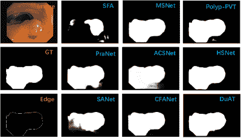
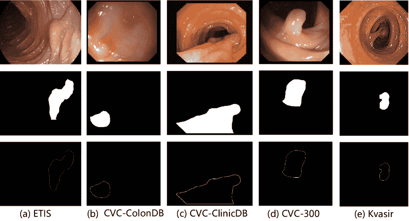
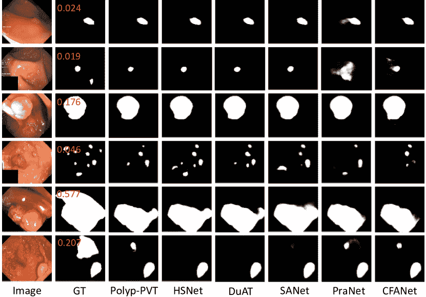
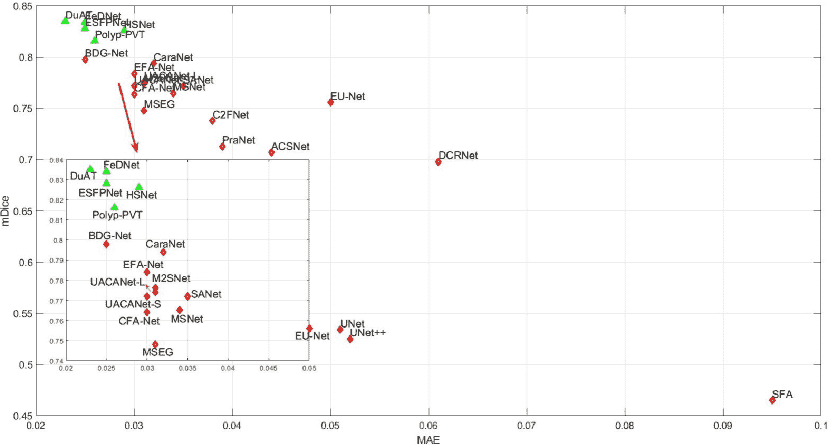
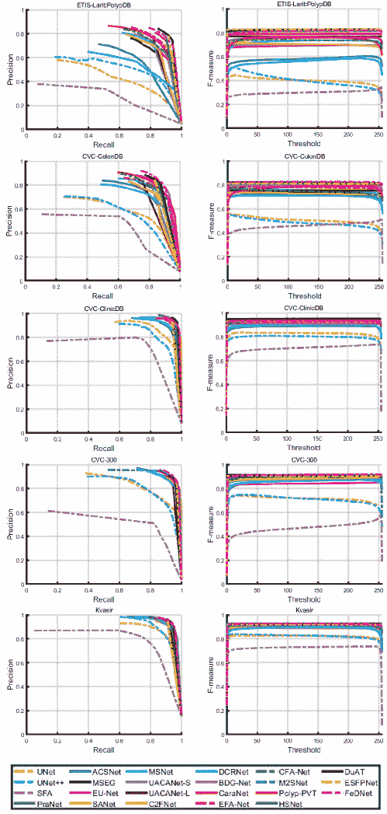
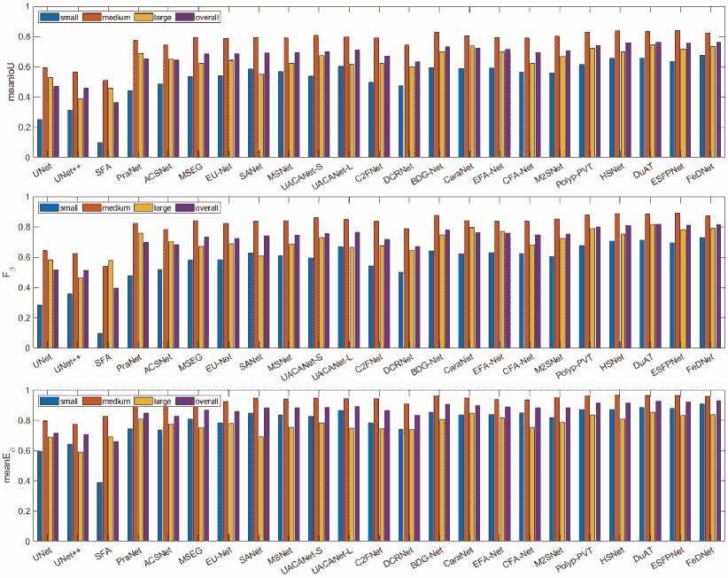

<!--yml

类别：未分类

日期：2024-09-06 19:35:53

-->

# [2311.18373] 深度学习在息肉分割中的调查：技术、挑战和未来趋势

> 来源：[`ar5iv.labs.arxiv.org/html/2311.18373`](https://ar5iv.labs.arxiv.org/html/2311.18373)

\WarningFilter

latexfont 字体形状‘ \WarningFilterlatexfontSize 替换

# 深度学习在息肉分割中的调查：技术、挑战和未来趋势

Jiaxin Mei, Tao Zhou, Kaiwen Huang, Yizhe Zhang, Yi Zhou, Ye Wu, Huazhu Fu J. Mei, T. Zhou, K. Huang, Y. Zhang 和 Y. Wu 现为南京理工大学计算机科学与工程学院的 PCA 实验室成员。Y. Zhou 现为东南大学计算机科学与工程学院的成员。H. Fu 现为新加坡 A*STAR 高性能计算研究所的成员。通讯作者：Tao Zhou（电子邮件：taozhou.ai@gmail.com）。

###### 摘要

早期发现和评估息肉在结直肠癌（CRC）的预防和治疗中发挥了关键作用。息肉分割提供了一种有效的解决方案，以帮助临床医生准确定位和分割息肉区域。过去，人们常常依赖于手动提取的低级特征，如颜色、纹理和形状，这些特征往往无法捕捉全局背景且对复杂场景缺乏鲁棒性。随着深度学习的兴起，越来越多基于深度学习网络的卓越医学图像分割算法应运而生，在这一领域取得了显著进展。本文提供了对息肉分割算法的综合评述。我们首先回顾一些基于手动提取特征和深度分割算法的传统算法，然后详细介绍相关主题的基准数据集。具体而言，我们对近期深度学习模型和基于息肉大小的结果进行全面评估，考虑到研究主题的痛点和网络结构的差异。最后，我们讨论了息肉分割的挑战及该领域的未来趋势。我们收集的模型、基准数据集和源代码链接均发布在 [`github.com/taozh2017/Awesome-Polyp-Segmentation`](https://github.com/taozh2017/Awesome-Polyp-Segmentation)。

###### 索引词：

息肉分割、深度学习、综合评估、医学影像。

## I 介绍

息肉分割是医学图像分析中的一项关键任务，旨在自动识别和分割结肠内的息肉区域。其主要目标是帮助临床医生高效且准确地定位和描绘这些区域，为结直肠癌（CRC）的早期诊断和治疗提供重要支持[1]。息肉在不同发展阶段展现出不同的大小和形状[2]，由于其与邻近器官或粘膜的强附着，其精确分割面临挑战[3]。尽管在息肉分割领域取得了显著进展，但仍面临多个挑战，如标注数据有限、边界不清晰、前景复杂以及实时需求[4, 5, 6, 7]。

图 1：使用六种基于 CNN 的模型（*即*，SFA [8]，PraNet [9]，SANet [10]，MSNet [11]，ACSNet [12]，和 CFA-Net [7]）以及三种基于 Transformer 的模型（*即*，Polyp-PVT [13]，HSNet [14]，和 DuAT [15]）在一些样本图像上的息肉分割结果比较。

在早期阶段，息肉分割主要依赖于手动提取的特征[16, 17]。例如，Tajbakhsh 等[16] 提出了利用形状特征和周围环境信息自动检测结肠镜视频中的息肉的方法。Iwahori 等[17] 利用边缘和颜色信息生成可能性图，提取了方向梯度直方图（DGH）特征，并应用随机森林分类器将检测区域分类为息肉区域或非息肉区域。然而，依赖手动提取的低级特征进行分割任务使得处理复杂场景变得困难，并且没有有效利用全局上下文信息[18]。

\begin{overpic}[width=433.62pt]{figures/timeline.pdf} \par\put(8.3,17.3){\footnotesize~{}\cite[cite]{[\@@bibref{}{yao2004colonic}{}{}]}} \put(14.3,21.1){\footnotesize~{}\cite[cite]{[\@@bibref{}{lu2008accurate}{}{}]}} \put(20.3,24.9){\footnotesize~{}\cite[cite]{[\@@bibref{}{gross2009polyp}{}{}]}} \put(24.9,5.3){\footnotesize~{}\cite[cite]{[\@@bibref{}{ganz2012automatic}{}{}]}} \put(31.0,18.4){\footnotesize~{}\cite[cite]{[\@@bibref{}{long2015fully}{}{}]}} \put(34.7,3.9){\footnotesize~{}\cite[cite]{[\@@bibref{}{ronneberger2015u}{}{}]}} \put(44.0,23.9){\footnotesize~{}\cite[cite]{[\@@bibref{}{vazquez2017benchmark}{}{}]}} \put(48.6,6.4){\footnotesize~{}\cite[cite]{[\@@bibref{}{akbari2018polyp}{}{}]}} \put(51.6,20.3){\footnotesize~{}\cite[cite]{[\@@bibref{}{zhou2018unet++}{}{}]}} \put(57.6,25.6){\footnotesize~{}\cite[cite]{[\@@bibref{}{fang2019selective}{}{}]}} \put(61.8,3.0){\footnotesize~{}\cite[cite]{[\@@bibref{}{fan2020pranet}{}{}]}} \put(67.8,24.1){\footnotesize~{}\cite[cite]{[\@@bibref{}{wei2021shallow}{}{}]}} \put(71.6,6.2){\footnotesize~{}\cite[cite]{[\@@bibref{}{dong2021polyp}{}{}]}} \put(75.3,20.0){\footnotesize~{}\cite[cite]{[\@@bibref{}{srivastava2022msrf}{}{}]}} \put(78.8,2.4){\footnotesize~{}\cite[cite]{[\@@bibref{}{tomar2022tganet}{}{}]}} \put(80.1,25.1){\footnotesize~{}\cite[cite]{[\@@bibref{}{wang2022stepwise}{}{}]}} \put(86.0,6.6){\footnotesize~{}\cite[cite]{[\@@bibref{}{rahman2023medical}{}{}]}} \put(89.2,25.4){\footnotesize~{}\cite[cite]{[\@@bibref{}{chang2023esfpnet}{}{}]}} \put(90.6,2.6){\footnotesize~{}\cite[cite]{[\@@bibref{}{kirillov2023segment}{}{}]}} \put(94.5,18.6){\footnotesize~{}\cite[cite]{[\@@bibref{}{li2023polyp}{}{}]}} \par\end{overpic}

图 2：息肉分割的简要时间线。2015 年之前的方法基于手工特征并结合了机器学习算法。自 2015 年起，U-Net [24] 和 FCN [23] 的发展极大地推动了深度学习技术在息肉分割中的进步。更多详细信息请参见第 II 节。

最近几年，基于深度学习的息肉分割模型取得了显著的进展，展示了在定位和分割息肉区域方面的令人印象深刻的能力。例如，Wei 等人[10] 提出了一个浅层注意力网络，该网络利用低级特征来缓解由于多次下采样造成的降级。他们还提出了一种创新的颜色交换方法，通过交换颜色统计数据来减少颜色依赖。为了解决模糊分割边缘的问题，Zhao 等人[11] 提出了一个多尺度减法网络，该网络结合了一个减法单元，以提取编码器中相邻层之间的差异特征。该网络以类似金字塔的方式将不同的感受野分配给这些单元的不同层，能够提取丰富多样的多尺度差异信息。为了处理大小变化，Zhou 等人[7] 提出了一个跨层特征聚合网络，该网络采用基于双流结构的分割网络和逐层融合策略，有效处理尺度变化，并将高级语义信息与低级特征进行集成。Rahman 等人[31] 提出了一个级联注意力解码器，该解码器通过变压器和基于注意力的卷积模块的分层结构有效解决了特征尺寸不一致的问题，以聚合多级特征并捕获全局和局部上下文。考虑到从不同设备收集的数据集中的变化，Yang 等人[34] 提出了一个互原型适应模型，以减少多中心和多设备结肠镜数据集中的领域转移。此外，Jha 等人[4] 提出了一个基于变压器的残差网络，该网络在多中心外部测试中展示了强大的泛化能力。除了创新的网络架构外，基于通用分割网络的精细化模型在息肉分割中也展示了良好的结果。例如，Li 等人[33] 基于分割任何模型（SAM）[32] 对 Polyp-SAM 模型进行了微调，该模型在息肉分割任务中表现良好。为了更清晰地展示息肉分割任务的进展，我们在图 2 中展示了一个简明的时间线。

在本文中，我们对息肉分割方法进行了全面的研究和调查。该调查首先从不同角度回顾了现有的息肉分割方法。此外，我们对各种具有代表性的息肉分割模型进行了深入评估，并分析了它们各自的优势。此外，我们还讨论了未来的挑战和潜在的研究方向。

### I-A 相关评论与调查

最近有几项与息肉分割领域密切相关的调查和评审。例如，Gupta 等人 [35] 回顾了基于深度学习的方法以实现高效的结直肠癌筛查，特别关注息肉分割。他们强调了未来研究中解决数据稀缺、迁移学习和可解释性等挑战的重要性。Sanchez 等人 [36] 对自 2015 年以来利用深度学习技术进行息肉检测、定位和分割的 35 项研究进行了系统评审。此外，Xiao 等人 [37] 对涉及基于 UNet 的 Transformers 和其他模型基础 Transformers 在医学图像中的分割方法进行了分类和评审。他们的工作总结了基于 Transformer 的分割模型在腹部器官、心脏、大脑和肺部等各种解剖区域的应用，基于过去两年的相关研究。

还有一些研究回顾了医学图像处理的成就。Qureshi 等人 [38] 对医学图像分割技术的最新进展进行了调查，重点关注计算图像处理和机器学习方法。他们考察了不同架构对医学图像分割的贡献，讨论了优点，识别了开放挑战，并强调了潜在的未来方向。Chowdhary 等人 [39] 研究了用于医学图像预处理的各种分割和特征提取方法。Liu 等人 [40] 对医学图像分割任务中的 U-Net 架构进行了全面回顾。他们重点关注了 U-Net 架构的结构、扩展机制和应用领域。Thisanke 等人 [41] 讨论了适用于语义分割任务的不同 Vision Transformer (ViT) 架构，并分析了其演变如何有助于密集预测任务。他们的调查旨在回顾和比较针对语义分割设计的 ViT 架构在基准数据集上的表现。Bennai 等人 [42] 对近期发布的多智能体方法进行了比较研究，专注于医学图像分割。他们的工作旨在提供对这些方法在医学图像分析中的表现和有效性的见解。总体而言，这些研究有助于理解和推进医学图像处理和分割技术，突显了取得的进展、存在的挑战以及该领域的未来研究方向。

与之前关于息肉分割或医学图像分割的综述相比，本文旨在提供对息肉分割方法的全面回顾。它涵盖了传统算法和基于深度学习模型的息肉分割方法。本文系统地、全面地分析了这些方法的优点、局限性和结果。

### I-B 贡献

我们的主要贡献可以总结如下：

+   •

    我们从不同的角度系统地回顾了息肉分割模型。我们的研究涵盖了对基于深度学习和传统方法、边界感知模型、注意力感知模型和特征融合模型的全面检查。我们讨论了每种方法的优点，提供了对其适用性和性能特征的宝贵见解。

+   •

    我们对五个公开可用的结肠镜图像数据集进行了分析，这些数据集专门用于息肉分割。此外，我们提供了息肉分割任务中常用评估指标的全面概述。

+   •

    此外，我们提供了对几种代表性的息肉分割模型的全面以及基于规模的评估。

+   •

    我们深入探讨了息肉分割中遇到的众多挑战，并提供了每个挑战的全面分析。此外，我们提出了未来研究的潜在方向，这些方向可以帮助应对这些挑战并推动该领域的发展。

### I-C 组织

本综述的结构安排如下。在第 II 节中，我们从不同方面回顾现有的息肉分割模型。在第 III 节中，我们总结并提供当前公开可用的数据集的详细信息和使用方法，这些数据集用于息肉分割。然后，我们在第 IV 节中对息肉尺寸的分割性能进行全面评估，并分析几种代表性的息肉分割模型的优缺点。在第 V 节中，我们讨论了该领域的发展挑战和未来趋势。最后，在第 VI 节中，我们总结了本文的内容。

表 I：息肉分割方法的总结（2019 年至 2021 年发布）。

| # | 年份 | 方法 | 发表 | 主干网络 | 描述 | 代码 |
| --- | --- | --- | --- | --- | --- | --- |
| 1 | 2019 | SFA  [8] | MICCAI | 轻量级 UNet | 边界敏感损失；选择性特征聚合 | [链接](https://github.com/Yuqi-cuhk/Polyp-Seg) |
| 2 | 2019 | ResUNet++ [43] | ISM | ResUNet | 挤压和激励块；ASPP；注意力块 | [链接](https://github.com/DebeshJha/ResUNetPlusPlus) |
| 3 | 2020 | PolypSeg [44] | MICCAI | UNet | 改进的注意力机制；可分离卷积 | 无 |
| 4 | 2020 | ThresholdNet [1] | TMI | DeepLabv3+ | 置信度引导的流形混合；阈值损失 | [链接](https://github.com/Guo-Xiaoqing/ThresholdNet) |
| 5 | 2020 | ACSNet [12] | MICCAI | ResNet34 | 自适应选择；通过通道注意力聚合上下文特征 | [链接](https://github.com/ReaFly/ACSNet) |
| 6 | 2020 | PraNet [9] | MICCAI | Res2Net | 并行部分解码器；反向注意力 | [链接](https://github.com/DengPingFan/PraNet) |
| 7 | 2021 | DDANet [45] | PR | ResUNet | 双解码器注意力；训练集外测试 | [链接](https://github.com/nikhilroxtomar/DDANet) |
| 8 | 2021 | GMSRF-Net [46] | ICPR | ResNet50 | 跨尺度注意力；多尺度特征选择 | [链接](https://github.com/NoviceMAn-prog/GMSRFNet) |
| 9 | 2021 | HarDNet-MSEG [47] | Arxiv | HarDNet68 | 级联部分解码器；密集聚合 | [链接](https://github.com/james128333/HarDNet-MSEG) |
| 10 | 2021 | EU-Net [48] | CRV | ResNet34 | 语义特征；自适应全局上下文模块 | [链接](https://github.com/rucv/Enhanced-U-Net) |
| 11 | 2021 | FANet [49] | TNNLS | 无 | 反馈注意力学习；迭代精炼；嵌入式运行长度编码策略 | [链接](https://github.com/nikhilroxtomar/fanet) |
| 12 | 2021 | Polyp-PVT [13] | CAAI AIR | PVT | 级联融合；伪装识别；相似性聚合 | [链接](https://github.com/DengPingFan/Polyp-PVT) |
| 13 | 2021 | UACANet  [50] | ACM MM | Res2Net | 并行轴向注意力；不确定性增强上下文注意力 | [链接](https://github.com/plemeri/UACANet) |
| 14 | 2021 | C2FNet [51] | IJCAI | Res2Net-50 | 上下文感知的跨层融合；双分支全局上下文 | [链接](https://github.com/thograce/C2FNet) |
| 15 | 2021 | ResUNet++ + TTA + CRF [52] | JBHI | ResUNet | 条件随机场；测试时增强 | [链接](https://github.com/DebeshJha/ResUNet-with-CRF-and-TTA) |
| 16 | 2021 | MPA-DA [34] | JBHI | ResNet-101 | 原型间适应网络；渐进式自我训练；解缠重建 | [链接](https://github.com/CityU-AIM-Group/MPA-DA) |
| 17 | 2021 | TransFuse [53] | MICCAI | ResNet-34 + DeiT-S | 自注意力；双线性 Hadamard 积；门控跳跃连接 | [链接](https://github.com/Rayicer/TransFuse) |
| 18 | 2021 | SANet [10] | MICCAI | Res2Net | 颜色交换；浅层注意力 | [link](https://github.com/weijun88/sanet) |
| 19 | 2021 | STFT [54] | MICCAI | ResNet-50 | 空间-时间特征变换；可变形卷积和通道感知注意力 | [link](https://github.com/lingyunwu14/STFT) |
| 20 | 2021 | LOD-Net [55] | MICCAI | ResNet + FPN | 模型每个像素位于边界区域的概率；自适应阈值策略 | [link](https://github.com/midsdsy/LOD-Net) |
| 21 | 2021 | MSNet [11] | MICCAI | Res2Net-50 | 多尺度减法；免训练网络 | [link](https://github.com/Xiaoqi-Zhao-DLUT/MSNet) |
| 22 | 2021 | CCBANet [56] | MICCAI | ResNet34 | 级联上下文；平衡注意力 | [link](https://github.com/ntcongvn/CCBANet) |
| 23 | 2021 | HRENet [57] | MICCAI | ResNet34 | 硬区域增强；自适应特征聚合；边缘和结构一致性感知损失 | [link](https://github.com/CathySH/HRENet) |

表 II: 多态分割方法总结（发表时间：2022 年至 2023 年）。

| # | 年份 | 方法 | 发表 | 主干网络 | 描述 | 代码 |
| --- | --- | --- | --- | --- | --- | --- |
| 24 | 2022 | MSRF-Net [28] | JBHI | N/A | 多尺度残差融合；双尺度密集融合 | [link](https://github.com/NoviceMAn-prog/MSRF-Net) |
| 25 | 2022 | TGANet [29] | MICCAI | ResNet50 | 文本引导注意力；加权文本嵌入 | [link](https://github.com/nikhilroxtomar/tganet) |
| 26 | 2022 | PolypSeg+ [58] | TCYB | ResNet50 | 自适应尺度上下文模块；轻量级注意力机制 | [link](https://github.com/szuzzb/polypsegplus) |
| 27 | 2022 | MSRAformer [59] | CBM | Swin Transformer | 多尺度空间反向注意力 | [link](https://github.com/ChengLong1222/MSRAformer-main) |
| 28 | 2022 | HSNet [14] | CBM | PVTv2 | 跨语义注意力；混合语义互补；多尺度预测 | [link](https://github.com/baiboat/HSNet) |
| 29 | 2022 | FuzzyNet [60] | NeurIPS | Res2Net/ ConvNext/ PVT | 模糊注意力；关注模糊像素 | [link](https://github.com/krushi1992/FuzzyNet) |
| 30 | 2022 | LDNet [61] | MICCAI | Res2Net | 病灶感知动态卷积核；自注意力 | [link](https://github.com/ReaFly/LDNet) |
| 31 | 2022 | HarDNet-DFUS [62] | Arxiv | HarDNetV2 | 实时模型；增强主干网络 | [link](https://github.com/YuWenLo/HarDNet-DFUS) |
| 32 | 2022 | BDG-Net [63] | SPIE MI | EfficientNet-B5 | 边界分布引导；边界分布生成 | [link](https://github.com/zihuanqiu/BDG-Net) |
| 33 | 2022 | ColonFormer [64] | Access | MiT | 结合层次化 Transformer 和层次化金字塔 CNN；残差轴向注意力 | [link](https://github.com/ducnt9907/ColonFormer) |
| 34 | 2022 | FCBFormer [65] | MIUA | PVTv2 | 改进的渐进局部解码器；全卷积分支 + Transformer 分支 | [link](https://github.com/ESandML/FCBFormer) |
| 35 | 2022 | DCRNet [66] | ISBI | ResNet-34 | 双重上下文关系网络；跨图像上下文关系 | [link](https://github.com/PRIS-CV/DCRNet) |
| 36 | 2022 | SSFormer [30] | MICCAI | PVTv2 | 层次聚合局部和全局特征 | [link](https://github.com/Qiming-Huang/ssformer) |
| 37 | 2022 | DuAT [15] | PRCV | PVT | 双重聚合 Transformer；全局到局部空间聚合；选择性边界聚合 | [link](https://github.com/Barrett-python/DuAT) |
| 38 | 2022 | LAPFormer [67] | Arxiv | MiT-B1 | 分层 Transformer 编码器和 CNN 解码器；渐进特征融合 | N/A |
| 39 | 2022 | PPFormer [68] | MICCAI | CvT | 浅层 CNN 编码器；深层 Transformer 编码器 | N/A |
| 40 | 2022 | BSCA-Net [69] | PR | Res2Net | 位平面切片信息；分割挤压瓶颈联合模块；多路径连接注意力 | N/A |
| 41 | 2022 | BoxPolyp [70] | MICCAI | Res2Net/ PVT | 框注释；融合滤波采样模块 | N/A |
| 42 | 2022 | ICBNet [71] | BIBM | PVT | 迭代反馈学习策略；上下文和边界感知信息 | N/A |
| 43 | 2022 | CLD-Net [72] | BIBM | MiT | 小息肉分割；局部边缘特征提取 | N/A |
| 44 | 2022 | BANet [73] | PRCV | Res2Net-50 | 注意力感知定位；残差金字塔卷积 | N/A |
| 45 | 2022 | CaraNet  [74] | JMI | Res2Net | 上下文轴向反向注意力 | [link](https://github.com/AngeLouCN/CaraNet) |
| 46 | 2023 | APCNet [75] | TIM | ResNet50 | 注意力引导的多层级聚合策略；来自不同层的互补信息 | N/A |
| 47 | 2023 | RA-DENet [76] | CBM | Res2Net | 改进的反向注意力；干扰消除 | N/A |
| 48 | 2023 | EFB-Seg [77] | 神经计算 | ConvNet | 边界嵌入；学习的语义偏移场 | N/A |
| 49 | 2023 | PPNet [78] | CBM | P2T | 通道注意力；金字塔特征融合 | N/A |
| 50 | 2023 | Fu-TransHNet [6] | Arxiv | HardNet68 | CNN 和 Transformer；多视角学习 | N/A |
| 51 | 2023 | DilatedSegNet [79] | MMM | ResNet50 | 膨胀卷积池化块；卷积注意力 | [link](https://github.com/suyanzhou626/FeDNet-BSPC) |
| 52 | 2023 | FeDNet [80] | BSPC | PVT | 解耦边缘特征和主体特征 | [link](https://github.com/suyanzhou626/FeDNet-BSPC) |
| 53 | 2023 | PEFNet [81] | MMM | EfficientNet V2-L | 位置信息编码和信息融合 | [link](https://github.com/huyquoctrinh/PEFNet) |
| 54 | 2023 | Polyp-SAM [33] | Arxiv | ViT | 细化的 SAM 模型用于多发性息肉分割 [32]。 | [link](https://github.com/ricklisz/Polyp-SAM) |
| 55 | 2023 | ESFPNet [5] | SPIE MI | MiT | 高效的阶段性特征金字塔解码器 | [link](https://github.com/dumyCq/ESFPNet) |
| 56 | 2023 | TransNetR [4] | MIDL | ResNet50 | 基于 Transformer 的残差网络；多中心分布外测试 | [link](https://github.com/DebeshJha/TransNetR) |
| 57 | 2023 | CASCADE [31] | WACV | PVTv2/ TransUNet | 基于级联的注意力解码器；多阶段损失优化；特征聚合 | [link](https://github.com/SLDGroup/CASCADE) |
| 58 | 2023 | CFA-Net [7] | PR | Res2Net-50 | 跨层特征聚合；边界聚合 | [link](https://github.com/taozh2017/CFANet) |

## II 多发性息肉分割模型

在过去十年中，已付出了重大努力来提高自动多发性息肉分割模型的性能，改善结肠镜检查的检测能力，并降低疾病风险。近期关于多发性息肉分割的研究利用了流行的深度学习方法，取得了显著的成果。相比之下，早期方法主要依赖手工设计的特征进行多发性息肉分割。这些模型的总结可以在表 I，II 中找到。为了对这些多发性息肉分割算法进行全面的综述，我们将从以下方面进行介绍。

(1) 传统模型：它们主要依赖手工设计的特征，如颜色、纹理和形状信息，来制定算法设计。 (2) 深度模型：深度学习模型自动学习深层特征，能够处理更复杂的结构，并提供更强的表达能力。 (3) 边界感知模型：边缘信息在提供边界线索以提升分割性能方面至关重要，因此我们将讨论一些现有模型中边缘信息的应用。 (4) 注意力感知模型：注意力机制已经广泛应用于各种视觉任务中。我们对多发性息肉分割相关工作的全面综述，以分析不同的注意力策略。此分析提供了对未来工作的注意力模块设计的潜在见解。 (5) 特征融合模型：多层次特征的集成和利用往往对提升模型性能有显著贡献。因此，我们调查了特征融合策略在多发性息肉分割模型中的有效性。

### II-A 传统模型

早期工作主要依赖于手动设计的特征，如颜色、纹理和形状，然后采用传统机器学习技术进行启发式建模。例如，Yao 等人 [19] 提出了结合知识引导的强度调整、模糊 c-means 聚类和可变形模型的自动息肉分割方法。Lu 等人 [20] 提出了一个三阶段的概率二分类方法，将低级和中级信息结合起来以分割 3D CT 结肠造影中的息肉。Gross 等人 [21] 研究了一种通过多尺度过滤增强主要边缘的分割算法。Ganz 等人 [22] 利用息肉形状的先验知识，通过 NBI Narrow Band Imaging (NBI) 优化了 gPb-OWT-UCM 的固有尺度选择问题。该优化旨在通过结合息肉的形状信息来实现更好的分割结果。

### II-B 深度模型

然而，上述方法受到手动特征信息表示能力有限的限制。它们缺乏泛化能力，不适合大规模部署。因此，越来越多地依赖深度特征来处理这些限制。我们将回顾一些在息肉分割领域的具有代表性的深度学习方法。

1) 基于 CNN 的方法。得益于卷积神经网络（CNN）的发展，特别是 U-Net [24] 的引入，许多受此架构启发的模型展示了令人满意的结果。

$\bullet$ ACSNet [12] 将 U-Net 中的跳跃连接修改为局部上下文提取模块，并增加了全局信息提取模块。特征被整合并根据通道注意力策略自适应选择。

$\bullet$ EU-Net [48] 是一个增强的 U-Net 框架，增强了语义信息，并引入了自适应全局上下文模块来提取关键特征。它提高了每一层特征的质量，从而增强了最终的分割性能。

$\bullet$ MSNet [11] 设计了一个减法单元以生成相邻层之间的差异特征，并以金字塔形式配备不同的感受野以捕捉多尺度信息。此外，它引入了 LossNet 来监督每层的感知特征。

$\bullet$ PEFNet [81] 在合并阶段利用改进的 U-Net 并嵌入新的位置特征信息。凭借丰富的位置知识和连接特征，该模型在息肉分割中实现了更高的准确性和通用性。

2) 基于 Transformer 的方法。尽管 CNN 在各种计算机视觉任务中取得了成功，但它们在捕捉长程依赖关系方面存在局限。然而，Transformer 模型的引入，最初在自然语言处理领域流行，彻底革新了计算机视觉领域。特别是视觉 Transformer（ViTs）[82]已经成为图像理解的强大方法，并推动了利用其优势的众多算法的发展。

$\bullet$ MSRAformer [59]。它采用 Swin Transformer 作为编码器，配备金字塔结构以在不同阶段提取特征，并利用多尺度通道注意力模块提取多尺度特征信息。它还增加了一个空间反向注意力模块，以补充边缘结构和细节信息，从而展示出强大的泛化能力和性能。

$\bullet$ DuAT [15] 是一个用于息肉分割的双重聚合 Transformer 网络。它包括一个全球到局部的空间聚合模块，用于聚合全球和局部空间特征以及定位多尺度对象。该方法还采用了选择性边界聚合模块，以集成低级边缘特征和高级语义特征。

$\bullet$ SSFormer [30] 结合了 PVTv2 和 Segformer 作为编码器，同时引入了一种新颖的渐进本地解码器。该解码器专门设计用来补充金字塔 Transformer 骨干，通过强调局部特征和减轻注意力分散来发挥作用。

$\bullet$ ColonFormer [64] 采用基于 Transformer 的轻量级架构作为编码器，并在解码器中使用层次化网络结构以学习多级特征。此外，该模型还引入了一种新颖的跳跃连接技术，用于细化息肉边界信息，从而实现精确的分割结果。

$\bullet$ TransNetR [4] 是一个基于 Transformer 的残差网络，包括一个预训练编码器、三个解码块和一个上采样层，展示了卓越的实时处理速度和多中心泛化能力。

$\bullet$ Polyp-PVT [13] 包括一个级联融合模块，结合了高级语义和位置数据，一个捕捉低级特征的伪装识别模块，以及一个将高级特征扩展到整个区域的相似性聚合模块。这种集成方法有效减轻了特征中的噪声，并在息肉分割性能上取得了显著改善。

3) 混合方法。此外，许多模型结合了 CNN 和 Transformer 的优点，捕捉局部上下文信息和长程依赖关系，从而显著提升了分割性能。

$\bullet$ TransFuse [53] 将 Transformer 和 CNN 以并行方式结合，以捕捉全局依赖关系和低级空间细节。在融合两个分支的多层特征时，它结合了自注意力机制和多模态融合机制。此外，空间注意力用于增强局部细节并抑制无关区域，同时建模两个分支之间的细粒度交互，以抑制低级特征中的噪声。

$\bullet$ LAPFormer [67] 使用层次化的 Transformer 编码器来提取全局特征，并与 CNN 解码器结合以捕捉息肉的局部外观。此外，它引入了一个渐进特征融合模块来整合多尺度特征，并结合了特征细化模块和特征选择模块以进行特征处理。

$\bullet$ PPFormer [68] 采用浅层 CNN 编码器和深层 Transformer 编码器来提取特征。然后使用预测图来指导自注意力，以增强边界感知。

$\bullet$ HSNet [14] 利用由 Transformer 和 CNN 网络组成的双分支结构，以捕捉长范围依赖关系和局部外观细节。此外，结合了交互机制，以促进不同网络层之间语义信息的交换，弥合低级特征和高级特征之间的差距。这一设计增强了模型整合全面信息的能力，提升了整体性能。

$\bullet$ Fu-TransHNet [6] 设计了一种新颖的特征融合模块，以充分利用从 CNN 和 Transformer 网络获得的局部和全局特征。融合模块实现了相同尺度和多尺度特征的密集融合。此外，通过多视角学习获得 CNN 和 Transformer 分支以及融合模块的权重，从而在实现**最佳性能**方面具有灵活性。

### II-C 边界感知模型

边缘信息作为指导策略最初在目标检测中很流行，近年来也越来越多地应用于息肉分割任务。鉴于医学图像分割的特殊性，精确的边缘感知表示具有特别的重要性。在接下来的章节中，我们将回顾几种在感知和整合边缘信息方面表现出色的模型。

$\bullet$ FeDNet [80] 同时优化主体和边缘，以提高息肉分割性能。它明确地将输入特征解耦为主体特征和边缘特征，然后通过引入特征解耦模块进行针对性优化。

$\bullet$ BSCA-Net [69] 利用位平面切片信息有效提取边界信息。此外，设计了一个分割挤压瓶颈联合模块来利用来自不同视角的几何信息，并使用多路径连接注意力解码器和多路径注意力连接编码器进一步增强网络性能以进行息肉分割。

$\bullet$ BoxPolyp [70] 通过使用盒注释来缓解过拟合问题，迭代地增强分割模型以生成细粒度的息肉区域。设计了一个融合滤波采样模块，从较少噪声的盒注释中生成像素级伪标签，从而显著提高性能。

$\bullet$ BDG-Net [63] 是一种边界分布引导网络。它利用边界分布生成模块来聚合高级特征，这些特征被作为补充空间信息输入到边界分布引导解码器（BDGD）中，以指导息肉分割。此外，BDGD 采用多尺度特征交互策略来应对大小变化。

$\bullet$ ICBNet [71] 创新性地采用了迭代反馈学习策略，通过使用上下文和边界感知信息补充和完善初步分割和边界预测的编码器特征。这一策略被迭代地应用，以实现逐步优化改进。此外，还开发了一个双分支迭代反馈单元，以在分割和边界预测的指导下增强特征。

$\bullet$ CLD-Net [72] 重点解决了下采样过程中特征丢失的问题，并有效应对了小息肉分割的挑战。它通过结合局部边缘特征提取模块和局部-全局特征融合模块来实现这一目标。该模型最初使用渐进策略提取一系列边缘特征，随后处理噪声，最后通过上采样融合策略将边缘特征整合到全局特征中。

$\bullet$ BANet [73] 通过一个关注注意力的定位模块准确识别息肉的主要位置。此外，它通过残差金字塔卷积模块挖掘息肉边界信息，并利用边界信息通过边界引导的细化模块进行受限的息肉区域预测，从而实现更精确的分割。

$\bullet$ SFA [8] 通过构建一个具有区域和边界约束的选择性特征聚合网络来提高分割性能。它主要由一个共享编码器预测息肉区域和两个互相约束的解码器组成，这些解码器提取边缘信息。通过在编码器和解码器之间引入三个向上级联的组件，并将选择性卷积模块嵌入卷积层中，实现选择性特征聚合。此外，还创新性地提出了一种新颖的边界敏感损失函数，用于测量区域和边界之间的依赖关系。

$\bullet$ FCBFormer [65] 充分利用了全卷积网络（FCNs）和变换器在息肉分割中的优势。

### II-D 注意力感知模型

在息肉分割领域，要获得卓越的性能需要优先处理相关信息，而不是将所有信息一视同仁。通过引入注意力机制，可以有效地解决这个问题，使模型能够集中关注最重要的特征，从而提高分割性能。

$\bullet$ CASCADE [31] 利用分层视觉变换器优势多尺度特征。它包括一个注意力门，融合跳跃连接特征，以及一个卷积注意力模块，抑制背景信息以增强远程和局部上下文。

$\bullet$ APCNet [75] 从金字塔结构中提取多层次特征，然后呈现一种注意力引导的多层次聚合策略，通过利用不同层的互补信息来增强每一层的上下文特征。

$\bullet$ RA-DENet [76] 通过逆注意力增强不同区域的表示，然后通过干扰物去除消除噪声。它提取低层次的息肉特征以获得边缘特征，并通过将这些边缘特征与精细化的息肉特征连接，从而取得了有前景的息肉分割性能。

$\bullet$ TGANet [29] 引入了文本注意力机制，利用与息肉大小和数量相关的特征来适应不同的息肉尺寸，并有效处理多息肉场景。通过通过辅助分类任务给文本嵌入分配权重，网络可以学习额外的特征表示，从而增强整体性能。

$\bullet$ LDNet [61] 从输入图像中提取全局上下文特征，然后根据分割预测的病变特征进行迭代更新。接着，提出了一个自注意力模块，以捕捉远程上下文关系并提高分割性能。该模型展现出强大的分割性能和泛化能力。

$\bullet$ SANet [10] 通过颜色交换操作消除颜色的影响，然后基于浅层注意模块从浅层特征中过滤出背景噪声。此外，它通过概率修正策略解决了小息肉中的像素不平衡问题。得益于这些措施，它在小息肉任务中表现良好。

### II-E 特征融合模型

在语义分割领域，整合多尺度特征对于有效处理对象尺寸变化至关重要。此外，通过特征融合整合多级特征，并利用高级特征和低级特征可以极大地提升分割性能。在息肉分割任务的背景下，已经采用了多种特征融合策略来实现这一目标。

$\bullet$ CFA-Net [7] 是一个新颖的跨层级特征聚合网络，采用分层策略将边缘特征纳入双流分割网络。此外，该模型提出了一个跨层特征融合模块，以整合不同层级的相邻特征。

$\bullet$ EFB-Seg [77] 通过引入一个特征融合模块来增强多级特征融合，该模块利用学习到的语义偏移场对齐多级特征图，从而解决特征错位问题。

$\bullet$ MSRF-Net [28]。该模型创新性地使用了一个双尺度密集融合块来交换具有不同感受野的多尺度特征。它可以保持分辨率，并传播高级和低级特征，以实现更准确的分割结果。

$\bullet$ DCRNet [66] 捕获了图像内和图像间的上下文关系。在图像内，提供了一个位置注意模块来捕获像素级的上下文信息。在图像间，通过嵌入上下文关系矩阵实现特征增强，然后通过区域跨批次记忆实现关系融合。

$\bullet$ PPNet [78] 在金字塔特征融合模块中使用通道注意机制来学习全局上下文特征，从而指导解码器分支的信息转换。此外，它在编码器的每个侧分支中引入了一个记忆保留金字塔池化模块，以增强特征提取的有效性。

$\bullet$ PraNet [9] 使用并行部分解码器聚合高级特征，采用反向注意模块挖掘边界线索，并建立区域与边界线索之间的关系。

$\bullet$ PolypSeg [44] 聚合了多尺度上下文信息，并通过改进的注意力机制专注于目标区域。然后，它从低级特征中消除背景噪声，增强了高级和低级特征之间的特征融合。此外，该模型通过使用深度可分离卷积来降低计算成本。

### II-F 视频息肉分割

准确和实时的息肉图像分割面临重大挑战，因为它依赖于标注质量和深度学习模型的复杂性。为了促进自动分割方法在临床环境中的部署，一些研究已经将重点转向基于视频的息肉分割方法。通过考虑时间信息，这些方法旨在克服单图像分割的局限性，并在临床要求的实时场景中实现更精确和高效的分割。

$\bullet$ ESFPNet [5] 构建了一个预训练的混合变换器（MiT）编码器和一个高效的分阶段特征金字塔解码器，其中 MiT 使用重叠路径合并模块和自注意力预测，*最终展示了高效的性能和在相关领域的潜在应用*。

$\bullet$ PNS+ [83] 使用全局编码器和局部编码器提取长期时空表示，并通过标准化自注意力块逐步精炼这些表示。他们引入了一个逐帧标注的视频息肉分割数据集 SUN-SEG，其中包含 158,690 个结肠镜视频帧。大量实验表明，PNS+ 展现了最佳的性能和实时推理速度。

$\bullet$ SSTAN [84] 提出了一个半监督的视频息肉分割任务，仅需稀疏标注的帧进行训练。它引入了一种新颖的时空注意力结构，包括时间局部上下文注意力模块，这些模块利用来自相邻帧的预测结果来优化当前预测，以及时空注意力模块，这些模块使用混合变换器捕获时间和空间上的长距离依赖。

$\bullet$ PNS-Net [85] 利用标准自注意力模块和 CNN 高效地从息肉视频中学习表示，*无需后处理*。

$\bullet$ NanoNet [86] 参数更少，可与移动和嵌入式设备集成。它利用预训练的 MobileNetV2 作为编码器。在编码器和解码器之间的架构中，加入了改进的残差块，以增强解码器的泛化能力。

图 3：五个息肉分割数据集的图像示例、地面实况图和边缘，包括（a）ETIS-LaribPolypDB [87]，（b）CVC-ColonDB [16]，（c）CVC-ClinicDB [18]，（d）CVC-300 [25]，以及（e）Kvasir-SEG [88]。在每个数据集中，图像、地面实况图和边缘从上到下依次展示。

## III 息肉分割数据集

医学图像分割领域的快速进展促使了各种公开基准数据集的建设，这些数据集专门为息肉分割任务设计。这些数据集近年来出现，作为评估不同分割模型性能的标准化平台。通过利用这些基准数据集，研究人员可以将他们的方法与既定基准进行比较，促进可重复的研究，并推动息肉分割领域的进一步发展。表 III 总结了八个流行的图像级息肉分割数据集，图 3 展示了这些数据集中的图像示例（包括边缘图和标注）。此外，下面提供了每个数据集的一些详细信息。请注意，一些视频级息肉分割数据集在表 III 中进行了总结，一些工作[16, 18, 89, 90, 83]也基于这些数据集。

$\bullet$ ETIS-LaribPolypDB [87] 收集了早期结直肠息肉图像，包括$196$个大小为$966\times{1225}$的息肉实例。

$\bullet$ CVC-ClinicDB [18] 来源于西班牙巴塞罗那的一家医院的临床病例，并由 23 个不同的标准白光结肠镜干预视频生成。该数据集包含$612$张高分辨率的彩色图像，大小为$576\times{768}$，均源于临床结肠镜检查。每张图像附带一个手动标注文件，清晰标明息肉的位置。

$\bullet$ CVC-ColonDB [16] 由位于巴塞罗那的计算机视觉中心（CVC）维护。该数据集包括$380$张大小为$500\times{574}$的结肠镜图像以及手动标注的分割掩码，用于精确标记息肉的位置。

$\bullet$ CVC-300 [25] 包括$60$张分辨率为$500\times{574}$的结肠镜图像。

$\bullet$ CVC-EndoSceneStill [25] 包含 CVC-ClinicDB 和 CVC-300，因此包含 912 张结肠镜检查图像及其对应的标注。

$\bullet$ Kvasir-SEG [88] 包含$1,000$张胃肠息肉图像及其相应的分割掩码和边界框。这些图像由医生手动标注，并由胃肠科专家验证。

$\bullet$ PICCOLO [91] 由 48 名患者的$3,433$张临床结肠镜图像组成，包括白光和窄带成像图像。它还提供了包括在结肠镜检查中检测到的息肉数量和大小的注释。数据被划分为训练集（$2,203$）、验证集（$897$）和测试集（$333$）。

$\bullet$ PolypGen [92] 来源于六个不同中心超过$300$名患者的结肠镜检测图像。它包含单帧数据和序列数据，含有$3,762$个标注的息肉标签。息肉边界的划分已由六位资深胃肠科专家验证。具体而言，数据集还包含$4,275$个负样本。

表 III: 根据年份（Year）、出版期刊（Pub.）、数据集大小（Size）、图像中的物体数量（Obj.）和分辨率（Resolution），对数据集进行了统计。关于每个数据集的更详细信息，请参见第 III 节。这些数据集可以从我们的网站下载：[`github.com/taozh2017/Awesome-Polyp-Segmentation`](https://github.com/taozh2017/Awesome-Polyp-Segmentation)。

|  | # | 数据集 | 年份 | 出版 | 大小 | 物体 | 分辨率 |
| --- | --- | --- | --- | --- | --- | --- | --- |
| 图像级 | 1 | ETIS-LaribPolypDB  [87] | 2014 | IJCARS | 196 | 多重 | $1225\times{966}$ |
| 2 | CVC-ColonDB  [16] | 2015 | TMI | 380 | 单个 | $574\times{500}$ |
| 3 | CVC-ClinicDB  [18] | 2015 | CMIG | 612 | 多重 | $768\times{576}$ |
| 4 | CVC-300  [25] | 2017 | JHE | 60 | 单个 | $574\times{500}$ |
| 5 | CVC-EndoSceneStill  [25] | 2017 | JHE | 912 | 多重 | $[574\sim 768]\times$ [500$\sim$ 576] |
| 6 | Kvasir-SEG  [88] | 2020 | MMM | 1,000 | 多重 | $[487\sim 1072]\times[332\sim 1920]$ |
| 7 | PICCOLO  [91] | 2020 | AS | 3,433 | 多重 | $[854\sim 1920]\times[480\sim 1080]$ |
| 8 | PolypGen  [92] | 2021 | SD | 8,037 | 多重 | $[384\sim 1920]\times[288\sim 1080]$ |
| 视频级 | 9 | ASU-Mayo Clinic [16] | 2016 | TMI | 36,458 | 单个 | $688\times 550$ |
| 10 | CVC-ClinicVideoDB  [93] | 2017 | GIANA | 11,954 | 多重 | $N/A$ |
| 11 | LDPolypVideo  [89] | 2021 | MICCAI | 40,266 | 多重 | $560\times 480$ |
| 12 | SUN-SEG  [83] | 2022 | MIR | 158,690 | 单个 | $[1158\sim 1240]\times[1008\sim 1080]$ |

## IV 模型评估与分析

### IV-A 评估指标

我们简要回顾了几种用于息肉分割任务的流行指标，*即*，交并比（IoU），精确度-召回率（PR），特异性，Dice 系数（Dice），F-measure ($F_{\beta}$) [94]，平均绝对误差（MAE）[95]，结构测量（$S_{\alpha}$）[96]，以及增强对齐测量（$E_{\phi}$）[97]。

首先，让我们介绍一些参数。*TP* 代表真正例，表示模型正确预测为正的正样本数量。*FP* 代表假正例，表示模型错误地预测为正的负样本数量。*FN* 代表假负例，表示模型错误地预测为负的正样本数量。

$\bullet$ PR。精确度表示模型正确预测为正样本的比例。召回率（也称为灵敏度）表示模型从所有实际正样本中成功检测到的正样本比例。PR（精确度-召回率）曲线可以通过将召回率作为 x 轴，精确度作为 y 轴来绘制。

|  | $\text{精确度}=\frac{\text{TP}}{\text{TP}+\text{FP}},~{}\text{召回率}=\frac{\text{TP}}{\text{TP}+\text{FN}}.$ |  | (1) |
| --- | --- | --- | --- |

$\bullet$ IoU。交并比，也称为雅卡尔系数，用于测量预测结果与真实目标之间的重叠程度。它通常用于处理不平衡的数据集。

|  | $\text{IoU}=\frac{\text{TP}}{\text{TP}+\text{FP}+\text{FN}}.$ |  | (2) |
| --- | --- | --- | --- |

$\bullet$ F-measure($F_{\beta}$)。F-measure，也称为 F1-score，通过考虑精确度和召回率的调和均值来结合精确度和召回率。它允许调整精确度和召回率的权重，以解决特定问题，并在处理不平衡的数据集时效果显著。

|  | $F_{\beta}=(1+\beta^{2})\frac{(\text{精确度}\cdot\text{召回率})}{(\beta^{2}\cdot\text{精确度})+\text{召回率}}.$ |  | (3) |
| --- | --- | --- | --- |

$\bullet$ Dice。Dice 系数是用于衡量预测分割结果与真实分割目标之间相似性的常用评估指标。它提供了一个从 0 到 1 的评分，其中 1 表示完全匹配，0 表示完全不匹配。

|  | $\text{Dice}=\frac{2\times\text{TP}}{2\times\text{TP}+\text{FP}+\text{FN}}.$ |  | (4) |
| --- | --- | --- | --- |

$\bullet$ S-measure ($S_{\alpha}$)。结构测量[96] 评估分割结果的结构相似性。

|  | $S_{\alpha}=\alpha\cdot S_{O}+(1-\alpha)\cdot S_{R}.$ |  | (5) |
| --- | --- | --- | --- |

在这个上下文中，$S_{O}$ 代表对象相似度，衡量分割结果与真实目标之间的重叠情况。$S_{R}$ 代表区域相似度，评估分割结果与真实目标之间的结构相似性。参数 $\alpha$ 用于平衡这两种度量之间的权重。

$\bullet$ E-measure ($E_{\phi}$)。增强度量[97] 用于评估区域覆盖。

|  | $E_{\phi}=\frac{(1+\phi^{2})\cdot S_{O}\cdot S_{R}}{\phi^{2}\cdot S_{O}+S_{R}},$ |  | (6) |
| --- | --- | --- | --- |

其中，参数$\phi$是一个平衡参数，用于调整准确性和区域覆盖之间的权重比例。

$\bullet$ MAE。均方绝对误差（MAE）常用于评估回归任务。

|  | $\text{MAE}=\frac{1}{W\times H}\sum_{i=1}^{W}\sum_{j=1}^{H}\lvert S_{i,j}-G_{i,j}\rvert,$ |  | (7) |
| --- | --- | --- | --- |

其中，$W$和$H$分别表示地图的宽度和高度，$S$表示预测的分割图，$G$表示真实分割图。

$\bullet$ Specificity。Specificity 衡量模型识别负样本的能力。具体地，Specificity 可以使用以下公式计算：

|  | $\text{Specificity}=\frac{\text{TN}}{\text{TN}+\text{FP}}.$ |  | (8) |
| --- | --- | --- | --- |

Specificity 的值介于 0 和 1 之间，值越高表示模型识别负样本的能力越强。

### IV-B 性能比较与分析

表 IV：24 个代表性息肉分割模型（18 个基于 CNN 的模型和 6 个基于 Transformer 的模型）在五个常用数据集上的基准结果，按 Dice、IoU 和$S_{\alpha}$进行评估。前三名结果以红色、蓝色和绿色字体显示。

| 方法 | 发表 | ETIS-Larib | CVC-ColonDB | CVC-ClinicDB | CVC-300 | Kvasir |
| --- | --- | --- | --- | --- | --- | --- |
| Dice | IoU | $S_{\alpha}$ | Dice | IoU | $S_{\alpha}$ | Dice | IoU | $S_{\alpha}$ | Dice | IoU | $S_{\alpha}$ | Dice | IoU | $S_{\alpha}$ |
| UNet [24] | MICCAI 2015 | .398 | .335 | .684 | .504 | .436 | .710 | .823 | .755 | .889 | .710 | .627 | .843 | .818 | .746 | .858 |
| UNet++ [27] | MICCAI 2018 | .401 | .344 | .683 | .482 | .408 | .692 | .794 | .729 | .873 | .707 | .624 | .839 | .821 | .743 | .862 |
| SFA [8] | MICCAI 2018 | .297 | .217 | .557 | .456 | .337 | .628 | .700 | .607 | .793 | .467 | .329 | .640 | .723 | .611 | .782 |
| PraNet [9] | MICCAI 2020 | .628 | .567 | .794 | .712 | .640 | .820 | .899 | .849 | .936 | .871 | .797 | .925 | .898 | .840 | .915 |
| ACSNet [12] | MICCAI 2020 | .578 | .509 | .754 | .716 | .649 | .829 | .882 | .826 | .927 | .863 | .787 | .923 | .898 | .838 | .920 |
| MSEG [47] | ArXiv 2021 | .700 | .630 | .828 | .735 | .666 | .834 | .909 | .864 | .938 | .874 | .804 | .924 | .897 | .839 | .912 |
| EU-Net [48] | CRV 2021 | .687 | .609 | .793 | .756 | .681 | .831 | .902 | .846 | .936 | .837 | .765 | .904 | .908 | .854 | .917 |
| SANet [10] | MICCAI 2021 | .750 | .654 | .849 | .753 | .670 | .837 | .916 | .859 | .939 | .888 | .815 | .928 | .904 | .847 | .915 |
| MSNet [11] | MICCAI 2021 | .723 | .652 | .845 | .751 | .671 | .838 | .918 | .869 | .946 | .865 | .799 | .926 | .905 | .849 | .923 |
| UACANet-S [50] | ACM MM 2021 | .694 | .615 | .815 | .783 | .704 | .847 | .916 | .870 | .939 | .902 | .837 | .934 | .905 | .852 | .914 |
| UACANet-L [50] | ACM MM 2021 | .766 | .689 | .859 | .751 | .678 | .835 | .926 | .880 | .942 | .910 | .849 | .938 | .912 | .859 | .917 |
| C2FNet [51] | IJCAI 2021 | .699 | .624 | .827 | .724 | .650 | .826 | .919 | .872 | .941 | .874 | .801 | .927 | .886 | .831 | .905 |
| DCRNet [66] | ISBI 2022 | .556 | .496 | .736 | .704 | .631 | .821 | .896 | .844 | .933 | .856 | .788 | .921 | .886 | .825 | .911 |
| BDG-Net [63] | SPIE MI 2022 | .752 | .681 | .860 | .797 | .723 | .870 | .905 | .857 | .936 | .902 | .837 | .940 | .915 | .863 | .920 |
| CaraNet [74] | SPIE MI 2022 | .747 | .672 | .868 | .773 | .689 | .853 | .936 | .887 | .954 | .900 | .838 | .940 | .916 | .865 | .929 |
| EFA-Net [98] | Arxiv 2023 | .749 | .670 | .858 | .774 | .696 | .855 | .919 | .871 | .943 | .894 | .830 | .941 | .914 | .861 | .929 |
| CFANet [7] | PR 2023 | .732 | .655 | .845 | .743 | .665 | .835 | .932 | .883 | .950 | .893 | .827 | .938 | .915 | .861 | .924 |
| M2SNet [99] | Arxiv 2023 | .723 | .652 | .845 | .751 | .671 | .838 | .918 | .869 | .946 | .865 | .799 | .926 | .905 | .849 | .923 |
| HSNet [14] | CBM 2022 | .808 | .734 | .882 | .810 | .735 | .868 | .948 | .905 | .953 | .903 | .839 | .937 | .926 | .877 | .927 |
| DuAT [15] | Arxiv 2022 | .822 | .746 | .889 | .819 | .737 | .873 | .948 | .906 | .956 | .901 | .840 | .940 | .924 | .876 | .929 |
| Polyp-PVT [13] | AIR 2023 | .787 | .706 | .871 | .808 | .727 | .865 | .937 | .889 | .949 | .900 | .833 | .935 | .917 | .864 | .925 |
| ESFPNet [5] | MI 2023 | .823 | .748 | .891 | .811 | .730 | .864 | .928 | .883 | .943 | .902 | .836 | .934 | .917 | .866 | .923 |
| FeDNet [80] | BSPC 2023 | .810 | .733 | .892 | .823 | .744 | .878 | .930 | .885 | .949 | .911 | .848 | .946 | .924 | .876 | .933 |
| SAM-B [100] | Arxiv 2023 | .406 | .370 | .672 | .215 | .188 | .553 | .268 | .231 | .572 | .371 | .339 | .650 | .515 | .459 | .682 |
| SAM-H [100] | Arxiv 2023 | .517 | .477 | .730 | .441 | .396 | .676 | .547 | .500 | .738 | .651 | .606 | .812 | .778 | .707 | .829 |
| SAM-L [100] | Arxiv 2023 | .551 | .507 | .751 | .468 | .422 | .690 | .578 | .526 | .744 | .726 | .676 | .849 | .782 | .710 | .832 |

表 V: 24 个代表性息肉分割模型（18 个基于 CNN 的模型和 6 个基于变换器的模型）在五个常用数据集上的基准结果，依据 $F_{\beta}$、$E_{\phi}$ 和 MAE。前三个最佳结果以红色、蓝色和绿色字体显示。

| 方法 | Pub. | ETIS-Larib | CVC-ColonDB | CVC-ClinicDB | CVC-300 | Kvasir |
| --- | --- | --- | --- | --- | --- | --- |
| $F_{\beta}$ | $E_{\phi}$ | MAE | $F_{\beta}$ | $E_{\phi}$ | MAE | $F_{\beta}$ | $E_{\phi}$ | MAE | $F_{\beta}$ | $E_{\phi}$ | MAE | $F_{\beta}$ | $E_{\phi}$ | MAE |
| UNet [24] | MICCAI 2015 | .366 | .643 | .036 | .491 | .692 | .059 | .811 | .913 | .019 | .684 | .848 | .022 | .794 | .881 | .055 |
| UNet++ [27] | MICCAI 2018 | .390 | .629 | .035 | .467 | .680 | .061 | .785 | .891 | .022 | .687 | .834 | .018 | .808 | .886 | .048 |
| SFA [8] | MICCAI 2018 | .231 | .531 | .109 | .366 | .661 | .094 | .647 | .840 | .042 | .341 | .644 | .065 | .670 | .834 | .075 |
| PraNet [9] | MICCAI 2020 | .600 | .808 | .031 | .699 | .847 | .043 | .896 | .963 | .009 | .843 | .950 | .010 | .885 | .944 | .030 |
| ACSNet [12] | MICCAI 2020 | .530 | .737 | .059 | .697 | .839 | .039 | .873 | .947 | .011 | .825 | .939 | .013 | .882 | .941 | .032 |
| MSEG [47] | ArXiv 2021 | .671 | .855 | .015 | .724 | .859 | .038 | .907 | .961 | .007 | .852 | .948 | .009 | .885 | .942 | .028 |
| EU-Net [48] | CRV 2021 | .636 | .807 | .067 | .730 | .863 | .045 | .891 | .959 | .011 | .805 | .918 | .015 | .893 | .951 | .028 |
| SANet [10] | MICCAI 2021 | .685 | .881 | .015 | .726 | .869 | .043 | .909 | .971 | .012 | .859 | .962 | .008 | .892 | .949 | .028 |
| MSNet [11] | MICCAI 2021 | .677 | .875 | .020 | .736 | .872 | .041 | .913 | .973 | .008 | .848 | .945 | .010 | .892 | .947 | .028 |
| UACANet-S [50] | ACM MM 2021 | .650 | .848 | .023 | .772 | .894 | .034 | .917 | .965 | .008 | .886 | .974 | .006 | .897 | .948 | .026 |
| UACANet-L [50] | ACM MM 2021 | .740 | .903 | .012 | .746 | .875 | .039 | .928 | .974 | .006 | .901 | .977 | .005 | .902 | .955 | .025 |
| C2FNet [51] | IJCAI 2021 | .668 | .860 | .022 | .705 | .854 | .044 | .906 | .969 | .009 | .844 | .949 | .009 | .869 | .929 | .036 |
| DCRNet [66] | ISBI 2022 | .506 | .742 | .096 | .684 | .840 | .052 | .890 | .964 | .010 | .830 | .943 | .010 | .868 | .933 | .035 |
| BDG-Net [63] | SPIE MI 2022 | .719 | .901 | .014 | .781 | .901 | .028 | .898 | .959 | .008 | .883 | .969 | .005 | .906 | .959 | .025 |
| CaraNet [74] | SPIE MI 2022 | .709 | .875 | .017 | .729 | .880 | .042 | .931 | .985 | .007 | .887 | .977 | .007 | .909 | .962 | .023 |
| EFA-Net [98] | Arxiv 2023 | .698 | .872 | .018 | .753 | .884 | .036 | .916 | .972 | .009 | .878 | .961 | .009 | .906 | .955 | .024 |
| CFANet [7] | PR 2023 | .693 | .881 | .014 | .728 | .869 | .039 | .924 | .981 | .007 | .875 | .962 | .008 | .903 | .956 | .023 |
| M2SNet [99] | Arxiv 2023 | .677 | .875 | .020 | .736 | .872 | .041 | .913 | .973 | .008 | .848 | .945 | .010 | .892 | .947 | .028 |
| HSNet [14] | CBM 2022 | .777 | .904 | .021 | .796 | .912 | .032 | .951 | .990 | .006 | .887 | .970 | .007 | .918 | .961 | .023 |
| DuAT [15] | Arxiv 2022 | .789 | .917 | .013 | .805 | .922 | .026 | .950 | .990 | .006 | .890 | .965 | .005 | .916 | .960 | .023 |
| Polyp-PVT [13] | AIR 2023 | .750 | .906 | .013 | .795 | .913 | .031 | .936 | .985 | .006 | .884 | .973 | .007 | .911 | .956 | .023 |
| ESFPNet [5] | MI 2023 | .786 | .930 | .012 | .798 | .908 | .030 | .930 | .976 | .007 | .882 | .970 | .006 | .913 | .957 | .024 |
| FeDNet [80] | BSPC 2023 | .773 | .931 | .016 | .809 | .918 | .029 | .928 | .978 | .007 | .897 | .976 | .006 | .918 | .963 | .021 |
| SAM-B [100] | Arxiv 2023 | .404 | .574 | .035 | .210 | .412 | .077 | .259 | .431 | .092 | .374 | .563 | .058 | .509 | .624 | .104 |
| SAM-H [100] | Arxiv 2023 | .513 | .658 | .029 | .434 | .585 | .056 | .546 | .676 | .040 | .653 | .765 | .020 | .769 | .828 | .062 |
| SAM-L [100] | Arxiv 2023 | .544 | .686 | .030 | .463 | .607 | .054 | .563 | .683 | .057 | .729 | .824 | .020 | .773 | .834 | .061 |

#### IV-B1 总体评估

图 4：展示了大、中、小尺寸的息肉图像，以及六种典型模型的分割图，包括三种基于 CNN 的模型：PraNet [9]、SANet [10] 和 CFA-Net [7]，以及三种基于 Transformer 的模型：Polyp-PVT [13]、HSNet [14] 和 DuAT [15]。GT 图上的数字表示息肉像素占图像总像素的比例。图像来源于 Kvasir-SEG [88]数据集。

为了量化不同模型的性能，我们对 24 种具有代表性的息肉分割模型进行了全面评估，包括 1) 十八种基于 CNN 的模型：UNet [24]、UNet++ [27]、SFA [8]、PraNet [9]、ACSNet [12]、MSEG [47]、EU-Net [48]、SANet [10]、MSNet [11]、UACANet-S [50]、UACANet-L [50]、C2FNet [51]、DCRNet [66]、BDG-Net [63]、CaraNet [74]、EFA-Net [98]、CFA-Net [7] 和 M2SNet [99]，以及 2) 六种基于 Transformer 的方法：Polyp-PVT [13]、HSNet [14]、DuAT [15]、ESFPNet [5]、FeDNet [80] 和 基于 SAM 的息肉分割模型（具有三种不同骨干网络，*即*，SAM-B、SAM-H 和 SAM-L）[100]。首先，我们分别评估了上述 24 种模型在五个公共数据集（ETIS-LaribPolypDB [87]、CVC-ColonDB [16]、CVC-ClinicDB [18]、CVC-300 [25] 和 Kvasir-SEG [88]）上的 Dice、IoU、$S_{\alpha}$、$F_{\beta}$、$E_{\phi}$ 和 MAE 指标的表现。评估结果见表格 IV 和表格 V。其次，我们还报告了每个模型在五个数据集上的 Dice 和 MAE 的均值，见图 5。值得注意的是，表现较好的模型显示在左上角（*即*，具有较大的 mDice 和较小的 MAE）。从图 5 中显示的结果，我们有如下观察：

+   •

    CNN 与 Transformer。与基于 CNN 的模型相比，基于 Transformer 的方法获得了显著更好的性能。由于其基于自注意力机制的特征提取网络结构，Transformer 能够有效捕捉全局上下文信息。

+   •

    深度模型比较。在基于深度学习的模型中，DuAT [15]、FeDNet [80]、ESFPNet [5]、Polyp-PVT [13]、HSNet [14] 和 BDG-Net [63] 表现远远优于其他模型。

此外，图 6 显示了 23 种代表性息肉分割模型在五个数据集（ETIS-LaribPolypDB [87]、CVC-ColonDB [16]、CVC-ClinicDB [18]、CVC-300 [25] 和 Kvasir-SEG [88]）上的 PR 和 F 测量曲线。

为了更深入地了解表现更好的模型，我们将在以下各节中讨论以下六种模型的主要特征。

图 5：对 23 种代表性深度学习模型进行综合评估，包括 UNet [24]、UNet++ [27]、SFA [8]、PraNet [9]、ACSNet [12]、MSEG [47]、EU-Net [48]、SANet [10]、MSNet [11]、UACANet-S [50]、UACANet-L [50]、C2FNet [51]、DCRNet [66]、BDG-Net [63]、CaraNet [74]、EFA-Net [98]、CFA-Net [7]、M2SNet [99]、Polyp-PVT [13]、HSNet [14]、DuAT [15]、ESFPNet [5] 和 FeDNet [80]。我们报告了每个模型在五个数据集（*即*，ETIS-LaribPolypDB [87]、CVC-ColonDB [16]、CVC-ClinicDB [18]、CVC-300 [25] 和 Kvasir-SEG [88])上的平均 Dice 和 MAE 值。请注意，位于左上角的模型表现更好（*即*，它们具有更大的 Dice 分数和更小的 MAE 值）。在此上下文中，绿色三角形表示基于 Transformer 的模型，而红色菱形表示基于 CNN 的模型。

图 6：23 种深度息肉分割模型在 ETIS-LaribPolypDB [87]、CVC-ColonDB [16]、CVC-ClinicDB [18]、CVC-300 [25] 和 Kvasir-SEG [88] 五个数据集上的 PR 曲线和 F 测量值在不同阈值下的表现。

表 VI：基于息肉大小的性能研究。提供了 24 种代表性息肉分割模型（18 种基于 CNN 的模型和 6 种基于 Transformer 的模型，此上下文中的 SAM [100] 指的是 SAM-L）在 MAE、mDice 和 $S_{\alpha}$ 方面的比较结果。三种最佳结果以红色、蓝色和绿色字体显示。

|  |  | 基于 CNN 的模型 | 基于 Transformer 的模型 |
| --- | --- | --- | --- |
| 规模 | UNet [24] | UNet++  [27] | SFA [8] | PraNet [9] | ACSNet [12] | MSEG [47] | EU-Net [48] | SANet [10] | MSNet [11] | UACANet-S [50] | UACANet-L [50] | C2FNet [51] | DCRNet [66] | BDG-Net [63] | CaraNet [74] | EFA-Net [98] | CFA-Net [7] | M2SNet [99] | Polyp-PVT [13] | HSNet [14] | DuAT [15] | ESFPNet [5] | FeDNet [80] | SAM [100] |
| MAE | 小 | .026 | .015 | .109 | .037 | .034 | .014 | .041 | .014 | .019 | .020 | .012 | .026 | .068 | .011 | .022 | .017 | .011 | .021 | .017 | .023 | .012 | .014 | .012 | .020 |
| 中等 | .040 | .038 | .062 | .021 | .030 | .016 | .035 | .018 | .019 | .016 | .017 | .019 | .035 | .013 | .021 | .019 | .017 | .016 | .014 | .013 | .013 | .012 | .016 | .038 |
| 大 | .173 | .215 | .201 | .120 | .135 | .138 | .140 | .164 | .139 | .120 | .142 | .150 | .152 | .114 | .106 | .112 | .138 | .122 | .101 | .112 | .094 | .107 | .099 | .199 |
| 总体 | .051 | .052 | .095 | .039 | .044 | .031 | .050 | .035 | .034 | .030 | .031 | .038 | .061 | .025 | .032 | .030 | .030 | .031 | .026 | .029 | .023 | .025 | .025 | .051 |
| mDice | 小 | .306 | .373 | .158 | .499 | .550 | .603 | .620 | .680 | .642 | .624 | .687 | .569 | .541 | .674 | .667 | .669 | .650 | .634 | .705 | .734 | .743 | .727 | .766 | .501 |
| 中等 | .666 | .637 | .632 | .837 | .804 | .856 | .852 | .866 | .860 | .875 | .857 | .859 | .806 | .887 | .870 | .860 | .855 | .872 | .890 | .898 | .896 | .900 | .884 | .563 |
| 大 | .590 | .462 | .589 | .763 | .717 | .677 | .711 | .617 | .692 | .734 | .672 | .682 | .659 | .753 | .817 | .775 | .683 | .736 | .803 | .763 | .823 | .794 | .804 | .721 |
| 总体 | .534 | .525 | .465 | .713 | .707 | .748 | .756 | .772 | .765 | .772 | .776 | .738 | .698 | .798 | .794 | .784 | .764 | .774 | .816 | .826 | .835 | .828 | .834 | .561 |
| $S_{\alpha}$ | 小 | .641 | .679 | .493 | .732 | .756 | .786 | .778 | .826 | .804 | .780 | .824 | .769 | .747 | .824 | .827 | .825 | .809 | .807 | .833 | .849 | .854 | .842 | .871 | .737 |
| 中等 | .800 | .784 | .736 | .893 | .876 | .904 | .885 | .902 | .907 | .907 | .897 | .903 | .878 | .922 | .912 | .905 | .902 | .909 | .916 | .922 | .921 | .922 | .918 | .747 |
| 大 | .684 | .590 | .639 | .791 | .772 | .743 | .745 | .698 | .751 | .768 | .735 | .741 | .731 | .790 | .824 | .801 | .745 | .768 | .806 | .782 | .823 | .796 | .813 | .696 |
| 总体 | .731 | .724 | .642 | .826 | .822 | .844 | .831 | .851 | .853 | .846 | .852 | .837 | .815 | .873 | .872 | .865 | .851 | .857 | .874 | .880 | .886 | .879 | .889 | .737 |

$\bullet$ DuAT [15] 双聚合 Transformer 网络使用基于金字塔结构的 Transformer 作为编码器，解码器采用双流设计，构建局部空间注意力模块和全局空间注意力模块，以增强对不同大小息肉的分割性能。

$\bullet$ FeDNet [80] 通过特征解耦操作将输入特征解耦为高频边缘特征和低频主体特征，然后通过特征融合操作融合优化后的特征进行预测。

$\bullet$ ESFPNet [5] 使用了一个预训练的混合 Transformer 编码器和一个高效的阶段特征金字塔解码器结构，该结构融合了从深层到浅层的特征，并且对从全局到局部的特征进行线性融合，将它们与中间聚合特征连接，以获得最终的分割结果。

$\bullet$ Polyp-PVT [13] 引入了一个金字塔视觉 Transformer 编码器来提取具有长距离依赖的多尺度特征，利用高层特征进行侧输出监督，结合注意力机制以增强低层特征并消除噪声，最后融合多层次特征。

$\bullet$ HSNet [14] 也是基于 PVT 编码器，通过建模低层特征的语义空间关系和通道依赖来抑制噪声信息。它通过语义交互机制弥合特征差异，并通过双分支结构捕捉长距离依赖和局部外观细节。

$\bullet$ BDG-Net [63] 聚合高层特征生成边界分布图，将其输入到一个边界分布引导解码器中，并采用多尺度特征交互策略以增强分割精度。

#### IV-B2 基于尺度的评估

为了研究尺度变化的影响，我们对几个代表性息肉分割模型进行评估。为实现该评估，我们计算给定真实图像中息肉主体区域的比例（$r$），该比例用于表征息肉的大小。为此，定义了三种息肉尺度：1）当 $r$ 小于 $0.025$ 时，息肉被认为是“小型”；2）当 $r$ 大于 $0.2$ 时，息肉被认为是“大型”；3）当比例在 $[0.025,0.2]$ 范围内时，称之为“中型”。此外，我们混合并分类了五个结肠镜检查数据集，得到了一个新构建的数据集，其中包含 $212$、$334$ 和 $77$ 张分别属于“小型”、“中型”和“大型”的图像。图 7 展示了与尺度变化相关的比较结果。分割性能由三个指标表示（*即*，IoU、$F_{\beta}$ 和 $E_{\phi}$）。

图 7：基于息肉大小的性能研究（*即*，小型 vs. 中型 vs. 大型）。23 个代表性息肉分割模型的比较结果（*即*）按 mIoU（顶部）、$F_{\beta}$（中部）和 $E_{\phi}$（底部）给出。

图 4 显示了不同规模息肉的样本图像。尺度变化评估的视觉比较结果见表 VI。根据结果，我们可以得出以下结论：（1）在整体性能方面，DuAT [15] 和 FeDNet [80] 在所有类型中表现更好，（2）垂直分析揭示大多数模型在分割“中等”大小的息肉时表现更佳，而在分割其他类型的息肉时表现相对较差。

## V 挑战与未来趋势

### V-A 有效的网络结构

边缘特征提取。息肉的多样形状和内镜图像的复杂背景，加上息肉的模糊边缘和附着，常常对准确分割构成挑战。为了进一步提高准确性和鲁棒性，并利用更丰富和复杂的图像特征，一些模型引入了边缘特征提取模块（[65, 8, 73, 71]），以利用低级特征来辅助息肉分割。大多数息肉分割模型通过利用骨干网络提取的低级特征来捕捉边缘信息，然后将其与高级特征聚合以完成分割。然而，经过卷积等操作后，提取的图像特征，包括边缘和主体特征，变得交织在一起，使得解耦变得极为困难。此外，由于特征提取和分割的任务并不正交，错误的边缘估计可能导致错误传播。因此，一个可选的选择是使用传统图像处理方法解耦原始图像。在物体检测和其他语义分割领域已有一些相关工作。Shan 等人[101]利用傅里叶变换从图像中提取高频和低频分量。这些分量随后输入到两个并行分支中以获取边缘和主体特征，随后将其合并进行语义分割。Cong 等人[102]设计了一个基于 Octave 卷积的全频感知模块。该模块可以自动学习低频和高频特征以进行粗略定位，为分割提供辅助信息。FeDNet [80]采用拉普拉斯金字塔分解将输入特征解耦为高频边缘特征和低频主体特征。随后，这两种特征进行深度监督优化。

双流结构。CNN 展现了强大的局部特征提取能力，如纹理和形状。然而，CNN 在捕捉远距离全局依赖性方面相对较弱。在这种情况下，Transformer 可以作为补充。由于其自注意力机制，Transformer 具有出色的全局信息捕捉能力。因此，在现有的息肉分割模型中引入双流结构可以将 CNN 捕捉到的局部信息和 Transformer 捕捉到的全局信息整合起来，从而提高息肉分割的性能。此外，这种结构还可能改善模型处理复杂、不均匀背景和噪声干扰的能力，从而提高模型的鲁棒性[14, 53, 68, 67, 6]。值得注意的是，如何有效地合并来自两个网络的输出并平衡它们的权重仍然是一个问题。然而，这些巨大的潜力和可能性无疑值得进一步探索和研究。

### V-B 不同的监督策略

现有的息肉分割模型通常使用完全监督的方法来学习特征并生成分割结果。然而，标注结肠镜数据既耗时又费力，尤其是视频数据。为了解决这个问题，研究重点已经转向弱监督和半监督学习，并将其应用于息肉分割任务[15, 103]。实际上，半监督或弱监督方法已经在医学图像分割领域得到了广泛应用。例如，[104] 提出了一个新颖的数据增强方法，用于医学图像分割，该方法不会丢失关键对象的基本语义信息。[105] 将传统的逐像素分割任务重新定义为轮廓回归问题，并建模了位置不确定性。[106] 引入了一种半监督医学图像分割技术，该技术首先在少量未标记图像上训练分割模型，生成初始标签，并引入了一种基于一致性的伪标签增强方案，以提高模型预测的质量。因此，未来可以使用半监督/弱监督方法进行图像级标注和伪标注，以提高息肉分割的准确性。

### V-C 临床需求

数据集收集。息肉的形状、纹理和颜色可能会根据疾病的时间和阶段有所不同。来自多个中心的结肠镜数据也常常显示出不同的形态。现有的息肉分割数据集大多包含单个息肉的图像，专门的大量图像数据集则不多。在前述五个数据集（ETIS-LaribPolypDB [87]，CVC-ColonDB [16]，CVC-ClinicDB [18]，CVC-300 [25]，和 Kvasir-SEG [88]）中的 623 张图像中，只有$23$张包含多个息肉，因此，基于这些数据集训练的模型在处理多个息肉的任务时往往表现不佳。虽然有多个公共数据集用于息肉分割，但其规模相当有限。例如，我们展示的最大数据集是 PolypGen [92]，它包含$3,762$张图像。这些数据集中的大多数数据来源于结肠镜图像和视频切片。因此，有必要开发一个新的大规模息肉分割数据集，作为未来研究的基准。此外，收集复杂专用场景的数据集也是一个潜在的方向。例如，构建多中心数据集、多目标数据集以及针对小型或大型息肉的专用数据集可能会提升模型在不同场景下的表现。

跨域分割。基于深度学习的息肉分割方法已取得了良好的表现，但当应用于来自不同成像设备的未见目标域数据集时，往往会出现性能下降。因此，将现有的息肉分割方法应用于未见数据集仍然具有挑战性。更重要的是，手动注释新目标数据集既繁琐又劳动强度大，利用从标注源域中学到的知识来提升在未标注目标域中的表现在临床实践中需求很大。为此，Yang 等人 [34] 提出了一个用于跨域息肉分割的互原型适应网络，这显著缩小了两个领域之间的差距，从而提高了目标域数据集上的分割性能。因此，这一方向值得进一步探索，以开发更多跨域分割模型。

实时息肉分割。值得注意的是，对于这个任务而言，实时分割至关重要，因为预计分割结果可以在结肠镜检查过程中立即呈现给医生，以便做出进一步的决策和治疗。然而，目前基于深度学习的模型通常需要巨大的计算复杂性，使得实时分割应用面临挑战。已经开发了若干种实时息肉分割模型[107, 108, 44, 109, 110, 111, 112, 86]。实际上，开发高效轻量级网络进行息肉分割而不牺牲性能是**极为重要**的。然而，由于模型复杂性与效率之间的固有权衡，这一任务面临重大挑战。高效轻量级网络可以实现实时分割，减少计算成本，并促进在资源受限的临床环境中的应用。因此，克服这一挑战涉及到寻找创新的解决方案，**平衡模型复杂性和性能**，*最终提升息肉分割算法在临床实践中的实际适用性*。

### V-D 伦理问题

医疗问题的特异性通常在使用医院的真实患者检查数据时引发隐私问题。此外，不同中心获得的数据之间存在固有差异。基于单一中心数据训练的模型在应用于从不同扫描仪或其他中心获得的未见数据时表现较差。因此，利用从标记源领域获得的知识来提升在未标记目标领域的性能变得至关重要。目标是缓解从多个中心和设备获取的结肠镜图像中观察到的领域转移。在这种背景下，联邦学习成为一种**有前景**的方法，它允许多个中心协同学习一个共享的预测模型，同时确保隐私保护。例如，刘等人[113]提出了一种在连续频域中进行意外学习的新方法，使得多样化的终端能够利用多源数据分布，同时解决与数据分散相关的挑战性约束。

## VI 结论

在本文中，尽我们所知，我们提供了息肉分割领域发展的首次全面回顾。我们最初将模型分类为传统模型和深度模型，然后从各个角度重点回顾现有深度模型，接着总结了流行的息肉分割数据集并提供了每个数据集的详细信息。随后，我们对 24 个具有代表性的基于深度学习的息肉分割模型进行了全面评估，并根据息肉大小进行了评估。具体而言，我们通过构建一个新的数据集，对 24 个具有代表性的息肉分割模型进行基于大小的性能分析。此外，我们讨论了一些挑战，并强调了未来研究的开放方向。尽管在过去几十年中，息肉分割领域取得了显著进展，但仍有很大的改进空间。我们希望这项调查能够激发对这一领域的更多兴趣和理解。为了促进息肉分割的未来研究，我们将继续收集新发布的息肉分割模型，网址为：[`github.com/taozh2017/Awesome-Polyp-Segmentation`](https://github.com/taozh2017/Awesome-Polyp-Segmentation)。

## 参考文献

+   [1] X. Guo, C. Yang, Y. Liu, 和 Y. Yuan, “学会阈值：具有置信度引导流形混合的 Thresholdnet 用于息肉分割，” *IEEE TMI*，卷 40，第 4 期，第 1134–1146 页，2020 年。

+   [2] X. Yang, Q. Wei, C. Zhang, K. Zhou, L. Kong, 和 W. Jiang, “基于改进 MRCNN 的结肠息肉检测与分割，” *IEEE TIM*，卷 70，第 1–10 页，2020 年。

+   [3] D.-P. Fan, G.-P. Ji, M.-M. Cheng, 和 L. Shao, “隐蔽物体检测，” *IEEE TPAMI*，卷 44，第 10 期，第 6024–6042 页，2021 年。

+   [4] D. Jha, N. K. Tomar, V. Sharma, 和 U. Bagci, “Transnetr: 基于 transformer 的残差网络，用于具有多中心的分布外测试的息肉分割，” *arXiv 预印本 arXiv:2303.07428*，2023 年。

+   [5] Q. Chang, D. Ahmad, J. Toth, R. Bascom, 和 W. E. Higgins, “Esfpnet: 高效深度学习架构用于自动荧光支气管镜视频中的实时病变分割，” 见于 *Medical Imaging: Medical Imaging: Biomedical Applications in Molecular, Structural, and Functional Imaging*，卷 12468。 SPIE，2023 年，第 1246803 页。

+   [6] Y. Wang, Z. Deng, Q. Lou, S. Hu, K.-s. Choi, 和 S. Wang, “基于 transformer-cnn 融合的合作学习增强结肠息肉分割，” *arXiv 预印本 arXiv:2301.06892*，2023 年。

+   [7] T. Zhou, Y. Zhou, K. He, C. Gong, J. Yang, H. Fu, 和 D. Shen, “用于息肉分割的跨层特征聚合网络，” *PR*，卷 140，第 109555 页，2023 年。

+   [8] Y. Fang, C. Chen, Y. Yuan, 和 K.-y. Tong, “具有区域-边界约束的选择性特征聚合网络用于息肉分割，” 见于 *MICCAI*。 Springer，2019 年，第 302–310 页。

+   [9] D.-P. Fan, G.-P. Ji, T. Zhou, G. Chen, H. Fu, J. Shen, 和 L. Shao，“Pranet：用于息肉分割的并行反向注意网络”，见于*MICCAI*。Springer, 2020, pp. 263–273。

+   [10] J. Wei, Y. Hu, R. Zhang, Z. Li, S. K. Zhou, 和 S. Cui，“用于息肉分割的浅层注意网络”，见于*MICCAI*。Springer, 2021, pp. 699–708。

+   [11] X. Zhao, L. Zhang, 和 H. Lu，“通过多尺度减法网络进行自动息肉分割”，见于*MICCAI*。Springer, 2021, pp. 120–130。

+   [12] R. Zhang, G. Li, Z. Li, S. Cui, D. Qian, 和 Y. Yu，“用于息肉分割的自适应上下文选择”，见于*MICCAI*。Springer, 2020, pp. 253–262。

+   [13] B. Dong, W. Wang, D.-P. Fan, J. Li, H. Fu, 和 L. Shao，“Polyp-PVT：使用金字塔视觉变换器进行息肉分割”，*CAAI AIR*，2023。

+   [14] W. Zhang, C. Fu, Y. Zheng, F. Zhang, Y. Zhao, 和 C.-W. Sham，“Hsnet：用于息肉分割的混合语义网络”，*生物医学计算机与医学*，第 150 卷，p. 106173，2022。

+   [15] F. Tang, Z. Xu, Q. Huang, J. Wang, X. Hou, J. Su, 和 J. Liu，“DUAT：用于医学图像分割的双聚合变换网络”，见于*中国模式识别与计算机视觉会议 (PRCV)*，2023，pp. 343–356。

+   [16] N. Tajbakhsh, S. R. Gurudu, 和 J. Liang，“基于形状和上下文信息的结肠镜视频自动息肉检测”，*IEEE TMI*，第 35 卷，第 2 期，pp. 630–644，2015。

+   [17] Y. Iwahori, H. Hagi, H. Usami, R. J. Woodham, A. Wang, M. K. Bhuyan, 和 K. Kasugai，“基于边缘信息的可能性图的内窥镜图像自动息肉检测”，见于*ICPRAM*，第 2 卷。SciTePress, 2017, pp. 402–409。

+   [18] J. Bernal, F. J. Sánchez, G. Fernández-Esparrach, D. Gil, C. Rodríguez, 和 F. Vilariño，“用于准确突出结肠镜息肉的 WM-DOVA 图：与医生的显著性图的验证”，*CMIG*，第 43 卷，pp. 99–111，2015。

+   [19] J. Yao, M. Miller, M. Franaszek, 和 R. M. Summers，“基于模糊聚类和变形模型的 CT 结肠造影中的结肠息肉分割”，*IEEE TMI*，第 23 卷，第 11 期，pp. 1344–1352，2004。

+   [20] L. Lu, A. Barbu, M. Wolf, J. Liang, M. Salganicoff, 和 D. Comaniciu，“使用多阶段概率二值学习和组合模型进行 3D CT 结肠造影的准确息肉分割”，见于*IEEE CVPR*，2008, pp. 1–8。

+   [21] S. Gross, M. Kennel, T. Stehle, J. Wulff, J. Tischendorf, C. Trautwein, 和 T. Aach，“NBI 胶囊镜中的息肉分割”，见于*医学图像处理*。Springer, 2009, pp. 252–256。

+   [22] M. Ganz, X. Yang, 和 G. Slabaugh，“结肠镜窄带成像数据中息肉的自动分割”，*IEEE TBE*，第 59 卷，第 8 期，pp. 2144–2151，2012。

+   [23] J. Long, E. Shelhamer, 和 T. Darrell，“用于语义分割的全卷积网络”，见于*IEEE CVPR*，2015, pp. 3431–3440。

+   [24] O. Ronneberger, P. Fischer, 和 T. Brox，“U-Net：用于生物医学图像分割的卷积网络”，见于*MICCAI*。Springer, 2015, pp. 234–241。

+   [25] D. Vázquez, J. Bernal, F. J. Sánchez, G. Fernández-Esparrach, A. M. López, A. Romero, M. Drozdzal, A. Courville *等*，“结肠镜图像的内腔场景分割基准，” *JHE*，第 2017 卷，2017 年。

+   [26] M. Akbari, M. Mohrekesh, E. Nasr-Esfahani, S. R. Soroushmehr, N. Karimi, S. Samavi, 和 K. Najarian，“使用全卷积网络在结肠镜图像中进行息肉分割，” 见 *IEEE 国际医学与生物学学会会议论文集*，2018 年，第 69–72 页。

+   [27] Z. Zhou, M. M. Rahman Siddiquee, N. Tajbakhsh, 和 J. Liang，“Unet++：用于医学图像分割的嵌套 U-Net 架构，” 见 *医学图像分析中的深度学习和临床决策支持的多模态学习*。  Springer，2018 年，第 3–11 页。

+   [28] A. Srivastava, D. Jha, S. Chanda, U. Pal, H. D. Johansen, D. Johansen, M. A. Riegler, S. Ali, 和 P. Halvorsen，“Msrf-net：一种用于生物医学图像分割的多尺度残差融合网络，” *IEEE JBHI*，第 26 卷，第 5 期，第 2252–2263 页，2022 年。

+   [29] N. K. Tomar, D. Jha, U. Bagci, 和 S. Ali，“Tganet：用于改进息肉分割的文本引导注意力，” 见 *MICCAI*。  Springer，2022 年，第 151–160 页。

+   [30] J. Wang, Q. Huang, F. Tang, J. Meng, J. Su, 和 S. Song，“逐步特征融合：局部引导全局，” 见 *MICCAI*。  Springer，2022 年，第 110–120 页。

+   [31] M. M. Rahman 和 R. Marculescu，“通过级联注意力解码进行医学图像分割，” 见 *IEEE/CVF WACVW*，2023 年，第 6222–6231 页。

+   [32] A. Kirillov, E. Mintun, N. Ravi, H. Mao, C. Rolland, L. Gustafson, T. Xiao, S. Whitehead, A. C. Berg, W.-Y. Lo *等*，“Segment anything，” *arXiv 预印本 arXiv:2304.02643*，2023 年。

+   [33] Y. Li, M. Hu, 和 X. Yang，“Polyp-sam：用于息肉分割的转移 sam，” *arXiv 预印本 arXiv:2305.00293*，2023 年。

+   [34] C. Yang, X. Guo, M. Zhu, B. Ibragimov, 和 Y. Yuan，“跨领域息肉分割的互原型适配，” *IEEE JBHI*，第 25 卷，第 10 期，第 3886–3897 页，2021 年。

+   [35] S. Gupta, G. Sikka, 和 A. Malik，“基于深度学习的息肉分割综述：高效结直肠癌筛查，” 见 *IEEE ICSCCC*，2023 年，第 501–506 页。

+   [36] L. F. Sanchez-Peralta, L. Bote-Curiel, A. Picon, F. M. Sanchez-Margallo, 和 J. B. Pagador，“使用深度学习发现结直肠息肉：系统文献综述，” *Artificial Intelligence in Medicine*，第 108 卷，页码 101923，2020 年。

+   [37] H. Xiao, L. Li, Q. Liu, X. Zhu, 和 Q. Zhang，“医学图像分割中的变换器：综述，” *BSPC*，第 84 卷，页码 104791，2023 年。

+   [38] I. Qureshi, J. Yan, Q. Abbas, K. Shaheed, A. B. Riaz, A. Wahid, M. W. J. Khan, 和 P. Szczuko，“使用深度语义方法的医学图像分割：技术、应用和新兴趋势的综述，” *Information Fusion*，2022 年。

+   [39] C. L. Chowdhary 和 D. P. Acharjya，“医学影像中的分割与特征提取：系统综述，” *Procedia Computer Science*，第 167 卷，第 26–36 页，2020 年。

+   [40] L. Liu, J. Cheng, Q. Quan, F.-X. Wu, Y.-P. Wang, 和 J. Wang, “医学图像分割中的 U 型网络调查，” *Neurocomputing*, vol. 409, pp. 244–258, 2020。

+   [41] H. Thisanke, C. Deshan, K. Chamith, S. Seneviratne, R. Vidanaarachchi, 和 D. Herath, “使用视觉变压器的语义分割: 一项调查，” *EAAI*, vol. 126, p. 106669, 2023。

+   [42] M. T. Bennai, Z. Guessoum, S. Mazouzi, S. Cormier, 和 M. Mezghiche, “多智能体医学图像分割: 一项调查，” *CMPB*, p. 107444, 2023。

+   [43] D. Jha, P. H. Smedsrud, M. A. Riegler, D. Johansen, T. De Lange, P. Halvorsen, 和 H. D. Johansen, “Resunet++: 一种先进的医学图像分割架构，” 在 *IEEE ISM*。 IEEE, 2019, pp. 225–2255。

+   [44] J. Zhong, W. Wang, H. Wu, Z. Wen, 和 J. Qin, “Polypseg: 一种高效的上下文感知网络，用于从结肠镜视频中分割息肉，” 在 *MICCAI*。 Springer, 2020, pp. 285–294。

+   [45] N. K. Tomar, D. Jha, S. Ali, H. D. Johansen, D. Johansen, M. A. Riegler, 和 P. Halvorsen, “Ddanet: 双解码器注意力网络用于自动息肉分割，” 在 *Pattern Recognition. ICPR International Workshops and Challenges*。 Springer, 2021, pp. 307–314。

+   [46] A. Srivastava, S. Chanda, D. Jha, U. Pal, 和 S. Ali, “Gmsrf-net: 一种改进的全局多尺度残差融合网络，用于息肉分割，” 在 *IEEE ICPR*, 2022, pp. 4321–4327。

+   [47] C.-H. Huang, H.-Y. Wu, 和 Y.-L. Lin, “Hardnet-mseg: 一种简单的编码器-解码器息肉分割神经网络，达到超过 0.9 的平均 Dice 系数和 86 fps，” *arXiv preprint arXiv:2101.07172*, 2021。

+   [48] K. Patel, A. M. Bur, 和 G. Wang, “增强的 U-net: 一种用于息肉分割的特征增强网络，” 在 *IEEE CRV*, 2021, pp. 181–188。

+   [49] N. K. Tomar, D. Jha, M. A. Riegler, H. D. Johansen, D. Johansen, J. Rittscher, P. Halvorsen, 和 S. Ali, “Fanet: 一种反馈注意力网络用于改进生物医学图像分割，” *IEEE TNNLS*, 2022。

+   [50] T. Kim, H. Lee, 和 D. Kim, “Uacanet: 不确定性增强的上下文注意力用于息肉分割，” 在 *ACM MM*, 2021, pp. 2167–2175。

+   [51] Y. Sun, G. Chen, T. Zhou, Y. Zhang, 和 N. Liu, “用于伪装物体检测的上下文感知跨层融合网络，” *arXiv preprint arXiv:2105.12555*, 2021。

+   [52] D. Jha, P. H. Smedsrud, D. Johansen, T. de Lange, H. D. Johansen, P. Halvorsen, 和 M. A. Riegler, “关于结直肠息肉分割的综合研究，结合了 resunet++、条件随机场和测试时增强，” *IEEE JBHI*, vol. 25, no. 6, pp. 2029–2040, 2021。

+   [53] Y. Zhang, H. Liu, 和 Q. Hu, “Transfuse: 将变压器和 CNN 融合用于医学图像分割，” 在 *MICCAI*。 Springer, 2021, pp. 14–24。

+   [54] L. Wu, Z. Hu, Y. Ji, P. Luo, 和 S. Zhang, “通过时空特征变换实现有效的内窥镜视频息肉检测的多帧协作，” 在 *MICCAI*。 Springer, 2021, pp. 302–312。

+   [55] M. Cheng, Z. Kong, G. Song, Y. Tian, Y. Liang, 和 J. Chen，“可学习的定向导数网络用于息肉分割，” 见 *MICCAI*。 Springer，2021 年，页码 720–730。

+   [56] T.-C. Nguyen, T.-P. Nguyen, G.-H. Diep, A.-H. Tran-Dinh, T. V. Nguyen, 和 M.-T. Tran，“Ccbanet: 用于息肉分割的级联上下文和平衡注意力，” 见 *MICCAI*。 Springer，2021 年，页码 633–643。

+   [57] Y. Shen, X. Jia, 和 M. Q.-H. Meng，“Hrenet: 一种硬区域增强网络用于息肉分割，” 见 *MICCAI*。 Springer，2021 年，页码 559–568。

+   [58] H. Wu, Z. Zhao, J. Zhong, W. Wang, Z. Wen, 和 J. Qin，“Polypseg+: 一种轻量级上下文感知网络用于实时息肉分割，” *IEEE TCYB*，第 53 卷，第 4 期，页码 2610–2621，2022 年。

+   [59] C. Wu, C. Long, S. Li, J. Yang, F. Jiang, 和 R. Zhou，“Msraformer: 多尺度空间反向注意力网络用于息肉分割，” *CBM*，第 151 卷，页码 106274，2022 年。

+   [60] K. B. Patel, F. Li, 和 G. Wang，“Fuzzynet: 一种模糊注意力模块用于息肉分割，” 见 *NeurIPS’22 Workshop on All Things Attention: Bridging Different Perspectives on Attention*，2022 年。

+   [61] R. Zhang, P. Lai, X. Wan, D.-J. Fan, F. Gao, X.-J. Wu, 和 G. Li，“病灶感知动态内核用于息肉分割，” 见 *MICCAI*。 Springer，2022 年，页码 99–109。

+   [62] T.-Y. Liao, C.-H. Yang, Y.-W. Lo, K.-Y. Lai, P.-H. Shen, 和 Y.-L. Lin，“Hardnet-dfus: 一种增强的和谐连接网络用于糖尿病足溃疡图像分割和结肠镜息肉分割，” *arXiv 预印本 arXiv:2209.07313*，2022 年。

+   [63] Z. Qiu, Z. Wang, M. Zhang, Z. Xu, J. Fan, 和 L. Xu，“Bdg-net: 边界分布引导网络用于准确的息肉分割，” 见 *Medical Imaging: Image Processing*，第 12032 卷。 SPIE，2022 年，页码 792–799。

+   [64] N. T. Duc, N. T. Oanh, N. T. Thuy, T. M. Triet, 和 V. S. Dinh，“Colonformer: 一种基于变换器的高效结肠息肉分割方法，” *IEEE Access*，第 10 卷，页码 80 575–80 586，2022 年。

+   [65] E. Sanderson 和 B. J. Matuszewski，“Fcn-transformer 特征融合用于息肉分割，” 见 *MIUA*。 Springer，2022 年，页码 892–907。

+   [66] Z. Yin, K. Liang, Z. Ma, 和 J. Guo，“用于息肉分割的双重上下文关系网络，” 见 *IEEE ISBI*。 IEEE，2022 年，页码 1–5。

+   [67] M. Nguyen, T. T. Bui, Q. Van Nguyen, T. T. Nguyen, 和 T. Van Pham，“Lapformer: 一种轻量且准确的息肉分割变换器，” *arXiv 预印本 arXiv:2210.04393*，2022 年。

+   [68] L. Cai, M. Wu, L. Chen, W. Bai, M. Yang, S. Lyu, 和 Q. Zhao，“利用带局部信息的引导自注意力进行息肉分割，” 见 *MICCAI*。 Springer，2022 年，页码 629–638。

+   [69] Y. Lin, J. Wu, G. Xiao, J. Guo, G. Chen, 和 J. Ma，“Bsca-net: 位切片上下文注意力网络用于息肉分割，” *PR*，第 132 卷，页码 108917，2022 年。

+   [70] J. Wei, Y. Hu, G. Li, S. Cui, S. Kevin Zhou, 和 Z. Li，“Boxpolyp: 通过额外粗略边界框注释提升通用息肉分割，” 见 *MICCAI*。 Springer，2022 年，页码 67–77。

+   [71] Y. Xiao, Z. Chen, L. Wan, L. Yu, 和 L. Zhu, “Icbnet: 用于息肉分割的迭代上下文-边界反馈网络，” 在 *IEEE BIBM*, 2022, pp. 1297–1304。

+   [72] R. Chen, X. Wang, B. Jin, J. Tu, F. Zhu, 和 Y. Li, “Cld-net: 适用于医学小物体分割的补充局部细节，” 在 *IEEE BIBM*, 2022, pp. 942–947。

+   [73] L. Lu, X. Zhou, S. Chen, Z. Chen, J. Yu, H. Tang, 和 X. Hu, “边界感知息肉分割网络，” 在 *PRCV*。   Springer, 2022, pp. 66–77。

+   [74] A. Lou, S. Guan, H. Ko, 和 M. H. Loew, “Caranet: 上下文轴向逆向注意力网络用于小型医学物体的分割，” 在 *Medical Imaging 2022: 图像处理*, vol. 12032。   SPIE, 2022, pp. 81–92。

+   [75] G. Yue, S. Li, R. Cong, T. Zhou, B. Lei, 和 T. Wang, “注意力引导金字塔上下文网络用于结肠镜图像中的息肉分割，” *IEEE TIM*, vol. 72, pp. 1–13, 2023。

+   [76] K. Wang, L. Liu, X. Fu, L. Liu, 和 W. Peng, “Ra-denet: 逆向注意力与干扰消除网络用于息肉分割，” *Computers in Biology and Medicine*, vol. 155, p. 106704, 2023。

+   [77] Y. Su, J. Cheng, C. Zhong, C. Jiang, J. Ye, 和 J. He, “通过增强特征融合和提升边界性能实现准确的息肉分割，” *Neurocomputing*, vol. 545, p. 126233, 2023。

+   [78] K. Hu, W. Chen, Y. Sun, X. Hu, Q. Zhou, 和 Z. Zheng, “Ppnet: 基于金字塔池化的息肉分割网络，” *Computers in Biology and Medicine*, vol. 160, p. 107028, 2023。

+   [79] N. K. Tomar, D. Jha, 和 U. Bagci, “Dilatedsegnet: 用于息肉分割的深度扩张分割网络，” 在 *MMM*。   Springer, 2023, pp. 334–344。

+   [80] Y. Su, J. Cheng, C. Zhong, Y. Zhang, J. Ye, J. He, 和 J. Liu, “Fednet: 从内镜图像中分离特征的息肉分割网络，” *BSPC*, vol. 83, p. 104699, 2023。

+   [81] T.-H. Nguyen-Mau, Q.-H. Trinh, N.-T. Bui, P.-T. V. Thi, M.-V. Nguyen, X.-N. Cao, M.-T. Tran, 和 H.-D. Nguyen, “Pefnet: 用于息肉分割的位置信息嵌入特征，” 在 *MMM*。   Springer, 2023, pp. 240–251。

+   [82] A. Dosovitskiy, L. Beyer, A. Kolesnikov, D. Weissenborn, X. Zhai, T. Unterthiner, M. Dehghani, M. Minderer, G. Heigold, S. Gelly *等*, “一张图像值 16x16 个单词: 用于大规模图像识别的变换器，” *arXiv 预印本 arXiv:2010.11929*, 2020。

+   [83] G.-P. Ji, G. Xiao, Y.-C. Chou, D.-P. Fan, K. Zhao, G. Chen, 和 L. Van Gool, “视频息肉分割: 深度学习视角，” *MIR*, vol. 19, no. 6, pp. 531–549, 2022。

+   [84] X. Zhao, Z. Wu, S. Tan, D.-J. Fan, Z. Li, X. Wan, 和 G. Li, “半监督空间时间注意力网络用于视频息肉分割，” 在 *MICCAI*。   Springer, 2022, pp. 456–466。

+   [85] G.-P. Ji, Y.-C. Chou, D.-P. Fan, G. Chen, H. Fu, D. Jha, 和 L. Shao, “逐步归一化自注意力网络用于视频息肉分割，” 在 *MICCAI*。   Springer, 2021, pp. 142–152。

+   [86] D. Jha, N. K. Tomar, S. Ali, M. A. Riegler, H. D. Johansen, D. Johansen, T. de Lange, 和 P. Halvorsen，“Nanonet: 视频胶囊内镜和结肠镜中的实时息肉分割，” 见于 *IEEE CBMS*。IEEE, 2021, 页 37–43。

+   [87] J. Silva, A. Histace, O. Romain, X. Dray, 和 B. Granado，“针对内窥镜图像中息肉的嵌入式检测以便早期诊断结直肠癌，” *IJCARS*, 卷 9, 页 283–293, 2014。

+   [88] D. Jha, P. H. Smedsrud, M. A. Riegler, P. Halvorsen, T. de Lange, D. Johansen, 和 H. D. Johansen，“Kvasir-seg: 一个分割的息肉数据集，” 见于 *MMM*。Springer, 2020, 页 451–462。

+   [89] Y. Ma, X. Chen, K. Cheng, Y. Li, 和 B. Sun，“Ldpolypvideo 基准：大规模结肠镜视频数据集中的多样息肉，” 见于 *MICCAI 2021*。Springer, 页 387–396。

+   [90] A. Wang, M. Xu, Y. Zhang, M. Islam, 和 H. Ren，“S2me: 空间-光谱互教与集成学习用于涂鸦监督的息肉分割，” *arXiv preprint arXiv:2306.00451*, 2023。

+   [91] L. F. Sánchez-Peralta, J. B. Pagador, A. Picón, Á. J. Calderón, F. Polo, N. Andraka, R. Bilbao, B. Glover, C. L. Saratxaga, 和 F. M. Sánchez-Margallo，“Piccolo 白光和窄带成像结肠镜数据集：模型和数据集的性能比较，” *Applied Sciences*, 卷 10, 期 23, 页 8501, 2020。

+   [92] S. Ali, D. Jha, N. Ghatwary, S. Realdon, R. Cannizzaro, O. E. Salem, D. Lamarque, C. Daul, M. A. Riegler, K. V. Anonsen *等*, “一个多中心息肉检测和分割数据集用于泛化评估，” *Scientific Data*, 卷 10, 期 1, 页 75, 2023。

+   [93] “胃肠图像分析 (giana) 挑战，” 在线, 可用: [`endovissub2017-giana.grand-challenge.org/`](https://endovissub2017-giana.grand-challenge.org/)。

+   [94] A. Borji, M.-M. Cheng, H. Jiang, 和 J. Li，“显著目标检测：基准测试，” *IEEE TIP*, 卷 24, 期 12, 页 5706–5722, 2015。

+   [95] F. Perazzi, P. Krähenbühl, Y. Pritch, 和 A. Hornung，“显著性过滤器：用于显著区域检测的对比度基过滤，” 见于 *IEEE CVPR*, 2012, 页 733–740。

+   [96] D.-P. Fan, M.-M. Cheng, Y. Liu, T. Li, 和 A. Borji，“结构测量：评估前景图的新方法，” 见于 *IEEE ICCV*, 2017, 页 4548–4557。

+   [97] D.-P. Fan, C. Gong, Y. Cao, B. Ren, M.-M. Cheng, 和 A. Borji，“用于二进制前景图评估的增强对齐测量，” 见于 *IJCAI*, 2018, 页 698–704。

+   [98] T. Zhou, Y. Zhang, G. Chen, Y. Zhou, Y. Wu, 和 D.-P. Fan，“边缘感知特征聚合网络用于息肉分割，” *arXiv preprint arXiv:2309.10523*, 2023。

+   [99] X. Zhao, H. Jia, Y. Pang, L. Lv, F. Tian, L. Zhang, W. Sun, 和 H. Lu，“M2snet: 多尺度中的多尺度减法网络用于医学图像分割，” *arXiv preprint arXiv:2303.10894*, 2023。

+   [100] T. Zhou, Y. Zhang, Y. Zhou, Y. Wu, 和 C. Gong，“SAM 能分割息肉吗？” *arXiv preprint arXiv:2304.07583*, 2023。

+   [101] L. Shan, X. Li, 和 W. Wang，“解耦图像的高频和低频信息以进行语义分割，”发表于 *IEEE ICASSP*，2021 年，第 1805–1809 页。

+   [102] R. Cong, M. Sun, S. Zhang, X. Zhou, W. Zhang, 和 Y. Zhao，“用于伪装物体检测的频率感知网络，”发表于 *ACM MM*，2023 年，第 1179–1189 页。

+   [103] H. Wu, G. Chen, Z. Wen, 和 J. Qin，“专注和分散表示的协作与对抗学习用于半监督息肉分割，”发表于 *IEEE ICCV*，2021 年 10 月，第 3489–3498 页。

+   [104] H. Cho, Y. Han, 和 W. H. Kim，“用于数据增强的抗对抗一致性正则化：应用于鲁棒的医学图像分割，”发表于 *MICCAI*。  Springer，2023 年，第 555–566 页。

+   [105] T. Judge, O. Bernard, W.-J. Cho Kim, A. Gomez, A. Chartsias, 和 P.-M. Jodoin，“用于医学图像分割的非对称轮廓不确定性估计，”发表于 *MICCAI*。  Springer，2023 年，第 210–220 页。

+   [106] Q. Wei, L. Yu, X. Li, W. Shao, C. Xie, L. Xing, 和 Y. Zhou，“一致性引导的元学习用于引导半监督医学图像分割，”发表于 *MICCAI*。  Springer，2023 年，第 183–193 页。

+   [107] H. Wu, Z. Zhao, J. Zhong, W. Wang, Z. Wen, 和 J. Qin，“Polypseg+：一种轻量级上下文感知网络用于实时息肉分割，” *IEEE TCYB*，第 53 卷，第 4 期，第 2610–2621 页，2022 年。

+   [108] D. Jha, S. Ali, N. K. Tomar, H. D. Johansen, D. Johansen, J. Rittscher, M. A. Riegler, 和 P. Halvorsen，“使用深度学习进行结肠镜实时息肉检测、定位和分割，” *IEEE Access*，第 9 卷，第 40,496–40,510 页，2021 年。

+   [109] I. Wichakam, T. Panboonyuen, C. Udomcharoenchaikit, 和 P. Vateekul，“使用压缩全卷积网络对结肠镜视频帧进行实时息肉分割，”发表于 *MMM*。  Springer，2018 年，第 393–404 页。

+   [110] N. K. Tomar, A. Shergill, B. Rieders, U. Bagci, 和 D. Jha，“Transresu-net：基于 Transformer 的 ResU-Net 用于实时结肠镜息肉分割，” *arXiv preprint arXiv:2206.08985*，2022 年。

+   [111] H. Wu, J. Zhong, W. Wang, Z. Wen, 和 J. Qin，“在卷积网络中进行实时息肉分割的精确而高效的语义校准与优化，”发表于 *AAAI*，第 35 卷，第 4 期，2021 年，第 2916–2924 页。

+   [112] R. Feng, B. Lei, W. Wang, T. Chen, J. Chen, D. Z. Chen, 和 J. Wu，“Ssn：一种楼梯形网络用于实时结肠镜图像中的息肉分割，”发表于 *IEEE ISBI*，2020 年，第 225–229 页。

+   [113] Q. Liu, C. Chen, J. Qin, Q. Dou, 和 P.-A. Heng，“Feddg：通过在连续频率空间中的情节学习进行医学图像分割的联邦领域泛化，”发表于 *IEEE CVPR*，2021 年，第 1013–1023 页。
