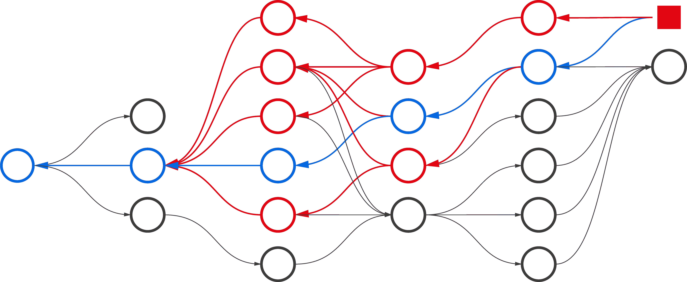

<!--yml

类别：未分类

日期：2024-09-06 19:35:50

-->

# [2312.01072] 深度强化学习中的时间信用分配调查

> 来源：[`ar5iv.labs.arxiv.org/html/2312.01072`](https://ar5iv.labs.arxiv.org/html/2312.01072)

# 时间信用分配调查

在深度强化学习中

\nameEduardo Pignatelli \emaile.pignatelli@ucl.ac.uk

\addrUniversity College London \AND\nameJohan Ferret \emailjferret@google.com

\addrGoogle DeepMind \AND\nameMatthieu Geist \emailmfgeist@google.com

\addrGoogle DeepMind \AND\nameThomas Mesnard \emailmesnard@google.com

\addrGoogle DeepMind \AND\nameHado van Hasselt \emailhado@google.com

\addrGoogle DeepMind \AND\nameLaura Toni \emaill.toni@ucl.ac.uk

\addrUniversity College London

###### 摘要

信用分配问题（CAP）指的是强化学习（RL）代理将动作与其长期后果关联起来的长期挑战。解决 CAP 是成功在现实世界中部署 RL 的关键步骤，因为大多数决策问题的反馈是噪声大、延迟且几乎没有关于原因的信息。这些条件使得很难区分偶然结果和由有信息的决策导致的结果。然而，信用和 CAP 的数学性质仍然理解和定义不清。在本调查中，我们回顾了深度 RL 中时间信用分配（CA）的最新进展。我们提出了一种统一的信用形式，使得能够对先进算法进行公平比较，并改善我们对各种方法之间权衡的理解。我们将 CAP 视为从有限经验中学习一个动作对结果的影响的问题。我们讨论了延迟效应、转置以及缺乏动作影响带来的挑战，并分析了现有方法如何解决这些问题。最后，我们调查了评估信用分配方法的协议，并建议了诊断不同信用分配方法困难来源的方法。总体而言，本调查为新入行的从业者和研究人员提供了领域概述，为希望加快新研究起步阶段的学者提供了连贯的视角，并建议了未来研究的潜在方向。

## 1 引言

强化学习（RL）有望影响许多需要顺序决策的现实世界问题，如策略（Silver et al., 2016, 2018; Schrittwieser et al., 2020; Anthony et al., 2020; Vinyals et al., 2019; Perolat et al., 2022）和街机视频游戏（Mnih et al., 2013, 2015; Badia et al., 2020; Wurman et al., 2022），气候控制（Wang and Hong, 2020），能源管理（Gao, 2014），汽车驾驶（Filos et al., 2020）和平流层气球导航（Bellemare et al., 2020），电路设计（Mirhoseini et al., 2020），网络安全（Nguyen and Reddi, 2021），机器人技术（Kormushev et al., 2013），或物理学（Degrave et al., 2022）。使强化学习代理在这些场景中成功的一个基本机制是它们评估其行为对结果的*影响*的能力——例如，胜利、失败、特定事件、回报。通常，这些结果是很久以前做出的孤立决策的后果：行动可能具有长期效果。学习将行动与遥远的未来结果相关联的问题称为时间信用分配问题（CAP）：在涉及的众多决策中分配成功的信用（Minsky, 1961）。总体而言，一个行动对结果的*影响*代表了以*关联*形式存在的*知识*（Sutton et al., 2011; Zhang et al., 2020）。这些关联构成了代理可以用来推断、推理、改进和采取行动以解决决策问题并最终提高数据效率的支撑结构。

解决 CAP 至关重要，因为大多数决策问题有两个重要特点：它们*完成的时间很长*，而且通常不会提供即时反馈，往往*延迟*并且很少提供哪些行动导致反馈的见解。这些条件产生了反馈信号弱、噪声大或具有欺骗性的环境，使得将偶然结果与由知情决策造成的结果区分开来成为一项艰巨的挑战。此外，随着这些环境复杂性的增长，旨在扩展到实际任务（Rahmandad 等，2009；Luoma 等，2017），代理采取的行动影响着日益减少的结果部分。在这些条件下，学习能够准确表示*影响*的价值函数，并区分和排序不同行动的相对长期价值变得具有挑战性。实际上，经典的深度强化学习（Deep RL）*控制*解决方案通常对超参数选择非常脆弱（Henderson 等，2018），在不同任务的零样本泛化上表现不佳（Kirk 等，2023），容易过拟合（Behzadan 和 Hsu，2019；Wang 等，2022），并且样本效率低（Ye 等，2021；Kapturowski 等，2023）。总体而言，建立能够解决复杂问题的知识基础，超越当前已解决的问题，呼唤更好的 CA 技术（Mesnard 等，2021）。

在当前的强化学习（RL）状态下，行动值是*行动影响*的重要代理。值通过将*未来*的统计数据合成为*现在*的属性，从而实现回报。最近，深度强化学习（Arulkumaran 等，2017）的出现提供了通过值表达信用的新途径，无论是通过使用记忆（Goyal 等，2019；Hung 等，2019），联想记忆（Hung 等，2019；Ferret et al., 2021a,；Raposo 等，2021），反事实（Mesnard 等，2021），规划（Edwards 等，2018；Goyal 等，2019；van Hasselt 等，2021）或通过元学习（Xu 等，2018；Houthooft 等，2018；Oh 等，2020；Xu 等，2020；Zahavy 等，2020）。对 CAP 的研究现在非常热烈，并且相关工作迅速增长。

##### 动机。

尽管其中心作用很大，但对于 credit 的确切数学性质的讨论很少。虽然这些代理能够解锁复杂任务的解决方案，但到底在一般行动影响的测度和*credit*之间划定何种界限，这仍不清楚。现有作品侧重于部分方面或子问题（Hung et al.,，2019；Arjona-Medina et al.,，2019；Arumugam et al.,，2021），并非所有作品在文中显式提及 CAP（Andrychowicz et al.,，2017；Nota et al.,，2021；Goyal et al.,，2019），尽管他们的发现对于解决问题提供了相关的贡献。由此得到的文献是零碎的，而缺乏一个空间来连接最近的作品并将他们的努力放在未来的视角之中。该领域仍有待解决的问题：

1.  Q1.

    一个行动的*credit*是什么？它与行动价值有什么不同？CAP 是什么？用言语和数学分别怎么表述？

1.  Q2.

    代理如何学习*分配*credit？文献中主要的方法有哪些，如何进行组织？

1.  Q3.

    如何*评估*一种方法是否在挑战中有所改进？我们如何监测进展？

##### 目标。

在这里，我们提出了对这些问题的潜在答案，并着手重新调整明斯基提出的基本问题（1961）至深度强化学习框架中。我们的主要目标是为新进入从业者和研究人员提供该领域的概述，并为希望进一步发展该领域的学者，将各种作品放入一个全面、连贯的视角中。最后，我们旨在重新连接那些与 CAP 有关的发现，但并不直接提及它的作品。就我们所知，Ferret 的作品（2022，第四章）是朝这个方向的唯一努力，而文献中并没有明确针对深度强化学习中的时间 CAP 问题的调查。

##### 范围。

该调查专注于单一智能体深度强化学习中的时间信用分配，主要问题包括：（i）数学量化行动的影响并形式化时间信用分配问题的数学目标，（ii）定义其挑战，分类现有的方法以学习上述量，（iii）定义适当的评估协议以监控领域的发展。我们不讨论深度神经网络（DNNs）中的*结构性*信用分配，即将信用或责备分配给 DNN 的各个参数（Schmidhuber,, 2015; Balduzzi et al.,, 2015）。我们也不讨论多智能体强化学习中的信用分配，即确定哪些智能体负责生成良好的强化信号（Chang et al.,, 2003; Foerster et al.,, 2018）。当使用“信用（分配）”而没有任何前缀形容词时，我们总是指*时间性*信用（分配）。特别是，带有时间性形容词我们指的是“每一个*终极*成功都与大量的内部决策相关联”（Minsky,, 1961），这些决策与状态和奖励一起排列形成一个时间序列。

该调查专注于深度强化学习。在调查现有的形式化方法时，我们仅查看深度强化学习的文献，并在提出新方法时将其调整为深度强化学习的理论和应用。我们排除了专门设计用于解决线性或表格强化学习决策问题的方法，因为它们不适合扩展到复杂问题。

##### 大纲。

我们在手稿的三个主要部分中讨论了 Q1.，Q2.和 Q3.。具体：

+   •

    第四部分讨论了 Q1.，提出了信用和 CAP 的定义，并提供了行动影响度量的调查。

+   •

    第五部分和第六部分分别讨论了 Q2.，即解决 CAP 的关键挑战和现有的信用分配方法。

+   •

    第七部分回答了 Q3.，回顾了问题设置、指标和评估协议，以监测该领域的进展。

对于每个问题，我们的贡献包括：(a) 将*现有工作*系统化为一个更简单、一致的空间；(b) 进行讨论，和 (c) 将我们的观点综合成一个统一的形式。表 1 概述了根据读者类型的建议阅读流程。

| 读者类型 | 建议流程 |
| --- | --- |
| 专门从事 CA 的学者 | 1 $\rightarrow$ 2 $\rightarrow$ 4 $\rightarrow$ 5 $\rightarrow$ 6 $\rightarrow$ 7 |
| --- | --- |
| 强化学习研究人员 | 1 $\rightarrow$ 4 $\rightarrow$ 5 $\rightarrow$ 6 $\rightarrow$ 7 |
| --- | --- |
| 深度学习研究人员 | 1 $\rightarrow$ 3 $\rightarrow$ 4 $\rightarrow$ 5 $\rightarrow$ 6 $\rightarrow$ 7 |
| 实践者（应用研究者） | 6 $\rightarrow$ 4.4 $\rightarrow$ 3 |
| 提出一种新的 CA 方法 | 7 $\rightarrow$ 6 $\rightarrow$ 2 $\rightarrow$ 4 |

表 1：建议的阅读流程按读者类型来支持第一部分中的大纲。数字代表章节编号。

## 2 相关工作

三项现有工作突出了对 CAP 的更好理解。Ferret, (2022, 第四章) 设计了一个概念框架来统一和研究信用分配方法。该章节提出了一种通用形式化方法，涵盖了一系列的信用分配函数，并讨论了它们的特性和一般要求。与 Ferret, (2022, 第四章)不同，我们调查了信用的数学定义的潜在形式化方法（第四部分）；基于新的形式化方法，我们提出了一种对信用分配方法的替代观点（第六部分），以及一个评估协议来衡量该领域未来的进展。Arumugam 等人, (2021) 从信息理论的角度分析了 CAP。该工作关注*信息稀疏性*的概念，以澄清信用在解决 RL 中的稀疏奖励问题中的作用。尽管该工作质疑了信用的数学定义，但它没有调查现有的材料，也没有提供一个能够统一现有方法的框架来用单一形式化方法表示信用。Harutyunyan 等人, (2019) 提出了一个有原则的方法来测量行动的信用。然而，该研究并不旨在调查现有的方法来*测量*信用、分配信用的方法，以及评估信用分配方法的方法，也没有旨在将它们组织成一个连贯的综合体。

文献中还提供了相关主题的综述。为了保持稿件的连贯性，我们在附录 A 中讨论了这些内容。

结果是，这些工作没有将 CAP 定位于一个能够进行全面讨论、评估和批判的单一空间。相反，我们提出了一种形式化方法，将现有的*量*统一起来，这些量表示行动的影响（第四部分）。基于此，我们可以分析现有行动影响测量的优缺点。最终框架提供了一种方式来汇集从经验中学习这些*方法*的各种现有方法（第六部分），并监测 CAP 解决方案的进展。

## 3 符号和背景

在这里，我们介绍了在本文其余部分中将遵循的符号和背景。

##### 符号。

我们使用花体字母表示集合，使用相应的小写字母表示其元素，例如，$x\in\mathcal{X}$。对于一个可测空间$(\mathcal{X},\Sigma)$，我们用$\Delta({\mathcal{X}})$表示$\mathcal{X}$上的概率测度集合。我们用大写字母$X$表示随机变量，用符号$\mathbb{P}_{X}$表示其在样本集$\mathcal{X}$上的分布，例如，$\mathbb{P}_{X}:\mathcal{X}\rightarrow\Delta({\mathcal{X}})$。当我们提到一个随机事件$X$（例如，一个随机动作）时，我们指的是从其分布$\mathbb{P}_{X}$中随机抽取一个特定值$x\in\mathcal{X}$，我们写作$X\sim\mathbb{P}_{X}$。当上下文中分布已明确时，我们省略下标中的分布，写作$\mathbb{P}(X)$而不是$\mathbb{P}_{X}(X)$。我们使用$\mathbbm{1}_{\mathcal{Y}}(x)$表示指示函数，该函数将元素$x\in\mathcal{X}$映射到$1$（如果$x\in\mathcal{Y}\subset\mathcal{X}$）或$0$（否则）。我们用$\mathbb{R}$表示实数集合，$\mathbb{B}=\{0,1\}$表示布尔域。我们使用$\ell_{\infty}(x)=\lVert x\rVert_{\infty}=\sup_{i}|x_{i}|$表示一个向量$x$的$\ell$-无穷范数，其中$x_{i}$为其分量。我们写出两个离散概率分布$\mathbb{P}_{P}(X)$和$\mathbb{P}_{Q}(X)$在样本空间$\mathcal{X}$上的 Kullback-Leibler 散度为：$D_{KL}(\mathbb{P}_{P}(X)||\mathbb{P}_{Q}(X))=\sum_{x\in\mathcal{X}}[\mathbb{P}_{P}(x)\log({\mathbb{P}_{P}(x)}/{\mathbb{P}_{Q}(x)})]$。

##### 强化学习。

我们考虑通过与环境交互来学习的问题。一个程序（代理）通过做出决策（动作）与环境互动。动作是代理与环境的接口。在每个动作之前，代理可以观察环境的一部分并采取适当的行动。动作改变了环境的状态。在每个动作之后，代理可以感知反馈信号（奖励）。代理的目标是学习一种行为规则（策略），以最大化奖励的期望总和。

##### MDPs。

MDPs 形式化了决策问题。本调查专注于深度强化学习中最常见的 MDP 设置。正式地，折扣 MDP（Howard，1960; Puterman，2014）由一个元组 $\mathcal{M}=\left(\mathcal{S},\mathcal{A},R,\mu,\gamma\right)$ 定义。$\mathcal{S}$ 是一个有限状态集（状态空间），$\mathcal{A}$ 是一个有限动作集（动作空间）。$R:\mathcal{S}\times\mathcal{A}\rightarrow\mathcal{R}$ 是一个确定性、有界的奖励函数，将状态-动作对映射到标量奖励 $r\in[r_{min},r_{max}]=\mathcal{R}$。$\gamma\in[0,1]$ 是一个折扣因子，$\mu:\mathcal{S}\times\mathcal{A}\rightarrow\Delta(\mathcal{S})$ 是一个转移核，将状态-动作对映射到状态的概率。我们将任意状态 $s\in\mathcal{S}$ 称为 $s$，将动作 $a\in\mathcal{A}$ 称为 $a$，将奖励 $r\in[r_{min},r_{max}]$ 称为 $r$。给定一个状态-动作元组 $(s,a)$，下一个随机状态 $S_{t+1}$ 为 $s^{\prime}$ 的概率依赖于状态转移分布：$\mathbb{P}_{\mu}(S_{t+1}=s^{\prime}|S_{t}=s,A_{t}=a)=\mu(s^{\prime}|s,a),\forall s,s^{\prime}\in\mathcal{S}$。我们将 $S_{t}$ 称为时间 $t$ 的随机状态。动作 $a$ 的概率依赖于代理的策略，策略是一个从状态到动作概率分布的平稳映射 $\pi:\mathcal{S}\rightarrow\Delta(\mathcal{A})$。

这些设置产生了一个离散时间、无状态（马尔可夫的）随机过程（RP），并引入了动作来表示决策和奖励作为反馈信号。给定初始状态分布 $\mathbb{P}_{\mu_{0}}(S_{0})$，过程以随机状态 $s_{0}\sim\mathbb{P}_{\mu_{0}}$ 开始。从 $s_{0}$ 开始，在每个时间 $t$，代理通过选择一个动作 $A_{t}\sim\mathbb{P}_{\pi}(\cdot|s_{t})$ 与环境交互，观察奖励 $r_{t}\sim R_{t}(S_{t},A_{t})$ 和下一个状态 $s_{t+1}\sim\mathbb{P}_{\mu}$。如果状态 $s_{t}$ 也是一个吸收状态 ($s\in\overline{\mathcal{S}}\subset\mathcal{S}$)，MDP 以概率 $1$ 和奖励 $0$ 转移到相同的状态 $s_{t}$，我们称该情节终止。我们将每个时间转移 $(s_{t},a_{t},r_{t},s_{t+1})$ 的联合称为轨迹或情节 $d=\{s_{t},a_{t},r_{t},:0\leq t\leq T\}$，其中 $T$ 是情节的时间范围。

我们主要考虑 episodic 设置，其中在有限时间内到达吸收状态的概率为$1$，从而导致随机时间跨度$T$。我们仅考虑离散动作空间$\mathcal{A}=\{a_{i}:1\leq i\leq n\}$。

轨迹也是所有轨迹空间$\mathcal{D}=(\mathcal{S}\times\mathcal{A}\times\mathcal{R})^{T}$中的随机变量，其分布是所有组件的联合分布$\mathbb{P}_{D}(D)=\mathbb{P}_{A,S,R}(s_{0},a_{1},r_{1},\ldots,s_{T})$。给定一个 MDP $\mathcal{M}=(\mathcal{S},\mathcal{A},R,\mu,\gamma)$并固定一个策略$\pi$产生一个马尔可夫过程（MP）$\mathcal{M}^{\pi}$并诱导出轨迹的分布$\mathbb{P}_{\mu,\pi}(D)$。因此，我们也将从$k$开始到$T$结束的随机轨迹称为一系列随机决策$D_{k}=\{X_{k},\ldots,X_{t},\ldots,X_{T-1},S_{T}\}$。

我们把返回的随机变量$Z_{t}$称为从时间$t$到整个 episode 结束的折扣奖励的总和，即$Z_{t}=\sum_{t=k}^{T}\gamma^{k-t}R(S_{k},A_{k})$。强化学习问题的控制目标是找到一个策略$\pi^{*}$，以最大化期望回报，

|  | $\displaystyle\pi^{*}\in\mathop{\mathrm{argmax}}_{\pi}\mathbb{E}_{\mu,\pi}\left[\sum_{t=0}^{T}\gamma^{t}R(S_{t},A_{t})\right]=\mathbb{E}\left[Z_{0}\right].$ |  | (1) |
| --- | --- | --- | --- |

##### 部分可观察马尔可夫决策过程（POMDPs）。

部分可观察马尔可夫决策过程（POMDPs）是代理无法观察环境的真实状态，只能观察其转化形式的 MDP，并通过一个额外的元组$\left\langle\mathcal{O},\mu_{O}\right\rangle$来指定，其中$\mathcal{O}$是观察空间，$\mu_{O}:\mathcal{S}\rightarrow\Delta({\mathcal{O}})$是观察核，将真实环境状态映射到观察概率。由于观察之间的过渡不是马尔可夫的，策略是从部分*轨迹*（我们称之为历史）到行动的映射。历史是状态转移序列$h_{t}=\{O_{0}\}\cup\{A_{k},R_{k},O_{k+1}:0<k<t-1\}\in(\mathcal{O}\times\mathcal{A}\times\mathcal{R})^{t}=\mathcal{H}$。

##### 泛化策略迭代（GPI）。

现在我们介绍价值函数的概念。策略$\pi$的状态价值函数是从状态$s_{t}$开始的策略的期望回报，$v^{\pi}(s)=\mathbb{E}_{\pi,\mu}[Z_{t}|S_{t}=s]$。策略$\pi$的动作-价值函数（或 Q 函数）是从状态$s_{t}$开始，如果代理采取$a_{t}$的策略的期望回报，$q^{\pi}(s,a)=\mathbb{E}_{\pi,\mu}[Z_{t}|S_{t}=s,A_{t}=a]$。策略评估（PE）是将策略$\pi$映射到其价值函数的过程。一个经典的 PE 过程从任意的价值函数$V_{0}$开始，并迭代应用 Bellman 算子$\mathcal{T}$，使得：

|  | $\displaystyle\hat{v}^{\pi}_{k+1}(S_{t})$ | $\displaystyle=\mathcal{T}^{\pi}[\hat{v}^{\pi}_{k}(S_{t})]:=\mathbb{E}_{\pi,\mu}\left[R(S_{t},A_{t})+\gamma\hat{v}_{k}(S_{t+1})\right],$ |  | (2) |
| --- | --- | --- | --- | --- |

其中$\hat{v}_{k}$表示迭代$k$时的值近似，$A_{t}\sim\mathbb{P}_{\pi}(\cdot|S_{t})$，以及$S_{t+1}\sim\mathbb{P}_{\pi,\mu}(\cdot|S_{t},A_{t})$。Bellman 算子在$\ell_{\infty}$和$\ell_{2}$范数下是一个$\gamma$-收缩，其不动点是策略$\pi$的值。因此，连续应用 Bellman 算子会提高预测精度，因为当前值越来越接近策略的真实值。我们将 PE 称为预测目标（Sutton 和 Barto，2018）。策略改进将策略$\pi$映射到改进策略：

|  | $\displaystyle\pi_{k+1}(a&#124;S)=\mathcal{G}[\pi_{k},S]=\mathbbm{1}_{\{a\}}(\mathop{\mathrm{argmax}}_{u\in\mathcal{A}}\left[R(S,u)+\gamma v_{k}(S^{\prime})\right])=\mathbbm{1}_{\{a\}}(\mathop{\mathrm{argmax}}_{u\in\mathcal{A}}\left[q_{k}(S,u)\right]).$ |  | (3) |
| --- | --- | --- | --- |

我们将 GPI 称为一种解决控制问题的通用方法（Sutton 和 Barto，2018），其来源于 PE 和策略改进（PI）的组合。特别地，我们将交替执行任意数量$k$的 PE 步骤和一个 PI 步骤的算法称为改进策略迭代（MPI）（Puterman 和 Shin，1978；Scherrer 等，2015）。当$k=1$时，MPI 恢复值迭代，而当$k\rightarrow+\infty$时，它恢复策略迭代。对于任何$k\in[1,+\infty]$的值，在温和假设下，MPI 收敛到最优策略（Puterman，2014）。

在深度强化学习中，我们使用参数集$\theta$的神经网络来参数化策略，并将动作的分布表示为$\pi(a|s,\theta)$。我们对价值函数采用相同的推理，参数集为$\phi$，这导致状态值函数$v(s,\phi)$和动作值函数$q(s,a,\phi)$。

## 4 量化行动影响

我们首先回答 Q1.，其目的是解决*什么*需要衡量的问题，即在提及信用时。自 Minsky（1961）提出信用分配问题（CAP）以来，许多研究对他的观点进行了阐述：

1.  -

    “如何融入知识的问题”和“给定结果，过去的决策有多相关？”（Harutyunyan 等，2019），

1.  -

    “关注于识别过去行动对观察到的未来结果的贡献”（Arumugam 等，2021），

1.  -

    “测量行动对未来奖励影响的问题”（Mesnard 等，2021），

1.  -

    “代理必须将其获得的奖励归因于过去的状态和行动”（Chelu 等，2022），

1.  -

    “将未来观察到的结果与过去做出的决策匹配的挑战”（Venuto 等，2022），

1.  -

    “给定一个观察到的结果，之前的行动对其实现贡献了多少？”（Ferret,, 2022，第 4.1 章）。

这些描述汇聚了 Minsky 的原始问题，并显示了文献中对非正式信用概念的一致性。在本引言中，我们建议反思文献中存在的不同度量标准来量化信用。我们将行动价值的概念（通常仅指$q$-值）推广到行动影响的概念，后者描述了用于量化行动信用的更广泛的度量标准。虽然我们未提供关于信用*应当*是什么的最终答案，但我们回顾了现有 RL 文献中不同的工作如何对其进行描述。我们现在开始发展对信用概念的直观理解。

考虑图 1，它的灵感来自于 Harutyunyan 等人的图 1（2019）和 Osband 等人的伞形问题（2020）。在$x_{0}$处采取的行动本身决定了这一回合的回报。从*控制*的角度看，任何在$x_{0}$处总是采取$a^{\prime}$（即$\pi^{*}\in\Pi^{*}:\pi^{*}(a^{\prime}|x_{0})=1$）然后再采取其他任何行动的策略都是最优策略。从 CAP 的角度来看，一些最优行动，即首个行动之后的那些，并不*真正*对最优回报产生贡献。实际上，替代行动仍然产生最优回报，并且相互之间贡献相等，因此它们的信用是相等的。我们可以看到，除了最优性之外，信用不仅识别最优行动，还告知这些行动在实现感兴趣的结果时的*必要性*。

图 1：一个简化的 MDP 用于开发对信用的直观理解。智能体从$x_{0}$开始，在每个状态下可以选择两种行动，$a^{\prime}$和$a^{\prime\prime}$；当到达上方的实心红色方块时奖励为$1$，否则为$0$。首个行动单独决定结果。

从这个例子中，我们可以推断出，信用评估行动对结果的潜在影响。最终的 CAP 是估计从实验数据中行动对结果的影响的问题，并描述了它们之间的纯粹关联。

##### 为什么要解决 CAP？

行动评估是强化学习的基石。事实上，解决控制问题通常涉及运行一个 GPI 方案。在这里，行动的影响推动了学习，因为它建议了一个可能的改进策略的方向。例如，行动价值在方程式中扮演了这个角色（3）。由此可见，影响度量的质量从根本上影响了策略改进的质量。低质量的评估可能导致策略偏离最佳策略，阻碍学习，减缓进展（Sutton 和 Barto， 2018; van Hasselt 等， 2018）。相反，高质量的评估提供了准确、可靠的信号，促进了收敛、样本效率和低方差。虽然简单的评估足以应对专业实验，但现实世界是多个有时是层次化任务的复杂混合体。在这些情况下，最佳值从一个任务变到另一个任务，这些简单的评估对于适应一般问题解决并不乐观。然而，现实世界中的因果结构在所有任务中都是共享的，其因果机制的模块性往往是一个值得纳入的宝贵特性。在这些条件下，在一个环境中学习分配信用成为在另一个环境中分配信用的杠杆（Ferret 等，2021a,），并最终使学习更快、更准确、更高效。由于这些原因，并且因为一个最佳策略只需要发现一个单一的最佳轨迹，信用存储了超出最佳行为所表达的知识，而解决控制问题不足以解决 CAP，前者是后者的不足描述。

### 4.1 所有的行动价值，*信用*吗？

正如我们之前所述，大多数深度强化学习算法使用某种形式的*行动影响*来评估行动对结果的影响。这是对行动进行排名并选择最佳行动以解决复杂任务的基本要求。例如，许多无模型方法使用*状态-行动值*函数 $q^{\pi}(s,a)$ 来评估行动（Mnih et al., 2015; van Hasselt et al., 2016），其中行动的贡献等同于它们在回合结束时所获得的预期回报。优势学习（AL）（Baird，1999; Mnih et al., 2016; Wang et al., 2016b, ，第五章）使用*优势*函数 $A^{\pi}(s_{t},a_{t})=q^{\pi}(s_{t},a_{t})-v^{\pi}(s_{t})$ ¹¹为了与强化学习文献保持一致，尽管优势函数不是随机的并且与行动 $A_{t}$ 使用相同的符号，我们仍然使用大写字母 $A^{\pi}$ 来表示。来衡量信用，而其他研究则研究*行动差距*（Farahmand，2011; Bellemare et al., 2016; Vieillard et al., 2020b,）的影响，即最佳行动的预期回报与另一个行动，通常是第二最佳行动的预期回报之间的相对差异。行动影响也是演员-评论家和策略梯度方法（Lillicrap et al., 2015; Mnih et al., 2016; Wang et al., 2016a,）的关键组成部分，其中策略梯度与 $\mathbb{E}_{\mu,\pi}[A^{\pi}(s,a)\nabla\log\pi(A|s)]$ 成正比，其中 $A^{\pi}(s,a)$ 估计行动 $A$ 的影响。

这些代理足以选择最佳行动并解锁复杂任务的解决方案（Silver et al., 2018; Wang et al., 2016b,; Kapturowski et al., 2019; Badia et al., 2020; Ferret et al., 2021b,）。然而，虽然这些工作明确将行动影响作为信用的衡量标准，但这个术语没有被正式定义，并且尚不清楚如何区分*信用*和其他量。关键问题出现了：这些量和信用之间有什么区别？它们是否真正代表了 Minsky（1961）最初提出的信用？如果是，那么在什么条件下它们才会这样？没有明确的测量定义，我们在设计解决 CAP 的算法时没有合适的目标量。更重要的是，我们没有合适的量作为单一的真相源和参考标准来衡量其他行动影响度量的准确性，以及它们对信用的近似程度。为填补这一空白，我们将按照以下步骤进行：

+   •

    部分 4.2 形式化了什么是目标或结果：我们评估行动的标准；

+   •

    第 4.3 节将现有的功能统一在相同的形式下；

+   •

    第 4.4 节按照这一定义对 CAP 进行了形式化。

+   •

    第 4.5 节分析了不同研究如何解释和量化行动影响，并对其进行了回顾。

+   •

    第 4.6 节提炼了现有行动影响度量的特性。

我们建议读者如果只对最终的形式化内容感兴趣，可以直接跳到第 4.4 节，然后再回到后续章节，以理解其背后的动机。

### 4.2 什么是目标？

由于信用衡量的是一个动作对实现某一目标的影响，为了正式定义信用，我们必须能够正式描述*目标*，如果对目标的构成没有清晰的理解，代理就无法构建学习信号来评估其动作。目标是*目的*的同义词，我们可以非正式地将其描述为要达成的绩效或要遵循的规定。严谨地定义目标可以明确动作与目标之间的关系（Ferret，，2022，第四章），并使代理能够以组成的（Sutton et al.,，1999；Bacon et al.,，2017），并可能是分层的方式（Flet-Berliac，，2019；Pateria et al.,，2021；Hafner et al.,，2022）将复杂行为分解为基本行为。这一思想是许多 CA 方法的基础（Sutton et al.,，1999，2011；Schaul et al., 2015a,；Andrychowicz et al.,，2017；Harutyunyan et al.,，2019；Bacon et al.,，2017；Smith et al.,，2018；Riemer et al.,，2018；Bagaria and Konidaris，，2019；Harutyunyan et al.,，2018；Klissarov and Precup，，2021）。我们将在下一段中对目标进行正式定义，并回顾这些目标在经典 CA 研究中的*表现形式*。这将为后续 4.3 节中统一的信用概念奠定基础。

##### 定义目标。

为了正式定义目标，我们采用*奖励假设*，该假设提出：

> 我们所说的目标和目的可以很好地被认为是对接收的标量信号（奖励）累积和期望值的最大化。（Sutton, 2004）。

在这里，目标被定义为从最大化回报的过程中产生的*行为*。奖励假设已被后来的研究进一步发展（Abel et al., 2021; Pitis, 2019; Shakerinava 和 Ravanbakhsh, 2022; Bowling et al., 2023）。在以下文本中，我们使用 Bowling et al., (2023) 中的目标定义，如下所述：

###### 定义 1 （目标）。

给定有限历史的分布 $\mathbb{P}(H),\forall H\in\mathcal{H}$，我们将*目标*定义为 $\mathbb{P}(H)$ 上的部分排序，并且对于所有 $h,h^{\prime}\in\mathcal{H}$，我们写作 $h\succsim h^{\prime}$ 来表示 $h$ 比 $h^{\prime}$ 更受偏好或两者同样被偏好。

在这里，$H$ 是所有历史集合 $\mathcal{H}$ 中的一个随机历史，如第三部分所述，而 $\mathbb{P}(H)$ 是一个未知的历史分布，区别于由策略和环境引起的分布。一个代理行为和环境随后会引发一个新的历史分布，我们得到 $\mathbb{P}_{\mu,\pi}(H)$，如第三部分所述。这反过来允许在策略上定义部分排序，而不是历史上，我们类似地写作 $\pi\succsim\pi^{\prime}$ 来表示偏好。对于马尔可夫奖励定理（Bowling et al., 2023, 定理 4.1）和在轻微条件下（Bowling et al., 2023），存在一个确定性的马尔可夫奖励函数²²2 为了简洁起见，我们省略了与过渡相关的折扣，因为与我们的问题无关。读者可以参阅 Pitis, (2019); White, (2017) 以获取详细信息。 $R:\mathcal{O}\times\mathcal{A}\rightarrow[0,1]$，使得奖励的期望总和的最大化与策略上的偏好关系一致。

##### 主观目标和客观目标。

马尔可夫奖励定理在两种情况下成立：一是偏好由智能体自身内部定义——即内在动机的情况（Piaget 等人，1952；Chentanez 等人，2004；Barto 等人，2004；Singh 等人，2009；Barto，2013；Colas 等人，2022）——二是偏好来源于外部实体，如智能体设计师。在第一种情况下，进行最大化的智能体与持有政策排序的智能体是相同的，我们将相应的目标称为主观目标。在第二种情况下，智能体设计师或未知的、不可观察的实体持有排序，另一个学习智能体负责追求优化过程。我们将这种情况的目标称为客观目标。这些设置通常对应于文献中的目标和子目标之间的区分（Liu 等人，2022）。

##### 结果。

在 CA 中，目标的一个特别有趣的应用是在事后（Andrychowicz 等人，2017）。在这里，智能体以某个目标为导向行动，但它评估一个轨迹，仿佛*一个*奖励函数——与原始的不同——在当前轨迹中被最大化。我们在第 6.4 节讨论了这些方法的好处。当情况是这样时，我们使用“结果”一词来表示事后的实现目标。特别地，给定一个历史$H\sim\mathbb{P}_{\mu,\pi}(H)$，存在一个在$H$中最大化的确定性马尔可夫奖励函数$R$。我们将相应的$H$称为结果。例如，考虑一个以某个状态$s$结束的轨迹$h$。存在一个马尔可夫奖励函数，总是输出$0$，仅在$s$是$h$的最终状态时输出$1$。我们将$h$称为*结果*。

换句话说，这种定义目标或结果的方式对应于定义一个待解决的任务，这可以通过具有上述特征的奖励函数来表达。反之，奖励函数可以*编码*一个任务。当与特定目标或结果相关的信用被分配时，它评估某个行动对解决特定任务的影响。如上所述，这对于分解和重新组合复杂行为至关重要，并且这种定义与其他学科的定义一致，例如心理学中目标……是对未来可能发生的事情的认知表征（Elliot 和 Fryer，2008）或哲学中，表征不仅仅是读取世界的状态，而是对未来可能发生的事情表达*偏好*（Hoffman，2016；Prakash 等人，2021；Le Lan 等人，2022）。

##### 表示目标和结果。

然而，当明确表达动作与目标之间的关系时，即当返回动作信用的函数以目标作为输入时，就会出现如何为计算目的表示目标的问题。这一点很重要，因为在明确定义目标的 CA 方法中（Sutton 等，2011；Schaul 等，2015a；Andrychowicz 等，2017；Rauber 等，2019；Harutyunyan 等，2019；Tang 和 Kucukelbir，2021；Arulkumaran 等，2022；Chen 等，2021），并不是很多使用像 Bowling 等（2023）中的通用定义目标的严谨性。在这些工作中，目标表示空间，我们表示为$\psi\in\Psi$，是任意选择以表示轨迹的特定特征。它表示一个对象，而不是一个表现或一个需要满足的处方。例如，目标表示$\psi$可以是一个状态（Sutton 等，2011；Andrychowicz 等，2017），且$\psi\in\Psi=\mathcal{S}$。它可以是一个特定的观察（Nair 等，2018），且$\psi\in\Psi=\mathcal{O}$。或者，它可以是一个抽象的特征向量（Mesnard 等，2021），报告历史的一些特征，我们有$\psi\in\Psi=\mathbb{R}^{d}$，其中$d$是向量的维度。甚至，目标可以通过自然语言指令表示（Luketina 等，2019），且$\psi\in\Psi=\mathbb{R}^{d}$是该文本片段的嵌入。一个目标可以通过一个标量表示$\psi\in\Psi=\mathbb{R}$（Chen 等，2021），指示需要实现的特定回报，或者甚至通过一个完整的命令表示（Schmidhuber，2019），即需要实现的回报是特定时间窗口内的回报。

尽管这些表示法都是有用的启发式方法，但它们缺乏正式的严谨性，并且存在歧义的空间。例如，说目标是一个状态可能意味着在轨迹结束时访问该状态是目标，或者在轨迹中间访问该状态是目标。这通常没有形式化定义，并且与该目标表示法对应的奖励函数也并不总是清楚。在以下文本中，当调查指定目标的方法或度量时，我们会参考工作中使用的具体目标表示法，并努力详细说明支撑该目标表示法的奖励函数是什么。

### 4.3 什么是*任务*？

在建立了目标和结果的形式化之后，我们现在准备正式描述信用，并且我们将采用一种统一现有行动影响度量的形式化方法。我们首先描述一个概括大多数 CAs 的通用函数，然后继续形式化 CAP。总体而言，这种公式为第 4.5 节中描述的量提供了参考项。我们现在形式化一个*分配*：

###### 定义 2  （分配）。

考虑一个行动 $a\in\mathcal{A}$，一个目标 $g\in\mathcal{G}$，以及一个表示某些经验数据的背景 $c\in\mathcal{C}$。我们使用术语*分配函数*或简单的*分配*来表示一个函数 $\mathcal{K}$，它将一个背景、一个行动和一个结果映射到一个量 $y\in\mathcal{Y}$，我们称之为行动的影响：

|  | $\displaystyle K:\mathcal{C}\times\mathcal{A}\times\mathcal{G}\rightarrow\mathcal{Y}.$ |  | (4) |
| --- | --- | --- | --- |

在这里，背景 $c\in\mathcal{C}$ 代表一些输入数据，可以根据具体任务随意选择。背景必须包含关于现在的信息，例如当前状态或当前观察；它还可能包含关于过去的信息，例如直到现在的 POMDP 中的过去决策序列；为了评估当前的行动，它必须包含关于未来将采取的行动的信息，例如通过指定在 $a\in\mathcal{A}$ 未被采取时要遵循的策略，或者一个固定的轨迹，在这种情况下，当前行动在事后被评估（Andrychowicz et al., 2017）。我们在附录 B 中提供了有关背景的更多细节。

在一般情况下，行动影响是一个随机变量 $Y\in\mathcal{Y}\subset\mathbb{R}^{d}$。例如，行动价值分布（Bellemare et al., 2017）就是这种情况，如方程 10 中所述，其中行动影响在回报的整个分布上定义。然而，大多数方法从完整的影响分布中提取一些标量度量，例如期望（Watkins, 1989），而行动影响变成一个标量 $y\in\mathbb{R}$。在以下文本中，我们主要考虑影响的标量形式 $\mathcal{Y}=\mathbb{R}$，因为这些代表了现有公式的多数情况。

在实践中，*assignment* 提供了一种单一的数学形式来讨论文献中用于量化行动影响的各种方法。它接受一个行动 `$a\in\mathcal{A}$`、一些上下文数据 `$c\in\mathcal{C}$` 和一个目标 `$g\in\mathcal{G}$`，并将其映射到某种行动影响的度量上。在保持相同数学形式的同时，不同的 assignment 可以返回不同的行动影响值，并引导改进朝着不同的方向发展。

方程 (4. ‣ 4.3 What is an assignment? ‣ 4 Quantifying action influences ‣ A Survey of Temporal Credit Assignment in Deep Reinforcement Learning")) 还类似于一般价值函数 (GVF) (Sutton et al., 2011)，其中影响 `$y=q^{\pi}(s,a,g)$` 是策略 `$π$` 在状态 `$s$` 下采取行动 `$a$` 时，相对于目标 `$g$` 的期望回报。然而，在 GVFs 中：(i) `$y$` 是 *行动价值*，并不泛化其他形式的行动影响；目标是一个 MDP 状态 `$g\in\mathcal{S}$`，并不泛化到我们在第 4.2 节 中提出的目标概念；该函数仅考虑前向预测，而不泛化为对行动的事后评估 (Andrychowicz et al., 2017)。表 2 第 2 页包含了更多关于比较的细节，并进一步说明了最常见函数及其对应 assignment 之间的关系。

### 4.4 信用分配问题

assignment 形式的通用性反映了行动影响度量的巨大异质性，我们将在第 4.5 节中进一步回顾。这种异质性表明，即使大多数研究对信用的直观概念达成一致，在如何以数学方式量化信用方面实践中仍然存在分歧。在上一节中统一了现有的 assignments 后，我们现在类似地对 CAP 进行形式化。这使我们能够将现有方法放在一个连贯的视角下，以保证公平比较，并保持现有行动影响度量的异质性。

我们将 CAP 视为从经验中逼近动作影响度量的问题。我们假设标准的无模型深度强化学习设置，并考虑一个表示为神经网络的分配 $k:\mathcal{C}\times\mathcal{A}\times\mathcal{G}\times\Phi\rightarrow\mathbb{R}$，其参数为 $\phi\in\Phi=\mathbb{R}^{n}$，可用于逼近动作的信用。这通常代表评论家或强化学习算法的价值函数。此外，我们接受一个随机函数来表示策略，形式也为神经网络 $f:\mathcal{S}\times\Theta\rightarrow\Delta(\mathcal{A})$，参数集为 $\theta\in\Theta=\mathbb{R}^{m}$。我们假设 $n\ll|\mathcal{S}|\times|\mathcal{A}|$ 和 $m\ll|\mathcal{S}|\times|\mathcal{A}|$，并注意到通常两个函数之间会共享参数子集。

我们进一步假设代理可以访问一组经验 $\mathcal{D}$，并且可以根据分布 $D\sim\mathbb{P}_{C}$ 从中抽样。这可以是一个预先编译的外部演示集，其中 $\mathbb{P}_{C}(D)=\mathcal{U}(D)$，也可以是一个 MDP，其中 $\mathbb{P}_{C}=\mathbb{P}_{\mu,\pi}(D)$，甚至是一个虚拟的 MDP 模型 $\mathbb{P}_{C}=\mathbb{P}_{\widetilde{\mu},\pi}(D)$，其中 $\widetilde{\mu}$ 是一个与 $\mu$ 形式相同的内部函数。这些也是温和的假设，因为它们分别对应于离线设置、在线设置和模型学习的基于模型的设置。我们在附录 B 中详细说明了这些设置。我们现在正式定义 CAP。

###### 定义 3（信用分配问题）。

考虑一个 MDP $\mathcal{M}$、一个目标 $g\in\mathcal{G}$ 和一组经验 $c\in\mathcal{C}$。考虑一个如公式 (4)中所述的任意分配 $K\in\mathcal{K}$。给定一个参数化函数 $\widetilde{K}:\mathcal{C}\times\mathcal{A}\times\mathcal{G}\times\Phi\rightarrow\mathbb{R}$ 和参数集 $\phi\in\Phi\subset\mathcal{R}^{n}$，我们将*信用分配问题*称为寻找参数集 $\phi\in\Phi$ 的问题，使得：

|  | $\displaystyle\widetilde{K}(c,a,g,\phi)=K(c,a,g),\quad\forall s\in\mathcal{S},\forall a\in\mathcal{A}.$ |  | (5) |
| --- | --- | --- | --- |

不同的动作影响选择对问题的难度有很大影响。特别是，在以下之间存在权衡：

1.  (a)

    选择的影响度量在告知政策改进方向上的有效性如何，

1.  (b)

    从经验中学习这个函数有多么简单。

例如，使用因果影响（Janzing 等，2013）作为行动影响的度量会使 CAP 在实际应用中很难解决。原因在于仅通过关联发现因果机制 notoriously challenging（Pearl，2009；Bareinboim 等，2022），而纯粹的因果关系在自然界中很少观察到（Pearl 等，2000），而且通常是在特定实验条件下。然而，因果知识是可靠的，对经验变化具有鲁棒性，并且有效，因果机制可以对目标变化保持不变。相反，$q$-值更容易学习，因为它们表示状态-行动与结果之间的统计相关度量，但它们的知识仅限于解决控制问题所需的最低限度。每个具体实例或每个具体问题中使用哪种量仍然是文献中的研究课题。理想情况下，我们应该寻求最有效的影响度量，该度量能够以最少的经验进行学习。

### 4.5 现有任务函数

任务行为影响 上下文 行动 目标 状态-行动-值 $q^{\pi}(s,a)$ $s\in\mathcal{S}$ $a\in\mathcal{A}$ $g\in\mathbb{R}$ 优势 $q^{\pi}(s,a)-v(s)$ $s\in\mathcal{S}$ $a\in\mathcal{A}$ $g\in\mathbb{R}$ 一般 $q$-值函数 $q^{\pi}(s,a,g)$ $s\in\mathcal{S}$ $a\in\mathcal{A}$ $g\in\mathcal{S}$ 分布式行动值 $Q^{\pi}(s,a)$ $s\in\mathcal{S}$ $a\in\mathcal{A}$ $g\in\{0,\ldots,n\}$ 分布式优势 $D_{KL}(Q^{\pi}(s,a)||V^{\pi}(s,a))$ $s\in\mathcal{S}$ $a\in\mathcal{A}$ $g\in\{0,\ldots,n\}$ 事后优势 $1-\frac{\pi(A_{t}|s)}{\mathbb{P}_{D}(A_{t}|s_{t},Z_{t})}Z_{t}$ $s\in\mathcal{S},h_{T}\in\mathcal{H}$ $a\in h$ $g\in\mathbb{R}$ 反事实优势 $\mathbb{P}_{D}(A_{t}=a|S_{t}=s,F_{t}=f)q(s,a,f)$ $s\in\mathcal{S}$ $a\in h$ $g\in\mathbb{R}$ 后验值 $\sum_{t=0}^{T}\mathbb{P}_{\mu,\pi}(U_{t}=u|h_{t})v^{\pi}(o_{t},x_{t})$ $o\in\mathcal{O},b\in\mathbb{R}^{d},\pi$ $A\sim\pi$ $g\in\mathbb{R}$ 策略条件值 $q(s,a,\pi)$ $s\in\mathcal{S},\pi\in\Pi$ $a\in\mathcal{A}$ $g\in\mathbb{R}$

表 2：深度强化学习文献中最常见的行动-*影响*及其任务函数的列表。对于每个函数，表格指定了相应任务函数$K\in\mathcal{K}$的影响、上下文表示、行动和目标表示。

我们现在调查文献中最重要的赋值函数及其对应的行动影响度量。以下列表并非详尽无遗，而是代表了现有信用形式的局限性。为了简洁起见，且不失一般性，我们省略了未明确评估行动的函数（例如，状态值），但我们注意到，仍然可以将对状态的赋值重新解释为对一组行动的赋值，因为它影响到所有导致该状态的行动。

##### 状态-行动值

(Shannon,, 1950; Schultz,, 1967; Michie,, 1963; Watkins,, 1989) 是强化学习的一个标志，描述如下表达式：

|  | $\displaystyle q^{\pi}(s,a)$ | $\displaystyle=\mathbb{E}_{\mu,\pi}[Z_{t}\mid S_{t}=s,A_{t}=a].$ |  | (6) |
| --- | --- | --- | --- | --- |

在这里，背景 $c$ 是 MDPs 中的状态 $s\in\mathcal{S}$ 或 POMDP 中的历史 $h\in\mathcal{H}$。$q$-函数通过在背景下的预期回报来量化一个动作的信用。$q$-值是量化信用的最简单方法之一，并提供了解决控制问题的基本机制。然而，尽管 $q$-函数在表格型强化学习中提供了坚实的理论保证，它们在深度强化学习中可能会不稳定。当与自举和离策略学习结合时，$q$-值众所周知会偏离最优解（Sutton 和 Barto，2018）。van Hasselt 等人（2018）提供了这种现象的实证证据，研究了偏离与性能之间的关系，以及不同变量如何影响偏离。特别是，研究表明深度 Q 网络（DQN）（Mnih 等人，2015）并不保证收敛到最优 $q$-函数。无论是在评估还是控制问题中，偏离率都会根据特定机制的不同而增加，例如自举的数量或更新的优先级（Schaul 等人，2015b）。在用于解决控制问题的 GPI 方案中，还会出现一个额外的问题。虽然在评估过程中策略是固定的，但在这里策略会不断变化，而在收敛到目标时，跟踪更新的目标变得更加困难，因为策略的变化使问题在价值估计的角度看起来像是非平稳的。这是因为策略发生了变化，但没有信号通知策略评估变化。为了缓解这一问题，许多方法要么使用固定网络作为评估目标（Mnih 等人，2015），要么对目标网络执行 Polyak 平均（Haarnoja 等人，2018），或将梯度更新剪辑到最大值（Schulman 等人，2017）。进一步支持这一观点的理论和实证证据（Bellemare 等人，2016）表明 $q$-函数是不一致的：对于任何次优动作 $a$，最优值函数 $q^{*}(s,a)$ 描述了一个非平稳策略的价值，该策略在每次访问 $s$ 时选择不同的动作 $\pi^{*}(s)$（而不是 $a$）。次优动作的 $q$-值的不一致性也在实证中得到了证明。Schaul 等人（2022）测量了多个 Atari 2600 游戏 Arcade Learning Environment (ALE)（Bellemare 等人，2013）的每状态策略变化 $W(\pi,\pi^{\prime}|s)=\sum_{a\in\mathcal{A}}|\pi(a|s)-\pi^{\prime}(a|s)|$，并显示尽管代理保持了预期回报的恒定值，动作间隙（最佳动作和第二佳动作之间的价值差异）却经历了剧烈变化。在实践中，深度强化学习算法通常使用 $q$-目标来近似 $q$-值，例如，$n$-步目标（Sutton 和 Barto，2018，第七章），或 $\lambda$-返回（Watkins，1989；Jaakkola 等人，1993；Sutton 和 Barto，2018，第十二章）。然而，我们将它们视为 *方法*，而不是衡量信用的量，因为 $q$-值是函数逼近器所收敛的量。基于此原因，我们在第 6.1 节中讨论它们。

##### 优势函数

(Baird,, 1999) 测量在给定状态下，某个动作的 q-值与其状态值之间的差异

|  | $\displaystyle A^{\pi}(s,a)=q^{\pi}(s,a)-v^{\pi}(s).$ |  | (7) |
| --- | --- | --- | --- |

这里，上下文 $c$ 与公式 (6) 中相同。由于 $v^{\pi}(s)=\sum_{a\in\mathcal{A}}q(s,a)\mathbb{P}_{\pi}(a)$ 和 $A^{\pi}(s,a)=q^{\pi}(s,a)-\mathbb{E}_{\pi}[q^{\pi}(s,a)]$，优势函数通过动作比平均水平更好的程度来衡量动作影响，即如果 $A^{\pi}(s,a)>0$。正如 Bellemare 等人 (2016) 所示，使用优势来量化信用可以增加动作差距，即最优动作与次优动作之间的价值差异。实证证据表明，优势相较于 q-值有一致的好处 (Baird,, 1999; Wang 等人, 2016b, ; Bellemare 等人,, 2016; Schulman 等人,, 2016)，这很可能归因于其正则化效果 (Vieillard 等人, 2020b, ; Vieillard 等人, 2020a, ; Ferret 等人, 2021a, )。另一方面，当直接估计而非通过组合状态和值-动作值时，例如在 Pan 等人 (2022) 中，优势不允许引导。这是因为优势缺乏对动作影响的绝对测量，只保持相对于其他可能动作的相对测量。总体而言，在经典基准测试中，无论是评估 (Wang 等人, 2016b,) 还是控制 (Bellemare 等人,, 2013)，优势都显示出相较于 $q$-值的改进 (Wang 等人, 2016b,)。特别是在大动作空间中，策略评估因状态值 $v^{\pi}(s)$ 可以包含多个动作共享的信息而实现更快的收敛。对于控制，相较于双重 $q$-学习 (van Hasselt 等人,, 2016) 和优先经验回放 (Schaul 等人, 2015b,)，在多个 Atari 2600 游戏中的得分有所提高。

##### GVFs

(Sutton 等人,, 2011; Schaul 等人, 2015a, ) 是一组 q-值函数，用于预测相对于多个奖励函数的回报：

|  | $\displaystyle q^{\pi,R}(s,a)=\{\forall R\in\mathcal{R}:\mathbb{E}_{\mu,\pi}\left[\sum_{t}^{T}R(S_{t},A_{t})\mid S_{t}=s,A_{t}=a\right]\},$ |  | (8) |
| --- | --- | --- | --- |

其中 $R$ 是一个伪奖励函数，$\mathcal{R}$ 是一个任意的、预定义的奖励函数集合。注意我们省略了原始公式中出现的伪终止和伪折扣项（Sutton 等，2011），以保持对信用分配的关注。上下文 $c$ 与 $q$-值和优势相同，伪奖励所代表的目标是达到一个特定的状态 $g=s\in\mathcal{S}$。在首次提出时（Sutton 等，2011），GVF 的思想源于观察到经典值函数仅限于同时处理单一任务。解决新任务需要从头学习一个值函数。通过同时维护多个分配函数，每个目标一个，GVF 可以即时量化一个动作对多个目标的影响。然而，尽管 GVF 保持了多个分配，目标仍然不是值函数的显式输入。相反，它被保留为隐式，每个分配服务于最大化不同的伪奖励函数（Sutton 等，2011）。

##### 通用值函数逼近器（UVFAs）

(Schaul 等，2015a,) 将 GVF 扩展到深度强化学习，并通过将这些多个分配函数合并为一个表示为深度神经网络的函数进一步推进他们的想法。在这里，与状态-动作值和 GVF 不同，目标是分配的显式输入：

|  | $\displaystyle q^{\pi}(s,a,g)=\mathbb{E}_{\mu,\pi}[Z_{t} | S_{t}=s,A_{t}=a,G_{t}=g],$ |  | (9) |
| --- | --- | --- | --- | --- |

这里的动作影响是相对于一个明确的目标来衡量的。这使得可以利用深度神经网络的泛化能力，不仅在状态空间上进行泛化，也在目标空间上进行泛化。

##### 分布值

(Jaquette，1973; Sobel，1982; White，1988; Bellemare 等，2017) 考虑了完整的回报分布 $Z_{t}$ 而不是期望值：

|  | $\displaystyle Q^{\pi}(s,a)$ | $\displaystyle=\mathbb{P}_{\mu,\pi}(Z_{t} | S_{t}=s,A_{t}=a),$ |  | (10) |
| --- | --- | --- | --- | --- | --- |

其中，$\mathbb{P}_{\mu,\pi}(Z_{t})$ 是实现某一回报 $\mathbb{P}_{\mu,\pi}(Z_{t}=z)$ 的概率，$z\in\mathbb{R}$，$Q^{\pi}(s,a)$ 将状态-动作对映射到回报的分布。请注意，我们使用大写的 $Q$ 来表示值分布，而小写的 $q$ 表示其期望（方程 (6)）。为了将这一理念转化为实际算法，Bellemare 等人（2017）提出了一种通过将 $\mathbb{P}_{\mu,\pi}(Z_{t})$ 投影到有限支持 $\mathcal{C}=\{0\leq i\leq C\}$ 上的离散化版本。离散化后的值分布变为 $Q^{\pi}(s,a)=\mathbb{P}_{C}(Z_{t}|S_{t}=s,A_{t}=a)$，其中 $\mathbb{P}_{C}$ 是一个分类伯努利分布，表示样本空间 $\mathcal{C}$ 中的量化值分布 $Z_{t}$，并描述了回报 $\mathbb{P}(Z_{t}=c),\forall c\in\mathcal{C}$ 发生的概率。在这里，背景 $c$ 是当前的 MDP 状态，目标是实现一个在 Wasserstein 度量下最大化值分布的策略（Bellemare 等人，2017）。请注意，虽然最优期望值函数 $q^{*}(s,a)$ 是唯一的，但一般来说，存在许多最优值分布。实验证据（Bellemare 等人，2017）表明，分布值提供了更好的动作影响量化，从而在控制的知名基准测试中取得了优越的结果（Bellemare 等人，2013）。然而，尚不清楚为什么分布值会优于其期望对应物。一个假设是，为多个目标进行预测作为辅助任务（Jaderberg 等人，2017），这通常会带来更好的性能。另一个假设是，Bellemare 等人（2017）提出的分布贝尔曼最优性算子产生了一个更平滑的优化问题，但证据仍然薄弱或不确定（Sun 等人，2022）。

##### 分布优势

（Arumugam 等人，2021）提出了一种期望优势的概率等效表示：

|  | $\displaystyle A^{\pi}(s,a)=D_{KL}(Q^{\pi}(s,a)&#124;&#124;V^{\pi}(s)),$ |  | (11) |
| --- | --- | --- | --- |

并借鉴了分布值和期望优势的属性。直观地，方程 (11) 测量了对于给定的状态-行动对，值分布相对于仅特定状态的分布的变化，边际化所有行动。然后可以将这两个分布之间的关系解释为方程 (7) 的分布类比，其中两个量的期望值取代了原来的量。这种行动影响的度量最大的问题是它仅在理论中处理，缺乏支持分布优势作为实际信用代理的经验证据。

##### 事后优势

（Harutyunyan 等人，2019）源于对未来状态或回报的行动影响的条件化。回报条件的事后优势函数可以写作如下：

|  | $\displaystyle A^{\pi}(s,a,z)=1-\frac{\mathbb{P}_{\pi}(A_{t}=a&#124;S_{t}=s)}{\mathbb{P}_{D}(A_{t}=a&#124;S_{t}=s,Z_{t}=z)}z.$ |  | (12) |
| --- | --- | --- | --- |

这里 $A^{\pi}(s,a,z)$ 表示回报条件的优势，$\mathbb{P}_{D}(a_{t}|S_{t}=s,Z_{t}=z)$ 是回报条件的事后分布，描述了在我们观察到在回合结束时的回报 $z$ 的情况下，在 $s$ 中采取行动 $a$ 的概率。上下文 $c$ 对 $q$-值和优势是相同的，目标是回报 $Z=z$ 的特定值。事后思维的想法——最初由 Andrychowicz 等人 (2017) 提出——是，即使轨迹未提供对主要目标有用的信息，它也可以被重新审视，好像目标是刚刚实现的结果一样。事后优势将这一思想推向极端，而不是仅对预定义的目标集进行评估（如 Andrychowicz 等人 (2017)），它对每个经历的状态或回报进行评估。这里，行动影响通过方程 (12) 中的比例来量化。为了形成直观认识，如果行动 $a$ 以概率 $1$ 导致回报 $z$，即 $\mathbb{P}_{D}(A_{t}=a|S_{t}=s,Z_{t}=z)=1$，但行为策略 $\pi$ 以概率 $0$ 采取 $a$，则行动 $a$ 的信用为 $0$。也存在状态条件的表述，而不是回报条件的表述，详细信息请参见 Harutyunyan 等人 (2019)，以保持描述的简洁。

##### 未来条件优势

(Mesnard et al., 2021) 将回顾优势推广到使用未来的任意属性：

|  | $\displaystyle A^{\pi}(s,a,f)=\mathbb{P}_{D}(A_{t}=a \mid S_{t}=s,F_{t}=f)q(s,a,f),$ |  | (13) |
| --- | --- | --- | --- |

其中 $F_{t}=\psi(d_{t})$ 是未来轨迹 $d_{t}$ 的某种随机属性，该轨迹从时间 $t$ 开始，到随机终点 $T$ 结束；$q(s,a,f)=\mathbb{E}_{\mu,\pi}[Z_{t}|S_{t}=s,F_{t}=f,A_{t}=a]$ 表示未来条件下的状态-动作价值函数。注意，你可以通过设置 $\psi=z$ 来推导回顾优势。

##### 反事实优势

(Mesnard et al., 2021) 提出了一个特定的 $F$ 选择，使得 $F$ 与当前动作独立。这产生了一种未来条件优势，将动作的影响分解为两个组件：来自干预本身（动作）的贡献和在时间 $t$ 时不受代理控制的所有组件所代表的运气，例如状态转移动态的偶然结果、外生奖励噪声或未来动作。其形式与方程 13 相同，附加条件是 $A_{t}\perp F_{t}$ 且我们有 $\mathbb{E}_{U}[D_{KL}(\mathbb{P}(A_{t}|S_{t}=s)||\mathbb{P}(A_{t}|S_{t}=s,F_{t}=f)]=0$。反事实优势的主要直觉如下。虽然计算反事实需要访问环境模型，但在无模型设置中，我们仍然可以计算所有不依赖于此模型的相关信息 $u$。一旦学习到，$u$ 的模型可以作为计算反事实的有效基准，以无模型的方式进行。为了保持在本节的范围内，我们在第 6.4 节详细说明了如何学习这个量。

##### 后验价值函数

(Nota et al., 2021) 反映了部分可观测性，并提出了针对 POMDPs 的回顾优势的特征化。后验价值函数（PVFs）的直觉是，评估的动作只占回报方差的一小部分。大部分方差通常是由于轨迹中仍需发生的部分。因此，结合在动作采取后通常不可用的基线信息，可能对减少策略梯度估计器的方差有更大的影响。PVFs 关注由于部分可观测性导致的未来条件基线（Mesnard et al., 2021）的方差。Nota et al., (2021) 将状态 $s$ 分解为一个可观测组件 $o$ 和一个不可观测组件 $u$，并将 PVF 形式化如下：

|  | $\displaystyle v_{t}^{\pi}(h_{t})=\sum_{u\in\mathcal{U}}\mathbb{P}_{\mu,\pi}(U_{t}=u&#124;h_{t})v^{\pi}(o_{t},u_{t})$ |  | (14) |
| --- | --- | --- | --- |

其中 $u\in\mathcal{U}$ 是 $s_{t}$ 的不可观察部分，使得 $s=\{u,o\}$。请注意，这种方法没有考虑动作。然而，推导相应的后验动作值函数（PAVF）是简单的：$q_{t}^{\pi}(h_{t},a)=R(s_{t},a_{t})+v_{t}^{\pi}(h_{t})$。

##### 基于策略的值

(Harb 等人，2020；Faccio 等人，2021) 是包括策略作为输入的值函数。例如，基于策略的状态-动作值具有以下形式：

|  | $\displaystyle q(s,\pi,a)=\mathbb{E}_{\mu,\pi}[Z_{t}&#124;S_{t}=s,\pi_{i}=\pi,A_{t}=a],$ |  | (15) |
| --- | --- | --- | --- |

其中 $\pi_{i}\in\Pi$ 表示从中采样的策略，该策略决定了 $A_{t}$ 后续的动作。在这里，背景 $c$ 是当前 MDP 状态和策略 $\pi$ 的联合，目标是最大化 MDP 回报，而这一点对智能体来说是未知的。与状态-动作值的主要区别在于，所有其他条件相同的情况下，当 $\pi$ 变化时，$q(s,\pi,a,g)$ 会*立即*产生不同的值，因为 $\pi$ 现在是一个显式输入，而 $q^{\pi}(s,a,g)$ 则需要完整的 PE 过程。使用策略作为输入会引发一个问题，即如何以可以传递给神经网络的方式表示策略。Harb 等人（2020）和 Faccio 等人（2021）提出了两种表示策略的方法。为了集中注意力在 CAP 上，我们参阅了他们的工作以获取有关表示策略的进一步细节（Harb 等人，2020；Faccio 等人，2021）。在这里我们仅传达了在文献中已经提出了表示策略的问题。

### 4.6 讨论

名称 明确性 递归性 未来依赖 因果关系 状态-动作值 $\circ$ $\bullet$ $\circ$ $\circ$ 优势 $\circ$ $\bullet$ $\circ$ $\circ$ GVFs/UVFAs $\bullet$ $\bullet$ $\circ$ $\circ$ 分布式动作值 <math style="background-color:#F2F2F2;" alttext="\mathbin{\vphantom{\circ}\text{\ooalign{\leavevmode\hbox{ \leavevmode\hbox to5pt{\vbox to0pt{\pgfpicture\makeatletter\hbox{\hskip 0.0pt\lower 0.0pt\hbox to0.0pt{\pgfsys@beginscope\pgfsys@invoke{ }\definecolor{pgfstrokecolor}{rgb}{0,0,0}\pgfsys@color@rgb@stroke{0}{0}{0}\pgfsys@invoke{ }\pgfsys@color@rgb@fill{0}{0}{0}\pgfsys@invoke{ }\pgfsys@setlinewidth{0.4pt}\pgfsys@invoke{ }\nullfont\hbox to0.0pt{{}{}{}{}\pgfsys@moveto{0.0pt}{0.0pt}\pgfsys@lineto{0.0pt}{0.0pt}\pgfsys@lineto{5.00002pt}{0.0pt}\pgfsys@lineto{5.00002pt}{0.0pt}\pgfsys@closepath\pgfsys@clipnext\pgfsys@discardpath\pgfsys@invoke{ }{{{}{}{{}}{}

{{}{{}}}{{}{}}{}{{}{}}

{{{{}}\pgfsys@beginscope\pgfsys@invoke{ }\pgfsys@transformcm{1.0}{0.0}{0.0}{1.0}{0.0pt}{0.0pt}\pgfsys@invoke{ }\hbox{{\leavevmode\hbox{\hskip 0.0pt\hbox{\set@color{$\bullet$}}}}}\pgfsys@invoke{\lxSVG@closescope }\pgfsys@endscope}}}}

这是一个复杂的数学表达式，包含一些符号和格式设定。由于该文本主要是数学标记和图形描述，翻译可能不适用。

{{}{{}}}{{}{}}{}{{}{}}

{{{{}}\pgfsys@beginscope\pgfsys@invoke{ }\pgfsys@transformcm{1.

{}{}{}{}\hss}\pgfsys@discardpath\pgfsys@invoke{\lxSVG@closescope }\pgfsys@endscope\hss}}\lxSVG@closescope\endpgfpicture}}}\cr$\circ$\cr}}}" display="inline"><semantics ><mtable rowspacing="0pt"  ><mtr ><mtd columnalign="left" ><mtext ><svg height="1" overflow="visible" version="1.1" width="6.92" ><g fill="#000000" stroke="#000000" stroke-width="0.4pt" transform="translate(0,1) matrix(1 0 0 -1 0 0)"  ><g clip-path="url(#pgfcp2)" ><g transform="matrix(1.0 0.0 0.0 1.0 0 0)" ><foreignobject height="6.15" overflow="visible" transform="matrix(1 0 0 -1 0 16.6)" width="6.92" >$\bullet$</foreignobject></g></g></g></svg></mtext></mtd></mtr><mtr ><mtd columnalign="left" ><mo mathbackground="#FFFFFF" >∘</mo></mtd></mtr></mtable><annotation-xml encoding="MathML-Content" ><matrix ><matrixrow ><ci ><mtext ><svg height="1" overflow="visible" version="1.1" width="6.92" ><g fill="#000000" stroke="#000000" stroke-width="0.4pt" transform="translate(0,1) matrix(1 0 0 -1 0 0)"  ><g clip-path="url(#pgfcp2)" ><g transform="matrix(1.0 0.0 0.0 1.0 0 0)" ><foreignobject height="6.15" overflow="visible" transform="matrix(1 0 0 -1 0 16.6)" width="6.92" >$\bullet$</foreignobject></g></g></g></svg></mtext></ci></matrixrow></matrix></annotation-xml><annotation encoding="application/x-tex" >\mathbin{\vphantom{\circ}\text{\ooalign{\leavevmode\hbox{ \leavevmode\hbox to5pt{\vbox to0pt{\pgfpicture\makeatletter\hbox{\hskip 0.0pt\lower 0.0pt\hbox to0.0pt{\pgfsys@beginscope\pgfsys@invoke{ }\definecolor{pgfstrokecolor}{rgb}{0,0,0}\pgfsys@color@rgb@stroke{0}{0}{0}\pgfsys@invoke{ }\pgfsys@color@rgb@fill{0}{0}{0}\pgfsys@invoke{ }\pgfsys@setlinewidth{0.4pt}\pgfsys@invoke{ }\nullfont\hbox to0.0pt{{}{}{}{}\pgfsys@moveto{0.0pt}{0.0pt}\pgfsys@lineto{0.0pt}{0.0pt}\pgfsys@lineto{5.00002pt}{0.0pt}\pgfsys@lineto{5.00002pt}{0.0pt}\pgfsys@closepath\pgfsys@clipnext\pgfsys@discardpath\pgfsys@invoke{ }{{{}{}{{}}{} {{}{{}}}{{}{}}{}{{}{}} {{{{}}\pgfsys@beginscope\pgfsys@invoke{ }\pgfsys@transformcm{1.0}{0.0}{0.0}{1.0}{0.0pt}{0.0pt}\pgfsys@invoke{ }\hbox{{\leavevmode\hbox{\hskip 0.0pt\hbox{\set@color{$\bullet$}}}}}\pgfsys@invoke{\lxSVG@closescope }\pgfsys@endscope}}}} {}{}{}{}\hss}\pgfsys@discardpath\pgfsys@invoke{\lxSVG@closescope }\pgfsys@endscope\hss}}\lxSVG@closescope\endpgfpicture}}}\cr$\circ$\cr}}}</annotation></semantics></math> $\circ$ $\circ$ $\bullet$ 回顾优势 <math style="background-color:#F2F2F2;" alttext="\mathbin{\vphantom{\circ}\text{\ooalign{\leavevmode\hbox{ \leavevmode\hbox to5pt{\vbox to0pt{\pgfpicture\makeatletter\hbox{\hskip 0.0pt\lower 0.0pt\hbox to0.0pt{\pgfsys@beginscope\pgfsys@invoke{ }\definecolor{pgfstrokecolor}{rgb}{0,0,0}\pgfsys@color@rgb@stroke{0}{0}{0}\pgfsys@invoke{ }\pgfsys@color@rgb@fill{0}{0}{0}\pgfsys@invoke{ }\pgfsys@setlinewidth{0.4pt}\pgfsys@invoke{ }\nullfont\hbox to0.0pt{{}{}{}{}\pgfsys@moveto{0.0pt}{0.0pt}\pgfsys@lineto{0.0pt}{0.0pt}\pgfsys@lineto{5.00002pt}{0.0pt}\pgfsys@lineto{5.00002pt}{0.0pt}\pgfsys@closepath\pgfsys@clipnext\pgfsys@discardpath\pgfsys@invoke{ }{{{}{}{{}}{} {{}{{}}}{{}{}}{}{{}{}} {{{{}}\pgfsys@beginscope\pgfsys@invoke{ }\pgfsys@transformcm{1.0}{0.0}{0.0}{1.0}{0.0pt}{0.0pt}\pgfsys@invoke{ }\hbox{{\leavevmode\hbox{\hskip 0.0pt\hbox{\set@color{$\bullet$}}}}}\pgfsys@invoke{\lxSVG@closescope }\pgfsys@endscope}}}} {}{}{}{}\hss}\pgfsys@discardpath\pgfsys@invoke{\lxSVG@closescope }\pgfsys@endscope\hss}}\lxSVG@closescope\endpgfpicture}}}\cr$\circ$\cr}}}</annotation></semantics></math>

{{}{{}}}{{}{}}{}{{}{}}

{{{{}}\pgfsys@beginscope\pgfsys@invoke{ }\pgfsys@transformcm{1.0}{0.0}{0.0}{1.0}{0.0pt}{0.0pt}\pgfsys@invoke{ }\hbox{{\leavevmode\hbox{\hskip 0.0pt\hbox{\set@color{$\bullet$}}}}}\pgfsys@invoke{\lxSVG@closescope }\pgfsys@endscope}}}}

{}{}{}{}\hss}\pgfsys@discardpath\pgfsys@invoke{\lxSVG@closescope }\pgfsys@endscope\hss}}\lxSVG@closescope\endpgfpicture}}}\cr$\circ$\cr}}}" display="inline"><semantics ><mtable rowspacing="0pt"  ><mtr ><mtd columnalign="left" ><mtext ><svg height="1" overflow="visible" version="1.1" width="6.92" ><g fill="#000000" stroke="#000000" stroke-width="0.4pt" transform="translate(0,1) matrix(1 0 0 -1 0 0)"  ><g clip-path="url(#pgfcp3)" ><g transform="matrix(1.0 0.0 0.0 1.0 0 0)" ><foreignobject height="6.15" overflow="visible" transform="matrix(1 0 0 -1 0 16.6)" width="6.92" >$\bullet$</foreignobject></g></g></g></svg></mtext></mtd></mtr><mtr ><mtd columnalign="left" ><mo mathbackground="#FFFFFF" >∘</mo></mtd></mtr></mtable><annotation-xml encoding="MathML-Content" ><matrix ><matrixrow ><ci ><mtext ><svg height="1" overflow="visible" version="1.1" width="6.92" ><g fill="#000000" stroke="#000000" stroke-width="0.4pt" transform="translate(0,1) matrix(1 0 0 -1 0 0)"  ><g clip-path="url(#pgfcp3)" ><g transform="matrix(1.0 0.0 0.0 1.0 0 0)" ><foreignobject height="6.15" overflow="visible" transform="matrix(1 0 0 -1 0 16.6)" width="6.92" >$\bullet$</foreignobject></g></g></g></svg></mtext></ci></matrixrow></matrix></annotation-xml><annotation encoding="application/x-tex" >\mathbin{\vphantom{\circ}\text{\ooalign{\leavevmode\hbox{ \leavevmode\hbox to5pt{\vbox to0pt{\pgfpicture\makeatletter\hbox{\hskip 0.0pt\lower 0.0pt\hbox to0.0pt{\pgfsys@beginscope\pgfsys@invoke{ }\definecolor{pgfstrokecolor}{rgb}{0,0,0}\pgfsys@color@rgb@stroke{0}{0}{0}\pgfsys@invoke{ }\pgfsys@color@rgb@fill{0}{0}{0}\pgfsys@invoke{ }\pgfsys@setlinewidth{0.4pt}\pgfsys@invoke{ }\nullfont\hbox to0.0pt{{}{}{}{}\pgfsys@moveto{0.0pt}{0.0pt}\pgfsys@lineto{0.0pt}{0.0pt}\pgfsys@lineto{5.00002pt}{0.0pt}\pgfsys@lineto{5.00002pt}{0.0pt}\pgfsys@closepath\pgfsys@clipnext\pgfsys@discardpath\pgfsys@invoke{ }{{{}{}{{}}{} {{}{{}}}{{}{}}{}{{}{}} {{{{}}\pgfsys@beginscope\pgfsys@invoke{ }\pgfsys@transformcm{1.0}{0.0}{0.0}{1.0}{0.0pt}{0.0pt}\pgfsys@invoke{ }\hbox{{\leavevmode\hbox{\hskip 0.0pt\hbox{\set@color{$\bullet$}}}}}\pgfsys@invoke{\lxSVG@closescope }\pgfsys@endscope}}}} {}{}{}{}\hss}\pgfsys@discardpath\pgfsys@invoke{\lxSVG@closescope }\pgfsys@endscope\hss}}\lxSVG@closescope\endpgfpicture}}}\cr$\circ$\cr}}}</annotation></semantics></math> $\circ$ <math   style="background-color:#F2F2F2;" alttext="\mathbin{\vphantom{\circ}\text{\ooalign{\leavevmode\hbox{ \leavevmode\hbox to5pt{\vbox to0pt{\pgfpicture\makeatletter\hbox{\hskip 0.0pt\lower 0.0pt\hbox to0.0pt{\pgfsys@beginscope\pgfsys@invoke{ }\definecolor{pgfstrokecolor}{rgb}{0,0,0}\pgfsys@color@rgb@stroke{0}{0}{0}\pgfsys@invoke{ }\pgfsys@color@rgb@fill{0}{0}{0}\pgfsys@invoke{ }\pgfsys@setlinewidth{0.4pt}\pgfsys@invoke{ }\nullfont\hbox to0.0pt{{}{}{}{}\pgfsys@moveto{0.0pt}{0.0pt}\pgfsys@lineto{0.0pt}{0.0pt}\pgfsys@lineto{5.00002pt}{0.0pt}\pgfsys@lineto{5.00002pt}{0.0pt}\pgfsys@closepath\pgfsys@clipnext\pgfsys@discardpath\pgfsys@invoke{ }{{{}{}{{}}{}

{{}{{}}}{{}{}}{}{{}{}}

{{{{}}\pgfsys@beginscope\pgfsys@invoke{ }\pgfsys@transformcm{1.0}{0.0}{0.0}{1.0}{0.0pt}{0.0pt}\pgfsys@invoke{ }\hbox{{\leavevmode\hbox{\hskip 0.0pt\hbox{\set@color{$\bullet$}}}}}\pgfsys@invoke{\lxSVG@closescope }\pgfsys@endscope}}}}

$\circ$ 反事实优势

{{}{{}}}{{}{}}{}{{}{}}

{{{{}}\pgfsys@beginscope\pgfsys@invoke{ }\pgfsys@transformcm{1.0}{0.0}{0.0}{1.0}{0.0pt}{0.0pt}\pgfsys@invoke{ }\hbox{{\leavevmode\hbox{\hskip 0.0pt\hbox{\set@color{$\bullet$}}}}}\pgfsys@invoke{\lxSVG@closescope }\pgfsys@endscope}}}}

{}{}{}{}\hss}\pgfsys@discardpath\pgfsys@invoke{\lxSVG@closescope }\pgfsys@endscope\hss}}\lxSVG@closescope\endpgfpicture}}}\cr$\circ$\cr}}}" display="inline"><semantics ><mtable rowspacing="0pt"  ><mtr ><mtd columnalign="left" ><mtext ><svg height="1" overflow="visible" version="1.1" width="6.92" ><g fill="#000000" stroke="#000000" stroke-width="0.4pt" transform="translate(0,1) matrix(1 0 0 -1 0 0)"  ><g clip-path="url(#pgfcp5)" ><g transform="matrix(1.0 0.0 0.0 1.0 0 0)" ><foreignobject height="6.15" overflow="visible" transform="matrix(1 0 0 -1 0 16.6)" width="6.92" >$\bullet$</foreignobject></g></g></g></svg></mtext></mtd></mtr><mtr ><mtd columnalign="left" ><mo mathbackground="#FFFFFF" >∘</mo></mtd></mtr></mtable><annotation-xml encoding="MathML-Content" ><matrix ><matrixrow ><ci ><mtext ><svg height="1" overflow="visible" version="1.1" width="6.92" ><g fill="#000000" stroke="#000000" stroke-width="0.4pt" transform="translate(0,1) matrix(1 0 0 -1 0 0)"  ><g clip-path="url(#pgfcp5)" ><g transform="matrix(1.0 0.0 0.0 1.0 0 0)" ><foreignobject height="6.15" overflow="visible" transform="matrix(1 0 0 -1 0 16.6)" width="6.92" >$\bullet$</foreignobject></g></g></g></svg></mtext></ci></matrixrow></matrix></annotation-xml><annotation encoding="application/x-tex" >\mathbin{\vphantom{\circ}\text{\ooalign{\leavevmode\hbox{ \leavevmode\hbox to5pt{\vbox to0pt{\pgfpicture\makeatletter\hbox{\hskip 0.0pt\lower 0.0pt\hbox to0.0pt{\pgfsys@beginscope\pgfsys@invoke{ }\definecolor{pgfstrokecolor}{rgb}{0,0,0}\pgfsys@color@rgb@stroke{0}{0}{0}\pgfsys@invoke{ }\pgfsys@color@rgb@fill{0}{0}{0}\pgfsys@invoke{ }\pgfsys@setlinewidth{0.4pt}\pgfsys@invoke{ }\nullfont\hbox to0.0pt{{}{}{}{}\pgfsys@moveto{0.0pt}{0.0pt}\pgfsys@lineto{0.0pt}{0.0pt}\pgfsys@lineto{5.00002pt}{0.0pt}\pgfsys@lineto{5.00002pt}{0.0pt}\pgfsys@closepath\pgfsys@clipnext\pgfsys@discardpath\pgfsys@invoke{ }{{{}{}{{}}{} {{}{{}}}{{}{}}{}{{}{}} {{{{}}\pgfsys@beginscope\pgfsys@invoke{ }\pgfsys@transformcm{1.0}{0.0}{0.0}{1.0}{0.0pt}{0.0pt}\pgfsys@invoke{ }\hbox{{\leavevmode\hbox{\hskip 0.0pt\hbox{\set@color{$\bullet$}}}}}\pgfsys@invoke{\lxSVG@closescope }\pgfsys@endscope}}}} {}{}{}{}\hss}\pgfsys@discardpath\pgfsys@invoke{\lxSVG@closescope }\pgfsys@endscope\hss}}\lxSVG@closescope\endpgfpicture}}}\cr$\circ$\cr}}}</annotation></semantics></math> $\circ$ <math   style="background-color:#FFFFFF;" alttext="\mathbin{\vphantom{\circ}\text{\ooalign{\leavevmode\hbox{ \leavevmode\hbox to5pt{\vbox to0pt{\pgfpicture\makeatletter\hbox{\hskip 0.0pt\lower 0.0pt\hbox to0.0pt{\pgfsys@beginscope\pgfsys@invoke{ }\definecolor{pgfstrokecolor}{rgb}{0,0,0}\pgfsys@color@rgb@stroke{0}{0}{0}\pgfsys@invoke{ }\pgfsys@color@rgb@fill{0}{0}{0}\pgfsys@invoke{ }\pgfsys@setlinewidth{0.4pt}\pgfsys@invoke{ }\nullfont\hbox to0.0pt{{}{}{}{}\pgfsys@moveto{0.0pt}{0.0pt}\pgfsys@lineto{0.0pt}{0.0pt}\pgfsys@lineto{5.00002pt}{0.0pt}\pgfsys@lineto{5.00002pt}{0.0pt}\pgfsys@closepath\pgfsys@clipnext\pgfsys@discardpath\pgfsys@invoke{ }{{{}{}{{}}{}

{{}{{}}}{{}{}}{}{{}{}}

{{{{}}\pgfsys@beginscope\pgfsys@invoke{ }\pgfsys@transformcm{1.0}{0.0}{0.0}{1.0}{0.0pt}{0.0pt}\pgfsys@invoke{ }\hbox{{\leavevmode\hbox{\hskip 0.0pt\hbox{\set@color{$\bullet$}}}}}\pgfsys@invoke{\lxSVG@closescope }\pgfsys@endscope}}}}

{}{}{}{}\hss}\pgfsys@discardpath\pgfsys@invoke{\lxSVG@closescope }\pgfsys@endscope\hss}}\lxSVG@closescope\endpgfpicture}}}\cr$\circ$\cr}}}" display="inline"><semantics ><mtable rowspacing="0pt"  ><mtr ><mtd columnalign="left" ><mtext ><svg height="1" overflow="visible" version="1.1" width="6.92" ><g fill="#000000" stroke="#000000" stroke-width="0.4pt" transform="translate(0,1) matrix(1 0 0 -1 0 0)"  ><g clip-path="url(#pgfcp6)" ><g transform="matrix(1.0 0.0 0.0 1.0 0 0)" ><foreignobject height="6.15" overflow="visible" transform="matrix(1 0 0 -1 0 16.6)" width="6.92" >$\bullet$</foreignobject></g></g></g></svg></mtext></mtd></mtr><mtr ><mtd columnalign="left" ><mo mathbackground="#FFFFFF" >∘</mo></mtd></mtr></mtable><annotation-xml encoding="MathML-Content" ><matrix ><matrixrow ><ci ><mtext ><svg height="1" overflow="visible" version="1.1" width="6.92" ><g fill="#000000" stroke="#000000" stroke-width="0.4pt" transform="translate(0,1) matrix(1 0 0 -1 0 0)"  ><g clip-path="url(#pgfcp6)" ><g transform="matrix(1.0 0.0 0.0 1.0 0 0)" ><foreignobject height="6.15" overflow="visible" transform="matrix(1 0 0 -1 0 16.6)" width="6.92" >$\bullet$</foreignobject></g></g></g></svg></mtext></ci></matrixrow></matrix></annotation-xml><annotation encoding="application/x-tex" >\mathbin{\vphantom{\circ}\text{\ooalign{\leavevmode\hbox{ \leavevmode\hbox to5pt{\vbox to0pt{\pgfpicture\makeatletter\hbox{\hskip 0.0pt\lower 0.0pt\hbox to0.0pt{\pgfsys@beginscope\pgfsys@invoke{ }\definecolor{pgfstrokecolor}{rgb}{0,0,0}\pgfsys@color@rgb@stroke{0}{0}{0}\pgfsys@invoke{ }\pgfsys@color@rgb@fill{0}{0}{0}\pgfsys@invoke{ }\pgfsys@setlinewidth{0.4pt}\pgfsys@invoke{ }\nullfont\hbox to0.0pt{{}{}{}{}\pgfsys@moveto{0.0pt}{0.0pt}\pgfsys@lineto{0.0pt}{0.0pt}\pgfsys@lineto{5.00002pt}{0.0pt}\pgfsys@lineto{5.00002pt}{0.0pt}\pgfsys@closepath\pgfsys@clipnext\pgfsys@discardpath\pgfsys@invoke{ }{{{}{}{{}}{} {{}{{}}}{{}{}}{}{{}{}} {{{{}}\pgfsys@beginscope\pgfsys@invoke{ }\pgfsys@transformcm{1.0}{0.0}{0.0}{1.0}{0.0pt}{0.0pt}\pgfsys@invoke{ }\hbox{{\leavevmode\hbox{\hskip 0.0pt\hbox{\set@color{$\bullet$}}}}}\pgfsys@invoke{\lxSVG@closescope }\pgfsys@endscope}}}} {}{}{}{}\hss}\pgfsys@discardpath\pgfsys@invoke{\lxSVG@closescope }\pgfsys@endscope\hss}}\lxSVG@closescope\endpgfpicture}}}\cr$\circ$\cr}}}</annotation></semantics></math> $\bullet$ 后验值 $\circ$ $\circ$ $\bullet$ $\circ$ 观测-行动值 $\circ$ $\circ$ $\circ$ $\circ$ 策略条件值 $\circ$ $\bullet$ $\bullet$ $\circ$

表 3：本调查分析的深度 RL 文献中最常见的行为-*影响*及其分配函数的列表，以及它们遵循的属性。空心圆、半圆和实心圆点分别表示该属性不被遵循、仅部分遵循和完全遵循。详情请参见章节 4.5 和 4.6。

上述提到的各种分配函数导致了同样广泛的度量范围，以量化行为影响，并且什么是特定问题的最佳分配函数仍然是一个悬而未决的问题。虽然我们没有提供关于哪些属性对于分配函数输出满意的信用度量是必要或充分的明确答案，但我们旨在通过抽象出这些度量共享或缺乏的一些属性来引起对这个问题的关注。我们识别了分配函数的以下属性，并在表 3 中总结了我们的分析。

##### 明确性。

当目标作为分配的明确输入出现，而不是隐含或从经验中推断时，我们使用“明确性”这一术语。将目标作为输入可以同时为多个目标分配信用。决策问题可以更容易地被分解成彼此独立且对实现某个更高级目标$g$独立有用的子程序。总体而言，明确性允许纳入更多的知识，因为分配涵盖每个目标而不丢失关于其他目标的信息。例如，UVFAs、事后优势和未来条件优势就是这种情况。如前一节所讨论的，分布值也可以被解释为明确地为量化返回分布的每个原子分配信用，这就是为什么我们在表 3 中仅部分考虑它们具有这种属性的原因。同样，尽管事后和未来条件优势没有明确地以目标为条件，但可以解释为将影响条件化为子目标（状态或返回）和未来统计数据。因此，我们认为它们在某种程度上是明确的分配。

##### 递归性。

我们使用术语递归性来描述赋值函数支持引导学习的能力（Sutton 和 Barto，2018）。当赋值是马尔可夫的，它也尊重一种关系：$K(c_{t+1},a_{t+1},g)=f(K(c_{t},a_{t},g))$，其中 $f$ 将影响从时间 $t$ 投射到 $t+1$。例如，$q$-值可以写作：$q^{\pi}(s_{t+1},a_{t+1},g)=R(s_{t},a_{t})+\gamma q^{\pi}(s_{t},a_{t},g)$。通过引导学习来学习动作的影响提供了关键优势。从理论上讲，引导学习以偏差为代价减少了估计的方差（Sutton 和 Barto，2018）。在实践中，当某些环境的回合长度使得完整的蒙特卡罗估计由于计算和内存限制而不可行时，引导学习通常是必要的。通常，当赋值支持引导学习时，它还提供了一个绝对的动作影响度量，而不是相对的。例如，优势产生的影响度量是相对于所有其他可能动作的。实际上，我们可以写作 $A^{\pi}(s,a)=q^{\pi}(s,a)-v^{\pi}(s)$ 或 $A^{\pi}(s,a)=q^{\pi}(s,a)-\mathbb{E}_{a^{\prime}\sim\pi}\left[q^{\pi}(s,a^{\prime})\right]$。实际上，当直接估计（Pan 等人，2022）而不是作为 $q(s,a)$ 和 $v(s)$ 之间的差异时，它不能通过引导学习获得，必须获得完整的回合才能得到无偏的回报样本。这通常不被推荐，因为它增加了回报估计的方差。同时，优势还产生了一个相对于所有其他可能动作的影响度量。另一方面，$q$-值提供了一个在同一状态下其他动作的影响不变的度量，支持引导学习。总体而言，量化影响的这两种方法各有利弊，递归性的主要好处是允许引导学习。

##### 依赖于未来。

我们使用“未来依赖”这一术语来描述那些以时间 $t$ 后的行动信息作为输入的任务，这些信息用于评估行动 $A_{t}$。这是许多评估中的关键成分，因为当前行动对目标的影响也取决于行动后的情况。例如，拿起钥匙如果政策没有导致随后开门，那这一行动就没有意义，抓钥匙的行为也变得无关紧要。行动可以在潜在状态下指定，例如通过指定一个在行动之后跟随的政策。这就是策略条件价值函数的情况，其优点是将价值函数明确地条件化在策略上，使得如果策略发生变化，但行动保持不变，行动的影响会立即改变。行动也可以在实现中指定。例如，事后评估（Andrychowicz et al., 2017）就是这样的情况，如事后优势、反事实优势和 PVF，其中行动是考虑到刚刚收集的完整轨迹来评估的。然而，这些函数仅考虑未来的特征：事后优势只考虑轨迹的最终状态或最终回报；反事实优势考虑一些与行动无关的未来特征；后验价值函数只考虑不可观察的部分。由于未来没有被完全考虑，我们认为这些函数只是部分地指定了未来。此外，虽然状态-行动价值函数、优势及其分布对手从原则上指定了一个策略，但这些信息不是任务的显式输入，而是隐含的。实际上，在深度强化学习中，如果政策发生变化，这些任务将不会改变其估计。

##### 因果关系。

当我们提到因果分配时，所产生的影响也被视为因果影响的度量（Janzing et al., 2013）。例如，对比因果优势提出了一种解释，靠近因果性，将动作的影响通过分解为两个因素。第一个因素仅包含轨迹中的不可控成分（例如，外生奖励噪声、状态转移动态的随机性、观察核的随机性），或者那些在时间$t$时不受代理直接控制的因素，如未来的动作。第二个因素仅包含动作本身的效应。其解释是，虽然后者由于因果关系产生，而前者仅由于偶然的相关性。尽管对比因果优势在 Janzing 等（2013）中描述的因果影响度量上并不令人满意，但这种接近因果性的理论依然存在。在方程 11 中的分布优势也可以解释为包含因果性元素。实际上，我们有对状态和动作优势的期望是策略与回报之间的条件互信息（CMI），以状态转移动态为条件：$\mathbb{E}_{\mu,\pi}[D_{KL}(Q^{\pi}(s,a)||V^{\pi}(s))]=\mathcal{I}(\mathbb{P}_{\pi}(A|S=s);Z|\mathbb{P}_{\mu}(S))$。CMI（有其局限性（Janzing et al., 2013））是一个已知的因果影响度量。

总体而言，这些属性定义了分配的一些特征，每个特征都有正面和负面方面。明确性允许同时维持一个动作对多个目标的影响，促进信息的重用和行为的组合性开始。递归性确保影响可以通过引导学习，这对于许多强化学习方法来说是一个基本组件。未来依赖性将分配区分为是否包含有关未来动作的信息。最后，因果性具有过滤虚假相关性的好处，并为策略改进提供了更清晰的信号。

### 4.7 总结

在本节中，我们探讨了 Q1.并讨论了量化行动影响的问题。在第 4.1 节中，我们明确了我们的研究问题：“不同的工作如何量化行动影响？”以及“这些量化指标是否是满意的归因度量？”我们继续回答这些问题。在第 4.2 节中，我们将*结果*的概念形式化为给定历史的某种任意函数。在第 4.3 节中，我们将归因函数定义为返回行动影响度量的函数。在第 4.4 节中，我们利用这个定义将 CAP 形式化为从经验中学习行动影响度量的问题。我们将这一学习过程的协议集合称为归因*方法*。在第 4.5 节中，我们回顾了文献中现有的行动影响度量，详细介绍了它们的直觉、优点和缺点。最后，在第 4.6 节中，我们讨论了这些行动影响度量如何相互关联，它们共享的属性以及在文献中较少见但仍有望为未来发展带来启示的属性。在下一节中，我们将继续探讨 Q2.，通过描述在第五部分中解决 CAP 所面临的挑战，并在第六部分中回顾解决 CAP 的方法。

## 5 深度强化学习中的归因挑战

在阐明文献中可用的行为影响测量之后，我们现在来看学习这些测量所面临的挑战，并且结合第六部分，回答 Q2.。以下提出的挑战提供了理解分配奖励方法主要发展方向的视角，并分类各种已提出的方法。这些挑战通常与行为影响的选择无关，并且适用于所有这些方法。然而，用某种影响度量来解决 CAP 将影响每个挑战的显著性。例如，事后方法在处理稀疏性方面表现更好，相比之下，q-values 和 GVFs 也是如此。总体而言，以下挑战有助于识别围绕设计分配奖励方法的主要研究问题。

当前文献识别了分配奖励的以下子问题：（a）延迟奖励（Raposo 等，2021；Hung 等，2019；Arjona-Medina 等，2019；Chelu 等，2022）：奖励的收集发生在确定该奖励的行为之后很久，使得其影响被感知为微弱；（b）稀疏奖励（Arjona-Medina 等，2019；Seo 等，2019；Chen 和 Lin，2020；Chelu 等，2022）：奖励函数在所有地方都为零，并且很少出现突增，导致信息量不足的 TD 错误；（c）部分可观察性（Harutyunyan 等，2019）：代理无法获取当前状态的完美信息；（d）高方差（Harutyunyan 等，2019；Mesnard 等，2021；van Hasselt 等，2021）的优化过程；（e）将时间作为启发式方法来确定行为的信用（Harutyunyan 等，2019；Raposo 等，2021）；（f）缺乏反事实 CA（Harutyunyan 等，2019；Foerster 等，2018；Mesnard 等，2021；Buesing 等，2019；van Hasselt 等，2021）；（g）收敛缓慢（Arjona-Medina 等，2019）。

尽管这些问题与 CAP（信用分配问题）非常相关，但它们的分类也针对控制问题进行量身定制。其中一些通过特定解决方案进行描述，例如(e) ‣ 5 深度强化学习中的信用分配挑战 ‣ 深度强化学习中的时间信用分配调查")，或者缺乏这种解决方案，如(f) ‣ 5 深度强化学习中的信用分配挑战 ‣ 深度强化学习中的时间信用分配调查")，而不是通过决策或优化问题的特征来描述。在这里，我们对这些问题进行了系统化，并将其转移到 CAP 中。我们确定了 MDP（马尔科夫决策过程）的三个主要特征，我们称之为 MDP 的维度：深度、密度和广度（见图 2）。当深度、密度和广度的病态条件产生特定现象，使得学习信号显得不可靠、不准确或不足以正确强化一个行动时，挑战就会出现。我们现在详细说明这三个维度及其相应的挑战。

(a) MDP 的深度。

(b) MDP 的密度。

(c) MDP 的广度。

图 2：使用图形类比对时间信用分配的三个挑战及其相应解决方案的视觉直观。节点和箭头分别表示 MDP 状态和动作。蓝色节点和箭头表示当前情节。黑色节点和箭头显示可能已经访问但尚未访问的状态。方形节点表示目标。前向箭头（指向右）表示环境交互，而后向箭头（指向左）表示通过状态-动作备份传播的信用。从左上角开始：（2(a)）负责的行动和目标状态之间的时间距离需要深度传播信用；（2(b)）将任何状态视为目标会增加可能关联的密度并减少信息稀疏性；最后，（2(c)）指向目标状态的可能路径的广度。

### 5.1 由于 MDP 深度较高导致的延迟效果

我们将 MDP 的深度定义为在一个高度影响的行动与一个结果之间的时间步骤数量。当这种情况发生时，我们称该行动为远程行动，结果为延迟结果。当结果被延迟时，时间距离的增加通常对应于可能的替代未来及其路径的组合性增加。在这些条件下，识别哪个行动对结果负责更困难，因为可能的关联空间非常大。我们识别出两种主要原因导致结果被延迟，取决于远程行动后的决策是否影响结果。

首先，行动的成功不是立刻显现的，而是需要一系列后续行动，这导致因果链条较长。这个问题源自许多 MDP 的典型层次结构，其中代理首先必须执行一系列动作以达到一个主观子目标，然后再执行另一系列动作以达到另一个子目标。这些行为可以组合起来以实现最终的客观目标并解决分配的任务。当这种情况发生时，代理必须能够为那些对最终目标负有责任的个体动作分配功劳，同时仍能在过程中选择子目标并为动作在达到主观子目标方面的能力分配功劳。关键开门任务（Hung et al., 2019）是这种现象的一个很好的例子，其中代理必须首先收集一个钥匙，然后才能打开门。在这里，一个决策（开门）依赖于之前的决策（收集钥匙），而后者的功劳会被延迟到前者完成之后。

第二个导致结果可能被延迟的原因是，可能需要较长时间才能观察到这些结果，因为在远程行动之后做出的决策对结果的影响不大。这个问题源自行为心理学，被称为延迟强化问题（Lattal,, 2010）。

> 每当在产生强化物的反应和其后续交付之间存在一段时间时，强化就会被延迟。（Lattal,, 2010）

在 RL 中，可以找到与长期 CA 相关的相同现象（Ma et al., 2021; Raposo et al., 2021; Hung et al., 2019）或长期后果（Barto, 1997; Vinyals et al., 2017; Hung et al., 2019），长期任务（Gupta et al., 2019; Arumugam et al., 2021），或者延迟奖励（Hung et al., 2019; Arjona-Medina et al., 2019）。延迟强化的主要挑战在于能够忽略在远程行动和延迟结果之间遇到的一系列无关决策，专注于那些对结果负责的行动，并相应地分配奖励。这是一个关键要求，因为大多数 CA 方法依赖于时间上的接近性作为分配奖励的启发式方法（Klopf, 1972; Sutton, 1988; Mahmood et al., 2015; Sutton et al., 2016; Jiang et al., 2021a,）。在这种情况下，即使行动实际上并不对结果负责（只有远程行动才负责），但如果它们恰好在时间上接近结果，它们也会受到强化。

实际上，延迟效应的普遍存在可能表现为训练进展的缺乏，但在没有设置适当实验条件的情况下，通常很难将延迟效应的影响与环境中其他阻碍学习的特征分离。例如，考虑上述引入的钥匙-门环境，在这种环境中，智能体必须收集一个能打开门的钥匙，然后导航到网格的某个位置。拾取钥匙的效果会延迟到目标方格被到达，这又依赖于门的开启。在这些条件下，很难将探索正确组合的问题与学习到抓取钥匙事件是获得该组合所需的事件的问题分开。我们在第七部分中详细讨论了如何诊断这一问题，以及在第 5.4 节中 CAP 与探索之间的关系。为了解决这一挑战，一些关于 CAP 的研究集中于这一问题，并提出了可以专门处理延迟效应的方法，这些方法通过使用记忆（Hung et al., 2019; Arjona-Medina et al., 2019; Ferret et al., 2021a,; Ren et al., 2022; Raposo et al., 2021）、重新加权更新（Sutton et al., 2016; Chelu et al., 2022）或元学习（Xu et al., 2018; Badia et al., 2020; Kapturowski et al., 2022; Flennerhag et al., 2021; Oh et al., 2020）来处理。

### 5.2 由于低 MDP 密度导致的低动作影响

如果延迟效应的特征是动作和其造成的结果之间的时间距离较大，MDP 稀疏性源于它们之间缺乏影响。这与延迟效应有所不同，在延迟效应中，动作可以非常频繁地导致结果，只是有延迟。在这里，动作对实现给定目标的概率几乎没有影响，无论现在还是将来，智能体所做的事情都不会改变结果。我们确定了两个主要原因导致这种情况的发生。

第一个原因是状态转移分布的高随机性，其特点是状态转移分布$\mathcal{H}(\mathbb{P}_{\mu})$和/或奖励函数$\mathcal{H}(\mathbb{P}(R))$的高熵。当发生这种情况时，动作几乎不影响轨迹的未来状态。智能体无法以高信心进行预测，因此无法选择可能导致目标的动作。

第二个原因是目标密度低。这是 RL 中奖励稀疏性的典型情况，其中目标仅在状态空间的一个小子集内可达，或者对于特定的动作序列才可达。

从形式上讲，我们可以使用 MDP 的信息稀疏性（Arumugam 等人，2021）来衡量*影响缺乏*。

###### 定义 4  （MDP 稀疏性）。

如果 MDP 是 $\varepsilon$-信息稀疏的，则：

|  | $\displaystyle\max_{\pi\in\Pi}\,\mathbb{E}_{\mu,\pi}[D_{KL}(P_{\pi,\mu}(Z\vert s,a)\vert\vert P_{\pi,\mu}(Z\vert s))]\leq\varepsilon,$ |  | (16) |
| --- | --- | --- | --- |

其中，$\mathbb{E}_{\mu,\pi}$ 表示由策略和状态转移动态引起的平稳分布下的期望。MDP 的信息稀疏性是指代理通过知道立即执行的动作而获得的最大信息增益，代理由策略 $\pi$ 表示。当信息增益处处都很低，并且仅集中在少量决策中时，CA 方法往往难以分配奖励，因为结果发生的概率较低，并且很少有信号可以传播。在这里，探索也发挥了关键作用。实际上，为了获取知识（CAP），必须首先发现动作与结果之间的基本关联集合（探索）。通常，这需要通过奖励塑造（Ng 等人，1999；Zou 等人，2019；Hu 等人，2020）、使用辅助目标（Sutton 等人，2011；Schaul 等人，2015a,）或回顾性选择目标（Rauber 等人，2019；Andrychowicz 等人，2017；Harutyunyan 等人，2019；Tang 和 Kucukelbir，2021）来人工提高学习信号。

### 5.3 由于 MDP 广度大而导致的动作影响低

我们通过期望的可能替代路线数量来描述 MDP 的*广度*，这些路线可以导致给定结果。为了提供它如何影响 CA 的直觉，我们借鉴了来自博弈论的*换位*，特别是来自象棋的换位。换位是一种结果相同的替代动作和状态序列。在 RL 中，给定一个轨迹 $h$，我们称另一个轨迹 $h^{\prime}$ 为换位，如果它产生相同的结果 $\psi(h)=\psi(h^{\prime})$。我们使用策略的零空间的概念来形式化这一概念（Schaul 等人，2022）。给定一个策略 $\pi$，它的零空间是具有相同期望值的策略子空间：

|  | $\displaystyle\text{Null}(\pi):=\overline{\Pi}\subseteq\Pi:v(\overline{\pi})=v(\pi),\quad\forall\pi,\overline{\pi}_{2}\in\overline{\Pi}.$ |  | (17) |
| --- | --- | --- | --- |

###### 定义 5  （换位）。

给定一个参考策略 $\pi$ 及其零空间 $Null(\pi)$，考虑一个随机样本 $\overline{\pi}\in Null(\pi)$。我们将*换位*定义为任何唯一的轨迹，它是根据 $\overline{\pi}$ 绘制的。

最优转置集是指针对最优策略集 $\Pi^{*}$ 的转置集合。

我们将其称为转置，因为它是一种轨迹中决策的排列形式，仍然产生相同的结果。由于存在许多最优路径，没有任何一条关键路径对结果负有责任，也没有代理必须做出的瓶颈决策来实现目标。当这种情况发生时，这些动作的影响较小，因为信用被稀释到许多替代路径上。

当存在大量状态和动作组合可以导致相同结果时，就会出现此挑战。当仅找到一条路径时，其信用被混淆为高，尽管实际上并非如此，因为许多其他组合也会导致相同的结果。深度强化学习算法往往难以找到所有的转置，因为它们在找到一个解决方案（一个最优路径）时通常就停止探索。为了缓解这个问题，不同的研究尝试通过使用记忆（van Hasselt et al.,, 2021; Jiang et al., 2021c,）、世界模型（Chelu et al.,, 2020）进行反向模拟（Edwards et al.,, 2018; Goyal et al.,, 2019; Nair et al.,, 2020; Buesing et al.,, 2019; Lu et al.,, 2020; Zhang et al.,, 2020; Lai et al.,, 2020）或前向规划（Sutton,, 1990）。

### 5.4 与探索问题的关系

上述挑战仅涉及 CAP，并尝试隔离影响 CAP 的 MDP 的独立组件。在总结本节之前，我们讨论这三种挑战与探索问题之间的关系（Amin et al.,, 2021）。

探索和 CA 是强化学习（RL）的两个基石。探索是发现状态、动作和奖励的时间序列的问题，目的是获取新信息并扩展在未知环境中采取行动的可行方式的池子（Jiang et al., 2023）。例如，考虑一个钥匙到门的环境，其中代理需要拿到一把钥匙，这把钥匙可以打开一扇门，门后面有一个奖励。在这个环境中，探索发现了访问钥匙、拿起钥匙、走到门前并打开它的动作和状态的组合。这个发现通常不是由知情决策做出的，代理并不知道钥匙可以打开门，这通常只是偶然发生的³³3 或者说，正如探索算法的规律所决定的那样。另一方面，CA 的任务是利用探索获得的全部经验，目的是将其元素关联起来：一个状态-动作和一个结果。关联会在一定时间内保持活跃，直到被其他关联取代或因灭绝而消失（Thorndike, 1898; Pavlov, 1927; Skinner, 1937）。在上面的例子中，可以将 CA 视为记住—学习—钥匙可以打开门，以便将来重用这个关联。与探索不同，这种行为不再是偶然的结果，而是基于预测动作效果的知情决策（Sutton et al., 2011）。

尽管探索和 CA 可以在特定实验条件下独立研究（见第七部分），但在解决控制问题时，它们是相互依赖的，代理依赖于两者的结合。两者之间的关系在稀疏 MDP 中尤为明显，在这些条件下，动作的影响较低。在这些条件下，从 CA 的角度来看，动作很难对结果产生任何影响。从探索的角度来看，这通常被不同的术语描述为稀疏奖励问题（Ladosz et al., 2022）。确实，当奖励特别稀疏时（Ladosz et al., 2022），探索很难发现奖励。支持这种联系的研究通常从稀疏奖励设置开始，例如在 Andrychowicz et al., (2017); Arumugam et al., (2021); Edwards et al., (2018)中。另一方面，这种联系使得很难分开 CA 和探索在解决整体 RL 问题上的影响。另一方面，它突显了这两个问题在最常见的控制设置中的相互依赖性，对其中任何一个问题的主张都需要特别小心。

总结起来，尽管 CA（信用分配）和探索是正交问题，可以独立研究，但用于学习信用的数据是解决控制问题的基础，这也是这两个问题的交汇点。

### 5.5 总结

在这一部分，我们已识别出解决 CAP（信用分配问题）所面临的挑战。这些挑战包括延迟奖励、稀疏奖励、部分可观测性、高方差、依赖时间作为启发式方法、缺乏对抗性 CA 以及样本效率。我们将这些问题系统化为源自决策问题特定属性的挑战，我们称之为 MDP（马尔可夫决策过程）的维度：深度、密度和广度。当这些维度上的病态条件产生特定现象，掩盖了学习信号，使其不可靠、不准确或不足以正确强化一个动作时，CA 的挑战就会出现。我们利用图示对这种分类提供了直观理解，并详细描述了每个挑战。最后，我们讨论了 CAP 与探索问题的联系，建议在对一个或另一个做出声明时特别注意区分它们的贡献。

牢记这些挑战，我们现在继续回顾 CA 的最新进展，并讨论为解决这些问题而提出的方法。

## 深度强化学习中的 6 种信用分配方法

根据第 4.4 节中的 CAP 定义，信用分配方法是一个算法，用于从有限经验中近似动作影响。在本节中，我们介绍了一系列专注于深度强化学习的信用分配方法。我们的分类旨在识别围绕信用分配算法的主要发展方向，即最小化每种方法类别之间的交集。我们的目的是理解每组方法的密度，定位出最具前景的分支，并绘制最新发现的趋势。这对于希望了解当前最新状态的 CAP 研究人员、希望识别最有前景方法以应用于其应用的通用 RL 实践者和研究工程师，以及关注不同问题但可以从 CA 见解中受益的科学界成员都很有帮助。我们根据方法如何指定三个元素来定义 CA 方法。

1.  (a)

    动作影响度量，即分配函数$K$。这通常是对第 4.5 节中讨论的某些量的近似，例如，用$n$步返回目标代替完整目标。

1.  (b)

    方法用来从经验 $\mathcal{D}$ 逼近 $K$ 的协议。

1.  (c)

    它用来收集经验的机制，我们称之为上下文分布（更多细节请参见附录 B）。⁴⁴4 为了提高稿件的流畅性，我们在附录 B 中形式化了上下文分布，由于这些是直观的概念，我们在调查方法时用文字描述它们。

这与刚提出的框架保持一致，并允许按其用于分配信用的启发式方法对每种方法进行分类。因此，对于每种方法，我们报告上述三个元素。我们识别出以下类别：

1.  1.

    使用时间连贯性作为启发式方法的手段（第 6.1 节）。

1.  2.

    那些将回报分解为每个时间步效用的方法（第 6.2 节）。

1.  3.

    那些明确条件化于预定义目标的方法（第 6.3 节）。

1.  4.

    以未来结果为后见之明对当前进行条件化的方法（第 6.4 节）。

1.  5.

    将轨迹建模为序列（第 6.5 节）。

1.  6.

    那些从结果进行反向规划或学习的方法（第 6.6 节）。

1.  7.

    针对信用进行元学习的不同代理（第 6.7 节）。

请注意，我们并不声称这份方法清单是详尽无遗的。相反，如第 4.5 节所示，这个分类法代表了分配信用的主要方法，并且是理解该领域当前技术水平的工具。我们希望收到有关遗漏方法的反馈，以进一步改进稿件的修订。

为了简化阅读，我们将类分组到子章节中，并将每种方法格式化为单独的段落。每种方法都包含直观描述、如何用来分配信用的说明，以及上下文的规范、所测量的行动价值和从经验中学习该数量的方法。我们现在开始描述这些方法，我们也在 4 中进行了总结。

发表方法 类别 深度 密度 广度 Klopf, (1972) ET 时间 $\bullet$ $\circ$ $\circ$ Sutton 等, (2016) ETD 时间 $\bullet$ $\circ$ $\circ$ Baird, (1999) AL 时间 $\circ$ $\circ$ $\bullet$ Pan 等, (2022) DAE 时间 $\circ$ $\circ$ $\bullet$ Ferret 等, 2021b SAIL 时间 $\circ$ $\bullet$ $\bullet$ Hung 等, (2019) TVT 回报分解 $\bullet$ $\circ$ $\circ$ Arjona-Medina 等, (2019) RUDDER 回报分解 $\bullet$ $\circ$ $\circ$ Ferret 等, 2021a SECRET 回报分解 $\bullet$ $\bullet$ $\circ$ Ren 等, (2022) RRD 回报分解 $\bullet$ $\circ$ $\circ$ Raposo 等, (2021) SR 回报分解 $\bullet$ $\circ$ $\circ$ Sutton 等, (2011) GVF 辅助目标 $\circ$ $\bullet$ $\circ$ Schaul 等, 2015a UVFA 辅助目标 $\circ$ $\bullet$ $\circ$ Andrychowicz 等, (2017) HER 未来条件化 $\circ$ $\bullet$ $\circ$ Rauber 等, (2019) HPG 未来条件化 $\circ$ $\bullet$ $\circ$ Harutyunyan 等, (2019) HCA 未来条件化 $\circ$ $\bullet$ $\circ$ Schmidhuber, (2019) UDRL 未来条件化 $\circ$ $\bullet$ $\circ$ Mesnard 等, (2021) CCA 未来条件化 $\circ$ $\bullet$ $\bullet$ Nota 等, (2021) PPG 未来条件化 $\circ$ $\bullet$ $\bullet$ Venuto 等, (2022) PGIF 未来条件化 $\circ$ $\bullet$ $\circ$ Buesing 等, (2019) CBPS 未来条件化 $\circ$ $\bullet$ $\bullet$ Janner 等, (2021) TT 序列建模 $\circ$ $\bullet$ $\circ$ Chen 等, (2021) DT 序列建模 $\circ$ $\bullet$ $\circ$ Zheng 等, (2022) ODT 序列建模 $\circ$ $\bullet$ $\circ$ Furuta 等, (2022) GDT 序列建模 $\circ$ $\bullet$ $\circ$ Goyal 等, (2019) 召回痕迹 向后规划 $\circ$ $\bullet$ $\bullet$ Edwards 等, (2018) FBRL 向后规划 $\circ$ $\bullet$ $\bullet$ Nair 等, (2020) TRASS 向后规划 $\circ$ $\bullet$ $\bullet$ Wang 等, (2021) ROMI 向后规划 $\circ$ $\bullet$ $\bullet$ Lai 等, (2020) BMPO 向后规划 $\circ$ $\bullet$ $\bullet$ van Hasselt 等, (2021) ET($\lambda$) 学习前驱 $\bullet$ $\circ$ $\bullet$ Xu 等, (2018) MG 元学习 $\bullet$ $\circ$ $\circ$ Xu 等, (2020) FRODO 元学习 $\bullet$ $\circ$ $\circ$ Yin 等, (2023) Distr. MG 元学习 $\bullet$ $\circ$ $\circ$

表 4：按 CA 挑战分类的最具代表性的 CA 算法列表。对于每种方法，我们报告了提出该方法的出版物、我们分配给它的类别以及它是否旨在解决第五部分中描述的每个挑战。空心圆表示该方法未解决该挑战，实心圆则表示相反。

### 6.1 时间作为启发式方法

一种常见的信用分配方法是使用时间连续性作为因果关系的代理：一个动作的影响力与其在时间上接近结果的程度相关。这意味着，不论动作是否是结果的实际原因，如果动作和结果在同一轨迹上时间上接近，则该动作会被赋予较高的信用。其基础是 TD 学习（Sutton，1988），我们将在下文中描述。

##### TD 学习

（Sutton，1984，1988；Sutton 和 Barto，2018）根据期望结果和观察结果之间的差异，迭代更新价值函数的初始猜测。更具体地说，代理从初始价值猜测开始，在环境中进行操作，观察回报，并将当前猜测与观察到的回报对齐。期望回报和观察回报之间的差异是 TD 误差。

当目标与动作之间的时间距离较大时——这是 CAP 的基础前提——观察到非常远的奖励通常是不切实际的。随着时间的推移，由于环境动态、奖励函数或策略中的固有随机性，观察结果的方差也会增加。为了解决这个问题，TD 方法通常用一个近似值：TD 目标来代替理论影响度的测量。这些方法不是根据观察到的回报更新当前猜测，而是使用在任意$n$步中观察到的折扣奖励之和，加上在最后一步观察到的当前值估计。这被称为引导（Sutton 和 Barto，2018），并允许将当前动作的影响写成未来动作的函数。因此，TD 目标是驱动学习过程的关键。在 GPI 方案中，价值函数被更新以逼近目标，而不是其背后的理论动作影响度测量，尽管最终它可能会收敛到该理论值（Sutton 和 Barto，2018；van Hasselt 等，2018，第 11.3 章）。由于策略改进使用当前的价值近似值来更新策略，因此未来行为会根据它进行调整。

我们将这一类别的方法分为三个子组：那些专门围绕优势函数设计的方法，那些重新加权更新的方法，以及那些将信用分配给一系列时间扩展的动作过程的方法。

#### 6.1.1 基于优势的方法

第一类方法使用某种形式的优势（见第 4.5 节）作为行动影响的度量，但仍然使用时间作为启发式方法来学习它。

##### 策略梯度（PG）和演员-评论员（AC）

带有基线函数的方法（Sutton and Barto,, 2018, 第十三章）在使用价值函数作为基线时，通过近似优势来衡量行动影响。实际上，策略梯度与$\mathbb{E}_{\mu,\pi}[(Q^{\pi}(s,a)-b(s))\nabla\log\pi(A|s)]$成正比，如果我们选择$v(s)$作为我们的基线$b(s)$，则得到$\mathbb{E}_{\mu,\pi}[(A^{\pi}(s,a))\nabla\log\pi(A|s)]$，因为$q^{\pi}(s,a)-v^{\pi}(s,a)=A^{\pi}(s,a)$。使用与动作无关的基线函数通常有助于减少策略梯度的方差，同时保持其无偏估计（Sutton and Barto,, 2018）。选择什么函数作为基线是主要的研究课题，不同的基线选择通常会产生超越使用时间作为启发式的方法的结果（Harutyunyan et al., 2019；Mesnard et al., 2021；Nota et al., 2021；Mesnard et al., 2023）。

##### 优势学习（AL）

(Baird,, 1999)也使用时间作为因果关系的代理。然而，与使用$q$-值作为信用代理不同，AL 使用优势$A_{t}=q^{\pi}(s_{t},a_{t})-v(s_{t})$，尽管这不是因果影响的度量，但它通过提供动作的相对重要性度量来改善 q-值。Deep RL 文献中有许多 AL 的实例。对抗深度 Q 网络（DQN）（Wang et al., 2016b）通过用优势替代 q-值作为信用代理来改进 DQN。在这些方法中，行动影响通过优势来衡量：

|  | $\displaystyle K(c,a,g)=A^{\pi}(s,a).$ |  | (18) |
| --- | --- | --- | --- |

上下文$c$是 MDP 状态$c=s\in\mathcal{S}$，动作是相对于当前优势估计的贪婪动作，目标是最优策略的最大期望回报$g=z^{*}\in\mathbb{R}$。优势及其作为信用代理的效果已经通过测量行动间隙（Bellemare et al., 2016），即最高和第二高动作值之间的差异进一步研究。

##### 直接优势估计（DAE）

（Pan 等人，2022）利用 $\mathbb{E}_{\pi}[A^{\pi}(s,a)]=0$ 的思想直接从数据中估计优势，而不是像通常那样通过 $A^{\pi}(s,a)=q^{\pi}(s,a)-v^{\pi}(s)$ 计算。由于这种方法不将 $q$ 或 $v$ 作为中间步骤来近似 $A^{\pi}$，DAE 限制于完整的蒙特卡罗回报。这种估计优势的方法还有一个额外的缺点，即不再允许引导。按照传统方式估计优势时，$q^{\pi}(s,a)$ 或 $v^{\pi}(s)$ 可以告诉我们当前状态的价值，这是引导后续值所必需的。然而，由于我们没有 $q^{\pi}(s,a)$ 或 $v^{\pi}(s)$ 的估计，而只有直接的 $A^{\pi}(s,a)$，我们不能通过引导来学习优势函数。在 DAE 中，动作的影响与传统的优势学习相同。

##### 自我模仿优势估计（SAIL）

（Ferret 等人，2021b，）将主动学习与自我模仿学习结合成一种离线策略算法，增加了动作间隔（Bellemare 等人，2016）。至于 DAE，它通过用于从经验中估计优势的协议与之前的方法不同，并将优势学习与自我模仿学习结合起来（Oh 等人，2018）。

#### 6.1.2 重新加权更新和复合目标

本类别的第二类方法根据一些启发式规则重新加权时间更新。重新加权更新可以用于强调或减轻重要状态或动作的影响。

##### 资格迹（ET）

(Klopf，， 1972；Singh 和 Sutton，， 1996；Precup, 2000a,；Geist 等， 2014；Mousavi 等， 2017) 通过跟踪过去动作对代理未来奖励的影响，强调了动作对未来奖励的长期影响。具体来说，资格迹（Sutton 和 Barto，， 2018，第十二章）是一个函数，它根据状态-动作对的近期程度为每个状态-动作对分配一个权重。每次访问状态-动作对时，迹会激增，并随着时间的推移指数衰减直到下次访问。根据迹的衰减规律，资格迹有几种类型，例如，Klopf，（1972）；Singh 和 Sutton，（1996）。总体而言，它们通常有两种等效的实现：前向视角和后向视角，它们在上下文和测量的动作值上有所不同。由于 1 节中描述的原因，我们关注它们的深度 RL 公式，它主要实现了它们的后向视角。深度 Q$(\lambda)$-网络（DQ$(\lambda)$N）（Mousavi 等， 2017）在 DQN（Mnih 等， 2015）之上实现了资格迹。在具有深度函数逼近的 ET 中，资格迹是一个向量$e\in\mathbb{R}^{d}$，其分量数$d$与 DNN 的参数相同，动作影响通过$q$-值测量，参数集为$\theta\in\mathbb{R}^{d}$：

|  | $\displaystyle K(c,a,g)=q^{\pi}(s,a,\theta).$ |  | (19) |
| --- | --- | --- | --- |

上下文$c$是一个 MDP 状态$c=s\in\mathcal{S}$，动作要么从策略中采样（如，SARSA($\lambda$)）用于在策略方法，要么为离策略方法（如，Q($\lambda$)）任意选择，目标是最优策略的最大期望回报$g=z^{*}\in\mathbb{R}$。ET 信息嵌入在参数$\theta$中，因为它们根据$\theta\leftarrow\theta+\delta e$进行更新。$\delta$是 TD 误差，$e$是资格迹，每次更新时由值梯度增加（Sutton 和 Barto，， 2018，第十二章）：$e\leftarrow\gamma\lambda e+\nabla_{\theta}q^{\pi}(s,a)$。注意到对$Z_{t}$的依赖，这表明该方法是一个向后方法。随后的研究推进了 ET 的思想，并提出了不同的资格向量更新方法（Singh 和 Sutton，， 1996；van Hasselt 和 Sutton，， 2015；Precup, 2000a,）。

##### 强调时间差分（ETDs）

(Sutton 等人, 2016; Mahmood 等人, 2015; Jiang 等人, 2021b, ) 通过重新加权状态-动作更新来改善 ET 的不稳定性。重新加权基于强调性迹，这是一种每个参数的值，用于编码状态的自举程度。ETD 的直觉是，高（低）不确定性的状态——估计结果来源于大量（少量）自举的状态——不那么（更）可靠。该算法对深度强化学习的主要适应由 Jiang 等人, 2021b 提出，他们提出了测量在 $n$ 步时间窗口内的强调性迹的 Windowed Emphatic TD ($\lambda$)（WETD）算法。WETD 中一个动作的影响与其他 ET 相同，但迹本身不同，测量当前估计的自举量。ETD 提供了一种额外的机制来重新加权更新，即兴趣函数 $i:\mathcal{S}\rightarrow0,\infty)$。通过强调或减轻对状态的兴趣，兴趣函数可以成为编码导致该状态的动作影响的有用工具。由于手动设计兴趣函数需要大量人工努力，并且结果可能不尽如人意，Klissarov 等人 ([2022) 提出了一个方法，通过元梯度在每次更新时学习和调整兴趣函数。在离散控制（如 ALE）和连续控制问题（如 MuJoCo (Todorov 等人, 2012)）上的改进表明，兴趣函数可以帮助更快、更准确地分配奖励。

##### 选择性奖励分配 (SCA)

(Chelu 等人, 2022) 将重新加权 TD 更新的思想推广到一个通用加权函数。

#### 6.1.3 将奖励分配给时间延续的动作

这一类别中的第三种和最后一种方法将奖励分配给时间延续的动作，而不是基本动作。

##### 选项框架

（Sutton 等，1999；Precup, 2000b,）源于这样的直觉：在较高层次的抽象中进行战略选择通常是方便的。事实上，选项（或在其他文献中的技能（Haarnoja 等，2017；Eysenbach 等，2018））扩展了行动的概念。一个选项代表了一个代理可以选择并赋予信用的时间延续的行动过程，以产生特定的行为。形式上，一个选项是一个三元组（$\pi$，$\beta$，$\mathcal{S}^{\pi}$），其中$\pi$是策略，$\beta:\mathcal{H}\rightarrow\mathbb{B}$是*终止条件函数*，指示何时停止使用该选项，$\mathcal{S}^{\pi}\subset\mathcal{S}$是*启动集*，它决定了当$s\in\mathcal{S}^{\pi}$时该选项是否可用，否则不可用。启动集通常被放宽到整个状态空间，$\mathcal{S}^{\pi}=\mathcal{S}$。例如，在一个钥匙-门环境中，例如 MiniGrid（Chevalier-Boisvert 等，2018）或 MiniHack（Samvelyan 等，2021），代理可能选择选项“捡起钥匙”，然后是“打开门”。每一个宏动作都需要执行策略。例如，捡起钥匙需要选择导致钥匙在前面的位置的动作，然后才能抓取它。有关框架和在 MDP 中执行选项的更多细节，请参见 Sutton 等（1999，第二部分）。

然而，学习选项的最大障碍是如何选择选项集。大多数研究集中在寻找子目标（刘等， 2022）以及学习实现这些子目标的子策略上。在文献中，这些选项或子策略通常是预先指定的，这种方式缺乏灵活性，因为它们必须为每个单独的任务指定。由于这个原因，大多数选项框架在深度强化学习中的进展都集中在如何从实验数据中发现选项集。总体而言，使用选项框架时，信用分配在两个层次上进行：在子策略层次（通常称为内部选项层次）和外部选项层次，即选择跟随哪个选项。接下来，我们回顾有关学习选项的研究，并在第 6.3 节中专门讨论辅助目标条件。

##### 选项-评论架构

(Bacon 等人，2017) 将选项扩展到深度强化学习，并反映了演员-评论家架构，但使用的是选项而非动作。选项-评论家架构允许在内选项级别与相应的终止函数一起学习，同时学习策略。选项通过调用和返回模型执行。从状态 $s$ 开始，智能体根据其在选项上的策略 $\pi_{\Omega}$ 选择一个选项 $\omega$。该选项随后通过内策略 $\pi_{\omega}$ 确定原始动作选择过程，直到选项终止函数 $\beta$ 发出停止信号。然后可以使用内选项策略梯度和终止梯度定理（Bacon 等人，2017）学习选项并分配其动作的奖励，这些定理定义了学习过程的三个元素的梯度（即相应的更新）：选项 $\omega\in\Omega$、其终止函数 $\beta(s)$ 和选项策略 $\pi_{\Omega}$。在这里，上下文是状态 $s\in\mathcal{S}$，分配奖励的动作包括内选项动作 $a\in\mathcal{A}$ 和选项 $\omega\in\Omega$，目标是最大化回报。总体而言，使用选项-评论家架构进行学习不需要特殊的训练方法，但允许使用任何用于演员-评论家的方法。

##### 分层选项批评

(Riemer 等人，2018) 将先前仅在两个层级（内层和外层选项）中的学习选项结果扩展到多个层级的分辨率学习选项。然而，分层选项批评架构仅能推广到固定数量的分层级别，这在训练期间或训练后不能更改。由于 Riemer 等人（2018）扩展了 Bacon 等人（2017）的方法，他们提出了对内选项策略梯度和终止梯度的泛化。

##### 灵活的选项学习

(Klissarov 和 Precup，2021) 通过对所有选项*同时*分配奖励来改进了先前的方法，而不是一次对一个当前使用的选项进行分配。这项工作对发现/学习选项的主要贡献是理论上的公式，使上述成为可能。直觉来自于重要性抽样（Hesterberg，1995；Sutton 等人，2014；Precup, 2000a,）使用行为政策和目标政策下的动作概率重新加权离策略动作。奖励则按未选择选项的概率进行分配。

##### 总结。

总体来说，使用时间作为启发式方法的方法直接源于将强化学习（RL）概念转移到深度强化学习（Deep RL），并且代表了我们在接下来的章节中回顾的方法的基准。这些方法使用 $q$-值或优势作为行动影响的衡量标准，通过与环境的积极互动（见第 B 节）来实现。时间连续性是将它们与其他方法区分开的强偏差。近期性被用作信用的代理和行动与结果之间因果关系强度的替代。虽然在许多情况下这是一个合理的假设，并且允许解决相当复杂的问题，但这并非总是如此。事实上，CAP 直到最近几年才取得进展的原因之一是从 CA 角度来看环境相当简单。这是必要的，因为 CAP 会掩盖其他方法，从而无法解决它们。的确，CA 方法在经典基准测试中通常并不突出，但它们也不会降低学习效果。

尤其是在延迟效应的条件下，无论是层次性（关键-门）还是纯时间延迟（干扰项）的情况，这些方法都不是最佳选择，原因要么是它们在深度强化学习中扩展性较差，要么是它们没有直接处理挑战。它们也没有设计来处理行动影响的稀疏性，表现也不如那些直接应对这些挑战的方法。除 AL 外，AL 使用行动间隔作为信用的代理，这些方法并没有激励代理找到多个通向相同目标的路径。今天，这些方法的研究并不活跃，因为它们已经被直接解决 CAP 挑战的方法所取代。

### 6.2 回报贡献的分解

一系列旨在克服基于时间的方法在处理延迟效应挑战中的局限性的研究集中在将回报分解为每个时间步的贡献。这些方法主要基于奖励塑形的思想（Ng et al., 1999），并且通常构建一个双重决策问题，其中未来的预期奖励为 $0$，因为没有延迟奖励。该奖励函数随后作为行动影响的衡量标准。他们将 CAP 解释为一个重新分配问题。给定一个在终止时观察到的回报，轨迹中每个行动的值被重新分配到它所影响的时间步上，这基于已经发生的事情，而不是将要发生的事情，例如前向方法的情况。尽管引入了一个新的机制来学习如何分配信用，这些方法仍然使用 TD 误差，$\delta_{t}=q^{\pi}(s_{t},a_{t})-q^{\pi}(s_{t-1},a_{t-1})$，并且一个行动的信用程度等于两个连续时间步之间预期回报的差异。我们现在回顾这一类别中的主要方法。

##### 时间值传输（TVT）

(Hung et al., 2019) 使用外部记忆系统来容纳因时间导致的动作影响损失。该记忆机制基于可微分神经计算机（DNC）（Grefenstette et al., 2015; Graves et al., 2016），一个神经网络然后将事件读写到外部记忆矩阵。写入时，状态-动作-奖励三元组被投影到一个低维空间，并由 DNC 处理。在训练期间，这起到了触发器的作用：当从记忆中读取特定的状态-动作对时，它与当前状态关联，将值——信用——从当前状态传递到远程状态。读取时，从潜在代码中重构状态-动作-奖励。在推理过程中，这作为信用的代理，并通过指向与当前回报高度相关的过去状态-动作-奖励三元组来衡量动作的影响。

##### 延迟奖励的回报分解（RUDDER）

(Arjona-Medina et al., 2019) 的出发点是，如果我们能构造一个重新分配在轨迹中收集的奖励的奖励函数，使得期望未来奖励为零，我们将得到一个即时信号，立即通知代理未来的奖励。实际上，函数 $g(s,a)$ 输出轨迹 $d$ 的折扣奖励总和，包括过去、现在和未来的奖励。其在两个连续时间步骤的输出之间的差异代表了动作的影响。

|  | $\displaystyle K(c,a,g)=g(s_{t-1},a_{t-1})-g(s_{t},a_{t})=R^{*}(s,a),$ |  | (20) |
| --- | --- | --- | --- |

其中 $R^{*}(s,a)$ 是 $\mathcal{M}^{*}$ 的奖励函数。上下文 $c$ 是从指定的 MDP 中得到的历史 $h=\{o_{t},a_{t},r_{t}:0\leq t\leq T\}$，动作是轨迹中的一个动作 $a\in h$，目标是最优策略的最大期望回报 $g=z^{*}\in\mathbb{R}$。

##### 自注意力信用分配（SECRET）

(Ferret et al., 2021a,) 使用了类似 Transformer 的因果架构（Vaswani et al., 2017）和自注意力机制（Lin et al., 2017），在从观测和动作中重建奖励序列的独立监督任务中。然后，它将过去状态-动作对上的注意力权重视为生成奖励的信用。这被证明有助于长期的信用分配，并在训练时能转移到新任务上。我们可以将其动作影响的度量写为如下形式：

|  | $\displaystyle K(c,a,g)=\sum_{t=1}^{T}\mathbbm{1}\{S_{t}=s,A_{t}=a\}\sum_{i=t}^{T}\alpha_{t\leftarrow i}R(s_{i},a_{i}).$ |  | (21) |
| --- | --- | --- | --- |

在这里，$\alpha_{t\leftarrow i}$ 是预测奖励 $r_{j}$ 时对 $(o_{i},a_{i})$ 的注意权重。这里的上下文是历史 $h$，动作是轨迹中的一个动作 $a\in h$，目标是最优策略的最大期望回报 $g=z^{*}\in\mathbb{R}$。

##### 随机回报分解（RRD）

(Ren 等人，2022) 进一步发展了 Arjona-Medina 等人（2019）提出的回报分解思想。该方法假设组成一个轨迹的小子序列集负责终端奖励（或回报）。然后训练一个奖励模型来预测给定从轨迹中随机采样的转换子集的情节回报。因为该方法提出了与 Arjona-Medina 等人（2019）相同的公式，其行动影响为$R^{*}(s,a)$，不同之处在于随机回报分解（RRD）直接优化奖励函数。

##### 合成回报（SR）

(Raposo 等人，2021) 假设只有一个状态-动作对负责终端奖励。他们提出了一种状态对关联的形式，其中较早的状态（操作员）是后一个状态（强化器）获得奖励的前导指标。关联模型使用一种形式的情节记忆进行学习。记忆缓冲区中的每个条目（保存当前情节中访问的状态）通过监督学习与奖励——合成奖励——相关联。在训练时，这允许直接从强化器到操作员的远程传播信用：没有局部时间差。在推断时，当这个奖励模型准确学习时，每当观察到操作员时，合成奖励模型会激增，表明这是一个值得归功的状态-动作对。这里，合成奖励作为因果影响的衡量标准，我们写：

|  | $\displaystyle K(c,a,g)=q^{\pi}(s,a)+c(s).$ |  | (22) |
| --- | --- | --- | --- |

在这里，$c(s)$ 是合成奖励函数，它通过在损失 $||r_{t}-g(s_{t})\sum_{k=0}^{t-1}c(s_{t})-b(s_{t})||^{2}$ 上进行值回归来训练，其中 $g(s_{t})$ 和 $b(s_{t})$ 是与 $c$ 一起优化的辅助神经网络。与 Arjona-Medina 等人（2019）相同，上下文 $c$ 是从指定 MDP 中获得的历史 $h$，动作是轨迹中的一个动作 $a\in h$，目标是最优策略的最大期望回报 $g=z^{*}\in\mathbb{R}$。然而，该方法仅在狭窄的超参数范围内稳定，并且假设仅有一个动作需要被归功。

##### 摘要。

这一系列工作源于对 CAP 的直接解释作为重新分配问题，并首次明确报告了这一联系。这些方法向后分配信用，即基于已发生的情况，而不是基于他们预测将发生的情况，如前向方法中的情况。尽管他们的动作影响度量未能令人满意地量化信用（见 4.3 节），但结果方法显然旨在解决延迟效应挑战，因此在需要长期 CA 的任务中表现更为稳健。这些方法的一个关键缺陷是缺乏基础理论。今天，改进 CA 深度的研究仍在进行中，人们将行为在长时间跨度上的时间一致性（即人们概念化为策略的东西）作为主要目标。这些模型仍然学习缓慢，并且在不同的环境和超参数下往往不稳定。

### 6.3 在预定义目标集上的条件化

如果在前一节中我们看到的是分配性方面的进展，那么本类别中的方法是第一个明确评估动作实现多个目标能力的方法。它们通过以目标为条件的值函数来评估动作，直观上认为代理对未来的知识可以分解为状态和目标之间的更基本的关联。这些方法与后续方法的区别在于，它们考虑的目标集是客观的，因此是预定义的，代理不能选择主观目标并从中学习。我们现在描述这一类别中最有影响力的两种方法。

##### 一般值函数（GVFs）

（Sutton 等，2011）源于这样一种观点：关于世界的知识可以以预测的形式表达，并分解为独立的预测。这些预测可以按层次组织，以解决更复杂的问题。虽然 GVFs 对经典值进行了许多修改，但我们在本综述中重点关注其目标条件化，这是其基础思想。正如 4.5 节中所述，GVFs 将动作值以目标为条件，以表达相对于目标引发的奖励函数的期望回报。在其原始表述（Sutton 等，2011）中，GVFs 是一组值函数，每个目标对应一个。目标是预定义的 MDP 状态集合中的任何对象 $g\in\mathcal{S}$，由此得到的动作影响度量如下：

|  | $\displaystyle K(c,a,g)=q^{\pi}(s,a,g),$ |  | (23) |
| --- | --- | --- | --- |

这是相对于目标条件奖励函数 $R(s,a,g)$ 的 $q$-函数，该函数在所有地方为 $0$，当目标 $\psi(d)=g$ 达成时为 $1$。由于 GVFs 评估的是未来可能发生的动作，因此 GVFs 属于前向方法，并将 CAP 解释为预测问题，“考虑到我将要实现这个目标，这个动作的期望回报是多少？”。

##### 通用价值函数逼近器（UVFAs）

(Schaul et al., 2015a,) 将 GVFs 的理念扩展到一个大的目标集合，通过使用单一的价值函数来平摊所有目标。UVFAs 相比于 GVFs 的一个主要优势是，它们可以通过简单地将目标作为输入添加到价值函数逼近器中，从而轻松应用于深度强化学习。这使得智能体可以通过引导学习端到端，并允许在不同状态和目标之间利用共享的预测结构。由于 UVFAs 源自 GVFs，它们共享大部分特性。上下文是 MDP 状态 $s\in\mathcal{S}$；目标仍然是预定义目标状态集合中的任何对象 $g\in\mathcal{S}$，动作的信用是由目标引导的奖励函数的期望回报（参见方程 (23 ‣ 6.3 Conditioning on a predefined set of goals ‣ 6 Methods to assign credit in Deep RL ‣ A Survey of Temporal Credit Assignment in Deep Reinforcement Learning"))）。

##### 摘要。

GVFs 和 UVFAs 都是前向方法，它们将价值函数条件化于一个目标，以表达目标所引发的奖励函数的期望回报。它们对信用的解释仍然与第 6.1 节中描述的时间连续性的理念相关，并且仍然存在相同的缺陷和局限性。特别是，它们没有明确处理延迟效应问题，并且在相应任务中的表现受到与第 6.1 节中描述的相同相关性问题的影响。然而，通过将价值函数条件化于一个目标，它们提供了一种即使在行动影响力较低时也能从环境中提取信号的方法。如第 4.2 节所述，使用目标作为分配的显式输入可以：(a) 同时维护对多个目标的知识，(b) 意识到目标，这反过来有助于最终建立描述距离实现目标的内部度量。例如，如果代理的目标是实现最低回报$1，那么可以验证是否以及何时实现了这一目标。当目标是隐含时，例如，最大化回报，这种可能性是不存在的。哪个是最大回报？没有问题的答案，很难验证目标是否已实现。最后，像之前的类别一样，这些方法大多数是基于价值的方法，并且有一个贪婪的行为者。

### 6.4 事后条件化

这一类别的方法的特点是根据代理实际取得的结果而不是预期结果重新评估动作的影响。它们利用时间流的丰富性和结果定义的灵活性来产生更多的决策-结果对，从而生成更多的关联，整体上提供了一个更密集的学习信号。为了产生更多的关联，它们的信用公式本质上是目标明确的，并且它们在事后学习信用。然而，与目标条件值（第 6.3 节）不同，它们并不基于预定义的目标集合。相反，它们收集一个轨迹，并以不同的目标重新审视它。它们考虑的目标是刚收集到的轨迹中的一个结果，因此成功分布虽然在考虑单一目标时仍然稀疏，但在考虑所有可能目标时更为密集，从而提供了更丰富的学习信号。实际上，这意味着为学习信用模型的神经网络提供了额外的训练数据。由于这些原因，这些方法向后工作，并采用 CAP 的重新分配问题的解释。然而，请注意，向后和事后之间是有区别的。前者指的是在动作完成后基于过去发生的事情来分配信用。后者指的是交互体验被重新利用：虽然目标是代理的原始意图，但信用被分配给在轨迹中实际经历的目标。

我们将这一类别的方法分为三个子组。那些在不同的视角下重新标记过去经验的方法，例如实现与代理最初设定目标不同的目标，这增加了学习的数据量。那些在训练期间用未来的统计数据来条件化动作评估的方法，这在推理时成为一个明确的性能要求。那些使用事后推理来通过反事实推理暴露与实现目标无关的动作的方法。

#### 6.4.1 重新标记经验

##### 事后经验回放（HER）

（Andrychowicz 等人，2017）源于稀疏奖励环境中的学习问题，这是低动作影响的一个例子。该方法基于以下直觉：尽管轨迹可能不是最优的，但在这种经验中存在一些有用的信息来增强学习过程。事后经验回放（HER）将 UVFA 方法用于分配奖励与经验回放技术（Lin，1992）结合起来，以重新审视轨迹。在从环境中收集一组轨迹后，代理不仅存储了原本追求目标的回报，还存储了其他预定义目标的回报。这通常被描述为根据不同目标重新标记经验的过程。我们将这一过程称为事后条件化，这也是 HER 带给 CAP 的主要创新。注意，原始目标很重要，因为轨迹是通过旨在最大化该特定目标回报的策略收集的。然而，在 HER 中，目标集仍然是预定义的，这是其他方法（如事后信用分配（HCA）和上下颠倒强化学习（UDRL））用来提高代理自主性的关键见解。HER 使用第 6.3 节中描述的目标条件 $q$-值来衡量动作影响：

|  | $\displaystyle K(c,a,g)=q^{\pi}(s,a,g).$ |  | (24) |
| --- | --- | --- | --- |

这里的上下文 $c$ 是一个来自指定 MDP 的历史 $h=\{o_{t},a_{t},r_{t}:0\leq t\leq T\}$，动作是轨迹中的一个动作 $a\in h$，结果是轨迹的最终状态 $s_{T}$。

##### 事后政策梯度（HPG）

（Rauber 等人，2019）将 HER 的发现转移到政策梯度设置中。由于 HER 限于使用经验回放的离线学习（Lin，1992），这有效地允许将事后的概念扩展到迭代设置中。事后政策梯度（HPG）不是基于实际获得的奖励更新策略，而是基于使用 HER 定义的新目标计算的事后奖励更新策略。与 HER 的主要区别在于，HPG 中的批评者和演员都以额外目标为条件。这导致一个目标条件的策略 $\pi(A|S=s,G=g)$，描述了在当前状态和实际结果的条件下采取某个动作的概率。动作影响是事后政策梯度的优势公式：

|  | $\displaystyle K(c,a,g)=q^{\pi}(s,a,g)-v^{\pi}(s,g),$ |  | (25) |
| --- | --- | --- | --- |

其中 $q^{\pi}(s,a,g)$ 和 $v^{\pi}(s,g)$ 是目标条件值函数。这里上下文 $c$ 是历史 $h=\{o_{t},a_{t},r_{t}:0\leq t\leq T\}$，目标是从目标集合中任意抽取的 $g\in\mathcal{G}$。类似于 HER，HPG 适用于动作影响较低的任务，并且在稀疏奖励设置中被证明是有效的。总体而言，HER 和 HPG 是首次讨论事后视角作为信用分配重新审视结果的完整工作。尽管它们的解决方案对于 CAP 并不特别有趣，因为它们没有明确将问题与 CAP 联系起来，但它们是我们接下来审阅的方法的关键前导，这些方法则专门为 CAP 提供了新颖且可重用的发展。

#### 6.4.2 对未来的条件化

##### 事后信用分配（HCA）

传统的强化学习算法在信用分配方面常常面临挑战，因为它们完全依赖于前瞻。这些方法假设我们对给定时间步之后发生的事情缺乏了解，因此准确的信用分配在复杂环境中尤其困难。另一方面，（Harutyunyan et al., 2019）则侧重于利用事后信息，承认信用分配和学习通常发生在代理完成当前轨迹之后。这种方法使我们能够利用这些额外数据来改进对信用分配所需关键变量的学习。

（Harutyunyan et al., 2019）介绍了一种称为“事后信用分配”（HCA）的新算法系列。HCA 算法明确地根据这些行动导致观察到的结果的可能性来分配过去行动的信用。这是通过比较基于未来状态或回报的事后分布与生成轨迹的策略来实现的。

更准确地说，事后分布 $h(a|s_{t},\pi,g)$ 是给定轨迹 $d\sim\mathbb{P}_{\mu,\pi}(D|S_{0}=s,a_{t}\sim\pi)$ 中结果 $g$ 的行动 $a$ 的可能性。在实践中，Harutyunyan et al., (2019) 考虑了两类结果：状态和回报。我们将从这两类目标衍生的算法称为状态-HCA 和回报-HCA。对于状态-HCA，上下文 $c$ 是时间 $t$ 的当前状态 $s_{t}$；结果是在轨迹 $s_{t^{\prime}}\in d$ 中的未来状态，其中 $t^{\prime}>t$；信用是状态条件事后分布与策略之间的比率 $\frac{h_{t}(a|s_{t},s_{t}^{\prime})}{\pi(a|s_{t})}$。对于回报-HCA，上下文 $c$ 是时间 $t$ 的当前状态 $s_{t}$；结果是观察到的回报 $Z_{t}$；信用是回报条件事后分布与策略之间的比率 $1-\frac{\pi(a|s_{t})}{h_{t}(a|s_{t},Z_{t})}$。

例如，return-HCA 通过第四部分中描述的回顾优势来衡量一个动作的影响：

|  | $\displaystyle K(c,a,g)=1-\frac{\pi(A_{t}&#124;S_{t}=s_{t})}{\mathbb{P}_{\mu,\pi}(A_{t}&#124;S_{t}=s_{t},Z_{t}=z_{t})}z_{t}.$ |  | (26) |
| --- | --- | --- | --- |

结果比率提供了一个特定动作在实现结果中的重要性的度量。偏离 1 越远的比率表示该动作对结果的影响（正面或负面）越大。

为了计算回顾分布，HCA 算法采用了一种与重要性采样相关的技术。重要性采样利用来自另一分布（策略分布）的样本来估计在一个分布（回顾分布）下函数的期望值。在 HCA 的背景下，重要性采样权重基于在回顾状态下代理执行每个动作的可能性，比较该动作的政策的可能性来确定。一旦计算出回顾分布，HCA 算法可以用于更新代理的策略和价值函数。一个方法是使用回顾分布来重新加权代理的经验。这意味着代理将从那些更可能对观察到的结果产生影响的动作中学到更多。

除了推进回顾的概念，（Harutyunyan et al.,, 2019）还具有一个新颖之处：可以放弃典型的策略评估设置，在这些设置中，目标是通过重复应用 Bellman 期望备份来学习一个价值函数。相反，动作值被定义为动作和结果在轨迹中共同出现的可能性度量，并且是下一节（第 6.5 节）中描述的序列建模技术的前导。

##### Upside-Down RL (UDRL)

(Schmidhuber, 2019; Srivastava et al., 2019; Ashley et al., 2022; Štrupl et al., 2022)是另一种基于未来属性进行条件化的实现方式。UDRL 的直觉是，与其将回报条件化于动作（这是第 6.1 节的方法所做的），不如将依赖关系反转，将动作条件化于回报。这允许使用回报作为输入，并推断出实现该回报的动作分布。动作分布使用神经网络行为策略进行近似，该网络通过最大似然估计进行训练，使用从环境中在线收集的轨迹。在 UDRL 中，上下文是完整的轨迹$d$；结果是一个在$H=T-k$时间步中实现回报$Z_{k}$的命令，我们将其表示为$g=(Z_{k},H)$；动作$a$的信用是根据行为函数$\pi(a|s,g)$的概率。除了 HCA，UDRL 还将回报条件化于特定时间跨度内实现的要求。实现特定时间跨度内所期望回报的目标称为命令(Schmidhuber, 2019)。

##### 事后策略梯度 (PPGs)

(Nota et al., 2021)进一步发展了事后视角的理念，为策略梯度方法提供了低方差的、未来条件的基准。在 PPG 的基础上，有一个新颖的价值评估器，即 PVF。PVF 的直觉是，在 POMDPs 中，状态价值不是有效的基准，因为真实状态对代理隐藏，而观察不能作为回报的充分统计量。然而，在完整的回合之后，代理有更多信息来计算对轨迹中早期状态的更好、事后的状态价值估计。Nota et al., (2021)将状态价值可能的事后估计的家族称为 PVF。形式上，PVF 将状态分解为其当前观察$o_{t}$和一些不可观察且通常未知的隐藏状态$b_{t}$。然后，可以将状态的价值写成对可能的不可观察状态$u_{T}\in\mathcal{U}=\mathbb{R}^{d}$的期望观察-动作价值函数。PPG 的动作影响通过以下表达式来量化：

|  | $\displaystyle K(c,a,g)=\mathop{\mathbb{E}}_{u\in\mathcal{U}}\left[\mathbb{P}(u_{t}=u&#124;h_{t})v(o_{t},u_{t})\right].$ |  | (27) |
| --- | --- | --- | --- |

在这里，上下文是历史$h_{t}$，动作是当前动作，目标是回报分布$Z_{t}$。在实际应用中，PVF 通过学习轨迹的哪些统计量$\psi(d)$对分配信用有用，来推进 HCA，而不是将其客观地指定为状态或回报。

##### 未来纳入策略梯度 (PGIF)

(Venuto et al., 2022) 实现了相同的 PVF 思路，但提出了一种不同的方法来学习后验。他们提出了一种信息瓶颈（变分自编码器）在先验和后验价值函数之间以近似后验。这鼓励智能体仅学习有用的不可观测特征。最后，他们将他们的理论公式与递归神经网络中的教师强迫（Williams and Zipser, 1989; Lamb et al., 2016; Goyal et al., 2017）的思想联系起来。

#### 6.4.3 揭示无关因素

##### 未来条件策略梯度（FC-PG）

为了提高数据效率，信用分配方法需要将智能体的某一行为的效果与外部因素和随后的行为的效果区分开。强化学习中的外部因素是任何影响环境状态或智能体奖励的因素，但超出了智能体的控制范围。这可以包括环境中其他智能体的行为、因自然过程或事件导致的环境状态变化等。这些因素可能使信用分配变得困难，因为它们可能会模糊智能体行为与奖励之间的关系。

Mesnard et al., (2021) 提出了从因果理论中的反事实中汲取灵感，以改善无模型强化学习中的信用分配。关键思想是将价值函数条件化于未来事件，并学会从轨迹中提取相关信息。这里的相关信息对应于所有能够预测回报的，同时与时间 $t$ 上的智能体行为无关的信息。这使得智能体能够将自身行为的影响，即技能，与外部因素和随后的行为，即运气，的影响分开，从而实现精细的信用分配，从而加速并稳定学习。

它表明，这些算法在理论上比原始策略梯度具有更低的方差，并开发了有效、实用的变体，避免了对未来信息条件化可能带来的偏差。一个变体明确试图从事后条件化中去除与当前行为相关的信息，而第二个变体通过与重要采样相关的技术避免了对未来信息条件化的潜在偏差。反事实信用分配（CCA）目前在 CAP 上提供了一些最佳结果。

##### 反事实引导策略搜索（CGPS）

(Buesing et al., 2019) 是 Mesnard et al., (2021) 在模型基础设置中的前身，其中事后统计量是已知的，而不是从经验中学习得来的。这些被表示为结构性因果模型（SCM），实际经验与反事实查询相结合以执行非策略评估。

##### 总结。

尽管这一研究方向带来了许多独立的创新，但本节最相关的概念是事后条件，这可以通过重新审视过去估计的直觉来总结，附加了关于未来的信息。这些研究提供的证据表明，事后条件在 CA 方面提供了巨大的好处，而对整体 RL 策略的唯一要求是采用演员-评论家算法，我们认为这是一个温和的假设。总体而言，事后学习改进了延迟效应，尤其是由决策过程的层级结构引起的效应，尽管没有直接针对它。这些方法提高了解决整体动作影响非常低的决策问题的能力。最后，这些方法中的一些 (Mesnard et al., 2021; Buesing et al., 2019) 还鼓励发现通向相同目标的多条路径，通过识别与结果无关的决策，导致任何决策都可以采取而不影响结果。

### 6.5 作为序列建模的过渡

这一类别的方法基于观察到的 RL 可以被视为序列建模问题。它们的主要思想是将序列建模在自然语言处理 (NLP) 中的成功转移到 RL 上。在高层次上，它们都共享相同的假设，即 RL 中的序列是过渡序列 $(s,a,r)$，并且它们在建模序列的方式、解决的问题或从 NLP 转移的具体方法上有所不同。另一个共同的特征是它们通常从离线数据集中学习，这是一种本节中其他方法没有的限制。

##### 轨迹变换器（TTs）

(Janner et al., 2021) 实现了一种仅解码器的 (Radford et al., 2018, 2019) 变换器 (Vaswani et al., 2017) 来建模过渡序列。 TTs 从由专家演示组成的观察数据流中学习，从而形成离线 RL 训练协议。 TTs 的主要思想是建模序列中的下一个标记，该标记由下一个状态、下一个动作和结果奖励组成。这使得规划成为可能，TTs 利用该规划通过束搜索进行规划。请注意，对于这些范式中的任何一个，如果序列模型是自回归的——下一个预测仅依赖于过去的历史，但由于完整的情节是可用的，未来条件的概率仍然是明确定义的，同时 TTs 也可以对未来进行条件设置。在 TTs 中，动作影响是根据演示数据集的动作概率与其 $q$-值的乘积：

|  | $\displaystyle K(c,a,g)=\mathbb{P}_{\theta}(A_{t}=a_{t}&#124;Z_{t}=z_{t})q^{\pi}(s,a).$ |  | (28) |
| --- | --- | --- | --- |

在这里，上下文 $c$ 是一个 MDP 状态 $c=s\in\mathcal{S}$，动作是任意选择的，目标是返回分布 $\mathbb{P}(Z)$。

##### 决策变换器（DTs）

(陈等人，2021) 继续沿用 TTs 的方法，但将问题基础放在学习而非规划上。DTs 将一个序列解释为 $(s_{t},a_{t},Z_{t})$ 三元组，其中 $Z_{t}$ 是从 $t$ 到一集结束的折扣奖励总和。他们使用仅解码器的变换器来学习演员的模型，该模型以当前状态和返回作为输入，并输出一个关于动作的分布。此外，他们还可选地学习评论员的模型，该模型以当前状态和分布中的每个动作作为输入，以输出每个动作的值。这些序列是从专家或半专家的演示中采样的，模型经过训练以最大化专家采取的动作的似然性。从 CA 的角度来看，TTs 等同于 DTs，它们具有相同的局限性，即难以准确地将信用分配到离线数据集之外的经验。此外，像 HCA（Harutyunyan et al., 2019）一样，DTs 为 RL 带来了不止一种新颖性。除了建模下一个标记的可能性外，他们还将返回作为模型的输入，导致一种未来条件化的形式。然而，对于 CA 和本节，我们仅对他们的序列建模思想感兴趣，其他新颖性将不予讨论。

##### 在线决策变换器（ODTs）

(郑等人，2022) 将决策变换器（DT）扩展到从在线收集的经验进行微调，以克服仅从离线数据学习的局限性。为了将探索的概念适应序列建模，他们建议先在离线数据集上进行预训练，然后采用最大熵探索并收集离线数据集支持之外的数据。最后，他们使用由完整轨迹组成的重放缓冲区进行离策略学习。从 CAP 的角度来看，与 DT 的唯一区别是他们从不同的经验来源学习。虽然 DT 从静态演示数据集中收集上下文数据，但 ODT 通过与环境交互来实现这一点（另见附录 B）在微调阶段。在线微调可以增加可学习的数据规模，后来证据（Lee et al., 2022）显示这带来了更好的性能，并且表明有前景的扩展规律。

##### 广义决策变换器（GDTs）

(Furuta et al., 2022) 将 DT 推广到建模超出回报的量，就像 FC-PG 将 HCA 推广到建模超出状态和回报的量一样。Furuta et al. (2022) 引入了事后信息的概念，定义为轨迹函数的信息内容，即结果的自信息。从理论上讲，这种表述类似于 PVF 的表述，这两条研究线索从不同的角度得出了类似的结论。然而，在实践中，这会退化为使用状态或回报。为了测量动作的影响，与其 DT 前身的区别在于目标 $g$ 现在是任意目标的自信息。

##### 摘要。

RL 中的序列建模将 NLP 中序列建模的进展转移到 RL 环境中。CA 的主要思想是通过估计下一个动作（或下一个标记）的概率，根据上下文和目标，利用离线专家轨迹数据集（Chen et al., 2021; Janner et al., 2021），并通过在线微调（Lee et al., 2022）。它们的发展模式类似于事后方法，并逐步推广到更复杂的设置，如在线学习（Zheng et al., 2022）和更一般的结果（Furuta et al., 2022）。总体而言，它们是 CA 的一个有前景的方向，特别是由于其扩展到大数据集的能力。目前尚不清楚这些方法如何与第五部分中描述的 CA 挑战相关，因为缺乏对明确考验代理分配信用能力的任务的实验。然而，由于它们与未来条件方法的相似性，它们具有一些相同的优点，也存在一些限制。特别是，对于在没有客观学习信号的情况下定义事后结果的能力，它们在动作影响较低的任务中表现良好。

### 6.6 规划与反向学习

这一类别的方法将 CA 扩展到可能的前任决策，这些决策没有被采取，但本可以导致相同的结果（Chelu et al., 2020）。这些方法的主要直觉是，在动作影响较低的环境中，有影响的动作是稀少的，当目标达成时，代理应利用这一事件提取尽可能多的信息，以便将信用分配到相关决策上。我们将本节分为两个主要子类别，取决于代理是否通过与逆向模型规划识别前任状态，或通过不使用逆向模型学习相关统计数据。

#### 6.6.1 反向规划

##### 回顾痕迹

(Goyal 等人，2019) 将第 6.1 节中的无模型更新与学习环境的反向模型结合起来。反向模型 $\mu^{-1}(S_{t-1}|S_{t}=s,A_{t-1}=a)$ 描述了在采取反向动作 $A_{t=1}$ 的情况下，状态 $S_{t-1}$ 是另一个状态 $S_{t}$ 的前身的概率。反向动作是从反向策略 $\pi_{b}(a_{t-1}|s_{t})$ 中抽样的，该策略预测之前的动作，以及反向动态。通过从反向策略和动态中自回归抽样，智能体可以从最终状态 $S_{T}$ 向后推演 MDP，直到起始状态 $S_{0}$，以生成新的历史记录、回忆轨迹。这使得智能体可以从不同的起点收集经验，这些经验总是导致某个特定状态 $s_{T}$，从而发现通往相同目标的多条路径。通过对回忆轨迹进行行为克隆，形式上，智能体在通过无模型更新的 GPI 步骤和通过反向模型收集的轨迹上进行行为克隆的步骤之间交替进行（轨迹被反转以匹配时间的正向箭头，然后进行克隆）。这是解决 CAP 的关键步骤，因为它允许将信用传播到那些尚未做出但可能导致相同结果的决策，而无需直接与环境互动。回忆轨迹通过其 $q$-值测量动作的影响，但与使用相同动作影响的任何其他方法不同，因为上下文数据是通过反向推演产生的。目标是期望回报。

##### 前向-后向 RL（FBRL）

Edwards 等人（2018）是 Goyal 等人（2019）的同期工作，也学习了反向模型以训练想象的反向轨迹，并进一步证明了该方法的好处。

##### 时间反转自监督（TRASS）

(Nair 等人，2020) 继承了学习反向状态转换动态模型的相同理念。然而，与 FBRL 和回忆轨迹相比，TRASS 需要能够访问一个环境模拟器，该模拟器可以重置到一组高奖励状态。与依赖于更经典的 GPI 来找到感兴趣状态的 FBRL 和回忆轨迹相比，这是一种相当严格的假设。总体而言，Nair 等人（2020）提供了额外的证据，表明如果一个目标已实现，将信用分配给从目标实现时向后推演 MDP 发现的状态-动作对是有益的。

##### 反向离线模型基础的想象（ROMI）

（Wang 等人，2021）在相同的方向上继续，但专注于离线设置，强调在其他条件相同的情况下，后向模型比前向模型更能实现更好的泛化，因为它们直接从高价值状态开始，而回报只能减少。

##### 双向模型优化策略（BMPO）

（Lai 等人，2020）学习了状态转移动态的前向和后向模型，并证明了 BMPO 实现了比纯前向或纯后向方法更低的回报误差界限。总体而言，这种方法允许通过直接策略搜索直接分配信用。

##### 前向和后向规划之间的关系

这是进一步研究的主题（van Hasselt 等人，2019; Chelu 等人，2020）。van Hasselt 等人（2019）提供了实证证据，表明从假设过渡中分配信用，即当轨迹从前向模型中采样时，可以提高控制问题的总体效率。这指出了在无模型方式中分配信用与通过搜索分配信用之间的区别，其中模型仅用于生成虚拟轨迹，而通过搜索分配信用则使用模型进行前瞻或回顾。Chelu 等人（2020）和 van Hasselt 等人（2019）进一步显示，当状态转移动态是随机时，回顾规划提供的好处甚至比前瞻规划更大。

#### 6.6.2 学习前驱

##### 期望资格迹（ET($\lambda$)）

(van Hasselt 等人，2021) 提供了一种无模型的替代方法，与传统的反向规划不同，这种方法将信用分配给可能的前任决策：这些决策是在过去做出的，但在最后一集没有做出的。主要思想是通过其期望的资格迹来加权动作价值，即瞬时迹（见第 6.1 节），但在政策和状态转移动态定义的随机轨迹的期望下。ET($\lambda$) 的深度强化学习实现考虑了在动作价值表示上的期望迹——通常是神经网络价值逼近器的最后一层。与其他 ETs 算法类似，ET($\lambda$) 通过决策的 $q$-值来测量动作的影响，并将迹的信息编码到函数逼近器的参数中。在这种情况下，作者将价值网络解释为非线性表示函数 $\phi(s)$ 和线性价值函数 $v(s_{t})=w\top\phi(s)$ 的组合。期望迹 $e(s)=E\phi(s)$ 是将第二个线性算子 $E$ 应用到表示上得到的结果。$e(s)$ 然后被训练以最小化当前对 $e(s)$ 的估计与瞬时迹之间的期望 $\ell_{2}$ 范数。

##### 摘要。

在本节中，我们回顾了通过将信用扩展到尚未采取但可能导致相同结果的决策的主要方法。其背后的直觉是，在行动影响较低的任务中，值得信赖的行动是稀有的发现，当这种情况发生时，代理可以利用这种情况尽可能多地提取信息。一组方法通过学习状态转移动态的逆模型并从结果向后推演来实现这一点。Chelu 等人（2020）；van Hasselt 等人（2019）进一步分析了反向规划有益的条件。另一组方法利用了资格迹的思想，并保持对边际状态-动作概率的度量，以将信用分配给可能导致相同结果的动作。总体而言，这些方法旨在在行动影响较低的任务中取得成功。此外，由于它们能够从高价值状态开始，反向规划方法可以找到更多的最优变换，从而提供对状态-动作对的信用的较少偏差的估计。另一方面，这些方法没有直接解决延迟效应，尽管没有在这些情况下明确测试，但它们不是这些情况的最佳选择。

### 6.7 信用的元学习代理

控制方法通常对 RL 问题的超参数选择表现出脆弱性，例如，引导中的前瞻步数、使用的折扣因子，或特定方法的元参数。这些元参数的选择是一个准确的平衡，取决于任务、算法和代理的目标。由于策略改进步骤的价值与当前动作影响估计的准确性同等重要，这些问题也会转移到 CA 中。该类别的方法通过元学习这些元参数来分配信用，这改变了动作影响的度量，例如，通过优化 ET 的 $\lambda$。这些方法的性质与我们早期调查的其他方法有很大不同。因此，有时很难使用常规框架进行分析，我们将它们以不同的方式呈现，通过描述其主要思想和在 Deep RL 中的实现方式。

##### Meta Gradient (MG) RL

(Xu et al., 2018) 指出，不同的 CA 方法在选择目标时存在差异，并提出了回答以下问题的建议：“*哪个目标能够实现最佳表现？*”。该方法将目标解释为一个可用于引导代理行为以实现最高回报的参数化、可微分函数，并可以由代理进行修改。特别地，Meta-Gradients 考虑了 $\lambda$-return (Sutton, 1988) 目标，因为它可以泛化许多目标的选择 (Schulman et al., 2016)，并通过在线交叉验证 (Sutton, 1992) 学习其元参数，即引导参数 $\lambda$ 和折扣因子 $\gamma$。在这次回顾中，我们对他们在可微非线性函数逼近器下的评价问题的公式化感兴趣。在收集一批轨迹后，代理使用当前参数和元参数的猜测计算每个轨迹的 $\lambda$-return。然后可以计算参数的梯度或元参数的元梯度，并相应地进行更新。在 Meta-gradient RL 中，动作影响类似于基于 ET 的方法，但 TD ($\lambda$) 的超参数被进行元优化。Zheng et al., (2018) 还提出了在线学习目标的建议，但他们将学习到的目标视为内在奖励。自其提出以来，元梯度已被应用于不同的元参数。

##### 灵活强化目标在线发现 (FRODO)

(Xu et al., 2020) 通过用神经网络对目标进行参数化并在线学习其元参数来扩展了元梯度。

##### 分布式元梯度

(Yin 等人，2023) 将元梯度的思想与分布式 RL（Bellemare 等人，2017）结合起来，通过元学习回报分布来学习目标的元参数。

Zheng 等人（2020）在多个生命周期中进行内在奖励的元学习，其中内在奖励本身更清楚地充当了信用的代理。

##### 概述。

总的来说，这些方法通过将经典 RL 算法应用于元学习目标来分配行动的信用。这个目标可以是更新目标（Xu 等人，2018；Zheng 等人，2018；Xu 等人，2020）、完整的回报分布（Yin 等人，2023），或者奖励函数（Zheng 等人，2020）。由于这些方法并非专门为 CA 设计，因此尚不清楚它们在与第五部分中描述的挑战相关的情况下的表现如何。然而，尽管缺乏针对信用分配特定方面的诊断实验，这些方法在复杂的 RL 任务中表现良好，例如 ALE（Bellemare 等人，2013）。

## 7 评估信用

本节的目的是调查评估 CA 算法的度量标准、任务和评估协议的最新进展。正如准确评估对强化学习（RL）代理改善其策略至关重要一样，评估一种方法对我们的研究也至关重要，以监测该领域是否以及如何进展。我们将分别讨论评估程序的主要组成部分、任务、性能指标和协议。我们从度量标准和协议开始，因为它们应该尽可能与所考虑的任务无关。

### 7.1 度量标准

我们将现有的 CA 方法评估度量标准分为两大类。第一类使用已经用于控制问题的度量标准。这些度量标准主要旨在评估代理做出最佳决策的能力，但它们并不明确测量动作影响的准确性。第二类旨在直接评估分配的质量，通常在 RL 训练过程中汇总度量标准。接下来我们将描述这两类度量标准。

#### 7.1.1 从控制中借用的度量标准

##### 偏差、方差和收敛率。

首先，直观且明显的代理指标来评估信用分配方法的质量是其在合适的*控制*问题中的表现。正式地，我们参考 Rowland 等人描述的策略改进算子的偏差、方差和收敛率（2020），我们现在回顾一下。对于在(2)中描述的评估算子，我们可以如下指定这些量。注意，这些指标并不适用于所有方法，因为某些变量无法访问，或者因为它们作用的算子在所讨论的方法中没有形式上定义。

|  | $\displaystyle\Gamma$ | $\displaystyle=\sup_{s\in\mathcal{S}}\frac{&#124;&#124;\mathcal{T}V^{\pi}(s)-\mathcal{T}V^{\prime\pi}(s)&#124;&#124;_{\infty}}{&#124;&#124;V^{\pi}(s)-V^{\prime\pi}(s)&#124;&#124;_{\infty}}$ |  | (29) |
| --- | --- | --- | --- | --- |

是收缩率，并描述了算子收敛到其固定点的速度，如果它确实收敛，并且因此它的效率。这里$V^{\pi}(s)$和$V^{\prime\pi}(s)$是状态的两个值估计。

如果$\mathcal{T}$是收缩的，即，如果$\forall\mathcal{T}:\Gamma<1$，则$\mathcal{T}$的固定点偏差由以下公式给出：

|  | $\displaystyle\xi$ | $\displaystyle=&#124;&#124;V^{\pi}(s)-V^{*\pi}(s)&#124;&#124;_{2},$ |  | (30) |
| --- | --- | --- | --- | --- |

其中$\hat{V}^{\pi}(s)$是$\mathcal{T}$的真实唯一固定点，其存在性由$\Gamma<1$保证。对于每个评估算子$\mathcal{T}$，都有一个更新规则$\Lambda:\mathbb{R}^{|\mathcal{S}|}\times\mathcal{D}\rightarrow\mathbb{R}$，它以值估计和轨迹作为输入，并输出值的更新。$\Lambda$有一个方差

|  | $\displaystyle\nu$ | $\displaystyle=\mathbb{E}_{\mu,\pi}[&#124;&#124;\Lambda[V(s),D]-\mathcal{T}V(s)&#124;&#124;_{2}^{2}].$ |  | (31) |
| --- | --- | --- | --- | --- |

这三个量通常处于权衡关系中（Rowland 等，2020）。事实上，许多（如果不是全部）关于信用分配的研究（Hung 等，2019；Mesnard 等，2021；Ren 等，2022；Raposo 等，2021）报告了经验回报及其方差。由于收敛速率通常较难计算，一种替代指标是时间到性能，它评估达到给定性能所需的互动次数。这些指标主要旨在展示样本效率和/或渐近性能的改进。尽管有用，但这通常不足以评估信用分配的质量，因为更高的回报可能是更好的探索、更好的优化、更好的表征学习、运气（根据环境动态的随机性）或这些因素的组合的结果。然而，当两个 RL 算法之间唯一的差异在于如何分配信用，并且没有受到前述因素的混淆时，通常可以将改进归因于更优的信用分配，前提是改进具有统计学意义（Henderson 等，2018；Agarwal 等，2021）。注意，这些指标只能应用于衡量固定点迭代产生的影响。

##### 任务完成率。

一个相关但更精确的指标是任务完成率。给定一个试验预算，任务完成率衡量成功的频率，即任务解决的次数与总试验次数的比率。考虑完成率而不是偏差、方差和权衡是有用的，因为它缓解了这些性能指标的另一个问题：没有区分易于优化的奖励和难以优化的奖励。我们将在 Key-to-Apple-to-Door 任务中说明这一点。由于 Apple 阶段的随机性，通常无法区分苹果采摘（易于优化的奖励）和开门（难以优化的奖励，更优的信用分配方法应使其随时间更易获得）的表现。然而，注意到这种信用报告的清晰度是有代价的。事实上，这些指标需要对当前任务有专家知识，但比性能指标更精确。它们通常受与性能指标相同的混淆因素的影响。

##### 值错误。

由于值（即行动值）函数是许多信用分配方法的核心，另一种衡量信用质量的代理是值估计的质量，这可以通过 TD 误差的分布来估计（Andrychowicz 等，2017；Rauber 等，2019；Arjona-Medina 等，2019）。期望的 TD 误差的一个缺点是它可能具有误导性。例如，当算法没有完全收敛时，例如由于稀疏的奖励函数，值误差可能非常低。这是因为当前的策略从未访问过奖励非零的状态，值函数收敛于始终返回零。这仅适用于那些不完全规避值函数的 CA 方法。

#### 7.1.2 针对信用分配的定制指标

我们现在回顾衡量单个信用分配质量的指标，即行动与相应结果的映射程度，或结果如何重新分配给过去的行动。通常，这些指标是在观察到结果之后进行事后计算的。

##### 使用关于因果结构的知识。

通过对任务的因果结构进行专家知识，即哪些行动会导致哪些结果，可以利用这些知识并将其与对应的信用分配进行比较，这些分配近似于因果关系。我们从文献中给出几个例子。在延迟捕捉中，Raposo 等人（2021）查看了导致捕捉的行动的估计信用和仅依赖于捕捉的回合结束奖励。他们在 Atari 游戏滑雪中做了相同的事情，虽然环境更复杂，但在奖励方面类似，即只有在杆子之间移动才会在回合结束时获得奖励。Ferret 等人，2021a 采用了类似的方法，查看了在触发器环境中触发开关的行动的估计信用，这些行动单独贡献于回合结束的奖励。Arjona-Medina 等人（2019）查看了在多个任务中，包括 Atari 2600 游戏保龄球上的 RUDDER 的重新分配。

##### 反事实模拟。

一种自然的方法，尽管在文献中很少被探讨，就是反事实模拟。从高层次上看，它包括询问如果将被认为是特定结果的行动替换为另一个行动会发生什么。这接近于事后洞察的概念。

##### 与估计量的实际值进行比较。

这仅适用于那些在数学上有依据的信用分配方法，即它们是定义明确的量的经验近似值。一般而言，可以利用额外的计算资源和将模拟器重置为任意状态的能力，以获得底层量的准确估计，并将其与实际的、受资源限制的用于信用分配的量进行比较。

### 7.2 任务

接下来，我们展示了我们认为最相关的环境，用于评估信用分配方法和个体信用分配。最重要的任务是那些展示所有三种信用分配挑战的任务：延迟奖励、转置和影响稀疏性。这通常对应于具有奖励延迟、高边际熵奖励和部分可观察性的实验。为了基准明确的信用分配方法，我们还需要能够恢复与给定结果相关的实际行动影响，或者我们可以利用对环境的知识，开发更主观的度量。

#### 7.2.1 诊断任务

诊断任务作为 RL 代理的理智检查非常有用，与可能需要数百万样本才能解决任务的复杂视觉输入环境相比，这些任务可以比较快速地运行。注意，这些任务可能无法代表方法在大规模上的表现，但提供了有用的信号以诊断算法在第五部分中描述的挑战中的行为。有时，通过更改观察空间或动作空间，相同的环境可以同时代表诊断任务和大规模实验。

我们首先展示链状环境，这些环境可以通过链的图形表示（环境 a 到 c），然后是网格状环境（环境 d），它具有更自然的网格表示，适用于环境和状态。

##### a) 别名链。

别名链（Harutyunyan et al., 2019 介绍为延迟效应）是一个环境，其结果仅依赖于第一次行动。第一次行动之后跟随一系列感知上类似且奖励为零的状态，并且在链的末尾观察到结果（$+1$或$-1$，取决于二元第一次行动）。

##### b) 折扣链。

折扣链（Osband et al., 2020）是一个环境，其中第一次行动导致一系列无关紧要的状态，并以一个最终奖励结束，奖励为$1$或$1+\epsilon$，长度可变。它突出了折扣视野的问题。

##### c) 模糊强盗。

模糊强盗（Harutyunyan et al., 2019）是一个变种的二臂强盗问题。代理有两个行动：一个以概率$1-\epsilon$过渡到奖励上有稍微更有利的高斯分布的状态，另一个以概率$\epsilon$这样做。

##### d) 触发器。

Triggers (Ferret et al., 2021a,) 是一系列环境及其对应的离散控制任务，适合用于定量分析 RL 算法的信用分配能力。每个环境是一个有限的方形 2D 网格世界，其中代理收集的奖励取决于之前所有触发器的激活情况。收集所有触发器会将负奖励转化为正奖励，这些知识可以被利用来评估适当的信用分配：收集触发器的动作自然地被归因。环境是程序生成的：当请求新的环境时，会根据输入规格绘制一个随机布局。

#### 7.2.2 大规模任务

在接下来的内容中，我们将介绍配备信用分配能力的代理的高维基准测试。

##### Atari.

Arcade Learning Environment (Bellemare et al., 2013)（ALE）是一个模拟器，其中 RL 代理竞赛以在 $56$ 款经典 Atari 游戏中获得最高分。我们列出了那些由于延迟奖励而被认为对时间信用分配评估有趣的游戏，这些延迟奖励最早由 Arjona-Medina et al., (2019) 提出。保龄球：与现实中的保龄球类似，代理必须将保龄球投向瓶子，同时理想情况下使球曲线，以便一次性击倒所有瓶子。代理在所有投球结束后（根据击倒的瓶子数量在 $2$ 到 $4$ 之间）会经历高延迟奖励。冒险：代理必须进入一个房间，收集一个宝藏并击败怪物。击败怪物只有在宝藏被收集后才会给予奖励，并且收集宝藏本身没有游戏内奖励。海底探险：代理控制一艘潜水艇，必须击沉敌方潜艇。为了获得更高的分数，代理还需要救援潜水员，而潜水员只在潜艇缺氧并浮出水面以补充氧气时才会提供奖励。太阳神：代理控制一艘宇宙飞船，通过猎杀敌方宇宙飞船来获得积分。这些射击阶段之后是选择在高级地图上探索下一个区域，这将影响未来的奖励。滑雪：代理控制一个滑雪者，必须在下坡时通过标杆。代理在到达坡底之前没有奖励，到达坡底时，奖励与通过的标杆对数成正比，这使得信用分配具有长期性。

##### VizDoom.

VizDoom (Kempka et al., 2016) 是一组基于经典射击游戏 Doom 的部分可观察 3D 任务。正如前面提到的，它是一个有趣的信用分配沙箱，因为它可以选择性地提供高级信息，如标记的游戏对象、深度以及顶视图迷你地图表示；所有这些都可以用于近似最优高效的信用分配算法。

##### BoxWorld.

BoxWorld (Zambaldi et al., 2018) 是一系列环境，与 Triggers 有相似之处，但更具挑战性。这些环境也是程序生成的方形二维网格世界，具有离散控制。目标是到达一个宝石，这需要穿过一系列被锁保护的箱子，这些锁只能用相同颜色的钥匙打开，同时避免分散注意力的箱子。钥匙和锁之间的关系可以用来评估分配的信用，因为任务的完成（以及打开锁的中间奖励）取决于收集正确的钥匙。

##### 箱子世界。

Sokoban (Racanière et al., 2017) 是一个类似于前两者的环境系列。代理必须将箱子推到网格上的预定位置，同时避免死胡同情况（例如，如果一个箱子被困在两侧的墙壁之间，则无法再移动）。虽然没有确定的标准来识别决定性动作，但已知会导致死胡同的动作可以被利用来评估信用分配的质量。

##### DeepMind Lab。

DeepMind Lab (Beattie et al., 2016) (DMLab) 是一套部分可观察的 3D 任务，具有丰富的视觉输入。我们识别了几项可能有兴趣评估信用分配能力的任务，其中一些在近期工作中被使用。Keys-Doors: 代理导航到可以打开门的钥匙（由其共享颜色标识），以便到达由蛋糕表示的吸收状态。Ferret et al., 2021a 考虑了任务的一个更困难的变体，其中收集钥匙不再直接得到奖励，反馈被延迟到打开门时。Keys-Apples-Doors: Hung et al., (2019) 考虑了前述任务的扩展版本。代理仍需收集钥匙，但在固定时间后开始一个干扰阶段，此阶段仅能从苹果中获得小奖励，最后代理必须找到并用最初阶段获得的钥匙打开一扇门。为了解决任务，代理必须学习钥匙和门之间的相关性或因果关系，这由于两事件之间的时间距离和干扰阶段而变得困难。延迟效果：代理在两个房间之间导航，第一个房间包含给出低奖励的苹果，而第二个房间包含给出高奖励的蛋糕，但完全黑暗。代理可以通过到达第一个房间的开关来打开灯，但会立即收到负奖励。最终，最成功的策略是激活开关，无论立即成本如何，以便在时间限制之前在第二个房间收集最多的蛋糕。

### 7.3 协议

##### 在线评估。

最标准的方法是评估信用分配方法和个别信用分配在 RL 训练过程中的质量。随着策略的变化，信用分配也会改变，因为行动的效果取决于后续的行动（这些行动由策略决定）。可以使用上一节开发的指标动态跟踪信用分配的质量和信用分配方法的质量。对于信用分配方法，由于它需要一个交互数据集，可以考虑使用代理生成的最多轨迹。这种方法的一个优点是，它允许在 RL 训练过程中评估信用分配质量的演变，包括不断变化的策略和结果动态。此外，由于信用分配的目标是帮助将反馈转化为改进，因此在改进的背景下评估它是有意义的。虽然自然，在线评估意味着对评估的数据分布几乎没有控制。这是有问题的，因为通常很难将信用质量与其评估的轨迹性质区分开来。一个推论是，需要精确探索的结果（可能是代理从准确信用分配中获益最多的结果）可能不会被探索。

##### 离线评估。

另一种选择是考虑离线评估。它需要一个交互数据集，无论是训练前还是训练期间收集的。信用分配和信用分配方法在离线数据上进行评估时使用在 RL 训练期间学到的参数。由于离线数据中的策略通常不是来自在线训练的最新策略，离线评估更适合用于策略条件下的信用分配或（在某种程度上）轨迹条件下的信用分配。确实，其他形式的信用分配是特定于单一策略的，在来自其他策略的数据上评估这些形式的信用分配将不准确。离线评估的一个重要优点是它缓解了探索的影响，因为可以控制信用评估的数据分布。

## 8 结论、讨论和开放挑战

CAP 是从有限经验中近似行动的因果影响的问题，对于将 RL 代理部署到现实世界中，使其有效、通用、安全和可解释至关重要。然而，目前文献中对信用的定义和形式化存在不一致。在本调查中，我们通过回顾深度 RL 中时间 CAP 的最新进展，为弥合这一差距奠定了基础，重点关注三个主要问题。

### 8.1 摘要

总体而言，我们观察到 CAP 的发展主要集中在三个前沿。

首要问题涉及如何量化行动的影响。在第四部分中，我们讨论了 Q1.并分析了现有工作中用来表示行动影响的量度。在第 4.1 节中，我们统一了这些行动影响的量度。在第 4.5 节和第 4.3 节中，我们展示了现有文献对信用作为因果影响的直觉达成了一致，但这种直觉在数学表达上并不那么理想，目前的量度也都无法令人满意地衡量因果影响。因此，我们提出了一套原则，建议一种行动影响量度应当遵循这些原则，以准确表示信用。

第二个方向旨在解决如何从经验中学习行动影响的问题，并涉及信用分配的方法。在第五部分中，我们研究了学习这些行动影响度量所带来的挑战，并与第六部分一起回答了 Q2.。我们首先回顾了文献中已识别出的最常见障碍，并将其重新调整到我们新开发的形式化理论中。我们确定了 MDP 的三个维度：深度、广度和密度，并描述了每个维度上的病态条件，这些条件妨碍了 CA。在第六部分中，我们定义了 CA 作为一种旨在从有限经验中近似行动影响度量的算法。我们将方法分为以下几类：(i) 使用时间连贯性作为因果影响的代理；(ii) 将总回报分解为较小的每步贡献；(iii) 使用回顾的思想以未来信息为条件对当前进行条件化；(iv) 使用序列建模，将行动影响表示为状态下行动的可能性并预测结果；(v) 学习想象向后转移，这些转移总是从关键状态开始，并向后传播到可能生成这些转移的状态；(vi) 元学习行动影响度量。

最后，第三个研究方向涉及如何评估数量和方法来分配信用，并旨在提供对该领域进展的无偏估计。在第七部分中，我们讨论了 Q3.，分析了当前方法如何评估其性能以及我们如何监控未来的进展。我们强调了当前基准测试不适合这个目的。诊断基准测试没有孤立出在第五部分中确定的特定 CAP 挑战：延迟效应、置换和稀疏性。我们解释说，大规模的基准测试通常不能将 CAP 与探索问题区分开来，因此很难理解某个方法是在推进一个问题还是另一个问题。

### 8.2 讨论与开放挑战

正如这项调查所示，该领域的工作现在非常活跃，研究数量呈现出看涨趋势，许多工作仅通过——根据我们目前的知识——在 CAP 上取得了显著的控制问题进展（Bellemare et al., 2017; van Hasselt et al., 2021; Edwards et al., 2018; Mesnard et al., 2021, 2023）。我们观察到，CA 研究在更广泛的 RL 研究领域中的起步仅为近期。造成这一近期起步的原因很可能在于更广泛 RL 领域中的问题层次。早期深度 RL 研究中考虑的任务从 CA 的角度看较为简单，否则将无法解决这些任务。使用难以分配信用的任务会——并且可能仍然会，例如，Küttler et al., (2020)——掩盖在解决 CAP 之前必须解决的其他问题。例如，将 CAP 添加到将 RL 扩展到高维观察（Arulkumaran et al., 2017）或处理大规模动作空间（Dulac-Arnold et al., 2015; van Hasselt and Wiering, 2009）的顶部，很可能会掩盖任何进展的证据。这也是为什么 CA 方法在经典基准（Bellemare et al., 2013）中通常不显眼且同行评审常对这些工作严格的原因。

在这种背景下，CAP 仍然存在未解的问题，还需要更多讨论才能认为问题得到解决。特别是，以下观察描述了我们对这项调查的立场。

##### 将未来的工作与共同的问题定义对齐。

自从其构思以来缺乏综述（Minsky, 1961），以及快速进展产生了一个碎片化的行动影响定义景观，信用分配意义的模糊性，整体直觉与实际量化之间的错位，以及主要方向上的一般缺乏一致性。虽然这种多样性对研究的多样化有利，但也不利于对相同工作的比较，因为它们的起点和目标仅在少数地方相交。未来旨在提出新 CA 方法的工作应澄清这些初步概念。回答“行动影响的测量选择是什么？为什么选择？从经验中学习这种影响的方法是什么？如何评估？”将是一个好的起点。

##### 特征化信用。

“衡量行动影响的测量应尊重哪些*最小*属性以告知控制？哪些是更理想的？”这个问题仍然没有答案，一些想法在 Ferret, (2022, 第四章)中提出，我们仍然需要理解什么特征是适当的信用测量。

##### 因果关系。

CA 与因果关系之间的关系尚未被充分探索，但在一些小范围的研究中有所涉及（Mesnard 等，2021；Pitis 等，2020；Buesing 等，2019）。现有文献缺乏明确和完整的形式化方法，将 CAP 视为因果发现的问题。研究这一联系并形式化一个动作影响的度量，同时使其成为一个令人满意的因果影响度量，将有助于更好地理解选择某种动作影响度量而非其他度量的效果。总体而言，我们需要更好地理解 CA 与因果关系之间的联系：当信用是严格的因果影响度量时会发生什么？当前算法在这一度量下的表现如何？我们能否设计出利用因果影响度量的算法？

##### 最优信用。

许多研究提到最优信用或最优分配信用，但尚不清楚这在形式上是什么意思。“信用何时最优？”仍然没有答案。

##### 综合不同方法的优势。

目前，未来条件化的方法在与其他类别的方法相比时显示出更好的结果。这些有前景的方法包括回顾（第 6.4 节）、序列建模（第 6.5 节）和向后学习与规划方法（第 6.6 节）。然而，尽管回顾方法进展迅速，但序列建模和向后规划方法的研究仍不够充分。我们需要更好地理解这两个领域之间的联系，这可能会导致更好的分配信用的方法。是否存在这些方法之间的联系？将向后规划方法与更令人满意的影响度量结合使用，例如与 CCA 结合，会有什么效果？

##### 基准测试。

目前使用的基准测试回顾了 CA 方法（Chevalier-Boisvert 等，2018；Bellemare 等，2013；Samvelyan 等，2021）（见第 7.2 节），这些基准测试通常借用自控制问题。这带来了两个问题。一方面，这些基准测试无法孤立第五部分中回顾的每个挑战所导致的问题。这使得很难理解 CA 方法正在改善哪个挑战，也不清楚应该结合哪些方法来实现统一的进展。另一方面，为了获得知识（CAP），必须首先发现动作和结果之间的基本关联（见第 5.4 节）。由于解决控制问题需要同时解决基本的 CAP 和探索问题，因此不总是清楚哪个问题对改进负责。补充说明的是，CA 方法通常在演员-评论家设置下进行评估（Harutyunyan 等，2019；Mesnard 等，2021），这增加了额外的复杂性。这与验证新算法不必要的其他附加因素一起，可能会混淆信用机制对整体 RL 成功的贡献。因此，文献中缺乏对所有方法的公平比较，也不清楚第六部分中的所有方法在相同基准集下的表现如何。总体而言，对现有技术状态缺乏全面了解导致了对未来研究方向的信号不足。我们呼吁社区驱动的新基准集，以将 CAP 与探索问题区分开来，并孤立第五部分中描述的挑战。如何区分 CAP 和探索问题？如何孤立每个挑战？我们是否应该在基于价值的设置中进行评估，这种评估方法与演员-评论家设置中的评估结果一致吗？这些问题仍然没有答案。

##### 可重复性。

许多工作提供开源代码，但实验通常无法重现，代码难以阅读、运行和理解。公开代码还不够，如果代码不易用，则不能被视为开源。除了公开，开源代码应可访问、有文档支持、易于运行，并且伴随对后续使用可能出现的问题和问题的持续支持。我们需要未来的研究在发布、展示和支持随科学出版物附带的代码方面更具严谨性。特别是，我们需要（i）一个正式化、共享且广泛认可的标准，这不一定是一个新的标准；（ii）新研究应遵守该标准；（iii）出版商在审查附带代码时应至少与审查科学手稿一样彻底。

##### 监测进展。

社区缺乏包含每个基线综合整理结果的数据库。目前，当提出新方法时，基线往往会被重新运行。这可能导致不公平的比较，因为基线可能存在次优情况（例如，超参数选择、训练模式）且其重现性可能不准确（例如，将数学翻译成代码）。当这些条件未满足时，不清楚新方法是否在推动领域进展，因为它是否更好地分配了信用，还是由于基线的不匹配。我们呼吁建立一个新的社区驱动数据库，保存每个基线的最新评估。评估应由作者主导，并且作者应对其结果负责。未来的出版物应在相同的基准下进行测试，但不应重新运行以前的基线，而应参考存储在数据库中的整理结果。

##### 同行评审 CA 工作。

由于上述问题的影响，并且因为 CA 方法在经典基准测试中通常表现不佳（Bellemare et al., 2013），同行评审往往没有工具来捕捉方法的创新和改进。一方面，我们需要一个明确的评估协议，包括共享的基准和排行榜，以便于同行评审。另一方面，同行评审必须避免使用控制所需的工具和指标，而应使用适用于 CAP 的工具和指标。

##### 缺乏先验和基础模型。

大多数 CA 方法从头开始学习信用，没有任何先验知识，只有其底层网络的初始化模式所持有的知识。这是使 CA 高效的主要障碍，因为在每个新的学习阶段，甚至基本的关联也必须从头开始学习。相比之下，人类在面对新任务时，通常依赖其先前的知识来确定行动的影响。在当前的技术水平下，更高效地使用先验来分配信用被忽视了。相反，CAP 的相关性和更先进的 CA 方法的使用（Mesnard 等，2021，2023；Edwards 等，2018；van Hasselt 等，2021）在 RL 基础模型的发展中往往被低估了。

### 8.3 结论

总结来说，在这项调查中，我们旨在正式解决深度 RL 中的 CAP。所得材料并不旨在解决 CAP，而是提出了一个统一的框架，使得在分配信用的方法之间能够公平比较，并整理现有材料以加速新研究的初期阶段。对于文献中缺乏的答案，我们识别了这些空白，并将其组织成挑战列表。我们诚恳地鼓励研究社区共同努力解决这些挑战，希望本手稿中收集的材料能为未来的领域进展提供有用资源，并激发现实世界中的新应用。

致谢

E.P. 得到了工程与物理科学研究委员会（EPSRC）[资助编号：EP/R513143/1]的支持。作者感谢 Sephora Madjiheurem 在手稿早期阶段的深刻讨论。

## 参考文献

+   Abel 等，（2021）Abel, D., Dabney, W., Harutyunyan, A., Ho, M. K., Littman, M., Precup, D., and Singh, S. (2021). Markov 奖励的表现力。见 Beygelzimer, A., Dauphin, Y., Liang, P., and Vaughan, J. W. 编辑的《神经信息处理系统进展》。

+   Agarwal 等，（2021）Agarwal, R., Schwarzer, M., Castro, P. S., Courville, A. C., and Bellemare, M. (2021). 统计悬崖边缘的深度强化学习。《神经信息处理系统进展》，34:29304–29320。

+   Al-Emran，（2015）Al-Emran, M. (2015). 层次强化学习：综述。《国际计算与数字系统期刊》，4(02)。

+   Amin 等，（2021）Amin, S., Gomrokchi, M., Satija, H., van Hoof, H., and Precup, D. (2021). 强化学习中的探索方法综述。arXiv 预印本 arXiv:2109.00157。

+   Andrychowicz 等，（2017）Andrychowicz, M., Wolski, F., Ray, A., Schneider, J., Fong, R., Welinder, P., McGrew, B., Tobin, J., Pieter Abbeel, O., and Zaremba, W. (2017). 事后经验重放。在《神经信息处理系统进展》，第 30 卷。

+   Anthony 等人 (2020) Anthony, T., Eccles, T., Tacchetti, A., Kramár, J., Gemp, I., Hudson, T., Porcel, N., Lanctot, M., Pérolat, J., Everett, R., 等 (2020). 学习通过最佳响应策略迭代玩无压外交。在《神经信息处理系统进展》中，第 33 卷：17987–18003。

+   Arjona-Medina 等人 (2019) Arjona-Medina, J. A., Gillhofer, M., Widrich, M., Unterthiner, T., Brandstetter, J., 和 Hochreiter, S. (2019). Rudder：延迟奖励的回报分解。在《神经信息处理系统进展》中，第 32 卷。

+   Arulkumaran 等人 (2022) Arulkumaran, K., Ashley, D. R., Schmidhuber, J., 和 Srivastava, R. K. (2022). 你所需的只是监督学习：从模仿学习到上下颠倒的元强化学习。arXiv 预印本 arXiv:2202.11960。

+   Arulkumaran 等人 (2017) Arulkumaran, K., Deisenroth, M. P., Brundage, M., 和 Bharath, A. A. (2017). 深度强化学习：简要调查。IEEE 信号处理杂志，34(6)：26–38。

+   Arumugam 等人 (2021) Arumugam, D., Henderson, P., 和 Bacon, P.-L. (2021). 从信息理论的角度看强化学习中的信用分配。CoRR, abs/2103.06224。

+   Ashley 等人 (2022) Ashley, D. R., Arulkumaran, K., Schmidhuber, J., 和 Srivastava, R. K. (2022). 使用上下颠倒的强化学习学习相对回报策略。arXiv 预印本 arXiv:2202.12742。

+   Bacon 等人 (2017) Bacon, P.-L., Harb, J., 和 Precup, D. (2017). 选项-评论架构。在 AAAI 人工智能会议论文集中，第 31 卷。

+   Badia 等人 (2020) Badia, A. P., Piot, B., Kapturowski, S., Sprechmann, P., Vitvitskyi, A., Guo, Z. D., 和 Blundell, C. (2020). Agent57：超越 Atari 人类基准。在国际机器学习会议上，第 507–517 页。PMLR。

+   Bagaria 和 Konidaris (2019) Bagaria, A. 和 Konidaris, G. (2019). 使用深度技能链发现选项。在国际学习表征会议上。

+   Baird (1999) Baird, L. C. I. (1999). 通过梯度下降进行强化学习。博士论文，美国空军学院。

+   Balduzzi 等人 (2015) Balduzzi, D., Vanchinathan, H., 和 Buhmann, J. (2015). Kickback 减少了反向传播的繁文缛节：神经网络中的生物学上合理的信用分配。在 AAAI 人工智能会议论文集中，第 29 卷。

+   Bareinboim 等人 (2022) Bareinboim, E., Correa, J. D., Ibeling, D., 和 Icard, T. (2022). 论 Pearl 的层次结构和因果推断的基础，第 507–556 页。计算机协会，纽约，美国，第 1 版。

+   Barto (1997) Barto, A. G. (1997). 强化学习。在《神经系统控制》中，第 7–30 页。Elsevier。

+   Barto (2013) Barto, A. G. (2013). 内在动机和强化学习。在《自然和人工系统中的内在动机学习》中，第 17–47 页。

+   Barto 和 Mahadevan，(2003) Barto, A. G. 和 Mahadevan, S. (2003). 分层强化学习的最新进展。离散事件动态系统，13(1):41–77。

+   Barto 等，(2004) Barto, A. G., Singh, S., Chentanez, N., 等. (2004). 内在动机驱动的分层技能集合学习。在第三届国际发展与学习大会论文集，第 112 卷，第 19 页。Citeseer。

+   Beattie 等，(2016) Beattie, C., Leibo, J. Z., Teplyashin, D., Ward, T., Wainwright, M., Küttler, H., Lefrancq, A., Green, S., Valdés, V., Sadik, A., 等. (2016). Deepmind 实验室。arXiv 预印本 arXiv:1612.03801。

+   Behzadan 和 Hsu，(2019) Behzadan, V. 和 Hsu, W. (2019). 政策模仿的对抗性利用。arXiv 预印本 arXiv:1906.01121。

+   Bellemare 等，(2020) Bellemare, M. G., Candido, S., Castro, P. S., Gong, J., Machado, M. C., Moitra, S., Ponda, S. S., 和 Wang, Z. (2020). 使用强化学习对平流层气球进行自主导航。自然，588(7836):77–82。

+   Bellemare 等，(2017) Bellemare, M. G., Dabney, W., 和 Munos, R. (2017). 强化学习的分布视角。在国际机器学习大会，页 449–458。机器学习研究论文集。

+   Bellemare 等，(2013) Bellemare, M. G., Naddaf, Y., Veness, J., 和 Bowling, M. (2013). 游戏机学习环境：通用代理的评估平台。人工智能研究杂志，47:253–279。

+   Bellemare 等，(2016) Bellemare, M. G., Ostrovski, G., Guez, A., Thomas, P., 和 Munos, R. (2016). 增加行动差距：强化学习的新操作符。在 AAAI 人工智能大会论文集，第 30 卷。

+   Bowling 等，(2023) Bowling, M., Martin, J. D., Abel, D., 和 Dabney, W. (2023). 确定奖励假设。在 Krause, A., Brunskill, E., Cho, K., Engelhardt, B., Sabato, S., 和 Scarlett, J. 编者，《第 40 届国际机器学习大会论文集》，第 202 卷，机器学习研究论文集，页 3003–3020。PMLR。

+   Buesing 等，(2019) Buesing, L., Weber, T., Zwols, Y., Heess, N., Racaniere, S., Guez, A., 和 Lespiau, J.-B. (2019). 应该、可能、会：基于反事实指导的政策搜索。在国际学习表示大会。

+   Chang 等，(2003) Chang, Y.-H., Ho, T., 和 Kaelbling, L. (2003). 所有学习都是局部的：全球奖励游戏中的多智能体学习。神经信息处理系统进展，第 16 卷。

+   Chelu 等，(2022) Chelu, V., Borsa, D., Precup, D., 和 van Hasselt, H. (2022). 选择性信用分配。arXiv 预印本 arXiv:2202.09699。

+   Chelu 等，(2020) Chelu, V., Precup, D., 和 van Hasselt, H. P. (2020). 信用分配中的前瞻与回顾。在 Larochelle, H., Ranzato, M., Hadsell, R., Balcan, M., 和 Lin, H. 编者，《神经信息处理系统进展》，第 33 卷，页 2270–2281。Curran Associates, Inc.

+   Chen 等人（2021 年）Chen, L., Lu, K., Rajeswaran, A., Lee, K., Grover, A., Laskin, M., Abbeel, P., Srinivas, A., 和 Mordatch, I.（2021 年）。决策变换器：通过序列建模的强化学习。发表于神经信息处理系统进展，第 34 卷，第 15084–15097 页。

+   Chen 和 Lin（2020 年）Chen, Z. 和 Lin, M.（2020 年）。稀疏奖励设置中的自我模仿学习。arXiv 预印本 arXiv:2010.06962。

+   Chentanez 等人（2004 年）Chentanez, N., Barto, A., 和 Singh, S.（2004 年）。内在动机强化学习。神经信息处理系统进展，第 17 卷。

+   Chevalier-Boisvert 等人（2018 年）Chevalier-Boisvert, M., Willems, L., 和 Pal, S.（2018 年）。开源 AI Gym 的极简网格世界环境。[`github.com/maximecb/gym-minigrid`](https://github.com/maximecb/gym-minigrid)。

+   Colas 等人（2022 年）Colas, C., Karch, T., Sigaud, O., 和 Oudeyer, P.-Y.（2022 年）。具有内在动机的目标条件强化学习的自我目的性代理：简要调查。人工智能研究杂志，74:1159–1199。

+   Degrave 等人（2022 年）Degrave, J., Felici, F., Buchli, J., Neunert, M., Tracey, B., Carpanese, F., Ewalds, T., Hafner, R., Abdolmaleki, A., de Las Casas, D., 等（2022 年）。通过深度强化学习对托卡马克等离子体的磁控。自然，602(7897):414–419。

+   Dulac-Arnold 等人（2015 年）Dulac-Arnold, G., Evans, R., van Hasselt, H., Sunehag, P., Lillicrap, T., Hunt, J., Mann, T., Weber, T., Degris, T., 和 Coppin, B.（2015 年）。大离散动作空间中的深度强化学习。arXiv 预印本 arXiv:1512.07679。

+   Edwards 等人（2018 年）Edwards, A. D., Downs, L., 和 Davidson, J. C.（2018 年）。前向-后向强化学习。arXiv 预印本 arXiv:1803.10227。

+   Elliot 和 Fryer（2008 年）Elliot, A. J. 和 Fryer, J. W.（2008 年）。心理学中的目标构建。发表于《动机科学手册》，第 18 卷，第 235–250 页。

+   Eysenbach 等人（2018 年）Eysenbach, B., Gupta, A., Ibarz, J., 和 Levine, S.（2018 年）。多样性就是你所需要的一切：无需奖励函数的技能学习。arXiv 预印本 arXiv:1802.06070。

+   Faccio 等人（2021 年）Faccio, F., Kirsch, L., 和 Schmidhuber, J.（2021 年）。基于参数的价值函数。发表于国际学习表征会议。

+   Farahmand（2011 年）Farahmand, A.-m.（2011 年）。强化学习中的行动差距现象。神经信息处理系统进展，第 24 卷。

+   Ferret（2022 年）Ferret, J.（2022 年）。重要的行动：强化学习中的信用分配和可解释性。博士论文，里尔大学。

+   (46) Ferret, J., Marinier, R., Geist, M., 和 Pietquin, O.（2021a 年）。自注意力的信用分配在强化学习中的转移。发表于第二十九届国际人工智能联合会议，IJCAI’20。

+   (47) Ferret, J., Pietquin, O., 和 Geist, M.（2021b 年）。自我模仿优势学习。发表于 AAMAS 2021-第 20 届国际自主代理与多智能体系统会议。

+   Filos 等人（2020）Filos, A., Tigkas, P., McAllister, R., Rhinehart, N., Levine, S., 和 Gal, Y.（2020）。自主车辆能否识别、恢复并适应分布变化？在国际机器学习会议，页 3145–3153。PMLR。

+   Flennerhag 等人（2021）Flennerhag, S., Schroecker, Y., Zahavy, T., van Hasselt, H., Silver, D., 和 Singh, S.（2021）。自举元学习。arXiv 预印本 arXiv:2109.04504。

+   Flet-Berliac（2019）Flet-Berliac, Y.（2019）。层次化强化学习的承诺。《Gradient》，9。

+   Foerster 等人（2018）Foerster, J., Farquhar, G., Afouras, T., Nardelli, N., 和 Whiteson, S.（2018）。反事实多智能体策略梯度。在 AAAI 人工智能会议论文集，卷 32。

+   Furuta 等人（2022）Furuta, H., Matsuo, Y., 和 Gu, S. S.（2022）。用于离线回顾信息匹配的广义决策变换器。在国际学习表示会议。

+   Gao（2014）Gao, J.（2014）。数据中心优化的机器学习应用。

+   García 等人（2015）García, J., Fern, 和 Fernández（2015）。关于安全强化学习的综合调查。《机器学习研究杂志》，16(42):1437–1480。

+   Geist 等人（2014）Geist, M., Scherrer, B., 等（2014）。带有资格迹的离策略学习：综述。《机器学习研究杂志》，15(1):289–333。

+   Goyal 等人（2019）Goyal, A., Brakel, P., Fedus, W., Singhal, S., Lillicrap, T., Levine, S., Larochelle, H., 和 Bengio, Y.（2019）。回忆痕迹：高效强化学习的回溯模型。在国际学习表示会议。

+   Goyal 等人（2017）Goyal, A., Sordoni, A., Côté, M.-A., Ke, N. R., 和 Bengio, Y.（2017）。Z-forcing: 训练随机递归网络。神经信息处理系统进展，30。

+   Graves 等人（2016）Graves, A., Wayne, G., Reynolds, M., Harley, T., Danihelka, I., Grabska-Barwińska, A., Colmenarejo, S. G., Grefenstette, E., Ramalho, T., Agapiou, J., 等（2016）。使用动态外部记忆的神经网络混合计算。《自然》，538(7626):471–476。

+   Grefenstette 等人（2015）Grefenstette, E., Hermann, K. M., Suleyman, M., 和 Blunsom, P.（2015）。学习使用无界记忆进行转导。神经信息处理系统进展，28。

+   Grinsztajn 等人（2021）Grinsztajn, N., Ferret, J., Pietquin, O., Geist, M., 等（2021）。没有回头路：一种自监督方法用于可逆性强化学习。神经信息处理系统进展，34:1898–1911。

+   Guez 等人（2020）Guez, A., Viola, F., Weber, T., Buesing, L., Kapturowski, S., Precup, D., Silver, D., 和 Heess, N.（2020）。价值驱动的回顾建模。神经信息处理系统进展，33:12499–12509。

+   Gupta 等（2019）Gupta, A., Kumar, V., Lynch, C., Levine, S., 和 Hausman, K.（2019）。《继电策略学习：通过模仿和强化学习解决长期任务》。arXiv 预印本 arXiv:1910.11956。

+   Haarnoja 等（2017）Haarnoja, T., Tang, H., Abbeel, P., 和 Levine, S.（2017）。《具有深度能量基政策的强化学习》。在国际机器学习会议，页码 1352–1361。PMLR。

+   Haarnoja 等（2018）Haarnoja, T., Zhou, A., Abbeel, P., 和 Levine, S.（2018）。《软演员-评论家：具有随机演员的离线最大熵深度强化学习》。国际机器学习大会，页码 1861–1870。机器学习研究论文集。

+   Hafner 等（2022）Hafner, D., Lee, K.-H., Fischer, I., 和 Abbeel, P.（2022）。《从像素中进行深度层次规划》。神经信息处理系统进展，35:26091–26104。

+   Harb 等（2020）Harb, J., Schaul, T., Precup, D., 和 Bacon, P.-L.（2020）。《策略评估网络》。arXiv 预印本 arXiv:2002.11833。

+   Harutyunyan 等（2019）Harutyunyan, A., Dabney, W., Mesnard, T., Gheshlaghi Azar, M., Piot, B., Heess, N., van Hasselt, H. P., Wayne, G., Singh, S., Precup, D., 等（2019）。《事后信用分配》。神经信息处理系统进展，32。

+   Harutyunyan 等（2018）Harutyunyan, A., Vrancx, P., Bacon, P.-L., Precup, D., 和 Nowe, A.（2018）。《使用终止的选项进行学习的离策略》。在 AAAI 人工智能会议论文集中，第 32 卷。

+   Henderson 等（2018）Henderson, P., Islam, R., Bachman, P., Pineau, J., Precup, D., 和 Meger, D.（2018）。《有意义的深度强化学习》。在 AAAI 人工智能会议论文集中，第 32 卷。

+   Hesterberg（1995）Hesterberg, T.（1995）。《加权平均重要性采样与防御性混合分布》。Technometrics, 37(2):185–194。

+   Hoffman（2016）Hoffman, D. D.（2016）。《感知的界面理论》。心理科学当前方向，25(3):157–161。

+   Houthooft 等（2018）Houthooft, R., Chen, Y., Isola, P., Stadie, B., Wolski, F., Jonathan Ho, O., 和 Abbeel, P.（2018）。《进化策略梯度》。神经信息处理系统进展，31。

+   Howard（1960）Howard, R. A.（1960）。《动态规划与马尔可夫过程》。John Wiley。

+   Hu 等（2020）Hu, Y., Wang, W., Jia, H., Wang, Y., Chen, Y., Hao, J., Wu, F., 和 Fan, C.（2020）。《学习利用塑造奖励：一种新的奖励塑造方法》。神经信息处理系统进展，33:15931–15941。

+   Hung 等（2019）Hung, C.-C., Lillicrap, T., Abramson, J., Wu, Y., Mirza, M., Carnevale, F., Ahuja, A., 和 Wayne, G.（2019）。《通过价值传输优化智能体行为的长期时间尺度》。Nature Communications, 10(1):5223。

+   Jaakkola 等 (1993) Jaakkola, T., Jordan, M., 和 Singh, S. (1993). 随机迭代动态规划算法的收敛性。神经信息处理系统进展，第 6 卷。

+   Jaderberg 等 (2017) Jaderberg, M., Mnih, V., Czarnecki, W. M., Schaul, T., Leibo, J. Z., Silver, D., 和 Kavukcuoglu, K. (2017). 带有无监督辅助任务的强化学习。见国际学习表示会议。

+   Janner 等 (2021) Janner, M., Li, Q., 和 Levine, S. (2021). 离线强化学习作为一个大规模序列建模问题。见神经信息处理系统进展。

+   Janzing 等 (2013) Janzing, D., Balduzzi, D., Grosse-Wentrup, M., 和 Schölkopf, B. (2013). 量化因果影响。《统计年鉴》，第 2324–2358 页。

+   Jaquette (1973) Jaquette, S. C. (1973). 具有新最优标准的马尔可夫决策过程：离散时间。《统计年鉴》，1(3):496–505。

+   (81) Jiang, M., Grefenstette, E., 和 Rocktäschel, T. (2021a). 优先级层级回放。见国际机器学习会议，第 4940–4950 页。机器学习研究论文集。

+   Jiang 等 (2023) Jiang, M., Rocktäschel, T., 和 Grefenstette, E. (2023). 通用智能需要重新思考探索。皇家学会开放科学，10(6):230539。

+   (83) Jiang, R., Zahavy, T., Xu, Z., White, A., Hessel, M., Blundell, C., 和 van Hasselt, H. (2021b). 深度强化学习的情感算法。见 Meila, M. 和 Zhang, T. 编辑, 《第 38 届国际机器学习会议论文集》，《机器学习研究论文集》第 139 卷，第 5023–5033 页。PMLR。

+   (84) Jiang, Z., Zhang, T., Kirk, R., Rocktäschel, T., 和 Grefenstette, E. (2021c). 图备份：利用马尔可夫数据的数据高效备份。见 Deep RL Workshop NeurIPS 2021。

+   Kapturowski 等 (2022) Kapturowski, S., Campos, V., Jiang, R., Rakićević, N., van Hasselt, H., Blundell, C., 和 Badia, A. P. (2022). 人类水平的 Atari 游戏速度提升 200 倍。arXiv 预印本 arXiv:2209.07550。

+   Kapturowski 等 (2023) Kapturowski, S., Campos, V., Jiang, R., Rakicevic, N., van Hasselt, H., Blundell, C., 和 Badia, A. P. (2023). 人类水平的 Atari 游戏速度提升 200 倍。见第十一届国际学习表示会议。

+   Kapturowski 等 (2019) Kapturowski, S., Ostrovski, G., Quan, J., Munos, R., 和 Dabney, W. (2019). 分布式强化学习中的递归经验回放。见国际学习表示会议。

+   Kempka 等 (2016) Kempka, M., Wydmuch, M., Runc, G., Toczek, J., 和 Jaśkowski, W. (2016). Vizdoom：基于《毁灭战士》的视觉强化学习 AI 研究平台。见 2016 IEEE 计算智能与游戏会议（CIG），第 1–8 页。IEEE。

+   Kirk 等 (2023) Kirk, R., Zhang, A., Grefenstette, E., 和 Rocktäschel, T. (2023). 深度强化学习中零-shot 泛化的调查。人工智能研究杂志，76:201–264。

+   Klissarov 等（2022）Klissarov, M., Fakoor, R., Mueller, J., Asadi, K., Kim, T., and Smola, A. (2022). 适应性兴趣用于同情强化学习。发表于 ICML 2022 会议中的决策意识强化学习研讨会。

+   Klissarov 和 Precup（2021）Klissarov, M. 和 Precup, D. (2021). 灵活的选项学习。《神经信息处理系统进展》，34:4632–4646。

+   Klopf（1972）Klopf, A. H. (1972). 大脑功能与自适应系统：一种异质静态理论。技术报告 133，空军剑桥研究实验室。特别报告，马萨诸塞州贝德福德。

+   Kormushev 等（2013）Kormushev, P., Calinon, S., and Caldwell, D. G. (2013). 机器人中的强化学习：应用及实际挑战。《机器人学》，2(3):122–148。

+   Küttler 等（2020）Küttler, H., Nardelli, N., Miller, A., Raileanu, R., Selvatici, M., Grefenstette, E., 和 Rocktäschel, T. (2020). Nethack 学习环境。《神经信息处理系统进展》，33:7671–7684。

+   Ladosz 等（2022）Ladosz, P., Weng, L., Kim, M., and Oh, H. (2022). 深度强化学习中的探索：综述。《信息融合》，85:1–22。

+   Lai 等（2020）Lai, H., Shen, J., Zhang, W., and Yu, Y. (2020). 双向基于模型的策略优化。发表于国际机器学习会议，页面 5618–5627\. PMLR。

+   Lamb 等（2016）Lamb, A. M., Goyal, A., Zhang, Y., Zhang, S., Courville, A. C., 和 Bengio, Y. (2016). 教授强迫：一种新的递归网络训练算法。《神经信息处理系统进展》，29。

+   Lattal（2010）Lattal, K. A. (2010). 操作行为的延迟强化。《实验行为分析期刊》，93(1):129–139。

+   Le Lan 等（2022）Le Lan, C., Tu, S., Oberman, A., Agarwal, R., and Bellemare, M. G. (2022). 强化学习中表征的泛化问题。发表于国际人工智能与统计会议，页面 4132–4157\. PMLR。

+   Lee 等（2022）Lee, K.-H., Nachum, O., Yang, M., Lee, L., Freeman, D., Xu, W., Guadarrama, S., Fischer, I., Jang, E., Michalewski, H., 等（2022）。多游戏决策变换器。arXiv 预印本 arXiv:2205.15241。

+   Lillicrap 等（2015）Lillicrap, T. P., Hunt, J. J., Pritzel, A., Heess, N., Erez, T., Tassa, Y., Silver, D., 和 Wierstra, D. (2015). 使用深度强化学习的连续控制。arXiv 预印本 arXiv:1509.02971。

+   Lin（1992）Lin, L.-J. (1992). 基于强化学习、规划和教学的自我改进反应型代理。《机器学习》，8(3):293–321。

+   Lin 等（2017）Lin, Z., Feng, M., Santos, C. N. d., Yu, M., Xiang, B., Zhou, B., 和 Bengio, Y. (2017). 结构化自注意句子嵌入。发表于国际学习表征会议。

+   Liu 等（2022）Liu, M., Zhu, M., and Zhang, W. (2022). 目标条件强化学习：问题与解决方案。arXiv 预印本 arXiv:2201.08299。

+   Lu 等人 (2020) Lu, C., Huang, B., Wang, K., Hernández-Lobato, J. M., Zhang, K., 和 Schölkopf, B. (2020). 通过反事实数据增强的样本高效强化学习. arXiv 预印本 arXiv:2012.09092。

+   Luketina 等人 (2019) Luketina, J., Nardelli, N., Farquhar, G., Foerster, J., Andreas, J., Grefenstette, E., Whiteson, S., 和 Rocktäschel, T. (2019). 自然语言启发的强化学习调查. 在第二十八届国际人工智能联合会议 IJCAI 2019 会议录中，2019 年 8 月 10-16 日，澳门，中国，第 57 卷，第 6309–6317 页。AAAI 出版社（人工智能进步协会）。

+   Luoma 等人 (2017) Luoma, J., Ruutu, S., King, A. W., 和 Tikkanen, H. (2017). 时间延迟、竞争依赖性与公司绩效. 《战略管理杂志》，38(3):506–525。

+   Ma 等人 (2021) Ma, M., D’Oro, P., Bengio, Y., 和 Bacon, P.-L. (2021). 通过基于模型的时间短路进行长期信用分配. 在深度 RL 研讨会 NeurIPS 2021 中。

+   Mahmood 等人 (2015) Mahmood, A. R., Yu, H., White, M., 和 Sutton, R. S. (2015). 强调时间差分学习. arXiv 预印本 arXiv:1507.01569。

+   Mendonca 等人 (2019) Mendonca, M. R., Ziviani, A., 和 Barreto, A. M. (2019). 基于图的强化学习技能获取. 《ACM 计算调查 (CSUR)》，52(1):1–26。

+   Mesnard 等人 (2023) Mesnard, T., Chen, W., Saade, A., Tang, Y., Rowland, M., Weber, T., Lyle, C., Gruslys, A., Valko, M., Dabney, W., Ostrovski, G., Moulines, E., 和 Munos, R. (2023). 分位数信用分配. 在 Krause, A., Brunskill, E., Cho, K., Engelhardt, B., Sabato, S., 和 Scarlett, J. 编辑的《第 40 届国际机器学习会议录》中，第 202 卷，机器学习研究会会议论文集，第 24517–24531 页。PMLR。

+   Mesnard 等人 (2021) Mesnard, T., Weber, T., Viola, F., Thakoor, S., Saade, A., Harutyunyan, A., Dabney, W., Stepleton, T. S., Heess, N., Guez, A., 等 (2021). 无模型强化学习中的反事实信用分配. 在国际机器学习会议中，第 7654–7664 页。机器学习研究会会议论文集。

+   Michie (1963) Michie, D. (1963). 游戏学习机制化实验 I 部分. 模型及其参数的特征描述. 《计算机杂志》，6(3):232–236。

+   Minsky (1961) Minsky, M. (1961). 朝向人工智能的步骤. 《IRE 会议录》，49(1):8–30。

+   Mirhoseini 等人 (2020) Mirhoseini, A., Goldie, A., Yazgan, M., Jiang, J., Songhori, E., Wang, S., Lee, Y.-J., Johnson, E., Pathak, O., Bae, S., 等 (2020). 使用深度强化学习的芯片布局. arXiv 预印本 arXiv:2004.10746。

+   Mnih 等人 (2016) Mnih, V., Badia, A. P., Mirza, M., Graves, A., Lillicrap, T., Harley, T., Silver, D., 和 Kavukcuoglu, K. (2016). 用于深度强化学习的异步方法. 在国际机器学习会议中，第 1928–1937 页。PMLR。

+   Mnih 等 (2013) Mnih, V., Kavukcuoglu, K., Silver, D., Graves, A., Antonoglou, I., Wierstra, D., 和 Riedmiller, M. (2013). 通过深度强化学习玩 Atari 游戏。在神经信息处理系统进展，深度学习研讨会。

+   Mnih 等 (2015) Mnih, V., Kavukcuoglu, K., Silver, D., Rusu, A. A., Veness, J., Bellemare, M. G., Graves, A., Riedmiller, M., Fidjeland, A. K., Ostrovski, G., 等 (2015). 通过深度强化学习实现人类级控制。自然，第 518 卷第 7540 期，第 529–533 页。

+   Mousavi 等 (2017) Mousavi, S. S., Schukat, M., Howley, E., 和 Mannion, P. (2017). 在深度强化学习中应用 q ($\lambda$)-学习以玩 Atari 游戏。在 AAMAS 自适应学习代理（ALA）研讨会，第 1–6 页。

+   Nair 等 (2018) Nair, A. V., Pong, V., Dalal, M., Bahl, S., Lin, S., 和 Levine, S. (2018). 带有想象目标的视觉强化学习。神经信息处理系统进展，第 31 卷。

+   Nair 等 (2020) Nair, S., Babaeizadeh, M., Finn, C., Levine, S., 和 Kumar, V. (2020). Trass：时间反转作为自我监督。在 2020 IEEE 国际机器人与自动化会议（ICRA），第 115–121 页。IEEE。

+   Ng 等 (1999) Ng, A. Y., Harada, D., 和 Russell, S. (1999). 奖励变换下的政策不变性：理论及其在奖励塑造中的应用。在 Icml，第 99 卷，第 278–287 页。Citeseer。

+   Nguyen 和 Reddi (2021) Nguyen, T. T. 和 Reddi, V. J. (2021). 用于网络安全的深度强化学习。IEEE 神经网络与学习系统汇刊。

+   Nota 等 (2021) Nota, C., Thomas, P., 和 Silva, B. C. D. (2021). 后验价值函数：政策梯度方法的事后基准。在 Meila, M. 和 Zhang, T. 编者，《第 38 届国际机器学习大会论文集》，机器学习研究论文集第 139 卷，第 8238–8247 页。PMLR。

+   Oh 等 (2018) Oh, J., Guo, Y., Singh, S., 和 Lee, H. (2018). 自我模仿学习。在国际机器学习大会，第 3878–3887 页。PMLR。

+   Oh 等 (2020) Oh, J., Hessel, M., Czarnecki, W. M., Xu, Z., van Hasselt, H. P., Singh, S., 和 Silver, D. (2020). 发现强化学习算法。在 Larochelle, H., Ranzato, M., Hadsell, R., Balcan, M., 和 Lin, H. 编者，《神经信息处理系统进展》，第 33 卷，第 1060–1070 页。Curran Associates, Inc.

+   Osband 等 (2020) Osband, I., Doron, Y., Hessel, M., Aslanides, J., Sezener, E., Saraiva, A., McKinney, K., Lattimore, T., Szepesvári, C., Singh, S., Van Roy, B., Sutton, R., Silver, D., 和 van Hasselt, H. (2020). 强化学习行为套件。在国际学习表征会议。

+   Pan 等 (2022) Pan, H.-R., Gürtler, N., Neitz, A., 和 Schölkopf, B. (2022). 直接优势估计。神经信息处理系统进展，第 35 卷，第 11869–11880 页。

+   Pateria 等人 (2021) Pateria, S., Subagdja, B., Tan, A.-h., 和 Quek, C. (2021). 分层强化学习：全面调查。ACM 计算调查（CSUR），54(5):1–35.

+   Pavlov (1927) Pavlov, P. I. (1927). 条件反射。牛津大学出版社，伦敦，英国.

+   Pearl (2009) Pearl, J. (2009). 统计学中的因果推断：概述。统计调查，3:96–146.

+   Pearl 等人 (2000) Pearl, J. 等 (2000). 模型、推理与推断。剑桥，英国：剑桥大学出版社，19(2):3.

+   Perolat 等人 (2022) Perolat, J., De Vylder, B., Hennes, D., Tarassov, E., Strub, F., de Boer, V., Muller, P., Connor, J. T., Burch, N., Anthony, T., 等 (2022). 使用无模型多智能体强化学习掌握 Stratego 游戏。科学，378(6623):990–996.

+   Piaget 等人 (1952) Piaget, J., Cook, M., 等 (1952). 儿童智力的起源，第 8 卷。国际大学出版社，纽约.

+   Pitis (2019) Pitis, S. (2019). 在强化学习中重新思考折扣因子：一种决策理论方法。在 AAAI 人工智能会议论文集，卷 33，第 7949–7956 页.

+   Pitis 等人 (2020) Pitis, S., Creager, E., 和 Garg, A. (2020). 使用局部因子动态的反事实数据增强。神经信息处理系统进展，33:3976–3990.

+   Prakash 等人 (2021) Prakash, C., Stephens, K. D., Hoffman, D. D., Singh, M., 和 Fields, C. (2021). 在感知进化中适应性超越真实性。Acta Biotheoretica, 69:319–341.

+   (138) Precup, D. (2000a). 离策略策略评估的资格跟踪。计算机科学系教职员工出版系列，第 80 页.

+   (139) Precup, D. (2000b). 强化学习中的时间抽象。博士论文，马萨诸塞大学阿默斯特分校.

+   Puterman (2014) Puterman, M. L. (2014). 马尔可夫决策过程：离散随机动态规划。John Wiley & Sons.

+   Puterman 和 Shin (1978) Puterman, M. L. 和 Shin, M. C. (1978). 折扣马尔可夫决策问题的修改策略迭代算法。管理科学，24(11):1127–1137.

+   Racanière 等人 (2017) Racanière, S., Weber, T., Reichert, D., Buesing, L., Guez, A., Jimenez Rezende, D., Puigdomènech Badia, A., Vinyals, O., Heess, N., Li, Y., 等 (2017). 用于深度强化学习的想象增强代理。神经信息处理系统进展，30.

+   Radford 等人 (2018) Radford, A., Narasimhan, K., Salimans, T., Sutskever, I., 等 (2018). 通过生成预训练提高语言理解。OpenAI 博客.

+   Radford 等人 (2019) Radford, A., Wu, J., Child, R., Luan, D., Amodei, D., Sutskever, I., 等 (2019). 语言模型是无监督的多任务学习者。OpenAI 博客, 1(8):9.

+   Rahmandad 等人 (2009) Rahmandad, H., Repenning, N., 和 Sterman, J. (2009). 反馈延迟对学习的影响。系统动力学评论，25(4):309–338.

+   Raposo 等人 (2021) Raposo, D., Ritter, S., Santoro, A., Wayne, G., Weber, T., Botvinick, M., van Hasselt, H., 和 Song, F. (2021). 用于长期信用分配的合成回报. CoRR。

+   Rauber 等人 (2019) Rauber, P., Ummadisingu, A., Mutz, F., 和 Schmidhuber, J. (2019). 事后策略梯度. 载于国际学习表征会议。

+   Ren 等人 (2022) Ren, Z., Guo, R., Zhou, Y., 和 Peng, J. (2022). 通过随机回报分解学习长期奖励重分配. 载于国际学习表征会议。

+   Riemer 等人 (2018) Riemer, M., Liu, M., 和 Tesauro, G. (2018). 学习抽象选项. 神经信息处理系统进展, 31。

+   Rowland 等人 (2020) Rowland, M., Dabney, W., 和 Munos, R. (2020). 离策略学习中的自适应权衡. 载于国际人工智能与统计学会议, 页码 34–44. PMLR。

+   Samvelyan 等人 (2021) Samvelyan, M., Kirk, R., Kurin, V., Parker-Holder, J., Jiang, M., Hambro, E., Petroni, F., Kuttler, H., Grefenstette, E., 和 Rocktäschel, T. (2021). Minihack 地球: 一个用于开放式强化学习研究的沙盒. 载于第三十五届神经信息处理系统会议数据集和基准跟踪 (第一轮)。

+   Schaul 等人 (2022) Schaul, T., Barreto, A., Quan, J., 和 Ostrovski, G. (2022). 策略波动现象. arXiv 预印本 arXiv:2206.00730。

+   (153) Schaul, T., Horgan, D., Gregor, K., 和 Silver, D. (2015a). 通用价值函数近似. 载于 Bach, F. 和 Blei, D. 编辑, 第 32 届国际机器学习会议论文集, 机器学习研究论文集第 37 卷, 页码 1312–1320, 法国里尔. PMLR。

+   (154) Schaul, T., Quan, J., Antonoglou, I., 和 Silver, D. (2015b). 优先经验回放. arXiv 预印本 arXiv:1511.05952。

+   Scherrer 等人 (2015) Scherrer, B., Ghavamzadeh, M., Gabillon, V., Lesner, B., 和 Geist, M. (2015). 近似修改策略迭代及其在俄罗斯方块游戏中的应用. 机器学习研究杂志, 16(49):1629–1676。

+   Schmidhuber (2015) Schmidhuber, J. (2015). 神经网络中的深度学习: 概述. 神经网络, 61:85–117。

+   Schmidhuber (2019) Schmidhuber, J. (2019). 反向强化学习: 不预测回报——仅将其映射到动作. arXiv 预印本 arXiv:1912.02875。

+   Schrittwieser 等人 (2020) Schrittwieser, J., Antonoglou, I., Hubert, T., Simonyan, K., Sifre, L., Schmitt, S., Guez, A., Lockhart, E., Hassabis, D., Graepel, T., 等. (2020). 通过规划与学习模型掌握 Atari、围棋、国际象棋和将棋. 自然, 588(7839):604–609。

+   Schulman 等人 (2016) Schulman, J., Moritz, P., Levine, S., Jordan, M., 和 Abbeel, P. (2016). 使用广义优势估计的高维连续控制. 载于国际学习表征会议 (ICLR) 论文集。

+   Schulman 等人，（2017）Schulman, J., Wolski, F., Dhariwal, P., Radford, A., 和 Klimov, O.（2017）。近端策略优化算法。arXiv 预印本 arXiv:1707.06347。

+   Schultz，（1967）Schultz, D. G.（1967）。状态函数和线性控制系统。McGraw-Hill 书籍公司。

+   Seo 等人，（2019）Seo, M., Vecchietti, L. F., Lee, S., 和 Har, D.（2019）。基于奖励预测的稀疏二元奖励强化学习的信用分配。IEEE Access，7:118776–118791。

+   Shakerinava 和 Ravanbakhsh，（2022）Shakerinava, M. 和 Ravanbakhsh, S.（2022）。用于序列决策的效用理论。载于《国际机器学习大会》，第 19616–19625 页。PMLR。

+   Shannon，（1950）Shannon, C. E.（1950）。为计算机编程以进行国际象棋游戏。《伦敦、爱丁堡和都柏林哲学杂志及科学杂志》，41(314):256–275。

+   Silver 等人，（2016）Silver, D., Huang, A., Maddison, C. J., Guez, A., Sifre, L., Van Den Driessche, G., Schrittwieser, J., Antonoglou, I., Panneershelvam, V., Lanctot, M., 等（2016）。利用深度神经网络和树搜索掌握围棋。自然，529(7587):484–489。

+   Silver 等人，（2018）Silver, D., Hubert, T., Schrittwieser, J., Antonoglou, I., Lai, M., Guez, A., Lanctot, M., Sifre, L., Kumaran, D., Graepel, T., 等（2018）。一种通用的强化学习算法，通过自我对弈掌握国际象棋、将棋和围棋。科学，362(6419):1140–1144。

+   Singh 等人，（2009）Singh, S., Lewis, R. L., 和 Barto, A. G.（2009）。奖励来自哪里。载于《认知科学学会年会论文集》，第 2601–2606 页。认知科学学会。

+   Singh 和 Sutton，（1996）Singh, S. P. 和 Sutton, R. S.（1996）。使用替代资格迹的强化学习。机器学习，22(1):123–158。

+   Skinner，（1937）Skinner, B. F.（1937）。两种类型的条件反射：对 Konorski 和 Miller 的回应。一般心理学杂志，16(1):272–279。

+   Smith 等人，（2018）Smith, M., Hoof, H., 和 Pineau, J.（2018）。一种基于推断的策略梯度方法用于学习选项。载于《国际机器学习大会》，第 4703–4712 页。PMLR。

+   Sobel，（1982）Sobel, M. J.（1982）。折扣马尔可夫决策过程的方差。应用概率杂志，19(4):794–802。

+   Srivastava 等人，（2019）Srivastava, R. K., Shyam, P., Mutz, F., Jaskowski, W., 和 Schmidhuber, J.（2019）。使用倒置强化学习训练智能体。CoRR，abs/1912.02877。

+   Štrupl 等人，（2022）Štrupl, M., Faccio, F., Ashley, D. R., Schmidhuber, J., 和 Srivastava, R. K.（2022）。倒置强化学习在带有情节重置的随机环境中可能会发散。arXiv 预印本 arXiv:2205.06595。

+   Sun 等人，（2022）Sun, K., Jiang, B., 和 Kong, L.（2022）。在分布式强化学习中，价值分布如何帮助优化？arXiv 预印本 arXiv:2209.14513。

+   Sutton et al., (2014) Sutton, R., Mahmood, A. R., Precup, D., 和 Hasselt, H. (2014). 一种新的 Q (lambda) 与临时前向视图及蒙特卡罗等效。在国际机器学习会议，页码 568–576\. PMLR。

+   Sutton, (1984) Sutton, R. S. (1984). 强化学习中的时间信用分配。博士论文，马萨诸塞大学。

+   Sutton, (1988) Sutton, R. S. (1988). 通过时间差分方法学习预测。《机器学习》，3:9–44。

+   Sutton, (1990) Sutton, R. S. (1990). 基于近似动态规划的学习、规划和反应的集成架构。在 1990 年机器学习会议，页码 216–224\. Elsevier。

+   Sutton, (1992) Sutton, R. S. (1992). 通过梯度下降适应偏差：一种增量版的 delta-bar-delta。在 AAAI，页码 171–176\. Citeseer。

+   Sutton, (2004) Sutton, R. S. (2004). 奖励假设。 [`incompleteideas.net/rlai.cs.ualberta.ca/RLAI/rewardhypothesis.html`](http://incompleteideas.net/rlai.cs.ualberta.ca/RLAI/rewardhypothesis.html)。

+   Sutton and Barto, (2018) Sutton, R. S. 和 Barto, A. G. (2018). 《强化学习：导论》。MIT Press，第 2 版。

+   Sutton et al., (2016) Sutton, R. S., Mahmood, A. R., 和 White, M. (2016). 解决偏政策时间差分学习问题的感性方法。《机器学习研究期刊》，17(1):2603–2631。

+   Sutton et al., (2011) Sutton, R. S., Modayil, J., Delp, M., Degris, T., Pilarski, P. M., White, A., 和 Precup, D. (2011). Horde：一种可扩展的实时架构，用于从无监督传感运动交互中学习知识。在第 10 届自主代理和多智能体系统国际会议-第 2 卷，页码 761–768。

+   Sutton et al., (1999) Sutton, R. S., Precup, D., 和 Singh, S. (1999). 在 mdps 和 semi-mdps 之间：强化学习中的时间抽象框架。《人工智能》，112(1-2):181–211。

+   Tang and Kucukelbir, (2021) Tang, Y. 和 Kucukelbir, A. (2021). 用于目标条件强化学习的事后期望最大化。在国际人工智能与统计会议，页码 2863–2871\. PMLR。

+   Thorndike, (1898) Thorndike, E. L. (1898). 动物智力：动物联想过程的实验研究。《美国心理学杂志》，2(4)。

+   Todorov et al., (2012) Todorov, E., Erez, T., 和 Tassa, Y. (2012). Mujoco：用于基于模型控制的物理引擎。在国际智能机器人与系统会议，页码 5026–5033\. IEEE。

+   van Hasselt et al., (2018) van Hasselt, H., Doron, Y., Strub, F., Hessel, M., Sonnerat, N., 和 Modayil, J. (2018). 深度强化学习与致命三联体。arXiv 预印本 arXiv:1812.02648。

+   van Hasselt et al., (2016) van Hasselt, H., Guez, A., 和 Silver, D. (2016). 使用双重 Q 学习的深度强化学习。在 AAAI 人工智能会议论文集中，第 30 卷。

+   van Hasselt 等 (2021) van Hasselt, H., Madjiheurem, S., Hessel, M., Silver, D., Barreto, A., 和 Borsa, D. (2021). 期望资格迹。在《AAAI 人工智能会议论文集》，第 35 卷，第 9997–10005 页。

+   van Hasselt 和 Sutton (2015) van Hasselt, H. 和 Sutton, R. S. (2015). 学习预测与跨度无关。arXiv 预印本 arXiv:1508.04582。

+   van Hasselt 和 Wiering (2009) van Hasselt, H. 和 Wiering, M. A. (2009). 使用连续动作空间解决离散问题。在 2009 年国际神经网络联合会议， 第 1149–1156 页。IEEE。

+   van Hasselt 等 (2019) van Hasselt, H. P., Hessel, M., 和 Aslanides, J. (2019). 何时在强化学习中使用参数化模型？《神经信息处理系统进展》，32。

+   Vaswani 等 (2017) Vaswani, A., Shazeer, N., Parmar, N., Uszkoreit, J., Jones, L., Gomez, A. N., Kaiser, Ł., 和 Polosukhin, I. (2017). 注意力机制是你需要的一切。《神经信息处理系统进展》，30。

+   Venuto 等 (2022) Venuto, D., Lau, E., Precup, D., 和 Nachum, O. (2022). 融入未来的策略梯度。在国际学习表征会议。

+   Vieillard 等 (2020a) Vieillard, N., Kozuno, T., Scherrer, B., Pietquin, O., Munos, R., 和 Geist, M. (2020a). 利用平均值：强化学习中 kl 正则化的分析。《神经信息处理系统进展》，33:12163–12174。

+   Vieillard 等 (2020b) Vieillard, N., Pietquin, O., 和 Geist, M. (2020b). 孟乔森强化学习。《神经信息处理系统进展》，33:4235–4246。

+   Vinyals 等 (2019) Vinyals, O., Babuschkin, I., Chung, J., Mathieu, M., Jaderberg, M., Czarnecki, W., Dudzik, A., Huang, A., Georgiev, P., Powell, R., Ewalds, T., Horgan, D., Kroiss, M., Danihelka, I., Agapiou, J., Oh, J., Dalibard, V., Choi, D., Sifre, L., Sulsky, Y., Vezhnevets, S., Molloy, J., Cai, T., Budden, D., Paine, T., Gulcehre, C., Wang, Z., Pfaff, T., Pohlen, T., Yogatama, D., Cohen, J., McKinney, K., Smith, O., Schaul, T., Lillicrap, T., Apps, C., Kavukcuoglu, K., Hassabis, D., 和 Silver, D. (2019). AlphaStar: 精通实时战略游戏《星际争霸 II》。[`deepmind.com/blog/alphastar-mastering-real-time-strategy-game-starcraft-ii/`](https://deepmind.com/blog/alphastar-mastering-real-time-strategy-game-starcraft-ii/)。

+   Vinyals 等 (2017) Vinyals, O., Ewalds, T., Bartunov, S., Georgiev, P., Vezhnevets, A. S., Yeo, M., Makhzani, A., Küttler, H., Agapiou, J., Schrittwieser, J., 等 (2017). 《星际争霸 II》：强化学习的新挑战。arXiv 预印本 arXiv:1708.04782。

+   Wang 等 (2021) Wang, J., Li, W., Jiang, H., Zhu, G., Li, S., 和 Zhang, C. (2021). 基于逆模型的离线强化学习。《神经信息处理系统进展》，34:29420–29432。

+   Wang 等人，(2022) Wang, T. T., Gleave, A., Belrose, N., Tseng, T., Miller, J., Dennis, M. D., Duan, Y., Pogrebniak, V., Levine, S., 和 Russell, S. (2022). 对抗策略击败职业级围棋 AI。arXiv 预印本 arXiv:2211.00241。

+   (202) Wang, Z., Bapst, V., Heess, N., Mnih, V., Munos, R., Kavukcuoglu, K., 和 de Freitas, N. (2016a). 样本高效的演员-评论家方法与经验回放。在国际学习表征会议上。

+   Wang 和 Hong，(2020) Wang, Z. 和 Hong, T. (2020). 建筑控制的强化学习：机遇与挑战。应用能源，269:115036。

+   (204) Wang, Z., Schaul, T., Hessel, M., Hasselt, H., Lanctot, M., 和 Freitas, N. (2016b). 对抗网络架构用于深度强化学习。在国际机器学习会议，页面 1995–2003。PMLR。

+   Watkins，(1989) Watkins, C. J. C. H. (1989). 从延迟奖励中学习。博士论文，剑桥大学国王学院，英国。

+   White，(1988) White, D. J. (1988). 有限马尔可夫决策过程中的均值、方差和概率标准：综述。优化理论与应用杂志，56:1–29。

+   White，(2017) White, M. (2017). 强化学习中任务规范的统一。在国际机器学习会议，页面 3742–3750。PMLR。

+   Williams 和 Zipser，(1989) Williams, R. J. 和 Zipser, D. (1989). 一种用于持续运行的完全递归神经网络的学习算法。神经计算，1(2):270–280。

+   Wurman 等人，(2022) Wurman, P. R., Barrett, S., Kawamoto, K., MacGlashan, J., Subramanian, K., Walsh, T. J., Capobianco, R., Devlic, A., Eckert, F., Fuchs, F., 等. (2022). 用深度强化学习超越冠军级 Gran Turismo 赛车手。自然，602(7896):223–228。

+   Xu 等人，(2020) Xu, Z., van Hasselt, H. P., Hessel, M., Oh, J., Singh, S., 和 Silver, D. (2020). 带有在线发现目标的元梯度强化学习。神经信息处理系统进展，33:15254–15264。

+   Xu 等人，(2018) Xu, Z., van Hasselt, H. P., 和 Silver, D. (2018). 元梯度强化学习。神经信息处理系统进展，31。

+   Ye 等人，(2021) Ye, W., Liu, S., Kurutach, T., Abbeel, P., 和 Gao, Y. (2021). 用有限数据掌握 Atari 游戏。神经信息处理系统进展，34:25476–25488。

+   Yin 等人，(2023) Yin, H., YAN, S., 和 Xu, Z. (2023). 分布式元梯度强化学习。在第十一届国际学习表征会议上。

+   Zahavy 等人，(2020) Zahavy, T., Xu, Z., Veeriah, V., Hessel, M., Oh, J., van Hasselt, H., Silver, D., 和 Singh, S. (2020). 自调节深度强化学习。arXiv 预印本 arXiv:2002.12928。

+   Zambaldi 等人，(2018) Zambaldi, V., Raposo, D., Santoro, A., Bapst, V., Li, Y., Babuschkin, I., Tuyls, K., Reichert, D., Lillicrap, T., Lockhart, E., 等. (2018). 关系型深度强化学习。arXiv 预印本 arXiv:1806.01830。

+   Zhang 等人 (2020) Zhang, S., Veeriah, V., 和 Whiteson, S. (2020). 通过反向强化学习学习回顾性知识。神经信息处理系统进展，第 33 卷，第 19976–19987 页。

+   Zheng 等人 (2022) Zheng, Q., Zhang, A., 和 Grover, A. (2022). 在线决策变换器。见 Chaudhuri, K., Jegelka, S., Song, L., Szepesvari, C., Niu, G., 和 Sabato, S., 编辑，《第 39 届国际机器学习会议论文集》，机器学习研究论文集第 162 卷，第 27042–27059 页。PMLR。

+   Zheng 等人 (2020) Zheng, Z., Oh, J., Hessel, M., Xu, Z., Kroiss, M., van Hasselt, H., Silver, D., 和 Singh, S. (2020). 学到的内在奖励能捕捉什么？见国际机器学习会议论文集，第 11436–11446 页。PMLR。

+   Zheng 等人 (2018) Zheng, Z., Oh, J., 和 Singh, S. (2018). 关于政策梯度方法的内在奖励学习。神经信息处理系统进展，第 31 卷。

+   Zou 等人 (2019) Zou, H., Ren, T., Yan, D., Su, H., 和 Zhu, J. (2019). 通过元学习进行奖励塑造。arXiv 预印本 arXiv:1901.09330。

## 进一步相关工作

文献中还提供了相关主题的综述。Liu 等人 (2022) 回顾了目标条件强化学习 (GCRL) 的挑战和解决方案，而 Colas 等人 (2022) 则进一步将 GCRL 扩展到内在激励目标探索过程 (IMGEP)。这两项工作都相关，因为它们将 RL 推广到多个目标，但虽然目标条件化是进一步论证的关键成分（见第 4.2 节），GCRL 并不直接旨在解决 CAP。Barto 和 Mahadevan (2003)；Al-Emran (2015)；Mendonca 等人 (2019)；Flet-Berliac (2019)；Pateria 等人 (2021) 对层次化强化学习 (HRL) 进行了调查。HRL 将长期任务分解为一组层次化的小任务，其中每个小任务可以被视为一个独立的目标。然而，尽管小任务提供了中间的反馈，减少了特征 CAP 的整体延迟，但这些关于 HRL 的工作仅限于通过将问题分解为更小的问题来研究 CAP。即使在这些情况下，例如在时间抽象行动的情况下 (Sutton 等人，1999)，小任务要么不总是明确定义，要么需要强大的领域知识，这可能会阻碍推广。

## 进一步的背景细节

上下文分布定义了一个通用机制来收集上下文数据 $c$（经验）。例如，它可以是一个预定义的演示集，一个通过交互主动查询的 MDP，或由内部世界模型产生的虚拟回合。这是每种方法的关键组成部分，结合其行动影响的选择和从经验中学习的协议。两个算法可以使用相同的行动影响度量（例如，（Klopf,, 1972）和（Goyal et al.,, 2019）），但指定不同的上下文分布，从而导致两种不同的、通常非常不同的方法。

正式地，我们将上下文表示为某些上下文数据的分布 $C\sim\mathbb{P}_{C}(C)$，其中 $C$ 是上下文，$\mathbb{P}_{C}$ 是由特定的源选择引起的分布。我们对上下文分布分类的主要参考是因果层次（Pearl,, 2009; Bareinboim et al.,, 2022），即观察、操作、想象，我们据此定义了我们的三类。

##### 观察性分布

是一个预定义数据集上的分布，我们用 $\mathbb{P}_{obs}(C)$ 表示。这里，代理只能访问来自（可能未知的）环境的被动经验集合。它不能以任何方式干预或影响环境，但必须从可用的数据中学习：它不能进行探索。这是离线 CA 方法或从演示中学习的方法（Chen et al.,, 2021）的典型情况，其中上下文是一个固定的轨迹数据集。代理可以从 $\mathbb{P}_{obs}$ 中均匀随机抽样或以优先级形式抽样（Schaul et al., 2015b,；Jiang et al., 2021a,）。观察性分布允许高效且安全地分配信用，因为它们不需要直接与环境互动，可以忽略等待环境响应或陷入不可逆状态的负担（Grinsztajn et al.,, 2021）。然而，它们在提供信息的数量和对行动与结果之间关联空间的整体覆盖方面可能有限，往往难以推广到未观察到的关联（Kirk et al.,, 2023）。

##### 交互性分布

是由与环境的主动互动定义的分布，我们用$\mathbb{P}_{\mu,\pi}$表示。在这里，代理可以通过策略主动干预以控制环境，该策略定义了轨迹的分布$D\sim\mathbb{P}_{\mu,\pi}$。这是无模型的在线 CA 方法的典型情况（Arjona-Medina et al., 2019; Harutyunyan et al., 2019），其中源是代理与环境之间的互动接口。互动分布允许代理对收集哪些经验做出知情决策（Amin et al., 2021），因为动作与结果之间的关联空间在代理的直接控制下：它们允许探索。这些分布的一个有趣用途是从事后定义结果，即通过在环境中展开策略以实现先前目标，然后从结果轨迹中考虑不同的目标（Andrychowicz et al., 2017）。互动分布提供比观察性分布更多的信息，但可能查询成本更高，它们不允许指定所有查询，如从特定状态开始或逆向穿越 MDP，并且可能导致有安全隐患的不可逆结果（García et al., 2015）。

##### 假设分布

是由代理内部函数定义的分布，我们用$\mathbb{P}_{\widetilde{\mu},\pi}$表示，其中$\widetilde{\mu}$是代理的内部状态转移动态函数（学习得到的）。它们代表潜在的情景、未来或过去，不对应于从真实环境中收集的实际数据。代理可以对关联空间进行精确查询，并探索给定动作的更广泛可能结果，而无需与环境交互。简言之，它可以想象一个假设情景，并推理如果代理采取了不同的行动会发生什么。假设分布支持反事实推理，即推理如果代理在特定情况下采取了不同的行动会发生什么。关键是，它们允许在不受时间箭头影响的情况下导航 MDP，例如，可以暂停生成轨迹的过程，回到之前的状态，然后从那个点继续轨迹。然而，它们可能会产生一种矛盾的情况，即代理在一个高不确定性的空间中探索，但依赖于由于这种不确定性而不够准确的世界模型（Guez et al., 2020）。

### B.1 表示上下文

由于方程式（4）将上下文作为输入，因此自然会产生一个问题：“如何表示上下文？”请记住，上下文的目的有两个方面：a）尽可能明确地确定当前状态，以及 b）传达关于在我们旨在评估的行动之后将采取的行动分布的信息。第 4.3 节详细说明了选择的原因。在许多行动影响度量（见第 4.5 节），例如 $q$-值或优势，上下文仅是 MDP 的状态，或者如果我们解决的是 POMDP，则是历史。在这种情况下，表示上下文就是表示状态的问题，这在文献中有广泛讨论。请注意，这不是关于学习状态表示，而是关于在构建和定义 MDP 或 POMDP 的观察和行动时指定状态的形状。这些输入部分解决了上下文的第一个目的。

为了实现其第二个功能，上下文可能包含附加对象，这里我们只讨论已记录的案例，而不是提出理论上的概括。当附加输入是一个政策（Harb 等，2020; Faccio 等，2021）时，问题转变为如何表示该特定对象。在政策的具体情况下，Harb 等（2020）和 Faccio 等（2021）提出了两种不同的政策表示方法。在其他情况下，未来的行动通过完整的轨迹或其特征来指定，此时评估发生在事后。至于政策，问题则转为如何表示上下文中的这一附加部分。
