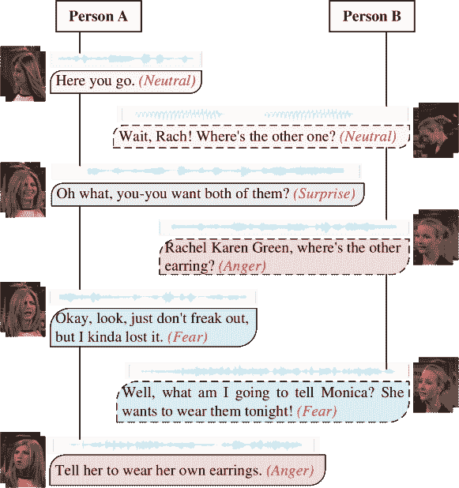
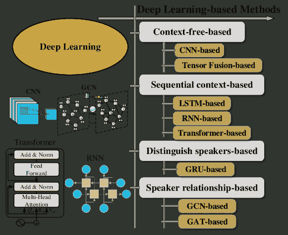
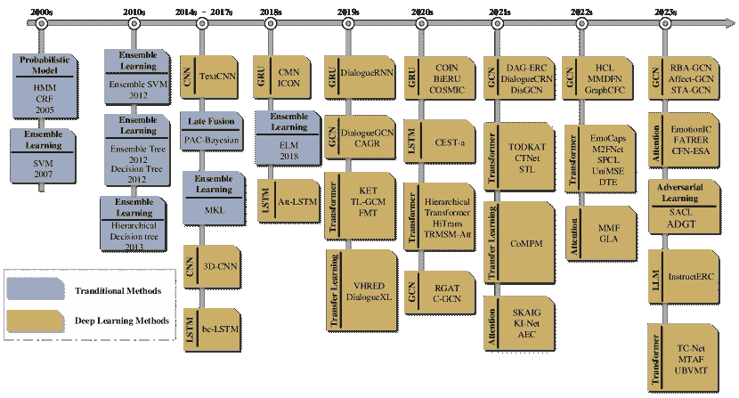
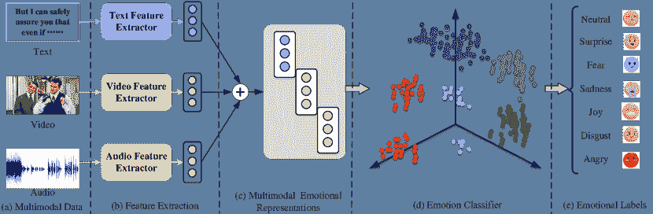
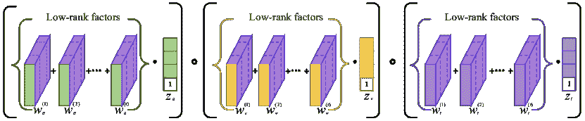
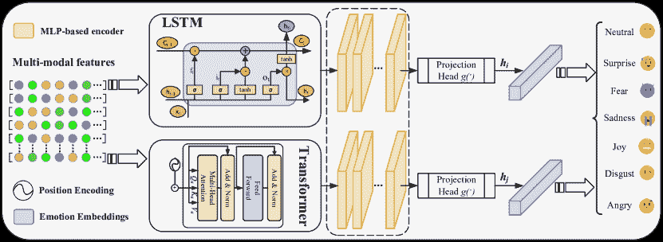
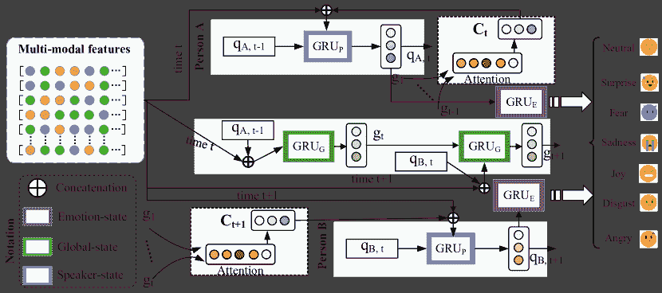
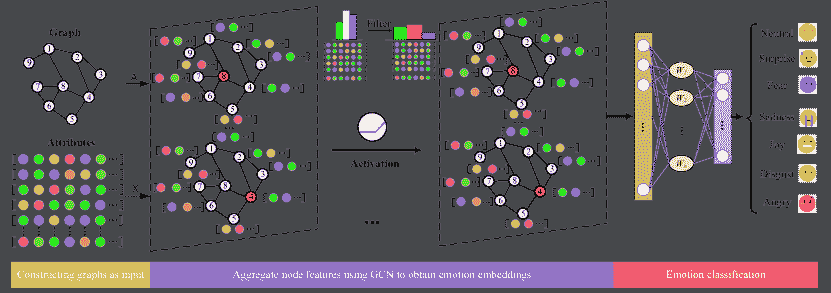
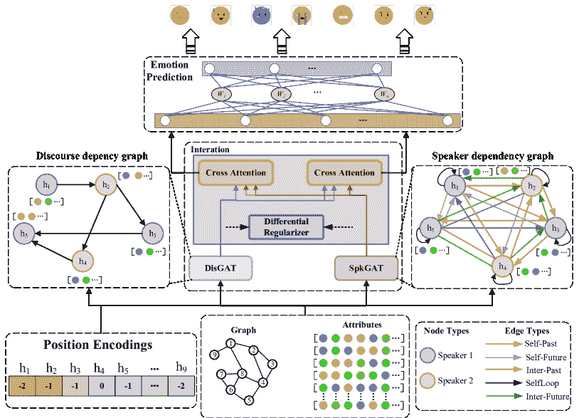

<!--yml

类别: 未分类

日期: 2024-09-06 19:35:41

-->

# [2312.05735] 基于深度学习的多模态对话情感识别综述

> 来源：[`ar5iv.labs.arxiv.org/html/2312.05735`](https://ar5iv.labs.arxiv.org/html/2312.05735)

# 基于深度学习的多模态对话情感识别综述

Yuntao Shou shouyuntao@stu.xjtu.edu.cn 中南林业科技大学长沙湖南中国 410004，Tao Meng mengtao@hnu.edu.cn 中南林业科技大学长沙湖南中国 410004，Wei Ai aiwei@hnu.edu.cn 中南林业科技大学长沙湖南中国 410004，Guinan Guo guogn3@mail2.sysu.edu.cn 中山大学广州广东中国 510275，Nan Yin nan.yin@mbzuai.ac.ae 穆罕默德·本·扎耶德人工智能大学马斯达尔城阿布扎比阿联酋 100701 和 Keqin Li lik@newpaltz.edu 纽约州立大学新帕尔茨校区纽约美国 12561

###### 摘要。

多模态对话情感识别（MCER）的目标是通过对话场景中的文本、语音和视觉信息来识别和追踪说话者的情感状态。分析和研究 MCER 问题对情感计算、智能推荐和人机交互领域具有重要意义。与传统的单轮多模态情感识别或单模态对话情感识别不同，MCER 是一个更具挑战性的问题，需要处理更复杂的情感交互关系。关键问题在于基于情感交互关系的多模态特征融合中的一致性和互补语义学习。为了解决这个问题，人们已经基于深度学习技术进行了广泛的 MCER 研究，但对建模方法的系统性综述仍然缺乏。因此，及时且全面地概述 MCER 在深度学习中的最新进展对学术界和工业界具有重要意义。在本次调查中，我们提供了 MCER 建模方法的全面概述，并大致将 MCER 方法分为四类，即：无上下文建模、序列上下文建模、说话者区分建模和说话者关系建模。此外，我们还进一步讨论了 MCER 的公开流行数据集、多模态特征提取方法、应用领域、现有挑战以及未来的发展方向。我们希望我们的综述能够帮助 MCER 研究人员了解情感识别的当前研究状态，提供一些启发，并开发更高效的模型。

多模态对话情感识别，深度学习，多模态数据集，多模态特征融合，多模态特征提取^†^†期刊: JACM^†^†期刊卷号: 37^†^†期刊期号: 4^†^†文章: 111^†^†出版月: 8^†^†CCS: 一般和参考  调查与概述^†^†CCS: 以人为中心的计算  自然语言接口

## 1\. 引言

随着移动互联网的发展，社交媒体已成为人们相互沟通的主要平台（Park 等， 2016）。用户可以通过文本、语音、图像和视频等多模态数据充分表达他们的情感。通过多模态数据构建多模态对话情感识别模型，对于理解用户的真实情感意图具有至关重要的实际意义（Ghosh 和 Anwar，2021）。因此，近年来研究人员一直在尝试赋予机器理解情感的能力（Li 等，2022a），（Zhu 等，2021）。

在多模态对话情感识别研究兴起之前，早期的对话情感识别方法（Kim, 2014; Tzinis et al., 2018; Zhong et al., 2019; Lotfian and Busso, 2019）主要关注单模态文本或语音，并且它们仅考虑文本（或语音）之间的上下文依赖关系以及单词（或音频）本身的语义信息来分析和识别情感（Meng et al., 2021），（Ying et al., 2021），（Shou et al., 2022b）。然而，仅提取文本数据中包含的情感信息可能不足以让模型理解说话者表达的情感，因为说话者在表达观点时可能会比较内敛（Zhu et al., 2023; Ghosal et al., 2019）。例如，一个说话者可能在表达愤怒时表现得含蓄，这可能导致更中性的陈述。针对上述问题，提出了多模态对话情感识别（MCER）技术，以解决文本语义信息表达不足的问题（Shou et al., 2023b），（Shou et al., 2023a），（Ying et al., 2021）。如图 1 所示，MCER 旨在提取模态内和模态之间的互补语义信息，并识别文本、音频和视频中说话者表达的情感。MCER 的优势在于，当文本信息的情感极性表达不足时（Lian et al., 2023），模型可以利用视觉信息（如面部表情等）和音频信息（如语调等）来增强对文本信息的情感理解（Yin et al., 2022），（Yin et al., 2023a），（Yin et al., 5555），（Yin et al., 2023b）。

图 1\. 多模态对话情感识别数据集的示例，该数据集包含三种模态特征：视频、音频和文本。MCER 的任务是根据话语内容（例如，中性、愤怒、惊讶等）识别每个说话者在当前时刻的情感标签。

然而，与传统的单轮多模态情感识别或单模态对话情感识别不同，MCER 是一个更具挑战性的问题，需要考虑多模态上下文、对话场景、说话者自身情感惯性以及对话者刺激等因素（Chudasama et al., 2022; Zhang et al., 2020）。强大的深度学习技术（Shou et al., 2022a）使得 MCER 能通过融合语义特征和复杂的情感交互来识别情感。MCER 中的特征融合主要考虑模态内上下文语义信息融合和模态间互补语义信息融合（Huang et al., 2020）。一方面，模态内上下文语义信息融合指的是提取每种模态中说话者特征表示的时间和空间依赖关系。另一方面，模态间互补语义信息融合指的是利用不同模态之间的交互信息来增强模型的情感理解能力。通过融合各种模态数据的特征，MCER 协同提高了情感识别效果，这对处理和理解多模态数据具有重要的理论意义（Yang et al., 2022; Hou et al., 2023; Zhang et al., 2023a）。

尽管越来越多的人致力于研究多模态对话情感识别的新模型和方法（Ghosal et al., 2018; Chudasama et al., 2022; Liu et al., 2022），但对多模态对话情感识别的理论和方法分类仍缺乏理解，特别是基于深度学习的多模态对话情感识别。据我们所知，本调查是首个全面关注深度学习在多模态对话情感识别中的应用的调查。现有的调查主要关注单轮多模态情感识别（Zhu et al., 2023）或单模态对话情感识别（Deng and Ren, 2021）。因此，随着深度学习在各个领域的迅速渗透，基于深度学习的多模态对话情感识别方法已成为研究热点，需要及时和全面的调查。

基于上述分析，我们的综述总结了多模态对话情感识别的研究工作。我们首先列出了一些在 MCER 领域公开可用和流行的数据集，并列出了每种模态的常用特征提取方法。其次，如图 2 所示，我们将 MCER 方法大致分为四类，即无上下文建模、顺序上下文建模、区分说话人建模、说话人关系建模。第三，我们提供了 MCER 实验的评估指标。第四，我们给出了 MCER 的应用和问题。最后，我们阐述了未来的研究方向。

本文的贡献总结如下：

+   •

    新分类法：我们为多模态对话情感识别提供了一种新的分类法。具体来说，我们将现有的 MCER 方法分为四组：无上下文建模、顺序上下文建模、区分说话人建模和说话人关系建模。

+   •

    综合评审：本文提供了对 MCER 深度学习和机器学习算法的最全面的评审。对于每种建模方法，我们提供了代表性模型并进行了相应的比较。

+   •

    资源丰富：我们收集了与 MCER 相关的资源，包括最先进的模型和公开可用的数据集。本文可以作为学习和开发不同情感识别算法的实用指南。

+   •

    未来方向：我们分析了现有多模态情感识别（MCER）方法的局限性，并提出了许多方面的未来研究方向，如多模态数据的协同生成、多模态特征的深度融合以及多模态情感的无偏学习。

本文的组织结构如下：第二部分总结了 MCER 领域中公开的流行数据集。第三部分阐述了 MCER 的背景、定义和常用的特征提取技术。第四部分将 MCER 方法大致分为四类，并分析了它们的优缺点。第五部分总结了一些常用的 MCER 任务评估指标。第六部分给出了不同算法在 IEMOCAP 和 MELD 数据集上的性能表现。第七部分讨论了 MCER 的实际应用。第八部分阐述了现有研究中的问题，第九部分则给出了未来研究的方向。最后，我们总结了本文的工作。

图 2\. 多模态对话情感识别的建模方法分类。我们将现有的 MCER 方法分为四类，即无上下文建模、序列上下文建模、区分说话人建模和说话人关系建模。

## 2\. 常见基准数据集

表 1 展示了七个公开的情感识别基准数据集。我们统计了每个数据集的发布时间、模态和开源网址。如表 2 所示，我们还统计了数据集在不同情感标签上的分布情况，数据显示出长尾分布。

表 1\. 多模态对话情感识别中的公开基准数据集。

| 数据集 | 年份 | 模态 | 可用网址 |
| --- | --- | --- | --- |
| IEMOCAP (Busso et al., 2008) | 2008 | 文本, 视频, 音频 | [`sail.usc.edu/iemocap/`](https://sail.usc.edu/iemocap/) |
| MELD (Poria et al., 2019) | 2019 | 文本, 视频, 音频 | [`web.eecs.umich.edu/$\sim$mihalcea/downloads/MELD.Raw.tar.gz`](https://web.eecs.umich.edu/%C2%A0mihalcea/downloads/MELD.Raw.tar.gz) |
| DailyDialog (Li et al., 2017) | 2017 | 文本 | [`huggingface.co/datasets/daily_dialog`](https://huggingface.co/datasets/daily_dialog) |
| EmoryNLP (Zahiri and Choi, 2017) | 2017 | 文本 | [`github.com/emorynlp/character-mining`](https://github.com/emorynlp/character-mining) |
| SEMAINE (McKeown et al., 2011) | 2012 | 文本, 视频, 音频 | [`semaine-db.eu/`](https://semaine-db.eu/) |
| EmotionLines (Hsu et al., 2018) | 2018 | 文本 | [`doraemon.iis.sinica.edu.tw/emotionlines/index.html`](https://doraemon.iis.sinica.edu.tw/emotionlines/index.html) |
| EmoContext (Chatterjee et al., 2019) | 2019 | 文本 | [`www.humanizing-ai.com/emocontext.html`](https://www.humanizing-ai.com/emocontext.html) |

表 2\. 七种对话情感识别数据集在不同情感标签上的分布。

| 标签 | IEMOCAP | MELD | EmoContext | EmotionLines | EmoryNLP | DailyDialog | SEMAINE |
| --- | --- | --- | --- | --- | --- | --- | --- |
| 中性 | 1,708 | 6,436 | - | 6,530 | 15,104 | 855,72 | - |
| 快乐/喜悦 | 648 | 2,308 | 4,669 | 1,710 | 11,020 | 12,885 | 93 |
| 惊讶/强烈 | - | 1,636 | - | 1,658 | 4,252 | 1,823 | - |
| 悲伤 | 1,084 | 1,002 | 5,838 | 498 | 3,376 | 1,150 | 58 |
| 愤怒/生气 | 1,103 | 1,607 | 5,954 | 772 | 5,328 | 1,022 | 41 |
| 厌恶 | - | 361 | - | 338 | - | 354 | 7 |
| 恐惧/害怕 | - | 358 | - | 255 | 6,584 | 74 | 3 |
| 沮丧 | 1,849 | - | - | - | - | - | - |
| 兴奋 | 1,041 | - | - | - | - | - | - |
| 其他 | - | - | 21,960 | - | 4,760 | - | 197 |

### 2.1\. IEMOCAP

IEMOCAP 数据集 (Busso et al., 2008) 于 2008 年发布，包含 12.46 小时的对话。IEMOCAP 数据集包含三种模态特征，即视频、音频和文本，是首个用于多模态情感识别的多模态数据集。在 IEMOCAP 数据集中，十名剧场演员通过二元对话表达特定情感类别（即悲伤、正常、沮丧、愤怒、快乐、兴奋）。为了确保标注的一致性和准确性，每个句子都由多个专家标注。

### 2.2\. MELD

MELD 数据集 (Poria et al., 2019) 来自经典电视系列《朋友》，包含文本、视频和音频数据。MELD 数据集总共有 13,709 个视频片段，每个句子被标记为特定情感（即愤怒、正常、恐惧、厌恶、惊讶、快乐、厌恶）。此外，MELD 数据集还通过中性、负面和正面三类情感进行标注。为了确保标注的一致性和准确性，每个句子都由多个专家标注。

### 2.3\. DailyDialog

DailyDialog 数据集（Li 等，2017）是一个关于日常聊天场景的多轮对话数据集，仅包含文本模态。DailyDialog 数据集包含 13,000 个对话，并为每个句子标注了意图（即，告知、承诺、指令、问题）和情感（惊讶、悲伤、恐惧、快乐、厌恶、愤怒）。每个句子由三位专家共同标注。

### 2.4\. EmoryNLP

EmoryNLP（Zahiri 和 Choi，2017）是一个单模态数据集，仅包含文本模态。EmoryNLP 数据集包含 12,606 个发言，每个发言都标注了七种情感：平和、害怕、疯狂、强大、悲伤、快乐和中性。EmoryNLP 数据集分为训练集、测试集和验证集。

### 2.5\. SEMAINE

SEMAINE（McKeown 等，2011）是一个多模态对话数据集，包含机器人和人类之间的四种二元对话。SEMAINE 数据集有 95 个对话，总共有 5,798 个句子。标记了四种情感维度：愉悦度、唤醒度、预期度和力量。愉悦度、唤醒度和预期度是范围为 [-1, 1] 的连续值，并且 SEMAINE 数据集的规模较小。

### 2.6\. EmotionLines

EmotionLines 数据集（Hsu 等，2018）来自于 Friends 和 Facebook 之间的二元对话，并且仅包含文本数据。EmotionLines 数据集包含 1,000 个对话，共有 29,245 个句子。标记了七种情感类别：中性、恐惧、惊讶、悲伤、愤怒、快乐、厌恶。EmotionLines 数据集在对话情感识别中很少使用。

### 2.7\. EmoContext

EmoContext 数据集（Chatterjee 等，2019）仅包含文本数据。它共有 38,421 个对话和 115,263 个句子。标记了三种情感：快乐、悲伤和愤怒。尽管 EmoContext 数据量大，但由于它仅包含文本数据，因此在对话情感识别中很少使用。

图 3\. 多模态对话情感识别算法的时间线。

## 3\. 背景、定义和特征提取

### 3.1\. 背景

如图 3 所示，我们统计了 2000 年至 2023 年的多模态对话情感识别算法。从图中可以看出，在 2018 年之前，主要使用的是传统机器学习算法，之后深度学习算法逐渐成为主要算法。接下来，我们简要回顾 MCER 算法的主要发展历程。

#### 3.1.1\. 对话情感识别的简史

基于词典的情感识别方法是最早用于情感识别的方法（Hardeniya 和 Borikar, 2016），这也促使了早期对朴素贝叶斯方法的研究（Frank 等, 2000）。随着机器学习算法在分类任务中的广泛应用，代表性的机器学习分类算法（SVM (Rozgić 等, 2012)，(Hu 等, 2007)，以及二叉决策树 (Cichosz 和 Slot, 2007)，(Lee 等, 2011)，(Liu 等, 2018b) 等）也开始在情感识别领域展现光芒。上述方法通过学习文本中情感词的极性和出现频率来确定情感类别，但难以提取语义信息和上下文信息。

在计算机视觉（CV）领域中，CNN 的成功鼓舞了将 CNN 移植到文本分类任务中，并引起了广泛的研究关注（Khare 和 Bajaj, 2020），(Kwon 等, 2021），(Kollias 和 Zafeiriou, 2020）。2017 年，Poria 等（Poria 等, 2017）首次使用 LSTM 解决了上下文之间的依赖关系。从那时起，LSTM 和 GRU 的改进、扩展和应用不断增加（Hazarika 等, 2018b），(Majumder 等, 2019），(Hazarika 等, 2018a），(Rajamani 等, 2021）。直到最近，出现了许多基于 GNN 的方法（如（Ghosal 等, 2019），(Ishiwatari 等, 2020），(Shen 等, 2021），(Li 等, 2023），(Zadeh 等, 2018b））。除了 CNN、RNN 和 GNN，过去几十年还开发了许多基于 Transformer 的替代方法（如（Zhong 等, 2019），(Li 等, 2020），(Zhu 等, 2021））。我们在第四部分中详细介绍了这些算法所属的类别。

#### 3.1.2\. 多模态对话情感识别与传统机器学习

基于传统机器学习的 MCER 方法（Rozgić 等，2012），（Cichosz 和 Slot，2007），（Lee 等，2011），（Liu 等，2018b），（Lin 和 Wei，2005），（Hu 等，2007）与手工提取的特征密切相关，这些方法受到了数据挖掘和情感识别领域越来越多的关注。这些方法旨在学习原始数据的特征嵌入，以便用于后续的下游任务，如分类和聚类。基于机器学习的经典对话情感识别方法是使用支持向量机将情感特征映射到超平面上并进行分类（Rozgić 等，2012），（Bhavan 等，2019）。然而，这些方法需要大量高质量的标注数据。

#### 3.1.3\. 对话情感识别与卷积神经网络

基于 CNN 的情感识别方法（Lu 等，2023），（Kwon 等，2021），（Kollias 和 Zafeiriou，2020）是历史上首个解决情感分类问题的深度学习方法（Kim，2014）。这些基于 CNN 的方法利用卷积滤波器提取文本的语义特征，以便模型可以通过监督学习理解文本的意义。与机器学习算法类似，CNN 也可以通过映射函数将情感特征映射到向量空间。不同之处在于，这种映射函数是以端到端的方式学习的。由于卷积核提取的是局部感受野信息，CNN 无法包含上下文语义信息。

#### 3.1.4\. 多模态对话情感识别与递归神经网络

基于 RNN 的情感识别方法（Ma 等，2019），（Tao 和 Liu，2018），（Majumder 等，2019），（Kollias 和 Zafeiriou，2020）是在 CNN 基础上发展的，但他们认为上下文应相互影响和依赖（Ma 等，2019），（Tao 和 Liu，2018）。这些基于 RNN 的方法通常使用 LSTM 或 GRU（以避免梯度消失或梯度爆炸）来提取包括上下文在内的语义特征。与 CNN 类似，RNN 也可以通过映射函数以端到端的方式将情感特征映射到向量空间。

#### 3.1.5\. 多模态对话情感识别与 Transformer

类似于基于 RNN 的情感识别方法，基于 Transformer 的情感识别方法（Huang 等，2020），（Lian 等，2021），（Tsai 等，2019），（Rahman 等，2020）也提取包括上下文在内的语义信息，并基于此完成后续的情感分类（Lian 等，2021）。然而，与 RNN 不同的是，Transformer 的序列上下文建模能力优于 RNN。因此，基于 Transformer 的情感识别方法的准确性显著优于 RNN。

#### 3.1.6\. 多模态对话情感识别与图神经网络

基于 GNN 的情感识别方法（Lin 等，2022），（Zhang 等，2023a），（Li 等，2023），（Ishiwatari 等，2020），（Shen 等，2021）继承了 RNN 方法的思想，即上下文应该相互作用并相互依赖（Ghosal 等，2019）。在 RNN 的基础上，GNNs 认为说话者之间也存在相互影响的关系。因此，GNNs 通过图结构的固有属性建模说话者之间的对话关系。

表 3\. 本文中常用的一些符号。

| 符号 | 描述 |
| --- | --- |
| $\mid\cdotp\mid$ | 集合的长度。 |
| $\bigodot$ | 元素级乘积。 |
| $\mathcal{G}$ | 图。 |
| $\mathcal{V}$ | 图中的节点集合。 |
| $v$ | 节点 $v\in V$ |
| $\mathcal{E}$ | 图中的边集合。 |
| $e_{ij}$ | 边 $e_{ij}\in E$。 |
| $N(v)$ | 节点 $v$ 的邻居。 |
| $S$ | 说话者。 |
| $u$ | 发言。 |
| $K$ | 上下文窗口大小。 |
| $M$ | 说话者的数量。 |
| $L$ | 对话中的发言数量。 |
| $U$ | 上下文发言集合。 |
| $\mathcal{R}$ | 边的类型。 |
| $\mathcal{W}$ | 可学习的参数。 |
| A | 图的邻接矩阵。 |
| $m$ | 图的节点属性。 |
| $x^{t}\in\mathbb{R}^{d}$ | $d$-维文本特征向量。 |
| $x^{a}\in\mathbb{R}^{k}$ | $k$-维音频特征向量。 |
| $x^{v}\in\mathbb{R}^{h}$ | $h$-维视频特征向量。 |
| $x$ | 连接的视频、音频和文本特征向量。 |

### 3.2\. 定义与预备知识

本文中使用的符号列在表格 3 中。现在，我们定义理解本文所需的集合。特别地，我们使用大写字母表示矩阵，使用小写字母表示向量。

定义 1（发言上下文）多模态对话情感识别任务旨在识别对话中讲话者 $\{S_{1},S_{2},\ldots,S_{M}\}$ 在当前时刻 $t$ 的情感变化（如幸福、悲伤等）。$L$ 代表对话中的发言数量，$U$ 代表上下文发言集合，$U=\{u_{1},u_{2},\ldots,u_{L}\}$。

MCER 任务旨在通过结合上下文信息正确分类每个发言。在当前时刻 $t$，模型需要基于上下文信息 $\{u_{1},u_{2},\ldots,u_{t-1}\}$ 推断讲话者的情感。我们假设上下文窗口大小设置为 $K$。上下文发言集合定义如下：

| (1) |  | $C_{\lambda}=\left\{u_{i}\mid i\in[t-K,t-1],u_{i}\in U_{\lambda},\mid C_{\lambda}\mid\leq K\right\}$ |  |
| --- | --- | --- | --- |

当上下文窗口大小为 6 时，讲话者的上下文发言和预测发言如表 4 所示。

定义 2（对话图）对话图表示为 $\mathcal{G}=\{\mathcal{V},\mathcal{E},\mathcal{R},\mathcal{W}\}$，其中 $\mathcal{V}$ 是图中的节点集合，$\mathcal{E}$ 是边的集合，$v_{i}\in\mathcal{V}$ 表示第 $i$ 个节点，$e_{ij}=(v_{i},v_{j})\in\mathcal{E}$ 表示从 $v_{i}$ 到 $v_{j}$ 的有向边，关系 $r_{ij}\in\mathcal{E}$ 表示节点 $v_{i}$ 和 $v_{j}$ 之间存在对话关系。节点 $v$ 的邻接节点表示为 $N(v)=\{u\in\mathcal{V}|(v,u)\in\mathcal{E}\}$。$\textbf{A}\in{\mathbb{R}^{n\times n}}$ 表示邻接矩阵，当 $e_{ij}\in\mathcal{E}$ 时 $\textbf{A}_{ij}=1$，否则 $\textbf{A}_{ij}=0$。$\textbf{X}\in\mathbb{R}^{m\times m}$ 表示图的节点属性。对于基于 GCN 的 MCER 任务，讲话者的发言信息被视为图的节点，讲话者之间的对话关系信息被视为图的边。

定义 3（问题定义）对于给定的多模态发言序列 $U$，MCER 任务要求使用发言上下文信息来确定一个深度神经网络 $F\left({{u_{i}}}\right)$，使得输出的情感标签 $\hat{y}_{i}$ 尽可能接近真实的情感标签 ${y_{i}}$，$i\in\left\{{1,...,L}\right\}$。深度神经网络可以通过最小化损失来解决最佳参数，其损失定义如下：

| (2) |  | $\min_{F}\frac{1}{L}\sum_{i=1}^{L}\mathcal{L}\left(\hat{y}_{i}=F\left(u_{i}\right),y_{i}\right)$ |  |
| --- | --- | --- | --- |

其中 $L$ 代表对话中的发言数量，$\mathcal{L}$ 是一个指示函数。

表 4\. 我们假设对话中有三位发言者，对话的窗口大小$K$设置为 6。对话过程如下：

|          发言者 |          发言 |          描述 |
| --- | --- | --- |
|          $C_{a}$,$C_{b}$,$C_{c}$ |          ${{u}_{1}^{a},{u}_{3}^{a}},{{u}_{2}^{b},{u}_{5}^{b}},{{u}_{4}^{c},{u}_{6}^{c}}$ |          上下文发言 |
|          $S_{b}$ |          $u_{7}^{b}$ |          预测发言 |

从 MCER 的发展历史和相关初步定义中可以看出，多模态对话情感识别的过程主要包括三个方面：多模态特征提取、多模态特征融合表示和情感分类。整体过程如图 4 所示，下面我们将全面概述这三个方面。

图 4\. 提出的 MCER 方法主要包括多模态特征提取、多模态情感表示和情感分类器。

### 3.3\. 多模态特征提取

多模态特征提取（例如文本、视频和音频等）是情感分析的重要技术之一。在这一部分，我们介绍了使用特征提取方法对文本、视频和音频进行数据预处理的过程，并列出了一些常用的特征提取方法。如表 5 所示，我们统计了许多深度学习方法中使用的多模态特征提取技术。

表 5\. 不同情感识别技术使用的文本、视频和音频特征的特征提取方法。

| 方法 | 文本 | 视频 | 音频 | 方法 | 文本 | 视频 | 音频 |
| --- | --- | --- | --- | --- | --- | --- | --- |
| THMM (Morency et al., 2011) | 极性词汇 | OKAO Vision | OpenEAR | CMN (Hazarika et al., 2018b) | TEXT-CNN | 3D-CNN | openSMILE |
| SVM (Pérez-Rosas et al., 2013) | Bag-of-words | CERT | OpenEAR | Att-BiLSTM (Poria et al., 2017) | TEXT-CNN | 3D-CNN | openSMILE |
| MKL (Poria et al., 2015) | Word2vec | CLM-Z | openSMILE | ICON (Hazarika et al., 2018a) | TEXT-CNN | 3D-CNN | openSMILE |
| SAL-CNN (Wang et al., 2017) | Word2vec | CLM-Z | COVAREP | DialogueRNN (Majumder et al., 2019) | TEXT-CNN | 3D-CNN | openSMILE |
| TFN (Zadeh et al., 2017) | GLOVE | Facet | COVAREP | DialogueGCN (Ghosal et al., 2019) | TEXT-CNN | 3D-CNN | openSMILE |
| LMF (Liu et al., 2018a) | GLOVE | Facet | COVAREP | COIN (Zhang and Chai, 2021) | TEXT-CNN | 3D-CNN | openSMILE |
| HFFN (Mai et al., 2019a) | GLOVE | Facet | COVAREP | CESTa (Wang et al., 2020b) | TEXT-CNN | 3D-CNN | openSMILE |
| LMFN (Mai et al., 2019b) | GLOVE | Facet | COVAREP | EmoCaps (Li et al., 2022b) | BERT | 3D-CNN | openSMILE |
| GME-LSTM (Mai et al., 2019b) | GLOVE | Facet | COVAREP | MM-DFN (Hu et al., 2022a) | TEXT-CNN | 3D-CNN | openSMILE |
| MARN (Zadeh et al., 2018c) | GLOVE | Facet | COVAREP | M2FNet (Chudasama et al., 2022) | RoBERTa | Mel Spectrograms | MTCNN |
| MFN (Zadeh et al., 2018a) | GLOVE | Facet | COVAREP | GraphCFC (Li et al., 2023) | TEXT-CNN | openSMILE | 3D-CNN |
| RAVEN (Wang et al., 2019) | GLOVE | Facet | COVAREP | UniMSE (Hu et al., 2022b) | T5 | openSMILE | 3D-CNN |
| SWRM (Wu et al., 2022) | BERT | Facet | COVAREP | EmotionIC (Yingjian et al., 2023) | TEXT-CNN | openSMILE | 3D-CNN |
| MCTN (Pham et al., 2019) | GLOVE | Facet | COVAREP | SACL-LSTM (Hu et al., 2023) | RoBERTa | openSMILE | 3D-CNN |
| MulT (Tsai et al., 2019) | GLOVE | Facet | COVAREP | HyCon (Mai et al., 2022) | BERT | Facet | COVAREP |
| MAG (Rahman et al., 2020) | BERT | Facet | COVAREP | HGraph-CL (Lin et al., 2022) | BERT | Facet | COVAREP |
| ICDN (Zhang et al., 2023b) | GLOVE | Facet | COVAREP | bc-LSTM (Poria et al., 2017) | TEXT-CNN | 3D-CNN | openSMILE |
| AMOA (Li et al., 2022c) | BERT | OpenFace 2.0 | openSMILE | MMMU-BA (Ghosal et al., 2018) | GLOVE | Facet | COVAREP |
| ICCN (Sun et al., 2020) | BERT | Facet | COVAREP | MISA (Hazarika et al., 2020) | BERT | Facet | COVAREP |

#### 3.3.1\. 文本特征提取

随着深度学习技术的快速发展，词嵌入技术也被广泛应用于提取文本特征。词嵌入技术利用浅层神经网络学习词语的语义信息，并使用欧几里得距离来衡量词语之间的相似度。与传统的 one-hot 编码方法不同，词嵌入技术能够将高维稀疏特征向量映射到低维密集特征向量，从而节省大量计算资源，并解决了 one-hot 编码无法区分词语语义差异的问题。一种常用的词嵌入方法是 Word2Vec（Chen et al., 2019），它包含两种不同的形式：CBOW（Ghosh and Anwar, 2021）和 Skip-gram（Du et al., 2020）。CBOW 根据周围词语预测中心词，而 Skip-gram 则根据中心词预测周围词语。尽管上述方法可以捕捉词语之间的语义相似性，但它们需要大规模的数据集进行训练。

一些近期研究使用简单的 TextCNN（Kim, 2014）和 GLOVE（Gan et al., 2022）来提取文本特征。此外，大规模的预测预训练模型如 BERT（Ma et al., 2021）和 RoBERTa（Kim et al., 2021）也经常被使用，它们通过注意力机制捕捉上下文信息。

#### 3.3.2\. 视频特征提取

视觉特征提取主要是从视频中提取包含讲者情感的面部表情和手势等信息。近年来，深度神经网络能够以端到端的学习方式从图像中提取深层特征，避免了繁琐的手动特征提取。例如，Tran et al.（Tran et al., 2015）提出了一种有效且高效的 3D-CNN 来处理包含时空特征的视频帧。

现在，大多数视觉特征是通过一些先进的神经网络（例如，CNN（Kattenborn et al., 2021; Wang et al., 2020a），以及 Transformer（Han et al., 2021; Han et al., 2022）等）或一些开源工具包（例如，OKAO Vision（Zhu et al., 2023），OpenFace（Baltrusaitis et al., 2018），CERT（Boopathy et al., 2019）和 Facet（Barreiro and Treglown, 2020）等）提取的。OKAO Vision 提取视频中每一帧的讲者面部表情，并最终获得讲者的微笑强度（0-100）和眼睛注视方向。CERT 可以自适应地提取视觉特征，如面部和头部姿态。OpenFace 2.0 能够检测面部标志，识别面部动作，并估计眼睛注视方向。Facet 提取的视觉特征包括面部动作、头部姿态、HOG 特征等。

#### 3.3.3\. 音频特征提取

深度学习在音频特征提取研究中也开始受到越来越多的关注。例如，LSTM（Xie et al., 2019）已被广泛用于自动提取声学特征。Poria et al.（Poria et al., 2017）使用 CNN 从音频中提取特征，然后将提取的音频特征输入分类器进行情感分类。

最近，越来越多的情感分析模型（Tzinis et al., 2018；Majumder et al., 2019；Zhong et al., 2019）开始使用如 CONVAREP（Dumpala et al., 2023）、openSMILE（Kumar et al., 2022）、LibROSA（Suman et al., 2022）和 OpenEAR（Schepker et al., 2020）等开源工具包提取音频特征。具体来说，OpenEAR 自适应地提取一组声学特征（例如，韵律、频谱和倒谱等），并使用 Z 标准化来规范化音频特征。openSMILE 提取的特征包括 MFCC、音高和声音强度。LibROSA Speech Toolkit 提取了 33 个帧级声学特征（即 20 维 MFCC 和 CQT），包括说话人语调变化。类似于其他音频特征提取方法，COVAREP 也可以用于提取如 12 维 MFCC、最大离散度尺度（MDQ）和 Liljencrants-Fant（LF）等特征。

## 4\. 多模态对话情感识别算法的分类

在本节中，我们介绍了 MCER 建模方法的分类。我们将现有的工作分为无上下文建模、序列上下文建模、区分说话人建模和说话人关系建模。我们在以下部分简要介绍每种方法。

### 4.1\. 无上下文建模

这些主要是关于对话情感识别的开创性工作。无上下文建模方法旨在为每个句子学习特征表示，这些方法不利用句子的上下文信息（Zhang et al., 2020），（Seng et al., 2016），（Lotfian and Busso, 2019）。例如，一些传统的机器方法（如支持向量机（SVMs）（Rozgić et al., 2012；Lin and Wei, 2005），决策树（Cichosz and Slot, 2007；Lee et al., 2011）等）用于提取每个句子的特征表示，并利用提取的句子特征完成情感分类。上述过程假设每个句子是独立的，相互之间没有影响。我们在下面介绍几种基于特征融合的常见无上下文建模方法。

#### 4.1.1\. 添加

基于加法操作的早期融合方法通过加权求和不同模态特征来获得最终的情感特征表示（Deng 和 Ren，2021）。这种融合方法操作简单，只需少量计算。然而，它的缺点也很明显。它无法以细粒度方式建模上下文信息，且可利用的信息有限。使用加法方法实现无上下文建模的方法公式定义如下：

| (3) |  | $h_{e}=x^{t}+x^{a}+a^{v}$ |  |
| --- | --- | --- | --- |

其中 $h_{e}$ 代表融合后的情感向量，$x^{t},x^{a},x^{v}$ 分别代表文本、音频和视频向量。

#### 4.1.2\. 连接

基于连接操作的早期融合方法通过连接和合并不同模态特征来获得最终的情感特征表示（Cambria 等人，2018）。虽然这种融合方法不引入额外的计算，但会导致数据的维度非常高，从而使计算变得困难。此外，它还无法捕捉到互补的模态内和模态间语义信息。

| (4) |  | $h_{e}=Concat\left([x^{t},x^{a},a^{v}]\right)$ |  |
| --- | --- | --- | --- |

其中 $Concat\left(\cdot\right)$ 代表连接操作。

#### 4.1.3\. 三模态隐马尔可夫模型

Morency 等人利用文本、视频和音频特征进行三模态情感分析任务，并设计了一个模型来提取不同模态特征中的有用信息（Morency 等人，2011）。在提取多模态特征后，将三种模态特征连接并输入到隐马尔可夫链（HMM）分类器中（Morency 等人，2011）以学习输入信号的情感状态。HMM 认为当前时刻的状态仅与前一时刻的信息相关，这使得模型无法利用话语的上下文信息。HMM 的公式定义如下：

| (5) |  | $\displaystyle P(w\mid x^{a},x^{v},x^{t})$ | $\displaystyle=\sum_{i=1}^{C}\sum_{j=1}^{D}\sum_{k=1}^{M}P(w,\lambda_{i}^{a},\lambda_{j}^{v},\lambda_{k}^{t}\mid x^{a},x^{v},x^{t})$ |  |
| --- | --- | --- | --- | --- |
|  |  | $\displaystyle=\sum_{i=1}^{C}\sum_{j=1}^{D}\sum_{k=1}^{M}P(w\mid\lambda_{i}^{a},\lambda_{j}^{v},\lambda_{k}^{t},x^{a},x^{v},x^{t})$ |  |
|  |  | $\displaystyle\times P(\lambda_{i}^{a},\lambda_{j}^{v},\lambda_{k}^{t}\mid x^{a},x^{v},x^{t})$ |  |

其中 $C,D,M$ 代表音频、视频和文本的特征向量维度，$w$ 代表情感类别，$P(\lambda_{i}^{a},\lambda_{j}^{v},\lambda_{k}^{t}|x^{a},x^{v},x^{t})$ 代表情感分类的置信度。

由于真实类别标签基于预测类别标签 $\hat{w}_{b}$ 的输出，HMM 的公式可以扩展如下：

| (6) |  |  | $\displaystyle P(w\mid\lambda^{a}_{i},\lambda^{v}_{j},\lambda^{t}_{k},x^{a},x^{v},x^{t})$ |  |
| --- | --- | --- | --- | --- |
|  |  | $\displaystyle=\sum_{b=1}^{B}P(w,\hat{w}_{b}&#124;\lambda_{i}^{a},\lambda_{j}^{v},\lambda_{k}^{t},x^{a},x^{v},x^{t})$ |  |
|  |  | $\displaystyle=\sum_{i=1}^{B}P(w&#124;\hat{w}_{b},\lambda_{i}^{a},\lambda_{j}^{v},\lambda_{k}^{t},x^{a},x^{v},x^{t})$ |  |
|  |  | $\displaystyle\times P(\hat{w}_{b}&#124;\lambda_{i}^{a},\lambda_{j}^{v},\lambda_{k}^{t},x^{a},x^{v},x^{t})$ |  |

其中 $P(\hat{w}_{b}|\lambda_{i}^{a},\lambda_{j}^{v},\lambda_{k}^{t},x^{a},x^{v},x^{t})$ 代表预测标签的概率。

#### 4.1.4\. 支持向量机（SVM）

SVM 是一种用于分类和回归的机器学习算法，其优化目标是寻找一个超平面（二维空间中的直线，高维空间中的超平面），以分隔不同类别的样本。基于上述研究，Perez-Rosas 等人（Pérez-Rosas et al., 2013）将多模态特征拼接为输入向量，并使用 SVM 对情感进行话语分类。SVM 在二分类问题上表现更好，但在多分类问题上效果较差，并且只适合训练小规模数据集。SVM 的公式定义如下：

| (7) |  | $f\left(x\right)=sign\left(\sum_{i=1}^{N}\alpha_{i}^{*}y_{i}\exp\left(-\frac{\&#124;x-z\&#124;^{2}}{2\sigma^{2}}\right)+b^{*}\right)$ |  |
| --- | --- | --- | --- |

其中 $sign(x>0)=1,sign(x=0)=0,sign(x<0)=1$，$\alpha_{i}^{*},b^{*}$ 代表可学习的参数，$\exp\left(-\frac{\|x-z\|^{2}}{2\sigma^{2}}\right)$ 代表核函数，$N$ 是样本的数量。

#### 4.1.5\. 多核学习

在对三种不同模态的特征进行预处理后，Poria 等人（Poria et al., 2015）构建了两种不同的特征选择器来实现特征降维。其中特征选择器之一基于圆形相关特征子集选择（CFS），另一个基于主成分分析（PCA）。这两种特征选择器不仅能够消除冗余信息和噪声信息，还能提高模型的运行速度。在特征选择和降维之后，研究人员将处理过的特征向量拼接和合并，并使用多核学习（MKL）算法（Poria et al., 2015）训练了一个分类器。基于之前的研究工作，作者进一步提出了卷积递归多核学习（CRMKL）模型（Poria et al., 2016）。CRNKL 使用卷积递归神经网络进行情感检测，可以提取上下文信息。MKL 的公式定义如下：

| (8) |  | <math   alttext="\begin{gathered}\max_{\alpha,\beta}\left[\sum_{i=1}^{N}\alpha_{i}-\sum_{i,j=1}^{N}\alpha_{i}\alpha_{j}y_{i}y_{j}\mathrm{K}_{mkl}(x_{i},x_{j})\right]\\ \sum_{i}^{N}\alpha_{i}y_{i}=0\\

0\leq\alpha_{i}\leq C\\

\mathrm{K}_{mkl}=\sum_{k}^{M}\beta_{k}K_{k}>0\end{gathered}" display="block"><semantics ><mtable displaystyle="true" rowspacing="0pt" ><mtr  ><mtd ><mrow ><munder  ><mi >max</mi><mrow ><mi  >α</mi><mo >,</mo><mi >β</mi></mrow></munder><mo >⁡</mo><mrow ><mo  >[</mo><mrow ><mrow ><munderover ><mo lspace="0em" movablelimits="false" >∑</mo><mrow  ><mi >i</mi><mo >=</mo><mn  >1</mn></mrow><mi >N</mi></munderover><msub ><mi >α</mi><mi  >i</mi></msub></mrow><mo rspace="0.055em"  >−</mo><mrow ><munderover ><mo movablelimits="false" >∑</mo><mrow ><mrow ><mi >i</mi><mo >,</mo><mi >j</mi></mrow><mo >=</mo><mn >1</mn></mrow><mi >N</mi></munderover><mrow ><msub ><mi  >α</mi><mi >i</mi></msub><mo lspace="0em" rspace="0em"  >​</mo><msub ><mi >α</mi><mi >j</mi></msub><mo lspace="0em" rspace="0em" >​</mo><msub ><mi >y</mi><mi >i</mi></msub><mo lspace="0em" rspace="0em" >​</mo><msub ><mi >y</mi><mi >j</mi></msub><mo lspace="0em" rspace="0em" >​</mo><msub ><mi mathvariant="normal" >K</mi><mrow ><mi >m</mi><mo lspace="0em" rspace="0em"  >​</mo><mi >k</mi><mo lspace="0em" rspace="0em"  >​</mo><mi >l</mi></mrow></msub><mo lspace="0em" rspace="0em"  >​</mo><mrow ><mo stretchy="false"  >(</mo><msub ><mi >x</mi><mi >i</mi></msub><mo >,</mo><msub ><mi  >x</mi><mi >j</mi></msub><mo stretchy="false"  >)</mo></mrow></mrow></mrow></mrow><mo >]</mo></mrow></mrow></mtd></mtr><mtr ><mtd ><mrow  ><mrow ><munderover ><mo movablelimits="false" >∑</mo><mi  >i</mi><mi >N</mi></munderover><mrow ><msub ><mi  >α</mi><mi >i</mi></msub><mo lspace="0em" rspace="0em"  >​</mo><msub ><mi >y</mi><mi  >i</mi></msub></mrow></mrow><mo >=</mo><mn >0</mn></mrow></mtd></mtr><mtr ><mtd  ><mrow ><mn >0</mn><mo  >≤</mo><msub ><mi >α</mi><mi  >i</mi></msub><mo >≤</mo><mi >C</mi></mrow></mtd></mtr><mtr ><mtd  ><mrow ><msub ><mi mathvariant="normal" >K</mi><mrow ><mi  >m</mi><mo lspace="0em" rspace="0em"  >​</mo><mi >k</mi><mo lspace="0em" rspace="0em"  >​</mo><mi >l</mi></mrow></msub><mo rspace="0.111em"  >=</mo><mrow ><munderover ><mo movablelimits="false" >∑</mo><mi  >k</mi><mi >M</mi></munderover><mrow ><msub ><mi  >β</mi><mi >k</mi></msub><mo lspace="0em" rspace="0em"  >​</mo><msub ><mi >K</mi><mi >k</mi></msub></mrow></mrow><mo >></mo><mn >0</mn></mrow></mtd></mtr></mtable><annotation-xml encoding="MathML-Content" ><apply ><apply  ><apply ><apply ><apply  ><csymbol cd="ambiguous"  >subscript</csymbol><list ><ci >𝛼</ci><ci  >𝛽</ci></list></apply><apply ><apply ><apply  ><csymbol cd="ambiguous"  >superscript</csymbol><apply ><csymbol cd="ambiguous" >subscript</csymbol><apply ><ci >𝑖</ci><cn type="integer" >1</cn></apply></apply><ci >𝑁</ci></apply><apply ><csymbol cd="ambiguous" >subscript</csymbol><ci >𝛼</ci><ci  >𝑖</ci></apply></apply><apply ><apply ><csymbol cd="ambiguous" >superscript</csymbol><apply ><csymbol cd="ambiguous" >subscript</csymbol><apply ><list ><ci >𝑖</ci><ci >𝑗</ci></list><cn type="integer" >1</cn></apply></apply><ci >𝑁</ci></apply><apply ><apply  ><csymbol cd="ambiguous"  >subscript</csymbol><ci >𝛼</ci><ci >𝑖</ci></apply><apply ><csymbol cd="ambiguous" >subscript</csymbol><ci >𝛼</ci><ci >𝑗</ci></apply><apply ><csymbol cd="ambiguous" >subscript</csymbol><ci >𝑦</ci><ci >𝑖</ci></apply><apply ><csymbol cd="ambiguous" >subscript</csymbol><ci >𝑦</ci><ci >𝑗</ci></apply><apply ><csymbol cd="ambiguous" >subscript</csymbol><ci >K</ci><apply ><ci >𝑚</ci><ci >𝑘</ci><ci >𝑙</ci></apply></apply><interval closure="open"  ><apply ><csymbol cd="ambiguous"  >subscript</csymbol><ci >𝑥</ci><ci >𝑖</ci></apply><apply ><csymbol cd="ambiguous"  >subscript</csymbol><ci >𝑥</ci><ci >𝑗</ci></apply></interval></apply></apply></apply></apply><apply ><apply ><csymbol cd="ambiguous" >superscript</csymbol><apply ><csymbol cd="ambiguous" >subscript</csymbol><ci >𝑖</ci></apply><ci >𝑁</ci></apply><apply ><apply  ><csymbol cd="ambiguous"  >subscript</csymbol><ci >𝛼</ci><ci >𝑖</ci></apply><apply ><csymbol cd="ambiguous" >subscript</csymbol><ci >𝑦</ci><ci  >𝑖</ci></apply></apply></apply></apply><apply ><cn type="integer" >0</cn><cn type="integer" >0</cn></apply></apply><apply ><apply  ><csymbol cd="ambiguous"  >subscript</csymbol><ci >𝛼</ci><ci >𝑖</ci></apply></apply><apply ><apply  ><ci >𝐶</ci><apply ><csymbol cd="ambiguous" >subscript</csymbol><ci >K</ci><apply ><ci >𝑚</ci><ci >𝑘</ci><ci >𝑙</ci></apply></apply></apply></apply><apply ><apply ><apply  ><csymbol cd="ambiguous"  >superscript</csymbol><apply ><csymbol cd="ambiguous" >subscript</csymbol><ci >𝑘</ci></apply><ci >𝑀</ci></apply><apply ><apply ><csymbol cd="ambiguous" >subscript</csymbol><ci >𝛽</ci><ci  >𝑘</ci></apply><apply ><csymbol cd="ambiguous" >subscript</csymbol><ci >𝐾</ci><ci >𝑘</ci></apply></apply></apply></apply><apply ><cn type="integer" >0</cn></apply></apply></annotation-xml><annotation encoding="application/x-tex" >\begin{gathered}\max_{\alpha,\beta}\left\sum_{i=1}^{N}\alpha_{i}-\sum_{

其中 $y_{i}$ 是真实标签，$\alpha,\beta$ 是可学习的参数，$M$ 是特征维度。

![参见说明

图 5\. 提出的 TextCNN 方法的流程图。具体而言，给定文本特征，TextCNN 使用不同尺寸的卷积滤波器生成特征图，并使用 1D-max 池化扩展特征图的感受野，并进一步利用多层感知器（MLP）完成情感预测。

#### 4.1.6\. 选择性加法学习 CNN

CNN 是在视觉任务中经典的神经网络，不能直接用于情感识别。为了解决这个问题，Kim 等人（Kim, 2014）提出了 TextCNN 模型，其整体过程如图 5 所示。为了进行多模态情感识别，Wang 等人（Wang et al., 2017）提出了 SAL-CNN 模型，该模型首先使用多模态数据充分训练 CNN，然后使用选择性加法学习（SAL）来提高其通用性并防止模型在训练过程中过拟合。SAL 方法包括两个阶段（即选择和添加）。在选择阶段，SAL 保留重要特征并从神经元学习到的潜在特征表示中去除噪声信息。在添加阶段，SAL 通过向特征表示中添加高斯噪声来提高模型的抗噪声能力。SAL 方法提高了深度融合模型的泛化性能。

CNN 提取文本特征的公式定义如下：

| (9) |  | $\displaystyle x_{1:n}^{t}=x_{1}\oplus x_{2}\oplus\ldots x_{n}$ |  |
| --- | --- | --- | --- |
|  | $\displaystyle c_{i}=f(\omega\cdot x_{p:p+q-1}+b)$ |  |

其中 $\oplus$ 代表连接操作符，$\omega$ 代表卷积滤波器，$c_{i}$ 代表窗口内的特征表示，$f(\cdot)$ 代表激活函数。卷积滤波器用于从所有句子中提取特征，以生成特征图：

| (10) |  | $\mathbf{c}=maxpooling[c_{1},c_{2},\ldots,c_{n-h+1}]$ |  |
| --- | --- | --- | --- |

最大池化操作用于捕捉句子中最关键的语义信息。

从卷积神经网络的处理流程中可以看出，使用 CNN 提取文本特征并不包含上下文信息，即假设每个句子彼此独立。

#### 4.1.7\. 张量融合网络

基于张量的特征融合方法主要通过笛卡尔积计算不同模态特征表示的张量积，以获得融合的张量表示（Pandey et al., 2022）。因此，上述方法需要首先将输入的多模态特征表示映射到高维空间，然后再映射回低维张量空间以进行情感表示。基于张量的方法能够捕捉跨时间、空间和模态的重要高阶交互信息。然而，张量方法的计算复杂度非常高并呈指数增长，且模态间缺乏细粒度的语义信息交互。Zadeh et al.（Zadeh et al., 2017）提出了多模态张量融合网络 TFN。TFN 采用张量融合方法，可以模拟文本、音频和视频三种模态之间的交互过程，并有效融合多模态特征。尽管 TFN 可以有效建模模态内部和模态间的信息交互，但 TFN 方法的模型复杂度与多模态特征的维度有关，并呈指数增长。TFN 的公式定义如下：

| (11) |  | <math   alttext="\left.\left\{(x^{t},x^{v},x^{a})\mid x^{t}\in\begin{bmatrix}\mathbf{x}^{l}\\ 1\end{bmatrix}\right.,x^{v}\in\begin{bmatrix}\mathbf{x}^{v}\\

1\end{bmatrix},x^{a}\in\begin{bmatrix}\mathbf{x}^{a}\\

\left.\left\{(x^{t},x^{v},x^{a})\mid x^{t}\in\begin{bmatrix}\mathbf{x}^{l}\\ 1\end{bmatrix}\right.,x^{v}\in\begin{bmatrix}\mathbf{x}^{v}\\ 1\end{bmatrix},x^{a}\in\begin{bmatrix}\mathbf{x}^{a}\\ 1\end{bmatrix}\right\}

其中额外的维度 1 用于执行模态交互。然后使用笛卡尔积将三个模态特征融合如下：

| (12) |  | <math   alttext="\mathbf{x}^{m}=\begin{bmatrix}\mathbf{x}^{l}\\ 1\end{bmatrix}\otimes\begin{bmatrix}\mathbf{x}^{v}\\

1\end{bmatrix}\otimes\begin{bmatrix}\mathbf{x}^{a}\\

1\end{bmatrix}" display="block"><semantics ><mrow ><msup  ><mi >𝐱</mi><mi >m</mi></msup><mo  >=</mo><mrow ><mrow  ><mo >[</mo><mtable displaystyle="true" rowspacing="0pt"  ><mtr ><mtd  ><msup ><mi >𝐱</mi><mi >l</mi></msup></mtd></mtr><mtr ><mtd  ><mn >1</mn></mtd></mtr></mtable><mo rspace="0.055em"  >]</mo></mrow><mo rspace="0.222em"  >⊗</mo><mrow ><mo  >[</mo><mtable displaystyle="true" rowspacing="0pt"  ><mtr ><mtd ><msup  ><mi >𝐱</mi><mi >v</mi></msup></mtd></mtr><mtr ><mtd ><mn  >1</mn></mtd></mtr></mtable><mo rspace="0.055em"  >]</mo></mrow><mo rspace="0.222em"  >⊗</mo><mrow ><mo  >[</mo><mtable displaystyle="true" rowspacing="0pt"  ><mtr ><mtd ><msup  ><mi >𝐱</mi><mi >a</mi></msup></mtd></mtr><mtr ><mtd ><mn  >1</mn></mtd></mtr></mtable><mo >]</mo></mrow></mrow></mrow><annotation-xml encoding="MathML-Content" ><apply  ><apply ><csymbol cd="ambiguous" >superscript</csymbol><ci  >𝐱</ci><ci >𝑚</ci></apply><apply ><csymbol cd="latexml"  >tensor-product</csymbol><apply ><csymbol cd="latexml" >matrix</csymbol><matrix  ><matrixrow ><apply ><csymbol cd="ambiguous" >superscript</csymbol><ci >𝐱</ci><ci >𝑙</ci></apply></matrixrow><matrixrow ><cn type="integer" >1</cn></matrixrow></matrix></apply><apply ><csymbol cd="latexml"  >matrix</csymbol><matrix ><matrixrow ><apply  ><csymbol cd="ambiguous"  >superscript</csymbol><ci >𝐱</ci><ci >𝑣</ci></apply></matrixrow><matrixrow ><cn type="integer" >1</cn></matrixrow></matrix></apply><apply ><csymbol cd="latexml"  >matrix</csymbol><matrix ><matrixrow ><apply  ><csymbol cd="ambiguous"  >superscript</csymbol><ci >𝐱</ci><ci >𝑎</ci></apply></matrixrow><matrixrow ><cn type="integer" >1</cn></matrixrow></matrix></apply></apply></apply></annotation-xml><annotation encoding="application/x-tex" >\mathbf{x}^{m}=\begin{bmatrix}\mathbf{x}^{l}\\ 1\end{bmatrix}\otimes\begin{bmatrix}\mathbf{x}^{v}\\ 1\end{bmatrix}\otimes\begin{bmatrix}\mathbf{x}^{a}\\ 1\end{bmatrix}</annotation></semantics></math> |  |

其中 $\otimes$ 表示外积，$x^{m}$ 表示融合后的向量。

#### 4.1.8\. 低秩张量融合网络

在 TFN 的基础上，为了更有效地融合多模态数据，Liu 等人（Liu et al., 2018a）提出了一种低秩张量方法 LFM，以实现多模态特征的降维，从而提高多模态特征的融合效率，如图 6 所示。LFM 在许多不同的任务中取得了高性能。

| (13) |  | $\displaystyle\mathbf{x}^{m}$ | $\displaystyle=\left(\sum_{i=1}^{r}\mathbf{w}_{a}^{(i)}\otimes\mathbf{w}_{v}^{(i)}\otimes\mathbf{w}_{t}^{(i)}\right)\cdot\mathbf{x}$ |  |
| --- | --- | --- | --- | --- |
|  |  | $\displaystyle=\left(\sum_{i=1}^{r}\mathbf{w}_{a}^{(i)}\cdot x_{a}\right)\circ\left(\sum_{i=1}^{r}\mathbf{w}_{v}^{(i)}\cdot x_{v}\right)\circ\left(\sum_{i=1}^{r}\mathbf{w}_{t}^{(i)}\cdot x_{t}\right)$ |  |

其中 $\mathbf{w}_{a},\mathbf{w}_{v},\mathbf{w}_{t}$ 表示分解的低秩可学习张量。

图 6\. LFM 的总体流程图。LFM 主要对模式的特定因素的可学习参数进行低秩分解。

#### 4.1.9\. 使用生成对抗网络的数据增强

基于对抗学习的多模态情感识别是该领域的先进方向，它结合了对抗学习的原理，以提高情感识别的准确性和鲁棒性（Ren et al., 2023），（Yuan et al., 2023）。接下来，我们介绍基于对抗生成网络的数据增强的现有总体过程。

1) 条件 GANs 条件生成对抗网络（cGAN）（Sun et al., 2023）是 GAN 的一种变体，它引入条件信息以更精确地控制生成器的输出。cGAN 的核心思想是在生成过程中向生成器和判别器传递额外的条件信息，从而基于给定条件生成特定类型的数据。cGAN 的主要优点是能够精确控制生成过程，以生成符合条件信息的数据。cGAN 的优化目标定义如下：

| (14) |  | $\begin{gathered}\min_{G}\max_{D}V(D,G)=\mathbb{E}_{\mathbf{x}\sim p_{\mathrm{data}}(\mathbf{x})}\{\log D([\mathbf{x},\mathbf{y}])\}+\mathbb{E}_{\mathbf{z}\sim p_{z}(\mathbf{z})}\{\log(1-D([G([\mathbf{z},\mathbf{y}]),\mathbf{y}]))\}\end{gathered}$ |  |
| --- | --- | --- | --- |

其中 $x$ 表示真实数据，$y$ 表示额外信息。

| (15) |  |  | $\displaystyle\mathcal{L}_{D}^{(cGAN)}=-\mathbb{E}_{\mathbf{x}\sim p_{\mathrm{data}}(\mathbf{x})}\{\log D([\mathbf{x},\mathbf{y}])\}-\mathbb{E}_{\mathbf{z}\sim p_{z}(\mathbf{z})}\{\log(1-D([G([\mathbf{z},\mathbf{y}]),\mathbf{y}]))\}$ |  |
| --- | --- | --- | --- | --- |
|  |  | $\displaystyle\mathcal{L}_{G}^{(cGAN)}=-\mathbb{E}_{\mathbf{z}\sim p_{z}(\mathbf{z})}\{\log(D([G([\mathbf{z},\mathbf{y}]),\mathbf{y}]))\}$ |  |

2) 对抗性自编码器 对抗性自编码器（AAE）（Latif 等，2020）结合了自编码器和 GAN 的思想。AAE 的主要目标是使编码空间更加连续，并具有更好的数据生成能力，同时学习数据的压缩表示。AAE 的训练目标函数通常包括两个部分：一个是自编码器的重建误差，用于确保编码的质量；另一个是 GAN 损失，用于使编码分布更加连续，并更接近真实分布。公式定义如下：

| (16) |  |  | $\displaystyle\mathcal{L}_{D}^{(AAE)}=-\mathbb{E}_{\mathbf{z}\sim p_{z}(\mathbf{z})}\{\log D(\mathbf{z})\}-\mathbb{E}_{\mathbf{x}\sim p_{\mathrm{data}}(\mathbf{x})}\{\log(1-D(E(\mathbf{x})))\}$ |  |
| --- | --- | --- | --- | --- |
|  |  | $\displaystyle\mathcal{L}_{E}^{(AAE)}=-\mathbb{E}_{\mathbf{x}\sim p_{\mathrm{data}}(\mathbf{x})}\{\log(D(E(\mathbf{x})))\}$ |  |
|  |  | $\displaystyle\mathcal{L}_{R}^{(AAE)}=\mathbb{E}_{\mathbf{x}\sim p_{\mathrm{data}}(\mathbf{x})}\big{\{}&#124;&#124;\mathbf{x}-R(E(\mathbf{x}))&#124;&#124;^{2}\big{\}}$ |  |

其中 $p_{z}(z)$ 代表先验分布。

3) 对抗性数据增强网络 对抗性数据增强网络（ADAN）（Wang 等，2022）包括以下组件：自编码器 $R(E(x))$，辅助分类器 $C(E(x))$，生成器 $G(z,y)$ 和判别器 $D(h)$。首先，ADAN 旨在学习输入数据 $x$ 的潜在表示，以保留其中的情感信息。其次，它试图通过将后验分布 $p(h|z,y)$ 与 $p(h|x)$ 匹配，确保生成的潜在表示与输入数据的情感信息一致。第三，ADAN 同时努力最小化输入数据 $x$ 与其重建版本 $\hat{x}$ 之间的重建误差，以确保高质量的数据重建。生成器 $G(z,y)$ 接受来自 M 维高斯分布的样本 $z$ 和情感标签 $y$ 的独热编码作为输入，目标是生成在潜在空间中与真实样本不可区分的样本。判别器 $D(h)$ 被优化以区分潜在向量 $h$ 是来自真实数据还是生成器。

| (17) |  |  | $\displaystyle\mathcal{L}_{D}^{(\mathrm{ADAN})}=-\mathbb{E}_{\mathbf{x}\sim p_{\mathrm{data}}(\mathbf{x})}\{\operatorname{log}D(E(\mathbf{x}))\}-\mathbb{E}_{\mathbf{z}\sim p_{z}(\mathbf{z})}\{\log(1-D(G(\mathbf{z},\mathbf{y})))\}$ |  |
| --- | --- | --- | --- | --- |
|  |  | $\displaystyle\mathcal{L}_{C}^{(\text{ADAN})}=-\mathbb{E}_{\mathbf{x}\sim p_{\mathrm{data}}(\mathbf{x})}\bigg{\{}\sum_{k=1}^{K}y_{\mathrm{emo}}^{(k)}\log C(E(\mathbf{x}))_{k}\bigg{\}}$ |  |
|  |  | $\displaystyle\mathcal{L}_{R}^{(\mathrm{ADAN})}=\mathbb{E}_{\mathbf{x}\sim p_{\mathrm{data}}(\mathbf{x})}\{ | | \mathbf{x}-R(E(\mathbf{x})) | | ^{2}\}$ |  |
|  |  | $\displaystyle\mathcal{L}_{E}^{(\mathrm{ADAN})}=\mathbb{E}_{\mathbf{x}\sim p_{\mathrm{data}}(\mathbf{x})}\left\{ | | \mathbf{x}-R(E(\mathbf{x})) | | ^{2}-\sum_{k=1}^{K}y_{\mathrm{emo}}^{(k)}\log C(E(\mathbf{x}))_{k}\right\}$ |  |
|  |  | $\displaystyle\mathcal{L}_{G}^{\mathrm{(ADAN)}}=\mathbb{E}_{\mathbf{z}\sim p_{z}(\mathbf{z})}\bigg{\{}\log(1-D(G(\mathbf{z},\mathbf{y})))-\alpha\sum_{k=1}^{K}y_{\mathrm{emo}}^{(k)}\log C(G(\mathbf{z},\mathbf{y}))_{k}\bigg{\}}$ |  |

其中 $\alpha$ 决定了分类误差对模型优化的贡献。

### 4.2\. 顺序上下文建模

无上下文建模在概念上是重要的，并激发了对顺序上下文建模的后续研究（Tu 等人，2022）。特别是，顺序上下文建模方法认为上下文句子是互相影响的。顺序上下文建模方法（Ma 等人，2019；Tao 和 Liu，2018；Xie 等人，2019）考虑每个句子都受到其周围话语的影响。其主要思想是通过将自身的发言表示 $x_{i}$ 与周围的上下文句子表示 $\{x_{i-k},\cdots,x_{i-1},x_{i+1},\cdots,x_{i+k}\}$ 结合，生成具有丰富上下文语义信息的特征表示，其中 $k$ 代表上下文窗口大小。与无上下文建模方法不同，顺序上下文建模方法通过设置记忆网络来保留句子的上下文信息，从而获得更好的特征表示。以图 7 为例，使用 LSTM 或 Transformer 提取视频、音频和文本三种模态的上下文信息。顺序上下文建模方法在许多其他 MCER 建模方法中发挥了重要作用。

LSTM 是一种可以记住上下文信息的 RNN 变体。具体而言，LSTM 通过细胞单元建模长距离依赖的上下文，并且可以解决梯度消失问题。每个 LSTM 由输入门 $j_{t}$、输出门 $O_{t}$、细胞状态 ${C}_{t}$ 和遗忘门 $f_{t}$ 组成。

| (18) |  |  | <math   alttext="\displaystyle\begin{bmatrix}\widetilde{C}_{t}\\ O_{t}\\

j_{t}\\

f_{t}\end{bmatrix}=\begin{bmatrix}\tanh\\

\sigma\\

\sigma\\

\sigma\end{bmatrix}W_{T}\begin{bmatrix}x_{t}\\

h_{i}^{t-1}\end{bmatrix}" display="inline"><semantics ><mrow ><mrow ><mo  >[</mo><mtable rowspacing="0pt"  ><mtr ><mtd ><msub ><mover accent="true"  ><mi >C</mi><mo >~</mo></mover><mi >t</mi></msub></mtd></mtr><mtr ><mtd ><msub ><mi >O</mi><mi >t</mi></msub></mtd></mtr><mtr ><mtd ><msub ><mi >j</mi><mi >t</mi></msub></mtd></mtr><mtr ><mtd ><msub ><mi >f</mi><mi >t</mi></msub></mtd></mtr></mtable><mo >]</mo></mrow><mo >=</mo><mrow ><mrow  ><mo >[</mo><mtable rowspacing="0pt"  ><mtr ><mtd ><mi >tanh</mi></mtd></mtr><mtr ><mtd ><mi >σ</mi></mtd></mtr><mtr ><mtd ><mi >σ</mi></mtd></mtr><mtr ><mtd ><mi >σ</mi></mtd></mtr></mtable><mo >]</mo></mrow><mo lspace="0em" rspace="0em"  >​</mo><msub ><mi >W</mi><mi >T</mi></msub><mo lspace="0em" rspace="0em" >​</mo><mrow ><mo >[</mo><mtable rowspacing="0pt" ><mtr ><mtd ><msub ><mi >x</mi><mi >t</mi></msub></mtd></mtr><mtr ><mtd ><msubsup ><mi >h</mi><mi >i</mi><mrow ><mi >t</mi><mo >−</mo><mn >1</mn></mrow></msubsup></mtd></mtr></mtable><mo >]</mo></mrow></mrow></mrow><annotation-xml encoding="MathML-Content" ><apply ><apply  ><csymbol cd="latexml"  >matrix</csymbol><matrix ><matrixrow ><apply ><csymbol cd="ambiguous"  >subscript</csymbol><apply ><ci >~</ci><ci >𝐶</ci></apply><ci >𝑡</ci></apply></matrixrow><matrixrow ><apply ><csymbol cd="ambiguous"  >subscript</csymbol><ci >𝑂</ci><ci >𝑡</ci></apply></matrixrow><matrixrow ><apply ><csymbol cd="ambiguous"  >subscript</csymbol><ci >𝑗</ci><ci >𝑡</ci></apply></matrixrow><matrixrow ><apply ><csymbol cd="ambiguous"  >subscript</csymbol><ci >𝑓</ci><ci >𝑡</ci></apply></matrixrow></matrix></apply><apply ><apply ><csymbol cd="latexml" >matrix</csymbol><matrix ><matrixrow ><ci >𝜎</ci></matrixrow><matrixrow ><ci >𝜎</ci></matrixrow><matrixrow ><ci >𝜎</ci></matrixrow></matrix></apply><apply ><csymbol cd="ambiguous" >subscript</csymbol><ci >𝑊</ci><ci >𝑇</ci></apply><apply ><csymbol cd="latexml" >matrix</csymbol><matrix ><matrixrow ><apply ><csymbol cd="ambiguous"  >subscript</csymbol><ci >𝑥</ci><ci >𝑡</ci></apply></matrixrow><matrixrow ><apply ><csymbol cd="ambiguous"  >superscript</csymbol><apply ><csymbol cd="ambiguous"  >subscript</csymbol><ci >ℎ</ci><ci >𝑖</ci></apply><apply ><ci >𝑡</ci><cn type="integer"  >1</cn></apply></apply></matrixrow></matrix></apply></apply></apply></annotation-xml><annotation encoding="application/x-tex" >\displaystyle\begin{bmatrix}\widetilde{C}_{t}\\ O_{t}\\ j_{t}\\ f_{t}\end{bmatrix}=\begin{bmatrix}\tanh\\ \sigma\\ \sigma\\ \sigma\end{bmatrix}W_{T}\begin{bmatrix}x_{t}\\ h_{i}^{t-1}\end{bmatrix}</annotation></semantics></math> |  |

|  |  | $\displaystyle C_{t}=C_{t}\odot j_{t}+C_{t-1}\odot f_{t}$ |  |
| --- | --- | --- | --- |
|  |  | $\displaystyle h_{i}^{t}=O_{t}\odot\tanh(C_{t})$ |  |

其中 $\sigma$ 代表激活函数。

在 LSTM 被用于多模态对话情感识别后，提出了许多其他工作来提取上下文情感信息。Lu 等（Lu et al., 2023）提出了一种多尺度 LSTM 多模态情感识别模型，该模型利用 LSTM 从多模态特征中提取低级和高级局部情感特征。该方法可以以更细粒度的方式捕捉复杂表情中的细微变化，并实现信息反馈机制。然而，它无法捕捉话语的状态信息和说话者的状态信息。

图 7\. 提出的上下文建模方法的流程图。顺序上下文建模方法使用 LSTM 或 Transformer 捕捉不同模态特征之间丰富的上下文语义信息的高级特征。

现有模型忽略了模态对齐，直接融合不同模态特征上的信息。模态对齐可以消除单模态特征的异质性，获得不同模态特征的准确情感表示。基于这种现状，Hou 等（Hou et al., 2023）提出了一种基于多空间学习的语义对齐网络，该网络利用 LSTM 提取不同模态的情感特征，并获得高级情感表示作为模态对齐的监督信号。该方法可以捕捉不同模态之间的全局相关性，实现模态之间的特征融合。

Transformer 是另一种建模顺序上下文的方式（Li et al., 2020; Zhu et al., 2021; Huang et al., 2020）。Transformer 的长距离建模能力远优于 Bi-LSTM 等递归神经网络，并且 Transformer 可以实现并行计算。因此，基于顺序上下文建模的多模态情感识别研究通常将 Transformer 视为一种重要技术。Transformer 的实现细节如下。

首先，将视频、音频和文本特征（即 $x^{t},x^{a},x^{v}$）拼接成融合向量。公式定义如下：

| (19) |  | $Q,K,V=Concat(x^{t},x^{a},x^{v})$ |  |
| --- | --- | --- | --- |

其中 $Q,K,V$ 分别表示多模态特征的查询向量、键向量和值向量。

其次，我们使用前馈神经网络对 $Q$、$K$ 和 $V$ 进行多次线性变换。公式定义如下：

| (20) |  |  | $\displaystyle\tilde{Q}=Concat(QW_{1}^{Q},\ldots,QW_{i}^{Q},\ldots,QW_{m}^{Q})$ |  |
| --- | --- | --- | --- | --- |
|  |  | $\displaystyle\tilde{K}=Concat(KW_{1}^{K},\ldots,KW_{i}^{K},\ldots,KW_{m}^{K})$ |  |
|  |  | $\displaystyle\tilde{V}=Concat(VW_{1}^{V},\ldots,VW_{i}^{V},\ldots,VW_{m}^{V})$ |  |

其中 $m$ 代表线性变换的数量。

然后，我们并行执行多头注意力机制以获得情感特征表示：

| (21) |  |  | $\displaystyle head_{i}=\frac{softmax\left((QW_{i}^{Q})(KW_{i}^{K})^{T}\right)}{VW_{i}^{V}}$ |  |
| --- | --- | --- | --- | --- |
|  |  | $\displaystyle H_{head}=Concat(head_{1},\ldots,head_{m})$ |  |

其中 $H_{head}$ 表示情感特征向量。

最终，我们使用正弦和余弦位置编码来获取情感序列的位置信息：

| (22) |  | $\displaystyle PE_{(pos,2i)}$ | $\displaystyle=\sin\left(\frac{pos}{10000^{2i/d}}\right)$ |  |
| --- | --- | --- | --- | --- |
|  | $\displaystyle PE_{(pos,2i+1)}$ | $\displaystyle=\cos\left(\frac{pos}{10000^{2i/d}}\right)$ |  |

其中 pos 是第 $i$ 句话的索引，位置编码信息融合到 $Q$、$K$ 和 $V$ 中。

自从提出 Transformer 以来，许多基于 Transformer 的多模态对话情感识别研究方法被提出，以建模长距离上下文依赖（Gerczuk et al., 2021; Hazarika et al., 2021）。鉴于之前的工作无法建模不同模态特征之间的长距离依赖，Yang et al. (Yang et al., 2022) 提出了使用上下文 Transformer 的多模态语音情感识别方法，通过嵌入上下文信息来提高当前话语的情感表征。该方法可以自适应学习模态之间的特征融合。

鉴于现有方法无法动态识别多模态特征和不同模态特征中的情感细微变化，Liu et al. (Liu et al., 2022) 提出了多尺度自注意力融合情感识别方法，利用自注意力机制提取多模态特征中的上下文相关依赖。因此，有潜力使用 Transformers 来建模长距离上下文依赖。该方法结合了 bc-LSTM 和多头注意力机制，实现了细粒度的情感信息挖掘，并使用特征级融合和决策级融合方法进行跨模态特征融合实验。

图 8\. 提出的区分说话者建模方法的流程图。该方法设计了三个 GRU 状态，即全局 GRU、情感 GRU 和说话者 GRU，用于分别更新全局上下文信息、情感类别信息和说话者信息。

### 4.3\. 区分说话者建模

区分发言者建模方法认为，发言者的情绪不仅与全局背景相关，还与发言者自身的情绪状态相关。以图 8 为例，存在三种 GRU 状态（即全局 GRU、情感 GRU 和发言者 GRU）。全局 GRU 用于提取全局多模态信息和发言者的情绪状态信息。发言者 GRU 用于融合通过注意力机制捕获的语义信息与上下文，以及发言者的情绪状态信息。情感 GRU 将发言者的情绪状态信息和全局背景信息结合起来，以完成最终的情绪分类。

全局 GRU 通过建模话语和发言者状态来捕获话语的上下文语义信息。每个发言者状态用于记忆话语的发言者特定表示。通过区分发言者和话语之间的从属关系，有助于建模发言者和话语之间的依赖关系，从而增强上下文的语义表示能力。全局 GRU 的公式定义如下：

| (23) |  | $g_{t}=GRU_{\mathcal{G}}(x_{t-1},(x_{t}\oplus q_{s(x_{t}),t-1}))$ |  |
| --- | --- | --- | --- |

其中$g_{t}$表示全局状态的潜在特征表示，$q_{s(x_{t})}$表示当前话语$x_{t}$的发言者状态。

发言者通常基于其他发言者的上下文信息回复对话。因此，发言者 GRU 提取与话语$x_{t}$相关的上下文$c_{t}$。公式定义如下：

| (24) |  |  | $\displaystyle\beta=\text{softmax}(x_{t}^{T}W_{\beta}[g_{1},g_{2},\ldots,g_{t-1}]),$ |  |
| --- | --- | --- | --- | --- |
|  |  | $\displaystyle c_{t}=\beta[g_{1},g_{2},\ldots,g_{t-1}]^{T}$ |  |

其中$W_{\beta}$是可学习的参数。我们首先计算前一时刻$t-1$的全局状态的注意力分数。注意力分数对与话语$x_{t}$相关的话语给予更高的权重。最终的上下文向量$c_{t}$通过注意力分数$\beta$和全局状态$g_{t}$的点积获得。

| (25) |  | $q_{s(u_{t}),t}=GRU_{\mathcal{P}}(q_{s(u_{t}),t-1},(u_{t}\oplus c_{t}))$ |  |
| --- | --- | --- | --- |

话语$u_{t}$的情感表示$e_{t}$是通过结合发言者状态$q_{s(ut),t}$和时间$t-1$的話语$e_{t-1}$得到的。一个基本的直觉是，上下文对话语$u_{t}$有更大的影响，而$e_{t-1}$将其他方状态的情感上下文信息整合到情感表示$e_{t}$中。因此，我们使用情感 GRU 单元对$e_{t_{1}}$进行建模，公式定义如下：

| (26) |  | $e_{t}=GRU_{E}(e_{t-1},q_{s(u_{t}),t})$ |  |
| --- | --- | --- | --- |

结合上下文信息和说话者状态信息的情感表示 $e_{t}$ 用于最终的情感分类。

在基于区分说话者的建模方法中，Ghosal 等人（Ghosal et al.，2020）提出了 COSMIC，该方法明确了说话者与发言之间的关系，并引入了常识知识以增强模型的情感理解。COSMIC 能够学习多种不同的先验知识（例如事件关系和因果关系等），并能够区分说话者信息以及动态检测说话者的情感变化。

鉴于现有方法无法关注发言内容与说话者之间的相关性以及说话者之间缺乏互动，张等人（张和柴，2021）提出了一种对话互动模型，该模型通过堆叠的全局互动模块提取发言的上下文语义信息和状态互动信息。此外，该方法还通过引入噪声信息来实现模型的对抗特征表示。实验结果证明，对抗学习可以提高情感识别的性能。

图 9\. 提出的说话者关系建模方法的流程图。说话者建模方法通过使用图卷积神经网络来聚合说话者之间的对话关系信息。

### 4.4\. 说话者关系建模

#### 4.4.1\. 用于说话者关系建模的 GNN

说话者关系建模方法创新性地引入图神经网络，以捕捉说话者的对话关系信息，同时提取序列上下文信息。以图 9 为例，它通过构建说话者关系图来提取说话者之间的对话关系和说话者间的依赖性。

GCN 将卷积操作扩展到图结构数据中以提取结构信息。GCN 执行一阶邻居信息聚合和谱域估计。GCN 的公式定义如下：

| (27) |  | $\boldsymbol{H}^{(l+1)}_{i}=ReLU\left(\tilde{D}^{-\frac{1}{2}}\tilde{A}\tilde{D}^{-\frac{1}{2}}\boldsymbol{H}^{(l)}\boldsymbol{W}^{(l)}\right)$ |  |
| --- | --- | --- | --- |

其中 $\boldsymbol{W}^{(l)}$ 是可学习的参数，$\tilde{A}=A+I_{n}$，$I_{n}$ 是单位矩阵，$\tilde{\boldsymbol{D}}_{ii}=\sum_{j}\tilde{a}_{ij}$。$\boldsymbol{H}^{(l+1)}$ 表示第 $l+1$ 层的潜在特征表示。

将 GCN 应用于多模态情感识别领域的步骤如下。首先，将每个话语表示为图中的一个节点，并根据话语之间的上下文构建边关系（即，如果话语之间存在对话，则构建一条边）。然后，我们将 GCN 应用到构建的对话图中以进行说话人级别的信息提取。通过上述过程，模型可以动态地学习句子之间的相关性。根据方程 27 的定义，我们对周围上下文话语信息的聚合公式变形如下：

| (28) |  | $\displaystyle H_{i}^{(l+1)}=ReLU\left(\sum_{r\in\mathcal{R}}\sum_{j\in\mathcal{N}_{i}^{r}}\frac{1}{\| \mathcal{N}_{i}^{r} \|}\left(W_{\theta_{1}}^{(l)}H_{j}^{(l)}+W_{\theta_{2}}^{(l)}H_{i}^{(l)}\right)\right)$ |  |
| --- | --- | --- | --- |

其中 $W_{\theta_{1}}$ 和 $W_{\theta_{2}}$ 是可学习的参数，$\mathcal{N}_{i}^{r}$ 表示关系 $r\in\mathcal{R}$ 下的邻居节点。

GAT 是 GCN 的一种变体，通过可学习的权重和注意力机制来聚合周围邻居节点的特征。GAT 通过计算节点之间的相似度来捕捉图中更重要的节点特征。GAT 的公式定义如下：

| (29) |  | $\boldsymbol{H}_{i}^{(l+1)}=ReLU\left(\sum_{j\in N(w_{i})}\alpha_{ij}^{(l+1)}\boldsymbol{W}^{(l+1)}\boldsymbol{h}_{j}^{(l)}\right)$ |  |
| --- | --- | --- | --- |

其中 $\alpha_{ij}$ 是节点 $i$ 和节点 $j$ 之间的边权重。

同样，使用 GAT 提取说话人之间对话关系的公式定义如下：

| (30) |  | $\displaystyle H_{i}^{+(l+1)}=ReLU\left(\sum_{r\in\mathcal{R}}\sum_{j\in\mathcal{N}_{i}^{r}}\frac{1}{\| \mathcal{N}_{i}^{r} \|}\left(\alpha_{ij}^{(l)}W_{\theta_{1}}^{(l)}H_{j}^{+(l)}+\alpha_{ii}^{(l)}W_{\theta_{2}}^{(l)}H_{i}^{+(l)}\right)\right),$ |  |
| --- | --- | --- | --- |

基于 GNN 的多模态方法是当前主流研究方向，它可以同时考虑上下文信息和说话人关系信息（Ghosal et al., 2019）。为了共同学习序列上下文信息、多模态信息交互和多任务表示，Zhang 等人（Zhang et al., 2023a）设计了一个多模态、多任务交互图注意力网络（M3GAT），以同时建模上下文依赖、多模态情感交互和说话人依赖。M3GAT 能够实现跨模态特征交互、捕捉序列上下文语义信息以及任务之间的相关性。

图 10\. RGAT 的流程图。RGAT 主要包括对话关系依赖图、发言人依赖图和位置信息编码。

鉴于现有的图融合方法会导致模型丧失重要的语义信息，并未能消除模型中的冗余信息，Li 等人（Li et al., 2023）提出了一种基于跨模态特征互补性的图网络，该网络通过图的多个假设空间有效提取发言人的上下文和互动信息。这种方法通过对图中的不同节点和边关系进行不同的信息聚合，消除了模态之间的异质性，并融合了模态信息，从而提取上下文信息和发言人关系信息。

尽管现有的 MCER 方法使用 GCN 来建模发言人之间的对话关系，但最具竞争力的方法特别通过使用关系图注意网络来建模发言人之间对话关系的依赖性和对话关系的重要性。然而，现有基于 GCN 的多模态对话情感识别方法并未考虑上下文关系中的对话关系和顺序信息。针对上述问题，Ishiwatari 等人（Ishiwatari et al., 2020）在 RGAT 中引入了关系位置信息编码，以提供序列信息。RGAT 的具体流程图见图 10。

RGAT 使用的位置信息编码公式定义如下：

| (31) |  | <math alttext="\left.PE_{ijr}=\left\{\begin{array}[]{rl}max(-p,min(p,j-i))&amp;r=1,wherej\in\mathcal{N}^{1}(i)\\ max(-p,min(p,j-i))&amp;r=2,wherej\in\mathcal{N}^{2}(i)\\

max(-f,min(f,j-i))&amp;r=3,wherej\in\mathcal{N}^{3}(i)\\

\(\left.PE_{ijr}=\left\{\begin{array}[]{rl} \text{max}(-p,\text{min}(p,j-i)) & \text{当 } r=1, \text{ 其中 } j \in \mathcal{N}^{1}(i)\\ \text{max}(-p,\text{min}(p,j-i)) & \text{当 } r=2, \text{ 其中 } j \in \mathcal{N}^{2}(i)\\ \text{max}(-f,\text{min}(f,j-i)) & \text{当 } r=3, \text{ 其中 } j \in \mathcal{N}^{3}(i)\\ \text{max}(-f,\text{min}(f,j-i)) & \text{当 } r=4, \text{ 其中 } j \in \mathcal{N}^{4}(i)\end{array}\right.\right.\)

其中 $PE_{ijr}$ 代表关系类型 $r$ 下节点 $i$ 与其周围邻居节点 $j$ 之间的相对位置距离。节点之间的最大相对位置距离被裁剪到 $p$ 或 $4$ ，这表示上下文窗口的大小。$\mathcal{N}r(i)$ 代表关系类型 $r$ 下节点 $i$ 的邻域。为了使位置编码信息可学习，使用 FFN 获取位置嵌入。

### 4.5\. 情感分类

在获得多模态情感特征表示后，MCER 任务使用多层感知机和 softmax 层来实现最终的情感分类。情感类别的概率分布如下：

| (32) |  |  | $\displaystyle l_{t}=\operatorname{ReLU}(W_{l}e_{t}+b_{l})$ |  |
| --- | --- | --- | --- | --- |
|  |  | $\displaystyle\mathcal{P}_{t}=\text{softmax}(Wl_{t}+b)$ |  |
|  |  | $\displaystyle\hat{y}_{t}=\underset{i}{\operatorname*{argmax}}(\mathcal{P}_{t}[i])$ |  |

其中 $W_{l},W,b_{l},b$ 是可学习的参数，$\mathcal{P}_{t}$ 是情感类别的概率分布，$\hat{y}_{t}$ 是预测标签。

## 5\. 评估指标

对于 MCER 任务，常用的四个评估指标是准确率、加权平均准确率（WA）、F1 值和加权平均 F1 值（WF1）。这四个指标的定义如下：

我们假设 $N$ 是对话情感数据集中的情感标签数量，$E_{j}$ 代表第 $j$ 种情感标签的样本总数，$j\in[1,N]$。

1) 准确率表示模型的情感识别准确度，其公式定义如下：

| (33) |  | $\operatorname{Accuracy}_{j}=\frac{\sum_{n=1}^{\vartheta_{2}}E_{j}^{i}}{\sum_{m=1}^{\vartheta_{1}}S_{j}^{m}}$ |  |
| --- | --- | --- | --- |

其中 $\vartheta_{1}$ 是某一情感类别的标签数量。$\vartheta_{2}$ 是模型预测的某一情感类别的数量。$E_{j}^{i}$ 表示第 $j$ 种情感中第 $i$ 个样本预测正确。$E_{j}^{i}\in[0,1]$。$S_{j}^{m}$ 表示第 $j$ 种情感的第 $m$ 个样本。$Accuracy_{j}$ 值越大，模型对第 $j$ 种情感的识别效果越好。

2) F1 值是每种情感的 F1 分数，公式定义如下：

| (34) |  | $F1_{j}=\frac{2\times\operatorname{Recall}\left(E_{TP}^{j},E_{FP}^{j}\right)\times\operatorname{Precision}\left(E_{TP}^{j},E_{FN}^{j}\right)}{\operatorname{Recall}\left(E_{TP}^{j},E_{FP}^{j}\right)+\operatorname{Precision}\left(E_{TP}^{j},E_{FN}^{j}\right)}$ |  |
| --- | --- | --- | --- |

和

| (35) |  | $\begin{gathered}\operatorname{Precision}\left(E_{TP}^{j},E_{FN}^{j}\right)=\frac{\left | E_{TP}^{j}\right | }{\left | E_{TP}^{j}\cup E_{FN}^{j}\right | }\\ \operatorname{Recall}\left(E_{TP}^{j},E_{FP}^{j}\right)=\frac{\left | E_{TP}^{j}\right | }{\left | E_{TP}^{j}\cup E_{FP}^{j}\right | }\end{gathered}$ |  |
| --- | --- | --- | --- | --- | --- | --- | --- | --- | --- | --- | --- |

其中 $E_{TP}^{j}$ 是模型对 $j$-th 情感类别正确预测的样本数量，$E_{FP}^{j}$ 是模型对 $j$-th 情感类别错误预测的样本数量，$E_{FP}^{j}$ 是模型将其他类别的情感预测为 $j$-th 情感类别的数量。$Precision(E_{TP}^{j},E_{FN}^{j})$ 是模型对 $j$-th 情感类别的精度，$Recall(E_{TP}^{j},E_{FP}^{j})$ 是模型对 $j$-th 情感的召回率。f1 值结合了精度和召回率的效果。通常，f1 值越大，模型的预测效果越好。

3) 权重准确率 (WA) 是所有情感类别分类准确率的加权平均值。样本数量越多的 $j$-th 情感，样本权重越小。公式定义如下：

| (36) |  | $WA=\frac{\sum_{m=1}^{\vartheta_{1}}S_{j}*\text{ Accuracy }_{j}}{\sum_{j=1}^{N}\sum_{m=1}^{\vartheta_{1}}S_{j}^{m}}$ |  |
| --- | --- | --- | --- |

WA 是模型整合所有情感后的分类准确率。WA 值越大，模型在所有类别上的平均表现越好。

4) 权重 F1 (WF1) 是所有情感类别的加权 F1 值。样本数量越多的 $j$-th 情感，样本权重越小。公式定义如下：

| (37) |  | $WF1=\frac{\sum_{m=1}^{\vartheta_{1}}S_{j}*F1_{j}}{\sum_{j=1}^{N}\sum_{m=1}^{\vartheta_{1}}S_{j}^{m}}$ |  |
| --- | --- | --- | --- |

WF1 是模型整合所有情感后的 F1 值。WF1 是评估模型效果的另一个有效指标。一般来说，WF1 值越大，模型在所有类别上的平均性能越好。

表 6\. 我们统计了不同类型情感识别算法在公开数据集上的表现。选择加权 F1 分数作为评价指标。

| 方法 | 类别 | 输入 | 数据库 | 性能(%) |
| --- | --- | --- | --- | --- |
| SAL (Wang et al., 2017) | 无上下文 | T+A+V | IEMOCAP/MELD | 49.2/58.8 |
| SVM (Rozgić et al., 2012) | 无上下文 | T+A+V | IEMOCAP/MELD | 48.7/56.4 |
| TFN (Zadeh et al., 2017) | 无上下文 | T+A+V | IEMOCAP/MELD | 54.2/56.7 |
| LFM (Zadeh et al., 2017) | 无上下文 | T+A+V | IEMOCAP/MELD | 55.3/56.7 |
| UniMSE (Hu et al., 2022b) | 顺序上下文 | T+V+A | IEMOCAP/MELD | 70.7/65.5 |
| bc-LSTM+Att (Poria et al., 2017) | 顺序上下文 | T+V+A | IEMOCAP/MELD | 55.0/56.4 |
| M2FNet (Chudasama et al., 2022) | 顺序上下文 | T+V+A | IEMOCAP/MELD | 69.9/66.7 |
| CESTa (Wang et al., 2020b) | 顺序上下文 | T+V+A | IEMOCAP/DailyDialog/MELD | 67.1/63.1/58.4 |
| CMN (Hazarika et al., 2018b) | 顺序上下文 | T+V+A | IEMOCAP | 56.2 |
| SACL-LSTM (Hu et al., 2023) | 顺序上下文 | T+A+V | IEMOCAP/MELD/EmoryNLP | 69.2/66.5/39.7 |
| Att-BiLSTM (Tzinis 等，2018) | 顺序上下文 | T+V+A | IEMOCAP | 62.9 |
| DialogueCRN (Hu 等，2021) | 顺序上下文 | T+A+V | IEMOCAP/MELD | 66.2/58.39 |
| EmoCaps (Li 等，2022b) | 顺序上下文 | T+V+A | IEMOCAP/MELD | 71.8/64.0 |
| ICON (Hazarika 等，2018a) | 顺序上下文 | T+V+A | IEMOCAP | 63.5 |
| DialogueRNN (Majumder 等，2019) | 区分说话者 | T+V+A | IEMOCAP/MELD | 62.8/56.8 |
| EmotionIC (Yingjian 等，2023) | 区分说话者 | T+V+A | IEMOCAP/DailyDialog/MELD/EmoryNLP | 69.5/59.8/66.4/40.0 |
| COIN (Zhang 和 Chai，2021) | 区分说话者 | T+V+A | IEMOCAP | 65.4 |
| COSMIC (Ghosal 等，2020) | 区分说话者 | T+A+V | IEMOCAP/DailyDialog/MELD/EmoryNLP | 65.3/58.5/65.2/38.1 |
| RGAT (Ishiwatari 等，2020) | 说话者关系 | T+A+V | IEMOCAP/DailyDialog/MELD/EmoryNLP | 65.2/54.3/60.9/34.4 |
| DialogueGCN (Ghosal 等，2019) | 说话者关系 | T+V+A | IEMOCAP/MELD | 64.2/58.1 |
| DAG-ERC (Shen 等，2021) | 说话者关系 | T+A+V | IEMOCAP/DailyDialog/MELD/EmoryNLP | 68.0/59.3/63.7/39.0 |
| MM-DFN (Hu 等，2022a) | 说话者关系 | T+V+A | IEMOCAP/MELD | 68.2/59.5 |
| GraphCFC (Li 等，2023) | 说话者关系 | T+V+A | IEMOCAP/MELD | 68.9/58.9 |

## 6\. 实验结果

如表 6 所示，我们展示了不同算法在多个数据集（即 IEMOCAP、MELD、EmoryNLP 和 DailyDialogue）上的情感识别效果。特别是，每种算法使用多模态数据，我们根据分类方法区分不同的 MCER 算法。实验结果表明，无上下文算法的表现最差，因为它们包含的语义信息最少，无法获得良好的情感特征表示。基于序列上下文的多模态对话情感识别算法相比于无上下文算法具有显著的性能提升。这一性能提升可能归因于序列上下文算法能够建模上下文之间的依赖关系，并利用上下文信息来改善情感的特征表示。基于区分说话者关系的建模方法和基于序列上下文建模方法的情感识别效果相似，两者都优于无上下文建模方法。性能的提升可能归因于区分说话者建模方法能够动态捕捉话语的说话者状态信息并将其整合到情感表示信息中。基于说话者关系的建模方法表现最佳，目前是最流行的建模方法。基于说话者关系的建模方法主要通过图结构的固有属性构建说话者之间的对话关系，并通过 GCN 提取说话者之间的对话关系表示。此外，说话者关系建模方法还可以同时考虑序列上下文的依赖信息。

表 7\. 在 IEMOCAP 数据集中，我们统计了不同 MCER 算法在不同情感类别上的情感识别效果。每列中的最佳结果用**粗体**标出。

| 方法 | IEMOCAP |
| --- | --- |
| 高兴 | 悲伤 | 中性 | 生气 | 兴奋 | 挫折 |
| 准确率 F1 | 准确率 F1 | 准确率 F1 | 准确率 F1 | 准确率 F1 | 准确率 F1 |
| TextCNN (Kim, 2014) | 27.73 29.81 | 57.14 53.83 | 34.36 40.13 | 61.12 52.47 | 46.11 50.09 | 62.94 55.78 |
| bc-LSTM (Poria et al., 2017) | 29.16 34.49 | 57.14 60.81 | 54.19 51.80 | 57.03 56.75 | 51.17 57.98 | 67.12 58.97 |
| bc-LSTM+Att (Poria et al., 2017) | 30.56 35.63 | 56.73 62.09 | 57.55 53.00 | 59.41 59.24 | 52.84 58.85 | 65.88 59.41 |
| CMN (Hazarika et al., 2018b) | 25.01 30.34 | 55.96 62.45 | 52.81 52.36 | 61.77 59.88 | 55.59 60.24 | 71.16 60.67 |
| LFM (Liu et al., 2018a) | 25.63 33.14 | 75.71 78.83 | 58.52 59.21 | 64.77 65.26 | 80.21 71.85 | 61.14 58.97 |
| A-DMN (Xing et al., 2020) | 43.15 50.64 | 69.47 76.88 | 63.05 62.92 | 63.53 56.56 | 88.34 77.91 | 53.34 55.72 |
| DialogueRNN (Majumder et al., 2019) | 25.63 33.11 | 75.14 78.85 | 58.56 59.24 | 64.76 65.23 | 80.27 71.85 | 61.16 58.97 |
| DialogueGCN (Ghosal et al., 2019) | 40.63 42.71 | 89.14 84.45 | 61.97 63.54 | 67.51 64.14 | 65.46 63.08 | 64.13 66.90 |
| DialogueCRN (Hu et al., 2021) | 71.47 51.93 | 75.82 78.25 | 66.17 59.86 | 78.53 64.16 | 68.95 77.72 | 54.91 60.l8 |
| SumAggGIN (Sheng et al., 2020) | 56.74 54.22 | 86.85 79.17 | 62.95 65.32 | 64.64 62.28 | 76.21 78.43 | 63.42 61.67 |
| DisGCN (Sun et al., 2021) | 71.17 56.92 | 68.65 76.47 | 66.63 57.41 | 74.26 54.35 | 74.54 76.47 | 51.14 59.28 |
| MM-DFN (Hu et al., 2022a) | 40.17 42.22 | 74.27 78.98 | 69.13 66.42 | 70.25 69.97 | 76.99 75.56 | 68.58 66.33 |
| M2FNet (Chudasama et al., 2022) | 65.92 60.00 | 79.18 82.11 | 65.80 65.88 | 75.37 68.21 | 74.84 72.60 | 66.87 68.31 |
| EmoCaps (Li et al., 2022b) | 70.34 72.86 | 77.39 82.45 | 64.27 65.10 | 71.79 69.14 | 84.50 73.90 | 63.94 63.41 |
| CT-Net (Lian et al., 2021) | 47.97 51.36 | 78.01 79.94 | 69.08 65.82 | 72.98 67.21 | 85.35 78.74 | 52.27 58.83 |
| LR-GCN (Ren et al., 2021) | 54.24 55.51 | 81.67 79.14 | 59.13 63.84 | 69.47 69.02 | 76.37 74.05 | 68.26 68.91 |

表 8\. 在 MELD 数据集上，我们统计了不同 MCER 算法对不同情感类别的情感识别效果。每列的最佳结果用粗体显示。

| 方法 | MELD |
| --- | --- |
| 中性 | 惊讶 | 恐惧 | 悲伤 | 快乐 | 厌恶 | 愤怒 |
| Acc. F1 | Acc. F1 | Acc. F1 | Acc. F1 | Acc. F1 | Acc. F1 | Acc. F1 |
| TextCNN (Kim, 2014) | 76.23 74.91 | 43.35 45.51 | 4.63 3.71 | 18.25 21.17 | 46.14 49.47 | 8.91 8.36 | 35.33 34.51 |
| bc-LSTM (Poria et al., 2017) | 78.45 73.84 | 46.82 47.71 | 3.84 5.46 | 22.47 25.19 | 51.61 51.34 | 4.31 5.23 | 36.71 38.44 |
| bc-LSTM+Att (Poria et al., 2017) | 70.45 75.55 | 46.43 46.35 | 0.00 0.00 | 21.77 16.27 | 49.30 50.72 | 0.00 0.00 | 41.77 40.71 |
| A-DMN (Xing et al., 2020) | 76.54 78.92 | 56.24 55.35 | 8.22 8.61 | 22.14 24.94 | 59.81 57.45 | 1.23 3.45 | 41.31 40.96 |
| DialogueRNN (Majumder et al., 2019) | 72.12 73.54 | 54.42 49.47 | 1.61 1.23 | 23.97 23.83 | 52.01 50.74 | 1.52 1.73 | 41.01 41.54 |
| CT-Net (Lian et al., 2021) | 75.61 77.45 | 51.32 52.76 | 5.14 10.09 | 30.91 32.56 | 54.31 56.08 | 11.62 11.27 | 42.51 44.65 |
| DialogueCRN (Hu et al., 2021) | 70.91 75.73 | 47.32 47.18 | 0.00 0.00 | 34.06 13.29 | 41.95 49.72 | 0.00 0.00 | 41.66 35.69 |
| SumAggGIN (Sheng et al., 2020) | 78.19 77.82 | 52.27 54.11 | 2.17 2.31 | 35.79 36.43 | 54.15 55.07 | 4.05 2.12 | 48.31 47.22 |
| DisGCN (Sun et al., 2021) | 70.84 76.67 | 42.71 46.13 | 1.17 1.55 | 32.08 16.97 | 50.03 50.17 | 2.35 1.99 | 38.25 39.97 |
| MM-DFN (Hu et al., 2022a) | 78.17 77.76 | 52.15 50.69 | 0.00 0.00 | 25.77 22.93 | 56.19 54.78 | 0.00 0.00 | 48.31 47.82 |
| M2FNet (Chudasama et al., 2022) | 72.88 67.98 | 72.76 58.66 | 5.57 3.45 | 50.09 47.03 | 68.49 65.50 | 17.69 25.24 | 57.33 55.25 |
| EmoCaps (Li et al., 2022b) | 75.24 77.12 | 63.57 63.19 | 3.45 3.03 | 43.78 42.52 | 58.34 57.05 | 7.01 7.69 | 58.79 57.54 |
| LR-GCN (Ren et al., 2021) | 81.51 80.83 | 55.42 57.11 | 0.00 0.00 | 36.36 36.96 | 62.21 65.84 | 7.32 11.07 | 52.63 54.74 |

此外，我们还统计了不同 MCER 算法在不同情感类别上的情感识别效果。如表 7 所示，在 IEMOCAP 数据集上，各算法在各种情感上的表现效果与之前介绍的整体结果一致。基于上下文无关建模的方法效果最差，对“快乐”情感的识别效果不足 50%。相比之下，大多数其他三种算法的识别效果超过 60%，某些情感类别超过 80%。各算法在 MELD 数据集上的表现见表 8。各算法在大多数情感类别上的识别效果与 IEMOCAP 数据集上的相似。需要注意的是，我们发现所有情感识别方法在识别“恐惧”和“厌恶”情感时表现较差，某些算法的准确率甚至为 0%。当我们观察数据集的分布时，可以发现 MELD 数据集存在严重的数据不平衡问题。这导致模型在少数类上的情感识别性能非常差。

## 7\. 多模态对话情感分析的应用

情感识别是一种应用自然语言处理、机器学习和深度学习技术于文本、视频和音频等多模态数据的方法，用于识别和分析多模态数据中表达的情感状态（Deng and Ren, 2021）。因此，分析和研究情感识别问题在许多实际应用场景中具有广泛的应用价值。

### 7.1\. 社交媒体分析

多模态对话情感识别在社交媒体分析中有许多广泛的应用（Zhang 等，2021）。最典型的应用是产品改进和创新，即通过分析用户在社交媒体上的评论和反馈，公司可以了解用户对产品的偏好和不满。这有助于公司调整产品设计、改善功能，并开发更符合用户需求的产品。因此，企业可以采用情感分析技术来改进其产品。此外，情感分析还可以帮助广告商了解用户对广告的情感态度，从而优化广告内容和策略，提高广告效果。

### 7.2\. 舆论分析

多模态对话情感分析在舆情挖掘领域也具有广泛的应用价值，它可以帮助挖掘和分析人们在文本、视频和音频中表达的意见和情感（Tan 等，2021）。例如，在市场研究中，研究人员可以使用情感分析技术来分析用户对不同产品的意见以及用户的购买意图。这对制定营销策略具有很大的潜在价值。

### 7.3\. 推荐系统

在推荐系统中，多模态对话情感分析可以帮助个性化推荐，更符合用户的情感和偏好（Ding 等，2022）。例如，推荐系统可以根据消费者情感变化推荐用户更感兴趣的产品，并对用户评价的多模态数据进行情感分析，以实现对负面产品评价的实时预警和处理。

### 7.4\. 医疗护理

多模态对话情感分析在医疗保健领域的许多方面发挥着重要作用（Saganowski 等，2022）。它可以帮助医疗机构和医生更好地了解患者的当前情绪状态，从而提供更好的治疗方案。例如，医生可以使用情感分析技术来分析患者的病历和症状描述，以更好地理解患者的情绪状态，并帮助制定更准确的诊断和治疗计划。此外，在诊断和治疗决策中，了解患者的情绪状态对于制定适当的医疗方案至关重要。情感分析可以帮助医生做出更具针对性的决策。

### 7.5\. 财务领域分析

在金融分析领域，情感分析可以帮助金融从业者和投资者更好地理解市场的情感状态并预测市场趋势，从而帮助投资者做出正确的投资决策（Gerczuk et al., 2021）。例如，一些金融机构和金融从业者使用情感分析技术计算市场情感指数来衡量市场情感，这可以为投资者提供客观的参考值。

### 7.6. 社交机器人

多模态对话情感识别在社交机器人上有许多潜在应用，可以增强社交机器人的能力，使其更智能、更具人性化（Lee et al., 2022）。社交机器人可以使用多模态情感识别来感知其互动用户的情感状态。这包括识别用户的面部表情、语音情感、文本情感以及其他模态的情感信号（Laban et al., 2022）。机器人可以根据用户的情感需求调整其互动方式，提供支持、安慰或娱乐。此外，社交机器人还可以使用 MCER 更好地理解用户的需求和情感状态，从而提供个性化的建议和帮助。例如，在心理健康领域，机器人可以根据用户的情感状态提供有针对性的心理支持建议。

## 8. 研究挑战

尽管深度学习技术推动了 MCER 任务的繁荣，但许多学者已经提出了许多最先进的算法。然而，构建一个准确的 MCER 模型仍面临挑战。

### 8.1. 训练数据稀缺

多模态对话情感识别模型需要充分且全面的情感样本作为基础，以实现对情感的准确预测或分类。现有的多模态基准数据集 IEMOCAP、MELD 和 SEMAINE 分别仅包含 11098、5810 和 394 条语句。不幸的是，尽管我们可以从社交媒体等渠道轻松收集大量的多模态对话数据，但情感标注过程往往既昂贵又耗时。此外，收集到的多模态数据不可避免地存在模糊标签或多重标签等问题，这使得获得足够的多模态标注数据成为一大挑战，从而导致多模态训练数据的稀缺。因此，训练数据的稀缺限制了当前多模态对话情感识别模型的有效性。

### 8.2. 数据是异质且嘈杂的

多模态对话情感识别模型需要充分消除模态之间的异质性和噪声信息，以实现对情感的准确预测或分类。多模态数据天生具有异质性，不同模态的特征在处理方法和表示形式上存在巨大差异。此外，多模态对话数据包含大量冗余或噪声信息，其情感通常由少量一致的关键信息决定，例如句子中的某些词、语音中的特定频段或视频中的特定表情。即使在一些极端情况下，部分模态信息在噪声干扰下基本不可用，如模糊的句子表达、语音中的噪声、遮挡的表情等。因此，数据的异质性和噪声限制了当前多模态对话情感识别模型的效果。

### 8.3\. 不平衡的数据分布

多模态对话数据样本存在严重的不平衡问题，这对模型的无偏学习造成了严重干扰。多模态对话情感识别模型基于跨模态特征融合，受情感类别样本数据驱动，并且容易受到情感类别样本数量的影响。然而，多模态对话情感数据自然会遭遇类别样本不平衡的问题。少数情感类别样本占据了较大比例，而大多数情感类别样本则占据了较小比例。例如，在 MELD 数据集中，“恐惧”情感仅占总样本的 1.91%，而“厌恶”情感仅占总样本的 2.61%。类似的样本分布在基准数据集 SEMAINE 中也存在。小样本很难驱动模型的无偏学习，这严重影响了模型对小样本情感类别的预测准确性。因此，不平衡的样本分布限制了当前多模态对话情感识别模型的效果。

### 8.4\. 一致的语义关联

多模态对话情感识别要求模型充分学习模态间的一致性语义，以过滤噪声信息和消除模态间的异质性，这为构建准确的多模态对话情感识别模型奠定了基础。然而，多模态对话的一致性语义关联更为复杂，不仅涉及多模态背景，还与对话场景、说话者自身的情感惯性及刺激等因素有关。此外，多模态数据是异质的，每种模态在空间上具有差异化的表征和分布特征，一些一致的语义关联隐藏在模态间的特征分布空间中。因此，高效地进行一致性语义关联是模型层面需要重点考虑的主要问题。

### 8.5\. 互补语义捕捉

多模态对话情感识别模型需要建立准确且一致的语义关联，并捕捉模态间的互补语义特征，这可以扩展单一模态的情感表征能力。然而，与一致性语义不同，互补语义代表模态间的差异，这种差异可能包含噪声成分。因此，一致性语义和互补性语义是一对博弈实体，如何在模型层面平衡它们之间的关系是另一个需要考虑的问题。

### 8.6\. 多模型协作

多模型协作是构建准确的多模态对话情感识别模型时面临的第三个挑战。多模态对话情感识别通常需要多个模型协作完成任务，如特征提取模型和特征融合模型。然而，现有方法往往从数据层面进行任务协作，忽视了模型之间的协作关系。因此，为了实现理想的协同效果，不仅需要考虑各模态的特征及其相互关系，还需要考虑模型之间的协同关系。

## 9\. 未来工作

### 9.1\. 多模态对话数据生成

多模态对话情感识别模型需要充足且全面的情感样本作为基础。当样本数据稀缺时，训练多模态对话情感识别模型而不引发过拟合或欠拟合问题是极具挑战的。然而，现有基准数据集的样本量相对较小，数据稀缺是一个普遍问题。多模态对话数据生成可以有效缓解这一问题。然而，多模态对话数据的分布更为复杂，传统的单模态数据生成或跨模态数据生成模型无法满足要求。因此，迫切需要解决多模态对话数据的协同生成问题。

### 9.2\. 多模态特征深度融合

多模态特征融合对 MCER 任务至关重要。融合的特征向量可以表示模态之间的一致语义和互补信息。然而，多模态之间存在许多不同的信息交互，许多一致或互补的特征隐藏在多个时间序列或局部空间关联中。由于多模态对话数据是异质的且包含噪声，不同模态特征的时间周期和空间分布存在显著差异，模态之间的时空重要性是动态的。目前，很少有研究考虑这种差异，仍需更多的努力进行多模态特征的深度融合。

### 9.3\. 无偏情感学习

多模态对话情感识别领域中的许多基准数据集存在严重的样本类别不平衡问题，即少数情感类别包含大量数据，而多数情感类别仅包含少量数据。在数据不平衡的情况下，现有模型往往倾向于偏向于拟合数据量大的少数情感，而对数据量少的多数情感学习不足，这导致模型在小样本情感类别中表现较差，识别准确率较低。因此，多模态对话情感识别中的小样本问题亟需进一步研究。

### 9.4\. 不完整的多模态对话情感识别

在现实场景中，每种模态并不总是可用，这可能导致模态不完整问题。例如，语音中含有较多噪声，表情被遮挡，光线较暗等。在这种情况下，一些模态信息由于噪声干扰变得不可用。模态完整性要求降低了多模态对话情感识别方法的适用性。因此，基于深度学习的跨模态内容恢复方法应继续发展，以实现在缺失模态下的多模态对话情感识别。

### 9.5\. 零样本多模态对话情感识别

受到情感复杂性和标注成本等因素的影响，部分情感样本难以完全标注。此外，随着个人情感标注空间的快速增长，现实世界中的情感识别系统可能会经常遇到未见过的情感标签。因此，提高情感识别模型的泛化性能是一个需要考虑的问题。利用零样本学习的深度方法有望实现更好的多模态对话情感识别。

### 9.6\. 多模态对话多标签情感识别

在多模态对话场景中，现有的情感识别模型通常使用单标签监督学习。由于情感的模糊性，现实生活中的情感识别通常是一个多标签任务。单标签要求大大限制了多模态对话情感识别的应用场景。因此，多模态对话场景中的多标签情感识别问题应在未来工作中予以考虑。

## 10\. 结论

本文回顾了多模态对话情感识别领域的最新研究成果。为了帮助读者更好地实现情感识别任务，我们收集了该领域的热门数据集，并提供了相关下载链接。由于文本、视频和音频是无法直接输入计算机进行计算的非结构化数据，我们总结了一些公开的特征提取方法。我们将情感识别方法分为四类，即无上下文建模、顺序上下文建模、区分说话人建模和说话人关系建模。本文进一步讨论了现有方法面临的挑战和未来的研究方向。根据对现有工作的回顾，发现多模态情感识别主要通过建模模态内和模态间的互补语义信息来提高情感识别效果。我们希望本综述能为该领域的发展提供一些启示。

## 11\. 致谢

本研究得到了中国国家自然科学基金（资助号 62372478，61802444）；中国湖南省教育厅科研基金（资助号 22B0275，20B625）的支持。

## 参考文献

+   (1)

+   Baltrusaitis 等（2018）Tadas Baltrusaitis, Amir Zadeh, Yao Chong Lim 和 Louis-Philippe Morency. 2018. Openface 2.0: 面部行为分析工具包。*2018 年第十三届 IEEE 国际自动面部与姿态识别会议（FG 2018）*。IEEE，59–66。

+   Barreiro 和 Treglown（2020）Carmen Amador Barreiro 和 Luke Treglown. 2020. 什么使员工保持参与？一种基于特质情商的面向特征的方法作为员工参与的预测因素。*个性与个体差异* 159（2020），109892。

+   Bhavan 等（2019）Anjali Bhavan、Pankaj Chauhan、Rajiv Ratn Shah 等。2019。用于从语音中进行情感识别的袋装支持向量机。*《知识驱动系统》* 184（2019），104886。

+   Boopathy 等（2019）Akhilan Boopathy、Tsui-Wei Weng、Pin-Yu Chen、Sijia Liu 和 Luca Daniel。2019。Cnn-cert：一个高效的框架用于认证卷积神经网络的鲁棒性。*《AAAI 人工智能会议论文集》*，第 33 卷。3240–3247。

+   Busso 等（2008）Carlos Busso、Murtaza Bulut、Chi-Chun Lee、Abe Kazemzadeh、Emily Mower、Samuel Kim、Jeannette N Chang、Sungbok Lee 和 Shrikanth S Narayanan。2008。IEMOCAP：交互式情感双人动作捕捉数据库。*《语言资源与评估》* 42（2008），335–359。

+   Cambria 等（2018）Erik Cambria、Devamanyu Hazarika、Soujanya Poria、Amir Hussain 和 RBV Subramanyam。2018。多模态情感分析基准测试。*《计算语言学与智能文本处理：第 18 届国际会议，CICLing 2017，匈牙利布达佩斯，2017 年 4 月 17 日至 23 日，修订版选定论文，第 II 部分 18》*。Springer，166–179。

+   Chatterjee 等（2019）Ankush Chatterjee、Umang Gupta、Manoj Kumar Chinnakotla、Radhakrishnan Srikanth、Michel Galley 和 Puneet Agrawal。2019。利用深度学习和大数据理解文本中的情感。*《计算机与人类行为》* 93（2019），309–317。

+   Chen 等（2019）Yi-Chen Chen、Sung-Feng Huang、Hung-yi Lee、Yu-Hsuan Wang 和 Chia-Hao Shen。2019。音频 word2vec：用于无监督学习音频分割和表示的序列到序列自编码。*《IEEE/ACM 音频、语音与语言处理汇刊》* 27，9（2019），1481–1493。

+   Chudasama 等（2022）Vishal Chudasama、Purbayan Kar、Ashish Gudmalwar、Nirmesh Shah、Pankaj Wasnik 和 Naoyuki Onoe。2022。M2fnet：用于对话中情感识别的多模态融合网络。*《IEEE/CVF 计算机视觉与模式识别会议论文集》*。4652–4661。

+   Cichosz 和 Slot（2007）Jarosław Cichosz 和 Krzysztof Slot。2007。使用提取情感的二叉决策树在语音信号中进行情感识别。*《情感计算与智能互动会议录》*（2007），1–10。

+   Deng 和 Ren（2021）Jiawen Deng 和 Fuji Ren。2021。文本情感识别及其挑战的综述。*《IEEE 情感计算汇刊》*（2021）。

+   Ding 等（2022）Yi Ding、Neethu Robinson、Su Zhang、Qiuhao Zeng 和 Cuntai Guan。2022。Tsception：从 EEG 中捕捉时间动态和空间不对称性用于情感识别。*《IEEE 情感计算汇刊》*（2022）。

+   Du 等（2020）Xingbo Du、Junchi Yan、Rui Zhang 和 Hongyuan Zha。2020。跨网络跳跃词嵌入用于联合网络对齐和链接预测。*《IEEE 知识与数据工程汇刊》* 34，3（2020），1080–1095。

+   Dumpala 等（2023）Sri Harsha Dumpala, Katerina Dikaios, Sebastian Rodriguez, Ross Langley, Sheri Rempel, Rudolf Uher 和 Sageev Oore. 2023. 抑郁症在语音中的表现与用于表示和识别说话人身份的特征重叠。*科学报告* 13, 1（2023），11155。

+   Frank 等（2000）Eibe Frank, Leonard Trigg, Geoffrey Holmes 和 Ian H Witten. 2000. 回归中的朴素贝叶斯。*机器学习* 41（2000），5–25。

+   Gan 等（2022）Leilei Gan, Zhiyang Teng, Yue Zhang, Linchao Zhu, Fei Wu 和 Yi Yang. 2022. Semglove: 从 BERT 获得的语义共现的 GloVe。*IEEE/ACM 音频、语音和语言处理汇刊* 30（2022），2696–2704。

+   Gerczuk 等（2021）Maurice Gerczuk, Shahin Amiriparian, Sandra Ottl 和 Bjorn W Schuller. 2021. Emonet: 用于多语料库语音情感识别的迁移学习框架。*IEEE 情感计算汇刊*（2021）。

+   Ghosal 等（2018）Deepanway Ghosal, Md Shad Akhtar, Dushyant Chauhan, Soujanya Poria, Asif Ekbal 和 Pushpak Bhattacharyya. 2018. 多模态情感分析中的上下文跨模态注意力。见 *2018 年自然语言处理实证方法会议论文集*。3454–3466。

+   Ghosal 等（2020）Deepanway Ghosal, Navonil Majumder, Alexander Gelbukh, Rada Mihalcea 和 Soujanya Poria. 2020. COSMIC: 用于对话中情感识别的常识知识。见 *计算语言学协会发现：EMNLP 2020*。2470–2481。

+   Ghosal 等（2019）Deepanway Ghosal, Navonil Majumder, Soujanya Poria, Niyati Chhaya 和 Alexander Gelbukh. 2019. DialogueGCN: 一种用于对话中情感识别的图卷积神经网络。见 *2019 年自然语言处理实证方法会议论文集*。计算语言学协会。

+   Ghosh 和 Anwar（2021）Shreya Ghosh 和 Tarique Anwar. 2021. 通过社交媒体估计抑郁症强度: 一种深度学习方法。*IEEE 计算社会系统汇刊* 8, 6（2021），1465–1474。

+   Han 等（2022）Kai Han, Yunhe Wang, Hanting Chen, Xinghao Chen, Jianyuan Guo, Zhenhua Liu, Yehui Tang, An Xiao, Chunjing Xu, Yixing Xu 等. 2022. 视觉 Transformer 综述。*IEEE 模式分析与机器智能汇刊* 45, 1（2022），87–110。

+   Han 等（2021）Kai Han, An Xiao, Enhua Wu, Jianyuan Guo, Chunjing Xu 和 Yunhe Wang. 2021. Transformer 中的 Transformer。*神经信息处理系统进展* 34（2021），15908–15919。

+   Hardeniya 和 Borikar（2016）Tanvi Hardeniya 和 Dilipkumar A Borikar. 2016. 基于词典的情感分析方法综述。*国际先进工程、管理与科学期刊* 2, 5（2016），239438。

+   Hazarika 等（2018a）Devamanyu Hazarika、Soujanya Poria、Rada Mihalcea、Erik Cambria 和 Roger Zimmermann。2018a。《Icon：用于多模态情感检测的交互式对话记忆网络》。在*2018 年自然语言处理实证方法会议论文集*中。2594–2604。

+   Hazarika 等（2018b）Devamanyu Hazarika、Soujanya Poria、Amir Zadeh、Erik Cambria、Louis-Philippe Morency 和 Roger Zimmermann。2018b。《用于双人对话视频中的情感识别的对话记忆网络》。在*会议论文集：计算语言学协会北美章节会议*中，第 2018 卷。NIH 公共访问，2122。

+   Hazarika 等（2021）Devamanyu Hazarika、Soujanya Poria、Roger Zimmermann 和 Rada Mihalcea。2021。《对话转移学习用于情感识别》。*信息融合* 65（2021），1–12。

+   Hazarika 等（2020）Devamanyu Hazarika、Roger Zimmermann 和 Soujanya Poria。2020。《Misa：用于多模态情感分析的模态不变和特定表示》。在*第 28 届 ACM 国际多媒体会议论文集*中。1122–1131。

+   Hou 等（2023）Mixiao Hou、Zheng Zhang、Chang Liu 和 Guangming Lu。2023。《用于多模态情感识别的语义对齐网络》。*IEEE 视频技术电路与系统汇刊* 33, 9（2023），5318–5329。

+   Hsu 等（2018）Chao-Chun Hsu、Sheng-Yeh Chen、Chuan-Chun Kuo、Ting-Hao Huang 和 Lun-Wei Ku。2018。《EmotionLines：一个多方对话的情感语料库》。在*第十一届语言资源与评估国际会议（LREC 2018）论文集*中。

+   Hu 等（2023）Dou Hu、Yinan Bao、Lingwei Wei、Wei Zhou 和 Songlin Hu。2023。《用于对话中情感识别的监督对抗对比学习》。*arXiv 预印本 arXiv:2306.01505*（2023）。

+   Hu 等（2022a）Dou Hu、Xiaolong Hou、Lingwei Wei、Lianxin Jiang 和 Yang Mo。2022a。《MM-DFN：用于对话中情感识别的多模态动态融合网络》。在*ICASSP 2022-2022 IEEE 国际声学、语音与信号处理会议（ICASSP）*中。IEEE，7037–7041。

+   Hu 等（2021）Dou Hu、Lingwei Wei 和 Xiaoyong Huai。2021。《DialogueCRN：用于对话中情感识别的上下文推理网络》。在*第 59 届计算语言学协会年会论文集*中。7042–7052。

+   Hu 等（2022b）Guimin Hu、Ting-En Lin、Yi Zhao、Guangming Lu、Yuchuan Wu 和 Yongbin Li。2022b。《UniMSE：朝着统一的多模态情感分析与情感识别迈进》。在*2022 年自然语言处理实证方法会议论文集*中。7837–7851。

+   Hu 等（2007）Hao Hu、Ming-Xing Xu 和 Wei Wu。2007。《基于 GMM 超向量的 SVM 与谱特征用于语音情感识别》。在*2007 IEEE 国际声学、语音与信号处理会议-ICASSP’07*中，第 4 卷。IEEE，IV–413。

+   黄等人 (2020) 黄健、陶建华、刘斌、廉政和牛明月。2020 年。用于连续情感识别的多模态变换器融合。见于 *ICASSP 2020-2020 IEEE 国际声学、语音与信号处理会议（ICASSP）*。IEEE，3507–3511。

+   石渡等人 (2020) 石渡太一、安田由纪、宫崎太郎和后藤俊。2020 年。具有关系位置编码的关系感知图注意力网络用于对话中的情感识别。见于 *2020 年自然语言处理经验方法会议（EMNLP）*。7360–7370。

+   卡滕博恩等人 (2021) 特贾·卡滕博恩、延斯·莱特洛夫、费利克斯·希费尔和斯特凡·辛茨。2021 年。卷积神经网络 (CNN) 在植被遥感中的综述。*国际摄影测量与遥感学报* 173 (2021), 24–49。

+   卡雷和巴贾吉 (2020) 史密斯·K·卡雷和瓦伦·巴贾吉。2020 年。基于时间-频率表示和卷积神经网络的情感识别。*IEEE 神经网络与学习系统学报* 32, 7 (2020), 2901–2909。

+   金等人 (2021) 金炳宰、郑允和和朴明完。2021 年。基于 RoBERTa 和对话历史注意力的随机接线网络用于响应选择。*IEEE/ACM 音频、语音与语言处理学报* 29 (2021), 2437–2442。

+   金 (2014) 尹金。2014 年。用于句子分类的卷积神经网络。见于 *2014 年自然语言处理经验方法会议（EMNLP）*。计算语言学协会。

+   科利亚斯和扎费里乌 (2020) 迪米特里奥斯·科利亚斯和斯特凡诺斯·扎费里乌。2020 年。在 OMG 野外数据集中基于 CNN-RNN 的维度情感识别中利用多 CNN 特征。*IEEE 情感计算学报* 12, 3 (2020), 595–606。

+   库马尔等人 (2022) 德维什·库马尔、帕万·库马尔·V·帕蒂尔、阿尤什·阿加瓦尔和 SR·马赫德瓦·普拉萨纳。2022 年。使用 OpenSMILE 特征的虚假语音检测。见于 *国际语音与计算机会议*。施普林格，404–415。

+   权等人 (2021) 权善一等人。2021 年。MLT-DNet：基于多学习技巧方法的 1D 扩张 CNN 语音情感识别。*应用专家系统* 167 (2021), 114177。

+   拉班等人 (2022) 盖·拉班、瓦尔·莫里森、阿尔维德·卡帕斯和艾米莉·S·克罗斯。2022 年。非正式照护者对社交机器人逐渐透露更多信息。见于 *计算机系统人因学会议扩展摘要*。1–7。

+   拉提夫等人 (2020) 西迪克·拉提夫、拉吉布·拉纳、萨拉·哈利法、拉贾·朱尔达克、朱利安·埃普斯和比约恩·W·舒勒。2020 年。用于语音情感识别的多任务半监督对抗自编码。*IEEE 情感计算学报* 13, 2 (2020), 992–1004。

+   李等人 (2011) 李志纯、艾米莉·毛、卡洛斯·布索、成博克·李和施里坎特·纳拉扬。2011 年。使用分层二进制决策树方法进行情感识别。*语音通信* 53, 9-10 (2011), 1162–1171。

+   Lee 等（2022）Christine P Lee、Bengisu Cagiltay 和 Bilge Mutlu。2022。开箱体验：儿童与社交机器人之间初步互动的探索与设计。发表于*2022 年 CHI 人机交互系统会议论文集*，1–14。

+   Li 等（2020）Jingye Li、Donghong Ji、Fei Li、Meishan Zhang 和 Yijiang Liu。2020。Hitrans：一种基于变换器的上下文和说话人敏感模型，用于对话中的情感检测。发表于*第 28 届国际计算语言学会议论文集*，4190–4200。

+   Li 等（2023）Jiang Li、Xiaoping Wang、Guoqing Lv 和 Zhigang Zeng。2023。Graphcfc：一种基于有向图的跨模态特征补全方法，用于多模态对话情感识别。*IEEE 多媒体汇刊*（2023）。

+   Li 等（2022a）Wei Li、Wei Shao、Shaoxiong Ji 和 Erik Cambria。2022a。BiERU：用于对话情感分析的双向情感递归单元。*Neurocomputing* 467（2022），73–82。

+   Li 等（2017）Yanran Li、Hui Su、Xiaoyu Shen、Wenjie Li、Ziqiang Cao 和 Shuzi Niu。2017。DailyDialog：一个手动标注的多轮对话数据集。发表于*第八届国际自然语言处理联合会议论文集（第 1 卷：长篇论文）*，986–995。

+   Li 等（2022b）Zaijing Li、Fengxiao Tang、Ming Zhao 和 Yusen Zhu。2022b。EmoCaps：基于情感胶囊的对话情感识别模型。发表于*计算语言学协会成果：ACL 2022*，1610–1618。

+   Li 等（2022c）Ziming Li、Yan Zhou、Weibo Zhang、Yaxin Liu、Chuanpeng Yang、Zheng Lian 和 Songlin Hu。2022c。AMOA：一种全球声学特征增强的模态顺序感知网络，用于多模态情感分析。发表于*第 29 届国际计算语言学会议论文集*，7136–7146。

+   Lian 等（2023）Zheng Lian、Lan Chen、Licai Sun、Bin Liu 和 Jianhua Tao。2023。GCNet：用于对话中的不完整多模态学习的图完成网络。*IEEE 模式分析与机器智能汇刊*（2023）。

+   Lian 等（2021）Zheng Lian、Bin Liu 和 Jianhua Tao。2021。CTNet：用于情感识别的对话变换器网络。*IEEE/ACM 音频、语音和语言处理汇刊* 29（2021），985–1000。

+   Lin 和 Wei（2005）Yi-Lin Lin 和 Gang Wei。2005。基于 HMM 和 SVM 的语音情感识别。发表于*2005 年国际机器学习与控制会议*，第 8 卷。IEEE，4898–4901。

+   Lin 等（2022）Zijie Lin、Bin Liang、Yunfei Long、Yixue Dang、Min Yang、Min Zhang 和 Ruifeng Xu。2022。建模模态内和模态间关系：用于多模态情感分析的层次图对比学习。发表于*第 29 届国际计算语言学会议论文集*，7124–7135。

+   Liu 等 (2022) Yang Liu、Haoqin Sun、Wenbo Guan、Yuqi Xia 和 Zhen Zhao。2022 年。使用自注意力机制和多尺度融合框架的多模态语音情感识别。*语音通信* 139（2022），1–9。

+   Liu 等 (2018a) Zhun Liu、Ying Shen、Varun Bharadhwaj Lakshminarasimhan、Paul Pu Liang、AmirAli Bagher Zadeh 和 Louis-Philippe Morency。2018a 年。具有模态特定因子的高效低秩多模态融合。在 *第 56 届计算语言学协会年会论文集（第 1 卷：长篇论文）*。2247–2256。

+   Liu 等 (2018b) Zhen-Tao Liu、Min Wu、Wei-Hua Cao、Jun-Wei Mao、Jian-Ping Xu 和 Guan-Zheng Tan。2018b 年。基于特征选择和极限学习机决策树的语音情感识别。*神经计算* 273（2018），271–280。

+   Lotfian 和 Busso (2019) Reza Lotfian 和 Carlos Busso。2019 年。基于众包标签的语音情感识别课程学习。*IEEE/ACM 音频、语音和语言处理汇刊* 27，4（2019），815–826。

+   Lu 等 (2023) Yuanyuan Lu、Zengzhao Chen、Qiuyu Zheng、Yanhui Zhu 和 Mengke Wang。2023 年。基于 LSTM 和 MSCNN 的教师教学行为情感识别的多模态数据分析探索。*软计算*（2023），1–8。

+   Ma 等 (2019) Jiaxin Ma、Hao Tang、Wei-Long Zheng 和 Bao-Liang Lu。2019 年。使用多模态残差 LSTM 网络的情感识别。在 *第 27 届 ACM 国际多媒体会议论文集*。176–183。

+   Ma 等 (2021) Tinghuai Ma、Qian Pan、Huan Rong、Yurong Qian、Yuan Tian 和 Najla Al-Nabhan。2021 年。T-bertsum：基于 BERT 的主题感知文本摘要。*IEEE 计算社会系统汇刊* 9，3（2021），879–890。

+   Mai 等 (2019a) Sijie Mai、Haifeng Hu 和 Songlong Xing。2019a 年。划分、征服与结合：具有局部和全局视角的层次特征融合网络用于多模态情感计算。在 *第 57 届计算语言学协会年会论文集*。481–492。

+   Mai 等 (2019b) Sijie Mai、Songlong Xing 和 Haifeng Hu。2019b 年。具有全球视角的局部限制模态融合网络用于多模态人类情感计算。*IEEE 多媒体汇刊* 22，1（2019），122–137。

+   Mai 等 (2022) Sijie Mai、Ying Zeng、Shuangjia Zheng 和 Haifeng Hu。2022 年。用于多模态情感分析的三模态表示的混合对比学习。*IEEE 情感计算汇刊*（2022）。

+   Majumder 等 (2019) Navonil Majumder、Soujanya Poria、Devamanyu Hazarika、Rada Mihalcea、Alexander Gelbukh 和 Erik Cambria。2019 年。Dialoguernn：一种用于对话情感检测的注意力 RNN。在 *AAAI 人工智能会议论文集*，第 33 卷。6818–6825。

+   McKeown et al. (2011) Gary McKeown、Michel Valstar、Roddy Cowie、Maja Pantic 和 Marc Schroder。2011。Semaine 数据库：带有情感色彩对话的多模态注释记录。*IEEE 情感计算学报* 3，1（2011），5–17。

+   Meng et al. (2021) Tao Meng、Yuntao Shou、Wei Ai、Jiayi Du、Haiyan Liu 和 Keqin Li。2021。基于异构图的多消息传递框架用于对话情感识别。*可在 SSRN 4353605 上获得*（2021）。

+   Morency et al. (2011) Louis-Philippe Morency、Rada Mihalcea 和 Payal Doshi。2011。迈向多模态情感分析：从网络中挖掘意见。在*第 13 届国际多模态界面会议论文集*。169–176。

+   Pandey et al. (2022) Sandeep Kumar Pandey、Hanumant Singh Shekhawat 和 SRM Prasanna。2022。用于语音情感识别的注意力门控张量神经网络架构。*生物医学信号处理与控制* 71 (2022)，103173。

+   Park et al. (2016) Sunghyun Park、Han Suk Shim、Moitreya Chatterjee、Kenji Sagae 和 Louis-Philippe Morency。2016。在线社交多媒体中的多模态分析与说服力预测。*ACM 互动智能系统事务（TiiS）* 6，3（2016），1–25。

+   Pérez-Rosas et al. (2013) Verónica Pérez-Rosas、Rada Mihalcea 和 Louis-Philippe Morency。2013。发话级别的多模态情感分析。在*第 51 届计算语言学协会年会论文集（第 1 卷：长篇论文）*。973–982。

+   Pham et al. (2019) Hai Pham、Paul Pu Liang、Thomas Manzini、Louis-Philippe Morency 和 Barnabás Póczos。2019。发现于翻译：通过模态间的循环翻译学习鲁棒的联合表示。在*AAAI 人工智能大会论文集*，第 33 卷。6892–6899。

+   Poria et al. (2015) Soujanya Poria、Erik Cambria 和 Alexander Gelbukh。2015。深度卷积神经网络文本特征和多核学习用于发话级别的多模态情感分析。在*2015 年自然语言处理实证方法会议论文集*。2539–2544。

+   Poria et al. (2017) Soujanya Poria、Erik Cambria、Devamanyu Hazarika、Navonil Majumder、Amir Zadeh 和 Louis-Philippe Morency。2017。用户生成视频中的上下文相关情感分析。在*第 55 届计算语言学协会年会论文集（第 1 卷：长篇论文）*。873–883。

+   Poria et al. (2016) Soujanya Poria、Iti Chaturvedi、Erik Cambria 和 Amir Hussain。2016。基于卷积 MKL 的多模态情感识别与情感分析。在*2016 IEEE 第 16 届国际数据挖掘会议（ICDM）*。IEEE，439–448。

+   Poria 等（2019）苏贾尼亚·波里亚、德瓦曼纽·哈扎里卡、纳沃尼尔·马久姆德、戈塔姆·奈克、埃里克·坎布里亚和拉达·米哈尔恰。2019。《MELD：用于对话情感识别的多模态多方数据集》。发表于*第 57 届计算语言学协会年会论文集*。计算语言学协会。

+   Rahman 等（2020）瓦西福尔·拉赫曼、穆罕默德·卡姆鲁尔·哈桑、尚吴·李、阿米尔·扎德、程峰·毛、路易斯-菲利普·莫伦西和埃赫桑·霍克。2020。《在大型预训练变换器中整合多模态信息》。发表于*会议论文集。计算语言学协会会议*，第 2020 卷。NIH 公共访问，2359。

+   Rajamani 等（2021）斯里维迪亚·提鲁内莱·拉贾马尼、库马尔·T·拉贾马尼、阿德里亚·马洛尔-拉戈尔塔、舒沃·刘和比约恩·舒勒。2021。《一种新型基于注意力的门控递归单元及其在语音情感识别中的有效性》。发表于*ICASSP 2021-2021 IEEE 国际声学、语音与信号处理会议（ICASSP）*。IEEE，6294–6298。

+   Ren 等（2021）敏杰·任、向东·黄、文辉·李、丹·宋和伟志·聂。2021。《Lr-gcn：用于对话情感识别的潜在关系感知图卷积网络》。*IEEE 多媒体学报* 24（2021），4422–4432。

+   Ren 等（2023）敏杰·任、向东·黄、晶·刘、铭·刘、轩雅·李和安安·刘。2023。《MALN：用于对话情感识别的多模态对抗学习网络》。*IEEE 视频技术电路与系统学报*（2023）。

+   Rozgić 等（2012）维克托·罗兹基奇、桑卡拉纳拉扬·阿纳坦克里希南、希林·萨利姆、罗希特·库马尔和罗希特·普拉萨德。2012。《用于多模态情感识别的支持向量机树的集成》。发表于*2012 年亚太信号与信息处理协会年会和会议论文集*。IEEE，1–4。

+   Saganowski 等（2022）斯坦尼斯瓦夫·萨加诺夫斯基、巴托什·佩尔兹、亚当·波拉克和普热梅斯瓦夫·卡济恩科。2022。《使用可穿戴设备的生理信号进行日常情感识别：系统文献综述》。*IEEE 情感计算学报*（2022）。

+   Schepker 等（2020）亨宁·谢普克、弗洛里安·邓克、比尔格·科尔梅耶和西蒙·多克洛。2020。《听觉透明度——感知声音质量评估》。*音频工程学会期刊* 68，7/8（2020），495–507。

+   Seng 等（2016）卡·普伊·盛、李敏·昂和钱盛·伍。2016。《结合规则基础和机器学习的视听情感识别方法》。*IEEE 情感计算学报* 9，1（2016），3–13。

+   Shen 等（2021）魏周·申、思悦·吴、云逸·杨和肖军·全。2021。《用于对话情感识别的有向无环图网络》。发表于*第 59 届计算语言学协会年会论文集*。1551–1560。

+   Sheng et al. (2020) Dongming Sheng, Dong Wang, Ying Shen, Haitao Zheng, 和 Haozhuang Liu. 2020. 汇总再聚合：用于对话情感识别的全球到局部异质图推断网络。见于 *第 28 届国际计算语言学会议论文集*。4153–4163。

+   Shou et al. (2023a) Yuntao Shou, Wei Ai, 和 Tao Meng. 2023a. 用于遥感分割的图信息瓶颈。*arXiv 预印本 arXiv:2312.02545* (2023)。

+   Shou et al. (2023b) Yuntao Shou, Wei Ai, Tao Meng, 和 Keqin Li. 2023b. CZL-CIAE: 基于 CLIP 的零样本学习用于纠正逆年龄估计。*arXiv 预印本 arXiv:2312.01758* (2023)。

+   Shou et al. (2022a) Yuntao Shou, Tao Meng, Wei Ai, Canhao Xie, Haiyan Liu, 和 Yina Wang. 2022a. 基于层次 Transformer 和 Mask 机制的医学图像目标检测。*计算智能与神经科学* 2022 (2022)。

+   Shou et al. (2022b) Yuntao Shou, Tao Meng, Wei Ai, Sihan Yang, 和 Keqin Li. 2022b. 基于图卷积神经网络和依赖句法分析的对话情感识别研究。*神经计算* 501 (2022), 629–639。

+   Suman et al. (2022) Shubham Suman, Kshira Sagar Sahoo, Chandramouli Das, NZ Jhanjhi, 和 Ambik Mitra. 2022. 使用 librosa 可视化音频文件。见于 *第 2 届国际数学建模与计算科学会议论文集：ICMMCS 2021*。Springer，409–418。

+   Sun et al. (2021) Yang Sun, Nan Yu, 和 Guohong Fu. 2021. 一种面向多方对话情感识别的语篇感知图神经网络。见于 *计算语言学协会发现：EMNLP 2021*。2949–2958。

+   Sun et al. (2020) Zhongkai Sun, Prathusha Sarma, William Sethares, 和 Yingyu Liang. 2020. 通过深度典型相关学习文本、音频和视频之间的关系以进行多模态语言分析。见于 *AAAI 人工智能会议论文集*，第 34 卷。8992–8999。

+   Sun et al. (2023) Zhe Sun, Hehao Zhang, Jiatong Bai, Mingyang Liu, 和 Zhengping Hu. 2023. 一种改进的条件 GAN (im-cGAN) 深度融合方法用于面部表情识别。*模式识别* 135 (2023), 109157。

+   Tan et al. (2021) Liang Tan, Keping Yu, Long Lin, Xiaofan Cheng, Gautam Srivastava, Jerry Chun-Wei Lin, 和 Wei Wei. 2021. 基于 5G 的空间-空中-地面一体化智能交通系统中提升交通效率的语音情感识别解决方案。*IEEE 智能交通系统汇刊* 23, 3 (2021), 2830–2842。

+   Tao and Liu (2018) Fei Tao 和 Gang Liu. 2018. 高级 LSTM：关于情感识别中更好时间依赖建模的研究。见于 *2018 IEEE 国际声学、语音和信号处理会议 (ICASSP)*。IEEE，2906–2910。

+   Tran 等（2015）**Du Tran**、**Lubomir Bourdev**、**Rob Fergus**、**Lorenzo Torresani** 和 **Manohar Paluri**。2015 年。使用 3D 卷积网络学习时空特征。收录于 *Proceedings of the IEEE international conference on computer vision*。4489–4497。

+   Tsai 等（2019）**Yao-Hung Hubert Tsai**、**Shaojie Bai**、**Paul Pu Liang**、**J Zico Kolter**、**Louis-Philippe Morency** 和 **Ruslan Salakhutdinov**。2019 年。用于未对齐多模态语言序列的多模态变换器。收录于 *Proceedings of the conference. Association for Computational Linguistics. Meeting*, Vol. 2019。NIH Public Access，6558。

+   Tu 等（2022）**Geng Tu**、**Jintao Wen**、**Cheng Liu**、**Dazhi Jiang** 和 **Erik Cambria**。2022 年。用于对话中的情感识别的上下文和情感感知网络。*IEEE Transactions on Artificial Intelligence* 3, 5（2022），699–708。

+   Tzinis 等（2018）**Efthymios Tzinis**、**Georgios Paraskevopoulos**、**Christos Baziotis** 和 **Alexandros Potamianos**。2018 年。将递归动态整合用于语音情感识别。*Proc. Interspeech 2018*（2018），927–931。

+   Wang 等（2017）**Haohan Wang**、**Aaksha Meghawat**、**Louis-Philippe Morency** 和 **Eric P Xing**。2017 年。选择性加法学习：提升多模态情感分析中的泛化能力。收录于 *2017 IEEE International Conference on Multimedia and Expo (ICME)*。IEEE，949–954。

+   Wang 等（2022）**Ning Wang**、**Hui Cao**、**Jun Zhao**、**Ruilin Chen**、**Dapeng Yan** 和 **Jie Zhang**。2022 年。M2R2：具有迭代数据增强的缺失模态鲁棒情感识别框架。*IEEE Transactions on Artificial Intelligence*（2022）。

+   Wang 等（2020a）**Sheng-Yu Wang**、**Oliver Wang**、**Richard Zhang**、**Andrew Owens** 和 **Alexei A Efros**。2020a 年。CNN 生成的图像惊人地容易被识别……目前如此。收录于 *Proceedings of the IEEE/CVF conference on computer vision and pattern recognition*。8695–8704。

+   Wang 等（2019）**Yansen Wang**、**Ying Shen**、**Zhun Liu**、**Paul Pu Liang**、**Amir Zadeh** 和 **Louis-Philippe Morency**。2019 年。词语可以转变：利用非语言行为动态调整词语表示。收录于 *Proceedings of the AAAI Conference on Artificial Intelligence*, Vol. 33。7216–7223。

+   Wang 等（2020b）**Yan Wang**、**Jiayu Zhang**、**Jun Ma**、**Shaojun Wang** 和 **Jing Xiao**。2020b 年。作为序列标记的对话中的情感识别。收录于 *Proceedings of the 21th Annual Meeting of the Special Interest Group on Discourse and Dialogue*。186–195。

+   Wu 等（2022）**Yang Wu**、**Yanyan Zhao**、**Hao Yang**、**Song Chen**、**Bing Qin**、**Xiaohuan Cao** 和 **Wenting Zhao**。2022 年。情感词感知的多模态精炼，用于具有 ASR 错误的多模态情感分析。收录于 *Findings of the Association for Computational Linguistics: ACL 2022*。1397–1406。

+   Xie 等（2019）**Yue Xie**、**Ruiyu Liang**、**Zhenlin Liang**、**Chengwei Huang**、**Cairong Zou** 和 **Björn Schuller**。2019 年。使用基于注意力的 LSTM 进行语音情感分类。*IEEE/ACM Transactions on Audio, Speech, and Language Processing* 27, 11（2019），1675–1685。

+   Xing et al. (2020) Songlong Xing, Sijie Mai, 和 Haifeng Hu. 2020. 用于对话中的情感识别的自适应动态记忆网络。*IEEE 情感计算学报* 13, 3 (2020), 1426–1439。

+   Yang et al. (2022) Dingkang Yang, Shuai Huang, Yang Liu, 和 Lihua Zhang. 2022. 用于多模态语音情感识别的情境和跨模态交互。*IEEE 信号处理快报* 29 (2022), 2093–2097。

+   Yin et al. (2022) Nan Yin, Li Shen, Baopu Li, Mengzhu Wang, Xiao Luo, Chong Chen, Zhigang Luo, 和 Xian-Sheng Hua. 2022. DEAL: 一种用于图级分类的无监督领域自适应框架。发表于*第 30 届 ACM 国际多媒体会议* *(MM ’22)*。计算机协会，纽约，NY，USA，3470–3479。 [`doi.org/10.1145/3503161.3548012`](https://doi.org/10.1145/3503161.3548012)

+   Yin et al. (2023a) Nan Yin, Li Shen, Mengzhu Wang, Long Lan, Zeyu Ma, Chong Chen, Xian-Sheng Hua, 和 Xiao Luo. 2023a. CoCo: 一种用于无监督领域自适应图分类的耦合对比框架。*arXiv 预印本 arXiv:2306.04979* (2023)。

+   Yin et al. (2023b) Nan Yin, Li Shen, Mengzhu Wang, Xiao Luo, Zhigang Luo, 和 Dacheng Tao. 2023b. OMG: 针对标签噪声的有效图分类方法。*IEEE 知识与数据工程学报* 35, 12 (2023), 12873–12886。 [`doi.org/10.1109/TKDE.2023.3271677`](https://doi.org/10.1109/TKDE.2023.3271677)

+   Yin et al. (5555) N. Yin, L. Shen, H. Xiong, B. Gu, C. Chen, X. Hua, S. Liu, 和 X. Luo. 5555. 信息从未单独传播：用于时间序列预测的协作超图神经网络。*IEEE 模式分析与机器智能学报* 01 (nov 5555), 1–15。 [`doi.org/10.1109/TPAMI.2023.3331389`](https://doi.org/10.1109/TPAMI.2023.3331389)

+   Ying et al. (2021) RunKai Ying, Yuntao Shou, 和 Chang Liu. 2021. 基于 LSTM-Adaboost 的道琼斯指数预测模型。发表于*2021 国际通信、信息系统与计算机工程会议 (CISCE)*。IEEE，808–812。

+   Yingjian et al. (2023) Liu Yingjian, Li Jiang, Wang Xiaoping, 和 Zeng Zhigang. 2023. EmotionIC: 情感惯性和传染驱动的对话情感识别依赖建模。*arXiv 预印本 arXiv:2303.11117* (2023)。

+   Yuan et al. (2023) Ziqi Yuan, Yihe Liu, Hua Xu, 和 Kai Gao. 2023. 基于噪声模仿的对抗训练用于鲁棒的多模态情感分析。*IEEE 多媒体学报* (2023)。

+   Zadeh et al. (2017) Amir Zadeh, Minghai Chen, Soujanya Poria, Erik Cambria, 和 Louis-Philippe Morency. 2017. 用于多模态情感分析的张量融合网络。发表于*2017 年自然语言处理经验方法会议论文集*。1103–1114。

+   Zadeh 等（2018a）Amir Zadeh, Paul Pu Liang, Navonil Mazumder, Soujanya Poria, Erik Cambria 和 Louis-Philippe Morency。2018a。用于多视角序列学习的记忆融合网络。在 *AAAI 人工智能会议论文集* 中，第 32 卷。

+   Zadeh 等（2018c）Amir Zadeh, Paul Pu Liang, Soujanya Poria, Prateek Vij, Erik Cambria 和 Louis-Philippe Morency。2018c。用于人类沟通理解的多重注意力递归网络。在 *AAAI 人工智能会议论文集* 中，第 32 卷。

+   Zadeh 等（2018b）AmirAli Bagher Zadeh, Paul Pu Liang, Soujanya Poria, Erik Cambria 和 Louis-Philippe Morency。2018b。野外的多模态语言分析：Cmu-mosei 数据集和可解释的动态融合图。在 *第 56 届计算语言学协会年会论文集* 中，2236–2246。

+   Zahiri 和 Choi（2017）Sayyed M Zahiri 和 Jinho D Choi。2017。在电视节目转录本上使用基于序列的卷积神经网络进行情感检测。*arXiv 预印本 arXiv:1708.04299*（2017）。

+   Zhang 和 Chai（2021）Haidong Zhang 和 Yekun Chai。2021。Coin：用于对话中的情感识别的对话互动网络。在 *第三届多模态人工智能研讨会论文集* 中，12–18。

+   Zhang 等（2020）Jianhua Zhang, Zhong Yin, Peng Chen 和 Stefano Nichele。2020。使用多模态数据和机器学习技术进行情感识别：教程和综述。*信息融合* 59（2020），103–126。

+   Zhang 等（2021）Ke Zhang, Yuanqing Li, Jingyu Wang, Erik Cambria 和 Xuelong Li。2021。基于强化学习和领域知识的实时视频情感识别。*IEEE 视频技术电路与系统学报* 32, 3（2021），1034–1047。

+   Zhang 等（2023b）Qiongan Zhang, Lei Shi, Peiyu Liu, Zhenfang Zhu 和 Liancheng Xu。2023b。ICDN：通过 Transformer 集成一致性和差异网络进行多模态情感分析。*Applied Intelligence* 53, 12（2023），16332–16345。

+   Zhang 等（2023a）Yazhou Zhang, Ao Jia, Bo Wang, Peng Zhang, Dongming Zhao, Pu Li, Yuexian Hou, Xiaojia Jin, Dawei Song 和 Jing Qin。2023a。M3GAT：用于对话情感分析和情感识别的多模态多任务互动图注意力网络。*ACM 信息系统学报*（2023）。

+   Zhong 等（2019）Peixiang Zhong, Di Wang 和 Chunyan Miao。2019。用于文本对话中的情感检测的知识增强 Transformer。在 *2019 年自然语言处理实证方法会议论文集* 中，165–176。

+   Zhu 等（2021）Lixing Zhu, Gabriele Pergola, Lin Gui, Deyu Zhou 和 Yulan He。2021。基于话题驱动和知识感知的 Transformer 进行对话情感检测。在 *第 59 届计算语言学协会年会论文集* 中，计算语言学协会，1571–1582。

+   Zhu 等（2023）Linan Zhu、Zhechao Zhu、Chenwei Zhang、Yifei Xu 和 Xiangjie Kong。2023 年。基于融合方法的多模态情感分析：综述。*信息融合* 95（2023），306–325。
