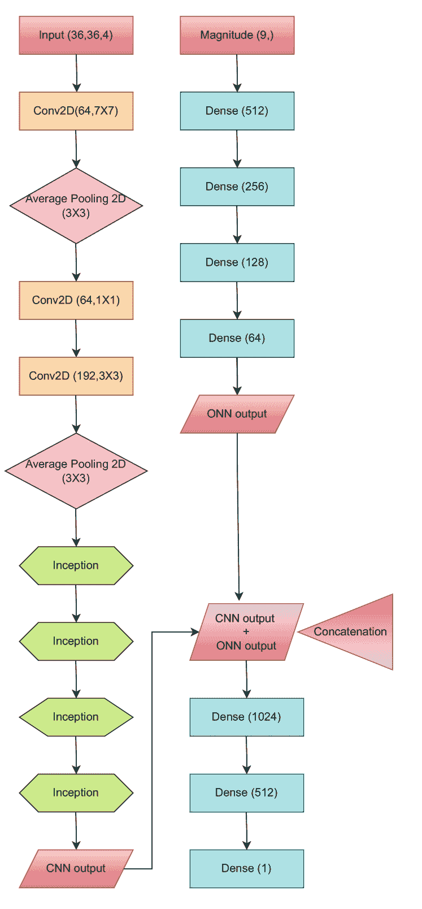
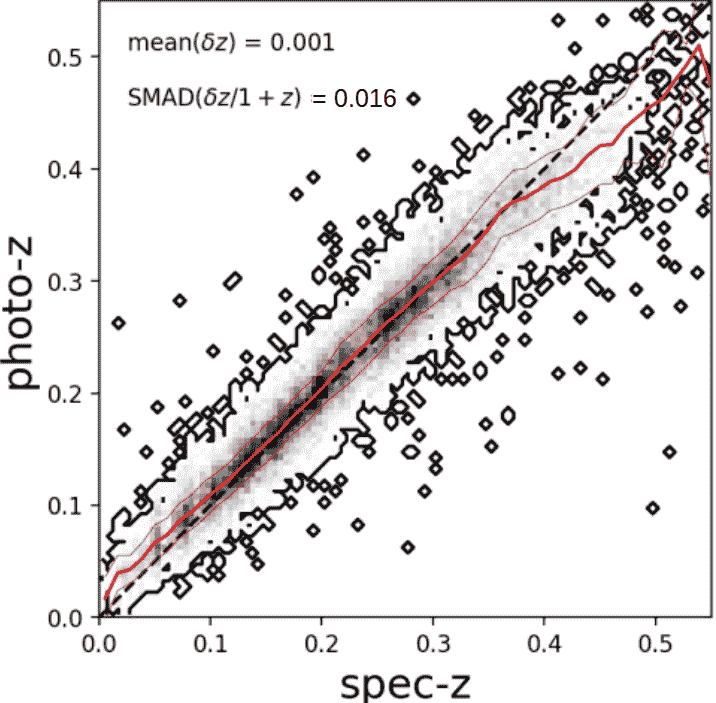
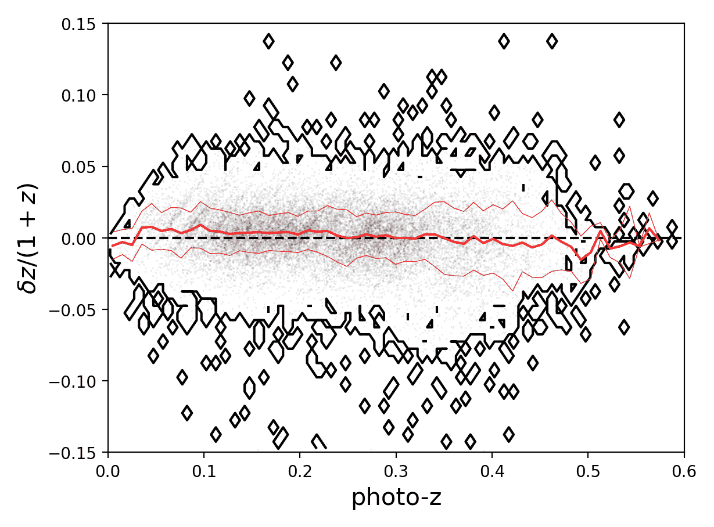

<!--yml

category: 未分类

date: 2024-09-06 19:35:37

-->

# [2312.08043] 基于深度学习的 Kilo-Degree Survey 明亮星系样本的光度红移

> 来源：[`ar5iv.labs.arxiv.org/html/2312.08043`](https://ar5iv.labs.arxiv.org/html/2312.08043)

[cft] [cft] [cft] [cft] cft]理论物理中心，Aleja Lotników 32/46，02-668 华沙，波兰 \headtitle 深度学习光度红移用于 KiDS DR4 明亮星系

# 基于深度学习的 Kilo-Degree Survey 明亮星系样本的光度红移

Anjitha John William    Priyanka Jalan    Maciej Bilicki    Wojciech A. Hellwing 

###### 摘要

在宇宙学分析中，精确的红移测定对于理解宇宙演化仍然至关重要。然而，由于只有一小部分星系具有光谱红移（spec-$z$s），因此挑战在于为更多星系估计红移。为解决这一问题，基于光度的红移（photo-$z$）估计，使用机器学习算法，是一种可行的解决方案。识别了以往方法的局限性后，本研究重点在于在 Kilo-Degree Survey (KiDS) 明亮样本中实施深度学习 (DL) 技术，以实现更准确的 photo-$z$ 估计。通过将我们新的基于 DL 的模型与以前的‘浅层’神经网络进行比较，我们展示了红移准确度的改进。我们的模型给出了平均 photo-$z$ 偏差 $\langle\Delta z\rangle=10^{-3}$ 和散布 $\mathrm{SMAD}(\Delta z)=0.016$，其中 $\Delta z=(z_{\mathrm{phot}}-z_{\mathrm{spec}})/(1+z_{\mathrm{spec}})$。这项研究突显了 DL 在革命性 photo-$z$ 估计中的有前景的角色。

## 1 介绍

红移是宇宙学分析中的基本量之一，用于指示星系距离。其精确测定使得可以绘制宇宙的三维大尺度结构，并促进我们对宇宙演化的理解。实现红移测量的亚百分比准确度仅通过光谱学才能实现。在获得光谱红移（spec-zs）时，我们首先捕捉天体的光谱，然后识别相对于其静止参考系的光谱线偏移。

由于需要昂贵的望远镜时间，spec-$z$s 仅能在少数星系中获得。然而，一种可行的替代方法是通过光度测量来估计红移。这些光度红移（photo-$z$s）可能无法提供与 spec-$z$s 相同水平的红移准确性和精度；然而，在大规模成像调查时代，它们已经被证明是不可或缺的。这些红移估计依赖于观测星系光度与真实红移之间的相关性（例如，Baum，[1957）。该过程聚焦于使用机器学习 (ML) 算法来估计这种相关性。

基于机器学习的光度-$z$估计技术包括监督学习（Wadadekar，2005；Collister & Lahav，2004；Oyaizu 等，2008），无监督学习（Way & Klose，2012），k-最近邻（Graham 等，2018），集成学习和高斯过程（Way & Srivastava，2006；Bonfield 等，2010），混合密度网络（Ansari 等，2021）以及最终的深度神经网络（Hoyle 等，2015；D’Isanto & Polsterer，2018）。在监督机器学习技术中，算法通过对适当标记的数据进行训练，建立观察量与相应标签之间的经验关系。这些方法的主要挑战和限制在于将结果外推到代表性训练集之外。

基于深度学习（DL）的光度-$z$推导在其他监督机器学习技术中是一种有前景的技术（例如 Menou，2019；Dey 等，2022；Li 等，2022；Treyer 等，2024）。在这些框架中，“深度”一词意味着模型通常采用复杂的多层架构。深度学习方法，特别是卷积神经网络（CNNs），由于其在数据（尤其是图像）中识别模式的卓越能力，被选择用于预测光度-$z$。

在这项工作中，我们提出了一种用于 Kilo-Degree Survey（KiDS，de Jong 等，2013）中明亮星系的光度红移估计的深度学习模型，该调查涵盖了大约 1350 平方度的天空。继 Li 等（2022）对早期 KiDS 工作的跟进，我们在流量限制的‘KiDS Bright Sample’中应用了 DL 模型进行光度-$z$估计，该样本涵盖了所有$r<20$ mag 的 KiDS 星系（Bilicki 等，2021）。我们将我们的推导与之前使用公共包 ANNz2（Sadeh 等，2016）中的‘浅层’神经网络获得的 KiDS 明亮样本光度-$z$进行比较。我们的新模型在这些先前结果上有所改进，并为最终的 KiDS 数据发布提供了良好的前景。

## 2 输入数据

本节详细介绍了本研究中使用的数据集。神经网络所需的训练样本为 KiDS-DR4 四波段（u、g、r 和 i）光学星系图像及其 9 波段的光度，与来自银河系及质量组装（GAMA，Driver 等， 2011）调查的真实（光谱）红移标签相对应。

### 2.1 图像与光度测量

KiDS 是由欧洲南方天文台（ESO）在 VLT 巡天望远镜（VST, Capaccioli & Schipani, 2011）上进行的大型光学调查，使用了 OmegaCAM CCD 镶嵌相机，具有 268 百万像素的焦平面。它位于智利的 ESO 帕拉纳尔天文台。VST 是一台基于改进型 Ritchey-Chrétien 设计的高架望远镜。KiDS 在四个不同的宽带（$ugri$）中捕捉了图像，覆盖了 1350 平方度的外银河天空区域。

我们使用了经过天体测量和光度校准的 KiDS 数据发布 4（DR4, Kuijken 等， 2019）¹¹1[`kids.strw.leidenuniv.nl/DR4`](https://kids.strw.leidenuniv.nl/DR4)合成图像，确保了 0.2 角秒的一致像素尺度。我们还纳入了星系的九带幅度数据。这些数据将原始 KiDS 的$ugri$测量与 VIKING（Edge 等， 2013）调查的五个近红外带（$ZYJHK_{s}$）数据相结合。

### 2.2 GAMA 光谱数据

用于训练和测试的真实（光谱）红移数据来源于 GAMA 数据集。该调查覆盖了五个领域，其中四个完全位于 KiDS 的观测范围内，总面积约为 286 平方度。这些数据是通过安装在 3.9 米的英-澳望远镜上的 AAOmega 光纤光谱仪设施获得的（Driver 等， 2011）。GAMA 提供了光谱、红移、质量及其他附加信息。KiDS-DR4 与 G09、G12、G15 和 G23 领域完全重叠。在本研究中，我们使用了来自 GAMA DR4 的 GAMA-II 光谱红移星系目录（Driver 等， 2022）²²2[`www.gama-survey.org/dr4`](http://www.gama-survey.org/dr4)。

我们识别出了在 KiDS 图块中与 GAMA 和 KiDS-bright 样本重叠的星系，基于它们的天空坐标。随后，我们为这些星系创建了切图，每个切图的中心位置为$7.2^{\prime\prime}\times 7.2^{\prime\prime}$。最终的切图目录包含了约 136,000 个赤道场星系，其中约 95,000 个用于模型训练。模型测试是在同时存在于赤道场和 KiDS 亮星样本中的约 20,000 个星系上进行的。

### 2.3 KiDS-DR4 亮星系样本

KiDS-bright 星系样本（Bilicki 等， 2021）是一个基于流量选择的 KiDS 星系集合，且没有伪影等问题。具体来说，它包括了$r_{\mathrm{auto}}<20$ mag 的星系，其中‘auto’指的是通过自动孔径光度法得到的 SExtractor 总流量估计值。

## 3 方法论

卷积神经网络（CNNs），作为人工神经网络（ANNs）的一个子类型，在解决计算机视觉问题如图像检测和分类方面表现出色。CNNs 的操作原理从人类神经系统中汲取灵感，模仿神经元的功能（McCulloch, 1943）。类似于接收输入并传递电化学信号的生物神经元，CNNs 使用人工神经元来处理信息。CNNs 的重要性通过其在图像识别任务中的广泛应用变得显而易见，例如 LeCun 等人所强调的（1998）。CNNs 的适应性和效能使其成为计算机视觉领域的关键技术，为图像相关任务的发展做出了重要贡献。我们的模型包括一个特殊的 CNN 架构，称为 Inception（Szegedy 等人，2015）。我们的方法利用 CNNs 来预测 KiDS-bright 样本的 photo-z，将其视为回归问题。为了标记训练集，我们使用了之前详细描述的光谱 GAMA 数据。

我们的 photo-z ML 模型是一个综合的多输入模型。受到 Henghes 等人（2022）；Li 等人（2022）的启发，我们使用了 4 波段的 KiDS 图像和对应的 9 波段 KiDS+VIKING 光度。我们结合了两种不同的 ML 方案：普通神经网络（ONN）和 CNN（Inception）。我们的模型架构如图 Fig. 3 所示。

在调整模型和评估其性能时，我们主要使用了三种指标：均方误差（MSE）、平均绝对误差（MAE）和 R 平方误差（$R^{2}$）：

|  | $R^{2}=1-\frac{\sum_{i=1}^{n}(z_{i}-\hat{z}_{i})^{2}}{\sum_{i=1}^{n}(z_{i}-\bar{z})^{2}}\;,$ |  | (1) |
| --- | --- | --- | --- |

其中$n$是使用的样本数量，$z_{i}$是预测值，$\hat{z}_{i}$是真实值，$\bar{z}$是真实红移值的平均值。$R^{2}$是一个统计度量，表示模型在回归分析中预测结果的能力。它表示模型解释的方差占总方差的比例。在理想情况下，它的值为 1，我们的综合模型已经显示出能够实现超过$0.92$的$R^{2}$值。

MSE 对于学习异常值有效，而 MAE 则有利于忽略它们。在我们的方法中，我们采用了 Huber（1964）损失函数，它结合了 MSE 和 MAE 的特点，提供了一种平衡的处理异常值的方式，用于模型训练：

|  | $H(z,\hat{z})=\begin{cases}\frac{1}{2}(z-\hat{z})^{2},&amp;\text{如果 }&#124;z-\hat{z}&#124;\leq\delta,\\ \delta(&#124;z-\hat{z}&#124;-\frac{\delta}{2}),&amp;\text{否则}.\end{cases}$ |  | (2) |
| --- | --- | --- | --- |

我们使用的$\delta$值是通过反复试验得到的，为 0.0001。

(a) 组合模型的架构。

(b) 比较光谱和预测的光度红移在测试样本中的表现。粗红色实线表示运行中位数，而细红线包围了由 SMAD 量化的散布。

(c) 光度-$z$作为函数的标准化偏差，红线表示运行中位数和 SMAD，如上图所示。

## 4 结果

光度-$z$性能通过以下统计量进行评估：

+   •

    偏差：

    |  | $\delta z=z_{\mathrm{phot}}-z_{\mathrm{spec}}\,,$ |  | (3) |
    | --- | --- | --- | --- |

+   •

    标准化偏差：

    |  | $\Delta z=\frac{\delta z}{1+z_{\mathrm{spec}}}\,,$ |  | (4) |
    | --- | --- | --- | --- |

+   •

    $\Delta z$的标准偏差，

+   •

    $\Delta z$的标准化中位绝对偏差（SMAD），其中

    |  | $\text{SMAD}(x)=1.4826\times\text{median}\left(\lvert x-\text{median}(x)\rvert\right)\,.$ |  | (5) |
    | --- | --- | --- | --- |

这些针对整体测试样本（基于 GAMA 赤道数据）的统计数据见表 1，其中直接与 Bilicki 等人的先前结果进行比较（2021），这些结果是通过使用 9 波段 KiDS+VIKING 光度的 ANNz2 软件得出的。从早期的 ANNz2 结果到我们的新深度学习模型，在标准偏差和 SMAD 方面都有明显的改进。这表明我们的组合模型对 KiDS 亮星系样本提供了改进的光度-$z$。我们还在图 3 & 3 中可视化了我们的深度学习光度-$z$表现，显示出光度红移本身作为函数的一般无偏和稳定的光度-$z$。

表 1：KiDS-GAMA 赤道光谱样本的光度红移性能统计。

| 方法 | $\langle\delta z\rangle$ | $\langle\Delta z\rangle$ | $\sigma(\Delta z)$ | SMAD$(\Delta z)$ |
| --- | --- | --- | --- | --- |
| ANNz2（Bilicki 等人，2021） | $0.0005$ | $0.0009$ | $0.024$ | $0.018$ |
| 组合模型（本研究） | $0.001$ | $0.001$ | $0.021$ | $0.016$ |

## 5 结论与未来展望

在这些程序中，我们描述了一种新的深度学习模型，用于 KiDS 亮样本的光度红移推导，该模型结合了使用 4 波段 KiDS 图像的 Inception 基础 CNN 和使用 9 波段光度的 ANN。我们看到比 Bilicki 等人（2021）的先前工作有所改进，其中仅使用了光度的 ANN。在即将发表的论文中，我们将介绍更多细节，并将我们的模型应用于整个 KiDS DR4 亮星系样本，这将为该数据集提供新的、改进的光度-$z$。

在不久的将来，我们计划建立一个深度学习模型，该模型将使用来自 KiDS 和 VIKING 的 9 帧成像（与目前仅使用 KiDS $ugri$ 的情况不同）。该模型随后将用于推导最终 KiDS 数据发布 5 中的亮星系样本的照片-$z$s（Wright 等，待发表；Wright, 2023）。

## 6 致谢

本研究由波兰国家科学中心通过 Sonata-Bis 资助项目“宇宙学成像调查的精度与准确性（PACIS）”资助，资助号为 2020/38/E/ST9/00395。我们感谢 Rui Li 和 Nicola Napolitano 的帮助和反馈。

## 参考文献

+   Ansari 等（2021）Ansari, Z., Agnello, A., Gall, C., *A&A* 650, A90 (2021)

+   Baum（1957）Baum, W. A., *AJ* 62, 6 (1957)

+   Bilicki 等（2021）Bilicki, M., 等, *A&A* 653, A82 (2021)

+   Bonfield 等（2010）Bonfield, D. G., 等, *MNRAS* 405, 2, 987 (2010)

+   Capaccioli & Schipani（2011）Capaccioli, M., Schipani, P., *The Messenger* 146, 2 (2011)

+   Collister & Lahav（2004）Collister, A. A., Lahav, O., *PASP* 116, 818, 345 (2004)

+   de Jong 等（2013）de Jong, J. T. A., Verdoes Kleijn, G. A., Kuijken, K. H., Valentijn, E. A., *Experimental Astronomy* 35, 1-2, 25 (2013)

+   Dey 等（2022）Dey, B., 等, *MNRAS* 515, 4, 5285 (2022)

+   D’Isanto & Polsterer（2018）D’Isanto, A., Polsterer, K. L., *A&A* 609, A111 (2018)

+   Driver 等（2011）Driver, S. P., 等, *MNRAS* 413, 2, 971 (2011)

+   Driver 等（2022）Driver, S. P., 等, *MNRAS* 513, 1, 439 (2022)

+   Edge 等（2013）Edge, A., 等, *The Messenger* 154, 32 (2013)

+   Graham 等（2018）Graham, M. L., 等, *AJ* 155, 1, 1 (2018)

+   Henghes 等（2022）Henghes, B., 等, *MNRAS* 512, 2, 1696 (2022)

+   Hoyle 等（2015）Hoyle, B., 等, *MNRAS* 449, 2, 1275 (2015)

+   Huber（1964）Huber, P. J., *Annals of Mathematical Statistics* 35, 492 (1964), 网址 [`api.semanticscholar.org/CorpusID:121252793`](https://api.semanticscholar.org/CorpusID:121252793)

+   Kuijken 等（2019）Kuijken, K., 等, *A&A* 625, A2 (2019)

+   LeCun 等（1998）LeCun, Y., Bottou, L., Bengio, Y., Haffner, P., *Proc. IEEE* 86, 2278 (1998), 网址 [`api.semanticscholar.org/CorpusID:14542261`](https://api.semanticscholar.org/CorpusID:14542261)

+   Li 等（2022）Li, R., 等, *A&A* 666, A85 (2022)

+   McCulloch（1943）McCulloch, *The bulletin of mathematical biophysics* (1943), 网址 [`doi.org/10.1007/BF02478259`](https://doi.org/10.1007/BF02478259)

+   Menou（2019）Menou, K., *MNRAS* 489, 4, 4802 (2019)

+   Oyaizu 等（2008）Oyaizu, H., 等, *ApJ* 689, 2, 709 (2008)

+   Sadeh 等（2016）Sadeh, I., Abdalla, F. B., Lahav, O., *PASP* 128, 968, 104502 (2016)

+   Szegedy 等（2015）Szegedy, C., 等, 2015 IEEE 计算机视觉与模式识别会议（CVPR）, 1–9 (2015)

+   Treyer 等（2024）Treyer, M., 等, *MNRAS* 527, 1, 651 (2024)

+   Wadadekar（2005）Wadadekar, Y., *PASP* 117, 827, 79 (2005)

+   Way & Klose（2012）Way, M. J., Klose, C. D., *PASP* 124, 913, 274 (2012)

+   Way & Srivastava (2006) Way, M. J., Srivastava, A. N., *ApJ* 647, 1, 102 (2006)

+   Wright (2023) Wright, A., 在《欧洲南方天文台广视场成像调查十年回顾》（surveys2023, 5 (2023)）
