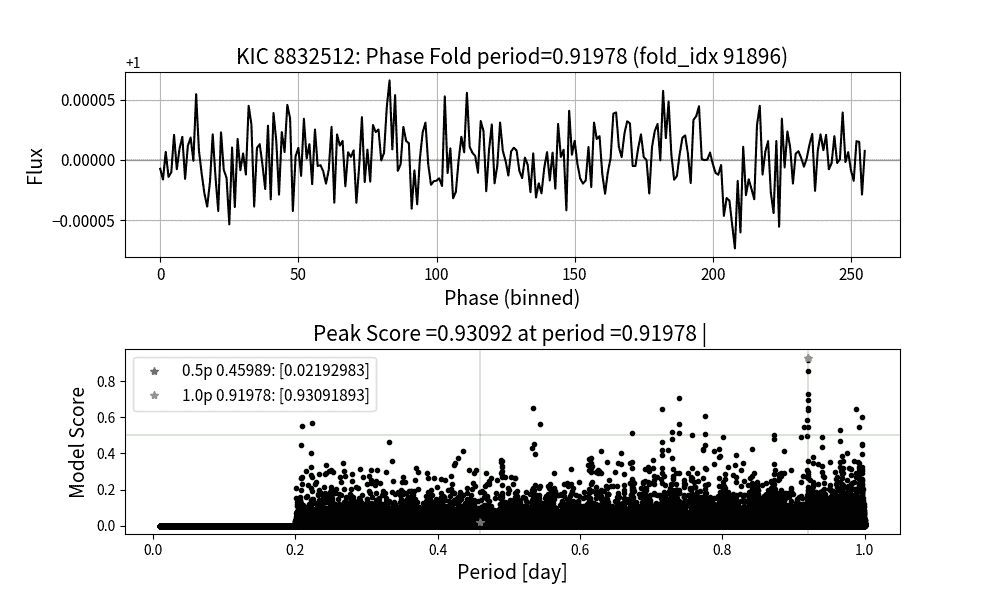

<!--yml

类别: 未分类

日期: 2024-09-06 19:35:33

-->

# [2312.17382] 发现小型超短周期行星绕 KG 矮星运行的研究：使用 GPU 相位折叠和深度学习检测系统进行 Kepler 调查

> 来源：[`ar5iv.labs.arxiv.org/html/2312.17382`](https://ar5iv.labs.arxiv.org/html/2312.17382)

# 发现小型超短周期行星绕 KG 矮星运行的研究：使用 GPU 相位折叠和深度学习检测系统进行 Kepler 调查

凯特琳·王${}^{1,2}\thanks{电子邮件:24kaitlynw@students.harker.org},$ 简·葛${}^{3}\thanks{电子邮件:jge@shao.ac.cn},$ 凯文·威利斯${}^{1},$ 凯文·王${}^{4},$ 尹南·赵⁵

¹科学人才培训中心，美国佛罗里达州盖恩斯维尔，32606

²哈克中学，美国加州圣荷西，500 Saratoga Ave，95129

³上海天文台，中国上海 200030

⁴普林斯顿大学，邮政信箱 430，普林斯顿，新泽西州 08544，美国

⁵日内瓦大学天文学系，瑞士 电子邮件:24kaitlynw@students.harker.org 电子邮件:jge@shao.ac.cn（接受日期 XXX。收到日期 YYY；原稿日期 ZZZ）

###### 摘要

自从 1995 年发现第一颗围绕太阳型恒星 51 Peg 的热木星以来，已经使用各种观测技术确认了 4000 多颗外行星。尽管如此，只有几百颗被探测到的行星具有亚地球半径。这些亚地球的形成过程仍然不清楚，获取更多样本对于研究这一独特群体至关重要。在我们的研究中，我们使用了一种新颖的 GPU 相位折叠算法，并结合卷积神经网络算法，称为 GPFC 方法，对开普勒光度数据进行处理。这种方法显著提高了跨越搜索速度，相较于传统的 Box-fitting 最小二乘法，允许在数小时内使用商业 GPU 卡完成对已知开普勒 KOI 光度数据的全面搜索。迄今为止，我们已经识别出五个有前景的亚地球短周期候选者：K00446.c、K01821.b、K01522.c、K03404.b 和 K04978.b。更详细的分析揭示了以下特征：K00446.c 在 0.645091 天的周期内围绕一颗 K 矮星运行。其半径为 0.461 $R_{\oplus}$，是迄今发现的第二小的 USP。K01821.b 是一颗亚地球，其半径为 0.648$R_{\oplus}$，围绕一颗 G 矮星在 0.91978 天的周期内运行。它是所有确认的围绕 G 矮星运行的 USP 中第二小的。K01522.c 的半径为 0.704 $R_{\oplus}$，在 0.64672 天内绕一颗类似太阳的 G 矮星运行；K03404.b 的半径为$0.738R_{\oplus}$，在 0.68074 天的周期内绕一颗类似太阳的 G 矮星运行；K04978.b 的行星半径为 0.912$R_{\oplus}$，在 0.94197 天内绕一颗 G 矮星运行。我们发现的三个行星，K01821.b、K01522.c 和 K03404.b，都是所有确认的围绕 G 矮星运行的 USP 中最小的行星。这些小型外行星的发现突显了 GPFC 方法在开普勒、TESS 和未来空间过境任务中搜索小型新过境外行星的潜力。

###### 关键词：

算法 – 天文学数据分析 – 深度学习 – 外行星探测 – 超短周期行星 – 小型行星 – 跨越光度测量 – 行星系统形成^†^†出版年份: 2022^†^†页码范围: 使用 GPU 相位折叠和深度学习检测系统在开普勒调查中发现的小型超短周期行星 –40

## 1 引言

与现有的基于太阳系的行星形成理论相反，这些理论未预测出轨道明显狭于水星的行星，超短周期（USP）行星代表了一类迷人的系外行星，其轨道周期少于一天。这些 USP 行星可能为行星系统的早期演化以及星际相互作用的动态，包括潮汐力和大气侵蚀，提供重要的见解。最极端的 USP 行星，例如 KOI1843.03（K2-137b），其轨道周期仅为 4 小时，正处于潮汐破坏的边缘（Rappaport et al., 2013; Smith et al., 2017）。这种行星在约 0.5%的类似太阳的恒星中被发现，USP 行星通常具有小于 2$R_{\oplus}$的半径，或在超热木星的情况下，大于 10$R_{\oplus}$（Sanchis-Ojeda et al., 2014）。如何理解这些行星如何获得如此短的轨道周期仍然是该领域中最长期未解决的问题之一。

到目前为止，已提出三种主要理论来解释超短周期行星的形成：原位形成、由恒星潮汐驱动的迁移以及与多体相互作用耦合的潮汐迁移（Adams et al., 2020）。原位形成理论认为这些行星形成在其目前轨道附近，由于这些近距离轨道将经历极端温度，这一理论被认为不太可信（Boss, 1998）。此外，考虑到宿主星在主序星之前的阶段半径比现在大得多（Palla & Stahl, 1991; D’Antona & Mazzitelli, 1994），较近的 USP 行星可能已经被恒星吞没。与此同时，潮汐迁移在这些行星形成中的作用仍然是一个活跃的研究领域（Dawson & Johnson, 2018）。由于 USP 行星通常与轨道更长的外部伴随行星一同被观测到，因此有一种假设认为 USP 的起源涉及兄弟行星之间的相互作用，这种相互作用将 USP 重新定位到当前更靠近其宿主恒星的位置，可能是在恒星本身之前占据的轨道上。

无论其起源如何，一旦行星稳定在短周期轨道上，宿主星的影响可能会在几十亿年内将其移除。对于富含挥发物的行星来说，其经历的高大气温度和强烈的恒星辐射可以导致大气层的丧失（Owen & Kollmeier, 2019）。此外，强烈的潮汐力可以导致轨道衰减，将这些行星推向不稳定的洛希叶流状态。这种不稳定可能会导致其大气在仅仅几次轨道运行后完全破坏（Jia & Spruit, 2016）。

研究神秘的 USP 行星的主要限制在于迄今为止发现的 USP 行星稀少。目前，仅有 43 个 USP 行星由开普勒调查确认，还有 127 个在 NASA 确认的行星档案中。评估 USP 的相对丰度，包括轨道周期、行星质量、宿主星的光谱类型以及任何相关的多行星系统的配置，对于检验理论模型至关重要。然而，已知 USP 样本量小意味着当前的出现率估计存在较大的误差范围。因此，扩展 USP 数据集对于深入理解这一组行星是非常必要的。

在本文中，我们展示了五个短周期亚地球候选行星的发现和详细分析——K00446.c、K01821.b、K01522.c、K03404.b 和 K04978.b。特别是 K00446.c，其围绕一颗 K 矮星公转周期为 0.645091 天，是迄今为止发现的第二小的 USP 行星，半径为 0.461 $R_{\oplus}$。在这些发现中，K01821.b、K01522.c 和 K03404.b 在开普勒数据集中作为绕 G 矮星公转的最小确认 USP 行星而脱颖而出。此外，K01821.b 的半径为 0.648 $R_{\oplus}$，是根据 NASA 系外行星档案确认的绕 G 矮星公转的行星中第二小的。

我们的论文组织如下：第二部分简要介绍了 GPU（图形处理单元）相位折叠和卷积神经网络（GPFC）过境搜索方法，这些方法导致了这些发现。第三部分详细阐述了我们系统的行星发现方法，包括开普勒数据的预处理、相位折叠和过境检测。在第四部分中，我们介绍了我们的候选行星，描述了用于验证和参数确定的筛选和拟合过程。第五部分深入讨论了这些候选行星的特征。最后，第六部分探讨了未来的研究方向和后续观察的潜在机会。

## 2 GPFC 方法概述

GPFC 方法，如 Wang 等人所述（2023）并应用于开普勒调查数据集，已促进了本文中介绍的新超短周期行星的发现。GPFC 结合了新颖的图形处理单元（GPU）相位折叠算法和卷积神经网络（CNN）以增强过境检测。GPFC 的一个关键优势是其通过直接处理来自开普勒调查的原始光变曲线来检测低信噪比（SNR）行星信号的能力，而不依赖于 TCE 目录。同时，GPFC 的运行速度比主流的箱形最小二乘（BLS）方法快三个数量级，同时也提供了更高的精度。它通过在相同的假阳性率下实现更高的真正阳性率，并在相同的召回率下提供更高的精度，从而优于 BLS。此外，在对开普勒光变曲线的盲搜索中，GPFC 成功恢复了 100% 的已知超短周期行星。

GPFC 方法包含四个主要阶段，专门设计用于从时间域调查中识别过境系外行星候选者。最初，原始光变曲线经过预处理，包括去除异常值和纠正长期的恒星变异性。随后，这些光变曲线在不同的试验周期下进行相位折叠，这些试验周期均匀分布在超短周期搜索范围（0.2,1] 天内，利用 GPU 相位折叠技术。结果生成的折叠曲线随后被标准化，并输入到 CNN 模块中。该模块评估是否在任何试验周期内存在潜在的系外行星过境。CNN 模块获得高分的光变曲线将进一步在筛选过程中进行审查。

我们使用两个来自开普勒目标目录（KOI）的开普勒天体演示了 GPFC 方法的有效性。首先是 KIC12405333：这是一颗拥有 0.76486 天轨道周期的超短周期（USP）行星的恒星。如图 1 所示，我们的方法生成的折叠光变曲线与 KOI 目录中记录的过境周期相符，CNN 得分峰值为 0.99999964。折叠光变曲线显著展示了由过境引起的光变波动。相反，KIC12068975 作为一个例子，没有已知的行星过境在（0.2,1] 天的范围内。通过屏蔽其已识别的过境信号，我们确保在搜索范围内不会有谐波干扰。图 2 展示了结果：仅有的 CNN 得分为 0.27934，并且在折叠周期的光变曲线中没有任何明显的过境信号。

(a)

图 1：Kepler-1409b，如 Kepler 目录所列，以 0.76486 天的周期绕其宿主恒星 KID 12405333 运行。GPFC 方法已准确检测到这个过境周期。在上面面板中，可以在此识别出的周期 p=0.76486 天的折叠光曲线中清晰看到过境信号。同时，底部面板显示了在相同周期下的 CNN 得分峰值 0.99999964，以及在其谐波半周期 p=0.38243 的另一个显著得分 0.995469。

图 2：KIC12068975 的折叠光曲线示意图，这里作为一个例子，在我们的搜索范围 (0.2,1] 天内未检测到任何过境。记录到的最显著 CNN 得分为 0.27934，在周期 0.76188 天，GPFC 系统将其分类为非过境。

## 3 过境搜索过程

在本节中，我们详细介绍了我们的 GPFC 系统在 Kepler 调查数据集中发现超短周期（USP）系外行星所采用的方法。

### 3.1 Kepler 数据集选择

最初，从 Mikulski 太空望远镜档案馆获取了 Q1–Q17 Kepler 数据发布 25（DR25）的光曲线。这些光曲线由 Kepler 科学处理管道（Jenkins 等，2010）生成，包含在 1766 秒间隔内的集成通量测量，跨度约四年，涵盖 30,000 到 70,000 个观测点。此外，还下载了截至 2023 年 6 月记录在 NASA 系外行星档案馆中的 Kepler 感兴趣对象（KOIs）数据集。该档案包含 9564 个已分类的 KOIs，包括 2350 个确认的行星，2366 个候选者和 4848 个假阳性。为了我们的分析，我们使用了 KOI 目录中的过境参数，如周期、观测点和持续时间，以协助光曲线处理和过境验证。

我们利用 KOI 目录来筛选光曲线数据集，故意排除了在 Kepler 分类字段中被标记为‘假阳性’或‘候选者’的行星宿主恒星。我们仅关注所有行星均被分类为‘确认’或‘候选者’的恒星。这一预筛选策略确保我们的数据集不受通常由食双星造成的二次日食的影响。这些日食未在 KOI 目录中记录，因此无法可靠地屏蔽，从而可能污染我们的分析。通过筛选这些恒星，我们显著降低了研究中假阳性检测的可能性。

### 3.2 数据预处理

对于每条检索到的光曲线，我们执行了类似于 (Vanderburg & Johnson, 2014; Shallue & Vanderburg, 2018) 中概述的预处理程序。最初，我们通过迭代拟合 b-spline 来平整光曲线，遮蔽所有已确认的过渡。在此过程中，$3\sigma$ 异常值被逐步丢弃。随后，光曲线被最佳拟合样条除以。然后，我们通过排除 KOI 目录中列出的所有已知行星过渡，生成了“无过渡”光曲线，为潜在的新行星发现做好准备。此无过渡曲线作为输入供我们的快速 GPU 阶段折叠模块使用。

### 3.3 快速 GPU 阶段折叠

我们的快速 GPU 阶段折叠模块接受无过渡光曲线并对其进行阶段折叠。由于缺乏关于潜在过渡周期的先验知识，我们在周期搜索范围内采样了 100,000 个试验周期。对于 USP 行星检测，我们的研究集中在 USP 周期范围 (0.2, 1] 天，尽管该方法可以适应不同的范围。使用 GPU 阶段折叠算法，无过渡曲线被折叠并为每个 100,000 个周期进行分箱，得到 100,000 个折叠结果，每个结果在分箱后长度为 256。折叠的高精度对于搜索的成功至关重要，因为浅过渡中的微小信号可能因时间偏差而被轻易掩盖。GPU 的网格系统使得 100,000 个试验周期可以同时折叠，折叠单条曲线大约需要 5 秒，数据点约为 7000 个。

### 3.4 噪声标准化

在从 GPU Phase Folding 模块获取到 100,000 个折叠结果后，我们对其进行了噪声标准化，以统一所有折叠光曲线的标准差，为卷积神经网络模块做准备。

### 3.5 卷积神经网络

随后，我们将 100,000 个折叠结果输入到我们的 CNN 模块，该模块已特别针对识别 Kepler 光曲线中典型的 USP 过渡信号进行了微调。我们的训练数据包括两百万条合成光曲线：一百万条带有积极的 USP 过渡信号，另一百万条则没有，基于 Kepler 数据集中的真实 USP 参数分布。训练后，表现最佳的模型达到了 94.6% 的准确率。我们使用了 Adam 优化算法 (Kingma & Ba, 2014) 来最小化交叉熵误差函数，学习率设置为 $10^{-}6$，批量大小为 32，进行了 90 个周期。考虑到 CNN 可能还会捕捉到与过渡周期谐波相关的较弱峰值，我们将 CNN 得分与谐波检查结合起来，以确认过渡事件的存在。

## 4 结果

完成对 CNN 模块标记的高置信度过境事件的验证过程后，我们识别出五个稳健的候选对象，如表 1 所列。选择这些候选对象的依据有两个关键标准：首先，它们每个都获得了 CNN 模块的高分，超过了定义的 0.5 阈值。其次，通过严格的审查过程验证了这些候选对象作为真实过境外行星的潜力，具体细节将在后续部分中详细说明。

表 1：候选列表

| KOI 名称 | 主星 KIC | 周期（天） | CNN 分数 | SNR | FAP（%） |
| --- | --- | --- | --- | --- | --- |
| K01821.b | 8832512 | 0.91978 | 0.93092 | 7.3 | 0.118 |
| K03404.b | 8409295 | 0.68074 | 0.55994 | 6.2 | 0.463 |
| K00446.c | 4633570 | 0.64509 | 0.89182 | 6.5 | 0.700 |
| K01522.c | 12266636 | 0.64672 | 0.96498 | 6.3 | 0.792 |
| K04978.b | 3428127 | 0.94197 | 0.83083 | 6.9 | 0.922 |

图 3：候选对象 K00446.c 的折叠光曲线和 CNN 分数，宿主星 KIC4633570。在 USP 周期范围(0.2,1]天内，检测到周期 p=0.6451 的过境，CNN 分数为 0.89182，SNR 为 6.5。

图 4：候选对象 K01821.b 的折叠光曲线和 CNN 分数，宿主星 KIC8832512。在 USP 周期范围(0.2,1]天内，检测到周期 p=0.9198 的过境，CNN 分数为 0.93092，SNR 为 7.3。

图 5：候选对象 K01522.c 的折叠光曲线和 CNN 分数，宿主星 KIC12266636。在 USP 周期范围(0.2,1]天内，检测到周期 p=0.64672 的过境，CNN 分数为 0.96498，SNR 为 6.3。

图 6：候选对象 K03404.b 的折叠光曲线和 CNN 分数，宿主星 KIC8409295。在 USP 周期范围(0.2,1]天内，检测到周期 p=0.0.68074 的过境，CNN 分数为 0.55994，SNR 为 6.2。

图 7：候选对象 K04978.b 的折叠光曲线和 CNN 分数，宿主星 KIC3428127。在 USP 周期范围(0.2,1]天内，检测到周期 p=0.94197 的过境，CNN 分数为 0.83083，SNR 为 6.9。

### 4.1 候选对象审查过程

在本研究中，我们对潜在的系外行星候选者进行了包括以下十一项测试的全面审查，具体如下。这些测试汇编自 [开普勒数据验证文档](https://exoplanetarchive.ipac.caltech.edu/docs/KeplerDV.html)（NASA 系外行星档案馆）、相关的先前文献（Shallue & Vanderburg，2018；Shahaf 等，2022；Adams 等，2021），以及我们自己的方法。作为示例，我们展示了候选星 K01821.b 的审查结果，同时在附录中提供所有其他候选者的结果。

1\. 邻近星污染谐波检查 我们首先调查了过境信号是否可能源自邻近星的污染（Shallue & Vanderburg，2018）。通过从开普勒社区跟进计划 (CFOP) 中提取目标像素文件 (TPF) 图像，我们验证了没有任何宿主星——KIC4633570、KIC8832512、KIC12266636、KIC8409295 或 KIC3428127——在 20 弧秒内存在可能引起关注的邻近星。图 8 展示了 K01821.b 的季节性 TPF、FFI 和 UKIRT-J 图。

(a)

(b)

图 8：候选星 K01821.b 的季节性目标像素文件 (TPF)、全场图像 (FFI) 和 UKIRT-J 图。上面的四个季节性 TPF 显示了邻近星的位置和视星等。位于突出红色孔径内的星体显示出显著较高的视星等，表示亮度较低。这确保了它们不会对检测到的过境信号产生干扰。下面的 FFI 和 UKIRT-J 图像允许对更广阔的视场进行视觉检查，没有显示出任何污染。

2\. 次级日食检查 我们检查了相位折叠的光曲线以寻找次级日食的证据，这可能表明过境信号来自于一个食双星而不是行星（Shallue & Vanderburg，2018）。在遮蔽已知的 TCE 并基于轨道周期进行相位折叠后，使用 BLS 进行了主要日食的搜索。没有发现任何宿主星——KIC4633570、KIC8832512、KIC12266636、KIC8409295 或 KIC3428127——的日食迹象。

3\. BLS 峰值检查 我们接着使用 BLS 期望图对光曲线进行了 BLS 峰值的检查。对于所有相关的宿主星——KIC4633570、KIC8832512、KIC12266636、KIC8409295 和 KIC3428127——一个与其识别出的过境周期对齐的集中搜索范围显示，过境在 BLS 期望图中表现为较小的峰值。然而，这些峰值不够显著，未能被 BLS 标记。

4\. 已知的兄弟行星过境谐波检查。我们随后探讨了检测到的过境周期是否可能是其他兄弟行星存在于宿主星系统中的谐波残余的结果——这些谐波可能是实际周期的整数倍或分数倍。所有考虑中的候选对象都表现出与任何潜在谐波不同的过境周期。图 9 展示了通过 BLS 方法识别的峰值，与已知的 K01821.b 过境谐波检查对比。

图 9: 该图展示了候选 K01821.b 的 BLS 峰值检查和已知兄弟行星过境谐波检查。宿主星已知轨道行星的轨道周期谐波用绿色表示。与变星自转周期相关的谐波用蓝色标示。与此同时，新候选者的轨道周期谐波用红色标记。这种可视化确认了新候选者的轨道周期与已知行星的周期或恒星的自转周期不重合。

5\. 偶数-奇数过境检查。随后，我们通过仅对偶数编号过境或奇数编号过境进行折叠，进行偶数-奇数过境检查（Shallue & Vanderburg，2018）。我们的验证发现，每个候选对象的过境信号在奇数和偶数分组中都均匀出现。此外，过境深度、$t0$和其轮廓在整个过程中保持一致。这一诊断有助于排除由仪器异常引起的潜在假阳性。图 10 展示了候选 K01821.b 的偶数-奇数过境检查。

图 10: K01821.b 候选者的偶数-奇数过境检查。该测试验证了新候选者的过境信号在光曲线时间序列的两个子集之间保持一致。

6\. 左右半段过境检查 通过左右过境检查，我们确认在开普勒任务的整个期间内，所有候选者的过境信号均保持一致。这项评估对于识别和消除“列异常”干扰至关重要——这是指位于与主要目标相同 CCD 列上的星星，其光度变化可能在读出过程中引入不必要的信号（Coughlin et al., 2016）。我们的研究未发现任何候选数据中有列异常的痕迹。图 11 展示了 K01821.b 的这一左右过境评估。

图 11：候选者 K01821.b 的左右半段过境检查。此测试验证了新候选者的过境信号在光变曲线时间序列的两个子集之间保持一致。

7\. 季度旋转检查 在主要任务期间，开普勒卫星每约 90 天进行一次周期性再校准，以确保其太阳能板始终朝向太阳。这要求在不同的 CCD 阵列部分重新定位星星（Shallue & Vanderburg, 2018）。有时，污染信号可能在 CCD 的某些位置比其他位置更强烈地引入光变曲线，导致每个 CCD 上的过境信号强度和深度出现差异。我们检查了过境信号是否会因为观测目标星星的 CCD 模块不同而发生显著变化。图 12 说明了候选者 K01821.b 的这一季度一致性检查。

图 12：候选者 K01821.b 的季度旋转检查。此测试确认了不同季度间过境信号的一致性。

8\. 自助验证 我们进行了类似于 Shahaf 等人（2022）使用的自助验证。对于每个候选的原始光曲线，我们在其连续的季度之间注入了随机时间间隔，这些间隔的范围从 0 到特定于候选者的检测过渡周期。在这次时间扰动后，我们将时间移动的光曲线输入到基于 GPU 的折叠和 CNN 处理流程中，以找出最突出的周期图峰值，并随后计算其 SNR。对于每个目标，这一过程总共重复了十次，使我们能够确定十次迭代中的平均 SNR 及其对应的标准差。在设定我们的验证标准时，我们要求检测到的过渡信号的 SNR 应大于十次自助测试标准差的四倍。所有的候选者都通过了这一自助验证标准。

9\. 反转验证 为了进一步区分过渡信号与非行星的正弦波或类似周期信号，我们通过反转光度值围绕其标称基线，从而将光曲线的谷值转化为峰值，反之亦然（Adams 等人，2021）。鉴于我们的预处理步骤确保标准化光曲线的平均光度值等于 1，反转过程会生成一个新光曲线，其光度值等于 2 减去原始值。然后，反转后的光曲线通过我们的 GPU 折叠和 CNN 流程进行处理，以识别潜在的过渡信号。最终，我们的候选者的反转光曲线中没有显示出接近其检测到的过渡周期的信号，因此通过了反转测试。

10\. 外部孔径检查 为了确保过渡信号不是由于散射背景光的污染，我们进行了外部孔径测试（Shallue & Vanderburg，2018）。对于每个正在考虑的候选体，我们构建了从最佳开普勒孔径外部像素导出的光曲线。这些光曲线随后基于其各自的检测过渡周期进行折叠。如果来自背景的过渡信号明显比来自目标像素的信号更为显著，这将表明可能存在污染。我们的测试结果显示没有显著信号，这证明了过渡信号的来源在目标星或其附近。

11\. 虚警概率检查

虚警概率是在审核光曲线数据中发现的过渡系外行星候选体时的一个宝贵工具。实际上，它提供了一个类似过渡的信号由噪声相关性产生的概率。这一指标已经存在几十年（SOURCE），在文献中可以找到许多研究和实施案例。

过境最小二乘 (TLS) 算法 (Hippke & Heller, 2019) 在我们的研究方法中起着关键作用，是光变曲线数据评估的核心。输入光变曲线后，TLS 生成一系列信号检测效率 (SDE) 分数，每个分数对应一个不同的轨道周期。SDE 在 FAP 计算中的作用有两个方面：它们既是噪声归一化的，也是确定性的。这一点非常重要，因为光变曲线中的信噪比 (SNR) 可能会有所不同。噪声归一化确保了 SDE 度量在不同 SNR 水平下的一致性，从而有助于开发一个通用的 FAP 关系模型。此外，SDE 的确定性特征是直接从实测光变曲线数据中得出的，允许在不同光变曲线中对特定的过境信号保持一致的 SDE 值，假设 SNR 相似。通过精确配置 TLS 设置，可以实现这种一致性，从而增强 SDE 作为我们分析中的稳健度量的可靠性。

FAP 统计量的构建始于选择四个 KOI，从中去除了所有已知的过境信号，然后对光变曲线进行了去趋势处理。利用这些去趋势的基线，我们为每个基线生成了 250 个 bootstrap 复制品，最终得到了 1000 个合成光变曲线的数据集。随后，使用 TLS 算法对这些光变曲线进行了分析，提供了指定轨道周期下的 SDE 分数。我们的搜索集中在 USP 行星上，因此 TLS 处理的轨道周期范围被限制在 (0.2, 1] 天。每条光变曲线中提取的最大 SDE 值形成了一个 1000 个 SDE 的数据集。基于此，我们构建了累积分布函数 (CDF)，描绘了 SDE 与 1-FAP 之间的关系。进一步分析包括将这些 SDE 的概率分布函数 (PDF) 拟合为对数正态分布，这得到了出色的拟合 (提供拟合度量)。这个 PDF 的对数正态模型随后被转换为 CDF 模型，建立了 SDE 与 1-FAP 之间平滑且连续的关联。最后，我们通过从 1 中减去 1-FAP 百分比来计算 FAP 值，从而得出了我们研究的最终 SDE-FAP 关系模型。

解决了 SDE-FAP 模型后，我们可以通过将去趋势的光变曲线输入 TLS 来获得候选星体的 FAP 值，从而得到候选过境信号的 SDE，然后使用 SDE-FAP 模型来获得 FAP 估计值。

为了验证 SDE-FAP 模型，我们使用了纯白噪声的合成光变曲线来生成 SDE-FAP 关系。为此，我们生成了 1000 条纯白噪声的光变曲线。这些光变曲线的 SNR 是通过从表示实际开普勒光变曲线中观察到的 SNR 范围的均匀分布中随机抽取的值来设置的。然后，这些光变曲线被输入到 GTLS 算法中，提供了 SDE-周期谱。GTLS 软件被配置为只评估周期范围为(0.2, 1.0]天。每条光变曲线的最大 SDE 被用来生成 PDF，并对其进行了对数正态模型拟合。

在 SDE-FAP 关系模型的最终验证步骤中，我们使用了候选对象的光变曲线来生成新的 SDE-FAP 模型。这一步骤的目的是确保模型对这些目标仍然有效，这表明我们找到的候选过渡信号很可能不是由红噪声产生的。这个测试程序与我们用来构建原始 SDE-FAP 模型的程序相同。也就是说，对于每条光变曲线，我们移除了所有已知的过渡信号，然后去趋势化。接着，每条光变曲线被引导生成 250 条新的光变曲线。使用 GTLS 后，我们对 SDE 最大值的 PDF 进行了对数正态拟合，从而为每个候选对象得出了 SDE-FAP 关系模型。

在分析开普勒数据时，我们观察到确认的和候选的超短周期行星（USP）始终具有小于 $1\%$ 的 FAP。根据这一标准，我们只保留那些检测到的过渡 FAP 低于此阈值的候选对象。与我们候选对象相关的 FAP 值被系统地列在表格 1 中。

通过上述初步的十次筛选测试，我们将候选对象从大约 40 个缩减到 12 个。经过假警报概率（FAP）检查后，这个数字进一步精简，最终确定了 5 个候选对象。

### 4.2 候选对象拟合过程

接下来，我们使用 Mandel & Agol (2002)模型拟合了候选者的原始开普勒光曲线，以确定候选者的行星和轨道参数。参数空间通过 Markov 链蒙特卡罗（MCMC）算法（Goodman & Weare, 2010）进行了探索。通过迭代 MCMC 模拟，确定了候选者的轨道周期、过境时间、轨道倾角、缩放半长轴、行星/宿主星半径比以及根据(Kipping, 2013)的参数的二次边缘暗化系数。对两个边缘暗化系数施加了高斯先验，这些系数以(Claret, A. & Bloemen, S., 2011)为宿主星预测的值为中心，并基于最大似然估计（MLE）测试了 MCMC 链的收敛性。候选者 KIC8832512 的 MCMC 拟合结果如图 13 所示，角落图如图 14 所示。附录部分包含了其他所有候选者的 MCMC 图。

图 13：候选者 K01821.b 的 MCMC 最佳拟合图。光通量数据与过境周期折叠，然后分成 1.9 分钟的间隔（显示为灰点），以及 2 分钟的间隔（显示为红线）。绿色曲线表示最佳拟合过境模型，绿色阴影区域表示模型的不确定性。

图 14：候选者 K01821.b 的 MCMC 拟合角落图。图中标出了恒星密度（$rho$）、中心过境时间（$tc$）、轨道周期（$p$）、冲击参数（$b$）、半径比的平方（$k2$）、轨道近日点和偏心率参数（$secw$和$sesw$）、边缘暗化系数（$q1$和$q2$），以及数据中白噪声水平的以 10 为底的对数（$log10(rms)$）。红线表示最可能的值，而虚线反映了一σ范围。

表 2 展示了我们候选者的 MCMC 参数。

表 2：我们候选星体的恒星和行星参数。表中列出了恒星和行星的轨道参数，包括轨道周期、过境时间、半长轴、轨道倾角、半径和半径比。K00446.c 其半径为 0.461$R_{\oplus}$，围绕 KIC4633570（光谱类型 K）运行，周期为 0.645091 天；K01821.b 其半径为 0.648$R_{\oplus}$，围绕 KIC8832512（光谱类型 G）运行，周期为 0.91978 天；K01522.c 其半径为 0.704 $R_{\oplus}$，围绕 KIC12266636（光谱类型 G）运行，周期为 0.68074 天；K03404.b 其半径为 0.738$R_{\oplus}$，围绕 KIC8409295（光谱类型 G）运行，周期为 0.68074 天；K04978.b 其半径为 0.912$R_{\oplus}$，围绕 KIC3428127（光谱类型 G）运行，周期为 0.94197 天。

| 恒星参数 | KIC4633570 | KIC8832512 | KIC12266636 | KIC8409295 | KIC3428127 |
| --- | --- | --- | --- | --- | --- |
| 有效温度 [K] (Gaia) | ${4895.97}$ [K] | ${5169.47}$ [G] | ${5456.75}$ [G] | ${5565.53}$ [G] | ${5050.28}$ [G] |
| 质量 [$M_{\odot}$] | ${0.656}_{{\>\scriptscriptstyle-{0.049}}}^{{\>\scriptscriptstyle+{0.073}}}$ | ${0.821}_{{\>\scriptscriptstyle-{0.065}}}^{{\>\scriptscriptstyle+{0.12}}}$ | ${0.974}_{{\>\scriptscriptstyle-{0.104}}}^{{\>\scriptscriptstyle+{0.127}}}$ | ${0.977}_{{\>\scriptscriptstyle-{0.062}}}^{{\>\scriptscriptstyle+{0.05}}}$ | ${0.859}_{{\>\scriptscriptstyle-{0.065}}}^{{\>\scriptscriptstyle+{0.126}}}$ |
| 半径 [$R_{\odot}$] | ${0.668}_{{\>\scriptscriptstyle-{0.059}}}^{{\>\scriptscriptstyle+{0.054}}}$ | ${0.928}_{{\>\scriptscriptstyle-{0.147}}}^{{\>\scriptscriptstyle+{0.239}}}$ | ${1.022}_{{\>\scriptscriptstyle-{0.155}}}^{{\>\scriptscriptstyle+{0.288}}}$ | ${0.957}_{{\>\scriptscriptstyle-{0.066}}}^{{\>\scriptscriptstyle+{0.132}}}$ | ${0.966}_{{\>\scriptscriptstyle-{0.133}}}^{{\>\scriptscriptstyle+{0.385}}}$ |
| 派生行星参数 | K00446.c | K01821.b | K01522.c | K03404.b | K04978.b (-) |
| 过境时间 [BKJD] | ${0.05990}_{{\>\scriptscriptstyle-{0.001}}}^{{\>\scriptscriptstyle+{0.001}}}$ | ${-0.10010}_{{\>\scriptscriptstyle-{0.001}}}^{{\>\scriptscriptstyle+{0.001}}}$ | ${0.20}_{{\>\scriptscriptstyle-{0.001}}}^{{\>\scriptscriptstyle+{0.001}}}$ | ${-0.05980}_{{\>\scriptscriptstyle-{0.001}}}^{{\>\scriptscriptstyle+{0.001}}}$ | ${-0.0999}_{{\>\scriptscriptstyle-{0.0009}}}^{{\>\scriptscriptstyle+{0.0009}}}$ |
| 周期 [天] | ${0.6450840}_{{\>\scriptscriptstyle-{2e-06}}}^{{\>\scriptscriptstyle+{2e-06}}}$ | ${0.9197860}_{{\>\scriptscriptstyle-{3e-06}}}^{{\>\scriptscriptstyle+{3e-06}}}$ | ${0.6467170}_{{\>\scriptscriptstyle-{2e-06}}}^{{\>\scriptscriptstyle+{2e-06}}}$ | ${0.6807500}_{{\>\scriptscriptstyle-{1e-06}}}^{{\>\scriptscriptstyle+{1e-06}}}$ | ${0.9419660}_{{\>\scriptscriptstyle-{2e-06}}}^{{\>\scriptscriptstyle+{2e-06}}}$ |
| 半长轴[$R_{\odot}$] | ${4.2}_{{\>\scriptscriptstyle-{0.4}}}^{{\>\scriptscriptstyle+{0.4}}}$ | ${4.5}_{{\>\scriptscriptstyle-{0.6}}}^{{\>\scriptscriptstyle+{0.6}}}$ | ${3.1}_{{\>\scriptscriptstyle-{0.6}}}^{{\>\scriptscriptstyle+{0.6}}}$ | ${3.8}_{{\>\scriptscriptstyle-{0.5}}}^{{\>\scriptscriptstyle+{0.5}}}$ | ${4.6}_{{\>\scriptscriptstyle-{0.6}}}^{{\>\scriptscriptstyle+{0.6}}}$ |
| 倾斜[rad] | ${1.39}_{{\>\scriptscriptstyle-{0.04}}}^{{\>\scriptscriptstyle+{0.04}}}$ | ${1.39}_{{\>\scriptscriptstyle-{0.05}}}^{{\>\scriptscriptstyle+{0.05}}}$ | ${1.27}_{{\>\scriptscriptstyle-{0.09}}}^{{\>\scriptscriptstyle+{0.09}}}$ | ${1.33}_{{\>\scriptscriptstyle-{0.05}}}^{{\>\scriptscriptstyle+{0.05}}}$ | ${1.37}_{{\>\scriptscriptstyle-{0.04}}}^{{\>\scriptscriptstyle+{0.04}}}$ |
| 半径[$R_{\oplus}$] | ${0.461}_{{\>\scriptscriptstyle-{0.006}}}^{{\>\scriptscriptstyle+{0.006}}}$ | ${0.648}_{{\>\scriptscriptstyle-{0.008}}}^{{\>\scriptscriptstyle+{0.008}}}$ | ${0.704}_{{\>\scriptscriptstyle-{0.009}}}^{{\>\scriptscriptstyle+{0.009}}}$ | ${0.738}_{{\>\scriptscriptstyle-{0.007}}}^{{\>\scriptscriptstyle+{0.007}}}$ | ${0.912}_{{\>\scriptscriptstyle-{0.006}}}^{{\>\scriptscriptstyle+{0.006}}}$ |

通过 MCMC 拟合，我们确定了候选行星的几个特征。

K00446.c 的半径约为 0.461 $R_{\oplus}$，与地球参考点的倾斜角为 $90.06^{\circ}$。它的宿主 KIC4633570 是一颗 K 型主序星，质量为 0.656 $M_{\odot}$，大小为 0.668 $R_{\odot}$。这一发现使 KIC4633570 成为一个三行星系统。目前，该系统中已确认的两个行星为 Kepler-158b（半径：2.27 $R_{\oplus}$，轨道周期：16.709206 天）和 Kepler-158c（半径：1.97 $R_{\oplus}$，轨道周期：28.55158 天）。Kepler-158d 是系统中最小且最靠近恒星的行星，其短周期为 0.645091 天。

K01821.b 的半径为 0.648 $R_{\oplus}$，与地球参考点的倾斜角为 $89.86^{\circ}$。其宿主 KIC8832512 是一颗 G 型主序星，质量为 0.821 $M_{\odot}$，大小为 0.928 $R_{\odot}$。该行星的加入使 KIC8832512 成为一个双行星系统，伴随一个轨道周期为 9.97682 天的已确认行星。

K01522.c 的半径为 0.704 $R_{\oplus}$，与地球参考点的倾斜角为 $89.38^{\circ}$。它围绕 KIC12266636 运行，这是一颗类似太阳的 G 型星（质量：0.974 $M_{\odot}$，大小：1.022 $R_{\odot}$）。这一发现使 KIC12266636 成为一个三行星系统，另外两个行星的轨道周期分别为 12.654896 天和 33.3856176 天。

K03404.b 的半径为 0.738 $R_{\oplus}$，与地球参考点的倾斜角为 $90.02^{\circ}$。它围绕 KIC8409295 运行，这是一颗类似太阳的 G 型主序星（质量：0.977 $M_{\odot}$，大小：0.957 $R_{\odot}$）。该发现补充了一个已确认的行星，轨道周期为 82.292865 天，使得 KIC8409295 成为一个双行星系统。

最后，K04978.b 的半径为 0.912 $R_{\oplus}$，其倾角为 $90.07^{\circ}$。其宿主 KIC3428127 是 G 型主序星，质量为 0.859 $M_{\odot}$，大小为 0.966 $R_{\odot}$。这一发现补充了另一个确认的行星，其轨道周期为 339.18998 天，将 KIC3428127 归类为双行星系统。

## 5 讨论

在这一部分中，我们**深入**分析了我们识别的候选者，审视它们在开普勒调查发现的所有超短周期行星中的分布情况。我们进一步讨论了我们的发现对宿主星光谱类型、多行星系统的广泛框架以及当前星形成理论的意义。

### 5.1 周期半径分布

图 15 展示了 NASA 系外行星档案馆中所有确认的超短周期行星的周期分布，揭示了我们识别的候选者主要属于小型亚地球半径的系外行星类别。这突显了 GPFC 方法的高灵敏度及其检测可能被早期搜索忽略的小型行星的能力。

K00446.c 的半径为 $0.461R_{\oplus}$，在与开普勒和 NASA 确认的系外行星名单比较时，成为第二小的超短周期（USP）行星。其宿主 KIC4633570 被识别为 K 型星，具有有效的恒星温度为 ${4895.97}K$，如 GAIA 档案馆中记录（Gaia Collaboration et al., 2021）。

K01821.b 的半径为 $0.648R_{\oplus}$，而 K01522.c 的半径分别为 $0.704R_{\oplus}$ 和 $0.738R_{\oplus}$，这三颗行星成为开普勒确认的超短周期行星中绕 G 型星运行的最小行星。进一步地，K01821.b 在 NASA 确认的系外行星中排名第二小的 G 型星宿主的超短周期行星。

图 16 展示了所有确认的开普勒超短周期行星的周期分布，包括基于宿主恒星类型的分类分布。

(a)

(b)

图 15：NASA 系外行星档案馆中确认的紧致行星（USP）的周期-半径分布。此图展示了来自 NASA 系外行星档案馆的确认紧致行星的周期-半径分布。围绕 F、G、K 和 M 型主星的紧致行星分别用红色、绿色、黄色和黑色标记。现有已知的紧致行星用圆圈表示，而我们的五个新候选者则用星号突出显示，以便清晰区分。（a）K00446.c，行星半径为$0.461R_{\oplus}$，是 NASA 确认的所有系外行星中第二小的紧致行星，涵盖了所有主星类型。（b）图表突出了 K01821.b、K01522.c 和 K03404.b 作为绕 G 型星运行的最小紧致行星之一。此外，K01821.b，半径为$0.648R_{\oplus}$，也是 NASA 确认的紧致行星目录中，绕 G 型星运行的第二小的紧致行星。

（a）

（b）

图 16：凯普勒调查中确认的紧致行星（USP）的周期-半径分布。此图展示了来自 NASA 系外行星档案馆的确认紧致行星的周期-半径分布。围绕 F、G、K 和 M 型主星的紧致行星分别用红色、绿色、黄色和黑色标记。现有已知的紧致行星用圆圈表示，而我们的五个新候选者则用星号突出显示，以便清晰区分。（a）K00446.c，行星半径为$0.461R_{\oplus}$，是凯普勒和 NASA 确认的所有系外行星中第二小的紧致行星，涵盖了所有主星类型。（b）图表突出了 K01821.b、K01522.c 和 K03404.b 作为在所有凯普勒确认的紧致行星中，绕 G 型星运行的三颗最小的紧致行星。此外，K01821.b，半径为$0.648R_{\oplus}$，也是在 NASA 确认的紧致行星目录中，绕 G 型星运行的第二小的紧致行星。

### 5.2 发生率与恒星类型

我们探讨了美国宇航局确认的超短周期行星（USP）出现率与其宿主星光谱类型之间的关系。根据开普勒数据，（Sanchis-Ojeda 等， 2014）推测 M 型矮星比 F 型矮星大约更可能拥有一个半径是地球两倍的 USP 行星。通过深入分析 NASA 确认的行星档案，我们证实了 USP 的出现率随着宿主星有效温度的升高而减少（详细见表格 3）。一个值得注意的统计数据显示，虽然 NASA 档案中的 0.7% 确认的 USP 行星绕 F 型星运行，但有显著的 8.0% 绕 M 型星运行，使得 M 型星上 USP 行星的出现率高出十倍。我们的发现新增了一个位于 K 型星附近的 USP 以及四个在 G 型星轨道上的 USP，为后续调查提供了宝贵的数据。

表格 3：NASA 确认的系外行星中 USP 出现率与星光谱类型的关系。

| 星体类型 | USP 出现率 |
| --- | --- |
| F | 0.7% |
| G | 2.2% |
| K | 3.1% |
| M | 8.0% |

### 5.3 多行星系统

我们识别出的每颗行星都存在于已知拥有至少一颗其他行星的系统中。具体来说，我们发现的行星始终是其所在系统中的最内侧成员，并且具有最小的半径。

NASA 确认的系外行星档案显示，29.5% 的 USP 拥有至少一颗兄弟行星，11.5% 拥有两颗或更多行星。相比之下，当我们检查开普勒 KOI 目录中的所有确认行星时，多行星系统和三颗行星系统的普遍性分别下降到 13.8% 和 5%。这一差异可能表明开普勒调查可能低估了多行星系统的数量。详细情况见表格 4。我们的最新发现为多行星系统和其存在的行星形成理论的后续研究提供了宝贵的数据。

表格 4：在多行星系统中拥有一个环绕的 USP 的行星伴星数量。

| 伴星 | 开普勒 | NASA 确认的行星 |
| --- | --- | --- |
| 0 | 86.2% | 70.5% |
| >0 | 13.8% | 29.5% |
| 1 | 8.6% | 18.0% |
| 2+ | 5.2% | 11.5% |

先前的研究经常观察到极端近旋行行星经常与较长周期的行星伴侣共存（Sanchis-Ojeda 等人，2014；Winn 等人，2018；Adams 等人，2020）。如（Sanchis-Ojeda 等人，2014）所假设的，即使没有已知兄弟姐妹的极端近旋行行星系统可能还会有其他未经过探测的，不可转移的行星。假定多行星相互作用——如潮汐迁移或动力激发——在使极端近旋行行星定位到其当前轨道上是至关重要的，发现一颗极端近旋行行星自然而然地会引发对同一系统中其他尚未发现的兄弟姐妹行星的全面跟进搜索。此外，（Winn 等人，2018）强调了具有极端近旋行行星的多行星系统与其他开普勒多行星系统有所不同。没有极端近旋行行星的典型开普勒多行星系统的相邻行星对之间的周期比通常在 1.5 到 4 之间，而内部有极端近旋行行星的系统则保持较大的周期比，在 USP 和其外部伴星之间的周围周期超过 3。我们在表 5 中详细列出的发现与这些既定观察结果一致。

表 5：绕行极端近旋转行星的三行星系统的周期和半径布局。美国宇航局确认的太阳系外行星档案中已知的三行星系统列出了我们的新三行星系统候选者。每颗行星的周期和半径都显示出三行星系统的布局。

| NASA 确认的太阳系外行星 |  |  |
| --- | --- | --- |
| 恒星 | 星体类型 | 行星周期（半径）比 |
| 开普勒-42 | M | 0.4530d（3.19$R_{\oplus}$）：1.214d（0.87$R_{\oplus}$）：1.865d（0.69$R_{\oplus}$） |
| YZ Cet | M | 0.7520d（-）：1.969d（-）：4.658d（-） |
| TOI-431 | K | 0.4900d（1.28$R_{\oplus}$）：4.849d（-）：12.46d（3.28$R_{\oplus}$） |
| K2-183 | G | 0.4690d（1.46$R_{\oplus}$）：10.793d（2.511$R_{\oplus}$）：22.63d（5.2$R_{\oplus}$） |
| CoRoT-7 | G | 0.8540d（1.58$R_{\oplus}$）：3.700d（-）：8.966d（-） |
| EPIC-206024342 | G | 0.9116d（1.35$R_{\oplus}$）：4.508d（1.7$R_{\oplus}$）：14.641d（2.94$R_{\oplus}$） |
| 新候选者 |  |  |
| 恒星 | 星体类型 | 行星周期（半径）比 |
| 开普勒-158（KIC4633570） | K | 0.645091d（0.461$R_{\oplus}$）：16.709206d（2.27$R_{\oplus}$）：28.551582d（1.97$R_{\oplus}$） |
| 开普勒-879（KIC12266636） | G | 0.646720d（0.704$R_{\oplus}$）：12.654896d（1.02$R_{\oplus}$）：33.385618d（2.48$R_{\oplus}$） |

## 6 结论和未来工作

在本研究中，我们采用创新的 GPFC 方法对开普勒数据集进行了系统的超短周期凌星事件搜索。这种方法结合了 GPU 相位折叠的强大功能和卷积神经网络的信号检测能力。GPFC 方法的一个显著优势是能够独立于 TCE 目录处理开普勒调查的原始光曲线。由于 GPU 并行处理和我们精确校准的 CNN 模型的贡献，GPFC 系统能够在两天内分析 KOI 目录中的所有已确认行星。

使用 GPFC 系统，我们报告了五颗亚地球大小的超短周期系外行星的发现，即 K00446.c、K01821.b、K01522.c、K03404.b 和 K04978.b。值得注意的是，K00446.c 的半径为 0.461 $R_{\oplus}$，是迄今为止发现的第二小的 USP。K01821.b 是一颗独特的 USP，绕 G 型矮星运行，且在其类别中排名第二小。此外，我们识别的三颗候选行星 K01821.b、K01522.c 和 K03404.b，比开普勒记录中任何已确认的绕 G 型矮星运行的 USP 都要小。

所有五个候选者在其各自的宿主系统中与其他已知行星共存。此外，K00446.c 和 K01522.c 都属于 3 颗行星的多行星系统。这些发现与 USP 形成理论相呼应，表明宿主系统中的外部行星可能在将最内层的 USP 行星置于宿主星的近轨道中发挥重要作用。

这些亚地球大小行星的发现证明了 GPFC 方法在检测小型系外行星方面的有效性。GPFC 方法是通用的，可以应用于更长周期范围和许多其他凌星调查。我们看到其广泛应用的巨大潜力，并计划在未来的研究中探索这些潜力。

## 致谢

本研究利用了 NASA 的天体物理数据系统和由加州理工学院在 NASA 系外行星探索计划合同下运营的 NASA 系外行星档案。本文中呈现的数据包括由开普勒任务收集的信息。开普勒任务的资金由 NASA 科学任务局提供。

## 数据可用性

本研究使用的开普勒光曲线可以通过以下链接获取：[`exoplanetarchive.ipac.caltech.edu/cgi-bin/TblView/nph-tblView?app=ExoTbls&config=cumulative`](https://exoplanetarchive.ipac.caltech.edu/cgi-bin/TblView/nph-tblView?app=ExoTbls&config=cumulative)。此外，所有已确认的物理周期源的表格也将在线发布。

## 参考文献

+   Adams 等人 (2020) Adams E. R., 等, 2020, 《K2 III 中的超短周期行星：13 个新的多行星系统和 10 颗新确认行星的邻居很常见》，[doi:10.48550/ARXIV.2011.11698](http://dx.doi.org/10.48550/ARXIV.2011.11698), [`arxiv.org/abs/2011.11698`](https://arxiv.org/abs/2011.11698)

+   Adams E. R.，等，2021，[行星科学杂志](http://dx.doi.org/10.3847/PSJ/ac0ea0)，[2，152](https://ui.adsabs.harvard.edu/abs/2021PSJ.....2..152A)

+   Boss A. P.，1998，[天体物理学杂志](http://dx.doi.org/10.1086/306036)，503，923

+   Claret A.，Bloemen S.，2011，[A&A](http://dx.doi.org/10.1051/0004-6361/201116451)，529，A75

+   Coughlin J. L.，等，2016，[天体物理学杂志补编](http://dx.doi.org/10.3847/0067-0049/224/1/12)，224，12

+   D’Antona F.，Mazzitelli I.，1994，[天体物理学杂志补编](http://dx.doi.org/10.1086/191867)，90，467

+   Dawson R. I.，Johnson J. A.，2018，[年度天文学与天体物理学评论](http://dx.doi.org/10.1146/annurev-astro-081817-051853)，56，175

+   Gaia Collaboration 等，2021，[A&A](http://dx.doi.org/10.1051/0004-6361/202039657)，[649，A1](https://ui.adsabs.harvard.edu/abs/2021A&A...649A...1G)

+   Goodman J. R.，Weare J.，2010，[应用数学与计算科学通讯](http://dx.doi.org/10.2140/camcos.2010.5.65)，5，65

+   Hippke M.，Heller R.，2019，TLS：过境最小二乘法，天体物理学源码库，记录 ascl:1910.007 (ascl:1910.007)

+   Jenkins J. M.，等，2010，[天体物理学杂志](http://dx.doi.org/10.1088/2041-8205/713/2/l87)，713，L87

+   Jia S.，Spruit H. C.，2016，[皇家天文学会月刊](http://dx.doi.org/10.1093/mnras/stw1693)，465，149

+   Kingma D. P.，Ba J.，2014，Adam：一种随机优化方法，[doi:10.48550/ARXIV.1412.6980](http://dx.doi.org/10.48550/ARXIV.1412.6980)，[`arxiv.org/abs/1412.6980`](https://arxiv.org/abs/1412.6980)

+   Kipping D. M.，2013，[皇家天文学会月刊](http://dx.doi.org/10.1093/mnras/stt1435)，435，2152

+   Mandel K.，Agol E.，2002，[天体物理学杂志](http://dx.doi.org/10.1086/345520)，580，L171

+   Owen J. E.，Kollmeier J. A.，2019，[皇家天文学会月刊](http://dx.doi.org/10.1093/mnras/stz1591)，487，3702

+   Palla F.，Stahl S.，1991，[天体物理学杂志](http://dx.doi.org/10.1086/170188)，375，288

+   Rappaport S.，Sanchis-Ojeda R.，Rogers L. A.，Levine A.，Winn J. N.，2013，[天体物理学杂志](http://dx.doi.org/10.1088/2041-8205/773/1/l15)，773，L15

+   Sanchis-Ojeda R.，Rappaport S.，Winn J. N.，Kotson M. C.，Levine A.，Mellah I. E.，2014，[天体物理学杂志](http://dx.doi.org/10.1088/0004-637x/787/1/47)，787，47

+   Shahaf 等 (2022) Shahaf S., Zackay B., Mazeh T., Faigler S., Ivashtenko O., 2022, [MNRAS](http://dx.doi.org/10.1093/mnras/stac960), [513, 2732](https://ui.adsabs.harvard.edu/abs/2022MNRAS.513.2732S)

+   Shallue & Vanderburg (2018) Shallue C. J., Vanderburg A., 2018, [天文学杂志](http://dx.doi.org/10.3847/1538-3881/aa9e09), 155, 94

+   Smith 等 (2017) Smith A. M. S., 等, 2017, [皇家天文学会月刊](http://dx.doi.org/10.1093/mnras/stx2891), 474, 5523

+   Vanderburg & Johnson (2014) Vanderburg A., Johnson J. A., 2014, [太平洋天文学会出版物](http://dx.doi.org/10.1086/678764), 126, 948

+   Wang 等 (2023) Wang K., Wang K., Ge J., Zhao Y., Willis K., 2023, 用于检测系外行星过境的 GPU 相位折叠和深度学习方法 ([arXiv:2312.02063](http://arxiv.org/abs/2312.02063))

+   Winn 等 (2018) Winn J. N., Sanchis-Ojeda R., Rappaport S., 2018, [新天文学评论](http://dx.doi.org/10.1016/j.newar.2019.03.006), 83, 37

## 附录 A 其他图示

图 17：候选体 K00446.c 的 BLS 峰值检查和已知兄弟过境谐波检查。宿主星已知的轨道行星的轨道周期谐波用绿色和蓝色标记。与变星自转周期相关的谐波用紫色表示。同时，新候选体的轨道周期谐波用红色标记。这种可视化确认了新候选体的轨道周期与已知行星的周期或星体的自转周期不重合。

图 18：候选体 K00446.c 的奇偶和左右半过境检查。此测试验证了新候选体的过境信号在光曲线时间序列的两个子集之间保持一致。

图 19：候选体 K00446.c 的季节性 TPFs、FFI 和 UKIRT-J 图。上方四个季节性 TPFs 显示了邻近星体的位置和表观星等。位于高亮红色孔径内的星体显示出显著较高的星等，表明其亮度较低。这确保了这些星体不会干扰检测到的过境信号。下方的 FFI 和 UKIRT-J 图像允许对场景的更广泛视图进行视觉检查，没有出现污染。

图 20：候选体 K00446.c 的季度旋转检查。此测试确认了不同季度之间过境信号的一致性。

(a)

图 21：候选者 K00446.c 的 MCMC 最佳拟合图。MCMC 最佳拟合图：流量数据按过境周期折叠，然后分成 1.3 分钟的区间（用灰点表示）和 3.1 分钟的区间（用红线表示）。绿色曲线代表最佳过境模型，绿色阴影区域表示模型的不确定性。

(a)

图 22：候选者 K00446.c 的角落图。标出恒星密度（$rho$）、中心过境时间（$tc$）、轨道周期（$p$）、冲击参数（$b$）、半径比的平方（$k2$）、轨道近日点和偏心率参数（$secw$和$sesw$）、光度暗化系数（$q1$和$q2$），以及数据中白噪声水平的 10 为底对数（$log10(rms)$）。红线表示最可能的值，而虚线表示一倍标准差的范围。

图 23：BLS 峰值检查和已知兄弟星过境谐波检查，针对候选者 K01522.c。宿主星已知的轨道行星的轨道周期谐波用绿色和蓝色标记。与变星旋转周期相关的谐波用紫色标记。同时，新候选者的轨道周期谐波用红色标记。此可视化确认新候选者的轨道周期与已知行星的周期或星的旋转周期不重合。

图 24：候选者 K01522.c 的奇偶性及左右半过境检查。此测试验证新候选者的过境信号在光曲线时间序列的两个子集之间保持一致。

图 25：候选者 K01522.c 的季节性 TPFs、FFI 和 UKIRT-J 图。上面的四个季节性 TPFs 显示了邻近星体的位置和视星等。位于突出显示的红色孔径内的星体显示出显著较高的视星等，表明亮度较低。这确保它们不会干扰到检测到的过境信号。下面的 FFI 和 UKIRT-J 图像允许对未显示污染的领域进行更广泛的视觉检查。

图 26：候选者 K01522.c 的季度旋转检查。此测试确认过境信号在不同季度之间的一致性。

(a)

图 27：候选对象 K01522.c 的 MCMC 最佳拟合图。MCMC 最佳拟合图：通量数据经过过境周期折叠，并随后分为 1.3 分钟（由灰点表示）和 3.1 分钟（由红线表示）两个箱子。绿色曲线表示最佳过境模型，过境窗口内的阴影绿色区域显示了模型的不确定性。

(a)

图 28：候选对象 K01522.c 的角落图。标出的是恒星密度（`$rho$`）、中心过境时间（`$tc$`）、轨道周期（`$p$`）、冲击参数（`$b$`）、半径比的平方（`$k2$`）、轨道近日点和偏心率参数（`$secw$`和`$sesw$`）、光晕暗化系数（`$q1$`和`$q2$`），以及数据中白噪声水平的以 10 为底的对数（`$log10(rms)$`）。红色线代表最可能的值，而虚线则反映了一个 sigma 的限制。

图 29：候选对象 K03404.b 的 BLS 峰值检查和已知兄弟过境谐波检查。已知行星的轨道周期谐波用绿色标记，与变量星的自转周期相关的谐波用蓝色标记。而新候选者的轨道周期谐波用红色标记。这一可视化确认了新候选者的轨道周期与已知行星的周期或恒星的自转周期不重合。

图 30：候选对象 K03404.b 的偶数-奇数和左右半过境检查。该测试验证了新候选者的过境信号在光曲线时间序列的两个子集之间的一致性。

图 31：候选对象 K03404.b 的季节性 TPF、FFI 和 UKIRT-J 图。上面的四个季节性 TPF 显示了邻近恒星的位置和视星等。位于突出红色光圈内的恒星表现出显著较高的视星等，表明其亮度较低。这确保了它们不会对检测到的过境信号造成干扰。下方的 FFI 和 UKIRT-J 图像允许对更广阔视野进行视觉检查，未出现污染。

图 32：候选对象 K03404.b 的季度旋转检查。该测试确认了不同季度之间过境信号的一致性。

(a)

图 33：候选 K03404.b 的 MCMC 最佳拟合图。MCMC 最佳拟合图：光变数据按过境周期折叠后，随后分为 1.4 分钟的区间（用灰色点表示）和 3.3 分钟的区间（用红色线表示）。绿色曲线代表最佳过境模型，过境窗口内的绿色阴影区域表示模型的不确定性。

(a)

图 34：候选 K03404.b 的角落图。图中标出恒星密度（$rho$）、中心过境时间（$tc$）、轨道周期（$p$）、冲击参数（$b$）、半径比的平方（$k2$）、轨道近日点和偏心率参数（$secw$ 和 $sesw$）、边缘变暗系数（$q1$ 和 $q2$），以及数据中白噪声水平的以 10 为底的对数（$log10(rms)$）。红色线条表示最可能的值，而虚线反映了一倍标准差限制。

图 35：候选 K04978.b 的 BLS 峰值检查和已知兄弟过境谐波检查。主星已知轨道行星的轨道周期谐波用绿色表示。与变量星自转周期相关的谐波用蓝色表示。同时，新的候选者的轨道周期谐波用红色标出。该可视化确认新候选者的轨道周期与已知行星的周期或星体自转周期不重合。

图 36：候选 K04978.b 的奇偶和左右半期过境检查。此测试验证了新候选者的过境信号在光曲线时间序列的两个子集之间保持一致。

图 37：候选 K04978.b 的季节性 TPFs、FFI 和 UKIRT-J 图。上方四个季节性 TPFs 显示了邻近恒星的位置和视星等。位于高亮红色孔径内的恒星显示出显著更高的视星等，表示亮度较低。这确保了它们不会对检测到的过境信号造成干扰。下方的 FFI 和 UKIRT-J 图像允许对更广阔视野的视觉检查，未显示任何污染。

图 38：候选 K04978.b 的季度旋转检查。此测试确认了不同季度之间过境信号的一致性。

(a)

图 39：候选星体 K04978.b 的 MCMC 最佳拟合。通量数据按过境周期折叠，并分别分为 1.9 分钟（用灰色点表示）和 4.5 分钟（用红色线表示）区间。绿色曲线代表最佳过境模型，绿色阴影区域在过境窗口内展示了模型的不确定性。

（a）

图 40：候选星体 K04978.b 的角落图。标出的是恒星密度（`$rho$`）、中心过境时间（`$tc$`）、轨道周期（`$p$`）、冲击参数（`$b$`）、半径比的平方（`$k2$`）、轨道近日点和偏心率参数（`$secw$` 和 `$sesw$`）、光晕变暗系数（`$q1$` 和 `$q2$`），以及数据中白噪声水平的 10 为底对数（`$log10(rms)$`）。红色线表示最可能的值，而虚线则反映了 1 西格玛范围。
