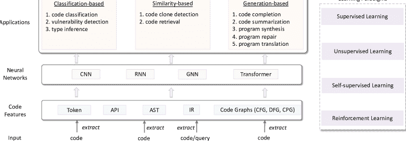
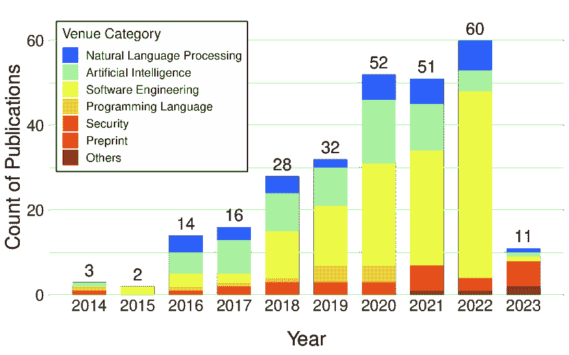
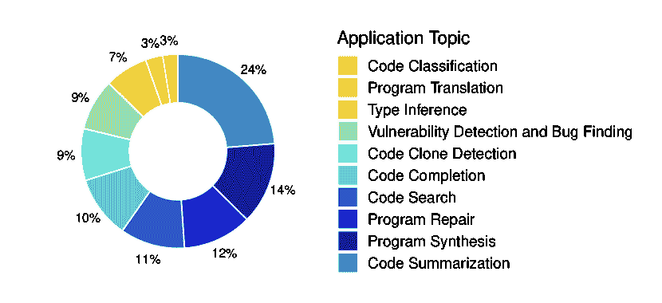
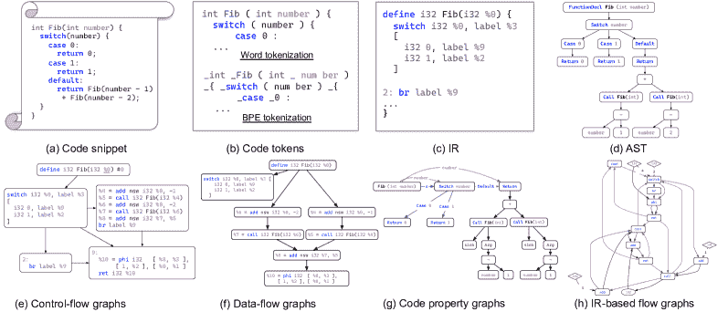
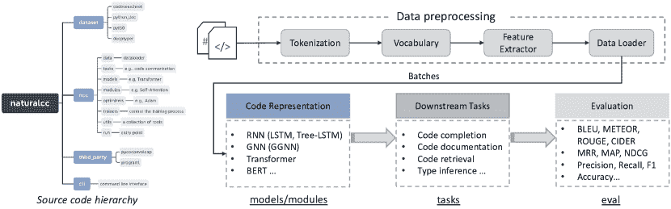
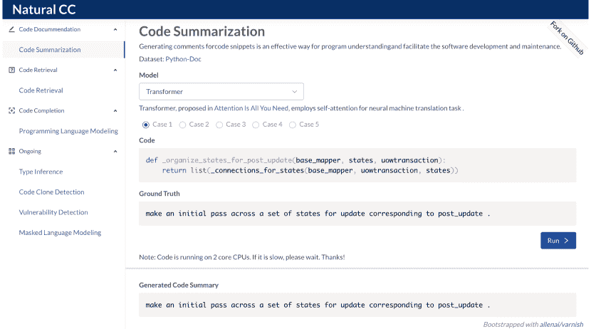
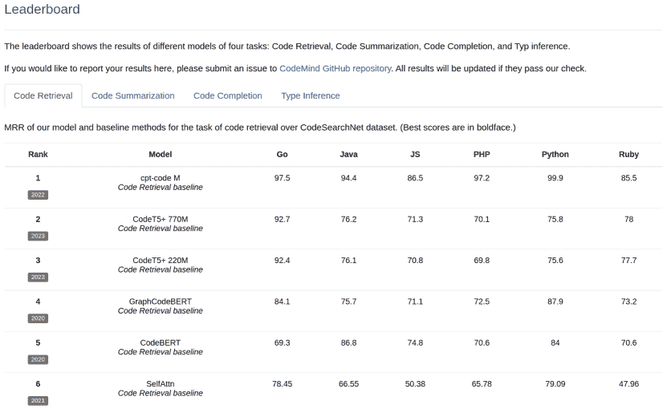

<!--yml

category: 未分类

日期：2024-09-06 19:35:24

-->

# [2401.00288] 深度学习与代码智能：综述、基准测试和工具包

> 来源：[`ar5iv.labs.arxiv.org/html/2401.00288`](https://ar5iv.labs.arxiv.org/html/2401.00288)

\newcites

次要附录参考文献

# 深度学习与代码智能：综述、基准测试和工具包

姚婉 wanyao@hust.edu.cn 华中科技大学国家大数据技术与系统工程研究中心、服务计算技术与系统实验室、集群与网格计算实验室，计算机科学与技术学院武汉中国，杨赫 西蒙弗雷泽大学温哥华加拿大 yha244@sfu.ca，张千毕 华中科技大学计算机科学与技术学院武汉中国 zqbi@hust.edu.cn，姜国章 Salesforce Research 美国 jianguozhang@salesforce.com，洪宇 张 重庆大学中国 hyzhang@cqu.edu.cn，隋雨磊 新南威尔士大学澳大利亚 y.sui@unsw.edu.au，徐光东 迪肯大学澳大利亚 guandong.xu@uts.edu.au，金海 hjin@hust.edu.cn 华中科技大学国家大数据技术与系统工程研究中心、服务计算技术与系统实验室、集群与网格计算实验室，计算机科学与技术学院武汉中国 以及 菲利普·S·于 伊利诺伊大学芝加哥分校芝加哥美国 psyu@uic.edu

###### 摘要。

代码智能利用机器学习技术从大量代码库中提取知识，旨在开发智能工具以提高计算机编程的质量和生产力。目前，已经有一个蓬勃发展的研究社区专注于代码智能，研究领域涵盖了软件工程、机器学习、数据挖掘、自然语言处理和编程语言等。在本文中，我们从代码表示学习、深度学习技术和应用任务等方面对深度学习在代码智能中的应用进行了全面的文献综述。我们还对几种最先进的神经网络模型进行了基准测试，并提供了一个开源工具包，旨在快速原型化基于深度学习的代码智能模型。特别是，我们基于代码表示学习检查了现有的代码智能模型，并提供了全面的概述，以增强对当前代码智能状态的理解。此外，我们公开发布了源代码和数据资源，为社区提供了一个现成的基准，这可以促进现有和未来代码智能模型的评估和比较（[`xcodemind.github.io`](https://xcodemind.github.io)）。最后，我们还指出了几个具有挑战性和前景的未来研究方向。

## 1\. 引言

软件正在吞噬世界（Andreessen，2011）。随着人工智能（AI）的进步，是时候扩展这一格言了：软件已经吞噬了世界，而 AI 正在吞噬软件。由于软件主要由代码组成，我们定义了新兴的代码智能概念，即应用机器学习技术从大规模代码库中提取知识，旨在开发智能工具以提高计算机编程的质量和生产力（Lu et al., 2021）。这一概念得到了不断扩展的源代码库的推动，这些源代码库通常被称为“大代码”（Allamanis et al., 2018a），它们来自于 GitHub（git，2019）和 StackOverflow（sta，2019）等平台。本文的研究范围限定在代码智能上，特别关注深度学习技术的应用。

实现代码智能需要软件工程、机器学习、自然语言处理（NLP）、编程语言和安全等领域的协同研究。从我们的调查中可以看出，精确可靠的代码表示学习或代码嵌入，旨在将源代码的语义高效有效地编码成分布式向量表示，是代码智能的基础。这些嵌入向量随后被用于许多下游任务，如代码补全 (Raychev et al., 2014; Svyatkovskiy et al., 2019; Kim et al., 2021; Liu et al., 2020b)、代码搜索 (Gu et al., 2018; Wan et al., 2019; Husain et al., 2019)、代码总结 (Allamanis et al., 2016; Iyer et al., 2016; Wan et al., 2018; Hu et al., 2018b; Zhang et al., 2020c)、类型推断 (Hellendoorn et al., 2018; Wei et al., 2020a; Pradel et al., 2020; Allamanis et al., 2020)等。在代码嵌入方面，通过深度学习和 NLP 技术对源代码进行编码，已取得了显著进展。

类似于 NLP 中的 word2vec (Mikolov et al., 2013)，Alon et al. (2019) 提出了 code2vec，一种基于从代码的抽象语法树（AST）中提取的路径集合的代码分布表示。近年来，针对特定任务的众多神经网络已经被提出并通过监督方法进行训练。由于预训练语言模型（如 BERT (Devlin et al., 2019) 和 GPT-3 (Brown et al., 2020)) 已广泛应用于 NLP，许多针对代码的预训练语言模型也已被提出 (Kanade et al., 2020; Feng et al., 2020; Guo et al., 2021)，以更好地表示代码的语义。最近，大型语言模型（LLMs）的出现，如 ChatGPT，照亮了预训练语言模型进一步发展的路径，模型规模逐渐增大的趋势尤为明显。这一趋势也扩展到了代码智能领域，导致了针对代码的各种 LLM 的开发，包括但不限于 CodeT5 (Wang et al., 2023)、StarCoder (Li et al., 2023a)和 Code Llama (Roziere et al., 2023)。在本文中，我们通过代码表示学习、深度学习方法及其应用的视角来审视代码智能。

表 1\. 当前工作与之前调查工作的比较

| 论文 | 产物 | 技术 | 调查 | 基准 | 工具包 |
| --- | --- | --- | --- | --- | --- |
| Allamanis et al. (2018a) | 软件 | 机器学习 | ✓ | $\times$ | $\times$ |
| Watson 等人 (2020) | 软件 | 深度学习 | ✓ | $\times$ | $\times$ |
| Wang 等人 (2020a) |
| Yang 等人 (2022c) |
| Devanbu 等人 (2020) |
| Lu 等人 (2021) | 软件 | 深度学习 | $\times$ | ✓ | $\times$ |
| 我们 | 代码 | 深度学习 | ✓ | ✓ | ✓ |

相关调查与差异。在我们的文献综述中，我们识别出了一些与我们相关的调查。特别是，Allamanis 等人 (2018a) 对用于建模编程语言自然性的机器学习方法进行了详尽的检查。他们主要强调机器学习算法，尤其关注概率模型，而非基于深度学习的方法。最近，Watson 等人 (2020)、Wang 等人 (2020a) 和 Yang 等人 (2022c) 对深度学习在软件工程研究中的应用进行了全面回顾。他们主要研究了软件工程和人工智能的会议和期刊，关注于基于深度学习的各种软件工程任务（不限于源代码）。(Devanbu 等人， 2020) 是一份总结了深度学习与软件工程交叉领域研究现状的报告，并提出了若干未来方向。在 (Lu 等人， 2021) 中，作者建立了一个名为 CodeXGLUE 的基准数据集，用于代码表示和生成。此外，还展示了几个特别基于预训练语言模型（即 CodeBERT）的基准结果。

表 1 总结了我们论文与几项相关的代码智能调查之间的差异。与侧重于传统机器学习方法的(Allamanis et al., 2018a)相比，本文更强调利用深度学习技术进行代码智能研究。与涵盖广泛软件工程任务的(Watson et al., 2020), (Wang et al., 2020a), (Yang et al., 2022c), 和 (Devanbu et al., 2020)相比，我们的研究将焦点缩小到与源代码相关的任务，特别从深度学习的角度进行考察。此外，我们还调查了来自软件工程、编程语言、机器学习、自然语言处理和安全等领域的文献。请注意，由于基于深度学习的代码智能是一个新兴的活跃研究领域，我们还包括了几篇在 arXiv 上发布的高质量未发表论文。这是因为这些未发表的 arXiv 论文可以被视为未来研究的一个指示。此外，现有的调查没有提供全面的基准评估结果，也没有开发开源工具包以促进进一步研究。本文通过介绍一个名为 NaturalCC（自然代码理解标准）(Wan et al., 2022a)的开源工具包来填补这一空白。该工具包旨在简化代码智能模型的原型设计，并作为评估各种先进模型的基准平台。与旨在建立代码理解和生成基准数据集的 CodeXGLUE (Lu et al., 2021)不同，我们的重点在于构建支持多种模型实现的基础设施，并为用户提供快速原型设计的能力。与 CodeXGLUE 相比，我们的工具包包含更广泛的工具，旨在支持构建代码智能模型的整个流程，提供更高的灵活性。

我们的贡献。本论文针对对代码智能和深度学习的融合感兴趣的研究人员和从业者，特别强调智能软件工程、NLP 和编程语言。本论文首先对现有的深度学习在代码智能方面的研究进行了详细回顾。随后，我们通过开发一个名为 NaturalCC 的开源工具包，推动了我们的贡献，该工具包包含了各种下游任务的最先进模型。通过使用 NaturalCC，我们对每个模型在包括代码摘要、代码搜索、代码补全和类型推断在内的 4 个下游任务上进行了全面的性能基准测试。本文的主要贡献总结如下。

+   •

    我们对深度学习在代码智能方面的研究进行了全面回顾。具体而言，我们从多个顶级会议和 arXiv 上收集了 269 篇论文，涵盖了包括软件工程、人工智能、NLP、编程语言和安全在内的多个领域。

+   •

    我们对 13 个领先模型在四个不同任务（即代码摘要、代码搜索、代码补全和类型推断）上的性能进行了基准测试。所有资源、数据集和源代码都可以公开获取。¹¹1[`xcodemind.github.io`](http://xcodemind.github.io)

+   •

    我们介绍了 NaturalCC，这是一款开源工具包，集成了许多不同任务上的最先进基准，以促进代码智能研究。软件工程、自然语言处理（NLP）及其他领域的研究人员可以利用该工具包快速原型设计和复制实验。

## 2\. 调查方法

### 2.1\. 从代码表示学习的统一视角

图 1. 基于代码表示学习的代码智能任务。

本文提议从代码表示学习的角度总结现有的基于深度学习的代码智能方法。如图 1 所示，对于代码表示学习，研究人员首先提取可能描述代码语义的特征，然后设计各种神经网络将这些特征编码成分布式向量。代码表示学习可以被视为不同下游应用的基础。根据每个应用的特点，下游应用可以分为三类：（1）基于分类的。在这些任务中（例如代码分类、漏洞检测和类型推断），使用分类器层（例如 softmax）将代码嵌入映射到标签/类别上。（2）基于相似性的。在这些任务中（例如代码搜索和代码克隆检测），通常采用 Siamese 神经网络结构（Chicco，2021），其中使用双编码器将源代码和自然语言查询编码成嵌入向量。根据代码和查询的两个嵌入，通常使用一个约束（例如三元组损失函数）来规范它们之间的相似性。需要注意的是，在一些代码搜索和代码克隆检测方法中，代码和查询的两个嵌入也会被拼接起来，任务被重新表述为分类任务，以确定代码和查询是否相关（Feng et al., 2020）。（3）基于生成的。在这些任务中（例如代码补全、代码摘要、程序翻译、程序合成和程序修复），目标是从给定的代码片段生成源代码、自然语言描述或其他编程语言的程序。这些任务通常遵循编码器-解码器范式，其中使用编码器网络来表示代码的语义，设计解码器网络（例如 RNN）来生成序列，例如自然语言描述或源代码。此外，我们将学习范式分为四类：监督学习、无监督学习、自监督学习和强化学习。

### 2.2\. 论文选择

代码智能的深度学习在许多相关研究社区中都有研究。在本文中，我们回顾了从顶级会议和期刊中筛选出的高质量论文，涵盖软件工程、编程语言、自然语言处理、人工智能和安全等领域。总体而言，我们确定了 32 个出版场所，如补充材料所示。我们首先手动检查这些场所的出版列表，并获得初步的论文集合。特别是，我们在 DBLP 数据库中系统地查询前述场所的名称²²2[`dblp.uni-trier.de`](https://dblp.uni-trier.de)，并检查相关的会议记录。随后，两位在代码智能深度学习领域拥有超过五年经验的作者，协作进行手动细化。这包括对标题的细致审查和对摘要的简要回顾，以识别和筛选出可能与代码智能相关的论文。对于那些每年接受数千篇论文的大型会议（例如 AAAI 和 IJCAI），我们首先筛选出标题中包含“code”或“program”关键词的论文，然后进行人工检查。

基于这些初步论文集合，我们开始通过关键词搜索来扩充它。我们使用以下关键词系统地搜索 DBLP 和 Google Scholar：“code representation”，“program comprehension”，“code embedding”，“code classification”，“vulnerability detection”，“bug finding”，“code completion”，“type inference”，“code search/retrieval”，“code clone detection”，“code summarization”，“program translation”，“program synthesis”和“program repair”，以及“deep”，“learning”，“neural”和“network”的组合。

值得注意的是，除了前面提到的会议接受的论文，我们还考虑了一些来自预印本档案的近期出版物，因为它们反映了最新的研究成果。我们根据两个标准选择 arXiv 上的出版物：论文质量和作者声誉。预印本论文的质量可以通过最近几个月的引用次数来评估。作者的声誉可以通过他们的 Google Scholar 引用量来指示。如果论文满足其中一个选择标准，我们就将其纳入考虑范围。获取这批论文后，我们通过人工检查筛选出不相关的论文。最终，我们得到了 269 篇论文的集合。为了确保透明性和可访问性，我们在网上维护了一张全面的调查论文表格和论文来源。³³3[`github.com/CGCL-codes/awesome-code-intelligence`](https://github.com/CGCL-codes/awesome-code-intelligence)

### 2.3\. 代码智能的出版趋势

图 2 提供了调查论文的统计数据，以揭示出版趋势和研究主题趋势。图 2(a)展示了从 2014 年 1 月到 2022 年 12 月关于代码智能的深度学习的论文。值得注意的是，11 篇关于代码智能的 LLM 的论文被包含在内，均发表于 2023 年。每年，我们分析各种社区和会议的出版趋势，包括 NLP、人工智能、软件工程、编程语言、安全、预印本等。各社区的调查场所详细信息见附录材料的表 1。根据我们的统计结果，五个最受欢迎的出版场所是 ICSE、ASE、ACL、ICLR 和 FSE，来自软件工程、NLP 和 AI 社区。特别地，我们还可以观察到，自 2018 年以来，代码智能受到了 AI 和 NLP 社区的越来越多关注。尽管深度学习最初在 2006 年提出（Hinton 等，2006），但最初用于源代码建模是在 2014 年。从图 2(a)，我们还可以看到，自 2018 年以来，代码智能相关论文的数量显著增加，这表明自那时以来，深度学习在代码智能研究中取得了重大进展。这一发展可以归因于自 2018 年以来深度学习在 NLP 中的广泛应用，这激发了大量关于使用 NLP 方法处理源代码任务的研究。

][c].42 

(a) 不同年份的出版数量。

][c].56 

(b) 各应用领域的出版情况

图 2. 调查论文的统计数据，以揭示出版趋势和研究主题趋势。

图 2(b)展示了各应用领域的论文分布，包括代码分类、漏洞检测、类型推断、代码搜索、代码克隆检测、代码补全、代码总结、程序翻译、程序合成和程序修复。该图显示了近年来对代码总结、程序合成、程序修复、漏洞检测和代码搜索等主题的日益关注。

## 3\. 文献综述

### 3.1\. 分类

图 3. 深度学习代码智能的分类。

图 3 展示了我们在本文中调查的关于代码智能深度学习的当前研究分类。从我们的观察来看，该领域的研究可以分为三个不同的方面：即代码特征、深度学习技术和应用。（1）代码特征。作为深度学习代码智能的基础，代码表示旨在将源代码表示为分布式向量。我们根据输入代码所使用的特征对当前的代码表示方法进行分类，例如代码标记、中间表示（IRs）、应用程序编程接口（APIs）、抽象语法树（ASTs）和代码图（例如，控制流和数据流图）。（2）在深度学习技术领域，我们首先深入探讨各种类型的神经网络，即 RNNs、CNNs、Transformers 和 GNNs。随后，我们研究用于建模源代码的多种学习范式，即监督学习、无监督学习、自监督学习和强化学习。（3）我们调查了基于代码表示和深度学习技术的多个下游应用，包括代码分类、漏洞检测和错误查找、类型推断、代码搜索、代码克隆检测、代码补全、代码总结、程序翻译、程序合成和程序修复。

### 3.2\. 代码特征

图 4. 一个详细的 C 代码片段及其对应的标记、IR、AST 和基于 IR 的流图。

要表示源代码，我们首先需要确定要表示的内容。许多研究提出从不同角度提取代码特征，包括代码标记、IRs、ASTs 和各种类型的代码图。图 4 展示了一个详细的 C 代码片段及其对应的代码标记、IR、AST、控制流图、数据流图、代码属性图和基于 IR 的流图。

#### 3.2.1\. 代码标记

代码标记，塑造源代码的文本外观，由函数名称、关键字和各种变量标识符组成。这些标记简单但有效地表示了程序的语义。处理代码的大多数方法涉及将程序分解为基于特定分隔符（如空格或标识符中的大小写模式（例如 SortList 和 intArray））的标记序列。Cummins 等人 (2017) 引入了一种字符级 LSTM 网络来表示程序合成的代码字符序列。由于构成程序的字符集始终是有限的，字符级代码表示没有词汇外的问题。然而，这种字符级的标记化过程会破坏原始词汇的含义，并且增加了代码序列的长度，这可能使理解程序的整体语义变得困难。

更粗略地说，许多词级方法被提出，通过分隔符将源代码标记化为词。例如，White 等人 (2015) 和 Iyer 等人 (2016) 提出了通过空白字符将程序标记化为词，并设计了 RNN 来表示这些词以进行代码摘要和代码补全。Allamanis 等人 (2016) 设计了一种具有注意机制的 CNN，以更好地表示代码的层次结构，基于简单的驼峰式标记的子标记，来预测函数名称。

词汇外（OOV）问题。由于变量和函数名称总是由开发者定义而没有约束，因此随着训练数据的增加，词汇量会爆炸性地增长，导致词汇外问题，这比自然语言处理中的问题更为严重。为缓解这一问题，Cvitkovic 等人 (2019) 提出了图结构缓存的方法，引入了额外的节点来处理遇到的新词，并根据它们在代码中的出现位置连接这些节点。最近，Chirkova 和 Troshin (2021b) 提供了一种简单而有效的解决方案，通过使用标识符匿名化来缓解 OOV 问题，并观察到有希望的性能提升。

另一种有效的方法是对源代码进行子词级别的标记化，例如使用像字节对编码（BPE）这样的技术，旨在构建一组可以组合以表示整个代码语料库的子词。图 4 (b) 展示了通过词标记化和 BPE 标记化策略获得的源代码标记。对于输入变量数量，词标记化将保持原始词汇并视其为稀有词汇，而 BPE 标记化则会将其拆分为两个常见的子词，即 num 和 ber。在最近的源代码预训练语言模型中，例如 CuBERT（Kanade et al., 2020）和 CodeBERT（Feng et al., 2020），BPE 通常被用于减少词汇表大小。Karampatsis et al. (2020) 进行了一项关于词分割粒度的实证研究，并显示 BPE 标记化代码可以显著减少词汇表大小。

#### 3.2.2. 应用程序编程接口（API）

已经提出了多种方法来分析程序中的 API 序列。一种方法是从大量代码语料库中挖掘 API 使用模式，以展示如何使用 API。例如，Moreno 等人（2015）提出了一种新方法，名为 Muse，通过挖掘和排序使用中的代码示例来展示 API 使用。另一种方法是 API 推荐，旨在为用户推荐或生成一系列 API。Jiang 等人（2017）提出了通过基于 PageRank 和主题相关性计算相关性得分来发现与 API 相关的教程片段。Gu 等人（2016）提出了一种名为 DeepAPI 的语言模型，在序列到序列学习框架下生成响应给定自然语言描述的 API 序列。与 DeepAPI 不同，Nguyen 等人（2017）提出了 API2Vec，用于表示 API 序列中 API 元素的上下文信息。同样，他们还基于 API2Vec 开发了一个名为 API2API 的工具，用于迁移不同编程语言之间的 API，即从 Java 迁移到 C#，以验证学习到的 API 嵌入。Ling 等人（2021b）介绍了一种将 API 调用交互和项目结构整合到一个图中的方法，并使用该图设计基于图的协同过滤，以进行 API 使用推荐。Bui 等人（2019b）提出了一种跨语言 API 映射方法，通过跨多个领域的迁移学习，将 Java 的 API 映射到 C#，所需的先验知识大大减少。Hu 等人（2018b）建议，将 API 信息作为补充知识纳入可以改善代码总结。为了改进自然语言查询和 API 序列中的语义表示，Wei 等人（2022）提出了一种用于 API 推荐的对比学习方法，而 Hadi 等人（2022）研究了预训练模型在从自然语言查询生成 API 序列中的有效性。

#### 3.2.3\. 抽象语法树（AST）

AST 是一种树状结构的代码中间表示，描述了程序的语法结构。如图 4 (d) 所示，在 AST 中，叶节点（例如，number、Fib）通常对应于源代码中变量和方法名称的标记，而非叶节点（例如，FuncName、SwitchStmt）表示代码的语法结构，如函数定义、分支函数。因此，这种表示方式使得 AST 对于捕捉词汇信息（例如，变量 number）和源代码的语法结构都非常有用。在实际操作中，我们可以使用几个开源工具来提取 AST，例如 ANTLR⁴⁴4[`www.antlr.org`](https://www.antlr.org) 解析器、tree-sitter⁵⁵5[`tree-sitter.github.io/tree-sitter`](https://tree-sitter.github.io/tree-sitter) 解析器和 LLVM Clang⁶⁶6[`clang.llvm.org`](https://clang.llvm.org)。为了表示 AST，Mou 等人 (2016) 提出了基于树结构的 CNN，并在代码分类任务中进行了验证。为了处理 AST 中节点之间的长距离依赖，Liu 等人 (2020e) 提出了通过引入如 PUSH 和 POP 等操作的改进版 LSTM，并在代码补全、代码分类和代码摘要任务中进行了验证。为了更好地处理 AST，Zhang 等人 (2019) 将 AST 划分为基于句子的子树，并使用双向循环网络进行表示。最近，Kim 等人 (2021) 提出了使用相对位置嵌入来进行代码补全，将 AST 输入到 Transformers 中。Niu 等人 (2022) 通过整合 AST 信息引入了源代码的预训练模型。

另一类研究 (Hu 等人，2018a；Alon 等人，2019，2018) 是通过遍历或路径采样间接表示 AST。Hu 等人 (2018a) 建议遍历 AST，将其转换为线性节点序列，然后使用 RNN 来表示 AST 序列以进行代码摘要任务。Alon 等人 (2019) 对 AST 进行路径采样，然后使用 word2vec 来表示程序的语义。此外，Alon 等人 (2018) 还将类似的思路应用于代码摘要任务。类似地，Alon 等人 (2020) 提出了一个结构化代码语言模型用于代码补全，通过从不完整的 AST 中采样路径。

在程序合成中，AST 也被纳入用于指导程序的合成。Yin 和 Neubig (2017) 提出了一个编码器-解码器框架用于代码生成，其中编码器首先对自然语言进行编码，然后解码器生成代码的 AST，最后将 AST 转换为源代码。Chen et al. (2018) 提出了一个 Tree2Tree 模型用于程序翻译，该模型首先使用 TreeLSTM 表示源程序，然后使用另一个 TreeLSTM 生成用另一种编程语言编写的目标程序。

#### 3.2.4\. 中间表示（IR）

IR 是一个结构良好的表示形式，它独立于编程语言和机器架构。编译器在将源代码翻译为低级机器代码的过程中使用 IR 以准确表示源代码。IR 可以表达目标机器的操作。通过利用 IR（Li et al., 2022c）来增强代码嵌入是自然的，这样的好处是有限的词汇量显著缓解了 OOV 问题。在本文中，我们使用 LLVM-IR，该 IR 在 LLVM 基础设施中使用（Lattner and Adve, 2004），如图 4（c）所示。为了表示 IR，Ben-Nun et al. (2018) 提出了 inst2vec，该方法首先使用 LLVM Clang 编译程序以获取 LLVM 中间表示，然后采用 skip-gram 来表示指令。VenkataKeerthy et al. (2020) 提出了 IR2Vec，该方法将中间代码表示视为知识图谱中的三元组，然后探索几种知识图谱表示方法。Cummins et al. (2021) 引入了 ProGraML，这是一种基于 IR 的新型图形代码表示。这种代码图提供了使用机器学习技术（例如，GNNs）在低级别表示源代码语义的新机会，用于复杂的下游任务，如程序优化和分析。Peng et al. (2021) 提出了基于预训练和对比学习技术、以编译器优化为指导的源代码增强 IR 表示。有趣的是，Gui et al. (2022) 研究了通过将二进制代码和源代码都转换为 LLVM-IR 来跨语言匹配这两个问题。

#### 3.2.5\. 代码图

目前，已经提出了许多将程序转换为图形的办法，以更好地表示程序中丰富的结构信息，包括控制流图（CFG）、数据流图（DFG）和代码属性图（CPG）。如图 4（e）所示，CFG 表示程序的计算和控制流。在这种表示中，每个节点表示一个基本块，每个边表示程序中控制流的转移。如图 4（f）所示，DFG 是一个有向图，说明了各种函数之间的数据关系。DFG 中的每个节点都有输入和输出数据端口，每条边将一个输出端口连接到另一个节点的输入端口。为了使用联合数据结构表示代码的多种结构信息，Yamaguchi 等人（2014）提出了一种创新的 CPG，将代码的结构信息（包括 AST、CFG 和程序依赖图（PDG））合并为一个图，如图 4（g）所示。实际上，我们可以使用 LLVM Clang 构建 CFG 和 DFG，使用 Plume⁷⁷7[`plume-oss.github.io/plume-docs`](https://plume-oss.github.io/plume-docs) 构建 CPG。最近，Cummins 等人（2021）构建了一个统一的图，称为 ProGraML，其中包括 CFG、DFG 和调用图，如图 4（h）所示。

为了表示这些代码图，Allamanis 等人（2018b）在抽象语法树（ASTs）之上引入了数据流，并形成了代码图。随后，开发了一种门控图神经网络（GGNN）（Li 等人，2016），用于学习该代码图中的数据依赖关系。Allamanis 和 Brockschmidt（2017）构建了变量之间的数据流，并在自动粘贴编程任务中考虑了变量的上下文信息。Brockschmidt 等人（2019）将不完整的代码扩展为图形，然后提出了一种用于代码完成的图神经网络。Sui 等人（2020）通过使用程序的值流图，使代码表示更加准确。Shi 等人（2022c）采用将代码图（例如，CFG 和 DFG）通过遍历转换为序列的方法，用于代码搜索任务。Chen 等人（2021a）介绍了一种将代码图转换为令牌和指针序列的一般方法。

#### 3.2.6. 代码的其他特性

除了已经广泛探索的代码特性，还有一些特性用于特定场景。例如，Henkel 等人 (2018) 引入了一种基于程序符号执行中收集的跟踪抽象的代码表示学习新特性。Hoang 等人 (2020) 提出了使用深度学习来学习代码更改/编辑的分布式表示，这些表示可能用于生成软件补丁。在代码更改方面，也提出了几种相关的工作来表示或预测这些更改。Tufano 等人 (2019) 提出了通过基于序列到序列的神经机器翻译来自动化代码编辑。Brody 等人 (2020) 提出了先表示代码编辑，然后在抽象语法树（AST）上迭代生成树编辑。

#### 3.2.7\. 混合表示

为了利用多种代码特性，已经开发了几种以混合方式表示源代码的方法。例如，Gu 等人 (2018) 探索了使用三个独立的 RNN 来分别表示函数名称、代码标记以及代码的 API 序列。该方法也在代码搜索任务中进行了评估。White 等人 (2016) 考虑了代码标记和 AST 节点序列，并使用两个不同的 RNN 分别表示这两个序列，用于代码克隆检测任务。Zhao 和 Huang (2018) 提出了通过将代码的流图纳入语义矩阵来表示源代码。他们还开发了一个神经网络模型来评估两个代码片段表示之间的功能相似性。类似地，Wan 等人 (2018) 和 Wan 等人 (2019) 开发了一个混合网络，包括一个表示代码标记的 LSTM，一个表示代码控制流图（CFG）的 GGNN，以及一个表示代码 AST 的 TreeLSTM，用于代码总结和代码搜索任务。Chakraborty 和 Ray (2021) 建议利用三种信息模态（例如，编辑位置、编辑代码上下文和提交消息）来表示编程上下文并自动生成代码补丁。

### 3.3\. 深度学习技术

我们研究了神经网络的类型，并将学习范式分为四组：监督学习、无监督学习、自监督学习和强化学习。

#### 3.3.1\. 神经网络

将源代码建模为序列文本并直接应用自然语言处理（NLP）技术来表示它是自然的。简单来说，RNN（Raychev et al., 2014; Liu et al., 2016b; Gu et al., 2018; Alon et al., 2018; Hellendoorn et al., 2018; Malik et al., 2019; Svyatkovskiy et al., 2019; White et al., 2016; Hu et al., 2018a; Zhang et al., 2020c; Gupta et al., 2017) 和 CNN（Allamanis et al., 2016; Sun et al., 2019）神经网络可以轻松应用于表示源代码的序列结构。为了捕捉语法结构，特别是源代码的抽象语法树（AST），许多树结构神经网络（Wan et al., 2018; Mou et al., 2016; Chen et al., 2018）也被设计出来。此外，为了表示源代码的语义结构（例如，控制流图（CFG）和数据流图（DFG）），已经引入了图神经网络（GNNs）（Allamanis et al., 2018b; Zhou et al., 2019; Wang and Li, 2021; Brockschmidt et al., 2019; Wei et al., 2020a; Allamanis et al., 2020; Liu et al., 2020a）来表示源代码。最近，Transformer 架构被用于表示源代码（Kim et al., 2021; Svyatkovskiy et al., 2020）。Chirkova 和 Troshin（2021a）进行了全面的实证研究，探讨了 Transformers 在各种任务中如何利用源代码中的语法信息。有关上述神经网络的更多初步资料请参阅补充材料。

#### 3.3.2\. 监督学习

监督学习旨在学习一个函数，该函数根据一组输入-输出对作为训练数据将输入映射到输出。这是一种在深度学习中广泛使用的学习范式。根据我们的调查，目前用于代码智能的深度学习方法主要基于监督学习。对于每个特定的代码智能任务，如代码分类 (Mou 等人，2016; Bui 等人，2019a)，漏洞检测和错误查找 (Li 等人，2018b; Zhou 等人，2019; Cheng 等人，2021; Li 等人，2019)，代码补全 (Raychev 等人，2014; Liu 等人，2016b; Li 等人，2018a; Svyatkovskiy 等人，2019; Alon 等人，2020; Svyatkovskiy 等人，2020)，类型推断 (Hellendoorn 等人，2018; Malik 等人，2019; Wei 等人，2020a; Allamanis 等人，2020)，代码搜索 (Gu 等人，2018; Wan 等人，2019; Haldar 等人，2020)，代码克隆检测 (White 等人，2016; Wei 和 Li，2017; Zhao 和 Huang，2018; Wu 等人，2020; Zhang 等人，2019)，代码摘要 (Allamanis 等人，2016; Iyer 等人，2016; Hu 等人，2018a; Alon 等人，2018; Wan 等人，2018)，程序翻译 (Chen 等人，2018; Gu 等人，2017)，程序合成 (Dong 和 Lapata，2016; Liu 等人，2016a; Sun 等人，2019; Zhong 等人，2017; Cai 等人，2018)，以及程序修复 (Gupta 等人，2017; Vasic 等人，2018; Dinella 等人，2020; Chakraborty 等人，2020; Zhu 等人，2021; Tufano 等人，2018a; Li 等人，2020)，首先会收集一组配对的输入-输出数据。对于每个任务，监督学习都由特定的损失函数指导。这种方法的一个限制是它依赖于大量标记良好的输入-输出对，在某些情况下这些对的收集成本总是很高。

#### 3.3.3\. 无监督学习

与监督学习不同，无监督学习试图从没有标签的数据集中识别模式。一个代表性的工作是 TransCoder (Rozière 等人，2020)，其中训练了一个完全无监督的神经源到源翻译器，该翻译器基于无监督机器翻译。这种学习范式对代码智能来说具有挑战性，仍需要更多的研究工作。

#### 3.3.4\. 自监督学习

自监督学习可以被视为监督学习和无监督学习的结合。不同于监督学习中数据标签用于训练，自监督学习直接从数据本身获取监督信号，通常是数据的潜在结构。自监督学习的一个常见做法是根据可观察的部分预测任何未观察到（或被掩盖）的输入部分。作为自监督学习的代表技术，语言模型预训练已在源代码中被广泛研究（Kanade et al., 2020; Feng et al., 2020; Guo et al., 2021）。Kanade et al. (2020) 提出了在 Python 代码语料库上训练 CuBERT，并在多个下游任务中验证了预训练模型，如变量误用、运算符分类和函数-文档匹配。CodeBERT (Feng et al., 2020) 是另一个处理源代码和自然语言描述两种不同模态的预训练模型。它基于掩蔽语言建模，并在代码搜索和代码完成等任务中取得了令人鼓舞的结果。基于 CodeBERT，GraphCodeBERT (Guo et al., 2021)、SPT-Code (Niu et al., 2022) 和 TreeBERT (Jiang et al., 2021b) 被提出以消化源代码中的结构信息。Lachaux et al. (2021) 提出了基于去混淆的预训练目标作为替代标准。受到 BART (Lewis et al., 2020) 的启发，BART 是专门为自然语言理解和生成设计的预训练深度模型，Ahmad et al. (2021) 训练了一个类似的预训练模型 PLBART，用于与代码生成和代码理解相关的任务。Zhang et al. (2022a) 在大量源代码和自然语言注释上训练了一个名为 CoditT5 的模型，用于软件相关的编辑任务，如注释更新、错误修复和自动化代码审查。Wang et al. (2021b) 和 Guo et al. (2022b) 提出了通过对比学习统一源代码和自然语言的模态，以改善源代码语义的表示。Mastropaolo et al. (2021) 和 Wang et al. (2021a) 探索了基于 T5 (Text-To-Text Transfer Transformer) 架构的预训练模型，该模型在 NLP 任务中已获得最先进的结果。Bui et al. (2021a) 提出了 InferCode，一种通过预测从 AST 上下文中识别的子树进行的自监督学习方法。Jain et al. (2021) 提出了基于编译器中的程序转换的任务无关代码表示的对比学习方法。ERNIE-Code (Chai et al., 2022a) 是一个统一的预训练模型，基于 116 种自然语言和 6 种编程语言，旨在弥合多语言自然语言和多语言编程语言之间的差距。鉴于 LLMs 在与测试数据集可能有不同分布的数据集上进行预训练，Wang et al. (2022b) 探索了预训练代码模型的微调，以通过课程学习促进适应下游任务。

与其提高代码嵌入的能力，万等人（2022c）通过结构分析研究了预训练模型在代码智能方面的可解释性，即这些模型捕捉了什么信息。张等人（2022b）和石等人（2022b）建议压缩预训练的代码模型，以加快其在实际应用中的效率。周等人（2021）进行了实证研究，以评估 CodeBERT 在应用于各种数据集和下游任务时的泛化能力。

代码的大型语言模型（LLMs）。前述的预训练代码模型已经展示了在理解源代码语义方面的良好能力。最近，随着 LLMs 在文本生成和对话交流中的出色表现，例如 ChatGPT 的成功，各种 LLMs 被特别训练用于代码相关任务，特别是代码生成。Nijkamp 等人（2022）介绍了一种新颖的代码生成任务，使用户能够通过多轮互动逐步表达他们的意图，并进一步训练了一家名为 CodeGen 的 LLMs 系列，其参数量高达 16.1 亿。PaLM（Chowdhery 等人，2022）是 Google 开发的通用 LLM，预训练于包含文本和代码语料的大规模数据集，参数量高达 5400 亿。PaLM-Coder 是基于 PaLM 的模型，专门为代码相关任务如代码生成和程序翻译进行微调。InCoder（Fried 等人，2022）是 Meta 开发的 LLM，采用因果掩码目标，用于根据任意左侧和右侧上下文填充代码块。Pangu-Coder（Christopoulou 等人，2022）是华为推出的专为代码生成开发的 LLM。其训练遵循两阶段策略：第一阶段，使用因果语言建模（CLM）在原始代码语料上进行预训练；第二阶段，结合 CLM 和掩码语言建模（MLM）训练目标，重点关注从文本生成代码的下游任务。CodeGeeX（Zheng 等人，2023）是一个拥有 130 亿参数的多语言代码生成模型，预训练于 8500 亿个标记的 23 种编程语言上。StarCoder（Li 等人，2023a）是一个用于代码的 LLM，拥有高达 155 亿个参数，训练于一个包含 1 万亿个标记的大规模数据集，该数据集来自于大量许可的 GitHub 仓库，配有检查工具和选择退出过程。Code Llama（Roziere 等人，2023）是 Meta 发布的一系列用于代码的大型语言模型，建立在 Llama 2 的基础上。这些模型以其先进的填充能力、广泛的长上下文微调和精确的指令微调而著称。CodeT5+（Wang 等人，2023），由 Salesforce 发布，代表了一系列新的基于编码器-解码器的 LLMs，明确针对代码理解和生成相关任务的广泛范围。这一模型引入了创新的预训练目标，包括文本-代码对比学习、匹配和文本-代码数据上的 CLM 任务。phi-1（Gunasekar 等人，2023）是一个相对较小的代码 LLM，拥有 13 亿参数，通过数据集优化实现，同时在代码生成中保持竞争力的性能。

与为特定任务设计的传统预训练代码模型不同，代码的 LLMs（大型语言模型）以其强大的零样本学习能力而有所区别。为了发挥 LLMs 的零样本能力，已经开发了许多技术，如提示调优、上下文学习、思维链和指令调优。最近，众多研究探讨了 LLMs 在代码生成（刘等，2023）、代码摘要（耿等，2024）和代码修复（夏等，2023）等任务中的潜力，这些都是通过设计文本提示实现的。作为一种特定的提示方式，上下文学习旨在通过提供上下文信息或示例来增强 LLMs 的能力。李等（2023c）探讨了基于 LLMs 的更好代码生成的上下文学习。思维链旨在确保 LLMs 的输出遵循逻辑链。李等（2023b）探讨了基于 LLMs 的更好代码生成的思维链。指令调优最初旨在提高 LLMs 在不同任务中的泛化能力。WizardCoder（罗等，2023）通过创建通过代码特定的 Evol-Instruct 方法生成的复杂代码指令数据，来增强 StarCoder 的能力。

#### 3.3.5\. 强化学习

强化学习旨在通过与环境的互动来训练代理，而无需输入-输出对。这种学习范式已被应用于代码摘要（万等，2018）、代码搜索（姚等，2019）、程序修复（古普塔等，2018）和程序合成（钟等，2017）。

### 3.4\. 基于分类的应用

基于分类的应用，例如代码分类、漏洞检测和类型推断，旨在训练分类器，以将源代码映射到特定的标签或类别，如识别漏洞状态或变量类型。

#### 3.4.1\. 代码分类

将源代码分类为不同类别（例如，不同的功能和编程语言）对于许多任务都很重要，如代码分类、编程语言识别、代码预测和漏洞检测。已有多项研究对代码片段进行了功能分类。为了将程序表示为 AST 的形式，Mou 等人（2016）开发了一种基于树的卷积神经网络（TBCNN），并在代码分类上进行了验证。在更广泛的软件分类领域，LeClair 等人（2018）设计了一系列改进，结合了如词嵌入和神经网络架构等技术，以将 NLP 方法特别定制为源代码的文本分类。Bui 等人（2019a）提出了一种双向神经网络用于跨语言算法分类任务，其中每个子网络用于编码特定语言中代码的语义，并设计了一个额外的分类模块以建模这些双向程序的连接。

#### 3.4.2\. 漏洞检测与错误查找

检测程序中的漏洞或缺陷对于保证软件质量至关重要，同时也能为软件开发节省大量精力和时间。虽然已经开发了许多用于漏洞检测的工具，例如 Clang Static Analyzer⁸⁸8[`clang-analyzer.llvm.org/scan-build.html`](https://clang-analyzer.llvm.org/scan-build.html)、Coverity⁹⁹9[`scan.coverity.com`](https://scan.coverity.com)、Fortify¹⁰¹⁰10[`www.hpfod.com`](https://www.hpfod.com)、Flawfinder¹¹¹¹11[`dwheeler.com/flawfinder`](https://dwheeler.com/flawfinder)、Infer¹²¹²12[`fbinfer.com`](https://fbinfer.com)以及 SVF (Sui and Xue, 2016)，大多数这些工具都基于静态分析。近年来，越来越多的研究开始利用深度学习来发现漏洞。Wang 等人 (2016) 早期尝试将深度学习，特别是深度信念网络，应用于预测软件缺陷，基于 AST 学习程序的语义特征。Dam 等人 (2018) 提出了基于 LSTM 的方法，利用源代码的语法和语义方面，并应用于项目内和跨项目的漏洞检测。VulDeePecker (Li 等人, 2018b)、$\mu$VulDeePecker (Zou 等人, 2019) 和 SySeVR (Li 等人, 2021d) 是一系列通过提取 API 函数调用和程序切片来保留程序语义进行漏洞检测的工作。Le 等人 (2018) 提出了最大离散序列自编码器网络，用于在二进制文件中发现漏洞。该网络的设计目的是使漏洞代码和非漏洞代码的嵌入尽可能地不同。Zhou 等人 (2019) 提出了用于漏洞检测的 Devign 方法，该方法首先通过将程序的 AST、CFG 和 DFG 融合成统一的 CPG 来表示程序，然后设计了一个图神经网络来表示代码的 CPG。同样，Wang 等人 (2020c) 和 Cao 等人 (2022) 提出了用于漏洞检测的流敏感框架，利用 GNN 来表示程序的控制、数据和调用依赖关系。Cheng 等人 (2021) 介绍了 DeepWukong，这是一种基于 GNN 的 C/C++ 程序漏洞检测模型，其中保留了程序的流信息。Liu 等人 (2021b) 介绍了一种具有专家知识的 GNN 模型，用于检测智能合约中的漏洞，结合了程序的流信息。受图像处理启发，Wu 等人 (2022b) 提出了一种方法，通过将代码转换为保留语义的图像来增强漏洞检测的可扩展性，并实施 CNN 以有效捕捉这些信息。

最近，一些研究尝试解释深度学习模型在漏洞检测中的结果。Li et al. (2021c) 引入了一种 GNN 模型用于漏洞检测，提供了可解释性，向用户展示可能包含漏洞的程序依赖图 (PDG) 的部分。此外，Zou et al. (2021) 提出了一个基于启发式搜索的可解释深度学习模型，用于漏洞检测。

与仅将程序分类为易受攻击或不易受攻击的漏洞检测相比，另一项工作是漏洞定位，旨在准确找出存在错误的位置。DeepBugs (Pradel and Sen, 2018) 是一种基于名称的错误检测方法，它通过深度学习训练分类器来区分有错误或没有错误的代码。为了提高错误检测的准确性，Li et al. (2019) 提出了一种融合方法，利用 PDG 和 DFG 进行更好的表示。使用注意机制对错误路径分配更大的权重，以识别可能的漏洞。Gupta et al. (2019) 开发了一种树状结构的 CNN，以识别在失败测试中存在缺陷的程序中的漏洞或故障。Li et al. (2021b) 将故障定位问题定义为图像识别，并提供了一种基于深度学习的方法，结合了代码覆盖率、语句间的数据依赖关系和源代码表示。

#### 3.4.3\. 类型推断

动态类型语言，如 Python 和 JavaScript，为开发人员提供了快速原型设计的能力，并能显著节省软件开发时间。然而，缺乏类型信息可能会导致意外的运行时错误，这可能引入漏洞并产生低质量代码。目前的类型推断工作，旨在自动推断变量类型，主要分为两类：静态分析基础和基于学习的。传统的静态分析方法 (Hassan et al., 2018; Salib, 2004) 通常不够精确，因为程序的行为总是被过度近似。此外，静态分析方法通常分析整个程序的依赖关系，导致相对较低的效率。

最近，许多深度学习技术被引入用于类型推断。据我们所知，Hellendoorn 等人 (2018) 是第一个采用深度学习进行类型推断的。他们提出了一种基于序列到序列架构的神经网络，命名为 DeepTyper，该网络使用 GRU 来表示程序上下文并预测 TypeScript 的类型注释。此外，Malik 等人 (2019) 提出了 NL2Type，通过利用程序的自然语言信息来预测类型注释。基于 NL2Type，Pradel 等人 (2020) 进一步提出了 TypeWriter，该方法结合了自然语言信息和编程上下文（例如，函数中的参数使用）。Wei 等人 (2020a) 提出了 LambdaNet 基于 GNN 进行类型推断，该方法首先将代码表示为类型依赖图，其中保留了类型变量及其间的逻辑约束。然后提出了 GNN 来传播和聚合相关类型变量的特征，最终预测类型注释。Pandi 等人 (2020) 提出了 OptTyper，该方法首先提取相关逻辑约束，并将类型推断表述为优化问题。Allamanis 等人 (2020) 提出了 Typilus 用于 Python 的类型推断，该方法将 AST 扩展为图结构，并使用 GNN 在此图上预测类型注释。为了应对大规模类型词汇，Mir 等人 (2022) 提出了 Type4Py，这是一种基于相似性的深度学习模型，具有类型簇，可以支持稀有类型和用户定义类的推断。最近，Huang 等人 (2022) 将类型推断任务表述为填空式问题，然后基于提示调整训练了 CodeBERT 模型。

### 3.5\. 基于相似性的应用

基于相似性的应用，如代码搜索和代码克隆检测，旨在评估查询（无论是自然语言还是编程语言）与候选代码片段之间的相似度。需要注意的是，几种方法提议将这些任务重新表述为分类问题，其中代码和查询被串联在一起，目标是确定它们的相关性 (Feng et al., 2020)。在本文中，我们通过它们所涉及的对象，即查询和候选代码片段，来区分基于相似性和基于分类的应用。具体来说，基于相似性的应用集中在涉及两个对象的任务上。

#### 3.5.1\. 代码搜索

代码搜索的目标是通过自然语言查询（nl-to-code）或代码查询（code-to-code）检索代码片段。nl-to-code 搜索指的是从代码库中搜索与自然语言查询语义相似的代码片段。作为使用深度学习进行代码搜索的首个解决方案，Gu 等人 (2018) 提出了 DeepCS，该方法在共享特征向量空间中同时学习源代码表示（例如函数名称、参数和 API 使用）和自然语言查询，目标函数为三元组准则。在 DeepCS 的基础上，Wan 等人 (2019) 和 Deng 等人 (2022) 在配备了注意力机制的多模态神经网络中加入了更多源代码的结构信息，包括 AST 和 CFG，以提高可解释性。Ling 等人 (2021a) 首先将代码片段和自然语言描述转换为两种不同的图形，并提出了一种匹配技术，以改善源代码和自然语言描述的匹配。此外，Shi 等人 (2022c) 提出了通过遍历将代码图（例如 CFG 和 PDG）转换为序列的改进代码搜索方法。Haldar 等人 (2020) 提出了多角度匹配方法，以从多个角度计算源代码和自然语言查询之间的相似性。Cambronero 等人 (2019) 实证评估了将深度学习应用于代码搜索时的架构和训练技术。Bui 等人 (2021b) 和 Li 等人 (2022b) 利用对比学习和语义保留代码转换来改进代码搜索中的代码表示。

与 DeepCS 框架相似但不同的是，提出了几个补充性的代码搜索方法。Yao 等人 (2019) 提出了使用强化学习首先生成代码片段的摘要，然后利用该摘要进行更好的代码搜索。Sun 等人 (2022a) 建议将源代码解析为机器指令，然后根据几个预定义规则将其映射到自然语言描述中，接着使用类似 DeepCS 的基于 LSTM 的代码搜索模型。Zhu 等人 (2020) 考虑了自然语言查询和源代码之间的重叠子字符串，并开发了一个神经网络组件来表示重叠矩阵以进行代码搜索。

最近，Chai 等人 (2022b) 提出了一个用于领域特定代码搜索的迁移学习方法，旨在将知识从 Python 迁移到 SQL。Wan 等人 (2022b) 研究了不同神经代码搜索模型的鲁棒性，显示其中一些模型容易受到数据中毒攻击的威胁。Gu 等人 (2022) 提出了通过深度哈希技术优化代码搜索的方法。

与 nl-to-code 搜索不同，code-to-code 搜索的输入是源代码，而不是自然语言描述。code-to-code 搜索的目标是从代码库中找到与输入代码在语义上相关的代码片段。code-to-code 搜索的核心技术是测量两个代码片段之间的相似度，这与识别代码克隆的过程是相同的。更多相关的工作将在代码克隆检测部分进行探讨。

#### 3.5.2\. 代码克隆检测

许多软件工程活动，包括代码重用、漏洞检测和代码搜索，都依赖于检测相似的代码片段（或代码克隆）。代码克隆主要有四种类型：Type-1 代码克隆是除了空格、空白和注释外完全相同的克隆。Type-2 代码克隆是除了变量、类型、字面量和函数名称外完全相同的代码片段。Type-3 代码克隆是两段几乎完全相同的代码片段，只是添加或删除了少数几条语句。Type-4 代码克隆是功能相似但代码结构或语法不同的异质代码片段。为了处理不同类型的代码克隆，已提出了各种方法。

最近，已经设计了几种基于深度学习的方法来表示一对代码片段的语义，以进行克隆检测。这些方法的核心在于将源代码表示为分布式向量，其中保留了语义。例如，White 等人 (2016) 提出了 DLC，通过考虑源代码的词汇和句法信息来理解其语义，然后设计了 RNNs 进行表示。为了改进代码的句法结构表示，Wei 和 Li (2017) 应用了 TreeLSTM 来结合源代码的 AST 信息。Zhao 和 Huang (2018) 提出了将代码的 CFG 和 DFG 编码为语义矩阵，并引入了深度学习模型来匹配相似的代码表示。Zhang 等人 (2019) 和 Büch 和 Andrzejak (2019) 设计了更好地表示程序 AST 的方法，并将其应用于代码克隆检测任务。此外，Wang 等人 (2020b)、Nair 等人 (2020) 和 Mehrotra 等人 (2021) 提出了将源代码转换为图（例如 CFG），通过 GNN 表示代码图，然后测量它们之间的相似性。Wu 等人 (2020) 和 Hu 等人 (2022) 引入了一种基于社交网络分析的中心性分析方法，应用于代码的流图（例如 CFG）以进行克隆检测。Wu 等人 (2022a) 将 AST 的节点视为不同的状态，并基于 Markov 链构建了一个模型，将树结构转换为 Markov 状态转移。然后，为了代码克隆检测，基于状态转移训练了一个分类器模型。Tufano 等人 (2018b) 从多个角度实证评估了从多样化的表示中学习的有效性，包括标识符、AST、CFG 和字节码。最近，Ding 等人 (2022) 和 Tao 等人 (2022) 利用程序转换技术来扩充训练数据，然后应用预训练和对比学习技术进行克隆检测。Gui 等人 (2022) 研究了一个新的跨语言二进制源代码匹配问题，通过将源代码和二进制代码都转换为 LLVM-IRs。

### 3.6\. 基于生成的应用

基于生成的应用，包括代码补全、代码摘要、程序翻译、程序合成和程序修复，旨在生成源代码、自然语言描述或另一种编程语言中的程序，以响应以自然语言或（部分）代码形式呈现的具体需求。

#### 3.6.1\. 代码补全

代码补全是大多数现代集成开发环境（IDEs）的核心功能。它根据可用信息为开发者提供可能的代码提示列表。Raychev 等人（2014）首次尝试将程序分析与神经语言模型结合，以实现更好的代码补全。该方法首先通过程序分析提取程序的抽象历史，然后通过基于 RNN 的神经语言模型学习这些历史的概率。同样，各种研究（Liu 等人，2016b；Li 等人，2018a；Svyatkovskiy 等人，2019）通过首先以深度优先顺序遍历抽象语法树（AST），然后引入基于 RNN 的神经语言模型，来推断下一个代码符号。为了更好地表示代码结构，Kim 等人（2021）建议通过将 AST 输入 Transformers 来预测缺失的部分代码。Alon 等人（2020）提出了一种结构化的代码补全模型，该模型通过从不完整的 AST 中采样路径来表示代码。此外，Wang 和 Li（2021）建议了一种基于 GNN 的代码补全方法，该方法将 AST 的扁平化序列解析为图，并使用门控图神经网络（GGNNs）（Li 等人，2016）进行表示。Guo 等人（2022c）将代码补全问题建模为填补空白，并开发了一个由指定编程语言的语法文件引导的 Transformer 模型。Brockschmidt 等人（2019）将不完整的代码扩展为图表示，然后提出了一个用于代码补全的 GNN。Svyatkovskiy 等人（2020）提出了 IntelliCode Compose，这是一个基于 GPT-2 的预训练代码语言模型，提供跨编程语言的即时代码补全。Liu 等人（2020b，c）提出了一个多任务学习框架，将代码补全和类型推断任务统一为一个整体框架。Lu 等人（2022）建议了一种检索增强的代码补全方法，该方法从代码库中检索类似的代码片段，然后将其用作外部上下文。

由于对即时代码补全的需求，几项研究旨在提高代码补全的效率和灵活性。Svyatkovskiy 等人（2021）建议通过将问题从生成转变为从静态分析中对候选项进行排序来提高神经网络模型的效率。此外，Shrivastava 等人（2020）提出了一种支持基于元学习对未见文件进行快速适应的代码补全方法。

#### 3.6.2\. 代码摘要

受 NLP 中文本生成工作的启发，许多方法被提出系统地生成描述或函数名称，以总结源代码的语义。据我们所知，Allamanis 等人（2016）是首批使用深度学习进行代码总结的研究者。他们设计了一个 CNN 来表示代码，并应用了混合的广度优先搜索和束搜索来预测函数名称的标记。同时，Iyer 等人（2016）提出了一种基于 LSTM 的序列到序列网络，结合注意力机制来生成源代码的描述。Iyer 等人（2016）提出的序列到序列网络启发了一系列代码总结的工作，在代码表示学习中表现突出。为了表示 AST 信息，Hu 等人（2018a）、Alon 等人（2018）和 LeClair 等人（2019）建议通过遍历或路径采样将 AST 线性化，并使用 RNNs 表示顺序 AST 遍历/路径用于代码总结。同样，Fernandes 等人（2019）、LeClair 等人（2020）和 Jin 等人（2022）研究了通过 GNN 表示源代码结构，并在代码总结中进行了验证。Guo 等人（2022a）设计了三元组位置来建模源代码语法结构中的层次关系，以实现更好的代码总结。最近，一些研究（Ahmad 等人，2020；Wu 等人，2021；Gong 等人，2022；Tang 等人，2022）通过设计增强型 Transformer 来更好地捕捉代码的结构信息（即 ASTs）来改进代码总结。Wan 等人（2018）、Shi 等人（2021）、Yang 等人（2021）、Gao 和 Lyu（2022）以及 Wang 等人（2022a）提出了一种混合表示方法，通过将顺序代码标记和结构化 AST 的嵌入结合起来，并将其输入到解码器网络中生成摘要。作为补充，Haque 等人（2020）和 Bansal 等人（2021）通过整合总结代码的上下文来提高代码总结的性能，这些上下文包含理解代码子例程的重要提示。Shahbazi 等人（2021）利用 API 文档作为知识资源，以实现更好的代码总结。Ciurumelea 等人（2020）没有一次生成一系列摘要标记，而是基于神经语言建模建议代码注释补全。Lin 等人（2021）提出通过在 CFG 指导下拆分 AST 来改进代码总结，这可以减少 AST 大小并简化模型训练。

另一项工作旨在利用代码搜索来增强深度学习模型生成的代码摘要的质量。例如，张等人（2020c）、魏等人（2020b）、刘等人（2020a）和李等人（2021a）建议通过搜索类似的源代码片段及其注释来增强所提供的代码片段，以获得更好的代码摘要。朱等人（2022）建议了一个简单的基于检索的方法用于代码摘要任务，该方法估计了在当前翻译上下文中生成每个标记的概率分布，而不是事先获取检索到的样本。

除了上述方法，还有几项工作（胡等人，2018b；谢等人，2022；魏等人，2019；杨等人，2022a；叶等人，2020）也值得一提。胡等人（2018b）将代码 API 信息作为附加知识传递给了代码摘要任务。谢等人（2022）通过元迁移学习研究了具有有限历史代码摘要的项目特定代码摘要的新任务。魏等人（2019）和杨等人（2022a）将代码生成任务视为代码摘要的对偶，并采用对偶学习来获得更好的摘要生成。同样，叶等人（2020）也利用对偶学习来进行代码搜索和代码摘要的代码生成。穆等人（2022）引入了受人类认知过程启发的代码摘要多通道思考框架。谢等人（2021）提出了一个多任务学习框架，通过利用方法名称建议作为辅助任务来改进代码摘要。哈克等人（2021）强调，预测动作词（通常是第一个词）是生成改进的代码摘要的重要中间问题。最近，源代码和注释之间的一致性也引起了很多关注，这对于确保软件质量至关重要。刘等人（2019）、潘塔普拉克等人（2021）和阮等人（2020）训练了一个基于深度学习的分类器，用于确定函数体和函数名称是否一致。潘塔普拉克等人（2020）和刘等人（2020d）提出了在相关代码被修改时自动更新现有注释的方法，这可以从提交历史中得知。高等人（2021）提出利用神经网络来表示 TODO 注释、代码更改和提交消息的语义特征，从而自动删除过时的 TODO 注释。李等人（2022e）提出基于预训练代码模型自动生成评论的方法。

#### 3.6.3\. 程序翻译

将过时的编程语言转换为现代编程语言对于软件维护非常重要。许多基于神经机器翻译的方法已经被提出用于程序翻译。为了利用代码的 AST 结构，Chen 等人（2018）提出了 Tree2Tree，这是一种保留结构信息的神经网络。它首先将 AST 转换为遵循左孩子右兄弟规则的二叉树，然后将其输入到配备 TreeLSTM 的编码器-解码器模型中。Gu 等人（2017）提出了 DeepAM，该方法可以在不需要双语项目的情况下提取编程语言之间的 API 映射。最近，Rozière 等人（2020）提出了 TransCoder，这是一种基于无监督机器翻译的神经程序翻译器。此外，Rozière 等人（2022）利用自动化单元测试来筛选无监督程序翻译中的无效翻译。

#### 3.6.4\. 程序合成

程序合成是一项任务，旨在使用高级规格（例如程序描述或输入-输出示例）生成源代码。对于自然语言输入，目前的方法依赖于通过机器翻译生成程序。对于语义解析，Dong 和 Lapata（2016）提出了一种基于注意力的编码器-解码器模型，该模型首先使用 RNN 将输入自然语言编码为向量表示，然后结合另一种基于树的 RNN 来生成程序。Liu 等人（2016a）提出了用于 If-Then 程序合成的潜在注意力机制，这可以有效地学习自然语言描述中单词的重要性。Beltagy 和 Quirk（2016）将从自然语言描述生成 If-Then 程序建模为一个结构预测问题，并研究了神经网络和逻辑回归模型在此问题上的表现。

与合成简单的 If-Then 程序不同，Yin 和 Neubig（2017）提出了一种用于通用编程语言的语法保留模型，该模型通过一个明确捕捉编译规则的语法模型从伪代码生成 Python 代码。Maddison 和 Tarlow（2014）提出了一种基于概率上下文无关文法（PCFGs）的概率模型，用于捕捉代码的结构以进行代码生成。Ling 等人（2016）收集了两个数据集（即 Hearthstone 和 Magic the Gathering），用于交易卡片游戏中的代码生成，并提出了一种具有多个预测器的概率神经网络。在 (Ling 等人，2016) 的基础上，Rabinovich 等人（2017）提出将输出的结构约束纳入可执行代码生成的解码器网络中。同样，Sun 等人（2019）和 Sun 等人（2020）分别设计了基于树的 CNN 和 Transformer，用于基于序列到序列框架的代码生成和语义解析任务。Hayati 等人（2018）建议使用神经代码生成模型在测试时检索动作子树。

与从自然语言描述合成程序不同，多个研究工作采用从另一种格式或语言中的（伪）程序生成程序。Iyer 等人（2018）提出了在给定描述和程序上下文的情况下合成源代码的抽象语法树（AST）推导。这些方法依赖于标注良好的训练示例，而 Nan 等人（2020）提出了一种不使用任何训练示例的新颖程序合成方法，这一方法受到人类学习编程方式的启发。

最近，各种预训练代码模型在代码生成方面也取得了显著进展。CodeGPT (Lu et al., 2021) 是一种基于 Transformer 的模型，使用程序合成语料库进行训练，遵循 GPT-2 的相同架构。CodeT5 (Wang et al., 2021a) 是一个基于 T5 (Raffel et al., 2020) 的预训练代码模型，涵盖八种编程语言，并在其预训练阶段引入了识别符感知目标。Xu et al. (2020) 努力将外部知识整合到预训练阶段，以增强从自然语言输入生成代码的能力。Codex (Chen et al., 2021b) 是一个基于 GitHub 的代码语料库训练的 GPT 模型。该模型作为 Copilot¹³¹³13[`github.com/features/copilot`](https://github.com/features/copilot) 的基础框架发挥了关键作用。Li et al. (2022a) 介绍了 AlphaCode，这是一个设计用于产生针对复杂问题的独特解决方案的代码生成系统，这些问题要求深刻的认知参与。Poesia et al. (2022) 在预训练模型中引入了一种受限语义解码机制，以约束模型输出在一组有效程序中。最近，代码生成领域由大型语言模型主导，包括 CodeGen (Nijkamp et al., 2022)、CodeT5+ (Wang et al., 2023)、InCoder (Fried et al., 2022)、GPT-3.5 (OpenAI, 2022)、StarCoder (Li et al., 2023a)、Code Llama (Roziere et al., 2023) 和 WizardCoder (Luo et al., 2023)。

以示例编程为另一种蓬勃发展的程序合成方向。Shu 和 Zhang (2017) 提出了 Neural Programming By Example (NPBE) 模型，该模型通过从输入输出字符串中推导，学习解决字符串操作问题。Balog et al. (2017) 提出了 DeepCoder，该模型训练以预测在程序空间中有用的可能函数，从而指导传统的基于搜索的合成器。Devlin et al. (2017) 提出了 RobustFill，这是一个端到端神经网络，用于从输入输出示例中合成程序。Nye et al. (2019) 开发了一个称为 SketchAdapt 的神经符号程序合成系统，该系统可以通过中间草图从输入输出样本和代码描述中构建程序。Bavishi et al. (2019) 提出了一个程序候选生成器，依靠 GNNs，旨在大型实际 API 中进行程序合成。

值得一提的是，有许多研究致力于从自然语言生成特定领域的编程语言代码，例如 Bash 和 SQL。WikiSQL (Zhong et al., 2017)、Spider (Yu et al., 2018b)、SparC (Yu et al., 2019b) 和 CoSQL (Yu et al., 2019a) 是四个针对文本到 SQL 任务的人工注释数据集。基于这些数据集，提出了许多研究 (Yu et al., 2018a、2019b、2019a)。例如，Seq2SQL (Zhong et al., 2017) 是一个神经机器翻译模型，通过强化学习从自然语言描述生成 SQL 查询。Cai et al. (2018) 进一步提出了一种编码器-解码器框架来将自然语言翻译成 SQL 查询，集成了 SQL 的语法结构以优化生成。Yu et al. (2018a) 提出了一个神经网络 SyntaxSQLNet，保留了语法树，用于跨领域的文本到 SQL 翻译任务，在生成过程中考虑了 SQL 的语法树。

#### 3.6.5\. 程序修复

自动定位和修复程序中的错误可以节省软件开发中大量的人力。其中一种工作方法是学习程序员如何编辑源代码的模式，这可以用于在编译时检查语法错误。Bhatia 和 Singh (2016) 以及 Santos 等人 (2018) 提出了基于 RNN 的语言模型，用于矫正程序中的语法错误。DeepFix (Gupta 等人，2017) 和 SequenceR (Chen 等人，2019) 是用于语法错误校正的两个序列到序列模型，它们会将错误的程序翻译成正确的程序。此外，Gupta 等人 (2018) 通过强化学习改进了程序修复。Vasic 等人 (2018) 提出了多头指针网络（一个用于定位，一个用于修复）来联合定位和修复代码中被误用的变量。Dinella 等人 (2020) 提出了一种名为 Hoppity 的方法，基于神经图灵机 (Graves 等人，2014)，来共同检测和修复 bug。其中，一个基于 GNN 的记忆单元用于表示错误的程序，一个基于 LSTM 的中央控制器用于预测 bug 修复的操作，例如补丁生成和类型预测。Tarlow 等人 (2020) 提出了 Graph2Diff，该方法设计了一个 GNN 来表示程序的图结构，并设计了一个指针网络来定位需要编辑的初始 AST。Mesbah 等人 (2019) 以及 Chakraborty 等人 (2020) 提出了对 AST 修改的建模方法，并设计了一个神经机器翻译模型来生成正确的补丁。Zhu 等人 (2021) 提出了一个面向语法的解码器网络，其中包括了生成程序修改而不是目标代码的占位符。Yasunaga 和 Liang (2020) 提出了 DrRepair，首先构建了一个程序反馈图，以对齐相应的符号和诊断反馈，然后设计了一个 GNN 来生成修复的代码。Li 等人 (2022d) 提出了一种用于修复一般 bug 的新型基于深度学习的方法，将频谱故障定位与深度学习和流分析相结合。

受益于自然语言处理中的预训练技术，TFix (Berabi 等人，2021) 和 VulRepair (Fu 等人，2022) 直接将程序修复作为文本到文本问题，并利用了一种名为 T5 (Raffel 等人，2020) 的模型。具体而言，它会分析错误消息并直接输出正确的代码。Jiang 等人 (2021a) 提出了用于程序修复的 CURE，该方法由一个预训练语言模型、一个代码感知搜索方法和一个子词标记化技术组成。

另一项工作是通过生成补丁来修复程序。Tufano 等人（2018a）进行了一项实证研究，评估了在现实世界场景中应用机器翻译生成程序修复补丁的可行性。与（Tufano 等，2018a）不同，后者针对函数级的小代码片段，Hata 等人（2018）训练了一种神经机器翻译模型，目标是语句，通过学习先前提交中的相应前后修正代码。Harer 等人（2018）提出通过生成对抗网络生成输入的有缺陷代码，以便无需标记对进行训练。Gupta 等人（2020）嵌入执行跟踪，以预测修复 Karel 程序的编辑序列。Li 等人（2020）将程序修复视为代码转换，并引入了两个神经网络，一个是基于树的 RNN 用于学习错误修复的上下文，另一个旨在学习修复错误的代码转换。White 等人（2019）引入了一种新方法，通过基于深度学习的代码相似性选择和转换程序修复补丁。从实证上看，Tian 等人（2020）研究了通过代码变化的表示学习生成补丁的实际性。

## 4\. 基准

尽管深度学习在代码智能方面取得了显著进展，但仍有两个限制阻碍了该领域的发展。 (1) 缺乏标准化实现以复现结果。由于对数据和超参数调整的敏感性，基于深度学习的模型往往难以复现。我们的调查显示，大多数模型都是使用不同的工具包（即 PyTorch 和 TensorFlow）独立实现的。需要一个统一的框架，使开发者能够通过利用一些共享组件轻松评估他们的模型。实际上，在人工智能领域（例如 NLP 和计算机视觉），许多工具包如 Fairseq（Ott 等，2019）、AllenNLP（Gardner 等，2018）、Detectron2（Wu 等，2019）已被开发，这些工具包显著推动了其对应研究领域的进展。 (2) 缺乏公平比较的基准。目前，已经提出了许多方法，每种方法都声称其方法优于其他方法。为了确定性能改进的来源，创建公平比较的基准是至关重要的。

基于这些动机，我们提出了 NaturalCC（自然代码理解标准），这是一个使用深度学习技术评估源代码模型的全面平台。在这个平台下，我们还对四个特定的应用任务进行了基准测试，包括代码总结、代码搜索、代码完成和类型推断。NaturalCC 的实现和使用将在第五部分中介绍。

### 4.1\. 代码总结

表 2. 我们的模型和基线方法在 Python-Doc 数据集上的代码总结性能。

|  | BLEU | METEOR | ROUGE-L | 时间成本 |
| --- | --- | --- | --- | --- |
| Seq2Seq+Attn | 25.57 | 14.40 | 39.41 | 0.09s/Batch |
| Tree2Seq+Attn | 23.35 | 12.59 | 36.49 | 0.48s/Batch |
| Transformer | 30.64 | 17.65 | 44.59 | 0.26s/Batch |
| PLBART | 32.71 | 18.13 | 46.05 | 0.26s/Batch |

#### 4.1.1\. 方法

目前，大多数基于深度学习的代码总结方法使用编码器-解码器架构。编码器网络用于将输入的源代码转换为嵌入向量，而解码器网络用于从编码向量生成输出摘要。在本文中，我们对以下具有代表性的方法进行了基准测试，包括三种不同的编码器（即 LSTM、TreeLSTM 和 Transformer）以及一个基于预训练的模型。

+   •

    Seq2Seq+Attn（Iyer 等，2016; Wan 等，2018）是一个遵循序列到序列架构的普通模型，并具有注意力机制。这是一个著名的神经机器翻译方法。不同于仅将源代码表示为标记嵌入的工作（Iyer 等，2016），我们通过 LSTM 网络表示源代码，并通过另一个 LSTM 网络生成摘要。

+   •

    Tree2Seq+Attn（Wan 等，2018）也遵循 Seq2Seq 的结构。不同之处在于它使用 TreeLSTM 作为编码器网络，以对代码进行语法感知建模。此外，还设计了一个注意力模块，用于关注代码的语法树的不同节点。

+   •

    Transformer（Ahmad 等，2020）目前被认为是代码总结的领先方法，它在神经机器翻译中也取得了显著的改进。在 Transformer 中，引入了相对位置嵌入，而不是绝对位置嵌入，以建模代码标记的位置。

+   •

    PLBART（Ahmad 等，2021）是在 BART（Lewis 等，2020）基础上构建的，BART 最初设计用于文本理解和生成。PLBART 可以被视为在代码语料库上进行预训练的特定 BART 模型。

#### 4.1.2\. 结果

我们在 Python-Doc（Barone and Sennrich, 2017; Wan et al., 2018）数据集上使用 BLEU、METEOR 和 ROUGE 指标评估每个模型的性能，如（Wan et al., 2018）所示。总体性能总结见表 2。该表显示，利用 Transformer 架构和预训练技术的 PLBART 达到了最高性能。有趣的是，简单的 Seq2Seq+Attn 超过了考虑代码 AST 的 Tree2Seq+Attn。对于 Transformer，我们发现相对位置嵌入确实能够表示代码标记之间的相对关系。

### 4.2\. 代码搜索

表 3. 我们的模型与基线方法在 CodeSearchNet 数据集上的代码搜索 MRR。

|  | Go | Java | JavaScript | PHP | Python | Ruby | 时间成本 |
| --- | --- | --- | --- | --- | --- | --- | --- |
| NBOW | 66.59 | 59.92 | 47.15 | 54.75 | 63.33 | 42.86 | 0.16s/Batch |
| 1D-CNN | 70.87 | 60.49 | 38.81 | 61.92 | 67.29 | 36.53 | 0.30s/Batch |
| biRNN | 65.80 | 48.60 | 23.23 | 51.36 | 48.28 | 19.35 | 0.74s/Batch |
| SelfAtt | 78.45 | 66.55 | 50.38 | 65.78 | 79.09 | 47.96 | 0.25s/Batch |

#### 4.2.1\. 方法

CodeSearchNet 挑战（Husain et al., 2019）是一个旨在评估当前代码搜索状态的公开挑战。在（Husain et al., 2019）中，作者对四种代码搜索方法进行了基准测试。其基本思想是学习代码和自然语言查询在共享向量空间中的联合嵌入。即，使用两个编码器分别表示源代码和查询。然后设计一个损失函数，以最大化源代码和自然语言查询的配对嵌入的加权和。基于不同的编码器网络，我们实现了以下四种变体模型。

+   •

    神经词袋（NBOW）（Husain et al., 2019）是一种通过词袋表示输入序列的简单方法。对于用自然语言编写的代码片段或某些指定的查询，它将标记表示为词嵌入集合，然后将其送入最大池化层以创建句子级别的表示。

+   •

    双向 RNN 模型（biRNN）（Husain et al., 2019）建议通过 RNN 模型表示源代码和查询的语义。特别地，我们采用了两层双向 LSTM 网络。

+   •

    1D 卷积神经网络（1D-CNN）（Husain et al., 2019）使用卷积神经层进行代码和查询表示，并在每层构建一个残差连接。

+   •

    自注意力（SelfAtt）（Husain et al., 2019）采用自注意力层来捕捉顺序源代码和查询的语义信息。

#### 4.2.2\. 实现细节

我们使用词级 BPE 对所考虑的方法中的代码片段和自然语言描述进行分词。随后，基于排序的 token 频率构建了一个大小为 $50,000$ 的共享词汇表。所有模型在单个 Nvidia RTX V100 GPU 上进行训练，学习率设置为 $5\times 10^{-4}$。梯度范数保持在 $1.0$，并指定了 $1,000$ 的批量大小以加速训练。所有模型的优化过程使用 Adam 优化器进行。

#### 4.2.3\. 结果

我们使用 MRR 指标评估每个模型在 CodeSearchNet 语料库上的性能，如 (Husain et al., 2019) 所述。每个模型的整体性能总结在表 3 中。如表中所示，结构最简单的 NBOW 模型在成本最低的情况下实现了相当的性能。此外，我们还可以观察到 biRNN 的性能在效果和效率上都较差。RNN 的递归特性使其耗时。SelfAttn 模型获得了最佳结果，这可能归因于其使用的自注意力机制。

### 4.3\. 代码补全

表 4. 我们的模型与基线方法在 Py150 数据集上的代码补全的 MRR。

|  | 属性 | 数量 | 标识符 | 参数 | 所有 Token | 时间成本 |
| --- | --- | --- | --- | --- | --- | --- |
| LSTM | 51.67 | 47.45 | 46.52 | 66.06 | 73.73 | 0.31s/Batch |
| GPT-2 | 70.37 | 62.20 | 63.84 | 73.54 | 82.17 | 0.43s/Batch |
| TravTrans | 72.08 | 68.55 | 76.33 | 71.08 | 83.17 | 0.43s/Batch |

#### 4.3.1\. 方法

代码补全任务旨在根据给定的部分代码生成完成文本。在本文中，我们探讨了三种具有代表性的方法。

+   •

    LSTM (Kim et al., 2021) 表示通过 LSTM 表示部分代码的模型，然后通过 softmax 层预测缺失的 token。

+   •

    GPT-2 (Kim et al., 2021) 是一种基于 Transformer 的预训练语言模型。它指的是通过迭代预测下一个代码 token 来训练的 Transformer 模型。

+   •

    TravTrans (Kim et al., 2021) 旨在在预测缺失的 token 时保留源代码的语法结构。它首先通过深度优先遍历将代码 AST 转换为 token 序列，然后将遍历结果输入 Transformer 进行表示。它还使用 softmax 层来预测缺失的 token。

#### 4.3.2\. 实施细节

为了获取高质量的代码标记，我们对代码片段进行预处理，将它们解析成抽象语法树（AST），并提取其叶节点作为代码标记。我们建立了一个包含$50,000$个标记的统一词汇表，基于标记频率进行组织。所有模型使用四个 Nvidia RTX V100 GPU 进行训练，采用$1\times 10^{-3}$的学习率和$32$的批量大小。所有模型的优化使用 Adam 优化器。

#### 4.3.3\. 结果

我们使用 MRR 指标对每个模型在 Py150 (Raychev et al., 2016)数据集上的表现进行评估，指标参考了(Kim et al., 2021)中的用法。我们将预测标记分为五类，即属性、数值常量、标识符名称、函数参数和所有标记。我们在表 4 中总结了每个模型的性能。从该表中，可以观察到在比较 GPT-2 与 LSTM 时，Transformer 架构在表示代码语义方面优于其他模型，从而在代码补全方面表现更佳。此外，当将 TravTrans 与 GPT-2 进行比较时，我们可以看到，结合语法结构信息的 TravTrans 实现了更好的性能，表明语法信息对代码补全是有用的。

### 4.4\. 类型推断

表 5. 我们的模型和基线方法在 Py150 数据集上的类型推断准确率。

|  | Accuracy@1 | Accuracy@5 | Accuracy@1 | Accuracy@5 | 时间成本 |
| --- | --- | --- | --- | --- | --- |
|  | 所有类型 | 任意类型 |
| --- | --- | --- |
| DeepTyper | 0.52 | 0.67 | 0.43 | 0.67 | 0.42s/Batch |
| Transformer | 0.34 | 0.64 | 0.37 | 0.75 | 0.85s/Batch |

#### 4.4.1\. 方法

与代码补全类似，类型推断任务旨在根据上下文信息预测变量类型。它首先将上下文代码表示成向量，然后通过 softmax 层预测缺失的类型。在我们的工作中，我们采用了两种最先进的方法来完成此任务。

+   •

    DeepTyper (Hellendoorn et al., 2018) 提出了通过双层 biGRU 表示上下文代码，然后通过 softmax 层预测缺失的变量类型。

+   •

    Transformer (Ahmad et al., 2020) 提出了通过 Transformer 编码网络表示上下文代码，然后通过 softmax 层预测缺失的变量类型。

#### 4.4.2\. 实现细节

我们首先对代码片段和自然语言描述进行标记化。随后，我们建立了一个包含$40,000$个标记的通用词汇表，通过根据频率对其进行排序来确定。训练的硬件配置和使用的优化器与前述规格一致。使用$16$的批量大小和$1\times 10^{-4}$的学习率。

#### 4.4.3\. 结果

我们使用 Accuracy 度量（如 (Jain et al., 2021)所示）对 Py150 (Raychev et al., 2016)上的每个模型进行评估。特别地，我们测量了所有类型和任意类型设置下的性能。不同模型的性能总结在表 5 中。从表中可以看出，简单的基于 LSTM 的 DeepTyper 在所有类型设置下的表现优于基于 Transformer 的方法，尤其是在时间成本较低的情况下。

## 5\. 工具包和演示

本节介绍了 NaturalCC 的设计及其用户界面。图 5（左）展示了 NaturalCC 的代码结构。数据集文件夹包含数据预处理代码。ncc 文件夹是核心模块。third_party 文件夹包含模型评估包。gui 文件夹包含图形用户界面文件和资源。如图 5（右）所示，NaturalCC 由四个组件组成，即数据预处理、代码表示、下游任务及其对应的评估。在数据预处理阶段，我们通过一系列步骤处理源代码，包括词汇标记化、构建词汇表和特征提取。此外，我们使用数据加载器来迭代生成带有特征的代码样本批次。生成的批次随后送入代码表示模型，这些模型促进了包括代码总结、代码搜索、代码补全和类型推断等各种下游任务。为了评估每个任务的性能，我们还实现了几个广泛采用的相应度量。

### 5.1\. 数据预处理模块

在 NaturalCC 中，我们收集并处理了四个数据集，包括 CodeSearchNet (Husain et al., 2019)、Python-Doc (Wan et al., 2018)、Py150 (Raychev et al., 2016)和 DeepTyper (Hellendoorn et al., 2018)。首先，我们对输入源代码进行标记化，然后构建词汇表以将代码标记映射到索引。目前，我们支持两种类型的标记化：空格标记化和 BPE 标记化 (Karampatsis et al., 2020)。除了代码标记，我们还探索了代码的不同特征，如 AST、IR、CFG 和 DFG。所有与数据预处理相关的脚本都放在了 data 和 dataset 文件夹中。

图 5. NaturalCC 的源代码层次结构和管道。

### 5.2\. 代码表示模块

作为 NaturalCC 的核心组件，我们实现了几种在最新的源代码表示方法中广泛使用的编码器，包括 RNN、GNN 和 Transformer。例如，我们为顺序标记和（线性化的）AST 实现了 LSTM、TreeLSTM 和 Transformer 网络。我们还实现了一个 GNN，即 GGNN，用于表示源代码的控制流图。值得一提的是，在 NaturalCC 中，我们还结合了源代码的预训练方法。我们实现了几个最先进的预训练代码模型，包括 CodeBERT (Feng et al., 2020)、PLBART (Ahmad et al., 2021)和 GPT-2 (Lu et al., 2021)。模型和模块文件夹包含了所有实现的代码表示网络。

### 5.3. 工具实现

NaturalCC 主要由 PyTorch 实现，并且基于其他成功的开源 NLP 工具包，如 Fairseq 和 AllenNLP。

注册机制。为了灵活性，NaturalCC 预计能够轻松扩展到不同的任务和模型实现，只需最少的修改。与 Fairseq 类似，我们在实例化新任务或模型时设计了一个注册装饰器，其实现位于每个文件夹的 __init__.py 中。注册机制旨在创建一个全局变量，在初始化阶段存储所有可用的任务、模型和对象，以便用户可以在整个项目中轻松访问它们。

高效训练。NaturalCC 通过 torch.distributed 支持模型的高效分布式训练。它可以利用不同服务器上的多个 GPU。此外，NaturalCC 还支持混合精度计算，以进一步提高训练速度，包括 FP32 和 FP16 训练。通常，梯度在 FP16 中更新，而参数则保存在 FP32 中。

灵活配置。我们提倡为每个模型的配置采用单独的 yaml 配置文件，而不是在 Fairseq 中使用 argparse 来管理命令行选项。我们认为，通过修改这些 yaml 配置文件所提供的灵活性更适合模型的探索。

### 5.4. 图形用户界面

我们还设计了一个 Web 系统作为图形用户界面，以帮助用户探索训练模型的结果。该设计基于 AllenNLP 的开源演示（Gardner et al., 2018）。图 6(a) 显示了我们演示系统的截图。目前，我们实现了三个与代码智能相关的任务，即代码总结、代码搜索和代码补全。其他相关任务的集成留待我们未来的工作中完成。

### 5.5. 排行榜

我们还开发了一个排行榜，以便研究人员可以报告他们自己模型的结果并与他人竞争，如图 6(b)所示。目前，我们仅支持使用 NaturalCC 实现其方法的研究人员和开发者，并通过 GitHub 上的拉取请求更新实验结果。在未来的工作中，我们将建立一个基于 Web 的服务，允许用户上传他们预测的结果，并使用真实标签作为参考来自动评估模型性能。

(a) 演示

(b) 排行榜

图 6. NaturalCC 的 GUI 和排行榜截图

## 6\. 挑战与机遇

尽管在代码智能的深度学习方面投入了大量努力，但这一研究领域仍处于起步阶段，面临许多开放的挑战和机会。为了激发未来的研究，本节建议了几个值得追求的潜在方向。

综合代码表示。设计一种有效且高效地保留程序语义的表示方法一直是代码智能中的一个基本问题。尽管在代码表示方面做了很多努力，如本文所述，仍然存在三个主要障碍需要克服。(a) 开放词汇。建立一个词汇表来索引代码的文本标记是将深度学习模型应用于代码智能的第一步。由于代码的明确特性，代码中的词汇表比自然语言中的词汇表要开放和复杂得多。编程语言的词汇通常包括关键字、标识符、自定义方法名称和变量名称。大词汇表包含许多“噪音”，使得理解代码变得困难。尽管许多尝试（Cvitkovic et al., 2019; Karampatsis et al., 2020; Chirkova and Troshin, 2021b）旨在缓解 OOV 问题，但设计一种简单而有效的方法将源代码映射到索引，同时保留语义仍然是一个挑战。(b) 程序的复杂结构。与自然语言不同，代码是用严格的语法编写的。代码描述的计算可以以不同于代码编写顺序的顺序执行。这通常出现在循环、递归和指针操作等操作中。尽管我们在本文中调查了许多捕捉代码结构的不同方法，但我们认为代码结构尚未得到充分保留，这里需要更多的努力。受到 GNN 的启发，有潜力设计特定的 GNN 以更好地表示程序结构。例如，通过我们的分析，AST、CFG、DFG 和 CPG 都具有高度的异质性。设计一些基于异质信息网络的方法（Sun et al., 2022b）以表示异质代码图是值得期望的。(c) 代码的大模型。尽管预训练代码模型在代码智能方面取得了显著进展，但在大规模代码语料库上进行预训练仍然计算开销大且非常昂贵。最近，Zhang et al. (2022b) 和 Shi et al. (2022b) 提出了通过模型压缩来提高训练过程的效率。这是减少预训练代码模型计算资源的一个有前景的研究方向。

数据饥渴与数据质量。尽管在基于深度学习的代码智能方法上取得了很多进展，但我们认为现有的方法仍然面临数据饥渴的问题。换句话说，前沿技术的有效性在很大程度上依赖于大量昂贵且劳动密集型的标注训练数据的可用性。在小规模合格的数据集上训练模型将导致结果不够精准，尤其是对于新编程语言或标注样本不足的语言。因此，设计减少对大量标注数据依赖的方法至关重要。在机器学习领域也存在类似问题。一种有前景的解决方案是迁移学习，它在计算机视觉和自然语言处理领域成功地转移了知识，以缓解数据饥渴的问题。类似地，为了用有限的数据建模新兴编程语言，利用在拥有足够标注训练数据的编程语言上训练的模型来减轻数据饥渴问题是理想的（Chai 等，2022b；Cui 等，2022；Chen 等，2022）。数据质量也是代码智能中的一个关键问题，可能会加剧数据饥渴问题。根据我们的分析，从在线资源（如 GitHub 和 StackOverflow）收集的数据集的质量没有得到保证。Sun 等（2022c）和 Shi 等（2022a）研究了数据质量的重要性，并在代码搜索和代码总结任务上验证了这一点。

多语言与跨语言。用多种编程语言编写的代码库可以视为多语言语料库，就像自然语言处理中的多语言语料库一样。然而，编程语言中的多语言问题尚未得到充分研究。与自然语言处理中的多语言问题不同，多种编程语言的语料库将为未来的研究带来更多的机遇和挑战。最近，已经有几次尝试学习多种编程语言之间共享的共同知识，并在不同编程语言之间转移这些知识。例如，张等人 (2021b) 提出了通过变分自编码器将多种编程语言的源代码语义解耦，从而获得更好的可解释性和泛化能力。Zügner 等人 (2021) 介绍了一种基于直接从 AST 提取特征的语言无关代码表示。Ahmed 和 Devanbu (2022) 进行了一项探索性研究，揭示了多语言特性在源代码语料库中确实存在的证据。例如，在不同语言中解决相同问题的程序更可能使用相同或相似的标识符名称。他们还调查了多语言（预）训练对代码摘要和代码搜索的影响。Nafi 等人 (2019) 提出了 CLCDSA，一种具有语法特征和 API 文档的跨语言克隆检测器。Bui 等人 (2019a) 提出了用于跨语言算法分类任务的双向神经网络。Bui 等人 (2019b) 提出了 SAR，该方法可以在最少知识的情况下学习跨语言 API 映射。最近，Chai 等人 (2022b) 提出了一个新方法，称为 CDCS，通过跨编程语言的迁移学习进行领域特定代码搜索。Gui 等人 (2022) 提出了一个基于中间表示匹配不同语言源代码和二进制代码的方法。

模型可解释性。缺乏可解释性是大多数基于深度学习的代码智能技术面临的普遍挑战，因为深度学习是一种黑箱方法。解释深度神经网络工作机制的新方法和研究应成为一个潜在的研究方向。最近，已经有一些努力致力于提高基于深度学习的模型的可解释性。例如，Li 等人 (2021c) 提出了一种新颖的方法，通过提取程序依赖图中的子图来解释 GNN 基于的漏洞检测的预测结果。此外，Zou 等人 (2021) 提出了通过识别在检测器最终预测中发挥重要作用的有限数量的标记来解释基于深度学习的漏洞检测模型。Zhang 等人 (2021a) 提出了可解释的程序合成，使用户能够查看合成过程并控制合成器。Pornprasit 等人 (2021) 提出了一个局部规则基础的模型无关方法，称为 PyExplainer，用于解释及时缺陷模型的预测。Rabin 等人 (2021) 提出了一个基于程序简化的模型无关解释器，灵感来自于增量调试算法。Wan 等人 (2022c)，López 等人 (2022) 和 Sharma 等人 (2022) 通过探测代码注意力和隐藏表示，研究了预训练代码模型的可解释性。我们认为，增强当前基于深度学习的方法在代码智能领域的可解释性是至关重要的。

稳健性与安全性。尽管在代码智能的准确模型训练方面取得了显著进展，但这些模型的稳健性和安全性仍然鲜有探索。正如在自然语言处理（NLP）和计算机视觉（CV）领域所见，深度神经网络经常表现出不够稳健的特性（Carlini 和 Wagner，2017）。具体而言，当前的深度学习模型容易受到对抗样本的欺骗，这些样本通过对模型输入进行微小的修改，使得模型将其视为正常输入。在计算机视觉和 NLP 社区中，有许多方法可以生成对抗样本，尤其是在图像分类（Eykholt et al., 2018; Carlini 和 Wagner，2017; Carlini et al., 2019）和情感分类（Zhang et al., 2020b）中。同样，对于源代码模型，对抗攻击也存在。近期，有多项研究致力于探讨基于深度学习的代码智能模型的稳健性和安全性。例如，Ramakrishnan et al. (2020) 和 Yefet et al. (2020) 研究了如何通过对抗训练提高源代码模型的稳健性。Nguyen et al. (2021) 通过实证研究了对抗学习技术在 API 推荐中的应用。Bielik 和 Vechev (2020) 提出了一种新方法，将对抗训练和表示精炼相结合，创建精确且稳健的源代码模型。Zhou et al. (2022)、Yang et al. (2022b) 和 Zhang et al. (2020a) 提出了针对神经代码模型的黑盒攻击，通过生成对抗样本而保持源代码的语义。基于语义保持的代码转换，Quiring et al. (2019) 和 Liu et al. (2021a) 开发了一种新的攻击方法，针对源代码的作者归属进行攻击。Ramakrishnan 和 Albarghouthi (2022) 研究了将多种常见后门注入深度学习模型的可能性，并开发了一种基于谱签名的保护方法。Schuster et al. (2021) 和 Wan et al. (2022b) 提出了通过数据中毒攻击神经代码模型，并在代码完成和代码搜索中进行了验证。Severi et al. (2021) 提出了一个基于解释的后门攻击方法，针对恶意软件分类器。总体而言，探索代码智能模型的稳健性和安全性是一个有趣且重要的研究方向。

## 7\. 结论

在本文中，我们通过进行全面的调查、建立基准以及开发开源工具包来研究代码智能的深度学习。我们首先从代码表示、深度学习技术、应用任务和公共数据集的角度提供深入的文献回顾。然后，我们介绍了一个名为 NaturalCC 的开源工具包。在 NaturalCC 基础上，我们对四个流行的代码智能应用任务进行了基准测试，即代码摘要、代码搜索、代码补全和类型推断。我们希望我们的研究能有助于更好地理解代码智能的现状。我们也希望我们的工具包和基准测试能促进更好的代码智能模型的发展。

## 参考文献

+   （1）

+   git（2019）2019。GitHub。 [`www.github.com`](https://www.github.com)。[在线；访问日期：2019 年 5 月 1 日]。

+   sta（2019）2019。StackOverflow。 [`www.stackoverflow.com`](https://www.stackoverflow.com)。[在线；访问日期：2019 年 5 月 1 日]。

+   Ahmad 等人（2021）Wasi Ahmad、Saikat Chakraborty、Baishakhi Ray 和 Kai-Wei Chang。2021。用于程序理解和生成的统一预训练。发表于 *NAACL*。2655–2668。

+   Ahmad 等人（2020）Wasi Uddin Ahmad、Saikat Chakraborty、Baishakhi Ray 和 Kai-Wei Chang。2020。一种基于 Transformer 的源代码摘要方法。发表于 *ACL*。4998–5007。

+   Ahmed 和 Devanbu（2022）Toufique Ahmed 和 Premkumar Devanbu。2022。软件工程的多语言训练。发表于 *ICSE*。

+   Allamanis 等人（2018a）Miltiadis Allamanis、Earl T Barr、Premkumar Devanbu 和 Charles Sutton。2018a。大规模代码和自然性的机器学习调查。*ACM Computing Surveys (CSUR)* 51, 4 (2018), 1–37。

+   Allamanis 等人（2020）Miltiadis Allamanis、Earl T Barr、Soline Ducousso 和 Zheng Gao。2020。Typilus：神经类型提示。发表于 *PLDI*。91–105。

+   Allamanis 和 Brockschmidt（2017）Miltiadis Allamanis 和 Marc Brockschmidt。2017。Smartpaste：学习适应源代码。*arXiv:1705.07867*（2017）。

+   Allamanis 等人（2018b）Miltiadis Allamanis、Marc Brockschmidt 和 Mahmoud Khademi。2018b。学习用图表示程序。发表于 *ICLR*。

+   Allamanis 等人（2016）Miltiadis Allamanis、Hao Peng 和 Charles Sutton。2016。一种用于极端摘要源代码的卷积注意力网络。发表于 *ICML*。2091–2100。

+   Alon 等人（2018）Uri Alon、Shaked Brody、Omer Levy 和 Eran Yahav。2018。code2seq：从结构化代码表示生成序列。发表于 *ICLR*。

+   Alon 等人（2020）Uri Alon、Roy Sadaka、Omer Levy 和 Eran Yahav。2020。代码的结构语言模型。发表于 *ICML*。245–256。

+   Alon 等人（2019）Uri Alon、Meital Zilberstein、Omer Levy 和 Eran Yahav。2019。code2vec：学习代码的分布式表示。*POPL* 3 (2019), 1–29。

+   Andreessen（2011）Marc Andreessen。2011。为什么软件正在吞噬世界。*华尔街日报* 20, 2011 (2011), C2。

+   Balog 等人（2017）Matej Balog、Alexander L. Gaunt、Marc Brockschmidt、Sebastian Nowozin 和 Daniel Tarlow。2017。《DeepCoder: 学习编写程序》。发表于 *ICLR*。

+   Bansal 等人（2021）Aakash Bansal、Sakib Haque 和 Collin McMillan。2021。《面向子程序的神经源代码摘要的项目级编码》。发表于 *ICPC*。IEEE，253–264。

+   Barone 和 Sennrich（2017）Antonio Valerio Miceli Barone 和 Rico Sennrich。2017。《用于自动代码文档生成和代码生成的 Python 函数及文档字符串的平行语料库》。发表于 *IJCNLP*。314–319。

+   Bavishi 等人（2019）Rohan Bavishi、Caroline Lemieux、Roy Fox、Koushik Sen 和 Ion Stoica。2019。《AutoPandas: 基于神经网络的程序合成生成器》。*OOPSLA* 3（2019），1–27。

+   Beltagy 和 Quirk（2016）Islam Beltagy 和 Chris Quirk。2016。《改进的语义解析器用于 if-then 语句》。发表于 *ACL*。726–736。

+   Ben-Nun 等人（2018）Tal Ben-Nun、Alice Shoshana Jakobovits 和 Torsten Hoefler。2018。《神经代码理解: 可学习的代码语义表示》。发表于 *NeurIPS*。3589–3601。

+   Berabi 等人（2021）Berkay Berabi、Jingxuan He、Veselin Raychev 和 Martin Vechev。2021。《TFix: 使用文本到文本转换器修复编码错误》。发表于 *ICML*。780–791。

+   Bhatia 和 Singh（2016）Sahil Bhatia 和 Rishabh Singh。2016。《使用递归神经网络自动修正编程作业中的语法错误》。*arXiv:1603.06129*（2016）。

+   Bielik 和 Vechev（2020）Pavol Bielik 和 Martin Vechev。2020。《代码的对抗性鲁棒性》。发表于 *ICML*。896–907。

+   Brockschmidt 等人（2019）Marc Brockschmidt、Miltiadis Allamanis、Alexander L. Gaunt 和 Oleksandr Polozov。2019。《使用图的生成性代码建模》。发表于 *ICLR*。

+   Brody 等人（2020）Shaked Brody、Uri Alon 和 Eran Yahav。2020。《用于上下文代码更改的结构模型》。*OOPSLA* 4（2020），1–28。

+   Brown 等人（2020）Tom Brown、Benjamin Mann、Nick Ryder、Melanie Subbiah、Jared D Kaplan、Prafulla Dhariwal 等。2020。《语言模型是少量样本学习者》。*NeurIPS* 33（2020），1877–1901。

+   Büch 和 Andrzejak（2019）Lutz Büch 和 Artur Andrzejak。2019。《基于学习的递归聚合抽象语法树用于代码克隆检测》。发表于 *SANER*。95–104。

+   Bui 等人（2019a）Nghi DQ Bui、Yijun Yu 和 Lingxiao Jiang。2019a。《用于跨语言算法分类的双向依赖神经网络》。发表于 *SANER*。422–433。

+   Bui 等人（2019b）Nghi DQ Bui、Yijun Yu 和 Lingxiao Jiang。2019b。《SAR: 学习跨语言 API 映射的方法》。发表于 *ESEC/FSE*。796–806。

+   Bui 等人（2021a）Nghi DQ Bui、Yijun Yu 和 Lingxiao Jiang。2021a。《InferCode: 通过预测子树进行自监督代码表示学习》。发表于 *ICSE*。1186–1197。

+   Bui 等人（2021b）Nghi D. Q. Bui、Yijun Yu 和 Lingxiao Jiang。2021b。《通过语义保持变换进行代码检索和摘要的自监督对比学习》。发表于 *SIGIR*。ACM，511–521。

+   Cai 等人（2018）蔡瑞初、徐博然、张震杰、杨晓艳、李自坚和梁志浩。2018 年。一个将自然语言翻译为数据库查询的编码器-解码器框架。在*IJCAI*。3977–3983。

+   Cambronero 等人（2019）José Cambronero、李宏宇、金书贤、Sen Koushik 和 Chandra Satish。2019 年。当深度学习遇上代码搜索。在*ESEC/FSE*。964–974。

+   Cao 等人（2022）曹思聪、孙晓冰、博莉莉、吴荣鑫、李斌和陶川奇。2022 年。MVD：基于流敏感图神经网络的内存相关漏洞检测。在*ICSE*。1456–1468。

+   Carlini 等人（2019）Nicholas Carlini、Anish Athalye、Nicolas Papernot、Wieland Brendel、Jonas Rauber、Dimitris Tsipras、Ian Goodfellow、Aleksander Madry 和 Alexey Kurakin。2019 年。评估对抗鲁棒性的研究。*arXiv:1902.06705*（2019）。

+   Carlini 和 Wagner（2017）Nicholas Carlini 和 David Wagner。2017 年。评估神经网络鲁棒性的研究。在*S&P*。39–57。

+   Chai 等人（2022a）柴叶坤、王硕欢、庞超、孙宇、田昊和吴华。2022a。ERNIE-Code：超越以英语为中心的跨语言预训练编程语言。*arXiv preprint arXiv:2212.06742*（2022）。

+   Chai 等人（2022b）柴一田、张宏宇、沈贝军和顾晓东。2022b。跨领域深度代码搜索与元学习。在*ICSE*。487–498。

+   Chakraborty 等人（2020）Saikat Chakraborty、丁杨瑞博、米尔提亚迪斯·阿拉马尼斯和柴莎琪。2020 年。Codit：基于树的神经模型进行代码编辑。*TSE*（2020）。

+   Chakraborty 和 Ray（2021）Saikat Chakraborty 和 Baishakhi Ray。2021 年。关于编辑源代码的多模态学习。在*ASE*。IEEE，443–455。

+   陈等人（2022）陈福祥、Fatemeh H. Fard、大卫·洛和蒂莫费·布里克辛。2022 年。预训练语言模型在低资源编程语言中的可迁移性。在*ICPC*。ACM，401–412。

+   陈等人（2021b）马克·陈、杰瑞·特沃雷克、金慧宇、袁启明、亨里克·庞德·德·奥利维拉·平托、贾里德·卡普兰、哈里·爱德华兹等人。2021b。评估在代码上训练的大型语言模型。*arXiv preprint arXiv:2107.03374*（2021）。

+   陈等人（2018）陈新云、刘畅和宋曙光。2018 年。树到树神经网络用于程序翻译。在*NeurIPS*。2552–2562。

+   陈等人（2021a）陈子敏、文森特·赫伦多恩、帕斯卡尔·兰布林、彼得罗斯·马尼亚提斯、皮埃尔-安托万·曼扎戈尔等人。2021a。PLUR：程序学习、理解和修复的统一图形视图。*NeurIPS* 34（2021）。

+   陈等人（2019）陈子敏、史蒂夫·詹姆斯·科姆鲁施、米歇尔·图法诺、路易斯-诺埃尔·普歇、Denys Poshyvanyk 和马丁·蒙佩鲁斯。2019 年。Sequencer：端到端程序修复的序列到序列学习。*TSE*（2019）。

+   程等人（2021）程晓、王浩宇、华佳毅、徐国爱和隋雨雷。2021 年。DeepWukong：使用深度图神经网络静态检测软件漏洞。*TOSEM* 30, 3（2021），1–33。

+   Chicco（2021） Davide Chicco。2021。Siamese 神经网络：概述。*Artificial Neural Networks*（2021），73–94。

+   Chirkova 和 Troshin（2021a） Nadezhda Chirkova 和 Sergey Troshin。2021a。对源代码变换器的实证研究。发表于 *ESEC/FSE*，703–715。

+   Chirkova 和 Troshin（2021b） Nadezhda Chirkova 和 Sergey Troshin。2021b。处理源代码深度学习中词汇外标识符的简单方法。发表于 *NAACL*，278–288。

+   Chowdhery 等（2022） Aakanksha Chowdhery、Sharan Narang、Jacob Devlin、Maarten Bosma、Gaurav Mishra、Adam Roberts、Paul Barham、Hyung Won Chung、Charles Sutton、Sebastian Gehrmann 等。2022。Palm：通过路径扩展语言建模。*arXiv 预印本 arXiv:2204.02311*（2022）。

+   Christopoulou 等（2022） Fenia Christopoulou、Gerasimos Lampouras、Milan Gritta、Guchun Zhang、Yinpeng Guo、Zhongqi Li、Qi Zhang、Meng Xiao、Bo Shen、Lin Li 等。2022。Pangu-coder：使用函数级语言建模的程序合成。*arXiv 预印本 arXiv:2207.11280*（2022）。

+   Ciurumelea 等（2020） Adelina Ciurumelea、Sebastian Proksch 和 Harald C Gall。2020。使用神经语言模型为 Python 提供注释补全建议。发表于 *SANER*，456–467。

+   Cui 等（2022） Nan Cui、Yuze Jiang、Xiaodong Gu 和 Beijun Shen。2022。零样本程序表示学习。发表于 *ICPC*，ACM，60–70。

+   Cummins 等（2021） Chris Cummins、Zacharias Fisches、Tal Ben-Nun、Torsten Hoefler、Michael O’Boyle 和 Hugh Leather。2021。ProGraML：一种基于图的程序表示用于数据流分析和编译器优化。发表于 *ICML*。

+   Cummins 等（2017） Chris Cummins、Pavlos Petoumenos、Zheng Wang 和 Hugh Leather。2017。为预测建模合成基准。发表于 *CGO*，86–99。

+   Cvitkovic 等（2019） Milan Cvitkovic、Badal Singh 和 Animashree Anandkumar。2019。使用图结构缓存进行源代码的开放词汇学习。发表于 *ICML*，1475–1485。

+   Dam 等（2018） Hoa Khanh Dam、Truyen Tran、Trang Thi Minh Pham、Shien Wee Ng、John Grundy 和 Aditya Ghose。2018。自动特征学习用于预测易受攻击的软件组件。*TSE*（2018）。

+   Deng 等（2022） Zhongyang Deng、Ling Xu、Chao Liu、Meng Yan、Zhou Xu 和 Yan Lei。2022。用于语义代码搜索的细粒度共注意表示学习。发表于 *SANER*，396–407。

+   Devanbu 等（2020） Prem Devanbu、Matthew B. Dwyer、Sebastian G. Elbaum、Michael Lowry、Kevin Moran 等。2020。深度学习与软件工程：研究现状与未来方向。*CoRR* abs/2009.08525（2020）。

+   Devlin 等（2019） Jacob Devlin、Ming-Wei Chang、Kenton Lee 和 Kristina Toutanova。2019。BERT：深度双向变换器的预训练用于语言理解。发表于 *NAACL*，4171–4186。

+   Devlin 等（2017） Jacob Devlin、Jonathan Uesato、Surya Bhupatiraju、Rishabh Singh、Abdel-rahman Mohamed 和 Pushmeet Kohli。2017。Robustfill：在嘈杂的输入/输出下的神经程序学习。发表于 *ICML*，990–998。

+   Dinella et al. (2020) 伊丽莎白·迪内拉、韩俊·戴、紫阳·李、马尤尔·奈克、乐松和柯·王。2020。Hoppity：学习图转换以检测和修复程序中的错误。发表于*ICLR*。

+   Ding et al. (2022) 杨瑞博·丁、卢卡·布拉提、索拉布·普贾尔、亚历山德罗·莫拉里、贝莎基·雷和赛卡特·查克拉博提。2022。基于程序对比的源代码（不）相似性学习。发表于*ACL*。6300–6312。

+   Dong and Lapata (2016) 李·董和米雷拉·拉帕塔。2016。通过神经注意力将语言转化为逻辑形式。发表于*ACL*。

+   Eykholt et al. (2018) 凯文·艾克霍特、伊万·叶夫蒂莫夫、厄尔伦斯·费尔南德斯、博·李、阿米尔·拉赫马提、肖维·肖、阿图尔·普拉卡什、塔达约希·小野和道恩·宋。2018。对深度学习视觉分类的鲁棒性物理世界攻击。发表于*CVPR*。1625–1634。

+   Feng et al. (2020) 张银·风、大雅·郭、杜宇·唐、南端·段、肖成·风等。2020。CodeBERT：一种用于编程和自然语言的预训练模型。发表于*EMNLP 发现*。1536–1547。

+   Fernandes et al. (2019) 帕特里克·费尔南德斯、米尔提亚迪斯·阿拉马尼斯和马克·布洛克施密特。2019。结构化神经摘要。发表于*ICLR*。

+   Fried et al. (2022) 丹尼尔·弗里德、阿门·阿哈贾尼扬、杰西·林、斯达·王、埃里克·沃勒斯、弗蕾达·石、瑞奇·钟、温涛·易、卢克·泽特尔梅耶和迈克·刘易斯。2022。Incoder：用于代码填充和合成的生成模型。*arXiv 预印本 arXiv:2204.05999*（2022）。

+   Fu et al. (2022) 迈克尔·富、查克里特·坦提塔姆塔沃恩、郑乐、范·阮和丁 Q·冯。2022。VulRepair：基于 T5 的自动化软件漏洞修复。发表于*ESEC/FSE*。935–947。

+   Gao and Lyu (2022) 岳秀·高和陈·吕。2022。M2TS：基于变换器的多尺度多模态源代码总结方法。发表于*ICPC*。ACM，24–35。

+   Gao et al. (2021) 直鹏·高、辛·夏、戴维·洛、约翰·格伦迪和托马斯·齐默曼。2021。自动化移除过时的 TODO 注释。发表于*ESEC/FSE*。218–229。

+   Gardner et al. (2018) 马特·加德纳、乔尔·格鲁斯、马克·诺伊曼、奥伊文德·塔福约德等。2018。AllenNLP：一个深度语义自然语言处理平台。发表于*自然语言处理开源软件研讨会（NLP-OSS）*。1–6。

+   Geng et al. (2024) 明阳·耿、尚文·王、德尊·董、昊天·王、葛·李、智金、肖光·毛和向克·廖。2024。大型语言模型是少量样本总结器：通过上下文学习生成多意图评论。（2024）。

+   Gong et al. (2022) 兹·龚、崔云·高、雅生·王、温超·顾、云·彭和曾林·徐。2022。带有结构相对位置引导变换器的源代码总结。发表于*SANER*。13–24。

+   Graves et al. (2014) 亚历克斯·格雷夫斯、格雷格·韦恩和伊沃·丹尼赫卡。2014。神经图灵机。*arXiv:1410.5401*（2014）。

+   Gu et al. (2022) 温超·顾、燕林·王、伦·杜、洪宇·张、石汉、董梅·张和迈克尔·R·吕。2022。通过深度哈希和代码分类加速代码搜索。发表于*ACL*。2534–2544。

+   Gu et al. (2018) 肖东·顾、洪宇·张和成勋·金。2018。深度代码搜索。发表于*ICSE*。933–944。

+   Gu 等（2016）Xiaodong Gu, Hongyu Zhang, Dongmei Zhang 和 Sunghun Kim. 2016. 深度 API 学习。在 *2016 年第 24 届 ACM SIGSOFT 软件工程基础国际研讨会论文集*。631–642。

+   Gu 等（2017）Xiaodong Gu, Hongyu Zhang, Dongmei Zhang 和 Sunghun Kim. 2017. DeepAM：通过多模态序列到序列学习迁移 API。在 *IJCAI*。3675–3681。

+   Gui 等（2022）Yi Gui, Yao Wan, Hongyu Zhang, Huifang Huang, Yulei Sui, Guandong Xu, Zhiyuan Shao 和 Hai Jin. 2022. 基于中间表示的跨语言二进制源代码匹配。在 *SANER*。

+   Gunasekar 等（2023）Suriya Gunasekar, Yi Zhang, Jyoti Aneja, Caio César Teodoro Mendes, Allie Del Giorno, Sivakanth Gopi, Mojan Javaheripi, Piero Kauffmann, Gustavo de Rosa, Olli Saarikivi 等。2023. 教科书就是你所需要的一切。*arXiv 预印本 arXiv:2306.11644*（2023）。

+   Guo 等（2022b）Daya Guo, Shuai Lu, Nan Duan, Yanlin Wang, Ming Zhou 和 Jian Yin. 2022b. UniXcoder：用于代码表示的统一跨模态预训练。在 *ACL*。7212–7225。

+   Guo 等（2021）Daya Guo, Shuo Ren, Shuai Lu, Zhangyin Feng, Duyu Tang, Shujie Liu, Long Zhou 等。2021. GraphCodeBERT：通过数据流预训练代码表示。在 *ICLR*。

+   Guo 等（2022c）Daya Guo, Alexey Svyatkovskiy, Jian Yin, Nan Duan, Marc Brockschmidt 和 Miltiadis Allamanis. 2022c. 学习用草图完成代码。在 *ICLR*。

+   Guo 等（2022a）Juncai Guo, Jin Liu, Yao Wan, Li Li 和 Pingyi Zhou. 2022a. 使用三元组位置建模源代码的层次语法结构。在 *ACL*。486–500。

+   Gupta 等（2020）Kavi Gupta, Peter Ebert Christensen, Xinyun Chen 和 Dawn Song. 2020. 综合、执行和调试：神经程序合成的修复学习。在 *NeurIPS*。

+   Gupta 等（2018）Rahul Gupta, Aditya Kanade 和 Shirish Shevade. 2018. 用于编程语言纠正的深度强化学习。*arXiv:1801.10467*（2018）。

+   Gupta 等（2019）R Gupta, A Kanade 和 S Shevade. 2019. 用于学生程序的语义错误定位的神经归因。*NeurIPS* 32（2019）。

+   Gupta 等（2017）Rahul Gupta, Soham Pal, Aditya Kanade 和 Shirish Shevade. 2017. Deepfix：通过深度学习修复常见 C 语言错误。在 *AAAI*。

+   Hadi 等（2022）Mohammad Abdul Hadi, Imam Nur Bani Yusuf, Ferdian Thung, Kien Gia Luong, Lingxiao Jiang, Fatemeh H. Fard 和 David Lo. 2022. 预训练模型在 API 学习中的有效性。在 *ICPC*。ACM，309–320。

+   Haldar 等（2020）Rajarshi Haldar, Lingfei Wu, JinJun Xiong 和 Julia Hockenmaier. 2020. 一种用于语义代码搜索的多视角架构。在 *ACL*。8563–8568。

+   Haque 等（2021）Sakib Haque, Aakash Bansal, Lingfei Wu 和 Collin McMillan. 2021. 神经源代码总结的动作词预测。在 *SANER*。IEEE，330–341。

+   Haque 等人（2020）Sakib Haque、Alexander LeClair、Lingfei Wu 和 Collin McMillan。2020 年。通过关注文件上下文改进子例程的自动摘要。在 *MSR*。300–310。

+   Harer 等人（2018）Jacob Harer、Onur Ozdemir、Tomo Lazovich、Christopher P. Reale、Rebecca L. Russell、Louis Y. Kim 和 Sang Peter Chin。2018 年。使用生成对抗网络学习修复软件漏洞。在 *NeurIPS*。7944–7954。

+   Hassan 等人（2018）Mostafa Hassan、Caterina Urban、Marco Eilers 和 Peter Müller。2018 年。基于 MaxSMT 的 Python 3 类型推断。在 *International Conference on Computer Aided Verification*。12–19。

+   Hata 等人（2018）Hideaki Hata、Emad Shihab 和 Graham Neubig。2018 年。使用神经机器翻译学习生成纠正补丁。*arXiv:1812.07170*（2018 年）。

+   Hayati 等人（2018）Shirley Anugrah Hayati、Raphael Olivier、Pravalika Avvaru、Pengcheng Yin、Anthony Tomasic 和 Graham Neubig。2018 年。基于检索的神经代码生成。在 *EMNLP*。925–930。

+   Hellendoorn 等人（2018）Vincent J Hellendoorn、Christian Bird、Earl T Barr 和 Miltiadis Allamanis。2018 年。深度学习类型推断。在 *ESEC/FSE*。152–162。

+   Henkel 等人（2018）Jordan Henkel、Shuvendu K Lahiri、Ben Liblit 和 Thomas Reps。2018 年。代码向量：通过嵌入的抽象符号痕迹理解程序。在 *ESEC/FSE*。163–174。

+   Hinton 等人（2006）Geoffrey E Hinton、Simon Osindero 和 Yee-Whye Teh。2006 年。一种快速学习算法用于深度置信网络。*Neural computation* 18, 7（2006 年），1527–1554。

+   Hoang 等人（2020）Thong Hoang、Hong Jin Kang、David Lo 和 Julia Lawall。2020 年。Cc2vec：代码变更的分布式表示。在 *ICSE*。518–529。

+   Hu 等人（2018a）Xing Hu、Ge Li、Xin Xia、David Lo 和 Zhi Jin。2018a 年。深度代码注释生成。在 *ICPC*。200–20010。

+   Hu 等人（2018b）Xing Hu、Ge Li、Xin Xia、David Lo、Shuai Lu 和 Zhi Jin。2018b 年。利用转移的 API 知识总结源代码。（2018 年）。在 *IJCAI*，第 19 卷。2269–2275。

+   Hu 等人（2022）Yutao Hu、Deqing Zou、Junru Peng、Yueming Wu、Junjie Shan 和 Hai Jin。2022 年。TreeCen：构建用于可扩展语义代码克隆检测的树图。在 *ASE*。ACM，109:1–109:12。

+   Huang 等人（2022）Qing Huang、Zhiqiang Yuan、Zhenchang Xing、Xiwei Xu、Liming Zhu 和 Qinghua Lu。2022 年。Prompt-tuned 代码语言模型作为静态类型部分代码类型推断的神经知识库。在 *ASE*。ACM，79:1–79:13。

+   Husain 等人（2019）Hamel Husain、Ho-Hsiang Wu、Tiferet Gazit、Miltiadis Allamanis 和 Marc Brockschmidt。2019 年。Codesearchnet 挑战：评估语义代码搜索的现状。*arXiv:1909.09436*（2019 年）。

+   Iyer 等人（2016）Srinivasan Iyer、Ioannis Konstas、Alvin Cheung 和 Luke Zettlemoyer。2016 年。使用神经注意力模型总结源代码。在 *ACL*。2073–2083。

+   Iyer 等人（2018）Srinivasan Iyer、Ioannis Konstas、Alvin Cheung 和 Luke Zettlemoyer。2018 年。在程序化上下文中映射语言到代码。在 *EMNLP*。1643–1652。

+   Jain et al. (2021) Paras Jain, Ajay Jain, Tianjun Zhang, Pieter Abbeel, Joseph Gonzalez, 和 Ion Stoica。2021 年。《对比代码表示学习》。发表于*EMNLP*，5954–5971。

+   Jiang et al. (2017) He Jiang, Jingxuan Zhang, Zhilei Ren, 和 Tao Zhang。2017 年。《一种发现 API 相关教程片段的无监督方法》。发表于*ICSE*，38–48。

+   Jiang et al. (2019) Jiajun Jiang, Yingfei Xiong, 和 Xin Xia。2019 年。《Defects4J 漏洞的手动检查及其对自动程序修复的影响》。*Sci. China Inf. Sci.* 62, 10 (2019)，200102:1–200102:16。

+   Jiang et al. (2021a) Nan Jiang, Thibaud Lutellier, 和 Lin Tan。2021a 年。《CURE: 面向自动程序修复的代码感知神经机器翻译》。发表于*ICSE*，1161–1173。

+   Jiang et al. (2021b) Xue Jiang, Zhuoran Zheng, Chen Lyu, Liang Li, 和 Lei Lyu。2021b 年。《TreeBERT: 一种基于树的编程语言预训练模型》。发表于*Uncertainty in Artificial Intelligence*，54–63。

+   Jin et al. (2022) Dun Jin, Peiyu Liu, 和 Zhenfang Zhu。2022 年。《使用异构图神经网络自动生成代码注释》。发表于*SANER*，1078–1088。

+   Kanade et al. (2020) Aditya Kanade, Petros Maniatis, Gogul Balakrishnan, 和 Kensen Shi。2020 年。《学习和评估源代码的上下文嵌入》。发表于*ICML*，5110–5121。

+   Karampatsis et al. (2020) Rafael-Michael Karampatsis, Hlib Babii, Romain Robbes, Charles Sutton, 和 Andrea Janes。2020 年。《大代码!=大词汇量: 开放词汇模型用于源代码》。发表于*ICSE*，1073–1085。

+   Kim et al. (2021) Seohyun Kim, Jinman Zhao, Yuchi Tian, 和 Satish Chandra。2021 年。《通过将树结构输入到变换器中进行代码预测》。发表于*ICSE*，150–162。

+   Lachaux et al. (2021) Marie-Anne Lachaux, Baptiste Rozière, Marc Szafraniec, 和 Guillaume Lample。2021 年。《DOBF: 一种针对编程语言的去混淆预训练目标》。发表于*NeurIPS*，14967–14979。

+   Lattner and Adve (2004) Chris Lattner 和 Vikram Adve。2004 年。《LLVM: 一个终身程序分析与转换的编译框架》。发表于*CGO*，75–86。

+   Le et al. (2018) Tue Le, Tuan Nguyen, Trung Le, Dinh Phung, Paul Montague, Olivier De Vel, 和 Lizhen Qu。2018 年。《用于二进制软件漏洞检测的最大散度序列自编码器》。发表于*ICLR*。

+   LeClair et al. (2018) Alexander LeClair, Zachary Eberhart, 和 Collin McMillan。2018 年。《适应神经文本分类以改进软件分类》。发表于*ICSME*，461–472。

+   LeClair et al. (2020) Alexander LeClair, Sakib Haque, Lingfei Wu, 和 Collin McMillan。2020 年。《通过图神经网络改进代码摘要》。发表于*ICPC*，184–195。

+   LeClair et al. (2019) Alexander LeClair, Siyuan Jiang, 和 Collin McMillan。2019 年。《生成程序子例程自然语言摘要的神经模型》。发表于*ICSE*，795–806。

+   Lewis et al. (2020) Mike Lewis, Yinhan Liu, Naman Goyal, Marjan Ghazvininejad, 等。2020 年。《BART: 适用于自然语言生成、翻译和理解的去噪序列到序列预训练》。发表于*ACL*，7871–7880。

+   Li 等（2023b）Jia Li, Ge Li, Yongmin Li 和 Zhi Jin。2023b。使大型语言模型能够进行编程思维以生成代码。*arXiv 预印本 arXiv:2305.06599* (2023)。

+   Li 等（2023c）Jia Li, Ge Li, Chongyang Tao, Huangzhao Zhang, Fang Liu 和 Zhi Jin。2023c。大型语言模型感知的上下文学习用于代码生成。*arXiv 预印本 arXiv:2310.09748* (2023)。

+   Li 等（2021a）Jia Li, Yongmin Li, Ge Li, Xing Hu, Xin Xia 和 Zhi Jin。2021a。EditSum：一种用于源代码摘要的检索与编辑框架。发表于 *ASE*。155–166。

+   Li 等（2018a）Jian Li, Yue Wang, Michael R. Lyu 和 Irwin King。2018a。使用神经注意力和指针网络进行代码补全。发表于 *IJCAI*。4159–4165。

+   Li 等（2022e）Lingwei Li, Li Yang, Huaxi Jiang, Jun Yan, Tiejian Luo, Zihan Hua, Geng Liang 和 Chun Zuo。2022e。AUGER：使用预训练模型自动生成评审评论。发表于 *ESEC/FSE*。1009–1021。

+   Li 等（2023a）Raymond Li, Loubna Ben Allal, Yangtian Zi, Niklas Muennighoff, Denis Kocetkov, Chenghao Mou, Marc Marone, Christopher Akiki 等。2023a。StarCoder：愿源代码与你同在！*arXiv 预印本 arXiv:2305.06161* (2023)。

+   Li 等（2022b）Xiaonan Li, Yeyun Gong, Yelong Shen 等。2022b。CodeRetriever：单模态和双模态对比学习。发表于 *EMNLP*。

+   Li 等（2022a）Yujia Li, David Choi, Junyoung Chung, Nate Kushman, Julian Schrittwieser, Rémi Leblond, Tom Eccles 等。2022a。竞争级代码生成与 AlphaCode。*Science* 378, 6624 (2022), 1092–1097。

+   Li 等（2016）Yujia Li, Daniel Tarlow, Marc Brockschmidt 和 Richard S. Zemel。2016。门控图序列神经网络。发表于 *ICLR*。

+   Li 等（2020）Yi Li, Shaohua Wang 和 Tien N Nguyen。2020。Dlfix：基于上下文的代码转换学习用于自动程序修复。发表于 *ICSE*。602–614。

+   Li 等（2021b）Yi Li, Shaohua Wang 和 Tien N Nguyen。2021b。利用代码覆盖表示学习进行故障定位。发表于 *ICSE*。661–673。

+   Li 等（2021c）Yi Li, Shaohua Wang 和 Tien N. Nguyen。2021c。利用细粒度解释进行漏洞检测。发表于 *ESEC/FSE*。292–303。

+   Li 等（2022d）Yi Li, Shaohua Wang 和 Tien N. Nguyen。2022d。DEAR：一种基于深度学习的自动程序修复新方法。发表于 *ICSE*。511–523。

+   Li 等（2019）Yi Li, Shaohua Wang, Tien N Nguyen 和 Son Van Nguyen。2019。通过基于上下文的代码表示学习和注意力机制神经网络来改善错误检测。*OOPSLA* 3 (2019), 1–30。

+   Li 等（2022c）Zongjie Li, Pingchuan Ma, Huaijin Wang, Shuai Wang, Qiyi Tang, Sen Nie 和 Shi Wu。2022c。释放编译器中间表示的力量以增强神经程序嵌入。发表于 *ICSE*。2253–2265。

+   Li 等（2021d）Zhen Li, Deqing Zou, Shouhuai Xu, Hai Jin, Yawei Zhu 和 Zhaoxuan Chen。2021d。SySeVR：一个利用深度学习检测软件漏洞的框架。*TDSC* (2021)。

+   Li et al. (2018b) 珍李、德庆邹、寿怀徐、辛雨欧、海锦、苏娟王、志军邓和瑜依钟。2018b。VulDeePecker：一种基于深度学习的漏洞检测系统。发表于*NDSS*。

+   Lin et al. (2021) 陈林、志超欧阳、俊青庄、建强陈、惠李和荣鑫吴。2021。通过块级抽象语法树拆分改进代码总结。发表于*ICPC*。IEEE，184–195。

+   Ling et al. (2021b) 春阳 Ling、燕珍邹和冰谢。2021b。基于图神经网络的协同过滤用于 API 使用推荐。发表于*SANER*。IEEE，36–47。

+   Ling et al. (2016) 王玲、菲尔·布伦森、爱德华·格雷芬斯特、卡尔·莫里茨·赫尔曼、托马斯·科西基、冯敏和安德鲁·高级。2016。用于代码生成的潜在预测网络。发表于*ACL*。599–609。

+   Ling et al. (2021a) 项玲、凌飞吴、赛卓王、高宁潘、腾飞马、芳丽徐、亚历克斯·X·刘、春明吴和寿灵吉。2021a。深度图匹配与搜索用于语义代码检索。*TKDD* 15, 5（2021），88:1–88:21。

+   Liu et al. (2023) 超刘、宣林包、洪宇张、能张、海波胡、晓红张和孟岩。2023。改进 ChatGPT 提示以进行代码生成。*arXiv 预印本 arXiv:2305.08360*（2023）。

+   Liu et al. (2016a) 常刘、辛云陈、恩熙·贞、明成陈和道恩·宋。2016a。用于 if-then 程序合成的潜在注意力。*NeurIPS* 29 (2016)，4574–4582。

+   Liu et al. (2016b) 常刘、辛王、理查德·申、约瑟夫·E·冈萨雷斯和道恩·宋。2016b。神经代码补全。（2016）。

+   Liu et al. (2020b) 方刘、葛李、博林·魏、辛夏、志毅·傅和智金。2020b。具有多任务学习的自注意神经结构用于代码补全。发表于*ICPC*。37–47。

+   Liu et al. (2020c) 方刘、葛李、云飞赵和智金。2020c。基于多任务学习的预训练语言模型用于代码补全。发表于*ASE*。473–485。

+   Liu et al. (2020e) 方刘、陆张和智金。2020e。使用堆栈增强 LSTM 对程序进行层次建模。*系统与软件期刊* 164（2020），110547。

+   Liu et al. (2019) 崔刘、东善金、特戈温德·F·比萨安德、太永金、基舒金、安尼尔·科云库、孙泰金和伊夫·勒·特朗。2019。学习识别和重构不一致的方法名称。发表于*ICSE*。1–12。

+   Liu et al. (2021a) 钱军刘、寿灵吉、常常刘和春明吴。2021a。针对源代码作者识别分类器的实际黑盒攻击。*TIFS*（2021）。

+   Liu et al. (2020a) 尚庆刘、余陈、肖飞谢、景凯肖和杨刘。2020a。通过混合 GNN 进行代码总结的检索增强生成。发表于*ICLR*。

+   Liu et al. (2021b) 郑光刘、彭钱、肖阳王、袁庄、林秋和勋王。2021b。将图神经网络与专家知识结合用于智能合约漏洞检测。*TKDE*（2021）。

+   Liu et al. (2020d) 中心刘、辛夏、孟岩和单平李。2020d。自动化即时注释更新。发表于*ASE*。585–597。

+   López 等 (2022) José Antonio Hernández López, Martin Weyssow, Jesús Sánchez Cuadrado 和 Houari A. Sahraoui。2022 年。AST-Probe：从预训练语言模型的隐藏表示中恢复抽象语法树。在 *ASE*。

+   Lu 等 (2022) Shuai Lu, Nan Duan, Hojae Han, Daya Guo, Seung-won Hwang 和 Alexey Svyatkovskiy。2022 年。ReACC：一种检索增强的代码补全框架。在 *ACL*。6227–6240。

+   Lu 等 (2021) Shuai Lu, Daya Guo, Shuo Ren, Junjie Huang, Alexey Svyatkovskiy 等。2021 年。CodeXGLUE：用于代码理解和生成的机器学习基准数据集。在 *NeurIPS Datasets and Benchmarks*。

+   Luo 等 (2023) Ziyang Luo, Can Xu, Pu Zhao, Qingfeng Sun, Xiubo Geng, Wenxiang Hu, Chongyang Tao, Jing Ma, Qingwei Lin 和 Daxin Jiang。2023 年。WizardCoder：通过 Evol-Instruct 赋能代码大型语言模型。*arXiv preprint arXiv:2306.08568* (2023)。

+   Maddison 和 Tarlow (2014) Chris Maddison 和 Daniel Tarlow。2014 年。自然源代码的结构生成模型。在 *ICML*。649–657。

+   Malik 等 (2019) Rabee Sohail Malik, Jibesh Patra 和 Michael Pradel。2019 年。NL2Type：从自然语言信息中推断 JavaScript 函数类型。在 *ICSE*。304–315。

+   Mastropaolo 等 (2021) Antonio Mastropaolo, Simone Scalabrino, Nathan Cooper, David Nader Palacio, Denys Poshyvanyk 等。2021 年。研究文本到文本的转换变换器在支持与代码相关的任务中的使用。在 *ICSE*。336–347。

+   Mehrotra 等 (2021) Nikita Mehrotra, Navdha Agarwal, Piyush Gupta, Saket Anand, David Lo 和 Rahul Purandare。2021 年。使用基于图的孪生网络建模源代码中的功能相似性。*TSE* (2021)。

+   Mesbah 等 (2019) Ali Mesbah, Andrew Rice, Emily Johnston, Nick Glorioso 和 Edward Aftandilian。2019 年。DeepDelta：学习修复编译错误。在 *ESEC/FSE*。925–936。

+   Mikolov 等 (2013) Tomás Mikolov, Kai Chen, Greg Corrado 和 Jeffrey Dean。2013 年。高效的词向量表示估计。在 *ICLR*。

+   Mir 等 (2022) Amir M. Mir, Evaldas Latoskinas, Sebastian Proksch 和 Georgios Gousios。2022 年。Type4Py：基于深度相似性学习的 Python 类型推断实用方法。在 *ICSE*。2241–2252。

+   Moreno 等 (2015) Laura Moreno, Gabriele Bavota, Massimiliano Di Penta, Rocco Oliveto 和 Andrian Marcus。2015 年。我该如何使用这种方法？。在 *ICSE*，第 1 卷。880–890。

+   Mou 等 (2016) Lili Mou, Ge Li, Lu Zhang, Tao Wang 和 Zhi Jin。2016 年。基于树结构的卷积神经网络用于编程语言处理。在 *AAAI*，第 30 卷。

+   Mu 等 (2022) Fangwen Mu, Xiao Chen, Lin Shi, Song Wang 和 Qing Wang。2022 年。通过多轮审议自动生成注释。在 *ASE*。ACM，14:1–14:12。

+   Nafi 等 (2019) Kawser Wazed Nafi, Tonny Shekha Kar, Banani Roy, Chanchal K Roy 和 Kevin A Schneider。2019 年。Clcdsa：利用语法特征和 API 文档进行跨语言代码克隆检测。在 *ASE*。1026–1037。

+   Nair 等（2020）Aravind Nair、Avijit Roy 和 Karl Meinke。2020 年。《funcGNN：一种用于程序相似性的图神经网络方法》。发表于 *ESEM*，1–11。

+   Nan 等（2020）Zifan Nan、Hui Guan 和 Xipeng Shen。2020 年。《HISyn：受人类学习启发的自然语言编程》。发表于 *ESEC/FSE*，75–86。

+   Nguyen 等（2021）Phuong T Nguyen、Claudio Di Sipio、Juri Di Rocco、Massimiliano Di Penta 和 Davide Di Ruscio。2021 年。《API 推荐系统的对抗攻击：是时候醒来并嗅嗅咖啡了？》。发表于 *ASE*，253–265。

+   Nguyen 等（2020）Son Nguyen、Hung Phan、Trinh Le 和 Tien N Nguyen。2020 年。《建议自然方法名称以检查名称一致性》。发表于 *ICSE*，1372–1384。

+   Nguyen 等（2017）Trong Duc Nguyen、Anh Tuan Nguyen、Hung Dang Phan 和 Tien N Nguyen。2017 年。《探索 API 嵌入用于 API 使用和应用》。发表于 *ICSE*，438–449。

+   Nijkamp 等（2022）Erik Nijkamp、Bo Pang、Hiroaki Hayashi、Lifu Tu、Huan Wang、Yingbo Zhou、Silvio Savarese 和 Caiming Xiong。2022 年。《Codegen：一个开放的大型语言模型用于多轮程序合成》。*arXiv 预印本 arXiv:2203.13474*（2022）。

+   Niu 等（2022）Changan Niu、Chuanyi Li、Vincent Ng、Jidong Ge、Liguo Huang 和 Bin Luo。2022 年。《SPT-Code：用于学习源代码表示的序列到序列预训练》。发表于 *ICSE*，1–13。

+   Nye 等（2019）Maxwell Nye、Luke Hewitt、Joshua Tenenbaum 和 Armando Solar-Lezama。2019 年。《学习推断程序草图》。发表于 *ICML*，4861–4870。

+   OpenAI（2022）OpenAI。2022 年。《ChatGPT》。[`openai.com/blog/chatgpt/`](https://openai.com/blog/chatgpt/)。

+   Ott 等（2019）Myle Ott、Sergey Edunov、Alexei Baevski、Angela Fan、Sam Gross、Nathan Ng、David Grangier 和 Michael Auli。2019 年。《fairseq：一个快速、可扩展的序列建模工具包》。发表于 *NAACL-HLT: Demonstrations*。

+   Pandi 等（2020）Irene Vlassi Pandi、Earl T Barr、Andrew D Gordon 和 Charles Sutton。2020 年。《OptTyper：通过优化逻辑和自然约束进行概率类型推断》。*arXiv:2004.00348*（2020）。

+   Panthaplackel 等（2021）Sheena Panthaplackel、Junyi Jessy Li、Milos Gligoric 和 Raymond J Mooney。2021 年。《深度即时不一致检测：评论与源代码之间》。发表于 *AAAI*，第 35 卷，427–435。

+   Panthaplackel 等（2020）Sheena Panthaplackel、Pengyu Nie、Milos Gligoric、Junyi Jessy Li 和 Raymond Mooney。2020 年。《基于代码变更学习更新自然语言评论》。发表于 *ACL*，1853–1868。

+   Peng 等（2021）Dinglan Peng、Shuxin Zheng、Yatao Li、Guolin Ke、Di He 和 Tie-Yan Liu。2021 年。《神经网络如何理解程序？》。发表于 *ICML*，第 139 卷，8476–8486。

+   Poesia 等（2022）Gabriel Poesia、Alex Polozov、Vu Le、Ashish Tiwari、Gustavo Soares、Christopher Meek 和 Sumit Gulwani。2022 年。《Synchromesh：来自预训练语言模型的可靠代码生成》。发表于 *ICLR*。

+   Pornprasit et al. (2021) Chanathip Pornprasit, Chakkrit Tantithamthavorn, Jirayus Jiarpakdee, Michael Fu, 和 Patanamon Thongtanunam. 2021. PyExplainer: 解释即时缺陷模型的预测。发表于 *ASE*。407–418。

+   Pradel et al. (2020) Michael Pradel, Georgios Gousios, Jason Liu, 和 Satish Chandra. 2020. Typewriter: 基于搜索的验证神经类型预测。发表于 *ESEC/FSE*。209–220。

+   Pradel and Sen (2018) Michael Pradel 和 Koushik Sen. 2018. Deepbugs: 一种基于名称的错误检测学习方法。*OOPSLA* 2 (2018)，1–25。

+   Quiring et al. (2019) Erwin Quiring, Alwin Maier, 和 Konrad Rieck. 2019. 使用对抗学习的误导性代码作者归属。发表于 *USENIX Security 19*。479–496。

+   Rabin et al. (2021) Md. Rafiqul Islam Rabin, Vincent J. Hellendoorn, 和 Mohammad Amin Alipour. 2021. 通过程序简化理解神经代码智能。发表于 *ESEC/FSE*。ACM，441–452。

+   Rabinovich et al. (2017) Maxim Rabinovich, Mitchell Stern, 和 Dan Klein. 2017. 用于代码生成和语义解析的抽象语法网络。发表于 *ACL*。1139–1149。

+   Raffel et al. (2020) Colin Raffel, Noam Shazeer, Adam Roberts, Katherine Lee, Sharan Narang, Michael Matena, 等等. 2020. 通过统一的文本到文本转换器探索迁移学习的极限。*JMLR* 21 (2020)，1–67。

+   Ramakrishnan and Albarghouthi (2022) Goutham Ramakrishnan 和 Aws Albarghouthi. 2022. 神经源代码模型中的后门。发表于 *ICPR*。IEEE，2892–2899。

+   Ramakrishnan et al. (2020) Goutham Ramakrishnan, Jordan Henkel, Zi Wang, Aws Albarghouthi, Somesh Jha, 和 Thomas Reps. 2020. 源代码模型的语义鲁棒性。*arXiv:2002.03043* (2020)。

+   Raychev et al. (2016) Veselin Raychev, Pavol Bielik, 和 Martin Vechev. 2016. 使用决策树的代码概率模型。*ACM SIGPLAN Notices* 51, 10 (2016)，731–747。

+   Raychev et al. (2014) Veselin Raychev, Martin Vechev, 和 Eran Yahav. 2014. 使用统计语言模型的代码补全。发表于 *ICPC*。419–428。

+   Roziere et al. (2023) Baptiste Roziere, Jonas Gehring, Fabian Gloeckle, Sten Sootla, Itai Gat, Xiaoqing Ellen Tan, Yossi Adi, Jingyu Liu, Tal Remez, Jérémy Rapin, 等等. 2023. Code llama: 开放基础模型用于代码。*arXiv preprint arXiv:2308.12950* (2023)。

+   Rozière et al. (2020) Baptiste Rozière, Marie-Anne Lachaux, Lowik Chanussot, 和 Guillaume Lample. 2020. 无监督编程语言翻译。发表于 *NeurIPS*。

+   Rozière et al. (2022) Baptiste Rozière, Jie Zhang, François Charton, Mark Harman, Gabriel Synnaeve, 和 Guillaume Lample. 2022. 利用自动化单元测试进行无监督代码翻译。发表于 *ICLR*。

+   Salib (2004) Michael Salib. 2004. 比 C 更快：使用 Starkiller 的静态类型推断。*PyCon Proceedings, Washington DC* 3 (2004)。

+   Santos 等人（2018）Eddie Antonio Santos、Joshua Charles Campbell、Dhvani Patel、Abram Hindle 和 José Nelson Amaral。2018。语法与敏感性：利用语言模型检测和修正语法错误。发表于 *SANER*。311–322 页。

+   Schuster 等人（2021）Roei Schuster、Congzheng Song、Eran Tromer 和 Vitaly Shmatikov。2021。你自动完成我：神经代码补全中的投毒漏洞。发表于 *USENIX Security*。

+   Severi 等人（2021）Giorgio Severi、Jim Meyer、Scott Coull 和 Alina Oprea。2021。基于解释引导的后门投毒攻击对抗恶意软件分类器。发表于 *USENIX Security*。

+   Shahbazi 等人（2021）Ramin Shahbazi、Rishab Sharma 和 Fatemeh H. Fard。2021。API2Com：基于 API 文档改善自动生成代码注释。发表于 *ICPC*。IEEE，第 411–421 页。

+   Sharma 等人（2022）Rishab Sharma、Fuxiang Chen、Fatemeh H. Fard 和 David Lo。2022。关于 BERT 中代码关注的探索性研究。发表于 *ICPC*。ACM，第 437–448 页。

+   Shi 等人（2021）Ensheng Shi、Yanlin Wang、Lun Du、Hongyu Zhang、Shi Han 等人。2021。CAST：通过抽象语法树的层次分割和重建来增强代码摘要。发表于 *EMNLP*。4053–4062 页。

+   Shi 等人（2022b）Jieke Shi、Zhou Yang、Bowen Xu、Hong Jin Kang 和 David Lo。2022b。将预训练模型压缩至 3 MB。发表于 *ASE*。ACM，第 24 卷，第 1–12 页。

+   Shi 等人（2022a）Lin Shi、Fangwen Mu、Xiao Chen、Song Wang、Junjie Wang、Ye Yang、Ge Li、Xin Xia 和 Qing Wang。2022a。我们是在基石上构建吗？数据预处理在代码摘要中的重要性。发表于 *ESEC/FSE*。ACM，第 107–119 页。

+   Shi 等人（2022c）Yucen Shi、Ying Yin、Zhengkui Wang、David Lo、Tao Zhang、Xin Xia、Yuhai Zhao 和 Bowen Xu。2022c。如何更好地利用代码图进行语义代码搜索？发表于 *ESEC/FSE*。722–733 页。

+   Shrivastava 等人（2020）Disha Shrivastava、Hugo Larochelle 和 Daniel Tarlow。2020。利用元学习对源代码模型进行即时适应。*arXiv:2003.11768*（2020）。

+   Shu 和 Zhang（2017）Chengxun Shu 和 Hongyu Zhang。2017。通过示例进行神经编程。发表于 *AAAI*。1539–1545 页。

+   Sui 等人（2020）Yulei Sui、Xiao Cheng、Guanqin Zhang 和 Haoyu Wang。2020。Flow2Vec：基于值流的精确代码嵌入。*OOPSLA* 第 4 卷（2020），第 1–27 页。

+   Sui 和 Xue（2016）Yulei Sui 和 Jingling Xue。2016。SVF：LLVM 中的跨过程静态值流分析。发表于 *第 25 届国际编译器构造会议论文集*。265–266 页。

+   Sun 等人（2022a）Weisong Sun、Chunrong Fang、Yuchen Chen、Guanhong Tao、Tingxu Han 和 Quanjun Zhang。2022a。基于上下文感知代码翻译的代码搜索。发表于 *ICSE*。388–400 页。

+   Sun 等人（2022b）Yizhou Sun、Jiawei Han、Xifeng Yan、Philip S. Yu 和 Tianyi Wu。2022b。异质信息网络：过去、现在与未来。发表于 *Proc. VLDB Endow.* 15，第 12 期（2022），第 3807–3811 页。

+   Sun et al. (2022c) Zhensu Sun, Li Li, Yan Liu, Xiaoning Du, 和 Li Li. 2022c. 关于构建高质量训练数据集对神经代码搜索重要性的探讨。发表于 *ICSE*，ACM，1609–1620。

+   Sun et al. (2019) Zeyu Sun, Qihao Zhu, Lili Mou, Yingfei Xiong, Ge Li, 和 Lu Zhang. 2019. 一种基于语法的结构化 CNN 解码器用于代码生成。发表于 *AAAI*，第 33 卷，7055–7062。

+   Sun et al. (2020) Zeyu Sun, Qihao Zhu, Yingfei Xiong, Yican Sun, Lili Mou, 和 Lu Zhang. 2020. TreeGen: 一种用于代码生成的基于树的 Transformer 架构。发表于 *AAAI*，8984–8991。

+   Svyatkovskiy et al. (2020) Alexey Svyatkovskiy, Shao Kun Deng, Shengyu Fu, 和 Neel Sundaresan. 2020. Intellicode compose: 使用 Transformer 进行代码生成。发表于 *ESEC/FSE*，1433–1443。

+   Svyatkovskiy et al. (2021) Alexey Svyatkovskiy, Sebastian Lee, Anna Hadjitofi, Maik Riechert, Juliana Vicente Franco, 和 Miltiadis Allamanis. 2021. 快速且内存高效的神经代码补全。发表于 *MSR*，329–340。

+   Svyatkovskiy et al. (2019) Alexey Svyatkovskiy, Ying Zhao, Shengyu Fu, 和 Neel Sundaresan. 2019. Pythia: AI 辅助代码补全系统。发表于 *SIGKDD*，2727–2735。

+   Tang et al. (2022) Ze Tang, Xiaoyu Shen, Chuanyi Li, Jidong Ge, Liguo Huang, Zheling Zhu, 和 Bin Luo. 2022. AST-Trans: 使用高效树结构注意力进行代码总结。发表于 *ICSE*。

+   Tao et al. (2022) Chenning Tao, Qi Zhan, Xing Hu, 和 Xin Xia. 2022. C4: 对比跨语言代码克隆检测。发表于 *ICPC*，ACM，413–424。

+   Tarlow et al. (2020) Daniel Tarlow, Subhodeep Moitra, Andrew Rice, Zimin Chen, Pierre-Antoine Manzagol, Charles Sutton, 和 Edward Aftandilian. 2020. 使用 graph2diff 神经网络学习修复构建错误。发表于 *ICSE Workshops*，19–20。

+   Tian et al. (2020) Haoye Tian, Kui Liu, Abdoul Kader Kaboré, Anil Koyuncu, Li Li, 等. 2020. 评估代码变更的表示学习以预测程序修复中的补丁正确性。发表于 *ASE*，981–992。

+   Tufano et al. (2019) Michele Tufano, Jevgenija Pantiuchina, Cody Watson, Gabriele Bavota, 和 Denys Poshyvanyk. 2019. 通过神经机器翻译学习有意义的代码变更。发表于 *ICSE*，25–36。

+   Tufano et al. (2018a) Michele Tufano, Cody Watson, Gabriele Bavota, Massimiliano Di Penta, 等. 2018a. 通过神经机器翻译对野外的错误修复补丁进行实证研究。发表于 *ASE*，832–837。

+   Tufano et al. (2018b) Michele Tufano, Cody Watson, Gabriele Bavota, Massimiliano Di Penta, Martin White, 和 Denys Poshyvanyk. 2018b. 从源代码的不同表示中学习深度相似性。发表于 *MSR*，542–553。

+   Vasic et al. (2018) Marko Vasic, Aditya Kanade, Petros Maniatis, David Bieber, 和 Rishabh Singh. 2018. 通过联合学习定位和修复的神经程序修复。发表于 *ICLR*。

+   Vaswani et al. (2017) Ashish Vaswani, Noam Shazeer, Niki Parmar, Jakob Uszkoreit, Llion Jones, Aidan N Gomez, Łukasz Kaiser, 和 Illia Polosukhin. 2017. 注意力机制是你所需的一切。发表于 *NeurIPS*，5998–6008。

+   VenkataKeerthy 等人 (2020) S VenkataKeerthy、Rohit Aggarwal、Shalini Jain、Maunendra Sankar Desarkar、Ramakrishna Upadrasta 和 YN Srikant. 2020. Ir2vec: 基于 LLVM IR 的可扩展程序嵌入. *TACO* 17, 4 (2020)，1–27。

+   Wan 等人 (2022a) Yao Wan、Yang He、Zhangqian Bi、Jianguo Zhang、Yulei Sui、Hongyu Zhang 等. 2022a. NaturalCC: 一个开源代码智能工具包. 见 *ICSE, Companion Volume*。

+   Wan 等人 (2019) Yao Wan、Jingdong Shu、Yulei Sui、Guandong Xu、Zhou Zhao、Jian Wu 和 Philip S. Yu. 2019. 用于语义源代码检索的多模态注意力网络学习. 见 *ASE*，13–25。

+   Wan 等人 (2022b) Yao Wan、Shijie Zhang、Hongyu Zhang、Yulei Sui、Guandong Xu、Dezhong Yao、Hai Jin 和 Lichao Sun. 2022b. 你看到的是我想让你看到的：神经代码搜索中的毒化漏洞. 见 *ESEC/FSE*，1233–1245。

+   Wan 等人 (2022c) Yao Wan、Wei Zhao、Hongyu Zhang、Yulei Sui、Guandong Xu 和 Hai Jin. 2022c. 他们捕获了什么？——对源代码的预训练语言模型的结构分析. 见 *ICSE*，2377–2388。

+   Wan 等人 (2018) Yao Wan、Zhou Zhao、Min Yang、Guandong Xu、Haochao Ying、Jian Wu 和 Philip S Yu. 2018. 通过深度强化学习改进自动源代码摘要. 见 *ASE*，397–407。

+   Wang 等人 (2022c) Chaozheng Wang、Yuanhang Yang、Cuiyun Gao、Yun Peng、Hongyu Zhang 和 Michael R. Lyu. 2022c. 不再微调？代码智能中提示微调的实验评估. 见 *ESEC/FSE*，382–394。

+   Wang 等人 (2022b) Deze Wang、Zhouyang Jia、Shanshan Li、Yue Yu、Yun Xiong、Wei Dong 和 Xiangke Liao. 2022b. Bridging Pre-trained Models and Downstream Tasks for Source Code Understanding. 见 *ICSE*，287–298。

+   Wang 等人 (2020c) Huanting Wang、Guixin Ye、Zhanyong Tang、Shin Hwei Tan 等. 2020c. 结合图基学习与自动化数据收集用于代码漏洞检测. *TIFS* 16 (2020)，1943–1958。

+   Wang 等人 (2020a) Simin Wang、Liguo Huang、Jidong Ge、Tengfei Zhang、Haitao Feng、Ming Li、He Zhang 和 Vincent Ng. 2020a. 机器/深度学习与软件工程之间的协同效应：我们还差多远？ *arXiv:2008.05515* (2020)。

+   Wang 等人 (2016) Song Wang、Taiyue Liu 和 Lin Tan. 2016. 自动学习语义特征以进行缺陷预测. 见 *ICSE*，297–308。

+   Wang 等人 (2020b) Wenhan Wang、Ge Li、Bo Ma、Xin Xia 和 Zhi Jin. 2020b. 使用图神经网络和流增强抽象语法树检测代码克隆. 见 *SANER*，261–271。

+   Wang 等人 (2021b) Xin Wang、Yasheng Wang、Fei Mi、Pingyi Zhou、Yao Wan、Xiao Liu、Li Li、Hao Wu、Jin Liu 和 Xin Jiang. 2021b. SynCoBERT: 基于语法的多模态对比预训练代码表示. *arXiv:2108.04556* (2021)。

+   Wang 等人 (2022a) Yu Wang、Yu Dong、Xuesong Lu 和 Aoying Zhou. 2022a. GypSum: 学习混合表示以进行代码摘要. 见 *ICPC*，ACM，12–23。

+   王等人（2023）王悦、洪乐、阿基莱什·迪帕克·戈特梅尔、阮 DQ·布伊、李俊楠和史蒂文·CH·霍伊。2023。Codet5+：用于代码理解和生成的开放代码大型语言模型。*arXiv 预印本 arXiv:2305.07922*（2023）。

+   王和李（2021）王延林和李辉。2021。通过将扁平化抽象语法树建模为图形进行代码补全。在*AAAI*，第 35 卷。14015–14023。

+   王等人（2021a）王悦、王伟诗、沙菲克·R·乔蒂和史蒂文·CH·霍伊。2021a。CodeT5：识别符感知的统一预训练编码器-解码器模型用于代码理解和生成。在*EMNLP*。8696–8708。

+   沃森等人（2020）科迪·沃森、奈克桑·库珀、大卫·纳德尔·帕拉西奥、凯文·莫兰和德尼斯·波希瓦尼克。2020。关于深度学习在软件工程研究中应用的系统文献综述。*arXiv:2009.06520*（2020）。

+   魏等人（2019）魏博林、李戈、夏鑫、傅智怡和金智。2019。将代码生成作为代码总结的双重任务。在*NeurIPS*。6559–6569。

+   魏等人（2020b）魏博林、李永敏、李戈、夏鑫和金智。2020b。检索和细化：基于示例的神经评论生成。在*ASE*。349–360。

+   魏和李（2017）魏慧慧和李明。2017。通过利用源代码中的词汇和句法信息进行软件功能克隆检测的监督深度特征。在*IJCAI*。3034–3040。

+   魏等人（2020a）魏佳怡、马鲁斯·戈亚尔、格雷格·杜雷特和伊希尔·迪利格。2020a。LambdaNet：使用图神经网络的概率类型推断。在*ICLR*。

+   魏等人（2022）魏莫石、尼玛·希里·哈泽维利、黄玉超、王俊杰和王松。2022。CLEAR：用于 API 推荐的对比学习。在*ICSE*。376–387。

+   怀特等人（2019）马丁·怀特、米歇尔·图法诺、马蒂亚斯·马丁内斯、马丁·蒙佩鲁斯和德尼斯·波希瓦尼克。2019。通过深度学习代码相似性对程序修复成分进行排序和转换。在*SANER*。479–490。

+   怀特等人（2016）马丁·怀特、米歇尔·图法诺、克里斯托弗·文多梅和德尼斯·波希瓦尼克。2016。用于代码克隆检测的深度学习代码片段。在*ASE*。87–98。

+   怀特等人（2015）马丁·怀特、克里斯托弗·文多梅、马里奥·利纳雷斯-瓦斯克斯和德尼斯·波希瓦尼克。2015。迈向深度学习软件库。在*MSR*。334–345。

+   吴等人（2021）吴红秋、赵海和张敏。2021。基于结构引导的变换器进行代码总结。在*Findings of ACL*。1078–1090。

+   吴等人（2022a）吴月明、冯思悦、邹德庆和金海。2022a。通过构建基于 AST 的马尔可夫链模型检测语义代码克隆。在*ASE*。ACM，34:1–34:13。

+   吴等人（2019）吴宇鑫、亚历山大·基里洛夫、弗朗西斯科·马萨、罗万-燕·罗和罗斯·吉尔希克。2019。Detectron2。 [`github.com/facebookresearch/detectron2`](https://github.com/facebookresearch/detectron2)。

+   吴等人（2020）吴月明、邹德庆、窦世涵、杨思如、杨伟、程峰、梁洪和金海。2020。SCDetector：基于语义标记分析的软件功能克隆检测。在*ASE*。821–833。

+   Wu 等（2022b）**岳铭·吴**、**德青·邹**、**士翰·杜**、**魏·杨**、**多·徐** 和 **海·金**。2022b。《VulCNN：一种受图像启发的可扩展漏洞检测系统》。在 *ICSE* 会议中，2365–2376。

+   Xia 等（2023）**春秋·史蒂文·夏**、**于翔·魏** 和 **玲铭·张**。2023。《大规模预训练语言模型时代的自动程序修复》。在 *第 45 届国际软件工程会议（ICSE 2023）* 中，计算机协会。

+   Xie 等（2022）**瑞·谢**、**田祥·胡**、**魏·叶** 和 **士坤·张**。2022。《低资源项目特定的代码总结》。在 *ASE* 会议中，ACM，68:1–68:12。

+   Xie 等（2021）**瑞·谢**、**魏·叶**、**济南·孙** 和 **士坤·张**。2021。《利用方法名改进代码总结：一种深思多任务学习方法》。在 *ICPC* 会议中，IEEE，138–148。

+   Xu 等（2020）**弗兰克·F·徐**、**郑宝·姜**、**彭程·尹**、**博格丹·瓦西列斯库** 和 **格雷厄姆·纽比格**。2020。《通过预训练将外部知识融入自然语言到代码生成》。在 *ACL* 会议中，6045–6052。

+   Yamaguchi 等（2014）**法比安·山口**、**尼科·戈尔德**、**丹尼尔·阿普** 和 **孔拉德·里克**。2014。《使用代码属性图建模和发现漏洞》。在 *S&P* 会议中，590–604。

+   Yang 等（2022a）**光阳**、**向辰**、**燕霖·周** 和 **迟玉**。2022a。《DualSC：通过 Transformer 和双重学习自动生成和总结 Shellcode》。在 *SANER* 会议中，361–372。

+   Yang 等（2022c）**燕明·杨**、**辛·夏**、**大卫·洛** 和 **约翰·格伦迪**。2022c。《深度学习在软件工程中的应用调查》。*ACM Comput. Surv.* 54, 10s, 文章 206（2022 年 9 月），73 页。

+   Yang 等（2021）**振阳**、**杰克·克昂**、**肖宇**、**晓东·顾**、**正元·魏**、**晓雪·马** 和 **苗·张**。2021。《基于多模态 Transformer 的智能合约代码总结方法》。在 *ICPC* 会议中，IEEE，1–12。

+   Yang 等（2022b）**周阳**、**杰克·施**、**军达·何** 和 **大卫·洛**。2022b。《对预训练代码模型的自然攻击》。在 *ICSE* 会议中，ACM，1482–1493。

+   Yao 等（2019）**子瑜·姚**、**贾亚瓦尔丹·雷迪·佩达梅尔** 和 **欢·孙**。2019。《Coacor：一种用于代码检索的代码注释方法，基于强化学习》。在 *全球互联网会议* 中，2203–2214。

+   Yasunaga 和 Liang（2020）**弥次郎·安永** 和 **珀西·梁**。2020。《基于图的自监督程序修复来自诊断反馈》。在 *ICML* 会议中，10799–10808。

+   Ye 等（2020）**魏·叶**、**瑞·谢**、**京雷·张**、**田祥·胡**、**小尹·王** 和 **士坤·张**。2020。《利用代码生成通过双重学习改进代码检索和总结》。在 *Proceedings of The Web Conference 2020* 会议中，2309–2319。

+   Yefet 等（2020）**诺姆·耶费特**、**乌里·阿隆** 和 **埃兰·亚哈夫**。2020。《代码模型的对抗样本》。*OOPSLA* 4（2020），1–30。

+   Yin 和 Neubig（2017）**彭程·尹** 和 **格雷厄姆·纽比格**。2017。《一种用于通用代码生成的语法神经模型》。在 *ACL* 会议中，440–450。

+   Yu 等（2018a）Tao Yu, Michihiro Yasunaga, Kai Yang, Rui Zhang, Dongxu Wang, Zifan Li, 和 Dragomir R. Radev. 2018a. SyntaxSQLNet: 用于复杂和跨领域文本到 SQL 任务的语法树网络. 见 *EMNLP*. 1653–1663.

+   Yu 等（2019a）Tao Yu, Rui Zhang, Heyang Er, Suyi Li, Eric Xue, Bo Pang, Xi Victoria Lin, 等. 2019a. CoSQL: 面向跨领域自然语言数据库接口的对话式文本到 SQL 挑战. 见 *EMNLP*. 1962–1979.

+   Yu 等（2018b）Tao Yu, Rui Zhang, Kai Yang, Michihiro Yasunaga, Dongxu Wang, Zifan Li, 等. 2018b. Spider: 用于复杂和跨领域语义解析及文本到 SQL 任务的大规模人工标注数据集. 见 *EMNLP*. 3911–3921.

+   Yu 等（2019b）Tao Yu, Rui Zhang, Michihiro Yasunaga, Yi Chern Tan, Xi Victoria Lin, Suyi Li, Heyang Er, Irene Li, Bo Pang, Tao Chen, 等. 2019b. SParC: 跨领域语义解析上下文. 见 *ACL*. 4511–4523.

+   Zhang 等（2020a）Huangzhao Zhang, Zhuo Li, Ge Li, Lei Ma, Yang Liu, 和 Zhi Jin. 2020a. 生成对抗样本以保持源代码处理模型的鲁棒性. 见 *AAAI*, 第 34 卷. 1169–1176.

+   Zhang 等（2021b）Jingfeng Zhang, Haiwen Hong, Yin Zhang, Yao Wan, Ye Liu, 和 Yulei Sui. 2021b. 多编程语言的解耦代码表示学习. 见 *ACL 发现*. 4454–4466.

+   Zhang 等（2022a）Jiyang Zhang, Sheena Panthaplackel, Pengyu Nie, Junyi Jessy Li, 和 Milos Gligoric. 2022a. CoditT5: 针对源代码和自然语言编辑的预训练. 见 *第 37 届 IEEE/ACM 自动化软件工程国际会议, ASE 2022, 罗切斯特, MI, USA, 2022 年 10 月 10-14 日*. ACM, 22:1–22:12.

+   Zhang 等（2020c）Jian Zhang, Xu Wang, Hongyu Zhang, Hailong Sun, 和 Xudong Liu. 2020c. 基于检索的神经源代码摘要. 见 *ICSE*. 1385–1397.

+   Zhang 等（2019）Jian Zhang, Xu Wang, Hongyu Zhang, Hailong Sun, Kaixuan Wang, 和 Xudong Liu. 2019. 一种基于抽象语法树的新型神经源代码表示. 见 *ICSE*. 783–794.

+   Zhang 等（2021a）Tianyi Zhang, Zhiyang Chen, Yuanli Zhu, Priyan Vaithilingam, Xinyu Wang, 和 Elena L Glassman. 2021a. 可解释程序合成. 见 *2021 年 CHI 会议计算机系统人因学会议论文集*. 1–16.

+   Zhang 等（2020b）Wei Emma Zhang, Quan Z Sheng, Ahoud Alhazmi, 和 Chenliang Li. 2020b. 对自然语言处理中的深度学习模型进行对抗攻击: 一项综述. *TIST* 11, 3（2020），1–41.

+   Zhang 等（2022b）Zhaowei Zhang, Hongyu Zhang, Beijun Shen, 和 Xiaodong Gu. 2022b. Diet code 是健康的: 为预训练代码模型简化程序. 见 *ESEC/FSE*. 1073–1084.

+   Zhao 和 Huang（2018）Gang Zhao 和 Jeff Huang. 2018. Deepsim: 深度学习代码功能相似性. 见 *ESEC/FSE*. 141–151.

+   Zheng 等人 (2023) Qinkai Zheng, Xiao Xia, Xu Zou, Yuxiao Dong, Shan Wang, Yufei Xue, Zihan Wang, Lei Shen, Andi Wang, Yang Li 等。2023。Codegeex: 一个用于代码生成的预训练模型，并在 humaneval-x 上进行了多语言评估。*arXiv 预印本 arXiv:2303.17568* (2023)。

+   Zhong 等人 (2017) Victor Zhong, Caiming Xiong 和 Richard Socher。2017。Seq2sql：使用强化学习从自然语言生成结构化查询。*arXiv:1709.00103* (2017)。

+   Zhou 等人 (2021) Xin Zhou, DongGyun Han 和 David Lo。2021。评估 CodeBERT 的泛化能力。发表于 *ICSME*。IEEE, 425–436。

+   Zhou 等人 (2019) Yaqin Zhou, Shangqing Liu, Jing Kai Siow, Xiaoning Du 和 Yang Liu。2019。Devign: 通过图神经网络学习全面程序语义进行有效漏洞识别。发表于 *NeurIPS*。10197–10207。

+   Zhou 等人 (2022) Yu Zhou, Xiaoqing Zhang, Juanjuan Shen, Tingting Han, Taolue Chen 和 Harald C. Gall。2022。深度代码注释生成的对抗鲁棒性。*TOSEM* 31, 4 (2022), 60:1–60:30。

+   Zhu 等人 (2020) Qihao Zhu, Zeyu Sun, Xiran Liang, Yingfei Xiong 和 Lu Zhang。2020。OCoR: 一个重叠感知代码检索器。发表于 *ASE*。883–894。

+   Zhu 等人 (2021) Qihao Zhu, Zeyu Sun, Yuan-an Xiao, Wenjie Zhang, Kang Yuan, Yingfei Xiong 和 Lu Zhang。2021。用于神经程序修复的语法引导编辑解码器。发表于 *ESEC/FSE*。341–353。

+   Zhu 等人 (2022) Xiaoning Zhu, Chaofeng Sha 和 Junyu Niu。2022。用于代码注释生成的简单检索方法。发表于 *SANER*。1089–1100。

+   Zou 等人 (2019) Deqing Zou, Sujuan Wang, Shouhuai Xu, Zhen Li 和 Hai Jin。2019。$\mu$VulDeePecker：一个基于深度学习的多类别漏洞检测系统。*TDSC* (2019)。

+   Zou 等人 (2021) Deqing Zou, Yawei Zhu, Shouhuai Xu, Zhen Li, Hai Jin 和 Hengkai Ye。2021。基于启发式搜索的深度学习漏洞检测器预测解析。*TOSEM* 30, 2 (2021), 1–31。

+   Zügner 等人 (2021) Daniel Zügner, Tobias Kirschstein, Michele Catasta, Jure Leskovec 和 Stephan Günnemann。2021。基于结构和上下文的无语言表示学习。发表于 *ICLR*。

## 补充材料

## 附录 A 调查的场所

表格 6 总结了本文调查的顶级会议和期刊列表。

## 附录 B 神经网络模块和技术

受益于深度学习强大的表示能力，近年来深度神经网络被广泛应用于将源代码表示为分布式向量表示。这里我们快速回顾几种主要的神经网络模块和技术，例如 RNN、CNN、注意力机制、Transformer、图神经网络和模型预训练。设 $\mathcal{C}=\{c_{1},c_{2},\ldots,c_{n}\}$ 表示一个代码语料库，它由一系列代码片段组成。对于每个代码片段 $c_{i}$，它由一系列代码标记组成，即 $c_{i}=\{x_{1},x_{2},\ldots,x_{|c_{i}|}\}$，其中 $|\cdot|$ 表示序列的长度。设 $\mathbf{x}_{i}=w(x_{i})$ 表示对应于代码片段中第 $i$ 个标记的词嵌入。

RNN。递归神经网络（RNN）是设计用来处理具有可变长度序列输入的神经网络。在时间步 $t$，RNN 的隐藏状态 $\mathbf{h}_{t}$ 更新如下：

| (1) |  | $\mathbf{h}_{t}=f(\mathbf{x}_{t},\mathbf{h}_{t-1})\,,$ |  |
| --- | --- | --- | --- |

其中 $f$ 是非线性映射函数，通常为双曲正切函数，即 $f(\mathbf{x}_{t},\mathbf{h}_{t})=\operatorname{tanh}(\mathbf{W}_{x}\mathbf{x}_{t}+\mathbf{W}_{h}\mathbf{h}_{t-1}+\mathbf{b})$。

RNN 已经出现了许多变体。为了缓解 RNN 的梯度消失问题，提出了具有门控机制的长短期记忆（LSTM）\citesecondaryhochreiter1997long2 技术来决定信息的积累，其中输入门、遗忘门和输出门通过权重和激活函数控制整个网络的输入、输出和遗忘部分。GRU（门控递归单元）\citesecondarychung2015gated2 是 LSTM 的简化版本，通过将遗忘门和输入门合并为一个更新门，并合并细胞状态和隐藏状态，减少了参数数量。此外，双向 RNN 被用于表示前向和后向的序列内容，使用两个并行的 RNN 和结合输出。

尽管 RNN 在表示序列文本方面非常有效，但由于序列计算限制了并行化，因此很难进行并行处理。这意味着当前时间步的计算依赖于前一个时间步的输出。此外，RNN 在处理长序列时也很难处理长期依赖问题。

CNN。卷积神经网络（CNNs）最初设计用于处理图像的像素，但也被引入到序列文本建模中。CNN 由卷积层和池化层组成。卷积层使用卷积操作来提取输入的有意义的局部模式，而池化层减少参数和计算，以使网络更深。CNN 首先将每个代码标记的词嵌入连接为 $\mathbf{x}_{1:n}=\mathbf{x}_{1}\oplus\mathbf{x}_{2}\oplus\cdots\oplus\mathbf{x}_{n}$，其中 $\oplus$ 是连接操作符。对于窗口中的词 $\mathbf{x}_{i:i+h-1}$，通过滤波器 $f$ 计算特征 $\mathbf{h}_{i}$ 为 $\mathbf{h}_{i}=f(\mathbf{W}\mathbf{x}_{i:i+h-1}+\mathbf{b})$，其中 $\mathbf{b}$ 是偏置项，$f$ 是像双曲正切这样的非线性函数。将滤波器应用于所有可能的词窗口后，将获得特征图，即 $\mathbf{h}=[\mathbf{h}_{1},\mathbf{h}_{2},\ldots,\mathbf{h}_{n-h+1}]$。然后，可以应用池化层以获得代码的最终表示，即 $\hat{\mathbf{h}}=\operatorname{Pooling}(\mathbf{h})$。

使用卷积操作来利用局部依赖的卷积神经网络（CNNs）易于并行化。然而，当处理长序列时，它们需要许多层来建模长距离依赖关系。

注意机制。注意机制是深度神经网络中的一个简单但有效的模块。它首次由 \citesecondarybahdanau2014neural2 在神经机器翻译（NMT）中引入，以缓解将长句压缩为固定长度向量时的信息丢失问题，以及输入和输出序列之间的对齐问题。从那时起，注意机制成为了提高各种自然语言处理（NLP）和计算机视觉模型性能的广泛使用的组件。在 NMT 中，注意机制被设计为包含一个额外的上下文向量，使解码器能够访问整个编码输入序列 $\{\mathbf{h}_{1},\mathbf{h}_{2},\ldots,\mathbf{h}_{m}\}$。特别地，它旨在学习注意权重 $\alpha_{ij}$，捕捉编码器隐藏状态 $\mathbf{h}_{i}$ 与解码器隐藏状态 $\mathbf{s}_{j}$ 之间的相关性。因此，上下文向量可以表示为 $c_{j}=\sum_{i=1}^{T}\alpha_{ij}\mathbf{h}_{i}$。通常，注意机制也可以看作是将键 $\mathbf{K}$ 映射到注意分布 $\alpha$，依据查询 $\mathbf{q}$，即 $\alpha(\mathbf{q},\mathbf{K})=\operatorname{softmax}(g(\mathbf{q},\mathbf{K}))$，其中 $g$ 是衡量查询和键之间相似性的注意得分函数。在某些情况下，还会有一个额外的值输入 $V$，注意分布应用于这些值。因此，具有一组键值对 $(\mathbf{K},\mathbf{V})$ 和查询 $\mathbf{Q}$ 的广义注意机制被表示为 $\alpha(\mathbf{Q},\mathbf{K},\mathbf{V})=\operatorname{softmax}(g(\mathbf{Q},\mathbf{K}))\cdot\mathbf{V}$。

表 6. 本文调查的顶级会议和期刊列表。

|  | No. | 会议地点 | 会议地点（全名） |
| --- | --- | --- | --- |
| SE | 1 | ICSE | ACM/IEEE 软件工程国际会议 |
| 2 | ASE | IEEE/ACM 自动化软件工程国际会议 |
| 3 | FSE/ESEC | ACM SIGSOFT 软件工程基础研讨会/欧洲软件工程会议 |
| 4 | SANER | IEEE 软件分析、演变与重构国际会议 |
| 5 | ICSME | IEEE 软件维护与演进国际会议 |
| 6 | ICPC | IEEE 国际程序理解会议 |
| 7 | ESEM | 实证软件工程与测量国际研讨会 |
| 8 | MSR | 国际软件仓库挖掘会议 |
| 9 | TSE | IEEE 软件工程汇刊 |
|  | 10 | TOSEM | ACM 软件工程与方法学汇刊 |
| PL/Compiler | 1 | POPL | ACM SIGPLAN-SIGACT 编程语言原理研讨会 |
| 2 | PLDI | ACM SIGPLAN 编程语言设计与实现会议 |
| 3 | OOPSLA | 面向对象编程系统、语言及应用大会 |
| 4 | CGO | 代码生成与优化 |
| 5 | PACT | 国际并行架构与编译技术会议 |
| 6 | TOPLAS | ACM 编程语言与系统汇刊 |
| 7 | TACO | ACM 架构与代码优化汇刊 |
| AI | 1 | NeurIPS | 神经信息处理系统年度会议 |
| 2 | ICML | 国际机器学习会议 |
| 3 | ICLR | 国际学习表示会议 |
| 4 | AAAI | AAAI 人工智能会议 |
| 5 | IJCAI | 国际人工智能联合会议 |
| 6 | SIGKDD | ACM 知识发现与数据挖掘 |
| 7 | WWW | 网络会议 |
| NLP | 1 | ACL | 计算语言学协会年会 |
| 2 | EMNLP | 自然语言处理经验方法会议 |
| 3 | NAACL | 北美计算语言学协会年会 |
| Security | 1 | CCS | ACM 计算机与通信安全会议 |
| 2 | S&P | IEEE 安全与隐私研讨会 |
| 3 | USENIX Security | Usenix 安全研讨会 |
| 4 | NDSS | ISOC 网络与分布式系统安全研讨会 |
| 5 | TIFS | IEEE 信息取证与安全汇刊 |

Transformer。由于 RNN 的顺序计算抑制了并行化，最近设计了一种新的最先进网络 Transformer 以实现序列的并行处理（Vaswani 等， 2017）。Transformer 主要由多个自注意力块组成。当将代码标记序列 $c_{i}=\{x_{1},x_{2},\ldots,x_{|c_{i}|}\}$ 输入到 Transformer 时，层 $l$ 的 Transformer 块将为每个代码标记生成一个隐藏状态序列，即 $\mathbf{H}^{l}=[\mathbf{h}_{1}^{l},\mathbf{h}_{2}^{l},\ldots,\mathbf{h}_{|c_{i}|}^{l}]$。对于每一层，层表示 $\mathbf{H}^{l}$ 是通过第 $l$ 层 Transformer 块计算的 $\mathbf{H}^{l}=\mathrm{Transformer}_{l}(\mathbf{H}^{l-1})$，其中 $l\in\{1,2,\ldots,L\}$。在每个 Transformer 块中，多个自注意力头用于汇总前一层的输出向量。一般的注意力机制可以表述为值向量 $\mathbf{V}$ 的加权和，使用查询向量 $\mathbf{Q}$ 和键向量 $\mathbf{K}$：

| (2) |  | $\alpha(\mathbf{Q},\mathbf{K},\mathbf{V})=\operatorname{softmax}\left(\frac{\mathbf{Q}\mathbf{K}^{T}}{\sqrt{d_{\text{model}}}}\right)\cdot\mathbf{V}\,,$ |  |
| --- | --- | --- | --- |

其中 $d_{\rm model}$ 表示隐藏表示的维度。对于自注意力，$\mathbf{Q}$、$\mathbf{K}$ 和 $\mathbf{V}$ 是通过不同线性函数对先前隐藏表示的映射，即 $\mathbf{Q}=\mathbf{H}^{l-1}\mathbf{W}_{Q}^{l}$、$\mathbf{K}=\mathbf{H}^{l-1}\mathbf{W}_{K}^{l}$ 和 $\mathbf{V}=\mathbf{H}^{l-1}\mathbf{W}_{V}^{l}$。最后，编码器生成最终的上下文表示 $\mathbf{H}^{L}=[\mathbf{h}^{L}_{1},\ldots,\mathbf{h}^{L}_{n}]$，这是从最后一个 Transformer 块中获得的。

图神经网络。图神经网络（GNNs）以图作为输入，目标是通过递归更新直到收敛来学习每个节点的表示，这将聚合每个邻域节点的信息。令 $\mathcal{G}=(\mathcal{V},\mathcal{E},\mathbf{A})$ 表示一个图，其中 $\mathcal{V}$ 是节点集合，$\mathcal{E}$ 是边集合，$\mathbf{A}$ 是邻接矩阵。在图中，令 $v_{i}\in\mathcal{V}$ 表示一个节点，$e_{ij}=(v_{i},v_{j})\in\mathcal{E}$ 表示一条边。对于图 $\mathcal{G}$，每个节点 $v$ 的隐藏表示 $\mathbf{h}_{v}$ 可以按如下方式更新：

| (3) |  | $\mathbf{h}_{v,t+1}=f(\ell_{v},\ell_{e},\mathbf{h}_{v^{\prime},t},\ell_{v^{\prime}})\,,$ |  |
| --- | --- | --- | --- |

其中 $f$ 是一个局部转移函数（在所有节点之间共享），它根据输入的邻域更新节点状态。$\ell_{v}$ 表示节点 $v$ 的标签属性，$\ell_{e}$ 表示节点 $v$ 的相应边的标签属性，$\mathbf{h}_{v^{\prime},t}$ 表示节点 $v$ 的邻居在时间步 $t$ 的隐藏表示，$\ell_{v^{\prime}}$ 表示节点 $v$ 的邻居的标签属性。对于 $f$ 的选项，有几种方法尝试在传播步骤中使用门控机制，如 GRU \citesecondarychung2015gated 或 LSTM \citesecondaryhochreiter1997long，以减少前 GNN 模型中的限制，从而改善图结构中信息的长期传播。如果局部转移函数 $f$ 是 GRU，则模型称为门控图神经网络（GGNN） \citesecondaryli2015gated。

## 附录 C 公共数据集

表 7. 用于代码智能的 datasets 摘要。

| 数据集 | 语言 | 训练 | 验证 | 测试 | 文档 | 细粒度 | AST |
| --- | --- | --- | --- | --- | --- | --- | --- |
| CSN-Java | Java | 454,451 | 15,328 | 26,909 | Y | Function | Y |
| CSN-JavaScript | JavaScript | 123,889 | 8,253 | 6,483 | Y | Function | Y |
| CSN-Python | Python | 412,178 | 23,107 | 22,176 | Y | Function | Y |
| CSN-PHP | PHP | 523,712 | 26,015 | 28,391 | Y | Function | Y |
| CSN-Go | Go | 317,832 | 14,242 | 14,291 | Y | Function | Y |
| CSN-Ruby | Ruby | 48,791 | 2,209 | 2279 | Y | Function | Y |
| CoSQA-QA | Java, Python | 20,000 | 604 | - | Y | Function | N |
| CoSQA-Search | Java, Python | 19,604 | 500 | 500 | Y | Function | N |
| Py150 | Python | 100,000 | - | 50,000 | N | 文件 | Y |
| python-code-docstring | Python | 55,538 | 18,505 | 18,502 | Y | 功能 | Y |
| DeepCom-Java | Java | 69,708 | 8,714 | 8,714 | Y | 功能 | Y |
| CCSD | C | 1,275,937 | 425,312 | 425,312 | Y | 功能 | N |
| Typescript | Typescript | 49,850 | 7,854 | 4,650 | N | 文件 | N |
| CodeNet | 主要是 C++ | 1,235,000 | - | - | N | 文件 | N |
| JuICe | Python | 1,518,049 | 1,744 | 1,981 | Y | 文件 | N |
| ProGraML | C, C++, Fortran, Haskell, Swift | 250,428 | - | - | N | 文件 | N |
| FunCom | Java | 1,937,136 | 106,153 | 105,832 | Y | 功能 | N |
| CoDesc | Java | 3,369,218 | 421,149 | 421,149 | Y | 功能 | N |
| APPS | Python | 117,232 | - | 115,212 | N | 文件 | N |
| AVATAR | Python, Java | 40,423 | 848 | 1,699 | N | 文件 | N |
| PyTorrent | Python | 2,273,157 | 284,145 | 284,144 | Y | 功能 | Y |
| StaQC | Python, SQL | 267,065 | - | - | N | 文件 | N |
| CodeQA-Python | Python | 56,084 | 6,999 | 6,999 | N | 功能 | N |
| CodeQA-Java | Java | 95,777 | 11,999 | 11,999 | N | 功能 | N |
| CodeXGLUE-BCB | Java | 901,028 | 415,416 | 415,416 | N | 功能 | N |
| CodeXGLUE-POJ104 | C/C++ | 32,000 | 8,000 | 12,000 | N | 功能 | N |
| CodeXGLUE-Devign | C | 21,854 | 2,732 | 2,732 | N | 功能 | N |
| CodeXGLUE-Bugs2Fix | Java | 52,364 | 6,545 | 6,545 | N | 功能 | N |
| CodeXGLUE-CodeTrans | Java/C# | 10,295 | 499 | 1,000 | N | 功能 | N |
| CodeXGLUE-WebQuery | Python | 251,820 | 9,604 | - | Y | 功能 | N |
| CodeXGLUE-Concode | Java | 100,000 | 2,000 | 2,000 | Y | 功能 | N |
| CodeXGLUE-MicoDocs | 主要是英语 | 155,926 | 4,000 | 4,000 | Y | 文档 | N |

许多数据集已被收集用于不同的代码智能任务。在文献中，使用数据集进行评估之前进行了许多预处理步骤。

+   •

    CodeSearchNet (CSN)¹⁴¹⁴14https://github.com/github/CodeSearchNet \citesecondaryhusain2019codesearchnet2 是一个从 GitHub 收集的数据集，最初用于代码搜索。它包含大约 600 万个函数，其中 200 万个函数带有自然语言描述，涵盖了六种编程语言（即 Go、Java、JavaScript、PHP、Python 和 Ruby）。由于此数据集中的代码片段与自然语言描述配对，并具有多语言特征，因此也可用于代码总结和跨语言相关任务。此外，鉴于其大规模，这个数据集也被用于大规模预训练。

+   •

    CoSQA¹⁵¹⁵15https://github.com/Jun-jie-Huang/CoCLR \citesecondaryhuang2021cosqa2 是一个用于代码搜索和问答的配对自然语言查询和代码片段的数据集，其中查询来自 Microsoft Bing 的真实搜索日志，代码片段来自 GitHub。它包含 20,604 对数据样本，每对样本由至少 3 名众包工作者标注。

+   •

    Py150¹⁶¹⁶16https://eth-sri.github.io/py150 \citesecondaryraychev2016probabilistic2 是一个包含来自 GitHub 的 150$k$ 个 Python 源代码文件的集合，已被广泛用于评估代码补全。

+   •

    python-code-docstring¹⁷¹⁷17https://github.com/wanyao1992/code_summarization_public \citesecondarybarone2017parallel2,wan2018improving2 是一个包含对应描述的并行 Python 代码片段的数据集，已被广泛用于代码总结。

+   •

    DeepCom-Java¹⁸¹⁸18https://github.com/xing-hu/DeepCom \citesecondaryhu2018deep2 是一个从 GitHub 上的开源代码库中收集的数据集。在此数据集中，仅包含 Java 实现的代码库，并且只有至少 10 个星标的代码库才被考虑。最终，获得了 588,108 对 Java 方法及其相应的 Javadoc。

+   •

    CCSD-benchmark-for-code-summarization¹⁹¹⁹19https://github.com/shangqing-liu/CCSD-benchmark-for-code-summarization \citesecondaryliu2020retrieval2 是一个 C 语言基准数据集，用于代码总结，来自 GitHub，包含 95$k$+ 个函数及其自然语言描述。

+   •

    Typescript²⁰²⁰20https://github.com/DeepTyper/DeepTyper \citesecondaryhellendoorn2018deep2 是一个 Typescript 代码片段的数据集，包含变量的类型信息，可用于类型推断评估。

+   •

    CodeNet²¹²¹21https://github.com/IBM/Project_CodeNet \citesecondarypuri2021project2 是 IBM 发布的一个大规模数据集，用于代码智能，包含 1400 万个代码样本和约 5 亿行代码，覆盖 55 种不同的编程语言。

+   •

    JuICe²²²²22https://github.com/rajasagashe/juice \citesecondaryagashe2019juice2 是一个用于开放领域、基于上下文的代码生成的大规模数据集，包含 150 万个示例，经过精心策划的测试集包含来自在线编程作业的 3.7$k$ 实例。

+   •

    ProGraML²³²³23https://github.com/ChrisCummins/ProGraML \citesecondarycummins2020programl2 是一个基准数据集，将程序转换为基于 LLVM-IR 的图形，包含 250$k$ 个 LLVM-IR 文件，覆盖六种编程语言。它可用于评估用于程序优化和分析的 GNNs。

+   •

    FunCom²⁴²⁴24http://leclair.tech/data/funcom/ \citesecondaryleclair2019recommendations2 提供了一个用于代码总结的精心策划的数据集，排除了自动生成的源代码文件以及缺乏相关注释的所有函数。

+   •

    CoDesc²⁵²⁵25https://github.com/code-desc/CoDesc \citesecondaryhasan2021codesc2 是一个大规模的并行数据集，由 420 万个 Java 方法和自然语言描述组成，基于 CodeSearchNet、DeepCom、CONCODE 和 FunCom，经过全面的数据清洗和人工检查。

+   •

    APPS²⁶²⁶26https://github.com/hendrycks/apps \citesecondaryhendrycks2021measuring 是一个基于自然语言规范的 Python 代码生成基准数据集，包含 10,000 个各种难度的问题，包括简单的入门问题、面试级问题和编码竞赛挑战。

+   •

    AVATAR²⁷²⁷27https://github.com/wasiahmad/AVATAR \citesecondaryahmad2021avatar2 是一个用于 Java-Python 程序翻译的平行语料库。它由 8,475 个编程问题及其用 Java 和 Python 实现的解决方案组成，这些问题和解决方案来自开源编程竞赛网站（例如 AtCoder、Google Code Jam 和 Codeforces）以及在线平台（例如 GeeksforGeeks、LeetCode 和 Project Euler）。

+   •

    PyTorrent \citesecondarybahrami2021pytorrent2 是一个 Python 数据集，包含配对的源代码和自然语言注释，类似于 CodeSearchNet 数据集。不同之处在于，它是从 PyPI 和 Anaconda 包等 Python 库中收集的，而不是 GitHub 项目。

+   •

    StaQC \citesecondaryyao2018staqc2 是一个包含约 148$k$ Python 和 120$k$ SQL 问题-代码对的集合，来自 Stack Overflow。

+   •

    CodeQA²⁸²⁸28https://github.com/jadecxliu/CodeQA \citesecondaryliu2021codeqa2 是一个自由格式的代码理解问答数据集，其中给定一个代码片段和一个问题，需要生成一个文本答案。它由一个包含 119,778 个问题-答案对的 Java 数据集和一个包含 70,085 个问题-答案对的 Python 数据集组成。

+   •

    CodeXGLUE²⁹²⁹29https://github.com/microsoft/CodeXGLUE \citesecondarylu2021codexglue2 是一个用于代码理解和生成的基准数据集，支持多种代码智能任务，如代码总结、代码补全、代码搜索和程序翻译。

## 附录 D 评估指标

我们根据神经机器翻译领域四个广泛使用的评估标准评估了我们提出的模型的性能，即 BLEU \citesecondarypapineni2002bleu、METEOR \citesecondarybanerjee2005meteor 和 ROUGE \citesecondarylin2004rouge。BLEU 衡量一组参考句子的平均 n-gram 准确率，并对短句施加惩罚。METEOR 是以召回为导向的，衡量我们的模型在输出中捕捉到参考内容的效果。ROUGE 考虑句子级结构相似性，并自动识别最长的共同序列 n-gram。

BLEU（Bilingual Evaluation Understudy）是神经机器翻译中的经典评估指标，衡量一组参考句子的平均 n-gram 准确率，并对短句施加惩罚。

| (4) |  | $p_{n}=\frac{\sum_{w_{n}\in a}\min\left(c_{a}(w_{n}),\underset{j=1,\cdots, | n | }{\max}c_{b_{j}}(w_{n})\right)}{\sum_{w_{n}\in a}c_{a}(w_{n})},$ |  |
| --- | --- | --- | --- | --- | --- |

其中 $a$ 和 $b$ 分别表示候选句子及其对应的参考句子。$w_{n}$ 代表 n-gram 词，$c_{a}(w_{n})$ 表示句子 $a$ 中 n-gram $w_{n}$ 的计数。由于 $p_{n}$ 鼓励对短句子的预测，因此，我们引入了如下定义的简洁惩罚（BP）：

| (5) |  | $\operatorname{BP}=\left\{\begin{matrix}1&amp; \text{如果}\ c>r\\ e^{(1-\frac{r}{c})}&amp; \text{如果}\ c\leq r,\end{matrix}\right.$ |  |
| --- | --- | --- | --- |

其中 $r$ 是参考句子的长度，$c$ 是候选句子的长度。最后，BLEU 计算如下：

| (6) |  | $\operatorname{BLEU}=\operatorname{BP}*\exp\left(\sum_{n=1}^{N}\alpha_{n}\log p_{n}\right),$ |  |
| --- | --- | --- | --- |

其中 $N=1,2,3,4$，$p_{n}$ 是 n-gram 的 n-gram 精度，$\alpha_{n}$ 是每个 gram 的正权重。

METEOR 是以召回为导向的，并衡量我们的模型在输出中捕捉参考内容的效果。METEOR 按一一匹配候选句子和参考句子中的词，然后计算它们之间准确率和召回率的调和平均数。其计算公式如下：

| (7) |  | $\operatorname{METEOR}=\underset{j=1,\cdots,&#124;b&#124;}{\max}\left(\frac{10PR}{R+9P}\right)\left(1-\frac{1}{2}\left(\frac{\#\text{chunks}}{\#\text{matched\ uni-gram}}\right)\right),$ |  |
| --- | --- | --- | --- |

其中 $P$ = uni-gram 精度，$R$ = uni-gram 召回率，$\#chunks$ 是两个句子之间匹配的块的数量。$\#\operatorname{matched\ unigram}$ 是候选句子和参考句子之间匹配的 uni-gram 数量。

ROUGE 是自动文本摘要中的一种通用度量，它基于最长公共子序列（Longest Common Sub-sequence，LCS）进行测量。ROUGE 自然考虑了句子级结构的相似性，并自动识别最长的共现序列 n-grams。其计算公式如下：

| (8) |  | $\operatorname{ROUGE}=\frac{\sum_{j=1}^{&#124;b&#124;}\sum_{w_{n}\in b_{j}}\min\left(c_{a}(w_{n}),c_{b_{j}}(w_{n})\right)}{\sum_{j=1}^{&#124;b&#124;}\sum_{w_{n}\in b_{j}}c_{b_{j}}(w_{n})},$ |  |
| --- | --- | --- | --- |

MRR（均值倒排等级）作为一个度量标准，用于评估生成一系列潜在回应的过程，这些回应是基于其正确性可能性进行排序的。该度量计算给定查询集合的结果的平均倒排等级。一个查询回应的倒排等级对应于列表中第一个正确答案的排名的倒数。MRR 的公式如下：

| (9) |  | $\operatorname{MRR}=\frac{1}{Q}\sum_{i=1}^{Q}\frac{1}{rank_{i}}\,,$ |  |
| --- | --- | --- | --- |

其中 $Q$ 是查询的数量，$rank_{i}$ 是第 $i$ 个查询的第一个正确答案的排名位置。

准确性是评估分类模型有效性的关键指标。这个指标由模型生成的正确预测数量与总预测数量的比值来描述，如下所示：

| (10) |  | $\operatorname{Accuracy}=\frac{\text{Number of Correct Predictions}}{\text{Total Number of Predictions Made}}\,.$ |  |
| --- | --- | --- | --- |

\bibliographystylesecondary

unsrt \bibliographysecondaryrefappendix
