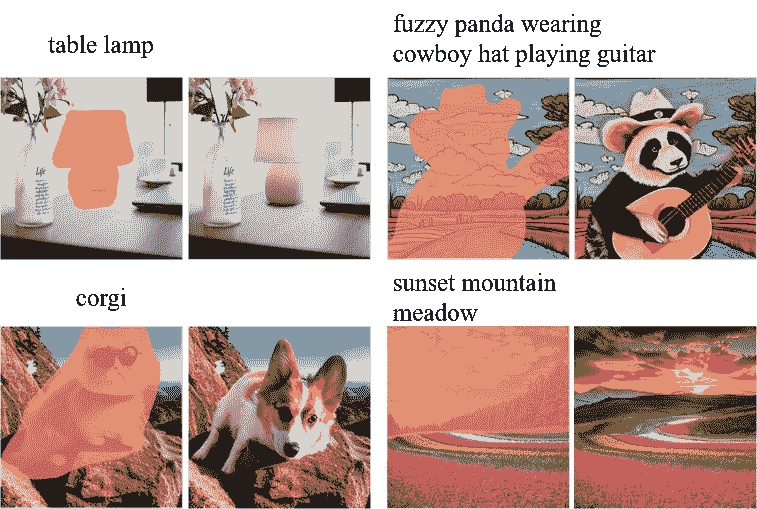

<!--yml

分类：未分类

日期：2024-09-06 19:35:18

-->

# [2401.03395] 基于深度学习的图像和视频修复：综述

> 来源：[`ar5iv.labs.arxiv.org/html/2401.03395`](https://ar5iv.labs.arxiv.org/html/2401.03395)

¹¹机构文本：D.-M. Yan

yandongming@gmail.com ²²机构文本：自动化研究所，中国科学院，北京，中国 中国科学院大学人工智能学院，北京，中国 四川大学计算机学院，成都，中国 国王阿卜杜拉科技大学计算机、电气和数学科学与工程部门，图瓦尔，沙特阿拉伯

# 基于深度学习的图像和视频修复：综述

Weize Quan ^(1,2)    Jiaxi Chen ^(1,2)    Yanli Liu ³    Dong-Ming Yan ^(1,2, ✉)    Peter Wonka ⁴(收到日期：日期 / 接受日期：日期)

###### 摘要

图像和视频修复是计算机视觉和计算机图形学中的经典问题，旨在填补图像和视频中缺失区域的合理和真实内容。随着深度学习的进步，这一问题最近取得了显著的进展。本文的目标是全面回顾基于深度学习的图像和视频修复方法。具体来说，我们从高层修复流程的角度对现有方法进行分类，介绍不同的深度学习架构，包括 CNN、VAE、GAN、扩散模型等，并总结模块设计的技术。我们回顾了训练目标和常见的基准数据集。我们提出了低级像素和高级感知相似性的评估指标，进行性能评估，并讨论了代表性修复方法的优缺点。我们还讨论了相关的实际应用。最后，我们讨论了未解决的挑战，并建议了潜在的未来研究方向。

###### 关键词：

图像修复 视频修复 深度学习 生成^†^†期刊：国际计算机视觉期刊

图 1：修复技术的应用示例：照片修复（左上：图像来自(Bertalmio et al., 2000))，文本去除（右上：图像来自(Bertalmio et al., 2000))，不需要的目标去除（左下：图像来自(Chen, 2018))，以及面部验证（右下：图像来自(Zhang et al., 2018c)）。

## 1 引言

图像和视频修复（Masnou 和 Morel, 1998; Bertalmio et al., 2000）指的是用合理和自然的内容恢复数字图像或视频中缺失/遮挡区域的任务。修复是一个欠约束的问题，尤其是当存在大面积缺失区域时，可能有多种合理的解决方案。修复在多个领域有许多重要应用，如文化遗产修复、虚拟场景编辑、数字取证以及影视制作等。图 1 显示了修复技术的一些重要应用。视频由多个展示时间一致性的图像组成，因此，视频修复与图像修复密切相关，其中前者通常从后者学习或扩展。因此，我们在本综述中同时回顾了图像和视频修复，论文数量如图 2 所示。

图 2：每年关于图像和视频修复的论文大致数量。

早期的图像修复方法主要依赖于损坏图像的低级特征，包括基于 PDE 的方法（Bertalmio et al., 2000; Ballester et al., 2001; Tschumperlé 和 Deriche, 2005）和基于补丁的方法（Efros 和 Leung, 1999; Barnes et al., 2009; Darabi et al., 2012; Huang et al., 2014; Herling 和 Broll, 2014; Guo et al., 2018）。基于 PDE 的方法通常从边界传播信息以创建平滑的修复。虽然可以传播边缘信息，但修复纹理却较为困难。相比仅考虑边界信息，基于补丁的方法通过匹配和复制已知区域的相似补丁来恢复未知区域。对于较小的区域，基于补丁的方法可以修复纹理，如果其他图像区域有相似的对象，还能修复完整的对象。然而，这些传统方法在生成新的语义上合理内容方面能力有限，尤其是对于较大的缺失区域以及与其他图像区域不相似的缺失区域。对经典图像修复方法的全面回顾超出了我们的范围，我们建议读者参考综述（Guillemot 和 Meur, 2014; Jam et al., 2021）以获取更多细节。

相比之下，深度学习有望修复大区域图像，并且能够通过学习更大的图像集合来修复新的合理内容。最初，在修复方面，卷积神经网络（CNNs）和生成对抗网络（GANs）是最受欢迎的选择。CNNs 是一类由卷积层、激活层和下/上采样层组成的前馈神经网络。它们学习从输入图像到输出图像的高度非线性映射。GANs 是一类生成模型，包括一个生成器和一个鉴别器，通过对抗过程估计数据分布。最近，更多的关注被放在了变换器架构和生成扩散模型上（Sohl-Dickstein et al.，2015; Ho et al.，2020）。变换器是一种基于并行多头注意力模块的流行网络架构。与 CNNs 的局部性相比，变换器有更好的上下文理解能力。扩散概率模型是一种潜变量模型，主要包含正向过程、反向过程和采样过程。扩散模型学习逆转一个随机过程（即扩散过程），通过添加噪声逐渐破坏数据。这些基于深度学习的图像修复方法在许多方面都能取得比传统方法更有吸引力的结果。从高级修复流程的角度看，现有的修复方法可以分为三类：一次性框架、两阶段框架和渐进式框架。与这些主要方法正交的是，它们的实现中可以观察到不同的技术方法，包括面具感知设计、注意机制、多尺度聚合、变换域、深先验指导、多任务学习、结构表示、损失函数等。

相较于图像，视频数据具有额外的时间维度。因此，视频修复不仅在每一帧的缺失区域填充合理的内容，还旨在恢复时间上连贯的解决方案。由于图像修复和视频修复之间的紧密关系，许多用于图像修复的技术思想通常被应用和扩展到视频修复任务中。传统的视频修复方法通常基于补丁采样和合成 (Wexler 等，2007; Granados 等，2012; Newson 等，2014; Huang 等，2016)。这些方法在合成一致内容和捕捉复杂运动方面能力有限，并且通常计算开销较大。为了解决这些不足，提出了许多基于深度学习的方法，并取得了显著进展。主要存在四个研究方向：基于 3D CNN 的方法、基于位移的方法、基于光流引导的方法以及基于注意力的方法。这些方法的核心思想是将来自邻近帧的信息转移到目标帧。3D CNN 是 2D CNN 的直接扩展，工作方式为端到端。然而，它们通常会遭遇空间错位和高计算成本的问题。基于位移的方法在一定程度上可以解决这些限制，但仅限于有限的时间窗口。基于光流引导的方法可以产生更高分辨率和时间上连贯的结果，但由于遮挡和复杂运动，易受到光流不完善的影响。基于注意力的方法融合了来自短距离和长距离的已知信息。不幸的是，不准确的注意力得分估计往往导致模糊的结果。

据我们所知，有几篇论文回顾了文献中的深度学习修复工作。Elharrouss 等 (2020) 将图像修复方法分类为基于序列、基于 CNN 和基于 GAN 的方法，并回顾了相关论文。为了改进他们的工作，我们还讨论了常见的方法论、损失函数和评估指标。我们还增加了对进一步研究方向的讨论，并包括了更新的工作。Jam 等 (2021) 回顾了传统和基于深度学习的图像修复方法。然而，他们更关注传统方法，但相比我们的调查，深度学习方法显著较少。Weng 等 (2022) 回顾了一些基于 GAN 的图像修复方法，但总体较短。此外，这些现有的调查没有同时回顾图像和视频修复。

## 2 图像修复

对于图像中缺失区域的修复，结果有时不是唯一的，特别是对于大面积缺失区域。因此，文献中主要存在两个研究方向：（1）确定性图像修复和（2）随机图像修复。给定一个受损图像，确定性图像修复方法仅输出修复结果，而随机图像修复方法可以通过随机采样过程输出多个可能的结果。受多模态学习的启发，一些研究人员最近专注于通过文本提示提供额外信息的文本引导图像修复。

### 2.1 确定性图像修复

从高级修复流程的角度来看，现有的确定性图像修复工作通常采用三种类型的框架：单次修复、两阶段和渐进式。单次修复框架通常采用一个生成器网络，以受损图像作为输入，以修复图像作为输出；两阶段框架主要由两个生成器组成，第一个生成器得到一个粗略结果，然后第二个生成器对此进行改进；渐进式框架应用一个或多个生成器迭代恢复沿边界的缺失区域。

图 3：单次修复框架的代表性流程。生成器将二进制掩模和受损图像的拼接作为输入，输出完成的图像。训练目标用于训练生成器。

#### 2.1.1 单次修复框架

许多现有的修复方法采用单次修复框架，如图 3 所示。它基本上学习了从受损图像到完整图像的映射。该框架通常由生成器和相应的训练目标组成。

生成器。为了提高生成器的修复能力，存在几种研究方向：掩模感知设计、注意力机制、多尺度聚合、变换域、编码器-解码器连接和深度先验指导。

(1) 掩模感知设计。

缺失的区域（用二进制掩码表示）具有不同的形状，与这些缺失区域重叠的卷积操作可能是视觉伪影的来源。因此，一些研究人员提出了针对经典卷积操作和归一化的掩码感知解决方案。受到图像修复中固有空间变化特性的启发，Ren 等人 (2015) 设计了一个 Shepard 插值层，其中特征图和掩码都进行相同的卷积操作。它的输出是特征卷积和掩码卷积结果的比例。掩码卷积可以同时更新掩码。为了更好地处理各种不规则孔洞并在掩码更新过程中演变孔洞，Liu 等人 (2018) 提出了掩码引导卷积操作，即部分卷积，它区分了卷积窗口中的有效区域和孔洞。Xie 等人 (2019) 提出了可训练的双向注意力图，以扩展部分卷积 (Liu 等人，2018)，这种方法可以自适应地学习特征的重新归一化和掩码更新。

与之前方法考虑的特征归一化不同，Yu 等人 (2020) 关注于均值和方差偏移相关的归一化，并将空间区域级归一化引入到修复网络中。Wang 等人 (2020c) 设计了一个视觉一致性网络用于盲图像修复。他们首先预测了损坏区域生成掩码，然后应用了带有提议的概率上下文归一化的修复网络，该网络基于不同层将均值和方差从已知特征转移到未知部分。受到用像素优先级填补孔洞的启发 (Criminisi 等人，2004; Zhang 等人，2019b)，Wang 等人 (2021c) 在部分卷积 (Liu 等人，2018) 中使用了结构优先级（在低分辨率特征中）和纹理优先级（在高分辨率特征中）。Wang 等人 (2021a) 提出了一个动态选择网络，以更好地利用有效像素。具体而言，他们设计了一种有效性可迁移卷积，以动态地采样卷积位置，以及一个区域复合归一化模块，以自适应地在基于掩码的选择性特征图上复合批次、实例和层归一化。Zhu 等人 (2021) 学习了从掩码中推导每个卷积窗口的卷积核，并提出了一种点-wise 归一化，生成掩码感知的批量归一化的尺度和偏置。

(2) 注意力机制。

注意力机制是自然语言处理领域（Vaswani et al. (2017)）和计算机视觉领域（Wang et al., 2018b; Fu et al., 2019）中一种广泛使用的工具来建模相关性。注意力机制比卷积更擅长访问远距离的空间位置特征。在文献中，Yu et al. (2018) 首次将上下文注意力机制引入图像修复。这项开创性工作激发了许多后续研究。为了增强视觉和语义的一致性，Zeng et al. (2019) 提出了一个金字塔上下文编码网络与注意力转移方法，其中在高层特征中计算的注意力分数用于低层特征的更新。Wang et al. (2019b) 提出了一个多尺度上下文注意力模型，采用两种不同的补丁大小，并随后使用了通道注意力块（Hu et al., 2018）。Wang et al. (2020b) 引入了一个多阶段注意力模块，该模块在第一阶段执行大补丁交换，在下一阶段执行小补丁交换。Qin et al. (2021) 结合了空间-通道注意力（Chen et al., 2017）和空间金字塔结构来构建一个多尺度注意力单元（MSAU）。该单元分别对由不同膨胀卷积获得的四个特征图进行空间注意力，然后对拼接的注意力特征应用增强的通道注意力。Zhang et al. (2022e) 提出了一个结构与纹理交互网络用于图像修复。他们设计了一个纹理空间注意力模块，通过粗略结构引导的强健注意力分数来恢复纹理细节，并引入了一个结构通道激发模块，根据粗糙结构和精细结构之间的差异来重新校准结构。

此外，一些最近的研究提出了基于视觉变换器的图像修复网络（Dosovitskiy 等，2021）。Deng 等人（2021）提出了一种上下文变换器网络来完成损坏的图像。他们的网络主要依赖于多尺度多子头注意力，这种注意力是从（Vaswani 等人，2017）提出的原始多头注意力扩展而来的。Cao 等人（2022）将来自基于 ViT 的掩码自编码器（MAE）（He 等人，2022）的丰富先验信息融入图像修复中。具体来说，预训练的 MAE 模型提供了修复网络编码器的特征先验，并提供了注意力先验，以简化长距离关系建模。Zheng 等人（2022a）设计了一种具有小且不重叠感受野的限制性 CNN 头作为标记表示，而不是使用浅层投影或大接收域卷积来对不完整图像进行排序。Deng 等人（2022）通过插入拉普拉斯距离先验修改了多头自注意力，这种先验同时考虑了特征及其位置来计算相似性。

(3) 多尺度聚合。

在图像处理文献中，多尺度聚合是一种常见的方法，用于融合来自不同分辨率的信息。王等人（2018c）设计了一个生成式多列修补网络，由三个具有不同滤波器核大小的卷积分支组成，以融合多尺度特征表示。为了在修补区域与现有内容之间创建平滑过渡，洪等人（2019）提出了一种深度融合网络，该网络具有多个融合模块，并在多尺度层上应用重建损失。融合模块通过可学习的 alpha 组合将预测内容与输入图像合并。汇等人（2020）提出了一种密集多尺度融合模块，该模块通过多个具有不同膨胀率的卷积分支融合分层特征。郑等人（2021b）设计了一种渐进式多尺度融合模块，以并行方式提取多尺度特征，并逐步融合这些特征，从而产生更具代表性的局部特征。受高分辨率网络（HRNet）用于视觉识别的启发（孙等人，2019；万等人，2021），王等人（2021c）引入了一种并行多分辨率融合网络用于图像修补。该网络可以同时在多个分辨率下进行修补，采用基于掩模感知和注意力引导的表示融合方法。Phutke 和 Murala（2021）也采用了多路径设计，其中在编码器中引入了四个具有不同分辨率的并发分支。一个具有多样接收场的残差模块被设计为编码器的构建块。曹和傅（2021）提出了一种用于人工场景修补的多尺度草图张量网络。该网络通过对预测的线条、边缘和不同尺度的粗略图像添加约束，重建不同类型的结构。不同于通过具有不同膨胀率的卷积处理的掩模盲处理（李等人，2020b；秦等人，2021），曾等人（2022）精心设计了一种门控残差连接，考虑了孔洞和有效区域之间的差异。他们还提出了一种软掩模引导的 PatchGAN，其中判别器被训练来预测通过高斯滤波获得的软掩模。

(4) 变换域。

与其在空间域中进行图像修补，一些现有的工作设计了通过离散小波变换（DWT）（Daubechies, 1990）和快速傅里叶变换（FFT）的变换域中的修补框架。Wang 等（2020a）将图像修补问题重新定义为预测低频语义结构和高频纹理细节。具体来说，他们通过 Haar 小波变换（Mallat, 1989）将受损图像分解为不同的频率成分，设计了一个多频率概率推断模型以预测缺失区域中的频率内容，并反向变换回图像空间。Yu 等（2021a）采用了类似的修补流程。对于多频率完成，他们提出了一种频率区域注意归一化模块，用于对齐和融合不同频率的特征，并对两个高频流应用了两个鉴别器。Li 等（2021）提取了高频子带作为纹理，并引入了 DWT 损失以约束低频和高频子带的保真度。LaMa（Suvorov 等，2022）结合了残差设计（He 等，2016）和快速傅里叶卷积（Chi 等，2020）来构建一个快速傅里叶卷积残差块，并将其集成到编码器-解码器网络中，以处理大面积的掩模修补。Lu 等（2022）通过引入各种类型的掩模并添加焦点频率损失（Jiang 等，2021）来进一步改进 LaMa，以约束图像的频谱。

(5) 编码器-解码器连接。

一些工作通过引入精心设计的特征连接来修改基本的编码器-解码器架构。Shift-Net (Yan et al., 2018) 通过引入特定的移位连接层来修改 U-Net 架构，该层将有效区域的编码器特征移位到缺失区域，并使用引导损失。Dolhansky 和 Ferrer (2018) 引入了一种眼睛修复网络，该网络将参考图像编码的识别信息合并为代码。Shen et al. (2019) 设计了一种密集连接的生成网络用于语义图像修复。他们结合了四个对称的 U-Nets 和密集跳跃连接。Liu et al. (2020) 引入了一种相互编码器-解码器 CNN，融合了纹理和结构特征（来自编码器的浅层和深层），以特征均衡来联合恢复结构和纹理。类似地，Guo et al. (2021) 设计了一种双流图像修复网络，结合了结构约束的纹理合成子模型和纹理引导的结构重建子模型。此外，他们引入了双向门控特征融合模块和上下文特征聚合模块，以融合和优化生成的图像。Feng et al. (2022) 在经典的编码器-解码器网络中插入了生成记忆，以共同利用高级语义推理和像素级内容推理。基于 (Liu et al., 2020)，Liu et al. (2022) 通过特征对齐模块从内容一致的参考图像中推断纹理和结构。

(6) 深度先验指导。

为了提高修复生成器的性能，一些研究探索了来自单张图像或大型图像数据库的深度先验。Lempitsky 等人 (2018) 利用随机初始化的生成网络作为先验，通过仅重建已知区域来完成受损图像。Gu 等人 (2020) 提出了 mGANprior，通过将预训练的 GAN 作为图像修复的先验。具体而言，该方法在填补缺失区域时，通过自适应地融合来自不同潜在代码的多个生成特征图来重建未受损区域。Richardson 等人 (2021) 开发了一个用于图像修复的 pixel2style2pixel (pSp) 框架。他们引入了一个包含特征金字塔和多个映射网络的编码器，将受损图像编码为扩展的潜在空间 $\mathcal{W}+$（18 个 512 维的风格向量），这是潜在空间 $\mathcal{W}$ (Karras 等人，2019) 的扩展，并重复使用预训练的 StyleGAN 生成器作为先验以实现完整图像。为了处理大面积缺失区域和复杂的语义，Wang 等人 (2022b) 设计了一个带有 GAN 反演的双路径图像修复框架 (Xia 等人，2022)。给定一张受损图像，反演路径推断出接近的潜在代码并从训练好的 GAN 模型中提取相应的多层特征，前馈路径通过将上述语义先验与变形融合模块合并来填补缺失区域。为了保证受损图像和完成图像中有效区域的一致性，Yu 等人 (2022b) 通过设计具有预调制模块的映射网络并引入 $\mathcal{F}\&\mathcal{W}+$ 潜在空间来修改 GAN 反演管道 (Richardson 等人，2021)，其中 $\mathcal{F}$ 是受损图像的特征图。

训练目标。训练目标是基于深度学习的图像修复方法中一个非常重要的组成部分。逐像素重建损失、感知损失（Johnson et al., 2016）、风格损失（Gatys et al., 2016）和对抗损失（Goodfellow et al., 2014）是普遍使用的训练目标。对抗损失是通过判别网络获得的。Pathak et al. (2016) 和 Li et al. (2019b) 采用了来自 DCGAN（Radford et al., 2016）的判别器（堆叠卷积和下采样）。考虑到 Pathak et al. (2016) 方法在与周围区域保持局部一致性方面的困难，Iizuka et al. (2017) 提出了局部和全局判别器，生成了更为真实的内容。Yu et al. (2018) 提出了基于补丁的判别器，这可以视为局部和全局判别器的广义版本（Iizuka et al., 2017）。这种基于补丁的判别器随后在许多后续工作中被使用。Liu et al. (2021c) 设计了两个具有小尺度和大尺度感受野的判别器，以引导修复网络生成细粒度的图像细节。

此外，研究人员还引入了一些精心设计的损失函数。Li et al. (2017) 为面部补全引入了语义解析损失。Yeh et al. (2017) 提出了上下文和先验损失，用于在潜在图像流形中搜索最接近的编码，以推断缺失的内容。Vo et al. (2018) 提出了结构重建损失，这是一种像素和特征空间重建误差的组合。为了明确探索填充内容与其周围上下文之间的结构和纹理一致性，Li et al. (2019a) 利用图像和补丁级别的局部内在维度（Houle, 2017a, b）来测量和约束修复内容的数据子流形与有效像素的对齐。为了稳定面部修复的训练过程，即减弱梯度消失和模型崩溃，Han 和 Wang (2021) 通过神经进化训练生成器，并通过突变和交叉优化生成器的参数。

一些研究人员通过多任务学习引入了额外的训练目标。Liao 等人 (2018a) 提出了一个新颖的协作框架，通过在多个任务上同时训练生成器，即面部补全、地标检测和语义解析。为了增强网络在图像结构方面的修复能力，Yang 等人 (2020) 设计了一个在解码器中的结构恢复分支，并将结构特征明确插入到主要的修复过程中。适当的语义指导是图像修复的一个合适工具（Song 等人，2018b），受此启发，Liao 等人 (2020, 2021b, 2021a) 提出了一个统一框架来共同预测分割图和恢复损坏的图像。具体而言，Liao 等人 (2020, 2021b) 设计了一个语义指导和评估网络，迭代更新和评估语义图，并在多个尺度上推断缺失内容。然而，这种方法可能会在混合语义区域产生不切实际的纹理和模糊的边界。为了解决这个问题，Liao 等人 (2021a) 设计了一个语义级注意力传播模块，以在相同的语义区域应用注意力操作。他们还引入了两个一致性损失，以约束语义图与修复图像的结构和纹理之间的一致性。Zhang 等人 (2020b) 研究了如何提高修复图像的视觉质量，并提出了一个像素级密集检测器用于图像修复。该基于检测的框架可以定位完成图像的伪影，相关的位置信息与重建损失结合，以更好地指导修复网络的训练。Zhang 等人 (2021) 将语义先验估计引入作为预训练的多标签分类模型的前提任务，然后利用学习到的语义先验通过空间自适应归一化模块指导修复过程（Park 等人，2019）。Yu 等人 (2022a) 联合解决了图像重建、语义分割和边缘纹理生成。每个分支都通过一个变换器网络实现，并开发了一个多尺度空间感知注意力块，从其他两个分支指导主要的图像修复分支。类似于 (Zhang 等人，2020b)，Zhang 等人 (2022d) 首先定位了完成图像中的感知伪影，然后利用这些信息指导迭代优化过程。他们还手动注释了一个修复伪影数据集。

(a) 粗到细

(b) 结构先于纹理

图 4：两种类型的两阶段修复框架：(a) 粗到细（Yu et al., 2018），其中第一个网络预测初步的粗略结果，第二个网络预测精细结果；(b) 结构再到纹理（Nazeri et al., 2019），其中第一个网络预测结构图，第二个网络预测完整图像。这两种方法的明显区别在于，结构再到纹理方法在第一阶段明确地预测结构图。

#### 2.1.2 两阶段框架

粗到细方法。这种方法首先使用生成器填充粗略内容的空洞，然后通过第二个生成器进行细化，如图 4(a)所示。Yu et al. (2018) 修改了生成修复框架，采用了级联的粗略和细化网络。在细化阶段，他们设计了一个上下文注意模块，建模长期相关性，以促进修复过程。

后来的许多研究在这个经典的粗到细框架的不同方面进行了改进。受到用于不规则孔洞的**掩膜感知卷积**（Liu et al., 2018）的启发，Yu et al. (2019) 通过引入**门控卷积**来改进之前的网络（Yu et al., 2018），使其能够自适应地感知掩膜的位置。在粗略阶段，Ma et al. (2019) 提出了区域卷积和非局部操作，以处理完整区域与损坏区域之间的差异和相关性。PEPSI Sagong et al. (2019) 通过共享编码网络，并将粗略和精细修复网络以并行方式组织，修改了 (Yu et al., 2018) 中的两阶段特征编码过程。PEPSI 可以提高修复能力，同时减少卷积操作的数量和计算资源。为了进一步减少网络参数，Shin et al. (2021) 通过将原始的**膨胀卷积层**（Yu and Koltun, 2016）替换为一种所谓的**自适应率版本**，扩展了 PEPSI，该版本共享每层的权重，但通过膨胀率相关的缩放和位移操作生成动态特征。由 (Yu et al., 2018) 提出的**上下文注意力**在建模孔洞内部补丁之间的关系方面能力有限，因此 Liu et al. (2019) 引入了一个**连贯的语义注意力层**，以增强孔洞区域注意力计算中的语义相关性和特征连续性。在 (Yu et al., 2018) 中，应用了几种膨胀卷积以扩大感受野。Li et al. (2020b) 用一个具有八种不同膨胀率的**空间金字塔膨胀 ResNet 模块**替代了膨胀卷积，以提取多尺度特征。Navasardyan 和 Ohanyan (2020) 设计了一种基于补丁的**洋葱卷积机制**，以持续传播已知区域的信息到缺失区域。这种卷积机制可以捕捉长距离的像素依赖性，并实现高效率和低延迟。Wadhwa et al. (2021) 提出了一个带有可训练的**发生矩阵**的**超图卷积**，以生成全球语义完成的图像，并用**门控卷积**替代了判别器中的常规卷积，以增强修复图像的局部一致性。

由于计算开销以及对上下文注意力的缺乏监督（Yu 等人，2018），曾等人（2021b）移除了该注意力模块，并通过所谓的上下文重建损失来学习其补丁借用行为。基于恢复不同类型缺失区域需要不同邻域范围的洞察，全等人（2022）设计了一个具有小和大感受野的局部和全局精修网络，可以直接应用于现有网络的末端，以进一步增强其修复能力。金等人（2022）开发了一个粗略-超分辨率-精修管道，其中他们在粗略网络之后添加了一个超分辨率网络以重建更精细的细节，并引入了渐进学习机制以修复更大的孔洞。

一些工作采用粗到细的框架来实现高分辨率的图像修复。杨等人（2017）设计了一个由内容网络和纹理网络组成的两阶段修复框架。前者预测低分辨率（$128\times 128$）下的整体内容，后者则从低分辨率到高分辨率（$512\times 512$）迭代优化缺失区域的纹理细节。宋等人（2018a）开发了一个图像到特征网络来推断粗略结果，然后设计了一种补丁交换方法来细化粗略特征。交换后的特征图通过 Feature2Image 网络转化为完整图像。此外，该框架可以通过多尺度推理直接用于高分辨率修复，将完整图像上采样作为精修阶段的输入。易等人（2020）提出了一种上下文残差聚合机制用于超高分辨率图像修复（最高可达 8K）。具体而言，首先通过两阶段的粗到细网络预测低分辨率修复结果，然后通过将大模糊图像与聚合的残差相加生成高分辨率结果，这些残差是通过从上下文补丁中聚合加权高频残差获得的。张等人（2022c）专注于 4K 或更高分辨率的图像修复。他们首先通过 LaMa（Suvorov 等人，2022）填补空洞，从最初完成的图像中预测深度、结构和分割图，然后使用多指导的 PatchMatch（Barnes 等人，2009）生成多个候选结果，并最终使用所提出的自动策划网络选择良好的输出。为了在资源有限的情况下完成高分辨率图像，这些方法首先在低分辨率级别预测粗略内容，然后在高分辨率级别细化纹理细节（有时使用多尺度推理）。

其他作品也遵循基本的粗到细策略，但它们显然不同于(Yu et al., 2018)提出的框架。在通过初始预测网络获得粗略结果后，Li et al. (2019d) 采用了超分辨率网络作为细化阶段，以产生高频细节。Roy et al. (2021) 通过学习腐蚀图像及其真实值的 DFT 映射，在频域中预测粗略结果。基于补丁方法(Barnes et al., 2009; He and Sun, 2012) 用高质量纹理细节填补缺失区域的见解，Xu et al. (2021) 提出了一个纹理记忆增强的补丁合成网络，在粗略修补网络之后加入了补丁分布损失。

结构-纹理方法。结构和纹理是图像的两个重要组成部分，因此，一些工作将图像修复分解为结构推断和纹理恢复，如图 4(b)所示。Sun 等人 (2018b) 设计了一个两阶段的头部修复遮蔽网络。第一阶段生成面部特征点，第二阶段则根据这些特征点恢复头部图像。Song 等人 (2019) 首先估计了面部几何信息，包括特征点热图和解析图，然后将这些结果与受损的面部图像连接，作为完整网络的输入，以恢复面部图像并解开遮蔽。Liao 等人 (2018b) 和 Nazeri 等人 (2019) 都提出了一种边缘引导的图像修复方法，该方法首先估计缺失区域的边缘图，然后利用这个边缘图来预测纹理细节。同样，Xiong 等人 (2019) 明确将图像修复问题分解为前景轮廓预测和内容补全两个子任务。为了改善粗糙边缘图的结构引导，Ren 等人 (2019) 引入了另一种结构表示，即通过滤波操作进行的边缘保持平滑。基于第一网络的结构重建，他们使用外观流修复缺失区域。Shao 等人 (2020) 将边缘图和颜色感知图结合作为结构表示，其中前者通过 Canny 算子 (Canny, 1986) 捕获，后者通过大内核的高斯模糊获得。针对特定的漫画修复，Xie 等人 (2021) 首先完成了一个语义结构图，包括结构线和 ScreenVAE 图（屏幕纹理的逐点表示）(Xie 等人, 2020)，使用语义修复网络完成。然后，完成的语义图用于指导外观合成。Wang 等人 (2021b) 设计了一个外部-内部学习修复框架。它首先使用从大数据集中外部学习的知识在单色空间中重建结构。基于内部学习，它应用了一个多阶段网络，通过迭代优化恢复颜色信息。除了 (Nazeri 等人, 2019) 中使用的边缘图外，Yamashita 等人 (2022) 还结合了深度图像以提供不同对象之间的边界。他们的方法首先分别完成了遮蔽的边缘和深度图像，然后通过 RGB 图像修复网络恢复缺失区域，输入为遮蔽图像、修复边缘和深度图像的连接。为了包含更丰富的结构信息，Wu 等人 (2022) 选择了局部二值模式 (LBP) (Ojala 等人, 1996, 2002)，它描述了边缘、斑点和其他局部特征的分布信息 (Zhang 等人, 2010)。在 (Wu 等人, 2022) 中，第一个网络推断了孔的 LBP 信息，第二个具有空间注意力的网络进行了实际的图像修复。Dong 等人 (2022) 使用了变压器在灰度空间中完成整体结构，并提出了用于大不规则遮蔽的掩模位置编码。

此外，语义分割图也被用作结构的代理（宋等， 2018b；邱等， 2021；周等， 2021）。宋等（2018b）将语义分割信息引入图像修复过程，以改善不同类别区域之间恢复的边界。他们首先通过 U-Net 预测缺失区域的分割图，然后在第二个生成网络的指导下，利用上述修复的语义图恢复缺失的内容。宋等（2018b）利用预分类算法（Felzenszwalb 和 Huttenlocher， 2004）提取语义结构图。完成语义图后，他们采用空间通道注意模块生成纹理信息。周等（2021）首先通过分割重构器预测完整的分割图，然后利用基于关系网络的图像生成器恢复细粒度纹理细节。关系网络是 SPADE（Park 等， 2019）的扩展，能够通过空间自适应归一化和关系图更好地调节特征。

图 5：渐进式图像修复。该图像来源于（张等， 2018a）。

#### 2.1.3 渐进框架

继承传统修补方法的基本思想，一些研究提出了利用深度模型进行渐进修补的方法。如图 5 所示，渐进方法迭代地从孔的边界到中心填补孔洞，缺失区域逐渐变小直到消失。Zhang 等（2018a）将图像修补表述为一个序列问题，其中缺失区域在四个修补阶段中被填补。他们设计了一个基于 LSTM（长短期记忆）（Hochreiter 和 Schmidhuber，1997）的框架，将这四个修补阶段串联起来。然而，这种方法无法处理实际应用中常见的不规则孔洞。Guo 等（2019）设计了一种残差架构，以渐进方式更新不规则掩码，并引入了全分辨率网络以促进特征融合和纹理重建。受结构引导修补方法（Nazeri 等，2019；Xiong 等，2019）的启发，Li 等（2019c）提出了一种渐进重建方法，采用视觉结构网络将结构信息逐步融入视觉特征中，从而生成更结构化的图像。渐进修补方法有潜力填补大孔，但由于缺乏对孔中心的约束，仍然很困难。为了解决这一缺陷，Li 等（2020c）设计了一种具有一致注意力和加权特征融合的递归特征推理网络。该网络递归地推断并收集特征图的孔边界，以逐步加强估计内部内容的约束。Zeng 等（2020b）提出了一种具有信心反馈的迭代修补方法，适用于高分辨率图像。SRInpaintor（Li 等，2022a）在渐进管道中结合了超分辨率和变换器。它在低分辨率下推断全球结构，并在高分辨率下逐步细化纹理细节。

为此，我们组织了网络设计的重要和普遍的技术方面，如表 1 所示。

表 1：深度学习图像修补的关键技术总结。

| 方面 | 模块 | 核心思想 |
| --- | --- | --- |
| 掩码感知卷积 | Shepard 插值 （Ren 等，2015） | 平移变体插值 |
| 部分卷积 （Liu 等，2018） | 有效区域的卷积 |
| 门控卷积 （Yu 等，2019） | 自适应门控 |
| 优先引导的部分卷积 (Wang et al., 2021c) | 结构和纹理优先级 |
| 注意力 | 上下文注意力 (Yu et al., 2018) | 高背景补丁 |
|  | 与粗略预测的相似性 |
| 连贯语义注意力 (Liu et al., 2019) | 孔内补丁之间的相关性 |
| 多尺度注意力模块 (Wang et al., 2019b) | 带有两种补丁尺寸的注意力 |
| 多尺度注意力单元 (Qin et al., 2021) | 带有四种不同扩张率的注意力 |
| 归一化 | 区域归一化 (Yu et al., 2020) | 空间和区域级别 |
| 概率上下文归一化 (Wang et al., 2020c) | 转移均值和方差 |
| 区域复合归一化 (Wang et al., 2021a) | 批量、实例和层归一化 |
| 点级归一化 (Zhu et al., 2021) | 面具感知批量归一化 |
| 频率区域注意归一化 (Zhu et al., 2021) | 对齐低频和高频特征 |
| 判别器 | 全局判别器 (Pathak et al., 2016) | 整个图像 |
| 局部判别器 (Iizuka et al., 2017) | 损坏区域 |
| 基于补丁的判别器 (PatchDis) (Yu et al., 2019) | 密集局部补丁 |
| 条件多尺度判别器 (Li et al., 2020b) | 具有两种不同尺度的 PatchDis |
| 软面具引导的 PatchDis (Zeng et al., 2022) | 丢失区域的中心部分 |

### 2.2 随机图像修复

图像修复是一个欠定的逆问题。因此，存在多个可能的解决方案。我们使用“随机图像修复”一词来指代能够通过随机采样过程产生多种解决方案的方法。

基于 VAE 的方法。变分自动编码器（VAE）（Kingma and Welling，2014）是一种生成模型，它结合了编码器和解码器。编码器学习一个适当的潜在空间，解码器将抽样的潜在表示转换回新数据。Zheng 等人(2019)提出了一个两分支补全网络，其中重构分支模拟缺失部分的先验分布，并从这个分布重构原始完整图像。生成分支推断出缺失区域的潜在条件先验分布。通过平衡条件分布的方差和原始训练数据的重构来优化这一框架。Zheng 等人(2021a)通过在单独的训练阶段估计分布并引入补丁级短长期注意模块来扩展了这项工作。对于随机时尚图像修补，Han 等人(2019)将修补过程分解为形状和外观生成。这两个生成任务的网络设计主要采用了 VAE 架构。基于面部图像上的预训练 VAE，Tu 和 Chen(2019)首先在编码向量空间中搜索损坏图像的可能解集，然后用 VAE 的解码器恢复可能的面部图像。赵等人(2020)提出了一个实例引导的条件图像到图像转换网络来学习条件完成分布。具体而言，他们首先将实例和掩蔽图像编码成两个概率特征空间，然后设计一个跨语义注意层来融合两个特征图。最后使用解码器生成修补图像。然而，Han 等人(2019)和赵等人(2020)常常因为结构和外观的联合优化而遭受扭曲的结构和模糊的纹理。Peng 等人(2021)设计了一个两阶段流水线，第一阶段根据分层矢量量化变分自动编码器产生多个不同结构的粗略结果，第二阶段在离散结构特征的引导下合成纹理。

基于 GAN 的方法。GAN（Goodfellow 等, 2014）通过对抗过程学习数据分布。一个生成器将采样的高斯随机噪声转换为图像空间，而一个鉴别器用于区分真实样本和假样本。基于从孔边界到孔中心自由度增加的前提，Liu 等人 (2021a) 引入了一种空间概率多样性标准化来通过多样性图调整像素生成。考虑到最小化经典重建损失会妨碍结果的多样性，他们还提出了一种感知多样性损失，最大化两个生成图像在特征空间中的距离。通过结合图像条件和无条件生成架构，Zhao 等人 (2021) 提出了用于大规模图像修复的共调制 GAN。从技术上讲，他们将不完整的输入图像编码为条件潜在向量，然后与 StyleGAN2（Karras 等, 2020）的原始风格向量连接。为了增强图像修复的多样性和控制，Zeng 等人 (2021a) 基于粗略修复结果应用了训练样本中的块匹配。特别地，他们设计了基于最近邻的像素级全局匹配（来自单个图像）和组合匹配（来自多个图像）。受到 CoModGAN（Zhao 等, 2021）的启发，Zheng 等人 (2022b) 提出了一个级联调制 GAN，该 GAN 结合了每个解码器尺度中的全局调制和空间自适应调制，并用快速傅里叶卷积（Chi 等, 2020）替代了编码器中的常规卷积。为了直接完成高分辨率图像，Li 等人 (2022b) 提出了一个具有动态掩码更新的掩码感知 Transformer 模块（Liu 等, 2018）。该模块仅使用部分有效标记以移位窗口的方式进行非局部交互（Liu 等, 2021d）。按照（Chen 等, 2019; Karras 等, 2019），他们开发了一种用于随机生成的风格操控模块。

基于流的方法。标准化流（Tabak 和 Vanden-Eijnden, 2010; Dinh 等, 2014; Rezende 和 Mohamed, 2015）是一种生成方法，通过组合一系列可逆映射来构建复杂的概率分布。受到 Glow（Kingma 和 Dhariwal, 2018）及其条件扩展（Lugmayr 等, 2020）的启发，Wang 等人 (2022a) 提出了一个条件标准化流网络，以学习结构先验的概率分布。然后，应用另一个生成器生成具有丰富纹理的最终完整图像。

基于 MLM 的方法。为了在缺失区域生成随机结构，Yu 等（2021b）和 Wan 等（2021）采用了基于掩码语言模型（MLM）的序列预测流程。Yu 等（2021b）提出了一种双向和自回归的变换器作为低分辨率随机结构生成器，通过 top-$\mathcal{K}$ 采样策略在推断过程中预测掩码标记（缺失区域）。然后，应用纹理生成器生成多个修复结果。类似地，Wan 等（2021）提出了 Transformer-CNN 框架。他们首先应用具有 MLM 目标的变换器训练生成具有多元结构和一些粗糙纹理的低分辨率图像，然后利用编码器-解码器网络增强高分辨率完整图像的局部纹理细节。

图 6：遮罩的代表性示例。

基于扩散模型的方法。扩散模型（DM）是用于图像合成的新兴生成模型。在这里，我们只回顾基于扩散模型的修复方法，并且我们建议读者参考关于扩散模型的全面介绍的调查文章（Yang 等，2023；Croitoru 等，2023）。通常，基于扩散的修复模型采用 U-Net 架构。训练目标通常基于 $\mathcal{L}_{DM}=\mathbb{E}_{x,\epsilon\in\mathcal{N}(0,1),t}[\|\epsilon-\epsilon_{\theta}(x_{t},t)\|_{2}^{2}]$，其中 $t=1\dots T$，$x_{t}$ 是 $x$ 的噪声版本，$\epsilon_{\theta}(\cdot,t)$ 是一个神经网络。在文献中，现有的工作主要集中在采样策略设计和计算成本减少上。

(1) 采样策略设计。

基于无条件预训练的去噪扩散概率模型（DDPM）（Ho 等，2020），Lugmayr 等（2022）通过从扩散模型中采样遮罩区域，从给定图像中采样未遮罩区域来修改了标准去噪策略。为了保持背景并改善一致性，Xie 等（2023）向扩散模型中添加了额外的遮罩预测。在推断阶段，预测的遮罩用于指导采样过程。

(2) 计算成本减少。

与在像素空间应用扩散过程不同，Esser 等人（2021）在离散潜在空间上使用了多项式扩散过程（Hoogeboom 等人，2021；Austin 等人，2021），并对逆过程进行了自回归因式分解。这些设计使得 ImageBART 能够生成高分辨率的图像，例如 $300\times 1800$。类似地，Rombach 等人（2022）提出了一种潜在扩散模型（LDM），以降低 DMs 的训练成本，同时提高视觉质量，该模型可以应用于高分辨率 $1024^{2}$ 像素的图像修复任务。为了克服扩散模型中的大量迭代限制，Li 等人（2022c）提出了一种具有解耦概率建模的空间扩散模型（SDM），其中均值项指的是修复结果，方差项则测量不确定性。与在逆条件扩散中从随机高斯噪声开始不同，Chung 等人（2022）通过从前向扩散数据开始，以更好的初始化显著减少了采样步骤的数量。

### 2.3 文本引导的图像修复

文本引导的图像修复技术以不完整的图像和文本描述为输入，生成与文本对齐的修复结果。主要的挑战在于如何融合文本和图像的语义特征，以及如何关注文本中的有效信息。张等人（2020a）提出了一种双重注意力机制，通过寻找与图像不匹配的词汇来获得掩蔽区域的语义特征，并应用 DAMSM 损失（徐等人，2018b）来衡量文本和图像的相似性。林等人（2020）引入了一种图像自适应词需求模块，该模块在粗略阶段移除冗余信息并聚合文本特征。他们还提出了一种文本引导注意力损失，更加关注文本影响区域的重建。张等人（2020c）将文本和图像编码为序列数据，并利用变换器架构使跨模态特征进行交互。为了确保修复的图像与文本匹配，他们将掩蔽文本和修复图像作为输入，以恢复文本提示。吴等人（2021）通过引入双重注意力模块，将词级和句子级文本特征融合到一个两阶段生成器中。为了消除背景的影响，设计了掩蔽重建模块来恢复损坏的物体掩蔽。谢等人（2022）将多头自注意力应用于文本-图像交互编码器。他们创建了一个语义关系图来计算文本和图像之间的非欧几里得语义关系，并使用图卷积来聚合节点特征。李等人（2023）遵循了一种粗到细的图像修复框架。他们首先使用视觉感知的文本过滤机制自适应地集中于所需的词汇，然后将过滤后的文本特征插入到粗略网络中。与（张等人，2020c）不同，他们直接从修复后的图像中重建文本描述，以确保多模态语义对齐。为了更好地保留文本引导过程中非缺陷区域，倪等人（2023）提出了一种无缺陷的 VQGAN 来控制感受野扩展，以及一个序列到序列模块，以从文本描述、低级像素和高级标记等多个不同角度进行视觉语言学习。近期的方法基于扩散模型。Shukla 等人（2023）关注于如何生成高质量的文本提示，以指导基于文本到图像模型的修复网络，通过分析物体之间的关系。他们首先基于物体检测器的输出构建场景图，并通过图卷积网络扩展它，以获取损坏节点的特征。最后，将生成的文本提示和掩蔽图像输入扩散模型，以获得修复结果。王等人（2023）发现物体掩蔽会迫使修复图像更多地依赖于文本描述，而不是随机掩蔽。然后，他们提出了从 Imagen（Saharia 等人，2022b）微调的 Imagen Editor，增加了新的卷积层，并设计了一种物体掩蔽策略以便更好地进行训练。为了促进对文本引导图像修复的系统评估，他们建立了一个名为 EditBench 的基准。

### 2.4 修补掩码

在图像修补技术的发展中，引入了各种人工掩码。这些掩码大致可分为两类：规则掩码和不规则掩码。图 6 总结了这些掩码，其中白色像素表示缺失区域。

规则掩码。一个*方形孔*，它阻挡中心区域或随机位置，通常更容易构造。Lugmayr 等人 (2022) 介绍了更多的规则掩码，包括*超分辨率 $2\times$*（以 2 的步幅保留像素）、*交替线*（去除每第二行）、*扩展*（保留输入图像的小中心裁剪）和*一半*（遮罩输入图像的一半）。

不规则掩码。*字母掩码*（Bertalmio 等人，2000; Bian 等人，2022）和*物体形状掩码*（Criminisi 等人，2004; Yi 等人，2020）特别设计用于特定任务，例如，去除标题和物体移除。Liu 等人 (2018) 介绍了自由形式掩码，其中前者从遮挡/去遮挡掩码估计方法的结果中收集随机条纹和任意孔。不规则掩码由 (Liu 等人，2018) 分享，在现有的修补方法中非常常见。Suvorov 等人 (2022) 进一步将自由形式掩码分为*窄掩码*、*大宽掩码* 和*大框掩码*，其中两种大掩码通过激进的掩码方法生成，分别采用高随机宽度的多边形链和随机长宽比的矩形。

### 2.5 损失函数

对于图像修补，损失函数影响不同大小的特征。在最低层次，像素重建损失旨在恢复精确的像素值。我们进一步讨论总变差（TV）损失 (Rudin 等人，1992)、特征一致性损失、感知损失 (Johnson 等人，2016)、风格损失 (Gatys 等人，2016) 和对抗损失 (Goodfellow 等人，2014)。

作为输入，修补网络接受输入图像 $\mathbf{I}_{in}$ 和描述缺失区域的二进制掩码 $\mathbf{M}$（其中 0 表示有效像素，1 表示缺失像素）。网络的输出是完整的图像 $\mathbf{I}_{out}$。损失函数的公式如下。

像素级重建损失。在文献中，像素级重建损失通常有两种类型：$\ell_{1}$ 损失（见 Eq. (1)) 和加权 $\ell_{1}$ 损失（见 Eq. (3)）。关键在于有效区域和未知区域在损失函数中的区别。详细公式如下，

|  | $\mathcal{L}_{wpr}=&#124;&#124;(\mathbf{I}_{gt}-\mathbf{I}_{out})&#124;&#124;_{1}.$ |  | (1) |
| --- | --- | --- | --- |

其中 $\mathbf{I}_{gt}$ 是真实完整图像。

|  | $\begin{split}\mathcal{L}_{valid}&amp;=\frac{1}{sum(\mathbbm{1}-\mathbf{M})}&#124;&#124;(\mathbf{I}_{gt}-\mathbf{I}_{out})\odot(\mathbbm{1}-\mathbf{M})&#124;&#124;_{1},\\ \mathcal{L}_{hole}&amp;=\frac{1}{sum(\mathbf{M})}&#124;&#124;(\mathbf{I}_{gt}-\mathbf{I}_{out})\odot\mathbf{M}&#124;&#124;_{1},\end{split}$ |  | (2) |
| --- | --- | --- | --- |

其中 $\odot$ 是逐元素乘积操作，而 $sum(\mathbf{M})$ 是 $\mathbf{M}$ 中非零元素的数量。然后加权 $\ell_{1}$ 损失公式为

|  | $\mathcal{L}_{pr}=\mathcal{L}_{valid}+\alpha\cdot\mathcal{L}_{hole},$ |  | (3) |
| --- | --- | --- | --- |

其中 $\alpha$ 是平衡因子。众所周知，$\ell_{1}$ 损失可以捕捉低频分量，而在恢复高频分量方面则较为困难（Isola 等， 2017; Ledig 等， 2017）。

总变差损失。总变差损失可以用于改善感知损失引入的潜在棋盘效应。其公式为：

|  | $\begin{split}\mathcal{L}_{tv}=&#124;&#124;\mathbf{I}_{mer}(i,j+1)-\mathbf{I}_{mer}(i,j)&#124;&#124;_{1}\\ +&#124;&#124;\mathbf{I}_{mer}(i+1,j)-\mathbf{I}_{mer}(i,j)&#124;&#124;_{1}.\end{split}$ |  | (4) |
| --- | --- | --- | --- |

其中 $\mathbf{I}_{mer}=\mathbf{I}_{out}\odot\mathbf{M}+\mathbf{I}_{gt}\odot(\mathbbm{1}-\mathbf{M})$ 是合并（完成）图像。

特征一致性损失。该损失约束了预测中提取的特征图，以从真实图像中获取指导：

|  | $\begin{split}\mathcal{L}_{fc}=\sum_{y\in\Omega}&#124;&#124;\Phi_{m}(\mathbf{I}_{in})_{y}-\Phi_{n}(\mathbf{I}_{gt})_{y}&#124;&#124;_{2}^{2}.\end{split}$ |  | (5) |
| --- | --- | --- | --- |

其中 $\Omega$ 是缺失区域，$\Phi_{m}(\cdot)$ 是修补网络中选定层的特征图，$\Phi_{n}(\cdot)$ 是修补网络或预训练 VGG 模型中相应层的特征图。$\Phi_{m}(\cdot)$ 和 $\Phi_{n}(\cdot)$ 必须具有相同的形状。

图 7：一些图像修补数据集的示例。

感知损失。感知损失首次在风格迁移和超分辨率任务中提出。此损失衡量修补图像与真实图像之间的语义/内容差异，从而鼓励修补生成器恢复缺失区域的语义。感知损失在高层特征表示中计算，公式为：

|  | $\mathcal{L}_{per}=\sum_{i}&#124;&#124;\Psi_{i}(\mathbf{I}_{out})-\Psi_{i}(\mathbf{I}_{gt})&#124;&#124;_{1}+&#124;&#124;\Psi_{i}(\mathbf{I}_{mer})-\Psi_{i}(\mathbf{I}_{gt})&#124;&#124;_{1},$ |  | (6) |
| --- | --- | --- | --- |

其中，$\Psi_{i}(*)$是 VGG-16/19 网络（Simonyan 和 Zisserman，2014）在 ImageNet（Deng 等，2009）上预训练的第$i$层特征图。Suvorov 等人（2022）建议使用具有快速增长感受野的基础网络进行大遮罩修补，并利用预训练的分割网络（带有膨胀卷积的 ResNet50（Zhou 等，2018））计算所谓的高感受野感知损失。需要注意的是，一些工作在公式（6）中使用了 2 范数来计算感知损失。

风格损失。与感知损失类似，风格损失也依赖于从预训练网络提取的高层特征。此损失用于惩罚修补图像与真实图像之间的风格差异，例如纹理细节和常见模式。从数学上讲，风格损失衡量的是图像特征的 Gram 矩阵的相似性，而不是感知损失中的特征重建。其详细公式可以写作：

|  | $\mathcal{L}_{sty}=\sum_{i}&#124;&#124;\Phi_{i}(\mathbf{I}_{out})-\Phi_{i}(\mathbf{I}_{gt})&#124;&#124;_{1}+&#124;&#124;\Phi_{i}(\mathbf{I}_{mer})-\Phi_{i}(\mathbf{I}_{gt})&#124;&#124;_{1},$ |  | (7) |
| --- | --- | --- | --- |

其中，$\Phi_{i}(\cdot)=\Psi_{i}(\cdot)\Psi_{i}(\cdot)^{T}$是 Gram 矩阵（Gatys 等，2016）。

除了使用 Gram 矩阵来建模风格信息，图像特征的均值和标准差也常用于风格迁移（Huang 和 Belongie，2017；Deng 等，2020）。其公式写作：

|  | <math   alttext="\begin{split}\mathcal{L}_{sty\_mean}=\sum_{i}&#124;&#124;\mu(\Psi_{i}(\mathbf{I}_{out}))-\mu(\Psi_{i}(\mathbf{I}_{gt}))&#124;&#124;_{2}\\ +&#124;&#124;\mu(\Psi_{i}(\mathbf{I}_{mer}))-\mu(\Psi_{i}(\mathbf{I}_{gt}))&#124;&#124;_{2},\\

\mathcal{L}_{sty\_std}=\sum_{i}&#124;&#124;\sigma(\Psi_{i}(\mathbf{I}_{out}))-\sigma(\Psi_{i}(\mathbf{I}_{gt}))&#124;&#124;_{2}\\

+&#124;&#124;\sigma(\Psi_{i}(\mathbf{I}_{mer}))-\sigma(\Psi_{i}(\mathbf{I}_{gt}))&#124;&#124;_{2},\\

\mathcal{L}_{sty\_meanstd}=\mathcal{L}_{sty\_mean}+\mathcal{L}_{sty\_std},\end{split}" display="block"><semantics ><mtable displaystyle="true" rowspacing="0pt" ><mtr ><mtd columnalign="right" ><mrow ><msub ><mi >ℒ</mi><mrow  ><mi >s</mi><mo lspace="0em" rspace="0em"  >​</mo><mi >t</mi><mo lspace="0em" rspace="0em"  >​</mo><mi >y</mi><mo lspace="0em" rspace="0em"  >​</mo><mi mathvariant="normal"  >_</mi><mo lspace="0em" rspace="0em"  >​</mo><mi >m</mi><mo lspace="0em" rspace="0em"  >​</mo><mi >e</mi><mo lspace="0em" rspace="0em"  >​</mo><mi >a</mi><mo lspace="0em" rspace="0em"  >​</mo><mi >n</mi></mrow></msub><mo rspace="0.111em"  >=</mo><mrow ><munder ><mo movablelimits="false" rspace="0em"  >∑</mo><mi >i</mi></munder><msub ><mrow ><mo stretchy="false" >‖</mo><mrow ><mrow ><mi  >μ</mi><mo lspace="0em" rspace="0em" >​</mo><mrow ><mo stretchy="false" >(</mo><mrow ><msub ><mi mathvariant="normal"  >Ψ</mi><mi >i</mi></msub><mo lspace="0em" rspace="0em" >​</mo><mrow ><mo stretchy="false" >(</mo><msub ><mi >𝐈</mi><mrow ><mi >o</mi><mo lspace="0em" rspace="0em"  >​</mo><mi >u</mi><mo lspace="0em" rspace="0em"  >​</mo><mi >t</mi></mrow></msub><mo stretchy="false" >)</mo></mrow></mrow><mo stretchy="false" >)</mo></mrow></mrow><mo >−</mo><mrow ><mi >μ</mi><mo lspace="0em" rspace="0em" >​</mo><mrow ><mo stretchy="false" >(</mo><mrow ><msub ><mi mathvariant="normal"  >Ψ</mi><mi >i</mi></msub><mo lspace="0em" rspace="0em" >​</mo><mrow ><mo stretchy="false" >(</mo><msub ><mi >𝐈</mi><mrow ><mi >g</mi><mo lspace="0em" rspace="0em"  >​</mo><mi >t</mi></mrow></msub><mo stretchy="false" >)</mo></mrow></mrow><mo stretchy="false" >)</mo></mrow></mrow></mrow><mo stretchy="false" >‖</mo></mrow><mn >2</mn></msub></mrow></mrow></mtd></mtr><mtr ><mtd  columnalign="right" ><mrow ><mrow ><mo >+</mo><msub ><mrow ><mo stretchy="false" >‖</mo><mrow ><mrow ><mi >μ</mi><mo lspace="0em" rspace="0em" >​</mo><mrow ><mo stretchy="false" >(</mo><mrow ><msub ><mi mathvariant="normal" >Ψ</mi><mi >i</mi></msub><mo lspace="0em" rspace="0em" >​</mo><mrow ><mo stretchy="false" >(</mo><msub ><mi >𝐈</mi><mrow ><mi >m</mi><mo lspace="0em" rspace="0em" >​</mo><mi >e</mi><mo lspace="0em" rspace="0em"  >​</mo><mi >r</mi></mrow></msub><mo stretchy="false" >)</mo></mrow></mrow><mo stretchy="false" >)</mo></mrow></mrow><mo >−</mo><mrow ><mi >μ</mi><mo lspace="0em" rspace="0em" >​</mo><mrow ><mo stretchy="false" >(</mo><mrow ><msub ><mi mathvariant="normal"  >Ψ</mi><mi >i</mi></msub><mo lspace="0em" rspace="0em" >​</mo><mrow ><mo stretchy="false" >(</mo><msub ><mi >𝐈</mi><mrow ><mi >g</mi><mo lspace="0em" rspace="0em"  >​</mo><mi >t</mi></mrow></msub><mo stretchy="false" >)</mo></mrow></mrow><mo stretchy="false" >)</mo></mrow></mrow></mrow><mo stretchy="false" >‖</mo></mrow><mn >2</mn></msub></mrow><mo >,</mo></mrow></mtd></mtr><mtr ><mtd  columnalign="right" ><mrow ><mrow ><msub ><mi >ℒ</mi><mrow ><mi >s</mi><mo lspace="0em" rspace="0em" >​</mo><mi >t</mi><mo lspace="0em" rspace="0em" >​</mo><mi >y</mi><mo lspace="0em" rspace="0em" >​</mo><mi mathvariant="normal" >_</mi><mo lspace="0em" rspace="0em" >​</mo><mi >s</mi><mo lspace="0em" rspace="0em" >​</mo><mi >t</mi><mo lspace="0em" rspace="0em" >​</mo><mi >d</mi></mrow></msub><mo rspace="0.111em"  >=</mo><mrow ><munder ><mo movablelimits="false" rspace="0em"  >∑</mo><mi >i</mi></munder><msub ><mrow ><mo stretchy="false" >‖</mo><mrow ><mrow ><mi >σ</mi><mo lspace="0em" rspace="0em" >​</mo><mrow ><mo stretchy="false" >(</mo><mrow ><msub ><mi mathvariant="normal" >Ψ</mi><mi >i</mi></msub><mo lspace="0em" rspace="0em" >​</mo><mrow ><mo stretchy="false" >(</mo><msub ><mi >𝐈</mi><mrow ><mi >o</mi><mo lspace="0em" rspace="0em"  >​</mo><mi >u</mi><mo lspace="0em" rspace="0em"  >​</mo><mi >t</mi></mrow></msub><mo stretchy="false" >)</mo></mrow></mrow><mo stretchy="false" >)</mo></mrow></mrow><mo >−</mo><mrow ><mi >σ</mi><mo lspace="0em" rspace="0em" >​</mo><mrow ><mo stretchy="false" >(</mo><mrow ><msub ><mi mathvariant="normal"  >Ψ</mi><mi >i</mi></msub><mo lspace="0em" rspace="0em" >​</mo><mrow ><mo stretchy="false" >(</mo><msub ><mi >𝐈</mi><mrow ><mi >g</mi><mo lspace="0em" rspace="0em"  >​</mo><mi >t</mi></mrow></msub><mo stretchy="false" >)</mo></mrow></mrow><mo stretchy="false" >)</mo></mrow></mrow></mrow><mo stretchy="false" >‖</mo></mrow><mn >2</mn></msub></mrow></mrow></mtd></mtr><mtr ><mtd  columnalign="right" ><mrow ><mrow ><msub ><mi >ℒ</mi><mrow ><mi >s</mi><mo lspace="0em" rspace="0em"  >​</mo><mi >t</mi><mo lspace="0em" rspace="0em"  >​</mo><mi >y</mi><mo lspace="0em" rspace="0em"  >​</mo><mi mathvariant="normal"  >_</mi><mo lspace="0em" r

其中 $\mu(*)$ 和 $\sigma(*)$ 是均值和标准差，分别在空间维度上独立计算，每个样本和每个通道。

对抗损失。GANs（Goodfellow 等，2014）在许多图像生成任务中被广泛使用。它们使用对抗损失来强制输出分布接近“真实”分布。对抗损失可以抵消模糊结果，增强输出图像的视觉真实感。因此，它通常应用于基于 GAN 的图像修复网络。为了计算对抗损失，需要一个鉴别网络（$D$），它与生成网络（$G$）进行交互。对抗损失的 hinge 版本（Lim 和 Ye，2017）可以表示为：

|  | $\begin{split}\mathcal{L}_{D}=\mathbb{E}_{\mathbf{\mathbf{I}}\sim p_{data}(\mathbf{\mathbf{I}})}\Bigl{[}max(0,1-D(\mathbf{I}_{gt}))\Bigr{]}\\ +\mathbb{E}_{\mathbf{\mathbf{I}_{mer}}\sim p_{\mathbf{I}_{mer}}(\mathbf{\mathbf{I}_{mer}})}\Bigl{[}max(0,1+D(\mathbf{I}_{mer}))\Bigr{]},\end{split}$ |  | (9) |
| --- | --- | --- | --- |

其中 $D(\mathbf{I}_{gt})$ 和 $D(\mathbf{I}_{mer})$ 是来自鉴别器 $D$ 的 logits 输出。生成器 $G$ 的目标函数可以表示为：

|  | $\mathcal{L}_{G}=-\mathbb{E}_{\mathbf{\mathbf{I}_{mer}}\sim p_{\mathbf{I}_{mer}}(\mathbf{\mathbf{I}_{mer}})}\Bigl{[}D(\mathbf{I}_{mer})\Bigr{]}.$ |  | (10) |
| --- | --- | --- | --- |

除了上述的 hinge 版本，还有其他类型的对抗损失被采用：GAN（Goodfellow 等，2014）、WGAN（Arjovsky 等，2017）、LSGAN（Mao 等，2017）等。

### 2.6 数据集

文献中有六个流行的公开数据集用于评估图像修复。这些数据集涵盖了各种类型的图像，包括人脸（CelebA 和 CelebA-HQ）、真实世界遇到的场景（Places2）、街景（Paris）、纹理（DTD）和物体（ImageNet）。图示见图 7。数据集的详细信息如下所述。

+   •

    CelebA 数据集（Liu 等，2015）：一个大规模的人脸属性数据集，包含 10,177 个身份，每个身份大约有 20 张图像。总共有 202,599 张人脸图像，每张图像有 40 个属性注释。

+   •

    CelebA-HQ 数据集（Karras 等，2018）：CelebA（Liu 等，2015）的高质量版本，包含 JPEG 压缩伪影去除、超分辨率操作和裁剪等。该数据集包含 30,000 张人脸图像。

+   •

    Places2 数据集（Zhou 等，2017）：一个大规模的场景识别数据集。Places365-Standard 包含 365 个场景类别。训练集有 1,803,460 张图像，验证集包含 18,250 张图像。

+   •

    巴黎街景数据集（Doersch 等，2012）：该数据集包含街道级别的图像。它包括 14,900 张用于训练的图像和 100 张用于测试的图像。

+   •

    DTD 数据集（Cimpoi et al., 2014）：一个可描述的纹理数据集，包含 5,640 张图像。根据人类感知，这些图像被分为 47 类，每类 120 张图像。

+   •

    ImageNet 数据集（Deng et al., 2009）：一个大规模的对象类别分类基准数据集。包含约 120 万张训练图像和 5 万张验证图像。

表 2：在 CelebA-HQ 和 Places2 数据集上几种代表性图像修复方法的定量比较。 $\ddagger$ 数值越高越好。 $\dagger$ 数值越低越好。从 M1 到 M6，掩码比例分别为 1%-10%、10%-20%、20%-30%、30%-40%、40%-50% 和 50%-60%。由于推理时间较长，我们未显示 RePaint 在 M1、M2、M4 和 M6 的结果。

|  | 数据集 | CelebA-HQ | Places2 |
| --- | --- | --- | --- |
|  | Mask | M1 | M2 | M3 | M4 | M5 | M6 | M1 | M2 | M3 | M4 | M5 | M6 |
| $\ell_{1}(\%)$ $\dagger$ | RFR | 1.59 | 2.47 | 3.58 | 4.90 | 6.44 | 9.47 | 0.83 | 2.20 | 3.93 | 5.83 | 7.96 | 11.37 |
| MADF | 0.47 | 1.30 | 2.40 | 3.72 | 5.26 | 8.43 | 0.80 | 2.18 | 3.96 | 5.91 | 8.10 | 11.68 |
| DSI | 0.60 | 1.65 | 3.08 | 4.80 | 6.83 | 11.11 | 0.88 | 2.42 | 4.48 | 6.75 | 9.32 | 13.82 |
| CR-Fill | 0.79 | 2.15 | 3.95 | 6.01 | 8.33 | 13.18 | 0.78 | 2.17 | 4.02 | 6.11 | 8.46 | 12.43 |
| CoModGAN | 0.48 | 1.38 | 2.66 | 4.28 | 6.20 | 10.53 | 0.72 | 2.05 | 3.83 | 5.89 | 8.27 | 12.58 |
| LGNet | 0.46 | 1.28 | 2.38 | 3.72 | 5.27 | 8.38 | 0.68 | 1.89 | 3.51 | 5.33 | 7.41 | 10.86 |
| MAT | 0.83 | 1.74 | 3.00 | 4.52 | 6.30 | 9.98 | 1.07 | 2.53 | 4.48 | 6.69 | 9.20 | 13.70 |
| RePaint | - | - | 3.37 | - | 7.47 | - | - | - | 4.96 | - | 10.01 | 15.27 |
| PSNR $\ddagger$ | RFR | 36.39 | 31.87 | 29.07 | 26.87 | 25.09 | 22.51 | 35.74 | 30.24 | 27.24 | 25.13 | 23.48 | 21.33 |
| MADF | 39.68 | 33.77 | 30.42 | 27.95 | 25.99 | 23.07 | 36.17 | 30.37 | 27.17 | 25.00 | 23.31 | 21.10 |
| DSI | 37.68 | 31.74 | 28.39 | 25.88 | 23.91 | 20.87 | 35.40 | 29.47 | 26.15 | 23.91 | 22.19 | 19.75 |
| CR-Fill | 35.67 | 29.87 | 26.60 | 24.29 | 22.53 | 19.70 | 36.35 | 30.32 | 26.96 | 24.63 | 22.85 | 20.50 |
| CoModGAN | 39.56 | 33.15 | 29.41 | 26.62 | 24.49 | 21.16 | 37.00 | 30.82 | 27.35 | 24.92 | 23.05 | 20.43 |
| LGNet | 40.04 | 33.99 | 30.54 | 27.99 | 26.01 | 23.12 | 37.62 | 31.61 | 28.18 | 25.84 | 24.05 | 21.69 |
| MAT | 38.44 | 32.62 | 29.21 | 26.70 | 24.72 | 21.78 | 35.66 | 29.76 | 26.41 | 24.09 | 22.30 | 19.81 |
| RePaint | - | - | 28.38 | - | 23.16 | - | - | - | 26.04 | - | 21.72 | 18.99 |
| SSIM $\ddagger$ | RFR | 0.991 | 0.976 | 0.957 | 0.932 | 0.902 | 0.834 | 0.983 | 0.952 | 0.911 | 0.862 | 0.805 | 0.699 |
| MADF | 0.995 | 0.984 | 0.967 | 0.945 | 0.917 | 0.848 | 0.984 | 0.953 | 0.910 | 0.859 | 0.800 | 0.690 |
| DSI | 0.992 | 0.976 | 0.951 | 0.918 | 0.877 | 0.778 | 0.982 | 0.945 | 0.892 | 0.832 | 0.763 | 0.636 |
| CR-Fill | 0.988 | 0.965 | 0.931 | 0.890 | 0.842 | 0.729 | 0.985 | 0.954 | 0.909 | 0.855 | 0.794 | 0.675 |
| CoModGAN | 0.994 | 0.981 | 0.960 | 0.929 | 0.891 | 0.792 | 0.987 | 0.957 | 0.914 | 0.860 | 0.796 | 0.671 |
| LGNet | 0.995 | 0.985 | 0.968 | 0.945 | 0.917 | 0.849 | 0.988 | 0.963 | 0.925 | 0.878 | 0.823 | 0.714 |
| MAT | 0.993 | 0.980 | 0.959 | 0.931 | 0.897 | 0.814 | 0.983 | 0.948 | 0.898 | 0.839 | 0.772 | 0.645 |
| RePaint | - | - | 0.952 | - | 0.867 | - | - | - | 0.892 | - | 0.750 | 0.606 |
| MS-SSIM $\ddagger$ | RFR | 0.992 | 0.976 | 0.956 | 0.933 | 0.900 | 0.830 | 0.986 | 0.960 | 0.924 | 0.880 | 0.828 | 0.731 |
| MADF | 0.994 | 0.983 | 0.966 | 0.942 | 0.913 | 0.846 | 0.987 | 0.961 | 0.923 | 0.877 | 0.824 | 0.722 |
| DSI | 0.992 | 0.976 | 0.952 | 0.919 | 0.878 | 0.784 | 0.984 | 0.952 | 0.905 | 0.850 | 0.785 | 0.664 |
| CR-Fill | 0.987 | 0.963 | 0.928 | 0.887 | 0.839 | 0.732 | 0.987 | 0.960 | 0.920 | 0.872 | 0.814 | 0.704 |
| CoModGAN | 0.994 | 0.980 | 0.958 | 0.926 | 0.888 | 0.793 | 0.988 | 0.961 | 0.921 | 0.870 | 0.810 | 0.692 |
| LGNet | 0.995 | 0.984 | 0.968 | 0.945 | 0.917 | 0.851 | 0.990 | 0.968 | 0.935 | 0.894 | 0.844 | 0.744 |
| MAT | 0.994 | 0.980 | 0.960 | 0.932 | 0.898 | 0.818 | 0.986 | 0.957 | 0.913 | 0.859 | 0.796 | 0.676 |
| RePaint | - | - | 0.953 | - | 0.870 | - | - | - | 0.903 | - | 0.771 | 0.633 |
| FID $\dagger$ | RFR | 0.86 | 1.68 | 2.67 | 3.77 | 5.21 | 7.60 | 2.62 | 5.99 | 9.47 | 12.90 | 16.62 | 22.13 |
| MADF | 0.52 | 1.55 | 3.28 | 5.43 | 8.35 | 13.54 | 2.15 | 5.58 | 9.20 | 13.08 | 17.36 | 24.42 |
| DSI | 0.59 | 1.58 | 3.01 | 4.50 | 6.51 | 9.76 | 2.51 | 6.52 | 11.35 | 15.99 | 21.75 | 29.38 |
| CR-Fill | 1.06 | 2.86 | 5.26 | 7.79 | 11.23 | 19.52 | 2.37 | 6.24 | 10.54 | 15.17 | 20.36 | 26.43 |
| CoModGAN | 0.44 | 1.25 | 2.45 | 3.65 | 5.03 | 6.89 | 2.11 | 5.63 | 9.58 | 13.65 | 17.68 | 22.58 |
| LGNet | 0.39 | 1.06 | 2.08 | 3.16 | 4.61 | 7.07 | 1.97 | 5.25 | 8.90 | 13.02 | 17.60 | 25.99 |
| MAT | 0.41 | 1.13 | 2.05 | 2.96 | 4.05 | 5.43 | 2.13 | 5.47 | 9.26 | 13.00 | 16.62 | 21.88 |
| RePaint | - | - | 2.14 | - | 4.24 | - | - | - | 8.85 | - | 15.90 | 21.58 |
| LPIPS $\dagger$ | RFR | 0.015 | 0.028 | 0.042 | 0.060 | 0.081 | 0.118 | 0.021 | 0.047 | 0.074 | 0.106 | 0.142 | 0.201 |
| MADF | 0.009 | 0.025 | 0.048 | 0.077 | 0.109 | 0.168 | 0.014 | 0.038 | 0.068 | 0.102 | 0.141 | 0.209 |
| DSI | 0.010 | 0.026 | 0.048 | 0.074 | 0.104 | 0.160 | 0.018 | 0.047 | 0.085 | 0.125 | 0.169 | 0.242 |
| CR-Fill | 0.017 | 0.043 | 0.074 | 0.107 | 0.143 | 0.212 | 0.016 | 0.042 | 0.076 | 0.114 | 0.156 | 0.226 |
| CoModGAN | 0.008 | 0.022 | 0.041 | 0.065 | 0.092 | 0.143 | 0.016 | 0.044 | 0.080 | 0.121 | 0.164 | 0.236 |
| LGNet | 0.006 | 0.017 | 0.031 | 0.048 | 0.069 | 0.108 | 0.014 | 0.035 | 0.064 | 0.096 | 0.132 | 0.198 |
| MAT | 0.007 | 0.019 | 0.035 | 0.054 | 0.077 | 0.120 | 0.014 | 0.040 | 0.073 | 0.111 | 0.152 | 0.224 |
| RePaint | - | - | 0.038 | - | 0.093 | - | - | - | 0.077 | - | 0.167 | 0.259 |

### 2.7 评估协议

评估指标可以分为两类：像素感知指标和（人类）感知指标。前者关注于重建像素的精度，包括 $\ell_{1}$ 误差、$\ell_{2}$ 误差、PSNR（峰值信噪比）、SSIM（结构相似性指数）（Wang 等人，2004），以及 MS-SSIM（多尺度 SSIM）（Wang 等人，2003）。后者则更加关注视觉感知质量，包括 FID（Fréchet 开始距离）（Heusel 等人，2017），LPIPS（学习感知图像块相似性）（Zhang 等人，2018b），P/U-IDS（配对/非配对开始判别得分）（Zhao 等人，2021），以及用户研究结果。详细描述见下文。

+   •

    $\ell_{1}$ 误差：完整图像 ($\mathbf{I}_{c}$) 和真实图像 ($\mathbf{I}_{g}$) 之间的平均绝对差异。

+   •

    $\ell_{2}$ 误差：完整图像与真实图像之间的均方差异。

+   •

    PSNR：它主要用于衡量完整图像的重建质量。其公式为 $\mathrm{PSNR}=20\cdot log_{10}(255)-10\cdot log_{10}(\mathrm{MSE})$，其中 $\mathrm{MSE}$ 是完整图像与真实图像之间的均方误差。

+   •

    SSIM：SSIM 不估计绝对误差，而是通过结合亮度掩蔽和对比度掩蔽来测量结构信息的相似性。它表示为 $\mathrm{SSIM}=\frac{(2\mu_{\mathbf{I}_{c}}\mu_{I_{g}}+c_{1})(2\sigma_{\mathbf{I}_{c}\mathbf{I}_{g}}+c_{2})}{(\mu_{\mathbf{I}_{c}}^{2}+\mu_{\mathbf{I}_{g}}^{2}+c_{1})(\sigma_{\mathbf{I}_{c}}^{2}+\sigma_{\mathbf{I}_{g}}^{2}+c_{2})}$，其中 $\mu$ 和 $\sigma$ 分别表示平均值和方差；$c_{1}=0.01^{2}$ 和 $c_{2}=0.03^{2}$ 是两个用于稳定分母的变量。

+   •

    MS-SSIM：Dosselmann 和 Yang (2011) 说明了 SSIM 非常接近窗口化的均方误差，而 Wang 等人 (2003) 强调了 SSIM 单尺度特性的缺陷。作为替代方案，MS-SSIM 在图像质量评估中具有更大的灵活性。为了计算 MS-SSIM，两幅输入图像通过低通滤波器迭代处理，并以步幅为 2 的方式下采样（总共五个尺度）。然后，在每个尺度下计算对比度比较和结构比较，最后一个尺度下计算亮度比较。这些测量结果与适当的权重结合（Wang 等人，2003）。

+   •

    FID: Fréchet inception distance 比较两组图像。它计算一个均值和协方差为 $(\mathbf{m},\mathbf{C})$ 的高斯分布以及一个均值为 $(\mathbf{m}_{g},\mathbf{C}_{g})$ 的高斯分布，分别来自完成图像集和真实图像集。具体而言，FID 定义为 $\mathrm{FID}=\lVert\mathbf{m}-\mathbf{m}_{g}\rVert_{2}^{2}+\mathrm{Tr}(\mathbf{C}+\mathbf{C}_{g}-2(\mathbf{C}\mathbf{C}_{g})^{\frac{1}{2}})$。

+   •

    LPIPS: 完整图像和真实图像的多层深度特征的距离。设 $\mathbf{F}_{c},\mathbf{F}_{g}\in\mathbb{R}^{H_{l}\times W_{l}\times C_{l}}$ 为第 $l$ 层的通道归一化特征，LPIPS 由 $\mathrm{LPIPS}=\sum_{l}\frac{1}{H_{l}W_{l}}\sum_{h,w}\lVert\mathbf{W}_{l}\odot({\mathbf{F}_{c}^{l}}_{hw}-{\mathbf{F}_{g}^{l}}_{hw})\rVert_{2}^{2}$ 给出，其中 $\mathbf{W}_{l}\in\mathbb{R}^{C_{l}}$ 为通道权重向量。

+   •

    P/U-IDS: 预训练特征空间中完整图像和真实图像的线性可分性。设 $\phi(\cdot)$ 为将图像映射到 2048D 特征空间的 Inception v3 模型，$f(\cdot)$ 为 SVM 的决策函数，P-IDS 表述为 $\mathrm{P\text{-}IDS}=\mathrm{Pr}\{f(\phi(\mathbf{I}_{c}))>f(\phi(\mathbf{I}_{g})\}$. 由于未配对的性质，U-IDS 通过直接计算误分类率获得。

+   •

    用户研究: FID、LPIPS 和 P/U-IDS 无法全面评估完整图像的视觉质量，因此通常会进行用户研究以补充上述指标。用户研究通常让人类在由两个（或多个）竞争者生成的两个（或多个）图像中选择一个偏好的图像。基于收集的投票，计算偏好比例进行比较。

图 8: 在 CelebA-HQ（前三行）和 Places2（最后四行）上的代表性图像修复方法的定性比较。

表 3: 模型计算复杂度统计。

| Model | #Parameter | GPU Memory | Infer. time |
| --- | --- | --- | --- |
| RFR | 30.59 M | 1.23 G | 28.95 ms |
| MADF | 85.14 M | 2.42 G | 15.59 ms |
| DSI | 70.32 M | 6.54 G | 40.20 s |
| CR-Fill | 4.10 M | 0.96 G | 9.18 ms |
| CoModGAN | 79.80 M | 1.71 G | 42.24 ms |
| LGNet | 115.00 M | 1.52 G | 13.59 ms |
| MAT | 59.78 M | 1.69 G | 78.35 ms |
| RePaint | 552.81 M | 4.14 G | 6 min 30 s |

表 4：不同损失函数在 CelebA-HQ (“C”) 和 Paris StreetView (“P”) 上的定量比较。$\ddagger$ 数值越高越好。$\dagger$ 数值越低越好。“16”指的是公式 (3)，其中 $\alpha=6$，其余损失设置都包含“16”（为了简洁我们省略了它）。“percept”指的是基于预训练的 VGG16 的公式 (6)；“resnetpl”指的是基于预训练的分割网络 ResNet50 的公式 (6)，这是由 (Suvorov et al., 2022) 提出的；“style”指的是公式 (7)；“stylemeanstd”指的是公式 (8)；“percept_style”指的是公式 (6) 加上公式 (7)；“lsgan”指的是公式 (9) 和 (10)。第一行中的不同百分比数字表示孔洞比例，大数值意味着较大的缺失区域。根据常见设置，测试掩码来自 (Liu et al., 2018)。

|  | Mask | 1%-10% | 10%-20% | 20%-30% | 30%-40% | 40%-50% | 50%-60% |
| --- | --- | --- | --- | --- | --- | --- | --- |
|  | Dataset | C | P | C | P | C | P | C | P | C | P |
| $\ell_{1}(\%)$ $\dagger$ | 16 | 0.46 | 0.57 | 1.26 | 1.53 | 2.34 | 2.81 | 3.63 | 4.25 | 5.14 | 5.93 | 8.37 | 9.07 |
| percept | 0.45 | 0.57 | 1.24 | 1.53 | 2.30 | 2.81 | 3.58 | 4.26 | 5.08 | 5.95 | 8.33 | 9.11 |
| resnetpl | 0.45 | 0.59 | 1.25 | 1.58 | 2.32 | 2.88 | 3.60 | 4.35 | 5.10 | 6.06 | 8.35 | 9.21 |
| style | 0.48 | 0.59 | 1.33 | 1.60 | 2.47 | 2.97 | 3.85 | 4.53 | 5.45 | 6.37 | 8.86 | 9.78 |
| stylemeanstd | 0.46 | 0.59 | 1.27 | 1.60 | 2.39 | 2.96 | 3.75 | 4.51 | 5.35 | 6.34 | 8.80 | 9.75 |
| percept_style | 0.47 | 0.60 | 1.30 | 1.63 | 2.43 | 3.00 | 3.79 | 4.58 | 5.40 | 6.42 | 8.83 | 9.84 |
| lsgan | 0.47 | 0.59 | 1.30 | 1.61 | 2.42 | 2.97 | 3.76 | 4.52 | 5.33 | 6.34 | 8.67 | 9.72 |
| PSNR $\ddagger$ | 16 | 40.03 | 38.74 | 34.13 | 33.17 | 30.76 | 29.92 | 28.27 | 27.67 | 26.29 | 25.88 | 23.23 | 23.28 |
| percept | 40.14 | 38.77 | 34.19 | 33.17 | 30.81 | 29.91 | 28.31 | 27.65 | 26.33 | 25.85 | 23.23 | 23.25 |
| resnetpl | 40.12 | 38.56 | 34.18 | 33.03 | 30.80 | 29.83 | 28.29 | 27.61 | 26.31 | 25.83 | 23.23 | 23.26 |
| style | 39.63 | 38.36 | 33.65 | 32.71 | 30.24 | 29.37 | 27.72 | 27.07 | 25.74 | 25.22 | 22.71 | 22.62 |
| stylemeanstd | 39.91 | 38.38 | 33.89 | 32.81 | 30.42 | 29.49 | 27.85 | 27.20 | 25.83 | 25.35 | 22.72 | 22.70 |
| percept_style | 39.78 | 38.20 | 33.74 | 32.60 | 30.31 | 29.30 | 27.76 | 27.01 | 25.76 | 25.20 | 22.68 | 22.58 |
| lsgan | 39.71 | 38.40 | 33.73 | 32.78 | 30.39 | 29.50 | 27.91 | 27.18 | 25.96 | 25.35 | 22.95 | 22.72 |
| SSIM $\ddagger$ | 16 | 0.995 | 0.991 | 0.985 | 0.973 | 0.969 | 0.946 | 0.948 | 0.911 | 0.921 | 0.867 | 0.847 | 0.767 |
| percept | 0.995 | 0.991 | 0.985 | 0.973 | 0.970 | 0.946 | 0.949 | 0.911 | 0.921 | 0.866 | 0.847 | 0.765 |
| resnetpl | 0.995 | 0.991 | 0.985 | 0.972 | 0.970 | 0.945 | 0.948 | 0.909 | 0.921 | 0.865 | 0.848 | 0.764 |
| style | 0.995 | 0.991 | 0.983 | 0.971 | 0.966 | 0.940 | 0.943 | 0.902 | 0.913 | 0.853 | 0.834 | 0.746 |
| stylemeanstd | 0.995 | 0.991 | 0.984 | 0.971 | 0.968 | 0.941 | 0.944 | 0.903 | 0.914 | 0.854 | 0.835 | 0.747 |
| percept_style | 0.995 | 0.990 | 0.984 | 0.970 | 0.967 | 0.940 | 0.943 | 0.901 | 0.913 | 0.852 | 0.834 | 0.745 |
| lsgan | 0.995 | 0.991 | 0.984 | 0.971 | 0.967 | 0.941 | 0.944 | 0.903 | 0.915 | 0.854 | 0.839 | 0.746 |
| FID $\dagger$ | 16 | 0.56 | 4.74 | 1.57 | 13.74 | 3.31 | 26.55 | 5.38 | 40.79 | 8.37 | 57.49 | 15.18 | 86.51 |
| percept | 0.53 | 4.64 | 1.51 | 13.41 | 3.20 | 26.13 | 5.22 | 40.35 | 8.18 | 57.22 | 14.63 | 88.10 |
| resnetpl | 0.52 | 4.62 | 1.47 | 13.23 | 3.11 | 25.60 | 5.13 | 39.08 | 7.99 | 54.75 | 13.81 | 83.93 |
| style | 0.42 | 3.91 | 1.13 | 10.67 | 2.25 | 19.65 | 3.38 | 28.87 | 5.00 | 39.09 | 7.90 | 57.00 |
| stylemeanstd | 0.44 | 4.21 | 1.21 | 11.42 | 2.38 | 20.54 | 3.65 | 29.68 | 5.36 | 39.59 | 8.55 | 56.38 |
| percept_style | 0.40 | 3.98 | 1.13 | 10.91 | 2.26 | 19.76 | 3.42 | 29.12 | 5.07 | 39.28 | 7.87 | 57.07 |
| lsgan | 0.54 | 4.26 | 1.57 | 11.72 | 3.34 | 21.54 | 5.57 | 31.21 | 8.85 | 41.80 | 16.03 | 60.01 |
| LPIPS $\dagger$ | 16 | 0.011 | 0.016 | 0.032 | 0.048 | 0.063 | 0.091 | 0.102 | 0.142 | 0.144 | 0.197 | 0.222 | 0.298 |
| percept | 0.010 | 0.015 | 0.029 | 0.045 | 0.057 | 0.086 | 0.092 | 0.134 | 0.129 | 0.185 | 0.200 | 0.279 |
| resnetpl | 0.009 | 0.015 | 0.027 | 0.044 | 0.052 | 0.083 | 0.083 | 0.126 | 0.116 | 0.174 | 0.174 | 0.259 |
| style | 0.007 | 0.011 | 0.018 | 0.031 | 0.033 | 0.056 | 0.052 | 0.086 | 0.073 | 0.120 | 0.117 | 0.186 |
| stylemeanstd | 0.008 | 0.013 | 0.021 | 0.035 | 0.037 | 0.062 | 0.055 | 0.092 | 0.076 | 0.125 | 0.119 | 0.189 |
| percept_style | 0.006 | 0.011 | 0.018 | 0.032 | 0.033 | 0.057 | 0.052 | 0.087 | 0.074 | 0.122 | 0.118 | 0.188 |
| lsgan | 0.009 | 0.013 | 0.028 | 0.036 | 0.054 | 0.066 | 0.086 | 0.098 | 0.123 | 0.135 | 0.196 | 0.208 |

图 9：不同损失函数在 CelebA-HQ（前两行）和巴黎街景（最后两行）的定性比较。“StyleMS”指的是“stylemeanstd”；“Per_Style”指的是“Percept_style”。

### 2.8 性能评估

#### 2.8.1 代表性图像修复方法

我们对一些代表性的图像修复方法进行了定性和定量比较：RFR（Li et al., 2020c）、MADF（Zhu et al., 2021）、DSI（Peng et al., 2021）、CR-Fill（Zeng et al., 2021b）、CoModGAN（Zhao et al., 2021）、LGNet（Quan et al., 2022）、MAT（Li et al., 2022b）、RePaint（Lugmayr et al., 2022）。测试掩膜来源于（Liu et al., 2018）。具体来说，RFR 采用渐进式修复策略，MADF 采用了掩膜感知设计，DSI 通过层次化的 vq-vae 生成随机结构，CR-Fill 设计了无注意力生成器，CoModGAN 将损坏图像的已知内容嵌入到 styleGAN2 的风格向量中，LGNet 引入了具有不同感受野的局部和全局细化网络，MAT 设计了掩膜感知的变换器架构，RePaint 利用了预训练的无条件扩散模型。

表 2 报告了这些先进图像修复方法在 CelebA-HQ 和 Places2 数据集上的定量结果。在这个实验中，我们使用了由（Liu et al., 2018）分享的不规则掩膜进行评估。从表中可以发现，在 CelebA-HQ 数据集中，MS-SSIM 与 SSIM 非常接近；而在 Places2 数据集中，MS-SSIM 始终高于 SSIM，这一现象在大掩膜下更为明显。原因可能是面部图像相较于 Places2 中的自然场景图像更为规则和均匀，因此后者对不同尺度的结构相似性更为敏感。在这些方法中，MAT 和 RePaint 的 FID 表现相对较好，特别是对于大掩膜（$>30\%$），而 CoModGAN 和 LGNet 在 PSNR 上表现更佳。对于 DSI，CelebA-HQ 上的修复性能略好于 Places2，可能的原因是面部图像的结构比多样的自然场景图像更容易建模。CR-Fill 的修复性能有限。

图 8 展示了在 CelebA-HQ 和 Places2 数据集上，一些代表性的图像修复方法的视觉效果。MADF 采用了一个面向掩膜的设计，它可以预测合理的结构（第二行和第三行），但在细节恢复方面能力有限。相比之下，MAT 使用了面向掩膜的 transformer 块，表现出更好的修复效果。通过引入具有不同感受野的局部和全局细化，LGNet 能够感知局部细节（第一行的黑色笔划）和全局结构（第二行）。对于大面积缺失区域，RFR 能够通过渐进修复恢复直升机旋翼（第四行）和瀑布（第五行）。借助无条件调制模型（StyleGAN2）的生成能力，CoModGAN 展现了相对较好的修复性能（第四行和第六行）。DSI 可以通过层级 VQ-VAE 感知结构（第三行和第四行）。基于扩散模型的强大生成能力，RePaint 能够正确推断缺失的背景（第六行）和人体（第七行）。有趣的是，它可能会出现不正确的语义预测（第五行瀑布中的女人头部）。由于隐式注意机制和简单的网络结构，CR-Fill 的修复结果相对较差，这也与表 2 中的定量比较一致。

此外，我们评估了代表性修复方法的计算复杂性，包括参数数量、单张图像推理的 GPU 内存和 GPU 上的推理时间（网络的前向传递时间）。统计结果见表 3。CR-Fill 在没有注意层的情况下隐式学习了补丁借用行为，其模型最小，因此需要较少的 GPU 内存和运行时间。由于 RePaint 基于扩散模型，它具有最多的参数和非常长的推理时间。DSI 的 GPU 内存和推理时间也很高。LGNet 采用了粗到细的框架进行局部和全局细化，因此参数数量较多。MAT 和 CoModGAN 的运行时间相对较高，因为前者进行大量的注意力计算，后者则具有多个风格调制和渐进增长。RFR 和 MADF 的复杂性居中。

#### 2.8.2 损失函数

如第 2.5 节总结的那样，已经提出了许多用于图像修复的损失函数。在这一部分，我们评估了每个损失项的效果。我们在 CelebA-HQ 和 Paris StreetView 数据集上，使用不同的损失设置训练了一个修复网络。该网络由两个下采样层、11 个带有扩张的 ResNet 残差块和两个上采样层组成。相应的数值结果报告在表 4 中。对于 1%-10%的掩码情况，不同损失设置的 SSIM 值在 CelebA-HQ 和 Paris StreetView 数据集上（几乎）相同。原因是不同损失设置对非常小的缺失区域的修复影响很小。我们可以看到，像素级重建损失（“16”）提供了基线性能。在加入感知损失（“percept”）后，FID 和 LPIPS 得到了改善。与“percept”相比，“resnetpl”取得了稍好的结果，特别是在大掩码的情况下。风格损失可以显著降低 FID 和 LPIPS，但会以 PSNR 和 SSIM 为代价。换句话说，像素级重建损失和风格损失之间存在权衡，前者关注低级像素恢复，后者则强调视觉质量。类似的发现已在(Blau 和 Michaeli, 2018)中报告和研究。此外，将感知损失与风格损失结合（“percept_style”）相比于仅使用风格损失（“style”）对结果的影响非常小。基于 Gram 矩阵的风格损失（“style”）和基于均值和标准差的风格损失（“stylemeanstd”）结果相当。与对抗性损失（“lsgan”）相比，风格损失（“style”）获得了显著更低的 FID 和 LPIPS。

图 9 说明了相应的定性比较。“16”用平滑的结构和纹理填补了缺失的区域。引入内容损失后，这一现象略有改善，例如，第一排中的鼻子和嘴巴在“Percept”列中恢复得更好。与“Percept”相比，“Resnetpl”的修复结果视觉质量略有提升，这归因于感知损失计算具有更高的感受野（Suvorov et al., 2022）。我们发现“Style”的结果显著优于前面三列，特别是在纹理细节的恢复方面。这与表 4 中的数值结果一致。在三种带有风格损失的设置中，即“Style”、“StyleMS”和“Per_Style”，“Style”和“Per_Style”表现相当，“StyleMS”稍逊。“LSGan”的性能介于“Percept”和“Style”之间。

### 2.9 基于修复的应用

图像修复可以用于许多现实世界的应用，如物体去除、文本编辑、旧照片修复、图像压缩、文本引导的图像编辑等。

图 10: 两个物体去除的代表性示例。

#### 2.9.1 物体去除

几乎所有的图像编辑工具都包括物体去除的功能，这直接通过图像修复实现。为了说明当前几种图像修复方法在物体去除应用中的能力，我们将各自训练的模型应用于从选定的现实世界图像中去除物体，这些图像包含不同的场景，相关结果如图 10 所示。第一排由基于 CNN 的方法（Suvorov et al., 2022）生成，第二排由基于 Transformer 的方法（Zheng et al., 2022a）修复。这两种方法都能实现视觉上真实的结果，成功去除了用阴影标记突出显示的物体。

图 11: 文本编辑的代表性样本。

#### 2.9.2 文本编辑

在社交媒体网站上，用户经常分享他们的照片，并且希望隐藏个人信息以保护隐私。对于智能手机上的实时文本翻译应用，原始内容需要被翻译版本替换。这些与文本编辑相关的任务可以通过修补技术来解决。图 11(a) 显示了使用 (Quan 等人，2022) 提出的文本去除方法的结果，图 11(b) 展示了 (Wu 等人，2019) 提出的文本替换的两个样本。这些结果具有令人满意的视觉质量。

#### 2.9.3 旧照片修复

照片有助于记录重要时刻。不幸的是，随着时间的推移，一些照片会受到损坏，导致各种缺失区域。图像修补技术可以用来自动恢复这些不完整的照片。由于难以收集配对的训练数据，我们使用 Pascal VOC 数据集 Everingham 等人 (2015) 生成旧照片，灵感来自 Wan 等人 (2020)。具体而言，我们收集了一些纸张和划痕纹理图像，以模拟旧照片中的真实缺陷。为了将这些纹理图像与 VOC 图像混合，我们从三种候选模式（屏幕、仅混合和图层叠加）中随机选择一种，并应用随机不透明度。此外，还使用了随机翻转、随机位置、缩放、裁剪等操作来增加纹理图像的多样性。为此，原始 VOC 图像及其对应的混合结果配对样本用于训练修补网络（Quan 等人，2022）。图 12 显示了几个旧照片修复的例子，其中修补方法恢复了旧照片的原始外观。

图 12：旧照片修复的几个代表性例子。

#### 2.9.4 图像压缩

图像压缩是减少数字图像存储或传输成本的基本图像处理技术。该技术主要包括两个阶段：压缩和重建。前者通过减少数据大小来获得稀疏的图像表示，后者则重建原始图像。与基于波形的方法不同，Carlsson（1988）提出了一种基于草图的方法，通过插值过程获得稀疏表示和重建图像。Galić et al.（2008）将基于偏微分方程（PDE）的修复引入图像压缩，其中图像编码和解码都基于边缘增强各向异性扩散。最近，一些研究人员（Baluja et al., 2019; Dai et al., 2020; Schrader et al., 2023）应用深度学习方法生成采样掩模并通过修复网络重建图像。图 13 展示了几个图像压缩和修复的示例，其中重建图像的质量基于自适应稀疏采样和修复。

图 13：图像修复的两个代表性图像压缩示例。从左到右：输入图像、采样掩模、采样图像和重建图像。图像来自（Dai et al., 2020）。

#### 2.9.5 基于文本的图像编辑

图像修复是图像编辑的基本处理工具。基于概率扩散的最新生成模型具有强大的文本到图像生成能力，这为基于扩散模型的图像修复方法提供了文本引导的图像编辑潜力。例如，基于扩散的 SmartBrush（Xie et al., 2023）在文本和形状的指导下编辑图像。图 14 展示了 SmartBrush 生成的几个样本。第一排添加了新对象，第二排用新内容替换了原始对象。我们可以看到，编辑结果具有很高的视觉真实感，并且与文本提示一致。

图 14：基于文本的图像编辑的选定示例。每组包括带掩模（红色透明）和文本提示的输入图像及编辑结果。图像来自（Xie et al., 2023）。

## 3 视频修复

### 3.1 方法

与图像不同，视频具有额外的时间维度，这提供了有关物体或相机运动的额外信息。这些信息帮助网络更好地理解视频的上下文。因此，视频修补任务旨在确保空间一致性和时间连贯性。现有的深度学习视频修补方法大致可分为四类：3D CNN 方法、基于位移的方法、流引导的方法和基于注意力的方法。我们建议读者参考更传统的方法（**Ilan and Shamir**, 2015）。

#### 3.1.1 基于 3D CNN 的方法

为了处理时间维度，研究人员提出了基于**3D CNN**的方法，这些方法通常结合了时间恢复和图像修补。**Wang et al.** (2019a) 提出了一个两阶段管道，联合推断时间结构和空间纹理细节。第一个子网络使用 3D CNN 处理低分辨率视频，第二个子网络则利用扩展的 2D 修补网络（**Iizuka et al.**, 2017）完成原始分辨率的视频帧。受图像修补中**gated convolution**的启发（**Yu et al.**, 2019），**Chang et al.** (2019a) 提出了 3D gated convolution 和一个用于自由形状视频修补的时间 SN-PatchGAN。他们还将**感知损失**（**Johnson et al.**, 2016）和**风格损失**（**Gatys et al.**, 2016）整合到训练目标中。**Hu et al.** (2020) 提出了一个两阶段的视频修补网络，其中他们通过 3D CNN 获得粗略的修补结果，然后融合通过匹配有效像素和粗略修补结果中的像素生成的修补提案。

#### 3.1.2 基于位移的方法

考虑到 3D 卷积的高计算成本，Lin 等人 (2019) 提出了一个通用的时间偏移模块（TSM），以高效地捕捉时间关系。该技术已扩展应用于视频修复。Chang 等人 (2019b) 开发了一种可学习的门控 TSM，它将 TSM 与可学习的偏移核和门控卷积（Yu 等人，2019）结合起来。他们还在 SN-PatchGAN（Yu 等人，2019）中为 2D 卷积层配备了门控 TSM。然而，由于特征对齐不准确，TSM 常常导致模糊内容。为了解决这个问题，Zou 等人 (2021) 提出了一个空间对齐 TSM（TSAM），在特征偏移后将特征对齐到当前帧。对齐过程基于带有有效性掩码的估计流。Ouyang 等人 (2021) 应用了一种内部学习策略用于视频修复，该策略隐式地学习了从有效区域到单个视频样本中未知部分的信息偏移。他们还为时间一致性重建和逼真细节生成设计了梯度正则化项和反歧义损失项。Ke 等人 (2021) 提出了一种考虑遮挡的视频对象修复方法。具体而言，他们使用基于变换器的网络完成了对象形状，在对象轮廓的指导下恢复了完成对象区域内的流，并在流引导的像素传播后使用遮挡感知 TSM 填充缺失内容。

#### 3.1.3 流引导方法

光流是一种常用的工具来建模视频中的时间信息，也用于解决视频修复问题。基于完成的流，当前帧中的缺失像素可以通过从邻近帧传播像素来填充。Kim 等人（2019b）将视频修复任务建模为多帧到单帧的修复问题，并提出了一个 3D-2D 编码解码网络 VINet。该网络包括几个逐步进行的流和掩模子网络。他们还引入了流和变形损失以进一步增强时间一致性。Chang 等人（2019c）提出了一个三阶段的视频修复框架，包括变形网络、修复网络和精炼网络。在变形网络中，使用双线性插值来恢复背景流而不进行学习。然后，精炼网络从由变形和修复网络完成的两帧中选择最佳候选帧以生成最终输出。Zhang 等人（2019a）应用内部学习从输入随机噪声中推断帧和流，并使用流生成损失来增强时间一致性。Xu 等人（2019）提出了一个流引导的完成框架，包括三个步骤。首先用堆叠 CNN 网络填充不完整的光流，然后用修复的流指导将像素从已知区域传播到孔洞中，最后用图像修复网络（Yu 等人，2019）完成未见区域。为了减少流完成过程中边界区域的过度平滑，他们利用了硬流示例挖掘以鼓励网络产生清晰的边缘。为了解决同样的问题，Gao 等人（2020）显式地完成了运动边缘，并用它们来指导流完成。此外，他们引入了非局部流连接，以实现远程帧的内容传播。

这些之前的方法无法保证流的连贯性，甚至流中的小错误可能导致视频中的几何扭曲。受此启发，Lao 等人（2021）将 3D 场景的背景转化为 2D 场景模板，并学习了模板到图像中的掩模的映射。鉴于物体在连续帧之间的复杂运动会增加恢复流的难度，Zhang 等人（2022b）在流完成中引入了惯性先验，以对齐和聚合流特征。为了解决空间不连贯问题，他们提出了一种自适应样式融合网络，以有效区域的特征分布为指导，纠正变形区域的分布。Kang 等人（2022）通过引入误差补偿策略来弥补基于流的方法中的多阶段管道的误差累积弱点，该策略迭代地检测和纠正流引导的像素传播中的不一致性错误。

上述手工制作的基于流的方法在恢复视频时计算和内存消耗较高，因为这些过程不能通过 GPU 加速。为了加速训练和推理，Li et al. (2022d) 提出了一个端到端的框架。他们在低分辨率下基于完成的流传播特征，并使用可变形卷积来减少流错误造成的失真。时间焦点变换器块被堆叠以聚合局部和非局部特征。

#### 3.1.4 基于注意力的方法

注意力机制通常用于建模上下文信息并扩大时空窗口。Oh et al. (2019) 递归地计算了目标帧和参考帧之间的注意力分数，并逐步填补目标帧的边界孔洞。Lee et al. (2019) 首先通过仿射变换对齐帧，然后基于目标帧与对齐参考帧之间的相似性复制像素。Woo et al. (2020) 提出了一个粗到细的视频修复框架。第一阶段基于目标帧和参考帧之间的计算单应性粗略恢复目标孔洞，第二阶段通过非局部注意力细化填补的内容。他们还引入了光流估计器以增强时间一致性。考虑到前景对象的运动多样性，参考帧的选择变得更加重要。虽然其他方法以邻近帧或特定距离的帧作为参考帧，但 Li et al. (2020a) 在聚合短期对齐特征后动态更新长期参考帧。

表 5：视频修复方法总结。与图像修复类似，我们也根据阶段数量将现有的视频修复方法分为三类：1) 一阶段框架（\Circled[inner color=blue]1）通常设计一个生成器来恢复每帧的缺失内容；2) 二阶段框架（\Circled[inner color=green]2）通常由两个网络组成，用于不同的目的；3) 多阶段框架（\Circled[inner color=red]m）将视频修复拆分为多个步骤。

| 类别 | 方法 | 阶段 | 损失详细信息 |
| --- | --- | --- | --- |
| L1 损失 | GAN 损失 | 感知损失 | 风格损失 | TV 损失 | 流损失 | 变形损失 |
| 3D CNN | Wang et al. (2019a) | \Circled[inner color=green]2 | ✓ |  |  |  |  |  |  |
| Chang et al. (2019a) | \Circled[inner color=blue]1 | ✓ | ✓ | ✓ | ✓ |  |  |  |
| Hu et al. (2020) | \Circled[inner color=green]2 | ✓ | ✓ |  |  |  |  |  |
| Shift | Chang et al. (2019b) | \Circled[inner color=blue]1 | ✓ | ✓ | ✓ | ✓ |  |  |  |
| Zou et al. (2021) | \Circled[inner color=blue]1 | ✓ | ✓ | ✓ | ✓ |  |  |  |
| Ouyang et al. (2021) | \Circled[inner color=blue]1 | ✓ |  |  |  |  |  |  |
| 柯等人 (2021) | \Circled[inner color=red]m | ✓ | ✓ |  |  |  | ✓ | ✓ |
| Flow | 金等人 (2019b) | \Circled[inner color=blue]1 | ✓ |  |  |  |  | ✓ | ✓ |
| 常等人 (2019c) | \Circled[inner color=red]m | ✓ | ✓ | ✓ |  |  |  |  |
| 张等人 (2019a) | \Circled[inner color=blue]1 | ✓ |  | ✓ |  |  | ✓ | ✓ |
| 许等人 (2019) | \Circled[inner color=red]m |  |  |  |  |  | ✓ |  |
| 高等人 (2020) | \Circled[inner color=red]m | ✓ |  |  |  |  | ✓ |  |
| 老等人 (2021) | \Circled[inner color=green]2 | ✓ |  |  |  |  |  | ✓ |
| 张等人 (2022b) | \Circled[inner color=red]m | ✓ | ✓ |  |  |  | ✓ | ✓ |
| 李等人 (2022d) | \Circled[inner color=blue]1 | ✓ | ✓ |  |  |  | ✓ |  |
| 康等人 (2022) | \Circled[inner color=red]m | ✓ | ✓ |  |  |  | ✓ |  |
| Attention | 欧等人 (2019) | \Circled[inner color=red]m | ✓ |  | ✓ | ✓ | ✓ |  |  |
| 李等人 (2019) | \Circled[inner color=green]2 | ✓ |  | ✓ | ✓ | ✓ |  |  |
| Woo 等人 (2020) | \Circled[inner color=green]2 | ✓ | ✓ |  |  |  | ✓ | ✓ |
| 李等人 (2020a) | \Circled[inner color=blue]1 | ✓ |  | ✓ | ✓ |  |  |  |
| 曾等人 (2020a) | \Circled[inner color=blue]1 | ✓ | ✓ |  |  |  |  |  |
| 刘等人 (2021b) | \Circled[inner color=blue]1 | ✓ | ✓ |  |  |  |  |  |
| 陈等人 (2021) | \Circled[inner color=green]2 | ✓ |  | ✓ | ✓ |  |  |  |
| 张等人 (2022a) | \Circled[inner color=green]2 | ✓ | ✓ |  |  |  | ✓ | ✓ |
| 任等人 (2022) | \Circled[inner color=green]2 | ✓ |  |  |  | ✓ |  |  |

代替逐帧修补策略，曾等人 (2020a) 采用了“多对多”机制来填补所有输入帧中的空洞。具体而言，他们提出了一种空间-时间变换网络（STTN）来计算空间和时间维度的注意力。基于 STTN （曾等人，2020a），刘等人 (2021b) 将特征图分离成重叠的块，从而使相邻块之间有更多的交互。此外，他们通过在前馈网络中插入软分割和软合成模块来修改常见的变换器块。陈等人 (2021) 提出了一个互动视频修补方法，通过用户指导共同进行目标分割和视频修补。在网络设计方面，他们引入了一个空间时间注意力块，用参考帧的特征来更新目标帧的特征。张等人 (2022a) 设计了一个流引导变换器，将流和注意力结合在一起。他们首先利用完成的流来传播来自邻近帧的像素，然后使用流引导空间变换器和时间变换器合成剩余的缺失区域。

这些基于注意力的方法仍然因为将视频映射到连续特征空间而导致高频内容模糊。通过为每个视频学习一个特定的代码本并使用代码的下标来表示图像，Ren et al. (2022) 将视频转换为离散潜在空间。然后，应用离散潜在变换器来推断掩蔽区域的内容。

表 5 总结了现有视频修复方法的技术细节。

表 6：YouTube-VOS 和 DAVIS 数据集上具有代表性的视频修复方法的定量比较。$\ddagger$ 数值越高越好。$\dagger$ 数值越低越好。*: 我们使用 STTN (Zeng et al., 2020a) 中描述的方法的结果，数值差异可能由于评估期间使用了不同的光流模型。

| 方法 | YouTube-VOS | DAVIS |
| --- | --- | --- |
| PSNR$\ddagger$ | SSIM$\ddagger$ | VFID$\dagger$ | FWE($\times 10^{-2}$)$\dagger$ | PSNR$\ddagger$ | SSIM$\ddagger$ | VFID$\dagger$ | FWE($\times 10^{-2}$)$\dagger$ |
| VINet (Kim et al., 2019b) | 29.20 | 0.9434 | 0.072 | 0.1490 / - | 28.96 | 0.9411 | 0.199 | 0.1785 / - |
| DFVI (Xu et al., 2019) | 29.16 | 0.9429 | 0.066 | 0.1509 / - | 28.81 | 0.9404 | 0.187 | 0.1880 / 0.1608* |
| LGTSM (Chang et al., 2019b) | 29.74 | 0.9504 | 0.070 | 0.1859 / - | 28.57 | 0.9409 | 0.170 | 0.2566 / 0.1640* |
| CAP (Lee et al., 2019) | 31.58 | 0.9607 | 0.071 | 0.1470 / - | 30.28 | 0.9521 | 0.182 | 0.1824 / 0.1533* |
| FGVC (Gao et al., 2020) | 29.68 | 0.9396 | 0.064 | - / 0.0858* | 30.24 | 0.9444 | 0.143 | - / 0.1530* |
| STTN (Zeng et al., 2020a) | 32.34 | 0.9655 | 0.053 | 0.1451 / 0.0884* | 30.67 | 0.9560 | 0.149 | 0.1779 / 0.1449* |
| FuseFormer (Liu et al., 2021b) | 33.16 | 0.9673 | 0.051 | - / 0.0875* | 32.54 | 0.9700 | 0.138 | - / 0.1336* |
| FGT (Zhang et al., 2022a) | 32.11 | 0.9598 | 0.054 | - / 0.0860* | 32.39 | 0.9633 | 0.1095 | - / 0.1517* |
| ISVI (Zhang et al., 2022b) | 32.80 | 0.9611 | 0.048 | - / 0.0856* | 33.70 | 0.967 | 0.1028 | - / 0.1509* |
| E2FGVI (Li et al., 2022d) | 33.50 | 0.9692 | 0.046 | - / 0.0864* | 32.71 | 0.9700 | 0.096 | - / 0.1383* |

### 3.2 损失函数

视频修复与图像修复非常相似。因此，许多用于训练图像修复网络的损失函数也被应用于训练视频修复模型，包括重建损失、GAN 损失、感知损失和风格损失。为了完成损坏的流，通常使用两种损失：

流失。类似于图像重建损失，流失测量修复流与其真实版本之间的差异，定义如下：

|  | $\mathcal{L}_{flow}=&#124;&#124;O_{i,j}\odot(F_{i,j}-\hat{F}_{i,j})&#124;&#124;_{1},$ |  | (11) |
| --- | --- | --- | --- |

其中$\hat{F}_{i,j}$是从帧$i$到帧$j$的修复光流，$F_{i,j}$是由预训练的光流估计网络（例如 FlowNet2 (Ilg et al., 2017)和 PWC-Net (Sun et al., 2018a)）估计的真实光流，$O_{i,j}$表示通过前向-反向一致性检查获得的遮挡图。

Warp loss。这种损失函数鼓励图像流的一致性：

|  | $\mathcal{L}_{warp}=&#124;&#124;I_{i}-I_{j}(\hat{F}_{i,j})&#124;&#124;_{1},$ |  | (12) |
| --- | --- | --- | --- |

其中$I_{j}(\hat{F}_{i,j})$指的是使用生成的光流$\hat{F}_{i,j}$通过反向变形得到的帧$I_{j}$的变形结果。

图 15：YouTube-VOS 和 DAVIS 数据集中具有代表性的视频修复方法的定性比较。浅蓝色掩码突出显示了受损区域。前三列为随机掩码，后两列为对象掩码。

### 3.3 数据集

对于视频修复，使用了三个常见的视频数据集，即 FaceForensics (Rössler et al., 2018)、DAVIS (Perazzi et al., 2016) 和 YouTube-VOS (Xu et al., 2018a)，用于训练和评估。

+   •

    FaceForensics：一个包含 1,004 个视频的面部伪造检测视频数据集。其中 854 个视频用于训练，其余用于评估。

+   •

    DAVIS 数据集：一个密集注释的视频分割数据集，包含 150 个具有挑战性的运动模糊和外观运动的视频。数据划分为 60 个视频用于训练，90 个视频用于测试。

+   •

    YouTube-VOS 数据集：一个大规模的视频对象分割数据集，包含 4,453 个视频剪辑和 94 个对象类别。视频剪辑平均有 150 帧，展示了各种场景。采用原始数据划分，即 3,471/474/508，用于实验比较。

### 3.4 评估协议

视频包含许多图像帧，因此，图像修复中最常用的两个指标（即 PSNR 和 SSIM）也用于视频质量评估。此外，还有两个其他视频特定的指标（考虑时间因素），即流动变形误差（FWE） Lai et al. (2018) 和基于视频的 Fréchet 生成距离（VFID） Wang et al. (2018a)。前者评估修复视频的时间稳定性，后者衡量视频环境中的感知真实性。

+   •

    FWE：两个连续视频帧之间的光流变形误差计算为 $\mathcal{E}(\mathbf{I}_{t},\mathbf{I}_{t+1})=\frac{1}{\sum_{n=1}^{N}\mathbf{M}_{t}^{n}}\sum_{n=1}^{N}\mathbf{M}_{t}^{n}||\mathbf{I}_{t}^{n}-\hat{\mathbf{I}}_{t+1}^{n}||^{2}_{2}$，其中 $\mathbf{M}_{t}$ 是一个二值掩膜，指示未遮挡区域，$\hat{\mathbf{I}}_{t+1}$ 是 $\mathbf{I}_{t+1}$ 的变形帧。未遮挡掩膜可以通过使用 Ruder 等人（2016）的方法来估计。然后，视频的变形误差定义为所有帧的平均误差，其公式为 $\mathcal{E}=\frac{1}{T-1}\sum_{t=1}^{T-1}\mathcal{E}(\mathbf{I}_{t},\mathbf{I}_{t+1})$。

+   •

    VFID：一种用于视频评估的 FID 变体。与使用预训练图像识别网络不同，VFID 通过预训练的视频识别网络（例如 I3D Carreira 和 Zisserman（2017））提取每个视频的时空特征图。然后，VFID 按照与 FID 相同的程序计算。

### 3.5 性能评估

在这一部分，我们报告了代表性视频修复方法的性能评估。

表 6 显示了 YouTube-VOS 和 DAVIS 数据集上的数值结果。我们使用了由 (Liu 等人，2021b) 共享的评估掩膜。早期基于 3D 卷积（例如 VINet (Kim 等人，2019b)）和移位（例如 LGTSM (Chang 等人，2019b)）的视频修复方法性能相对有限。引入光流和注意机制后，视频修复的质量显著提高。DFVI (Xu 等人，2019) 在光流指导下生成基线结果，FGVC (Gao 等人，2020) 通过完成光流的锐利边缘和传播远距离帧的信息获得更好的性能。ISVI (Zhang 等人，2022b) 在惯性先验下获得了更准确的光流完成，从而提升了修复质量。STTN (Zeng 等人，2020a) 和 FuseFormer (Liu 等人，2021b) 通过堆叠多个变换器块设计了视频修复框架，分别采用了多尺度注意力和密集的块级注意力。FGT (Zhang 等人，2022a) 和 E2FGVI (Li 等人，2022d) 将光流完成和变换器结合为一个整体，其中 E2FGVI 采用的端到端管道略好。

图 15 展示了具有不同类型场景和掩模的一些修补结果。从第一列和第二列可以看出，包括 FGVC、FGT 和 ISVI 在内的基于流的像素传播方法具有良好的恢复纹理细节和物体的能力，通过相邻帧的指导。通过上下文相关建模，基于变换器的视频修补方法，如 STTN、FuseFormer 和 E2FGVI，可以完成物体的结构，例如第三列中的公交车窗。与 STTN 相比，FuseFormer 引入了更多密集的注意力计算（带有重叠），这有助于全局结构恢复，例如第四列中的树干和最后一列中的柱子。在第四列中，ISVI 方法通过更准确的流动完成，相比于 FGVC 和 FGT，更好地填补了现实的草地纹理。

图 16：由(Chu 等，2021)制作的几个盲视频去字幕的代表性例子。

### 3.6 应用

#### 3.6.1 盲视频去字幕

盲视频去字幕的目标是自动移除字幕并恢复视频中被遮挡的区域，而无需掩模信息。Kim 等(2019a)设计了一个基于 3D 卷积的编码器-解码器框架。他们应用残差学习直接触及损坏区域，并利用反馈连接通过扭曲损失来强制时间一致性。然而，该方法经常面临字幕移除不完全的问题。Chu 等(2021)提出了一个两阶段的视频去字幕网络，包括一个掩模提取模块和一个基于帧注意力的去字幕模块。由(Chu 等，2021)制作的几个例子如图 16 所示，原本被字幕覆盖的区域被填充了合理的内容。

#### 3.6.2 动态物体移除

视频修补技术的一个常见实际应用是自动移除录制时的静态或动态物体。在这一部分，我们展示了使用最近的视频修补方法进行动态物体移除的两个例子(Liu 等，2021b; Ren 等，2022; Kang 等，2022)。如图 17 所示，动态物体覆盖的区域可以填充合理的内容。

图 17：由 FuseFormer（Liu 等，2021b），DlFormer（Ren 等，2022），和 ECFVI（Kang 等，2022）生成的三种动态对象移除示例。

## 4 未来工作

图像和视频修复本质上是一种条件生成任务，因此，现有修复方法通常采用通用生成模型，如 VAE 和 GAN。目前，扩散模型已成为最受欢迎的生成模型，具有强大的内容合成能力。扩散模型有潜力提升图像和视频修复的性能，并可能在未来吸引大量研究工作。对于这一有前景的方向，还需要解决几个挑战性问题。

如何使用大型预训练的扩散模型（例如，去噪扩散模型）进行图像修复？

扩散模型通过逐步应用去噪步骤来合成图像，这些步骤在像素或潜在空间中进行。对于修复任务，核心思想是填补缺失区域，同时保留原本有效的内容。一些研究人员已进行了初步尝试，如 Palette（Saharia 等，2022a），Blended Diffusion（Avrahami 等，2022），和 ControlNet（Zhang 和 Agrawala，2023）等。一个研究挑战是如何将条件信息注入到大型预训练扩散模型的去噪过程中。按照扩散模型的流程，它们需要多次迭代才能生成最终图像，因此相比于现有的 VAE 和 GAN 方法，它们需要更长的推理时间。另一个研究挑战是实现基于扩散的快速修复方法。此外，虽然基于视频的生成扩散模型仍处于起步阶段，但预计不久后大型预训练的视频生成模型将会问世。一旦这些模型可用，利用它们进行视频修复将是一项有趣的任务。

如何使用大型预训练模型进行联合文本和图像嵌入（例如，最新的 CLIP 风格架构）来进行图像修复？

主流的修复方法是不可控的，其中修复的内容事先未知，有时这对用户来说是不期望的。基于参考的修复方法不能完全满足这一要求。另一方面，最近的研究（Rombach 等，2022；Hertz 等，2022；Parmar 等，2023）表明，大型预训练的扩散模型与大量的文本-图像对结合可以合成具有丰富低级属性和细节的高质量图像。此外，赵等（2023）暗示这种预训练的扩散模型也包含高级视觉概念。因此，基于大型预训练的文本到图像扩散模型的文本引导修复将能够在用户控制下填充内容。第一个问题是设计合适的提示，准确指示用户的意图。同时，将用户提示中的图像嵌入与输入受损图像的相应嵌入合并也是一个挑战。此外，基于文本的视频修复将是未来研究的一个重要方向。

如何将训练规模扩展到 50 亿张图像的数据集（例如 LAION）？深度学习模型对训练数据集有很高的需求。目前，先进的扩散模型是在包含数百万甚至数十亿个文本-图像数据对的大规模数据集上预训练的。然而，这些模型主要由几个工业研究实验室主导，这些实验室的数据集和训练过程对研究界并不透明。最近，最大的文本-图像数据集 LAION-5B（Schuhmann 等，2022）包含 58 亿个样本，已公开可用。在未来的工作中，值得设计高效的方法，直接在如此大规模的数据集上进行图像和视频修复训练。

如何利用图像数据和预训练的图像修复模型来改进视频修复模型？除了考虑图像修复中的空间方面，视频修复还需要考虑时间方面。因此，将修复能力从图像迁移到视频是重要且有益的。一个简单而直接的解决方案是将每帧图像修复的结果作为初始化，然后通过精心设计的深度模型修正空间和时间一致性。另一个可能的研究方向是以训练良好的图像修复模型为基础，在特征空间中聚合多个帧，并使用适当的模块，如可变形卷积或注意力机制。将预训练的图像修复模型与深度视频先验结合仍然值得探索。

如何创建一个包含 50 亿视频的大型视频数据集，并利用它进行视频修复？

与图像修复类似，利用大型预训练文本视频扩散模型可能是视频修复的一个新的研究方向。然而，当前的文本视频扩散模型是在拥有 1000 万字幕视频的数据集上进行训练的，这不可避免地限制了扩散模型的生成和泛化能力。未来研究的一个潜在方向是收集大规模的文本视频数据集（例如 50 亿对），并设计能够扩展到这个数量级别的预训练方法。众所周知，视频修复相对于图像修复更加困难。因此，值得花时间在大型视频数据集的各个方面上：建立大规模可公开获取的视频数据集，生成用于视频合成的大型扩散方法，并使用这些预训练方法进行视频修复，并单独地设计和训练直接面向大规模视频的架构。

## 5 总结

视觉数据的普及，包括图像和视频，推动了相关处理技术的发展，例如图像和视频修复。由于这些技术在许多领域的实际应用中，过去十年来受到了工业和研究界的广泛关注。我们介绍了基于深度学习的图像和视频修复方法的综述。具体来说，我们概述了研究的不同方面，包括现有方法的分类、训练目标、基准数据集、评估协议、性能评估和实际应用。未来的研究方向也在讨论中。

尽管当前基于深度学习的修复方法已经取得了显著的性能改进，但仍然存在几个限制：（1）伪影的不确定性。修复方法生成的结果经常出现视觉伪影，这些伪影难以预测和防止。几乎没有研究系统和全面地研究这些伪影。 （2）特异性。目前的修复模型通常是在特定数据集上训练的，例如脸部图像或自然场景图像。换句话说，在脸部图像上训练的模型在自然场景图像上有糟糕的预测表现，反之亦然。目前还没有足够多的模型在类似 LIAON 这样的大规模数据集上进行训练。 （3）大规模修复。目前的先进修复方法在大规模缺失区域上仍然性能有限。许多方法基于注意力机制，在大规模场景下更容易出现问题。 （4）高昂的训练成本。目前基于深度学习的修复方法通常需要在多块 GPU 上训练一周以上，这对资源消耗提出了非常高的要求。 （5）长的推理时间。扩散模型的方法可以实现更好的修复性能，但需要非常长的运行时间，这限制了修复技术的应用范围。

深度图像/视频修复技术具有广泛的现实应用，但它们也引发了需要仔细考虑和解决的潜在伦理问题：（1）安全风险。基于修复的视觉数据编辑，例如，物体移除，可能被恶意利用，如篡改视觉数据或更改证据。（2）所有权和版权。当没有适当授权时，深度修复技术用于操控和增强图像/视频可能会引发关于所有权和版权的问题。修复结果可能与受版权保护的材料非常相似或受到其强烈启发。（3）历史准确性。修复方法可用于修复旧照片/影片或艺术作品。此过程可能会无意中改变初始创作意图或历史准确性，这需要领域专家的仔细验证。（4）偏见。如果训练不充分，修复模型可能会引入偏见或不公平，尤其是当训练数据有偏或不具代表性时。这可能会延续社会偏见或不准确地描绘某些群体。

## 参考文献

+   Arjovsky 等人（2017）Arjovsky M, Chintala S, Bottou L（2017）Wasserstein 生成对抗网络。*在：国际机器学习会议*，第 70 卷，第 214–223 页

+   Austin 等人（2021）Austin J, Johnson DD, Ho J, Tarlow D, van den Berg R（2021）离散状态空间中的结构化去噪扩散模型。*在：先进神经信息处理系统会议*，第 34 卷，第 17981–17993 页

+   Avrahami 等人（2022）Avrahami O, Lischinski D, Fried O（2022）用于文本驱动的自然图像编辑的混合扩散。*在：IEEE 计算机视觉与模式识别会议*，第 18208–18218 页

+   Ballester 等人（2001）Ballester C, Bertalmio M, Caselles V, Sapiro G, Verdera J（2001）通过向量场和灰度级的联合插值进行填充。*IEEE 图像处理汇刊* 10(8)：1200–1211

+   Baluja 等人（2019）Baluja S, Marwood D, Johnston N, Covell M（2019）学习渲染更好图像预览。*在：IEEE 国际图像处理会议*，第 1700–1704 页

+   Barnes 等人（2009）Barnes C, Shechtman E, Finkelstein A, Goldman DB（2009）PatchMatch：一种用于结构图像编辑的随机对应算法。*ACM 图形学汇刊* 28(3)：24

+   Bertalmio 等人（2000）Bertalmio M, Sapiro G, Caselles V, Ballester C（2000）图像修复。*在：ACM SIGGRAPH 会议论文集*，第 417–424 页

+   Bian 等人（2022）Bian X, Wang C, Quan W, Ye J, Zhang X, Yan DM（2022）通过级联文本笔画检测和擦除进行场景文本去除。*计算视觉媒体* 8：273–287

+   Blau 和 Michaeli（2018）Blau Y, Michaeli T（2018）感知-失真权衡。*在：IEEE 计算机视觉与模式识别会议*，第 6228–6237 页

+   Canny（1986）Canny J（1986）边缘检测的计算方法。*IEEE 模式分析与机器智能汇刊*（6）：679–698

+   Cao 和 Fu（2021）Cao C，Fu Y（2021）《学习用于人造场景图像修复的草图张量空间》。*见：国际计算机视觉会议*，第 14509–14518 页

+   Cao 等（2022）Cao C，Dong Q，Fu Y（2022）《学习先验特征和注意力增强图像修复》。*见：欧洲计算机视觉会议*。

+   Carlsson（1988）Carlsson S（1988）《基于草图的灰度图像编码》。*信号处理* 15(1):57–83

+   Carreira 和 Zisserman（2017）Carreira J，Zisserman A（2017）《行动识别的未来？一种新模型和 Kinetics 数据集》。*见：IEEE 计算机视觉与模式识别会议*，第 4724–4733 页

+   Chang 等（2019a）Chang YL，Liu ZY，Lee KY，Hsu W（2019a）《利用 3D 门控卷积和时间 PatchGAN 的自由形式视频修复》。*见：国际计算机视觉会议*，第 9066–9075 页

+   Chang 等（2019b）Chang YL，Liu ZY，Lee KY，Hsu W（2019b）《用于深度视频修复的可学习门控时间移位模块》。*见：英国机器视觉会议*。

+   Chang 等（2019c）Chang YL，Yu Liu Z，Hsu W（2019c）《Vornet：用于物体移除的时空一致视频修复》。*见：IEEE 计算机视觉与模式识别会议研讨会*，第 1785–1794 页

+   陈等（2021）陈 C，蔡 J，胡 Y，唐 X，王 X，袁 C，白 X，白 S（2021）《深度互动视频修复：哈利·波特的隐形斗篷》。*见：ACM 国际多媒体会议*，第 862–870 页

+   陈等（2017）陈 L，张 H，肖 J，聂 L，邵 J，刘 W，蔡 TS（2017）《SCA-CNN：卷积网络中的空间和通道注意力用于图像描述》。*见：IEEE 计算机视觉与模式识别会议*，第 6298–6306 页

+   陈（2018）陈 P（2018）《视频修饰：物体移除》。 [`www.12371.cn/2021/02/08/ARTI1612745858192472.shtml`](http://www.12371.cn/2021/02/08/ARTI1612745858192472.shtml)

+   陈等（2019）陈 T，Lucic M，Houlsby N，Gelly S（2019）《关于生成对抗网络的自我调节》。*见：国际学习表征会议*。

+   Chi 等（2020）Chi L，Jiang B，Mu Y（2020）《快速傅里叶卷积》。*见：先进神经信息处理系统*，第 33 卷，第 4479–4488 页

+   Chu 等（2021）Chu P，Quan W，Wang T，Wang P，Ren P，Yan DM（2021）《深度视频解说》。*见：英国机器视觉会议*。

+   Chung 等（2022）Chung H，Sim B，Ye JC（2022）《更近-扩散-更快：通过随机收缩加速条件扩散模型以解决反问题》。*见：IEEE 计算机视觉与模式识别会议*，第 12403–12412 页

+   Cimpoi 等（2014）Cimpoi M，Maji S，Kokkinos I，Mohamed S，Vedaldi A（2014）《描述野外纹理》。*见：IEEE 计算机视觉与模式识别会议*，第 3606–3613 页

+   Criminisi 等（2004）Criminisi A，Perez P，Toyama K（2004）《基于样本的图像修复中的区域填充和物体移除》。*IEEE 图像处理学报* 13(9):1200–1212

+   Croitoru 等（2023）Croitoru FA，Hondru V，Ionescu RT，Shah M（2023）《视觉中的扩散模型：综述》。*IEEE 模式分析与机器智能学报* 45(9):10850–10869

+   Dai 等人（2020）Dai Q, Chopp H, Pouyet E, Cossairt O, Walton M, Katsaggelos AK（2020）使用深度学习的自适应图像采样及其在 X 射线荧光图像重建中的应用。*IEEE Trans Multimedia* 22(10):2564–2578

+   Darabi 等人（2012）Darabi S, Shechtman E, Barnes C, Goldman DB, Sen P（2012）图像融合：使用基于补丁的合成组合不一致的图像。*ACM Trans Graph (Proc SIGGRAPH)* 31(4):1–10

+   Daubechies（1990）Daubechies I（1990）小波变换、时频定位和信号分析。*IEEE Trans Inf Theory* 36(5):961–1005

+   Deng 等人（2009）Deng J, Dong W, Socher R, Li LJ, Li K, Fei-Fei L（2009）Imagenet：一个大规模层次化图像数据库。*In: IEEE Conf. Comput. Vis. Pattern Recog.*, pp 248–255

+   Deng 等人（2020）Deng Y, Tang F, Dong W, Sun W, Huang F, Xu C（2020）通过多适应网络进行任意风格迁移。*In: ACM Int. Conf. Multimedia*, p 2719–2727

+   Deng 等人（2021）Deng Y, Hui S, Zhou S, Meng D, Wang J（2021）学习上下文变换网络进行图像修复。*In: ACM Int. Conf. Multimedia*, p 2529–2538

+   Deng 等人（2022）Deng Y, Hui S, Meng R, Zhou S, Wang J（2022）沙漏注意力网络用于图像修复。*In: Eur. Conf. Comput. Vis.*, pp 483–501

+   Dinh 等人（2014）Dinh L, Krueger D, Bengio Y（2014）Nice: 非线性独立成分估计。*Int Conf Learn Represent Worksh*

+   Doersch 等人（2012）Doersch C, Singh S, Gupta A, Sivic J, Efros AA（2012）是什么使巴黎看起来像巴黎？*ACM Trans Graph* 31(4):101:1–101:9

+   Dolhansky 和 Ferrer（2018）Dolhansky B, Ferrer CC（2018）用示例生成对抗网络进行眼部修复。*In: IEEE Conf. Comput. Vis. Pattern Recog.*, pp 7902–7911

+   Dong 等人（2022）Dong Q, Cao C, Fu Y（2022）增量式变换器结构增强图像修复与掩码位置编码。*In: IEEE Conf. Comput. Vis. Pattern Recog.*, pp 11358–11368

+   Dosovitskiy 等人（2021）Dosovitskiy A, Beyer L, Kolesnikov A, Weissenborn D, Zhai X, Unterthiner T, Dehghani M, Minderer M, Heigold G, Gelly S, Uszkoreit J, Houlsby N（2021）图像价值 16x16 个单词：大规模图像识别的变换器。*In: Int. Conf. Learn. Represent.*

+   Dosselmann 和 Yang（2011）Dosselmann R, Yang XD（2011）结构相似性指数的全面评估。*Sign Image and Video Process* 5:81–91

+   Efros 和 Leung（1999）Efros A, Leung T（1999）通过非参数采样进行纹理合成。*In: Int. Conf. Comput. Vis.*, vol 2, pp 1033–1038

+   Elharrouss 等人（2020）Elharrouss O, Almaadeed N, Al-Maadeed S, Akbari Y（2020）图像修复：综述。*Neural Process Letters* 51(2):2007–2028

+   Esser 等人（2021）Esser P, Rombach R, Blattmann A, Ommer B（2021）ImageBART：用于自回归图像合成的双向上下文与多项式扩散。*In: Adv. Neural Inform. Process. Syst.*, vol 34, pp 3518–3532

+   Everingham 等 (2015) Everingham M, Eslami SMA, Gool LV, Williams CKI, Winn J, Zisserman A (2015) Pascal 视觉目标类别挑战：回顾。 *Int J Comput Vis* 111:98–136

+   Felzenszwalb 和 Huttenlocher (2004) Felzenszwalb PF, Huttenlocher DP (2004) 高效的基于图的图像分割。 *Int J Comput Vis* (59):167–181

+   Feng 等 (2022) Feng X, Pei W, Li F, Chen F, Zhang D, Lu G (2022) 基于生成记忆引导的语义推理模型用于图像修复。 *IEEE Trans Circuit Syst Video Technol* 32(11):7432–7447

+   Fu 等 (2019) Fu J, Liu J, Tian H, Li Y, Bao Y, Fang Z, Lu H (2019) 场景分割的双重注意力网络。 *In: IEEE Conf. Comput. Vis. Pattern Recog.*, pp 3141–3149

+   Galić 等 (2008) Galić I, Weickert J, Welk M, Bruhn A, Belyaev A, Seidel HP (2008) 基于各向异性扩散的图像压缩。 *J Math Imaging Vis* 31:255–269

+   Gao 等 (2020) Gao C, Saraf A, Huang JB, Kopf J (2020) 流边引导的视频完成。 *In: Eur. Conf. Comput. Vis.*, pp 713–729

+   Gatys 等 (2016) Gatys LA, Ecker AS, Bethge M (2016) 使用卷积神经网络的图像风格迁移。 *In: IEEE Conf. Comput. Vis. Pattern Recog.*, pp 2414–2423

+   Goodfellow 等 (2014) Goodfellow I, Pouget-Abadie J, Mirza M, Xu B, Warde-Farley D, Ozair S, Courville A, Bengio Y (2014) 生成对抗网络。 *In: Adv. Neural Inform. Process. Syst.*, pp 2672–2680

+   Granados 等 (2012) Granados M, Kim KI, Tompkin J, Kautz J, Theobalt C (2012) 动态物体和自由移动相机的视频背景修复。 *In: Eur. Conf. Comput. Vis.*, pp 682–695

+   Gu 等 (2020) Gu J, Shen Y, Zhou B (2020) 使用多码 GAN 先验的图像处理。 *In: IEEE Conf. Comput. Vis. Pattern Recog.*, pp 3009–3018

+   Guillemot 和 Meur (2014) Guillemot C, Meur OL (2014) 图像修复：概述与最新进展。 *IEEE Sign Process Magazine* 31(1):127–144

+   Guo 等 (2018) Guo Q, Gao S, Zhang X, Yin Y, Zhang C (2018) 基于块的图像修复通过两阶段低秩近似。 *IEEE Trans Vis Comput Graph* 24(6):2023–2036

+   Guo 等 (2021) Guo X, Yang H, Huang D (2021) 通过条件纹理和结构双重生成进行图像修复。 *In: Int. Conf. Comput. Vis.*, pp 14134–14143

+   Guo 等 (2019) Guo Z, Chen Z, Yu T, Chen J, Liu S (2019) 使用全分辨率残差网络的渐进图像修复。 *In: ACM Int. Conf. Multimedia*, p 2496–2504

+   Han 和 Wang (2021) Han C, Wang J (2021) 使用进化生成器的面部图像修复。 *IEEE Sign Process Letters* 28:190–193

+   Han 等 (2019) Han X, Wu Z, Huang W, Scott MR, Davis L (2019) FiNet: 兼容且多样的时尚图像修复。 *In: Int. Conf. Comput. Vis.*, pp 4480–4490

+   He 和 Sun (2012) He K, Sun J (2012) 用于图像完成的块偏移统计。 *In: Eur. Conf. Comput. Vis.*, pp 16–29

+   He 等 (2016) He K, Zhang X, Ren S, Sun J (2016) 用于图像识别的深度残差学习。 *In: IEEE Conf. Comput. Vis. Pattern Recog.*, pp 770–778

+   He 等人 (2022) He K, Chen X, Xie S, Li Y, Dollár P, Girshick R (2022) Masked Autoencoders Are Scalable Vision Learners. *在：IEEE 计算机视觉与模式识别会议*，第 16000–16009 页

+   Herling 和 Broll (2014) Herling J, Broll W (2014) High-quality real-time video inpainting with pixmix. *IEEE 视觉计算图形学期刊* 20(6):866–879

+   Hertz 等人 (2022) Hertz A, Mokady R, Tenenbaum J, Aberman K, Pritch Y, Cohen-Or D (2022) Prompt-to-prompt image editing with cross attention control. *arXiv 预印本 arXiv:220801626*

+   Heusel 等人 (2017) Heusel M, Ramsauer H, Unterthiner T, Nessler B, Hochreiter S (2017) Gans trained by a two time-scale update rule converge to a local nash equilibrium. *在：先进的神经信息处理系统*，第 6626–6637 页

+   Ho 等人 (2020) Ho J, Jain A, Abbeel P (2020) Denoising Diffusion Probabilistic Models. *在：先进的神经信息处理系统*，第 33 卷，第 6840–6851 页

+   Hochreiter 和 Schmidhuber (1997) Hochreiter S, Schmidhuber J (1997) Long short-term memory. *神经计算* 9(8):1735–1780

+   Hong 等人 (2019) Hong X, Xiong P, Ji R, Fan H (2019) Deep Fusion Network for Image Completion. *在：ACM 国际多媒体会议*，第 2033–2042 页

+   Hoogeboom 等人 (2021) Hoogeboom E, Nielsen D, Jaini P, Forré P, Welling M (2021) Argmax Flows and Multinomial Diffusion: Learning Categorical Distributions. *在：先进的神经信息处理系统*，第 34 卷，第 12454–12465 页

+   Houle (2017a) Houle ME (2017a) Local Intrinsic Dimensionality I: An Extreme-Value-Theoretic Foundation for Similarity Applications. *在：国际相似性搜索应用会议*，第 64–79 页

+   Houle (2017b) Houle ME (2017b) Local Intrinsic Dimensionality II: Multivariate Analysis and Distributional Support. *在：国际相似性搜索应用会议*

+   Hu 等人 (2018) Hu J, Shen L, Sun G (2018) Squeeze-and-excitation networks. *在：IEEE 计算机视觉与模式识别会议*，第 7132–7141 页

+   Hu 等人 (2020) Hu YT, Wang H, Ballas N, Grauman K, Schwing AG (2020) Proposal-based video completion. *在：欧洲计算机视觉会议*，第 38–54 页

+   Huang 等人 (2014) Huang JB, Kang SB, Ahuja N, Kopf J (2014) Image completion using planar structure guidance. *ACM 图形学期刊（SIGGRAPH 会议论文集）* 33(4):1–10

+   Huang 等人 (2016) Huang JB, Kang SB, Ahuja N, Kopf J (2016) Temporally coherent completion of dynamic video. *ACM 图形学期刊* 35(6):1–11

+   Huang 和 Belongie (2017) Huang X, Belongie S (2017) Arbitrary Style Transfer in Real-Time with Adaptive Instance Normalization. *在：国际计算机视觉会议*，第 1510–1519 页

+   Hui 等人 (2020) Hui Z, Li J, Wang X, Gao X (2020) Image fine-grained inpainting. *arXiv 预印本 arXiv:200202609*

+   Iizuka 等人 (2017) Iizuka S, Simo-Serra E, Ishikawa H (2017) Globally and locally consistent image completion. *ACM 图形学期刊（SIGGRAPH 会议论文集）* 36(4):1–14

+   Ilan 和 Shamir (2015) Ilan S, Shamir A (2015) A survey on data-driven video completion. *计算机图形学论坛* 34(6):60–85

+   Ilg 等（2017）Ilg E, Mayer N, Saikia T, Keuper M, Dosovitskiy A, Brox T (2017) 《FlowNet 2.0：深度网络的光流估计演变》。*见：IEEE 计算机视觉与模式识别会议*，第 1647–1655 页

+   Isola 等（2017）Isola P, Zhu JY, Zhou T, Efros AA (2017) 《基于条件对抗网络的图像到图像翻译》。*见：IEEE 计算机视觉与模式识别会议*，第 1125–1134 页

+   Jam 等（2021）Jam J, Kendrick C, Walker K, Drouard V, Hsu JGS, Yap MH (2021) 《对过去和现在图像修复方法的全面回顾》。*计算机视觉与图像理解* 203:103147

+   Jiang 等（2021）Jiang L, Dai B, Wu W, Loy CC (2021) 《图像重建与合成的焦点频率损失》。*见：国际计算机视觉会议*，第 13899–13909 页

+   Johnson 等（2016）Johnson J, Alahi A, Fei-Fei L (2016) 《实时风格转移和超分辨率的感知损失》。*见：欧洲计算机视觉会议*，第 694–711 页

+   Kang 等（2022）Kang J, Oh SW, Kim SJ (2022) 《基于流的视频修复的误差补偿框架》。*见：欧洲计算机视觉会议*，第 375–390 页

+   Karras 等（2018）Karras T, Aila T, Laine S, Lehtinen J (2018) 《逐步增长的生成对抗网络：提高质量、稳定性和变异性》。*见：国际学习表征会议*

+   Karras 等（2019）Karras T, Laine S, Aila T (2019) 《基于风格的生成对抗网络生成器架构》。*见：IEEE 计算机视觉与模式识别会议*，第 4396–4405 页

+   Karras 等（2020）Karras T, Laine S, Aittala M, Hellsten J, Lehtinen J, Aila T (2020) 《分析和提高 StyleGAN 图像质量》。*见：IEEE 计算机视觉与模式识别会议*

+   Ke 等（2021）Ke L, Tai YW, Tang CK (2021) 《考虑遮挡的视频对象修复》。*见：国际计算机视觉会议*，第 14468–14478 页

+   Kim 等（2019a）Kim D, Woo S, Lee JY, Kweon IS (2019a) 《通过时间聚合和递归进行深度盲视频解说》。*见：IEEE 计算机视觉与模式识别会议*，第 4263–4272 页

+   Kim 等（2019b）Kim D, Woo S, Lee JY, Kweon IS (2019b) 《深度视频修复》。*见：IEEE 计算机视觉与模式识别会议*，第 5792–5801 页

+   Kim 等（2022）Kim SY, Aberman K, Kanazawa N, Garg R, Wadhwa N, Chang H, Karnad N, Kim M, Liba O (2022) 《缩放修复：具有高频细节的图像修复》。*见：IEEE 计算机视觉与模式识别会议研讨会*，第 477–487 页

+   Kingma 和 Dhariwal（2018）Kingma DP, Dhariwal P (2018) 《Glow：具有可逆 1x1 卷积的生成流》。*见：先进神经信息处理系统会议*，第 31 卷

+   Kingma 和 Welling（2014）Kingma DP, Welling M (2014) 《自编码变分贝叶斯》。*见：国际学习表征会议*

+   Lai 等（2018）Lai WS, Huang JB, Wang O, Shechtman E, Yumer E, Yang MH (2018) 《学习盲视频时间一致性》。*见：欧洲计算机视觉会议*，第 179–195 页

+   Lao 等（2021）Lao D, Zhu P, Wonka P, Sundaramoorthi G (2021) 《基于流的场景模板的视频修复》。*见：国际计算机视觉会议*，第 14599–14608 页

+   Ledig et al. (2017) Ledig C, Theis L, Huszár F, Caballero J, Cunningham A, Acosta A, Aitken A, Tejani A, Totz J, Wang Z, Shi W (2017) 使用生成对抗网络的照片级单图像超分辨率。*见: IEEE Conf. Comput. Vis. Pattern Recog.*, 页 105–114

+   Lee et al. (2019) Lee S, Oh SW, Won D, Kim SJ (2019) 用于深度视频修复的复制粘贴网络。*见: Int. Conf. Comput. Vis.*, 页 4413–4421

+   Lempitsky et al. (2018) Lempitsky V, Vedaldi A, Ulyanov D (2018) 深度图像先验。*见: IEEE Conf. Comput. Vis. Pattern Recog.*, 页 9446–9454

+   Li et al. (2019a) Li A, Qi J, Zhang R, Ma X, Ramamohanarao K (2019a) 具有子流形对齐的生成图像修复。*见: Int. Joint Conf. Artificial Intell.*, 页 811–817

+   Li et al. (2020a) Li A, Zhao S, Ma X, Gong M, Qi J, Zhang R, Tao D, Kotagiri R (2020a) 视频修复的短期和长期上下文聚合网络。*见: Eur. Conf. Comput. Vis.*, 页 728–743

+   Li et al. (2023) Li A, Zhao L, Zuo Z, Wang Z, Xing W, Lu D (2023) Migt: 多模态图像修复与文本引导。*Neurocomputing* 520:376–385

+   Li et al. (2021) Li B, Zheng B, Li H, Li Y (2021) 基于离散小波变换的细节增强图像修复。*Sign Process* 189:108278

+   Li et al. (2020b) Li CT, Siu WC, Liu ZS, Wang LW, Lun DPK (2020b) DeepGIN: 极端图像修复的深度生成修复网络。*见: Eur. Conf. Comput. Vis. Worksh.*, 页 5–22

+   Li et al. (2022a) Li F, Li A, Qin J, Bai H, Lin W, Cong R, Zhao Y (2022a) Srinpaintor: 当超分辨率遇上变换器进行图像修复。*IEEE Trans Computational Imaging* 8:743–758

+   Li et al. (2019b) Li H, Li G, Lin L, Yu H, Yu Y (2019b) 上下文感知语义修复。*IEEE Trans Cybern* 49(12):4398–4411

+   Li et al. (2019c) Li J, He F, Zhang L, Du B, Tao D (2019c) 图像修复的视觉结构渐进重建。*见: Int. Conf. Comput. Vis.*, 页 5961–5970

+   Li et al. (2020c) Li J, Wang N, Zhang L, Du B, Tao D (2020c) 图像修复的递归特征推理。*见: IEEE Conf. Comput. Vis. Pattern Recog.*, 页 7757–7765

+   Li et al. (2022b) Li W, Lin Z, Zhou K, Qi L, Wang Y, Jia J (2022b) MAT: 面具感知变换器用于大孔图像修复。*见: IEEE Conf. Comput. Vis. Pattern Recog.*

+   Li et al. (2022c) Li W, Yu X, Zhou K, Song Y, Lin Z, Jia J (2022c) Sdm: 用于大孔图像修复的空间扩散模型。*arXiv 预印本 arXiv:221202963*

+   Li et al. (2017) Li Y, Liu S, Yang J, Yang MH (2017) 生成面部修复。*见: IEEE Conf. Comput. Vis. Pattern Recog.*, 页 5892–5900

+   Li et al. (2019d) Li Y, Jiang B, Lu Y, Shen L (2019d) 细粒度对抗图像修复与超分辨率。*见: Int. Joint Conf. Neural Networks*, 页 1–8

+   Li et al. (2022d) Li Z, Lu CZ, Qin J, Guo CL, Cheng MM (2022d) 面向流引导视频修复的端到端框架。*见: IEEE Conf. Comput. Vis. Pattern Recog.*, 页 17562–17571

+   廖等（2018a）廖 H、冯卡-利亚 G、郑 Y、罗 J、周 SK（2018a）《带有语义知识和协作对抗学习的面部修复》。*见：亚洲计算机视觉会议*，卷 11361，第 382–397 页

+   廖等（2018b）廖 L、胡 R、肖 J、王 Z（2018b）《边缘感知上下文编码器用于图像修复》。*见：国际声学、语音与信号处理会议*，第 3156–3160 页

+   廖等（2020）廖 L、肖 J、王 Z、林 CW、佐藤 S（2020）《引导与评估：用于混合场景的语义感知图像修复》。*见：欧洲计算机视觉会议*

+   廖等（2021a）廖 L、肖 J、王 Z、林 CW、佐藤 S（2021a）《由语义和纹理一致性先验引导的图像修复》。*见：IEEE 计算机视觉与模式识别会议*，第 6539–6548 页

+   廖等（2021b）廖 L、肖 J、王 Z、林 CW、佐藤 S（2021b）《用于图像修复的误差感知语义引导和估计》。*IEEE 选定主题信号处理杂志* 15(2)：310–323

+   林和叶（2017）林 JH、叶 JC（2017）《几何 GAN》。*arXiv 预印本 arXiv:170502894*

+   林等（2019）林 J、甘 C、韩 S（2019）《TSM：用于高效视频理解的时间移位模块》。*见：国际计算机视觉会议*，第 7083–7093 页

+   林等（2020）林 Q、颜 B、李 J、谭 W（2020）《Mmfl：用于文本引导的图像修复的多模态融合学习》。*见：ACM 国际多媒体会议*，第 1094–1102 页

+   刘等（2018）刘 G、雷达 FA、施 KJ、王 TC、陶 A、卡坦扎罗 B（2018）《使用部分卷积的非规则孔图像修复》。*见：欧洲计算机视觉会议*，第 85–100 页

+   刘等（2019）刘 H、江 B、肖 Y、杨 C（2019）《用于图像修复的连贯语义注意力》。*见：国际计算机视觉会议*，第 4170–4179 页

+   刘等（2020）刘 H、江 B、宋 Y、黄 W、杨 C（2020）《通过互编码器-解码器与特征均衡重新思考图像修复》。*见：欧洲计算机视觉会议*

+   刘等（2021a）刘 H、万 Z、黄 W、宋 Y、韩 X、廖 J（2021a）《PD-GAN：用于图像修复的概率性多样化 GAN》。*见：IEEE 计算机视觉与模式识别会议*，第 9367–9376 页

+   刘等（2021b）刘 R、邓 H、黄 Y、石 X、卢 L、孙 W、王 X、戴 J、李 H（2021b）《FuseFormer：在 Transformers 中融合细粒度信息以进行视频修复》。*见：国际计算机视觉会议*，第 14040–14049 页

+   刘等（2022）刘 T、廖 L、王 Z、佐藤 S（2022）《基于参考的图像修复纹理和结构推断》。*见：IEEE 国际图像处理会议*，第 1996–2000 页

+   刘等（2021c）刘 W、曹 C、刘 J、任 C、魏 Y、郭 H（2021c）《具有尺度增强生成对抗网络的细粒度图像修复》。*模式识别通讯* 143：81–87

+   刘等（2015）刘 Z、罗 P、王 X、唐 X（2015）《在野外深度学习面部属性》。*见：国际计算机视觉会议*，第 3730–3738 页

+   刘等（2021d）刘 Z、林 Y、曹 Y、胡 H、魏 Y、张 Z、林 S、郭 B（2021d）《Swin Transformer：使用位移窗口的分层视觉 Transformer》。*见：国际计算机视觉会议*，第 9992–10002 页

+   Lu 等 (2022) Lu Z, Jiang J, Huang J, Wu G, Liu X (2022) GLaMa: 用于一般图像修复的联合空间和频率损失。*见：IEEE 计算机视觉与模式识别会议工作坊*，第 1301–1310 页

+   Lugmayr 等 (2020) Lugmayr A, Danelljan M, Van Gool L, Timofte R (2020) SRFlow: 使用归一化流学习超分辨率空间。*见：欧洲计算机视觉会议*，第 715–732 页

+   Lugmayr 等 (2022) Lugmayr A, Danelljan M, Romero A, Yu F, Timofte R, Van Gool L (2022) RePaint: 使用去噪扩散概率模型的修复。*见：IEEE 计算机视觉与模式识别会议*，第 11451–11461 页

+   Ma 等 (2019) Ma Y, Liu X, Bai S, Wang L, He D, Liu A (2019) 通过区域卷积和非局部相关的粗到细图像修复。*见：国际人工智能联合会议*，第 3123–3129 页

+   Mallat (1989) Mallat SG (1989) 多分辨率信号分解理论：小波表示。*IEEE 模式分析与机器智能汇刊* 11(7):674–693

+   Mao 等 (2017) Mao X, Li Q, Xie H, Lau RY, Wang Z, Paul Smolley S (2017) 最小二乘生成对抗网络。*见：国际计算机视觉会议*

+   Masnou 和 Morel (1998) Masnou S, Morel JM (1998) 基于水平线的遮挡去除。*见：IEEE 国际图像处理会议*，卷 3，第 259–263 页

+   Navasardyan 和 Ohanyan (2020) Navasardyan S, Ohanyan M (2020) 使用洋葱卷积的图像修复。*见：亚洲计算机视觉会议*

+   Nazeri 等 (2019) Nazeri K, Ng E, Joseph T, Qureshi F, Ebrahimi M (2019) EdgeConnect: 使用边缘预测的结构引导图像修复。*见：国际计算机视觉会议工作坊*

+   Newson 等 (2014) Newson A, Almansa A, Fradet M, Gousseau Y, Pérez P (2014) 复杂场景的视频修复。*SIAM 成像科学期刊* 7(4):1993–2019

+   Ni 等 (2023) Ni M, Li X, Zuo W (2023) NÜWA-LIP: 使用无缺陷 VQGAN 的语言引导图像修复。*见：IEEE 计算机视觉与模式识别会议*，第 14183–14192 页

+   Oh 等 (2019) Oh SW, Lee S, Lee JY, Kim SJ (2019) 用于深度视频补全的洋葱剥离网络。*见：国际计算机视觉会议*，第 4403–4412 页

+   Ojala 等 (1996) Ojala T, Pietikäinen M, Harwood D (1996) 基于特征分布的纹理度量比较研究。*模式识别* 29(1):51–59

+   Ojala 等 (2002) Ojala T, Pietikainen M, Maenpaa T (2002) 使用局部二进制模式的多分辨率灰度和旋转不变纹理分类。*IEEE 模式分析与机器智能汇刊* 24(7):971–987

+   Ouyang 等 (2021) Ouyang H, Wang T, Chen Q (2021) 通过隐式长程传播进行内部视频修复。*见：国际计算机视觉会议*，第 14579–14588 页

+   Park 等 (2019) Park T, Liu MY, Wang TC, Zhu JY (2019) 具有空间自适应归一化的语义图像合成。*见：IEEE 计算机视觉与模式识别会议*，第 2332–2341 页

+   Parmar 等 (2023) Parmar G, Singh KK, Zhang R, Li Y, Lu J, Zhu JY (2023) Zero-shot 图像到图像转换。*arXiv 预印本 arxiv230203027*

+   Pathak 等人 (2016) Pathak D, Krahenbuhl P, Donahue J, Darrell T, Efros AA (2016) 上下文编码器：通过修复进行特征学习。*In: IEEE Conf. Comput. Vis. Pattern Recog.*, pp 2536–2544

+   Peng 等人 (2021) Peng J, Liu D, Xu S, Li H (2021) 使用层次化 VQ-VAE 为图像修复生成多样化结构。*In: IEEE Conf. Comput. Vis. Pattern Recog.*, pp 10770–10779

+   Perazzi 等人 (2016) Perazzi F, Pont-Tuset J, McWilliams B, Van Gool L, Gross M, Sorkine-Hornung A (2016) 视频目标分割的基准数据集和评估方法。*In: IEEE Conf. Comput. Vis. Pattern Recog.*, pp 724–732

+   Phutke 和 Murala (2021) Phutke SS, Murala S (2021) 基于多样化感受野的对抗并发编码网络用于图像修复。*IEEE Sign Process Letters* 28:1873–1877

+   Qin 等人 (2021) Qin J, Bai H, Zhao Y (2021) 多尺度注意力网络用于图像修复。*Comput Vis Image Understand* 204:103155

+   Qiu 等人 (2021) Qiu J, Gao Y, Shen M (2021) Semantic-sca: 基于空间-通道注意力的语义结构图像修复。*IEEE Access* 9:12997–13008

+   Quan 等人 (2022) Quan W, Zhang R, Zhang Y, Li Z, Wang J, Yan DM (2022) 具有局部和全局精细化的图像修复。*IEEE Trans Image Process* 31:2405–2420

+   Radford 等人 (2016) Radford A, Metz L, Chintala S (2016) 使用深度卷积生成对抗网络进行无监督表示学习。*In: Int. Conf. Learn. Represent.*

+   Ren 等人 (2022) Ren J, Zheng Q, Zhao Y, Xu X, Li C (2022) DLFormer: 离散潜在变换器用于视频修复。*In: IEEE Conf. Comput. Vis. Pattern Recog.*, pp 3511–3520

+   Ren 等人 (2015) Ren JS, Xu L, Yan Q, Sun W (2015) Shepard 卷积神经网络。*In: Adv. Neural Inform. Process. Syst.*, vol 28, p 901–909

+   Ren 等人 (2019) Ren Y, Yu X, Zhang R, Li TH, Liu S, Li G (2019) StructureFlow：通过结构感知外观流进行图像修复。*In: Int. Conf. Comput. Vis.*, pp 181–190

+   Rezende 和 Mohamed (2015) Rezende DJ, Mohamed S (2015) 使用归一化流的变分推断。*In: Int. Conf. Mach. Learn.*, p 1530–1538

+   Richardson 等人 (2021) Richardson E, Alaluf Y, Patashnik O, Nitzan Y, Azar Y, Shapiro S, Cohen-Or D (2021) 风格编码：用于图像到图像翻译的 StyleGAN 编码器。*In: IEEE Conf. Comput. Vis. Pattern Recog.*, pp 2287–2296

+   Rombach 等人 (2022) Rombach R, Blattmann A, Lorenz D, Esser P, Ommer B (2022) 使用潜在扩散模型进行高分辨率图像合成。*In: IEEE Conf. Comput. Vis. Pattern Recog.*, pp 10674–10685

+   Rössler 等人 (2018) Rössler A, Cozzolino D, Verdoliva L, Riess C, Thies J, Nießner M (2018) Faceforensics：用于人脸伪造检测的大规模视频数据集。*arXiv preprint arXiv:180309179*

+   Roy 等人 (2021) Roy H, Chaudhury S, Yamasaki T, Hashimoto T (2021) 使用频域先验进行图像修复。*J Electronic Imaging* 30(2):023016

+   Ruder 等人 (2016) Ruder M, Dosovitskiy A, Brox T (2016) 视频艺术风格转移。*见：德国模式识别会议*，第 26–36 页

+   Rudin 等人 (1992) Rudin LI, Osher S, Fatemi E (1992) 基于非线性总变差的噪声去除算法。*物理学 D：非线性现象* 60(1):259–268

+   Sagong 等人 (2019) Sagong Mc, Shin Yg, Kim Sw, Park S, Ko Sj (2019) PEPSI : 快速图像修复与并行解码网络。*见：IEEE 计算机视觉与模式识别会议*，第 11352–11360 页

+   Saharia 等人 (2022a) Saharia C, Chan W, Chang H, Lee C, Ho J, Salimans T, Fleet D, Norouzi M (2022a) Palette：图像到图像的扩散模型。*见：ACM SIGGRAPH 会议*

+   Saharia 等人 (2022b) Saharia C, Chan W, Saxena S, Li L, Whang J, Denton E, Ghasemipour SKS, Gontijo-Lopes R, Ayan BK, Salimans T, Ho J, Fleet DJ, Norouzi M (2022b) 具有深度语言理解的逼真文本到图像扩散模型。*见：先进的神经信息处理系统*

+   Schrader 等人 (2023) Schrader K, Peter P, Kämper N, Weickert J (2023) 高效的 4K 掩模神经生成用于均匀扩散修复。*见：国际尺度空间变分方法计算机视觉会议*，第 16–28 页

+   Schuhmann 等人 (2022) Schuhmann C, Beaumont R, Vencu R, Gordon CW, Wightman R, Cherti M, Coombes T, Katta A, Mullis C, Wortsman M, Schramowski P, Kundurthy SR, Crowson K, Schmidt L, Kaczmarczyk R, Jitsev J (2022) LAION-5B：用于训练下一代图像文本模型的开放大规模数据集。*见：先进的神经信息处理系统*

+   Shao 等人 (2020) Shao H, Wang Y, Fu Y, Yin Z (2020) 通过边缘结构和颜色感知融合的生成图像修复。*信号处理：图像通信* 87:115929

+   Shen 等人 (2019) Shen L, Hong R, Zhang H, Zhang H, Wang M (2019) 单次语义图像修复与密集连接生成网络。*见：ACM 国际多媒体会议*，第 1861–1869 页

+   Shin 等人 (2021) Shin YG, Sagong MC, Yeo YJ, Kim SW, Ko SJ (2021) Pepsi++：用于图像修复的快速轻量级网络。*IEEE 神经网络与学习系统汇刊* 32(1):252–265

+   Shukla 等人 (2023) Shukla T, Maheshwari P, Singh R, Shukla A, Kulkarni K, Turaga P (2023) 场景图驱动的文本提示生成用于图像修复。*见：IEEE 计算机视觉与模式识别研讨会*，第 759–768 页

+   Simonyan 和 Zisserman (2014) Simonyan K, Zisserman A (2014) 用于大规模图像识别的非常深的卷积网络。*arXiv 预印本 arXiv:14091556*

+   Sohl-Dickstein 等人 (2015) Sohl-Dickstein J, Weiss E, Maheswaranathan N, Ganguli S (2015) 使用非平衡热力学的深度无监督学习。*见：国际机器学习会议*，第 37 卷，第 2256–2265 页

+   Song 等人 (2019) Song L, Cao J, Song L, Hu Y, He R (2019) 几何感知的面部补全和编辑。*见：AAAI 人工智能会议*，第 2506–2513 页

+   Song 等人 (2018a) Song Y, Yang C, Lin Z, Liu X, Huang Q, Li H, Kuo CCJ (2018a) 基于上下文的图像修复：推断、匹配和翻译。*见：欧洲计算机视觉会议*，第 3–18 页

+   Song et al. (2018b) Song Y, Yang C, Shen Y, Wang P, Huang Q, Kuo CCJ (2018b) SPG-Net：用于图像修复的分割预测与引导网络。*在：英国机器视觉会议*

+   Sun et al. (2018a) Sun D, Yang X, Liu MY, Kautz J (2018a) PWC-Net：用于光流的 CNN，包括金字塔、变形和代价体积。*在：IEEE 计算机视觉与模式识别会议*，第 8934–8943 页

+   Sun et al. (2019) Sun K, Xiao B, Liu D, Wang J (2019) 用于人体姿态估计的深度高分辨率表示学习。*在：IEEE 计算机视觉与模式识别会议*，第 5686–5696 页

+   Sun et al. (2018b) Sun Q, Ma L, Joon Oh S, Gool LV, Schiele B, Fritz M (2018b) 通过头部修复实现自然且有效的遮蔽。*在：IEEE 计算机视觉与模式识别会议*，第 5050–5059 页

+   Suvorov et al. (2022) Suvorov R, Logacheva E, Mashikhin A, Remizova A, Ashukha A, Silvestrov A, Kong N, Goka H, Park K, Lempitsky V (2022) 分辨率稳健的大型遮罩修复与傅里叶卷积。*在：冬季应用计算机视觉会议*，第 3172–3182 页

+   Tabak and Vanden-Eijnden (2010) Tabak EG, Vanden-Eijnden E (2010) 通过对数似然的双重上升进行密度估计。*通讯数学科学* 8(1)：217 – 233

+   Tschumperlé and Deriche (2005) Tschumperlé D, Deriche R (2005) 使用偏微分方程的向量值图像正则化：不同应用的共同框架。*IEEE 模式分析与机器智能学报* 27(4)：506–517

+   Tu and Chen (2019) Tu CT, Chen YF (2019) 使用变分自编码器的面部图像修复。*在：国际智能机器人控制工程会议*，第 119–122 页

+   Vaswani et al. (2017) Vaswani A, Shazeer N, Parmar N, Uszkoreit J, Jones L, Gomez AN, Kaiser u, Polosukhin I (2017) 注意力即你所需。*在：神经信息处理系统进展*，第 6000–6010 页

+   Vo et al. (2018) Vo HV, Duong NQK, Pérez P (2018) 结构修复。*在：ACM 国际多媒体会议*，第 1948–1956 页

+   Wadhwa et al. (2021) Wadhwa G, Dhall A, Murala S, Tariq U (2021) 用超图进行超现实图像修复。*在：冬季应用计算机视觉会议*，第 3911–3920 页

+   Wan et al. (2020) Wan Z, Zhang B, Chen D, Zhang P, Chen D, Liao J, Wen F (2020) 让旧照片重焕生机。*在：IEEE 计算机视觉与模式识别会议*，第 2747–2757 页

+   Wan et al. (2021) Wan Z, Zhang J, Chen D, Liao J (2021) 高保真多元图像补全与变压器。*在：国际计算机视觉会议*，第 4692–4701 页

+   Wang et al. (2019a) Wang C, Huang H, Han X, Wang J (2019a) 通过联合学习时间结构和空间细节的视频修复。*在：AAAI 人工智能会议*，第 5232–5239 页

+   Wang et al. (2022a) Wang C, Zhu Y, Yuan C (2022a) 使用归一化流的多样化图像修复。*在：欧洲计算机视觉会议*，第 53–69 页

+   Wang et al. (2020a) Wang J, Wang C, Huang Q, Shi Y, Cai JF, Zhu Q, Yin B (2020a) 基于多频率概率推断模型的图像修复。*在：ACM 国际多媒体会议*，第 1–9 页

+   Wang 等（2019b）Wang N, Li J, Zhang L, Du B（2019b）MUSICAL：用于修复的多尺度图像上下文注意力学习。*见：国际联合人工智能会议*，第 3748–3754 页

+   Wang 等（2020b）Wang N, Ma S, Li J, Zhang Y, Zhang L（2020b）用于图像修复的多阶段注意力网络。*模式识别* 106:107448

+   Wang 等（2021a）Wang N, Zhang Y, Zhang L（2021a）用于图像修复的动态选择网络。*IEEE 图像处理学报* 30:1784–1798

+   Wang 等（2023）Wang S, Saharia C, Montgomery C, Pont-Tuset J, Noy S, Pellegrini S, Onoe Y, Laszlo S, Fleet DJ, Soricut R 等（2023）Imagen 编辑器和 Editbench：推进和评估基于文本的图像修复。*见：IEEE 计算机视觉与模式识别会议*，第 18359–18369 页

+   Wang 等（2021b）Wang T, Ouyang H, Chen Q（2021b）具有外部-内部学习和单色瓶颈的图像修复。*见：IEEE 计算机视觉与模式识别会议*，第 5116–5125 页

+   Wang 等（2018a）Wang TC, Liu MY, Zhu JY, Liu G, Tao A, Kautz J, Catanzaro B（2018a）视频到视频合成。*见：神经信息处理系统进展*，第 31 卷

+   Wang 等（2021c）Wang W, Zhang J, Niu L, Ling H, Yang X, Zhang L（2021c）用于图像修复的并行多分辨率融合网络。*见：国际计算机视觉会议*，第 14559–14568 页

+   Wang 等（2022b）Wang W, Niu L, Zhang J, Yang X, Zhang L（2022b）具有辅助 GAN 反演的双路径图像修复。*见：IEEE 计算机视觉与模式识别会议*，第 11411–11420 页

+   Wang 等（2018b）Wang X, Girshick RB, Gupta A, He K（2018b）非局部神经网络。*见：IEEE 计算机视觉与模式识别会议*，第 7794–7803 页

+   Wang 等（2018c）Wang Y, Tao X, Qi X, Shen X, Jia J（2018c）通过生成多列卷积神经网络进行图像修复。*见：神经信息处理系统进展*，第 331–340 页

+   Wang 等（2020c）Wang Y, Chen YC, Tao X, Jia J（2020c）VCNet：一种鲁棒的盲图像修复方法。*见：欧洲计算机视觉会议*

+   Wang 等（2003）Wang Z, Simoncelli E, Bovik A（2003）用于图像质量评估的多尺度结构相似性。*见：Asilomar 信号系统计算会议*，第 2 卷，第 1398–1402 页

+   Wang 等（2004）Wang Z, Bovik AC, Sheikh HR, Simoncelli EP（2004）图像质量评估：从误差可见性到结构相似性。*IEEE 图像处理学报* 13(4):600–612

+   Weng 等（2022）Weng Y, Ding S, Zhou T（2022）关于改进的基于 GAN 的图像修复的综述。*见：国际消费电子与计算工程会议*，第 319–322 页

+   Wexler 等（2007）Wexler Y, Shechtman E, Irani M（2007）视频的时空完成。*IEEE 模式分析与机器智能学报* 29(3):463–476

+   Woo 等（2020）Woo S, Kim D, Park K, Lee JY, Kweon IS（2020）用于全局和局部一致视频修复的对齐与关注网络。*见：英国机器视觉会议*，第 1–13 页

+   Wu 等（2022）Wu H, Zhou J, Li Y（2022）用于图像修复的深度生成模型，具有局部二进制模式学习和空间注意力。*IEEE 多媒体学报* 24:4016–4027

+   Wu 等人 (2019) Wu L, Zhang C, Liu J, Han J, Liu J, Ding E, Bai X (2019) 在自然环境中编辑文本。*In: ACM Int. Conf. Multimedia*, p 1500–1508

+   Wu 等人 (2021) Wu X, Xie Y, Zeng J, Yang Z, Yu Y, Li Q, Liu W (2021) 具有掩膜重建的对抗学习用于文本引导的图像修复。*In: ACM Int. Conf. Multimedia*, pp 3464–3472

+   Xia 等人 (2022) Xia W, Zhang Y, Yang Y, Xue JH, Zhou B, Yang MH (2022) GAN 逆变：综述。*IEEE Trans Pattern Anal Mach Intell* pp 1–17

+   Xie 等人 (2019) Xie C, Liu S, Li C, Cheng MM, Zuo W, Liu X, Wen S, Ding E (2019) 具有可学习的双向注意力图像修复。*In: Int. Conf. Comput. Vis.*, pp 8858–8867

+   Xie 等人 (2020) Xie M, Li C, Liu X, Wong TT (2020) 基于筛选纹理变分自编码器的漫画风格转换。*ACM Trans Graph* 39(6)

+   Xie 等人 (2021) Xie M, Xia M, Liu X, Li C, Wong TT (2021) 无缝漫画修复与语义感知。*ACM Trans Graph* 40(4)

+   Xie 等人 (2023) Xie S, Zhang Z, Lin Z, Hinz T, Zhang K (2023) SmartBrush：基于扩散模型的文本和形状引导对象修复。*In: IEEE Conf. Comput. Vis. Pattern Recog.*, pp 22428–22437

+   Xie 等人 (2022) Xie Y, Lin Z, Yang Z, Deng H, Wu X, Mao X, Li Q, Liu W (2022) 从图像中学习语义对齐以进行文本引导的图像修复。*The Visual Computer* 38(9-10):3149–3161

+   Xiong 等人 (2019) Xiong W, Yu J, Lin Z, Yang J, Lu X, Barnes C, Luo J (2019) 前景感知图像修复。*In: IEEE Conf. Comput. Vis. Pattern Recog.*, pp 5833–5841

+   Xu 等人 (2018a) Xu N, Yang L, Fan Y, Yang J, Yue D, Liang Y, Price B, Cohen S, Huang T (2018a) YouTube-VOS：序列到序列的视频对象分割。*In: Eur. Conf. Comput. Vis.*, pp 585–601

+   Xu 等人 (2019) Xu R, Li X, Zhou B, Loy CC (2019) 深度流引导的视频修复。*In: IEEE Conf. Comput. Vis. Pattern Recog.*, pp 3723–3732

+   Xu 等人 (2021) Xu R, Guo M, Wang J, Li X, Zhou B, Loy CC (2021) 纹理记忆增强的深度补丁图像修复。*IEEE Trans Image Process* 30:9112–9124

+   Xu 等人 (2018b) Xu T, Zhang P, Huang Q, Zhang H, Gan Z, Huang X, He X (2018b) Attngan：基于注意力生成对抗网络的细粒度文本到图像生成。*In: IEEE Conf. Comput. Vis. Pattern Recog.*, pp 1316–1324

+   Yamashita 等人 (2022) Yamashita Y, Shimosato K, Ukita N (2022) 边界感知图像修复与多个辅助线索。*In: IEEE Conf. Comput. Vis. Pattern Recog. Worksh.*, pp 619–629

+   Yan 等人 (2018) Yan Z, Li X, Li M, Zuo W, Shan S (2018) Shift-Net：通过深度特征重排进行图像修复。*In: Eur. Conf. Comput. Vis.*, pp 3–19

+   Yang 等人 (2017) Yang C, Lu X, Lin Z, Shechtman E, Wang O, Li H (2017) 使用多尺度神经补丁合成的高分辨率图像修复。*In: IEEE Conf. Comput. Vis. Pattern Recog.*, pp 6721–6729

+   Yang 等人 (2020) Yang J, Qi Z, Shi Y (2020) 学习融合结构知识进行图像修复。*In: AAAI Conf. Artificial Intell.*, vol 34, pp 12605–12612

+   Yang 等 (2023) Yang L, Zhang Z, Song Y, Hong S, Xu R, Zhao Y, Zhang W, Cui B, Yang MH (2023) 扩散模型: 方法和应用的全面调查。 2209.00796

+   Yeh 等 (2017) Yeh RA, Chen C, Lim TY, Schwing AG, Hasegawa-Johnson M, Do MN (2017) 基于深度生成模型的语义图像修复。*在: IEEE 计算机视觉与模式识别会议*，第 6882–6890 页。

+   Yi 等 (2020) Yi Z, Tang Q, Azizi S, Jang D, Xu Z (2020) 超高分辨率图像修复的上下文残差聚合。*在: IEEE 计算机视觉与模式识别会议*，第 7508–7517 页。

+   Yu 和 Koltun (2016) Yu F, Koltun V (2016) 多尺度上下文聚合通过膨胀卷积。*在: 国际会议学习表示*。

+   Yu 等 (2018) Yu J, Lin Z, Yang J, Shen X, Lu X, Huang TS (2018) 具有上下文注意的生成图像修复。*在: IEEE 计算机视觉与模式识别会议*，第 5505–5514 页。

+   Yu 等 (2019) Yu J, Lin Z, Yang J, Shen X, Lu X, Huang TS (2019) 具有门控卷积的自由形状图像修复。*在: 国际会议计算机视觉*，第 4471–4480 页。

+   Yu 等 (2020) Yu T, Guo Z, Jin X, Wu S, Chen Z, Li W, Zhang Z, Liu S (2020) 图像修复的区域归一化。*在: AAAI 人工智能会议*，第 12733–12740 页。

+   Yu 等 (2021a) Yu Y, Zhan F, Lu S, Pan J, Ma F, Xie X, Miao C (2021a) WaveFill: 基于小波的图像修复生成网络。*在: 国际会议计算机视觉*，第 14114–14123 页。

+   Yu 等 (2021b) Yu Y, Zhan F, WU R, Pan J, Cui K, Lu S, Ma F, Xie X, Miao C (2021b) 具有双向和自回归变换器的多样化图像修复。*在: ACM 国际会议多媒体*，第 69–78 页。

+   Yu 等 (2022a) Yu Y, Du D, Zhang L, Luo T (2022a) 无偏多模态指导的图像修复。*在: 欧洲会议计算机视觉*，第 668–684 页。

+   Yu 等 (2022b) Yu Y, Zhang L, Fan H, Luo T (2022b) 高保真图像修复通过 GAN 反演。*在: 欧洲会议计算机视觉*，第 242–258 页。

+   Zeng 等 (2019) Zeng Y, Fu J, Chao H, Guo B (2019) 学习金字塔上下文编码网络用于高质量图像修复。*在: IEEE 计算机视觉与模式识别会议*，第 1486–1494 页。

+   Zeng 等 (2020a) Zeng Y, Fu J, Chao H (2020a) 学习联合空间-时间变换用于视频修复。*在: 欧洲会议计算机视觉*，Springer，第 528–543 页。

+   Zeng 等 (2020b) Zeng Y, Lin Z, Yang J, Zhang J, Shechtman E, Lu H (2020b) 通过迭代置信反馈和引导上采样进行高分辨率图像修复。*在: 欧洲会议计算机视觉*。

+   Zeng 等 (2021a) Zeng Y, Gong Y, Zhang J (2021a) 多样化图像修复的特征学习和补丁匹配。*模式识别* 119:108036

+   Zeng 等 (2021b) Zeng Y, Lin Z, Lu H, Patel VM (2021b) CR-Fill: 带有辅助上下文重建的生成图像修复。*在: 国际会议计算机视觉*，第 14164–14173 页。

+   Zeng 等 (2022) Zeng Y, Fu J, Chao H, Guo B (2022) 高分辨率图像修复的聚合上下文变换。*IEEE 视觉计算图形学会杂志* 第 1–1 页。

+   Zhang 等 (2010) Zhang B, Gao Y, Zhao S, Liu J (2010) 局部导数模式与局部二值模式：使用高阶局部模式描述符进行人脸识别。*IEEE 图像处理期刊* 19(2):533–544

+   Zhang 等 (2018a) Zhang H, Hu Z, Luo C, Zuo W, Wang M (2018a) 使用渐进生成网络的语义图像修复。*收录于：ACM 国际多媒体会议*，第 1939–1947 页

+   Zhang 等 (2019a) Zhang H, Mai L, Xu N, Wang Z, Collomosse J, Jin H (2019a) 内部学习方法用于视频修复。*收录于：国际计算机视觉会议*，第 2720–2729 页

+   Zhang 等 (2019b) Zhang J, Niu L, Yang D, Kang L, Li Y, Zhao W, Zhang L (2019b) GAIN：用于不规则孔洞的梯度增强修复网络。*收录于：ACM 国际多媒体会议*，第 1870–1878 页

+   Zhang 等 (2022a) Zhang K, Fu J, Liu D (2022a) 流引导的变压器用于视频修复。*收录于：欧洲计算机视觉会议*，第 74–90 页

+   Zhang 等 (2022b) Zhang K, Fu J, Liu D (2022b) 惯性引导的流完成与风格融合用于视频修复。*收录于：IEEE 计算机视觉与模式识别会议*，第 5982–5991 页

+   Zhang 和 Agrawala (2023) Zhang L, Agrawala M (2023) 向文本到图像扩散模型添加条件控制。 2302.05543

+   Zhang 等 (2020a) Zhang L, Chen Q, Hu B, Jiang S (2020a) 文本引导的神经图像修复。*收录于：ACM 国际多媒体会议*，第 1302–1310 页

+   Zhang 等 (2022c) Zhang L, Barnes C, Wampler K, Amirghodsi S, Shechtman E, Lin Z, Shi J (2022c) 通过引导 PatchMatch 实现现代相机分辨率的修复。*收录于：欧洲计算机视觉会议*，第 51–67 页

+   Zhang 等 (2022d) Zhang L, Zhou Y, Barnes C, Amirghodsi S, Lin Z, Shechtman E, Shi J (2022d) 修复的感知伪影定位。*收录于：计算机视觉 – ECCV 2022*，第 146–164 页

+   Zhang 等 (2018b) Zhang R, Isola P, Efros AA, Shechtman E, Wang O (2018b) 深度特征作为感知度量的非凡有效性。*收录于：IEEE 计算机视觉与模式识别会议*，第 586–595 页

+   Zhang 等 (2020b) Zhang R, Quan W, Wu B, Li Z, Yan DM (2020b) 用于图像修复的像素级密集检测器。*计算机图形论坛* 39(7)

+   Zhang 等 (2022e) Zhang R, Quan W, Zhang Y, Wang J, Yan DM (2022e) W-net：图像修复的结构与纹理交互。*IEEE 多媒体期刊* 第 1–12 页

+   Zhang 等 (2018c) Zhang S, He R, Sun Z, Tan T (2018c) Demeshnet：盲人面部修复用于深度网格面部验证。*IEEE 信息取证与安全期刊* 13(3):637–647

+   Zhang 等 (2021) Zhang W, Zhu J, Tai Y, Wang Y, Chu W, Ni B, Wang C, Yang X (2021) 基于学习语义先验的上下文感知图像修复。*收录于：国际人工智能联合会议*，第 1323–1329 页

+   Zhang 等 (2020c) Zhang Z, Zhao Z, Zhang Z, Huai B, Yuan J (2020c) 文本引导的图像修复。*收录于：ACM 国际多媒体会议*，第 4079–4087 页

+   Zhao et al. (2020) Zhao L, Mo Q, Lin S, Wang Z, Zuo Z, Chen H, Xing W, Lu D (2020) UCTGAN: 基于无监督跨空间翻译的多样图像修复。*In: IEEE Conf. Comput. Vis. Pattern Recog.*, pp 5740–5749

+   Zhao et al. (2021) Zhao S, Cui J, Sheng Y, Dong Y, Liang X, Chang EI, Xu Y (2021) 通过共同调制生成对抗网络的大规模图像补全。*In: Int. Conf. Learn. Represent.*

+   Zhao et al. (2023) Zhao W, Rao Y, Liu Z, Liu B, Zhou J, Lu J (2023) 发掘文本到图像扩散模型的视觉感知能力。*arXiv preprint arXiv:230302153*

+   Zheng et al. (2019) Zheng C, Cham TJ, Cai J (2019) 多元图像补全。*In: IEEE Conf. Comput. Vis. Pattern Recog.*, pp 1438–1447

+   Zheng et al. (2021a) Zheng C, Cham TJ, Cai J (2021a) 多元自由形式图像补全。*Int J Comput Vis* 129:2786–2805

+   Zheng et al. (2022a) Zheng C, Cham TJ, Cai J, Phung D (2022a) 为高保真图像补全架起全球上下文交互的桥梁。*In: IEEE Conf. Comput. Vis. Pattern Recog.*, pp 11512–11522

+   Zheng et al. (2021b) Zheng H, Zhang Z, Wang Y, Zhang Z, Xu M, Yang Y, Wang M (2021b) GCM-Net: 朝着有效的全球上下文建模用于图像修复。*In: ACM Int. Conf. Multimedia*, p 2586–2594

+   Zheng et al. (2022b) Zheng H, Lin Z, Lu J, Cohen S, Shechtman E, Barnes C, Zhang J, Xu N, Amirghodsi S, Luo J (2022b) 使用级联调制 GAN 和物体感知训练的图像修复。*In: Eur. Conf. Comput. Vis.*, pp 277–296

+   Zhou et al. (2017) Zhou B, Lapedriza A, Khosla A, Oliva A, Torralba A (2017) Places: 一个用于场景识别的 1000 万图像数据库。*IEEE Trans Pattern Anal Mach Intell* 40(6):1452–1464

+   Zhou et al. (2018) Zhou B, Zhao H, Puig X, Xiao T, Fidler S, Barriuso A, Torralba A (2018) 通过 ade20k 数据集的语义理解场景。*Int J Comput Vis* 127:302–321

+   Zhou et al. (2021) Zhou X, Li J, Wang Z, He R, Tan T (2021) 使用对比关系网络的图像修复。*In: Int. Conf. Pattern Recog.*, pp 4420–4427

+   Zhu et al. (2021) Zhu M, He D, Li X, Li C, Li F, Liu X, Ding E, Zhang Z (2021) 通过端到端级联优化与掩码感知的图像修复。*IEEE Trans Image Process* 30:4855–4866

+   Zou et al. (2021) Zou X, Yang L, Liu D, Lee YJ (2021) 用于视频修复的渐进时间特征对齐网络。*In: IEEE Conf. Comput. Vis. Pattern Recog.*, pp 16448–16457
