<!--yml

分类：未分类

日期：2024-09-06 19:35:08

-->

# [2401.05896] 《深度学习在推进智能电网网络主动网络安全措施中的作用：调查》

> 来源：[`ar5iv.labs.arxiv.org/html/2401.05896`](https://ar5iv.labs.arxiv.org/html/2401.05896)

# 《深度学习在推进智能电网网络主动网络安全措施中的作用：调查》

Nima Abdi、Abdullatif Albaseer 和 Mohamed Abdallah 目前在卡塔尔多哈哈马德本哈利法大学科学与工程学院信息与计算技术系工作，电子邮件为{niab52126,aalbaseer, moabdallah}@hbku.edu.qa

###### 摘要

随着智能电网（SG）越来越依赖先进技术，如传感器和通信系统，以实现高效的能源生成、分配和消费，它们也成为了复杂网络攻击的诱人目标。这些不断演变的威胁要求采取强有力的安全措施，以维护现代能源系统的稳定性和韧性。虽然已有大量研究，但在文献中对利用深度学习（DL）进行主动网络防御策略的全面探索仍然稀缺。本调查填补了这一空白，研究了最新的 DL 技术在主动网络防御中的应用。调查开始时概述了相关工作和我们的独特贡献，然后检查了 SG 基础设施。接下来，我们将各种网络防御技术分为反应性和主动性两类。重点放在 DL 支持的主动防御上，我们提供了 DL 方法的综合分类，突出它们在 SG 主动安全中的作用和相关性。随后，我们分析了当前使用的最重要的基于 DL 的方法。此外，我们探讨了移动目标防御这一主动防御策略及其与 DL 方法的互动。然后我们概述了该领域使用的基准数据集，以支持讨论。接下来，进行了一次对其实际影响和对智能电网网络安全更广泛影响的批判性讨论。调查最后列出了在 SG 部署基于 DL 的安全系统的挑战，并展望了该关键领域未来的发展。

关键词：智能电网，早期检测，主动安全，深度学习，移动目标防御

## 引言

智能电网（SG）是一种利用数字技术提升电力系统效率、可靠性和可持续性的先进输电系统。SG 便于整合太阳能、风能、电动汽车和储能系统等可再生能源，促进环保发电。它充分利用了传感器、通信网络和先进控制系统等尖端技术的潜力。这种利用实现了对电力系统的实时监控和控制[1]。SG 在适应分布式发电和可再生能源带来的动态条件方面发挥着至关重要的作用，其先进技术促使电能的双向传输。其目标是建立一个灵活的系统，能够适应与配电系统相关的电力需求、供应和储存选项。实施智能电表（SM）- 高级计量基础设施（AMI）的关键组成部分 - 便可实现智能电表在住宅、建筑和工业设施中进行观测消费者的电力使用情况，并通过无线[2]或有线[3]传输方式传输详细读数。然后，这些数据会传输给实用公司，用于电力质量监控和价格管理[4]. 这有助于消费者监控和管理他们的能源消耗，提供节省成本和减少碳排放的潜力[5]。监控系统(SCADA)监控和管理传输网络。然而，尽管 SG 带来了诸多好处，重要的是解决其实施所带来的安全和隐私问题[6]。

将数字技术融入电力系统会引入新的漏洞，供网络犯罪分子利用，导致电力供应中断、敏感数据被窃取以及关键基础设施受损[7, 8, 9]。对智能电网（SG）的网络攻击可以采取多种形式，包括客户数据窃取、网络系统故障、通信设备被破坏、虚假数据和恶意软件传播，以及窃听[10, 11]。

确保 SG 的安全对于保护电力系统的可靠性和公共安全至关重要，因为网络安全漏洞可能会中断电力供应并损害关键基础设施。实施强有力的安全措施，包括事件响应和恢复计划，是必不可少的。在 SG 中，像 IEC 60870-5-104 和 DNP3 这样的通信协议被广泛使用，提供了标准化的数据传输和控制命令[12, 13]。然而，这些协议缺乏认证和完整性保护等关键安全措施，使其容易受到诸如中间人攻击（MITM）[14, 15]、拒绝服务（DoS）[16]和欺骗[17]等攻击的威胁。这些漏洞也扩展到其他常见的 SG 协议，如 DNP3[18, 19, 20]。电力网现场设备（如保护设备和 PLC）的延长使用寿命进一步加剧了这些攻击的潜力，突显了全面安全措施的必要性。

一些能源公司在升级到支持 IEC 61850 等协议的更新型号时可能会面临实际限制，从而实现与智能电气设备（IEDs）的通信[21]。IEC 61850 的实施引入了需要注意的漏洞，可能扩大攻击面[22]。现代安全机制必须无缝集成到电网操作设备中而不干扰电力供应，但有些设备可能缺乏额外安全功能的计算能力[23]。过时的协议在设备升级过程中也带来安全挑战[24]。SG 网络安全措施包括安全的网络架构、通信协议、访问控制和入侵检测系统（IDS）以增强安全性[5]。

网络防御组织采用反应性和主动性策略。反应性网络安全涉及通过 IDS、事件响应和补丁管理等对策来应对和缓解攻击 [5]。主动性网络防御强调威胁情报分析、安全意识培训和持续监控，以在网络威胁出现之前进行预防。为了进一步增强网络安全，采用了机器学习（ML）和深度学习（DL）技术。ML 通过在大型数据集上训练来提高对策的性能 [25]。DL 是 ML 的一个更高级子集，利用人工神经网络进行实时威胁检测和响应。它在人工智能（AI）中自动化特征提取，减少了相比传统 ML 方法的人工干预和资源分配需求 [26]。这种方法使 DL 能够独立处理复杂问题，有效管理如图像和音频等非结构化数据，并适应大数据背景，因为它能够处理大输入和多样输出 [27]。此外，DL 在网络安全中超越了传统方法，具有更高的精度、更低的假阴性率和更高的分类准确性 [28]。它在处理复杂、非线性数据方面的能力显著提高了其在网络异常检测中的表现。DL 不仅通过分析历史数据以识别模式和趋势来预测和防止未来威胁 [29, 30]，而且适应网络安全的动态性质，使其成为高级数据密集型应用的杰出选择 [31]。值得一提的是，我们的论文特别强调基于 DL 的 SG 安全技术，认识到其在处理高维数据和复杂模式方面的优越能力。这一重点与文献中（如 [32, 26]) 关于 DL 优于传统 ML 方法的共识一致。

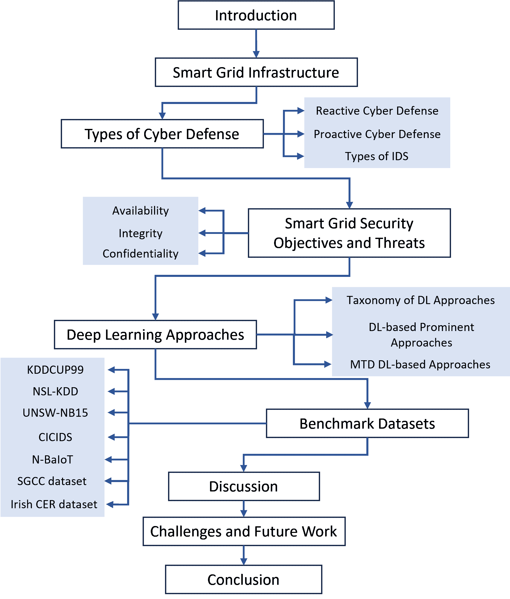

图 1: 论文组织结构。

### I-A 相关工作与贡献

针对智能电网的网络攻击包含各种攻击方法，利用不同的意图和策略来利用漏洞。Ding 等人 [33] 研究了攻击策略及其特征，并探讨了利用人工智能和区块链增强智能电网检测和预防的潜力。其他研究，如 [34、35、36] 中提到的，重点关注网络安全中的机器学习和深度学习应用，特别是在智能电网和入侵检测系统中。[34] 提供了对智能电网网络安全中机器学习挑战和前景的全面分析。[35] 比较了包括深度学习在内的机器学习方法在入侵检测系统中的应用，强调了深度学习在处理复杂数据中的优势。[36] 旨在通过分类框架来提高检测准确性、减少误报，并检测未知攻击，该框架基于机器学习和深度学习方法对入侵检测系统文献进行分类。Ferrag 等人 [37] 讨论了七种不同深度学习模型的有效性，使用特定数据集和评估指标对其进行了评估。[38] 扩展了深度学习在智能电网中的应用，包括联邦学习、边缘智能和分布式计算，突出了能源预测和故障检测等重要应用。一些作者分析了持续威胁防御技术，包括分类和分类，考察了方法、算法和评估方法，但对深度学习技术的关注明显不足 [39、40、41]。

以深度学习为基础的网络安全和持续威胁防御的先前调查做出了重要贡献，但在智能电网环境中的主动安全方面仍存在研究空白。虽然许多技术、分类方法和评估方法已被研究，但对智能电网特定的深度学习基础的主动安全措施关注较少。因此，需要进一步研究，以更好地理解针对智能电网系统的深度学习基础的主动安全解决方案。这将为研究人员提供对现有技术的概述及其使用场景。为了区分我们的调查（即贡献）和现有的调查，表 I 提供了详细的比较。我们的研究旨在探索当前智能电网主动安全中的深度学习方法，提供对主要深度学习方法的优缺点和比较的见解。我们还调查了智能电网和深度学习模型中的新兴挑战和未来进展。

表 I: 贡献比较

| Ref | 攻击策略 | 人工智能/区块链 | 机器学习/深度学习应用 | 针对智能电网的挑战 | 基准数据集 | 深度学习模型 | 持续威胁防御技术 | 基于深度学习的主动安全 |
| --- | --- | --- | --- | --- | --- | --- | --- | --- |
| [33] | ✓ | ✓ | ✗ | ✗ | ✗ | ✗ | ✗ | ✗ |
| [34] | ✗ | ✗ | ✓ | ✓ | ✗ | ✗ | ✗ | ✗ |
| [35] | ✗ | ✗ | ✓ | ✗ | ✓ | ✗ | ✗ | ✗ |
| [36] | ✗ | ✗ | ✓ | ✗ | ✗ | ✗ | ✗ | ✗ |
| [37] | ✗ | ✗ | ✓ | ✗ | ✓ | ✓ | ✗ | ✗ |
| [38] | ✗ | ✗ | ✓ | ✗ | ✗ | ✓ | ✗ | ✗ |
| [39] | ✗ | ✗ | ✗ | ✗ | ✗ | ✗ | ✓ | ✗ |
| [40] | ✗ | ✗ | ✗ | ✗ | ✗ | ✗ | ✓ | ✗ |
| [41] | ✗ | ✗ | ✗ | ✗ | ✗ | ✗ | ✓ | ✗ |
| 我们的调查 | ✗ | ✗ | ✓ | ✓ | ✓ | ✓ | ✓ | ✓ |

至于论文的其余部分，第 II 节提供了对 SG 基础设施的总体概述。III 节提供了网络防御技术的类型，如反应式和主动式方法。IV 节描述了 SG 的安全目标和潜在威胁。V 节将提供一个关于 DL 模型和应用的总体概述，介绍利用 DL 和 MTD 的 SG 中的主要模型和应用。VI 节审视了在 SG 中广泛使用的基准数据集。VII 节对 DL 和 MTD 在 SG 中的应用进行了全面讨论，提供了对其影响和效果的深入理解。VIII 节探讨了在 SG 网络安全中实施 DL 面临的挑战，并提出了研究方向。最后，第 IX 节总结了研究。图 1 展示了我们论文的组织结构。

## II SG 基础设施

SG 代表了传统物理电网的智能演变，旨在通过利用先进的感测、通信和决策技术，实现安全、高效和环保的电力需求传输。本节介绍了 SG 基础设施的关键组件和功能。

#### II-1 SCADA 系统

SCADA 系统通过实现优化和高效的操作来增强工业自动化。它包括一个控制服务器、通信渠道和现场设备，监测、控制并传输信号到电气设备。控制中心处理、存储并在 HMI 上显示数据。然而，增加的互联性和远程访问引入了安全漏洞，使 SCADA 系统容易受到实时通信突破的影响[42]。

#### II-2 配电自动化

配电自动化监测网络条件，检测故障并减少停电时间。图 2 展示了在智能电网架构中的整合，展示了能源生成、分配和消费情况。

#### II-3 分布式能源资源（DERs）

分布式能源资源（DERs）是满足电力需求的紧凑型电源。这些解决方案，包括存储系统和可再生技术，支持电力需求。分布式发电涵盖了风力发电机、太阳能电池板和电池等技术，但整合也需要管理大量的数据[43, 44]。

#### II-4 能量存储系统（ESSs）

能量存储系统（ESSs）解决了可变能源生成和波动需求之间的不平衡[45]。用户可以通过存储和释放多余的能源来降低能源成本，以满足增加的负荷。ESSs 有效缓解了生产与消费之间的差距，确保了可再生能源的可靠性[46]。

#### II-5 高级计量基础设施

高级计量基础设施（AMI）是一个全面的系统，通过支持双向通信、准确计费和能源消耗管理来增强智能计量器（SMs）。它超越了简单的抄表功能，整合了设备和系统以进行先进的数据管理、通信和分析[47]。

#### II-6 微电网

微电网是由互联负载和分散能源源组成的网络，使用可再生能源源来控制电网。它们提供了更好的电力质量，提升了电网效率，并减少了环境影响[48]。

#### II-7 物联网（IoT）

智能电网可以通过物联网整合设备、传感器和系统，形成一个互联的组件网络。它获取并传输来自各种来源的实时数据。然而，物联网的整合引入了潜在的漏洞和安全风险，例如易受网络攻击的威胁[49, 50]。

#### II-8 边缘计算

智能电网建立了一个高效的能源传输网络，整合了各种物联网设备。边缘计算在数据源附近部署服务器，提供本地化服务并优化物联网设备的数据分析和处理任务，提高了电网的整体效率[51]。

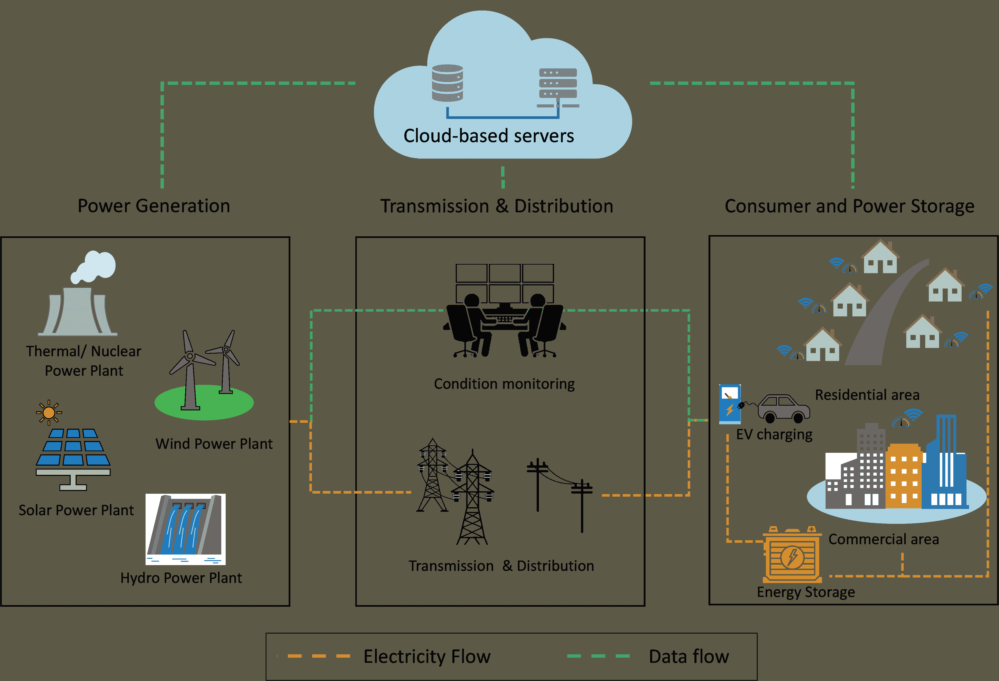

图 2: SG 架构

## III SG 中的网络防御

网络攻击对组织（包括 SG）构成了重大挑战。尽管反应式网络安全措施是基础，但有时需要主动防御方法的支持。本节将探讨 SG 中的反应式和主动网络防御方法。

### III-A 反应式网络防御

反应式网络安全专注于检测和应对威胁，通常使用**入侵检测系统（IDS）**来在事件发生后提醒组织。

#### III-A1 基于规则的方法

最初，基于规则的系统较为普遍，通过既定的攻击模式运行。然而，它们的局限性促使了更先进的技术，如基于知识和异常的检测方法[52, 53]。

#### III-A2 基于知识的（签名型）IDS

这种方法存储预定义的入侵模式，能实现高检测准确率，但无法识别新型攻击。在动态环境中，它需要频繁更新[54, 55, 56]。

#### III-A3 基于异常的技术

基于异常的 IDS 通过分析与正常行为的偏差来识别恶意活动。虽然在识别未知攻击方面有效，但可能导致较高的误报率，且定义正常行为的阈值具有挑战性[57, 58, 59, 60]。

#### III-A4 欺骗

欺骗技术，如蜜罐，已变得越来越流行。这些技术根据其与攻击者的交互水平进行分类。它们作为一种反应策略，用于识别和处理正在进行的攻击，并且也能收集法证证据[61, 62, 63, 64, 65]。

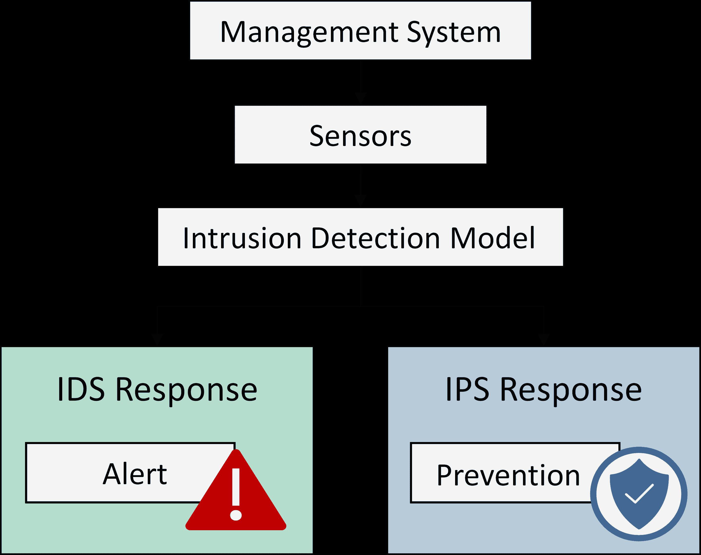

图 3: IDS 和 IPS 框架

### III-B 主动网络防御

主动安全措施增强了弹性，抵御在线攻击，确保了 SG 操作的完整性和可靠性。这些措施能够有效识别威胁、迅速响应事故，并预测攻击者的活动。让我们探讨提升 SG 安全的主动网络防御策略。

#### III-B1 入侵预防系统

入侵预防系统（IPS）涉及进行入侵检测并努力阻止已识别的潜在事件。IPS 通常将 IDS 功能纳入其框架，并可能利用这些技术的组合来检测和缓解网络中的潜在恶意行为[66, 67]。虽然 IPS 和 IDS 通常一起讨论，但需要注意的是，它们是不同的工具，重点各异。参见图 3，以示例说明 IDS 和 IPS 响应之间的关系。

#### III-B2 加密

加密通过改变数据结构来保护数据，防止未经授权的访问和虚假信息注入。没有加密密钥，数据将变得难以理解，从而阻止未经授权的利用。这种方法可防止窃听或篡改，确保保密性和完整性[68]。Garg 等人引入了一种用于 SM 的认证方案，利用了各种加密技术[68]。Syed 等人[69] 提出了一个隐私保护的深度学习模型用于 SG 应用，使用了同态加密。虽然加密至关重要，但必须辅以其他防御措施，以实现全面的网络威胁保护。

#### III-B3 移动目标防御（MTD）

MTD 是一种主动的安全方法，它不断修改系统的攻击面，使攻击者难以利用漏洞[39, 40]。这包括更改 IP 地址[70]、多样化操作系统[71]、实施冗余措施[72]，以及使用诸如蜜罐[73]等欺骗技术。通过这样做，MTD 降低了攻击前侦察的有效性，阻碍了攻击者的情报收集[39, 40]。与其他网络欺骗技术不同，MTD 侧重于系统修改而非虚假信息[74]。它已与如博弈论[75, 76, 77]、马尔可夫决策过程[78, 79, 80, 81]和深度学习方案[82, 83, 84, 85, 86, 87]等决策方法结合。

MTD 最近被探索用于增强网络物理电力系统（SE）的防御[88, 89]。实施 MTD 通过引入不确定性并提高攻击成本来增加攻击者的复杂性。这是通过对测量和线路导纳的拓扑进行随机修改，以及利用分布式柔性交流输电系统（D-FACTS）设备扰动线路参数[90, 91]来实现的，如图 4 ‣ III-B 主动网络防御 ‣ III 网络防御在 SG 中的作用 ‣ 深度学习在推动智能电网网络主动网络安全措施中的作用：综述")所示。这种随机化必须谨慎管理，以保持系统稳定性和可靠性[88, 89]。使用 D-FACTS 设备的全面布局策略提供了更强的防御，但成本更高[39]。SG 网络防御方法的比较见表 II ‣ III-B 主动网络防御 ‣ III 网络防御在 SG 中的作用 ‣ 深度学习在推动智能电网网络主动网络安全措施中的作用：综述")。

表 II：SG 网络防御方法比较

| 网络防御方法 | 描述 | 优势 | 限制 | SG 应用 |
| --- | --- | --- | --- | --- |
| 被动网络防御 | 这种方法侧重于自主检测威胁和识别潜在漏洞，从而允许快速通知组织网络安全事件，促进及时、高效的响应并协助事后措施。 | 提供持续保护，减少对人工干预的需求。有效减少对已知威胁的暴露。 | 缺乏主动威胁狩猎能力，因此可能对新颖或演变中的威胁无效。仅在威胁发生后作出响应。 | 是任何 SG 网络安全策略的基础部分。对于处理已知威胁有效，但可能在面对未识别或新型威胁时表现不佳。 |
| 主动网络防御 | 在 SG 环境中的主动防御旨在比潜在威胁领先一步。这包括如威胁狩猎等措施，主动寻找和应对威胁，以防它们影响 SG。 | 能够在威胁影响 SG 之前进行预测和防范。通过主动活动实现早期检测。 | 这种方法可能资源密集且需要专业知识。需要深入了解不断演变的威胁环境。 | 尽管资源密集，它是最全面的防御方法。它对于确保 SG 的最高安全级别至关重要，通过预防威胁的发生来实现。 |

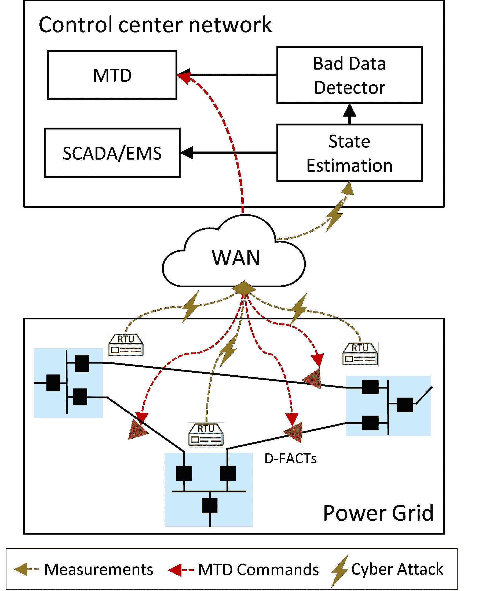

图 4：将 MTD 应用于智能电网中的注入攻击缓解 [88]。

#### III-B4 基于 DL 的主动措施

基于 DL 的异常检测能够早期发现和防范网络威胁。这些方法通过分析大量数据，使组织能够采取及时行动，提升整体网络安全。DL 可以通过各种方法改进智能电网中的物理和网络安全：

##### 网络安全

利用 DL 算法可以识别和阻止网络上的恶意流量，从而防止如 DoS 攻击等中断服务的网络攻击 [92]。

##### 访问控制

DL 算法可以检测和防止对 SG 资产的未经授权访问，增强访问控制，防范危及电力系统安全的网络攻击 [93, 94]。

##### 入侵检测

DL 算法可以实时识别和响应网络威胁，减轻旨在危害电力系统安全的网络攻击的风险 [29, 95]。

##### 警报优先级

DL 算法可以分析和优先处理安全警报，使安全团队能够集中资源应对最关键的威胁。

##### 物理安全

基于 DL 的技术可以分析来自安全摄像头的视频录像，以检测异常行为或对电网资产的物理篡改，这有助于防范对电力系统的物理威胁 [96]。

### III-C IDS 的类型

##### 主机型入侵检测系统（HIDS）

HIDS 在单一主机级别监控和分析内部系统活动及行为。它们检测内部攻击，如恶意软件感染和未经授权的访问尝试，从主机事件日志中收集数据。当检测到异常行为时，IDS 会警报系统管理员、最终用户或两者，允许对用户请求施加限制 [97]。

##### 基于网络的入侵检测系统（NIDS）

NIDS 监控网络流量以防范网络传播的威胁。它利用网络组件如交换机、路由器或传感器分析数据，识别针对节点或设备的入侵，包括端口扫描、DoS 和分布式 DoS（DDoS）攻击。NIDS 将信息记录在系统记录中 [98]。

##### 混合 IDS

它整合了基于网络和基于主机的系统，以增强分布式环境中的入侵活动检测。这提升了对主机和网络的安全性，但在单一 IDS 中管理这两种检测功能可能具有挑战性 [97]。

## IV SG 安全目标和威胁

SG 的部署需要集成众多设备，包括 SM、传感器和通过共享控制命令和信息进行通信的可再生能源源。然而，这种增加的互动和集成使 SG 更容易受到潜在攻击的威胁，危及其稳定性和安全性。因此，美国国家标准与技术研究院 (NIST) 创建了一个框架来防御网络攻击，以减少对关键 SG 基础设施的网络攻击的发生和影响。SG 必须因此整合安全机制、持续监控和主动风险缓解策略，以实现以下 NIST 安全目标。图 5 直观地展示了 SG 系统中的潜在攻击位置，提供了攻击和防御方面的全面概述。它展示了可以模拟和分析各种网络物理攻击的区域，包括在第 III 节中调查的防御机制。

安全的目标包括可用性、完整性和保密性。伪装攻击尤其对这些目标构成了重大威胁，这与其他可能只影响一两个目标的攻击不同。攻击者通过利用有效的凭据或对目标身份的未经授权的知识来绕过安全措施，从而获取敏感信息，破坏系统的整体安全性。图 6 描述了针对安全目标的各种攻击，这些攻击损害了系统的整体安全性。

### IV-A 可用性

SG 安全侧重于可用性，确保客户能够可靠、及时地获取信息。这通过提供不间断的电力供应来提高电力供应的效率。

##### DoS 和 DDoS 攻击

DoS 和 DDoS 攻击通过用过多的流量或请求淹没系统，从而中断 SG 中的无线通信网络，阻止合法用户访问这些网络。这类攻击的一个例子是洪泛攻击，它们可能导致系统崩溃或使网络失去响应 [7]。

##### 干扰攻击

这些攻击通过不断广播信号或使用欺骗性技术干扰通信系统，破坏可用性，阻碍授权设备之间的通信 [99, 100]。攻击者使用各种类型的干扰器，包括恒定、随机、欺骗性和反应性干扰器，干扰通信通道并阻止信息的传输和接收 [101]。

##### 缓冲区溢出攻击

当系统或应用程序中的漏洞允许攻击者用过量的数据填充缓冲区时，就会发生这些攻击。这种溢出可能导致关键数据损坏、中断系统操作，并创造级联故障的可能性，最终导致系统崩溃 [8]。

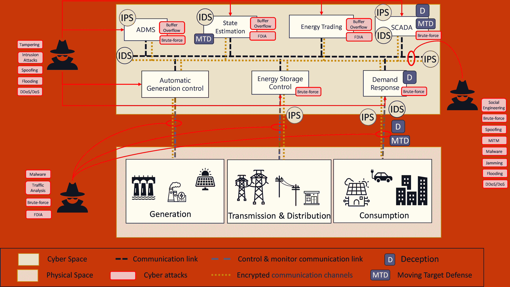

图 5：智能电网中网络物理攻击防御机制的示意图。

### IV-B 完整性

网络犯罪分子可能会试图未经授权访问智能电网资产，例如控制系统，以危害电力系统的安全。完整性是指防止信息或资源未经授权的更改或破坏，以保持系统操作中数据流的准确性和效率。完整性攻击的示例包括：

##### 恶意软件

网络犯罪分子可能使用恶意软件，如病毒和勒索软件，来危害智能电网系统的安全并干扰电力供应 [102]。

##### 中间人攻击（MITM）

中间人攻击允许攻击者中断并修改设备之间的通信，如智能仪表和能源管理系统。修改传输的信息可能干扰电力分配并损害电网基础设施 [100]。

##### 虚假数据注入（FDI）攻击

FDI 攻击旨在操控网络或系统中的数据，包括修改关键基础设施系统（如电网）的传感器读数。通过这样做，系统会误以为它正常运行，而实际上却造成了重大损害 [103]。

##### 冒充

冒充涉及伪装成合法方，通过与网络设备的数据包交换欺骗他人披露敏感信息。攻击者可以引入虚假或误导性的数据，可能导致错误的决策和传输未经授权的内容 [104]。

##### 入侵攻击

这些攻击发生在对手利用网络漏洞未经授权访问网络节点时。这种未经授权的访问允许攻击者篡改文件、注入恶意代码或操控配置，可能危害系统的可靠性和可用性 [105]。

##### 暴力破解攻击

这些攻击通过针对未经授权的访问破坏 SG 控制系统的完整性。在 SG 中，中央控制系统和各种设备依赖加密的安全协议进行通信。然而，暴力攻击削弱了系统的安全措施，利用漏洞危及控制系统的完整性 [106]。

##### 篡改攻击

这里的攻击涉及未经授权的数据或系统修改 [9]。

### IV-C 保密性

保密性旨在通过确保只有合法个人能够访问敏感信息，同时这些信息不会在未经适当授权的情况下暴露给其他人，从而保护个人隐私。

##### 窃听

窃听允许未经授权的攻击者通过监控通信渠道来访问授权方之间交换的机密信息，而无需参与数据包交换或主动参与。通过窃听，攻击者可以获取敏感数据、利用漏洞并访问机密信息 [9]。

##### 中间人攻击：

攻击者将自己置于两个通信方之间，使他们能够拦截数据流。这种拦截使攻击者能够监控对话并秘密获取机密数据 [100]。

##### 入侵攻击

入侵攻击通过未经授权访问通信频道和中央控制系统来破坏 SG 数据的保密性。攻击者获取敏感信息，导致隐私侵犯和漏洞暴露，可能在未来的攻击中被利用 [105]。

##### 暴力攻击

对 SG 的暴力攻击可能通过系统地尝试各种凭证组合来破坏其保密性，从而获取对敏感数据的未经授权访问。

##### 欺骗攻击

欺骗攻击破坏信息安全、隐私和信任，允许未经授权的访问。

##### 社会工程学

攻击者使用劝说和沟通技巧来获得受害者的信任，获取像密码和个人识别码这样的私人信息，以便未经授权地访问目标系统。常见方法包括假托、网络钓鱼和尾随攻击 [107]。

##### 流量分析攻击

流量分析攻击通过监控消息的时间和大小来确定主机的身份和位置。攻击者通过嗅探和检查消息提取节点之间的通信模式，目的是操控 SG 网络 [108]。

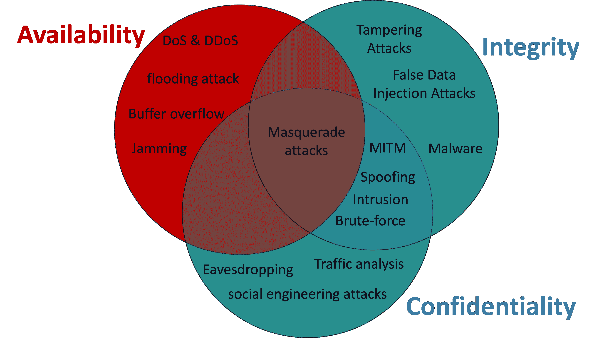

图 6：安全目标交集的攻击示意图：完整性、保密性和可用性。

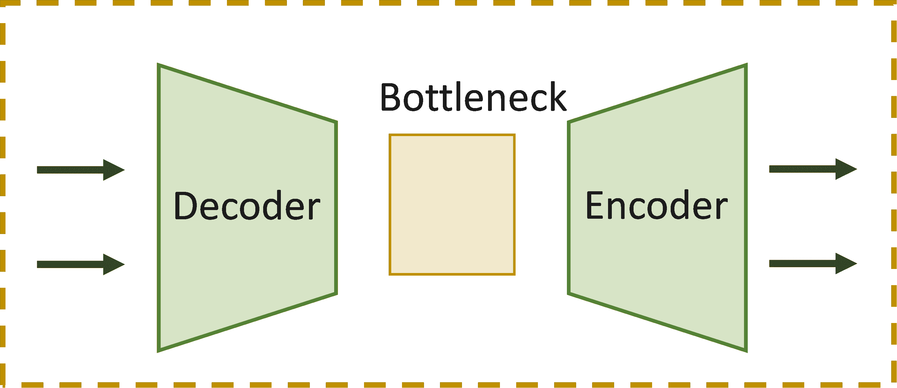

(a) 自编码器

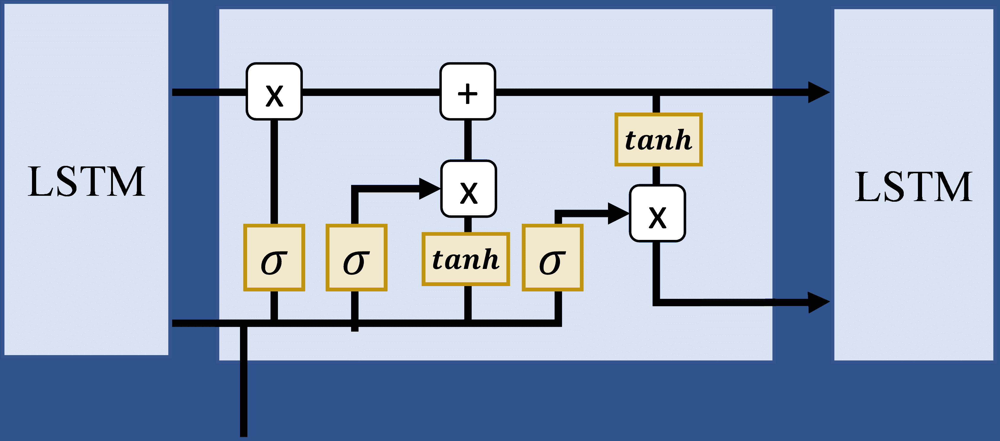

(b) 长短期记忆网络

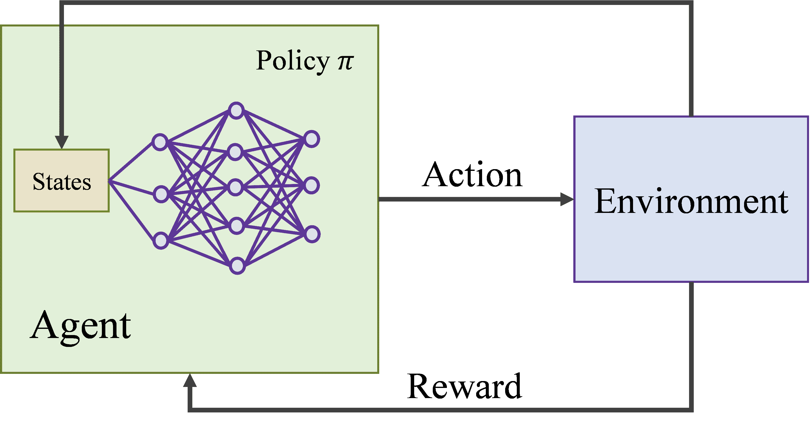

(c) 深度强化学习

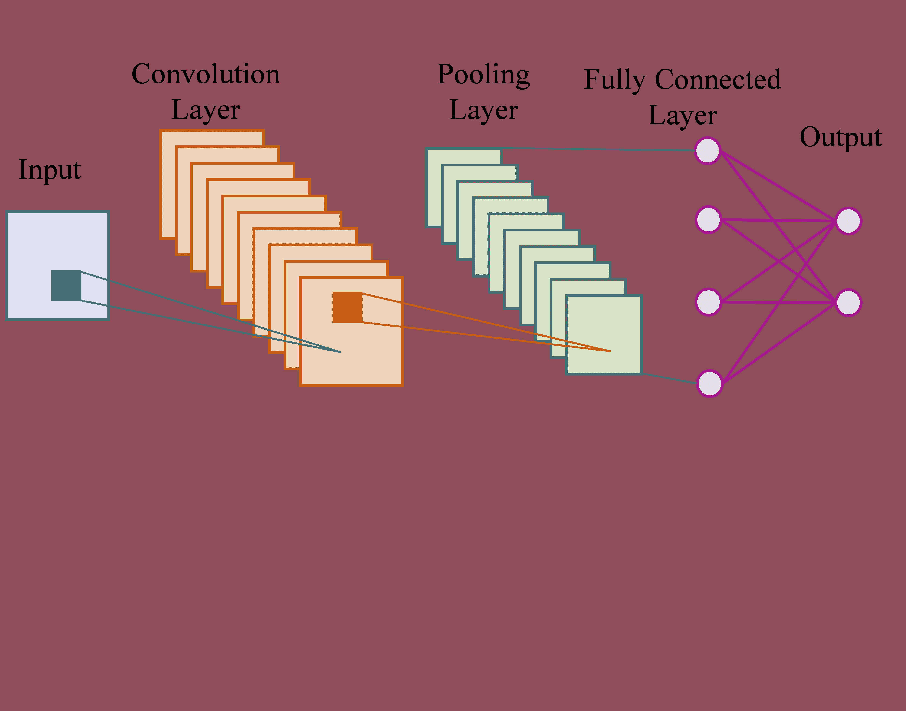

(d) CNN

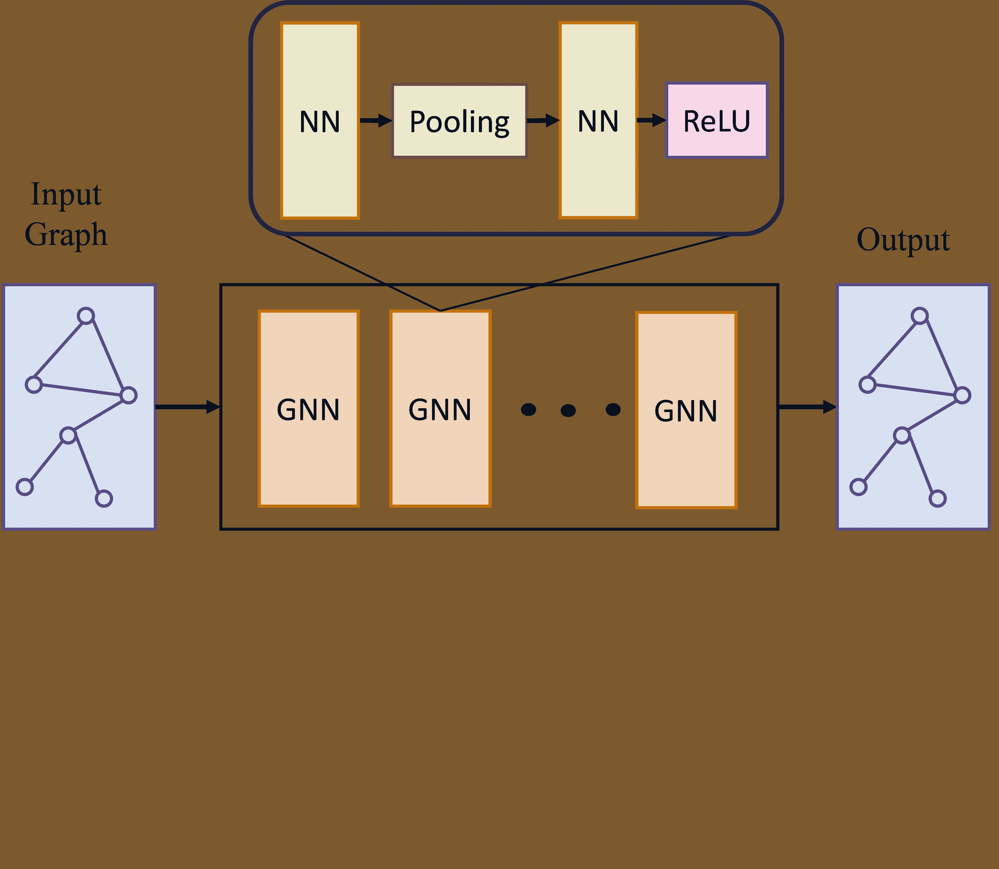

(e) GNN

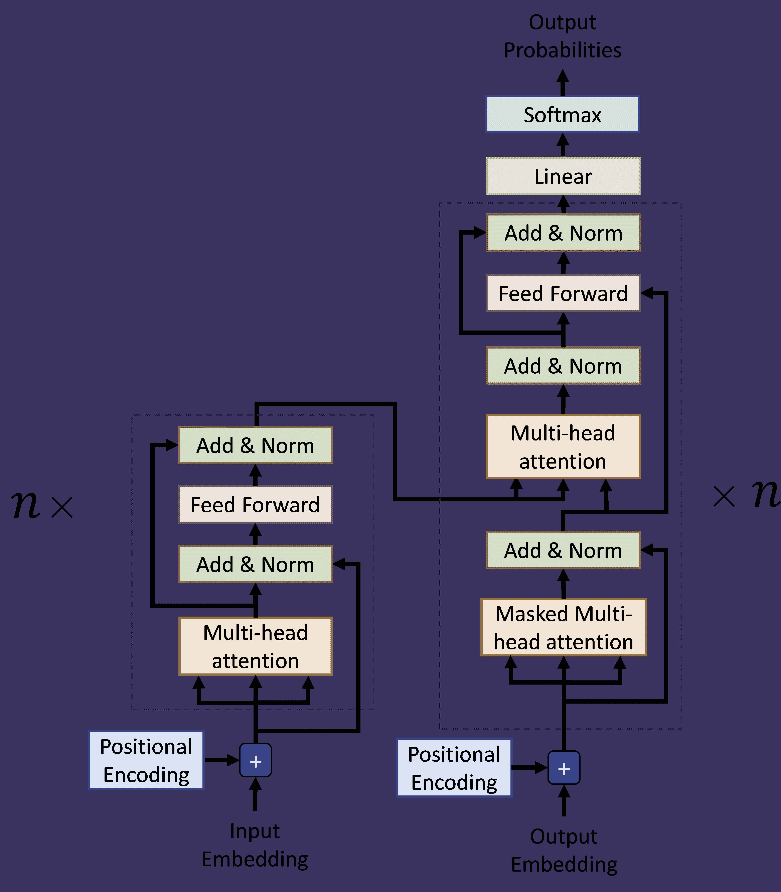

(f) Transformer

图 7：在安全和入侵检测应用中使用的常见深度神经网络。

## V 深度学习方法

本节旨在提供一种简明的深度学习方法分类，并探讨它们在 SG 中的前瞻性安全技术中的相关近期工作。深度学习技术在应对 SG 安全挑战方面表现出希望。如图 7 所示，我们可以识别在 SG 前瞻性安全措施中成功应用的方法和架构。此外，讨论近期相关工作使我们能够突出基于深度学习的安全技术在增强 SG 基础设施抵御网络威胁方面的进展。

### V-A 深度学习方法分类

#### V-A1 自编码器

DL 自编码器（AE）是获取高效无标签数据表示的强大工具。这些架构包括一个编码器网络，该网络将输入数据压缩为低维潜在表示，以及一个解码器网络，该网络从压缩的表示中重建原始输入。瓶颈指的是一个具有隐藏层的网络，该层包含关键数据特征，明显小于输入层和输出层[109，92]。AE 可以通过调整模型权重和最小化训练过程中的重建误差，学习识别与预期模式的变异。

#### V-A2 循环神经网络

递归神经网络（RNNs）是能够处理序列数据的特定类型神经网络。这些网络旨在保留来自先前输入的信息，从而考虑不同时间步之间的上下文和依赖关系。LSTM 网络和门控递归单元（GRU）是多种 RNN 类型中的两个例子。LSTM 和 GRU 被开发用于解决递归神经网络中的“梯度消失”问题[110]，该问题出现时网络权重的梯度变得非常小，使得网络难以学习。LSTM 使用具有门控机制的专用记忆单元来控制信息流，从而能够访问长期依赖关系[111]。另一方面，GRU 使用更简单的门控机制，依靠单一的“更新门”来调节信息流，这允许更快的训练和较少的内存使用，但在捕捉长期依赖关系方面可能不如 LSTM[112]。尽管如此，它们仍然能够保留长期依赖关系。与 LSTM 相比，GRU 训练更快，所需参数更少，使其在特定任务上更高效。然而，每种模型变体的性能取决于所使用的具体任务和数据集。

#### V-A3 卷积神经网络

卷积神经网络（CNN）是一种强大的神经网络类型，彻底改变了计算机视觉领域[113]。这些网络使用层级结构自动从输入数据（如图像）中学习越来越复杂的特征。这些层执行各种功能，包括卷积、池化和分类。卷积层使用滤波器学习诸如边缘和形状的特征。这些特征随后传递给池化层，池化层减少空间维度，从而加快计算速度并降低过拟合风险。池化层提取重要特征，增强图像识别和分类性能。最后，完全连接层使用这些精炼的特征进行图像分类。

#### V-A4 深度强化学习

深度强化学习（DRL）是一种结合深度神经网络和强化学习技术的机器学习策略[114]。这种组合使得代理能够通过试错法从环境中学习。DRL 主要分为两类：基于值的方法和基于策略的方法。DRL 中的基于值的方法主要集中于获得各种状态的最佳值函数或 Q 值函数。该函数预测代理在特定状态下选择特定动作可以获得的预期累积奖励。深度 Q 学习（DQL）是一个流行的基于值的 DRL 算法，它利用深度神经网络来估计 Q 值函数，是 Q 学习的扩展。双重深度 Q 学习（DDQL）和对抗深度 Q 学习（DDDQL）是 DQL 的进一步扩展，通过解决训练所需计算量和过度估计偏差等挑战来提高性能。相反，基于策略的 DRL 算法则专注于通过使用神经网络将状态映射到动作，从而直接找到最佳策略。Actor-critic 是一种常用的 DRL 算法，它结合了一个学习策略的 actor 网络和一个学习值函数的 critic 网络[115, 116]。

#### V-A5 Transformers

由 Ashish Vaswani 等人提出的 transformer 网络[117] 在自然语言处理（NLP）应用中取得了显著成功。它采用了多头注意力机制和自注意力机制，解决了捕捉序列数据中长程依赖关系的挑战[118]。Transformers 已被适应于计算机视觉领域，并对 NLP 任务产生了重大影响。transformer 架构包括一个编码器和一个解码器，各自在网络操作中发挥独特作用。编码器层将输入序列转换为连续表示，通过多头注意力和全连接网络捕获信息。解码器层生成文本序列。它利用两个多头注意力层、一个逐点前馈层和残差连接。此外，它还包括一个线性层作为分类器和一个 softmax 操作用于词汇概率。表 III 提供了有关各种深度学习（DL）方法在网络安全应用中的广泛概述，包括它们的具体方法、适用场景、优缺点和相关研究论文。

#### V-A6 图神经网络

图神经网络（GNNs）是捕捉以图结构组织的数据中复杂关系和依赖性的深度学习模型。它们通过从邻近节点收集信息并根据这些综合信息调整节点特征来学习节点和边。GNNs 使用存储在邻接矩阵中的节点属性和连接生成嵌入，这些嵌入捕捉了节点的结构和特征。这些嵌入对于在单个节点和图级别进行预测非常有用 [119]。GNNs 有各种变体，每种变体在建模和分析图结构数据方面具有不同的能力。递归 GNNs（RecGNNs）使用递归神经网络架构通过持续的信息交换获取节点表示。卷积 GNNs（ConvGNNs）在卷积的基础上扩展，结合了图数据，聚合节点和邻近特征。

表 III：针对网络安全应用的深度学习方法概述。

| 方法 | 应用场景 | 优点 | 缺点 | 论文 |
| --- | --- | --- | --- | --- |
| 自编码器 | DDoS 攻击检测、网络流特征、入侵检测、零日恶意软件检测、蓄电池电储存系统中的异常检测、分层检测方法。 | 高预测准确性，识别异常的有效性，对抗性攻击的鲁棒性，能够检测小的时间变化的异常，学习度量之间复杂的相关性。 | 状态充电的准确估计仍然是一个限制。 | [120, 121, 29, 10, 95, 122, 123] |
| DRL | AC 电力系统中的数据完整性威胁、数据完整性漏洞、SG 中的 FDI 攻击、AC 电力系统中的数据完整性攻击、分布式网络中的 FDI 攻击、能源定价中的 FDI 攻击。 | 高学习效率，提高检测性能，识别 FDI 攻击并采取更有利的行动，减少 SG 中的功率损失。 | 连续攻击对系统 SE 有长期影响，使得检测系统难以捕捉。 | [124, 125, 103, 126, 30, 127, 128, 129] |
| RNN | 两阶段学习者基于 FDI 攻击的检测技术，物理微网内的实时检测机制，AGC 系统 SE，DC 微网对 DC 总线电压的 FDI 攻击的脆弱性，电力盗窃。 | 捕捉非线性数据特征，实时评估，减少 FDI 攻击的影响，准确估计攻击信号，并在干扰抑制和跟踪性能上优于经典神经网络。 | RNN 模型复杂，处理顺序数据，导致训练复杂性。它们的可解释性有限，使得解释预测或识别模式变得困难。长序列，如 SG 中的时间序列数据，可能引入计算和内存限制，影响性能和效率。 | [130, 131, 11, 132, 133, 134, 135, 136] |
| CNN | 使用 CNN 检测 SG 中的电力盗窃。它们对 DoS、FDI 攻击、干扰和混合攻击有效。此外，CNN 可以应用于 HVDC 系统，并检测 Phasor Measurement Unit（PMU）数据中的 FDI 攻击。 | CNN 有效识别异常模式，学习相关特征，简化训练，并创建计算需求低的深度网络。 | CNN 缺乏序列建模能力，无法捕捉顺序数据中的长期依赖关系。处理可变长度序列也对 CNN 提出了挑战。 | [94, 137, 138, 139, 140] |
| GNNs | 检测网络攻击，识别攻击，识别电网连接光伏（PV）逆变器中的网络脆弱性，检测智能电网中的 FDI 攻击。 | 考虑了时间测量和拓扑连通性，捕捉 SG 数据的空间相关性，将电力系统拓扑的空间方面集成到检测机制中。 | 缺乏时间信息，限制了及时响应和准确性。模型的实时适用性受到限制，其动态参数调节能力有限。在攻击位置和强度变化的场景中可靠性较低。 | [141, 142, 143, 144, 145] |
| CNN + LSTM | 识别连接到电网的光伏逆变器中的网络漏洞，识别 AMI 系统中的能源盗窃，识别时间变化数据之间的更强相关性。 | 最小化多个变量的谱波动，最小化数据的时间波动，利用卷积层捕捉空间特征，利用 LSTM 捕捉时间特征。 | CNN-LSTM 模型的复杂性需要额外的数据和资源进行训练。调整超参数成为一个耗时的任务。由于复杂的中间表示，解释性具有挑战性。 | [146, 147, 148, 149, 93] |
| Transformers | 时间序列数据的异常检测，IIoT 系统中的高级持续威胁（APT）攻击，SDN 中的 DDoS 攻击，以及 SG 中的隐蔽 FDI 攻击检测。 | 基于 Transformer 的序列建模和预测架构提供了并行效率和长期上下文信息。它解决了 FDI 攻击检测的挑战，捕捉了长期相关性、APT 攻击和 IoT 系统中的上下文信息，提高了计算效率和可扩展性。 | Transformers 优先考虑全局关系，这可能限制了它们有效捕捉局部模式和时间依赖性的能力。它们计算成本高、速度慢且耗时，导致在大规模时间序列数据和实验中具有挑战性。 | [150, 151, 152, 153, 154, 155, 156, 157] |

### V-B 基于深度学习的突出方法

#### V-B1 自编码器

AE 模型可以提取相关特征，使其在通过区分信号和噪声组件来检测异常方面具有价值。这使它们在故障和入侵检测中很受欢迎 [120, 121]。[120]中的作者提出了一个使用多层次浅层和深层 AE 的 DDoS 攻击检测系统。该模型采用无监督技术对训练数据进行编码以降低维度，并利用多核学习结合编码特征。这种方法通过自动考虑基于 AE 的特征来提高检测准确性，超越了 LSTM 和随机森林。

Andresini 等人 [121] 使用 1D 网络流特征数组训练入侵检测模型。他们评估了 1D CNN、AE 和多通道卷积的效果。他们整合了监督和无监督的多通道特征学习，以识别特征依赖关系，通过学习每个通道的影响并利用通道间的现有模式，提升了检测效果。

[29] 的作者提出了 ICVAE-DNN 用于入侵检测，将 ICVAE 与 DNN 结合，以识别大型数据集中的稀疏表示。ICVAE 编码器设置 DNN 隐藏层权重，从而实现快速训练并避免局部最小值。它生成未识别的攻击样本以平衡训练数据并增加变异性，使 DNN 能够提取高级特征并减少输入维度。

Kim 等人 [10] 介绍了一种基于 AE 的半监督模型和 One-Class 分类算法用于零日恶意软件检测，结合了 VAE 和 CNN AE(1D) 模型。该方法对规避和对抗攻击具有弹性，展示了识别新型和未知恶意软件的潜力，无需手动配置。

[95] 的作者提出了一种用于 DER 中电池储能系统的异常检测算法。该算法利用 AE 通过观察系统的物理行为来检测危险工作条件。在检测不安全条件、异常行为、部分攻击和坏数据注入方面优于传统的 One-Class 支持向量机。然而，估计电荷的准确性仍然是一个限制。

Kye 等人 [122] 提出了一个分层检测方法，通过多个阶段识别基于异常级别的极端异常。该 NIDS 解决方案提高了检测性能，无需依赖稀缺的异常数据。它使用自编码器的隐藏空间、专用异常分数和训练过程中的自我监督信号。检测过程评估异常分数，并根据预定义阈值触发警报。第一阶段使用元表示识别极端离群值，而第二阶段则放大重建误差并检测第一阶段遗漏的异常 [122]。Song 等人 [123] 研究了使用 AE 模型的网络入侵检测，并发现模型容量对效果有显著影响。具有更大容量的模型表现更好，但隐藏层的数量与其效果并没有显著相关，表明需要合适的模型结构和潜在大小。

#### V-B2 DRL

Deep-Q-Network 检测（DQND）算法一直是用于提高电力系统网络安全性的关键技术。文献[124]的作者将 DQND 技术应用于改进对交流电力系统 SE 中数据完整性威胁的防御方法。通过对观察空间滑动窗口的量化，研究了学习过程的有效性。与此同时，Lee 等人[127]开发了一种 DQND 算法，以减少对 SG 网络攻击的检测延迟，确保快速而准确的威胁识别。文献[125]的作者提出了一种基于 DRL 的方法，用于检测数据完整性漏洞，采用 LSTM 网络来评估电网攻击。权重受到噪声影响以便于代理探索，且多步奖励函数提高了 Q 值的准确性。持续的攻击对系统 SE 有长期影响，使得检测变得更具挑战性，相比之下，间歇性攻击只能在离散时间步上进行检测。

Huang 等人 [103] 提出了基于注意力的深度强化学习检测模型来识别智能电网中的 FDI 攻击。该模型使用注意力机制提取状态信息，为状态特征分配权重，并学习每个测量点的重要性。这使得代理可以通过关注重要的攻击前后状态特征来做出明智的决策。Hu 等人 [30] 使用多源数据自适应特征增强方法来进行智能电网中的入侵检测。该技术采用加权特征采样和一系列 AE 来捕获关键特征并训练随机森林分类器。深度确定性策略梯度（DDPG）确定特征采样概率。集成的 AE 和分类器序列区分正常、故障和攻击事件。Abianeh 等人 [128] 开发了一种 DDPG 多智能体深度强化学习模型，用于分析基于索引的检测算法对隐蔽的破坏性 FDI 攻击的脆弱性，并在网络安全的直流微电网上发起协调的破坏性 FDI 攻击。该算法集成了嗅探器功能来检测和解决断开问题，但未能检测到协调的 FDI 攻击。提出了一种额外的 RL DQN 检测算法，以提高基于索引的 FDI 攻击易感性检测算法的可靠性，最终实现了完全网络安全的系统。Zhang 等人 [129] 开发了一种两阶段防御方法，以应对 FDI 攻击对能源定价的安全风险。他们将递归最小二乘法与径向基函数神经网络结合，以提高学习效率。分布式 DDPG 方法将演员网络拆分为多个子问题，使微电网能够独立学习最佳行动方案，同时与附近的微电网协作。同样，Selim 等人 [126] 提出了通过调节 DERs 和联络开关来解决电网中的电压违规和减少电力损耗的方法。原有的软演员-评论员（SAC）技术已扩展以适应包括调节 DERs 的设定点和网络开关在内的离散和连续动作场景。

表 IV：电力系统网络安全的深度学习对策。

| 论文 | 安全问题 | AE | DRL | RNN | CNN | GNNs | Transformers |
| --- | --- | --- | --- | --- | --- | --- | --- |
|  | DQN | DDQN | SAC | DDPG | RNN | LSTM | GRU |  |  |  |
| [120] | DDoS 攻击检测 | ✓ |  |  |  |  |  |  |  |  |  |  |
| [121] | 入侵检测 | ✓ |  |  |  |  |  |  |  | ✓ |  |  |
| [29] | 入侵检测 | ✓ |  |  |  |  |  |  |  |  |  |  |
| [10] | 零日恶意软件检测 | ✓ |  |  |  |  |  |  |  | ✓ |  |  |
| [95] | 电池系统的异常检测 | ✓ |  |  |  |  |  |  |  |  |  |  |
| [122] | 极端异常检测 | ✓ |  |  |  |  |  |  |  |  |  |  |
| [123] | 网络入侵检测中的 AE | ✓ |  |  |  |  |  |  |  |  |  |  |
| [124] | AC 电力系统中的数据完整性 |  | ✓ |  |  |  |  |  |  |  |  |  |
| [125] | 数据完整性漏洞 |  | ✓ |  |  |  |  | ✓ |  |  |  |  |
| [103] | 虚假数据注入攻击 (FDI 攻击) |  |  | ✓ |  |  |  |  |  |  |  |  |
| [126] | SG 中的入侵检测 |  |  |  | ✓ |  |  |  |  |  |  |  |
| [30] | AC 电力系统中的数据完整性攻击 | ✓ |  |  |  | ✓ |  |  |  |  |  |  |
| [127] | 对分布式网络的 FDI 攻击 |  |  | ✓ |  |  |  |  |  |  |  |  |
| [128] | 对能源定价的 FDI 攻击 |  |  |  |  | ✓ |  |  |  |  |  |  |
| [129] | 对能源定价的 FDI 攻击 |  |  |  |  | ✓ |  |  |  |  |  |  |
| [130] | FDI 攻击检测 |  |  |  |  |  |  | ✓ |  |  |  |  |
| [131] | 对智能微电网的 FDI 攻击 |  |  |  |  |  | ✓ |  |  |  |  |  |
| [11] | FDI 攻击和 TD 攻击对 AGC 的影响 |  |  |  |  |  |  | ✓ |  |  |  |  |
| [132] | TD 攻击检测 |  |  |  |  |  |  | ✓ |  |  |  |  |
| [133] | 对直流母线电压的 FDI 攻击 |  |  |  |  |  |  |  | ✓ |  |  |  |
| [135] | 新加坡的电力盗窃 |  |  |  |  |  | ✓ |  | ✓ |  |  |  |
| [136] | 新加坡的电力盗窃 |  |  |  |  |  |  | ✓ | ✓ |  |  |  |
| [134] | 基于 SDN 的对 SG 网络攻击的防御 |  |  |  |  |  |  |  | ✓ |  |  |  |
| [146] | 连接电网的光伏逆变器中的网络漏洞 |  |  |  |  |  |  | ✓ |  | ✓ |  |  |
| [147] | AMI 系统中的能源盗窃 |  |  |  |  |  |  | ✓ |  | ✓ |  |  |
| [148] | ETD |  |  |  |  |  |  | ✓ |  | ✓ |  |  |
| [149] | 新加坡的电力盗窃 |  |  |  |  |  |  | ✓ |  | ✓ |  |  |
| [93] | SCADA 系统对 FDI 攻击的脆弱性 |  |  |  |  |  |  | ✓ |  | ✓ |  |  |
| [158] | 影响能源生成读数的网络攻击 |  |  |  |  |  |  |  | ✓ | ✓ |  |  |
| [94] | 基于 PMU 的 HVDC 附加服务控制中的网络攻击 |  |  |  |  |  |  |  | ✓ | ✓ |  |  |
| [139] | 对网络物理电力系统的多次网络攻击 | ✓ |  |  |  |  |  |  |  | ✓ |  |  |
| [137] | 能源盗窃检测 |  |  |  |  |  |  |  |  | ✓ |  |  |
| [138] | 能源盗窃检测 |  |  |  |  |  |  |  |  | ✓ |  |  |
| [140] | 隐私保护电力盗窃检测 |  |  |  |  |  |  |  |  | ✓ |  |  |
| [141] | 攻击识别与定位 |  |  |  |  |  |  |  | ✓ |  | ✓ |  |
| [142] | FDI 攻击检测 |  |  |  |  |  |  |  |  | ✓ | ✓ |  |
| [143] | 网络攻击识别 |  |  |  |  |  |  |  |  |  | ✓ |  |
| [144] | 大规模交流电力网 FDI 攻击检测 |  |  |  |  |  |  |  |  |  | ✓ |  |
| [145] | 智能电网中的 FDI 攻击检测 |  |  |  |  |  |  |  |  | ✓ | ✓ |  |
| [150] | APT 攻击检测 |  |  |  |  |  |  |  |  |  |  | ✓ |
| [151] | 物联网异常检测 |  |  |  |  |  |  |  |  |  | ✓ | ✓ |
| [152] | SDN 上的 DDoS 攻击检测 |  |  |  |  |  |  |  |  | ✓ |  | ✓ |
| [153] | SG 中的 FDI 攻击检测 |  |  |  |  |  |  |  |  |  |  | ✓ |
| [154] | 高维异常数据的 IDS |  |  |  |  |  |  |  |  |  |  | ✓ |
| [155] | 时间序列数据的异常检测 |  |  |  |  |  |  |  |  |  |  | ✓ |
| [156] | 时间序列异常检测 |  |  |  |  |  |  |  |  | ✓ |  | ✓ |
| [157] | 入侵检测 |  |  |  |  |  |  |  |  |  |  | ✓ |

#### V-B3 RNN

Wang 等人[130] 介绍了 KFRNN 系统，这是一种基于学习者的两阶段 FDI 攻击检测技术。第一阶段利用 RNN 捕捉非线性数据特征，并使用卡尔曼滤波器处理线性数据特征。第二阶段的学习者通过全连接层和反向传播模块动态地合并两个初始学习者的结果。结果显示，KFRNN 方法优于传统的坏数据检测器和 R2N2_variant。Naderi 等人[131] 提出了一个补救措施方案，以应对针对智能微电网的严重 FDI 攻击。该方案使用一个集成了 RNN 的硬件在环进行实时检测，嵌入到物理微电网中。模型包括六个并行的 RNN 单元，每种设备类型两个。微电网传感器提供输入，包括电压和电流读数，这些读数被注入了 FDI 攻击。RNN 单元使用相同的层结构进行预测，估计新的读数，并与传感器的值进行比较。[11] 中的作者探讨了非线性对 AGC 对 FDI 攻击和时间延迟 (TD) 攻击响应的影响，强调了在 AGC 系统设计和实施过程中考虑这些因素的必要性。该模型由两个阶段组成：使用在正常 AGC 操作数据集上训练的 LSTM 模型检测和识别攻击，并使用另一个 LSTM 模型减少 FDI 攻击的影响。这项技术使用第一步中的受损信号生成校正信号，并利用均方根误差 (RMSE) 评估其有效性。Ganesh 等人[132] 开发了一个分层 LSTM 模型，用于在线监控和检测 TD 攻击，处理来自传感器的原始数据流。该模型由两个层按顺序连接组成，将输入数据分割成较短的子序列，并独立提取局部特性。上层评估局部特性以获取整个序列的时间特性。这种分层结构捕捉了短期和长期的依赖性，提高了识别 TD 攻击的有效性。在[133] 中，作者提出了一个基于 GRU 的框架，以解决 DC 微电网在 DC 总线电压上的 FDI 攻击脆弱性。该框架包括两个部分：一个离线训练的 GRU 网络用于实时评估 DC 总线电压，作为估计策略；以及一个 GRU 网络与 PI 控制器相结合，用于抵御 FDI 攻击，被称为缓解策略。

作者们研究了各种 RNN 变体和其他深度学习技术的整合，以应对 SG 中的不同网络攻击，包括 CNN 和 LSTM 方法的结合[146, 147, 148]。毛等人[146]开发了一种 CNN-LSTM 技术，以识别电网连接的光伏逆变器中的网络漏洞，从而减少由于可再生能源在电力系统中使用增加而带来的网络安全威胁。CNN 层通过最小化变量之间的光谱波动，实现了在重塑后灵活解释的能力，而 LSTM 层则最小化时间波动。输入去冗余和超参数选择最大化了检测效果。Adhure 等人[147]设计了一种电力盗窃检测（ETD）模型，使用 CNN-LSTM 堆栈来识别 AMI 系统中的能源盗窃。该模型使用一维卷积层数据作为输入，内核大小为五，具有五个滤波器。它包括两个 LSTM 层（48 和 24 个神经元）以及 20%的丢弃层。[148]中的研究介绍了一种基于 ConvLSTM 的 ETD 模型，结合了重塑的 2D 矩阵消费数据和嵌入了 CNN 和批量归一化的 ConvLSTM。该模型用 LSTM 替代了池化层，以识别时间变化数据中的强相关性，捕捉空间和时间特征。它改善了数据集平衡，捕捉了局部电力使用，并使用批量归一化实现了高效部署。[149]中提出的工作旨在通过在社区中安装中央观察仪表来打击 SG 中的电力盗窃。这种技术通过将时间序列数据转化为结构化表示来分析用户的电力消费模式，考虑到时间元素以及邻近周期和天数的变化。这种方法解决了局部盗窃问题，提高了 SG 的效率。在[93]中，介绍了一个两阶段框架，用于应对 SG 中 SCADA 系统对 FDI 攻击的脆弱性。它结合了通过 CNN-LSTM 自编码器序列到序列架构进行的实时数据预测，以及基于预测的异常检测。该模型准确估计了电力消耗状态，并结合自适应阈值来识别异常行为。Ismail 等人[158]开发了一个 ETD 系统，使用深度神经网络来识别影响能源生成读数的网络攻击。他们探讨了三种架构：深度前馈、深度递归和深度卷积递归神经网络。深度前馈网络处理能源生成读数，而深度递归网络通过 GRUs 捕捉时间相关性、处理数据并预测类别标签。卷积递归神经网络（C-RNN）混合架构结合了卷积和最大池化层进行特征提取和类别标签预测。使用 GRU-RNN 模型优化了 SG 中的电力盗窃，针对时间序列数据利用月份和星期几特征，专注于小扰动攻击，即使在能源报告的轻微修改下也显示出优越的性能[135]。而[136]则使用 GRU 和双向 LSTM 来检测分布式发电单元中的太阳能和风能盗窃，GRU 用于单一燃料类型，BLSTM 用于复杂的混合燃料场景。Kumar 等人[134]开发了一个模型，该模型将基于区块链的认证方案与 SDN 框架中的深度学习（DL）IDS 集成，以提高 SG 网络中的网络安全性。该模型使用自注意机制和双向门控递归单元（Bi-GRU）进行时间依赖性分类。

#### V-B4 CNN

[94] 中的作者引入了一种 SE-DCNN 变体，以提高 PMU 基于 HVDC 附加服务控制（HASC）在网络攻击易发环境中的可靠性。这种 CNN 结构结合了时间域和频率域信息进行特征提取，以解决冗余特征问题。Squeeze-Excitation 结构通过为有用特征分配权重并减少冗余特征来解决冗余特征问题。SE-DCNN 模型明确建模通道间的相互依赖性，提高了对信息攻击特征的敏感性，能够更准确和安全地进行检测。RL-CNN 方法关注于网络物理电力系统中智能攻击定位和恢复，面对多重网络攻击[139]。它涉及一个复杂的系统，由基于表示学习的深度学习模型、深度自编码器和 CNN 架构组成。检测问题涉及多标签分类，系统恢复是基于攻击信息进行的。MMSE 估计器最小化均方误差，并提供系统状态的条件期望。

几位作者探讨了智能电网中的能源盗窃检测问题[137, 138, 140]。Yao 等人[137] 提出了一种结合隐私保护和深度学习技术的方法。他们利用 Paillier 同态加密来保护能源使用隐私，并采用组合卷积神经网络模型来分析解密后的智能电表数据。该模型将数据分类为盗窃或正常状态。它采用预处理技术将数据格式化为类似图像的结构，使 CNN 模型能够提取相关特征以进行准确分类。在 [138] 中，作者提出了一种新颖的能源盗窃检测方法，利用来自智能电表的大型能源使用记录数据集。他们使用带有卷积和池化层的深度 CNN 模型进行特征提取和分类。这种方法强调分析电力使用模式，以区分正常用户和潜在的能源盗贼，同时应对数据增强的挑战。p2Detect 框架通过优化模型效率和准确性来改进隐私保护的能源盗窃检测，它利用适合同态加密的训练来解决近似和聚类的局限性[140]。它采用安全的加密协议、密文盲化和填充嵌入来保护数据和模型隐私。然而，它未考虑动态网络攻击带来的安全威胁。建议集成在线学习并使用捕获样本进行增量学习。由于同态加密参数的增加，使用加密神经网络进行安全推理的效率正在下降[140]。

#### V-B5 GNN

由于电力系统可以建模为图形，其中总线被表示为顶点，传输线作为边缘，许多研究人员探索了使用 GNNs 来检测网络攻击[141, 142]。Haghshenas 等人[141]提出了一种 TGNN 框架，考虑了时间测量和拓扑连接来识别攻击。该模型使用了带有消息传递技术的 GNNs，GRU 用于时间数据，以及用于消除梯度消失的残差块。通过使用 ramp 攻击和 FDI 攻击数据来评估效果，显示了在识别和定位攻击方面的高准确性。研究还评估了模型对攻击位置和严重性的敏感性，揭示了攻击更难检测的区域。类似地，[142]中的作者提出了一种可扩展且实时的 FDI 攻击检测器作为早期检测和识别系统。Ruan 等人[143]提出了一种使用时空图 DL（STGDL）来识别网络攻击的策略。该方法通过图卷积和时间门控卷积提取时空特征。利用分位回归训练为 SE 中的状态变量创建安全边界，以识别由网络攻击引起的异常。所提出的超分辨率感知网络通过使用低频 SE 结果创建高频数据，从而提高时间学习能力。Boyaci 等人[145]提出了一种 Chebyshev 图卷积网络（CGCN）检测器，以捕捉 SG 数据的空间相关性，并有效建模大规模 AC 电力网的图结构，以应对 FDI 攻击。建议的架构的自主训练方法消除了任何优化步骤的需要，使其更适合实际应用。在[144]中的工作提出了一种基于 GNN 的 FDI 攻击检测策略，使用拓扑感知 GAE。它解决了现有检测器的不足之处，包括缺乏空间嵌入或仅检测训练集中发现的 FDI 攻击类型。该策略集成了电力系统拓扑空间方面，以更好地检测未见过的 FDI 攻击，提高了泛化能力。表 IV 总结了现有的用于增强电力系统网络安全的 DL 对策。

#### V-B6 Transformers

变压器深度学习技术已广泛用于异常检测。BERT 是一种积极的 APT 检测方案，用于工业物联网（IIoT）系统，克服了传统表示方法如 word2vec 的局限性[150]。它通过 BERT 的双向变压器编码器建模全局依赖关系，并对 APT 攻击序列数据集进行编码。使用 Softmax 回归分类器训练模型，以实现准确分类，利用了 BERT 的变压器架构和上下文理解。GTA 框架在[151]中提出，采用基于变压器的架构进行物联网异常检测。它采用连接学习策略，使用 Gumbel-softmax 采样自动学习图结构，揭示隐藏的关联，以实现准确预测。该框架还限制了每个节点的邻域范围，实现了高效的异常检测。引入了影响传播卷积来捕捉异常信息流。Wang 等人[152]提出了 DDosTC，这是一种新型的混合神经网络模型，旨在检测 SDN 中的 DDoS 攻击。通过整合可扩展的变压器和 CNN 架构，该模型有效地解决了漏洞问题，并降低了潜在网络崩溃的风险。DDosTC 包括一个变压器层、CNN 层和密集层用于特征提取。Li 等人[153]提出了一种检测 SG 中 FDI 攻击的方法，该方法使用变压器、FL 和 Paillier 密码系统。通过边缘节点探测器进行分布式检测，消除了中央工作站和通信延迟。变压器模型分析边缘节点的电量数据，实现了精准的 FDI 攻击检测。FL 和 Paillier 密码系统加密交换的数据，提高了安全性，并确保对黑客的保密性。基于变压器的鲁棒入侵检测系统（RTIDS）是一种高效准确的 IDS，用于高维异常数据[154]。它使用位置嵌入、堆叠的编码器-解码器神经网络和自注意力机制等技术来重建特征表示和分类网络流量。该框架包括三个模块：数据准备、RTIDS 模型构建和实时检测。[155]中的作者提出了 TGAN-AD，以解决时间序列数据异常检测中的挑战。它结合了生成对抗网络（GANs）和变压器，从时间序列数据中提取上下文特征，并使用鉴别器识别异常数据。TGAN-AD 在多个数据集（如 SWaT、WADI 和 KDDCup99）中表现出高准确度。DCT-GAN 是一种用于时间序列异常检测的新方法，克服了模型崩溃、低泛化能力和准确度差等挑战[156]。它使用多个生成器和一个鉴别器，从时间序列数据中提取细粒度和粗粒度的信息。它还包含一种基于权重的机制，以平衡不同生成器的贡献。[157]中的作者提出了 RUIDS，这是一种鲁棒的无监督入侵检测系统，将掩码上下文重建模块融入基于变压器的自监督学习方案。该方案旨在捕捉时间上下文，并减少网络入侵数据中的异常污染。该方案通过可学习的变换和变压器模块学习上下文中的内在关系，提升了系统的鲁棒性，并显示出利用新技术提升入侵检测的潜力。

### V-C 基于 DL 的 MTD 方法

在智能电网中整合 MTD 和 DL 技术提供了一种有前景的增强安全性和鲁棒性策略。MTD 动态改变系统配置，而 DL 使智能电网能够自适应地学习和检测异常模式，从而实现主动威胁缓解和快速响应。这种协同作用增强了智能电网的安全性，保护了关键基础设施，维护了数据完整性，确保了隐私，并维持了不间断的能源供应。

几种方法包括使用 MTD（多态防御技术）来增强深度学习（DL）模型对抗对抗性攻击的鲁棒性。[159] 的工作旨在通过 MTD 策略解决基于 DL 的视觉感知系统对对抗样本攻击的敏感性。所提出的方法部署多个模型，这些模型协同工作以检测对抗样本攻击，然后使用 MTD 生成新模型。还采用了带有早期停止的串行数据融合，以通过减少推理时间和增强实时性能来提高防御效果和效率。Morphence 在模型池的子集上进行对抗训练[160]。它通过权重扰动、数据变换和集成来增加模型的数量，以挑战对手。调度策略选择最自信的模型进行预测，并且模型池在预定的查询预算内自动更新。它还有效防御重复和相关攻击。Li 等人[161] 引入了 wAdvMTD 方法，使用如 3 层 CNN 和 ResNet18 等预构建模型进行分类。该机制生成功能等效但结构不同的模型，使得攻击向量对大多数模型无效，无论对手对模型选择的了解程度如何。该方法包括训练和辨别阶段，多个候选模型协同工作，并使用差分投票来缓解扰动，确保系统对单点故障的弹性。Xu 等人[162] 提出了应对电力系统状态估计中隐形 FDI 攻击的方法。该方法使用 LSTM-AE 来分析和学习相邻测量之间的时空相关性，提高检测准确性并控制误报。它使用迭代正常性投影来识别攻击向量部分。MTD 算法使用 D-FACTS 设备向电网注入未知的电抗，并验证检测器的决策。Xu 等人[163] 开发了一个结合数据驱动检测器和基于物理的 MTD 的框架。该框架使用单个 LSTM-AE DL 模型和电力系统物理数据以提高准确性。如果出现正报警，则应用基于神经网络的攻击检测技术，并启动鲁棒的 MTD 算法以确认警报。它提高了检测性能，实现了高真实正率，同时最小化了假阳性率，并实时拒绝虚假警报。

## VI 基准数据集

下面选择的数据集提供了用于 IDS 研究的不同范围的多样攻击。虽然有些可能未能包括当前的流量模式和新兴攻击，但其他数据集最近生成，以解决这些限制。我们还将讨论与这些数据集相关的限制。

### VI-A KDDCUP99

KDDCUP99 数据集被广泛用于评估网络入侵检测方法。它包含了正常和攻击实例的网络流量数据，分为四种类型：DoS、用户到根（U2R）、远程到本地（R2L）和探测[164]。每个类别代表一种不同的攻击场景，每个连接记录有 41 个特征。该数据集是入侵检测研究的基准，促进了监督学习和算法评估。然而，需要承认的是，该数据集是基于 DARPA’98 数据合成的，这引发了对其代表真实网络流量的担忧。数据集对攻击类型和变异的覆盖可能有限，其攻击类型的分布不均衡，这可能影响其对新模式的泛化能力。重复记录的存在进一步扭曲了对检测算法的评估，可能导致偏倚的结果和受限的泛化能力[165]。这些特征突显了数据集的非平稳性，并强调了需要考虑这种偏差以提高入侵检测技术的性能[166]。

表 V：智能电网中网络防御策略的全面分析

| 论文 | 妥协的安全目标 | 攻击类型 | 特征 | 级别 | 数据集 | 结果 | 限制 |
| --- | --- | --- | --- | --- | --- | --- | --- |

| [29] | 可用性 完整性

保密性 | DoS、U2R、R2L、蠕虫、Shellcode | 网络流量：协议类型、服务类型、标志状态、端口号、流量统计：数据包计数、大小、到达间隔等 | 网络 | UNSW-NB15、KDDTest、KDDTest-21 | KDDTest+ 数据集：召回率：0.7743，

精确度：0.9739，

假阳性率（FPR）：2.74%，

F1-score：86.27%，

准确率：85.97%。

UNSW-NB15 数据集：

召回率：0.9568，

精确度：0.8605，

假阳性率（FPR）：19.01%，

F1-score：90.61%，

准确率：89.08%。| 生成的攻击与实际网络行为可能存在偏差，KL-消失现象可能影响生成样本的质量，模型性能可能对训练样本大小敏感，攻击类别重建损失必须为新样本生成仔细计算。|

| [95] | 可用性 完整性 | 不当工作条件、数据篡改、对 SCADA 系统的攻击 | 电池充电状态、端子电压、电池电流、DC 链路电压以及 AC 侧相电压和电流等 | 终端用户、控制系统、数据中心/云 | – | 提议的自编码器优于 OCSVM，迅速而准确地检测攻击。 | 局限性，尤其是在检测对充电状态测量的复杂攻击时。 |
| --- | --- | --- | --- | --- | --- | --- | --- |

| [121] | 可用性 完整性

保密性 | 基于网络的网络攻击：DDoS、恶意软件、钓鱼、MitM 等 | 各种类型的网络流量 | 终端用户、网络、控制系统、数据中心/云 | KDDCUP991、UNSW-NB15、CICIDS2017 | KDDCUP991：准确率：92.49%，

F1-score：95.13%。

UNSW-NB15：

准确率：93.4%，

F1-score：95.29%。

CICIDS2017：

准确率：97.9%，

F-score：94.93%。 | 模型性能因数据集特性而异；在 UNSW-NB15Test 上优于其他方法，但在 KDDCUP99Test 上次于 DNN 4 层，表明可能需要数据集特定的优化。 |

| [122] | 完整性 | 网络入侵检测 | 网络流量数据 | LAN 通信网络 | NSL-KDD、CSE-CIC-IDS2018 | NSL-KDD：召回率：0.9927，

精确度：0.9648，

F1-score：96.14%，

准确率：98.71%。

CSE-CIC-IDS2018：

召回率：0.9999，

精确度：0.9994，

F1-score：99.98%，

准确率：99.99%。 | 在最终复审阶段的额外延迟，尤其是使用更深层的自编码器时。 |

| [128] | 完整性 | FDI 攻击 | - | 控制系统 | - | 在 2-3 秒内检测隐蔽的 FDI 攻击，保持低的异议项，优于异议方法 | 可能对训练中未涵盖的新攻击向量存在潜在脆弱性，依赖于选择的时间步长进行检测，并且需要保持低的异议项，这在动态变化的网络条件下可能很复杂。 |
| --- | --- | --- | --- | --- | --- | --- | --- |

| [132] | 完整性 | TD 攻击 | PPCS：压力、温度和电力生成 AGC：tie-line 流量测量 | 控制系统 | 使用 Thermopower 为 PPCS 和 PowerWorld AGC 的模拟数据集。 | 性能最佳的方法是 2 HLSTMs+Multi-Task：PPCS：

MAE：2.02，

RMSE：5.53，

准确率：93.03%。

AGC：

MAE：0.47，

RMSE：0.91，

准确率：99.09%。 | 模型性能最佳取决于 n 和 $\beta$ 参数的正确选择；对于低 $\tau$ 值，假阴性可能很高；在平衡错误率和反应延迟方面的复杂性。 |

| [133] | 可用性 | FDI 攻击、DC 偏置注入和时变攻击 | DC 母线电压、变换器输出电压和电流 | 终端用户设备和 DC 微电网控制系统 | SGCC 微电网中变换器输出电压和电流的时间序列数据。 | 在稳定性、攻击缓解和干扰抑制方面超越了经典方法、卡尔曼、H-无穷大和混合方法 | - |
| --- | --- | --- | --- | --- | --- | --- | --- |

表格 V：智能电网中的网络防御策略综合分析

| 论文 | 妥协的安全目标 | 攻击类型 | 特征 | 级别 | 数据集 | 结果 | 局限性 |
| --- | --- | --- | --- | --- | --- | --- | --- |
| [137] | 完整性 保密性 | 能量盗窃攻击 | 能量使用的周期性和组相似性 | 终端设备和控制系统 | SGCC | 准确率：92.67% | - |

| [139] | 可用性 完整性

保密性 | FDI 攻击、DoS、干扰、混合 | 电网拓扑数据、电压幅值、相角、总线测量。 | 通信网络和控制系统 | IEEE 总线系统的仿真结果 | 14 总线准确率：DoS：96.90%，

FDI：93.30%，

干扰：98.40%，

混合：98.40%。

30 总线准确率：

DoS：95.80%，

FDI：90.50%，

干扰：92.10%，

混合：94.80%。 | - |

| [140] | 完整性 | 能量盗窃攻击 | 时间序列电力消耗数据。 | 控制系统和终端设备 | SGCC | 优化模型 AUC：0.7682\。

F1-score 范围：28.2%到 30.9%（取决于训练比例）| 降低模型复杂度以确保安全推理可能会影响动态攻击检测；需要进一步的现实世界测试。 |

| [141] | 完整性 | FDI 攻击、Ramp 攻击 | 实际和无功功率注入、总线电压、注入总线电流、频率、功率注入作为时间变化信号。 | 终端设备、通信网络和控制系统 | MATPOWER 7.0、NYISO、PSSE | FDI 攻击：准确率：99.50%，

F1-score：100%，

假警报率：0.00%。

Ramp 攻击：

准确率：88.10-89.91%，

F1-score：99.98%，

假警报率：0.02%。 | 对攻击位置敏感，对某些总线的检测准确率较低，Ramp 攻击检测有些延迟。 |

| [142] | 可用性 完整性

保密性 | 隐蔽 FDI 攻击 | 从远程终端单元获取的主动和无功功率总线注入，以及分支上的主动和无功功率流。 | 通信网络和控制系统 | IEEE 总线系统的合成数据集 | IEEE 14 F1-score：90.14% IEEE 118 F1-score：94.07%

IEEE 300 F1-score：97.67% | - |

| [143] | 完整性 | FDI 攻击 | 总线电压、主动和无功功率。 | 控制系统 | 来自加州独立系统运营商 2019 的现实电力负荷数据 | SRP-STGDL（分位数）表现优异，超越 MLP、CNN、LSTM、GRU。 在 IEEE 30 总线和 IEEE 118 总线基准测试中获得完美分数。 | - |
| --- | --- | --- | --- | --- | --- | --- | --- |

| [145] | 完整性 | FDI 攻击 | 功率测量：电压、电流和功率流信息。 | 公用事业和控制系统 | 为 2848 总线测试系统生成的合成数据集，包含 36,000 个样本，平衡攻击/非攻击数据 | 检测率：95.53%，假警报率：0.33%，

CGCN 检测时间: 3.25 毫秒，优于 FCN、RNN、CNN。 | 由于隐私原因无法访问真实世界的数据集，合成数据与真实数据之间可能存在差异。 |

| [147] | 完整性 | 能源盗窃攻击 | 能耗模式。 | 控制系统 | 爱尔兰 CER | MAE: 0.04541 MSE: 0.01426 | CNN-LSTM 带来的计算复杂度增加。 |
| --- | --- | --- | --- | --- | --- | --- | --- |

表 V: 智能电网中网络防御策略的综合分析

| 论文 | 妥协的安全目标 | 攻击类型 | 特征 | 级别 | 数据集 | 结果 | 限制 |
| --- | --- | --- | --- | --- | --- | --- | --- |

| [152] | 可用性 | DDoS | IP 流量数据，不包括源和目的 IP、端口、时间戳和流量识别，重点关注数据包特征 | 控制系统 | CICDDoS2019 | 准确率: 99.70%, 精确率: 0.9998,

F1-score: 99.84%,

AUC: 0.9990. | - |

| [154] | 可用性 | DoS, DDoS 攻击 | 网络流量数据 | 终端用户设备、通信网络、控制系统和数据中心/云基础设施 | CICIDS2017 CIC-DDoS2019 | CICIDS2017: 准确率: 99.35%,

精确率: 0.9898,

召回率: 0.9883,

F1-Score: 99.17%,

CIC-DDoS2019:

准确率: 98.58%,

精确率: 0.9882,

召回率: 0.9866,

F1-Score: 98.48%。 | 在检测 SQL 注入方面性能下降。在特定流量类型上选择高检测准确率或低误报率的阈值存在挑战。由于“Web-DDoS”和“SSDP”之间具有类似特征，表现不够理想。 |

| [151] | 完整性 | 各种网络攻击类型 | IoT 传感器时间序列数据 | 终端用户设备、通信网络、控制系统和数据中心/云基础设施 | SWaT, WADI,

SMAP,

MSL | SWaT: F1-score: 91%,

召回率: 0.881,

精确率: 0.7491\。

WADI:

F1-score: 84%,

召回率: 0.836,

精确率: 0.839 | 在建模长期依赖关系时存在限制，尤其是使用递归机制；在特征依赖较弱的数据集（如 SMAP、MSL）上效果不佳 |

| [157] | 可用性 完整性

保密性 | 入侵检测 | 网络流量时间序列数据 | 终端设备、通信网络、控制系统、数据中心和云基础设施 | KDD, UNSW-NB15,

CICIDS-WED,

CICIDS-FRI | KDD: 准确率: 99.98%,

F1-score: 99.97%,

AUC: 0.9997

UNSW-NB15:

准确率: 92.62%,

F1-score: 95.44%,

AUC = 0.8802

CICIDS-WED:

准确率: 98.02%,

F1-score: 98.15%,

AUC: 0.9801 | 基于变换器的自监督学习、掩码上下文重构、双部分损失函数、对污染的鲁棒性、参数敏感性分析 |

| [123] | 可用性 完整性

机密性 | 网络入侵：零日攻击、DoS、DDoS、MITM、SQL 注入、恶意软件等 | 网络流量：协议类型、服务类型、标志状态、端口号、流量统计：数据包数量、大小、到达时间间隔等 | 终端用户设备、通信网络和控制系统 | NSL-KDD, IoTID20,

N-BaIoT | NSL-KDD: MCC: 0.712,

F1-score: 89.5%,

IoTID20:

MCC: 0.595

F1-score: 97.4%

N-BaIoT: MCC 根据设备不同而变化。| 模型配置和潜在大小的变量最佳。阈值确定挑战。模型深度探索有限；需要进一步的大规模研究

| [134] | 可用性 完整性

机密性 | SG 环境中的各种安全威胁 | - | 终端用户设备、控制系统和网络 | N-BaIoT | 准确率: 99.73%, 精确率: 0.973,

召回率: 0.9795,

F1-score: 97.56% | - |

### VI-B NSL-KDD

NSL-KDD 数据集是原始 KDDCUP99 数据集的改进版本，并广泛用于网络入侵检测的基准数据集 [166]。它解决了 KDDCUP99 的局限性，并评估 IDS 的性能。该数据集包含了完整 KDD 数据集中的关键记录，确保了足够的记录用于全面的实验。每个难度级别的记录选择与原始数据集中的比例一致。NSL-KDD 数据集中的每条记录包含 41 个属性，代表不同的流特征，并且有一个标签指示攻击的存在或正常行为 [167]。NSL-KDD 数据集包括从模拟环境中提取的各种网络流量特征，包括不同攻击类型和正常行为的 TCP/IP 连接。它提供了单独的训练数据和测试数据文件。训练数据集与 KDDCUP99 数据集共享相同的四种攻击类型 [168]。为克服 KDDCUP99 数据集的局限性，NSL-KDD 消除了冗余和不现实的实例，并提供了更平衡的攻击类型分布，从而解决了高类别不平衡的问题。这一改进旨在生成一个无偏分类器，并减少假阳性结果 [169]。

### VI-C UNSW-NB15

数据集由澳大利亚堪培拉新南威尔士大学（UNSW）网络安全中心（ACCS）创建和收集。它包含表示近期正常活动和合成攻击的网络流量数据[165]。数据通过使用 Tcpdump 工具捕获原始网络数据包，并通过 Argus、Bro-IDS 工具和 12 种算法处理。这个过程提取了 49 个特征，包括源 IP、目标 IP、源端口、目标端口、事务协议、持续时间和攻击类别等类别标签。数据集分为训练集（UNSW_NB15_training-set.csv）和测试集（UNSW_NB15_testing-set.csv）。它由 43 个属性组成，包括类别标签，共有十个类别，其中一个用于正常活动，九个用于不同类型的攻击。UNSW-NB15 数据集提供了更广泛的特征范围，相较于 KDD 数据集，更有效地进行特征选择，后者作为评估 IDS 方法的全面基准[170]。

### VI-D CICIDS

由加拿大网络安全研究所提供的 CICIDS 数据集是评估入侵检测系统的宝贵资源，准确反映了真实网络流量，每个样本有 84 个特征，覆盖 14 种攻击类型。它捕捉了 25 个用户的独特行为模式，促进了多阶段攻击模拟。然而，由于数据分布碎片化，处理上存在挑战。CICIDS 2017 版本解决了系统复杂性和数据集稀缺问题，为基于网络的异常检测创建了多样化的数据集。它包括用户行为概况、网络事件的抽象表示和七种攻击场景，涵盖网络流量、系统日志和 80 个提取特征。2018 年版本在前一个版本的基础上进行改进，允许更多的模拟客户端，并解决了类别不平衡问题[171]。随后的 CSE-CIC-IDS-2019 数据集也通过包括良性流量和最新攻击场景来增强 DDoS 攻击分类[172]。

### VI-E N-BaIoT

N-BaIoT 数据集可在 UCI MLRepository 中获得，包含两个知名的 IoT 僵尸网络：BASHLITE（Gafgyt）和 Mirai[102]。与 NSL-KDD 和 CICIDS 数据集相比，它提供了显著更多的特征。该数据集通过收集感染前后的流量数据，研究这些僵尸网络的特征，包括来自 IoT 僵尸网络攻击的正常和攻击数据。数据集由 115 个特征组成。它表示这些僵尸网络在九种 IoT 设备上的行为，包括恒温器、摄像头和门铃。它提供了每个节点在真实 IoT 网络中的流量统计数据，包括数据包大小、数据包计数和数据包到达时间间隔。

### VI-F SGCC dataset

数据集研究了从 2014 年 1 月 1 日至 2016 年 10 月 31 日的 42,372 名客户的行为，使用了从中国国家电网公司(SGCC)获得的真实电力消费数据[173]。数据集涵盖了这些客户的每日千瓦时(kWh)消费记录，包括 38,757 名正常用户和 3,615 名被标记为电力盗窃者的个人。数据集还包括实际情况信息，揭示了中国严重的电力盗窃问题，9%的客户涉及电力盗窃。数据集存在缺失或不准确的值，需要预处理技术来处理，这些缺失值可能会误导分类器，导致虚假消费者的错误识别[148, 93]。值得注意的是，该数据集是不平衡的，这在电力盗窃检测中提出了重大挑战，因为这可能导致分类器偏倚并影响整体性能。

### VI-G 爱尔兰 CER 数据集

爱尔兰 CER 智能计量项目数据集包含来自爱尔兰 5000 多名住宅用户及中小型企业的负载曲线。该数据集提供了 2009 年 7 月至 2010 年 12 月 500 天内每 30 分钟收集的详细信息。除了智能电表数据外，还向参与者发放了问卷，捕捉了有关居住者社会人口统计状态、消费行为、家庭属性和家用电器等多个方面的数据。数据集包括 4232 名积极参与研究项目的参与者。问卷的目的是彻底理解家庭在电力使用方面的特征和行为[174]。

## VII 讨论

深度学习方法在智能电网中检测网络威胁方面取得了显著进展，包括复杂的恶意软件和 DoS/DDoS 攻击。然而，它们在实际应用中面临挑战，特别是在广阔且动态的智能电网网络中，扩展性和实时数据处理成为难题。这些模型特别容易对威胁进行快速检测，但其大量计算需求阻碍了其在实时环境中的应用。这表明，AE 和一类分类方法的有效性具有变异性，这取决于所选的具体模型——如 PAE、VAE、CNNAE(1D)、CNNAE(2D)——以及纳入的训练数据量[10]。随着智能电网的发展，对模型适应新连接和数据的需求增加，而不会降低准确性或需要更多资源。虽然 DDPG 和多智能体 DRL 等技术在威胁检测和响应方面表现出希望，但其在更大规模和多样化的电网环境中的性能尚未得到广泛验证[30, 128, 129]。

模型如 LSTM、KFRNN 和 CNN 已有效检测到 SG 中的特定攻击类型，包括 FDI 攻击和能源盗窃。然而，由于这些模型可以适应不同的 SG 配置和复杂性级别，它们的性能可能会有所不同。例如，KFRNN 架构 [130] 通过将 RNN 的时间模式识别能力与 Kalman 滤波器的预测能力相结合，整合了对主动安全措施有用的独特特性。此外，由于对 DCT-GAN、TGAN-AD 和 RTIDS 等先进网络安全模型在 SG 网络安全中的有效性存在担忧，特别是它们在受控场景中的效果和缺乏现实操作测试，因此对这些模型进行评估至关重要。某些模型的复杂性，例如用于识别 FDI 攻击的 GNN，在实时部署时可能会遇到困难，从而可能影响其可扩展性和适应性。

RUIDS 等模型因其自监督学习能力在 SG 网络安全中表现高效，能够可靠地检测威胁。然而，确定这些策略对不同攻击向量的抗击能力仍然是一个挑战，特别是在面对不断变化和适应的复杂网络威胁时。持续改进对克服如过拟合和训练数据假设等挑战至关重要。尽管 AE 在特征选择中显示出前景，但其在不同场景和攻击向量中的可靠性仍需验证。它们可能面临在各种攻击类型中泛化的挑战，这可能限制它们在不同电网环境中的可扩展性。有效的 DL 方法必须提供一致的性能、对新兴威胁的适应性，并随着电网的进步而演变。表 V 提供了 SG 网络安全策略的全面分析，重点关注通信和电力传输网络。它分类了网络攻击，识别了它们针对的 SG 基础设施的具体方面，以便进行安全增强，并概述了 SG 操作的各个级别的攻击易感性。此外，表格列出了用于网络防御的 DL 模型中的数据特征，并识别了面临风险的安全目标。它提供了 SG 网络安全现状的详细概述，并讨论了这些方法的不足之处。

DeepMTD 和 Morphence 增强了深度学习模型对抗对抗样本的安全性。然而，在初始设置后部署多个模型所涉及的复杂性可能对实际应用构成挑战。尽管 Morphence 的策略通过更新其模型池在各种攻击中效果显著，但依赖预定的查询限制可能会导致潜在的操作挑战。虽然“wAdvMTD”使用异质模型来对抗对抗性白盒示例，但其在复杂任务中的准确性可能会受到影响。一种策略使用基于物理的 MTD 来应对电力系统中的伪造数据注入（FDI）攻击。然而，在高噪声环境下，其概率检测可能会变得困难。另一种方法结合了数据驱动技术和基于物理的方法，但其实施复杂性可能会影响其在实时情况下的有效性。

此外，利用如 Meraz'18 和 Drebin 等数据集的模型缺乏针对智能电网领域的特异性，影响了它们的相关性和适用性。虽然它们能够检测已知威胁，但其泛化能力和识别新型网络威胁的能力仍对其适用性至关重要。那些在如 KDDCup99 和 CICDDoS2019 等通用数据集上表现出高准确性的模型，并不能保证在智能电网环境中的有效性。针对智能电网的专用数据集如 SGCC 和 Irish CER 对训练模型应对智能电网的特定安全挑战至关重要。因此，像 UNSW-NB15 和更新版本的 CICIDS 等具有当前和多样攻击向量的数据集，符合现代入侵检测系统的需求。这些数据集创建了更准确和现实的环境，使模型能够在真实场景中展示其有效性。

## 第八章 挑战与未来工作

通过整合动态技术（MTD）和深度学习（DL）技术来增强智能电网（SG）的安全性和鲁棒性，出现了若干挑战。本节讨论了这些挑战和潜在的未来方向，为研究人员和从业人员提供了一个路线图。具体而言，使用基于深度学习的方法、将 MTD 和 DL 技术集成到 SG 中以及应用各种基准数据集，都是未来工作的挑战和机会。

### 第八章 A 小挑战

##### 模型复杂性

深度学习模型的复杂性和计算强度可能会阻碍实时性能，尤其是在智能电网中，快速响应威胁至关重要。挑战在于开发轻量级且有效的模型，以便在实时环境中高效运行。

##### 对抗攻击

深度学习模型容易受到对抗攻击，这可能会显著降低其性能。挑战在于增强这些模型对这种攻击的鲁棒性，这需要对对抗策略有深入的理解以及开发有效的对策。

##### 数据质量

深度学习（DL）模型的有效性在很大程度上依赖于输入数据的质量。数据集中缺失或不准确的值、不平衡的类别或过时的攻击模式可能导致模型偏倚或无效。挑战在于开发有效的数据预处理、清洗和增强技术，以提高输入数据的质量。

##### 数据集特异性

现有的大多数数据集并未特别针对具有独特特征和需求的智能电网（SG）网络。挑战在于开发和维护能够准确反映智能电网网络动态的数据集，包括其正常操作和各种类型的攻击。

### VIII-B 未来工作

##### 模型优化

未来的研究可以集中在优化深度学习模型，以减少其复杂性和计算需求，使其更适合实时智能电网（SG）应用。这可能涉及开发新算法、改进现有算法，或应用诸如模型剪枝或量化等技术。

##### 对抗攻击的鲁棒性

开发新的策略和技术来增强深度学习（DL）模型对抗对抗攻击的鲁棒性是未来工作中的一个有前途的领域。这可能涉及使用对抗训练、防御蒸馏或其他技术。

##### 数据预处理和增强

有效的数据预处理和增强技术可以帮助提高输入数据的质量，从而导致更准确和可靠的模型。未来的工作可以集中在开发新的数据清洗、填补和增强方法，以及应用诸如合成少数类过采样（SMOTE）等技术来解决类别不平衡问题。

##### 数据集开发

需要为智能电网（SG）网络专门定制的数据集。未来的工作可以集中在开发这样的数据集，这将涉及从真实世界的智能电网环境中收集网络流量数据，模拟各种类型的攻击，并持续更新数据集以反映不断演变的攻击模式。

##### 现实世界测试

在现实世界的智能电网环境中对这些技术进行更广泛的测试可以帮助验证其有效性并确定改进的领域。未来的工作可以涉及在试点智能电网网络中部署这些技术，收集性能数据，并根据这些测试结果对技术进行改进。

## IX 结论

在本文中，我们探讨了 SG 和 IIoT 如何越来越依赖于尖端技术，成为复杂网络攻击的诱人目标。对利用 DL 在 SG 和 IIoT 中的主动网络防御策略的现状进行了全面的检查，因为这种广泛的探索在文献中此前较为稀缺。我们首先概述了相关工作和我们的独特贡献，深入研究了 SG 基础设施。各种网络防御技术被分类为反应性和主动性类别，特别强调了基于 DL 的主动防御。我们还简要讨论了 IDS 的复杂性。随后，我们突出了潜在的漏洞和相应的安全目标，强调了持续监控和针对不断演变的网络威胁进行主动风险缓解的重要性。提供了 DL 方法的详细分类，突出了它们在 SG 和 IIoT 的主动保护中的功能和意义。我们分析了当前使用的最重要的基于 DL 的方法，并探讨了移动目标防御（一种主动防御策略）与 DL 方法之间的互动。对基准数据集的概述证实了讨论内容。随后讨论了网络威胁检测中复杂方法的进展和局限性，关注如可扩展性和动态网络环境中的实时反应等问题。本文最后讨论了在 SG 和 IIoT 中实施基于 DL 的安全系统的挑战，并对该关键领域的未来发展提供了前瞻性的观点。所获得的见解强调了 DL 在改变 SG 和 IIoT 安全格局中的潜力，突出了持续创新和多学科协作的必要性。

## 参考文献

+   [1] A. U. Rehman, G. Hafeez, F. R. Albogamy, Z. Wadud, F. Ali, I. Khan, G. Rukh, and S. Khan, “An efficient energy management in smart grid considering demand response program and renewable energy sources,” *IEEE Access*, vol. 9, pp. 148 821–148 844, 2021.

+   [2] M. I. Ibrahem, M. Mahmoud, M. M. Fouda, F. Alsolami, W. Alasmary, and X. Shen, “Privacy preserving and efficient data collection scheme for ami networks using deep learning,” *IEEE Internet of Things Journal*, vol. 8, no. 23, pp. 17 131–17 146, 2021.

+   [3] M. Yigit, V. C. Gungor, G. Tuna, M. Rangoussi, and E. Fadel, “Power line communication technologies for smart grid applications: A review of advances and challenges,” *Computer Networks*, vol. 70, pp. 366–383, 2014.

+   [4] A. Alsharif, M. Nabil, A. Sherif, M. Mahmoud, and M. Song, “Mdms: Efficient and privacy-preserving multidimension and multisubset data collection for ami networks,” *IEEE Internet of Things Journal*, vol. 6, no. 6, pp. 10 363–10 374, 2019.

+   [5] P. Kumar, Y. Lin, G. Bai, A. Paverd, J. S. Dong, 和 A. Martin，“智能电网计量网络：关于安全、隐私及开放研究问题的调查，” *IEEE 通信调查与教程*，第 21 卷，第 3 期，第 2886–2927 页，2019 年。

+   [6] A. Alsharif, M. Nabil, M. M. Mahmoud, 和 M. Abdallah，“EPDA：一种高效且保护隐私的数据收集与访问控制方案，适用于多接收者 AMI 网络，” *IEEE Access*，第 7 卷，第 27,829–27,845 页，2019 年。

+   [7] K. N. Mallikarjunan, K. Muthupriya, 和 S. M. Shalinie，“分布式拒绝服务攻击调查，”发表于 *2016 第十届智能系统与控制国际会议（ISCO）*。IEEE，2016，第 1–6 页。

+   [8] D. Jin, D. M. Nicol, 和 G. Yan，“dnp3 控制的 SCADA 系统中的事件缓冲区泛滥攻击，”发表于 *2011 年冬季仿真会议（WSC）论文集*。IEEE，2011，第 2614–2626 页。

+   [9] N. Komninos, E. Philippou, 和 A. Pitsillides，“智能电网和智能家居安全调查：问题、挑战与对策，” *IEEE 通信调查与教程*，第 16 卷，第 4 期，第 1933–1954 页，2014 年。

+   [10] C. Kim, S.-Y. Chang, J. Kim, D. Lee, 和 J. Kim，“基于自编码架构的自动化、可靠的零日恶意软件检测，” *IEEE 网络与服务管理汇刊*，2023 年。

+   [11] A. Ayad, M. Khalaf, M. Salama, 和 E. F. El-Saadany，“考虑非线性因素的自动发电控制中的虚假数据注入攻击缓解，” *电力系统研究*，第 209 卷，第 107958 页，2022 年。

+   [12] A. Segall，“分布式网络协议，” *IEEE 信息理论汇刊*，第 29 卷，第 1 期，第 23–35 页，1983 年。

+   [13] Y. Yang, K. McLaughlin, T. Littler, S. Sezer, B. Pranggono, 和 H. Wang，“基于 IEC 60870-5-104 的 SCADA 网络入侵检测系统，”发表于 *2013 IEEE 电力与能源学会年会*。IEEE，2013，第 1–5 页。

+   [14] P. Maynard, K. McLaughlin, 和 B. Haberler，“理解对 IEC 60870-5-104 SCADA 网络的中间人攻击，”发表于 *第二届国际 ICS 和 SCADA 网络安全研究国际研讨会（ICS-CSR 2014）2*，2014 年，第 30–42 页。

+   [15] S. Ponpuram Sathar, S. Al-Kuwari, A. Albaseer, M. Qaraqe, 和 M. M. Abdallah，“缓解 IEC-60870-5-104 漏洞：基于 LSTM 自编码器的智能电网异常检测，”发表于 *2023 国际网络、计算机与通信研讨会（ISNCC）：信任、安全与隐私（ISNCC-2023 TSP）*，2023 年 10 月，第 6 页。

+   [16] P. Radoglou-Grammatikis, P. Sarigiannidis, I. Giannoulakis, E. Kafetzakis, 和 E. Panaousis，“攻击 IEC-60870-5-104 SCADA 系统，”发表于 *2019 IEEE 世界服务大会（SERVICES）*，第 2642 卷。IEEE，2019，第 41–46 页。

+   [17] E. Hodo, S. Grebeniuk, H. Ruotsalainen, 和 P. Tavolato，“模拟 IEC-60870-5-104 流量的异常检测，”发表于 *第十二届国际可用性、可靠性与安全会议论文集*，2017 年，第 1–7 页。

+   [18] Y. Xu，Y. Yang，T. Li，J. Ju 和 Q. Wang，“工业控制系统通信协议的网络安全漏洞综述”，收录于*2017 年 IEEE 能源互联网和能源系统集成（EI2）会议*，IEEE，2017 年，第 1-6 页。

+   [19] I. Darwish，O. Igbe，O. Celebi，T. Saadawi 和 J. Soryal，“智能电网 DNP3 漏洞分析与实验”，收录于*2015 年 IEEE 第二届国际网络安全与云计算国际会议*，IEEE，2015 年，第 141-147 页。

+   [20] A. Elmasry，A. Albaseer 和 M. M. Abdallah，“OpenPLC 和 lib61850 的智能电网实验平台：GOOSE 通讯性能评估和分析”，收录于*2023 年网络、计算机和通信国际学术研讨会（ISNCC）：信任、安全和隐私（ISNCC-2023 TSP）*，2023 年 10 月，第 6 页。

+   [21] C. Wilkerson 和 M. El Hariri，“基于 IEC 61850 的可再生能源系统：关于网络安全方面的调查”，收录于*2022 年 IEEE 环境和电气工程国际会议以及 2022 年 IEEE 工业和商业电力系统欧洲会议（EEEIC/I&CPS Europe）*，IEEE，2022 年，第 1-6 页。

+   [22] M. K. Hasan，A. A. Habib，Z. Shukur，F. Ibrahim，S. Islam 和 M. A. Razzaque，“智能电网中的网络物理和网络安全系统综述：标准、协议、限制和建议”，*网络与计算机应用杂志*，第 103540 页，2022 年。

+   [23] J. Hiller，M. Henze，M. Serror，E. Wagner，J. N. Richter 和 K. Wehrle，“用于受限工业物联网场景的安全低延迟通信”，收录于*2018 年 IEEE 第 43 届局域计算机网络会议（LCN）*，IEEE，2018 年，第 614-622 页。

+   [24] T. Krause，R. Ernst，B. Klaer，I. Hacker 和 M. Henze，“电网网络安全：挑战与机遇”，*传感器*，第 21 卷，第 18 期，第 6225 页，2021 年。

+   [25] H. Teryak，A. Albaseer，M. Abdallah，S. Al-Kuwari 和 M. Qaraqe，“双重防御：挫败 IEC 60870-5-104 智能电网中的网络攻击和对抗性机器学习”，*IEEE 工业电子学开放期刊*，第 4 卷，第 629-642 页，2023 年。

+   [26] Y. Xin，L. Kong，Z. Liu，Y. Chen，Y. Li，H. Zhu，M. Gao，H. Hou 和 C. Wang，“网络安全的机器学习和深度学习方法”，*IEEE Access*，第 6 卷，第 35,365-35,381 页，2018 年。

+   [27] A. Halbouni，T. S. Gunawan，M. H. Habaebi，M. Halbouni，M. Kartiwi 和 R. Ahmad，“网络安全的机器学习和深度学习方法：综述”，*IEEE Access*，第 10 卷，第 19,572-19,585 页，2022 年。

+   [28] P. Podder，S. Bharati，M. Mondal，P. K. Paul 和 U. Kose，“网络安全的人工神经网络：综述”，*arXiv 预印本 arXiv:2107.01185*，2021 年。

+   [29] Y. Yang，K. Zheng，C. Wu 和 Y. Yang，“通过改进的条件变分自编码器和深度神经网络提高入侵检测的分类效果”，*传感器*，第 19 卷，第 11 期，第 2528 页，2019 年。

+   [30] C. Hu, J. Yan 和 X. Liu，“基于强化学习的智能电网入侵检测自适应特征增强”，*IEEE 智能电网学报*，2022 年。

+   [31] H. Chaudhary, A. Detroja, P. Prajapati 和 P. Shah，“使用人工智能在网络安全中的各种挑战综述”，在 *2020 年第 3 届智能可持续系统国际会议（ICISS）*。IEEE，2020 年，第 829–836 页。

+   [32] L. Deng, D. Yu *等*，“深度学习：方法与应用”，*信号处理基础与趋势®*，第 7 卷，第 3–4 期，第 197–387 页，2014 年。

+   [33] J. Ding, A. Qammar, Z. Zhang, A. Karim 和 H. Ning，“对智能电网的网络威胁：综述、分类、潜在解决方案和未来方向”，*能源*，第 15 卷，第 18 期，第 6799 页，2022 年。

+   [34] T. Berghout, M. Benbouzid 和 S. Muyeen，“智能电网中的网络安全机器学习：基于方法、解决方案和前景的全面综述”，*关键基础设施保护国际期刊*，第 100547 页，2022 年。

+   [35] G. Kocher 和 G. Kumar，“用于入侵检测系统的机器学习和深度学习方法：近期进展和挑战”，*软计算*，第 25 卷，第 15 期，第 9731–9763 页，2021 年。

+   [36] H. Liu 和 B. Lang，“用于入侵检测系统的机器学习和深度学习方法：一项调查”，*应用科学*，第 9 卷，第 20 期，第 4396 页，2019 年。

+   [37] M. A. Ferrag, L. Maglaras, S. Moschoyiannis 和 H. Janicke，“用于网络安全入侵检测的深度学习：方法、数据集和比较研究”，*信息安全与应用期刊*，第 50 卷，第 102419 页，2020 年。

+   [38] M. Massaoudi, H. Abu-Rub, S. S. Refaat, I. Chihi 和 F. S. Oueslati，“智能电网技术中的深度学习：近期进展和未来前景综述”，*IEEE Access*，第 9 卷，第 54 558–54 578 页，2021 年。

+   [39] J.-H. Cho, D. P. Sharma, H. Alavizadeh, S. Yoon, N. Ben-Asher, T. J. Moore, D. S. Kim, H. Lim 和 F. F. Nelson，“朝着主动、适应性防御：关于移动目标防御的调查”，*IEEE 通信调查与教程*，第 22 卷，第 1 期，第 709–745 页，2020 年。

+   [40] R. E. Navas, F. Cuppens, N. B. Cuppens, L. Toutain 和 G. Z. Papadopoulos，“Mtd，你在哪里？针对物联网的移动目标防御技术的系统评价”，*IEEE 物联网期刊*，第 8 卷，第 10 期，第 7818–7832 页，2020 年。

+   [41] R. Sun, Y. Zhu, J. Fei 和 X. Chen，“关于移动目标防御的调查：智能可负担、优化和自适应”，*应用科学*，第 13 卷，第 9 期，第 5367 页，2023 年。

+   [42] D. Upadhyay 和 S. Sampalli，“SCADA（监控控制与数据采集）系统：脆弱性评估和安全建议”，*计算机与安全*，第 89 卷，第 101666 页，2020 年。

+   [43] P. Siano，“需求响应和智能电网——综述”，*可再生能源与可持续能源评论*，第 30 卷，第 461–478 页，2014 年。

+   [44] P. 库马尔，Y. 林，G. 白，A. 帕维尔，J. S.东和 A. 马丁，“智能电网计量网络: 安全、隐私和研究问题调查”，*IEEE 通信调研和教程*，卷 21，号 3，页 2886–2927，2019 年。

+   [45] J. Jo 和 J. Park，“智能电网中共享能量存储系统的需求侧管理”，*IEEE 智能电网学报*，卷 11，号 5，页 4466–4476，2020 年。

+   [46] W. 钟，K. 谢，Y. 刘，C. 杨，S. 谢和 Y. 张，“智能电网中分布式能量存储共享的在线控制和近最优算法”，*IEEE 智能电网学报*，卷 11，号 3，页 2552–2562，2019 年。

+   [47] A. 加萨尔和 M. 孔蒂，“智能电网高级计量基础设施的密钥管理系统: 一项调查”，*IEEE 通信调研和教程*，卷 21，号 3，页 2831–2848，2019 年。

+   [48] Z. 帅，Y. 孙，Z. J.申，W. 田，C. Tu，Y. 李和 X. 尹，“微电网稳定性: 分类和综述”，*可再生与可持续能源评论*，卷 58，页 167–179，2016 年。

+   [49] Y. 李和 J. 严，“智能电网中智能逆变器的网络安全: 一项调查”，*IEEE 功率电子学报*，卷 38，号 2，页 2364–2383，2023 年。

+   [50] Y. 沙和 S. 森瓦普塔，“物联网和工业物联网设备的网络攻击分类调查”，出自*2020 年第 11 届 IEEE 年度普及计算、电子和移动通信大会（UEMCON）*。IEEE, 2020，页 0406–0413。

+   [51] B. 唐，Z. 陈，G. 赫夫曼，S. 裴，T. 韦，H. 何和 Q. 杨，“在智能城市的大数据分析中融入雾计算的智能”，*IEEE 工业信息学报*，卷 13，号 5，页 2140–2150，2017 年。

+   [52] R. 米切尔和 R. 陈，“基于行为规则的智能电网应用的入侵检测系统”，*IEEE 智能电网学报*，卷 4，号 3，页 1254–1263，2013 年。

+   [53] H. 鲍，R. 陆，B. 李和 R. 邓，“Blithe: 基于行为规则的智能电网内部威胁检测”，*IEEE 物联网学报*，卷 3，号 2，页 190–205，2015 年。

+   [54] Y. 李，Y. 覃，P. 张和 A. 赫兹伯格，“SDN 启用的网络微电网的网络物联安全”，*IEEE 可持续能源学报*，卷 10，号 3，页 1613–1622，2018 年。

+   [55] K. 贾拉，P. 普拉德汉和 B. 纳塔拉贾，“基于扰动的分布式能源资源伪数据注入攻击诊断”，*IEEE 智能电网学报*，卷 12，号 2，页 1589–1601，2020 年。

+   [56] M. A.费萨尔，Z. 昂，J. R.威廉姆斯，和 A. 桑切斯，“利用数据流挖掘的入侵检测系统保护先进计量基础设施”，出自*智能和安全信息学：太平洋亚洲研讨会，PAISI 2012，马来西亚吉隆坡，2012 年 5 月 29 日会议论文集*。Springer，2012，页 96–111。

+   [57] ——，“面向智能电网高级计量基础设施的数据流入侵检测系统: 可行性研究”，*IEEE 系统学报*，卷 9，号 1，页 31–44，2015 年。

+   [58] R. Vijayanand、D. Devaraj 和 B. Kannapiran，“基于支持向量机的入侵检测系统，具有减少输入特征的智能电网高级计量基础设施”，发表于 *2017 年第四届国际先进计算与通信系统会议（ICACCS）*，2017 年，第 1–7 页。

+   [59] I. Ullah 和 Q. H. Mahmoud，“智能电网的入侵检测框架”，发表于 *2017 IEEE 第 30 届加拿大电气与计算机工程会议（CCECE）*，2017 年，第 1–5 页。

+   [60] R. Samrin 和 D. Vasumathi，“基于异常的网络入侵检测系统综述”，发表于 *2017 年电气、电子、通信、计算机及优化技术国际会议（ICEECCOT）*。IEEE，2017 年，第 141–147 页。

+   [61] P.-H. Wang、I.-E. Liao、K.-F. Kao 和 J.-Y. Huang，“基于蜜罐日志序列聚类的 Modbus TCP 协议入侵检测方法”，发表于 *2018 IEEE 应用系统发明国际会议（ICASI）*，2018 年，第 255–258 页。

+   [62] J. Franco、A. Aris、B. Canberk 和 A. S. Uluagac，“物联网、工业物联网和网络物理系统中蜜罐和蜜网的调查”，*IEEE 通信调查与教程*，第 23 卷，第 4 期，第 2351–2383 页，2021 年。

+   [63] A. Albaseer 和 M. Abdallah，“基于微调的 LSTM 模型用于智能电网网络入侵检测系统的高效蜜罐”，发表于 *2022 年第五届国际通信、信号处理及其应用会议（ICCSPA）*。IEEE，2022，第 1–6 页。

+   [64] ——，“智能电网网络中的隐私保护蜜罐检测器：一种新的质量保证和公平激励的联邦学习框架设计”，发表于 *2023 IEEE 第 20 届消费者通信与网络会议（CCNC）*。IEEE，2023，第 722–727 页。

+   [65] W. Tian、M. Du、X. Ji、G. Liu、Y. Dai 和 Z. Han，“针对工业物联网高级持续威胁的蜜罐检测策略：一种前景理论博弈”，*IEEE 物联网汇刊*，第 8 卷，第 24 期，第 17 372–17 381 页，2021 年。

+   [66] A. Patel、H. Alhussian、J. M. Pedersen、B. Bounabat、J. C. Júnior 和 S. Katsikas，“智能电网生态系统中巧妙的协作入侵检测与防御架构”，*计算机与安全*，第 64 卷，第 92–109 页，2017 年。

+   [67] P. Jokar 和 V. C. Leung，“基于 Zigbee 的智能电网家庭区域网络的入侵检测与防御”，*IEEE 智能电网汇刊*，第 9 卷，第 3 期，第 1800–1811 页，2016 年。

+   [68] S. Garg、K. Kaur、G. Kaddoum、J. J. Rodrigues 和 M. Guizani，“智能电网智能计量基础设施的安全轻量认证方案”，*IEEE 工业信息学汇刊*，第 16 卷，第 5 期，第 3548–3557 页，2019 年。

+   [69] D. Syed、S. S. Refaat 和 O. Bouhali，“使用同态加密保护智能电网数据驱动模型的隐私”，*信息*，第 11 卷，第 7 期，第 357 页，2020 年。

+   [70] C. Dishington, D. P. Sharma, D. S. Kim, J.-H. Cho, T. J. Moore, 和 F. F. Nelson，“IP 多路复用移动目标防御在软件定义网络中的安全性和性能评估，”发表于 *2019 年第 18 届 IEEE 计算与通信中的信任、安全和隐私国际会议/第 13 届 IEEE 大数据科学与工程国际会议（TrustCom/BigDataSE）*，IEEE，2019 年，第 288–295 页。

+   [71] H. Alavizadeh, J. B. Hong, J. Jang-Jaccard, 和 D. S. Kim，“针对云的综合安全评估结合 mtd 技术，”发表于 *第五届 ACM 移动目标防御研讨会论文集*，2018 年，第 11–20 页。

+   [72] H. Alavizadeh, J. B. Hong, D. S. Kim, 和 J. Jang-Jaccard，“评估云中洗牌和冗余 mtd 技术的有效性，” *Computers & Security*，第 102 卷，第 102091 页，2021 年。

+   [73] D. Ma, Z. Tang, X. Sun, L. Guo, L. Wang, 和 K. Chen，“用于评估基于欺骗的移动目标防御的博弈论方法，”发表于 *第九届 ACM 移动目标防御研讨会论文集*，2022 年，第 67–77 页。

+   [74] J.-H. Cho, D. P. Sharma, H. Alavizadeh, S. Yoon, N. Ben-Asher, T. J. Moore, D. S. Kim, H. Lim, 和 F. F. Nelson，“朝向主动、适应性防御：移动目标防御的综述，” *IEEE Communications Surveys & Tutorials*，第 22 卷，第 1 期，第 709–745 页，2020 年。

+   [75] S. Sengupta 和 S. Kambhampati，“用于适应性移动目标防御的贝叶斯 Stackelberg 马尔可夫博弈中的多智能体强化学习，” *arXiv 预印本 arXiv:2007.10457*，2020 年。

+   [76] K. Ferguson-Walter, S. Fugate, J. Mauger, 和 M. Major，“适应性防御网络欺骗的博弈论，”发表于 *第六届年度安全科学热点话题研讨会论文集*，2019 年，第 1–8 页。

+   [77] H. Li 和 Z. Zheng，“移动目标防御的最佳时机：Stackelberg 博弈模型，”发表于 *MILCOM 2019-2019 IEEE 军事通信会议（MILCOM）*，IEEE，2019 年，第 1–6 页。

+   [78] M. A. R. Al Amin, S. Shetty, L. Njilla, D. K. Tosh, 和 C. Kamhoua，“隐马尔可夫模型和网络欺骗用于防止对抗性横向移动，” *IEEE Access*，第 9 卷，第 49 662–49 682 页，2021 年。

+   [79] C. Lei, D.-H. Ma, 和 H.-Q. Zhang，“基于马尔可夫博弈的移动目标防御最佳策略选择，” *IEEE Access*，第 5 卷，第 156–169 页，2017 年。

+   [80] J. Zheng 和 A. Siami Namin，“用于确定移动目标中的最佳策略的马尔可夫决策过程，”发表于 *2018 年 ACM SIGSAC 计算机与通信安全会议论文集*，2018 年，第 2321–2323 页。

+   [81] X.-L. Xiong, L. Yang, 和 G.-S. Zhao，“基于系统攻击面移动目标防御的有效性评估模型，” *IEEE Access*，第 7 卷，第 9998–10 014 页，2019 年。

+   [82] A. Amich 和 B. Eshete，“Morphence：对抗对抗性样本的移动目标防御，”发表于 *年度计算机安全应用会议*，2021 年，第 61–75 页。

+   [83] X. Xu, H. Hu, Y. Liu, J. Tan, H. Zhang, 和 H. Song，“利用深度强化学习进行路由随机化的移动目标防御，以抵御窃听攻击”，*Digital Communications and Networks*，第 8 卷，第 3 期，第 373–387 页，2022 年。

+   [84] Q. Song, Z. Yan, 和 R. Tan，“Deepmtd: 针对对抗性示例的深度视觉感知移动目标防御”，*ACM Transactions on Sensor Networks (TOSN)*，第 18 卷，第 1 期，第 1–32 页，2021 年。

+   [85] S. Yoon, J.-H. Cho, D. S. Kim, T. J. Moore, F. Free-Nelson, 和 H. Lim，“Desolater: 基于深度强化学习的资源分配和移动目标防御部署框架”，*IEEE Access*，第 9 卷，第 70 700–70 714 页，2021 年。

+   [86] S. Kim, S. Yoon, J.-H. Cho, D. S. Kim, T. J. Moore, F. Free-Nelson, 和 H. Lim，“Divergence: 基于深度强化学习的自适应流量检测和移动目标防御对策框架”，*IEEE Transactions on Network and Service Management*，第 19 卷，第 4 期，第 4834–4846 页，2022 年。

+   [87] S. Sengupta, T. Chakraborti, 和 S. Kambhampati，“Mtdeep: 通过移动目标防御提升深度神经网络对对抗攻击的安全性”，见于*决策与博弈理论安全：第 10 届国际会议，GameSec 2019，瑞典斯德哥尔摩，2019 年 10 月 30 日–11 月 1 日，论文集 10*。Springer，2019 年，第 479–491 页。

+   [88] W. Xu, I. M. Jaimoukha, 和 F. Teng，“针对电力系统虚假数据注入攻击的鲁棒移动目标防御”，*IEEE Transactions on Information Forensics and Security*，第 18 卷，第 29–40 页，2022 年。

+   [89] M. A. Rahman, E. Al-Shaer, 和 R. B. Bobba，“针对电力系统状态估计安全性的移动目标防御”，见于*第一次 ACM 移动目标防御研讨会论文集*，2014 年，第 59–68 页。

+   [90] O. Gomis-Bellmunt, J. Sau-Bassols, E. Prieto-Araujo, 和 M. Cheah-Mane，“用于网状 HVDC 电网的灵活变换器：从灵活交流输电系统（FACTS）到灵活直流电网”，*IEEE Transactions on Power Delivery*，第 35 卷，第 1 期，第 2–15 页，2019 年。

+   [91] K. Rogers 和 T. J. Overbye，“分布式灵活交流输电系统（d-facts）设备在电力系统中的一些应用”，见于*2008 年第 40 届北美电力研讨会*。IEEE，2008 年，第 1–8 页。

+   [92] J. Schmidhuber，“神经网络中的深度学习：概述”，*Neural Networks*，第 61 卷，第 85–117 页，2015 年。

+   [93] A. Mahi-Al-rashid, F. Hossain, A. Anwar, 和 S. Azam，“通过能耗预测检测智能电网中的虚假数据注入攻击”，*Energies*，第 15 卷，第 13 期，第 4877 页，2022 年。

+   [94] K. Sun, W. Qiu, W. Yao, S. You, H. Yin, 和 Y. Liu，“基于频率注入的 HVDC 攻击防御控制通过压缩-激励双 CNN”，*IEEE Transactions on Power Systems*，第 36 卷，第 6 期，第 5305–5316 页，2021 年。

+   [95] G. B. Gaggero, R. Caviglia, A. Armellin, M. Rossi, P. Girdinio 和 M. Marchese，“通过基于神经网络的异常检测算法检测电气储存系统的网络攻击，”*传感器*，第 22 卷，第 10 期，页 3933，2022。

+   [96] S.-Q. Liu, X. Lan 和 P. C. Yuen，“学习远程光体积描记法的时间相似性以快速检测 3D 面具面部展示攻击，”*IEEE 信息取证与安全交易*，第 17 卷，页 3195–3210，2022。

+   [97] M. Rani *等*，“云计算中入侵检测系统的综述，”在 *国际可持续计算科学、技术与管理会议 (SUSCOM)，印度斋浦尔 Amity 大学* 中，2019。

+   [98] K. Ariyapala, G. Do Hoang, N. A. Huynh, K. N. Wee 和 M. Conti，“针对安卓智能手机的主机和网络入侵检测，”在 *2016 第 30 届国际高级信息网络与应用研讨会 (WAINA)* 中。 IEEE，2016，页 849–854。

+   [99] K. Gai, M. Qiu, Z. Ming, H. Zhao 和 L. Qiu，“在无线智能电网网络中使用最优功率分配的欺骗-干扰攻击策略，”*IEEE 智能电网交易*，第 8 卷，第 5 期，页 2431–2439，2017。

+   [100] Z. El Mrabet, N. Kaabouch, H. El Ghazi 和 H. El Ghazi，“智能电网中的网络安全：调查与挑战，”*计算机与电气工程*，第 67 卷，页 469–482，2018。

+   [101] A. Mpitziopoulos, D. Gavalas, C. Konstantopoulos 和 G. Pantziou，“WSNs 中的干扰攻击及其对策的综述，”*IEEE 通信调查与教程*，第 11 卷，第 4 期，页 42–56，2009。

+   [102] Y. Meidan, M. Bohadana, Y. Mathov, Y. Mirsky, A. Shabtai, D. Breitenbacher 和 Y. Elovici，“N-baiot——使用深度自编码器的基于网络的 IoT 僵尸网络攻击检测，”*IEEE 泛在计算*，第 17 卷，第 3 期，页 12–22，2018。

+   [103] R. Huang, Y. Li 和 X. Wang，“基于注意力的深度强化学习检测智能电网中的虚假数据注入攻击，”*国际电力与能源系统期刊*，第 147 卷，页 108815，2023。

+   [104] P. Risbud, N. Gatsis 和 A. Taha，“智能电网对 GPS 欺骗的脆弱性分析，”*IEEE 智能电网交易*，第 10 卷，第 4 期，页 3535–3548，2018。

+   [105] S. Wang, S. Zhu 和 Y. Zhang，“基于区块链的分布式 RFID 系统的互认证安全协议，”在 *2018 IEEE 计算机与通信研讨会 (ISCC)* 中。 IEEE，2018，页 00 074–00 077。

+   [106] M. M. Najafabadi, T. M. Khoshgoftaar, C. Kemp, N. Seliya 和 R. Zuech，“用于检测网络级暴力攻击的机器学习，”在 *2014 IEEE 国际生物信息学与生物工程会议* 中。 IEEE，2014，页 379–385。

+   [107] F. Salahdine 和 N. Kaabouch，“社会工程攻击：综述，”*未来互联网*，第 11 卷，第 4 期，页 89，2019。

+   [108] N. Komninos, E. Philippou 和 A. Pitsillides，"智能电网和智能家居安全的调查：问题、挑战及对策"，*IEEE 通信调查与教程*，第 16 卷，第 4 期，第 1933–1954 页，2014 年。

+   [109] D. E. Rumelhart, J. L. McClelland 和 C. PDP 研究小组，*并行分布处理：认知微结构的探索，第 1 卷：基础*。MIT Press，1986 年。

+   [110] Y. Bengio, P. Simard 和 P. Frasconi，"使用梯度下降学习长期依赖关系是困难的"，*IEEE 神经网络交易*，第 5 卷，第 2 期，第 157–166 页，1994 年。

+   [111] S. Hochreiter 和 J. Schmidhuber，"长短期记忆"，*神经计算*，第 9 卷，第 8 期，第 1735–1780 页，1997 年。

+   [112] K. Cho, B. van Merrienboer, C. Gulcehre, D. Bahdanau, F. Bougares, H. Schwenk 和 Y. Bengio，"使用 RNN 编码器-解码器学习短语表示以进行统计机器翻译"，在 *2014 年自然语言处理实证方法会议 (EMNLP)* 论文集中。计算语言学协会，2014 年，第 1724 页。

+   [113] Y. LeCun, K. Kavukcuoglu 和 C. Farabet，"卷积网络及其在视觉中的应用"，在 *2010 年 IEEE 国际电路与系统研讨会* 论文集中，2010 年，第 253–256 页。

+   [114] V. Mnih, K. Kavukcuoglu, D. Silver, A. A. Rusu, J. Veness, M. G. Bellemare, A. Graves, M. Riedmiller, A. K. Fidjeland, G. Ostrovski *等*，"通过深度强化学习实现人类水平的控制"，*自然*，第 518 卷，第 7540 期，第 529–533 页，2015 年。

+   [115] S. Gupta, G. Singal 和 D. Garg，"在多样化领域中的深度强化学习技术：综述"，*计算方法工程档案*，第 28 卷，第 7 期，第 4715–4754 页，2021 年。

+   [116] S. Levine, A. Kumar, G. Tucker 和 J. Fu，"离线强化学习：教程、综述及开放问题的展望"，*arXiv 预印本 arXiv:2005.01643*，2020 年。

+   [117] A. Vaswani, N. Shazeer, N. Parmar, J. Uszkoreit, L. Jones, A. N. Gomez, Ł. Kaiser 和 I. Polosukhin，"注意力机制是你所需的一切"，*神经信息处理系统进展*，第 30 卷，2017 年。

+   [118] T. Shao, Y. Guo, H. Chen 和 Z. Hao，"基于 Transformer 的神经网络用于问答中的答案选择"，*IEEE Access*，第 7 卷，第 26 146–26 156 页，2019 年。

+   [119] F. Scarselli, M. Gori, A. C. Tsoi, M. Hagenbuchner 和 G. Monfardini，"图神经网络模型"，*IEEE 神经网络交易*，第 20 卷，第 1 期，第 61–80 页，2008 年。

+   [120] S. Ali 和 Y. Li，"在智能电网网络中学习多级自编码器以检测 DDoS 攻击"，*IEEE Access*，第 7 卷，第 108 647–108 659 页，2019 年。

+   [121] G. Andresini, A. Appice, N. Di Mauro, C. Loglisci 和 D. Malerba，"多通道深度特征学习用于入侵检测"，*IEEE Access*，第 8 卷，第 53 346–53 359 页，2020 年。

+   [122] H. Kye, M. Kim, 和 M. Kwon, “网络异常的分层检测：一种自监督学习方法，” *IEEE 信号处理快报*，第 29 卷，第 1908–1912 页，2022 年。

+   [123] Y. Song, S. Hyun, 和 Y.-G. Cheong, “用于网络入侵检测的自编码器分析，” *传感器*，第 21 卷，第 13 期，第 4294 页，2021 年。

+   [124] D. An, Q. Yang, W. Liu, 和 Y. Zhang, “智能电网中的数据完整性攻击防御：一种基于深度强化学习的方法，” *IEEE Access*，第 7 卷，第 110 835–110 845 页，2019 年。

+   [125] D. An, F. Zhang, Q. Yang, 和 C. Zhang, “智能电网动态状态估计中的数据完整性攻击：攻击模型及对策，” *IEEE 自动化科学与工程汇刊*，第 19 卷，第 3 期，第 1631–1644 页，2022 年。

+   [126] A. Selim, J. Zhao, F. Ding, F. Miao, 和 S.-Y. Park, “基于分布式能源资源的配电系统网络攻击防御的深度强化学习，” 见于 *2023 IEEE 电力与能源学会创新智能电网技术会议 (ISGT)*。 IEEE，2023 年，第 1–5 页。

+   [127] Y. Li 和 J. Wu, “基于深度强化学习的智能电网低延迟网络攻击检测，” *国际电力与能源系统期刊*，第 142 卷，第 108265 页，2022 年。

+   [128] A. J. Abianeh, Y. Wan, F. Ferdowsi, N. Mijatovic, 和 T. Dragičević, “使用多智能体强化学习识别和修复孤立直流微电网中的 fdi 攻击漏洞，” *IEEE 电力电子汇刊*，第 37 卷，第 6 期，第 6359–6370 页，2021 年。

+   [129] H. Zhang, D. Yue, C. Dou, 和 G. P. Hancke, “通过分布式深度强化学习方法对抗 FDI 攻击的微电网系统弹性最优防御策略，” *IEEE 神经网络与学习系统汇刊*，2022 年。

+   [130] Y. Wang, Z. Zhang, J. Ma, 和 Q. Jin, “KFRNN：一种基于卡尔曼滤波器和递归神经网络的智能电网有效虚假数据注入攻击检测方法，” *IEEE 物联网学报*，第 9 卷，第 9 期，第 6893–6904 页，2021 年。

+   [131] E. Naderi 和 A. Asrari, “通过硬件在环系统对抗针对实验室规模光伏/风能微电网的网络攻击的实验验证，” *IEEE 智能电网汇刊*，2023 年。

+   [132] P. Ganesh, X. Lou, Y. Chen, R. Tan, D. K. Yau, D. Chen, 和 M. Winslett, “基于学习的同时检测和表征网络物理系统中的时间延迟攻击，” *IEEE 智能电网汇刊*，第 12 卷，第 4 期，第 3581–3593 页，2021 年。

+   [133] Q. He, P. Shah, 和 X. Zhao, “对抗 FDI 攻击的直流微电网弹性运行：一种基于 GRU 的框架，” *国际电力与能源系统期刊*，第 145 卷，第 108586 页，2023 年。

+   [134] P. Kumar, R. Kumar, A. Aljuhani, D. Javeed, A. Jolfaei, 和 A. N. Islam, “数字双胞胎驱动的 SDN 在智能电网中的应用：一种集成深度学习的区块链网络安全方案，” *太阳能*，第 263 卷，第 111921 页，2023 年。

+   [135] M. E. Eddin, A. Albaseer, M. Abdallah, S. Bayhan, M. K. Qaraqe, S. Al-Kuwari 和 H. Abu-Rub，“针对智能电网生成领域电力盗窃攻击的精调 RNN 检测器，” *IEEE Open Journal of the Industrial Electronics Society*，第 3 卷，第 733–750 页，2022 年。

+   [136] M. Ezeddin, A. Albaseer, M. Abdallah, S. Bayhan, M. Qaraqe 和 S. Al-Kuwari，“用于智能电网中电力盗窃生成系统攻击的高效深度学习检测器，”发表于 *2022 年第 3 届智能电网与可再生能源国际会议（SGRE）*。 IEEE，2022，第 1–6 页。

+   [137] D. Yao, M. Wen, X. Liang, Z. Fu, K. Zhang 和 B. Yang，“具有能源隐私保护的能源盗窃检测智能电网，” *IEEE Internet of Things Journal*，第 6 卷，第 5 期，第 7659–7669 页，2019 年。

+   [138] E. U. Haq, C. Pei, R. Zhang, H. Jianjun 和 F. Ahmad，“利用智能电表数据进行电力盗窃检测的智能电网安全：一种基于深度 CNN 的方法，” *Energy Reports*，第 9 卷，第 634–643 页，2023 年。

+   [139] K.-D. Lu, L. Zhou 和 Z.-G. Wu，“基于表示学习的 CNN 用于智能攻击定位和网络物理电力系统的恢复，” *IEEE Transactions on Neural Networks and Learning Systems*，2023 年。

+   [140] L. Wu, H. Shi, S. Fu, Y. Luo 和 M. Xu，“p2detect：在智能电网中对数据和模型进行隐私保护的电力盗窃检测，” *IEEE Transactions on Smart Grid*，第 14 卷，第 3 期，第 2301–2312 页，2022 年。

+   [141] S. H. Haghshenas, M. A. Hasnat 和 M. Naeini，“一种用于智能电网中的网络攻击检测和定位的时间图神经网络，”发表于 *2023 IEEE 电力与能源学会创新智能电网技术会议（ISGT）*。 IEEE，2023，第 1–5 页。

+   [142] O. Boyaci, A. Umunnakwe, A. Sahu, M. R. Narimani, M. Ismail, K. R. Davis 和 E. Serpedin，“基于图神经网络的隐形虚假数据注入攻击检测在智能电网中的应用，” *IEEE Systems Journal*，第 16 卷，第 2 期，第 2946–2957 页，2021 年。

+   [143] J. Ruan, G. Fan, Y. Zhu, G. Liang, J. Zhao, F. Wen 和 Z. Y. Dong，“超分辨率感知辅助的时空图深度学习对抗智能电网中的虚假数据注入攻击，” *IEEE Transactions on Smart Grid*，2023 年。

+   [144] A. Takiddin, R. Atat, M. Ismail, O. Boyaci, K. R. Davis 和 E. Serpedin，“基于图神经网络的智能电网中虚假数据注入攻击的检测，” *IEEE Transactions on Emerging Topics in Computational Intelligence*，2023 年。

+   [145] O. Boyaci, M. R. Narimani, K. Davis 和 E. Serpedin，“使用切比雪夫图卷积网络在大规模智能电网中检测网络攻击，”发表于 *2022 年第 9 届国际电气与电子工程会议（ICEEE）*。 IEEE，2022，第 217–221 页。

+   [146] J. Mao, M. Zhang 和 Q. Xu，“基于 CNN 和 LSTM 的数据驱动的并网光伏逆变器网络攻击检测，”发表于 *2022 IEEE 第 17 届国际控制与自动化会议（ICCA）*。 IEEE，2022，第 704–709 页。

+   [147] R. U. Madhure, R. Raman, 和 S. K. Singh， “基于 Cnn-lstm 的电力盗窃检测器在先进计量基础设施中的应用”，见于*2020 第 11 届国际计算、通信与网络技术会议 (ICCCNT)*。 IEEE，2020 年，第 1–6 页。

+   [148] H.-X. Gao, S. Kuenzel, 和 X.-Y. Zhang，“一种基于 convlstm 的混合异常检测方法用于对抗能源盗窃”，*IEEE 仪器与测量汇刊*，第 71 卷，第 1–10 页，2022 年。

+   [149] X. Xia, J. Lin, Q. Jia, X. Wang, C. Ma, J. Cui, 和 W. Liang，“Etd-convlstm：一种深度学习方法用于智能电网中的电力盗窃检测”，*IEEE 信息取证与安全汇刊*，2023 年。

+   [150] K. Yu, L. Tan, S. Mumtaz, S. Al-Rubaye, A. Al-Dulaimi, A. K. Bashir, 和 F. A. Khan，“保护关键基础设施：基于深度学习的 IIOT 威胁检测”，*IEEE 通信杂志*，第 59 卷，第 10 期，第 76–82 页，2021 年。

+   [151] Z. Chen, D. Chen, X. Zhang, Z. Yuan, 和 X. Cheng，“利用变换器学习图结构用于物联网中的多变量时间序列异常检测”，*IEEE 物联网汇刊*，第 9 卷，第 12 期，第 9179–9189 页，2021 年。

+   [152] H. Wang 和 W. Li，“Ddostc：一种基于变换器的网络攻击检测混合机制在 SDN 中的应用”，*传感器*，第 21 卷，第 15 期，第 5047 页，2021 年。

+   [153] Y. Li, X. Wei, Y. Li, Z. Dong, 和 M. Shahidehpour，“智能电网中的虚假数据注入攻击检测：一种安全的联邦深度学习方法”，*IEEE 智能电网汇刊*，第 13 卷，第 6 期，第 4862–4872 页，2022 年。

+   [154] Z. Wu, H. Zhang, P. Wang, 和 Z. Sun，“Rtids：一种稳健的变换器方法用于入侵检测系统”，*IEEE Access*，第 10 卷，第 64,375–64,387 页，2022 年。

+   [155] L. Xu, K. Xu, Y. Qin, Y. Li, X. Huang, Z. Lin, N. Ye, 和 X. Ji，“Tgan-ad：基于变换器的 gan 用于时间序列数据异常检测”，*应用科学*，第 12 卷，第 16 期，第 8085 页，2022 年。

+   [156] Y. Li, X. Peng, J. Zhang, Z. Li, 和 M. Wen，“Dct-gan：基于膨胀卷积变换器的 gan 用于时间序列异常检测”，*IEEE 知识与数据工程汇刊*，2021 年。

+   [157] W. Wang, S. Jian, Y. Tan, Q. Wu, 和 C. Huang，“基于自监督掩蔽上下文重建的稳健无监督网络入侵检测”，*计算机与安全*，第 128 卷，第 103131 页，2023 年。

+   [158] M. Ismail, M. F. Shaaban, M. Naidu, 和 E. Serpedin，“在可再生分布式发电中的电力盗窃网络攻击的深度学习检测”，*IEEE 智能电网汇刊*，第 11 卷，第 4 期，第 3428–3437 页，2020 年。

+   [159] Q. Song, Z. Yan, 和 R. Tan，“Deepmtd：针对对抗性示例的深度视觉感知移动目标防御”，*ACM 传感器网络汇刊 (TOSN)*，第 18 卷，第 1 期，第 1–32 页，2021 年。

+   [160] A. Amich 和 B. Eshete，“Morphence：针对对抗性示例的移动目标防御”，见于*年度计算机安全应用大会*，2021 年，第 61–75 页。

+   [161] Y. Li, Q. Zhou, S. Li 和 B. Li，"WADVMTD：一种利用异构模型和移动目标防御对抗白盒对抗样本的缓解方法"，发表于*2023 第三届亚太通信技术与计算机科学会议 (ACCTCS)*。 IEEE，2023 年，第 592–597 页。

+   [162] W. Xu, I. M. Jaimoukha 和 F. Teng，"基于数据驱动的电力系统网络攻击检测器的物理验证：一种 mtd 方法"，发表于*2022 IEEE PES 创新智能电网技术大会欧洲 (ISGT-Europe)*。 IEEE，2022 年，第 1–5 页。

+   [163] W. Xu, M. Higgins, J. Wang, I. M. Jaimoukha 和 F. Teng，"结合数据与物理以对抗虚假数据注入攻击：一种事件触发的移动目标防御方法"，*IEEE 智能电网汇刊*，2022 年。

+   [164] A. Divekar, M. Parekh, V. Savla, R. Mishra 和 M. Shirole，"基于异常的网络入侵检测基准数据集：Kdd cup 99 替代品"，发表于*2018 IEEE 第三届国际计算、通信与安全会议 (ICCCS)*。 IEEE，2018 年，第 1–8 页。

+   [165] N. Moustafa 和 J. Slay，"UNSW-NB15：用于网络入侵检测系统的综合数据集 (UNSW-NB15 网络数据集)"，发表于*2015 军事通信与信息系统会议 (MilCIS)*。 IEEE，2015 年，第 1–6 页。

+   [166] M. Tavallaee, E. Bagheri, W. Lu 和 A. A. Ghorbani，"对 kdd cup 99 数据集的详细分析"，发表于*2009 IEEE 计算智能安全与防御应用研讨会*。 IEEE，2009 年，第 1–6 页。

+   [167] B. Ingre 和 A. Yadav，"使用 ann 对 nsl-kdd 数据集的性能分析"，发表于*2015 国际信号处理与通信工程系统会议*。 IEEE，2015 年，第 92–96 页。

+   [168] L. Dhanabal 和 S. Shantharajah，"基于分类算法的 nsl-kdd 数据集入侵检测系统研究"，*高级计算机与通信工程国际期刊*，第 4 卷，第 6 期，第 446–452 页，2015 年。

+   [169] G. Meena 和 R. R. Choudhary，"基于 weka 的 kdd 99 和 nsl kdd 数据集的 ids 分类综述"，发表于*2017 国际计算机、通信与电子会议 (Comptelix)*。 IEEE，2017 年，第 553–558 页。

+   [170] T. Janarthanan 和 S. Zargari，"在 UNSW-NB15 和 kddcup'99 数据集中的特征选择"，发表于*2017 IEEE 第 26 届国际工业电子研讨会 (ISIE)*。 IEEE，2017 年，第 1881–1886 页。

+   [171] R. Panigrahi 和 S. Borah，"CICIDS2017 数据集详细分析用于设计入侵检测系统"，*工程与技术国际期刊*，第 7 卷，第 3.24 期，第 479–482 页，2018 年。

+   [172] I. Sharafaldin, A. H. Lashkari, S. Hakak 和 A. A. Ghorbani，"开发现实分布式拒绝服务 (ddos) 攻击数据集及分类"，发表于*2019 国际卡纳汉安全技术会议 (ICCST)*。 IEEE，2019 年，第 1–8 页。

+   [173] Z. Zheng, Y. Yang, X. Niu, H.-N. Dai, 和 Y. Zhou, “宽深卷积神经网络用于电力盗窃检测以保护智能电网，” *IEEE Transactions on Industrial Informatics*, 第 14 卷，第 4 期，第 1606–1615 页，2017 年。

+   [174] 爱尔兰社会科学数据档案馆，“能源监管委员会（cer）智能计量项目，” 2012 年，[在线]。可用：[`www.ucd.ie/issda/data/commissionforenergyregulationcer/`](http://www.ucd.ie/issda/data/commissionforenergyregulationcer/)

| ![[未标注的图像]](img/6651bd24461446df9b318c33ea4c9223.png) | Nima Abdi 于 2020 年获得卡塔尔大学电气工程学士学位，目前在哈马德本哈利法大学（HBKU）攻读数据科学与工程硕士学位。她的研究重点是人工智能在智能电网安全中的应用，特别是物理层。 |
| --- | --- |
| ![[未标注的图像]](img/55c5e84d5709708c76de480cbfdd49c4.png) | Abdullatif Albaseer（IEEE 会员）于 2017 年获得沙特阿拉伯达曼的法赫德国王石油矿产大学计算机网络硕士学位，并于 2022 年获得卡塔尔哈马德本哈利法大学计算机科学与工程博士学位。他是哈马德本哈利法大学智能城市与物联网实验室的博士后研究员。他在 IEEE ICC、IEEE Globecom、IEEE CCNC、IEEE WCNC 和 IEEE Transactions 等会议和期刊上发表和合著了二十多篇论文。他还拥有六项涉及无线网络边缘的美国专利。他目前的研究兴趣包括用于网络的人工智能、网络安全的人工智能、分布式人工智能和边缘智能。 |
| ![[未标注图片]](img/ef04b05e09370997a4250866909f8abd.png) | Mohamed Abdallah（IEEE 高级会员）于 1996 年获得开罗大学的理学学士学位，2001 年和 2006 年分别获得马里兰大学学院公园分校的理学硕士和博士学位。从 2006 年到 2016 年，他在开罗大学和卡塔尔多哈的德州农工大学担任学术和研究职位。他目前是哈马德·本·哈利法大学科学与工程学院的创始教员，担任副教授。他已发表超过 150 篇期刊和会议论文，并撰写了四章书籍，还共同发明了四项专利。他目前的研究兴趣包括无线网络、无线安全、智能电网、光无线通信以及新兴网络的区块链应用。他曾获得 2016 年卡塔尔德州农工大学的研究员卓越奖、包括 IEEE BlackSeaCom 2019 和 2015 年 IEEE 智能电网与可再生能源首次研讨会在内的多个 IEEE 会议的最佳论文奖，以及 1999–2003 年连续五年的诺特尔网络工业奖学金。他的专业活动包括 IEEE《通信汇刊》和 IEEE《开放获取通信期刊》的副编辑，IEEE VTC 2019 秋季会议的分会主席，第十届认知无线网络国际会议的技术程序主席，以及多个主要 IEEE 会议的技术程序委员会成员。 |
