<!--yml

类别：未分类

日期：2024-09-06 19:34:54

-->

# [2401.11734] 深度学习时代的结直肠息肉分割：全面调查

> 来源：[`ar5iv.labs.arxiv.org/html/2401.11734`](https://ar5iv.labs.arxiv.org/html/2401.11734)

# 结直肠息肉分割在

深度学习时代：全面调查

吴振宇、吕凤茂、陈成利、郝爱民、李硕。吴振宇和吕凤茂来自西南交通大学。陈成利来自中国石油大学（青岛）。郝爱民来自北京航空航天大学，李硕来自凯斯西储大学。

###### 摘要

结直肠息肉分割（CPS）是医学图像分析中的一个重要问题，已经引起了越来越多的研究关注。最近，基于深度学习的模型完全超越了传统方法，在 CPS 领域涌现出越来越多的深度 CPS 方法，将 CPS 带入了深度学习时代。为了帮助研究人员快速掌握深度 CPS 的主要技术、数据集、评估指标、挑战和趋势，本文系统而全面地回顾了 2014 年至 2023 年间基于深度学习的 CPS 方法，共 115 篇技术论文。特别地，我们首先提供了一个全面的当前深度 CPS 的综述，并给出了一个新的分类法，包括网络架构、监督级别和学习范式。更具体地，网络架构包括八个子类别，监督级别包括六个子类别，学习范式涵盖 12 个子类别，总共 26 个子类别。接着，我们提供了对每个数据集特征的全面分析，包括数据集数量、注释类型、图像分辨率、息肉大小、对比值和息肉位置。随后，我们总结了 CPS 常用的评估指标，并对 40 个深度 SOTA 模型进行了详细分析，包括分布外泛化和基于属性的性能分析。最后，我们讨论了基于深度学习的 CPS 方法面临的主要挑战和机遇。

###### 索引术语：

结直肠息肉分割，深度学习，结直肠癌。

## 1 引言

结直肠癌（CRC）已成为全球第二大癌症相关死亡原因，每年导致数百万例发病和死亡。研究显示，近 95%的结直肠癌源自息肉，经历从正常黏膜到腺瘤性息肉、再到癌前息肉、腺癌，最终转变为癌症 [1]，如图 1 所示。结直肠癌患者在初期的生存率超过 90%，但在末期则急剧下降至不到 5% [2]。因此，通过结肠镜筛查如结肠镜和胶囊内镜，对癌前息肉进行早期诊断和治疗可以提高生存率。虽然结肠镜提供了息肉的外观和定位信息，但由于以下挑战，仍然需要昂贵的劳动资源且漏诊率较高：1) 诊断准确性严重依赖医生的经验。2) 息肉在颜色、大小和形状上存在显著变化。3) 息肉与周围组织的边界不清楚。例如，粘附性息肉，即平坦息肉，相对于周围正常组织没有明显的隆起，使其不显眼且难以检测。因此，开发一个自动化且准确的结直肠息肉分割（CPS）系统，以最大限度地减少误诊的发生，是至关重要的。

传统的息肉分割方法主要关注低级特征的学习，例如纹理、形状或颜色分布，无法处理复杂的场景。借助先进的深度学习技术，已经提出了大量基于 CNN/Transformer 的方法用于息肉分割。近年来，基于 UNet [3] 的深度学习方法如 UNet++ [4]、ResUNet++ [5] 和 PraNet [6] 在这一领域占据了主导地位。最近，基于 transformer 的模型 [7、8、9] 也被提出用于息肉分割，并取得了最先进的（SOTA）性能。尽管这些深度学习模型取得了显著进展，但至今仍缺乏对息肉分割任务的全面概述。

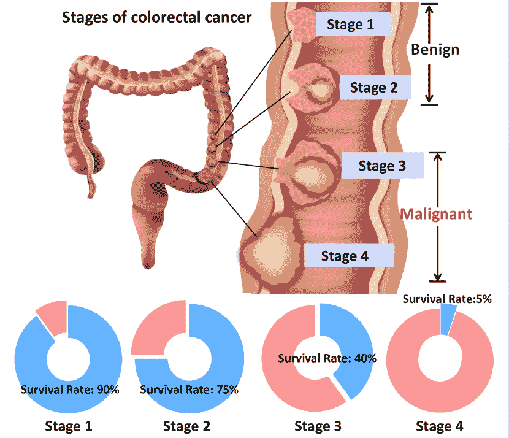

图 1：结直肠癌源自息肉，经历从正常黏膜到腺瘤性息肉、再到癌前息肉、腺癌，最终转变为癌症的过程。结直肠癌患者在初期的生存率超过 90%，但在末期则急剧下降至不到 5%。

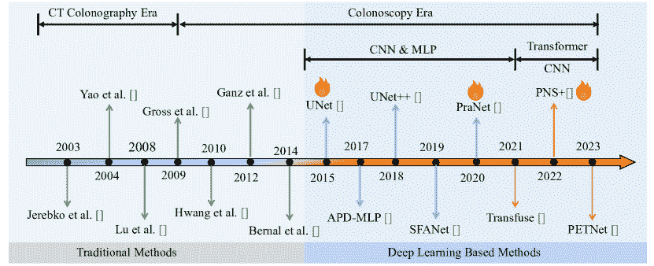

图 2：息肉分割的简要历史。第一个开创性工作[10] 可以追溯到 2003 年。第一个基于深度学习的息肉分割方法[3] 出现于 2015 年。上述方法作为里程碑，通常被引用频繁。更多细节请参见第 1.1.1 节。

本文系统而全面地回顾了基于深度学习的息肉分割方法。我们首先提供了对当前深度息肉分割的全面回顾，并提出了一种新的分类法，包括网络架构、监督程度及其学习范式。然后，我们还对每个数据集的特征进行了全面分析，包括数据集数量、注释类型、图像分辨率、息肉大小、对比度值和息肉位置。我们对 40 个深度 SOTA 模型进行了全面总结和分析，建立了一个开放和标准化的评估基准。最后，我们讨论了基于深度学习的息肉分割方法的主要挑战和机遇。我们希望这项调查能够帮助研究人员快速了解息肉分割的发展历史，并吸引更多研究人员加入该领域。

### 1.1 历史和范围

#### 1.1.1 结肠息肉分割的简要历史

如图 2 所示，我们简要概述了结肠息肉分割的历史。据我们所知，结肠息肉分割的首次研究可以追溯到 2003 年发表的[10]的开创性工作，该工作采用 Canny 边缘检测器对计算机断层扫描 (CT) 结肠造影中的息肉候选图像进行分割。随后，Yao 等人[11] 提出了一个自动分割 CT 结肠造影中结肠息肉的方法，该方法基于知识引导的强度调整和模糊 C 均值聚类的结合。Gross 等人[12] 提出了第一个用于结肠镜窄带图像的自动息肉分割算法。Hwang 等人[13] 提出了一个用于无线胶囊内镜视频中息肉检测的无监督方法，该方法采用了基于 Gabor 纹理特征和 K-means 聚类的新颖初始标记选择方法的水域分割。这些非深度学习基础的息肉分割方法[14, 15, 16] 通常依赖于手动提取的低级特征和传统的分割算法。然而，手动提取低级特征进行息肉分割不足以应对复杂的场景。

随着深度学习技术在计算机视觉领域完全压倒传统方法，自 2015 年以来，越来越多的深度 CPS 方法[17、4、2]出现，将息肉分割任务带入了深度学习时代。Ronneberger 等人[3]提出了一种用于生物医学图像分割的 UNet 形状网络，并在 2015 年 ISBI 细胞跟踪挑战赛中大幅领先获胜。后来，Fang 等人[18]提出了一种带有面积和边界约束的选择性特征聚合网络用于 CPS。Fan 等人[6]提出了一种并行反向注意力网络，用于在结肠镜图像中精确分割息肉。Zhang 等人[7]提出了一种基于变压器的并行分支架构，将变压器和 CNN 以并行方式结合在一起。最近，Ling 等人[9]提出了一种高斯-概率引导的语义融合方法，该方法逐步融合息肉位置的概率信息，并由二进制掩膜监督的解码器进行指导。

#### 1.1.2 本调查的范围。

临床结直肠息肉筛查在任务层面上可以分为三个经典任务，即息肉分类、息肉检测和息肉分割。本文主要关注息肉分割任务，旨在系统总结深度息肉分割方法、常用的息肉分割数据集、评价指标和模型性能。虽然深度息肉分割模型的发展仅有八年，但已经产生了数百篇论文，因此全面回顾这些论文是不切实际的。在这项调查中，我们主要关注 2019 年至 2023 年在医学图像分析主流期刊和会议上发表的具有影响力的论文。此外，为了完整性和更好的可读性，我们还简要提及了 2014 年至 2018 年间的一些早期相关工作。由于篇幅限制和我们的知识范围，我们对未能包含在本文中的作者表示歉意。

### 1.2 相关调查

表 I 列出了与此工作相关的现有调查。其中，Prasath 等人 [19] 回顾了基于手工特征的“胶囊内镜”结直肠息肉检测和分割方法，并讨论了现有挑战。后来，Taha 等人 [20] 回顾了内镜下的结直肠息肉检测模型，并将这些模型分为形状、纹理和融合特征。Sanchez-Peralta 等人 [21] 主要关注基于深度学习的结直肠息肉检测、定位和分割方法。此外，他们还总结了六个广泛使用的息肉检测数据集用于训练或基准测试和 19 个常用的模型评估指标。最后，一篇更近期的综述 [22] 总结了常用的网络架构，介绍了基准数据集和评估指标，并讨论了当前的挑战。尽管现有的综述从不同角度提供了见解，但它们也存在一些不足之处：1) 文献数量不足。在上述综述中，最全面的综述 [19] 仅包含 37 篇论文。2) 时间跨度有限。例如，综述 [19] 和 [20] 关注 2016 年之前的息肉分割方法，而 [21] 综述了 2015 年至 2018 年的息肉分割方法。[22] 综述了 20 篇论文，但其中 18 篇发表于 2022 年。3) 对现有模型和数据集的综合评估和分析不足。

| 标题 | 年份 | 描述 |
| --- | --- | --- |
| 从视频胶囊内镜中检测和分割息肉：综述 [19] | 2016 | 本文回顾了 2016 年之前基于传统方法的胶囊内镜息肉检测和分割方法，共有 37 篇论文。 |
| 内镜视频中自动息肉检测：综述 [20] | 2017 | 本文回顾了 2016 年之前基于手工特征的息肉检测方法，共有 28 篇论文。 |
| 使用深度学习在内镜检查中发现结直肠息肉：系统文献综述 [21] | 2020 | 本文回顾了 2015 年至 2018 年基于深度学习的息肉检测、定位和分割方法，共有 35 篇论文。 |
| 通过内镜检查使用机器学习检测结直肠息肉：现代技术的调查 [22] | 2023 | 本文回顾了基于深度学习的息肉检测，共有 20 篇论文，其中 18 篇发表于 2022 年。 |

表 I: 之前关于 CPS 的调查总结。每个调查都提供了标题、出版年份和内容总结。更多讨论可以在第 1.2 节中找到。

最近，梅等人[23]也进行了一项息肉分割调查，并在 Arxiv 平台上发布了他们的论文。与这项现代工作和以前的调查相比，我们的工作具有几个优势：1) 一个组织良好的深度 CPS 模型分类系统。如图 3 所示，我们的调查将息肉分割方法分为三大类：网络架构、监督级别和学习范式。更具体地说，网络架构包括八个子类别，监督级别包含六个子类别，而学习范式涵盖 12 个子类别，总计 26 个子类别。相比之下，梅的调查将现有的息肉分割方法分为六类。2) 对当前深度 CPS 方法的系统研究。如表 II ‣ Colorectal Polyp Segmentation in the Deep Learning Era: A Comprehensive Survey") 和表 III ‣ Colorectal Polyp Segmentation in the Deep Learning Era: A Comprehensive Survey")所示，我们的调查包含了 2014 年至 2023 年的 115 篇论文，而梅的调查仅覆盖了 2019 年至 2023 年的 45 篇论文。我们调查的论文数量几乎是他们的三倍。此外，我们还提供了每篇论文中提出的模型的架构、关键技术和训练数据集的总结，旨在提高读者的理解。3) 对当前 CPS 数据集的全面分析。如图 6、图 5 和表 IV ‣ Colorectal Polyp Segmentation in the Deep Learning Era: A Comprehensive Survey")所示，我们提供了每个数据集特征的全面分析，包括数据集数量、注释类型、图像分辨率、息肉大小、对比度值、息肉数量和息肉位置。4) 深度 CPS 方法的广泛性能比较和分析。如表 V 所示，我们的调查全面总结和分析了 2015 年至 2023 年的 40 个模型，而梅的调查仅包括 21 个模型。此外，如表 VI 和表 VIII 所示，我们还评估了模型在分布外数据集（即 PolypGen [24]）上的泛化性能以及在 SUN-SEG[2] 数据集上的基于属性的性能，以更好地揭示深度 CPS 模型的细微优缺点。5) 对 CPS 挑战的深入探讨和提供一些有前景的方向。我们广泛总结了在息肉分割中遇到的挑战，包括深度模型的可解释性、泛化能力、对抗攻击的鲁棒性、数据隐私、领域转移等。我们还强调了 CPS 的几个有前景的方向，例如将 CPS 与无监督异常定位、大型视觉模型和大型语言模型相结合。

### 1.3 我们的贡献

总结来说，本调查系统地研究了 2014 年至 2023 年间的深度息肉分割方法、数据集和评价指标，包括 115 篇技术论文、14 个息肉分割数据集和 12 个常用评价指标。我们旨在提供对息肉分割的直观理解和高级见解，以便研究人员能够选择合适的方向进行探索。本工作的贡献总结如下：

+   •

    对 2014 年至 2023 年的深度 CPS 方法的系统研究，共 115 篇技术论文。我们提出了一种新的息肉分割方法分类法，并将这些方法分为三大类：网络架构、监督级别和学习范式，这些类别可以进一步细分为 26 个子类别。引入的分类法旨在帮助研究人员深入了解深度 CPS 模型的核心特征。

+   •

    对当前 CPS 数据集的综合分析。我们彻底分析了每个 CPS 数据集，包括数据集数量、注释类型、图像分辨率、息肉大小、对比值、息肉数量和息肉位置。此外，我们还分析了现有 CPS 数据集中的挑战和困难。

+   •

    深度 CPS 模型的广泛性能比较和分析。我们对 2015 年至 2023 年的 40 个模型进行了全面总结和分析，以建立一个开放和标准化的评估基准。此外，我们评估了模型在多中心数据集（PolypGen）上的泛化性能以及在 SUN-SEG 数据集上的属性性能，以更好地了解深度 CPS 模型的优缺点。

+   •

    对深度 CPS 模型挑战的深入探讨并提供有前景的方向。我们总结了当前深度 CPS 模型的挑战，包括深度模型的可解释性、泛化能力、对对抗攻击的鲁棒性、数据隐私、领域偏移等。同时，我们还提出了几个有前景的 CPS 方向，如将 CPS 与无监督异常定位、大型视觉模型和大型语言模型结合。

本调查的其余部分组织如下：第二部分介绍了一种新的分类法，并回顾了每个类别中一些具有代表性的最先进的基于深度学习的息肉分割模型。第三部分概述了一些最流行的息肉分割数据集及其特征。第四部分列出了用于评估深度 CPS 模型的流行指标。第五部分对 40 个深度 CPS 模型进行了基准测试，并提供了深入的分析。第六部分讨论了基于深度学习的 CPS 方法的主要挑战和机会。第七部分是结论部分。

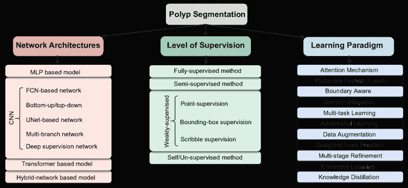

图 3：我们提出的分类法概述。我们从不同的角度将现有的息肉分割方法分为三个分支：网络架构、监督级别和学习范式。具体而言，网络架构包括八个子类别，监督级别包括六个子类别，而学习范式则包含 12 个子类别，共计 26 个子类别。

## 2 方法论（调查）

本节提供了从新的分类法出发，对突出深度 CPS 方法的全面概述，包括网络架构（参见 2.1 ‣ Colorectal Polyp Segmentation in the Deep Learning Era: A Comprehensive Survey")），监督级别（参见 2.2 ‣ Colorectal Polyp Segmentation in the Deep Learning Era: A Comprehensive Survey")）和学习范式（参见 2.3 ‣ Colorectal Polyp Segmentation in the Deep Learning Era: A Comprehensive Survey")），如图 3 所示。表 II ‣ Colorectal Polyp Segmentation in the Deep Learning Era: A Comprehensive Survey") 和表 III ‣ Colorectal Polyp Segmentation in the Deep Learning Era: A Comprehensive Survey") 总结了最近提出的深度 CPS 模型和一些具有代表性的传统 CPS 方法。由于篇幅有限，我们仅选择了每个类别中的一些代表性方法。

### 2.1 网络架构

根据采用的骨干网络架构，我们进一步将这些深度 CPS 模型分为四类：基于多层感知机（MLP）的模型（参见 2.1.1 ‣ Colorectal Polyp Segmentation in the Deep Learning Era: A Comprehensive Survey")），基于卷积神经网络（CNN）的模型（参见 2.1.2 ‣ Colorectal Polyp Segmentation in the Deep Learning Era: A Comprehensive Survey")），基于变换器（transformer）的模型（参见 2.1.3 ‣ Colorectal Polyp Segmentation in the Deep Learning Era: A Comprehensive Survey")），以及基于混合网络的模型（参见 2.1.4 ‣ Colorectal Polyp Segmentation in the Deep Learning Era: A Comprehensive Survey")）。

#### 2.1.1 基于 MLP 的方法

如图 4(a)所示，MLP 是一种由多个节点层组成的人工神经网络架构，包括输入层、一个或多个隐藏层和输出层。Shi 等人[25] 提出了一个新颖的工作来研究基于 MLP 的息肉分割架构，该架构使用 CycleMLP[26]作为编码器，以克服固定输入规模的问题。Yuan 等人[17] 介绍了一种基于 MLP 的稀疏自编码器，用于从手工特征中学习高层次的超像素特征。尽管基于 MLP 的 CPS 方法相比于非深度学习方法表现优越，但基于 MLP 的模型在利用图像的空间信息方面存在局限。此外，这些方法耗时较长，因为它们需要以多阶段的方式进行处理。

#### 2.1.2 基于 CNN 的方法

为了克服基于 MLP 的方法的局限性，近期的 CPS 方法[27, 28, 29, 30, 31, 32, 33, 34, 35] 采用了 CNN 架构，这使得息肉的表示和分割能够以端到端的方式进行。基于 CNN 的方法已在 CPS 领域占据主导地位，并且可以进一步分为 FCN-based 网络、UNet-based 网络、多分支网络和深度监督网络。

基于 FCN 的网络。Long 等人 [36] 介绍了用于语义分割的全卷积网络（FCN），如图 4(b) 所示。此后，FCN 成为图像分割的基础框架，随后的 CPS 方法 [37, 38, 39, 40, 41] 大多从中演变而来。Yin 等人 [42] 提出了两个并行的基于注意力的模块，这些模块可以集成到任何编码器-解码器架构中。Xu 等人 [43] 提出了一个用于视频息肉分割的时间相关网络，其中时间相关性前所未有地基于原始视频和捕获帧之间的关系进行建模，以适应视频息肉分割。Feng 等人 [44] 提出了一个新颖的阶梯形网络，用于实时结肠镜图像中的息肉分割。Akbari 等人 [45] 提出了一个基于全卷积神经网络的息肉分割方法。Wichakam 等人 [46] 通过修改 FCN-8s 网络提出了一个压缩的全卷积网络，用于实时检测和分割息肉。Wu 等人 [47] 提出了一个新颖的 ConvNet，以自下而上/自上而下的方式准确分割结肠镜视频中的息肉。Dong 等人 [48] 提出了不对称注意力上采样，通过空间池化和注意力机制智能地利用低级特征图的信息来重新缩放高级特征图。

基于 UNet 的网络。Ronneberger 等人[3] 提出了为生物医学图像分割任务设计的 UNet 架构。如图 4 ‣ 深度学习时代的结直肠息肉分割：综合调查")(c)所示，它包括一个收缩路径用于捕捉上下文和一个对称的扩展路径，使其适用于 CPS 任务。例如，Zhang 等人[49] 设计了一个典型的 UNet 结构，随后采用了自下而上的特征提取和自上而下的特征融合策略，以获得更全面和语义丰富的特征表示。Zhao 等人[50] 提出了一个基于 ResUnet 的框架，用于融合不同层次的邻近帧信息并捕捉上下文信息。Srivastava 等人[51] 提出了一个新颖的医学图像分割框架，包括一个编码器块、一个形状流块和一个解码器块。Lin 等人[52] 提出了一个基于 UNet 的网络，有效地抑制了特征图中的噪声，同时提高了不同层次上特征表达的能力。Song 等人[53] 设计了一种基于当前流行的编码-解码网络架构的新型神经网络结构。

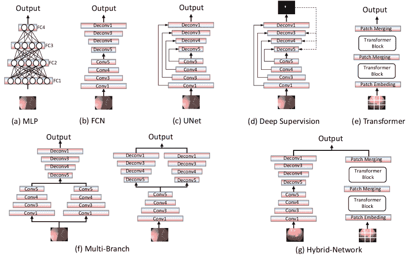

图 4：根据网络架构对深度 CPS 模型进行分类。(a) 基于 MLP 的方法，(b) 基于 FCN 的模型，(c) 基于 UNet 的方法，(d) 深度监督网络，(e) 基于 Transformer 的网络，(f) 多分支网络，(g) 混合网络。

多分支网络。如图 4 ‣ Colorectal Polyp Segmentation in the Deep Learning Era: A Comprehensive Survey")(f) 所示，多分支方法通常由多个编码器/解码器组成，用于明确地提取多尺度特征以进行息肉分割。Li 等人 [54] 提出了一个多分支框架，包括一个分割分支和一个传播分支。Huy 等人 [55] 提出了一个对抗性对比傅里叶方法，通过内容编码器和风格编码器的监督学习对比损失。Ji 等人 [2] 设计了一个简单但高效的多流网络（名为 PNS+），用于视频息肉分割，该网络包括一个全局编码器和一个局部编码器。全局和局部编码器从第一个锚点帧和多个连续帧中提取长短期时空表示。Qiu 等人 [56] 设计了一个双分支网络；一个分支用于生成边界分布图，另一个分支用于预测息肉分割图。Chen 等人 [57] 提出了一个新颖的双分支网络，用于单模态内窥镜图像的息肉分割，该网络包括一个图像到图像的翻译分支和一个图像分割分支。Tomar 等人 [58] 提出了一个名为双解码器注意力网络的深度学习新架构，用于自动息肉分割。

深度监督网络。如图 4 (d) 所示，提出了一种深度监督学习策略 [59, 4, 60, 61]，旨在利用真实标签在网络的每一层进行监督，促进模型的快速收敛。Patel 等人 [62] 提出了一个新型模糊网络，专注于难处理的像素，其中深度监督应用于每个模糊注意模块和部分解码器的输出末端。Du 等人 [63] 提出了一个基于集成上下文的反向轮廓引导网络，并进行了多层次的深度监督。Nguyen 等人 [64] 提出了一个基于编码器-解码器的架构，每一层都由调整后的真实标签进行监督。Shen 等人 [65] 提出了一个新型的硬区域增强网络，用于息肉分割，进行多层次真实标签监督。[7] 使用深度监督通过额外监督变压器分支和第一个融合分支来改进梯度流。Kim 等人 [66] 提出了一个不确定性增强上下文注意网络，在每一层中使用额外的监督。Zhang 等人 [67] 提出了一个由下采样真实标签监督的自适应上下文选择网络。Fan 等人 [6] 提出了一个用于息肉分割任务的并行反向注意网络，采用深度监督用于最后三个侧输出。

|   年份 | 方法 | 发表会议 | 架构 | 主干网络 | 监督方式 | 学习范式 | 训练数据集 | 数量 | 可用性 |
| --- | --- | --- | --- | --- | --- | --- | --- | --- | --- |
| 2023 | PETNet [9] | MICCAI | Transformer | PVTv2-B2 [68] | 全监督 | 高斯概率，集成 | ClinicDB [69]+Kvasir-SEG [70] | 548+900 | 否 |
| RPFA [71] | MICCAI | Transformer+UNet | PVT [72] | 全监督 | 特征传播/融合 | ClinicDB [69]+Kvasir-SEG [70] | 548+900 | 否 |
| S2ME [73] | MICCAI | CNN+UNet | ResNet50 [74] | 画笔监督 | 集成学习，互教 | SUN-SEG [2] | 6677 | [Open](https://github.com/lofrienger/S2ME) |
| WeakPolpy [75] | MICCAI | Transformer/FCN | Res2Net50 [76]/PVTv2-B2 [68] | Box-Sup. | 转换，尺度一致性 | SUN-SEG [2]/POLYP-SEG [75] | 19,544/15,916 | [Open](https://github.com/weijun88/WeakPolyp) |
| FSFM [41] | ISBI | CNN+FPN | VAN [77] | 全监督 | 特征融合，注意力 | ClinicDB [69]+Kvasir-SEG [70] | 548+900 | 否 |
| EPSG [78] | ISBI | CNN+UNet | ResNet50 [74] | 完全监督 | 图像变换, 变异 | ClinicDB [69]+Kvasir-SEG [70] | 490+800 | 无 |
| RealSeg [79] | ISBI | FPN | VAN [77] | 完全监督 | 实时, 特征融合 | ClinicDB [69]+Kvasir-SEG [70] | 548+900 | 无 |
| PSTNet [80] | ISBI | CNN+UNet | Res2Net50[76] | 完全监督 | 领域适应, 翻译 | PICCOLO [81] | 3,546 | 无 |
| EMTSNet [82] | JBHI | CNN+UNet | Res2Net50[76] | 完全监督 | 多任务, 激活图 | ClinicDB [69]+Kvasir-SEG [70] | 548+900 | 无 |
| GAN-PSNet [83] | JBHI | GAN+UNet | Res2Net50[76] | 完全监督 | 注意力, 生成对抗 | Kvasir-SEG [70] | 800 | 无 |
| FEGNet [60] | JBHI | CNN+UNet | Res2Net50[76] | 完全监督 | 反馈机制, 边界 | ClinicDB [69]+Kvasir-SEG [70] | 548+800 | 无 |
| PMSACL [84] | MIA | CNN+UNet | ResNet18[74] | 自监督/无监督 | 数据增强, 异常 | HyperKvasir [85] | 2100 | 无 |
| XBFormer [86] | TMI | Transformer | PVT [72] | 完全监督 | 跨尺度, 边界融合 | ClinicDB [69]+Kvasir-SEG [70] | 548+800 | [开放](https://github.com/jcwang123/xboundformer) |
| ColnNet [87] | TMI | CNN+UNet | DenseNet121 [88] | 完全监督 | 特征关系, 边界 | ClinicDB [69]+Kvasir-SEG [70] | 548+800 | 无 |
| RPANet [89] | IPMI | CNN+UNet | ResNet101 [74] | 完全监督 | 领域适应, 自监督 | 私有数据集 [89] | 5,175 | 无 |
| TransNetR [90] | MIDL | Transformer+CNN | ResNet50 [74] | 完全监督 | Out-of-distribution, Generalization | Kvasir-SEG [70] | 900 | [开放](https://github.com/DebeshJha/TransNetR) |
| CFANet [91] | PR | CNN+UNet | Res2Net50[76] | 完全监督 | 边界感知, 特征融合 | ClinicDB [69]+Kvasir-SEG [70] | 548+900 | [开放](https://github.com/taozh2017/CFANet) |
| GSAL [92] | PR | CNN+GAN | VGG16 [93] | 完全监督 | 对抗学习 | ClinicDB [69]+Kvasir-SEG [70] | 548+900 | [开放](https://github.com/DLWK/GSAL) |
| Polyp-Mixer [25] | TCSVT | MLP | CycleMLP-B1 [26] | 完全监督 | 上下文感知, MLP | ClinicDB [69]+Kvasir-SEG [70] | 548+900 | 无 |
| PTMFNet [94] | ICIP | Transformer | PVTv2 [68] | 完全监督 | Pyramid Transformer, Multibranch | - | - | 无 |
| PLCUT-Seg [95] | IJCNN | CNN | HarDNet68 [96] | 自监督/半监督 | 合成数据, 自/半监督 | ClinicDB [69]+Kvasir-SEG [70] | 548+900 | 无 |
| PolypSeg+ [97] | TCYB | CNN+UNet | ResNet50 [74] | 完全监督 | 上下文感知, 特征融合 | ClinicDB [69]+Kvasir-SEG [70] | 548+900 | 无 |
|  | CASCADE [98] | WACV | Transformer+UNet | PVTv2 [68] | 完全监督 | 级联注意力, 特征融合 | [Synapse](https://www.synapse.org/#!Synapse:syn3193805/wiki/217789)+ACDC[99] + ClinicDB [69]+Kvasir-SEG [70] | 2212+1930 +548+900 | [Open](https://github.com/SLDGroup/CASCADE) |
|  | PolypPVT [100] | CAAI AIR | Transformer+UNet | PVT[72] | 完全监督 | 级联融合 | ClinicDB [69]+Kvasir-SEG [70] | 550+900 | [Open](https://github.com/DengPingFan/Polyp-PVT) |
|  | PEFNet [101] | MMM | CNN+UNet | EfficientNetV2-L [102] | 完全监督 | 位置嵌入 | Kvasir-SEG [70] | 600 | [Open](https://github.com/huyquoctrinh/PEFNet) |
| 2022 | TRFR-Net [27] | MICCAI | CNN+GAN | ResNet34 [74] | 完全监督 | 域适应, 对抗学习 | Kvasir-SEG [70]+ETIS-Larib [103] + CVC-ColonDB [104] | 700+137+210 | 无 |
| TGANet [28] | MICCAI | CNN+UNet | ResNet50 [74] | 完全监督 | 注意力, 多尺度 | Kvasir-SEG [70] | 880 | [Open](https://github.com/nikhilroxtomar/tganet) |
| LDNet [49] | MICCAI | CNN+UNet | Res2Net50[76] | 完全监督 | 动态内核, 注意力 | ClinicDB [69]+Kvasir-SEG [70] | 548+800 | [Open](https://github.com/ReaFly/LDNet) |
| SSFormer [8] | MICCAI | Transformer+UNet | PVTv2 [68] | 完全监督 | 局部,全局融合 | ClinicDB [69]+Kvasir-SEG [70] | 548+900 | [Open](https://github.com/Qiming-Huang/ssformer) |
| BoxPolyp [29] | MICCAI | Transformer/CNN | PVTv2 [68]/Res2Net50[76] | 盒子监督 | 融合, 一致性损失 | ClinicDB [69]+Kvasir-SEG [70] | 548+900 | [Open](https://github.com/weijun88/BoxPolyp) |
| PPFormer [105] | MICCAI | Transformer+CNN | CvT[106]+VGG16[93] | 完全监督 | 自注意力, Local2Global 融合 | ClinicDB [69]+Kvasir-SEG [70] | 548+900 | 无 |
| SSTAN [50] | MICCAI | CNN+UNet | ResNet34[74] | 半监督 | 上下文注意力 | LDPolypVideo [107] | 693+14704 | 无 |
| NIP [30] | MedIA | CNN+UNet | ResNet101[74] | 完全监督 | 数据增强, 重新采样 | EndoScene [108] | 547 | 无 |
| FSM [31] | MedIA | CNN+UNet | ResNet101[74] | 全监督 | 域适应, 重新采样 | EndoScene [108] | 547 | [开源](https://github.com/CityU-AIM-Group/SFDA-FSM) |
| MSRF-Net [51] | JBHI | CNN+UNet | SENet [109] | 全监督 | 多尺度融合 | ClinicDB [69]+Kvasir-SEG [70] | 490+800 | [开源](https://github.com/NoviceMAn-prog/MSRF-Net) |
| BCNet [32] | JBHI | CNN+UNet | Res2Net50[76] | 全监督 | 交叉特征融合, 边界 | Kvasir-SEG [70] | 800 | [开源](https://github.com/NoviceMAn-prog/MSRF-Net) |
| PNS+ [2] | MIR | CNN+UNet | Res2Net50[76] | 全监督 | 特征聚合, 注意力 | SUN-SEG [2] | 19,544 | [开源](https://github.com/GewelsJI/VPS) |
| FCBFormer [110] | MIUA | Transformer+CNN | PVTv2-B3 [68]+ResNet34[74] | 全监督 | 双流融合 | ClinicDB [69]+Kvasir-SEG [70] | 490+800 | [开源](https://github.com/ESandML/FCBFormer) |
| BDGNet [56] | SPIE MI | CNN+UNet | EfficientNet-B5 [111] | 全监督 | 多尺度融合, 边界 | ClinicDB [69]+Kvasir-SEG [70] | 550+900 | [开源](https://github.com/zihuanqiu/BDG-Net) |
| TCNet [43] | BIBM | FCN | Res2Net50[76] | 全监督 | 时序相关建模 | ClinicDB [69]+Kvasir-SEG [70] | 550+800 | 否 |
| TransMixer [61] | BIBM | Transformer+CNN | PVTv2 [68]+SENet [109] | 全监督 | 互动融合, 注意力 | ClinicDB [69]+Kvasir-SEG [70] | 550+900 | 否 |
| ICBNet [112] | BIBM | Transformer+UNet | PVT [72] | 全监督 | 迭代融合, 注意力 | ClinicDB [69]+Kvasir-SEG [70] | 550+900 | 否 |
| CLDNet [113] | BIBM | Transformer+UNet | PVTv2 [68] | 全监督 | 多尺度融合, 边界 | ClinicDB [69]+Kvasir-SEG [70] | 490+800 | 否 |
| TASNet [57] | BIBM | CNN+UNet | Res2Net50[76] | 全监督 | 色彩反转, 双分支网络 | ClinicDB [69]+Kvasir-SEG [70] | 550+900 | 否 |
| FuzzyNet [62] | NeurIPS | CNN/Transformer | Res2Net50[76]/PVT [72] | 全监督 | 模糊注意力 | ClinicDB [69]+Kvasir-SEG [70] | 550+900 | [开源](https://github.com/krushi1992/FuzzyNet) |
| SwinPA-Net [114] | TNNLS | Transformer+UNet | Swin-B [115] | 全监督 | 金字塔注意力, 多尺度融合 | ClinicDB [69]+Kvasir-SEG [70] | 550+900 | 否 |
| BSCA-Net [52] | PR | CNN+UNet | Res2Net50[76] | 完全监督 | 多路径，注意力 | ClinicDB [69]+Kvasir-SEG [70] | 550+900 | 否 |
| HSNet [116] | CBM | CNN+Transformer | PVTv2 [68]+ Res2Net50[76] | 完全监督 | 跨注意力，语义互补 | ClinicDB [69]+Kvasir-SEG [70] | 548+900 | [开放](https://github.com/baiboat/HSNet) |
| MSRAformer [59] | CBM | Transformer+UNet | Swin-B [115] | 完全监督 | 通道/反向注意力 | ClinicDB [69]+Kvasir-SEG [70] | 490+800 | [开放](https://github.com/ChengLong1222/MSRAformer-main) |
| AMNet [53] | CBM | CNN+UNet | Res2Net50[76] | 完全监督 | 多尺度融合，注意力 | ClinicDB [69]+Kvasir-SEG [70] | 500+800 | 否 |
| DBMF [117] | CBM | Transformer+CNN | Swin-B [115]+EfficientNet[111] | 完全监督 | 多尺度融合，注意力 | ClinicDB [69]+Kvasir-SEG [70] | 550+900 | 否 |
| ICGNet [63] | IJCAI | CNN+UNet | ResNet34[74] | 完全监督 | 局部-全局融合，边界监督 | EndoScene [108]+Kvasir-SEG [70] | 547+600 | 否 |
| TCCNet [54] | IJCAI | CNN+UNet | Res2Net50[76] | 半监督 | 无上下文损失，反向注意力 | ClinicDB [69]+CVC-ColonDB [104] | 367+180 | [开放](https://github.com/wener-yung/TCCNet) |
| CoFo [55] | ISBI | CNN+UNet | ResNet18[74] | 完全监督 | 领域适应，对抗学习 | EndoScene [108]+Kvasir-SEG [70] | 547+600 | [开放](https://github.com/tadeephuy/CoFo) |
| DCRNet [42] | ISBI | CNN+UNet | ResNet34[74] | 完全监督 | 上下文关系学习 | EndoScene [108]+Kvasir-SEG [70] + Piccolo[118] | 547+600 +2203 | [开放](https://github.com/tadeephuy/CoFo) |
| 2021 | MSNet [33] | MICCAI | CNN+UNet | Res2Net50[76] | 完全监督 | 多尺度融合，损失网络 | ClinicDB [69]+Kvasir-SEG [70] | 550+900 | [开放](https://github.com/Xiaoqi-Zhao-DLUT/MSNet-M2SNet) |
| CCBANet [64] | MICCAI | CNN+UNet | ResNet34[74] | 完全监督 | 级联上下文，注意力 | ClinicDB [69]+Kvasir-SEG [70] | 550+900 | [开放](https://github.com/ntcongvn/CCBANet) |
| HRNet [65] | MICCAI | CNN+UNet | ResNet34[74] | 完全监督 | 特征聚合，注意力 | ClinicDB [69]+Kvasir-SEG [70] | 550+900 | 否 |
| LODNet [119] | MICCAI | CNN | ResNet50[74] | 完全监督 | 定向，敏感损失 | ClinicDB [69]+Kvasir-SEG [70] | 550+900 | [Open](https://github.com/midsdsy/LOD-Net) |
| SANet [34] | MICCAI | CNN+UNet | Res2Net50[76] | 完全监督 | 颜色交换，注意力机制 | ClinicDB [69]+Kvasir-SEG [70] | 550+900 | [Open](https://github.com/weijun88/SANet) |
| Transfuse [7] | MICCAI | Transformer+CNN | Res2Net34[76]+DeiT-S[120] | 完全监督 | 特征融合 | ClinicDB [69]+Kvasir-SEG [70] | 550+900 | [Open](https://github.com/Rayicer/TransFuse) |
| CCD [121] | MICCAI | CNN+UNet | ResNet18[74] | 自监督/无监督 | 对比学习，异常定位 | HyperKvasir [85] | 2100 | [Open](https://github.com/tianyu0207/CCD) |
| Polyformer [122] | MICCAI | Transformer+UNet | Segtran[123] | 完全监督 | 少样本学习，领域适应 | ClinicDB [69]+Kvasir-SEG [70] | 550+900 | [Open](https://github.com/askerlee/segtran) |
| PNet [124] | MICCAI | CNN | Res2Net50[76] | 完全监督 | 特征聚合，图卷积 | ClinicDB [69]+Kvasir-SEG [70] | 550+900 | [Open](https://github.com/DengPingFan/PraNet) |
| HieraSeg [125] | MIA | CNN+FCN | Deeplabv3+[126] | 完全监督 | 层次化，动态加权 | EndoScene[108] | 547 | [Open](https://github.com/CityU-AIM-Group/DW-HieraSeg) |
| ThresholdNet [127] | TMI | CNN+FCN | Deeplabv3+[126] | 完全监督 | Mixup，阈值损失 | EndoScene[108] | 547 | [Open](https://github.com/Guo-Xiaoqing/ThresholdNetv) |
| FANet [35] | TNNLS | CNN+UNet | 无 | 完全监督 | 迭代优化，反馈注意力 | ClinicDB [69]+Kvasir-SEG [70] | 550+900 | [Open](https://github.com/nikhilroxtomar/FANet) |
| MPA-DA [128] | JBHI | CNN+UNet | ResNet101[74] | 完全监督 | 领域适应，自训练 | ClinicDB [69]+Kvasir-SEG [70] | 548+1000 | [Open](https://github.com/CityU-AIM-Group/MPA-DA) |
| ResUNet++[129] | JBHI | CNN+UNet | ResUNet[130] | 完全监督 | 测试时间增强 | ClinicDB [69]+Kvasir-SEG [70] | 550+900 | [Open](https://github.com/DebeshJha/ResUNetPlusPlus-with-CRF-and-TTA) |
| SCRNet [47] | AAAI | CNN+UNet | FPN[131] | 完全监督 | 语义校准/细化 | Kvasir-SEG [70] | 700 | 否 |
| CAFD [132] | ICCV | CNN+UNet | ResNet50[74] | 半监督 | 对抗学习，协作学习 | ClinicDB [69]+Kvasir-SEG [70] | 306+500 | 否 |
| UACANet [66] | ACM MM | CNN+UNet | Res2Net[76] | 完全监督 | 不确定性，自注意力 | ClinicDB [69]+Kvasir-SEG [70] | 550+900 | [开放](https://github.com/plemeri/UACANet) |
| Segtran[123] | IJCAI | Transformer+CNN | ResNet101[74] | 完全监督 | 压缩注意力，位置编码 | ClinicDB [69]+Kvasir-SEG [70] | 489+800 | [开放](https://github.com/askerlee/segtran) |
| DenseUNet [133] | Sensors | CNN+UNet | DenseNet[88] | 完全监督 | 密集连接，注意力 | ClinicDB [69]+Kvasir-SEG [70] | 490+800 | 否 |
| EUNet [134] | CVR | CNN+UNet | ResNet34[74] | 完全监督 | 语义增强，全球上下文 | ClinicDB [69]+Kvasir-SEG [70] | 550+900 | [开放](https://github.com/rucv/Enhanced-U-Net) |
| DDANet [58] | ICPR | CNN+UNet | ResUNet[130] | 完全监督 | 双解码器 | Kvasir-SEG [70] | 880 | [开放](https://github.com/nikhilroxtomar/DDANet) |
| FUNet [135] | CBM | CNN+UNet | ResNet34[74] | 完全监督 | 双重注意力，门控 | ClinicDB [69]+Kvasir-SEG [70] | 550+900 | 否 |
| T-UNet [136] | Healthcare | CNN+UNet | ResNet50[74] | 完全监督 | 膨胀卷积，特征融合 | ClinicDB [69] | 489 | 否 |
| DNets[137] | ISBI | CNN+FCN | FPN[131]+Deeplabv3+[126] | 完全监督 | 集成学习 | ClinicDB [69]+Kvasir-SEG [70] | 489+800 | [开放](https://github.com/vlbthambawita/divergent-nets) |
|  | AAU [48] | ISBI | CNN+FCN | ResNet34[74] | 完全监督 | 非对称注意力，上采样 | Kvasir-SEG [70] | 800 | 否 |
|  | BI-GCN [138] | BMVC | GCN | Res2Net50[76] | 完全监督 | 特征聚合，图卷积 | ClinicDB [69]+Kvasir-SEG [70] | 550+900 | [开放](https://github.com/smallmax00/BI-GConv) |
|   |  |  |  |  |  |  |  |  |  |

表 II: 2021 年至 2023 年流行的深度 CPS 方法的总结，包括网络架构、骨干网络、监督水平、学习范式、训练数据集和源代码。第 2 ‣ Colorectal Polyp Segmentation in the Deep Learning Era: A Comprehensive Survey")节提供了更详细的描述。

|   年份 | 方法 | 发表 | 架构 | 骨干网络 | 监督 | 学习范式 | 训练数据集 | 数量 | 可用性 |
| --- | --- | --- | --- | --- | --- | --- | --- | --- | --- |
| 2020 | ACSNet [67] | MICCAI | CNN+UNet | ResNet34 [74] | 完全监督 | 自适应选择，注意力 | ClinicDB [69]+Kvasir-SEG [70] | 547+600 | [开放](https://github.com/ReaFly/ACSNet) |
| MI²GAN [139] | MICCAI | GAN | CycleGAN [140] | 完全监督 | 域适应，对抗学习 | ClinicDB [69] | 490 | 否 |
| PraNet [6] | MICCAI | CNN+UNet | Res2Net50[76] | 完全监督 | 特征聚合，注意力 | ClinicDB [69]+Kvasir-SEG [70] | 547+800 | [开放](https://github.com/DengPingFan/PraNet) |
| Polypseg [141] | MICCAI | CNN+UNet | UNet [3] | 完全监督 | 上下文感知，语义 | Kvasir-SEG [70] | 600 | 否 |
| ABCNet [142] | Sensors | CNN+FCN | ResNeXt50 [143] | 完全监督 | 边界损失感知，两流 | Kvasir-SEG [70]+EndoScene[108] | 800+547 | 否 |
| UINet [144] | MIA | CNN | Res2Net50[76] | 完全监督 | 不确定性，可解释性 | EndoScene[108] | 547 | 否 |
| MCNet [145] | JBHI | CNN+UNet | VGG16[93] | 完全监督 | 全局语义，本地细节 | ClinicDB [69]+[EndoVC](https://endovissub-abnormal.grand-challenge.org/) | 412+465 | 否 |
| SSN [44] | ISBI | CNN+FCN | ResNet [74] | 完全监督 | 多尺度融合，注意力 | ClinicDB [69]+Kvasir-SEG [70] | 547+800 | 否 |
| RCIS [146] | ICARM | CNN+FCN | ResNet [74] | 完全监督 | 知识蒸馏 | ClinicDB [69]+Kvasir-SEG [70] | 547+800 | 否 |
| Double-UNet [147] | CBMS | CNN+UNet | VGG19[93] | 完全监督 | 多分支，特征融合 | ClinicDB [69]+ETIS-Larib [103] | 490+157 | 否 |
| 2019 | SFANet [18] | MICCAI | CNN+UNet | ResNet34 [74] | 完全监督 | 选择性聚合，边界损失 | EndoScene[108] | 730 | 否 |
| TDE [148] | CBMS | CNN+UNet | ResNet34 [74] | 完全监督 | 数据增强 | ClinicDB [69] | 612 | 否 |
| PsiNet [149] | EMBC | CNN+UNet | ResNet50 [74] | 完全监督 | 边界，多任务学习 | EndoScene[108] | 638 | [开放](https://github.com/Bala93/Multi-task-deep-network) |
| PSGAN [150] | EMBC | GAN | ResNet50 [74] | 完全监督 | 生成对抗网络 | ClinicDB [69] | 488 | 否 |
| CPSUNet[151] | ICMLA | CNN+UNet | ResNet50 [74] | 完全监督 | 膨胀卷积，形态学 | ClinicDB [69]+ GIANA[152] | 300+56 | 否 |
| ResUNet++ [5] | ISM | CNN+UNet | ResUNet [130] | 完全监督 | 压缩激励, 注意力机制 | ClinicDB [69]+Kvasir-SEG [70] | 547+800 | [开放](https://github.com/DebeshJha/ResUNetPlusPlus-with-CRF-and-TTA) |
| PDS [153] | ISMICT | CNN | Maks R-CNN [154] | 完全监督 | 特征提取, 集成 | ClinicDB [69]+ ETIS-Larib[103] | 547+157 | 否 |
| GIANA [155] | IJCCV | CNN+FCN | ResNet50 [74] | 完全监督 | 膨胀卷积, 压缩激励 | ClinicDB [69]+ GIANA[152] | 300+56 | 否 |
| CCS [156] | EMBC | CNN | LinkNet [157] | 完全监督 | 颜色空间变换 | CVC-ColonDB [104] | 284 | 否 |
| APS [158] | Med Phys | CNN+UNet | VGG16 [93] | 完全监督 | 数据增强, 集成学习 | ClinicDB [69]+ ETIS-Larib[103] | 547+157 | 否 |
| 2014-2018 | PSFCN [45] | EMBC | CNN+FCN | FCN-8S [36] | 完全监督 | 裁剪选择, 数据增强 | CVC-ColonDB [104] | 200 | 否 |
| ACPS [159] | CBM | 不适用 | 不适用 | 无监督 | 图像预处理, 边缘检测 | 不适用 | 不适用 | 否 |
| UMI [160] | MLSP | CNN+FCN | SegNet [161] | 完全监督 | 不确定性建模, 可解释性 | EndoScene[108] | 547 | 否 |
| UNet++ [4] | DLMIA | CNN+UNet | UNet [3] | 完全监督 | 跳跃路径, 深度监督 | ASU-Mayo [104] | 7,379 | [开放](https://github.com/MrGiovanni/UNetPlusPlus) |
| RTPS [46] | MMM | CNN+FCN | FCN-8S [36] | 完全监督 | 实时, 压缩 | EndoScene[108] | 547 | 否 |
| MED [37] | AIKE | CNN+FCN | Deeplabv3 [126] | 完全监督 | 数据库增强, 多模态 | ClinicDB [69] | 547 | 否 |
| FCNet [40] | SPIE MI | CNN+FCN | VGG16 [93] | 完全监督 | 完全卷积网络 | ClinicDB [69] | 612 | 否 |
| CPFCNet [39] | BMEI | CNN+FCN | FCN[36] | 完全监督 | 完全卷积网络 | ClinicDB [69] | 428 | 否 |
| APSNet [38] | MIUA | CNN+FCN | FCN-8s [36] | 完全监督 | 区域提议, 纹理 | CVC-ColonDB [104] | 200 | 否 |
| SuperSeg [162] | SPMB | 不适用 | 不适用 | 无监督 | 超像素分割, 支持向量机 | 不适用 | 不适用 | 否 |
| APD [17] | JBHI | MLP | 不适用 | 无监督 | 超像素, 自编码器, 显著性 | 不适用 | 不适用 | 否 |
| WM-DOVA [69] | CMIG | 不适用 | 不适用 | 无监督 | 边界约束, 显著性 | 不适用 | 不适用 | 否 |
| PAD-WCE [163] | ROBIO | 不适用 | 不适用 | 无监督 | K-means 聚类, 轮廓 | 不适用 | 不适用 | 否 |
| MSA-DOVA [16] | TRMI | N/A | N/A | 无监督 | Valley Fnformation, Energy Maps | N/A | N/A | 否 |
|   |  |  |  |  |  |  |  |  |  |

表 III：2014 年至 2020 年流行深度 CPS 方法的总结。为确保完整性，也简要列出了 2014 年至 2018 年的一些早期相关工作。

#### 2.1.3 基于 Transformer 的方法

Transformer 架构首次由[164]在 2017 年提出。与 CNN 相比，Transformer 架构能够捕捉序列中的长程依赖，使其适合理解全局上下文。最近，Ling 等人[9]提出了一种新颖的高斯概率引导语义融合方法用于息肉分割。Wang 等人[8]介绍了一种用于息肉分割任务的金字塔 Transformer 架构，以提高神经网络的泛化能力。Xiao 等人[112]提出了一种基于 Transformer 的网络，通过模仿医生从初步到精细的工作范式，实现了稳健且准确的息肉分割。Chen 等人[113]提出了一种新颖的局部 Transformer 网络架构用于医学小物体分割，该方法在上采样全局特征时能够补充局部详细信息。Du 等人[114]介绍了一种新方法，称为 swin pyramid aggregation network，该方法在网络中引入了两个设计模块，并以 swin transformer 作为骨干网，以学习更强大和更稳健的特征。Wu 等人[59]展示了一种多尺度空间反向注意力网络，采用了具有金字塔结构的 Swin Transformer 编码器，以提取四个不同阶段的特征。

#### 2.1.4 混合网络基方法

最近，如图 4 ‣ Colorectal Polyp Segmentation in the Deep Learning Era: A Comprehensive Survey")(g) 所示，研究人员尝试将 CNN 与变压器结合用于息肉分割，旨在分别从 CNN 和变压器中捕捉局部和长期特征。Jha 等人 [90] 提出了一个基于变压器的残差网络用于结肠息肉分割，并评估了其诊断性能。Cai 等人 [105] 提出了一个用于息肉分割任务的混合框架，其中编码器由深层变压器分支和浅层 CNN 分支组成，以提取丰富的特征。Sanderson 等人 [110] 提出了一个新的结肠镜图像息肉分割架构，结合了 FCNs 和变压器以实现最先进的结果。Huang 等人 [61] 提出了 TransMixer，一种变压器分支和 CNN 分支的混合交互融合架构，能够增强全局表示的局部细节和局部特征的全局上下文感知。Zhang 等人 [116] 介绍了一种通过结合 CNN 和变压器的混合语义网络，旨在分别捕捉息肉中的局部和长期特征。Liu 等人 [117] 提出了一个双分支多尺度特征融合网络用于息肉分割，该网络并行使用 CNN 和变压器，分别提取多尺度的局部信息和全局上下文信息。

### 2.2 监督级别

根据监督级别，现有的深度 CPS 方法可以分为完全监督（第 2.2.1 ‣ Colorectal Polyp Segmentation in the Deep Learning Era: A Comprehensive Survey") 节）、半监督（第 2.2.2 ‣ Colorectal Polyp Segmentation in the Deep Learning Era: A Comprehensive Survey") 节）、弱监督（第 2.2.3 ‣ Colorectal Polyp Segmentation in the Deep Learning Era: A Comprehensive Survey") 节）和自监督/无监督方法（第 2.2.4 ‣ Colorectal Polyp Segmentation in the Deep Learning Era: A Comprehensive Survey") 节）。

#### 2.2.1 完全监督方法

在完全监督学习范式中，深度模型在具有像素级标注的数据集上进行训练，这种方法严重依赖广泛的人工标注以确保显著的性能，大多数当前的深度 CPS 方法[27, 28, 49, 8, 105, 30, 31, 51, 110, 56, 61, 33] 基于完全监督学习。Yin 等人[42]提出了一种双重上下文关系网络，旨在同时捕捉图像间和图像内的上下文关系，使用了 3350 个像素级标注。Zhang 等人[49]设计了一种病灶感知动态网络，用于息肉分割任务，使用了 1348 个像素级标签。Wang 等人[8]使用金字塔 Transformer 编码器来提高模型的泛化能力。Cai 等人[105]提出了一种名为 PPFormer 的精确息肉分割方法，该方法利用了 Transformer 的长距离建模能力和 CNN 的局部特征提取能力。Yue 等人[32]提出了一种新颖的边界约束网络，其中息肉分割任务以完全监督的方式完成。Ji 等人[2]设计了一种多流网络用于视频息肉分割，使用了 19,554 个 SUN-SEG 数据进行训练。

#### 2.2.2 半监督方法

尽管完全监督模型能够实现高性能，但它严重依赖于像素级标注的大规模数据集。因此，越来越多的研究人员开始关注半监督学习[54]，即使在标注和未标注数据有限的情况下也能取得良好性能。例如，Li 等人提出了一种半监督学习范式用于视频息肉分割，仅使用 547 张像素级标注的图像，并包含了一个共同训练方案以监督未标注图像的预测。Zhao 等人[50]提出了一种准确且新颖的网络用于半监督息肉视频分割任务，该网络利用了内窥镜视频中相邻帧的空间和时间信息。Wu 等人[132]提出了一种名为协作与对抗学习的聚焦与分散表示学习模型的新型半监督息肉分割方法。

#### 2.2.3 弱监督方法

另一方面，为了缓解完全监督方法对逐像素注释的依赖，一些研究者采用了半监督学习方法，包括点监督、语义标签监督、涂鸦监督和边界框监督。王等人 [73] 提出了一个空间-光谱互教和集成学习的框架用于涂鸦监督的息肉分割。魏等人 [75] 引入了一种完全基于边界框注释的模型，降低了标注成本，并实现了与完全监督相当的性能。魏等人 [29] 提出了一个模型，充分利用准确的掩膜和来自 LDPolypVideo [107] 的额外 40,266 帧边界框注释。

#### 2.2.4 自监督/无监督方法

此外，为了彻底解决对带注释数据集的依赖，一些研究者采用了自监督方法来预训练模型，并将其迁移到下游任务中。王等人 [89] 提出了使用源预训练模型预测的伪标签以监督方式进行对比学习。杨等人 [128] 提出了一个渐进自训练模块，通过新颖的不确定性引导自训练损失选择可靠的伪标签，从而在目标领域中获得准确的原型。田等人 [121] 提出了一种新颖的自监督表示学习方法用于息肉分割，通过使用带有前置约束的对比学习，同时预测增强数据和图像上下文的分布来学习细粒度特征表示。值得注意的是，传统的息肉分割方法 [159, 17, 162, 69, 163] 通常以无监督的方式实现。例如，贾等人 [163] 提出了使用 K-means 聚类和基于区域的活动轮廓分割进行 CPS 的可行方法。

### 2.3 学习范式

从学习范式的角度来看，深度 CPS 模型可以分为 12 个子类别，如注意力机制、多尺度特征融合、边界意识、领域适应、多任务学习、对抗学习、数据增强、设计损失函数、多阶段优化、集成学习、可解释性和知识蒸馏。

#### 2.3.1 注意力机制

注意力机制最初在 [165] 的机器翻译中提出，它允许模型在进行预测时关注输入的相关部分。随后，它被引入到息肉分割任务中。例如，Cai 等人 [105] 提出了 PP 引导的自注意力，以增强模型对息肉边界的感知。Zhao 等人 [50] 提出了一个新颖的时空注意力网络，由时间局部上下文注意力模块和接近帧时空注意力模块组成。Ji 等人 [2] 提出了一个归一化自注意力块，这一块的动机是动态更新感受野对于基于自注意力的网络至关重要。Huang 等人 [61] 提出了一个层次化注意力模块，以鼓励从高层特征中收集息肉语义信息，并逐步引导低层特征中息肉空间信息的恢复。Patel 等人 [62] 设计了一个新颖的注意力模块，更加关注通常位于边界区域附近的困难像素。Du 等人 [114] 提出了一个局部金字塔注意力模块，以聚合不同尺度的注意力线索，引导网络增强语义特征并强调目标区域。

#### 2.3.2 多尺度特征融合

多尺度特征融合的目标是提升模型处理不同尺寸物体的能力，从而实现更强健和准确的分割。Tomar 等人 [28] 提出了多尺度特征聚合，以捕捉由不同解码器块学习到的特征。Wang 等人 [8] 提出了一个新颖的多阶段特征聚合解码器，该解码器由局部强调模块和逐步特征聚合模块组成。Srivastava 等人 [51] 提出了一个新颖的双尺度密集融合块，执行双尺度特征交换，并且包含一个交换多尺度特征的子网络。Yue 等人 [32] 提出了一个新颖的跨层特征融合策略，包括一个基于注意力的跨层特征交互模块和一个全局特征融合模块。Ji 等人 [2] 提出了一个新颖的全局到局部学习范式，实现了在任意时间距离上的长期和短期空间-时间传播。Qiu 等人 [56] 设计了一个边界分布引导的解码器，以融合多尺度特征，改进不同尺寸的息肉分割。Huang 等人 [61] 提出了交互融合模块，以弥合 Transformer 分支和 CNN 分支之间的语义差距，从而充分捕捉息肉的全局上下文信息和局部详细信息。

#### 2.3.3 边界感知

基于边界感知的方法旨在解决现有息肉分割方法中的模糊分割边界问题。例如，Jin 等人 [60] 引入了一种边缘提取器，以获取边缘信息用于辅助监督，从而更好地利用低级特征。Yue 等人 [32] 提出了一种新颖的深度网络（称为 BCNet），通过关注跨层特征集成和边界提取来考虑息肉的挑战特征。在高层位置信息和边界约束的帮助下，BCNet 共同探索浅层的息肉和非息肉信息，并取得更好的分割性能。Qiu 等人 [56] 设计了一种边界分布引导网络，用于准确的息肉分割，该网络包括一个边界分布生成模块和一个边界分布引导解码器。Xiao 等人 [112] 提出了一个迭代反馈预测模块，以考虑上下文和边界感知信息。Chen 等人 [113] 提出了一个局部边缘特征提取块，以逐步生成一系列高分辨率局部边缘特征。Du 等人 [63] 提出了反向轮廓引导模块，以接收轮廓细节和反向信息，从而突出边界。

#### 2.3.4 领域适应

领域适应解决了训练数据和测试数据之间存在分布偏移时模型性能下降的问题。Wang 等人 [89] 研究了源无关领域适应的实际问题，该方法消除了对标注源数据的依赖。Xiong 等人 [80] 提出了一种用于领域适应的图像到图像翻译网络。Shen 等人 [27] 提出了基于任务相关特征补充的网络，以解决无监督领域适应中的现有问题。Huy 等人 [55] 提出了一种无监督领域适应方法，通过傅里叶变换和对抗训练在领域之间转移风格。Yang 等人 [31] 设计了一种新颖的源无关领域适应框架，结合傅里叶风格挖掘，其中仅有一个经过良好训练的源分割模型可用于适应目标领域。Yang 等人 [128] 提出了一个互原型适应网络，以消除多中心和多设备结肠镜图像中的领域偏移。Li 等人 [122] 提出了一个多态变压器，可集成到任何 DNN 主干网络中，用于少量样本领域适应。

|   | 数据集 | 年份 | 发表刊物 | 数量 | 标注类型 | 分辨率 | 多态大小 ($\%$) | 对比度值 | #对象 | 可用性 |
| --- | --- | --- | --- | --- | --- | --- | --- | --- | --- | --- |
| 图像级别 | ETIS-Larib [103] | 2014 | IJCARS | 196 | 像素级 | 1225$\times$966 | 0.10 $\sim$ 29.1 | 0.25 $\sim$ 0.87 | 1 $\sim$ 3 | [打开](https://drive.google.com/drive/folders/10QXjxBJqCf7PAXqbDvoceWmZ-qF07tFi) |
| CVC-ClinicDB [69] | 2015 | CMIG | 612 | 像素级 | 384$\times$288 | 0.33 $\sim$ 48.9 | 0.42 $\sim$ 0.96 | 1 $\sim$ 3 | [打开](https://polyp.grand-challenge.org/CVCClinicDB/) |
| CVC-ColonDB [104] | 2015 | TMI | 300 | 像素级 | 574$\times$500 | 0.29 $\sim$ 63.1 | 0.28 $\sim$ 0.93 | 1 | [打开](https://drive.google.com/drive/folders/1-gZUo1dgsdcWxSdXV9OAPmtGEbwZMfDY) |
| EndoScene [108] | 2017 | JHE | 912 | 像素级 | 384$\times$288 到 574$\times$500 | 0.29 $\sim$ 63.2 | 0.27 $\sim$ 0.96 | 1 $\sim$ 3 | [打开](http://pages.cvc.uab.es/CVC-Colon/) |
| Kvasir-SEG [70] | 2020 | MMM | 1,000 | 像素级 | 332$\times$487 到 1920$\times$1072 | 0.51 $\sim$ 81.4 | 0.35 $\sim$ 0.87 | 1 $\sim$ 3 | [打开](https://datasets.simula.no/kvasir-seg/) |
| HyperKvasir [85] | 2020 | SD | 110,079 | 像素级, 边界框 | 332$\times$487 到 1920$\times$1072 | 0.57 $\sim$ 76.6 | 0.35 $\sim$ 0.88 | 1 $\sim$ 10 | [打开](https://osf.io/mh9sj/) |
| Piccolo [118] | 2020 | AS | 3,433 | 像素级 | 854$\times$480 到 1920$\times$1080 | 0.0005 $\sim$ 65.5 | 0.40 $\sim$ 0.72 | 1 $\sim$ 5 | [请求](https://www.biobancovasco.bioef.eus/en/Sample-and-data-catalog/Databases/PD178-PICCOLO-EN.html) |
| Kvasir-sessile [129] | 2021 | JBHI | 196 | 像素级 | 401$\times$415 到 1348$\times$1070 | 0.54 $\sim$ 58.4 | 0.39 $\sim$ 0.86 | 1 $\sim$ 3 | [打开](https://datasets.simula.no/kvasir-seg/) |
| BKAI-IGH [166] | 2021 | AVC | 1,200 | 像素级 | 1280$\times$959 | 0.14 $\sim$ 19.4 | 0.29 $\sim$ 0.88 | 1 $\sim$ 18 | [打开](https://www.kaggle.com/competitions/bkai-igh-neopolyp/data) |
| PolypGen [24] | 2023 | SD | 8,037 | 像素级, 边界框 | 384$\times$288 到 1920$\times$1080 | 0.001 $\sim$ 74.1 | 0.29 $\sim$1.0 | 1 $\sim$ 17 | [打开](https://www.kaggle.com/competitions/bkai-igh-neopolyp/data) |
|   视频级 | ASU-Mayo [104] | 2016 | TMI | 36,458 | 像素级 | 688$\times$550 | - | - | 1 | [请求](https://polyp.grand-challenge.org/AsuMayo/) |
| LDPolyVideo [107] | 2021 | MICCAI | 901,626 | 边界框 | 560$\times$480 | - | 0.10 $\sim$ 0.99 | 1 | [打开](https://github.com/dashishi/LDPolypVideo-Benchmark) |
| ToPV [167] | 2022 | ISBI | 11,953 | 视频级 | 384$\times$352 | - | 0.08 $\sim$ 1.02 | 1 | [请求](http://www.pami.sjtu.edu.cn/En/Show/74/163) |
| SUN-SEG [2] | 2022 | MIR | 158,690 | 多样化注释 | 1158$\times$1008 到 1240$\times$1080 | 0.06 $\sim$ 30.0 | 0.20 $\sim$ 0.89 | 1 | [请求](https://github.com/GewelsJI/VPS) |
|   |  |  |  |  |  |  |  |  |  |  |

表 IV：流行的息肉分割数据集的统计信息，包括图像数量、注释类型、图像分辨率、物体大小比例和图像中的对比度值。有关更详细的描述，请参见第三部分。

#### 2.3.5 多任务学习

多任务学习通过对多个任务进行联合训练来增强模型的学习能力，利用不同任务之间的互补信息以实现更好的性能。Wang 等人 [82] 提出了一个高效的多任务协同网络，用于同时进行息肉分割和分类。Tomar 等人 [28] 提出了一个基于文本指导的注意力机制，利用简单的字节对编码进行息肉分割。Yue 等人 [32] 提出了一个多任务学习策略，同时使用边界掩码和息肉掩码来监督边界预测和息肉预测。Xiao 等人 [112] 提出了一个迭代上下文-边界反馈网络，将分割和边界的初步预测迭代反馈到不同的编码器层级。Murugesan 等人 [149] 提出了一个新颖的多任务网络，其中掩码预测是主要任务，而轮廓检测和距离图估计是辅助任务。

#### 2.3.6 对抗学习

图像分割中的对抗学习可以增强模型的鲁棒性和泛化能力，使其更适合实际世界中的挑战性场景。Mazumdar 等人 [83] 提出了基于生成对抗网络（GAN）的新方法，用于息肉分割，结合了标准生成器和基于注意力的判别器。Shen 等人 [27] 提出了通过对抗学习来缩小领域差距的息肉感知方法，通过对齐输出空间中的特征。Chen 等人 [57] 在 GAN 框架下设计了一个随机颜色反转合成模块，合成图像中某些区域被随机突出显示，同时息肉的中心区域始终被突出显示。Yang 等人 [128] 提出了具有对抗学习的新前景一致性损失，以优化重建模块。Wu 等人 [132] 提出了辅助对抗学习，以提高半监督训练阶段未标记图像的分割预测质量。Xie 等人 [139] 提出了新颖的 MI²GAN，以在图像到图像领域适应过程中保持医学图像的内容。Poorneshwaran 等人 [150] 提出了一个用于息肉分割任务的条件生成卷积框架。

#### 2.3.7 数据增强

数据增强通过对训练数据应用变换（如旋转、缩放、翻转等）来提高模型的泛化能力并防止过拟合。Moreu 等人 [95] 提出了一个用于在不同监督级别下整合合成数据和真实数据的端到端模型。Haithami 等人 [78] 提出了一个深度学习框架，用于联合训练图像变换模型和分割模型。Guo 等人 [30] 提出了一个新颖的元学习混合数据增强方法和一个基于置信度的重新采样策略用于息肉分割。Chen 等人 [57] 提出了一个随机颜色反转合成模块，通过合成息肉图像作为数据增强来提高模型性能。Wei 等人 [34] 提出了颜色交换操作以解耦内容和颜色，从而减少过拟合问题。Guo 等人 [127] 提出了一个新颖的 ThresholdNet，并采用了基于置信度引导的流形混合数据增强方法，以缓解有限训练数据集和类别不平衡问题。Thomaz 等人 [148] 提出了一个新方法来增加来自公开结肠镜检查数据集的训练图像的数量和变异性。

#### 2.3.8 设计损失函数

在深度 CPS 的背景下，二进制交叉熵（BCE）是常用的损失函数。实际上，由于息肉与背景组织之间的高相似性，BCE 损失通常无法准确学习对象边界。因此，研究人员致力于设计各种有效的损失函数来解决 BCE 的不足之处。Wei 等人 [75] 提出了尺度一致性损失，以提高模型对预测变异性的鲁棒性。Li 等人 [54] 提出了一个无上下文损失，以减轻连续帧中变化的上下文的影响。Wei 等人 [29] 提出了图像一致性损失，通过图像之间的关系挖掘监督信息。Zhao 等人 [33] 构建了一个通用的无训练损失网络，以在特征层级实现结构监督，这为基于预测本身的损失设计提供了重要补充。Shen 等人 [65] 设计了一种边缘和结构一致性感知的深度损失，以进一步提高分割性能。Guo 等人 [127] 设计了一个混合特征图一致性损失和一个混合置信度图一致性损失，以利用训练增强混合数据中的一致性约束。Fang 等人 [142] 提出了一个边界敏感损失，旨在利用区域边界约束。

#### 2.3.9 其他技术

除了上述主流技术，还有一些较少使用的技术，如多阶段细化、集成学习、可解释性和知识蒸馏。Xiao 等人 [112] 提出了一个多阶段细化模型，通过反馈来自初步分割和边界预测的上下文和边界感知细节进行迭代。Guo 等人 [158] 提出了一个集成模型，通过集成 UNet、SegNet [161] 和 PSPNet [168] 实现自动化息肉分割。Wickstrom 等人 [144] 开发并评估了 CPS 中不确定性估计和模型可解释性的最新进展。Huang 等人 [146] 提出了首个知识蒸馏方法，用于压缩结肠镜图像分割模型，以实现实时分割。

## 3 息肉分割数据集

随着 CPS 的快速发展，已经引入了许多数据集。表格 IV ‣ Colorectal Polyp Segmentation in the Deep Learning Era: A Comprehensive Survey") 提供了 14 个常用 CPS 数据集的系统总结，这些数据集可以分为图像级（第 3.1 节）和视频级数据集（第 3.2 节）。此外，如图 5 和图 6 所示，我们还统计了息肉的大小、颜色对比度以及息肉位置的分布，以提供对现有息肉数据集特征的更好理解。

### 3.1 图像级数据集

ETIS-Larib [103] 数据集于 2014 年推出，包含 196 张息肉图像及其对应的像素级真值，分辨率为 1255$\times$966 像素。ETIS-Larib 的图像对比度分布范围为 0.25 到 0.87，大多数图像的对比度值在 0.45 到 0.7 之间。相对于整个图像，息肉的大小比例从 0.1%到 29%不等，大多数图像中的息肉大小在 0.1%到 10%之间。图像中息肉位置的分布较为分散。

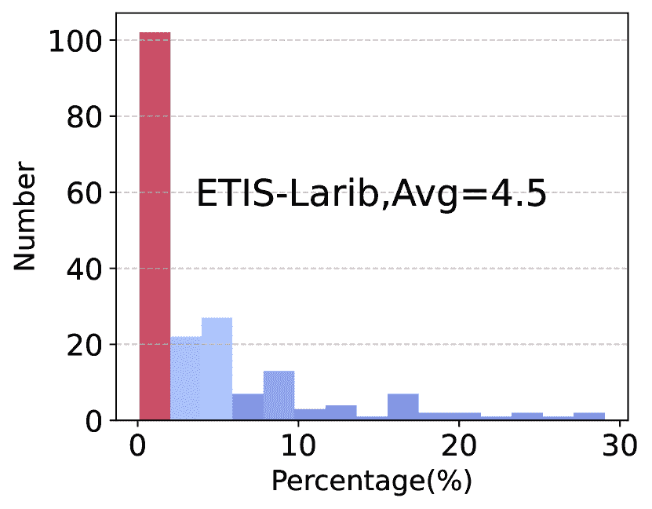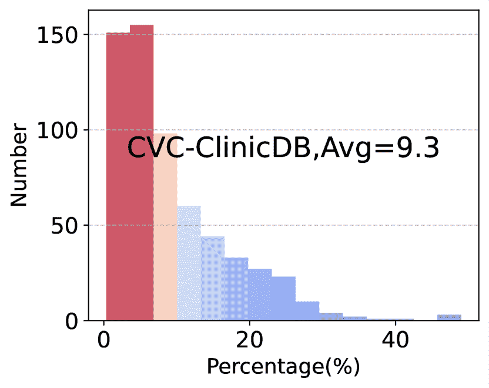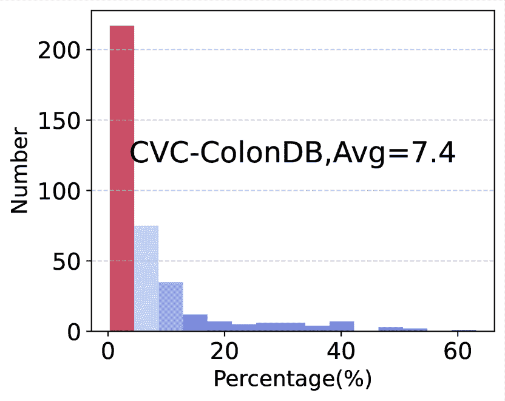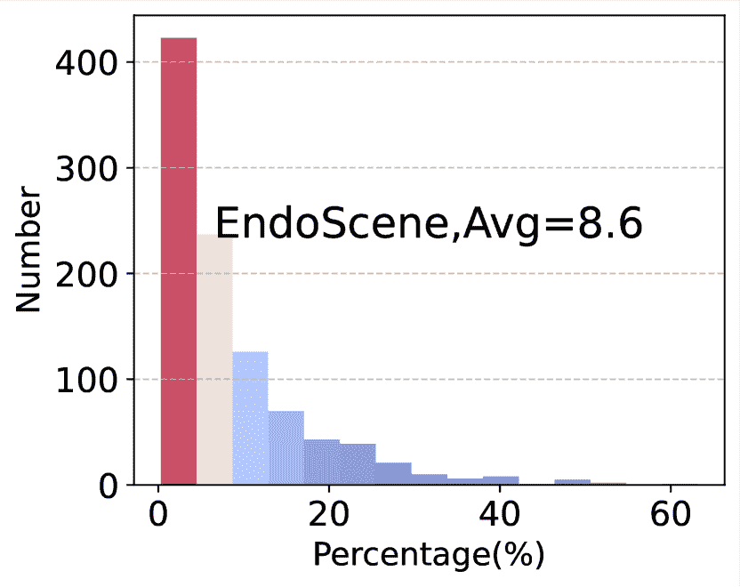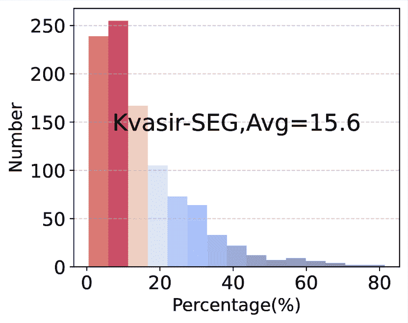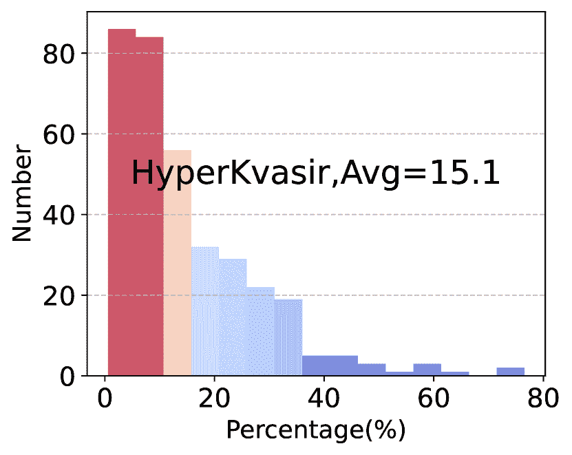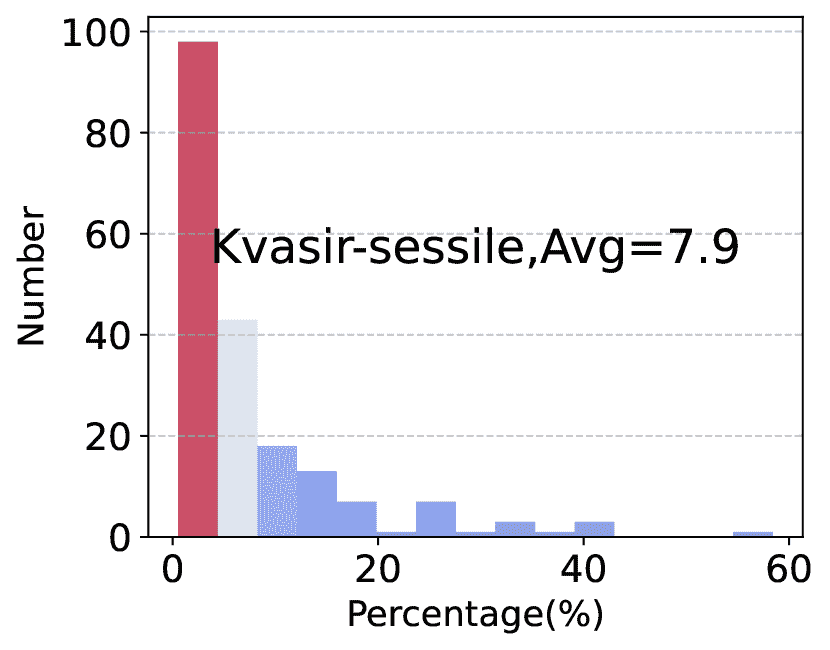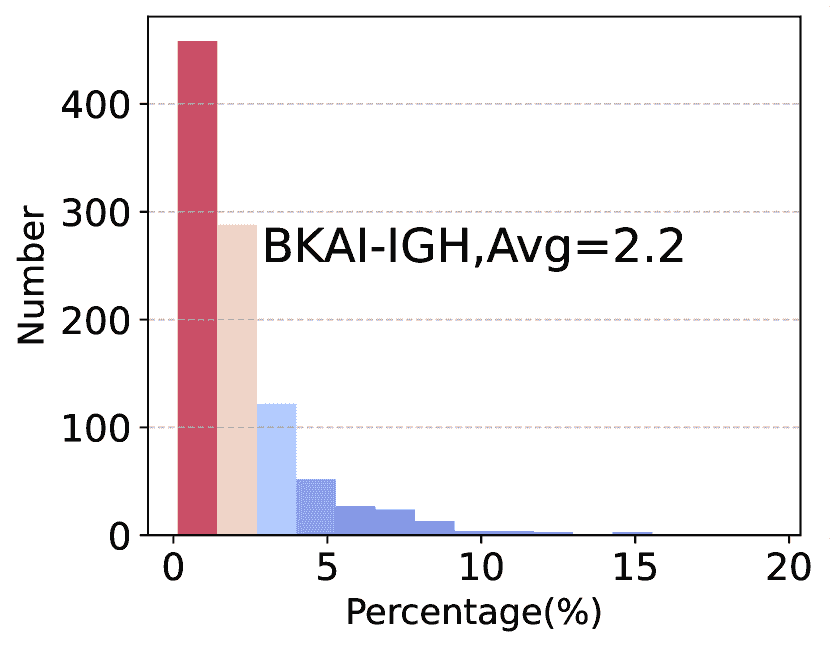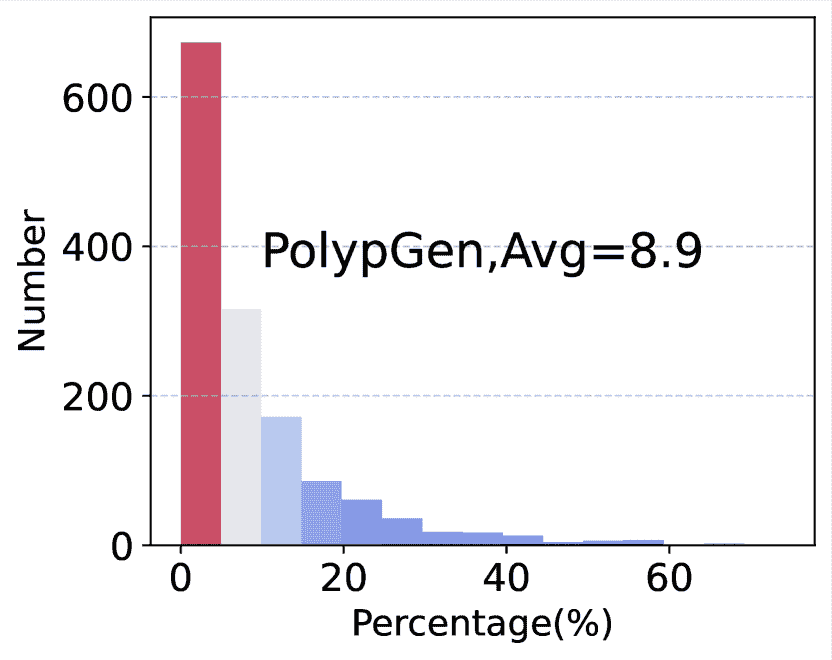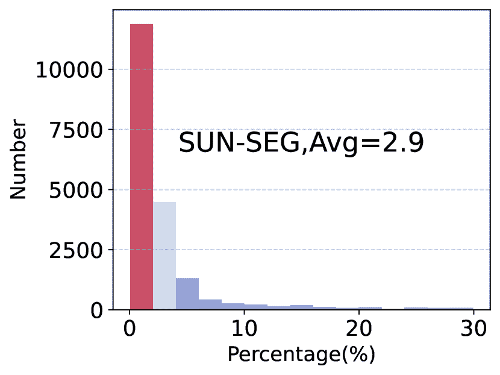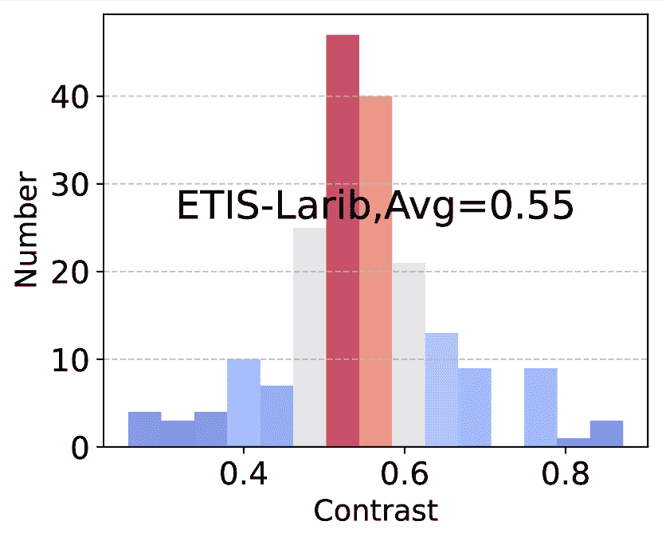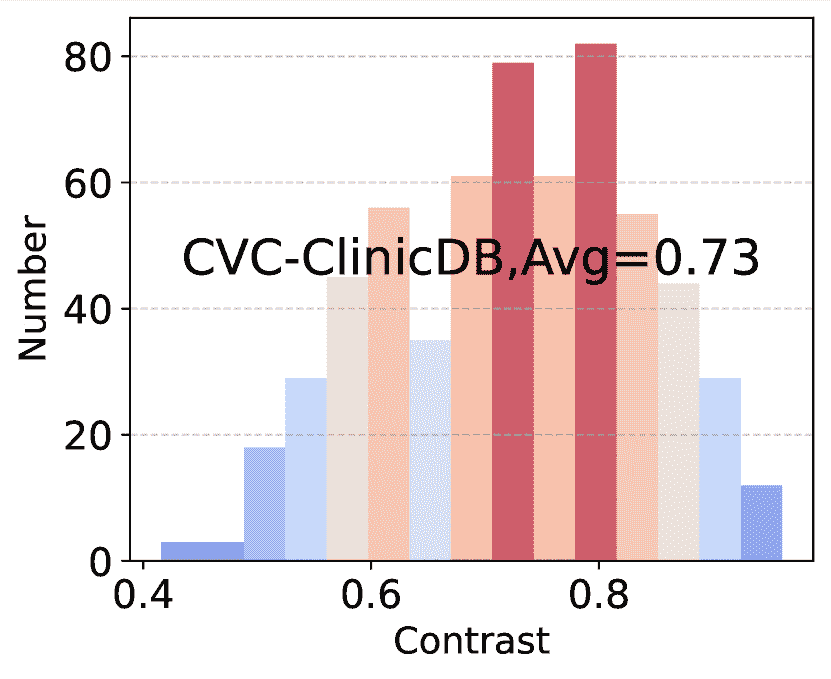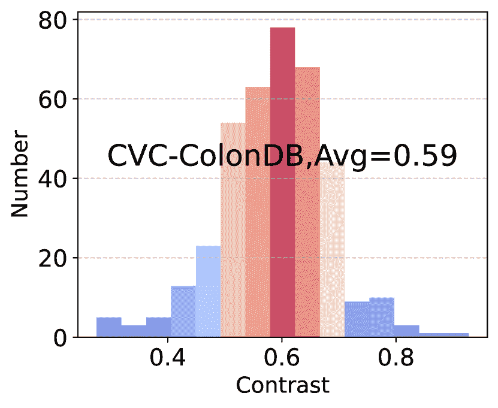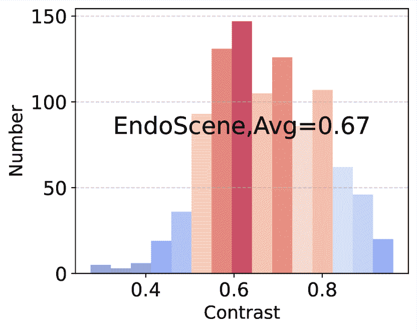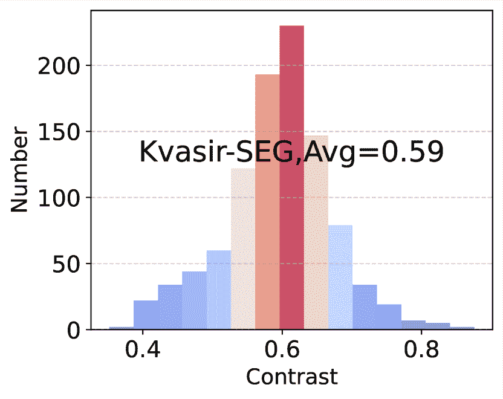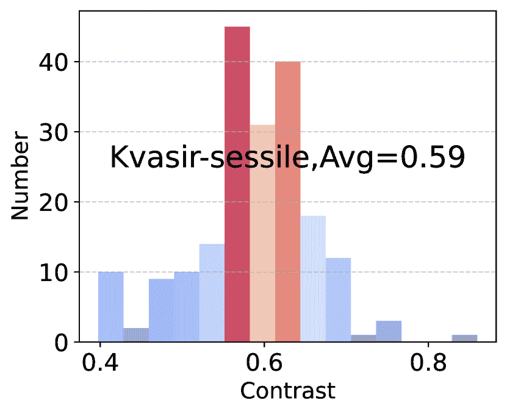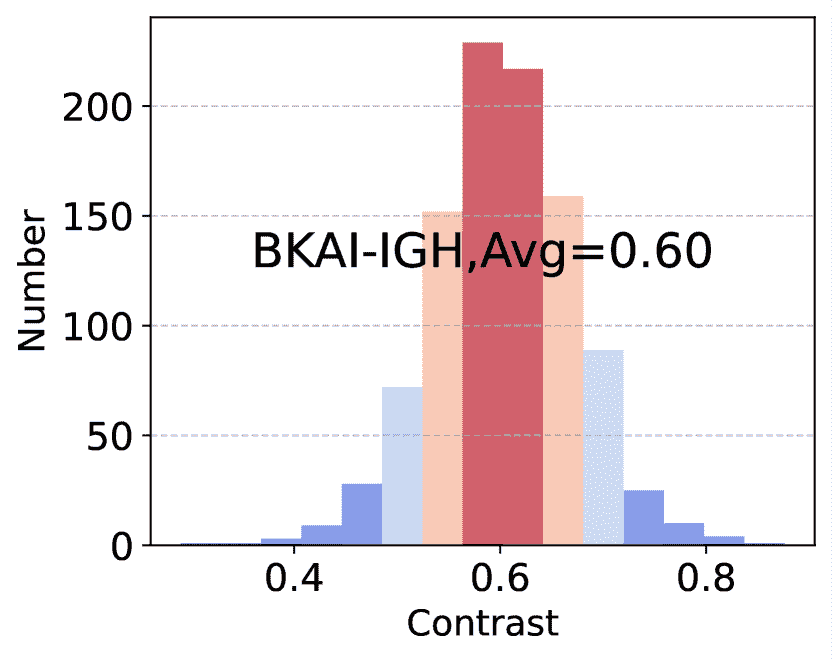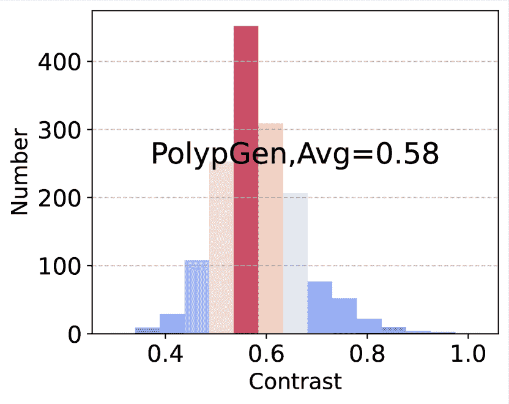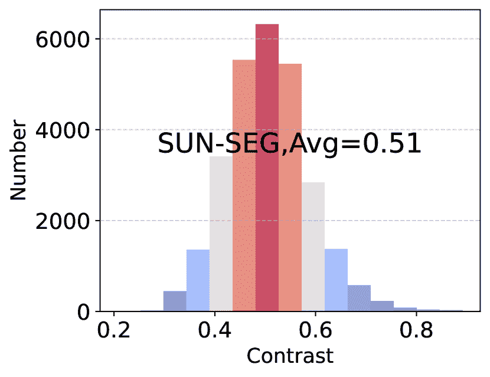

图 5：当前 CPS 数据集的息肉大小（前两行）和对比度值（最后两行）统计。从息肉大小的角度来看，BKAI-IGH 是最具挑战性的数据集，因为其平均息肉大小最小，而从对比度的角度来看，SUN-SEG 是最具挑战性的数据集，因为其对比度值仅为 0.51。

CVC-ClinicDB [69] 于 2015 年发布，包含 612 张息肉图像及其对应的像素级标注，分辨率为 384$\times$288 像素。CVC-ClinicDB 图像对比度的分布范围为 0.42 至 0.96，大多数图像的对比度值在 0.53 到 0.9 之间，平均对比度为 0.73。息肉相对于整个图像的大小比例从 0.33%到 48.9%不等，大多数图像的息肉大小在 0.1%到 10%之间，平均大小为 9.3%。图像中息肉位置的分布相对接近图像的中心。

CVC-ColonDB [104] 于 2015 年发布，包括 300 张息肉图像及其对应的像素级标签，分辨率为 574$\times$500 像素。CVC-ColonDB 图像对比度的分布范围为 0.28 至 0.93，大多数图像的对比度值在 0.4 到 0.75 之间，平均对比度为 0.59。息肉相对于整个图像的大小比例从 0.29%到 63.1%不等，大多数图像的息肉大小在 0.3%到 10%之间，平均大小为 7.4%。

EndoScene [108] 将 CVC-ColonDB 和 CVC-ClinicDB 合并为一个新数据集（EndoScene），包含 912 张图像，来源于 36 名患者的 44 个视频序列，分辨率从 384$\times$288 到 574$\times$500 像素不等。EndoScene 图像的对比度范围从 0.27 到 0.96，大多数图像的对比度值在 0.5 和 0.8 之间，平均对比度为 0.67。息肉在整张图像中的占比范围从 0.29% 到 63.2%，大多数图像中的息肉大小介于 0.3% 到 15% 之间，平均大小为 8.6%。

Kvasir-SEG [70] 包含 1000 张息肉图像及其相应的真实标注，分辨率从 332$\times$487 到 1920$\times$1072 像素不等。Kvasir-SEG 的对比度范围从 0.35 到 0.87，大多数图像的对比度值介于 0.5 和 0.7 之间，平均对比度为 0.59。息肉的大小从 0.51% 到 81.4% 不等，大多数图像中的息肉大小在 0.5% 到 20% 之间，平均大小为 15.6%。图像中息肉的位置分布接近图像中心。

HyperKvasir [85] 是在挪威医院进行实际胃肠镜和结肠镜检查过程中收集的，部分由经验丰富的胃肠内镜医生标注。HyperKvasir 包含 110,079 张图像，但只有 348 张图像具有像素级标注。HyperKvasir 的对比度范围从 0.35 到 0.88，平均对比度为 0.59。息肉的大小从 0.57% 到 76.6% 不等，大多数图像中的息肉大小在 0.5% 到 16% 之间，平均大小为 15.1%。

Piccolo [118] 包含 3433 张手工标注的图像（2131 张白光图像和 1302 张窄带图像），其中 2203 张图像用于训练集，897 张图像用于验证集，333 张图像用于测试集，分辨率从 854$\times$480 到 1920$\times$1080 像素不等。其息肉大小范围从 0.0005% 到 65.5%，对比度范围从 0.40 到 0.72，每张图像包含 1$\sim$5 个息肉。

Kvasir-sessile [129] 从 Kvasir-SEG [70] 中选取，包含 196 个平坦或 sessile 息肉及其对应的像素级标注，分辨率从 401$\times$415 到 1348$\times$1070 像素不等。其息肉大小范围从 0.54% 到 58.4%，对比度范围从 0.39 到 0.86，每张图像包含 1$\sim$3 个息肉。

BKAI-IGH [166] 包含 1200 张图像，分辨率为 1280$\times$959 像素。训练集包含 1000 张具有实例级像素标注的图像，测试集包含 200 张没有标注的图像。所有息肉也被分类为新生物性或非新生物性类别，以红色和绿色标记。其息肉大小范围从 0.14% 到 19.4%，对比度范围从 0.29 到 0.88，每张图像包含 1$\sim$18 个息肉。

PolypGen [24] 由 8037 帧组成，包括单帧和序列帧，包含来自六个中心的 3762 个正样本帧和来自四家不同医院的 4275 个负样本帧。息肉的大小范围从 0.001%到 74.1%，对比度从 0.29 到 1.0，每幅图像包含 1$\sim$17 个息肉。

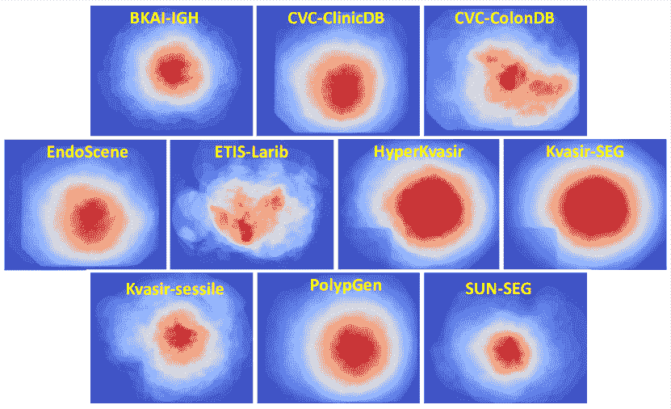

图 6：一些流行的 CPS 数据集中息肉位置分布。从位置分布的角度来看，HyperKvasir 和 Kvasir-SEG 数据集相对较容易。相比之下，CVC-ColonDB 和 ETIS-Larib 数据集则更具挑战性，因为它们的息肉位置分布更为分散。

### 3.2 视频级数据集

ASU-Mayo [104] 由 36,458 帧组成，是第一个且不断增长的短期和长期结肠镜视频数据集，收集并去标识化于亚利桑那州梅奥诊所的胃肠病学部门。每帧都有一个标注或二值掩模，指示息肉区域。然而，问题在于它尚未公开，并且截至我们提交时，作者尚未回应我们对数据集的请求。

ToPV [167] 包含 360 个在实际结肠镜检查过程中收集的短视频。204 个视频包含一个由经验丰富的内窥镜医生标记的息肉，并裁剪到 384×352\的大小。我们数据集中视频剪辑的最大时长为 58.4 秒，最小时长为 5.88 秒，中位时长为 15.76 秒，平均时长为 16.78 秒。所有视频均在白光内窥镜观察下拍摄。

LDPolyVideo [107] 包含 160 个视频，40,266 帧以及相应的边界框注释，分辨率为 560$\times$480\。33,884 帧包含至少一个息肉，总共标记了 200 个息肉。此外，我们还提供了 103 个视频，包括 861,400 帧，没有完整注释。每个视频都有一个标签，指示其是否包含息肉。

SUN-SEG [2] 包含 49,136 个息肉帧的正例和 109,554 个非息肉帧的负例。SUN-SEG 数据集包含多样化的注释，包括像素级目标掩模、边界、涂鸦和多边形注释。SUN-SEG 数据集包括 19,544 帧用于训练，29,592 帧用于测试。SUN-SEG 是最具注释和高质量的息肉分割数据集。

### 3.3 分析与讨论

如表 IV ‣ Colorectal Polyp Segmentation in the Deep Learning Era: A Comprehensive Survey") 所示，HyperKvasir 是数量上最大的图像息肉分割数据集，但只有 348 个像素级标注，而 LDPolyVideo 是最大的视频息肉分割数据集，但仅有边界框标注。从标注数据的质量和数量的角度来看，SUN-SEG 目前是最好的数据集，包含 49,136 张标注良好的图像，包括像素级对象掩码、边界、涂鸦和多边形标注。如图 5 所示，BKAI-IGH 是最具挑战性的数据集，因为它具有最小的平均息肉大小，而从对比度的角度来看，SUN-SEG 更具挑战性，因为其对比度值仅为 0.51。如图 6 所示，从位置分布的角度来看，HyperKvasir 和 Kvasir-SEG 数据集相对较易，而 CVC-ColonDB 和 ETIS-Larib 数据集则更具挑战性，因为它们的息肉位置分布更分散。此外，息肉在颜色、大小和数量上的多样变化使得准确分割变得非常具有挑战性，如图 7 所示。

## 4 评估指标

本节回顾了常用的 CPS 评估指标，包括 Dice、IoU、精度、召回率、特异性、PR 曲线、F-measure [169]、MAE [170]、加权 F-measure [171]、S-measure [172]、E-measure [173] 和 FPS。

Dice 系数，也称为 F1 分数，是衡量两个集合重叠程度的指标，范围从 0 到 1。值为 1 表示完全重叠，而 0 表示没有重叠。

|  | $Dice=\frac{2TP}{2TP+FP+FN}$ |  | (1) |
| --- | --- | --- | --- |

IoU（交并比）衡量两个集合的重叠情况，但其表示为交集大小与集合并集大小的比率。

|  | $IoU=\frac{TP}{TP+FP+FN}$ |  | (2) |
| --- | --- | --- | --- |

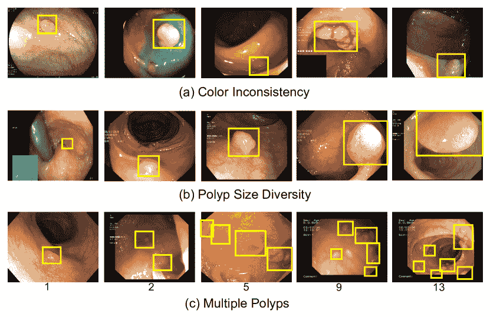

图 7：展示了息肉在颜色、大小和数量上的多样变化，使得准确分割息肉变得非常具有挑战性。

精度是分类器的正预测值的度量，或所有正预测中真正正预测的比例。

|  | $Precision=\frac{TP}{TP+FP}$ |  | (3) |
| --- | --- | --- | --- |

召回率，也称为敏感性或真正率，是一种评估指标，用于二分类和多分类任务中，衡量模型正确识别正实例的能力。它量化了模型正确预测的实际正实例的比例。

|  | $Recall=\frac{TP}{TP+FN}$ |  | (4) |
| --- | --- | --- | --- |

准确率是总体正确分类率或分类器所做的所有预测中正确预测的比例。

|  | $Acc=\frac{TP+TN}{TP+TN+FP+FN}$ |  | (5) |
| --- | --- | --- | --- |
|    方法 | 发表刊物 | CVC-Clinic. [69] | Kvasir-SEG [70] | CVC-ColonDB [104] | ETIS-Larib [103] | EndoScene [108] |
| mDice | mIoU | mDice | mIoU | mDice | mIoU | mDice | mIoU | mDice | mIoU |
| RPFA [71] | MICCAI 2023 | 0.931 | 0.885 | 0.929 | 0.880 | 0.837 | 0.759 | 0.822 | 0.746 | 0.905 | 0.839 |
| XBFormer [86] | TMI 2023 | 0.923 | 0.875 | 0.926 | 0.871 | 0.808 | 0.724 | 0.738 | 0.650 | 0.868 | 0.791 |
| ColnNet [87] | TMI 2023 | 0.930 | 0.887 | 0.926 | 0.872 | 0.797 | 0.729 | 0.759 | 0.690 | 0.909 | 0.863 |
| FSFM [41] | ISBI 2023 | 0.934 | 0.884 | 0.913 | 0.861 | 0.786 | 0.709 | 0.778 | 0.702 | 0.910 | 0.846 |
| CASCADE [98] | WACV 2023 | 0.943 | 0.899 | 0.926 | 0.878 | 0.825 | 0.745 | 0.801 | 0.728 | 0.905 | 0.838 |
| PolypPVT [100] | CAAI AIR 2023 | 0.937 | 0.889 | 0.917 | 0.864 | 0.808 | 0.727 | 0.787 | 0.706 | 0.900 | 0.833 |
| RealSeg [79] | ISBI 2023 | 0.923 | 0.873 | 0.913 | 0.863 | 0.785 | 0.710 | 0.777 | 0.698 | 0.909 | 0.844 |
| Polyp-Mixer [25] | TCSVT 2023 | 0.908 | 0.856 | 0.916 | 0.864 | 0.791 | 0.706 | 0.759 | 0.676 | - | - |
| CFANet [91] | PR 2023 | 0.933 | 0.883 | 0.915 | 0.861 | 0.743 | 0.665 | 0.732 | 0.655 | 0.893 | 0.827 |
| M2SNet  [174] | Arxiv 2023 | 0.922 | 0.880 | 0.912 | 0.861 | 0.758 | 0.685 | 0.749 | 0.678 | 0.869 | 0.807 |
| EMTSNet [82] | JBHI 2023 | 0.935 | 0.885 | 0.919 | 0.869 | 0.788 | 0.708 | 0.780 | 0.702 | 0.900 | 0.833 |
| PPFormer [105] | MICCAI 2022 | 0.946 | 0.902 | 0.930 | 0.879 | 0.823 | 0.756 | 0.791 | 0.706 | 0.919 | 0.857 |
| SSFormer-L [8] | MICCAI 2022 | 0.906 | 0.855 | 0.917 | 0.864 | 0.802 | 0.721 | 0.796 | 0.720 | 0.895 | 0.827 |
| SSFormer-S [8] | MICCAI 2022 | 0.916 | 0.873 | 0.925 | 0.878 | 0.772 | 0.697 | 0.767 | 0.698 | 0.887 | 0.821 |
| LDNet [49] | MICCAI 2022 | 0.923 | 0.872 | 0.912 | 0.855 | 0.794 | 0.715 | 0.778 | 0.707 | 0.893 | 0.826 |
| TGANet [28] | MICCAI 2022 | 0.863 | 0.805 | 0.886 | 0.822 | 0.695 | 0.609 | 0.574 | 0.488 | 0.822 | 0.733 |
| TransMixer [61] | BIBM 2022 | 0.945 | 0.900 | 0.923 | 0.876 | 0.823 | 0.745 | 0.795 | 0.719 | 0.910 | 0.844 |
| ICBNet [112] | BIBM 2022 | 0.938 | 0.892 | 0.928 | 0.883 | 0.812 | 0.738 | 0.800 | 0.727 | 0.898 | 0.833 |
| TASNet [57] | BIBM 2022 | 0.930 | 0.884 | 0.913 | 0.863 | 0.799 | 0.719 | 0.797 | 0.720 | 0.894 | 0.825 |
| DCRNet [42] | ISBI 2022 | 0.896 | 0.844 | 0.886 | 0.825 | 0.704 | 0.631 | 0.556 | 0.496 | 0.856 | 0.788 |
| BDGNet [56] | SPIE MI 2022 | 0.905 | 0.857 | 0.915 | 0.863 | 0.797 | 0.723 | 0.752 | 0.681 | 0.899 | 0.831 |
| Conv-MLP [175] | VisCom 2022 | 0.924 | 0.870 | 0.920 | 0.869 | 0.793 | 0.717 | 0.753 | 0.676 | 0.893 | 0.822 |
| GLFRNet [176] | TMI 2022 | 0.941 | 0.895 | 0.894 | 0.837 | 0.729 | 0.659 | 0.674 | 0.595 | 0.898 | 0.827 |
| FANet [35] | TNNLS 2022 | 0.823 | 0.756 | 0.852 | 0.791 | 0.558 | 0.486 | 0.415 | 0.361 | 0.668 | 0.600 |
| FNet-Res2Net [62] | NeurIPS 2022 | 0.919 | 0.867 | 0.889 | 0.830 | 0.739 | 0.662 | 0.731 | 0.658 | 0.894 | 0.825 |
| FNet-PVT [62] | NeurIPS 2022 | 0.937 | 0.889 | 0.913 | 0.864 | 0.811 | 0.728 | 0.791 | 0.702 | 0.891 | 0.818 |
| CaraNet[177] | SPIE MI 2022 | 0.921 | 0.876 | 0.913 | 0.859 | 0.775 | 0.700 | 0.740 | 0.660 | 0.902 | 0.836 |
| Transfuse [7] | MICCAI 2021 | 0.908 | 0.857 | 0.915 | 0.860 | 0.790 | 0.710 | 0.748 | 0.657 | 0.893 | 0.825 |
| MSNet [33] | MICCAI 2021 | 0.915 | 0.866 | 0.902 | 0.847 | 0.747 | 0.668 | 0.720 | 0.650 | 0.862 | 0.796 |
| SANet [34] | MICCAI 2021 | 0.916 | 0.859 | 0.904 | 0.847 | 0.752 | 0.669 | 0.750 | 0.654 | 0.888 | 0.815 |
| UACANet-L [66] | ACM MM 2021 | 0.926 | 0.880 | 0.912 | 0.859 | 0.751 | 0.678 | 0.766 | 0.689 | 0.909 | 0.844 |
| UACANet-S [66] | ACM MM 2021 | 0.916 | 0.870 | 0.905 | 0.852 | 0.783 | 0.704 | 0.694 | 0.615 | 0.902 | 0.837 |
| EUNet [134] | CVR 2021 | 0.902 | 0.846 | 0.908 | 0.854 | 0.756 | 0.681 | 0.687 | 0.609 | 0.837 | 0.765 |
| EMSNet [178] | EMBC 2021 | 0.923 | 0.874 | 0.897 | 0.842 | 0.715 | 0.642 | 0.682 | 0.611 | 0.900 | 0.834 |
| MSEG[179] | Arxiv 2021 | 0.909 | 0.864 | 0.897 | 0.839 | 0.735 | 0.666 | 0.700 | 0.630 | 0.874 | 0.804 |
| PraNet [6] | MICCAI 2020 | 0.899 | 0.849 | 0.898 | 0.840 | 0.709 | 0.640 | 0.628 | 0.567 | 0.871 | 0.797 |
| ACSNet [67] | MICCAI 2020 | 0.882 | 0.826 | 0.898 | 0.838 | 0.716 | 0.649 | 0.578 | 0.509 | 0.863 | 0.787 |
| SFANet [18] | MICCAI 2019 | 0.700 | 0.607 | 0.723 | 0.611 | 0.469 | 0.347 | 0.297 | 0.217 | 0.467 | 0.329 |
| ResUNet++ [5] | ISM 2019 | 0.846 | 0.786 | 0.807 | 0.727 | 0.588 | 0.497 | 0.337 | 0.275 | 0.687 | 0.598 |
| UNet [3] | MICCAI 2015 | 0.823 | 0.755 | 0.818 | 0.746 | 0.512 | 0.444 | 0.398 | 0.335 | 0.710 | 0.627 |
|   |  |  |  |  |  |  |  |  |  |  |  |

表 V：对 40 个最先进的深度 CPS 模型在五个常用数据集上的 mDice 和 mIoU 基准性能进行评估。前 2 名方法分别用红色和蓝色标记。

特异性，也称为真正负率，是一种评估指标，用于二分类和多分类任务中，衡量模型正确识别负实例的能力。

|  | $Specificity=\frac{TN}{TN+FP}$ |  | (6) |
| --- | --- | --- | --- |

PR 曲线通过在不同分类阈值下绘制精度与召回率，提供了分类模型在各种精度和召回水平下的性能的可视化表示。

F-measure [169] 是平均精度和平均召回率的调和平均数。我们计算 F-measure 的公式如下：

|  | $F_{\beta}=\frac{(1+\beta^{2})\times{\rm Precision}\times{\rm Recall}}{\beta^{2}\times{\rm Precision+Recall}}$ |  | (7) |
| --- | --- | --- | --- |

其中我们将 $\beta^{2}$ 设置为 0.3，以便将精度的权重高于召回率。

MAE (均方误差) [170] 计算为二值 ${GT}$ 与显著图 ${S}$ 之间的平均像素绝对差值。

|  | $MAE=\frac{1}{W\times H}\sum\limits_{x=1}^{W}\sum\limits_{y=1}^{H}\Big{ | }{S}(x,y)-{GT}(x,y)\Big{ | }$ |  | (8) |
| --- | --- | --- | --- | --- | --- |

其中 $W$ 和 $H$ 分别是显著图 $S$ 的宽度和高度。

加权 F-measure。加权 F-measure [171] 定义加权精度，这是精确度的衡量指标，以及加权召回率，这是完整性的衡量指标：

|  | $F_{\beta}^{w}=\frac{(1+\beta^{2})\times{\rm Precision}^{w}\times{\rm Recall}^{w}}{\beta^{2}\times{\rm Precision}^{w}+{\rm Recall}^{w}}$ |  | (9) |
| --- | --- | --- | --- |

S-measure [172] 同时评估显著图和真实值之间的区域感知 $S_{r}$ 和目标感知 $S_{o}$ 结构相似性。可以写成如下形式：

|  | $S_{m}=\alpha\times S_{o}+(1-\alpha)\times S_{r}$ |  | (10) |
| --- | --- | --- | --- |

其中 $\alpha$ 设置为 0.5。

E-measure [173] 将局部像素值与图像级别的均值结合起来，共同评估预测与真实值之间的相似性。

FPS (每秒帧数) 通常用于评估模型推理的效率。FPS 是评估模型推理速度和实时性能的关键指标。

|    方法 | PolypGen-C1 | PolypGen-C2 |
| --- | --- | --- |
| mIoU | mDice | 召回率 | 精度 | mIoU | mDice | 召回率 | 精度 |
| UNet [3] | .577 | .647 | .678 | .846 | .570 | .634 | .735 | .737 |
| UNet++ [180] | .586 | .661 | .695 | .825 | .561 | .624 | .719 | .763 |
| ResUNet++ [5] | .420 | .524 | .639 | .579 | .278 | .343 | .500 | .420 |
| MSEG [179] | .626 | .712 | .780 | .793 | .567 | .631 | .727 | .715 |
| LDNet [49] | .639 | .719 | .755 | .848 | .609 | .689 | .854 | .687 |
| TGANet [28] | .448 | .539 | .642 | .691 | .378 | .458 | .637 | .524 |
| XBFormer [86] | .654 | .720 | .744 | .878 | .661 | .723 | .807 | .810 |
|   | PolypGen-C3 | PolypGen-C4 |
| UNet [3] | .677 | .748 | .764 | .879 | .370 | .415 | .655 | .598 |
| UNet++ [180] | .653 | .725 | .753 | .857 | .381 | .420 | .634 | .610 |
| ResUNet++ [5] | .410 | .511 | .646 | .548 | .169 | .227 | .634 | .282 |
| MSEG [179] | .662 | .744 | .795 | .818 | .352 | .394 | .676 | .553 |
| LDNet [49] | .707 | .787 | .795 | .889 | .427 | .483 | .737 | .630 |
| TGANet [28] | .465 | .553 | .626 | .687 | .226 | .276 | .665 | .355 |
| XBFormer [86] | .722 | .787 | .790 | .913 | .460 | .504 | .687 | .714 |
|   | PolypGen-C5 | PolypGen-C6 |
| UNet [3] | .296 | .361 | .458 | .550 | .538 | .613 | .705 | .751 |
| UNet++ [180] | .314 | .377 | .447 | .603 | .536 | .616 | .734 | .723 |
| ResUNet++ [5] | .204 | .275 | .464 | .303 | .282 | .368 | .622 | .353 |
| MSEG [179] | .309 | .377 | .459 | .525 | .555 | .634 | .720 | .772 |
| LDNet [49] | .326 | .403 | .494 | .562 | .604 | .675 | .770 | .767 |
| TGANet [28] | .253 | .329 | .465 | .419 | .374 | .454 | .602 | .505 |
| XBFormer [86] | .360 | .421 | .451 | .777 | .634 | .692 | .678 | .943 |
|   |  |  |  |  |  |  |  |  |

表 VI：在 Kvasir-SEG 数据集上训练并在多中心结肠镜检查数据集 PolypGen 上测试的模型结果

## 5 性能基准测试

本节展示了实证分析，以说明 CPS 领域中的主要挑战和进展。首先，我们评估当前最先进的 (SOTA) 息肉分割模型，并报告其在五个常用基准数据集上的性能（参见 5.1）。其次，我们评估 SOTA 息肉分割模型在不同医疗中心的分布外数据集上的泛化能力（参见 5.2）。随后，我们进行基于属性的研究，以更好地理解当前模型的固有优缺点（参见 5.3）。

### 5.1 SOTA 性能比较

表 V 展示了 40 个前沿深度 CPS 模型在五个广泛使用的基准数据集上的表现，并强调了过去三年提出的方法。这些 SOTA 模型通过两个常用指标，即 mDice 和 mIoU 进行测量。为了确保公平比较，我们采用了与 PraNet [6]相同的设置，其中包含来自 ClinicDB 和 Kvasir-Seg 数据集的 900 和 548 张图像作为训练集，剩余的 64 张和 100 张图像用于测试集。为了清晰起见，我们使用红色和蓝色标出最佳和第二佳性能。我们希望我们的性能基准测试能有助于建立 CPS 社区中的开放和标准化评估系统。

如表 V 所示，RPFA [71]和 PPFormer [105]在 CVC-ClinicDB、Kvasir-SEG、CVC-ColonDB、ETIS-Larib 和 EndoScene 数据集上均取得了前两名的表现。在 CVC-ColonDB 和 ETIS-Larib 数据集上，RPFA 展示了其优越的性能，在 mDice 指标上分别超越了 PPFormer 1.4%和 3.1%。相反，对于 CVC-ClinicDB 和 EndoScene 数据集，PPFormer 凭借超越 RPFA 模型 1.5%和 1.4%的表现，达到了最佳性能。正如预期，这些基于深度学习的模型的整体学习能力随着时间的推移持续改进。例如，2015 年引入的 UNet [3]分割模型在 CVC-ClinicDB 数据集上的 mDice 指标初始值仅为 82.3%。目前，最近提出的 PPFormer 达到了令人印象深刻的 94.6%，显示出分割准确度年均提升近 1.4%。

### 5.2 分布外泛化

泛化度衡量了一个经过良好训练的模型在分布外数据上的应用效果。具有强泛化能力的模型可以对未见过的数据做出准确预测，这对于将基于深度学习的息肉分割模型部署到现实世界的临床场景中至关重要。为了评估 SOTA 模型的泛化能力，我们首先使用了训练过程中未遇到的三个数据集：ETIS、CVC-ColonDB 和 EndoScene。这些数据集的图像总数分别为 196、300 和 912。正如表 V 所示，该模型在 ETIS、ColonDB 和 EndoScene 上的表现明显低于在训练数据集（CVC-ClinicDB 和 Kvasir-SEG）上的表现。例如，RPFA [71]在 CVC-ColonDB 数据集上的表现比在 CVC-ClinicDB 数据集上的表现低约 10%。

此外，我们探讨了这些 SOTA 模型在 PolypGen 数据集 [24] 上的泛化能力，该数据集来自六个不同的中心，代表了多样化的人群。因此，在 PolypGen 上验证这些 SOTA 模型增强了研究的全面性，并使其更接近实际场景。如表 VI 所示，与 ETIS、CVC-ColonDB 和 EndoScene 数据集相比，这些 SOTA 模型在 PolypGen 数据集上的性能降级更加明显。特别是，XBFormer [86] 在 CVC-ColonDB 上的 mIoU 为 87.5%，而在 PolypGen-C5 上的 mIoU 仅为 36%。这种性能下降相较于 ETIS、CVC-ColonDB 和 EndoScene 数据集更为显著。因此，我们可以很容易地得出结论，当测试数据集的分布与训练数据集不一致时，模型性能将显著下降，且模型性能下降的程度与不一致的程度成正比。 |

| 属性 | 描述 |
| --- | --- |
| SI | 外科手术工具。内窥镜手术程序涉及工具的定位，如套索、镊子、刀具和电极。 |
| IB | 不可定义的边界。物体周围的前景和背景区域颜色相似。 |
| HO | 异质物体。物体区域有不同的颜色。 |
| GH | 虚影。由于快速移动或刷新率不足，物体有异常的 RGB 颜色边界。 |
| FM | 快速运动。剪辑中每帧的平均物体运动，以连续帧之间息肉质心的欧几里得距离计算，大于 20 像素。 |
| SO | 小物体。剪辑中物体大小与图像面积的平均比率小于 0.05。 |
| LO | 大物体。剪辑中物体大小与图像面积的平均比率大于 0.15。 |
| OC | 遮挡。息肉物体部分或完全被遮挡。 |
| OV | 超出视野。息肉物体被图像边界部分剪裁。 |
| SV | 尺度变化。剪辑中包围目标物体的任何一对边界框的平均面积比小于 0.5。 |

表 VII：SUN-SEG 数据集的视觉属性及描述。 |

### 5.3 基于属性的性能分析 |

|    方法 | SUN-SEG 简单 | SUN-SEG 困难 |
| --- | --- | --- |
| SI | IB | HO | GH | FM | SO | LO | OC | OV | SV | SI | IB | HO | GH | FM | SO | LO | OC | OV | SV |
| UNet [3] | .675 | .548 | .768 | .715 | .633 | .593 | .648 | .670 | .643 | .620 | .618 | .619 | .663 | .676 | .713 | .689 | .633 | .658 | .659 | .658 |
| UNet++ [180] | .701 | .542 | .782 | .739 | .647 | .591 | .678 | .683 | .665 | .617 | .654 | .604 | .665 | .696 | .714 | .681 | .660 | .676 | .677 | .678 |
| COSNet [181] | .663 | .531 | .786 | .684 | .610 | .549 | .637 | .648 | .613 | .617 | .641 | .593 | .727 | .668 | .690 | .637 | .694 | .707 | .666 | .625 |
| ACSNet [67] | .789 | .612 | .896 | .820 | .704 | .663 | .787 | .770 | .759 | .705 | .770 | .681 | .828 | .795 | .817 | .738 | .810 | .828 | .806 | .759 |
| PraNet [6] | .745 | .585 | .821 | .772 | .673 | .611 | .722 | .722 | .703 | .653 | .673 | .635 | .725 | .720 | .755 | .691 | .666 | .714 | .708 | .703 |
| SANet [34] | .724 | .582 | .854 | .760 | .676 | .615 | .703 | .701 | .711 | .680 | .658 | .565 | .738 | .709 | .760 | .692 | .733 | .729 | .727 | .693 |
| MAT [182] | .772 | .664 | .873 | .789 | .706 | .691 | .755 | .738 | .746 | .715 | .772 | .701 | .801 | .776 | .782 | .780 | .791 | .795 | .789 | .750 |
| PCSA [183] | .676 | .563 | .759 | .708 | .628 | .610 | .634 | .662 | .656 | .616 | .656 | .591 | .692 | .683 | .706 | .671 | .612 | .677 | .665 | .663 |
| AMD [184] | .476 | .461 | .471 | .481 | .484 | .466 | .447 | .467 | .442 | .498 | .471 | .468 | .447 | .473 | .468 | .469 | .453 | .487 | .462 | .481 |
| DCF [185] | .465 | .485 | .479 | .505 | .541 | .495 | .362 | .484 | .492 | .495 | .441 | .508 | .422 | .498 | .587 | .556 | .351 | .470 | .494 | .540 |
| FSNet [186] | .719 | .603 | .810 | .752 | .694 | .632 | .686 | .711 | .691 | .665 | .662 | .648 | .743 | .713 | .774 | .723 | .701 | .728 | .728 | .694 |
| PNSNet [124] | .789 | .592 | .871 | .820 | .723 | .619 | .768 | .749 | .751 | .705 | .746 | .631 | .803 | .780 | .778 | .743 | .805 | .790 | .794 | .758 |
| HBNet [187] | .809 | .625 | .899 | .835 | .728 | .667 | .820 | .783 | .778 | .719 | .768 | .662 | .865 | .784 | .797 | .737 | .853 | .827 | .808 | .765 |
| PNS+ [2] | .819 | .667 | .883 | .844 | .738 | .690 | .796 | .782 | .798 | .734 | .770 | .703 | .817 | .801 | .823 | .793 | .792 | .808 | .807 | .795 |
|   |  |  |  |  |  |  |  |  |  |  |  |  |  |  |  |  |  |  |  |  |

表 VIII: 基于视觉属性的 SUN-SEG-Easy/Hard 上结构测量的性能比较。

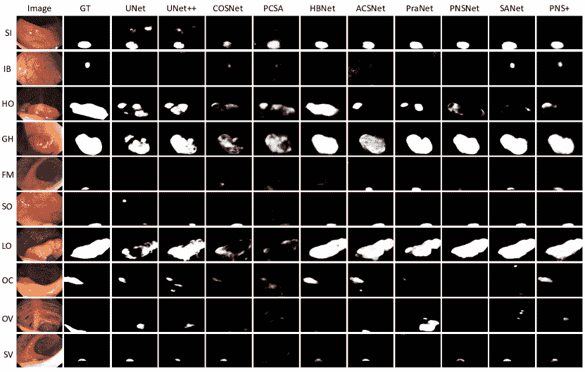

图 8: 在 SUN-SEG 数据集上选择的代表性深度 CPS 模型的定性可视化。

尽管社区在深度 CPS 模型方面观察到显著进展，但仍不清楚这些模型在特定条件下的表现。考虑到影响 CPS 算法性能的因素众多，包括场景类别和遮挡，评估它们在不同场景下的效果显得尤为重要。这一评估对于揭示深度 CPS 模型的细微优缺点、识别未解决的挑战以及找出未来的研究方向至关重要。本文使用了最近提出的 SUN-SEG 数据集 [2]，该数据集包含从 SUNdatabase [188] 中选取的 158 690 帧。Ji 等人 [2] 根据每个病理类别的难度将 SUN-SEG 数据集分为 SUN-SEG-Easy（119 个片段，17,070 帧）和 SUN-SEG-Hard（54 个片段，12,522 帧），并根据图像的视觉特征提供了十个视觉属性，详细信息见表 VII。

在表 VIII 中，我们报告了 SUN-SEG 数据集中基于特定属性的子集的性能。为清晰起见，我们用红色和蓝色标出最佳和第二佳表现。此外，如图 8 所示，我们还展示了这些属性场景下的视觉结果。以下是从这些结果中得出的一些重要观察。

1) 胜者并非全得。在比较的方法中，从整体角度来看，PNS+ [2] 脱颖而出为最佳；然而，它在每一个属性上都未能实现最佳性能。同样，虽然 ACSNet [67] 未能跻身前三名，但在某些特定属性上表现最佳。

2) 简单和困难场景。出乎意料的是，在 SUN-SEG 易数据集上测试的方法在 SI、HO 和 GH 属性上的表现优于在 SUN-SEG 难数据集上测试的方法。通常，模型在 SUN-SEG 易数据集上的表现应优于 SUN-SEG 难数据集，表明 SUN-SEG 数据集分区可能存在潜在错误。

3) 简单与困难的属性。对于 SUN-SEG 简单数据集和 SUN-SEG 困难数据集，属性 HO 被识别为最不具挑战性的，HBNet [187] 在属性 HO 上的表现得分为 0.899。相反，属性 IB 被认为是最具挑战性的，PNS+ [2] 在属性 IB 上的最佳表现仅达到 0.667。

## 6 挑战与未来方向

毫无疑问，深度学习在息肉分割方面取得了显著进展；然而，仍然存在许多需要解决的挑战。在接下来的章节中，我们将探讨我们认为有助于进一步推进息肉分割的有前景的研究方向。

### 6.1 可解释的深度 CPS 模型

深度神经网络的发展彻底改变了人工智能领域，并在息肉分割任务中取得了令人满意的表现。然而，大多数深度模型的设计并未优先考虑可解释性，使其成为黑箱系统。对预测背后的机制缺乏清晰的理解引发了对这些深度模型可靠性的担忧。这种不透明性阻碍了它们在现实临床场景中的应用。例如，为什么模型将图像识别为息肉？做出这一决策的标准是什么？为了确保深度模型的安全可靠部署，除了提供准确的预测外，还必须提供易于理解的解释，特别是对医疗诊断用户而言。上述因素突显了开发新技术以解释深度神经网络的必要性。

### 6.2 数据隐私的联邦学习

当前基于深度学习的模型对数据的需求很高，这意味着训练数据的量越大，模型的表现越好。然而，现实情况是，医疗数据通常分散在不同的医院，并受到隐私限制的保护。例如，来自不同医院的数据被隔离开来，成为“数据孤岛”。鉴于每个数据孤岛内的规模和分布限制，单一医院可能难以训练出高性能的模型。在理想情况下，如果我们能够在数据的联合上协作训练深度学习模型，医院将能获得更多的收益。然而，挑战在于，由于数据隐私和多样化的政策，我们不能直接在医院之间共享数据。最近出现的联邦学习 [189, 190, 191, 192] 可以处理这些挑战，它可以在不收集本地数据的情况下协作训练机器学习模型，使其特别适用于因隐私问题无法轻易集中数据的场景。

### 6.3 领域适应以应对领域转移

现有基于深度学习的 CPS 模型通常假设训练数据集（源/参考域）和测试数据集（目标域）共享相同的数据分布。不幸的是，这一假设过于苛刻，现实场景中可能并不成立。由于光照和图像质量等多种因素，训练数据集和测试数据集之间通常会发生分布偏移，这可能会大幅度降低性能。如表格 V 和表格 VI 所示，当测试数据集的分布与训练数据集不一致时，这些 SOTA 模型的性能显著下降。因此，处理领域偏移对于有效应用深度学习方法于医学图像分析至关重要。作为应对医学图像数据集间分布偏移的一个有前途的解决方案，领域适应 [193, 194, 195] 在许多任务中引起了越来越多的关注，旨在最小化不同但相关领域之间的分布差距。

### 6.4 防御对抗攻击

近期研究揭示了深度模型容易受到对抗攻击，这些攻击可能对人眼不可见，但会导致模型错误分类。Szegedy 等人 [196] 首次证明了高性能的深度神经网络也会受到对抗攻击。Su 等人 [197] 通过仅改变每张图像中的一个像素，成功欺骗了三种不同的网络模型。他们还观察到，网络在分配错误标签时的平均置信度为 97.47%。这种对抗攻击对将深度 CPS 模型应用于现实临床中的挑战非常大。特别是，模型的准确和可靠的诊断在医疗保健中极为重要，因为误诊可能导致严重后果，包括患者死亡。因此，迫切需要提高深度 CPS 模型对各种对抗攻击的鲁棒性。

### 6.5 弱监督/无监督学习

如表格 II ‣ Colorectal Polyp Segmentation in the Deep Learning Era: A Comprehensive Survey") 和表格 III ‣ Colorectal Polyp Segmentation in the Deep Learning Era: A Comprehensive Survey") 所示，现有的深度 CPS 模型通常以完全监督的方式进行训练，依赖于大量精心标注的像素级真值。然而，构建这样一个标注良好的像素级数据集是资源密集型且耗时的。最近，一些方法尝试使用弱监督来训练 CPS 模型，例如边界框[75]和涂鸦级[73]标注，但与完全监督模型相比，性能差距仍然存在。另一个值得注意的方向是自监督学习，这在各种任务中获得了相当大的关注。Misra 等人[198]证明了自监督模型能够捕捉复杂的图像细节，促进了分割模型的训练。鉴于近年来算法的突破，我们预计这一有前途的方向会涌现出更多创新。

### 6.6 适用于现实世界应用的轻量级模型

先进的深度 CPS 模型经过精心设计，以增强学习能力和模型性能。然而，针对移动设备和嵌入式设备的需求，日益需要更加创新和轻量级的架构。Dollar 等人[199]展示了单纯扩大模型容量会显著导致准确性和泛化能力的性能下降。为了促进深度 CPS 模型在临床环境中的实际应用，我们建议开发一种轻量级模型，以保持性能和效率之间的良好平衡。另一个推荐方向是采用模型压缩[200]或知识蒸馏[201]来精简这些庞大且高性能的模型，以确保最小的性能下降并获得轻量级模型。

### 6.7 将 CPS 与异常检测相结合

异常检测[202]，也称为离群点检测，旨在识别数据集中显著偏离正常或预期行为的模式或实例。目标是识别那些相对于大多数数据被认为是稀有、不寻常或可疑的数据点。在息肉数据集中，大部分图像不包含息肉，只有一小部分图像包含息肉。因此，图像中的息肉可以被视为异常检测的典型实例，这意味着我们可以通过使用无监督的异常定位技术对息肉进行分割，而无需大规模的像素级注释。最近，一些研究者利用无监督异常检测，即 CCD [121] 和 PMSACL [84] 来训练息肉分割模型。我们相信在这方面仍有很大的改进空间，无监督息肉定位的前景非常有希望。

### 6.8 将 CPS 与大型分割模型相结合

最近，分割万物模型（SAM）[203]由于在许多分割任务中的出色表现而受到广泛关注，该模型在超过 10 亿对图像-掩膜的最大分割数据集上进行训练，超越现有分割数据集 400 倍。对 SAM 进行微调以适应下游任务，如伪装物体检测 [204]、皮肤癌分割 [205] 和图像风格迁移 [206] 已成为一个热门研究领域。Zhou 等人 [207] 表明，直接将 SAM 应用于息肉分割无法获得令人满意的结果。因此，一个有前途的方向是利用训练息肉数据集对 SAM 模型进行微调。

### 6.9 将 CPS 与大型语言模型相结合

最近，将大型语言模型（LLMs）与计算机视觉相结合已成为一个热门研究领域，推动了许多任务的重大进展[208、209]。最初创建用于理解人类语言的大型语言模型，正逐渐扩展到视觉任务，并开始将文本数据与视觉数据结合。这种 LLM 和 CV 的融合引领了一个 AI 系统能够像人类一样观察世界、理解世界并与之沟通的时代。这样，深度模型可以检测病变并清楚地解释它们，帮助医生理解和信任预测结果。另一方面，将 LLM 和息肉分割相结合可能通过将视觉信息与广泛的医学知识结合，改善诊断和治疗。总之，这是一个有前景的方向，具有打破当前学习范式的潜力。

## 7 结论

本文提供了基于深度学习的 CPS 模型的全面综述。首先，我们从网络架构、监督层级和学习范式的角度，提供了对深度 CPS 模型的创新分类。随后，我们深入探讨了流行 CPS 数据集和评估指标的最新文献，并对主要 CPS 方法进行了彻底的性能基准测试。特别地，我们通过比较数据集数量、注释类型、图像分辨率、息肉大小、对比度值和息肉位置，揭示了 CPS 数据集的优缺点。此外，我们评估了模型在分布外数据集上的泛化性能及其在 SUN-SEG 数据集上的属性性能，提供了对深度 CPS 模型优缺点的细致理解。最后，我们深入探讨了当前基于深度学习的 CPS 模型的挑战，提供了有见地的讨论和若干潜在有前景的方向。我们希望我们的综述能帮助研究人员更深入地了解 CPS 的发展历程，并激发新研究以推动该领域的进步。

## 参考文献

+   [1] J. Bernal, J. Sánchez, 和 F. Vilarino，“基于息肉外观模型的自动息肉检测”，*模式识别（PR）*，第 45 卷，第 9 期，第 3166–3182 页，2012 年。

+   [2] G.-P. Ji, G. Xiao, Y.-C. Chou, D.-P. Fan, K. Zhao, G. Chen, 和 L. Van Gool，“视频息肉分割：深度学习视角”，*机器智能研究*，第 19 卷，第 6 期，第 531–549 页，2022 年。

+   [3] O. Ronneberger, P. Fischer, 和 T. Brox，“U-net：用于生物医学图像分割的卷积网络”，发表于*国际医学图像计算与计算机辅助干预会议（MICCAI）*，2015 年，第 234–241 页。

+   [4] Z. Zhou, M. M. Rahman Siddiquee, N. Tajbakhsh, 和 J. Liang，“Unet++：用于医学图像分割的嵌套 U-net 架构”，发表于*医学图像分析中的深度学习和临床决策支持的多模态学习，研讨会（DLMIA ML-CDS）*，2018 年，第 3–11 页。

+   [5] D. Jha, P. H. Smedsrud, M. A. Riegler, D. Johansen, T. De Lange, P. Halvorsen, 和 H. D. Johansen，“Resunet++：用于医学图像分割的先进架构”，发表于*IEEE 国际多媒体研讨会（ISM）*，2019 年，第 225–2255 页。

+   [6] D.-P. Fan, G.-P. Ji, T. Zhou, G. Chen, H. Fu, J. Shen, 和 L. Shao，“Pranet：用于息肉分割的并行逆注意力网络”，发表于*国际医学图像计算与计算机辅助干预会议（MICCAI）*，2020 年，第 263–273 页。

+   [7] Y. Zhang, H. Liu, 和 Q. Hu，“Transfuse：融合变压器和 CNN 用于医学图像分割”，发表于*国际医学图像计算与计算机辅助干预会议（MICCAI）*，2021 年，第 14–24 页。

+   [8] J. Wang, Q. Huang, F. Tang, J. Meng, J. Su, 和 S. Song，“逐步特征融合：局部引导全局”，在*国际医学图像计算与计算机辅助干预会议 (MICCAI)*，2022 年，第 110–120 页。

+   [9] T. Ling, C. Wu, H. Yu, T. Cai, D. Wang, Y. Zhou, M. Chen, 和 K. Ding，“概率建模集成视觉变换器提高复杂息肉分割”，在*国际医学图像计算与计算机辅助干预会议 (MICCAI)*，2023 年，第 572–581 页。

+   [10] A. K. Jerebko, S. Teerlink, M. Franaszek, 和 R. M. Summers，“CT 结肠成像计算机辅助检测的息肉分割方法”，在*SPIE 医学成像：生理学和功能：方法、系统和应用*，第 5031 卷，2003 年，第 359–369 页。

+   [11] J. Yao, M. Miller, M. Franaszek, 和 R. M. Summers，“基于模糊聚类和可变形模型的 CT 结肠成像中的结肠息肉分割”，*IEEE 医学影像学报 (TMI)*，第 23 卷，第 11 期，第 1344–1352 页，2004 年。

+   [12] S. Gross, M. Kennel, T. Stehle, J. Wulff, J. Tischendorf, C. Trautwein, 和 T. Aach，“在 NBI 结肠镜检查中的息肉分割”，在*医学图像处理 2009：算法—系统—应用*，2009 年，第 252–256 页。

+   [13] S. Hwang 和 M. E. Celebi，“基于图像分割和几何特征的无线胶囊内窥镜视频中的息肉检测”，在*IEEE 国际声学、语音与信号处理会议 (ICASSP)*，2010 年，第 678–681 页。

+   [14] L. Lu, A. Barbu, M. Wolf, J. Liang, M. Salganicoff, 和 D. Comaniciu，“利用多阶段概率二进制学习和组合模型进行 3D CT 结肠成像的精确息肉分割”，在*IEEE 计算机视觉与模式识别会议 (CVPR)*，2008 年，第 1–8 页。

+   [15] M. Ganz, X. Yang, 和 G. Slabaugh，“结肠镜窄带成像数据中息肉的自动分割”，*IEEE 生物医学工程学报 (TBE)*，第 59 卷，第 8 期，第 2144–2151 页，2012 年。

+   [16] J. Bernal, J. M. Núñez, F. J. Sánchez, 和 F. Vilariño，“通过 MSA-DOVA 能量图计算进行结肠镜视频中的息肉分割方法”，在*临床图像基础程序，医学成像转化研究：第三届国际研讨会 (CLIP)*，2014 年，第 41–49 页。

+   [17] Y. Yuan, D. Li, 和 M. Q.-H. Meng，“通过新型统一的自下而上和自上而下的显著性方法进行自动息肉检测”，*IEEE 生物医学与健康信息学杂志 (JBHI)*，第 22 卷，第 4 期，第 1250–1260 页，2017 年。

+   [18] Y. Fang, C. Chen, Y. Yuan, 和 K.-y. Tong，“具有区域-边界约束的选择性特征聚合网络用于息肉分割”，在*国际医学图像计算与计算机辅助干预会议 (MICCAI)*，2019 年，第 302–310 页。

+   [19] V. S. Prasath，“从视频胶囊内窥镜中检测和分割息肉：综述”，*成像杂志*，第 3 卷，第 1 期，第 1 页，2016 年。

+   [20] B. Taha, N. Werghi, 和 J. Dias, “内镜视频中的自动息肉检测：综述，” 收录于 *国际生物医学工程会议 (BioMed)* 论文集, 2017 年, 页码 233–240。

+   [21] L. F. Sanchez-Peralta, L. Bote-Curiel, A. Picon, F. M. Sanchez-Margallo, 和 J. B. Pagador, “使用深度学习检测结肠镜中的结直肠息肉：系统文献综述，” *医学中的人工智能*, 第 108 卷, 页码 101923, 2020 年。

+   [22] K. ELKarazle, V. Raman, P. Then, 和 C. Chua, “利用机器学习从结肠镜检查中检测结直肠息肉：现代技术综述，” *传感器*, 第 23 卷，第 3 期, 页码 1225, 2023 年。

+   [23] J. Mei, T. Zhou, K. Huang, Y. Zhang, Y. Zhou, Y. Wu, 和 H. Fu, “基于深度学习的息肉分割综述：技术、挑战及未来趋势，” *arXiv 预印本 arXiv:2304.07583*, 2023 年。

+   [24] S. Ali, D. Jha, N. Ghatwary, S. Realdon, R. Cannizzaro, O. E. Salem, D. Lamarque, C. Daul, M. A. Riegler, K. V. Anonsen *等*, “一个多中心的息肉检测与分割数据集，用于普适性评估，” *科学数据*, 第 10 卷，第 1 期, 页码 75, 2023 年。

+   [25] J.-H. Shi, Q. Zhang, Y.-H. Tang, 和 Z.-Q. Zhang, “Polyp-mixer：一种高效的上下文感知的基于 MLP 的息肉分割范式，” *IEEE 视频技术电路与系统汇刊 (TCSVT)*, 第 33 卷，第 1 期, 页码 30–42, 2022 年。

+   [26] S. Chen, E. Xie, C. GE, 和 P. Luo, “Cyclemlp：一种类似 MLP 的密集预测架构，” 收录于 *国际学习表征会议 (ICLR)* 论文集, 2022 年。

+   [27] Y. Shen, Y. Lu, X. Jia, F. Bai, 和 M. Q.-H. Meng, “跨中心息肉分割的任务相关特征补充，” 收录于 *国际医学图像计算与计算机辅助干预会议 (MICCAI)* 论文集, 2022 年, 页码 599–608。

+   [28] N. K. Tomar, D. Jha, U. Bagci, 和 S. Ali, “Tganet：改进息肉分割的文本引导注意机制，” 收录于 *国际医学图像计算与计算机辅助干预会议 (MICCAI)* 论文集, 2022 年, 页码 151–160。

+   [29] J. Wei, Y. Hu, G. Li, S. Cui, S. Kevin Zhou, 和 Z. Li, “Boxpolyp：通过额外的粗略边界框注释提升通用息肉分割能力，” 收录于 *国际医学图像计算与计算机辅助干预会议 (MICCAI)* 论文集, 2022 年, 页码 67–77。

+   [30] X. Guo, Z. Chen, J. Liu, 和 Y. Yuan, “非等效图像和像素：基于自信度感知的重采样与元学习混合用于息肉分割，” *医学图像分析 (MedIA)*, 第 78 卷, 页码 102394, 2022 年。

+   [31] C. Yang, X. Guo, Z. Chen, 和 Y. Yuan, “用于医学图像分割的源无关领域适应与傅里叶风格挖掘，” *医学图像分析 (MedIA)*, 第 79 卷, 页码 102457, 2022 年。

+   [32] G. Yue, W. Han, B. Jiang, T. Zhou, R. Cong, 和 T. Wang， “边界约束网络与跨层特征集成用于息肉分割，” *IEEE 生物医学与健康信息学杂志（JBHI）*，第 26 卷，第 8 期，第 4090–4099 页，2022 年。

+   [33] X. Zhao, L. Zhang, 和 H. Lu， “通过多尺度减法网络进行自动息肉分割，” 见于 *国际医学图像计算与计算机辅助干预会议（MICCAI）*，2021 年，第 120–130 页。

+   [34] J. Wei, Y. Hu, R. Zhang, Z. Li, S. K. Zhou, 和 S. Cui， “用于息肉分割的浅层注意力网络，” 见于 *国际医学图像计算与计算机辅助干预会议（MICCAI）*，2021 年，第 699–708 页。

+   [35] N. K. Tomar, D. Jha, M. A. Riegler, H. D. Johansen, D. Johansen, J. Rittscher, P. Halvorsen, 和 S. Ali， “Fanet：一种用于改进生物医学图像分割的反馈注意力网络，” *IEEE 神经网络与学习系统汇刊（TNNLS）*，第 34 卷，第 11 期，第 9375–9388 页，2022 年。

+   [36] J. Long, E. Shelhamer, 和 T. Darrell， “用于语义分割的全卷积网络，” 见于 *IEEE 计算机视觉与模式识别会议（CVPR）*，2015 年，第 3431–3440 页。

+   [37] Q. Nguyen 和 S.-W. Lee， “在结肠镜图像中使用多重编码解码网络进行结直肠分割，” 见于 *IEEE 国际人工智能与知识工程会议（AIKE）*，2018 年，第 208–211 页。

+   [38] L. Zhang, S. Dolwani, 和 X. Ye， “使用全卷积神经网络和纹理进行结肠镜帧中的自动息肉分割，” 见于 *医学图像理解与分析（MIUA）*，2017 年，第 707–717 页。

+   [39] Q. Li, G. Yang, Z. Chen, B. Huang, L. Chen, D. Xu, X. Zhou, S. Zhong, H. Zhang, 和 T. Wang， “利用全卷积神经网络进行结直肠息肉分割，” 见于 *IEEE 国际图像和信号处理、生物医学工程与信息学会议（CISP-BMEI）*，2017 年，第 1–5 页。

+   [40] P. Brandao, E. Mazomenos, G. Ciuti, R. Caliò, F. Bianchi, A. Menciassi, P. Dario, A. Koulaouzidis, A. Arezzo, 和 D. Stoyanov， “用于结肠镜检查中息肉分割的全卷积神经网络，” 见于 *SPIE 医学成像：计算机辅助诊断*，第 10134 卷，2017 年，第 101–107 页。

+   [41] Y. Su, Q. Xie, J. Ye, J. He, 和 J. Cheng， “通过特征二次融合的精确息肉分割框架，” 见于 *国际生物医学成像研讨会（ISBI）*，2023 年，第 1–5 页。

+   [42] Z. Yin, K. Liang, Z. Ma, 和 J. Guo， “用于息肉分割的双重上下文关系网络，” 见于 *IEEE 国际生物医学成像研讨会（ISBI）*，2022 年，第 1–5 页。

+   [43] Z. Xu, D. Qiu, S. Lin, X. Zhang, S. Shi, S. Zhu, F. Zhang, 和 X. Wan, “用于视频息肉分割的时间相关网络，” 收录于 *IEEE 国际生物信息学与生物医学会议（BIBM）论文集*，2022 年，第 1317–1322 页。

+   [44] R. Feng, B. Lei, W. Wang, T. Chen, J. Chen, D. Z. Chen, 和 J. Wu, “Ssn: 一种用于实时息肉分割的阶梯形网络，” 收录于 *IEEE 第 17 届国际生物医学影像研讨会（ISBI）论文集*，2020 年，第 225–229 页。

+   [45] M. Akbari, M. Mohrekesh, E. Nasr-Esfahani, S. R. Soroushmehr, N. Karimi, S. Samavi, 和 K. Najarian, “使用全卷积网络进行结肠镜图像中的息肉分割，” 收录于 *IEEE 医学与生物学工程学会会议（EMBC）论文集*，2018 年，第 69–72 页。

+   [46] I. Wichakam, T. Panboonyuen, C. Udomcharoenchaikit, 和 P. Vateekul, “利用压缩全卷积网络进行实时息肉分割，” 收录于 *国际多媒体建模会议（MMM）论文集*，2018 年，第 393–404 页。

+   [47] H. Wu, J. Zhong, W. Wang, Z. Wen, 和 J. Qin, “精确而高效的语义校准与修正用于实时息肉分割的卷积网络，” 收录于 *AAAI 人工智能会议（AAAI）论文集*，第 35 卷，第 4 期，2021 年，第 2916–2924 页。

+   [48] C. Dong, Q. Zhao, K. Chen, 和 X. Huang, “非对称注意上采样：重新思考生物图像分割的上采样方法，” 收录于 *IEEE 第 18 届国际生物医学影像研讨会（ISBI）论文集*，2021 年，第 645–649 页。

+   [49] R. Zhang, P. Lai, X. Wan, D.-J. Fan, F. Gao, X.-J. Wu, 和 G. Li, “用于息肉分割的病变感知动态核，” 收录于 *国际医学图像计算与计算机辅助干预会议（MICCAI）论文集*，2022 年，第 99–109 页。

+   [50] X. Zhao, Z. Wu, S. Tan, D.-J. Fan, Z. Li, X. Wan, 和 G. Li, “用于视频息肉分割的半监督时空注意网络，” 收录于 *国际医学图像计算与计算机辅助干预会议（MICCAI）论文集*，2022 年，第 456–466 页。

+   [51] A. Srivastava, D. Jha, S. Chanda, U. Pal, H. D. Johansen, D. Johansen, M. A. Riegler, S. Ali, 和 P. Halvorsen, “Msrf-net: 一种用于生物医学图像分割的多尺度残差融合网络，” *IEEE 生物医学与健康信息学期刊（JBHI）*，第 26 卷，第 5 期，第 2252–2263 页，2021 年。

+   [52] Y. Lin, J. Wu, G. Xiao, J. Guo, G. Chen, 和 J. Ma, “Bsca-net: 位切片上下文注意网络用于息肉分割，” *模式识别（PR）*，第 132 卷，第 108917 页，2022 年。

+   [53] P. Song, J. Li, 和 H. Fan, “基于注意力的多尺度并行网络用于息肉分割，” *生物医学与医学计算机（CBM）*，第 146 卷，第 105476 页，2022 年。

+   [54] X. Li, J. Xu, Y. Zhang, R. Feng, R.-W. Zhao, T. Zhang, X. Lu, 和 S. Gao, “Tccnet：时间一致的无上下文网络用于半监督视频息肉分割”，发表于 *国际人工智能联合会议（IJCAI）*，2022 年，第 1109–1115 页。

+   [55] T. D. Huy, H. C. Huyen, C. D. Nguyen, S. T. Duong, T. Bui, 和 S. Q. Truong, “对抗性对比傅里叶域适应在息肉分割中的应用”，发表于 *IEEE 国际生物医学成像研讨会（ISBI）*，2022 年，第 1–5 页。

+   [56] Z. Qiu, Z. Wang, M. Zhang, Z. Xu, J. Fan, 和 L. Xu, “Bdg-net：边界分布引导网络用于精确息肉分割”，发表于 *SPIE 医学成像：图像处理*，第 12032 卷，2022 年，第 792–799 页。

+   [57] M. Chen, X. Li, J. Xu, R. Yuan, Y. Zhang, R. Feng, T. Zhang, 和 S. Gao, “单模态内窥镜息肉分割通过随机颜色反转合成和双分支学习”，发表于 *IEEE 国际生物信息学与生物医学会议（BIBM）*，2022 年，第 1501–1504 页。

+   [58] N. K. Tomar, D. Jha, S. Ali, H. D. Johansen, D. Johansen, M. A. Riegler, 和 P. Halvorsen, “Ddanet：双解码器注意力网络用于自动息肉分割”，发表于 *国际模式识别大会工作坊（ICPRW）*，2021 年，第 307–314 页。

+   [59] C. Wu, C. Long, S. Li, J. Yang, F. Jiang, 和 R. Zhou, “Msraformer：多尺度空间反向注意力网络用于息肉分割”，*计算机生物医学（CBM）*，第 151 卷，第 106274 页，2022 年。

+   [60] Q. Jin, H. Hou, G. Zhang, 和 Z. Li, “Fegnet：一种反馈增强门控网络用于自动息肉分割”，*IEEE 生物医学与健康信息学期刊（JBHI）*，第 27 卷，第 7 期，第 3420–3430 页，2023 年。

+   [61] Y. Huang, D. Tan, Y. Zhang, X. Li, 和 K. Hu, “Transmixer：一种混合的变压器和卷积神经网络架构用于息肉分割”，发表于 *IEEE 国际生物信息学与生物医学会议（BIBM）*，2022 年，第 1558–1561 页。

+   [62] K. B. Patel, F. Li, 和 G. Wang, “Fuzzynet：用于息肉分割的模糊注意力模块”，发表于 *神经信息处理系统研讨会（NeurIPS）*，2022 年。

+   [63] X. Du, X. Xu, 和 K. Ma, “Icgnet：基于集成上下文的反向轮廓指导网络用于息肉分割”，发表于 *国际人工智能联合会议（IJCAI）*，2022 年，第 877–883 页。

+   [64] T.-C. Nguyen, T.-P. Nguyen, G.-H. Diep, A.-H. Tran-Dinh, T. V. Nguyen, 和 M.-T. Tran, “Ccbanet：级联上下文和均衡注意力用于息肉分割”，发表于 *国际医学图像计算与计算机辅助干预会议（MICCAI）*，2021 年，第 633–643 页。

+   [65] Y. Shen, X. Jia, 和 M. Q.-H. Meng, “Hrenet: 一种用于息肉分割的硬区域增强网络，” 见于 *国际医学图像计算与计算机辅助干预会议（MICCAI）*，2021，第 559–568 页。

+   [66] T. Kim, H. Lee, 和 D. Kim, “Uacanet: 用于息肉分割的上下文注意力的不确定性增强，” 见于 *第 29 届 ACM 国际多媒体会议（ACM MM）*，2021，第 2167–2175 页。

+   [67] R. Zhang, G. Li, Z. Li, S. Cui, D. Qian, 和 Y. Yu, “用于息肉分割的自适应上下文选择，” 见于 *国际医学图像计算与计算机辅助干预会议（MICCAI）*，2020，第 253–262 页。

+   [68] W. Wang, E. Xie, X. Li, D.-P. Fan, K. Song, D. Liang, T. Lu, P. Luo, 和 L. Shao, “Pvt v2: 基于金字塔视觉变换器的改进基线，” *计算视觉媒体（CVM）*，第 8 卷，第 3 期，第 415–424 页，2022。

+   [69] J. Bernal, F. J. Sánchez, G. Fernández-Esparrach, D. Gil, C. Rodríguez, 和 F. Vilariño, “用于准确标记结肠镜检查中息肉的 Wm-dova 图: 与医生的显著性图验证，” *计算医学成像与图形*，第 43 卷，第 99–111 页，2015。

+   [70] D. Jha, P. H. Smedsrud, M. A. Riegler, P. Halvorsen, T. de Lange, D. Johansen, 和 H. D. Johansen, “Kvasir-seg: 一个分割的息肉数据集，” 见于 *国际多媒体建模会议（MMM）*，2020，第 451–462 页。

+   [71] Y. Su, Y. Shen, J. Ye, J. He, 和 J. Cheng, “重新审视息肉分割中的特征传播与聚合，” 见于 *国际医学图像计算与计算机辅助干预会议（MICCAI）*，2023，第 632–641 页。

+   [72] W. Wang, E. Xie, X. Li, D.-P. Fan, K. Song, D. Liang, T. Lu, P. Luo, 和 L. Shao, “金字塔视觉变换器: 一种无需卷积的多功能骨干网络用于密集预测，” 见于 *IEEE/CVF 国际计算机视觉大会（ICCV）*，2021，第 568–578 页。

+   [73] A. Wang, M. Xu, Y. Zhang, M. Islam, 和 H. Ren, “S2me: 空间-光谱互教与集成学习用于涂鸦监督的息肉分割，” 2023。

+   [74] K. He, X. Zhang, S. Ren, 和 J. Sun, “用于图像识别的深度残差学习，” 见于 *IEEE 计算机视觉与模式识别会议（CVPR）*，2016，第 770–778 页。

+   [75] J. Wei, Y. Hu, S. Cui, S. K. Zhou, 和 Z. Li, “Weakpolyp: 仅通过边界框进行息肉分割，” 见于 *国际医学图像计算与计算机辅助干预会议（MICCAI）*，2023，第 757–766 页。

+   [76] S.-H. Gao, M.-M. Cheng, K. Zhao, X.-Y. Zhang, M.-H. Yang, 和 P. Torr, “Res2net: 一种新的多尺度骨干架构，” *IEEE 模式分析与机器智能汇刊（TPAMI）*，第 43 卷，第 2 期，第 652–662 页，2019。

+   [77] M.-H. Guo, C.-Z. Lu, Z.-N. Liu, M.-M. Cheng, 和 S.-M. Hu, “视觉注意力网络，” *计算视觉媒体 (CVM)*, vol. 9, no. 4, pp. 733–752, 2023.

+   [78] M. Haithami, A. Ahmed, I. Y. Liao, 和 H. Jalab, “通过最小化图像总变差来提升息肉分割的泛化能力，” 收录于 *国际生物医学成像研讨会 (ISBI)*, 2023, pp. 1–5.

+   [79] Y. Su, C. Deng, Z. Deng, J. Ye, J. He, 和 J. Cheng, “向右走：一个实时且准确的息肉分割模型用于实际应用，” 收录于 *国际生物医学成像研讨会 (ISBI)*, 2023, pp. 1–5.

+   [80] X. Xiong, S. Li, 和 G. Li, “基于未配对图像到图像转换的领域适应用于息肉分割，” 收录于 *国际生物医学成像研讨会 (ISBI)*, 2023, pp. 1–5.

+   [81] L. F. Snchez-Peralta, J. B. Pagador, A. Picón, F. Caldern, N. Andraka, R. Bilbao, B. Glover, C. L. Saratxaga, 和 F. M. Snchez-Margallo, “Piccolo 白光和窄带成像结肠镜数据集：模型和数据集的性能比较，” *应用科学*, vol. 10, no. 23, 2020.

+   [82] M. Wang, X. An, Z. Pei, N. Li, L. Zhang, G. Liu, 和 D. Ming, “一种高效的多任务协同网络用于息肉分割和分类，” *IEEE 生物医学与健康信息学期刊 (JBHI)*, 2023.

+   [83] H. Mazumdar, C. Chakraborty, M. Sathvik, P. Jayakumar, 和 A. Kaushik, “通过注意机制优化 pix2pix gan 用于 AI 驱动的息肉分割在 IOMT 支持的智能医疗中，” *IEEE 生物医学与健康信息学期刊 (JBHI)*, pp. 1–8, 2023.

+   [84] Y. Tian, F. Liu, G. Pang, Y. Chen, Y. Liu, J. W. Verjans, R. Singh, 和 G. Carneiro, “自监督伪多类预训练用于医学图像中的无监督异常检测和分割，” *医学图像分析 (MedIA)*, vol. 90, p. 102930, 2023.

+   [85] H. Borgli, V. Thambawita, P. H. Smedsrud, S. Hicks, D. Jha, S. L. Eskeland, K. R. Randel, K. Pogorelov, M. Lux, D. T. D. Nguyen, D. Johansen, C. Griwodz, H. K. Stensland, E. Garcia-Ceja, P. T. Schmidt, H. L. Hammer, M. A. Riegler, P. Halvorsen, 和 T. de Lange, “HyperKvasir，一个综合的多类图像和视频数据集用于胃肠内窥镜检查，” *科学数据*, vol. 7, no. 1, p. 283, 2020.

+   [86] J. Wang, F. Chen, Y. Ma, L. Wang, Z. Fei, J. Shuai, X. Tang, Q. Zhou, 和 J. Qin, “Xbound-former：在变压器中实现跨尺度边界建模，” *IEEE 医学成像学报 (TMI)*, vol. 42, no. 6, pp. 1735–1745, 2023.

+   [87] S. Jain, R. Atale, A. Gupta, U. Mishra, A. Seal, A. Ojha, J. Kuncewicz, 和 O. Krejcar, “Coinnet：一种带有新型统计注意力的卷积-反卷积网络用于自动息肉分割，” *IEEE 医学成像学报 (TMI)*, vol. 42, no. 12, pp. 3987–4000, 2023.

+   [88] G. Huang, Z. Liu, L. Van Der Maaten, 和 K. Q. Weinberger, “密集连接卷积网络，” 收录于 *IEEE 计算机视觉与模式识别会议 (CVPR)*，2017 年，第 4700–4708 页。

+   [89] J. Wang 和 C. Chen, “通过粗到细自监督的无监督息肉分割模型适应，” 收录于 *医学影像信息处理国际会议 (IPMI)*，2023 年，第 250–262 页。

+   [90] D. Jha, N. K. Tomar, V. Sharma, 和 U. Bagci, “Transnetr: 基于变换器的残差网络用于多中心分布外测试的息肉分割，” 收录于 *深度学习医学影像 (MIDL)*，2023 年。

+   [91] T. Zhou, Y. Zhou, K. He, C. Gong, J. Yang, H. Fu, 和 D. Shen, “用于息肉分割的跨层特征聚合网络，” *Pattern Recognition (PR)*，第 140 卷，第 109555 页，2023 年。

+   [92] K. Wang, X. Zhang, Y. Lu, W. Zhang, S. Huang, 和 D. Yang, “Gsal: 用于鲁棒医学图像分割的几何结构对抗学习，” *Pattern Recognition (PR)*，第 140 卷，第 109596 页，2023 年。

+   [93] K. Simonyan 和 A. Zisserman, “用于大规模图像识别的非常深的卷积网络，” 收录于 *国际学习表征会议 (ICLR)*，2015 年。

+   [94] A. Wang, M. Wu, H. Qi, H. Shi, J. Chen, Y. Chen, 和 X. Luo, “基于金字塔变换器驱动的多分支融合用于结肠镜视频图像中的息肉分割，” 收录于 *IEEE 国际图像处理会议 (ICIP)*，2023 年，第 2350–2354 页。

+   [95] E. Moreu, E. Arazo, K. McGuinness, 和 N. E. O’Connor, “利用合成数据进行自监督和半监督的息肉分割，” 收录于 *IEEE 国际神经网络联合会议 (IJCNN)*，2023 年，第 1–9 页。

+   [96] P. Chao, C.-Y. Kao, Y.-S. Ruan, C.-H. Huang, 和 Y.-L. Lin, “Hardnet: 低内存流量网络，” 收录于 *IEEE/CVF 国际计算机视觉会议 (ICCV)*，2019 年，第 3552–3561 页。

+   [97] H. Wu, Z. Zhao, J. Zhong, W. Wang, Z. Wen, 和 J. Qin, “Polypseg+: 一种轻量级的上下文感知网络用于实时息肉分割，” *IEEE Transactions on Cybernetics*，第 53 卷，第 4 期，第 2610–2621 页，2022 年。

+   [98] M. M. Rahman 和 R. Marculescu, “通过级联注意解码进行医学图像分割，” 收录于 *IEEE/CVF 冬季计算机视觉应用会议 (WACV)*，2023 年，第 6222–6231 页。

+   [99] O. Bernard, A. Lalande, C. Zotti, F. Cervenansky, X. Yang, P.-A. Heng, I. Cetin, K. Lekadir, O. Camara, M. A. G. Ballester *等*，“自动 MRI 心脏多结构分割与诊断的深度学习技术：问题解决了吗？” *IEEE Transactions on Medical Imaging (TMI)*，第 37 卷，第 11 期，第 2514–2525 页，2018 年。

+   [100] D. Bo, W. Wenhai, F. Deng-Ping, L. Jinpeng, F. Huazhu, 和 S. Ling, “Polyp-pvt: 使用金字塔视觉变换器进行息肉分割，” 2023 年。

+   [101] T.-H. Nguyen-Mau, Q.-H. Trinh, N.-T. Bui, P.-T. V. Thi, M.-V. Nguyen, X.-N. Cao, M.-T. Tran, 和 H.-D. Nguyen, “Pefnet：用于息肉分割的位置信息嵌入特征，” 收录于*国际多媒体建模会议（MMM）论文集*，2023 年，第 240–251 页。

+   [102] M. Tan 和 Q. Le, “Efficientnetv2：更小的模型和更快的训练，” 收录于*国际机器学习会议（ICML）论文集*，2021 年，第 10,096–10,106 页。

+   [103] J. Silva, A. Histace, O. Romain, X. Dray, 和 B. Granado, “朝向在 WCE 图像中嵌入式息肉检测以早期诊断结直肠癌，” *计算机辅助放射学与手术国际期刊*，卷 9，第 283–293 页，2014 年。

+   [104] N. Tajbakhsh, S. R. Gurudu, 和 J. Liang, “使用形状和上下文信息的结肠镜视频自动息肉检测，” *IEEE 医学成像期刊（TMI）*，卷 35，第 2 期，第 630–644 页，2015 年。

+   [105] L. Cai, M. Wu, L. Chen, W. Bai, M. Yang, S. Lyu, 和 Q. Zhao, “使用带有局部信息的引导自注意力进行息肉分割，” 收录于*国际医学图像计算与计算机辅助干预会议（MICCAI）论文集*，2022 年，第 629–638 页。

+   [106] H. Wu, B. Xiao, N. Codella, M. Liu, X. Dai, L. Yuan, 和 L. Zhang, “Cvt：将卷积引入视觉变换器，” 收录于*IEEE/CVF 国际计算机视觉会议（ICCV）论文集*，2021 年，第 22–31 页。

+   [107] Y. Ma, X. Chen, K. Cheng, Y. Li, 和 B. Sun, “Ldpolypvideo 基准：大规模多样化息肉的结肠镜视频数据集，” 收录于*国际医学图像计算与计算机辅助干预会议（MICCAI）论文集*，2021 年，第 387–396 页。

+   [108] D. Vázquez, J. Bernal, F. J. Sánchez, G. Fernández-Esparrach, A. M. López, A. Romero, M. Drozdzal, A. Courville *等*，“结肠镜图像内腔场景分割基准测试，” *医疗工程期刊*，卷 2017，2017 年。

+   [109] J. Hu, L. Shen, 和 G. Sun, “挤压与激励网络，” 收录于*IEEE 计算机视觉与模式识别会议（CVPR）论文集*，2018 年，第 7132–7141 页。

+   [110] E. Sanderson 和 B. J. Matuszewski, “Fcn-transformer 特征融合用于息肉分割，” 收录于*医疗图像理解与分析会议（MIUA）论文集*，2022 年，第 892–907 页。

+   [111] M. Tan 和 Q. Le, “Efficientnet：重新思考卷积神经网络的模型缩放，” 收录于*国际机器学习会议（ICML）论文集*，2019 年，第 6105–6114 页。

+   [112] Y. Xiao, Z. Chen, L. Wan, L. Yu, 和 L. Zhu, “Icbnet：用于息肉分割的迭代上下文边界反馈网络，” 收录于*IEEE 国际生物信息学与生物医学会议（BIBM）论文集*，2022 年，第 1297–1304 页。

+   [113] R. Chen, X. Wang, B. Jin, J. Tu, F. Zhu 和 Y. Li，“Cld-net：补充局部细节用于医学小物体分割”，发表于 *IEEE 生物信息学与生物医学国际会议（BIBM）论文集*，2022 年，第 942–947 页。

+   [114] H. Du, J. Wang, M. Liu, Y. Wang 和 E. Meijering，“Swinpa-net：基于 Swin 变换器的多尺度特征金字塔聚合网络用于医学图像分割”，*IEEE 神经网络与学习系统汇刊（TNNLS）*，2022 年。

+   [115] Z. Liu, Y. Lin, Y. Cao, H. Hu, Y. Wei, Z. Zhang, S. Lin 和 B. Guo，“Swin 变换器：使用移位窗口的层次视觉变换器”，发表于 *IEEE/CVF 国际计算机视觉大会（ICCV）论文集*，2021 年，第 10 012–10 022 页。

+   [116] W. Zhang, C. Fu, Y. Zheng, F. Zhang, Y. Zhao 和 C.-W. Sham，“Hsnet：用于息肉分割的混合语义网络”，*生物医学计算机（CBM）*，第 150 卷，第 106173 页，2022 年。

+   [117] F. Liu, Z. Hua, J. Li 和 L. Fan，“Dbmf：用于息肉分割的双分支多尺度特征融合网络”，*生物医学计算机（CBM）*，第 151 卷，第 106304 页，2022 年。

+   [118] L. F. Sánchez-Peralta, J. B. Pagador, A. Picón, Á. J. Calderón, F. Polo, N. Andraka, R. Bilbao, B. Glover, C. L. Saratxaga 和 F. M. Sánchez-Margallo，“Piccolo 白光和窄带成像结肠镜数据集：模型和数据集的性能比较”，*应用科学*，第 10 卷，第 23 期，第 8501 页，2020 年。

+   [119] M. Cheng, Z. Kong, G. Song, Y. Tian, Y. Liang 和 J. Chen，“可学习的方向导数网络用于息肉分割”，发表于 *国际医学图像计算与计算机辅助手术会议（MICCAI）论文集*。 Springer，2021 年，第 720–730 页。

+   [120] H. Touvron, M. Cord, M. Douze, F. Massa, A. Sablayrolles 和 H. Jégou，“通过注意力训练数据高效的图像变换器与蒸馏”，发表于 *国际机器学习大会（ICML）论文集*，2021 年，第 10 347–10 357 页。

+   [121] Y. Tian, G. Pang, F. Liu, Y. Chen, S. H. Shin, J. W. Verjans, R. Singh 和 G. Carneiro，“用于医学图像的无监督异常检测与定位的约束对比分布学习”，发表于 *国际医学图像计算与计算机辅助手术会议（MICCAI）论文集*，2021 年，第 128–140 页。

+   [122] S. Li, X. Sui, J. Fu, H. Fu, X. Luo, Y. Feng, X. Xu, Y. Liu, D. S. Ting 和 R. S. M. Goh，“具有多态变换器的少样本领域适应”，发表于 *国际医学图像计算与计算机辅助手术会议（MICCAI）论文集*，2021 年，第 330–340 页。

+   [123] S. Li, X. Sui, X. Luo, X. Xu, Y. Liu 和 R. Goh，“使用挤压与扩张变换器进行医学图像分割”，*国际人工智能联合会议（IJCAI）论文集*，第 576 卷，第 576 页。

+   [124] G.-P. Ji, Y.-C. Chou, D.-P. Fan, G. Chen, H. Fu, D. Jha, 和 L. Shao，“渐进归一化自注意力网络用于视频息肉分割”，见于 *医学图像计算与计算机辅助干预国际会议（MICCAI）论文集*，2021，pp. 142–152。

+   [125] X. Guo, C. Yang, 和 Y. Yuan，“用于医学图像的动态加权层次分割网络”，*医学图像分析（MedIA）*，第 73 卷，p. 102196，2021。

+   [126] L.-C. Chen, G. Papandreou, F. Schroff, 和 H. Adam，“重新思考用于语义图像分割的膨胀卷积”，*arXiv 预印本 arXiv:1706.05587*，2017。

+   [127] X. Guo, C. Yang, Y. Liu, 和 Y. Yuan，“学习阈值：用于息肉分割的信心引导流形混合的 Thresholdnet”，*IEEE 医学成像学报（TMI）*，第 40 卷，第 4 期，pp. 1134–1146，2021。

+   [128] C. Yang, X. Guo, M. Zhu, B. Ibragimov, 和 Y. Yuan，“跨域息肉分割的互原型适应”，*IEEE 生物医学与健康信息学杂志（JBHI）*，第 25 卷，第 10 期，pp. 3886–3897，2021。

+   [129] D. Jha, P. H. Smedsrud, D. Johansen, T. de Lange, H. D. Johansen, P. Halvorsen, 和 M. A. Riegler，“关于结直肠息肉分割的全面研究：使用 resunet++、条件随机场和测试时间增强”，*IEEE 生物医学与健康信息学杂志（JBHI）*，第 25 卷，第 6 期，pp. 2029–2040，2021。

+   [130] Z. Zhang, Q. Liu, 和 Y. Wang，“通过深度残差 u-net 进行道路提取”，*IEEE 地球科学与遥感学报（TGRS）*，第 15 卷，第 5 期，pp. 749–753，2018。

+   [131] T.-Y. Lin, P. Dollár, R. Girshick, K. He, B. Hariharan, 和 S. Belongie，“用于物体检测的特征金字塔网络”，见于 *IEEE 计算机视觉与模式识别会议（CVPR）论文集*，2017，pp. 2117–2125。

+   [132] H. Wu, G. Chen, Z. Wen, 和 J. Qin，“面向半监督息肉分割的聚焦与分散表示的协作与对抗学习”，见于 *IEEE/CVF 国际计算机视觉会议（ICCV）论文集*，2021，pp. 3489–3498。

+   [133] S. Safarov 和 T. K. Whangbo，“A-denseunet：一种自适应密集连接的 Unet，用于内窥镜图像中息肉分割，采用膨胀卷积”，*传感器*，第 21 卷，第 4 期，p. 1441，2021。

+   [134] K. Patel, A. M. Bur, 和 G. Wang，“增强的 u-net：一种用于息肉分割的特征增强网络”，见于 *IEEE 第 18 届机器人与视觉会议（CRV）论文集*，2021，pp. 181–188。

+   [135] M. Yeung, E. Sala, C.-B. Schönlieb, 和 L. Rundo，“Focus u-net：一种新型的双重注意力门控 CNN，用于内窥镜检查中的息肉分割”，*生物医学与医学计算机（CBM）*，第 137 卷，p. 104815，2021。

+   [136] S.-T. Tran, C.-H. Cheng, T.-T. Nguyen, M.-H. Le, 和 D.-G. Liu，“Tmd-unet：具有多尺度输入特征和密集跳跃连接的三重 Unet，用于医学图像分割”，见于 *医疗保健*，第 9 卷，第 1 期，2021，p. 54。

+   [137] V. Thambawita, S. A. Hicks, P. Halvorsen, 和 M. A. Riegler, “Divergentnets: 通过网络集成进行医学图像分割，” 发表在 *IEEE 国际生物医学成像研讨会（ISBIW）论文集*，2021 年。

+   [138] Y. Meng, H. Zhang, D. Gao, Y. Zhao, X. Yang, X. Qian, X. Huang, Y. Zheng, A. Remark, 和 U. London, “Bi-gcn: 边界感知的输入依赖图卷积网络用于生物医学图像分割，” 发表在 *英国机器视觉会议（BMVC）论文集*，2021 年。

+   [139] X. Xie, J. Chen, Y. Li, L. Shen, K. Ma, 和 Y. Zheng, “Mi2gan: 使用互信息约束的生成对抗网络用于医学图像领域适应，” 发表在 *国际医学图像计算与计算机辅助干预会议（MICCAI）论文集*，2020 年，第 516–525 页。

+   [140] J.-Y. Zhu, T. Park, P. Isola, 和 A. A. Efros, “使用循环一致对抗网络的无配对图像到图像翻译，” 发表在 *IEEE 国际计算机视觉会议（ICCV）论文集*，2017 年，第 2223–2232 页。

+   [141] J. Zhong, W. Wang, H. Wu, Z. Wen, 和 J. Qin, “Polypseg: 一种高效的上下文感知网络用于结肠镜视频中的息肉分割，” 发表在 *国际医学图像计算与计算机辅助干预会议（MICCAI）论文集*，2020 年，第 285–294 页。

+   [142] Y. Fang, D. Zhu, J. Yao, Y. Yuan, 和 K.-Y. Tong, “Abc-net: 一种用于结直肠息肉分割的面积-边界约束网络，具备动态特征选择，” *IEEE 传感器期刊*，第 21 卷，第 10 期，第 11,799–11,809 页，2020 年。

+   [143] S. Xie, R. Girshick, P. Dollár, Z. Tu, 和 K. He, “用于深度神经网络的聚合残差变换，” 发表在 *IEEE 计算机视觉与模式识别会议（CVPR）论文集*，2017 年，第 1492–1500 页。

+   [144] K. Wickstrøm, M. Kampffmeyer, 和 R. Jenssen, “卷积神经网络在结直肠息肉语义分割中的不确定性和可解释性，” *医学图像分析（MedIA）*，第 60 卷，第 101619 页，2020 年。

+   [145] S. Wang, Y. Cong, H. Zhu, X. Chen, L. Qu, H. Fan, Q. Zhang, 和 M. Liu, “基于多尺度上下文引导的深度网络用于胃肠道内镜图像的自动病灶分割，” *IEEE 生物医学与健康信息学期刊（JBHI）*，第 25 卷，第 2 期，第 514–525 页，2020 年。

+   [146] Z. Huang, Z. Wang, J. Chen, Z. Zhu, 和 J. Li, “基于集成知识蒸馏的实时结肠镜图像分割，” 发表在 *IEEE 国际先进机器人与机电一体化会议（ICARM）论文集*，2020 年，第 454–459 页。

+   [147] D. Jha, M. A. Riegler, D. Johansen, P. Halvorsen, 和 H. D. Johansen, “Doubleu-net: 一种用于医学图像分割的深度卷积神经网络，” 发表在 *IEEE 国际计算机医学系统研讨会（CBMS）会议论文集*，2020 年，第 558–564 页。

+   [148] V. de Almeida Thomaz, C. A. Sierra-Franco, 和 A. B. Raposo，“针对结肠镜图像中鲁棒的息肉分割的训练数据增强”，收录于*IEEE 国际计算机医学系统研讨会 (CBMS)*，2019，页码 192–197。

+   [149] B. Murugesan, K. Sarveswaran, S. M. Shankaranarayana, K. Ram, J. Joseph, 和 M. Sivaprakasam，“Psi-net: 形状和边界感知的联合多任务深度网络用于医学图像分割”，收录于*IEEE 医学与生物工程学会会议录 (EMBC)*，2019，页码 7223–7226。

+   [150] J. Poorneshwaran, S. S. Kumar, K. Ram, J. Joseph, 和 M. Sivaprakasam，“使用生成对抗网络进行息肉分割”，收录于*IEEE 医学与生物工程学会会议录 (EMBC)*，2019，页码 7201–7204。

+   [151] X. Sun, P. Zhang, D. Wang, Y. Cao, 和 B. Liu，“通过带扩张卷积的 u-net 进行结直肠息肉分割”，收录于*IEEE 国际机器学习与应用会议录 (ICMLA)*，2019，页码 851–858。

+   [152] J. Bernal, N. Tajkbaksh, F. J. Sanchez, B. J. Matuszewski, H. Chen, L. Yu, Q. Angermann, O. Romain, B. Rustad, I. Balasingham *等*，“视频结肠镜检查中息肉检测方法的比较验证：来自 miccai 2015 内窥镜视觉挑战的结果”，*IEEE 医学成像汇刊*，第 36 卷，第 6 期，页码 1231–1249，2017。

+   [153] H. A. Qadir, Y. Shin, J. Solhusvik, J. Bergsland, L. Aabakken, 和 I. Balasingham，“使用 mask r-cnn 进行息肉检测和分割：更深的特征提取器 cnn 是否总是表现更好？” 收录于*IEEE 国际医学信息与通信技术研讨会 (ISMICT)*，2019，页码 1–6。

+   [154] K. He, G. Gkioxari, P. Dollár, 和 R. Girshick，“Mask r-cnn”，收录于*IEEE 国际计算机视觉大会 (ICCV)*，2017，页码 2961–2969。

+   [155] Y. B. Guo 和 B. Matuszewski，“Giana 息肉分割与全卷积扩张神经网络”，收录于*国际联合计算机视觉、成像和计算机图形理论与应用大会会议录*，2019，页码 632–641。

+   [156] M. Bagheri, M. Mohrekesh, M. Tehrani, K. Najarian, N. Karimi, S. Samavi, 和 S. R. Soroushmehr，“基于深度神经网络的结肠镜图像息肉分割，使用色彩空间组合”，收录于*IEEE 医学与生物工程学会会议录 (EMBC)*，2019，页码 6742–6745。

+   [157] A. Chaurasia 和 E. Culurciello，“Linknet: 利用编码器表示进行高效的语义分割”，收录于*IEEE 视觉通信与图像处理会议录 (VCIP)*，2017，页码 1–4。

+   [158] X. Guo, N. Zhang, J. Guo, H. Zhang, Y. Hao, 和 J. Hang，“用于结肠镜图像的自动息肉分割：基于卷积神经网络和集成学习的方法”，*医学物理学*，第 46 卷，第 12 期，页码 5666–5676，2019。

+   [159] A. Sánchez-González, B. García-Zapirain, D. Sierra-Sosa, 和 A. Elmaghraby，“通过轮廓区域分析自动化结肠息肉分割”，*生物医学与医学中的计算机（CBM）*，第 100 卷，第 152–164 页，2018 年。

+   [160] K. Wickstrøm, M. Kampffmeyer, 和 R. Jenssen，“卷积神经网络中息肉分割的置信度建模和可解释性”，见于*IEEE 信号处理机器学习国际研讨会（MLSP）*，2018 年，第 1–6 页。

+   [161] V. Badrinarayanan, A. Kendall, 和 R. Cipolla，“Segnet：一种用于图像分割的深度卷积编码解码器架构”，*IEEE 模式分析与机器智能汇刊（TPAMI）*，第 39 卷，第 12 期，第 2481–2495 页，2017 年。

+   [162] O. H. Maghsoudi，“基于超像素的无线胶囊内镜中息肉的分割和分类”，见于*IEEE 医学和生物学信号处理研讨会（SPMB）*，2017 年，第 1–4 页。

+   [163] Y. Jia，“基于图像分割的改进方法在无线胶囊内镜图像中的息肉自动检测”，见于*IEEE 国际机器人与仿生学会议（ROBIO）*，2015 年，第 1631–1636 页。

+   [164] A. Vaswani, N. Shazeer, N. Parmar, J. Uszkoreit, L. Jones, A. N. Gomez, Ł. Kaiser, 和 I. Polosukhin，“Attention is all you need”，见于*神经信息处理系统进展会议（NeurIPS）*，第 30 卷，2017 年。

+   [165] D. Bahdanau, K. Cho, 和 Y. Bengio，“通过联合学习对齐和翻译的神经机器翻译”，*arXiv 预印本 arXiv:1409.0473*，2014 年。

+   [166] P. Ngoc Lan, N. S. An, D. V. Hang, D. V. Long, T. Q. Trung, N. T. Thuy, 和 D. V. Sang，“Neounet：致力于准确的结肠息肉分割和新生物检测”，见于*视觉计算进展：第 16 届国际研讨会（ISVC）*，2021 年，第 15–28 页。

+   [167] L. Yao, F. He, X. Wang, L. Zhou, H. Peng, 和 X. Huang，“用于评估计算机辅助肠镜息肉检测系统的方案和数据集”，见于*IEEE 国际生物医学成像研讨会（ISBI）*，2022 年，第 1–5 页。

+   [168] H. Zhao, J. Shi, X. Qi, X. Wang, 和 J. Jia，“金字塔场景解析网络”，见于*IEEE 计算机视觉与模式识别会议（CVPR）*，2017 年，第 2881–2890 页。

+   [169] R. Achanta, S. Hemami, F. Estrada, 和 S. Susstrunk，“频率调谐显著区域检测”，见于*IEEE 计算机视觉与模式识别会议（CVPR）*，2009 年，第 1597–1604 页。

+   [170] F. Perazzi, P. Krähenbühl, Y. Pritch, 和 A. Hornung，“显著性滤波器：基于对比度的显著区域检测”，见于*IEEE 计算机视觉与模式识别会议（CVPR）*，2012 年，第 733–740 页。

+   [171] M. Ran, Z.-M. Lihi, 和 T. Ayellet，“如何评估前景图？”见于*IEEE 计算机视觉与模式识别会议（CVPR）*，2014 年，第 248–255 页。

+   [172] D.-P. Fan, M.-M. Cheng, Y. Liu, T. Li, 和 A. Borji, “结构测量：一种评估前景图的新方法。” 见于*IEEE 计算机视觉与模式识别会议（CVPR）论文集*，2017 年，页 4548–4557。

+   [173] D.-P. Fan, C. Gong, Y. Cao, B. Ren, M.-M. Cheng, 和 A. Borji, “用于二值前景图评估的增强对齐度量，” 见于*第 27 届国际人工智能联合大会（IJCAI）论文集*，2018 年，页 698–704。

+   [174] X. Zhao, H. Jia, Y. Pang, L. Lv, F. Tian, L. Zhang, W. Sun, 和 H. Lu, “M2snet：多尺度减法网络用于医学图像分割，” *arXiv 预印本 arXiv:2303.10894*，2023 年。

+   [175] Y. Jin, Y. Hu, Z. Jiang, 和 Q. Zheng, “使用卷积 MLP 的息肉分割，” *视觉计算*，第 39 卷，第 10 期，页 4819–4837，2023 年。

+   [176] J. Song, X. Chen, Q. Zhu, F. Shi, D. Xiang, Z. Chen, Y. Fan, L. Pan, 和 W. Zhu, “医学图像分割的全局和局部特征重建，” *IEEE 医学影像学汇刊（TMI）*，第 41 卷，第 9 期，页 2273–2284，2022 年。

+   [177] A. Lou, S. Guan, H. Ko, 和 M. H. Loew, “Caranet：上下文轴向逆注意力网络用于小型医学物体分割，” 见于*SPIE 医学成像：图像处理*，第 12032 卷，2022 年，页 81–92。

+   [178] M. Wang, X. An, Y. Li, N. Li, W. Hang, 和 G. Liu, “Ems-net：增强的多尺度网络用于息肉分割，” 见于*IEEE 医学与生物工程学会（EMBC）会议论文集*，2021 年，页 2936–2939。

+   [179] C.-H. Huang, H.-Y. Wu, 和 Y.-L. Lin, “Hardnet-mseg：一种简单的编码器-解码器息肉分割神经网络，达到了超过 0.9 的平均 Dice 和 86 fps，” *arXiv 电子预印本*，页 arXiv–2101，2021 年。

+   [180] Z. Zhou, M. M. R. Siddiquee, N. Tajbakhsh, 和 J. Liang, “Unet++：重新设计跳跃连接以利用图像分割中的多尺度特征，” *IEEE 医学影像学汇刊（TMI）*，第 39 卷，第 6 期，页 1856–1867，2019 年。

+   [181] X. Lu, W. Wang, C. Ma, J. Shen, L. Shao, 和 F. Porikli, “看得更多，知道更多：使用协注意力孪生网络进行无监督视频物体分割，” 见于*IEEE/CVF 计算机视觉与模式识别会议（CVPR）论文集*，2019 年，页 3623–3632。

+   [182] T. Zhou, J. Li, S. Wang, R. Tao, 和 J. Shen, “Matnet：运动注意过渡网络用于零样本视频物体分割，” *IEEE 图像处理汇刊（TIP）*，第 29 卷，页 8326–8338，2020 年。

+   [183] Y. Gu, L. Wang, Z. Wang, Y. Liu, M.-M. Cheng, 和 S.-P. Lu, “用于快速视频显著物体检测的金字塔约束自注意力网络，” 见于*AAAI 人工智能会议论文集（AAAI）*，第 34 卷，第 07 期，2020 年，页 10 869–10 876。

+   [184] R. Liu, Z. Wu, S. Yu, 和 S. Lin, “对象性的出现：从视频中学习零样本分割，” *神经信息处理系统进展（NeurIPS）论文集*，第 34 卷，页 13 137–13 152，2021 年。

+   [185] M. Zhang, J. Liu, Y. Wang, Y. Piao, S. Yao, W. Ji, J. Li, H. Lu 和 Z. Luo，"用于视频显著目标检测的动态上下文敏感过滤网络"，收录于 *IEEE/CVF 国际计算机视觉大会 (ICCV)* 论文集，2021 年，第 1553–1563 页。

+   [186] G.-P. Ji, K. Fu, Z. Wu, D.-P. Fan, J. Shen 和 L. Shao，"视频对象分割的全双工策略"，收录于 *IEEE/CVF 国际计算机视觉大会 (ICCV)* 论文集，2021 年，第 4922–4933 页。

+   [187] J. G.-B. Puyal, K. K. Bhatia, P. Brandao, O. F. Ahmad, D. Toth, R. Kader, L. Lovat, P. Mountney 和 D. Stoyanov，"使用混合 2D/3D CNN 的内窥镜息肉分割"，收录于 *国际医学图像计算与计算机辅助干预大会 (MICCAI)* 论文集，2020 年，第 295–305 页。

+   [188] M. Misawa, S.-e. Kudo, Y. Mori, K. Hotta, K. Ohtsuka, T. Matsuda, S. Saito, T. Kudo, T. Baba, F. Ishida *等*，"用于结肠镜检查的计算机辅助检测系统的开发及公开的大型结肠镜视频数据库（含视频）"，*胃肠内窥镜*，第 93 卷，第 4 期，第 960–967 页，2021 年。

+   [189] P. Kairouz, H. B. McMahan, B. Avent, A. Bellet, M. Bennis, A. N. Bhagoji, K. Bonawitz, Z. Charles, G. Cormode, R. Cummings *等*，"联邦学习中的进展与开放问题"，*机器学习基础与趋势 (FTML)*，第 14 卷，第 1–2 期，第 1–210 页，2021 年。

+   [190] S. Hong 和 J. Chae，"用于多核在线联邦学习的通信效率随机算法"，*IEEE 计算机学会模式分析与机器智能汇刊 (TPAMI)*，第 44 卷，第 12 期，第 9872–9886 页，2021 年。

+   [191] S. Zhou 和 G. Y. Li，"通过不精确的 ADMM 进行联邦学习"，*IEEE 计算机学会模式分析与机器智能汇刊 (TPAMI)*，第 45 卷，第 8 期，第 9699–9708 页，2023 年。

+   [192] L. Liu, X. Jiang, F. Zheng, H. Chen, G.-J. Qi, H. Huang 和 L. Shao，"具有在线拉普拉斯近似的贝叶斯联邦学习框架"，*IEEE 计算机学会模式分析与机器智能汇刊 (TPAMI)*，第 1–16 页，2023 年。

+   [193] W. M. Kouw 和 M. Loog，"无目标标签的领域适应综述"，*IEEE 计算机学会模式分析与机器智能汇刊 (TPAMI)*，第 43 卷，第 3 期，第 766–785 页，2019 年。

+   [194] J. Dong, Y. Cong, G. Sun, Z. Fang 和 Z. Ding，"知识聚合诱导的迁移感知：无监督领域适应的转移位置与方式"，*IEEE 计算机学会模式分析与机器智能汇刊 (TPAMI)*，2021 年。

+   [195] P. Oza, V. A. Sindagi, V. V. Sharmini 和 V. M. Patel，"对象检测器的无监督领域适应：综述"，*IEEE 计算机学会模式分析与机器智能汇刊 (TPAMI)*，2023 年。

+   [196] C. Szegedy, W. Zaremba, I. Sutskever, J. Bruna, D. Erhan, I. Goodfellow 和 R. Fergus，"神经网络的有趣属性"，收录于 *国际学习表征大会 (ICLR)* 论文集，2014 年。

+   [197] J. Su, D. V. Vargas 和 K. Sakurai，“一种用于欺骗深度神经网络的单像素攻击，” *IEEE 演化计算学报（TEC）*，第 23 卷，第 5 期，第 828–841 页，2019 年。

+   [198] I. Misra 和 L. v. d. Maaten，“自监督学习预文本不变表示，” 载于 *IEEE/CVF 计算机视觉与模式识别大会（CVPR）论文集*，2020 年，第 6707–6717 页。

+   [199] P. Dollar, M. Singh 和 R. Girshick，“快速准确的模型缩放，” 载于 *IEEE/CVF 计算机视觉与模式识别大会（CVPR）论文集*，2021 年 6 月，第 924–932 页。

+   [200] T. Choudhary, V. Mishra, A. Goswami 和 J. Sarangapani，“关于模型压缩与加速的综合调查，” *人工智能评论*，第 53 卷，第 5113–5155 页，2020 年。

+   [201] T. Li, J. Li, Z. Liu 和 C. Zhang，“少样本知识蒸馏用于高效网络压缩，” 载于 *IEEE/CVF 计算机视觉与模式识别大会（CVPR）论文集*，2020 年，第 14 639–14 647 页。

+   [202] X. Xia, X. Pan, N. Li, X. He, L. Ma, X. Zhang 和 N. Ding，“基于 GAN 的异常检测：综述，” *神经计算*，第 493 卷，第 497–535 页，2022 年。

+   [203] A. Kirillov, E. Mintun, N. Ravi, H. Mao, C. Rolland, L. Gustafson, T. Xiao, S. Whitehead, A. C. Berg, W.-Y. Lo *等*，“分割任意物体，” *arXiv 预印本 arXiv:2304.02643*，2023 年。

+   [204] L. Tang, H. Xiao 和 B. Li，“sam 能分割任何东西吗？当 sam 遇到伪装物体检测时，” *arXiv 预印本 arXiv:2304.04709*，2023 年。

+   [205] M. Hu, Y. Li 和 X. Yang，“Skinsam：利用分割任意模型增强皮肤癌分割，” *arXiv 预印本 arXiv:2304.13973*，2023 年。

+   [206] T. Yu, R. Feng, R. Feng, J. Liu, X. Jin, W. Zeng 和 Z. Chen，“修补任何物体：分割任何物体与图像修补相遇，” *arXiv 预印本 arXiv:2304.06790*，2023 年。

+   [207] T. Zhou, Y. Zhang, Y. Zhou, Y. Wu 和 C. Gong，“sam 能分割息肉吗？” *arXiv 预印本 arXiv:2304.07583*，2023 年。

+   [208] S. Menon 和 C. Vondrick，“通过大型语言模型的描述进行视觉分类，” 载于 *国际学习表征会议（ICLR）论文集*，2022 年。

+   [209] S. Parisot, Y. Yang 和 S. McDonagh，“为视觉和语言模型学习命名类别，” 载于 *IEEE/CVF 计算机视觉与模式识别大会（CVPR）论文集*，2023 年 6 月，第 23 477–23 486 页。
