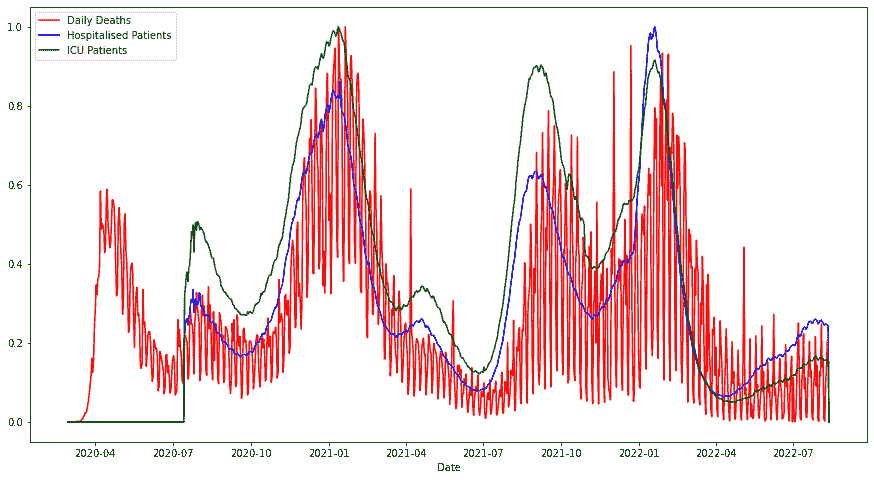
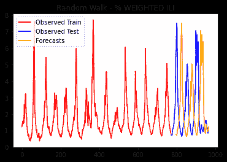

<!--yml

类别：未分类

日期：2024-09-06 19:34:48

-->

# [2401.13912] 深度学习和基础模型在时间序列预测中的调查

> 来源：[`ar5iv.labs.arxiv.org/html/2401.13912`](https://ar5iv.labs.arxiv.org/html/2401.13912)

# 深度学习和基础模型在时间序列预测中的调查

John A. Miller jamill@uga.edu ，Mohammed Aldosari maa25321@uga.edu ，Farah Saeed farah.saeed@uga.edu ，Nasid Habib Barna nasidhabib.barna@uga.edu ，Subas Rana subas.rana@uga.edu ，I. Budak Arpinar budak@uga.edu 和 Ninghao Liu ninghao.liu@uga.edu

###### 摘要。

深度学习已经成功应用于许多应用领域，但其在时间序列预测中的优势却显现较慢。例如，在著名的 Makridakis (M) 竞赛中，传统统计或机器学习技术的混合方法直到最近才成为顶级表现者。随着深度学习在时间序列预测中的架构进展（例如，带有注意力机制的编码器-解码器、变换器和图神经网络），深度学习开始展现出显著的优势。然而，在疫情预测领域，深度学习模型仍面临挑战：时间序列数据不足以进行有效训练、对累积科学知识的无知以及模型的可解释性。为此，基础模型（大规模深度学习模型，经过广泛的预训练）的发展使得模型能够理解模式并获得可以应用于新相关问题的知识，尽管尚未获得大量训练数据。此外，还有大量知识可供深度学习模型利用，包括知识图谱和经过科学领域知识微调的大型语言模型。目前正在进行的研究探讨了如何利用或注入这些知识到深度学习模型中。在这项调查中，回顾了几种最先进的建模技术，并提出了进一步工作的建议。

时间序列预测，疫情预测，深度学习，基础模型

## 1. 引言

过去四年的 COVID-19 经历使国家科学基金会（NSF）和疾病控制与预防中心（CDC）等组织清楚认识到，我们需要为下一次疫情做好更好的准备。截至 2024 年 1 月 13 日，仅在美国，COVID-19 已经造成 6,727,163 次住院和 1,169,666 人死亡（美国首次病例发生在 2020 年 1 月 15 日，首次死亡发生在 2020 年 2 月 29 日）。下一次疫情可能会更具传染性，影响更大。

也有一些显著的成功，例如信使 RNA 疫苗的使用，这种疫苗比以前的方法能更快地开发。然而，检测大流行开始的记录和预测其轨迹的能力还有待提高。

大流行准备工作涵盖了持续监测的必要性。预测复杂随机系统中的稀有事件非常困难。从前期出现到流行病再到大流行的过渡通常只有在事后才能清晰看到。使用模型预测大流行也至关重要。由于其高影响力和潜在的生命损失，复杂的模型被用来预测飓风的未来。大流行的影响可能远远更大。

与天气预报类似，准确的大流行预测需要三个条件：（1）模型集合，（2）准确的数据收集，以及（3）数据同化。如果这三者中的任何一个出现问题，准确性都会下降。当准确性下降时，干预和控制机制不能得到最佳应用，从而导致公众的不满。

在 COVID-19 大流行期间数据每天都在收集，但如图 1 所示，新死亡人数的曲线存在一个非常强的每周模式，这是报告过程中的一个伪影。同时，注意到住院情况和重症监护病房（ICU）患者数量似乎是很好的领先指标。

图 1\. 活跃大流行期间每日死亡人数的缩放图（请注意每周报告模式）、住院情况和重症监护病房（ICU）患者。

由于每日死亡人数的锯齿形模式，一些建模研究发现使用每周数据更为有效。在 COVID-19 的后期，日报停止了，只剩下每周报告。不幸的是，这意味着用于训练深度学习模型的数据大大减少。

应用的建模技术包括统计学、机器学习或基于理论的隔离模型，这些模型是对易感-感染-恢复（SIR）或易感-暴露-感染-恢复（SEIR）模型的扩展。这些状态之间的过渡由具有速率常数的微分方程控制，这些常数可以从数据中估计。不幸的是，估计处于暴露状态的个体数量可能非常困难。

另外两类，即统计学和机器学习（包括深度学习和基础模型），可以说更适应可用数据，因为它们寻找重复的模式、对过去的依赖和领先指标。两者都可以被表述为多变量时间序列（MTS）预测问题，尽管与 MTS 分类和异常检测相关的问题也非常重要。然而，具有理论联系是可取的，这可能会导致更好的长期预测，以及对现象的更深入理解。这促使了理论指导数据科学（TGDS）（Karpatne et al., 2017; Miller et al., 2017）和物理信息神经网络（PINN）（Karniadakis et al., 2021）的研究。

统计学和机器学习技术相辅相成。例如，建模研究应具有可靠的基线模型，从我们的研究中来看，应包括随机游走（RW）、自回归（AR）和季节性、自回归、积分、移动平均与外生变量（SARIMAX）。当训练数据有限时，SARIMAX 通常与深度学习模型竞争。如果使用周数据，训练数据在流行病早期阶段将有限，恰逢对准确预测的需求最大。像 SARIMAX 这样的基线模型对于超参数调整也很有帮助，因为在数据充分的情况下，可以期待深度学习模型表现良好；SARIMAX 的结果可以帮助评估这一点。此外，SARIMAX 还用于数据增强，以帮助训练深度学习模型（Javeri et al., 2021）。

展望未来，这篇扩展自（Miller et al., 2023）的调查论文提出了一个问题，即人工智能（AI），特别是深度学习，如何用于提高流行病的准备和预测，包括更好的深度学习模型、更多可解释的模型、利用大语言模型（LLM）访问科学文献、知识库和知识图谱的开发与使用，以及对流行病干预和控制的更好和持续评估。

本文其余部分组织如下：第二部分概述了 MTS 预测的两次改进浪潮。第三部分重点关注 MTS 预测中的最新进展，探讨了 Transformer 及相关建模技术。这些建模技术越来越努力捕捉时间动态，并且通常在国家级 COVID-19 预测中表现最佳。第四部分关注空间-时间领域中 MTS 预测的最新进展，其中各种类型的图神经网络具有自然的吸引力。这些建模技术通常应用于州级 COVID-19 数据。第五部分讨论了时间序列预测的基础模型，即大型预训练深度学习模型。第六部分讨论了各种形式的知识（如知识图谱）作为预测模型的自然补充。知识可以用于提高预测准确性，检查预测的合理性（尤其是长期预测中的问题），指导建模过程，并帮助解释建模结果。第七部分提供了一项元研究，比较了当前文献中几种建模技术的有效性。最后，第八部分总结了对 MTS 未来发展方向的展望。

## 2\. MTS 预测的进展

时间序列预测的历史可以追溯到很久以前，如表 1 所示。请注意，一些建模技术（或模型类型）具有时间序列预测以外的一般用途，但日期和论文反映了它们在时间序列或序列数据预测中的应用。然而，确实存在快速进展的时期，例如 1950 年代到 1970 年代，这在 Box 和 Jenkins 的开创性著作中得到了体现（Box 和 Jenkins, 1970）。另一个显著的进展时期与深度学习的发展相吻合，即 2010 年代。

表 1\. 时间序列预测模型类型及其在时间序列背景下的关键初始参考文献

| 模型类型 | 简短描述 | 日期 | 参考文献 |
| --- | --- | --- | --- |
| BaselineHA | 历史平均基线 | . | . |
| BaselineRW | 随机游走基线 - 猜测前一个值 | . | . |
| Regression4TS | 带滞后变量的时间序列回归 | 1949 | (Cochrane 和 Orcutt, 1949) |
| ARIMA | 自回归、积分、滑动平均 | 1951 | (Whittle, 1951; Box 和 Jenkins, 1962) |
| SES | 简单指数平滑 | 1957 | (Holt Charles, 1957) |
| VAR | 向量自回归 | 1957 | (Quenouille 和 Quenouille, 1957) |
| VARMA | 向量自回归、滑动平均 | 1957 | (Quenouille 和 Quenouille, 1957) |
| VECM | 向量误差修正模型 | 1957 | (Quenouille 和 Quenouille, 1957) |
| ES | 指数平滑（霍尔特-温特斯） | 1960 | (Winters, 1960) |
| SARIMA | 季节性 ARIMA | 1967 | (Box et al., 1967) |
| SARIMAX | 带外生变量的 SARIMA | 1970 | (Box and Jenkins, 1970) |
| NAR/NARX | 非线性自回归，外生变量 | 1978 | (Jones and Cox, 1978) |
| 神经网络 | 神经网络 | 1988 | (Smith et al., 1988) |
| RNN | 循环神经网络 | 1989 | (Williams and Zipser, 1989) |
| FDA/FTSA | 功能数据/时间序列分析 | 1991 | (Ramsay and Dalzell, 1991) |
| CNN | 卷积神经网络 | 1995 | (LeCun et al., 1995) |
| SVR | 支持向量回归 | 1997 | (Müller et al., 1997) |
| LSTM | 长短期记忆 | 1997 | (Hochreiter and Schmidhuber, 1997) |
| ELM | 极限学习机 | 2007 | (Singh and Balasundaram, 2007) |
| GRU | 门控递归单元 | 2014 | (Cho et al., 2014) |
| Encoder-Decoder | 带注意力的编码器-解码器 | 2014 | (Chorowski et al., 2014) |
| MGU | 最小门控单元 | 2016 | (Zhou et al., 2016) |
| TCN | 时间卷积网络 | 2016 | (Lea et al., 2016) |
| GNN/GCN | 图神经/卷积网络 | 2016 | (Kipf and Welling, 2016) |
| vTRF | （原始）Transformer | 2017 | (Vaswani et al., 2017) |

有几个开源项目支持跨编程语言的时间序列分析：

+   •

    R: 时间序列 [https://cran.r-project.org/web/views/TimeSeries.html] 包含大量的时间序列模型。

+   •

    Python: Statsmodels [https://www.statsmodels.org/stable/index.html] 提供了基本的时间序列模型集合。Sklearn [[`scikit-learn.org/stable`](https://scikit-learn.org/stable)] 和相关包 Sktime [[`www.sktime.net/en/stable`](https://www.sktime.net/en/stable)] 提供了大部分 Statsmodels 提供的模型。PyTorch-Forecasting [https://github.com/jdb78/pytorch-forecasting?tab=readme-ov-file] 包括几种类型的递归神经网络。TSlib [[`github.com/thuml/Time-Series-Library`](https://github.com/thuml/Time-Series-Library)] 提供了几种用于时间序列分析的 Transformers。

+   •

    Scala：Apache Spark [[`spark.apache.org/`](https://spark.apache.org/)] 的时间序列模型集合有限。ScalaTion [[`cobweb.cs.uga.edu/~jam/scalation.html`](https://cobweb.cs.uga.edu/~jam/scalation.html)], [[`github.com/scalation`](https://github.com/scalation)] (Miller et al., 2010) 支持表 1 中列出的多数建模技术。此外，它还支持多种形式的时间序列回归，包括递归 ARX、直接 ARX_MV、二次、递归 ARX_Quad 和二次、直接 ARX_Quad_MV。

预测未来是一项非常困难的工作，直到最近，机器学习模型提供的内容没有超出统计模型所提供的内容，这一点在 M 竞赛中得到了证明。

### 2.1\. M 竞赛

Makridakis 或 M 竞赛始于 1982 年，并且持续进行到 2022-2023 年的 M6 竞赛。在 2018 年 5 月结束的 M4 竞赛中，纯粹的机器学习技术表现不佳，尽管一个混合神经网络（LSTM）统计（ES）技术（Smyl, 2020）获胜（Makridakis et al., 2018）。其余的顶尖表现者是统计技术的组合。直到 2020 年 6 月 M5 竞赛结束，机器学习（ML）建模技术才优于经典统计技术。一些顶尖表现者在他们的组合中包括了 LightGBM（Makridakis et al., 2022）。LightGBM 是梯度提升决策/回归树（Ke et al., 2017）的高效实现。多个团队也将神经网络纳入了他们的组合中。特别是，深度学习技术如 DeepAR（由多个 LSTM 单元组成）（Salinas et al., 2020）和 N-BEATS（由多个全连接神经网络块组成）（Oreshkin et al., 2019）被应用。许多团队还结合了递归（例如，使用 $t+1$ 之前的预测进行 $t+2$ 预测）和直接（非递归）预测。“在 M4 中，只有两种复杂的方法被发现比简单统计方法更准确，而后者在竞赛中占据了顶尖位置。相比之下，在 M5 中，所有 50 种顶尖表现的方法都是基于 ML 的。”（Makridakis et al., 2022）M6 竞赛涉及预测和投资策略（Makridakis et al., 2023），其结果总结预计在 2024 年发布。

### 2.2\. 时间序列的统计与深度学习模型

正如 M 竞赛的讨论所示，机器学习技术花了一些时间才能在竞赛中取得最佳成绩。神经网络模型在许多领域展示了高竞争力的结果，但在时间序列预测领域则不太明显，也许是因为模式更加难以捉摸，而且经常变化。此外，在大数据革命之前，数据集太小无法训练具有大量参数的神经网络。

#### 2.2.1\. 第一波

从第一波进展开始，SARIMAX 模型通常表现良好，因为它们可以利用内生时间序列的过去和预测值，内生时间序列的过去误差/冲击以及外生时间序列的过去值。另外，对内生变量进行差分可以提高其平稳性，此外，季节性/周期性模式也可以被利用。顺便说一下，许多机器学习论文已经将他们的模型与 ARIMA 进行了比较，然而 SARIMAX 仍然高效，并且通常优于 ARIMA。此外，M4 和 M5 竞赛表明，指数平滑可以提供简单而准确的模型。

用于多变量时间序列（MTS）的最直接的模型是带有 $p$ 拖延的矢量自回归（VAR）模型，针对 $n$ 个变量 ${\rm VAR}(p,n)$。例如，一个三拖延、双向量 VAR(3,2) 模型对于大流行病预测是有用的，因为新入院和新死亡是相关变量，有关这些变量的时间序列数据被保留，即，$y_{t0}$ 是时间 $t$ 的新入院数，$y_{t1}$ 是时间 $t$ 的新死亡数。模型（矢量）方程可以写成如下形式：

| (1) |  | ${\bf y}_{t}~{}=~{}{\boldsymbol{\delta}}\,+\,\Phi^{(0)}{\bf y}_{t-1}\,+\,\Phi^{(1)}{\bf y}_{t-2}\,+\,\Phi^{(2)}{\bf y}_{t-3}\,+\,\boldsymbol{\epsilon}_{t}$ |  |
| --- | --- | --- | --- |

其中 ${\boldsymbol{\delta}}\in\mathbb{R}^{2}$ 是一个常数向量，$\Phi^{(0)}\in\mathbb{R}^{2\times 2}$ 是第一个滞后的参数矩阵，$\Phi^{(1)}\in\mathbb{R}^{2\times 2}$ 是第二个滞后的参数矩阵，$\Phi^{(2)}\in\mathbb{R}^{2\times 2}$ 是第三个滞后的参数矩阵，${\boldsymbol{\epsilon}_{t}}\in\mathbb{R}^{2}$ 是残差/误差/冲击向量。一些研究探索了 VARMA，但发现其准确性仅略高于 VAR 模型，但更复杂，因为它们可以考虑过去的误差/冲击（Athanasopoulos 和 Vahid，2008）。SARIMAX 和 VAR 都可以视为多变量时间序列模型，区别在于 SARIMAX 专注于一个主要变量，其它变量作为指示变量，例如，使用新病例和住院时间序列来帮助预测新死亡数。SARIMAX 相较于 VAR 更不容易受到误差累积的影响。SARIMAX 模型可以简化为 ARX 模型（自回归、外生）以查看模型的基本结构，该结构包括内生变量的前 $p$ 个滞后以及外生变量的滞后 $[a,b]$，即 ${\rm ARX}(p,[a,b])$。例如，ARX(3, [2, 3]) 的模型方程可以写作：

| (2) |  | $y_{t}~{}=~{}\delta\,+\,\phi_{0}y_{t-1}\,+\,\phi_{1}y_{t-2}\,+\,\phi_{2}y_{t-3}\,+\,\beta_{0}x_{t-2}\,+\,\beta_{1}x_{t-3}\,+\,\epsilon_{t}$ |  |
| --- | --- | --- | --- |

其中 $\hat{y}_{t}$，预测值，是相同公式但不包含 $\epsilon_{t}$。在这种情况下，MTS 包括一个内生时间序列 $y_{t}$ 和一个外生时间序列 $x_{t}$，对于 $t\in 0..m-1$。所有参数 $\delta,\phi_{0},\phi_{1},\phi_{2},\beta_{0}$ 和 $\beta_{1}$ 现在都是标量。ARX 模型可能有多个外生时间序列（参见 (Pearl, 2011) 讨论内生变量与外生变量）。SARIMAX 模型的规范包含 ARX 规范。

| (3) |  | ${\rm SARIMAX}(p,d,q)_{\times}(P,D,Q)_{s}\,[a,b]$ |  |
| --- | --- | --- | --- |

其中，$p$ 是自回归（AR）项/滞后内生值的数量，$d$ 是需要进行的步长-1 差分（积分（I））的数量，$q$ 是移动平均（MA）项/滞后冲击的数量，$P$ 是季节性（步长-$s$）自回归（AR）项/滞后内生值的数量，$D$ 是需要进行的步长-$s$ 差分的数量，$Q$ 是季节性（步长-$s$）移动平均（MA）项/滞后冲击的数量，$s$ 是季节周期（例如，周、月或最能捕捉模式的时间段），$[a,b]$ 是要包括的外生（X）滞后的范围。同样，可能会有多个外生变量。尽管可以通过求解线性方程组（例如，使用矩阵分解）非常高效地找到 ARX 模型的参数的最佳值，但由于 MA 项的引入使得方程变为非线性，因此损失函数（例如，均方误差（MSE）或负对数似然（NLL））通常使用非线性优化器，如有限记忆 Broyden-Fletcher-Goldfarb-Shanno（L-BFGS）算法（Liu 和 Nocedal，1989）来最小化。

#### 2.2.2\. 第二波

第二波的故事还不完整。M5 竞赛展示了 LightGBM 的价值。研究表明，LSTM 和 GRU 的表现往往相似，并且通常优于前馈神经网络（FNN）。

循环神经网络（RNN）的思想是对输入向量 ${\bf x}_{t}$（近期历史）和隐藏状态向量（衰减的长期历史）进行加权组合，并激活它来计算新的状态 ${\bf h}_{t}$。最终层将其转换为时间序列预测 $\hat{y}_{t}$。

|  | $\displaystyle{\bf x}_{t}$ | $\displaystyle~{}=~{}[y_{t-p},\dots,y_{t-1}]$ | $\displaystyle{\rm input~{}vector}$ |  |
| --- | --- | --- | --- | --- |
|  | $\displaystyle{\bf h}_{t}$ | $\displaystyle~{}=~{}{\bf f}(U{\bf x}_{t}+W{\bf h}_{t-1}\,+\,{\boldsymbol{\beta}^{(h)}})$ | $\displaystyle{\rm hidden~{}state~{}vector}$ |  |
|  | $\displaystyle\hat{y}_{t}$ | $\displaystyle~{}=~{}g(V{\bf h}_{t}\,+\,\beta^{(y)})$ | $\displaystyle{\rm output~{}scalar}$ |  |

其中 $U$、$W$ 和 $V$ 是可学习的权重矩阵，$\beta$s 是偏置项，变量是

+   •

    ${\bf x}_{t}\in\mathbb{R}^{p}$ 代表收集到的输入（来自近期的时间序列值）

+   •

    ${\bf h}_{t}\in\mathbb{R}^{n_{h}}$ 代表当前的隐藏状态

+   •

    $\hat{y}_{t}\in\mathbb{R}^{k}$ 代表 1 步到 $k$ 步的预测（这里 $k=1$）

通过添加 sigmoid 激活的门控，历史信息的流动（从而梯度的稳定性）通常可以得到改善。门控循环单元（GRU）模型添加了两个门，而长短期记忆（LSTM）模型则在 RNN 中添加了三个门。将 $W{\bf h}_{t-1}$ 从第二个方程中移除将 RNN 转换为 FNN。添加额外的层（到一定程度）通常会提高预测准确性。

显著的收益似乎来自于采用编码器-解码器架构（用于 Seq2Seq 问题），在该架构中，编码器可以集中精力从过去学习模式，而解码器则专注于做出准确的预测。最初，用于预测的这种架构在编码器和解码器中都使用了 LSTM/GRU 单元。编码器的每一步产生一个隐藏状态向量，最后一个隐藏状态向量被输入到解码器中。对于长时间序列，输入所有隐藏状态向量可能不太有帮助。需要做的是根据这些隐藏状态在预测中的重要性来加权，这是一个难以事先确定的任务，但权重可以在训练过程中学习。这导致了注意力机制的发展，为时间序列预测带来了更显著的改进。

自注意力、多头注意力、交叉注意力以及位置编码的应用，已经使得 LSTM/GRU 单元被使用注意力机制和前馈神经网络层的编码器（和解码器）层所取代。使用多个这样的层作为编码器和解码器，形成了 Transformer。一般来说，Transformer 由多个编码器和解码器块组成。图 2 展示了简化的第一个编码器块，其中输入向量$[{\bf x}_{t}]$被传递到自注意力层，输入（通过跳跃连接）被添加并随后归一化以获得$[{\bf z}_{t}]$，然后结果传递给前馈神经网络，再经过一次加回和归一化（有关更完整的图，请参见（Vaswani 等人，2017））。此外，由于自注意力不考虑顺序，因此可以使用（与输入结合）位置编码（基于绝对或相对顺序的${\bf x}_{t}$）和/或时间编码（基于${\bf x}_{t}$的日期时间）来弥补这一点。

<svg   height="306.87" overflow="visible" version="1.1" width="180.1"><g transform="translate(0,306.87) matrix(1 0 0 -1 0 0) translate(90.05,0) translate(0,20.1)" fill="#000000" stroke="#000000" stroke-width="0.6pt"><g transform="matrix(1.0 0.0 0.0 1.0 -8.89 -3.46)" fill="#0000FF" stroke="#0000FF"><foreignobject width="17.79" height="13.84" transform="matrix(1 0 0 -1 0 16.6)" overflow="visible" color="#0000FF">$[{\bf x}_{t}]$</foreignobject></g><g transform="matrix(1.0 0.0 0.0 1.0 -58.35 47.72)" fill="#0000FF" stroke="#0000FF"><foreignobject width="117.08" height="13.84" transform="matrix(1 0 0 -1 0 16.6)" overflow="visible" color="#0000FF">attention $(Q,K,V)$</foreignobject></g><g transform="matrix(1.0 0.0 0.0 1.0 -54.63 98.9)" fill="#0000FF" stroke="#0000FF"><foreignobject width="11.53" height="9.89" transform="matrix(1 0 0 -1 0 16.6)" overflow="visible" color="#0000FF">$\to$ add in input $[{\bf x}_{t}]$</foreignobject></g><g transform="matrix(1.0 0.0 0.0 1.0 -29.23 132.99)" fill="#0000FF" stroke="#0000FF"><foreignobject width="58.46" height="9.61" transform="matrix(1 0 0 -1 0 16.6)" overflow="visible" color="#0000FF">normalize</foreignobject></g><g transform="matrix(1.0 0.0 0.0 1.0 -85.02 184.17)" fill="#0000FF" stroke="#0000FF"><foreignobject width="170.81" height="9.61" transform="matrix(1 0 0 -1 0 16.6)" overflow="visible" color="#0000FF">feed-forward neural network</foreignobject></g><g transform="matrix(1.0 0.0 0.0 1.0 -35.61 236.7)" fill="#0000FF" stroke="#0000FF"><foreignobject width="11.53" height="9.89" transform="matrix(1 0 0 -1 0 16.6)" overflow="visible" color="#0000FF">$\to$ add in $[{\bf z}_{t}]$</foreignobject></g><g transform="matrix(1.0 0.0 0.0 1.0 -47.68 272.13)" fill="#0000FF" stroke="#0000FF"><foreignobject width="95.36" height="12.3" transform="matrix(1 0 0 -1 0 16.6)" overflow="visible" color="#0000FF">normalize again</foreignobject></g><g transform="matrix(1.0 0.0 0.0 1.0 5.03 159.93)" fill="#000000" stroke="#000000"><foreignobject width="16.64" height="13.84" transform="matrix(1 0 0 -1 0 16.6)" overflow="visible">$[{\bf z}_{t}]$</foreignobject></g></g></svg>

图 2\. 单头的变换器第一编码层

对于一些时间序列数据集，变换器已经被证明是顶尖的表现者。在相关的预测问题中，即自然语言处理（NLP）中的下一个词预测，目前基于变换器架构的大型语言模型（LLM）代表了一个重大突破。这种情况会在时间序列预测中重现吗，还是进展会更加渐进（请记住，由于时间序列的随机性，例如疫情数据，存在可知的限制）。尽管如此，NLP 中的进展可以被适应到时间序列预测中。

一个较少探索的研究方向涉及时间卷积网络（TCN），它利用因果卷积和膨胀卷积，提供扩展的历史视角，以及跳跃连接/残差块以利用先前层的信息/保持梯度 (Lea et al., 2016)。尽管 (Bai et al., 2018) 显示了 TCN 在许多序列任务中优于 LSTM 的优势，但在时间序列预测中的证据似乎不够明确。

## 3\. 时间序列变换器的最新进展

### 3.1\. 稀疏注意力

在过去几年中，有几篇论文研究了变换器的稀疏注意力。与其将每个时间点与其他每个时间点进行比较（平方注意力），不如将重点集中，并减少注意力的复杂性 (Wen et al., 2022; Lin et al., 2022; Zhu et al., 2023)。

给定查询矩阵 $Q$，键矩阵 $K$ 和值矩阵 $V$，注意力计算如下：

| (4) |  | ${\rm attention}(Q,K,V)~{}=~{}{\rm softmax}\left[\dfrac{QK^{{}^{\intercal}}}{\sqrt{d_{k}}}\right]V$ |  |
| --- | --- | --- | --- |

从高层次来看，稀疏注意力可以通过减少查询的数量来实现，或者在给定查询时，减少与其比较的键的数量（即，计算的注意力分数/权重）。查询原型可以代替多个查询，从而减少计算。此外，如果两个时间点相距较远，将它们的注意力权重设置为零，是缩小焦点的一种方法。详细来说，有许多方法可以做到这一点 (Lin et al., 2022)。一些较为流行的方法列在表 2 中。请注意，缩小焦点，除了减少计算时间外，可能还会导致改进的预测（减少干扰）。

表 2\. 时间序列预测变换器模型类型

| 模型类型 | 简短描述 | 日期 | 参考文献 |
| --- | --- | --- | --- |
| LogTrans | 局部及 LogSparse 注意力 | 2019 | (Li et al., 2019) |
| Reformer | 仅比较相似的查询和键 | 2020 | (Kitaev et al., 2020) |
| Informer | 使用选择的查询原型 | 2021 | (Zhou et al., 2021) |
| Autoformer | 以自相关替代自注意力 | 2021 | (Wu et al., 2021) |
| Pyraformer | 分层/金字塔注意力 | 2021 | (Liu et al., 2021) |
| FEDformer | 系列分解及频域使用 | 2022 | (Zhou et al., 2022b) |
| 非平稳 TRF | 系列平稳化及去平稳注意力使用 | 2022 | (Liu et al., 2022) |
| Triformer | 层缩减的三角形结构 | 2022 | (Cirstea et al., 2022) |
| CrossFormer | 跨通道建模 | 2023 | (Zhang and Yan, 2022) |
| PatchTST | 用补丁替换时间步输入 | 2023 | (Nie 等，2022) |

由于具有多个头和多个层/块，变换器的解释性/可解释性具有挑战性（Chefer 等，2021）。在某种程度上，注意力权重也可以用于解释性（Lim 和 Zohren，2021；Mrini 等，2019）。相关研究包括简化变换器块，以提高解释性/可解释性并减少训练时间（He 和 Hofmann，2023）。

### 3.2\. 掩码和预训练

关于预训练变换器在时间序列预测中的效果还有一个未解之谜。预训练在自然语言处理和计算机视觉（CV）问题上的成功是显著的，但它是否会在多变量时间序列预测中也同样有效？

这种方法可以应用于流行病。例如，基于过去流行病以及流感训练的变换器，可能在未来的流行病中非常有用，避免了只有在流行病最严重的高峰过后才变得熟练的问题。

使用从词汇创建的向量作为变换器的输入标记，与从时间序列中提取单个值不同，因此可以使用补丁，因为它们能够捕捉时间序列子序列中的有意义模式。给定一个单变量时间序列 $[y_{t}:t\in 0,\dots m-1]$，它可以被划分为（可能重叠的）长度为 $p$ 的子序列，步幅为 $s$（当 $s=p$ 时没有重叠）。

| (5) |  | ${\rm patch}(p,s)~{}=~{}\{[y_{t}:t\in sk,\dots sk+p]:k\in 0,\dots m/s\}$ |  |
| --- | --- | --- | --- |

PatchTST (Nie 等，2022) 将多变量时间序列数据分割成多个单变量时间序列，视其为独立的通道。对于每个单变量时间序列，它创建补丁，例如，大小为 $p=16$，步幅为 $s=8$。这些补丁作为标记输入到变换器中。补丁携带局部语义信息，而补丁化减少了计算和内存使用，同时关注更长的历史。通道独立性允许在不同通道中使用不同的注意力图，从而促进对不同时间模式的更好处理。结果表明，PatchTST 在监督和无监督学习任务中，包括迁移学习，超越了最先进的变换器模型。值得注意的是，它在具有较长回溯窗口的预测方面表现出色。AR-Transformer (Aldosari 和 Miller，2023) 通过结合 Vanilla Transformer 架构与基于段的注意力、教师强迫、时间和位置编码以及自回归（递归）多时间段预测，显示出改进的性能。

论文 (Tang and Zhang, 2022) (MTSMAE)，(Zha et al., 2022) (ExtraMAE)，以及 (Li et al., 2023b) (Ti-MAE) 讨论了使用掩码自编码器（MAE）进行多变量时间序列预测的应用。一些输入片段从编码器中被掩盖，任务是训练模型以基本上将它们恢复过来。显然，这比常规的自编码器要困难，后者将输入信号映射到潜在表示（编码），然后从中恢复信号（解码）。为了成功恢复这些片段，MAE 需要更全面地捕捉时间依赖性。凭借这一增强能力，其预测能力理论上应得到提升。(Tang and Zhang, 2022) 突出指出了将 MAE 应用于时间序列数据中的挑战，并提出了一种名为 MTSMAE 的改进方法。MTSMAE 模型结合了视觉变换器的概念，并利用补丁来改进特征提取和减少冗余。在预训练阶段，从输入中随机掩盖一些补丁，并恢复缺失的补丁。在微调阶段，使用前一步训练的编码器，并重新设计解码器的输入。与由单个全连接层组成的双向编码器表示（BERT）解码器不同，MTSMAE 使用基于不同多变量时间序列数据类型的不同轻量级解码器级别。在对来自不同领域和具有不同特征的各种典型多变量时间序列数据集（电力消耗负荷、电力变压器温度、天气）测试这一方法时，其实验结果显示了显著强劲的性能。

成功应用预训练和微调范式到时间序列预测面临的两个主要挑战是（1）大多数时间序列的短暂性，（2）领域/分布变化的普遍性。Jin 等人 (2022) 提出了结合领域适应技术和自注意力机制来应对这些挑战。其他方法包括维护时间序列的集合，从中比较整个序列或片段的相似性，无论是在原始序列级别还是在表示级别（见下一节）。

### 3.3\. 表示学习

与处理原始多变量时间序列 $[{\bf y}_{t}]$ 相比，表示学习可以用于将序列转换为 $[{\bf z}_{t}]$，这些序列存在于潜在空间（可能是更高维的），从而 $[{\bf z}_{t}]$ 以一种有助于分类或预测等任务的方式捕获时间序列中的关键信息。表示学习可以看作是因子分析的一种推广（Xie et al., 2020），并且“一个好的表示是能够解开潜在变化因素的表示”（Bengio et al., 2013）。对于预测，一般的思路是将时间序列分为过去（直到时间 $\tau$）和未来（时间 $\tau$ 之后），并使用一个函数 ${\bf f}$（带有参数 $W$）将 $Y$ 和 $Y^{\prime}$ 编码为 $Z$ 和 $Z^{\prime}$，它们作为更丰富的潜在表示。

| (6) |  | $\displaystyle Y$ | $\displaystyle~{}=~{}[{\bf y}_{1},{\bf y}_{2},\dots\bf y_{\tau}]$ | $\displaystyle{\rm 过去}$ |  |
| --- | --- | --- | --- | --- | --- |
| (7) |  | $\displaystyle Y^{\prime}$ | $\displaystyle~{}=~{}[{\bf y}_{\tau+1},{\bf y}_{\tau+2},\dots\bf y_{m}]$ | $\displaystyle{\rm 未来}$ |  |
| (8) |  | $\displaystyle Z$ | $\displaystyle~{}=~{}{\bf f}(Y,W)$ | $\displaystyle{\rm 编码~{}过去}$ |  |
| (9) |  | $\displaystyle Z^{\prime}$ | $\displaystyle~{}=~{}{\bf f}(Y^{\prime},W)$ | $\displaystyle{\rm 编码~{}未来}$ |  |

目标是最小化 $Y^{\prime}$ 与 ${\bf g}(Z^{\prime},U)$ 之间的差异（通过损失函数来度量），其中 ${\bf g}$ 是一个预测函数/网络（带有参数 $U$）。${\bf f}$ 作为编码器函数，而 ${\bf g}$ 作为解码器函数。两者都可能具有多层，尽管一些研究例如使用正则化回归作为预测函数（这种思路是 $[{\bf z}_{t}]$ 是一个丰富的表示，能够捕获足够的关键信息，使得预测更加简单）。

也有工作致力于将时间序列分解，以更好地捕捉这些重要信息，例如趋势、季节性和局部变异组件（在一些论文中，后两者被合并）。由于组件的复杂混合，已经开发了分解技术。从线性模型的角度来看，分解可以被视为多重共线性减少的一般化（La Cava 等人，2018）。改进时间序列表示的一种方法，可能会减少噪音，那就是将其投影到使用正交多项式的平滑函数上（例如 Legendre、Laguerre、Chebyshev 多项式（Zhou 等人，2022a））。训练可以通过增强或掩蔽来增强。例如，通过使用自动编码器（AE）或掩蔽自动编码器（MAE）进行序列重建的虚拟训练也可以使用。用于时间序列分类更多，但也用于预测，对比学习已被使用。对比学习将类似段对比为正例，将不相似段对比为负例，因为预测应该受到正例的积极影响，受到负例的消极影响。

最近的研究和开发的模型证明了表示学习在多变量时间序列中的有效性，这些模型在（Meng 等，2023）中进行了评述。表 3 突显了这一领域的一些最新工作。

表 3\. 时间序列表示学习

| 模型类型 | 简要描述 | 日期 | 参考文献 |
| --- | --- | --- | --- |
| TS2Vec | 本地和对数稀疏注意力 | 2022 | （Yue 等，2022） |
| CoST | 仅对比相似查询和关键词 | 2022 | （Woo 等，2022） |
| FEAT | 使用选择的查询原型 | 2023 | （Kim 等，2023） |
| SimTS | 用自动相关性替换自注意力 | 2023 | （Zheng 等，2023） |

论文“TS2Vec: Towards Universal Representation of Time Series”使用了对比学习，并结合了时间和实例基础的损失函数。在论文中，“CoST: Contrastive Learning of Disentangled Seasonal-Trend Representations for Time Series Forecasting，”作者“认为时间序列预测的更有前景的范式是，首先学习解缠特征表示，然后进行简单的回归微调”（Woo et al., 2022）。该论文使用了时间（趋势）和频率（季节性）领域的对比学习损失函数。论文“FEAT: A General Framework for Feature-Aware Multivariate Time-Series Representation Learning”的一个独特之处在于，该框架利用每个变量/特征的编码器，因为每个变量的时间序列可能具有不同的特性，可以被预测函数有效利用。作者指出，“FEAT 第一次从三个多样化的角度学习表示：特征特定模式、特征无关的时间模式，以及多个特征特定和时间信息之间的依赖关系”（Kim et al., 2023）。论文“SimTS: Rethinking Contrastive Representation Learning for Time Series Forecasting”的作者认为，尽管对时间序列分类效果良好，但许多论文中描述的对比学习方法可能不适用于时间序列预测。特别是，他们的“模型不使用负对来避免虚假的排斥”（Zheng et al., 2023）。

近期的工作希望使编码 $[{\bf z}_{t}]$ 更具可解释性 (Zhao et al., 2023)，以增强用户对模型的信心。虽然可以使用事后解释方法，但使主模型本身具有可解释性是理想的（即，模型高度准确，合理，并且可以理解变量/特征如何影响结果）。例如，COVID-19 大流行期间疫苗接种的效果如何？

一些近期的论文在更简单的架构下取得了良好的结果：

+   •

    DLinear (Zeng et al., 2023) 结合了系列分解和线性（回归）模型。首先将单变量时间序列 $y_{t}$ 分解为简单的移动平均 $s_{t}$ 和剩余部分 $r_{t}$。

    | (10) |  | $\displaystyle s_{t}$ | $\displaystyle~{}=~{}{\rm movingAverage}(y_{t})$ |  |
    | --- | --- | --- | --- | --- |
    | (11) |  | $\displaystyle r_{t}$ | $\displaystyle~{}=~{}y_{t}-s_{t}$ |  |

    然后对每个部分 ($s_{t}$ 和 $r_{t}$) 应用线性模型进行预测，并将这些预测结果结合在一起。

+   •

    TSMixer (Ekambaram et al., 2023) 的灵感来源于计算机视觉中的 MLP-Mixer，它依赖于 MLP 块，并不使用卷积或自注意力，从而使架构更简单、更高效 (Tolstikhin et al., 2021)。 （多层感知器（MLP）是一个全连接的前馈神经网络）。TSMixer 以交错的方式寻找时间和跨变量的依赖关系。这比同时考虑时间和跨变量依赖关系的复杂度低，尽管如果存在强的领先指标，这些有用的信息可能会被忽略。

## 4\. 图神经网络在时间序列上的最新进展

尽管 Transformers 非常适合时间序列分析，但图神经网络在概念上更适合空间-时间分析。使用编码器-解码器或 Transformer 处理时间依赖性时，图神经网络（GNN）可能更擅长捕捉系列间或空间依赖性。

### 4.1\. 国家级 COVID-19 数据

在国家级别，数据集可以表示为矩阵 $Y=[y_{tj}]$，其中 $t$ 是时间，$j$ 是变量。图神经网络（GNN）的优势在于它们能够更紧密地建模和检查多个时间序列之间的依赖关系。遵循这种方法，每个变量的时间序列 ${\bf y}_{:j}$ 可以成为图中的一个节点。然后，节点之间的关系信息可以作为边属性进行维护，例如，基于互相关、互信息等。需要注意的是，例如，互相关的强度将取决于滞后（通常住院会导致死亡延迟几天）。此外，如果数据不是平稳的，互相关模式可能会随时间变化。

### 4.2\. 各州 COVID-19 数据

COVID-19 在一个州的传播可以随着时间的推移影响邻近州。这是因为人们在各州之间旅行、交易和社交。为了预测 COVID-19 在特定州的传播情况，我们需要考虑它与其他州的连接。我们可以将州之间的连接表示为图。在这个图中，每个州是一个节点，如果两个州之间存在显著的联系，则它们之间有一条边。许多现有的基于图神经网络（GNN）的模型（Panagopoulos et al., 2021; Wang et al., 2020a）用于预测疾病的传播，利用流动数据或社交连接来连接不同区域并捕捉它们之间的空间关系。例如，如果纽约州出现了急剧上升的曲线/峰值，那么对新泽西州的预测无疑可以从这些信息中受益。

此外，研究（Rana 等，2023）表明，如果状态之间是线性或非线性依赖的，它们也可以连接起来。他们计算了状态特征之间的相关性和互信息，并发现这种方法取得了良好的结果。例如，研究发现俄亥俄州和伊利诺伊州的 COVID-19 死亡人数和确诊病例高度相关。这意味着这两个状态之间存在强烈的线性关系。当一个州的死亡人数和确诊病例增加时，另一个州也会趋向于增加。

使这更复杂的一个问题是数据集的五十倍扩展。数据集现在可以表示为一个 3D 张量 ${\bf Y}=[y_{tjk}]$，其中 $t$ 是时间，$j$ 是变量，$k$ 是状态。对于 COVID-19 的每周数据，时间点的数量大约为 200，编码前的变量数量约为 10，美国的州数量约为 50（取决于是否包括 DC 和美国领土）。因此，张量将有 100,000 个元素，可能的依赖关系数量非常大。

### 4.3\. 图神经网络类型

早期工作在频谱域中使用傅里叶变换（Karagiannakos，2021）。ChebNets 提供了一种涉及图拉普拉斯算子的更高效计算。图卷积网络（GCN）通过直接应用拉普拉斯简化了计算（通常能较好地捕捉图的属性）。图拉普拉斯算子基于图的邻接矩阵 $A$ 计算，其中 $I$ 为自环，$D$ 为度矩阵（$d_{i}$ 为节点 $i$ 的入度）。节点的隐藏状态（例如，节点 $i$ 的 ${\bf h}_{i}$）通过将归一化的图拉普拉斯算子与其先前值及一个可学习的权重矩阵相乘来更新。消息传递神经网络（MPNN）更为通用，因为边特征可以包含在节点更新计算中，其中隐藏状态基于其先前值 ${\bf h}_{i}$ 和来自邻居的消息 ${\bf m}_{ji}$ 的组合进行更新（是节点及其连接边特征的函数，具有可学习的权重）。利用注意机制计算注意力权重 $a_{ij}$，图注意力网络（GAT）有潜力更好地捕捉节点之间的依赖关系。表 4 列出了六种常见的 GNN 类型，其中前三种是最简单的。

表 4\. GNN 模型类型（求和范围为邻域）

| 模型类型 | 简短描述 | ${\bf h}_{i}$ 的更新 | 日期 |
| --- | --- | --- | --- |
| GCN (Kipf 和 Welling，2016) | 图卷积网络 | ${\bf f}(\sum_{j}(d_{i}d_{j})^{-\frac{1}{2}}W{\bf h}_{j})$ | 2016 |
| MPNN (Gilmer et al., 2017) | 消息传递神经网络 | ${\bf f}({\bf h}_{i},\sum_{j}{\bf m}_{ji})$ | 2017 |
| GAT (Velickovic et al., 2017) | 图注意力网络 | ${\bf f}(\sum_{j}(a_{ij}W{\bf h}_{j}))$ | 2017 |
| GraphSage (Hamilton et al., 2017) | 邻域采样 | 算法 1 在 (Hamilton et al., 2017) | 2017 |
| GIN (Xu et al., 2018) | 图同构网络 | 方程 4.1 在 (Xu et al., 2018) | 2018 |
| TGN (Rossi et al., 2020) | 时间图网络（动态） | 嵌入方程在 (Rossi et al., 2020) | 2020 |

在利用 GNNs 进行多变量时间序列（MTS）预测时，研究人员尝试了各种方法来定义 GNN 的基本图结构。静态图 $G$ 更容易处理，但问题是它是否是事先给定的，还是需要从数据中学习（图结构学习）。如果图是动态的，其拓扑结构会随时间变化。对于时间序列，图结构（节点/边）通常会在离散时间点发生变化，即时间 $t$ 的图 $G_{t}$。

在有关 GNNs 用于时间序列预测的综述第四部分（Jin et al., 2023a）中提到，模型需要处理两种类型的依赖关系：（1）建模空间或变量间的依赖关系，和（2）建模时间依赖关系。GNNs 理想地适用于（1），但对于（2）通常与递归、卷积或基于注意力的模型相结合。

一些研究利用图神经网络（GNNs）进行了 COVID-19 预测。Kapoor et al.（Kapoor et al., 2020）使用了一个空间-时间 GNN 来整合流动性数据，捕捉县级的疾病动态。Panagopoulos et al.（Panagopoulos et al., 2021）引入了 MPNN-TL，一个用于理解欧洲国家 COVID-19 动态的 GNN，强调了流动模式的作用。Fritz et al.（Fritz et al., 2022）将 GNNs 与流行病学模型相结合，利用 Facebook 数据预测德国城市和地区的感染率。Cao et al.（Cao et al., 2020）开发了 StemGNN，利用图傅里叶变换（GFT）和离散傅里叶变换（DFT）来捕捉图结构中不同国家的时间相关性，并在多个时间范围内预测确认病例。该方法在单一深度神经网络（DNN）块中进行时间建模，消除了对邻近区域的单独处理需求，捕捉了空间和时间依赖性。它还通过连接多个 DNN 块提供了灵活的架构设计，使模型能够捕捉不同距离和长期时间依赖的空间动态。

结合 Transformers 和图神经网络可以提供两者的优势。例如，SageFormer (Zhang et al., 2023a) 使用图表示和 GNNs 来建立多个序列之间的联系，从而有助于集中注意力机制。

## 5. 基础模型

基础模型作为解决更一般问题的基础。术语“基础模型”出现在 (Bommasani et al., 2021) 中，而这一概念早于此。例如，迁移学习可以被视为基础模型的前身。本文认为，尽管基础模型基于深度学习和迁移学习，但其大规模支持更广泛的应用和新兴能力，即同质化和新兴性。

在预测中，无论是传统的统计模型还是深度学习模型，主要思想都是为特定数据集训练模型，以便它能够捕捉到特定的模式。不幸的是，在许多情况下，没有足够的数据来训练一个具有许多可训练参数的复杂模型。数据增强技术 (Javeri et al., 2021) 可以在一定程度上有所帮助。在疫情初期，问题尤为严重。正当对准确预测的需求最大时，数据量却不足。这时，基础模型的价值可以显现出来。

具有数十亿参数的基础模型最近在自然语言和计算机视觉领域取得了显著成功。自然，其他领域也在探索基础模型如何适用于其他数据模式以及多模态数据。

由于时间序列是一种顺序数据，与自然语言相似，人们可能会期望时间序列的基础模型能像大语言模型（LLMs）在自然语言中的表现一样良好。经过大量训练的基础模型应该更容易在新的数据集中捕捉到模式。时间序列领域面临更多挑战的原因有几个：

+   •

    多样性。时间序列数据正在为许多领域收集，其中许多领域会有其独特的特征。股票市场数据中观察到的模式与心电图（EKG/ECG）信号将大相径庭。

+   •

    许多小数据集。在大数据时代之前，时间序列数据主要由短的序列数据组成，这使得深度学习模型难以发挥作用。这种时间序列数据的特征在未来会有所减轻。

+   •

    缺乏词汇、语法和语义。任何一串数字都可以形成时间序列。但自然语言并非如此，只有某些词汇单元的序列才有意义，即这些模式有更多的结构性限制。虽然时间序列可以分解为趋势、季节性和局部模式，但结构限制无法相提并论。

### 5.1. 主干模型/架构

基础模型可以通过扩大（或组合）深度学习模型来构建。如何做到这一点是今天高度成功的大型语言模型（LLMs）的秘密，比如 GPT、BART、T5、LLaMA、PaLM 和 Gemini（Wan et al., 2023）。两种近期多模态 LLM 的比较，OpenAi 的 Chat-GPT4 和 Google 的，在 (McIntosh et al., 2023) 中给出。LLMs 的效率在 (Wan et al., 2023) 中讨论。

多种骨干模型/架构已被考虑用于时间序列分类的基础模型（Yeh et al., 2023）。本文比较了 LSTM、ResNet、GRU 和 Transformer 架构，其中 Transformer 架构显示出最大的潜力。对于多变量时间序列，具有集中或稀疏注意力的模型比使用全注意力的变压器表现出更高的准确性（较小的误差）。此外，基于变压器的骨干模型可以遵循编码器-解码器架构，或者用更简单的组件替代编码器或解码器。现在的辩论主要集中在是否使用编码器-解码器或仅解码器架构（Fu et al., 2023）。这两种类型的变压器分别由当前最先进的 LLMs 表示：生成预训练变压器（GPT）是仅解码器，而双向和自回归变压器（BART）以及文本到文本转移变压器（T5）是编码器-解码器。

还有其他可能考虑的骨干架构：（1）Transformer++ 架构扩展了自注意力，包括基于卷积的头，使得令牌/词可以与表示多个令牌的上下文向量进行比较（Thapak and Hore, 2020）。一半的头使用缩放点积注意力，另一半使用卷积注意力。这使得额外的时间或语义依赖关系得以捕捉。（2）状态空间模型，例如，Mamba 结合了 MLP（变压器的）、CNN 和 RNN 以及经典的状态空间模型（Gu and Dao, 2023），提供了比普通变压器更高效的替代方案。

时间序列相关的另一个问题是使用通道独立还是跨通道建模（Han et al., 2023）。如讨论所示，PatchTST 成功地利用了通道独立性。一种跨通道建模的形式是考虑不同通道/变量之间的交叉相关性（例如，住院人数和新死亡人数）。如图 1 所示，如果使用滞后交叉相关性，结果可能会更好。另一个问题是应包含哪些变量/通道，因为包含过多变量可能会适得其反（类似于 VAR 和 SARIMAX 模型中的特征选择问题）。

对于时空领域，目前关于图基础模型（GFMs）（Liu et al., 2023b）的研究变得更加相关。基础模型通常是扩展的变换器，适用于自然语言和时间序列等序列数据。对于具有空间组件的数据，其他类型的深度学习模型可能会有用。卷积神经网络和图神经网络直观上匹配这种类型的数据。两种架构作为最受欢迎的骨干：基于消息传递的 GNN（Gilmer et al., 2017）和基于变换器的（Ying et al., 2021）。一些研究采用了 GAT、GCN、GIN 和 GraphSage 作为其骨干架构，其中 GIN 因其高表达能力而特别受青睐。这些 GNN 通常与 RNN 结合使用，以捕捉数据中的时间依赖性，并且可以扩展形成一个基础模型。

变换器的成功催生了第二种骨干类型，即变换器与 GNN 的混合体。这种方法在传统的消息传递 GNN 基础上进行改进，具有强大的表达能力，并能够有效地建模长程依赖关系。GROVER（Rong et al., 2020）使用 GNN 架构来捕捉分子图的结构信息，并以查询、键和值的形式生成变换器编码器的输出。对于异质图，研究人员通常使用异质图变换器（HGT）（Hu et al., 2020）作为编码器。

### 5.2\. 构建时间序列的基础模型

创建时间序列基础模型的方式至少有四种：

1.  (1)

    利用现有的大型语言模型的能力。这将涉及将时间序列段或片段转换为单词，使用这些单词生成后续单词，然后再转换回时间序列（即预测）。这一工作的基础是两个序列（单词和时间序列段）中存在普遍的模式。然而，如果不加注意，将时间序列转换为单词序列可能会生成毫无意义的句子。当输出单词转换为时间序列预测时，也可能会发生同样的情况。使用时间序列数据对大型语言模型进行微调可能会改善其预测能力。

1.  (2)

    从零开始构建一个通用的时间序列基础模型，使用大量的时间序列数据集。这将是一项庞大的工作，需要收集和预处理大量的时间序列数据。同时，还需要高性能计算来进行广泛的训练。尽管时间序列领域的全面训练通常被认为比语言领域的训练要求较低。

1.  (3)

    从头开始构建一个专用于时间序列的基础模型，使用与疾病进展相关的数据集。这种替代方案在所需的训练数据量和训练资源需求方面更易于管理。此外，尚不清楚是否存在跨时间序列领域的可利用普遍性。一个在股市数据上训练的基础模型是否对疫情预测有用？

1.  (4)

    创建一个包含文本和时间序列数据的多模态基础模型。例如，文本可以来自关于 COVID-19 大流行的新闻文章或社交媒体，而时间序列数据（每周/每日）可以来自 CDC 或 OWID。这两者需要根据时间戳进行同步，并使用动态时间规整（DTW）等技术进行时间序列对齐（Müller, 2007）。

最近，已有多个努力尝试创建用于时间序列预测的基础模型，如表 5 所示。模型类型指示了上述四种方法中采取了哪些方法。骨干指示了基础模型构建所使用的基本深度学习技术。

表 5\. 时间序列的基础模型

| 模型类型 | 模型 | 简短描述 | 骨干 | 日期 |
| --- | --- | --- | --- | --- |
| 2 | TimeCLR (Yang et al., 2022; Yeh et al., 2023) | 对比学习预训练 | Transformer | 2022 年 6 月 |
| 2 | TimesNet (Wu et al., 2022) | 2D 变异建模 | TimeBlock | 2022 年 10 月 |
| 1 | GPT4TS (Zhou et al., 2023) | 带有补丁令牌输入的 LLM | GPT-2 | 2023 年 5 月 |
| 1 | LLM4TS (Chang et al., 2023) | 带有 LLM 的时间编码 | GPT-2 | 2023 年 8 月 |
| 4 | UniTime (Liu et al., 2023a) | 输入领域指令 + 时间序列 | GPT-2 | 2023 年 10 月 |
| 2 | TimeGPT (Garza and Mergenthaler-Canseco, 2023) | 为预测添加的线性层 | Transformer | 2023 年 10 月 |
| 4 | Time-LLM (Jin et al., 2023b) | 通过提示前缀输入上下文 | LLaMA | 2023 年 10 月 |
| 2 | PreDct (Das et al., 2023) | 基于补丁的解码器仅模型 | Transformer | 2023 年 10 月 |
| 2 | Lag-Llama (Rasul et al., 2023) | 基于延迟的解码器仅模型 | LLaMA | 2023 年 10 月 |
| 3 | AutoMixer (Palaskar et al., 2023) | 向 TSMixer 添加 AutoEncoder | TSMixer | 2023 年 10 月 |
| 1 | TEMPO (Cao et al., 2023) | 预训练的变换器 + 统计分析 | GPT-2 | 2023 年 10 月 |
| 1 | PromptCast (Xue and Salim, 2023) | 用于时间序列的类文本提示与 LLM | GPT-3.5 | 2023 年 12 月 |

#### 5.2.1\. 类型 1：改造的 LLM

这种类型利用大型语言基础模型，并将其重新用于时间序列数据。由于其序列性质，针对文本数据设计的 LLM 架构适合时间序列数据。由于在使用数十亿参数的大型数据集上进行预训练，因此在特定语言处理任务如问答、推荐等方面经过微调后表现出令人满意的结果。此外，这些模型也可以针对疾病、天气和能源消耗预测等时间序列预测任务进行微调。然而，将预训练的 LLM 迁移到时间序列数据上有几个要求。LLM 需要将令牌作为输入。虽然可以使用单个数据点作为输入，但它无法涵盖语义信息。因此，大多数这些模型将时间序列划分为特定长度的补丁。这些补丁被视为令牌，可以作为 LLM 的输入。为了减轻分布偏移，GPT4TS (Zhou et al., 2023) 和 LLM4TS (Chang et al., 2023) 使用可逆实例归一化（RevIN）（Kim et al., 2021）。虽然 GPT4TS (Zhou et al., 2023) 将补丁令牌作为输入提供给 GPT，但其他方法则通过进一步编码来增强令牌。LLM4TS (Chang et al., 2023) 对每个补丁编码时间信息，并考虑每个补丁的初始时间步的时间细节。输入令牌的时间编码对于用于疾病预测的领域特定模型很重要，因为某些病毒感染（如 COVID-19）的数据在节假日和寒冷天气中显示出上升趋势。TEMPO (Cao et al., 2023) 将时间序列分解为季节性、趋势和残差组件。此外，它使用代表时间序列特征的共享提示池。分解后的季节性、残差和趋势组件分别进行归一化、补丁处理和嵌入。嵌入的补丁与检索的提示在传递到 GPT 块之前进行串联。与将时间序列数据标记化的方法不同，PromptCast (Xue and Salim, 2023) 将时间序列预测框架视为问答任务，并将数值表示为句子。它使用特定的提示模板将时间序列的数据转化为句子。

模型 GPT4TS (Zhou et al., 2023)、LLM4TS (Chang et al., 2023) 和 TEMPO (Cao et al., 2023) 使用 GPT 作为其骨干网络，该网络仅为解码器。然而，这些模型是非自回归的，并在解码器的最后原始隐藏状态上使用扁平化和线性头来估计在预测窗口内可能的结果。然而，这不允许对具有不同预测范围长度的预测，这可能对于及时决策（例如与疫情和流行病控制相关的决策）至关重要。

#### 5.2.2\. 类型 2：广泛预训练于时间序列数据集

这种类型设计了一个专门针对时间序列数据的模型，并利用从零开始的预训练。TimeGPT（Garza 和 Mergenthaler-Canseco，2023）是最早使用编码器-解码器架构的基础模型之一，该架构包含多个层，每层具有残差连接和层归一化。线性层将解码器的输出映射到一个时间窗，以估计可能的结果。

作为一个基础模型，TimeCLR（Yeh 等，2023）被预训练用于时间序列分类。TimeCLR 利用自监督学习进行预训练，采用了一个变换器骨干网络。该方法采用了对比学习预训练方法，基于现有的 SimCLR 方法。使用了几种时间序列数据增强技术，包括抖动、平滑、幅度扭曲、时间扭曲、圆形移位、添加斜率、添加峰值、添加阶梯、遮蔽和裁剪。这些额外技术通过允许模型学习更多的不变性特征来增强预训练过程。整体架构包括骨干网络和投影器。骨干网络具有变换器架构，而投影器包括线性层和 ReLU 层。在微调阶段，分类器模型被添加到投影器顶部，并使用交叉熵损失更新骨干网络、投影器和分类器模型。

另一个预训练的基础模型 PreDct（Das 等，2023）采用仅解码器架构，以自回归方式进行估计，允许对不同历史长度、时间窗长度和时间粒度进行可能结果的估计。输入经过预处理为补丁，使用残差层处理。这些处理后的补丁在作为网络输入之前添加到位置编码中。网络由一系列变换器层组成，每个变换器层包含自注意力机制，之后是前馈网络。它使用因果自注意力，即每个令牌只能关注在其之前的令牌，并以仅解码器模式进行训练。因此，每个输出补丁令牌仅估计对应于最后一个输入补丁之后的时间段。虽然这些方法使用某种补丁长度，但不同的时间序列数据可能需要不同的最优补丁长度。例如，COVID-19 和其他病毒感染在较长时间段内表现出周期性，而天气数据则表现出每日变化。为了识别这种周期性，TimesNet（Wu 等，2022）使用快速傅里叶变换来发现最佳周期，并以列状方式堆叠这些周期，以 2D 格式表示输入。在 2D 格式中，可以使用现有开发模型（如 ConvNext、CNN、DenseNet 等）中的 2D 核/滤波器来估计周期间和周期内特征。

另一个模型，Lag-Llama（Rasul et al., 2023），是基于 LLaMA 构建的，具有较少的参数量但准确性高，使用了 RMSNorm（Zhang 和 Sennrich，2019）和 RoPE（Su et al., 2024）进行归一化，并采用了 SwiGLU（Shazeer，2020）激活函数和 AdamW（Touvron et al., 2023a）优化算法。（根均方范数（RMSNorm）通过 RMS 进行归一化，是 LayerNorm 的更快替代方案，后者通过减去均值并除以标准差进行归一化。旋转位置编码（RoPE）是一种用于相对位置编码（用于自注意力）的形式，通过旋转矩阵对绝对位置进行编码，并在自注意力公式中融入显式的相对位置依赖。SwiGLU 是 ReLU 激活函数的更平滑替代品，将 Swish（$x{\rm sigmoid}(x)$）与门控线性单元结合起来。AdamW 通过使用解耦权重衰减正则化改进了 Adam 优化算法。）输入基于选定的滞后变量，例如季节性效应。这使得它与使用补丁的方式有所不同。它执行概率预测，以估计下一个值的分布。或者，可以关注点预测和/或区间预测。当前的限制是它仅适用于单变量时间序列（多变量时间序列还需要进一步创新）。此外，较长的上下文窗口会降低效率并增加内存使用，因为注意力模块中的评估次数增加。然而，较长的上下文窗口使模型能够处理更多信息，这对于支持像流感这样的疾病的长期历史尤其有用。后续版本 Llama 2（Touvron et al., 2023b）旨在提高效率。它在架构上与 Llama 1 基本相同，使用标准的变换器架构，并使用 RMSNorm 进行预归一化、SwiGLU 激活函数和旋转位置编码。其两个主要区别包括将上下文长度加倍以及使用分组查询注意力（GQA）（Ainslie et al., 2023）以提高推理可扩展性。Llama 2 的上下文窗口从 2048 个 token 扩展到 4096 个 token，从而使模型能够处理更多信息。为了加速注意力计算，标准的自回归解码实践是缓存序列中前一个 token 的键（K）和值（V）对。由于上下文长度加倍，注意力模型中与 KV 缓存大小相关的内存成本显著增加。随着 KV 缓存大小成为瓶颈，可以在注意力头之间共享键和值的投影，而不会大幅降低性能。为此，使用了具有 8 个 KV 投影的分组查询注意力变体。分组查询注意力（GQA），作为多查询注意力的一种推广，使用中间数量的键值头（多于一个，少于查询头的数量），以减少内存使用。

#### 5.2.3\. 类型 3：在领域相关的时间序列数据集上预训练

这种模型是在与领域相关的数据上进行预训练的。每个领域具有与季节性和趋势相关的不同特征。例如，疫情相关的数据在疾病爆发的初期显示出增长趋势，而能源消耗在一年内波动较大。因此，在特定领域上进行预训练可能会提供更好的性能。在特殊用途的基础模型中，AutoMixer（Palaskar 等，2023）被训练用于商业和 IT 观察。与其他基础模型不同的是，它将通道压缩作为预训练任务。它提出将原始通道投影到压缩通道空间，其中不重要的通道被修剪掉，只有重要的相关性被紧凑地保留。RNN-based AutoEncoder（AE）处理可变输入和输出序列长度用于预训练。对于微调，使用预训练 AE 的编码器部分对输入进行压缩。然后，将压缩的表示传递给从头开始训练的 TSMixer。TSMixer 的输出作为输入传递给 AE 的解码器部分，以获取未来窗口的结果。

#### 5.2.4\. 类型 4：文本和时间序列的多模态

之前的研究已经显示了新闻或社交媒体中的信息如何改善预测（Pai 和 Liu，2018）。这些研究大多需要特征工程，例如，使用情感分析分数来提高销售或股市预测的准确性。然而，多模态基础模型提供了更大的潜力和更高的自动化程度。

类型 4 模型利用文本和时间序列数据来提高预测准确性，并提供更大的可解释性潜力。在疫情估计的情况下，针对疾病爆发和疫苗开发的额外文本信息进行训练的模型可能会改善对未来疾病的预测。Time-LLM（Jin 等，2023b）介绍了一个利用预训练大型语言基础模型的多模态框架。输入时间序列通过补丁和定制嵌入层进行标记和嵌入。这些补丁嵌入随后与浓缩的文本原型重新编程，以对齐两种模态。额外的文本格式提示前缀表示输入统计信息，并与时间序列补丁连接在一起。来自 LLM 的输出补丁被投影以生成预测。

UniTime（Liu et al., 2023a）允许使用领域指令向模型提供明确的领域识别信息。这使得模型能够利用每个时间序列的来源，并相应地调整其预测策略。具体而言，它将文本信息作为输入，并像大多数语言处理模型一样进行分词。此外，它掩蔽输入时间序列，以缓解过拟合问题。形成一个二进制指示序列，表示掩蔽和未掩蔽的位置。掩蔽的时间序列和二进制指示序列都通过补丁进行分词，嵌入到隐藏空间中，并通过门控融合（优化信号混合）进行融合。融合的补丁令牌和文本令牌在传递给语言模型解码器之前被连接。语言模型解码器的输出令牌被填充到固定的序列长度。填充后的结果通过一个轻量级的变换器进行处理。为了允许可变的时间范围，随后使用一个线性层与最大长度参数来生成预测。模型总是输出这个数量的值，这些值可能会被截断以获得某个时间范围的估计。

### 5.3\. 预训练基础模型

正如（Godahewa et al., 2021）指出的那样，时间序列预测的范式发生了变化，从为每个数据集训练一个模型，转变为有一个模型对多个数据集有用。这种范式的转变自然导致了针对时间序列预测的基础模型，这些模型是在大量数据集上训练的。如下一小节所讨论的，这些模型的准确性可以通过微调来提高。

时间序列基础模型的预训练具有挑战性，因数据的多样性，但相对于 LLMs 而言，数据量和维度较小。找到足够的数据集是另一个需要解决的问题。作为部分解决方案，以下存储库包括来自多个领域的时间序列数据集：

+   •

    莫纳什时间序列预测存储库（Godahewa et al., 2021）包含 30 个数据集集合，其中许多包含大量时间序列（总计 414,502 个时间序列）。 [`forecastingdata.org/`](https://forecastingdata.org/)

+   •

    加州大学河滨分校（UCR）时间序列分类档案（Dau et al., 2019）包含 128 个数据集。其重点是单变量时间序列分类。 [`www.cs.ucr.edu/~eamonn/time_-series_-data_-2018/`](https://www.cs.ucr.edu/~eamonn/time_-series_-data_-2018/)

+   •

    东安格利亚大学（UEA）存储库（Bagnall et al., 2018）包含 30 个数据集。其重点是多变量时间序列分类。

在时间序列领域，自监督学习（Zhang et al., 2023b）可以用于大规模训练，以应对标注数据不足的问题。由于时间序列预测本身并不依赖于标签，自监督学习与标准训练有何不同？它可以增强：例如，作为一个前提子任务，可能会遮蔽时间序列的一部分并重新生成。这样做的想法是可以帮助模型（特别是基础模型）进行准确预测。谨慎使用数据增强可能是有益的，只要它不打断复杂的时间模式。此外，给时间序列添加和去除噪声可能有助于模型识别真实模式。当然，自监督学习对于其他时间序列子任务如时间序列分类和异常检测也是必不可少的。即使预测是目标，在相关子任务上的训练也被认为能提高基础模型的整体能力。

神经缩放法则（Kaplan et al., 2020）表明，LLM 的错误率会随着训练集规模和模型参数数量的增加而呈幂律下降。随着这些规模的增大，对计算资源和时间的需求自然也会增加。为了减少这些需求，（Sorscher et al., 2022）已经证明，通过使用良好的自监督剪枝度量来减少训练样本，例如，可以实现“通过仅添加一些精心挑选的训练样本而不是收集 10 倍更多的随机样本，错误率从 3%降至 2%。”这种方法如何应用于时间序列预测仍然是一个未解决的研究问题。

### 5.4\. 微调基础模型

由于基础模型具有大量可训练参数，这些参数通过大量数据在长时间内进行优化，需要高性能计算，那么它们如何普遍适用于时间序列预测？

微调基础模型的思想是对参数进行小的调整，以提高其在特定子领域的性能。例如，训练在传染病上的基础模型可以使用 COVID-19 数据集进行微调。

遵循变换器架构的基础模型在其自注意力机制和多个全连接层中具有可训练的参数。一个选项是重新训练变换器最后几个块的最终层，同时冻结其他参数。也可以重新训练注意力权重。提供高效微调的最佳组合仍然是一个持续的研究问题。一个较低成本的解决方案是仅重新训练注意力权重。

参数高效微调（PEFT）（Houlsby et al., 2019; Liao et al., 2023）技术的目标是尽可能高效地提高预训练模型的准确性。以下列出了三种常见的方法。

+   •

    稀疏微调提供了一种选择微调哪些参数的方法，例如，根据参数值的变化或梯度值。大多数参数保持不变。

+   •

    适配器微调添加了新的可训练权重矩阵，例如，在变换器的每个前馈神经网络之后，添加一个（$W^{(dn)}$）将变换器模型的维度$d$投影到较低维度$r$，另一个（$W^{(up)}$）则将其恢复到维度$d$。给定一个隐藏状态向量${\bf h}$，它将被更新为以下值。

    | (12) |  | ${\bf h}\,+\,f({\bf h}W^{(dn)})\,W^{(up)}$ |  |
    | --- | --- | --- | --- |

    微调仅改变$W^{(dn)}$和$W^{(up)}$，其他所有参数保持不变。

+   •

    低秩适应（LoRA）（Hu et al., 2021）类似于适配器微调，但它被集成到现有的层中，例如，给定一个具有计算${\bf h}W$的线性层，$W^{(dn)}$和$W^{(up)}$的添加方式如下：

    | (13) |  | ${\bf h}W\,+\,({\bf h}W^{(dn)})\,W^{(up)}$ |  |
    | --- | --- | --- | --- |

    LoRA 的优势在于，通过预计算，其推理速度与完全微调相同。这种技术的限制在于它不能应用于具有非线性（激活）函数的单元。

提高特定领域基础模型准确性的三种常见方法是微调（FT）、检索增强生成（RAG）和提示工程（PE）。组合使用时效果可能显著（Gao et al., 2023），例如，可以减少 LLM 中的幻觉并提高回答的及时性。检索增强生成通过保持对不断更新的信息源的快速访问来促进，例如存储在关系数据库或知识图谱中。提示工程通过相关信息补充查询，使基础模型对此有所了解。RAG 可以用于支持构建提示。RAG 还可以帮助和促进基础模型的微调。

## 6\. 知识的使用

数据驱动的方法最近取得了重大进展，但仍可能通过使用积累的知识获益。即使是能力卓越的最近的大型语言模型，也会利用知识来改进其响应。在疫情预测中，有关疾病过程和从以往研究中获得的知识可以改进预测模型。基于工业或政府政策的未来知识在预测中可能非常有用，例如，学校或商店将在两周内开门，口罩令将在下周开始等。

知识的应用长期以来一直是时间序列预测的目标。例如（Scott Armstrong 和 Collopy，1993）使用了 99 条基于因果力量的规则来选择和加权预测。然后，因果力量（增长、衰退、支持、反对、回归）由分析师指定（但今天可以学习）。另一种应用知识的方向是情境感知（Peng 等人，2019）。知识可以在特征选择中发挥作用，无论是为了提高预测精度还是增加可解释性。它可以用于模型检查，例如，在大流行期间，根据预测计算的基本繁殖数 $R_{0}$ 超出了可行范围。

为了改进时尚趋势预测，（Ma 等人，2020）的作者开发了知识增强递归网络（KERN）模型，并展示了将知识融入模型后，预测准确性得到了提高。基础模型采用 LSTM 编码器-解码器架构，并在其上添加了内部知识和外部知识。例如，他们开发了用于趋势模式的近-远相似关系作为内部知识（也可以视为数据的不同视角），以创建一个规范项添加到损失函数中。

作为外部（或领域）知识，它们利用了时尚元素本体（分类法和部分关系）。例如，如果某个裙子部分（如裙摆）的销售量上升，那么裙子的整体销售量也可能会上升。这些外部知识通过传递给编码器的输入嵌入来融合。作者指出，由于添加了知识，特别是在长期预测方面，模型有了显著改善。

### 6.1\. COVID-19 知识图谱

有许多大型知识图谱可用，这些图谱建立为资源描述框架（RDF）图谱或标记属性图（LPG）。RDF 图谱由（主题，谓词，对象）形式的三元组组成，而 LPG 图谱可以映射到三元组。时间知识图谱（TKG）可以视为四元组集合 $(s,p,o,t)$，意味着谓词 $p$ 作用于主题 $s$ 和对象 $o$ 在时间 $t$ 处为真。区间也可以使用 $(s,p,o,[t_{1},t_{2}])$。表 6 列出了一些包含 COVID-19 信息的可用知识图谱。

其中几个利用了 CORD-19。艾伦人工智能研究所提供了大量关于 COVID-19 大流行的研究论文，称为 COVID 2019 开放研究数据集（CORD-19）数据集，或在 RDF 中，CORD-19-on-FHIR：CORD-19 的链接开放数据版本。

表 6\. COVID-19 知识图谱

| KG | 类型 | 基础 | 日期 |
| --- | --- | --- | --- |
| COVID-19-Net (Rose, 2020) | LPG/Neo4j | 多个 | 2020 |
| Covid-on-the-Web (Michel 等，2020) | RDF/Virtuoso | CORD-19 | 2020 |
| Cord19-NEKG (Michel 等，2020) | RDF/Virtuoso | CORD-19 | 2020 |
| COVID-KG (Steenwinckel 等，2020) | RDF | CORD-19 | 2020 |
| CovidGraph (Gütebier 等，2022) | LPG/Neo4j | 许多 | 2022 |
| CovidPubGraph (Pestryakova 等，2022) | RDF/Virtuoso | CORD-19 | 2022 |
| COVID-Forecast-Graph (Zhu 等，2022) | RDF/OWL | COVID Forecast Hub | 2022 |

到目前为止，关于 COVID-19 的时间知识图谱（TKGs）研究较少，尽管它们与预测非常契合。时间 GNN 与注意力传播（T-GAP）（Jung 等，2021）的方法可以用于构建 COVID-19 的 TKG。T-GAP 执行时间知识图谱补全，可以填补缺失的信息以及进行预测。GNN 使用基于当前查询的 TKG 信息，以及注意力流（具有边缘基础注意力得分的多跳传播），以提高 TKG 补全的准确性。这种方法还提高了模型的可解释性。

### 6.2\. 时间知识图谱嵌入

时间知识图谱嵌入（TKGE）可用于链接预测，如果时间在未来，则涉及预测。TKGE 在潜在向量空间中表示图形元素，关系（包括时间关系）决定向量的相对位置。目前有越来越多的 TKG 嵌入技术，包括 TAE、TTransE、Know-Evolve、TA-TransE、TA-DistMult、DE-SimplE、TEE 和 ATiSE，最后一种包括时间序列分解（Xu 等，2019）。这些向量（作为时间关系的知识）在多大程度上可以改善其他深度学习预测模型仍然是一个未解之谜。TKG 中链接预测和多变量时间序列（MTS）预测之间的可能协同效应需要进一步探讨。

### 6.3\. 知识的融合

将知识融入深度学习模型的方法有几种：

1.  (1)

    复合损失函数：例如，$(1-\lambda)\|{\bf y}-{\bf\hat{y}}\|_{p}+\lambda\|{\bf z}-{\bf\hat{y}}\|_{p}$ 其中 ${\bf y}$ 是实际时间序列，${\bf\hat{y}}$ 是预测值，${\bf z}$ 是来自理论或模拟模型的预测。

1.  (2)

    应用约束条件：例如，$\|{\bf y}-{\bf\hat{y}}\|_{p}+\lambda f_{c}({\bf\hat{y}})$ 其中 $f_{c}$ 是基于约束违背的惩罚函数。根据约束的形式，它可以视为正则化。

1.  (3)

    分解到自注意力机制中：从之前的研究、控制实验或理论中，$y_{tj}$ 对 $y_{t-l,k}$ 的相关性（Bai 等，2022）可以保持，例如，在一个时间知识图谱中（变量 $j$ 对 $k$，滞后 $l$），并用于集中或修改自注意力计算。

1.  (4)

    嵌入并与输入结合：COVID-19（时间）知识图谱的子图将生成嵌入向量，这些向量将与输入的多变量时间序列（例如，原始数据或补丁级别）结合（例如，连接）。

1.  (5)

    注入到下游层：确定将知识与输入数据或其潜在表示结合的理想位置是具有挑战性的。对于那些将${\bf x}_{t}$映射到${\bf z}_{t}$的表示学习模型，这可能发生在最终表示创建之前的任何环节。

1.  (6)

    知识影响架构：COVID-19（时间）知识图谱的子图也可以作为 GNN 的草图架构使用。

### 6.4\. 知识增强型变换器

Aliformer 通过修改变换器自注意机制来利用未来知识（Qi et al., 2021）。在电子商务领域，他们考虑了两种类型的未来知识：产品相关和平台相关。

关于利用知识来改进大型语言模型的研究仍在进行中。预训练语言模型（PLM）通常是经过大量训练的大型变换器，然后进行微调，包括 BERT、生成式预训练变换器（GPT）、双向和自回归变换器（BART）以及测试到文本转换变换器（T5）（Min et al., 2021）。这些模型可以通过知识进行增强：（Yang et al., 2021）的调查讨论了如何利用实体描述、知识图谱和规则等形式的符号知识来改进 PLMs。一个关键问题是如何设计一种有效的知识注入技术，以最适合 PLM 的架构。

多变量时间序列预测是疫情预测的一个关键方面。至今，仅使用 LLM 可能无法建立一个准确的预测模型。利用疫情文献和提示设计进行微调可以帮助 LLM 提高其预测能力。然而，应用另一个专门捕捉 MTS COVID-19 数据集时间模式的模型将非常有益。LLM 可以用来改进 MTS 模型或与其配合使用。

正如知识图谱可以用来增强 PLM 在语言任务上的表现一样，它们也可以用来提高用于 MTS 预测的变换器的准确性和可解释性。最近的文献表明，捕捉时间依赖关系可能不需要传统的注意力机制（Li et al., 2023a）。因此，我们设想一种多模型方法用于疫情预测，其中专门针对语言、时间模式和知识理解与处理的模型相互合作，以产生准确的 MTS 疫情预测。

### 6.5\. 知识增强型图神经网络

向模型中添加知识的一种方法是结合基于科学的预测模型的预测结果。例如，（Wang et al., 2020b）通过使用来自国家环境预测中心（NCEP）的全球预测系统（GFS）和欧洲中期天气预报中心（ECMWF）的 ERA5 气候预测结果，改进了其颗粒物（${\rm PM}_{2.5}$）GNN 预测模型。

知识增强图神经网络（KeGNN）（Werner et al., 2023）展示了另一种应用知识的方法，即使用逻辑语言。它支持用于属性的单一谓词和用于关系的二元谓词。逻辑被映射为实值向量和函数。知识增强层从 GNN 中获取预测（分类问题），并基于逻辑的满足程度产生更新的预测。

尽管有大量关于使用 GNN 进行知识图谱补全的研究，但在相反的方向上，即从知识图谱创建 GNN 的工作较少（Lin et al., 2020）。例如，我们的研究小组有一个项目，利用关于 COVID-19 的知识图谱来改进疫情预测。大型语言模型可以从关于 COVID-19 的科学文献中提取信息，例如 COVID-19 开放研究数据集挑战（CORD-19）。[`www.kaggle.com/datasets/allen-institute-for-ai/CORD-19-research-challenge`](https://www.kaggle.com/datasets/allen-institute-for-ai/CORD-19-research-challenge)。知识图谱嵌入（KGE）可以用于将知识转移到预测变压器中。知识嵌入可以与输入连接，或在变压器的某个后期阶段（称为知识注入）（Hu et al., 2023）进行。变压器的自注意机制可以帮助选择最有用的知识。

## 7. 元评估

多时间尺度预测是一个重要且具有挑战性的任务，充满不确定性。预测的准确性随着预测时间范围的延长而降低。可行的时间范围（即模型在降级到纯粹猜测之前能够预测的未来距离）因领域和预测对象而异。例如，预测特定城市未来十年的天气（如每日高低温度）毫无意义，而使用气候模型对全球平均地表温度（GMST）或太平洋/大西洋海面温度（SST）进行 120 个月的预测可以在合理的准确度范围内完成（Gordon et al., 2023）。许多论文解决了长序列时间序列预测（LSTF）的问题。

### 7.1. 预测质量指标

有几种度量可以用来评估模型预测的质量，如表 7 所示。给定向量 ${\bf y}$，实际观察值，以及 ${\bf\hat{y}}$，预测值，需要以下初步定义：(1) 时间序列的变异度量，${\rm var({\bf y})}$；(2) 随机游走（RW@h1）简单地将前一个/最新值作为预测，并且对于一阶预测表现合理，因此可以作为衡量其他模型的标准。

表 7\. 预测质量度量

| 指标 | 含义 | 公式 |
| --- | --- | --- |
| MSE | 均方误差 | ${\rm mean}\,(({\bf y}-{\bf\hat{y}})^{2})$ |
| $R^{2}$ | 决定系数 | $1-{\rm MSE}\,/\,{\rm var\,({\bf y})}$ |
| RMSE | 均方根误差 | $\sqrt{\rm MSE}$ |
| NRMSE | 标准化均方根误差 | ${\rm RMSE}/{\rm mean}\,({\bf y})$ |
| MAE | 平均绝对误差 | ${\rm mean}\,(&#124;{\bf y}-{\bf\hat{y}}&#124;)$ |
| MAPE | 平均绝对百分比误差 | $100\,{\rm mean}\left(\dfrac{&#124;{\bf y}-{\bf\hat{y}}&#124;}{&#124;{\bf y}&#124;}\right)$ |
| sMAPE | 对称平均绝对百分比误差 | $200\,{\rm mean}\left(\dfrac{&#124;{\bf y}-{\bf\hat{y}}&#124;}{&#124;{\bf y}&#124;+&#124;{\bf\hat{y}}&#124;}\right)$ |
| MASE | 平均绝对缩放误差 | $\dfrac{{\rm MAE(model)}}{{\rm MAE(RW@h1)}}$ |

注：在 MAPE 公式中，绝对值比率的均值/总和与比率的绝对值均值/总和是相同的。MSE、RMSE 和 MAE 需要了解领域及其单位才能进行解释。当均值为零时，NRMSE 会无限增大，这种情况下可以使用除以范围的替代定义（但它受异常值影响较大）。由于时间依赖性和不同时间间隔的变异性变化，$R^{2}$ 被认为不如回归问题中的信息量丰富。由于观察到的零值，MAPE 有可能无限增大。MAPE 和 sMAPE 随单位变化，例如，从摄氏度转为开尔文会使误差看起来更小。MASE（Hyndman 和 Koehler，2006）是一个尺度/单位不变的度量，其中值为 1 意味着模型与 RW@1 相当，小于 1 意味着模型更好，大于 1 意味着模型更差（但在预测期为 10 时 MASE = 2 可能相当好）。

### 7.2\. 测试模型的质量

基于训练和测试的范式，由于时间序列的时间依赖性，$k$-折交叉验证的理想方法无法应用于时间序列。应该在数据的开始部分进行训练，并在训练部分之后的点进行测试。一个简单的方法是将数据集/时间序列分成 60%-40% 的比例，在前 60% 的时间点上进行训练（以获得模型参数的值），并使用这些参数以及仅训练数据来进行很长时间的预测，直到测试集的末尾。预测会因为（1）数据和（2）参数值的陈旧而退化。第一个问题可以通过将预测范围 $h$ 设置为小于测试集大小来解决。一旦从 1 到 $h$ 的预测窗口完成，将窗口向前移动一个时间单位并重新进行预测，将所有预测保存在一个矩阵中，其中行给出时间（例如日期），列给出预测范围（例如提前的单位/天数）。重新预测将从测试集中添加一个数据点到可用于预测的值中，从而更新可用信息。这解决了参数的陈旧问题，可以通过重新训练来解决，设立一个重新训练频率，例如每 $10^{th}$ 窗口进行一次，以重新训练参数。训练集通常会丢弃第一个值，并添加测试集中的第一个值。对于简单模型，重新训练频率可以较高（例如每次窗口滚动时），但为了减少复杂模型的高计算成本，频率可以设置得更低。此外，复杂模型可能会使用增量训练来避免每次从头开始训练。减少数据和/或参数陈旧的技术被称为滚动验证。

对于基础模型，由于它们在问题出现时已经经过预训练，所以有更多的选项。一个选项是保持相同的滚动验证过程，只需用微调替代训练。

### 7.3. 文献质量发现总结

元评价总结并建立了相关已发布文献结果的共识。本小节总结了最近论文中的结果，这些论文比较了 MTS 深度学习和基础模型在以下数据集上的表现：电力变压器温度（ETT）、流感样疾病（ILI）以及电力需求、天气和交通。

1.  (1)

    ETTh[1,2] 包含六个电力负载的报告，如高有用负载（HUFL）和高无用负载（HULL），以及电力变压器的油温。这些数据每小时记录一次，涵盖中国两个县的两个变压器（1 和 2），持续两年。

1.  (2)

    ETTm[1,2] 还包括每 15 分钟记录一次的电力变压器的功率负载和油温报告。类似于 ETTh[1,2]，ETTm[1] 包括第一个变压器的数据，而 ETTm[2] 包含第二个变压器的数据。

1.  (3)

    ILI 包含了与流感相关的症状的每周报告。每个数据时间点包括变量，例如年龄组、报告提供者的数量，以及加权和未加权的 ILI 病例。数据由美国疾病控制和预防中心（CDC）维护。

1.  (4)

    Electricity 包含了 321 名客户的每小时电力消耗数据。电力数据集的列代表客户。与其他同时记录多个变量的数据集不同，电力数据集只有一个变量：每个客户每小时记录的电力消耗。数据来源于葡萄牙的 Elergone Energia。

1.  (5)

    Weather 包含了与天气相关的数据，例如湿度水平、CO[2]水平和降雨量等众多变量。数据由马克斯·普朗克研究所维护，并由安装在德国耶拿生物地球化学研究所顶层屋顶上的气象站收集。

1.  (6)

    Traffic 包含了旧金山加州高速公路的道路占用率数据。与电力数据集类似，交通数据集的列代表安装在道路上的 862 个传感器；它不包括天气条件等可能有用的其他变量。占用率由 Caltrans 绩效测量系统（PeMS）维护，并每小时收集一次。

图 3\. 每周患者就诊展示流感样症状（ILI）的百分比：训练（红色）、测试（蓝色）、RW（橙色）

为了确保公平比较，每个新提议的模型都使用了 Informer 模型（Zhou 等，2021）公开的代码库或基于该代码库的后续模型。这通常涉及使用相同的数据加载、转换和评估实验设置。然而，仍然可以观察到一些实验或建模上的差异，这些差异可以总结如下：

+   •

    回溯窗口：早期利用 Transformer 模型进行预测的研究使用了相对较短的回溯窗口，例如使用 96 的回溯窗口预测 ETT 数据集的 96、192、336 和 720 个时间点（horizon）。(Zeng 等，2023）的作者探讨了增加 Transformer 模型的回溯窗口，并发现预测性能趋于下降，未能有效利用扩展的长期时间信息。作为替代，他们展示了 PatchTST 模型从较长的回溯窗口中受益。

+   •

    通道混合 vs. 通道独立：在通道混合中，注意力应用于所有投影到共享嵌入空间中的特征。在通道独立中，注意力分别应用于每个通道中的时间点（或补丁），如 PatchTST、GPT4TS 和 Time-LLM 中一样。支持通道独立的一个理由是每个通道的行为不同，这在混合所有通道时可能会损害整体性能。此外，（Zhang 和 Yan, 2022）的作者探讨了使用两阶段注意力：一个用于时间注意力，另一个用于跨通道注意力。

+   •

    时间嵌入：对于两种情况（通道混合和通道独立），一种建模技术将特征投影到嵌入空间中，也可以使用为每个时间频率（如每周或每小时数据）专门设计的附加位置或时间嵌入。例如，Informer 模型利用了三种嵌入：特征嵌入、位置嵌入和时间嵌入。PatchTST 模型使用了两种：特征嵌入和位置嵌入。GPT4TS 模型仅利用了一种：特征嵌入。

+   •

    实例归一化：一些建模技术还使用了可逆实例归一化（RevIN）（Kim 等人，2021），减轻回溯窗口和预测范围之间的分布偏移。该技术通过减去均值并除以标准差来简单地归一化回溯窗口。随后，模型技术在这些归一化的回溯窗口上进行训练以生成预测范围。这些预测随后经过去归一化步骤以获取最终的预测结果用于评估。这种更简单的技术已被证明有效，并且对 PatchTST 模型和 GPT4TS 的许多增益做出了贡献。对于感兴趣的读者，请参考 PatchTST 论文中的表 11，了解有关 PatchTST 使用和不使用 RevIN 的详细实验。

+   •

    层归一化 vs. 批归一化：大多数基于 Transformer 的建模技术，如 Informer 或 Time-LLM 模型，使用层归一化来处理注意力头。然而，PatchTST 模型使用批归一化，这已被证明能改善时间序列 transformers 的预测性能（Zerveas 等人，2021）。

+   •

    残差注意力：除了层归一化和批归一化，注意力块的实现方式在时间序列 Transformers 中也有所不同。例如，PatchTST 模型使用残差注意力，保留注意力得分并将其添加到下一层的注意力得分中。其他模型则不使用任何中间注意力得分。

+   •

    模型大小：研究中的建模技术在用于建模的模型大小（模型维度和层数）上差异很大。例如，Informer 对 ETTh1 使用了两个层的注意力块，参数为（d[model]=512, n[heads]=8, 和 d[ff]=2048）。PatchTST 使用了三层注意力块，参数为（d[model]=16, n[heads]=8, 和 d[ff]=128）。GPT4TS 对相同数据集使用了预训练的六层 GPT2，参数为（d[model]=768, n[heads]=4, 和 d[ff]=768）。

+   •

    关于基线：在一定程度上，建模技术的评估受到限制，因为它们没有包括一些有时可能具有竞争力的简单基线，如随机游走（RW）、均值模型（MM）或简单移动平均（SMA）。这些简单的基线作为良好的起点，因为它们不需要任何训练，尽管 SMA 有一个超参数（窗口大小或平均元素数量）。例如，图 3 显示了带加权（按年龄计算）的流感样症状患者百分比（对于 966 个时间点），这些数据被分为训练集（772）和测试集（194）。预测（橙色）来自简单的随机游走（RW）基线模型，并且它往往随着预测视野的增加而退化，除非它恰好匹配一个周期/周期。在这种情况下，视野 = 24 周的指标为 [ N = 170, MSE = 10.046, MAE = 2.473, sMAPE = 89.490 ]。请注意，这些结果是在原始尺度上，因为在数据标准化（或归一化）时，sMAPE 值会扭曲。关于可重复性的说明，由于基线结果通常在每个新提议的模型中收集，而实际上没有重新运行其他模型，因此观察到一些结果在研究模型的 GitHub 仓库中并不可重复（尽管结果（例如 MAE）往往接近）。除了可重复性之外，一些研究人员还观察到评估中的潜在不公平来源，因为在数据加载期间有些测试时间步被省略，一些模型使用不同的批量大小（例如，跳过最后一个不完整的批次）。尽管这些影响很小，但如果能遵循标准，将会是一个后续工作。此外，我们的测试表明，通过进一步调整超参数，可以对这些模型进行小幅改进（这表明提供标准化设置和改进设置可能会有用）。

表 8 提供了对八个基准数据集上研究的建模技术的比较分析。这些模型包括基于 LLM 的模型（GPT4TS）、基于 Transformer 的模型（PatchTST/42、FEDformer、Autoformer、Stationary、ETSformer、Informer 和 Reformer）、基于 CNN 的模型（TimesNet）以及基于 MLP 的模型（NLinear、DLinear 和 LightTS）。结果来源于 (Zeng et al., 2023; Zhou et al., 2023)，各论文间的一致性较好，每个新提出的模型未运行基线模型，而是从之前的论文中收集结果。我们包括了代码和超参数公开的模型，省略了超参数未公开的 PatchTST/64。评估采用 MSE 和 MAE 对标准化观察值和预测值进行评估，覆盖所有特征和预测范围。评估显示 PatchTST 始终优于其他建模技术，例如基于预训练 LLM 的 GPT4TS。PatchTST 在与 NLinear 竞争中也表现出色。表 8 展示了这些模型在所有数据集和预测范围内的平均 MAE 排名。

可以观察到，所有建模技术，包括 Informer 和 Reformer 模型，在电力和交通数据集上的预测性能趋于较少变化。然而，在 ETT 和 ILI 数据集上，尤其是 Informer 和 Reformer 模型的预测性能波动较大，表现最差。

表 8\. 比较了使用不同回顾窗口（{24, 36, 48, 60}）预测 ILI 和其他数据集（{96, 192, 336, 720}）的模型。使用的评估指标包括均方误差（MSE）和均值绝对误差（MAE），这些指标应用于标准化的观察值和预测值。分数越低，预测性能越好。最佳分数以**粗体**突出显示。

| 排名 | 3 | 2 | 5 | 1 | 4 | 8 | 9 | 6 | 7 | 10 | 11 | 12 |
| --- | --- | --- | --- | --- | --- | --- | --- | --- | --- | --- | --- | --- |
| 方法 | GPT2(6) | NLinear | DLinear | PatchTST/42 | TimesNet | FEDformer | Autoformer | Stationary | ETSformer | LightTS | Informer | Reformer |
|  | 指标 | MSE | MAE | MSE | MAE | MSE | MAE | MSE | MAE | MSE | MAE | MSE | MAE | MSE | MAE | MSE | MAE | MSE | MAE | MSE | MAE | MSE | MAE | MSE | MAE |
| 天气 | 96 | 0.162 | 0.212 | 0.182 | 0.232 | 0.176 | 0.237 | 0.152 | 0.199 | 0.172 | 0.220 | 0.217 | 0.296 | 0.266 | 0.336 | 0.173 | 0.223 | 0.197 | 0.281 | 0.182 | 0.242 | 0.300 | 0.384 | 0.689 | 0.596 |
| 192 | 0.204 | 0.248 | 0.225 | 0.269 | 0.220 | 0.282 | 0.197 | 0.243 | 0.219 | 0.261 | 0.276 | 0.336 | 0.307 | 0.367 | 0.245 | 0.285 | 0.237 | 0.312 | 0.227 | 0.287 | 0.598 | 0.544 | 0.752 | 0.638 |
| 336 | 0.254 | 0.286 | 0.271 | 0.301 | 0.265 | 0.319 | 0.249 | 0.283 | 0.280 | 0.306 | 0.339 | 0.380 | 0.359 | 0.395 | 0.321 | 0.338 | 0.298 | 0.353 | 0.282 | 0.334 | 0.578 | 0.523 | 0.639 | 0.596 |
| 720 | 0.326 | 0.337 | 0.338 | 0.348 | 0.333 | 0.362 | 0.320 | 0.335 | 0.365 | 0.359 | 0.403 | 0.428 | 0.419 | 0.428 | 0.414 | 0.410 | 0.352 | 0.288 | 0.352 | 0.386 | 1.059 | 0.741 | 1.130 | 0.792 |
| 平均 | 0.237 | 0.270 | 0.254 | 0.287 | 0.248 | 0.300 | 0.229 | 0.265 | 0.259 | 0.287 | 0.309 | 0.360 | 0.338 | 0.382 | 0.288 | 0.314 | 0.271 | 0.334 | 0.261 | 0.312 | 0.634 | 0.548 | 0.803 | 0.656 |
| ETTh1 | 96 | 0.376 | 0.397 | 0.374 | 0.394 | 0.375 | 0.399 | 0.375 | 0.399 | 0.384 | 0.402 | 0.376 | 0.419 | 0.449 | 0.459 | 0.513 | 0.491 | 0.494 | 0.479 | 0.424 | 0.432 | 0.865 | 0.713 | 0.837 | 0.728 |
| 192 | 0.416 | 0.418 | 0.408 | 0.415 | 0.405 | 0.416 | 0.414 | 0.421 | 0.436 | 0.429 | 0.420 | 0.448 | 0.500 | 0.482 | 0.534 | 0.504 | 0.538 | 0.504 | 0.475 | 0.462 | 1.008 | 0.792 | 0.923 | 0.766 |
| 336 | 0.442 | 0.433 | 0.429 | 0.427 | 0.439 | 0.443 | 0.431 | 0.436 | 0.491 | 0.469 | 0.459 | 0.465 | 0.521 | 0.496 | 0.588 | 0.535 | 0.574 | 0.521 | 0.518 | 0.488 | 1.107 | 0.809 | 1.097 | 0.835 |
| 720 | 0.477 | 0.456 | 0.440 | 0.453 | 0.472 | 0.490 | 0.449 | 0.466 | 0.521 | 0.500 | 0.506 | 0.507 | 0.514 | 0.512 | 0.643 | 0.616 | 0.562 | 0.535 | 0.547 | 0.533 | 1.181 | 0.865 | 1.257 | 0.889 |
| 平均 | 0.427 | 0.426 | 0.413 | 0.422 | 0.422 | 0.437 | 0.417 | 0.430 | 0.458 | 0.450 | 0.440 | 0.460 | 0.496 | 0.487 | 0.570 | 0.537 | 0.542 | 0.510 | 0.491 | 0.479 | 1.040 | 0.795 | 1.029 | 0.805 |
| ETTh2 | 96 | 0.285 | 0.342 | 0.277 | 0.338 | 0.289 | 0.353 | 0.274 | 0.336 | 0.340 | 0.374 | 0.358 | 0.397 | 0.346 | 0.388 | 0.476 | 0.458 | 0.340 | 0.391 | 0.397 | 0.437 | 3.755 | 1.525 | 2.626 | 1.317 |
| 192 | 0.354 | 0.389 | 0.344 | 0.381 | 0.383 | 0.418 | 0.339 | 0.379 | 0.402 | 0.414 | 0.429 | 0.439 | 0.456 | 0.452 | 0.512 | 0.493 | 0.430 | 0.439 | 0.520 | 0.504 | 5.602 | 1.931 | 11.12 | 2.979 |
| 336 | 0.373 | 0.407 | 0.357 | 0.400 | 0.448 | 0.465 | 0.331 | 0.380 | 0.452 | 0.452 | 0.496 | 0.487 | 0.482 | 0.486 | 0.552 | 0.551 | 0.485 | 0.479 | 0.626 | 0.559 | 4.721 | 1.835 | 9.323 | 2.769 |
| 720 | 0.406 | 0.441 | 0.394 | 0.436 | 0.605 | 0.551 | 0.379 | 0.422 | 0.462 | 0.468 | 0.463 | 0.474 | 0.515 | 0.511 | 0.562 | 0.560 | 0.500 | 0.497 | 0.863 | 0.672 | 3.647 | 1.625 | 3.874 | 1.697 |
| 平均 | 0.354 | 0.394 | 0.343 | 0.389 | 0.431 | 0.446 | 0.330 | 0.379 | 0.414 | 0.427 | 0.437 | 0.449 | 0.450 | 0.459 | 0.526 | 0.516 | 0.439 | 0.452 | 0.602 | 0.543 | 4.431 | 1.729 | 6.736 | 2.191 |
| ETTm1 | 96 | 0.292 | 0.346 | 0.306 | 0.348 | 0.299 | 0.343 | 0.290 | 0.342 | 0.338 | 0.375 | 0.379 | 0.419 | 0.505 | 0.475 | 0.386 | 0.398 | 0.375 | 0.398 | 0.374 | 0.400 | 0.672 | 0.571 | 0.538 | 0.528 |
| 192 | 0.332 | 0.372 | 0.349 | 0.375 | 0.335 | 0.365 | 0.332 | 0.369 | 0.374 | 0.387 | 0.426 | 0.441 | 0.553 | 0.496 | 0.459 | 0.444 | 0.408 | 0.410 | 0.400 | 0.407 | 0.795 | 0.669 | 0.658 | 0.592 |
| 336 | 0.366 | 0.394 | 0.375 | 0.388 | 0.369 | 0.386 | 0.366 | 0.392 | 0.410 | 0.411 | 0.445 | 0.459 | 0.621 | 0.537 | 0.495 | 0.464 | 0.435 | 0.428 | 0.438 | 0.438 | 1.212 | 0.871 | 0.898 | 0.721 |
| 720 | 0.417 | 0.421 | 0.433 | 0.422 | 0.425 | 0.421 | 0.420 | 0.424 | 0.478 | 0.450 | 0.543 | 0.490 | 0.671 | 0.561 | 0.585 | 0.516 | 0.499 | 0.462 | 0.527 | 0.502 | 1.166 | 0.823 | 1.102 | 0.841 |
| 平均值 | 0.352 | 0.383 | 0.365 | 0.383 | 0.388 | 0.403 | 0.357 | 0.378 | 0.352 | 0.382 | 0.400 | 0.406 | 0.448 | 0.452 | 0.481 | 0.456 | 0.429 | 0.425 | 0.435 | 0.437 | 0.961 | 0.734 | 0.799 | 0.671 |
| ETTm2 | 96 | 0.173 | 0.262 | 0.167 | 0.255 | 0.167 | 0.269 | 0.165 | 0.255 | 0.187 | 0.267 | 0.203 | 0.287 | 0.255 | 0.339 | 0.192 | 0.274 | 0.189 | 0.280 | 0.209 | 0.308 | 0.365 | 0.453 | 0.658 | 0.619 |
| 192 | 0.229 | 0.301 | 0.221 | 0.293 | 0.224 | 0.303 | 0.220 | 0.292 | 0.249 | 0.309 | 0.269 | 0.328 | 0.281 | 0.340 | 0.280 | 0.339 | 0.253 | 0.319 | 0.311 | 0.382 | 0.533 | 0.563 | 1.078 | 0.827 |
| 336 | 0.286 | 0.341 | 0.274 | 0.327 | 0.281 | 0.342 | 0.278 | 0.329 | 0.321 | 0.351 | 0.325 | 0.366 | 0.339 | 0.372 | 0.334 | 0.361 | 0.314 | 0.357 | 0.442 | 0.466 | 1.363 | 0.887 | 1.549 | 0.972 |
| 720 | 0.378 | 0.401 | 0.368 | 0.384 | 0.397 | 0.421 | 0.367 | 0.385 | 0.408 | 0.403 | 0.421 | 0.415 | 0.433 | 0.432 | 0.417 | 0.413 | 0.414 | 0.413 | 0.675 | 0.587 | 3.379 | 1.338 | 2.631 | 1.242 |
| 平均值 | 0.266 | 0.326 | 0.257 | 0.315 | 0.267 | 0.333 | 0.257 | 0.315 | 0.291 | 0.333 | 0.305 | 0.349 | 0.327 | 0.371 | 0.306 | 0.347 | 0.293 | 0.342 | 0.409 | 0.436 | 1.410 | 0.810 | 1.479 | 0.915 |
| ILI | 24 | 2.063 | 0.881 | 1.683 | 0.858 | 2.215 | 1.081 | 1.522 | 0.814 | 2.317 | 0.934 | 3.228 | 1.260 | 3.483 | 1.287 | 2.294 | 0.945 | 2.527 | 1.020 | 8.313 | 2.144 | 5.764 | 1.677 | 4.400 | 1.382 |
| 36 | 1.868 | 0.892 | 1.703 | 0.859 | 1.963 | 0.963 | 1.430 | 0.834 | 1.972 | 0.920 | 2.679 | 1.080 | 3.103 | 1.148 | 1.825 | 0.848 | 2.615 | 1.007 | 6.631 | 1.902 | 4.755 | 1.467 | 4.783 | 1.448 |
| 48 | 1.790 | 0.884 | 1.719 | 0.884 | 2.130 | 1.024 | 1.673 | 0.854 | 2.238 | 0.940 | 2.622 | 1.078 | 2.669 | 1.085 | 2.010 | 0.900 | 2.359 | 0.972 | 7.299 | 1.982 | 4.763 | 1.469 | 4.832 | 1.465 |
| 60 | 1.979 | 0.957 | 1.819 | 0.917 | 2.368 | 1.096 | 1.529 | 0.862 | 2.027 | 0.928 | 2.857 | 1.157 | 2.770 | 1.125 | 2.178 | 0.963 | 2.487 | 1.016 | 7.283 | 1.985 | 5.264 | 1.564 | 4.882 | 1.483 |
| 平均 | 1.925 | 0.903 | 1.731 | 0.879 | 2.169 | 1.041 | 1.538 | 0.841 | 2.139 | 0.931 | 2.847 | 1.144 | 3.006 | 1.161 | 2.077 | 0.914 | 2.497 | 1.004 | 7.382 | 2.003 | 5.137 | 1.544 | 4.724 | 1.445 |
| 电力 | 96 | 0.139 | 0.238 | 0.141 | 0.237 | 0.140 | 0.237 | 0.130 | 0.222 | 0.168 | 0.272 | 0.193 | 0.308 | 0.201 | 0.317 | 0.169 | 0.273 | 0.187 | 0.304 | 0.207 | 0.307 | 0.274 | 0.368 | 0.312 | 0.402 |
| 192 | 0.153 | 0.251 | 0.154 | 0.248 | 0.153 | 0.249 | 0.148 | 0.240 | 0.184 | 0.289 | 0.201 | 0.315 | 0.222 | 0.334 | 0.182 | 0.286 | 0.199 | 0.315 | 0.213 | 0.316 | 0.296 | 0.386 | 0.348 | 0.433 |
| 336 | 0.169 | 0.266 | 0.171 | 0.265 | 0.169 | 0.267 | 0.167 | 0.261 | 0.198 | 0.300 | 0.214 | 0.329 | 0.231 | 0.338 | 0.200 | 0.304 | 0.212 | 0.329 | 0.230 | 0.333 | 0.300 | 0.394 | 0.350 | 0.433 |
| 720 | 0.206 | 0.297 | 0.210 | 0.297 | 0.203 | 0.301 | 0.202 | 0.291 | 0.220 | 0.320 | 0.246 | 0.355 | 0.254 | 0.361 | 0.222 | 0.321 | 0.233 | 0.345 | 0.265 | 0.360 | 0.373 | 0.439 | 0.340 | 0.420 |
| 平均 | 0.167 | 0.263 | 0.169 | 0.268 | 0.166 | 0.263 | 0.162 | 0.253 | 0.192 | 0.295 | 0.214 | 0.327 | 0.227 | 0.338 | 0.193 | 0.296 | 0.208 | 0.323 | 0.229 | 0.329 | 0.311 | 0.397 | 0.338 | 0.422 |
| 交通 | 96 | 0.388 | 0.282 | 0.410 | 0.279 | 0.410 | 0.282 | 0.367 | 0.251 | 0.593 | 0.321 | 0.587 | 0.366 | 0.613 | 0.388 | 0.612 | 0.338 | 0.607 | 0.392 | 0.615 | 0.391 | 0.719 | 0.391 | 0.732 | 0.423 |
| 192 | 0.407 | 0.290 | 0.423 | 0.284 | 0.423 | 0.287 | 0.385 | 0.259 | 0.617 | 0.336 | 0.604 | 0.373 | 0.616 | 0.382 | 0.613 | 0.340 | 0.621 | 0.399 | 0.601 | 0.382 | 0.696 | 0.379 | 0.733 | 0.420 |
| 336 | 0.412 | 0.294 | 0.435 | 0.290 | 0.436 | 0.296 | 0.398 | 0.265 | 0.629 | 0.336 | 0.621 | 0.383 | 0.622 | 0.337 | 0.618 | 0.328 | 0.622 | 0.396 | 0.613 | 0.386 | 0.777 | 0.420 | 0.742 | 0.420 |
| 720 | 0.450 | 0.312 | 0.464 | 0.307 | 0.466 | 0.315 | 0.434 | 0.287 | 0.640 | 0.350 | 0.626 | 0.382 | 0.660 | 0.408 | 0.653 | 0.355 | 0.632 | 0.396 | 0.658 | 0.407 | 0.864 | 0.472 | 0.755 | 0.423 |
| 平均 | 0.414 | 0.294 | 0.433 | 0.289 | 0.433 | 0.295 | 0.396 | 0.265 | 0.619 | 0.336 | 0.610 | 0.376 | 0.628 | 0.379 | 0.624 | 0.340 | 0.621 | 0.396 | 0.622 | 0.392 | 0.764 | 0.416 | 0.741 | 0.422 |
|  | 平均全部 | 0.516 | 0.407 | 0.490 | 0.400 | 0.562 | 0.436 | 0.460 | 0.391 | 0.596 | 0.433 | 0.701 | 0.489 | 0.757 | 0.511 | 0.633 | 0.465 | 0.662 | 0.473 | 1.303 | 0.616 | 1.836 | 0.871 | 2.081 | 0.954 |

## 8. 总结

多变量时间序列预测的第二波进展最近才开始出现，并且随着先进深度学习架构的使用，似乎正在加速。工作已经开始利用知识图谱和大型语言模型进一步改进。已经开始尝试用科学文献进行训练，例如用于 COVID-19 的 CORD-19 数据集。要全面研究这些方法如何帮助时间序列预测或相关的时间序列分类或异常检测问题还需要一些时间。可以借助 LLMs 分析影响疫情进程/时间演变的特征/因素。数据集分析的结果（例如口罩政策的有效性）可以迅速与之前的研究进行对比。可以更快地建议新的研究以填补现有知识的空白。已有知识可以与知识图谱或时间知识图谱关联。如前所述，知识在改进预测方面有多种应用方式。

基础模型正在为多种数据模态创建，时间序列数据也不例外。在 2023 年秋季，创建并测试了多个时间序列数据的基础模型。它们显示出提供更准确和更稳健预测的潜力，并且可能具有更高的可解释性。如前所述，背后的模型有多种选择，架构元素也有很多选择。尽管 LLMs 中的成功元素是一个很好的起点，但还需要进一步研究来优化它们以适应时间序列数据。

多模态基础模型提供了进一步的潜力，我们强调了将时间序列数据与文本数据建模的重要性。构建与现有大型语言模型可比的时间序列基础模型是具有挑战性的，因为： (1) 与自然语言不同，现有的时间序列数据缺乏固有的语义丰富性； (2) 时间序列数据中的语义通常高度领域特定（例如，心电图信号的建模对预测股票价格帮助不大）。多模型建模的几个潜在好处包括： (1) 文本数据可以提供原始时间序列数据中未捕捉的重要背景； (2) 文本语义可以提供增强模型可解释性的领域特定知识； (3) 文本数据可以引入额外的特征和变异维度，从而帮助训练更强健和更具泛化能力的模型。通过这种方式，增强文本的时间序列模型可以更容易地在不同任务（例如，分类、预测、异常检测）和领域之间转移。最近，像对比语言-图像预训练（CLIP）(Radford et al., 2021)这样的基础模型能够有效地从自然语言监督中学习视觉概念，这展示了通过文本语义进行数据增强的成功。

scalation/data GitHub 仓库 [`github.com/scalation/data`](https://github.com/scalation/data) 包含时间序列预测的数据库、知识图谱、模型、代码和论文的链接。由于本文中的 MSE 和 MAE 值基于归一化值，因此很难解读（除了查看相对评分外），scalation/data 中的表格显示了相同预测模型在原始尺度上的 MSE、MAE 和 sMAPE 质量指标。该仓库中还提供了 COVID-19 疫情预测的结果。

## 参考文献

+   (1)

+   Ainslie 等 (2023) 乔舒亚·安斯利, 詹姆斯·李-索普, 米歇尔·德·容, 尤里·泽姆利扬斯基, 费德里科·莱布龙, 和 苏米特·桑海。2023 年。GQA: 从多头检查点训练通用多查询 Transformer 模型。*arXiv 预印本 arXiv:2305.13245* (2023)。

+   Aldosari 和 Miller (2023) 穆罕默德·阿尔多萨里 和 约翰·A·米勒。2023 年。关于用于多变量时间序列预测的 Transformer 自回归解码。在 *欧洲人工神经网络、计算智能与机器学习研讨会* （布鲁日，比利时）。

+   Athanasopoulos 和 Vahid (2008) 乔治·阿瑟纳索普洛斯 和 法尔希德·瓦希德。2008 年。VARMA 与 VAR 在宏观经济预测中的比较。*商业与经济统计杂志* 26, 2 (2008), 237–252。

+   Bagnall 等 (2018) 安东尼·巴格纳尔, 黄安·道, 杰森·莱恩斯, 迈克尔·弗林, 詹姆斯·拉奇, 亚伦·博斯特罗姆, 保罗·索瑟姆, 和 伊蒙·基奥。2018 年。UEA 多变量时间序列分类档案，2018 年。*arXiv 预印本 arXiv:1811.00075* (2018)。

+   Bai 等（2022）Jiangang Bai、Yujing Wang、Hong Sun、Ruonan Wu、Tianmeng Yang、Pengfei Tang、Defu Cao、Mingliang Zhang、Yunhai Tong、Yaming Yang 等。2022 年。通过知识辅助注意力图增强自注意力。在 *2022 年北美计算语言学协会：人类语言技术会议论文集*。107–115。

+   Bai 等（2018）Shaojie Bai、J Zico Kolter 和 Vladlen Koltun。2018 年。通用卷积和递归网络在序列建模中的实证评估。*arXiv 预印本 arXiv:1803.01271*（2018 年）。

+   Bengio 等（2013）Yoshua Bengio、Aaron Courville 和 Pascal Vincent。2013 年。表示学习：综述与新视角。*IEEE 计算机学会模式分析与机器智能汇刊* 35, 8（2013 年），1798–1828。

+   Bommasani 等（2021）Rishi Bommasani、Drew A Hudson、Ehsan Adeli、Russ Altman、Simran Arora、Sydney von Arx、Michael S Bernstein、Jeannette Bohg、Antoine Bosselut、Emma Brunskill 等。2021 年。关于基础模型的机会与风险。*arXiv 预印本 arXiv:2108.07258*（2021 年）。

+   Box 和 Jenkins（1962）George EP Box 和 Gwilym M Jenkins。1962 年。一些自适应优化和控制的统计方面。*皇家统计学会期刊：B 系列（方法论）* 24, 2（1962 年），297–331。

+   Box 和 Jenkins（1970）George EP Box 和 Gwilym M Jenkins。1970 年。*时间序列分析：预测与控制*。技术报告。DTIC 文档。

+   Box 等（1967）George EP Box、Gwilym M Jenkins 和 DW Bacon。1967 年。*季节性和非季节性时间序列预测模型*。技术报告。威斯康星大学麦迪逊统计系。

+   Cao 等（2023）Defu Cao、Furong Jia、Sercan O Arik、Tomas Pfister、Yixiang Zheng、Wen Ye 和 Yan Liu。2023 年。TEMPO：基于提示的生成预训练变换器用于时间序列预测。*arXiv 预印本 arXiv:2310.04948*（2023 年）。

+   Cao 等（2020）Defu Cao、Yujing Wang、Juanyong Duan、Ce Zhang、Xia Zhu、Congrui Huang、Yunhai Tong、Bixiong Xu、Jing Bai、Jie Tong 等。2020 年。用于多变量时间序列预测的谱时间图神经网络。*神经信息处理系统进展* 33（2020 年），17766–17778。

+   Chang 等（2023）Ching Chang、Wen-Chih Peng 和 Tien-Fu Chen。2023 年。Llm4ts：基于预训练大语言模型的时间序列预测的两阶段微调。*arXiv 预印本 arXiv:2308.08469*（2023 年）。

+   Chefer 等（2021）Hila Chefer、Shir Gur 和 Lior Wolf。2021 年。变换器可解释性超越注意力可视化。在 *IEEE/CVF 计算机视觉与模式识别大会论文集*。782–791。

+   Cho 等（2014）Kyunghyun Cho、Bart Van Merriënboer、Caglar Gulcehre、Dzmitry Bahdanau、Fethi Bougares、Holger Schwenk 和 Yoshua Bengio。2014 年。使用 RNN 编码器-解码器学习短语表示用于统计机器翻译。*arXiv 预印本 arXiv:1406.1078*（2014 年）。

+   Chorowski 等 (2014) Jan Chorowski, Dzmitry Bahdanau, Kyunghyun Cho, 和 Yoshua Bengio. 2014. 使用基于注意力的递归神经网络的端到端连续语音识别: 初步结果。*arXiv 预印本 arXiv:1412.1602* (2014)。

+   Cirstea 等 (2022) Razvan-Gabriel Cirstea, Chenjuan Guo, Bin Yang, Tung Kieu, Xuanyi Dong, 和 Shirui Pan. 2022. Triformer: 三角形、变量特定注意力用于长序列多变量时间序列预测–完整版。*arXiv 预印本 arXiv:2204.13767* (2022)。

+   Cochrane 和 Orcutt (1949) Donald Cochrane 和 Guy H Orcutt. 1949. 最小二乘回归在包含自相关误差项的关系中的应用。*美国统计协会杂志* 44, 245 (1949), 32–61。

+   Das 等 (2023) Abhimanyu Das, Weihao Kong, Rajat Sen, 和 Yichen Zhou. 2023. 仅解码器的时间序列预测基础模型。*arXiv 预印本 arXiv:2310.10688* (2023)。

+   Dau 等 (2019) Hoang Anh Dau, Anthony Bagnall, Kaveh Kamgar, Chin-Chia Michael Yeh, Yan Zhu, Shaghayegh Gharghabi, Chotirat Ann Ratanamahatana, 和 Eamonn Keogh. 2019. UCR 时间序列档案。*IEEE/CAA 自动化学报* 6, 6 (2019), 1293–1305。

+   Ekambaram 等 (2023) Vijay Ekambaram, Arindam Jati, Nam Nguyen, Phanwadee Sinthong, 和 Jayant Kalagnanam. 2023. TSMixer: 轻量级 MLP-Mixer 模型用于多变量时间序列预测。*arXiv 预印本 arXiv:2306.09364* (2023)。

+   Fritz 等 (2022) Cornelius Fritz, Emilio Dorigatti, 和 David Rügamer. 2022. 结合图神经网络和时空疾病模型以改善对德国每周 COVID-19 病例的预测。*科学报告* 12, 1 (2022), 3930。

+   Fu 等 (2023) Zihao Fu, Wai Lam, Qian Yu, Anthony Man-Cho So, Shengding Hu, Zhiyuan Liu, 和 Nigel Collier. 2023. 仅解码器还是编码器-解码器？将语言模型解释为正则化的编码器-解码器。*arXiv 预印本 arXiv:2304.04052* (2023)。

+   Gao 等 (2023) Yunfan Gao, Yun Xiong, Xinyu Gao, Kangxiang Jia, Jinliu Pan, Yuxi Bi, Yi Dai, Jiawei Sun, 和 Haofen Wang. 2023. 通过检索增强生成的大型语言模型: 综述。*arXiv 预印本 arXiv:2312.10997* (2023)。

+   Garza 和 Mergenthaler-Canseco (2023) Azul Garza 和 Max Mergenthaler-Canseco. 2023. TimeGPT-1。*arXiv 预印本 arXiv:2310.03589* (2023)。

+   Gilmer 等 (2017) Justin Gilmer, Samuel S Schoenholz, Patrick F Riley, Oriol Vinyals, 和 George E Dahl. 2017. 用于量子化学的神经消息传递。在 *国际机器学习会议* 上。PMLR, 1263–1272。

+   Godahewa 等 (2021) Rakshitha Godahewa, Christoph Bergmeir, Geoffrey I Webb, Rob J Hyndman, 和 Pablo Montero-Manso. 2021. Monash 时间序列预测档案。*arXiv 预印本 arXiv:2105.06643* (2021)。

+   Gordon 等 (2023) Emily M Gordon, Elizabeth A Barnes, James W Hurrell, Maria Rugenstein, Charles Anderson 等. 2023. 当不可预测的（稍微更多）变得可预测时？使用可解释神经网络评估有技能的十年气候预测机会。(2023)。

+   Gu 和 Dao (2023) Albert Gu 和 Tri Dao. 2023. Mamba: 线性时间序列建模与选择性状态空间。*arXiv 预印本 arXiv:2312.00752* (2023)。

+   Gütebier 等 (2022) Lea Gütebier, Tim Bleimehl, Ron Henkel, Jamie Munro, Sebastian Müller, Axel Morgner, Jakob Laenge, Anke Pachauer, Alexander Erdl, Jens Weimar 等. 2022. CovidGraph: 一种抗击 COVID-19 的图。*生物信息学* 38, 20 (2022), 4843–4845。

+   Hamilton 等 (2017) Will Hamilton, Zhitao Ying 和 Jure Leskovec. 2017. 大图的归纳表示学习。*神经信息处理系统进展* 30 (2017)。

+   Han 等 (2023) Lu Han, Han-Jia Ye 和 De-Chuan Zhan. 2023. 容量和鲁棒性权衡：重新审视多变量时间序列预测的通道独立策略。*arXiv 预印本 arXiv:2304.05206* (2023)。

+   He 和 Hofmann (2023) Bobby He 和 Thomas Hofmann. 2023. 简化 Transformer 块。*arXiv 预印本 arXiv:2311.01906* (2023)。

+   Hochreiter 和 Schmidhuber (1997) Sepp Hochreiter 和 Jürgen Schmidhuber. 1997. 长短期记忆。*神经计算* 9, 8 (1997), 1735–1780。

+   Holt Charles (1957) C Holt Charles. 1957. 通过指数加权平均法预测趋势和季节性。*国际预测期刊* 20, 1 (1957), 5–10。

+   Houlsby 等 (2019) Neil Houlsby, Andrei Giurgiu, Stanislaw Jastrzebski, Bruna Morrone, Quentin De Laroussilhe, Andrea Gesmundo, Mona Attariyan 和 Sylvain Gelly. 2019. 参数高效的转移学习用于 NLP。发表于*国际机器学习会议*。PMLR, 2790–2799。

+   Hu 等 (2021) Edward J Hu, Yelong Shen, Phillip Wallis, Zeyuan Allen-Zhu, Yuanzhi Li, Shean Wang, Lu Wang 和 Weizhu Chen. 2021. Lora: 大型语言模型的低秩适应。*arXiv 预印本 arXiv:2106.09685* (2021)。

+   Hu 等 (2023) Linmei Hu, Zeyi Liu, Ziwang Zhao, Lei Hou, Liqiang Nie 和 Juanzi Li. 2023. 知识增强预训练语言模型的综述。*IEEE 知识与数据工程学报* (2023)。

+   Hu 等 (2020) Ziniu Hu, Yuxiao Dong, Kuansan Wang 和 Yizhou Sun. 2020. 异质图 Transformer。发表于*2020 年网页会议论文集*。2704–2710。

+   Hyndman 和 Koehler (2006) Rob J Hyndman 和 Anne B Koehler. 2006. 另一个角度看预测准确度的度量。*国际预测期刊* 22, 4 (2006), 679–688。

+   Javeri 等 (2021) Indrajeet Y Javeri, Mohammadhossein Toutiaee, Ismailcem B Arpinar, John A Miller 和 Tom W Miller. 2021. 利用数据增强和 AutoML 改进时间序列预测的神经网络。发表于*2021 IEEE 第七届国际大数据计算服务与应用会议 (BigDataService)*。IEEE, 1–8。

+   Jin 等人（2023a）Ming Jin, Huan Yee Koh, Qingsong Wen, Daniele Zambon, Cesare Alippi, Geoffrey I Webb, Irwin King, 和 Shirui Pan。2023a 年。图神经网络在时间序列中的调查：预测、分类、插补和异常检测。*arXiv 预印本 arXiv:2307.03759* (2023)。

+   Jin 等人（2023b）Ming Jin, Shiyu Wang, Lintao Ma, Zhixuan Chu, James Y Zhang, Xiaoming Shi, Pin-Yu Chen, Yuxuan Liang, Yuan-Fang Li, Shirui Pan, 等。2023b 年。Time-llm：通过重新编程大型语言模型进行时间序列预测。*arXiv 预印本 arXiv:2310.01728* (2023)。

+   Jin 等人（2022）Xiaoyong Jin, Youngsuk Park, Danielle Maddix, Hao Wang, 和 Yuyang Wang。2022 年。通过注意力共享的时间序列预测领域适应。在*国际机器学习大会*。PMLR, 10280–10297。

+   Jones 和 Cox（1978）David Alan Jones 和 David Roxbee Cox。1978 年。非线性自回归过程。*Proceedings of the Royal Society of London. A. Mathematical and Physical Sciences* 360, 1700 (1978), 71–95。

+   Jung 等人（2021）Jaehun Jung, Jinhong Jung, 和 U Kang。2021 年。学习跨越时间步行以实现可解释的时间知识图谱补全。在*第 27 届 ACM SIGKDD 知识发现与数据挖掘大会论文集*。786–795。

+   Kaplan 等人（2020）Jared Kaplan, Sam McCandlish, Tom Henighan, Tom B Brown, Benjamin Chess, Rewon Child, Scott Gray, Alec Radford, Jeffrey Wu, 和 Dario Amodei。2020 年。神经语言模型的扩展规律。*arXiv 预印本 arXiv:2001.08361* (2020)。

+   Kapoor 等人（2020）Amol Kapoor, Xue Ben, Luyang Liu, Bryan Perozzi, Matt Barnes, Martin Blais, 和 Shawn O’Banion。2020 年。使用时空图神经网络检查 COVID-19 预测。*arXiv 预印本 arXiv:2007.03113* (2020)。

+   Karagiannakos（2021）Sergios Karagiannakos。2021 年。最佳图神经网络架构：GCN, GAT, MPNN 等。https://theaisummer.com/gnn-architectures/。*https://theaisummer.com/* (2021)。

+   Karniadakis 等人（2021）George Em Karniadakis, Ioannis G Kevrekidis, Lu Lu, Paris Perdikaris, Sifan Wang, 和 Liu Yang。2021 年。物理信息机器学习。*Nature Reviews Physics* 3, 6 (2021), 422–440。

+   Karpatne 等人（2017）Anuj Karpatne, Gowtham Atluri, James H Faghmous, Michael Steinbach, Arindam Banerjee, Auroop Ganguly, Shashi Shekhar, Nagiza Samatova, 和 Vipin Kumar。2017 年。理论指导的数据科学：从数据中进行科学发现的新范式。*IEEE Transactions on Knowledge and Data Engineering* 29, 10 (2017), 2318–2331。

+   Ke 等人（2017）Guolin Ke, Qi Meng, Thomas Finley, Taifeng Wang, Wei Chen, Weidong Ma, Qiwei Ye, 和 Tie-Yan Liu。2017 年。Lightgbm：一种高效的梯度提升决策树。*Advances in neural information processing systems* 30 (2017)。

+   Kim 等人（2023）Subin Kim, Euisuk Chung, 和 Pilsung Kang。2023 年。FEAT：一种用于特征感知多变量时间序列表示学习的通用框架。*Knowledge-Based Systems* 277 (2023), 110790。

+   Kim 等 (2021) Taesung Kim, Jinhee Kim, Yunwon Tae, Cheonbok Park, Jang-Ho Choi, 和 Jaegul Choo. 2021. 可逆实例归一化用于应对分布变化的准确时间序列预测。在 *国际学习表征会议*。

+   Kipf 和 Welling (2016) Thomas N Kipf 和 Max Welling. 2016. 使用图卷积网络的半监督分类。*arXiv 预印本 arXiv:1609.02907* (2016)。

+   Kitaev 等 (2020) Nikita Kitaev, Łukasz Kaiser, 和 Anselm Levskaya. 2020. Reformer：高效变压器。*arXiv 预印本 arXiv:2001.04451* (2020)。

+   La Cava 等 (2018) William La Cava, Tilak Raj Singh, James Taggart, Srinivas Suri, 和 Jason H Moore. 2018. 通过演化树网络学习回归的简洁表示。*arXiv 预印本 arXiv:1807.00981* (2018)。

+   Lea 等 (2016) Colin Lea, Rene Vidal, Austin Reiter, 和 Gregory D Hager. 2016. 时间卷积网络：一种统一的动作分割方法。在 *欧洲计算机视觉大会*。Springer, 47–54。

+   LeCun 等 (1995) Yann LeCun, Yoshua Bengio, 等. 1995. 图像、语音和时间序列的卷积网络。*大脑理论和神经网络手册* 3361, 10 (1995), 1995。

+   Li 等 (2019) Shiyang Li, Xiaoyong Jin, Yao Xuan, Xiyou Zhou, Wenhu Chen, Yu-Xiang Wang, 和 Xifeng Yan. 2019. 提升变压器在时间序列预测中的局部性并突破记忆瓶颈。*神经信息处理系统进展* 32 (2019)。

+   Li 等 (2023b) Zhe Li, Zhongwen Rao, Lujia Pan, Pengyun Wang, 和 Zenglin Xu. 2023b. Ti-MAE：自监督掩码时间序列自动编码器。*arXiv 预印本 arXiv:2301.08871* (2023)。

+   Li 等 (2023a) Zhe Li, Zhongwen Rao, Lujia Pan, 和 Zenglin Xu. 2023a. Mts-mixers：通过分解时间和通道混合的多变量时间序列预测。*arXiv 预印本 arXiv:2302.04501* (2023)。

+   Liao 等 (2023) Baohao Liao, Yan Meng, 和 Christof Monz. 2023. 无需引入新延迟的参数高效微调。*arXiv 预印本 arXiv:2305.16742* (2023)。

+   Lim 和 Zohren (2021) Bryan Lim 和 Stefan Zohren. 2021. 深度学习时间序列预测：综述。*皇家学会 A 期刊* 379, 2194 (2021), 20200209。

+   Lin 等 (2022) Tianyang Lin, Yuxin Wang, Xiangyang Liu, 和 Xipeng Qiu. 2022. 变压器综述。*AI Open* (2022)。

+   Lin 等 (2020) Xuan Lin, Zhe Quan, Zhi-Jie Wang, Tengfei Ma, 和 Xiangxiang Zeng. 2020. KGNN：用于药物-药物相互作用预测的知识图谱神经网络。在 *IJCAI*, 第 380 卷。2739–2745。

+   Liu 和 Nocedal (1989) Dong C Liu 和 Jorge Nocedal. 1989. 关于大规模优化的有限记忆 BFGS 方法。*数学编程* 45, 1-3 (1989), 503–528。

+   Liu et al. (2023b) Jiawei Liu, Cheng Yang, Zhiyuan Lu, Junze Chen, Yibo Li, Mengmei Zhang, Ting Bai, Yuan Fang, Lichao Sun, Philip S Yu 等人。2023b。朝向图基础模型：调查及其未来发展。*arXiv 预印本 arXiv:2310.11829*（2023）。

+   Liu et al. (2021) Shizhan Liu, Hang Yu, Cong Liao, Jianguo Li, Weiyao Lin, Alex X Liu 和 Schahram Dustdar。2021。Pyraformer：低复杂度金字塔注意力用于长期时间序列建模与预测。发表于 *国际学习表征会议*。

+   Liu et al. (2023a) Xu Liu, Junfeng Hu, Yuan Li, Shizhe Diao, Yuxuan Liang, Bryan Hooi 和 Roger Zimmermann。2023a。UniTime：一个语言赋能的跨领域时间序列预测统一模型。*arXiv 预印本 arXiv:2310.09751*（2023）。

+   Liu et al. (2022) Yong Liu, Haixu Wu, Jianmin Wang 和 Mingsheng Long。2022。非平稳变换器：探索时间序列预测中的平稳性。*神经信息处理系统进展* 35（2022），9881–9893。

+   Ma et al. (2020) Yunshan Ma, Yujuan Ding, Xun Yang, Lizi Liao, Wai Keung Wong 和 Tat-Seng Chua。2020。知识增强神经时尚趋势预测。发表于 *2020 年国际多媒体检索会议论文集*。82–90。

+   Makridakis et al. (2018) Spyros Makridakis, Evangelos Spiliotis 和 Vassilios Assimakopoulos。2018。M4 竞赛：结果、发现、结论及未来方向。*国际预测期刊* 34, 4（2018），802–808。

+   Makridakis et al. (2022) Spyros Makridakis, Evangelos Spiliotis 和 Vassilios Assimakopoulos。2022。M5 准确性竞赛：结果、发现与结论。*国际预测期刊* 38, 4（2022），1346–1364。

+   Makridakis et al. (2023) Spyros Makridakis, Evangelos Spiliotis, Ross Hollyman, Fotios Petropoulos, Norman Swanson 和 Anil Gaba。2023。M6 预测竞赛：弥合预测与投资决策之间的差距。*arXiv 预印本 arXiv:2310.13357*（2023）。

+   McIntosh et al. (2023) Timothy R McIntosh, Teo Susnjak, Tong Liu, Paul Watters 和 Malka N Halgamuge。2023。从 Google Gemini 到 OpenAI Q*(Q-Star)：重塑生成式人工智能 (AI) 研究领域的调查。*arXiv 预印本 arXiv:2312.10868*（2023）。

+   Meng et al. (2023) Qianwen Meng, Hangwei Qian, Yong Liu, Yonghui Xu, Zhiqi Shen 和 Lizhen Cui。2023。时间序列的无监督表示学习：综述。*arXiv 预印本 arXiv:2308.01578*（2023）。

+   Michel et al. (2020) Franck Michel, Fabien Gandon, Valentin Ah-Kane, Anna Bobasheva, Elena Cabrio, Olivier Corby, Raphaël Gazzotti, Alain Giboin, Santiago Marro, Tobias Mayer 等人。2020。Covid-on-the-Web：知识图谱与服务推进 COVID-19 研究。发表于 *语义网–ISWC 2020：第 19 届国际语义网会议，希腊雅典，2020 年 11 月 2–6 日，论文集，第 II 部分 19*。Springer，294–310。

+   Miller 等 (2023) John A. Miller, Nasid Habib Barna, Subas Rana, I. Budak Arpinar 和 Ninghao Liu. 2023. 知识增强深度学习：应用于疫情预测。在 *第九届 IEEE 国际协作与互联网计算会议论文集*。1–10。

+   Miller 等 (2010) John A Miller, Jun Han 和 Maria Hybinette. 2010. 使用特定领域语言进行建模和仿真：以 Scalation 为案例研究。在 *2010 年冬季仿真会议 (WSC)*。ACM/IEEE，741–752。

+   Miller 等 (2017) John A Miller, Hao Peng 和 Michael E Cotterell. 2017. 在开放科学大数据中添加理论支持。在 *第六届 IEEE 国际大数据大会 (BigData’17)*。IEEE，251–255。

+   Min 等 (2021) Bonan Min, Hayley Ross, Elior Sulem, Amir Pouran Ben Veyseh, Thien Huu Nguyen, Oscar Sainz, Eneko Agirre, Ilana Heintz 和 Dan Roth. 2021. 通过大规模预训练语言模型的自然语言处理最新进展：综述。*计算机调查* (2021)。

+   Mrini 等 (2019) Khalil Mrini, Franck Dernoncourt, Quan Tran, Trung Bui, Walter Chang 和 Ndapa Nakashole. 2019. 重新思考自注意力：走向神经解析的可解释性。*arXiv 预印本 arXiv:1911.03875* (2019)。

+   Müller 等 (1997) K-R Müller, Alexander J Smola, Gunnar Rätsch, Bernhard Schölkopf, Jens Kohlmorgen 和 Vladimir Vapnik. 1997. 使用支持向量机预测时间序列。在 *国际人工神经网络会议*。Springer，999–1004。

+   Müller (2007) Meinard Müller. 2007. 动态时间规整。*音乐与运动的信息检索* (2007)，69–84。

+   Nie 等 (2022) Yuqi Nie, Nam H Nguyen, Phanwadee Sinthong 和 Jayant Kalagnanam. 2022. 一个时间序列值 64 个词：使用变换器进行长期预测。*arXiv 预印本 arXiv:2211.14730* (2022)。

+   Oreshkin 等 (2019) Boris N Oreshkin, Dmitri Carpov, Nicolas Chapados 和 Yoshua Bengio. 2019. N-BEATS：可解释时间序列预测的神经基础扩展分析。*arXiv 预印本 arXiv:1905.10437* (2019)。

+   Pai 和 Liu (2018) Ping-Feng Pai 和 Chia-Hsin Liu. 2018. 通过对 Twitter 数据和股票市场值的情感分析预测车辆销售。*IEEE Access* 6 (2018)，57655–57662。

+   Palaskar 等 (2023) Santosh Palaskar, Vijay Ekambaram, Arindam Jati, Neelamadhav Gantayat, Avirup Saha, Seema Nagar, Nam H Nguyen, Pankaj Dayama, Renuka Sindhgatta, Prateeti Mohapatra 等. 2023. AutoMixer：在 BizITOps 数据上改进多变量时间序列预测。*arXiv 预印本 arXiv:2310.20280* (2023)。

+   Panagopoulos 等 (2021) George Panagopoulos, Giannis Nikolentzos 和 Michalis Vazirgiannis. 2021. 用于疫情预测的迁移图神经网络。在 *AAAI 人工智能会议论文集*，第 35 卷。4838–4845。

+   Pearl (2011) Judea Pearl. 2011. 外生性与超外生性：一种无撕裂视角。(2011)。

+   Peng 等 (2019) Hao Peng, Nicholas Klepp, Mohammadhossein Toutiaee, I Budak Arpinar, 和 John A Miller. 2019. 知识和情境感知的车辆交通预测。发表于 *2019 IEEE 国际大数据会议 (Big Data)*。IEEE，3803–3812。

+   Pestryakova 等 (2022) Svetlana Pestryakova, Daniel Vollmers, Mohamed Ahmed Sherif, Stefan Heindorf, Muhammad Saleem, Diego Moussallem, 和 Axel-Cyrille Ngonga Ngomo. 2022. Covidpubgraph: 一个公平的 COVID-19 发表知识图谱。*科学数据* 9, 1 (2022), 389。

+   Qi 等 (2021) Xinyuan Qi, Kai Hou, Tong Liu, Zhongzhong Yu, Sihao Hu, 和 Wenwu Ou. 2021. 从已知到未知：面向时间序列销售预测的知识指导变换器。*arXiv 预印本 arXiv:2109.08381* (2021)。

+   Quenouille 和 Quenouille (1957) Maurice Henry Quenouille 和 MH Quenouille. 1957. *多时间序列分析*。技术报告。Griffin London。

+   Radford 等 (2021) Alec Radford, Jong Wook Kim, Chris Hallacy, Aditya Ramesh, Gabriel Goh, Sandhini Agarwal, Girish Sastry, Amanda Askell, Pamela Mishkin, Jack Clark 等. 2021. 从自然语言监督中学习可转移的视觉模型。发表于 *国际机器学习大会*。PMLR，8748–8763。

+   Ramsay 和 Dalzell (1991) James O Ramsay 和 CJ Dalzell. 1991. 功能数据分析的一些工具。*皇家统计学会期刊：B 系列（方法学）* 53, 3 (1991), 539–561。

+   Rana 等 (2023) Subas Rana, Nasid Habib Barna, 和 John A Miller. 2023. 探索关联性和互信息在注意力时间图卷积网络中的预测能力用于 COVID-19 预测。发表于 *国际大数据大会*。Springer，18–33。

+   Rasul 等 (2023) Kashif Rasul, Arjun Ashok, Andrew Robert Williams, Arian Khorasani, George Adamopoulos, Rishika Bhagwatkar, Marin Biloš, Hena Ghonia, Nadhir Vincent Hassen, Anderson Schneider 等. 2023. Lag-llama: 面向时间序列预测的基础模型。*arXiv 预印本 arXiv:2310.08278* (2023)。

+   Rong 等 (2020) Yu Rong, Yatao Bian, Tingyang Xu, Weiyang Xie, Ying Wei, Wenbing Huang, 和 Junzhou Huang. 2020. 在大规模分子数据上的自监督图变换器。*神经信息处理系统进展* 33 (2020), 12559–12571。

+   Rose (2020) Peter Rose. 2020. Peter Rose: COVID-19-Net: 将健康、病原体和环境数据整合到一个知识图谱中，用于病例追踪、分析和预测。(2020)。

+   Rossi 等 (2020) Emanuele Rossi, Ben Chamberlain, Fabrizio Frasca, Davide Eynard, Federico Monti, 和 Michael Bronstein. 2020. 动态图上的深度学习的时间图网络。*arXiv 预印本 arXiv:2006.10637* (2020)。

+   Salinas 等 (2020) David Salinas, Valentin Flunkert, Jan Gasthaus, 和 Tim Januschowski. 2020. DeepAR: 使用自回归递归网络的概率预测。*国际预测学杂志* 36, 3 (2020), 1181–1191。

+   Scott Armstrong and Collopy (1993) J Scott Armstrong 和 Fred Collopy. 1993. 因果力量：构建用于时间序列外推的知识。*预测期刊* 12, 2 (1993), 103–115.

+   Shazeer (2020) Noam Shazeer. 2020. Glu variants improve transformer. *arXiv 预印本 arXiv:2002.05202* (2020).

+   Singh and Balasundaram (2007) Rampal Singh 和 S Balasundaram. 2007. 极限学习机方法在时间序列分析中的应用。*国际智能技术期刊* 2, 4 (2007), 256–262.

+   Smith et al. (1988) Jack W Smith, James E Everhart, WC Dickson, William C Knowler, 和 Robert Scott Johannes. 1988. 使用 ADAP 学习算法预测糖尿病的发作。在 *计算机医学应用年会论文集*。美国医学信息学协会, 261.

+   Smyl (2020) Slawek Smyl. 2020. 一种指数平滑与递归神经网络的混合方法用于时间序列预测。*国际预测期刊* 36, 1 (2020), 75–85.

+   Sorscher et al. (2022) Ben Sorscher, Robert Geirhos, Shashank Shekhar, Surya Ganguli, 和 Ari Morcos. 2022. 超越神经缩放定律：通过数据修剪超越幂律缩放。*神经信息处理系统进展* 35 (2022), 19523–19536.

+   Steenwinckel et al. (2020) Bram Steenwinckel, Gilles Vandewiele, Ilja Rausch, Pieter Heyvaert, Ruben Taelman, Pieter Colpaert, Pieter Simoens, Anastasia Dimou, Filip De Turck, 和 Femke Ongenae. 2020. 通过知识图谱促进 COVID-19 文献的分析。在 *国际语义网会议*。Springer, 344–357.

+   Su et al. (2024) Jianlin Su, Murtadha Ahmed, Yu Lu, Shengfeng Pan, Wen Bo, 和 Yunfeng Liu. 2024. Roformer: 具有旋转位置嵌入的增强型 Transformer。*神经计算* 568 (2024), 127063.

+   Tang and Zhang (2022) Peiwang Tang 和 Xianchao Zhang. 2022. MTSMAE: 用于多变量时间序列预测的掩码自编码器。在 *2022 IEEE 第 34 届人工智能工具国际会议 (ICTAI)*。IEEE, 982–989.

+   Thapak and Hore (2020) Prakhar Thapak 和 Prodip Hore. 2020. Transformer++。*arXiv 预印本 arXiv:2003.04974* (2020).

+   Tolstikhin et al. (2021) Ilya O Tolstikhin, Neil Houlsby, Alexander Kolesnikov, Lucas Beyer, Xiaohua Zhai, Thomas Unterthiner, Jessica Yung, Andreas Steiner, Daniel Keysers, Jakob Uszkoreit, 等. 2021. Mlp-mixer: 一种全-mlp 架构用于视觉。*神经信息处理系统进展* 34 (2021), 24261–24272.

+   Touvron et al. (2023a) Hugo Touvron, Thibaut Lavril, Gautier Izacard, Xavier Martinet, Marie-Anne Lachaux, Timothée Lacroix, Baptiste Rozière, Naman Goyal, Eric Hambro, Faisal Azhar, 等. 2023a. Llama: 开放且高效的基础语言模型。*arXiv 预印本 arXiv:2302.13971* (2023).

+   Touvron et al. (2023b) Hugo Touvron, Louis Martin, Kevin Stone, Peter Albert, Amjad Almahairi, Yasmine Babaei, Nikolay Bashlykov, Soumya Batra, Prajjwal Bhargava, Shruti Bhosale, 等. 2023b. Llama 2：开放基础和微调聊天模型。 *arXiv 预印本 arXiv:2307.09288* (2023)。

+   Vaswani et al. (2017) Ashish Vaswani, Noam Shazeer, Niki Parmar, Jakob Uszkoreit, Llion Jones, Aidan N Gomez, Łukasz Kaiser 和 Illia Polosukhin. 2017. 注意力机制就是你所需要的一切。 *神经信息处理系统进展* 30 (2017)。

+   Velickovic et al. (2017) Petar Velickovic, Guillem Cucurull, Arantxa Casanova, Adriana Romero, Pietro Lio, Yoshua Bengio, 等. 2017. 图注意力网络。 *stat* 1050, 20 (2017), 10–48550。

+   Wan et al. (2023) Zhongwei Wan, Xin Wang, Che Liu, Samiul Alam, Yu Zheng, Zhongnan Qu, Shen Yan, Yi Zhu, Quanlu Zhang, Mosharaf Chowdhury, 等. 2023. 高效的大型语言模型：综述。 *arXiv 预印本 arXiv:2312.03863* (2023)。

+   Wang et al. (2020a) Lijing Wang, Xue Ben, Aniruddha Adiga, Adam Sadilek, Ashish Tendulkar, Srinivasan Venkatramanan, Anil Vullikanti, Gaurav Aggarwal, Alok Talekar, Jiangzhuo Chen, 等. 2020a. 使用流动数据理解和预测 COVID-19 动态。 *MedRxiv* (2020)。

+   Wang et al. (2020b) Shuo Wang, Yanran Li, Jiang Zhang, Qingye Meng, Lingwei Meng, and Fei Gao. 2020b. PM2\.5-GNN：一种增强领域知识的图神经网络用于 PM2\.5 预测。见于 *第 28 届国际地理信息系统进展会议论文集*。163–166。

+   Wen et al. (2022) Qingsong Wen, Tian Zhou, Chaoli Zhang, Weiqi Chen, Ziqing Ma, Junchi Yan 和 Liang Sun. 2022. 时间序列中的变换器：综述。 *arXiv 预印本 arXiv:2202.07125* (2022)。

+   Werner et al. (2023) Luisa Werner, Nabil Layaïda, Pierre Genevès 和 Sarah Chlyah. 2023. 知识增强图神经网络。 *arXiv 预印本 arXiv:2303.15487* (2023)。

+   Whittle (1951) Peter Whittle. 1951. *时间序列分析中的假设检验*。第 4 卷。Almqvist & Wiksells boktr。

+   Williams and Zipser (1989) Ronald J Williams 和 David Zipser. 1989. 用于持续运行的全递归神经网络的学习算法。 *神经计算* 1, 2 (1989), 270–280。

+   Winters (1960) Peter R Winters. 1960. 通过指数加权移动平均法进行销售预测。 *管理科学* 6, 3 (1960), 324–342。

+   Woo et al. (2022) Gerald Woo, Chenghao Liu, Doyen Sahoo, Akshat Kumar 和 Steven Hoi. 2022. CoST：用于时间序列预测的对比学习解缠季节-趋势表示。 *arXiv 预印本 arXiv:2202.01575* (2022)。

+   Wu et al. (2022) Haixu Wu, Tengge Hu, Yong Liu, Hang Zhou, Jianmin Wang 和 Mingsheng Long. 2022. Timesnet：用于一般时间序列分析的时间 2D 变化建模。 *arXiv 预印本 arXiv:2210.02186* (2022)。

+   Wu et al. (2021) Haixu Wu, Jiehui Xu, Jianmin Wang, 和 Mingsheng Long. 2021. Autoformer: 利用自相关的分解变换器进行长期序列预测。*神经信息处理系统进展* 34 (2021), 22419–22430.

+   Xie et al. (2020) Jianwen Xie, Ruiqi Gao, Erik Nijkamp, Song-Chun Zhu, 和 Ying Nian Wu. 2020. 表示学习：统计学视角。*统计学及其应用年鉴* 7 (2020), 303–335.

+   Xu et al. (2019) Chengjin Xu, Mojtaba Nayyeri, Fouad Alkhoury, Hamed Shariat Yazdi, 和 Jens Lehmann. 2019. 基于加性时间序列分解的时间知识图谱嵌入模型。*arXiv 预印本 arXiv:1911.07893* (2019).

+   Xu et al. (2018) Keyulu Xu, Weihua Hu, Jure Leskovec, 和 Stefanie Jegelka. 2018. 图神经网络有多强大？*arXiv 预印本 arXiv:1810.00826* (2018).

+   Xue and Salim (2023) Hao Xue 和 Flora D Salim. 2023. Promptcast: 一种新的基于提示的时间序列预测学习范式。*IEEE 知识与数据工程学报* (2023).

+   Yang et al. (2021) Jian Yang, Gang Xiao, Yulong Shen, Wei Jiang, Xinyu Hu, Ying Zhang, 和 Jinghui Peng. 2021. 知识增强预训练模型综述。*arXiv 预印本 arXiv:2110.00269* (2021).

+   Yang et al. (2022) Xinyu Yang, Zhenguo Zhang, 和 Rongyi Cui. 2022. Timeclr: 一种用于单变量时间序列表示的自监督对比学习框架。*知识基系统* 245 (2022), 108606.

+   Yeh et al. (2023) Chin-Chia Michael Yeh, Xin Dai, Huiyuan Chen, Yan Zheng, Yujie Fan, Audrey Der, Vivian Lai, Zhongfang Zhuang, Junpeng Wang, Liang Wang, 等. 2023. 面向时间序列数据的基础模型。在 *第 32 届 ACM 国际信息与知识管理会议论文集*。4400–4404.

+   Ying et al. (2021) Chengxuan Ying, Tianle Cai, Shengjie Luo, Shuxin Zheng, Guolin Ke, Di He, Yanming Shen, 和 Tie-Yan Liu. 2021. 变换器在图表示中真的表现差吗？*神经信息处理系统进展* 34 (2021), 28877–28888.

+   Yue et al. (2022) Zhihan Yue, Yujing Wang, Juanyong Duan, Tianmeng Yang, Congrui Huang, Yunhai Tong, 和 Bixiong Xu. 2022. TS2Vec: 面向时间序列的通用表示。在 *AAAI 人工智能会议论文集*，第 36 卷。8980–8987.

+   Zeng et al. (2023) Ailing Zeng, Muxi Chen, Lei Zhang, 和 Qiang Xu. 2023. 变换器在时间序列预测中有效吗？在 *AAAI 人工智能会议论文集*，第 37 卷。11121–11128.

+   Zerveas et al. (2021) George Zerveas, Srideepika Jayaraman, Dhaval Patel, Anuradha Bhamidipaty, 和 Carsten Eickhoff. 2021. 基于变换器的多变量时间序列表示学习框架。在 *第 27 届 ACM SIGKDD 知识发现与数据挖掘会议论文集*。2114–2124.

+   Zha et al. (2022) Mengyue Zha, SiuTim Wong, Mengqi Liu, Tong Zhang, 和 Kani Chen. 2022. 基于掩蔽自编码器的时间序列生成. *arXiv 预印本 arXiv:2201.07006* (2022).

+   Zhang and Sennrich (2019) Biao Zhang 和 Rico Sennrich. 2019. 均方根层归一化. *神经信息处理系统进展* 32 (2019).

+   Zhang et al. (2023b) Kexin Zhang, Qingsong Wen, Chaoli Zhang, Rongyao Cai, Ming Jin, Yong Liu, James Zhang, Yuxuan Liang, Guansong Pang, Dongjin Song, 等. 2023b. 时间序列分析的自监督学习: 分类、进展和展望. *arXiv 预印本 arXiv:2306.10125* (2023).

+   Zhang and Yan (2022) Yunhao Zhang 和 Junchi Yan. 2022. Crossformer: 利用跨维度依赖的变压器进行多变量时间序列预测. 在 *第十一届国际学习表示会议*.

+   Zhang et al. (2023a) Zhenwei Zhang, Xin Wang, 和 Yuantao Gu. 2023a. Sageformer: 针对多变量时间序列预测的系列感知图增强变压器. *arXiv 预印本 arXiv:2307.01616* (2023).

+   Zhao et al. (2023) Ziqi Zhao, Yucheng Shi, Shushan Wu, Fan Yang, Wenzhan Song, 和 Ninghao Liu. 2023. 时间序列深度模型的解释: 综述. *arXiv 预印本 arXiv:2305.14582* (2023).

+   Zheng et al. (2023) Xiaochen Zheng, Xingyu Chen, Manuel Schürch, Amina Mollaysa, Ahmed Allam, 和 Michael Krauthammer. 2023. SimTS: 重新思考时间序列预测的对比表示学习. *arXiv 预印本 arXiv:2303.18205* (2023).

+   Zhou et al. (2016) Guo-Bing Zhou, Jianxin Wu, Chen-Lin Zhang, 和 Zhi-Hua Zhou. 2016. 最小门控单元用于递归神经网络. *国际自动化与计算期刊* 13, 3 (2016), 226–234.

+   Zhou et al. (2021) Haoyi Zhou, Shanghang Zhang, Jieqi Peng, Shuai Zhang, Jianxin Li, Hui Xiong, 和 Wancai Zhang. 2021. Informer: 超越高效变压器的长期序列时间序列预测. 在 *AAAI 人工智能会议论文集*，第 35 卷。11106–11115.

+   Zhou et al. (2022a) Tian Zhou, Ziqing Ma, Qingsong Wen, Liang Sun, Tao Yao, Wotao Yin, Rong Jin, 等. 2022a. FiLM: 频率改进的勒让德记忆模型用于长期时间序列预测. *神经信息处理系统进展* 35 (2022), 12677–12690.

+   Zhou et al. (2022b) Tian Zhou, Ziqing Ma, Qingsong Wen, Xue Wang, Liang Sun, 和 Rong Jin. 2022b. FEDformer: 频率增强的分解变压器用于长期序列预测. 在 *国际机器学习大会*. PMLR, 27268–27286.

+   Zhou et al. (2023) Tian Zhou, Peisong Niu, Xue Wang, Liang Sun, 和 Rong Jin. 2023. 一种适合所有: 通过预训练语言模型进行强大的时间序列分析. *arXiv 预印本 arXiv:2302.11939* (2023).

+   Zhu et al. (2023) Qingbo Zhu, Jialin Han, Kai Chai, 和 Cunsheng Zhao. 2023. 基于 Informer 算法的时间序列分析: 综述. *对称性* 15, 4 (2023), 951.

+   Zhu 等（2022）Rui Zhu、Krzysztof Janowicz、Gengchen Mai、Ling Cai 和 Meilin Shi。2022 年。COVID-Forecast-Graph：一个用于通过地点和时间整合 COVID-19 预测和经济指标的开放知识图谱。*AGILE: GIScience Series* 3（2022），21。
