<!--yml

分类：未分类

日期：2024-09-06 19:34:46

-->

# [2401.15167] Zwicky 短暂现象设施明亮短暂现象调查。III. BTSbot：基于深度学习的明亮短暂现象自动识别与跟踪

> 来源：[`ar5iv.labs.arxiv.org/html/2401.15167`](https://ar5iv.labs.arxiv.org/html/2401.15167)

# Zwicky 短暂现象设施明亮短暂现象调查。III. BTSbot：基于深度学习的明亮短暂现象自动识别与跟踪

[Nabeel Rehemtulla](https://orcid.org/0000-0002-5683-2389) 物理与天文学系，西北大学，2145 Sheridan Road，Evanston, IL 60208, USA 天体物理学跨学科探索与研究中心 (CIERA)，1800 Sherman Ave., Evanston, IL 60201, USA [Adam A. Miller](https://orcid.org/0000-0001-9515-478X) 物理与天文学系，西北大学，2145 Sheridan Road，Evanston, IL 60208, USA 天体物理学跨学科探索与研究中心 (CIERA)，1800 Sherman Ave., Evanston, IL 60201, USA [Theophile Jegou Du Laz](https://orcid.org/0009-0003-6181-4526) 物理、数学与天文学系 249-17，加州理工学院，Pasadena, CA 91125, USA [Michael W. Coughlin](https://orcid.org/0000-0002-8262-2924) 物理与天文学学院，明尼苏达大学，Minneapolis, Minnesota 55455, USA [Christoffer Fremling](https://orcid.org/0000-0002-4223-103X) 物理、数学与天文学系 249-17，加州理工学院，Pasadena, CA 91125, USA 加州理工学院光学观测台，加州理工学院，Pasadena, CA 91125, USA [Daniel A. Perley](https://orcid.org/0000-0001-8472-1996) 天体物理学研究所，利物浦约翰摩尔斯大学，IC2，利物浦科学园，146 Brownlow Hill，利物浦 L3 5RF, UK [Yu-Jing Qin](https://orcid.org/0000-0003-3658-6026) 物理、数学与天文学系 249-17，加州理工学院，Pasadena, CA 91125, USA [Jesper Sollerman](https://orcid.org/0000-0003-1546-6615) 天文学系，奥斯卡·克莱因中心，斯德哥尔摩大学，AlbaNova，SE-10691 Stockholm, Sweden [Ashish A. Mahabal](https://orcid.org/0000-0003-2242-0244) 物理、数学与天文学系 249-17，加州理工学院，Pasadena, CA 91125, USA 数据驱动发现中心，加州理工学院，Pasadena, CA 91125, USA [Russ R. Laher](https://orcid.org/0000-0003-2451-5482) IPAC，加州理工学院，1200 E. California Blvd，Pasadena, CA 91125, USA [Reed Riddle](https://orcid.org/0000-0002-0387-370X) 加州理工学院光学观测台，加州理工学院，Pasadena, CA 91125, USA [Ben Rusholme](https://orcid.org/0000-0001-7648-4142) IPAC，加州理工学院，1200 E. California Blvd，Pasadena, CA 91125, USA [Shrinivas R. Kulkarni](https://orcid.org/0000-0001-5390-8563) 物理、数学与天文学系 249-17，加州理工学院，Pasadena, CA 91125, USA

###### 摘要

明亮瞬态调查（BTS）的目标是为所有在 Zwicky 瞬态设施（ZTF）公共调查中发现的明亮（$m_{\mathrm{peak}}\,\leq\,18.5$ mag）星系外瞬态获得分类光谱。BTS 依赖于视觉检查（“扫描”）来选择需要光谱跟进的目标，虽然这种方法有效，但在过去的$\sim$5 年 ZTF 操作中需要了大量的时间投入。我们介绍了 BTSbot，一个多模态卷积神经网络，它利用图像数据和 25 个提取特征为单个 ZTF 探测结果提供明亮瞬态评分。BTSbot 能够通过自动识别和请求光谱跟进观测新明亮瞬态候选来消除每日人工扫描的需要。BTSbot 能够在我们的测试集上恢复所有明亮瞬态，并且在识别速度方面与扫描器表现相当（平均上，比扫描器快$\sim$1 小时）。我们还发现，通过比较隐藏测试集和非常近期的 BTS 候选样本，BTSbot 不会受到显著的数据偏移影响。BTSbot 已被集成到 Fritz 和 Kowalski 中，ZTF 的第一方调度员和警报经纪人，现在为其识别的新瞬态自动发送光谱跟进请求。在 2023 年 10 月期间，BTSbot 实时选择了 296 个源，其中 93%是真正的星系外瞬态。通过 BTSbot 和其他自动化工具，BTS 工作流程已实现了瞬态的首次完全自动端到端发现和分类，这显著减少了扫描所需的人力时间。未来的发展具有巨大的潜力，可以创建类似的模型来识别和请求特定类型瞬态的跟进观测。

时间领域天文学（2109） — 天空调查（1464） — 超新星（1668） — 卷积神经网络（1938）^†^†设施：PO:1.2m, PO:1.5m^†^†软件：Astropy（Astropy Collaboration 等，2013, 2018），corner（Foreman-Mackey，2016），Jupyter（Kluyver 等，2016），Keras（Chollet 等，2015），Matplotlib（Hunter，2007），NumPy（Harris 等，2020），pandas（pandas 开发团队，2020；Wes McKinney，2010），penquins（Duev 等，2021），scikit-learn（Pedregosa 等，2011），SciPy（Virtanen 等，2020），SkyPortal（van der Walt 等，2019；Coughlin 等，2023），Tensorflow（Abadi 等，2015），tqdm（da Costa-Luis，2019），以及 Weights and Biases 平台（Biewald，2020）

## 1 引言

像 Pan-STARRS（全景 survey 相机和快速响应系统；Kaiser 等，2002）、ASAS-SN（全天自动超新星 survey；Shappee 等，2014）、ATLAS（小行星地球最后警报系统；Tonry，2011；Tonry 等，2018；Smith 等，2020）、以及 ZTF（兹威基瞬态设施；Bellm 等，2019a，b；Graham 等，2019；Dekany 等，2020；Masci 等，2019）等大规模宽场 survey 对时间域天文学做出了巨大的贡献，通过重复成像整个夜空。一些 survey 通过警报流的输出与社区对接。警报包包含的流数据旨在通知社区某些源相对于历史参考图像的统计学显著亮度或暗度变化。警报流提供了广泛的时间序列数据，包括天体物理现象和非天体物理现象。我们对使用这些警报流研究超新星（SNe）感兴趣，尽管在未过滤的警报流中只有一小部分警报来自真正的超新星。因此，部署警报过滤器来识别感兴趣的候选源。设计一个能拒绝所有不相关警报并接受所有相关警报的过滤器几乎是不可能的。因此，需要对过滤后的警报进行人工候选筛选或“扫描”。扫描这一术语可以根据相关的 survey 和科学案例指不同的操作，但通常，扫描在 SN 社区中已被广泛而成功地用于识别超新星以进行后续观测和进一步研究。

Vera C. Rubin 望远镜的空间与时间遗产 survey（LSST；Ivezić 等，2019）的每晚数据量将显著超出我们集体的人力扫描能力。以前和当前的 survey 使用机器学习（ML）技术进行真实/虚假分类（例如，Bailey 等，2007；Bloom 等，2012；Brink 等，2013；Wright 等，2015；Goldstein 等，2015；Cabrera-Vives 等，2017；Mahabal 等，2019；Duev 等，2019；Turpin 等，2020；Killestein 等，2021），采用 ML 将几乎是提取下一代 survey 知识的必然选择。

除了真实/虚假分类，机器学习模型还被应用于天文学中的各种任务，包括光度瞬态分类（例如，Boone，2019；Muthukrishna et al., 2019；Hosseinzadeh et al., 2020；Villar et al., 2019，2020；Gagliano et al., 2023），光度红移估计（例如，Carrasco Kind & Brunner，2013；Sadeh et al., 2016；Pasquet et al., 2019），以及许多其他任务。还有一些模型部分用于减少扫描负荷，通过将源的现象学或分类学信息编码到模型的输出中（例如，Bailey et al., 2007；Duev & van der Walt，2021；Carrasco-Davis et al., 2021；Gomez et al., 2020，2023；Stein et al., 2023）。

在大多数情况下，天文学中的机器学习模型使用提取的数值特征与随机森林（Breiman，2001）或全连接神经网络（McCulloch & Pitts，1943；LeCun et al., 2015）等架构来执行任务。虽然在某些情况下适用，但将这些模型仅限于提取的特征忽略了图像中可能存在的有价值的信息。已经建立了相对较少的卷积神经网络（CNNs；Fukushima & Miyake，1982），这些网络利用了天文图像中嵌入的信息，并且通常取得了很大的成功（例如，Dieleman et al., 2015；Lanusse et al., 2018；Domínguez Sánchez et al., 2018；Duev et al., 2019；Walmsley et al., 2020）。CNNs 特别适合天文学，因为它们能够捕捉到如星系形态等其他图像处理技术通常难以显现的属性（Walmsley et al., 2019）。这些 CNNs 中只有一个非常小的子集是多模态的，即它们同时接受图像和另一种类型的输入，如提取的特征或光变曲线（例如，van Roestel et al., 2021；Duev & van der Walt，2021；Carrasco-Davis et al., 2021；Morgan et al., 2022，2023；Stoppa et al., 2023）。我们开发了一种多模态 CNN（MM-CNN），以自动化扫描来自 ZTF 的过滤流。

明亮瞬变巡天（BTS; Fremling et al., 2020; Perley et al., 2020）旨在光谱分类所有明亮的（$m_{\mathrm{peak}}\leq 18.5\,\mathrm{mag}$在$g$-或$r$-带）外星瞬变¹¹1 从今往后，我们将“超新星”和“瞬变”与“外星瞬变”互换使用。这些概念并不完全等同，但简化了文本。来自 ZTF 公共警报流（Patterson et al., 2019）。ZTF 公共巡天每晚生成$>10^{5}$个警报包（Mahabal et al., 2019）。其中大多数来自变量源或虚假警报，即非天体现象产生的警报。BTS 警报过滤器（Perley et al., 2020）从考虑中排除了大部分虚假警报以及许多来自小行星、活动星系核（AGN）、灾变变量（CVs）、变量星（VarStars）和$g$-和$r$-带中$m>19.0\,\mathrm{mag}$源的警报。该过滤器利用 braai（Duev et al., 2019）和 sgscore（Tachibana & Miller, 2018）将流数据过滤到每晚约$\sim$50 个新的候选 BTS 源，其中约$\sim$7 个是真正的新明亮瞬变。其他 BTS 候选源大多是暗淡的（$m_{\mathrm{peak}}>18.5\,\mathrm{mag}$）超新星或 AGN、CVs 和 VarStars，这些没有被警报过滤器去除。所有晚间 BTS 候选源都由专家（“扫描员”）扫描，他们会目录化（“保存”）真正的明亮瞬变并请求光谱观察以进行分类。扫描在 Fritz 上进行²²2[`github.com/fritz-marshal/fritz`](https://github.com/fritz-marshal/fritz)，ZTF 的首方处理程序和 SkyPortal 实例（van der Walt et al., 2019; Coughlin et al., 2023）。BTS 主要使用像 SED 机器（SEDM; Blagorodnova et al., 2018; Rigault et al., 2019; Kim et al., 2022）这样的机器人光谱仪执行后续观察，并且很快使用 SED 机器 Kitt Peak³³3[`sites.astro.caltech.edu/sedmkp/`](https://sites.astro.caltech.edu/sedmkp/)（SEDM-KP）。结果分类，无论是由 SNIascore（Fremling et al., 2021）自动分配还是由扫描员手动分配，都会通过瞬变名称服务器⁴⁴4[`www.wis-tns.org`](https://www.wis-tns.org)（TNS）迅速向公众报告，如图 1 所示。

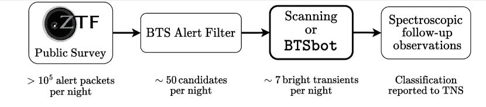

图 1：BTS 工作流程图。BTS 警报筛选器接收 ZTF 公共调查警报流，并使用上游工具如 braai 和 sgscore，去除虚假警报、暗源以及显然不是亮瞬态的源。通过视觉检查（“扫描”）从候选池中选择真正的亮瞬态；在本研究中，我们开发了一种基于机器学习的替代方法：BTSbot。所选的亮瞬态会接受光谱跟踪和分类，并迅速报告给公众。

BTS 目录可以在网上查看⁵⁵5[`sites.astro.caltech.edu/ztf/bts`](https://sites.astro.caltech.edu/ztf/bts)，并且实时更新。自 2018 年 5 月起，BTS 保持了相关源的光谱完整性（$95.4\%$⁶⁶6，计算方法是针对通过 BTS 警报筛选器且 $m_{\mathrm{peak}}\leq 18.5\,\mathrm{mag}$、具有良好的光曲线覆盖度且显示出 SN 类似光曲线或在 2018 年 5 月至 2023 年 9 月间的星系交叉匹配的源）。我们今后将采用这个值作为 BTS 样本的完整性。有关样本裁剪的详细定义，请参见 Perley 等（2020）。

BTS 促进了大量的科学研究，尤其包括迄今为止进行的一些最大的超新星群体研究（例如，Perley 等，2020；Irani 等，2022；Sharon & Kushnir，2022；Sollerman 等，2022；Rodríguez 等，2023；Cold & Hjorth，2023；Sharma 等，2023）。该调查还提供了独特的发现（例如，Goobar 等，2023；Yang 等，2021），并为使用超新星研究大尺度结构铺平了道路（Tsaprazi 等，2022）。

我们的新模型 BTSbot 通过进行二分类：亮瞬态 / 不亮瞬态，实现了 BTS 扫描和光谱跟踪的自动化。BTSbot 为输入的 ZTF Avro⁷⁷7[`avro.apache.org`](https://avro.apache.org) 警报包（Masci 等， 2019； Patterson 等， 2019）生成单位间隔的亮瞬态得分，并附加了一些自定义元数据特征。它被训练为仅对通过 BTS 警报筛选器的源（候选 BTS 源）中的警报运行，这些警报同样提供给扫描器。从图像切割和提取的特征中，BTSbot 必须同时区分瞬态和变星，并且在 $m>18.5\,\mathrm{mag}$ 时预测源是否会达到 $m_{\mathrm{peak}}\leq 18.5\,\mathrm{mag}$。

BTSbot 现已集成到 Kowalski（Duev et al., 2019; Coughlin et al., 2023）、ZTF 的第一方警报中介，以及 Fritz 中，BTSbot 已经进入了 BTS 工作流程。BTSbot 能够自动将源保存到 BTS 目录中，并有条件地触发 SEDM/SEDM-KP。BTSbot 加入了一个丰富的机器学习模型和自动化工具集合，这些工具是日常 BTS 操作的核心，包括 braai（Duev et al., 2019）、sgscore（Tachibana & Miller, 2018）、pySEDM（Rigault et al., 2019）和 SNIascore（Fremling et al., 2021）。这些工作流程共同产生了第一个完全自动检测、识别、光谱分类和公开报告的瞬态事件：SN 2023tyk（Rehemtulla et al., 2023b）。从首次检测到公开报告的光谱分类，过程中没有涉及人工操作。结合互补的机器学习模型可以实现维护 BTS 所需任务的大量自动化。这一过程的副作用是节省了原本用于重复且已知任务的时间，使得专家的时间和资源可以更好地分配。我们在 GitHub 上公开了 BTSbot 源代码和训练模型（[`github.com/nabeelre/BTSbot`](https://github.com/nabeelre/BTSbot)）。

## 2 训练数据

机器学习模型训练集的质量是决定其性能的关键因素。机器学习模型，尤其是像 BTSbot 这样的深度学习模型，在遇到与其训练数据不同的数据时，表现得不稳定（Szegedy et al., 2013; Hendrycks & Gimpel, 2016）。因此，模型的训练集必须充分代表模型的输入领域。BTSbot 的领域是来自 BTS 候选者的 ZTF 警报。这些警报来自 SNe、AGN、CVs、VarStars、非常近的系统中的新星以及少量其他杂项事件，包括许多类型的虚假警报（例如，由于图像减法不良、高 Proper motion 星体、饱和星等）。我们通过从多个库中抽取数据，编制了一个广泛的 ZTF 标识符（ZTF-IDs）列表，以涵盖这些类别中的源。通过这些选择，我们充分代表了 BTSbot 在生产中接触到的各种天体物理现象。

BTS 样本浏览器的内部版本是我们初始 ZTF-IDs 列表中最重要的贡献者。这个内部 BTS 样本浏览器的操作方式与 Perley et al. 2020 附录 F 中展示的公众版本完全相同，但它增加了来自内部 ZTF 目录的信息。其中一个目录是通过扫描几乎与 BTS 警报过滤器相同的警报过滤器，但该过滤器经过修改，以包括$19<m_{\mathrm{peak}}\,[\mathrm{mag}]<19.8$的源来组装的。虽然这些不严格是 BTS 候选者，但我们允许它们进入训练集，以增加微弱警报的数量。

我们通过三个查询从这些目录中提取数据。第一个查询简称为“trues”，选择明亮的（$m_{\mathrm{peak}}\leq 18.5\,\mathrm{mag}$）光谱确认的外星际瞬态，这些瞬态通过了纯度筛选（即具有银河系交叉匹配或类似超新星的光变曲线，详见 Perley 等 2020 的第 2.4 节）。这些明亮的确认瞬态构成了我们训练集的全部正例/真实类别。第二个查询简称为“vars”，选择在任何内部 BTS 目录中被分类为 AGN、CV 或类星体（QSO）的任何源。这些源都被认为是非瞬态或非外星际的，因此无论其峰值亮度如何，都属于负例/虚假类别。第三个查询简称为“dims”，选择任何通过了纯度筛选并具有峰前和峰后光变曲线覆盖（见 Perley 等 2020 的第 2.3 节的覆盖定义）且$m_{\mathrm{peak}}>18.5\,\mathrm{mag}$的源。这一查询旨在广泛选择暗淡的超新星，这些超新星由于其峰值亮度，属于负例类别。dims 查询主要以超新星为主，但也包括少量其他源，如潮汐破坏事件、CVs、小行星、变星等。添加峰前和峰后光变曲线覆盖的要求是为了避免选择那些在峰值附近光度覆盖差的明亮超新星，这些超新星可能会被错误地认为具有更暗的峰值亮度。由于 BTS 样本探测器上展示的峰值亮度是仅从公开数据计算的，因此有一小部分源由于合作数据的警报，具有$m_{\mathrm{peak}}\leq 18.5\,\mathrm{mag}$但出现在 dims 中。这些源都被完全从训练集中移除，因为它们中的许多尚未分类。这些源在测试划分公布后被识别出来，因此为了保持相同的划分，它们在进行训练/验证/测试划分后被移除。根据定义，vars 和 dims 都与 trues 不重叠，但由于 vars 和 dims 选择的不完美性，二者之间存在一些重叠。重叠中的源从 dims 中移除，只保留在 vars 中。

从 BTS 样本浏览器查询的任何源曾被人工扫描仪标记为亮瞬态。虽然我们确实建立了一个由人工扫描仪保存的大量非亮瞬态列表，但仍有一部分 BTS 候选源从未被保存。我们的第四个查询，简称为“拒绝”，代表了这些源。此列表仅限于在 2021 年 1 月 1 日和 2023 年 1 月 1 日之间通过 BTS 警报过滤器的源。2021 年 1 月 1 日之前的许多候选源遇到了早期版本的 BTS 警报过滤器，该过滤器在 2020 年底进行了最后一次改进；2023 年 1 月 1 日之后的许多候选源在查询时仍在演变，因此类型可能存在不确定性。通过不保存这些源，扫描仪隐含地将这些源标记为非亮瞬态，因此成为我们的负类。鉴于 BTS 的极高光度完整性，这一假设是合理的。拒绝列表中的极小部分源可能是亮瞬态，并向我们的训练集注入少量标签噪声，但我们发现这一效果，如果存在的话，足够小以至于可以忽略。

还有一个额外的 BTS 候选源群体，我们在训练集中没有包含：简称为“垃圾”。这些源经常通过 BTS 警报过滤器，扫描仪已识别出这些源显然不是亮瞬态。它们主要是 AGN 和 VarStars，但也包括较少数量的高自行运动恒星和长寿命 CVs。用这些源训练的实验通常比排除了这些源的等效模型表现更差。其他查询选择的一些源也被列入垃圾；这些源仍保留在其他查询中，并未与其他垃圾源一起移除。

一旦我们获得了 ZTF-IDs 及其对应的标签，我们就会查询 Kowalski 以检索每个源的所有警报数据包。BTS 仅使用 ZTF 公共调查的数据，但我们包括合作时间的数据以增加训练集的大小。我们将每个警报数据包的科学、参考和差异图像剪裁排列成$63\times 63\times 3$的图像，或称为三元组。图像剪裁经过 Euclidean-normalization¹⁰¹⁰10，也称为$L^{2}$-normalization. 单独进行归一化处理；掩蔽区域的像素均赋值为 0；小于$63\times 63$的剪裁（由于靠近 CCD 边缘）用值为$10^{-9}$的像素填充到$63\times 63$。此图像预处理与 braai 的处理相同（Duev 等，2019）。一些剪裁的像素值被均匀设置为 NaN 或零。这些剪裁被认为是损坏的，任何具有损坏剪裁的警报都会被移除。此阶段训练集中警报和源的分布见表 1 中的初始查询标题下。

表 1：清理前后训练集大小

| 查询名称 | 源数量 | 警报数量 |
| --- | --- | --- |
| 初始查询 |
| trues^a^a 光谱学确认的明亮（$m_{\mathrm{peak}}\,\leq\,18.5\,\mathrm{mag}$）外星际瞬变。 | 5,212 | 308,934 |
| vars^b^b 被分类为 AGN、CVs、变星或 QSOs 的源。 | 1,127 | 150,017 |
| dims^c^c 暗（$m_{\mathrm{peak}}\,>\,18.5\,\mathrm{mag}$）源具有瞬变类似光变曲线。 | 8,979 | 249,087 |
| rejects^d^d 未被 BTS 扫描器标记为明亮外星际瞬变的源。 | 4,417 | 407,357 |
| 总计 | 19,735 | 1,115,395 |
| 清理后的训练集 |
| trues^a^a 光谱学确认的明亮（$m_{\mathrm{peak}}\,\leq\,18.5\,\mathrm{mag}$）外星际瞬变。 | 5,206 | 264,317 |
| vars^b^b 被分类为 AGN、CVs、变星或 QSOs 的源。 | 1,126 | 109,934 |
| dims^c^c 暗（$m_{\mathrm{peak}}\,>\,18.5\,\mathrm{mag}$）源具有瞬变类似光变曲线。 | 8,824 | 223,934 |
| rejects^d^d 未被 BTS 扫描器标记为明亮外星际瞬变的源。 | 4,402 | 241,478 |
| 总计 | 19,558 | 839,663 |

注。 — 如果警报（i）具有损坏的图像剪裁；（ii）来自标签模糊的源；（iii）缺少 Pan-STARRS1 交叉匹配信息；（iv）是$i$波段观测；（v）具有负差异图像；或（vi）来自参考图像中存在瞬变的源，则会从训练集中移除警报。

图 2：自定义元数据特性定义，描述了 ZTF20acjlkpe 的光曲线。青色（$g$-band）和红色（$r$-band）圆圈表示检测。days_to_peak（紫色）、days_since_peak（绿色）、age（海军蓝）、peakmag_so_far（上方虚线灰色）和 maxmag_so_far（下方虚线灰色）用于最新检测。所有这些特性为 BTSbot 提供了光曲线阶段和形状的简化信息（以橙色线条显示，假设 maxmag_so_far 对应于第一次检测）。

我们接着用自定义元数据特性增强警报数据包，这些特性在 ZTF Avro 警报数据包中并不存在：days_to_peak、days_since_peak、age、peakmag_so_far、maxmag_so_far 和 nnondet。特性 days_to_peak 编码了从第一次警报到当前警报中亮度最亮的警报之间的天数。紧密相关的是 days_since_peak，它表示从当前警报到亮度最亮的警报之间的天数。这些数量的总和即为 age。特性 peakmag_so_far 和 maxmag_so_far 编码了此来源迄今为止所有警报数据包中的最亮和最暗的亮度；peakmag_so_far 对于正确分类 SNe 的晚期警报尤其重要，因为否则 BTSbot 几乎没有关于来源亮度历史的信息。这些特性在图 2 的示例光曲线上展示。它们显然不能完美恢复光曲线，但由于其简洁性和在各种光曲线中的有效性而被采用。我们发现，通过这些特性向 BTSbot 提供有关来源当前阶段和光曲线粗略形状的高级信息，可以显著提升性能。许多方法可以更真实地表示 SNe 光曲线，但许多方法无法模拟 BTSbot 领域中其他来源的光曲线，例如 AGN、变星等。值得注意的是，这些特性可以为检测次数少至一次或仅在一个光度滤光带中检测到的所有来源定义。可以通过将这些特性解耦为依赖于光度滤光带的等效特性来从光曲线中提取更多信息，但这会导致警报实例缺少特性，可能会影响模型的性能。最后，特性 nnondet 是对来源位置非检测次数的估计。此特性曾在 ALeRCE 实时标记分类器（Carrasco-Davis et al., 2021）中使用，并发现对区分五类警报具有重要作用；我们发现，包含它同样能提升 BTSbot 的性能。

所有这些特征都是从每个警报包的视角计算的，即仅使用在警报包创建时已经可用的信息，包括来自每个源通过 BTS 警报过滤器之前的警报。此外，一些警报是在 braai 的最新版本投入生产之前创建的，因此有来自过时版本的 braai 的深度真实-虚假分数（drb）或根本没有 drb。我们重新运行所有警报包通过 d6_m9 版本的 braai，并用这些新分数替换所有 drb 分数。

接下来，我们通过一系列筛选清理我们的训练集。首先，我们移除来自$i$带观测的警报和带有负差异图像的警报。$i$带警报主要被移除，因为 BTS 使用的是 ZTF 公共调查数据，而 ZTF 仅在$g$带和$r$带进行观测。负差异图像是通过 ZTF 警报包中包含的 isdiffpos 标志识别的。带有负差异图像的警报被移除，因为它们通常代表参考图像中可见的 SNe 或其他瞬态，这种配置与典型警报不同。作为额外的预防措施，我们编制了一个包含参考图像中 SNe 的源列表，并将这些源从训练集中移除。此外，有些源不符合我们的任何一个类别，或同时符合两个类别，因此也被从训练集中移除。例如，ZTF18abdiasx 似乎是一个明亮的超新星投影在一个 AGN 上，因此符合我们的两个类别，所以从训练集中移除。一些我们选择包含的元数据特征引用了 Pan-STARRS1 目录（PS1; Kaiser 等，2002）：sgscore{1,2}和 distpsnr{1,2}。当某个 ZTF 警报附近 30 角秒内没有 PS1 源时，这些特征被设置为$-999$。我们移除所有在这四个字段中有$-999$的警报。表 1 显示了在清理后的训练集阶段源和警报的计数。虽然这四个查询在清理过程中都丢失了一些警报，但拒绝查询丢失了超过$150,000$个警报。这$150,000$个警报几乎都是负差异图像警报，这些警报来源于双星、AGN 和高 proper motion 星体等源。

我们采用标准做法将完整的训练集划分为训练、验证和测试集。我们将来源随机分配到这些分集中，概率分别为 81%、9%和 10%¹¹¹¹1190%的训练数据在开发过程中被模型看到，剩余的 10%在超参数确定之前保持隐藏。这种划分是基于来源而不是警报，以防任何来源在多个分集中出现警报，这样会产生验证和测试偏差，从而高估模型的真实性能。

图 3 说明，如预期的那样，每个来源的警报数量在四个不同的查询中是可变的。一些 AGN 的警报数量超过$10^{3}$，而一些超新星的警报数量少至两个。我们通过定义一个超参数$N_{\mathrm{max}}$来纠正这种不平衡：训练集中每个来源允许的最大警报数量。具有超过$N_{\mathrm{max}}$个警报的来源将会移除部分警报，而具有$N_{\mathrm{max}}$个或更少警报的来源将保持不变。

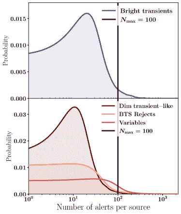

图 3：高斯核密度估计显示了每个查询中每个来源的警报数量，这些查询包含我们的清理后的训练集。顶部：正类示例；底部：负类示例。具有大量警报的来源被减少到每个来源$N_{\mathrm{max}}=100$个警报。这可以防止像 AGN（在变量中）和明亮的超新星（在明亮瞬态中）这样的长期存在的来源在训练中被过度表示。

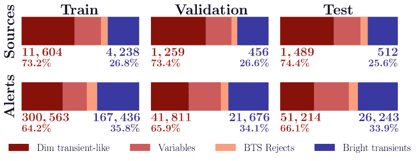

图 4：条形图显示了来自 4 个查询的来源和警报的分布，分为训练/验证/测试（81%/9%/10%）三个部分。某些来源的警报数量设有上限，多余的警报会被移除。我们的训练集是不平衡的，偏向非 BTS 来源约为 3:1，偏向非 BTS 警报约为 2:1。

我们根据警报的来源查询和它们所在的拆分，应用 $N_{\mathrm{max}}$ 警报稀疏处理。对于来自 trues、dims 和 rejects 查询的源（其中许多是银河系或外银河系瞬态），我们希望 BTSbot 在它们演变的所有阶段学习和识别它们的属性，因此我们采取简单的均匀随机选择 $N_{\mathrm{max}}$ 个警报来保留其余警报则全部丢弃。剩余的警报在这些瞬态的上升、峰值和衰退阶段大致均匀分布¹²¹²12 瞬态的观测覆盖通常在峰值附近更大，因此这种简单的随机选择会稍微倾向于去除接近峰值的警报。如果我们尝试纠正这一点，结果不会有显著不同。对于 vars 查询中的源，我们仅保留最新的 $N_{\mathrm{max}}$ 个警报。长寿命源的元数据在现在与几年前相比显得系统性不同。例如，AGN 通常在 ZTF 开始时首次被探测到，并且此后一直被重复探测。这些新到的来自 AGN 的警报，即 BTSbot 在生产过程中将遇到的警报，通常具有非常大的 age 和 ndethist（大致上是先前探测的数量），但那些接近首次探测时的警报将具有更小的 age 和 ndethist。通过选择最新的 $N_{\mathrm{max}}$ 个警报，我们捕捉到那些最能代表今天 BTS 候选者的警报，并避免了会显著恶化 BTSbot 在生产中的表现的数据偏移。BTSbot 的早期版本对 vars 源使用了随机的 $N_{\mathrm{max}}$ 稀疏处理，导致性能明显更差。我们发现最优值为 $N_{\mathrm{max}}=100$（详见第 3.1 节）。

vars 中的 CVs 是类似于 trues 和 dims 中源的瞬态，我们希望捕捉它们演变的所有阶段的警报，而不仅仅是晚期。选择来自 vars 源的最新 $N_{\mathrm{max}}=100$ 个警报不会显著影响我们对 CV 演变的覆盖，因为大多数 CV 变化非常迅速，警报数量少于 $N_{\mathrm{max}}=100$，因此它们通常不会进行任何稀疏处理。

训练集中的所有查询源经过$N_{\mathrm{max}}$警报稀疏处理，以避免过度代表性问题。然而，在验证集和测试集中，只有来自 vars 查询的源会进行警报稀疏处理。其他源则保留原样，因为（i）过度代表性不是问题，以及（ii）我们需要这些源的所有警报，以最准确地测量 BTSbot 预测的完整性和纯度。我们在验证集和测试集中的 vars 源中保持警报稀疏处理，因为这些长期存在的 AGN 的非常旧的警报与现在的扫描结果不一样。

图 4 显示了每个拆分中源和警报的数量，以及在应用所有切割和稀疏处理后它们来源的查询。我们的两个类别略微不平衡：约 35%的 BTS 警报和约 65%的非 BTS 警报。我们在第三部分中讨论了缓解类别不平衡影响的技术。总的来说，我们的生产训练集包含来自$19\mathrm{,}558$个源的$608\mathrm{,}943$个警报，总计$>$60 GB。尽管 BTSbot 的领域相对狭窄，但这比具有类似架构的其他模型的警报数量要多得多，例如 ALeRCE 印记分类器（约 52,000；Carrasco-Davis et al., 2021）和 ACAI 模型（约 200,000；Duev & van der Walt, 2021）。

## 3 BTSbot 的范围、架构与训练

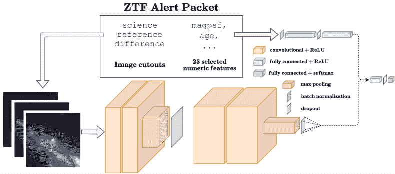

图 5：我们的多模态卷积神经网络 BTSbot 的示意图，执行亮的星系外瞬态/不亮的星系外瞬态的二分类任务，处理 ZTF 警报数据包。图像输入通过卷积分支处理，然后被展平为 1D 向量，并与元数据分支中密集层的输出连接。在另一个密集层之后，单神经元层生成最终预测：一个单位区间的亮瞬态分数。

我们的 MM-CNN，BTSbot，通过为每个 ZTF 警报包分配一个亮度瞬变评分来自动识别 BTS 的来源。图 5 展示了输入如何被送入 BTSbot，以及信息如何结合生成输出评分；BTSbot 包含三个主要组件。 (1) 卷积分支将科学、参考和差异裁剪处理为一个三通道图像，使用类似 VGG 的架构（Simonyan & Zisserman，2014）。 (2) 元数据分支通过一个批量归一化层和两个全连接层处理 25 个提取的特征（见表 4）。 (3) 结合部分将两个分支的输出连接起来，并通过另外两个全连接层，第二个全连接层使用 softmax 激活函数生成预测。输出是一个单位区间评分，其中较高的评分表示对输入警报包中来源是或将成为亮亮的外星瞬变的信心增加。每层的参数见表 2。除了最后一层，所有的激活函数都是整流线性单元（ReLU；Nair & Hinton，2010），且所有卷积层都具有对称的单位步幅和相同的填充。 |

表 2: BTSbot 层配置

| 层类型 | 层参数 | 超参数搜索范围 |
| --- | --- | --- |
| 卷积分支 |  |
| 2D 卷积 | 32 个滤波器，$5\times 5$ 内核 | 8 – 128 个滤波器^a^a 所有 2D 卷积（Conv.）层具有相同的滤波器数量和内核大小搜索范围。 |
| 2D 卷积 | 32 个滤波器，$5\times 5$ 内核 | [3, 5, 7] 内核大小^a^a 所有 2D 卷积（Conv.）层具有相同的滤波器数量和内核大小搜索范围。 |
| 最大池化 | $2\times 2$ 内核 | - |
| Dropout | 0.50 | 0.1 – 0.8 |
| 2D 卷积 | 64 个滤波器，$5\times 5$ 内核 | 8 – 128 个滤波器^a^a 所有 2D 卷积（Conv.）层具有相同的滤波器数量和内核大小搜索范围。 |
| 2D 卷积 | 64 个滤波器，$5\times 5$ 内核 | [3, 5, 7] 内核大小^a^a 所有 2D 卷积（Conv.）层具有相同的滤波器数量和内核大小搜索范围。 |
| 最大池化 | $4\times 4$ 内核 | - |
| Dropout | 0.55 | 0.1 – 0.8 |
| 元数据分支 |  |
| 批量归一化 | - | - |
| 全连接 | 128 单元 | 32 – 256 单元 |
| Dropout | 0.25 | 0.1 – 0.8 |
| 密集层 | 128 个单元 | 32 – 256 个单元 |
| 综合部分 |  |
| 密集层 | 8 个单元 | 8 – 128 个单元 |
| Dropout | 0.20 | 0.1 – 0.8 |
| 密集层 | 1 个单元 | - |

注意。— 图像和元数据通过各自的分支传递，并且这两个分支的输出被拼接在一起，然后发送到综合分支。包含了 Dropout 和批归一化（batch norm.）层以进行正则化。

选择 MM-CNN 是因为图像和提取的特征提供了互补的信息，用于执行我们的任务。例如，提取的特征 distpsnr1 代表与此 ZTF 源最近的 PS1 编目源的角距离，而 sgscore1 代表这个 PS1 源的星系评分（Tachibana & Miller, 2018）。虽然 PS1 中不存在新的瞬变，但超新星（SNe）的宿主星系通常存在。因此，来自 SNe 的警报通常具有适中的 distpsnr1 和较小的 sgscore1 值，表示源附近存在一个星系。大多数 AGN 和通过 BTS 警报过滤器的某些 CVs 已在 PS1 中编目，因此它们的 distpsnr1 非常接近零。图像也提供了类似启发式的关键信息。明亮的 SNe 倾向于与突出的（明亮且角尺寸大的）离中心扩展源及其宿主星系相关联；暗淡的 SNe 倾向于具有不那么突出的宿主星系，因为它们通常距离更远；AGN 会表现为正好居中的扩展源；CVs 经常会出现被许多明亮的点源包围，因为它们通常发生在银河平面附近的许多其他恒星周围。Carrasco-Davis 等人（2021）详细描述了如何使用 ZTF 图像裁剪和元数据区分 AGN、SNe 和 VarStars。MM-CNN 能够从所有输入类型中汇总信息，并在进行预测时一起考虑这些信息。我们还在附录 B 中实验了与 BTSbot 的单模态替代方案。

鉴于 BTSbot 的范围和架构，我们遇到了一些挑战。首先，我们要求 BTSbot 学习多个复杂的分离任务。BTSbot 必须学习在不使用红移信息的情况下将超新星（SNe）与其他来源区分开来，因为红移信息并不总是事先已知。它还必须学会在有限的时间序列信息下识别亮度超新星，无论超新星当前的阶段如何。一个亮度超新星在升起初期或褪色晚期可能看起来与接近峰值的暗淡超新星非常相似。此外，BTSbot 没有明确的信息说明 BTS 阈值为 18.5 等。这意味着，它必须通过超新星峰值光度的连续分布来学习这一阈值的位置。最后，BTSbot 没有直接访问完整光变曲线的信息，即每个之前单独检测的详细信息。相反，它只能访问我们从完整光变曲线中计算出的基本自定义元数据特征。我们省略了完整光变曲线的信息，部分原因是文献中没有建立适合输入神经网络的方式来表示我们模型遇到的各种部分光变曲线。虽然有很多工作专门针对超新星完成了这方面的任务（例如，Villar 等，2020），但这些方法并不适用于 BTSbot 遇到的所有类型的来源。这一选择支持将 BTSbot 调优为能够非常快速地识别星系外瞬态事件，可能在其首次检测时就完成，相关内容在第 5.3 节中进行了探讨。

### 3.1 训练与超参数优化

BTSbot 使用 TensorFlow（Abadi 等，2015）和 Keras API（Chollet 等，2015）实现。我们采用 Adam 优化器（Kingma & Ba，2014）和二元交叉熵损失函数。除了通过 $N_{\mathrm{max}}$ 减少源的警报（见第二部分），我们还使用多种训练技术来缓解过拟合。我们使用数据增强技术，在图像切片上执行 0^∘、90^∘、180^∘ 和 270^∘ 的随机旋转，以及随机的水平和垂直翻转。这些方法还有助于确保 BTSbot 对这些变换保持不变。我们通过输入警报类别的相对大小的倒数来加权损失函数的贡献（即，BTS 警报的误分类比非 BTS 警报的误分类贡献更多的损失）。该大小通过训练集中每个类别的警报数量计算得出，但我们也尝试根据每个类别的源数量来计算这些权重。学习率 $\alpha$ 在 20 个周期后若无改进的验证损失则减少，训练在 75 个周期后若无改进的验证损失则终止。

表 3：BTSbot 超参数

| 参数名称 | 优化值 | 超参数搜索范围 |
| --- | --- | --- |
| batch size | 64 | 8 – 64 |
| Adam $\beta_{1}$ | 0.99 | 0.81 – 0.999 |
| Adam $\beta_{2}$ | 0.99 | 0.9 – 0.9999 |
| 学习率 ($\alpha$) | $10^{-4}$ | $10^{-2}$ – $5\times 10^{-6}$ |
| $\alpha$ 减少因子 | $0.4$ | 0.25 – 0.75 |
| $\alpha_{\mathrm{min}}$ | $5\times 10^{-10}$ | $10^{-10}$ – $10^{-5}$ |
| $N_{\mathrm{max}}$ | 100 | 1 – $\infty$ |

表 4：BTSbot 元数据特征

| 特征名称 | 定义 [单位] |
| --- | --- |
| 警报包元数据 |
| sgscore{1,2} | 最接近的两个 PS1 源的星体/星系评分 |
| distpsnr{1,2} | 距离最近的两个 PS1 源 [弧秒] |
| fwhm | 半最大宽度 [像素] |
| magpsf | PSF 拟合光度的幅度 [mag] |
| sigmapsf | magpsf 的 1-$\sigma$ 不确定性 [mag] |
| chipsf | PSF 拟合的减小 $\chi^{2}$ |
| ra | 源的右升交角 [度] |
| dec | 源的赤纬 [度] |
| diffmaglim | 5-$\sigma$ 光度检测阈值 [mag] |
| ndethist | 源的先前检测次数 |
| nmtchps | $\#$ 在 30 弧秒内的 PS1 交叉匹配 |
| drb | 基于深度学习的真/虚评分 |
| ncovhist | $\#$ 次数源在一个领域和读取通道上 |
| chinr | 参考中最接近源的 $\chi$ 参数 |
| sharpnr | 参考中最接近源的锐度参数 |
| scorr | 检测图像中的峰值像素 S/N |
| sky | 局部天空背景估计 [DN] |
| 自定义元数据 |
| days_since_peak | 从最亮警报以来的时间 [天] |
| days_to_peak | 从第一次到最亮警报的时间 [天] |
| age | days_since_peak + days_to_peak |
| peakmag_so_far | 来源的最小 magpsf 迄今为止 [mag] |
| maxmag_so_far | 来源的最大 magpsf 迄今为止 [mag] |
| nnondet^a^aAdopted from Carrasco-Davis et al. (2021). | ncovhist - ndethist |

注 — 传入 BTSbot 元数据分支的 25 个元数据特征。警报包特征的完整定义可以在 [`zwickytransientfacility.github.io/ztf-avro-alert/schema.html`](https://zwickytransientfacility.github.io/ztf-avro-alert/schema.html) 找到。

我们利用 Weights and Biases 平台（Biewald，2020）执行多个广泛的贝叶斯超参数搜索。贝叶斯超参数搜索通过利用先前超参数输入与对应训练模型在指定指标中的表现之间的相关性，智能地指导在大规模超参数网格中进行搜索。这预计比传统的网格搜索更为高效，因为例如，贝叶斯搜索可以学会避免那些经常产生表现较差模型的超参数空间区域。我们为 BTSbot 层找到最佳的超参数配置（见表 2），选择的元数据特征（见表 4），以及其他值（见表 3）。表 2 和 3 还包括我们搜索中每个超参数的值范围。对哪些警报包元数据特征应提供给 BTSbot 的搜索包含许多其他特征，我们发现这些特征并未提高性能：sgscore3，distpsnr3，fid，maggaia，neargaia，magdiff，magap，sigmaap，magapbig，sigmaapbig，magnr，ssnrms，dsnrms，seeratio，nneg，magzpsci，jdstarthist 和 classtar。

## 4 BTSbot 性能及与人工扫描仪的比较

### 4.1 在测试集上的表现

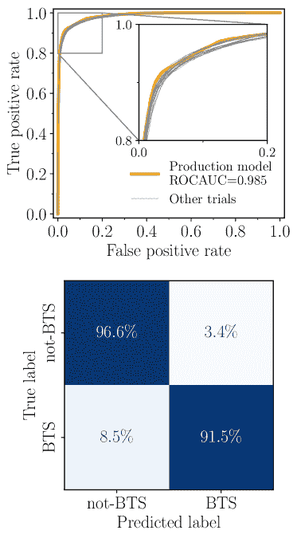

图 6：BTSbot 生产模型及其他 19 次不同初始化的试验的 ROC 曲线（上）和混淆矩阵（下）。上：生产 BTSbot 模型（橙色曲线）和其他 19 次试验（灰色曲线）产生了非常相似的 ROC 曲线和 ROCAUC，表明 BTSbot 的优异性能对不同初始化具有鲁棒性。下：生产模型的混淆矩阵清楚地表明，BTSbot 的 TN 率（左上象限）高于 TP 率（右下象限）。我们发现，权衡 TP 率以提高 TN 率的模型往往在其他关键性能指标上有所改善。

为了表征 BTSbot 的可泛化性能，我们在测试数据上呈现了性能指标。我们使用相同的最佳超参数和不同的模型可学习参数的随机初始化进行了 20 次 BTSbot 的训练。选择表现最佳的测试数据的试验作为生产模型。报告了所选生产模型的性能指标以及 20 次试验的指标中位数，其中不确定性表示指标的 1-$\sigma$范围。

最终的 BTSbot 模型在测试中的准确率为$94.1\%\pm 0.28$，生产模型的准确率为$94.9\%$。图 6 的上半部分展示了 BTSbot 的接收操作特性（ROC）曲线。ROC 曲线可视化了在不同分类阈值下的真正例和假正例的平衡，ROC 曲线下面积（ROCAUC）通常用作分类器性能的总结统计量。完美的分类器 ROC 曲线的 ROCAUC 等于 1，而 ROCAUC=0.5 对应于随机猜测（在平衡数据集上）。最终的 BTSbot 模型的 ROCAUC 为$0.984\pm 0.001$，生产模型的 ROCAUC 为$0.985$。生产模型和其他 19 次试验的结果非常相似，表明 BTSbot 在不同初始化下的性能稳定。图 6 的下半部分展示了生产模型的混淆矩阵。二分类器的混淆矩阵可视化了四种分类结果的频率：真正例（$\mathrm{TN}$）、假正例（$\mathrm{FP}$）、假负例（$\mathrm{FN}$）和真负例（$\mathrm{TP}$）。生产模型在非 BTS 警报上的准确率（TN 率）高于 BTS 警报上的准确率（TP 率）。我们可以尝试训练 BTSbot 以更好地平衡 TP 和 TN 率，例如通过调整类别权重，但我们发现倾向于 TN 率的模型整体表现更好。

尽管我们在传统的机器学习性能指标上表现出色，但这些指标未必能代表 BTSbot 在实际应用中的表现。由于 BTSbot 根据警报包（基于警报的分类）生成评分，但必须选择源进行跟进（基于源的分类），我们必须定义从警报预测序列到源预测的映射。我们将这些映射称为“策略”，我们定义它们类似于 BTS 扫描仪在决定是否保存一个源并请求其光谱时使用的标准。通过对 BTS 候选对象模拟我们的策略，我们可以计算出能够真实反映 BTSbot 作为扫描仪表现的性能指标。此外，我们还可以将结果与人工扫描仪进行比较，以便将 BTSbot 的表现进行背景化。

我们定义了两种策略，它们紧密模拟人类扫描的类似策略：bts_p1 和 bts_p2。策略 bts_p1 要求一个源在被保存并发送优先级为 1 的 SEDM 触发信号之前，必须至少有两个警报，其亮度瞬态分数高（$\geq 0.5$）且 $\texttt{magpsf}\leq 19~{}\mathrm{mag}$。策略 bts_p2 要求一个源符合 bts_p1 的要求，并且在发送优先级为 2 的触发信号之前，至少有一个警报的 $\texttt{magpsf}\leq 18.5~{}\mathrm{mag}$。优先级是发送给 SEDM 的请求的参数，较大的值表示请求更为紧急。通常，优先级较高的请求会优先处理，尽管其他因素，例如可观测性，也会被考虑在内。大多数 BTS 扫描器发送的跟进请求都是优先级 1 或 2，优先级 2 及更高通常保留给已经达到 $m_{\mathrm{peak}}\leq 18.5~{}\mathrm{mag}$ 的源。

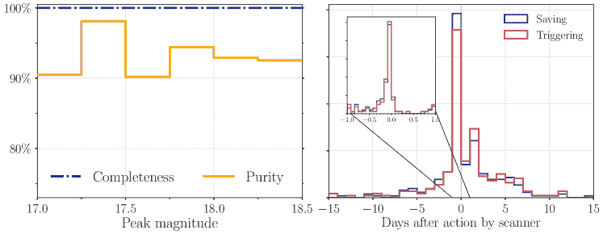

图 7：BTSbot 行动的完整性和纯度（左）以及与人类扫描器的速度比较（右）在我们测试分割中的源。左侧：完整性曲线（虚线点状深蓝色）在所有区间中均为 100%。BTSbot 的完美完整性有助于 BTS 的科学工作，这些工作需要高度完整、无偏的样本。纯度曲线（实线橙色）的微小变化是由于样本量小造成的。bts_p1 和 bts_p2 的整体纯度分别为 84.6% 和 93.0%。bts_p1 由于来自 $m_{\mathrm{peak}}$ 略大于 18.5 mag 的超新星而额外受污染，这些源是适合进行光谱观测的目标。右侧：比较 BTSbot 在保存（蓝色）和触发（红色）方面的速度与扫描器的直方图。两个分布的峰值都非常接近零，表明 BTSbot 在处理新的明亮瞬态时速度与人类扫描器一样快。

我们通过完整性、纯度、$\Delta t_{\mathrm{save}}$和$\Delta t_{\mathrm{trigger}}$来量化这些策略的性能。完整性（或“召回率”）是策略正确分类的明亮瞬态的比例：$\mathrm{TP}/(\mathrm{TP}+\mathrm{FN})$。bts_p1 和 bts_p2 的完整性相同，因此我们报告这两个策略的单一值。纯度（或“精准度”）是预测为明亮瞬态的比例中实际为明亮瞬态的比例：$\mathrm{TP}/(\mathrm{TP}+\mathrm{FP})$。$\Delta t_{\mathrm{save/trigger}}$是 BTSbot 在某源上保存和触发的朱利安日期（$\mathrm{JD}$）与扫描器在相同源上做出相同操作时的$\mathrm{JD}$之间的差异。扫描器的$\mathrm{JD}$从 Fritz 中查询，涵盖所有真实集合中的源（参见第二部分）。2021 年 1 月 1 日之前保存的源被排除在这次分析之外，因为其中许多源是使用 GROWTH Marshal（Kasliwal 等，2019）扫描的，因此在 Fritz 上可用的保存和触发$\mathrm{JD}$不可靠。对于保存，我们使用扫描器将源添加到 Fritz 上的 BTS 目录时的$\mathrm{JD}$。对于触发，我们仅考虑在上传第一个光谱到 Fritz 之前发送了 SEDM 积分场单元（IFU）请求的源。用于比较的$\mathrm{JD}$是创建第一个 IFU 跟进请求时的$\mathrm{JD}$。应用此限制是因为其他 BTS 用于分类的设施无法提供扫描器决定触发的时间。BTSbot 对某源的保存和触发的$\mathrm{JD}$是与首次使该源符合 bts_p1 的警报相关联的$\mathrm{JD}$。BTSbot 的$\mathrm{JD}$对应于任一策略，但我们选择 bts_p1，因为它使得与扫描器的比较更为直接。

在计算这些策略的完整性和纯度时，我们进行了两个额外的小调整。首先，测试集中的 70 个源也出现在垃圾分类中（参见第二部分）。该目录列出了那些明确不是明亮瞬态的源，这些源通常会通过 BTS 警报过滤器。在扫描时，这些源通常被隐藏，不会被考虑保存或触发；它们被排除在完整性和纯度计算之外。我们还识别出 59 个源，这些源在清理调整后只剩下一个警报（参见第二部分）。这些源将永远无法通过任何策略，因此也被排除在完整性和纯度计算之外。

我们使用扫描仪的完整性、纯度和速度估计值作为评估 BTSbot 性能的基准。我们根据 Perley 等人（2020）在表 1 和第三部分中提供的值，计算了扫描仪保存亮瞬态的完整性的下限，给出了 99.6%的完整性。计算 BTS 扫描仪在保存或触发亮瞬态时的纯度并不简单。扫描仪通常会故意作用于它们知道不会达到$m_{\mathrm{peak}}\,\leq\,18.5\,\mathrm{mag}$的瞬态，这些源虽然不是“亮”的瞬态，但仍然对 BTS 及 BTS 中的个人感兴趣。因此，简单估算扫描仪的亮瞬态纯度会低估其仅选择亮瞬态的能力。相反，我们估算了它们选择任何星系际瞬态和拒绝其他源的保存和触发纯度。我们将分析限制在$2460175.5<\mathrm{JD}<2460216.5$之间的保存和触发（详见第 4.2 节对 JD 范围的解释）。在此期间，扫描仪将 266 个源保存到主内部 BTS 目录中，其中只有 4 个不是星系际瞬态：$98.5\%$的扫描仪保存纯度。类似地，扫描仪为 327 个独特源发送了 SEDM IFU，其中 11 个是非星系际瞬态：$96.7\%$的扫描仪触发纯度。此外，扫描仪对$m_{\mathrm{peak}}>18.5~{}\mathrm{mag}$的瞬态进行保存和触发会使得$\Delta t_{\mathrm{save/trigger}}$的估算变得复杂。扫描仪会稍微更快地保存和触发瞬态，因为它们不需要等待瞬态明确表明它将很快有$m_{\mathrm{peak}}\leq 18.5~{}\mathrm{mag}$。此外，BTS 扫描仪偶尔通过与其他调查或其他 ZTF 警报代理商合作的扫描仪的 TNS 报告来帮助识别亮瞬态。因此，$\Delta t_{\mathrm{save/trigger}}$的比较不会完全直接，但我们仍然将其作为 BTSbot 速度的基本基准。

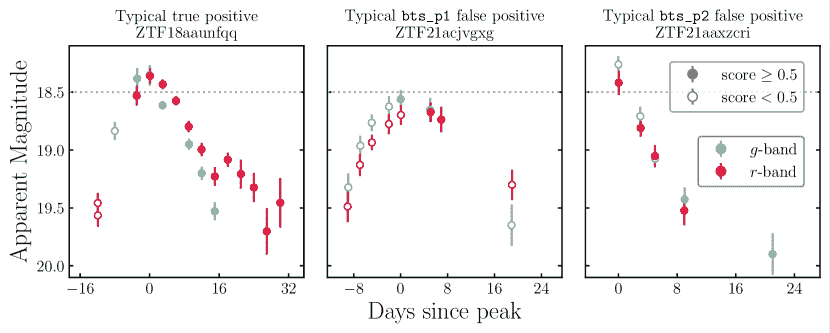

图 8: 三个源的光变曲线，描绘了 BTSbot 分数的典型演变。青色（$g$-带）和红色（$r$-带）点表示检测，填充和空心圆分别代表获得分数$\geq 0.5$和$<0.5$的警报。左侧：TPs 可能在仍然暗淡时分数较低，但一旦接近 18.5 mag 阈值（虚线灰色线），分数会增加。随着光度显著低于峰值亮度，分数保持高水平，这部分是由于自定义元数据特征提供的信息。中间：几乎所有 bts_p1 的 FPs 都是暗淡（$m_{\mathrm{peak}}>18.5\,\mathrm{mag}$）的短暂现象，其警报在接近 BTS 阈值时会获得高分。右侧：许多 bts_p2 的 FPs 是 CVs，通过将分数阈值提高到$0.8$，可以更好地排除它们。

图 7 的左侧面板展示了 BTSbot 在我们的政策下，根据峰值亮度的完整性和纯度。完整性曲线在所有峰值亮度区间内均为 100%，显示了完美的总体完整性。这与 BTS 扫描器的保存完整性 99.6%相比非常接近。非常高的完整性对于保持 BTS 样本的质量至关重要，并确保 BTSbot 不会对 BTS 样本引入任何显著的选择偏差。纯度曲线在所有峰值亮度区间内均为$>90\%$。大多数区间的 FPs 少于$10$，因此区间之间的变化可能是由于样本量小造成的。bts_p2 的总体纯度为 93.0%，bts_p1 的总体纯度为 84.6%。bts_p1 的纯度与纯度曲线不一致，因为 bts_p1 还考虑了大量峰值亮度$m_{\mathrm{peak}}>18.5$的源。¹⁴¹⁴14 由于峰值亮度$m_{\mathrm{peak}}>18.5$的完整性和纯度未显示，因为它们分别未定义和均为零。来自暗淡（$m_{\mathrm{peak}}>18.5$）短暂现象的污染是 bts_p1 纯度远低于 bts_p2 纯度的原因；它们占据了 bts_p1 中 54 个唯一 FP 中的 53 个。这 53 个短暂现象的中位峰值亮度为 18.57 mag，并且许多已收到 BTS 的光谱跟进请求。它们仍然对 BTS 成员感兴趣，因此它们代表了合理的跟进资源利用。BTSbot 的纯度略低于扫描器（$98.5\%$保存，$95.6\%$触发），相差约（$\sim 2\%-6\%$）。可能在完整性或速度的成本下，可以设计替代政策，更保守地分配光谱资源，从而提高 BTSbot 的纯度，使其与扫描器相比更具优势。BTSbot 的行为依赖于 braai 和 sgscore，因为它们有助于确定哪些源通过 BTS 警报过滤器：这是 BTSbot 训练和触发的唯一源。

图 7 的右侧面板显示了直方图，用于比较 BTSbot 和人工扫描仪对源的保存或触发时间。负值表示 BTSbot 更快，而正值表示扫描仪更快。两个直方图都在 0 天处达到尖峰，这表明扫描仪和 BTSbot 对新瞬态的反应时间相同。$\Delta t_{\mathrm{save}}$和$\Delta t_{\mathrm{trigger}}$的中位数分别为$-0.0381$天和$-0.0147$天；BTSbot 的反应略快于扫描仪。这个性能大部分可能由于 BTSbot 在新警报通过 ZTF 和 BTS 管道时立即做出决策，尽管 BTS 也得益于来自欧洲时区成员的一致实时扫描。

该分布的尾部包括 6（11）个源，这些源在扫描仪之前（之后）一周或更长时间被 BTSbot 保存。核爆发和无宿主的超新星占据了大部分 BTSbot 更快的案例。这表明 BTSbot 对这些具有挑战性的源的识别不那么犹豫。BTSbot 比扫描仪慢的情况大多是慢演化的超新星，其检测历史延续到$\sim$20 等。这样表明扫描仪能更好地利用到达 19 等之前的演化来识别瞬态，而 BTSbot 需要更亮的检测来识别源。这类晚期识别不太可能成为问题，因为 BTSbot 仍然能在峰值之前或接近峰值时一致地识别这些源。光变曲线覆盖不良的源，尤其是在 19 等附近，会导致较大的$\Delta t_{\mathrm{save}}$和$\Delta t_{\mathrm{trigger}}$，并且会出现在这些组中。总体而言，与扫描仪相比，BTSbot 在保存和触发的时间上表现非常好。

#### 4.1.1 测试集中的错误分类分析

跟踪和分类错误分类是机器学习模型开发的关键部分。错误分类在 BTSbot 的情况下尤其重要，因为错误可能会在 BTS 样本中引入偏差，并浪费宝贵的光谱资源。

在测试数据集上，bts_p1 选择了 92 个假阳性 (FP) 和 0 个假阴性 (FN)。大多数假阳性 (53/92) 是真实的微弱瞬态。这些是 BTSbot 的正类之外的源，但仍然对 BTS 感兴趣，因此它们是可接受的假阳性。几乎所有剩余的假阳性都是 CVs、AGN 或 QSOs，并且与 bts_p2 共享。图 8 的中心面板展示了一个典型的 bts_p1 假阳性实例。警报被分类为不属于亮瞬态，直到源接近 18.5 mag 阈值，此时一些高分警报使得源通过 bts_p1。右侧面板展示了一个被 bts_p1 和 bts_p2 都错误分类的假阳性 CV。它显示了高分和低分警报交替出现，尽管其他一些 CV 假阳性在 CV 远远超过峰值后开始仅接收低分。bts_p1 和 bts_p2 的完整性是完美的，因此它们没有假阴性。

总体而言，非超新星的错误分类主要由相对少数的 CVs、AGN 和 QSOs 主导。改进的策略可能能够通过，例如，更好地利用外部目录中的现有信息来提高对这些频繁假阳性的拒绝率。总的误分类（由 bts_p1 选择的微弱超新星）对 BTS 并没有问题，并且代表了光谱学时间的适当分配。

### 4.2 对非常近期 BTS 候选者的表现

在测试数据集上计算的性能诊断通常是稳健且能代表实际表现的，但在某些情况下，可能会有相关的偏差。我们的测试数据集包括了许多已经有数年的警报，并且自那时以来可能发生了细微的数据变化（例如，摄像头或光学系统的维护）。为了表征 BTSbot 当前的表现，我们进行了额外的分析，使用了非常近期的 BTS 候选者的警报。

我们将分析分为两个部分进行： (i) 我们展示了基于警报的性能指标，针对最近通过 BTS 警报筛选器和我们的清理步骤的警报（见第二部分）; (ii) 我们还展示了基于策略的性能指标，针对最近通过 bts_p1 或最近达到峰值的源。这些分析的日期边界由我们查询训练数据的最终日期（2023 年 8 月 19 日）和 BTSbot 投入生产的日期（2023 年 9 月 29 日）确定：$2460175.5<\mathrm{JD}<2460216.5$。对 JD 的这种切割最小化了分析中来自 BTSbot 训练过的瞬态警报的偏差，以及 BTSbot 的行动（这些行动对扫描仪可见）影响扫描仪决策的情况。一些非常长寿命的源，例如某些活动星系核，确实在我们的训练数据和这一清理后的现有样本中有警报。我们没有移除这些源，因为它们在 BTSbot 生产过程中会遇到，因此应该在此分析中加以考虑。

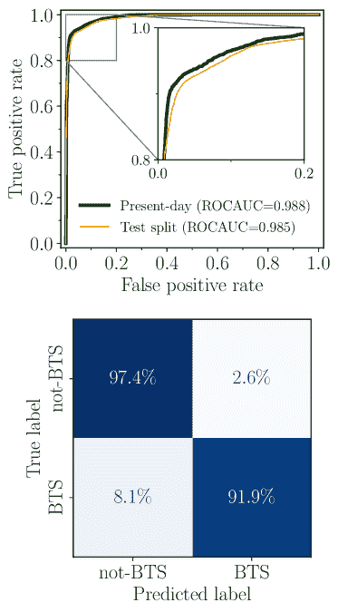

图 9：与图 6 相同，展示了非常近期的 BTS 候选警报样本。ROC 曲线（现阶段：深绿色；测试集：狭窄的橙色）、ROCAUC 和混淆矩阵的结果都与它们在测试集中的对应物非常相似。所有指标在现阶段样本中略有改进，但没有显著变化。这表明没有发生显著的数据偏移，从而显著降低 BTSbot 的性能。

我们首先对$2460175.5<\mathrm{JD}<2460216.5$通过 BTS 筛选的公共警报应用了 2 中描述的清理剪辑。剪辑后，这个样本共有来自 251 个明亮瞬变的警报 4,031 个，来自 1,652 个非明亮瞬变的警报 15,159 个。图 9 显示，生产 BTSbot 模型在目前样本上的准确率为$96.2\%$，ROCAUC=$0.988$。TP 率和 TN 率分别为 91.9%和 97.4%。由此得出的性能与 4.1 中对测试样本数据计算的指标及图 7 所示的指标非常相似。在所有基于警报的指标上，我们观察到与测试样本结果相比，目前样本的性能稍微更高。这些变化很可能是由于当前样本相对较小的尺寸所致，并且不表明数据变化会影响 BTSbot 的性能。

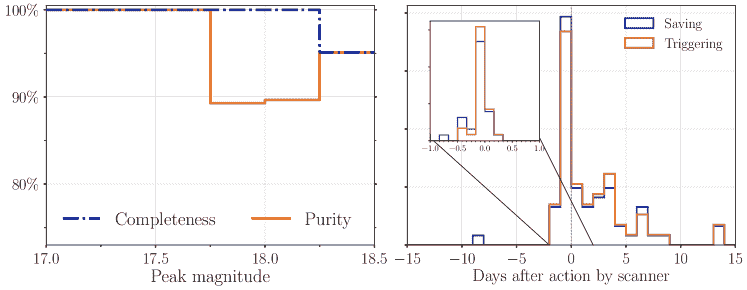

图 10：与图 7 相同，针对最近 BTS 候选样本进行了展示。左图：完整性（虚线点线蓝色）和纯度（实线橙色）曲线在大多数区间内均完美。bts_p1 和 bts_p2 的总体纯度分别为$81.0\%$和$92.0\%$。bts_p1 独特的污染几乎完全是$m_{\mathrm{peak}}$略大于 18.5 的真实 SNe，是可以接受的假阳性。两个区间的相对低纯度是由于样本数量统计较小。右图：两个分布仍然在接近零的地方峰值。可能是由于剪辑导致输入样本的差异，$\Delta t_{\mathrm{save}}$（$0.0525$天）和$\Delta t_{\mathrm{trigger}}$（$1.01$天）比测试样本的等效值要更大。

如在第 4.1 节中所述，在计算策略完整性和纯度时，任何源中的垃圾或清理后仅有一个警报的源都会被移除。在第二部分中，变量查询接收到的警报会减少到每个源的$N_{\mathrm{max}}=100$个警报。我们通过将分类为 Fritz 上的 AGN、CV 或 QSO 的源缩减到其最新的$N_{\mathrm{max}}=100$个警报来模拟这一点。我们将所有通过第二部分清理切割的公共警报从所有源中运行，经过两种策略，并仅选择那些满足 bts_p1 或在$2460175.5<\mathrm{JD}<2460216.5$之间达到其峰值亮度的源。这代表性地模拟了如果 BTSbot 在这段时间内完全运行时会采取的行动。

类似于图 7，图 10 显示了当前 BTS 样本上生产 BTSbot 模型的完整性、纯度和速度比较。左面板中显示的完整性和纯度曲线在大多数峰值亮度区间都达到或接近 100%。总体完整性为$98.7\%$。这保持了近乎完美，并支持 BTSbot 在扫描时不会对 BTS 样本施加重大选择偏差。曲线的变化由于小样本统计引起；每个区间中显示 0-3 个假阳性（FPs）和假阴性（FNs）。整体 bts_p1 纯度为$81.0\%$，整体 bts_p2 纯度为$92.0\%$。与测试拆分结果类似，由 bts_p1 选出的但不被 bts_p2 选中的源以$ m_{\mathrm{peak}} $略低于 18.5 mag 的超新星（SNe）为主（19/22 个源）：这些是假阳性，因为它们通常是由 BTS 触发的。目前样本的完整性和纯度估计与其测试拆分的类比非常相似，三项指标的差异$\leq\pm 4\%$，进一步表明没有数据偏移影响 BTSbot 的表现。

图 10 的右侧面板将 BTSbot 的反应速度与我们当前样本中的人工扫描员进行了比较。$\Delta t_{\mathrm{save}}$ 和 $\Delta t_{\mathrm{trigger}}$ 的中位数均大于它们的测试拆分对应值：分别为$0.0525$天和$1.01$天。我们将这种增加归因于两个主要因素。(i) 我们已从当前样本中排除了 ZTF 合作数据，但扫描员在扫描时通常会查看来自 ZTF 公共和合作观测的数据。这常常为他们提供额外的 BTS 候选者检测，而 BTSbot 对此是盲目的，有助于更快地识别亮瞬态。(ii) 当前样本非常小，因此中位数对变化非常敏感。当前样本中仅有 65 个源具有$\Delta t_{\mathrm{save}}$值，而测试拆分中有$>250$个源。然而，$\Delta t$分布的形状在当前样本和测试拆分分析中是一致的。综上所述，这些因素表明观察到的差异不是由于数据偏移，而是样本特征和实验方法的不同。

通过一个时间上连续的 BTS 候选者样本，我们现在可以轻松计算出 BTSbot 每晚执行的中位数保存和触发次数。在当前样本的 41 个夜晚中，184 个源满足 bts_p1。这是每晚大约$\sim 4.5$个源，这些源将被保存并发送到 SEDM。

#### 4.2.1 当前样本中错误分类的分析

类似于第 4.1.1 节，我们调查了 BTSbot 在当前样本中错误分类的源类型。

我们的政策选择了 35 个假阳性和 2 个假阴性。与测试拆分结果类似，大多数假阳性（19/35）是真实的暗淡瞬态。其他假阳性仍以 CVs 和 AGN 为主，但也包括了如小行星等其他源。一个假阴性（ZTF23aaxtplp）具有一个极其明亮的宿主星系，并且非常接近其核心。另一个假阴性（ZTF23abeuope）显示两个明亮的星星与宿主星系重叠，并且非常接近超新星。尚不确定这些特征是否导致这些源获得低分，但它们显然非常少见。

与测试拆分情况一样，当前样本中的大多数错误分类，即暗淡的超新星，对 BTS 没有负面影响。

## 5 讨论

### 5.1 BTSbot 集成到 ZTF 和 BTS 工作流

BTSbot 已在 Kowalski 中部署，以便实时处理来自 IPAC 的警报生成和中介系统的警报数据包。

Kowalski 对每个警报数据包执行三个不同的操作。首先，它将警报数据包从其 prv_candidates 字段（一个 30 天的检测和未检测历史记录）中分离出来，并将其与具有相同 objectId 的所有先前警报的完整 prv_candidates 列表连接。这形成了给定 ZTF 对象的完整光曲线。然后，这个连接的结果用于计算 BTSbot 作为输入的自定义元数据特征（见第二部分获取列表和定义）。随后，Kowalski 将每个警报与大量目录进行交叉匹配，如 NASA 外星系数据库¹⁵¹⁵15[`ned.ipac.caltech.edu/`](https://ned.ipac.caltech.edu/)（NED）、CLU（本地宇宙普查；Cook 等，2019）、Milliquas（Flesch，2019）等。最后，Kowalski 运行几个机器学习模型：braai、五个 ACAI 分类器（Duev & van der Walt，2021）和 BTSbot。所有模型的输出被注入到警报数据包中，以及它们的版本号，使警报过滤器在识别候选瞬态时可以使用这些信息。

丰富的警报数据包然后存储在非关系数据库（MongoDB¹⁶¹⁶16[`www.mongodb.com`](https://www.mongodb.com)）中，允许用户设计自定义的、可能复杂的过滤器作为纯数据库查询，以实现最大的灵活性。这些过滤器，包括 BTS 警报过滤器，应用于每个警报。

如果一个警报通过了过滤器，它将作为候选项发送给 Fritz，SkyPortal 实例，作为 ZTF 合作的指挥官。会应用两个额外的过滤层，以便自动保存和触发 SkyPortal 有对应应用编程接口（API）的任何仪器。第一个过滤层评估是否应保存候选项，第二个评估是否应触发仪器进行后续跟踪。自动触发仅在通过自动保存过滤器的源上运行。在 BTSbot 的情况下，实施了两个自动保存和自动触发过滤器，每个政策 bts_p1 和 bts_p2 各一个。

在 SkyPortal 中实现了附加功能，以确保不会发送冗余触发器。如果源已经有光谱、分类，或者仪器已经被触发，这将防止新的自动跟进请求。像 SEDM 这样的仪器可以进行光谱和光度观测，会获得额外的规则来定义新的触发器是否与现有的触发器重复。一些团队指示扫描仪维护那些频繁通过警报过滤器但不感兴趣的源列表，例如垃圾集合（见第二部分）。这些列表可以选择性地用于防止源被自动保存。用于触发仪器的有效载荷，其中包含触发指令，如 SEDM 的优先级，预先设置，并与 Kowalski 自动触发过滤器一起使用，但分配给目标的优先级可以随着新警报的发布动态增加。特别是，一个在通过 bts_p1 后被触发的源，如果在触发完成前通过 bts_p2，可以将其有效载荷的优先级更新为优先级 2。

当进行自动保存或自动触发操作时，记录这些操作的评论会发布到 Fritz 上的相关源页面。除了做账，这对与 BTSbot 一同工作的扫描仪至关重要，因为它可以在进行手动扫描的相同界面中显示 BTSbot 的操作。与扫描仪已经依赖的工具的无缝集成使得联合工作比单独工作更高效、更可靠。这也允许扫描仪修改 BTSbot 发送的触发器，例如，提升触发器的优先级或在请求中添加光度测量。这些使得真正的自动触发器更安全、更可靠，使 BTS 的自动化方面更容易监控。来自 SEDM 观测和相关数据产品的结果会上传回 Fritz 进行可视化。

BTSbot 在 2023 年 10 月的生产运行中将 296 个源保存到内部 BTS 目录中。¹⁷¹⁷2023 年 10 月运行的 BTSbot 是较旧的版本（v1.0）。此处展示的生产模型（v1.0.1）对 dims 查询中的$m_{\mathrm{peak}}\leq 18.5$源进行了修正（参见第二部分）。两个版本的性能几乎相同，其中 92.6%被确认是外星系瞬变。SN 2023tyk（ZTF23abhvlji）是一颗 Ia 型超新星，已经由 BTSbot 识别并触发。SEDM 收集的数据随后由 pySEDM（Rigault 等，2019）处理，光谱被 SNIascore（Fremling 等，2021）分类为 Ia 型超新星，分类结果自动报告给 TNS。正如 Rehemtulla 等（2023b）详细介绍的那样，SN 2023tyk 是第一个完全自动检测、识别、光谱分类和公开报告的瞬变。截至 2023 年 12 月，BTSbot 已触发并由 SNIascore 光谱分类的额外超过十颗 Ia 型超新星包括：SN 2023vcz，SN 2023uxa，SN 2023uti，SN 2023vcx，SN 2023uty，SN 2023vtp，SN 2023vpd，SN 2023vip，SN 2023vwz，SN 2023wts，SN 2023xms，SN 2023xhc，SN 2023xkq。

同时运行 BTSbot 和 SNIascore 可以实现 BTS 中大量日常任务的完全自动化。约 70%的 BTS 发现的亮亮瞬变是 Ia 型超新星（Fremling 等，2020），我们预计几乎所有这些都会被 BTSbot 识别，并且 80-90%会由 SNIascore 进行分类并报告给 TNS。如果没有人工扫描，这种 BTS 工作流程可以完全自动处理 BTS 考虑的超过一半的亮亮瞬变。实际上，还有一些任务尚待自动化或提高效率。即，扫描还涉及从 NED 检索宿主星系红移和从 TNS 进行分类。我们预计这些过程中的大部分可以自动化，目前正在规划这样做。虽然全面转向自动化扫描不太可能（且不一定是理想的），这些工具可以减轻 BTS 操作对扫描器自然波动的依赖。此外，当许多任务被自动化时，可能会重新分配一些投入 BTS 的人力。BTS 专家可以花更多时间，例如，分析超新星样本的整体属性或寻找稀有或非常年轻的事件。

### 5.2 与类似模型的比较

ALeRCE¹⁸¹⁸18[`alerce.online/`](https://alerce.online/)（自动学习快速分类事件；Förster 等，2021）实时印记分类器（Carrasco-Davis 等，2021）和 ACAI（警报分类人工智能；Duev & van der Walt，2021）框架是其他基于图像和提取特征的 MM-CNNs，用于对 ZTF 警报包进行分类。BTSbot 在架构上与这些模型非常相似（实际上，BTSbot 的某些方面受到它们的启发），但在应用上则有很大不同。

实时印记分类器预测 ZTF 警报中源属于五个高层次类别中的哪一个（SN、AGN、VarStar、小行星、虚假）。主要目的是为了自动和快速识别 SN。为此，印记分类器仅在给定源的第一个警报包上进行训练。虽然快速识别 SN 是我们的一个兴趣（见第 5.3 节），但我们将 BTSbot 训练为能够处理来自相关 ZTF 源的任何警报包。这使得 BTSbot 能够在其演变的任何阶段识别 SN，尽管这会带来额外的复杂性。

ACAI 框架，由五个独立的二分类器组成，预测 ZTF 警报包中源的五种现象特征（宿主、孤立、核、变星、虚假）。这些模型在任何 ZTF 源的任何警报上进行训练，因此学习的领域比 BTSbot 广泛得多。缩小我们模型的输入领域相对于 ACAI 减少了其更广泛的实用性，但为我们的特定任务解锁了更高的性能。

与 BTSbot 不同，印记分类器和 ACAI 都不会学习对源亮度敏感的类别定义。BTSbot 必须学习选择仅限于$ m_{\mathrm{peak}}\,\leq\,18.5\,\mathrm{mag}$的外星瞬变子集，并排除其他外星瞬变和所有其他源。尽管 BTSbot 执行二分类，有效地对所有非亮瞬变类进行边际化，但印记分类器执行五类分类，而 ACAI 模型执行五个二分类。这要求这些其他模型，特别是印记分类器，学习更多的类别区分信息。这对 BTSbot 来说不是必要的，因为我们的主要兴趣是自动化 BTS 扫描，其中只有亮瞬变才是相关的。因此，我们可以将非亮瞬变合并为一个类别，从而简化 BTSbot 的任务。

### 5.3 BTSbot 的改编：自动化、非常快速的跟进

BTSbot 的开发和我们政策的设计优先考虑了亮度突变体的完整性，而非其他指标如纯度和速度。在生产运行了几个月后，实施了一套不同的政策，这些政策侧重于提高纯度，以使 BTSbot 在最小干预下运行。这些优先级是由 BTS 的需求驱动的，但将类似 BTSbot 的模型应用于其他科学工作时，可能会优先考虑其他指标。

BTSbot 的架构特别适合自动识别非常年轻的突变体。在早期（即第一次探测的夜晚），源的光曲线信息有限，因为它仅包含非常少的数据点。相反，新突变体的大部分信息嵌入在相关的图像中。在这种情况下，基于图像的模型，如 BTSbot，预计会比纯粹基于光曲线的模型更能获得约束信息。

我们以 SN 2023ixf 为例，说明类似 BTSbot 的模型的额外发现潜力。SN 2023ixf 是一个位于梅西耶 101 的 II 型超新星。由于其接近，它为研究红色超巨星的超新星前质量损失事件提供了一个独特的实验室，允许我们建立事件的全面时间依赖描述，等等（例如：Bostroem 等，2023；Hiramatsu 等，2023；Jacobson-Galán 等，2023；Qin 等，2023；Zimmerman 等，2023）。SN 2023ixf 由 Koichi Itagaki 于 2023 年 5 月 19 日 21:42 UTC 向 TNS 报告（Itagaki，2023）。最早的已发布光谱由 Perley 等人于不到一个小时后收集（2023）。在第一次 TNS 报告前大约 14 小时，SN 2023ixf 被 ZTF 探测到，几分钟后，这个警报包由 BTSbot 的早期版本赋予了一个亮度突变体评分为 0.840¹⁹¹⁹19 本文提到的 BTSbot 早期版本（v0.3）在 Rehemtulla 等人 2023a 中介绍。BTSbot 的一个变体可以被训练以隔离这些源。使用适合于年轻突变体搜索的警报过滤器和政策，这可能允许更快速地识别和光谱跟进 SN 2023ixf。在第一次探测通过自动触发过滤器时，SEDM 还有大约半个观察夜的时间，如果在足够高的优先级下触发，将有足够的时间获得光谱。如果在 Palomar 天文台（$\sim$12:00 UTC）观察结束时收集光谱，这将比获得的最早光谱快大约 $\sim$10 小时。在这个例子中，BTSbot 和相关的集成工具允许探测传统触发方法通常无法获得的早期、快速演变的爆炸物理。

适应 BTSbot 的过程中存在一些挑战。即，BTS 警报过滤器以及这里介绍的 bts_p1 和 bts_p2 策略在新的模型优先级定义下可能不合适或次优。还需要彻底探索如何最好地组装训练集以实现这一目标。

在 ZTF 数据中对婴儿超新星的自动光谱跟踪以前已经在 AMPEL（Nordin 等，2019）中成功实施。目标选择由 SNGuess（Miranda 等，2022）驱动，这是一种基于决策树的机器学习系统，用于识别超新星。他们的自动触发设计用于观察附近的婴儿超新星，已经成功完成了对多个源的观察。

BTSbot 的源代码和生产 BTSbot 模型在 GitHub 上公开可用（[`github.com/nabeelre/BTSbot`](https://github.com/nabeelre/BTSbot)）。该代码库包括组装 BTSbot 训练集、训练模型、创建可视化验证或测试集性能的图形等所需的所有代码。它特别考虑了适应性和灵活性。附加功能，例如训练具有替代架构的模型（参见附录 B），嵌入在脚本中，增加的复杂性最小且没有重复代码。这是为了方便在其他应用中回收 BTSbot 代码库。例如，可以快速探索使用简单的全连接神经网络解决问题，然后再升级到具有数据增强和集成了 Weighs and Biases 超参数调整等强大功能的 MM-CNN。我们鼓励社区使用这一资源。

## 6 摘要

我们提出了 BTSbot，一个新的多模态卷积神经网络，用于自动扫描 ZTF 亮度瞬变调查。BTSbot 使用 ZTF 图像剪裁和元数据，为单个 ZTF 警报包生成亮度瞬变评分。它在输入警报上的准确率达到$\sim$95%，在我们的测试集中识别了 100%的亮度瞬变，纯度为 93%。性能在完整性、纯度和对新瞬变的响应速度方面与人工扫描员非常接近。BTSbot 在生成的亮度瞬变样本的纯度方面稍微逊色于扫描员：$93\%$ 对比 $\sim 97\%$。我们还进行了额外分析，使用最近的 BTS 候选者来证明 BTSbot 不受显著数据偏移的影响。

BTSbot 已经完全整合进了 Kowalski 和 Fritz，ZTF 的第一方警报代理和调度员，现在自动发送对其识别的新亮度瞬变的光谱跟进请求。BTSbot 加入了 BTS 工作流中的一系列自动化工具（braai、sgscore、pySEDM 和 SNIascore），这些工具有助于高效运行 BTS。由 Fritz 和 Kowalski 协调的这些模型实现了瞬变的首次完全自动探测、识别、光谱分类和公开报告：SN 2023tyk。这一里程碑标志着 BTS 效率的提升，并描绘了鲁宾时代时域天文学的可能面貌。它还暗示了将类似技术应用于其他时域天文学领域的发现潜力。

## 7 致谢

多年来，许多人对 BTS 及其扫描做出了贡献。我们感谢以下人员，他们在 2023 年 10 月之前在 Fritz 的内部 BTS 目录中保存了 10 个或更多来源：Ivan Altunin、Raphael Baer-Way、Pallas A. Beddow、Ofek Bengiat、Joshua S. Bloom、Ola Bochenek、Emma Born、Kate Bostow、Victoria Mei Brendel、Rachel Bruch、Vidhi Chander、Matthew Chu、Elma Chuang、Aishwarya Dahiwale、Asia deGraw、Dmitry Duev、Kingsley Ehrich、Eli Gendreau-Distler、Nachiket Girish、Xander Hall、K-Ryan Hinds、Ido Irani、Cooper Jacobus、Connor Jennings、Joel Johansson、Snehaa Ganesh Kumar、Michael May、William Meynardie、Shaunak Modak、Kishore Patra、Neil Pichay、Sophia Risin、Yashvi Sharma、Gabrielle Stewart、Nora Linn Strotjohann、James Sunseri、Edgar Vidal、Jacob Wise、Abel Yagubyan、Yoomee Zeng 和 Erez A. Zimmerman。

我们还感谢 Jakob Nordin 在 AMPEL 相关讨论中的贡献。

本文档中的材料基于国家航空航天局（NASA）资助或合作协议支持的工作。材料中表达的任何意见、发现、结论或建议均为作者的观点，并不一定反映 NASA 的观点。该工作得到了授予伊利诺伊州/NASA 空间资助联盟的 NASA 资助的支持。

这项研究部分得到了西北大学 Quest 高性能计算设施提供的计算资源和员工贡献的支持，该设施由教务长办公室、研究办公室以及西北大学信息技术部门联合支持。

基于在帕洛马天文台使用 Samuel Oschin 48 英寸望远镜和 60 英寸望远镜获得的观测数据，这些数据是 Zwicky 短暂现象设施项目的一部分。ZTF 得到了国家科学基金会的支持，资助号为 AST-1440341 和 AST-2034437，并且有包括当前合作伙伴 Caltech、IPAC、斯德哥尔摩大学 Oskar Klein 中心、马里兰大学、加州大学伯克利分校、密尔沃基的威斯康星大学、华威大学、鲁尔大学、康奈尔大学、西北大学和德雷克塞尔大学在内的合作。运营由 COO、IPAC 和 UW 执行。

SED Machine 基于国家科学基金会资助的工作，资助号为 1106171。

戈登和贝蒂·摩尔基金会通过数据驱动研究员计划和专门拨款为 SkyPortal 提供了关键资助。

N. Rehemtulla 和 A. A. Miller 部分得到了 LBNL 分包合同 NO. 7707915 的支持。

M. W. Coughlin 感谢国家科学基金会的资助，资助号为 PHY-2308862 和 PHY-2117997。

SRK 感谢 Heising-Simons 基金会对其研究的支持。

## 附录 A 训练过程中的准确率和损失演变

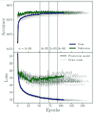

图 11：最终 BTSbot 模型（生产模型：**粗体曲线**；其他试验：细曲线）在训练过程中，训练（蓝色）和验证（绿色）分割的准确率（上）和损失（下）随着时代的变化。灰色垂直线表示学习率降低的时代。这些指标在训练和验证分割之间的差异不能仅仅解释为过拟合，因为它们部分是由于警报稀疏和类别加权的差异。

图 11 显示了最终 BTSbot 模型（包括生产模型）训练过程中准确率和损失的演变情况。训练和验证中 $N_{\mathrm{max}}$ 警报稀疏处理的不同应用方式（见第二部分）以及训练过程中使用的类别权重，可以解释它们各自损失曲线之间的差异。因此，训练损失显著低于验证损失不能被解释为过拟合。生产模型（粗体曲线）在第 $\sim$30 个周期后确实出现了过拟合现象，这表现在验证损失开始增加，而训练损失继续减少。我们通过选择在训练过程中产生最小验证损失的模型来避免这种情况，而不是选择训练的最后一个周期的模型。图 11 用垂直灰线标记了学习率由于验证损失平稳而下降的周期。学习率下降三次，从 $\alpha=10^{-4}$ 降至 $\alpha=6\times 10^{-6}$。我们还观察到，所选的生产模型不是产生最小验证损失或具有最佳验证准确率的模型。生产模型的选择是通过考虑在政策基础指标中的最佳表现来进行的，这些指标与 BTSbot 的实际使用最为相关。

训练这个生产模型在 Intel Xeon 6230 CPU 上耗时约 32 小时，而在笔记本电脑 CPU 上对单个警报数据包进行推理的时间不到一百分之一秒。

## 附录 B 与单模态架构的比较

对简单的替代架构进行探索并表征其性能，对于证明 BTSbot 选择的多模态架构是必要的。我们呈现了由两种单模态模型架构生成的警报和策略性能指标：单模态卷积神经网络（UM-CNN）和全连接神经网络（NN）。这些网络分别仅使用图像和仅使用元数据进行推理。训练数据、图像预处理和特征提取在相关情况下对所有三种架构执行方式相同。单模态架构的层的顺序和类型与多模态架构的相同，只是另外一个分支完全被移除。层的超参数、Adam 优化器以及$N_{\mathrm{max}}$的值在贝叶斯超参数搜索中进行搜索，类似于对 MM-CNN 进行的搜索。

表 5 展示了每种架构的最佳层超参数。与 MM-CNN 的卷积分支相比，UM-CNN 具有较小的卷积核，并且在扁平化后有一个更大的全连接层。UM-CNN 的前两层卷积层比最后两层卷积层有更多的滤波器，而 MM-CNN 则正好相反。我们还发现优化后的 UM-CNN 具有$\textrm{batch size}=32$，以及 Adam 参数$\beta_{1}=\beta_{2}=0.999$。与 MM-CNN 的元数据分支相比，优化后的 NN 在前两层全连接层中的神经元数量只有一半，但在第三层中是原来的八倍。我们还发现 NN 在$\textrm{batch size}=128$、Adam 参数$\beta_{1}=\beta_{2}=0.999$和$N_{\mathrm{max}}=30$时表现最佳。未明确提及的超参数值可以假设与 MM-CNN 相同。

表 5：单模态 BTSbot 替代架构

| 单模态卷积神经网络 | 全连接神经网络 |
| --- | --- |
| Layer type | Layer parameters | Layer type | Layer parameters |
| 2D Convolution | 64 filters, $3\times 3$ kernel | Batch normalization | - |
| 2D Convolution | 64 filters, $3\times 3$ kernel | Dense | 64 units |
| Max pooling | $2\times 2$ kernel | Dropout | 0.40 |
| Dropout | 0.45 | Dense | 64 units |
| 2D Convolution | 16 filters, $3\times 3$ kernel | Dense | 64 units |
| 2D Convolution | 16 filters, $3\times 3$ kernel | Dropout | 0.70 |
| Max pooling | $4\times 4$ kernel | Dense | 1 unit |
| Dropout | 0.65 |  |  |
| Flattening | - |  |  |
| Dense | 128 units |  |  |
| Dropout | 0.45 |  |  |
| Dense | 1 unit |  |  |

注。— 替代 BTSbot 架构的层参数：单模态卷积神经网络（左两列）和全连接神经网络（右两列）。最佳超参数通过大规模超参数搜索确定。

表 6：单模态 BTSbot 替代方案的性能指标

| 架构类型 | 基于警报的指标 | 基于策略的指标 |
| --- | --- | --- |
| 准确率 | ROCAUC | 完整性 | bts_p1 纯度 | bts_p2 纯度 | $\Delta t_{\mathrm{save}}$ | $\Delta t_{\mathrm{trigger}}$ |
| --- | --- | --- | --- | --- | --- | --- |
| NN | 95.5% | 0.988 | 99.8% | 82.8% | 91.2% | -0.0400 天 | -0.0200 天 |
| UM-CNN | 82.4% | 0.902 | 94.3% | 69.5% | 92.5% | -0.0485 天 | -0.0174 天 |
| MM-CNN | $94.9\%$ | $0.985$ | 100.0% | 84.6% | 93.0% | -0.0381 天 | -0.0147 天 |

注。— 三种不同模型架构在测试拆分数据上的性能指标比较：全连接神经网络（NN）、单模态卷积神经网络（UM-CNN）和多模态卷积神经网络（MM-CNN）。每个网络在至少一个指标上表现最佳。UM-CNN 的完整性低于 MM-CNN，NN 和 UM-CNN 在纯度上均逊色于 MM-CNN。总体而言，MM-CNN 是表现最好的架构。

表 6 比较了三种架构的测试拆分性能指标。NN 在基于警报的指标上略微优于 MM-CNN，而 UM-CNN 明显逊色于其他架构。这里展示的 UM-CNN 使用了全尺寸图像切割，但附录 C 显示，通过减少输入图像的大小可以实现略微提高的性能。在基于策略的指标中，MM-CNN 在完整性上的微小优势是由于其少了一个假阴性。然而，MM-CNN 在纯度上的优势更大。在 bts_p2 纯度上，其优势约为$\sim 0.5-2\%$；即使是纯度的微小提升，在 BTS 考虑的大样本和基线中也是有价值的。每个模型在速度指标上表现非常相似，尽管 NN 和 UM-CNN 在$\Delta t_{\mathrm{trigger}}$和$\Delta t_{\mathrm{save}}$上略微优于其他模型。

每种架构在某些指标上优于其他架构，但 MM-CNN 提供了最佳的整体性能。它在完整性和纯度上表现最高，同时在$\Delta t_{\mathrm{save/trigger}}$上牺牲的时间远少于一小时。

尽管其纯度比 MM-CNN 更差，但 NN 仍然具有宝贵的实用性，因为我们发现它的训练速度比 MM-CNN 快约 $\sim 60$ 倍。训练时间的这种差异部分是因为 NN 采用了 $N_{\mathrm{max}}=30$，而 MM-CNN 采用的是 $N_{\mathrm{max}}=100$，此外，通过在 GPU 上训练 MM-CNN 也可以减少这一差距。除了这些因素外，NN 训练速度仍然会快许多，因此更适合用于将 BTSbot 适配到其他用例。在开发 BTSbot 的适配过程中，能够非常迅速地设计和执行实验将是关键。排除图像也可能有助于将 BTSbot 适配到其他调查中，例如，LSST 或即将到来的 La Silla Schmidt Southern Survey (LS4²⁰²⁰20[`www.snowmass21.org/docs/files/summaries/CF/SNOWMASS21-CF6_CF4_Peter_Nugent-171.pdf`](https://www.snowmass21.org/docs/files/summaries/CF/SNOWMASS21-CF6_CF4_Peter_Nugent-171.pdf))。虽然已经努力开发调查无关的 CNN（例如，Cabrera-Vives 等，2023），但 BTSbot 并不是设计为或期望在其他调查的图像数据上表现一致。相反，可以更容易地设计一个 NN，专门使用调查无关的特征，从而通过更广泛的应用来增加其潜在影响。

## 附录 C 裁剪图像切割的卷积神经网络

大型宽视场调查产生的图像裁剪的属性对调查的多个功能至关重要。虽然像素尺度，通常以每像素弧秒（”）来测量，是望远镜光学系统的固定属性，但可以通过软件做出许多选择，以确定发送给警报经纪人的裁剪的性质。必须根据像素尺度选择裁剪的角度和像素大小，以及是否通过像素合并来降低分辨率。由于扫描仪通常更喜欢更多的信息，即分辨率更高、角度更大的裁剪，而生产和传播警报的调查则更希望最小化网络带宽成本，即分辨率较低、角度较小的裁剪，因此出现了紧张关系。较小的裁剪区域可能会妨碍这些关键 ML 模型的性能，可能降低整个调查的科学潜力。只有少数研究开发用于大型宽视场调查的 CNN 的研究评论了不同裁剪尺寸下的性能（例如；Killestein 等，2021；Carrasco-Davis 等，2021；Reyes-Jainaga 等，2023）。因此，尚不清楚当前 CNN 维持可接受性能的最小裁剪尺寸是多少。更复杂的是，不同任务的 CNN 将受到不同裁剪尺寸的影响，MM-CNN 由于有元数据的信息，可能对裁剪尺寸的减少更具弹性。多尺度裁剪，即分辨率在离裁剪中心远离时逐渐降低，是一个有吸引力的替代方案，因为它们在不增加裁剪数据量的情况下显著增加了可用视场（Reyes-Jainaga 等，2023）。进一步研究（MM-）CNN 在不同裁剪尺寸下的性能对于更好地描述其相关性是必要的。

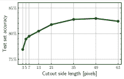

图 12：BTSbot UM-CNNs 测试集准确性与输入图像裁剪大小的关系。非常小的裁剪区域（$3\times 3$ 到 $13\times 13$ 像素）明显表现不如使用较大裁剪区域（$35\times 35$ 到 $63\times 63$ 像素）的模型。性能最好的模型不是使用全尺寸图像的模型，而是使用 $49\times 49$ 像素裁剪的模型。裁剪裁剪区域可以显著降低调查的数据传输率，并可能减少网络带宽成本，在这种情况下，ML 基于瞬态检测工具的性能没有下降。

为了探讨这个重要问题，我们训练了多个 UM-CNN 版本的 BTSbot，以识别哪种裁剪大小能产生最准确的模型。我们通过仅保留每个裁剪的最内层 $N_{\mathrm{pix}}\times N_{\mathrm{pix}}$ 像素并单独重新归一化，来创建新的训练集。我们在贝叶斯超参数调整中训练了约 30-60 次 BTSbot，使用的 $N_{\mathrm{pix}}$ 值为 3、5、7、13、21、35 或 49，类似于第 3.1 节和附录 B。这些试验不太可能得出最佳超参数，但它们确实提供了每个 $N_{\mathrm{pix}}$ 值的性能代表性视图。对于 $N_{\mathrm{pix}}\leq 13$ 的模型，我们完全去除池化层，以保持图像在隐藏层中的尺寸。

图 12 显示了按测试集准确度评判的最高性能模型。我们发现 $N_{\mathrm{pix}}=49$ 的 UM-CNN 产生了最佳性能，且 $N_{\mathrm{pix}}=49$ 和 $N_{\mathrm{pix}}=35$ 的 UM-CNN 在性能上稍微超过了裁剪切片的 UM-CNN ($N_{\mathrm{pix}}=63$)。从这个简单实验中，尚不清楚原因是什么，然而，这些结果表明，在执行我们的任务时，距离问题源 $\sim 0.5^{\prime}$ 的信息趋向于无关或噪声。我们特别注意到，MM-CNN 并没有观察到相同的趋势，其中 $N_{\mathrm{pix}}=63$ 的模型性能最好。Carrasco-Davis 等 (2021) 发现 ALeRCE 印章分类器（一个 MM-CNN）在 $N_{\mathrm{pix}}=21$ 的裁剪下表现最佳。综合来看，这表明需要更多的工作来更好地理解即将进行的调查的最佳裁剪大小。

$N_{\mathrm{pix}}=35$ 模型的准确性大致与 $N_{\mathrm{pix}}=63$ 模型相匹配，但像素数量为 $35^{2}/63^{2}\approx 30\%$。在这种情况下，缩小裁剪区域会显著加快 BTSbot 的训练速度而不影响性能。对整个调查进行裁剪是一种显著减少调查网络带宽成本的选项，因为图像裁剪通常占据警报数据包的大部分字节。虽然 $35\times 35$ 的裁剪区域适合 BTSbot，但如此小的裁剪区域可能会降低扫描仪区分不同类型源的能力。这种实验最适合于即将到来的如 LSST 和 LS4 的调查的警报流设计。LSST 计划的警报数据包裁剪区域大小至少为 $30\times 30$ 像素²¹²¹21[`dmtn-102.lsst.io`](https://dmtn-102.lsst.io)，像素比例为 0.2”/像素 (Ivezić 等，2019)，因此每边跨度为 6”。 $N_{\mathrm{pix}}=5$ 和 $N_{\mathrm{pix}}=7$ 模型在视场大小方面最接近此值，但 ZTF 的像素比例更大 (1”/像素) 使得这个比较不太合理。需要进一步研究以评估裁剪区域在不影响，如 LSST 类似分辨率下的真实/虚假性能的情况下可以有多小。LS4 将具有与 ZTF 非常相似的像素比例，但在撰写本文时，警报数据包裁剪区域的大小尚未确定 (R. Knop, 私人通讯)。这些结果提供了初步的指导，即 LS4 的裁剪区域应不小于 $21\times 21$ 以维持类似 BTSbot 的 UM-CNN 模型的性能。

## 参考文献

+   Abadi 等 (2015) Abadi, M., Agarwal, A., Barham, P., 等. 2015, TensorFlow: 大规模异构系统上的机器学习。 [`www.tensorflow.org/`](https://www.tensorflow.org/)

+   Astropy Collaboration 等 (2013) Astropy Collaboration, Robitaille, T. P., Tollerud, E. J., 等. 2013, A&A, 558, A33, doi: [10.1051/0004-6361/201322068](http://doi.org/10.1051/0004-6361/201322068)

+   Astropy Collaboration 等 (2018) Astropy Collaboration, Price-Whelan, A. M., Sipőcz, B. M., 等. 2018, AJ, 156, 123, doi: [10.3847/1538-3881/aabc4f](http://doi.org/10.3847/1538-3881/aabc4f)

+   Bailey 等 (2007) Bailey, S., Aragon, C., Romano, R., 等. 2007, ApJ, 665, 1246, doi: [10.1086/519832](http://doi.org/10.1086/519832)

+   Bellm 等 (2019a) Bellm, E. C., Kulkarni, S. R., Graham, M. J., 等. 2019a, PASP, 131, 018002, doi: [10.1088/1538-3873/aaecbe](http://doi.org/10.1088/1538-3873/aaecbe)

+   Bellm 等 (2019b) Bellm, E. C., Kulkarni, S. R., Barlow, T., 等. 2019b, PASP, 131, 068003, doi: [10.1088/1538-3873/ab0c2a](http://doi.org/10.1088/1538-3873/ab0c2a)

+   Biewald (2020) Biewald, L. 2020, 使用 Weights and Biases 进行实验跟踪。 [`www.wandb.com/`](https://www.wandb.com/)

+   Blagorodnova 等 (2018) Blagorodnova, N., Neill, J. D., Walters, R., 等. 2018, PASP, 130, 035003, doi: [10.1088/1538-3873/aaa53f](http://doi.org/10.1088/1538-3873/aaa53f)

+   Bloom 等（2012）Bloom, J. S., Richards, J. W., Nugent, P. E., et al. 2012, PASP, 124, 1175, doi: [10.1086/668468](http://doi.org/10.1086/668468)

+   Boone（2019）Boone, K. 2019, AJ, 158, 257, doi: [10.3847/1538-3881/ab5182](http://doi.org/10.3847/1538-3881/ab5182)

+   Bostroem 等（2023）Bostroem, K. A., Pearson, J., Shrestha, M., et al. 2023, ApJ, 956, L5, doi: [10.3847/2041-8213/acf9a4](http://doi.org/10.3847/2041-8213/acf9a4)

+   Breiman（2001）Breiman, L. 2001, Machine Learning, 45, 5, doi: [10.1023/A:1010933404324](http://doi.org/10.1023/A:1010933404324)

+   Brink 等（2013）Brink, H., Richards, J. W., Poznanski, D., et al. 2013, MNRAS, 435, 1047, doi: [10.1093/mnras/stt1306](http://doi.org/10.1093/mnras/stt1306)

+   Cabrera-Vives 等（2023）Cabrera-Vives, G., Bolivar, C., Förster, F., et al. 2023, arXiv e-prints, arXiv:2308.07538, doi: [10.48550/arXiv.2308.07538](http://doi.org/10.48550/arXiv.2308.07538)

+   Cabrera-Vives 等（2017）Cabrera-Vives, G., Reyes, I., Förster, F., Estévez, P. A., & Maureira, J.-C. 2017, ApJ, 836, 97, doi: [10.3847/1538-4357/836/1/97](http://doi.org/10.3847/1538-4357/836/1/97)

+   Carrasco-Davis 等（2021）Carrasco-Davis, R., Reyes, E., Valenzuela, C., et al. 2021, AJ, 162, 231, doi: [10.3847/1538-3881/ac0ef1](http://doi.org/10.3847/1538-3881/ac0ef1)

+   Carrasco Kind & Brunner（2013）Carrasco Kind, M., & Brunner, R. J. 2013, MNRAS, 432, 1483, doi: [10.1093/mnras/stt574](http://doi.org/10.1093/mnras/stt574)

+   Chollet 等（2015）Chollet, F., 等. 2015, Keras, [`keras.io`](https://keras.io)

+   Cold & Hjorth（2023）Cold, C., & Hjorth, J. 2023, A&A, 670, A48, doi: [10.1051/0004-6361/202244867](http://doi.org/10.1051/0004-6361/202244867)

+   Cook 等（2019）Cook, D. O., Kasliwal, M. M., Sistine, A. V., et al. 2019, The Astrophysical Journal, 880, 7, doi: [10.3847/1538-4357/ab2131](http://doi.org/10.3847/1538-4357/ab2131)

+   Coughlin 等（2023）Coughlin, M. W., Bloom, J. S., Nir, G., et al. 2023, arXiv e-prints, arXiv:2305.00108, doi: [10.48550/arXiv.2305.00108](http://doi.org/10.48550/arXiv.2305.00108)

+   da Costa-Luis（2019）da Costa-Luis, C. 2019, The Journal of Open Source Software, 4, 1277, doi: [10.21105/joss.01277](http://doi.org/10.21105/joss.01277)

+   Dekany 等（2020）Dekany, R., Smith, R. M., Riddle, R., et al. 2020, PASP, 132, 038001, doi: [10.1088/1538-3873/ab4ca2](http://doi.org/10.1088/1538-3873/ab4ca2)

+   Dieleman 等（2015）Dieleman, S., Willett, K. W., & Dambre, J. 2015, MNRAS, 450, 1441, doi: [10.1093/mnras/stv632](http://doi.org/10.1093/mnras/stv632)

+   Domínguez Sánchez 等（2018）Domínguez Sánchez, H., Huertas-Company, M., Bernardi, M., Tuccillo, D., & Fischer, J. L. 2018, MNRAS, 476, 3661, doi: [10.1093/mnras/sty338](http://doi.org/10.1093/mnras/sty338)

+   Duev 等（2021）Duev, D., Shin, K. M., & Singer, L. 2021, dmitryduev/penquins: a python client for dmitryduev/kowalski, v2.1.2, Zenodo, doi: [10.5281/zenodo.5651471](http://doi.org/10.5281/zenodo.5651471)

+   Duev & van der Walt（2021）Duev, D. A., & van der Walt, S. J. 2021, arXiv e-prints, arXiv:2111.12142, doi: [10.48550/arXiv.2111.12142](http://doi.org/10.48550/arXiv.2111.12142)

+   Duev 等人（2019）Duev, D. A., Mahabal, A., Masci, F. J., 等. 2019, MNRAS, 489, 3582, doi: [10.1093/mnras/stz2357](http://doi.org/10.1093/mnras/stz2357)

+   Flesch（2019）Flesch, E. W. 2019, VizieR Online Data Catalog, VII/283

+   Foreman-Mackey（2016）Foreman-Mackey, D. 2016, The Journal of Open Source Software, 1, 24, doi: [10.21105/joss.00024](http://doi.org/10.21105/joss.00024)

+   Förster 等人（2021）Förster, F., Cabrera-Vives, G., Castillo-Navarrete, E., 等. 2021, AJ, 161, 242, doi: [10.3847/1538-3881/abe9bc](http://doi.org/10.3847/1538-3881/abe9bc)

+   Fremling 等人（2020）Fremling, C., Miller, A. A., Sharma, Y., 等. 2020, ApJ, 895, 32, doi: [10.3847/1538-4357/ab8943](http://doi.org/10.3847/1538-4357/ab8943)

+   Fremling 等人（2021）Fremling, C., Hall, X. J., Coughlin, M. W., 等. 2021, ApJ, 917, L2, doi: [10.3847/2041-8213/ac116f](http://doi.org/10.3847/2041-8213/ac116f)

+   Fukushima & Miyake（1982）Fukushima, K., & Miyake, S. 1982, Pattern Recognition, 15, 455, doi: [10.1016/0031-3203(82)90024-3](http://doi.org/10.1016/0031-3203(82)90024-3)

+   Gagliano 等人（2023）Gagliano, A., Contardo, G., Foreman Mackey, D., Malz, A. I., & Aleo, P. D. 2023, arXiv e-prints, arXiv:2305.08894. [`arxiv.org/abs/2305.08894`](https://arxiv.org/abs/2305.08894)

+   Goldstein 等人（2015）Goldstein, D. A., D’Andrea, C. B., Fischer, J. A., 等. 2015, AJ, 150, 82, doi: [10.1088/0004-6256/150/3/82](http://doi.org/10.1088/0004-6256/150/3/82)

+   Gomez 等人（2020）Gomez, S., Berger, E., Blanchard, P. K., 等. 2020, ApJ, 904, 74, doi: [10.3847/1538-4357/abbf49](http://doi.org/10.3847/1538-4357/abbf49)

+   Gomez 等人（2023）Gomez, S., Villar, V. A., Berger, E., 等. 2023, ApJ, 949, 113, doi: [10.3847/1538-4357/acc535](http://doi.org/10.3847/1538-4357/acc535)

+   Goobar 等人（2023）Goobar, A., Johansson, J., Schulze, S., 等. 2023, Nature Astronomy, 7, 1137, doi: [10.1038/s41550-023-02034-5](http://doi.org/10.1038/s41550-023-02034-5)

+   Graham 等人（2019）Graham, M. J., Kulkarni, S. R., Bellm, E. C., 等. 2019, PASP, 131, 078001, doi: [10.1088/1538-3873/ab006c](http://doi.org/10.1088/1538-3873/ab006c)

+   Harris 等人（2020）Harris, C. R., Millman, K. J., van der Walt, S. J., 等. 2020, Nature, 585, 357–362, doi: [10.1038/s41586-020-2649-2](http://doi.org/10.1038/s41586-020-2649-2)

+   Hendrycks & Gimpel（2016）Hendrycks, D., & Gimpel, K. 2016, arXiv e-prints, arXiv:1610.02136, doi: [10.48550/arXiv.1610.02136](http://doi.org/10.48550/arXiv.1610.02136)

+   Hiramatsu 等人（2023）Hiramatsu, D., Tsuna, D., Berger, E., 等. 2023, ApJ, 955, L8, doi: [10.3847/2041-8213/acf299](http://doi.org/10.3847/2041-8213/acf299)

+   Hosseinzadeh 等人（2020）Hosseinzadeh, G., Dauphin, F., Villar, V. A., 等. 2020, ApJ, 905, 93, doi: [10.3847/1538-4357/abc42b](http://doi.org/10.3847/1538-4357/abc42b)

+   Hunter（2007）Hunter, J. D. 2007，《科学与工程计算》，9, 90, doi: [10.1109/MCSE.2007.55](http://doi.org/10.1109/MCSE.2007.55)

+   Irani 等人（2022）Irani, I., Prentice, S. J., Schulze, S., 等. 2022，《ApJ》，927, 10, doi: [10.3847/1538-4357/ac4709](http://doi.org/10.3847/1538-4357/ac4709)

+   Itagaki（2023）Itagaki, K. 2023，《瞬态名称服务器发现报告》，2023-1158, 1

+   Ivezić 等人（2019）Ivezić, Ž., Kahn, S. M., Tyson, J. A., 等. 2019，《ApJ》，873, 111, doi: [10.3847/1538-4357/ab042c](http://doi.org/10.3847/1538-4357/ab042c)

+   Jacobson-Galán 等人（2023）Jacobson-Galán, W. V., Dessart, L., Margutti, R., 等. 2023，《ApJ》，954, L42, doi: [10.3847/2041-8213/acf2ec](http://doi.org/10.3847/2041-8213/acf2ec)

+   Kaiser 等人（2002）Kaiser, N., Aussel, H., Burke, B. E., 等. 2002, 在《光学工程学会（SPIE）会议系列》，第 4836 卷，《Survey and Other Telescope Technologies and Discoveries》，编辑：J. A. Tyson & S. Wolff, 154–164, doi: [10.1117/12.457365](http://doi.org/10.1117/12.457365)

+   Kasliwal 等人（2019）Kasliwal, M. M., Cannella, C., Bagdasaryan, A., 等. 2019，《PASP》，131, 038003, doi: [10.1088/1538-3873/aafbc2](http://doi.org/10.1088/1538-3873/aafbc2)

+   Killestein 等人（2021）Killestein, T. L., Lyman, J., Steeghs, D., 等. 2021，《MNRAS》，503, 4838, doi: [10.1093/mnras/stab633](http://doi.org/10.1093/mnras/stab633)

+   Kim 等人（2022）Kim, Y. L., Rigault, M., Neill, J. D., 等. 2022，《PASP》，134, 024505, doi: [10.1088/1538-3873/ac50a0](http://doi.org/10.1088/1538-3873/ac50a0)

+   Kingma & Ba（2014）Kingma, D. P., & Ba, J. 2014，arXiv e-prints, arXiv:1412.6980, doi: [10.48550/arXiv.1412.6980](http://doi.org/10.48550/arXiv.1412.6980)

+   Kluyver 等人（2016）Kluyver, T., Ragan-Kelley, B., Pérez, F., 等. 2016, 在《IOS Press》，87–90, doi: [10.3233/978-1-61499-649-1-87](http://doi.org/10.3233/978-1-61499-649-1-87)

+   Lanusse 等人（2018）Lanusse, F., Ma, Q., Li, N., 等. 2018，《MNRAS》，473, 3895, doi: [10.1093/mnras/stx1665](http://doi.org/10.1093/mnras/stx1665)

+   LeCun 等人（2015）LeCun, Y., Bengio, Y., & Hinton, G. 2015，《自然》，521, 436, doi: [10.1038/nature14539](http://doi.org/10.1038/nature14539)

+   Mahabal 等人（2019）Mahabal, A., Rebbapragada, U., Walters, R., 等. 2019，《PASP》，131, 038002, doi: [10.1088/1538-3873/aaf3fa](http://doi.org/10.1088/1538-3873/aaf3fa)

+   Masci 等人（2019）Masci, F. J., Laher, R. R., Rusholme, B., 等. 2019，《PASP》，131, 018003, doi: [10.1088/1538-3873/aae8ac](http://doi.org/10.1088/1538-3873/aae8ac)

+   McCulloch & Pitts（1943）McCulloch, W. S., & Pitts, W. 1943，《数学生物物理学公报》，5, 115, doi: [10.1007/bf02478259](http://doi.org/10.1007/bf02478259)

+   Miranda 等人（2022）Miranda, N., Freytag, J. C., Nordin, J., 等. 2022，《A&A》，665, A99, doi: [10.1051/0004-6361/202243668](http://doi.org/10.1051/0004-6361/202243668)

+   Morgan 等人（2022）Morgan, R., Nord, B., Bechtol, K., 等. 2022, ApJ, 927, 109, doi: [10.3847/1538-4357/ac5178](http://doi.org/10.3847/1538-4357/ac5178)

+   Morgan 等人（2023）—. 2023, ApJ, 943, 19, doi: [10.3847/1538-4357/ac721b](http://doi.org/10.3847/1538-4357/ac721b)

+   Muthukrishna 等人（2019）Muthukrishna, D., Narayan, G., Mandel, K. S., Biswas, R., & Hložek, R. 2019, PASP, 131, 118002, doi: [10.1088/1538-3873/ab1609](http://doi.org/10.1088/1538-3873/ab1609)

+   Nair & Hinton（2010）Nair, V., & Hinton, G. E. 2010, 会议论文集：第 27 届国际机器学习大会（ICML’10）（美国威斯康星州麦迪逊：Omnipress），807–814

+   Nordin 等人（2019）Nordin, J., Brinnel, V., van Santen, J., 等. 2019, A&A, 631, A147, doi: [10.1051/0004-6361/201935634](http://doi.org/10.1051/0004-6361/201935634)

+   pandas 开发团队（2020）pandas 开发团队, T. 2020, pandas-dev/pandas: Pandas, 最新版, Zenodo, doi: [10.5281/zenodo.3509134](http://doi.org/10.5281/zenodo.3509134)

+   Pasquet 等人（2019）Pasquet, J., Bertin, E., Treyer, M., Arnouts, S., & Fouchez, D. 2019, A&A, 621, A26, doi: [10.1051/0004-6361/201833617](http://doi.org/10.1051/0004-6361/201833617)

+   Patterson 等人（2019）Patterson, M. T., Bellm, E. C., Rusholme, B., 等. 2019, PASP, 131, 018001, doi: [10.1088/1538-3873/aae904](http://doi.org/10.1088/1538-3873/aae904)

+   Pedregosa 等人（2011）Pedregosa, F., Varoquaux, G., Gramfort, A., 等. 2011, 机器学习研究期刊, 12, 2825

+   Perley 等人（2023）Perley, D. A., Gal-Yam, A., Irani, I., & Zimmerman, E. 2023, Transient Name Server AstroNote, 119, 1

+   Perley 等人（2020）Perley, D. A., Fremling, C., Sollerman, J., 等. 2020, ApJ, 904, 35, doi: [10.3847/1538-4357/abbd98](http://doi.org/10.3847/1538-4357/abbd98)

+   Qin 等人（2023）Qin, Y.-J., Zhang, K., Bloom, J., 等. 2023, arXiv e-prints, arXiv:2309.10022, doi: [10.48550/arXiv.2309.10022](http://doi.org/10.48550/arXiv.2309.10022)

+   Rehemtulla 等人（2023a）Rehemtulla, N., Miller, A. A., Coughlin, M. W., & Jegou du Laz, T. 2023a, arXiv e-prints, arXiv:2307.07618, doi: [10.48550/arXiv.2307.07618](http://doi.org/10.48550/arXiv.2307.07618)

+   Rehemtulla 等人（2023b）Rehemtulla, N., Miller, A., Fremling, C., 等. 2023b, Transient Name Server AstroNote, 265, 1

+   Reyes-Jainaga 等人（2023）Reyes-Jainaga, I., Förster, F., Muñoz Arancibia, A. M., 等. 2023, ApJ, 952, L43, doi: [10.3847/2041-8213/ace77e](http://doi.org/10.3847/2041-8213/ace77e)

+   Rigault 等人（2019）Rigault, M., Neill, J. D., Blagorodnova, N., 等. 2019, A&A, 627, A115, doi: [10.1051/0004-6361/201935344](http://doi.org/10.1051/0004-6361/201935344)

+   Rodríguez 等人（2023）Rodríguez, Ó., Maoz, D., & Nakar, E. 2023, ApJ, 955, 71, doi: [10.3847/1538-4357/ace2bd](http://doi.org/10.3847/1538-4357/ace2bd)

+   Sadeh 等人（2016）Sadeh, I., Abdalla, F. B., & Lahav, O. 2016, PASP, 128, 104502, doi: [10.1088/1538-3873/128/968/104502](http://doi.org/10.1088/1538-3873/128/968/104502)

+   Shappee et al. (2014) Shappee, B. J., Prieto, J. L., Grupe, D., et al. 2014, ApJ, 788, 48, doi: [10.1088/0004-637X/788/1/48](http://doi.org/10.1088/0004-637X/788/1/48)

+   Sharma et al. (2023) Sharma, Y., Sollerman, J., Fremling, C., et al. 2023, ApJ, 948, 52, doi: [10.3847/1538-4357/acbc16](http://doi.org/10.3847/1538-4357/acbc16)

+   Sharon & Kushnir (2022) Sharon, A., & Kushnir, D. 2022, MNRAS, 509, 5275, doi: [10.1093/mnras/stab3380](http://doi.org/10.1093/mnras/stab3380)

+   Simonyan & Zisserman (2014) Simonyan, K., & Zisserman, A. 2014, arXiv e-prints, arXiv:1409.1556, doi: [10.48550/arXiv.1409.1556](http://doi.org/10.48550/arXiv.1409.1556)

+   Smith et al. (2020) Smith, K. W., Smartt, S. J., Young, D. R., et al. 2020, PASP, 132, 085002, doi: [10.1088/1538-3873/ab936e](http://doi.org/10.1088/1538-3873/ab936e)

+   Sollerman et al. (2022) Sollerman, J., Yang, S., Perley, D., et al. 2022, A&A, 657, A64, doi: [10.1051/0004-6361/202142049](http://doi.org/10.1051/0004-6361/202142049)

+   Stein et al. (2023) Stein, R., Mahabal, A., Reusch, S., et al. 2023, arXiv e-prints, arXiv:2312.00139, doi: [10.48550/arXiv.2312.00139](http://doi.org/10.48550/arXiv.2312.00139)

+   Stoppa et al. (2023) Stoppa, F., Bhattacharyya, S., Ruiz de Austri, R., et al. 2023, arXiv e-prints, arXiv:2307.14456, doi: [10.48550/arXiv.2307.14456](http://doi.org/10.48550/arXiv.2307.14456)

+   Szegedy et al. (2013) Szegedy, C., Zaremba, W., Sutskever, I., et al. 2013, arXiv e-prints, arXiv:1312.6199, doi: [10.48550/arXiv.1312.6199](http://doi.org/10.48550/arXiv.1312.6199)

+   Tachibana & Miller (2018) Tachibana, Y., & Miller, A. A. 2018, PASP, 130, 128001, doi: [10.1088/1538-3873/aae3d9](http://doi.org/10.1088/1538-3873/aae3d9)

+   Tonry (2011) Tonry, J. L. 2011, PASP, 123, 58, doi: [10.1086/657997](http://doi.org/10.1086/657997)

+   Tonry et al. (2018) Tonry, J. L., Denneau, L., Heinze, A. N., et al. 2018, PASP, 130, 064505, doi: [10.1088/1538-3873/aabadf](http://doi.org/10.1088/1538-3873/aabadf)

+   Tsaprazi et al. (2022) Tsaprazi, E., Jasche, J., Goobar, A., et al. 2022, MNRAS, 510, 366, doi: [10.1093/mnras/stab3525](http://doi.org/10.1093/mnras/stab3525)

+   Turpin et al. (2020) Turpin, D., Ganet, M., Antier, S., et al. 2020, MNRAS, 497, 2641, doi: [10.1093/mnras/staa2046](http://doi.org/10.1093/mnras/staa2046)

+   van der Walt et al. (2019) van der Walt, S. J., Crellin-Quick, A., & Bloom, J. S. 2019, Journal of Open Source Software, 4, 1247, doi: [10.21105/joss.01247](http://doi.org/10.21105/joss.01247)

+   van Roestel et al. (2021) van Roestel, J., Duev, D. A., Mahabal, A. A., et al. 2021, AJ, 161, 267, doi: [10.3847/1538-3881/abe853](http://doi.org/10.3847/1538-3881/abe853)

+   Villar et al. (2019) Villar, V. A., Berger, E., Miller, G., et al. 2019, ApJ, 884, 83, doi: [10.3847/1538-4357/ab418c](http://doi.org/10.3847/1538-4357/ab418c)

+   Villar et al. (2020) Villar, V. A., Hosseinzadeh, G., Berger, E., et al. 2020, ApJ, 905, 94, doi: [10.3847/1538-4357/abc6fd](http://doi.org/10.3847/1538-4357/abc6fd)

+   Virtanen 等（2020）Virtanen, P., Gommers, R., Oliphant, T. E., 等。2020，《自然方法》，17，261，doi: [10.1038/s41592-019-0686-2](http://doi.org/10.1038/s41592-019-0686-2)

+   Walmsley 等（2019）Walmsley, M., Ferguson, A. M. N., Mann, R. G., & Lintott, C. J. 2019，《月球与行星科学杂志》，483，2968，doi: [10.1093/mnras/sty3232](http://doi.org/10.1093/mnras/sty3232)

+   Walmsley 等（2020）Walmsley, M., Smith, L., Lintott, C., 等。2020，《月球与行星科学杂志》，491，1554，doi: [10.1093/mnras/stz2816](http://doi.org/10.1093/mnras/stz2816)

+   Wes McKinney（2010）Wes McKinney。2010，见《第九届科学 Python 会议论文集》，编辑：Stéfan van der Walt & Jarrod Millman，56 – 61，doi: [10.25080/Majora-92bf1922-00a](http://doi.org/10.25080/Majora-92bf1922-00a)

+   Wright 等（2015）Wright, D. E., Smartt, S. J., Smith, K. W., 等。2015，《月球与行星科学杂志》，449，451，doi: [10.1093/mnras/stv292](http://doi.org/10.1093/mnras/stv292)

+   Yang 等（2021）Yang, S., Sollerman, J., Strotjohann, N. L., 等。2021，《天文学与天体物理学》，655，A90，doi: [10.1051/0004-6361/202141244](http://doi.org/10.1051/0004-6361/202141244)

+   Zimmerman 等（2023）Zimmerman, E. A., Irani, I., Chen, P., 等。2023，arXiv 电子预印本，arXiv:2310.10727，doi: [10.48550/arXiv.2310.10727](http://doi.org/10.48550/arXiv.2310.10727)
