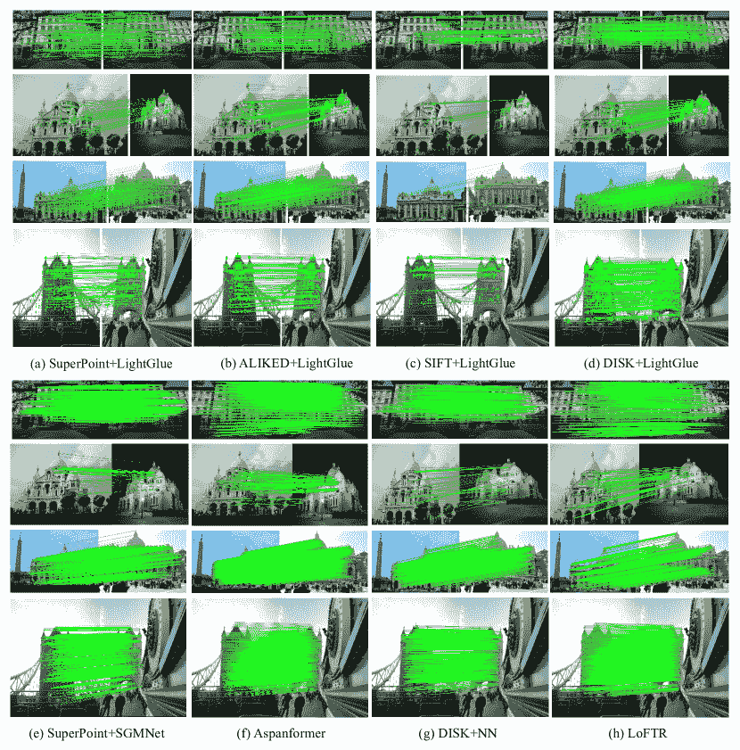
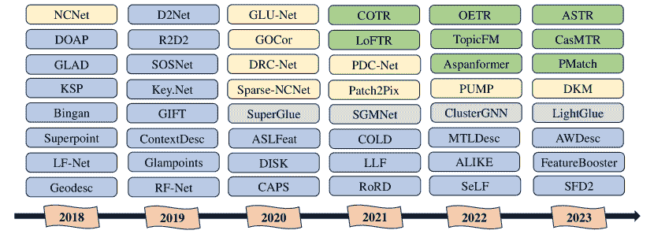
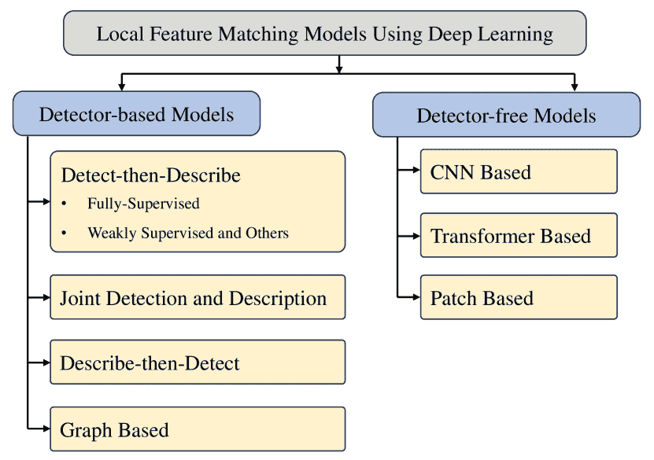
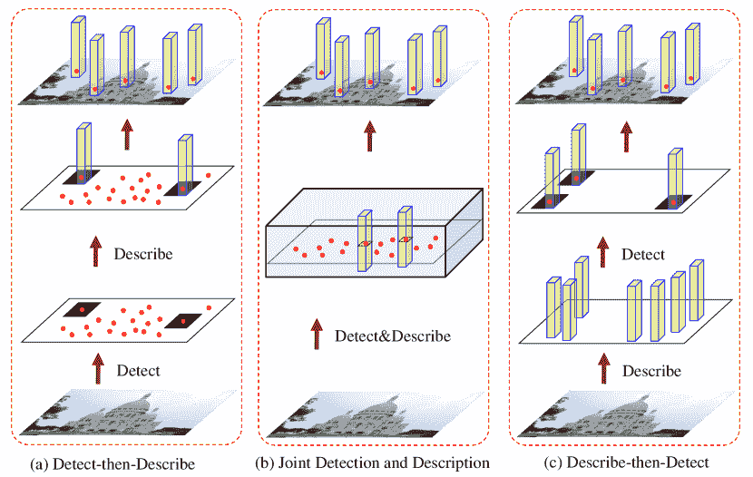
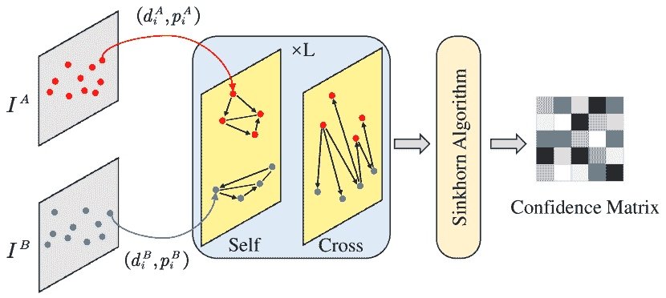
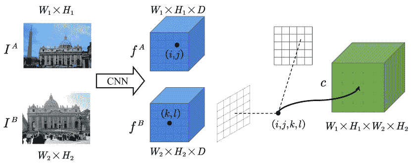
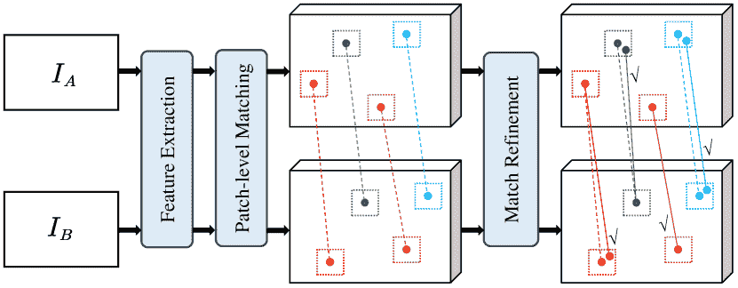

<!--yml

分类：未分类

日期：2024-09-06 19:34:41

-->

# [2401.17592] 本地特征匹配使用深度学习：综述

> 来源：[`ar5iv.labs.arxiv.org/html/2401.17592`](https://ar5iv.labs.arxiv.org/html/2401.17592)

# 本地特征匹配使用深度学习：综述

Shibiao Xu Shunpeng Chen Rongtao Xu Changwei Wang Peng Lu Li Guo 北京邮电大学人工智能学院，中国 中国科学院自动化研究所多模态人工智能系统国家重点实验室，中国

###### 摘要

本地特征匹配在计算机视觉领域具有广泛的应用，包括图像检索、三维重建和对象识别等领域。然而，由于视角和光照变化等因素，提升匹配的准确性和鲁棒性仍然面临挑战。近年来，深度学习模型的引入激发了对本地特征匹配技术的广泛探索。该研究旨在提供本地特征匹配方法的全面概述。这些方法根据是否使用检测器分为两个主要类别。基于检测器的类别包括 Detect-then-Describe、Joint Detection and Description、Describe-then-Detect 以及基于图的方法。相反，基于检测器自由的方法包括 CNN Based、Transformer Based 和 Patch Based 方法。我们的研究不仅限于方法论分析，还结合了对常见数据集和指标的评估，以便对最先进技术进行定量比较。本文还探讨了本地特征匹配在运动结构、遥感图像配准和医学图像配准等不同领域的实际应用，突显了其在各个领域的多样性和重要性。最终，我们力图概述该领域当前面临的挑战，并提供未来研究方向，为从事本地特征匹配及其相关领域的研究人员提供参考。

###### 关键词：

本地特征匹配，图像匹配，深度学习，综述。^†^†期刊：信息融合^(myfootnote)^(myfootnote)脚注：Rongtao Xu 为通讯作者。

## 1 引言

在图像处理领域，本地特征匹配任务的核心目标是建立不同图像之间的精确特征对应关系。这包括各种类型的图像特征，如关键点、特征区域、直线和曲线等。建立不同图像中相似特征之间的对应关系是许多计算机视觉任务的基础，包括图像融合 [1, 2, 3, 4, 5], 视觉定位 [6, 7, 8, 9], 运动重建（SfM） [10, 11, 12, 13], 同时定位与地图构建（SLAM） [14, 15, 16], 光流估计 [17, 18, 19], 图像检索 [20, 21, 22]，等等。

由于尺度变换、视点多样性、光照变化、模式重复和纹理变化等因素的影响，相同物理空间在不同图像中的表现可能会有显著的差异。例如，图 1 提供了几个流行深度学习模型在本地图像匹配任务中的性能视觉表示。然而，确保在不同图像之间建立精确的对应关系需要克服诸多复杂性和挑战，由上述因素造成。因此，在本地特征匹配中寻求准确性和可靠性仍然是一个复杂的问题。

图 1：户外图像的匹配结果。可以观察到，对于视点和光照条件有显著变化的图像，匹配任务遇到相当大的挑战。

在传统的图像匹配流程中，过程可以分解为四个基本步骤：特征检测、特征描述、特征匹配和几何变换估计。在深度学习出现之前[23, 24, 25]，许多著名的算法主要专注于该流程中的一个或多个阶段。各种技术致力于特征检测的过程[26, 27, 28, 29]，而其他技术则专注于局部执行特征描述任务[30, 31, 32]。此外，还设计了一些算法以同时适应特征检测和描述[33, 34, 35, 36, 37, 38]。在特征匹配方面，传统方法通常依赖于最小化或最大化特定的成熟度量标准，如平方和差或相关性。在几何变换估计阶段，算法通常基于类似于 RANSAC[39]的技术来估计基础的极几何或单应性。这些传统手工制作的方法和以学习为中心的方法是基于低级图像特征，如梯度和灰度序列。尽管在理论上对某些形式的变换具有一定的抗性，这些技术在本质上仍受限于研究人员对其任务施加的固有先验知识。

近年来，在解决局部特征匹配相关挑战[40, 41, 42]，特别是那些由尺度变化、视点偏移和其他形式的多样性带来的挑战方面，取得了显著的进展。现有的图像匹配方法可以分为两大类：基于检测器的方法和无检测器的方法。基于检测器的方法依赖于稀疏分布关键点的检测和描述，以在图像之间建立匹配。这些方法的有效性在很大程度上取决于关键点检测器和特征描述符的性能，因为它们在过程中扮演了重要角色。相对而言，无检测器的方法通过利用图像中丰富的上下文信息，绕过了独立的关键点检测和特征描述阶段。这些方法实现了端到端的图像匹配，从而提供了一种不同的机制来处理这一任务。

图像匹配在图像配准领域中发挥着关键作用，通过可靠的特征匹配集实现精确的变换函数拟合，显著贡献于该领域。这使得图像匹配成为图像融合广泛背景下的一个重要研究领域[43]。为了系统地概括局部特征匹配领域的发展并激发创新研究方向，本文对局部特征匹配的最新进展进行了详尽的回顾和深入分析，特别强调了深度学习算法的应用。此外，我们重新审视了相关数据集和评估标准，并对关键方法进行了详细的比较分析。我们的研究涵盖了传统手工方法与现代深度学习技术之间的差距和潜在桥接。通过分析传统手工方法和深度学习技术的最新发展，我们强调了这两种方法的持续相关性和协作关系。进一步地，我们关注了多模态图像的新兴焦点，包括针对多模态图像分析的专门方法的详细概述。我们的调查还识别并讨论了现有数据集在评估局部特征匹配方法中的不足和未来需求，突出了适应多样化和动态场景的重要性。符合当前趋势，我们审视了大型基础模型在特征匹配中的作用。这些模型代表了相较于传统语义分割模型[44、45、46、47、48]的重大转变，为各种场景和物体提供了优越的泛化能力。

总结来说，这项调查的一些关键贡献可以概括如下：

+   1.

    本调查广泛涵盖了当代局部特征匹配问题的文献，并详细概述了自 2018 年以来提出的各种局部特征匹配算法。按照普遍的图像匹配流程，我们主要将这些方法分为两大类：基于检测器的方法和无检测器的方法，并对采用深度学习的匹配算法进行了全面回顾。

+   2.

    我们详细审查了这些方法在众多现实世界场景中的应用，包括 SfM、遥感图像配准和医学图像配准。这项研究突出了局部特征匹配技术固有的多功能性和广泛适用性。

+   3.

    我们从相关计算机视觉任务出发，审查了局部特征匹配中涉及的主要数据集，并根据不同任务对其进行分类，以深入探讨每个领域中的具体研究需求。

+   4.

    我们分析了用于性能评估的各种指标，并对关键的局部特征匹配方法进行了定量比较。

+   5.

    我们提出了一系列挑战和未来研究方向，为该领域的进一步发展提供了宝贵的指导。

需要注意的是，最初的调查[49, 50, 51]主要集中在手动方法上，因此它们未能为以深度学习为中心的研究提供足够的参考点。尽管近期的调查[52, 53, 54]已经纳入了可训练的方法，但它们未能及时总结过去五年中出现的大量文献。此外，许多调查仅限于图像匹配领域的特定方面，例如一些文章仅介绍了局部特征的特征检测和描述方法，却没有包括匹配[52]，一些文章特别关注文化遗产图像的匹配[55]，还有一些则仅集中在医学图像配准[56, 57, 58]、遥感图像配准[59, 60]等方面。在这项调查中，我们的目标是通过评估现有的图像匹配方法，特别是最先进的基于学习的方法，提供最新和最全面的概述。重要的是，我们不仅讨论了服务于自然图像应用的现有方法，还探讨了特征匹配在 SfM、遥感图像和医学图像中的广泛应用。通过详细讨论多模态图像的匹配，我们阐明了这一研究与信息融合领域的密切联系。此外，我们还对最近的主流方法进行了彻底的审查和分析，这些讨论在现有文献中明显缺失。图 2 展示了局部特征匹配方法的代表性时间线，提供了这些方法的演变和它们在推动该领域进步中的重要贡献的见解。

图 2：代表性的局部特征匹配方法。蓝色和灰色代表基于检测器的模型，其中灰色代表图形基方法。黄色和绿色块分别代表基于 CNN 和 Transformer 的检测器无关模型。2018 年，Superpoint [61] 首创了在单个网络中计算关键点和描述符。随后，许多工作如 D2Net [62]、R2D2 [63] 等尝试整合关键点检测和描述以实现匹配。同时，NCNet [64] 方法将四维成本体积引入局部特征匹配，开启了利用基于相关性或成本体积的卷积神经网络进行检测器无关匹配研究的趋势。在这一趋势的基础上，出现了 Sparse-NCNet [65]、DRC-Net [66]、GLU-Net [67] 和 PDC-Net [68] 等方法。2020 年，SuperGlue [69] 将任务框架设定为涉及两组特征的图匹配问题。随后，SGMNet [70] 和 ClusterGNN [71] 通过解决匹配复杂性来改善图匹配过程。2021 年，LoFTR [72] 和 Aspanformer [73] 等方法成功将 Transformer 或注意力机制纳入检测器无关匹配过程。它们通过使用交替的自注意力和交叉注意力模块显著扩展了感受野，进一步推进了基于深度学习的匹配技术。

## 2 基于检测器的模型

基于检测器的方法论已经在本地特征匹配中占据了主导地位相当长的时间。许多成熟的手工设计方法，包括 SIFT [33]和 ORB [35]，已广泛应用于 3D 计算机视觉领域的各种任务 [74, 75]。这些传统的基于检测器的方法通常包括三个主要阶段：特征检测、特征描述和特征匹配。最初，从图像中提取一组稀疏的关键点。随后，在特征描述阶段，这些关键点使用高维向量进行表征，这些向量通常旨在封装这些点周围区域的特定结构和信息。最后，在特征匹配阶段，通过最近邻搜索或更复杂的匹配算法等机制，在像素级别建立对应关系。其中，Bian 等人提出的 Gms（Grid-based Motion Statistics）[76]和 Zhang 等人提出的 OANET（Order-Aware Network）[77]尤为值得注意。GMS 通过网格化运动统计来提升特征对应质量，简化并加速匹配，而 OANET 则通过整合空间上下文来创新性地优化两视图匹配，以实现精确的对应关系和几何估计。这通常通过比较不同图像之间关键点的高维向量，并根据相似度水平（通常由向量空间中的距离函数定义）来识别匹配。

然而，在深度学习时代，数据驱动方法的兴起使得像 LIFT [78]这样的方式变得流行。这些方法利用 CNNs 提取更强健且具有辨别力的关键点描述符，从而在处理大视角变化和局部特征光照变化方面取得了显著进展。目前，基于检测器的方法可以分为四大类：1\. 先检测后描述方法；2\. 联合检测与描述方法；3\. 先描述后检测方法；4\. 基于图的方法。此外，我们根据监督学习类型进一步将先检测后描述的方法细分为完全监督方法、弱监督方法和其他形式的监督方法。这个分类在图 3 中以视觉方式呈现。

图 3：本地特征匹配模型的概述及最相关方法的分类。

### 2.1 先检测后描述

在特征匹配方法中，稀疏到稀疏的特征匹配被广泛采用。这些方法遵循‘检测-再描述’的范式，其中主要步骤包括检测关键点的位置。然后，检测器从以每个检测到的关键点为中心的区域中提取特征描述符。这些描述符随后被传送到特征描述阶段。该过程通常使用度量学习方法进行训练，旨在学习一种距离函数，使得相似的点在特征空间中距离较近，而不相似的点距离较远。为了提高效率，特征检测器通常关注于较小的图像区域[78]，通常强调低级结构，如角点[26]或斑点[33]。而特征描述符则旨在捕捉更细致、更高级的信息，涵盖关键点所在的较大区域。这些描述符提供详细且独特的细节，作为匹配的定义特征。图 4(a) 说明了‘检测-再描述’流程的常见结构。

图 4: 展示了各种显著的检测器基础管道在可训练本地特征匹配中的比较。这里的分类基于检测和描述步骤之间的关系：(a) 检测-再描述框架，(b) 联合检测与描述框架，以及 (c) 描述-再检测框架。

#### 2.1.1 完全监督

本地特征匹配领域经历了显著的变革，这一变革主要受到标注补丁数据集[79]和深度学习技术的推动。这一变革标志着从传统手工方法向数据驱动的方法的转变，重塑了特征匹配的格局。本节旨在追溯这些变化的历史发展，强调各种全监督方法的顺序进展和相互关联的性质。在这一进化的前沿是 CNN，这在革命性地改变描述符学习的过程中发挥了关键作用。通过直接从原始本地补丁进行端到端学习，CNN 促进了本地特征层次的构建。这种能力使得 CNN 能够捕捉数据中的复杂模式，从而创建出更加专业和独特的描述符，显著提升了匹配过程。这一革命性转变在很大程度上受到了像 L2Net[80]这样创新模型的影响，L2Net 开创了一种渐进采样策略。L2Net 的方法强调了描述符之间的相对距离，同时对中间特征图施加了额外的监督。这一策略对鲁棒描述符的发展做出了重要贡献，为描述符学习设立了新的标准。

向这些以数据驱动的方法转变，基于 CNN 的支持，不仅提高了局部特征匹配的准确性和效率，还为这一领域的研究和创新开辟了新的途径。随着我们深入探讨这一领域的时间进展，我们可以观察到从传统到现代的清晰增长和改进轨迹，每种方法都在前人的成功基础上进行构建，同时引入新颖的概念和技术。OriNet [81] 提出了一种利用 CNN 为图像中的特征点分配标准方向的方法，从而增强了特征点匹配。他们介绍了一种消除预定义方向需求的 Siamese 网络 [82] 训练方法，并提出了一种新颖的 GHH 激活函数，在多个数据集上的特征描述符中显示出显著的性能提升。基于 L2Net 的架构原则，HardNet [83] 通过关注度量学习并消除辅助损失项，简化了学习过程，为后续模型简化学习目标树立了先例。DOAP [84] 将焦点转向学习排序的形式，优化了用于最近邻匹配的局部特征描述符，这一方法在特定匹配场景中取得了成功，并影响了后续模型考虑基于排名的方法。KSP [85] 方法因引入子空间池化方法而值得关注，利用 CNN 学习不变且具有区分性的描述符。DeepBit [86] 提供了一种无监督深度学习框架来学习紧凑的二进制描述符。它将局部描述符的旋转、平移和尺度不变性等重要属性编码为二进制表示。Bingan [87] 提出了一种使用正则化生成对抗网络（GAN）学习紧凑二进制图像描述符的方法。GLAD [88] 通过考虑人体的局部和全局线索来解决人物重识别任务。实现了一个四流 CNN 框架以生成具有区分性和鲁棒性的描述符。Geodesc [89] 通过结合 SfM 算法中的几何约束来推进描述符计算。这种方法强调两个方面：首先，利用几何信息构建训练数据来测量样本的难度，难度由相同 3D 点的像素块之间的变异性以及不同点的均匀性定义。其次，制定了几何相似性损失函数，促进了与同一 3D 点对应的像素块之间的接近性。这些创新使 Geodesc 在 3D 重建任务中显著提高了描述符的有效性。对于 GIFT [90] 和 COLD [91]，前者强调了从组特征中纳入潜在结构信息以构建有效描述符的重要性。通过利用组卷积，GIFT 生成了具有明显特性和对变换组具有不变性的密集描述符。相比之下，COLD 通过多级特征蒸馏网络架构引入了一种新颖的方法。该架构利用了 ImageNet 预训练卷积神经网络的中间层来封装层次特征，最终提取出高度紧凑且鲁棒的局部描述符。

继续叙述，我们的探索扩展到最近在完全监督方法上的进展，这构成了本地特征匹配能力的显著增强。这些开创性的方法在早期阐述的基础框架上构建，协同提升并精细化了支撑该领域的方法论。延续增强描述符鲁棒性的趋势，SOSNet [92] 通过引入二阶相似度正则化项来扩展 HardNet，以进行描述符学习。这一改进涉及将二阶相似度约束整合到训练过程中，从而提升学习鲁棒描述符的性能。术语“二阶相似度”表示一种度量，评估训练批次中描述符对相对距离的一致性。它不仅直接测量描述符对之间的相似度，还通过考虑它们在同一批次中与其他描述符对的相对距离来进行测量。Ebel 等人 [93] 提出了基于对数极坐标采样方案的本地特征描述符，以实现尺度不变性。这一独特方法允许在不同尺度下进行关键点匹配，并对遮挡和背景运动的敏感性较低。因此，它有效地利用了更大的图像区域来提高性能。为了设计更好的损失函数，HyNet [94] 引入了一种用于三元组边距损失的混合相似性度量，并实现了一个正则化项来约束描述符的范数，从而建立了一个平衡且有效的学习框架。CNDesc [95] 还研究了 L2 归一化，提出了一种创新的稠密本地描述符学习方法。它使用一种特殊的交叉归一化技术，而不是 L2 归一化，引入了一种新的特征向量归一化方法。Key.Net [96] 提出了一个结合手工设计和学习的 CNN 特征的关键点检测器，并在网络中使用尺度空间表示来提取不同层次的关键点。为了解决关键点检测方法中的不可微分问题，ALIKE [97] 提供了基于评分图的可微分关键点检测 (DKD) 模块。与依赖非极大值抑制 (NMS) 的方法不同，DKD 可以反向传播梯度并生成亚像素级别的关键点。这使得关键点位置可以直接优化。ZippyPoint [98] 基于 KP2D [99] 设计，介绍了一整套加速提取和匹配技术。该方法建议使用二进制描述符归一化层，从而实现生成独特的、长度不变的二进制描述符。

将上下文信息融入特征描述符已成为局部特征匹配方法发展的一个新趋势。ContextDesc [100] 引入了上下文感知，以改进现有的局部特征描述符。它通过使用关键点位置、原始局部特征和高层次区域特征作为输入，编码了几何和视觉上下文。其训练过程中的一个新颖之处是使用 N-pair loss，这种自适应损失函数无需参数调整，能实现更高效的学习过程。MTLDesc [101] 提供了一种策略来解决卷积神经网络领域固有的局部性问题。这通过引入自适应全局上下文增强模块和多个局部上下文增强模块来注入非局部上下文信息。通过增加这些非局部连接，它可以有效地学习远程特征之间的高层次依赖关系。在 MTLDesc 的基础上，AWDesc [102] 旨在将知识从一个更大、更复杂的模型（教师）转移到一个更小、更简单的模型（学生）。这种方法利用教师学到的知识，同时允许学生进行显著更快的计算，使模型在准确性和速度之间实现**最佳平衡**。这些方法对上下文感知的关注突出了在描述局部特征时考虑更多全局信息的重要性。每种方法以稍微不同的方式利用这些信息，从而导致多样化但潜在互补的特征匹配挑战应对方法。

考虑到传统图像特征描述符（如梯度、灰度等）在处理不同模态图像类型的几何和辐射差异方面存在的局限性[103]，目前出现了对基于频率域的特征描述符的关注。这些描述符在跨模态图像匹配方面表现出更高的熟练度。例如，RIFT[104]利用 FAST[105]在相位一致性（PC）图上提取可重复的特征点，随后使用频率域信息构建稳健的描述符，以应对多模态图像特征匹配中的挑战。在 RIFT 的基础上，SRIFT[106]进一步通过建立非线性扩散尺度（NDS）空间来改进这一方法，从而构建一个多尺度空间，不仅实现了尺度和旋转不变性，还解决了与 RIFT 相关的慢推断速度问题。随着深度学习技术的发展，基于深度的方法在特征提取方面展现了显著的能力。SemLA[107]在其配准和融合过程中使用语义引导。特征匹配仅限于语义感知区域，以提供图像融合任务的最准确配准效果。

#### 2.1.2 弱监督及其他

弱监督学习为模型提供了在无需密集标注标签的情况下学习鲁棒特征的机会，提供了训练深度学习模型面临的最大挑战之一的解决方案。几种弱监督局部特征学习方法应运而生，利用从相机姿态中容易获得的几何信息。**AffNet** [108] 代表了弱监督局部特征学习的一个重要进展，专注于局部特征的仿射形状学习。这种方法挑战了传统对几何可重复性的重视，表明它对于可靠的特征匹配是不够的，并强调了基于描述符学习的重要性。**AffNet** 引入了一个硬负样本常量损失函数，以提高仿射区域的匹配性和几何准确性。这在提升仿射协变检测器的性能方面被证明是有效的，特别是在宽基线匹配和图像检索中。这种方法强调了在开发更有效的局部特征检测器时需要同时考虑描述符匹配性和可重复性。**GLAMpoints** [109] 提出了一个半监督关键点检测方法，创造性地从强化学习损失公式中汲取灵感。在这里，奖励被用来根据最终对齐的质量来计算检测关键点的意义。这种方法已被指出显著影响最终图像的匹配和配准质量。**CAPS** [110] 介绍了一个弱监督学习框架，利用图像对之间的相对相机姿态来学习特征描述符。通过采用极几何约束作为监督信号，他们设计了可微分匹配层和粗到细的架构，从而生成了密集的描述符。**DISK** [111] 最大限度地发挥了强化学习的潜力，将弱监督学习整合到基于检测器的端到端管道中，使用策略梯度。这种将弱监督与强化学习相结合的综合方法可以提供更鲁棒的学习信号，实现有效的优化。 [112] 提出了一种利用群等变卷积神经网络（CNNs）力量的组对齐方法。这些 CNN 在提取判别性旋转不变的局部描述符方面效率高。作者使用自监督损失来提高方向估计的准确性和局部描述符的提取效率。使用相机姿态监督和其他技术的弱监督和半监督方法提供了应对训练鲁棒局部特征方法挑战的有用策略，并可能为该领域更高效、更可扩展的学习方法铺平道路。

### 2.2 联合检测与描述

稀疏局部特征匹配在各种成像条件下确实证明了其高效性。然而，在极端变化情况下，例如昼夜变化[113]、不同季节[114]或纹理弱的场景[115]，这些特征的表现可能会显著下降。限制可能源于关键点检测器和局部描述符的性质。检测关键点通常涉及关注图像的小区域，并且可能严重依赖于低级信息，例如像素强度。这个过程使得关键点检测器更容易受到低级图像统计变化的影响，这些变化通常受到光照、天气和其他环境因素的影响。此外，即使在仔细优化了各个组件之后，当尝试单独学习或训练关键点检测器或特征描述符时，将它们整合到特征匹配管道中仍可能导致信息丢失或不一致。这是因为单个组件的优化可能没有充分考虑组件之间的依赖性和信息共享。为了解决这些问题，提出了联合检测和描述的方法。在这种方法中，关键点检测和描述的任务在一个模型中同时集成和学习。这可以使模型在优化过程中融合来自两个任务的信息，更好地适应特定任务和数据，并通过 CNN 实现更深层次的特征映射。这种统一的方法可以通过允许检测和描述过程受到更高级信息的影响，例如图像的结构或形状相关特征，从而使任务受益。此外，稠密描述符涉及更丰富的图像上下文，这通常会导致更好的性能。图 4 (b)展示了联合检测和描述管道的常见结构。

基于图像的描述符方法将整个图像作为输入，并利用完全卷积神经网络[116]生成密集描述符，近年来取得了显著进展。这些方法通常将检测和描述的过程融合在一起，从而提高了两个任务的性能。**SuperPoint** [61] 采用自监督方法同时确定像素级别的关键点位置及其描述符。最初，模型通过应用随机同胚进行合成形状和图像的训练。该方法的一个关键方面在于其使用真实图像进行自我标注的过程。这个过程涉及调整同胚，以增强模型与现实图像的相关性，并使用 MS-COCO 数据集进行额外训练。对于这些图像的真实关键点通过各种同胚变换生成，关键点提取则使用**MagicPoint**模型进行。该策略通过聚合多个关键点热图，确保在真实图像上精确确定关键点位置。受到 Q 学习启发，**LF-Net** [117] 预测匹配图像对之间的几何关系，如相对深度和相机姿态，使用现有的 SfM 模型。它采用非对称梯度反向传播训练一个检测图像对的网络，而无需人工标注。在**LF-Net**的基础上，**RF-Net** [118] 引入了一种基于感受野的关键点检测器，并设计了一个称为“邻域掩模”的通用损失函数项，以便于补丁选择的训练。**Reinforced SP** [119] 利用强化学习原理处理关键点选择和描述符匹配中的离散性。它将特征检测器集成到一个完整的视觉管道中，并以端到端的方式训练可学习参数。**R2D2** [63] 结合了网格峰值检测与描述符的可靠性预测，使用 L2-Net 架构的密集版本，旨在生成稀疏、可重复且可靠的关键点。**D2Net** [62] 采用联合检测和描述的方法进行稀疏特征提取。与**SuperPoint**不同的是，它在检测和描述过程中共享所有参数，并使用联合公式同时优化这两个任务。他们的方法中的关键点被定义为深度特征图中的局部极大值。这些技术优雅地展示了如何在统一模型中集成检测和描述任务，从而在不同成像条件下实现更高效的学习和更优越的局部特征提取性能。

RoRD [120] 提出了一个双头 D2Net 模型，结合了普通和旋转鲁棒特征对应关系，以应对极端视角变化。HDD-Net [121] 设计了一个可交互学习的检测器和描述符融合网络，独立处理检测器和描述符组件，并在学习过程中关注它们的互动。MLIFeat [122] 设计了两个轻量级模块，用于关键点检测和描述符生成，利用多级信息融合共同检测关键点和提取描述符。LLF [123] 提出了利用低级特征来监督关键点检测。它将描述符主干中的单个 CNN 层扩展为检测器，并与描述符共同学习，以最大化描述符匹配。FeatureBooster [124] 在传统特征匹配流程中引入了描述符增强阶段。它建立了一个通用轻量级描述符增强框架，输入为原始描述符和关键点的几何属性。该框架利用基于 MLP 的自我增强和基于 transformers [125] 的交叉增强来提升描述符。ASLFeat [126] 使用多级特征图上的通道和空间峰值改进 D2Net。它引入了一个精确的检测器和不变描述符，以及多级连接和可变形卷积网络。密集预测框架采用可变形卷积网络（DCN）来缓解低分辨率特征图中关键点提取的限制。SeLF [127] 基于 Aslfeat 架构，利用从预训练的语义分割网络中获得的语义信息，用于学习语义感知的特征映射。它将学习到的对应关系感知特征描述符与语义特征结合，从而增强了长期定位的局部特征匹配的鲁棒性。最后，SFD2 [128] 提出了从全局区域（例如建筑物、车道）中提取可靠特征，同时通过隐式嵌入高级语义来抑制不可靠区域（例如天空、汽车）。这使得模型能够从单一网络中端到端提取全局可靠特征。

### 2.3 描述再检测

本地特征提取的一个常见方法是描述再检测管道，即首先使用特征描述符描述本地图像区域，然后根据这些描述符检测关键点。图 4 (c) 作为描述标准 Describe-then-Detect 管道结构的示例。

D2D [129] 提出了一个新的关键点检测框架，称为 Describe-to-Detect（D2D），突出了特征描述阶段固有的信息丰富性。该框架涉及生成大量密集特征描述符，并从该数据集中选择关键点。D2D 引入了局部深度特征图的相对和绝对显著性度量来定义关键点。由于来自弱监督的挑战无法区分检测和描述阶段的损失，PoSFeat [130] 提出了在描述-再检测管道中的解耦训练方法，专为弱监督局部特征学习设计。该管道将描述网络与检测网络分离，利用相机姿态信息进行描述符学习，从而提升性能。通过一种新颖的搜索策略，描述符学习过程更加有效地利用相机姿态信息。ReDFeat [131] 使用互加权策略来结合多模态特征学习的检测和描述方面。SCFeat [132] 提出了一个共享耦合桥策略，用于弱监督局部特征学习。通过共享耦合桥和交叉归一化层，该框架确保了描述网络和检测网络的个体优化训练。这种分离增强了描述符的鲁棒性和整体性能。

### 2.4 基于图的

在传统的特征匹配管道中，通过对特征描述符进行最近邻（NN）搜索来建立对应关系，并根据匹配分数或互相 NN 验证来消除离群点。近年来，基于注意力的图神经网络（GNNs）[133] 已经成为获取局部特征匹配的有效手段。这些方法创建了以关键点为节点的 GNN，并利用 Transformers 中的自注意力层和交叉注意力层在节点之间交换全局视觉和几何信息。这种交换克服了仅依赖局部特征描述符所带来的挑战。最终结果是基于软分配矩阵生成匹配。图 5 提供了基于图的匹配基本架构的全面描述。

图 5：一般 GNN 匹配模型架构。首先，将关键点位置 $p_{i}$ 及其视觉描述符 $d_{i}$ 映射为独立向量。随后，在图神经网络中交替应用自注意力层和交叉注意力层，共 L 次，以创建增强的匹配描述符。最后，利用 Sinkhorn 算法来确定最优的部分分配。

SuperGlue [69] 采用了注意力图神经网络和最优传输方法来解决部分分配问题。它将两个感兴趣点及其描述符作为输入，利用自注意力和交叉注意力在这两个描述符集之间交换信息。这种方法的复杂度随着关键点数量的增加而呈二次增长，这促使后续工作进行了进一步探索。SGMNet [70] 基于 SuperGlue，并添加了一个种子模块，该模块仅处理一部分匹配点作为种子。完全连接图被替换为稀疏连接图。然后设计了一个种子图神经网络，采用注意力机制来聚合信息。关键点通常与少数点表现出强相关性，从而导致大多数关键点的邻接矩阵稀疏连接。因此，ClusterGNN [71] 利用图节点聚类算法将图中的节点划分为多个簇。这一策略应用了具有聚类的注意力 GNN 层，以学习两个关键点集及其相关描述符之间的特征匹配，从而训练子图以减少冗余信息传播。MaKeGNN [134] 在稀疏注意力 GNN 架构中引入了双边上下文感知采样和关键点辅助上下文聚合。

受到 SuperGlue 的启发，GlueStick [135] 将点和线描述符融入一个联合框架中，用于联合匹配，并利用点对点关系来连接匹配图像中的线条。LightGlue [136] 为了使 SuperGlue 在计算复杂性上具有适应性，提出了基于每对图像匹配难度动态调整网络的深度和宽度。它设计了一个轻量级的信心分类器，用于预测和优化状态分配。DenseGAP [137] 设计了一个图结构，利用锚点作为稀疏但可靠的先验信息，用于图像间和图像内的上下文。它通过有向边将这些信息传播到所有图像点。HTMatch [138] 和 Paraformer [139] 研究了注意力机制在交互混合中的应用，并探索了在效率和有效性之间取得平衡的架构。ResMatch [140] 提出了残差注意力学习的概念，用于特征匹配，将自注意力和交叉注意力重新表述为相对位置参考和描述符相似性的学习残差函数。它旨在通过经验手段弥合可解释匹配与过滤管道和固有不确定性的基于注意力的特征匹配网络之间的差距。

## 3 无检测器模型

尽管特征检测阶段可以减少匹配的搜索空间，但处理极端情况，如涉及大量视角变化和无纹理区域的图像对，使用基于检测的方法仍然很困难，即使有完美的描述符和匹配方法 [141]。无检测器方法则通过消除特征检测器，直接在分布于图像上的稠密网格中提取视觉描述符，从而生成稠密匹配。因此，与基于检测的方法相比，这些技术可以捕捉到在图像对之间可重复的关键点。

### 3.1 CNN 基础

在早期阶段，无检测匹配方法通常依赖于使用相关性或成本体积的 CNN 来识别潜在的邻域一致性 [141]。图 6 展示了 4D 对应体积的基本架构。

图 6：4D 对应体积概述。密集特征图，表示为 $f^{A}$ 和 $f^{B}$，是通过卷积神经网络从图像 $I^{A}$ 和 $I^{A}$ 中提取的。每个单独的特征匹配 $f_{ij}^{A}$ 和 $f_{kl}^{B}$ 对应于匹配的 $\left(i,j,k,l\right)$ 坐标。最终形成 4D 相关张量 $c$，它包含了可能对应点的图像对之间的所有点的评分。随后，通过分析四维空间中对应点的属性来获得匹配对。

NCNet [64] 分析了一对图像之间所有可能对应点在四维空间中的邻域一致性，从而在无需全局几何模型的情况下获得匹配。Sparse-NCNet [65] 利用稀疏相关张量上的 4D 卷积神经网络，并通过子流形稀疏卷积显著减少内存消耗和执行时间。DualRC-Net [66] 引入了一种创新的方法，用于以粗到细的方式建立图像对之间的密集像素级对应关系。通过采用类似于特征金字塔网络（FPN）的双分辨率策略，该方法从粗分辨率特征图中生成 4D 相关张量，并通过可学习的邻域一致性模块进行细化，从而提高匹配的可靠性和定位准确性。GLU-Net [67] 引入了一种全局-局部通用网络，适用于估计几何匹配、语义匹配和光流的密集对应关系。它以自我监督的方式训练网络。GOCor [142] 提出了一个完全可微的密集匹配模块，预测两个深度特征图之间的全局优化匹配置信度，并且可以直接集成到最先进的网络中以替代特征相关层。PDCNet [68] 提出了一个概率深度网络，用于估计密集的图像到图像的对应关系及其相关置信度估计。它引入了一种架构和改进的自我监督训练策略，以实现具有普遍性的鲁棒不确定性预测。PDC-Net+ [143] 引入了一种概率深度网络，旨在估计密集的图像到图像的对应关系及其相关置信度估计。它们采用了约束混合模型来参数化预测分布，从而增强了处理异常值的建模能力。PUMP [144] 结合了无监督损失和标准自我监督损失来增强合成图像。通过利用 4D 相关体积，它利用 DeepMatching [145] 的非参数金字塔结构来学习无监督描述符。DFM [146] 使用预训练的 VGG 架构作为特征提取器，捕获匹配而无需额外的训练策略，从而展示了从 VGG 网络最深层提取的特征的强大能力。

### 3.2 基于 Transformer

CNN 的密集特征感受野在处理低纹理区域或区分具有相似特征表示的关键点时可能存在局限性。相比之下，人类在匹配这些区域时往往会考虑局部和全局信息。鉴于变换器在计算机视觉任务如图像分类 [147]、目标检测 [148] 和语义分割 [149, 150, 151, 152, 153] 中的成功，研究人员已探讨将变换器的全局感受野和长距离依赖关系融入局部特征匹配中。已经出现了将变换器集成到特征提取网络中的各种方法用于局部特征匹配。

考虑到稀疏匹配和密集匹配之间唯一的区别是查询点的数量，COTR [154] 结合了这两种方法的优点。它通过自注意力机制联合学习两张匹配图像，使用一些关键点作为查询，并通过相应的神经网络递归地优化另一张图像中的匹配。这个集成将两个匹配合并为一个参数优化的问题。ECO-TR [155] 力求开发一个端到端的模型，通过智能连接多个变换器块并在共享的多尺度特征提取网络上以粗到细的方式逐步优化预测坐标，从而加速 COTR。LoFTR [72] 的突破性在于它创建了一个以关键点为节点的图神经网络（GNN），利用自注意力层和互注意力层获取两张图像的特征描述符，并在纹理稀少的区域生成密集匹配。为了克服 LoFTR 中缺乏局部注意力交互的问题，Aspanformer [73] 提出了一个基于流预测概率建模的不确定性驱动方案，该方案自适应地调整局部注意力范围，为不同位置分配不同的上下文大小。在这些发展基础上，SE2-LoFTR [156] 在解决特征匹配中的旋转挑战方面取得了重要进展。这一改进涉及通过用可转动卷积神经网络（CNN）替代 LoFTR 模型的传统主干 CNN，从而使模型对平移和图像旋转具有等变性，显著增强了其对旋转变化的鲁棒性。基于可转动 CNN 的特征提取与诸如修正平面表面匹配等技术的融合展示了这一方法的多样性和广泛应用性。

为了应对密集匹配方法中存在的大量相似点带来的挑战以及线性变压器自身性能的限制，最近一些研究提出了新颖的方法。Quadtree [157] 引入了四叉树注意力，能够在更细的层级快速跳过无关区域的计算，将视觉变换的计算复杂度从平方级别降低到线性级别。OETR [158] 引入了重叠回归方法，利用变压器解码器估计图像中边界框的重叠程度。它结合了对称中心一致性损失，以确保重叠区域的空间一致性。OETR 可以作为预处理模块插入任何局部特征匹配管道中。MatchFormer [159] 设计了一个层次化变压器编码器和一个轻量级解码器。在层次结构的每个阶段，交叉注意力模块和自注意力模块交替排列，以提供最佳的组合路径，增强多尺度特征。CAT [160] 提出了一个基于自注意力机制的上下文感知网络，其中注意力层可以沿空间维度应用以提高效率，或沿通道维度应用以提高准确性并减少存储负担。TopicFM [161] 通过利用主题建模方法对图像中的高层上下文进行编码。这通过关注图像中的语义相似区域，提高了匹配的鲁棒性。ASTR [162] 引入了一种自适应点引导变压器，包括一个点引导聚合模块，使大多数像素能够避免无关区域的影响，同时利用计算得到的深度信息在细化阶段自适应地调整网格的大小。DeepMatcher [141] 引入了特征变换模块，以确保从 CNN 中提取的局部聚合特征平滑过渡到从变压器中提取的具有全局感受野的特征。它还提出了 SlimFormer，构建深度网络，采用层次化策略，使网络能够自适应地吸收残差块中的信息交换，模拟人类行为。OAMatcher [163] 提出了重叠区域预测模块，以捕捉共视区域中的关键点，并在这些区域之间进行特征增强，模拟人类如何从整个图像转移焦点到重叠区域。他们还提出了一种匹配标签权重策略，通过生成系数来评估真实匹配标签的可靠性，利用概率来判断匹配标签是否正确。CasMTR [164] 提议通过引入新的级联匹配和 NMS 检测阶段来增强基于变压器的匹配管道。

PMatch [165] 通过使用成对掩蔽图像建模预训练任务的变换器模块来提升几何匹配性能，并利用 LoFTR 模块。为了有效利用几何先验，SEM [166] 引入了一个结构化特征提取器，该提取器建模像素与高度可信锚点之间的相对位置关系。它还结合了极线注意力和匹配技术，以根据极线约束过滤掉不相关的区域。DKM [167] 通过设计一种密集特征匹配方法解决了双视图几何估计问题。DKM 提出了一个强大的全局匹配器，配有内核回归器和嵌入解码器，通过对堆叠特征图应用大深度内核进行变形优化。在此基础上，RoMa [168] 通过应用马尔可夫链框架来分析和改进匹配过程，代表了密集特征匹配的显著进展。它引入了两阶段方法：一个用于全局一致匹配的粗略阶段和一个用于精确定位的优化阶段。这种方法将初始匹配与优化过程分开，并采用稳健的回归损失以获得更高的准确性，显著改善了匹配性能，超越了当前的最先进技术。

### 3.3 基于补丁的匹配

基于补丁的匹配方法通过匹配局部图像区域来增强点对应关系。它涉及将图像分割成补丁，为每个补丁提取描述符向量，然后匹配这些向量以建立对应关系。这种技术适应大位移，并在各种计算机视觉应用中具有重要价值。图 7 展示了基于补丁的匹配方法的总体架构。

图 7：基于补丁的管道示意图。在提取图像特征后，对从补丁级匹配中获得的匹配区域进行匹配优化处理，得到精确的点匹配。

Patch2Pix [169] 提出了一个弱监督方法，用于学习在图像对之间极端几何变换下保持一致的对应关系。它采用了一个两阶段的检测-精化策略来进行对应预测，其中第一阶段捕捉语义信息，第二阶段处理局部细节。它引入了一个新颖的精化网络，利用来自极端几何变换的弱监督，并输出匹配位置的置信度和离群点排除，从而实现几何一致的对应预测。AdaMatcher [170] 解决了在补丁级匹配中应用一对一分配标准所导致的几何不一致问题。它在估计图像之间的尺度的同时，自适应地分配补丁级匹配，从而提高了在极端情况下密集特征匹配方法的性能。PATS [171] 提出了带有细分的补丁区域传输（PATS），以自监督的方式学习尺度差异。它可以处理多对多关系，而不是仅处理一对一匹配的二分图匹配。SGAM [172] 提出了一个分层特征匹配框架，该框架首先基于语义线索进行区域匹配，将特征匹配搜索空间缩小到图像之间具有显著语义分布的区域匹配。然后通过几何一致性精化区域匹配，以获得准确的点匹配。

## 4 本地特征匹配应用

### 4.1 从运动中重建结构

SfM 代表了一种基础的计算视觉过程，对于从一系列不同场景图像中推断相机方向、内在参数和体积点云至关重要。这个过程支撑了视觉定位、多视角立体视觉和新视角合成等工作。SfM 的发展轨迹，经过广泛的学术研究，产生了成熟的方法论、复杂的开源框架，如 Bundler [173] 和 COLMAP [12]，以及先进的专有软件解决方案。这些框架被精心设计以确保在处理大规模场景时的精确性和可扩展性。

传统的 SfM 方法依赖于识别和关联分布在多重视角中的稀疏特征点。然而，这种方法在纹理特征稀少的区域遇到了巨大的挑战，在这些区域中，关键点的识别变得非常棘手。Lindenberger 等人[174] 通过仔细细化初始关键点并在后处理过程中对点和相机方向进行后续调整，改善了这一困境。该方法战略性地平衡了初步的粗略估计与稀疏的局部特征，并通过局部精确的密集特征进行后续的精细调整，从而在挑战条件下提高了精度。最近 SfM 的进展已经转向整体方法，这些方法要么直接回归姿态[175, 176]，要么采用差分束调整[177, 178]。这些方法绕过了明确的特征关联，规避了与次优特征匹配相关的挑战。He 等人[179] 引入了一种创新的无探测器 SfM 模式，利用无探测器匹配器推迟关键点的确定。这种策略巧妙地解决了无探测器匹配器中普遍存在的多视图不一致问题，相较于传统的探测器中心系统，在纹理贫乏的场景中表现出更优的效果。

SfM 方法的发展轨迹可见于从传统的稀疏特征识别到复杂的、偶尔是端到端的密集匹配范式的转变。这些开创性方法的融合正在提升现有 SfM 工作流的精度和韧性，特别是在困难场景中。然而，将这些方法无缝集成到现代 SfM 系统中仍然是一个复杂的挑战。

### 4.2 遥感图像配准

在遥感领域，深度学习的出现标志着多模态遥感图像配准（MRSIR）迎来了革命性的时代[43, 180, 181, 182]，将传统的面积和特征基础技术与基于学习的管道（LBP）[183, 184]相融合。这种 LBP 分为几种开创性的方法：将深度学习与传统的配准方法相结合，通过模态转换来桥接多模态差距，以及直接回归转换参数以建立全面的 MRSIR 框架[60]。诸如（伪）孪生网络和生成对抗网络（GANs）等技术在这一进化过程中发挥了关键作用，有助于管理几何失真和非线性辐射差异[185, 186]。例如，条件 GANs 的应用使得伪图像的创建成为可能[187], 从而增强了 NCC[188]和 SIFT[17]等已建立方法的精度。

在 LBP 中，已经制定了许多创新的方法和架构。MUNet[181]，一种用于学习变换参数的多尺度策略，以及用于尺度特定特征提取的全卷积网络，是这一创新的典型例子，解决了非刚性 MRSIR[189]的挑战。为了进一步丰富 LBP，各种研究工作集中于将 CNN 提取的中级或高级特征与经典描述符相结合，克服了传统方法的局限性。例如，Ye 等人[190, 181]设计了一种新型的多光谱图像配准技术，采用 CNN 和 SIFT 的结合，大大提高了配准效率。同样，Wang 等人[191]开发了一种端到端的深度学习架构，能够识别图像补丁对及其匹配标签之间的映射函数，利用迁移学习加速训练。Ma 等人[192]提出了一种使用 CNN 和局部特征的粗到细配准方法，通过 VGG-16 获得了深刻的金字塔特征表示。Zhou 等人[193]开发了一种基于深度学习的方法，用于配准合成孔径雷达（SAR）图像和光学图像，专注于使用浅层伪 Siamese 网络提取多尺度卷积梯度特征（MCGFs）。这种方法有效地捕捉了 SAR 和光学图像之间的共性，超越了手工设计特征的限制，减少了对大量模型参数的需求。Cui 等人[194]介绍了 MAP-Net，一种图像中心的卷积网络，结合了空间金字塔聚合池化（SPAP）和注意机制，能够通过嵌入原始图像提取高级语义信息，并利用 PCA 提高匹配精度，有效解决了跨模态图像中的几何畸变和辐射变异。

尽管有这些进展，数据集构建和方法泛化方面的挑战仍然存在，这主要是由于遥感图像的多样性和复杂性[181]。开发全面且具有代表性的训练数据集，并结合专门为遥感图像精心设计的创新方法，仍然是一个迫切的目标。此外，雷达图像和光学图像在像素级融合方面的有价值研究仍然稀缺，未来的工作中需要更多关注[195]。

### 4.3 医学图像配准

医学图像配准领域随着复杂深度学习技术的集成，特别是在运动估计和 2D-3D 配准方面，经历了显著的演变。这些进展不仅代表了技术上的飞跃，还为各种医学应用开辟了新视野[58]。

医学成像中的运动估计，作为配准的关键方面，已通过深度学习得到显著改进。无监督光流和点跟踪技术，如 Bian 等人[196]、Ranjan 等人[197]和 Harley 等人[198]所阐述的，解决了医学图像数据中固有的复杂性，如患者解剖的变异性以及通过微分同胚和不可压缩性保持解剖完整性的需求。基于深度学习的方法在不同器官的运动估计中显示出有效性，从心脏到肺部。例如，Qin 等人[199]展示了基于变分自编码器模型的应用，通过遍历生物力学合理的变形流形，寻找给定心脏序列的最佳变换，从而获得更好的运动跟踪精度和更合理的心肌运动及应变估计，提高了运动估计的真实感和临床可靠性。DeepTag[200]和 DRIMET[201]展示了用于跟踪内部组织运动的复杂方法，特别是在标记 MRI 的背景下。这些方法展示了通过先进的无监督学习技术在医学成像中估计密集的 3D 运动场的能力。近期在可变形医学图像配准中的单次学习进展在当代研究中得到了显著体现，特别是在将单次学习应用于复杂的 3D 和 4D 医学数据集，从而提高了精度，减少了对大规模训练数据集的依赖，并扩展了适用范围。Fechter 等人[202]提出了一种用于 3D 和 4D 数据集深度运动跟踪的单次学习方法，解决了对大量训练数据的需求挑战。他们的方法在通道维度上连接来自不同阶段的图像，利用 U-Net 架构和粗到细的策略。这种方法允许在 3D 数据集中同时计算前向和反向变换。Zhang 等人[203]提出了 GroupRegNet，一种用于 4D 图像配准的单次深度学习方法。它采用隐式模板，有效减少了偏差和累积误差。GroupRegNet 的网络设计简单且直接配准过程消除了图像分割的需要，显著提高了计算效率和精度。在此领域的发展中，Ji 等人[204]提出了一种用于肺部 4D-CT 图像配准的时间-空间方法。该方法整合了 CNN-ConvLSTM 混合架构，巧妙地建模了图像的时间运动，同时结合双流方法以应对周期性运动限制。基于 Hybrid Paradigm 的配准网络（HPRN）[205]引入了一种无监督学习框架，用于 4D-CT 肺部图像配准，有效处理了没有真实数据的大变形。HPRN 通过学习多尺度特征、引入先进的损失函数，并避免了裁剪和缩放等预处理步骤，实现了更高的配准精度。

2D-3D 注册是一个关键组件，特别是在介入手术中[206]。这个过程对于将 2D 图像（如 X 射线、超声波或内窥镜图像）准确地叠加到 3D 术前 CT 或 MR 图像上至关重要。这里的关键挑战在于这些不同维度之间的准确几何对齐。传统的 2D-3D 注册方法依赖于基于图像强度的相似性度量的迭代优化方法[207]。然而，这些方法常常面临问题的非凸性质，可能会导致如果初始估计与实际解决方案相差较远时，收敛到不正确的解决方案。这一问题还受到在 2D 图像上表示 3D 空间信息的固有困难的影响，导致注册模糊。近年来的进展中，已经出现了基于深度学习的方法。这些方法不同于传统方法，不需要明确的功能映射，从而提供了更为稳健的注册解决方案[208]。在 2D-3D 医学图像注册的最新发展领域中，Jaganathan 等人[209]提出了一种自监督范式，旨在融合 X 射线和 CT 图像。这种方法利用模拟的 X 射线投影来促进深度神经网络的训练，显著提高了注册的准确性和成功率。与此同时，Huang 等人[210]设计了一个针对神经干预的双阶段框架。这一创新方法将 CNN 回归与质心对齐结合在一起，在实时临床应用中表现出卓越的效能。除了刚性 2D-3D 注册，非刚性注册也受到越来越多的关注，这对于颅面测量、放射治疗中的肺肿瘤追踪和全髋关节置换术（THA）等应用至关重要[211, 212, 213]。深度学习模型，如卷积编码器，已被用于解决非刚性注册的挑战[214, 215]。

运动估计与 2D-3D 注册技术在医学图像注册中的融合解决了参数优化和模糊性方面的关键挑战，提高了医学成像过程的速度和准确性。这一领域的持续发展有望彻底改变诊断和介入程序，使其更加高效、以患者为中心，并关注结果。感兴趣的读者可以参考全面的调查[58, 57]，了解基于深度学习的医学图像注册方法的详细概述。

## 5 本地特征匹配数据集

局部特征匹配方法通常根据其在下游任务中的有效性进行评估。在本节中，我们将总结一些用于评估局部特征匹配的最广泛使用的数据集。我们将这些数据集分为五个类别：图像匹配数据集、相对姿态估计数据集、视觉定位数据集、光流估计数据集和运动重建数据集。对于每个数据集，我们将提供关于其特征的详细信息。

### 5.1 图像匹配数据集

HPatches [216] 基准作为图像匹配工作的重要标准。它包含 116 个场景序列，特点是视点和光照的波动。在每个场景中，有 5 对图像，第一张图像作为参考点，后续图像的复杂度逐步增加。该数据集被分为两个不同的领域：视点，涵盖 59 个视点变化显著的序列，以及光照，涵盖 57 个光照变化显著的序列，包括自然和人工光照条件。在每个测试序列中，一张参考图像与剩下的五张图像配对。值得注意的是，根据 D2Net 的评估方法，通常使用 56 个视点变化显著的序列和 52 个光照变化显著的序列来评估网络的性能。从 SuperPoint [61]开始，HPatches 数据集也用于评估局部描述符在单应性估计任务中的表现。

Roto-360 [112] 是一个评估数据集，由 360 对图像组成。这些图像对在一个平面内旋转，角度范围从 0°到 350°，间隔为 10°。该数据集通过随机选择和旋转十张 HPatches 图像生成，对于评估描述符在旋转不变性方面的表现非常有价值。

### 5.2 相对姿态估计数据集

ScanNet [217] 是一个大规模的室内数据集，具有明确定义的训练、验证和测试划分，包括来自 1613 个场景的大约 2.3 亿对明确定义的图像。该数据集包括真实值和深度图像，并且包含更多重复和纹理较弱的区域，相较于 Hpatches 数据集，挑战更大。

YFCC100M [218] 是一个庞大的数据集，包含各种旅游地标的互联网图像。它包括 1 亿个媒体对象，其中约 9920 万个是照片，80 万个是视频，每个媒体对象都包含多个元数据，如 Flickr 标识符、所有者姓名、相机信息、标题、标签、地理位置和媒体来源。通常，会使用 YFCC100M 的一个子集进行评估，该子集由四个流行的地标图像集组成，每个图像集包含 1000 对图像，总共有 4000 对用于测试集，并遵循[77, 69, 70, 73]中使用的惯例。

MegaDepth [219] 是一个旨在处理在极端视点变化和重复模式下匹配的挑战性任务的数据集。它包含来自 196 个不同户外场景的 100 万对图像，每个图像都有已知的姿态和深度信息，并可用于验证户外场景中的姿态估计效果。作者还提供了通过稀疏重建和多视图立体计算生成的深度图，使用了 COLMAP [12]。

EVD（极端视点数据集）[220] 是一个精心策划的数据集，专门用于评估在极端视点变化情况下的双视图匹配算法。它将来自各种公开数据集的图像对汇集在一起，以其复杂的几何配置而著称。EVD 的创建动机在于评估匹配方法在视点显著变化的情况下的鲁棒性。

WxBS（宽基线立体视觉）[221] 处理了宽基线立体匹配领域中的更广泛挑战，涵盖了图像获取中的多个方面的差异，如视点、光照、传感器类型和视觉变化。该数据集包含 37 对图像，结合了城市和自然环境，根据各种复杂因素的存在进行系统分类。WxBS 的真实数据通过手动选择的对应关系来建立，捕捉在两幅图像中都可见的场景片段。WxBS 作为评估针对各种苛刻条件下图像匹配算法的关键工具。

### 5.3 视觉定位数据集

Aachen Day-Night [222] 是一个包含 4328 张白天图像和 98 张夜晚图像的数据集，用于定位任务。该基准挑战了白天和夜晚图像之间的匹配，使其成为一个具有挑战性的数据集。Aachen Day-Night v1.1 [9] 是 Aachen Day-Night 数据集的更新版本，包含 6697 张白天图像和 1015 张查询图像（白天 824 张，夜晚 191 张）。由于存在大幅的光照和视点变化，使其成为一个具有挑战性的数据集。

InLoc [115] 是一个室内数据集，包含 9972 张 RGBD 图像；其中 329 张 RGB 图像用于测试长期室内视觉定位算法的性能。该数据集由于其大规模（约 10k 张图像覆盖两栋建筑物）、数据库和查询图像之间显著的视点和/或光照差异以及场景的时间变化，提供了各种挑战。此外，InLoc 数据集还提供了来自 3D 扫描仪的大量深度图。

RobotCar-Seasons (RoCaS) [223] 是一个具有挑战性的数据集，包含 26121 张参考图像和 11934 张查询图像。该数据集呈现了多种环境条件，包括雨天、雪天、黄昏、冬季和郊区的光照不足。这些因素使得特征匹配和视觉定位任务变得困难。

LaMAR [224] 涉及增强现实（AR）中的定位和映射基础技术，为现实的 AR 场景引入了一个新的基准。该数据集通过 AR 设备在各种环境中捕获，包括室内和室外场景，涵盖动态物体和不同的光照条件。它包含来自 HoloLens 2 和 iPhones/iPads 等设备的多传感器数据流（图像、深度、IMU 等），覆盖超过 45,000 平方米。LaMAR 的地面真实管道自动对齐 AR 轨迹与激光扫描，能够稳健地处理来自异构设备的数据。该基准在评估 AR 特定的定位和映射方法中具有重要意义，强调了在 AR 设备中考虑附加数据流（如无线电信号）的重要性。LaMAR 为 AR 提供了一个现实且全面的数据集，指导了未来在视觉定位和映射中的研究方向。

### 5.4 光流估计数据集

KITTI [225] 是一个在城市交通场景中收集的图像匹配数据集，分为 2012 版和 2015 版。KITTI-2012 包含 194 对训练图像和 195 对测试图像，分辨率为 1226×370，而 KITTI-2015 包含 200 对训练图像和 200 对测试图像，分辨率为 1242×375。该数据集包括使用激光扫描仪获得的稀疏地面真实视差。KITTI-2012 中的场景相对简单，而 KITTI-2015 数据集由于其动态场景和复杂情境带来了挑战。

### 5.5 运动结构数据集

ETH [226] 是一个旨在通过从一组可用的 2D 图像构建 3D 模型来评估 SfM 任务描述符的数据集。继 D2Net 之后，评估了三个中等规模的数据集：马德里大都会、亨德曼市场和伦敦塔 [227]。ETH 数据集包括各种相机和条件，为比较不同方法的性能提供了具有挑战性的基准。

ETH3D [228] 是一个全面的多视角立体算法基准数据集。该数据集涵盖了多种场景，包括室内和室外，通过高分辨率单反相机和同步低分辨率立体视频进行捕捉。该数据集的独特之处在于其高空间和时间分辨率的结合。涵盖从自然到人为环境的场景，它为详细的 3D 重建引入了新挑战，特别关注手持移动设备在立体视觉场景中的应用。ETH3D 提供了多样的评估协议，涵盖高分辨率多视角立体、低分辨率多视角视频数据以及双视角立体。因此，它是推动密集 3D 重建领域研究的宝贵资产。

### 5.6 数据集差距与未来需求

尽管上述数据集为评估局部特征匹配方法提供了宝贵的资源，但仍存在需要解决的重大差距。

一个主要的差距是缺乏模拟极端环境条件的数据集。虽然像 RoCaS [223] 这样的数据集提供了环境条件的一些变异性，包括多样的天气场景和光照条件，但仍需要专注于挑战性天气场景的数据集，如暴雨、雾霾或雪。这些条件在特征匹配中带来了独特的挑战，并且对于气候敏感领域的应用至关重要。另一个差距是高度动态环境的有限表示。目前的数据集，包括广泛使用的 HPatches [216]，虽然在视角和光照变化的检查上非常全面，但没有充分捕捉到拥挤城市区域或快速移动场景的复杂性。这一限制对于需要实时监控和在高密度人口区域进行监视的应用来说非常重要。能够模拟这些环境动态的数据集对于推动这些背景下的特征匹配技术至关重要。此外，针对特定应用领域的数据集明显不足，例如水下或空中图像。这些领域具有独特的特性和挑战，而像 ETH [226] 或 Aachen Day-Night [222] 这样的数据集没有解决这些问题。在这些领域中的专门数据集对于如海洋生物学或基于无人机的监控等领域的研究和发展将具有不可估量的价值。

总之，虽然现有的数据集对局部特征匹配领域做出了显著贡献，但仍然明显需要更多专门化的数据集。这些数据集应旨在填补现有的空白，并满足各种应用领域不断发展的需求，从而推动局部特征匹配技术的进一步发展。

## 6 性能评估

### 6.1 匹配模型的度量

#### 6.1.1 图像匹配

重复性 [229, 52]。比较两幅图像的重复性度量是通过计算两幅图像之间匹配特征区域的数量，并将其除以在任一图像中发现的特征区域的较小数量，然后乘以 100，以百分比形式表示结果。这个定量评估对于衡量特征检测器在不同几何变换下的一致性至关重要。

|  | $\text{重复性}=\frac{M}{\min(F_{1},F_{2})}\times 100$ |  |
| --- | --- | --- |

其中，$M$ 表示两幅图像之间匹配特征区域的数量，$F_{1}$ 表示在第一幅图像中检测到的特征区域总数，而 $F_{2}$ 是在第二幅图像中检测到的特征区域总数。

匹配分数 (M-score) [61, 78]。M-Score 通过计算在两幅图像重叠区域中正确匹配的特征与总检测特征的平均比率，量化特征检测和描述管道的有效性。均值匹配准确率 (MMA) [62] 用于测量在多个像素误差阈值下图像对之间特征匹配的表现。它表示考虑多个像素误差阈值的情况下，图像对中正确匹配的平均百分比。该度量仅考虑互为最近邻的匹配，如果使用提供的单应性估计的重投影误差低于给定的匹配阈值，则匹配被认为是正确的。特征和匹配 [62] 评估特征描述符的性能。特征指每幅图像检测到的平均特征数量，匹配则指成功匹配的特征的平均数量。正确关键点百分比 (PCK) [110] 度量常用于评估密集匹配的性能。它涉及在图像网格上从第一幅图像中提取关键点，并在完整的第二幅图像中找到它们的最近邻。如果查询点的预测匹配在地面真实匹配的某个像素阈值内，则被认为是正确的。

#### 6.1.2 单应性估计

角度正确性度量通常用于评估特征匹配算法的性能。该度量涉及估计两个图像之间的单应性变换 $\hat{\mathcal{H}}$，并将变换后的角点与使用真实单应性 $\mathcal{H}$ 计算的角点进行比较[61]。为了确保对产生不同匹配数量的方法进行公平比较，根据使用 $\hat{\mathcal{H}}$ 和 $\mathcal{H}$ 变换的图像之间的角点误差计算正确性标识符。如果四个角点的平均误差小于指定的像素阈值 $\varepsilon$，通常在 1 到 10 像素范围内，则估计的单应性被认为是正确的。一旦确认估计的单应性正确，使用曲线下面积（AUC）度量评估图像之间的角度误差。该度量计算在不同阈值下的误差积累曲线下面积，量化匹配的准确性和稳定性。AUC 值代表整体匹配性能，值越高，性能越好。

#### 6.1.3 相对姿态估计

在评估估计的相机姿态时，典型的方法涉及测量旋转和翻译中的角度偏差[230]。在此方法中，如果角度偏差小于某个阈值，则旋转或翻译被认为是正确估计的，并报告该阈值下的平均准确性。帧间隔表示为 $d_{frame}$，其中较大的值表示更具挑战性的图像对进行匹配。对于不同阈值下的姿态误差，最常见的度量包括 AUC、匹配准确性、匹配得分。其中，通常注意到的姿态误差是平移误差和角度误差的最大值。

#### 6.1.4 视觉定位

评估过程通常遵循在视觉定位基准测试中概述的一般评估协议¹¹1https://www.visuallocalization.net。自定义特征作为系统的输入，然后使用诸如 COLMAP 的框架执行图像配准过程[12]。最后，计算在预定义容差范围内成功定位的图像百分比。为了报告被评估方法的性能，通常使用不同阈值下的姿态误差累积 AUC。

#### 6.1.5 光流估计

用于光流估计的评估指标包括平均端点误差（AEPE）、流异常值比例（Fl）和正确关键点比例（PCK）[231, 67]。AEPE 是估计值与实际对应图之间的均方根欧几里得距离。具体而言，它量化了预测和实际流场之间的欧几里得差异，该值计算为目标图像中有效像素的平均值。Fl 评估所有像素中的异常值平均百分比，其中异常值定义为流误差超出 3 像素或 $5\%$ 的真实流量。PCK 解释了在特定阈值（以像素为单位）内，估计点 $\hat{x}_{i}$ 相对于真实点 $x_{i}$ 的匹配百分比。

#### 6.1.6 结构光流

如 ETH [226] 规定的评估框架所述，一套关键指标被用来严格评估重建过程的真实性。这些指标包括注册图像的数量，作为重建全面性的指标，以及稀疏点指标，提供对场景深度和复杂度的洞察。此外，图像中总观察量指标对于相机校准和三角测量过程至关重要，表示稀疏点的确认图像投影。平均特征跟踪长度，指示每个稀疏点的验证图像观察的平均数量，在确保准确校准和稳健三角测量中发挥重要作用。最后，平均重投影误差是衡量重建准确性的重要指标，综合了在束调整中观察到的累积重投影误差，受输入数据的完整性以及关键点检测精度的影响。

ETH3D 的关键指标[228] 对评估各种 SfM 方法的有效性至关重要。不同阈值下的姿态误差的 AUC 用于评估多视角相机姿态估计的准确性。该指标反映了估计相机姿态相对于真实值的精度。在不同距离阈值下的准确度和完整度百分比评估 3D 三角测量任务。准确度表示重建点与真实值之间的距离比例，完整度测量在重建点云中适当表示的真实点百分比。

### 6.2 定量性能

在本节中，我们分析了几个关键方法的性能，这些方法的评估分数在第 6.1 节中提供，该节涵盖了之前讨论的各种算法及其他方法。我们将它们在流行基准测试上的表现汇总成表格，其中数据来源于原作者或在相同评估条件下其他作者报告的最佳结果。此外，一些出版物可能报告了在非标准基准/数据库上的表现，或者仅涉及某些流行基准测试集的子集。我们不展示这些方法的性能。

以下表格总结了几种主要基于深度学习的匹配模型在不同数据集上的表现。表格 1 突出显示了 HPatches [216]测试集，采用了 LoFTR 方法 [72]使用的评估协议。性能指标基于角点误差距离的 AUC，分别为 3、5 和 10 像素。表格 2 关注 ScanNet [217]测试集，遵循 SuperGlue [69]测试协议。报告的指标是姿态 AUC 误差。表格 3 集中于 YFCC100M [218]测试集，采用基于 RANSAC-Flow [232]的协议。此外，还报告了姿态 mAP（均值平均精度）值。如果姿态估计的最大平移或旋转误差超过阈值，则被认为是离群值。表格 4 突出显示了 MegaDepth [219]测试集。报告了姿态估计 AUC 误差，遵循 SuperGlue [69]评估方法。表格 5 和 6 分别强调了 Aachen Day-Night v1.0 [222]和 v1.1 [9]测试集，在局部特征评估轨道和完整视觉定位轨道中。表格 7 关注 InLoc [115]测试集。报告的指标包括在特定误差阈值下正确定位的查询百分比，遵循 HLoc [233]管道。表格 8 强调了 KITTI [225]测试集。报告了 AEPE 和流动离群值比例 Fl，适用于 KITTI 数据集的 2012 年和 2015 年版本。表格 9 聚焦于 ETH3D [228]，展示了各种 SfM 方法的详细评估，如在 DetectorFreeSfM [179]中所报告的。这项评估深入探讨了这些方法在三个关键指标上的效果：AUC、准确性和完整性。

表 1: 在 HPatches [216] 上进行同质性估计的评估。我们比较了两组方法，基于检测器的方法和无检测器方法。

| 类别 | 方法 | 姿态估计 AUC↑ | 匹配数 |
| --- | --- | --- | --- |
| @3px | @5px | @10px |
| 基于检测器 | D2Net [62]+NN | 23.2 | 35.9 | 53.6 | 0.2K |
| R2D2 [63]+NN | 50.6 | 63.9 | 76.8 | 0.5K |
| DISK [111]+NN | 52.3 | 64.9 | 78.9 | 1.1K |
| SP+GFM [234] | 51.9 | 65.8 | 79.1 | 2.0k |
| SP+SuperGlue [69] | 53.9 | 68.3 | 81.7 | 0.6K |
| 无检测器 | COTR [154] | 41.9 | 57.7 | 74.0 | 1.0K |
| Sparse-NCNet [65] | 48.9 | 54.2 | 67.1 | 1.0K |
| DualRC-Net [66] | 50.6 | 56.2 | 68.3 | 1.0K |
| Patch2Pix [169] | 59.3 | 70.6 | 81.2 | 0.7K |
| 3DG-STFM [235] | 64.7 | 73.1 | 81.0 | 1.0k |
| LoFTR [72] | 65.9 | 75.6 | 84.6 | 1.0K |
| SE2-LoFTR [156] | 66.2 | 76.6 | 86.0 | — |
| QuadTree [157] | 66.3 | 76.2 | 84.9 | 2.7k |
| PDC-Net+ [143] | 66.7 | 76.8 | 85.8 | 1.0k |
| TopicFM [161] | 67.3 | 77.0 | 85.7 | 1.0K |
| ASpanFormer [73] | 67.4 | 76.9 | 85.6 | — |
| SEM [166] | 69.6 | 79.0 | 87.1 | 1.0K |
| CasMTR-2c [164] | 71.4 | 80.2 | 87.9 | 0.5k |
| DKM [167] | 71.3 | 80.6 | 88.5 | 5.0K |
| ASTR [162] | 71.7 | 80.3 | 88.0 | 1.0K |
| | PMatch [165] | 71.9 | 80.7 | 88.5 | — |
| | RoMa [168] | 72.2 | 81.2 | 89.1 | — |

表 2: ScanNet [217] 两视图相机姿态估计。我们比较了两组方法，基于检测器的方法和无检测器方法。

| 类别 | 方法 | 姿态估计 AUC↑ |
| --- | --- | --- |
| @5° | @10° | @20° |
| 基于检测器 | ORB+GMS [76] | 5.2 | 13.7 | 25.4 |
| D2Net [62]+NN | 5.3 | 14.5 | 28.0 |
| ContextDesc+RT [100] | 6.6 | 15.0 | 25.8 |
| ContextDesc+NN [100] | 9.4 | 21.5 | 36.4 |
| SP+NN [61] | 9.4 | 21.5 | 36.4 |
| SP+PointCN [236] | 11.4 | 25.5 | 41.4 |
| SP+HTMatch [138] | 15.1 | 31.4 | 48.2 |
| SP+SGMNet [70] | 15.4 | 32.1 | 48.3 |
| ContextDesc+SGMNet [70] | 15.4 | 32.3 | 48.8 |
| SP+SuperGlue [69] | 16.2 | 33.8 | 51.8 |
| SP+DenseGAP [137] | 17.0 | 36.1 | 55.7 |
| 无检测器 | DualRC-Net [66] | 7.7 | 17.9 | 30.5 |
| SEM [166] | 18.7 | 36.6 | 52.9 |
| PDC-Net(H) [68] | 18.7 | 37.0 | 54.0 |
| PDC-Net+(H) [143] | 20.3 | 39.4 | 57.1 |
| LoFTR-DT [72] | 22.1 | 40.8 | 57.6 |
| 3DG-STFM [235] | 23.6 | 43.6 | 61.2 |
| LoFTR [72]+QuadTree [157] | 23.9 | 43.2 | 60.3 |
| MatchFormer [159] | 24.3 | 43.9 | 61.4 |
| QuadTree [157] | 24.9 | 44.7 | 61.8 |
| ASpanFormer [73] | 25.6 | 46.0 | 63.3 |
| OAMatcher [163] | 26.1 | 45.3 | 62.1 |
| PATS [171] | 26.0 | 46.9 | 64.3 |
| CasMTR-4c [164] | 27.1 | 47.0 | 64.4 |
| DeepMatcher-L [141] | 27.3 | 46.3 | 62.5 |
| PMatch [165] | 29.4 | 50.1 | 67.4 |
| DKM [167] | 29.4 | 50.7 | 68.3 |
|  | RoMa [168] | 31.8 | 53.4 | 70.9 |

表 3: 在 YFCC100M  [218] 上进行的户外姿态估计评估。我们比较了两组方法，基于检测器的方法和无检测器的方法。

| 分类 | 方法 | 姿态估计 AUC↑ | 姿态估计 mAP↑ |
| --- | --- | --- | --- |
| @5° | @10° | @20° | @5° | @10° | @20° |
| 基于检测器 | SuperPoint(SP) [61] | — | — | — | 30.5 | 50.8 | 67.9 |
| SIFT [17]+RT | 24.1 | 40.7 | 58.1 | 45.1 | 55.8 | 67.2 |
| SP+OANet [77] | 26.8 | 45.0 | 62.2 | 50.9 | 61.4 | 71.8 |
| SIFT+OANet [77] | 29.2 | 48.1 | 65.1 | 55.1 | 65.0 | 74.8 |
| CoAM [237] | — | — | — | 55.6 | 66.8 | — |
| SIFT+SuperGlue [69] | 30.5 | 51.3 | 69.7 | 59.3 | 70.4 | 80.4 |
| Paraformer [139] | 31.7 | 52.3 | 70.4 | 60.1 | 70.7 | 78.1 |
| RootSIFT [238]+SGMNet [70] | 35.5 | 55.2 | 71.9 | — | — | — |
| SP+SuperGlue [69] | 38.7 | 59.1 | 75.8 | 67.8 | 77.4 | 85.7 |
| 无检测器 | DualRC-Net [66] | 29.5 | 50.1 | 66.8 | — | — | — |
| RANSAC-Flow [232] | — | — | — | 64.9 | 73.3 | 81.6 |
| PDC-Net(MS) [68] | 35.7 | 55.8 | 72.3 | 63.9 | 73.0 | 73.0 |
| PDC-Net+(H) [143] | 37.5 | 58.1 | 74.5 | 67.4 | 76.6 | 84.6 |
| LoFTR [72] | 42.4 | 62.5 | 77.3 | — | — | — |
| ASpanFormer [73] | 44.5 | 63.8 | 78.4 | — | — | — |
| PMatch [165] | 45.7 | 65.2 | 79.8 | 75.9 | 83.1 | 89.3 |
| PATS [171] | 47.0 | 65.3 | 79.2 | — | — | — |

表 4: MegaDepth [219] 两视图相机姿态估计。我们比较了两组方法，基于检测器的方法和无检测器的方法。

| 分类 | 方法 | 姿态估计 AUC↑ |
| --- | --- | --- |
| @5° | @10° | @20° |
| 基于检测器 | SP+SGMNet [70] | 40.5 | 59.0 | 72.6 |
| SP+DenseGAP [137] | 41.2 | 56.9 | 70.2 |
| SP+SuperGlue [69] | 42.2 | 61.2 | 75.9 |
| SP+ClusterGNN [71] | 44.2 | 58.5 | 70.3 |
| 无检测器 | Patch2Pix [169] | 41.4 | 56.3 | 68.3 |
| ECO-TR [155] | 48.3 | 65.8 | 78.5 |
| PDC-Net+ [143] | 51.5 | 67.2 | 78.5 |
| 3DG-STFM [235] | 52.6 | 68.5 | 80.0 |
| SE2-LoFTR [156] | 52.6 | 69.2 | 81.4 |
| LoFTR [72] | 52.8 | 69.2 | 81.2 |
| MatchFormer [159] | 52.9 | 69.7 | 82.0 |
| TopicFM [161] | 54.1 | 70.1 | 81.6 |
| QuadTree [157] | 54.6 | 70.5 | 82.2 |
| ASpanFormer [73] | 55.3 | 71.5 | 83.1 |
| OAMatcher [163] | 56.6 | 72.3 | 83.6 |
| DeepMatcher-L [141] | 57.0 | 73.1 | 84.2 |
| SEM [166] | 58.0 | 72.9 | 83.7 |
| ASTR [162] | 58.4 | 73.1 | 83.8 |
| CasMTR-2c [164] | 59.1 | 74.3 | 84.8 |
| DKM [167] | 60.4 | 74.9 | 85.1 |
|  | PMatch [165] | 61.4 | 75.7 | 85.7 |
|  | RoMa [168] | 62.6 | 76.7 | 86.3 |

表 5: Aachen Day-Night 基准测试 v1.0 [222] 和 v1.1 [9] 的视觉定位评估。报告了全视觉定位跟踪的评估结果。我们与两组方法进行了比较，即基于检测器的方法和无检测器的方法。

| 数据集 | 类别 | 方法 | 白天 | 晚上 |
| --- | --- | --- | --- | --- |
| (0.25m,2°) | (0.5m,5°) | (1.0m,10°) | (0.25m,2°) | (0.5m,5°) | (1.0m,10°) |
| v1.0 | 基于检测器 | SP+NN [61] | 85.4 | 93.3 | 97.2 | 75.5 | 86.7 | 92.9 |
| SP+CAPS [110]+NN | 86.3 | 93.0 | 95.9 | 83.7 | 90.8 | 96.9 |
| SP+SuperGlue [69] | 89.6 | 95.4 | 98.8 | 86.7 | 93.9 | 100.0 |
| SP+SGMNet [70] | 86.8 | 94.2 | 97.7 | 83.7 | 91.8 | 99.0 |
| SP+ClusterGNN [71] | 89.4 | 95.5 | 98.5 | 81.6 | 93.9 | 100.0 |
| SP+LightGlue [136] | 89.2 | 95.4 | 98.5 | 87.8 | 93.9 | 100.0 |
| ASLFeat [126]+NN | 82.3 | 89.2 | 92.7 | 67.3 | 79.6 | 85.7 |
| ASLFeat [126]+SGMNet [70] | 86.8 | 93.4 | 97.1 | 86.7 | 94.9 | 98.0 |
| ASLFeat [126]+SuperGlue [69] | 87.9 | 95.4 | 98.3 | 81.6 | 91.8 | 99.0 |
| ASLFeat [126]+ClusterGNN [71] | 88.6 | 95.5 | 98.4 | 85.7 | 93.9 | 99.0 |
| 无检测器 | Patch2Pix [169] | 84.6 | 92.1 | 96.5 | 82.7 | 92.9 | 99.0 |
| v1.1 | 基于检测器 | ISRF [239] | 87.1 | 94.7 | 98.3 | 74.3 | 86.9 | 97.4 |
| Rlocs [240] | 88.8 | 95.4 | 99.0 | 74.3 | 90.6 | 98.4 |
| KAPTURE+R2D2+APGeM [241] | 90.0 | 96.2 | 99.5 | 72.3 | 86.4 | 97.9 |
| SP+SuperGlue [69] | 89.8 | 96.1 | 99.4 | 77.0 | 90.6 | 100.0 |
| SP+SuperGlue [69]+Patch2Pix [169] | 89.3 | 95.8 | 99.2 | 78.0 | 90.6 | 99.0 |
| SP+GFM [234] | 90.2 | 96.4 | 99.5 | 74.0 | 91.5 | 99.5 |
| SP+LightGlue [136] | 90.2 | 96.0 | 99.4 | 77.0 | 91.1 | 100.0 |
| 无检测器 | Patch2Pix [169] | 86.4 | 93.0 | 97.5 | 72.3 | 88.5 | 97.9 |
| LoFTR-DS [72] | — | — | — | 72.8 | 88.5 | 99.0 |
| LoFTR-OT [72] | 88.7 | 95.6 | 99.0 | 78.5 | 90.6 | 99.0 |
| ASpanFormer [73] | 89.4 | 95.6 | 99.0 | 77.5 | 91.6 | 99.5 |
| AdaMatcher-LoFTR [170] | 89.2 | 96.0 | 99.3 | 79.1 | 90.6 | 99.5 |
| AdaMatcher-Quad [170] | 89.2 | 95.9 | 99.2 | 79.1 | 92.1 | 99.5 |
| ASTR [162] | 89.9 | 95.6 | 99.2 | 76.4 | 92.1 | 99.5 |
| TopicFM [161] | 90.2 | 95.9 | 98.9 | 77.5 | 91.1 | 99.5 |
| CasMTR [164] | 90.4 | 96.2 | 99.3 | 78.5 | 91.6 | 99.5 |

表 6：在 Aachen Day-Night 基准 v1.0 [222] 和 v1.1 [9] 上的视觉定位评估。报告了本地特征评估轨道的评估结果。我们与两组方法进行比较，即基于检测器的方法和无检测器的方法。

| 类别 | 方法 | Aachen Day-Night v1.0 | Aachen Day-Night v1.1 |
| --- | --- | --- | --- |
| (0.5m,2°) | (1m,5°) | (5m, 10°) | (0.5m,2°) | (1m,5°) | (5m, 10°) |
| 基于检测器 | SP [61] | 74.5 | 78.6 | 89.8 | — | — | — |
| D2Net [62] | 74.5 | 86.7 | 100.0 | — | — | — |
| R2D2 [63](K=20k) | 76.5 | 90.8 | 100.0 | 71.2 | 86.9 | 97.9 |
| ASLFeat [126] | 81.6 | 87.8 | 100.0 | 75.4 | 75.4 | 97.6 |
| ISRF [239] | — | — | — | 69.1 | 87.4 | 98.4 |
| PoSFeat [130] | 81.6 | 90.8 | 100.0 | 73.8 | 87.4 | 98.4 |
| SIFT+CAPS [110] | 77.6 | 86.7 | 99.0 | — | — | — |
| SP+S2DNet [242] | 74.5 | 84.7 | 100.0 | — | — | — |
| SP+CAPS [110] | 82.7 | 87.8 | 100.0 | — | — | — |
| SP+OANet [77] | 77.6 | 86.7 | 98.0 | — | — | — |
| SP+SGMNet [70] | 77.6 | 88.8 | 99.0 | 72.3 | 85.3 | 97.9 |
| SP+SuperGlue [69] | 79.6 | 90.8 | 100.0 | 73.3 | 88.0 | 98.4 |
| DSD-MatchingNet [243] | 80.1 | 90.3 | 100.0 | 73.0 | 88.0 | 99.3 |
| 无检测器 | Patch2Pix [169] | 79.6 | 87.8 | 100.0 | 72.3 | 88.5 | 97.9 |
| Sparse-NCNet [65] | 76.5 | 84.7 | 98.0 | — | — | — |
| DualRC-Net [66] | 79.6 | 88.8 | 100.0 | 71.2 | 86.9 | 97.9 |
| PDC-Net [68] | 76.5 | 85.7 | 100.0 | — | — | — |
| PDC-Net+ [143] | 80.6 | 89.8 | 100.0 | — | — | — |
| LoFTR [72] | — | — | — | 72.8 | 88.5 | 99.0 |

表 7：在 InLoc 基准上进行视觉定位评估 [115]。我们与两组方法进行比较，即基于检测器的方法和无检测器的方法。

| 类别 | 方法 | DUC1 | DUC2 |
| --- | --- | --- | --- |
| (0.25m, 10°) | (0.5m, 10°) | (1m, 10°) | (0.25m, 10°) | (0.5m, 10°) | (1m, 10°) |
| 基于检测器 | SIFT+CAPS [110]+NN | 38.4 | 56.6 | 70.7 | 35.1 | 48.9 | 58.8 |
| ISRF [239] | 39.4 | 58.1 | 70.2 | 41.2 | 61.1 | 69.5 |
| D2Net [62]+NN | 38.4 | 56.1 | 71.2 | 37.4 | 55.0 | 64.9 |
| R2D2 [63]+NN | 36.4 | 57.6 | 74.2 | 45.0 | 60.3 | 67.9 |
| KAPTURE [241]+R2D2 [63] | 41.4 | 60.1 | 73.7 | 47.3 | 67.2 | 73.3 |
| SeLF [127]+NN | 41.4 | 61.6 | 73.2 | 44.3 | 61.1 | 68.7 |
| AWDesc [102]+NN | 41.9 | 61.6 | 72.2 | 45.0 | 61.1 | 70.2 |
| ASLFeat [126]+NN | 39.9 | 59.1 | 71.7 | 43.5 | 58.8 | 64.9 |
| ASLFeat [126]+SGMNet [70] | 43.9 | 62.1 | 68.2 | 45.0 | 63.4 | 73.3 |
| ASLFeat [126]+SuperGlue [69] | 51.5 | 66.7 | 75.8 | 53.4 | 76.3 | 84.0 |
| ASLFeat [126]+ClusterGNN [71] | 52.5 | 68.7 | 76.8 | 55.0 | 76.0 | 82.4 |
| SP+NN [61] | 40.4 | 58.1 | 69.7 | 42.0 | 58.8 | 69.5 |
| SP+ClusterGNN [71] | 47.5 | 69.7 | 79.8 | 53.4 | 77.1 | 84.7 |
| SP+SuperGlue [69] | 49.0 | 68.7 | 80.8 | 53.4 | 77.1 | 82.4 |
| SP+CAPS [110]+NN | 40.9 | 60.6 | 72.7 | 43.5 | 58.8 | 68.7 |
|  | SP+LightGlue [136] | 49.0 | 68.2 | 79.3 | 55.0 | 74.8 | 79.4 |
| Detector-free | Sparse-NCNet [65] | 41.9 | 62.1 | 72.7 | 35.1 | 48.1 | 55.0 |
| MTLDesc [101] | 41.9 | 61.6 | 72.2 | 45.0 | 61.1 | 70.2 |
| COTR [154] | 41.9 | 61.1 | 73.2 | 42.7 | 67.9 | 75.6 |
| Patch2Pix [169] | 44.4 | 66.7 | 78.3 | 49.6 | 64.9 | 72.5 |
| LoFTR-OT [72] | 47.5 | 72.2 | 84.8 | 54.2 | 74.8 | 85.5 |
| MatchFormer [159] | 46.5 | 73.2 | 85.9 | 55.7 | 71.8 | 81.7 |
| ASpanFormer [73] | 51.5 | 73.7 | 86.4 | 55.0 | 74.0 | 81.7 |
| TopicFM [161] | 52.0 | 74.7 | 87.4 | 53.4 | 74.8 | 83.2 |
| GlueStick [135] | 49.0 | 70.2 | 84.3 | 55.0 | 83.2 | 87.0 |
| SEM [166] | 52.0 | 74.2 | 87.4 | 50.4 | 76.3 | 83.2 |
| ASTR [162] | 53.0 | 73.7 | 87.4 | 52.7 | 76.3 | 84.0 |
| CasMTR [164] | 53.5 | 76.8 | 85.4 | 51.9 | 70.2 | 83.2 |
| ASTR [162] | 53.0 | 73.7 | 87.4 | 52.7 | 76.3 | 84.0 |
| PATS [171] | 55.6 | 71.2 | 81.0 | 58.8 | 80.9 | 85.5 |

Table 8: 训练分割上的光流结果  [225]。参考  [154, 155]，(" +intp")表示对模型输出进行插值以获得每像素的对应关系。† 表示使用了 GLU-Net 作者提供的 DenseMatching 工具进行评估。这部分包含通用匹配网络。

| 方法 | KITTI-2012 | KITTI-2015 |
| --- | --- | --- |
| APAE↓ | Fl-all[%]↓ | APAE↓ | Fl-all[%]↓ |
| --- | --- | --- | --- |
| DGC-Net [231] | 8.50 | 32.28 | 14.97 | 50.98 |
| DGC-Net† [231] | 7.96 | 34.35 | 14.33 | 50.35 |
| GLU-Net [67] | 3.14 | 19.76 | 7.49 | 33.83 |
| GLU-Net+GOCor [142] | 2.68 | 15.43 | 6.68 | 27.57 |
| RANSAC-Flow [232] | — | — | 12.48 | — |
| COTR [154] | 1.28 | 7.36 | 2.62 | 9.92 |
| COTR+Intp. [154] | 2.26 | 10.50 | 6.12 | 16.90 |
| PDC-Net(D) [68] | 2.08 | 7.98 | 5.22 | 15.13 |
| PDC-Net+(D) [143] | 1.76 | 6.60 | 4.53 | 12.62 |
| COTR† [154] | 1.15 | 6.98 | 2.06 | 9.14 |
| COTR†+Intp. [154] | 1.47 | 8.79 | 3.65 | 13.65 |
| ECO-TR [155] | 0.96 | 3.77 | 1.40 | 6.39 |
| ECO-TR+Intp. [155] | 1.46 | 6.64 | 3.16 | 12.10 |
| PATS+Intp. [171] | 1.17 | 4.04 | 3.39 | 9.68 |

表 9：对 ETH3D [228] 上的 SfM 方法进行的评估，用于多视角相机姿态估计和 3D 三角测量。该表将方法分为基于检测器和无检测器类别。结果来源于 DetectorFreeSfM [179]。

| 类别 | 方法 | 多视角相机姿态估计 | 3D 三角测量 |
| --- | --- | --- | --- |
| AUC | 准确率 (%) | 完整率 (%) |
| @1° | @3° | @5° | 1cm | 2cm | 5cm | 1cm | 2cm | 5cm |
| 基于检测器 | SIFT [17]+NN+PixSfM [174] | 26.94 | 39.01 | 42.19 | 76.18 | 85.60 | 93.16 | 0.17 | 0.71 | 3.29 |
| D2Net [62]+NN+PixSfM [174] | 34.50 | 49.77 | 53.58 | 74.75 | 83.81 | 91.98 | 0.83 | 2.69 | 8.95 |
| R2D2 [63]+NN+PixSfM [174] | 43.58 | 62.09 | 66.89 | 74.12 | 84.49 | 91.98 | 0.43 | 1.58 | 6.71 |
| SP+SG [69]+PixSfM [174] | 50.82 | 68.52 | 72.86 | 79.01 | 87.04 | 93.80 | 0.75 | 2.77 | 11.28 |
| 无检测器 | LoFTR [72]+DetectorFreeSfM [179] | 59.12 | 75.59 | 79.53 | 80.38 | 89.01 | 95.83 | 3.73 | 11.07 | 29.54 |
| ASpanFormer [73]+DetectorFreeSfM [179] | 57.23 | 73.71 | 77.70 | 77.63 | 87.40 | 95.02 | 3.97 | 12.18 | 32.42 |
| MatchFormer [159]+DetectorFreeSfM [179] | 56.70 | 73.00 | 76.84 | 79.86 | 88.51 | 95.48 | 3.76 | 11.06 | 29.05 |

## 7 挑战与机遇

深度学习为基于图像的局部特征匹配带来了显著的优势。然而，仍然存在几个需要解决的挑战。在接下来的部分中，我们将探讨可能的研究方向，这些方向有望为基于图像的局部特征匹配算法的进一步发展提供宝贵的动力。

### 7.1 高效注意力与变换器

对于局部特征匹配，可以考虑将变换器集成到 GNN 模型中，将任务框架视为涉及两个特征集的图匹配问题。为了增强更好的匹配器的构建，通常采用变换器中的自注意力层和交叉注意力层，以在节点之间交换全局视觉和几何信息。除了由匹配检测器生成的稀疏描述符外，还探索了将自注意力和交叉注意力直接应用于 CNN 提取的特征图，并以粗到细的方式生成匹配[69, 72]。然而，在处理大量关键点时，变换器中基本矩阵乘法的计算成本仍然很高。近年来，已经努力提高变换器的效率，并尝试并行计算两种注意力类型，持续降低复杂性同时保持性能[70, 71, 140, 139]。未来的研究将进一步优化注意力机制和变换器的结构，旨在在降低计算复杂性的同时保持高匹配性能。这将使局部特征匹配方法在实时和资源受限环境中更高效、更具应用性。

### 7.2 自适应策略

近年来，在局部特征匹配的适应性研究中取得了显著进展[136, 162, 170, 171, 73]。对于对延迟敏感的应用，可以将自适应机制纳入匹配过程。这允许根据视觉重叠和外观变化等因素调节网络的深度和宽度，从而对匹配任务的难度进行细粒度控制。此外，研究人员提出了各种创新方法来解决如尺度变化等问题。一个关键挑战是如何根据图像尺度变化自适应调整裁剪网格的大小，以避免匹配失败。通过自适应分配策略以及结合自适应补丁细分策略，可以缓解补丁级特征匹配中的几何不一致性，这些策略在匹配过程中从粗到细逐步提高对应质量。另一方面，可以根据匹配难度自适应调整注意力跨度，在不同位置实现可变大小的自适应注意区域。这使得网络能够更好地适应不同位置的特征，同时捕捉上下文信息，从而提高匹配性能。

总结来说，本地特征匹配中的适应性研究为未来的发展提供了广阔的前景和机会，同时提高了内存和计算效率。随着各领域对需求和挑战的不断增加，预计自适应机制将在本地特征匹配中发挥越来越重要的作用。未来的研究可以进一步探索更细粒度的自适应策略，以实现更高效和更准确的匹配结果。

### 7.3 弱监督学习

本地特征匹配领域不仅在完全监督设置下取得了显著进展，而且在弱监督学习领域也展现了潜力。传统的完全监督方法依赖于密集的真实标签。近年来，研究者们转向自监督和弱监督学习，以减少对精确标注的依赖。像 SuperPoint 这样的自监督学习方法[61] 通过虚拟单应性变换生成的图像对进行训练，取得了良好的结果。然而，这些简单的几何变换在复杂场景下可能效果不佳。弱监督学习已成为本地特征学习领域的研究重点[110, 111, 169, 130, 132]。这些方法通常将弱监督学习与描述-检测管道结合使用，但直接使用弱监督损失会导致明显的性能下降。一些方法仅依赖于相对相机姿态的解决方案，通过极线损失学习描述符。弱监督方法的局限性在于难以区分由描述符和关键点引入的错误，以及准确区分不同的描述符。为克服这些挑战，出现了精心设计的解耦训练管道，其中描述网络和检测网络分别训练，直到获得高质量的描述符。Chen 等人[244] 提出了使用卷积神经网络进行特征形状估计、方向分配和描述符学习的创新方法。他们的方法为每个特征建立了标准形状和方向，通过消除对已知特征匹配关系的需求，实现了从监督学习到自监督学习的过渡。他们还在描述符学习中引入了“弱匹配查找器”，增强了特征外观的变异性，提高了描述符的不变性。这些进展标志着弱监督学习在特征匹配中的显著进步，特别是在涉及大量视角和视向变化的情况下。

这些弱监督方法为局部特征学习开辟了新的前景和机会，允许模型在更大和更多样化的数据集上进行训练，从而获得更具泛化性的描述符。然而，这些方法仍面临挑战，如有效利用弱监督信号和解决描述符及关键点的不确定性。未来，弱监督学习在局部特征匹配领域的发展可能会关注更精细的损失函数设计、更好地利用弱监督信号以及更广泛的应用领域。探索弱监督学习机制与传统完全监督方法的结合，有望提升复杂场景中局部特征匹配的性能和泛化能力。

### 7.4 基础分割模型

通常，基于 Cityscapes [245]和 MIT ADE20k [246]等数据集训练的语义分割模型提供了基本的语义信息，并在增强特定环境的检测和描述过程中发挥了关键作用[127、128]。

然而，大型基础模型的出现，如 SAM [247]、DINO [248]和 DINOv2 [249]，标志着人工智能进入了一个新纪元。虽然传统的分割模型在特定领域表现出色，但这些基础模型引入了更广泛、更灵活的方法。它们在大规模、多样化的数据集上进行了广泛的预训练，赋予了它们卓越的零样本泛化能力，使它们能够适应各种场景。例如，SAMFeat [42]展示了如何利用 SAM 这一擅长在“任何场景”中分割“任何事物”的模型，通过其丰富的类别无关语义知识来指导局部特征学习。通过提炼细粒度语义关系并关注边缘检测，SAMFeat 展示了局部特征描述和准确性的显著提升。类似地，SelaVPR [250]展示了如何使用轻量级适配器有效调整 DINOv2 模型，以应对视觉地点识别（VPR）中的挑战，通过高效匹配局部特征而无需大量空间验证，从而简化检索过程。

展望开放世界场景，这些大型基础模型所提供的多功能性和强大的泛化能力带来了令人兴奋的前景。它们理解和解释各种场景和物体的能力远远超出传统分割网络的范围，为在多样化和动态环境中的特征匹配的进展铺平了道路。总之，尽管传统语义分割网络的贡献仍然不可或缺，但大型基础模型的融合提供了一种互补且广阔的方法，这对于推动特征匹配的极限，特别是在开放世界应用中的可实现性至关重要。

### 7.5 不匹配移除

图像匹配涉及在两个描绘共享物体或场景的图像之间建立可靠的连接，由于过程的组合性质和存在的离群点，面临复杂的挑战。直接匹配方法，如点集配准和图匹配，通常面临巨大的计算需求和不稳定的表现。因此，一种分阶段的方法，首先利用特征描述符如 SIFT、ORB 和 SURF 进行初步匹配构建[33, 35, 34]，然后应用局部和全局几何约束，已成为一种普遍策略。然而，这些方法在面对多模态图像或视角和光照的大幅变化时遇到了一些限制[251]。

异常值剔除方法的演变在克服匹配消除的挑战中至关重要，正如 Ma 等人所强调的[252]。传统方法，如 RANSAC[39]及其变体如 USAC[253]和 MAGSAC++[254]，在异常值剔除中显著提高了效率和准确性。然而，这些方法受到计算时间限制和对非刚性场景适用性的限制。特定于非刚性场景的技术，如 ICF[255]，在解决几何畸变方面表现出效力。学习驱动策略在匹配消除中的崛起将深度学习整合到匹配消除中，为提升特征匹配开辟了新途径。Yi 等人[236]提出了 Context Normalization (CNe)这一开创性的概念，通过有效区分内点和外点，改变了宽基线立体对应关系。基于此，Sun 等人[256]开发了 Attentive Context Networks (ACNe)，通过 Attentive Context Normalization 改进了置换等变数据的管理，在相机姿态估计和点云分类中取得了显著进展。Zhang 等人[77]提出了 OANet，这是一种新颖的方法，利用层次聚类方法精确确定两视图对应关系，并增强几何估计。Zhao 等人[257]介绍了 NM-Net，这是一种关注特征对应选择的分层网络，通过兼容性特定挖掘展示了在各种环境中的出色表现。Shape-Former[258]创新性地解决了多模态和多视角图像匹配挑战，重点通过混合神经网络进行稳健的匹配剔除。Shape-Former 利用 CNNs 和 Transformers，引入 ShapeConv 用于稀疏匹配学习，在异常值估计和一致性表示方面表现优异。近期发展如 LSVANet[259]、LGSC[251]和 HCA-Net[182]，在更有效地区分内点和外点方面表现出前景。这些方法利用深度学习模块进行几何估计和特征对应分类，标志着相较于传统方法的进步。

首先，开发更通用且稳健的基于学习的方法，能够处理各种场景，包括非刚性变换和多模态图像，是非常必要的。其次，需要结合传统几何方法和现代基于学习的技术的优点的方法。这种混合方法有潜力通过利用两种范式的优势来提供更优越的性能。最后，探索为消除不匹配量身定制的创新学习架构和损失函数，可以揭示特征匹配中的新前景，提高计算机视觉系统的整体抗干扰性和精度。总之，消除不匹配仍然是局部特征匹配的一个关键而艰巨的方面。传统和基于学习的方法的持续发展展现了有希望的轨迹，以解决现有的局限性并解锁计算机视觉应用中的新潜力。

### 7.6 深度学习与手工制作类比

图像匹配领域正经历深度学习与传统手工技术的独特融合。这种融合在最近的半密集、无检测器的方法中，明显采用了经典方法的基础元素，如"SIFT"管道。这个趋势的显著例子包括 Bellavia 等人的混合管道（HP）[260]、HarrisZ+[261]和 Slime[262]，它们在竞争中表现出了与最先进的深度方法相当的能力。

HP 方法融合了手工制作和基于学习的方法，保持了摄影测量调查中关键的旋转不变性。它具有新颖的覆盖范围关键点滤波（KFC）模块，提升了整个流程的准确性。HarrisZ+代表了经典 Harris 角点检测器的进化，经过优化以与现代图像匹配组件协同工作。它生成了更具辨别力且放置准确的关键点，与现代深度学习模型的结果紧密对齐。Slime 采用了一种新策略，通过局部重叠平面建模场景，将局部仿射近似原理与全局匹配约束相结合。这种混合方法反映了传统图像匹配过程，对深度学习方法的表现提出了挑战。这些进展表明，尽管深度学习方法如 LoFTR 和 SuperGlue 取得了显著进展，手工技术的基本原理仍然至关重要。经典概念与现代计算能力的结合，如 HP、HarrisZ+和 Slime 所示，导致了强大的图像匹配解决方案。这些方法为未来的研究提供了潜在途径，结合了多样的方法，弥合了传统和现代图像匹配方法之间的差距。

### 7.7 利用几何信息

面对诸如纹理缺失、遮挡和重复模式等挑战时，传统的局部特征匹配方法可能表现不佳。近年来，研究人员开始关注如何更好地利用几何信息，以提高在这些挑战下局部特征匹配的效果。几项研究[166, 167, 143, 165] 表明，利用几何信息对局部特征匹配具有重要潜力。通过更准确地捕捉像素之间的几何关系，并将几何先验与图像外观信息结合，这些方法能够增强在复杂场景中的匹配鲁棒性和准确性。然而，这一方向为未来的发展带来了诸多机遇和挑战。首先，如何更深刻地建模几何信息，以更好地应对大位移、遮挡和纹理缺失等场景，仍然是一个关键问题。其次，提高置信度估计的性能，以获得更可靠的匹配结果，也是值得探讨的方向。

几何先验的引入将特征匹配从单纯的外观相似性扩展到考虑对象从不同视角的行为。这一趋势表明，密集匹配方法在应对大位移和外观变化带来的挑战方面具有潜力。它还暗示未来几何匹配领域的发展可能会越来越关注密集特征匹配，利用几何信息和先验知识来提高匹配性能。

## 结论

在过去五年中，我们调查了基于深度学习模型的各种局部特征匹配算法。这些算法在各种局部特征匹配任务和基准测试中表现出色。它们可以大致分为基于检测器的模型和无检测器的模型。使用特征检测器的应用减少了匹配的范围，并依赖于关键点检测和特征描述过程。而无检测器的方法则直接从原始图像中捕捉更丰富的上下文，以生成密集匹配。随后，我们讨论了现有局部特征匹配算法的优缺点，介绍了流行的数据集和评估标准，并总结了这些模型在 HPatches、ScanNet、YFCC100M、MegaDepth 和 Aachen Day-Night 数据集等常见基准上的定量性能分析。最后，我们探讨了局部特征匹配领域在未来几年可能遇到的开放挑战和潜在研究方向。我们的目标不仅是提升研究人员对局部特征匹配的理解，还旨在激发和指导该领域未来的研究工作。

## 参考文献

+   [1] L. Tang, J. Yuan, J. Ma, 高级视觉任务中的图像融合：一种语义感知的实时红外与可见图像融合网络，信息融合 82 (2022) 28–42。

+   [2] S.-Y. Cao, B. Yu, L. Luo, R. Zhang, S.-J. Chen, C. Li, H.-L. Shen, Pcnet：一种用于多光谱和多模态图像配准的结构相似性增强方法，信息融合 94 (2023) 200–214。

+   [3] M. Hu, B. Sun, X. Kang, S. Li, 多尺度结构特征变换用于多模态图像匹配，信息融合 95 (2023) 341–354。

+   [4] K. Sun, J. Yu, W. Tao, X. Li, C. Tang, Y. Qian, 一种统一的特征-空间循环一致性融合框架用于鲁棒图像匹配，信息融合 97 (2023) 101810。

+   [5] Z. Hou, Y. Liu, L. Zhang, Pos-gift：一种用于多模态图像的几何和强度不变特征变换，信息融合 102 (2024) 102027。

+   [6] T. Sattler, B. Leibe, L. Kobbelt, 通过主动对应搜索改进基于图像的定位，收录于：计算机视觉–ECCV 2012：第十二届欧洲计算机视觉大会，意大利佛罗伦萨，2012 年 10 月 7-13 日，论文集，第 I 部分 12，Springer，2012 年，页 752–765。

+   [7] T. Sattler, A. Torii, J. Sivic, M. Pollefeys, H. Taira, M. Okutomi, T. Pajdla, 大规模 3D 模型是否真的对准确的视觉定位至关重要？收录于：IEEE 计算机视觉与模式识别会议论文集，2017 年，页 1637–1646。

+   [8] S. Cai, Y. Guo, S. Khan, J. Hu, G. Wen, 基于硬样本重加权三元组损失的地面到空中图像地理定位，收录于：IEEE/CVF 国际计算机视觉大会论文集，2019 年，页 8391–8400。

+   [9] Z. Zhang, T. Sattler, D. Scaramuzza, 通过学习特征和视图合成生成长时间视觉定位的参考姿态，国际计算机视觉期刊 129 (2021) 821–844。

+   [10] S. Agarwal, Y. Furukawa, N. Snavely, I. Simon, B. Curless, S. M. Seitz, R. Szeliski, 一天建成罗马，ACM 通讯 54 (10) (2011) 105–112。

+   [11] J. Heinly, J. L. Schonberger, E. Dunn, J.-M. Frahm, 在六天内重建世界*（由雅虎 1 亿图像数据集捕获）*，收录于：IEEE 计算机视觉与模式识别会议论文集，2015 年，页 3287–3295。

+   [12] J. L. Schonberger, J.-M. Frahm, 运动重建的再探讨，收录于：IEEE 计算机视觉与模式识别会议论文集，2016 年，页 4104–4113。

+   [13] J. Wang, Y. Zhong, Y. Dai, S. Birchfield, K. Zhang, N. Smolyanskiy, H. Li, 深度双视图运动重建的再探讨，收录于：IEEE/CVF 计算机视觉与模式识别会议论文集，2021 年，页 8953–8962。

+   [14] C. Cadena, L. Carlone, H. Carrillo, Y. Latif, D. Scaramuzza, J. Neira, I. Reid, J. J. Leonard, 同步定位与建图的过去、现在和未来：迈向强鲁棒感知时代，IEEE 机器人学汇刊 32 (6) (2016) 1309–1332。

+   [15] R. Mur-Artal, J. D. Tardós, Orb-slam2：一个开源的单目、立体和 RGB-D 相机 SLAM 系统，《IEEE 机器人学汇刊》33（5）（2017 年）第 1255–1262 页。

+   [16] Y. Zhao, S. Xu, S. Bu, H. Jiang, P. Han, Gslam：一个通用的 SLAM 框架和基准，发表于：IEEE/CVF 国际计算机视觉大会，2019 年，第 1110–1120 页。

+   [17] C. Liu, J. Yuen, A. Torralba, Sift 流：跨场景的密集对应及其应用，《IEEE 模式分析与机器智能汇刊》33（5）（2010 年）第 978–994 页。

+   [18] P. Weinzaepfel, J. Revaud, Z. Harchaoui, C. Schmid, Deepflow：具有深度匹配的大位移光流，发表于：IEEE 国际计算机视觉大会，2013 年，第 1385–1392 页。

+   [19] A. Dosovitskiy, P. Fischer, E. Ilg, P. Hausser, C. Hazirbas, V. Golkov, P. Van Der Smagt, D. Cremers, T. Brox, Flownet：利用卷积网络学习光流，发表于：IEEE 国际计算机视觉大会，2015 年，第 2758–2766 页。

+   [20] F. Radenović, G. Tolias, O. Chum, 无需人工标注的 CNN 图像检索微调，《IEEE 模式分析与机器智能汇刊》41（7）（2018 年）第 1655–1668 页。

+   [21] B. Cao, A. Araujo, J. Sim, 统一深度局部与全局特征用于图像检索，发表于：计算机视觉–ECCV 2020：第 16 届欧洲会议，英国格拉斯哥，2020 年 8 月 23–28 日，会议论文集，部分 XX 16，Springer，2020 年，第 726–743 页。

+   [22] P. Chhabra, N. K. Garg, M. Kumar, 基于内容的图像检索系统使用 ORB 和 SIFT 特征，《神经计算与应用》32（2020 年）第 2725–2733 页。

+   [23] D. Zhang, H. Li, W. Cong, R. Xu, J. Dong, X. Chen, 任务关系蒸馏与增量命名实体识别的原型伪标签，发表于：第 32 届 ACM 国际信息与知识管理大会，2023 年，第 3319–3329 页。

+   [24] K. Wang, X. Fu, Y. Huang, C. Cao, G. Shi, Z.-J. Zha, 通过频域解耦的广义无人机目标检测，发表于：IEEE/CVF 计算机视觉与模式识别大会，2023 年，第 1064–1073 页。

+   [25] C. Cao, X. Fu, H. Liu, Y. Huang, K. Wang, J. Luo, Z.-J. Zha, 事件引导的稀疏-密集互补学习的人物重识别，发表于：IEEE/CVF 计算机视觉与模式识别大会，2023 年，第 17990–17999 页。

+   [26] C. Harris, M. Stephens, 等人，结合角点和边缘检测器，发表于：Alvey 视觉会议，第 15 卷，Citeseer，1988 年，第 10–5244 页。

+   [27] S. M. Smith, J. M. Brady, Susan—一种低级图像处理的新方法，《国际计算机视觉期刊》23（1）（1997 年）第 45–78 页。

+   [28] E. Rosten, T. Drummond, 通过融合点与线实现高性能跟踪，发表于：第十届 IEEE 国际计算机视觉大会（ICCV’05）第 1 卷，第 2 卷，IEEE，2005 年，第 1508–1515 页。

+   [29] J. Matas, O. Chum, M. Urban, T. Pajdla, 从最大稳定极值区域获取鲁棒宽基线立体视觉, Image and vision computing 22 (10) (2004) 761–767.

+   [30] N. Dalal, B. Triggs, 面向人体检测的方向梯度直方图, 在：2005 年 IEEE 计算机学会计算机视觉与模式识别会议 (CVPR’05)，第 1 卷，Ieee，2005，第 886–893 页。

+   [31] K. Mikolajczyk, C. Schmid, 局部描述符性能评估, IEEE transactions on pattern analysis and machine intelligence 27 (10) (2005) 1615–1630.

+   [32] M. Calonder, V. Lepetit, C. Strecha, P. Fua, Brief: 二进制稳健独立基本特征, 在：计算机视觉–ECCV 2010：第 11 届欧洲计算机视觉会议，希腊克里特岛，2010 年 9 月 5-11 日，会议录，第 IV 部分 11，Springer，2010，第 778–792 页。

+   [33] D. G. Lowe, 从尺度不变关键点提取独特图像特征, International journal of computer vision 60 (2004) 91–110.

+   [34] H. Bay, T. Tuytelaars, L. Van Gool, Surf: 加速稳健特征, Lecture notes in computer science 3951 (2006) 404–417.

+   [35] E. Rublee, V. Rabaud, K. Konolige, G. Bradski, Orb: SIFT 或 SURF 的高效替代方案, 在：2011 年国际计算机视觉会议，Ieee，2011，第 2564–2571 页。

+   [36] S. Leutenegger, M. Chli, R. Y. Siegwart, Brisk: 二进制稳健不变可缩放关键点, 在：2011 年国际计算机视觉会议，Ieee，2011，第 2548–2555 页。

+   [37] P. F. Alcantarilla, A. Bartoli, A. J. Davison, Kaze 特征, 在：计算机视觉–ECCV 2012：第 12 届欧洲计算机视觉会议，意大利佛罗伦萨，2012 年 10 月 7-13 日，会议录，第 VI 部分 12，Springer，2012，第 214–227 页。

+   [38] P. F. Alcantarilla, T. Solutions, 快速显式扩散用于加速非线性尺度空间中的特征, IEEE Trans. Patt. Anal. Mach. Intell 34 (7) (2011) 1281–1298.

+   [39] M. A. Fischler, R. C. Bolles, 随机抽样一致性：一种模型拟合范式及其在图像分析和自动制图中的应用, Communications of the ACM 24 (6) (1981) 381–395.

+   [40] R. Xu, C. Wang, B. Fan, Y. Zhang, S. Xu, W. Meng, X. Zhang, Domaindesc: 通过领域自适应学习局部描述符, 在：ICASSP 2022-2022 IEEE 国际声学、语音和信号处理会议 (ICASSP)，IEEE，2022，第 2505–2509 页。

+   [41] R. Xu, C. Wang, S. Xu, W. Meng, Y. Zhang, B. Fan, X. Zhang, Domainfeat: 通过领域自适应学习局部特征, IEEE Transactions on Circuits and Systems for Video Technology (2023).

+   [42] J. Wu, R. Xu, Z. Wood-Doughty, C. Wang, Segment anything model is a good teacher for local feature learning, arXiv 预印本 arXiv:2309.16992 (2023).

+   [43] X. Jiang, J. Ma, G. Xiao, Z. Shao, X. Guo, 多模态图像匹配综述：方法与应用, Information Fusion 73 (2021) 22–71.

+   [44] R. Xu, Y. Li, C. Wang, S. Xu, W. Meng, X. Zhang, 使用图卷积网络进行生物图像实例分割，《工程应用人工智能》110（2022）104739。

+   [45] R. Xu, C. Wang, S. Xu, W. Meng, X. Zhang, Dc-net：用于二维医学图像分割的双重上下文网络，发表于《医学图像计算与计算机辅助干预–MICCAI 2021：第 24 届国际会议》，法国斯特拉斯堡，2021 年 9 月 27 日至 10 月 1 日，论文集第 I 卷 24，Springer，2021，页 503–513。

+   [46] R. Xu, C. Wang, S. Xu, W. Meng, X. Zhang, 具有表示融合的波状类别激活图用于弱监督语义分割，《IEEE 多媒体学报》（2023）。

+   [47] W. Xu, R. Xu, C. Wang, S. Xu, L. Guo, M. Zhang, X. Zhang, 频谱提示调整：揭示零样本语义分割中的未见类别，arXiv 预印本 arXiv:2312.12754（2023）。

+   [48] C. Wang, R. Xu, S. Xu, W. Meng, X. Zhang, 将伪标签生成视为图像抠图用于弱监督语义分割，发表于《IEEE/CVF 国际计算机视觉会议论文集》，2023，页 755–765。

+   [49] M. Awrangjeb, G. Lu, C. S. Fraser, 基于轮廓的角点检测器性能比较，《IEEE 图像处理学报》21（9）（2012）4167–4179。

+   [50] Y. Li, S. Wang, Q. Tian, X. Ding, 视觉特征检测的最新进展综述，《神经计算》149（2015）736–751。

+   [51] S. Krig, S. Krig, 关键点检测器和特征描述符综述，《计算机视觉度量：教材版》（2016）187–246。

+   [52] K. Joshi, M. I. Patel, 局部特征检测器和描述符的最新进展：文献综述，《多媒体信息检索国际期刊》9（4）（2020）231–247。

+   [53] J. Ma, X. Jiang, A. Fan, J. Jiang, J. Yan, 从手工特征到深度特征的图像匹配：综述，《计算机视觉国际期刊》129（2021）23–79。

+   [54] J. Jing, T. Gao, W. Zhang, Y. Gao, C. Sun, 关键点检测的图像特征信息提取：综合评述，《IEEE 模式分析与机器智能学报》（2022）。

+   [55] F. Bellavia, C. Colombo, L. Morelli, F. Remondino, 文化遗产图像匹配中的挑战：概述与展望，发表于《国际图像分析与处理会议》，Springer，2022，页 210–222。

+   [56] G. Haskins, U. Kruger, P. Yan, 医学图像配准中的深度学习：综述，《机器视觉与应用》31（2020）1–18。

+   [57] S. Bharati, M. Mondal, P. Podder, V. Prasath, 医学图像配准的深度学习：综合评述，arXiv 预印本 arXiv:2204.11341（2022）。

+   [58] J. Chen, Y. Liu, S. Wei, Z. Bian, S. Subramanian, A. Carass, J. L. Prince, Y. Du, 医学图像配准中的深度学习综述：新技术、不确定性、评估指标及其扩展，arXiv 预印本 arXiv:2307.15615（2023）。

+   [59] S. Paul, U. C. Pati, 关于遥感图像配准的全面综述，《国际遥感杂志》42 (14) (2021) 5396–5432。

+   [60] B. Zhu, L. Zhou, S. Pu, J. Fan, Y. Ye, 多模态遥感图像配准的进展与挑战，《IEEE 小型化航空与空间系统杂志》（2023）。

+   [61] D. DeTone, T. Malisiewicz, A. Rabinovich, Superpoint: 自监督兴趣点检测与描述，见：IEEE 计算机视觉与模式识别研讨会论文集，2018 年，页码 224–236。

+   [62] M. Dusmanu, I. Rocco, T. Pajdla, M. Pollefeys, J. Sivic, A. Torii, T. Sattler, D2-net: 用于局部特征的联合描述和检测的可训练 cnn，见：IEEE/CVF 计算机视觉与模式识别会议论文集，2019 年，页码 8092–8101。

+   [63] J. Revaud, P. Weinzaepfel, C. De Souza, N. Pion, G. Csurka, Y. Cabon, M. Humenberger, R2d2: 可重复且可靠的检测器和描述符，arXiv 预印本 arXiv:1906.06195 (2019)。

+   [64] I. Rocco, M. Cimpoi, R. Arandjelović, A. Torii, T. Pajdla, J. Sivic, 邻域共识网络，《神经信息处理系统进展》31 (2018)。

+   [65] I. Rocco, R. Arandjelović, J. Sivic, 通过子流形稀疏卷积实现高效的邻域共识网络，见：《计算机视觉–ECCV 2020: 第 16 届欧洲会议》，英国格拉斯哥，2020 年 8 月 23–28 日，论文集，第 IX 部分 16，Springer，2020 年，页码 605–621。

+   [66] X. Li, K. Han, S. Li, V. Prisacariu, 双分辨率对应网络，《神经信息处理系统进展》33 (2020) 17346–17357。

+   [67] P. Truong, M. Danelljan, R. Timofte, Glu-net: 用于密集流动和对应关系的全局-局部通用网络，见：IEEE/CVF 计算机视觉与模式识别会议论文集，2020 年，页码 6258–6268。

+   [68] P. Truong, M. Danelljan, L. Van Gool, R. Timofte, 学习准确的密集对应关系及其信任程度，见：IEEE/CVF 计算机视觉与模式识别会议论文集，2021 年，页码 5714–5724。

+   [69] P.-E. Sarlin, D. DeTone, T. Malisiewicz, A. Rabinovich, Superglue: 使用图神经网络学习特征匹配，见：IEEE/CVF 计算机视觉与模式识别会议论文集，2020 年，页码 4938–4947。

+   [70] H. Chen, Z. Luo, J. Zhang, L. Zhou, X. Bai, Z. Hu, C.-L. Tai, L. Quan, 学习通过种子图匹配网络匹配特征，见：IEEE/CVF 计算机视觉国际会议论文集，2021 年，页码 6301–6310。

+   [71] Y. Shi, J.-X. Cai, Y. Shavit, T.-J. Mu, W. Feng, K. Zhang, Clustergnn: 基于簇的粗到细图神经网络，用于高效特征匹配，见：IEEE/CVF 计算机视觉与模式识别会议论文集，2022 年，页码 12517–12526。

+   [72] J. Sun, Z. Shen, Y. Wang, H. Bao, X. Zhou, Loftr：无检测器的局部特征匹配与变换器，见：2021 年 IEEE/CVF 计算机视觉与模式识别会议论文集，第 8922–8931 页。

+   [73] H. Chen, Z. Luo, L. Zhou, Y. Tian, M. Zhen, T. Fang, D. McKinnon, Y. Tsin, L. Quan, Aspanformer：无检测器的自适应跨度变换图像匹配，见：计算机视觉–ECCV 2022：第 17 届欧洲会议，特拉维夫，以色列，2022 年 10 月 23–27 日，论文集，第三十二部分，施普林格，2022 年，第 20–36 页。

+   [74] J. Zhang, L. Dai, F. Meng, Q. Fan, X. Chen, K. Xu, H. Wang, 通过同时探索和识别进行 3D 感知对象目标导航，见：2023 年 IEEE/CVF 计算机视觉与模式识别会议论文集，第 6672–6682 页。

+   [75] J. Zhang, Y. Tang, H. Wang, K. Xu, Asro-dio：基于活动子空间随机优化的深度惯性测距，IEEE 机器人学报 39 (2) (2022) 1496–1508。

+   [76] J. Bian, W.-Y. Lin, Y. Matsushita, S.-K. Yeung, T.-D. Nguyen, M.-M. Cheng, Gms：基于网格的运动统计，用于快速、超鲁棒的特征对应，见：2017 年 IEEE 计算机视觉与模式识别会议论文集，第 4181–4190 页。

+   [77] J. Zhang, D. Sun, Z. Luo, A. Yao, L. Zhou, T. Shen, Y. Chen, L. Quan, H. Liao, 使用有序网络学习双视图对应关系和几何，见：2019 年 IEEE/CVF 国际计算机视觉会议论文集，第 5845–5854 页。

+   [78] K. M. Yi, E. Trulls, V. Lepetit, P. Fua, Lift：学习的恒定特征变换，见：计算机视觉–ECCV 2016：第 14 届欧洲会议，阿姆斯特丹，荷兰，2016 年 10 月 11-14 日，论文集，第六部分 14，施普林格，2016 年，第 467–483 页。

+   [79] M. Brown, G. Hua, S. Winder, 局部图像描述符的判别学习，IEEE 模式分析与机器智能汇刊 33 (1) (2010) 43–57。

+   [80] Y. Tian, B. Fan, F. Wu, L2-net：欧几里得空间中判别性补丁描述符的深度学习，见：2017 年 IEEE 计算机视觉与模式识别会议论文集，第 661–669 页。

+   [81] K. M. Yi, Y. Verdie, P. Fua, V. Lepetit, 学习为特征点分配方向，见：2016 年 IEEE 计算机视觉与模式识别会议论文集，第 107–116 页。

+   [82] J. Bromley, I. Guyon, Y. LeCun, E. Säckinger, R. Shah, 使用“孪生”时间延迟神经网络进行签名验证，神经信息处理系统进展 6 (1993)。

+   [83] A. Mishchuk, D. Mishkin, F. Radenovic, J. Matas, 努力了解邻居的边际：局部描述符学习损失，神经信息处理系统进展 30 (2017)。

+   [84] K. He, Y. Lu, S. Sclaroff, 为平均精度优化的局部描述符，见：2018 年 IEEE 计算机视觉与模式识别会议论文集，第 596–605 页。

+   [85] X. Wei, Y. Zhang, Y. Gong, N. Zheng, 核化子空间池化用于深度局部描述符，载于：IEEE 计算机视觉与模式识别会议论文集，2018，第 1867–1875 页。

+   [86] K. Lin, J. Lu, C.-S. Chen, J. Zhou, M.-T. Sun, 无监督深度学习紧凑的二进制描述符，《IEEE 模式分析与机器智能汇刊》41（6）（2018）1501–1514。

+   [87] M. Zieba, P. Semberecki, T. El-Gaaly, T. Trzcinski, Bingan: 通过正则化 GAN 学习紧凑的二进制描述符，《神经信息处理系统进展》31（2018）。

+   [88] L. Wei, S. Zhang, H. Yao, W. Gao, Q. Tian, Glad: 用于可扩展人脸重识别的全局–局部–对齐描述符，《IEEE 多媒体汇刊》21（4）（2018）986–999。

+   [89] Z. Luo, T. Shen, L. Zhou, S. Zhu, R. Zhang, Y. Yao, T. Fang, L. Quan, Geodesc: 通过整合几何约束学习局部描述符，载于：欧洲计算机视觉会议（ECCV）论文集，2018，第 168–183 页。

+   [90] Y. Liu, Z. Shen, Z. Lin, S. Peng, H. Bao, X. Zhou, Gift: 通过组 CNN 学习变换不变的密集视觉描述符，《神经信息处理系统进展》32（2019）。

+   [91] J. Lee, Y. Jeong, S. Kim, J. Min, M. Cho, 学习将卷积特征蒸馏为紧凑的局部描述符，载于：IEEE/CVF 冬季计算机视觉应用会议论文集，2021，第 898–908 页。

+   [92] Y. Tian, X. Yu, B. Fan, F. Wu, H. Heijnen, V. Balntas, Sosnet: 用于局部描述符学习的二阶相似性正则化，载于：IEEE/CVF 计算机视觉与模式识别会议论文集，2019，第 11016–11025 页。

+   [93] P. Ebel, A. Mishchuk, K. M. Yi, P. Fua, E. Trulls, 超越笛卡尔表示的局部描述符，载于：IEEE/CVF 国际计算机视觉大会论文集，2019，第 253–262 页。

+   [94] Y. Tian, A. Barroso Laguna, T. Ng, V. Balntas, K. Mikolajczyk, Hynet: 通过混合相似度度量和三元组损失学习局部描述符，《神经信息处理系统进展》33（2020）7401–7412。

+   [95] C. Wang, R. Xu, S. Xu, W. Meng, X. Zhang, Cndesc: 用于局部描述符学习的交叉归一化，《IEEE 多媒体汇刊》（2022）。

+   [96] A. Barroso-Laguna, E. Riba, D. Ponsa, K. Mikolajczyk, Key. net: 通过手工和学习的 CNN 滤波器进行关键点检测，载于：IEEE/CVF 国际计算机视觉大会论文集，2019，第 5836–5844 页。

+   [97] X. Zhao, X. Wu, J. Miao, W. Chen, P. C. Chen, Z. Li, Alike: 准确且轻量级的关键点检测与描述符提取，《IEEE 多媒体汇刊》（2022）。

+   [98] M. Kanakis, S. Maurer, M. Spallanzani, A. Chhatkuli, L. Van Gool, Zippypoint: 通过混合精度离散化实现快速兴趣点检测、描述和匹配，载于：IEEE/CVF 计算机视觉与模式识别会议论文集，2023，第 6113–6122 页。

+   [99] J. Tang, H. Kim, V. Guizilini, S. Pillai, A. Rares, 神经异常点排除用于自监督关键点学习, 见: 第八届国际学习表征会议, ICLR 2020, 国际学习表征会议, ICLR, 2020.

+   [100] Z. Luo, T. Shen, L. Zhou, J. Zhang, Y. Yao, S. Li, T. Fang, L. Quan, Contextdesc: 跨模态上下文的局部描述符增强, 见: IEEE/CVF 计算机视觉与模式识别会议论文集, 2019, 页 2527–2536.

+   [101] C. Wang, R. Xu, Y. Zhang, S. Xu, W. Meng, B. Fan, X. Zhang, Mtldesc: 拓宽视野以更好地描述, 见: AAAI 人工智能大会论文集, 第 36 卷, 2022, 页 2388–2396.

+   [102] C. Wang, R. Xu, K. Lv, S. Xu, W. Meng, Y. Zhang, B. Fan, X. Zhang, 注意力加权局部描述符, IEEE 模式分析与机器智能汇刊 (2023).

+   [103] J. Chen, S. Chen, Y. Liu, X. Chen, X. Fan, Y. Rao, C. Zhou, Y. Yang, Igs-net: 通过交互生成结构学习寻求良好的对应关系, IEEE 地球科学与遥感汇刊 60 (2021) 1–13.

+   [104] J. Li, Q. Hu, M. Ai, Rift: 基于辐射变异不敏感特征变换的多模态图像匹配, IEEE 图像处理汇刊 29 (2019) 3296–3310.

+   [105] E. Rosten, T. Drummond, 高速角点检测的机器学习, 见: 计算机视觉–ECCV 2006: 第九届欧洲计算机视觉会议, 奥地利格拉茨, 2006 年 5 月 7-13 日\. 会议录, 第一部分 9, 施普林格, 2006, 页 430–443.

+   [106] S. Cui, M. Xu, A. Ma, Y. Zhong, 无模态特征检测器和描述符用于多模态遥感图像配准, 遥感 12 (18) (2020) 2937.

+   [107] H. Xie, Y. Zhang, J. Qiu, X. Zhai, X. Liu, Y. Yang, S. Zhao, Y. Luo, J. Zhong, 语义引领一切: 从语义角度统一图像配准与融合, 信息融合 98 (2023) 101835.

+   [108] D. Mishkin, F. Radenovic, J. Matas, 仅有重复性是不够的: 通过可区分性学习仿射区域, 见: 欧洲计算机视觉会议 (ECCV) 论文集, 2018, 页 284–300.

+   [109] P. Truong, S. Apostolopoulos, A. Mosinska, S. Stucky, C. Ciller, S. D. Zanet, Glampoints: 贪婪学习的精确匹配点, 见: IEEE/CVF 国际计算机视觉会议论文集, 2019, 页 10732–10741.

+   [110] Q. Wang, X. Zhou, B. Hariharan, N. Snavely, 使用相机姿态监督学习特征描述符, 见: 计算机视觉–ECCV 2020: 第十六届欧洲会议, 英国格拉斯哥, 2020 年 8 月 23–28 日, 会议录, 第一部分 16, 施普林格, 2020, 页 757–774.

+   [111] M. Tyszkiewicz, P. Fua, E. Trulls, Disk: 使用策略梯度学习局部特征, 神经信息处理系统进展 33 (2020) 14254–14265.

+   [112] J. Lee, B. Kim, S. Kim, M. Cho, 学习旋转等变特征以实现视觉对应, 载于: IEEE/CVF 计算机视觉与模式识别会议论文集, 2023, 第 21887–21897 页。

+   [113] H. Zhou, T. Sattler, D. W. Jacobs, 评估用于昼夜匹配的局部特征, 载于: 计算机视觉–ECCV 2016 研讨会: 荷兰阿姆斯特丹, 2016 年 10 月 8-10 日和 15-16 日, 会议论文集, 第三部分 14, Springer, 2016, 第 724–736 页。

+   [114] T. Sattler, W. Maddern, C. Toft, A. Torii, L. Hammarstrand, E. Stenborg, D. Safari, M. Okutomi, M. Pollefeys, J. Sivic, 等., 在变化条件下的 6dof 户外视觉定位基准测试, 载于: IEEE 计算机视觉与模式识别会议论文集, 2018, 第 8601–8610 页。

+   [115] H. Taira, M. Okutomi, T. Sattler, M. Cimpoi, M. Pollefeys, J. Sivic, T. Pajdla, A. Torii, Inloc: 室内视觉定位通过密集匹配和视图合成, 载于: IEEE 计算机视觉与模式识别会议论文集, 2018, 第 7199–7209 页。

+   [116] J. Long, E. Shelhamer, T. Darrell, 用于语义分割的全卷积网络, 载于: IEEE 计算机视觉与模式识别会议论文集, 2015, 第 3431–3440 页。

+   [117] Y. Ono, E. Trulls, P. Fua, K. M. Yi, Lf-net: 从图像中学习局部特征, 神经信息处理系统进展 31 (2018)。

+   [118] X. Shen, C. Wang, X. Li, Z. Yu, J. Li, C. Wen, M. Cheng, Z. He, Rf-net: 基于感受野的端到端图像匹配网络, 载于: IEEE/CVF 计算机视觉与模式识别会议论文集, 2019, 第 8132–8140 页。

+   [119] A. Bhowmik, S. Gumhold, C. Rother, E. Brachmann, 强化特征点: 为高层次任务优化特征检测与描述, 载于: IEEE/CVF 计算机视觉与模式识别会议论文集, 2020, 第 4948–4957 页。

+   [120] U. S. Parihar, A. Gujarathi, K. Mehta, S. Tourani, S. Garg, M. Milford, K. M. Krishna, Rord: 旋转鲁棒描述符和正射视图用于局部特征匹配, 载于: 2021 IEEE/RSJ 国际智能机器人与系统大会 (IROS), IEEE, 2021, 第 1593–1600 页。

+   [121] A. Barroso-Laguna, Y. Verdie, B. Busam, K. Mikolajczyk, Hdd-net: 具有互学习的混合检测器描述符, 载于: 亚洲计算机视觉会议论文集, 2020。

+   [122] Y. Zhang, J. Wang, S. Xu, X. Liu, X. Zhang, Mlifeat: 基于多层次信息融合的深度局部特征, 载于: 亚洲计算机视觉会议论文集, 2020。

+   [123] S. Suwanwimolkul, S. Komorita, K. Tasaka, 低级特征关键点的学习以实现准确且鲁棒的检测, 载于: IEEE/CVF 计算机视觉应用冬季会议论文集, 2021, 第 2262–2271 页。

+   [124] X. Wang, Z. Liu, Y. Hu, W. Xi, W. Yu, D. Zou, Featurebooster：通过轻量级神经网络提升特征描述符，发表于：IEEE/CVF 计算机视觉与模式识别会议论文集，2023 年，第 7630–7639 页。

+   [125] A. Vaswani, N. Shazeer, N. Parmar, J. Uszkoreit, L. Jones, A. N. Gomez, Ł. Kaiser, I. Polosukhin, 注意力机制就是你所需要的，神经信息处理系统进展 30 (2017)。

+   [126] Z. Luo, L. Zhou, X. Bai, H. Chen, J. Zhang, Y. Yao, S. Li, T. Fang, L. Quan, Aslfeat：学习准确形状和定位的局部特征，发表于：IEEE/CVF 计算机视觉与模式识别会议论文集，2020 年，第 6589–6598 页。

+   [127] B. Fan, J. Zhou, W. Feng, H. Pu, Y. Yang, Q. Kong, F. Wu, H. Liu, 学习语义感知的局部特征以实现长期视觉定位，IEEE 图像处理学报 31 (2022) 4842–4855。

+   [128] F. Xue, I. Budvytis, R. Cipolla, Sfd2：语义引导的特征检测和描述，发表于：IEEE/CVF 计算机视觉与模式识别会议论文集，2023 年，第 5206–5216 页。

+   [129] Y. Tian, V. Balntas, T. Ng, A. Barroso-Laguna, Y. Demiris, K. Mikolajczyk, D2d：一种通过描述来检测的方法进行关键点提取，发表于：亚洲计算机视觉大会论文集，2020 年。

+   [130] K. Li, L. Wang, L. Liu, Q. Ran, K. Xu, Y. Guo, 解耦使得弱监督局部特征更好，发表于：IEEE/CVF 计算机视觉与模式识别会议论文集，2022 年，第 15838–15848 页。

+   [131] Y. Deng, J. Ma, Redfeat：用于多模态特征学习的重新耦合检测和描述，IEEE 图像处理学报 32 (2022) 591–602。

+   [132] J. Sun, J. Zhu, L. Ji, 用于弱监督局部特征学习的共享耦合桥，arXiv 预印本 arXiv:2212.07047 (2022)。

+   [133] D. Zhang, F. Chen, X. Chen, Dualgats：用于对话中的情感识别的双图注意网络，发表于：第 61 届计算语言学协会年会（卷 1：长篇论文），2023 年，第 7395–7408 页。

+   [134] Z. Li, J. Ma, 通过可匹配关键点辅助图神经网络学习特征匹配，arXiv 预印本 arXiv:2307.01447 (2023)。

+   [135] R. Pautrat, I. Suárez, Y. Yu, M. Pollefeys, V. Larsson, Gluestick：通过将点和线结合在一起来实现鲁棒的图像匹配，arXiv 预印本 arXiv:2304.02008 (2023)。

+   [136] P. Lindenberger, P.-E. Sarlin, M. Pollefeys, Lightglue：光速局部特征匹配，arXiv 预印本 arXiv:2306.13643 (2023)。

+   [137] Z. Kuang, J. Li, M. He, T. Wang, Y. Zhao, Densegap：具有锚点的图结构密集对应学习，发表于：2022 年第 26 届国际模式识别大会（ICPR），IEEE，2022 年，第 542–549 页。

+   [138] Y. Cai, L. Li, D. Wang, X. Li, X. Liu, Htmatch：一种高效的混合变换器基础的图神经网络用于局部特征匹配，信号处理 204 (2023) 108859。

+   [139] X. Lu, Y. Yan, B. Kang, S. Du, Paraformer: 用于高效特征匹配的并行注意力变换器，arXiv 预印本 arXiv:2303.00941 (2023)。

+   [140] Y. Deng, J. Ma, Resmatch: 局部特征匹配的残差注意力学习，arXiv 预印本 arXiv:2307.05180 (2023)。

+   [141] T. Xie, K. Dai, K. Wang, R. Li, L. Zhao, Deepmatcher: 一种基于深度变换器的网络，用于鲁棒和准确的局部特征匹配，arXiv 预印本 arXiv:2301.02993 (2023)。

+   [142] P. Truong, M. Danelljan, L. V. Gool, R. Timofte, Gocor: 将全局优化的对应体积引入神经网络，神经信息处理系统进展 33 (2020) 14278–14290。

+   [143] P. Truong, M. Danelljan, R. Timofte, L. Van Gool, Pdc-net+: 增强的概率密集对应网络，IEEE 模式分析与机器智能学报 (2023)。

+   [144] J. Revaud, V. Leroy, P. Weinzaepfel, B. Chidlovskii, Pump: 用于无监督学习局部描述子的金字塔和唯一性匹配先验，见：IEEE/CVF 计算机视觉与模式识别大会论文集，2022，pp. 3926–3936。

+   [145] J. Revaud, P. Weinzaepfel, Z. Harchaoui, C. Schmid, Deepmatching: 分层变形密集匹配，计算机视觉国际期刊 120 (2016) 300–323。

+   [146] U. Efe, K. G. Ince, A. Alatan, Dfm: 深度特征匹配的性能基线，见：IEEE/CVF 计算机视觉与模式识别大会论文集，2021，pp. 4284–4293。

+   [147] A. Dosovitskiy, L. Beyer, A. Kolesnikov, D. Weissenborn, X. Zhai, T. Unterthiner, M. Dehghani, M. Minderer, G. Heigold, S. Gelly 等, 一张图像价值 16x16 个词：用于大规模图像识别的变换器，arXiv 预印本 arXiv:2010.11929 (2020)。

+   [148] N. Carion, F. Massa, G. Synnaeve, N. Usunier, A. Kirillov, S. Zagoruyko, 端到端目标检测与变换器，见：欧洲计算机视觉大会，Springer，2020，pp. 213–229。

+   [149] R. Xu, C. Wang, J. Zhang, S. Xu, W. Meng, X. Zhang, Rssformer: 用于遥感土地覆盖分割的前景显著性增强，IEEE 图像处理学报 32 (2023) 1052–1064。

+   [150] R. Xu, C. Wang, J. Sun, S. Xu, W. Meng, X. Zhang, 自我对应蒸馏用于端到端弱监督语义分割，见：AAAI 人工智能大会论文集，2023。

+   [151] R. Xu, C. Wang, S. Xu, W. Meng, X. Zhang, 双流表示融合学习用于精确医疗图像分割，人工智能工程应用 123 (2023) 106402。

+   [152] W. Cong, Y. Cong, J. Dong, G. Sun, H. Ding, 梯度语义补偿用于增量语义分割，IEEE 多媒体学报 (2023) 1–14 [doi:10.1109/TMM.2023.3336243](https://doi.org/10.1109/TMM.2023.3336243)。

+   [153] W. Cong, Y. Cong, G. Sun, Y. Liu, J. Dong, 自适应加权整合用于持续学习，IEEE 视频技术电路与系统学报 (2023) 1–1 [doi:10.1109/TCSVT.2023.3304567](https://doi.org/10.1109/TCSVT.2023.3304567)。

+   [154] W. Jiang, E. Trulls, J. Hosang, A. Tagliasacchi, K. M. Yi, Cotr: 跨图像匹配的对应变换器，见：IEEE/CVF 国际计算机视觉会议论文集，2021，页码 6207–6217。

+   [155] D. Tan, J.-J. Liu, X. Chen, C. Chen, R. Zhang, Y. Shen, S. Ding, R. Ji, Eco-tr: 通过粗到细的精炼实现高效的对应查找，见：欧洲计算机视觉会议，Springer，2022，页码 317–334。

+   [156] G. Bökman, F. Kahl, 使用旋转不变特征的理由，见：IEEE/CVF 计算机视觉与模式识别会议论文集，2022，页码 5110–5119。

+   [157] S. Tang, J. Zhang, S. Zhu, P. Tan, 四叉树注意力用于视觉变换器，arXiv 预印本 arXiv:2201.02767 (2022)。

+   [158] Y. Chen, D. Huang, S. Xu, J. Liu, Y. Liu, 通过重叠估计引导局部特征匹配，见：AAAI 人工智能会议论文集，第 36 卷，2022，页码 365–373。

+   [159] Q. Wang, J. Zhang, K. Yang, K. Peng, R. Stiefelhagen, Matchformer: 变换器中的交错注意力用于特征匹配，见：亚洲计算机视觉会议论文集，2022，页码 2746–2762。

+   [160] J. Ma, Y. Wang, A. Fan, G. Xiao, R. Chen, 对应注意力变换器：用于双视图对应学习的上下文敏感网络，IEEE 多媒体学报 (2022)。

+   [161] K. T. Giang, S. Song, S. Jo, Topicfm: 具有主题辅助的鲁棒且可解释的特征匹配，arXiv 预印本 arXiv:2207.00328 (2022)。

+   [162] J. Yu, J. Chang, J. He, T. Zhang, J. Yu, F. Wu, 自适应点引导变换器用于一致的局部特征匹配，见：IEEE/CVF 计算机视觉与模式识别会议论文集，2023，页码 21898–21908。

+   [163] K. Dai, T. Xie, K. Wang, Z. Jiang, R. Li, L. Zhao, Oamatcher: 基于重叠区域的网络用于准确的局部特征匹配，arXiv 预印本 arXiv:2302.05846 (2023)。

+   [164] C. Cao, Y. Fu, 通过级联捕捉空间信息关键点提高基于变换器的图像匹配，arXiv 预印本 arXiv:2303.02885 (2023)。

+   [165] S. Zhu, X. Liu, Pmatch: 用于稠密几何匹配的配对掩膜图像建模，见：IEEE/CVF 计算机视觉与模式识别会议论文集，2023，页码 21909–21918。

+   [166] J. Chang, J. Yu, T. Zhang, 结构化极线匹配器用于局部特征匹配，见：IEEE/CVF 计算机视觉与模式识别会议论文集，2023，页码 6176–6185。

+   [167] J. Edstedt, I. Athanasiadis, M. Wadenbäck, M. Felsberg, Dkm: 用于几何估计的稠密核化特征匹配，见：IEEE/CVF 计算机视觉与模式识别会议论文集，2023，页码 17765–17775。

+   [168] J. Edstedt, Q. Sun, G. Bökman, M. Wadenbäck, M. Felsberg, ROMA: 重新审视稠密特征匹配的鲁棒损失，arXiv 预印本 arXiv:2305.15404 (2023)。

+   [169] Q. Zhou, T. Sattler, L. Leal-Taixe, Patch2pix: 极线引导的像素级对应关系，见：IEEE/CVF 计算机视觉与模式识别会议论文集，2021，第 4669–4678 页。

+   [170] D. Huang, Y. Chen, Y. Liu, J. Liu, S. Xu, W. Wu, Y. Ding, F. Tang, C. Wang, 几何感知局部特征匹配的自适应分配，见：IEEE/CVF 计算机视觉与模式识别会议论文集，2023，第 5425–5434 页。

+   [171] J. Ni, Y. Li, Z. Huang, H. Li, H. Bao, Z. Cui, G. Zhang, PATS: 用于局部特征匹配的补丁区域传输与细分，见：IEEE/CVF 计算机视觉与模式识别会议论文集，2023，第 17776–17786 页。

+   [172] Y. Zhang, X. Zhao, D. Qian, 从区域到点的搜索：一种语义-几何结合特征匹配的分层框架，arXiv 预印本 arXiv:2305.00194 (2023)。

+   [173] N. Snavely, S. M. Seitz, R. Szeliski, 照片旅游：在三维中探索照片集合，见：ACM SIGGRAPH 2006 论文集，2006，第 835–846 页。

+   [174] P. Lindenberger, P.-E. Sarlin, V. Larsson, M. Pollefeys, 像素级完美结构重建与特征度量细化，见：IEEE/CVF 国际计算机视觉会议论文集，2021，第 5987–5997 页。

+   [175] C. M. Parameshwara, G. Hari, C. Fermüller, N. J. Sanket, Y. Aloimonos, Diffposenet: 直接可微分的相机姿态估计，见：IEEE/CVF 计算机视觉与模式识别会议论文集，2022，第 6845–6854 页。

+   [176] J. Y. Zhang, D. Ramanan, S. Tulsiani, Relpose: 预测野外单个物体的概率性相对旋转，见：欧洲计算机视觉会议，Springer，2022，第 592–611 页。

+   [177] C. Tang, P. Tan, BA-Net: 稠密束调整网络，arXiv 预印本 arXiv:1806.04807 (2018)。

+   [178] X. Gu, W. Yuan, Z. Dai, C. Tang, S. Zhu, P. Tan, DRO: 深度递归优化器用于结构重建，arXiv 预印本 arXiv:2103.13201 (2021)。

+   [179] X. He, J. Sun, Y. Wang, S. Peng, Q. Huang, H. Bao, X. Zhou, 无需检测器的结构重建，arXiv 预印本 arXiv:2306.15669 (2023)。

+   [180] L. H. Hughes, D. Marcos, S. Lobry, D. Tuia, M. Schmitt, 一种用于 SAR 和光学影像匹配的深度学习框架，《ISPRS 摄影测量与遥感杂志》169 (2020) 166–179。

+   [181] Y. Ye, T. Tang, B. Zhu, C. Yang, B. Li, S. Hao, 一种多尺度无监督学习的遥感图像配准框架，《IEEE 地球科学与遥感学报》60 (2022) 1–15。

+   [182] S. Chen, J. Chen, Y. Rao, X. Chen, X. Fan, H. Bai, L. Xing, C. Zhou, Y. Yang, 一种用于遥感图像特征匹配的分层共识注意力网络，《IEEE 地球科学与遥感学报》60 (2022) 1–11。

+   [183] Y. Liu, B. N. Zhao, S. Zhao, L. Zhang, 遥感图像匹配的渐进运动一致性，IEEE 地球科学与遥感学报 60 (2022) 1–13。

+   [184] Y. Ye, B. Zhu, T. Tang, C. Yang, Q. Xu, G. Zhang, 一种基于可控滤波器的强健多模态遥感图像配准方法与系统，ISPRS 摄影测量与遥感杂志 188 (2022) 331–350。

+   [185] L. H. Hughes, M. Schmitt, L. Mou, Y. Wang, X. X. Zhu, 使用伪 Siamese 卷积神经网络识别 SAR 图像和光学图像中的对应块，IEEE 地球科学与遥感学报快报 15 (5) (2018) 784–788。

+   [186] D. Quan, S. Wang, X. Liang, R. Wang, S. Fang, B. Hou, L. Jiao, 用于光学图像和 SAR 图像配准的深度生成匹配网络，见：IGARSS 2018-2018 IEEE 国际地球科学与遥感研讨会，IEEE，2018 年，第 6215–6218 页。

+   [187] N. Merkle, S. Auer, R. Mueller, P. Reinartz, 探索条件对抗网络在光学图像和合成孔径雷达图像匹配中的潜力，IEEE 应用地球观测与遥感精选主题杂志 11 (6) (2018) 1811–1820。

+   [188] W. Shi, F. Su, R. Wang, J. Fan, 一种基于视觉圆的光学图像和 SAR 图像配准算法，见：2012 IEEE 国际地球科学与遥感研讨会，IEEE，2012 年，第 2109–2112 页。

+   [189] A. Zampieri, G. Charpiat, N. Girard, Y. Tarabalka, 通过多尺度神经网络链进行多模态图像对齐及其在遥感中的应用，见：欧洲计算机视觉会议（ECCV）论文集，2018 年，第 657–673 页。

+   [190] F. Ye, Y. Su, H. Xiao, X. Zhao, W. Min, 使用卷积神经网络特征的遥感图像配准，IEEE 地球科学与遥感学报快报 15 (2) (2018) 232–236。

+   [191] T. Wang, G. Zhang, L. Yu, R. Zhao, M. Deng, K. Xu, 多模式 GF-3 卫星图像几何精度验证使用 RPC 模型，传感器 17 (9) (2017) 2005。

+   [192] W. Ma, J. Zhang, Y. Wu, L. Jiao, H. Zhu, W. Zhao, 一种基于深度和局部特征的遥感图像新型两步配准方法，IEEE 地球科学与遥感学报 57 (7) (2019) 4834–4843。

+   [193] L. Zhou, Y. Ye, T. Tang, K. Nan, Y. Qin, 使用多尺度卷积梯度特征的 SAR 和光学图像强健匹配，IEEE 地球科学与遥感学报快报 19 (2021) 1–5。

+   [194] S. Cui, A. Ma, L. Zhang, M. Xu, Y. Zhong, Map-net：通过图像基础卷积网络、注意力机制和空间金字塔聚合池进行 SAR 和光学图像匹配，IEEE 地球科学与遥感学报 60 (2021) 1–13。

+   [195] Z. Wang, Y. Ma, Y. Zhang, 基于深度学习的像素级遥感图像融合综述，信息融合 90 (2023) 36–58。

+   [196] Z. Bian, A. Jabri, A. A. Efros, A. Owens, 使用多尺度对比随机游走学习像素轨迹，见：*Proceedings of the IEEE/CVF Conference on Computer Vision and Pattern Recognition*, 2022，第 6508–6519 页。

+   [197] A. Ranjan, V. Jampani, L. Balles, K. Kim, D. Sun, J. Wulff, M. J. Black, 竞争协作：深度、相机运动、光流和运动分割的联合无监督学习，见：*Proceedings of the IEEE/CVF Conference on Computer Vision and Pattern Recognition*, 2019，第 12240–12249 页。

+   [198] A. W. Harley, Z. Fang, K. Fragkiadaki, 粒子视频再探：通过点轨迹在遮挡中追踪，见：*European Conference on Computer Vision*, Springer, 2022，第 59–75 页。

+   [199] C. Qin, S. Wang, C. Chen, W. Bai, D. Rueckert, 基于生物力学先验的潜在空间探索生成性心肌运动追踪，*Medical Image Analysis* 83 (2023) 102682。

+   [200] M. Ye, M. Kanski, D. Yang, Q. Chang, Z. Yan, Q. Huang, L. Axel, D. Metaxas, Deeptag：一种用于心脏标记磁共振图像的无监督深度学习运动追踪方法，见：*Proceedings of the IEEE/CVF Conference on Computer Vision and Pattern Recognition*, 2021，第 7261–7271 页。

+   [201] Z. Bian, F. Xing, J. Yu, M. Shao, Y. Liu, A. Carass, J. Woo, J. L. Prince, Drimet：基于深度配准的标记 MRI 中 3D 不可压缩运动估计及其在舌头上的应用，见：*Medical Imaging with Deep Learning*, 2023。

+   [202] T. Fechter, D. Baltas, 一次性学习用于可变形医学图像配准和周期性运动追踪，*IEEE Transactions on Medical Imaging* 39 (7) (2020) 2506–2517。

+   [203] Y. Zhang, X. Wu, H. M. Gach, H. Li, D. Yang, Groupregnet：一种基于深度学习的组内一次性 4D 图像配准方法，*Physics in Medicine & Biology* 66 (4) (2021) 045030。

+   [204] Y. Ji, Z. Zhu, Y. Wei, 一次性肺部 4D-CT 图像配准方法及其时空特征，见：2022 IEEE 生物医学电路与系统会议 (BioCAS)，IEEE，2022，第 203–207 页。

+   [205] M. Z. Iqbal, I. Razzak, A. Qayyum, T. T. Nguyen, M. Tanveer, A. Sowmya, 基于混合无监督范式的可变形图像融合用于 4D CT 肺图像模态，*Information Fusion* 102 (2024) 102061。

+   [206] M. Pfandler, P. Stefan, C. Mehren, M. Lazarovici, M. Weigl, 外科手术中的技术和非技术技能：一个模拟手术环境研究，*Spine* 44 (23) (2019) E1396–E1400。

+   [207] F. Maes, A. Collignon, D. Vandermeulen, G. Marchal, P. Suetens, 通过最大化互信息进行多模态图像配准，*IEEE Transactions on Medical Imaging* 16 (2) (1997) 187–198。

+   [208] M. Unberath, C. Gao, Y. Hu, M. Judish, R. H. Taylor, M. Armand, R. Grupp, 机器学习对图像引导干预的 2D/3D 配准的影响：系统评价与展望，*Frontiers in Robotics and AI* 8 (2021) 716007。

+   [209] S. Jaganathan, M. Kukla, J. Wang, K. Shetty, A. Maier, 自监督的 2D/3D 配准用于 X 射线与 CT 图像融合，见：IEEE/CVF 冬季计算机视觉应用会议论文集，2023 年，第 2788–2798 页。

+   [210] D.-X. Huang, X.-H. Zhou, X.-L. Xie, S.-Q. Liu, Z.-Q. Feng, J.-L. Hao, Z.-G. Hou, N. Ma, L. Yan, 一种用于神经学干预的 2D/3D 配准的新型双阶段框架，见：2022 IEEE 国际机器人与仿生学会议（ROBIO），IEEE，2022 年，第 266–271 页。

+   [211] Y. Pei, Y. Zhang, H. Qin, G. Ma, Y. Guo, T. Xu, H. Zha, 基于 CNN 回归的非刚性颅面 2D-3D 配准，见：医学影像分析中的深度学习与临床决策支持的多模态学习：第三届国际研讨会 DLMIA 2017 和第七届国际研讨会 ML-CDS 2017，与 MICCAI 2017 一起举办，加拿大魁北克市，2017 年 9 月 14 日，会议论文集 3，Springer，2017 年，第 117–125 页。

+   [212] M. D. Foote, B. E. Zimmerman, A. Sawant, S. C. Joshi, 基于深度学习的实时 2D-3D 可变形配准及其在肺部放射治疗靶点中的应用，见：医学影像信息处理：第 26 届国际会议 IPMI 2019，中国香港，2019 年 6 月 2–7 日，会议论文集 26，Springer，2019 年，第 265–276 页。

+   [213] W. Yu, M. Tannast, G. Zheng, 使用基于 B 样条的统计变形模型进行非刚性自由形状 2D-3D 配准，《模式识别》63 (2017) 689–699。

+   [214] P. Li, Y. Pei, Y. Guo, G. Ma, T. Xu, H. Zha, 使用卷积自编码器的非刚性 2D-3D 配准，见：2020 IEEE 第 17 届生物医学影像国际研讨会（ISBI），IEEE，2020 年，第 700–704 页。

+   [215] G. Dong, J. Dai, N. Li, C. Zhang, W. He, L. Liu, Y. Chan, Y. Li, Y. Xie, X. Liang, 通过两个正交 X 射线投影图像进行 2D/3D 非刚性图像配准用于肺部肿瘤追踪，《生物工程》10 (2) (2023) 144。

+   [216] V. Balntas, K. Lenc, A. Vedaldi, K. Mikolajczyk, Hpatches: 手工制作和学习局部描述符的基准和评估，见：IEEE 计算机视觉与模式识别会议论文集，2017 年，第 5173–5182 页。

+   [217] A. Dai, A. X. Chang, M. Savva, M. Halber, T. Funkhouser, M. Nießner, Scannet: 富有注释的室内场景 3D 重建，见：IEEE 计算机视觉与模式识别会议论文集，2017 年，第 5828–5839 页。

+   [218] B. Thomee, D. A. Shamma, G. Friedland, B. Elizalde, K. Ni, D. Poland, D. Borth, L.-J. Li, Yfcc100m: 新的数据在多媒体研究中的应用，《ACM 通信》59 (2) (2016) 64–73。

+   [219] Z. Li, N. Snavely, Megadepth: 从互联网照片中学习单视图深度预测，见：IEEE 计算机视觉与模式识别会议论文集，2018 年，第 2041–2050 页。

+   [220] D. Mishkin, J. Matas, M. Perdoch, Mods: 一种快速且稳健的双视图匹配方法，《计算机视觉与图像理解》141 (2015) 81–93。

+   [221] D. Mishkin, J. Matas, M. Perdoch, K. Lenc, Wxbs: 广基线立体图像泛化，arXiv 预印本 arXiv:1504.06603 (2015)。

+   [222] T. Sattler, T. Weyand, B. Leibe, L. Kobbelt, 图像检索用于基于图像的定位的重新审视，载于：BMVC，第 1 卷，2012 年，页 4。

+   [223] W. Maddern, G. Pascoe, C. Linegar, P. Newman, 1 年，1000 公里：牛津机器人车数据集，《国际机器人研究杂志》36 (1) (2017) 3–15。

+   [224] P.-E. Sarlin, M. Dusmanu, J. L. Schönberger, P. Speciale, L. Gruber, V. Larsson, O. Miksik, M. Pollefeys, Lamar: 扩增现实的定位和映射基准测试，载于：欧洲计算机视觉会议，Springer，2022 年，页 686–704。

+   [225] A. Geiger, P. Lenz, C. Stiller, R. Urtasun, 视觉遇上机器人：kitti 数据集，《国际机器人研究杂志》32 (11) (2013) 1231–1237。

+   [226] J. L. Schonberger, H. Hardmeier, T. Sattler, M. Pollefeys, 手工制作与学习到的局部特征的比较评估，载于：IEEE 计算机视觉与模式识别会议论文集，2017 年，页 1482–1491。

+   [227] K. Wilson, N. Snavely, 使用 1dsfm 的鲁棒全局平移，载于：计算机视觉–ECCV 2014：第 13 届欧洲会议，瑞士苏黎世，2014 年 9 月 6-12 日，论文集，第 III 部分 13，Springer，2014 年，页 61–75。

+   [228] T. Schops, J. L. Schonberger, S. Galliani, T. Sattler, K. Schindler, M. Pollefeys, A. Geiger, 高分辨率图像和多摄像头视频的多视图立体基准测试，载于：IEEE 计算机视觉与模式识别会议论文集，2017 年，页 3260–3269。

+   [229] C. Schmid, R. Mohr, C. Bauckhage, 兴趣点检测器的评估，《国际计算机视觉杂志》37 (2) (2000) 151–172。

+   [230] C. B. Choy, J. Gwak, S. Savarese, M. Chandraker, 通用对应网络，《神经信息处理系统进展》29 (2016)。

+   [231] I. Melekhov, A. Tiulpin, T. Sattler, M. Pollefeys, E. Rahtu, J. Kannala, Dgc-net: 密集几何对应网络，载于：2019 IEEE 冬季计算机视觉应用会议 (WACV)，IEEE，2019 年，页 1034–1042。

+   [232] X. Shen, F. Darmon, A. A. Efros, M. Aubry, Ransac-flow: 通用两阶段图像对齐，载于：计算机视觉–ECCV 2020：第 16 届欧洲会议，英国格拉斯哥，2020 年 8 月 23–28 日，论文集，第 IV 部分 16，Springer，2020 年，页 618–637。

+   [233] P.-E. Sarlin, C. Cadena, R. Siegwart, M. Dymczyk, 从粗到细：大规模鲁棒层次定位，载于：IEEE/CVF 计算机视觉与模式识别会议论文集，2019 年，页 12716–12725。

+   [234] X. Nan, L. Ding, 使用变换器进行图像匹配的几何特征嵌入，传感器 22 (24) (2022) 9882。

+   [235] R. Mao, C. Bai, Y. An, F. Zhu, C. Lu, 3dg-stfm: 3d 几何引导的学生-教师特征匹配，载于：欧洲计算机视觉会议，Springer，2022 年，页 125–142。

+   [236] K. M. Yi, E. Trulls, Y. Ono, V. Lepetit, M. Salzmann, P. Fua, 学习寻找良好对应关系，发表于：IEEE 计算机视觉与模式识别会议论文集，2018 年，页 2666–2674。

+   [237] O. Wiles, S. Ehrhardt, A. Zisserman, 条件图像匹配的协同注意，发表于：IEEE/CVF 计算机视觉与模式识别会议论文集，2021 年，页 15920–15929。

+   [238] R. Arandjelović, A. Zisserman, 提升物体检索的三件事，发表于：2012 IEEE 计算机视觉与模式识别会议，IEEE，2012 年，页 2911–2918。

+   [239] I. Melekhov, G. J. Brostow, J. Kannala, D. Turmukhambetov, 图像风格化以增强鲁棒特征，arXiv 预印本 arXiv:2008.06959 (2020)。

+   [240] Y. Zhou, H. Fan, S. Gao, Y. Yang, X. Zhang, J. Li, Y. Guo, 带有观察约束的检索与定位，发表于：2021 IEEE 国际机器人与自动化会议 (ICRA)，IEEE，2021 年，页 5237–5244。

+   [241] M. Humenberger, Y. Cabon, N. Guerin, J. Morat, V. Leroy, J. Revaud, P. Rerole, N. Pion, C. de Souza, G. Csurka, 基于图像检索的鲁棒视觉定位使用 kapture，arXiv 预印本 arXiv:2007.13867 (2020)。

+   [242] H. Germain, G. Bourmaud, V. Lepetit, S2dnet: 学习图像特征以实现准确的稀疏到密集匹配，发表于：计算机视觉–ECCV 2020: 第 16 届欧洲会议，英国格拉斯哥，2020 年 8 月 23–28 日，会议论文集，第三部分 16，Springer，2020 年，页 626–643。

+   [243] Y. Zhao, H. Zhang, P. Lu, P. Li, E. Wu, B. Sheng, Dsd-matchingnet: 变形稀疏到密集特征匹配以学习准确的对应关系，虚拟现实与智能硬件 4 (5) (2022) 432–443。

+   [244] L. Chen, C. Heipke, 深度学习特征表示用于大视角和观测方向变化下的图像匹配，ISPRS 遥感与摄影测量杂志 190 (2022) 94–112。

+   [245] M. Cordts, M. Omran, S. Ramos, T. Rehfeld, M. Enzweiler, R. Benenson, U. Franke, S. Roth, B. Schiele, cityscapes 数据集用于语义城市场景理解，发表于：IEEE 计算机视觉与模式识别会议论文集，2016 年，页 3213–3223。

+   [246] B. Zhou, H. Zhao, X. Puig, S. Fidler, A. Barriuso, A. Torralba, 通过 ade20k 数据集进行场景解析，发表于：IEEE 计算机视觉与模式识别会议论文集，2017 年，页 633–641。

+   [247] A. Kirillov, E. Mintun, N. Ravi, H. Mao, C. Rolland, L. Gustafson, T. Xiao, S. Whitehead, A. C. Berg, W.-Y. Lo, 等人，Segment anything，arXiv 预印本 arXiv:2304.02643 (2023)。

+   [248] M. Caron, H. Touvron, I. Misra, H. Jégou, J. Mairal, P. Bojanowski, A. Joulin, 自监督视觉变换器中的新兴属性，发表于：IEEE/CVF 国际计算机视觉会议论文集，2021 年，页 9650–9660。

+   [249] M. Oquab, T. Darcet, T. Moutakanni, H. Vo, M. Szafraniec, V. Khalidov, P. Fernandez, D. Haziza, F. Massa, A. El-Nouby 等人, Dinov2: 无监督学习鲁棒视觉特征，arXiv 预印本 arXiv:2304.07193 (2023)。

+   [250] 匿名, [Towards seamless adaptation of pre-trained models for visual place recognition](https://openreview.net/forum?id=TVg6hlfsKa)，提交至第十二届国际学习表征会议，2023，审稿中。

    URL [`openreview.net/forum?id=TVg6hlfsKa`](https://openreview.net/forum?id=TVg6hlfsKa)

+   [251] X. Jiang, Y. Xia, X.-P. Zhang, J. Ma, 通过局部图结构一致性进行鲁棒图像匹配，《模式识别》126 (2022) 108588。

+   [252] J. Ma, J. Zhao, J. Jiang, H. Zhou, X. Guo, 局部保持匹配，《计算机视觉国际期刊》127 (2019) 512–531。

+   [253] R. Raguram, O. Chum, M. Pollefeys, J. Matas, J.-M. Frahm, Usac: 一种用于随机样本一致性的通用框架，《IEEE 模式分析与机器智能汇刊》35 (8) (2012) 2022–2038。

+   [254] D. Barath, J. Noskova, M. Ivashechkin, J. Matas, Magsac++，一种快速、可靠且准确的鲁棒估计器，发表于 IEEE/CVF 计算机视觉与模式识别会议论文集，2020，页 1304–1312。

+   [255] X. Li, Z. Hu, 通过对应函数拒绝不匹配，《计算机视觉国际期刊》89 (2010) 1–17。

+   [256] W. Sun, W. Jiang, E. Trulls, A. Tagliasacchi, K. M. Yi, Acne: 专注上下文归一化以实现鲁棒的排列等变学习，发表于 IEEE/CVF 计算机视觉与模式识别会议论文集，2020，页 11286–11295。

+   [257] C. Zhao, Z. Cao, C. Li, X. Li, J. Yang, Nm-net: 挖掘可靠邻域以获得鲁棒的特征匹配，发表于 IEEE/CVF 计算机视觉与模式识别会议论文集，2019，页 215–224。

+   [258] J. 陈, X. 陈, S. 陈, Y. 刘, Y. 饶, Y. 杨, H. 王, D. 吴, Shape-former: 通过 shapeconv 将 cnn 和 transformer 连接起来，用于多模态图像匹配，《信息融合》91 (2023) 445–457。

+   [259] J. 陈, S. 陈, X. 陈, Y. 杨, L. 邢, X. 范, Y. 饶, Lsv-anet: 基于局部结构可视化的深度学习用于特征匹配，《IEEE 地球科学与遥感汇刊》60 (2021) 1–18。

+   [260] F. Bellavia, L. Morelli, F. Menna, F. Remondino, 使用对旋转和宽基线鲁棒的混合管线进行图像定向，《国际摄影测量、遥感与空间信息科学档案》46 (2022) 73–80。

+   [261] F. Bellavia, D. Mishkin, Harrisz+: 针对下一代图像匹配管线的 Harris 角点选择，《模式识别通讯》158 (2022) 141–147。

+   [262] F. Bellavia, 通过裸同质性进行图像匹配，《IEEE 图像处理汇刊》（2024）。
