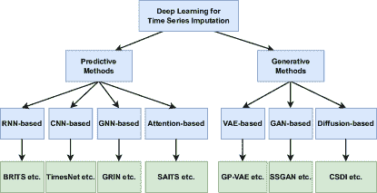

<!--yml

类别：未分类

日期：2024-09-06 19:34:36

-->

# [2402.04059] 多变量时间序列插补的深度学习：综述

> 来源：[`ar5iv.labs.arxiv.org/html/2402.04059`](https://ar5iv.labs.arxiv.org/html/2402.04059)

# 多变量时间序列插补的深度学习：综述

作者姓名 所属机构 email@example.com    Jun Wang^(1,2,4) 前两位作者对这项工作贡献相等。    Wenjie Du^(2∗)    Wei Cao²    Keli Zhang³    Wenjia Wang^(1,4)    Yuxuan Liang⁴    Qingsong Wen⁵ ¹香港科技大学  ²PyPOTS 研究团队

³华为诺亚方舟实验室 ⁴香港科技大学（广州） ⁵Squirrel AI jwangfx@connect.ust.hk，wdu@pypots.com，weicaomsra@gmail.com，zhangkeli1@huawei.com，wenjiawang@ust.hk，yuxliang@outlook.com，qingsongedu@gmail.com

###### 摘要

广泛存在的缺失值使得多变量时间序列数据部分观测，破坏了时间序列的完整性，阻碍了有效的时间序列数据分析。近年来，深度学习插补方法在提升损坏时间序列数据的质量方面表现出显著成功，进而提高了下游任务的性能。本文对最近提出的深度学习插补方法进行了全面的综述。首先，我们提出了所评审方法的分类法，然后通过突出这些方法的优点和局限性提供了结构化的评论。我们还进行了实证实验，以研究不同方法并比较它们对下游任务的提升。最后，指出了未来多变量时间序列插补研究的开放问题。所有的代码和配置，包括一个定期维护的多变量时间序列插补论文列表，可以在 GitHub 仓库中找到 [`github.com/WenjieDu/Awesome_Imputation`](https://github.com/WenjieDu/Awesome_Imputation)。

## 1 引言

在金融 Bai 和 Ng (2008)、医学 Esteban 等 (2017) 和交通运输 Gong 等 (2021) 等领域，多变量时间序列的数据收集过程常常充满困难和不确定性，例如传感器故障、系统环境不稳定、隐私问题或其他原因。这导致数据集通常包含大量缺失值，可能严重影响下游分析和决策的准确性和可靠性。例如，公共的现实世界医疗时间序列数据集 PhysioNet2012 Silva 等 (2012) 的缺失率甚至超过 80$\%$，使得分析变得具有挑战性。因此，探索如何合理有效地填补多变量时间序列数据中的缺失部分是非常有吸引力和必要的。

较早的统计插补方法在处理缺失数据方面历史上被广泛使用。这些方法用统计量（例如，零值、均值和最后观测值 Amiri 和 Jensen（2016））或简单的统计模型进行缺失值替代，包括 ARIMA Bartholomew（1971）、ARFIMA Hamzaçebi（2008）和 SARIMA Hamzaçebi（2008）。此外，回归、K 最近邻、矩阵分解等机器学习技术在文献中也获得了显著关注，用于处理多变量时间序列中的缺失值。这些方法的关键实现包括 KNNI Altman（1992）、TIDER Liu 等（2022）、MICE Van Buuren 和 Groothuis-Oudshoorn（2011）等。尽管统计和机器学习插补方法简单高效，但它们在捕捉时间序列数据中复杂的时间关系和变化模式方面有所不足，导致性能有限。

最近，深度学习插补方法在缺失数据插补方面表现出极强的建模能力。这些方法利用强大的深度学习模型，如 Transformers、变分自编码器（VAEs）、生成对抗网络（GANs）和扩散模型，以捕捉时间序列的内在属性和潜在复杂动态。通过这种方式，深度学习插补方法可以从观测数据中学习到真实的底层数据分布，从而为缺失部分预测出更可靠和合理的值。我们注意到，有几个相关的综述，如 Khayati 等（2020）；Fang 和 Wang（2020），主要集中在统计和机器学习插补方法上，但对深度学习插补方法的考虑较少。考虑到多变量时间序列插补是后续时间序列分析的关键数据预处理步骤，对深度多变量时间序列插补方法进行全面系统的综述将显著促进时间序列领域的进步。

在本文中，我们力图通过提供多变量时间序列填充（MTSI）深度学习方法最新发展的全面总结，弥合现有的知识差距。首先，我们简要介绍了该主题，然后提出了一种新颖的分类方法，基于填充不确定性和神经网络架构这两个视角对方法进行分类。填充不确定性反映了对缺失数据填充值的信心，这涉及到随机生成样本并基于这些不同的样本进行填充 Little 和 Rubin (2019)。因此，我们将填充方法分为预测型方法，提供固定估计，以及生成型方法，提供可能值的分布以考虑填充不确定性。对于神经网络架构，我们探讨了多种针对 MTSI 的深度学习模型，包括基于循环神经网络（RNN）的模型、基于图神经网络（GNN）的模型、基于卷积神经网络（CNN）的模型、基于注意力机制的模型、基于变分自编码器（VAE）的模型、基于生成对抗网络（GAN）的模型以及基于扩散模型的模型。为了在实际场景中提供有效的填充指导，我们进行了广泛的实证研究，考察了深度多变量时间序列填充模型的多个方面，包括填充性能以及在分类等下游任务上的改进。据我们所知，这是第一个全面系统地审查 MTSI 领域深度学习算法的综述，旨在激发该领域的进一步研究。一个不断更新的相关资源可以在我们的 GitHub 仓库中找到¹¹1[`github.com/WenjieDu/Awesome_Imputation`](https://github.com/WenjieDu/Awesome_Imputation)。

总结来说，本文的贡献包括：1) 针对深度多变量时间序列填充方法提出了一种新的分类方法，考虑了填充不确定性和神经网络架构，并进行了全面的方法综述；2) 通过我们开发的 PyPOTS 工具包对填充算法进行了彻底的实证评估；3) 探索了多变量时间序列填充（MTSI）未来的研究机会。

## 2 初步和分类

### 2.1 MTSI 背景

#### 问题定义

在$[0,T]$上的完整时间序列数据集通常可以表示为$\mathcal{D}=\{\mathbf{X}_{i},\mathbf{t}_{i}\}_{i=1}^{N}$。其中，$\mathbf{X}_{i}=\{x_{1:K,1:L}\}\in\mathcal{R}^{K\times L}$，而$\mathbf{t}_{i}=({t_{1},\cdots,t_{L}})\in[0,T]^{L}$，$K$是特征的数量，$L$是时间序列的长度。在缺失数据的背景下，每个完整的时间序列可以分为观察部分和缺失部分，即$\mathbf{X}_{i}=\{\mathbf{X}^{o}_{i},\mathbf{X}^{m}_{i}\}$。为了编码缺失情况，我们还用$\mathbf{M}_{i}=\{m_{1:K,1:L}\}$表示观察矩阵，其中，如果在时间戳$t_{l}$时$x_{k,l}$缺失，则$m_{k,l}=0$，否则$m_{k,l}=1$。此外，我们还可以通过以下规则计算时间滞后矩阵$\boldsymbol{\delta}_{i}=\{\delta_{1:K,1:L}\}$，

|  | <math   alttext="\delta_{k,l}=\left\{\begin{array}[]{ll}{0,}&amp;{\text{if }l=1}\\ {t_{l}-t_{l-1},}&amp;{\text{if }m_{k,l-1}=1\text{ and }l>1}\\

\(\delta_{k,l}=\left\{\begin{array}[]{ll}{0,}&{\text{如果 }l=1}\\ {t_{l}-t_{l-1},}&{\text{如果 }m_{k,l-1}=1\text{ 且 }l>1}\\ {\delta_{k,l-1}+t_{l}-t_{l-1},}&{\text{如果 }m_{k,l-1}=0\text{ 且 }l>1}\end{array}\right.\)

因此，每个不完整的时间序列表示为$\{\mathbf{X}_{i}^{o},\mathbf{M}_{i},\boldsymbol{\delta}_{i}\}$。MTSI 的目标是构建一个由$\theta$参数化的填补模型$\mathcal{M}_{\theta}$，以准确估计$\mathbf{X}^{o}$中的缺失值。*填补*矩阵定义为：

|  | $\mathbf{\hat{X}}=\mathbf{{M}}\odot\mathbf{{X}}^{o}+(1-\mathbf{M})\odot\mathbf{\bar{X}},$ |  | (1) |
| --- | --- | --- | --- |

其中$\odot$表示逐元素乘法，而$\mathbf{\bar{X}}=\mathcal{M}_{\theta}(\mathbf{{X}}^{o})$是重建的矩阵。$\mathcal{M}_{\theta}$的目标有两个：（i）使$\mathbf{\hat{X}}$尽可能接近真实的*完整*数据$\mathbf{X}$，或者（ii）相比于使用原始的$\mathbf{X}^{o}$，利用$\mathbf{\hat{X}}$来提高下游任务的性能。

#### 缺失机制

缺失机制，即缺失数据的原因，表示观察值与缺失数据概率之间的统计关系 Nakagawa (2015)。在现实生活中，缺失机制本质上是复杂的，填补模型的性能在很大程度上受到我们所做的假设与实际缺失数据机制的匹配程度的影响。根据 Robin 的理论 Rubin (1976)，缺失机制分为三类：完全随机缺失（MCAR）、随机缺失（MAR）和非随机缺失（MNAR）。MCAR 意味着数据缺失的概率与观察到的数据和缺失数据都无关。相反，MAR 表示缺失机制仅依赖于观察数据。MNAR 则表明缺失情况与缺失数据本身相关，并且可能受到观察数据的影响。这三种机制可以正式定义如下：

+   •

    MCAR: $p(\mathbf{M}|\mathbf{X})=p(\mathbf{M})$，

+   •

    MAR: $p(\mathbf{M}|\mathbf{X})=p(\mathbf{M}|\mathbf{X}^{o})$，

+   •

    MNAR: $p(\mathbf{M}|\mathbf{X})=p(\mathbf{M}|\mathbf{X}^{o},\mathbf{X}^{m})$。

与 MNAR 相比，MCAR 和 MAR 是更强的假设，并被认为是“可忽略的” Little 和 Rubin (2019)。这意味着在填补过程中可以忽略缺失机制，专注于学习数据分布，即$p(\mathbf{X}^{o})$。相比之下，MNAR 更能反映现实生活中的场景，它是“不可忽略的”，忽视其缺失机制可能导致参数估计偏差。在这种情况下，目标转向学习数据及其缺失机制的联合分布，即$p(\mathbf{X}^{o},\mathbf{M})$。

### 2.2 填补方法的分类

图 1：从填补不确定性和神经网络架构的角度来看，多变量时间序列填补方法的分类。每个类别中都选取了一个代表模型进行展示。

| 方法 | 会议 | 分类 | 插补不确定性 | 神经网络架构 | 缺失机制 |
| --- | --- | --- | --- | --- | --- |
| GRU-D Che 等 (2018) | Scientific Reports | 预测 | \faTimes | RNN | MCAR |
| M-RNN Yoon 等 (2019) | TBME | 预测 | \faTimes | RNN | MCAR |
| BRITS Cao 等 (2018) | NeurIPS | 预测 | \faTimes | RNN | MCAR |
| TimesNet Wu 等 (2023a) | ICLR | 预测 | \faTimes | CNN | MCAR |
| GRIN Cini 等 (2022) | ICLR | 预测 | \faTimes | GNN | MCAR / MAR |
| SPIN Marisca 等 (2022) | NeurIPS | 预测 | \faTimes | GNN, Attention | MCAR / MAR |
| CDSA Ma 等 (2019) | arXiv | 预测 | \faTimes | Attention | MCAR |
| Transformer Vaswani 等 (2017) | NeurIPS | 预测 | \faTimes | Attention | MCAR |
| SAITS Du 等 (2023) | ESWA | 预测 | \faTimes | Attention | MCAR |
| DeepMVI Bansal 等 (2021) | VLDB | 预测 | \faTimes | Attention, CNN | MCAR |
| NRTSI Shan 等 (2023) | ICASSP | 预测 | \faTimes | Attention | MCAR |
| GP-VAE Fortuin 等 (2020) | AISTATS | 生成 | \faCheckCircleO | VAE, CNN | MCAR / MAR |
| V-RIN Mulyadi 等 (2021) | Trans. Cybern. | 生成 | \faCheck | VAE, RNN | MCAR / MAR |
| supnotMIWAE Kim 等 (2023) | ICML | 生成 | \faCheckCircleO | VAE | MNAR |
| GRUI-GAN Luo 等 (2018) | NeurIPS | 生成 | \faCheckCircleO | GAN, RNN | MCAR |
| E²GAN Luo 等 (2019) | IJCAI | 生成 | \faCheckCircleO | GAN, RNN | MCAR |
| NAOMI Liu 等 (2019) | NeurIPS | 生成 | \faCheckCircleO | GAN, RNN | MCAR |
| SSGAN Miao 等 (2021) | AAAI | 生成 | \faCheckCircleO | GAN, RNN | MCAR |
| CSDI Tashiro 等 (2021) | NeurIPS | 生成 | \faCheckCircleO | Diffusion, Attention, CNN | MCAR |
| SSSD Alcaraz 和 Strodthoff (2023) | TMLR | 生成 | \faCheckCircleO | Diffusion, Attention | MCAR |
| CSBI Chen 等 (2023) | ICML | 生成 | \faCheckCircleO | Diffusion, Attention | MCAR |
| MIDM Wang 等 (2023) | KDD | 生成 | \faCheckCircleO | Diffusion, Attention | MCAR |
| PriSTI Liu 等 (2023) | ICDE | 生成 | \faCheckCircleO | Diffusion, Attention, GNN, CNN | MCAR |
| DA-TASWDM Xu 等 (2023) | CIKM | 生成 | \faCheck | Diffusion, Attention | MCAR |
| SPD Biloš 等 (2023) | ICML | 生成 | \faCheckCircleO | Diffusion, Attention | MCAR |

表 1：多变量时间序列填充的深度学习方法总结。 \faCheck 和 \faCheckCircleO 表示能够考虑填充不确定性的方法，而 \faTimes 表示不能够考虑的方法。此外，\faCheck 表示这些方法还定义了保真度评分，以明确测量填充不确定性。

为了总结现有的深度多变量时间序列填充方法，我们从填充不确定性和神经网络架构的角度提出了一个分类法，如图 1 所示，并在表 1 中提供了这些方法的更详细总结。对于填充不确定性，我们将填充方法分为预测型和生成型，根据它们在填充过程中产生反映固有不确定性的不同填充值的能力。在神经网络架构方面，我们考察了专门设计用于时间序列填充的显著深度学习模型。讨论的模型包括基于 RNN 的、基于 CNN 的、基于 GNN 的、基于注意力的、基于 VAE 的、基于 GAN 的和基于扩散的模型。在接下来的两个部分中，我们将从这两个角度深入探讨并讨论现有的深度时间序列填充方法。

## 3 预测方法

本节将深入探讨预测填充方法，我们的讨论主要集中在四种类型上：基于 RNN 的、基于 CNN 的、基于 GNN 的以及基于注意力的模型。

### 3.1 学习目标

预测填充方法始终为相同的缺失组件预测确定性值，因此不考虑填充值中的不确定性。通常，这些方法采用基于重构的学习方式，学习目标为，

|  | $\mathcal{L}_{det}(\theta)=\sum_{i=1}^{N}\ell_{e}(\mathbf{M}_{i}\odot{\mathbf{\bar{X}}_{i}},\mathbf{M}_{i}\odot\mathbf{X}^{o}_{i}),$ |  | (2) |
| --- | --- | --- | --- |

其中 $\ell_{e}$ 是一个绝对值或平方误差函数。

### 3.2 基于 RNN 的模型

作为一种自然的序列数据建模方式，递归神经网络（RNNs）在高级时间序列分析领域中早期得到了发展，数据插补也不例外。GRU-D Che et al. (2018) 是 GRU 的一种变体，旨在处理包含缺失值的时间序列。它通过一个时间衰减机制进行调节，该机制将时间滞后矩阵 $\mathbf{\delta}_{i}$ 作为输入，并建模由于缺失值引起的时间不规则性。Temporal belief memory Kim and Chi (2018) 受到一种称为霍奇金-赫克斯利模型的生物神经模型的启发，提出通过计算每个特征最后观测的信念并使用双向 RNN 对缺失值进行插补。M-RNN Yoon et al. (2019) 是一种在多方向上工作的 RNN 变体。该模型使用双向 RNN 模型在数据流中进行插值，并通过全连接网络在数据流之间进行插补。BRITS Cao et al. (2018) 使用双向 RNN 对不完整的时间序列进行建模。它将缺失值作为 RNN 图的变量，并利用 RNN 的隐藏状态填补缺失数据。除了插补，BRITS 还能同时进行时间序列分类任务。M-RNN 和 BRITS 都采用了 GRU-D 的时间衰减函数，以捕获信息性缺失以提升性能。后续工作，如 Luo et al. (2018, 2019); Liu et al. (2019); Miao et al. (2021)，将 RNN 与 GAN 结构相结合，以更高的精度输出插补结果。

### 3.3 基于 CNN 的模型

卷积神经网络（CNNs）代表了深度学习中的一种基础架构，广泛应用于复杂的时间序列分析中。TimesNet Wu et al. (2023a) 创新性地结合了快速傅里叶变换，将一维时间序列重构为二维格式，从而便于利用 CNN 进行数据处理。在 GP-VAE Fortuin et al. (2020)中，CNN 在编码器和解码器中都发挥了骨干的作用。此外，CNN 还在基于注意力的模型如 DeepMVI Bansal et al. (2021)以及扩散模型如 CSDI Tashiro et al. (2021)中作为关键的特征提取器，通过将输入数据映射到嵌入空间以便后续处理。

### 3.4 基于 GNN 的模型

基于 GNN 的模型将时间序列视为图序列，利用学习到的节点表示来重建缺失值。Cini et al. (2022)中的作者介绍了 GRIN，这是第一个用于 MTSI 的图基递归架构。GRIN 利用双向图递归神经网络有效地利用了时间动态和空间相似性，从而显著提高了填补精度。此外，SPIN Marisca et al. (2022)被开发出来，将独特的稀疏时空注意力机制整合到 GNN 框架中。该机制显著克服了 GRIN 的误差传播问题，并增强了对高度缺失数据所呈现的数据稀疏性的鲁棒性。

### 3.5 基于注意力的模型

自从 Transformer 在 Vaswani et al. (2017)中提出以来，自注意力机制已被广泛应用于建模序列数据，包括时间序列 Wen et al. (2023)。CDSA Ma et al. (2019)旨在通过共同学习时间、位置和测量来填补地理标记的时空数据。DeepMVI Bansal et al. (2021)将 transformer 与卷积技术相结合，调整关键-查询设计以有效解决缺失值填补问题。对于每个时间序列，DeepMVI 利用注意力机制同时提取长期季节性、细粒度本地和跨维度的嵌入，这些嵌入被连接起来以预测最终输出。NRTSI Shan et al. (2023)直接利用 Transformer 编码器进行建模，并将时间序列数据视为时间戳和测量值的集合。作为一个排列模型，该模型必须在时间维度上进行迭代以处理时间序列。SAITS Du et al. (2023)采用自监督训练方案来处理缺失数据，结合了双重联合学习任务：掩蔽填补任务和观察重建任务。该方法具有两个对角掩蔽自注意力块和一个加权组合块，利用注意力权重和缺失指示符来提高填补精度。除了上述模型，注意力机制还被广泛应用于构建扩散模型中的去噪网络，如 CSDI Tashiro et al. (2021)、MIDM Wang et al. (2023)、PriSTI Liu et al. (2023)等。

### 3.6 优缺点

本小节综合了讨论的预测插补方法的优点和挑战。虽然 RNN 基于模型能够捕捉序列信息，但其固有的顺序处理特性和记忆限制使其在处理长序列时可能出现扩展性问题 Khayati et al. (2020)。尽管 CNNs 已有几十年的发展，并且是有效的特征提取器，可以捕捉邻域信息和局部连接，但其卷积核大小和工作机制固有地限制了其在时间序列数据中的性能。由于注意力机制，基于注意力的模型在插补任务中通常优于基于 RNN 和 CNN 的方法，因为它们在处理长距离依赖和并行处理能力方面表现更佳。基于 GNN 的方法提供了对时空动态的更深理解，但通常伴随着更高的计算复杂度，这对大规模或高维数据提出了挑战。

## 4 生成方法

在本节中，我们探讨生成插补方法，包括三种主要类型：基于 VAE 的、基于 GAN 的和基于扩散的模型。

### 4.1 学习目标

生成方法本质上建立在生成模型如 VAEs、GANs 和扩散模型之上。它们的特点是能够为缺失观测生成多样化的输出，从而实现插补不确定性的量化。通常，这些方法从观察到的数据中学习概率分布，并随后为缺失观测生成与这些学习到的分布一致的稍微不同的值。因此，生成方法的主要学习目标定义为：

|  | $\mathcal{L}_{pro}(\theta)=\sum_{i=1}^{N}\log p_{\theta}(\mathbf{{X}}^{o}_{i}).$ |  | (3) |
| --- | --- | --- | --- |

其中 $\theta$ 是插补模型 $\mathcal{M}$ 的模型参数。

### 4.2 基于 VAE 的模型

VAEs 使用编码器-解码器结构，通过最大化边际似然下界（ELBO）来近似真实数据分布。这个 ELBO 强制从中解码器重建多样的数据点的潜在空间服从高斯分布。

Fortuin 等人（2020）提出了首个基于 VAE 的插补方法 GP-VAE，其中他们在潜在空间中利用了高斯过程先验以捕捉时间动态。此外，GP-VAE 中的 ELBO 仅在数据的观察特征上进行评估。Mulyadi 等人（2021）设计了 V-RIN 来减轻缺失值插补中的偏差估计风险。V-RIN 通过对模型输出进行高斯分布建模来捕捉不确定性，具体来说，将 VAE 模型重建数据的方差解释为不确定性度量。然后，它建模时间动态，并通过不确定性感知 GRU 无缝地将这种不确定性集成到插补数据中。最近，Kim 等人（2023）提出了 supnotMIWAE 并引入了额外的分类器，他们将 GP-VAE 中的 ELBO 扩展到建模观察数据、其掩码矩阵和其标签的联合分布。通过这种方式，他们的 ELBO 有效地建模了插补不确定性，额外的分类器鼓励 VAE 模型生成对下游分类任务更有利的缺失值。

### 4.3 基于 GAN 的模型

GAN 通过生成器和判别器之间的极小极大博弈促进对抗训练：生成器旨在模拟真实数据分布，判别器负责区分生成数据和真实数据。这种动态促进了合成数据的逐步完善，使其越来越类似于真实样本。

在 Luo 等人 (2018) 的研究中，作者提出了一种两阶段的 GAN 填补方法（GRUI-GAN），这是第一种基于 GAN 的时间序列数据填补方法。GRUI-GAN 首先通过标准对抗训练方式学习观察到的多变量时间序列数据的分布，然后优化生成器的输入噪声，以进一步最大化生成的和观察到的多变量时间序列数据之间的相似性。然而，GRUI-GAN 的第二阶段需要大量时间来找到最佳匹配的输入向量，并且当“噪声”的初始值设置不当时，这个向量不一定总是最佳的。随后，提出了一种端到端的 GAN 填补模型 $E^{2}$GAN Luo 等人 (2019)，其中生成器采用去噪自编码器模块，以避免 GRUI-GAN 中的“噪声”优化阶段。同时，Liu 等人 (2019) 提出了一个非自回归多分辨率 GAN 模型（NAOMI），其中生成器由前向-反向编码器和多分辨率解码器组成。填补的数据由多分辨率解码器以非自回归方式递归生成，这在涉及高缺失和长序列时间序列数据的场景中减轻了误差累积。另一方面，在 Miao 等人 (2021) 的研究中，作者提出了 USGAN，通过将判别器与时间提醒矩阵相结合来生成高质量的填补数据。该矩阵为判别器的训练引入了额外的复杂性，进而提高了生成器的性能。此外，他们将 USGAN 扩展为半监督模型 SSGAN，通过引入额外的分类器。这样，SSGAN 利用标签信息，使生成器能够在观察到的组件和数据标签的条件下估计缺失值。

### 4.4 基于扩散的模型

作为一种新兴且强大的生成模型类别，扩散模型擅长通过逐步添加和反转噪声来捕捉复杂的数据分布，这一过程通过扩散步骤的马尔科夫链进行。与 VAE 不同，这些模型采用固定的训练程序，并且使用保留输入数据维度的高维潜变量。

CSDI，由 Tashiro 等人（2021）介绍，作为专门为 MTSI 设计的开创性扩散模型脱颖而出。与传统扩散模型不同，CSDI 采用了条件训练方法，其中使用观察数据的子集作为条件信息，以便生成其余观察数据。然而，CSDI 中的去噪网络依赖于两个 transformers，在变量数量和时间序列长度方面呈现出二次复杂度。这一设计限制引发了对内存限制的担忧，特别是在建模广泛的多变量时间序列时。针对这一挑战，Alcaraz 和 Strodthoff（2023）的后续工作引入了 SSSD，通过用结构化状态空间模型 Gu 等人（2022）替代 transformers，从而解决了二次复杂度问题。这一修改尤其在处理较长的多变量时间序列时具有优势，因为它减轻了内存溢出的风险。另一种方法，CSBI，由 Chen 等人（2023）介绍，通过将扩散过程建模为 Schrodinger 桥问题，从而提高了效率，这可以转化为计算友好的随机微分方程。

此外，扩散模型的有效性显著受到条件信息构建和利用的影响。MIDM Wang 等人（2023）建议从条件于观察数据表示的分布中采样噪声，在去噪过程中显式地保留观察数据和缺失数据之间的内在相关性。PriSTI Liu 等人（2023）引入了时空依赖作为条件信息，即通过条件特征为去噪网络提供时空注意权重以进行时空插补。此外，DA-TASWDM Xu 等人（2023）建议将动态时间关系，即变化的采样密度，纳入去噪网络以进行医疗时间序列插补。

与上述将时间序列视为离散时间步的方法相比，SPD Biloš等人（2023）将时间序列视为潜在连续函数的离散实现，并通过随机过程扩散生成插补数据。通过这种方式，SPD 将连续噪声过程视为不规则时间序列的归纳偏差，以更好地捕捉真实的生成过程，特别是考虑到数据的固有随机性。

### 4.5 优缺点

本小节阐述了上述生成填充模型的优缺点。基于 VAE 的模型擅长明确建模概率，并为理解数据分布提供了理论基础。然而，它们通常受到生成能力的限制，这可能限制了它们在捕捉复杂数据变异性方面的表现。另一方面，基于 GAN 的模型在数据生成方面表现出色，提供了与原始数据分布高度一致的高质量填充。然而，由于诸如梯度消失 Wu et al. (2023b) 等问题，它们训练起来 notoriously 具有挑战性，这可能影响模型的稳定性和收敛性。基于扩散的模型作为强大的生成工具，具有捕捉复杂数据模式的强大能力。然而，它们的计算复杂度相当高，并且也面临缺失部分与观测部分之间的边界一致性问题 Lugmayr et al. (2022)。

## 5 个时间序列填充工具包

在时间序列填充任务中，现有的库提供了简单处理方法、统计方法、机器学习填充算法以及深度学习填充神经网络以便于使用。

imputeTS Moritz 和 Bartz-Beielstein，这是一个 R 语言库，提供了几种简单的方法（如均值、最后观测值前推等）和常用的插补算法（如线性插值、卡尔曼平滑和加权移动平均），但仅适用于单变量时间序列。另一个著名的 R 包，mice Van Buuren 和 Groothuis-Oudshoorn (2011)，实现了一种称为链式方程的多变量插补方法，以处理数据中的缺失值。虽然它并不是专门针对时间序列的，但在实际中广泛用于多变量时间序列插补，尤其在统计领域。Impyute²²2[`github.com/eltonlaw/impyute`](https://github.com/eltonlaw/impyute) 和 Autoimpute³³3[`github.com/kearnz/autoimpute`](https://github.com/kearnz/autoimpute) 都为横截面数据和时间序列数据提供了简单的插补方法。Impyute 仅提供如移动平均窗口这样的简单方法，而 Autoimpute 集成了参数方法，例如多项式插值和样条插值。最近，GluonTS Alexandrov 等人 (2020)，一个用于时间序列的生成性机器学习包，提供了一些简单的方法，如虚拟值插补和随意均值插补，以处理缺失值。除了简单和非参数方法外，Sktime Löning 等人 (2019) 实现了另一种选项，允许用户利用集成的机器学习插补算法来拟合和预测给定数据中的缺失值，尽管这仅在单变量方式下有效。至于深度学习插补，PyPOTS Du (2023) 是一个专注于端到端建模部分观测时间序列的工具包。它包含十多个用于处理不完整时间序列的深度学习神经网络，包括目前的八种插补模型。

## 6 实验评估与讨论

在本节中，进行实证实验以评估和分析来自不同类别的深度多变量时间序列插补方法。结果是在配备 AMD EPYC 7543 32 核 CPU 和 NVIDIA GeForce RTX 4090 GPU 的机器上获得的。所有代码，包括数据预处理脚本、模型配置和训练脚本，均公开在 GitHub 仓库 [`github.com/WenjieDu/Awesome_Imputation`](https://github.com/WenjieDu/Awesome_Imputation) 上。

### 6.1 数据集与插补方法

具体来说，对三种简单插补方法和八种深度学习神经网络进行了测试，使用了三个真实世界的数据集（Air Zhang 等人 (2017)、PhysioNet2012 Silva 等人 (2012) 和 ETTm1 Zhou 等人 (2021)，见表 2），这些数据集在文献中常被使用。

关于填补方法，除了三个简单的基线方法：均值（Mean）、中位数（Median）和前向填补（LOCF，最后观测值前向填补），选择了以下八种代表性深度学习模型进行实验研究：M-RNN Yoon et al. (2019)，GP-VAE Fortuin et al. (2020)，BRITS Cao et al. (2018)，USGAN Miao et al. (2021)，CSDI Tashiro et al. (2021)，TimesNet Wu et al. (2023a)，Transformer Du et al. (2023)，以及 SAITS Du et al. (2023)。实验使用了 PyPOTS⁴⁴4[`pypots.com`](https://pypots.com) Du (2023)，所有上述填补方法在工具箱中均可立即使用。此外，为了公平比较，所有深度学习方法的超参数都通过 PyPOTS 中的调优功能进行了优化。

|  | Air | PhysioNet2012 | ETTm1 |
| --- | --- | --- | --- |
| 样本数量 | 1,458 | 11,988 | 722 |
| 序列长度 | 24 | 48 | 96 |
| 特征数量 | 132 | 37 | 7 |
| 原始缺失率 | 1.6% | 80.0% | 0% |

表 2：三个预处理数据集的一般信息。详细描述见[代码库](https://github.com/WenjieDu/Awesome_Imputation/tree/main/time_series_imputation_survey_code)。

| 方法 | Air | PhysioNet2012 | ETTm1 |
| --- | --- | --- | --- |
| MAE $\downarrow$ | MSE $\downarrow$ | MAE $\downarrow$ | MSE $\downarrow$ | MAE $\downarrow$ | MSE $\downarrow$ |
| 均值 | 0.692$\pm$0.000 | 0.970$\pm$0.000 | 0.702$\pm$0.000 | 0.954$\pm$0.000 | 0.663$\pm$0.000 | 0.809$\pm$0.000 |
| 中位数 | 0.660$\pm$0.000 | 1.027$\pm$0.000 | 0.685$\pm$0.000 | 0.991$\pm$0.000 | 0.657$\pm$0.000 | 0.825$\pm$0.000 |
| LOCF | 0.206$\pm$0.000 | 0.279$\pm$0.000 | 0.411$\pm$0.000 | 0.569$\pm$0.000 | 0.135$\pm$0.000 | 0.072$\pm$0.000 |
| M-RNN | 0.524$\pm$0.001 | 0.648$\pm$0.003 | 0.674$\pm$0.001 | 0.864$\pm$0.002 | 0.651$\pm$0.060 | 1.074$\pm$0.120 |
| GP-VAE | 0.280$\pm$0.003 | 0.266$\pm$0.009 | 0.400$\pm$0.007 | 0.433$\pm$0.011 | 0.290$\pm$0.017 | 0.178$\pm$0.015 |
| BRITS | 0.142$\pm$0.001 | 0.129$\pm$0.001 | 0.246$\pm$0.001 | 0.325$\pm$0.002 | 0.124$\pm$0.002 | 0.046$\pm$0.002 |
| USGAN | 0.141$\pm$0.001 | 0.132$\pm$0.001 | 0.250$\pm$0.001 | 0.306$\pm$0.001 | 0.127$\pm$0.005 | 0.048$\pm$0.003 |
| CSDI | 0.105$\pm$0.003 | 0.153$\pm$0.021 | 0.211$\pm$0.003 | 0.260$\pm$0.050 | 0.157$\pm$0.052 | 0.292$\pm$0.456 |
| TimesNet | 0.159$\pm$0.002 | 0.172$\pm$0.003 | 0.266$\pm$0.007 | 0.272$\pm$0.006 | 0.113$\pm$0.006 | 0.027$\pm$0.002 |
| Transformer | 0.163$\pm$0.003 | 0.160$\pm$0.004 | 0.209$\pm$0.002 | 0.225$\pm$0.002 | 0.133$\pm$0.009 | 0.035$\pm$0.004 |
| SAITS | 0.133$\pm$0.002 | 0.128$\pm$0.001 | 0.202$\pm$0.002 | 0.218$\pm$0.002 | 0.115$\pm$0.011 | 0.030$\pm$0.006 |

表 3：不同填补方法在数据集 Air 上的 MAE 和 MSE 比较。

PhysioNet2012 和 ETTm1。报告的值为五次运行的均值 $\pm$ 标准差。

| 方法 | PR-AUC $\uparrow$ | ROC-AUC $\uparrow$ |
| --- | --- | --- |
| 平均值 | 0.434$\pm$0.016 | 0.813$\pm$0.009 |
| 中位数 | 0.434$\pm$0.018 | 0.808$\pm$0.014 |
| LOCF | 0.425$\pm$0.015 | 0.804$\pm$0.007 |
| M-RNN | 0.424$\pm$0.022 | 0.807$\pm$0.015 |
| GP-VAE | 0.384$\pm$0.018 | 0.788$\pm$0.008 |
| BRITS | 0.428$\pm$0.017 | 0.821$\pm$0.008 |
| USGAN | 0.431$\pm$0.017 | 0.814$\pm$0.010 |
| CSDI | 0.433$\pm$0.017 | 0.811$\pm$0.005 |
| TimesNet | 0.406$\pm$0.012 | 0.787$\pm$0.013 |
| Transformer | 0.446$\pm$0.016 | 0.807$\pm$0.018 |
| SAITS | 0.455$\pm$0.016 | 0.822$\pm$0.002 |

表 4：五次运行中的分类结果的均值和标准差。

### 6.2 结果与分析

#### 插补准确性评估

插补结果中十二种方法在三个数据集上的误差指标 MAE（平均绝对误差）和 MSE（均方误差）如表 4 所示。数据显示，不同方法在不同数据集上的表现存在差异，在本研究中没有明显的胜者。需要进一步工作以深入比较预测和生成插补方法。特别是在像 Air 和 ETTm1 数据集这样的情况中，其中数据由传感器连续记录且缺失比例相对较低时，非参数 LOC 方法表现出令人称赞的性能。相反，在缺失率较高的 PhysioNet2012 数据集中，深度学习插补方法明显优于统计方法。这一观察结果证实了深度学习方法有效捕捉复杂时间动态和准确学习数据分布的能力，尤其是在具有高度稀疏、离散观察的场景中。

#### 下游任务评估

通常，更好的插补值质量代表插补后的整体数据集质量更好。因此，除了插补性能比较外，文献中还有一种实验设置，从下游任务性能的角度评估方法 Du et al. (2023)。本研究也采用了这种研究方法来帮助评估所选方法。一个简单的 LSTM 模型在 PhysioNet2012 数据集上执行二分类任务，每个样本有一个标签指示 ICU 中的患者是否去世。PhysioNet2012 数据集经过插补方法处理，结果如表格 4 所示。选择 PR-AUC（精确度-召回曲线下面积）和 ROC-AUC（接收器操作特征曲线下面积）作为指标，考虑到数据集有不平衡的类别和 14.2%的正样本。请注意，这个实验中唯一的变量是插补数据。

如表格 4 所示，分类器可以通过更好的插补在下游分类任务中受益。SAITS 插补的最佳结果在 PR-AUC 和 ROC-AUC 指标上分别比最佳的原始插补均值提高了 5%和 1%。请注意，这种改进仅通过更好的插补实现，可以视为本实验中的数据预处理步骤。此外，这引发了一个研究问题，即如何使深度学习插补模型同时从插补任务和下游任务中学习，以从不完整的时间序列中获得一致且统一的表示。

#### 复杂度分析

我们在表格 5 中总结了深度学习插补模型的时间和内存复杂度。此外，还列出了它们在 PhysioNet2012 测试集上的实际推理时间，以便进行清晰的比较。

| 方法 | 计算复杂度 | 内存 | 运行时间 |
| --- | --- | --- | --- |
| M-RNN | $\mathcal{O}(L*K)$ | $\mathcal{O}(1)$ | 5s |
| GP-VAE | $\mathcal{O}(L*\log{}K)$ | $\mathcal{O}(1)$ | 1s |
| BRITS | $\mathcal{O}(L)$ | $\mathcal{O}(1)$ | 9s |
| USGAN | $\mathcal{O}(L)$ | $\mathcal{O}(1)$ | 9s |
| CSDI | $\mathcal{O}(L^{2})$ | $\mathcal{O}(L^{2})$ | 104s |
| TimesNet | $\mathcal{O}(L*\log{}K)$ | $\mathcal{O}(1)$ | 1s |
| Transformer | $\mathcal{O}(L^{2})$ | $\mathcal{O}(L^{2})$ | 1s |
| SAITS | $\mathcal{O}(L^{2})$ | $\mathcal{O}(L^{2})$ | 1s |

表 5：插补模型的计算和空间复杂度，以及在 PhysioNet2012 测试集上的运行时间（秒）。

## 7 结论和未来方向

本文提出了一种针对多变量时间序列插补的深度学习模型的系统回顾。我们引入了一种新颖的分类法来对所评估的方法进行分类，提供了每种方法的全面介绍和实验比较。为了推动这一领域的发展，本文最后确定并讨论了未来研究的潜在方向。

#### 缺失模式

现有的插补算法主要是在 MCAR 或 MAR 下运行。然而，现实世界中的缺失数据机制通常更加复杂，MNAR 数据在各个领域普遍存在，例如 IoT 设备中  Li 等人（2023） ，临床研究中  Ibrahim 等人（2012），和气象学中  Ruiz 等人（2023）。MNAR 的不可忽视性表明观察到的数据与真实数据之间存在分布偏移  Kyono 等人（2021）。例如，在气流信号分析中  Ruiz 等人（2023），缺乏高值观测导致了 MNAR 缺失机制，并导致饱和峰值，明显地扭曲了观察到的数据分布与真实基础数据分布之间的关系。这种情况说明了插补方法可能在模型参数估计中产生归纳偏差，并在存在 MNAR 时表现不佳。在处理 MNAR 背景下的缺失数据，与 MCAR 和 MAR 不同，需要创新方法以达到更好的性能。

#### 下游性能

插补缺失值的主要目标在于增强下游数据分析，特别是在存在不完整信息的情况下。流行的方法是“插补和预测”两阶段范式，其中缺失值插补是数据预处理的一部分，随后是专门任务下游模型（例如分类器），可以同时或顺序地运行。另一种方法是“编码和预测”端到端范式，将不完整数据编码为适当表示形式，用于多任务学习，包括插补和其他任务（例如分类和预测等）。尽管部分观测到的时间序列数据的最佳范式仍然是未来研究的一个开放领域，但后一种端到端方式尤其具有更大的前景，特别是当嵌入在缺失模式中的信息对下游任务有帮助时。

#### 可扩展性

尽管深度学习插补算法表现出色，但其计算成本往往超过统计和机器学习方法。在通信和物联网设备的进步推动下，数字数据时代的到来带来了数据生成的指数增长。这一激增，加上不完整数据集的普遍存在，对有效训练深度模型提出了重大挑战 Wu 等 (2023b)。具体而言，现有深度插补算法的高计算需求使其在大规模数据集上的可行性降低。因此，迫切需要可扩展的深度插补解决方案，利用并行和分布式计算技术，以有效应对大规模缺失数据的挑战。

#### 多变量时间序列插补的语言模型

大型语言模型（LLMs）已在计算机视觉（CV）、自然语言处理（NLP）等领域催生了重要进展，最近在时间序列分析中也取得了突破 Jin 等 (2024)。LLMs 以其卓越的泛化能力而闻名，即便在数据集有限的情况下，也能展现出强大的预测性能。这一特性在多变量时间序列插补（MTSI）的背景下尤为宝贵。LLMs 能通过利用多模态知识来巧妙地弥补这些数据空缺，如通过将额外的文本信息纳入分析中 Jin 等 (2023)，从而生成多模态嵌入。这种建模范式不仅通过提供更全面的理解和数据表示来丰富插补过程，还拓展了 MTSI 的视野。它使得包含多样的数据源成为可能，从而促进了更详细和上下文感知的插补。探索 LLMs 在 MTSI 中的集成是一个有前途的方向，有潜力显著提高处理多变量时间序列数据中缺失数据的效能和效率。

## 参考文献

+   Alcaraz 和 Strodthoff [2023] Juan Lopez Alcaraz 和 Nils Strodthoff。基于扩散的时间序列插补和预测与结构化状态空间模型。《机器学习研究杂志》，2023 年。

+   Alexandrov 等 [2020] Alexander Alexandrov、Konstantinos Benidis、Michael Bohlke-Schneider、Valentin Flunkert、Jan Gasthaus 等。《GluonTS：Python 中的概率和神经时间序列建模》。机器学习研究杂志，21(116):1–6，2020 年。

+   Altman [1992] Naomi S Altman。核函数和最近邻非参数回归导论。《美国统计学家》，46(3):175–185，1992 年。

+   Amiri 和 Jensen [2016] Mehran Amiri 和 Richard Jensen。使用模糊-粗糙方法进行缺失数据插补。《神经计算》，205(1):152–164，2016 年。

+   Bai 和 Ng [2008] Jushan Bai 和 Serena Ng。使用目标预测变量预测经济时间序列。《计量经济学杂志》，146(2):304–317，2008 年。

+   Bansal et al. [2021] Parikshit Bansal、Prathamesh Deshpande 和 Sunita Sarawagi. 多维时间序列的缺失值插补. 见 VLDB, 2021 年.

+   Bartholomew [1971] David J Bartholomew. 时间序列分析预测与控制. Journal of the Operational Research Society, 22(2):199–201, 1971 年.

+   Biloš et al. [2023] Marin Biloš、Kashif Rasul、Anderson Schneider、Yuriy Nevmyvaka 和 Stephan Günnemann. 将时间数据建模为具有随机过程扩散的连续函数. 见 ICML, 2023 年.

+   Cao et al. [2018] 曹伟、董望、李剑、郝舟、李磊 和 李艺谭. Brits: 双向递归插补时间序列. NeurIPS, 2018 年.

+   Che et al. [2018] 郑平车、Sanjay Purushotham、Kyunghyun Cho、David Sontag 和 Yan Liu. 针对缺失值的多变量时间序列的递归神经网络. Scientific Reports, 8(1), 2018 年 4 月.

+   Chen et al. [2023] 陈宇、魏登、石开方、冯佩李、Nicole Tianjiao Yang、易凯张 等. 可证明收敛的薛定谔桥及其在概率时间序列插补中的应用. 见 ICML, 2023 年.

+   Cini et al. [2022] Andrea Cini、Ivan Marisca 和 Cesare Alippi. 填补缺口: 通过图神经网络进行多变量时间序列插补. 见 ICLR, 2022 年.

+   Du et al. [2023] 杜文杰、David Cote 和 Yan Liu. SAITS: 基于自注意力的时间序列插补. Expert Systems with Applications, 219:119619, 2023 年.

+   Du [2023] 杜文杰. PyPOTS: 一款用于部分观察时间序列数据挖掘的 Python 工具箱. 见 SIGKDD 时间序列挖掘与学习研讨会, 2023 年.

+   Esteban et al. [2017] Cristóbal Esteban、Stephanie L Hyland 和 Gunnar Rätsch. 使用递归条件 GANs 生成实值（医疗）时间序列. ArXiv 预印本 ArXiv:1706.02633, 2017 年.

+   Fang and Wang [2020] 方程光 和 王晨. 时间序列数据插补: 深度学习方法综述. arXiv 预印本 arXiv:2011.11347, 2020 年.

+   Fortuin et al. [2020] Vincent Fortuin、Dmitry Baranchuk、Gunnar Raetsch 和 Stephan Mandt. GP-VAE: 深度概率时间序列插补. 见 AISTATS, 2020 年.

+   Gong et al. [2021] 钟永顺、Zhibin Li、Jian Zhang、Wei Liu、Yilong Yin 和 Yu Zheng. 通过空间相关学习对多视角城市统计数据进行缺失值插补. IEEE Transactions on Knowledge and Data Engineering, 2021 年.

+   Gu et al. [2022] Albert Gu、Karan Goel 和 Christopher Re. 使用结构状态空间高效建模长序列. 见 ICLR, 2022 年.

+   Hamzaçebi [2008] Coşkun Hamzaçebi. 提升人工神经网络在季节性时间序列预测中的表现. Information Sciences, 178(23):4550–4559, 2008 年.

+   Ibrahim et al. [2012] Joseph G Ibrahim、Haitao Chu 和 Ming-Hui Chen. 临床研究中的缺失数据: 问题与方法. Journal of clinical oncology, 2012 年.

+   Jin 等人 [2023] 金铭、温青松、梁宇轩、张超力、薛思乔、王雪、张詹姆斯、王怡、陈海峰、李晓丽等。大模型用于时间序列和时空数据：综述与展望。arXiv 预印本 arXiv:2310.10196，2023 年。

+   Jin 等人 [2024] 金铭、王诗雨、马琳涛、朱志轩、詹姆斯·Y·张、石晓明、陈品宇、梁宇轩、李元芳、潘诗锐和温青松。Time-LLM：通过重新编程大语言模型进行时间序列预测。见 ICLR，2024 年。

+   Khayati 等人 [2020] 穆拉德·哈亚提、阿尔贝托·勒内尔、扎哈尔·季姆钦科和菲利普·古德雷-莫罗。留意差距：时间序列中缺失值插补技术的实验评估。见 VLDB，2020 年。

+   Kim 和 Chi [2018] 金汝珍和池敏。时间信念记忆：在 RNN 训练期间插补缺失数据。见 IJCAI，2018 年。

+   Kim 等人 [2023] 金承炫、金贤秀、尹恩久、李辉瑞、李在勋和李周浩。针对缺失数据的时间序列分类的概率插补。见 ICML，2023 年。

+   Kyono 等人 [2021] 特伦特·京野、张耀、亚历克西斯·贝洛特和米哈伊拉·范德·夏尔。奇迹：通过学习缺失数据机制的因果感知插补。见 NeurIPS，2021 年。

+   Li 等人 [2023] 李晓、李欢、哈里·凯-霍·陈、卢华和克里斯蒂安·S·詹森。室内定位中稀疏无线电地图的数据插补。见 ICDE，2023 年。

+   Little 和 Rubin [2019] 罗德里克·JA·利特尔和唐纳德·B·鲁宾。缺失数据的统计分析，第 793 卷。约翰·威利父子公司，2019 年。

+   Liu 等人 [2019] 刘玉凯、于玫、郑斯坦、詹力克和岳一松。Naomi：非自回归多分辨率序列插补。见 NeurIPS，2019 年。

+   Liu 等人 [2022] 施帅·刘、李秀城、龚高、陈一乐和姜月。多变量时间序列插补与解耦的时间表示。2022 年。

+   Liu 等人 [2023] 刘明哲、黄寒、冯浩、孙磊磊、杜博文和傅延杰。Pristi：用于时空插补的条件扩散框架。arXiv 预印本 arXiv:2302.09746，2023 年。

+   Löning 等人 [2019] 马库斯·勒宁、安东尼·巴格纳尔、萨贾苏利亚·加内什、维克托·卡扎科夫、杰森·莱恩斯等。sktime：用于时间序列的统一机器学习接口。arXiv 预印本 arXiv:1909.07872，2019 年。

+   Lugmayr 等人 [2022] 安德烈亚斯·卢格梅尔、马丁·达内尔詹、安德烈斯·罗梅罗、费舍尔·余、拉杜·蒂莫夫特和卢克·范·古尔。Repaint：使用去噪扩散概率模型进行图像修复。见 CVPR，2022 年。

+   Luo 等人 [2018] 罗永红、蔡向睿、张颖、徐军和袁小杰。基于生成对抗网络的多变量时间序列插补。见 NeurIPS，2018 年。

+   Luo 等人 [2019] 罗永红、张颖、蔡向睿和袁小杰。E²GAN：端到端生成对抗网络用于多变量时间序列插补。见 IJCAI，2019 年。

+   Ma et al. [2019] Jiawei Ma, Zheng Shou, Alireza Zareian, Hassan Mansour, Anthony Vetro, 和 Shih-Fu Chang。CDSA：用于多变量、地理标签时间序列插补的跨维自注意力。arXiv 预印本 arXiv:1905.09904，2019 年。

+   Marisca et al. [2022] Ivan Marisca, Andrea Cini, 和 Cesare Alippi。从稀疏观测的时空图中学习重建缺失数据。发表于 NeurIPS，2022 年。

+   Miao et al. [2021] Xiaoye Miao, Yangyang Wu, Jun Wang, Yunjun Gao, Xudong Mao, 和 Jianwei Yin。用于多变量时间序列插补的生成半监督学习。发表于 AAAI，2021 年。

+   Miyaguchi et al. [2021] Kohei Miyaguchi, Takayuki Katsuki, Akira Koseki, 和 Toshiya Iwamori。特征缺失生成建模的判别学习变分推断。发表于 ICLR，2021 年。

+   [41] Steffen Moritz 和 Thomas Bartz-Beielstein。imputeTS：R 语言中的时间序列缺失值插补。R Journal。

+   Mulyadi et al. [2021] Ahmad Wisnu Mulyadi, Eunji Jun, 和 Heung-Il Suk。面向临床时间序列的具有不确定性意识的变分递归插补网络。IEEE 网络科学与工程交易，52(9):9684–9694，2021 年。

+   Nakagawa [2015] Shinichi Nakagawa。缺失数据：机制、方法与信息。第 81–105 页。牛津大学出版社，英国牛津，2015 年。

+   Rubin [1976] Donald B. Rubin。推断与缺失数据。生物统计学，63(3):581–592，1976 年 12 月。

+   Ruiz et al. [2023] Joaquin Ruiz, Hau-tieng Wu, 和 Marcelo A Colominas。通过谐波分解增强非平稳信号的缺失数据插补。arXiv 预印本 arXiv:2309.04630，2023 年。

+   Shan et al. [2023] Siyuan Shan, Yang Li, 和 Junier B. Oliva。Nrtsi：非递归时间序列插补。发表于 ICASSP，2023 年。

+   Silva et al. [2012] Ikaro Silva, George Moody, Daniel J Scott, Leo A Celi, 和 Roger G Mark。预测 ICU 患者的院内死亡率：PhysioNet/计算心脏病挑战 2012。计算心脏病学，39:245，2012 年。

+   Tashiro et al. [2021] Yusuke Tashiro, Jiaming Song, Yang Song, 和 Stefano Ermon。CSDI：用于概率时间序列插补的条件得分基扩散模型。发表于 NeurIPS，2021 年。

+   Van Buuren 和 Groothuis-Oudshoorn [2011] Stef Van Buuren 和 Karin Groothuis-Oudshoorn。mice：R 语言中的链式方程多重插补。统计软件杂志，45:1–67，2011 年。

+   Vaswani et al. [2017] Ashish Vaswani, Noam Shazeer, Niki Parmar, Jakob Uszkoreit, Llion Jones, Aidan N Gomez 等。注意力即你所需。发表于 NeurIPS，2017 年。

+   Wang et al. [2023] Xu Wang, Hongbo Zhang, Pengkun Wang, Yudong Zhang, Binwu Wang, Zhengyang Zhou, 和 Yang Wang。用于插补多变量时间序列缺失值的观测值一致扩散模型。发表于 SIGKDD，2023 年。

+   Wen et al. [2023] Qingsong Wen, Tian Zhou, Chaoli Zhang, Weiqi Chen, Ziqing Ma, Junchi Yan, 和 Liang Sun。时间序列中的变换器：综述。发表于国际人工智能联合会议(IJCAI)，2023 年。

+   吴等人 [2023a] 吴海旭、胡腾哥、刘永、周航、王建敏和龙名生。TimesNet：通用时间序列分析的时序 2D 变换建模。发表于 ICLR，2023。

+   吴等人 [2023b] 吴阳阳、王军、苗晓叶、王文佳和尹建伟。可微分和可扩展的生成对抗模型用于数据插补。IEEE 知识与数据工程学报，2023。

+   徐等人 [2023] 朱经文、吕飞和袁鹏**C Y**。面向密度的时序注意力逐步扩散模型用于医学时间序列插补。发表于 CIKM，2023。

+   尹等人 [2019] 尹振生、威廉**R.** 扎梅和米哈伊拉·范德·沙尔。使用多方向递归神经网络估计时间数据流中的缺失数据。IEEE 生物医学工程学报，2019。

+   张等人 [2017] 张书宜、郭斌、董安兰、何静、徐自平和**S.** 陈。关于北京空气质量改善的警示故事。皇家学会 A 辑：数学、物理和工程科学，473，2017。

+   周等人 [2021] 周浩毅、张上航、彭杰齐、张帅、李建鑫、熊辉和张万才。Informer：超越高效 Transformer 的长序列时间序列预测。发表于 AAAI，2021。
