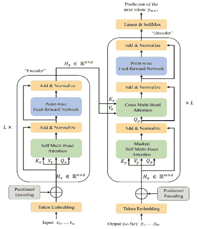

<!--yml

类别：未分类

日期：2024-09-06 19:34:32

-->

# [2402.13777] 离线策略学习的深度生成模型：教程、综述与未来方向的展望

> 来源：[`ar5iv.labs.arxiv.org/html/2402.13777`](https://ar5iv.labs.arxiv.org/html/2402.13777)

# 离线策略学习的深度生成模型：

教程、综述与未来方向的展望

陈家宇 chen3686@purdue.edu

普渡大学

西拉法叶，IN 47907 巴尔戈夫·甘古利 bganguly@purdue.edu

普渡大学

西拉法叶，IN 47907 杨旭 xu1720@purdue.edu

普渡大学

西拉法叶，IN 47907 梅永生 ysmei@gwu.edu

乔治·华盛顿大学

华盛顿，DC 20052 兰田 tlan@gwu.edu

乔治·华盛顿大学

华盛顿，DC 20052 瓦尼特·阿格瓦尔 vaneet@purdue.edu

普渡大学

西拉法叶，IN 47907

###### 摘要

深度生成模型（DGM）在多个领域取得了巨大成功，特别是在使用从离线数据训练的模型生成文本、图像和视频方面。类似地，数据驱动的决策制定和机器人控制也需要从离线数据中学习生成函数，以作为策略或政策。在这种情况下，应用深度生成模型进行离线策略学习显示出巨大的潜力，许多研究也在这一方向上进行了探索。然而，这一领域仍缺乏全面的综述，因此不同分支的发展相对独立。因此，我们提供了关于深度生成模型在离线策略学习中的应用的首个系统性综述。特别地，我们涵盖了五种主流的深度生成模型，包括变分自编码器、生成对抗网络、归一化流、变换器和扩散模型，以及它们在离线强化学习（离线 RL）和模仿学习（IL）中的应用。离线 RL 和 IL 是离线策略学习的两个主要分支，是序列决策制定的广泛采用技术。具体来说，对于每种基于 DGM 的离线策略学习类型，我们提炼其基本方案，根据 DGM 的使用情况对相关工作进行分类，并梳理该领域算法的发展过程。在主要内容之后，我们基于对深度生成模型和离线策略学习的深入讨论，提出了我们对未来研究方向的展望。这项工作提供了一个关于深度生成模型在离线策略学习中研究进展的实用参考，并旨在激发改进基于 DGM 的离线 RL 或 IL 算法。为了方便，我们在[`github.com/LucasCJYSDL/DGMs-for-Offline-Policy-Learning`](https://github.com/LucasCJYSDL/DGMs-for-Offline-Policy-Learning)上维护了一份论文列表。¹¹1 每位作者在本文中的贡献详见致谢部分。

###### 目录

1.  1 介绍

1.  2 深度生成模型背景

    1.  2.1 变分自编码器

    1.  2.2 生成对抗网络

    1.  2.3 归一化流

    1.  2.4 Transformers

    1.  2.5 扩散模型

1.  离线策略学习中的变分自编码器

    1.  3.1 离线强化学习

        1.  3.1.1 基于动态规划的离线强化学习背景

        1.  3.1.2 离线强化学习中应用 VAEs 的概述

        1.  3.1.3 解决使用 VAEs 的分布外动作问题

        1.  3.1.4 使用 VAEs 进行数据增强和转换

        1.  3.1.5 基于变分自编码器的离线多任务/层次强化学习

    1.  3.2 模仿学习

        1.  3.2.1 基于 VAE 的模仿学习核心方案

        1.  3.2.2 使用变分自编码器提高模仿学习的数据效率

        1.  3.2.3 通过变分自编码器管理模仿学习中的多模态输入

        1.  3.2.4 通过变分自编码器的技能获取和层次模仿学习

        1.  3.2.5 使用变分自编码器应对模仿学习中的因果混淆

1.  4 离线策略学习中的生成对抗网络

    1.  4.1 模仿学习

        1.  4.1.1 基本的 GAN 基模仿学习算法：GAIL 和 AIRL

        1.  4.1.2 GAIL 的扩展

        1.  4.1.3 AIRL 的扩展

        1.  4.1.4 将 VAEs 和 GANs 融合用于模仿学习：聚焦

    1.  4.2 离线强化学习

        1.  4.2.1 基于模型的离线强化学习背景

        1.  4.2.2 使用 GANs 进行策略近似

        1.  4.2.3 通过 GANs 表示世界模型

1.  5 离线策略学习中的归一化流

    1.  5.1 模仿学习

        1.  5.1.1 使用归一化流进行模仿学习的精确密度估计

        1.  5.1.2 在模仿学习中使用归一化流进行策略建模

    1.  5.2 使用离线数据的强化学习

        1.  5.2.1 在离线强化学习中采用归一化流

        1.  5.2.2 在使用离线数据的在线强化学习中采用归一化流

1.  6 离线策略学习中的变换器

    1.  6.1 离线强化学习

        1.  6.1.1 基于轨迹优化的离线强化学习背景

        1.  6.1.2 平衡模型容量与训练数据

        1.  6.1.3 缓解环境随机性带来的影响

        1.  6.1.4 在扩展离线强化学习设置中使用变换器

        1.  6.1.5 对基于变换器的离线强化学习的反思

    1.  6.2 模仿学习

        1.  6.2.1 基于变换器的模仿学习范式

        1.  6.2.2 将 Transformers 作为模仿学习的策略骨干

        1.  6.2.3 使用 Transformers 开发通用的模仿学习代理

1.  7 离线策略学习中的扩散模型

    1.  7.1 模仿学习

        1.  7.1.1 使用扩散模型提高模仿学习中的策略表达力

        1.  7.1.2 使用扩散模型解决模仿学习中的常见问题

    1.  7.2 离线强化学习

        1.  7.2.1 扩散模型作为策略

        1.  7.2.2 扩散模型作为规划器

        1.  7.2.3 扩散模型作为数据合成器

        1.  7.2.4 扩散模型在扩展离线强化学习设置中的应用

1.  8 讨论与开放问题

    1.  8.1 深度生成模型与离线策略学习的讨论

    1.  8.2 对未来方向的展望

        1.  8.2.1 数据中心研究的未来工作

        1.  8.2.2 基准测试的未来工作

        1.  8.2.3 理论的未来工作

        1.  8.2.4 算法设计的未来工作

1.  9 结论

## 1 引言

离线策略学习是一个利用现有静态数据集来学习有效（机器人）控制或决策的机器学习学科。本文*深入探讨*了其两个主要分支：离线强化学习（Offline RL）和模仿学习（IL）。离线强化学习利用从其他策略或人类操作员那里收集的预编译经验数据批次，通常包括一系列状态-动作-奖励-下一个状态的元组。离线强化学习的主要目标是开发一个最大化累积奖励的策略，这可能需要偏离训练数据中观察到的行为模式。另一方面，模仿学习通过模仿专家的行为来训练策略。用于模仿学习的数据应来自专家的演示轨迹。这些轨迹突出了专家对各种情境的反应，通常由一系列状态-动作对（学习自演示，LfD）或状态-下一个状态对（学习自观察，LfO）组成。

生成模型在人工智能和机器学习的许多子领域中被广泛使用。最近，通过深度神经网络对这些模型进行参数化的进展，加上随机优化方法的进展，使得使用深度生成模型（DGMs）可以对复杂的高维数据（包括图像、文本和语音）进行可扩展建模。特别是，我们注意到将 DGMs 应用于计算机视觉（CV）和自然语言处理（NLP）方面取得了巨大的成功。例如，使用扩散模型（Stable Diffusion (Rombach et al. (2022))) 进行文本到图像生成，使用扩散模型和变换器（Sora (Brooks et al. (2024))) 进行文本到视频生成，基于变换器的大型语言模型（ChatGPT (OpenAI (2023)))，等等。离线策略学习与 CV 和 NLP 有相似之处，因为所有这些领域都涉及从一组离线数据中学习。尽管 CV 或 NLP 模型根据给定的上下文生成图像或文本，但离线 RL/IL 模型则根据任务场景生成动作或轨迹。这种相似性表明，将 DGMs 应用于离线策略学习可能会复制在 CV 和 NLP 中取得的成功，利用其建模和生成复杂数据模式的能力。

在 DGMs 和离线策略学习方面已经取得了重大进展，并且有大量研究将 DGMs 的进展应用于促进离线策略学习的发展。本文提供了关于 DGMs 在离线策略学习中的综合评审。具体来说，主要内容按照 DGM 的类型进行分类，我们在本文中涵盖了几乎所有主流的 DGMs，包括变分自编码器（Variational Auto-Encoders）、生成对抗网络（Generative Adversarial Networks）、归一化流（Normalizing Flows）、变换器（Transformers）和扩散模型（Diffusion Models），其中变换器和扩散模型分别代表了自回归和基于评分的生成模型。对于每一类，我们将相关工作分为离线强化学习（RL）和模仿学习（IL）两个子类别。在每个子类别（例如，第 3.2 节），我们提炼了应用该 DGM 于 IL 或离线 RL 的核心方案，按照 DGM 的利用方式对相关工作进行分类，并提供了一个总结表，概述了代表性工作及其关键创新和评估基准。值得注意的是，我们的论文不仅仅是一个综述。对于每项工作的介绍，我们尽力包含其关键见解和客观设计，以帮助读者在不参考原文的情况下获取知识。此外，对于每组工作（例如，第 3.1.5 节和 7.2.2 节），算法在不同的细节层次上介绍，其中最具代表性的被强调为离线策略学习的 DGM 特定用法的教程，然后其他扩展工作被呈现以进行全面审查。具体来说，相同组别的研究工作以统一符号表示，旨在阐明其目标之间的关系以及算法设计的演变。

按照变分自编码器、生成对抗网络、归一化流、变换器和扩散模型的顺序，我们在第二部分中介绍了深度生成模型（DGM）的背景，并在第三部分中介绍了 DGM 在离线策略学习中的应用 - 7。关于每种 DGM 的背景，我们介绍了其数学基础和在离线策略学习中使用的模型变体。相关的 DGM 章节（例如，第 2.2 节和 4 节）共享相同的符号，以便于查找必要的背景信息。关于离线强化学习（RL）和离线学习（IL）的背景，我们注意到不同的 DGM 采用了不同的基础离线 RL/IL 算法，因此我们将背景介绍分配到相应的 DGM 章节。例如，离线 RL 的三个主要分支：基于动态规划的、基于模型的和基于轨迹优化的离线 RL，分别在第 3.1.1 节、第 4.2.1 节、第 6.1.1 节中介绍。紧接着，在第八部分中，我们深入讨论了本文的主要话题，并提供了对未来研究方向的展望。在讨论部分（第 8.1 节），我们分析了不同 DGM 在离线策略学习中的共同和独特用途，总结了每个类别中的开创性工作以及 DGM 算法针对离线策略学习所关注的问题/扩展。对于未来工作（第 8.2 节），我们提供了在数据、基准测试、理论和算法设计四个方面的潜在研究方向的观点。

本文的主要贡献如下：（1）这是首篇关于离线策略学习的深度生成模型的综述论文。（2）本文涵盖了广泛的主题，包括五种主流的深度生成模型及其在离线强化学习和模仿学习中的应用。（3）在本文中，我们提炼了关键的算法方案/范式，并有选择地突出了一些开创性的研究工作，作为相关主题的教程。（4）我们的工作展示了基于 DGM 的离线策略学习的发展与生成模型本身的进展并行。本文最后提供的总结为该领域的未来发展提供了有价值的见解和方向。

## 2 深度生成模型背景

在本节中，我们介绍了五种广泛采用的前沿深度生成模型：变分自编码器、生成对抗网络、正则流、变换器和扩散模型，作为其在离线策略学习中的应用背景。对于每种生成模型，我们将深入探讨其数学基础，并概述其显著的变体，特别关注那些在离线策略学习中应用的变体。

考虑到本研究涵盖的内容范围广泛，不同生成模型所使用的符号相对独立。在同一生成模型的背景和在离线策略学习中的应用中，符号是一致的并且可以交叉引用。然而，不同生成模型之间使用的符号可能不能直接比较或互换，但我们始终使用 $x\sim P_{X}(\cdot)$ 来表示离线数据集中的数据点，使用 $z\sim P_{Z}(\cdot)$ 来表示它们的潜在表示或变体。

### 2.1 变分自编码器

变分自编码器（VAEs，Kingma & Welling (2014; 2019））假设给定的数据分布 $P_{X}(x)$ 可以通过深度潜变量模型 $P_{\theta^{*}}(x)=\int P_{\theta^{*}}(z)P_{\theta^{*}}(x|z)dz$ 来生成，即从先验 $P_{\theta^{*}}(z)$ 中采样一个连续的潜变量 $z$，然后通过条件（生成）模型 $P_{\theta^{*}}(x|z)$ 来生成 $x$。还假设 $P_{\theta^{*}}(z)$ ($P_{\theta^{*}}(x|z)$) 来自一个参数化的分布族 $P_{\theta}(z)$ ($P_{\theta}(x|z)$)。直观上，这样的 $P_{\theta}(x)$ 可以看作是在一系列可能的潜变量 $z$ 上的某些基础概率分布 $P_{\theta}(x|z)$（例如高斯分布）的无限混合，因此它在建模复杂数据分布 $P_{X}(x)$ 时非常灵活和强大。

要学习从 $z$ 到 $x$ 的映射，需要一个额外的模型，该模型能够从训练数据 $x$ 中推断潜在变量 $z$，因为 $z$ 在离线数据中没有提供。然而，根据贝叶斯规则，真实的后验（推断）模型 $P_{\theta}(z|x)=P_{\theta}(z)P_{\theta}(x|z)/P_{\theta}(x)$ 在大多数情况下是难以处理的。例如，如果 $P_{\theta}(x|z)$ 是通过神经网络实现的，我们没有 $P_{\theta}(x)$ 的解析形式，因此也没有 $P_{\theta}(z|x)$ 的解析形式。因此，在变分自编码器（VAEs）中，生成模型 $P_{\theta}(x|z)$ 和相应的推断模型 $P_{\phi}(z|x)$（用于近似真实的后验）是联合学习的。VAEs 最显著的贡献有两个方面：首先，它们提出了变分下界作为实际的学习目标，其次，它们引入了重新参数化技巧，这有助于生成模型和推断模型的端到端训练。

VAEs 的目标函数是对数似然 $\log P_{\theta}(x)$ 的变分下界（即证据下界（ELBO）），其推导过程在与潜在变量模型相关的算法设计中被广泛采用，因此我们在这里展示这一过程：

|  | $\displaystyle\log P_{\theta}(x)$ | $\displaystyle=\mathbb{E}_{z\sim P_{\phi}(\cdot | x)}\left[\log P_{\theta}(x)\right]=\mathbb{E}_{z\sim P_{\phi}(\cdot | x)}\left[\log\left[\frac{P_{\theta}(x,z)}{P_{\theta}(z | x)}\right]\right]=\mathbb{E}_{z\sim P_{\phi}(\cdot | x)}\left[\log\left[\frac{P_{\theta}(x,z)}{P_{\phi}(z | x)}\frac{P_{\phi}(z | x)}{P_{\theta}(z | x)}\right]\right]$ |  | (1) |
| --- | --- | --- | --- | --- | --- | --- | --- | --- | --- | --- | --- |
|  |  | $\displaystyle=\mathbb{E}_{z\sim P_{\phi}(\cdot | x)}\left[\log\left[\frac{P_{\theta}(x,z)}{P_{\phi}(z | x)}\right]+\log\left[\frac{P_{\phi}(z | x)}{P_{\theta}(z | x)}\right]\right]=\mathcal{L}_{\theta,\phi}(x)+D_{KL}(P_{\phi}(z | x) | | P_{\theta}(z | x))\geq\mathcal{L}_{\theta,\phi}(x)$ |  |
|  | $\displaystyle\mathcal{L}_{\theta,\phi}(x)$ | $\displaystyle=\mathbb{E}_{z\sim P_{\phi}(\cdot | x)}\left[\log P_{\theta}(x,z)-\log P_{\phi}(z | x)\right]=\mathbb{E}_{z\sim P_{\phi}(\cdot | x)}\left[\log P_{\theta}(x | z)-\log\left[\frac{P_{\phi}(z | x)}{P_{\theta}(z)}\right]\right]$ |  | (2) |
|  |  | $\displaystyle=\mathbb{E}_{z\sim P_{\phi}(\cdot | x)}\left[\log P_{\theta}(x | z)\right]-D_{KL}(P_{\phi}(z | x) | | P_{\theta}(z))$ |  |

方程中的不等式 (1) 利用了 KL 散度（即 $D_{KL}(\cdot||\cdot)$）非负的事实（Csiszár & Shields (2004））。通过最大化 $\mathbb{E}_{x\sim P_{X}(\cdot)}\mathcal{L}_{\theta,\phi}(x)$ 来学习 $P_{\phi}$ 和 $P_{\theta}$，这反过来又最大化了 $\mathbb{E}_{x\sim P_{X}(\cdot)}\log P_{\theta}(x)$。当对推断模型 $P_{\phi}(z|x)$ 和生成模型 $P_{\theta}(x|z)$ 使用神经网络时，$\mathcal{L}_{\theta,\phi}(x)$ 训练一种特定类型的自编码器，其中 $P_{\phi}(z|x)$ 和 $P_{\theta}(x|z)$ 分别作为编码器和解码器。直观地说，这种自编码器通过最大化数据重建准确性（即 $\mathcal{L}_{\theta,\phi}(x)$ 中的第一项）来进行训练，同时对 $z$ 的分布进行正则化，使其从编码器到 $z$ 的先验分布接近。这种正则化是必要的，因为 $z$ 在训练时是从编码器中采样用于数据生成的（即 $z\sim P_{\phi}(\cdot|x),\hat{x}\sim P_{\theta}(\cdot|z)$），而在评估过程中，$z$ 是从先验分布中采样的（即 $z\sim P_{\theta}(\cdot),\hat{x}\sim P_{\theta}(\cdot|z)$）。

通常，变分自编码器（VAEs）假设 $P_{\theta}(z)=\mathcal{N}(z;0,I)$ 和 $P_{\phi}(z|x)=\mathcal{N}(z;\mu(x;\phi),\text{diag}(\sigma^{2}(x;\phi)))$。这里，假设 $z\in\mathbb{R}^{d}$，$I$ 是一个 $d\times d$ 的单位矩阵，$\mu(x;\phi)\in\mathbb{R}^{d}$ 是均值向量，而 $\text{diag}(\sigma^{2}(x;\phi))\in\mathbb{R}^{d\times d}$ 是一个对角协方差矩阵，其中 $\sigma^{2}_{1:d}(x;\phi)$ 是对角元素。在这种情况下，$D_{KL}(P_{\phi}(z|x)||P_{\theta}(z))$ 的解析形式存在，我们有：

|  | $\mathcal{L}_{\theta,\phi}(x)=\mathbb{E}_{z\sim P_{\phi}(\cdot\mid x)}\left[\log P_{\theta}(x\mid z)\right]+\frac{1}{2}\sum_{i=1}^{d}\left[1+\log\sigma_{i}^{2}(x;\phi)-\mu_{i}^{2}(x;\phi)-\sigma_{i}^{2}(x;\phi)\right]=\mathcal{L}_{\theta,\phi}^{1}(x)+\mathcal{L}_{\phi}^{2}(x)$ |  | (3) |
| --- | --- | --- | --- |

$\nabla_{\phi}\mathcal{L}_{\phi}^{2}(x)$ 和 $\nabla_{\theta}\mathcal{L}_{\theta,\phi}^{1}(x)$ 可以通过梯度反向传播轻松估计。然而，在计算 $\nabla_{\phi}\mathcal{L}_{\theta,\phi}^{1}(x)$ 时，梯度 $\nabla_{z}\log P_{\theta}(x|z)$ 无法反向传播到 $\phi$，因为 $z$ 是从编码器中采样得到的，而不是 $\phi$ 的函数。一种解决方案是重参数化技巧。具体来说，$z$ 可以通过将随机性从编码器的输出转移到输入来重新参数化为 $\phi$ 的确定性函数，即 $z=P_{\phi}(x,\epsilon)=\mu(x;\phi)+\sigma(x;\phi)\odot\epsilon,\ \epsilon\sim\mathcal{N}(0,I)$。($\epsilon\in\mathbb{R}^{d}$，并且 $\odot$ 表示逐元素乘积。) 这样，生成模型和对应的推断模型可以使用简单的学习技术（例如，随机梯度下降（Amari (1993))) 进行联合训练。

接下来，我们介绍一些变分自编码器（VAE）的代表性变体，这些变体在第三部分中进行了讨论。

+   •

    $\beta$-VAE：假设数据 $x\sim P_{X}(\cdot)$ 是由具有多个独立生成因子的真实模拟过程生成的，$\beta$-VAE（Higgins et al. (2017)) 被提出用于学习潜在变量 $z$，使每个生成因子在不同维度上编码。例如，模拟器可能会采样与对象形状、颜色和大小对应的独立因子，以生成一个小绿色苹果的图像；理想情况下，在图像的潜在变量中，应该为这些因子中的每一个提供单独的维度。为了学习这样的编码器 $P_{\phi}(z|x)$，作者建议约束 $P_{\phi}(z|x)$ 和各向同性单位高斯分布 $P_{\theta}(z)=\mathcal{N}(z;0,I)$ 之间的 KL 散度，以鼓励 $z$ 的维度条件独立，从而得到目标：

    |  | $\max_{\theta,\phi}\mathbb{E}_{z\sim P_{\phi}(\cdot | x)}\left[\log P_{\theta}(x | z)\right]\ s.t.\ D_{KL}(P_{\phi}(z | x) | | P_{\theta}(z))<\epsilon$ |  | (4) |
    | --- | --- | --- | --- | --- | --- | --- | --- | --- |

    引入拉格朗日乘子 $\beta>0$，上述方程可以重新表述为一个无约束优化问题：$\max_{\theta,\phi,\beta}\mathbb{E}_{z\sim P_{\phi}(\cdot|x)}\left[\log P_{\theta}(x|z)\right]-\beta\left[D_{KL}(P_{\phi}(z|x)||P_{\theta}(z))-\epsilon\right]$。他们选择将 $\beta$ 调整为超参数，而不是学习它，从而得到最终目标：

    |  | $\max_{\theta,\phi}\mathbb{E}_{z\sim P_{\phi}(\cdot | x)}\left[\log P_{\theta}(x | z)\right]-\beta D_{KL}(P_{\phi}(z | x) | | P_{\theta}(z))$ |  | (5) |
    | --- | --- | --- | --- | --- | --- | --- | --- | --- |

    当$\beta=1$时，这恢复了原始的 VAE 公式（即公式 (2)）。$\beta$控制着限制潜在通道容量（通过第二项）与保留重建数据样本信息（通过第一项）之间的权衡。经验上，他们发现为了学习所需的解耦潜在变量，设置$\beta>1$是很重要的。

+   •

    门控变分自编码器（Gated VAE）：如同在$\beta$-VAE 中提到的，解耦的潜在变量可以被视为数据的表示形式，其中每个元素与数据的独立且具有语义意义的生成因子相关。$\beta$-VAE 提供了一种无监督的方法来学习这种解耦表示（通过限制 KL 散度）。然而，最近的研究表明，缺乏归纳偏置或主观验证的情况下，始终如一的解耦是不可能实现的（Locatello et al. (2019))。因此，门控变分自编码器（Vowels et al. (2020))被提出以结合领域知识作为弱监督来鼓励解耦。具体来说，作为一种弱监督的形式，数据可以被聚类，使得每个簇包含具有某些生成因子的共享数据。然后，潜在变量$z$可以被划分为几个部分，每个部分捕捉特定簇的生成因子。假设$x_{1}$和$x_{2}$来自同一簇，该簇被分配到潜在变量的第$i$个部分，即$z_{i}$，编码器和解码器可以通过修改的 ELBO 进行训练：（这是$\log P_{\theta}(x_{2})$的下界）

    |  | $\mathcal{L}_{\theta,\phi}(x_{1},x_{2})=\mathbb{E}_{z\sim P_{\phi}(\cdot\vert x_{1})}\left[\log P_{\theta}(x_{2}\vert z)\right]-D_{KL}(P_{\phi}(z\vert x_{1})\Vert P_{\theta}(z))$ |  | (6) |
    | --- | --- | --- | --- |

    请注意，整个$z$都被用于从$x_{1}$生成$x_{2}$，但只有与$z_{i}$对应的梯度被反向传播到推断模型$P_{\phi}$。其理由是$x_{2}$旨在仅重建与$x_{1}$共享的生成因子，而这些因子应由$z_{i}$独占捕获。门控变分自编码器需要领域知识作为监督，这可能会限制其通用性。

+   •

    CVAE：条件变分自编码器（CVAE, Sohn et al. (2015)) 是一种用于条件生成的模型。给定一组数据 $x$ 及其相应的条件变量 $c$（例如分类标签或数据的期望属性），CVAE 学习条件先验 $P_{\theta}(z|c)$ 和条件生成模型 $P_{\theta}(x|z,c)$，以便通过 $z\sim P_{\theta}(\cdot|c),x\sim P_{\theta}(\cdot|z,c)$ 生成满足特定条件 $c$ 的数据样本 $x$。CVAE 在需要受控数据生成的任务中特别有用，例如在需要操控生成数据的特定属性的场景中。与 VAEs 类似，引入了一个推断模型 $P_{\phi}(z|x,c)$ 用于学习过程，其给出 ELBO：

    |  | $\mathcal{L}_{\theta,\phi}(x,c)=\mathbb{E}_{z\sim P_{\phi}(\cdot | x,c)}\left[\log P_{\theta}(x | z,c)\right]-D_{KL}(P_{\phi}(z | x,c) | | P_{\theta}(z | c))$ |  | (7) |
    | --- | --- | --- | --- | --- | --- | --- | --- | --- | --- |

    与原始的 VAE 公式相比，在每个函数中引入了一个条件变量 $c$，即先验、推断和生成模型。按照类似于公式 (1) 的推导过程，可以证明公式 (7) 是 $\log P_{\theta}(x|c)$ 的变分下界，即条件生成似然。进一步，他们指出，在评估过程中，潜在变量是从 $P_{\theta}(z|c)$ 中采样的，而不是 $P_{\phi}(z|x,c)$，因为只有条件 $c$ 是可用的。因此，为了提高训练和评估期间数据生成过程的一致性，他们在公式 (7) 中引入了一个额外的目标项：

    |  | $\mathcal{L}_{\theta,\phi}^{\text{hybrid}}(x,c)=\alpha\mathcal{L}_{\theta,\phi}(x,c)+(1-\alpha)\mathbb{E}_{z\sim P_{\theta}(\cdot | c)}\left[\log P_{\theta}(x | z,c)\right]$ |  | (8) |
    | --- | --- | --- | --- | --- | --- |

+   •

    VQ-VAE：与前述的 VAE 变体中$z$是连续的不同，VQ-VAE（van den Oord 等人 (2017)) 是一个利用离散潜在变量的自编码器框架。具体来说，他们假设潜在变量空间是一个代码本$[e_{1}^{T},\cdots,e_{k}^{T}]\in\mathbb{R}^{k\times d}$，其中$k$是类别数，$d$是每个类别的潜在向量的维度（即$e_{i}$）。这种离散表示通常比连续表示更易于建模，在某些情况下特别有利。例如，在具有多个类别的图像数据集中，按类别划分的潜在表示更为合适，其中每个类别都分配了一个来自代码本的代码。具体来说，VQ-VAE 的前向过程是：$z_{E}=P_{\phi}(x),z_{D}=e_{i}\ (i=\arg\min_{j}||z_{E}-e_{j}||_{2}),\hat{x}\sim P_{\theta}(\cdot|z_{D})$。这里，来自编码器的潜在变量，即$z_{E}$，被映射到代码本中的最近邻，即$z_{D}$，然后输入解码器以生成数据。VQ-VAE 的可学习参数包括$\theta$、$\phi$和$e_{1:k}$，其目标如下：（$z_{D}$和$e_{i}$如上定义；sg 表示停止梯度操作符。）

    |  | $\mathcal{L}_{\theta,\phi,e_{1:k}}(x)=\log P_{\theta}(x&#124;z_{D})-&#124;&#124;\text{sg}\left[P_{\phi}(x)\right]-e_{i}&#124;&#124;_{2}^{2}-\beta&#124;&#124;P_{\phi}(x)-\text{sg}\left[e_{i}\right]&#124;&#124;_{2}^{2}$ |  | (9) |
    | --- | --- | --- | --- |

    生成模型通过公式 (9) 中的第一项来训练重建数据$x$，这与其他 VAE 变体相同。代码本参数通过第二项与编码的潜在表示$z_{E}=P_{\phi}(x)$对齐。至于$P_{\phi}$，它通过第一项和第三项进行训练。具体而言，他们假设$\frac{\partial\log P_{\theta}(x|z_{D})}{\partial z_{E}}=\frac{\partial\log P_{\theta}(x|z_{D})}{\partial z_{D}}$，这样第一项在$z_{D}$上的梯度可以反向传播到$\phi$。另一方面，第三项是为了确保编码器坚持从代码本中进行嵌入。虽然实证证据证明了 VQ-VAE 的有效性，但其目标设计在很大程度上依赖于直觉，因此额外的理论基础将是有益的。

+   •

    VRNN：Chung et al. (2015) 引入了 VAE 的递归版本，用于建模数据序列（即 $x_{\leq T}\mathrel{\ensurestackMath{\stackon[1pt]{=}{\scriptstyle\Delta}}}[x_{0},\cdots,x_{T}]$）。在每个时间步 $t$，历史信息 $(x_{<t},z_{<t})$ 被用于序列决策，其中 $z_{<t}$ 是与 $x_{<t}$ 对应的潜在变量。不是直接将变量序列，即 $(x_{<t},z_{<t})$，作为历史记录，而是采用递归神经网络（RNN）递归地嵌入历史信息：$h_{t}=\text{RNN}_{\omega}(x_{t},z_{t},h_{t-1}),\ (t=0,\cdots,T)$²²2 根据 (Chung et al. (2015))，可以使用额外的嵌入层 $\text{emb}_{X}$ 和 $\text{emb}_{Z}$ 分别从数据 $x_{t}$ 和潜在变量 $z_{t}$ 中提取特征。为了在决策中涉及历史信息，先验、生成和推断模型都以历史嵌入为条件，形式为：$P_{\theta}(z_{t}|h_{t-1})$，$P_{\theta}(x_{t}|z_{t},h_{t-1})$ 和 $P_{\phi}(z_{t}|x_{t},h_{t-1})$，其中 $h_{t-1}$ 嵌入了历史 $(x_{<t},z_{<t})$。这三个模型和 $\text{RNN}_{\omega}$ 的总体目标（最大化）如下：

    |  | $\mathbb{E}_{P_{\phi,\omega}(z\leq T&#124;x\leq T)}\left[\sum_{t=1}^{T}\left(\log P_{\theta}(x_{t}&#124;z_{t},h_{t-1})-D_{KL}(P_{\phi}(z_{t}&#124;x_{t},h_{t-1})&#124;&#124;P_{\theta}(z_{t}&#124;h_{t-1}))\right)\right]$ |  | (10) |
    | --- | --- | --- | --- |

    其中 $P_{\phi,\omega}(z\leq T|x\leq T)=\prod_{t=0}^{T}P_{\phi}(z_{t}|x_{t},h_{t-1})$，$h_{t}$ 如上所定义。这个目标是数据序列对数似然的变分下界，即 $\log P_{\theta}(x_{\leq T})$，如 (Chung et al. (2015)) 附录 A 所示。引入历史信息并显式使用隐马尔可夫模型 (Rabiner & Juang (1986))（例如，用于定义 $P_{\phi,\omega}(z\leq T|x\leq T)$）显著提高了 VRNN 对序列数据的表征能力。

### 2.2 生成对抗网络

生成对抗网络（GAN, Goodfellow et al. (2014a））是一种基于最小最大优化的生成模型。它由一个生成器 $G$ 和一个判别器 $D$ 组成，两者同时训练，相互竞争。生成器试图捕捉真实数据的分布 $P_{X}(x)$，并从初始噪声 $z\sim P_{Z}(\cdot)$ 生成新的数据样本 $x$。判别器通常是一个二分类器，用于尽可能准确地区分生成的样本与真实数据。形式上，生成器可以建模为一个可微分的函数，将噪声 $z$ 映射到数据空间 $X$ 中的样本 $x$：$z\sim P_{Z}(\cdot),x=G(z)\sim P_{G}(\cdot)$。而判别器的输出 $D(x)$ 估计数据点 $x$ 从真实数据分布 $P_{X}(\cdot)$ 采样的概率，而非由生成器生成。GAN 的训练目标被表述为 $G$ 和 $D$ 之间的最小最大博弈：

|  | $\min_{G}\max_{D}\mathbb{E}_{x\sim P_{X}(\cdot)}[\log D(x)]+\mathbb{E}_{z\sim P_{Z}(\cdot)}[\log(1-D(G(z)))]$ |  | (11) |
| --- | --- | --- | --- |

在这里，$D$ 被训练以最大化对真实数据和生成器生成的伪造数据正确标签的分配概率：$D(x)\rightarrow 1, D(G(z))\rightarrow 0$。对于某个特定的 $G$，最佳判别器为：$D_{G}^{*}(x)=\frac{P_{X}(x)}{P_{X}(x)+P_{G}(x)}$。将其代入公式（11），该最小最大问题可以转化为关于生成器 $G$ 的优化问题：$\min_{G}JS(P_{X}(\cdot)||P_{G}(\cdot))$，其中 $JS(\cdot)$ 表示 Jensen-Shannon 散度（Menéndez et al. (1997））。有关详细推导，请参见 (Goodfellow et al. (2014a))。因此，实质上，$G$ 被训练生成与真实数据分布匹配的样本。

接下来，我们介绍几个代表性的 GAN 变体，以作为第四部分的必要背景。

+   •

    条件生成对抗网络（CGAN）与信息生成对抗网络（InfoGAN）：CGAN（Mirza & Osindero (2014））在训练生成器和判别器时，将额外的信息 $y$ 作为条件。

    |  | $\min_{G}\max_{D}\mathbb{E}_{x\sim P_{X}(\cdot)}[\log D(x&#124;y)]+\mathbb{E}_{z\sim P_{Z}(\cdot)}[\log(1-D(G(z&#124;y)))]$ |  | (12) |
    | --- | --- | --- | --- |

    类似地，这个目标可以转换为 $\min_{G}JS(P_{X}(\cdot|y)||P_{G}(\cdot|y))$，即匹配真实数据的条件分布。利用这些条件模型，CGAN 不仅可以处理单模态数据集，还可以处理多模态数据集，例如 Flickr（Plummer 等人 (2015）），该数据集由多样的标记图像数据组成。通过将类别标签或文本作为条件$y$，CGAN 可以用于条件生成。然而，当数据集中包含多种模态但标签$y$未提供时，InfoGAN（Chen 等人 (2016））提出将潜在代码$c$（遵循假定分布$P_{C}(\cdot)$）引入生成器。这样，数据生成过程被修改为$c\sim P_{C}(\cdot),z\sim P_{Z}(\cdot),x=G(z,c)\sim P_{G}(\cdot|c)$，其中$c$用于捕捉数据集中的不同模式，而$z$针对的是跨模式共享的无结构噪声。生成器$G$不仅通过$V(D,G)$（即，等式(11)）进行训练，还要最大化模式变量$C$与相应样本$X|_{C}=G(Z,C)$之间的互信息：$\min_{G}\max_{D}V(D,G)-\lambda I(C,X|_{C})$，使得$G(Z,C)$不会退化为单模态模型。通过用其实际下界替代互信息，我们得到了 InfoGAN 的目标如下：

    |  | $\min_{G,Q}\max_{D}V(D,G)-\lambda\left[\mathbb{E}_{c\sim P_{C}(\cdot),z\sim P_{Z}(\cdot),x=G(z,c)}\left[\log Q(c | x)\right]+H(C)\right]$ |  | (13) |
    | --- | --- | --- | --- | --- |

    在这里，$Q(x|c)$是一个变分后验神经网络，旨在近似真实但不可处理的后验分布$P(c|x)$，$H(C)$表示模式变量$C$的熵。$I(C,X|_{C})=H(C)-H(C|X|_{C})=-\int P_{C}(c)\log P_{C}(c)\,dc+\int P_{C}(c)P_{G}(x|c)\log P(c|x)\,dc\,dx\geq-\int P_{C}(c)\log P_{C}(c)\,dc+\int P_{C}(c)P_{G}(x|c)\log Q(c|x)\,dc\,dx.$ 这里采用了与等式(1)中相同的技巧来得到这一不等式。

+   •

    $f$-GAN：一大类不同的散度，包括 KL 散度和 JS 散度，被称为$f$-散度（Csiszár & Shields (2004)）。具体来说，给定两个连续分布$P(\cdot)$和$G(\cdot)$，它们之间的$f$-散度定义为$D_{f}(P(\cdot)||Q(\cdot))=\int Q(x)f\left(\frac{P(x)}{Q(x)}\right)dx$，其中$f:\mathbb{R}^{+}\rightarrow\mathbb{R}$应为一个凸的、下半连续的函数，满足$f(1)=0$。例如，当$f(a)=a\log a$时，$D_{f}$恢复了 KL 散度。给定一个数据分布$P_{X}(\cdot)$，可以通过最小化$D_{f}(P_{X}(\cdot)||P_{G}(\cdot))$来学习一个对应的生成模型$G$。如$f$-GAN（Nowozin et al. (2016))中提出的，这可以通过一个极小极大优化问题近似求解：

    |  | $\min_{G}\max_{V}\mathbb{E}_{x\sim P_{X}(\cdot)}\left[g_{f}(V(x))\right]+\mathbb{E}_{x\sim P_{G}(\cdot)}\left[-f^{*}(g_{f}(V(x)))\right]$ |  | (14) |
    | --- | --- | --- | --- |

    在这里，$V$是一个没有输出范围约束的可微函数，$g_{f}$是特定于所用$f$-散度的输出激活函数，而$f^{*}$是$f$的凸共轭函数（Hiriart-Urruty & Lemaréchal (2004))。通过对$f$、$f^{*}$和$g_{f}$的具体选择，可以实现各种类型的$f$-GAN（见（Nowozin et al. (2016))中的表 6）。例如，通过设置$f^{*}(t)=-\log(1-\exp(t))$和$g_{f}(v)=-\log(1+\exp(-v))$，可以恢复原始 GAN。这样，$f$-GAN 提供了对多种 GAN 变体的推广，包括原始 GAN、LSGAN 和 WGAN。

+   •

    最小二乘 GAN（LSGAN）：在早期训练阶段，生成的样本与真实数据差异较大，但原始 GAN 目标仅对更新$G$提供非常小的惩罚，如（Goodfellow (2017)）中的图 16 所示。为了克服这一梯度消失问题，LSGAN（Mao et al. (2017))将原始 GAN 目标中的交叉熵损失替换为最小二乘损失：

    |  | $\min_{D}\mathbb{E}_{x\sim P_{X}(\cdot)}\left[(D(x)-j)^{2}\right]+\mathbb{E}_{z\sim P_{Z}(\cdot)}\left[(D(G(z))-i)^{2}\right],\ \min_{G}\mathbb{E}_{z\sim P_{Z}(\cdot)}\left[(D(G(z))-k)^{2}\right]$ |  | (15) |
    | --- | --- | --- | --- |

    这里，$i,j$ 分别是生成样本和真实样本的标签；$k$ 是 $G$ 希望 $D$ 对生成样本的信任值。如 (Mao 等人（2017））所示，当 $j-i=2$ 和 $j-k=1$ 时，式（15）等同于最小化 Pearson $\chi^{2}$ 散度，即真实数据分布 $P_{X}(x)$ 和生成数据分布 $P_{G}(x)$ 之间的 $f$-散度。

+   •

    Wasserstein GAN（WGAN）：如前所述，对于原始 GAN，关于 $G$ 的优化等同于最小化 JS 散度 $JS(P_{X}(\cdot)||P_{G}(\cdot))$。WGAN（Arjovsky 等人（2017））建议改为最小化 Wasserstein 距离，其定义为 $\sup_{||f||_{L}\leq K}\mathbb{E}_{x\sim P_{X}(\cdot)}\left[f(x)\right]-\mathbb{E}_{x\sim P_{G}(\cdot)}\left[f(x)\right]$。$||f||_{L}\leq K$ 表示 $K$-Lipschitz 函数的集合。在这种情况下，WGAN 的目标函数如下：

    |  | $\min_{G}\max_{D}\mathbb{E}_{x\sim P_{X}(\cdot)}\left[D(x)\right]-\mathbb{E}_{x\sim P_{G}(\cdot)}\left[D(x)\right]$ |  | (16) |
    | --- | --- | --- | --- |

    这里，$D$ 用于估计 Wasserstein 距离，因此其输出不像原始 GAN 那样限制在 $[0,1]$ 内。此外，神经网络 $D$ 采用权重裁剪，确保 $D$ 是 $K$-Lipschitz 的。与原始 GAN 相比，WGAN 改善了学习的稳定性，并为参数微调提供了有意义的学习曲线。

+   •

    Triple-GAN：为了同时实现数据分类和条件生成，Triple-GAN（Li 等人（2017a））建议将分类器 $C(y|x)$ 引入原始 GAN 框架。在这里，$x$ 和 $y$ 分别表示数据和标签。给定一个 $(x,y)$ 数据集，可以获得真实数据和标签的经验联合分布和边际分布，分别为 $P_{X,Y}(x,y)$、$P_{X}(x)$ 和 $P_{Y}(y)$。$P_{X,Y}(x,y)$ 可以近似为 $P_{X}(x)P_{C}(y|x)$ 或 $P_{Y}(y)P_{G}(x|y)$，分别对应于使用 $C$ 的分类和使用 $G$ 的条件生成。因此，可以训练 $C$ 和 $G$ 以匹配 $(x,y)$ 的联合分布。目标如下：

    |  | $\displaystyle\min_{C,G}\max_{D}$ | $\displaystyle\mathbb{E}_{(x,y)\sim P_{X,Y}(\cdot)}\left[\log D(x,y)\right]+\lambda_{G}\mathbb{E}_{y\sim P_{Y}(\cdot),x\sim P_{G}(\cdot | y)}\left[\log(1-D(x,y))\right]+$ |  | (17) |
    | --- | --- | --- | --- | --- | --- |
    |  |  | $\displaystyle(1-\lambda_{G})\mathbb{E}_{x\sim P_{X}(\cdot),y\sim P_{C}(\cdot | x)}\left[\log(1-D(x,y))\right]+\mathbb{E}_{(x,y)\sim P_{X,Y}(\cdot)}\left[-\log P_{C}(y | x)\right]+$ |  |
    |  |  | $\displaystyle\lambda_{C}\mathbb{E}_{y\sim P_{Y}(\cdot),x\sim P_{G}(\cdot | y)}\left[-\log P_{C}(y | x)\right]$ |  |

    前三个项类似于 GAN 框架，其中 $C$ 和 $G$ 被训练来欺骗鉴别器 $D$，通过生成接近真实数据的 $(x,y)$。最后两个（交叉熵）项通过使用来自真实和生成分布的样本来为 $C$ 提供额外的监督。请注意，最后的目标项仅用于训练 $C$。在 (Li et al. (2017a)) 中显示，当且仅当 Eq. (17) 中三方（$C,G,D$）达到平衡时，$P_{X,Y}(x,y)=P_{X}(x)P_{C}(y|x)=P_{Y}(y)P_{G}(x|y)$。

### 2.3 归一化流

归一化流（NFs）表示一种生成模型，它为密度估计和从复杂分布生成数据样本提供了一种优雅的方法（Kobyzev et al. (2021))。NFs 允许精确的似然评估，这在许多概率建模任务中至关重要。形式上，NFs 通过一系列可逆且可微的变换将潜在变量（即 $z\sim P_{Z}(\cdot)$）上的简单已知概率分布转换为数据（即 $x\sim P_{X}(\cdot)$）上的复杂期望分布。从 $x$ 到 $z$ 的变换的数学表示由一系列双射的组合给出，即 $F=F_{N}\circ F_{N-1}\circ\cdots\circ F_{1}$。在 NFs 中，数据流 $[x_{0},x_{1},\cdots,x_{N}]$（$x_{0}=x,\ x_{N}=z$）遵循以下规律：对于所有 $1\leq i\leq N,\ x_{i}=F_{i}(x_{i-1}),\ x_{i-1}=F^{-1}_{i}(x_{i})$。变换的核心原理是变量变换公式。具体来说，$x$ 和 $z$ 的概率密度函数的关系为：

|  | $P_{Z}(z)=P_{X}(F^{-1}(z))\ | \det D(F^{-1}(z))\ | ,\ P_{X}(x)=P_{Z}(F(x))\ | \det D(F(x))\ | $ |  | (18) |
| --- | --- | --- | --- | --- | --- | --- | --- |

其中 $\det D(F(x))$ 表示 $F(x)$ 的雅可比矩阵的行列式。给定变换函数 $F$ 和基本分布 $P_{Z}$，数据样本 $x$ 的密度可以精确地获得为 Eq. (18) 中定义的 $P_{X}(x)$。反之，数据生成可以通过首先从 $P_{Z}(\cdot)$ 中采样一个潜在的 $z$ 然后应用生成器函数 $G=F^{-1}$ 来完成。至于训练，通常通过最大化目标数据分布的对数似然（Dinh et al. (2017)) 来进行：

|  | $\mathbb{E}_{X}[\log(P_{X}(x))],\ \log(P_{X}(x))=\log(P_{Z}(F(x)))+\log(\ | \det D(F(x))\ | )$ |  | (19) |
| --- | --- | --- | --- | --- | --- |

对于 NFs，生成器 $G$ 应该具有足够的表达能力以建模感兴趣的分布，而变换 $F$ 应该是可逆的，并且上述两个方向的计算，尤其是行列式计算，应当是高效的。基于这些要求，开发了各种类型的流。在这里，我们简要介绍几种代表性的类别。如前所述，$G$ 由一系列生成器模块 $G_{i}=F_{i}^{-1}$ 组成。对于以下每种类别，我们将介绍其在 $G_{i}$ 上的具体设计，并使用 $m$ 和 $n$ 分别表示 $G_{i}$ 的输入和输出。注意，我们不会深入探讨复杂的数学细节，如计算或特定变体的目标设计，因为这些对于理解 NFs 在离线策略学习中的应用并非必要，如第五部分所介绍的。 

+   •

    Coupling Flows 通过耦合方法实现了高度表达性的变换。特别地，输入 $m\in\mathbb{R}^{D}$ 被划分为两个子空间：$(m^{A},m^{B})\in\mathbb{R}^{d}\times\mathbb{R}^{D-d}$，生成器模块 $G_{i}$ 定义为：$G_{i}(m)=(H(m^{A};\Theta(m^{B})),m^{B})$。在这里，$H(\cdot;\theta):\mathbb{R}^{d}\rightarrow\mathbb{R}^{d}$ 是一个双射，$\Theta$ 是参数函数。$H$ 也称为耦合函数。在这种情况下，$G_{i}$ 的雅可比矩阵只是 $H$ 的雅可比矩阵，为了高效计算行列式，$H$ 通常被设计为逐元素的双射，即 $H(m^{A};\theta)=(H_{1}(m^{A}_{1};\theta_{1}),\cdots,H_{d}(m^{A}_{d};\theta_{d}))$，其中每个 $H_{i}(\cdot;\theta_{i}):\mathbb{R}\rightarrow\mathbb{R}$ 是一个标量双射。耦合流的表达能力在于其参数函数 $\Theta$ 的复杂性，实际应用中，$\Theta$ 通常用神经网络建模。此类别的算法包括 NICE (Dinh et al. (2015))，RealNVP (Dinh et al. (2017))，Glow (Kingma & Dhariwal (2018))，NSF (Durkan et al. (2019))，Flow++ (Ho et al. (2019)) 等。

+   •

    自回归流利用自回归模型进行生成。具体来说，$n=G_{i}(m)$ 的每个条目都依赖于输入的前一个条目：$n_{t}=H(m_{t};\Theta_{t}(m_{1:t-1}))$，其中 $H(\cdot;\theta):\mathbb{R}\rightarrow\mathbb{R}$ 是一个标量双射，$\Theta_{t}$ 是一个参数函数。因此，每个 $n_{t}$ 仅依赖于 $m_{1:t}$，导致 $G$ 的雅可比矩阵是一个三角形矩阵。这种结构允许高效地计算行列式并并行计算 $n$ 中的每个条目。然而，逆过程，表示为 $m_{t}=H^{-1}(n_{t};\Theta_{t}(m_{1:t-1}))$，必须顺序执行，因为后续步骤的参数（即 $\Theta_{t+1}(m_{1:t})$）使用当前步骤的输出，即 $m_{t}$，作为输入。类似 IAF（Kingma et al. (2016))、MAF（Papamakarios et al. (2017)) 和 NAF（Huang et al. (2018)) 的算法都属于这一类别。

+   •

    残差流使用残差网络（He et al. (2016)) 作为生成器组件，其特点是 $G_{i}(m)=m+R(m)$。这里，$R(\cdot)$ 表示残差块，可以实现为任何可逆的神经网络变体。一些研究（Gomez et al. (2017); Chang et al. (2018); Jacobsen et al. (2018)) 旨在开发适合作为残差块使用的可逆网络架构。然而，这些架构在高效计算其雅可比行列式方面存在显著挑战。诸如 iResNet（Behrmann et al. (2019)) 和 Residual Flow（Chen et al. (2019)) 的研究工作通过将残差块的 Lipschitz 常数限制在 1 以下，并通过固定点迭代计算其逆，从而提出了可逆的 $G_{i}$。然而，控制神经网络的 Lipschitz 常数也是相当具有挑战性的。

+   •

    基于 ODE 的流旨在学习一个连续的动态系统，表现为一阶常微分方程（ODE）：$\frac{d}{dt}m(t)=R(m(t);\theta(t)),\ t\in[0,1]$。值得注意的是，上述提到的残差流可以被解释为该 ODE 的离散化。假设在$m$中具有一致的 Lipschitz 连续性，并设置初始条件$m(0)=z$，那么该 ODE 在每个时间点$\Phi^{t}(z)$的解是存在且唯一的（Arnold (1992))。如 NODE 中所提出（Chen et al. (2018b))，在时间点一的映射$\Phi^{1}(z)$可以作为生成器，即$x=\Phi^{1}(z)$，可以视为一个具有堆叠权重$\theta(t),t\in[0,1]$的“无限深”神经网络。因此，通常情况下，连续的 ODE 类型流需要更少的参数来匹配离散类型流的性能（Grathwohl et al. (2018))。至于$\Phi^{1}$的可逆性，它由 ODE 解的存在性和唯一性定理自然确保。然而，$\Phi^{1}$必须保持方向不变——也就是说，它的 Jacobian 行列式必须为正，这可能限制其表示能力。为了使 Jacobian 行列式保持为正，ANODE 的作者（Dupont et al. (2019))建议用补充变量$\hat{m}(t)$来扩充原始 ODE，得到$\frac{d}{dt}[m(t)||\hat{m}(t)]=\hat{R}(m(t)||\hat{m}(t);\theta(t)),\ t\in[0,1]$，其中$||$表示连接。

还有一些类型的流在实践中不广泛使用，因此在这里没有介绍，例如平面流和径向流（Rezende & Mohamed (2015); van den Berg et al. (2018))以及朗之万流（基于连续和 SDE 的）（Welling & Teh (2011); Chen et al. (2018a))。耦合流和自回归流便于进行直接的可逆变换和高效的行列式计算，但与计算代价高的残差流相比，它们在表达能力上有所欠缺。基于 ODE 的流提供了一个可能优雅且简洁的表示，参数更少。然而，它们需要在训练过程中解决 ODE，这一过程可能计算开销大且对数值解算器设置的选择敏感。与 VAEs 和 GANs 相比，NFs 允许对生成样本进行精确的密度估计，并且可以避免训练问题如模式崩溃、梯度消失等（Salimans et al. (2016))。然而，对双射函数和行列式计算的要求可能限制了它在有效建模复杂数据分布方面的能力（Cornish et al. (2020)）。

### 2.4 Transformers

Transformer（Vaswani 等（2017））是一个重要的基础模型，已在自然语言处理（Kalyan 等（2021））、计算机视觉（Han 等（2022））、时间序列分析（Wen 等（2023））等多个领域展现了卓越的能力。最近，基于 transformer 的 IL 和离线 RL 算法的发展趋势日益增长，希望实现基于下一个标记预测的顺序决策，如同自然语言处理中的应用。正如图 1 所示，transformer 遵循广泛采用的编码器-解码器结构。编码器将输入 $(x_{1},\cdots,x_{n})$ 映射为一系列嵌入 $(z_{1},\cdots,z_{n})$，解码器则自回归地生成输出序列。即，解码器一次预测一个标记 $y_{m+1}$，基于输入嵌入 $(z_{1},\cdots,z_{n})$ 和之前生成的输出 $(y_{1},\cdots,y_{m})$。编码器和解码器都由 $L$ 个相同的模块堆叠而成。为了清晰起见，我们依次展示模块中的每一层，跟随数据流动。

+   •

    位置编码：在标记嵌入层之后，该层在 $(x_{1},\cdots,x_{n})$ 和 $(y_{1},\cdots,y_{m})$ 中共享，每个元素被转换为一个 $d$ 维向量。为了使模型能够利用标记的顺序，通过位置编码注入有关标记在序列中的相对或绝对位置的信息。对于第 $i$ 个标记，其位置编码也是一个 $d$ 维向量，其中第 $j$ 维是 $\sin(\frac{i}{10000^{j/d}})$ 如果 $j$ 是偶数，反之则是 $\cos(\frac{i}{10000^{(j-1)/d}})$。然后，位置编码和标记嵌入通过加和结合。根据 Vaswani 等（2017），这种（周期函数）位置编码设计嵌入了相对位置的信息，帮助模型处理比训练中遇到的序列更长的序列。

+   •

    自注意力机制（Self Multi-Head Attention，MHA）：该组件利用注意力机制。给定 $s$ 个查询和 $t$ 个键值对，注意力函数将每个查询映射到值的加权和，其中分配给每个值的权重是计算查询与该值配对的键的兼容性。查询、键和值可以分别表示为 $Q\in\mathbb{R}^{s\times d_{q}}$、$K\in\mathbb{R}^{t\times d_{k}}$ 和 $V\in\mathbb{R}^{t\times d_{v}}$，所有查询的输出（即 $O$）可以并行计算：（为了矩阵乘法的一致性，$d_{k}=d_{q}$。）

    |  | $O=\text{Attention}(Q,K,V)=\text{SoftMax}\left(\frac{QK^{T}}{\sqrt{d_{k}}}\right)V,\ O_{i}=\text{SoftMax}\left(\frac{\langle Q_{i},K_{1}\rangle}{\sqrt{d_{k}}},\cdots,\frac{\langle Q_{i},K_{t}\rangle}{\sqrt{d_{k}}}\right)V$ |  | (20) |
    | --- | --- | --- | --- |

    在这里，SoftMax 是一个行操作符，查询 $i$ 的输出，即 $O_{i}$，是 $V$ 行的加权和，其中行 $j$ 的权重与 $Q_{i}$（即 $Q$ 的第 $i$ 行）和 $K_{j}$ 通过它们的内积 $\langle Q_{i},K_{j}\rangle$ 测量的相似性成正比。点积随着 $d_{k}$ 增大，这会使 SoftMax 函数推向梯度消失的区域，因此引入了因子 $1/\sqrt{d_{k}}$。输入嵌入 $H_{x}$（见图 1）可以潜在地用作自注意力的矩阵 $Q$、$K$ 和 $V$。然而，为了使模型能够同时关注来自不同表示子空间的信息，采用了多头注意力机制。

    |  | $\text{MHA}(Q,K,V)=\text{Concat}(\text{head}_{1},\cdots,\text{head}_{h})W^{O},\ \text{head}_{i}=\text{Attention}(QW_{i}^{Q},KW_{i}^{K},VW_{i}^{V})$ |  | (21) |
    | --- | --- | --- | --- |

    其中 $Q=K=V=H_{x}\in\mathbb{R}^{n\times d}$，$W_{i}^{Q}\in\mathbb{R}^{d\times d^{\prime}}$，$W_{i}^{K}\in\mathbb{R}^{d\times d^{\prime}}$，$W_{i}^{V}\in\mathbb{R}^{d\times d^{\prime}}$，$W_{i}^{O}\in\mathbb{R}^{d\times d}$，$d^{\prime}=d/h$，Concat 表示连接操作。$W_{i}^{Q},W_{i}^{K},W_{i}^{V}$ 将 $H_{x}$ 转换为第 $i$ 个注意力头的矩阵，提供了一个独特的表示子空间。值得注意的是，MHA 的输出属于 $\mathbb{R}^{n\times d}$，即与其输入形状相同。

+   •

    Add & Normalize：在每个注意力层周围使用了残差连接（He 等人（2016）），随后进行层归一化（Ba 等人（2016））。按照常规做法，这两个操作用于稳定（非常）深层网络的训练（例如，通过减轻梯度不适定和模型退化）。假设前一层是 $F$，它可以是 MHA 或前馈网络，如图 1 所示，且其输入为 $X$，那么此 Add & Normalize 层的计算可以表示为 $\text{LayerNorm}(F(X)+X)$。

+   •

    点-wise 前馈网络（FFN）：FFN 层对于 Transformer 实现良好性能至关重要。Dong 等人 (2021) 观察到，简单堆叠 MHA 模块会导致秩崩溃问题（例如，导致 token 一致性），而 FFN 是缓解这一问题的重要组成部分。具体而言，一个中间具有 ReLU 激活函数的两层全连接网络被应用于每个 $n$ 个 token 嵌入，产生 $n$ 个新的 $d$-dim 嵌入作为输出。

+   •

    掩蔽自注意力 MHA & 交叉 MHA：对于解码器，$H_{x}$ 被 $H_{y}\in\mathbb{R}^{m\times d}$ 替代，即之前生成的输出的嵌入。为了合理性，掩蔽自注意力 MHA 中的每个位置的查询只能关注到该位置及之前的位置，因为其他查询对应的是尚未生成的输出。这通过在掩蔽自注意力 MHA 中掩蔽相应的兼容性值实现，即 $\langle Q_{i},K_{j}\rangle=-\infty,\ \forall j>i$（在公式 (20)）。至于交叉 MHA，它的查询来自于前一层解码器，而键值对来自编码器的输出，即图 1 中的 $H_{z}\in\mathbb{R}^{n\times d}$。注意，这些矩阵将通过 $W_{i}^{Q},W_{i}^{K},W_{i}^{V}$ 嵌入以获得多个表示子空间，如公式 (21)。通过这种方式，每个用于预测下一个 token 的查询可以在输入序列的所有位置（通过交叉 MHA）以及所有之前生成的 token（通过掩蔽自注意力 MHA）之间进行注意力操作。

图 1：Transformer 架构

每个编码器模块输出一个 $n\times d$ 矩阵，每个解码器模块输出一个 $m\times d$ 矩阵。这里，$n$ 和 $m$ 分别表示输入和输出序列中的元素数量，而 $d$ 代表嵌入维度。这种输入和输出维度的统一性使得可以堆叠多个编码器（或解码器）模块来创建一个深度模型。每个编码器（或解码器）模块将采用来自前一个编码器（或解码器）模块的输出。通常，变换器架构可以有三种不同的使用方式：仅编码器、仅解码器或编码器-解码器。当仅使用编码器时，它的输出作为输入序列的表示，适用于自然语言理解任务，如文本分类。而如果仅使用解码器，则会移除 Cross MHA 模块，这种架构适合于序列生成任务，如语言建模。变换器在 IL 或离线 RL 中的应用通常采用这种仅解码器的方式。整体编码器-解码器架构具备同时进行自然语言理解和生成的能力，通常用于序列到序列建模（例如，神经机器翻译）。

与其他类型的神经网络相比，transformer 架构具有显著的优势。与全连接层相比，transformer 在处理变长输入（即具有不同 $n$ 的输入）时更具灵活性，并且参数效率更高，因为 transformer 中的网络参数数量与序列长度 $n$ 无关 ⁶⁶6FFN 层应用于每个位置而不是整个序列，而 MHA 层仅需要更新权重：$W_{i}^{Q},W_{i}^{K},W_{i}^{V},W^{O}$，其大小与 $n$ 无关。卷积层使用大小为 $k<n$ 的卷积核来连接成对的标记，因此，要连接远距离的标记对，需要一系列卷积层。然而，借助注意力机制，每对标记可以在一个 MHA 层中连接，并且匹配它们相应的查询和键的时间复杂度是常数（即与 $n$ 无关）。这使得 transformer 在捕捉序列中的长程依赖关系方面表现出色。递归层产生一系列隐藏状态 $h_{i}$，每个状态依赖于前一个隐藏状态 $h_{i-1}$ 和位置 $i$ 的输入。这种顺序特性阻碍了并行计算。然而，在 transformers 中，每个位置的计算是独立的，允许进行并行执行，这对于处理长序列至关重要。最后，卷积模型和递归模型对输入做出结构假设，分别适用于图像类和时间序列数据。然而，transformer 对数据结构的假设较少，因此是一种更为通用的模型。实证结果显示，transformer 在广泛的任务上表现优越，其处理大量训练数据的能力超过了 CNN 和 RNN。

如上所述，变压器包含多种类型的层。大量研究探讨了对标准变压器层的修改或替换以进行改进。有关全面的回顾，请参阅（Lin et al. (2022c))。另一方面，MHA 模块的计算和内存复杂度与输入序列的长度（即$n$）呈二次方关系，这在处理极长序列时导致了低效。为了提高计算或内存效率，已经开发了各种扩展。此外，由于变压器对输入数据的结构假设非常少，当在小规模数据集上训练时，变压器容易出现过拟合。为了解决这些问题，已经尝试了诸如在大规模未标记数据上预训练变压器（Brown et al. (2020))、引入稀疏性假设（Child et al. (2019))，例如限制每个查询可以关注的键值对的数量和位置。最后，可以扩展变压器以适应特定的下游应用。第六部分中详细描述的研究可以视为这类扩展的示例。

### 2.5 扩散模型

扩散模型在多个领域中表现出卓越的性能，例如计算机视觉（Amit et al., 2021；Baranchuk et al., 2021）、自然语言处理（Austin et al., 2021b；Hoogeboom et al., 2021）和多模态学习（Avrahami et al., 2022；Ramesh et al., 2022），展示了其生成详细且多样化实例的令人印象深刻的能力。扩散模型包含两个相互关联的过程：前向扩散过程和后向去噪过程（Yang et al. (2022a））。具体而言，前向过程是预定义的，它将具有某种（但未知）分布的数据，即 $x\sim P_{X}(\cdot)$，转换为（标准高斯）随机噪声 $z$。该过程通过在每个扩散步骤中添加不同尺度的噪声来逐步破坏输入数据。相应地，逆过程使用神经网络作为去噪函数，逐渐撤销前向变换，从随机噪声中重建数据。扩散模型主要有三种公式化形式：基于评分的生成模型（SGM）（Song & Ermon, 2019；2020）、去噪扩散概率模型（DDPM）（Sohl-Dickstein et al., 2015；Ho et al., 2020；Nichol & Dhariwal, 2021）和随机微分方程（评分 SDE）（Song et al., 2020；2021）。接下来，我们通过阐述这些公式化形式的前向/后向过程和学习目标来介绍它们，同时讨论它们之间的关系。

+   •

    SGM 学习（Stein）评分函数（Hyvärinen (2005））用于每个扩散步骤的样本，即 $S_{\theta}(x_{t},t),\ t\in[1,\cdots,T]$。如定义所示，$x$ 的 Stein 评分函数是其对数似然 $\nabla_{x}\log P(x)$ 的梯度，通过此评分函数，可以使用各种高效的基于评分的采样方案生成数据样本 $x\sim P(\cdot)$，例如（Song & Ermon (2019)；Jolicoeur-Martineau et al. (2021)）。具体而言，SGM 的前向过程从 $x_{0}\sim P_{X}(\cdot)$ 开始，并注入逐渐增强的高斯噪声以生成 $x_{1:T}$：（$\beta_{1:T}$ 是预定义的方差水平调度。）

    |  | $x_{t}\sim F(\cdot&#124;x_{0})={\mathcal{N}}(x_{0},\beta_{t}I),\ 0<\beta_{1}<\beta_{2}<\cdots<\beta_{T}$ |  | (22) |
    | --- | --- | --- | --- |

    每一步的评分函数 $S_{\theta}(x_{t},t)$ 经过训练以逼近 $\nabla_{x_{t}}\log P(x_{t})$，其中 $P(x_{t})=\int F(x_{t}|x_{0})P_{X}(x_{0})dx_{0}$。特别地，训练目标如下：

    |  | $\min_{\theta}\mathbb{E}_{t\sim{\mathcal{U}}[1,T],x_{0}\sim P_{X}(\cdot),\epsilon\sim{\mathcal{N}}(0,I)}\left[\lambda(t)&#124;&#124;\epsilon+\sqrt{\beta_{t}}S_{\theta}(x_{t},t)&#124;&#124;^{2}\right]$ |  | (23) |
    | --- | --- | --- | --- |

    这里，${\mathcal{U}}[1,T]$ 是 $[1,\cdots,T]$ 上的均匀分布，$\lambda(t)$ 是正的加权函数。这个目标是基于前向过程的定义导出的，即 $x_{t}=x_{0}+\sqrt{\beta_{t}}\epsilon,\ \epsilon\sim{\mathcal{N}}(0,I)$。有关详细推导和 $\lambda(t)$ 的定义，请参见 (Song & Ermon (2019))。关于后向生成过程，评分函数 $S_{\theta}(x_{t},t),\ t\in[T,\cdots,1],$ 被依次用作去噪函数，以从 $x_{t}$ 生成 $x_{t-1}$。最后，可以获得所需的数据样本 $x_{0}\sim P_{X}(\cdot)$。正如提到的，这个过程中可以采用多种基于评分的采样方案。我们以退火 Langevin 动力学采样方案 (Song & Ermon (2019)) 为例：（$x_{T}=x_{T}^{0},\ x_{0}=x_{0}^{0}$）

    |  | $x_{t}^{i+1}=x_{t}^{i}+\frac{1}{2}s_{t}S_{\theta}(x_{t}^{i},t)+\sqrt{s_{t}}\epsilon,\ (i=0,\cdots,N-1),\ x_{t-1}^{0}=x_{t}^{N}$ |  | (24) |
    | --- | --- | --- | --- |

    $N$ 和 $s_{t}$ 是超参数，表示去噪 $x_{t}^{0}$ 到 $x_{t-1}^{0}$ 的迭代次数和步长（$t=T\rightarrow 1$）。

+   •

    DDPM 在前向过程中逐步向数据添加随机噪声，时间步为 $(x_{0},\cdots,x_{T})$，其中 $x_{0}=x,\ x_{T}=z$。特别地，每个时间步的样本是从条件于前一个时间步样本的高斯分布中抽取的：（$\beta_{1:T}$ 是预定义的。）

    |  | $x_{t}\sim F(\cdot&#124;x_{t-1})={\mathcal{N}}(\sqrt{1-\beta_{t}}x_{t-1},\beta_{t}I)$ |  | (25) |
    | --- | --- | --- | --- |

    根据 Eq. (25)，每一步 $t$ 的样本可以表示为 $x_{0}$ 的函数：$x_{t}=\sqrt{\alpha_{t}}x_{0}+\sqrt{1-\alpha_{t}}\epsilon$，其中 $\alpha_{t}=\prod_{s=0}^{t}(1-\beta_{s}),\ \epsilon\sim{\mathcal{N}}(0,I)$ (Sohl-Dickstein 等 (2015))。$\alpha_{T}$ 被设计为接近 0，因此 $z=x_{T}$ 大致遵循 ${\mathcal{N}}(0,I)$。相反，通过反向去噪过程，$x_{T}$ 逐步转换回 $x_{0}$： （$t=T\rightarrow 1$）

    |  | $x_{t-1}\sim G_{\theta}(\cdot&#124;x_{t})={\mathcal{N}}(\mu_{\theta}(x_{t},t),\Sigma_{\theta}(x_{t},t))$ |  | (26) |
    | --- | --- | --- | --- |

    其中 $\mu_{\theta}$ 和 $\Sigma_{\theta}$ 可以实现为神经网络。学习这个去噪函数的目标是匹配前向和后向过程的 $x_{0:T}$ 的联合分布，即 $\min_{\theta}D_{KL}(F(x_{0},\cdots,x_{T})||G_{\theta}(x_{0},\cdots,x_{T}))$，这等价于：（Sohl-Dickstein 等，2015）

    |  | $\min_{\theta}\mathbb{E}_{x_{0}\sim P_{X}(\cdot),x_{1:T}\sim F(\cdot&#124;x_{0})}\left[-\log P(x_{T})-\sum_{t=1}^{T}\log\frac{G_{\theta}(x_{t-1}&#124;x_{t})}{F(x_{t}&#124;x_{t-1})}\right]$ |  | (27) |
    | --- | --- | --- | --- |

    注意到 $P(x_{T})$ 和 $F(x_{t}|x_{t-1})$ 具有解析形式，这一目标是负对数似然 $\mathbb{E}_{x_{0}\sim P_{X}(\cdot)}\left[-\log P_{\theta}(x_{0})\right]$ 的上界。虽然可以通过蒙特卡洛采样直接优化这一目标，但 Ho et al. (2020) 提出了一个用于方差减少的重构。由于所有（前向或后向）变换都是基于高斯分布的，通过指定方差调度 $\beta_{1:T}$ 并将后向方差 $\Sigma_{\theta}(x_{t},t)$ 固定为 $\beta_{t}I$，公式 (27) 可以转换为：（Ho et al. (2020))

    |  | $\min_{\theta}\mathbb{E}_{t\sim{\mathcal{U}}[1,T],x_{0}\sim P_{X}(\cdot),\epsilon\sim{\mathcal{N}}(0,I)}\left[\lambda(t)&#124;&#124;\epsilon-\epsilon_{\theta}(\sqrt{\alpha_{t}}x_{0}+\sqrt{1-\alpha_{t}}\epsilon,t)&#124;&#124;^{2}\right]$ |  | (28) |
    | --- | --- | --- | --- |

    在这里，$\lambda(t)$ 是一个正的加权函数，其有封闭形式，但实际上，$\lambda(t)$ 被设置为所有 $t$ 值为 1 以提高样本质量。直观地，去噪函数 $\epsilon_{\theta}$ 被训练以预测在每一步注入样本的噪声。此外，通过设置 $\epsilon_{\theta}(x,t)=-\sqrt{\beta_{t}}S_{\theta}(x,t)$，SGM (公式 (23)) 和 DDPM (公式 (28)) 的目标形式可以统一。最后，利用学到的 $\epsilon_{\theta}$，采样过程 $x_{t-1}\sim G_{\theta}(\cdot|x_{t})$ 等价于：$x_{t-1}=\frac{1}{\sqrt{1-\beta_{t}}}(x_{t}-\frac{\beta_{t}}{\sqrt{1-\alpha_{t}}}\epsilon_{\theta}(x_{t},t))+\sqrt{\beta_{t}}\epsilon,\ \epsilon\sim{\mathcal{N}}(0,I)$。

+   •

    Score SDE 将前两种方法的离散时间方案扩展到统一的连续时间框架，基于随机微分方程（SDE）。在前向过程中，它通过以下微分方程将数据扰动成噪声：

    |  | $dx=f(x,t)\>dt+g(t)\>dw,\ t\in[0,T]$ |  | (29) |
    | --- | --- | --- | --- |

    其中 $w$ 是标准的维纳过程（Ricciardi (1976))，$f(x,t),\ g(t)$ 分别是扩散函数和漂移函数。特别地，DDPM 和 SGM 的前向过程可以通过以下两个方程描述（Song et al. (2020))，其中指定了 $f(x,t)$ 和 $g(t)$：

    |  | $dx=-\frac{1}{2}\beta(t)x\>dt+\sqrt{\beta(t)}\>dw,\ dx=\sqrt{\frac{d\beta(t)}{dt}}\>dw$ |  | (30) |
    | --- | --- | --- | --- |

    逆向过程可以通过求解逆时间 SDE 来实现（Anderson, 1982)：

    |  | $dx=[f(x,t)-g^{2}(t)\nabla_{x}\log P_{t}(x)]\>dt+g(t)\>d\bar{w}$ |  | (31) |
    | --- | --- | --- | --- |

    其中，$\bar{w}$表示时间逆流时的标准 Wiener 过程，$P_{t}(x)$表示正向过程中时间$t$时$x$的分布。与 SGM 类似，每个时间点的得分函数$\nabla_{x_{t}}\log P_{t}(x_{t})$可以通过基于神经网络的函数$S_{\theta}(x_{t},t)$和各种得分匹配技术（Vincent (2011); Song et al. (2019))来估计。此外，在(Song et al. (2020))中，他们提出了去除随机噪声注入$g(t)\>d\bar{w}$，并证明了所得方程是一个概率流常微分方程（ODE），其边际密度与反向时间 SDE 的边际密度相同，这两个方程都允许从所需的数据分布中采样，即$P_{X}(x)$。

## 离线策略学习中的 3 种变分自编码器

在本节中，我们全面概述了变分自编码器在离线策略学习中的应用，包括离线强化学习（第 3.1 节）和模仿学习（第 3.2 节）。在每个小节中，我们根据变分自编码器的利用方式对相关研究工作进行分类。此外，我们提供了必要的背景和算法设计范式的总结，作为简要教程。在每个小节的末尾，我们提供了一个表格，总结了具有关键创新和评估任务的代表性算法，为未来的算法设计和评估研究提供参考。

关注其他生成模型的部分，即 4 - 7，采用了类似于本节的结构。如 2 节开头所提到的，函数或变量的符号在不同的生成模型中并不共享。然而，所有内容都基于基本的马尔可夫决策过程 (Puterman (2014))，记作 $\mathcal{M}=(\mathcal{S},\mathcal{A},\mathcal{T},r,\rho_{0}(s),\gamma)$。其中，$\mathcal{S}$ 是状态空间，$\mathcal{A}$ 是动作空间，$\mathcal{T}:\mathcal{S}\times\mathcal{A}\times\mathcal{S}\rightarrow[0,1]$ 是转移函数，$\rho_{0}:\mathcal{S}\rightarrow[0,1]$ 是初始状态的分布，$r:\mathcal{S}\times\mathcal{A}\rightarrow\mathbb{R}$ 是奖励函数，$\mathcal{\gamma}\in(0,1]$ 是折扣因子。

### 3.1 离线强化学习

有趣的是，我们的发现表明，VAEs、规范流和扩散模型通常与动态规划基础的离线强化学习结合使用，而 GANs 用于增强基于模型的离线强化学习，Transformers 则在轨迹优化基础的离线强化学习中得到应用。因此，我们将离线强化学习的背景介绍分为三个部分，分别对应于相关的生成模型：第 3.1 节、第 4.2 节和第 6.1 节。基于无模型离线强化学习的背景（第 3.1.1 节），我们*深入探讨*了 VAEs 在离线强化学习中的具体应用，见第 3.1.3 节至第 3.1.5 节，前面是第 3.1.2 节的概述。

#### 3.1.1 动态规划基础的离线强化学习背景

动态规划基础的离线强化学习是无模型离线强化学习的主要分支，如（Levine 等人（2020）所述）。给定由行为策略$\mu(a|s)$收集的离线数据集$D_{\mu}$，动态规划基础的离线强化学习通常采用如下的约束策略迭代过程：（$k$表示学习迭代的索引。）

|  |  | $\displaystyle\quad Q_{k+1}^{\pi}=\arg\min_{Q}\mathbb{E}_{(s,a,r,s^{\prime})\sim D_{\mu}}\left[Q(s,a)-\left(r+\gamma\mathbb{E}_{a^{\prime}\sim\pi_{k}(\cdot\mid s^{\prime})}Q_{k}^{\pi}(s^{\prime},a^{\prime})\right)\right]^{2};$ |  | (32) |
| --- | --- | --- | --- | --- |
|  |  | $\displaystyle\pi_{k+1}=\arg\max_{\pi}\mathbb{E}_{s\sim D_{\mu}}\left[\mathbb{E}_{a\sim\pi(\cdot\mid s)}Q_{k+1}^{\pi}(s,a)\right]\ \text{s.t.}\ \mathbb{E}_{s\in D_{\mu}}\left[D(\pi(\cdot\mid s),\mu(\cdot\mid s))\right]\leq\epsilon.$ |  |

在这里，第一个和第二个方程分别被称为策略评估和策略改进步骤。在更新 Q 函数时，$(s,a,r,s^{\prime})$ 是从 $D_{\mu}$ 中采样的，但目标动作 $a^{\prime}$ 是由正在学习的策略 $\pi_{k}$ 采样的。如果 $\pi_{k}(a^{\prime}|s^{\prime})$ 与 $\mu(a^{\prime}|s^{\prime})$ 存在显著差异，则可能会采样到 $\mu$ 未探索过的分布外（OOD）动作。此外，基于 $D_{\mu}$ 训练的 Q 函数，即 $Q_{k+1}^{\pi}$，可能会对这些 OOD 动作产生过于乐观的值，导致策略 $\pi_{k+1}$ 生成不可预测的 OOD 行为。在在线强化学习中，当代理与环境互动时，这些问题会自然得到纠正，代理尝试其（错误地）认为好的动作，并观察到实际情况并非如此。在离线强化学习中，无法与环境进行互动，但可以通过限制 $\pi$ 和 $\mu$ 之间的差异来控制过度乐观的问题，如方程 (32) 所示。差异度量 $D(\cdot||\cdot)$ 有多个候选项。有关详细综述，请参见 (Levine et al. (2020))。在此基本范式（即方程 (32)）的基础上，我们介绍了一些实际和具有代表性的离线强化学习算法，这些算法重点解决 OOD 动作的问题。

策略约束方法，如 AWR（Peng 等人 (2019b)) 和 AWAC（Nair 等人 (2020))，选择 KL 散度作为差异度量，对于这种方法，式 (32) 中的策略改进步骤有一个封闭形式的解：

|  |  | $\displaystyle\pi_{k+1}=\arg\max_{\pi}\mathbb{E}_{s\sim D_{\mu}}\left[\mathbb{E}_{a\sim\pi(\cdot | s)}Q_{k+1}^{\pi}(s,a)-\lambda(D_{KL}(\pi(\cdot | s) | | \mu(\cdot | s))-\epsilon)\right]$ |  | (33) |
| --- | --- | --- | --- | --- | --- | --- | --- | --- | --- |
|  | $\displaystyle\Rightarrow$ | $\displaystyle\pi_{k+1}(a | s)=\mu(a | s)\exp\left(Q_{k+1}^{\pi}(s,a)/\lambda\right)/Z(s)$ |  |

在这个表达式中，$1/Z(s)$ 作为状态 $s$ 下所有可能动作选择的归一化因子；$\lambda$ 是拉格朗日乘子，用于将原始的约束优化问题转化为无约束问题，通常设置为常数而不是优化。在实际操作中，这样的策略可以通过从 $D_{\mu}$ 中加权的监督学习来获得，其中 $\exp\left(Q_{k+1}^{\pi}(s,a)\right)$ 作为 $(s,a)$ 的权重。基于扩散模型的离线 RL 算法通常遵循策略约束方法。因此，我们将在第 7.2 节中提供关于策略约束方法的进一步细节。

策略惩罚方法，如 BRAC（Wu 等人 (2019))，利用近似的 KL 散度 $\widehat{D}_{KL}(\pi(\cdot|s)||\mu(\cdot|s))=\widehat{\mathbb{E}}_{a\sim\pi(\cdot|s)}\left[\log\pi(a|s)-\log\hat{\mu}(a|s)\right]$，其中 $\hat{\mu}$ 通过从 $D_{\mu}$ 中的行为克隆学习来估计 $\mu$，而 $\widehat{\mathbb{E}}$ 表示通过蒙特卡罗采样得到的估计期望，并将奖励函数修改为 $\tilde{r}(s,a)=r(s,a)-\lambda\widehat{D}_{KL}(\pi(\cdot|s)||\mu(\cdot|s))$ ($\lambda>0$)。通过这种方式，偏离 $\mu$ 的行为在奖励函数中实现为惩罚项，以避免在当前步骤以及未来步骤中偏离 $\mu$。该方法通常以等效形式实现（Wu 等人 (2019))，如下所示：

|  |  | $\displaystyle Q_{k+1}^{\pi}=\arg\min_{Q}\mathbb{E}_{(s,a,r,s^{\prime})\sim D_{\mu}}\left[Q(s,a)-\left[r+\gamma\left(\mathbb{E}_{a^{\prime}\sim\pi_{k}(\cdot | s^{\prime})}Q_{k}^{\pi}(s^{\prime},a^{\prime})-\lambda\widehat{D}_{KL}(\pi(\cdot | s^{\prime}) | | \mu(\cdot | s^{\prime}))\right)\right]\right]^{2};$ |  | (34) |
| --- | --- | --- | --- | --- | --- | --- | --- | --- | --- |
|  |  | $\displaystyle\qquad\qquad\qquad\pi_{k+1}=\arg\max_{\pi}\mathbb{E}_{s\sim D_{\mu}}\left[\mathbb{E}_{a\sim\pi(\cdot | s)}Q_{k+1}^{\pi}(s,a)-\lambda\widehat{D}_{KL}(\pi(\cdot | s) | | \mu(\cdot | s))\right].$ |  |

这种方法的一个显著缺点是它需要对行为策略进行显式估计，即 $\hat{\mu}$，而估计误差可能会影响该方法的整体性能。

支持约束方法，如 BCQ（Fujimoto 等人 (2019)) 和 BEAR（Kumar 等人 (2019))，建议将学习策略的支持限制在行为策略的范围内，以避免 OOD（超出分布）动作，因为将学习策略限制在与行为策略的分布接近的范围内，如前两种方法所示，可能会对策略性能产生负面影响，特别是当行为策略显著低于最优时。举例来说，BEAR 提议将等式 (32) 中的差异约束替换为支持约束：$\pi\in\{\pi^{\prime}:\mathcal{S}\times\mathcal{A}\rightarrow[0,1]\ |\ \pi^{\prime}(a|s)=0\ \text{whenever}\ \mu(a|s)<\epsilon\}$ ⁷⁷7 实际上，他们使用被学习策略和行为策略之间的采样最大均值差异（MMD，Gretton 等人 (2012)) 来实现这种支持约束，其有效性在经验上得到了验证。通过这种支持约束，策略评估中使用的目标动作 $a^{\prime}$（即等式 (32)）将满足 $\mu(a|s)\geq\epsilon$，因此都是在分布内的动作，即：

|  | $\displaystyle Q_{k+1}^{\pi}=\arg\min_{Q}\mathbb{E}_{(s,a,r,s^{\prime})\sim D_{\mu}}\left[Q(s,a)-\left(r+\gamma\mathbb{E}_{a^{\prime}\sim\pi_{k}(\cdot | s^{\prime})\ \text{且}\ \mu(a | s)\geq\epsilon}\ Q_{k}^{\pi}(s^{\prime},a^{\prime})\right)\right]^{2}$ |  | (35) |
| --- | --- | --- | --- | --- | --- |

悲观值方法直接对 Q 函数进行正则化，以避免对 OOD（超出分布）动作的过于乐观的值，作为对策略施加（支持或分布）约束的一种替代方案。作为一个代表，CQL（Kumar 等人 (2020)) 在公式 (32) 中移除了策略约束，并如下修改了策略评估过程：

|  | $\displaystyle Q_{k+1}^{\pi}=\arg\min_{Q}$ | $\displaystyle\mathbb{E}_{(s,a,r,s^{\prime})\sim D_{\mu}}\left[Q(s,a)-\left(r+\gamma\mathbb{E}_{a^{\prime}\sim\pi_{k}(\cdot | s^{\prime})}Q_{k}^{\pi}(s^{\prime},a^{\prime})\right)\right]^{2}+$ |  | (36) |
| --- | --- | --- | --- | --- | --- |
|  |  | $\displaystyle\lambda\left[\mathbb{E}_{s\sim D_{\mu},a\sim\pi_{k}(\cdot | s)}Q(s,a)-\mathbb{E}_{(s,a)\sim D_{\mu}}Q(s,a)\right]$ |  |

在这里，第二项（其中$\lambda>0$）可以被视为策略评估过程的正则化项，它最小化在正在学习的策略分布下的 Q 值，即$\pi_{k}(\cdot|s)$，并最大化在$D_{\mu}$中的$(s,a)$的 Q 值。直观地，这确保了高 Q 值仅分配给在分布内的动作。假设$\widehat{Q}^{\pi}=\lim_{k\rightarrow\infty}Q^{\pi}_{k}$，并定义$Q^{\pi}$为$\pi$的真实 Q 函数，他们理论上证明了$\mathbb{E}_{a\sim\pi(\cdot|s)}\left[\widehat{Q}^{\pi}(s,a)\right]\leq\mathbb{E}_{a\sim\pi(\cdot|s)}\left[Q^{\pi}(s,a)\right],\ \forall s\in D_{\mu}$，当$\lambda$足够大时，以高概率成立。因此，这种算法在理论上保证了缓解过估计问题。然而，它倾向于学习一个过于保守的 Q 函数 ⁸⁸8 根据（Kumar 等人 (2020)) 的定理 3.2，$\lambda$的最小值与$\max_{s\in D_{\mu}}\frac{1}{\sqrt{|D_{\mu}(s)|}}$有关，其中$|D_{\mu}(s)|$表示状态$s$在$D_{\mu}$中的频率。由于$D_{\mu}$的覆盖范围可能有限，某些状态的访问频率较低，这可能导致$\lambda$值很高。然而，如公式 (36) 所示，相同的$\lambda$值在每个状态的 Q 更新中使用，这可能导致$D_{\mu}$中其他状态的低估。

#### 3.1.2 应用变分自编码器（VAE）于离线强化学习的概述

VAEs 在离线强化学习中的一个主要用途是从离线数据 $D_{\mu}$ 中估计行为策略。具体来说，一个 CVAE（见 Eq. (7）在 Section 2.1）被采用来进行这种估计：

|  | $\max_{\theta,\phi}\mathbb{E}_{(s,a)\sim D_{\mu}}\left[\mathbb{E}_{z\sim P_{\phi}(\cdot | a,s)}\left[\log P_{\theta}(a | z,s)\right]-D_{KL}(P_{\phi}(z | a,s) | | P_{\theta}(z | s))\right]$ |  | (37) |
| --- | --- | --- | --- | --- | --- | --- | --- | --- | --- |

对应于 Eq. (7)，这里的 $s$ 和 $a$ 分别作为条件变量 $c$ 和数据样本 $x$。如 Section 2.1 中介绍的，上述目标构成了 $\mathbb{E}_{(s,a)\sim D_{\mu}}\left[\log P_{\theta}(a|s)\right]$ 的下界，即典型的监督学习目标。经过训练后，可以从估计的行为策略 $\hat{\mu}(\cdot|s)$ 中采样在状态 $s$ 下的动作：$z\sim P_{\theta}(\cdot|s),\hat{a}\sim P_{\theta}(\cdot|s,z)$。在实践中，对于连续动作空间，重构项 $\log P_{\theta}(a|z,s)$ 可以用 $-||a-\hat{a}||_{2}^{2}$ 代替，先验 $P_{\theta}(z|s)$ 可以简单地选择为 $\mathcal{N}(z|0,I)$。继承 $\beta$-VAE（即 Eq. (5）），通常会引入一个因子 $\beta>0$ 作为 Eq. (37) 中 KL 项的权重，以平衡两个目标项。

使用估计行为策略 $\hat{\mu}$，第 3.1.1 节中介绍的策略惩罚和支持约束离线 RL 方法可以自然地应用。作为支持约束方法的代表，BCQ（Fujimoto et al. (2019)) 训练这种 $\hat{\mu}$ 并基于 $\hat{\mu}$ 定义要学习的策略为 $\pi(\cdot|s)=\hat{a}+\xi(\cdot|s,\hat{a})$，其中 $\hat{a}$ 是从 $\hat{\mu}(\cdot|s)$ 中采样得到的，$\xi(\cdot|s,\hat{a})$ 是一个有界且可学习的残差项。$\pi$ 被训练以最大化近似的 Q 值，如标准 RL 中所示⁹⁹9 对于 BCQ，多个 Q 函数会同时学习，策略评估的目标值是基于这些 Q 函数专门设计的，这虽然不是我们的重点。详细信息请参见（Fujimoto et al. (2019))。通过这种方式，$\pi$ 的动作支持被约束在接近行为策略的范围内。此外，受到（Shamir (2018)) 的启发，AQL（Wei et al. (2021)) 提出了使用残差生成模型 $W_{1}(W_{2}G(s)+\hat{a})$ 来改进对行为策略 $\mu$ 的估计，其中 $W_{1,2}$ 和 $G(\cdot)$ 组成了一个残差网络，$\hat{a}\sim\hat{\mu}(\cdot|s)$ 被用作残差项。他们声称这种残差结构可以有效减少对行为策略 $\mu$ 的估计误差（与使用 $\hat{a}$ 相比）。

关于使用 VAE 作为策略网络的好处，相比于仅由全连接层组成的前馈网络，VAE 在捕捉存在于 $D_{\mu}$ 中的多种模式方面表现优异，这些模式可以由多样的策略集合来收集，通过利用潜在变量 $z$。此外，动作生成过程 $z\sim\mathcal{N}(0,I)$ 和 $a\sim P_{\theta}(\cdot|s,z)$ 允许进行随机动作采样。与其他深度生成模型相比，VAE 可能表达能力较弱，但比标准化流和扩散模型更轻量，并且比 GAN 提供更稳定的训练。

基于这些背景知识，我们在以下小节中提供了基于 VAE 的离线 RL 算法的综述，特别关注那些主要创新在于使用 VAE 的研究。此类算法的一类旨在通过使用 VAE 来增强上述离线 RL 算法。它们要么修改学习目标以进一步缓解 OOD 动作问题，要么对离线数据进行增强/转换以提高学习效果。另一类算法则集中在扩展的离线 RL 设置上，例如层次化或多任务离线 RL，利用潜变量$z$可以作为任务或任务内子目标/子任务的嵌入进行学习。因此，$P_{\theta}(a|s,z)$可以被解释为任务条件的策略（用于多任务 RL）或在层次策略结构中的子任务条件策略（用于层次化 RL）。

#### 3.1.3 使用 VAE 解决分布外动作问题

正如 3.1.1 节中介绍的那样，有四类算法用于缓解 OOD 动作问题。VAE 已被用于改进其中的三类，具体如下。

应用支持约束：PLAS（Zhou 等人 (2020)) 提出了可以简单地将支持约束应用于 VAE 的潜在空间。具体而言，他们首先估计行为策略为一个 CVAE $\hat{\mu}$，如方程 (37) 所示。理想情况下，在训练后，对于在 $P_{\theta}(z|s)$ 下具有高概率的潜在变量 $z$，对应的解码器 $P_{\theta}(a|s,z)$ 应该在行为策略分布下输出高概率动作（即，分布内动作），因为 $\mu(a|s)$ 被估计为 $\int P_{\theta}(z|s)P_{\theta}(a|s,z)\ dz$。在这种情况下，他们学习一个潜在空间策略 $\pi(z|s)$ 并将其与预训练（且固定）的解码器 $P_{\theta}(a|s,z)$ 一起使用，作为从 $s$ 到 $a$ 的映射。$\pi$ 的输出被限制在 $[-\sigma,\sigma]$ 范围内，即先验分布 $\mathcal{N}(z;0,I)$ 的高概率区域，以确保 $(P_{\theta}\circ\pi)(a|s)$ 输出分布内动作。如在第 5.2 节介绍，基于 NF 的离线 RL 算法采用了相同的算法思想。SPOT（Wu 等人 (2022)) 建议，为了实用性，可以将 BEAR 中的约束（等效于确定性策略，$\log\mu(\pi(s)|s)\geq\epsilon,\forall s\in D_{\mu}$）放宽为 $\mathbb{E}_{s\sim D_{\mu}}\left[\log\mu(\pi(s)|s)\right]\geq\epsilon^{\prime}$。然后，约束策略改进步骤（即方程 (32) 中的第二个方程）可以转换为：（从现在开始，我们用 $\pi$ 和 $Q$ 来表示策略和 Q 函数，以简化表达。）

|  | $\max_{\pi}\mathbb{E}_{s\sim D_{\mu}}\left[Q(s,\pi(s))+\lambda(\log\mu(\pi(s) | s)-\epsilon^{\prime})\right]$ |  | (38) |
| --- | --- | --- | --- | --- |

在这里，$\lambda>0$ 是拉格朗日乘子。再次，他们显式地将 $\mu$ 建模为一个 CVAE $\hat{\mu}=(P_{\phi},P_{\theta})$，并提出将 $\log\mu(a|s)$ 近似为以下形式：($z^{(l)}\sim P_{\phi}(\cdot|s,a),\ l=1,\cdots,L$.)

|  | $\log\mu(a | s)\approx\log P_{\theta}(a | s)=\log\mathbb{E}_{z\sim P_{\phi}(\cdot | s,a)}\left[\frac{P_{\theta}(a | s,z)P_{\theta}(z | s)}{P_{\phi}(z | s,a)}\right]\approx\log\left[\frac{1}{L}\sum_{l=1}^{L}\frac{P_{\theta}(a | s,z^{(l)})P_{\theta}(z^{(l)} | s)}{P_{\phi}(z^{(l)} | s,a)}\right]$ |  | (39) |
| --- | --- | --- | --- | --- | --- | --- | --- | --- | --- | --- | --- | --- |

如 2.3 节中介绍的，归一化流使得精确的密度估计成为可能，这可能消除对基于样本的近似（如 Eq. (39）的需求。

应用策略惩罚：TD3-CVAE (Rezaeifar 等人 (2022)) 提出了用预测误差 $b(s,a)=||a-P_{\theta}\circ P_{\phi}(s,a)||$ 替换 Eq. (LABEL:brac_obj) 中的惩罚项（即 $\widehat{D}_{KL}(\pi(\cdot|s)||\mu(\cdot|s))$），其中 $\hat{\mu}=(P_{\phi},P_{\theta})$ 是用于估计 $\mu$ 的预训练 CVAE。直观上，如果来自被学习的策略 $\pi(\cdot|s)$ 的动作 $a$ 在 $\hat{\mu}(\cdot|s)$ 下对应高预测误差，则 $a$ 可能是一个 OOD 动作，因此 $(s,a)$ 应该分配一个高惩罚。此外，他们从理论上展示了在某些条件下 $b(s,a)$ 和 KL 散度惩罚项 $D_{KL}(\pi(\cdot|s)||\pi_{b}(\cdot|s))$ 的等价性，其中 $\pi_{b}(\cdot|s)=\text{SoftMax}(-b(s,\cdot)/\tau)$ 且 $\tau>0$ 是温度参数。与 $\widehat{D}_{KL}(\pi(\cdot|s)||\mu(\cdot|s))$ 相比，$b(s,a)$ 更易于近似，并且带来更优的经验表现。BRAC+ (Zhang 等人 (2021a)) 指出，在 BRAC 中，将惩罚项 $D_{KL}(\pi(\cdot|s)||\mu(\cdot|s))$ 估计为 $\widehat{D}_{KL}(\pi(\cdot|s)||\mu(\cdot|s))$ 需要生成大量样本以减少估计方差。因此，他们提出了 $D_{KL}(\pi(\cdot|s)||\mu(\cdot|s))$ 的一个上界，其具有解析形式：

|  |  | $\displaystyle D_{KL}(\pi(\cdot | s) | | \mu(\cdot | s))\approx\mathbb{E}_{a\sim\pi(\cdot | s)}\left[\log\pi(a | s)-\log\hat{\mu}(a | s)\right]$ |  | (40) |
| --- | --- | --- | --- | --- | --- | --- | --- | --- | --- | --- | --- |
|  |  | $\displaystyle\leq\mathbb{E}_{a\sim\pi(\cdot | s)}\left[\log\pi(a | s)\right]-\mathbb{E}_{a\sim\pi(\cdot | s)}\left[\mathbb{E}_{z\sim P_{\phi}(\cdot | s,a)}\left[\log P_{\theta}(a | s,z)\right]-D_{KL}(P_{\phi}(z | s,a) | | P_{\theta}(z | s))\right]$ |  |
|  |  | $\displaystyle=\mathbb{E}_{a\sim\pi(\cdot | s),z\sim P_{\phi}(\cdot | s,a)}\left[\log\pi(a | s)-\log P_{\theta}(a | s,z)\right]-\mathbb{E}_{a\sim\pi(\cdot | s)}\left[D_{KL}(P_{\phi}(z | s,a) | | P_{\theta}(z | s))\right]$ |  |

在这里，不等式基于一个事实，即使用 CVAE $\hat{\mu}=(P_{\phi},P_{\theta})$ 来估计 $\mu$，并且 $\mathbb{E}_{z\in P_{\phi}(\cdot|s,a)}\left[\log P_{\theta}(a|s,z)\right]-D_{KL}(P_{\phi}(z|s,a)||P_{\theta}(z|s))$ 构成了 $\log\hat{\mu}(a|s)$ 的变分下界，如方程 (7) 所示。鉴于 $P_{\theta}(a|s,z)$、$P_{\theta}(z|s)$ 和 $P_{\phi}(z|s,a)$ 都具有高斯输出，并且假设策略 $\pi(a|s)$ 也是高斯的，那么 $\log\pi(a|s)-\log P_{\theta}(a|s,z)$ 和 $D_{KL}(P_{\phi}(z|s,a)||P_{\theta}(z|s))$ 都具有解析形式，这可以减少样本方差。然而，仍然需要对 $a$ 和 $z$ 进行采样。

应用悲观值：CPQ（Xu 等人 (2022a)）将 CQL 的思想扩展到安全 RL，其中策略被训练以最大化其 Q 值，同时最小化累积成本 $Q_{c}(s,a)=c(s,a)+\mathbb{E}_{s^{\prime},a^{\prime}\sim\pi(\cdot|s^{\prime})}[Q_{c}(s^{\prime},a^{\prime})]$。特别地，他们训练成本 Q 函数 $Q_{c}$，以对 OOD 动作分配高成本，从而通过限制 $Q_{c}$，像在标准安全 RL 算法中一样，同时避免 OOD 动作。为实现这一目标，$Q_{c}$ 的目标函数设计如下，其形式类似于方程 (36)：

|  | $\min_{Q_{c}}\mathbb{E}_{(s,a,c,s^{\prime})\sim D_{\mu}}\left[Q_{c}(s,a)-\left(c+\gamma\mathbb{E}_{a^{\prime}\sim\pi(\cdot | s^{\prime})}Q_{c}(s^{\prime},a^{\prime})\right)\right]^{2}-\lambda\mathbb{E}_{s\sim D_{\mu},a\sim\tilde{\mu}(\cdot | s)}Q_{c}(s,a)$ |  | (41) |
| --- | --- | --- | --- | --- | --- |

在这里，$\tilde{\mu}$ 是基于 $\hat{\mu}=(P_{\phi},P_{\theta})$ 定义的。特别地，$\forall a\sim\tilde{\mu}(\cdot|s),\ D_{KL}(P_{\phi}(z|s,a)||P_{\theta}(z|s))\geq d$，其中 $P_{\theta}(z|s)=\mathcal{N}(z;0,I)$，$d$ 是预定义的阈值。直观地，$\tilde{\mu}(\cdot|s)$ 生成的 OOD 动作 $a$ 使得对应的后验分布 $P_{\phi}(z|s,a)$ 与其训练目标 $P_{\theta}(z|s)$ 显著偏离。MCQ（Lyu et al. (2022)) 探索了适度但足够的保守性，以减轻 CQL 的低估问题。他们算法的设计并不依赖于 VAEs；相反，VAE 仅用于像之前的工作一样估计 $\mu$，因此我们在这里不提供详细信息。出于类似的原因，我们跳过了 UAC（Guan et al. (2023)) 和 O-RAAC（Urpí et al. (2021)) 的介绍，它们都可以被视为 BCQ 的扩展，一种支持约束方法。

#### 3.1.4 使用变分自编码器（VAEs）进行数据增强和转换

数据增强：提供的离线数据 $D_{\mu}$ 可能对状态-动作空间的覆盖有限，或在行为模式上缺乏多样性。因此，基于约束或悲观算法可能学习到具有有限泛化能力的次优策略。在这种情况下，VAEs 被用于数据增强，旨在提高离线数据的覆盖或多样性。 (1) ROMI（Wang et al. (2021)) 是一种基于模型的数据增强策略，利用逆向回滚。他们首先通过简单的监督学习从 $D_{\mu}$ 学习反向动态模型 $\widehat{\mathcal{T}}_{\text{rev}}(s|s^{\prime},a)$、奖励模型 $\hat{r}(s,a)$ 和反向策略 $\hat{\mu}_{\text{rev}}(a|s^{\prime})$，其中 $s^{\prime}$ 表示下一个状态。具体来说，$\hat{\mu}_{\text{rev}}(a|s^{\prime})$ 使用 CVAE $(P_{\phi},P_{\theta})$ 进行建模，其训练目标与 Eq. (37) 相同，只是将 $s$ 替换为 $s^{\prime}$。通过从 $D_{\mu}$ 中随机抽取样本 $s_{t+1}$，可以生成如下的逆向回滚（长度为 $h$）：

|  | $\left[(s_{t-i},a_{t-i},r_{t-i},s_{t+1-i})\ &#124;\ a_{t-i}\sim\hat{\mu}_{\text{rev}}(\cdot&#124;s_{t+1-i}),s_{t-i}\sim\widehat{\mathcal{T}}_{\text{rev}}(\cdot&#124;s_{t+1-i},a_{t-i}),r_{t-i}\sim\hat{r}(s_{t-i},a_{t-i})\right]_{i=0}^{h-1}$ |  | (42) |
| --- | --- | --- | --- |

与前向生成过程不同，这种反向方式可以防止生成以 OOD 状态结束的滚动轨迹。此外，CVAE 使得随机推断成为可能：$z\sim\mathcal{N}(0,I),a\sim P_{\theta}(\cdot|s^{\prime},z)$，这提高了多样性。这些生成的滚动轨迹随后与$D_{\mu}$结合，用于离线 RL。这项工作与离线基于模型的 RL 密切相关，这是离线 RL 的另一个重要分支，主要介绍在第 4.2 节。(2) 为了使学习到的策略能够推广到 OOD 状态，SDC（Zhang et al. (2022))建议在扰动状态下训练策略，并促使其从任何状态偏差中恢复到分布内状态。特别地，利用监督学习从$D_{\mu}$中学习一个前向动态模型$\widehat{\mathcal{T}}(s^{\prime}|s,a)$和一个基于 CVAE 的状态转移模型$\widehat{U}(s^{\prime}|s)$。在从$s$扰动得到的状态$\tilde{s}$下，策略$\pi$被训练以最小化$\text{MMD}\left(\widehat{\mathcal{T}}(\cdot|\tilde{s},\pi(\cdot|\tilde{s}))||\widehat{U}(\cdot|s)\right)$，即产生可以将其从扰动$\tilde{s}$带回原始轨迹中的下一个状态$s^{\prime}$的动作。MMD 表示最大均值差异。(3) Han & Kim (2022)指出，在$D_{\mu}$上预训练的 VAE 的潜在空间可以捕捉$D_{\mu}$中的数据分布。基于此，他们建议通过使用 VAE 进行数据生成，选择性地扩展原始数据集中稀疏的数据区域。然而，该论文没有提供有关 VAE 训练或通过潜在空间测量稀疏性的细节。(4) KFC（Weissenbacher et al. (2022))建议使用 VAE 前向预测模型推断环境动态的对称性（Hambidge (1967))，并应用这些对称性变换生成新的数据点作为数据增强。这项工作需要对控制理论有深入了解，因此在此不作详细讨论。

数据转换：VAEs 已被用于将离线数据集中的状态或动作转换，以简化学习任务。在这里，我们介绍两个在这方面的显著工作。当状态空间非常高维（例如，图像）时，直接将离线 RL 应用于原始数据可能具有挑战性。因此，Rafailov 等人（2021）建议使用 VAEs 获取高维状态 $s$ 的紧凑表示 $z$，以提高学习效率。$z$ 有效地表示 $s$，因为 VAE 被训练来从 $z$ 重建 $s$，同时遵循变分规则（即方程 (2) 中的 KL 项）。然而，这种数据转换方式并不特定于 VAEs，其他具有编码器-解码器结构的生成模型，如正规化流和变换器，也可能用于此目的。另一方面，SAQ（Luo 等人（2023））建议将连续动作转换为离散动作，以显著简化约束/调节型离线 RL 方法的实现。为实现这一点，他们训练了一个 VQ-VAE（在第 2.1 节中介绍），它可以将给定状态 $s$ 下的连续动作 $a$ 映射到离散变量 $\tilde{a}$（通过其编码器）进行训练，并将给定离散变量映射回原始动作空间（通过其解码器）进行评估。这种状态条件下的动作离散化方案通过以下方式学习：

|  | $\max_{\theta,\phi,e_{1:k}}\mathbb{E}_{(s,a)\sim D_{\mu}}\left[\log P_{\theta}(a | e_{i})- | \text{sg}\left[P_{\phi}(s,a)\right]-e_{i} | | _{2}^{2}-\beta | | P_{\phi}(s,a)-\text{sg}\left[e_{i}\right] | | _{2}^{2}\right]$ |  | (43) |
| --- | --- | --- | --- | --- | --- | --- | --- | --- | --- | --- | --- |

在这里，$e_{1:k}$ 是代码本，表示 $k$ 个离散化的动作；$i=\arg\min_{j}||P_{\phi}(s,a)-e_{j}||_{2}$ 是与嵌入 $P_{\phi}(s,a)$ 最近的动作潜变量的索引。将预训练的 VQ-VAE 编码器 $P_{\phi}$ 应用于 $D_{\mu}$ 会得到离散化的动作，即 $(s,a)\rightarrow(s,e_{i})$。对于离散动作空间，离线 RL 中约束项的估计，例如近似行为策略 $\hat{\mu}(\tilde{a}|s)$ 和 KL 散度 $\widehat{D}_{KL}(\pi(\tilde{a}|s)||\mu(\tilde{a}|s))$，可能会更容易和更准确。

| 算法 | VAE 类型 | VAE 用法 | 评估任务 |
| --- | --- | --- | --- |
| BCQ | CVAE | 估计 $\mu$（支持约束） | MuJoCo |
| AQL | CVAE | 估计 $\mu$（改进的 $\mu$ 估计） | D4RL (L) |
| PLAS | CVAE | 估计 $\mu$（支持约束） | D4RL (L, A, K), 实际机器人 |
| SPOT | CVAE | 估计 $\mu$（支持约束） | D4RL（L, M） |
| TD3-CVAE | CVAE | 提供预测误差（策略惩罚） | D4RL（L, A） |
| BRAC+ | CVAE | 估计 $\mu$ 和 $D_{KL}(\pi(a | s) | | \mu(a | s))$（策略惩罚） | D4RL（L） |
| CPQ | $\beta$-CVAE | 估计 $\mu$ 并使用潜在空间进行 OOD 检测（悲观值） | MuJoCo |
| MCQ | CVAE | 估计 $\mu$（悲观值） | D4RL（L） |
| UAC | CVAE | 估计 $\mu$（支持约束） | D4RL（L, M, A） |
| O-RAAC | $\beta$-CVAE | 估计 $\mu$（支持约束） | D4RL（L） |
| ROMI | CVAE | 估计逆行为策略 $\mu_{\text{rev}}(a | s^{\prime})$（数据增强） | D4RL（L, M, M2d） |
| SDC | CVAE | 估计 $D_{\mu}$ 的状态转移模型 $U(s^{\prime} | s)$（数据增强） | GridWorld，D4RL（L） |
| KFC | VAE | 建模 $U(s^{\prime} | s)$ 以推断动态对称性（数据转换） | D4RL（L, M, A, K），MetaWorld，RoboSuite |
| SAQ | VQ-VAE | 离散化动作空间以简化学习（数据转换） | D4RL（L, M, A, K），Robomimic |
| BOReL | CVAE（T） | 嵌入 MDP 用于多任务强化学习 | GridWorld，Meta-MuJoCo |
| OPAL | $\beta$-CVAE（T） | 嵌入技能用于层次化强化学习 | D4RL（M, K） |
| TACO-RL | CVAE（T） | 嵌入技能用于层次化强化学习 | CALVIN，真实机器人 |
| HiGoC | CVAE | 生成子目标（层次化强化学习） | D4RL（M），CARLA |
| FLAP | CVAE | 生成子目标（层次化强化学习） | 真实机器人 |

表 1：基于 VAE 的离线强化学习算法总结。在第 1 列中，我们列出了本节中的代表性（但非全部）算法。这些算法按类别分组。关于 VAE 类型，$\beta$-CVAE 指的是 CVAE 和$\beta$-VAE 的集成，其中在 CVAE 的 KL 项中添加了一个权重$\beta$。注释（T）表示 VAE 在轨迹上实现，而不是在单独的状态转移上。第 4 列列出了评估任务。大多数工作在 D4RL（Fu 等人（2020））上进行评估，它提供了各种任务的离线数据集，包括 Locomotion（L）、AntMaze（M）、Adroit（A）、Kitchen（K）、Maze2d（M2d）等。MuJoCo（Todorov 等人（2012））和 CARLA（Dosovitskiy 等人（2017））是常用的机器人和自动驾驶任务模拟器。Meta-MuJoCo（Dorfman 等人（2021））是 MuJoCo 的多任务版本。真实机器人是指在真实机器人平台上的评估，每项研究的具体平台有所不同。对于其他基准，我们在此提供其参考文献：GridWorld（Zintgraf 等人（2020）），MetaWorld（Yu 等人（2019c）），RoboSuite（Zhu 等人（2020）），Robomimic（Mandlekar 等人（2021a）），CALVIN（Mees 等人（2022b））。

#### 3.1.5 基于 VAE 的离线多任务/层次化强化学习

多任务强化学习（Multi-task RL）和层次化强化学习（hierarchical RL）扩展了基本的强化学习设置。特别是，多任务强化学习（Sodhani et al. (2021))旨在学习一种可以直接应用或快速适应于任务分布的策略。另一方面，层次化强化学习则学习一种用于复杂、长时程任务的层次（两级）策略，这些任务通常可以分解为一系列子任务。在这种情况下，低级策略可以用来完成每个子任务，而高级策略则协调子任务和低级策略的使用。例如，在目标达成任务中，一个目标条件策略可以被视为一种多任务策略，因为它可以通过改变目标条件在环境中达到多个目标。然而，如果目标很远，高级策略可能会将整个路径划分为几个子目标，并且为了达到每个子目标，可以采用相应的低级（子目标条件）策略。

接下来，我们将正式介绍这两种设置——多任务强化学习和层次化强化学习——并探索如何利用变分自编码器（VAEs）来增强它们。通过详细介绍每个类别中最著名的研究，如多任务强化学习中的 BOReL 和层次化强化学习中的 OPAL 与 HiGoC，我们的目标是为这些特定研究方向提供基本范式的简要教程。

多任务强化学习（Multi-task RL）：给定一个多任务离线数据集 $D_{\mu}^{M}=[[\tau^{i,j}=(s_{0}^{i,j},a_{0}^{i,j},r_{0}^{i,j},\cdots,s_{T}^{i,j})]_{i=1}^{N}]_{j=1}^{M}$，其中 $i$ 和 $j$ 分别是轨迹和任务的索引，离线多任务强化学习旨在学习一种多任务策略，该策略可以通过零样本或少量样本训练适应未见过的任务。测试任务要求与训练任务在同一分布中。作为代表，BOReL（Dorfman et al. (2021)) 被提出用于奖励和动态函数 $(r_{j},\mathcal{T}_{j})$ 随任务变化的情况。为了训练多任务策略，一种简单的方法是将该策略条件化于任务信息 $(r_{j},\mathcal{T}_{j})$。具体来说，他们采用了 CVAE 的潜变量 $z$ ¹⁰¹⁰实际上，他们采用了潜变量（即编码器的输出）的均值和方差作为策略条件。作为奖励和动态函数的表示，并学习了一个潜变量条件策略 $\pi(a|s,z)$ 作为多任务策略。为此，CVAE 的训练如下：

|  |  | $\displaystyle\max_{\theta,\phi}\sum_{t=0}^{T-1}\text{ELBO}_{t},\ \text{ELBO}_{t}=\mathbb{E}_{z\sim P_{\phi}(\cdot&#124;\tau_{0:t})}\left[\log P_{\theta}(s_{0:T},r_{0:T-1}&#124;z,a_{0:T-1})-D_{KL}(P_{\phi}(z&#124;\tau_{0:t})&#124;&#124;P_{\theta}(z))\right],$ |  | (44) |
| --- | --- | --- | --- | --- |
|  |  | $\displaystyle\log P_{\theta}(s_{0:T},r_{0:T-1} | z,a_{0:T-1})=\log P_{\theta}(s_{0} | z)+\sum_{t=0}^{T-1}\left[\log P_{\theta}(s_{t+1} | s_{t},a_{t},z)+\log P_{\theta}(r_{t} | s_{t},a_{t},s_{t+1},z)\right]$ |  |

在这个上下文中，$\tau_{0:T}=(s_{0:T},r_{0:T-1},a_{0:T-1})$；$a_{0:T-1}$ 和 $(s_{0:T},r_{0:T-1})$ 可以视为 CVAE 框架中的$c$和$x$。如（Zintgraf 等 (2020)) 所示，$\text{ELBO}_{t}$ 构成了$\log P_{\theta}(s_{0:T},r_{0:T-1}|a_{0:T-1})$ 的变分下界。方程中第二个方程（见 Eq. (44)是基于马尔可夫假设（Puterman (2014)) 推导出来的，从这个方程中可以观察到，$z$ 被训练来嵌入关于初始状态分布、奖励和动态函数的信息，以重构整个任务特定的轨迹 $\tau_{0:T}$。随后，预训练的$P_{\phi}(z|\tau_{0:t})$，它实现为如 VRNN 中的递归神经网络（见第 2.1 节），可以应用于$D_{\mu}$以推断每个时间步骤的任务嵌入 $z_{t}$，从而形成形式为$((s_{t},z_{t}),a_{t},r_{t})$的过渡数据集。注意 $(s_{t},z_{t})$ 可以视为扩展状态 $\tilde{s}_{t}$，因此标准离线 RL 算法可以直接应用于该数据集以学习潜在条件策略 $\pi(a_{t}|(s_{t},z_{t}))$。

层次 RL：这类算法尝试从离线数据集中学习层次策略 $(\pi_{\text{high}}(z|s),\pi_{\text{low}}(a|s,z))$。直观地，智能体会将整个任务分解为一系列子任务或子目标，每个子任务由一个（连续或离散）变量 $z$ 表示，并由相应的子策略/技能 $\pi_{\text{low}}(a|s,z)$ 完成。这种层次方案对具有长时间范围的复杂任务特别有利。OPAL (Ajay 等 (2021)) 是这一方向上的一个代表性算法。他们将每个技能的范围定义为 $h$ 并将离线数据组织为一组轨迹段 $D_{\mu}=[\tau^{i}=[s_{0:h-1}^{i},a_{0:h-1}^{i}]]_{i=1}^{N}$。然后，他们将不同子任务 $z$ 的低级策略 $\pi_{\text{low}}$ 作为 CVAE 的解码器进行学习。

|  | $\displaystyle\max_{\theta,\phi}\mathbb{E}_{\tau\sim D_{\mu}}\left[\mathbb{E}_{z\sim P_{\phi}(\cdot\mid\tau)}\left[\sum_{t=0}^{h-1}\log\pi_{\theta}(a_{t}\mid s_{t},z)\right]-\beta D_{KL}(P_{\phi}(z\mid\tau)\mid\mid P_{\theta}(z\mid s_{0}))\right],\ \pi_{\text{low}}\triangleq\pi_{\theta}$ |  | (45) |
| --- | --- | --- | --- |

这个目标等同于一个($\beta$-)CVAE ELBO，其中 $s_{0}$ 和 $\tau$ 分别作为条件 $c$ 和数据 $x$ 使用 ¹¹¹¹11 对于标准的 CVAE，重建项应为 $\log P_{\theta}(\tau|s_{0},z)=\sum_{t=0}^{h-1}\log\pi_{\theta}(a_{t}|s_{t},z)+\sum_{t=0}^{h-2}\log\mathcal{T}(s_{t+1}|s_{t},a_{t})$。然而，转移函数 $\mathcal{T}$ 不是可训练的，因此不会影响梯度计算。尽管如此，与 Eq. (37) 不同，这里 $\pi_{\theta}$ 是在轨迹段集合上训练的，而不是单步转移。这是因为作为一种技能，$\pi_{\theta}$ 被期望在时间上扩展，例如，在选择后持续 $h$ 时间步。另一个前提 $P_{\theta}(z|s)$ 不是固定的，而是实现为一个神经网络，以 $s_{0}$ 为输入，确保技能选择 $z$ 由高级策略 $\pi_{\text{high}}(z|s)$ 预测（仅根据初始状态 $s_{0}$）。通过将预训练的 $P_{\phi}(z|\tau)$ 应用到 $D_{\mu}$ 上并引入奖励信号，可以获得一个新的数据集 $D_{\mu}^{\text{high}}=(s_{0}^{i},z^{i}\sim P_{\phi}(\cdot|\tau^{i}),\sum_{t=0}^{h-2}r_{t}^{i},s_{h-1}^{i})_{i=1}^{N}$，用于用任何离线 RL 方法训练 $\pi_{\text{high}}(z|s)$。有了这个层次策略 $(\pi_{\text{high}},\pi_{\text{low}})$，离线 RL 的决策范围有效缩短（缩短了 $h$ 倍），因此可以缓解由累积分布偏移引起的 OOD 动作。Rosete-Beas 等 (2022) 提出了 TACO-RL，这是一种与 OPAL 非常相似但专门为目标实现任务量身定制的算法。HiGoC（Li 等 (2022)) 也是一个用于目标实现任务的层次框架，其中高层部分是基于模型的规划器 ¹²¹²12 有关详细信息，请参阅 (Li 等 (2022))，用于生成子目标列表，低层部分是通过离线 RL 训练的目标条件策略，用于依次达到每个子目标。子目标在数据集中没有标记，因此低层策略以无监督的方式进行训练。具体来说，对于 $\pi_{\text{low}}(a_{t_{1}}|s_{t_{1}},s_{t_{2}})$，$s_{t_{2}}$ ($t_{2}>t_{1}$) 是子目标，并从同一轨迹中 $s_{t_{1}}$ 之后的状态中随机采样。为了在评估期间对可能的 OOD 子目标具有鲁棒性，预训练了 CVAE $m(s_{t}|s_{t-h})=(P_{\phi}(z|s_{t},s_{t-h}),P_{\theta}(s_{t}|z,s_{t-h}))$，用于生成条件于先前子目标 $s_{t-h}$ 的子目标 $s_{t}$，其中 $h$ 是选择子目标的预定义时间间隔。利用这个 CVAE，可以基于采样的子目标（即 $s_{t_{2}}$）生成一个扰动的子目标作为 $P_{\theta}(P_{\phi}(s_{t_{2}},s_{t_{2}-h})+\epsilon,s_{t_{2}-h})$（$\epsilon$ 是一个噪声向量），这可以替代 $s_{t_{2}}$ 作为 $\pi_{\text{low}}$ 的子目标以增强鲁棒性。在高维状态的情况下，例如图像，将噪声添加到定义良好的低维嵌入空间（来自 VAEs）是一种更有效和合理的方法。此外，值得注意的是，预训练解码器 $P_{\theta}(s_{t}|z,s_{t-h})$ 也可以用于高层规划。具体来说，可以通过指定潜在变量列表 $z_{1:k}$ 从初始状态 $s_{0}$ 生成子目标列表：$s_{t_{i}}\sim P_{\theta}(\cdot|z_{i},s_{t_{i}-h}),\ i\in[1,\cdots,k]$。然后可以通过与任务相关的目标来评估这个列表。在这种情况下，寻找一个最优列表 $z_{1:k}$ 实质上是一个模型预测规划问题，比直接在高维状态空间（即子目标列表）中搜索要高效。FLAP（Fang 等 (2022)) 采用了与 HiGoC 非常相似的协议，其中 CAVE $m$ 被称为适应模型。

### 3.2 模仿学习

在这一部分，我们概述了基于 VAE 的 IL 算法。首先，我们提供了四种基于 VAE 的 IL 方案的教程式概述。在此基础上，我们介绍了所有相关工作的分类方法，基于 VAE 的使用方式。VAE 的使用集中于增强行为克隆，从数据或算法的角度来看。最后，我们包括了一张总结性表格，概述了代表性算法。

#### 3.2.1 基于 VAE 的模仿学习核心方案

模仿学习（IL）的目标是从一组示例 $D_{E}$ 中恢复专家策略 $\pi(a|s)$。行为克隆（BC）是一个直接且广泛使用的 IL 框架（Pomerleau（1991）），通过监督学习实现模仿：$\max_{\pi}\mathbb{E}_{(s,a)\sim D_{E}}\log\pi(a|s)$。凭借其特殊的编码器-解码器结构，VAE 已被用于从多个角度改进 BC。作为总结，这里我们提供了四种基于 VAE 的 IL 方案。

方案 (1)：类似于 VAE 在离线 RL 中的主要用途（如第 3.1.1 节中介绍的），条件于状态的 CVAE 可以直接用于建模专家策略：

|  | $\max_{\theta,\phi}\mathbb{E}_{(s,a)\sim D_{E}}\left[\mathbb{E}_{z\sim P_{\phi}(\cdot\mid s,a)}\log P_{\theta}(a\mid s,z)-D_{KL}(P_{\phi}(z\mid s,a)\mid\mid P_{\theta}(z\mid s))\right]$ |  | (46) |
| --- | --- | --- | --- |

正如在第 2.1 节中介绍的，这个目标构成了 $\mathbb{E}_{(s,a)\sim D_{E}}\log\pi(a|s)$ 的变分下界，即 BC 目标。训练后，$z\sim P_{\theta}(\cdot|s),a\sim P_{\theta}(\cdot|s,z)$，其中 $P_{\theta}(z|s)$ 是一个预定义的先验，通常设置为 $\mathcal{N}(z;0,I)$，可以用作策略 $a\sim\pi(\cdot|s)$。通过潜在变量，基于 VAE 的策略可以模拟具有多种模式的随机行为。理论上，$\pi(a|s)=\int P_{\theta}(a|s,z)P_{\theta}(z|s)dz$。Ren 等人（2020）提出了一种算法，通过优化 PAC-Bayes 理论中的泛化界限，在线微调先验以适应特定任务。

方案 (2)：第二种方案基于表示学习（RepL），其中潜在变量 $z$ 被用作状态 $s$ 的表示，通常可以通过状态重构来学习：

|  | $\displaystyle\max_{\theta,\phi}\mathbb{E}_{s\sim D_{E}}\left[\mathbb{E}_{z\sim P_{\phi}(\cdot | s)}\text{Rec}_{\theta}(s,z)-D_{KL}(P_{\phi}(z | s) | | P_{\theta}(z))\right],\ \max_{\pi}\mathbb{E}_{(s,a)\sim D_{E},z\sim P_{\phi}(\cdot | s)}\log\pi(a | z)$ |  | (47) |
| --- | --- | --- | --- | --- | --- | --- | --- | --- | --- |

重构目标是 $\text{Rec}_{\theta}(s,z)=\log P_{\theta}(s|z)\ \text{or}\ -||s-P_{\theta}(z)||_{2}^{2}$。请注意，公式中的第一个目标 (47) 通常会与额外的正则化项结合使用，以促进学习表示的解耦，或实现来自多个模态的状态输入 $s$ 的融合等。基于表示学习，可以使用任何 IL 算法学习条件于紧凑表示 $z$ 的策略 $\pi(a|z)$。与 $s$ 相比，$z$ 维度更低，对决策的噪声更小。因此，RepL 可以有效减少 IL 对大量训练数据的需求。在公式 (47) 中，总共有三个函数（除了可能不可学习的 $P_{\theta}(z)$）：$P_{\phi}(z|s)$、$P_{\theta}(s|z)$ 和 $\pi(a|z)$。一种方法是先在 VAE 框架中预训练 $P_{\phi}(z|s)$ 和 $P_{\theta}(s|z)$，然后用 IL 训练 $\pi(a|z)$，如公式 (47) 中的第二项所示。在训练 $\pi$ 时，$P_{\phi}$ 的参数可以选择冻结或不冻结。另一种方法是通过一个集成目标共同训练这三个函数，即将公式 (47) 中的两个目标加上一个可调权重 $\lambda$。在这种情况下，VAE 的状态重建可以视为 IL 的一个辅助任务。EIRLI（Chen 等人 (2021a)) 对模仿学习中的表示学习进行了系统的实证研究。他们发现使用 VAEs 的 RepL 可以有效提高基于视觉的 IL 的性能。然而，他们也提到，添加表示学习的相对影响通常低于添加或去除数据增强的影响。这可能是因为常见的 RepL 技术（对于图像）往往捕捉到视觉上最显著的变化轴（例如颜色、背景或物体），但动作选择通常由环境中更细粒度的局部线索决定，这需要更特定于决策的 RepL。此类别的其他示例包括（Lee 等人 (2019)；Rahmatizadeh 等人 (2018)）。

方案 (3)：VAE 也可以直接应用于专家轨迹$\tau=(s_{0},a_{0},\cdots,s_{T})$，目标如下：

|  |  | $\displaystyle\quad\quad\max_{\theta,\phi}\mathbb{E}_{\tau\sim D_{E}}\left[\mathbb{E}_{z\sim P_{\phi}(\cdot | \tau)}\left[\log P_{\theta}(\tau | z)\right]-D_{KL}(P_{\phi}(z | \tau) | | P_{\theta}(z))\right],$ |  | (48) |
| --- | --- | --- | --- | --- | --- | --- | --- | --- | --- |
|  |  | $\displaystyle\log P_{\theta}(\tau | z)=\log P_{\theta}(s_{0} | z)+\sum_{t=0}^{T-1}\left[\log P_{\theta}(a_{t} | s_{t},z)+\log P_{\theta}(s_{t+1} | s_{t},a_{t},z)\right]$ |  |

$P_{\theta}(\tau|z)$的分解利用了 MDP 模型，其中三个项分别对应于初始状态分布、策略分布和转移动态。$P_{\theta}(s_{0}|z)$和$P_{\theta}(s_{t+1}|s_{t},a_{t},z)$可能与$z$无关，通常在模拟器中定义，而不是模型的一部分，因此$\log P_{\theta}(\tau|z)$可以在原始目标中替换为$\sum_{t=0}^{T-1}\log P_{\theta}(a_{t}|s_{t},z)$。值得注意的是，$P_{\theta}(\tau|z)$有多种替代分解形式。例如，T-VAE (Lu et al. (2019)) 提出将其建模为 $\log P_{\theta}(s_{0:T}|z)+\log P_{\theta}(a_{0:T-1}|z,s_{0:T})$。具体而言，采用两个 RNN 分别生成状态序列和动作序列，从而得到了$\log P_{\theta}(\tau|z)$的新定义：（状态序列$\hat{s}_{0:T}$在动作序列$\hat{a}_{0:T-1}$之前生成；$\hat{s}_{t}$/$\hat{a}_{t}$的生成以$h_{t-1}^{\hat{s}}$/$h_{t-1}^{\hat{s},\hat{a}}$为条件，这些嵌入了历史$\hat{s}_{1:t-1}$/$(\hat{s}_{1:t-1},\hat{a}_{1:t-1})$。）

|  | $\log P_{\theta}(\tau | z)=\sum_{t=0}^{T}\log P_{\theta}(s_{t} | z,h_{t-1}^{\hat{s}})+\sum_{t=0}^{T-1}\log P_{\theta}(a_{t} | z,h_{t-1}^{\hat{s},\hat{a}})$ |  | (49) |
| --- | --- | --- | --- | --- | --- | --- |

通过这种方式，可以在不与环境/模拟器交互的情况下预测整个轨迹，这在某些场景下是必要的。在该方案中，嵌入 $z$ 是从整个轨迹 $\tau$ 中推断得出的，这要求编码器 $P_{\phi}$ 必须使用专门的架构，例如仅编码器变换器（参见第 2.4 节）或 RNN（如第 2.1 节中的 VRNN）。与上述两个方案不同，这种条件于轨迹的编码器可以输出封装任务或子任务级信息的嵌入 $z$。因此，学习到的 $P_{\theta}(a_{t}|s_{t},z)$ 可以视为一个多任务策略，其随着任务嵌入 $z$ 的变化而变化。附带说明，如果将解码器 $P_{\theta}(\tau|z)$ 替换为 $P_{\theta}(\tau^{\prime}|z)$，其中 $(\tau,\tau^{\prime})\sim D_{E}$ 是（仅状态）专家轨迹且 $\tau^{\prime}$ 是 $\tau$ 的未来轨迹段，则可以使用公式 (48) 来训练轨迹预测模型，详细信息见 RC-VAE（Qi 等人（2020））。通过使用这样的时间目标，即未来段，表示 $z$ 被迫包含预测信息。

方案（4）：最后的方案基于变分信息瓶颈（VIB）框架（Alemi 等人（2017）），其原始目标函数如下：

|  | $\max_{f:X\rightarrow Y}I(Z,Y;f)\ s.t.\ I(X,Z;f)\leq I_{c}\Rightarrow\max_{f:X\rightarrow Y}I(Z,Y;f)-\beta I(X,Z;f)$ |  | (50) |
| --- | --- | --- | --- |

其中 $I(\cdot)$ 表示互信息，$I_{c}$ 是信息约束，$\beta>0$ 是拉格朗日乘子。该框架的目标是学习一个在最大程度上对目标 $Y$ 表达性强，同时对输入 $X$ 最大程度上压缩的编码 $Z$。将 $X,Y$ 替换为 $s,a$，则要学习的函数，即 $f$，是专家策略 $\pi(a|s)$。基于 VIB 的 IL 可以通过以下目标实用地解决，这个目标是公式 (50) 的下界（参见（Alemi 等人（2017）））。

|  | $\max_{\phi,\theta,\omega}\mathbb{E}_{(s,a)\sim D_{E}}\left[\mathbb{E}_{z\sim P_{\phi}(\cdot | s)}\log P_{\theta}(a | z)-\beta D_{KL}(P_{\phi}(z | s) | | P_{\omega}(z))\right]$ |  | (51) |
| --- | --- | --- | --- | --- | --- | --- | --- | --- |

这个目标在形式上类似于 VAE ELBO（即，方程式 (2))，但有两个主要区别。首先，这里的解码器 $P_{\theta}$ 可以预测与编码器输入不同的变量，而在 VAEs 中，它通常被训练以重建输入变量。其次，$P_{\omega}(z)$ 不是 VAEs 中假定的 $z$ 的先验分布，而是 $z$ 的边际分布的变分近似，即 $P_{Z}(z)=\int P_{X}(x)P_{\phi}(z|x)dx$，通常作为神经网络来学习。方案（2）和方案（4）都可以被视为融合有效表示学习的模仿学习形式。在训练之后，为了采样一个动作 $a\sim\pi(\cdot|s)$，策略编码器首先将状态压缩为一个表示，即 $z\sim P_{\phi}(\cdot|s)$，然后其解码器根据 $z$ 预测动作，即 $a\sim P_{\theta}(\cdot|z)$。在处理高维和嘈杂的观察 $s$ 时，使用信息瓶颈可以过滤掉冗余信息，同时保留用于动作预测的 $z$ 的关键知识。对输入的更高压缩率通常会导致学习到的策略在任务间的更好泛化。

接下来，我们概述了 VAEs 在 IL 中的应用。这个方向的大多数工作都集中在扩展 BC 上。从数据的角度来看，VAEs 可以在原始任务特定数据有限的情况下提高 BC 的数据效率，或者启用使用多模态输入数据（例如，来自各种传感器类型）。关于算法进展，VAEs 已被用于技能发现，以实现层次化 IL，并解决 BC 中固有的因果误识别问题。

#### 3.2.2 使用 VAEs 改善模仿学习中的数据效率

模仿学习（IL），特别是行为克隆（BC），需要大量的训练数据来覆盖可能的任务场景，以实现稳健的性能。然而，特定任务的专家级示范，即 $D_{E}$，通常很难获取。因此，高效的数据使用在 IL 中至关重要。这可以通过利用数据中固有的结构来实现，或者通过从其他来源收集和处理任务相关数据来进行训练。 VAEs 提取潜在表示的能力在促进这些过程方面起着关键作用。在这里，我们介绍几个在这方面的显著工作。

行为检索（Du et al. (2023)) 适用于有大量任务未标记演示的情况，即 $D_{\text{prior}}$。具体来说，$D_{\text{prior}}$ 可能包含针对一系列不同但相关任务（遵循相同任务分布）的演示或当前任务的次优行为。为此，他们建议采用 $\beta$-VAE（即 Eq. (5)) 来学习 $(s,a)\sim D_{\text{prior}}$ 的潜在表示。然后，可以从 $D_{\text{prior}}$ 中检索与 $D_{E}$ 中数据相似的新训练数据，作为扩增数据 $D_{\text{ret}}$。数据点之间的相似性可以简单地根据它们从预训练编码器 $P_{\phi}$ 中得到的潜在值来衡量：

|  | $\displaystyle f((s_{1},a_{1}),(s_{2},a_{2}))=-\&#124;z_{1}-z_{2}\&#124;_{2},~{}(s_{1},a_{1})\in D_{\text{prior}},~{}(s_{2},a_{2})\in D_{E},~{}z_{i}\sim P_{\phi}(\cdot&#124;(s_{i},a_{i})).$ |  | (52) |
| --- | --- | --- | --- |

他们声称这种方法可以有效过滤掉次优或与任务无关的数据。最后一步，可以在 $D_{E}\cup D_{\text{ret}}$ 上通过 BC 学习一个策略 $\pi(a|s)$。整个协议类似于前述的方案 (2)。

对于机器人控制任务，从第三人称视角（例如，演示者的视频）的状态-only 演示通常比从第一人称视角获得的演示更为常见。第一人称和第三人称视角下的状态观测，即 $s^{F}$ 和 $s^{T}$，对应于相同的真实环境状态 $s$。给定一组在不同视角下同步的演示 $[(s_{i}^{F},s_{i}^{T_{1}},\cdots,s_{i}^{T_{k}})]_{i=1}^{N}$，其中 $T_{1:k}$ 表示 $k$ 个不同的第三人称视角，需要一个通用的视角无关表示来充分利用这些数据。为实现这一点，VAE-TPIL（Shang & Ryoo (2021)) 提出了分别为第一人称和第三人称视角数据学习两个 VAE，即 $(P_{\phi^{F}},P_{\theta^{F}})$ 和 $(P_{\phi^{T}},P_{\theta^{T}})$，并将潜在变量解耦为视角嵌入 $v$ 和视角无关状态嵌入 $h$。为实现这一点，除了常规的重建目标项外，还涉及辅助目标：($i\neq j,\ (h,v)\sim P_{\phi}(s)$)

|  | $\mathcal{L}_{v}=\mathbb{E}_{s_{i}^{T}}\left[&#124;&#124;P_{\theta}(h_{i}^{T},v_{j}^{T})-s_{i}^{T}&#124;&#124;_{2}\right],\ \mathcal{L}_{h}=\mathbb{E}_{s^{T_{i}}}\left[&#124;&#124;P_{\theta}(h^{T_{j}},v^{T_{i}})-s^{T_{i}}&#124;&#124;_{2}\right],\ \mathcal{L}_{F}=\mathbb{E}_{s^{T},s^{F}}\left[&#124;&#124;h^{T}-\text{sg}(h^{F})&#124;&#124;_{2}\right]$ |  | (53) |
| --- | --- | --- | --- |

这些术语背后的直觉是：(a) 同一视角下的状态的视角嵌入 $v^{T}_{i}$ 和 $v^{T}_{j}$ 应该在语义上是等价的，因此 $P_{\theta}(h_{i}^{T},v_{j}^{T})$ 应该仍然能恢复 $s_{i}^{T}$。(b) 对于来自不同视角 $T_{i}$ 和 $T_{j}$ 的同一状态，嵌入 $h^{T_{i}}$ 和 $h^{T_{j}}$ 应该是可以互换的，用于重建 $s^{T_{i}}$，因为 $h$ 期望是视角无关的。(c) 出于同样的原因，$h^{T}$ 和 $h^{F}$ 应该是相似的，因为它们对应于同一真实环境状态。通过预训练的 $P_{\phi^{F}}$ 和 $P_{\phi^{T}}$，可以将各种视角下的演示转换为视角无关的潜在表示（即 $h$）。然后，可以使用任何模仿学习方法来学习基于表示的策略 $\pi(a|h)$。

GIRIL（Yu et al. (2020b)) 建议使用 CVAE 对从 $(s_{t},a_{t})$ 到 $s_{t+1}$ 的底层过渡进行建模，其中 $(s_{t},a_{t})$ 和 $s_{t+1}$ 分别作为条件 $c$ 和数据样本 $x$，除此之外，还模仿策略 $\pi(a_{t}|s_{t})$。然后，可以定义内在奖励为 $r_{t}=||\hat{s}_{t+1}-s_{t+1}||_{2}^{2}$，其中 $\hat{s}_{t+1}\sim P_{\theta}(\cdot|s_{t},a_{t})$。可以对扩展的演示 $[(s_{t},a_{t},r_{t},s_{t+1})]$ 应用（离线）强化学习，以进一步改进通过行为克隆（BC）学习的模仿者，即 $\pi(a_{t}|s_{t})$。直观上，这个过程鼓励代理更多地探索具有高预测误差的状态，以减少状态的不确定性，从而有可能实现超过专家的表现。

#### 3.2.3 通过变分自编码器（VAEs）管理模仿学习中的多模态输入

在现实世界场景中，决策输入通常来自多种模式，包括 RGB 图像、深度图像、3D 点云、语言指令等。作为一个激励性的例子，考虑在户外环境中操控无人机的任务，其中由于各种传感器捕捉的视觉信息以及无人机当前的姿态和位置等因素，会出现多种模式。有效管理这些多模态输入对于模仿学习的实际应用至关重要。在这种情况下，变分自编码器（VAEs）在基于潜在嵌入融合或统一来自多个模态的输入方面表现出色。

RGBD-VIB（Du et al. (2022)) 提出基于不确定性融合多模态输入以进行评估，确保在决策中对更高确定性的输入赋予更大权重。为此，为每种模态$i\in[1,\cdots,N]$使用 VIB 框架（即方程 (50)）训练了一个 VAE$(P_{\phi^{i}}(z|s),P_{\theta^{i}}(a|z),P_{\omega^{i}}(z))$。请注意，这些 VAEs 共享相同的动作空间，但状态空间各异。然后，可以基于预训练的 VAEs 获得不确定性度量$u^{i}(s)=D_{KL}(P_{\phi^{i}}(z|s)||P_{\omega^{i}}(z))$。直观上，大的不确定性$u^{i}(s)$表示模态$i$中的当前状态可能超出了训练数据集的分布。最后，动作是来自每个 VAE 输出的加权和，其中分配给每种模态的权重与$\sum_{j=1}^{N}u^{j}(s)-u^{i}(s)$成正比，与不确定性成反比。

演示可能会附带上下文$c$，如任务 ID、语言指令、目标图像等。在这种情况下，可以针对特定任务目标或指令学习条件策略$\pi(a|s,c)$。MCIL（Lynch & Sermanet (2021)) 被提出用于提供多个相关上下文$c_{i},i\in[1,\cdots,N]$的任务场景。为了协调使用这些上下文，MCIL 为每个上下文学习一个编码器，即$(P_{\phi^{1}}(z|c_{1}),\cdots,P_{\phi^{N}}(z|c_{N}))$，将不同的上下文嵌入到统一的潜在空间中，以及作为潜在条件策略的解码器$P_{\theta}(a|s,z)$。解码器和编码器可以通过$\max_{\theta,\phi^{1:N}}\mathbb{E}_{(s,a,c_{i})\sim D_{E},z\sim P_{\phi^{i}}(\cdot|c_{i})}\left[\log P_{\theta}(a|s,z)\right]$进行端到端的训练。这一目标集成了 VIB 框架，即方程 (50)，但忽略了对$z$的调节。此外，为每个上下文训练一个单独的编码器是必要的，因为处理不同的模态需要不同的基础模型。这导致了一个在多模态上下文上进行泛化的策略：$z\sim P_{\phi^{i}}(\cdot|c_{i}),a\sim P_{\theta}(\cdot|s,z),i\in[1,\cdots,N]$。例如，语言指令通常标注成本高，但其他上下文如目标图像相对容易获得（来自传感器）。通过这样的统一潜在空间，MCIL 能够利用来自更容易源的大量演示来帮助学习语言条件策略。

与 MCIL 类似，CM-VAE-BC（Bonatti 等人 (2020)）旨在为多种数据模态学习一个联合的低维嵌入。它利用 CM-VAE（Spurr 等人 (2018)），其中为每种模态 $i\in[1,\cdots,N]$ 训练一对编码器-解码器 $(P_{\phi^{i}}(z|s),P_{\theta^{i}}(s|z))$，其目标是通过跨模态重建来实现：

|  | $\max_{\phi^{i},\theta^{j}}\mathbb{E}_{z\sim P_{\phi^{i}}(\cdot | s^{i})}\left[\log P_{\theta^{j}}(s^{j} | z)\right]-D_{KL}(P_{\phi^{i}}(z | s^{i}) | | P_{\theta^{i}}(z))$ |  | (54) |
| --- | --- | --- | --- | --- | --- | --- | --- | --- |

假设 $N=2$，则上式中的 $(i,j)$ 是集合 $\{(1,1),(1,2),(2,1),(2,2)\}$ 的枚举。注意，上述方程是 $\log P_{\theta^{j}}(s^{j})$ 的变分下界，并且 $s^{i}\ \&\ s^{j}$ 对应于相同的真实环境状态。这种跨模态训练机制会导致一个单一的潜在空间，从而允许嵌入和重建多种数据模态。在表征学习之后，可以使用任何 IL 方法（例如，BC）学习一个以潜在变量为条件的策略 $\pi(a|z)$，按照上述方案 (2)，即 Eq. (47)。

#### 3.2.4 技能获取与通过 VAE 的层级模仿学习

在强化学习（IL）的背景下，技能是专家轨迹中的有意义的子序列/模式，这些模式可以在多个任务中潜在地被利用。例如，考虑烹饪任务的 IL，这些任务可能各异但通常具有重叠的模式，例如切片、剁碎等。如在 OPAL 中介绍的（见第 3.1.5 节），可以通过学习的潜在嵌入（即使用公式 (45））提取这些模式，这是前述方案（3）的特例。如在 OPAL 中，经过训练后，解码器 $P_{\theta}(a|s,z)$ 可以视为技能 $z$ 的策略（即 $\pi_{\text{low}}(a|s,z)$），编码器 $P_{\phi}(z|\tau)$ 可用于将专家数据解析为 $(s,z)$ 对的轨迹，以训练任何 IL 方法的高层策略 $\pi_{\text{high}}(z|s)$。然后，分层策略可以以调用和返回的方式执行：首先采样技能 $z\sim\pi_{\text{high}}(\cdot|s)$，执行对应的策略 $a\sim\pi_{\text{low}}(\cdot|s,z)$ 达到 $h$ 个时间步，然后采样下一个技能，依此类推。这个过程可以被视为 BC 的分层扩展。除了这种 VAEs 的直接使用外，一些研究提出在潜在空间中施加额外的结构或属性，如解耦，以改善技能获取（例如，在可解释性方面）。如第 2.1 节中提到的，解耦意味着潜在变量的每个维度/分区都是独立且具有语义意义的。实现这一点的一种方法是将辅助损失项直接加入标准 VAE ELBO 中作为正则化项：

|  | $\displaystyle\max_{\phi,\theta,\omega}\mathcal{L}^{\text{ELBO}}_{\theta,\phi}(D_{E})-\lambda\mathcal{L}^{\text{reg}}_{\omega,\theta,\phi}(D_{E}),$ |  | (55) |
| --- | --- | --- | --- |

其中 $\mathcal{L}^{\text{ELBO}}_{\theta,\phi}(D_{E})$ 通常呈现为 Eq. (45) 的形式；$\omega$ 是辅助网络的参数；$\lambda>0$ 控制两个损失项之间的权衡。

SAILOR (Nasiriany 等人 (2022)) 定义了 $\mathcal{L}^{\text{reg}}_{\omega,\theta,\phi}(D_{E})=\mathbb{E}_{(\tau_{1},\tau_{2})\sim D_{E}}\left[f_{\omega}\left(\mu(P_{\phi}(\cdot|\tau_{1}),\mu(P_{\phi}(\cdot|\tau_{2})))\right)-t\right]^{2}$，其中 $\tau_{1}$ 和 $\tau_{2}$ 属于同一轨迹且相隔 $t$ 个时间步，$\mu(P_{\phi}(\cdot|\tau_{1}))$ 表示编码器输出的均值。这样的术语可以鼓励学习到的嵌入具有可预测性（对于技能间的时间差）和一致性，这对于下游的策略学习至关重要。请注意，来自 $\mathcal{L}^{\text{reg}}_{\omega,\theta,\phi}(D_{E})$ 的梯度可以反向传播到编码器，从而使得这个术语可以塑造学习到的技能嵌入。

OPAL 和 SAILOR 会将轨迹划分为长度为$h$（即假定的技能范围）的段，然后在这些独立段上训练 CVAE 以获取技能（即参见 Eq. (45)）。另一方面，CKA (Pasula (2020)) 提出了对整个轨迹的正则化项。特别地，如果一个轨迹$\tau$可以分解为一个顺序中的$m$个技能，则学习到的技能嵌入$z_{1:m}$可以通过互信息项$\mathcal{L}^{\text{reg}}_{\omega,\theta,\phi}(D_{E})=-\mathbb{E}_{\tau\sim D_{E},z_{i}\sim P_{\phi}(\cdot|\tau_{i})}I\left(\sum_{i=1}^{m}z_{i};\tau\right)$进行正则化，其中$\tau_{i}$是$\tau$的第$i$段。直观上，作为一种复杂行为，$\tau$应该是这些技能的组合。通过最大化互信息，可以增强对行为$\tau$的学习嵌入的可解释性。假设求和结构$\sum_{i=1}^{m}z_{i}$作为组合形式的原因是为了实现互信息项的实用估计（见 Pasula (2020)）。上述方法要么假定固定的技能范围$h$，要么要求轨迹的技能分割已经准备好，从而仅为每个段学习技能嵌入。CompILE (Kipf et al. (2019)) 提出了从轨迹中同时推断技能边界和技能嵌入的方法。

技能获取的一个主要好处在于技能可以在多个相关任务之间进行转移。这种转移可以促进多任务策略 $\pi(a|s,z,c)$ 的学习，其中 $z$ 和 $c$ 分别表示技能和任务。在这种情况下，$(z,c)$ 构成了策略条件，需要对 $z$ 和 $c$ 进行解耦，以便生成可解释和可控的行为。为此，提出了 TC-VAE（Noseworthy 等人 (2019))，用于任务变量 $c$ 已知且需要学习与任务无关的技能嵌入 $z$ 的情境。采用了正则化项 $\max_{\phi}\min_{\omega}\mathcal{L}^{\text{reg}}_{\omega,\theta,\phi}(D_{E})=\max_{\phi}\min_{\omega}\mathbb{E}_{(\tau,c)\sim D_{E}}||f_{\omega}(\mu(P_{\phi}(\cdot|\tau)))-c||_{1}$，其中 $f_{\omega}$ 被训练以从编码器的均值 $\mu(P_{\phi}(\cdot|\tau))$ 预测任务。直观地，最大化这个目标函数将鼓励学习到的潜在空间 $z$ 对任务 $c$ 不具有信息性。另一方面，SKILL-IL（Bian 等人 (2022)) 在同时学习 $z$ 和 $c$，作为从一组多任务演示中编码的 VAE 的潜在变量。为了鼓励解耦，采用了 Gated VAE（见 2.1），其中潜在变量被分为 $z$ 和 $c$ 两个子域。与子域 $z$ 相关的参数在不同技能但相同任务的数据上更新。类似地，与子域 $c$ 相关的参数在相同技能但来自不同任务的数据上训练。

| 算法 | VAE 类型 | VAE 用途 | 评估任务 |
| --- | --- | --- | --- |
| EIRLI | VAE | 表示学习 (2) | dm_control, Procgen, MAGICAL |
| T-VAE | VAE | 轨迹建模 (3) | 2D 导航, 2D 圆形, Minecraft |
| RC-VAE | VRNN | 轨迹预测 (3) | 篮球跟踪, PEMS-SF 交通, 台球轨迹 |
| 行为检索 | $\beta$-VAE | 数据增强 (2) | RoboSuite, PyBullet, 真实机器人 |
| VAE-TPIL | VAE | 数据增强 (2) | Minecraft, PyBullet |
| GIRIL | CVAE | 数据增强 | OpenAI Atari, Pybullet |
| RGBD-VIB | VIB | 处理多模态输入 (4) | 真实机器人 |
| MCIL | VAE | 处理多模态输入 (1) | 3D 游乐场 |
| CM-VAE-BC | CM-VAE | 处理多模态输入 (2) | AirSim, 真实机器人 |
| SAILOR | $\beta$-VAE | 技能获取 (3) | Franka Kitchen, CALVIN |
| CKA | VAE | 技能获取 (3) | PyBullet |
| CompILE | VAE | 技能获取 (3) | GridWorld, dm_control |
| TC-VAE | $\beta$-VAE | 技能获取 (3) | Synthetic Arcs, MIME 倒酒 |
| SKILL-IL | Gated VAE | 技能获取 (2)(3) | Craftworld, 真实世界导航 |
| RCM-IL | $\beta$-VAE | 解决因果混淆问题（2） | OpenAI Gym/MuJoCo/Atari |
| Masked | $\beta$-VAE | 解决因果混淆问题（2） | OpenAI Gym/MuJoCo |
| OREO | VQ-VAE | 解决因果混淆问题（2） | OpenAI Atari，CARLA |

表 2：基于 VAE 的 IL 算法的代表性总结。对于每种算法，我们详细说明了使用的 VAE 类型、VAE 的应用方式以及评估的任务。在第 3 列中，（1）-（4）指的是第 3.2.1 节中介绍的 4 种 VAE 基础的 IL 方案。至于评估任务，IL 算法相比离线 RL 算法有相对更多的选择（如表 1 所示）。Real Robot 或 Real-world Navigation 指的是在实际平台上的评估，这些平台因研究而异。我们在这里提供这些基准的参考文献：dm_control（Tassa 等人（2018）），Procgen（Cobbe 等人（2020）），MAGICAL（Toyer 等人（2020）），2D Navigation/Circle（Lu 等人（2019）），Minecraft（Guss 等人（2019）），Basketball Tracking（Felsen 等人（2018）），PEMS-SF Traffic（Dua 等人（2019）），Billiard Ball Trajectory（Fragkiadaki 等人（2016）），RoboSuite（Zhu 等人（2020）），PyBullet（Coumans & Bai（2016–2021）），OpenAI Gym/Atari/MuJoCo（Brockman 等人（2016）），3D Playroom（Lynch 等人（2019）），AirSim（Shah 等人（2017）），Franka Kitchen（Gupta 等人（2019a）），CALVIN（Mees 等人（2022b）），GridWorld（Zintgraf 等人（2020）），Synthetic Arcs（Noseworthy 等人（2019）），MIME Pouring（Sharma 等人（2018）），Craftworld（Devin（2024）），CARLA（Dosovitskiy 等人（2017））。

#### 3.2.5 处理模仿学习中的因果混淆问题，使用变分自编码器（VAEs）

因果混淆/误识别发生在当学习到的模仿策略在任务环境中的某些干扰变量上变得强相关时，而不是识别专家演示者在决策中实际利用的因果变量。因此，环境中的更多信息可能会导致更糟的 IL 性能，因为会有更多的干扰因素。例如，在驾驶任务中，当遇到障碍物或行人时，驾驶员必须刹车。如果演示图像包括仪表盘上的刹车灯指示器，模仿者可能会错误地将刹车行为与这些指示器关联。然而，评估场景可能不总是出现这些指示器，从而导致潜在的灾难性结果（例如撞到行人）。因此，为了在训练和评估场景之间的分布变化中保持最大稳健，策略必须仅依赖于专家行动的真实因果因素，从而避免因果误识别。

作为一部开创性的工作，RCM-IL（De Haan 等人 (2019）通过学习状态$s$的解耦表示$z\in\mathbb{R}^{d}$解决了 IL 中的因果误识别问题，其中$z$的每个维度代表一个解耦的变化因子，然后在$z$中区分干扰因子和实际因果因子。特别是，采用了$\beta$-VAE 来学习这种解耦表示$z$，遵循公式 (5)（将$x$替换为$s$）。在$D_{E}$上预训练$\beta$-VAE 后，$D_{E}$中的状态$s$可以被其对应的潜在嵌入$z$替代。$z$的每个$d$维度可能代表因果因子或干扰因子，因此需要屏蔽掉干扰因子。问题是找到正确的掩码向量$m\in\{0,1\}^{d}$。有了$m$，策略可以在掩码表示上定义为$\pi(a|m\odot z)$，其中$\odot$表示逐元素乘法，$m\odot z$仅保留实际的因果因子。De Haan 等人 (2019) 提出了通过查询专家或与环境交互来找到正确的$m$的方法，这些方法不依赖于 VAE，因此这里没有详细介绍。Masked（Pfrommer 等人 (2023)) 采用了与 RCM-IL 相同的协议，但改进了寻找掩码向量的算法。具体来说，它使用了精心设计的统计假设检验算法来高效地屏蔽$\beta$-VAE 产生的潜在维度中的干扰变量，这不需要对专家或环境进行昂贵的干预查询。在某些假设下，该算法保证不会错误地屏蔽因果影响专家的因子。有关详细信息，请参见（Pfrommer 等人 (2023)）。

另外，Park 等人（2021）提出了 OREO 来改善 IL 中的因果误识别，其主要思想是鼓励策略均匀地关注状态中的所有语义因素，以防止策略强烈利用某些干扰因素。具体而言，通过使用公式 (9) 在示例状态上训练 VQ-VAE，其中 $x$ 替换为 $s\sim D_{E}$。由于 $s$ 中可能包含多个（假设为 $n$）语义因素，因此 VQ-VAE 的潜在表示，即 $z_{E}$ 和 $z_{D}$，被设定为 $\mathbb{R}^{n\times d}$ 中的 2D 矩阵，其中 $d$ 是每个单一因素表示的维度。经过预训练后，给定一个状态 $s$，其多因素表示 $z_{D}$ 可以通过查询 $z_{E}$ 每一行的最近编码获得：($e_{1:k}$ 是编码本，$e_{j}\in\mathbb{R}^{d}$，$z_{E,i}\in\mathbb{R}^{d}$ 是 $z_{E}$ 的第 $i$ 行。)

|  | $\displaystyle z_{E}\sim P_{\phi}(\cdot | s),\ z_{D}=[e_{q(1)}^{T},\cdots,e_{q(n)}^{T}],\ q(i)=\underset{j\in[1,\cdots,k]}{\operatorname*{arg\,min}}~{}\|z_{E,i}-e_{j}\|_{2}.$ |  | (56) |
| --- | --- | --- | --- | --- |

下一步是通过 BC 基于多因素表示学习策略，同时减少干扰因素的影响。具体而言，在每个状态 $s$ 下，从伯努利分布中独立地抽样 $k$ 个二元随机变量 $M_{i}\in\{0,1\},i\in[1,\cdots,k]$，然后可以创建一个与 $s$ 对应的掩码向量 $m$：$m=[M_{q(1)},\cdots,M_{q(n)}]$，其中 $q(1),\cdots,q(n)$ 如上所定义。最后，IL 目标是：$\max_{\pi,f}\mathbb{E}_{(s,a)\sim D_{E},m}\log\pi(a|m\odot f(s))$，其中 $f$ 以预训练的编码器 $P_{\phi}$ 初始化，并在策略训练过程中更新。假设 $q(i)$-th 因素是与决策密切相关的干扰因素，那么它在潜在表示中会频繁出现，即 $z_{D}$ 中的 $e^{T}_{q(i)}$。通过将相应的掩码 $M_{q(i)}$ 随机设置为 0，这个干扰因素可以有效地被去除，从而缓解因果误识别问题。随机丢弃提供了一种简单而有效的方法来正则化对每个生成因素的均匀处理，即，解释专家行为的因果变量或仅与示例有强相关性的干扰变量。

表 1 和 2 总结了代表性的基于变分自编码器（VAE）的离线强化学习（RL）和模仿学习（IL）算法。我们注意到，大多数 VAE 在离线策略学习中的应用都是基于学习到的嵌入 $z$。例如，它可以用于识别 OOD 动作（第 3.1.3 节），转换高维状态或连续动作以提高学习效率（第 3.1.4 节），表示任务或技能以进行多任务或层次学习（第 3.1.5 节），融合来自多个模态的输入（第 3.2.3 节），提供状态的解耦表示以解决因果混淆（第 3.2.5 节）等。另一方面，我们注意到基于 VAE 的离线策略学习的一些方向还有待进一步探索。例如，如第 3.2.1 节中方案（2）所介绍的，VAE 可以用于提取状态的紧凑表示，然后可以用来学习基于表示的策略 $\pi(a|z)$。然而，EIRLI（Chen et al. (2021a））指出，相较于策略学习，奖励和价值预测更有利于从主要捕捉粗粒度视觉差异的表示中获益。因此，值得研究基于 VAE 的表示学习是否会改善需要奖励或价值预测的离线 RL/IL。此外，第 3.2.5 节中的 RCM-IL 和 Masked 假设 $\beta$-VAE 可以提取良好的解耦状态表示，以缓解因果混淆。然而，如第 2.1 节中所述，$\beta$-VAE 的一致性解耦以这种无监督的方式已被证明是不可能的。因此，可以进一步改进以解决因果混淆的问题。

## 4 离线策略学习中的生成对抗网络

与前一节类似，我们将这里的内容分为两部分：GAN 在模仿学习中的应用（第 4.1 节）和离线强化学习（第 4.2 节）。相比于基于 GAN 的离线强化学习算法，基于 GAN 的模仿学习算法相对更多。有趣的是，基于 GAN 的模仿学习主要扩展了两个基础算法：GAIL 和 AIRL，而基于 GAN 的离线强化学习则集中在扩展基于模型的离线强化学习上。

### 4.1 模仿学习

在这一部分，我们首先详细介绍这一方向的基础算法：GAIL 和 AIRL，作为教程，然后介绍它们的扩展。最后，我们重点介绍 GAN 和 VAE 在模仿学习中的综合使用，作为不同生成模型在离线策略学习中的应用实例。

#### 4.1.1 基础 GAN 模仿学习算法：GAIL 和 AIRL

几乎所有关于将生成对抗网络（GANs）应用于模仿学习（IL）的研究都可以看作是这一领域两个基础工作的扩展：GAIL（Ho & Ermon (2016)) 和 AIRL（Fu et al. (2017))。这两个工作都基于最大因果熵逆强化学习（MaxEntIRL）框架（Ziebart et al. (2010))，其目标如下：

|  | $\max_{c}\left[\min_{\pi}-H(\pi)+\mathbb{E}_{(s,a)\sim\rho_{\pi}(\cdot)}[c(s,a)]\right]-\mathbb{E}_{(s,a)\sim\rho_{\pi_{E}}(\cdot)}[c(s,a)]$ |  | (57) |
| --- | --- | --- | --- |

这里，$\rho_{\pi}(s,a)=\pi(a|s)\sum_{t=0}^{\infty}\gamma^{t}P(s_{t}=s|\pi)$ 是在采用 $\pi$ 时 $(s,a)$ 的折扣占用度量（即访问频率），$H(\pi)=\mathbb{E}_{(s,a)\sim\rho_{\pi}(\cdot)}[-\log\pi(a|s)]$ 表示策略熵。直观地，这一框架寻找一个成本函数 $c$，该函数对专家策略 $\pi_{E}$ 分配低成本，对其他任何策略分配高成本，从而通过最小化期望成本来学习专家策略，即通过 Eq. (57) 中所示的内部强化学习过程。$\pi_{E}$ 通常不可直接访问，通常表示为一组专家演示。

GAIL 提出了，为了确保 $c$ 的表现力，同时避免在示例集上过拟合，$c$ 可以是任何实函数（即，$\mathbb{R}^{\mathcal{S}\times\mathcal{A}}$），但需要在 $c$ 上引入额外的正则化器 $\psi:\mathbb{R}^{\mathcal{S}\times\mathcal{A}}\rightarrow\mathbb{R}$，并将其加入到方程 (57) 中。这种 $\psi$-正则化的 MaxEntIRL 问题等价于一个占用度量匹配问题：

|  | $\min_{\pi}-H(\pi)+\psi^{*}(\rho_{\pi}-\rho_{\pi_{E}}),\ \psi^{*}(\rho_{\pi}-\rho_{\pi_{E}})=\sup_{c\in\mathbb{R}^{\mathcal{S}\times\mathcal{A}}}(\rho_{\pi}-\rho_{\pi_{E}})^{T}c-\psi(c)$ |  | (58) |
| --- | --- | --- | --- |

也就是说，$\psi$-正则化的 MaxEntIRL 隐式地寻找一个策略，其占用度量接近专家的，占用度量通过正则化器的凸共轭来衡量，即 $\psi^{*}$。如在第 2.2 节中介绍，GAN 提供了一种可扩展的分布匹配方式。GAIL 提出，通过对 $\psi$ 进行特定设计（即，(Ho & Ermon (2016)) 中的方程 (13)），方程 (58) 可以转化为 GAN 目标：

|  | $\min_{\pi}\max_{D\in(0,1)^{\mathcal{S}\times\mathcal{A}}}-H(\pi)+\mathbb{E}_{(s,a)\sim\rho_{\pi}(\cdot)}[\log(1-D(s,a))]+\mathbb{E}_{(s,a)\sim\rho_{\pi_{E}}(\cdot)}[\log D(s,a)]$ |  | (59) |
| --- | --- | --- | --- |

与公式 (57) 相比，我们可以看到 $c(s,a)$ 是用判别器定义的为 $\log(1-D(s,a))$ ¹⁴¹⁴14 我们等效地将（Ho & Ermon (2016)) 中的所有 $D(s,a)$ 替换为 $1-D(s,a)$，以与 GAN 保持一致，其中真实和虚假的数据应分别被判别器 $D$ 标记为 1 和 0.. 此外，策略 $\pi$ 作为生成器 $G$，因此 $D$ 和 $\pi$ 可以像 GAN 一样交替训练以优化公式 (59)。具体来说，在每个训练周期中，$\pi$ 会被训练若干次以最大化期望回报 $Q(s_{0},a_{0})=\sum_{t=0}^{\infty}\gamma^{t}(-\log(1-D(s_{t},a_{t}))-\lambda\log\pi(a_{t}|s_{t}))$，$\forall(s_{0},a_{0})$，使用广泛采用的 RL 算法 – TRPO (Schulman et al. (2015)) ¹⁵¹⁵15$\max_{\pi}Q(s_{0},a_{0})=\sum_{t=0}^{\infty}\gamma^{t}(-\log(1-D(s_{t},a_{t}))-\lambda\log\pi(a_{t}|s_{t}))$ 等同于 $\min_{\pi}-\lambda H(\pi)+\mathbb{E}_{(s,a)\sim\rho_{\pi}(\cdot)}[\log(1-D(s,a))]$。这里引入了 $\lambda>0$ 以平衡两个目标项。然后，$D$ 会被训练若干次以正确分类来自 $\pi$ 或 $\pi_{E}$ 的样本，使用公式 (59)。与原始的 MaxEntIRL 相比，后者需要为每次 $c$ 的更新解决完整的 RL 问题，GAIL 确保了表达能力和可扩展性，特别适用于高维状态/动作空间的任务。此外，GAIL 提供了关于 IRL 和 GAN 之间关系的可靠理论结果。至于 GAIL 的全局最优性和收敛速度，Zhang et al. (2020b) 在使用两层神经网络（两层之间使用 ReLU）作为函数估计器并应用自然策略梯度进行策略更新的条件下进行了分析，当底层 MDP 属于线性 MDP 类时。

AIRL 也采用了如下的类似 GAN 的框架：

|  |  | $\displaystyle\max_{D}\mathbb{E}_{(s,a)\sim\rho_{\pi}(\cdot)}[\log(1-D(s,a))]+\mathbb{E}_{(s,a)\sim\rho_{\pi_{E}}(\cdot)}[\log D(s,a)],$ |  | (60) |
| --- | --- | --- | --- | --- |
|  |  | $\displaystyle\qquad\quad\min_{\pi}\mathbb{E}_{(s,a)\sim\rho_{\pi}(\cdot)}[\log(1-D(s,a))-\log D(s,a)]$ |  |

然而，与 GAN 和 GAIL 中的做法不同，AIRL 在判别器的最后一层输出 $f(s,a)$ 上应用的不是 sigmoid 函数（即 $D(s,a)=\frac{\exp(f(s,a))}{\exp(f(s,a))+1}$）作为激活函数，而是采用了 $D(s,a)=\frac{\exp(f(s,a))}{\exp(f(s,a))+\pi(a|s)}$。他们声称，通过这种设计，AIRL 在假设轨迹 $\tau=\{s_{0},a_{0},\cdots,s_{T},a_{T},s_{T+1}\}$ 遵循玻尔兹曼分布（即 $P(\tau)\propto\rho_{0}(s_{0})\prod_{t=0}^{T-1}\mathcal{T}(s_{t+1}|s_{t},a_{t})\exp(\gamma^{t}r(s_{t},a_{t}))$）的前提下，AIRL 与 MaxEntIRL 等价。然而，(Fu et al. (2017)) 中提供的推导并不严谨 ¹⁶¹⁶16 在 (Fu et al. (2017)) 的附录 A.1 中，$\frac{\partial}{\partial\theta}\log Z_{\theta}=\mathbb{E}_{p_{\theta}}\left[\sum_{t=0}^{T}\frac{\partial}{\partial\theta}r_{\theta}(s_{t},a_{t})\right]$ 的步骤值得怀疑。此外，在附录 A.2 中，他们错误地混淆了 $\mu_{t}$ 和 $\hat{\mu}_{t}$ 的使用。进一步地，他们提议用 $D(s,a,s^{\prime})=\frac{\exp(f(s,a,s^{\prime}))}{\exp(f(s,a,s^{\prime}))+\pi(a|s)}$ 替换 $D(s,a)$，其中 $f(s,a,s^{\prime})=g(s)+\gamma h(s^{\prime})-h(s)$。他们指出，在最优情况下，如果实际奖励函数仅是 $s$ 的函数且环境是确定性的 ¹⁷¹⁷17 在 (Fu et al. (2017)) 的附录 A.4 中，他们声称当 $\pi=\pi_{E}$ 时，判别器目标的全局最小值被达到，这一说法得到了原始 GAN 论文 (Goodfellow et al. (2014b)) 的支持。然而，AIRL 的目标设计与原始 GAN 有显著不同。此外，这一声明构成了其附录 C 中关于 $g(s)$ 和 $h(s)$ 分别恢复奖励和价值函数证明的基础。虽然其理论基础不够稳健，但 AIRL 可以被视为一种基于 GAN 的 IL 算法，受到 MaxEntIRL 的启发，并且在经验结果上得到了良好的验证。

基于 GAIL 或 AIRL 开发了大量的工作。我们没有详细介绍每一项工作，而是通过在表格中展示它们的目标设计和关键创新，重点介绍具有代表性的工作，并简要列举其他工作以求全面。

#### 4.1.2 GAIL 的扩展

在表格 3 中，我们提供了对扩展 GAIL 的代表性工作的概述。这些工作要么用更先进的 GAN 变体替代了原始的 GAN 框架（如第 2.2 节中介绍），要么扩展了 GAIL 在其他 IL 设置中的应用，包括多智能体、多任务、层次化和基于模型的场景。此外，为了提供全面的回顾，我们简要列举了其他相关研究工作，并按主题进一步分类。

GAIL: GAIL 的扩展集中在提高学习效率，解决关键挑战，例如提高策略学习的样本效率、确保判别器和策略的平衡训练等。(1) DGAIL (Zuo et al. (2020)) 和 SAM (Blondé & Kalousis (2019)) 将 GAIL 中的随机策略 $a\sim\pi(\cdot|s)$ 替换为确定性策略 $a=\pi(s)$，并相应地提出了基于 DDPG (Lillicrap et al. (2016)) 的更新规则。作为一种离策略算法，DDPG 比 TRPO（用于原始 GAN）具有更高的样本效率。BGAIL (Jeon et al. (2018)) 通过在理想情况下近似判别器参数的后验分布（即正确标签被分配给展示和生成的行为）来提高样本效率。然后可以通过从该分布中采样获得更准确的成本函数估计，从而改善策略训练。(2) VAIL (Peng et al. (2019a)) 建议使用变分信息瓶颈框架 (Tishby & Zaslavsky (2015)) 限制 GAIL（或 AIRL）中判别器的信息流，以防止判别器过快收敛并向生成器提供无信息的梯度。TRAIL (Zolna et al. (2020)) 提出了通过辅助任务对判别器进行正则化的不同方法，旨在阻止代理利用与专家标签相关但与任务无关的观察中出现的虚假模式。(3) 对于要求可靠性和鲁棒性的应用，RS-GAIL (Lacotte et al. (2019)) 通过对原始 GAIL 目标引入约束，提出了一种风险敏感的 GAIL 版本，以确保学习到的策略的条件价值风险 (Duffie & Pan (1997)) 至少与专家策略相当。该算法得到了严格的理论验证支持。

多智能体/层次化 GAIL：IGASIL (Hao 等 (2019)) 将 GAIL 扩展到完全协作的多智能体场景。它采用类似 MAGAIL 的目标设计（列在表 3），但提出了两项主要改进以提高学习效率：使用 DDPG 训练策略以增强样本效率，并采用来自策略的高回报轨迹作为自我模仿学习的演示。与表 3 中介绍的 Option-GAIL 类似，OptionGAN 和 Directed-Info GAIL 将 GAIL 扩展到层次化学习设置，分别利用专家混合框架 (Masoudnia & Ebrahimpour (2014)) 和定向信息最大化 (Massey 等 (1990))。然而，这两种算法不适合从由子任务分段的演示中学习。此外，Directed-Info GAIL 在两个独立阶段训练$\pi_{H}$和$\pi_{L}$，导致层次化策略$\pi=(\pi_{H},\pi_{L})$的次优性。 |

InfoGAIL：Hausman 等 (2017) 和 Peng 等 (2022) 解决了与 InfoGAIL 相同的挑战，即从多模态但未结构化的演示中进行模仿学习。Hausman 等 (2017) 实现了与 InfoGAIL 相同的目标函数，但从不同的角度出发；Peng 等 (2022) 提出了通过 VAE 框架更新 $Q$（在 InfoGAIL 中）的替代方法，其中 $Q$ 和 $\pi$ 分别作为编码器和解码器。Ess-InfoGAIL (Fu 等 (2023)) 扩展了 InfoGAIL，以处理来自不同专家的演示，其中每位专家的演示数量不平衡。Burn-InfoGAIL (Kuefler & Kochenderfer (2018)) 改进了 InfoGAIL，以在较长时间跨度内重现专家行为。

| 算法 (GAN 类型) | 目标 | 关键创新 |
| --- | --- | --- |
| CGAIL (CGAN) (Zhang 等 (2019)) | $\min_{\pi}\max_{D}-\lambda H(\pi(\cdot | c))+\mathbb{E}_{\rho_{\pi_{E}}(\cdot | c)}[\log D(s,a | c)]+$ $\mathbb{E}_{\rho_{\pi}(\cdot | c)}[\log(1-D(s,a | c))]+$ $\mathbb{E}_{\rho_{\pi_{E}}(\cdot | c)}[\log(1-D(s,a | c^{\prime})]$ | 针对每个条件$c$恢复策略$\pi(a | s,c)$；演示可以在相似任务条件下共享，因此数据效率较高；$\max_{D}\mathbb{E}_{\rho_{\pi_{E}}(\cdot | c)}[\log(1-D(s,a | c^{\prime})]$ 旨在防止$c^{\prime}$与$(s,a)$之间的不匹配，以保持一致性。 |
| InfoGAIL (InfoGAN) (Li et al. (2017b)) | $\min_{\pi,Q}\max_{D}-\lambda_{1}H(\pi)+\mathbb{E}_{\rho_{\pi}}[\log(1-D(s,a))]+$ $\mathbb{E}_{\rho_{\pi_{E}}}[\log D(s,a)]-\lambda_{2}L_{I}(\pi,Q)$，$L_{I}(\pi,Q)=\mathbb{E}_{c\sim P_{C}(\cdot),a\sim\pi(\cdot&#124;s,c)}\left[\log Q(c&#124;s,a)\right]+H(C)$，$P_{C}(\cdot)$ 是一个假定的先验分布。 | 演示是多模态的，但与 CGAIL 不同的是没有提供标签 $c$；$L_{I}(\pi,Q)$ 是互信息 $I(c;(s,a))$ 的下界，通过最大化它，我们可以解开对应于不同 $c$ 的轨迹；然后可以恢复每个潜在模态的策略 $\pi(a&#124;s,c)$。 |
| $f$-GAIL ($f$-GAN) (Zhang et al. (2020a)) | $\min_{\pi}\max_{f^{*}\in\mathcal{F}^{*},T}\mathbb{E}_{\rho_{\pi_{E}}}[T(s,a)]-\mathbb{E}_{\rho_{\pi}}[f^{*}(T(s,a))]$ $-H(\pi)$，$f^{*}$ 是 $f$ 的凸共轭（定义了某种 $f$-散度），并满足：凸性和 $\inf_{u\in\text{dom}_{f^{*}}}\{f^{*}(u)-u\}=0$。与 $\pi$ 和 $T$ 类似，$f^{*}$ 被建模为神经网络，但特别设计以满足其两个约束条件。 | GAIL 是 $f$-GAIL 的一个特例，当 $T(x)=\log D(x),\ f^{*}(x)=-\log(1-e^{x})$；在 $f^{*}\in\mathcal{F}^{*}$ 上最大化旨在找到 $\rho_{\pi}$ 和 $\rho_{\pi_{E}}$ 之间最大的 $f$-散度，这可以更好地引导 $\pi$ 到 $\pi_{E}$。 |
| Triple-GAIL (Triple-GAN) (Fei et al. (2020)) | $\min_{\pi,C}\max_{D}-\lambda_{1}H(\pi)+\mathbb{E}_{\rho_{\pi_{E}}}[\log D(s,a,c)]+$ $\lambda_{2}\mathbb{E}_{\rho_{\pi}}[\log(1-D(s,a,c))]+$ $(1-\lambda_{2})\mathbb{E}_{\rho_{C}}[\log(1-D(s,a,c))]+$ $\lambda_{4}\mathbb{E}_{\rho_{\pi_{E}}}[-\log C(c&#124;s,a)]+\lambda_{5}\mathbb{E}_{\rho_{\pi}}[-\log C(c&#124;s,a)]$；$c$ 可以视为 $(s,a)$ 的标签，在演示中提供；$C(c&#124;s,a)$ 用于对 $(s,a)$ 进行分类，而 $\pi(a&#124;s,c)$ 是类 $c$ 的策略。 | Triple-GAIL 的发展和理论验证完全遵循 Triple-GAN（见第 2.2 节）。$C$ 和 $\pi$ 通过匹配 $(s,a,c)$ 的近似联合占用度量来训练：$\rho_{\pi}(\cdot)$ 和 $\rho_{C}(\cdot)$，与 $\rho_{\pi_{E}}(\cdot)$。最后两个目标项作为对 $C$ 的额外监督。将 $c$ 视为选项/技能，$C$ 和 $\pi$ 形成了一个层次化的策略。 |
| MGAIL (GAN) (Baram et al. (2017)) | $D$的目标与 GAIL 相同。通过最大化返回$J(s_{0},a_{0};\theta)$来训练$\pi(a | s;\theta)$，其中策略梯度，即$J^{0}_{\theta}$，可以递归地近似为：（$t=T\rightarrow 0$）$J_{\theta}^{t}=R_{a}\pi_{\theta}+\gamma(J_{\theta}^{t+1}+J_{s^{\prime}}^{t+1}f_{a}\pi_{\theta})$，$J_{s}^{t}=R_{s}+R_{a}\pi_{s}+\gamma J^{t+1}_{s^{\prime}}(f_{s}+f_{a}\pi_{s})$；$f$是学习得到的动态：$s^{\prime}=f(s,a)$，$R(s,a)$是用$D$定义的奖励，$R_{s}\mathrel{\ensurestackMath{\stackon[1pt]{=}{\scriptstyle\Delta}}}\frac{\partial R}{\partial s}$等。 | 这是 GAIL 的基于模型的版本。学习一个动态模型$f$，使得智能体可以向前看一步，以额外采用来自$f$的梯度，即$\gamma J_{s^{\prime}}^{t+1}f_{a}\pi_{\theta}$，作为$J_{\theta}^{t}$的一部分。（通常，$J_{\theta}^{t}=R_{a}\pi_{\theta}+\gamma J_{\theta}^{t+1}$。）因此，与 GAIL 相比，需要的专家数据和策略样本更少。 |
| MAGAIL (GAN) (Song et al. (2018)) | $\min_{\pi}\max_{D}\mathbb{E}_{\rho_{\pi}}\left[\sum_{i=1}^{N}\log(1-D_{i}(s,a_{i}))\right]+$ $\mathbb{E}_{\rho_{\pi_{E}}}\left[\sum_{i=1}^{N}\log D_{i}(s,a_{i})\right]$, $\pi=(\pi_{1},\cdots,\pi_{N})$, $\pi_{E}=(\pi_{E}^{1},\cdots,\pi_{E}^{N})$。所有智能体共享状态$s$，但选择各自的动作$a_{i}\sim\pi_{i}(\cdot | s)$。其他智能体$-i$可以视作智能体$i$的环境的一部分。然而，如果$\pi_{-i}$未知，那么训练环境对于$i$来说是非平稳的，因为$\pi_{-i}$也在更新中。 | MAGAIL 是 GAIL 的多智能体扩展，为每个智能体学习一个$D_{i}$和$\pi_{i}$。由于智能体之间相互作用，$D_{i}$和$\pi_{i}$并不是独立学习的。论文的理论结果假设$\pi_{E}^{-i}$已知，这使得每个智能体$i$的学习可以被单独处理。然而，在实际操作中，比 MAGAIL 更好的非平稳性管理是必要的。 |
| Option-GAIL（GAN）（Jing 等人 (2021)) | $\min_{\pi}\max_{D}-\lambda H(\pi)+\mathbb{E}_{\rho_{\pi}}\left[\log(1-D(o^{\prime},s,o,a))\right]$ $+\mathbb{E}_{\rho_{\pi_{E}}}\left[\log D(o^{\prime},s,o,a)\right]$, $\pi=(\pi_{H},\pi_{L})$，$o\sim\pi_{H}(\cdot&#124;s,o^{\prime})$，$a\sim\pi_{L}(\cdot&#124;s,o)$。代理通过 $\pi_{H}$ 根据 $s$ 和 $o^{\prime}$（即，之前的选项）决定其当前选项（即技能）$o$，然后通过 $\pi_{L}$ 在 $o$ 的约束下采样动作 $a$。 | GAIL 的层次学习版本。长时域任务可以被分割为一系列子任务，每个子任务可以通过选项 $o$（即子策略）完成。该算法可以从专家数据中恢复一个层次策略，这对于长时域任务非常有用，通过匹配 $(o^{\prime},s,o,a)$ 的占用度量在 $\pi$ 和 $\pi_{E}$ 之间，这遵循了 GAIL。提出了一种 Option-GAIL 的 EM 版本，以防专家的选项没有标记。 |

表 3：遵循 GAIL 的代表性工作的总结。在第 1 列中，我们列出了算法及其所使用的 GAN 类型。它们的关键目标和创新分别列在第 2 列和第 3 列中。

| 算法（GAN 类型） | 目标 | 关键创新 |
| --- | --- | --- |
| $f$-IRL（GAN）（Ni 等人 (2020)) | $\max_{D}\mathbb{E}_{s\sim\rho_{\pi_{E}}(\cdot)}\left[\log D(s)\right]+\mathbb{E}_{s\sim\rho_{\theta}(\cdot)}\left[\log(1-D(s))\right]$, $\min_{\theta}L_{f}(\theta)$, $L_{f}(\theta)=D_{f}(\rho_{\pi_{E}}(s)&#124;&#124;\rho_{\theta}(s))$, $\rho_{\theta}(s)\propto$ $\int\rho_{0}(s_{0})\prod_{t=0}^{T-1}\mathcal{T}(s_{t+1}&#124;s_{t},a_{t})\exp(\frac{r_{\theta}(s_{t+1})}{\alpha})\eta_{\tau}(s)d\tau$, $\eta_{\tau}(s)=\sum_{t=1}^{T}\mathbbm{1}(s_{t}=s)$；训练过程在 $\max_{D}$ 和 $\min_{\theta}$ 之间交替进行；利用学习到的奖励函数 $r_{\theta}$，通过强化学习（RL）训练 $\pi$。$\min_{\theta}L_{f}(\theta)$ 通过梯度下降实现：$\nabla_{\theta}L_{f}(\theta)=$ $\frac{1}{\alpha T}\text{cov}_{\tau\sim\rho_{\theta}(\cdot)}\left(\sum_{t=1}^{T}f(u_{t})-f^{\prime}(u_{t})u_{t},\sum_{t=1}^{T}\nabla_{\theta}r_{\theta}(s_{t})\right)$, $u_{t}=\frac{\rho_{\pi_{E}}(s_{t})}{\rho_{\theta}(s_{t})}\approx\frac{D(s_{t})}{1-D(s_{t})}$，$\text{cov}(\cdot)$ 表示协方差。 | 本工作通过应用一般的 $f$-散度提供了 AIRL 的推广。奖励 $r_{\theta}(s)$ 通过状态边际匹配进行训练，即 $\min_{\theta}D_{f}(\rho_{\pi_{E}}(s)&#124;&#124;\rho_{\theta}(s))$。$D$ 被用来估计 $\nabla_{\theta}L_{f}(\theta)$ 中的 $u_{t}$，基于以下事实：$D^{*}(s)=\rho_{\pi_{E}}(s)/(\rho_{\pi_{E}}(s)+\rho_{\theta}(s))$。因此，每次 $\theta$ 的更新都需要一个接近最优的 $D^{*}$，这是非常耗时的。 |
| MA-AIRL (GAN) (Yu 等 (2019a)) | $\max_{D}\sum_{i=1}^{N}\mathbb{E}_{\rho_{\pi_{E}}}\left[\log D_{i}(s,a)\right]+\mathbb{E}_{\rho_{\pi}}\left[\log(1-D_{i}(s,a))\right]$, $\min_{\pi_{i}}\mathbb{E}_{\rho_{\pi}}\left[\log(1-D_{i}(s,a))-\log D_{i}(s,a)\right],i=1,\cdots,N$; $D_{i}(s,a)=\exp(f(s,a))/(\exp(f(s,a))+\pi_{i}(a_{i}&#124;s))$, $a=(a_{1},\cdots,a_{N})$, $\pi=(\pi_{1},\cdots,\pi_{N})$。所有智能体共享一个状态 $s$ 并在训练过程中可以访问其他智能体的动作决策，即 $a_{-i}$。 | 这是 AIRL 的多智能体版本，它训练 $D_{i}$、$\pi_{i}$ 并将 AIRL 应用于每个智能体。状态和联合动作在智能体之间共享。理论结果基于马尔可夫博弈和逻辑随机最佳响应均衡。然而，将 $a_{-i}$ 视为环境的一部分时，问题和推导退化为单智能体 AIRL 的情况。 |
| MH-AIRL (GAN) (Chen 等 (2023d)) | $\max_{D}\mathbb{E}_{\pi_{E}}\sum_{t=0}^{T-1}\log D(\tilde{s}_{t},\tilde{a}_{t}&#124;c)+\mathbb{E}_{\pi}\sum_{t=0}^{T-1}$ $\log(1-D(\tilde{s}_{t},\tilde{a}_{t}&#124;c))$, $(\tilde{s}_{t},\tilde{a}_{t})=((o_{t-1},s_{t}),(o_{t},a_{t}))$; $\min_{\pi}\mathbb{E}_{\pi}\left[\sum_{t=0}^{T-1}\log(1-D_{t}^{c})-\log D_{t}^{c}\right]-$ $\lambda_{1}I(\tau_{\pi};C)-\lambda_{2}I(\tau_{\pi}\rightarrow O_{0:T}&#124;C)$, $\tau_{\pi}=\{(s_{t},a_{t})\}_{t=0:T-1}$, $D_{t}^{c}=\frac{\exp(f(\tilde{s}_{t},\tilde{a}_{t}&#124;c))}{\exp(f(\tilde{s}_{t},\tilde{a}_{t}&#124;c))+\pi(\tilde{a}_{t}&#124;\tilde{s}_{t},c)}$, $\pi=(\pi_{H},\pi_{L})$ 和 $\pi(\tilde{a}_{t}&#124;\tilde{s}_{t},c)=\pi_{H}(o_{t}&#124;s_{t},o_{t-1})\pi_{L}(a_{t}&#124;s_{t},o_{t})$。$c$ 和 $o$ 分别表示任务和选项变量。当 $c$ 和 $o$ 在演示中未被标记时，MH-AIRL 也可以通过期望最大化（EM）设计来采用。 | 该算法集成了多任务学习、层次学习和 AIRL。 $\pi$ 是一个层次化策略，通过条件化于相应的 $c$，可以应用于多个任务。目标设计可以被视为在扩展的状态-动作空间 $(\tilde{s}_{t},\tilde{a}_{t})$ 上进行的 AIRL。作为正则化，$\pi$ 被训练以最大化互信息 /定向信息 $I(\tau_{\pi};C)$ /$I(\tau_{\pi}\rightarrow O_{0:T}&#124;C)$，以建立 $\pi$ 和任务 /选项变量之间的因果关系。 |

表 4：基于 AIRL 的代表性工作的总结。

#### 4.1.3 AIRL 的扩展

AIRL 的扩展比 GAIL 少，但我们遵循第 4.1.2 节的内容结构，提供了如表 4 所示的总结表，并提供了如下的全面综述。

AIRL 采用函数设计 $f(s,a,s^{\prime})=g(s)+\gamma h(s^{\prime})-h(s)$，其中 $g(s)$ 被假设为恢复环境奖励函数，而 $h(s)$ 可以视为奖励塑形的潜在函数（Ng 等人 (1999））。EAIRL（Qureshi 等人 (2019））提出将 $h(s)$ 实现为赋权函数（Mohamed & Rezende (2015）），最大化该函数将引导代理寻求未来可达状态数量最多的状态，从而激发内在动机。然而，正如 AIRL 所声称的，$h(s)$ 被设计为在最优性下恢复价值函数，这在定义上不同于赋权函数。AIRL 已被扩展到各种模仿学习设置，包括基于模型的、离策略的、多任务的和层次化的模仿学习。MAIRL（Sun 等人 (2021））简单地用 AIRL 的目标替换了 MGAIL 中的 GAIL 目标（在表 3 介绍），并得到了一个基于模型的 AIRL 版本。按照 DGAIL 和 SAM 的相同直觉（在第 4.1.2 节 介绍），离策略-AIRL 建议采用离策略 RL 算法（特别是 SAC（Haarnoja 等人 (2018）））来训练 AIRL 中的生成器 $\pi$ 以提高样本效率。表 4 介绍了 MH-AIRL，它将 AIRL 扩展以支持多任务和层次化学习。作为相关工作，PEMIRL（Yu 等人 (2019b））和 SMILe（Ghasemipour 等人 (2019a））被提出用于多任务 AIRL，而 oIRL（Venuto 等人 (2020））和 H-AIRL（Chen 等人 (2023c））则专注于层次化 AIRL。

#### 4.1.4 将变分自编码器（VAEs）和生成对抗网络（GANs）结合用于模仿学习：聚焦点

最后，我们重点介绍了一些利用 VAE 来增强 GAIL 的论文，作为整合不同生成模型以实现先进模仿学习的示例。GAN 以其生成清晰图像样本的能力而受到认可，而 VAE 模型则生成较模糊的样本。然而，与 VAE 不同，GAN 易受到模式崩溃问题的影响，这意味着它们可能只能捕捉多模态数据集中部分模式。因此，GAN 和 VAE 的能力是高度互补的。如表 3 所述，解决模式崩溃问题的一种方法是通过对模式嵌入进行条件训练来训练每个模式的鉴别器和策略。这些嵌入可以从预训练的 VAE 中获取。特别是，可以通过 ELBO 目标来训练 VAE $(P_{\phi},P_{\theta})$以模仿专家轨迹 $\tau=(s_{0},a_{0},\cdots,s_{T})\sim D_{E}$：

|  | $\max_{\theta,\phi}\mathbb{E}_{\tau\sim D_{E}}\left[\mathbb{E}_{c\sim P_{\phi}(\cdot&#124;\tau)}\left[\log P_{\theta}(\tau&#124;c)\right]-D_{KL}(P_{\phi}(c&#124;\tau)&#124;&#124;P_{C}(c))\right]$ |  | (61) |
| --- | --- | --- | --- |

其中 $P_{C}(c)$ 是预定义的先验分布，$P_{\phi}(c|\tau)$ 和 $P_{\theta}(\tau|c)$ 分别作为 VAE 的编码器和解码器。$\log P_{\theta}(\tau|c)$ 可以根据 MDP 模型分解为 $\log\rho_{\theta}(s_{0}|c)+\sum_{t=0}^{T-1}\left[\log\pi_{\theta}(a_{t}|s_{t},c)+\log\mathcal{T}_{\theta}(s_{t+1}|s_{t},a_{t},c)\right]$。通过这一无监督训练过程，VAE 预计能够捕捉数据集中的多个模式，其编码器 $P_{\phi}(c|\tau)$ 可以用于为演示轨迹提供模式嵌入。然后，模式条件鉴别器和策略可以通过类似 CGAIL 的目标进行训练。

|  | $\min_{\pi}\max_{D}\mathbb{E}_{\tau\sim D_{E},c\sim P_{\phi}(\cdot&#124;\tau)}\left[\frac{1}{T}\sum_{t=0}^{T-1}\log D(s_{t},a_{t}&#124;c)]+\mathbb{E}_{\rho_{\pi}(\cdot&#124;c)}[\log(1-D(s,a&#124;c))]-\lambda H(\pi(\cdot&#124;c))\right]$ |  | (62) |
| --- | --- | --- | --- |

预训练的 VAE 策略 $\pi_{\theta}(a|s,c)$ 可以用来初始化 GAIL 策略 $\pi(a|s,c)$。通过进一步的 GAIL 训练（即 Eq. (62)），可以通过解决产生模糊模仿的倾向来优化 VAE 策略。多样的 GAIL（Wang et al. (2017)) 和 VAE-ADAIL（Lu & Tompson (2020)) 是这一范式的显著例子。将 VAE 和 GAN 集成到 IL 的一种更直接的方法是向 GAIL 目标中添加正则化项 $\min_{\pi}\mathbb{E}_{s\sim\rho_{\phi}(\cdot)}D_{KL}(\pi(a|s)||\pi_{\text{VAE}}(a|s))$，其中 $\pi_{\text{VAE}}(a|s)$ 是在 $D_{E}$ 上预训练的基于 VAE 的策略（参见第 3.2.1 节）。这样，GAIL 策略 $\pi$ 就会被鼓励接近潜在的多模态 VAE 策略。SAIL（Liu et al. (2020)) 在这一方向上进行了探索。VAEs 相较于 GANs 的另一个显著优势是它们可以为输入数据提供语义上有意义的潜在嵌入。正如第 3.1.4 节所述，这些嵌入可以作为变换后的训练数据，用于降低 GAIL 训练的难度。例如，LAPAL（Wang et al. (2022b)) 提出了采用 CVAE 将高维动作转换为低维潜在向量，并在潜在空间上应用 GAIL，从而稳定和加速学习过程。

### 4.2 离线强化学习

在本节中，我们首先介绍基于模型的离线强化学习，这要求从离线数据集中学习环境的世界模型和策略。GANs 已被用于改进这两个方面，具体细节见第 4.2.2 和 4.2.3。

#### 4.2.1 基于模型的离线强化学习背景

这一类别的大多数研究工作基于离线模型强化学习（Janner et al. (2019); Yu et al. (2020a))。与无模型的方法不同，需要通过监督学习来学习一个参数化的动态模型 $\widehat{\mathcal{T}}(s^{\prime}|s,a)$ 和奖励模型 $\hat{r}(s,a)$: （$D_{\mu}$: 行为策略 $\mu$ 收集的离线数据。）

|  | $\max_{\widehat{\mathcal{T}}}\mathbb{E}_{(s,a,s^{\prime})\sim D_{\mu}}\left[\log\widehat{\mathcal{T}}(s^{\prime} | s,a)\right],\ \min_{\hat{r}}\mathbb{E}_{(s,a,r)\sim D_{\mu}}\left[(\hat{r}(s,a)-r)^{2}\right]$ |  | (63) |
| --- | --- | --- | --- | --- |

逼近的 MDP $\widehat{\mathcal{M}}=(\mathcal{S},\mathcal{A},\widehat{\mathcal{T}},\hat{r},\hat{\rho}_{0}(s),\gamma)$，其中 $\hat{\rho}_{0}(s)$ 是 $D_{\mu}$ 中初始状态的经验分布，可以作为真实环境的代理，并且可以通过使用正在学习的策略 $\pi_{\theta}$ 与 $\widehat{\mathcal{M}}$ 进行交互来收集（短期）轨迹，形成另一个数据集 $D_{\pi}$。请注意，为了减轻 $\widehat{\mathcal{M}}$ 模型偏差的影响，利用动态的不确定性估计，即 $u(s,a)$，作为惩罚奖励项以阻止智能体访问状态-动作空间中的不确定区域，因此 $(s,a)$ 的奖励计算为 $\tilde{r}(s,a)=\hat{r}(s,a)-\lambda_{r}u(s,a)$，其中 $\lambda_{r}>0$ 是一个超参数。这种保守的避免 OOD 行为的方式类似于动态规划基础的离线强化学习中的策略惩罚方法，如在第 3.1 节中介绍的。典型的不确定性度量选择包括方差或来自 Q-函数或逼近世界模型的估计不一致（Prudencio 等人 (2023））。具体地，$D_{\pi}$ 的生成方式如下：$s_{0}\sim\hat{\rho}_{0}(\cdot),a_{0}\sim\pi_{\theta}(\cdot|s_{0}),\tilde{r}_{0}=\hat{r}(s_{0},a_{0})-\lambda_{r}u(s_{0},a_{0}),s_{1}\sim\mathcal{T}(\cdot|s_{0},a_{0})$，依此类推。最后一步是应用离线/离策略 RL 算法在扩展数据集 $D_{\text{aug}}=\lambda_{D}D_{\mu}+(1-\lambda_{D})D_{\pi}$ 上训练策略 $\pi_{\theta}$。这里，$\lambda_{D}\in[0,1]$ 是另一个超参数。该过程的典型（离策略）演员-评论家框架如下（Levine 等人 (2020)）：($Q_{\bar{\phi}}$ 是目标 Q 函数。)

|  | $\max_{\theta}\mathbb{E}_{s\sim D_{\text{aug}},a\sim\pi_{\theta}(\cdot | s)}\left[Q_{\phi}(s,a)\right],\ \min_{\phi}\mathbb{E}_{(s,a,\tilde{r},s^{\prime})\sim D_{\text{aug}}}\left[(Q_{\phi}(s,a)-(\tilde{r}(s,a)+\gamma\mathbb{E}_{a^{\prime}\sim\pi_{\theta}(\cdot | s^{\prime})}Q_{\bar{\phi}}(s^{\prime},a^{\prime}))\right]$ |  | (64) |
| --- | --- | --- | --- | --- | --- |

如在第 2.2 节中介绍的，GAN 框架由生成器 $G$ 和判别器 $D$ 组成，它们同时训练以相互竞争。对于离线基于模型的强化学习，生成器 $G$ 可以被训练来逼近策略或环境模型，这在以下小节中进一步讨论。

#### 4.2.2 使用 GAN 进行策略逼近

如第 3.1 节所述，为了避免 OOD 状态和动作，学习到的策略 $\pi_{\theta}$ 应该接近于潜在的行为策略 $\mu$，这通常通过在训练 $\pi_{\theta}$ 的目标中引入正则化项来实现。因此，Eq. (64) 中的第一个目标可以改进为：

|  | $\max_{\theta}\lambda_{Q}\mathbb{E}_{s\sim D_{\text{aug}},a\sim\pi_{\theta}(\cdot\mid s)}\left[Q_{\phi}(s,a)\right]-f(\pi_{\theta},\mu)$ |  | (65) |
| --- | --- | --- | --- |

其中 $\lambda_{Q}>0$ 是正则化系数。SGBCQ（Dong 等人 (2023）提出直接约束每个状态下的 $\pi_{\theta}$ 行动分布接近于 $\mu$ 的分布，通过将 $f(\pi_{\theta},\mu)$ 实现为 $\mathbb{E}_{s\sim D_{\mu}}\left[d(\pi_{\theta}(\cdot|s)||\mu(\cdot|s))\right]$，其中 $d(\cdot)$ 表示统计分歧，类似于策略约束方法（即，Eq. (33)）。如第 2.2 节所述，GANs 被用来建模并最小化两个数据分布之间的 JS 分歧。因此，SGBCQ 提出了一个基于 CGAN 的实际框架来解决 Eq. (65)，具体如下：

|  |  | $\displaystyle\qquad\qquad\max_{D}\mathbb{E}_{(s,a)\sim D_{\mu}}[\log D(a\mid s)+\mathbb{E}_{z\sim P_{Z}(\cdot)}\log(1-D(G(z\mid s)))],$ |  | (66) |
| --- | --- | --- | --- | --- |
|  |  | $\displaystyle\min_{G}-\lambda_{Q}\mathbb{E}_{s\sim D_{\text{aug}},z\sim P_{Z}(\cdot)}\left[Q_{\phi}(s,G(z\mid s))\right]+\mathbb{E}_{s\sim D_{\mu},z\sim P_{Z}(\cdot)}[\log(1-D(G(z\mid s))]$ |  |

与 CGAN 目标（即公式 (12)）相比，这里的 $s$ 和 $a$ 分别作为条件信息 $y$ 和数据点 $x$。直观上，随机策略 $a\sim\pi_{\theta}(\cdot|s)$ 实现为生成器 $a=G(z|s),z\sim P_{Z}(\cdot)$，并且生成器被训练以最大化期望 Q 值并同时欺骗鉴别器 $D$。涉及这样的 GAN 训练过程鼓励策略生成在分布上接近示范行为的行为。

SDM-GAN (Yang et al. (2022b)) 遵循类似的协议，但选择将 $\pi_{\theta}$ 的静态 $(s,a)$ 分布规范化为离线数据集，以避免 OOD 情况。具体而言，他们在公式 (66) 中定义了 $f(\pi_{\theta},\mu)$ 为 $d(\rho^{\mathcal{T}}_{\mu}(\cdot)||\rho^{\mathcal{T}}_{\pi_{\theta}}(\cdot))$，其中 $\rho^{\mathcal{T}}_{\mu}(s,a)$ 可以近似为 $D_{\mu}$ 中 $(s,a)$ 的经验分布，$\rho^{\mathcal{T}}_{\pi_{\theta}}(s,a)=\lim_{T\rightarrow\infty}\frac{1}{T+1}\sum_{t=0}^{T}P(s_{t}=s,a_{t}=a|s_{0}\sim\rho_{0}(\cdot),a_{t}\sim\pi_{\theta}(\cdot|s_{t}),s_{t+1}\sim\mathcal{T}(\cdot|s_{t},a_{t}))$ 是 $\pi_{\theta}$ 在真实动态 $\mathcal{T}$ 下的静态 $(s,a)$ 分布。假设动态函数 $\widehat{\mathcal{T}}$ 拟合良好，则 $d(\rho^{\mathcal{T}}_{\mu}(\cdot)||\rho^{\mathcal{T}}_{\pi_{\theta}}(\cdot))$ 有上界：（请参考 (Yang et al. (2022b)) 以获取函数类 $\mathcal{G}_{1,2}$ 的推导和定义。）

|  | $\sup_{g\sim\mathcal{G}_{1}}&#124;\mathbb{E}_{(s,a)\sim\rho^{\mathcal{T}}_{\mu}(\cdot)}[g(s,a)-\mathbb{E}_{s^{\prime}\sim\widehat{\mathcal{T}}(\cdot&#124;s,a),a^{\prime}\sim\pi_{\theta}(\cdot&#124;s^{\prime})}g(s^{\prime},a^{\prime})]&#124;+\sup_{g\sim\mathcal{G}_{2}}&#124;\mathbb{E}_{(s,a)\sim\rho^{\mathcal{T}}_{\mu}(\cdot)}[g(s,a)]-\mathbb{E}_{s\sim\rho^{\mathcal{T}}_{\mu}(\cdot),a\sim\pi_{\theta}(\cdot&#124;s)}g(s,a)]&#124;$ |  | (67) |
| --- | --- | --- | --- |

上述方程与 $D_{\mu}$ 中存储的样本和 $\pi_{\theta}$ 生成的样本之间的 Wasserstein 距离（在 2.2 节中定义）形式相似，这激发了使用 GAN 进行估计的想法。具体而言，目标如下：

|  |  | $\displaystyle\qquad\ \ \max_{D}\mathbb{E}_{(s,a)\sim D_{\mu}}[\log D(s,a)]+\mathbb{E}_{(s,a)\sim D_{G}}[\log(1-D(s,a))],$ |  | (68) |
| --- | --- | --- | --- | --- |
|  |  | $\displaystyle\min_{G}-\lambda_{Q}\mathbb{E}_{s\sim D_{\text{aug}},z\sim P_{Z}(\cdot)}\left[Q_{\phi}(s,G(z\mid s))\right]+\mathbb{E}_{(s,a)\sim D_{G}}[\log(1-D(s,a))]$ |  |

在这里，灵感来自于公式 (67)，$D_{G}$ 包含了以以下方式收集的 $(s,a)/(s^{\prime},a^{\prime})$ 对：$s\sim D_{\mu},a\sim\pi_{\theta}(\cdot|s),s^{\prime}\sim\widehat{\mathcal{T}}(\cdot|s,a),a^{\prime}\sim\pi_{\theta}(\cdot|s^{\prime})$，其中 $a\sim\pi_{\theta}(\cdot|s)$ 被实现为 $a=G(z|s),z\sim P_{Z}(\cdot)$。因此，公式 (66) 和 (68) 之间的唯一区别是样本生成的方法。对于公式 (66)，$(s,a)$ 对是通过 $s\sim D_{\mu},a\sim\pi_{\theta}(\cdot|s)$ 简单生成的。相同的作者还提出了该算法的无模型变体（Yang et al. (2022c))，具有类似的动机和算法设计。

AMPL (Yang et al. (2022d)) 采用了相同的目标（即，方程 (68)) 来训练 $\pi_{\theta}$，但提出环境模型 $\widehat{\mathcal{T}}$ 和 $\hat{r}$ 可以通过收集 $\pi_{\theta}$ 的新数据并应用监督学习（例如，使用方程 (63)) 来定期更新 $\widehat{\mathcal{T}}$ 和 $\hat{r}$。有趣的是，他们理论上表明，结合 Q 函数和分布差异的 $\pi_{\theta}$ 的目标接近于 $-J(\pi_{\theta},\mathcal{M})$ 的上界，即策略在真实 MDP 上的负期望回报。另一方面，DASCO (Vuong et al. (2022)) 提出了 $\pi_{\theta}$ 的目标中的两个项可能相互冲突，因为欺骗鉴别器需要模拟所有在分布内的动作，这可能是不理想的，但最大化 Q 函数意味着避免低回报行为。因此，他们提出引入一个辅助生成器 $G_{\text{aux}}$ 以生成低回报样本，并将目标修改如下：

|  | $\min_{G,G_{\text{aux}}}\max_{D}\mathbb{E}_{(s,a)\sim D_{\mu}}[\log D(s,a)]+\mathbb{E}_{(s,a)\sim D_{G,G_{\text{aux}}}}[\log(1-D(s,a))]-\lambda_{Q}\mathbb{E}_{s\sim D_{\text{aug}},z\sim P_{Z}(\cdot)}\left[Q_{\phi}(s,G(z\mid s))\right]$ |  | (69) |
| --- | --- | --- | --- |

在这里，$D_{G,G_{\text{aux}}}$ 中的样本生成方式为：$s\sim D_{\mu},z\sim P_{Z}(\cdot),a=(G(z\mid s)+G_{\text{aux}}(z\mid s))/2$。$G$ 和 $G_{\text{aux}}$ 都被用来模拟示范，但只有主生成器 $G$ 被训练以最大化 Q 值。理论上，他们证明了主生成器 $G$ 的最优解将最大化支持样本的概率质量，从而最大化 Q 函数。

所有上述算法都采用了非常相似的目标设计，这可以视为在离线强化学习中使用 GANs 进行策略逼近的一种范式。GOPlan (Wang et al. (2023a)) 提出了一个与之前形式不同的优势加权 CGAN 目标，用于捕捉目标条件下离线规划中的多模态动作分布：

|  | $\min_{G}\max_{D}\mathbb{E}_{g\sim D_{\mu}}\left[\mathbb{E}_{(s,a)\sim D_{\mu}^{g}}[w(s,a,g)\log D(s,a\mid g)]+\mathbb{E}_{s\sim D_{\mu}^{g},z\sim P_{Z}(\cdot)}[\log(1-D(s,G(z\mid s)\mid g))]\right]$ |  | (70) |
| --- | --- | --- | --- |

其中，$D_{\mu}^{g}$ 表示将 $g$ 作为目标的 $D_{\mu}$ 的划分；$w(s,a,g)=\exp(A^{\mu}(s,a,g))$ 表示权重函数，其中 $A^{\mu}(s,a,g)$ 是单独训练的优势函数。该机制鼓励策略生成的动作与离线数据集中高质量（即高优势）动作相似，但未提供理论保证。

#### 4.2.3 通过 GANs 进行世界模型表示

除了策略生成外，GANs 还可以用于近似环境模型 $\widehat{\mathcal{M}}$，如 MOAN (Yang et al. (2023a))、TS (Hepburn & Montana (2022)) 和 S2P (Cho et al. (2022)) 所示，预计其性能将优于传统的监督学习方法（即，使用 Eq. (63)）。具体来说，MOAN 提出了以下目标：

|  |  | $\displaystyle\quad\max_{D}\mathbb{E}_{(s,a,r,s^{\prime})\sim D_{\mu}}[\log D(s,a,r,s^{\prime})]+\mathbb{E}_{(s,a)\sim D_{\mu},(\hat{r},\hat{s}^{\prime})\sim G(\cdot&#124;s,a)}[\log(1-D(s,a,\hat{r},\hat{s}^{\prime}))],$ |  | (71) |
| --- | --- | --- | --- | --- |
|  |  | $\displaystyle\min_{G}-\lambda_{N}\mathbb{E}_{(s,a,r,s^{\prime})\sim D_{\mu}}\left[-\log G(r,s^{\prime}&#124;s,a)\right]+\mathbb{E}_{(s,a)\sim D_{\mu},(\hat{r},\hat{s}^{\prime})\sim G(\cdot&#124;s,a)}[\log(1-D(s,a,\hat{r},\hat{s}^{\prime}))]$ |  |

这个目标设计在形式上与 Eq. (68) 类似，但用负对数似然（即，$-\log G(r,s^{\prime}|s,a)$）替代了 Q 函数项，这是在环境模型学习中常用的。在这个 CGAN 框架中，条件生成器 $G(\cdot|s,a)$ 被学习以预测 $s^{\prime}$ 和 $r$，作为近似的奖励 $\hat{r}(s,a)$ 和转移函数 $\mathcal{T}(s^{\prime}|s,a)$。特别地，生成器 $G(\cdot|s,a)=\mathcal{N}(\text{mean}(s,a),\text{std}(s,a))$ 被实现为一个随机高斯模型，预测的标准差，即 $\text{std}(s,a)$，可以作为不确定性度量（即，$u(s,a)$ 在 Section 4.2.1）。MOAN 提议进一步包括判别器给出的置信度，即 $u(s,a)=\text{std}(s,a)+\sqrt{2(1-D_{(\hat{r},\hat{s}^{\prime})\sim G(\cdot|s,a)}(s,a,\hat{r},\hat{s}^{\prime}))}$。直观上，如果估计的方差较高或判别器将预测分类为生成数据，即 $D\rightarrow 0$，则此点 $(s,a)$ 的不确定性水平也应该较高。然而，这个目标设计并没有理论分析支持。

与 MOAN 不同，TS 和 S2P 并不限于基于模型的离线 RL。TS 提议将来自不同轨迹的高价值段拼接在一起，形成更高质量的轨迹用于离线 RL。为实现这一点，他们建模了分布 $P(a,r,s^{\prime}|s)=P(s^{\prime}|s)P(a|s^{\prime},s)P(r|a,s^{\prime},s)$，即从 $s$ 的邻域中寻找一个潜在的下一个状态 $s^{\prime}$，其具有比原始下一个状态更高的概率 $P(s^{\prime}|s)$ 和价值 $V(s^{\prime})$，然后识别最可能的中间 $a,\ r$。特别地，他们使用传统的监督学习、CVAE 和 WGAN 分别学习 $P(s^{\prime}|s),\ P(a|s^{\prime},s),\ P(r|a,s^{\prime},s)$（见 Section 2.2）。WGAN 的目标是：($G(z|s,a,s^{\prime})$ 作为 $P(r|a,s^{\prime},s)$ 的近似)。

|  | $\min_{G}\max_{D}\mathbb{E}_{(s,a,s^{\prime},r)\sim D_{\mu}}[D(s,a,s^{\prime},r)]-\mathbb{E}_{(s,a,s^{\prime})\sim D_{\mu},z\sim P_{Z}(\cdot)}[D(s,a,s^{\prime},G(z&#124;s,a,s^{\prime}))]$ |  | (72) |
| --- | --- | --- | --- |

该算法可以被视为一种基于模型的数据增强方法，用于使用生成模型的离线强化学习。S2P 是一种基于视觉的离线强化学习的模型学习方法，其中他们首先通过传统的监督学习学习近似的转移和奖励模型（即 $\widehat{T}(s^{\prime}|s,a),\ \hat{r}(s,a)$），然后使用生成器合成完美表示对应状态 $s/s^{\prime}$ 的图像 $I/I^{\prime}$。生成器在当前状态和先前图像的条件下工作，即 $I^{\prime}=G(z|s,I)$，并在 WGAN 框架内训练。最后，我们简要介绍一个有趣的工作，即 IOM（Qi 等人（2022）），关于离线基于模型的优化，这不能归类为策略或世界模型逼近。他们提出通过在源领域和目标领域之间强制表示的不可变性来解决离线决策中的分布转移。特别是，他们采用了 LSGAN（在第 2.2 节中介绍），其中生成器作为数据的表示函数，鉴别器试图区分源领域和目标领域的表示。通过这种方式，可以最小化源领域和目标领域表示之间的分布差异。

| 算法 | GAN 类型 | GAN 使用 | 评价任务 |
| --- | --- | --- | --- |
| SGBCQ | CGAN | 策略 | D4RL (L) |
| SDM-GAN | GAN | 策略 | D4RL (L, M, A) |
| AMPL | GAN | 策略 | D4RL (L, M, A) |
| DASCO | GAN（辅助生成器） | 策略 | D4RL (L, M) |
| GOPlan | CGAN（优势加权） | 策略 | MuJoCo 机器人操作 |
| MOAN | GAN | 环境模型 | D4RL (L) |
| TS | WGAN | 环境模型 | D4RL (L) |
| S2P | WGAN | 环境模型 | dm_control |
| IOM | LSGAN | 表示函数 | Design-Bench |

表 5：基于 GAN 的离线 RL 算法总结。该类别的大多数算法已经在 D4RL（Fu et al. (2020))上进行了评估，该数据集为数据驱动的 RL 任务提供了多个数据集，包括 Locomotion (L)、AntMaze (M)、Adroit (A)等。MuJoCo Robotic Manipulation (Yang et al. (2023b))提供了一系列目标条件下的机器人操作任务的离线数据集，其中一些可以用于评估策略的 OOD 泛化能力。dm_control (Tassa et al. (2018))包括 6 个环境，通常用于基于视觉的 RL 基准。Design-Bench (Trabucco et al. (2022))包含针对数据驱动离线模型优化的特定任务。

如表 5 所示，我们提供了基于 GAN 的离线 RL 算法的总结。GAN 可以用于模型基础离线 RL 中的策略和世界模型近似，这主要是由于其在最小化分布差异方面的应用。

## 5 离线策略学习中的归一化流

与其他深度生成模型相比，归一化流（NFs）在离线策略学习中的应用较少，特别是针对 NF-based 离线 RL 方法。因此，我们稍微扩大了 RL 部分的范围，以包括在第 5.2 节中使用离线数据集的在线 RL 方法。

### 5.1 模仿学习

如第 2.3 节中提到的，NFs 可以通过一系列双射将潜在空间中的简单先验分布$P_{Z}(z)$转化为可能复杂的目标分布$P_{X}(x)$。NFs 允许高效的采样（即，通过生成方向$z\rightarrow x$）和精确的密度估计（即，通过归一化方向$x\rightarrow z$）。特别是对于数据生成，从潜在空间中抽取一个样本$z\sim P_{Z}(\cdot)$，然后数据样本可以生成为$x=F^{-1}(z)=G(z)$。对于另一个方向，通过计算其对应的潜在变量$z=F(x)$的密度，并乘以相关的 Jacobian 行列式$|\det D(F(x))|$，即$P_{X}(x)=P_{Z}(F(x))|\det D(F(x))|$来计算点$x$的密度，其中$P_{Z}(\cdot)$是已知的。

基于 NF 的 IL 工作要么使用 NFs 进行精确密度估计，要么利用其建模复杂策略的能力来管理具有挑战性的任务场景。接下来，我们将对这两类工作进行全面回顾。

#### 5.1.1 使用正规化流的模仿学习中的精确密度估计

作为一种范式，采用 NFs 作为密度估计器的 NF-based IL 方法通常以标准 IL 目标开始，并将其优化为 RL 问题，其中奖励需要估计特定分布。在这种情况下，NFs 被引入以建模这些分布，并提供精确的密度推断以计算奖励，这大大增强了训练的稳定性和性能。具体来说，我们在这里介绍一些具有代表性的工作：

正如 Ghasemipour 等人（2019b）所提出，大多数 IL 方法可以被视为通过最小化某些 f-散度$D_{f}$来使代理的状态-动作分布与专家的分布匹配。CFIL（Freund 等人（2023））通过最小化代理和专家的状态-动作占用测度之间的 KL 散度来实现 IL（如第 4.1.1 节中定义的）：

|  | $\operatorname*{arg\,min}_{\pi}D_{KL}(\rho_{\pi}(s,a)&#124;&#124;\rho_{E}(s,a))=\operatorname*{arg\,max}_{\pi}\mathbb{E}_{(s,a)\sim\rho_{\pi}(\cdot)}\left[\log\frac{\rho_{E}(s,a)}{\rho_{\pi}(s,a)}\right]=\operatorname*{arg\,max}_{\pi}J(\pi,r=\log\frac{\rho_{E}}{\rho_{\pi}})$ |  | (73) |
| --- | --- | --- | --- |

其中$J(\pi,r)$表示在奖励函数$r$下策略$\pi$的期望回报（Sutton & Barto（2018））。MAF（Papamakarios 等人（2017））用于建模分布$\rho_{E}(s,a)$和$\rho_{\pi}(s,a)$，基于这些分布可以获取奖励。具体地，$(s,a)$可以视为 NF 框架中的$x$，并且在$(s,a)$处的密度，即$\rho_{E}(s,a)$和$\rho_{\pi}(s,a)$，可以使用方程(18)进行估计。然而，与其独立优化这两个 NFs 及其对应的 MLE 目标（即方程(19)），它们基于 KL 散度 Donsker-Varadhan 形式的最优点耦合这两个分布的建模（Donsker & Varadhan（1976））：

|  | $D_{KL}(\rho_{\pi}(s,a)&#124;&#124;\rho_{E}(s,a))=\sup_{f:S\times A\rightarrow\mathbb{R}}\mathbb{E}_{(s,a)\sim\rho_{\pi}(\cdot)}\left[f(s,a)\right]-\log\mathbb{E}_{(s,a)\sim\rho_{E}(\cdot)}\left[e^{f(s,a)}\right]$ |  | (74) |
| --- | --- | --- | --- |

在上述方程中，最优性发生在$f^{*}(s,a)=\log\frac{\rho_{\pi}(s,a)}{\rho_{E}(s,a)}+C$，其中$C\in\mathbb{R}$。因此，通过最大化上述方程的右侧，可以恢复作为奖励函数使用的对数比率。具体来说，他们将$f$建模为$f_{\psi,\phi}(s,a)=\log\rho^{\psi}_{\pi}(s,a)-\log\rho^{\phi}_{E}(s,a)$，其中包括两个流$\rho^{\psi}_{\pi}$和$\rho^{\phi}_{E}$。给定这个改进的估计器，整体 IL 目标可以写成：

|  | $\operatorname*{arg\,max}_{\pi}\min_{\rho^{\psi}_{\pi},\rho^{\phi}_{E}}\log\mathbb{E}_{(s,a)\sim D_{E}(\cdot)}\left[\frac{\rho_{\pi}^{\psi}(s,a)}{\rho_{E}^{\phi}(s,a)}\right]-\mathbb{E}_{(s,a)\sim\rho_{\pi}(\cdot)}\left[\log\frac{\rho_{\pi}^{\psi}(s,a)}{\rho_{E}^{\phi}(s,a)}\right]$ |  | (75) |
| --- | --- | --- | --- |

在这种情况下，学习在$\max_{\pi}$和$\min_{\rho_{\pi}^{\phi},\rho_{E}^{\psi}}$之间交替进行。$\max_{\pi}$通过使用$\log\frac{\rho_{E}^{\psi}(s,a)}{\rho_{\pi}^{\phi}(s,a)}$作为奖励函数的 RL 过程实现。而$\rho_{E}^{\psi}(s,a)$和$\rho_{\pi}^{\phi}(s,a)$则通过专家数据（即$(s,a)\sim D_{E}$）和由$\pi$收集的回滚数据（即$(s,a)\sim\rho_{\pi}(\cdot)$）进行更新。

IL-flOw (Chang et al. (2022)) 专注于从观察中学习（LfO），其中代理只能访问状态序列的数据集。这项工作也从 KL 散度开始，但处理过程中将策略优化与奖励学习解耦，以提高训练稳定性。具体来说，策略$\pi$的学习目标是最大化$-D_{KL}(P_{\pi}(s^{\prime}|s)||P_{E}(s^{\prime}|s))$：

|  | $\mathbb{E}_{s_{0:T}\sim P_{\pi}}\left[\sum_{t=0}^{T-1}\left(\log P_{E}(s_{t+1}&#124;s_{t})-\log P_{\pi}(s_{t+1}&#124;s_{t})\right)\right]=\mathbb{E}_{s_{0:T}\sim P_{\pi}}\left[\sum_{t=0}^{T-1}(\log P_{E}(s_{t+1}&#124;s_{t})+H(\pi(\cdot&#124;s_{t})))\right]$ |  | (76) |
| --- | --- | --- | --- |

当环境动态是确定性和可逆时，上述等式成立。通过将奖励设置为$r_{t}=\log P_{E}(s_{t+1}|s_{t})$并最大化策略的熵，即$H(\pi(\cdot|s_{t}))$，可以通过强化学习（RL）进行优化。作为一个独立阶段，在 RL 训练之前，基于演示数据集$D_{E}$，用条件 NF 建模$P_{E}(s^{\prime}|s)$（即将变换函数$F$条件化为固定状态变量$s$: $s^{\prime}=F(z|s),\ z\sim P_{Z}(\cdot)$）。具体而言，他们选择 NSF（Durkan et al. (2019))作为密度估计器。

SOIL-TDM (Boborzi et al. (2022; 2021b)) 也关注于 LfO，并从与 IL-flOw 相同的目标开始。然而，SOIL-TDM 通过基于贝叶斯定理估计 $P_{\pi}(s_{t+1}|s_{t})$ 为 $\mathcal{T}_{\pi}(s_{t+1}|s_{t},a_{t})\pi(a_{t}|s_{t})/\pi^{\prime}(a_{t}|s_{t+1},s_{t})$，从而摆脱了对确定性和可逆动态的要求。通过这个新定义，$\pi$ 的目标被转换为：

|  | $\max_{\pi}\mathbb{E}_{(s_{0:T},a_{0:T})\sim P_{\pi}}\sum_{t=0}^{T-1}\left[r(s_{t},a_{t})+H(\pi(\cdot | s_{t}))\right]$ |  | (77) |
| --- | --- | --- | --- | --- |

其中 $r(s_{t},a_{t})=\mathbb{E}_{s_{t+1}\sim\mathcal{T}_{\pi}(\cdot|s_{t},a_{t})}\left[-\log\mathcal{T}_{\pi}(s_{t+1}|s_{t},a_{t})+\log\pi^{{}^{\prime}}(a_{t}|s_{t+1},s_{t})+\log P_{E}(s_{t+1}|s_{t})\right]$。他们仍然将奖励学习与策略优化分开。在这种情况下，除了专家状态转移模型 $P_{E}(s_{t+1}|s_{t})$ 外，他们采用条件正态流（conditional NFs）来建模智能体的转移动态 $\mathcal{T}_{\pi}(s_{t+1}|s_{t},a_{t})$ 和与 $\pi$ 相关的后验分布，即 $\pi^{\prime}(a_{t}|s_{t+1},s_{t})$，他们选择了 Real NVP (Dinh et al. (2017))。注意，$P_{E}(s_{t+1}|s_{t})$ 的近似是在 $D_{E}$ 上训练的，而 $\mathcal{T}_{\pi}(s_{t+1}|s_{t},a_{t})$ 和 $\pi^{\prime}(a_{t}|s_{t+1},s_{t})$ 的近似是在 $\pi$ 在 RL 过程中收集的滚动数据上训练的。

SLIL (Zhang et al. (2021b)) 基于基于似然的模仿学习（LIL）框架：

|  | $\max_{\pi}\mathbb{E}_{(s,a)\sim D_{E}}\left[\log P_{\pi}(s,a)\right]\ s.t.\ P_{\pi}=\operatorname*{arg\,max}_{P}\mathbb{E}_{(s,a)\sim\rho_{\pi}}\left[\log P(s,a)\right]$ |  | (78) |
| --- | --- | --- | --- |

直观地说，$P_{\pi}(s,a)$ 代表在执行学习者策略 $\pi$ 时观察到专家状态-动作对 $(s,a)\in D_{E}$ 的概率。直接解决这个双层优化问题需要联合学习 $\pi$ 和 $P_{\pi}$，这会带来训练的不稳定。因此，他们提出最大化其紧界下限：

|  | $\max_{\pi}\mathbb{E}_{(s,a)\sim D_{E}}\left[\log\pi(a | s)\right]+\mathbb{E}_{s\sim\rho_{\pi}}\left[\log P_{E}(s)\right]\ s.t.\ P_{E}=\operatorname*{arg\,max}_{P}\mathbb{E}_{s\sim D_{E}}\left[\log P(s)\right]$ |  | (79) |
| --- | --- | --- | --- | --- |

其中 $\rho_{\pi}(s)$ 表示使用 $\pi$ 的 $s$ 的占用测度。训练过程可以被分为两个阶段以保证稳定性。在第 1 阶段，他们训练一个 NF 来建模专家状态分布 $P_{E}(s)$，该分布基于示例集 $D_{E}$，在第 2 阶段，则采用它来优化策略 $\pi(a|s)$，使用方程 (79)。这个目标将行为克隆（即 $\max_{\pi}\mathbb{E}_{(s,a)\sim D_{E}}\left[\log\pi(a|s)\right]$）和强化学习与 $\log P_{E}(s)$ 作为奖励（即 $\max_{\pi}\mathbb{E}_{s\sim\rho_{\pi}}\left[\log P_{E}(s)\right]$）结合在一起。值得注意的是，他们使用的是连续正则化流 – DCNF（张等人 (2021b))，而不是像其他研究那样使用离散的正则化流作为密度估计器。这一选择是由于连续正则化流提供了更强的建模能力和更少的模型限制（Grathwohl et al. (2018)）。

GPRIL（Schroecker et al. (2019)) 也利用了 LIL 框架，但以不同的方式进行优化：

|  | $\max_{\pi_{\theta}}\mathbb{E}_{(s,a)\sim D_{E}}\left[\log P_{\pi_{\theta}}(s,a)\right]=\max_{\pi_{\theta}}\mathbb{E}_{(s,a)\sim D_{E}}\left[\log\pi_{\theta}(a\mid s)+\log P_{\pi_{\theta}}(s)\right]$ |  | (80) |
| --- | --- | --- | --- |

在这里，右侧的第一个术语是简单的行为克隆（**Behavioral Cloning**）。而对于第二个术语，根据（Ross & Bagnell (2010))，它的梯度可以估计为 $\nabla_{\theta}\log P_{\pi_{\theta}}(s)\propto\mathbb{E}_{(s^{\prime\prime},a^{\prime\prime})\sim\mathcal{B}_{\pi_{\theta}}(\cdot|s)}\left[\nabla_{\theta}\log\pi_{\theta}(a^{\prime\prime}|s^{\prime\prime})\right]$，其中 $\mathcal{B}_{\pi_{\theta}}$ 对应于长期前驱分布，用于建模在当前策略 $\pi_{\theta}$ 下最终会导致给定目标状态 $s$ 的状态和动作的分布：$\mathcal{B}_{\pi_{\theta}}(s^{\prime\prime},a^{\prime\prime}|s)=(1-\gamma)\sum_{j=0}^{\infty}\gamma^{j}P_{\pi_{\theta}}(s_{t}=s^{\prime\prime},a_{t}=a^{\prime\prime}|s_{t+j+1}=s)$。在 GPRIL 中，$\mathcal{B}_{\pi_{\theta}}(s^{\prime\prime},a^{\prime\prime}|s)$ 被建模为 $\mathcal{B}_{\pi_{\theta}}^{\omega_{1}}(s^{\prime\prime}|s)\cdot\mathcal{B}_{\pi_{\theta}}^{\omega_{2}}(a^{\prime\prime}|s,s^{\prime\prime})$，即由条件 MAF（Papamakarios et al. (2017)) 建模的两个密度函数的乘积。为了训练这些模型，他们使用自监督的回滚收集训练数据。特别地，他们抽取状态、动作和目标状态（即 $(s^{\prime\prime},a^{\prime\prime},s)$），其中 $s^{\prime\prime}$ 和 $s$ 之间的时间间隔从参数为 $\gamma$ 的几何分布中随机选择。这样，理论上收集到的三元组满足：$(s^{\prime\prime},a^{\prime\prime})\sim\mathcal{B}_{\pi_{\theta}}(\cdot|s)$。作为后续研究，Schroecker & Jr. (2020) 利用相同的目标函数，但引入了一种从目标条件 RL 视角估计 $\nabla_{\theta}\log P_{\pi_{\theta}}(s)$ 的替代方法。

#### 5.1.2 使用归一化流的模仿学习中的策略建模

作为一种强大的生成模型，规范化流（Normalizing Flows）可以直接作为策略生成器，用于处理具有挑战性的任务。在这方面，近期的离策略强化学习（off-policy RL）研究表明，NFs 可以用来建模连续策略（Haarnoja et al. (2018); Ward et al. (2019); Mazoure et al. (2019))，这可以通过增强探索和支持多模态动作分布来实现更快的收敛和更高的奖励。与常用的对角高斯策略相比，其中每个动作维度相互独立，基于 NFs 的策略提供了更大的表现力。在 IL 的背景下，Flow DAC（Boborzi et al. (2021a)) 通过采用 Real NVP 的条件版本作为策略网络，扩展了 DAC（一个离策略 IL 算法 Kostrikov et al. (2019))。具体而言，状态 $s$ 下的动作 $a$ 由以下公式生成：$z\sim P_{Z}(\cdot),\ a=G(z|s)$ 其中 $G$ 表示 NF 生成器，$s$ 是条件变量。该策略的随机性来自于潜在分布 $P_{Z}(\cdot)$，$G$ 的动作输出可以是任何复杂分布。类似地，FlowPlan（Agarwal et al. (2020)) 通过基于历史状态顺序预测下一个状态嵌入，将 NFs 作为轨迹生成器。具体来说，NAF 被用作生成模型，通过最小化专家轨迹与生成轨迹之间的 KL 散度进行训练。

| 算法 | CFIL | IL-flOw | SOIL-TDM | SLIL | GPRIL | Flow DAC | FlowPlan |
| --- | --- | --- | --- | --- | --- | --- | --- |
| 流 | MAF | NSF | Real NVP | DCNF | MAF | Real NVP | NAF |
| 流类型 | AR | CP | CP | ODE | AR | CP | AR |
| 流使用 | DE ($\rho_{E}(s,a)$, $\rho_{\pi}(s,a)$) | DE ($P_{E}(s^{\prime}&#124;s)$) | DE ($P_{E}(s^{\prime}&#124;s)$, $\mathcal{T}_{\pi}(s^{\prime}&#124;s,a)$, $\pi^{\prime}(a&#124;s^{\prime},s)$) | DE ($P_{E}(s)$) | DE $\mathcal{B}_{\pi}(s^{\prime\prime},a^{\prime\prime}&#124;s)$ | G (策略网络) | G (轨迹规划器) |
| 目标类型 | KL | KL | KL | LIL | LIL | AIL | KL |
| 评估任务 | MuJoCo | MuJoCo | MuJoCo | MuJoCo | 机器人插入 | High-D & MuJoCo | HES-4D |

表 6：基于 NF 的 IL 算法总结。AR、CP 和 ODE 分别代表自回归、耦合和基于 ODE 的连续流。DE 和 G 代表 NFs 可以使用的两种方式，分别对应密度估计器和生成器。对于 DE，我们特别指出了估计的密度，定义见第 5.1.1 节。关于 IL 目标类型，KL、LIL 和 AIL 分别表示 KL 散度、基于似然的 IL 和对抗性 IL。AIL 的示例包括 GAIL 和 AIRL，这些在第 4.1.1 节中介绍。基准测试中，MuJoCo (Todorov et al. (2012)) 提供了一系列机器人运动任务；Robotic Insertion (Vecerík et al. (2017)) 是基于 MuJoCo 引擎构建的特定类型的机器人操作任务；High-D (Krajewski et al. (2018)) 和 HES-4D (Meyer et al. (2019)) 是两个真实世界的驾驶数据集。

在表 6 中，我们提供了 NF-based IL 算法的总结。对于每个算法，我们提供了包括 NF 的类型及使用方式、其基础 IL 框架和评估任务等关键信息。

### 5.2 离线数据的强化学习

正如第五部分开始时提到的，我们将 RL 相关工作的范围扩大到包括离线 RL（5.2.1 节）和带有离线数据的在线 RL（5.2.2 节）。类似于基于 NF 的 IL 方法，5.2.1 节和 5.2.2 节中的算法可以根据 NFs 的使用情况进行分类，即作为密度估计器或函数生成器。

#### 5.2.1 在离线强化学习中采用归一化流

离线强化学习旨在利用预先记录的数据集训练策略，这些数据集是通过行为策略 $\mu(a|s)$ 收集的，而无需额外的环境交互。如在第 3.1.1 节中介绍的，这种情况下的主要挑战包括（1）由于训练数据未覆盖的状态-动作对的值近似所导致的外推误差，以及（2）行为策略和推断策略之间的分布偏移。解决这些问题的常见做法是引入保守性，通过保持学习的策略接近行为策略或构建悲观的价值函数。然而，这可能会导致过于保守的，但仍然次优的策略。通过引入归一化流，代理可以更有效地利用离线数据，并通过其生成（Akimov 等人 (2022); Yang 等人 (2023d)) 或密度估计能力 (Zhang 等人 (2023)) 来规避分布外（OOD）动作。

CNF (Akimov 等人 (2022)) 和 LPD (Yang 等人 (2023d)) 使用了类似的算法思想——利用 NFs 从离线数据集中提取潜在变量，这些变量潜藏在原始动作之下。具体而言，他们训练一个条件于 $s$ 的 Normalizing Flow $G$ 来建模从 $z$ 到 $a$ 的映射，遵循 $z\sim P_{Z}(\cdot),\ a=G(z|s)$，通过监督学习（即，公式 (19)）。训练完成后，$G$ 可以作为一个动作解码器，将潜在变量 $z$（遵循简单的基本分布）转换为对应的动作。在这种情况下，只需要通过离线 RL 学习一个高层策略 $z\sim\pi_{\text{high}}(\cdot|s)$，并且函数组合 $G\circ\pi_{\text{high}}$ 可以作为一个从 $s$ 到 $a$ 的层次策略映射。特别地，CNF 和 LPD 的驱动动机不同。CNF 预训练了一个条件于 $s$ 的 Real NVP 作为动作解码器。为了避免因长尾效应导致的 OOD 动作，潜在空间（即，$P_{Z}(\cdot)$ 的支持集），也是高层策略的输出空间，设计为有界的，具体来说是一个 $n$-维区间 $(-1,1)^{n}$。因此，演员模型（即，$G\circ\pi_{\text{high}}$）应该无法生成 OOD 动作，即使没有对高层策略的输出进行剪裁（如在第 3.1.3 节中介绍的 PLAS），这避免了可能的次优性。相反，LPD 侧重于通过采用 NFs 来建模从 $z$ 到以 $s$ 为起点的固定长度动作序列（即，技能）的转换，从而提高在具有挑战性的长时间任务中的离线 RL 性能。当学习到的技能足够表达，以恢复原始策略空间时，可以获得可证明的好处（Yang 等人 (2023d))，而 Normalizing Flows 可以促进这种技能的学习。利用这种预训练的转换，数据集可以以技能的形式重新标记为 $D_{\text{high}}=[(s_{0}^{i},z^{i},\sum_{t=0}^{h-1}\gamma^{t}r^{i}_{t},s_{h}^{i})]_{i=1}^{N}$，其中 $h$ 是技能长度，$z^{i}$ 可以通过 $G^{-1}(a^{i}_{0:h-1}|s_{0}^{i})=F(a^{i}_{0:h-1}|s_{0}^{i})$（即，通过 NF 的归一化方向）获得。然后，可以采用离线 RL 从 $D_{\text{high}}$ 学习 $\pi_{\text{high}(z|s)}$。

APAC（Zhang et al. (2023)) 采用 NFs（特别是 Flow-GAN（Grover et al. (2018)））作为密度估计器，而不是上述算法中的行动解码器，以筛选 OOD 行动，同时避免过于保守。具体而言，点 $(s,a)$ 的密度可以被近似为 $P_{Z}(G^{-1}(a|s))$，其中 $G$ 是 NF：$a=G(z|s)$。具有较高密度的点更可能是由行为策略生成的，因此可以被视为用于训练的“安全”分布内点。具体来说，他们修改了 Eq. (32) 中的策略改进步骤：

|  | $\displaystyle\pi_{k+1}=\arg\max_{\pi}\mathbb{E}_{s\sim D_{\mu}}\left[\mathbb{E}_{a\sim\pi(\cdot\mid s)}Q_{k+1}^{\pi}(s,a)\right]\ \text{s.t.}\ P_{Z}(G^{-1}(a\mid s))>\epsilon(s,a).$ |  | (81) |
| --- | --- | --- | --- |

其中 $\epsilon(s,a)$ 是一个预设的阈值。通过这种方式，用于更新策略的样本被限制在安全区域内，该区域可以包含离线数据集中观察到的点和未观察到的点。因此，策略可以在给定的数据集之外进行探索，同时避免访问 OOD 行动。需要注意的是，与 BEAR 的限制（见第 3.1.1 节）相比，对 $\pi$ 的这种约束更加宽松和实际：$\pi\in\{\pi^{\prime}:\mathcal{S}\times\mathcal{A}\rightarrow[0,1]\ |\ \pi^{\prime}(a|s)=0\ \text{whenever}\ \mu(a|s)<\epsilon\}$，以避免过于保守。

#### 5.2.2 在具有离线数据的在线强化学习中采用归一化流

为了深化对将 NFs 应用于 RL 的理解，我们结合了另一项将在线 RL 与离线数据结合的工作。然而，这些工作可以归类为利用 NFs 作为强大的生成器（Mazoure et al. (2019); Yan et al. (2022); Slack et al. (2022)) 或密度估计器（Wu et al. (2021))。从另一个角度来看，这些研究要么从离线数据中提取有用的信息，并随后在其上应用在线 RL（Yan et al. (2022); Slack et al. (2022); Wu et al. (2021))，要么在训练结束之前在这两个过程之间交替进行（例如，进行离策略 RL）（Mazoure et al. (2019))。

| 算法 | CNF | LPD | APAC | SAC-NF | CEIP | SAFER | NF Shaping |
| --- | --- | --- | --- | --- | --- | --- | --- |
| 流 | 实值 NVP | 实值 NVP | 流-GAN | IAF | 实值 NVP | 实值 NVP | MAF |
| 流类型 | CP | CP | CP | AR | CP | CP | AR |
| 流使用 | G (动作解码器) | G (技能解码器) | DE ($P_{G}(s,a)$) | G (策略网络) | G (动作解码器) | G (动作解码器) | DE ($P_{G}(s,a)$) |
| 评估任务 | D4RL (L, M) | D4RL (M, A, K) | D4RL (L, M) | MuJoCo | 厨房、办公室、抓取到达 | 操作 | 机器人插入、拾取放置 |

表 7：基于 NF 的（离线）RL 算法总结。AR 和 CP 分别代表自回归和耦合流。DE 和 G 代表了 NFs 的两种使用方式，分别对应于密度估计器和生成器。具体来说，$P_{G}(s,a)$ 表示离线数据集中状态-动作对的分布。对于基准测试，本表中显示的所有评估任务都建立在 MuJoCo（Todorov 等人 (2012)) 引擎上；D4RL（Fu 等人 (2020)) 提供了一系列专门针对离线 RL 的具有挑战性的（机器人）任务，包括步态（L）、蚂蚁迷宫（M）、Adroit（A）、厨房（K）；办公室（Pertsch 等人 (2021))、抓取到达（Plappert 等人 (2018))、厨房（来自 D4RL）、机器人插入、拾取放置（Vecerík 等人 (2017)) 和操作（Slack 等人 (2022)) 都涉及机器人臂的操作。

与 Flow DAC（在第

|  | $\max_{\theta,\phi}\mathbb{E}_{s,a,a_{\text{unsafe}}\sim D_{\mu},\ c\sim P_{\phi}(\cdot | \Lambda)}\left[\log P_{\theta}(a | s,c)-\lambda\log P_{\theta}(a_{\text{unsafe}} | s,c)\right]-D_{KL}(P_{\phi}(c | \Lambda) | | P_{C}(c))$ |  | (82) |
| --- | --- | --- | --- | --- | --- | --- | --- | --- | --- |

这里，$D_{\mu}$ 是训练数据集，$P_{\theta}(a|s,c)=P_{Z}(G^{-1}_{\theta}(a|s,c))$，$P_{C}(c)$ 表示 $c$ 的假设先验分布。直观上，前两个项鼓励安全行为，同时抑制不安全行为，并且，与最后一个项结合，变量 $c$ 被迫包含有关安全性的有用信息。该算法展示了 NFs 和 VAEs 如何集成。在这个设置中，$P_{\phi}$ 和 $P_{\theta}$ 分别作为 VAE 的编码器和解码器，其中 $P_{\theta}$ 实现为一个 Normalizing Flow。

与 SAC-NF、CEIP 和 SAFER 不同，NF Shaping (Wu et al. (2021)) 采用了 NFs 作为密度估计器。这是一种通过用从示例中学习到的状态和动作相关的潜力来塑造奖励函数，从而结合（在线）强化学习和模仿学习的方法。具体而言，他们首先训练一个 NF（特别是 MAF Papamakarios et al. (2017)) 来估计示例数据集中状态-动作对的密度，即 $P_{G}(s,a)=P_{Z}(G^{-1}(a|s))$。然后，他们将奖励函数塑造为 $\widetilde{r}_{t}=r(s_{t},a_{t},s_{t+1})+\gamma\Phi(s_{t+1},a_{t+1})-\Phi(s_{t},a_{t})$，其中 $\Phi(s,a)=\beta\log(P_{G}(s,a)+\epsilon)$，$\beta>0$ 调整权重，$\epsilon>0$ 是一个小常数，用于防止数值问题。根据 (Ng et al. (1999); Wiewiora (2003))，奖励塑造可以增强奖励并大大提高学习效率。直观来说，这个潜力项突出了示例策略更频繁访问的区域，标志着需要更多探索的区域。

总结来说，值得注意的是，在所有上述工作中，（Akimov et al. (2022); Yang et al. (2023d); Yan et al. (2022); Slack et al. (2022)) 提出的算法采用了类似的理念。它们首先从离线数据中学习一种基于 NF 的从潜在空间到实际动作空间的变换。随后，它们在潜在变量上训练高级策略，而不是原始动作，使用在线或离线 RL。预学习的变换构成了从更简单、更可控的分布到目标分布的映射，而目标分布通常是复杂且未知的。此外，我们可以看到，Normalizing Flows 主要在 IL 中作为精确的密度估计器使用（第 5.1 节），而在（离线）RL 中主要作为表达性生成器使用（第 5.2 节）。我们进一步提供了表 6 和 7，作为基于 NF 的 IL 和 RL 算法的总结。可以观察到，大多数工作采用了自回归或耦合流，这可能是由于它们的计算效率。虽然几乎所有算法都在诸如 MuJoCo 或 D4RL 这样的机器人基准上进行评估，但这些算法之间的对比分析明显缺失。鉴于这些算法从不同的角度出发进行开发，算法级别的比较具有挑战性，因此全面而公正的实证评估对于实际应用至关重要。

## 6 Transformers 在离线策略学习中的应用

变换器可以用于离线强化学习（第 6.1 节）或模仿学习（第 6.2 节），通过将其建模为基于历史数据预测下一个标记的问题。具体来说，本节中的大多数工作遵循与决策变换器类似的算法设计——这是轨迹优化基础上的离线强化学习的开创性工作。因此，我们首先介绍轨迹优化基础上的离线强化学习背景，然后对基于变换器的离线强化学习和模仿学习算法进行全面回顾。

### 6.1 离线强化学习

本节内容安排如下。首先，在 6.1.1 节中，我们突出了基于变换器的离线强化学习的开创性研究，以及一系列后续改进工作（即 6.1.2 和 6.1.3。随后，我们在 6.1.4 节中探讨变换器在更广泛问题场景中的应用，例如多智能体和多任务强化学习。具体来说，对于多任务设置，我们关注基于预训练和微调的通用智能体的发展。最后，我们在 6.1.5 节中反思该领域存在的问题，并讨论潜在的未来研究方向。

#### 6.1.1 轨迹优化基础的离线强化学习背景

受高容量序列生成模型（如 Transformer）在自然语言处理（NLP）中的巨大成功启发，Chen 等人 (2021b) 提出将离线强化学习视为一个序列建模问题，并使用决策 Transformer（DT）来解决。该算法是基于轨迹优化的离线强化学习的典型例子，因此我们提供了详细的介绍，连同其他两个开创性工作，作为这个离线强化学习方法特定分支的简要教程。特别地，给定离线轨迹 $\{\tau=\left(s_{0},a_{0},R_{0},\cdots,s_{T},a_{T},R_{T}\right)\}$，其中 $R_{t}=\sum_{i=t}^{T}r_{i}$ 表示未来回报（RTG），DT 被训练来基于之前的 $k+1$ 个过渡预测下一步动作：

|  | $\min_{\pi}\mathbb{E}_{\tau}\left[\sum_{t=0}^{T}(a_{t}-\pi(\tau_{t-k:t}))^{2}\right],\ \text{or}\ \min_{\pi}\mathbb{E}_{\tau}\left[\sum_{t=1}^{T}-\log\pi(a_{t}&#124;\tau_{t-k:t})\right]$ |  | (83) |
| --- | --- | --- | --- |

其中 $\tau_{t-k:t}=(s_{j},a_{j},R_{j},\cdots,s_{t},R_{t})$ ($j=\min(t-k,0)$) 是输入序列；上述两个术语分别用于连续和离散动作任务。DT 采用 GPT-like 架构 (Radford et al. (2018))，这是一个仅包含解码器的变换器，如第 2.4 节所介绍。在评估回合中，必须指定初始目标回报 $R_{0}$，这可以是任务中可实现的最高回报。然后，使用 DT 自回归地生成推断轨迹，如下所示：$s_{0}\sim\rho_{0}(\cdot)$, $a_{0}\sim\pi(\cdot|s_{0},R_{0})$, $s_{1}\sim\mathcal{T}(\cdot|s_{0},a_{0})$, $r_{0}=r(s_{0},a_{0},s_{1}),\ \cdots$, $R_{t}=R_{t-1}-r_{t-1}$, $a_{t}\sim\pi(\cdot|\tau_{t-k:t}),\ \cdots$，其中 $(\rho_{0},\mathcal{T},r)$ 是 MDP 的组件。DT 通过消除通过动态规划拟合价值函数或计算策略梯度的必要性，大大简化了离线 RL，如第 3.1.1 节所述。使用这种（基于监督学习的）序列建模目标使其不易选择 OOD 动作，因为整个轨迹中的多个状态和动作锚点防止了学习到的策略偏离行为策略 $\mu(a|s)$ 太远。此外，作为一个高容量模型，变换器有潜力提升学习到的策略的可扩展性和鲁棒性，类似于其在 NLP 中的应用。根据 Chen et al. (2021b)，DT 与之前的离线 RL 方法（如 Conservative Q-Learning (CQL, Kumar et al. (2020))) 相比，表现具有竞争力，特别是在具有稀疏和延迟奖励函数的任务中。然而，Emmons et al. (2022) 通过大量实验研究了通过监督学习（RvS）进行离线 RL 的关键因素。他们的发现表明，使用更简单输入格式（即 $(s_{t},R_{t})$ 而非 $\tau_{t-k:t}$）和相同目标的两层 MLP 模型在性能上具有竞争力，在某些情况下甚至优于 DT，并且 DT 在大多数基准任务上表现不如之前的离线 RL 算法。这引发了是否有必要采用如此高容量的模型，即变换器，作为策略网络的问题，以及在什么情况下 RvS 方法可能会超越基于动态规划的离线 RL 方法。

轨迹变换器（TT，Janner 等人（2021））遵循 DT，但利用了更多来自 NLP 的技术，包括分词、离散化和束搜索。特别地，他们将状态和动作的每个维度视为一个标记，并独立离散化它们。假设状态和动作分别具有 $N$ 和 $M$ 维度，目标是 $\min_{\pi}\mathbb{E}_{\tau}\left[\mathcal{L}(\tau)\right]$，其中 $\mathcal{L}(\tau)$ 定义如下：

|  | $\sum_{t=0}^{T}\left[\sum_{i=1}^{N}\log\pi(s_{t}^{i}&#124;s_{t}^{<i},\tau_{<t})+\sum_{j=1}^{M}\log\pi(a_{t}^{j}&#124;a_{t}^{<j},s_{t},\tau_{<t})+\log\pi(r_{t}&#124;a_{t},s_{t},\tau_{<t})+\log\pi(R_{t}&#124;r_{t},a_{t},s_{t},\tau_{<t})\right]$ |  | (84) |
| --- | --- | --- | --- |

这一目标涉及对状态/动作、奖励和回报的每个维度的监督。至于推断过程，使用了一种束搜索技术（Freitag & Al-Onaizan（2017））。具体来说，在顺序采样每个 $a_{t}^{j},R_{t}$ 时，保留 $B$ 个最可能的样本。然后，选择累积奖励加上回报（即，估计的轨迹回报 $\sum_{i=0}^{t-1}r_{i}+R_{t}$）最高的样本 $(a_{t}^{1:M},R_{t})$ 进行执行。注意，在评估过程中，$s_{t}^{1:N}$ 和 $r_{t}$ 可以从模拟器中获取。TT 在一些基准测试中显示出优于 DT 的性能，如（Janner 等人（2021））所报告的，但将每个维度单独处理会引入学习和样本效率低下，尤其是在高维任务中。

Q-变换器（Chebotar 等人（2023））提出学习一个基于变换器的 Q 网络，而不是建模策略。与 TT 相似，动作的每个维度被离散化并视为一个单独的时间步骤。在训练时，他们以时间差分（TD）方式更新 Q 函数，即最小化预测 Q 值 $Q(s_{t-k:t},a_{t}^{1:i})$ 与目标 Q 值 $\widehat{Q}(s_{t-k:t},a_{t}^{1:i})$ 之间的不一致。如果 $i=M$（即动作维度），则 $\widehat{Q}(s_{t-k:t},a_{t}^{1:i})=r_{t}+\max_{a^{1}_{t+1}}Q(s_{t-k+1:t+1},a^{1}_{t+1})$；否则，它是 $\max_{a^{i+1}_{t}}Q(s_{t-k:t},a_{t}^{1:i},a^{i+1}_{t})$。注意，为了使这种逐维更新规则符合 Bellman 最优性（Puterman（2014）），要求 $a_{t}^{1:i}$ 的选择不会影响 $\max_{a^{i+1}_{t}}Q(s_{t-k:t},a_{t}^{1:i},a^{i+1}_{t})$。然而，这可能不成立，因为动作的维度可能相关。在评估过程中，动作也是逐维生成的，基于训练好的 Q 函数。

到目前为止，我们已经介绍了一些基本的算法设计，将离线强化学习（RL）视为基于变换器的序列建模问题。接下来，我们将介绍这些方法的后续改进。如（Emmons 等人（2022）所示，**精心调整模型结构/容量以匹配训练数据，以防止过拟合或欠拟合**，以及选择政策条件的信息对于 RvS 性能至关重要。因此，我们将基于这两个方面对以下工作进行分类。

#### 6.1.2 平衡模型容量与训练数据

为了更好地将基于变换器的模型容量与训练数据量对齐，已经提出了一系列研究，重点是增强离线数据集以避免过拟合。这些算法为不同任务场景提供了数据增强策略。 (1) 基于 TT，Bootstrapped Transformer (Wang et al. (2022a)) 提出了从 $\pi$（即正在学习的模型）生成轨迹，并将其作为额外的训练数据来扩展离线数据集的数量和覆盖范围。自生成的轨迹通过其在策略 $\pi$ 下的对数概率进行过滤，这表示了训练数据的质量和可靠性。 (2) SS-DT (Zheng et al. (2023)) 引入了一种用于半监督设置的数据增强方法，其中大多数轨迹缺乏动作标签，格式为 $(s_{0},r_{0},\cdots,s_{T},r_{T})$。他们的方法简单地涉及在带有动作标签的轨迹上训练一个逆动态模型，即 $\mathcal{T}_{\text{inv}}(a_{t}|s_{t},s_{t+1})$，然后将该模型应用于预测未标记轨迹的动作。 (3) 仅给定次优轨迹时，轨迹级别的监督学习会失败。在这种情况下，代理需要学习从不同轨迹中拼接片段以获得最佳策略。基于值的 RL 没有这个问题，因为它通过 Bellman 备份汇聚每个状态的跨轨迹信息。在这种情况下，QDT (Yamagata et al. (2023)) 建议通过 CQL 学习 Q 函数，并用学习到的 Q 值替换离线数据集中的 RTG 值（即 $R_{t}$）进行 DT 训练。 (4) CDT (Liu et al. (2023b)) 提出了安全 RL 的数据增强方法。具体而言，在受限 MDP (Altman (1998)) 中，条件在 $R(\tau)$ 和 $C(\tau)=\sum_{i=0}^{T}c_{t}$（即轨迹的约束违反成本）上的 DT 预计可以实现目标轨迹回报，同时确保累计成本保持低于 $C(\tau)$。然而，在推理过程中，可能会给出不可实现的 $(R(\tau),C(\tau))$ 对作为条件，这些条件在离线数据集中没有表示。因此，作为增强，他们建议使用离线数据集中那些在不违反 $C(\tau)$ 的情况下实现最高回报的轨迹，作为 $(R(\tau),C(\tau))$ 的对应轨迹用于离线训练。 (5) 对于奖励稀疏和延迟的任务，DT 遭遇模型退化，因为 RTG 在轨迹中不发生变化。DTRD (Zhu et al. (2023a)) 提出了学习奖励塑形函数 $r_{\phi}(s,a)$ 以将延迟奖励重新分配到每个时间步。这是通过解决如下的双层优化问题实现的：

|  | $\min_{\phi}\mathcal{L}_{\text{val}}(\theta^{*}(\phi),\phi)\ s.t.\ R(\tau)=\sum_{t=0}^{T}r_{\phi}(s_{t},a_{t}),\ \forall\tau,\ \text{and}\ \theta^{*}(\phi)=\arg\min_{\theta}\mathcal{L}_{\text{train}}(\theta,\phi)$ |  | (85) |
| --- | --- | --- | --- |

在这里，$\theta$ 是策略 $\pi$ 的参数；$\mathcal{L}_{\text{train}}(\theta,\phi)$ 表示训练数据集上的 DT 目标，该数据集通过将原始稀疏奖励 $r_{t}$ 替换为 $r_{\phi}(s_{t},a_{t})$ 进行了增强；$\mathcal{L}_{\text{val}}(\theta^{*}(\phi),\phi)$ 是在增强的验证数据集上的 DT 目标。直观地，$r_{\phi}$ 被更新以使得从增强了密集奖励的数据集中学到的策略是最优的。他们提出了一种实际的替代训练框架用于 $\theta$ 和 $\phi$，但理论上缺乏收敛保证。

这一类别的另一类工作侧重于修改 DT 模型，以显式利用训练轨迹中的结构模式。如 2.4 节中提到的，通过对输入数据引入结构假设/先验可以大大提高学习效率，并减轻在小规模数据集上学习的过拟合问题。 (1) 基于每个轨迹是状态-动作-奖励三元组序列的观察，StARformer (Shang et al. (2022)) 提出了首先从每个 $(r_{t-1},a_{t-1},s_{t})$ 中提取表示 $z_{t}$，然后在 $(z_{1},\cdots,z_{t})$ 上应用 DT 来预测 $a_{t}$。请注意，他们采用 $r_{t}$ 而非 $R_{t}$，这是一种反直觉的设计，因为强化学习决策通常需要关于未来回报的信息。 (2) GDT (Hu et al. (2023b)) 与 StARformer 有相同的动机，认识到像 DT 那样天真地关注所有先前的标记，可能会忽略某些类型标记之间的因果关系，从而影响性能。特别地，他们在兼容性计算中引入了关系嵌入 (即，20 中的公式)，对于每对输入 $(x_{i},x_{j})$。通过这一修改，查询 $Q_{i}$ 和键 $K_{j}$ 之间的兼容性可以计算为 $\langle Q_{i}+re_{i\rightarrow j},K_{j}+re_{j\rightarrow i}\rangle$，其中 $re$ 是一个表示输入序列中元素之间因果关系的邻接矩阵的嵌入。例如，$a_{t}$ 直接受到 $s_{t}$ 和 $R_{t}$ 的影响，因此在因果图中应存在从 $s_{t}$ 到 $a_{t}$ 和从 $R_{t}$ 到 $a_{t}$ 的边。通过这种方式，他们将马尔可夫关系纳入 DT 模型。 (3) DTd (Wang et al. (2023c)) 将状态、动作和 RTG 视为不同的模态。通过分析训练后的 DT 中的注意力值，他们对模态内部或跨模态的标记交互重要性进行排名。具体而言，$s-s$、$a-a$、$R-R$ < $s-R$、$a-R$ < $s-a$，其中 $s-s$ 表示状态之间的交互（即，通过 MHA 的注意），而‘<’表示较不重要。因此，他们建议采用分层 DT 结构，先处理较不重要的交互，然后再处理更重要的交互，以防止重要交互被干扰。最终的结构规模较大，性能优于 DT，但其总体性能接近于传统的离线 RL 方法，如 CQL。

#### 6.1.3 减少环境随机性带来的影响

另一类研究工作提出改变决策树（DT）的条件信息，以提高其在随机环境中的性能。(1) 在缺乏确定性的情况下，高回报的离线轨迹可能是不可控的环境随机性造成的结果，而不是代理行为的结果。因此，与环境随机性无关的目标是学习到的代理可以可靠实现的唯一条件。ESPER（Paster 等人 (2022)) 和 DOC（Yang 等人 (2023c)) 提出了从离线数据集中自动学习这些条件的方法。它们共享一个共同的直觉：确保条件变量包含足够的行动预测信息，但不包含关于环境动态的信息（例如，关于未来奖励或状态转移的预测）。这两种算法都使用对比学习框架，结果目标类似。然而，这些方法需要学习至少五个网络（因此我们选择不在这里展示目标），比传统的离线强化学习方法更复杂。(2) SPLT（Villaflor 等人 (2022)) 提出了将策略建模为 $\pi(\hat{a}_{t}|(s_{t-k},a_{t-k},\cdots,s_{t}),z^{\pi}_{t})$，其中条件 $z^{\pi}_{t}$ 是从一个编码器中采样的，该编码器以 $(s_{t-k},a_{t-k},\cdots,s_{t},a_{t})$ 作为输入。编码器和 $\pi$ 具有类似 DT 的架构，并在 CVAE 框架中联合训练，其中 $\pi$ 作为解码器，$(s_{t-k},a_{t-k},\cdots,s_{t})$ 和 $a_{t}$ 分别作为条件 $c$ 和数据点 $x$。$z^{\pi}_{t}$ 是一个 $d_{\pi}$-维离散向量，每个维度有 $c$ 类别。因此，通过 CVAE 提取的每个特定 $z^{\pi}_{t}$ 可以被视为包含在离线数据中的模式，并可以作为生成条件分配给 $\pi$。以同样的方式，它们学习了预测模型 $\omega(\hat{r}_{t},\hat{s}_{t+1},\widehat{R}_{t+1}|(s_{t-k},a_{t-k},\cdots,s_{t},a_{t}),z^{\omega}_{t})$。在推理过程中，通过 $(\pi,\omega)$ 并枚举 $(z^{\pi}_{t},z^{\omega}_{t})$，可以获得 $c^{d_{\pi}\times d_{\omega}}$ 个关于未来 $h$ 长度轨迹 $\hat{\tau}_{t}^{h}$ 的预测，并从模式中选择下一个行动：$\arg\max_{z^{\pi}_{t}}\min_{z^{\omega}_{t}}\widehat{R}(\hat{\tau}_{t}^{h})$ 以确保鲁棒性，其中 $\widehat{R}(\widehat{\tau}_{t}^{h})=\sum_{i=0}^{h-1}\hat{r}_{t+i}+\widehat{R}_{t+h}$。通过枚举，可以减轻环境随机性带来的影响。(3) CGDT（Wang 等人 (2023d)) 建议训练一个额外的 Q 网络以指导 DT 的学习。该方法的基本原理是，Q 值表示每个状态-行动对的预期回报，可以帮助减轻可能由单一轨迹 RTG 值捕捉到的环境随机性的影响。

#### 6.1.4 扩展离线强化学习设置中的 Transformers

DT 已扩展到各种离线强化学习设置，包括基于模型、层次化、多智能体和多任务离线强化学习。与前面三个小节不同，本部分的扩展主要关注问题设置而非算法方面。因此，本部分不是我们的主要关注点，我们仅提供相关工作的分类和简要介绍，供读者参考。

基于模型/分层/多智能体离线强化学习： (1) Wang 等人 (2023b) 提出了环境变换器（Environment Transformer），用于从离线数据集中建模转移动态和奖励函数 $P(s_{t+1},r_{t}|s_{t},a_{t})$，这可以看作是简单地将 DT 的输出，即 $a_{t}$，替换为 $(s_{t+1},r_{t})$ 进行学习过程。学习到的环境模型可以作为任何强化学习算法的策略学习模拟器。TransDreamer (Chen 等人 (2022)) 建议用变换器替换 Dreamer (Hafner 等人 (2020)) 中的 RNN 模块，以提高对需要建模长期时间依赖性任务的性能。 (2) HDT (Correia & Alexandre (2022)) 采用两个 DT 进行分层决策。高层 DT 建模分布 $\pi_{\text{high}}(g_{t}|s_{t-k},g_{t-k},\cdots,s_{t})$ 用于选择子目标，而低层 DT 捕获相应的动作分布 $\pi_{\text{low}}(a_{t}|s_{t-k},g_{t-k},a_{t-k},\cdots,s_{t},g_{t})$。此外，当这些子目标未标记时，他们提出了一种启发式方法来从离线轨迹中提取子目标 $g_{1:T}$。Skill DT (Sudhakaran & Risi (2023)) 采用类似的分层框架，但提议使用 VQ-VAE (在第 2.1 节介绍) 作为高层策略来提取低层策略条件的技能选择。 (3) MADT+Distillation (Tseng 等人 (2022)) 被提出用以将离线 MARL 重构为序列建模问题。首先，学习一个教师（联合）策略 $\pi(a^{1:n}_{t}|o^{1:n}_{t-k},R^{1:n}_{t-k},a^{1:n}_{t-k},\cdots,o^{1:n}_{t},R^{1:n}_{t})$，作为一种集中训练的方式。学习过程与 DT 相同，将来自 $n$ 个智能体的观察（RTGs/动作）的串联视为单一的联合观察（RTG/动作）。然后，将 $\pi$ 蒸馏为 $n$ 个学生（个体）策略 $\pi^{i}(a^{i}_{t}|o^{i}_{t-k},R^{i}_{t-k},a^{i}_{t-k},\cdots,o^{i}_{t},R^{i}_{t})$，用于去中心化执行。策略蒸馏过程旨在使 $\pi^{1:n}$ 模仿 $\pi$ 的同时保持这些智能体之间在联合策略 $\pi$ 中的结构关系，尽管这不依赖于变换器。还有一些其他的多智能体场景探索：MADT (Meng 等人 (2021)) 研究了结合使用 DT 进行离线预训练和使用基于梯度的 MARL 算法进行在线适应的方法；SCT (Li 等人 (2023a)) 提出了处理非合作 MARL 场景的方法。然而，这两项工作仍处于开发的早期阶段。

多任务离线强化学习：作为基础模型，transformer 在 NLP 和 CV 任务中展示了卓越的泛化能力。因此，有一系列研究工作致力于增强 DT，使得在源任务上预训练的策略能够通过微调有效地适应目标任务。目标任务可能与源任务相同、不同但仍在源任务的任务分布中，或与源任务完全不同。我们简要回顾了这三类情况，每类情况对泛化能力的要求逐渐增加。 (1) 当提供的离线数据高度次优或仅覆盖状态空间的一部分时，可能需要进一步适应相同的任务，此时 ODT（Zheng 等人（2022））引入了一种技术，通过与环境的进一步在线交互来微调预训练的 DT。另一种可能的情况是高质量和标记的离线数据稀缺，而存在大量未标记（即无奖励）和次优轨迹。在这种情况下，PDT（Cang 等人（2022）和 Xie 等人（2023）独立提出）可以用于在未标记数据上进行无监督预训练，然后使用有限的高质量数据进行微调。 (2) 在同一任务分布内适应未见任务是多任务/元学习（离线）强化学习的主要关注点。为了扩展 DT 在这一领域，一些研究建议将 DT 以任务特定信息 $z\sim P_{Z}(\cdot)$ 进行条件化，并在一系列任务上训练 DT，每个任务都与独特的嵌入 $z_{\text{train}}\sim P_{Z}(\cdot)$ 相关。因此，当遇到从 $P_{Z}(\cdot)$ 采样的新任务并以相应的 $z_{\text{test}}$ 进行条件化时，预期策略在经过少量/零次微调后能够在这些之前未见的任务中有效。$z$ 可以是任务 ID（Lin 等人（2022a））、任务轨迹的片段（Xu 等人（2022b））或来自编码器的轨迹嵌入（Lin 等人（2022b））。另外，Boustati 等人（2021）建议在类似但反事实的环境中运行源策略，以收集增强数据用于 DT 训练，以增强策略在未见任务上的鲁棒性。 (3) 到目前为止，transformer 已成功应用于 NLP、CV 和 RL，这使得在这三种模态中构建基于 transformer 的通用体成为可能。Gato（Reed 等人（2022））显示，单个 transformer 使用相同的权重集可以处理 604 个具有不同模态的任务。考虑到文本、图像和决策轨迹都可以被标记化和嵌入，transformer 可以在统一的训练框架内学习生成所有模态——基于先前生成的内容预测下一个标记。具体而言，训练目标与 Eq.（83），但用文本生成的词序列和图像理解的图像补丁序列替代训练数据。在训练期间，每批训练数据包含来自各种模态的序列，每个序列与相同任务的演示连接在一起，作为提示帮助智能体区分模态。Gato 利用一个仅有解码器的 transformer，具有 12 亿个参数，并在包含 1.76 万亿个标记的数据集上进行训练。实证结果显示，Gato 在 604 个评估任务中的 450 个任务中达到了超过 50% 的专家分数阈值。Gato 代表了开发通用体的重大尝试，但其有效性严重依赖于训练数据的数量和质量。特别是在学习控制策略时，它不利用奖励信号，因此其性能会受到提供的演示的限制。Multi-Game DT（Lee 等人（2022））采用了类似于 Gato 的协议，并建议如何在训练和推理过程中利用奖励信号。另一个关于多模态学习的关键问题是不同模态的学习是否能够相互增强。Reid 等人（2022）实证显示，预训练的语言模型可以有效地适应离线 RL 任务，并提升性能。在此工作之后，Takagi（2022）提供了一项关于跨模态预训练对 DT 影响的出色深入实证研究。他们发现，经过微调后，语言预训练模型的参数变化不如随机初始化模型那样大，这些稳定的参数保持了上下文等效信息，从而使智能体即使在没有上下文的情况下（即不使用之前的 $k$ 次转移作为输入）也能做出决策。此外，这些稳定参数还保留了如何有效利用这些上下文等效信息。因此，他们总结认为，预训练的上下文信息可以通过使模型更准确地预测动作来帮助 DT 训练。相比之下，预训练于图像上的 transformer 性能显著差于标准 DT，这部分是由于数据特征的显著差异。

| Algorithm | 主要创新 | 评估任务 |
| --- | --- | --- |
| DT | 将离线 RL 作为序列建模 | Atari, D4RL (L) |
| TT | 标记化、离散化和束搜索 | D4RL (L, M) |
| Q-Transformer | 基于 Transformer 的 Q 学习 | Real Robot |
| Boot Transformer | 使用自生成数据进行数据增强 | D4RL (L, A) |
| SS-DT | 通过逆动态模型进行数据增强 | D4RL (L, M2d) |
| QDT | 用 Q 值替代 RTGs 以实现拼接 | D4RL (L, M2d) |
| CDT | 受限 MDP 中的安全 RL 数据增强 | Bullet-safety-gym |
| DTRD | 稀疏、延迟奖励设置的数据增强 | Atari, MiniGrid, D4RL (L, K, M2d) |
| StARformer | 将 $(r_{t-1},a_{t-1},s_{t})$ 作为一个组处理 | Atari, dm_control |
| GDT | 嵌入 $s,a,R$ 之间的因果关系 | Atari, D4RL (L) |
| DTd | 将 $s,a,R$ 处理为三种不同的模态 | D4RL (L, M) |
| ESPER | 用无随机性的调节器替代 RTGs | 随机基准测试 |
| DOC | 用无随机性的调节器替代 RTGs | MuJoCo, D4RL (M), FrozenLake |
| SPLT | 枚举未来轨迹以减轻随机性 | CARLA |
| CGDT | 由批评者指导的 DT 训练 | D4RL (L, M) |
| Env Trans (MB) | 建模动态和奖励函数 | D4RL (L) |
| TransDreamer (MB) | 将 Dreamer 与 Transformer 架构集成 | Hidden Order Discovery, dm_control, Atari |
| HDT (HRL) | 子目标条件决策 | D4RL (L, A, K) |
| Skill DT (HRL) | 通过 VQ-VAE 提取技能 | D4RL (L, M) |
| MADT+Dist (MA) | 基于策略蒸馏的集中训练与分散执行 (CTDE) 框架用于 MARL | Fill-In, Equal Space, SMAC, Grid-World, Highway |
| MADT (MA) | 将共享 DT 应用于每个代理的序列 | SMAC |
| SCT (MA) | 一种基于 DT 的非合作 MARL 方法 | simple-tag, simple-world |
| ODT (PT) | 一种 DT 的在线微调方法 | D4RL (L, M) |
| PDT (PT) | 在大规模无奖励轨迹上预训练 | D4RL (L) |
| MG DT (MT) | 一个单一的 Transformer 代理用于 46 个 Atari 游戏 | Atari |
| Gato (MT) | 用于 604 个跨模态任务的通用代理 | 参见 Reed 等 (2022) |

表 8：基于 Transformer 的离线 RL 算法总结。在第 1 列中，我们列出了本节中的代表性（但不是全部）算法，其中 Boot Transformer、Env Trans、MADT+Dist 和 MG DT 分别对应于 Bootstrapped Transformer、Environment Transformer、MADT+Distillation 和 Multi-Game DT。这些算法按类别分组，缩写 MB、HRL、MA、PT 和 MT 分别表示基于模型的、分层的、多智能体的、基于预训练的和多任务的离线 RL。评估任务列在第 3 列。大多数工作在 D4RL (Fu 等人 (2020)) 上进行评估，该平台提供了各种任务的离线数据集，包括 Locomotion (L)、AntMaze (M)、Adroit (A)、Kitchen (K)、Maze2d (M2d)。关于其他基准，我们在这里提供它们的参考文献：Atari (Bellemare 等人 (2013))，Real Robot (Chebotar 等人 (2023))，Bullet-safety-gym (Gronauer (2022))，MiniGrid (Chevalier-Boisvert 等人 (2018))，dm_control (Tassa 等人 (2018))，Stochastic Benchmark (Paster 等人 (2022))，MuJoCo (Todorov 等人 (2012))，FrozenLake (Foundation (2023))，CARLA (Dosovitskiy 等人 (2017))，Hidden Order Discovery (Chen 等人 (2022))，SMAC (Samvelyan 等人 (2019))，Fill-In & Equal Space & Grid-World & Highway (Meng 等人 (2021))，simple-tag & simple-world (Li 等人 (2023a))。

#### 6.1.5 对基于 Transformer 的离线强化学习的反思

我们注意到有一系列关于将变换器应用于在线部分可观察 RL 的研究（Yuan 等人（2023a））。他们将变换器作为基于梯度或演员-评论家 RL 算法中的策略网络，期望利用其处理长时间范围历史信息的能力进行决策。这些工作集中在标准变换器的架构修改上，这些修改特别针对 RL 进行定制。例如，GTrXL（Parisotto 等人（2020））和 Catformer（Davis 等人（2021））建议对 MHA 模块进行调整，以促进更稳定的 RL 训练过程；ALD（Parisotto & Salakhutdinov（2021））采用模型蒸馏来提高基于变换器的分布式 RL 中的计算效率；STT（Yang 等人（2022f））和 WMG（Loynd 等人（2020））分别提出了变换器处理时空耦合观测和分解观测的适配方案，以提高样本效率。这些架构修改，或者潜在的新修改，可以与基于策略梯度的离线 RL 算法或 DT-like 回报条件监督学习（RCSL）算法结合，以提高性能。在这两类（即 RCSL 和基于策略梯度的离线 RL）中，利用相同变换器架构进行的（实证）比较将是一个有趣的研究。此外，还有越来越多的研究将变换器作为其他在线 RL 设置中的策略/价值网络。对于多智能体 RL，值得注意的例子包括 MAT（Wen 等人（2022））、UPDET（Hu 等人（2021））、ATM（Yang 等人（2022e））和 TransMix（Khan 等人（2022））；而在多任务 RL 中，有 DCRL（Dance 等人（2021））。这些进展有可能被改编到离线设置中。

最后，我们反思这些类似 DT 的 RCSL 方法。尽管已经进行了一系列改进，但这些算法仍存在一些根本性问题或局限性。根据（Brandfonbrener 等人（2022）），RCSL 在一组比传统 RL 算法所需假设更强的假设下返回近似最优策略，而仅凭 RCSL 不太可能成为离线 RL 问题的通用解决方案。特别是，RCSL 只有在环境动态（包括状态转移和奖励函数）几乎是确定性的、能够获得关于最优条件函数（即 RTG 值）的先验知识，并且所提供的离线轨迹的回报分布能够覆盖条件函数的所有可能值时才提供保证。这些发现激发了未来研究的几个方向。首先，将 RCSL 算法适应于随机环境，理想情况下有理论上的最优性保证，是一个明显的必要性。其次，开发在推理过程中选择 RTG 值作为条件的有效策略，或探索新的条件函数，是至关重要的。最后，一个重要的挑战在于解决离线数据集在任务场景中覆盖不足的情况下的分布外场景问题。关于 RCSL 的另一个根本问题是，是否有必要从离线数据集中学习低回报行为，并要求目标回报（即 DT 的条件）与实际回报之间有强对齐。如公式（83）所示，策略训练涉及在一系列回报上模仿轨迹。然而，推理过程中只需要高回报策略。这提出了开发一种更高效的机制的可能性，该机制战略性地利用低回报样本来增强高回报策略的学习。

### 6.2 模仿学习

与 DT 类似，基于变换器的模仿学习利用了一个监督学习范式（参见第 6.2.1 节），其中变换器被作为策略骨干（参见第 6.2.2 节）。我们通过策略是否使用奖励或回报作为条件来区分模仿学习和离线强化学习的工作。变换器的一个显著优势是能够处理大量跨多个模态的训练数据，这使得开发通用代理成为可能，如第 6.2.3 节所示。

#### 6.2.1 基于变换器的模仿学习范式

给定专家演示数据 $D_{E}=\{\tau_{E}=(s_{0},a_{0},\cdots,s_{T},a_{T})\}$，基于变换器的模仿学习算法旨在学习一个策略 $\pi$ 来复制专家行为。目标函数通常被表述如下：

|  | $\min_{\pi}\mathbb{E}_{D_{E}}\left[(a_{t}-\log\pi(s_{t},x_{t-1}\cdots,x_{t-k}))^{2}\right],\ \text{or}\ \min_{\pi}\mathbb{E}_{D_{E}}\left[-\log\pi(a_{t}&#124;s_{t},x_{t-1},\cdots,x_{t-k})\right]$ |  | (86) |
| --- | --- | --- | --- |

在这里，$x_{t}\mathrel{\ensurestackMath{\stackon[1pt]{=}{\scriptstyle\Delta}}}(s_{t},a_{t})\ \text{或}\ s_{t}$，而 $\pi$ 被实现为仅解码器的 transformer（如在第 2.4 节中介绍）。这个目标在形式上类似于 DT 的目标（即，等式 (83)），但将 $(s_{t},a_{t},R_{t})$ 替换为 $x_{t}$。IL 算法不需要奖励信号，而是强调示范的质量，这些示范理想情况下应来自专家，因为学习过程完全依赖于模仿。此外，为了充分利用示范，通常会采用辅助监督目标，如对下一状态的预测误差（即前向模型损失）或两个连续状态之间的中间动作的预测误差（即逆向模型损失）。这些目标补充了动作预测误差（即，等式 (86)），以帮助策略学习过程。作为一个代表，Behavior Transformer (BeT, Shafiullah 等 (2022)) 通过实验证明，标准 transformer 架构（具体是 minGPT Brown 等 (2020)) 可以显著超越常用的策略网络，如 MLP 和 LSTM，在从大规模人类生成的示范中学习，这些示范通常表现出高方差和多种模态。特别地，$x_{t}$ 被定义为 $s_{t}$。为了覆盖专家行为中的多种模式，作者建议将动作 $a$ 分为两个组成部分：其对应的动作中心 $\lfloor a\rfloor$ 和残差动作 $\langle a\rangle$，使得 $a=\lfloor a\rfloor+\langle a\rangle$。动作中心的集合可以通过对专家动作应用 K-means 聚类来获得。相应地，他们应用具有两个预测头的策略网络 $\pi$，一个用于动作中心，另一个用于残差动作。明确地使用聚类来识别专家动作中的各种模式，并利用双头预测来推理每个实例的模式，显著有助于建模多模态动作。然而，这种方法并没有建模 $(s,a)$ 的联合分布中可能存在的多模态性。

#### 6.2.2 采用 Transformers 作为模仿学习的策略骨干

一系列研究（Kim 等人 (2021); Pan 等人 (2022); Kim 等人 (2022); Zhu 等人 (2022); Chen 等人 (2023a); Kim 等人 (2023); Liang 等人 (2023a)) 采用了 transformers 作为模仿学习在复杂控制任务中的策略骨干，例如基于视觉的机器人操作和端到端的自动驾驶。如在第 2.4 节中介绍，transformer 相对于 CNNs 和 RNNs 具有多种优势。首先，transformer 擅长处理时间序列数据（Kim 等人 (2022))，通过捕捉不同时间步输入之间的长期时间依赖关系。通过将当前状态作为查询，将历史数据作为键和值，基于 transformer 的智能体可以通过注意力机制确定序列中对当前决策至关重要的信息。其次，transformer 能够同时处理各种类型的输入数据，如文本和图像（Kamath 等人 (2023))，文本和体素（Shridhar 等人 (2022))，点云（Pan 等人 (2022))，使其成为端到端深度学习智能体的骨干。每种类型的数据可以通过（预训练的）领域特定神经网络嵌入到向量中。然后，transformer 不会简单地将所有这些嵌入连接起来进行后续处理，而是将每个嵌入视为独特的标记。如第 2.4 节中详细说明，每个标记具有其自己的查询、键和值，并可以关注其他标记以进行更具信息性的聚合。第三，transformer 在处理包含多个实体的输入时，通过建模它们之间的关系表现出高效。例如，TSE（Liang 等人 (2023a)) 将自车状态、周围车辆状态和车道信息作为输入，明确推理自车与其周围环境之间的关系以进行自动驾驶决策；Silver-Bullet-3D（Pan 等人 (2022)) 通过 transformer 对操作对象和机器人手臂不同部位的嵌入进行建模，以应对复杂的操作任务；VIOLA（Zhu 等人 (2022)) 从视觉观察中提取一系列以对象为中心的表示，引入额外的动作标记（其对应的输出是动作预测），并在这些标记上应用 transformer，使得动作标记能够学习关注并集中于任务相关的对象，从而提高动作预测的性能。

#### 6.2.3 使用变换器开发通用模仿学习代理

该领域的另一个研究重点是语言条件的强化学习，旨在训练（机器人）代理以遵循人类指令。语言指令，由一系列单词组成，可以通过预训练的语言模型或预定义的嵌入表嵌入到一系列标记$(l_{1},\cdots,l_{m})$中。 (1) 一种简单的语言条件强化学习方法，如 TDT（Putterman 等人（2022））所示，是将语言标记纳入策略输入，即$\pi(a_{t}|s_{t},x_{t-1},\cdots,x_{t-k},l_{1},\cdots,l_{m})$。尽管如此，$\pi$被实现为仅解码器的变换器，正如前面提到的，它能够并行处理多种类型的输入。Perceiver-Actor（Shridhar 等人（2022））采用类似的设计，但建议使用 Perceiver Transformer（Jaegle 等人（2022））作为策略骨干，以处理额外长的输入序列（例如，来自视觉输入的图像/体素补丁序列和来自语言输入的单词标记）。 (2) MARVAL（Kamath 等人（2023））使用仅编码器的变换器来处理包括四种模态的输入：指令文本$(l_{1},\cdots,l_{m})$、历史状态和动作$(x_{t-k},\cdots,x_{t-1})$、当前状态$s_{t}$以及当前动作候选$\mathcal{A}_{t}$。如 2.4 节中讨论的那样，没有像变换器解码器中的 Masked MHA 组件，每个输入标记可以关注每个其他标记以获得更有信息的聚合。然而，每次前向传递仅预测一个单一的动作$a_{t}$，使得其在训练中不如仅解码器的变换器高效。在仅解码器的变换器中，与状态输入$s_{i}$对应的输出标记用于预测$a_{i}$（$i=0,\cdots,t$）。相比之下，仅编码器的变换器需要一个特殊的动作标记，即 CLS，作为输入，通过注意机制捕捉整个序列的融合表示，并利用其对应的输出标记预测当前动作$a_{t}$。此外，MARVAL 引入了辅助任务，包括预测被屏蔽的语言标记和预测已完成的轨迹比例，以增加监督量，从而更有效地利用演示。 (3) Lang（Hejna 等人（2023））提出了一种方法，预测与状态序列对应的指令作为辅助任务，以实现语言指导的强化学习，而不是将指令文本作为条件。具体而言，每个演示轨迹被划分为$m$个段，每个段$(s_{T_{i}},\cdots,s_{T_{t+1}-1})$与一个子任务指令$l^{(i)}=(l_{1}^{(i)},\cdots,l^{(i)}_{b_{i}})$相关联。应用变换器编码器从状态序列$(s_{1},\cdots,s_{t})$中提取表示$(z_{1},\cdots,z_{t})$。这些表示预计包含对预测动作和指令至关重要的信息，通过最小化以下方程来实现：$-\sum_{t=1}^{T}\log\pi(a_{t}|z_{1},\cdots,z_{t})-\lambda\sum_{i=1}^{m}\sum_{j=1}^{b_{i}}\log P(l_{j}^{(i)}|l_{1}^{(i)},\cdots,l_{j-1}^{(i)},z_{1},\cdots,z_{T_{i}-1})$。这种方法提供了一种将语言指令融入动作预测的替代方式，并在使用有限的演示进行训练时已证明有效。

| Algorithm | 关键创新 | 评估任务 |
| --- | --- | --- |
| BeT | 分别对动作中心和剩余动作进行双头预测。 | CARLA、Block Push、Franka Kitchen |
| TSE | 一种基于变换器的端到端自动驾驶策略。 | SMARTS |
| Silver-Bullet -3D | 一种基于变换器的控制策略，用于复杂的机器人臂操作技能。 | ManiSkill |
| VIOLA | 采用变换器在多物体环境中识别任务相关物体。 | 排序、堆叠、BUDS-Kitchen、现实世界任务 |
| TDT | 使用变换器进行语言条件下的强化学习。 | Atari Frostbite |
| Perceiver-Actor | 将 Perceiver 变换器应用于处理语言条件下的长输入序列。 | RLBench、现实世界任务 |
| MARVAL | 将输入分为 4 种模态，并应用各种辅助任务以更高效地利用演示。 | Matterport、Gibson |
| Lang | 基于指令预测的表示学习来提升长期模仿能力。 | BabyAI、Crafting、ALFREAD |
| Transformer Adapter | 向预训练变换器引入适配器以进行轻量级的任务特定微调。 | MetaWorld |
| DualMind | 一种用于通用智能体的双阶段训练框架。 | MetaWorld、Habitat |
| MIA | 通过模仿人际互动和模态匹配的自我监督来训练交互式代理。 | 3D Playhouse |

表 9：基于变换器的 IL 算法总结。本节中代表性的（但并非全部）算法及其关键创新和评估任务列在此表中。这些算法均基于行为克隆框架，因此本节中的算法和理论进展相对较小。然而，学习到的基于变换器的智能体在更加多样化、现实且具有挑战性的任务上进行了评估。首先，有一些常用的基准测试。CARLA（Dosovitskiy 等人（2017））是一个用于自动驾驶任务的模拟环境。Block Push（Florence 等人（2021））、Franka Kitchen（Gupta 等人（2019a））、RLBench（James 等人（2020））、MetaWorld（Yu 等人（2019c））提供了一系列机器人操作任务，涵盖了各种类型的机器人和输入模态。Habitat（Ramakrishnan 等人（2021））提供了大规模 3D 环境中的导航任务。BabyAI（Chevalier-Boisvert 等人（2019））、Crafting（Chen 等人（2021c））、ALFREAD（Shridhar 等人（2020））提供了条件指令任务和数据集。其次，一些算法在竞赛中表现出色。在表中，SMARTS 指的是 NeurIPS 2022 驾驶 SMARTS 竞赛（Rasouli 等人（2022）），而 ManiSkill 指的是 SAPIEN ManiSkill Challenge 2021（Mu 等人（2021））。第三，在表中，VIOLA、TDT、MARVAL 和 MIA 各自开发了自己的环境或创建了大规模的训练数据集，以适应其特定目的。这些努力可以视为与其算法设计同样重要的贡献。鼓励读者查阅相关论文以获取详细信息。

语言条件的强化学习（IL）可以视为多任务 IL 的一个实例，其中语言文本作为任务上下文。 (1) 通常来说，$(l_{1},\cdots,l_{m})$ 可以被任何形式的任务上下文替代（Furuta et al. (2022)）。例如，Dasari & Gupta (2020) 建议使用来自人类操作员的演示视频，记作 $v$，作为对应任务的上下文。他们使用公式 (86) 训练策略 $\pi(a_{t}|s_{t},\cdots,s_{t-k},v)$，并补充了一个逆模型辅助损失项。 (2) Transformer Adapter (Liang et al. (2022)) 提出了通过预训练和微调的多任务 IL 的另一种方法。最初，一个没有任务上下文的变压器策略 $\pi(a_{t}|s_{t-k},a_{t-k},\cdots,s_{t-1},a_{t-1},s_{t})$ 在使用公式 (86) 的大规模多任务演示上进行预训练。然后，在应用之前，使用有限数量的任务特定演示对其进行微调。为了高效微调，预训练模型的参数保持不变。相反，轻量级适配器（Houlsby et al. (2019)) 被引入到预训练模型的层之间，仅更新这些适配器，使用任务特定演示。适配器的结构可以是 $\text{Adapter}(X)=X+W^{A}_{2}(\text{GeLU}(W^{A}_{1}(X)))$，其中 GeLU (Hendrycks & Gimpel (2023)) 是激活函数，$W^{A}_{1,2}$ 是适配器的权重矩阵，它被插入到变压器的逐点 FFN 层和加法与归一化层之间（如图 (1) 所示）。这一范式背后的直觉是，代理可以通过大规模的任务无关预训练获得一组多样的行为先验，这使得它们能够高效地微调特定任务。 (3) 如第 6.1 节介绍，多任务学习的目标是一个通用型代理，即一个具有单一权重集的模型，可以直接应用于各种任务。与直接在条件提示演示批次上训练的 Gato 不同，DualMind (Wei et al. (2023)) 引入了一个双阶段的方法。具体来说，在第一阶段，变压器策略 $\pi(a_{t}|s_{t-k},a_{t-k},\cdots,s_{t-1},a_{t-1},s_{t})$ 使用自监督学习目标进行训练，以捕捉状态-动作转移的通用信息，其中自监督包括预测下一个状态、预测当前动作和基于其他元素重构被遮蔽的动作。在第二阶段，将提示 $p$（可以是语言或图像令牌）作为条件添加到策略中，即 $\pi(a_{t}|p,s_{t-k},a_{t-k},\cdots,s_{t-1},a_{t-1},s_{t})$。为此，额外的交叉注意力层被纳入变压器解码器中，使状态/动作令牌能够关注提示令牌。然后，变压器的一个小部分，包括交叉注意力层，将通过条件提示 IL 进行训练，这与 TDT 类似，使用与提示相关的专家轨迹。这种方法模拟了人类如何学习在世界中行动，即以任务无关的方式获得技能，然后基于所获得的知识学习特定任务，并在一系列机器人操作和导航任务中取得了优异的表现。Abramson et al. (2021) 提出了 MIA，一个可以自然与人类互动和沟通的多模态交互代理。该代理可以通过模仿人类互动和通过辅助任务进行自监督学习来简单地进行训练。具体来说，使用多模态变压器从视觉和语言输入令牌（即 $s^{V}_{t},s^{L}_{t}$）中提取表示，并通过以下目标进行训练：

|  | $\max_{\pi,f,D}\mathbb{E}_{D_{E}}\left[\sum_{t=0}^{T}\log\pi(a_{t}&#124;f(s^{V}_{t},s^{L}_{t}),\cdots,f(s^{V}_{0},s^{L}_{0}))+\lambda\sum_{t=0}^{T}\left[\log D(f(s^{V}_{t},s^{L}_{t}))+\log(1-D(f(s^{V}_{t},\tilde{s}^{L}_{t})))\right]\right]$ |  | (87) |
| --- | --- | --- | --- |

在这里，$f$表示用于提取表示的变换器，$\pi$是包含多个组件的整体策略，除了$f$之外，$D$是一个判别器（如同 GANs），用于鼓励$f$为匹配的视觉和文本数据（即$(s^{V}_{t},s^{L}_{t})$）以及不匹配的数据（即$(s^{V}_{t},\tilde{s}^{L}_{t})$）生成不同的表示。这种模态匹配的辅助任务，也用于（Mees et al. (2022a))，已经显示出显著提高了代理的性能，超出了仅仅模仿学习的效果。

我们在表格 9 中总结了本节讨论的代表性算法，突出了它们的主要创新和评估任务。如本节开始时提到的，基于变换器的 IL 算法在根本上依赖于简单的 BC 框架。然而，这些算法在复杂的机器人操作任务中（无论是模拟还是现实世界）都展示了令人鼓舞的成果。这导致了一种激励性的鲁棒机器人学习范式，即使用通过从大量高质量演示中进行模仿学习训练的强大基础模型。未来的研究方向可能包括开发方法以更低的成本合成高质量的训练数据，或提升/替换基础算法 BC 以采用更先进的替代方案。

## 7 离线政策学习中的扩散模型

在本节中，我们介绍了扩散模型（DM）在 IL（即第 7.1 节）和离线 RL（即第 7.2 节）中的应用。特别是，基于 DM 的离线 RL 算法有一系列新兴的研究，而基于 DM 的 IL 还可以做更多的扩展/探索。

### 7.1 模仿学习

大多数关于在 IL 中应用扩散模型的工作都基于行为克隆（BC）框架（Pomerleau (1991))。具体来说，BC 的目标是训练一个策略$\pi_{\theta}$，以最大化专家演示的可能性：

|  | $\max_{\theta}\mathbb{E}_{(s,a)\sim D_{E}}\left[\log\pi_{\theta}(a\mid s)\right]$ |  | (88) |
| --- | --- | --- | --- |

如第 2.5 节中所述，扩散模型在模拟和生成遵循特定分布的数据方面表现出优越的性能，即$P_{X}(x)$。因此，许多近期的研究工作建议通过将策略网络实现为扩散模型来改善行为克隆（BC），以模拟专家数据$D_{E}$中的条件分布$P_{A|S}(a|s)$。进一步地，如第 2.5 节中所示，训练扩散模型（即式 (27））的目标为负对数似然提供了上界，这自然将扩散模型与行为克隆联系起来。接下来，我们将详细介绍这些旨在从多个角度解决原始行为克隆算法缺陷的研究工作。

#### 7.1.1 在模仿学习中利用扩散模型提高策略表达能力

第一组工作（Pearce 等人（2023）；Chi 等人（2023）；Reuss 等人（2023））尝试提高学习到的策略的表现力。通过最小化均方误差（MSE），如等式（88）所示，BC 策略$\pi_{\theta}$被训练以给出点估计^（18）^（18）18 每个状态-动作对$(s,a)$都是一个数据点。这样就无法捕捉到$D_{E}$中状态-动作对的多模态性。此外，$\pi_{\theta}$被鼓励学习一个平均分布，因为目标是最大化期望，这会导致对更频繁出现的动作产生偏见。此外，$\pi_{\theta}(a|s)$通常实现为对角高斯策略，因此每个动作维度的预测是独立的，这可能导致在高维动作空间中的不协调行为。另一方面，DM 在生成符合复杂、多模态分布的高维样本方面显示出巨大潜力，同时确保精度和多样性。在这种情况下，Diffusion BC（Pearce 等人（2023））被提出利用 DDPM 中的去噪（得分）函数$\epsilon_{\theta}$（Ho 等人（2020））在给定状态$s$下生成动作$a$。与等式（28）类似，IL 目标如下：（请参阅第 2.5 节以获取符号定义。）

|  | $\min_{\theta}\mathbb{E}_{t\sim{\mathcal{U}}[1,T],(s,a)\sim D_{E},\epsilon\sim{\mathcal{N}}(0,I)}\left[&#124;&#124;\epsilon-\epsilon_{\theta}(a_{t}=\sqrt{\alpha_{t}}a+\sqrt{1-\alpha_{t}}\epsilon,t;s)&#124;&#124;^{2}\right]$ |  | (89) |
| --- | --- | --- | --- |

请注意，$s$是扩散过程中未被打断的条件。利用学习到的$\epsilon_{\theta}$，可以按照 DDPM 中的去噪过程生成估计的专家动作$a=a_{0}$。

|  | $a_{t-1}=\frac{1}{\sqrt{1-\beta_{t}}}(a_{t}-\frac{\beta_{t}}{\sqrt{1-\alpha_{t}}}\epsilon_{\theta}(a_{t},t;s))+\sqrt{\beta_{t}}\epsilon,\ t=T,\cdots,1,\ a_{T}\sim{\mathcal{N}}(0,I)$ |  | (90) |
| --- | --- | --- | --- |

此外，Diffusion Policy（Chi 等人（2023））提出利用 DDPM 进行闭环动作序列预测。特别地，它对$D_{E}$中的分布$P_{\vec{A}|\vec{S}}(\vec{a}|\vec{s})$进行建模，其中$\vec{s}$和$\vec{a}$分别表示前$T_{s}$个状态和未来$T_{p}$个动作。 $T_{a}$中的$T_{p}$个动作在没有重新规划的情况下执行。该框架允许长时间视野计划，鼓励动作序列的时间一致性，并通过递减视野规划对环境变化保持响应。为了学习$T_{p}$个动作在历史状态条件下的联合分布 - 这本质上是一个高维任务 - Chi 等人（2023）建议将其建模为$\epsilon_{\theta}(\vec{a}_{t},t|\vec{s}_{t})$，并且根据 Eq. (89 和(90）中训练和采样。

最后，Reuss 等人（2023）提出了针对目标条件的 IL 的 BESO。具体而言，作为目标$g$的$(s,a)$轨迹中的一个或多个未来状态被用作目标$g$。目标现在是获得一个目标条件策略$\pi_{\theta}(a|s,g)$，在 Score SDE 框架中学习为条件得分函数$S_{\theta}(a_{t},t;s,g)$（Karras 等人（2022））。通过$S_{\theta}(a_{t},t;s,g)$，可以使用概率流 ODE 生成针对$g$的$s$处的动作，如在第 2.5 节中介绍的。目标条件策略提炼有用的、以目标为导向的行为，这些行为可以与高级规划者在各种下游任务中集成，如分层 RL。然而，整合目标调节器会增强示范的多模态性质，因为通过各种不同的轨迹可能达到相同的目标，强调了使用 DM 的必要性。值得注意的是，所有三项工作都建议将变压器用作噪声函数（即$\epsilon_{\theta},S_{\theta}$）以获取样本质量，而不是常用的 U-Net（Ronneberger 等人（2015））用于 DM。

#### 7.1.2 使用扩散模型解决模仿学习的常见问题

除了增强策略表达能力外，许多研究探讨了使用 DM 解决 IL 中其他挑战的方法，包括虚假相关（Saxena et al. (2023))和噪声（次优）示范（Wang et al. (2023e); Yuan et al. (2023b))。具体来说，由于虚假相关，表达性模型如 DM 可能会关注与动作预测无关的干扰因素，从而在实际部署中表现脆弱，这类似于在第 3.2.5 节中引入的因果误识别问题。因此，Saxena et al. (2023)提出了 C3DM，以改进 Diffusion BC 的去噪过程如下：

|  | $s_{t}=C(s;\text{pos}(a_{t}),t),\ a_{t-1}=\frac{1}{\sqrt{1-\beta_{t}}}(a_{t}-\frac{\beta_{t}}{\sqrt{1-\alpha_{t}}}\epsilon_{\theta}(a_{t},t;s_{t}))+\sqrt{\beta_{t}}\epsilon,\ t=T,\cdots,1,\ a_{T}\sim{\mathcal{N}}(0,I)$ |  | (91) |
| --- | --- | --- | --- |

与 Eq. (90) 相比，唯一的区别是将调节器 $s$ 替换为通过去噪过程更新的 $s_{t}$。具体来说，在每次去噪迭代 $t$ 中，图像状态 $s$ 会被放大到中间动作的区域，即 $\text{pos}(a_{t})$，以获取更多决策细节，同时忽略其他区域的干扰因素。请注意，这项工作假设可以获取动作和状态空间之间的转换来确定 $\text{pos}(a_{t})$。因此，他们通过用 $C(s;\text{pos}(a),t)$ 替换 $s$ 来修改 Eq. (89) 中的训练过程。此外，考虑到现实世界中的专家演示通常是噪声的，Wang 等人 (2023e) 提出了 DP-IL，利用 DM 来净化/去噪这些演示。随后，任何 IL 算法都可以应用于这些净化后的数据。具体而言，基于 DDPM 框架，他们将 $(s,a)$ 视为数据点 $x$（在 Eq. (28)) 并学习一个去噪函数 $\epsilon_{\theta}(x_{t},t)$ 从被高斯噪声打断的样本（即 $x_{t}$）中恢复原始状态-动作演示（即 $x_{0}$）。请注意，这个训练过程是基于一组“干净”的演示。然后，对于不完美的数据点 $\tilde{x}$，可以通过首先向 $\tilde{x}$ 添加随机噪声得到 $\tilde{x}_{t}$（即通过前向过程），再利用 $\epsilon_{\theta}$ 在反向去噪过程中得到净化后的数据 $\tilde{x}_{0}$。理论上，他们证明了随着 $t$ 的增加，$\tilde{x}_{t}$ 和 $x_{t}$ 在分布上可以任意接近，因此在 $x_{t}$ 上训练的 $\epsilon_{\theta}$ 也可以用于将 $\tilde{x}_{t}$ 转换为净化的演示。与 DP-IL 的两阶段框架不同，SMILE（Yuan 等人 (2023b)) 被提出用于同时自动过滤噪声演示和学习专家策略。它基于 Diffusion BC（即 Eq. (89) 和 (90))，但对 DDPM 的前向扩散过程进行了如下修改：

|  | $a_{t}\sim\pi^{t}(\cdot\mid s),\ \pi^{t}(a_{t}\mid s)=\int\pi^{0}(a_{0}\mid s){\mathcal{N}}(a_{t}\mid a_{0},\sigma_{t}^{2}I)\ da_{0},\ \sigma_{t}^{2}=\sum_{k=1}^{t}\beta_{k}^{2}$ |  | (92) |
| --- | --- | --- | --- |

在这里，$\pi^{0}$ 表示提供的示范的基础策略。通过这个方程，SMILE 的扩散过程是在策略层面上进行的，而不是在数据点上，因此学习到的去噪函数 $\epsilon_{\theta}$ 可以用来比较不同轨迹下行为策略的次优性（即，参见 (Yuan et al. (2023b)）中的公式 (13)）。使用比当前学习到的策略更嘈杂的策略生成的轨迹会从训练数据集中筛除。

| 算法 | 扩散 BC | 扩散策略 | BESO | C3DM | DP-IL | SMILE |
| --- | --- | --- | --- | --- | --- | --- |
| DM 类型 | DDPM | DDPM | 分数 SDE | DDPM | DDPM | DDPM |
| DM 使用 | 策略生成器 | 策略生成器 | 策略生成器 | 策略生成器 | 数据去噪器 | 策略生成器 |
| IL 框架 | BC | BC | BC | BC | 不受限制 | BC |
| 目标 IL 问题 | 多模态分布 | 多模态分布 & HD 数据 | 多模态分布 | 虚假相关 | 噪声数据 | 噪声数据 |
| 评估任务 | Kitchen, CSGO | Kitchen, Push-T, Block-Push, Robomimic | Kitchen, Block-Push, CALVIN | Autodesk, Real Robot | MuJoCo | MuJoCo |

表 10：基于 DM 的 IL 算法总结。具体来说，“HD”是“高维”的缩写。关于评估任务，Kitchen (Gupta et al., 2019b)、Block-Push & Push-T (Florence et al., 2022)、Robomimic (Mandlekar et al., 2021b)、CALVIN (Mees et al., 2022b) 是在不同场景中的机器人操作任务；CSGO (Pearce & Zhu, 2022) 是一款 3D 第一人称射击视频游戏；Autodesk (Koga et al., 2022) 和 Real Robot (Saxena et al., 2023) 分别代表基于 Autodesk 模拟器和真实机器人平台的机器人操作任务；MuJoCo (Todorov et al. (2012)) 提供了一系列机器人运动任务。

尽管并非专门为基于 DM 的 IL 设计，Shi 等人 (2023) 和 Sridhar 等人 (2023) 的研究引入了技术——即 AWE 和 MCNN——进一步提升了扩散策略和扩散 BC 的性能。这两种技术都侧重于减轻 IL 的累积误差，即在决策范围内积累的预测误差。AWE 可用于自动提取专家轨迹中的路标点。路标点序列明显较短，然后可以用于仅路标点的模仿。另一方面，MCNN 不修改训练数据，但通过增强策略以减少误差。在评估过程中，它识别专家数据集中当前状态的最近邻状态，然后将相应的专家动作与学习的策略网络的输出进行混合，以制定误差约束策略。

在表 10 中，我们总结了基于 DM 的 IL 方法。这包括它们的基础 IL 算法、它们旨在解决的具体 IL 挑战，以及 DM 如何用于解决这些问题。该领域有几个有前途的未来研究方向。首先，尽管目前的大多数工作依赖于 DDPM 因其强大的性能，未来的研究可以探索更先进的 DM，特别是那些具有高效采样方案的 DM，这对于序列决策至关重要 ¹⁹¹⁹19 每一步，为了采样 $a\sim\pi_{\theta}(\cdot|s)$，需要执行整个去噪过程（具有 $T$ 次迭代），如公式(90）所示，因此 DM 的采样效率至关重要。其次，由于这些工作针对各种 IL 问题，开发一种统一的（基于 DM 的）算法，能够同时解决多个问题也是一个有前途的方向。最后，将 DM 与更先进的 IL 框架结合，如表 6 中列出的，可能会为 BC 中的基本问题提供解决方案。

### 7.2 离线强化学习

最近，在将扩散模型应用于离线 RL 方面出现了一系列进展（Zhu et al. (2023c））。特别是，扩散模型可以作为策略、规划器或数据合成器应用于离线 RL 的背景中，正如在第 7.2.1 节中介绍的 - 7.2.3。此外，我们在第 7.2.4 节中介绍了 DM 在扩展离线 RL 设置中的应用。对于每个类别，我们详细介绍了其范式中的开创性工作，然后简要回顾了扩展工作，重点关注其关键创新。

#### 7.2.1 扩散模型作为策略

正如在第 3.1.1 节中介绍的，为了缓解由 OOD 动作引起的价值高估问题，开发了四种离线 RL 方案。其中，基于 DM 的离线 RL 通常遵循策略约束方法，即在最大化 Q 函数的同时，将学习到的策略$\pi_{\theta}$约束于行为策略$\mu$：

|  | $\max_{\theta}\mathbb{E}_{s\sim D_{\mu}}\left[\mathbb{E}_{a\sim\pi_{\theta(\cdot&#124;s)}}Q_{\phi}(s,a)-\lambda D_{KL}(\pi_{\theta}(\cdot&#124;s)&#124;&#124;\mu(\cdot&#124;s))\right]$ |  | (93) |
| --- | --- | --- | --- |

其中$Q_{\phi}$是当前策略$\pi_{\theta}$的学习 Q 函数，$\lambda>0$是拉格朗日乘子²⁰²⁰20 作为一种常见做法，$\lambda$可以作为超参数进行微调，以控制两个目标项之间的权衡。这个优化问题有一个闭式解，即$\pi^{*}(a|s)=\frac{1}{Z(s)}\mu(a|s)\exp(\frac{1}{\lambda}Q_{\phi}(s,a))$，其中$Z(s)$是用于归一化的分区函数。假设$\pi^{*}$可以表示为参数函数，那么可以通过加权回归（Wang et al. (2020））来学习最优策略，如下所示：

|  | $\max_{\theta}\mathbb{E}_{(s,a)\sim D_{\mu}}\left[\frac{1}{Z(s)}\log\pi_{\theta}(a | s)\exp(\frac{1}{\lambda}Q_{\phi}(s,a))\right]$ |  | (94) |
| --- | --- | --- | --- | --- |

因此，参数化策略 $\pi_{\theta}$ 应该具有足够的表达能力来恢复最优策略。

在这种情况下，DM 可以用于建模策略 $\pi_{\theta}$。 (1) SfBC (Chen et al. (2023b)) 提供了一种实现这一目标的直接方法。它首先在 IL 方案中通过 DM $\pi_{\theta}(a|s)$（具体来说是 Score SDE）模仿行为策略 $\mu(a|s)$，如第 7.1.1 节所介绍。然后，对于任何状态 $s$，从 $\pi_{\theta}(\cdot|s)$ 中采样 $N$ 个动作作为候选，然后从这些候选中重新采样一个动作，其中 $\exp(\frac{1}{\lambda}Q_{\phi}(s,a))$ 作为采样权重。通过这种方式，$a\sim\pi^{*}(\cdot|s)$ 通过重要性采样进行逼近。注意 $Q_{\phi}(s,a)$ 可以通过任何离线 RL 协议进行学习。IDQL (Hansen-Estruch et al. (2023)) 采用相同的重新采样方案，但使用 DDPM 来模仿 $\mu(a|s)$。此外，他们设计了一个基于隐式 Q 学习框架 (Kostrikov et al. (2022)) 的采样权重，而不是使用 $\exp(\frac{1}{\lambda}Q_{\phi}(s,a))$，这是一个 SOTA 离线 RL 算法。 (2) 另一种方法是直接将 Q 函数 $Q_{\phi}(s,a)$ 纳入 DM 策略 $\pi_{\theta}(a|s)$ 的训练中。特别地，Diffusion-QL (Wang et al. (2023f)) 通过以下目标学习基于 DDPM 的策略：

|  | $\min_{\theta}\mathcal{L}_{DM}(\theta)-\frac{\eta}{\mathbb{E}_{(s,a)\sim D_{\mu}}\left[ | Q_{\phi}(s,a) | \right]}\mathbb{E}_{s\sim D_{\mu},a_{0}\sim\pi_{\theta}(\cdot | s)}\left[Q_{\phi}(s,a_{0})\right]$ |  | (95) |
| --- | --- | --- | --- | --- | --- | --- |

在这里，$\mathcal{L}_{DM}(\theta)$ 定义如公式 (89)（即 IL 目标），如果使用不同的 DM，则可以用相应的训练目标替代，$\pi_{\theta}$ 由去噪函数 $\epsilon_{\theta}$ 隐含，$a_{0}$ 是经过 $T$ 次迭代去噪后的动作样本（见公式 (90)），$\mathbb{E}_{(s,a)\sim D_{\mu}}\left[|Q_{\phi}(s,a)|\right]$ 被引入以适应不同尺度的 Q 函数。直观地，Q 函数在 DM 的逆生成过程中起到指导作用。此外，公式 (95) 与公式 (93) 对应，因为这两个方程都鼓励学习到的策略在接近行为策略的同时最大化 Q 值，值得注意的是，DiffCPS（He 等 (2023b)) 提供了公式 (95) 和公式 (93) 之间的理论联系。

继 Diffusion-QL 之后，提出了几个采用与公式 (95) 类似目标设计的算法，包括 SRDP（Ada 等人 (2023))、EDP（Kang 等人 (2023)) 和 Consistency-AC（Ding & Jin (2023))。具体而言，SRDP 在公式 (95) 中额外引入了状态重构损失项，通过自监督学习（Liu 等人 (2023a)) 实现对 OOD 状态的泛化。EDP 通过修改采样过程 $a_{0}\sim\pi_{\theta}(\cdot|s)$ 来提高 Diffusion-QL 的采样效率，如公式 (93) 所示。与公式 (90) 的迭代采样不同，它首先通过前向过程采样 $a_{t}$，然后近似 $a_{0}$ 为 $\frac{1}{\sqrt{\alpha_{t}}}a_{t}-\frac{\sqrt{1-\alpha_{t}}}{\sqrt{\alpha_{t}}}\epsilon_{\theta}(a_{t},t;s)$，因为 $a_{t}=\sqrt{\alpha_{t}}a_{0}+\sqrt{1-\alpha_{t}}\epsilon$ 和 $\epsilon_{\theta}$ 被训练来估计 $\epsilon$。类似地，作为 DM 的新变体，Consistency Models（Song 等人 (2023)) 旨在学习一个一致性函数 $f_{\theta}$，可以将任何迭代 $t$ 的噪声样本映射到其原始样本，只需一次迭代。因此，Consistency-AC 用一个一致性模型替代了 Diffusion-QL 中的 DDPM，以提高采样效率。

最后，有两项工作：QGPO（Lu 等人 (2023)) 和 CPQL（Chen 等人 (2023e)) 旨在直接学习最优策略的评分函数：（这源自于 $\pi^{*}$ 的定义，其中 $\alpha=1/\lambda$。）

|  | $\nabla_{a_{t}}\log\pi^{*}(a_{t}&#124;s)\propto\nabla_{a_{t}}\log\mu(a_{t}&#124;s)+\nabla_{a_{t}}\alpha Q_{\phi}(s,a_{t})$ |  | (96) |
| --- | --- | --- | --- |

如在第 2.5 节中提到的，通过得分函数$\nabla_{a_{t}}\log\pi^{*}(a_{t}|s)$，可以通过各种高效的得分基础采样方案生成样本$a_{t}\sim\pi^{*}(\cdot|s)$²¹²¹21 请注意，$a_{t}$表示第$t$次扩散迭代中的样本，而不是时间步$t$上的动作。这里，得分函数$\nabla_{a_{t}}\log\mu(a_{t}|s)$可以通过来自$D_{\mu}$的基于得分的 DM 进行学习，如第 2.5 节中所介绍，但$\nabla_{a_{t}}\alpha Q_{\phi}(s,a_{t})$依赖于中间样本$a_{t}$上的 Q 函数，这是不可解的。作为潜在解决方案，QGPO 提出了一种对比学习框架来估计$\alpha Q_{\phi}(s,a_{t}),\ \forall t$。而 CPQL 则将一致性模型作为策略，将公式中得分函数的估计重新定义为类似于公式(96)的目标，并在理论上确定当公式(95)中的两个项的权重得到适当分配时，它们的等价性。

在表 11 中，我们总结了这些算法。本类别中的所有算法均已在 D4RL 基准上进行了评估。读者可以参考相关论文以获取数值评估结果，以比较它们的性能。特别地，我们注意到，已经开发了三种将扩散模型用于离线 RL 的方案：SfBC & IDQL、QGPO & CPQL，以及其他跟随 Diffusion-QL 的工作。其中，QGPO & CPQL 选择直接学习用于策略的得分函数，这是一个相当具有挑战性但对未来工作有希望的方向。

#### 7.2.2 扩散模型作为规划者

对于基于模型的离线强化学习，需要先从数据集中逼近一个动态函数 $\mathcal{T}_{\psi}(s^{k+1}|s^{k},a^{k})$，然后通过最大化回报并避免 OOD 动作来规划最优动作序列 $(a^{1}_{*},\cdots,a^{K}_{*})$：（为了清晰起见，我们使用上标 $k$ 表示时间步，使用下标 $t$ 表示扩散过程的迭代。）

|  | $\max_{a^{1:K}}\sum_{k=1}^{K}r(s^{k},a^{k})-\lambda d_{\mu}(s^{k},a^{k})\ s.t.\ s^{k+1}=\mathcal{T}_{\psi^{*}}(s^{k},a^{k})$ |  | (97) |
| --- | --- | --- | --- |

在这里，$\psi^{*}=\arg\min_{\psi}\mathbb{E}_{D_{\mu}}\left[||s^{k+1}-\mathcal{T}_{\psi}(s^{k},a^{k})||^{2}\right]$，$d_{\mu}(s^{k},a^{k})$ 代表评估数据点 $(s^{k},a^{k})$ 是否符合 $D_{\mu}$ 中的数据分布的不确定性。SGP (Suh et al. (2023)) 提出将 $d_{\mu}(s,a)$ 实现为在扰动分布下 $(s,a)$ 的负对数似然，即 $-\log P_{\sigma}((s,a);D_{\mu})$，其中 $P_{\sigma}(x;D_{\mu})=\frac{1}{|D_{\mu}|}\sum_{x_{i}\in D_{\mu}}\mathcal{N}(x;x_{i},\sigma^{2}I)$。直观上，这种似然测量了 $(s,a)$ 到数据集 $D_{\mu}$ 的距离，较大的距离表明点 $(s,a)$ 的不确定性较高，因为它可能是 OOD 的。然后，为了优化 Eq. (97) 以进行轨迹规划，需要估计评分函数 $\nabla_{a}\log P_{\sigma}((s,a);D_{\mu})$。正如 (Suh et al. (2023)) 中详细描述的，这种估计可以使用 DM 中的去噪函数（特别是 SGM）获得。

使用 DM 进行规划的一种更广泛采用的方法，首先在 Diffuser (Janner et al. (2022)) 中提出，是将上述两个过程：过渡动态建模和关于 $a^{1:K}$ 的轨迹优化，折叠为一个使用 DM 的轨迹建模过程。将轨迹 $\tau=((s^{1},a^{1}),\cdots,(s^{K},a^{K}))$ 视为数据点（即，$x$ 在 Eq. (28))，DDPM 被用来建模 $\tau$ 在 $D_{\mu}$ 中的分布，通过 Eq. (28)，其中一个用于轨迹生成的去噪函数 $\epsilon_{\theta}(\tau_{t},t)$ 被学习。然后，可以通过使用学习到的 DM 从当前状态开始采样轨迹来进行规划。采样过程类似于 Eq. (90)。然而，为了实现最优性，该过程由轨迹样本的（单独训练的）回报函数 $J_{\phi}(\hat{\tau})$ 指导 ²²²²22$J_{\phi}(\hat{\tau})$ 被训练以估计原始轨迹的回报，即 $J(\tau)=\sum_{k=1}^{K}r(s^{k},a^{k})$，其中 $\hat{\tau}$ 可以是任何扩散迭代中的轨迹样本，即 $\tau_{t}$。: ($\beta_{t}$、$\alpha_{t}$ 和 $\Sigma_{t}$ 是超参数，在 Section 2.5 中定义。)

|  | $\tau_{t-1}\sim G_{\theta}(\cdot | \tau_{t},g)={\mathcal{N}}(\mu_{t}+\Sigma_{t}g,\Sigma_{t}),\ \mu_{t}=\frac{1}{\sqrt{1-\beta_{t}}}(\tau_{t}-\frac{\beta_{t}}{\sqrt{1-\alpha_{t}}}\epsilon_{\theta}(\tau_{t},t)),\ g=\nabla_{\hat{\tau}}J_{\phi}(\hat{\tau}) | _{\hat{\tau}=\mu_{t}}$ |  | (98) |
| --- | --- | --- | --- | --- | --- |

这个过程也被称为分类器引导采样（CG (Dhariwal & Nichol (2021)），它被广泛应用于扩散模型的条件生成中。直观地说，生成过程是由梯度 $\nabla_{\tau}J(\tau)$ 引导的，这样期望回报 $J(\tau)$ 会被最大化，从而与强化学习（RL）对齐。在 (Janner et al. (2022)) 中，作者将这种引导采样设计与 RL 的控制-推断框架 (Levine (2018)) 关联起来，并声称这种生成过程中的轨迹遵循分布 $P(\tau|\mathcal{O}_{1:K}=1)$，其中 $\mathcal{O}_{k}=1$ 表示时间步 $k$ 的最优性。在评估期间，学习到的 DM 可以如下应用：（$\mathcal{T}$ 是实际动态。）

|  | $[\tau_{t}(s^{1})\leftarrow s^{k},\ \tau_{t-1}\sim G_{\theta}(\cdot\vert\tau_{t},g)]_{t=T}^{1},\ a^{k}\leftarrow\tau_{0}(a^{1}),\ s^{k+1}\sim\mathcal{T}(\cdot\vert s^{k},a^{k}),\ k=1,\cdots,K$ |  | (99) |
| --- | --- | --- | --- |

要确定$a^{k}$，在每次迭代中，轨迹样本被迫从当前状态开始，即$\tau_{t}(s^{1})\leftarrow s^{k}$（$t=1,\cdots,T$）。这遵循了解决修补问题的思路（Sohl-Dickstein 等人（2015）），其中生成未观察部分的方式与观察到的约束一致。此外，生成计划中的仅第一行动，即$\tau_{0}(a^{1})$，在没有重新规划的情况下执行，这与递减视界控制（Mayne & Michalska（1988））一致。Decision Diffuser（Ajay 等人（2023））采用了类似的设计，但有两个关键修改。首先，他们没有为分类器引导的采样训练返回函数，而是采用了无分类器引导的采样（CFG（Ho & Salimans（2022））），其中一个条件去噪函数和一个无条件去噪函数，即$\epsilon_{\theta}(\tau_{t},t;J(\tau))$和$\epsilon_{\theta}(\tau_{t},t;\emptyset)$，通过随机丢弃条件$J(\tau)$进行联合训练（见 Eq.（28））。轨迹生成过程与 Eq.（90）相同，但用$\omega\epsilon_{\theta}(\tau_{t},t;J(\tau))+(1-\omega)\epsilon_{\theta}(\tau_{t},t;\emptyset)$替代了标准的去噪函数$\epsilon_{\theta}(\tau_{t},t)$。增加$\omega$的值将减少样本的多样性，但使轨迹分布更紧密地与$P(\tau|\mathcal{O}_{1:K}=1)$对齐。值得注意的是，CG 和 CFG 都可以用于生成满足特定条件$y$的样本。在 RL 的背景下，$y$可以是期望的回报$J(\tau)$、需要遵守的约束、任务特定信息（对于多任务 RL）、子目标/子任务（对于分层 RL）等。其次，仅状态序列被用 DM 建模和预测，即$\tau=(s^{1},\cdots,s^{K})$，动作则用单独的逆动态模型预测，即$a^{k}=\mathcal{T}_{\text{inv}}(s^{k},s^{k+1})$。这是因为动作序列往往更加高频且不平滑，使得预测和建模更加困难。

在 Diffuser 和 Decision Diffuser 之后，多个方面得到了改进，例如采样过程（SafeDiffuser、Discrete Diffuser）、网络结构（EDGI）、训练目标（PlanCP）和条件器（TCD）。我们简要概述了这些进展，相较于 Diffuser 和 Decision Diffuser，具体如下。值得注意的是，只有 TCP 遵循 Decision Diffuser，其余都遵循 Diffuser。SafeDiffuser（Xiao 等，2023）旨在确保在扩散中安全地生成数据。对于每次迭代$t$，扩散动态$u_{t}=\frac{\tau_{t-1}-\tau_{t}}{\Delta t}$被重新优化，以满足特定的安全约束，得到的动态$u^{*}_{t}$用于将$\tau_{t-1}$更新为$\tau_{t}+\Delta t*u^{*}_{t}$。$\Delta t$是扩散时间间隔，应该足够小。他们理论上展示了以这种方式生成的$\tau_{0}$几乎以 1 的概率满足安全约束。Discrete Diffuser（Coleman 等，2023）提出了三种扩散指导采样技术，用于在离散状态和动作空间中生成，其中无法应用基于高斯的 DM。这些指导采样方法可以与离散 DM（如 D3PM（Austin 等，2021a））一起使用。EDGI（Brehmer 等，2023）提出了一种等变网络架构，适用于一个具身代理在 3D 环境中操作$n$个物体的场景。该网络设计考虑了几何结构，并确保了轨迹及其对应轨迹的等可能性，后者应用了对物体的特定空间/时间转换或排列。因此，可以实现更好的场景泛化，其中发生了这些转换或排列。PlanCP（Sun 等，2023）提出使用保形预测（Vovk 等，2005）量化 DM 的不确定性。具体来说，$M$条轨迹从 DM 生成，对应于$D_{\mu}$中的$M$条轨迹，每对轨迹有一个预测误差$e_{i}$。$\{e_{i}\}$之间的一致性反映了 DM 的不确定性。将这一一致性项引入 DDPM 训练目标（即，第 28 条公式）作为辅助项可以潜在地减少 DM 采样的不确定性。与 Decision Diffuser 相比，TCD（Hu 等，2023a）利用更多的时间信息作为去噪函数$\epsilon_{\theta}$的条件器，以指导采样过程。具体来说，遵循 Decision Transformer 的见解（介绍于第 6.1.1 节），当前时间步的回报和奖励作为前瞻性和即时条件分别参与，以推理采样进度，同时更紧密地关注当前生成步骤。

#### 7.2.3 扩散模型作为数据合成器

离线 RL 的性能受限于提供的静态数据集$D_{\mu}$。一旦使用$D_{\mu}$进行训练，DM 可以生成各种高质量的轨迹数据。然后，这些新生成的数据可以用来增强$D_{\mu}$，从而创建一个反馈循环，以进一步改进 DM。此外，在未见过但相关的任务中，DM 的固有泛化能力允许生成表现良好的轨迹，以便在这种新环境中微调模型。在这方面已经发展出若干工作，分别跟随 Diffuser（Hwang et al. (2023); Liang et al. (2023b)) 或 Decision Diffuser（He et al. (2023a))。具体而言，AdaptDiffuser（Liang et al. (2023b))建议一种基于规则的方法，用于过滤和增强来自 Diffuser 的生成轨迹$\tau=((s^{1},a^{1}),\cdots,(s^{K},a^{K}))$，基于回报值和动态一致性。从$k=1$开始，使用经过良好训练或定义的逆动态模型$\mathcal{T}_{\text{inv}}(\tilde{s}^{k},s^{k+1})$（其中$\tilde{s}^{1}=s^{1}$）确定修正后的动作$\tilde{a}^{k}$。随后，根据（学习到的）环境动态函数调整下一个状态为$\tilde{s}^{k+1}=\mathcal{T}(\tilde{s}^{k},\tilde{a}^{k})$。将状态$s^{k}$与其对应的$\tilde{s}^{k}$有显著偏差的轨迹过滤掉。剩余的轨迹$\tilde{\tau}$进一步基于其回报$J_{\phi}(\tilde{\tau})=\sum_{k=1}^{K}r_{\phi}(s^{k},a^{k})$进行过滤。最终，所选择的轨迹具有高质量，可以用于有效的数据增强。在一种更直接的方法中，MTDiff（He et al. (2023a))对条件于来自相同环境的专家演示的轨迹$\tau=((s^{1},a^{1},r^{1}),\cdots,(s^{K},a^{K},r^{K}))$进行建模，记作$y$。然后，直接使用来自学习到的条件去噪函数$\epsilon_{\theta}(\tau_{t},t;y)$的轨迹样本进行数据增强。对于未见过的任务，可以使用少量演示作为提示，即$y$，用于$\epsilon_{\theta}(\tau_{t},t;y)$生成高质量的训练数据。这些数据可以用于调整 DM 策略以应对新任务。

| 算法 | DM 类型 | DM 使用 | 评估任务 |
| --- | --- | --- | --- |
| SfBC | Score SDE | 策略 | D4RL (L, M, K) |
| IDQL | DDPM | 策略 | D4RL (L, M) |
| 扩散-QL | DDPM | 策略 | D4RL (L, M, A, K) |
| SRDP | DDPM | 策略 | D4RL (L, M) |
| DiffCPS | DDPM | 策略 | D4RL (L, M) |
| EDP | DDPM | 策略 | D4RL (L, M, A, K) |
| 一致性-AC | 一致性模型 | 策略 | D4RL (L, M, A, K) |
| QGPO | Score-SDE | 策略 | D4RL (L, M) |
| CPQL | 一致性模型 | 策略 | D4RL (L, A), dm_control |
| DOM2 (MARL) | Score-SDE | 策略 | MPE, MAMuJoCO |
| LDCQ (HRL) | DDPM | 策略 | D4RL (L, M, A, K, C) |
| SGP | SGM | 规划器 | CartPole, D4RL (L), Pixel-Based Single Integrator, Box-Pushing |
| 扩散器 | DDPM | 规划器 | D4RL (L, M), Kuka 机器人 |
| 决策扩散器 | DDPM | 规划器 | D4RL (L, K), Kuka 机器人, Unitree-go-running |
| SafeDiffuser | DDPM | 规划器 (D) | D4RL (L, M) |
| 离散扩散器 | D3PM | 规划器 (D) | D4RL (L) |
| EDGI | DDPM | 规划器 (D) | Kuka 机器人 |
| PlanCP | DDPM | 规划器 (D) | D4RL (L, M) |
| TCD | DDPM | 规划器 (DD) | D4RL (L) |
| MetaDiffuser (MTRL) | DDPM | 规划器 (D) | 多任务 MuJoCo |
| MADiff (MARL) | DDPM | 规划器 (DD) | MPE, SMAC, MATP |
| HDMI (HRL) | DDPM | 规划器 (DD) | D4RL (L, M), NeoRL |
| AdaptDiffuser | DDPM | 规划器 & 合成器 (D) | D4RL (L, M), Kuka 机器人 |
| MTDiff (MTRL) | DDPM | 规划器 & 合成器 (DD) | Meta-World-V2 |

表 11：基于 DM 的离线 RL 算法汇总。此表中的某些算法可以被归类为多智能体 RL (MARL)、多任务 RL (MTRL) 或层次 RL (HRL)。当 DM 被用作规划器时，大多数算法可以视为扩展自扩散器 (D) 或决策扩散器 (DD)。关于基准，几乎所有此类别的算法都在 D4RL (Fu et al. (2020)) 上进行了评估，该平台提供了用于各种数据驱动 RL 任务的离线数据集，包括 Locomotion (L)、AntMaze (M)、Adroit (A)、Kitchen (K) 和 CARLA 自动驾驶 (C)。dm_control (Tassa et al. (2018))、Kuka 机器人 (Janner et al. (2022))、Unitree-go-running Margolis & Agrawal (2022)、CartPole (Tedrake (2023))、Box-Pushing (Manuelli et al. (2020)) 是一系列连续 (机器人) 控制任务。Pixel-Based Single Integrator (Chou & Tedrake (2023)) 需要在像素空间进行动态学习和控制。NeoRL (Qin et al. (2022)) 是一个关于金融决策的工业基准。最后，多任务 MuJoCo (Mitchell et al. (2021)) 和 Meta-World-V2 (Yu et al. (2019c)) 是广泛使用的多任务/元 RL 基准。MPE (2D 控制 Lowe et al. (2017))、MAMuJoCo (机器人运动 Peng et al. (2021))、SMAC (视频游戏 Samvelyan et al. (2019)) 和 MATP (轨迹预测 Alcorn & Nguyen (2021)) 提供了多样的多智能体 RL 评估任务。

#### 7.2.4 扩展离线强化学习设置中的扩散模型

除了标准的离线 RL，扩散模型还被应用于多任务、多智能体和层次化离线 RL 设置中。不过，这些方法都建立在前述基础算法上，如 Diffusion-QL、Diffuser 和 Decision Diffuser。MTDiff (He et al. (2023a)) 和 MetaDiffuser (Ni et al. (2023)) 旨在学习任务条件的规划者以解决任务分布问题。它们利用每个任务分类的离线数据，即 $\cup_{i}D_{\mu_{i}}$，其中 $\mu_{i}$ 表示与任务 $i$ 相关的行为策略。继 Decision Diffuser 之后，MTDiff 通过将任务 $i$ 的专家轨迹 $y_{i}$ 作为该任务的额外条件来增强规划者的任务特定性，表示为 $\epsilon_{\theta}(\tau_{t},t;J(\tau),y_{i})$。通过训练，代理被期望能够隐式捕捉到存储在提示轨迹中的转移模型和奖励函数，并基于这些内化的知识执行任务特定的规划。在评估新的但相关的任务时，可以使用以相应演示 $y_{i}$ 为条件的去噪函数进行规划。相比之下，MetaDiffuser 通过学习一个编码器 $E_{\eta}$ 来显式地将轨迹编码成紧凑的表示，采用在奖励和动态函数上的自监督方法（Zintgraf et al. (2020))，类似于在第 3.1.5 节中介绍的 BoReL。

|  | $\max_{\eta,\psi,\phi}\mathbb{E}_{\tau\sim\cup_{i}D_{\mu_{i}},y=E_{\eta}(\tau),(s^{k},a^{k},r^{k},s^{k+1})\sim\tau}\left[\log\mathcal{T}_{\psi}(s^{k+1}&#124;s^{k},a^{k},y)+\log r_{\phi}(r^{k}&#124;s^{k},a^{k},y)\right]$ |  | (100) |
| --- | --- | --- | --- |

在为特定任务 $i$ 进行规划时，表示为 $y=E_{\eta}(\tau_{i}),\ \tau_{i}\sim D_{\mu_{i}}$ 可以作为规划者的额外条件。MetaDiffuser 基于 Diffuser，并采用学习到的奖励和动态模型来定义采样指导 $g$，如 Eq. (98)，以增强生成轨迹的动态一致性，同时鼓励高回报，具体如 Eq. (7) 在 (Ni et al. (2023))。

DOM2（Li 等 (2023c））和 MADiff（Zhu 等 (2023b））专注于完全合作的离线多智能体强化学习。在 Diffusion-QL 的基础上，DOM2 为每个智能体学习一个 Q 函数和基于 DM 的策略。该策略旨在将每个智能体的个体观察映射到其自身的行动，并使用 Eq. (95) 进行训练。继 Decision Diffuser 之后，MADiff 被开发用于所有智能体的联合轨迹规划。每个智能体 $i$ 有一个单独的去噪函数 $\epsilon_{\theta}^{i}$ 来规划其相应的轨迹段。为了促进全球信息交换以实现更好的协调，去噪函数包含一个注意力层，以聚合来自其他智能体的轨迹嵌入。显然，还可以开发更多关于基于 DM 的 MARL 的扩展，例如针对完全竞争或混合（部分合作/竞争）任务场景的 MARL 算法，以及 DM 与 SOTA CTDE MARL 方法的集成等。

LDCQ（Venkatraman 等 (2023））和 HDMI（Li 等 (2023b））被提出用于从离线数据集中学习层次化策略/规划器，这对长期决策尤其有益。LDCQ 学习一个高层策略 $\pi_{\text{high}}(z|s^{1})$，将初始状态映射到技能 $z$，以及每个技能的低层策略 $\pi_{\text{low}}(a|s,z)$。特别地，他们首先使用 $\beta$-VAE：（这一目标与第 3.1.5 节中介绍的 OPAL 的目标相同。）

|  | $\max_{\phi,\theta}\mathbb{E}_{\tau\sim D_{\mu},z\sim P_{\phi}(\cdot\mid\tau)}\left[\sum_{k=1}^{K}\log P_{\theta}(a^{k}\mid s^{k},z)-\beta D_{KL}(P_{\phi}(z\mid\tau)\mid\mid\text{prior}(z\mid s^{1}))\right]$ |  | (101) |
| --- | --- | --- | --- |

与 OPAL 类似，训练后，$P_{\theta}$ 用作 $\pi_{\text{low}}$，$P_{\phi}$ 被用于生成用于训练 $\pi_{\text{high}}$ 的 $(s,z)$ 对。$\pi_{\text{high}}$ 被建模为 DM 并以类似 SfBC 的方式进行训练（如在第 7.2.1 节中介绍的）。另外，HDMI 提取与轨迹对应的技能列表，作为其中的一系列子目标，遵循启发式方法 (Eysenbach et al. (2019))。然后，基于 Decision Diffuser，HDMI 学习一个高层次的规划器，以生成由轨迹回报指导的子目标列表 $\tau_{z}$，即 $\epsilon_{\text{high}}(\tau_{z,t},t;J(\tau))$，以及一个低层次的规划器，以给出对应于每个特定子目标 $z$ 的状态序列，即 $\epsilon_{\text{low}}(\tau_{s,t},t;z)$。

值得注意的是，快速采样对于离线强化学习（RL）或离线模仿学习（IL）中 DM 的应用至关重要。除了采用一致性模型外，对于基于 DDPM 的方法，它们通常将反向生成过程的迭代次数限制在一个相对较小的值，并采用精心设计的方差调度，即 $\beta_{0:T}$，如 (Xiao et al. (2022)) 提出的那样。对于基于 SDE 的方法，它们会为反向生成过程求解一个概率流 ODE（如在第 2.5 节中介绍的）并使用一个快速求解器：DPM-solver (Lu et al. (2022))。本节提到的所有算法已在表 11 中总结，并根据 DM 类型和用途进行了分类。在将 DM 应用于规划器时，大多数算法基于 DDPM 并遵循 Diffuser (D) 或 Decision Diffuser (DD) 的设计。此外，将 DM 应用于离线 RL 已成为一个新兴的研究领域，已经探索了多任务、多智能体和层次设置等多种扩展。

## 8 讨论与开放问题

在本节中，我们将深入讨论深度生成模型（DGMs）在离线策略学习中的应用，并基于第 3 - 7 节的主要内容，提供对未来研究方向的观点。讨论内容集中于 DGMs 在离线策略学习中的应用，这些讨论全面总结了本文内容，并对未来的工作提出了有见地的想法。需要注意的是，为了简便起见，我们使用了 DGMs 的缩写：VAE - 变分自编码器，GAN - 生成对抗网络，NF - 归一化流，DM - 扩散模型。

### 8.1 关于深度生成模型和离线策略学习的讨论

DGMs 在离线策略学习中的一种常见用法：所有 DGMs 都可以作为离线策略学习中的策略函数使用。在逆向学习（IL）的背景下，它们可以作为通过模仿专家学习的学生策略，而在离线强化学习（RL）中，它们可以是近似的行为策略或 RL 策略。具体而言，我们列出了它们的数学形式，如下所示，按引入顺序排列。$P_{\theta}(z|s)$ 和 $P_{\theta}(a|s,z)$ 分别表示 VAE 的先验和解码器。$P_{Z}(z)$ 是潜变量 $z$ 的假设先验分布。$G(z|s)$ 表示 GAN 或 NF 中的生成器，它由一系列可逆和可微分的函数组成，即 $G_{1}\circ\cdots\circ G_{N}$，在 NF 中。$\pi(\cdot|\tau_{t-k:t})$ 代表基于变换器的策略，其中 $\tau_{t-k:t}$ 可以是 IL 中的 $(s_{t-k},a_{t-k},\cdots,s_{t})$ 和离线 RL 中的 $(s_{t-k},a_{t-k},R_{t-k},\cdots,s_{t},R_{t})$。$G_{\theta}(a_{t-1}|a_{t},s)$ 代表 DM 的去噪过程，子脚标 $t$ 表示去噪迭代。

|  |  | $\displaystyle z\sim P_{\theta}(\cdot\mid s),\ a\sim P_{\theta}(\cdot\mid s,z);\ z\sim P_{Z}(\cdot),\ a=G(z\mid s);\ z\sim P_{Z}(\cdot),\ a=G(z\mid s),\ G=G_{1}\circ\cdots\circ G_{N};$ |  | (102) |
| --- | --- | --- | --- | --- |
|  |  | $\displaystyle\qquad\qquad\quad a_{t}\sim\pi(\cdot\mid\tau_{t-k:t});\ a_{T}\sim\mathcal{N}(0,I),\ a_{t-1}\sim G_{\theta}(\cdot\mid a_{t},s),\ (t=T,\cdots,1),\ a=a_{0}.$ |  |

所有这些基于 DGM（深度生成模型）的方法在表达能力上都优于仅使用前馈神经网络的方法，每种方法都有其独特的优点/缺点：（1）变分自编码器（VAEs）可能不如其他方法那样具有表达力，但它提供了轻量级的模型选择和相对稳定的训练过程；（2）如 4.1.4 节所述，基于 GAN（生成对抗网络）的方法可以生成清晰的数据样本，但可能会遭遇模式崩溃问题，这意味着它们可能无法像其他 DGM 那样覆盖数据集中$(s,a)$分布中的多种模式；（3）由于其特殊的架构（例如，注意力机制），变压器可以处理时间序列或涵盖多个实体的数据，如 6.2.2 节中所述；（4）至于 NF（流量模型）和 DM（深度模型），由于其多组件或多迭代设计，它们在建模/生成高维和复杂行为方面表现出色，如公式 (102)所示。值得一提的是，VAE 和变压器基于的策略都已用于处理多模态输入（例如，来自不同传感器的信息或不同格式的图像和语言），但它们采用了不同的策略。特别是，VAEs 尝试将来自不同模态的输入嵌入到统一的潜在空间中，然后可以使用单一的潜在策略（配合每种模态的编码器）基于多种输入类型预测动作，如 3.2.3 节中介绍。作为通用基础模型的变压器不会对输入数据的结构做出假设，因此可以在各种任务场景中使用，如计算机视觉（CV）和自然语言处理（NLP），如 2.4 节中介绍。因此，变压器可以直接接收包含不同模态的数据序列作为输入，将每种模态视为单独的标记，并通过注意力机制整合它们，如 6.2.2 节所示。

每种深度生成模型（DGM）在离线策略学习中的独特用途：我们注意到，每种 DGM 在离线策略学习中都有其独特的用途。 (1) VAEs 可以学习数据样本的潜在表示。这些潜在表示可能是解缠结的，可以用作数据转换以提高学习效率（见 3.1.4），多任务或层次学习的任务或子任务表示（见 3.1.5），数据样本的相似性度量用于数据增强（见 3.2.2），多模态输入的统一表示（见 3.2.3），或状态的解缠结表示以缓解因果混淆（见 3.2.5），等等。 (2) GANs 利用对抗学习框架实际实现分布匹配。具体而言，GANs 可以用于最小化学得策略与专家策略之间的差异，即 $d(\rho_{\pi}(s,a)||\rho_{\pi_{E}}(s,a))$，用于模仿学习，或学得策略与行为策略之间的差异，即 $d(\rho_{\pi}(s,a)||\rho_{\mu}(s,a))$，以缓解离线强化学习中的 OOD 问题，分别见于 4.1.1 和 4.2.2。 (3) NFs 由于其特殊的架构设计（即可逆和可微分的组件）可以提供精确的密度估计，使其能够与各种先进的模仿学习框架结合，详见 5.1.1。我们强调，只要需要精确的密度估计，就可以使用 NFs。例如，SOPT，见于 3.1.3，建议使用 VAE 来近似行为策略的密度函数，即 $\mu(a|s)$，以应用支持约束离线 RL。然而，NF 是更好的选择，因为它可以提供更精确的估计。 (4) 由于其序列建模能力，transformers 使基于轨迹优化的离线 RL/IL 成为可能，见于 6.1.1 和 6.2.1。此外，见于 6.2.3，由于其高容量和泛化能力，它可以作为通用代理的核心组件，用于处理一系列任务，具有单一的参数集，并且允许像计算机视觉和自然语言处理中的预训练和微调。 (5) 最后，DM 可以利用其特殊的去噪过程来净化噪声训练数据，如 7.1.2 所示，并解决模型基础的离线 RL 作为轨迹建模，如 7.2.2 所示，因其在生成高维数据和特殊条件采样机制（即分类器引导或无分类器引导采样）方面的效率。

不同 DGM 在离线策略学习中的综合使用：每个 DGM 的独特用法/优势构成了不同 DGM 在离线策略学习中综合使用的基础，已经有一些工作在这一方向上进行探索。在此，我们列出了一些（但不是所有）在本文中介绍的示例。 (1) 在第 4.1.4 节中，我们展示了结合 VAE 和 GAN 进行 IL 的聚焦点，即合成它们的优势，即缓解 GAN 的模式崩溃问题和 VAE 的模糊样本问题。 (2) 在第 5.2 节中，APAC 采用了 Flow-GAN 来建模$D_{\mu}$中的$(s,a)$分布，这可以视为 NFs 和 GANs 的综合；SAFER 采用了 VAE 来从状态序列中提取安全上下文，然后作为基于 NF 的策略的条件进行安全生成。 (3) 在第 6.1.3 节中，SPLT 展示了 VAE 和 transformers 的一致使用，其中 VAE 用于捕捉数据中的多重模式/可能性作为潜在变量，然后用作决策 Transformer 的条件，以缓解环境随机性的影响。 (4) 在第 6.2.3 节中介绍的 MIA，采用了基于 GAN 的辅助损失项来改善 transformer-based IL 中的数据使用。 (5) 在第 7.1.1 节中，所有三个基于 DM 的 IL 工作都将其去噪功能实现为 transformers，而不是常用的 U-nets，以提高样本质量和策略表达力。

| DGM | VAE | GAN | 归一化流 | Transformer | 扩散模型 |
| --- | --- | --- | --- | --- | --- |
| IL | BC (ELBO, VIB) | MaxEntIRL (AIL) | KL, LIL, AIL | BC (自监督) | BC |
| 离线 RL | 基于 DP 的离线 RL | 基于模型的离线 RL | 基于 DP 的离线 RL | 轨迹优化 | 基于 DP/模型的离线 RL，轨迹建模 |

表 12：基于 DGM 的离线策略学习的基础离线 RL/IL 算法汇总。MaxEntIRL（第 4.1.1 节）是最大因果熵逆 RL 的简称。KL、LIL 和 AIL（第 5.1.1 节）分别表示基于 KL 散度、基于似然的和对抗性 IL 框架。基于 DP 的离线 RL（第 3.1.1 节）指的是基于动态规划的离线 RL。

每个 DGM 的基本 IL/离线 RL 算法总结见表格 12。 (1) 关于 IL，大多数 DGM，包括 VAEs、GANs 和 DMs，选择 BC 作为基础算法，其目标是简单地最大化对数似然，如公式 (88) 所示。然而，实施上有所不同。具体而言，如 3.2.1 节所介绍，基于 VAE 的 IL 算法要么采用 VAE ELBO，这是一种 BC 目标的下界，要么采用 VIB 基础框架，其形式上与 ELBO 一致。对于基于 transformer 的 IL，除了 BC 项外，为了充分利用演示，通常采用辅助监督目标，如对下一状态的预测误差（即前向模型损失）或两个连续状态之间的中间动作（即逆向模型损失）。至于基于 DM 的 IL，训练 DM 的目标（即公式 (27)) 提供了对数似然的下界，这自然将 DM 与 BC 联系起来，如 7.1 节开始部分所述。另一方面，GANs 和 NFs 被集成到更先进的 IL 框架中。特别地，如 4.1.1 节所介绍，基本的 GAN 基础 IL 算法源于 MaxEntIRL，并实际实现为对抗性 IL (AIL) 框架；NFs 作为精确的密度估计器，具有在各种 IL 框架中采用的灵活性，如 KL、LIL 和 AIL，具体见 5.1.1 节。 (2) 关于离线 RL，我们在本文中介绍了多种类别，包括基于动态规划的、基于模型的和基于轨迹优化的离线 RL，如 3.1.1、4.2.1 和 6.1.1 节。每个 DGM 的相应类别见表格 12。更具体地说，我们注意到基于 VAE 的离线 RL 主要遵循策略惩罚、支持约束和悲观值方法，这些是基于动态规划的离线 RL 的子类别，如 3.1.3 节所介绍；而基于 DM 的离线 RL 主要遵循另一种基于动态规划的离线 RL 子类别——策略约束方法。

DGM 基础离线策略学习的开创性工作：关于离线策略学习的应用，不同 DGM 的发展相当不平衡，即使是相同类型的 DGM，在 IL 中的应用也可能明显多于离线 RL 中的应用，反之亦然。一个主要因素是该类别中是否有开创性工作，因为许多研究工作会跟随开创性工作进行扩展。在这里，我们重点介绍本文中的开创性工作：VAE - 离线 RL - BCQ（Fujimoto 等人 (2019))，GAN - IL - GAIL（Ho & Ermon (2016)) 和 AIRL（Fu 等人 (2017))，Transformer - 离线 RL - Decision Transformer（Chen 等人 (2021b)) 和 Trajectory Transformer（Janner 等人 (2021))，Diffusion Model - 离线 RL - Diffuser（Janner 等人 (2022)) 和 Decision Diffuser（Ajay 等人 (2023))。目前尚无 NF 基础离线策略学习的开创性工作，这解释了为什么在第五部分中相关工作的相对较少。值得注意的是，一些开创性工作为离线策略学习开辟了新的范式。例如，GAIL 将 IL/IRL 转换为分布匹配问题 ²⁴²⁴24 尽管 GAIL 或 AIRL 基础的算法用于从离线专家数据中进行模仿学习，这些算法在其学习过程中也依赖于模拟器，因为其算法设计中存在内部（在线）RL 过程。同样，第 5.1.1 节中的大多数算法也需要模拟器，因为它们通过分布匹配（如 GAIL 和 AIRL）实现模仿学习，即 $\min_{\pi}d(\rho_{\pi}(s,a)||\rho_{\pi_{E}}(s,a))$，而 RL 是关于策略的占用测度的优化的自然选择，即 $\rho_{\pi}(s,a)$。Decision Transformer 通过轨迹优化实现离线 RL，从而消除了通过动态规划拟合价值函数或计算策略梯度的必要性；Diffuser 将模型基础的离线 RL 中的两个过程：过渡动态建模和轨迹优化，折叠为轨迹建模过程。这些范式的转变与相应的 DGM 密切相关，充分利用了它们的独特优势，为离线策略学习开辟了有前景的方向。另一方面，除非 DGM 的应用带来了卓越的可扩展性或泛化能力，否则仅仅将 DGM 作为传统离线 RL 或 IL 方法中的函数估计器可能不够吸引人。

| DGM | 变分自编码器 | 对抗生成网络 | 归一化流 | 转换器 | 扩散模型 |
| --- | --- | --- | --- | --- | --- |
| IL 问题 | 演示不足, 因果混淆, 多模态输入 | 演示不足, 累积错误, 多模态演示 | 精确密度估计, 从观察中学习, 策略表达性 | 顺序/多模态/多实体输入, 多模态动作, 演示不足 | 高维/多模态状态-动作, 假相关, 演示不足/低质量, 累积错误 |
| IL 扩展 | 层次 | 多任务, 多智能体, 层次, 模型基础, 安全性 | 不适用 | 多任务, 泛化 | 层次 |
| 离线强化学习问题 | OOD 动作, 低质量训练数据, 高维状态, 连续动作 | OOD 动作, (基于视觉) 世界模型估计, 段拼接 | OOD 动作, 过度保守, 不足的训练数据, 稀疏奖励 | OOD 动作, 学习难度, 不足的训练数据, 段拼接, 稀疏奖励, 部分可观察 | OOD 动作, 不足的训练数据 |
| 离线强化学习扩展 | 多任务, 层次 | 层次, 模型基础 | 层次, 安全性 | 多任务, 多智能体, 层次, 模型基础, 安全性, 泛化 | 多任务, 多智能体, 层次, 模型基础, 安全性 |

表 13：DGMs 针对离线策略学习的问题和扩展的总结。多任务、多智能体、层次、模型基础分别表示多任务学习、多智能体学习、层次学习、模型基础学习。安全性和泛化指的是所学习的策略是否可以安全地应用于风险环境中或是否能够泛化到未见过的环境中。

离线策略学习中 DGMs 关注的问题和扩展的总结：在表格 13 中，我们列举了每个 DGM 尝试解决的 IL/离线 RL 问题，以及每个 DGM 探索的扩展 IL/离线 RL 设置。具体来说，总共有六种设置扩展，包括多任务（MT）、多智能体（MA）、层次（Hier）、基于模型（MB）的学习、策略安全性和策略泛化。读者可以在相应的章节中轻松找到针对特定问题/扩展的研究工作。然而，我们指出，列出的这些问题/扩展不应被视为 DGMs 完全解决的问题，未来的工作可以关注未解决或尚未充分探索的问题/扩展，详见第 8.2.4 节。以下是对该表格的一些说明：（1）低质量训练数据的特点是其对状态-动作空间的覆盖有限、行为模式缺乏多样性或包含次优/噪声演示。（2）多模态演示/动作指的是包含多种分布模式的演示/动作，而多模态输入则是指来自多个传感器或以各种格式（例如图像和文本）输入的数据。（3）从观察中学习指的是仅从状态序列中进行模仿，这比通常的模仿学习更具挑战性。（4）与 BC 相比，基于 GAN 的 IL 可以缓解演示不足和误差积累的问题。这是因为基于 GAN 的 IL 方法不仅仅是模仿观察到的行为——它们还会从演示中推理出潜在的奖励函数，并利用其进行进一步的 RL 训练，这补充了静态演示，并使代理能够在未见状态下合理地行动。然而，基于 GAN 的 IL 方法依赖于模拟器进行 RL 训练，并在采样效率和训练稳定性方面存在问题，详见第 4.1.2 节。（5）决策变换器具有较低的学习难度，并且可以避免离线 RL 中的 OOD 行为，因为它基于轨迹优化，这消除了拟合价值函数或计算策略梯度的必要性，并且轨迹中的多个状态和动作锚点防止了学习的策略偏离行为策略。然而，决策变换器仍然存在待解决的问题，例如来自环境随机性的影响（第 6.1.3 节）以及第 6.1.5 节中列出的理论缺陷。

基础模型与算法与数据：在所有 DGMs 的应用中，基于变换器的 IL/离线 RL 展现了最有前景和令人兴奋的评估结果：(1) 如表 9 所列，大多数算法在具有挑战性的机器人模拟器、真实世界任务或大规模竞赛中取得了成功；(2) 如第 6.2.3 节所示，变换器的使用使得输入过程能够涵盖（额外的）长时间序列或多种模态/实体，并且可以仅通过模仿和自我监督来开发能够遵循语言指令或与人互动的（机器人）智能体；(3) 如第 6.1.4 节所介绍，Gato（Reed et al. (2022))作为一个具有相同权重的单一变换器，能够处理 604 种具有不同模态的任务（即图像、文本、机器人控制和视频游戏）；此外，Reid et al. (2022)和 Takagi (2022)探讨了对变换器进行语言任务的预训练，并在 RL 任务上进行微调，展示了有前景的跨模态预训练效果。所有这些进展都基于简单的监督学习目标，并且与任何理论突破无关。然而，它们确实依赖于一个高容量和计算高效的基础模型——变换器，以及来自多种模态的大量多样化训练数据。这导致了一种激动人心的通用智能体开发范式，即使用通过广泛、高质量演示的（自我）监督学习训练的强大基础模型。另一方面，它也提出了未来的发展应是数据驱动还是算法驱动的问题，但毫无疑问，新基础模型或算法的发展应更加重视可扩展性和计算效率，如变换器所示。

### 8.2 未来方向的展望

基于上述讨论以及第三部分和第七部分的主要内容，我们在这里提出了对未来研究方向的一些看法，并将本节内容分为数据、基准测试、理论和算法四个方面。我们相信从主要内容的详细介绍中可以提炼出更多的开放问题，并且我们在相关节中对特定的深度生成模型（DGM）的未来工作进行了评论，包括第三部分、第五部分、第 6.2 节、第 7.1 节、第 7.2.1 节，以及第 6.1.5 节的最后几段。

#### 8.2.1 数据中心研究的未来工作

离线策略学习代理如何随着训练数据的质量和数量而演变？离线策略学习的性能与提供的离线数据的质量和数量密切相关。因此，一个潜在的研究方向是调查数据集的特征如何影响学习到的策略，作为构建数据集的指示。 (1) 首先，静态数据集可能包含噪声（即，干扰或误导信息）或次优行为²⁵²⁵25 这将是 IL（逆向学习）的一个问题，因为 IL 需要专家级的示范。然而，对于离线 RL（强化学习），只要奖励被正确标记，数据集可以包含次优行为。如果离线 RL 的数据集中只有次优轨迹，学习难度将很高，因为代理需要学习将不同轨迹的片段拼接起来形成最佳策略。在这种情况下，开放性问题包括如何测量提供数据的噪声或次优性，以及策略学习对这些数据缺陷的鲁棒性如何。对这些问题的答案会因使用的算法、DGM（深生成模型）或评估任务的不同而有所变化，但不完美性测量和鲁棒性评估协议可以是通用的，并对算法开发有益。这些问题很重要，因为完美的数据集在规模上构建成本高，而对不完美性的容忍可以大大减少数据收集和处理的负担。 (2) 其次，离线策略学习代理在评估任务上的表现很大程度上依赖于训练数据的覆盖面和多样性。用于策略学习的有效行为集应涵盖可能的任务场景，并提供各种行为模式/技能供代理学习。如何测量数据集的覆盖面和多样性，以及这些特性如何影响学习到的策略在评估任务上的泛化，将是有趣的问题。 (3) 促成某些 DGM 在计算机视觉（CV）和自然语言处理（NLP）中成功的一个关键因素是它们能够利用大量的训练数据。值得注意的是，随着训练数据数量的增加，它们的训练性能将继续提高。因此，对于每个 DGM 基础的离线策略学习变体，研究其可扩展性，即学习到的代理如何随着训练数据数量的增加而演变是至关重要的。具有优越可扩展性的算法在具有挑战性的实际应用中会更具前景。

如何构建有效的离线策略学习训练数据集？通过解决上述开放性问题，我们可以建立数据集的噪声、次优性、多样性和覆盖度的测量标准，并深入了解这些测量标准与所学策略的性能之间的关系，这可以指导有效的离线策略学习训练数据集的构建。然而，还有一些其他问题需要探索。首先，原始的状态和动作空间可能是高维的且连续的，这会需要指数级更多的数据来进行策略学习。利用紧凑的表示方法，如从变分自编码器（VAEs）和仅编码器的变换器（transformers）中获得的表示，或离散化，可以提高学习效率，但也会引入不准确性。其次，对于离线强化学习数据集，稀疏的奖励会带来训练难度，但密集的奖励则注释成本高。因此，需要在二者之间找到权衡，并且战略性地对数据集的部分进行奖励注释可能是一个有前途的方向。同样，尽管存在从没有任务、技能或安全动作标签的数据中学习多任务、层次化或安全策略的算法，但完全或部分标注这些标签可以显著帮助策略学习过程。然而，考虑到现实生活中的数据集可能非常庞大，标注应仅限于状态-动作空间中的关键点或区域，这需要识别技术。

数据增强与数据合成。变分自编码器（VAEs）、变换器（transformers）和扩散模型（DMs）已被用于数据增强或合成，如在第 3.1.4、6.1.2 和 7.2.3 中分别提到，其目的仅仅是为了引入更多的数据用于训练。用于增强的数据可能已经存在，但需要变换或补充才能有效利用，或者可以通过深度生成模型（DGMs）进行合成。DGMs 在合成具有与真实数据相似的统计特性的全新数据方面表现出显著能力。因此，这种方法有可能弥补对大数据集的需求与获取这些数据集的可行性之间的差距。在这个领域可以发展多个研究方向。首先，可以基于数据集的覆盖度或多样性指标，开发针对性的数据合成，以补充覆盖不足的领域或避免重复的行为模式以提高多样性。其次，合成的数据通常不能直接使用，需要进行筛选。在这种情况下，应建立必要的质量度量，例如合成数据与真实（最优）数据的相似度。此外，理想情况下，还应对所学策略的次优性与合成数据的质量/数量之间的关系进行（理论）研究。总的来说，看到从新合成的数据中产生的增强策略，并进一步用于生成更高质量的训练数据，将是相当令人兴奋的。

#### 8.2.2 未来的基准测试工作

开发更现实、更具挑战性的基准测试。我们注意到，大多数基于 DGM 的离线 RL 算法在 D4RL 上进行评估，如第 3 - 7 节中的表格所示，D4RL 是离线 RL 的标准基准测试。然而，像 D4RL 这样的广泛使用的基准测试不能完全展示或评估基于 DGM 的离线策略学习算法的优势，因为我们看到，作为两层神经网络实现并用适量数据训练的代理，已经能够在这些基准上取得优异的表现。为了充分探索潜力并指导基于 DGM 的离线策略学习的发展，需要更多具有挑战性的基准测试。(1) 首先，基准数据集应该具有较大的规模，以评估基于 DGM 的算法的可扩展性。这包括评估相对于训练数据量的性能改进趋势，并确定在提供大量训练数据时，基于 DGM 的算法是否能显著超越其他算法。(2) 其次，数据集应包含多种模态。例如，状态输入可以从各种来源收集，如语言指令、来自不同传感器的视觉信息，甚至是视频；此外，状态-动作空间应具有多个分布模式，例如包含实现相同目标的不同轨迹。基于 DGM 的算法应有效利用来自不同模态的信息，并学习覆盖策略空间中多个模式的策略。此外，基准测试不应局限于控制或决策任务，还应包括来自其他模态的任务，如计算机视觉和自然语言处理。这些跨模态任务可以作为辅助任务或用于评估通用智能体的能力。(3) 任务场景应更加现实。计算机视觉和自然语言处理技术通常基于 DGM，其能够广泛应用于现实生活中的主要原因是这些算法直接在现实生活任务/数据集上进行评估，而不是在简化的模拟器上。因此，大规模的现实离线数据集可以大大推动离线策略学习的发展，并展示基于 DGM 的算法的优势。(4) 基准测试应评估的不仅仅是策略回报。它还应评估诸如学习策略的泛化能力、安全性以及在噪声或稀疏奖励环境中的策略学习的稳健性等方面。

不同 DGM 之间的比较。尽管每种 DGM 类型都有许多离线 RL 或 IL 算法，并且它们共享基准测试，但它们之间的比较却相当少见。看到不同 DGM 在相同任务集上（例如，作为策略骨干）进行公平和彻底的比较将是很有见地的。此外，随着任务复杂度或数据集规模的增加，分析不同 DGM 在策略表现和计算成本方面的趋势可以提供有用的见解。这种比较可以为选择 DGM 提供建议，依据任务难度和数据集规模。此外，正如本文主要内容中提到的，属于同一类别的算法，例如基于 NF 的离线 RL 算法，之间的比较也很少见。同一类别中的比较是有价值的，因为它们可以指示某个 DGM 的哪种使用方式更有效。

#### 8.2.3 未来的理论研究

大多数关于将 DGM 应用于离线政策学习的工作集中于算法设计，而非理论分析，因此这一领域还可以进行更多的理论研究。一个有前途的方向是推导 DGM 基于离线政策学习的开创性工作（例如，GAIL 的 (Zhang et al. (2020b)) 和基于回报条件的监督学习如决策变换器的 (Brandfonbrener et al. (2022)) 的收敛速率或性能保证，基于 DGM 或离线 RL/IL 的理论结果。此外，我们注意到已经有努力在理论上统一不同 DGM 的目标，以更深入地理解 DGM 之间的关系和改进学习性能，例如 (Nielsen et al. (2020); Kingma & Gao (2023))。这一组工作可以极大地激发新 DGM 基于离线政策学习算法的开发或现有算法的统一分析。

接下来，我们概述该领域中的一些具体理论问题。 (1) 首先，关于基于 GAN 的 IL（即第 4.1 节），目前尚未开发出既具有计算效率又能理论上保证奖励函数恢复的方法。此外，许多工作提议用离线 RL 算法（例如 DDPG）替代 GAIL/AIRL（即 TRPO）中的在线 RL，以提高样本效率。然而，这种改进缺乏理论支持。使用离线 RL 时，每次迭代中的策略训练基于来自多个过去迭代的样本，而奖励函数持续变化。因此，RL 训练在一个非平稳的 MDP 中进行，其中典型的 RL 算法理论上会失败。 (2) 其次，如第 6.1.5 节所述，单独使用回报条件的监督学习（例如 Decision Transformer）不太可能成为离线 RL 问题的通用解决方案，并且只有在环境动态几乎确定的情况下才能提供保证。因此，将这些算法适应于随机环境，并 ideally 有理论上的最优性保证，是显而易见的必要。此外，Decision Transformer 将模仿高回报和低回报轨迹，并声称这种方式的学习性能优于仅模仿高回报轨迹的性能。关于低回报行为学习如何有利于整体性能的理论解释可能会很有启发。 (3) 第三，如第 7.2.2 节所介绍的，Diffuser 的算法设计主要基于类似问题的直觉，如修复问题和递归控制，但缺乏理论支持。具体来说，在 Eq. (99) 中，为了决定在状态 $s$ 下的动作选择 $a$，轨迹生成被硬编码为从 $s$ 开始，然后将生成轨迹中紧跟在 $s$ 之后的动作 $\hat{a}$ 作为 $a$ 采用。这里的问题是如何确保 $s$ 和 $a$ 之间的因果关系，这对于 (RL) 顺序决策至关重要，以及是否有必要生成一个轨迹片段以防只利用第一个动作预测。

#### 8.2.4 算法设计的未来工作

从第 8.1 节的讨论和第三部分的主要内容 - 7，我们可以确定许多潜在的未来方向，涉及算法设计。在这里，我们列出一些作为例子。

在主文中有一些尚未充分探讨的类别。对于现有的算法类别，其中一些仍然未被深入研究，例如不依赖于模拟器的基于 GAN 的 IL 算法（第 4.1 节），NF 作为策略的 NF-based IL（第 5.1.2 节），NF-based 离线 RL 算法（第 5.2.1 节），减轻基于变换器的离线 RL 中环境随机性影响的高效算法（第 6.1.3 节），将传统离线 RL 方法与变换器架构结合的基于变换器的离线 RL（第 6.1.5 节），将 DM 作为数据合成器的基于 DM 的离线策略学习（第 7.2.3 节），等等。

各种深度生成模型（DGM）的集成用于离线策略学习。如第 8.1 节所述，由于其特殊设计，每种 DGM 具有不同的用途，目前已有少数算法成功地将两种 DGM 集成在一起，以提升离线策略学习的性能。可以在这个方向上进行更深入的探索，尤其是将更多的 DGM 纳入统一的离线策略学习框架。例如，我们从表 12 中观察到，大多数基于 DGM 的 IL 算法都基于 BC，这是一种相对基础的 IL 算法，并且存在基本问题²⁶²⁶26BC 被实现为监督学习，其目标如公式(88)所示。然而，通过 BC 学习的$\pi$用于顺序决策时，会影响未来的观察，从而违反了监督学习的一个基本假设（Ross & Bagnell (2010)）：训练输入应来自于独立且同分布的总体。因此，错误和偏差倾向于随着时间的推移而积累，因为微小的错误将代理引导到专家未曾涉足的观察空间区域，这被称为累积误差。此外，BC 仅通过模仿来学习策略，而没有进行推理，这限制了所学习策略的泛化能力。在这种情况下，将基础 IL 框架扩展到基于变换器或 DM 的 IL 可能是重要的未来方向，同时，NFs 由于其精确的密度估计能力而被集成到各种先进的 IL 框架中。在这种情况下，NFs 可以与基于变换器的 DMs 集成，其中 NFs 扩展了基础 IL 框架，而基于变换器的 DMs 则作为通用代理的核心组件，能够处理多模态输入和高维生成。此外，它们还可以与 VAEs 集成，VAEs 可以用于提取任务或子任务表示，以进行多任务或层级学习，如第 3.1.5 节中介绍的那样。此外，我们还注意到有些研究正在整合各种 DGM 在计算机视觉任务中的优势，如 VQ-GAN（VAE+GAN+Transformer, Esser et al. (2021）），TransGAN（GAN+Transformer, Jiang et al. (2021）），DiffuseVAE（VAE+DM, Pandey et al. (2022）），DiTs（Transformer+DM, Peebles & Xie (2023）），这些方法有可能被用于离线策略学习。

DGM 基于的离线策略学习中的未解决问题和扩展。表格 13 提供了 DGM 基于算法探索的 IL 和离线 RL 问题及扩展的总结，为未来工作提供了指示。 (1) 通过检查列出的这些问题，我们可以确定现有方法未解决或处理不充分的问题作为未来的方向。例如，尽管已经有针对复合错误问题的 GAN 基于或 DM 基于算法，但 GAN 基于算法依赖于模拟器，而 DM 基于算法（即第 7.1.2 节中提到的 AWE 和 MCNN）仍处于开发的早期阶段。同样，在离线 RL 中，奖励稀疏性是一个重要问题，其中 NFs（即第 5.2.2 节中的 NF Shaping）和变换器（即第 6.1.2 节中的 DTRD）尝试了奖励塑造和奖励函数学习，这些都是值得进一步发展的有趣方向。 (2) 关于扩展，总共有六种（或更多）设置扩展：多任务、多智能体、层次结构、基于模型、安全性和泛化。表格 13 展示了每个 DGM 需要探索的扩展。此外，我们注意到扩展方法可能会在 DGMs 之间转移。例如，如第 7.2.4 节所示，DM 基于的多任务和层次结构离线 RL 算法采用了与 BOReL 和 OPAL（即第 3.1.5 节中介绍的基于 VAE 的方法）相同的算法思想。特别是，我们注意到，DGM 基于的离线策略学习的多智能体扩展需要进一步发展，现有的探索（如第 4.1 节中的 MAGAIL、MA-AIRL 和第 7.2.4 节中的 DOM2、MADiff）仍然相当不成熟。特别是基于博弈理论的完全竞争或混合（部分合作/竞争）任务场景的 MARL 算法的发展，以及与最先进的 CTDE (27)²⁷27CTDE 指的是一种采用集中训练和分散执行的多智能体强化学习（MARL）方案。MARL 方法是未来的重要方向的集成。

通用智能体的发展。基于 DGM 的离线策略学习未来最令人兴奋的方向之一是开发一个可以随着训练数据量和 DGM 基础策略网络规模不断进化的决策智能体，并且能够处理包括未见任务在内的多种任务。计算机视觉（CV）和自然语言处理（NLP）在这方面取得了巨大进展，这要归功于 DGMs 的使用。为了实现这一目标，离线策略学习需要做几件事。（1）首先，基础的 IL 或离线 RL 算法应该兼容深度和广泛的神经网络，以便其性能能够随着基础模型的规模增长。这也是主流的基于变换器和 DM 的离线策略学习方法（例如，Decision Transformer 和 Diffuser）之所以采用与 CV 和 NLP 类似的监督学习的原因。未来的工作可以致力于开发兼容策略梯度方法或动态规划的深度基础模型。（2）其次，除了构建如第 8.2.1 节所提到的大规模高质量训练数据集外，还可以进行一些算法驱动的工作。例如，应该开发对次优训练数据具有鲁棒性或能够处理多模态输入的算法。具体来说，从演示视频（第三人称视角）中学习是一个相当具有挑战性但又充满前景的研究方向，因为大规模视频数据集更加容易获取，且视频通常包含比图像或矢量化数据更多的可学习信息。能够从视频中学习的智能体有潜力通过在部署期间观察其周围环境而不断进化。（3）第三，为了增强泛化能力，建议采用先进的元学习或多任务学习技术。此外，采用类似于大型语言和视觉模型中使用的“预训练+微调”方法也是有前途的，因为它能够积累训练成果。值得注意的是，源任务和目标任务之间的差异越大，预训练的效果就越难以实现，但也可以利用更多的数据来训练智能体。

相关领域的未来工作。最后，还有一些相关领域可以作为未来的研究方向。首先，尚未开展有关深度生成模型（DGM）在逆向强化学习（IRL）或（在线）强化学习中的应用的综述。IRL 和 RL 是顺序决策的重要方法，但这两者都需要与环境进行在线交互。其次，如表 12 所示，已探索了与基于动态规划、基于模型和基于轨迹优化的离线 RL 的集成。离线 RL 中还有一些其他分支（Levine et al. (2020))，例如基于重要性采样和不确定性估计的离线 RL，这些领域有可能通过 DGM 得到增强。第三，我们注意到新型基础模型和 DGM 不断涌现，例如 Mamba（Gu & Dao (2023))和 Poisson Flows（Xu et al. (2022c; 2023))。将这些 SOTA 模型应用于离线策略学习无疑是一个有前景的研究方向。

## 结论

在本文中，我们对 DGM 在离线策略学习中的应用进行了系统性的综述。在第二部分中，我们提供了有关几种主流 DGM 的必要背景，包括变分自编码器、生成对抗网络、标准化流、变换器和扩散模型。然后，在第三部分至第七部分中，我们介绍了每种 DGM 在离线 RL 和 IL 中的应用，即离线策略学习的两个主要分支。每节包括有关各自主题的教程和综述。在这些主要内容之后，我们在第八部分中提供了对现有工作的总结以及对未来研究方向的展望。作为该领域的第一篇综述论文，我们希望这项工作能成为理解 DGM 在离线策略学习中当前研究进展的实用参考，并帮助研究人员进一步改进基于 DGM 的离线 RL/IL 算法。

## 致谢

作者贡献：Bhargav Ganguly 完成了第 3.2 节，并创建了一个 GitHub 存储库以维护相关工作的列表。Yang Xu 完成了第 4.2 节。Yongsheng Mei 完成了第 2.5 节。Jiayu Chen 通过添加小节 3.2.1 和 4.2.1 打磨了这三个部分，并完成了所有其他部分。Tian Lan 和 Vaneet Aggarwal 监督了这个项目。

感谢 Hanhan Zhou 参与讨论并协助收集资料。

## 参考文献

+   Abramson 等（2021）Josh Abramson、Arun Ahuja、Arthur Brussee、Federico Carnevale、Mary Cassin、Felix Fischer、Petko Georgiev、Alex Goldin、Tim Harley、Felix Hill、Peter C. Humphreys、Alden Hung、Jessica Landon、Timothy P. Lillicrap、Hamza Merzic、Alistair Muldal、Adam Santoro、Guy Scully、Tamara von Glehn、Greg Wayne、Nathaniel Wong、Chen Yan 和 Rui Zhu。创建具有模仿和自监督学习的多模态互动代理。*CoRR*，abs/2112.03763，2021 年。

+   Ada 等（2023）Suzan Ece Ada、Erhan Öztop 和 Emre Ugur。离线强化学习中的分布外泛化的扩散策略。*CoRR*，abs/2307.04726，2023 年。

+   Agarwal 等（2020）Shubhankar Agarwal、Harshit Sikchi、Cole Gulino 和 Eric Wilkinson。使用条件归一化流的模仿规划。*CoRR*，abs/2007.16162，2020 年。

+   Ajay 等（2021）Anurag Ajay、Aviral Kumar、Pulkit Agrawal、Sergey Levine 和 Ofir Nachum。OPAL：用于加速离线强化学习的离线原始发现。在 *第九届国际学习表征会议论文集* 中。OpenReview.net，2021 年。

+   Ajay et al. (2023) Anurag Ajay, Yilun Du, Abhi Gupta, Joshua B. Tenenbaum, Tommi S. Jaakkola 和 Pulkit Agrawal. 条件生成建模是否就是你决策所需的一切？发表于 *Proceedings of the 11th International Conference on Learning Representations*. OpenReview.net, 2023.

+   Akimov et al. (2022) Dmitry Akimov, Vladislav Kurenkov, Alexander Nikulin, Denis Tarasov 和 Sergey Kolesnikov. 让离线 rl 流动起来: 在归一化流的潜在空间中训练保守代理。发表于 *NeurIPS Offline RL Workshop*, 2022.

+   Alcorn & Nguyen (2021) Michael A. Alcorn 和 Anh Nguyen. baller2vec++: 一种前瞻性多实体变换器，用于建模协调代理。*CoRR*, abs/2104.11980, 2021.

+   Alemi et al. (2017) Alexander A. Alemi, Ian Fischer, Joshua V. Dillon 和 Kevin Murphy. 深度变分信息瓶颈。发表于 *Proceedings of the 5th International Conference on Learning Representations*. OpenReview.net, 2017.

+   Altman (1998) Eitan Altman. 总成本标准的约束马尔可夫决策过程: 拉格朗日方法和对偶线性规划。*Mathematical methods of operations research*, 48(3):387–417, 1998.

+   Amari (1993) Shun-ichi Amari. 反向传播和随机梯度下降方法。*Neurocomputing*, 5(4-5):185–196, 1993.

+   Amit et al. (2021) Tomer Amit, Tal Shaharbany, Eliya Nachmani 和 Lior Wolf. Segdiff: 使用扩散概率模型进行图像分割。*arXiv preprint arXiv:2112.00390*, 2021.

+   Anderson (1982) Brian DO Anderson. 反向时间扩散方程模型。*Stochastic Processes and their Applications*, 12(3):313–326, 1982.

+   Arjovsky et al. (2017) Martín Arjovsky, Soumith Chintala 和 Léon Bottou. Wasserstein GAN。*CoRR*, abs/1701.07875, 2017.

+   Arnold (1992) Vladimir I Arnold. *常微分方程*. Springer Science & Business Media, 1992.

+   Austin et al. (2021a) Jacob Austin, Daniel D. Johnson, Jonathan Ho, Daniel Tarlow 和 Rianne van den Berg. 离散状态空间中的结构化去噪扩散模型。发表于 *Advances in Neural Information Processing Systems 34*, 2021a.

+   Austin et al. (2021b) Jacob Austin, Daniel D Johnson, Jonathan Ho, Daniel Tarlow 和 Rianne Van Den Berg. 离散状态空间中的结构化去噪扩散模型。*Advances in Neural Information Processing Systems*, 34:17981–17993, 2021b.

+   Avrahami et al. (2022) Omri Avrahami, Dani Lischinski 和 Ohad Fried. 用于自然图像文本驱动编辑的混合扩散。发表于 *Proceedings of the IEEE/CVF Conference on Computer Vision and Pattern Recognition*, 页码 18208–18218, 2022.

+   Ba et al. (2016) Lei Jimmy Ba, Jamie Ryan Kiros 和 Geoffrey E. Hinton. 层归一化。*CoRR*, abs/1607.06450, 2016.

+   Baram et al. (2017) Nir Baram, Oron Anschel, Itai Caspi 和 Shie Mannor. 端到端可微对抗模仿学习。发表于 *Proceedings of the 34th International Conference on Machine Learning*, volume 70, 页码 390–399, 2017.

+   Baranchuk et al. (2021) Dmitry Baranchuk, Ivan Rubachev, Andrey Voynov, Valentin Khrulkov, 和 Artem Babenko. 基于扩散模型的标签高效语义分割。 *arXiv 预印本 arXiv:2112.03126*，2021。

+   Behrmann et al. (2019) Jens Behrmann, Will Grathwohl, Ricky T. Q. Chen, David Duvenaud, 和 Jörn-Henrik Jacobsen. 可逆残差网络。 在 *第 36 届国际机器学习会议论文集*，第 97 卷 *机器学习研究论文集*，第 573–582 页。PMLR，2019。

+   Bellemare et al. (2013) Marc G. Bellemare, Yavar Naddaf, Joel Veness, 和 Michael Bowling. 《街机学习环境：通用代理的评估平台》。*人工智能研究期刊*，47:253–279, 2013。

+   Bian et al. (2022) Xihan Bian, Oscar Mendez Maldonado, 和 Simon Hadfield. SKILL-IL：在多任务模仿学习中解开技能与知识。 在 *IEEE/RSJ 国际智能机器人与系统会议*，第 7060–7065 页。IEEE，2022。

+   Blondé & Kalousis (2019) Lionel Blondé 和 Alexandros Kalousis. 通过生成对抗网络的样本有效模仿学习。 在 *第 22 届国际人工智能与统计会议论文集*，第 89 卷，第 3138–3148 页，2019。

+   Boborzi et al. (2021a) Damian Boborzi, Christoph-Nikolas Straehle, Jens S. Buchner, 和 Lars Mikelsons. 基于高速公路演示学习标准化流策略。 在 *第 24 届 IEEE 国际智能交通系统会议论文集*，第 22–29 页。IEEE，2021a。

+   Boborzi et al. (2021b) Damian Boborzi, Christoph-Nikolas Straehle, Jens Stefan Buchner, 和 Lars Mikelsons. 仅通过状态的轨迹分布匹配的模仿学习。 在 *第 10 届国际学习表征会议投稿*，2021b。

+   Boborzi et al. (2022) Damian Boborzi, Christoph-Nikolas Straehle, Jens S. Buchner, 和 Lars Mikelsons. 仅通过状态分布匹配的模仿学习。*CoRR*，abs/2202.04332，2022。

+   Bonatti et al. (2020) Rogerio Bonatti, Ratnesh Madaan, Vibhav Vineet, Sebastian A. Scherer, 和 Ashish Kapoor. 使用跨模态表示学习视觉运动策略进行空中导航。 在 *IEEE/RSJ 国际智能机器人与系统会议*，第 1637–1644 页。IEEE，2020。

+   Boustati et al. (2021) Ayman Boustati, Hana Chockler, 和 Daniel C. McNamee. 通过因果反事实推理进行决策变换器的迁移学习。*CoRR*，abs/2110.14355，2021。

+   Brandfonbrener et al. (2022) David Brandfonbrener, Alberto Bietti, Jacob Buckman, Romain Laroche, 和 Joan Bruna. 回报条件的监督学习何时适用于离线强化学习？ 在 *神经信息处理系统 35*，2022。

+   Brehmer et al. (2023) Johann Brehmer, Joey Bose, Pim de Haan, 和 Taco Cohen. EDGI：用于具身代理规划的等变扩散。*CoRR*，abs/2303.12410，2023。

+   Brockman 等（2016）**Greg Brockman**、**Vicki Cheung**、**Ludwig Pettersson**、**Jonas Schneider**、**John Schulman**、**Jie Tang** 和 **Wojciech Zaremba**。OpenAI Gym，2016。

+   Brooks 等（2024）**Tim Brooks**、**Bill Peebles**、**Connor Homes**、**Will DePue**、**Yufei Guo**、**Li Jing**、**David Schnurr**、**Joe Taylor**、**Troy Luhman**、**Eric Luhman**、**Clarence Wing Yin Ng**、**Ricky Wang** 和 **Aditya Ramesh**。视频生成模型作为世界模拟器，2024。URL [`openai.com/research/video-generation-models-as-world-simulators`](https://openai.com/research/video-generation-models-as-world-simulators)。

+   Brown 等（2020）**Tom B. Brown**、**Benjamin Mann**、**Nick Ryder**、**Melanie Subbiah**、**Jared Kaplan**、**Prafulla Dhariwal**、**Arvind Neelakantan**、**Pranav Shyam**、**Girish Sastry**、**Amanda Askell**、**Sandhini Agarwal**、**Ariel Herbert-Voss**、**Gretchen Krueger**、**Tom Henighan**、**Rewon Child**、**Aditya Ramesh**、**Daniel M. Ziegler**、**Jeffrey Wu**、**Clemens Winter**、**Christopher Hesse**、**Mark Chen**、**Eric Sigler**、**Mateusz Litwin**、**Scott Gray**、**Benjamin Chess**、**Jack Clark**、**Christopher Berner**、**Sam McCandlish**、**Alec Radford**、**Ilya Sutskever** 和 **Dario Amodei**。语言模型是少样本学习者。载于 *神经信息处理系统进展 33*，2020。

+   Cang 等（2022）**Catherine Cang**、**Kourosh Hakhamaneshi**、**Ryan Rudes**、**Igor Mordatch**、**Aravind Rajeswaran**、**Pieter Abbeel** 和 **Michael Laskin**。使用预训练决策变换器的半监督离线强化学习，2022。URL [`openreview.net/forum?id=fwJWhOxuzV9`](https://openreview.net/forum?id=fwJWhOxuzV9)。

+   常等（2018）**Bo Chang**、**Lili Meng**、**Eldad Haber**、**Lars Ruthotto**、**David Begert** 和 **Elliot Holtham**。任意深度残差神经网络的可逆架构。载于 *第 32 届 AAAI 人工智能大会论文集*，页码 2811–2818。AAAI Press，2018。

+   常等（2022）**Wei-Di Chang**、**Juan Camilo Gamboa Higuera**、**Scott Fujimoto**、**David Meger** 和 **Gregory Dudek**。Il-flow：使用归一化流的观察模仿学习。*arXiv 预印本 arXiv:2205.09251*，2022。

+   Chebotar 等（2023）**Yevgen Chebotar**、**Quan Vuong**、**Karol Hausman**、**Fei Xia**、**Yao Lu**、**Alex Irpan**、**Aviral Kumar**、**Tianhe Yu**、**Alexander Herzog**、**Karl Pertsch** 等。Q-transformer：通过自回归 Q 函数的可扩展离线强化学习。载于 *机器人学习大会*，页码 3909–3928。PMLR，2023。

+   陈等（2022）**Chang Chen**、**Yi-Fu Wu**、**Jaesik Yoon** 和 **Sungjin Ahn**。Transdreamer：使用变换器世界模型的强化学习。*CoRR*，abs/2202.09481，2022。

+   陈等（2018a）**Changyou Chen**、**Chunyuan Li**、**Liquan Chen**、**Wenlin Wang**、**Yunchen Pu** 和 **Lawrence Carin**。高效推理和密度估计的连续时间流。载于 *第 35 届国际机器学习大会论文集*，第 80 卷，页码 823–832。PMLR，2018a。

+   陈等（2021a）辛西娅·陈、辛·陈、萨姆·托耶、科迪·怀尔德、斯科特·埃蒙斯、伊恩·费舍尔、匡辉·李、尼尔·亚历克斯、史蒂文·H·王、平·罗、斯图尔特·拉塞尔、皮特·阿贝尔和罗欣·沙。《对模仿学习表征学习的实证研究》。在*神经信息处理系统数据集与基准追踪会议论文集 1*，2021a。

+   陈等（2023a）道明·陈、宁·王、冯·陈和托尼·派普。《Detrive：基于变换器检测的模仿学习用于端到端自动驾驶》。*CoRR*，abs/2310.14224，2023a。

+   陈等（2023b）华宇·陈、程·陆、程阳·英、杭·苏和俊·朱。《通过高保真生成行为建模进行离线强化学习》。在*第 11 届国际学习表征大会论文集*。OpenReview.net，2023b。

+   陈等（2023c）贾玉·陈、田岚和瓦尼特·阿格瓦尔。《层次对抗逆向强化学习》。*IEEE 神经网络与学习系统汇刊*，2023c。

+   陈等（2023d）贾玉·陈、迪佩什·坦博利、田岚和瓦尼特·阿格瓦尔。《多任务层次对抗逆向强化学习》。在*第 40 届国际机器学习大会论文集*，第 202 卷，页 4895–4920，2023d。

+   陈等（2021b）莉莉·陈、凯文·陆、阿拉文·拉杰斯瓦兰、基敏·李、阿迪提亚·格罗弗、米莎·拉斯金、皮特·阿贝尔、阿拉文·斯里尼瓦斯和伊戈尔·莫达奇。《决策变换器：通过序列建模进行强化学习》。*神经信息处理系统进展*，34:15084–15097，2021b。

+   陈等（2018b）田齐·陈、尤利亚·鲁巴诺娃、杰西·贝滕考特和戴维·杜文奥德。《神经常微分方程》。在*神经信息处理系统进展 31*，页 6572–6583，2018b。

+   陈等（2019）田齐·陈、延斯·贝赫曼、戴维·杜文奥德和约恩-亨里克·雅各布森。《用于可逆生成建模的残差流》。在*神经信息处理系统进展 32*，页 9913–9923，2019。

+   陈等（2021c）瓦莱丽·陈、阿宾纳夫·古普塔和肯尼斯·马里诺。《问你的同行：利用人工指令提高强化学习中的泛化能力》。在*第 9 届国际学习表征大会论文集*，2021c。

+   陈等（2016）希·陈、燕·段、雷因·豪特胡夫特、约翰·舒尔曼、伊利亚·苏茨克弗和皮特·阿贝尔。《Infogan：通过信息最大化生成对抗网络进行可解释的表征学习》。*神经信息处理系统进展*，29，2016。

+   陈等（2023e）余辉·陈、浩然·李和董斌·赵。《通过一致性策略提升连续控制》。*CoRR*，abs/2310.06343，2023e。

+   谢瓦利耶-博伊斯韦特等（2018）马克西姆·谢瓦利耶-博伊斯韦特、卢卡斯·威廉斯和苏曼·帕尔。《适用于 OpenAI Gym 的极简网格世界环境》。 [`github.com/maximecb/gym-minigrid`](https://github.com/maximecb/gym-minigrid)，2018。

+   Chevalier-Boisvert 等人（2019）Maxime Chevalier-Boisvert、Dzmitry Bahdanau、Salem Lahlou、Lucas Willems、Chitwan Saharia、Thien Huu Nguyen 和 Yoshua Bengio。Babyai：迈向以人为环的基础语言学习的第一步。在 *International Conference on Learning Representations* 中，第 105 卷，2019 年。

+   Chi 等人（2023）Cheng Chi、Siyuan Feng、Yilun Du、Zhenjia Xu、Eric Cousineau、Benjamin Burchfiel 和 Shuran Song。扩散策略：通过动作扩散进行视觉运动策略学习。在 *Robotics: Science and Systems* 中，2023 年。

+   Child 等人（2019）Rewon Child、Scott Gray、Alec Radford 和 Ilya Sutskever。使用稀疏变换器生成长序列。*CoRR*，abs/1904.10509，2019 年。

+   Cho 等人（2022）Daesol Cho、Dongseok Shim 和 H. Jin Kim。S2P：用于离线强化学习的数据增强的状态条件图像合成。在 *Advances in Neural Information Processing Systems 35* 中，2022 年。

+   Chou & Tedrake（2023）Glen Chou 和 Russ Tedrake。通过平方和优化合成稳定的降阶视觉运动策略。*CoRR*，abs/2304.12405，2023 年。

+   Chung 等人（2015）Junyoung Chung、Kyle Kastner、Laurent Dinh、Kratarth Goel、Aaron C. Courville 和 Yoshua Bengio。用于序列数据的递归潜变量模型。在 *Advances in Neural Information Processing Systems 28* 中，第 2980–2988 页，2015 年。

+   Cobbe 等人（2020）Karl Cobbe、Christopher Hesse、Jacob Hilton 和 John Schulman。利用程序生成来基准化强化学习。在 *Proceedings of the 37th International Conference on Machine Learning* 中，第 2048–2056 页，2020 年。

+   Coleman 等人（2023）Matthew Coleman、Olga Russakovsky、Christine Allen-Blanchette 和 Ye Zhu。用于离线强化学习的离散扩散奖励引导方法。在 *ICML 2023 Workshop: Sampling and Optimization in Discrete Space* 中，2023 年。

+   Cornish 等人（2020）Robert Cornish、Anthony L. Caterini、George Deligiannidis 和 Arnaud Doucet。通过连续索引归一化流放宽双射约束。在 *Proceedings of the 37th International Conference on Machine Learning* 中，第 2133–2143 页。PMLR，2020 年。

+   Correia & Alexandre（2022）André Correia 和 Luís A. Alexandre。分层决策变换器。*CoRR*，abs/2209.10447，2022 年。

+   Coumans & Bai（2016–2021）Erwin Coumans 和 Yunfei Bai。Pybullet，一个用于游戏、机器人和机器学习的物理模拟 Python 模块。 [`pybullet.org`](http://pybullet.org)，2016–2021 年。

+   Csiszár & Shields（2004）Imre Csiszár 和 Paul C. Shields。信息理论与统计学：教程。*Foundations and Trends in Communications and Information Theory*，1(4)，2004 年。

+   Dance 等人（2021）Christopher R. Dance、Julien Perez 和 Théo Cachet。演示条件的强化学习用于少样本模仿。在 *Proceedings of the 38th International Conference on Machine Learning* 中，第 2376–2387 页，2021 年。

+   Dasari & Gupta（2020）Sudeep Dasari 和 Abhinav Gupta。用于单次视觉模仿的变压器。见 *第 4 届机器人学习大会论文集*，第 155 卷，第 2071–2084 页，2020 年。

+   Davis 等（2021）Jared Quincy Davis, Albert Gu, Krzysztof Choromanski, Tri Dao, Christopher Ré, Chelsea Finn 和 Percy Liang。Catformer：通过敏感性分析设计稳定的变压器。见 *第 38 届国际机器学习大会论文集*，第 139 卷，第 2489–2499 页，2021 年。

+   De Haan 等（2019）Pim De Haan, Dinesh Jayaraman 和 Sergey Levine。模仿学习中的因果混淆。*神经信息处理系统进展*，第 32 卷，2019 年。

+   Devin（2024）Coline Devin。craftingworld。 [`github.com/cdevin/craftingworld`](https://github.com/cdevin/craftingworld)，2024 年。访问日期：2024 年 2 月 5 日。

+   Dhariwal & Nichol（2021）Prafulla Dhariwal 和 Alexander Quinn Nichol。扩散模型在图像合成中击败 GANs。见 *神经信息处理系统进展 34*，第 8780–8794 页，2021 年。

+   Ding & Jin（2023）Zihan Ding 和 Chi Jin。作为丰富且高效政策类别的连贯性模型。*CoRR*，abs/2309.16984，2023 年。

+   Dinh 等（2015）Laurent Dinh, David Krueger 和 Yoshua Bengio。NICE：非线性独立成分估计。见 *第 3 届国际表示学习大会，研讨会论文集*，2015 年。

+   Dinh 等（2017）Laurent Dinh, Jascha Sohl-Dickstein 和 Samy Bengio。使用真实 NVP 的密度估计。见 *第 5 届国际表示学习大会论文集*。OpenReview.net，2017 年。

+   Dong 等（2023）Wenbo Dong, Shaofan Liu 和 Shiliang Sun。具有生成对抗网络的安全批量约束深度强化学习。*信息科学*，634：259–270，2023 年。

+   Dong 等（2021）Yihe Dong, Jean-Baptiste Cordonnier 和 Andreas Loukas。注意力不是你需要的一切：纯注意力在深度上以双指数级别丧失秩。见 *第 38 届国际机器学习大会论文集*，第 139 卷，第 2793–2803 页，2021 年。

+   Donsker & Varadhan（1976）Monroe D Donsker 和 SR Srinivasa Varadhan。大型时间下某些马尔可夫过程期望的渐近评价—III。*纯数学与应用数学通讯*，第 29 卷第 4 期：389–461，1976 年。

+   Dorfman 等（2021）Ron Dorfman, Idan Shenfeld 和 Aviv Tamar。离线元强化学习——可识别性挑战与有效数据收集策略。见 *神经信息处理系统进展 34*，第 4607–4618 页，2021 年。

+   Dosovitskiy 等（2017）Alexey Dosovitskiy, Germán Ros, Felipe Codevilla, Antonio M. López 和 Vladlen Koltun。CARLA：一个开放的城市驾驶模拟器。见 *第 1 届机器人学习年会论文集*，第 78 卷，第 1–16 页，2017 年。

+   Du 等（2023）Maximilian Du, Suraj Nair, Dorsa Sadigh 和 Chelsea Finn。行为检索：通过查询未标记数据集进行少样本模仿学习。见 *机器人：科学与系统 XIX*，2023 年。

+   Du et al. (2022) Yuqing Du、Daniel Ho、Alex Alemi、Eric Jang 和 Mohi Khansari. 基于贝叶斯的模仿学习用于端到端移动操作。发表于*第 39 届国际机器学习会议论文集*，*机器学习研究论文集*第 162 卷，第 5531–5546 页。PMLR，2022 年。

+   Dua et al. (2019) Dheeru Dua、Casey Graff 等。UCI 机器学习库，2017 年。*网址 http://archive.ics.uci.edu/ml*，7(1)，2019 年。

+   Duffie & Pan (1997) Darrell Duffie 和 Jun Pan. 风险价值概述。*衍生品期刊*，4(3):7–49，1997 年。

+   Dupont et al. (2019) Emilien Dupont、Arnaud Doucet 和 Yee Whye Teh. 增强神经常微分方程。发表于*神经信息处理系统进展 32*，第 3134–3144 页，2019 年。

+   Durkan et al. (2019) Conor Durkan、Artur Bekasov、Iain Murray 和 George Papamakarios. 神经样条流。*神经信息处理系统进展*，32，2019 年。

+   Emmons et al. (2022) Scott Emmons、Benjamin Eysenbach、Ilya Kostrikov 和 Sergey Levine. Rvs：通过监督学习离线强化学习的关键是什么？发表于*第 10 届国际学习表征会议论文集*。OpenReview.net，2022 年。

+   Esser et al. (2021) Patrick Esser、Robin Rombach 和 Bjorn Ommer. 驯化变换器以实现高分辨率图像合成。发表于*IEEE/CVF 计算机视觉与模式识别会议论文集*，第 12873–12883 页，2021 年。

+   Eysenbach et al. (2019) Ben Eysenbach、Ruslan Salakhutdinov 和 Sergey Levine. 回放缓冲区的搜索：弥合规划与强化学习。发表于*神经信息处理系统进展 32*，第 15220–15231 页，2019 年。

+   Fang et al. (2022) Kuan Fang、Patrick Yin、Ashvin Nair、Homer Walke、Gengchen Yan 和 Sergey Levine. 具有损失感知的泛化：利用广泛的离线数据来学习视觉运动任务。发表于*机器人学习会议*，*机器学习研究论文集*第 205 卷，第 106–117 页。PMLR，2022 年。

+   Fei et al. (2020) Cong Fei、Bin Wang、Yuzheng Zhuang、Zongzhang Zhang、Jianye Hao、Hongbo Zhang、Xuewu Ji 和 Wulong Liu. Triple-gail：一个带有生成对抗网络的多模态模仿学习框架。发表于*第 29 届国际人工智能联合会议论文集*，第 2929–2935 页，2020 年。

+   Felsen et al. (2018) Panna Felsen、Patrick Lucey 和 Sujoy Ganguly. 他们会去哪儿？使用条件变分自编码器预测精细粒度的对抗性多智能体运动。发表于*第 15 届欧洲计算机视觉会议论文集*，第 11215 卷，第 761–776 页。Springer，2018 年。

+   Florence et al. (2021) Pete Florence、Corey Lynch、Andy Zeng、Oscar A. Ramirez、Ayzaan Wahid、Laura Downs、Adrian Wong、Johnny Lee、Igor Mordatch 和 Jonathan Tompson. 隐式行为克隆。发表于*机器人学习会议*，第 164 卷，第 158–168 页，2021 年。

+   Florence 等 (2022) Pete Florence, Corey Lynch, Andy Zeng, Oscar A Ramirez, Ayzaan Wahid, Laura Downs, Adrian Wong, Johnny Lee, Igor Mordatch, 和 Jonathan Tompson. 隐式行为克隆。在 *机器人学习会议* 中, pp. 158–168. PMLR, 2022.

+   Foundation (2023) Farama Foundation. 冻结湖环境。 [`gymnasium.farama.org/environments/toy_text/frozen_lake/`](https://gymnasium.farama.org/environments/toy_text/frozen_lake/), 2023.

+   Fragkiadaki 等 (2016) Katerina Fragkiadaki, Pulkit Agrawal, Sergey Levine, 和 Jitendra Malik. 学习用于打台球的视觉预测模型。在 *第 4 届国际学习表征会议论文集* 中, 2016.

+   Freitag & Al-Onaizan (2017) Markus Freitag 和 Yaser Al-Onaizan. 神经机器翻译的束搜索策略。*arXiv 预印本 arXiv:1702.01806*, 2017.

+   Freund 等 (2023) Gideon Joseph Freund, Elad Sarafian, 和 Sarit Kraus. 一种耦合流方法用于模仿学习。在 *第 40 届国际机器学习会议论文集* 中, pp. 10357–10372. PMLR, 2023.

+   Fu 等 (2023) Huiqiao Fu, Kaiqiang Tang, Yuanyang Lu, Yiming Qi, Guizhou Deng, Flood Sung, 和 Chunlin Chen. Ess-infogail: 从不平衡演示中进行半监督模仿学习。在 *神经信息处理系统进展 36* 中, 2023.

+   Fu 等 (2017) Justin Fu, Katie Luo, 和 Sergey Levine. 利用对抗性逆强化学习学习鲁棒奖励。*CoRR*, abs/1710.11248, 2017.

+   Fu 等 (2020) Justin Fu, Aviral Kumar, Ofir Nachum, George Tucker, 和 Sergey Levine. D4RL: 深度数据驱动强化学习的数据集。*CoRR*, abs/2004.07219, 2020.

+   Fujimoto 等 (2019) Scott Fujimoto, David Meger, 和 Doina Precup. 无探索的离政策深度强化学习。在 *第 36 届国际机器学习会议论文集* 中, 卷 97, pp. 2052–2062. PMLR, 2019.

+   Furuta 等 (2022) Hiroki Furuta, Yutaka Matsuo, 和 Shixiang Shane Gu. 针对离线回顾信息匹配的广义决策变换器。在 *第 10 届国际学习表征会议论文集* 中。OpenReview.net, 2022.

+   Ghasemipour 等 (2019a) Seyed Kamyar Seyed Ghasemipour, Shixiang Gu, 和 Richard S. Zemel. Smile: 通过上下文条件策略的可扩展元逆强化学习。在 *神经信息处理系统进展 32* 中, pp. 7879–7889, 2019a.

+   Ghasemipour 等 (2019b) Seyed Kamyar Seyed Ghasemipour, Richard S. Zemel, 和 Shixiang Gu. 对模仿学习方法的发散最小化视角。在 *第 3 届年度机器人学习会议论文集* 中, 卷 100, pp. 1259–1277. PMLR, 2019b.

+   Gomez 等 (2017) Aidan N. Gomez, Mengye Ren, Raquel Urtasun, 和 Roger B. Grosse. 可逆残差网络: 无需存储激活值的反向传播。在 *神经信息处理系统进展 30* 中, pp. 2214–2224, 2017.

+   Goodfellow (2017) Ian Goodfellow。NIPS 2016 讲座: 生成对抗网络，2017。

+   Goodfellow et al. (2014a) Ian Goodfellow、Jean Pouget-Abadie、Mehdi Mirza、Bing Xu、David Warde-Farley、Sherjil Ozair、Aaron Courville 和 Yoshua Bengio。生成对抗网络。*神经信息处理系统进展*，27，2014a。

+   Goodfellow et al. (2014b) Ian J. Goodfellow、Jean Pouget-Abadie、Mehdi Mirza、Bing Xu、David Warde-Farley、Sherjil Ozair、Aaron C. Courville 和 Yoshua Bengio。生成对抗网络。在 *神经信息处理系统进展 27*，第 2672–2680 页，2014b。

+   Grathwohl et al. (2018) Will Grathwohl、Ricky TQ Chen、Jesse Bettencourt、Ilya Sutskever 和 David Duvenaud。Ffjord: 可扩展可逆生成模型的自由形式连续动态。*arXiv 预印本 arXiv:1810.01367*，2018。

+   Gretton et al. (2012) Arthur Gretton、Karsten M. Borgwardt、Malte J. Rasch、Bernhard Schölkopf 和 Alexander J. Smola。核两样本检验。*机器学习研究杂志*，13:723–773，2012。

+   Gronauer (2022) Sven Gronauer。Bullet-safety-gym: 一个约束强化学习的框架。技术报告，mediaTUM，2022。

+   Grover et al. (2018) Aditya Grover、Manik Dhar 和 Stefano Ermon。Flow-gan: 将最大似然与对抗学习结合于生成模型。在 *第 32 届 AAAI 人工智能会议论文集*，第 3069–3076 页。AAAI Press，2018。

+   Gu & Dao (2023) Albert Gu 和 Tri Dao。Mamba: 线性时间序列建模与选择性状态空间。*CoRR*，abs/2312.00752，2023。

+   Guan et al. (2023) Jiayi Guan、Shangding Gu、Zhijun Li、Jing Hou、Yiqin Yang、Guang Chen 和 Changjun Jiang。Uac: 不确定动作约束的离线强化学习。*IEEE 认知与发展系统汇刊*，2023。

+   Gupta et al. (2019a) Abhishek Gupta、Vikash Kumar、Corey Lynch、Sergey Levine 和 Karol Hausman。Relay 策略学习: 通过模仿与强化学习解决长期任务。在 *机器人学习会议*，第 100 卷，第 1025–1037 页，2019a。

+   Gupta et al. (2019b) Abhishek Gupta、Vikash Kumar、Corey Lynch、Sergey Levine 和 Karol Hausman。Relay 策略学习: 通过模仿与强化学习解决长期任务。*arXiv 预印本 arXiv:1910.11956*，2019b。

+   Guss et al. (2019) William H. Guss、Brandon Houghton、Nicholay Topin、Phillip Wang、Cayden Codel、Manuela Veloso 和 Ruslan Salakhutdinov。Minerl: 大规模 Minecraft 演示数据集。在 *第 28 届国际联合人工智能会议论文集*，第 2442–2448 页。ijcai.org，2019。

+   Haarnoja et al. (2018) Tuomas Haarnoja、Aurick Zhou、Pieter Abbeel 和 Sergey Levine。Soft actor-critic: 基于随机演员的离线最大熵深度强化学习。在 *第 35 届国际机器学习大会论文集*，*机器学习研究论文集*第 80 卷，第 1856–1865 页。PMLR，2018。

+   Hafner et al. (2020) 达尼贾尔·哈夫纳、蒂莫西·P·利利克拉普、吉米·巴和穆罕默德·诺鲁齐。梦想控制：通过潜在想象学习行为。在*第 8 届国际学习表征会议论文集*中，2020。

+   Hambidge (1967) 杰伊·汉比奇。*动态对称元素*。库里尔公司，1967。

+   Han & Kim (2022) 韩政宇和金镇焕。选择性数据增强以提高离线强化学习的性能。在*控制、自动化与系统国际会议（ICCAS）*中，第 222–226 页。IEEE，2022。

+   Han et al. (2022) 韩凯、王云鹤、陈涵亭、陈兴浩、郭建元、刘振华、唐叶辉、安晓、徐春静、徐一星等。关于视觉变换器的调查。*IEEE 模式分析与机器智能学报*，45(1)：87–110，2022。

+   Hansen-Estruch et al. (2023) 菲利普·汉森-埃斯特鲁赫、伊利亚·科斯特里科夫、迈克尔·詹纳、雅库布·格鲁津·库巴和谢尔盖·列维丁。IDQL：隐式 Q 学习作为一种具有扩散策略的演员-评论家方法。*CoRR*，abs/2304.10573，2023。

+   Hao et al. (2019) 肖天浩、王卫勋、郝建业和杨耀东。在合作多智能体系统中进行独立生成对抗自我模仿学习。在*第 18 届国际自主代理与多智能体系统会议论文集*中，第 1315–1323 页，2019。

+   Hausman et al. (2017) 卡罗尔·豪斯曼、叶夫根·切博塔尔、斯特凡·沙尔、古拉夫·S·苏克哈特梅和约瑟夫·J·林。从非结构化演示中通过生成对抗网络进行多模态模仿学习。在*神经信息处理系统进展 30*中，第 1235–1245 页，2017。

+   He et al. (2023a) 何浩然、白晨佳、徐康、杨卓然、张伟南、王东、赵斌和李雪龙。扩散模型是多任务强化学习的有效规划器和数据合成器。*CoRR*，abs/2305.18459，2023a。

+   He et al. (2016) 何恺明、张翔宇、任少卿和孙剑。深度残差学习用于图像识别。在*2016 年 IEEE 计算机视觉与模式识别大会*中，第 770–778 页。IEEE 计算机学会，2016。

+   He et al. (2023b) 贺龙祥、张林锐、谭俊博和王雪倩。Diffcps：基于扩散模型的受限策略搜索用于离线强化学习。*CoRR*，abs/2310.05333，2023b。

+   Hejna et al. (2023) 乔伊·赫伊纳、皮特·阿贝尔和勒雷尔·平托。通过指令预测改进长期模仿。在*第 37 届 AAAI 人工智能会议论文集*中，第 7857–7865 页，2023。

+   Hendrycks & Gimpel (2023) 丹·亨德里克斯和凯文·金佩尔。高斯误差线性单元（gelus），2023。

+   Hepburn & Montana (2022) 查尔斯·A·赫本和乔凡尼·蒙塔纳。基于模型的轨迹拼接以改进离线强化学习。*CoRR*，abs/2211.11603，2022。

+   Higgins 等（2017）Irina Higgins、Loïc Matthey、Arka Pal、Christopher P. Burgess、Xavier Glorot、Matthew M. Botvinick、Shakir Mohamed 和 Alexander Lerchner。beta-vae：使用受限变分框架学习基本视觉概念。在*第 5 届国际学习表征会议论文集*。OpenReview.net，2017。

+   Hiriart-Urruty & Lemaréchal（2004）Jean-Baptiste Hiriart-Urruty 和 Claude Lemaréchal。*凸分析基础*。Springer Science & Business Media，2004。

+   Ho & Ermon（2016）Jonathan Ho 和 Stefano Ermon。生成对抗模仿学习。在*神经信息处理系统进展 29*，页 4565–4573，2016。

+   Ho & Salimans（2022）Jonathan Ho 和 Tim Salimans。无分类器扩散指导。*CoRR*，abs/2207.12598，2022。

+   Ho 等（2019）Jonathan Ho、Xi Chen、Aravind Srinivas、Yan Duan 和 Pieter Abbeel。Flow++：通过变分去量化和架构设计改进基于流的生成模型。在*第 36 届国际机器学习会议论文集*，第 97 卷，页 2722–2730。PMLR，2019。

+   Ho 等（2020）Jonathan Ho、Ajay Jain 和 Pieter Abbeel。去噪扩散概率模型。*神经信息处理系统进展*，33:6840–6851，2020。

+   Hoogeboom 等（2021）Emiel Hoogeboom、Didrik Nielsen、Priyank Jaini、Patrick Forré 和 Max Welling。Argmax 流和多项式扩散：学习分类分布。*神经信息处理系统进展*，34:12454–12465，2021。

+   Houlsby 等（2019）Neil Houlsby、Andrei Giurgiu、Stanislaw Jastrzebski、Bruna Morrone、Quentin de Laroussilhe、Andrea Gesmundo、Mona Attariyan 和 Sylvain Gelly。用于自然语言处理的参数高效迁移学习。在*第 36 届国际机器学习会议论文集*，第 97 卷，页 2790–2799，2019。

+   Hu 等（2023a）Jifeng Hu、Yanchao Sun、Sili Huang、Siyuan Guo、Hechang Chen、Li Shen、Lichao Sun、Yi Chang 和 Dacheng Tao。带有时间条件指导的指令扩散器用于离线强化学习。*CoRR*，abs/2306.04875，2023a。

+   Hu 等（2023b）Shengchao Hu、Li Shen、Ya Zhang 和 Dacheng Tao。图决策变换器。*CoRR*，abs/2303.03747，2023b。

+   Hu 等（2021）Siyi Hu、Fengda Zhu、Xiaojun Chang 和 Xiaodan Liang。Updet：通过与变压器解耦的策略进行通用多智能体强化学习。在*第九届国际学习表征会议论文集*，2021。

+   Huang 等（2018）Chin-Wei Huang、David Krueger、Alexandre Lacoste 和 Aaron C. Courville。神经自回归流。在*第 35 届国际机器学习会议论文集*，*机器学习研究论文集*第 80 卷，页 2083–2092。PMLR，2018。

+   Hwang 等（2023）Dongyoon Hwang、Minho Park 和 Jiyoung Lee。通过扩散模型进行强化学习的样本生成。*OpenReview.net*，2023。

+   Hyvärinen (2005) Aapo Hyvärinen. 通过分数匹配估计非规范化统计模型。*Journal of Machine Learning Research*, 6:695–709, 2005。

+   Jacobsen 等 (2018) Jörn-Henrik Jacobsen, Arnold W. M. Smeulders 和 Edouard Oyallon. i-revnet: 深度可逆网络。在 *Proceedings of the 6th International Conference on Learning Representations*，2018。

+   Jaegle 等 (2022) Andrew Jaegle, Sebastian Borgeaud, Jean-Baptiste Alayrac, Carl Doersch, Catalin Ionescu, David Ding, Skanda Koppula, Daniel Zoran, Andrew Brock, Evan Shelhamer, Olivier J. Hénaff, Matthew M. Botvinick, Andrew Zisserman, Oriol Vinyals 和 João Carreira. Perceiver IO: 一种用于结构化输入和输出的通用架构。在 *Proceedings of the 10th International Conference on Learning Representations*。OpenReview.net, 2022。

+   James 等 (2020) Stephen James, Zicong Ma, David Rovick Arrojo 和 Andrew J. Davison. Rlbench: 机器人学习基准与学习环境。*IEEE Robotics Automation Letters*, 5(2):3019–3026, 2020。

+   Janner 等 (2019) Michael Janner, Justin Fu, Marvin Zhang 和 Sergey Levine. 何时信任你的模型：基于模型的策略优化。在 *Advances in Neural Information Processing Systems 32*，2019。

+   Janner 等 (2021) Michael Janner, Qiyang Li 和 Sergey Levine. 离线强化学习作为一个大的序列建模问题。在 *Advances in Neural Information Processing Systems 34*，第 1273–1286 页，2021。

+   Janner 等 (2022) Michael Janner, Yilun Du, Joshua B. Tenenbaum 和 Sergey Levine. 使用扩散规划进行灵活的行为合成。在 *Proceedings of the 39th International Conference on Machine Learning*，第 162 卷，第 9902–9915 页。PMLR, 2022。

+   Jeon 等 (2018) Wonseok Jeon, Seokin Seo 和 Kee-Eung Kim. 基于贝叶斯的方法进行生成对抗模仿学习。在 *Advances in Neural Information Processing Systems 31*，第 7440–7450 页，2018。

+   Jiang 等 (2021) Yifan Jiang, Shiyu Chang 和 Zhangyang Wang. Transgan: 两个纯变换器可以生成一个强大的 GAN，并且可以扩展。*Advances in Neural Information Processing Systems*, 34:14745–14758, 2021。

+   Jing 等 (2021) Mingxuan Jing, Wenbing Huang, Fuchun Sun, Xiaojian Ma, Tao Kong, Chuang Gan 和 Lei Li. 对抗性选项感知层次模仿学习。在 *Proceedings of the 38th International Conference on Machine Learning*，第 139 卷，第 5097–5106 页。PMLR, 2021。

+   Jolicoeur-Martineau 等 (2021) Alexia Jolicoeur-Martineau, Rémi Piché-Taillefer, Ioannis Mitliagkas 和 Remi Tachet des Combes. 对抗性分数匹配和改进的图像生成采样。在 *Proceedings of the 9th International Conference on Learning Representations*。OpenReview.net, 2021。

+   Kalyan 等 (2021) Katikapalli Subramanyam Kalyan, Ajit Rajasekharan 和 Sivanesan Sangeetha. AMMUS: 基于变换器的预训练模型在自然语言处理中的调查。*CoRR*, abs/2108.05542, 2021。

+   Kamath et al. (2023) Aishwarya Kamath, Peter Anderson, Su Wang, Jing Yu Koh, Alexander Ku, Austin Waters, Yinfei Yang, Jason Baldridge 和 Zarana Parekh. 一条新路径：通过合成指令和模仿学习扩展视觉-语言导航。发表于*IEEE/CVF 计算机视觉与模式识别会议*，第 10813–10823 页，2023 年。

+   Kang et al. (2023) Bingyi Kang, Xiao Ma, Chao Du, Tianyu Pang 和 Shuicheng Yan. 离线强化学习的高效扩散策略。*CoRR*，abs/2305.20081，2023 年。

+   Karras et al. (2022) Tero Karras, Miika Aittala, Timo Aila 和 Samuli Laine. 阐明基于扩散的生成模型的设计空间。发表于*神经信息处理系统进展 35*，2022 年。

+   Khan et al. (2022) Muhammad Junaid Khan, Syed Hammad Ahmed 和 Gita Sukthankar. 基于 Transformer 的价值函数分解用于《星际争霸》的合作多智能体强化学习。发表于*第 18 届 AAAI 人工智能与互动数字娱乐会议论文集*，第 113–119 页，AAAI 出版社，2022 年。

+   Kim et al. (2021) Heecheol Kim, Yoshiyuki Ohmura 和 Yasuo Kuniyoshi. 基于 Transformer 的深度模仿学习用于双臂机器人操作。发表于*IEEE/RSJ 国际智能机器人与系统会议*，第 8965–8972 页，2021 年。

+   Kim et al. (2022) Heecheol Kim, Yoshiyuki Ohmura 和 Yasuo Kuniyoshi. 基于记忆的注视预测在深度模仿学习中的应用用于机器人操作。发表于*国际机器人与自动化会议*，第 2427–2433 页，IEEE，2022 年。

+   Kim et al. (2023) Heecheol Kim, Yoshiyuki Ohmura, Akihiko Nagakubo 和 Yasuo Kuniyoshi. 无需机器人训练机器人：用于主到机器人策略转移的深度模仿学习。*IEEE 机器人自动化通讯*，8(5):2906–2913，2023 年。

+   Kingma & Gao (2023) Diederik Kingma 和 Ruiqi Gao. 将扩散目标理解为带有简单数据增强的 ELBO。*神经信息处理系统进展 36*，36，2023 年。

+   Kingma & Dhariwal (2018) Diederik P. Kingma 和 Prafulla Dhariwal. Glow: 使用可逆 1x1 卷积的生成流。发表于*神经信息处理系统进展 31*，第 10236–10245 页，2018 年。

+   Kingma & Welling (2014) Diederik P. Kingma 和 Max Welling. 自动编码变分贝叶斯。发表于*第 2 届国际学习表征会议论文集*，2014 年。

+   Kingma & Welling (2019) Diederik P. Kingma 和 Max Welling. 变分自编码器简介。*机器学习基础与趋势®*，12(4):307–392，2019 年。

+   Kingma et al. (2016) Durk P Kingma, Tim Salimans, Rafal Jozefowicz, Xi Chen, Ilya Sutskever 和 Max Welling. 使用逆自回归流改进变分推断。*神经信息处理系统进展*，29，2016 年。

+   Kipf 等 (2019) Thomas Kipf, Yujia Li, Hanjun Dai, Vinícius Flores Zambaldi, Alvaro Sanchez-Gonzalez, Edward Grefenstette, Pushmeet Kohli, 和 Peter W. Battaglia. Compile：组合模仿学习与执行。载于 *第 36 届国际机器学习会议论文集*，第 97 卷，*机器学习研究论文集*，第 3418–3428 页。PMLR，2019 年。

+   Kobyzev 等 (2021) Ivan Kobyzev, Simon J. D. Prince, 和 Marcus A. Brubaker. 正则化流：方法介绍与现状回顾。*IEEE 模式分析与机器智能汇刊*，43(11)：3964–3979，2021 年。

+   Koga 等 (2022) Yotto Koga, Heather Kerrick, 和 Sachin Chitta. 基于 CAD 的自适应机器人装配。载于 *IEEE/RSJ 国际智能机器人与系统会议*，第 10207–10214 页。IEEE，2022 年。

+   Kostrikov 等 (2019) Ilya Kostrikov, Kumar Krishna Agrawal, Debidatta Dwibedi, Sergey Levine, 和 Jonathan Tompson. 鉴别器-演员-评论家：解决对抗模仿学习中的样本低效和奖励偏差问题。载于 *第 7 届国际学习表征会议论文集*。OpenReview.net，2019 年。

+   Kostrikov 等 (2022) Ilya Kostrikov, Ashvin Nair, 和 Sergey Levine. 隐式 Q 学习的离线强化学习。载于 *第 10 届国际学习表征会议论文集*。OpenReview.net，2022 年。

+   Krajewski 等 (2018) Robert Krajewski, Julian Bock, Laurent Kloeker, 和 Lutz Eckstein. highd 数据集：用于验证高度自动驾驶系统的德国高速公路自然车辆轨迹的无人机数据集。载于 *第 21 届国际智能交通系统会议论文集*，第 2118–2125 页。IEEE，2018 年。

+   Kuefler & Kochenderfer (2018) Alex Kuefler 和 Mykel J. Kochenderfer. 多模态模仿学习的预热演示。载于 *第 17 届国际自主代理与多代理系统会议论文集*，第 1071–1078 页，2018 年。

+   Kumar 等 (2019) Aviral Kumar, Justin Fu, Matthew Soh, George Tucker, 和 Sergey Levine. 通过引导误差减少来稳定离策略 Q 学习。载于 *神经信息处理系统进展 32*，第 11761–11771 页，2019 年。

+   Kumar 等 (2020) Aviral Kumar, Aurick Zhou, George Tucker, 和 Sergey Levine. 离线强化学习中的保守 Q 学习。载于 *神经信息处理系统进展 33*，2020 年。

+   Lacotte 等 (2019) Jonathan Lacotte, Mohammad Ghavamzadeh, Yinlam Chow, 和 Marco Pavone. 风险敏感生成对抗模仿学习。载于 *第 22 届国际人工智能与统计学会议论文集*，第 89 卷，第 2154–2163 页，2019 年。

+   Lee 等 (2022) Kuang-Huei Lee, Ofir Nachum, Mengjiao Yang, Lisa Lee, Daniel Freeman, Sergio Guadarrama, Ian Fischer, Winnie Xu, Eric Jang, Henryk Michalewski 和 Igor Mordatch。多游戏决策变换器。发表于 *Advances in Neural Information Processing Systems 35*，2022 年。

+   Lee 等 (2019) Su-Jin Lee, Tae Yoon Chun, Hyoung Woo Lim 和 Sang-Ho Lee。使用变分自编码器的模仿学习路径跟踪控制。发表于 *Proceedings of the 19th International Conference on Control, Automation and Systems*，第 501–505 页。IEEE，2019 年。

+   Levine (2018) Sergey Levine。将强化学习和控制视为概率推理：教程和综述。*arXiv 预印本 arXiv:1805.00909*，2018 年。

+   Levine 等 (2020) Sergey Levine, Aviral Kumar, George Tucker 和 Justin Fu。离线强化学习：教程、综述以及对开放问题的观点。*CoRR*，abs/2005.01643，2020 年。

+   Li 等 (2017a) Chongxuan Li, Taufik Xu, Jun Zhu 和 Bo Zhang。三重生成对抗网络。发表于 *Advances in Neural Information Processing Systems 30*，第 4088–4098 页，2017 年。

+   Li 等 (2022) Jinning Li, Chen Tang, Masayoshi Tomizuka 和 Wei Zhan。通过目标条件离线强化学习进行层次规划。*IEEE Robotics Automation Letters*，7(4):10216–10223，2022 年。

+   Li 等 (2023a) Tao Li, Juan Guevara, Xinghong Xie 和 Quanyan Zhu。用于多智能体强化学习中的局部一致性在线适应的自我确认变换器。*CoRR*，abs/2310.04579，2023 年。

+   Li 等 (2023b) Wenhao Li, Xiangfeng Wang, Bo Jin 和 Hongyuan Zha。用于离线决策制定的层次扩散。发表于 *Proceedings of the 40th International Conference on Machine Learning*，卷 202，第 20035–20064 页，2023 年。

+   Li 等 (2017b) Yunzhu Li, Jiaming Song 和 Stefano Ermon。Infogail：来自视觉演示的可解释模仿学习。发表于 *Advances in Neural Information Processing Systems 30*，第 3812–3822 页，2017 年。

+   Li 等 (2023c) Zhuoran Li, Ling Pan 和 Longbo Huang。超越保守主义：离线多智能体强化学习中的扩散策略。*CoRR*，abs/2307.01472，2023 年。

+   Liang 等 (2022) Anthony Liang, Ishika Singh, Karl Pertsch 和 Jesse Thomason。用于机器人学习的变换器适配器。发表于 *CoRL 2022 Workshop on Pre-training Robot Learning*，2022 年。网址 [`openreview.net/forum?id=H--wvRYBmF`](https://openreview.net/forum?id=H--wvRYBmF)。

+   Liang 等 (2023a) Hebin Liang, Zibin Dong, Yi Ma, Xiaotian Hao, Yan Zheng 和 Jianye Hao。基于层次模仿学习的自主驾驶决策框架。发表于 *Proceedings of the 32nd ACM International Conference on Information and Knowledge Management*，第 4695–4701 页。ACM，2023 年。

+   Liang 等 (2023b) Zhixuan Liang, Yao Mu, Mingyu Ding, Fei Ni, Masayoshi Tomizuka 和 Ping Luo。Adaptdiffuser：将扩散模型作为自适应自我进化规划器。发表于 *Proceedings of the 40th International Conference on Machine Learning*，卷 202，第 20725–20745 页，2023 年。

+   Lillicrap 等 (2016) Timothy P. Lillicrap、Jonathan J. Hunt、Alexander Pritzel、Nicolas Heess、Tom Erez、Yuval Tassa、David Silver 和 Daan Wierstra. 使用深度强化学习进行连续控制。见 *Proceedings of the 4th International Conference on Learning Representations*，2016。

+   Lin 等 (2022a) Qinjie Lin、Han Liu 和 Biswa Sengupta. 带有分布值近似的切换轨迹变压器用于多任务强化学习。*CoRR*，abs/2203.07413，2022a。

+   Lin 等 (2022b) Runji Lin、Ye Li、Xidong Feng、Zhaowei Zhang、Xian Hong Wu Fung、Haifeng Zhang、Jun Wang、Yali Du 和 Yaodong Yang. 离线元强化学习的上下文变压器。*CoRR*，abs/2211.08016，2022b。

+   Lin 等 (2022c) Tianyang Lin、Yuxin Wang、Xiangyang Liu 和 Xipeng Qiu. 变压器调查。*AI Open*，2022c。

+   Liu 等 (2020) Fangchen Liu、Zhan Ling、Tongzhou Mu 和 Hao Su. 基于状态对齐的模仿学习。见 *Proceedings of the 8th International Conference on Learning Representations*。OpenReview.net，2020。

+   Liu 等 (2023a) Xiao Liu、Fanjin Zhang、Zhenyu Hou、Li Mian、Zhaoyu Wang、Jing Zhang 和 Jie Tang. 自监督学习：生成性还是对比性。*IEEE Transactions on Knowledge and Data Engineering*，35(1)：857–876，2023a。

+   Liu 等 (2023b) Zuxin Liu、Zijian Guo、Yihang Yao、Zhepeng Cen、Wenhao Yu、Tingnan Zhang 和 Ding Zhao. 用于离线安全强化学习的受限决策变压器。见 *Proceedings of the 40th International Conference on Machine Learning*，卷 202，第 21611–21630 页，2023b。

+   Locatello 等 (2019) Francesco Locatello、Stefan Bauer、Mario Lucic、Gunnar Rätsch、Sylvain Gelly、Bernhard Schölkopf 和 Olivier Bachem. 挑战无监督学习中对解缠表示的常见假设。见 *Proceedings of the 36th International Conference on Machine Learning*，卷 97，第 4114–4124 页，2019。

+   Lowe 等 (2017) Ryan Lowe、Yi Wu、Aviv Tamar、Jean Harb、Pieter Abbeel 和 Igor Mordatch. 多智能体演员-评论家方法用于混合合作-竞争环境。见 *Advances in Neural Information Processing Systems 30*，第 6379–6390 页，2017。

+   Loynd 等 (2020) Ricky Loynd、Roland Fernandez、Asli Celikyilmaz、Adith Swaminathan 和 Matthew J. Hausknecht. 工作记忆图。见 *Proceedings of the 37th International Conference on Machine Learning*，卷 119，第 6404–6414 页，2020。

+   Lu 等 (2022) Cheng Lu、Yuhao Zhou、Fan Bao、Jianfei Chen、Chongxuan Li 和 Jun Zhu. Dpm-solver：一种快速的 ODE 求解器，用于在大约 10 步内对扩散概率模型进行采样。见 *Advances in Neural Information Processing Systems 35*，2022。

+   Lu 等 (2023) Cheng Lu、Huayu Chen、Jianfei Chen、Hang Su、Chongxuan Li 和 Jun Zhu. 用于离线强化学习的对比能量预测，以实现精确的能量引导扩散采样。见 *Proceedings of the 40th International Conference on Machine Learning*，卷 202，第 22825–22855 页。PMLR，2023。

+   Lu et al. (2019) Xiaoyu Lu、Jan Stuehmer 和 Katja Hofmann. 多模态模仿的轨迹 VAE，2019 年。网址 [`openreview.net/forum?id=Byx1VnR9K7`](https://openreview.net/forum?id=Byx1VnR9K7)。

+   Lu & Tompson (2020) Yiren Lu 和 Jonathan Tompson. ADAIL：自适应对抗性模仿学习。*CoRR*，abs/2008.12647，2020 年。

+   Luo et al. (2023) Jianlan Luo、Perry Dong、Jeffrey Wu、Aviral Kumar、Xinyang Geng 和 Sergey Levine. 动作量化的离线强化学习用于机器人技能学习。见于 *机器人学习会议*，第 1348–1361 页，PMLR，2023 年。

+   Lynch & Sermanet (2021) Corey Lynch 和 Pierre Sermanet. 语言条件模仿学习在非结构化数据上的应用。见于 *机器人：科学与系统 XVII，虚拟会议，2021 年 7 月 12-16 日*，2021 年。

+   Lynch et al. (2019) Corey Lynch、Mohi Khansari、Ted Xiao、Vikash Kumar、Jonathan Tompson、Sergey Levine 和 Pierre Sermanet. 从游戏中学习潜在计划。见于 *第 3 届年度机器人学习会议论文集*，卷 100，第 1113–1132 页，2019 年。

+   Lyu et al. (2022) Jiafei Lyu、Xiaoteng Ma、Xiu Li 和 Zongqing Lu. 温和保守的 q 学习用于离线强化学习。见于 *神经信息处理系统进展 35*，2022 年。

+   Mandlekar et al. (2021a) Ajay Mandlekar、Danfei Xu、Josiah Wong、Soroush Nasiriany、Chen Wang、Rohun Kulkarni、Li Fei-Fei、Silvio Savarese、Yuke Zhu 和 Roberto Martín-Martín. 从离线人类演示中学习的关键因素。见于 *机器人学习会议*，卷 164，第 1678–1690 页，2021 年。

+   Mandlekar et al. (2021b) Ajay Mandlekar、Danfei Xu、Josiah Wong、Soroush Nasiriany、Chen Wang、Rohun Kulkarni、Li Fei-Fei、Silvio Savarese、Yuke Zhu 和 Roberto Martín-Martín. 从离线人类演示中学习的关键因素。*arXiv 预印本 arXiv:2108.03298*，2021 年。

+   Manuelli et al. (2020) Lucas Manuelli、Yunzhu Li、Peter R. Florence 和 Russ Tedrake. 关键点的未来：模型基强化学习中的自监督对应。见于 *第 4 届机器人学习会议论文集*，卷 155，第 693–710 页，2020 年。

+   Mao et al. (2017) Xudong Mao、Qing Li、Haoran Xie、Raymond Y. K. Lau、Zhen Wang 和 Stephen Paul Smolley. 最小二乘生成对抗网络。见于 *IEEE 国际计算机视觉会议*，2017 年。

+   Margolis & Agrawal (2022) Gabriel Margolis 和 Pulkit Agrawal. 沿这些路径行走：步态条件策略产生多样化的四足灵活性。见于 *机器人学习会议*，卷 1，第 2 页，2022 年。

+   Masoudnia & Ebrahimpour (2014) Saeed Masoudnia 和 Reza Ebrahimpour. 专家混合模型：文献综述。*人工智能评论*，42:275–293，2014 年。

+   Massey et al. (1990) James Massey 等人。因果性、反馈与有向信息。见于 *国际信息理论与应用研讨会*，第 303–305 页，1990 年。

+   Mayne & Michalska (1988) David Q Mayne 和 Hannah Michalska. 非线性系统的递归视野控制。载于 *第 27 届 IEEE 决策与控制会议论文集*，第 464–465 页。IEEE，1988 年。

+   Mazoure et al. (2019) Bogdan Mazoure、Thang Doan、Audrey Durand、Joelle Pineau 和 R. Devon Hjelm。通过归一化流利用探索在离线策略算法中的作用。载于 *第 3 届年度机器人学习会议论文集*，第 100 卷，*机器学习研究论文集*，第 430–444 页。PMLR，2019 年。

+   Mees et al. (2022a) Oier Mees、Lukás Hermann 和 Wolfram Burgard。在非结构化数据上的语言条件机器人模仿学习中重要的因素。*IEEE 机器人自动化通讯*，7(4)：11205–11212，2022a 年。

+   Mees et al. (2022b) Oier Mees、Lukas Hermann、Erick Rosete-Beas 和 Wolfram Burgard。Calvin：用于长时间机器人操作任务的语言条件政策学习基准。*IEEE 机器人与自动化通讯*，7(3)：7327–7334，2022b 年。

+   Menéndez et al. (1997) ML Menéndez、JA Pardo、L Pardo 和 MC Pardo。詹森-香农散度。*富兰克林学院期刊*，334(2)：307–318，1997 年。

+   Meng et al. (2021) Linghui Meng、Muning Wen、Yaodong Yang、Chenyang Le、Xiyun Li、Weinan Zhang、Ying Wen、Haifeng Zhang、Jun Wang 和 Bo Xu。离线预训练多智能体决策变换器：一个大规模序列模型解决所有 SMAC 任务。*CoRR*，abs/2112.02845，2021 年。

+   Meyer et al. (2019) Gregory P Meyer、Ankit Laddha、Eric Kee、Carlos Vallespi-Gonzalez 和 Carl K Wellington。Lasernet：一种高效的概率性三维物体检测器，用于自动驾驶。载于 *IEEE/CVF 计算机视觉与模式识别会议论文集*，第 12677–12686 页，2019 年。

+   Mirza & Osindero (2014) Mehdi Mirza 和 Simon Osindero。条件生成对抗网络。*arXiv 预印本 arXiv:1411.1784*，2014 年。

+   Mitchell et al. (2021) Eric Mitchell、Rafael Rafailov、Xue Bin Peng、Sergey Levine 和 Chelsea Finn。具有优势加权的离线元强化学习。载于 *第 38 届国际机器学习大会论文集*，第 139 卷，第 7780–7791 页，2021 年。

+   Mohamed & Rezende (2015) Shakir Mohamed 和 Danilo Jimenez Rezende。用于内在动机强化学习的变分信息最大化。载于 *神经信息处理系统进展 28*，第 2125–2133 页，2015 年。

+   Mu et al. (2021) Tongzhou Mu、Zhan Ling、Fanbo Xiang、Derek Yang、Xuanlin Li、Stone Tao、Zhiao Huang、Zhiwei Jia 和 Hao Su。Maniskill：具有大规模示例的通用操作技能基准。载于 *神经信息处理系统数据集和基准轨道论文集 1*，2021 年。

+   Nair et al. (2020) Ashvin Nair、Murtaza Dalal、Abhishek Gupta 和 Sergey Levine。利用离线数据集加速在线强化学习。*CoRR*，abs/2006.09359，2020 年。

+   Nasiriany 等人（2022）**Soroush Nasiriany**、**Tian Gao**、**Ajay Mandlekar** 和 **Yuke Zhu**。从先前数据中学习和检索用于基于技能的模仿学习。载于 *第 6 届机器人学习年会论文集*，2022 年。

+   Ng 等人（1999）**Andrew Y. Ng**、**Daishi Harada** 和 **Stuart Russell**。奖励变换下的策略不变性：理论及其在奖励塑形中的应用。载于 *第 16 届国际机器学习大会论文集*，第 278–287 页，1999 年。

+   Ni 等人（2023）**Fei Ni**、**Jianye Hao**、**Yao Mu**、**Yifu Yuan**、**Yan Zheng**、**Bin Wang** 和 **Zhixuan Liang**。Metadiffuser：作为条件规划器的扩散模型用于离线元强化学习。载于 *第 40 届国际机器学习大会论文集*，第 202 卷，第 26087–26105 页，2023 年。

+   Ni 等人（2020）**Tianwei Ni**、**Harshit S. Sikchi**、**Yufei Wang**、**Tejus Gupta**、**Lisa Lee** 和 **Ben Eysenbach**。f-irl：通过状态边际匹配的逆强化学习。载于 *第 4 届机器人学习大会论文集*，第 155 卷，第 529–551 页，2020 年。

+   Nichol & Dhariwal（2021）**Alexander Quinn Nichol** 和 **Prafulla Dhariwal**。改进的去噪扩散概率模型。载于 *第 38 届国际机器学习大会论文集*，第 139 卷，第 8162–8171 页。PMLR，2021 年。

+   Nielsen 等人（2020）**Didrik Nielsen**、**Priyank Jaini**、**Emiel Hoogeboom**、**Ole Winther** 和 **Max Welling**。Survae flows：用于弥合 VAE 和 flows 之间差距的映射。载于 *第 33 届神经信息处理系统进展*，2020 年。

+   Noseworthy 等人（2019）**Michael D. Noseworthy**、**Rohan Paul**、**Subhro Roy**、**Daehyung Park** 和 **Nicholas Roy**。面向任务的变分自编码器用于学习运动原型。载于 *第 3 届机器人学习年会论文集*，*机器学习研究论文集*第 100 卷，第 933–944 页。PMLR，2019 年。

+   Nowozin 等人（2016）**Sebastian Nowozin**、**Botond Cseke** 和 **Ryota Tomioka**。f-gan：使用变分散度最小化训练生成神经采样器。载于 *第 29 届神经信息处理系统进展*，第 271–279 页，2016 年。

+   OpenAI（2023）**OpenAI**。GPT-4 技术报告，2023 年。网址 [`arxiv.org/pdf/2303.08774.pdf`](https://arxiv.org/pdf/2303.08774.pdf)。

+   Pan 等人（2022）**Yingwei Pan**、**Yehao Li**、**Yiheng Zhang**、**Qi Cai**、**Fuchen Long**、**Zhaofan Qiu**、**Ting Yao** 和 **Tao Mei**。Silver-bullet-3d 在 Maniskill 2021：基于演示学习和启发式规则的方法用于物体操作。载于 *ICLR 2022 物理世界中可推广政策学习研讨会*，2022 年。

+   Pandey 等人（2022）**Kushagra Pandey**、**Avideep Mukherjee**、**Piyush Rai** 和 **Abhishek Kumar**。DiffuseVAE：高效、可控且高保真度的低维潜在变量生成。*机器学习研究交易*，2022 年。ISSN 2835-8856。网址 [`openreview.net/forum?id=ygoNPRiLxw`](https://openreview.net/forum?id=ygoNPRiLxw)。

+   Papamakarios et al. (2017) George Papamakarios, Iain Murray, 和 Theo Pavlakou. 用于密度估计的掩码自回归流。收录于 *Advances in Neural Information Processing Systems 30*，第 2338–2347 页，2017 年。

+   Parisotto & Salakhutdinov (2021) Emilio Parisotto 和 Ruslan Salakhutdinov. 使用演员-学习者蒸馏的强化学习高效变换器。收录于 *Proceedings of the 9th International Conference on Learning Representations*。OpenReview.net，2021 年。

+   Parisotto et al. (2020) Emilio Parisotto, H. Francis Song, Jack W. Rae, Razvan Pascanu, Çaglar Gülçehre, Siddhant M. Jayakumar, Max Jaderberg, Raphaël Lopez Kaufman, Aidan Clark, Seb Noury, Matthew M. Botvinick, Nicolas Heess, 和 Raia Hadsell. 为强化学习稳定化变换器。收录于 *Proceedings of the 37th International Conference on Machine Learning*，卷 119，第 7487–7498 页。PMLR，2020 年。

+   Park et al. (2021) Jongjin Park, Younggyo Seo, Chang Liu, Li Zhao, Tao Qin, Jinwoo Shin, 和 Tie-Yan Liu. 面向对象的正则化以解决模仿学习中的因果混淆。*Advances in Neural Information Processing Systems*，34:3029–3042，2021 年。

+   Paster et al. (2022) Keiran Paster, Sheila A. McIlraith, 和 Jimmy Ba. 你不能依靠运气：为什么决策变换器和 RVS 在随机环境中失败。收录于 *Advances in Neural Information Processing Systems 35*，2022 年。

+   Pasula (2020) Pranay Pasula. 通过简单技能对抗性模仿学习获得复杂技能。*CoRR*，abs/2007.10281，2020 年。

+   Pearce & Zhu (2022) Tim Pearce 和 Jun Zhu. 通过大规模行为克隆的反恐精英死亡竞赛。收录于 *2022 IEEE Conference on Games (CoG)*，第 104–111 页。IEEE，2022 年。

+   Pearce et al. (2023) Tim Pearce, Tabish Rashid, Anssi Kanervisto, David Bignell, Mingfei Sun, Raluca Georgescu, Sergio Valcarcel Macua, Shan Zheng Tan, Ida Momennejad, Katja Hofmann, 和 Sam Devlin. 使用扩散模型模仿人类行为。收录于 *Proceedings of the 11th International Conference on Learning Representations*，2023 年。

+   Peebles & Xie (2023) William Peebles 和 Saining Xie. 使用变换器的可扩展扩散模型。收录于 *Proceedings of the IEEE/CVF International Conference on Computer Vision*，第 4195–4205 页，2023 年。

+   Peng et al. (2021) Bei Peng, Tabish Rashid, Christian Schröder de Witt, Pierre-Alexandre Kamienny, Philip H. S. Torr, Wendelin Boehmer, 和 Shimon Whiteson. FACMAC：因子化的多智能体集中策略梯度。收录于 *Advances in Neural Information Processing Systems 34*，第 12208–12221 页，2021 年。

+   Peng et al. (2022) Jian-Wei Peng, Min-Chun Hu, 和 Wei-Ta Chu. 一种用于从非结构化演示生成多模态轨迹的模仿学习框架。*Neurocomputing*，500:712–723，2022 年。

+   彭等（2019a）雪宾·彭，安久·金泽瓦，萨姆·托耶，皮特·阿贝尔，谢尔盖·列文。变分鉴别器瓶颈：通过限制信息流改进模仿学习、逆向强化学习和生成对抗网络。在*第七届国际学习表征会议论文集*，2019a。

+   彭等（2019b）雪宾·彭，阿维拉尔·库马尔，格雷斯·张，和谢尔盖·列文。优势加权回归：简单且可扩展的离策略强化学习。*CoRR*，abs/1910.00177，2019b。

+   佩尔奇等（2021）卡尔·佩尔奇，年轻人·李，月吴，和约瑟夫·J·林。利用学习技能的演示指导强化学习。在*机器人学习会议*，*机器学习研究论文集*第 164 卷，第 729–739 页。PMLR，2021。

+   普罗默等（2023）塞缪尔·普罗默，雅通·白，休宁·李，和索梅耶·索乔迪。去混淆模仿学习的初始状态干预。在*第 62 届 IEEE 决策与控制会议论文集*，第 2312–2319 页。IEEE，2023。

+   普拉普特等（2018）马蒂亚斯·普拉普特，马尔钦·安德里乔维茨，亚历克斯·雷，鲍勃·麦格鲁，鲍文·贝克，格伦·鲍威尔，乔纳斯·施耐德，乔什·托宾，马切克·乔西耶，彼得·韦林德，维卡什·库马尔，和沃伊切赫·扎伦巴。多目标强化学习：具有挑战性的机器人环境和研究请求。*CoRR*，abs/1802.09464，2018。

+   普拉默等（2015）布赖恩·A·普拉默，李伟·王，克里斯·M·塞万提斯，胡安·C·凯塞多，朱莉亚·霍肯迈尔，和斯韦特拉娜·拉泽布尼克。Flickr30k 实体：为更丰富的图像到句子模型收集区域到短语的对应关系。*CoRR*，abs/1505.04870，2015。

+   波默劳（1991）迪安·波默劳。用于自主导航的人工神经网络高效训练。*神经计算*，3(1)：88–97，1991。

+   普鲁登西奥等（2023）拉斐尔·菲格雷多·普鲁登西奥，马科斯·ROA·马克西莫，和埃丝特·卢娜·科伦比尼。关于离线强化学习的调查：分类、综述和未解决的问题。*IEEE 神经网络与学习系统汇刊*，2023。

+   普特曼（2014）马丁·L·普特曼。*马尔可夫决策过程：离散随机动态规划*。约翰·威利 & 兄弟，2014。

+   普特曼等（2022）亚伦·L·普特曼，凯文·陆，伊戈尔·莫达奇，和皮特·阿贝尔。使用变压器进行语言条件模仿的预训练，2022 年。网址 [`openreview.net/forum?id=eCPCn25gat`](https://openreview.net/forum?id=eCPCn25gat)。

+   齐等（2022）韩齐，易苏，阿维拉尔·库马尔，和谢尔盖·列文。通过不变表征学习进行数据驱动的离线决策。 在*神经信息处理系统进展 35*，2022 年。

+   齐等（2020）孟诗·齐，解琴，余吴，和易杨。用于轨迹预测和补全的模仿非自回归建模。在*IEEE/CVF 计算机视觉与模式识别会议*，第 12733–12742 页。计算机视觉基金会 / IEEE，2020。

+   秦等（2022）荣俊·秦，兴元·张，松义·高，熊辉·陈，泽文·李，伟南·张，和杨宇。Neorl：一个近现实世界的离线强化学习基准。在*神经信息处理系统进展 35*，2022 年。

+   库雷希等（2019）艾哈迈德·侯赛因·库雷希，拜伦·布茨，和迈克尔·C·叶。通过变分逆强化学习进行对抗模仿。在*第七届国际学习表征会议论文集*。OpenReview.net，2019 年。

+   拉宾纳和庄（1986）劳伦斯·拉宾纳和宾煌·庄。隐马尔可夫模型简介。*IEEE ASSP 杂志*，3(1)：4–16，1986 年。

+   拉德福德等（2018）亚历克·拉德福德，卡尔提克·纳拉西曼，蒂姆·萨利曼斯，伊利亚·苏茨克弗，等。通过生成预训练提高语言理解。*mikecaptain.com*，2018 年。

+   拉法伊洛夫等（2021）拉斐尔·拉法伊洛夫，天赫·余，阿拉文德·拉杰斯瓦兰，和切尔西·芬恩。使用潜在空间模型从图像中进行离线强化学习。在*第三届动态与控制学习年会论文集*，第 144 卷，第 1154–1168 页，2021 年。

+   拉赫马蒂扎德等（2018）鲁霍拉·拉赫马蒂扎德，普亚·阿博尔哈塞米，拉迪斯劳·博洛尼，和谢尔盖·莱文。基于视觉的多任务操作用于廉价机器人，通过端到端学习进行演示。在*IEEE 国际机器人与自动化会议*，第 3758–3765 页。IEEE，2018 年。

+   拉马克里希南等（2021）桑托什·库马尔·拉马克里希南，亚伦·戈卡斯兰，埃里克·维贾曼斯，奥列克桑德尔·马克西梅茨，亚历山大·克雷格，约翰·M·特纳，埃里克·安德桑德，沃伊切赫·加鲁巴，安德鲁·韦斯特伯里，安吉尔·X·张，马诺利斯·萨瓦，易力·赵，和德鲁夫·巴特拉。Habitat-matterport 3d 数据集（HM3D）：1000 个大规模 3D 环境用于具身人工智能。在*神经信息处理系统数据集与基准追踪会议论文集 1*，2021 年。

+   拉梅什等（2022）阿迪蒂亚·拉梅什，普拉富拉·达里瓦尔，亚历克斯·尼科尔，凯西·朱，和马克·陈。基于 CLIP 潜在变量的分层文本条件图像生成。*arXiv 预印本 arXiv:2204.06125*，2022 年。

+   拉苏利等（2022）阿米尔·拉苏利，兰迪·戈贝尔，马修·E·泰勒，尤利亚·科特瑟鲁巴，索赫伊尔·阿利扎德，田沛·杨，蒙哥马利·阿尔班，弗洛里安·施库尔蒂，余峥·庄，亚当·斯比奥尔，卡斯拉·雷扎伊，阿尼梅什·戈格，大卫·梅格，罗俊，利亚姆·保尔，伟南·张，辛宇·王，和席·陈。Neurips 2022 竞赛：驾驶智能，2022 年。

+   里德等（2022）斯科特·E·里德，孔拉德·佐尔纳，埃米利奥·帕里索托，塞尔吉奥·戈麦斯·科尔门纳雷霍，亚历山大·诺维科夫，加布里埃尔·巴特-马龙，麦·吉门内斯，尤里·苏尔斯基，杰基·凯，约斯特·托比亚斯·斯普林贝格，汤姆·埃克尔斯，杰克·布鲁斯，阿里·拉扎维，艾希莉·爱德华兹，尼古拉斯·赫斯，玉田·陈，拉亚·哈德塞尔，奥里奥尔·维尼亚尔斯，马赫亚尔·博德巴尔，和南多·德·弗雷塔斯。通用智能体。*机器学习研究汇刊*，2022 年。

+   瑞德等（2022）马歇尔·瑞德，弥助·山田，和石香·肖恩·古。维基百科能帮助离线强化学习吗？*CoRR*，abs/2201.12122，2022 年。

+   Ren 等 (2020) Allen Z. Ren, Sushant Veer, 和 Anirudha Majumdar. 对模仿学习的泛化保证. 见于 *第 4 届机器人学习大会论文集*，第 155 卷，第 1426–1442 页。PMLR，2020。

+   Reuss 等 (2023) Moritz Reuss, Maximilian Li, Xiaogang Jia, 和 Rudolf Lioutikov. 使用基于评分的扩散策略的目标条件模仿学习. 见于 *机器人: 科学与系统*，2023。

+   Rezaeifar 等 (2022) Shideh Rezaeifar, Robert Dadashi, Nino Vieillard, Léonard Hussenot, Olivier Bachem, Olivier Pietquin, 和 Matthieu Geist. 离线强化学习作为反探索. 见于 *第 36 届 AAAI 人工智能大会*，第 8106–8114 页。AAAI Press，2022。

+   Rezende 和 Mohamed (2015) Danilo Jimenez Rezende 和 Shakir Mohamed. 使用归一化流的变分推断. 见于 *第 32 届国际机器学习会议论文集*，第 37 卷，第 1530–1538 页，2015。

+   Ricciardi (1976) Luigi M Ricciardi. 扩散过程向维纳过程的转换. *数学分析与应用杂志*，54(1):185–199，1976。

+   Rombach 等 (2022) Robin Rombach, Andreas Blattmann, Dominik Lorenz, Patrick Esser, 和 Björn Ommer. 高分辨率图像合成与潜在扩散模型. 见于 *IEEE/CVF 计算机视觉与模式识别大会*，第 10674–10685 页。IEEE，2022。

+   Ronneberger 等 (2015) Olaf Ronneberger, Philipp Fischer, 和 Thomas Brox. U-net: 用于生物医学图像分割的卷积网络. 见于 *医学图像计算与计算机辅助干预–MICCAI 2015: 第 18 届国际会议，德国慕尼黑，2015 年 10 月 5-9 日，论文集，第三部分 18*，第 234–241 页。Springer，2015。

+   Rosete-Beas 等 (2022) Erick Rosete-Beas, Oier Mees, Gabriel Kalweit, Joschka Boedecker, 和 Wolfram Burgard. 任务无关离线强化学习的潜在计划. 见于 *机器人学习大会*，第 205 卷的 *机器学习研究论文集*，第 1838–1849 页。PMLR，2022。

+   Ross 和 Bagnell (2010) Stéphane Ross 和 Drew Bagnell. 高效的模仿学习降维方法. 见于 *第 13 届国际人工智能与统计会议论文集*，第 661–668 页。JMLR 工作坊与会议论文集，2010。

+   Salimans 等 (2016) Tim Salimans, Ian J. Goodfellow, Wojciech Zaremba, Vicki Cheung, Alec Radford, 和 Xi Chen. 改进的生成对抗网络训练技术. 见于 *神经信息处理系统进展 29*，第 2226–2234 页，2016。

+   Samvelyan 等 (2019) Mikayel Samvelyan, Tabish Rashid, Christian Schröder de Witt, Gregory Farquhar, Nantas Nardelli, Tim G. J. Rudner, Chia-Man Hung, Philip H. S. Torr, Jakob N. Foerster, 和 Shimon Whiteson. 星际争霸多智能体挑战. *CoRR*，abs/1902.04043，2019。

+   Saxena 等 (2023) Vaibhav Saxena, Yotto Koga, 和 Danfei Xu. 用于模仿学习的约束上下文条件扩散模型. *CoRR*，abs/2311.01419，2023。

+   Schroecker & Jr. (2020) Yannick Schroecker 和 Charles L. Isbell Jr. 用于模仿学习和目标条件强化学习的通用值密度估计. *CoRR*, abs/2002.06473, 2020.

+   Schroecker et al. (2019) Yannick Schroecker, Mel Vecerík 和 Jonathan Scholz. 生成前驱模型用于样本高效的模仿学习. 收录于 *Proceedings of the 7th International Conference on Learning Representations*. OpenReview.net, 2019.

+   Schulman et al. (2015) John Schulman, Sergey Levine, Pieter Abbeel, Michael I. Jordan 和 Philipp Moritz. 信任域策略优化. 收录于 *Proceedings of the 32nd International Conference on Machine Learning*，第 37 卷，页码 1889–1897, 2015.

+   Shafiullah et al. (2022) Nur Muhammad Shafiullah, Zichen Jeff Cui, Ariuntuya Altanzaya 和 Lerrel Pinto. 行为变换器: 一箭双雕地克隆 $k$ 模式. 收录于 *Advances in Neural Information Processing Systems 35*, 2022.

+   Shah et al. (2017) Shital Shah, Debadeepta Dey, Chris Lovett 和 Ashish Kapoor. Airsim: 高保真视觉和物理仿真用于自动驾驶车辆. 收录于 *Field and Service Robotics, Results of the 11th International Conference*，*Springer Proceedings in Advanced Robotics* 第 5 卷，页码 621–635。Springer, 2017.

+   Shamir (2018) Ohad Shamir. ResNets 是否比线性预测器更具可证明性? 收录于 *Advances in Neural Information Processing Systems 31*，页码 505–514, 2018.

+   Shang & Ryoo (2021) Jinghuan Shang 和 Michael S. Ryoo. 自监督解耦表示学习用于第三人称模仿学习. 收录于 *IEEE/RSJ International Conference on Intelligent Robots and Systems*，页码 214–221。IEEE, 2021.

+   Shang et al. (2022) Jinghuan Shang, Kumara Kahatapitiya, Xiang Li 和 Michael S. Ryoo. Starformer: 用于视觉强化学习的状态-动作-奖励表示的 Transformer. 收录于 *Proceedings of the 17th European Conference on Computer Vision*，第 13699 卷，页码 462–479, 2022.

+   Sharma et al. (2018) Pratyusha Sharma, Lekha Mohan, Lerrel Pinto 和 Abhinav Gupta. 多重交互简化 (MIME): 大规模演示数据用于模仿学习. 收录于 *Proceedings of the 2nd Annual Conference on Robot Learning*，第 87 卷，页码 906–915, 2018.

+   Shi et al. (2023) Lucy Xiaoyang Shi, Archit Sharma, Tony Z. Zhao 和 Chelsea Finn. 基于路径点的模仿学习用于机器人操作. *CoRR*, abs/2307.14326, 2023.

+   Shridhar et al. (2020) Mohit Shridhar, Jesse Thomason, Daniel Gordon, Yonatan Bisk, Winson Han, Roozbeh Mottaghi, Luke Zettlemoyer 和 Dieter Fox. ALFRED: 用于解释日常任务中有根指令的基准. 收录于 *2020 IEEE/CVF Conference on Computer Vision and Pattern Recognition*，页码 10737–10746, 2020.

+   Shridhar et al. (2022) 莫希特·施里达、卢卡斯·马努埃利和迪特·福克斯。Perceiver-actor：一种用于机器人操作的多任务变换器。见于*机器人学习会议，CoRL 2022，2022 年 12 月 14-18 日，新西兰奥克兰*，第 205 卷*机器学习研究论文集*，第 785–799 页。PMLR，2022 年。

+   Slack et al. (2022) 达伦·Z·斯莱克、尹蓝·周、博·戴和内万·维切斯。Safer：通过技能获取实现数据高效和安全的强化学习。见于*ICML 决策意识强化学习研讨会*，2022 年。

+   Sodhani et al. (2021) 沙根·索达尼、艾米·张和乔厄尔·皮诺。基于上下文的多任务强化学习。见于*第 38 届国际机器学习会议论文集*，第 139 卷*机器学习研究论文集*，第 9767–9779 页。PMLR，2021 年。

+   Sohl-Dickstein et al. (2015) 贾沙·索尔-迪克斯坦、埃里克·韦斯、尼鲁·马赫斯瓦拉纳坦和苏利亚·甘古利。利用非平衡热力学进行深度无监督学习。见于*国际机器学习会议*，第 2256–2265 页。PMLR，2015 年。

+   Sohl-Dickstein et al. (2015) 贾沙·索尔-迪克斯坦、埃里克·A·韦斯、尼鲁·马赫斯瓦拉纳坦和苏利亚·甘古利。利用非平衡热力学进行深度无监督学习。见于*第 32 届国际机器学习会议论文集*，第 37 卷，第 2256–2265 页，2015 年。

+   Sohn et al. (2015) 宋基赫、李洪烂和闫新辰。使用深度条件生成模型学习结构化输出表示。见于*神经信息处理系统进展 28*，第 3483–3491 页，2015 年。

+   Song et al. (2018) 贾明·宋、洪宇·任、杜莎·萨迪赫和斯特凡诺·埃尔蒙。多智能体生成对抗模仿学习。见于*神经信息处理系统进展 31*，第 7472–7483 页，2018 年。

+   Song & Ermon (2019) 杨·宋和斯特凡诺·埃尔蒙。通过估计数据分布的梯度进行生成建模。*神经信息处理系统进展*，32，2019 年。

+   Song & Ermon (2020) 杨·宋和斯特凡诺·埃尔蒙。改进的分数基础生成模型训练技术。见于*神经信息处理系统进展 33*，2020 年。

+   Song et al. (2019) 杨·宋、萨哈杰·戈格、贾欣·施和斯特凡诺·埃尔蒙。切片分数匹配：一种可扩展的密度和分数估计方法。见于*第 35 届人工智能不确定性会议论文集*，第 115 卷，第 574–584 页，2019 年。

+   Song et al. (2020) 杨·宋、贾沙·索尔-迪克斯坦、迪德里克·P·金马、阿比舍克·库马尔、斯特凡诺·埃尔蒙和本·普尔。通过随机微分方程进行基于分数的生成建模。*arXiv 预印本 arXiv:2011.13456*，2020 年。

+   Song et al. (2021) 杨·宋、康纳·杜尔肯、伊恩·穆雷和斯特凡诺·埃尔蒙。基于分数的扩散模型的最大似然训练。见于*神经信息处理系统进展 34*，第 1415–1428 页，2021 年。

+   Song et al. (2023) Yang Song, Prafulla Dhariwal, Mark Chen 和 Ilya Sutskever。一致性模型。在*第 40 届国际机器学习大会论文集*，第 202 卷，第 32211–32252 页。PMLR，2023。

+   Spurr et al. (2018) Adrian Spurr, Jie Song, Seonwook Park 和 Otmar Hilliges。跨模态深度变分手部姿态估计。在*IEEE 计算机视觉与模式识别大会*，第 89–98 页。计算机视觉基金会/IEEE 计算机学会，2018。

+   Sridhar et al. (2023) Kaustubh Sridhar, Souradeep Dutta, Dinesh Jayaraman, James Weimer 和 Insup Lee。用于模仿学习的记忆一致性神经网络。*CoRR*，abs/2310.06171，2023。

+   Sudhakaran & Risi (2023) Shyam Sudhakaran 和 Sebastian Risi。技能决策变换器。*CoRR*，abs/2301.13573，2023。

+   Suh et al. (2023) H.J. Terry Suh, Glen Chou, Hongkai Dai, Lujie Yang, Abhishek Gupta 和 Russ Tedrake。通过梯度对抗不确定性：通过扩散评分匹配的离线强化学习。在*第七届机器人学习年会*，2023。

+   Sun et al. (2021) Jiankai Sun, Lantao Yu, Pinqian Dong, Bo Lu 和 Bolei Zhou。具有自注意力动态模型的对抗性逆向强化学习。*IEEE 机器人与自动化快报*，6(2):1880–1886，2021。

+   Sun et al. (2023) Jiankai Sun, Yiqi Jiang, Jianing Qiu, Parth Talpur Nobel, Mykel Kochenderfer 和 Mac Schwager。具有扩散动态模型的考虑不确定性的预测。在*神经信息处理系统进展 36*，2023。

+   Sutton & Barto (2018) Richard S Sutton 和 Andrew G Barto。*强化学习：导论*。MIT 出版社，2018。

+   Takagi (2022) Shiro Takagi。不同模态下变换器的预训练对离线强化学习的影响。在*神经信息处理系统进展 35*，2022。

+   Tassa et al. (2018) Yuval Tassa, Yotam Doron, Alistair Muldal, Tom Erez, Yazhe Li, Diego de Las Casas, David Budden, Abbas Abdolmaleki, Josh Merel, Andrew Lefrancq, Timothy P. Lillicrap 和 Martin A. Riedmiller。Deepmind 控制套件。*CoRR*，abs/1801.00690，2018。

+   Tedrake (2023) Russ Tedrake。*欠驱动机器人学*。MIT 6.832 课程笔记，2023。网址 [`underactuated.csail.mit.edu`](https://underactuated.csail.mit.edu)。

+   Tishby & Zaslavsky (2015) Naftali Tishby 和 Noga Zaslavsky。深度学习和信息瓶颈原理。在*IEEE 信息理论研讨会*，第 1–5 页。IEEE，2015。

+   Todorov et al. (2012) Emanuel Todorov, Tom Erez 和 Yuval Tassa。Mujoco：用于基于模型的控制的物理引擎。在*IEEE/RSJ 国际智能机器人与系统会议*，2012。

+   Toyer et al. (2020) Sam Toyer, Rohin Shah, Andrew Critch 和 Stuart Russell。稳健模仿的 MAGICAL 基准。在*神经信息处理系统进展 33*，2020。

+   Trabucco 等 (2022) Brandon Trabucco, Xinyang Geng, Aviral Kumar, 和 Sergey Levine. Design-bench: 数据驱动的离线模型优化基准。在 *Proceedings of the 39th International Conference on Machine Learning* 中，第 162 卷，第 21658–21676 页，2022。

+   Tseng 等 (2022) Wei-Cheng Tseng, Tsun-Hsuan Johnson Wang, Yen-Chen Lin, 和 Phillip Isola. 利用知识蒸馏的离线多智能体强化学习。在 *Advances in Neural Information Processing Systems 35* 中，2022。

+   Urpí 等 (2021) Núria Armengol Urpí, Sebastian Curi, 和 Andreas Krause. 风险厌恶的离线强化学习。在 *Proceedings of the 9th International Conference on Learning Representations* 中。OpenReview.net，2021。

+   van den Berg 等 (2018) Rianne van den Berg, Leonard Hasenclever, Jakub M. Tomczak, 和 Max Welling. Sylvester 归一化流用于变分推断。在 *Proceedings of the 34th Conference on Uncertainty in Artificial* 中，第 393–402 页，2018。

+   van den Oord 等 (2017) Aäron van den Oord, Oriol Vinyals, 和 Koray Kavukcuoglu. 神经离散表示学习。在 *Advances in Neural Information Processing Systems 30* 中，第 6306–6315 页，2017。

+   Vaswani 等 (2017) Ashish Vaswani, Noam Shazeer, Niki Parmar, Jakob Uszkoreit, Llion Jones, Aidan N Gomez, Łukasz Kaiser, 和 Illia Polosukhin. 注意力机制是你所需要的一切。*Advances in neural information processing systems*，30，2017。

+   Vecerík 等 (2017) Matej Vecerík, Todd Hester, Jonathan Scholz, Fumin Wang, Olivier Pietquin, Bilal Piot, Nicolas Heess, Thomas Rothörl, Thomas Lampe, 和 Martin A. Riedmiller. 利用演示进行深度强化学习以解决稀疏奖励的机器人问题。*CoRR*，abs/1707.08817，2017。

+   Venkatraman 等 (2023) Siddarth Venkatraman, Shivesh Khaitan, Ravi Tej Akella, John M. Dolan, Jeff G. Schneider, 和 Glen Berseth. 在离线强化学习中利用潜在扩散进行推理。*CoRR*，abs/2309.06599，2023。

+   Venuto 等 (2020) David Venuto, Jhelum Chakravorty, Léonard Boussioux, Junhao Wang, Gavin McCracken, 和 Doina Precup. oirl: 具有时间扩展动作的鲁棒对抗逆向强化学习。*CoRR*，abs/2002.09043，2020。

+   Villaflor 等 (2022) Adam R. Villaflor, Zhe Huang, Swapnil Pande, John M. Dolan, 和 Jeff Schneider. 解决强化学习序列建模中的乐观偏差。在 *Proceedings of the 39th International Conference on Machine Learning* 中，第 162 卷，第 22270–22283 页，2022。

+   Vincent (2011) Pascal Vincent. 评分匹配与去噪自编码器之间的联系。*Neural Computation*，23(7):1661–1674，2011。

+   Vovk 等 (2005) Vladimir Vovk, Alexander Gammerman, 和 Glenn Shafer. *Algorithmic learning in a random world*，第 29 卷。Springer，2005。

+   Vowels et al. (2020) Matthew J. Vowels、Necati Cihan Camgöz 和 Richard Bowden. 门控变分自编码器: 融入弱监督以鼓励解耦. 见于*第 15 届 IEEE 国际自动人脸与手势识别会议论文集*，第 125–132 页，IEEE，2020 年。

+   Vuong et al. (2022) Quan Vuong、Aviral Kumar、Sergey Levine 和 Yevgen Chebotar. DASCO: 双生成对抗支持约束离线强化学习. 见于*神经信息处理系统进展 35*，2022 年。

+   Wang et al. (2021) Jianhao Wang、Wenzhe Li、Haozhe Jiang、Guangxiang Zhu、Siyuan Li 和 Chongjie Zhang. 具有逆模型基础想象的离线强化学习. 见于*神经信息处理系统进展 34*，第 29420–29432 页，2021 年。

+   Wang et al. (2022a) Kerong Wang、Hanye Zhao、Xufang Luo、Kan Ren、Weinan Zhang 和 Dongsheng Li. 用于离线强化学习的自举变换器. 见于*神经信息处理系统进展 35*，2022 年。

+   Wang et al. (2023a) Mianchu Wang、Rui Yang、Xi Chen 和 Meng Fang. Goplan: 通过规划学习模型进行目标条件的离线强化学习. *CoRR*，abs/2310.20025，2023 年。

+   Wang et al. (2023b) Pengqin Wang、Meixin Zhu 和 Shaojie Shen. 环境变换器与基于模型的离线强化学习的策略优化，2023 年。

+   Wang et al. (2022b) Tianyu Wang、Nikhil Karnwal 和 Nikolay Atanasov. 用于对抗性模仿学习的潜在策略. *CoRR*，abs/2206.11299，2022 年。

+   Wang et al. (2023c) Yiqi Wang、Mengdi Xu、Laixi Shi 和 Yuejie Chi. 一段轨迹胜过三句话: 离线强化学习的多模态变换器. 见于*人工智能不确定性*，第 216 卷，第 2226–2236 页，2023 年。

+   Wang et al. (2023d) Yuanfu Wang、Chao Yang、Ying Wen、Yu Liu 和 Yu Qiao. 基于批评指导的决策变换器用于离线强化学习. *arXiv 预印本 arXiv:2312.13716*，2023 年。

+   Wang et al. (2023e) Yunke Wang、Minjing Dong、Bo Du 和 Chang Xu. 从纯化演示中进行模仿学习. *arXiv 预印本 arXiv:2310.07143*，2023 年。

+   Wang et al. (2023f) Zhendong Wang、Jonathan J. Hunt 和 Mingyuan Zhou. 扩散策略作为离线强化学习的表达性策略类别. 见于*第 11 届国际学习表征会议论文集*，OpenReview.net，2023 年。

+   Wang et al. (2017) Ziyu Wang、Josh Merel、Scott E. Reed、Nando de Freitas、Gregory Wayne 和 Nicolas Heess. 对多样行为的鲁棒模仿. 见于*神经信息处理系统进展 30, 洛杉矶，加利福尼亚州，美国*，第 5320–5329 页，2017 年。

+   Wang et al. (2020) Ziyu Wang、Alexander Novikov、Konrad Zolna、Josh Merel、Jost Tobias Springenberg、Scott E. Reed、Bobak Shahriari、Noah Y. Siegel、Çaglar Gülçehre、Nicolas Heess 和 Nando de Freitas. 批评家正则化回归. 见于*神经信息处理系统进展 33*，2020 年。

+   Ward 等（2019）帕特里克·纳迪姆·沃德、艾瑞拉·斯莫夫斯基和阿维谢克·乔伊·博斯。通过归一化流策略改进软行为者-评论家中的探索。在*CoRR*，abs/1906.02771，2019 年。

+   Wei 等（2021）华伟、叶德恒、刘超、吴浩、元博、傅强、杨伟和李振辉。利用残差生成建模提升离线强化学习。在*第 30 届国际人工智能联合会议论文集*，第 3574–3580 页。ijcai.org，2021 年。

+   Wei 等（2023）魏耀、孙彦超、郑瑞杰、韦萨伊·维姆普拉、罗杰里奥·博纳提、陈书航、拉特内什·马丹、巴中杰、阿希什·卡普尔和马爽。模仿是你所需的一切吗？通过双阶段训练进行广义决策。在*IEEE/CVF 国际计算机视觉会议*，第 16221–16231 页，2023 年。

+   Weissenbacher 等（2022）马蒂亚斯·魏森巴赫、萨玛斯·辛哈、安尼梅什·加格和川原义信。库普曼 q 学习：通过动态对称的离线强化学习。在*第 39 届国际机器学习会议论文集*，第 162 卷，第 23645–23667 页，2022 年。

+   Welling & Teh（2011）马克斯·威灵和叶伟辉。通过随机梯度朗之万动力学的贝叶斯学习。在*第 28 届国际机器学习会议论文集*，第 681–688 页，2011 年。

+   Wen 等（2022）温慕宁、雅库布·格鲁金·库巴、林润吉、张维南、温英、王军和杨耀东。多智能体强化学习是序列建模问题。在*神经信息处理系统进展 35*，2022 年。

+   Wen 等（2023）温青松、周天、张超力、陈伟齐、马子青、闫军驰和孙亮。时间序列中的变压器：一项调查。在*第 32 届国际人工智能联合会议论文集*，第 6778–6786 页，2023 年。

+   Wiewiora（2003）埃里克·维沃拉。基于潜力的塑形和 q 值初始化是等效的。在*人工智能研究杂志*，19:205–208，2003 年。

+   Wu 等（2022）吴佳龙、吴海旭、邱子涵、王建敏和龙铭盛。用于离线强化学习的支持策略优化。在*神经信息处理系统进展 35*，2022 年。

+   Wu 等（2019）吴毅凡、乔治·塔克和奥菲尔·纳赫姆。行为正则化的离线强化学习。在*CoRR*，abs/1911.11361，2019 年。

+   Wu 等（2021）吴宇辰、梅丽莎·莫齐菲安和弗洛里安·舒尔提。利用生成模型塑形奖励以进行不完美演示的强化学习。在*IEEE 国际机器人与自动化会议*，第 6628–6634 页。IEEE，2021 年。

+   Xiao 等（2023）肖伟、王村轩、甘创和丹妮拉·鲁斯。安全扩散器：利用扩散概率模型进行安全规划。在*CoRR*，abs/2306.00148，2023 年。

+   Xiao 等（2022）肖志胜、卡尔斯滕·克雷斯和阿拉什·瓦赫达特。利用去噪扩散生成对抗网络解决生成学习三难问题。在*第 10 届国际学习表征会议论文集*，2022 年。

+   Xie 等人 (2023) Zhihui Xie, Zichuan Lin, Deheng Ye, Qiang Fu, Yang Wei, 和 Shuai Li. 面向未来的无监督预训练用于决策变换器。发表于*第 40 届国际机器学习会议论文集*，第 202 卷，第 38187–38203 页，2023 年。

+   Xu 等人 (2022a) Haoran Xu, Xianyuan Zhan, 和 Xiangyu Zhu. 约束惩罚 Q-learning 用于安全离线强化学习。发表于*第 36 届 AAAI 人工智能会议*，第 8753–8760 页。AAAI 出版社，2022a 年。

+   Xu 等人 (2022b) Mengdi Xu, Yikang Shen, Shun Zhang, Yuchen Lu, Ding Zhao, Joshua B. Tenenbaum, 和 Chuang Gan. 提示决策变换器用于少样本策略泛化。发表于*第 39 届国际机器学习会议论文集*，第 162 卷，第 24631–24645 页，2022b 年。

+   Xu 等人 (2022c) Yilun Xu, Ziming Liu, Max Tegmark, 和 Tommi S. Jaakkola. 泊松流生成模型。发表于*神经信息处理系统进展 35*，2022c 年。

+   Xu 等人 (2023) Yilun Xu, Ziming Liu, Yonglong Tian, Shangyuan Tong, Max Tegmark, 和 Tommi S. Jaakkola. PFGM++：解锁物理启发生成模型的潜力。发表于*第 40 届国际机器学习会议论文集*，第 202 卷，第 38566–38591 页。PMLR，2023 年。

+   Yamagata 等人 (2023) Taku Yamagata, Ahmed Khalil, 和 Raúl Santos-Rodríguez. Q-learning 决策变换器：利用动态规划进行离线强化学习中的条件序列建模。发表于*第 40 届国际机器学习会议论文集*，第 202 卷，第 38989–39007 页，2023 年。

+   Yan 等人 (2022) Kai Yan, Alexander G. Schwing, 和 Yu-Xiong Wang. CEIP：结合显性和隐性先验用于带演示的强化学习。发表于*神经信息处理系统进展 35*，2022 年。

+   Yang 等人 (2023a) Junming Yang, Xingguo Chen, Shengyuan Wang, 和 Bolei Zhang. 基于模型的离线策略优化与对抗网络。发表于*第 26 届欧洲人工智能会议论文集*，第 372 卷，第 2850–2857 页，2023a 年。

+   Yang 等人 (2022a) Ling Yang, Zhilong Zhang, Yang Song, Shenda Hong, Runsheng Xu, Yue Zhao, Yingxia Shao, Wentao Zhang, Ming-Hsuan Yang, 和 Bin Cui. 扩散模型：方法和应用的综合调查。*CoRR*，abs/2209.00796，2022a 年。

+   Yang 等人 (2023b) Rui Yang, Lin Yong, Xiaoteng Ma, Hao Hu, Chongjie Zhang, 和 Tong Zhang. 离线目标条件强化学习中对未见目标泛化的关键因素是什么？发表于*第 40 届国际机器学习会议论文集*，第 202 卷，第 39543–39571 页，2023b 年。

+   Yang 等人 (2022b) Shentao Yang, Yihao Feng, Shujian Zhang, 和 Mingyuan Zhou. 规范化基于模型的策略静态分布以稳定离线强化学习。发表于*第 39 届国际机器学习会议论文集*，第 162 卷，第 24980–25006 页，2022b 年。

+   Yang 等（2022c）Shentao Yang, Zhendong Wang, Huangjie Zheng, Yihao Feng, 和 Mingyuan Zhou. 一种行为正则化的隐式策略用于离线强化学习。*arXiv 预印本 arXiv:2202.09673*，2022c。

+   Yang 等（2022d）Shentao Yang, Shujian Zhang, Yihao Feng, 和 Mingyuan Zhou. 一个统一框架用于交替的离线模型训练和策略学习。见于*神经信息处理系统进展 35*，2022d。

+   Yang 等（2023c）Sherry Yang, Dale Schuurmans, Pieter Abbeel, 和 Ofir Nachum. 控制的二分法：将你能控制的与不能控制的分开。见于*第 11 届国际学习表征会议论文集*。OpenReview.net, 2023c。

+   Yang 等（2022e）Yaodong Yang, Guangyong Chen, Weixun Wang, Xiaotian Hao, Jianye Hao, 和 Pheng-Ann Heng. 基于变换器的多智能体强化学习中的工作记忆与动作解析。见于*神经信息处理系统进展 35*，2022e。

+   Yang 等（2022f）Yiming Yang, Dengpeng Xing, 和 Bo Xu. 用于机器人强化学习的高效时空变换器。*IEEE 机器人与自动化快报*, 7(3):7982–7989, 2022f。

+   Yang 等（2023d）Yiqin Yang, Hao Hu, Wenzhe Li, Siyuan Li, Jun Yang, Qianchuan Zhao, 和 Chongjie Zhang. 流动控制：通过无损原语发现进行离线强化学习。见于*第 37 届 AAAI 人工智能会议论文集*，第 10843–10851 页。AAAI 出版社, 2023d。

+   Yu 等（2019a）Lantao Yu, Jiaming Song, 和 Stefano Ermon. 多智能体对抗性逆强化学习。见于*第 36 届国际机器学习会议论文集*，第 97 卷，第 7194–7201 页，2019a。

+   Yu 等（2019b）Lantao Yu, Tianhe Yu, Chelsea Finn, 和 Stefano Ermon. 带有概率上下文变量的元逆强化学习。见于*神经信息处理系统进展 32*，第 11749–11760 页，2019b。

+   Yu 等（2019c）Tianhe Yu, Deirdre Quillen, Zhanpeng He, Ryan Julian, Karol Hausman, Chelsea Finn, 和 Sergey Levine. Meta-world：多任务和元强化学习的基准与评估。见于*第 3 届年度机器人学习会议论文集*，第 100 卷，第 1094–1100 页，2019c。

+   Yu 等（2020a）Tianhe Yu, Garrett Thomas, Lantao Yu, Stefano Ermon, James Y. Zou, Sergey Levine, Chelsea Finn, 和 Tengyu Ma. MOPO：基于模型的离线策略优化。见于*神经信息处理系统进展 33*，2020a。

+   Yu 等（2020b）Xingrui Yu, Yueming Lyu, 和 Ivor W. Tsang. 通过生成模型驱动的内在奖励模仿学习。见于*第 37 届国际机器学习会议论文集*，*机器学习研究论文集*第 119 卷，第 10925–10935 页。PMLR, 2020b。

+   Yuan 等（2023a）William Yuan, Jiaxing Chen, Shaofei Chen, Lina Lu, Zhenzhen Hu, Peng Li, Dawei Feng, Furong Liu, 和 Jing Chen. 强化学习中的变换器用于决策：一项综述。*TechRxiv*，2023a。

+   Yuan 等人（2023b）Ye Yuan、Xin Li、Yong Heng、Leiji Zhang 和 Mingzhong Wang。好、佳、最佳：自我驱动的噪声演示模仿学习。*CoRR*，abs/2310.15815，2023b。

+   Zhang 等人（2021a）Chi Zhang、Sanmukh R. Kuppannagari 和 Viktor K. Prasanna。BRAC+: 改进的行为正则化演员评论家用于离线强化学习。见于 *亚洲机器学习会议*，*机器学习研究论文集*第 157 卷，第 204–219 页。PMLR，2021a。

+   Zhang 等人（2022）Hongchang Zhang、Jianzhun Shao、Yuhang Jiang、Shuncheng He、Guanwen Zhang 和 Xiangyang Ji。离线强化学习的状态偏差修正。见于 *第 36 届 AAAI 人工智能会议*，第 9022–9030 页。AAAI Press，2022。

+   Zhang 等人（2023）Jing Zhang、Chi Zhang、Wenjia Wang 和 Bing-Yi Jing。APAC: 授权概率控制的演员-评论家用于离线强化学习。*CoRR*，abs/2301.12130，2023。

+   Zhang 等人（2019）Xin Zhang、Yanhua Li、Xun Zhou 和 Jun Luo。通过 cgail 揭示出租车司机的策略：条件生成对抗模仿学习。见于 *IEEE 国际数据挖掘会议*，第 1480–1485 页。IEEE，2019。

+   Zhang 等人（2020a）Xin Zhang、Yanhua Li、Ziming Zhang 和 Zhi-Li Zhang。f-gail: 学习 f-散度用于生成对抗模仿学习。见于 *神经信息处理系统进展 33*，2020a。

+   Zhang 等人（2021b）Xin Zhang、Yanhua Li、Ziming Zhang、Christopher Brinton、Zhenming Liu、Zhi-Li Zhang、Hui Lu 和 Zhihong Tian。通过去噪连续归一化流稳定化的基于似然的模仿学习。见于 *第 10 届国际学习表征会议提交稿*，2021b。

+   Zhang 等人（2020b）Yufeng Zhang、Qi Cai、Zhuoran Yang 和 Zhaoran Wang。使用神经网络参数化的生成对抗模仿学习：全局最优性和收敛速率。见于 *第 40 届国际机器学习会议论文集*，第 11044–11054 页。PMLR，2020b。

+   Zheng 等人（2022）Qinqing Zheng、Amy Zhang 和 Aditya Grover。在线决策变换器。见于 *第 39 届国际机器学习会议论文集*，第 162 卷，第 27042–27059 页，2022。

+   Zheng 等人（2023）Qinqing Zheng、Mikael Henaff、Brandon Amos 和 Aditya Grover。具有无行动轨迹的半监督离线强化学习。见于 *第 40 届国际机器学习会议论文集*，第 202 卷，第 42339–42362 页，2023。

+   Zhou 等人（2020）Wenxuan Zhou、Sujay Bajracharya 和 David Held。PLAS: 离线强化学习的潜在行动空间。见于 *第四届机器人学习会议论文集*，*机器学习研究论文集*第 155 卷，第 1719–1735 页。PMLR，2020。

+   Zhu 等（2023a）朱天辰、丘岳、周浩毅和李剑欣。面向长期延迟稀疏性：通过奖励重新分配学习更好的变换器。发表于*第 32 届国际人工智能联合会议论文集*，第 4693–4701 页，2023a。

+   Zhu 等（2022）朱一峰、阿比谢克·乔希、彼得·斯通和朱宇克。VIOLA：用于基于视觉的操作的模仿学习与对象提议先验。*CoRR*，abs/2210.11339，2022。

+   Zhu 等（2020）朱宇克、乔赛亚·黄、阿贾伊·曼德尔卡尔和罗伯托·马丁·马丁。robosuite：一个模块化仿真框架和机器人学习基准。*CoRR*，abs/2009.12293，2020。

+   Zhu 等（2023b）郑邦朱、刘名焕、毛丽媛、康冰怡、徐敏凯、余勇、斯特凡诺·厄尔蒙和张伟南。Madiff：使用扩散模型的离线多智能体学习。*CoRR*，abs/2305.17330，2023b。

+   Zhu 等（2023c）郑邦朱、赵寒业、何浩然、钟一超、张神宇、余勇和张伟南。强化学习中的扩散模型：综述。*CoRR*，abs/2311.01223，2023c。

+   Ziebart 等（2010）布赖恩·D·齐巴特、J·安德鲁·巴格内尔和安尼德·K·戴。通过最大因果熵原理建模互动。发表于*第 27 届国际机器学习会议论文集*，第 1255–1262 页，2010。

+   Zintgraf 等（2020）路易莎·M·津特格拉夫、基里亚科斯·希亚尔利斯、马克西米连·伊格尔、塞巴斯蒂安·舒尔茨、雅琳·加尔、卡蒂娅·霍夫曼和希蒙·怀特森。Varibad：一种通过元学习进行贝叶斯自适应深度强化学习的非常好的方法。发表于*第 8 届学习表示国际会议论文集*。OpenReview.net，2020。

+   Zolna 等（2020）康拉德·佐尔纳、斯科特·E·里德、亚历山大·诺维科夫、塞尔吉奥·戈麦斯·科尔门纳雷霍、大卫·布登、赛尔坎·卡比、米沙·丹尼尔、南多·德·弗雷塔斯和王紫瑜。任务相关对抗模仿学习。发表于*第 4 届机器人学习会议论文集*，第 155 卷，第 247–263 页。PMLR，2020。

+   Zuo 等（2020）左国瑜、陈克鑫、卢佳豪和黄翔生。确定性生成对抗模仿学习。*Neurocomputing*，388:60–69，2020。
